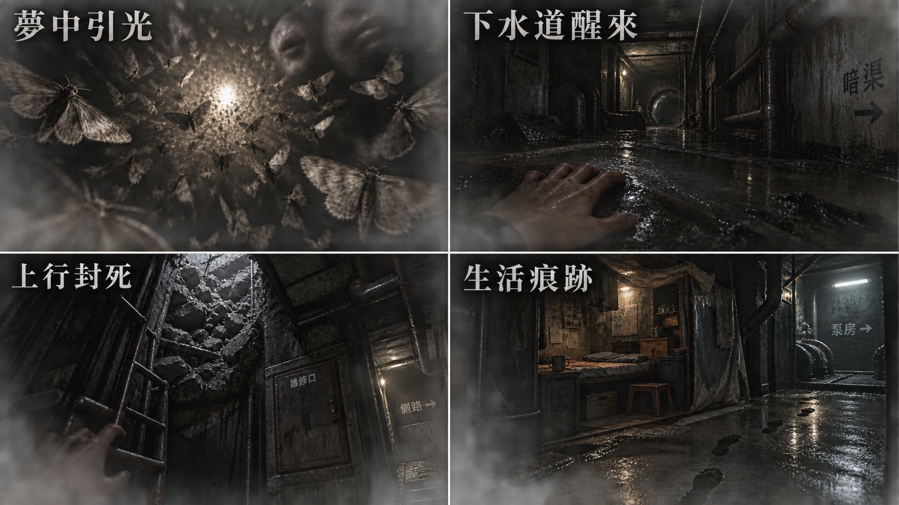
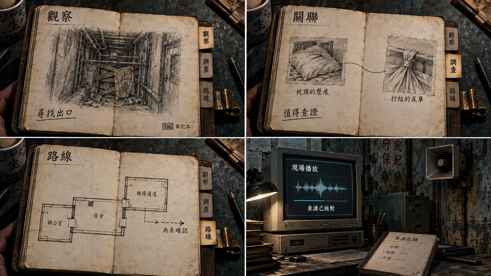
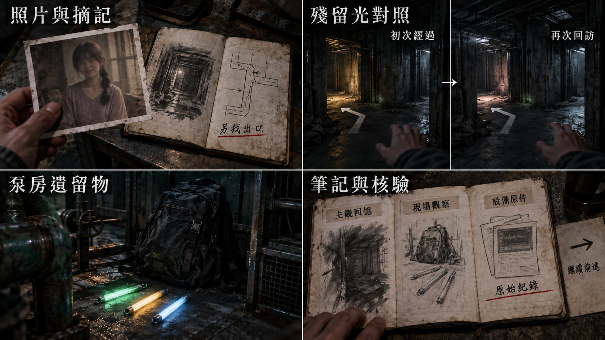
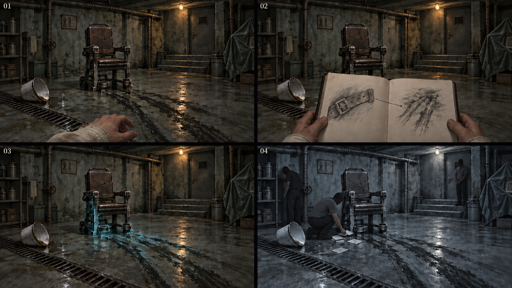

# 遊戲劇本：序幕

[總目錄](09-14_全劇本與關卡整合稿.md#book-toc) · [下一幕：第一幕](09-04_正式劇本_第一幕.md#act-1) · [共用附錄](09-15_正式劇本_共用附錄.md#book-appendices)

[P0](#node-p0-script)、[P1](#node-p1-script)、[P2](#node-p2-script) · [本幕製作規格](#spec-act-0)

<a id="doc-0903"></a>
<a id="act-0"></a>

## 序幕 · 雨夜與地底


<a id="node-p0"></a>
<a id="node-p0-script"></a>

### P0 · 深層下水道（廢棄暗渠）

[製作規格](#node-p0-spec)

<a id="s-0903-3"></a>

<!-- import:s-0903-3:begin -->
<a id="h-0903-27"></a>

#### [P0-00] 趨光夢境

〔形式〕主觀夢境短過場，**20–25 秒**，含起始黑暗與醒轉接點。首次即可略過。
〔環境〕沒有配樂，只有逐漸靠近的翅翼摩擦與微弱呼吸。

<a id="h-0903-32"></a>

##### 拍點一｜黑暗（0–4 秒）

（動畫演出）無可辨識空間。一隻普通灰蛾緩慢擦過視線，翅緣近乎紙片。
〔環境〕乾紙般的翅翼摩擦聲。微弱呼吸。

<a id="h-0903-37"></a>

##### 拍點二｜趨光（4–10 秒）

（動畫演出）針孔般的暖光出現。許多灰蛾自黑暗深處朝光聚攏，像倒流的灰燼。鏡頭極慢靠近。
〔環境〕摩擦聲逐層加密。

〔人聲〕（近耳，方向模糊）「……看著亮的地方。」

<a id="h-0903-46"></a>

##### 拍點三｜阻隔（10–17 秒）

（動畫演出）群蛾遮住光，亮點反而縮小。幾隻蛾停在**不可見的平面**上爬動。
　　　　光可見卻碰不到。
〔停頓〕第一行字幕消退後，停一拍。

〔人聲〕（更輕）「別先走。」

（配音演出）保留人的氣息與猶豫。

<a id="h-0903-56"></a>

##### 拍點四｜醒轉（17–25 秒）

（動畫演出）光被翼緣遮暗。一滴水聲接上 P0 水紋。手撐上濕滑踏台，只見近處管頂與微弱設備光。
〔環境〕翅翼摩擦漸變為管內回流、水泵與滴水。夢裡的人聲停了。
〔玩家〕交還 [P0-01] 的點擊操作。

---
<!-- import:s-0903-3:end -->

<a id="s-0903-4"></a>

<!-- import:s-0903-4:begin -->
<a id="h-0903-72"></a>

#### [P0-01] 撐起 · 建立身體限制

（靜態畫面）定點構圖。
　前景：淺水、洩水孔、濕滑踏台與撐地的手。屈膝露出破損牛仔褲、乾暗血布條。
　　　　偏扁的橄欖綠舊式野戰背包呈現於主觀視野。
　中景：生鏽維修柵門、泡水求援箱、停止使用牌。損壞的上行梯止於坍塌格柵。
　背景：低矮混凝土管頂、重疊支管與吞掉燈光的彎渠。**豎井拐折封閉，不透天光。**
〔環境〕管頂滴水、深處回流、隔牆水泵低頻。
　　　　雨勢**僅由排水量與管壁悶響間接感到**，無街道或車輛聲。

〔操作〕玩家第一次點擊，試圖站起。
（畫面特效）視野變黑，膝痛使她停下。
（靜態畫面）黑暗退去，主觀視野裡撐地的手指仍張著，手肘貼著濕滑踏台；眼前還是剛才那道水線。手已經用力，視點卻沒有撐高。

〔操作〕玩家第二次點擊。
（動畫演出）她先收起受傷的膝蓋，再以手肘撐起。

主角（OS）「……先別站。等看得見。」

---
<!-- import:s-0903-4:end -->

<a id="s-0903-5"></a>

<!-- import:s-0903-5:begin -->
<a id="h-0903-97"></a>

#### [P0-02] 上行豎井 · 第零層證據

〔玩家〕可自由觀察。無時限。
〔操作〕查看斷梯、壓住出口的混凝土、停止使用牌。

主角（OS）「先出去。」

（靜態畫面）斷梯上方只剩堵住出口的混凝土。

主角（OS，看清後）「這邊上不去。找別的路。」

〔系統〕取得 `E0-01`：上行通道阻塞觀察。
（介面呈現）筆記描下局部通路，註記「另找出口」。

---
<!-- import:s-0903-5:end -->

<a id="s-0903-6"></a>

<!-- import:s-0903-6:begin -->
<a id="h-0903-118"></a>

#### [P0-02b] 野戰背包 · 求生物件來源

〔操作〕查看背包。
（靜態畫面）舊式橄欖綠野戰背包，布面退色沾泥、多次修補。集團物流標籤泡爛。
　　　　內有空飲水袋、凝膠包裝、剩餘醫療布、三支發光棒。

主角「不是我的。」

---
<!-- import:s-0903-6:end -->

<a id="s-0903-7"></a>

<!-- import:s-0903-7:begin -->
<a id="h-0903-133"></a>

#### [P0-03] 尋找內部通路

| 物件 | 點擊回饋 |
| --- | --- |
| **維修柵門** | 拉動時短促金屬聲。鏽與沉積物卡住，**並未上鎖**。 |
| **停止使用牌** | 牌後是斷裂的內牆接縫與褪色維修編號。 |
| **維修指示燈** | 彎道深處一盞微光。**第二次放大積水時熄滅。** 看不到人影或外窗。 |

（靜態畫面）「停止使用／禁止下行」的字樣已經磨損。

---
<!-- import:s-0903-7:end -->

<a id="s-0903-8"></a>

<!-- import:s-0903-8:begin -->
<a id="h-0903-147"></a>

#### [P0-03a] 求援失敗

〔操作〕玩家操作泡水的內部維修求援箱。
（動畫演出）按鍵陷住，線路腐蝕斷裂。**她實際按兩次，只得到短促雜音。**

〔停頓〕她稍等，至呼吸與手抖平復。
（動畫演出）手指離開按鍵，仍停在泡水箱旁。最後一截雜音斷掉，滴水聲重新清楚；指尖沒有再按第三次。

主角（OS）「這裡傳不出去。沿維修道上去，找還能用的設備。」

---
<!-- import:s-0903-8:end -->

<a id="s-0903-9"></a>

<!-- import:s-0903-9:begin -->
<a id="h-0903-162"></a>

#### [P0-03a2] 鏡像者 · 第一次

〔觸發〕第二次撐起時。
（動畫演出）積水裡的倒影**晚 0.4 秒才動**。
〔玩家〕可被理解為滴水干擾。
（動畫演出）**主動查看時恢復同步。**

---
<!-- import:s-0903-9:end -->

<a id="s-0903-10"></a>

<!-- import:s-0903-10:begin -->
<a id="h-0903-176"></a>

#### [P0-03b] 濕腳印的方向〔H-01／HA-P0-01〕

<a id="h-0903-182"></a>

##### 第一階段｜第一次看見

〔觸發〕第二次查看洩水孔或停用牌後，玩家可放大積水。
（靜態畫面）鞋印清楚，**由彎渠指向維修柵門**。
〔玩家〕合理讀法：曾經有人從深處走出去。**此時沒有任何不對勁。**

<a id="h-0903-188"></a>

##### 第二階段｜再次查看

〔觸發〕須先實際近看第一階段鞋印。之後退出上行豎井近看，在全景停留 4 秒只使事件待發，不立刻換圖或出聲；玩家再開啟任一既有近看、完全遮住鞋印時，才在遮擋下換入差分。
（靜態差分）關閉該次近看，才看見**同一組**鞋印的方向**變得難辨／相反**，**末枚停在內牆斷縫旁**。
〔環境〕排水聲維持，首次揭露差分僅多一聲踩水。
物理讀法：**滴水與回流改變了邊緣。**
〔玩家〕可在筆記描摹並記「方向似有不同」，或直接繼續找出口。

<a id="h-0903-196"></a>

##### 離開前

（靜態畫面）再看向水面，鞋印仍停在剛才的位置。

---
<!-- import:s-0903-10:end -->

<a id="s-0903-11"></a>

<!-- import:s-0903-11:begin -->
<a id="h-0903-206"></a>

#### [P0-04] 穿過維修柵門

〔條件〕已完成豎井或求援箱互動任一項。
〔操作〕點擊柵門兩次。
（鏡位切換）側身穿過同層短通道。**1.2 秒黑場，用門框遮擋。**
〔環境〕暗渠回流低鳴轉為近距水泵與滴水。

〔系統〕進入 P1 時的初始狀態：凝神穩定度 **100**、發光棒 **3 支**、恐慌階段 **0**。

---
<!-- import:s-0903-11:end -->

<a id="node-p1"></a>
<a id="node-p1-script"></a>

### P1 · 地底管線層

[製作規格](#node-p1-spec)

<a id="s-0903-13"></a>

<!-- import:s-0903-13:begin -->
<a id="h-0903-230"></a>

#### [P1-00] 空間

（靜態畫面）定點構圖。
　前景：半淹水的工具箱、被拆空的集團補給外包裝、空急救袋、主角換下的髒布條、散落的電纜束。
　　　　**三支未折斷的發光棒已由她放入軍用背包。**
　中景：粗大承重墩之間塞入的泵體與維修台。**內側凹室由既有泵體與檢修閘遮擋。**
　背景：粗大管線、凝結水、貼在管壁上的多語標籤。
　　　　維修鏡頭外殼與低壓配線在泵體上緣。
　　　　其中一張**紙摺祈願**被透明膠帶固定在管線接縫上。
〔環境〕滴水、低頻水泵、**遠處像有人拖鞋踩水但無法定位的聲音**。
（靜態畫面）極度黑暗。照明來自場景既有光源：管線警示燈、反光標。

（靜態畫面）**燈罩內緣停著一隻普通的小蛾。**

---
<!-- import:s-0903-13:end -->

<a id="s-0903-14"></a>

<!-- import:s-0903-14:begin -->
<a id="h-0903-254"></a>

#### [P1-01] 留置發光棒的記憶 · 第一個資源選擇

〔操作〕玩家在感知中整理背包的三支發光棒記憶，選擇留下一處近距殘留光，或保留標記槽。
（靜態畫面）留光跨節點保存，**只在玩家感知中可見**。

主角「回來時，還能看見。」

---
<!-- import:s-0903-14:end -->

<a id="s-0903-15"></a>

<!-- import:s-0903-15:begin -->
<a id="h-0903-268"></a>

#### [P1-01b] 袋室生存痕跡 · 兩週的物理伏筆

〔玩家〕可點物件：斷裂豎梯、兩端水位線、接凝結水的搪瓷杯、被拆空的集團補給包裝、空急救袋、換下的髒布條、抽水泵維修台、防水工作袋。
初見的理解是：**有維修人員曾在此躲過暴雨。**
主角只覺得杯子與維修台「好像用過」。

---
<!-- import:s-0903-15:end -->

<a id="s-0903-16"></a>

<!-- import:s-0903-16:begin -->
<a id="h-0903-280"></a>

#### [P1-02] 教學 · 局部異常感應

〔條件〕祈願紙與人員通道門牌已關聯。
〔操作〕玩家短按 `Q`。
（畫面特效）紙邊局部重影，左側低語稍微清楚。
（畫面特效）紙邊出現局部殘留。主角只記下「像有人經過」。

主角（OS）「這不是監視器。它在記得。」

〔系統〕普通查看、筆記關聯與 `Q` 感應均為 **0 點**。
（畫面特效）殘留短暫浮現後淡去，保留已解鎖狀態。

---
<!-- import:s-0903-16:end -->

<a id="s-0903-17"></a>

<!-- import:s-0903-17:begin -->
<a id="h-0903-295"></a>

#### [P1-03] 祈願紙 · 亞洲生活語彙的第一個入口

（靜態畫面）未查看時，紙摺祈願只呈現被水浸濕的外觀。
〔操作〕實景直接查看。
（靜態畫面）紙背有多語短句——

〔字幕〕「請讓他平安回家」

**主角不讀出語言。**

主角「有人把它貼在不會被帶走的地方。」

---
<!-- import:s-0903-17:end -->

<a id="s-0903-18"></a>

<!-- import:s-0903-18:begin -->
<a id="h-0903-315"></a>

#### [P1-04] 找到強訊號 · 空間回應

〔條件〕完成 P1 兩項觀察的關聯後，玩家**自行**查看左側岔路的局部殘留。

〔系統〕「[感受] 聲音似乎從那邊傳來。」

〔玩家〕可先退出殘留近看、放置發光棒的主觀標記、查看節點圖。**前往 P2 前不鎖定流程。**

<a id="h-0903-323"></a>

##### 恐怖拍點

〔觸發〕玩家在強訊號前**停留超過 8 秒**。
〔環境〕右側封閉梯間傳來**一次**很輕的敲擊。
（靜態差分）退出遮住鐵網的近看後，全景中的鐵網**多了一個濕手印**。差分只在遮擋時換入。

<a id="h-0903-331"></a>

##### 〔HA-P1-01〕聲源錯位

〔觸發〕首次到達通道標示所在定點，停留 5 秒且未進入近看。
〔環境〕左側管後兩下腳步 → 停 1 秒 → 右側再一步。共 **4 秒**。
（動畫演出）局部水紋隨聲源出現。**不出人影。**
〔玩家〕可辨向、查看標示或直接離開。

---
<!-- import:s-0903-18:end -->

<a id="s-0903-19"></a>

<!-- import:s-0903-19:begin -->
<a id="h-0903-341"></a>

#### [P1-05] 通往 P2

〔操作〕點擊左側岔路門牌「地基處理室」。
（鏡位切換）畫面經過兩秒轉暗，滴水聲與呼吸聲持續。

（若玩家先到右側鐵網）

〔系統〕「上行通道：封閉。」

---
<!-- import:s-0903-19:end -->

<a id="node-p2"></a>
<a id="node-p2-script"></a>

### P2 · 地基處理室

[製作規格](#node-p2-spec)

<a id="s-0903-21"></a>

<!-- import:s-0903-21:begin -->
<a id="h-0903-363"></a>

#### [P2-00] 空間

（靜態畫面）定點構圖。
　前景：排水溝、翻倒的搪瓷盆、**一道被拖過的暗色水痕**。
　中景：固定用金屬椅、牆面編號牌、失效的攝影機。
　背景：一扇向上的厚門。門旁小型供桌的輪廓——**供桌在實景層被防水布蓋住，只露出一角祖先照片。**
（畫面特效）光源：實景層**近乎全黑**；感知層出現從地面往上爬的冷青雜訊。
〔環境〕水泵停止後的低頻真空。**遠處隔著牆傳來的三次敲擊。**

---
<!-- import:s-0903-21:end -->

<a id="s-0903-22"></a>

<!-- import:s-0903-22:begin -->
<a id="h-0903-376"></a>

#### [P2-01] 觀察 · 關聯 · 進入凝固瞬間

<a id="h-0903-381"></a>

##### 前置觀察

〔操作〕查看椅面與椅腳的**勒痕**。
〔操作〕查看地面的**拖痕**（從椅子通向門口）。
兩項都來自眼前現場，**不需先施放感知**。

<a id="h-0903-387"></a>

##### 〔HA-P2-01〕邊緣殘影

〔觸發〕**已直接查看椅上束帶**、且**尚未**進入首次凝固；退出近看後觸發**一次**。
（畫面特效）門邊出現**半透明的袖口輪廓**，停留 2 秒，伴隨低聲布料摩擦後淡去。
〔玩家〕可查看地面拖痕，或忽略。**束帶＋拖痕的關聯仍須玩家自己完成。**

<a id="h-0903-395"></a>

##### 建立關聯

〔操作〕在紙本筆記中關聯兩項已見觀察。
（介面呈現）草圖與連線**只呈現玩家的理解，不生成錄音或新物證**。

<a id="h-0903-400"></a>

##### 進入

〔操作〕對強訊號點**長按滑鼠左鍵 0.8 秒**。

〔系統〕「訊號對焦中……」

〔系統〕⚠️ **P2 首次由場景記憶錨點免費支撐，重看亦免費，不回填穩定度。**（**不是**一般規則的 2 點。）
0 點進入也可完成必要主線，但仍須滿足勒痕與拖痕的關聯。

（畫面特效）（過場，1 秒）雜訊聚攏，冷青沿牆角上爬，所有雨聲與滴水聲抽走。
（靜態差分）**畫面構圖不改變，只讓過去填入。**

---
<!-- import:s-0903-22:end -->

<a id="s-0903-23"></a>

<!-- import:s-0903-23:begin -->
<a id="h-0903-415"></a>

#### [P2-02] 凝固瞬間 · 無臉的人

（靜態畫面）同一間房，**兩週前**。
　　　　三個無臉剪影被固定在金屬椅旁：
　　　　**一人跪著撿紙。一人扶著牆。一人站在門邊等待。**
　　　　**所有動作停在未完成的一格。**

〔環境〕**進入凝固瞬間後所有現場聲抽離。**
〔環境〕背景重複一句被截斷的話——

〔感知〕「……不准離開……」

**前後內容不補完。** 這是歷史殘句，說話者與對象身分不明；字幕不指認管理者、受困者或主角。

〔玩家〕可點擊物件：

| 物件 | 回饋 |
| --- | --- |
| **金屬椅** | 皮帶孔。 |
| **牆面編號牌** | 固定房號牌，保留「房號」標頭與牆面固定點。**記下後可與上行口比對。** |
| **搪瓷盆** | 水面反射出**一個不在畫面中的第四個人**。 |
| **門邊剪影** | **無法深度查看。** |

查看牆面編號牌時，同時感到**「重置脈衝」的聲證索引**。
〔系統〕這是主觀觀察，**不生成音檔**。R1 叫號機內建的同名測試功能才是可輸出的設備來源。

（靜態畫面）主角不出聲。視角留在玩家正在查看的物件。

---
<!-- import:s-0903-23:end -->

<a id="s-0903-24"></a>

<!-- import:s-0903-24:begin -->
<a id="h-0903-453"></a>

#### [P2-03] 空間回應 · 少一個人

〔操作〕玩家點擊門邊剪影後，退出物件放大。
（靜態畫面）凝固畫面**保持靜止**。
〔操作〕玩家打開遮住門邊的物件近看，再回全景。
（靜態差分）**少了一個剪影。**
**只在遮擋時替換差分，沒有移動動畫。**

〔環境〕只剩玩家自己的呼吸。
〔環境〕然後從**畫面外**傳來一次很輕的鞋底摩擦。

〔系統〕**不彈出提示、不增加敵人、不改變出口。**

> 設計目的：地底沒有敵人，但玩家離開後，剛才的凝固剪影少了一個。
> **恐怖是「被記住」，不是被追趕。**

---
<!-- import:s-0903-24:end -->

<a id="s-0903-25"></a>

<!-- import:s-0903-25:begin -->
<a id="h-0903-473"></a>

#### [P2-04] 退出 · 第零層鎖定

〔操作〕玩家按 `Esc` 或右鍵退出凝固瞬間。
〔環境〕回到實景，滴水聲恢復。

〔系統〕取得 `E0-02`：「房內留有禁止離開的殘句；說話者身分不明。」
〔系統〕⚠️ **必須已查看編號牌並記下聲證才發證據。** 提早退出只保留已看熱點，可免費重新進入完成查看。

（介面呈現）調查板開放，但序幕**只顯示一個不可鎖定的灰色槽位**——

〔系統〕「這棟樓曾經有人被留下」

**不要求玩家推理。**

主角（OS）「先出去。」

〔停頓〕
（靜態畫面）視線回到維修入口。**無預設救援任務。**

<a id="h-0903-492"></a>

##### ⚠️ 60 秒絕對安靜

本節之後**至少 60 秒不安排任何新目標、提示或聲音事件**（[03-04](09-15_正式劇本_共用附錄.md#doc-0304) 序幕休息節拍）。

情感規則：她近兩週始終想逃出去。**此刻的探索不是回來救人。**
　　　　不完整的是——她不知道自己已倒在 P1，也遺忘了先前參與的加害。

---
<!-- import:s-0903-25:end -->

<a id="s-0903-26"></a>

<!-- import:s-0903-26:begin -->
<a id="h-0903-502"></a>

#### [P2-05] 核對上行口與訊號鑰匙

〔操作〕玩家近看原上行口。
（靜態畫面）見到與凝固編號牌**同形的實體維修標牌**，以及可走的梯段。厚門與大廳門**均未上鎖**。
（靜態畫面）標牌沿用「房號」格式；這是固定房間與維修通路的對照，不是等候人員的叫號表。

〔操作〕在筆記中選取已記下的編號牌，對照維修標牌。
（介面呈現）確認「這條通道接到大廳」。
〔系統〕保存 `K0-01`。

〔系統〕⚠️ `K0-01` 是**已辨認路線的索引**，不是電子檔、實體鑰匙或供電能力。

<a id="h-0903-514"></a>

##### 未完成與錯配

未查看編號牌時，保留「編號還缺一段」的觀察。
（介面呈現）選錯已知紀錄時**只取消此次對照**，可回 P2 免費重看。

<a id="h-0903-520"></a>

##### 離開

（介面呈現）核對成功後，路線頁記下已知連接。
〔玩家〕仍需**親手**點擊梯口上行，並在頂端**親手**推開未鎖的大廳門。
（動畫演出）**只有這時**，廉價的暖白光才由門縫透入。
（鏡位切換）梯段與門框遮擋連續交代 B3–B1 到 1F。
〔環境〕滴水聲過渡為**日光燈電流聲**。

---
<!-- import:s-0903-26:end -->

<a id="act-0-continue"></a>

[總目錄](09-14_全劇本與關卡整合稿.md#book-toc) · [下一幕：第一幕](09-04_正式劇本_第一幕.md#act-1) · [共用附錄](09-15_正式劇本_共用附錄.md#book-appendices)

---

<a id="spec-act-0"></a>

## 序幕 · 雨夜與地底：製作規格

<a id="node-p0-spec"></a>

### P0 · 深層下水道（廢棄暗渠）

[正式場次](#node-p0-script)

<a id="node-p0-nav"></a>

**進出、動線與回訪**

<a id="s-0609-7"></a>

<!-- import:s-0609-7:begin -->
<a id="h-0609-31"></a>

#### P0 深層下水道（廢棄暗渠）

進行目的：離開暗渠，尋找可用的上行路；趨光夢境、暗渠醒轉、上行受阻、尋找逃生出口

支線／收集：依原房選填調查；無新增支線掛點。

| 方向 | 類型 | 可移動條件 | 移動演出提案 | 回訪規則 |
| --- | --- | --- | --- | --- |
| P0 → P1 | 主線 | 查看阻塞豎井或維修求援箱，選擇另找出口；依原流程兩次操作柵門，路過豎井時補記已親見的 E0-01 | 兩次點擊維修柵門，側身穿過同層短通道；1.2 秒黑場，暗渠回流轉為近距水泵與滴水。 | 單向流程；不代表可沿此線倒退 |
<!-- import:s-0609-7:end -->
<!-- navigation:p0:end -->

**演出限制與製作註記**

<a id="s-0903-2"></a>

<!-- import:s-0903-2:begin -->
<a id="h-0903-20"></a>

#### 演出限制

> 幕：序　揭露：第零層　預估：8–11 分鐘　前一節點：—　後一節點：P1
> 逃生計畫：**找到離開暗渠的路**

---
<!-- import:s-0903-2:end -->

<a id="node-p0-visual"></a>

#### 本場景圖像與示意

以下圖像為製作參照；跨房圖僅使用標明的面板，其他場景仍按各自前置演出。

[V16 開場、深層下水道與求生](#fig-v16) · [V02 筆記本、來源與路徑](#fig-v02)

- **V16：**前 3 格對照 P0 的夢、暗渠醒轉與上行受阻；第 4 格是序幕生活痕跡的跨節點構圖參照。禁止提前露出 P1 肉身或離體答案。
- **V02：**紙本筆記只記當時已知來源、出口與路徑；聲音仍由現場設備播放，不加入手機 App 或遠端來電。

[返回本房正式劇本](#node-p0-script) · [本房關卡與解謎](#node-p0-level)

<a id="fig-v16"></a>

##### V16｜開場、深層下水道與求生

**適用與限制：**前 3 格對照 P0 的夢、暗渠醒轉與上行受阻；第 4 格是序幕生活痕跡的跨節點構圖參照。禁止提前露出 P1 肉身或離體答案。



[完整圖說與操作對照](#h-0601-572) · [圖像目錄](09-14_全劇本與關卡整合稿.md#book-illustrations)

<a id="fig-v02"></a>

##### V02｜筆記本、來源與路徑

**適用與限制：**紙本筆記只記當時已知來源、出口與路徑；聲音仍由現場設備播放，不加入手機 App 或遠端來電。



[完整圖說與操作對照](09-15_正式劇本_共用附錄.md#h-0404-342) · [圖像目錄](09-14_全劇本與關卡整合稿.md#book-illustrations)

<a id="node-p0-level"></a>

**關卡、解謎與失敗回饋**

<a id="s-0601-6"></a>

<!-- import:s-0601-6:begin -->
<a id="h-0601-85"></a>

#### P0 — 深層下水道：廢棄暗渠

<a id="h-0601-87"></a>

##### P0 空間與畫面製作定位

| 項目 | 畫面與製作要求 |
| --- | --- |
| 樓層與環境 | B3 深層暗渠／泵房，同層短通道相接。既有空間材質、光源與生活物件沿本房原文。 |
| 入口方向 | 夢境後於暗渠內醒轉；以腳邊積水、阻塞豎井與維修柵門建立首個鏡位，不配置玩家走入的來路門口。 |
| 可見出口 | 維修柵門與泵聲；阻塞豎井是不可通行的上行方向。首次全景就交代入口輪廓或可查看的遮擋，不靠無標示的畫外點擊換房。 |
| 阻擋與開放條件 | 往 P1：查看阻塞豎井或維修求援箱，選擇另找出口 |
| 畫面中的解謎要素 | 斷梯、混凝土與求援箱；查看後由玩家兩次操作柵門。關鍵標記可近看，與裝飾物有可辨的材質或輪廓差異，不只靠顏色或聲音。 |
| 完成後變化 | 兩次操作維修柵門後顯示可穿過的縫隙，玩家點擊進入 P1；夢醒與觀察阻塞豎井本身不等於開門。 |

<a id="h-0601-100"></a>

##### P0 製作流程

**空間第一印象：**淤綠／潮濕混凝土，低拱貼近視線。前景水紋遮住踏台邊界，回流聲由彎渠深處傳來；留出可辨落腳點，不加追逐。

**探索呈現：**先讓玩家看見入口、可走的方向和空間異常，再自選近看生活物件；新增租戶遺跡不發 E 證據、不設派系任務、不改出口旗標。恐怖沿原事件與遭遇時序，安定／閱讀保護段不插嚇點。

| 階段 | 製作規格 |
| --- | --- |
| 進入／目標 | 離開暗渠，尋找可用的上行路；趨光夢境、暗渠醒轉、上行受阻、尋找逃生出口；入場先還原原房間已保存的熱點與事件狀態。 |
| 觀察／空間 | 深層暗渠的低拱與後加支管壓住視線；封死豎井、同層柵門和舊維修踏台構成唯一可讀方向。 |
| 操作順序 | 夢境播放或略過 → 兩次點擊撐起 → 查看豎井或求援箱 → 點柵門兩次進 P1。若先查求援箱，入門動作的既有回看鏡位呈現受阻豎井並記下 E0-01，不再新增一道查看門檻。選填內容不作離房條件。 |
| 回饋 | 必要操作寫入原證據／門禁／遭遇狀態；新增生活附頁僅更新來源已讀與有依據的筆記，不重發原證據。 |

<a id="h-0601-113"></a>

###### P0 出口與回訪

| 目的節點 | 條件 | 移動與辨向 | 回訪邊界 |
| --- | --- | --- | --- |
| P1 | 查看阻塞豎井或維修求援箱，選擇另找出口 | 兩次點擊維修柵門，側身穿過同層短通道；1.2 秒黑場，暗渠回流轉為近距水泵與滴水。 | 單向流程；不代表可沿此線倒退 |

**保存與素材驗收：**原房主線、攻擊進度、安定次數及不可逆選擇沿用既有狀態；新增 `scene_detail` 只存選填來源。場景基底、上述構圖差分、原操作近看與本房動畫分開列交付，沒有動畫規格者不自動增加過場。兩端門口方位與標高由灰盒核對，不將目前的文字移動描述當成已驗證的尺寸圖。

P0 位於疊樓地基之下，與 P1 泵房同屬深層排水系統。舊梯損壞、回流積水、通訊盲區及長期停用，使園區人員平時不敢深入；磨損的「停止使用／禁止下行」牌只說明危險，不預告鬼怪。主角為躲追捕才冒險進入，近兩週始終想逃走。攝影機留在 P1 舊泵房檢修位置，不因無人敢下來而憑空新增監控。

**功能**：建立受困、身體記憶與找路動機。實景層為主，本節不開放感知。

<a id="h-0601-126"></a>

##### P0 動畫演出

<a id="h-0601-128"></a>

###### 趨光夢境 → 深層暗渠醒轉

| 項目 | 場景演出規格 |
| --- | --- |
| 形式與節奏 | 主觀夢境短過場，約 20–25 秒，包含起始黑暗與醒轉接點；不另疊加 6–8 秒黑場或一段 15–25 秒起身影片。實際字幕可讀性優先。 |
| 鏡頭與動作 | 黑暗中的單蛾 → 群蛾朝針孔暖光聚攏 → 翅翼遮小亮點、蛾足碰到不可見平面 → 滴水切回 P0 積水、手進入畫面 → 交還 P0-01 點擊操作。 |
| 操作與資訊邊界 | 無天空、地平線、樓外空間、肉身或靈魂輪廓；不是可探索夢境房間、歷史凝固或感知教學。夢中無選項、證據與解鎖條件；P1 真身仍被泵體遮住。 |

| 拍點／參考秒數 | 畫面 | 聲音與字幕 |
| --- | --- | --- |
| 黑暗／0–4 秒 | 無可辨識空間；一隻普通灰蛾緩慢擦過視線，翅緣近乎紙片。 | 先聽乾紙般翅翼摩擦與微弱呼吸，無配樂起拍、突刺或撲臉。 |
| 趨光／4–10 秒 | 針孔般暖光出現，許多灰蛾自黑暗深處朝光聚攏，像倒流灰燼；鏡頭極慢靠近。 | 摩擦聲逐層加密；近耳、方向模糊的人聲：「……看著亮的地方。」 |
| 阻隔／10–17 秒 | 群蛾遮住光，亮點反而縮小；幾隻蛾停在不可見平面爬動。光可見卻碰不到，不顯示門或通路。 | 第一行字幕消退後，停一拍，更輕地說：「別先走。」保留人的氣息與猶豫。 |
| 醒轉／17–25 秒 | 光被翼緣遮暗，一滴水聲接 P0 水紋；手撐上濕滑踏台，只見近處管頂和微弱設備光。夢中亮點不匹配任何可點熱點。 | 翅翼摩擦漸變為管內回流、水泵與滴水；夢聲停止，不在醒後重複叫喚。 |

**聲音來源與伏筆。** 製作端確定為主角夢中重組的小花殘缺聲音記憶，由小花演員配音；不指定一段新增歷史事件，不表示小花此刻傳話、召回或知道 P1 肉身。玩家字幕只顯示台詞，不顯示姓名、頭像或「小花」說話者標籤；音訊檔名與製作註解不進玩家介面。初聽像安慰，終幕的放手／挽留讓「別先走」獲得依戀與控制的第二層意義，不增加判定證據或強制重播。

**意象邊界。** 群蛾只是夢的視覺意象，不是所有死者、敵群或導航；不提前出現巨蛾、四根黑鬚、翼膜紅光或小花輪廓。醒來後仍由主角自己查看受阻通道並決定逃生，夢聲不寫入任務或筆記。全作可操作起點仍是樓內 P0，歷史人物唯一解凍仍為 R31。

**播放與無障礙。** 首次亦可略過，直接落在 P0-01 第一次點擊之前；不代做兩次起身、不取得 E0-01、不推進任務。低動態版使用「單蛾／聚光／遮光」靜態差分與緩慢淡化，無密集閃爍、快速推鏡或硬性音量突升。無聲模式保留兩句字幕，音效字幕用「翅翼摩擦」「管內水聲」。暫停與失焦凍結整段，讀檔恢復至夢境前安全點或已完成後的 P0 操作點；略過與播放完成只結算一次演出狀態。

<a id="h-0601-149"></a>

##### 畫面構圖（定點）

| 層次 | 內容 |
| --- | --- |
| 前景 | 淺水、洩水孔、濕滑踏台與撐地的手；屈膝露出破損牛仔褲、乾暗血布條。偏扁的橄欖綠舊式野戰背包呈現於主觀視野。 |
| 中景 | 生鏽維修柵門、泡水求援箱、停止使用牌；損壞的上行梯止於坍塌格柵。 |
| 背景 | 低矮混凝土管頂、重疊支管與吞掉燈光的彎渠；豎井拐折封閉，不透天光。 |
| 聲音 | 管頂滴水、深處回流、隔牆水泵低頻；雨勢僅由排水量與管壁悶響間接感到，無街道或車輛聲。 |

<a id="h-0601-158"></a>

##### P0-01 撐起 · 建立身體限制

夢境結束或略過後，第一次點擊試圖站起，視野變黑與膝痛使她停下；第二次先收受傷膝蓋，再以手肘撐起。OS：「……先別站。等看得見。」饑餓、脫水和逃亡傷勢是倒下前的身體記憶，不新增傷害、不扣資源，也不證明肉身已離開凹室。

<a id="h-0601-162"></a>

##### P0-02 上行豎井 · 第零層證據

| 項目 | 內容 |
| --- | --- |
| 互動 | 查看斷梯、壓住出口的混凝土及停用牌，辨認可見通路中斷；沒有外界遠景。 |
| 證據 | E0-01：上行通道阻塞觀察；筆記描下局部通路，註記「另找出口」。 |
| OS | 「先出去。」看清後：「這邊上不去。找別的路。」 |
| 筆記本 | 主觀背包取出的自我形象，只整理已觀察內容，沒有救人誓言。 |
| 門檻 | 查看豎井或求援箱任一項後，點擊維修柵門兩次可進 P1；若未查豎井，入門動作的回看鏡位讓玩家看見受阻路徑並完成 E0-01，同一紀錄不重發。 |

<a id="h-0601-172"></a>

##### P0-02b 野戰背包 · 求生物件來源

舊式橄欖綠野戰背包布面退色沾泥、多次修補，集團物流標籤泡爛。查看可見空飲水袋、凝膠包裝、剩餘醫療布及三支發光棒；主角只說「不是我的」。她在 02:20:22 進入 B3 管理逃生線時偷走補給，清醒兩週已用掉大多數內容；第六幕庫存紀錄才補「管理逃生補給／缺一」。真實背包仍留 P1，不新增格狀物品欄、武器或戰術能力。

<a id="h-0601-176"></a>

##### P0-03 尋找內部通路

| 物件 | 點擊回饋 |
| --- | --- |
| 維修柵門 | 拉動時短促金屬聲；鏽與沉積物卡住，並未上鎖。 |
| 停止使用牌 | 牌後斷裂的內牆接縫與褪色維修編號；不在序幕判定警方攻堅。 |
| 維修指示燈 | 彎道深處一盞微光，第二次放大積水時熄滅；看不到人影或外窗。 |

<a id="h-0601-184"></a>

##### P0-03a 求援失敗

泡水的內部維修求援箱按鍵陷住、線路腐蝕斷裂；主角實際按兩次，只得到短促雜音，不出現真人回應。她稍等至呼吸與手抖平復，未飲用新物資、未治療肉身。OS：「這裡傳不出去。沿維修道上去，找還能用的設備。」動機仍是逃生，沒有先逃出再回去救人的轉折。

<a id="h-0601-188"></a>

##### P0-03a2 鏡像者 · 第一次

第二次撐起時，積水倒影晚 0.4 秒才動；可被理解為滴水干擾。主動查看時恢復同步，無台詞、無證據、無提示；錯過不補播。沿用全作九次配置，不增加事件數。

<a id="h-0601-192"></a>

##### P0-03b 濕腳印的方向

第二次查看洩水孔或停用牌後可放大積水；鞋印由彎渠指向維修柵門。H-01／HA-P0-01 為同一事件：先實際看過原鞋印，再退出豎井近看，全景停留 4 秒只標記待發；下一次既有近看完全遮住鞋印時換圖，關閉才揭露方向難辨、末枚停在內牆斷縫旁的差分。首次揭露一聲踩水，存讀不重播；狀態與計時依正文「實作邊界」。不播放腳印自行移動，未達條件即可離開。可在筆記描摹，不使用拍照功能。暗示曾有人反覆尋路，不證明主角到過外面；P0→P1 為單向，不要求完成 P2 後返回 P0。

<a id="h-0601-196"></a>

##### P0-04 穿過維修柵門

完成豎井或求援箱互動後，點柵門兩次，側身穿過同層短通道至 P1。1.2 秒黑場用門框遮擋，暗渠回流低鳴轉為近距水泵與滴水；沒有從室外進入地下的轉場。初始凝神穩定度 100、發光棒 3 支、恐慌階段 0；沒有電池或充電成本。

---

##### 操作與呈現補充

- [s-0903-10](#s-0903-10)：HA-P0-01 依序保存「未觀察／已觀察／待發／已換圖／已揭露」；暫停及近看時間不計入全景四秒，讀檔不補足等待。換圖與首次揭露分開保存，踩水聲與「已揭露」同次提交，重載已揭露狀態不補播。未看過原鞋印、未等滿或未再次遮擋便離開 P0，事件可略過，不補播、不擋主線。
<!-- import:s-0601-6:end -->

<a id="node-p0-pack"></a>

**狀態、素材與驗收**

<a id="s-uppertech-21"></a>

<!-- import:s-uppertech-21:begin -->
<a id="h-uppertech-296"></a>

#### 調查與代表場景｜開局製作｜P0

| 製作項 | 操作與交付條件 |
| --- | --- |
| 熱點／原操作編號 | P0-01、P0-02、P0-02b、P0-03、P0-03a、P0-03a2、P0-03b、P0-04；場景附頁及沒有編號的操作仍依原文，不另發 E 證據 |
| 前置與操作順序 | 夢境播放／略過 → 兩次起身 → 查看豎井或求援箱 → 柵門兩次點擊至 P1；只查求援箱時，入門的既有回看鏡位呈現受阻豎井並記 E0-01，不另加查看門檻 |
| 保存與取消 | 夢境完成／略過只寫演出狀態；不代做起身、不發證據。E0-01 以證據庫去重；完成起身與入門步驟依共用序列保存；倒影與腳印各用原一次性事件旗標。 |
| 例外與驗收 | 略過後仍需親自起身；只查求援箱者在既有入門回看完成 E0-01；途中退出不跨門。P0→P1 單向，無樓外鏡位。 |
| 素材拆單範圍 | 1 個暗渠基底、20–25 秒夢境序列及低動態替代、兩次起身／柵門動作、阻塞與求援箱近看；各輸出逐件拆單。 |
<!-- import:s-uppertech-21:end -->

<a id="node-p1-spec"></a>

### P1 · 地底管線層

[正式場次](#node-p1-script)

<a id="node-p1-nav"></a>

**進出、動線與回訪**

<a id="s-0609-8"></a>

<!-- import:s-0609-8:begin -->
<a id="h-0609-42"></a>

#### P1 地底管線層

進行目的：沿維修通道尋找上行口；教學：局部感知、三處主觀殘留光與祈願紙

支線／收集：依原房選填調查；無新增支線掛點。

| 方向 | 類型 | 可移動條件 | 移動演出提案 | 回訪規則 |
| --- | --- | --- | --- | --- |
| P0 → P1 | 主線 | 查看阻塞豎井或維修求援箱，選擇另找出口；依原流程兩次操作柵門，路過豎井時補記已親見的 E0-01 | 兩次點擊維修柵門，側身穿過同層短通道；1.2 秒黑場，暗渠回流轉為近距水泵與滴水。 | 單向流程；不代表可沿此線倒退 |
| P1 ↔ P2 | 主線 | 祈願紙與門牌初步關聯成立 | 沿低矮管線前行，以管壁遮擋換鏡，腳下積水與泵聲連續。 | 章內回訪；遇鎖場、追逐或封路停用 |
| R33 → P1 | 肉身回返 | A／B／C／E 分支結果及 seal_resolved 成立，定位已排程；D 留在翼內不走此線 | 回接 P1 肉身，再以時間切換到搜救、照護及P1 維修台近景；不重開序幕探索。 | 單向流程；不代表可沿此線倒退 |
<!-- import:s-0609-8:end -->
<!-- navigation:p1:end -->

**演出限制與製作註記**

<a id="s-0903-12"></a>

<!-- import:s-0903-12:begin -->
<a id="h-0903-219"></a>

#### 演出限制

> 幕：序　預估：6–9 分鐘　前一節點：P0　後一節點：P2
> **圖層**：實景層 → 感知層。**不開放凝固瞬間**，直到找到 P2 強訊號。

> ⚠️ **這是她肉身真正躺著的房間。**
> 玩家會走過它，看見維修鏡頭的外殼與內側凹室的位置——**但檢修閘關著，什麼也看不到。**
> 畫面給了位置，沒有給內容。R32 才回來。

---
<!-- import:s-0903-12:end -->

<a id="node-p1-visual"></a>

#### 本場景圖像與示意

以下圖像為製作參照；跨房圖僅使用標明的面板，其他場景仍按各自前置演出。

[V40 照片、殘留光與來源界線](#fig-v40) · [V16 開場、深層下水道與求生](#fig-v16)

- **V40：**主觀照片／殘留光與泵房實體物件分清；不把筆記當攝影或錄音裝置，不在序幕提前確認肉身或離體。
- **V16：**前 3 格對照 P0 的夢、暗渠醒轉與上行受阻；第 4 格是序幕生活痕跡的跨節點構圖參照。禁止提前露出 P1 肉身或離體答案。

[返回本房正式劇本](#node-p1-script) · [本房關卡與解謎](#node-p1-level)

<a id="fig-v40"></a>

##### V40｜照片、殘留光與來源界線

**適用與限制：**主觀照片／殘留光與泵房實體物件分清；不把筆記當攝影或錄音裝置，不在序幕提前確認肉身或離體。



[完整圖說與操作對照](09-15_正式劇本_共用附錄.md#h-0404-355) · [圖像目錄](09-14_全劇本與關卡整合稿.md#book-illustrations)

<a id="node-p1-level"></a>

**關卡、解謎與失敗回饋**

<a id="s-0601-7"></a>

<!-- import:s-0601-7:begin -->
<a id="h-0601-202"></a>

#### P1 — 地底管線層：還有人走過

<a id="h-0601-204"></a>

##### P1 空間與畫面製作定位

| 項目 | 畫面與製作要求 |
| --- | --- |
| 樓層與環境 | B3 深層暗渠／泵房，同層短通道相接。既有空間材質、光源與生活物件沿本房原文。 |
| 入口方向 | 由 P0 承接；以來路門框／扶手作背向定位，前進方向依下列出口地標。左右方位沿既有構圖，不將反向回訪鏡頭誤當另一扇門。 |
| 可見出口 | 沿泵體外側的低矮管線通道；肉身藏於泵體遮擋後。首次全景就交代入口輪廓或可查看的遮擋，不靠無標示的畫外點擊換房。 |
| 阻擋與開放條件 | 往 P2：祈願紙與門牌初步關聯成立 |
| 畫面中的解謎要素 | 祈願紙、門牌、管線；先查看與關聯，不揭露肉身。關鍵標記可近看，與裝飾物有可辨的材質或輪廓差異，不只靠顏色或聲音。 |
| 完成後變化 | 祈願紙與門牌關聯成立後保存筆記與局部感知結果，玩家沿低矮管線前往 P2；不播放解鎖機關，不提前露出肉身。 |

<a id="h-0601-217"></a>

##### P1 製作流程

| 階段 | 製作規格 |
| --- | --- |
| 進入／目標 | 沿維修通道尋找上行口；教學：感知、發光棒、祈願紙；入場先還原原房間已保存的熱點與事件狀態。 |
| 觀察／空間 | 粗大承重墩間塞入泵體與維修台；上方不同年代支管匯入，凹室遮擋及肉身伏筆保持。 |
| 操作順序 | 查看祈願紙與人員通道門牌 → 在筆記建立關聯 → 感應局部殘留 → 沿管線抵達 P2；背包光棒整理及生存痕跡依原選填規則。順序中的選填內容不作離房門檻；原主線旗標、遭遇數值及分支提交條件依本場景細則。 |
| 回饋 | 必要操作寫入原證據／門禁／遭遇狀態；新增生活附頁僅更新來源已讀與有依據的筆記，不重發原證據。 |

<a id="h-0601-226"></a>

###### P1 出口與回訪

| 目的節點 | 條件 | 移動與辨向 | 回訪邊界 |
| --- | --- | --- | --- |
| P2 | 祈願紙與門牌初步關聯成立 | 沿低矮管線前行，以管壁遮擋換鏡，腳下積水與泵聲連續。 | 章內回訪；遇鎖場、追逐或封路停用 |

共用規則見[對應條款](#s-0601-6)。

<a id="h-0601-235"></a>

##### P1 動畫演出

<a id="h-0601-237"></a>

###### 地下通道與定點移動

| 項目 | 場景演出規格 |
| --- | --- |
| 形式與節奏 | 聲音轉場與局部手部動作；P0→P1 保留既定 1.2 秒黑場，P1 節點跳轉依原 2 秒。 |
| 鏡頭與動作 | 玩家點擊入口後，門框遮擋畫面；暗渠回流低鳴轉為近距水泵與滴水。到位後立即提供原熱點，不播完整行走電影。 |
| 操作與資訊邊界 | 不延長黑場強迫等待；泵體繼續遮住凹室。P0 腳印差分限同次造訪、近看遮擋時換圖，進入 P1 後不要求返回 P0。 |

**功能**：教學感知層、光源與回訪恐怖。  
**圖層**：實景層 → 感知層；不開放凝固瞬間直到找到 P2 強訊號。

<a id="h-0601-249"></a>

##### 畫面構圖（定點）

| 層次 | 內容 |
| --- | --- |
| 前景 | 半淹水的工具箱、被拆空的集團補給外包裝、空急救袋、主角換下的髒布條與散落的電纜束；三支未折斷的發光棒已由她放入軍用背包 |

| 背景 | 粗大管線、凝結水、貼在管壁上的多語標籤；其中一張紙摺祈願被透明膠帶固定在管線接縫上 |

| 聲音 | 滴水、低頻水泵、遠處像有人拖鞋踩水但無法定位的聲音 |

<a id="h-0601-259"></a>

##### P1-01 留置發光棒的記憶 · 第一個資源選擇

玩家在感知中整理背包的三支發光棒記憶，選擇留下一處近距殘留光或保留標記槽。留光跨節點保存，只在玩家感知可見；真實背包與未使用物資留在凹室，不被搬動。此處教學不解釋離體、不以監控證明照明已改變。

主角只說「回來時，還能看見。」留置不創造安全區、救援路標或主線通行條件。

<a id="h-0601-265"></a>

##### P1-01b 袋室生存痕跡 · 兩週的物理伏筆

| 項目 | 內容 |
| --- | --- |
| 可點物件 | 斷裂豎梯、兩端水位線、接凝結水的搪瓷杯、被拆空的集團補給包裝、空急救袋、換下的髒布條、抽水泵維修台與防水工作袋。 |
| 初見理解 | 有維修人員曾在此躲過暴雨；主角只覺得杯子與維修台「好像用過」。 |
| 回訪增益 | 補給包裝殘碼與逃生線庫存紀錄吻合；水位、維修日期和 R32 影像共同證明主角一直在此求生，最後起身前倒下。 |

<a id="h-0601-274"></a>

##### P1-02 教學 · 局部異常感應

| 項目 | 內容 |
| --- | --- |
| 觸發 | 祈願紙與人員通道門牌已關聯；Q 短按使紙邊局部重影與左側低語稍清楚。 |
| 感知輸出 | 紙邊出現局部殘留，主角只記「像有人經過」；不報出精確來源與完整人形。 |
| 凝神穩定度 | 普通查看、筆記關聯與 Q 感應均為 0 點。 |
| OS | 「這不是監視器。它在記得。」 |
| 回饋 | 殘留短暫浮現後淡去；保留已解鎖狀態，不出現轉頭、移位的人影。 |

<a id="h-0601-284"></a>

##### P1-03 祈願紙 · 亞洲生活語彙的第一個入口

| 互動物件 | 內容 |
| --- | --- |
| 紙摺祈願 | 實景直接查看可見紙背的多語短句：「請讓他平安回家」。未查看時只呈現被水浸濕的外觀。 |
| 點擊回饋 | 主角不讀出語言，只說：「有人把它貼在不會被帶走的地方。」 |
| 證據 | 不新增 E 編號；此物件是第一幕 `E1-10` 無主神壇的前置語彙。 |
| 邊界 | 不出現神祇顯靈、符咒攻擊或宗教聲效；信仰先被呈現為人在危險中替彼此留下的照護。 |

<a id="h-0601-293"></a>

##### P1-04 找到強訊號 · 空間回應

| 項目 | 內容 |
| --- | --- |
| 觸發 | 完成 P1 兩項觀察的關聯後，玩家自行查看左側岔路的局部殘留。 |
| 輸出 | `[感受] 聲音似乎從那邊傳來。` |
| 互動 | 玩家可先退出殘留近看、放置發光棒的主觀標記、查看節點圖；前往 P2 前不鎖定流程。 |
| 恐怖拍點 | 若玩家在強訊號前停留超過 8 秒，右側封閉梯間傳來一次很輕的敲擊；退出遮住鐵網的近看後，全景中的鐵網多了一個濕手印。差分只在遮擋時換入。 |
| 公平性 | 敲擊只發生一次，不提供答案、不改變主線；玩家即使未注意也能完成 P2。 |

<a id="h-0601-303"></a>

##### P1-05 通往 P2

| 觸發 | 點擊左側岔路門牌「地基處理室」。 |
| 動線 | 節點跳轉耗時 2 秒；畫面不顯示走路動畫，只讓滴水聲與呼吸聲持續，建立定點場景的移動感。 |
| 回訪 | 若玩家先到右側鐵網，會得到 `[系統] 上行通道：封閉。`；沒有迷路懲罰。 |

---

##### 操作與呈現補充

- [s-0903-13](#s-0903-13)：P1 鏡頭沿泵房既有低壓迴路本地錄影，保留本次倒下前後至當下的片段；R15 復電恢復的是上層讀取端與維修網段，不是從那時才開始攝錄。這是終幕證據的設備因果，不在序幕顯示影像、日期、錄影狀態或肉身提示。
<!-- import:s-0601-7:end -->

<a id="node-p1-pack"></a>

**狀態、素材與驗收**

<a id="s-uppertech-22"></a>

<!-- import:s-uppertech-22:begin -->
<a id="h-uppertech-308"></a>

#### 調查與代表場景｜開局製作｜P1

| 製作項 | 操作與交付條件 |
| --- | --- |
| 熱點／原操作編號 | P1-01、P1-01b、P1-02、P1-03、P1-04、P1-05；場景附頁及沒有編號的操作仍依原文，不另發 E 證據 |
| 前置與操作順序 | 免費查看祈願紙＋人員通道門牌 → 筆記關聯 → Q 感應局部殘留 → 點出口至 P2 |
| 保存與取消 | `p1.prayer_seen`／`p1.passage_seen` 分開保存；關聯只讀已看來源。留置發光棒的位置及剩餘數量跨節點保存，不搬動 P1 凹室肉身與真背包。 |
| 例外與驗收 | 反序讀取成立、少一項不開關聯；Q 不自動給答案；留光非通關條件，讀檔不重刷光棒。泵體遮擋始終保留。 |
| 素材拆單範圍 | 1 個管線層基底、局部殘留／留光差分、祈願紙與門牌近看、泵體凹室遮擋；不畫可見肉身。 |
<!-- import:s-uppertech-22:end -->

<a id="node-p2-spec"></a>

### P2 · 地基處理室

[正式場次](#node-p2-script)

<a id="node-p2-nav"></a>

**進出、動線與回訪**

<a id="s-0609-9"></a>

<!-- import:s-0609-9:begin -->
<a id="h-0609-55"></a>

#### P2 地基處理室

進行目的：辨認地基通路，進入大廳；第一個凝固瞬間、E0-02、訊號鑰匙

支線／收集：依原房選填調查；無新增支線掛點。

| 方向 | 類型 | 可移動條件 | 移動演出提案 | 回訪規則 |
| --- | --- | --- | --- | --- |
| P1 ↔ P2 | 主線 | 祈願紙與門牌初步關聯成立 | 沿低矮管線前行，以管壁遮擋換鏡，腳下積水與泵聲連續。 | 章內回訪；遇鎖場、追逐或封路停用 |
| P2 → R1 | 跨幕 | 已查看編號牌取得 E0-02，再核對上行口編號保存 K0-01 路線索引；自行爬梯推開未鎖門 | 從地下爬上，推開未鎖大廳門；冷水聲過渡為日光燈電流聲。 | 單向流程；不代表可沿此線倒退 |
<!-- import:s-0609-9:end -->
<!-- navigation:p2:end -->

**演出限制與製作註記**

<a id="s-0903-20"></a>

<!-- import:s-0903-20:begin -->
<a id="h-0903-354"></a>

#### 演出限制

> 幕：序　預估：6–10 分鐘　前一節點：P1　後一節點：R1
> **圖層**：實景層 → 感知層 → **凝固層**

> ★ 本節建立全作最核心的形式語言：**同一個構圖，兩個時代。**

---
<!-- import:s-0903-20:end -->

<a id="node-p2-visual"></a>

#### 本場景圖像與示意

以下圖像為製作參照；跨房圖僅使用標明的面板，其他場景仍按各自前置演出。

[L01 地基處理室：從可見線索進入凝固](#fig-l01)

- **L01：**先查可見物件、建立關聯，再進同一房的凝固層；不是額外夢境關卡。

[返回本房正式劇本](#node-p2-script) · [本房關卡與解謎](#node-p2-level)

<a id="fig-l01"></a>

##### L01｜地基處理室：從可見線索進入凝固

**適用與限制：**先查可見物件、建立關聯，再進同一房的凝固層；不是額外夢境關卡。



[完整圖說與操作對照](#h-0601-313) · [圖像目錄](09-14_全劇本與關卡整合稿.md#book-illustrations)

<a id="node-p2-level"></a>

**關卡、解謎與失敗回饋**

<a id="s-0601-8"></a>

<!-- import:s-0601-8:begin -->
<a id="h-0601-311"></a>

#### P2 — 地基處理室：第一個凝固瞬間

<a id="h-0601-313"></a>

##### 圖解：地基處理室：從可見線索進入凝固

[查看圖像：地基處理室：從可見線索進入凝固](#fig-l01)

由左上到右下閱讀：先查物件、建立關聯，再進入同一房間的凝固層。

| 分鏡 | 玩家操作與畫面回應 |
| --- | --- |
| 01 | 直接查看金屬椅的束帶勒痕與地面拖痕；兩項都來自眼前現場，不需先施放感知。 |
| 02 | 在紙本筆記中關聯兩項已見觀察；草圖與連線只呈現玩家的理解，不生成錄音或新物證。 |
| 03 | 關聯成立後，局部殘留可被感應；再於原強訊號點長按凝神，P2 教學錨點免費支撐首次與重看。 |
| 04 | 同一鏡位填入靜止過去：撿紙、扶牆與門邊等待三個姿勢停在未完成的一格。仍須查看牆面編號牌並記下聲證，退出後才取得 E0-02；進入本身不自動發證據。 |

凝固入口不自動發放證據；仍須查看號碼牌取得原有證據。凝固人物保持靜止。

<a id="h-0601-329"></a>

##### P2 空間與畫面製作定位

| 項目 | 畫面與製作要求 |
| --- | --- |
| 樓層與環境 | B3–B1 管線區上行段；到 R1 的轉場需呈現爬梯至 1F。既有空間材質、光源與生活物件沿本房原文。 |
| 入口方向 | 由 P1 承接；以來路門框／扶手作背向定位，前進方向依下列出口地標。左右方位沿既有構圖，不將反向回訪鏡頭誤當另一扇門。 |
| 可見出口 | 向上爬梯及通往大廳的門口。首次全景就交代入口輪廓或可查看的遮擋，不靠無標示的畫外點擊換房。 |
| 阻擋與開放條件 | 往 R1：E0-02 已取得，於上行口核對編號並保存 K0-01 路線索引 |
| 畫面中的解謎要素 | 束帶、椅子及地面痕跡；查看與關聯後進入首次記憶。關鍵標記可近看，與裝飾物有可辨的材質或輪廓差異，不只靠顏色或聲音。 |
| 完成後變化 | 查看凝固編號牌才取得聲證 E0-02；回全景核對上行口編號，保存 K0-01 路線索引後自行爬梯、推開未鎖的大廳門。單純進出凝固不代做核對。 |

<a id="h-0601-342"></a>

##### P2 製作流程

| 階段 | 製作規格 |
| --- | --- |
| 進入／目標 | 辨認地基通路，進入大廳；第一個凝固瞬間、E0-02、訊號鑰匙；入場先還原原房間已保存的熱點與事件狀態。 |
| 觀察／空間 | 地基厚牆旁保留被改作處理室的舊工具位；上行口藏在補砌牆邊，椅子與拖痕不被新構件遮住。 |
| 操作順序 | 查看椅上勒痕與地面拖痕 → 建立關聯 → 教學錨點支撐首次凝神 → 查看編號牌取得 E0-02 → 退出凝固 → 在上行口核對同一編號、保存 K0-01 → 自行爬梯推門進 R1。順序中的選填內容不作離房門檻；原主線旗標、遭遇數值及分支提交條件依本場景細則。 |
| 回饋 | 必要操作寫入原證據／門禁／遭遇狀態；新增生活附頁僅更新來源已讀與有依據的筆記，不重發原證據。 |

<a id="h-0601-351"></a>

###### P2 出口與回訪

| 目的節點 | 條件 | 移動與辨向 | 回訪邊界 |
| --- | --- | --- | --- |
| P1 | 沿已開連線回訪；未鎖場且未沉降封路 | 同一地標反向通行 | 章內回訪；遇鎖場、追逐或封路停用 |
| R1 | E0-02 已取得，於上行口核對編號並保存 K0-01 路線索引 | 從地下爬上，推開未鎖大廳門；冷水聲過渡為日光燈電流聲。 | 單向流程；不代表可沿此線倒退 |

共用規則見[對應條款](#s-0601-6)。

<a id="h-0601-361"></a>

##### P2 動畫演出

<a id="h-0601-363"></a>

###### 首次凝固層切換

| 項目 | 場景演出規格 |
| --- | --- |
| 形式與節奏 | 同構圖圖層動畫，使用原 1 秒聲場切換。 |
| 鏡頭與動作 | 由玩家完成感知前置後，冷青與雜訊填入既有構圖，再交還靜格熱點調查；回到實景恢復滴水聲。 |
| 操作與資訊邊界 | 只讓遮罩、光色與聲場轉換，凝固人物、衣物及過去物件保持靜止。 |

**功能**：完成核心循環的前半段，取得 `E0-02` 與第一道訊號鑰匙。  
**圖層**：實景層 → 感知層 → 凝固層。

<a id="h-0601-375"></a>

##### 畫面構圖（定點）

| 層次 | 內容 |
| --- | --- |
| 前景 | 排水溝、翻倒的搪瓷盆、一道被拖過的暗色水痕；不呈現可辨識屍體 |
| 中景 | 固定用金屬椅、牆面編號牌、失效的攝影機 |
| 背景 | 一扇向上的厚門、門旁小型供桌的輪廓；供桌在實景層被防水布蓋住，只露出一角祖先照片 |
| 光源 | 實景層近乎全黑；感知層出現從地面往上爬的冷青雜訊 |
| 聲音 | 水泵停止後的低頻真空、遠處隔著牆傳來的三次敲擊；進入凝固瞬間後所有現場聲抽離 |

<a id="h-0601-385"></a>

##### P2-01 凝神查看 · 進入凝固瞬間

| 項目 | 內容 |
| --- | --- |
| 觸發 | 玩家對強訊號點長按滑鼠左鍵 0.8 秒。 |
| 消耗 | P2 首次教學由場景記憶錨點免費支撐，重看亦免費，不回填穩定度。0 點進入也可完成必要主線，但仍須滿足椅子勒痕與地面拖痕的關聯；通往 R1 的既有未鎖厚門由玩家手動開啟，不新增供電或門禁謎題。 |
| 過場 | 雜訊聚攏、冷青沿牆角上爬、所有雨聲與滴水聲在 1 秒內抽走；畫面構圖不改變，只讓過去填入。 |
| UI | `[系統] 訊號對焦中……` → 不顯示「回憶」或「閃回」字樣。 |

<a id="h-0601-394"></a>

##### P2-02 凝固瞬間 · 無臉的人

| 項目 | 內容 |
| --- | --- |
| 畫面 | 同一間房在兩週前：三個無臉剪影被固定在金屬椅旁，一人跪著撿紙，一人扶著牆，一人站在門邊等待。所有動作停在未完成的一格。 |
| 可點擊物件 | `金屬椅`（皮帶孔）、`牆面編號牌`（固定房號牌，可讀出一組房號）、`搪瓷盆`（水面反射出不在畫面中的第四個人）、`門邊剪影`（無法深度查看） |
| 玩家可得 | 查看牆面編號牌，記下可與上行口比對的房號及同時感到的「重置脈衝」聲證索引。這是主觀觀察，不生成音檔；R1 叫號機內建的同名測試功能才是可輸出的設備來源。 |
| 聲音 | 不播放完整對白；只在背景重複歷史殘句：「……不准離開……」前後內容不補完，說話者與對象身分不明；不標成即時命令或求救。 |
| OS | 無。主角不替剪影判定心願、等待對象或遭遇經過。 |
| 克制 | 不出現血泊、肢解、神祇變形或近距離臉部特寫；恐怖由姿勢與等待構成。 |

**編號與資訊邊界**：牆面編號牌是供維修辨路的固定房號牌，牌面保留「房號」標頭與牆面固定點；上行口維修標牌沿用同一標示格式。它不是發給人的接收號牌，不沿用 R1 人員號牌的版式，也不與接收叫號 #3 建立對應。殘句只留下禁止離開的痕跡，不指認誰曾下令、誰遭綁架或誘騙；不新增即時服從目標或救援任務。

<a id="h-0601-407"></a>

##### P2-03 空間回應 · 少一個人

| 觸發 | 玩家點擊門邊剪影後，退出物件放大。 |
| 回饋 | 凝固畫面保持靜止；玩家打開遮住門邊的物件近看，再回全景時少了一個剪影。只在遮擋時替換差分，沒有移動動畫。 |
| 聲音 | 只剩玩家自己的呼吸，然後從畫面外傳來一次很輕的鞋底摩擦。 |
| 系統 | 不彈出提示、不增加敵人、不改變出口。 |
| 設計目的 | 對應 [03-01](09-15_正式劇本_共用附錄.md#doc-0301) 的序幕鉤子：地底沒有敵人，但玩家離開後，剛才的凝固剪影少了一個。恐怖是「被記住」，不是被追趕。 |

<a id="h-0601-415"></a>

##### P2-04 退出 · 第零層鎖定

| 項目 | 內容 |
| --- | --- |
| 觸發 | 玩家按 `Esc` 或右鍵退出凝固瞬間。 |
| 證據 | 已查看編號牌並記下聲證才取得 `E0-02`，描述「房內留有禁止離開的殘句；說話者身分不明。」提早退出只保留已看熱點，不發證據；可免費重新進入完成查看。 |
| 調查板 | 開放調查板，但序幕只顯示一個不可鎖定的灰色槽位：`這棟樓曾經有人被留下`。不要求玩家推理。 |
| OS | 「先出去。」停頓。視線回到維修入口，無預設救援任務。 |
| 情感規則 | 她近兩週始終想逃出去；此刻的探索不是回來救人。不完整的是她不知道自己已倒在 P1，並遺忘先前參與的加害。 |

<a id="h-0601-425"></a>

##### P2-05 核對上行口與訊號鑰匙

| 項目 | 內容 |
| --- | --- |
| 觸發 | 玩家近看原上行口，見到與凝固編號牌同形的實體維修標牌及可走梯段；厚門與大廳門均未上鎖。 |
| 解法 | 在筆記選取已記下的編號牌，對照維修標牌後確認「這條通道接到大廳」。K0-01 是已辨認路線的索引，不是電子檔、實體鑰匙或供電能力。 |
| 未完成／錯配 | 未查看編號牌時保留「編號還缺一段」觀察；選錯已知紀錄時只取消此次對照，可回 P2 免費重看，不扣穩定度、不替玩家選答案。 |
| 回饋 | 核對成功後路線頁記下已知連接。玩家仍需點擊梯口上行，在頂端親手推開未鎖的大廳門；只有這時廉價暖白光才由門縫透入。 |
| 保存 | E0-02、編號已查看與 K0-01 分別保存；取消近看不生成路線成果，存讀後不重發聲證或代做推門。 |
| 過場 | 梯段與門框遮擋連續交代 B3–B1 到 1F；滴水聲過渡為日光燈電流聲。無無電解鎖、無筆記發聲、無樓外遠景。 |
| 訊號來源 | 重置脈衝與模擬鈴聲先作辨識索引；到 R1 主動查看叫號機後，才確認本機內建測試項與喇叭可用，不从記憶生成錄音。 |

---
<!-- import:s-0601-8:end -->

<a id="node-p2-pack"></a>

**狀態、素材與驗收**

<a id="s-uppertech-23"></a>

<!-- import:s-uppertech-23:begin -->
<a id="h-uppertech-320"></a>

#### 調查與代表場景｜開局製作｜P2

| 製作項 | 操作與交付條件 |
| --- | --- |
| 熱點／原操作編號 | P2-01、P2-02、P2-03、P2-04、P2-05；場景附頁及沒有編號的操作仍依原文，不另發 E 證據 |
| 前置與操作順序 | 椅子勒痕＋地面拖痕 → `p2.restraint_link` → 免費教學凝神 → 查看編號牌才取得 E0-02 聲證／房號 → 退出後核對上行口編號保存 K0-01 → 自行爬梯推開未鎖門至 R1；早退可免費補看 |
| 保存與取消 | 前置觀察與關聯分開保存，E0-02 不作自身入口條件；教學錨點免費。重置脈衝、E0-02、K0-01 分別保存，未查看不偽造來源，取消不扣費或發完成成果。 |
| 例外與驗收 | 缺線索、反序取得、首次／重看／零穩定、退出／重載均測；剪影差分只在近看遮擋時換入。核對房號只是辨路，厚門未鎖、由玩家手動推開，不新增供電謎題。 |
| 敘事與標示驗收 | P2 牆面牌保留「房號」標頭與固定點，上行口採相同格式；不得套用 R1 人員接收號牌版式或與叫號 #3 對應。殘句「……不准離開……」只作歷史聲音，說話者未明；P2-02 無主角 OS，不觸發服從目標或救援任務，既有 E0-02／K0-01 取得條件不變。 |
| 素材拆單範圍 | 1 個實景與同鏡位凝固配置；金屬椅、編號牌、搪瓷盆、門邊剪影共 4 個可查物件；門縫前後差分及聲音過渡。 |
<!-- import:s-uppertech-23:end -->

### 本幕共通規格與交付


<a id="s-0903-0"></a>
<a id="s-0903-1"></a>

<!-- import:s-0903-1:begin -->
<a id="h-0903-1"></a>

#### 遊戲劇本 · 序幕 PROLOGUE

| 項目 | 內容 |
| --- | --- |
| 區域 | P0 深層下水道 → P1 地底管線層 → P2 地基處理室 |
| 揭露 | 第零層（目標是離開；誤讀的是自己已離開 P1 的身體狀態） |
| 預估 | 20–30 分鐘，待實測；非最低停留時間，不為湊分鐘數加等待或回訪 |
| 對戰 | **0** |
| 證據 | `E0-01` 上行通道阻塞觀察、`E0-02` 凝固瞬間殘留聲音 |
| 出口 | 完成 P2 後核對上行口編號，保存 `K0-01`，進入 R1 |
| 感官主軸 | **冷水與壓力** |

> **本幕沒有敵人。** 全部壓力來自「我出不去」與「我為什麼認得這裡」。

---
<!-- import:s-0903-1:end -->

<a id="s-0903-27"></a>

<!-- import:s-0903-27:begin -->
<a id="h-0903-535"></a>

#### 進入第一幕時的狀態

| 項目 | 狀態 |
| --- | --- |
| 凝神穩定度 | **100**（序幕查看、`Q`、P2 教學錨點與重看皆免費） |
| 發光棒 | 0–3 支（不因未使用而獎勵額外資源） |
| 恐慌值 | 階段 0–1 |
| 訊號索引 | 重置脈衝、模擬鈴聲的**已知描述**。可輸出來源須到 R1 叫號機查驗 |
| 證據 | `E0-01`、`E0-02` |
| 路線 | `K0-01` |
| 節點圖 | P0、P1、P2 已探索；R1 標示為可達 |

---
<!-- import:s-0903-27:end -->

<a id="s-0903-28"></a>

<!-- import:s-0903-28:begin -->
<a id="h-0903-549"></a>

#### 本幕台詞清單（配音與字幕用）

| # | 角色 | 台詞 | 位置 | 鎖定 | 有聲 |
| ---: | --- | --- | --- | --- | --- |
| 1 | 〔人聲〕**匿名** | 「……看著亮的地方。」 | P0-00 拍點二 | 【鎖定】 | ✅ |
| 2 | 〔人聲〕**匿名** | 「別先走。」 | P0-00 拍點三 | 【鎖定】 | ✅ |
| 3 | 主角（OS） | 「……先別站。等看得見。」 | P0-01 | 【鎖定】 | ✅ |
| 4 | 主角（OS） | 「先出去。」 | P0-02 | 【鎖定】 | ✅ |
| 5 | 主角（OS） | 「這邊上不去。找別的路。」 | P0-02 看清後 | 【鎖定】 | ✅ |
| 6 | 主角 | 「不是我的。」 | P0-02b | 【鎖定】 | ✅ |
| 7 | 主角（OS） | 「這裡傳不出去。沿維修道上去，找還能用的設備。」 | P0-03a | 【鎖定】 | ✅ |
| 8 | 主角 | 「回來時，還能看見。」 | P1-01 | 【鎖定】 | ✅ |
| 9 | 主角（OS） | 「這不是監視器。它在記得。」 | P1-02 | 【鎖定】 | ✅ |
| 10 | 〔字幕〕 | 「請讓他平安回家」 | P1-03 紙背 | 【鎖定】 | ❌ |
| 11 | 主角 | 「有人把它貼在不會被帶走的地方。」 | P1-03 | 【鎖定】 | ✅ |
| 12 | 〔感知〕 | 「……不准離開……」（**前後內容不補完，說話者未明**） | P2-02 | 【鎖定】 | ✅ |
| 13 | 主角（OS） | 「先出去。」 | P2-04 | 【鎖定】 | ✅ |

〔系統〕文字（無聲）：「[感受] 聲音似乎從那邊傳來。」／「上行通道：封閉。」／「訊號對焦中……」／「這棟樓曾經有人被留下」

<a id="h-0903-569"></a>

###### 統計

| 項目 | 數 |
| --- | ---: |
| 有聲台詞行 | **12** |
| 無聲字幕行 | 1（祈願紙）＋ 4 條系統文字 |
| 主角 OS | **6**（含重複的「先出去。」兩次） |
| 其他主角台詞 | **3**（沿原稿未標 OS；主角合計 9 個有聲落點） |
| 匿名人聲 | 2 |
| 凝固殘句 | 1（說話者未明） |
| **全部為【鎖定】，本幕無新增台詞** | — |

> ⚠️ 序幕 20–30 分鐘只有 **12 行有聲台詞**。
> 這個密度是刻意的，也是全作的基準：**這部作品的敘事由物件與空間承擔，不由對白承擔。**
> 配音預算請以此行數反推，不要以「20 分鐘的遊戲段落」估算。

---
<!-- import:s-0903-28:end -->


<a id="s-0903-30"></a>

<!-- import:s-0903-30:begin -->
<a id="h-0903-614"></a>

#### 待審問題

| # | 問題 | 本稿暫採 |
| --- | --- | --- |
| 1 | 主角是否配音？本幕她有 **9 個有聲落點**（6 句 OS、3 句原稿未標 OS） | 暫定配音 |
| 2 | 夢境兩句由小花演員配音（製作端事實），**但玩家端必須匿名**。錄音檔名需避免洩底，交付流程要如何隔離？ | 暫以製作註解標示，不進玩家介面 |
| 3 | 「請讓他平安回家」的多語版本數量與語種 | 暫定沿用 06-01「多語短句」，語種未指定（依 00-02 不得指向特定國籍） |
<!-- import:s-0903-30:end -->


<a id="s-0601-0"></a>
<a id="s-0601-1"></a>
<a id="h-0601-1"></a>
<a id="doc-0601"></a>
<a id="s-0601-2"></a>

<!-- import:s-0601-2:begin -->
<a id="h-0601-4"></a>

#### 本幕逃生計畫

| 階段 | 玩家處境與行動 |
| --- | --- |
| 當下打算 | 找到離開暗渠的路。 |
| 看得見的阻礙 | 上行豎井被坍塌堵住，求援箱失效。 |
| 解謎／躲避／擊退 | 查看堵塞、操作維修柵門到管線層；比對祈願紙與通道門牌，再於地基處理室關聯椅子勒痕和地面拖痕、查看凝固物件，記下重置脈衝與編號牌，再於上行口核對路線並手動推門。序幕無敵襲，以主動調查與機關開路建立不安。 |
| 可驗證的進展 | 完成原 P2 教學及入口條件後，上行門可操作。 |
| 已查明後的短提示 | 「先離開這片地下積水，找通往地面的路。」 |

提示只在玩家已查看相關門端或資料後顯示，不預告未見路線。出口第一次近看須交代「被什麼擋住」，成功後同鏡位顯示既有門端狀態改變或可操作入口；玩家仍需自己點擊離開。單純防禦成功只取得原恢復窗口，不跳過必要證據、權限與結局條件。
<!-- import:s-0601-2:end -->

<a id="s-0601-3"></a>

<!-- import:s-0601-3:begin -->
<a id="h-0601-16"></a>

#### 筆記本教學與感知入口

P1 直接查看祈願紙與人員通道門牌，記錄 p1.prayer_seen／p1.passage_seen；建立關聯後只浮現局部殘留。P2 查看椅子勒痕與地面拖痕，建立 p2.restraint_link 後凝神取得 E0-02。兩組線索不限順序、免費；第一次教學由場景記憶錨點免費支撐，不能用 E0-02 解鎖自己的入口。
<!-- import:s-0601-3:end -->

<a id="s-0601-4"></a>

<!-- import:s-0601-4:begin -->
<a id="h-0601-21"></a>

#### 首輪演出與客觀狀態

T0 前主角在 P1 內側凹室試圖起身逃生時倒下，身體仍活著。開場先呈現趨光夢境，再接 P0 深層下水道撐起身體的主觀連續感；意識由相鄰 P1 凹室接續到暗渠踏台，不代表肉身移動。實體筆記本與背包留在凹室；所見手、筆記本與隨身物是自我形象。呼吸和疼痛可以感到，但不顯示新飲食消耗或醫學診斷。

P1 內側凹室由既有泵體與檢修閘遮擋，不屬初訪可走近的點。鏡頭外殼、檢修線及內側標籤需在首輪存在；感知不得穿越泵體看見答案。R15 復電、R31 取得通道、R32 完成核驗後才看到當下肉身畫面。

> 「這麼深的地方，連追我的人都不敢下來。可是出口在哪裡？」

**逐畫面 · 逐點擊 · 逐回饋規格**

> 本幕與 [06-02 第一幕](09-04_正式劇本_第一幕.md#doc-0602) 合併作為第一個垂直切片。目標是讓玩家在 20–30 分鐘內理解：定點場景、凝神感知、凝固瞬間、訊號鑰匙，以及「我要離開這裡」這個真實動機；暫時誤認的是自己的身體狀態。
<!-- import:s-0601-4:end -->

<a id="s-0601-5"></a>

<!-- import:s-0601-5:begin -->
<a id="h-0601-33"></a>

#### 00 — 序幕概覽

<a id="h-0601-35"></a>

##### 製作定位

| 項目 | 規格 |
| --- | --- |
| 目標平台 | **Steam／PC** |
| 首要輸入 | 滑鼠點擊；鍵盤用於返回、跳過文字與開啟筆記本 |
| 建議手把 | 僅列為後續相容性測試，不納入第一個切片的必要條件 |
| 預估時長 | 20–30 分鐘；與第一幕合計 60–85 分鐘 |
| 房間 | 3 個序幕節點：P0 深層下水道、P1 地底管線層、P2 地基處理室 |
| 對戰 | 0；只建立感知與凝固瞬間的恐怖契約 |
| 主要證據 | `E0-01` 上行通道阻塞觀察、`E0-02` 凝固瞬間殘留聲音 |
| 進度出口 | 完成 P2 後取得第一道訊號鑰匙，進入第一幕 R1 |

<a id="h-0601-48"></a>

##### 垂直切片驗收目標

- 玩家不看說明，也能完成「查看 → 筆記關聯 → 殘留浮現 → 凝神查看 → 退出」的循環。

- 玩家會把第一個凝固瞬間理解成「建築留下的紀錄」，而不是傳統閃回。
- 恐怖來自被留下、被看見與被記錄；序幕不使用追逐或突然撲臉。

<a id="h-0601-55"></a>

##### 操作約定（Steam／PC）

| 操作 | 預設 | 備註 |
| --- | --- | --- |
| 移動／選擇節點 | 滑鼠左鍵 | 點擊門、梯口、通道或互動物件 |
| 開啟筆記本 | `Tab` | 開啟時遊戲暫停；潛行規則於第四幕另定 |
| 返回／退出 | `Esc`／右鍵 | 退出凝固瞬間、收起介面或返回上一層 |
| 異常感應 | Q／滑鼠右鍵 | 免費，只提示已解鎖殘留方向 |
| 凝神查看 | 滑鼠左鍵長按 0.8 秒 | 只對已建立關聯的殘留有效；首次 2 點，教學錨點免費 |
| 跳過字幕 | `Space` | 只跳過已看過的旁白，不跳過互動判定 |

> 技術 Spike 至少要把所有操作集中於 Godot InputMap，並即時顯示目前綁定；完整改鍵畫面、焦點與替代操作依 [07-03 UI 與介面](09-15_正式劇本_共用附錄.md#doc-0703) 實作，不把按鍵寫死在房間腳本。

<a id="h-0601-68"></a>

##### 節點流程

```
[P0] 深層下水道・廢棄暗渠
    │ 趨光夢境 → 暗渠醒轉 → 兩次點擊撐起
    │ 查看上行豎井阻塞／嘗試維修求援箱
    │ 筆記記下「另找出口」，穿過同層維修柵門
    ▼
[P1] 地底管線層
    │ 查看祈願紙與門牌、筆記關聯、感應殘留
    ▼
[P2] 地基處理室
    │ 第一次凝固瞬間、取得 E0-02
    ▼
第一道訊號鑰匙 → [R1] 假面大廳
```
<!-- import:s-0601-5:end -->

<a id="s-0601-9"></a>

<!-- import:s-0601-9:begin -->
<a id="h-0601-440"></a>

#### 01 — 序幕後的測試檢查表

<a id="h-0601-442"></a>

##### 玩家理解檢查

- [ ] 玩家能先查看與關聯線索，再主動凝神；感應不是手電筒。
- [ ] 玩家知道凝固瞬間可點擊、可退出，但不能改變過去。
- [ ] 玩家能區分 `E0-01` 的當下通路觀察與 `E0-02` 的歷史殘句；不把後者當成即時求救或當前命令，仍不能確認說話者身分。
- [ ] 玩家能區分 P2 固定房號與 R1 人員接收編號；核對房號只用來辨路，不解讀成等號者的號碼或心願。
- [ ] 玩家看見內牆斷縫與褪色維修編號，但不會在序幕被告知那是警方攻堅；第一幕才取得可收集的 `E1-12`。
- [ ] 玩家把祈願紙理解為人的照護痕跡，而不是邪惡道具。

<a id="h-0601-451"></a>

##### 製作驗收

- [ ] P0–P2 不使用即時自由走動；所有轉場可由定點畫面與聲音完成。
- [ ] P2 凝固瞬間至少需要 1 張實景基礎圖、1 張感知層、1 張凝固層；物件可用局部疊圖完成。
- [ ] 所有序幕互動可由滑鼠完成；鍵盤只負責返回、筆記與跳過字幕。
- [ ] 失敗不死亡、不重置、不扣除關鍵證據；錯誤只造成可理解的聲音或畫面變化。
- [ ] 從 P0 到 R1 的第一次遊玩時間控制在 20–30 分鐘。

<a id="h-0601-459"></a>

##### 與第一幕的銜接

玩家進入 R1 時必須保留：

| 項目 | 進入第一幕狀態 |
| --- | --- |
| 凝神穩定度 | 標準新遊戲為 100 點；序幕查看、Q、P2 教學錨點與重看皆免費。不在幕間扣費或按重看次數扣點；測試載入則保留實際數值。 |
| 發光棒 | 0–3 支；不因序幕未使用而獎勵額外資源 |
| 恐慌值 | 階段 0–1；P2 的少一個人只造成短暫不安 |
| 訊號索引 | 重置脈衝、模擬鈴聲的已知描述；可輸出來源須到 R1 叫號機查驗，不是筆記持有錄音。 |
| 證據 | `E0-01`、`E0-02` |
| 節點圖 | P0、P1、P2 已探索；R1 標示為可達；P0 的內牆標記不進證據庫，保留為後續筆記比對可重新理解的視覺伏筆 |

> **垂直切片終點**：完成 [06-02 第一幕](09-04_正式劇本_第一幕.md#doc-0602) 的 R5 三格鎖定後，玩家應能在一次遊玩中感受到「我要離開這裡」逐漸變成「我似乎比這裡熟悉得多」。
<!-- import:s-0601-9:end -->

<a id="s-0601-10"></a>

<!-- import:s-0601-10:begin -->
<a id="h-0601-474"></a>

#### 地下區的靈異事件

以下為本區靈異事件的唯一配置表。A＝無代價氣氛；C＝既有遭遇的前兆，不新增敵人或另算傷害。全部遵循 [三圖層邊界](09-15_正式劇本_共用附錄.md#doc-0401) 與 [密度規則](09-15_正式劇本_共用附錄.md#doc-0304)。表內秒數為待原型驗證的起始值。

| 事件／類型 | 觸發與來源 | 畫面、聲音與時長 | 玩家行動／後果 |
| --- | --- | --- | --- |
| HA-P0-01／場景差分 A | 已實際看過原鞋印，再查看豎井阻塞並關閉近看，全景停留 4 秒只待發；下次既有近看完全遮擋鞋印時才換圖。承接 H-01，不另造一組腳印 | 關閉近看揭露靜態差分；排水聲維持，首次揭露僅一聲踩水，重載不重播。差分留到離房，未再次遮擋便離開則略過 | 可查看並記「方向似有不同」或繼續找出口；不指出肉身、不證明有人剛走過，不要求倒走 P0 |
| HA-P1-01／聲源錯位 A | 首次到達通道標示所在定點，停留 5 秒且未進入近看；場所殘留 | 左側管後兩下腳步，停 1 秒後右側再一步；局部水紋隨聲源出現，共 4 秒，不出人影 | 可辨向、查看標示或直接離開；不變更祈願紙／通道標示門檻，不指向肉身凹室。進入近看即取消，不於關閉後補播 |
| HA-P2-01／邊緣殘影 A | 已直接查看椅上束帶、尚未進入首次凝固；退出近看後一次 | 門邊半透明的袖口輪廓停留 2 秒，伴隨低聲布料摩擦後淡去；不出示整個歷史人物構圖 | 可查看地面拖痕或忽略；束帶＋拖痕的關聯仍須玩家完成，首次凝固之後不補播本事件 |

以上三項均不攻擊、不消耗資源。P2 的首次凝固與其後安靜段優先；條件被錯過就略過，不倒退教學來補嚇點。
<!-- import:s-0601-10:end -->

<a id="s-0601-11"></a>

<!-- import:s-0601-11:begin -->
<a id="h-0601-487"></a>

#### 開場的封鎖資訊邊界

主角仍因上行豎井阻塞沿維修通道找出口，不知道小花力量。近兩週前段的洪水、傷勢、坍塌都是真的；後段外逃回到原處只以破碎觀察呈現，不加「被封印」字幕。P1 肉身仍留凹室；不將昏倒改為小花攻擊。
<!-- import:s-0601-11:end -->

<a id="s-0601-12"></a>

<!-- import:s-0601-12:begin -->
<a id="h-0601-491"></a>

#### 序幕：燈在裡面

- **鏡頭**：P0 全程在深層暗渠，冷暗維修燈只能照出管頂與近處水面；P1 一隻普通小蛾停在燈罩內緣，非可收集物。
- **查看與台詞**：讀完原上行通道阻塞資訊，樂瑤低聲說「先出去。」她選維修道是為找別的出口，不為回去救人。燈罩不新增 Q、線索卡或路線指示。
- **遮蔽**：肉身仍在泵體後凹室，鏡頭保持既有遮擋；蛾不落在肉身、不替玩家指認昏迷者。P2 原凝固教學與袖口異常照原條件進行。
- **目的**：先讓光與被隔住的開口成為日常空間經驗。蛾不飛行示路、不造成必發異常，不占新 HA 配額。
<!-- import:s-0601-12:end -->

<a id="s-0601-13"></a>

<!-- import:s-0601-13:begin -->
<a id="h-0601-498"></a>

#### 畫面與操作示意

> 圖稿供構圖參考，操作依本頁熱點規格：筆記關聯、凝神穩定度、有限實體干預與現場設備。正式圖稿須通過文字與畫面一致性驗收。

<a id="h-0601-502"></a>

##### 深層暗渠的製作構圖

P0 基底需呈現低矮管頂、封閉豎井、積水踏台與同層維修柵門。求援箱近看與鞋印差分共用此基底；開場分鏡呈現鏡位關係，正式分層素材與動畫依上方熱點規格驗收。

<a id="h-0601-506"></a>

##### 袋室生存痕跡

[查看圖解：開場、深層下水道與求生](#h-0601-572)

| 物件 | 序幕可見 | 第六幕才可確認 |
|---|---|---|
| 杯子、水位線、斷梯 | 有人曾在此躲避暴雨與積水 | 與主角袋室生存經過連起來 |
| 空補給包裝、空急救袋、髒布條 | 物資已耗去，曾有人更換布條 | 殘碼與管理逃生線庫存相符 |
| 維修台 | 凝水印、舊工具與水位標記 | 與設備維修日期交叉確認受困時間 |
| 帳號與逃生紀錄鑑識 | 此時不顯示完整歷史 | R31 才核對帳號、簽勢、時間、門端回執與下行方向；不保留手機電池資料 |

- 背包為退色橄欖綠舊式野戰背包，偏扁、沾泥、修補年代不一；不放武器、彈匣、防彈板或軍階標誌。
- 背包只作攜行道具與來源證據，不新增格狀背包 UI、負重或戰術能力。

- 取得第六幕逃生線庫存紀錄後才補「管理逃生補給／缺一」。此用例僅為初見狀態，不提前顯示答案。
- 不以頸膝傷勢或血跡特寫承擔解說，保持物件與空間為主。

**表現提案：**可點物件沿既有視線移動順序安排，光只照近處；水泵低頻、滴水與無法定位的踩水聲延續環境感，不加入威脅提示或安全屋音樂。
<!-- import:s-0601-13:end -->

<a id="s-0601-14"></a>

<!-- import:s-0601-14:begin -->
<a id="h-0601-526"></a>

#### 相關圖文

- [發光棒留置與返回](09-15_正式劇本_共用附錄.md#doc-0406)
<!-- import:s-0601-14:end -->

<a id="s-0601-15"></a>

<!-- import:s-0601-15:begin -->
<a id="h-0601-530"></a>

#### 可回頭核對的伏筆

| 初見 | 終幕回看 |
| --- | --- |
| 泵體後傳來與主角停頓相近的微弱呼吸，無法定位 | 肉身仍在內側凹室；不是小花預告死亡 |

| 膝部布結、手背污痕始終相同 | 自我形象固定在倒下前；不以假癒合或新傷誤導 |
| 對外求援只有設備忙音與既存留言，沒有活人稱呼眼前的她 | 尚未有人證明肉身已離開地下 |

伏筆只能支持不對勁，不能靠「沒照鏡子」單一套路推定已死。身體仍活著的確認只在 R32。
<!-- import:s-0601-15:end -->

<a id="s-0601-16"></a>

<!-- import:s-0601-16:begin -->
<a id="h-0601-541"></a>

#### 開場與 P1 的現行驗收

- P0 只檢查阻塞豎井或求援箱，任一完成就能進 P1；沒有額外道具取得條件。
- E0-01 在查看豎井後記入筆記；若先查求援箱，準備進入柵門的既有回看鏡位呈現受阻豎井，完成同一觀察，不重發紀錄或新增查看門檻。
- 照明為維修燈、發光棒、設備指示燈；P1 以水位線、補給與維修閘痕建立受困時間。
- 第十四日主角為逃生起身而倒下；鏡頭外殼和凹室遮擋首訪即存在，不直接看見肉身。
- P1 維修鏡頭由泵房既有低壓迴路供電並本地錄影，保留本次倒下前後至當下的連續片段；不是 P2 的失效攝影機。R15 只恢復上層讀取端與維修網段，R31 取得索引、R32 驗證後才讀影像；不補造斷電期間影格，不要求十四日連續昏迷或十四日全程錄影。
- 初始 OS「先出去」；不得說成回去救人、收到求救或替過去自己履約。
<!-- import:s-0601-16:end -->

<a id="s-0601-17"></a>

<!-- import:s-0601-17:begin -->
<a id="h-0601-550"></a>

#### 節點導覽

<a id="h-0601-554"></a>

##### 動畫播放與互動契約

本章動畫分為過場、玩家驅動演出與現時局部循環。分鏡估算不是已完成素材或遊玩時長保證；實作先驗鏡位、前兆與操作，再精修材質。

- 一般過場提供略過／低動態版，略過只結算已成立的演出事件，不代做未完成推理、輸入、選擇或攻擊防禦；具明訂播放限制者依該段規則。
- 暫停、失焦及存讀依場景原狀態機；不可逆行動只寫一次，重載從安全差分恢復，不重發證據、不重複傷害。
- 完整閱讀、必要配音及敘事餘波不插入 HA 或攻擊；退出保護段後給完整攻擊前兆。
- 一般歷史凝固人物保持靜止；R31 是唯一歷史解凍。現時怨靈、自然蛾、設備及主觀手部可動。
- 章內短轉場優先使用既有門框遮擋、圖層與環境聲。新增鏡頭不可額外揭露被遮擋的身體、通路或身分。
<!-- import:s-0601-17:end -->

<a id="s-0601-18"></a>

<!-- import:s-0601-18:begin -->
<a id="h-0601-564"></a>

#### 城寨空間與構圖
<!-- import:s-0601-18:end -->

<a id="s-0601-19"></a>

<!-- import:s-0601-19:begin -->
<a id="h-0601-568"></a>

#### 圖解與操作對照

圖解按操作階段排列，個別用例的來源、數值與完成條件仍依本文件正文。概念分鏡不取代正式分層素材、動畫與遊戲實作驗收。

<a id="h-0601-572"></a>

##### 圖解：開場、深層下水道與求生

[查看圖像：開場、深層下水道與求生](#fig-v16)

| 面板 | 畫面與操作 |
| --- | --- |
| 1 | 夢裡許多灰蛾向單一亮點，含含混聲音 |
| 2 | 第一人稱在深處下水道醒來，只見樓內暗渠 |
| 3 | 上行坍塌豎井封死，維修口與相鄰路徑可見 |
| 4 | 袋室生活痕跡與濕腳印引向泵房，不提前露肉身 |

**操作邊界：**開場使用樓內暗渠構圖；開場主目標找出口；不可預告回去救人、主角已知離體。
<!-- import:s-0601-19:end -->

[總目錄](09-14_全劇本與關卡整合稿.md#book-toc) · [下一幕：第一幕](09-04_正式劇本_第一幕.md#act-1) · [共用附錄](09-15_正式劇本_共用附錄.md#book-appendices)
