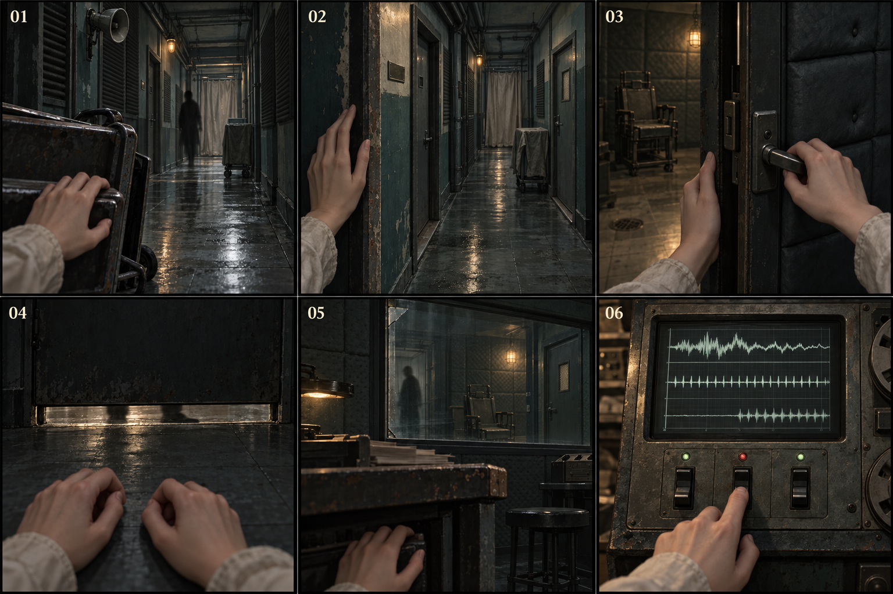
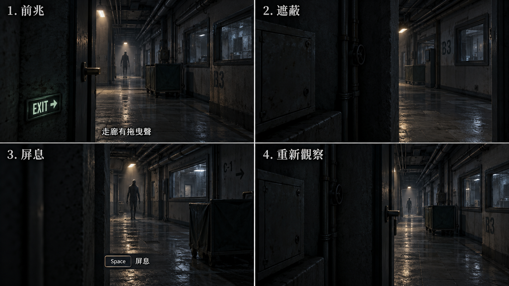
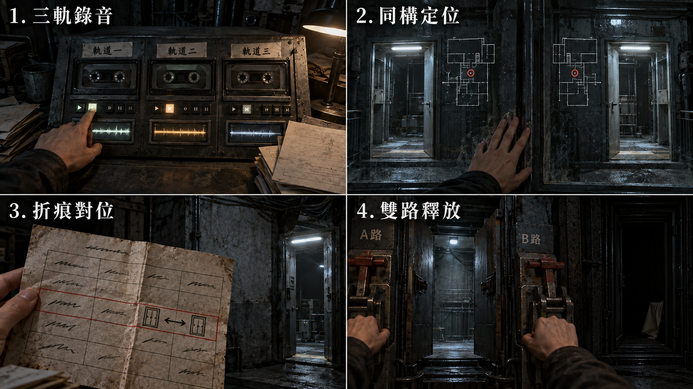
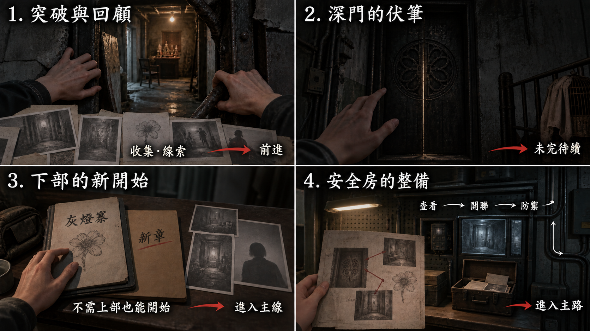

# 遊戲劇本：第四幕

[總目錄](09-14_全劇本與關卡整合稿.md#book-toc) · [上一幕：第三幕](09-06_正式劇本_第三幕.md#act-3) · [下一幕：第五幕](09-08_正式劇本_第五幕.md#act-5) · [共用附錄](09-15_正式劇本_共用附錄.md#book-appendices)

[R18](#node-r18-script)、[R19](#node-r19-script)、[R20](#node-r20-script)、[R21](#node-r21-script)、[R22](#node-r22-script) · [本幕製作規格](#spec-act-4)

<a id="doc-0907"></a>
<a id="act-4"></a>

## 第四幕 · 校正區


<a id="node-r18"></a>
<a id="node-r18-script"></a>

### R18 · 校正走廊

[製作規格](#node-r18-spec)

<a id="s-0907-3"></a>

<!-- import:s-0907-3:begin -->
<a id="h-0907-28"></a>

#### [R18-00] 聲音留在門後

（鏡位切換）沿第三幕已開的服務入口進來。來路扶手停在門內，前方灰白吸音板包住舊住宅走道；板下露出一截舊門牌底痕。
〔銜接〕承接[倉儲側平台](09-06_正式劇本_第三幕.md#transition-r17-r18-script)最後的同一門框；不重播上行、門端驗證與離幕確認。到達只建立入口安全站位，不代做後續掩體移動。
〔環境〕門合上時，電子底噪一次抽離。不是全樓停電的宣告；出口輪廓、文字轉錄與必要操作仍在。
（靜態畫面）玩家看得到走廊末端的收容室門，但中間被翻倒推車、凹入門框及布簾分成幾段。沒有一步直達出口的熱點。
〔玩家〕先在入口安全點觀察。若進入潛行或近距警戒才短按感應，只得到既有回應，不扣費。

〔系統〕「環境噪訊過高」

〔玩家〕安全點可讀筆記及使用原已開放的凝神入口；威脅活動時不靠感知定位，不抹掉已保存的來源。主角無 OS。
<!-- import:s-0907-3:end -->

<a id="s-0907-4"></a>

<!-- import:s-0907-4:begin -->
<a id="h-0907-39"></a>

#### [R18-01] 門牌先停住

〔操作〕玩家觀察下一個掩體與門牌。
〔前兆〕垂下的門牌先停止晃動。布簾輕偏，玻璃上出現沿既定方向掠過的影邊；至少保留 3.2 秒可辨前兆。
（動畫演出）噤聲者通過時，地面水痕分到兩側。玩家在完整掩體中能看到下一段路，不必探出去受擊才能知道方向。
〔環境〕側耳階段只留近距呼吸；牆內擴音器的一次吸氣與布簾回落共同標出後續移動窗。
（靜態畫面）在推車 N1 後，原遮蔽構圖讓車架橫在視野近處；呼吸已近，下一個門框仍在可見的那道空隙裡。主觀前景的手收在掩體內，不另敲車架或觸發警戒。沿原敵人位置與聲源混音，不把既有吸氣複製到耳後，手與車架都不蓋住前兆及路徑提示。

| 玩家所在 | 可見的下一站 | 原移動時間／安全窗 |
| --- | --- | --- |
| 入口安全點 N0 | 翻倒推車 N1 | 2.2 秒／4.0 秒 |
| 推車 N1 | 門框凹處 N2 | 1.6 秒／3.2 秒 |
| 凹處 N2 | 布簾後 N3 | 2.8 秒／3.8 秒 |
| 布簾後 N3 | 收容室門 N4 | 2.2 秒／3.4 秒 |

〔操作〕玩家逐段選擇移動，視點沿原空間短移，不傳送。停下觀察也是有效行動，不要求整個循環持續屏息。
（鏡位切換）門框越來越近，前一掩體仍保留在可理解的身後方向；不以突然換邊製造誤判。
<!-- import:s-0907-4:end -->

<a id="s-0907-5"></a>

<!-- import:s-0907-5:begin -->
<a id="h-0907-57"></a>

#### [R18-02] 被注意到

〔前置〕玩家在錯誤時機發聲或離開遮蔽。
（動畫演出）噤聲者轉成側耳姿態，先給原 2.2 秒補救窗。玩家可停止或退回遮蔽，不追加一次無預警撲擊。
〔失敗〕補救未成才失焦約 3 秒，返回本房最近有效安全點；首次失敗依原落點回推車後。
（靜態差分）只有先前已見的片段可作靜格重組。未見「合上筆記本」來源者只失焦，不因受擊取得過去的畫面。
〔環境〕首次失敗沿原現時耳邊回聲，無清楚可指認的新說話者。

聲音（主觀失焦回聲）「進來前先放下」

〔玩家〕證據與已完成步驟保留，不死亡、不扣穩定度；恐慌與環境聲缺層只按原失敗結算一次。重試給完整前兆，不在醒來當下再命中。
<!-- import:s-0907-5:end -->

<a id="s-0907-6"></a>

<!-- import:s-0907-6:begin -->
<a id="h-0907-70"></a>

#### [R18-03] 舊操作索引（選用）

〔操作〕已在 R16 解鎖者，可於原通電控制器對有效目標使用權限反擊。
〔玩家〕沿既有 2.5 秒提交與 15 點成本；0 點依保全備援，不扣成負值。取消不抹除、不計次，不把 2.5 秒硬塞進已開始的 2.2 秒補救窗。
（畫面特效）完成才解除當前目標，日光燈底噪回來；原來源錨點留下空白訊號。它不是安息，也不替玩家走到門前。
〔玩家〕仍需移到布簾後及收容室門，手動進門；未使用者依原掩體路線同樣可過。
<!-- import:s-0907-6:end -->

<a id="s-0907-7"></a>

<!-- import:s-0907-7:begin -->
<a id="h-0907-77"></a>

#### [R18-04] 兩處磨痕

〔操作〕在出口安全點近看原門框。
（靜態畫面）金屬表面有兩處指節留下的磨痕，與周圍均勻磨亮的把手不同。此處不顯示完整手勢答案。
〔玩家〕可保留已見觀察。
〔操作〕玩家手動打開隔音室門，保存段 A 完成，沿同一門楣進入 R19。
〔環境〕沒有過關音。門的厚度先遮住走廊，再遮住呼吸方向。

---
<!-- import:s-0907-7:end -->

<a id="node-r19"></a>
<a id="node-r19-script"></a>

### R19 · 隔音收容室

[製作規格](#node-r19-spec)

<a id="s-0907-9"></a>

<!-- import:s-0907-9:begin -->
<a id="h-0907-90"></a>

#### [R19-00] 把門合妥

（靜態畫面）入口內側可見牆上「情緒安定／溝通輔導」。空椅固定在中央，側門輪廓在椅外側；主角不評論。
〔操作〕玩家按住慢關門，沿原 2.4 秒逐格收合。放開只停住當前動作，不突然甩門。
〔前兆〕走廊的影邊接近門縫；若關太快先進警戒，仍由完整前兆重試，不永久鎖死。
（動畫演出）門合妥後，影子停在門下 5.2 秒。
〔操作〕玩家依提示屏息到影子離開。標準安全 6.0 秒、6.5 秒才強制吸氣；輔助版沿原 8 秒，不顯示生命或數字倒數。
〔環境〕呼吸被收住，門下仍有可見的影邊。無聲模式保留相同判斷依據。
〔玩家〕這是收斂感知的操作，不是肉身窒息。失敗只退本房安全點，已見空椅／紀錄燈可作失焦靜格，未調查者不提前看見處置或核可。
〔替代〕若用原控制器抹除門外影子，仍需手動關妥門；原威脅完成旗標成立，不再要求對空門屏息。F2 仍須親查。
<!-- import:s-0907-9:end -->

<a id="s-0907-10"></a>

<!-- import:s-0907-10:begin -->
<a id="h-0907-101"></a>

#### [R19-01] 諮商室裡的東西

〔前置〕本段威脅已解除或通過，進入安全調查。
（靜態畫面）新油漆只補到及膝的高度。舊磁磚從隔音牆與柱子的窄縫露出，沒有更換整間房的歷史蒙太奇。
〔操作〕玩家自行選擇近看，不由鏡頭依序強迫觀看。

| 原物件 | 鏡位呈現 |
| --- | --- |
| 椅腳 | 固定螺栓、反覆維修的磨損與鬆垂束帶；不演束帶自行拉緊 |
| 壞耳機與牆內反向喇叭 | 沿原連接位置核對聲音送往玻璃後方；並非只在房內播放輔導 |
| 排水孔 | 與固定椅的距離、濾網上原有的小片指甲；不推近傷口、不加聲響 |
| 牆角與塑膠桶 | 補漆邊、乾水痕與桶的位置 |
| 隔音棉 | 後腦高度的規律凹陷 |

〔玩家〕原局部凝固可核對束帶、耳機與觀察位置；歷史人物、手及設備畫面皆靜止，不演施虐動作，不發新的 E 卡。
〔停頓〕無 OS。讓玩家自己選擇是否再看一處。
<!-- import:s-0907-10:end -->

<a id="s-0907-11"></a>

<!-- import:s-0907-11:begin -->
<a id="h-0907-119"></a>

#### [R19-02] 椅腳裡的字

〔操作〕玩家查看椅腳內側既有刻痕。
〔字幕〕（原刻字）「如果她回來，門會認得她。」
（靜態畫面）下方五格描框的第二格刻著「26」。玩家記下 F2。
〔操作〕視線移到單向玻璃下緣壓條。
（靜態畫面）同一高度的玻璃壓條內嵌一小片透光定位片。片上有一組很淺、間距不規則的刮痕：由不對稱缺口起算，第二格長痕、第四格短痕。刻痕留在收容側表面，兩側都能透過同一片材看見。此處沒有格位對操作序位的表，尚不能讀成碼。
〔操作〕近看原維修小標，辨認「定位片／由缺口起算」。筆記只保存刻痕、缺口與格位，不替玩家猜序列；不是隔著不透明金屬看另一面。
〔玩家〕此時只保存已見痕跡，不提前取得 F3；不必猜錯一次才能離房。
（靜態畫面）玻璃額頭高度的油印位在眼前這一側。指紋、油印與下緣刻痕是不同物件，不相互替換。
〔玩家〕完成關門、本段威脅與 F2 後，側門可走；椅上另有可選強訊號，不能以它鎖住 R20。
<!-- import:s-0907-11:end -->

<a id="s-0907-12"></a>

<!-- import:s-0907-12:begin -->
<a id="h-0907-131"></a>

#### [R19-03] 門縫遠處（H-08 第一次，選填）

〔前置〕已取得 F2；不在潛行、凝固或其後保護時間，玩家主動回看門縫。
（靜態畫面）走廊最遠處有一個細小人形。低辮與袖口僅構成原輪廓，不補清晰面孔。
〔停頓〕它不移動、不歪頭、不招手。主角也不說話。
（靜態差分）玩家轉開鏡頭後才撤去該靜格；再看，走廊是空的。不在注視中播放消失。
〔玩家〕無鎖定框，不可權限反擊，不改噤聲者狀態。每輪一次，可錯過，後房不補播。
<!-- import:s-0907-12:end -->

<a id="s-0907-13"></a>

<!-- import:s-0907-13:begin -->
<a id="h-0907-139"></a>

#### [R19-04] 十一分四十秒（破例三，選填入口）

〔前置〕關門、本段威脅與 F2 已完成；不要求 E-04 選填檔案。
〔操作〕玩家查看椅上強訊號，先顯示原內容警示。
〔字幕〕（來源欄）紀錄 ID 沿既有收容編號，與 R13 E-04 原件相同；此處不顯示姓名。
〔系統〕「紀錄長度：11 分 40 秒；本次呈現片段：約 90 秒。可暫停或切換文字摘要。」
〔系統〕「確認演出或等效摘要後返回探索。」
〔系統〕（無聲選項）「觀看片段」／「閱讀文字摘要」／「暫不查看」

〔玩家〕選「暫不查看」返回原調查，可直接走側門。前兩項才沿原 0.8 秒確認進入；首次成本 2 點，0 點有本地記憶錨點備援，續接不重扣。
<!-- import:s-0907-13:end -->

<a id="s-0907-14"></a>

<!-- import:s-0907-14:begin -->
<a id="h-0907-152"></a>

#### [R19-05] 椅旁的空間（約 90 秒）

（靜態畫面）凝固構圖始終不動。椅上一人，旁邊一名穿內控制服、拿平板的無臉剪影；臉與姓名不呈現。
〔環境〕只有主角呼吸。無配樂、環境音或效果音；不是讓管理者在九十秒裡念完一套命令。
〔玩家〕可自由移動視線及放大，沒有必點區域或找齊才可離開的檢查；暫停、內容設定與保存入口始終可用。

| 演出進度 | 同一靜止構圖內可見內容 |
| --- | --- |
| 起始至約 30 秒 | 固定椅、束帶的受力位置與皮膚受壓狀態；衣物完整，不以身體暴露構圖 |
| 約 30–60 秒 | 椅腳、地面、排水孔與角落原物；玩家也可以一直看向同一處 |
| 約 60–90 秒 | 椅旁拿平板的無臉剪影及兩人的距離；姿態從進入時就固定 |

〔玩家〕紀錄總長 11:40，眼前僅約 90 秒靜止片段。不能由此斷言未呈現的時間裡誰一直沒動、說過什麼或做了什麼。

<a id="h-0907-168"></a>

##### 同段文字摘要

| 區塊 | 玩家可讀正文 |
| --- | --- |
| A · 對應起始段 | 椅子固定在地面。椅上的人被束帶限制姿勢，束帶留下受壓痕跡。畫面沒有可辨的臉，也沒有姓名。 |
| B · 對應中段 | 椅腳周圍留有反覆使用的痕跡。排水孔和角落的物件都在原位。這不是一張沒有使用過的椅子。 |
| C · 對應末段 | 一名拿著平板的內控制服剪影站在椅旁。這個片段完全靜止，不能確認未呈現的時間裡發生過什麼。紀錄總長十一分四十秒，呈現的片段約九十秒。 |

〔系統〕（無聲確認）「確認摘要」
〔玩家〕未確認可暫停或保存續接，不以離開遊戲補成已讀。摘要不增加姓名、罪責或未拍到的行為，不縮減取得結果。
<!-- import:s-0907-14:end -->

<a id="s-0907-15"></a>

<!-- import:s-0907-15:begin -->
<a id="h-0907-181"></a>

#### [R19-06] 房間又空了

〔前置〕演出或等效摘要真正完成。
（靜態差分）回到實景，同一張空椅。沒有取得音效、提示框或人物名字。
〔停頓〕沿原收束，主角原地 8 秒不可操作，真正暫停仍可用。

主角（OS）「……十一分四十秒。」

〔停頓〕再 4 秒，交還操作。之後沿原休息節拍至少 60 秒不插新目標或自發異常；可移動、讀已有來源，不把安靜變成側門倒數。
〔玩家〕完成才保存 `act4.r19.breach3_seen`，依原規格恐慌鎖階段 3 至 R21；此事件不是權限反擊永久停用或新增傷害。
（介面呈現）只有已持有 E-04 檔案者，其原條目增加「收容時長紀錄：11:40」。沒有檔案就不補姓名、不發新卡、不要求返回第三幕。
〔玩家〕已有檔案但尚未對照者可用已存收容編號補核對；R13 安息結果不撤回。完成段落不給獎勵、成就或結局優勢，每輪不重演。
<!-- import:s-0907-15:end -->

<a id="s-0907-16"></a>

<!-- import:s-0907-16:begin -->
<a id="h-0907-195"></a>

#### [R19-07] 回到椅邊與側門

〔選填〕沿原 T-4a／HA-R19-01，安全回訪時束帶從鬆垂變成緊環差分，椅子仍空；不在注視中自行綁緊。原椅腳輕響只排一次，不插破例或其餘波。
〔玩家〕沒有合適回訪時機便略過，不補播、不再進九十秒段落。
〔操作〕完成本房必要關門／威脅與 F2 後，玩家從椅外側側門繞到同一片玻璃後方。角落、壓條及地面材質連續，不憑空換房。
門不為沒有觀看破例三的玩家多鎖一道，也不替有觀看者補「她是誰」的答案。

---
<!-- import:s-0907-16:end -->

<a id="node-r20"></a>
<a id="node-r20-script"></a>

### R20 · 單向玻璃觀察室

[製作規格](#node-r20-spec)

<a id="s-0907-18"></a>

<!-- import:s-0907-18:begin -->
<a id="h-0907-207"></a>

#### [R20-00] 另一邊

（靜態畫面）玻璃另一側是 R19 的空椅。剛才躲藏的門邊完整落在視野裡，桌面有長期手肘磨痕。
〔操作〕玩家核對同一玻璃壓條、側門與椅位，知道自己站到觀察側。
（靜態畫面）原額頭高度油印，在此側看起來仍貼近自己。形狀與高度不變，鍍膜反射保留可能的物理讀法。
〔環境〕首次油印比對無音效、無 OS，不寫入新證據。
<!-- import:s-0907-18:end -->

<a id="s-0907-19"></a>

<!-- import:s-0907-19:begin -->
<a id="h-0907-215"></a>

#### [R20-01] 玻璃缺角的方向

（靜態畫面）控制桌、桌下掩體與玻璃缺角同框。
（動畫演出）反射裡的走廊威脅沿原段 C 狀態巡行；已抹除則保持空白，不是玻璃另一面新生成一隻。
〔操作〕玩家先看方向，再利用安全窗移近精簡控制台。
〔前兆〕在精簡控制台由設備播出 B 的管理命令或 C 的同句回音，都使原噤聲者進入側耳狀態；不因回音較淡就免除察覺。玻璃缺角、影邊及位置字幕保留至少原前兆，不能只聽聲辨向。
〔玩家〕精簡控制台不是安全選單，必要時收手、躲到桌下並屏息。打開完整聲軌近看或真正暫停，才依共用契約停表；錄音暫停不等於世界暫停。
〔失敗〕仍回本房安全位，保留已完成的聲軌及來源；只有已見的觀察者核可靜格可重組，手與勾選都不動。
〔替代〕權限反擊可清除原走廊威脅，但不替玩家關 B 軌、取得 F3 或完成本地核驗。
<!-- import:s-0907-19:end -->

<a id="s-0907-20"></a>

<!-- import:s-0907-20:begin -->
<a id="h-0907-224"></a>

#### [R20-02] 三條舊聲軌

〔操作〕玩家開完整閱讀，並列三條固定時間刻度與字幕。
（介面呈現）不以顏色直接圈正解；三條都能反覆查，同一文字轉錄支援無聲推理。
（介面呈現）原檔案檢索欄標「收容側原話」，三軌各保留自己的來源欄。玩家要留下原話並排除直接命令，不是為了湊齊指定數量的亮燈。

| 軌道 | 玩家可核對的來源 | 操作結果 |
| --- | --- | --- |
| A | 不規則聲段，受困者聲音；其中夾入另有來源標籤的管理端歷史通話 | 保留 |
| B | 等距重複的管理命令 | 關閉 |
| C | 同一句的較淡回音，與 B 固定錯開 0.8 秒；可用來核對哪條是直接命令，不是另一人的證詞 | 可保留或關閉，不是過關必要軌 |

〔環境〕B 軌用原兩句，語氣平直；C 由同一素材延遲處理，不另錄一名角色。

管理聲（設備歷史錄音，B 軌）「保持原位」
管理聲（設備歷史錄音，B 軌）「等待處理」

〔操作〕玩家比對來源、命令與回音，保留 A、關 B，再提交原聲軌核對。「只留 A」與「保留 A、C」同樣成立；不因關掉回音而判錯。
〔玩家〕三軌閱讀與核對成本 0。關錯可回查，不刪檔、不自動播放正解，不要求先被抓一次。
（配音演出）完成後，A 的原內容清楚可辨，保存 `act4.r20.tracks_aligned`；暫停試聽，單獨呈現必要 A 軌內容，不讓 C 蓋過承諾或繼續引敵。完整閱讀與必要配音受保護，結束回全景才恢復完整前兆。
<!-- import:s-0907-20:end -->

<a id="s-0907-21"></a>

<!-- import:s-0907-21:begin -->
<a id="h-0907-246"></a>

#### [R20-03] 管理端的三秒

〔環境〕先是小花把中文命令轉述得比較輕。沿既定功能補寫，不指定母語、國籍或特定地域口音。

小花（設備歷史轉述，A 軌）「先在這裡等。叫到你再走。」

〔停頓〕原聲軌中的接點，不接現在的玩家回答。
〔字幕〕（來源標籤）「管理端／歷史錄音」
（介面呈現）同列保留兩週前的原件日期，不用「正在通話」樣式；工作名及中文名不在這個標籤補填。

主角聲線（設備歷史單向通話）「門開時不要等我。先走。我會回來。」

〔停頓〕通話已經結束。小花沒有在當時的單向通話裡回答她。
〔環境〕接著才是另段歷史聲軌裡被截短的低聲話語；中斷來自原錄音，不是此刻有人切斷玩家設備。

小花（設備歷史錄音，A 軌）「車上那個人幫過我——」

（介面呈現）波形與字幕在相同位置截斷，沒有第二頁把後半句補完。

小花（設備歷史錄音，A 軌）「她說會回來」

〔停頓〕玩家可以重聽。主角現時無反應、無解說 OS。
<!-- import:s-0907-21:end -->

<a id="s-0907-22"></a>

<!-- import:s-0907-22:begin -->
<a id="h-0907-270"></a>

#### [R20-04] 最後一個訊號索引

〔操作〕實際核對歷史通話後，依原來源收錄 #15。
〔字幕〕（訊號庫描述）「三秒。單向通話。一個女人的聲音。錄自校正區觀察室控制台。」
〔玩家〕筆記保存索引，不自行錄音或發聲。只可在有電、在場、已連結原來源的廣播台重播；每次沿訊號成本及遭遇冷卻，不新訂秒數。
（動畫演出）對噤聲者使用時，它僅停住 2 秒，仍擋在路上；段 C 的通路仍需玩家自行完成。一般怨靈沒有反應。
<!-- import:s-0907-22:end -->

<a id="s-0907-23"></a>

<!-- import:s-0907-23:begin -->
<a id="h-0907-278"></a>

#### [R20-05] 手先靠過去

〔操作〕玩家在原主管操作台核對掌位及操作序位。
（動畫演出）左手先靠近熟悉的位置，停在台沿；不是掃出一張完整掌紋，也不是設備藉此確認調查者的肉身。
〔操作〕用 R17 已核驗的本地憑證與本房校驗資料完成原核對。

〔系統〕「驗證通過」

〔玩家〕成功保存既有相容鍵 `act4.r20.palm_accepted`，依原規格恐慌 +1 階。這個鍵表示本地憑證通過，不是生物辨識；不填主角中文名。
必要資料沿原控制台可回查，無另加密碼與扣費。
<!-- import:s-0907-23:end -->

<a id="s-0907-24"></a>

<!-- import:s-0907-24:begin -->
<a id="h-0907-289"></a>

#### [R20-06] 原來就在那裡

〔操作〕從觀察側對準同一片玻璃壓條定位片，先找 R19 已見的不對稱缺口，再把有刻痕的格位對到控制台原維護表的「格位／操作序位」。
（靜態畫面）維護表標頭可讀「視訊組共用型／由缺口起算」。刻格本身沒有變，觀察側多了可讀的序位對照；刻痕仍在收容側，不是觀察室長出第二道字。左右視角雖反轉，都從同一缺口起算，不按螢幕左到右猜碼。
〔操作〕按 09-13 維護表從缺口計格，再依長痕、短痕讀序位：第二格為 8、第四格為 1。兩個鏡位不改起算端，不能用螢幕左右方向猜碼。
〔玩家〕取得 F3「81」；減少動態版與文字對位先提供痕跡及完整對照表，仍由玩家核對，不先顯正解。
<!-- import:s-0907-24:end -->

<a id="s-0907-25"></a>

<!-- import:s-0907-25:begin -->
<a id="h-0907-298"></a>

#### [R20-07] 手還留在門邊（H-08 第二次，選填）

〔前置〕已取得 F3、關閉控制台，玩家主動回看；不疊必要錄音、活躍攻擊或破例餘波。
（靜態畫面）同一玻璃反射裡，輪廓比 R19 更近，位於身後兩個房間的位置。只見既有低辮與袖口，不露清晰臉。
（動畫演出）主角收回自己的手。
（靜態畫面）主角收手時，門邊那隻手仍是靜格。
（靜態差分）轉開或遮擋後才不在，不能演它慢慢收回。
〔環境〕伴隨的是主角主觀記憶回聲，不是輪廓開口；不改 H-08 的無聲規則。

小花聲線（主觀記憶回聲）「等一下」

〔操作〕玩家轉身，身後空無一物；恢復反射時也不再出現。每輪一次，不因首次錯過 R19 就補兩次。
（鏡位切換）同一段的鏡位遮擋改變，讓原門框磨痕重新可見；原非敵對校正殘響停止，不停止真正巡行的敵人，也不由她替玩家選答案。
〔玩家〕玩家仍需親自核對磨痕。未觸發輪廓者也可直接查看同一必要來源，不能把線索藏在選填人形後。
〔操作〕實際看清原磨痕後，才落既有的短回應；與回聲及錄音分開，不在她顯現時說話。

主角（OS）「這次我看見了」
<!-- import:s-0907-25:end -->

<a id="s-0907-26"></a>

<!-- import:s-0907-26:begin -->
<a id="h-0907-316"></a>

#### [R20-08] 去辦公室

〔選填〕沿 HA-R20-01，油印比對後另一次安全切到管理側，可聽原約 5 秒低弱摩擦定位；玻璃另一邊始終空。不翻轉第二次油印，不改聲軌解答；沒有安全時機便略過。
〔操作〕確認三軌、段 C、F3 及本地驗證均完成，玩家沿玻璃後方工作走道到 R21 門端。
（鏡位切換）玻璃壓條在身後連續，辦公室門牌與控制器在前。未完成項可回查原熱點，不靠重播承諾或抹除直接開門。

---
<!-- import:s-0907-26:end -->

<a id="node-r21"></a>
<a id="node-r21-script"></a>

### R21 · 紀律辦公室

[製作規格](#node-r21-spec)

<a id="s-0907-28"></a>

<!-- import:s-0907-28:begin -->
<a id="h-0907-327"></a>

#### [R21-00] 一張乾淨的桌子

〔分支〕部分／全面供電：玩家以 R20 校驗資料與 R17 本地憑證解鎖，再手動開門。定向供電：既有路由使門在靠近時提前解鎖，顯示原文字。
〔系統〕（僅定向供電，無聲）「歡迎回來，主管」
兩路取得相同主線資料。若曾用權限反擊，門端核可框沿相同版式，不另加一次提示。
〔環境〕電子底噪回來，噤聲者不進辦公室。
（靜態畫面）平整飾板遮住拼接柱列，窗框被檔案櫃封住。桌面乾淨，終端、紙件與釋放口各在可見位置；沒有新屍體或血跡把注意力移開文件。
〔玩家〕可安全查看，不限時，也不假定此刻恐慌接近滿值。
<!-- import:s-0907-28:end -->

<a id="s-0907-29"></a>

<!-- import:s-0907-29:begin -->
<a id="h-0907-336"></a>

#### [R21-01] 名冊之間的一行

〔操作〕玩家將人事架構的「內控」沿隸屬欄對回紀律／校正線，取得 E3-01。
（靜態畫面）工作名欄是 Michelle，沒有中文真名。同頁的原始對照把 IN-06-B 連到既有人事號及工作名。
〔操作〕在已保存的 E3-03-B 上核對相同入園流水，不由職務相似直接合併。
〔玩家〕至此才可把「同車女性」與「內控主管／Michelle」的檔案關係接起；這不是將現時調查者自動併入人物卡。
入園分派與後來的職務是不同時期、不同欄位。受困的起點不被刪去，也不因此替後來的核可免責。
<!-- import:s-0907-29:end -->

<a id="s-0907-30"></a>

<!-- import:s-0907-30:begin -->
<a id="h-0907-345"></a>

#### [R21-02] 同一個小花

〔操作〕查看原小花校正排程與核可欄。
（靜態畫面）業績不足、祈願素材標記與送往校正日期在同列；電子簽核工作名為 Michelle。
〔操作〕玩家核對原個案識別，展開同一人的早期退回單與後來核可單。
不是兩個同名的人，不另加冒簽或看錯姓名的疑雲。主角的短句落在已完成來源核對後。

主角（OS）「我認得這個名字。」

〔停頓〕回到文件。畫面不以灰蛾或反光遮掉核可欄，也不接自我辯護。
<!-- import:s-0907-30:end -->

<a id="s-0907-31"></a>

<!-- import:s-0907-31:begin -->
<a id="h-0907-356"></a>

#### [R21-03] 三份處置單

〔操作〕玩家並列同一排程資料中的三份單，依原日期排序並核對處置欄。
（介面呈現）不自動吸附成答案，不用回憶影片替玩家完成。折衷單日期早於 T−2 個月；原件完整曆日共用既有資料表，不臨時造三個日期。

| 原件 | 處置差異 | 可核對的共同部分 |
| --- | --- | --- |
| 早期單 | 退回 | 同一小花的個案識別與核可筆勢 |
| 中間單 | 減輕但核准 | 條件改輕，但核准仍成立 |
| 後期單 | 完整核可 | 同一核可路徑，筆勢連續 |

〔玩家〕錯配只退回，可免費重排，不套用調查板正式猜測懲罰。普通閱讀與對齊都安全。
〔操作〕確認正確後，把這項比對併入 E3-02。
（靜態畫面）三張紙仍在。成功只短暫停在連續筆勢，不變成道德評分。

主角（OS）「至少那次沒有……」

〔停頓〕1.5 秒。她沒有補完；玩家可繼續調查。
<!-- import:s-0907-31:end -->

<a id="s-0907-32"></a>

<!-- import:s-0907-32:begin -->
<a id="h-0907-376"></a>

#### [R21-04] 停止出鏡的申請（選填）

〔操作〕從原排程附頁分別翻看申請及覆核。
（靜態畫面）申請要求停止特定出鏡工作；日期及個案識別沿原件，不展示出鏡內容、身體或受害影像。
〔字幕〕（覆核欄）「不調整安排，按原評級處置」
〔玩家〕原入區原因仍是業績處置，不另造一次校正、不改六週半時序，也不由此宣告所有情色素材都屬同一個案。
〔操作〕每頁實際顯示且確認收起才保存 `request`／`reply` 已讀；中途取消不補頁。
〔玩家〕可免費查看，或返回三單對照。
<!-- import:s-0907-32:end -->

<a id="s-0907-33"></a>

<!-- import:s-0907-33:begin -->
<a id="h-0907-385"></a>

#### [R21-05] 不是旁觀的位置

〔操作〕玩家在原三格放入既有來源，正式提交。

| 格位 | 必要來源 | 本次能證明的事 |
| --- | --- | --- |
| 組織 | E3-01 人事架構及原始流水對照 | 內控隸屬紀律／校正，IN-06-B 正式連回 Michelle |
| 個案 | E3-02 小花校正排程與核可 | 此職位能決定她在何時被帶走，三單不是未簽的草稿 |
| 來源 | E3-03 同車入園檔案 | 該女性曾與小花同車入園，其後被吸收進內控培訓 |

〔系統〕「三格關聯自洽。鎖定。」
〔字幕〕「內控主管是校正流程的負責人，而不是旁觀的資料分析員。」

〔停頓〕先讓玩家讀完。沒有揭名音效，主角不說「原來是我」。
〔例外〕缺來源仍用「缺少環節。」；正式不自洽仍用「因果不成立。」沿原調查板規則，不重新生成第三幕 E3-03。
<!-- import:s-0907-33:end -->

<a id="s-0907-34"></a>

<!-- import:s-0907-34:begin -->
<a id="h-0907-403"></a>

#### [R21-06] 身體先安靜了

〔前置〕第三層正式鎖定完成。
（畫面特效）依實際狀態，在原 2 秒內退去暗角、手震與耳鳴；呼吸先穩下來。若本來已平靜，就不先製造一次恐慌再清掉。
〔系統〕（現場終端，無聲）「環境威脅資料已更新。」
〔玩家〕當前恐慌設為 0，只有校正區的環境累積永久停用；不是回滿穩定度，也不是之後所有威脅免疫。
（動畫演出）門外原有噤聲者停住，面向釋放接點，手放在身側。已被抹除的位置仍是空白間距，不把它們復活來補滿隊形。
（靜態畫面）收起調查板回到原門口視角，現場門控的授權欄與走廊同框。原 R20 本地驗證已留下兩行狀態；這次不靠人形或恐慌視效才看得見。
〔字幕〕（門控原狀態欄，無聲）「主管端：已驗證」「釋放指令：待提交」。
〔停頓〕視線可停在「待提交」，旁邊是等待中的輪廓，或抹除後留下的空位置。設備仍在等這個位置上的人作決定；沒有歡迎音、追逐或取得提示。
（靜態畫面）原門口構圖維持不變：走廊沒有變寬，暗處也沒有多亮一盞燈，只有她的呼吸先安靜了。把已穩住的前景手部、授權欄與等待位置留在同一畫面；不讓一個安心表情替這份平靜下結論，也不自動替她提交釋放。
〔玩家〕R22 任一路完成後，回訪此門控按既有 `act4.r22.exit_unlocked` 改顯「通路：已釋放」，不再要求提交指令、不重做手勢或機構；這行無聲狀態不提前替玩家開門。
〔停頓〕無 OS、無勝利音。沒有任何人說她安全了或被原諒。
〔玩家〕保留原 3–5 分鐘無追逐探索的安排，可查看三單、折痕及已讀資料；不把它設成等時間才開門。前面沒播的 HA 不在此補播。
<!-- import:s-0907-34:end -->

<a id="s-0907-35"></a>

<!-- import:s-0907-35:begin -->
<a id="h-0907-418"></a>

#### [R21-07] 折進去的序列

〔操作〕玩家主動打開抽屜，取看原歸檔校正排程單，沿紙角折痕展開。
（靜態畫面）按捺簽收欄與折入的序列在同一張紙上，不是櫃底、牆面或抽屜新長出的刻字。
〔玩家〕取得 F4：折痕內五格描框第四格「35」，保存原覆寫碼欄；不由三格成功自動發放。
〔操作〕可在筆記重看已收 F1–F4，未完成整套前不自動解出 F5、R25 條件或完整覆寫用途。
〔前置〕第三層、F4 及三單對照均成立，原釋放口可用。
〔操作〕玩家沿辦公桌外側走向裸露鋼梯，進 R22。不是被推進下一場追逐。

---
<!-- import:s-0907-35:end -->

<a id="node-r22"></a>
<a id="node-r22-script"></a>

### R22 · 釋放接點／破損樓梯

[製作規格](#node-r22-spec)

<a id="s-0907-37"></a>

<!-- import:s-0907-37:begin -->
<a id="h-0907-433"></a>

#### [R22-00] 它們在等

（靜態畫面）同一走廊裡的噤聲者面向同一扇門，沒有新的巡行路線。此前的抹除空缺仍保留。
〔操作〕玩家先看門後被扣件阻住的踏面，再看兩套機構。
〔字幕〕（原標牌）「主管快速釋放」／「本地緊急釋放」
（靜態畫面）門框兩個指節凹痕與兩個掌心摩擦區可近看；同一門框上的舊「主管等候操作」牌從初訪就存在。四格依 1–4 標序：前兩格各是指節接觸門框一次，後兩格各是左掌朝下壓一次；左手標記與向下箭頭完整可辨，不用鏡像猜左右。
〔字幕〕（操作牌等效轉錄，無聲）「1 指節敲門框；2 指節敲門框；3 左掌向下；4 左掌向下」。
（靜態畫面）機構 A 的防火扣、機構 B 的拉桿及相連受力方向清楚可見，不只靠顏色辨識。磨痕支持接觸位置及長期使用，四步次序來自操作牌，不把兩處磨痕當作敲擊次數的證明。
〔玩家〕可回查 R18／R20 已存觀察，或免費重讀操作牌。即使略過選填凝固、#15、鏡像或權限抹除，也能依操作牌完成通路。
（靜態畫面）地形在梁下局部下折，扶手再沿同一梯井向 43F 延續；這是避梁，不是把上行深層寫成返回低樓層。
<!-- import:s-0907-37:end -->

<a id="s-0907-38"></a>

<!-- import:s-0907-38:begin -->
<a id="h-0907-444"></a>

#### [R22-01] 快半拍（鏡像者第六次）

〔前置〕沿原自然舉手事件、視野包含金屬門框時排一次；不插完整近看、安定或選路確認。
（動畫演出）主角準備抬手敲門框，金屬倒影已先敲了，快 0.3 秒。沒有清晰新面孔。
〔環境〕無音效、無 OS。
〔玩家〕鏡像不替玩家輸入四次手勢，不計重演；走拒絕路未觸發便略過，不逼她先做管理動作才能拒絕。
<!-- import:s-0907-38:end -->

<a id="s-0907-39"></a>

<!-- import:s-0907-39:begin -->
<a id="h-0907-453"></a>

#### [R22-02] 靠近哪一套機構

〔操作〕玩家選擇靠近門框或轉向緊急鎖，在既有確認後保存 `act4.r22.route_choice`；確認前可取消，本次通過確認後不切換。
（介面呈現）介面只呈現物件、動作及原路線條件，不寫「善良」「推薦」「真結局」。
〔玩家〕兩路都不消耗穩定度，0 點可用。選路不是完成操作，鏡頭不代敲、不代拉。
<!-- import:s-0907-39:end -->

<a id="s-0907-40"></a>

<!-- import:s-0907-40:begin -->
<a id="h-0907-460"></a>

#### [R22-03] 快速釋放（手勢路）

〔操作〕玩家依操作牌次序及門框接觸位置，四次點擊：指節敲門框兩下，再左手掌心向下兩次。
（動畫演出）每一次輸入以接觸位置與手勢回應；不測節奏，不以四連點任意部位代答。
〔操作〕第四次正確輸入後，原通電門控使用已取得的本地憑據驗證。
（動畫演出）主管鎖退入，原噤聲者同步低頭 6 秒。門開狀態保存，不要求六秒內衝過去。
（靜態差分）原過去站位以不超過 1 秒的主觀差分疊回，再回現場；不演歷史人物動作、不補 OS。
〔玩家〕僅成功時記 1 次重演，保存 `act4.r22.gesture_completed`。不增加權限反擊次數、不產生空白訊號、不刪現實物證。
〔失敗〕順序錯誤或中斷，噤聲者前進一步，再把手放回身側。可重試，不抓人、不死亡、不以失敗增加重演次數。
〔環境〕只有原門鎖落位與短段電子底噪，沒有勝利音樂。
<!-- import:s-0907-40:end -->

<a id="s-0907-41"></a>

<!-- import:s-0907-41:begin -->
<a id="h-0907-471"></a>

#### [R22-04] 手動緊急釋放（拒絕路）

〔前置〕已確認轉向緊急鎖，噤聲者保持凝視，不被動累積恐慌。
〔操作〕玩家看擴音器振膜復位，等第一個可見安全窗移往 A。
（靜態畫面）手停在扣件上，踏面仍被兩道受力機構牽住。
〔操作〕到位後才起獨立操作窗，長按 3 秒，解除 A 防火扣，再退回原完整掩體。
（動畫演出）第一組連桿逐格退出；門仍受第二道拉力，不在第一步就假裝全開。
〔操作〕等第二個安全窗，移至 B，拉下機械釋放桿。
（動畫演出）第二組連桿退入，釋放機構落位；手操作原低負荷連桿，不是徒手推動整扇重門。

| 原時間 | 演出與判定邊界 |
| --- | --- |
| 移動 | 原標準長移動 2.8 秒；可用安全窗另保留至少 0.8 秒餘裕 |
| A 操作 | 到位後另起至少 3.8 秒，容納 3 秒長按；不扣掉前段移動時間 |
| B 操作 | 第二安全窗到位後另起原 3.8 秒操作窗，拉下原桿 |
| 暫停／失焦 | 停止窗口計時，不在回來時直接判失敗 |

〔失敗〕過早操作先進警戒，可收手補救；失誤脈衝使恐慌 +1。玩家退到最近完成的機構，已完成的 A 保持開啟。
〔玩家〕完成保存 `act4.r22.refusal_route_completed`，不記重演、不產生空白訊號。全程不需電力與穩定度。
<!-- import:s-0907-41:end -->

<a id="s-0907-42"></a>

<!-- import:s-0907-42:begin -->
<a id="h-0907-491"></a>

#### [R22-05] 踏面接上了

〔前置〕任一路線真正完成。
（靜態畫面）兩路用同一鏡位看見退入的門栓、完整可走踏面及向深層延續的扶手。門不突然鎖回。
〔系統〕「深層通道已開放。」
〔玩家〕保存 `act4.r22.exit_unlocked`，玩家仍要自己點擊走到安全踏台。
（靜態畫面）手勢路的噤聲者保留原低頭餘波，拒絕路仍站直看著她；它們留在身後，不消失、不追入、不安息。
〔環境〕先讓機械刮擦落定，恢復可自由查看的安全匯合畫面。
（靜態畫面）門後牆上原字可見。
〔字幕〕（牆面字跡）「我也是被逼的。」
<!-- import:s-0907-42:end -->

<a id="s-0907-43"></a>

<!-- import:s-0907-43:begin -->
<a id="h-0907-503"></a>

#### [R22-06] 門禁維修座（選用）

〔操作〕兩路共用同一個門禁維修座。玩家主動定神 2.5 秒，穩定度 +25，上限 100；每輪一次。
〔字幕〕（原設備標籤）「內控巡檢設備」
〔玩家〕保存 `act4.r22.grounding_used`；滿值不消耗機會，不因選路改獎勵。不使用也能完成上部。
〔環境〕沒有靠近音、倒數或伏筆人聲。此處可以讀筆記，也可以停著不做任何事。
<!-- import:s-0907-43:end -->

<a id="s-0907-44"></a>

<!-- import:s-0907-44:begin -->
<a id="h-0907-510"></a>

#### [R22-07] 向下的那一組（選填）

〔操作〕在兩路匯合後，由原劇情入口查看平台足跡殘留。
（靜態畫面）大多足跡朝上，僅一組單人足跡朝下，第三階之後被坍塌截斷。
〔玩家〕取得 E4-00-D，描述僅為「一組向下的單人足跡」。這段早於 B3 轉角受傷，不畫跛行或偏側承重，不命名足跡主人。
（介面呈現）只有 D 時標「未定位 · 方向：向下」；已有 C 且完成原時序對齊才合併為「未定位 · 約七分鐘 · 方向：向下」。C、D 都持有但未對齊時，列標題維持「未定位」，列內分別保留 C 的時長與 D 的方向，不暗示同一事件。A、B 按實際持有及比對狀態加入，不補發缺件。
〔前置〕四片 E4-00-A～D 全部持有，且原單句尚未播放時，才排下句。

主角（OS）「……七分鐘。」

〔停頓〕不接續、不轉鏡頭找人。
（畫面特效）退出感知後，向下足跡在實景灰塵反光中短暫可見一次，再退去；無音效，不增加第二組客觀足跡。
〔玩家〕未全收沒有 OS；未查看本段不影響 F1–F5、上部完成或結局。七分鐘仍未定位，不提前完成 R23–R25 的重建。

---
<!-- import:s-0907-44:end -->

<a id="act-4-outro"></a>

### 幕尾

<a id="s-0907-46"></a>

<!-- import:s-0907-46:begin -->
<a id="h-0907-528"></a>

#### [ACT4-01] 前往深層

〔前置〕第三層鎖定及任一路釋放完成，玩家已走到安全踏台；鏡像與安定互動均結束。
〔操作〕玩家主動點選遠離維修座的深層出口。
〔字幕〕（出口標示）「前往深層」
（動畫演出）才接原約 30–45 秒門檻短演出；不是開門操作自動觸發整段片尾。
〔玩家〕支援字幕、減少動態及略過。略過回到可操作門檻，不替玩家跨門或寫完成檔。
<!-- import:s-0907-46:end -->

<a id="s-0907-47"></a>

<!-- import:s-0907-47:begin -->
<a id="h-0907-536"></a>

#### [ACT4-02] 扶手上的布結

（靜態畫面）沿已開通路看見扶手上的布結，打結方式與 R8 修補袋相同。這是現時局部感知中的熟悉形狀，不是把原袋子移到此地。
〔玩家〕看過 R8 才保留對照，未看者只見眼前的布結，不補「你記得」式字幕、不發新證據。
〔環境〕聲音從看不見人的樓梯深處傳來，音量不突升。玩家字幕只標「聲音」，不標角色身分。
沒有完整人形，不增加 H-08 次數。

聲音（小花聲線；玩家字幕匿名）「這次，等我一起走。」

〔停頓〕主角的接話落在聲音之後，不先用 OS 替玩家提問。

主角（現時接話）「……這次？」

（動畫演出）數隻灰蛾轉向內側微光，門框留少量鱗粉。扶手與門後踏面仍可辨，出口沒有消失。
〔環境〕聲音退回樓梯空間。不要用新一句承諾把問題回答完。
<!-- import:s-0907-47:end -->

<a id="s-0907-48"></a>

<!-- import:s-0907-48:begin -->
<a id="h-0907-553"></a>

#### [ACT4-03] 跨過去

（靜態畫面）恢復操作，門仍開著。玩家可留在門前整理，或沿本幕已開通路回查 R18–R21。
〔玩家〕不能回已封閉的 R17、產線或大廳。選填支線保留實際狀態，未見過的收藏不在此列清單，未完成不阻擋片尾。
〔操作〕玩家點擊跨門，才以原子操作寫入上部完成檔。

| 保存項目 | 本幕結果 |
| --- | --- |
| 分部邊界 | `series.part1_complete = true`、`series.boundary = r22_release`、`series.entry = r23_entry` |
| 原狀態 | 證據與來源、已鎖定結論、三單、F1–F4、供電、權限抹除錨點、人物與支線、物件位置 |
| 本幕差分 | 破例進度／摘要模式／E-04 原安息、兩次 H-08 實際觀看、釋放選路與重演、足跡及七分鐘單句 |
| 資源 | 當下恐慌、穩定度與安定使用，不自動回滿 |
| 不預載 | F5、七分鐘重建、阿彪處置、下部節點及任何結局 |

〔失敗〕寫入失敗留在安全門前，可重試，不播放完成字幕、不丟棄原檔。
〔成功〕保存成功後才進上部片尾，不在上部直接載入 R23。
〔字幕〕（無聲片尾字卡）「灰燈寨：上部」
〔玩家〕完成檔提供門前的獨立回看副本，不倒改已匯出的前情；下部從 R23 安全入口承接，依 [跨部契約](09-15_正式劇本_共用附錄.md#doc-0307)。

---
<!-- import:s-0907-48:end -->

<a id="act-4-continue"></a>

[總目錄](09-14_全劇本與關卡整合稿.md#book-toc) · [上一幕：第三幕](09-06_正式劇本_第三幕.md#act-3) · [下一幕：第五幕](09-08_正式劇本_第五幕.md#act-5) · [共用附錄](09-15_正式劇本_共用附錄.md#book-appendices)

---

<a id="spec-act-4"></a>

## 第四幕 · 校正區：製作規格

<a id="node-r18-spec"></a>

### R18 · 校正走廊

[正式場次](#node-r18-script)

<a id="node-r18-nav"></a>

**進出、動線與回訪**

<a id="s-0609-32"></a>

<!-- import:s-0609-32:begin -->
<a id="h-0609-311"></a>

#### R18 校正走廊

進行目的：躲避巡行，穿過校正走廊；固定場景潛行教學

支線／收集：依原房選填調查；無新增支線掛點。

| 方向 | 類型 | 可移動條件 | 移動演出提案 | 回訪規則 |
| --- | --- | --- | --- | --- |
| R17 → R18 | 跨幕 | 正確日期證據與 K2-01 成立；假路返回後可重排；離幕前可回查已發現未完成的 SQ-M1／SQ-T，支線不擋主線 | T-R17-R18：C-02 驗證及單向確認後，由 32F 經 33F–40F 倉儲側平台至 41F 門外；兩鏡位呈現舊門楣被飾板及吸音板逐步覆蓋，樓段由梯段與過梁串接。 | 單向流程；不代表可沿此線倒退 |
| R18 ↔ R19 | 主線 | 完成本段掩體潛行或既有權限解除威脅，到布簾後安全點手動開門；追逐鎖場不能直接換房 | 沿消音板走廊原掩體到收容室門，安全窗內移動；以同一門楣切到束帶椅外側，維持攻擊與遮擋方向。 | 章內回訪；遇鎖場、追逐或封路停用 |
<!-- import:s-0609-32:end -->
<!-- navigation:r18:end -->

**演出限制與製作註記**

<a id="s-0907-2"></a>

<!-- import:s-0907-2:begin -->
<a id="h-0907-25"></a>

#### 演出限制
> 前一節點：R17　後一節點：R19　原操作：R18_H01–H07／潛行段 A
<!-- import:s-0907-2:end -->

<a id="node-r18-visual"></a>

#### 本場景圖像與示意

以下圖像為製作參照；跨房圖僅使用標明的面板，其他場景仍按各自前置演出。

[L05 噤聲者三段操作](#fig-l05) · [V07 潛行與屏息](#fig-v07)

- **L05：**跨房三組操作：01–02 對照 R18、03–04 對照 R19、05–06 對照 R20；不把三房合成一段追逐。
- **V07：**潛行、遮蔽物、屏息與安全點回復；本房固定場景的觸發及反應窗仍以正文為準。

[返回本房正式劇本](#node-r18-script) · [本房關卡與解謎](#node-r18-level)

<a id="fig-l05"></a>

##### L05｜噤聲者三段操作

**適用與限制：**跨房三組操作：01–02 對照 R18、03–04 對照 R19、05–06 對照 R20；不把三房合成一段追逐。



[完整圖說與操作對照](#h-0605-67) · [圖像目錄](09-14_全劇本與關卡整合稿.md#book-illustrations)

<a id="fig-v07"></a>

##### V07｜潛行與屏息

**適用與限制：**潛行、遮蔽物、屏息與安全點回復；本房固定場景的觸發及反應窗仍以正文為準。



[完整圖說與操作對照](09-15_正式劇本_共用附錄.md#h-0409-156) · [圖像目錄](09-14_全劇本與關卡整合稿.md#book-illustrations)

<a id="node-r18-level"></a>

**關卡、解謎與失敗回饋**

<a id="s-0605-4"></a>

<!-- import:s-0605-4:begin -->
<a id="h-0605-65"></a>

#### R18 — 校正走廊：絕對靜默

<a id="h-0605-67"></a>

##### 圖解：噤聲者三段操作

[查看圖像：噤聲者三段操作](#fig-l05)

01–02 是校正走廊，03–04 是隔音收容室，05–06 是單向玻璃觀察室；由左上到右下閱讀三組操作。

| 分鏡 | 玩家操作與畫面回應 |
| --- | --- |
| 01 | 走廊先觀察：推車後可看到下一個門框凹位與布簾。停住的門牌、水痕與擴音器共同提供前兆；威脅活動中不靠感知掃描敵人。 |
| 02 | 威脅通過、布簾回落後，在安全窗從推車移至門框凹位，再往布簾後；固定視點間短移動，不是自由奔跑或傳送。 |
| 03 | 進入隔音收容室後手動慢關門，2.4 秒逐格收合；放開可暫停。關太快先進警戒，仍可依完整前兆重試。 |
| 04 | 門已關妥，門下影子停留 5.2 秒；玩家依提示屏息到影子離去，標準安全上限 6 秒。這是收斂感知的操作，不是肉身窒息或生命倒數。 |
| 05 | 到觀察室後，藉玻璃缺角及反射判斷走廊威脅方向；桌下是既有掩體。精簡控制台仍有暴露風險，須在安全窗切換聲軌；反射不是玻璃另一面新增一隻怨靈。 |
| 06 | 完整聲軌近看受保護、暫停威脅計時：對照受困者聲、管理命令及延遲回音，保留 A、關閉 B，C 可留可關。退出停試聽及待播回音，回全景給完整前兆；精簡台主動續播 B／C 都會引起側耳，單純錄音暫停不等於遊戲暫停。 |

完整三軌近看維持閱讀保護；精簡控制台操作仍須利用潛行安全窗。圖中波形僅為構圖，正式延遲與字幕依本章聲軌規格。

<a id="h-0605-85"></a>

##### R18 空間與畫面製作定位

| 項目 | 畫面與製作要求 |
| --- | --- |
| 樓層與環境 | 41F–42F 校正前段；R22 避梁局部下折後沿同一梯井上行至 43F 入口。既有空間材質、光源與生活物件沿本房原文。 |
| 入口方向 | 由 R17 承接；以來路門框／扶手作背向定位，前進方向依下列出口地標。左右方位沿既有構圖，不將反向回訪鏡頭誤當另一扇門。 |
| 可見出口 | 消音板走廊末端的收容室門，沿原掩體逐段接近。首次全景就交代入口輪廓或可查看的遮擋，不靠無標示的畫外點擊換房。 |
| 阻擋與開放條件 | 往 R19：完成本段掩體潛行，或依既有權限方式解除本段威脅，到達布簾後安全點後手動開門；追逐鎖場時不能直接換房 |
| 畫面中的解謎要素 | 光束／聲音前兆、掩蔽物與門口；危險窗不開放換房。關鍵標記可近看，與裝飾物有可辨的材質或輪廓差異，不只靠顏色或聲音。 |
| 完成後變化 | 成功遮蔽後提供原安全移動窗口，玩家逐段接近 R19；追逐鎖場仍禁止換房，安全窗不等於怨靈永久消失。 |

<a id="h-0605-98"></a>

##### R18 製作流程

**空間第一印象：**灰白吸音板與被包住的住宅巷。從吵雜後勤進入幾乎無回音的走廊，威脅來自原巡行規則而非新增跳嚇。

**探索呈現：**先讓玩家看見入口、可走的方向和空間異常，再自選近看生活物件；新增租戶遺跡不發 E 證據、不設派系任務、不改出口旗標。恐怖沿原事件與遭遇時序，安定／閱讀保護段不插嚇點。

| 階段 | 製作規格 |
| --- | --- |
| 進入／目標 | 躲避巡行，穿過校正走廊；固定場景潛行教學；入場先還原原房間已保存的熱點與事件狀態。 |
| 觀察／空間 | 高層核心中舊生活走道被消音板包成校正入口，板下仍見住戶門牌底痕；保留既定視線段。 |
| 操作順序 | 觀察原視線與聲音規律 → 依安全節拍移動 → 到 R19；裝飾與附頁不變更潛行判定。順序中的選填內容不作離房門檻；原主線旗標、遭遇數值及分支提交條件依本場景細則。 |
| 回饋 | 必要操作寫入原證據／門禁／遭遇狀態；新增生活附頁僅更新來源已讀與有依據的筆記，不重發原證據。 |

<a id="h-0605-111"></a>

###### R18 生活與管制觀察

走廊的管制設施先呈現校正區日常；E-04 收容編號核對與九十秒靜止段在後方 R19 進行，不在 R18 重複播放或新增閱讀門檻。

<a id="h-0605-115"></a>

###### R18 出口與回訪

| 目的節點 | 條件 | 移動與辨向 | 回訪邊界 |
| --- | --- | --- | --- |
| R19 | 完成本段掩體潛行或依既有權限方式解除威脅，到布簾後安全點手動開門；追逐鎖場時不可換房 | 沿消音板走廊原掩體到收容室門，安全窗內移動；以同一門楣切到束帶椅外側，維持攻擊與遮擋方向。 | 章內回訪；遇鎖場、追逐或封路停用 |

共用規則見[對應條款](09-03_正式劇本_序幕.md#s-0601-6)。

<a id="h-0605-124"></a>

##### 進入轉折

門在玩家身後關上；進入潛行或近距警戒時，短按感應只回饋「環境噪訊過高」，不能替玩家標出敵人與路線。安全調查點仍可沿原規則關聯、凝神與讀筆記。畫面不跳教學視窗，讓玩家從三個可見細節學規則：

1. 垂下的門牌在噤聲者靠近時先停止晃動。
2. 地面水痕會在它通過時向兩側退開。
3. 牆內擴音器發出一次吸氣，代表下一個安全移動窗即將開始。

<a id="h-0605-132"></a>

##### 潛行段 A

玩家需在「翻倒推車 → 門框凹處 → 布簾後」三個觀察點間移動。每個點都能看見下一段路，而不是盲猜。

第一次被抓時有 3 秒主觀失焦；已見記憶可呈現合上筆記本的靜格，沒有手在凝固中動作；尚未見過則僅保留失焦與現時耳邊回聲「進來前先放下」，不生成過去的新證據。隨即回推車後，依完整前兆重試。

---

##### 操作與呈現補充

- [s-0907-4](#s-0907-4)：聲音、遮影與位置字幕提供同一資訊，不把吸氣當成唯一通關訊號，不顯示敵人倒數。
<!-- import:s-0605-4:end -->

<a id="node-r18-pack"></a>

**狀態、素材與驗收**

<a id="s-uppertech-73"></a>

<!-- import:s-uppertech-73:begin -->
<a id="h-uppertech-1215"></a>

#### 後勤與校正模組｜第四幕｜R18 — 校正走廊／潛行段 A

<a id="h-uppertech-1217"></a>

##### 後勤與校正模組｜R18-房間資料

| 欄位 | 值 |
| --- | --- |
| `room_id` | `R18` |
| `scene` | `room_r18.tscn` |
| `entry_from` | `R17`＋`inventory.key.k2_01` |
| `exit_to` | `R19` |
| `backgrounds` | `r18_real.webp`、`r18_calibration.webp`、`r18_failure_freeze.webp` |
| `main_goal` | 理解潛行時短按感應受抑制，依環境前兆由入口到隔音室門；安全調查仍保留既有凝神入口 |
| `stealth_segment_id` | `ACT4_STEALTH_A` |
| `must_exit_when` | `act4.r18.segment_cleared = true` |

<a id="h-uppertech-1230"></a>

##### 後勤與校正模組｜R18-視點圖

~~~text
N0 入口安全點
  → N1 翻倒推車（完整掩體，2.2s）
  → N2 門框凹處（部分掩體，1.6s）
  → N3 布簾後（完整掩體，2.8s）
  → N4 隔音室門（安全出口，2.2s）
~~~

安全窗基線：N0→N1 4.0 秒、N1→N2 3.2 秒、N2→N3 3.8 秒、N3→N4 3.4 秒。

<a id="h-uppertech-1242"></a>

##### 後勤與校正模組｜R18-互動表

| ID | 物件／觸發 | 玩家操作 | 回饋 | 寫入狀態 | 成本 |
| --- | --- | --- | --- | --- | --- |
| `R18_H01` | 身後門鎖 | 自動 | 電子聲一次抽離；近處設備的低鳴停在半次 | `act4.shared.scanner_jammed = true` | 0 |
| `R18_H02` | 局部感應 | `SCAN` | 潛行／近距警戒時只回「環境噪訊過高」，免費；安全點可讀筆記及沿原規則凝神，不全區禁用記憶入口 | `r18.scan_failure_seen` | 0 |
| `R18_H03` | 門牌／水痕／擴音器 | `OBSERVE` | 依序展示 `TELEGRAPH`、`CROSSING`、`CLEAR` | `act4.r18.cues_seen` | 0 |
| `R18_H04` | N0→N4 路線 | `MOVE_NODE`／`HIDE` | 依安全窗移動；不顯示倒數計時 | `act4.shared.active_checkpoint` | 0 |
| `R18_H05` | 首次被抓 | 自動 | 3 秒主觀失焦／已見合書靜格，現時耳邊回聲「進來前先放下」；未見者只保留失焦及現時回聲，不以移動的歷史手部或新證據作受擊獎勵 | `act4.r18.failure_freeze_seen` | 0 |
| `R18_H06` | 舊操作索引 | `ADMIN_OVERRIDE` | 清除當前噤聲者，走廊立刻恢復日光燈底噪 | `act4.r18.override_used` | 15 點 |
| `R18_H07` | 隔音室門 | `MOVE_NODE` | 完成段 A；門框有兩下指節磨痕，但不提示手勢答案 | `act4.r18.segment_cleared` | 0 |

<a id="h-uppertech-1254"></a>

##### 後勤與校正模組｜R18-驗收

- [ ] 玩家在第一次安全窗前能看到至少 3 秒門牌與水痕前兆。
- [ ] 關閉所有聲音仍能靠門牌、水痕、布簾通關。
- [ ] 第一次失敗後玩家應能說出「它不是隨機出現」。
- [ ] 權限反擊可以清除威脅，但不會自動把玩家傳送到出口。
<!-- import:s-uppertech-73:end -->

<a id="node-r19-spec"></a>

### R19 · 隔音收容室

[正式場次](#node-r19-script)

<a id="node-r19-nav"></a>

**進出、動線與回訪**

<a id="s-0609-33"></a>

<!-- import:s-0609-33:begin -->
<a id="h-0609-323"></a>

#### R19 隔音收容室

進行目的：安全通過隔音收容段；屏息、F2、H-08 第一次

支線／收集：依原房選填調查；無新增支線掛點。

| 方向 | 類型 | 可移動條件 | 移動演出提案 | 回訪規則 |
| --- | --- | --- | --- | --- |
| R18 ↔ R19 | 主線 | 完成本段掩體潛行或既有權限解除威脅，到布簾後安全點手動開門；追逐鎖場不能直接換房 | 沿消音板走廊原掩體到收容室門，安全窗內移動；以同一門楣切到束帶椅外側，維持攻擊與遮擋方向。 | 章內回訪；遇鎖場、追逐或封路停用 |
| R19 ↔ R20 | 主線 | 慢關門及屏息段完成，或原權限分支清威脅後完成本地關門；兩路均須另記 F2。九十秒破例凝固非必要，追逐鎖場不能換房 | 從束帶椅外側的側門繞到同一片玻璃後方，短折角與玻璃壓條保持連續；不再次進入收容室。 | 章內回訪；遇鎖場、追逐或封路停用 |
<!-- import:s-0609-33:end -->
<!-- navigation:r19:end -->

**演出限制與製作註記**

<a id="s-0907-8"></a>

<!-- import:s-0907-8:begin -->
<a id="h-0907-87"></a>

#### 演出限制
> 前一節點：R18　後一節點：R20　原操作：R19_H01–H11／潛行段 B
<!-- import:s-0907-8:end -->

<a id="node-r19-visual"></a>

#### 本場景圖像與示意

本房沿用跨房圖的指定面板，尚無獨立專圖；請依下列適用範圍對照，不把整張圖當成本房演出。

[L05 噤聲者三段操作](#fig-l05) · [V24 上部末段：校正與突破](#fig-v24)

- **L05：**跨房三組操作：01–02 對照 R18、03–04 對照 R19、05–06 對照 R20；不把三房合成一段追逐。
- **V24：**R20 三聲軌與玻璃兩側、R21 折痕排程、R22 雙路釋放的跨房示意；上部門栓打開不等於全樓封鎖消失。

[返回本房正式劇本](#node-r19-script) · [本房關卡與解謎](#node-r19-level)

<a id="node-r19-level"></a>

**關卡、解謎與失敗回饋**

<a id="s-0605-5"></a>

<!-- import:s-0605-5:begin -->
<a id="h-0605-140"></a>

#### R19 — 隔音收容室

<a id="h-0605-142"></a>

##### R19 空間與畫面製作定位

| 項目 | 畫面與製作要求 |
| --- | --- |
| 樓層與環境 | 41F–42F 校正前段；R22 避梁局部下折後沿同一梯井上行至 43F 入口。既有空間材質、光源與生活物件沿本房原文。 |
| 入口方向 | 由 R18 承接；以來路門框／扶手作背向定位，前進方向依下列出口地標。左右方位沿既有構圖，不將反向回訪鏡頭誤當另一扇門。 |
| 可見出口 | 束帶椅外側通往單向玻璃後方的側門。首次全景就交代入口輪廓或可查看的遮擋，不靠無標示的畫外點擊換房。 |
| 阻擋與開放條件 | 往 R20：慢關門／屏息段完成且已記錄 F2；九十秒破例凝固非必要，追逐鎖場不能直接換房 |
| 畫面中的解謎要素 | 椅子、束帶、屏息提示與原歷史來源；摘要不代做必要操作。關鍵標記可近看，與裝飾物有可辨的材質或輪廓差異，不只靠顏色或聲音。 |
| 完成後變化 | 完成原慢關門／屏息與 F2 記錄後，玩家由椅外側側門去 R20。九十秒破例凝固全程可選；選擇不觀看仍可離房，開始觀看後才依暫停／等效摘要契約收束。 |

<a id="h-0605-155"></a>

##### R19 製作流程

| 階段 | 製作規格 |
| --- | --- |
| 進入／目標 | 安全通過隔音收容段；屏息、F2、H-08 第一次；入場先還原原房間已保存的熱點與事件狀態。 |
| 觀察／空間 | 隔音牆硬塞進不規則柱跨，窄縫透出後方舊磁磚；掩蔽點、光束與九十秒靜止段維持。 |
| 操作順序 | 慢關門並完成屏息 → 查看束帶／耳機與椅腳 F2 → 可選九十秒破例凝固或等效摘要 → 沿側門往觀察室。順序中的選填內容不作離房門檻；原主線旗標、遭遇數值及分支提交條件依本場景細則。 |
| 回饋 | 必要操作寫入原證據／門禁／遭遇狀態；新增生活附頁僅更新來源已讀與有依據的筆記，不重發原證據。 |

<a id="h-0605-164"></a>

###### R19 生活與管制觀察

既有校正紀錄與 E-04 收容編號核對，呈現低標、傷病及持續處置的同一人；九十秒靜止段不新增施虐動作、聲音驚嚇或閱讀要求。

<a id="h-0605-168"></a>

###### R19 出口與回訪

| 目的節點 | 條件 | 移動與辨向 | 回訪邊界 |
| --- | --- | --- | --- |
| R18 | 沿已開連線回訪；未鎖場且未沉降封路 | 同一地標反向通行 | 章內回訪；遇鎖場、追逐或封路停用 |
| R20 | 慢關門／屏息段完成且已記錄 F2；九十秒破例凝固非必要 | 從束帶椅外側的側門繞到同一片玻璃後方，短折角與玻璃壓條保持連續；不再次進入收容室。 | 章內回訪；遇鎖場、追逐或封路停用 |

共用規則見[對應條款](09-03_正式劇本_序幕.md#s-0601-6)。

<a id="h-0605-178"></a>

##### R19 靜態畫面與聲音

<a id="h-0605-180"></a>

###### 長時間凝固與束縛痕跡

| 項目 | 場景演出規格 |
| --- | --- |
| 形式與節奏 | 靜止場面配合既有聲音與觀看節奏。 |
| 鏡頭與動作 | 保留原 90 秒凝固段，靠椅子、空間、時間與來源閱讀承受壓力；進出可用遮罩轉換。 |
| 操作與資訊邊界 | 不把此段改成 90 秒施暴動畫，不讓歷史人物掙扎或動起來；不新增第二次歷史解凍。 |

**日常表面**：牆上仍貼著「情緒安定／溝通輔導」，房間像廉價心理諮商室。  
**真實功能**：低留存者與通報嫌疑人被隔離、錄音、等待處置。

<a id="h-0605-192"></a>

##### 這個房間的實體

第一次進來時，玩家只看到一間空的諮商室。**但它有一些不該有的東西**，而且玩家會逐一注意到：

| 物件 | 玩家的第一個解釋 | 實際 |
| --- | --- | --- |
| 地面正中央有一個**排水孔** | 舊建築的排水設計 | 諮商室不需要排水孔 |
| 牆角一圈及膝高度的**新油漆** | 補漆 | 只補到膝蓋高度。**再往下是原本的牆，而原本的牆需要被蓋掉** |
| 椅子四腳都**固定在地板上** | 防止移動的安全設計 | 椅子固定住，是為了別的東西可以動 |
| 隔音棉上有**規律的凹陷** | 老化下垂 | 後腦的高度 |
| 牆邊一個**塑膠桶**，裡面是乾掉的水漬 | 清潔用具 | 它擺在椅子構得到的距離 |
| 排水孔的濾網上卡著**一小片指甲** | ——玩家沒有第一個解釋 | —— |

> **設計原則**：這些東西一次只給一個。玩家在房間裡待越久，看到的越多。**沒有任何一個是靠音效或跳嚇出現的**——它們從進門就在那裡，只是玩家的眼睛還沒準備好。
>
> 主角 OS 全程不評論。她走進來的時候沒有任何反應——**因為她認得這裡。** 這是第四幕恐慌值機制之外的另一條線索。

---

##### 操作與呈現補充

- [s-0907-10](#s-0907-10)：這些東西初訪就存在，近看只是讓細節可辨，不在玩家收起資料後換成更重的傷害圖。普通調查不等於已觀看破例三。
- [s-0907-13](#s-0907-13)：未開始不寫已看。開始後 Esc、失焦與控制器中斷真正停表；可存檔離開遊戲，或將尚未呈現的部分切成摘要。右鍵不把未完成段落結算成完成。
- [s-0907-14](#s-0907-14)：上表是讀演／驗收分段，不是鏡頭自動巡覽，也不在 30 秒時新增物件。所有區域從開始便可查看，無畫面倒數。
- [s-0907-14](#s-0907-14)：完整過濾從摘要 A 開始；演出中途切換，按已到達分段呈現尚未交代的區塊，不強迫重看前段。前段可回讀，完整來源資訊不得因切換遺失。摘要不用九十秒閱讀倒數，主動確認後提交同一結果。
<!-- import:s-0605-5:end -->

<a id="s-0605-6"></a>

<!-- import:s-0605-6:begin -->
<a id="h-0605-211"></a>

#### ★ 破例三 · R19 完整凝固瞬間

> **這是全作唯一一次不迴避的暴力呈現。** 規則見 [00-02 破例制度](09-15_正式劇本_共用附錄.md#doc-0002)。

<a id="h-0605-215"></a>

##### 觸發

玩家取得 `F2` 之後，房間裡的強訊號點才會出現——**在椅子上**。

凝神查看前，系統給一次明確的、沒有音效的文字：

~~~text
[系統] 紀錄長度：11 分 40 秒；本次呈現片段：約 90 秒。可暫停或切換文字摘要。
[系統] 確認演出或等效摘要後返回探索。
~~~

玩家可以選擇不感知，直接離開 R19 前往 R20。**主線不受影響。** 開始後不能直接取消成已完成；仍可暫停、存檔離開遊戲或將未呈現內容切成文字摘要，完成後才返回探索。

<a id="h-0605-228"></a>

##### 內容規範

| 項目 | 規格 |
| --- | --- |
| 長度 | 實際播放 **90 秒**（不是 11 分 40 秒——那是紀錄長度。這個落差本身是設計：玩家看到的只是其中一小段） |
| 動態 | **完全靜止。** 與全作所有凝固瞬間相同。它不會動，所以你只能看。 |
| 聲音 | **絕對靜默**，只有主角自己的呼吸。無配樂、無環境音、無效果音。 |
| 臉 | **無臉**（破例二保留給 R26）。但姿勢、身體角度與束帶的位置**不迴避**。 |
| 可呈現 | 束帶下的皮膚狀態、地面與排水孔、掉在角落的東西、椅子四周的痕跡、時間長度、旁邊那個站著的管理者剪影 |
| 不呈現 | 性暴力的任何形式、生殖器、脫除衣物的暗示、任何具有情色觀看價值的構圖（[鐵則二十五](09-15_正式劇本_共用附錄.md#doc-0002) 在破例中**依然完全有效**） |
| 互動 | 玩家可以自由移動視線、放大任何區域。**沒有必須點擊的東西。** 90 秒就是 90 秒。 |
| 操作／退出 | 視線移動及放大持續有效；`Esc` 開啟暫停並可選等效文字摘要，右鍵不直接把未看完段落設成已完成。暫停／失焦停止演出計時，可存檔離開；畫面無倒數。未開始前可完全略過此段。 |

<a id="h-0605-241"></a>

##### ★ 椅子上的人是誰

**E-04 低標者。**

那個在聊天組演不出愛、客戶總在第三週流失、被評「太用力」「不像真的」的女人。

玩家可能已在 R13 依低標者來源與診所檔案，另存姓名及真實因果註記，完成 E-04 選填安息；原歷史欄位保留。這與 E-07 的必要照護註記是不同案件。玩家以為那是她故事的結尾。

**這是她故事的中間。**

| 規則 | 內容 |
| --- | --- |
| 90 秒內**不點名** | 畫面裡沒有她的名字、沒有編號、沒有任何 UI。她是無臉的。 |
| 連結靠紀錄 | 進入前警示除紀錄長度外，同列既有收容編號作紀錄 ID，與 R13 診所檔案相同，不預先顯示姓名。玩家自行比對。 |
| 90 秒後 | 若玩家持有 E-04 的檔案（R13 取得），她的調查板條目**自動增加一行**：`收容時長紀錄：11:40`。無音效、無提示、無 OS。 |
| 若玩家未收 E-04 選填檔案 | 那一行不出現。R13 本身是必要到訪，E-04 個人檔案則不是；不能要求返回已跨出的第三幕補收。若此前已保存來源，後續只在筆記核對，不憑本段補造檔案。 |
| 安息不撤回 | 她在 R13 的安息**不因破例三而取消**。安息是安息，發生過的是發生過的——兩者不互相抵銷。這與主角的「醒悟是真的，做過的也是真的」同構。 |

> 玩家在 R13 為她保留一則有來源的註記，覺得自己做了件好事。
>
> 然後在 R19 看了 90 秒。
>
> **他沒有做錯。他只是現在知道那個欄位下面是什麼了。**

<a id="h-0605-265"></a>

##### 那個站著的管理者

畫面裡有兩個人。一個在椅子上，一個站著，手裡拿著平板。

站著的那個是**無臉剪影**，穿內控制服。

> 玩家在第一幕的凝固瞬間看過同樣的剪影。第二幕看過。第三幕看過。
>
> 紀錄標示 **11 分 40 秒**，呈現的片段裡那個剪影始終靜止。
>
> 玩家只看見其中的 90 秒，無法據此知道未呈現的十分鐘發生什麼。空白留給玩家理解，不替畫面補一段已被證實的動作或靜止。

R31 解凍時，玩家會知道那是誰。

<a id="h-0605-279"></a>

##### 90 秒之後

- 畫面回到實景。房間是空的。
- **沒有任何 UI、沒有證據入手提示、沒有音效。**
- 主角站在原地不動 **8 秒**，玩家無法操作。
- 此段結束後，主角只留一句：

> 「……十一分四十秒。」

- 再停 4 秒，控制權才還給玩家。
- 不新增 E 證據卡；若已持有 E-04 對應紀錄，只補既定時長附註，不給觀看獎勵或結局優勢。

<a id="h-0605-291"></a>

##### 後續差異（強制）

| 位置 | 看過破例三的玩家 | 沒看的玩家 |
| --- | --- | --- |
| R20 單向玻璃 | 玻璃另一側就是 R19。**玩家現在知道那張椅子上發生過什麼，而他站在觀察的那一側。** | 只知道那是一間空的收容室 |
| R21 當前恐慌歸零（僅校正區環境來源永久停用） | 歸零的意義完全不同——**她的身體不怕那個房間** | 仍然是「她每天走這條走廊」 |
| R26 阿彪 | 「按流程完成」有了具體的長度 | 只是一句冷漠的命令 |
| R31 解凍 | 那個轉過身的剪影，玩家已看過她站在椅旁的 90 秒靜止片段，並讀到紀錄長度為 11 分 40 秒 | 只是第一次看見她的臉 |
| 終幕名冊 | 若玩家看過且持有 E-04 檔案，`E-04 低標者` 條目增加一行：`收容時長紀錄：11:40`。**她的安息狀態不變** | 不顯示 |

> **不得**因為玩家看過而給予任何獎勵、成就、額外證據或結局優勢。看過的唯一後果是**你知道了**。

<a id="h-0605-303"></a>

##### 玩家操作

- 進門後手動慢慢關門；門合妥後，既有門下影子停留 5.2 秒，玩家依提示屏息至它離開。關太快先進入警戒，再由完整前兆重試，不變成永久鎖門。若依原可選權限反擊清除影子，手動關門後即可結算本段威脅清除，不對不存在的影子強制屏息；F2 仍須查得。
- 調查束帶磨痕、壞掉的耳機與牆內反向喇叭，重建一段不顯示施暴的凝固瞬間。
- 在椅腳內找到一段小花覆寫碼 **F2／5**，旁邊刻著：「如果她回來，門會認得她。」
- 單向玻璃下緣壓條內嵌的透光定位片留有淺刮痕，空白刻格與不對稱缺口從兩側都可見；小標寫「定位片／由缺口起算」。R19 只有格位，沒有操作序位對照，因此尚不能解成 F3；不是隔著不透明金屬讀反面。

<a id="h-0605-310"></a>

##### H-08 第一次

玩家從門縫看見走廊極遠處站著一個細小輪廓。它只出現於玩家主動回看時；轉開鏡頭再看便不在。不顯示敵人提示，環境音也不強調。

---
<!-- import:s-0605-6:end -->

<a id="node-r19-pack"></a>

**狀態、素材與驗收**

<a id="s-uppertech-74"></a>

<!-- import:s-uppertech-74:begin -->
<a id="h-uppertech-1261"></a>

#### 後勤與校正模組｜第四幕｜R19 — 隔音收容室／潛行段 B

<a id="h-uppertech-1263"></a>

##### 後勤與校正模組｜R19-房間資料

| 欄位 | 值 |
| --- | --- |
| `room_id` | `R19` |
| `scene` | `room_r19.tscn` |
| `entry_from` | `R18` |
| `exit_to` | `R20` |
| `backgrounds` | `r19_real.webp`、`r19_calibration.webp`、`r19_failure_freeze.webp` |
| `main_goal` | 慢慢關門、完成一次屏息，調查收容室並取得 `F2/5` |
| `stealth_segment_id` | `ACT4_STEALTH_B` |
| `must_exit_when` | `act4.r19.breath_segment_cleared` 且 `act4.r19.f2_collected` |

<a id="h-uppertech-1276"></a>

##### 後勤與校正模組｜R19-互動表

| ID | 物件／觸發 | 玩家操作 | 回饋 | 寫入狀態 | 成本 |
| --- | --- | --- | --- | --- | --- |
| `R19_H01` | 隔音門 | 長按 `CLOSE_SLOW` 2.4 秒 | 門鎖逐格收合；放開可暫停，不會突然甩門 | `act4.r19.door_closed_slowly` | 0 |
| `R19_H02` | 門下影子 | `HOLD_BREATH` | 影子停留 5.2 秒；完整屏息上限足以通過 | `act4.r19.breath_segment_cleared` | 0 |
| `R19_H10` | 破例三 · 強訊號點（椅子） | `STORY_FOCUS`（選填；先讀警示，0.8 秒長按確認） | 進入前顯示 `強訊號。紀錄長度：11 分 40 秒；本次呈現片段：約 90 秒。可暫停或切換文字摘要。` 紀錄 ID 與 E-04 診所收容編號相同。90 秒完整凝固層，`Esc` 開啟暫停，右鍵不跳過演出，無配樂。**無臉、不點名** | `act4.r19.breach3_seen`、恐慌鎖階段 3 至 R21 | 首次 2 點；0 點時記憶錨點免費，存讀續接不重扣；已完成每輪不重演 |
| `R19_H11` | 破例三 · 後果寫入 | 完成約90秒觀看或等效摘要後；取消未完成不結算 | 若 `inventory.evidence.e04_file = true`，E-04 條目增加 `收容時長紀錄：11:40`；**安息狀態不變**。8 秒不可操作 → OS「……十一分四十秒。」→ 再 4 秒 | `act4.r19.e04_duration_linked` | 0 |
| `R19_H03` | 首次屏息失敗 | 自動 | 3 秒主觀失焦，僅可疊已見空椅／紀錄燈靜格；尚未調查者不顯示新判定或處置證據 | `act4.r19.failure_freeze_seen` | 0 |
| `R19_H04` | 舊操作索引 | 在通電本地控制器 `ADMIN_OVERRIDE` | 抹除門外影子後，本段威脅清除；仍手動關門確認，寫入既有 breath_segment_cleared 表示威脅已清除，不強迫對不存在的影子屏息；F2 仍須查得 | `act4.r19.override_used`、`act4.r19.breath_segment_cleared` | 15 點，備援最低 0 |
| `R19_H05` | 束帶磨痕 | `LOOK` | 只拍磨損、反覆維修與固定位置，不呈現施暴 | `r19.restraint_seen` | 0 |
| `R19_H06` | 壞耳機／反向喇叭 | `ALIGN` | 錄音不是諮商，而是把房內聲音送到觀察室 | `r19.observation_link_seen` | 0 |
| `R19_H07` | 椅腳內刻痕 | `LOOK` | 「如果她回來，門會認得她。」下方為 `F2/5` | `inventory.override_code.f2`、`act4.r19.f2_collected` | 0 |
| `R19_H08` | 主動回看門縫 | `LOOK_BACK` | 遠處細小輪廓只出現一次；轉開後不再出現 | `act4.r19.h08_seen` | 0 |

<a id="h-uppertech-1291"></a>

##### 後勤與校正模組｜R19-H-08 規格

- 只有取得 F2 後、玩家主動回看才出現。
- 輪廓固定在走廊遠端，不播放聲音、不改變噤聲者狀態。
- 介面不顯示鎖定框；權限反擊按鈕對它保持停用。
- 低對比模式以輪廓外緣亮度補足可見度，但不加箭頭或提示文字。

<a id="h-uppertech-1298"></a>

##### 後勤與校正模組｜R19-驗收

- [ ] 屏息時長必須保證標準上限大於敵人停留時間至少 0.8 秒。
- [ ] 慢關門以長按完成，不判斷滑鼠拖曳速度。
- [ ] F2 不會因使用權限反擊或失敗而跳過。
- [ ] H-08 只出現一次，且 QA 可確認它不是可鎖定敵人。
<!-- import:s-uppertech-74:end -->

<a id="node-r20-spec"></a>

### R20 · 單向玻璃觀察室

[正式場次](#node-r20-script)

<a id="node-r20-nav"></a>

**進出、動線與回訪**

<a id="s-0609-34"></a>

<!-- import:s-0609-34:begin -->
<a id="h-0609-335"></a>

#### R20 單向玻璃觀察室

進行目的：觀察管制機制，尋找釋放依據；聲軌推理、F3、H-08 第二次

支線／收集：依原房選填調查；無新增支線掛點。

| 方向 | 類型 | 可移動條件 | 移動演出提案 | 回訪規則 |
| --- | --- | --- | --- | --- |
| R19 ↔ R20 | 主線 | 慢關門及屏息段完成，或原權限分支清威脅後完成本地關門；兩路均須另記 F2。九十秒破例凝固非必要，追逐鎖場不能換房 | 從束帶椅外側的側門繞到同一片玻璃後方，短折角與玻璃壓條保持連續；不再次進入收容室。 | 章內回訪；遇鎖場、追逐或封路停用 |
| R20 ↔ R21 | 主線 | 三軌核對、潛行段 C、F3 與本地憑證驗證完成；追逐鎖場不能直接換房 | 沿玻璃後工作走道到紀律辦公室門；玻璃在身後延續，前方門牌及門控清楚可見。依供電方案完成原門禁，再跨門。 | 章內回訪；遇鎖場、追逐或封路停用 |
<!-- import:s-0609-34:end -->
<!-- navigation:r20:end -->

**演出限制與製作註記**

<a id="s-0907-17"></a>

<!-- import:s-0907-17:begin -->
<a id="h-0907-204"></a>

#### 演出限制
> 前一節點：R19　後一節點：R21　原操作：R20_H01–H09／潛行段 C
<!-- import:s-0907-17:end -->

<a id="node-r20-visual"></a>

#### 本場景圖像與示意

以下圖像為製作參照；跨房圖僅使用標明的面板，其他場景仍按各自前置演出。

[V24 上部末段：校正與突破](#fig-v24) · [L05 噤聲者三段操作](#fig-l05)

- **V24：**R20 三聲軌與玻璃兩側、R21 折痕排程、R22 雙路釋放的跨房示意；上部門栓打開不等於全樓封鎖消失。
- **L05：**跨房三組操作：01–02 對照 R18、03–04 對照 R19、05–06 對照 R20；不把三房合成一段追逐。

[返回本房正式劇本](#node-r20-script) · [本房關卡與解謎](#node-r20-level)

<a id="fig-v24"></a>

##### V24｜上部末段：校正與突破

**適用與限制：**R20 三聲軌與玻璃兩側、R21 折痕排程、R22 雙路釋放的跨房示意；上部門栓打開不等於全樓封鎖消失。



[完整圖說與操作對照](#h-0605-826) · [圖像目錄](09-14_全劇本與關卡整合稿.md#book-illustrations)

<a id="node-r20-level"></a>

**關卡、解謎與失敗回饋**

<a id="s-0605-7"></a>

<!-- import:s-0605-7:begin -->
<a id="h-0605-316"></a>

#### R20 — 單向玻璃觀察室

<a id="h-0605-318"></a>

##### R20 空間與畫面製作定位

| 項目 | 畫面與製作要求 |
| --- | --- |
| 樓層與環境 | 41F–42F 校正前段；R22 避梁局部下折後沿同一梯井上行至 43F 入口。既有空間材質、光源與生活物件沿本房原文。 |
| 入口方向 | 由 R19 承接；以來路門框／扶手作背向定位，前進方向依下列出口地標。左右方位沿既有構圖，不將反向回訪鏡頭誤當另一扇門。 |
| 可見出口 | 玻璃後工作走道盡頭的紀律辦公室門。首次全景就交代入口輪廓或可查看的遮擋，不靠無標示的畫外點擊換房。 |
| 阻擋與開放條件 | 往 R21：三軌核對、潛行段 C、F3 與本地驗證完成；追逐鎖場不能直接換房 |
| 畫面中的解謎要素 | 三軌控制台、波形與字幕；原操作可在無聲時推理。關鍵標記可近看，與裝飾物有可辨的材質或輪廓差異，不只靠顏色或聲音。 |
| 完成後變化 | 三軌核對完成後保存推理結果，再依辦公室入口條件前往 R21；字幕與波形保留可讀，靜音仍能判斷。 |

<a id="h-0605-331"></a>

##### R20 製作流程

| 階段 | 製作規格 |
| --- | --- |
| 進入／目標 | 觀察管制機制，尋找釋放依據；聲軌推理、F3、H-08 第二次；入場先還原原房間已保存的熱點與事件狀態。 |
| 觀察／空間 | 觀察室利用原住宅半層高差；玻璃兩側地面材質不同，油印證據仍按原構圖呈現。 |
| 操作順序 | 比對玻璃兩側與原三軌來源 → 查看小花既有殘留 → 依原條件往紀律辦公室。順序中的選填內容不作離房門檻；原主線旗標、遭遇數值及分支提交條件依本場景細則。 |
| 回饋 | 必要操作寫入原證據／門禁／遭遇狀態；新增生活附頁僅更新來源已讀與有依據的筆記，不重發原證據。 |

<a id="h-0605-340"></a>

###### R20 生活與管制觀察

既有玻璃兩側視線保留；管理者能觀察受控者，受控者無法自行離開。所有歷史人物保持凝固，不增加觀看施虐的動態片段。

<a id="h-0605-344"></a>

###### R20 出口與回訪

| 目的節點 | 條件 | 移動與辨向 | 回訪邊界 |
| --- | --- | --- | --- |
| R19 | 沿已開連線回訪；未鎖場且未沉降封路 | 同一地標反向通行 | 章內回訪；遇鎖場、追逐或封路停用 |
| R21 | 三軌核對、潛行段 C、F3 與本地驗證完成 | 沿玻璃後工作走道到紀律辦公室門；玻璃在身後延續，前方門牌及門控清楚可見。依供電方案完成原門禁，再跨門。 | 章內回訪；遇鎖場、追逐或封路停用 |

共用規則見[對應條款](09-03_正式劇本_序幕.md#s-0601-6)。

<a id="h-0605-354"></a>

##### R20 靜態差分

<a id="h-0605-356"></a>

###### 手比主角晚一拍

| 項目 | 場景演出規格 |
| --- | --- |
| 形式與節奏 | 原 H-08 現時輪廓的靜格差分，只在鏡位轉開或遮擋時替換。 |
| 鏡頭與動作 | 主角收回自己的手時，門邊小花的手仍保持靜止；回看或遮擋後才不在。伴隨的「等一下」是主角主觀記憶回聲，不是 H-08 開口，也不演出她的手收回。 |
| 操作與資訊邊界 | 一拍的差異保持細微，不推鏡放大提示反派；保護性殘響、必要對白與潛行前兆不可重疊。 |

本房讓玩家第一次站上「加害流程的觀看位置」。玻璃另一側是 R19 的空椅；玩家剛才躲藏的位置現在清楚可見。

<a id="h-0605-367"></a>

##### 核心互動

1. 玩家切換三組舊錄音軌，分辨受困者說話、管理者指令與環境回音。
2. 依「收容側原話」的檢索欄與來源保留 A、關閉 B；C 可保留或關閉。成立後暫停試聽，單獨呈現 A：先聽見小花把一段中文命令翻得較輕，接著是主角曾開啟的三秒單向通話：「門開時不要等我。先走。我會回來。」然後——**在她確認「她說會回來」之前——多一句被截短的低聲話語，感知層給字幕：「車上那個人幫過我——」聲軌到此被切**。最後才留下小花反覆確認「她說會回來」。
3. 玩家對照控制台上既有掌位／操作序位，主角的左手因熟悉習慣先靠近。電子授權仍由 R17 已核驗的本地憑證及此處查得的校驗資料通過；掌位只作操作姿態與視覺對位，不宣稱靈魂複製肉身生物特徵。

> **那句被切掉的話**：這是小花相信「我會回來」的真正來源——不是天真，是她記得車上那個聲音幫過她一次。玩家此刻可以懷疑「車上那個人」與主角的關係，但尚無筆跡證實；R29 對出 R17 檔案邊緣那個字後才完成該來源核對，不預設玩家一定猜不到。主角聽到這句時**沒有反應**——她不記得。無 OS。

這裡取得小花覆寫碼 **F3／5**：R19／R20 共用壓條內同一透光定位片，刮痕在收容側表面；不對稱缺口與空白刻格兩側都能看見。R20 才可讀控制台維護表的「格位／操作序位」對照，標頭為「視訊組共用型／由缺口起算」。玩家從同一缺口數出有刻痕的格位，再對照序位；不按鏡位左右倒猜。**刻痕與基準不變，多出的是另一側的解讀資料。**

小花曾在視訊組看過同型控制座的維護對照，記得這段覆寫序位對應哪些格位；受困後能依看得到的缺口留下記號。她不需要進 R20、看穿單向玻璃或知道未來玩家的攝影機位置。知識來源記於角色規格，現場用共用型標頭、定位片與維護表支撐，不新增敘事回憶或證據卡。

凝固觀察中的管理者只以拿平板的無臉剪影出現，人與設備畫面皆靜止，不解凍；現場錄音須回到現時、由原設備播放。

<a id="h-0605-381"></a>

##### 時態錯位 T-4b · 玻璃上的那枚油印

> **這是全作最便宜、也最直接說出主題的一拍。**

| 項目 | 內容 |
| --- | --- |
| 第一次（在 R19） | 玩家在收容室躲藏時，可以看見單向玻璃上有一枚額頭高度的油印。它在**玩家這一側**——被關的人靠上去過。 |
| 第二次（進入 R20） | 玩家站到觀察室，看向同一片玻璃。**同一枚油印**，同樣的高度、同樣的形狀——但它在**這一側**。管理者這一側。 |
| 物件數量 | 不變。同一枚印子，兩個時態歸屬。 |
| 物理讀法 | 單向玻璃的鍍膜使反射面判讀反轉；玩家第一次看錯了。 |
| 訊號讀法 | 靠在這片玻璃上等的人，不只有被關的那一個。 |
| 系統 | 不提示、不寫進證據、不播放音效。它只是在那裡。 |
| OS | 無。主角不評論；她的手在控制台上已經替她說完了。 |

<a id="h-0605-395"></a>

##### H-08 第二次

關閉控制台後，玩家在單向玻璃反射中看見小花比 R19 更近，站在玩家背後兩個房間的位置。玩家轉身時沒有任何東西；反射恢復後也不再出現。本幕不安排第三次。

---

##### 操作與呈現補充

- [s-0907-18](#s-0907-18)：看過破例三者保留該來源連結；沒看者只認得空椅與自己待過的位置，不補播暴力、不替玩家聲稱已見過。
- [s-0907-20](#s-0907-20)：核對條件是 A 開、B 關，C 任意；關閉 A 或仍開 B 才不成立。完整閱讀試聽不累積威脅、不排延遲攻擊；離開時停止試聽及 C 的待播回音，保留選軌。回到精簡台後，只有玩家主動續播才恢復設備輸出判定，段 C 原潛行仍須完成。聲音靜音設定不改判定，設備輸出燈與字幕同步。
- [s-0907-21](#s-0907-21)：這裡證明承諾有管理端來源，小花也有自己的理由相信；不由 UI 判定真心或腳本，不把 R8 劃線自動拉來比對。允許玩家懷疑車上之人，筆跡正式回收仍留後段。
- [s-0907-24](#s-0907-24)：小花在視訊組見過同型控制座的維護對照，記得這段序位如何落在格位上；被關後可用自己這一側看得到的缺口與刻格留下它。她不必看穿單向玻璃、進入 R20 或預知玩家的鏡位。這是作者端的可行性依據，不新增回憶、證據卡或主角替她解說的台詞。
<!-- import:s-0605-7:end -->

<a id="s-0605-24"></a>

<!-- import:s-0605-24:begin -->
<a id="h-0605-812"></a>

#### R20 主線信任的行動回應

在原安全聲軌核對鏡位中，小花既有非敵對殘響讓出觀察角，露出玩家要查看的原門框磨痕；由玩家自己靠近並核對，不替玩家選答案。原 H-08 人形依規格維持靜止，以遮擋／可見範圍的鏡位差呈現，不另演歷史動作或控制正在巡行的敵人。

玩家查到的是原必要來源，主角可短說「這次我看見了」後回到操作。這個協助讓後續 R21 的已知簽名有具體情感對照；不增加必收友情物品，未讀小帳也能理解她曾提供幫助。所有來源與危險時序沿原規則。
<!-- import:s-0605-24:end -->

<a id="node-r20-pack"></a>

**狀態、素材與驗收**

<a id="s-uppertech-75"></a>

<!-- import:s-uppertech-75:begin -->
<a id="h-uppertech-1305"></a>

#### 後勤與校正模組｜第四幕｜R20 — 單向玻璃觀察室／潛行段 C

<a id="h-uppertech-1307"></a>

##### 後勤與校正模組｜R20-房間資料

| 欄位 | 值 |
| --- | --- |
| `room_id` | `R20` |
| `scene` | `room_r20.tscn` |
| `entry_from` | `R19` |
| `exit_to` | `R21` |
| `backgrounds` | `r20_real.webp`、`r20_calibration.webp`、`r20_failure_freeze.webp` |
| `main_goal` | 在觀察者位置完成三軌辨識、通過最後一段潛行並取得 `F3/5` |
| `stealth_segment_id` | `ACT4_STEALTH_C` |
| `must_exit_when` | `act4.r20.tracks_aligned`、`act4.r20.segment_cleared`、`act4.r20.f3_collected`、`act4.r20.palm_accepted`（相容鍵，表示本地憑證核驗） |

<a id="h-uppertech-1320"></a>

##### 後勤與校正模組｜R20-聲軌謎題

| 軌道 | 可聽內容 | 非聲音辨識 | 正確處理 |
| --- | --- | --- | --- |
| A 受困者 | 小花先把一段中文命令翻得較輕；稍後夾入主角三秒單向通話「門開時不要等我。先走。我會回來」；**接著一句被截短的低聲話語，本地聲軌字幕「車上那個人幫過我——」，聲軌到此被切**；最後只剩「她說會回來」 | 波形不規則；三秒通話另標 `管理端／歷史錄音`，不可混成小花即時對話。**此句使用與其他對白一致的配音語言，字幕在本地聲軌查證時出現；主角無任何反應** | 保留 |
| B 管理者 | 「保持原位」「等待處理」 | 波形等距、字幕為命令句 | 關閉 |
| C 空間回音 | 同一句延遲重播，不是另一人的證詞 | 波形較淡、與 B 固定錯開 0.8 秒，可用來辨識直接命令 | 可保留或關閉 |

檢索欄為「收容側原話」。提交只檢查 A 開且 B 關，C 任意；八種開關組合只有「僅 A」與「A＋C」兩種成功，不能把關 C 判錯。成立後暫停試聽，單獨呈現 A 的三秒通話與「她說會回來」，不讓 C 遮蓋必要台詞。本幕仍不顯示真名（工作名 `Michelle` 已在架構表與排程上），聲源欄必須讓玩家知道承諾確實來自管理端，不是小花憑空相信。

聲軌選擇、設備試聽及威脅是三個不同狀態。精簡台主動播出 B 或 C 的同句命令皆令原目標進 `LISTENING`，不因回音音量小而豁免；玩家靜音設定不改設備輸出，輸出燈與字幕仍顯示。完整閱讀試聽不累積威脅、不排延遲追擊；離開閱讀、開始必要 A 軌配音或存讀切換時停止試聽及 C 待播回音，保留選軌。回精簡台後須主動續播，恢復完整前兆；已抹除目標不重生，閱讀及核對不代做段 C 潛行。

<a id="h-uppertech-1332"></a>

##### 後勤與校正模組｜R20-互動表

| ID | 物件／觸發 | 玩家操作 | 回饋 | 寫入狀態 | 成本 |
| --- | --- | --- | --- | --- | --- |
| `R20_H01` | 單向玻璃 | `LOOK` | R19 玩家剛躲藏的位置完全可見；觀察桌有長期手肘磨痕 | `r20.observer_position_seen` | 0 |
| `R20_H02` | 三軌控制台 | `MIX_TRACKS` | 核對 A 開、B 關、C 任意；暫停試聽後單獨呈現管理端歷史承諾，保留來源標籤 | `act4.r20.tracks_aligned`、`story.return_promise_source_seen` | 0 |
| `R20_H03` | 走廊反射 | `OBSERVE` | 精簡台主動播 B／C 同樣令原目標進 `LISTENING`；完整閱讀不累積或排隊追擊，玻璃缺角表示方向 | `r20.reflection_cue_seen` | 0 |
| `R20_H04` | 控制桌下方 | `HIDE`＋`HOLD_BREATH` | 玩家在安全窗切換軌道；失敗進 `SUSPICIOUS` | `act4.r20.segment_cleared` | 0 |
| `R20_H05` | 首次被抓 | 自動 | 3 秒主觀失焦／已見觀察者核可靜格；手與勾選皆靜止，未見時不提前提供身分或核可證據 | `act4.r20.failure_freeze_seen` | 0 |
| `R20_H06` | 舊操作索引 | `ADMIN_OVERRIDE` | 清除走廊威脅；聲軌謎題仍需完成 | `act4.r20.override_used` | 15 點 |
| `R20_H07` | 主管操作台 | 核對掌位序位與本地憑證 | 左手提前靠近只表現熟悉姿勢；R17 憑證與 R20 校驗資料核對成功才顯示「驗證通過」，不用投射掌紋通過生物識別 | `act4.r20.palm_accepted`、恐慌 +1 階 | 0 |
| `R20_H08` | 壓條內透光定位片刮痕（自 R19 起可見） | `LOOK` | 兩側都從同一不對稱缺口計格；R20 維護表「視訊組共用型／由缺口起算」將刻痕格位對成操作序位，形成 `F3/5`。只一片材、一組痕跡，不隔金屬讀反面 | `inventory.override_code.f3`、`act4.r20.f3_collected` | 0 |
| `R20_H09` | 關閉控制台後的反射 | `LOOK_BACK` | 小花輪廓比 R19 更近，位於玩家身後兩個房間；轉身則空無一物 | `act4.r20.h08_seen` | 0 |

<a id="h-uppertech-1346"></a>

##### 後勤與校正模組｜R20-驗收

- [ ] 聲軌謎題可在完全靜音下以波形與字幕完成。
- [ ] 八種開關組合僅 A、A＋C 成功；C 不作必要票券，A 關或 B 開均不寫完成。錯配不刪來源，零穩定度可核對。
- [ ] 精簡台 B／C 試聽同樣引起側耳；完整閱讀不累積威脅，退出或必要配音時停止試聽及延遲回音。讀檔回安全位且不自動續播，不把播放器暫停當世界暫停。
- [ ] 「我會回來」標示為兩週前歷史錄音，不可讓玩家誤認主角或小花正在即時說話。
- [ ] 權限反擊只移除潛行壓力，不自動關閉 B 軌。
- [ ] 掌位與核驗演出不可直接顯示真名；系統回應可用「Michelle」。
- [ ] H-08 僅在完成 F3 後出現，位置比 R19 近且仍完全不動。
<!-- import:s-uppertech-75:end -->

<a id="node-r21-spec"></a>

### R21 · 紀律辦公室

[正式場次](#node-r21-script)

<a id="node-r21-nav"></a>

**進出、動線與回訪**

<a id="s-0609-35"></a>

<!-- import:s-0609-35:begin -->
<a id="h-0609-347"></a>

#### R21 紀律辦公室

進行目的：核對紀律與釋放條件；第三層揭露、當前恐慌歸零（僅校正區環境來源永久停用）、F4 三份小花處置單對照，辨認退回、減輕核准與完整核可。

支線／收集：依原房選填調查；無新增支線掛點。

| 方向 | 類型 | 可移動條件 | 移動演出提案 | 回訪規則 |
| --- | --- | --- | --- | --- |
| R20 ↔ R21 | 主線 | 三軌核對、潛行段 C、F3 與本地憑證驗證完成；追逐鎖場不能直接換房 | 沿玻璃後工作走道到紀律辦公室門；玻璃在身後延續，前方門牌及門控清楚可見。依供電方案完成原門禁，再跨門。 | 章內回訪；遇鎖場、追逐或封路停用 |
| R21 ↔ R22 | 主線 | 第三層鎖定、F4 與三單對照 arc.protagonist.compromise_seen 完成 | 由辦公桌外側釋放口走向裸露鋼梯；原扶手與釋放機構進入視野，噤聲者保持已辨識的等待姿態。 | 章內回訪；遇鎖場、追逐或封路停用 |
<!-- import:s-0609-35:end -->
<!-- navigation:r21:end -->

**演出限制與製作註記**

<a id="s-0907-27"></a>

<!-- import:s-0907-27:begin -->
<a id="h-0907-324"></a>

#### 演出限制
> 前一節點：R20　後一節點：R22　原操作：R21_H01–H07／BOARD_REVEAL_03
<!-- import:s-0907-27:end -->

<a id="node-r21-visual"></a>

#### 本場景圖像與示意

本房沿用跨房圖的指定面板，尚無獨立專圖；請依下列適用範圍對照，不把整張圖當成本房演出。

[V24 上部末段：校正與突破](#fig-v24)

- **V24：**R20 三聲軌與玻璃兩側、R21 折痕排程、R22 雙路釋放的跨房示意；上部門栓打開不等於全樓封鎖消失。

[返回本房正式劇本](#node-r21-script) · [本房關卡與解謎](#node-r21-level)

<a id="node-r21-level"></a>

**關卡、解謎與失敗回饋**

<a id="s-0605-8"></a>

<!-- import:s-0605-8:begin -->
<a id="h-0605-401"></a>

#### R21 — 上鎖紀律辦公室：第三層揭露

<a id="h-0605-403"></a>

##### R21 空間與畫面製作定位

| 項目 | 畫面與製作要求 |
| --- | --- |
| 樓層與環境 | 41F–42F 校正前段；R22 避梁局部下折後沿同一梯井上行至 43F 入口。既有空間材質、光源與生活物件沿本房原文。 |
| 入口方向 | 由 R20 承接；以來路門框／扶手作背向定位，前進方向依下列出口地標。左右方位沿既有構圖，不將反向回訪鏡頭誤當另一扇門。 |
| 可見出口 | 辦公桌外側的釋放口與可見梯段通 R22。首次全景就交代入口輪廓或可查看的遮擋，不靠無標示的畫外點擊換房。 |
| 阻擋與開放條件 | 往 R22：第三層鎖定、F4 與三單對照 arc.protagonist.compromise_seen 完成 |
| 畫面中的解謎要素 | 三張簽核單及必要關聯；環境停止施壓的聲畫結果須可辨。關鍵標記可近看，與裝飾物有可辨的材質或輪廓差異，不只靠顏色或聲音。 |
| 完成後變化 | 第三層鎖定將當前恐慌值歸零，永久停用校正區環境累積並令該區噤聲者等待；不全域免疫後續怨影。必要三單對照完成後，玩家自行由釋放口進 R22。 |

<a id="h-0605-416"></a>

##### R21 製作流程

| 階段 | 製作規格 |
| --- | --- |
| 進入／目標 | 核對紀律與釋放條件；第三層揭露、當前恐慌歸零（僅校正區環境來源永久停用）、F4 三份小花處置單對照，辨認退回、減輕核准與完整核可。；入場先還原原房間已保存的熱點與事件狀態。 |
| 觀察／空間 | 福利辦公室以平整飾板遮住拼接柱列，窗框被檔案櫃封住；三份命令的閱讀檯面留白。 |
| 操作順序 | 查看原三份命令 → 比對原校正排程 → 可翻停止出鏡申請附頁 → 按原第三層推理與出口條件到 R22。順序中的選填內容不作離房門檻；原主線旗標、遭遇數值及分支提交條件依本場景細則。 |
| 回饋 | 必要操作寫入原證據／門禁／遭遇狀態；新增生活附頁僅更新來源已讀與有依據的筆記，不重發原證據。 |

<a id="h-0605-425"></a>

###### R21 生活與管制觀察

在既有 T−2 個月小花校正排程附頁，補入她要求停止特定出鏡工作的申請與「不調整安排，按原評級處置」覆核。正式入區原因仍是原業績處置；不另造第二次校正或改變六週半時序。簽名沿用原文件揭露層級。

<a id="h-0605-429"></a>

###### R21 附頁熱點

**頁鍵對照：**`request`＝停止特定出鏡申請；`reply`＝駁回覆核。

| 欄位 | 規格 |
| --- | --- |
| 識別／位置 | `R21_DETAIL_01`；原小花校正排程的附頁頁籤。沿原近看開頁，不增加遠景發光提示。 |
| 前置 | 已開啟該原熱點；原證據、供電及回訪前置照舊，不因新增附頁放寬。 |
| 玩家操作 | 先讀排程，再翻停止特定出鏡申請與覆核。各來源各自閱讀，不要求一次讀完。 |
| 回饋／筆記 | 記錄申請被駁回；既定入區理由與時序不變。 |
| 成本與中止 | 免費查看；普通探索閱讀停表；鎖場／強制演出依原規則暫不開啟。退出即回原近看，不寫未讀頁。 |
| 保存 | 每頁保存 `scene_detail.r21.read_pages` 集合；只有指定附頁顯示且玩家確認收起時加入對應頁鍵。來源顯示後中途暫停不算完成。 |
| 回訪 | 已讀頁可重看，原物件位置不重置；尚缺對照來源時保留觀察，不生成推論。 |
| 素材 | 在原近看增一組物件／紙張疊圖、各頁文字轉錄、翻頁／收起聲；近看與原基底光向一致，均待製作。 |

<a id="h-0605-444"></a>

###### R21 出口與回訪

| 目的節點 | 條件 | 移動與辨向 | 回訪邊界 |
| --- | --- | --- | --- |
| R20 | 沿已開連線回訪；未鎖場且未沉降封路 | 同一地標反向通行 | 章內回訪；遇鎖場、追逐或封路停用 |
| R22 | 第三層鎖定、F4 與三單對照 arc.protagonist.compromise_seen 完成 | 由辦公桌外側釋放口走向裸露鋼梯；原扶手與釋放機構進入視野，噤聲者保持已辨識的等待姿態。 | 章內回訪；遇鎖場、追逐或封路停用 |

共用規則見[對應條款](09-03_正式劇本_序幕.md#s-0601-6)。

<a id="h-0605-454"></a>

##### R21 動畫演出

<a id="h-0605-456"></a>

###### 三張處置單

| 項目 | 場景演出規格 |
| --- | --- |
| 形式與節奏 | 玩家翻頁、疊合與對齊動畫。 |
| 鏡頭與動作 | 依玩家操作呈現退回、減輕但核准、完整核可三份單；成功後短暫停在連續筆勢，主角只說「至少那次沒有……」。 |
| 操作與資訊邊界 | 不自動排序、不以回憶影片代答；姓名依原揭露層級遮蔽，完整閱讀安全。 |

<a id="h-0605-465"></a>

##### 進入

- 部分／全面供電路線：玩家利用 R20 校驗資料與 R17 本地憑證破解門鎖。
- 定向供電路線：門在主角走近時自動開啟，顯示「歡迎回來，主管」。

兩條路都取得相同主線證據；差別只在恐怖節奏。

<a id="h-0605-472"></a>

##### 三格鎖定

| 格位 | 證據 | 玩家得出的關係 |
| --- | --- | --- |
| 組織 | `E3-01` 人事架構表（內控主管欄：`Michelle`，無中文名）；同頁有入園流水 IN-06-B 對人事號／工作名的原始對照 | 內控主管隸屬紀律／校正；可正式連回 E3-03-B 的受困入園者，不以職務相似猜身分 |
| 個案 | `E3-02` 小花校正排程與核可簽名（電子簽核欄：`Michelle`） | 該職位能決定一個人何時被帶走 |
| 來源 | `E3-03` 同車入園檔案 | 被遮蔽女性從受困者被吸收成這個職位 |

同車女性與 Michelle 的檔案關聯到此才有 IN-06-B 的共同原件依據。人事號沿既有人事資料表，不另編一套；這不等於把調查者與該人物卡正式合併，中文名／本人核驗仍依後續揭露層級。

**鎖定句**：`內控主管是校正流程的負責人，而不是旁觀的資料分析員。`

鎖定完成時，按玩家當時的實際狀態將本區恐慌降為 0；以呼吸、畫面邊緣與聲音恢復表現，不新增數字條或假定原本接近滿值。現場終端顯示：`環境威脅資料已更新。`

收起調查板的原門口回景同時保留門控與走廊：門控授權欄顯示「主管端：已驗證」「釋放指令：待提交」。這是 R20 本地憑據驗證後已存在的狀態，不是調查板把答案傳進設備；只核對權限，不核驗肉身身分。旁邊可以是等待的噤聲者，也可以是抹除後的空位置。全抹除、略過破例三／H-08、恐慌原為 0 的路線同樣能讀到，讓設備仍在等候管理指令的不安保留。不加人形、配音、攻擊、強制停頓、旗標或離房條件，維持原 3–5 分鐘安全探索。R22 任一路完成後，門控依既有 `act4.r22.exit_unlocked` 將待提交改為「通路：已釋放」，回訪不再催交指令，也不重做開門。

抽屜內取得覆寫碼 **F4／5**——它不在抽屜的牆上或櫃底，而在**歸檔於此的那張校正排程單的折痕裡**。小花受處置時要在單子上按捺簽收；她在那幾秒把序列折了進去，然後排程單照流程被歸檔進這個上鎖的房間。**她從未進來過；是制度自己把她的訊息帶了進來。**

同一張單子上的簽名字形，與玩家在筆記書寫時的筆勢相似。此幕不在 UI 公布**真名**或自動合併人物卡（工作名 `Michelle` 已在架構表與排程上），但掌位習慣、簽勢、當前恐慌歸零（僅校正區環境來源永久停用）與怨靈讓路已足以讓玩家在功能上幾乎確認：主角就是 Michelle。後續懸念轉為她曾做過什麼、做到什麼程度。

---

##### 操作與呈現補充

- [s-0907-33](#s-0907-33)：此處允許玩家功能上幾乎確認她就是 Michelle；中文名及本人核驗仍留原後段。懸念不依賴玩家直到系統蓋章才有猜測。
- [s-0907-34](#s-0907-34)：此欄承接 `act4.r20.palm_accepted` 的既有憑據結果，不是三格答案送進設備，也不是肉身核驗。所有供電路線進 R21 時均已完成本地授權；欄位此前已存在，本段只用原回景讓它可讀。全抹除、未看破例三／H-08、恐慌已為 0 者同樣呈現；不新增旗標、操作、強制等待或開門條件。
- [s-0907-35](#s-0907-35)：小花是在受處置、按捺簽收時把序列折入紙裡，後由既有流程歸檔。只用紙的簽收欄、折線與來源呈現，不演她進辦公室藏碼。
<!-- import:s-0605-8:end -->

<a id="node-r21-pack"></a>

**狀態、素材與驗收**

<a id="s-uppertech-76"></a>

<!-- import:s-uppertech-76:begin -->
<a id="h-uppertech-1356"></a>

#### 後勤與校正模組｜第四幕｜R21 — 紀律辦公室／第三層揭露

<a id="h-uppertech-1358"></a>

##### 後勤與校正模組｜R21-房間資料

| 欄位 | 值 |
| --- | --- |
| `room_id` | `R21` |
| `scene` | `room_r21.tscn` |
| `entry_from` | `R20` |
| `exit_to` | `R22` |
| `backgrounds` | `r21_real.webp`、`r21_calibration.webp`；鎖定後追加低彩度恢復版本 |
| `board_id` | `BOARD_REVEAL_03` |
| `main_goal` | 找到人事架構與小花排程，確認內控主管實際負責紀律／校正 |
| `must_exit_when` | `act4.r21.board_locked`、`act4.r21.f4_collected`、`arc.protagonist.compromise_seen` |

<a id="h-uppertech-1371"></a>

##### 後勤與校正模組｜R21-進門差分

| 既有狀態 | 表現 |
| --- | --- |
| 定向供電路線 | 原路由使門提前解鎖，顯示「歡迎回來，主管」；不另以權限使用次數取代供電分支 |
| 其他路線 | 玩家以 R20 校驗資料＋R17 本地憑證對齊後解鎖 |
| 曾在第四幕使用權限反擊 | 門鎖核可框與權限反擊畫面完全同構，無額外文字 |

<a id="h-uppertech-1379"></a>

##### 後勤與校正模組｜R21-互動表

| ID | 物件／觸發 | 玩家操作 | 回饋 | 寫入狀態／證據 | 成本 |
| --- | --- | --- | --- | --- | --- |
| `R21_H01` | 部門人事架構 | `ALIGN` | 將「內控」對回紀律／校正線；同頁 IN-06-B 對既有人事號／Michelle 工作名的原始欄，才連起 R17 同車檔案 | `E3-01`、`act4.r21.e301_seen` | 0 |
| `R21_H02` | 小花校正排程 | `LOOK` | 業績不足、祈願素材標記、送往校正的日期落在同一列 | `r21.xiaohua_schedule_seen` | 0 |
| `R21_H03` | 核可欄與簽名 | `LOOK`→`ALIGN` | 同源三單依日期排退回／減輕但核准／完整核可；核可者為內控主管，電子工作名 Michelle 可見，中文名仍遮蔽，筆勢與筆記相似。錯配免費退回，三單完成併原 E3-02 取得 | `E3-02`、`act4.r21.e302_seen`、`arc.protagonist.compromise_seen` | 0 點 |
| `R21_H04` | 第三層調查板 | `BOARD` | 排列 `E3-01 → E3-02 → E3-03` | `act4.r21.board_locked`、`story.reveal_03_locked` | 0 |
| `R21_H05` | 恐慌與空間轉折 | 自動 | 依實際狀態在 2 秒內移除暗角、手震、耳鳴；「環境威脅資料已更新」。原回景同框顯示門控「主管端：已驗證」「釋放指令：待提交」，承接 R20 憑據而非三格新增授權 | `act4.shared.environment_panic_disabled = true`；不增完成鍵 | 0 |
| `R21_H06` | 辦公室外走廊 | 自動 | 噤聲者停止移動並面向 R22；被抹除的位置保留空白間距 | `act4.shared.calibration_recognizes_player = true` | 0 |
| `R21_H07` | 抽屜內歸檔的校正排程單 | `LOOK`→`UNFOLD` | 展開紙本折痕取得 `F4/5`。折痕是小花受處置按捺簽收時折進去的；**排程單事後照流程被歸檔進這個上鎖房間，她本人從未進來** | `inventory.override_code.f4`、`act4.r21.f4_collected` | 0 |

<a id="h-uppertech-1391"></a>

##### 後勤與校正模組｜R21-第三層三格鎖定

| 格位 | 證據 | 玩家要建立的關係 |
| --- | --- | --- |
| 組織 | `E3-01` | 內控隸屬紀律／校正；IN-06-B 入園流水正式對上人事號／Michelle，仍不合併調查者 |
| 個案 | `E3-02` | 內控主管能核可誰在何時被帶走 |
| 來源 | `E3-03` | 被遮蔽女性與小花同車入園，之後被吸收進內控培訓 |

鎖定句：

> **內控主管是校正流程的負責人，而不是旁觀的資料分析員。**

系統訊息固定為：

~~~text
[系統] 三格關聯自洽。鎖定。
[系統] 環境威脅資料已更新。
~~~

不可顯示「恐慌值歸零」「敵人友善」或成功音樂。

原門口回景的門控授權欄另顯示「主管端：已驗證」「釋放指令：待提交」，無配音，不替代上列系統訊息。欄位自 R20 `act4.r20.palm_accepted` 成立後即有來源，R21 只讓它與走廊同框可讀，不從調查板提交設備指令或核驗肉身。所有供電路線、全抹除、未看破例三／H-08、原恐慌為 0 者共用此回景；等待隊形缺位保持空白，不追加人形、HA、強制停頓、旗標或門檻。

R22 任一路完成後，原門控按 `act4.r22.exit_unlocked` 將待提交欄改為「通路：已釋放」。回訪及讀檔不重新要求指令，也不替任一路提前寫開門；狀態取既有門控結果，不新增保存鍵。

<a id="h-uppertech-1416"></a>

##### 後勤與校正模組｜R21-驗收

- [ ] 第三層鎖定必須使用第三幕已取得的 `E3-03`，不可在 R21 複製一份新卡。
- [ ] 恐慌視效與聲音在 2 秒內同步退去，實際數值設為 0。
- [ ] 鎖定後校正區不再被動累積恐慌；被發現、證據脈衝仍可增加。
- [ ] 噤聲者轉為等待不是消失；被權限抹除者的位置以空白間距呈現。
- [ ] 全抹除、破例三與 H-08 均略過、恐慌為 0、選手動路時，必要回景仍可讀主管端等待指令。設備狀態沿 R20 憑據，不是新身分證明；缺位不復生，安全段不補襲擊。
- [ ] R22 雙路完成後各自回訪／讀檔，門控均顯「通路：已釋放」，不殘留待提交要求、不重做原開門成果。
- [ ] F4 必須在揭露後由玩家主動取得，不自動塞入背包。
- [ ] **破例三**：`R19_H10` 進入後不可直接返回探索；Esc 暫停、存檔離開與摘要切換仍可用，演出或等效摘要完成後提交；內容過濾者改播文字摘要且 `act4.r19.breach3_seen` 仍寫 true。90 秒演出內不顯示敘事姓名、編號或一般 HUD；必要字幕、暫停與設定介面保留。
- [ ] `R19_H11` 只在持有 E-04 檔案時寫入；未持有者不補造 E-04 檔案，也不要求返回已跨出的第三幕；若原先持有而未建立關聯，可在筆記對照已存來源後補上。E-04 的安息旗標**不得**因破例三而重置。
- [ ] F3 刻痕只做一份，掛在透光定位片的 R19 表面；缺口與刻格兩側可見。由同一缺口計格，鏡位左右反轉不得改 F3；維護表映射及正式碼逐格相符，R19 缺對照不提前解碼，文字替代同樣可查。
- [ ] 同型維護表標頭與小花視訊組先備知識一致；她不必看穿單向玻璃或預知玩家鏡位。定位片、缺口及表格共用原玻璃／控制台資產，不新增證據卡或房間。
- [ ] F3、F4 在任何流程中都不得暗示小花曾進入 R20 或 R21。逐字檢查兩房文案。
<!-- import:s-uppertech-76:end -->

<a id="node-r22-spec"></a>

### R22 · 釋放接點／破損樓梯

[正式場次](#node-r22-script)

<a id="node-r22-nav"></a>

**進出、動線與回訪**

<a id="s-0609-36"></a>

<!-- import:s-0609-36:begin -->
<a id="h-0609-359"></a>

#### R22 釋放接點／破損樓梯

進行目的：操作釋放機構，走出校正前段；校正手勢／拒絕長路、固定安定感知、通往深層

支線／收集：依原房選填調查；無新增支線掛點。

房內順序：辨認門框手勢與兩組機構，選擇原快速／拒絕路 → 親手完成原步驟，看見門栓與踏面解放 → 自行走至安全匯合點，可整理或安定 → 另點深層門檻觀看伏筆，跨門保存上部完成檔

| 方向 | 類型 | 可移動條件 | 移動演出提案 | 回訪規則 |
| --- | --- | --- | --- | --- |
| R21 ↔ R22 | 主線 | 第三層鎖定、F4 與三單對照 arc.protagonist.compromise_seen 完成 | 由辦公桌外側釋放口走向裸露鋼梯；原扶手與釋放機構進入視野，噤聲者保持已辨識的等待姿態。 | 章內回訪；遇鎖場、追逐或封路停用 |
| R22 → R23 | 分部承接 | 第三層鎖定成立，快速手勢或拒絕手動 A/B 路任一完成；零穩定度可走；R22 門檻完成存檔，下部匯入或有效預設前情 | 從 41F–42F 釋放接點局部下折避梁，再沿連續扶手上行至 43F 深層門檻；上部跨門保存，下部在另一側安全入口開始。 | 上下部發行邊界；下部不可沿此線回上部，上部回看另用副本 |
<!-- import:s-0609-36:end -->
<!-- navigation:r22:end -->

**演出限制與製作註記**

<a id="s-0907-36"></a>

<!-- import:s-0907-36:begin -->
<a id="h-0907-430"></a>

#### 演出限制
> 前一節點：R21　後一節點：上部門檻；下部由 R23 開始
<!-- import:s-0907-36:end -->

<a id="node-r22-visual"></a>

#### 本場景圖像與示意

以下圖像為製作參照；跨房圖僅使用標明的面板，其他場景仍按各自前置演出。

[V29 上下部承接與當部收尾](#fig-v29) · [V24 上部末段：校正與突破](#fig-v24)

- **V29：**上部收束、片尾及下部獨立／承接開局的製作對照；下部新遊戲不預先揭露終局。
- **V24：**R20 三聲軌與玻璃兩側、R21 折痕排程、R22 雙路釋放的跨房示意；上部門栓打開不等於全樓封鎖消失。

[返回本房正式劇本](#node-r22-script) · [本房關卡與解謎](#node-r22-level)

<a id="fig-v29"></a>

##### V29｜上下部承接與當部收尾

**適用與限制：**上部收束、片尾及下部獨立／承接開局的製作對照；下部新遊戲不預先揭露終局。



[完整圖說與操作對照](09-15_正式劇本_共用附錄.md#h-0307-68) · [圖像目錄](09-14_全劇本與關卡整合稿.md#book-illustrations)

<a id="node-r22-level"></a>

**關卡、解謎與失敗回饋**

<a id="s-0605-9"></a>

<!-- import:s-0605-9:begin -->
<a id="h-0605-494"></a>

#### R22 — 釋放接點／破損樓梯

<a id="h-0605-496"></a>

##### R22 空間與畫面製作定位

| 項目 | 畫面與製作要求 |
| --- | --- |
| 樓層與環境 | 41F–42F 校正前段；R22 避梁局部下折後沿同一梯井上行至 43F 入口。既有空間材質、光源與生活物件沿本房原文。 |
| 入口方向 | 由 R21 承接；以來路門框／扶手作背向定位，前進方向依下列出口地標。左右方位沿既有構圖，不將反向回訪鏡頭誤當另一扇門。 |
| 可見出口 | 金屬門框、釋放扣與破損樓梯的連續扶手，通 R23。首次全景就交代入口輪廓或可查看的遮擋，不靠無標示的畫外點擊換房。 |
| 阻擋與開放條件 | 往 R23：第三層鎖定成立，快速手勢或拒絕手動 A/B 路任一完成；零穩定度可走；R22 門檻完成存檔，下部匯入或有效預設前情 |
| 畫面中的解謎要素 | 手勢門端與手動雙鎖、扣件、踏面；兩路皆須呈現真正可走的出口。關鍵標記可近看，與裝飾物有可辨的材質或輪廓差異，不只靠顏色或聲音。 |
| 完成後變化 | 快速手勢或手動雙鎖任一路完成後，呈現釋放扣與可走踏面，跨門保存上部完成狀態；下部在 R23 安全入口承接，不播放全作結局。 |

<a id="h-0605-509"></a>

##### R22 製作流程

**空間第一印象：**裸露鋼梯與封死住戶門。局部下折可見更早的門牌與水管，逃生方向由扶手連續建立；不延長高壓段。

**探索呈現：**先讓玩家看見入口、可走的方向和空間異常，再自選近看生活物件；新增租戶遺跡不發 E 證據、不設派系任務、不改出口旗標。恐怖沿原事件與遭遇時序，安定／閱讀保護段不插嚇點。

**逃生因果與可見回饋：**操作釋放機構後，同一視角看見原通道的可行落腳段，玩家自行進入；此時只確定離開校正前段，不能字幕宣告已逃出園區。

| 階段 | 製作規格 |
| --- | --- |
| 進入／目標 | 操作釋放機構，走出校正前段；校正手勢／拒絕長路、固定安定感知、通往深層；入場先還原原房間已保存的熱點與事件狀態。 |
| 觀察／空間 | 後加鐵梯繞過停用住戶門下折到夾層；釋放扣、扶手與可見落腳點建立移動感，不新增攀爬挑戰。 |
| 操作順序 | 查看兩套釋放機構 → 由玩家操作原釋放扣 → 可使用安定點 → 沿原快速／安全釋放條件完成上部門檻；下部才進入深層檔案。順序中的選填內容不作離房門檻；原主線旗標、遭遇數值及分支提交條件依本場景細則。 |
| 回饋 | 必要操作寫入原證據／門禁／遭遇狀態；新增生活附頁僅更新來源已讀與有依據的筆記，不重發原證據。 |

<a id="h-0605-524"></a>

###### R22 生活與管制觀察

釋放接點呈現被批准離開校正室仍須返回所屬組；「釋放」不等於出園自由。操作與安定點原規則不變。

<a id="h-0605-528"></a>

###### R22 出口與回訪

| 目的節點 | 條件 | 移動與辨向 | 回訪邊界 |
| --- | --- | --- | --- |
| R21 | 沿已開連線回訪；未鎖場 | 同一路線反向通行 | 章內回訪；遇鎖場、追逐或封路停用 |
| R23 | 第三層鎖定成立，快速手勢或拒絕手動 A/B 路任一完成；零穩定度可走；R22 門檻完成存檔，下部匯入或有效預設前情 | 從 41F–42F 釋放接點局部下折避梁，再沿連續扶手上行至 43F 深層門檻；上部跨門保存，下部在另一側安全入口開始。 | 上下部發行邊界；下部不可沿此線回上部，上部回看另用副本 |

共用規則見[對應條款](09-03_正式劇本_序幕.md#s-0601-6)。

<a id="h-0605-538"></a>

##### R22 動畫演出

<a id="h-0605-540"></a>

###### 手動緊急釋放

| 項目 | 場景演出規格 |
| --- | --- |
| 形式與節奏 | 機械操作動畫，分 A 解扣與 B 拉桿兩段安全窗。 |
| 鏡頭與動作 | 手接觸扣件、扣件逐格退出、連桿拉動、門禁釋放；玩家先操作，物件才改變。 |
| 操作與資訊邊界 | 中斷保留原規定進度；不靠動畫讓主角徒手推重門，不在長按演出中取消防禦或既有退回方式。 |

玩家回到走廊，噤聲者全都停止移動。它們不是讓路，而是面向同一扇門，等主角執行一個程序。

<a id="h-0605-551"></a>

##### 鏡像者 · 第六次

> 九次中的第六次，**快半拍**的第一次。

| 項目 | 內容 |
| --- | --- |
| 反射面 | 等候手勢那扇門的金屬門框。 |
| 表現 | 玩家舉手準備敲門框時，門框金屬面的倒影**已經敲了**——快 0.3 秒。 |
| 為什麼在這裡 | 這是「身體先做出手勢」的房間。前五次它慢半拍或同步；從這裡開始它先做。 |
| ⚠️ 抑制 | 玩家主動點擊門框查看時，倒影是正常的。 |
| 與本房其他異常的關係 | R22 房內無 H-08 或時態錯位；鏡像者結束並離開安定區後，僅在玩家主動選出口時播放上部門檻伏筆，不重疊呈現。 |
| OS | 無。 |

<a id="h-0605-564"></a>

##### H-06 等候手勢

R22 原門框的舊「主管等候操作」牌在初訪就存在，四格以 1–4 編號：前兩格各一次指節接觸門框，後兩格各一次左掌向下；左手標記與方向箭頭保持清楚。等效文字為「1 指節敲門框；2 指節敲門框；3 左掌向下；4 左掌向下」。磨痕支持接觸位置與長期使用，次數、左右與先後由操作牌證明，不從磨痕數量猜：

> **指節敲門框兩下，再以左手掌心向下壓兩次。**

操作採四次點擊而非文字選項，**不判斷節奏**。順序錯誤不致死，噤聲者只會把手重新放回身側，讓玩家再試。

操作牌在選路前後、錯序及讀檔後都可免費重讀，沿原門框熱點，不新發證據或增加必讀門檻。R18／R20 觀察補足熟悉感，不要求選填凝固、#15 或鏡像先示範；玩家可以看懂後仍拒絕重演。

玩家有兩條都能通關的路：

- **重演手勢**：它們同步低頭，主管釋放鎖開啟；記 1 次「重演」，不增加權限反擊次數。
- **拒絕手勢**：玩家等待兩個安全窗，手動解除兩道防火鎖；路線較長，但不記重演。

在門後可看到下一層的牆上寫著：「我也是被逼的。」

<a id="h-0605-581"></a>

##### 向下的那一組足跡 · 逃跑夜碎片 `E4-00-D`

> 逃跑夜長線第四片，也是最後一片。D 單獨只提供**向下的方向**；已有 C 且完成原時序對齊後，才讓七分鐘與向下行動形成關聯。玩家仍然不知道那是誰，即使他剛剛才在 R21 幾乎確認主角就是內控主管。

| 項目 | 內容 |
| --- | --- |
| 觸發 | 兩條路（重演手勢／拒絕長路）匯合後，既有劇情條件解鎖平台殘留，玩家自行凝神查看。 |
| 玩家看見 | 樓梯間殘留大量足跡，全部朝上——只有一組單人足跡朝**下**。它在第三階之後被坍塌截斷；此段早於 B3 轉角受傷，因此方向是唯一可讀差異，不加入跛行或偏側承重。傷後的短步與跌撞痕只留給 R25／P1 證據鏈。 |
| 證據 | 取得 `E4-00-D`。描述只寫「一組向下的單人足跡」。**不寫傷勢、不寫主角。** |
| 時序軌 | 僅持 D 時標 `未定位 · 方向：向下`；已持 C 且完成既有時序對齊後，才合併為 `未定位 · 約七分鐘 · 方向：向下`。C、D 未對齊時列標題為 `未定位`，列內分列 C 的時長與 D 的方向；A、B 只依實際持有及比對加入，不補發缺件。 |
| OS | 集滿四片時，主角唯一一句：**「……七分鐘。」** 不接續、不解釋、不回頭看足跡。若玩家未集滿四片，本句不播放。 |
| 恐怖拍點 | 玩家退出感知層後，那組向下的足跡在實景層**也短暫可見一次**（灰塵反光），再消失。不播放音效。 |
| 公平性 | 選填。未取得不影響第四幕鎖定、F1–F5、R25 或任何結局。 |

> **設計目的**：第四幕末是全作懸念最容易斷掉的位置——玩家剛確認「她是誰」，但還沒有新問題。這一片把問題從**身分**（已解決）換成**那一夜**（未解決），撐住第五、六幕。

---

<a id="h-0605-599"></a>

##### 固定安定感知 · 門禁維修座

- 無論玩家重演手勢或走拒絕長路，兩條路都會在匯合後經過同一個門禁維修座；避免把資源獎勵綁成道德評分。
- 噤聲者停止移動、兩條路匯合後才可用。定神 2.5 秒，穩定度 **+25 點、上限 100**，每輪一次，保存 `act4.r22.grounding_used`。
- 玩家在第四幕已耗到 0 點時，門側終端仍能本地驗證帳號；快速路由通電門控執行；拒絕路由手動防火扣及機械釋放桿執行，兩路均在零點可完成，主線不會卡住。
- 安定感知是高壓潛行後的喘息，不安排靠近音、倒數或突襲。恐怖回饋只有座上顯示舊標籤：`內控巡檢設備`。

---

##### 操作與呈現補充

- [s-0907-38](#s-0907-38)：玩家主動點門框查看時，倒影正常；不以強制特寫追回這一拍。
<!-- import:s-0605-9:end -->

<a id="node-r22-pack"></a>

**狀態、素材與驗收**

<a id="s-uppertech-96"></a>

<!-- import:s-uppertech-96:begin -->
<a id="h-uppertech-1813"></a>

#### 管理層與釋放接點｜第四幕｜R22 — 釋放接點／破損樓梯

<a id="h-uppertech-1815"></a>

##### 管理層與釋放接點｜R22-房間資料

| 欄位 | 值 |
| --- | --- |
| `room_id` | `R22` |
| `scene` | `room_r22.tscn` |
| `entry_from` | `R21` |
| `exit_to` | 上部終場門檻；成功匯出 `r23_entry`，不在上部直接載入 R23 |
| `backgrounds` | `r22_real.webp`、`r22_waiting.webp`；不需要完整凝固層 |
| `main_goal` | 面對等待中的噤聲者，選擇重演手勢或拒絕並開啟緊急樓梯 |
| `must_exit_when` | `act4.r22.exit_unlocked = true` |

<a id="h-uppertech-1827"></a>

##### 管理層與釋放接點｜R22-共同互動

| ID | 物件／觸發 | 玩家操作 | 回饋 | 寫入狀態 | 成本 |
| --- | --- | --- | --- | --- | --- |
| `R22_H01` | 等待中的噤聲者 | `LOOK` | 它們面向同一扇門，手放在身側；不主動接近 | `r22.waiting_seen` | 0 |
| `R22_H02` | 門框磨痕與舊操作牌 | `LOOK` | 初訪就有四格 1–4 操作圖及文字轉錄，標明兩次指節後兩次左掌向下；磨痕只支持接觸位置及長期使用，不推算次數。選路前後均可重讀 | 沿 `r22.gesture_clue_seen`；不新增必讀門檻 | 0 |
| `R22_H03` | 破損樓梯門 | `LOOK` | 顯示主管快速釋放與本地緊急釋放兩套機構 | `r22.routes_seen` | 0 |
| `R22_H04` | 路線確認 | 選擇靠近門框／轉向緊急鎖 | 選定 `gesture` 或 `refusal`；確認後本次通過不切換 | `act4.r22.route_choice` | 0 |
| `R22_H05` | 匯合處門禁維修座 | `GROUND` | 任一路線完成後可用；定神 2.5 秒，穩定度 +25 點、上限 100；標籤顯示「內控巡檢設備」 | `act4.r22.grounding_used = true` | 0 |
| `R22_H06` | 平台足跡殘留 | 依原劇情入口凝神查看 | 足跡全朝上、僅一組朝下，第三階坍塌；此段早於 B3 受傷，不畫跛行 | `E4-00-D`；僅 D 標「未定位 · 方向：向下」，持 C 且完成原時序對齊才合併約七分鐘；C、D 未對齊則標「未定位」並分列兩片已知資訊 | 0 點 |
| `R22_H07` | 集滿四片時的單句 OS | 自動 | 僅當 `E4-00-A`～`D` 全部持有時播放：「……七分鐘。」不接續、不轉鏡頭。退出感知層後，向下足跡在實景層短暫可見一次，無音效 | `act4.r22.seven_minutes_line_played` | 0 |

<a id="h-uppertech-1839"></a>

##### 管理層與釋放接點｜R22-A 重演手勢／短路

依原門框「主管等候操作」牌四格及等效文字「1 指節敲門框；2 指節敲門框；3 左掌向下；4 左掌向下」，操作固定為四次點擊，不判斷節奏。操作牌在選路後、錯序與讀檔後仍可免費查閱；不靠選填凝固、#15 或鏡像提供答案：

~~~text
門框：指節 ×2
→ 左手掌心向下 ×2
~~~

| ID | 玩家操作 | 結果 |
| --- | --- | --- |
| `R22_G01` | 四拍正確 | 噤聲者低頭 6 秒；原通電主管鎖以已取得的本地憑據完成驗證後退入。不是用離體掌紋生物識別，門開狀態永久保存、不要求六秒內衝門 |
| `R22_G02` | 順序錯誤／中斷 | 它們向前一步後重新把手放回身側；可立即重試 |
| `R22_G03` | 完成 | `metrics.correction_gesture_reenactments += 1`、`act4.r22.gesture_completed = true` |

- 不消耗穩定度、不增加權限反擊次數、不產生空白訊號。
- 成功後短暫套用過去主角站在同一位置的視角，時間不超過 1 秒。
- 回訪校正區只使用既定不重發的差分；R22 本次成果與空白訊號分開，不藉手勢刪改真實檔案或重新開戰。

<a id="h-uppertech-1858"></a>

##### 管理層與釋放接點｜R22-B 拒絕手勢／長路

| 步驟 | 操作 | 壓力 |
| --- | --- | --- |
| 1 | 等待第一個擴音器振膜復位，移到手動釋放機構 A | 噤聲者保持凝視，不被動增加恐慌 |
| 2 | 到達機構 A 後才起獨立操作窗，長按 3 秒解除防火扣，再回完整掩體；機構無需電力、成本 0 | 操作窗至少 3.8 秒，不扣移動時間；過早操作只進 SUSPICIOUS，可收手補救 |
| 3 | 等第二個安全窗，移到手動釋放機構 B | 移動 2.8 秒完成後才起 3.8 秒操作窗；A 的 3 秒長按亦使用獨立操作窗，不扣掉移動時間 |
| 4 | 拉下機構 B 的機械釋放桿；連桿完成釋放，成本 0 | `act4.r22.refusal_route_completed = true` |

- 此路不記錄重演，也不產生空白訊號。
- 第三層揭露後校正區不再被動增加恐慌；只有操作失誤的事件脈衝會 +1。
- 失敗回到最近完成的手動釋放機構，不重做整條路。

<a id="h-uppertech-1871"></a>

##### 管理層與釋放接點｜R22-出口

任一路線完成後：

~~~text
act4.r22.exit_unlocked = true
[系統] 深層通道已開放。
~~~

門後牆面可見「我也是被逼的」。玩家若走手勢路，身後是同步低頭；走拒絕路，身後所有噤聲者仍站直看著她。兩種畫面都不宣告哪個更好。

<a id="h-uppertech-1882"></a>

##### 管理層與釋放接點｜R22-驗收

- [ ] 手勢與拒絕路都能從同一存檔完成上部終場；各自匯出後能於下部 R23 正確承接。
- [ ] 手勢不做節奏判定；錯誤不抓人、不死亡、不計入重演次數。
- [ ] 不看選填凝固、#15、H-08 或鏡像，只憑 R22 操作牌就能說出四步順序、次數與左掌方向；選路後仍可回查，文字替代不缺資訊，不以磨痕數量當次數。
- [ ] A／B 安全移動窗各比移動時間多至少 0.8 秒；到位後才起操作窗，A 的 3 秒長按有至少 3.8 秒可用，暫停／失焦不消耗時間。
- [ ] 權限反擊不可直接開啟破損樓梯門。
- [ ] 兩條路的差異會保存至回訪，但不直接封鎖任何結局。
- [ ] `R22_H05` 在兩條路匯合後皆可見、每輪只成功一次；安定感知不新增突襲或倒數。
- [ ] 以 0 點 進入 R22 時，被動門禁、四拍手勢與本地手動釋放機構皆可完成。
<!-- import:s-uppertech-96:end -->

<a id="s-uppertech-98"></a>

<!-- import:s-uppertech-98:begin -->
<a id="h-uppertech-1899"></a>

#### 管理層與釋放接點｜第四幕｜R22 成果回饋交付

四次手勢的接觸姿勢、A／B 機構的分段位置、雙路門栓退出、踏面開放與噤聲者原地停留，需在同一影格與原狀態對應；依第四幕「R22 成果演出與操作驗收」配置。開路、走至安全踏台、主動選深層門檻是三個分開的玩家事件；不能一次按鈕自動播完上部。保持原解法、存檔、費用與敵人規則。
<!-- import:s-uppertech-98:end -->

### 本幕共通規格與交付


<a id="s-0907-0"></a>
<a id="s-0907-45"></a>
<a id="h-0907-526"></a>
<a id="s-0907-1"></a>

<!-- import:s-0907-1:begin -->
<a id="h-0907-1"></a>

#### 遊戲劇本 · 第四幕 ACT IV · 校正區

> **房間、證據與操作以 [06-05](#doc-0605) 為準**；潛行依 [04-09](09-15_正式劇本_共用附錄.md#doc-0409)，權限反擊依 [04-11](09-15_正式劇本_共用附錄.md#doc-0411)，逐房狀態見 [上部技術與驗收](09-15_正式劇本_共用附錄.md#doc-uppertech)。不新增房間、敵人、證據卡、密碼或主線門檻。
> 既有逐字文本標【鎖定】，填寫原翻譯功能的新句標【新增】。正文中的製作 ID、時標及角色真名不可直接搬成玩家字幕。配音行數是文字落點，不代表已錄音或單輪全部出現。

| 項目 | 內容 |
| --- | --- |
| 區域 | R18–R22，41F–42F 校正前段；末段沿同一梯井到 43F 深層門檻 |
| 當下目標 | 穿過管制區，找到並操作釋放接點 |
| 本幕揭露 | 內控主管負責紀律與校正；同車女性正式連回 Michelle，調查者本人仍未核驗 |
| 懸念 | 她經手過哪些處置、如何把保護改成核可，以及小花為何相信她會回來 |
| 預估 | 主線 60–80 分鐘，待灰盒量測；90 秒演出為選填，不用強制等待湊時數 |
| 必要操作 | 三段固定潛行或原權限替代、F2／F3／F4、三軌核對、本地驗證、三單對照、第三層三格、任一路釋放 |
| 選填 | 破例三及 E-04 時長連結、生活附頁、H-08 兩次回看、E4-00-D、安定點 |
| 感官主軸 | 電子聲退去後的呼吸、薄門板與玻璃；揭露後身體比玩家更快平靜 |
| 結尾 | 先完成開路，再由玩家選深層出口、跨門保存，結束上部；不在此載入 R23 |

〔製作〕不把主角與管理層的關係當作尚無人猜到的秘密。第三幕留下的停藥回執已讓後果具體；本幕進一步讓同一個小花的三份處置單並排。工作名不是高潮本身，玩家看見的決定才是。
〔玩家〕承接本輪供電、憑據、來源、抹除紀錄與實際資源，不重置恐慌或穩定度。R17→R18 已跨單向幕界，不能回第三幕補選填。
〔環境〕全幕無配樂。必要聲軌、完整閱讀、破例及其餘波不插 HA；退出保護段後給完整前兆。

---
<!-- import:s-0907-1:end -->


<a id="s-0907-49"></a>

<!-- import:s-0907-49:begin -->
<a id="h-0907-575"></a>

#### 上部完成時的已知與未知

| 項目 | 已可成立 | 仍不能補寫 |
| --- | --- | --- |
| Michelle | IN-06-B 同車女性與內控工作名有原始欄位橋接，職務負責校正 | 現時調查者的正式本人核驗、完整中文身分 |
| 小花 | 同一人的早期退回、減輕但核准及完整核可；曾相信管理端的回來承諾 | 死亡、現時位置、魔化及封鎖來源 |
| 主角 | 掌位、聲線、簽勢與空間反應形成強烈關聯；允許玩家猜到 | 不把猜測當成所有歷史紀錄均由她本人操作的證明 |
| E-04 | 只有持有檔案且完成原段者補時長；安息不變 | 未收姓名、未呈現的其餘時間、剪影正式身分 |
| 七分鐘 | 依實際來源保存片段與未定位列 | 足跡主人、受傷路徑與完整逃跑夜 |
| 出口 | 玩家確實突破校正前段，深層通路已開 | 不等於逃出疊樓，不先完成下部成果 |

---
<!-- import:s-0907-49:end -->

<a id="s-0907-50"></a>

<!-- import:s-0907-50:begin -->
<a id="h-0907-588"></a>

#### 本幕台詞清單（配音用）

> 正文逐字有聲落點 **15 行**：14 行沿用既有文本，1 行新增小花轉述。現時主角 OS **5 行**，另有門檻接話 1 行；歷史承諾不算現時 OS。失敗、選填、回看與四片齊全有各自條件，不代表單輪全聽到。B 軌的延遲回音與 #15 重播共用素材，不另算新台詞。

| # | 聲音／來源 | 逐字台詞 | 落點 | 狀態 |
| --- | --- | --- | --- | --- |
| 1 | 未明聲音／主觀失焦回聲 | 進來前先放下 | R18-02 | 鎖定；首次失敗 |
| 2 | 主角／OS | ……十一分四十秒。 | R19-06 | 鎖定；演出或摘要完成後 |
| 3 | 管理聲／B 軌 | 保持原位 | R20-02 | 鎖定 |
| 4 | 管理聲／B 軌 | 等待處理 | R20-02 | 鎖定 |
| 5 | 小花／A 軌轉述 | 先在這裡等。叫到你再走。 | R20-03 | 新增；待審 |
| 6 | 主角聲線／管理端歷史通話 | 門開時不要等我。先走。我會回來。 | R20-03 | 鎖定 |
| 7 | 小花／A 軌 | 車上那個人幫過我—— | R20-03 | 鎖定；原截斷 |
| 8 | 小花／A 軌 | 她說會回來 | R20-03 | 鎖定 |
| 9 | 小花聲線／主觀記憶回聲 | 等一下 | R20-07 | 鎖定；非 H-08 開口 |
| 10 | 主角／OS | 這次我看見了 | R20-07 | 鎖定；實讀磨痕後 |
| 11 | 主角／OS | 我認得這個名字。 | R21-02 | 鎖定；同個案核對後 |
| 12 | 主角／OS | 至少那次沒有…… | R21-03 | 鎖定；不補完 |
| 13 | 主角／OS | ……七分鐘。 | R22-07 | 鎖定；四片齊全，一次 |
| 14 | 聲音／小花聲線，字幕匿名 | 這次，等我一起走。 | ACT4-02 | 鎖定 |
| 15 | 主角／現時接話 | ……這次？ | ACT4-02 | 鎖定 |

---
<!-- import:s-0907-50:end -->

<a id="s-0907-51"></a>

<!-- import:s-0907-51:begin -->
<a id="h-0907-612"></a>

#### 本稿核對與待製作項目

| 項目 | 本稿處理／仍需確認 |
| --- | --- |
| 舊細綱 | 移除必看九十秒、整段 11:40 剪影沒動、H-08 開口、掌紋驗身與取得 D 就補七分鐘等舊寫法 |
| 潛行 | 三段固定遭遇；R22 是既有釋放選路，不另增第四幕第四場追逐；無聲、零穩定度及權限替代都須驗收 |
| 破例三 | 可選入口、完整靜止、分段文字摘要、暫停及保存；完成只結算一次，缺 E-04 不補檔，安息不撤回 |
| R20 | A 開、B 關、C 任意均可核對；B／C 設備試聽同樣引起側耳，完整閱讀停表且退出停試聽；#15 只由現場設備重播，三秒原句須實際讀演 |
| H-08 | R19／R20 各一次可錯過；原手部差分與協助沿同一 R20 事件，不增人形，不控制敵人，不作解碼門票 |
| F3 | 同一透光定位片、缺口與空白刻格兩側可見；R20 維護表解碼，小花曾在視訊組見同型對照；正式格位、映射及鏡位仍待資產驗收 |
| R21 | 三單併入 E3-02；工作名及 IN-06-B 橋接可見，但不合併現時調查者；只清校正區環境恐慌，全抹除路仍見主管端等待指令 |
| R22 | 四步操作牌補次數、左右與順序；兩路都見門栓退出與踏面，操作窗不扣移動時間，六秒低頭不鎖回門 |
| 原件字表 | F1–F5、主時間軸與 IN-06-B → HR-026／Michelle 沿 [09-13](09-15_正式劇本_共用附錄.md#doc-0913) 新增待審稿；其餘收容編號及原件仍依既有來源核字，不把新增稿宣稱成已完成資產 |
| 無聲新稿 | R19 三個選項、三段摘要及確認、上部片尾字卡為待審文字，不混入配音行數 |
| 製作狀態 | 已完成文本展開與規格對照；未執行 Godot 原型、讀演、鏡位、時長、內容舒適度或恐怖效果測試 |
<!-- import:s-0907-51:end -->

<a id="s-0907-52"></a>

<!-- import:s-0907-52:begin -->
<a id="h-0907-628"></a>

#### 待原型驗收的最短與替代路徑

- 不看破例三、不觸發 H-08、不收足跡、不使用安定點，仍可取得 F2–F4、完成三格及任一路上部保存。
- 演出完整、事前摘要、演出中途切摘要、暫停保存續接四種情況，完成結果相同且不重扣／重發；未完成不能寫已看。
- 有／無 E-04 檔案、已／未安息分別驗證，時長只附原人物來源，不新造姓名、不撤回安息。
- 靜音下靠門牌、水痕、影邊、波形、字幕完成三段；慢關門放開不甩門，屏息 5.2 秒留在標準 6 秒安全內。
- 三軌八種開關組合逐一核對：僅 A、A＋C 兩組成功；C 不是必要來源票券，A 關或 B 開不通過。靜音仍有來源、波形與字幕。
- 精簡台播放 B／C 均進側耳；完整閱讀、必要配音、破例餘波與 R21 安全段不受擊，退出停止試聽及延遲回音，不把閱讀中的輸出排成追擊。
- 權限反擊只清原目標，不代做關門、F2／F3、三軌、本地驗證或三單；被抹除者不在 R21 等待隊形復生。
- R19／R20 共用透光定位片與不對稱缺口；從兩側依同一基準計格，R20 對照表所得 F3 必須相同。R19 缺對照不提前發碼，不隔不透明壓條讀痕；小花知識來源可在角色規格核對。
- 全抹除、未看破例三／H-08、恐慌已為 0 且走手動路，仍在必要回景讀到主管端等待指令；不復活敵人、不補恐慌、不新增肉身身分確認。R21 碼仍只在歸檔紙折痕。
- 三格缺 E3-03 不複製卡；三單錯配免費退回，正式三格錯配沿原規則；鎖定不發 F4、不抹去已核可的個案。
- R22 初次玩家只看現場操作牌與接觸位置即可說出四步及左手方向；選路後仍能查牌，不靠磨痕猜次數。雙路各測零穩定度、A 完成後中斷、暫停及讀檔；手勢錯序不計成功，任一路完成都能指出實際開放的通路。
- 略過門檻演出不跨門；保存失敗留安全門前，成功才片尾。匯入從 R23 入口開始，沒有 F5、阿彪或下部已完成旗標。
- 先猜到主角身分的玩家仍能說出三單的行為差異與未解問題；恐怖及懸念成效以試玩回饋判斷，不靠本稿自評。

> 下部接 [09-08 第五幕 · 我也是被逼的](09-08_正式劇本_第五幕.md#doc-0908)：R23 安全入口、三版本檔案、七分鐘與 F5、阿彪雙結果，再由 R25 管理門安靜退場至 M1。
<!-- import:s-0907-52:end -->


<a id="s-0605-0"></a>
<a id="doc-0605"></a>
<a id="s-0605-1"></a>

<!-- import:s-0605-1:begin -->
<a id="h-0605-1"></a>

#### 第四幕 · 校正區 ACT IV

**篇章定位：上部最終幕。** R22 以原雙路釋放形成逃生突破，安全整理後在深層門檻留下小花伏筆；下部從 R23 開始。

> 「你走進來，身體卻不害怕。因為它認得這裡。」

> Godot 4.x 的固定視點、潛行狀態機、屏息秒數、權限反擊、雙路線手勢與驗收條件，詳見 [後勤與校正模組場景](09-15_正式劇本_共用附錄.md#h-uppertech-947) · [管理層與釋放接點收尾場景](09-15_正式劇本_共用附錄.md#h-uppertech-1585)。

這是上部即時恐怖的高峰。消音與巡行限制原本的應對手段，玩家主要靠觀察、慢關門、屏息與掩體取得操作空檔；必要凝固與代碼取得仍依各房條件完成。已解鎖的權限反擊按現場控制器與目標條件使用，只解除對應威脅，不代解門禁或聲軌。紀律辦公室揭露後，既定巡行轉為等待狀態；玩家仍須親手完成釋放接點操作。
<!-- import:s-0605-1:end -->

<a id="s-0605-2"></a>

<!-- import:s-0605-2:begin -->
<a id="h-0605-14"></a>

#### 本幕逃生計畫

| 階段 | 玩家處境與行動 |
| --- | --- |
| 當下打算 | 穿過管制區，到達釋放接點。 |
| 看得見的阻礙 | 噤聲者巡行、消音區與既定門禁阻擋前進。 |
| 解謎／躲避／擊退 | 辨認安全節拍並躲避；從觀察與紀律資料理解原釋放條件，操作 R22 機構。 |
| 可驗證的進展 | 原釋放結果使深層通路可走，安全／快速路徑依既定條件；釋放仍不等於已出園。 |
| 已查明後的短提示 | 「避開走廊裡的東西，先到能開門的地方。」 |

共用規則見[對應條款](09-03_正式劇本_序幕.md#s-0601-2)。
<!-- import:s-0605-2:end -->

<a id="s-0605-3"></a>

<!-- import:s-0605-3:begin -->
<a id="h-0605-26"></a>

#### 00 — 本幕概覽

| 項目 | 規格 |
| --- | --- |
| 區域 | 41F–42F 校正區前段：校正走廊、隔音室、觀察室、紀律辦公室與斷裂樓梯 |
| 房間 | R18–R22，共 5 房 |
| 預估時長 | 60–80 分鐘；首次潛行失敗仍控制在 90 分鐘內 |
| 玩法比重 | 觀察／潛行 50%／探索 25%／推理 25% |
| 本幕揭露 | 第三層：內控主管不是技術職，而是紀律部門負責人 |
| 必要證據 | `E3-01` 人事架構、`E3-02` 小花校正排程、`E3-03` 同車檔案 |
| 對抗 | 3 段固定場景潛行；無一般訊號博弈；權限反擊可用但不是必要解 |
| 小花伏筆 | H-08 本幕只出現 2 次，從不移動、攻擊或發聲 |
| 出口 | 完成第三層鎖定及 R22 任一路釋放，於深層門檻收尾上部；下部從 R23 開始 |

<a id="h-0605-40"></a>

##### 固定場景潛行規則

- 噤聲者不在房間中自由巡邏；每段只有可觀察、可學會的 2–3 個移動狀態。
- 玩家發聲或在錯誤時機移動，觸發短促主觀失焦及已見記憶靜格，再回最近躲藏點；不插入能改寫的凝固，也不偷給未調查的證據。
- 失敗保留所有已取得證據，不扣凝神穩定度、不造成死亡；代價是恐慌上升與環境聲減少一層。
- 每次危險前至少有門把、布簾、呼吸或燈影等 3 秒以上前兆。
- 安全處可開筆記本讀已存資料；進入潛行時關閉，感知僅回饋「環境噪訊過高」；玩家仍能閱讀已存證據。

<a id="h-0605-48"></a>

##### 流程

```text
[R18] 校正走廊：失去感知／學觀察與躲藏
   ▼
[R19] 隔音收容室：屏息與第一次輪廓
   ▼
[R20] 單向玻璃觀察室：玩家站上觀察者的位置／第二次輪廓
   ▼
[R21] 紀律辦公室：E3-01＋E3-02＋E3-03 → 第三層揭露
   ▼
[R22] 釋放接點：快速手勢／拒絕手動雙路 → 安全匯合 → 門檻伏筆 → 上部片尾
下部承接：[R23] 深層檔案入口
```

---
<!-- import:s-0605-3:end -->

<a id="s-0605-10"></a>

<!-- import:s-0605-10:begin -->
<a id="h-0605-608"></a>

#### 本幕結束狀態

| 類別 | 必須成立 |
| --- | --- |
| 劇情 | 玩家知道內控主管負責紀律與校正，並能合理判定主角就是這個人；尚未確認她被迫入園的起點、長期交易簽核與當晚逃生紀錄 |
| 情緒 | 高壓追逐在揭露後轉成被辨識與等待；玩家從害怕敵人改成害怕自己會做什麼 |
| 小花 | H-08 在 R19、R20 各有一次可錯過的輪廓；F2–F4 仍為必要取得，不以看齊輪廓作門檻，玩家仍不能確認身分 |
| **逃跑夜長線** | 未定位列依實際來源與比對保存；C、D 完成原時序對齊才合併 `約七分鐘 · 方向：向下`，未對齊仍分列。四片全齊可沿原觸發聽到一次「……七分鐘。」，不因此自動完成比對；未集滿不影響主線或結局 |
| 玩法 | 完成三段可讀固定場景潛行、一次聲軌推理、一次三格鎖定，並在重演手勢／拒絕手勢之間選路 |
| 出口 | 校正區深處開放；噤聲者保留在原地，不被消滅或安息 |
<!-- import:s-0605-10:end -->

<a id="s-0605-11"></a>

<!-- import:s-0605-11:begin -->
<a id="h-0605-619"></a>

#### 最低資產與製作驗收

- 5 張實景背景、5 張低彩度校正層；R18、R19、R20 各一個局部凝固構圖。
- 噤聲者只需 3 個清楚姿態：靜止、側耳、靠近；不需完整自由巡邏動畫。
- H-08 輪廓固定只出現兩次，且 QA 必須確認不會被介面標成敵人。
- 至少 1 名測試者能在一次失敗後自行理解安全窗；若必須看文字教學才會過，需重做環境前兆。
- 第三層鎖定後，玩家應能說出「它們不是突然變善良，而是認出她」。
<!-- import:s-0605-11:end -->

<a id="s-0605-12"></a>

<!-- import:s-0605-12:begin -->
<a id="h-0605-627"></a>

#### 製作期再細化

- 屏息長度、噤聲者狀態切換秒數與手把震動強度。
- 校正錄音的演員台詞與各語言字幕長度。
- R20 反射構圖需在實際 16:9／21:9 畫面中驗證可見度。
<!-- import:s-0605-12:end -->

<a id="s-0605-13"></a>

<!-- import:s-0605-13:begin -->
<a id="h-0605-633"></a>

#### 校正區的靈異事件

共用規則見[對應條款](09-03_正式劇本_序幕.md#s-0601-10)。

| 事件／類型 | 觸發與來源 | 畫面、聲音與時長 | 玩家行動／後果 |
| --- | --- | --- | --- |
| HA-R18-01／怨靈逼近 C | 已啟動原固定場景潛行，進入前兆狀態 | 至少 3.2 秒的布簾偏移與掠過玻璃的影子；沿用噤聲者聲音規則，不額外製造第二次絕對靜默 | 用既有掩體、屏息與安全窗通行；被注意仍有 2.2 秒補救窗，失敗回最近安全點且保留證據。只由潛行控制器結算 |
| HA-R19-01／場景差分 A | 原 T-4a 束帶回訪條件成立，且不在潛行、凝固或其後保護時間 | 原本鬆垂的束帶在回到全景時呈現緊環差分，椅腳一聲輕響；不在注視中自行綁緊，不重演施暴 | 可查看或離房；不進第二次強制凝固、不扣資源。若沒有安全回訪時機就略過 |
| HA-R20-01／玻璃兩側的距離 A | T-4b 油印比對完成後，再次由既有節點切到管理者側；沒有潛行或聲軌推理 | 油印維持原差分，一聲低弱摩擦聽起來貼在玩家這側；玻璃另一邊始終空，維持約 5 秒，不出人影、不再翻轉油印 | 可查看原油印或退回節點；屬主觀聲源定位，不證明有人移動，不改原聲軌答案，不增 H-08 |

R21 揭露與 R22 安定點不放新增驚嚇。H-06 等候手勢及 H-08 不動輪廓仍按原條件出現，不因上述事件提高出現頻率。
<!-- import:s-0605-13:end -->

<a id="s-0605-14"></a>

<!-- import:s-0605-14:begin -->
<a id="h-0605-646"></a>

#### 校正區的完整配置邊界

R18–R20 使用本章 HA 表及既有潛行／凝固配置。R21 揭露後保留 3–5 分鐘無追逐探索，不重新啟動已停用的校正區環境恐慌；R22 沿既有手勢與拒絕長路，安定角落不觸發新威脅。不能把前面略過的氣氛事件帶到這兩房補播。
<!-- import:s-0605-14:end -->

<a id="s-0605-15"></a>

<!-- import:s-0605-15:begin -->
<a id="h-0605-650"></a>

#### R20／R21：信任與背叛並列

R20 保留 H-08 玻璃輪廓；在既有安全構圖中，與她共同顯現的非敵對校正殘響停止，正在活動的潛行敵人不暫停。玩家可理解她在保護自己，不能拿她當無限控場技能。翻譯聲軌仍談自己所知的往事，補入共同約定的片段，不提警方或離體。

R21 同一小花排程熱點新增早期退回處置單，與主角後來的核可並列：她曾保護，也明知身分仍簽下處置。不是發現友情全假，也不是主管被冒簽。兩件資料只增加既有來源細節，不改 F4 取得與揭露後休息。
<!-- import:s-0605-15:end -->

<a id="s-0605-16"></a>

<!-- import:s-0605-16:begin -->
<a id="h-0605-656"></a>

#### 第四幕：她曾替我留過一道縫

- **R18／R19**：既有噤聲者攻防與束帶差分保持原觸發。束帶的收緊呼應控制，不新增四鬚影子或小花指揮敵人。
- **R20**：重聽「門開時不要等我。先走。我會回來。」仍是單向歷史聲軌，小花無當時回答。窗玻璃將兩側隔開，玩家此時想起 R8 的紙橋，但系統不幫忙解釋象徵。
- **R21**：早期退回單與後來核可單並列，均清楚指向同一個小花。樂瑤看完可說：「我認得這個名字。」停頓後回到文件，不用蛾遮住自己的簽名，不替她添「沒看清」的藉口。
- **H-08**：仍只見熟悉低辮與袖口；紙花、雙結與門邊位置維持原次數。R22 安定點與等候手勢不插變身。
- **目的**：將庇護和控制連在同一個人的行動上；此時的主要恐懼仍是主角曾握有決定權。
<!-- import:s-0605-16:end -->

<a id="s-0605-17"></a>

<!-- import:s-0605-17:begin -->
<a id="h-0605-664"></a>

#### 畫面與操作示意

> 圖稿供構圖參考，操作依本頁熱點規格：筆記關聯、凝神穩定度、有限實體干預與現場設備。正式圖稿須通過文字與畫面一致性驗收。

<a id="h-0605-668"></a>

##### R20：三軌錄音

[查看圖解：上部末段：校正與突破](#h-0605-826)

固定控制台置於單向玻璃下方，讓玩家一邊操作錄音，一邊看見 R19 剛才躲藏的位置。圖為三軌皆開啟、焦點位於 B 的操作前狀態，不用顏色直接公布答案。

| 軌道 | 辨識線索 | 正確處理 |
|---|---|---|
| A 受困者 | 不規則波形，小花翻譯、歷史通話與殘留語句 | 保留 |
| B 管理者 | 等距波形，「保持原位」「等待處理」 | 關閉 |
| C 空間回音 | 較淡波形，同句延遲重播，與 B 固定錯開 0.8 秒；協助辨識直接命令，不是另一人的證詞 | 可保留或關閉 |

檢索欄要求「收容側原話」；核對條件為 A 開、B 關，C 任意。「只留 A」及「保留 A、C」均成立，關閉 A 或仍開 B 才失敗，不把 C 當必要票券。成立後暫停試聽，單獨呈現 A 的必要內容，避免回音遮蓋承諾。三秒承諾「門開時不要等我。先走。我會回來」必須標為「管理端／歷史錄音」，不能混成小花即時說話。接著本地聲軌以字幕標出被切短的小花配音「車上那個人幫過我——」，最後才是「她說會回來」。此句使用與其他對白一致的配音語言，示意不得自行添加外語；主角不加 OS 或反應。

- 操作以聲音、波形與字幕共同支援，不要求只靠聽覺。
- 精簡台主動播出 B 的管理命令或 C 的同句回音都讓原噤聲者進入 LISTENING；較淡回音不免除察覺。依設備輸出而非玩家喇叭音量判定，無聲模式保留輸出燈、波形與字幕。玩家仍須利用控制桌掩體與安全窗操作，錄音暫停不等於世界暫停。
- 精簡控制台與潛行並行時，不疊加筆記首頁、地圖或一般感應；本地聲軌字幕持續可讀。開完整閱讀或暫停時沿共用保護契約停表，回全景給完整前兆。
- 完整閱讀試聽不累積威脅、不排延遲追擊；退出或開始必要 A 軌配音時停止試聽及 C 待播回音，保留選軌。返回精簡台後須主動續播才恢復設備輸出；既有段 C 潛行不由閱讀完成代做。
- 三軌互動成本 0。權限反擊即使清除走廊威脅，也不替玩家完成聲軌謎題。

**畫面效果提案：**波形保留固定時間刻度，C 與 B 的錯位可比對；控制台之外保留玻璃缺角的方向資訊。避免把全畫面做成不透明選單，遮掉威脅線索。

<a id="h-0605-690"></a>

##### R19／R20：同一道刮痕，不同觀看位置

[查看圖解：上部末段：校正與突破](#h-0605-826)

左右圖比較收容側與觀察側。刻痕始終在壓條內透光定位片的 R19 表面；兩側先對同一不對稱缺口計格，R20 再查控制台「格位／操作序位」維護表，形成 F3/5。[09-13](09-15_正式劇本_共用附錄.md#doc-0913) 已補新增待審字形：第二格長痕、第四格短痕，依維護表長痕後短痕讀出 81；F2 為 26、F4 為 35。圖中抽象短痕不能代替字表，正式資產必須包含兩側可見定位片及觀察側對照表，不能只貼碼或隔金屬讀反面。

- 小花沒有進入觀察室；不能在 R20 新增另一道由她刻下的痕跡。
- 正式製作共用同一物件的世界座標，以兩側攝影機投影驗證。格位從缺口起算，不隨左右視角倒序；同一格位映射同一操作序位，必須對上正式 F3 字表。不能只在兩張背景各貼一組相似刮痕。
- 青色對位線與 F3/5 是讀取成立後的資訊配置提案，初見 R19 不提示答案。
- 本地驗證是另外一項操作：左手提前靠近只表現熟悉感；電子授權檢查 R17 憑證與 R20 校驗資料。核驗成功才顯示「驗證通過」、恐慌增加 1 階，不以照片或投射掌紋替代權限。
- 透過切換觀察位置與讀取維護表讓玩家自行對位；小花的先備知識來自視訊組同型設備。文字替代保留缺口、格位和對照，不直接發完整答案，不增加一張必收卡。

**畫面效果提案：**反射與透視隨觀看側改變，刮痕本體不移動。R20 桌面可保留長期手肘磨痕；人物剪影若另行加入，遵循凝固規則，不解凍。

<a id="h-0605-704"></a>

##### R21：歸檔排程單的折痕

[查看圖解：上部末段：校正與突破](#h-0605-826)

F4/5 位於歸檔校正排程單的折痕內。圖以紙張纖維、折線與局部序列為焦點，抽屜只是收納位置；不是抽屜牆面或櫃底藏碼。

- 小花在按捺簽收的幾秒裡將序列折入單子，之後由正常流程歸檔到上鎖辦公室。她從未進入 R21。
- 單上簽核工作名可顯示 Michelle；本幕不公布中文真名、不自動合併人物卡。
- 抽象刻度為佔位，正式序列須與 F1–F5 資料一致，不把生成筆跡當作密碼。
- 以折痕與簽收欄呈現物件因果，不增加傷勢、受害過程或新的個案事實。
- 圖只補 F4 的取得位置，不取代第三層三格鎖定。必要鏈仍為 E3-01 人事架構、E3-02 小花排程、E3-03 同車檔案。

第三層鎖定後，當前恐慌歸零（僅校正區環境來源永久停用），現場終端只顯示「環境威脅資料已更新。」它不是獎勵動畫，亦不表示主角無責任。歸零是當次狀態重設，不是永久免疫；後續 UD-01／UD-02 命中仍按既定規格增加恐慌，R26／R32 則依各自遭遇規格回退。

**畫面效果提案：**局部展開紙角使折線可讀，簽核與正文保持在同一張紙；不出現紙上自動書寫、漂浮密碼或小花現身。

<a id="h-0605-720"></a>

##### R22：兩套釋放機構

[查看圖解：上部末段：校正與突破](#h-0605-826)

同一場景顯示主管快速釋放與本地緊急釋放，讓選擇落在實際物件上。門框的兩個指節凹痕、兩個掌心摩擦區提供手勢線索；操作提示不直接寫出答案。近看機構不代表噤聲者已被清除，仍依遭遇規則判定安全。

| 路線 | 操作與結果 | 記錄 |
|---|---|---|
| 重演手勢 | 指節敲門框兩下，再左手掌心向下兩次；四次點擊，不判節奏。正確後噤聲者同步低頭 6 秒，快速釋放鎖開啟 | 重演 +1；不計權限反擊、不產生空白訊號、不消耗穩定度 |
| 手動緊急釋放 | 第一安全窗移到 A，長按 3 秒解除防火扣後退回掩體；第二安全窗到 B 拉下機械釋放桿。只操作既有低負荷連桿，不推動整扇重門；不需供電與穩定度 | 不記重演、不產生空白訊號 |

- 靠近門框或轉向緊急鎖並確認後，此處通過不切換路線；不使用好壞、推薦或真結局標籤。
- 手勢順序錯誤或中斷：噤聲者前進一步，再將手放回身側，可立即重試，不即死。
- 手動路的 2.8 秒是移動窗，3.8 秒是抵達掩體後另起的操作窗；A 的 3 秒長按完整落在操作窗內，不把移動與操作硬塞進同一個 3.8 秒。B 在第二操作窗拉桿；過早操作觸發 SUSPICIOUS。失敗從最近完成的手動釋放機構恢復，不重做整條路。
- 第三層揭露後不再被動累積恐慌，只有操作失誤的事件脈衝 +1。
- 任一路線完成均顯示「深層通道已開放。」後方噤聲者姿態不同，但不宣告哪個更好。
- 匯合後門禁維修座才可一次性安定感知：定神 2.5 秒、+25 點、上限 100 點，不因選路提供不同獎勵。

**畫面效果提案：**快速鎖與手動釋放機構有不同形狀、位置及文字標牌，不能只靠紅綠色區分。手動路的擴音器振膜保留可讀性；成功後的姿態與不超過 1 秒的舊視角另做差分，不在此未提交畫面提前播放。
<!-- import:s-0605-17:end -->

<a id="s-0605-18"></a>

<!-- import:s-0605-18:begin -->
<a id="h-0605-740"></a>

#### 相關圖文

- [噤聲者潛行與屏息流程](09-15_正式劇本_共用附錄.md#doc-0409)
<!-- import:s-0605-18:end -->

<a id="s-0605-19"></a>

<!-- import:s-0605-19:begin -->
<a id="h-0605-744"></a>

#### 節點導覽
<!-- import:s-0605-19:end -->

<a id="s-0605-20"></a>

<!-- import:s-0605-20:begin -->
<a id="h-0605-748"></a>

#### 保護如何變成控制

- R20 保留原 H-08 次數：主角收手後，門邊的手仍是靜格，轉開或遮擋後才消失；「等一下」屬主角主觀記憶回聲，非 H-08 發聲。敵人與安全規則不變，不新增 HA。
- R21：R21_H02／H03 的同一排程資料加入中間折衷單。三單依「退回 → 減輕但核准 → 完整核可」排列；日期只要求先後且折衷在 T−2 個月以前，姓名依原層級遮蔽。正確對齊寫 `arc.protagonist.compromise_seen`，併既有 E3-02 取得條件，不另發證據卡或新收集物。錯配只退回，閱讀安全、免費；主角停在「至少那次沒有……」。

<a id="h-0605-753"></a>

##### 動畫播放與互動契約

本章動畫分為過場、玩家驅動演出與現時局部循環。分鏡估算不是已完成素材或遊玩時長保證；實作先驗鏡位、前兆與操作，再精修材質。

共用規則見[對應條款](09-03_正式劇本_序幕.md#s-0601-17)。
<!-- import:s-0605-20:end -->

<a id="s-0605-21"></a>

<!-- import:s-0605-21:begin -->
<a id="h-0605-763"></a>

#### 城寨空間與構圖
<!-- import:s-0605-21:end -->

<a id="s-0605-22"></a>

<!-- import:s-0605-22:begin -->
<a id="h-0605-767"></a>

#### 園區生活、聯絡與處置

R21 三份命令的角色曲線保持，新增附頁不取代既有命令。玩家可查看小花的願望如何被忽略；主角明知朋友處境仍繼續核可的責任，留待 R29／R31 完成身分核對，不提前用旁白解答。
<!-- import:s-0605-22:end -->

<a id="s-0605-23"></a>

<!-- import:s-0605-23:begin -->
<a id="h-0605-774"></a>

#### 上部終場

<a id="h-0605-776"></a>

##### 釋放高潮

R22 是上部最後一次由玩家實際突破封鎖。保留原快速手勢與拒絕手動 A／B 雙路，沒有額外 Boss、倒數或耗材；R21 的休息、鏡像者第六次、選填足跡與安定點不被插播打斷。第三層鎖定及任一路釋放完成才有收尾入口。

| 節拍 | 玩家操作與可見結果 |
| --- | --- |
| 快速路 | 依原四次點擊完成手勢，噤聲者同步低頭；主管鎖實際退入，指出通路。沒有新增節奏判定或自動安息。 |
| 拒絕路 | 依原兩個安全窗解扣、拉桿；近景看見兩組連桿逐格退入，聲音由刮擦轉為落位。保留原中斷進度與避險。 |
| 匯合 | 同一鏡位看見門開、落腳段連上深層樓梯；玩家自行走到安全匯合點。噤聲者留在原地，不追入、不消失。 |
| 喘息 | 玩家可讀原足跡、使用原一次性安定點或整理筆記；不強制取得選填片段。出口提示「前往深層」，不寫逃出園區。 |

兩路都確實開門，沒有善惡優劣的勝利音效。上部完成感來自掌握校正規則、做出路線選擇並打開實際通路；不把主角重新困回起點。

<a id="h-0605-789"></a>

##### 門檻伏筆與片尾

玩家主動點選遠離安定座的深層出口，才播放約 30–45 秒短演出。扶手出現與 R8 修補袋相同打結方式的布結，作為現時局部感知中的熟悉形狀，不是原物瞬移，也不直接證明小花曾站在此地。

小花聲線從看不見人的樓梯深處傳來：「這次，等我一起走。」主角：「……這次？」數隻灰蛾轉向內側微光，門框留少量鱗粉。字幕只標聲音／主角，不公布魔化、離體或封鎖來源；無巨翼、四觸鬚、紅天空、突襲或額外 H-08 人形。此段與房內鏡像者分開，安定點內不播聲音。省略結尾兩下敲擊，避免玩家誤以為還要重做 H-06 手勢。

恢復操作後，玩家點擊跨過已開門檻才原子保存 `series.part1_complete = true`、`series.boundary = r22_release`、`series.entry = r23_entry`，成功才播放上部字幕。保存失敗留在安全門前可重試。門前可循本章已開通路回 R18–R21；不重新打開 R17→R18 等已跨過的單向幕界。已發現而錯過的上部支線保留狀態，不能在此假稱能返回所有原房；跨門後不在上部載入 R23。完成檔提供回到門前的獨立回看存檔，不改已匯出的前情。

支援字幕、減少動態及略過短演出；略過只回到可操作門檻、不替玩家跨門。R22 路線、安定使用、資源、選填足跡及證據逐項保留，不強制回滿。上部完成不要求 F5、阿彪處置、任何 U 節點或結局條件。下部從 R23 入口開始；[存檔與前情](09-15_正式劇本_共用附錄.md#h-0307-30)為唯一跨部契約。

<a id="h-0605-800"></a>

##### R22 成果演出與操作驗收

高潮順序為「辨認以前見過的規則 → 選路並實際操作 → 看見封鎖解除 → 自行跨越」。鏡頭先把門框磨痕、四步操作牌與兩組受力扣件放在同一可讀視野；R18／R20 的筆記可回看，次數、左右與順序以 R22 現場操作牌為完整依據，未收選填內容也能選任一路，選後仍可查牌。

- 快速路沿原四次點擊：敲兩下、左掌下壓兩次，不測節奏。每次正確輸入以接觸姿勢回應，最後一次由原通電控制器核驗已取得的本地憑據，才讓主管鎖退入、噤聲者同步低頭；不是離體掌紋識別，不加第五個步驟。門開狀態保存，不要求六秒內衝門。錯序依原規則重試，不加突然襲擊。
- 手動路保留原 A 解扣、B 拉桿及安全窗；到位後才起獨立操作窗，A 長按 3 秒至少有 3.8 秒，不扣移動時間。先見扣件鬆開但門仍受第二道拉力，再拉桿退入。每個完成段都保存，中斷不重做；暫停／失焦凍結操作窗，不追加第三鎖或追逐。
- 兩路匯合皆用同一鏡位看見完整踏面、退入門栓與仍留在身後的噤聲者；路已經打開。拉桿不代替玩家移動，保留一次自選點擊走至安全踏台。門不鎖回、敵人不重新開始巡行。
- 先讓機械聲落定、恢復可自由查看的安全匯合畫面，才提供原安定點／筆記／深層出口。小花短演出只在玩家另點深層出口時播放，避免用伏筆蓋掉突破成果。所有鏡頭在原第四幕配額內，不增強制等待或新過場段數。

灰盒讓首次玩家在不讀製作說明的情況下指出自己選了哪條路、什麼封鎖已解除、為何仍需向深層走。只記得小花台詞卻說不出開路成果，應修鏡位與操作回饋；不得用追加 Boss 補救。雙路、零穩定度、略過足跡與略過安定均需完成片尾保存。
<!-- import:s-0605-23:end -->

<a id="s-0605-25"></a>

<!-- import:s-0605-25:begin -->
<a id="h-0605-818"></a>

#### 怨靈的互動回報

R18 視線辨路、R19 原凝固壓迫、R22 手勢／手動解鎖形成學習與運用。噤聲者不因開門就消失；鏡像者維持原次數與靜止取景規則。完整聲畫收束見 [怨靈互動辨識與收束](09-15_正式劇本_共用附錄.md#h-0412-185)。
<!-- import:s-0605-25:end -->

<a id="s-0605-26"></a>

<!-- import:s-0605-26:begin -->
<a id="h-0605-822"></a>

#### 圖解與操作對照

圖解按操作階段排列，個別用例的來源、數值與完成條件仍依本文件正文。概念分鏡不取代正式分層素材、動畫與遊戲實作驗收。

<a id="h-0605-826"></a>

##### 圖解：上部末段：校正與突破

[查看圖像：上部末段：校正與突破](#fig-v24)

| 面板 | 畫面與操作 |
| --- | --- |
| 1 | 三軌錄音固定控制台，來源可反覆查 |
| 2 | 玻璃兩側可見同構定位與可走門 |
| 3 | 排程單折痕里的關鍵欄與實景對位 |
| 4 | 雙路釋放機構與封鎖實際打開，留下小花伏筆 |

**操作邊界：**上下部切點在R22/R23；突破只通更深區未逃出樓；F3/F4製作ID不可當玩家主要台詞。
<!-- import:s-0605-26:end -->

[總目錄](09-14_全劇本與關卡整合稿.md#book-toc) · [上一幕：第三幕](09-06_正式劇本_第三幕.md#act-3) · [下一幕：第五幕](09-08_正式劇本_第五幕.md#act-5) · [共用附錄](09-15_正式劇本_共用附錄.md#book-appendices)
