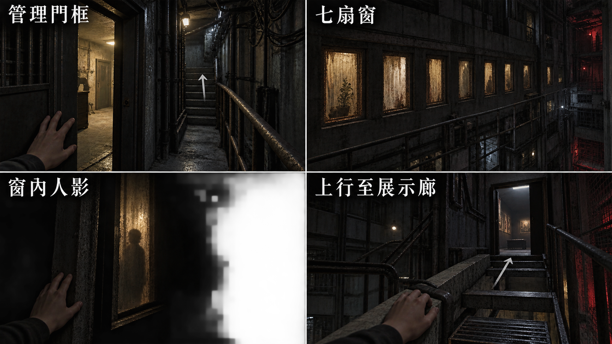
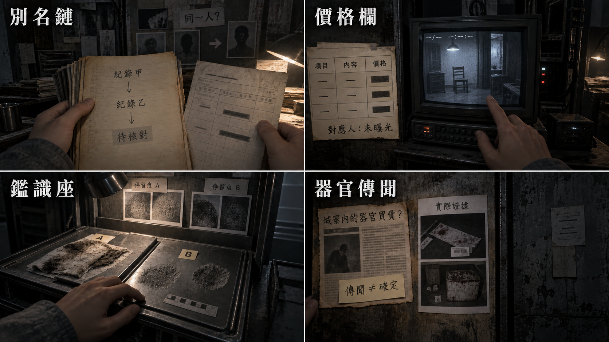
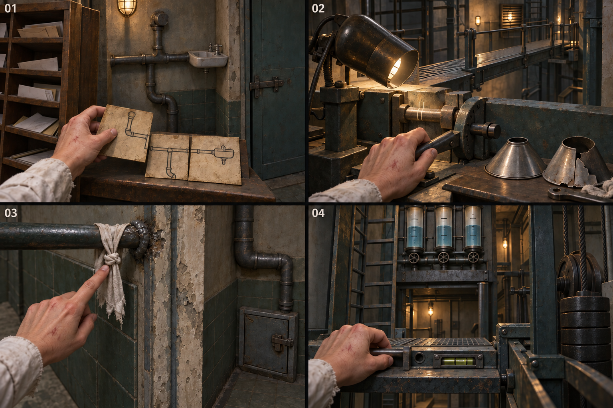
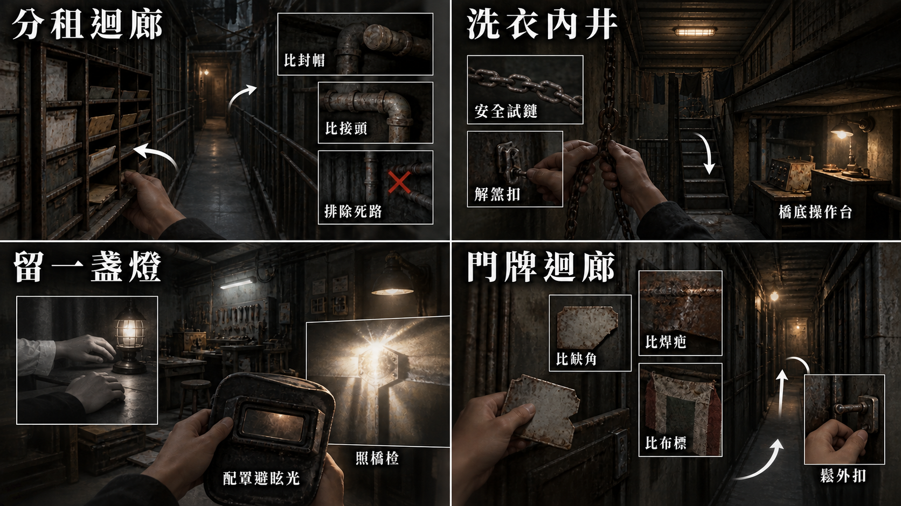
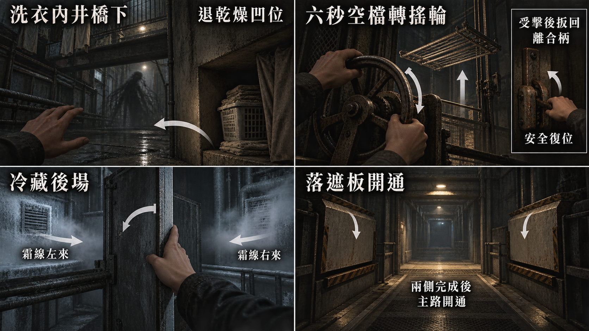
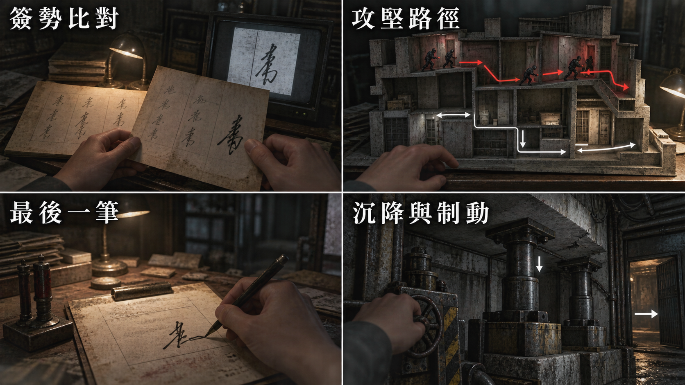

# 遊戲劇本：第六幕

[總目錄](09-14_全劇本與關卡整合稿.md#book-toc) · [上一幕：第五幕](09-08_正式劇本_第五幕.md#act-5) · [下一幕：終幕](09-10_正式劇本_終幕.md#act-7) · [共用附錄](09-15_正式劇本_共用附錄.md#book-appendices)

[M1](#node-m1-script)、[R27](#node-r27-script)、[U1](#node-u1-script)、[U2](#node-u2-script)、[U2b](#node-u2b-script)、[U3](#node-u3-script)、[R28](#node-r28-script)、[R29](#node-r29-script)、[U4](#node-u4-script)、[U4b](#node-u4b-script)、[U5](#node-u5-script)、[U6](#node-u6-script)、[U6b](#node-u6b-script)、[R30](#node-r30-script)、[R31](#node-r31-script) · [本幕製作規格](#spec-act-6)

<a id="doc-0909"></a>
<a id="act-6"></a>

## 第六幕 · 上層與回返


<a id="node-m1"></a>
<a id="s-0909-3"></a>
<a id="h-0909-22"></a>
<a id="node-m1-script"></a>

### M1 · 管理維修脊柱

[製作規格](#node-m1-spec)

<a id="s-0909-4"></a>

<!-- import:s-0909-4:begin -->
<a id="h-0909-24"></a>

#### [M1-00] 門框以內

〔前置〕R25 已確認單向進入，F1–F5、阿彪處置及安全檢查點有效。續存從原通行進度恢復，不重播阿彪。
〔演出〕肩膀靠近鋼板，扶手向上延續。牆的另一側是封閉樓層；腳下仍在樓體包覆之內，不見天空。
〔玩家〕先見內容設定提示，再進第一個踏點。無「先呼吸」OS，不破壞第五幕留下的靜默。
〔系統〕【新增；無聲】「前方包含封閉房間內的遺體遠景。可改用文字摘要。」
〔玩家〕原通行約二分二十秒，固定移動速度、視角偏轉不超過 40 度；不是必須看滿七窗才能通過。低動態版沿窗框切定點，保留同一進度與觀察選擇。
<!-- import:s-0909-4:end -->

<a id="s-0909-5"></a>

<!-- import:s-0909-5:begin -->
<a id="h-0909-32"></a>

#### [M1-01] 七扇窗

〔環境〕自己的呼吸、衣料擦鋼板、遠處滴水。無配樂、無窗內撞擊音。
〔演出〕感知中的發光棒殘光掠過窗面，照亮一至兩秒；不是帶離 P1 的新實物。
〔玩家〕路徑經過全部七窗，但只有主動查看或確認對應摘要才記該窗觀察。通過不代替查看。

| 窗位 | 同距離遠景 | 不能增加的內容 |
| --- | --- | --- |
| 1 | 空房，床翻倒在牆邊 | 不藏一張新臉 |
| 2 | 門內側抓痕，地面物件推到門後 | 不加抓門動畫 |
| 3 | 一名已死亡的受困者停在門邊，普通衣物，完整遠景 | 不推近臉、不放傷勢細節 |
| 4 | 床架與雜物擋在門後，無可確認的人 | 不把空房定為安全撤離 |
| 5 | 另一名受困者的遺體在門邊，和上一窗不同的姿勢 | 不把三人做成同一張複製貼圖 |
| 6 | 黑暗的空間，翻倒家具與留在門邊的物件 | 不據物件推姓名 |
| 7 | 第三名受困者的遺體仍在門邊；殘光經過後暗去 | 不以突然睜眼收尾 |

〔停頓〕三個有人窗口各沿原約 1.5 秒掠光，不慢推、不作主角反應特寫。可暫停，不可快進跳到通道終點。
〔製作〕破例只發生在原窗口遠景。三人與展示編號的對照沿同一資料表；畫面不顯新增姓名或「三人全部看過」獎勵。
<!-- import:s-0909-5:end -->

<a id="s-0909-6"></a>

<!-- import:s-0909-6:begin -->
<a id="h-0909-51"></a>

#### [M1-02] 七窗文字摘要（新增待審）

〔玩家〕完整過濾遮住窗內畫面，保留通行、窗框與逐窗閱讀入口；不把未選觀察的窗口全文自動展開。中途切換只接剩餘窗位，已完成者可回讀。

| 窗位 | 無聲摘要 |
| --- | --- |
| 1 | 「窗內沒有看見人。床翻倒在牆邊。」 |
| 2 | 「門的內側留著抓痕。幾件物品堆在門後，沒有人移動它們。」 |
| 3 | 「門邊有一名已死亡的受困者。從這個距離可以辨認那是一個人，不能確認姓名。」 |
| 4 | 「床架與雜物停在門後。看不到人，也看不到有人已離開的證明。」 |
| 5 | 「另一間房的門邊也有一名受困者的遺體。姿勢與先前那人不同，沒有動靜。」 |
| 6 | 「光只照到翻倒的家具和門邊物件，沒有可確認的人影。」 |
| 7 | 「第三名受困者的遺體在門邊。光繼續向前，房間重新暗下來。」 |

〔系統〕【新增；無聲，逐窗共用】「記下此窗觀察」／「繼續前進」。
〔玩家〕摘要確認與原窗查看提交同一窗位觀察；任何一窗略過都不堵通道。閱讀暫停通行，收起後接原踏點，不要求文字讀者另外罰站。
〔禁止〕不加入死因、死亡時刻、姓名或器官推論；不替未看第 3／5／7 窗者補「已確認位置」。
<!-- import:s-0909-6:end -->

<a id="s-0909-7"></a>

<!-- import:s-0909-7:begin -->
<a id="h-0909-69"></a>

#### [M1-03] 聲音固定下來

〔演出〕第七扇窗已離開光圈，出口門框就在前方。
〔條件〕原 E-09 對講機殘留在此完成定位；不與遺體照亮同時發聲。

封鎖後者（原對講機回聲）【鎖定】「還有人在裡面。」

〔環境〕聲音固定在原一扇窗的位置，不再隨玩家的耳側交換。無新回話、無敲門應答。
〔玩家〕走完既有踏點才設 `lower.m1.complete`。門禁核驗後門開，玩家自行進 R27；回聲不是現時活人求救的確證。

---
<!-- import:s-0909-7:end -->

<a id="node-r27"></a>
<a id="s-0909-8"></a>
<a id="h-0909-81"></a>
<a id="node-r27-script"></a>

### R27 · 展示廊

[製作規格](#node-r27-spec)

<a id="s-0909-9"></a>

<!-- import:s-0909-9:begin -->
<a id="h-0909-83"></a>

#### [R27-00] 燈還亮著

〔演出〕廉價展板、冷白燈、整潔照片與價目。巨大核心梁從飾板後斜穿過去，門口剛才的窄度還留在肩上。
〔演出〕照片貼得端正，價目列對得整齊；沒有汙痕替玩家先指出哪一頁更可怕。從服務口到索引的原視線裡，能看清每張照片都被排進同樣的版面。保持文件與人的照片，不把展板變成釘著身體的標本牆。
〔停頓〕讓眼睛適應，不立刻推一頁新文件。

主角（身體 OS）【鎖定】「太亮了。」

〔玩家〕可先看服務口方向。照片衣物完整，無人體傷勢；本房不發生攻擊。
<!-- import:s-0909-9:end -->

<a id="s-0909-10"></a>

<!-- import:s-0909-10:begin -->
<a id="h-0909-92"></a>

#### [R27-01] 一個人被分成三種編號

〔操作〕開本地展示索引，親讀各頁的日期、校驗尾碼、入園欄及轉運章，再連三條別名鏈。
〔演出〕第一次展頁先留生活端的床位、座位或貨梯識別牌，再由玩家翻到帳號與價目欄。比對時可自由並排，不強迫每次按固定順序重讀；未查真名仍保留編號，不以生活畫面補造身分。

| 鏈 | 生活端 | 工作／帳號端 | 物流／展示端 |
| --- | --- | --- | --- |
| A | 未領床位牌的對照摘錄 | 低標名單編號 | 可訓練／低服從 |
| B | 產線座位與撤銷帳號 | 視訊組工作評級 | 多語／高信任轉化 |
| C | 貨梯識別牌對照 | 共用物流編號 | 可移交／健康待評 |

〔玩家〕鏈 B 另以登入雜湊、鏈 C 以移交編號交叉核對；不是只照照片長相配對。錯連保留已成鏈，只提示當前兩件不足以支持同人。
〔演出〕三鏈合併入人物欄，取得 E5-01。「樣本」被細線劃去；名字只由實讀個人來源恢復，否則寫「姓名未知／下落待確認」。
〔玩家〕零上部選填者仍可使用本地對照摘錄完成，不補發上部收藏。已看窗口的對應編號各自增加「已確認位置」，不要求三窗全看才更新任何一人。
〔停頓〕鎖定後十二秒不跳新證據，原頁可讀，不播成功音。這一拍先讓編號成為人，不插主角簽名。
〔製作〕本房只回答「這些編號指向誰」；保留可回查原件，不再彈出人口交易總結。主角跨月簽核留 R29，當晚選擇留 R31，不將三次揭露擠成同一頁。
<!-- import:s-0909-10:end -->

<a id="s-0909-11"></a>

<!-- import:s-0909-11:begin -->
<a id="h-0909-109"></a>

#### [R27-02] 被讀取的一次（選填觀察）

〔前置〕第一條鏈完成時，只記一次原未知讀取；必要文字呈現完才讓玩家回看。若本次同時完成第三鏈，先保留 E5-01 十二秒靜默；讀取紀錄只留角落待查，不補播提醒。
〔演出〕角落一次讀取心跳歸零，留下時間、節點雜湊與 READ，沒有對端名字。
〔玩家〕可保存已見紀錄，但不能判為康、警方、買家或活人。未知握手不成為逃生門票。
〔製作〕展示玻璃只保留正常幾何反射，不增加第十次鏡像者或提前在「內控核准」欄疊上主角。
<!-- import:s-0909-11:end -->

<a id="s-0909-12"></a>

<!-- import:s-0909-12:begin -->
<a id="h-0909-116"></a>

#### [R27-03] 同一張價目（T-6a，選填）

〔前置〕看過原價，再完成任一別名鏈，自行回到展示牆。安定點、閱讀與十二秒停頓不觸發。
〔演出〕同照片、同紅叉、同價欄，覆寫下的舊價壓痕浮出，新價旁留識別縮寫；數值及縮寫沿原件。
〔環境〕沿原 HA 的一聲乾紙摩擦後靜止，不另播第二事件。
〔玩家〕縮寫尚未核驗，R29 才能對簽勢。沒有肖像轉頭、不宣告現時又成交一人。無 OS。
<!-- import:s-0909-12:end -->

<a id="s-0909-13"></a>

<!-- import:s-0909-13:begin -->
<a id="h-0909-123"></a>

#### [R27-04] 維修座與名字（選填）

〔操作〕第一鏈後，安全角落低壓維修座可定神 2.5 秒，一輪一次 +25、上限 100；不因使用而重播讀取心跳。
〔玩家〕另可將既有人物的入園登記與同工號班表對讀，主動加姓名附註。排除 E-10、C-07、主角及只能由最後一筆取得的姓名。
〔製作〕人物鍵與真名依既有資料表，不用占位姓名出貨；未做不列缺額、不加結局分。
〔操作〕三鏈完成後，沿展示牆旁服務口進 U1。安定、姓名與價格回訪皆不鎖門。

---
<!-- import:s-0909-13:end -->

<a id="node-u1"></a>
<a id="s-0909-14"></a>
<a id="h-0909-132"></a>
<a id="node-u1-script"></a>

### U1 · 分租迴廊

[製作規格](#node-u1-spec)

<a id="s-0909-15"></a>

<!-- import:s-0909-15:begin -->
<a id="h-0909-134"></a>

#### [U1-00] 重複的門號

〔演出〕粉灰住宅門框被玻璃隔間切開。兩扇門號相同，收件架卻擋住一段舊管圖。
〔生活近看〕收件架底腳墊著裁齊的舊磚片，較高的一格留下避開滲水的透明擋片；旁邊短箋寫「下層會濕，信先放上格」。新玻璃隔間把原共用收件位置切在兩戶之外。這些是維持日常使用的修補，不新增門號、姓名、箭頭或管線配對；可略過，不替重複門號提供答案。
〔操作〕移開收件架，旋轉三片管圖對接，再走到現場看端點：上支管焊封，橫支管回住戶水槽，下彎接頭續向內井。
〔製作〕收件架生活近看沿[生活文化局部](09-15_正式劇本_共用附錄.md#culture-details)另列文字與疊圖工時；移架前後保持同一物件，不用新增短箋代替管圖辨路。
〔玩家〕錯接只顯示接頭不合，點錯門看見封帽或水槽，不新開房、不扣資源。
〔操作〕確認下彎服務路後，親手退開普通插栓，才寫 `lower.u1.route_known`。
〔演出〕U2 門內再次看見同款下彎接頭。筆記幫忙辨路，沒有遙控開門。
<!-- import:s-0909-15:end -->

<a id="node-u2"></a>
<a id="node-u2-script"></a>

### U2 · 洗衣內井

[製作規格](#node-u2-spec)

<a id="s-0909-16"></a>

<!-- import:s-0909-16:begin -->
<a id="h-0909-142"></a>

#### [U2-00] 哪條鏈真的牽著架子

〔演出〕濕綠磁磚、懸空晾架、兩條鏈與固定短階；下方乾燥凹位可從入口指認。
〔操作〕沿可見鏈路區分牽引鏈與空曬衣桿鏈，安全試行、解煞扣。空鏈只動空桿，不算進度也不罰。
〔玩家〕安全準備完成寫 `lower.u2.setup_ready`，沿短階下 U2b。不在入口鏡位提交收架或啟動攻擊。
<!-- import:s-0909-16:end -->

<a id="node-u2b"></a>
<a id="node-u2b-script"></a>

### U2b · 晾架橋下操作台

[製作規格](#node-u2b-spec)

<a id="s-0909-17"></a>

<!-- import:s-0909-17:begin -->
<a id="h-0909-148"></a>

#### [U2b-00] 架子下面

〔演出〕鏡頭降到橋底側台，雙鏈與綠磁磚接續。手搖輪、兩止點、離合柄與乾燥凹位同框。
〔玩家〕可先指認退路及試看操作。主動正式轉搖輪才開始 UD-01，這一下只啟動，不偷算第一段。
<!-- import:s-0909-17:end -->

<a id="s-0909-18"></a>

<!-- import:s-0909-18:begin -->
<a id="h-0909-153"></a>

#### [U2b-01] 停手的時機

〔演出〕地面黑線爬向搖輪，晾架開始下壓；3.5 秒完整前兆後，0.6 秒掃擊。
〔操作〕退乾燥凹位，避襲後利用六秒窗口轉輪 1.5 秒，第一段晾架離地。下一輪同樣判讀，再做一段，橋面清出。
〔玩家〕不需第三段，不縮短第二次前兆。空等可繼續下一輪，不迫使賭命穿行。
〔失敗〕受擊取消尚未到位的段，恐慌 +1、本遭遇最多 +3；已完成段保留。回凹位後親手扳回離合柄，安全復位再確認開始，不能挨打同時刷進度。
〔演出〕兩段完成，黑影退去，原橋面可走。它沒有臉、完整蛾翼或四鬚，不發安息或抹除。
〔玩家〕寫原 `lower.u2.bridge_clear`，沿側階上橋，自行進 U3；戰後不重生。
<!-- import:s-0909-18:end -->

<a id="node-u3"></a>
<a id="node-u3-script"></a>

### U3 · 燈具修理工場

[製作規格](#node-u3-spec)

<a id="s-0909-19"></a>

<!-- import:s-0909-19:begin -->
<a id="h-0909-162"></a>

#### [U3-00] 亮招牌遮住了真正的刻線

〔演出〕琥珀燈罩、停轉桌扇、修補痕。招牌很亮，橋卻沒有落下；橋栓和側槽在背面。
〔操作〕先斷局部燈電，試三罩的凹槽與卡榫。窄口罩吻合，寬罩不合、裂罩固定不住；不以試錯爆電懲罰。
〔操作〕裝妥窄罩，轉遮光葉擋住招牌直射，再啟用原檢修燈，調向側槽。
〔演出〕一道刻線先出現，角度正確才看見兩道。U2 所見是同一構件另一側，不是第二組密碼。
〔操作〕按本地刻度對齊橋栓，親手拉桿。未對齊則可見止擋；對齊後橋落位，寫 `lower.u3.bridge_open`。
〔禁止〕光不自動開魔法門。飛蛾不替玩家指答案。
<!-- import:s-0909-19:end -->

<a id="s-0909-20"></a>

<!-- import:s-0909-20:begin -->
<a id="h-0909-171"></a>

#### [U3-01] 留一盞燈（LM-03，選填）

〔前置〕落橋完成，沒有威脅。檢修燈照到舊針線包，主角在安全物件近看回想。

主角（現時回想）【鎖定】「小花想要一張修理桌。我答應過，出去後陪她找。」

〔玩家〕這句不發記憶完成；可直接離開。願意停留才翻包內窄布餘料，對自我形象衣物上的斜補線，完成關聯。
〔演出〕25–45 秒靜止回憶：停電的工作間，一盞小燈，小花手停在補口袋的位置。兩人曾被安排做衣物雜務，不由此取得自由走遍上層的權利。

小花（記憶聲音）【鎖定】「出去以後，找個能放修理桌的地方。」

主角（記憶聲音）【鎖定】「好，我陪妳找。」

〔演出〕灰蛾停燈罩外沿，暖光留一條空隙。無突然襲擊，沒有回憶人物抬頭。
〔玩家〕略過聲畫仍讀承諾短句與來源，確認才設 `memory.lm03.reviewed`。衣物是主觀回想的對照，不是肉身來過工場的物證。
〔操作〕自行走過已落的橋，從背側進 R28，先看見漂亮玻璃的維修支架。

---
<!-- import:s-0909-20:end -->

<a id="node-r28"></a>
<a id="s-0909-21"></a>
<a id="h-0909-190"></a>
<a id="node-r28-script"></a>

### R28 · 交易接洽室

[製作規格](#node-r28-spec)

<a id="s-0909-22"></a>

<!-- import:s-0909-22:begin -->
<a id="h-0909-192"></a>

#### [R28-00] 舊招牌，新的紙

〔演出〕「恒岳貿易」舊玻璃字樣露在覆貼層下，內部運送道旁門可通 R29。桌上是現用合同，不能靠舊招牌判責任。
〔操作〕主角在安全桌邊伸手，指尖停了一下。

主角（身體 OS）【鎖定】「手指不聽話。」

〔玩家〕可直接前往 R29，也可看合同或主動開遠端索引；紙本近看不啟動倒數。
<!-- import:s-0909-22:end -->

<a id="s-0909-23"></a>

<!-- import:s-0909-23:begin -->
<a id="h-0909-201"></a>

#### [R28-01] 不能把空白補成死因（E5-07，選填）

〔操作〕並列醫療評估「轉特殊買方」、目的地缺失的移交單，以及實際取得的 E2-11 語音／外聯草稿來源。不同文件的同意欄與拒絕註記分開核對。
〔玩家〕有 E2-11 才完成原 supported；沒有則保留 partial，不憑到房補出傳聞錄音。已有來源可用轉錄回查，沒有新手術影像。
〔字幕〕【鎖定；結論】「有器官買賣風險與傳聞，但現有證據不足以確認每一名失蹤者的死因。」
〔演出〕可確認事項與未知事項同字級。未看來源不先顯示「資料正在被遠端刪除」；那要實際啟動下一段才成立。
〔禁止〕空鉤、空箱或特殊買方都不能代替死因證據。E-10 維持下落不明。
<!-- import:s-0909-23:end -->

<a id="s-0909-24"></a>

<!-- import:s-0909-24:begin -->
<a id="h-0909-209"></a>

#### [R28-02] 只能留下其中一頁（選填）

〔操作〕玩家主動開遠端索引，先見三頁標題及原摘要、單頁封存限制，再出現原橫幅。預覽還未載入任何一頁全文。
〔系統〕【新增；無聲】「一次封存／完整頁槽 1。提交後，其餘頁面讀取權限將撤回。」
〔製作〕限制屬當前遠端工作階段的一次封存交易；提交後原排程撤回其他頁權限，並非手速夠快就能存三頁。摘要與刪除雜湊可留，不能當全文原件；不新增第二個插槽道具。
〔系統〕【鎖定；無聲】「遠端工作階段已恢復／刪除排程 01:30」。

| 頁面 | 預覽已知內容 | 能保留的範圍 |
| --- | --- | --- |
| 買方代碼 | 匿名代碼與競價時間 | 非買家真名；R31 可見外部節點仍在線 |
| 通報者註記 | 拒絕／已外聯／轉特殊評估 | E-05 被轉運、未同意；不是器官摘除確證 |
| 空名訊號清單 | 撤銷帳號、空白目的地 | E-10 帳號撤銷、下落待確認 |

〔玩家〕標準 90 秒，輔助 180 秒或關倒數動畫；放大閱讀、設定、失焦及暫停均停表。房間檢視才續跑，不能靠縮小難讀文字製造壓力。
〔操作〕原 1.5 秒快取只留一頁，其餘全文變不可讀雜湊；逾時未選則三頁全文消失，寫 `none_timeout`。選定即保存，不離房重選。
〔系統〕【鎖定；無聲】「已保存刪除發生證明。內容不可復原。」
〔演出〕桌上紙本仍在。無黑影靠近、無斷電刪主線、無「選錯人」評語。
〔玩家〕快取或逾時結算後出口可用；未開過終端也可直接走。回實景後沿原十五秒不插新揭露，可走動、回讀或離房；若已到 R29，玩家收束這段再主動開比對，不能以跨門取消保護。倒數不帶進 R29，R31 索引與全部結局均不靠這一頁。

---
<!-- import:s-0909-24:end -->

<a id="node-r29"></a>
<a id="s-0909-25"></a>
<a id="h-0909-230"></a>
<a id="node-r29-script"></a>

### R29 · 簽核檔案室

[製作規格](#node-r29-spec)

<a id="s-0909-26"></a>

<!-- import:s-0909-26:begin -->
<a id="h-0909-232"></a>

#### [R29-00] 三個月份

〔演出〕厚牆邊簽核架，背面原服務口可辨。桌面留足空白放三份紙，不一進房就彈待核可按鈕。
〔操作〕以 R21 小花排程簽名為基準，親讀 M-3、M-2、M-1 物流簽核，描三個共同筆畫；可改用依序點錨點，不考精細描線。
〔演出〕M-3 有康覆核章，後續月份反覆「可移交」。M-1 同筆跡旁有手寫備註。
〔演出〕三個月份以 09-13 的 T0 基準顯示 2025 年 8／9／10 月，不在玩家文件印製作代號。首次先讓玩家比完同筆勢，再親自展開原 M-1 備註；備註不是突然長出的新字，回讀時整頁一直可見。
〔字幕〕【鎖定；原手寫】「此批次品質優於上批，建議提價。」
〔系統〕【鎖定；無聲】「高度一致」。
〔玩家〕三月份及提價備註都讀完才發 E5-02，同時保存原頁影像、頁碼、筆勢與終端例行索引 `local_index_available`。先保存，後暈墨。
〔製作〕不重播 R27 的三條別名鏈，不插入 R31 的「同一人」結論；這一房讓玩家看見核可持續發生，並看見她另寫的提價建議。全部必要欄位仍可回查，減的是重複解說，不是推理依據。
<!-- import:s-0909-26:end -->

<a id="s-0909-27"></a>

<!-- import:s-0909-27:begin -->
<a id="h-0909-243"></a>

#### [R29-01] 水浸到字邊

〔前置〕比對操作結束，文件已保存；她鬆開手，視線離開原件的工作焦點。

主角（身體 OS）【鎖定】「眼睛很酸。」

〔演出〕至少二十秒責任停頓。水沿紙邊暈開，不改已存頁；首次 E5-02 原恐慌脈衝 +1，不重複疊加。
〔演出〕在原停頓裡，水先碰到靠紙邊的框線。她剛鬆開的手留在旁邊，沒有去擦掉簽名；那個收筆與剛才親自比對過的筆勢同框。保持普通紙張的濕痕，沒有血色、重播回憶或自動補簽；已保存的清晰原頁照常可讀。
〔玩家〕可讀已保存原件、暫停或保存；不跳新證據、不推核可佇列、不插 HA。暫停／失焦停表，讀檔不從頭強迫再等。
〔製作〕這是已定敘事停頓，不另加最低房間分鐘。結束才開原選填與 U4 出口。
<!-- import:s-0909-27:end -->

<a id="s-0909-28"></a>

<!-- import:s-0909-28:begin -->
<a id="h-0909-253"></a>

#### [R29-02] 同一張表（選填）

〔前置〕持有 E2-14，且責任停頓結束。
〔操作〕與 E5-02 並排對框線、字型行距、「不值得繼續投入」及 FORM-IC-03 頁尾。
〔字幕〕【鎖定；比對結論】`「不值得繼續投入」的判斷，用於客戶與貨物是同一張表。`
〔操作〕可再看 K-089「無資產·結案」列與相同核可筆勢。只寫 E2-14 已回收，不新增門票。
〔禁止〕無 OS；結案支持停止追騙，不單憑此列宣告 K-089 今天仍活著或是唯一生還者。沒有 E2-14 就不開本比對。
<!-- import:s-0909-28:end -->

<a id="s-0909-29"></a>

<!-- import:s-0909-29:begin -->
<a id="h-0909-261"></a>

#### [R29-03] 把原頁翻回來（選填）

〔操作〕KNOWN_CLIENT_RECAP 只列本輪已讀 K-114／K-207／K-089。玩家手動翻回原頁，不播客戶現在生活的新影像。
〔玩家〕小花停止出鏡的申請與匿名受威脅陳述各依 R21／R9 已讀附頁呈現，不能合併受害者、補發未讀頁或加私密影像。
〔演出〕是那些日常句子與核可欄並排，不出現一段「原來大家都是受害者」總結。
<!-- import:s-0909-29:end -->

<a id="s-0909-30"></a>

<!-- import:s-0909-30:begin -->
<a id="h-0909-267"></a>

#### [R29-04] 補查及兩份結案（選填）

〔操作〕另開交接附件索引，逐份查 CARE／MC／KX 副聯、原位置與日期。只收實讀件；不回填上部完成、不包括 SQ-R／T／S。
〔操作〕MC-03 揭附頁，對同人事號：康查閱異常與未通報事項，待遇可停、職務可撤，旁邊是「留用／重評」。
〔玩家〕MC-01～03 齊後，把受控欄與既有長期核可欄並列，主動保存才結 SQ-M；仍稱「這位內控人員」，R31 才附姓名。
〔操作〕KX-03 對卡尾碼、日期及本人覆核碼，讀第八日樓內簽收與末次出口無外側回執。
〔字幕〕【鎖定；KX-03 第八日手寫，無聲】「交接已完成。請確認收到」。
〔演出〕2025-11-12 的樓內簽收及本人覆核有效；下方「對外確認」欄空白。它與另一欄「末次出口請求／未取得外側通行回執」分開，不把樓內已簽收誤讀為外側接應成功。
〔玩家〕可在同一頁籤列回看已收的「完成後留車，等我通知」與「核准仍有效，請按原安排接應」。不強制自動輪播；只收 KX-03 時不補發另外兩件。
〔停頓〕視線留在空白確認欄，沒有新來訊、主角 OS 或「他被拋棄了」的解說。無回執只證明未確認，不能讀出對方故意不回。
〔玩家〕KX 三件排「核准／實際登車／後續在場」，主動記「撤離未完成，後續下落待查」才結 SQ-K。只關夾，不播康死亡。
〔玩家〕CARE 若漏收，在此逐件比對、保留代班與供述兩段後主動歸檔；不能一鍵補齊三支線。
<!-- import:s-0909-30:end -->

<a id="s-0909-31"></a>

<!-- import:s-0909-31:begin -->
<a id="h-0909-280"></a>

#### [R29-05] 下一筆已經在等（選填決定）

〔前置〕二十秒停頓已結束，玩家另開舊佇列。
〔演出〕核可欄預填 Michelle，狀態「等待內控主管確認」。批次日期在 L-48 之後。
〔操作〕可先翻前兩週：相同名單反覆自動生成、無人核可、逾時作廢。本批次完整編號、已知姓名、已知位置與原觀察在點擊前可讀。
〔玩家〕未知姓名不假造，作者知道的全批下落不顯示成玩家已知。沒有倒數、紅色警告或推薦答案。
〔系統〕【鎖定；原操作】「可移交」。
〔演出〕它與之前幾個月的表格用同一個欄位。只剩最後一格沒有填。
<!-- import:s-0909-31:end -->

<a id="s-0909-32"></a>

<!-- import:s-0909-32:begin -->
<a id="h-0909-289"></a>

#### [R29-06] 可移交

〔操作〕玩家已展開批次，再主動點「可移交」。不是點「查姓名」暗中替他核准。
〔演出〕原 1.2 秒內收欄、轉綠、前推一格，播放與 R21 同一短核可音。
〔玩家〕保存 `queue_approved=true`、解密姓名／家屬列及本輪 `approved_timestamp`。不加恐慌、不扣資源、不計抹除。
〔演出〕下一筆空白又送來，但不提供第二次核可；顯示／輸出支路因電不足熄滅，本地已存資料與必要索引仍可讀。
〔禁止〕沒有旁白說玩家有罪，沒有怨靈為此跳出。資料的實際獲得與當下核可時戳都留著。
<!-- import:s-0909-32:end -->

<a id="s-0909-33"></a>

<!-- import:s-0909-33:begin -->
<a id="h-0909-297"></a>

#### [R29-07] 收起佇列

〔操作〕展開後選關閉，不提交核可，保存原雜湊與既有已知資料，`queue_approved=false`。

主角（OS）【鎖定；只在主動關閉時】「……它還在等。」

〔玩家〕從未開佇列便離房者維持未核可且沒有新時戳，不說此句，也不假稱已看完整批次；主線照常。關閉或未開皆不把已核可的存檔改回 false，重載只讀原決定。兩路都不改 U4 與 R31 索引條件。
〔操作〕玩家自行由簽核架背面離開，沒有完成章節獎勵或善惡標示。

---
<!-- import:s-0909-33:end -->

<a id="node-u4"></a>
<a id="s-0909-34"></a>
<a id="h-0909-308"></a>
<a id="node-u4-script"></a>

### U4 · 門牌迴廊

[製作規格](#node-u4-spec)

<a id="s-0909-35"></a>

<!-- import:s-0909-35:begin -->
<a id="h-0909-310"></a>

#### [U4-00] 不是同一個門號而已

〔演出〕石灰牆乾燥，相同門牌沿半層梯排開。門框缺角、扶手焊疤及可用廢布均可近看。
〔操作〕先看兩個固定地標，再把本地廢布繫成單結，保留斷邊方向。
〔玩家〕主動穿過原內門，一次短轉場後回到同一布標。寫 `loop_seen`，穿門熱點停用，不要求再繞。
〔操作〕對缺角、焊疤、單結與斷邊位置，確認 `return_verified`。不能只靠重複門號證明超自然。
〔環境〕沒有笑聲或小花說「回來了」。暫時只知道這條出口有問題，不知道原因是誰。
<!-- import:s-0909-35:end -->

<a id="s-0909-36"></a>

<!-- import:s-0909-36:begin -->
<a id="h-0909-318"></a>

#### [U4-01] 牆底還有管線

〔操作〕循冷凝管找到初訪看得見的檢修蓋，依受力片方向鬆外扣，親手掀蓋。
〔演出〕安全上踏台露出，可下降到 U4b。內銷尚在下面，不能隔蓋板操作。
〔玩家〕MR-01 選填在驗證後可展平住戶自留夾：器材破損早於值班、請勿歸責，紙角缺口與編號完整。它不是剛繫的布標，不鎖主線。
<!-- import:s-0909-36:end -->

<a id="node-u4b"></a>
<a id="node-u4b-script"></a>

### U4b · 檢修蓋下服務夾道

[製作規格](#node-u4b-spec)

<a id="s-0909-37"></a>

<!-- import:s-0909-37:begin -->
<a id="h-0909-324"></a>

#### [U4b-00] 蓋下面的另一道扣

〔演出〕鏡頭下降，上方仍看見缺角與布標。內銷、拉力片及服務閘在可及範圍。
〔操作〕對受力方向抽內銷，推開服務閘，寫 `lower.u4.service_latch_open`。
〔玩家〕錯方向免費重試，取消不重繫布、不重播回返。蓋內簡圖示左右孔口、轉向隔板與後方出口；U5 現場同樣可讀，不把圖變必收鑰匙。
<!-- import:s-0909-37:end -->

<a id="node-u5"></a>
<a id="node-u5-script"></a>

### U5 · 冷藏後場

[製作規格](#node-u5-spec)

<a id="s-0909-38"></a>

<!-- import:s-0909-38:begin -->
<a id="h-0909-330"></a>

#### [U5-00] 霜從哪一邊來

〔演出〕停用冷櫃、空的食品掛架、左右送貨口。後方維修出口另成一路，不會被兩塊遮板封住。
〔玩家〕安全試轉隔板，先指認無條件掩蔽的固定冷櫃；自行確認開始 UD-02。
〔禁止〕空鉤不作人體屠宰或器官買賣證物。黑影不帶小花臉。
<!-- import:s-0909-38:end -->

<a id="s-0909-39"></a>

<!-- import:s-0909-39:begin -->
<a id="h-0909-336"></a>

#### [U5-01] 把來的那一側擋住

〔演出〕左或右霜線由對應孔口延伸，3.5 秒前兆及方向文字後，0.6 秒穿刺。首側保存，不重抽。
〔操作〕轉向隔板擋來向，成功後六秒窗口拉該側獨立遮板 1.5 秒；封一側後只剩另一側來襲。
〔玩家〕躲冷櫃能避攻，不能自動封口。第二側照現場方向做，不背左先右後口訣。
〔失敗〕取消未到位動作，恐慌 +1、每遭遇最多 +3；保留已封側。回安全位把隔板推回中位，再確認開始，不能硬吃進度。
〔演出〕兩側封好，霜線停在板外，黑影退。後方原維修口可走，寫 `lower.u5.shutters_closed`，不發新證據。
<!-- import:s-0909-39:end -->

<a id="node-u6"></a>
<a id="node-u6-script"></a>

### U6 · 水箱夾層

[製作規格](#node-u6-spec)

<a id="s-0909-40"></a>

<!-- import:s-0909-40:begin -->
<a id="h-0909-344"></a>

#### [U6-00] 六格水

〔演出〕水箱夾層突然安靜，三槽左／中／右為 3／0／3。配重圖、數字格線、可反轉導水閥與固定保養梯同框。
〔操作〕把左一格導中、右一格導中，或反序，得到 2／2／2。每步兩槽同步變化，總量六格。
〔玩家〕錯配可反向或用本地復位閥；空來源／滿目的無動作，不罰。中間達線但兩側不平，踏板仍歪。
〔操作〕三槽平衡後關調節閥，寫 `balance_held`。沿固定梯下 U6b，不先踏未固定的活動踏板。
〔玩家〕本段是短喘息機關，沒有黑影追到水面，也不把稍後 R30 沉降說成玩家調水造成。
<!-- import:s-0909-40:end -->

<a id="s-0909-41"></a>

<!-- import:s-0909-41:begin -->
<a id="h-0909-352"></a>

#### [U6-01] 那張紙（SQ-R，選填）

〔操作〕安全入口翻工具箱外袋退回聯背面，取得 MR-02；與 U4 MR-01 對器材號、日期及紙角。
〔演出〕先前替修理工寫的說明還在，背面卻有自己的否認批註。
〔操作〕兩件相符後選「保留這兩件事」，開原 30–45 秒主觀靜止回憶；不演修理工被處罰。
〔演出〕一張工場工具桌靜格：折起的工作布、沒有通電的器材，以及那張「破損早於本班次，請勿歸責值班修理工」說明。未具名成年修理工的手停在紙角旁，樂瑤的手停在已寫完的說明另一側；兩人不動、不露新面孔、不加對話。當時的紙不預先帶有後來的否認。
〔演出〕退出靜格，回到 U6 玩家剛拿到的退回聯近看；同一缺角先入焦，再由玩家翻到現存的否認批註。鏡頭不演她在過去翻紙或改字，R31 仍是唯一歷史解凍。這一翻不用重解已完成的比對，也不另扣資源。

主角（記憶聲音）【鎖定】「那張紙，是我寫的」

〔停頓〕只留工具箱與紙張摩擦，對方沒有回聲、致謝或原諒。必要字句讀完即可自行收起，不加第二段強迫停留。
〔玩家〕略過聲畫顯示等效短讀：「我曾寫下器材破損早於這個班次，請勿歸責值班修理工。退回聯仍留著那份說明，背面卻有我後來否認的批註。」再保留原句「那張紙，是我寫的」與兩來源。主動保存完整筆記才 `side.regret.completed`，不以開始回憶代替結案。
〔玩家〕本段中途保存或切文字可從已到達的靜格／退回聯階段接續，不重新發 MR-01／02 或重扣成本。不增原諒分，不確認對方死活。
〔玩家〕若缺件，R30 沉降前可回 U4／U6。兩件齊但未歸檔者可後續安全收束，不要用 R29 行政索引補造本地物件。
<!-- import:s-0909-41:end -->

<a id="node-u6b"></a>
<a id="node-u6b-script"></a>

### U6b · 配重踏板維修艙

[製作規格](#node-u6b-spec)

<a id="s-0909-42"></a>

<!-- import:s-0909-42:begin -->
<a id="h-0909-367"></a>

#### [U6b-00] 先固定，才踩過去

〔演出〕低位台看見水平泡、栓孔、止回栓，以及同組配重管。
〔操作〕檢查水平，親手扣止回栓，才寫 `lower.u6.walkway_locked`；踏面穩定後自行去 R30。
〔玩家〕完成後鎖住上方調節，回訪不拔栓；未完成可回固定梯，重開閥須重核平水與關閥，不讓中間態憑切鏡自動成功。

---
<!-- import:s-0909-42:end -->

<a id="node-r30"></a>
<a id="s-0909-43"></a>
<a id="h-0909-375"></a>
<a id="node-r30-script"></a>

### R30 · 運送通道

[製作規格](#node-r30-spec)

<a id="s-0909-44"></a>

<!-- import:s-0909-44:begin -->
<a id="h-0909-377"></a>

#### [R30-00] 可看見，走不到

〔演出〕黑鋼核心、錯層平台、焊死的大門。單人維修籠與空推車導軌是兩套機構。
〔環境〕粉塵往一側落，束帶輕擺，空車間歇挪幾公分；真實結構前兆先於剖面提交。
〔玩家〕可看制動桿、棘爪與通往 R31 的落腳點，不立刻開始反應挑戰。
〔條件〕原 HA 運送聲若成立，一次八秒遠輪聲，畫面與輪影不動；沉降或 H-07 開始便停止，不覆蓋結構警示。
<!-- import:s-0909-44:end -->

<a id="s-0909-45"></a>

<!-- import:s-0909-45:begin -->
<a id="h-0909-384"></a>

#### [R30-01] 兩條不相通的路

〔操作〕讀五個原來源，親手放入剖面，不用自動整理。

| 來源 | 放置／核對 | 可以成立 |
| --- | --- | --- |
| 外圍切口近拍與警方標尺 | 8F–14F，原拍攝方向 | 外向內攻堅；不是眼前 50F 的切口 |
| 本房內側焊珠與撤離維修單 | L-48 核心內門 | 集團從內封死，不是警方封門 |
| 斷層圖 | 21F–27F／33F–40F，28 → 30M → 31 對照 | 原物流路由已指向斷裂樓段 |
| E3-07 與搜索清單 | 外圍已清、核心未進 | 攻堅未完整完成 |
| 管理維修圖 | 帳號、R15 復電、F1–F5 的單人脊柱 | 主角路線不是可承載搜救撤離的安全樓梯 |

〔玩家〕必要材料本地可讀，E3-07 隨有效前情；R14 選填異象漏看仍有本房圖。錯位免費重排，不給哪張卡正解。
〔演出〕兩路的不同用結構、寬度與供電呈現，不靠一句「警方沒找到」敷衍。剖面此時只是排妥，還未提交沉降。
<!-- import:s-0909-45:end -->

<a id="s-0909-46"></a>

<!-- import:s-0909-46:begin -->
<a id="h-0909-399"></a>

#### [R30-02] 我沒有回頭（LM-04，選填）

〔前置〕剖面提交之前，安全近看下行支路與舊布擦痕。
〔字幕〕【鎖定；無聲】「逃亡期間的主觀片段，日期未確認」。
〔操作〕核對停步位置與朝出口的方向，進 20–40 秒凝固暗渠。
〔演出〕手停住，像小花的既有呼聲留在身後，最後取景只有朝出口的腳印；不新增呼聲字句或顯示發聲者。

主角（記憶聲音）【鎖定】「我聽見了。但我還是想出去。」

〔玩家〕只支持主觀記憶，不指認小花當時生死、不重演第二段十一秒；略過仍讀來源與短句，確認 `memory.lm04.reviewed`，回未提交的剖面。
〔禁止〕不把想活著出去本身定罪，不改成暗中救人計畫。
<!-- import:s-0909-46:end -->

<a id="s-0909-47"></a>

<!-- import:s-0909-47:begin -->
<a id="h-0909-411"></a>

#### [R30-03] 後面會封住

〔系統〕【鎖定；原不可逆說明，無聲】「接下來的沉降與制動後，原路將封閉」。
〔玩家〕只列已發現未完調查：CARE／MC／KX 回 R29，MR-01 回 U4、MR-02 回 U6；已有兩件可直接在安全筆記收束。不列未知支線，不要求做滿。
〔操作〕可返回，或明確繼續。繼續才提交五點、取得 E5-06，退出調查板。
〔演出〕近兩週逃生、集團封死與未完成攻堅各有日期位置；不顯肉身、不再加未知線上人影。
<!-- import:s-0909-47:end -->

<a id="s-0909-48"></a>

<!-- import:s-0909-48:begin -->
<a id="h-0909-418"></a>

#### [R30-04] 三聲空車

〔演出〕樓面沿原約三度緩慢沉降。三輛空車滑向焊死核心門，依序三聲，與維修籠保持空間區別。
〔演出〕末車底板翻開，只露腕帶、水瓶與未完成辨識標籤，不出現另一具遺體。
〔操作〕玩家親手拉制動桿，讓棘爪卡住維修籠。沒有死亡倒數，不自動代拉，不把拉桿寫成阻止已撞門的推車。
〔演出〕籠固定、下一個踏點可點；後方階梯隨後沉降封閉，原路不可回。
〔玩家〕零穩定度可操作，失焦停演，恢復從安全切點。保存 `brake_locked` 與回程封閉。
<!-- import:s-0909-48:end -->

<a id="s-0909-49"></a>

<!-- import:s-0909-49:begin -->
<a id="h-0909-426"></a>

#### [R30-05] 粉塵裡的站姿（鏡像者第八次）

〔前置〕原沉降粉塵尚在，制動已穩，不在需點桿的時刻遮擋熱點。
〔演出〕粉塵裡有同衣、同包、同疲態的站姿。第一次不在反射面上；一次主觀眨眼遮擋後撤去。
〔環境〕不加專用音效，無 OS；未看見不補播、不授證據。它不替玩家指出下一步。
〔操作〕玩家已轉離粉塵構圖、輪廓消失，才在安全踏點確認重心。此身體短句不在鏡像當下發聲，也不接在制動判定同幀；H-07 仍等玩家另行啟動。

主角（身體 OS）【鎖定】「站穩了。」
<!-- import:s-0909-49:end -->

<a id="s-0909-50"></a>

<!-- import:s-0909-50:begin -->
<a id="h-0909-435"></a>

#### [R30-06] 相差十一秒（H-07，選填播放）

〔前置〕現場穩定，玩家自行用原安全中繼播放兩份本地留存封包。
〔演出〕警用無線電與門內未送出求救分軌，保留各自時間碼及未送達狀態。

警用無線電（既有內容逐字補稿）【新增；待審】「外圍已進入。」

警用無線電（既有內容逐字補稿）【新增；待審】「結構不穩。」

警用無線電（既有內容逐字補稿）【新增；待審】「撤出。」

門內求救封包（既存殘句）【鎖定】「還有人」

〔演出〕呼吸及原房號欄分開保留；房號沿原資料轉錄，不自創一個死者代號。兩軌時間碼差十一秒，不把它混成 R25 那十一秒，也不證明警方聽到。
〔玩家〕可保留 both／police_only／muted，均保存同一文字鑑識摘要，只改終幕環境聲；不由筆記發聲、不刪已核事實。
〔操作〕踏入固定維修籠，沿原脊柱到 R31；這條路不可被拿去解釋終幕救援隊如何進 P1。

---
<!-- import:s-0909-50:end -->

<a id="node-r31"></a>
<a id="s-0909-51"></a>
<a id="h-0909-454"></a>
<a id="node-r31-script"></a>

### R31 · 備份內室

[製作規格](#node-r31-spec)

<a id="s-0909-52"></a>

<!-- import:s-0909-52:begin -->
<a id="h-0909-456"></a>

#### [R31-00] 那晚沒進去的地方

〔演出〕先看備份內門外側的均勻灰塵，再看室內抗震鑑識座。模組鎖在座裡，不是一顆被忘在桌上的外接碟。
〔操作〕接上原本地鑑識通道，等待設備讀取。

主角（身體 OS）【鎖定】「……可以坐一下。」

〔玩家〕R31 起不扣玩法穩定度，但供電、來源及權限仍核驗。不能取走硬碟、上傳或選結局。
<!-- import:s-0909-52:end -->

<a id="s-0909-53"></a>

<!-- import:s-0909-53:begin -->
<a id="h-0909-465"></a>

#### [R31-01] 五列，而不是一個名字

〔操作〕親對五列：本地帳號登入、R29 跨月簽勢、02:20:11、第二道門未驗證完成、02:20:22 下行。
〔玩家〕帳號與簽勢形成 E5-03；時間、門端、方向形成 E5-04。它們補證 R25，不從登入名猜動機。
〔演出〕R29 已核筆勢以來源縮頁保留，無需再次描三個月份；玩家這次仍須把帳號、筆勢、時間與下行方向親自接起。最後焦點停在 02:20:22 的下行欄，不重播七分鐘教學或另加身分驚嚇音。
〔停頓〕核驗完成，原來源留在桌面。

主角（核驗後承認）【鎖定】「我那時只想出去。」

〔禁止〕不補手機排程、回來救人的誓言或十四天倒數。她不知道的兩週仍是受困時間，不是預約行動。
<!-- import:s-0909-53:end -->

<a id="s-0909-54"></a>

<!-- import:s-0909-54:begin -->
<a id="h-0909-476"></a>

#### [R31-02] 少做一點

〔前置〕五列完成，尚未提交第五層。
〔操作〕回看 R21 退回、減輕但核准、完整核可三單的筆勢。有效前情已有 compromise_seen；舊未完檔缺件須在本地原核可附件親讀，不直接置旗標。

主角（核驗後承認）【鎖定】「我把少做一點，當成自己沒有做。」

〔停頓〕等句子結束。這不是解凍旁白，也不在稍後已核可分支的靜默裡加話。
<!-- import:s-0909-54:end -->

<a id="s-0909-55"></a>

<!-- import:s-0909-55:begin -->
<a id="h-0909-485"></a>

#### [R31-03] 刪索引，沒有寫完資料

〔操作〕五列與掛載可互換先後。查看原 01:50 備份主機排程，操作者欄空白；不把自動作業當她 02:20 已進內室。
〔字幕〕【鎖定；舊紀錄】「L48_INDEX_PURGE = COMPLETE」「DATA_OVERWRITE = INTERRUPTED_AT_POWER_LOSS」「LOCAL_ASSESSMENT = UNREADABLE」。
〔操作〕在同一座核對 F1–F5 門端尾碼、R29 例行本地索引、現場供電，三項齊後親按重新掛載。
〔字幕〕【鎖定；當前狀態】「COLD_ARCHIVE_REMOUNTED」。
〔玩家〕取得 E5-08。舊不可讀與新掛載分欄，不把覆寫中止說成資料全部完好；只開可驗原件。
〔禁止〕不綁 R28 買方頁、R29 最後一筆或秘密救人後手，不要求返不可回的 R29。
<!-- import:s-0909-55:end -->

<a id="s-0909-56"></a>

<!-- import:s-0909-56:begin -->
<a id="h-0909-494"></a>

#### [R31-04] 沒有名字的握手（選填）

〔演出〕既有外部握手只出現一次。
〔系統〕【鎖定；無聲】「等待本地終端確認」。
〔玩家〕可存節點雜湊或拒絕，不傳原件、不送定位，不證明警方正在等她。買方頁已快取者只多原在線狀態，不認定是同一人。
〔操作〕C-12 舊請求可回看；R19 有讀才併已見摘要，不定位小花現時肉身或補她知道警方全貌。
〔製作〕本幕的未知讀取是「外部控制未必終止」的邊界，不在片尾另許諾揭露神秘人的真名。
<!-- import:s-0909-56:end -->

<a id="s-0909-57"></a>

<!-- import:s-0909-57:begin -->
<a id="h-0909-502"></a>

#### [R31-05] 最後一格

〔前置〕E5-03／04 核驗與 E5-08 掛載均完成。
〔演出〕E5-01 人口展示、E5-02 長期簽核已在前兩格，最後一格空著。
〔操作〕玩家親手拖 E5-03 進最後一格；高阻尼只作手感，可用選來源後確認兩秒替代。其他卡回彈，不扣罰。
〔系統〕【鎖定；共用】「三格關聯自洽。鎖定。」
〔字幕〕【鎖定；事實結論】「數月簽核者、內控帳號使用者與調查者是同一人。」
〔演出〕兩張人物卡沿同軸合一，梁樂瑤與 Michelle 留在原欄；受困來歷、校正核可、交易與提價都在，不是到此才第一次讓玩家猜中。
〔玩家〕完成的 SQ-M 此時附姓名，未完成者不假結案。離園受控不免責，逃生本身不列罪名。
<!-- import:s-0909-57:end -->

<a id="s-0909-58"></a>

<!-- import:s-0909-58:begin -->
<a id="h-0909-512"></a>

#### [R31-06] 五秒之後

〔演出〕UI 退去，五秒靜默。
〔條件〕本輪沒有核可最後一筆，包括從未開佇列。

主角（鎖定後承認）【鎖定；未核可分支】「我從來不是旁觀者。」

〔條件〕已核可者全程不說話。現場終端黑面亮起原紀錄「R29 佇列 · 已核可 · [本輪時間戳]」，兩秒後熄滅。
〔製作〕時間戳引用真實存檔值，不把括號占位印給玩家。兩路時長差不超過原三秒，不用靜默當罰站。
<!-- import:s-0909-58:end -->

<a id="s-0909-59"></a>

<!-- import:s-0909-59:begin -->
<a id="h-0909-522"></a>

#### [R31-07] 十二秒（破例一／鏡像者第九次）

〔前置〕事前內容設定先確認；只在第五層及必要核驗後開始。保存 thaw_state=committed 及分段進度。
〔玩家〕Esc 真暫停，可保存離開或改未呈現部分摘要；不快轉、不本輪重播，未完不預發 E5-05。

| 時間 | 同一歷史鏡位的演出 | 聲音 |
| --- | --- | --- |
| 0.0–1.0 | 無臉管理者持平板，小花停門側 | 絕對靜默 |
| 1.0–2.2 | 只有右拇指先動，按「核可移交」 | 原乾觸控聲 |
| 2.2–3.6 | 工作人員帶小花離框，不見臉與傷勢 | 輪子／鞋底離去 |
| 3.6–5.0 | 管理者仍在，轉平板角度繼續看 | 無 |
| 5.0–8.4 | 側臉停在螢幕光裡，持續 3.4 秒 | 無 |
| 8.4–10.4 | 往下滑，關掉可見畫面 | 極輕觸控聲 |
| 10.4–11.2 | 看空位，未按撤回 | 原建築低頻進入 |
| 11.2–12.0 | 她轉向鏡頭，臉與黑色平板的自我反射重合 | 無揭臉撞擊音 |

〔禁止〕平板內容永遠不見，含模糊、剪影、反光；往下滑不等於刪伺服器。沒有解說 OS，鏡像者不另加聲效。
〔玩家〕低動態用原八張定格、同十二秒；完成才發 E5-05、thaw_state=complete，回原鏡位。看過 R19 也不補同一人或同一事件的推定。
<!-- import:s-0909-59:end -->

<a id="s-0909-60"></a>

<!-- import:s-0909-60:begin -->
<a id="h-0909-541"></a>

#### [R31-08] 解凍文字摘要（新增待審）

〔製作〕八區塊對應原八拍；完整過濾不先顯原畫，中途切換只續未呈現拍。

| 拍 | 無聲正文 |
| --- | --- |
| 1 | 「管理者拿著平板，小花在門側等候。起初，所有人都停在原位。」 |
| 2 | 「管理者的右拇指動了。她按下『核可移交』。」 |
| 3 | 「工作人員把小花帶離畫框。這段畫面沒有呈現她的臉、傷勢或之後的處置。」 |
| 4 | 「管理者沒有離開。她轉動平板，繼續看著螢幕。」 |
| 5 | 「她在螢幕光裡持續看了三點四秒。螢幕內容不可見。」 |
| 6 | 「她往下滑，關掉眼前畫面。這個動作不能證明原始紀錄已被刪除。」 |
| 7 | 「她停了一下，看向小花離開後的空位。沒有按下撤回。」 |
| 8 | 「管理者轉身，她的臉與主角在黑色平板上的反射重合。」 |

〔系統〕【新增；無聲】「確認摘要」。
〔玩家〕確認後提交同一 E5-05 與完成態；未確認仍可續讀，不因讀檔直接完成。演出後只能回查摘要及來源，不新增觀看獎勵。
<!-- import:s-0909-60:end -->

<a id="s-0909-61"></a>

<!-- import:s-0909-61:begin -->
<a id="h-0909-559"></a>

#### [R31-09] 門外兩組停留痕（T-6b，選填觀察）

〔演出〕原內門外側、同角度灰塵顯出舊站定痕，另疊當前自我站位的主觀重影。沒有新實體腳印落下。
〔玩家〕不提示、不拉鏡、不放大、不記新證據。十一秒靠門禁來源，不從灰塵深淺算。
〔禁止〕不移到那晚沒進過的鑑識座中央；不讓痕跡證明肉身在頂層。
<!-- import:s-0909-61:end -->

<a id="s-0909-62"></a>

<!-- import:s-0909-62:begin -->
<a id="h-0909-565"></a>

#### [R31-10] 維修索引與轉身

〔操作〕解凍後親讀同終端必得維修索引：P1 檢修通道及原始回返門端紀錄。只核對來源入口，尚不讀當下肉身影像。
〔玩家〕保存 maintenance_index_seen。漏查可重開，不因不接外部握手卡住終幕；硬碟仍鎖在原座，文字只改「你那晚沒有取出的東西。」
〔停頓〕回實景至少八秒無新任務提示，來源仍可讀；玩家主動轉身。
〔演出〕小花站門口，姿勢接前五次輪廓的延長線。她已在那裡，不突然衝近、不說話、不展翼。
〔操作〕玩家沿她讓出的原短廊進 R32。畫面不黑切，仍在塔內；沒有新肉身、沒有答案字幕。

---
<!-- import:s-0909-62:end -->

<a id="act-6-continue"></a>

[總目錄](09-14_全劇本與關卡整合稿.md#book-toc) · [上一幕：第五幕](09-08_正式劇本_第五幕.md#act-5) · [下一幕：終幕](09-10_正式劇本_終幕.md#act-7) · [共用附錄](09-15_正式劇本_共用附錄.md#book-appendices)

---

<a id="spec-act-6"></a>

## 第六幕 · 上層與回返：製作規格

<a id="node-m1-spec"></a>

### M1 · 管理維修脊柱

[正式場次](#node-m1-script)

<a id="node-m1-nav"></a>

**進出、動線與回訪**

<a id="s-0609-43"></a>

<!-- import:s-0609-43:begin -->
<a id="h-0609-433"></a>

#### M1 管理維修脊柱

進行目的：七窗側身通行與選擇觀察；完成後抵達展示廊

支線／收集：依原房選填調查；無新增支線掛點。

房內順序：原 F1–F5 與阿彪處置完成，安全退回 R25 確認進入；R23／R24 回訪為選填 → 七窗側身通行與選擇觀察；完成後抵達展示廊 → lower.m1.complete = true

| 方向 | 類型 | 可移動條件 | 移動演出提案 | 回訪規則 |
| --- | --- | --- | --- | --- |
| R25 → M1 | 跨幕 | F1–F5 完整與阿彪處置完成；安全整理／回訪後，由玩家在 R25 管理門確認進入 | 阿彪處置後由 R26 厚門回 R25，可安全回訪 R24／R23；回到 R25 稽核門端自行確認，從管理門框切入肩側窄脊柱，再逐段上行。 | 單向通行；安全回訪 R23／R24 是選擇，不是強制重跑門檻。 |
| M1 → R27 | 主線 | lower.m1.complete = true | 完成 管理維修脊柱 的既有操作後，自行沿可見通路前往 R27。 | 單向通行；不新增返回脊柱的路線 |
<!-- import:s-0609-43:end -->
<!-- navigation:m1:end -->

**演出限制與製作註記**


<a id="node-m1-visual"></a>

#### 本場景圖像與示意

以下圖像為製作參照；跨房圖僅使用標明的面板，其他場景仍按各自前置演出。

[V39 維修脊柱的七扇窗](#fig-v39)

- **V39：**維修脊柱的七窗仍在樓體包覆內；沒有樓外自由探索，走完通道不代表七窗全部看過。

[返回本房正式劇本](#node-m1-script) · [本房關卡與解謎](#node-m1-level)

<a id="fig-v39"></a>

##### V39｜維修脊柱的七扇窗

**適用與限制：**維修脊柱的七窗仍在樓體包覆內；沒有樓外自由探索，走完通道不代表七窗全部看過。



[完整圖說與操作對照](#h-0607-1122) · [圖像目錄](09-14_全劇本與關卡整合稿.md#book-illustrations)

<a id="node-m1-level"></a>

**關卡、解謎與失敗回饋**

<a id="s-0607-5"></a>

<!-- import:s-0607-5:begin -->
<a id="h-0607-79"></a>

#### M1 — 管理維修脊柱

<a id="h-0607-81"></a>

##### M1 空間與畫面製作定位

| 項目 | 畫面與製作要求 |
| --- | --- |
| 樓層與環境 | 由 43F–44F 管理門上行，沿 45F–49F 封閉層外緣至 50F；全程在樓體包覆內。既有空間材質、光源與生活物件沿本房原文。 |
| 入口方向 | 由 R25 承接；以來路門框／扶手作背向定位，前進方向依下列出口地標。左右方位沿既有構圖，不將反向回訪鏡頭誤當另一扇門。 |
| 可見出口 | R25 門框接肩側窄道，逐段上行後由展示廊門框進 R27。首次全景就交代入口輪廓或可查看的遮擋，不靠無標示的畫外點擊換房。 |
| 阻擋與開放條件 | 往 R27：lower.m1.complete = true |
| 畫面中的解謎要素 | 七扇觀察窗與可走踏點；窗內觀察為選擇，不新增門鎖。關鍵標記可近看，與裝飾物有可辨的材質或輪廓差異，不只靠顏色或聲音。 |
| 完成後變化 | 玩家沿踏點逐段上行至 R27 展示廊門框；觀察窗只保存已看內容，不要求看齊七窗、不另加解鎖提交。 |

<a id="h-0607-94"></a>

##### M1 製作流程

| 項目 | 規格 |
| --- | --- |
| 入口／目標 | 原 F1–F5 與阿彪處置完成；經 R23–R25 安靜退場，在 R25 確認進入；七窗側身通行與選擇觀察；完成後抵達展示廊。 |
| 鏡位與操作 | 從 R25 門框切到貼近肩側的窄脊柱鏡位，沿既有七扇窗逐段前進；首次通行保持原約 2 分 20 秒、不能加速與偏轉角度限制。玩家可在路經時選擇觀察窗內；不新增門鎖、證據或第二次屍體演出。 |
| 保存／回訪 | 完成既有七窗段後寫 lower.m1.complete，入口核驗完成的門開向 R27。原窗位觀察紀錄仍決定 R27 編號回饋，通過不等於全部看過。進入脊柱後單向，不回 R26。 |
| 出口 | lower.m1.complete = true；玩家自行點擊前往 R27。 |
| 時長歸屬 | 與原區共用時間配額，不增加主線分鐘、不追加遭遇或演出次數。 |
| 素材 | 獨立鏡位構圖、前後方向地標與本地操作差分；可共用原區材質，但不能只複製節點名稱充數。新增構圖與鏡位銜接仍待製作。 |

<a id="h-0607-105"></a>

##### M1 七窗演出規格

> **全作唯一一段呈現可辨識屍體的內容。** 規則見 [00-02 破例制度](09-15_正式劇本_共用附錄.md#doc-0002)。
>
> 位置：下部第五幕阿彪結束後、進入 R27 之前的過場路徑。玩家在 R25 集齊 F1–F5 後，必須穿過 45F–49F 的封鎖隔離層才能抵達 50F。

<a id="h-0607-111"></a>

##### 阿彪與七窗之間的間隔

R26 的臉部破例後，保留約 3–5 分鐘 R23–R25 安全退場／回訪的節奏估計；不自動觸發新目標、證據、攻擊、小花聲音或 OS，也不以強制等待湊時長。既有選填來源仍由玩家自行決定是否回看。原 F1–F5 與阿彪提交完成後，玩家在 R25 稽核門端自行確認，寫安全檢查點後進脊柱。七窗段仍約 2 分 20 秒，完成後直接抵達 R27；整段屬下部，不是下部開機即播的序場，也不重播 R22 的布結伏筆。

<a id="h-0607-115"></a>

##### 這段路是什麼

那條只容單人側身通過的管理維修脊柱，會經過 45F–49F 的**外緣**。它不進入那些樓層，但它沿著它們的牆走。

而那些牆上有**觀察窗**——L-48 協定要求封死的房間必須保留一個可視檢查口，這樣封鎖執行者可以確認房間裡沒有東西需要處理。

窗還在。

<a id="h-0607-123"></a>

##### 呈現規範

| 項目 | 規格 |
| --- | --- |
| 數量 | 沿途 **7 扇觀察窗**。玩家不必全部看——**但路徑必須經過每一扇，而且窗在視線高度。** |
| 移動 | 側身通過。**移動速度固定，玩家無法加速、無法跑、無法把鏡頭轉開超過 40 度**（脊柱太窄了，轉不過去）。 |
| 光源 | 只有玩家感知中的發光棒殘留光。窗內是全黑，光經過時才照亮一到兩秒；不是由 P1 肉身帶走的新實體光源。 |
| 玩家看到 | 第 1、2、4、6 扇：空房間、翻倒的床、抓痕、堆在門後的東西。<br>第 3、5、7 扇：**有人。** |
| 那三扇的內容 | L-48 封鎖至今約十二日，不從姿勢判死亡時刻。不迴避狀態。**不做特寫、不做動態、不做音效、不做主角反應鏡頭。** 發光棒經過，照亮一秒半，過去。 |
| 姿勢 | 全部在**門邊**。七扇窗，三個人，都在門邊。 |
| 聲音 | 玩家自己的呼吸、衣料摩擦鋼板、遠處滴水。**沒有配樂或額外驚嚇音效。** |
| 主角 OS | **全程無。** 她一句話都沒說。 |
| 長度 | 約 **2 分 20 秒**。無法跳過。 |
| 不呈現 | 蛆、腐爛的動態演出、臉部特寫、任何獵奇構圖。**這不是恐怖片的屍體，這是被鎖在房間裡、沒能走到門外的人。** |

<a id="h-0607-138"></a>

##### 為什麼是「在門邊」

玩家走過七扇窗，會發現三個人都在同一個位置。

> 沒有旁白解釋。沒有調查板欄位。沒有證據。
>
> 玩家可以感到：**他們曾試圖靠近門。** 抓痕、物件與姿勢支持逃生嘗試，不足證明每人一直敲門、何時死亡或具體死因。
>
> 而現在，玩家正在門的另一側走過去。用一條她們沒有的路。

<a id="h-0607-148"></a>

##### 出口那一刻

脊柱的盡頭是 50F 的門。既有門禁核驗後自動開門，通往 R27 展示廊——**明亮、乾淨、像廉價投資展間**。

> 這個落差是刻意的。玩家剛剛走過三個死在門後的人，下一秒站在一面貼滿照片與價目的牆前面。
>
> **那面牆上有些照片，玩家剛剛才看過本人。**

<a id="h-0607-156"></a>

##### 後續差異（強制）

- 完成 R27 別名鏈後，第 3／5／7 窗各自依實看或等效摘要確認更新對應編號：`已確認位置`。**不要求三窗全看，不因單純路過補記；不寫姓名。**
- 終幕只將已確認的對應者由 `下落待確認` 改為 `位置已確認／狀態未經司法認定`。遠景或摘要呈現死亡狀態，不提供法醫死因、死亡時間或司法身分認定。
- E-09「封鎖後者」的對講機回聲，在此之後不再錯位——它固定在其中一扇窗的位置。

⚠️ 這一段**沒有任何獎勵、成就、額外證據或結局優勢**。它唯一的功能是讓玩家在看見頂層展示板之前，先知道那些編號是什麼。

---

<a id="h-0607-166"></a>

##### M1 動畫演出

<a id="h-0607-168"></a>

###### 穿越維修脊柱

| 項目 | 場景演出規格 |
| --- | --- |
| 形式與節奏 | 低動態定點切換與聲音接續。 |
| 鏡頭與動作 | 沿原無事件退場路徑留出呼吸，再以既有窗框遮擋切換視點；見到原規定殘跡時允許停留。 |
| 操作與資訊邊界 | 不把 R26 後 3–5 分鐘無事件路徑變成新增驚嚇蒙太奇；不在鏡頭移動時塞入新屍體或快速獵奇特寫。 |

<a id="h-0607-177"></a>

###### M1 出口與回訪

| 目的節點 | 條件 | 移動與辨向 | 回訪邊界 |
| --- | --- | --- | --- |
| R27 | lower.m1.complete = true | 完成 管理維修脊柱 的既有操作後，自行沿可見通路前往 R27。 | 單向通行；不新增返回脊柱的路線 |
<!-- import:s-0607-5:end -->

<a id="node-m1-pack"></a>

**狀態、素材與驗收**

本節未另立房間製作包；本房上述規格的保存與素材要求，以及[共用技術與交付](09-15_正式劇本_共用附錄.md#appendix-production)同時適用，不因此省略存讀檔或驗收。

<a id="node-r27-spec"></a>

### R27 · 展示廊

[正式場次](#node-r27-script)

<a id="node-r27-nav"></a>

**進出、動線與回訪**

<a id="s-0609-44"></a>

<!-- import:s-0609-44:begin -->
<a id="h-0609-447"></a>

#### R27 展示廊

進行目的：沿展示廊尋找核心通路；人名／編號／價格、人口交易揭露、最後一般安定感知

支線／收集：依原房選填調查；無新增支線掛點。

| 方向 | 類型 | 可移動條件 | 移動演出提案 | 回訪規則 |
| --- | --- | --- | --- | --- |
| R27 ↔ U1 | 主線 | 三條別名鏈合併並取得 E5-01；act6.r27.e501_seen = true | 從展示牆邊服務口進入粉灰分租廊，核心柱位置保持連續。 | R30 沉降前可循已開通路回訪；遇正式遭遇鎖場停用 |
| M1 → R27 | 主線 | lower.m1.complete = true | 完成 管理維修脊柱 的既有操作後，自行沿可見通路前往 R27。 | 單向通行；不新增返回脊柱的路線 |
<!-- import:s-0609-44:end -->
<!-- navigation:r27:end -->

**演出限制與製作註記**


<a id="node-r27-visual"></a>

#### 本場景圖像與示意

以下圖像為製作參照；跨房圖僅使用標明的面板，其他場景仍按各自前置演出。

[V26 下部：別名、價格與證據邊界](#fig-v26)

- **V26：**R27 別名與價目、R31 停留痕、R28 傳聞及證據邊界；空欄保留未知，不補寫去向或死因。

[返回本房正式劇本](#node-r27-script) · [本房關卡與解謎](#node-r27-level)

<a id="fig-v26"></a>

##### V26｜下部：別名、價格與證據邊界

**適用與限制：**R27 別名與價目、R31 停留痕、R28 傳聞及證據邊界；空欄保留未知，不補寫去向或死因。



[完整圖說與操作對照](#h-0607-1083) · [圖像目錄](09-14_全劇本與關卡整合稿.md#book-illustrations)

<a id="node-r27-level"></a>

**關卡、解謎與失敗回饋**

<a id="s-0607-6"></a>

<!-- import:s-0607-6:begin -->
<a id="h-0607-184"></a>

#### R27 — 展示廊：商品是人

場景像廉價投資展間：牆面照片、能力標籤、語言、健康狀態、價格區間。畫面避免裸露與傷口；恐怖來自行政語言的冷靜。

<a id="h-0607-188"></a>

##### R27 空間與畫面製作定位

| 項目 | 畫面與製作要求 |
| --- | --- |
| 樓層與環境 | 50F 高度帶與相鄰量體夾層；U2b／U4b／U6b 是相鄰低位操作鏡位，不另進封閉樓層。既有空間材質、光源與生活物件沿本房原文。 |
| 入口方向 | 由 M1 承接；以來路門框／扶手作背向定位，前進方向依下列出口地標。左右方位沿既有構圖，不將反向回訪鏡頭誤當另一扇門。 |
| 可見出口 | 展示牆邊服務口通 U1。首次全景就交代入口輪廓或可查看的遮擋，不靠無標示的畫外點擊換房。 |
| 阻擋與開放條件 | 往 U1：三條別名鏈完成並合併為 E5-01（act6.r27.e501_seen）；姓名收集與安定點不列門檻 |
| 畫面中的解謎要素 | 人名、編號、價格與對照來源；先辨認內容再進行關聯。關鍵標記可近看，與裝飾物有可辨的材質或輪廓差異，不只靠顏色或聲音。 |
| 完成後變化 | 人名、編號與價格核對保存結果，玩家由展示牆邊服務口進 U1；選填稱呼核對不增加逃生門票。 |

<a id="h-0607-201"></a>

##### R27 製作流程

**空間第一印象：**整潔冷白展示面與巨大暗梁。突然空曠，留下原安靜時間，背景不塞滿租戶彩蛋，讓玩家感到尺度失衡。

**探索呈現：**先讓玩家看見入口、可走的方向和空間異常，再自選近看生活物件；新增租戶遺跡不發 E 證據、不設派系任務、不改出口旗標。恐怖沿原事件與遭遇時序，安定／閱讀保護段不插嚇點。

| 階段 | 製作規格 |
| --- | --- |
| 進入／目標 | 沿展示廊尋找核心通路；人名／編號／價格、人口交易揭露、最後一般安定感知；入場先還原原房間已保存的熱點與事件狀態。 |
| 觀察／空間 | 高層展示面以整潔飾板遮住巨大核心梁，角落只露一條舊管；保持本房安靜與空曠的反差。 |
| 操作順序 | 查看展示鏈與物流 → 可將已收集 E-10 編號比對，缺接收仍未知 → 保留原安靜段 → 經 U1–U3 前往 R28。順序中的選填內容不作離房門檻；原主線旗標、遭遇數值及分支提交條件依本場景細則。 |
| 回饋 | 必要操作寫入原證據／門禁／遭遇狀態；新增生活附頁僅更新來源已讀與有依據的筆記，不重發原證據。 |

<a id="h-0607-214"></a>

###### R27 生活與管制觀察

沿既有 E-10 交易物流回收，對上早期床號、工位及帶離編號；最終接收缺口仍在。材料證明轉運風險，不證明已死或器官摘除。

<a id="h-0607-218"></a>

###### R27 出口與回訪

| 目的節點 | 條件 | 移動與辨向 | 回訪邊界 |
| --- | --- | --- | --- |
| U1 | 三條別名鏈合併並取得 E5-01；act6.r27.e501_seen = true | 從展示牆邊服務口進入粉灰分租廊，核心柱位置保持連續。 | R30 沉降前可循已開通路回訪；遇正式遭遇鎖場停用 |

共用規則見[對應條款](09-03_正式劇本_序幕.md#s-0601-6)。

<a id="h-0607-228"></a>

##### 名字對號謎題

玩家以展示終端的本地對照附件，以及前五幕已保存的觀察，把三條「生活端 → 工作／帳號端 → 物流／展示端」別名鏈拉回人物欄。下部獨立開局也可在本房讀取必要編號；姓名仍只從已核實的個人來源恢復：

- 牲口棚未領走的床位牌。
- 產線紅線名單中的低標者。
- 貨梯識別牌與一個已撤銷帳號。

三條鏈各以共享校驗尾碼、入園日期與轉運章為判斷依據。展示索引附原床位／工作名單／貨梯編號對照摘錄，逐頁標示來源與日期，玩家須親自查看並連線；不是自動補收上部物件、支線或真名。錯配只指出目前兩張資料不能支持同一人，保留已完成鏈，不扣資源。三條鏈均核對後，玩家主動合併到人物欄，才寫入主線成果。

完成後取得 `E5-01` 人口展示／估價表。UI 將「樣本」一詞劃掉；已確認者改顯示人的名字，未完成選填支線者顯示 `姓名未知／下落待確認`，不播放成功音。

第一條別名鏈完成後，展示索引右上角增加一次沒有來源名稱的讀取心跳，隨後歸零。系統只保存時間與節點雜湊，不能判定是舊排程還是仍在線的外部讀取者。

未完成選填支線時，系統以「姓名未知」保留證據，絕不要求玩家把所有受害者收集齊才可推主線。

<a id="h-0607-244"></a>

##### 時態錯位 T-6a · 被改過的價格

| 項目 | 內容 |
| --- | --- |
| 第一次 | 展示牆上某一張照片旁是紅叉（已售出）與一個價格。 |
| 回訪（完成任一條別名鏈後） | **同一張照片、同一個紅叉、同一個欄位**：價格欄浮出一道被劃掉的舊價與一個新價。新價旁邊是一組識別碼縮寫——玩家在 R29 才會知道那是誰的。 |
| 物件數量 | 不變。 |
| 物理讀法 | 紙張受潮，使原本被覆蓋的壓痕浮現。 |
| 訊號讀法 | 這個人被重新定價過一次。 |
| 邊界 | 本房**不得**點名主角（見揭露預算：R27 只確認「人被定價」）。縮寫要到 R29 簽名比對完成後才可讀。 |

---

<a id="h-0607-257"></a>

##### 最後一般安定感知 · 展示層低壓維修座

- 完成第一條別名鏈後，展示牆側面的維修座解除保護；在安全角落定神 2.5 秒，穩定度 **+25 點、上限 100**。
- 每輪一次，保存 `act6.r27.grounding_used`。這是全作最後一個一般安定感知節點；R28–R30 不再放插座，避免證據高潮被資源巡查切碎。
- 0 點 進入 R27 仍可完成別名鏈：展示終端替必要比對頁供電；終端本地帳號只負責驗證，不消耗玩家凝神穩定度。
- 讀取心跳只隨第一條別名鏈完成出現一次；安定感知不重播、不新增讀取事件，也不把合理資源行為懲罰成敵襲。

---
<!-- import:s-0607-6:end -->

<a id="s-0607-15"></a>

<!-- import:s-0607-15:begin -->
<a id="h-0607-822"></a>

#### R27 選填：把稱呼核對到一個人

使用本房既有人物索引及別名鏈，不新增陌生死者或另造姓名。選取一位既有資料中同時具有園區稱呼與可讀入園姓名的受困者；對應人物鍵由正式資料表指定，排除 E-10、C-07、主角與 R29「最後一筆」才能取得的姓名。可讀姓名欄不可使用占位文字出貨。

玩家在安全查閱狀態查看既有入園登記及同一人物的班表數位副本，比對工號、姓名與稱呼，選擇「新增核對附註」。兩來源一致才提交；不一致可取消或保留未確認。約 30–60 秒為預估閱讀時間，不是倒數或強制等待。查閱不與安定點互斥，不消耗穩定度。

附註只建立可追溯的別名關聯，顯示兩份來源與核對狀態，不改寫姓名原件、不補死因、不補已抹除的訊號。這是同一名冊人物的資料修正，不是新增收集卡。若本房主線別名操作已完成同一對應，即視為完成，不要求玩家重做。

沒有道具、成就、路線、技能或結局加分；可見結果只有那一行從「稱呼／姓名未核對」變成來源支持的姓名關聯。忽略仍可離開、通關及求援。這件事的代價是停下來查證的時間，不能宣稱它等同於冒生命危險。

附註由有電的展示終端以既有本地註記功能寫入並保留來源，後續只按 A–E 分支資料規則外送或留存，不自動上傳。若設備不可用，仍可在筆記建立暫定關聯；只有完成本地寫入才有正式附註。
<!-- import:s-0607-15:end -->

<a id="node-r27-pack"></a>

**狀態、素材與驗收**

<a id="s-0808-9"></a>

<!-- import:s-0808-9:begin -->
<a id="h-0808-249"></a>

#### R27 — 展示廊／商品是人

<a id="h-0808-251"></a>

##### R27-房間資料

| 欄位 | 值 |
| --- | --- |
| `room_id` | `R27` |
| `scene` | `room_r27.tscn` |
| `entry_from` | `M1`＋`lower.m1.complete`；M1 由 R25 管理門進入 |
| `exit_to` | `U1`；沿 U1→U2→U2b→U3 才抵達 R28 |
| `backgrounds` | `r27_real.webp`、`r27_scan.webp`；不製作完整凝固層 |
| `board_id` | `BOARD_TRADE_IDENTITY` |
| `main_goal` | 證明展示欄裡的樣本編號對應前面遇過的具體生活者 |
| `must_exit_when` | `act6.r27.e501_seen = true` |

<a id="h-0808-264"></a>

##### R27-三條別名鏈

每條鏈固定三個制度欄位；玩家要證明欄位指向同一人，不必先知道姓名。

| 鏈 | 生活端 | 工作／帳號端 | 物流／展示端 | 可恢復姓名條件 |
| --- | --- | --- | --- | --- |
| A | 牲口棚未領床位牌 | 低標名單編號 | 展示卡「可訓練／低服從」 | 已取得對應生活物件或刻痕姓名 |
| B | 產線座位與撤銷帳號 | 視訊組工作評級 | 展示卡「多語／高信任轉化」 | 已取得人物卡或記憶卡署名 |
| C | 貨梯識別牌碎片 | 共用物流編號 | 展示卡「可移交／健康待評」 | 已取得 `E2-12`；否則只顯示編號 |

鏈的正確性由共享的校驗尾碼、入園日期與轉運章共同支持，不能只靠照片長相配對。R27_H03 本地展示附件提供三鏈必要的原床位／工作名單／貨梯編號對照摘錄，標明來源與日期，須親自查看並連線；不自動補收上部支線或真名。有效預設前情與最少主線匯入均可核對三鏈。

<a id="h-0808-276"></a>

##### R27-互動表

| ID | 物件／觸發 | 玩家操作 | 回饋 | 寫入狀態／證據 | 成本 |
| --- | --- | --- | --- | --- | --- |
| `R27_H01` | 頂層門後五盞熄滅燈 | `LOOK` | F1–F5 指示燈全滅；門內沒有成功提示，只顯示舊主管通行紀錄 | `r27.override_entry_seen` | 0 |
| `R27_H02` | 展示廊低壓維修座 | `GROUND` | 第一條別名鏈後解鎖；定神 2.5 秒，凝神穩定度 +25 點、上限 100 點，價目螢幕仍輪播；每輪一次 | `act6.r27.grounding_used = true` | 0 |
| `R27_H03` | 展示卡索引 | `LOOK` | 照片、語言、健康、服從、價格與移交欄並列 | `r27.catalog_seen` | 0 |
| `R27_H04` | 別名鏈 A | `LINK_ALIAS` | 校驗尾碼與日期對上；若有姓名則恢復，否則寫 `姓名未知` | `act6.r27.alias_chain_a_locked` | 0 |
| `R27_H05` | 別名鏈 B | `LINK_ALIAS` | 撤銷帳號與展示卡共用登入雜湊 | `act6.r27.alias_chain_b_locked` | 0 |
| `R27_H06` | 別名鏈 C | `LINK_ALIAS` | 貨梯牌、物流表與展示欄共用移交編號 | `act6.r27.alias_chain_c_locked` | 0 |
| `R27_H07` | 三鏈合併 | `BOARD` | 「樣本」逐列被劃掉；已知者顯示姓名，未知者顯示 `姓名未知／下落待確認` | `E5-01`、`act6.r27.e501_seen`、`act6.r27.board_locked` | 0 |
| `R27_H08` | 展示照玻璃反射 | 關閉人物板 | 僅普通幾何反射，撤除核准欄疊影；不列鏡像者事件、不提前提示簽名責任 | `r27.reflection_seen` 僅舊檔相容，不再觸發 | 0 |
| `R27_H09` | 第一條別名鏈鎖定後的讀取心跳 | 自動記錄／`LOOK` 回看 | 展示終端右下角出現一次未知節點讀取；只留下時間、節點雜湊與 `READ`，無法判定是活人、殘留程序或外部監看者 | `act6.r27.external_read_heartbeat_state = saved` | 0 |

<a id="h-0808-290"></a>

##### R27-姓名顯示規則

~~~text
if personal_name_confirmed:
    顯示：姓名／園區別名／所有制度編號
else:
    顯示：姓名未知／已確認為同一人／下落待確認
~~~

- 不顯示 `1/3 姓名完成` 或收集率。
- 缺少選填證據時不開回訪強制門；人物板只標出可回訪來源。
- 再玩時仍只按本輪已核實來源顯示姓名，不以帳號收藏補發未讀線索；`E5-01` 的主線結論不改變。

<a id="h-0808-303"></a>

##### R27-驗收

- [ ] 從最少主線存檔進入時，三條別名鏈仍有足夠日期、尾碼與章記完成。
- [ ] 未取得 `E2-12` 時，鏈 C 以未知姓名完成，不生成假名或死亡狀態。
- [ ] 玩家完成後能說出「展示卡上的價格屬於前面生活過、工作過的人」。
- [ ] 「樣本」劃除沒有勝利音、成就跳窗或收集率。
- [ ] R27 不以人體傷勢、裸露或器官圖示製造刺激。
- [ ] 讀取心跳能被注意與保存，但不揭露對端身分，也不鎖門或傷害玩家。
<!-- import:s-0808-9:end -->

<a id="node-u1-spec"></a>

### U1 · 分租迴廊

[正式場次](#node-u1-script)

<a id="node-u1-nav"></a>

**進出、動線與回訪**

<a id="s-0609-45"></a>

<!-- import:s-0609-45:begin -->
<a id="h-0609-459"></a>

#### U1 分租迴廊

進行目的：移收件架露出舊管圖 → 核對接頭與現場封帽 → 排除兩條死路 → 手動打開洗衣服務門

支線／收集：依原房選填調查；無新增支線掛點。

房內順序：移收件架露出舊管圖 → 核對接頭與現場封帽 → 排除兩條死路 → 手動打開洗衣服務門

| 方向 | 類型 | 可移動條件 | 移動演出提案 | 回訪規則 |
| --- | --- | --- | --- | --- |
| R27 ↔ U1 | 主線 | 三條別名鏈合併並取得 E5-01；act6.r27.e501_seen = true | 從展示牆邊服務口進入粉灰分租廊，核心柱位置保持連續。 | R30 沉降前可循已開通路回訪；遇正式遭遇鎖場停用 |
| U1 ↔ U2 | 主線 | lower.u1.route_known = true；只檢查當前離房完成態，不要求先解完目的房 | 沿 分租迴廊 已解開的出口通往 U2；保留門框、管線與高差地標。 | R30 沉降前可循已開通路回訪；遇正式遭遇鎖場停用 |
<!-- import:s-0609-45:end -->
<!-- navigation:u1:end -->

**演出限制與製作註記**


<a id="node-u1-visual"></a>

#### 本場景圖像與示意

以下圖像為製作參照；跨房圖僅使用標明的面板，其他場景仍按各自前置演出。

[L10 生活夾層的解謎操作](#fig-l10) · [V30 下部生活區、移動與主角回憶](#fig-v30)

- **L10：**四格分別對照 U1、U3、U4、U6／U6b；不是四房直接相通。水箱關閥後仍須下梯檢查水平與扣栓。
- **V30：**第 1 格 U1 管圖、第 2 格 U2 洗衣內井、第 3 格 U3 修燈與主觀記憶、第 4 格 U4 地標回返；保留各自操作與後續入口。

[返回本房正式劇本](#node-u1-script) · [本房關卡與解謎](#node-u1-level)

<a id="fig-l10"></a>

##### L10｜生活夾層的解謎操作

**適用與限制：**四格分別對照 U1、U3、U4、U6／U6b；不是四房直接相通。水箱關閥後仍須下梯檢查水平與扣栓。



[完整圖說與操作對照](09-15_正式劇本_共用附錄.md#h-0610-28) · [圖像目錄](09-14_全劇本與關卡整合稿.md#book-illustrations)

<a id="fig-v30"></a>

##### V30｜下部生活區、移動與主角回憶

**適用與限制：**第 1 格 U1 管圖、第 2 格 U2 洗衣內井、第 3 格 U3 修燈與主觀記憶、第 4 格 U4 地標回返；保留各自操作與後續入口。



[完整圖說與操作對照](09-15_正式劇本_共用附錄.md#h-0610-467) · [圖像目錄](09-14_全劇本與關卡整合稿.md#book-illustrations)

<a id="node-u1-level"></a>

**關卡、解謎與失敗回饋**

<a id="s-0610-5"></a>

<!-- import:s-0610-5:begin -->
<a id="h-0610-43"></a>

#### U1 — 分租迴廊

<a id="h-0610-45"></a>

##### U1 空間與畫面製作定位

| 項目 | 畫面與製作要求 |
| --- | --- |
| 樓層與環境 | 50F 高度帶與相鄰量體夾層；U2b／U4b／U6b 是相鄰低位操作鏡位，不另進封閉樓層。既有空間材質、光源與生活物件沿本房原文。 |
| 入口方向 | 由 R27 承接；以來路門框／扶手作背向定位，前進方向依下列出口地標。左右方位沿既有構圖，不將反向回訪鏡頭誤當另一扇門。 |
| 可見出口 | 下彎接頭旁洗衣服務門通 U2，另外兩條為可辨死路。首次全景就交代入口輪廓或可查看的遮擋，不靠無標示的畫外點擊換房。 |
| 阻擋與開放條件 | 往 U2：lower.u1.route_known = true |
| 畫面中的解謎要素 | 收件架、三片管圖、封帽與接頭；對照後親手退開插栓。關鍵標記可近看，與裝飾物有可辨的材質或輪廓差異，不只靠顏色或聲音。 |
| 完成後變化 | 手動退開洗衣服務門插栓後保存 route_known，玩家前往 U2；排除死路的筆記不代替開門動作。 |

<a id="h-0610-58"></a>

##### U1 製作流程

| 階段 | 製作規格 |
| --- | --- |
| 進入／目標 | 從 R27 抵達；找到通向 U2 的可用路線。 |
| 觀察／空間 | 粉灰住宅門框、被公司玻璃隔間切碎的窄廊。兩端保留相同管線或扶手，交代相鄰量體與半層高差。 |
| 操作順序 | 移收件架露出舊管圖 → 核對接頭與現場封帽 → 排除兩條死路 → 手動打開洗衣服務門；詳細依下方解謎流程。 |
| 劇情回收 | 原住宅路線仍可辨，卻被不同租戶的鎖分割。先找路，不替每扇門增加犯罪文件。 |
| 完成／出口 | 原子寫入 `lower.u1.route_known = true`，開放 U2；返向 R27 沿已開路線，原房條件仍需滿足。 |
| 失敗／保存 | 錯配留在安全近看重試；已確認的機械設定與解題步驟保存，純拖曳預覽取消則復位。U2b／U5 額外保存分段機關，依 UD 規格恢復。 |
| 最低素材 | 實景基底、局部提示、機關前後差分、可讀字樣、操作音；U2b／U5 另需預警、攻擊、退去差分。 |

<a id="h-0610-70"></a>

###### U1 解謎流程

| 階段 | 內容 |
| --- | --- |
| 觀察依據 | 舊門號重複不能當方向；移開收件架，圖上有三段管線。現場可見焊封的上支管、回到住戶水槽的橫支管、繼續通往內井的下彎接頭。 |
| 推理／操作 | 玩家旋轉三片圖段對齊接頭，對照現場決定服務路；點錯門只顯示封帽或住戶端點，不扣資源、不開新房。確認下彎服務路後，親手退開同門的普通插栓，才寫 route_known。筆記不遙控門。 |
| 回饋／修正 | 拼圖只標「這個接頭接不上」，現場仍可查看；正確路的同款下彎接頭在 U2 入口再次出現，玩家驗證剛才判斷。 |
| 串接用途 | 已看過的接頭輪廓自動記於路線頁，供 U2 找到真正牽引架的鏈路；U2 現場亦有完整接續，不強迫回跑或收集紙條。 |

<a id="h-0610-79"></a>

###### U1 出口與回訪

| 目的節點 | 條件 | 移動與辨向 | 回訪邊界 |
| --- | --- | --- | --- |
| R27 | 沿已開連線回訪；未鎖場且未沉降封路 | 同一地標反向通行 | R30 沉降前可循已開通路回訪；遇正式遭遇鎖場停用 |
| U2 | lower.u1.route_known = true | 沿 分租迴廊 已解開的出口通往 U2；保留門框、管線與高差地標。 | R30 沉降前可循已開通路回訪；遇正式遭遇鎖場停用 |
<!-- import:s-0610-5:end -->

<a id="node-u1-pack"></a>

**狀態、素材與驗收**

本節未另立房間製作包；本房上述規格的保存與素材要求，以及[共用技術與交付](09-15_正式劇本_共用附錄.md#appendix-production)同時適用，不因此省略存讀檔或驗收。

<a id="node-u2-spec"></a>

### U2 · 洗衣內井

[正式場次](#node-u2-script)

<a id="node-u2-nav"></a>

**進出、動線與回訪**

<a id="s-0609-46"></a>

<!-- import:s-0609-46:begin -->
<a id="h-0609-473"></a>

#### U2 洗衣內井

進行目的：安全辨認牽引鏈與空鏈 → 試行、解煞扣，辨認下方凹位 → 保存 setup_ready，自行下到 U2b

支線／收集：依原房選填調查；無新增支線掛點。

房內順序：安全辨認牽引鏈與空鏈 → 試行、解煞扣，辨認下方凹位 → 保存 setup_ready，自行下到 U2b

| 方向 | 類型 | 可移動條件 | 移動演出提案 | 回訪規則 |
| --- | --- | --- | --- | --- |
| U1 ↔ U2 | 主線 | lower.u1.route_known = true；只檢查當前離房完成態，不要求先解完目的房 | 沿 分租迴廊 已解開的出口通往 U2；保留門框、管線與高差地標。 | R30 沉降前可循已開通路回訪；遇正式遭遇鎖場停用 |
| U2 ↔ U2b | 主線 | lower.u2.setup_ready = true；安全辨認鏈路、煞扣與凹位完成 | 從 U2 沿相同扶手／管線與高差地標抵達 晾架橋下操作台 的獨立鏡位。 | R30 沉降前可循已開通路回訪；遇正式遭遇鎖場停用 |
<!-- import:s-0609-46:end -->
<!-- navigation:u2:end -->

<a id="node-u2-visual"></a>

#### 本場景圖像與示意

本房沿用跨房圖的指定面板，尚無獨立專圖；請依下列適用範圍對照，不把整張圖當成本房演出。

[V30 下部生活區、移動與主角回憶](#fig-v30) · [L11 三種場景串接：同層穿行、高差換鏡與分部承接](09-15_正式劇本_共用附錄.md#fig-l11)

- **V30：**第 1 格 U1 管圖、第 2 格 U2 洗衣內井、第 3 格 U3 修燈與主觀記憶、第 4 格 U4 地標回返；保留各自操作與後續入口。
- **L11：**暗渠穿行、U2→U2b 高差換鏡與上下部承接的共用示意；不是比例地圖，也不新增可走連線。

[返回本房正式劇本](#node-u2-script) · [本房關卡與解謎](#node-u2-level)

<a id="node-u2-level"></a>

**關卡、解謎與失敗回饋**

<a id="s-0610-6"></a>

<!-- import:s-0610-6:begin -->
<a id="h-0610-87"></a>

#### U2 — 洗衣內井

<a id="h-0610-89"></a>

##### U2 空間與畫面製作定位

| 項目 | 畫面與製作要求 |
| --- | --- |
| 樓層與環境 | 50F 高度帶與相鄰量體夾層；U2b／U4b／U6b 是相鄰低位操作鏡位，不另進封閉樓層。既有空間材質、光源與生活物件沿本房原文。 |
| 入口方向 | 由 U1 承接；以來路門框／扶手作背向定位，前進方向依下列出口地標。左右方位沿既有構圖，不將反向回訪鏡頭誤當另一扇門。 |
| 可見出口 | 沿雙鏈與綠磁磚旁短階下到 U2b。首次全景就交代入口輪廓或可查看的遮擋，不靠無標示的畫外點擊換房。 |
| 阻擋與開放條件 | 往 U2b：lower.u2.setup_ready = true；安全辨認鏈路、煞扣與凹位完成 |
| 畫面中的解謎要素 | 牽引鏈、空鏈、煞扣與下方乾燥凹位；入口只做安全準備。關鍵標記可近看，與裝飾物有可辨的材質或輪廓差異，不只靠顏色或聲音。 |
| 完成後變化 | 辨認鏈條、試行與解煞扣完成後保存 setup_ready，玩家沿短階下到 U2b；此處不啟動 UD-01、不直接提交收架完成。 |

<a id="h-0610-102"></a>

##### U2 製作流程

| 階段 | 製作規格 |
| --- | --- |
| 進入／目標 | 從 U1 抵達；先準備入口機關，再到 U2b 收架以打通 U3。 |
| 觀察／空間 | 濕綠磁磚、遮頂井、懸空晾衣架與側邊乾燥凹位。兩端保留相同管線或扶手，交代相鄰量體與半層高差。 |
| 操作順序 | 在入口辨認牽引鏈與空鏈、安全試行並解煞扣；找出下方凹位後寫 lower.u2.setup_ready，自行下到 U2b。UD-01 與正式收架只在 U2b。 |
| 劇情回收 | 熟悉布料變成遮住退路的壓迫；敲擊方向與影子方向不一致，但不宣告是小花。 |
| 完成／出口 | 完成上列準備，前往 U2b；原最終通路旗標由 U2b 提交。 |
| 失敗／保存 | 錯配留在安全近看重試；已確認的機械設定與解題步驟保存，純拖曳預覽取消則復位。U2b／U5 額外保存分段機關，依 UD 規格恢復。 |
| 最低素材 | 實景基底、局部提示、機關前後差分、可讀字樣、操作音；U2b／U5 另需預警、攻擊、退去差分。 |

<a id="h-0610-114"></a>

###### U2 解謎流程

下表為 U2／U2b 同一機關的完整因果；鏡位與操作歸屬依各節點製作流程，後半操作不可在入口鏡位提交。

| 階段 | 內容 |
| --- | --- |
| 觀察依據 | 同一搖輪旁兩條鏈，一條牽晾架、一條只帶空曬衣桿；玩家沿 U1 相同彎接頭辨認走向，也可直接追蹤可見鏈路。搖輪旁兩個止點與凹位全程可見。 |
| 推理／操作 | 遭遇啟動前，可安全試選鏈路與解除煞扣；空鏈只讓空桿移動，不推進也不罰。牽引鏈正確且準備妥當後，首次正式轉搖輪才啟動 UD-01。至少兩個成功恢復窗各完成一段，沿原 1.5 秒操作；不新增第三個必要成功段，失敗後可重試尚未到位的一段。 |
| 回饋／修正 | 第一段晾架離地、第二段橋面清出；止點與陰影位置讓玩家看見進度。中斷保留已到位段數，錯鏈在戰前即可修正，戰中不重新配線。 |
| 串接用途 | 架收起後露出 U3 背側橋栓的雙刻線，路線頁保存近看；U3 亦有實體刻線可觀察，不因略過近看卡住。 |

<a id="h-0610-125"></a>

###### U2 出口與回訪

| 目的節點 | 條件 | 移動與辨向 | 回訪邊界 |
| --- | --- | --- | --- |
| U1 | 已開通且未遭遇鎖場、未沉降封路 | 同一路線反向回訪 | R30 沉降前可循已開通路回訪；遇正式遭遇鎖場停用 |
| U2b | lower.u2.setup_ready = true；安全辨認鏈路、煞扣與凹位完成 | 從 U2 沿相同扶手／管線與高差地標抵達 晾架橋下操作台 的獨立鏡位。 | R30 沉降前可循已開通路回訪；遇正式遭遇鎖場停用 |
<!-- import:s-0610-6:end -->

<a id="node-u2-pack"></a>

**狀態、素材與驗收**

本節未另立房間製作包；本房上述規格的保存與素材要求，以及[共用技術與交付](09-15_正式劇本_共用附錄.md#appendix-production)同時適用，不因此省略存讀檔或驗收。

<a id="node-u2b-spec"></a>

### U2b · 晾架橋下操作台

[正式場次](#node-u2b-script)

<a id="node-u2b-nav"></a>

**進出、動線與回訪**

<a id="s-0609-47"></a>

<!-- import:s-0609-47:begin -->
<a id="h-0609-487"></a>

#### U2b 晾架橋下操作台

進行目的：在橋下避襲、分兩段收架，再跨橋離開

支線／收集：依原房選填調查；無新增支線掛點。

房內順序：lower.u2.setup_ready = true；安全辨認鏈路、煞扣與凹位完成 → 在橋下避襲、分兩段收架，再跨橋離開 → lower.u2.bridge_clear = true

| 方向 | 類型 | 可移動條件 | 移動演出提案 | 回訪規則 |
| --- | --- | --- | --- | --- |
| U2 ↔ U2b | 主線 | lower.u2.setup_ready = true；安全辨認鏈路、煞扣與凹位完成 | 從 U2 沿相同扶手／管線與高差地標抵達 晾架橋下操作台 的獨立鏡位。 | R30 沉降前可循已開通路回訪；遇正式遭遇鎖場停用 |
| U2b ↔ U3 | 主線 | lower.u2.bridge_clear = true | 完成 晾架橋下操作台 的既有操作後，自行沿可見通路前往 U3。 | R30 沉降前可循已開通路回訪；遇正式遭遇鎖場停用 |
<!-- import:s-0609-47:end -->
<!-- navigation:u2b:end -->

<a id="node-u2b-visual"></a>

#### 本場景圖像與示意

以下圖像為製作參照；跨房圖僅使用標明的面板，其他場景仍按各自前置演出。

[V35 下部未明怨影與操作窗](#fig-v35) · [L11 三種場景串接：同層穿行、高差換鏡與分部承接](09-15_正式劇本_共用附錄.md#fig-l11)

- **V35：**洗衣橋下與冷藏後場兩組操作窗；前組對照 U2b，後組對照 U5，不合併前兆或成功狀態。
- **L11：**暗渠穿行、U2→U2b 高差換鏡與上下部承接的共用示意；不是比例地圖，也不新增可走連線。

[返回本房正式劇本](#node-u2b-script) · [本房關卡與解謎](#node-u2b-level)

<a id="fig-v35"></a>

##### V35｜下部未明怨影與操作窗

**適用與限制：**洗衣橋下與冷藏後場兩組操作窗；前組對照 U2b，後組對照 U5，不合併前兆或成功狀態。



[完整圖說與操作對照](09-15_正式劇本_共用附錄.md#h-0610-480) · [圖像目錄](09-14_全劇本與關卡整合稿.md#book-illustrations)

<a id="node-u2b-level"></a>

**關卡、解謎與失敗回饋**

<a id="s-0610-7"></a>

<!-- import:s-0610-7:begin -->
<a id="h-0610-134"></a>

#### U2b — 晾架橋下操作台

<a id="h-0610-136"></a>

##### U2b 空間與畫面製作定位

| 項目 | 畫面與製作要求 |
| --- | --- |
| 樓層與環境 | 50F 高度帶與相鄰量體夾層；U2b／U4b／U6b 是相鄰低位操作鏡位，不另進封閉樓層。既有空間材質、光源與生活物件沿本房原文。 |
| 入口方向 | 由 U2 承接；以來路門框／扶手作背向定位，前進方向依下列出口地標。左右方位沿既有構圖，不將反向回訪鏡頭誤當另一扇門。 |
| 可見出口 | 收架後露出的通行面接 U3，上方短階可回 U2。首次全景就交代入口輪廓或可查看的遮擋，不靠無標示的畫外點擊換房。 |
| 阻擋與開放條件 | 往 U3：lower.u2.bridge_clear = true |
| 畫面中的解謎要素 | 搖輪、離合柄、止點與安全凹位；兩個恢復窗完成兩段。關鍵標記可近看，與裝飾物有可辨的材質或輪廓差異，不只靠顏色或聲音。 |
| 完成後變化 | 兩個恢復窗口完成兩段收架，保存 bridge_clear 後露出通往 U3 的通行面；回 U2 使用原短階，已完成段數不重做。 |

<a id="h-0610-149"></a>

##### U2b 製作流程

| 項目 | 規格 |
| --- | --- |
| 入口／目標 | lower.u2.setup_ready = true；安全辨認鏈路、煞扣與凹位完成；在橋下避襲、分兩段收架，再跨橋離開。 |
| 鏡位與操作 | 由 U2 入口高位沿固定短階下到橋底側台；井壁綠磁磚與雙鏈連續可辨。鏡位同時看見手搖輪、止點與乾燥凹位。正式轉搖輪才啟動原 UD-01，兩個成功恢復窗各收一段；失敗只重試未完成段，不新增第三個必要成功段或第二套機關。 |
| 保存／回訪 | 沿用 lower.u2.mechanism_steps、penalty_count 與 bridge_clear。攻擊或中斷在 U2b 固定凹位恢復；完成後玩家自行沿側階上到已清空橋面，再跨橋到 U3。安全時可退 U2，遭遇啟動後直到通過或原失敗恢復皆留 U2b。 |
| 出口 | lower.u2.bridge_clear = true；玩家自行點擊前往 U3。 |
| 時長歸屬 | 與原區共用時間配額，不增加主線分鐘、不追加遭遇或演出次數。 |
| 素材 | 獨立鏡位構圖、前後方向地標與本地操作差分；可共用原區材質，但不能只複製節點名稱充數。新增構圖與鏡位銜接仍待製作。 |

<a id="h-0610-161"></a>

###### U2b 出口與回訪

| 目的節點 | 條件 | 移動與辨向 | 回訪邊界 |
| --- | --- | --- | --- |
| U2 | 已開通且未遭遇鎖場、未沉降封路 | 同一路線反向回訪 | R30 沉降前可循已開通路回訪；遇正式遭遇鎖場停用 |
| U3 | lower.u2.bridge_clear = true | 完成 晾架橋下操作台 的既有操作後，自行沿可見通路前往 U3。 | R30 沉降前可循已開通路回訪；遇正式遭遇鎖場停用 |
<!-- import:s-0610-7:end -->

<a id="node-u2b-pack"></a>

**狀態、素材與驗收**

本節未另立房間製作包；本房上述規格的保存與素材要求，以及[共用技術與交付](09-15_正式劇本_共用附錄.md#appendix-production)同時適用，不因此省略存讀檔或驗收。

<a id="node-u3-spec"></a>

### U3 · 燈具修理工場

[正式場次](#node-u3-script)

<a id="node-u3-nav"></a>

**進出、動線與回訪**

<a id="s-0609-48"></a>

<!-- import:s-0609-48:begin -->
<a id="h-0609-501"></a>

#### U3 燈具修理工場

進行目的：依本地雙刻線配罩、隔離眩光並調整檢修燈 → 手動對齊橋栓與落橋；一行修理桌承諾後可直接過橋，完整 LM-03 回憶選填

支線／收集：依原房選填調查；無新增支線掛點。

房內順序：依本地雙刻線判斷（可對照 U2 同一構件） → 配罩並隔離眩光 → 調整檢修燈照出橋栓 → 手動對齊與落橋；一行可略過的修理桌承諾，不提交回憶已讀 → 安全時可選比對補線與餘料、進入完整 LM-03 回憶；未看也能自行過橋

| 方向 | 類型 | 可移動條件 | 移動演出提案 | 回訪規則 |
| --- | --- | --- | --- | --- |
| U3 ↔ R28 | 主線 | lower.u3.bridge_open = true；只檢查當前離房完成態，不要求先解完目的房 | 沿 燈具修理工場 已解開的出口通往 R28；保留門框、管線與高差地標。 | R30 沉降前可循已開通路回訪；遇正式遭遇鎖場停用 |
| U2b ↔ U3 | 主線 | lower.u2.bridge_clear = true | 完成 晾架橋下操作台 的既有操作後，自行沿可見通路前往 U3。 | R30 沉降前可循已開通路回訪；遇正式遭遇鎖場停用 |
<!-- import:s-0609-48:end -->
<!-- navigation:u3:end -->

<a id="node-u3-visual"></a>

#### 本場景圖像與示意

本房沿用跨房圖的指定面板，尚無獨立專圖；請依下列適用範圍對照，不把整張圖當成本房演出。

[V30 下部生活區、移動與主角回憶](#fig-v30) · [L10 生活夾層的解謎操作](#fig-l10) · [V37 解謎獎賞：捷徑、歌曲與回憶](09-05_正式劇本_第二幕.md#fig-v37)

- **V30：**第 1 格 U1 管圖、第 2 格 U2 洗衣內井、第 3 格 U3 修燈與主觀記憶、第 4 格 U4 地標回返；保留各自操作與後續入口。
- **L10：**四格分別對照 U1、U3、U4、U6／U6b；不是四房直接相通。水箱關閥後仍須下梯檢查水平與扣栓。
- **V37：**SQ-T 維修捷徑、SQ-S 歌曲及下部 SQ-R 回憶是不同選填線；R9 只對照 B-A-C 原始專案重排，不新增主線門票。

[返回本房正式劇本](#node-u3-script) · [本房關卡與解謎](#node-u3-level)

<a id="node-u3-level"></a>

**關卡、解謎與失敗回饋**

<a id="s-0610-8"></a>

<!-- import:s-0610-8:begin -->
<a id="h-0610-169"></a>

#### U3 — 燈具修理工場

<a id="h-0610-171"></a>

##### U3 空間與畫面製作定位

| 項目 | 畫面與製作要求 |
| --- | --- |
| 樓層與環境 | 50F 高度帶與相鄰量體夾層；U2b／U4b／U6b 是相鄰低位操作鏡位，不另進封閉樓層。既有空間材質、光源與生活物件沿本房原文。 |
| 入口方向 | 由 U2b 承接；以來路門框／扶手作背向定位，前進方向依下列出口地標。左右方位沿既有構圖，不將反向回訪鏡頭誤當另一扇門。 |
| 可見出口 | 光路機關放下的連橋通 R28。首次全景就交代入口輪廓或可查看的遮擋，不靠無標示的畫外點擊換房。 |
| 阻擋與開放條件 | 往 R28：lower.u3.bridge_open = true |
| 畫面中的解謎要素 | 燈罩、遮光葉、燈角與橋栓刻度；眩光和錯配各有局部回饋。關鍵標記可近看，與裝飾物有可辨的材質或輪廓差異，不只靠顏色或聲音。 |
| 完成後變化 | 配罩、遮光與燈角正確後仍須手動對齊橋栓並落橋，bridge_open 成立才可往 R28；回訪先回 U2b，再沿短階到 U2。 |

<a id="h-0610-184"></a>

##### U3 製作流程

| 階段 | 製作規格 |
| --- | --- |
| 進入／目標 | 從 U2b 抵達；找到通向 R28 的可用路線。 |
| 觀察／空間 | 琥珀燈罩、停轉桌扇、不同年代的燈架與店主修補痕。兩端保留相同管線或扶手，交代相鄰量體與半層高差。 |
| 操作順序 | 比對 U2 雙刻線 → 配罩並隔離眩光 → 調整檢修燈照出橋栓 → 手動對齊與落橋；詳細依下方解謎流程。 |
| 劇情回收 | 蛾繞亮點，燈後才有可走踏面；呼應開場趨光，也讓人感到亮處不一定是出口。 |
| 完成／出口 | 原子寫入 `lower.u3.bridge_open = true`，開放 R28；返向 U2b，再經短階返回 U2；沿已開路線，原房條件仍需滿足。 |
| 失敗／保存 | 錯配留在安全近看重試；已確認的機械設定與解題步驟保存，純拖曳預覽取消則復位。U2b／U5 額外保存分段機關，依 UD 規格恢復。 |
| 最低素材 | 實景基底、局部提示、機關前後差分、可讀字樣、操作音；U2b／U5 另需預警、攻擊、退去差分。 |

<a id="h-0610-196"></a>

###### U3 解謎流程

| 階段 | 內容 |
| --- | --- |
| 觀察依據 | 三個反射罩中，只有窄口罩的凹槽吻合燈座；寬罩卡榫不合、裂罩無法固定。前方亮招牌遮掉橋栓刻線，側面遮光葉可手動轉動。 |
| 推理／操作 | 斷電裝罩 → 關閉直射招牌的遮光葉 → 啟用原局部檢修燈並轉向側槽 → 看清雙刻線 → 用本地機械刻度對齊橋栓、拉桿落橋。雙刻線與 U2 所見是同一構件兩側，不是兩次密碼。 |
| 回饋／修正 | 未遮光只看見刺白反射，不報錯或損傷；角度偏掉則一道刻線落入陰影；刻度未對齊時拉桿有可見止擋。玩家據現象修正，正確後橋真正落位。光不觸發魔法門鎖。 |
| 串接用途 | 經橋進入 R28，先由背側看見接洽室的漂亮玻璃與維修支架，呼應表面體面由他人勞動支撐；不增加犯罪證物。 |

<a id="h-0610-205"></a>

###### U3 出口與回訪

| 目的節點 | 條件 | 移動與辨向 | 回訪邊界 |
| --- | --- | --- | --- |
| R28 | lower.u3.bridge_open = true | 沿 燈具修理工場 已解開的出口通往 R28；保留門框、管線與高差地標。 | R30 沉降前可循已開通路回訪；遇正式遭遇鎖場停用 |
| U2b | 已開通且未遭遇鎖場、未沉降封路 | 同一路線反向回訪 | R30 沉降前可循已開通路回訪；遇正式遭遇鎖場停用 |

<a id="h-0610-212"></a>

##### LM-03｜留一盞燈給你

光路、橋栓與落橋完成後，檢修燈照到既有舊針線包，主角只說一句：「小花想要一張修理桌。我答應過，出去後陪她找。」這是當前自我回想，不新增證據、不證明肉身來過工場，也不設定 memory.lm03.reviewed。台詞可略過，橋已開通，玩家可直接離開。

願意停留者可翻出包內當年補口袋用的窄布餘料，再比對自身衣物感知中的斜補線，才開放下方完整選填回憶。衣物是當前自我形象，不是證明肉身曾到此的物證。她們曾在受控工作間替內控衣物做雜務，並非有自由漫遊上層的權限。

兩個特徵看過後開放關聯，25–45 秒：停電的室內、兩人靠著一盞小燈坐著，小花停在補口袋的凝固姿勢。記憶聲音：「出去以後，找個能放修理桌的地方。」「好，我陪妳找。」只在眼前工場取景，沒有外界畫面。

本段承接 R8 已知的修理桌願望，重點是樂瑤親口答應，不再重講小花背景。灰蛾停在燈罩外沿，暖光留出空隙；不飛出人物口鼻、不露四觸鬚、不接突然襲擊。玩家關閉近看後自行踏上已落好的橋；配音可略過，保留承諾字幕並寫 `memory.lm03.reviewed`。回憶不控制燈具或橋栓，不改 `lower.u3.bridge_open`。
<!-- import:s-0610-8:end -->

<a id="node-u3-pack"></a>

**狀態、素材與驗收**

本節未另立房間製作包；本房上述規格的保存與素材要求，以及[共用技術與交付](09-15_正式劇本_共用附錄.md#appendix-production)同時適用，不因此省略存讀檔或驗收。

<a id="node-r28-spec"></a>

### R28 · 交易接洽室

[正式場次](#node-r28-script)

<a id="node-r28-nav"></a>

**進出、動線與回訪**

<a id="s-0609-49"></a>

<!-- import:s-0609-49:begin -->
<a id="h-0609-515"></a>

#### R28 交易接洽室

進行目的：通過交易區並核對可得資料；器官傳聞邊界、遠端刪除

支線／收集：依原房選填調查；無新增支線掛點。

| 方向 | 類型 | 可移動條件 | 移動演出提案 | 回訪規則 |
| --- | --- | --- | --- | --- |
| R28 ↔ R29 | 主線 | 未開遠端終端，或快取／逾時結算完成；不要求 E5-07、姓名或特定快取頁 | 沿內部運送道旁門進簽核檔案室，厚牆轉角與封閉舊門洞保持方位；留出責任閱讀停頓。 | 章內回訪；遇鎖場、追逐或封路停用 |
| U3 ↔ R28 | 主線 | lower.u3.bridge_open = true；只檢查當前離房完成態，不要求先解完目的房 | 沿 燈具修理工場 已解開的出口通往 R28；保留門框、管線與高差地標。 | R30 沉降前可循已開通路回訪；遇正式遭遇鎖場停用 |
<!-- import:s-0609-49:end -->
<!-- navigation:r28:end -->

**演出限制與製作註記**


<a id="node-r28-visual"></a>

#### 本場景圖像與示意

本房沿用跨房圖的指定面板，尚無獨立專圖；請依下列適用範圍對照，不把整張圖當成本房演出。

[V26 下部：別名、價格與證據邊界](#fig-v26)

- **V26：**R27 別名與價目、R31 停留痕、R28 傳聞及證據邊界；空欄保留未知，不補寫去向或死因。

[返回本房正式劇本](#node-r28-script) · [本房關卡與解謎](#node-r28-level)

<a id="node-r28-level"></a>

**關卡、解謎與失敗回饋**

<a id="s-0607-7"></a>

<!-- import:s-0607-7:begin -->
<a id="h-0607-266"></a>

#### R28 — 交易接洽室：可以證明的，與不能宣稱的

<a id="h-0607-268"></a>

##### R28 空間與畫面製作定位

| 項目 | 畫面與製作要求 |
| --- | --- |
| 樓層與環境 | 50F 高度帶與相鄰量體夾層；U2b／U4b／U6b 是相鄰低位操作鏡位，不另進封閉樓層。既有空間材質、光源與生活物件沿本房原文。 |
| 入口方向 | 由 U3 承接；以來路門框／扶手作背向定位，前進方向依下列出口地標。左右方位沿既有構圖，不將反向回訪鏡頭誤當另一扇門。 |
| 可見出口 | 內部運送道旁門通 R29。首次全景就交代入口輪廓或可查看的遮擋，不靠無標示的畫外點擊換房。 |
| 阻擋與開放條件 | 往 R29：未開選填遠端終端可直接通行；已啟動則完成一頁快取或逾時結算（deletion_stage >= 2）；E5-07 不鎖門 |
| 畫面中的解謎要素 | 交易資料、快取與刪除事件；選填資料損失不封鎖主線門。關鍵標記可近看，與裝飾物有可辨的材質或輪廓差異，不只靠顏色或聲音。 |
| 完成後變化 | 交易資料與快取依已完成操作保存；選填資料損失維持原後果但不封鎖去 R29 的旁門。 |

<a id="h-0607-281"></a>

##### R28 製作流程

<a id="h-0607-283"></a>

###### R28 舊商號與現有責任

玩家可從「恒岳貿易」舊玻璃字樣近看到覆貼層，再將視線落回桌面現行交易文件：招牌仍在，使用者與文件責任卻已改變。這個觀察為 R29 核對主角的實際權限與簽核、R31 面對已知選擇鋪路——不能只靠公司名字認定誰負責。

選填近看只保存已讀；不新增租約謎題、不推定舊租戶參與人口交易，也不替現有簽核者免責。玩家沒有看舊隔間時，原文件仍完整提供 R29／R31 所需資訊。

**空間第一印象：**舊空殼貿易行改成交易接洽室。「恒岳貿易」舊玻璃隔間與租約殘角仍在，桌面才是主角集團現有文件；舊商號不自動等於交易簽核者。

**探索呈現：**先讓玩家看見入口、可走的方向和空間異常，再自選近看生活物件；新增租戶遺跡不發 E 證據、不設派系任務、不改出口旗標。恐怖沿原事件與遭遇時序，安定／閱讀保護段不插嚇點。

| 階段 | 製作規格 |
| --- | --- |
| 進入／目標 | 通過交易區並核對可得資料；器官傳聞邊界、遠端刪除；入場先還原原房間已保存的熱點與事件狀態。 |
| 觀察／空間 | 交易室借用設備平台，天花高低不一，貨運小窗只通內部運送道；合同閱讀區完整。 |
| 操作順序 | 可選比對合同三來源與 E5-07，或主動開啟選填快取 → 依原刪除與供電狀態呈現材料 → 往 R29。未開終端可直接離開；已啟動者待快取／逾時結算，不以任何選填頁、姓名或傳聞作門檻。 |
| 回饋 | 必要操作寫入原證據／門禁／遭遇狀態；新增生活附頁僅更新來源已讀與有依據的筆記，不重發原證據。 |

<a id="h-0607-301"></a>

###### R28 生活與管制觀察

沿既有 E-10 交易物流回收，對上早期床號、工位及帶離編號；最終接收缺口仍在。材料證明轉運風險，不證明已死或器官摘除。

<a id="h-0607-305"></a>

###### R28 出口與回訪

| 目的節點 | 條件 | 移動與辨向 | 回訪邊界 |
| --- | --- | --- | --- |
| R29 | 未開遠端終端，或快取／逾時結算完成；不要求 E5-07、姓名或特定快取頁 | 沿內部運送道旁門進簽核檔案室，厚牆轉角與封閉舊門洞保持方位；留出責任閱讀停頓。 | 章內回訪；遇鎖場、追逐或封路停用 |
| U3 | 沿已開連線回訪；未鎖場且未沉降封路 | 同一地標反向通行 | R30 沉降前可循已開通路回訪；遇正式遭遇鎖場停用 |

共用規則見[對應條款](09-03_正式劇本_序幕.md#s-0601-6)。

房間擺著合約桌、翻譯耳機與貨運型錄。玩家會接上 E-05 通報者的外聯草稿與貨梯箱號。

<a id="h-0607-317"></a>

##### `E5-07` 器官傳聞鏈

可取得三種互相衝突的資料：

1. 醫療評估中有「轉特殊買方」欄位。
2. 貨運表只寫人員移交，目的地被刪除。
3. 受困者語音聲稱有人被取走器官，但沒有可驗證的後續紀錄。

調查板結論固定為：`有器官買賣風險與傳聞，但現有證據不足以確認每一名失蹤者的死因。` 不把傳聞做成獵奇展示或全知真相。

<a id="h-0607-327"></a>

##### 遠端刪除壓力

玩家主動開啟遠端終端的三頁索引、看見標題與摘要後，才出現遠端刪除倒數；普通紙本近看不啟動。未開終端可直接離開；已啟動則按下方快取規格保存一頁或等待逾時結算，不把倒數帶去 R29 或重置頁面重選。

- 玩家能快取 **一張選填頁面**：買方代碼、通報者註記或空名訊號清單。預览只有標題與摘要；本次遠端工作階段僅允許一次完整頁封存，提交後原排程撤回其餘頁讀取權限。提交前明示此限制；不靠讀速、不讓讀過摘要就算全文已保存。
- 沒選到的頁面在畫面上消失，但 R27、R29 的紙本主證據仍足以完成結論。
- 結算後，未保存的數位索引頁不可再讀；現場終端保留已快取內容及刪除雜湊。桌上紙本不因遠端刪除消失。

---
<!-- import:s-0607-7:end -->

<a id="node-r28-pack"></a>

**狀態、素材與驗收**

<a id="s-0808-10"></a>

<!-- import:s-0808-10:begin -->
<a id="h-0808-312"></a>

#### R28 — 交易接洽室／可以證明的與不能宣稱的

<a id="h-0808-314"></a>

##### R28-房間資料

| 欄位 | 值 |
| --- | --- |
| `room_id` | `R28` |
| `scene` | `room_r28.tscn` |
| `entry_from` | `U3`＋`lower.u3.bridge_open` |
| `exit_to` | `R29` |
| `backgrounds` | `r28_real.webp`、`r28_scan.webp`；無凝固層 |
| `main_goal` | 確認交易網的醫療剝削風險與不確定邊界，經歷一次不鎖主線的遠端刪除 |
| `must_exit_when` | `act6.r28.deletion_stage >= 2` 或玩家尚未開啟遠端終端便主動離開 |

<a id="h-0808-326"></a>

##### R28-E5-07 三份互相衝突的材料

| 材料 | 可證明 | 不可證明 |
| --- | --- | --- |
| 醫療評估紙本 | 有「轉特殊買方」欄；健康狀態進入交易評級 | 特殊買方一定進行器官摘除 |
| 缺頁運送單 | 人員被移交、目的地遭刪除、沒有有效同意欄 | 每一個移交者的最終下場 |
| 受困者語音／外聯草稿 | 園區內有器官傳聞；通報者明確拒絕並試圖外聯 | 傳聞內容已經發生在特定人身上 |

若玩家曾取得 `E2-11`，讀完紙本與運送單後生成 `E5-07 supported`；否則只生成 `partial`，仍保留「證據不足」結論。

<a id="h-0808-336"></a>

##### R28-遠端刪除流程

1. 玩家開啟遠端終端的頁面索引，先看見三頁標題、摘要與單頁封存限制；全文未載入。本工作階段僅允許一次完整頁封存，提交後原排程撤回其餘頁讀權，不得藉暫停逐頁保留全文。
2. 系統顯示 `遠端工作階段已恢復／刪除排程 01:30`，倒數才開始。
3. 閱讀放大模式、設定選單、遊戲失焦時倒數暫停；標準遊玩中的房間檢視不暫停。
4. 玩家可長按 1.5 秒快取一頁；選定後另外兩頁立即變成不可讀雜湊。
5. 若倒數歸零仍未選擇，三頁全文消失，刪除雜湊與 `none_timeout` 同次保存，設 `act6.r28.deletion_stage = 3`，結算出口。
6. 無論結果，出口開啟，R27／R29／R31 的必要證據不受影響；只改數位索引頁，桌上紙本不消失。

<a id="h-0808-345"></a>

##### R28-三個快取選項

| 選項 | 保存內容 | 後續餘波 |
| --- | --- | --- |
| `buyer_code` | 多個匿名買方代碼與競價時間，不揭露真名 | R31 備份索引顯示「外部節點仍在線」，終幕中繼底噪多一層 |
| `reporter_note` | 通報者被標為「拒絕／已外聯／轉特殊評估」 | E-05 人物板固定為 `被轉運／未同意` |
| `unnamed_list` | 一列撤銷帳號、空白目的地與無姓名訊號 | E-10 固定為 `帳號撤銷／下落待確認` |
| `none_timeout` | 只保存刪除時間與雜湊 | 不補個人狀態；不鎖任何主線或結局 |

<a id="h-0808-354"></a>

##### R28-互動表

| ID | 物件／觸發 | 玩家操作 | 回饋 | 寫入狀態／證據 | 成本 |
| --- | --- | --- | --- | --- | --- |
| `R28_H01` | 合約桌 | `LOOK` | 同一張桌有翻譯耳機、貨運型錄、醫療評估與付款欄 | `r28.contract_table_seen` | 0 |
| `R28_H02` | 醫療評估紙本 | `LOOK` | 「轉特殊買方」存在，但無處置名稱 | `act6.r28.medical_form_seen` | 0 點 |
| `R28_H03` | 缺頁運送單 | `LOOK` | 目的地撕除；同意欄為後補影印，不具原始簽勢 | `act6.r28.transfer_stub_seen` | 0 |
| `R28_H04` | E-05 比對 | `BOARD` | 有 `E2-11` 時形成 `E5-07`；系統固定寫「未證實醫療剝削」 | `E5-07` 或 `act6.r28.e507_state = partial` | 0 |
| `R28_H05` | 遠端終端索引 | `LOOK` | 顯示三頁摘要並啟動刪除流程 | `act6.r28.deletion_stage = 1` | 0 |
| `R28_H06A-C` | 三份遠端頁 | `CACHE_PAGE` | 只保住一頁；其餘變成不可讀雜湊，原子結算出口 | `act6.r28.remote_cache_choice`、`ending.remote_cache_choice`、`act6.r28.deletion_stage = 2` | 0 |
| `R28_H07` | 刪除雜湊 | 自動 | `[系統] 已保存刪除發生證明。內容不可復原。` | `act6.r28.deletion_hash_saved` | 0 |

<a id="h-0808-366"></a>

##### R28-系統結論文字

~~~text
[系統] 可確認：人員曾被評估並轉運；有效同意不存在。
[系統] 可確認：資料正在被遠端刪除。
[系統] 不可確認：特定失蹤者的最終處置。
~~~

第三句必須與前兩句同字級、同停留時間；不能藏在備註裡。

<a id="h-0808-376"></a>

##### R28-驗收

- [ ] 玩家完全不開遠端終端也能離開並完成第六幕。
- [ ] 倒數歸零只損失三份選填全文，仍保存刪除雜湊。
- [ ] 90 秒、180 秒、停用動畫三種輔助設定產生相同的「只能快取一頁」規則。
- [ ] 快取選擇立即存檔，讀檔不能改選另一頁。
- [ ] `E5-07` 永遠不把器官摘除寫成確認事實。
- [ ] 通報者與空名訊號不因玩家沒選對頁而自動死亡或消失。
<!-- import:s-0808-10:end -->

<a id="node-r29-spec"></a>

### R29 · 簽核檔案室

[正式場次](#node-r29-script)

<a id="node-r29-nav"></a>

**進出、動線與回訪**

<a id="s-0609-50"></a>

<!-- import:s-0609-50:begin -->
<a id="h-0609-527"></a>

#### R29 簽核檔案室

進行目的：確認自身權限與責任，前往維修路線；主角長期簽名與提價備註

支線／收集：SQ-K / SQ-M 收束；KX／MC／CARE 補收

| 方向 | 類型 | 可移動條件 | 移動演出提案 | 回訪規則 |
| --- | --- | --- | --- | --- |
| R28 ↔ R29 | 主線 | 未開遠端終端，或快取／逾時結算完成；不要求 E5-07、姓名或特定快取頁 | 沿內部運送道旁門進簽核檔案室，厚牆轉角與封閉舊門洞保持方位；留出責任閱讀停頓。 | 章內回訪；遇鎖場、追逐或封路停用 |
| R29 ↔ U4 | 主線 | act6.r29.e502_seen、local_index_available 成立且責任停頓完成；核可與選填比對不鎖門 | 離開簽核架背面至門牌迴廊；不在原二十秒餘波中出門。 | R30 沉降前可循已開通路回訪；遇正式遭遇鎖場停用 |
<!-- import:s-0609-50:end -->
<!-- navigation:r29:end -->

**演出限制與製作註記**


<a id="node-r29-visual"></a>

#### 本場景圖像與示意

以下圖像為製作參照；跨房圖僅使用標明的面板，其他場景仍按各自前置演出。

[L07 簽核、制動與真相停頓](#fig-l07) · [V27 下部：簽名、攻堅與制動](#fig-v27)

- **L07：**跨 R29～R31 的責任、制動與歷史段落摘要；中間仍經既有生活夾層，不是四格直連動線。
- **V27：**R29 簽勢與責任、後續攻堅剖面與制動的跨房參照；警方與主角路線分軌，簽核及封路時機依正文。

[返回本房正式劇本](#node-r29-script) · [本房關卡與解謎](#node-r29-level)

<a id="fig-l07"></a>

##### L07｜簽核、制動與真相停頓

**適用與限制：**跨 R29～R31 的責任、制動與歷史段落摘要；中間仍經既有生活夾層，不是四格直連動線。


[完整圖說與操作對照](#h-0607-339) · [圖像目錄](09-14_全劇本與關卡整合稿.md#book-illustrations)

<a id="fig-v27"></a>

##### V27｜下部：簽名、攻堅與制動

**適用與限制：**R29 簽勢與責任、後續攻堅剖面與制動的跨房參照；警方與主角路線分軌，簽核及封路時機依正文。



[完整圖說與操作對照](#h-0607-1096) · [圖像目錄](09-14_全劇本與關卡整合稿.md#book-illustrations)

<a id="node-r29-level"></a>

**關卡、解謎與失敗回饋**

<a id="s-0607-8"></a>

<!-- import:s-0607-8:begin -->
<a id="h-0607-337"></a>

#### R29 — 簽核檔案室：自己的筆跡

<a id="h-0607-339"></a>

##### 圖解：簽核、制動與真相停頓

[查看圖像：簽核、制動與真相停頓](#fig-l07)

這四格摘錄本幕的責任、機構與歷史橋段；房間之間仍沿既有生活夾層路線移動。

| 分鏡 | 玩家操作與畫面回應 |
| --- | --- |
| 01 | R29：先核對三個月份的簽核與提價來源，保存原頁及本地索引；責任停頓後才自選展開最後一筆。圖中手尚未提交核可，玩家可關閉佇列離開，主線與必要索引不受影響。 |
| 02 | R30：剖面確認與沉降後，親手將制動桿卡入棘爪，固定前往 R31 的維修籠；後方回程樓梯隨後封閉。制動不負責阻止推車，亦不是反應測試。 |
| 03 | R31：冷備份仍鎖在抗震鑑識座，分別核對門端尾碼、本地索引及現場電源，再重新掛載；不在本房拔除、帶走或外送。 |
| 04 | R31：唯一歷史解凍前的靜止構圖，管理者持平板，小花在門側等待。此格只定出等待與停頓；後續十二秒仍沿原八張定格演出，平板畫面始終不可見。 |

選填的「最後一筆」可拒絕；必要跨月簽名比對與本地索引仍須完成。歷史解凍由玩家依原流程啟動，圖中等待靜格不提前播放。

<a id="h-0607-355"></a>

##### R29 空間與畫面製作定位

| 項目 | 畫面與製作要求 |
| --- | --- |
| 樓層與環境 | 50F 高度帶與相鄰量體夾層；U2b／U4b／U6b 是相鄰低位操作鏡位，不另進封閉樓層。既有空間材質、光源與生活物件沿本房原文。 |
| 入口方向 | 由 R28 承接；以來路門框／扶手作背向定位，前進方向依下列出口地標。左右方位沿既有構圖，不將反向回訪鏡頭誤當另一扇門。 |
| 可見出口 | 簽核架背面的服務口通 U4。首次全景就交代入口輪廓或可查看的遮擋，不靠無標示的畫外點擊換房。 |
| 阻擋與開放條件 | 往 U4：取得 E5-02 與本地索引，完成原二十秒責任停頓；最後一筆核可與範本比對均可略過 |
| 畫面中的解謎要素 | 簽名、待核准資料與必要索引；閱讀停頓不以出口音效催促。關鍵標記可近看，與裝飾物有可辨的材質或輪廓差異，不只靠顏色或聲音。 |
| 完成後變化 | 簽核核對與必要索引完成後保留閱讀停頓，原二十秒餘波結束後才從簽核架背面去 U4；支線補查不代替主線核對。 |

<a id="h-0607-368"></a>

##### R29 製作流程

| 階段 | 製作規格 |
| --- | --- |
| 進入／目標 | 確認自身權限與責任，前往維修路線；主角長期簽名與提價備註；入場先還原原房間已保存的熱點與事件狀態。 |
| 觀察／空間 | 檔案室沿核心厚牆展開，原半層門洞封入簽核架背後；責任頁前保留視覺空白。 |
| 操作順序 | 完成跨月簽名比對與必要索引核對 → 保留至少 20 秒責任停頓 → 玩家可另開「最後一筆」、人物回顧或支線附件，也可依出口條件經 U4–U6 往 R30。選填內容不取代必要比對，也不作離房門檻。 |
| 回饋 | 必要操作寫入原證據／門禁／遭遇狀態；新增生活附頁僅更新來源已讀與有依據的筆記，不重發原證據。 |

<a id="h-0607-377"></a>

###### R29 生活與管制觀察

核對既有簽名時，僅在已讀 R21 附頁的情況下回收小花停止出鏡申請；已讀 E2-15 求助頁才列匿名受威脅陳述。兩者不合併成同一個受害者，不補造她的私密影像。

<a id="h-0607-381"></a>

###### R29 附頁熱點

**頁鍵對照：**摘要不建立新的來源已讀頁；直接查 R21 的 `request`／`reply` 與 R9 的 `testimony`。在此看摘要不回填來源。

| 欄位 | 規格 |
| --- | --- |
| 識別／位置 | `R29_DETAIL_01`；原責任來源摘要。沿原近看開頁，不增加遠景發光提示。 |
| 前置 | 已開啟該原熱點；原證據、供電及回訪前置照舊，不因新增附頁放寬。 |
| 玩家操作 | 只展示已有已讀來源，點選返回對應摘要。各來源各自閱讀，不要求一次讀完。 |
| 回饋／筆記 | 缺少的附頁不列空收集槽、不補字；不新增結局門檻。 |
| 成本與中止 | 免費查看；普通探索閱讀停表；鎖場／強制演出依原規則暫不開啟。退出即回原近看，不寫未讀頁。 |
| 保存 | 只讀來源節點的 `read_pages`，不建立 R29 的副本或回填來源。摘要開關為暫態 UI，讀檔後預設關閉。 |
| 回訪 | 已讀頁可重看，原物件位置不重置；尚缺對照來源時保留觀察，不生成推論。 |
| 素材 | 在原近看增一組物件／紙張疊圖、各頁文字轉錄、翻頁／收起聲；近看與原基底光向一致，均待製作。 |

<a id="h-0607-396"></a>

###### R29 出口與回訪

| 目的節點 | 條件 | 移動與辨向 | 回訪邊界 |
| --- | --- | --- | --- |
| R28 | 沿已開連線回訪；未鎖場且未沉降封路 | 同一地標反向通行 | 章內回訪；遇鎖場、追逐或封路停用 |
| U4 | act6.r29.e502_seen、local_index_available 成立且責任停頓完成；核可與選填比對不鎖門 | 離開簽核架背面至門牌迴廊；不在原二十秒餘波中出門。 | R30 沉降前可循已開通路回訪；遇正式遭遇鎖場停用 |

共用規則見[對應條款](09-03_正式劇本_序幕.md#s-0601-6)。

<a id="h-0607-406"></a>

##### R29 動畫演出

<a id="h-0607-408"></a>

###### 簽名與他人的日常

| 項目 | 場景演出規格 |
| --- | --- |
| 形式與節奏 | 文件互動、主觀手部及短停頓。 |
| 鏡頭與動作 | 玩家核對跨月簽名後保留原至少 20 秒餘波；之後才另開 K-114／K-207／K-089 已讀回看，手動翻回原頁。 |
| 操作與資訊邊界 | 不替玩家翻完全部人物，不新增受害者現在生活的客觀影像；最後一筆仍由玩家主動選擇。 |

<a id="h-0607-417"></a>

##### 簽名比對

玩家先以 R21 小花排程上的簽名作為基準，再比對 `E5-02` 三個月份的物流簽核：

- 每批人員轉運都需要內控主管確認「可移交」。
- 簽名不是單次脅迫下的孤例，而是數月重複。
- 其中一張備註由同一筆跡寫下：「此批次品質優於上批，建議提價。」

玩家需用滑鼠／搖桿描出三個共有筆畫，調查頁將它們與筆記中的書寫筆勢疊合。系統只顯示 `高度一致`，先不播放主角自白。

手把、鍵盤及輔助輸入可依序點選三個可見筆畫錨點，不以描線精度或速度作門檻。三個月份與提價備註核對完成後，先保存 E5-02 的原頁及比對結果，再播放紙本暈開差分。必要三月份查閱同時開放該終端例行保留的 `act6.r29.local_index_available`；R31 經已恢復內網讀取，無須核可「最後一筆」、保存 R28 買方頁或用主觀筆記充當外送原件。二十秒責任停頓後才恢復選填近看及 U4 出口。

<a id="h-0607-429"></a>

##### ★ 範本比對：同一張表

> `E2-14` 客戶分級表在第三幕 R16 取得後，一直沒有回收。這裡是它的閉環。

玩家把 `E2-14`（客戶分級表）與 `E5-02`（人口交易簽核）並排疊合。

| 比對項 | 結果 |
| --- | --- |
| 欄位框位置 | **完全相同** |
| 字型與行距 | **完全相同** |
| 判斷欄的標題 | 兩份都是「**不值得繼續投入**」 |
| 頁尾範本編號 | 兩份都是 `FORM-IC-03` |

**鎖定句**：`「不值得繼續投入」的判斷，用於客戶與貨物是同一張表。`

<a id="h-0607-444"></a>

##### `K-089` 的那一列

比對完成後，玩家可以把 `E2-14` 翻到 `K-089` 那一列——**`無資產·結案`**。

核可欄的簽勢，與小花校正排程（R21）、三個月份的交易簽核（`E5-02`）**完全一致**。

> 她替一個被騙來的人簽下「建議留用」的同一天，替一批人簽下「建議提價」，也替一個素未謀面的陌生人簽下「不夠有錢」。
>
> **三個決定，同一支筆，同一份範本。**
>
> `K-089` 因無可支配資產而被停止追騙。這份結案紀錄不證明其當下生死，也不足把其他兩位客戶都判為死亡；驚悚來自分類標準，不靠補造死亡結論。

<a id="h-0607-456"></a>

##### 呈現規範

- 這是一次**純比對**，不新增文字說明、不加旁白、不加音效。
- 主角**無 OS**。
- 完成後不解鎖任何東西，也不是三格鎖定的組成。它只把 `E2-14` 的狀態從「已取得」改為「已回收」。
- **未在第三幕取得 `E2-14` 的玩家**：本比對不出現，主線完全不受影響。R29 的簽名比對照常完成。

---

<a id="h-0607-465"></a>

##### 不可逆感，而非不可逆卡關

玩家離開簽名桌後，紙本會在漏水中逐漸暈開；筆記已保存觀察摘要與原始頁碼，所以主線證據不丟失。這讓玩家感到證據脆弱，但不以資訊陷阱懲罰探索速度。

---

<a id="h-0607-471"></a>

##### ★ 最後一筆— 全作唯一一次「玩家親手執行過去的流程」

完成簽勢疊合與至少 20 秒責任停頓後，玩家可自行展開牆邊的舊簽核佇列；佇列短暫恢復，自行送出下一筆申請。核可欄已預填 `Michelle`，狀態是 `等待內控主管確認`。

**玩家可以核可它。**

這是全作唯一一次玩家能以主角的職務**做**她當年做的事，而不是讀她做過的事。它與 [04-11 權限反擊](09-15_正式劇本_共用附錄.md#doc-0411) 共用同一份契約：**有用、但令人不安；始終可以不做，不做也不被表揚。**

<a id="h-0607-479"></a>

###### 佇列的內容

| 項目 | 規格 |
| --- | --- |
| 批次 | 一筆物流移交申請，批次日期落在 L-48 封鎖**之後**。 |
| **它為什麼存在** | 佇列是週期性批次產生器，按在冊名單生成移交申請，撤離後仍運行了兩週。製作端設定該批次已死於 L-48 封鎖之後，但系統未收到回報；玩家端只呈現已有來源支持的封鎖、位置與死亡觀察，不由批次畫面自動宣告整批死亡。 |
| 玩家能查到的 | 同一個佇列往前翻，可以看到過去兩週被自動生成、無人核可、逐一逾時作廢的批次。**它們的名單一模一樣。** |
| 名單 | 該批次的人員列以編號顯示；只在玩家已取得可核驗姓名來源並完成對應關聯時顯示姓名。R27 別名鏈只能合併編號，不能憑空還原真名。 |
| 玩家可先讀 | 核可前可展開完整批次列及本輪已取得的對應來源；已知姓名、封鎖、位置或死亡觀察不得藏在按鈕後。沒有來源的姓名與下落維持未知，不把製作端真相寫成玩家已知。 |
| 系統態度 | 介面完全正常。沒有紅字、沒有警示、沒有倒數。它只是在等一個確認。 |

<a id="h-0607-490"></a>

###### 核可的操作與回饋

| 節拍 | 內容 |
| --- | --- |
| 操作 | **兩下點擊。** 展開批次 → 點「可移交」。不使用長按、不使用「你確定嗎」對話框。 |
| 速度 | 從點擊到完成 **1.2 秒以內**，回饋乾淨俐落：欄位收合、狀態轉綠、佇列往前推一格。 |
| 音效 | 一次短促的系統確認音——與 R21 小花排程核可紀錄裡的**同一個音檔**。 |
| 立即後果 | 佇列回寫該批次的**完整名冊列**（含系統原本遮蔽的姓名與家屬關聯）到現場終端本地檔案。**玩家實際獲得證據。** |
| 沒有的東西 | 不扣資源、不增恐慌、不觸發怨靈、不出現譴責旁白、不改變主線解鎖、不計入權限反擊次數。 |
| 收尾 | 佇列自動送出下一筆空白申請，仍停在等待確認，隨後佇列顯示／輸出支路因電力不足熄滅。已保存的名冊與主線索引仍可讀取，不能切斷 R31 重新掛載必需的來源；產生器沒有主動停止。 |

> **設計核心**：這一擊的力量不在懲罰，在**流暢**。玩家必須感覺到「這很好按」。
>
> 主題句是「受制與加害可以同時存在；必須看清她受到的威脅，也看清她如何行使手中的權力」——在此之前，玩家只讀過這句話；在這裡，玩家**自己示範了一次**。
>
> 不得在任何時點由 UI、旁白或音樂評價這個行為。後果只以資料呈現（見下）。

<a id="h-0607-507"></a>

###### 不核可的路徑

玩家可直接關閉佇列離開，主線完全不受影響。

- 關閉時同樣不播放正面音效、不給予「你抵抗了誘惑」類的回饋。
- 未核可便不取得該筆新解密的姓名與家屬關聯；本輪已從其他來源核實的姓名、位置及狀態全部保留，只有尚無來源的欄位顯示「姓名未知／下落待確認」。
- 主角 OS 只有一句：「……它還在等。」

<a id="h-0607-515"></a>

###### 可讀的後果

| 狀態鍵 | 寫入 |
| --- | --- |
| `act6.r29.queue_approved` | `true` / `false`（單次，不可重複核可） |
| `act6.r29.batch_names_recovered` | 核可後取得的姓名列；併入最終名冊 |
| `act6.r29.approved_timestamp` | **本輪的現在時間**，附掛在該批次每一個名字旁 |

> 在終幕「訊號與紀錄」中，這批人若因玩家核可而恢復姓名，**他們的名字旁會同時掛著一個屬於此刻的核可時戳**。
>
> 系統不說明這代表什麼。它只是照實顯示：**這些名字之所以被還原，是因為她又核可了一次。**
>
> 這不是評分，是資料層面的直接因果——與權限反擊的「關掉誰，最後就少了誰」同一條原則的鏡像面：**補回誰，是用什麼補回來的。**

---
<!-- import:s-0607-8:end -->

<a id="s-0607-26"></a>

<!-- import:s-0607-26:begin -->
<a id="h-0607-1075"></a>

#### R29 支線補查與新玩家

交接索引保留 KX／MC／CARE 副聯的來源核對與補收功能；R23／R24／R25 已提供起案必需的上部副聯，不將理解背景延到本房。只有親自展開核對才取得來源，匯入去重；下部完成不追授 SQ-C1／M1。R30 警示只列已發現的下部未完調查，R31 仍只在原核驗後補上主管身分。
<!-- import:s-0607-26:end -->

<a id="node-r29-pack"></a>

**狀態、素材與驗收**

<a id="s-0808-11"></a>

<!-- import:s-0808-11:begin -->
<a id="h-0808-385"></a>

#### R29 — 簽核檔案室／自己的筆跡

<a id="h-0808-387"></a>

##### R29-房間資料

| 欄位 | 值 |
| --- | --- |
| `room_id` | `R29` |
| `scene` | `room_r29.tscn` |
| `entry_from` | `R28` |
| `exit_to` | `U4`；沿 U4→U4b→U5→U6→U6b 才抵達 R30 |
| `backgrounds` | `r29_real.webp`、`r29_scan.webp`；不製作凝固層 |
| `main_goal` | 比對三個月份交易簽核，證明主角持續核准移交並曾建議提價 |
| `must_exit_when` | `act6.r29.e502_seen && act6.r29.local_index_available` 且二十秒責任停頓完成；最後一筆與範本比對不列門檻 |

<a id="h-0808-399"></a>

##### R29-三個月份

| 月份 | 文件差異 | 共同責任 |
| --- | --- | --- |
| M-3 | 首批「可移交」核准，附康的覆核章 | 內控主管確認人員可進交易流程 |
| M-2 | 同樣簽名，批次人數增加，沒有康的逐頁覆核 | 流程已成例行工作，不是單次緊急命令 |
| M-1 | 同樣簽名，手寫「此批次品質優於上批，建議提價」 | 主角不只被動簽收，也使用商品化語言建議價格 |

三份文件不寫露骨身體描述；「品質」由服從預測、語言能力、健康可工作日與逃跑風險欄組成。

<a id="h-0808-409"></a>

##### R29-簽名比對流程

1. 玩家先疊合三個月份簽名，選出三個共同筆畫：右上短折、下壓回勾、末端停筆。
2. 錯選只讓疊層分開，不指出哪一筆錯。
3. 三筆鎖定後，調查頁讓玩家比對自己已寫下的筆勢。
4. 描線採寬容走廊；不評分美觀、速度或手抖。替代操作為逐點選三個錨點。
5. 系統疊合後顯示 `高度一致`，再讓玩家親自打開提價備註。
6. 只有提價備註讀完後才生成完整 `E5-02`。

<a id="h-0808-418"></a>

##### R29-互動表

| ID | 物件／觸發 | 玩家操作 | 回饋 | 寫入狀態／證據 | 成本 |
| --- | --- | --- | --- | --- | --- |
| `R29_H01` | 月份 M-3 | `LOOK` | 首次可移交簽核，康仍有覆核章 | `act6.r29.signature_month_1_seen` | 0 |
| `R29_H02` | 月份 M-2 | `LOOK` | 同一簽名變成例行欄位 | `act6.r29.signature_month_2_seen` | 0 |
| `R29_H03` | 月份 M-1 | `LOOK` | 簽名旁有一張折起的手寫備註 | `act6.r29.signature_month_3_seen` | 0 |
| `R29_H04` | 三份簽名疊合 | `COMPARE_SIGNATURE` | 鎖定三個共同筆畫 | `act6.r29.signature_anchors_locked` | 0 |
| `R29_H05` | 筆記書寫簽勢 | `TRACE_SIGNATURE` | 與文件疊合，輸出 `高度一致` | `r29.player_signature_matched` | 0 |
| `R29_H06` | 提價備註 | `LOOK` | 主角手寫「此批次品質優於上批，建議提價」 | `act6.r29.price_note_seen` | 0 |
| `R29_H07` | 文件保存 | 自動 | 先保存影像、頁碼與疊合結果；三月份已讀時同時保留終端例行索引，再啟動紙本暈開 | `E5-02`、`act6.r29.e502_seen`、`act6.r29.local_index_available` | 0 |
| `R29_H12` | 範本比對 | `COMPARE_FORM` | 疊合 `E2-14` 與 `E5-02`：欄位框、字型、判斷欄標題「不值得繼續投入」、頁尾範本編號 `FORM-IC-03` 四項全部相同。鎖定句：`「不值得繼續投入」的判斷，用於客戶與貨物是同一張表。`<br>**未持有 `E2-14` 時本互動不出現，主線不受影響** | `act6.r29.form_match`、`E2-14` 狀態改為已回收 | 0 |
| `R29_H13` | `K-089` 那一列 | `LOOK` | `無資產·結案`；核可欄簽勢與 R21 小花排程、`E5-02` 三月簽核完全一致。**無 OS、無音效、無新文字** | `act6.r29.k089_seen` | 0 |
| `R29_H08` | 舊內控待核准佇列 · 恢復 | `act6.r29.e502_seen` 後滿 20 秒，玩家自行展開 | 佇列送來一筆物流移交申請，核可欄預填主角內控帳號，狀態為等待確認 | `act6.r29.approval_queue_state = open` | 0 |
| `R29_H09` | 批次明細 | `LOOK` | 展開完整編號列與本輪已取得的對應來源；姓名、封鎖、位置或死亡觀察按來源顯示，未知欄維持未知。批次日期在 L-48 之後，不由佇列自動宣告整批已死，也不藏起已知後果 | `act6.r29.batch_roster_seen` | 0 |
| `R29_H10` | 核可欄「可移交」 | 批次明細已展開後 `CLICK`（單擊，無長按、無確認框） | 1.2 秒內欄位收合、狀態轉綠、佇列前推；回寫完整姓名與家屬關聯至本地檔案並留本輪核可時戳。下一筆只作演出，隨後佇列顯示／輸出支路熄滅，主線索引仍可讀 | `act6.r29.queue_approved = true`、`act6.r29.batch_names_recovered`、`act6.r29.approved_timestamp`、`act6.r29.approval_queue_state = closed` | 0 |
| `R29_H11` | 關閉佇列 | `CLOSE` | 保存佇列雜湊；原已核實姓名與批次可讀內容保留，但不產生本輪核可回寫及家屬關聯。OS：「……它還在等。」 | `act6.r29.queue_approved = false`、`act6.r29.approval_queue_state = closed` | 0 |

<a id="h-0808-436"></a>

##### R29-最後一筆

製作端設定該批次死於 L-48 封鎖之後，玩家端不因此自動取得死亡知識。完整人員列只按本輪可核實來源顯示狀態；R27 別名鏈不等於真名，拒絕不抹去既知姓名。核可後只有佇列顯示／輸出支路熄滅，R29 本地索引與已保存名冊仍供 R31 讀取。

本節點是全作唯一一次玩家能**以主角職務執行舊流程**，而非閱讀她的舊流程。實作契約與 [04-11 權限反擊](09-15_正式劇本_共用附錄.md#doc-0411) 相同：有用、令人不安、永遠可以不做。

| 規則 | 實作要求 |
| --- | --- |
| **它必須好按** | 單擊、1.2 秒、乾淨的收合動畫。不得加入摩擦力（長按、確認框、警示色、抖動）。力量來自流暢，不是來自阻礙。 |
| **它必須有用** | 核可回寫該批次完整姓名列到本地檔案；所有結局的已核對人物記錄保留真名；是否對外送出依 A–E 分支資料條件。**這是玩家真的會想按的理由。** |
| **它必須被記住** | 恢復的姓名在最終名冊旁掛 `act6.r29.approved_timestamp`（本輪現在時間），與其他姓名的來源標籤並列。 |
| **系統不評價** | 名冊只顯示姓名與時戳。不出現「你在此刻核可了他們」之類的解說句；玩家自己讀得出來。 |
| **不可重複** | 單次。第二筆申請只作為演出（送出→熄滅），不可互動。 |

> 這與 「關掉誰，最後就少了誰」是同一條原則的鏡像面：**補回誰，是用什麼補回來的。**

<a id="h-0808-452"></a>

##### R29-紙本暈開

- `E5-02` 寫入後 30 秒內分三階段暈開，只改近景貼圖與墨水音。
- 開啟筆記本、暫停或切出視窗時停表；玩家不會因閱讀設定或失焦錯過內容。
- 影像、頁碼、簽名疊合與提價文字已保存，任何階段離開都不丟證據。
- 回訪時紙本維持最終暈開狀態，現場終端仍可查看鑑識副本。

<a id="h-0808-459"></a>

##### R29-驗收

- [ ] 必須看過三個月份與提價備註才生成完整 `E5-02`。
- [ ] 描線失敗不耗資源；手把、滑鼠與替代點選都能完成。
- [ ] 比對判定使用相對錨點，不受 16:9、16:10、超寬螢幕與 UI 縮放影響。
- [ ] 紙本暈開發生前已存證，不形成隱藏限時。
- [ ] 恐慌脈衝只觸發一次，崩潰後返回仍保留所有已完成步驟。
- [ ] 玩家能區分「被迫進入管理層」與「後來熟練、持續地使用這套語言」。
- [ ] `R29_H12` 的四個比對項必須**全部視覺可驗證**（欄位框、字型、標題、頁尾編號），不得只靠文字宣稱相同。
- [ ] 未持有 `E2-14` 的存檔測試：`R29_H12`／`R29_H13` 不出現，R29 主線與第五層三格鎖定照常完成。
- [ ] 待核准佇列在 `E5-02` 鎖定後滿 20 秒才恢復；不得與簽名鎖定同框。
- [ ] `R29_H10` 必須是單擊、1.2 秒內完成、沒有確認框、沒有長按；任何「防呆」設計都會摧毀本節點的敘事功能。
- [ ] 核可與關閉**兩條路都不得**改變主線解鎖、凝神穩定度、恐慌、權限反擊次數或怨靈行為。
- [ ] 核可音使用與 R21 小花排程核可紀錄相同的音檔資產 ID。
- [ ] 核可後不出現任何評價性 UI、旁白、音樂或畫面變化；測試者若回報「遊戲在責備我」，視為實作缺陷。
- [ ] 關閉後不出現任何獎勵性 UI、正面音效或成就；「沒有做」不是一個被表揚的選項。
- [ ] `act6.r29.queue_approved` 必須傳遞到 R31 收尾分支與 R33 名冊；存讀檔後分支不得漂移。
- [ ] 核可為單次；重進 R29 時佇列維持熄滅，不提供第二次。
<!-- import:s-0808-11:end -->

<a id="s-0808-19"></a>

<!-- import:s-0808-19:begin -->
<a id="h-0808-833"></a>

#### R29 本地索引的取得

必要的三個月份簽核查閱完成，即取得 `act6.r29.local_index_available`，來源為該終端例行保留的索引副本；不需核可「最後一筆」，也不依賴 R28 可選頁面。R31 經已恢復的內網讀取它，與 F1–F5、鑑識座供電共同完成 E5-08。
<!-- import:s-0808-19:end -->

<a id="s-0808-24"></a>

<!-- import:s-0808-24:begin -->
<a id="h-0808-855"></a>

#### R29 補收範圍

R29 附件補收只對 KX／MC／CARE 生效，PT／SG 不在此遠端完成；不可在後段生成已開捷徑或歌曲。R30 原返回 R29 提示不宣稱能補完全部五線。
<!-- import:s-0808-24:end -->

<a id="node-u4-spec"></a>

### U4 · 門牌迴廊

[正式場次](#node-u4-script)

<a id="node-u4-nav"></a>

**進出、動線與回訪**

<a id="s-0609-51"></a>

<!-- import:s-0609-51:begin -->
<a id="h-0609-539"></a>

#### U4 門牌迴廊

進行目的：建立現時布標與兩個固定地標 → 只走一次假路，核對回返 → 鬆外扣掀蓋，踏入 U4b 安全上踏台

支線／收集：SQ-R MR-01 維修說明

房內順序：建立現時布標與兩個固定地標 → 只走一次假路，核對回返 → 鬆外扣掀蓋，踏入 U4b 安全上踏台

| 方向 | 類型 | 可移動條件 | 移動演出提案 | 回訪規則 |
| --- | --- | --- | --- | --- |
| R29 ↔ U4 | 主線 | act6.r29.e502_seen、local_index_available 成立且責任停頓完成；核可與選填比對不鎖門 | 離開簽核架背面至門牌迴廊；不在原二十秒餘波中出門。 | R30 沉降前可循已開通路回訪；遇正式遭遇鎖場停用 |
| U4 → U4 | 回返 | lower.u4.marker_tied && !lower.u4.loop_seen；穿門即保存 loop_seen，回到同一構圖後近看比對地標，不再重播假路 | 穿過內門後回到同一布標鏡位，立即保存 loop_seen 並停用穿門熱點；其後近看比對布標與固定地標，確認 return_verified。 | 單向；不新增反向通路 |
| U4 ↔ U4b | 主線 | lower.u4.return_verified = true；U4 檢修蓋外扣已手動鬆開 | 從 U4 沿相同扶手／管線與高差地標抵達 檢修蓋下服務夾道 的獨立鏡位。 | R30 沉降前可循已開通路回訪；遇正式遭遇鎖場停用 |
<!-- import:s-0609-51:end -->
<!-- navigation:u4:end -->

**演出限制與製作註記**


<a id="node-u4-visual"></a>

#### 本場景圖像與示意

本房沿用跨房圖的指定面板，尚無獨立專圖；請依下列適用範圍對照，不把整張圖當成本房演出。

[V30 下部生活區、移動與主角回憶](#fig-v30) · [L10 生活夾層的解謎操作](#fig-l10)

- **V30：**第 1 格 U1 管圖、第 2 格 U2 洗衣內井、第 3 格 U3 修燈與主觀記憶、第 4 格 U4 地標回返；保留各自操作與後續入口。
- **L10：**四格分別對照 U1、U3、U4、U6／U6b；不是四房直接相通。水箱關閥後仍須下梯檢查水平與扣栓。

[返回本房正式劇本](#node-u4-script) · [本房關卡與解謎](#node-u4-level)

<a id="node-u4-level"></a>

**關卡、解謎與失敗回饋**

<a id="s-0610-9"></a>

<!-- import:s-0610-9:begin -->
<a id="h-0610-223"></a>

#### U4 — 門牌迴廊

<a id="h-0610-225"></a>

##### U4 空間與畫面製作定位

| 項目 | 畫面與製作要求 |
| --- | --- |
| 樓層與環境 | 50F 高度帶與相鄰量體夾層；U2b／U4b／U6b 是相鄰低位操作鏡位，不另進封閉樓層。既有空間材質、光源與生活物件沿本房原文。 |
| 入口方向 | 由 R29 承接；以來路門框／扶手作背向定位，前進方向依下列出口地標。左右方位沿既有構圖，不將反向回訪鏡頭誤當另一扇門。 |
| 可見出口 | 假內門回同一布標；驗證後由檢修蓋下到 U4b。首次全景就交代入口輪廓或可查看的遮擋，不靠無標示的畫外點擊換房。 |
| 阻擋與開放條件 | 往 U4b：lower.u4.return_verified = true；U4 檢修蓋外扣已手動鬆開 |
| 畫面中的解謎要素 | 門牌、布標、回返差異及外扣；可近看確認同一標記。關鍵標記可近看，與裝飾物有可辨的材質或輪廓差異，不只靠顏色或聲音。 |
| 完成後變化 | 驗證布標回返後，玩家鬆外扣、掀檢修蓋，再踏入 U4b；外扣開啟不代表蓋下內銷已解，假內門不重播回返。 |

<a id="h-0610-238"></a>

##### U4 製作流程

| 階段 | 製作規格 |
| --- | --- |
| 進入／目標 | 從 R29 抵達；驗證回返並開外扣，經 U4b 解內銷後通向 U5。 |
| 觀察／空間 | 乾燥石灰牆、相同門號、半層梯與割裂的欄杆。兩端保留相同管線或扶手，交代相鄰量體與半層高差。 |
| 操作順序 | 核對缺角、焊疤與現時布標，完成一次回返驗證；手動鬆檢修蓋外扣寫 lower.u4.outer_clasp_released，掀蓋踏入 U4b 上踏台；內銷在 U4b 操作。 |
| 劇情回收 | 是玩家剛做的記號仍在，不是改寫歷史。只驗證一次，不重複繞圈；不能由此直接推理出小花身分。 |
| 完成／出口 | 完成上列準備，前往 U4b；原最終通路旗標由 U4b 提交。 |
| 失敗／保存 | 錯配留在安全近看重試；已確認的機械設定與解題步驟保存，純拖曳預覽取消則復位。U2b／U5 額外保存分段機關，依 UD 規格恢復。 |
| 最低素材 | 實景基底、局部提示、機關前後差分、可讀字樣、操作音；U2b／U5 另需預警、攻擊、退去差分。 |

U4_RETURN 為一次自返熱點：只在 marker_tied 且尚未 loop_seen 時可穿過；回到同一布標即寫 loop_seen 並停用穿門熱點。loop_seen 但未 return_verified 時，只能近看比對布標與兩個固定地標，不再繞一圈。完成確認後，U4 鬆外扣掀蓋，U4b 抽內銷開閘才通往 U5。布標、穿門與確認三步各自保存，讀檔不重播異常。

<a id="h-0610-252"></a>

###### U4 解謎流程

下表為 U4／U4b 同一機關的完整因果；鏡位與操作歸屬依各節點製作流程，後半操作不可在入口鏡位提交。

| 階段 | 內容 |
| --- | --- |
| 觀察依據 | 相同門號可能只是分租重編；先查看門框缺角與扶手焊疤，再繫本地廢布單結。假門後回到兩個固定地標與同一斷邊布標，不能只憑「門號相同」判定異常。 |
| 推理／操作 | 玩家自行對照前後固定位置，確認回返才寫 return_verified；接著循牆底冷凝管找到已見檢修蓋，在 U4 按拉力方向鬆開外扣、掀蓋並下到安全上踏台。只有進入 U4b 後才可近看、抽內銷及推開通往 U5 的服務閘。布標辨向呼應上部，但這次是玩家自己的標記。 |
| 回饋／修正 | U4 外扣方向錯時顯示蓋板受力點；U4b 內銷方向錯時顯示服務閘拉力片，均免費重試。內銷在外扣未開時不可及，不提供隔著蓋板抽銷的熱點。開蓋後才看見另一高度的服務路，service_latch_open 只由 U4b 實際開閘寫入。 |
| 串接用途 | 打開的蓋內有左右孔口、轉向隔板與後方維修出口的簡圖；U5 真實方向配置同樣可見，無需收圖才能玩。假路仍只走一次。 |

<a id="h-0610-263"></a>

###### U4 出口與回訪

| 目的節點 | 條件 | 移動與辨向 | 回訪邊界 |
| --- | --- | --- | --- |
| R29 | 已開通且未遭遇鎖場、未沉降封路 | 同一路線反向回訪 | R30 沉降前可循已開通路回訪；遇正式遭遇鎖場停用 |
| U4 | lower.u4.marker_tied = true 且 lower.u4.loop_seen = false | 穿過內門後回到同一布標鏡位，寫 loop_seen 並停用穿門；再由近看確認 return_verified。 | 單向；只演出一次，不新增反向通路 |
| U4b | lower.u4.return_verified = true；U4 檢修蓋外扣已手動鬆開 | 從 U4 沿相同扶手／管線與高差地標抵達 檢修蓋下服務夾道 的獨立鏡位。 | R30 沉降前可循已開通路回訪；遇正式遭遇鎖場停用 |

<a id="h-0610-271"></a>

##### SQ-R 可選收集

驗證回返後，門邊住戶自留夾可展平 MR-01 維修說明；不使用現時布標作收藏品，不綁外扣或內銷。 兩件特殊查看後可在安全筆記關聯並主動收束；漏收不影響出口。完整線索、獎賞與保存見 [SQ-R 被否認的那次幫忙](09-15_正式劇本_共用附錄.md#h-0306-112)。
<!-- import:s-0610-9:end -->

<a id="node-u4-pack"></a>

**狀態、素材與驗收**

本節未另立房間製作包；本房上述規格的保存與素材要求，以及[共用技術與交付](09-15_正式劇本_共用附錄.md#appendix-production)同時適用，不因此省略存讀檔或驗收。

<a id="node-u4b-spec"></a>

### U4b · 檢修蓋下服務夾道

[正式場次](#node-u4b-script)

<a id="node-u4b-nav"></a>

**進出、動線與回訪**

<a id="s-0609-52"></a>

<!-- import:s-0609-52:begin -->
<a id="h-0609-554"></a>

#### U4b 檢修蓋下服務夾道

進行目的：跨入低位夾道，解除內銷並打開冷藏後場服務口

支線／收集：依原房選填調查；無新增支線掛點。

房內順序：lower.u4.return_verified = true；U4 檢修蓋外扣已手動鬆開 → 跨入低位夾道，解除內銷並打開冷藏後場服務口 → lower.u4.service_latch_open = true

| 方向 | 類型 | 可移動條件 | 移動演出提案 | 回訪規則 |
| --- | --- | --- | --- | --- |
| U4 ↔ U4b | 主線 | lower.u4.return_verified = true；U4 檢修蓋外扣已手動鬆開 | 從 U4 沿相同扶手／管線與高差地標抵達 檢修蓋下服務夾道 的獨立鏡位。 | R30 沉降前可循已開通路回訪；遇正式遭遇鎖場停用 |
| U4b ↔ U5 | 主線 | lower.u4.service_latch_open = true | 完成 檢修蓋下服務夾道 的既有操作後，自行沿可見通路前往 U5。 | R30 沉降前可循已開通路回訪；遇正式遭遇鎖場停用 |
<!-- import:s-0609-52:end -->
<!-- navigation:u4b:end -->

<a id="node-u4b-visual"></a>

#### 本場景圖像與示意

本房沿用跨房圖的指定面板，尚無獨立專圖；請依下列適用範圍對照，不把整張圖當成本房演出。

[V36 下部服務夾道與配重水箱](#fig-v36)

- **V36：**第 1 格 U4b 蓋下內銷，第 2 格 U6 三槽平衡與關閥，第 3、4 格 U6b 下梯檢查及扣栓；不跳過安全固定。

[返回本房正式劇本](#node-u4b-script) · [本房關卡與解謎](#node-u4b-level)

<a id="node-u4b-level"></a>

**關卡、解謎與失敗回饋**

<a id="s-0610-10"></a>

<!-- import:s-0610-10:begin -->
<a id="h-0610-276"></a>

#### U4b — 檢修蓋下服務夾道

<a id="h-0610-278"></a>

##### U4b 空間與畫面製作定位

| 項目 | 畫面與製作要求 |
| --- | --- |
| 樓層與環境 | 50F 高度帶與相鄰量體夾層；U2b／U4b／U6b 是相鄰低位操作鏡位，不另進封閉樓層。既有空間材質、光源與生活物件沿本房原文。 |
| 入口方向 | 由 U4 承接；以來路門框／扶手作背向定位，前進方向依下列出口地標。左右方位沿既有構圖，不將反向回訪鏡頭誤當另一扇門。 |
| 可見出口 | 夾道內銷解開後通 U5。首次全景就交代入口輪廓或可查看的遮擋，不靠無標示的畫外點擊換房。 |
| 阻擋與開放條件 | 往 U5：lower.u4.service_latch_open = true |
| 畫面中的解謎要素 | 蓋下內銷、扶手與上方檢修蓋；入口外扣不代替內銷操作。關鍵標記可近看，與裝飾物有可辨的材質或輪廓差異，不只靠顏色或聲音。 |
| 完成後變化 | 玩家在蓋下解內銷後保存 service_latch_open，服務夾道可通 U5；返回 U4 沿原檢修蓋，不新增另一扇門。 |

<a id="h-0610-291"></a>

##### U4b 製作流程

| 項目 | 規格 |
| --- | --- |
| 入口／目標 | lower.u4.return_verified = true；U4 檢修蓋外扣已手動鬆開；跨入低位夾道，解除內銷並打開冷藏後場服務口。 |
| 鏡位與操作 | U4 回返驗證後玩家先鬆外扣，蓋板掀出一個可安全踏入的上踏台；鏡位下降，仍看得見上方布標與門框缺角。U4b 看見真正阻住內側服務閘的內銷與拉力片，抽內銷、推閘才可往 U5。不是確認推理後自動開門。 |
| 保存／回訪 | 沿用 lower.u4.service_latch_open，新增 outer_clasp_released 記外扣；內銷在安全上踏台可及，不要求越過未開的閘。錯方向顯示受力點，取消不重繫布標、不重播回返；可沿階回 U4，只有 U4b 閘開才到 U5。 |
| 出口 | lower.u4.service_latch_open = true；玩家自行點擊前往 U5。 |
| 時長歸屬 | 與原區共用時間配額，不增加主線分鐘、不追加遭遇或演出次數。 |
| 素材 | 獨立鏡位構圖、前後方向地標與本地操作差分；可共用原區材質，但不能只複製節點名稱充數。新增構圖與鏡位銜接仍待製作。 |

<a id="h-0610-303"></a>

###### U4b 出口與回訪

| 目的節點 | 條件 | 移動與辨向 | 回訪邊界 |
| --- | --- | --- | --- |
| U4 | 已開通且未遭遇鎖場、未沉降封路 | 同一路線反向回訪 | R30 沉降前可循已開通路回訪；遇正式遭遇鎖場停用 |
| U5 | lower.u4.service_latch_open = true | 完成 檢修蓋下服務夾道 的既有操作後，自行沿可見通路前往 U5。 | R30 沉降前可循已開通路回訪；遇正式遭遇鎖場停用 |
<!-- import:s-0610-10:end -->

<a id="node-u4b-pack"></a>

**狀態、素材與驗收**

本節未另立房間製作包；本房上述規格的保存與素材要求，以及[共用技術與交付](09-15_正式劇本_共用附錄.md#appendix-production)同時適用，不因此省略存讀檔或驗收。

<a id="node-u5-spec"></a>

### U5 · 冷藏後場

[正式場次](#node-u5-script)

<a id="node-u5-nav"></a>

**進出、動線與回訪**

<a id="s-0609-53"></a>

<!-- import:s-0609-53:begin -->
<a id="h-0609-568"></a>

#### U5 冷藏後場

進行目的：判斷霜線來向、轉隔板阻擋，保住維修退路並封住兩側

支線／收集：依原房選填調查；無新增支線掛點。

房內順序：安全觀察左右孔口、轉向隔板及固定退路 → 依霜線來向選隔板方向 → 成功阻擋後封住來向側，再處理另一側 → 兩側封閉才開維修出口；命中先安全復位

| 方向 | 類型 | 可移動條件 | 移動演出提案 | 回訪規則 |
| --- | --- | --- | --- | --- |
| U5 ↔ U6 | 主線 | lower.u5.shutters_closed = true；只檢查當前離房完成態，不要求先解完目的房 | 沿 冷藏後場 已解開的出口通往 U6；保留門框、管線與高差地標。 | R30 沉降前可循已開通路回訪；遇正式遭遇鎖場停用 |
| U4b ↔ U5 | 主線 | lower.u4.service_latch_open = true | 完成 檢修蓋下服務夾道 的既有操作後，自行沿可見通路前往 U5。 | R30 沉降前可循已開通路回訪；遇正式遭遇鎖場停用 |
<!-- import:s-0609-53:end -->
<!-- navigation:u5:end -->

<a id="node-u5-visual"></a>

#### 本場景圖像與示意

本房沿用跨房圖的指定面板，尚無獨立專圖；請依下列適用範圍對照，不把整張圖當成本房演出。

[V35 下部未明怨影與操作窗](#fig-v35)

- **V35：**洗衣橋下與冷藏後場兩組操作窗；前組對照 U2b，後組對照 U5，不合併前兆或成功狀態。

[返回本房正式劇本](#node-u5-script) · [本房關卡與解謎](#node-u5-level)

<a id="node-u5-level"></a>

**關卡、解謎與失敗回饋**

<a id="s-0610-11"></a>

<!-- import:s-0610-11:begin -->
<a id="h-0610-311"></a>

#### U5 — 冷藏後場

<a id="h-0610-313"></a>

##### U5 空間與畫面製作定位

| 項目 | 畫面與製作要求 |
| --- | --- |
| 樓層與環境 | 50F 高度帶與相鄰量體夾層；U2b／U4b／U6b 是相鄰低位操作鏡位，不另進封閉樓層。既有空間材質、光源與生活物件沿本房原文。 |
| 入口方向 | 由 U4b 承接；以來路門框／扶手作背向定位，前進方向依下列出口地標。左右方位沿既有構圖，不將反向回訪鏡頭誤當另一扇門。 |
| 可見出口 | 轉向隔板形成的可通行方向通 U6。首次全景就交代入口輪廓或可查看的遮擋，不靠無標示的畫外點擊換房。 |
| 阻擋與開放條件 | 往 U6：lower.u5.shutters_closed = true |
| 畫面中的解謎要素 | 霜線、兩塊隔板與攻擊方向；錯誤後回中位再辨認。關鍵標記可近看，與裝飾物有可辨的材質或輪廓差異，不只靠顏色或聲音。 |
| 完成後變化 | 依兩側霜線防禦，分別在安全窗落下遮板；兩側完成才保存 shutters_closed 並通 U6，躲冷櫃不代做封口，返回需經 U4b。 |

<a id="h-0610-326"></a>

##### U5 製作流程

| 階段 | 製作規格 |
| --- | --- |
| 進入／目標 | 從 U4b 抵達；找到通向 U6 的可用路線。 |
| 觀察／空間 | 霜白停用冷櫃、紅褐肉鉤空架與狹窄送貨口。兩端保留相同管線或扶手，交代相鄰量體與半層高差。 |
| 操作順序 | 安全辨認送貨口與退路 → 看霜線方向 → 轉隔板阻擋 → 封住來向側 → 處理剩下一側。 |
| 劇情回收 | 這裡曾存放食材，空鉤不作人體屠宰證據。威脅抓向通路而不是屍體，將留置感推高。 |
| 完成／出口 | 原子寫入 `lower.u5.shutters_closed = true`，開放 U6；返向 U4b，再經檢修蓋返回 U4；沿已開路線，原房條件仍需滿足。 |
| 失敗／保存 | 錯配留在安全近看重試；已確認的機械設定與解題步驟保存，純拖曳預覽取消則復位。U2b／U5 額外保存分段機關，依 UD 規格恢復。 |
| 最低素材 | 實景基底、局部提示、機關前後差分、可讀字樣、操作音；U2b／U5 另需預警、攻擊、退去差分。 |

<a id="h-0610-338"></a>

###### U5 解謎流程

| 階段 | 內容 |
| --- | --- |
| 觀察 | 左右送貨口各有獨立滑軌遮板，中間轉向隔板可擋左或右；固定冷櫃為無條件掩蔽，側邊維修出口另在後方。U4b 的示意也使用這組方向配置。 |
| 判斷 | 看霜線起點判斷正在接近的一側；試行先練隔板方向，正式啟動後霜線仍完整提示。不需背誦固定順序。 |
| 操作 | 把隔板轉向來向，擋住這次攻擊後在安全窗落下該側遮板；剩下一側以相同規則處理。躲冷櫃可避襲但不自動封口。 |
| 回饋 | 擋對時霜線停在隔板上；擋錯會從未遮側命中，取消未提交動作、返回安全位復位。封住一側後霜線不再從該側出現，進度清楚可見。 |
| 結果 | 兩側封閉而後方維修路仍開著，黑影退去。空鉤仍是食品冷藏遺跡，不變成人體屠宰證據。 |

<a id="h-0610-348"></a>

###### U5 出口與回訪

| 目的節點 | 條件 | 移動與辨向 | 回訪邊界 |
| --- | --- | --- | --- |
| U6 | lower.u5.shutters_closed = true | 沿 冷藏後場 已解開的出口通往 U6；保留門框、管線與高差地標。 | R30 沉降前可循已開通路回訪；遇正式遭遇鎖場停用 |
| U4b | 已開通且未遭遇鎖場、未沉降封路 | 同一路線反向回訪 | R30 沉降前可循已開通路回訪；遇正式遭遇鎖場停用 |
<!-- import:s-0610-11:end -->

<a id="node-u5-pack"></a>

**狀態、素材與驗收**

本節未另立房間製作包；本房上述規格的保存與素材要求，以及[共用技術與交付](09-15_正式劇本_共用附錄.md#appendix-production)同時適用，不因此省略存讀檔或驗收。

<a id="node-u6-spec"></a>

### U6 · 水箱夾層

[正式場次](#node-u6-script)

<a id="node-u6-nav"></a>

**進出、動線與回訪**

<a id="s-0609-54"></a>

<!-- import:s-0609-54:begin -->
<a id="h-0609-582"></a>

#### U6 水箱夾層

進行目的：依守恆規則調整水位到 2／2／2 → 關閉調節閥，保存 balance_held → 沿固定保養梯到 U6b

支線／收集：SQ-R MR-02 否認批註

房內順序：依守恆規則調整水位到 2／2／2 → 關閉調節閥，保存 balance_held → 沿固定保養梯到 U6b

| 方向 | 類型 | 可移動條件 | 移動演出提案 | 回訪規則 |
| --- | --- | --- | --- | --- |
| U5 ↔ U6 | 主線 | lower.u5.shutters_closed = true；只檢查當前離房完成態，不要求先解完目的房 | 沿 冷藏後場 已解開的出口通往 U6；保留門框、管線與高差地標。 | R30 沉降前可循已開通路回訪；遇正式遭遇鎖場停用 |
| U6 ↔ U6b | 主線 | 三槽為 2／2／2 且調節閥已關閉；lower.u6.balance_held = true | 水位平衡並關閥後，沿旁側固定保養梯下降至 U6b；這條梯不依賴尚未固定的活動踏板，同組配重管交代高差。 | 沉降前可沿固定梯回訪；未完成時在 U6 重開閥即清除 balance_held，須重新平衡並關閥才可再下行。walkway_locked 成立後鎖住調節，不鬆已通行踏板。 |
<!-- import:s-0609-54:end -->
<!-- navigation:u6:end -->

<a id="node-u6-visual"></a>

#### 本場景圖像與示意

本房沿用跨房圖的指定面板，尚無獨立專圖；請依下列適用範圍對照，不把整張圖當成本房演出。

[V36 下部服務夾道與配重水箱](#fig-v36) · [L10 生活夾層的解謎操作](#fig-l10)

- **V36：**第 1 格 U4b 蓋下內銷，第 2 格 U6 三槽平衡與關閥，第 3、4 格 U6b 下梯檢查及扣栓；不跳過安全固定。
- **L10：**四格分別對照 U1、U3、U4、U6／U6b；不是四房直接相通。水箱關閥後仍須下梯檢查水平與扣栓。

[返回本房正式劇本](#node-u6-script) · [本房關卡與解謎](#node-u6-level)

<a id="node-u6-level"></a>

**關卡、解謎與失敗回饋**

<a id="s-0610-12"></a>

<!-- import:s-0610-12:begin -->
<a id="h-0610-357"></a>

#### U6 — 水箱夾層

<a id="h-0610-359"></a>

##### U6 空間與畫面製作定位

| 項目 | 畫面與製作要求 |
| --- | --- |
| 樓層與環境 | 50F 高度帶與相鄰量體夾層；U2b／U4b／U6b 是相鄰低位操作鏡位，不另進封閉樓層。既有空間材質、光源與生活物件沿本房原文。 |
| 入口方向 | 由 U5 承接；以來路門框／扶手作背向定位，前進方向依下列出口地標。左右方位沿既有構圖，不將反向回訪鏡頭誤當另一扇門。 |
| 可見出口 | 水槽側固定保養梯通 U6b；不是未固定的活動踏板。首次全景就交代入口輪廓或可查看的遮擋，不靠無標示的畫外點擊換房。 |
| 阻擋與開放條件 | 往 U6b：三槽為 2／2／2 且調節閥已關閉；lower.u6.balance_held = true |
| 畫面中的解謎要素 | 三槽水位、數字格線與調節閥；平水關閥後才下到操作艙。關鍵標記可近看，與裝飾物有可辨的材質或輪廓差異，不只靠顏色或聲音。 |
| 完成後變化 | 三槽達 2／2／2 並關閉調節閥後保存 balance_held，玩家沿固定保養梯下到 U6b；活動踏板仍未固定，不在此提交通往 R30。 |

<a id="h-0610-372"></a>

##### U6 製作流程

| 階段 | 製作規格 |
| --- | --- |
| 進入／目標 | 從 U5 抵達；先平衡並關閥，再到 U6b 固定踏面以通向 R30。 |
| 觀察／空間 | 暗藍水箱、貼頂窄步道與厚牆內的維修艙。兩端保留相同管線或扶手，交代相鄰量體與半層高差。 |
| 操作順序 | 按原守恆解法使三槽 2／2／2，關閉調節閥寫 lower.u6.balance_held；沿固定保養梯到 U6b，水平檢查與止回栓在 U6b。 |
| 劇情回收 | 聲音忽然安靜，玩家靠機械規則重新獲得可預期的通路；對照剛才無法用物理解釋的回返，接上 R30 的真實沉降。 |
| 完成／出口 | 完成上列準備，前往 U6b；原最終通路旗標由 U6b 提交。 |
| 失敗／保存 | 錯配留在安全近看重試；已確認的機械設定與解題步驟保存，純拖曳預覽取消則復位。U2b／U5 額外保存分段機關，依 UD 規格恢復。 |
| 最低素材 | 實景基底、局部提示、機關前後差分、可讀字樣、操作音；U2b／U5 另需預警、攻擊、退去差分。 |

<a id="h-0610-385"></a>

###### U6 解謎流程

下表為 U6／U6b 同一機關的完整因果；鏡位與操作歸屬依各節點製作流程，後半操作不可在入口鏡位提交。

| 階段 | 內容 |
| --- | --- |
| 觀察依據 | 三槽初始水位按左／中／右為 3／0／3 格，總量六格；本地配重圖顯示三槽各二格時踏板水平。格線有數字與形狀，不靠顏色。 |
| 推理／操作 | 閥輪每次把相鄰一槽的一格導向另一槽；玩家選來源與去向，先左至中一格、再右至中一格可得 2／2／2，次序可交換。水量守恆，來源空或目的滿則無動作。三槽平衡後在 U6 關閉調節閥，寫 lower.u6.balance_held；沿固定保養梯進 U6b，檢查水平並扣止回栓後才寫 lower.u6.walkway_locked。 |
| 回饋／修正 | 每步看見兩槽水位同步變化與踏板傾角；錯配可反向導回或用本地復位閥回到 3／0／3。中槽單獨達刻線但左右不平，踏板仍歪，不能跳過平衡。 |
| 串接用途 | U5 出口同款配重管在此可確認，但全部解題資訊本地可讀。落腳段打開後接 R30；先交付可預期的機械成功，再面對原沉降，不把水箱操作當成造成沉降。 |

<a id="h-0610-396"></a>

###### U6 出口與回訪

| 目的節點 | 條件 | 移動與辨向 | 回訪邊界 |
| --- | --- | --- | --- |
| U5 | 已開通且未遭遇鎖場、未沉降封路 | 同一路線反向回訪 | R30 沉降前可循已開通路回訪；遇正式遭遇鎖場停用 |
| U6b | 三槽為 2／2／2 且調節閥已關閉；lower.u6.balance_held = true | 從 U6 沿相同扶手／管線與高差地標抵達 配重踏板維修艙 的獨立鏡位。 | R30 沉降前可循已開通路回訪；遇正式遭遇鎖場停用 |

<a id="h-0610-403"></a>

##### SQ-R 可選收集

安全入口的舊工具箱外袋可翻看 MR-02 退回聯背面；在平水前後都可讀，不進攻擊窗口、不依賴 U6b 踏板。 兩件特殊查看後可在安全筆記關聯並主動收束；漏收不影響出口。完整線索、獎賞與保存見 [SQ-R 被否認的那次幫忙](09-15_正式劇本_共用附錄.md#h-0306-112)。
<!-- import:s-0610-12:end -->

<a id="node-u6-pack"></a>

**狀態、素材與驗收**

本節未另立房間製作包；本房上述規格的保存與素材要求，以及[共用技術與交付](09-15_正式劇本_共用附錄.md#appendix-production)同時適用，不因此省略存讀檔或驗收。

<a id="node-u6b-spec"></a>

### U6b · 配重踏板維修艙

[正式場次](#node-u6b-script)

<a id="node-u6b-nav"></a>

**進出、動線與回訪**

<a id="s-0609-55"></a>

<!-- import:s-0609-55:begin -->
<a id="h-0609-596"></a>

#### U6b 配重踏板維修艙

進行目的：到踏板端檢查水平、扣止回栓並通過

支線／收集：依原房選填調查；無新增支線掛點。

房內順序：三槽為 2／2／2 且調節閥已關閉；lower.u6.balance_held = true → 到踏板端檢查水平、扣止回栓並通過 → lower.u6.walkway_locked = true

| 方向 | 類型 | 可移動條件 | 移動演出提案 | 回訪規則 |
| --- | --- | --- | --- | --- |
| U6 ↔ U6b | 主線 | 三槽為 2／2／2 且調節閥已關閉；lower.u6.balance_held = true | 水位平衡並關閥後，沿旁側固定保養梯下降至 U6b；這條梯不依賴尚未固定的活動踏板，同組配重管交代高差。 | 沉降前可沿固定梯回訪；未完成時在 U6 重開閥即清除 balance_held，須重新平衡並關閥才可再下行。walkway_locked 成立後鎖住調節，不鬆已通行踏板。 |
| U6b ↔ R30 | 主線 | lower.u6.walkway_locked = true | 完成 配重踏板維修艙 的既有操作後，自行沿可見通路前往 R30。 | R30 沉降前可循已開通路回訪；遇正式遭遇鎖場停用 |
<!-- import:s-0609-55:end -->
<!-- navigation:u6b:end -->

<a id="node-u6b-visual"></a>

#### 本場景圖像與示意

以下圖像為製作參照；跨房圖僅使用標明的面板，其他場景仍按各自前置演出。

[V36 下部服務夾道與配重水箱](#fig-v36) · [L10 生活夾層的解謎操作](#fig-l10)

- **V36：**第 1 格 U4b 蓋下內銷，第 2 格 U6 三槽平衡與關閥，第 3、4 格 U6b 下梯檢查及扣栓；不跳過安全固定。
- **L10：**四格分別對照 U1、U3、U4、U6／U6b；不是四房直接相通。水箱關閥後仍須下梯檢查水平與扣栓。

[返回本房正式劇本](#node-u6b-script) · [本房關卡與解謎](#node-u6b-level)

<a id="fig-v36"></a>

##### V36｜下部服務夾道與配重水箱

**適用與限制：**第 1 格 U4b 蓋下內銷，第 2 格 U6 三槽平衡與關閥，第 3、4 格 U6b 下梯檢查及扣栓；不跳過安全固定。


[完整圖說與操作對照](09-15_正式劇本_共用附錄.md#h-0610-493) · [圖像目錄](09-14_全劇本與關卡整合稿.md#book-illustrations)

<a id="node-u6b-level"></a>

**關卡、解謎與失敗回饋**

<a id="s-0610-13"></a>

<!-- import:s-0610-13:begin -->
<a id="h-0610-408"></a>

#### U6b — 配重踏板維修艙

<a id="h-0610-410"></a>

##### U6b 空間與畫面製作定位

| 項目 | 畫面與製作要求 |
| --- | --- |
| 樓層與環境 | 50F 高度帶與相鄰量體夾層；U2b／U4b／U6b 是相鄰低位操作鏡位，不另進封閉樓層。既有空間材質、光源與生活物件沿本房原文。 |
| 入口方向 | 由 U6 承接；以來路門框／扶手作背向定位，前進方向依下列出口地標。左右方位沿既有構圖，不將反向回訪鏡頭誤當另一扇門。 |
| 可見出口 | 固定後的踏面通 R30，固定保養梯可回 U6。首次全景就交代入口輪廓或可查看的遮擋，不靠無標示的畫外點擊換房。 |
| 阻擋與開放條件 | 往 R30：lower.u6.walkway_locked = true |
| 畫面中的解謎要素 | 水平泡、栓孔與止回栓；扣妥才開通，不能在 U6 遠端提交。關鍵標記可近看，與裝飾物有可辨的材質或輪廓差異，不只靠顏色或聲音。 |
| 完成後變化 | 確認水平並扣妥止回栓後保存 walkway_locked，踏面固定才可去 R30；完成後鎖住上方調節，回訪不鬆栓。 |

<a id="h-0610-423"></a>

##### U6b 製作流程

| 項目 | 規格 |
| --- | --- |
| 入口／目標 | 三槽為 2／2／2 且調節閥已關閉；lower.u6.balance_held = true；到踏板端檢查水平、扣止回栓並通過。 |
| 鏡位與操作 | U6 水位平衡並關閉調節閥後，沿旁側固定保養梯到 U6b，這條梯不依賴尚未固定的活動踏板。低位鏡頭看見水平泡、栓孔與 U6 同組配重管。玩家檢查踏板落位，親手扣止回栓，仍沿原解法，不加新密碼。 |
| 保存／回訪 | U6 閥關閉後保存 balance_held，三槽不自行漂移；返回 U6 可重新調節，但須先撤回 U6b 未提交操作；重開調節閥即清除 balance_held，重做 2／2／2 與關閥確認後才可再進。walkway_locked 成立後鎖住調節，回訪不鬆開已走過的踏板。完成後沿固定踏面接 R30；沉降仍只在 R30 原條件下發生。 |
| 出口 | lower.u6.walkway_locked = true；玩家自行點擊前往 R30。 |
| 時長歸屬 | 與原區共用時間配額，不增加主線分鐘、不追加遭遇或演出次數。 |
| 素材 | 獨立鏡位構圖、前後方向地標與本地操作差分；可共用原區材質，但不能只複製節點名稱充數。新增構圖與鏡位銜接仍待製作。 |

<a id="h-0610-435"></a>

###### U6b 出口與回訪

| 目的節點 | 條件 | 移動與辨向 | 回訪邊界 |
| --- | --- | --- | --- |
| U6 | 已開通且未遭遇鎖場、未沉降封路 | 同一路線反向回訪 | R30 沉降前可循已開通路回訪；遇正式遭遇鎖場停用 |
| R30 | lower.u6.walkway_locked = true | 完成 配重踏板維修艙 的既有操作後，自行沿可見通路前往 R30。 | R30 沉降前可循已開通路回訪；遇正式遭遇鎖場停用 |
<!-- import:s-0610-13:end -->

<a id="node-u6b-pack"></a>

**狀態、素材與驗收**

本節未另立房間製作包；本房上述規格的保存與素材要求，以及[共用技術與交付](09-15_正式劇本_共用附錄.md#appendix-production)同時適用，不因此省略存讀檔或驗收。

<a id="node-r30-spec"></a>

### R30 · 運送通道

[正式場次](#node-r30-script)

<a id="node-r30-nav"></a>

**進出、動線與回訪**

<a id="s-0609-56"></a>

<!-- import:s-0609-56:begin -->
<a id="h-0609-610"></a>

#### R30 運送通道

進行目的：手動制動，穿過沉降通道；警方攻堅／坍塌重建、H-07；LM-04 逃亡未回頭回憶

支線／收集：依原房選填調查；無新增支線掛點。

房內順序：安全近看原剖面；可選 LM-04 地下逃亡回憶 → 可返回補收；自行確認剖面後進原沉降時序 → 辨認前兆並手動制動；原回程封閉 → 前往 R31

| 方向 | 類型 | 可移動條件 | 移動演出提案 | 回訪規則 |
| --- | --- | --- | --- | --- |
| R30 → R31 | 封路 | 剖面核對、不可逆前進確認與手動制動完成；沉降封路後不可返回 | 粉塵與束帶先預警，玩家拉桿固定維修籠後，後方階梯才因後續沉降封閉；沿可見踏面進 R31。 | 剖面提交前可回 U6b；制動後原路封閉，不回訪舊房。 |
| U6b ↔ R30 | 主線 | lower.u6.walkway_locked = true | 完成 配重踏板維修艙 的既有操作後，自行沿可見通路前往 R30。 | R30 沉降前可循已開通路回訪；遇正式遭遇鎖場停用 |
<!-- import:s-0609-56:end -->
<!-- navigation:r30:end -->

**演出限制與製作註記**


<a id="node-r30-visual"></a>

#### 本場景圖像與示意

本房沿用跨房圖的指定面板，尚無獨立專圖；請依下列適用範圍對照，不把整張圖當成本房演出。

[V27 下部：簽名、攻堅與制動](#fig-v27) · [L07 簽核、制動與真相停頓](#fig-l07)

- **V27：**R29 簽勢與責任、後續攻堅剖面與制動的跨房參照；警方與主角路線分軌，簽核及封路時機依正文。
- **L07：**跨 R29～R31 的責任、制動與歷史段落摘要；中間仍經既有生活夾層，不是四格直連動線。

[返回本房正式劇本](#node-r30-script) · [本房關卡與解謎](#node-r30-level)

<a id="node-r30-level"></a>

**關卡、解謎與失敗回饋**

<a id="s-0607-9"></a>

<!-- import:s-0607-9:begin -->
<a id="h-0607-531"></a>

#### R30 — 運送通道：兩週裡發生的事

<a id="h-0607-533"></a>

##### R30 空間與畫面製作定位

| 項目 | 畫面與製作要求 |
| --- | --- |
| 樓層與環境 | 50F 高度帶與相鄰量體夾層；U2b／U4b／U6b 是相鄰低位操作鏡位，不另進封閉樓層。既有空間材質、光源與生活物件沿本房原文。 |
| 入口方向 | 由 U6b 承接；以來路門框／扶手作背向定位，前進方向依下列出口地標。左右方位沿既有構圖，不將反向回訪鏡頭誤當另一扇門。 |
| 可見出口 | 制動後固定的維修籠通 R31；沉降後回程封閉。首次全景就交代入口輪廓或可查看的遮擋，不靠無標示的畫外點擊換房。 |
| 阻擋與開放條件 | 往 R31：剖面核對、手動制動完成才前進；沉降後 R29 回路封閉 |
| 畫面中的解謎要素 | 剖面五點、粉塵／束帶前兆與拉桿；提交前可返回補查。關鍵標記可近看，與裝飾物有可辨的材質或輪廓差異，不只靠顏色或聲音。 |
| 完成後變化 | 剖面五點核對並由玩家手動制動後，維修籠固定才可去 R31；沉降後回程封閉，提交前保留補查機會。 |

<a id="h-0607-546"></a>

##### R30 製作流程

**空間第一印象：**黑鋼核心與錯層平台。可見的遠端通道近在眼前卻需繞行；沉降與制動仍是唯一主動壓力來源。

**探索呈現：**先讓玩家看見入口、可走的方向和空間異常，再自選近看生活物件；新增租戶遺跡不發 E 證據、不設派系任務、不改出口旗標。恐怖沿原事件與遭遇時序，安定／閱讀保護段不插嚇點。

**逃生因果與可見回饋：**原制動的直接成果是檢修籠停穩、下一個落腳點可操作；沉降與不可回頭照舊。資料拼圖先辨認哪條路可用，制動才讓玩家實際通過，不用閱讀完成取代手動操作。

| 階段 | 製作規格 |
| --- | --- |
| 進入／目標 | 手動制動，穿過沉降通道；警方攻堅／坍塌重建、H-07；入場先還原原房間已保存的熱點與事件狀態。 |
| 觀察／空間 | 單人檢修籠貼核心牆穿過接駁鋼架；標出舊運貨平台與維修腳踏的區別，制動桿和沉降預警清楚。 |
| 操作順序 | 重建原五點剖面 → 辨識運貨與維修路線 → 玩家完成制動 → 經既定不可逆沉降進 R31。順序中的選填內容不作離房門檻；原主線旗標、遭遇數值及分支提交條件依本場景細則。 |
| 回饋 | 必要操作寫入原證據／門禁／遭遇狀態；新增生活附頁僅更新來源已讀與有依據的筆記，不重發原證據。 |

<a id="h-0607-561"></a>

###### R30 出口與回訪

| 目的節點 | 條件 | 移動與辨向 | 回訪邊界 |
| --- | --- | --- | --- |
| R31 | 剖面核對、手動制動完成才前進；沉降後 R29 回路封閉 | 粉塵與束帶先預警，拉桿固定維修籠；跨進維修脊柱後不再返回。 | 單向流程；不代表可沿此線倒退 |
| U6b | 已開通且未遭遇鎖場、未沉降封路 | 同一路線反向回訪 | R30 沉降前可循已開通路回訪；遇正式遭遇鎖場停用 |

共用規則見[對應條款](09-03_正式劇本_序幕.md#s-0601-6)。

<a id="h-0607-572"></a>

##### R30 動畫演出

<a id="h-0607-574"></a>

###### 沉降與制動

| 項目 | 場景演出規格 |
| --- | --- |
| 形式與節奏 | 四段可銜接的遊戲內動畫，非自動完成的災難影片。 |
| 鏡頭與動作 | 灰塵先落、束帶預警 → 樓面依原約三度沉降，三輛空車滑撞焊死核心門 → 玩家操作制動桿 → 維修籠固定並開放 R31，後方階梯依原時序封閉。 |
| 操作與資訊邊界 | 推車與維修籠是不同機構；拉桿不阻止推車。分段等待玩家輸入，0 穩定可完成，不以自由落體、肉身新傷或自動拉桿代替操作。 |

本房把主角不知道的兩週歷史交給玩家主動拼出。

<a id="h-0607-585"></a>

##### 警方攻堅重建

玩家對照：

- `E5-06-A` 既有採證副本中的外圍內側切口近拍與警方標尺，標明原拍攝樓層 8F–14F、方向及來源；只讀室內近拍，不把低樓層切口搬成 50F 本房牆面，也不展示戶外全景。
- `E5-06-B` 破門方向：採證副本中的外圍門由外向內；本房可見核心門內側焊珠，與既有撤離維修單互核，證明集團從內封死。警方外圍標記由副本查看，不憑空出現在尚未進入的頂層內室。
- `E5-06-C` 樓層坍塌圖與 R14 H-05 不存在樓層的停靠順序。
- `E3-07` 調度摘要：外圍已進入，核心樓段無法通行。
- 管理維修圖：警方使用的外圍承重路線，與主角靠本地帳號、覆寫碼及 R15 區域供電逐段啟用的單人管理維修脊柱並不相通。

玩家把五點放上樓層剖面，拼出結論：主角帶傷受困並持續尋找出口的近兩週裡，警方攻堅並造成／伴隨部分樓體炸毀；外圍曾被清查，但頂層核心未被完整進入。主角現在能抵達，不是因為警方漏看一條安全樓梯，而是她以內控權限恢復一條當時無電、未知、且不能承載搜救撤離的單人維修路徑。

<a id="h-0607-597"></a>

##### 沉降前的最後整理

五點剖面的必要材料均在本房既有證物近看及維修圖可讀；E3-07 使用已保存的原調度摘要，無上部完成檔時由有效預設前情帶入，不能要求回到上部購買或補收。R14 停靠順序作舊觀察對照，本房坍塌圖亦標出同一順序；不把一次選填異象當唯一解題資料。

剖面排妥、尚未提交時，出口仍可返回 U6b。提交入口先清楚顯示「接下來的沉降與制動後，原路將封閉」；如有已發現未完支線，依來源列出：SQ-C／M／K 可回 R29 交接索引補查，SQ-R 的 MR-01 回 U4、MR-02 回 U6，已收齊則可在安全筆記直接關聯並歸檔。不顯示未發現支線名稱，不強迫全部完成。玩家可返回，或明確繼續主線。

繼續後才鎖定剖面並進沉降演出；離板後仍須玩家親手制動。提示確認不能代拉制動桿，也不能把本已完成的支線改回未完。

<a id="h-0607-605"></a>

##### 實體恐怖：運送通道沉降

剖面鎖定前，粉塵已持續往同一側落、吊掛束帶以不自然的小幅度擺動，地面的空推車也會每隔數十秒滑動幾公分。鎖定後不先跳出新文件：整個房間緩慢傾斜約三度，三輛空推車沿導軌滑向焊死核心門，依序撞出三聲。最末一輛的底板翻開，只露出成束腕帶、壓扁的水瓶與一張警方未完成辨識標籤，不出現屍體。

玩家必須離開調查板，親自點擊牆邊制動桿固定前往 R31 的維修籠。這不是反應考驗；預警充分、沒有受傷或死亡。它的功能是讓第六幕在大量資料閱讀之間，仍有一次不靠螢幕、直接由建築與物流設備構成的現在式威脅。

<a id="h-0607-611"></a>

##### H-07 二次進入失敗

剖面鎖定且玩家手動制動完成、現場穩定後，可由既有安全中繼播放本地留存的警用無線電殘訊與門內未送出求救封包。玩家可保存兩軌、只留警用軌或關閉播放；選擇只影響終幕環境聲，不刪除已核對的事實與來源。聲音由現場設備輸出，筆記只索引與保存文字，不自行播放。

這裡回收 E-09 的封鎖後者，但 E-10 仍維持「帳號撤銷、下落不明」，不把未知者擅自列成死者。

玩家固定制動桿後，後方回程樓梯才因後續沉降封閉；前兆是粉塵、束帶、推車、金屬受力聲與節點圖黃黑警示，玩家不會受傷。已啟用的安全中繼仍可整理證據，但實體前進只剩通往 R31 的管理維修脊柱；文件不得再稱它為可供救援使用的「安全路徑」。

---

<a id="h-0607-621"></a>

##### LM-04｜我沒有回頭

在五點剖面提交之前的安全近看中，原維修圖的下行支路與一截舊布擦痕讓玩家回想地下逃亡；畫面明示「逃亡期間的主觀片段，日期未確認」。這是以相同構件喚起 P1 附近更早的片段，不主張她肉身來過 R30，也不新增第二次逃亡夜十一秒事件。

玩家沿已見地下支路圖對照擦痕，區分「停步的位置」與「繼續往出口的方向」；不需重走地下或觀看外界。關聯後 20–40 秒凝固暗渠：她停住，一個像小花的聲音從身後傳來，最後的靜止取景只留下朝出口方向的腳印。主角短句：「我聽見了。但我還是想出去。」聲音來源、日期及小花當時生死維持未知，不能由這段判定她聽到的是真人或怨靈。

回憶是過去的自保選擇，不要求玩家現在選一次「救／不救」，不算罪行或結局分數，也不改為她打算回去救人。可略過配音，保留主觀性標示與短句，寫 `memory.lm04.reviewed`。玩家關閉回憶後回到尚未提交的剖面，自主提交才進原沉降／制動流程；H-07、警方無線電、推車及制動全沿原時序，不在危險中插入本段，R31 解凍與 R32 肉身揭露不提前。
<!-- import:s-0607-9:end -->

<a id="node-r30-pack"></a>

**狀態、素材與驗收**

<a id="s-0808-12"></a>

<!-- import:s-0808-12:begin -->
<a id="h-0808-478"></a>

#### R30 — 運送通道／兩週裡發生的事

<a id="h-0808-480"></a>

##### R30-房間資料

| 欄位 | 值 |
| --- | --- |
| `room_id` | `R30` |
| `scene` | `room_r30.tscn` |
| `entry_from` | `U6b`＋`lower.u6.walkway_locked` |
| `exit_to` | `R31` |
| `backgrounds` | `r30_real.webp`、`r30_scan.webp`、`r30_freeze_sealed_corridor.webp` |
| `board_id` | `BOARD_ASSAULT_RECONSTRUCTION` |
| `main_goal` | 用五個物理／行政證據重建警方攻堅、集團焊死核心、樓段坍塌與主角的單人管理維修脊柱 |
| `must_exit_when` | `act6.r30.e506_seen && act6.r30.brake_locked`；剖面確認前可返回，制動後保存沉降封路狀態 |

<a id="h-0808-493"></a>

##### R30-樓層剖面五點

| 卡片 | 來源 | 放置位置 | 結論 |
| --- | --- | --- | --- |
| `BREACH_OUTSIDE_IN` | 既有採證副本的室內切口近拍＋警方標尺，標原拍攝樓層與方向 | 外圍 8F–14F | 外部人員確實由外向內進入 |
| `CORE_WELDED_INSIDE` | 核心門焊珠方向＋撤離維修單 | L-48 核心內門 | 集團撤離時從內側封死，不是警方封門 |
| `COLLAPSE_ROUTE` | 斷層圖＋R14 的 `28 → 30M → 31` | 21F–27F／33F–40F 斷層 | 物流路由仍指向已坍塌樓段 |
| `DISPATCH_GAP` | `E3-07` 警用調度摘要＋未完成搜索清單 | 外圍已清／核心未進 | 救援到達，但搜索沒有完成 |
| `MANAGEMENT_SPINE` | 主管內控帳號權限＋R15 分區復電＋單人維修孔磨痕 | 地底泵房 → 30M → 頂層服務縫 | 主角走的是權限限定、只能單人穿越且隨時可能封死的管理維修脊柱；不是警方可用的承重搜救路線 |

五卡排妥後先顯示沉降後原路封閉的確認；已發現未完 SQ-C／M／K 可回 R29，SQ-R 的缺件指向 U4／U6，已收齊者在安全筆記收束。玩家可返回 U6b 或主動繼續。確認後才提交剖面、生成 `E5-06` 並進原沉降；之後仍需親手制動。結論固定為：

> **主角帶傷受困並持續尋找出口的近兩週裡，警方曾沿可承重路線攻堅並清查外圍；集團封死與樓體坍塌使核心未被完整進入。主角後來抵達頂層，是因內控帳號權限與分區復電暫時打開單人管理維修脊柱，不代表警方曾擁有同一路線。**

<a id="h-0808-507"></a>

##### R30-互動表

| ID | 物件／觸發 | 玩家操作 | 回饋 | 寫入狀態／證據 | 成本 |
| --- | --- | --- | --- | --- | --- |
| `R30_H01` | 外圍採證副本 | `LOOK` | 8F–14F 室內切口近拍及標尺顯示破門由外向內，標明來源／樓層；不把切口搬到 50F 現場，不展示戶外全景 | `act6.r30.breach_mark_seen` | 0 |
| `R30_H02` | 核心焊死門 | `LOOK` | 本房可見內側焊珠與支撐件，與既有撤離維修單互核；警方外圍標記由採證副本查看，不在未進入的頂層內室新增警用標記 | `act6.r30.core_weld_seen` | 0 |
| `R30_H03` | 樓層坍塌圖 | `LOOK` | 三段斷裂與 `30M` 維修夾層重合 | `act6.r30.collapse_map_seen` | 0 |
| `R30_H04` | 未完成搜索清單 | `LOOK` | 外圍房號有採證編號，核心欄為 `結構不穩／未進入` | `act6.r30.dispatch_gap_seen` | 0 點 |
| `R30_H04B` | 管理維修脊柱圖層 | `LOOK` | 顯示被警方結構圖排除的窄井；只容單人，需本地主管帳號、R15 分區復電與 R25 F1–F5 門端覆寫才短暫連通 | `act6.r30.management_spine_seen` | 0 點 |
| `R30_H05` | 樓層剖面 | `PLACE_SECTION` | 五卡空間重建；不要求時間反應 | `E5-06`、`act6.r30.e506_seen`、`act6.r30.board_locked` | 0 |
| `R30_H06` | 貨梯拖板與識別牌刮痕 | `LOOK` | 可確認 E-06 曾由此移交；不補死亡畫面 | `act6.r30.e06_revisited` | 0 |
| `R30_H07` | L-48 通風／失聯表 | `LOOK` | E-09 封鎖後失聯時間與核心焊死相符；姓名逐筆保持既有狀態 | `act6.r30.e09_status` | 0 |
| `R30_H08` | 空名帳號對照 | `LOOK` | E-10 帳號撤銷、目的地空白，仍無死亡證明 | `act6.r30.e10_status = missing_unconfirmed` | 0 |
| `R30_H09` | H-07 雙聲軌 | brake_locked 後由既有安全中繼播放；選擇保存兩軌／警用軌／關閉 | 本地既存封包由現場設備輸出；只改終幕環境聲，文字摘要、事實與 E5-06 不變，筆記不自行發聲 | `act6.r30.radio_mix_choice`、`ending.radio_mix_choice` | 0 |
| `R30_H10` | 樓層剖面鎖定後的運送通道沉降 | 自動預警後發生；再 `PULL_BRAKE` | 粉塵、吊掛束帶與空推車先預警；房間緩慢傾斜約 3 度，三輛推車依序滑向焊死門。末車只露出腕帶、水瓶與未完成辨識標籤。玩家拉下牆邊機械制動桿、由既有棘爪落鎖後固定通往 R31 的維修籠，返回 R29 的通道才封閉 | `act6.r30.physical_setpiece_seen`、`act6.r30.brake_locked`、`act6.r30.return_route_state = sealed` | 0 |

<a id="h-0808-523"></a>

##### R30-H-07 雙聲軌

手動制動完成後才由本地安全中繼開放播放，避免在機械威脅中閱讀或聽取必要資訊；不建立新的播放器或新錄音。

- 左軌：警用無線電殘訊，內容只有進入區域、結構危險與撤出命令。
- 右軌：核心門內未送出的求救封包，只保留呼吸、房號與 `還有人` 片段。
- 兩軌時間碼相差 11 秒，支持它們屬於同一段攻堅時序；單靠時間碼不能證明播放重疊、已送達或警方聽見求救。
- `both` 保存兩軌；`police_only` 只在終幕保留警用軌；`muted` 關閉兩軌播放。
- 三種選擇都保存文字鑑識摘要，不抹除受困者證據。

<a id="h-0808-533"></a>

##### R30-驗收

- [ ] 五點必須放到空間位置，不可只按「自動整理」取得結論。
- [ ] 玩家能辨認外向內破門與內側焊死的差異，且有文字／圖形提示。
- [ ] 玩家能辨認警方的承重搜救路線與主角的單人管理維修脊柱不同，不會產生「警方進不去、主角卻隨便走進去」的疑問。
- [ ] `30M` 被解釋為已毀損維修夾層，不是超自然樓層。
- [ ] 警方被呈現為到達但未完成，不作英雄式進場或爆破爽點。
- [ ] E-09 只更新可證明的封鎖／失聯狀態；E-10 固定保持下落不明。
- [ ] 關閉雙聲軌不影響 `E5-06`、R31 或任何結局。
- [ ] 沉降前有粉塵、束帶、推車、聲音與地圖預警；不扣血、不追逐、不設反應失敗。
- [ ] 玩家離開調查板後必須親手拉制動桿；第六幕此段不使用新終端或文件完成威脅。
- [ ] 推車內不出現屍體或獵奇特寫，只以腕帶、水瓶與未完成辨識標籤承載人的缺席。
<!-- import:s-0808-12:end -->

<a id="node-r31-spec"></a>

### R31 · 備份內室

[正式場次](#node-r31-script)

<a id="node-r31-nav"></a>

**進出、動線與回訪**

<a id="s-0609-57"></a>

<!-- import:s-0609-57:begin -->
<a id="h-0609-624"></a>

#### R31 備份內室

進行目的：五列帳號／逃生核驗與冷備份重新掛載 → 第五層三格鎖定 → 唯一歷史解凍 → 查看必要維修索引，轉身前往封鎖核心

支線／收集：依原房選填調查；無新增支線掛點。

| 方向 | 類型 | 可移動條件 | 移動演出提案 | 回訪規則 |
| --- | --- | --- | --- | --- |
| R30 → R31 | 封路 | 剖面核對、不可逆前進確認與手動制動完成；沉降封路後不可返回 | 粉塵與束帶先預警，玩家拉桿固定維修籠後，後方階梯才因後續沉降封閉；沿可見踏面進 R31。 | 剖面提交前可回 U6b；制動後原路封閉，不回訪舊房。 |
| R31 → R32 | 跨幕 | 帳號／逃生核驗、E5-08 重新掛載、第五層鎖定、唯一解凍及維修索引核對完成；承接已完成的手動制動，不跳過 maintenance_index_seen／brake_locked | 在原頂層空間轉身，看見仍在等待的小花；停頓，不提前展示全形。 | 單向流程；不代表可沿此線倒退 |
<!-- import:s-0609-57:end -->
<!-- navigation:r31:end -->

**演出限制與製作註記**


<a id="node-r31-visual"></a>

#### 本場景圖像與示意

以下圖像為製作參照；跨房圖僅使用標明的面板，其他場景仍按各自前置演出。

[V28 下部：鑑識、逃生記錄與冷備份](#fig-v28) · [V26 下部：別名、價格與證據邊界](#fig-v26) · [L07 簽核、制動與真相停頓](#fig-l07)

- **V28：**現場鑑識、五列核對、當晚逃生記錄與冷備份掛載；舊記錄與當前可讀狀態分開，不把讀到資料視為已外送。
- **V26：**R27 別名與價目、R31 停留痕、R28 傳聞及證據邊界；空欄保留未知，不補寫去向或死因。
- **L07：**跨 R29～R31 的責任、制動與歷史段落摘要；中間仍經既有生活夾層，不是四格直連動線。

[返回本房正式劇本](#node-r31-script) · [本房關卡與解謎](#node-r31-level)

<a id="fig-v28"></a>

##### V28｜下部：鑑識、逃生記錄與冷備份

**適用與限制：**現場鑑識、五列核對、當晚逃生記錄與冷備份掛載；舊記錄與當前可讀狀態分開，不把讀到資料視為已外送。


[完整圖說與操作對照](#h-0607-1109) · [圖像目錄](09-14_全劇本與關卡整合稿.md#book-illustrations)

<a id="node-r31-level"></a>

**關卡、解謎與失敗回饋**

<a id="s-0607-10"></a>

<!-- import:s-0607-10:begin -->
<a id="h-0607-630"></a>

#### R31 — 備份內室：我不是旁觀者

<a id="h-0607-632"></a>

##### R31 空間與畫面製作定位

| 項目 | 畫面與製作要求 |
| --- | --- |
| 樓層與環境 | 50F 高度帶與相鄰量體夾層；U2b／U4b／U6b 是相鄰低位操作鏡位，不另進封閉樓層。既有空間材質、光源與生活物件沿本房原文。 |
| 入口方向 | 由 R30 承接；以來路門框／扶手作背向定位，前進方向依下列出口地標。左右方位沿既有構圖，不將反向回訪鏡頭誤當另一扇門。 |
| 可見出口 | 同一頂層內轉身接 R32，維修索引指示後續回返依據。首次全景就交代入口輪廓或可查看的遮擋，不靠無標示的畫外點擊換房。 |
| 阻擋與開放條件 | 往 R32：帳號／逃生核驗、E5-08 重新掛載、第五層鎖定、唯一解凍及維修索引核對完成 |
| 畫面中的解謎要素 | 帳號、簽勢、時序、門端回執與冷備份座；唯一解凍維持原同鏡頭。關鍵標記可近看，與裝飾物有可辨的材質或輪廓差異，不只靠顏色或聲音。 |
| 完成後變化 | 帳號／逃生核驗、E5-08 重新掛載、第五層鎖定、唯一解凍及維修索引核對完成後，沿同一頂層轉身銜接 R32；保留原 12 秒解凍，不另加開門或全形揭露。 |

<a id="h-0607-645"></a>

##### R31 製作流程

| 階段 | 製作規格 |
| --- | --- |
| 進入／目標 | 核對維修索引，抵達封鎖核心；帳號與逃生紀錄鑑識、第五層鎖定、唯一解凍；入場先還原原房間已保存的熱點與事件狀態。 |
| 觀察／空間 | 備份內室由後加防火隔間切出，門外可見核心梁接合；不讓裝飾干擾唯一十二秒歷史解凍。 |
| 操作順序 | 完成帳號與逃生紀錄五列核驗，並以 E5-08 三來源重新掛載冷備份（兩項可自由先後）→ 完成第五層三格推理 → 播放唯一十二秒歷史解凍 → 取得主線維修索引 → 往 R32。選填回顧不取代必要核驗，不提前揭露肉身或封鎖核心。 |
| 回饋 | 必要操作寫入原證據／門禁／遭遇狀態；新增生活附頁僅更新來源已讀與有依據的筆記，不重發原證據。 |

<a id="h-0607-654"></a>

###### R31 生活與管制觀察

主角的權限與逃生紀錄讓人明白她有管理特權卻仍不能自由離開；不新增秘密救人動機、歷史動作或第六種結局。

<a id="h-0607-658"></a>

###### R31 出口與回訪

| 目的節點 | 條件 | 移動與辨向 | 回訪邊界 |
| --- | --- | --- | --- |
| R32 | 帳號／逃生核驗、E5-08 重新掛載、第五層鎖定、唯一解凍及維修索引核對完成 | 在原頂層空間轉身，看見仍在等待的小花；停頓，不提前展示全形。 | 單向流程；不代表可沿此線倒退 |

共用規則見[對應條款](09-03_正式劇本_序幕.md#s-0601-6)。

<a id="h-0607-667"></a>

##### R31 動畫演出

<a id="h-0607-669"></a>

###### 唯一歷史解凍

| 項目 | 場景演出規格 |
| --- | --- |
| 形式與節奏 | 既定 12 秒同鏡位人物動畫；減少動態版使用原 8 張定格。 |
| 鏡頭與動作 | 嚴格沿原時間表：核可 → 小花被帶離 → 轉平板繼續看 → 往下滑 → 停頓 → 轉身與主角反射重合。拇指與視線為精修重點。 |
| 操作與資訊邊界 | 不顯示平板中的影像，包含反光、剪影或模糊內容。此段維持原不可重播規則；低動態與文字摘要保存相同證據，不刪除進度。補完「少做一點」的台詞放在核驗後的獨立停頓，不覆蓋解凍的靜默。 |

房間中央是主角兩週前走到門前、卻沒有取出的離線冷備份模組。它鎖在抗震鑑識座內，不是撤離人員遺漏在桌上的普通外接硬碟。終幕才讓玩家在完成重新掛載後決定怎麼處理；本房先完成帳號與逃生紀錄鑑識、滅證失敗、責任鏈鎖定與唯一解凍。

<a id="h-0607-680"></a>

##### A. 帳號與逃生紀錄鑑識

玩家在本地鑑識終端核對五列資料：帳號、簽勢、時間、門端回執與下行方向。所有讀取都來自現場伺服器與控制器，沒有 P1 手機或遠端攜行憑證。

- E5-03：帳號的歷次登入、R29 簽核與筆跡一致，確認調查者就是長期內控主管。
- E5-04：對照 R25 已知的 02:20:11 抵達、停留 11 秒、02:20:22 下行，確認她放棄內門後前往逃生線。記錄只證明行動，不能讀心；主角承認「我那時只想出去」。
- E5-08：F1–F5、R29 本地索引副本、鑑識座供電共同重掛載冷備份。資料覆寫因斷電中止，不是她預先留下救人後手。

三項掛載前置在同一鑑識座分列檢查：門端尾碼、本地索引、現場電源。玩家核對後按下重新掛載，三項成立才取得 E5-08；資料缺口只指向本地已取得來源，不要求返回 R29。必要掛載與五列核驗可互換先後，但須全部完成，再完成第五層鎖定、唯一解凍及主線維修索引查看，才開放 R32。維修索引包含 P1 檢修通道與 S6-01 門端原始紀錄；不綁選填外部握手、R28 快取或 R29 核可。

未完成的核驗與索引近看保持可重開；已完成解凍只留文字摘要。存讀不重發 E 證據，不以播放略過跳過尚未完成的掛載或索引核對。

R31–R33 不扣玩法穩定度，獨立於設備是否通電。查看與鎖定仍要滿足本地資料可讀條件。

<a id="h-0607-694"></a>

##### 校正終端的舊紀錄

鑑識可查 C-12 的既有門端請求與殘留片段來源，主角把 R19 所見與它對照。這不是小花附在裝置上的定位紀錄，也不證明她知道警方與 P1 的事。

終端可收到一次外部握手要求「等待本地終端確認」。只允許保存節點雜湊或拒絕；來源身分未知。這個網路事件不提供返回園區的動機。

<a id="h-0607-700"></a>

##### B. 第五層三格鎖定

| 格位 | 證據 | 意義 |
| --- | --- | --- |
| 商品 | `E5-01` 人口展示表 | 園區真正交易的是人 |
| 簽核 | `E5-02` 主管簽名 | 內控主管持續核准移交與提價 |
| 身分 | `E5-03` 內控登入紀錄／筆跡比對 | 調查者與內控主管是同一人 |

玩家必須把最後一格親手拖到人物板上。原本分開的「調查者」與「內控主管 · Michelle」正式合併，姓名欄顯示 **梁樂瑤**；這是玩家對既有懷疑的證據鎖定，不是假裝直到此刻才第一次想到答案。

調查板只鎖定：**「數月簽核者、內控帳號使用者與調查者是同一人。」** 系統不把主角逃離囚禁本身列為罪行；責任欄只列長期管理、核可、提價、在內門前放棄取出硬碟與此刻的選擇。

<a id="h-0607-712"></a>

###### 鎖定後的一句

UI 完全退去並靜止五秒。接下來依 `act6.r29.queue_approved` 分成兩種收尾：

| 分支 | 收尾 |
| --- | --- |
| **未核可最後一筆** | 主角只說：**「我從來不是旁觀者。」**  |
| **已核可最後一筆** | **主角不說話。** 靜默維持到底，現場終端在黑畫面中自行亮起一行本輪剛產生的紀錄：`R29 佇列 · 已核可 · [本輪時間戳]`，兩秒後熄滅。 |

> 這是全作對鐵則二十三最後一次自我約束：**玩家親手做過的事，不需要角色再用台詞說明。**
>
> 已核可的玩家不會聽到任何評語；他會在現場終端上看見一行時間，然後轉身面對小花。

<a id="h-0607-725"></a>

##### C. 全作唯一一次解凍

鎖定後才開放 `E5-05`。此前反覆出現的凝固畫面中，拿平板的無臉管理者第一次轉身，臉是主角。

<a id="h-0607-729"></a>

##### 十二秒解凍時序

全段共 12 秒：核可、帶離、持續觀看、關閉畫面、停頓與轉身依下表接續，不新增另一段歷史動態。

| 時間 | 畫面 | 聲音 |
| ---: | --- | --- |
| 0.0–1.0 | 同一張凝固構圖；無臉管理者拿著平板，小花在門側等候 | 絕對靜默 |
| 1.0–2.2 | 只有管理者右手拇指動起來，按下 `核可移交` | 一次乾燥觸控聲 |
| 2.2–3.6 | 門側的工作人員將小花帶離畫框；不呈現拉扯、傷勢或臉 | 輪子／鞋底向遠處離開 |
| **3.6–5.0** | **管理者沒有離開。她把平板轉了一個角度，繼續看。** 螢幕上是校正區的即時畫面 | 無 |
| **5.0–8.4** | **她一直看著。** 3.4 秒，一個姿勢，一次都沒有低頭。畫面不切到平板內容——**玩家只看見她的側臉在螢幕的光裡** | 無 |
| **8.4–10.4** | 她抬手，在平板上做了一個很小的動作——**往下滑。** 那是把畫面關掉的手勢。她關掉了 | 一次極輕的觸控聲 |
| 10.4–11.2 | 管理者停頓，看向已空的位置，沒有按下撤回 | 建築低頻第一次進入凝固層 |
| 11.2–12.0 | 管理者轉向鏡頭；臉與主角在黑色平板上的反射重合 | 無撞擊音、無配樂 |

> ### ★ 那 3.4 秒
>
> 這一幕的重擊是：**她看了。**
>
> 她不是簽完就走的人。她把畫面調出來，看了三秒四，然後把它關掉。
>
> 玩家看不到螢幕內容；她關掉畫面，讓那一格退出這段可見記憶。這呈現她停止觀看的選擇，不能由一個滑動手勢推定她刪除了伺服器原件或既有證據。

⚠️ **不得**顯示平板螢幕的內容，包括模糊、剪影或反光的形狀。玩家只能看見她的側臉、螢幕的光，以及那個往下滑的手勢。

若玩家在第四幕看過破例三或等效摘要，此處**不新增提示**。玩家可能聯想到校正制度，但不能據此確認平板內容、同一受害者或同一事件；三點四秒能確認的是她仍在看、且沒有撤回。未看 R19 者也能理解同樣的責任動作。

玩家無法重播解凍，只能閱讀筆記保存的文字摘要；這是理解的不可逆代價，不刪除證據。

<a id="h-0607-758"></a>

##### C-2. 時態錯位 T-6b · 地上的兩組停留痕

> **全作分量最重的一次時態錯位。** 它把「停留 11 秒」從一行門禁紀錄變成地上的一個形狀。

| 項目 | 內容 |
| --- | --- |
| 第一次 | 玩家進房時，同鏡位可見的備份內門外側地面覆著均勻灰塵；位置在兩週前停留的門外，不在她當晚未進入的備份內室中央。 |
| 解凍完成後 | 同一塊門外地面、同一角度出現兩組站定輪廓：舊痕顯露，另疊上當前自我站位的主觀重影。不是靈魂在灰塵中留下新的實體鞋印；十一秒由既有門禁紀錄支持，不能從痕跡深淺量出。 |
| 物件數量 | 不變。一張地面貼圖差分。 |
| 物理讀法 | 氣流與樓體沉降讓舊痕重新顯露。 |
| 訊號讀法 | 她曾在這扇內門外停留；當下感知把自己疊到舊站位，不證明肉身已來到頂層。 |
| 系統 | **不提示、不放大、不寫入證據、不播放音效、不出現 OS。** 玩家自己會低頭。 |
| 若玩家沒注意 | 完全不影響任何流程。這一拍屬於會看的人。 |

---

<a id="h-0607-774"></a>

##### D. 轉身

畫面回到實景。玩家能再次查看備份硬碟，但不能在此選結局。當玩家轉身，小花已站在門口；她不是突然出現的敵人，位置正好對應一路 H-08 的最後延長線。

不播放轉場影片。玩家保有控制，只能沿她讓出的路走到 R32。

---
<!-- import:s-0607-10:end -->

<a id="s-0607-16"></a>

<!-- import:s-0607-16:begin -->
<a id="h-0607-834"></a>

#### R31：等待者，不提前宣告封鎖核心

唯一歷史解凍後轉身的小花仍保留熟悉袖口與雙結，以等待同伴的姿態呈現；不亮終極 Boss 名稱、不展示蛾翼、四鬚或翼膜紅光。主線取得的維修索引同時包含 R32 所需 P1 通道及指定回返門端紀錄，不依賴 R29 核可或 R28 選填快取。R31 不顯示肉身、不解釋怨念；兩個反轉都留 R32 分段進行。
<!-- import:s-0607-16:end -->

<a id="node-r31-pack"></a>

**狀態、素材與驗收**

<a id="s-0808-13"></a>

<!-- import:s-0808-13:begin -->
<a id="h-0808-546"></a>

#### R31 — 備份內室／我不是旁觀者

<a id="h-0808-548"></a>

##### R31-房間資料

| 欄位 | 值 |
| --- | --- |
| `room_id` | `R31` |
| `scene` | `room_r31.tscn` |
| `entry_from` | `R30` |
| `exit_to` | `R32` |
| `backgrounds` | `r31_real.webp`、`r31_scan.webp`、`r31_freeze_manager.webp`、`r31_thaw_sequence` |
| `board_id` | `BOARD_REVEAL_05` |
| `main_goal` | 鑑識帳號、核對當晚逃生選擇與長期責任範圍、親手完成正式鎖定並觀看唯一解凍 |
| `must_exit_when` | E5-03／E5-04 核驗、`cold_archive_remounted`／E5-08、`story.reveal_05_locked`、E5-05／`thaw_state=complete`、`maintenance_index_seen` 全成立；R30 剖面與制動保持完成 |

<a id="h-0808-561"></a>

##### R31-A 帳號與逃生紀錄鑑識

在本地終端核對五列；終局區不扣玩法穩定度，但資料仍需供電與有效帳號。

| 列 | 資料 | 寫入 |
| --- | --- | --- |
| 帳號 | 本地登入紀錄，核對內控帳號 | E5-03 一部分 |
| 簽勢 | R29 長期簽核與提價筆跡一致 | E5-03 完成 |
| 時間 | 02:20:11 抵達備份內門 | E5-04 一部分 |
| 門端 | 第二段驗證未完成，沒有取出硬碟 | E5-04 一部分 |
| 方向 | 02:20:22 轉向 B3 下行逃生線 | E5-04 完成、story.escape_choice_confirmed |

E5-04 補證 R25 已有的時序，不讀心、不證明救援計畫。R29 本地索引副本隨必要簽核查閱取得，與可選「最後一筆」核可無關；以此與 F1–F5、鑑識座供電完成 E5-08。

<a id="h-0808-575"></a>

##### R31-B 第五層最後拖曳

`BOARD_REVEAL_05` 開啟時：

~~~text
[E5-01 人口展示表] → [E5-02 交易簽核] → [　　　]
                                            ↑
                           E5-03 內控帳號權限／簽勢
~~~

- 玩家只能把 `E5-03` 拖入最後一格；其他碎片放入時只回彈，不顯示錯誤答案。
- 拖曳阻尼是一般卡片的 1.8 倍，但不增加實際輸入距離。
- 替代操作為選取 `E5-03` 後長按確認 2 秒；效果與拖曳相同。
- 放手後沒有音效與確認視窗。
- 「調查者」與「未知內控主管」兩張人物卡沿同一軸線疊合，狀態改為 `merged`；這是把玩家先前已能合理確認的身分正式存證，而不是憑空翻牌。
- 姓名欄讀取全域變數 `PROTAGONIST_DISPLAY_NAME = "梁樂瑤"`；工作名 `PROTAGONIST_WORK_NAME = "Michelle"` 用於所有簽核、佇列與架構表。兩個字串只在這兩個常數定義，不可在場景腳本散落。

系統只鎖定可由證據驗證的事實：

> **人口展示表、數月交易簽核與內控帳號使用者，指向同一名管理者。**

系統文字只顯示：

~~~text
[系統] 三格關聯自洽。鎖定。
~~~

系統不顯示「真相揭露」「任務完成」或道德評價。鎖定後停 5 秒，接著**依 `act6.r29.queue_approved` 分成兩種收尾**：

| `act6.r29.queue_approved` | 收尾 |
| --- | --- |
| `false` | 主角自行低聲說：**「我從來不是旁觀者。」** |
| `true` | **無台詞、無字幕。** 靜默延長至 8 秒；黑畫面中現場終端自行亮起一行本輪紀錄 `R29 佇列 · 已核可 · <approved_timestamp>`，維持 2 秒後熄滅。 |

實作要求：

- 兩條分支的總時長差在 3 秒以內，避免玩家感覺被額外「罰站」。
- `true` 分支不得補任何替代旁白、音樂或畫面特效。玩家親手做過的事，不需要角色再說明一次。
- 這句（或這段靜默）是角色承認，不是機器替玩家評分；若關閉語音，`false` 分支的字幕仍保留。
- 存讀檔後分支必須一致；`act6.r29.queue_approved` 屬於必存欄位。

<a id="h-0808-616"></a>

##### R31-C 全作唯一解凍

五列核驗及 E5-08 重新掛載完成、第五層鎖定後，先立即寫入 `thaw_state = committed`，再播放 **12 秒**固定序列（完整分鏡見 [06-07 R31-C](#doc-0607)）：

| 時間 | 畫面 | 聲音 |
| ---: | --- | --- |
| 0.0–1.0 | 同一張凝固構圖；無臉管理者拿著平板，小花在門側等候 | 絕對靜默 |
| 1.0–2.2 | 只有管理者右手拇指動起來，按下 `核可移交` | 一次乾燥觸控聲 |
| 2.2–3.6 | 門側的工作人員將小花帶離畫框；不呈現拉扯、傷勢或臉 | 輪子／鞋底向遠處離開 |
| 3.6–5.0 | 管理者仍站在原位，把平板轉一個角度繼續看；螢幕內容不可見 | 無 |
| 5.0–8.4 | 側臉停在螢幕光裡，持續看 3.4 秒；不切向平板 | 無 |
| 8.4–10.4 | 她以一個很小的往下滑手勢關掉畫面 | 極輕觸控聲 |
| 10.4–11.2 | 管理者停頓，看向已空的位置，沒有按下撤回 | 建築低頻第一次進入凝固層 |
| 11.2–12.0 | 管理者轉向鏡頭；臉與主角在黑色平板上的反射重合 | 無撞擊音、無配樂 |

完成後寫入 `E5-05` 與 `thaw_state = complete`，回到同一角度實景。

<a id="h-0808-633"></a>

###### 解凍可及性與中斷規則

- 往下滑只關閉可見畫面，不能推定伺服器原件被刪除；不顯示平板內影像。
- `reduced_motion` 以**八張**同構圖定格交叉淡化取代肢體動畫，仍維持 12 秒與同一資訊（含「平板轉角度」「側臉在螢幕光裡」「往下滑」三張新增關鍵幀）。
- 視窗失焦、系統覆蓋或控制器斷線時暫停序列，避免非玩家因素漏看。
- 演出中 Esc 開暫停，右鍵不直接跳過；玩家可在暫停切成尚未呈現內容的文字摘要。摘要包含核可、被帶走、觀看 3.4 秒、往下滑關閉、未撤回與轉身；確認後才提交同一成果。
- 遊戲內不提供敘事重播；章節選擇可從 R31 鑑識前重開，但屬新章節狀態，不改本輪存檔。
- `committed` 後中斷，保存 sequence_id／step／elapsed_in_step／presentation_mode／result_committed；從安全演出切點恢復未完成部分，或由玩家確認剩餘摘要。完整演出／摘要確認後才寫 `complete` 與 E5-05，不以讀檔直接代做完成。

<a id="h-0808-642"></a>

##### R31-T6b 門外停留痕

同鏡位可見的備份內門外側地面，入場覆均勻灰塵；解凍後顯露舊站定痕，疊上當前自我站位的主觀重影。兩週前主角只在內門外停留，不能把舊痕放到她未進入的鑑識座中央；靈魂當下不踩出新實體足跡。十一秒由既有門禁紀錄支持，不由痕跡深淺量出。沿同一鏡位做地面差分，不加新房間或行走鏡頭；不提示、不放大、不寫證據、不加音效或 OS，未注意不影響流程。

<a id="h-0808-646"></a>

##### R31-D 硬碟與轉身

- 備份硬碟是鎖在抗震鑑識座內的離線冷備份模組，不是放在桌上的一般外接碟。玩家可 `LOOK` 查看序號、容量與兩週前 01:50 的自動備份掛載；欄位明示 `備份主機／排程作業／操作者空白`，不可把它誤讀成主角 02:20 進入內室。
- 鑑識列新增 `L48_INDEX_PURGE = COMPLETE`、`DATA_OVERWRITE = INTERRUPTED_AT_POWER_LOSS` 與 `LOCAL_ASSESSMENT = UNREADABLE`。完成 F1–F5、R29 本地索引副本與鑑識座供電三項後，狀態才改為 `COLD_ARCHIVE_REMOUNTED`，取得 `E5-08`。
- R31 只允許查看，不生成拔除、上傳、留下或收起介面等動作。
- 第五層鎖定後，硬碟互動文字改為：`你那晚沒有取出的東西。`，不標示結局。
- 解凍完成後，玩家在同一終端查看主線維修索引；其中 P1 檢修通道及 S6-01 門端原始紀錄均可讀，寫 `act6.r31.maintenance_index_seen`。此項不綁 R28 快取、R29 最後一筆或外部握手，未讀時保持熱點可重開。
- 回到實景後至少保留 8 秒無新任務提示；玩家主動 `TURN_BACK` 才看見小花。
- 小花站在 H-08 五次位置延長線上，不突然靠近、不發聲、不攻擊；她只是讓出通往 R32 的路。
- 小花出現時預載 `room_r32.tscn`。玩家沿短走廊前進，畫面不黑切、不顯示 Loading。

<a id="h-0808-657"></a>

##### R31-互動表

| ID | 物件／觸發 | 玩家操作 | 回饋 | 寫入狀態／證據 | 成本 |
| --- | --- | --- | --- | --- | --- |
| `R31_H01` | 備份內門與鑑識座 | `LOOK` | 門曾被主角開到第一段；第二段重驗記錄停在兩週前 | `r31.previous_arrival_seen` | 0 |
| `R31_H02` | 本地鑑識終端 | `OPEN_LOCAL_FORENSICS` | 驗證現場帳號，開啟五列核驗；無手機接座 | `act6.r31.forensics_opened` | 0 |
| `R31_H0X_ATTACH` | C-12 歷史來源列 | `LOOK` | 顯示校正終端既有請求及殘留片段的來源，與 R19 已讀觀察對照。只證明來源一致，不宣稱小花持續附在設備、不提供她現時位置或知情範圍；無額外 OS 或音效 | `act6.r31.attach_seen`（沿用來源已讀鍵） | 0 |
| `R31_H03` | 帳號與簽勢 | 排列欄位 | 比對本地登入、長期簽核與提價筆跡 | `E5-03`、`act6.r31.e503_seen` | 0 |
| `R31_H04` | 時間、門端與方向 | 排列欄位 | 補證 02:20:11 抵達、11 秒停留、02:20:22 下行逃生 | `E5-04`、`act6.r31.e504_seen`、`story.escape_choice_confirmed` | 0 |
| `R31_H05` | 冷備份模組／鑑識座 | `LOOK`／完成三項重新掛載 | 查看索引銷毀與資料覆寫中斷；F1–F5＋索引快取＋座供電完成後改為可讀，但仍不可在 R31 退出或處理 | `E5-08`、`act6.r31.hard_drive_seen`、`act6.r31.cold_archive_remounted` | 0 |
| `R31_H06` | 第五層調查板 | `DRAG_FINAL_IDENTITY` | `E5-03` 進最後一格，兩張人物卡合併 | `story.reveal_05_locked`、`story.protagonist_identity_confirmed`、`act6.r31.board_locked` | 0 |
| `R31_H07` | 唯一解凍 | 自動／**不可跳過**（事前內容過濾者播文字摘要） | **12 秒**同鏡頭序列；不提供本輪重播。**破例一：`Esc` 在序列中開啟暫停，右鍵不跳過演出** | `E5-05`、`act6.r31.e505_seen`、`act6.r31.thaw_state` | 0 |
| `R31_H08` | 回到實景後轉身 | `TURN_BACK` | 掛載、核驗、鎖定、解凍與維修索引均完成才開通道；小花仍為熟悉人形，不展示巨翼或紅光 | `act6.r31.xiaohua_present`、`act6.r31.exit_unlocked` | 0 |
| `R31_H10` | 主線維修索引 | `LOOK`／確認來源頁 | 核對 P1 檢修通道及指定回返門端原始紀錄；供 R32 肉身及封鎖核驗使用 | `act6.r31.maintenance_index_seen` | 0 |
| `R31_H09` | 外部握手 | 保存雜湊或拒絕 | 五列核驗後出現；只證明外部節點在聯絡本地終端 | `act6.r31.external_handshake_state = saved/rejected` | 0 |

<a id="h-0808-673"></a>

##### R31-驗收

- [ ] `E5-03`、`E5-04` 與 `E5-08` 重新掛載都完成後才開第五層調查板；維修索引核對完成才可離房。
- [ ] `E5-08` 必須由 F1–F5、R29 本地索引副本與鑑識座供電三項共同完成；不能只查看硬碟就取得。
- [ ] 最後一格必須由玩家拖曳或替代長按完成，無自動鎖定。
- [ ] 人物卡合併後仍保留「被騙入園」「紀律主管」「核可小花」「交易簽核」全部條目。
- [ ] 解凍鏡頭與凝固構圖完全相同，只允許表中列出的局部動作。
- [ ] 標準／減少動態／內容摘要三路傳達相同六項資訊。
- [ ] 讀檔不能重複觸發解凍，也不能因 `committed` 狀態卡死。
- [ ] R31 不出現任何硬碟結果操作或 A–E 字母選單。
- [ ] 重新掛載只改變冷備份的可讀狀態；硬碟仍鎖在鑑識座內，位置不變。
- [ ] 小花不以跳嚇出現；玩家保有控制並主動走入 R32。
- [ ] 玩家能區分：主角長期簽核與提價是她的責任；她逃離囚禁不是罪；封死 L-48 是集團的直接決定。
- [ ] 外部握手維持對端不明，不作為「警方已收到」或「買家正在追蹤」的確證。
- [ ] R31 從 0 點 進入也能完成五列鑑識、最後拖曳與解凍；鑑識期間不扣除穩定度，也不把凝神穩定度補滿。
<!-- import:s-0808-13:end -->

### 本幕共通規格與交付


<a id="s-0909-0"></a>
<a id="s-0909-1"></a>

<!-- import:s-0909-1:begin -->
<a id="h-0909-1"></a>

#### 遊戲劇本 · 第六幕 ACT VI · 頂層

> 前接 [第五幕](09-08_正式劇本_第五幕.md#doc-0908)。依 [06-07](#doc-0607)、[下部探索](09-15_正式劇本_共用附錄.md#doc-0610)、[08-08](09-15_正式劇本_共用附錄.md#doc-0808)、[主支線](09-15_正式劇本_共用附錄.md#doc-0305)、[回憶支線](09-15_正式劇本_共用附錄.md#doc-0306) 與 [09-00](09-15_正式劇本_共用附錄.md#doc-0900) 展開。原件欄位沿正式資料，不另造姓名、密碼或死因。
<!-- import:s-0909-1:end -->

<a id="s-0909-2"></a>

<!-- import:s-0909-2:begin -->
<a id="h-0909-5"></a>

#### 本幕邊界

| 項目 | 演出契約 |
| --- | --- |
| 路線 | M1 → R27 → U1 → U2 → U2b → U3 → R28 → R29 → U4 → U4b → U5 → U6 → U6b → R30 → R31 |
| 目標 | 通過夾層找核心，查明門為何仍無法通向外面；不是忽然改成警方調查任務 |
| 時長 | 沿原 90–133 分鐘設計預算；M1 與各房不另重複加算，待灰盒量測 |
| 節奏 | 七窗／展示反差 → 找路與避襲 → 安全記憶 → 刪除選擇 → 簽名停頓 → 回返與封阻 → 短機關喘息 → 沉降 → 鑑識與解凍 |
| 揭露上限 | 人口交易、長期核可、本人身分、未完成攻堅、冷備份重新可讀；P1 肉身與封鎖核心留終幕 |
| 資源 | 必要來源與機械操作支援 0 穩定度；R27 最後一般安定點一次 +25，上限 100；R31 起零玩法消耗，不等於設備免供電 |
| 破例 | M1 與 R31 各附等效摘要；真正暫停、保存與中途替換未呈現部分可用 |
| 歷史 | 除 R31 十二秒外，全幕記憶皆靜止；UD 是現時黑影，不能寫成小花歷史動作 |

〔禁止〕不新增一般追逐、不以缺姓名卡主線、不把主觀筆記當可外送原件；被騙與被擄仍分來源，管理權限不等於自由離園。

---
<!-- import:s-0909-2:end -->

<a id="s-0909-63"></a>

<!-- import:s-0909-63:begin -->
<a id="h-0909-575"></a>

#### 聲音與交付

本幕具逐字台詞的落點見下表；選填、分支與重用不等同一輪全聽。警用三句依原「進入／結構危險／撤出」功能補稿，未聲稱已有錄音；非語言呼聲與未核字原房號另列製作工時。

| # | 聲音／方式 | 逐字台詞 | 場次 | 來源狀態 |
| --- | --- | --- | --- | --- |
| 1 | 封鎖後者／原對講機回聲 | 還有人在裡面。 | M1-03 | 鎖定 |
| 2 | 主角／身體 OS | 太亮了。 | R27-00 | 鎖定 |
| 3 | 主角／現時回想 | 小花想要一張修理桌。我答應過，出去後陪她找。 | U3-01 | 鎖定 |
| 4 | 小花／記憶聲音 | 出去以後，找個能放修理桌的地方。 | U3-01 | 鎖定 |
| 5 | 主角／記憶聲音 | 好，我陪妳找。 | U3-01 | 鎖定 |
| 6 | 主角／身體 OS | 手指不聽話。 | R28-00 | 鎖定 |
| 7 | 主角／身體 OS | 眼睛很酸。 | R29-01 | 鎖定 |
| 8 | 主角／OS | ……它還在等。 | R29-07 | 鎖定；只在主動關閉時 |
| 9 | 主角／記憶聲音 | 那張紙，是我寫的 | U6-01 | 鎖定 |
| 10 | 主角／記憶聲音 | 我聽見了。但我還是想出去。 | R30-02 | 鎖定 |
| 11 | 主角／身體 OS | 站穩了。 | R30-05 | 鎖定 |
| 12 | 警用無線電／既有內容逐字補稿 | 外圍已進入。 | R30-06 | 新增；待審 |
| 13 | 警用無線電／既有內容逐字補稿 | 結構不穩。 | R30-06 | 新增；待審 |
| 14 | 警用無線電／既有內容逐字補稿 | 撤出。 | R30-06 | 新增；待審 |
| 15 | 門內求救封包／既存殘句 | 還有人 | R30-06 | 鎖定 |
| 16 | 主角／身體 OS | ……可以坐一下。 | R31-00 | 鎖定 |
| 17 | 主角／核驗後承認 | 我那時只想出去。 | R31-01 | 鎖定 |
| 18 | 主角／核驗後承認 | 我把少做一點，當成自己沒有做。 | R31-02 | 鎖定 |
| 19 | 主角／鎖定後承認 | 我從來不是旁觀者。 | R31-06 | 鎖定；未核可分支 |
<!-- import:s-0909-63:end -->

<a id="s-0909-64"></a>

<!-- import:s-0909-64:begin -->
<a id="h-0909-601"></a>

#### 待製作驗收

- 七窗逐窗查看／摘要／略過同一旗標語義，不因路過補滿；全部不看仍可過 M1，資料不宣告司法死因。
- U1–U6 本地都有足夠觀察，不需選填記憶；U2／U4／U6 不能在高位提交低位操作，沒有進房先要求目的房解完的循環。
- UD 兩段各驗靜音、失焦、受擊與提交同幀、復位及存讀；已成功段不退回、完成不重生。
- R28 零頁／任一頁都可主線；R29 原頁與索引先保存再暈開，最後一筆永遠選填。
- R30 五點、不可逆確認、沉降、手動制動順序不顛倒；救援路線與主角脊柱區分。
- R31 零選填可重掛載、核驗、解凍及取得索引；摘要、中斷續接與低動態同成果。
- 本幕恐怖節奏、90–133 分鐘及台詞呼吸尚待試玩／讀演，不以文件檢查代替實機。

> 續接 [終幕 · 頂層的地板](09-10_正式劇本_終幕.md#doc-0910)。先核對 P1，再核對小花，最後才由場景行動選擇如何離開或留下。
<!-- import:s-0909-64:end -->


<a id="s-0607-0"></a>
<a id="doc-0607"></a>
<a id="s-0607-1"></a>

<!-- import:s-0607-1:begin -->
<a id="h-0607-1"></a>

#### 第六幕 · 頂層 ACT VI

**篇章定位：下部中後段。** 房內證據規格與穿插探索共同構成流程；[U1–U6 場景原文](09-15_正式劇本_共用附錄.md#doc-0610)包含每個機關、攻擊窗口與出口條件。

> 「詐騙只是表層。真正的商品，是人。而簽字的人，是你。」

R27–R31 原核心房維持無戰鬥；穿插的 U1–U6 探索區在 U2b／U5 各有一段躲避與環境擊退。壓力來自證據密度、資料正在被遠端刪除，以及整套系統在此刻重新回應主角的內控帳號。玩家早已能懷疑她就是內控主管；本幕要確認的是她長期做過什麼，而不是把身分當成唯一反轉。

> Godot 4.x 的互動 ID、資料鍵、三組調查板、倒數保護、唯一解凍與存讀驗收，見 [08-08 Godot 逐房製作包 · R27–R31](09-15_正式劇本_共用附錄.md#doc-0808)。
<!-- import:s-0607-1:end -->

<a id="s-0607-2"></a>

<!-- import:s-0607-2:begin -->
<a id="h-0607-12"></a>

#### 本幕的恐怖解謎主線

玩家帶著「為什麼突破管制後仍逃不出去」進入本幕。安全的展示、交易與檔案房負責核對真相；其間的分租迴廊、洗衣內井、燈具工場、門牌迴廊、冷藏後場與水箱夾層，承擔連續的找路、機關與怨影應對。兩類場景共同構成本幕，不能只交付五間閱讀房就算完成。

找出管路 → 避開晾架下的拉扯並收架 → 以燈具照出橋栓、落橋 → 回到核心房查證 → 親自驗證回返 → 看霜線來向轉隔板、封住孔口 → 平衡水位並扣止回栓 → 核對剖面、制動通路 → 進備份內室取得維修索引。每步只使用原場景的線索、操作與完成條件，詳見[下部探索節點](09-15_正式劇本_共用附錄.md#doc-0610)。

安全房不插入新敵襲；必要推理、沉降前兆、回憶與責任停頓仍完整保留。封鎖核心的最終答案由終幕核對，本幕只建立可以驗證的路線與懸念。
<!-- import:s-0607-2:end -->

<a id="s-0607-3"></a>

<!-- import:s-0607-3:begin -->
<a id="h-0607-20"></a>

#### 本幕逃生計畫

| 階段 | 玩家處境與行動 |
| --- | --- |
| 當下打算 | 找到控制封鎖的核心與可用維修通道。 |
| 看得見的阻礙 | 公開搜救路線已斷，必須核對權限與單人維修路徑；R30 有沉降危險。 |
| 解謎／躲避／擊退 | 穿過 U1–U6，完成兩段環境應對與一次回返驗證；沿原檔案查明權限，完成五點剖面與制動，在 R31 取得主線必得維修索引。 |
| 可驗證的進展 | R30 制動提供通行窗口，R31 索引讓 R32 的既定來源可查；不要求交出全部選填資料。 |
| 已查明後的短提示 | 「普通樓梯走不通。沿維修路線到核心，查清楚門為什麼打不開。」 |

共用規則見[對應條款](09-03_正式劇本_序幕.md#s-0601-2)。
<!-- import:s-0607-3:end -->

<a id="s-0607-4"></a>

<!-- import:s-0607-4:begin -->
<a id="h-0607-32"></a>

#### 00 — 本幕概覽

| 項目 | 規格 |
| --- | --- |
| 區域 | 50F 頂層：展示、交易、檔案、運送與備份內室；U1–U6 位於 50F 相鄰量體與夾層；45F–49F 仍只作不可離開脊柱的封鎖隔離層 |
| 房間 | R27–R31 五個核心房＋U1–U6 六個探索房；詳見 06-10 |
| 預估時長 | 含 U1–U6 約 90–133 分鐘；終幕另計，待灰盒量測 |
| 玩法比重 | 目標：探索與實體解謎 45%／躲避與擊退 15%／證據推理 25%／敘事演出 15%；待測 |
| 本幕揭露 | 第五層：園區販售人口；主角長期簽核交易、主動提價並設定逃生選擇；她不是旁觀者 |
| 必要證據 | `E5-01`～`E5-06`＋`E5-08` 冷備份滅證失敗／重新掛載 |
| 選填證據 | `E5-07` 器官傳聞鏈、E-05／E-06／E-09／E-10 回收 |
| 對抗 | 核心房無戰鬥，U2b／U5 兩段環境應對；讀取心跳、遠端刪除、舊簽核佇列、路線封閉與外部握手構成現在式壓力，主線證據永不永久遺失 |
| **身體 OS** | R27「太亮了。」／R28「手指不聽話。」／R29 描完簽名後「眼睛很酸。」／R30 固定制動桿後「站穩了。」／R31 接上鑑識座等待時「……可以坐一下。」——**只關於身體，不評論任何東西**；破例、鎖定與解凍維持零 OS |
| **玩家可執行的加害** | **R29「最後一筆」是全作唯一一次玩家能以主角職務執行舊流程的機會；永遠可略過，略過不受懲罰也不被表揚** |
| 出口 | 完成「我不是旁觀者」第五層鎖定與唯一一次解凍，轉入終幕 |

<a id="h-0607-48"></a>

##### 流程

```text
[R27] 展示廊：名字、編號與價格
   ▼
[U1–U3] 分租廊 → 洗衣內井 → 燈具工場：找路、避襲、開橋
   ▼
[R28] 交易接洽室：通報者／器官傳聞／遠端刪除
   ▼
[R29] 簽核檔案室：主角連續簽名與提價備註
   ▼
[U4–U6] 門牌迴廊 → 冷藏後場 → 水箱夾層：驗證回返、擊退、改道
   ▼
[R30] 運送通道：警方攻堅與未能進入核心
   ▼
[R31] 備份內室：帳號與逃生紀錄鑑識＋第五層鎖定＋解凍
   ▼
轉身看見小花 → 終幕
```

<a id="h-0607-68"></a>

##### 本幕揭露預算

- R27 只確認人被編號與定價；不在同房揭露主角簽名。
- R28 的遠端刪除只威脅選填個人證詞；玩家保住哪一份，會在最終「訊號與紀錄」留下對應內容，其餘顯示可驗證的刪除缺口。
- R29 先確認跨月簽核與提價；鎖定後**至少 20 秒不跳新 UI**，讓證據沉澱。
- 20 秒餘波結束後，R29 的「最後一筆」佇列才恢復。它是本幕唯一一個**要求玩家做決定而不是做推理**的節點，因此必須與簽名鎖定分開呼吸，不可同框出現。
- R30 只處理攻堅、雙路線與未完成救援，不再增加新的在線操作者暗示。
- R31 最後才把帳號、逃生時序、身分與唯一解凍合在一起。

---
<!-- import:s-0607-4:end -->

<a id="s-0607-11"></a>

<!-- import:s-0607-11:begin -->
<a id="h-0607-782"></a>

#### 本幕結束狀態

| 類別 | 必須成立 |
| --- | --- |
| 劇情 | 人口交易、主角長期簽核、當晚逃生選擇、警方不完整攻堅，以及冷備份的索引銷毀／資料覆寫中斷／重新掛載因果全部成立 |
| 身分／責任 | 玩家親手完成「調查者＝內控主管」的正式證據鎖定，並能區分主角的長期加害責任、逃跑的求生權利與集團鎖死所有人的直接責任 |
| 死因倫理 | 可證明者列證據；器官傳聞與空名訊號維持不確定，不替失蹤者編造死亡 |
| 資源 | 冷備份已重新掛載為可讀，但仍鎖在鑑識座內；完整／選擇性證據狀態、權限反擊次數與遠端快取頁已保存 |
| **玩家的加害選擇** | `act6.r29.queue_approved` 已寫入；核可者取得該批次姓名並在名冊留下本輪時戳，未核可者不解密新姓名，但保留其他來源已核實的姓名與狀態。兩者都不改變主線與資源 |
| 終幕入口 | 小花實體訊號出現；無 Loading 過場，直接步行進入 R32 |
<!-- import:s-0607-11:end -->

<a id="s-0607-12"></a>

<!-- import:s-0607-12:begin -->
<a id="h-0607-793"></a>

#### 最低資產與製作驗收

- 5 張實景、5 張感知疊層；R30 需要可互動樓層剖面，R31 需要 1 段 **12 秒**解凍序列（8 張定格，含破例一的三張新增關鍵幀）。
- R27–R31 五個核心房不插入一般敵人或追逐，不以戰鬥打斷第五層揭露；其間 U2b／U5 的正式遭遇依下部探索節點規格。
- 主線證據不得因 R28 倒數或 R29 水損永久遺失。
- R29「最後一筆」核可與不核可**兩條路都不得改變主線解鎖、資源或恐慌**；差異只出現在最終名冊的姓名與時戳，以及 R31 鎖定後的收尾分支。
- 測試者核可後，不得從任何 UI、旁白或音效感覺到遊戲在責備他；若有測試者回報「遊戲在罵我」，該回饋屬於實作缺陷。
- 測試者離開 R31 時應能清楚回答：數月簽核者是誰、她當晚在內門外做了什麼選擇、警方曾進到哪裡，以及集團為何留下冷備份、它為何此刻又能被讀取。
<!-- import:s-0607-12:end -->

<a id="s-0607-13"></a>

<!-- import:s-0607-13:begin -->
<a id="h-0607-802"></a>

#### 製作期再細化

- 展示表的虛構語言、姓名與價格格式需通過敘事敏感度檢視。
- R30 攻堅聲景需避免英雄化警方或把爆破做成動作爽點。
-  R29 佇列與簽核用 `Michelle`；R31 合併卡顯示 `梁樂瑤`。
- R29「最後一筆」的批次人數、名單內容與 R27 別名鏈的對應關係，需與最終名冊資料表一起鎖定。
- 核可確認音必須與 R21 小花排程核可紀錄使用同一個音檔；此為敘事需求，不可在混音期各自處理。
<!-- import:s-0607-13:end -->

<a id="s-0607-14"></a>

<!-- import:s-0607-14:begin -->
<a id="h-0607-810"></a>

#### 頂層的靈異事件與現在式壓力

共用規則見[對應條款](09-05_正式劇本_第二幕.md#s-0603-16)。

| 事件／類型 | 觸發與來源 | 畫面、聲音與時長 | 玩家行動／後果 |
| --- | --- | --- | --- |
| HA-R27-01／場景差分 A | 原 T-6a 價格欄回訪條件成立，玩家在展示牆而非安定角落 | 沿用被劃去舊價與新價壓痕，一聲乾紙摩擦後保持靜止；不添肖像轉頭、不改表上價格 | 可比對原有識別碼；不因回復穩定度觸發，不另外證明即時交易或新的死亡 |
| HA-R30-01／不再停下的運送聲 A | 首次抵達貨梯方向的既有定點並停留 5 秒；剖面尚未完成、沉降未開始 | 遠處輪聲沿固定聲像由貨梯滑向封閉方向，漸遠後停止，約 8 秒；地面與輪影完全不動。屬場所殘響，沒有聲畫錯拍 | 可查看停靠痕跡、對照 R14 或離開；不新增道路。沉降、制動或 H-07 啟動即停止，不覆蓋真實結構警示 |

R28 的遠端刪除是既定設備事件，限時期間不插靈異音效或遮擋選填頁。R29 的簽名比對、至少 20 秒停頓與「最後一筆」分開呈現，不用鬼影或驚嚇評價核可／不核可。R31 只保留鑑識、外部握手、唯一解凍、T-6b 與轉身見小花；不加入隨機事件、不提前展示 P1 肉身。45F–49F 維持原破例與前置緩衝，不取得新增嚇點配額。
<!-- import:s-0607-14:end -->

<a id="s-0607-17"></a>

<!-- import:s-0607-17:begin -->
<a id="h-0607-838"></a>

#### 第六幕：封窗尚未透出紅光

- **R27／R28**：姓名核對、人口價格與遠端刪除由真實資料承載，背景維持濕灰色。不得把買家、系統或所有黑幕替換成蛾的意志。
- **R29**：簽名與提價語句清晰，20 秒餘波不出異象；最後一筆核可的真實後果保留。這一幕的重點是樂瑤的行為，不能用小花魔化轉移責任。
- **R30**：沿用既有運送聲與沉降差分，不加翼拍。管線纏繞在靜物層形成壓迫構圖，不成封鎖答案。
- **R31**：唯一歷史解凍按原流程完成；轉身仍見同伴大小的小花站在房內、低辮與袖口可辨，無蛾翼或鬼王名稱。玩家取得的維修索引支持下一幕的 P1 及門端核驗。
- **轉幕**：小花只看著她，不宣布肉身、生死或警方結果；先進 R32 身體核驗，再由玩家選擇繼續。
<!-- import:s-0607-17:end -->

<a id="s-0607-18"></a>

<!-- import:s-0607-18:begin -->
<a id="h-0607-846"></a>

#### 畫面與操作示意

> 圖稿供構圖參考，操作依本頁熱點規格：筆記關聯、凝神穩定度、有限實體干預與現場設備。正式圖稿須通過文字與畫面一致性驗收。

<a id="h-0607-850"></a>

##### R27：把別名鏈拉回人物

[查看圖解：下部：別名、價格與證據邊界](#h-0607-1083)

用「生活端 → 工作／帳號端 → 物流／展示端」三欄呈現制度如何讓一個人留下不同稱呼。三條鏈由既有床位牌、低標紀錄、貨梯識別牌與撤銷帳號等物件建立。

- 卡面保留來源及可證明程度，連線代表證據關係，不是三格起因／過程／結果。
- 圖為部分資料尚未核對的狀態；卡片配置只示意版面，不作為正式完整答案表，也不新增制度編號。
- 完成後取得 E5-01。以一條灰線劃去「樣本」；有可靠資料才填人的名字，否則保留「姓名未知／下落待確認」。
- 選填支線未完成仍可推主線，不要求收齊三人的真名。
- 第一條鏈完成後，索引右上僅出現一次無來源名稱的讀取心跳；保存時間與節點雜湊，不判定是舊排程還是外部操作者。
- 若已查看或確認第 3／5／7 窗摘要，各窗對應欄位分別增加「已確認位置」；名冊保持「位置已確認／狀態未經司法認定」。此用例不把這個條件回饋預先套到所有人。
- 價格更改的回訪內容沿用原照片與欄位，不在此用例提前揭露 R29 才能解讀的縮寫。

效果提案：連線閉合 160 ms，「樣本」改寫沿用灰線語法，無勝利音。讀取心跳低亮顯示一次，禁止閃紅、具名帳號或把未知讀取者畫成敵人圖示。

<a id="h-0607-866"></a>

##### R30：攻堅剖面重建

[查看圖解：下部：簽名、攻堅與制動](#h-0607-1096)

五份依據、非比例剖面與來源詳情分區呈現。外圍承重路線與單人管理維修脊柱分開；後者不能被畫成警方漏看的安全救援路。

| 證據 | 可證明的範圍 |
| --- | --- |
| E5-06-A 爆破切口 | 外牆切口及警方採證標尺 |
| E5-06-B 破門方向 | 外圍由外向內；核心門在集團撤離時由內焊死 |
| E5-06-C 坍塌圖 | 對照 R14 不存在樓層的停靠順序 |
| E3-07 調度摘要 | 外圍已進入，核心樓段無法通行 |
| 管理維修圖 | 外圍承重路線與單人管理維修脊柱不相通 |

- 完成五點配置才鎖定結論：警方攻堅並造成／伴隨部分樓體炸毀，核心未被完整進入；主角以權限、覆寫碼與區域供電逐段恢復另一條單人維修路徑。
- 線型與文字區分路線，坍塌區用斷線與剖面紋理。圖的樓層數、長度與比例只為構圖，不替代正式樓層圖。
- 完成後須退出調查板，點擊實體制動桿固定維修籠；不能在板上按鎖定就自動取得安全出口。
- 既定沉降演出：粉塵、束帶與推車先預警，房間緩慢傾斜約三度，三車依序撞向焊死門；露出腕帶、水瓶與未完成辨識標籤，不出現屍體。不做反應考驗或受傷死亡。
- 後續兩軌音訊可保存兩軌、只留警用軌或關閉；只影響終幕環境聲，不改事實。E-10 仍是帳號撤銷／下落不明。

效果提案：證據放置時只閉合對應錨點，右側立即保留原始證據／轉錄入口。減少動態時不用鏡頭傾斜，保留塵落方向、推車位置差分與字幕；實體制動操作仍須完成。

<a id="h-0607-888"></a>

##### R29：簽勢與範本比對

[查看圖解：下部：簽名、攻堅與制動](#h-0607-1096)

簽勢與範本屬不同的比對工作，不得合併成一次通關判定。

<a id="h-0607-894"></a>

##### R29：最後一筆

[查看圖解：下部：簽名、攻堅與制動](#h-0607-1096)

舊簽核佇列正常運作，預填 Michelle，等待內控主管確認。這是已展開批次的核可前狀態；不是主管權限抹除頁，也不是與外部對象對話。

- 製作端設定該批次死於 L-48 封鎖之後；玩家端只能讀取已有來源。週期產生器仍生成同一名單，往前可查過去兩週無人核可、逐筆逾時作廢的批次，不由正常佇列直接推出每人的死因。
- 核可前可讀完整編號列與本輪已取得的對應來源；有依據的姓名、位置或死亡觀察不藏在核可後。沒有來源的欄位仍未知，R27 別名合併不等於取得真名。
- 操作只需兩次點擊：展開批次 →「可移交」。不長按、不倒數、不新增「你確定嗎」對話框；可直接關閉佇列離開。
- 點擊後 1.2 秒內完成：欄位收合、狀態轉綠、佇列前移。此處綠色是既定行政狀態，不是系統宣告善行。
- 播放與 R21 排程核可相同音檔，回寫完整名冊列及家屬關聯到本地檔案；名字旁保留本輪核可時戳。
- 不扣資源、不加恐慌、不觸發怨靈、不改主線解鎖，也不計入權限反擊。
- 下一筆空白申請出現後，佇列顯示／輸出支路因電力不足熄滅；已保存的名冊及主線索引仍可讀。本輪不可重複核可，不代表產生器主動停止。
- 關閉佇列不獎勵、不稱讚；原規格可有 OS「……它還在等。」此用例不提前顯示。

動效提案：展開 150 ms，核可完成沿原 1.2 秒上限分配給收合與推列；熄屏採亮度下降，不閃白。讀取來源時停留不限時，不把兩下點擊做成速度挑戰。

<a id="h-0607-911"></a>

##### R30：沉降與制動

[查看圖解：下部：簽名、攻堅與制動](#h-0607-1096)

承接攻堅剖面。玩家離開調查板後，現在的建築產生實體變化；牆邊制動桿固定的是前往 R31 的維修籠，不是用來阻止三輛推車。

| 格 | 既定狀態 | 畫面與操作 |
| --- | --- | --- |
| 01 前兆 | 剖面鎖定前已開始 | 粉塵向一側落、束帶微擺、推車間歇滑動 |
| 02 推車滑動 | 鎖定後緩慢沉降約三度 | 三輛空車沿導軌撞向焊死核心門，三聲依序；末車底板露出腕帶、水瓶及未完成辨識標籤 |
| 03 點擊制動桿 | 玩家已退出板面 | 實體點擊固定維修籠；不設倒數、受傷或死亡 |
| 04 維修籠固定 | 制動完成 | 前往 R31 的維修脊柱可通行；後方階梯才因後續沉降封閉 |

- 前兆充分，無反應精準度考驗；不是玩家晚點擊就會被壓死。
- 不出現屍體，不把腕帶／水瓶加成新獎勵或全新推理答案。
- 兩條音軌的保存選擇只影響終幕環境聲，不改變警方攻堅事實；E-10 仍維持未知。
- 維修脊柱是單人路徑，不標成可供搜救撤離的安全通道。已啟用安全中繼仍可整理證據。

動效提案：背景緩慢傾斜、塵粒方向與束帶偏移分層，三車碰撞間隔 350 ms，制動桿落鎖 250 ms；新數值待實機調校。減少動態關閉鏡頭傾斜，用物件位置差分與方向字幕保留資訊；制動操作仍須完成。

<a id="h-0607-931"></a>

##### R27：價格欄回訪

[查看圖解：下部：別名、價格與證據邊界](#h-0607-1083)

保持同一張照片、紅叉售出標記、紙張與場景物件數量，以價格欄的局部變化形成回訪線索。完成任一別名鏈後再看，舊價格被劃去，出現新價與識別縮寫。

- 正式美術只使用核定價格、幣別與姓名；識別縮寫在 R27 仍不可辨識，不因概念示意提前解答。
- 以濕紙透出的壓痕、墨水濃淡與細微反光支持兩種解讀：覆蓋痕跡重現，或訊號重新定價。不要加跳臉、物件增生或明確超自然宣告。
- R29 的簽勢比對才讓識別來源可辨認。R27 不出現主角姓名，不跳出身分揭露通知。
- 初見／回訪的比較標題只用於製作說明，不加入遊戲場景。

<a id="h-0607-942"></a>

##### R28：選填頁快取

[查看圖解：下部：鑑識、逃生記錄與冷備份](#h-0607-1109)

終端以三個同等權重的入口呈現買方代碼、通報者註記、空名訊號清單。示意圖焦點停在中間卡片，代表目前選取，不代表建議答案。正式列表應補上經核定的一句摘要，讓玩家在選擇前理解各頁範圍。

| 階段 | 行為與畫面 |
|---|---|
| 開啟索引 | 顯示三頁標題與摘要；橫幅「遠端工作階段已恢復／刪除排程 01:30」出現時開始計時 |
| 檢視 | 放大閱讀、設定、失焦與正式暫停會暫停計時；一般房間視角不暫停 |
| 快取 | 按住 1.5 秒保存目前頁，僅能保留一頁；另兩頁立即成為不可讀雜湊 |
| 逾時 | 未保存則三頁文字刪除，只留下刪除時間與雜湊，記錄 none_timeout |
| 返回 | 所有結果都可離開，R27／R29／R31 主線不受阻；回到世界後 15 秒內不插入新揭露 |

標準窗口 90 秒；輔助選項可改為 180 秒或關閉倒數動畫，保存上限仍是一頁。CACHE_PAGE 成本為 0，終端使用房間供電。「對端身分未確認」維持來源未知，不顯示操作者肖像或名字。

| 保存頁 | 保留範圍與後續 |
|---|---|
| 買方代碼 | 匿名買方代碼與競價時間，不補法律姓名；可延伸至 R31 外部節點仍在線與結尾中繼雜訊 |
| 通報者註記 | 拒絕、已外聯、轉特殊評估等原始註記；E05 狀態限於「被轉運／未同意」 |
| 空名訊號清單 | 撤銷帳號與空白去向，保留無名狀態；E10 為「帳號撤銷／下落待確認」 |
| none_timeout | 只保留刪除時間與雜湊，不憑空補齊人物狀態 |

結算後未保存的數位索引頁不可再讀；本地終端保留已快取頁與刪除雜湊，實體紙本不變。倒數開始保存剩餘時間，快取或逾時立即存檔，讀檔不得改選另一頁。資料只能支持風險與傳聞，不足以確證個人死因。逾時不是主線失敗，也不鎖結局或要求讀檔重選；完全不開啟終端仍可繼續。

<a id="h-0607-967"></a>

##### 五列帳號與逃生紀錄鑑識

[查看圖解：下部：鑑識、逃生記錄與冷備份](#h-0607-1109)

| 欄位 | 核驗內容 |
| --- | --- |
| 帳號 | 內控帳號的本地登入歷史 |
| 簽勢 | 與 R29 的長期簽核、提價筆跡比對 |
| 時間 | 02:20:11 抵達備份內門 |
| 門端 | 第二段驗證未完成，硬碟未取出 |
| 方向 | 02:20:22 轉往 B3 下行逃生線 |

前兩列生成 E5-03，後三列補證 E5-04。紀錄不宣稱知道她心裡在想什麼。

<a id="h-0607-981"></a>

##### 當晚的選擇

[查看圖解：下部：鑑識、逃生記錄與冷備份](#h-0607-1109)

對照內門停留與下行記錄，主角只說「我那時只想出去」。畫面不出現手機、提醒、排程、救人誓言或十四天倒數。原來的兩週從逃跑與當下日期得出，是受困時間。

畫面以現場紀錄及當晚逃生方向為依據；主角的目的始終是離開，沒有召回或救人排程。

<a id="h-0607-989"></a>

##### 冷備份重新掛載

[查看圖解：下部：鑑識、逃生記錄與冷備份](#h-0607-1109)

保留鎖在抗震鑑識座內的冷備份模組；設備將「舊紀錄」與「當前狀態」分區，避免把先前不可讀判定誤當成重新掛載失敗。

| 舊紀錄 | 意義 |
|---|---|
| L48_INDEX_PURGE = COMPLETE | 索引銷毀已完成 |
| DATA_OVERWRITE = INTERRUPTED_AT_POWER_LOSS | 資料覆寫因斷電中止 |
| LOCAL_ASSESSMENT = UNREADABLE | 當時判定不可讀，不等於資料全數消失 |

只有 **F1–F5 門端尾碼、R29 本地索引副本、鑑識座供電** 三項共同成立，才寫入 COLD_ARCHIVE_REMOUNTED 並取得 E5-08。示意圖呈現三條輸入已到齊的結果，不代表觀看模組就能完成掛載。

- 01:50 是兩週前備份主機的自動排程掛載，操作者空白；不可誤寫為主角 02:20 進入內室。
- 五列帳號與逃生紀錄鑑識不能取代這三項重新掛載。
- R31 僅可查看：沒有拔除、上傳、帶走、留下或收起介面等結局操作。模組保持固定，重新掛載只改變可讀狀態。
- 第五層鎖定後，硬碟互動文字改為「你那晚沒有取出的東西。」五種實體處置留到 R32。

**畫面效果提案：**三條細線依資料到齊顯示，最後更新可讀狀態；不使用百分比進度、駭入動畫、機械退出或綠色勝利回饋。

<a id="h-0607-1010"></a>

##### 備份內門的兩組停留痕

[查看圖解：下部：別名、價格與證據邊界](#h-0607-1083)

- **來源：**`06_關卡規格/06-07_第六幕_頂層.md`，R31、T-6b。
- **前後狀態：**同鏡位可見的備份內門外側地面先覆均勻灰塵；解凍後舊站定痕顯露，再疊上當前自我站位的主觀重影。不把兩週前的停留移入備份內室，也不表現靈魂踩出新的實體痕跡。
- **構圖：**每組是一雙站定痕跡，兩組輕微錯位，不做成走路足跡。只替換地面材質，不新增鞋、腳或道具；差分應讓細看的人發現。
- **兩種讀法：**氣流與樓體沉降讓門外舊痕顯露；主觀重影回應她曾在門外停留。十一秒來自既有門禁紀錄，不由鞋痕深淺推算。
- **固定禁則：**不提示、不放大、不寫入證據、不播放音效、不出現 OS。十一秒只在設計說明，不印到地面或 UI。玩家未注意不影響任何流程。
- **實作提案：**恢復玩家視角前準備差分；不自動低頭、不用鏡頭拉近或高亮引導。右欄標示「解凍後」，實作不可誤接為離房回訪旗標。

<a id="h-0607-1021"></a>

##### 器官傳聞的證據對照

[查看圖解：下部：別名、價格與證據邊界](#h-0607-1083)

- **來源：**`06_關卡規格/06-07_第六幕_頂層.md`，R28 `E5-07`。
- **三個來源：**醫療評估有「轉特殊買方」欄；貨運表只寫人員移交、目的地被刪除；受困者語音聲稱有人被取走器官，缺乏可驗證的後續紀錄。
- **操作：**將三份資料並列，保留各自來源與缺口，不把聲稱轉成既定事實。「器官傳聞／後續紀錄：無法驗證」為調查板摘要，不冒充語音逐字稿。
- **固定結論：**「有器官買賣風險與傳聞，但現有證據不足以確認每一名失蹤者的死因。」正式文字不可縮成確定死亡或確定器官買賣。
- **畫面邊界：**只呈現文件與來源，不展示器官、手術、身體、影片預覽或獵奇聲音。此用例不重做的遠端刪除快取選擇。
- **效果提案：**來源卡保持等權重，結論以普通文字呈現；不以紅色倒數或綠色驗證勾選暗示已查明。
<!-- import:s-0607-18:end -->

<a id="s-0607-19"></a>

<!-- import:s-0607-19:begin -->
<a id="h-0607-1032"></a>

#### 相關圖文

- [最後一格與人物卡合併](09-15_正式劇本_共用附錄.md#doc-0405)
- [R27 最後一般安定感知節點](09-15_正式劇本_共用附錄.md#doc-0406)
<!-- import:s-0607-19:end -->

<a id="s-0607-20"></a>

<!-- import:s-0607-20:begin -->
<a id="h-0607-1037"></a>

#### R29–R31｜支線收束與補收

R29 稽核附件加入 KX-03 及 MC-03；完整收集並正確比對後可歸檔 SQ-K／SQ-M。同一處交接附件索引可逐份查找漏收的 KX／MC／CARE 掃描件，來源及日期可追溯，不自動補齊，不依賴核可「最後一筆」。既有至少 20 秒主揭露停頓優先，附件只由玩家另開。R30 不可逆段前提供返回 R29 的選擇；R31 身分核驗後，完成的 SQ-M 記錄才補姓名。 完整收集、解法及狀態見 [03-05](09-15_正式劇本_共用附錄.md#doc-0305)。
<!-- import:s-0607-20:end -->

<a id="s-0607-21"></a>

<!-- import:s-0607-21:begin -->
<a id="h-0607-1041"></a>

#### 節點導覽
<!-- import:s-0607-21:end -->

<a id="s-0607-22"></a>

<!-- import:s-0607-22:begin -->
<a id="h-0607-1045"></a>

#### 把數字還原成曾見過的人

- R29：名冊主線停頓之後提供 `KNOWN_CLIENT_RECAP`，只列本輪已讀 K-114／K-207／K-089 原頁。至少一頁已讀才顯示入口，全部未讀即略過。翻頁可退出，不加新證據、公開成功或死亡狀態；以 `arc.clients_reviewed_ids` 唯一集合記錄，不出收集空槽。
- R31：五列核驗完成、第五層三格鎖定之前，回顧 R21 三張單的筆勢，樂瑤說「我把少做一點，當成自己沒有做。」此前必經取得 compromise_seen；舊未完成存檔缺旗標時，在本地既有核可附件補讀並確認，不能直接設為已完成。不再播一場動態往事，不改唯一歷史解凍；這句不接在鎖定後的五秒靜默中，也不覆蓋已核可分支的無台詞收尾。

<a id="h-0607-1050"></a>

##### 動畫播放與互動契約

本章動畫分為過場、玩家驅動演出與現時局部循環。分鏡估算不是已完成素材或遊玩時長保證；實作先驗鏡位、前兆與操作，再精修材質。

共用規則見[對應條款](09-03_正式劇本_序幕.md#s-0601-17)。
<!-- import:s-0607-22:end -->

<a id="s-0607-23"></a>

<!-- import:s-0607-23:begin -->
<a id="h-0607-1060"></a>

#### 城寨空間與構圖
<!-- import:s-0607-23:end -->

<a id="s-0607-24"></a>

<!-- import:s-0607-24:begin -->
<a id="h-0607-1064"></a>

#### 園區生活、聯絡與處置
<!-- import:s-0607-24:end -->

<a id="s-0607-25"></a>

<!-- import:s-0607-25:begin -->
<a id="h-0607-1069"></a>

#### 核心房的閱讀與行動連接

R28 先看可通行的接洽室服務口，再自選處理快取；限時只作用於原選填頁，沒有閱讀全檔才開門的要求。R29 先核對既有必要簽核與索引，二十秒責任停頓後才恢復選填「最後一筆」；下一個可做的行動是進 U4 找維修路，核可不是開門條件。

R30 以剖面找出仍能接近核心的維修位置，再手動制動；主線資料提供空間判斷，長附件可略。R31 依原必要來源核對責任與逃生紀錄、取得維修索引，保持唯一歷史解凍的完整停頓；不把責任判斷偽裝成任意門鎖密碼。所有必要來源可近看短讀，原件全文仍可展開，不能自動替玩家完成推理。
<!-- import:s-0607-25:end -->

<a id="s-0607-27"></a>

<!-- import:s-0607-27:begin -->
<a id="h-0607-1079"></a>

#### 圖解與操作對照

圖解按操作階段排列，個別用例的來源、數值與完成條件仍依本文件正文。概念分鏡不取代正式分層素材、動畫與遊戲實作驗收。

<a id="h-0607-1083"></a>

##### 圖解：下部：別名、價格與證據邊界

[查看圖像：下部：別名、價格與證據邊界](#fig-v26)

| 面板 | 畫面與操作 |
| --- | --- |
| 1 | 別名鏈在紙本來源間核對人名 |
| 2 | 價格欄回訪對照未曝光的身份 |
| 3 | 備份內門外的舊痕與主觀重影，只作感知差分，不寫入證據 |
| 4 | 器官傳聞與實際證據並列，不把傳聞當確定 |

**操作邊界：**紙本主觀推理/設備原件要分清；未知姓名維持未知；避免劇情自動定罪。

<a id="h-0607-1096"></a>

##### 圖解：下部：簽名、攻堅與制動

[查看圖像：下部：簽名、攻堅與制動](#fig-v27)

| 面板 | 畫面與操作 |
| --- | --- |
| 1 | 簽勢與範本比對，玩家看見自己責任 |
| 2 | 攻堅路徑於室內剖面重建，與主角路徑分開 |
| 3 | 最後一筆簽核在現場桌面完成 |
| 4 | 沉降與制動有可看受力件與後續門路 |

**操作邊界：**不可畫玩家看到樓外攻堅；定點切鏡不用自由跑酷；維修脊柱不充當救援隊通路。

<a id="h-0607-1109"></a>

##### 圖解：下部：鑑識、逃生記錄與冷備份

[查看圖像：下部：鑑識、逃生記錄與冷備份](#fig-v28)

| 面板 | 畫面與操作 |
| --- | --- |
| 1 | 選填頁從現場資料設備讀取保留來源 |
| 2 | 五列現場核對帳號、簽勢、時間、門端、方向 |
| 3 | 當晚內門停留與下行記錄，主角只想逃出去 |
| 4 | 冷備份重新掛載區分舊紀錄與當前可讀狀態 |

**操作邊界：**不使用主角手機、提醒、排程、救人誓言與十四天倒數；兩週是受困時間；選填不擋主線。

<a id="h-0607-1122"></a>

##### 圖解：維修脊柱的七扇窗

[查看圖像：維修脊柱的七扇窗](#fig-v39)

| 面板 | 畫面與操作 |
| --- | --- |
| 1 | 管理門框與肩側窄道相接，扶手引向上方 |
| 2 | 封閉樓層牆外緣但仍在樓體包覆內，七窗在視線高度 |
| 3 | 主觀殘留光掠過窗內門邊人影，全黑背景、無特寫或動態 |
| 4 | 沿可走踏點上行至展示廊門框，完成穿行不代表看過七窗 |

**操作邊界：**M1為45–49F外緣至50F，非戶外；光不是帶出的實物；七窗不需看齊，不新增門鎖或攻擊；不加配樂嚇點、屍體特寫或主角反應鏡頭。
<!-- import:s-0607-27:end -->

[總目錄](09-14_全劇本與關卡整合稿.md#book-toc) · [上一幕：第五幕](09-08_正式劇本_第五幕.md#act-5) · [下一幕：終幕](09-10_正式劇本_終幕.md#act-7) · [共用附錄](09-15_正式劇本_共用附錄.md#book-appendices)
