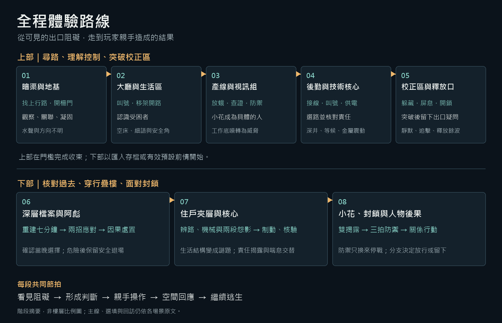
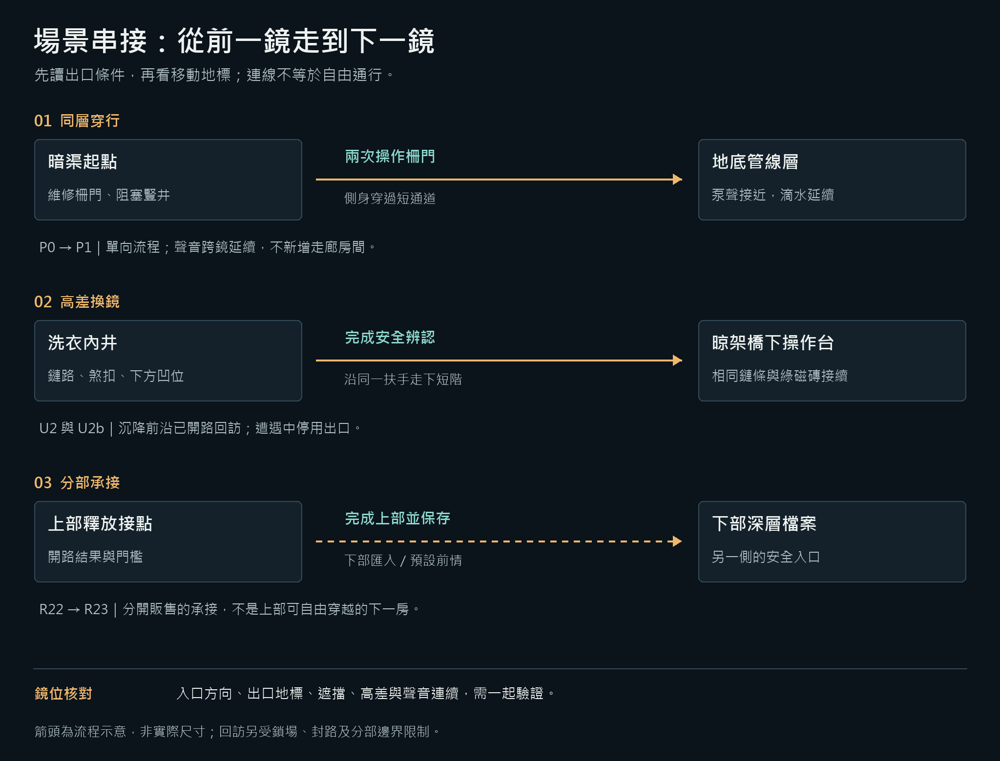
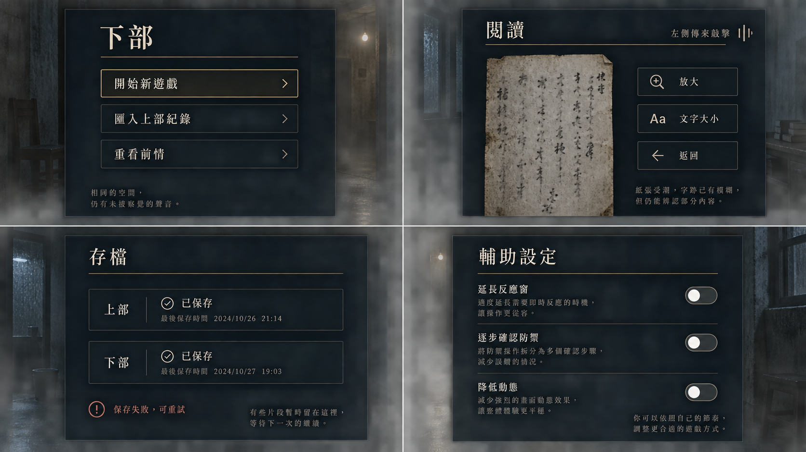
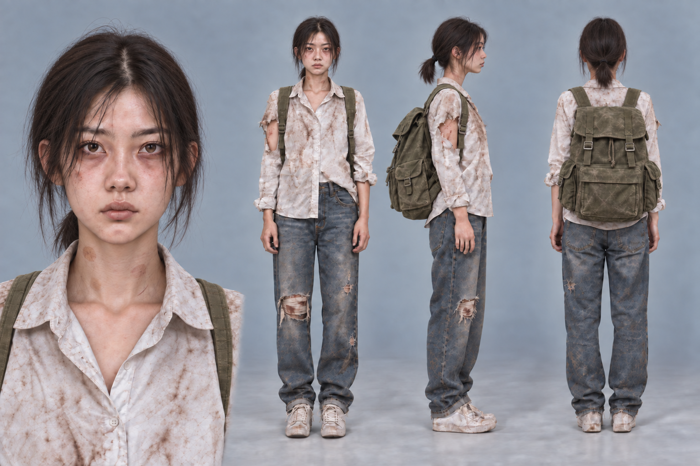

# 遊戲劇本：共用附錄

[總目錄](09-14_全劇本與關卡整合稿.md#book-toc)

本檔含製作端完整設定與真相；玩家資訊仍依各幕正式場次逐步揭露。

- [共用圖版與完整圖像清單](#appendix-illustrations)
- [附錄：設計鐵則與劇本共通規則](#appendix-rules)
- [附錄：世界觀、角色與完整年表](#appendix-world)
- [附錄：揭露、支線、結局與分部承接](#appendix-story)
- [附錄：共用操作、資源、推理與遭遇](#appendix-play)
- [八幕玩法鋪陳與 48 節點操作回饋](#core-gameplay-progression)
- [附錄：全程關卡配置與移動共通規則](#appendix-level)
- [附錄：原件與線索字表、過濾摘要](#appendix-clues)
- [附錄：視聽、介面與可及性](#appendix-av)
- [附錄：跨房技術、資產與交付驗收](#appendix-production)

<a id="book-appendices"></a>

## 共用附錄

<a id="appendix-illustrations"></a>

## 共用圖版與完整圖像清單

本區放跨幕共用圖；逐房製作圖像集中於各幕獨立製作規格的對應場景。圖片只作製作參考，不提前顯示給玩家。

<a id="fig-l00"></a>

##### L00｜全程體驗路線：上下部的操作、劇情與恐怖節拍

**適用與限制：**全程體驗摘要；不作樓層比例圖、自由移動圖或玩家可見流程表。



[完整圖說與操作對照](#h-0600-8) · [圖像目錄](09-14_全劇本與關卡整合稿.md#book-illustrations)

<a id="fig-l11"></a>

##### L11｜三種場景串接：同層穿行、高差換鏡與分部承接

**適用與限制：**暗渠穿行、U2→U2b 高差換鏡與上下部承接的共用示意；不是比例地圖，也不新增可走連線。



[完整圖說與操作對照](#h-0609-21) · [圖像目錄](09-14_全劇本與關卡整合稿.md#book-illustrations)

<a id="fig-v06"></a>

##### V06｜閱讀、存檔與可及性

**適用與限制：**閱讀、存讀檔與可及性介面參照；字幕與輔助設定不得遮住必要來源或代做操作。



[完整圖說與操作對照](#h-0703-887) · [圖像目錄](09-14_全劇本與關卡整合稿.md#book-illustrations)

<a id="fig-char"></a>

##### CHAR｜梁樂瑤現行角色設定表

**適用與限制：**梁樂瑤現行美術設定表，供服裝、比例與磨損連續性查核；不代表新增第三人稱鏡頭、玩家已知姓名或序幕肉身展示。



[完整圖說與操作對照](#h-0201-44) · [圖像目錄](09-14_全劇本與關卡整合稿.md#book-illustrations)

### 完整圖像清單

| 圖號 | 圖像 | 正文位置 |
| --- | --- | --- |
| L01 | [地基處理室：從可見線索進入凝固](../10_製作規格/10-01_製作規格_序幕.md#fig-l01) | [P2](../10_製作規格/10-01_製作規格_序幕.md#node-p2-visual) |
| V16 | [開場、深層下水道與求生](../10_製作規格/10-01_製作規格_序幕.md#fig-v16) | [P0](../10_製作規格/10-01_製作規格_序幕.md#node-p0-visual) |
| L02 | [入口大廳：叫號與讓路](../10_製作規格/10-02_製作規格_第一幕.md#fig-l02) | [R1](../10_製作規格/10-02_製作規格_第一幕.md#node-r1-visual) |
| V17 | [第一幕：門面、供桌與宿舍](../10_製作規格/10-02_製作規格_第一幕.md#fig-v17) | [R4b](../10_製作規格/10-02_製作規格_第一幕.md#node-r4b-visual) |
| V18 | [第一幕：回訪與生活線索](../10_製作規格/10-02_製作規格_第一幕.md#fig-v18) | [R2](../10_製作規格/10-02_製作規格_第一幕.md#node-r2-visual) |
| L03 | [阿尋：凝視與敲擊的防禦](../10_製作規格/10-03_製作規格_第二幕.md#fig-l03) | [R11](../10_製作規格/10-03_製作規格_第二幕.md#node-r11-visual) |
| V19 | [第二幕：工作區的異常](../10_製作規格/10-03_製作規格_第二幕.md#fig-v19) | [R6](../10_製作規格/10-03_製作規格_第二幕.md#node-r6-visual) |
| V20 | [第二幕：生活與犯罪痕跡](../10_製作規格/10-03_製作規格_第二幕.md#fig-v20) | [R8](../10_製作規格/10-03_製作規格_第二幕.md#node-r8-visual) |
| V21 | [第二幕：關係與回訪後果](../10_製作規格/10-03_製作規格_第二幕.md#fig-v21) | [R7](../10_製作規格/10-03_製作規格_第二幕.md#node-r7-visual) |
| V41 | [現時放蛾與關係手勢](../10_製作規格/10-03_製作規格_第二幕.md#fig-v41) | [R8](../10_製作規格/10-03_製作規格_第二幕.md#node-r8-visual) |
| L04 | [供電取捨與路線回饋](../10_製作規格/10-04_製作規格_第三幕.md#fig-l04) | [R15](../10_製作規格/10-04_製作規格_第三幕.md#node-r15-visual) |
| V22 | [第三幕：路由與後勤通路](../10_製作規格/10-04_製作規格_第三幕.md#fig-v22) | [R15](../10_製作規格/10-04_製作規格_第三幕.md#node-r15-visual) |
| V23 | [第三幕：證據與微異常](../10_製作規格/10-04_製作規格_第三幕.md#fig-v23) | [R17](../10_製作規格/10-04_製作規格_第三幕.md#node-r17-visual) |
| L05 | [噤聲者三段操作](../10_製作規格/10-05_製作規格_第四幕.md#fig-l05) | [R18](../10_製作規格/10-05_製作規格_第四幕.md#node-r18-visual) |
| V24 | [上部末段：校正與突破](../10_製作規格/10-05_製作規格_第四幕.md#fig-v24) | [R20](../10_製作規格/10-05_製作規格_第四幕.md#node-r20-visual) |
| L06 | [阿彪：壓掌與鉤臂的防禦](../10_製作規格/10-06_製作規格_第五幕.md#fig-l06) | [R26](../10_製作規格/10-06_製作規格_第五幕.md#node-r26-visual) |
| V25 | [下部開段：七分鐘與阿彪前置](../10_製作規格/10-06_製作規格_第五幕.md#fig-v25) | [R25](../10_製作規格/10-06_製作規格_第五幕.md#node-r25-visual) |
| L07 | [簽核、制動與真相停頓](../10_製作規格/10-07_製作規格_第六幕.md#fig-l07) | [R29](../10_製作規格/10-07_製作規格_第六幕.md#node-r29-visual) |
| V26 | [下部：別名、價格與證據邊界](../10_製作規格/10-07_製作規格_第六幕.md#fig-v26) | [R27](../10_製作規格/10-07_製作規格_第六幕.md#node-r27-visual) |
| V27 | [下部：簽名、攻堅與制動](../10_製作規格/10-07_製作規格_第六幕.md#fig-v27) | [R29](../10_製作規格/10-07_製作規格_第六幕.md#node-r29-visual) |
| V28 | [下部：鑑識、逃生記錄與冷備份](../10_製作規格/10-07_製作規格_第六幕.md#fig-v28) | [R31](../10_製作規格/10-07_製作規格_第六幕.md#node-r31-visual) |
| V39 | [維修脊柱的七扇窗](../10_製作規格/10-07_製作規格_第六幕.md#fig-v39) | [M1](../10_製作規格/10-07_製作規格_第六幕.md#node-m1-visual) |
| L08 | [小花三拍：掃線、抱繭與真假地標](../10_製作規格/10-08_製作規格_終幕.md#fig-l08) | [R32](../10_製作規格/10-08_製作規格_終幕.md#node-r32-visual) |
| L09 | [五種人物後果](../10_製作規格/10-08_製作規格_終幕.md#fig-l09) | [R33](../10_製作規格/10-08_製作規格_終幕.md#node-r33-visual) |
| V13 | [終幕揭露與室內囚禁](../10_製作規格/10-08_製作規格_終幕.md#fig-v13) | [R32](../10_製作規格/10-08_製作規格_終幕.md#node-r32-visual) |
| V32 | [怨靈的昆蟲身體恐怖：生活殘留](../10_製作規格/10-02_製作規格_第一幕.md#fig-v32) | [R1](../10_製作規格/10-02_製作規格_第一幕.md#node-r1-visual) |
| V33 | [怨靈的昆蟲身體恐怖：後勤威脅](../10_製作規格/10-04_製作規格_第三幕.md#fig-v33) | [R13](../10_製作規格/10-04_製作規格_第三幕.md#node-r13-visual) |
| V34 | [怨靈的昆蟲身體恐怖：巡行與未知](../10_製作規格/10-04_製作規格_第三幕.md#fig-v34) | [R16](../10_製作規格/10-04_製作規格_第三幕.md#node-r16-visual) |
| ART02 | [庇護：小花半展灰黑蛾翼](../10_製作規格/10-08_製作規格_終幕.md#fig-art02) | [R32](../10_製作規格/10-08_製作規格_終幕.md#node-r32-visual) |
| ART01 | [放走：兩人於窗邊引蛾離開](../10_製作規格/10-03_製作規格_第二幕.md#fig-art01) | [R8](../10_製作規格/10-03_製作規格_第二幕.md#node-r8-visual) |
| V14 | [結局行動：留下名字與鬆手](../10_製作規格/10-08_製作規格_終幕.md#fig-v14) | [R32](../10_製作規格/10-08_製作規格_終幕.md#node-r32-visual) |
| V15 | [結局行動：留下與重演簽核](../10_製作規格/10-08_製作規格_終幕.md#fig-v15) | [R32](../10_製作規格/10-08_製作規格_終幕.md#node-r32-visual) |
| V31 | [特殊收集、支線與回報](../10_製作規格/10-08_製作規格_終幕.md#fig-v31) | [POST](../10_製作規格/10-08_製作規格_終幕.md#node-post-visual) |
| V37 | [解謎獎賞：捷徑、歌曲與回憶](../10_製作規格/10-03_製作規格_第二幕.md#fig-v37) | [R9](../10_製作規格/10-03_製作規格_第二幕.md#node-r9-visual) |
| V29 | [上下部承接與當部收尾](../10_製作規格/10-05_製作規格_第四幕.md#fig-v29) | [R22](../10_製作規格/10-05_製作規格_第四幕.md#node-r22-visual) |
| V01 | [直接查看、關聯與三圖層](../10_製作規格/10-02_製作規格_第一幕.md#fig-v01) | [R3](../10_製作規格/10-02_製作規格_第一幕.md#node-r3-visual) |
| V02 | [筆記本、來源與路徑](../10_製作規格/10-01_製作規格_序幕.md#fig-v02) | [P0](../10_製作規格/10-01_製作規格_序幕.md#node-p0-visual) |
| V40 | [照片、殘留光與來源界線](../10_製作規格/10-01_製作規格_序幕.md#fig-v40) | [P1](../10_製作規格/10-01_製作規格_序幕.md#node-p1-visual) |
| V03 | [紙本關聯與推理回饋](../10_製作規格/10-02_製作規格_第一幕.md#fig-v03) | [R5](../10_製作規格/10-02_製作規格_第一幕.md#node-r5-visual) |
| V04 | [人物與特殊推理頁](../10_製作規格/10-04_製作規格_第三幕.md#fig-v04) | [R17](../10_製作規格/10-04_製作規格_第三幕.md#node-r17-visual) |
| V05 | [穩定與恐慌](../10_製作規格/10-02_製作規格_第一幕.md#fig-v05) | [R5](../10_製作規格/10-02_製作規格_第一幕.md#node-r5-visual) |
| V08 | [現場訊號回應](../10_製作規格/10-04_製作規格_第三幕.md#fig-v08) | [R12](../10_製作規格/10-04_製作規格_第三幕.md#node-r12-visual) |
| V09 | [阿尋查證與完成傳輸](../10_製作規格/10-03_製作規格_第二幕.md#fig-v09) | [R11](../10_製作規格/10-03_製作規格_第二幕.md#node-r11-visual) |
| V11 | [老周的兩種回應](../10_製作規格/10-03_製作規格_第二幕.md#fig-v11) | [R7](../10_製作規格/10-03_製作規格_第二幕.md#node-r7-visual) |
| V07 | [潛行與屏息](../10_製作規格/10-05_製作規格_第四幕.md#fig-v07) | [R18](../10_製作規格/10-05_製作規格_第四幕.md#node-r18-visual) |
| V12 | [阿彪對峙與權限](../10_製作規格/10-06_製作規格_第五幕.md#fig-v12) | [R26](../10_製作規格/10-06_製作規格_第五幕.md#node-r26-visual) |
| V10 | [阿尋兩招與防禦](../10_製作規格/10-03_製作規格_第二幕.md#fig-v10) | [R11](../10_製作規格/10-03_製作規格_第二幕.md#node-r11-visual) |
| V38 | [小花三拍防禦](../10_製作規格/10-08_製作規格_終幕.md#fig-v38) | [R32](../10_製作規格/10-08_製作規格_終幕.md#node-r32-visual) |
| L00 | [全程體驗路線：上下部的操作、劇情與恐怖節拍](#fig-l00) | 跨幕共用 |
| L11 | [三種場景串接：同層穿行、高差換鏡與分部承接](#fig-l11) | 跨幕共用 |
| L10 | [生活夾層的解謎操作](../10_製作規格/10-07_製作規格_第六幕.md#fig-l10) | [U1](../10_製作規格/10-07_製作規格_第六幕.md#node-u1-visual) |
| V30 | [下部生活區、移動與主角回憶](../10_製作規格/10-07_製作規格_第六幕.md#fig-v30) | [U1](../10_製作規格/10-07_製作規格_第六幕.md#node-u1-visual) |
| V35 | [下部未明怨影與操作窗](../10_製作規格/10-07_製作規格_第六幕.md#fig-v35) | [U2b](../10_製作規格/10-07_製作規格_第六幕.md#node-u2b-visual) |
| V36 | [下部服務夾道與配重水箱](../10_製作規格/10-07_製作規格_第六幕.md#fig-v36) | [U6b](../10_製作規格/10-07_製作規格_第六幕.md#node-u6b-visual) |
| V06 | [閱讀、存檔與可及性](#fig-v06) | 跨幕共用 |
| CHAR | [梁樂瑤現行角色設定表](#fig-char) | 跨幕共用 |

<a id="appendix-rules"></a>

## 附錄：設計鐵則與劇本共通規則

### 00-01 · 高概念與定位

整合基線狀態：製作規格。原文的「本章」指這組規格，不代表需開啟另一份文件。


<a id="s-0001-0"></a>
<a id="s-0001-1"></a>
<a id="h-0001-1"></a>
<a id="doc-0001"></a>
<a id="s-0001-2"></a>

<!-- import:s-0001-2:begin -->
<a id="h-0001-3"></a>

#### 一句話認識《灰燈寨》

> 一款敘事恐怖解謎遊戲：你在一座出口被封住的巨大疊樓中醒來，必須尋路、解開機關並躲避怨靈；越接近出口，越發現樓裡的悲劇與自己有關。
<!-- import:s-0001-2:end -->

<a id="s-0001-3"></a>

<!-- import:s-0001-3:begin -->
<a id="h-0001-7"></a>

#### 類型定位：敘事恐怖解謎

**恐怖、解謎與故事共同構成遊玩過程。** 玩家在危險中觀察、作出判斷並親手開路，從行動的結果逐步理解人物與真相。

| 要素 | 玩家實際會體驗到什麼 |
| --- | --- |
| 敘事 | 從生活物件、過去的殘影與彼此矛盾的紀錄，拼出主角和小花的關係；自己的選擇會留下後果。 |
| 恐怖 | 封閉空間、無人的生活痕跡、錯位聲音與昆蟲意象的身體恐怖交替出現；敵意怨靈會阻路、逼近並攻擊，玩家必須應對。 |
| 解謎 | 觀察現場、比對線索、操作門鎖與機械、調整供電、辨認怨靈前兆，讓原本走不通的路出現通行機會。 |
| 逃生 | 每個主要區域都讓玩家知道想往哪裡、被什麼擋住，以及下一步能做什麼。 |

對外介紹以「敘事恐怖解謎」為主，心理驚悚是恐怖表現的一部分。商店介紹應讓玩家看見實際解謎、躲藏與怨靈攻擊的畫面，也呈現安靜探索與人物互動。

恐怖需要強弱起伏。開場以未知與不安建立壓力；危險區需要躲避、阻擋或擊退；安全角落則讓玩家整理線索、理解人物。固定視角與靜止的歷史畫面不限制現在發生的攻擊、機關動作和環境變化。
<!-- import:s-0001-3:end -->

<a id="s-0001-4"></a>

<!-- import:s-0001-4:begin -->
<a id="h-0001-22"></a>

#### 玩家要做什麼

**首要目標：找到出口，逃出疊樓。途中避開或擊退阻擋自己的怨靈。**

遊玩過程反覆圍繞：

1. 找到可走的門、樓梯或維修通道。
2. 觀察阻礙、線索與危險徵兆。
3. 解開謎題，或在怨靈的攻擊間隙操作設備。
4. 看見門鎖、機構或威脅的狀態改變，再親自前往下一處。
5. 在喘息時整理發現，逐步理解這棟樓與自己的關係。

擊退通常只能換到安全操作的時間。讓怨靈安息、永久抹除它的殘留，以及解除出口封鎖，各有不同條件和後果。樓裡也有無敵意的殘留，玩家需要觀察與分辨。
<!-- import:s-0001-4:end -->

<a id="s-0001-5"></a>

<!-- import:s-0001-5:begin -->
<a id="h-0001-36"></a>

#### 故事從哪裡開始

主角梁樂瑤在樓內逃亡近兩週，始終想找到出口。遊戲以飛蛾飛向亮點的夢境開場，醒來時，她身處疊樓內部極深、連追捕者都不敢輕易踏入的廢棄下水道。上行通道被堵住，她只能沿維修道尋找別的路。

玩家從頭到尾都在樓內看世界。外面的存在由聲音、文字、救援痕跡與抵達室內的人員傳達；窗戶與井道仍被遮擋，找出口的渴望貫穿全程。

主角一開始只想逃生。幫助受困者、保存證據與面對責任，是她在途中必須作出的選擇。
<!-- import:s-0001-5:end -->

<a id="s-0001-6"></a>

<!-- import:s-0001-6:begin -->
<a id="h-0001-44"></a>

#### 怎麼調查與解謎

- **直接查看物件**：一般物品可自由近看，筆記本記下已知內容，方便回頭比對。
- **連起關鍵線索**：發現彼此相關的痕跡後，玩家親手建立關聯，才看見可深入感知的殘留。
- **查看「凝固瞬間」**：過去以靜止畫面疊在眼前的同一個房間；玩家查看姿勢、物件與位置，找出現實中看不清的因果。
- **動手改變通路**：接線、推動機構、轉向遮板、調整水位或操作門端，都要有看得見的結果。
- **應對怨靈**：從聲音、輪廓與動作辨認前兆，選擇躲藏、屏息、停止操作或利用現場設備爭取空檔。

普通查看與筆記整理不消耗感知資源，深入感知有使用限制；必要流程提供資源不足時仍能繼續的方法。筆記本負責記錄，聲音播放與設備控制由現場機器完成。操作與數值詳見[筆記本與訊號系統](#doc-0404)及[資源與恐慌值](#doc-0406)。
<!-- import:s-0001-6:end -->

<a id="s-0001-7"></a>

<!-- import:s-0001-7:begin -->
<a id="h-0001-54"></a>

#### 疊樓的樣貌

疊樓的內部結構以九龍城寨式的擁擠與增建感為原型：住宅、工場、商戶、不同公司與非法營生互相穿插，窄巷、暗井、接駁梯與管線把樓層縫在一起。

玩家會經過低拱積水暗渠、逼仄住處、無人辦公區、真假難辨的布景、回音深井、消音拘禁走廊與巨大空曠的核心。各區的光線、材質、聲音和移動方式都應有差異。

詐騙集團是重要背景，也是主角責任的來源。生活遺跡則讓人感覺這裡曾容納許多不同的人；每戶不必都變成案件，每件物品也不必都成為收集任務。
<!-- import:s-0001-7:end -->

<a id="s-0001-8"></a>

<!-- import:s-0001-8:begin -->
<a id="h-0001-62"></a>

#### 上下兩部

兩部各自販售，也各自有完整的遊玩起承轉合。

| 篇章 | 遊玩旅程 | 收束方式 |
| --- | --- | --- |
| 上部 | 從深層下水道進入生活區、工作區與設備後勤，最後穿越怨靈巡行的校正區。 | 親手突破一段封鎖、打開通往深處的路，再留下與小花有關的伏筆；此時尚未逃出整棟樓。 |
| 下部 | 從深層檔案接續，重建逃亡當夜的七分鐘、面對阿彪，再穿過分租走廊、洗衣內井、修理工場與冷藏後場，走向樓體核心。 | 解開最後的封鎖原因，抵擋小花的攻擊，親手作出關係與證據的選擇，走向五種結局之一。 |

直接從下部開始的玩家可透過簡短前情與安全操作複習進入故事，必要線索可在下部取得。每部支線各有當部的收束，收齊支線不作為完成主線的要求。詳見[上下部分篇與承接](#doc-0307)。
<!-- import:s-0001-8:end -->

<a id="s-0001-9"></a>

<!-- import:s-0001-9:begin -->
<a id="h-0001-73"></a>

#### 作品的辨識特色

1. **同一雙眼睛，看見兩個時刻**：現在與過去共用構圖，玩家靠差異找線索，也因此開始不信任眼前的房間。
2. **怨靈有不同的應對方式**：聽懂訊號、避開巡行、辨認攻擊方向與在安全空檔操作，各自帶來不同壓力。
3. **出口與人物真相一起推進**：解開的機關帶來實際通路，查明的證據也讓主角逐步看清自己曾作過的事。
4. **灰燈蛾串起溫柔與囚禁**：灰黑縱紋、蛾粉、翼膜與四根粗黑觸鬚構成視覺語言；曾經一起放走一隻蛾的記憶，最後轉成不肯放手的束縛。
5. **選擇留下具體後果**：保存的名字、被抹除的訊號、人物是否放手與證據去向，都在最後的畫面中留下差別。
<!-- import:s-0001-9:end -->

<a id="s-0001-10"></a>

<!-- import:s-0001-10:begin -->
<a id="h-0001-81"></a>

#### 主題與人物關係

**一個人可能受到威脅，也可能同時傷害別人。** 作品讓玩家看見她受到的控制、她曾付出的照顧，以及她後來主動簽下的決定。

主角與小花曾在共同受困時互相照顧。兩人的親近先由生活動作建立，再讓未兌現的承諾與權力差距逐漸破壞這份關係。主角想離開，小花想把她留下；最後必須面對的是彼此的意願與行動後果。

<a id="h-0001-87"></a>

##### 完整故事真相（含結局劇透）

主角的肉身仍活著，開場前昏倒在地底泵房。玩家操作的是不知道自己已離體的意識；這件事直到終幕、最終選擇前才被確認。

其後才揭露：小花已成為封住整座疊樓的怨靈。她曾與主角一起放走一隻蛾，如今卻以巨翼和黑色觸鬚把整座樓包住。玩家先核對真相、抵擋攻擊，再決定如何面對她、如何處理證據。放行不等於原諒，結局不以善惡分數評定。

這些真相留在完整劇本與終幕呈現；對外簡介只使用受困、尋路、人物關係與局部蛾意象。
<!-- import:s-0001-10:end -->

<a id="s-0001-11"></a>

<!-- import:s-0001-11:begin -->
<a id="h-0001-95"></a>

#### 基本資訊

| 項目 | 內容 |
| --- | --- |
| 名稱 | **灰燈寨** DEAD SIGNAL |
| 類型 | **敘事恐怖解謎** |
| 畫面與視角 | 2D 第一人稱固定視角；點選門、梯口與通道切換位置，近看物件並操作機關。 |
| 主角 | 梁樂瑤，工作名 Michelle，約 26 歲，園區前內控主管。 |
| 語言 | 繁體中文文本與字幕；環境保留多語痕跡，角色不刻意標註國籍。 |
| 平台與操作 | Steam／PC；滑鼠與鍵盤為主要操作，手把於後續相容性測試驗證。 |
| 製作引擎 | Godot 4.x。 |
| 篇幅 | 序幕、六個主要篇章與終幕；分上下部販售。 |
| 主線時間 | 上部暫估 3 小時 45 分～5 小時 10 分；下部暫估 2 小時 50 分～4 小時 8 分。選填內容另計，須由實際試玩確認。 |
| 結局 | 五種，於下部收束。 |
| 售價與發售日 | 尚未決定。 |
| 內容尺度 | 成人向，製作尺度與呈現限制依[設計鐵則](#doc-0002)；正式分級須另行確認。 |
<!-- import:s-0001-11:end -->

<a id="s-0001-12"></a>

<!-- import:s-0001-12:begin -->
<a id="h-0001-112"></a>

#### 內容提醒

包含人口販運、強迫犯罪、拘禁與酷刑、性剝削及私密影像脅迫的敘述、可辨識屍體、自殺與經濟毀滅暗示，以及不可靠記憶。性剝削的過程與私密影像不呈現。

遊戲開始前提供內容過濾設定，敏感畫面可改為文字摘要，必要線索、解謎與結局均保持可完成。

校正收容室的完整靜止記憶、阿彪對峙中的受害者面孔、通往頂層的觀察窗，以及備份內室的歷史解凍，是四段需事前內容提示與等效摘要的橋段，不代表四段全部必看。R19 的記憶可不啟動，M1 必須通行但各窗觀察可略過；R26 與 R31 的必要資訊可由演出或確認摘要完成。玩家可暫停或將尚未呈現的內容改為文字摘要；商店頁與首次啟動時需清楚說明。具體演出與長度見[設計鐵則的破例制度](#doc-0002)。
<!-- import:s-0001-12:end -->

<a id="s-0001-13"></a>

<!-- import:s-0001-13:begin -->
<a id="h-0001-120"></a>

#### 首批試玩要驗證什麼

先完成「深層下水道 → 地底管線 → 地基處理室 → 入口大廳 → 住處與刻痕牆 → 工坊」的開局流程，連同可選的無主神壇，暫估 60～85 分鐘。

試玩者應能說清楚自己要往哪裡、看懂線索與機關的關係，親手完成一次怨靈訊號應對，並在安靜探索中感受到不安。這段用來驗證開局；中段攻擊、校正區潛行與上下部高潮仍須各自試玩。完整製作順序見[上部製作時程（舊索引或排程參考）](#book-exclusions)。
<!-- import:s-0001-13:end -->

<a id="s-0001-14"></a>

<!-- import:s-0001-14:begin -->
<a id="h-0001-126"></a>

#### 參考作品

- 《銹湖 Rusty Lake》系列：定點場景、物件解謎與冷調敘事。
- 《The Room》：物件細節、機關操作與看得見的解題回饋。
- 經典恐怖點擊冒險：固定鏡頭、凝視與畫面外空間帶來的壓迫。
<!-- import:s-0001-14:end -->

### 00-02 · 設計鐵則

整合基線狀態：製作規格。原文的「本章」指這組規格，不代表需開啟另一份文件。


<a id="s-0002-0"></a>
<a id="doc-0002"></a>
<a id="s-0002-1"></a>

<!-- import:s-0002-1:begin -->
<a id="h-0002-1"></a>

#### 設計鐵則

> 全專案不可違背的原則。任何新增內容（關卡、系統、對白、美術）都必須通過這份檢查表。
<!-- import:s-0002-1:end -->

<a id="s-0002-2"></a>

<!-- import:s-0002-2:begin -->
<a id="h-0002-5"></a>

#### 類型與恐怖的適用範圍

本作定位為**敘事恐怖解謎**。逃生路線、環境機關、怨靈威脅與人物真相共同推進。歷史凝固層的靜止原則只約束過去的重建；現在的怨靈可依遭遇規格逼近、攻擊，機械與環境也可產生動態回應。安全閱讀、安定點與劇情停頓仍受保護。
<!-- import:s-0002-2:end -->

<a id="s-0002-3"></a>

<!-- import:s-0002-3:begin -->
<a id="h-0002-9"></a>

#### 一、對戰五鐵則

| # | 鐵則 | 理由 |
| --- | --- | --- |
| 一 | **怨靈有不同身分，受害不抵銷加害** | 怨靈可以是受害者、加害者，或兼具兩者；成為怨靈不代表無辜。加害者不必另補一段被迫或受虐的背景來換取同情。依可查證的行為、選擇與當下威脅呈現責任；理解不等於原諒，擊退、安息與抹除也不等於道德判決。 |
| 二 | **主角永遠虛弱** | 主角延續虛弱的自我感知，不能靠奔跑或力量壓制怨靈。玩家可讀前兆、躲藏、阻擋與擊退，爭取完成機關的空檔；成功回饋必須清楚，不能把無力感寫成玩家什麼也做不了。 |
| 三 | **戰鬥服務於恐怖與主題，不提供爽感** | 躲避與阻擋必須讓玩家作出可理解的判斷，攻擊前兆與失敗回饋保持公平。每場對戰連到逃生阻礙或人物故事，避免重複刷敵與傷害數字蓋過恐怖。 |
| 四 | **武器是理解，不是暴力** | 玩家透過線索理解怨靈的行為規律、執念與控制方式，再躲避、阻斷或取得應對條件。執念可能是求助，也可能是支配、掩罪或繼續執行命令；不要求同情、原諒或完成其願望才能前進。 |
| **二十八** | **你無法分辨一個怨靈重播的，是它演的，還是它真的** | 這棟樓錄下最多的不是慘叫，是幾十萬小時的人在表演愛。此類怨靈可由**未完成的表演**構成；這條歧義不要求所有怨靈都出身話術產線，也不掩蓋可查證的加害。<br>它循環著一句「我想你」——那是腳本第 14 頁的標準句，也可能是它最後那幾天真的想過的事。**資料上完全一樣；訊號沒有真心這個欄位。**<br>⚠️ **系統永遠不揭曉。** 任何在事後告訴玩家「其實那是真心的／其實那是腳本」的設計，都直接摧毀本作的主題。 |

> **鐵則二十八是本作主題（被逼的行為算不算數）被寫進怪物設計本身的地方。**
>
> 以話術與親密表演為核心的怨靈，須保留**表演與真心無法完全分辨**的歧義；以控制、執行命令或掩罪為核心者，須交代其行為與場所的關聯。動機可以未知，已查明的加害行為不能因此被抹平。
<!-- import:s-0002-3:end -->

<a id="s-0002-4"></a>

<!-- import:s-0002-4:begin -->
<a id="h-0002-23"></a>

#### 二、呈現鐵則

| # | 鐵則 | 說明 |
| --- | --- | --- |
| 五 | **鏡頭鎖定** | 凝固瞬間永遠與「現在」共用同一構圖與角度。玩家不會被切到另一個視角。「同一雙眼睛，看見兩個時代」是恐怖的來源。 |
| 六 | **過去是靜止的** | 凝固瞬間沒有動畫、沒有動作。**全作唯一一次例外**是最終揭露的「解凍」——破例是為了那一擊。 |
| 七 | **無臉剪影** | 凝固瞬間裡的人物不給清晰的臉。既規避剝削感，也把注意力導向可推理的細節（姿勢、位置、手裡的物件、制服）。<br>⚠️ ** 破例二：R26 的 C-07 有臉，全作 1 次。** 正因為前面三十幾個房間都沒有臉，那一張臉才會是全作最重的一格。 |
| 八 | **克制尺度** | 歷史受虐場面以靜止構圖、間接證據與有限破例呈現，不反覆重演施虐。現時怨靈的身體恐怖、前兆與攻擊依既定遭遇演出，不能用本條取消可玩的防禦。R19 完整凝固仍靜止、無配樂且每輪一次；康片尾是獨立的過去敘事鏡頭，不是新增可探索的歷史解凍。保護段的暫停、內容摘要與存檔離開依下文。 |
| 九 | **沒有配樂** | 不使用替玩家指定情緒的背景配樂，以環境音與訊號雜訊為主。凝固瞬間內維持靜默，只在指定點選時呈現單一殘留聲響；既有設備的原始錄音、SQ-S 原創歌曲與選單聲音收藏另按來源規格播放，不等於新增背景配樂。 |
<!-- import:s-0002-4:end -->

<a id="s-0002-5"></a>

<!-- import:s-0002-5:begin -->
<a id="h-0002-33"></a>

#### 三、敘事鐵則

| # | 鐵則 | 說明 |
| --- | --- | --- |
| 十 | **真相由玩家親手拼出** | 關鍵揭露不用過場動畫告知，而是玩家在調查板上把證據拖到定位、親手完成連線。 |
| 十一 | **真相一直都在** | 房間不變，變的是玩家的眼睛。回訪同一房間會浮現新層次——因為玩家現在準備好看見了。 |
| 十二 | **沒有大魔王** | 幕後集團與買家逃離，康的死亡不代表體系受制裁。打敗現場 Boss 不等於制裁整個體系；加害者不必被補寫成受害者。 |
| 十三 | **結局不由系統評分** | 五個結果可以有不同的道德重量，但 UI、成就與旁白不宣布標準答案或「真結局」。作品呈現後果，判斷留給玩家。 |
| 十四 | **性別不是豁免權** | 主角的「被逼」不能開脫她，正如阿彪的不能。 |
| 二十三 | **系統鎖定事實，不鎖定道德答案** | 調查板可以確認日期、身分、行為與因果來源；「該不該原諒、怎麼承擔」必須留給玩家從行動與後果判斷。核心自白可以出自主角，但不能被 UI 蓋章成唯一正解。 |
<!-- import:s-0002-5:end -->

<a id="s-0002-6"></a>

<!-- import:s-0002-6:begin -->
<a id="h-0002-44"></a>

#### 四、節奏鐵則

| # | 鐵則 | 說明 |
| --- | --- | --- |
| 十五 | **對戰是「少量黃金」** | 不頻繁出現，只在關鍵節點作為情緒高潮。大部分時間玩家在探索、感知、推理。 |
| 十六 | **每次對戰都有敘事意義** | 不是「刷怪」，是遇見一個特定的、有故事的怨靈。 |
| 十七 | **理解即優勢** | 對戰難度隨玩家的「認知」下降——把戰鬥和解謎綁在同一套知識上。 |
| 十八 | **權限反擊永遠是誘惑，不是必需** | 正規解法必須始終可行。「有用但令人不安」，而非「強到必須用」。 |
| **二十九** | **理解必須落在可判斷的操作上** | 主線三格推理的正式錯誤提交依調查板規格處理；草稿、取消、選填比對、機關試作與終幕來源錯配不套用永久降級。感知描述可觀察現象，不直接報答案。各遭遇使用自己的解法與前兆，僅指定多解者提供多解；不能為湊數強加第二解。不可逆處置須預示後果，已取得的客觀來源不因猜錯被憑空刪除。 |
| 二十四 | **凝神穩定度製造選擇，不製造雜務或死鎖** | 照明來自場景安定光源；光標記是主觀殘留，發光棒實物仍留 P1，不作可攜電池或耗材；安定感知是少量固定節點，0 點 只關閉高耗能旁支。主線記憶有免費錨點備援；必要設備由當地供電與本地權限運作，供電不會回復玩家穩定度。 |
<!-- import:s-0002-6:end -->

<a id="s-0002-7"></a>

<!-- import:s-0002-7:begin -->
<a id="h-0002-55"></a>

#### 五、信仰元素準則

| # | 鐵則 | 說明 |
| --- | --- | --- |
| 十九 | **信仰不是敵人** | 真實宗教、神祇與信徒不被設定成邪惡來源；恐怖來自人的困境、挪用與失去，而不是褻瀆本身。 |
| 二十 | **神壇先是人的避難所** | 宗教空間先提供溫度、記憶與互助，再被犯罪系統改造成控制與等待的場所。不可只把神壇當成跳嚇佈景。 |
| 二十一 | **死因不是奇觀** | 每個死亡或失蹤案例都要連回一個具體的控制機制，以物件、紀錄與回聲讓玩家推理；不做死法排行榜、不把失蹤者自動宣告死亡，也不把未證實傳聞寫成普遍史實。 |
| 二十二 | **恐怖先給合理答案，再讓答案裂開** | 每個恐怖橋段先允許玩家用漏水、斷電、設備故障或人為破壞解釋；第二次回訪才加入無法忽略的矛盾。恐怖不是突然出現，而是玩家發現自己先前的解釋也曾經保護過加害者。 |
<!-- import:s-0002-7:end -->

<a id="s-0002-8"></a>

<!-- import:s-0002-8:begin -->
<a id="h-0002-64"></a>

#### 六、剝削呈現準則

> 表層業務為情色與愛情詐騙。這三條的位階等同前二十四條，且**沒有任何例外**。

| # | 鐵則 | 說明 |
| --- | --- | --- |
| 二十五 | **呈現裝置，不呈現素材** | 玩家看見補光燈、提詞架、耳返、素材索引與同意書；**永遠看不到任何被拍攝的內容**。恐怖來自那套設備仍然架著，對準一張沒有人坐的椅子。若某個畫面拿掉敘事脈絡後仍具情色觀看價值，砍掉重做。 |
| 二十六 | **玩家不扮演施行者** | 玩家不操作攝影機、不挑選素材、不編輯影片、不對任何受害者下指令。玩家唯一一次執行舊流程是 R29 簽一份行政文件——**權力的恐怖在於它有多乾淨，不在於它有多近**。 |
| 二十七 | **私密影像永遠是缺口，不是收穫** | 沒有任何解謎的解法是「找到那段影片」。脅迫素材只以文件對不上呈現：索引 214 筆、實體 197 筆、刪除人欄空白。玩家能證明她被拍過、沒有同意；**永遠不會知道被拍了什麼**。 |

> **被害人不是笨。** 教戰手冊明確鎖定剛結束戀情、剛喪親、剛換城市的人——他們只是剛好在那一年比較孤單。任何把被害人寫成愚蠢或活該的內容，一律砍掉。
<!-- import:s-0002-8:end -->

<a id="s-0002-9"></a>

<!-- import:s-0002-9:begin -->
<a id="h-0002-76"></a>

#### 七、破例制度★ 本作的尺度上限

> **本作的分級目標是 18+ 的上限，不是 18+ 的下限。**
>
> 但「口味重」的正確做法不是把每個房間都變血腥——那會變成奇觀，直接違反鐵則八，而且會讓玩家在第三幕就麻痺。
>
> 正確做法是**建立破例制度**：全作絕大部分時間維持克制，然後在少數幾個指定位置**徹底破掉它**，而且每一次破例都不可重播、不可跳過、不可退出。

<a id="h-0002-84"></a>

##### 破例一與二

| 破的是 | 位置 | 次數 |
| --- | --- | --- |
| 鐵則六「過去是靜止的」 | R31 解凍 | 全作 1 次 |

<a id="h-0002-90"></a>

##### 破例三與四

| # | 破的是 | 位置 | 內容 | 次數 |
| --- | --- | --- | --- | --- |
| **破例二** | **鐵則七「無臉剪影」** | **R26 阿彪凝固瞬間** | C-07 有臉。全作唯一在歷史凝固中直接呈現受處置者完整、可辨識的臉——而她正在被處理。她的眼睛是睜開的，而且**她在看鏡頭的方向**（那是主角站的位置）。 | 全作 1 次 |
| **破例三** | **鐵則八「克制尺度」** | **R19 隔音收容室 · 完整凝固瞬間** | 不迴避。校正的實體過程、地面的排水孔、束帶下的皮膚、掉在角落的東西。**靜止、無配樂、不可跳過。** | 全作 1 次 |
| **破例四** | **「不呈現可辨識屍體」** | **第六幕 45F–49F 管理維修脊柱** | 玩家穿越封鎖隔離層時會經過 L-48 封死的房間。門上有觀察窗。**裡面有人。** 兩週。 | 全作 1 段 |

<a id="h-0002-98"></a>

##### 破例的四條共同規則

1. **不可重播。** 與 R31 解凍相同——看過就沒有了。理解的代價是不可逆的。
2. **不可跳過、不可退出、不可加速。** 進入後直到序列結束前，`Esc` 開啟暫停，右鍵不跳過演出，暫停內保留設定、內容摘要切換及存檔離開（見下）。
3. **不可有音樂、不可有跳嚇、不可有音量突升。** 全部靜止或極低音量。恐怖來自你必須看完，不來自它撲過來。
4. **必須改變後續。** 每一次破例都要在之後的房間留下可讀的差異（怨靈行為、調查板欄位、主角 OS 語氣）。

> ### ★ 為什麼是「不能退出」
>
> 這是  的核心設計，也是本作對主題最狠的一次執行。
>
> 主角的整個職業生涯，就是**她從來不必看**。她簽字、她勾選、她核可，然後她把視窗關掉。她的手很乾淨，因為她從來不必看。
>
> 所以在這四個位置，**遊戲把「關掉」這個動作從玩家手上拿走**。
>
> 你必須看完。就像那些人必須經歷完一樣。

<a id="h-0002-115"></a>

##### 可及性的唯一出口

破例段落必須在 [07-03](#doc-0703) 的內容設定中提供**事前**的完整過濾選項（進入遊戲時或段落暫停時設定）。選擇過濾的玩家會得到文字摘要而非畫面，且不影響任何解謎、證據或結局。

**段落不提供直接回探索或快轉跳過，但隨時可暫停、存檔離開遊戲，或將尚未呈現的內容切成文字摘要。** 摘要確認與原演出提交同一證據結果，不以內容設定懲罰玩家。
<!-- import:s-0002-9:end -->

<a id="s-0002-10"></a>

<!-- import:s-0002-10:begin -->
<a id="h-0002-121"></a>

#### 八、「全作唯一」的使用限制

「全作唯一」標籤只保留給下列兩項結構規則。其他一次性事件直接在所屬場景寫明觸發與不重複條件，不以固定事件總數判定唯一性：

| 保留 | 為什麼 |
| --- | --- |
| **破例制度**（解凍＋破例二三四＝一個系統） | 它們是全作對克制的四次結構性違反，重複第五次就會摧毀前四次 |
| **R29 最後一筆** | 全作唯一一次玩家以主角職務執行舊流程；第二次就變成機制 |

其餘的東西就是**出現一次，不宣告**。若某個設計確實不該重複，寫「不重複」，不寫「全作唯一」。
<!-- import:s-0002-10:end -->

<a id="s-0002-11"></a>

<!-- import:s-0002-11:begin -->
<a id="h-0002-132"></a>

#### 九、自檢表（新增內容時使用）

- [ ] 這個敵人有沒有被當成「怪物」對待？
- [ ] **這隻怨靈重播的東西，能不能同時被讀成表演與真心？**（鐵則二十八；不能的話，它為什麼在這棟樓裡？）
- [ ] 有沒有任何 UI、旁白或事後演出替玩家判定了那是真心還是腳本？（不允許）
- [ ] 主角有沒有在這裡變強、變得能打？
- [ ] 這段內容提供的是恐懼／無力／道德重量的哪一種？如果三者皆無，砍掉。
- [ ] 這個真相是玩家拼出來的，還是被告知的？
- [ ] 這段歷史受虐畫面是否遵守靜止、臉部層級與指定破例？現時攻擊及康片尾是否各自依已核定分鏡，而沒有追加施虐過程？
- [ ] 這個破例是否不可重播、不可退出、不可加速、沒有配樂，並且改變了後續？
- [ ] 這個房間在玩家知道更多後回訪，有沒有新東西？
- [ ] 若使用宗教元素，恐怖來源是人的行為與結構，而不是真實信仰本身嗎？
- [ ] 這個神壇／祈禱空間是否先讓玩家感受到某人的生活與盼望？
- [ ] 是否避免把不同亞洲信仰粗暴混成「神秘異國風」？
- [ ] 這個死亡案例是否同時有「一個人的生活物件」與「一份制度紀錄」？
- [ ] 是否把死亡過程做成奇觀，或把未證實傳聞當成唯一真相？
- [ ] 這個恐怖橋段是否先有一個合理的非超自然解釋，再透過回訪讓它裂開？
- [ ] 玩家是否有機會在恐怖發生後停下、保存證據或選擇離開，而不是被迫觀看？
- [ ] 這個異常是否改變了玩家對「主角曾經做過什麼」的理解，而不只是製造聲量？
- [ ] **這個新內容有沒有碰到三個受保護的沉默錨點（E-02、老周的刻痕、E-03）？** 有的話，砍掉。它們的功能就是沒有功能。
- [ ] 調查板鎖住的是可驗證事實，還是作者希望玩家接受的道德判詞？後者應改由角色行動與後果表達。
- [ ] 這個數位互動在 0 點 時是否仍有主線備援？若沒有，它是在製造有意義的選擇，還是只讓玩家回頭找安定點？
- [ ] **這個謎題的正確操作是否有可讀來源？** 錯誤、取消與重試是否按該謎題規格回饋，沒有把主線正式提交的處罰套到免費試作？
- [ ] 這場訊號博弈的感知輸出有沒有把答案講出來？（第二級是天花板：描述姿態，不描述答案）
- [ ] **這個畫面拿掉敘事脈絡後，還具有情色觀看價值嗎？** 有的話，砍掉重做。
- [ ] **玩家在這裡是在操作「製造剝削的裝置」，還是在閱讀「剝削留下的紀錄」？** 前者不允許。
- [ ] 這段內容有沒有讓私密影像成為謎題的答案或獎勵？（不允許——它只能是缺口）
- [ ] 螢幕另一端的被害人，在這裡是被寫成一個孤單的人，還是一個愚蠢的笑話？
- [ ] 系統 UI 與正式文件裡有沒有出現「豬」「養」「殺」？（那些字只能出現在手寫與口語）
<!-- import:s-0002-11:end -->

<a id="s-0002-12"></a>

<!-- import:s-0002-12:begin -->
<a id="h-0002-162"></a>

#### 離體敘事的限制

- 玩家所見可受感知影響，設備資料與真實物件狀態必須獨立保存；不得以「全是一場夢」撤銷玩家行為。
- 凝神感知來自主角；指定小型實物可按有限實體干預規則操作；電子讀寫、播放及電動控制仍必須有通電設備、供電與所需權限依據。
- 肉身在 T0 前才昏迷，終幕揭露先於任何結局提交。失憶仍沿用頭傷、創傷與選擇性重寫，不因離體就自動忘記一切。
- A／B／C／E 返回肉身；D 在明示後果後選擇不回返；是否求援獨立於證據公開程度，不以死亡、復活或救援機率評善惡。
- 不新增可辨識受害者正臉。泵房畫面以主角背側、衣物與包紮確認位置，不新增血腥特寫。
<!-- import:s-0002-12:end -->

<a id="s-0002-13"></a>

<!-- import:s-0002-13:begin -->
<a id="h-0002-170"></a>

#### 小花的封鎖邊界

集團人為封鎖先造成慘劇；小花死後才形成怨念回返，不能倒果為因洗掉集團責任。小花的門檻回返是限定超自然例外，不給主角任意改物或穿牆能力；指定小型實物可按有限實體干預規則操作，不需供電。兩人友情真實存在，後來簽核與背叛也真實；不把全部友情歸成錯覺。雙揭露先於五結局；解封為 A／B／C／E 的分支結果，D 保持封鎖，解封不等於原諒或安息。
<!-- import:s-0002-13:end -->

<a id="s-0002-14"></a>

<!-- import:s-0002-14:begin -->
<a id="h-0002-174"></a>

#### 灰燈蛾敘事邊界

1. 真實友情、主角明知仍簽核、近兩週只想逃生三者同時成立；不能以魔化揭露抹去其中任何一件事。
2. 自然蛾、場所殘留與小花現時顯形分清來源。前期灰粉或黑紋只能引發聯想，不是她控制全樓的證據。
3. L-48 是集團造成的第一次封鎖；小花死後的回返晚於警方介入。蛾形不能取代人為犯罪因果，也不是所有怨靈的主人。
4. 完整蛾翼、四根觸鬚與血紅透光只在 R32 封鎖三源核對後揭露；肉身核驗先完成，兩次反轉之間由玩家主動繼續。
5. 主角始終受困疊樓，肉身在 P1。纏樓意象圖中的窗內人影象徵受困，不能當作肉身移到低層房間的證據；遊戲演出保持塔內第一人稱。
6. A／B／C 的解封是停止留置與小花自主放行；D 保持囚禁，E 強制抹除已核實錨點。回返與後日救援不作善惡獎勵。48 個導覽節點（上部 26、下部 22）、24 個 HA ID、兩場 Boss、A–E 關係分歧保留；導覽節點不等於獨立房間或背景張數。
<!-- import:s-0002-14:end -->

<a id="s-0002-15"></a>

<!-- import:s-0002-15:begin -->
<a id="h-0002-184"></a>

#### 角色出身與語言呈現

所有角色均不設定或標示國籍，角色表、對白、名冊與宣傳文案不提供國籍答案。保留年齡、職業、家庭、被騙經過、語言能力及個人選擇；人物差異由經歷與行為建立。

繁體中文是遊戲的主要呈現語言，不代表角色出身。配音不以特定地域口音指定人物國籍；小花協助轉述與解釋指令的能力保留，聲音素材不指定她的母語。車上相識場景保留主角用淺白說法解釋表格、留下手寫字的行動。

證件遭扣留、跨境運送、語言隔閡與求援困難仍成立。可見證件使用無國徽、旗幟、國碼與可識別國家版式的設計；國籍與出生地不作解謎必要條件。園區環境可保有地域質感，不能據此推定個別人物國籍。
<!-- import:s-0002-15:end -->

<a id="s-0002-16"></a>

<!-- import:s-0002-16:begin -->
<a id="h-0002-192"></a>

#### 樓內視角契約

玩家從 P0 疊樓深層下水道開始，直到片尾都看不到外部世界。探索、歷史凝固、設備畫面、過場及彩蛋皆留在建築內；窗、豎井與出口只呈現遮擋、拐折或內側構件，不露天空、地平線、街道或樓體外觀。外界仍存在，攻堅與救援可由文字、聲音及抵達室內的人員證明。這是鏡頭邊界，不表示所有結局都永遠無法離開。
<!-- import:s-0002-16:end -->

<a id="s-0002-17"></a>

<!-- import:s-0002-17:begin -->
<a id="h-0002-196"></a>

#### 破例段落的暫停與恢復

「不可退出」只指不能把演出取消成已完成或直接返回探索；不限制真正暫停、設定或存檔離開遊戲。Esc 開暫停，失焦／控制器中斷停表；右鍵不快轉。可在暫停切換文字摘要，僅替換未呈現內容；確認摘要後提交相同來源與結果。

保存 sequence_id、step、elapsed_in_step、presentation_mode、result_committed。離開遊戲後從最後安全演出切點恢復，保留已提交成果；未提交不預發證據，已完成不重發。R31 唯一解凍不提供本輪重播入口，恢復未完成序列不算第二次歷史解凍。四段共用本契約，各自時長照原場景。
<!-- import:s-0002-17:end -->

### 00-03 · 名詞表

整合基線狀態：製作規格。原文的「本章」指這組規格，不代表需開啟另一份文件。


<a id="s-0003-0"></a>
<a id="s-0003-1"></a>
<a id="h-0003-1"></a>
<a id="doc-0003"></a>
<a id="s-0003-2"></a>

<!-- import:s-0003-2:begin -->
<a id="h-0003-3"></a>

#### 調查與設備操作

普通物件直接查看，筆記本自動記錄已知內容；B 調查頁與 Tab 筆記本共用資料。探索凝固入口先建立必要線索的初步關聯，Q 只免費感應已解鎖殘留；首次凝神 2 點，取消與重看免費。詳見 [筆記本與訊號系統](#doc-0404)。

怨靈即時辨識、潛行感知與劇情對峙沿用各自條件，不要求先收集探索線索。播放、資料回寫與權限操作在現場終端完成；筆記本不能發出聲音、解鎖設備或變成可上傳原件。

> 全專案用語統一表。撰寫任何新文件、對白、UI 文字時以此為準。
<!-- import:s-0003-2:end -->

<a id="s-0003-3"></a>

<!-- import:s-0003-3:begin -->
<a id="h-0003-12"></a>

#### 世界／地點

| 名詞 | 英文 | 定義 |
| --- | --- | --- |
| 疊樓 | The Stack | 本作舞台。架空海港城市舊填海區邊緣的多量體相連的垂直聚落，最高**五十層**；以連續承重骨架支撐高層，夾層與接駁增建形成城寨式內部；官方地籍只保留早期倉庫基座，上方違建群未被完整登錄，長期落在權責推諉與地方默許的灰區。玩家實際能走到七個區段；依目前樓層表，另有 **27 個完整樓層**與部分低層房間因集團封鎖或警方攻堅後的坍塌而不可達。 |
| 園區 | — | 跨國犯罪集團在疊樓內設置的詐騙據點。三大業務：**情色與愛情詐騙**、意識數據採集、人口買賣。 |
| 假面大廳 | — | 底層。刻意乾淨的門面：歡迎影片、入職表格、等候區。 |
| 生活網 | — | 疊樓裡維持日常運作的食肆、雜貨、共用廚房、洗衣間、浴室與修理攤。它不是安全區，而是讓犯罪能長期運轉的基礎設施。 |
| 照護網 | — | 診所、藥房、祈禱角與心理安撫室的總稱；表面提供照護，暗中負責分流、鎮定、健康紀錄與工作判定。 |
| 交易網 | — | 換匯匯款、手機與證件修理、招工仲介、短租房等地下商業。它把家屬匯款、身分與人口接到同一條交易鏈。 |
| 娛樂與物流網 | — | 網咖、卡拉 OK、賭桌、貨梯、倉儲與運送通道。前者提供社交與洗錢，後者負責監視、藏人與分批轉運。 |
| 無主神壇 | — | 疊樓居民自發留下的混合式小型神壇；包含供桌、祖先照片、平安符、念珠與多語祈禱卡，不指向單一宗教。它是居民共享的求平安方式，不是邪惡來源。 |
| 祈禱角 | — | 生活區或產線旁的簡易信仰空間。前期提供安慰與消息交換，後期被管理者挪用成服從、等待與轉運的象徵。 |
| 香火簿 | — | 記錄點燈、供香與祈願的簿冊。玩家後期發現它被改寫成房號、工作評級與人口轉運名單。 |
| 牲口棚 | — | 低層。受困者宿舍。上下鋪、刻痕牆、工坊角。 |
| 產線 | — | 中層。**聊天組**隔間與**視訊組**。愛情詐騙的主體作業區。 |
| 聊天組 | — | 產線主體。一人多開交友軟體帳號，照教戰手冊與螢幕另一端的人「談戀愛」。**阿尋、老周都在這裡。** |
| 視訊組 | — | 需要露臉、露聲、證明「我是真人」時上場的部門。也是集團製造脅迫素材的地方。**小花在這裡。** 呈現尺度受 [07-01](#doc-0701) 強制規範：玩家永遠看不到被拍攝的內容，只看得到裝置與紀錄。 |
| 帳號農場 | — | R6 員工網咖的真正用途。經營交友軟體人設帳號、養評價與活躍度；人設照片來自網路盜圖與 AI 生成。 |
| 教戰手冊 | — | 園區真正的核心資產。不是話術範例，而是**流程**：建號 → 養 → 上鏡 → 切 → 殺。含人設編號、炫富素材輪替表、脆弱族群鎖定準則、暗中身家調查與情緒勒索的標準回應。 |
| 技術核心 | — | 中高層。伺服器、意識數據採集系統、人事檔案。意識數據用來預測服從、崩潰與離場風險，並交給人口交易評級。 |
| 校正區 | — | 高層。園區的刑求／規訓區。噤聲者巢穴。全遊戲最黑暗的區域。 |
| 頂層 | — | 人口交易展示板與檔案室。備份硬碟所在。 |
| 地底管線層 | — | 序幕區域。主角逃離產線後受困近兩週的下水道系統。 |
<!-- import:s-0003-3:end -->

<a id="s-0003-4"></a>

<!-- import:s-0003-4:begin -->
<a id="h-0003-37"></a>

#### 存在／敵人

| 名詞 | 英文 | 定義 |
| --- | --- | --- |
| 怨靈 | — | 訊號的亡者。園區斷電前記錄的數據 × 死者最後的意識。**而這棟樓錄下最多的不是慘叫，是幾十萬小時的人在表演愛**——那是意識數據的訓練資料，園區刻意全部保留。這是部分怨靈的**未完成表演**；其他怨靈也可能延續求助、監視、命令與掩罪。<br>**核心規則：你無法分辨一個怨靈重播的，是它演的，還是它真的。** |
| 迴聲者 | Echo | **循環重播一段表演**（打字、對著沒有人的補光燈微笑、清喉嚨換聲音）。常見的低壓類型。應對依角色與現場設備規格，等號者用叫號音、老周用女兒原始留言，不一律用重置脈衝。 |
| 呼喚者 | Caller | 試圖聯繫某人的怨靈。**辨識的第一步是「它在找誰」——可能是家人，也可能是它的客戶。** 用「播放對的回應」安撫。 |
| 噤聲者 | Silenced | 在極度苦難中死去、不能用一般訊號安撫的怨靈；小花終幕有限現時回應另依角色規格。其中有被以「演不出愛」送去校正的受困者，也有繼續執行命令的加害者。 訊號博弈無效，只能潛行逃離。 |
| 鏡像者 | — | 主角無法整合進意識的加害者自我，只在指定鏡位以「不同步的倒影」出現，不巡行、追逐或攻擊。**三面鏡像之一**。 |
| Boss 怨靈 | — | 必須用凝固對峙處理的關鍵怨靈（如小花）。 |
<!-- import:s-0003-4:end -->

<a id="s-0003-5"></a>

<!-- import:s-0003-5:begin -->
<a id="h-0003-48"></a>

#### 系統／機制

| 名詞 | 英文 | 定義 |
| --- | --- | --- |
| 實景層 | — | 圖層一。玩家預設看到的「現在」：空了的、廢棄的房間。 |
| 感知層 | — | 圖層二。局部殘留疊加與指定怨靈輪廓；不透視整面牆內電線，不替玩家標出所有答案。 |
| 凝固層 / 凝固瞬間 | Frozen Moment | 圖層三。同一構圖疊化成過去某一刻，填滿無臉靜止剪影。可放大、可捲動、可點擊，但改變不了任何一格。 |
| 強訊號點 | — | 感知層中可凝神查看以觸發凝固瞬間的位置。 |
| 訊號對焦 | — | 進出凝固瞬間的過渡儀式：雜訊聚攏、冷青滲入、環境音抽走。 |
| 解凍 | — | 全作唯一一次凝固瞬間「活過來」——以熟練核可、停頓與未撤回正式鎖定主角責任；不是只靠露臉揭曉身分。 |
| 訊號鑰匙 | — | 解鎖下一層樓的條件。必須先在當前區域拼出足夠真相才能取得。 |
| 訊號庫 | — | 筆記中的訊號索引及現場設備可播放的既存檔案（叫號音、特定人聲、重置脈衝等），隨進度擴充。**其中 4–6 個是話術素材類訊號**——用它們安撫怨靈確實有效，但那等於替死人繼續演。UI 保留來源位置、原檔名與可回查索引，不替素材標善惡或推薦答案。 |
| 話術素材類訊號 | — | 從園區保存的對話錄音採集的人聲片段（稱呼、`laugh_03_warm`、標準問候）。使用後恐慌 -2 階，**但 30 秒後回升 1 階，系統不解釋**。名冊記下玩家播放的檔名。 |
| 筆記本 | Notebook | 主要觀察與推理介面，整合調查頁、路線與訊號索引；不執行設備指令。 |
| 終端 | Terminal | 房間內固定的電腦、控制台或操作設備；在場操作並逐次驗證權限。 |
| 舊手機 | Old Phone | 老周等角色留下的手機。提及時標明所屬角色，不作主角的攜行工具。 |
| 調查板 | — | 玩家的推理介面。包含碎片庫、時序軌、人物板。 |
| 碎片庫 | — | 已收集線索的儲存區。 |
| 時序軌 | — | 把碎片依因果／時序排列的推理軌道。 |
| 三格鎖定 | — | 三個碎片排成自洽因果時，系統鎖定並浮現結論。 |
| 人物板 | — | 角色檔案面板。未知者顯示為「?」頭像，隨證據填入。 |
| 恐慌值 | — | 主角的心理壓力計量。特定觸發源（頻閃、校正區）會上升。**揭露後可歸零**。 |
| 凝神穩定度 | — | 0–100 點的感知穩定資源，HUD 簡寫「穩定」；不按時間扣減。普通查看、筆記、Q 感應與重看免費；0 點仍可閱讀、推理及由記憶錨點完成主線，設備操作另檢查當地供電和權限。 |
| 意識數據 | — | 將信任建立、服從閾值、崩潰徵兆與離場風險量化的管理資料；用於**客戶分級**、產線分流、校正控制與人口交易定價，不是靈魂或超自然能量。**第二層揭露的重點是它同時量化螢幕兩側的人**：讓陌生人愛上你，和讓被囚禁的人保持聽話，讀的是同一組參數。 |
| 客戶分級 | — | 對**螢幕另一端**的被害人做的評級：居住環境、職業、財力、情緒穩定度。決定誰繼續養、誰結案放棄。**沒有存款的人會被結案**——他們被放過，因為他們窮。與人員評級共用同一組欄位與存取碼。 |
| 人員評級 | — | 對**螢幕這一側**的受困者做的評級：產能、服從度、崩潰風險、安靜度。決定誰調組、誰減餐、誰送校正。 |
| 手腕晶片 | Wrist Tag | 全園區人員都有的無電池被動識別晶片；靠門框、床位與設備讀取線圈供能。管理版可保存加密權限索引，但不儲存記憶，也不是怨靈成因。主角肉身的晶片留在 P1；離體感知不靠它傳播，現場權限由帳號與控制器本地驗證。 |
| 區域備援電力 | — | L-48 切斷的是主幹供電、通風與對外網路，不代表每台設備同時歸零。門禁 UPS、抽水泵、消防電池與少數伺服器島仍會間歇供電；玩家在第三幕恢復的是可持續通行的內部電力。 |
| 那張照片 | — | 主角用來降低恐慌值的照片。真相：是她監控小花時截下的畫面。 |
<!-- import:s-0003-5:end -->

<a id="s-0003-6"></a>

<!-- import:s-0003-6:begin -->
<a id="h-0003-78"></a>

#### 對戰模式

| 名詞 | 定位 |
| --- | --- |
| 訊號博弈 | 常規對戰。辨識 → 選擇 → 施放。武器是知識。 |
| 潛行追逐 | 對應噤聲者。固定鏡位中的節點選路與即時安全窗操作；依前兆決定移動、遮蔽、屏息或停止操作，不是自由奔跑。 |
| 凝固對峙 | Boss 戰。進入怨靈的凝固瞬間，推理出「應對與處置條件」。 |
| 權限反擊 | 隱藏誘惑。用內控主管權限強制抹除怨靈。留下被抹除的來源空白與可讀後果，不累積善惡分數或結局次數門票。 |
<!-- import:s-0003-6:end -->

<a id="s-0003-7"></a>

<!-- import:s-0003-7:begin -->
<a id="h-0003-87"></a>

#### 角色／職稱

| 名詞 | 定義 |
| --- | --- |
| 內控主管 | 主角的真實身分。紀律部門負責人，人口交易流程的簽核者之一。 |
| **梁樂瑤** | 主角的真名。R2 先作名冊中的中性條目，R23 檔案並列臉與姓名；R31 才把調查者與內控身分正式核驗合併，R33 依分支呈現。製作文件可用姓名說明人物，不能據此提前讓遊戲 UI 認定調查者身分。 |
| **Michelle** | 主角的園區工作名。她面試時自己給的英文名，園區直接沿用為管理身分。**所有簽核、人事架構表、康的備忘、R29 佇列識別碼都用這個。** 受困者被園區改名，管理者保留自己的名字——她沒有被改名，因為她有用。 |
| 康（康總） | 園區實際管理者，集團派駐中層。分岔的分配者。撤離未完成，第 10 日被小花吞食；康支線完成後於片尾才揭露。 |
| 集團 | 跨國犯罪組織。園區的擁有者與撤離者。 |
| 買家 | 頂層人口交易的另一端。永遠匿名、永遠不會被追究。 |
<!-- import:s-0003-7:end -->

<a id="s-0003-8"></a>

<!-- import:s-0003-8:begin -->
<a id="h-0003-98"></a>

#### 園區內部黑話

> **寫作規則：正式文件用服務業語言，手寫便條漏出養殖業語言。** 玩家先看到前者，回訪才看到後者。

| 場合 | 用語 | 禁止 |
| --- | --- | --- |
| 系統欄位、看板、正式文件、簽核單 | 客戶、客資、留存率、轉化、關係建立天數、結案 | 不得出現「豬」「養」「殺」 |
| 手寫便條、白板背面、私下對話、耳語 | 養、切、殺、肥、那隻 | 不得出現在任何系統 UI 上 |

- **「殺豬盤」是外部俗稱**，園區內部從不這樣自稱；它只能出現在警方調度摘要或外部報導類文件中。
- 受困者住的地方叫**牲口棚**，被害人在手寫便條上叫**「那隻」**——這兩個詞是同一套系統想出來的，第二幕才讓玩家發現。
<!-- import:s-0003-8:end -->

<a id="s-0003-9"></a>

<!-- import:s-0003-9:begin -->
<a id="h-0003-110"></a>

#### ⚠️ 用語一致性注意

- 「疊樓」是建築、「園區」是其中的犯罪設施——**不可混用**。
- 正式分類使用「怨靈」；角色口語可按情境使用「鬼」等稱呼，但不能用分類取代對其行為與責任的辨識。
- 「凝固瞬間」是場所殘留的靜止過去；M 類主觀回憶另列來源，不能當成客觀錄影、可探索凝固層或可上傳原件。
- 「電信詐騙」一律改為「**情色與愛情詐騙**」或「愛情詐騙」。若需泛稱可用「詐騙產線」。
- 系統 UI 與正式文件**不得**出現「豬」「養」「殺」；那些字只出現在手寫與口語。
- 製作文件可稱「主角」或「梁樂瑤」；遊戲內真名 **梁樂瑤**、工作名 **Michelle** 的可見時點依證據鏈，不能由製作端已知資料提前揭露。
- 簽核、架構表、備忘等**遊戲內文件**上的內控主管署名一律寫 `Michelle`，不寫中文名。
<!-- import:s-0003-9:end -->

<a id="s-0003-10"></a>

<!-- import:s-0003-10:begin -->
<a id="h-0003-120"></a>

#### 當前感知用語

| 名詞 | 定義 |
| --- | --- |
| 離體意識 | 肉身仍活著，開場前昏迷後與場所殘留接觸的主角；不是已死怨靈 |
| 感知／凝神 | 主角觀察殘留與進入靜止過去的操作，不由裝置掃描 |
| 穩定 | 「凝神穩定度」的唯一 HUD 簡稱，範圍 0–100 點；不用電池百分比或「連結」作資源名稱 |
| 現實提交 | 有在場通電設備、供電及憑證的真實變更，須保存回執 |
| 感知重組 | 翻頁、拖曳、留光等主觀互動，不改變實物 |
| 身體回返 | 知道肉身在 P1 後沿錨點接回；A／B／C／E 執行，D 主動放棄本次回返，回接當刻不等於獲救；A／B／C／E 後日另演搜救與照護 |
<!-- import:s-0003-10:end -->

<a id="s-0003-11"></a>

<!-- import:s-0003-11:begin -->
<a id="h-0003-131"></a>

#### 灰燈蛾與封樓用語

| 用語 | 定義 |
| --- | --- |
| 黑條灰燈蛾／灰燈蛾意象 | 藝術參照與作品母題；自然個體不是攝影機、引路道具或怨靈本體 |
| 四根黑色觸鬚 | 小花終幕蛾形的四條粗黑絨毛狀延伸；造型轉譯，不作生物學或性別器官對應 |
| 半展翼／全展翼 | 同一次終幕揭露的庇護、纏封兩拍，不是前期變身或新 Boss 階段 |
| 血紅透光 | R32 現時感知中的封窗翼膜透出的壓迫性紅光，不呈現天空或樓外遠景 |
| 纏樓 | 門檻回返封鎖的空間顯形；不新增樓體承重、坍塌或物理觸鬚攻擊模擬 |
| 放走／庇護／囚禁 | 情感構圖，不是三種結局、技能或善惡等級 |
<!-- import:s-0003-11:end -->

<a id="s-0003-12"></a>

<!-- import:s-0003-12:begin -->
<a id="h-0003-143"></a>

#### 有限實體干預

離體主角在場對指定小型物件、門閂與機構造成的真實局部作用。普通操作免費，無需先凝神；電子功能仍檢查電力與權限。實物位置與記憶殘影分開保存，完整規則見 [怨靈設定](#doc-0102)。
<!-- import:s-0003-12:end -->

### 09-00 · 劇本總則與格式

整合基線狀態：草案（待審）。原文的「本章」指這組規格，不代表需開啟另一份文件。


<a id="s-0900-0"></a>
<a id="doc-0900"></a>
<a id="s-0900-1"></a>

<!-- import:s-0900-1:begin -->
<a id="h-0900-1"></a>

#### 劇本總則與格式

> 以下為全劇本共用的台詞、發聲、鎖定字句與演出規範。序幕至終幕正式初稿已收在本稿逐房正文；未核定字句仍保留「待審」，不因整合自動升級為定稿。
<!-- import:s-0900-1:end -->

<a id="s-0900-2"></a>

<!-- import:s-0900-2:begin -->
<a id="h-0900-6"></a>

#### 一、遊戲劇本、製作規格與共用附錄的分工

| 區塊 | 負責 | 不取代 |
| --- | --- | --- |
| 逐房關卡、玩法與製作區塊 | 房間、熱點、謎題數值、遭遇參數、狀態與驗收條件 | 正式台詞逐字、語氣、停頓、演出順序 |
| 逐房正式劇本、原件與演出區塊 | 台詞逐字、OS、字幕、演出指示、對白分歧樹、配音表 | 必要前置、存讀檔、遭遇參數及資產驗收 |

本套正式劇本同時承接原 06 與 09 的責任：八份遊戲劇本維護台詞、演出、玩家操作、解謎因果與分支；八份同幕製作規格維護技術條件、數值、狀態保存、素材與驗收。跨幕共用設定另由共用附錄維護。同一段落只保留一份正式來源，兩類文件以場景編號雙向連結。劇本不得為戲劇效果更動已核定的證據、時序、遭遇規格或設計鐵則；不用回舊資料夾維護第二份正文。
<!-- import:s-0900-2:end -->

<a id="s-0900-3"></a>

<!-- import:s-0900-3:begin -->
<a id="h-0900-15"></a>
<a id="h-0900-34"></a>

##### ⚠️ 文字摘要是劇本交付物，不是 UI 設定

[00-02](#doc-0002) 要求四段破例提供事前的完整過濾選項，選擇過濾的玩家得到**文字摘要而非畫面**，且「確認摘要與原演出**提交同一證據結果**」。

這代表四份摘要必須**有人寫**，而且：

- 要傳達與原演出**相同的必要資訊**（否則證據鏈斷裂）
- **不得比原演出更輕鬆**（否則它變成規避內容的捷徑）
- **不得比原演出更露骨**（文字可以比畫面更難承受）
- 暫停中切換時，**只替換尚未呈現的內容**

**這四份是全作最難寫的文本之一，必須排進劇本工時，不能當成美術或 UI 的附帶工作。**
<!-- import:s-0900-3:end -->

<a id="s-0900-4"></a>

<!-- import:s-0900-4:begin -->
<a id="h-0900-47"></a>

#### 三、劇本格式

<a id="h-0900-70"></a>

##### 標記約定

| 標記 | 用途 |
| --- | --- |
| `（動畫演出）` | 連續可見的角色、手部、物件或光源動作；包括過場、玩家操作回應與現時局部循環。 |
| `（靜態畫面）` | 固定場景、物件近看、凝固人物或記憶靜格；描述姿勢不代表人物正在動。 |
| `（靜態差分）` | 以另一張靜格或局部圖層呈現前後差異；人物、物件沒有中間移動動畫，替換時機依各段遮擋或回訪條件。 |
| `（鏡位切換）` | 轉場、黑場、切換視點、推近或退回構圖；移動的是觀看位置，不因此讓歷史人物動起來。 |
| `（畫面特效）` | 雜訊、重影、冷青滲入、暗角或訊號淡入淡出；不等於物件或歷史人物動作。 |
| `（介面呈現）` | 設備螢幕、調查板、筆記、文字與狀態變化；介面內的影像播放另標動畫或靜格。 |
| `（配音演出）` | 人聲的語氣、錄音或回聲呈現；畫面不因人聲自動增加口型或人物動作。 |
| `〔環境〕` | 環境音、底噪、光線（**不得寫配樂**，鐵則九） |
| `〔玩家〕` | 玩家此刻能做什麼 |
| `〔操作〕` | 觸發本段的玩家操作 |
| `〔字幕〕` | 無聲來源的字幕（設備、文件、環境提示） |
| `角色（OS）` | 主角內心獨白 |
| `角色（感知）` | 怨靈殘留的聲音，**非對話** |
| `〔系統〕` | UI 文字，冷、短、不帶情緒 |

標籤說明其後該段的呈現方式；同一拍由靜格轉為現時動作時分段標示。`〔操作〕` 仍交代玩家如何觸發，`〔玩家〕` 仍交代控制權，動畫標籤本身不代表鎖住操作。單純敘事說明不冠以演出標籤。

歷史凝固中的人與物仍保持靜止；R31 的十二秒是唯一可探索歷史的解凍動畫，減少動態版另用八張定格。M1 的移動與掠光不使窗內人物動起來；POST 康彩蛋是觀眾視角的片尾動畫，不是主角感知到的第二次歷史解凍。以上標記沿用既有呈現規格，不表示素材已製作完成。

##### 台灣用語與校訂原則

- 敘述、介面文字與製作規格以台灣繁體中文為準，統一使用「身分、螢幕、訊息、互動、快取、佇列、影格、影格率、畫素、醒目標示」。文件顯示名稱可校訂，既有檔名、錨點、程式識別碼與證據代碼維持不變。
- 遊戲進度使用「儲存進度、存檔、讀檔、存檔離開」；證據、原件與主觀記憶仍可用「保存」。一般內容稱「資料」，量測或統計結果可稱「數據」；世界觀名詞「意識數據」保留，不改成靈魂或其他設定。
- 軟體功能使用「介面」，硬體連接依物件使用「接頭、插接處」，空間則使用「開口、銜接處」。同一詞的替換須符合語意，不因校訂改變實體構造或通行條件。
- 角色語氣、外語、城寨生活用詞與場景原文依劇情保留；「招工、工位、食肆、鐵閘」等地域或場景詞不一律替換。線索刻意使用的錯字（例如自願書的「記綠」）是謎題內容，不自動校正。
- 衍生文件由正式來源同步；獨立維護的總表與圖說另行核對。PNG 內嵌文字須逐圖校對，文字檢查通過不代表圖片已完成校訂；歷史備份與既有驗收紀錄保留原貌。

<a id="h-0900-85"></a>

<a id="player-language"></a>

##### 玩家用語與製作識別碼分層

八幕閱讀版交代眼前物件、人物反應、玩家操作與結果；程式旗標、狀態枚舉、原子保存、相容鍵及回歸條件留在同幕製作規格。移除閱讀版中的識別碼不等於刪除條件。場次、證據與門牌編號仍可用於查找，但不把文件編號、演出標籤或製作註解整段搬進玩家介面。

玩家先看到操作目的與可見結果，技術名稱在原件詳細欄保留。內控、校正、轉運、留用等園區用語，以及刻意錯字、日期、姓名、門牌、版本和原始檔名不任意改寫。需要比對的原欄位當場可展開並釘選並排，不能把重要線索藏成選填背景，也不要求背記英文或手抄長碼。白話轉錄是同一來源的等效讀法，不自動發證據或替玩家下結論。

| 使用處 | 玩家主要文字／意思 | 保留的原件或製作對應 |
| --- | --- | --- |
| R8 讀卡 | 名單備份／最後一段 | 原檔標頭「產線暫存備份」、AX-17／版本 02／100／100／6C2A；仍須實際插卡與查讀 |
| R11 名單比對 | 比對兩版名單；確認他最後想送出誰的名字 | PACKING_COMPARE、arc.ahsun.scope_confirmed 不改；v01／v02 與「排除其他人」仍須比對 |
| R11 補齊缺段 | 名單已補齊。已保存可供外部讀取的副本。 | packet_checksum 與必要提交條件不改；不等於當下已送達警方，不改 R17 歷史收件日期 |
| R15 保存選擇 | 只能保住一份；其餘兩份會在啟動時覆寫 | 隔離封存 1／3、來源區未掛載等留詳細欄；尚未復電不能偷看或備份三份全文 |
| R15 接線結果 | 主管專用線路已接通；維修線路已接通，影像仍無法查看 | authority_familiarity、維修網段與影像索引狀態不改；沒有新影像或身分揭露 |
| R25 稽核原件 | 只做驗證，沒有開門 | VERIFY_ONLY 與「未開啟」原欄並列，不把驗證回傳當開門紀錄 |
| R25／R26 管理門 | C-07 還在等主管確認，主管權限尚未釋出 | 同一工作階段占用與兩種解除原因不改；不是復活受害者或由阿彪原諒放行 |
| R28 刪除狀態 | 遠端連線已恢復／距刪除 01:30 | 原 90 秒規則、受保護閱讀與最後 1.5 秒單頁保留不改；資料指紋不能還原正文 |
| R31 備份操作 | 接回備份資料；備份資料已接回 | 重新掛載／COLD_ARCHIVE_REMOUNTED；F1–F5、本地索引及供電缺一不可，只恢復可驗原件 |
| R32 訊號拒絕 | 這裡無法播放這段訊號。 | #15 仍不可播放，只有此無聲回應，不新增人物台詞 |
| R32 強制選擇 | 緊急接管 | EMERGENCY_CUSTODY；四項後果、四秒長按、可取消與唯一抹除 ID 不改 |
| 調查板完成 | 線索已連結。 | 原三格關聯與手動確認不改；未查來源、缺環節與錯誤因果仍不能成立 |

此表規範玩家顯示，不把所有製作文件的「校驗」「工作階段」「雜湊」改成含糊代稱。原件只翻譯可直接讀出的欄值：例如刪索引、覆寫因停電中斷、當時不可讀，不能翻譯成「所有證據已找回」或「有人在等你」。未核定新增有聲台詞；上述操作名與狀態均為無聲介面。

##### 台詞鎖定層級

下表只供製作與審稿使用。劇情正文直接呈現台詞及必要的來源／分支說明，不再逐句顯示鎖定、新增或待審標籤；移除標籤不等於變更原核定狀態。實作、保存與無障礙細則集中於對應場景製作規格。

| 層級 | 意義 |
| --- | --- |
| **【鎖定】** | 已在設定文件中定案，**一字不得改**。改動須先改來源文件 |
| 【定位】 | 位置與功能已定，字句可在審稿中調整 |
| 【待寫】 | 尚未撰寫，細綱只標出它該完成什麼 |
| 【新增】 | 正式劇本依既有場景功能補寫的字句，尚未核定；有聲台詞與無聲提示分開列入審稿 |
| 【沿用待審】 | 重用先前正式稿的新增提案，仍待審校或錄製；不是已核定原素材，也不重算為新音檔 |
<!-- import:s-0900-4:end -->

<a id="s-0900-5"></a>

<!-- import:s-0900-5:begin -->
<a id="h-0900-95"></a>

#### 四、角色語域

| 角色 | 語域 | 禁止 |
| --- | --- | --- |
| **梁樂瑤（主角／Michelle）** | 日常說話直白、短；簽核文字冷淡熟練。兩種語氣的落差就是她的身分 | 不解說恐怖、不解釋揭露、不評論自己（見下） |
| **小花** | 生活化、短句、常是照顧性的祈使句。死後只重播生前語句，終幕才有現時回應 | 不全知、不讀心、不解說全作 |
| **阿彪** | 反覆、鈍、自我辯護。句子會卡住重來 | 不寫可憐身世換同情 |
| **康** | 平穩、有禮、像在談公事。他最可怕的地方是他從不提高音量 | 不寫狂笑反派台詞 |
| **阿尋** | 幾乎不說話，以操作與螢幕文字呈現 | — |
| **老周** | 上工時換聲線（「舅舅」人設）；不上工時是另一個人 | 刻痕不得被解釋 |
| **〔系統〕** | 冷、短、不判斷道德 | 不宣布對錯、不恭喜、不譴責 |

<a id="h-0900-107"></a>

##### ⚠️ 出身與口音的硬規則

依 [00-02 角色出身與語言呈現](#doc-0002)：

- **所有角色均不設定或標示國籍。** 角色表、對白、名冊與宣傳文案**不提供國籍答案**。
- **配音不以特定地域口音指定人物國籍。** 繁體中文是主要呈現語言，**不代表角色出身**。
- 小花協助轉述與解釋指令的能力保留，**聲音素材不指定她的母語**。
- 保留年齡、職業、家庭、被騙經過、語言能力及個人選擇；**人物差異由經歷與行為建立**。
- 環境可保有多語痕跡與地域質感，**不得據此推定個別人物國籍**。

> 這條在劇本層級每天都會踩到：寫一句方言、指定一個腔調、讓某人「說不好中文」，都可能違反它。**寫對白時先問：這句話是否在替角色指定一個國家？**
<!-- import:s-0900-5:end -->

<a id="s-0900-6"></a>

<!-- import:s-0900-6:begin -->
<a id="h-0900-119"></a>

#### 五、誰可以說話：全作發聲規則

1. **沒有旁白。** 全作沒有第三人稱敘事者。
2. **主角在恐怖與揭露當下不作解說 OS**（鐵則；破例、解凍、鏡像者、時態錯位一律無 OS）。
3. **鏡像者九次全程無 OS、無音效。** 主角的意識拒絕承認它，所以她不會提起它。
4. **第五、六幕主角只有八句身體 OS**，不計標點全部不超過六個字，落點見 02-01。第五幕三句、第六幕五句；R26 退場與 M1 保持無聲。**不可增加、不可改成評論。**
5. **系統不揭曉真心與腳本的差別**（鐵則二十八）。任何事後說明「那其實是真的／那其實是腳本」的台詞，一律砍掉。
6. **怨靈不說出玩家尚未找到的真相。** 它只能重播生前語句、設備資料，或主角已拼出的證據。
7. **UI 不宣布道德答案**（鐵則十三、二十三）。名冊只記事實，不加評語。
8. **E-01 叫號是強迫接收程序，不是替受害者完成心願。** R1 收束無 OS，系統只報「等待循環已結束。」；回訪與名冊不得將它標為自願安息。第二幕由已讀分配聯對照工位，不補解說或譴責。
<!-- import:s-0900-6:end -->

<a id="s-0900-7"></a>

<!-- import:s-0900-7:begin -->
<a id="h-0900-130"></a>

#### 六、已鎖定台詞總表

> 以下台詞已在設定文件中定案。正式劇本直接引用，不得改寫、不得補充解釋。

<a id="h-0900-134"></a>

##### 主角

| 台詞 | 位置 | 來源 |
| --- | --- | --- |
| 「先出去。」 | P0 | 02-01 |
| 「這裡……我記得這裡。我來的第一天，就是在這裡。」 | R1 | 06-02 R1-01 完整句；02-01 為摘句 |
| 「門開時不要等我。先走。我會回來。」 | R20 三秒單向通話（歷史） | 02-01／02-02 |
| 「……十一分四十秒。」 | R19 破例三之後 | 02-01 |
| 「至少那次沒有……」（**未說完**） | R21 三單排序後 | 02-01 |
| 「……七分鐘。」 | 集滿 E4-00-A～D 時，唯一一句 | 03-02 |
| 「……這次？」 | R22 門檻，**接在小花「這次，等我一起走」之後** | 06-05 |
| 「我把少做一點，當成自己沒有做。」 | R31 身分核驗後，補完 R21 那半句 | 02-01 |
| 「我從來不是旁觀者。」 | R31，**僅未核可最後一筆的分支** | 03-01 |
| 「我沒有走出去。」 | R32 泵房三源核對後 | 01-02／03-01 |
| 「那天我只想出去。」 | R32 | 02-01 |
| 「我簽過的，不會因為我回來就沒有了。」 | R32 | 02-01 |
| 八句身體 OS（R23–R31） | 見 02-01 清單；撤除 R26／M1 舊句 | 02-01 |

<a id="h-0900-152"></a>

##### 小花

| 台詞 | 位置 | 備註 |
| --- | --- | --- |
| 「……看著亮的地方。」「別先走。」 | P0 夢境 | 匿名，不揭露來源 |
| 「我會回來」劃掉 →「**我會等你**」 | R8 話術腳本（手寫） | 全作最重要的一條線 |
| 「先看清楚」 | R17 安全門側的**局部袖口靜格**回聲 | ⚠️ **這不是 H-08。** H-08 完整輪廓從 R19 開始（06-04） |
| 「等一下」 | R20 | — |
| 「別走」 | R25 | — |
| 「這次，等我一起走」 | R22 門檻（上部片尾） | — |
| 「妳每一次都說出去。那我呢？」 | R32-09 封鎖顯形時、三拍防禦前 | 現時回應；停戰後不重播 |
| 「出去以後，不要假裝不認識我。」 | 歷史記憶 | 02-02 |

<a id="h-0900-165"></a>

##### 其他

| 台詞 | 角色／來源 | 位置 |
| --- | --- | --- |
| 「你可以待在那邊，也可以到這邊來。到這邊來的人，不會被送去校正區。」 | 康（錄音 `新進說明·標準版 v4`，30 秒，播放次數 147） | R24 選填 |
| 「我也是被逼的。」 | 阿彪（反覆） | R26 |
| 「按流程完成，等我確認。」 | 主角留給阿彪的耳機錄音 | R26 |
| 「今天有點累。但想到你在，就還好。」 | K-114 傳給阿尋 | R7 凍結對話／R23 主角抄本 |
| 「……我在。」 | E-04 低標者（鍵盤停在這句） | R13／R19 |
| 「還有人在裡面。」 | E-09 封鎖後者（對講機，位置每次不同） | M1；R4b 僅未領物首見，不播放此句 |
| 「對不起。這幾天沒回你。」 | E-11 未定收件人（收件人欄空白） | R12 |
| 「請讓他平安回家。」 | 無主神壇祈願卡／小花祈願紙 | R4b／R24／R32 |
| 「3 號那隻還沒肥」 | 白板背面手寫 | R7 |
| 〔系統〕「這裡無法播放這段訊號。」 | R32 玩家嘗試播放 `#15` 三秒承諾時 | **唯一回應，不得加台詞或 OS**。那句話已經在祈願卡上了 |
| 〔系統〕「線索已連結。」 | 每一次三格鎖定（R5／R11／R16／R21／R24／R31） | **各次逐字相同**，R17 假鑰匙沿同一句；R11 產線整理不取代 R16 第二層揭露 |
| 〔系統〕「因果不成立。」／「缺少環節。」 | 調查板錯配／碎片不足 | 不指出哪一格錯 |

<a id="h-0900-182"></a>

##### 訊號庫的台詞規則

訊號庫**只顯示訊號本身的描述，不顯示適用對象**（[04-04](#doc-0404)）：

~~~text
✅「叫號音 — 一段電子合成的三聲提示音。錄自大廳叫號機。」
❌「叫號音 — 可安撫等候區的迴聲者。」
~~~

**話術素材在訊號庫中與一般訊號外觀完全相同。** 描述只寫內容與出處，**不寫「這是話術素材」**——玩家應該在播放**之後**才意識到自己用了什麼。

`#15` 三秒承諾的描述是：「三秒。單向通話。一個女人的聲音。錄自校正區觀察室控制台。」**不標明是誰。**

<a id="h-0900-195"></a>

##### 結局台詞

| 結局 | 台詞 | 片尾文字 |
| --- | --- | --- |
| A | 主角「我的名字，也在裡面。」／小花「那不是還給我的。」／後日「這張是我簽的。」 | 她把自己的名字留在了那一頁。 |
| B | 救援者「妳在裡面做什麼工作？」／主角「客服。」 | 這一次，沒有人替她補完那句話。 |
| C | 小花「走到門口，然後呢？」／主角「然後我回去。妳要不要走，由妳。」／小花「妳不用替我扶了。」 | 紙還在門邊。扶著它的手，已經放開。 |
| D | 小花「這次不要先走。」 | 燈是暖的。窗沒有開。 |
| E | （無台詞。同一聲核可音，之後缺少小花的回應） | 門開了。她知道少了誰。 |
<!-- import:s-0900-7:end -->

<a id="s-0900-8"></a>

<!-- import:s-0900-8:begin -->
<a id="h-0900-205"></a>

#### 七、寫作禁令自檢表

每寫完一節，逐條檢查：

- [ ] 有沒有旁白？有的話砍掉。
- [ ] 主角有沒有在恐怖或揭露當下解說？有的話砍掉。
- [ ] 這段有沒有替玩家判定「那是真心還是腳本」？有的話砍掉（鐵則二十八）。
- [ ] 有沒有寫配樂？有的話砍掉（鐵則九）。
- [ ] 怨靈有沒有說出玩家還沒找到的真相？有的話砍掉。
- [ ] 這句台詞是不是在替主角開脫？被逼不能開脫她（鐵則十四）。
- [ ] 系統／UI 有沒有宣布道德答案或恭喜玩家？有的話改成事實陳述。
- [ ] 有沒有碰到三個受保護的沉默錨點（E-02、老周的刻痕、E-03）？有的話砍掉。
- [ ] 正式文件與系統 UI 裡有沒有出現「豬」「養」「殺」？那些字只能出現在手寫與口語。
- [ ] 破例段落有沒有被加上音效、配樂或跳嚇？有的話砍掉。
<!-- import:s-0900-8:end -->

<a id="s-0900-9"></a>

<!-- import:s-0900-9:begin -->
<a id="h-0900-220"></a>

#### 八、待確認事項

> 以下記錄已處理決策與仍待製作核定的項目；正式稿已完成，不把錄音或原型待驗誤寫成劇本尚未開工。

| # | 問題 | 細綱暫採 |
| --- | --- | --- |
| 1 | 配音選角、音檔命名與讀演時長 | 各幕已有逐字落點表；實際音檔清單與錄音工時仍待製作核定 |
| 2 | 主角配音方案 | 正式稿依既有有聲台詞展開；不能把所有主角台詞都算作 OS，字幕及可及性依原規格 |
| 3 | 怨靈殘留聲是否全部配音，或部分只用字幕？ | 暫定關鍵者配音，其餘字幕 |
| 4 | 全作固定潛行總數與逐幕配置仍需統整 | 第四幕依 06-05／04-12 明確為 R18–R20 **三段**；R22 是既有雙路釋放，不據總表另加一場追逐 |
| ~~5~~ | ~~上部主角 OS 配額~~ | **已撤銷。** 原提案建立在錯誤前提上，見 §九 |
| 6 | 四段破例的**內容過濾文字摘要**交付 | 四份已寫入，統一入口 09-11；內容與原型仍待審驗 |
| 7 | 正式劇本交付 | 序幕至終幕均已建立；第一幕至終幕已三輪文字檢修，見 09-12 |
<!-- import:s-0900-9:end -->

<a id="s-0900-10"></a>

<!-- import:s-0900-10:begin -->
<a id="h-0900-234"></a>

#### 九、主角 OS：來源在哪裡

> ⚠️ **本節原為一份「上部 OS 配額提案」，已於正式劇本開工前撤銷。**
> 撤銷原因：該提案的前提是「一～四幕的 OS 沒有規定」。**這個前提是錯的。**

<a id="h-0900-239"></a>

##### 事實

**上部的主角 OS 台詞，早已逐房寫在 06 關卡規格裡。** 抽查結果：

| 檔案 | 已寫好的 OS 處數 |
| --- | ---: |
| 06-01 序幕 | 6（另有 3 句主角台詞未標 OS；依修訂後 09-03 逐字落點計） |
| 06-02 第一幕 | 8＋ |
| 06-03 第二幕 | 11 個候選／單次最多 10（幕尾兩句互斥；另有記憶短句與歷史回聲，不混入現時 OS） |
| 06-04 第三幕 | 1（R14 已讀 R6 封門的條件句；文件文字、設備人聲及靜默指令不計 OS） |
| 06-05 第四幕 | 5 |

原提案不但多餘，而且**有害**：它把 R2／R3／R4b 列為「零句房」，但這三房在 06-02 各自都有已定案的 OS（例如 R3「衣服洗好了。」停頓。「人沒有回來拿。」，06-02:515）。照提案寫，等於刪掉已核定台詞。

<a id="h-0900-253"></a>

##### 正確的作法

1. **OS 不由劇本發明，由劇本蒐集。** 寫每一節之前，先到該房的 06 原文抓出已寫好的 OS，逐字收進劇本並標 **【鎖定】**。
2. **只有 06 原文沒有指定 OS、而該節確實需要一句時**，才寫新的，標 **【新增】** 並在審稿時單獨過目。
3. **02-01 的「八句身體 OS」是第五、六幕的額外規則**，不是「其他幕沒有 OS」的意思。文件反應、記憶聲與核驗後承認另分類，不能塞進破例、鏡像與鎖定餘波。
4. 06 原文寫 **「OS｜無。」** 的地方（例如 06-02:260、06-02:374）是**明確的靜默指令**，劇本不得補話。

<a id="h-0900-260"></a>

##### 這次的教訓

這是本資料夾第二次發生同一類錯誤：**先假設設定文件沒規定，然後自己發明一套規則，並把它寫成「待確認事項」交給專案主裁決。**

第一次是 H-08 的出現位置（06-00／06-04 早已寫死，卻被我列為待確認）。

> **寫任何一節之前，先讀該房的 06 原文。不要用總表、索引或細綱代替原文。**
<!-- import:s-0900-10:end -->

<a id="s-0900-11"></a>

<!-- import:s-0900-11:begin -->
<a id="h-0900-268"></a>

#### 十、篇幅與配音量（待實測）

**序幕至終幕已有逐字文本統計；遊玩時長仍為設計預算，不是試玩實測。**

| 項目 | 序幕文本／預算 | 備註 |
| --- | ---: | --- |
| 遊玩時長 | 20–30 分鐘 | 3 個節點 |
| **有聲台詞行** | **12** | 全部為【鎖定】，已同步 06-01 的 P2 殘句修訂 |
| 無聲字幕行 | 1 | 祈願紙「請讓他平安回家」 |
| 〔系統〕文字 | 4 條 | — |
| 主角 OS | 6 | 含「先出去。」重複兩次 |
| 其他主角台詞 | 3 | 沿原稿未標 OS；主角合計 9 個有聲落點 |
| 匿名人聲 | 2 | 夢境兩句 |
| 凝固殘句 | 1 | P2「……不准離開……」，說話者未明 |
| 新增（非鎖定）台詞 | **0** | 06-01 原文已寫足 |

<a id="h-0900-284"></a>

##### 完整初稿的統計口徑

全作含序幕共 **153 個逐字有聲落點**；第一幕至終幕為 **141 個**。這不是一輪必聽量，也不是 153 個獨立音檔：互斥分支、同句重用、多語／多聲線及非語言素材須分開計價。未核字環境人聲不可當作零工時，不再用序幕密度線性外推。

主角有聲台詞不全是 OS；現時對話、核驗後承認與記憶聲依各稿分類。各幕下表是文本數量，時長與恐怖效果仍須讀演及原型量測。

| 幕 | 有聲台詞 | 主角 OS | 狀態 |
| --- | ---: | ---: | --- |
| 序幕 | 12 | 6 | 初稿（待審）；P2 已修訂，另有 3 句主角台詞未標 OS |
| 第一幕 | 21 | 14 | 初稿（待審）；19 個鎖定落點、2 個新增落點 |
| 第二幕 | 30 | 11 候選／單次最多 10 | 初稿（待審）；19 個既有文本落點（含歌詞四行）、11 個新增（含互斥幕尾句）；實際音檔與讀演待驗 |
| 第三幕 | 13 | 1，有已讀條件 | 初稿（待審）；6 個鎖定落點、6 個沿用待審、1 個新增合成叫號 |
| 第四幕 | 15 | 5，含選填／條件句 | 初稿（待審）；14 行既有文本、1 行新增轉述，另有主角現時接話 1 行 |
| 第五幕 | 21 | 7 候選／單次最多 5 | 初稿（待審）；19 行既有文本、2 行新增康錄音，身體 OS 3 行 |
| 第六幕 | 19 | 明標 OS 6，其中身體 5 | 初稿（待審）；16 個沿用、3 個新增警用語音；現時回想與核驗後承認另分類 |
| 終幕 | 22 | 0；本幕現時對話不作 OS | 初稿（待審）；19 個沿用、3 個新增；互斥五路與康片尾皆納入 |

第一幕以逐字發聲落點計數：停頓前後分行，重播落點另計；選填回訪不保證每輪出現。21 行不含環境多語底噪、非語言殘響及尚待核字的刻痕姓名／原句變體，不能直接當作最終音檔總量。R1 收束 OS 已隨來源修訂撤除，接收告示、狀態提示與名冊文字皆無聲。另新增 1 條無聲的聲證不可改選提示，以及 2 段文字限定的來歷刻字（工作承諾落空／回家途中被抓來），均不計入配音行數；後者不新增 #4′ 候選，詳見 09-04。

第二幕 30 行包含女兒留言五句、#10 一句的四聲線版本、#12 中／越／英各一版、原創歌詞四行及幕尾互斥句；不等同 30 個獨立音檔，也不代表單次遊玩必然全聽到。11 個新增有聲落點中，9 個填既定錄音功能、1 個依已讀信仰管制來源替換幕尾 OS、1 個將幕尾結論改為「安靜度」的用途疑問，保留 R16 揭露；離幕新增選項與說明無聲。女兒留言仍須讀演至 17 秒、外語須審校，歌曲尚未錄製；非語言笑聲、鈴聲、清喉嚨與未核字原素材另計。劇本文字已可供估量，遊玩時長、鏡位與錄音工時仍待實測，詳見 09-05。

第三幕 13 行以逐字有聲落點計：6 行沿用既有來源；6 行是 #12 三語在 R12／R14 重用，各場合只播放已核對的一版；1 行為新增 D-17 合成叫號。主角只有 R14 的 1 行條件 OS。訊息、鍵盤紀錄與系統文字無聲，供電保留紀錄中的聲音樣本／送醫呼叫仍須核字，不把這些未列素材算成零工時。E-04 文字索引、E-08 故障支路、路由與身分邊界已同步；未實測項目及配音清單詳見 09-06。

第四幕 15 行以逐字有聲落點計，B 軌的 C 軌延遲及 #15 重播共用素材，不另算新台詞。主角現時 OS 5 行、門檻接話 1 行、歷史通話 1 行分開估量；失敗、破例、H-08 回看及四片齊全各有條件。R19 三段等效摘要、確認選項與片尾字卡無配音。原三秒通話仍須讀演；讀檔、雙路、靜音、內容過濾與時長均待原型驗收，詳見 09-07。

第五幕 21 行含互斥文件反應、收集條件句、選填記憶、#15 重播及阿彪拒絕路回聲，不等同 21 個新音檔或一輪必聽。現時 OS 7 個候選、單輪最多 5 個，其中身體 OS 3 個；記憶短句與歷史命令另列。康工時／待遇前文兩句為新增待審，整段三十秒須讀演。C-07 三段等效摘要、拒絕選項、原件及系統文字無聲。退場依 06-06 保持無 OS，02-01 已同步撤除舊退場句；保存、兩路處置、六秒演出與恐怖效果仍待原型驗收，詳見 09-08。

第六幕與終幕的逐字 VO 表分見 09-09／09-10。兩稿新增有聲共六個落點，系統、六句來源卡、名冊與四段摘要無聲。全篇三輪修改及未實測風險見 09-12；本表不把已寫稿誤標為已錄製。
<!-- import:s-0900-11:end -->

<a id="appendix-world"></a>

## 附錄：世界觀、角色與完整年表

### 01-01 · 疊樓與園區

整合基線狀態：製作規格。原文的「本章」指這組規格，不代表需開啟另一份文件。


<a id="s-0101-0"></a>
<a id="doc-0101"></a>
<a id="s-0101-1"></a>

<!-- import:s-0101-1:begin -->
<a id="h-0101-1"></a>

#### 疊樓與園區

> 有人在這裡受困，有人在這裡生活，也有人替別人關上門。主角必須面對自己做過的事。
<!-- import:s-0101-1:end -->

<a id="s-0101-2"></a>

<!-- import:s-0101-2:begin -->
<a id="h-0101-5"></a>

#### 疊樓：一座垂直的墳

沒有人知道疊樓最初是誰蓋的。

疊樓（The Stack）位於一座架空海港城市的舊填海區邊緣，佔地不到一個街區，卻在垂直方向瘋狂生長了數十年。早期倉庫基座上，數個分期興建的鋼筋混凝土住宅／工場量體與高層核心共用後勤系統；不同年代的鋼構接駁、夾層與隔間把它們縫成一座最高五十層的垂直聚落。高層由主承重骨架支撐，鐵皮與輕型增建只承擔圍護、遮棚及局部空間，不以鐵皮承載整座高樓。

**空間特徵**

- 走廊窄到兩人無法並行，天花板低到要彎腰
- 樓梯是住戶自己焊的、角度各異的鐵架
- 水管、電線、排氣管在外牆交纏成一張巨網
- 製作端的整體體量像用增建與混凝土壓實的立方體；遊戲鏡頭始終留在樓內，以內井、樓梯與相互遮擋的房間呈現，不另安排遠景外觀鏡頭

**權責灰區**

疊樓並非法律上不存在。官方地籍只保留填海初期的倉庫基座，上方數十年增建的樓體、產權與住戶從未被完整登錄；地方政府、地主、承租人與有力人士長期互相推責。平時警察缺乏可執行的內部圖資，消防車也進不了被違建與攤販壓縮的巷道。它不是超自然的「治外法權」，而是一個被行政怠惰、利益與恐懼共同放棄的地方，久而久之形成自己的供水、電力分配與規矩。

全盛期住了上千人：
- 底層 — 廉價食肆、雜貨攤、換匯匯款、非法診所、手機與證件修理
- 低層 — 上下鋪宿舍、共用廚房、洗衣間、浴室、祈禱角與小型工坊
- 中層 — 住宅、網咖、卡拉 OK、地下賭桌、短租房與招工仲介
- 高層 — 倉儲、物流轉運、詐騙產線、視訊組、管理與校正設施
<!-- import:s-0101-2:end -->

<a id="s-0101-3"></a>

<!-- import:s-0101-3:begin -->
<a id="h-0101-28"></a>

#### 疊樓不是分層工廠：生活、服務與黑市混雜

> 疊樓的可怕，不是它把「生活區」和「犯罪區」分得很清楚；而是它讓兩者共用同一盞燈、同一條排水管、同一個收銀櫃檯。有人在隔壁吃麵，有人正在被帶去校正；同一部貨梯可以送菜，也可以送人。

疊樓不是園區蓋好的封閉工廠，而是一座先存在、後被犯罪集團寄生的垂直聚落。集團接管後沒有把居民全部趕走，反而利用原有的生活機能，讓犯罪看起來像一種「正常營業」。

<a id="h-0101-34"></a>

##### 園區工作者與接收管制

本作的情色／愛情詐騙園區以真實強迫詐騙園區為創作參照，但塔樓、組織與接收程序均為架空設定，不把本作叫號設備宣稱為任何真實園區的既定做法。

園區的受控工作者都是被騙入或綁架帶入，並非明知犯罪內容而自由應徵。文件中的「員工」「入職」「分配」是管理者的用語，不代表當事人同意。此範圍不把疊樓原有居民、獨立商戶及集團經營者一律改寫成同一種出身；受害者後來取得管理權、參與加害的責任仍依具體行為呈現，不能以最初被逼抵銷。

R1 的招工門面實際用於新人接收與待分配：管理者指派接收編號，對應號牌、證件／設備封存袋及 R2 名冊；等待者不得自行離座或離開。叫號是要求受控者依序向內移動的指令，不是自願排隊領取服務，也不是每日換班上機。E-01 重播這段被迫服從的動作，消散只表示本次可感知的等待循環結束，不證明其願望被滿足或已獲自由。

歡迎影片是管理者反覆播放的招工宣傳，不代表所有受控者曾應徵、相信影片或自願報到。R4 以不同筆跡的文字分別留下工作承諾落空、拒絕後不得離開，以及在回家途中被抓來的自述，讓兩種來歷在玩家可讀的內容中成立。這些匿名刻字不與 R1 五人強行對號；五人的動作差異也不作出身分類或受害程度排名。

<a id="h-0101-44"></a>

##### 園區進駐的三個階段

| 階段 | 發生的事 | 疊樓留下的痕跡 |
| --- | --- | --- |
| **寄生期** | 集團先租下幾層樓，以招工、換匯、網咖與短租房名義進入；原有居民與商戶仍照常生活。 | 舊住戶的門牌、食肆價目表與新裝的監視器共用同一面牆。 |
| **吞併期** | 集團用欠款、租約、暴力與「介紹工作」逐步收走店面；其接管範圍內部分居民被迫搬離，部分商戶留下來求生或獲利；相鄰量體仍有獨立租戶。 | 生活區仍在營業，但餐券、藥品、匯款與出勤表開始互相對應。 |
| **封鎖期** | 詐騙產線與校正設施擴張，集團控制區內的人被分成工作者、管理者與被轉運者；集團撤離時把所有人一起鎖在樓內。 | 門面招牌還亮著，真正的出口、貨梯與通訊卻已被改造成控制系統。 |
| **攻堅後** | 主角逃離後，警方依殘缺求救標頭突入；破門、反制裝置與違建結構造成局部炸毀。警方撤出，疊樓被列為危樓封鎖，生活網與犯罪網一起停在最後一個動作。 | 新鮮的警用編號漆覆在舊房號上、被水浸的採證袋、重新焊死的門與無法完成的搜索清單。 |

> 因此，玩家看到的生活區不是「犯罪發生前的懷舊遺跡」，而是犯罪在日常裡逐步接管、又被太遲的攻堅切斷的過程。每個攤位都可能同時保存四種時間：原居民的生活、集團的利用、撤離後的空洞，以及警方來過後留下的半截秩序。

<a id="h-0101-55"></a>

##### 四張互相重疊的網

下表限定集團已控制或滲透的服務網；不表示整座疊樓每個商戶都加入同一犯罪鏈。

| 網絡 | 玩家看見的表面 | 實際支撐的黑暗用途 | 適合承載的劇情 |
| --- | --- | --- | --- |
| **生存網** | 食肆、雜貨、共用廚房、洗衣間、浴室、修理攤 | 配給、欠款、鎮定劑與勞務交換；讓人離不開疊樓 | 讓玩家先看見受困者如何生活，而不是只看見受虐 |
| **照護網** | 診所、藥房、祈禱角、心理安撫室 | 偽造健康紀錄、分流傷者、判斷誰還能工作 | 展示「照護」與「控制」只差一張表格 |
| **交易網** | 換匯匯款、手機店、證件修理、招工仲介、短租房 | 收取家屬匯款、重置身分、轉賣聯絡權與人口 | 讓人口交易在頂層揭露前就以日常形式滲出 |
| **娛樂與物流網** | 網咖、卡拉 OK、賭桌、貨梯、倉儲、運送通道 | 洗錢、招募、監視、藏人與分批轉運；**網咖同時是交友軟體帳號農場，短租房是視訊組的搭景棚** | 讓玩家理解疊樓不是單一犯罪現場，而是一套經濟系統 |

<a id="h-0101-66"></a>

##### 混雜的三條規則

1. **同一個服務有兩種價格**：食物可以用錢買，也可以用工時、情報或「介紹一個人」支付。
2. **同一個空間有兩種用途**：白天是匯款櫃檯，夜裡是交接點；診所白天看傷，晚上替管理層改紀錄。
3. **所有人都只知道一部分**：居民、商戶、產線主管與集團幹部各自看見不同切面，沒有人知道整座疊樓的全貌；集團管理者也只掌握自己的業務與部分共用設施。

這讓疊樓裡的人不適合被簡單分成「好人／壞人」：

- 有些商戶只是為了活下來，知道得不夠多，也不敢問。
- 有些人知道這裡不對，卻靠它養家、還債或取得稀缺藥物。
- 有些管理者也是被騙進來的受害者，後來開始從別人的困境中獲利。

> **反思核心**：一個結構不必讓每個人都相信它是正確的，只要讓每個人都相信「自己沒有別的選擇」。

<a id="h-0101-80"></a>

##### 生活區的恐怖用法

生活區不以血腥奇觀呈現，而以「日常仍在運轉」製造恐怖：

- 無人食肆的電鍋在固定時間跳起保溫，碗裡卻沒有飯。
- 洗衣間的取衣牌仍按編號排列，某個號碼永遠沒有人來領。
- 診所的叫號機持續播報，叫到的名字來自頂層交易展示板。
- 卡拉 OK 的點歌機保存著最後一首歌，背景裡混入校正區的門鎖聲。
- 匯款櫃檯的收據顯示家屬仍在每月匯錢，但收款人早已不在疊樓。

這些橋段的重點是：玩家先理解「這是某人的日常」，再發現這份日常一直和犯罪共用同一套設備。

<a id="h-0101-92"></a>

##### 神壇與祈禱角：疊樓的共同語言

疊樓裡沒有一座正式登記的寺廟，卻有許多住戶在樓梯轉角、洗衣間旁與宿舍入口留下小型神壇。它們混合了家庭供桌、祖先照片、平安符、念珠、紙摺祈願與不同語言的祈禱卡——不是某一個宗教的展示，而是不同來處的人在陌生城市裡共享的求平安方式。

集團沒有拆掉這些神壇，反而讓它們繼續存在：

1. **寄生期**：神壇是居民交換消息、留下名字與等待家人回覆的地方。
2. **吞併期**：管理者在香爐旁放上編號牌，暗示「供香、點燈、求平安」需要用工時或服從換取。
3. **封鎖期**：神壇成為最後仍有人相信的秩序；撤離後，香火熄了，祈禱卡卻被整理成一份份工作與轉運名單。

> **重要界線**：遊戲不把任何真實宗教或神祇設定成邪惡來源。恐怖來自人把信仰、名字與安慰挪用成管理工具，以及玩家分不清「是神壇在回應」，還是建築裡殘留的人聲在回應。

<a id="h-0101-104"></a>

##### 可用的神壇恐怖橋段

- 香爐在整棟樓斷電後仍冒出最後一縷煙；感知顯示的不是靈體，而是一串剛被系統刪除的房號。
- 祈禱卡用不同語言寫著「請讓他平安回家」，背面卻蓋著「已轉運」的管理章。
- 供桌差分僅依既定靈異事件的單次觸發呈現，不在每次回訪持續減少供品或新增牌位；不追加 HA 或證據。
- 無人祈禱角的電子燈在固定時間亮起，與產線換班、診所叫號和貨梯啟動同步。
- 主角在某個神壇前下意識完成一個熟悉動作，怨靈因此停止靠近；玩家稍後才發現，那是她過去用來要求受困者「安靜等候」的手勢。

神壇應先提供短暫的溫度與秩序，再被重新理解為控制、等待與失去的場所。玩家害怕的不是「神明出現」，而是人曾經如此真誠地祈禱，最後仍只剩下編號。

後來城市開發到這一區，周圍舊樓被拆得乾淨，蓋起商場與公寓。疊樓像一顆壞牙釘在新城區邊緣，始終沒被拆除——有人說產權糾紛，有人說裡面還有住戶不肯走，有人說某些有力人士不希望它被打開。
<!-- import:s-0101-3:end -->

<a id="s-0101-4"></a>

<!-- import:s-0101-4:begin -->
<a id="h-0101-116"></a>

#### 樓層結構：五十層，七個可達區段

>  **／／ 已定**：疊樓共 **50 層**（另有地下管線層 B1–B3）。主角所屬集團佔用跨樓層的產線、核心與管制節點，其他公司、住戶與商戶分布其間，但**玩家實際能走到的只有七個區段**——B3–B1、1F、2F–7F、15F–20F、28F–32F、41F–44F、50F。區段是動線分組，不等於一層，也不與幕數逐一對應。
>
> 以下各區段的**具體樓層數字為暫定**，可依關卡量體調整；不變的是「50 層 / 七個可達區段 / 大量不可達樓層」的結構。

| 樓層 | 區段 | 幕 | 狀態 |
| --- | --- | --- | --- |
| B3–B1 | **地底管線層** | 序幕 | 🟢 可達 |
| 1F | **假面大廳** | 第一幕 | 🟢 可達 |
| 2F–7F | **牲口棚** | 第一幕 | 🟡 部分可達（3F、5F 在攻堅後塌陷封死） |
| 8F–14F | 舊住宅斷層帶 | — | 🔴 **全封鎖**（警方破門後的連鎖坍塌，鐵皮與樓板焊死） |
| 15F–20F | **產線 / 視訊組** | 第二幕 | 🟢 可達 |
| 21F–27F | 隔間層 | — | 🔴 封鎖（爆破震損，部分樓板懸空） |
| 28F–31F | **技術核心** | 第三幕 | 🟢 可達（與 32F 合計為同一可達區段） |
| 32F | **管理層辦公室**（康） | 第三→四幕過渡 | 🟢 可達（28F–32F 區段終點） |
| 33F–40F | 倉儲與運送層 | — | 🔴 封鎖（攻堅後斷裂，**部分可窺視**） |
| 41F–42F | **校正區前段** | 第四幕 | 🟢 可達 |
| 43F–44F | **校正區深層／檔案區** | 第五幕 | 🟢 可達 |
| 45F–49F | 隔離層 | — | 🔴 封鎖 |
| 50F | **頂層** | 第六幕、終幕 | 🟢 可達 |

<a id="h-0101-138"></a>

##### 攻堅後的疊樓與兩套路線

警方在主角逃離後第六至第七天突入疊樓。這不是一場完整清剿，而是一次被樓體與集團反制措施打斷的救援行動：前段破門時，封鎖閘門、預埋反制裝置與違建結構互相牽動，造成多個樓層局部炸毀。搜索隊清查了外圍與少數可見房間，**沒有救出任何經確認的生還者**；只帶走少量無法完整辨識的遺體、採證袋與殘缺資料。這不代表核心區所有人都已確認死亡。警方撤出後，外圍被貼上危樓封鎖標誌，核心區則因沒有安全進入路線而暫停搜索。

警方與主角後來走的不是同一條路。攻堅隊從外牆、消防梯與公開樓梯向內推進；這些路線承受人員、擔架與防護裝備後，會牽動 L-48 的承重閘門與坍塌段。主角則憑本地帳號、覆寫碼與第三幕恢復的區域電力，逐段啟用一條只容單人側身通過的**管理維修脊柱**：門禁夾層、貨梯檢修籠與管線爬道。它在攻堅當時既無電、也沒有完整覆寫碼，警方無法知道它仍連得到核心。

這條路不是「安全密道」。它只說明為何一名熟悉內部權限、願意冒險且幾乎不攜裝備的人能慢慢穿過，而搜救隊不能把它當成人員撤離路線。玩家每開一段，後方都有可能因沉降再次封閉。

主角在下水道的兩週裡沒有看見警光，也沒有收到外部訊號。她從 T0 開始探索時，只把焦黑牆面、切開的鐵門與陌生的黃色標記當成疊樓原本的樣子。玩家必須在不同區段找到互相矛盾的殘痕，才會逐步確認：**警方曾經來過，但來得太晚；沒有救出任何經確認的生還者，也沒有完成核心搜索。**

| 探索階段 | 玩家看到的表面 | 後續能拼出的事實 |
| --- | --- | --- |
| 第一幕 | 半截警戒帶、被切開的鐵門、牆上焦黑手印 | 外部有人曾經強行進入 |
| 第三幕 | 警用編號漆覆蓋在園區房號上、被水浸的採證袋 | 攻堅發生在主角逃走數日後，且搜索沒有完成 |
| 第六幕 | 警用調度摘要與樓層坍塌圖 | 阿尋的殘缺標頭促成攻堅；核心區的人已被 L-48 留在警方到不了的深處 |

> 這個設定不替主角洗清長期簽核與當晚沒有取出硬碟的責任；她的失聯與敏感索引缺口只是 L-48 條件，**把條件變成鎖死活人的命令仍是集團的選擇**。警方的遲到則讓玩家理解，**「有人來救」與「有人真的被救出」是兩件不同的事。**
<!-- import:s-0101-4:end -->

<a id="s-0101-5"></a>

<!-- import:s-0101-5:begin -->
<a id="h-0101-156"></a>

#### 斷電不是全黑：區域備援拓撲

L-48 切斷的是主幹供電、通風與對外網路。疊樓仍殘留四種互不可靠的電力島：門禁 UPS、消防／緊急照明電池、抽水泵獨立線與技術核心的小型備援。它們只能間歇支撐讀卡器、單一螢幕或一段中繼，無法恢復通風與生活所需，因此不能阻止受困者在封鎖後死亡。維修人員使用同規格的彈簧接點座替工業終端取電；P1、R5、R11、R15、R22、R27 的接點外觀一致，這些電源只支撐當地設備；安定點另以環境節奏安定感知，不由電源恢復主角資源。

第三幕 R15 的發電機抉擇不是「第一次讓全樓有電」，而是把零散電力島接成玩家可持續通行的路。第六幕的遠端刪除與外部握手只能經過一個受損中繼：可能是外部活人，也可能是撤離前排程，作品不證實其身分。

<a id="h-0101-162"></a>

##### 為什麼備份硬碟沒有被撤離者帶走

頂層所稱的「備份硬碟」不是放在桌上的一般外接碟，而是鎖在抗震鑑識座內的**離線冷備份模組**。它每兩週掛載一次，保存交易名冊、簽核鏈與別名索引；平時沒有網路路徑，必須同時具備頂層門端尾碼、內控工作階段與鑑識座供電才能完成實體退出。

L-48 啟動時，集團先清除線上伺服器，並對冷備份送出「索引銷毀」命令。主電力中斷使控制器在清除索引後、覆寫資料區前停機；撤離介面因此回報「不可讀／銷毀完成」，康判斷強拆鑑識座的時間與暴露風險高於取回價值，便把它留在已封死的核心。兩週後，主角恢復區域電力，以 F1–F5、R29 本地索引副本與鑑識座完成重新掛載，才讓那些被判定已銷毀的資料重新可讀。

> 因此，硬碟留下不是集團忘記滅證，而是一次冷酷但失敗的風控判斷；主角也不是隨手撿走普通硬碟，而是親手重建自己當年參與維護的證據鏈。

<a id="h-0101-170"></a>

##### 可達區段中的混雜節點

> 七個可達區段不是七個單一用途的樓層。每個區段都保留至少一個「生活／營業」入口，讓玩家感覺自己穿過的是一座被犯罪寄生的城市，而不是一串為了解謎才存在的房間。

| 可達區段 | 混雜節點 | 玩家先看到的樣子 | 後續揭露的用途 |
| --- | --- | --- | --- |
| B3–B1 地底管線層 | 維修工具間、臨時煮食角 | 有人曾在這裡躲雨、煮水、睡覺 | 管線也是集團封鎖與切斷逃生路線的工具 |
| 1F 假面大廳 | 招工櫃檯、換匯窗口、廉價食肆 | 像一條服務街，歡迎外來工作者 | 招工、收取家屬匯款與分配房間在同一張表上完成 |
| 2F–7F 牲口棚 | 共用廚房、洗衣間、浴室、非法診所、無主神壇 | 受困者努力維持的居住日常 | 配給、藥物、祈禱與床位被拿來控制出勤與服從 |
| 15F–20F 產線／視訊組 | 網咖、卡拉 OK、短租房、臨時祈禱室 | 員工休息、社交與寄託場所 | **網咖是帳號農場、短租房是視訊搭景棚（那張摺得像沒人睡過的床是道具）**；招募、洗錢與素材製作共用同一批設備 |
| 28F–32F 技術／管理區段 | 藥品櫃、設備修理間、貨梯轉接點、會客室與行政櫃檯 | 從後勤空間過渡到乾淨正常的辦公環境 | 診療、設備、人口資料在此被翻譯成績效、風險與價格 |
| 41F–44F 校正區 | 隔音室旁的休息／供藥間、深層紙本檔案 | 像封閉機構的照護與行政設施 | 「照護」其實是讓人能繼續被使用的維修流程；紙本則保存被線上系統刪除的責任痕跡 |
| 50F 頂層 | 展示區、接洽室、備份內室 | 高級交易場所 | 人口交易、物流安排與主角簽核在此完成 |

<a id="h-0101-184"></a>

##### 不可達樓層的三個功能

「玩家走不到的 27 個完整樓層、局部坍塌層與大量封閉房間」不是浪費，而是**設計資產**：

| 功能 | 說明 |
| --- | --- |
| **解釋迷宮感** | 玩家不是在爬一棟樓，是在爬一棟樓**僅剩的幾條通道**。節點圖上大片的灰色比開闊的地圖更壓迫。 |
| **免費的恐怖素材** | 封死的門後有聲音。感知能偵測到那些樓層裡**大量的殘留訊號**，但你進不去、幫不了、也永遠不會知道那裡發生過什麼。**這是「畫面外的恐怖」的最大化。** |
| **規模的實感** | 刻痕牆上的名字數量、頂層展示板上的編號，都能對應到不可達樓層與封閉房間裡的人。**暴行的規模由「你到不了的地方」來承載，而不是靠玩家一間一間走過。** |

> **設計原則**：不可達樓層必須「可被感知、不可被進入」。玩家要能感知到、聽到、在節點圖上看到它們——**但永遠進不去。**
> 這正呼應主角的處境：她回來了，但她救不了任何人；她能看見，但改變不了任何一格。
<!-- import:s-0101-5:end -->

<a id="s-0101-6"></a>

<!-- import:s-0101-6:begin -->
<a id="h-0101-199"></a>

#### 園區：最後的用途

疊樓內長期並存住戶、小店、工場、灰色生意與不同公司。主角所屬集團逐步接管部分住宅與跨層後勤節點，以待拆除圍板和營業門面遮掩其控制區；其他租戶並非全被收編。

**改造**

他們在自身控制區加裝隔音鐵皮、遮光板、線路與監控；其餘量體各有舊封窗、住戶遮棚及改建。玩家的全程樓內鏡位由密集內井與遮擋成立，不等於每扇窗都由同一集團封死。

> 疊樓的迷宮結構正是他們需要的——**從外面看不出裡面有什麼，從裡面找不到出去的路。**

**業務三層與生活外殼**

| 層級 | 業務 | 位置 | 生活外殼 |
| --- | --- | --- | --- |
| 表層 | **情色與愛情詐騙** — 數百人被以「海外高薪工作」名義從各地騙來，護照沒收、手機沒收，分配到隔間裡日夜扮演別人談戀愛 | 產線（聊天組／視訊組） | 招工仲介、網咖、匯款櫃檯 |
| 中層 | 意識數據採集 — 量化「信任如何被建立與摧毀」 | 技術核心 | 診所、心理安撫室、管理報表 |
| 深層 | 人口買賣 | 頂層與物流層 | 短租房、貨梯、倉儲與「轉運」服務 |

被集團控制的部分生活服務支撐其三層業務；其他店家可能只供貨、付租或拒絕往來，普通居民不因此自動成為共犯。玩家可以穿過完全不屬於主角責任鏈的場所，不必揭開每戶的故事。
<!-- import:s-0101-6:end -->

<a id="s-0101-7"></a>

<!-- import:s-0101-7:begin -->
<a id="h-0101-219"></a>

#### 表層業務：情色與愛情詐騙

> 園區的表層不是打電話推銷假投資，而是**用人去騙人愛上他**。這個決定改變的不只是題材，而是主角所屬集團的內在邏輯：**中層要賣的「信任數據」，正是表層每天在生產的東西。**

<a id="h-0101-223"></a>

##### 產線的五個環節

| 環節 | 位置 | 做什麼 | 誰在做 |
| --- | --- | --- | --- |
| **建號** | R6 員工網咖／生活中繼 | 經營交友軟體帳號農場。人設照片來自網路盜圖與 AI 生成；養評價、養活躍度、暖號。一個人同時掛十幾個身分 | 低階受困者、新進者 |
| **養** | R7 產線主廊（聊天組） | 主體。一人多開，照教戰手冊推進關係。密集關心、甜言蜜語、編造悲慘過去博取同情 | 產線大多數人（阿尋在此） |
| **上鏡** | R8 視訊組 | 需要露臉、露聲、證明「我是真人」時上場。也是集團製造脅迫素材的地方 | 被歸為「產品」的人（**小花在此**） |
| **切** | 第三幕 技術核心 | 假投資平台後台。先讓對方小額獲利提現、瓦解防備，再開大 | 技術組 |
| **殺** | — | 收網。數字歸零，或要求繳高額保證金才能提領。人間蒸發 | 主管層核可 |

<a id="h-0101-233"></a>

##### 教戰手冊：園區真正的核心資產

產線每個隔間都有一本，內容不是話術範例，而是**流程**：

- **完美人設包裝**：盜圖與 AI 造假的圖庫索引；虛構的財產、興趣與家庭背景，必須熟記到能被隨口抽問。矽谷高階女白領、成功企業家、剛喪偶的工程師——每一種都有編號。
- **炫富取信**：豪宅、名車、高爾夫、潛水的素材輪替表，附「同一組照片不得在同一週用於兩個客戶」的規定。
- **鎖定脆弱族群**：優先在交友軟體上找單身、剛結束戀情、剛喪親、剛換城市的人。**情緒穩定的人被系統標為「難養」，會被主動放棄。**
- **暗中身家調查**：閒聊中評估對方的居住環境、職業與財力。**沒有存款的目標會被立刻放棄**，時間留給「高端客戶」。
- **情緒勒索**：對方猶豫時的標準回應——斥責「格局太小」「連我都不信任」，或聲稱「這都是為了我們未來的家」。

<a id="h-0101-243"></a>

##### 兩種語言，同一件事

> 這是本作在表層業務上最重要的一條寫作規則。

| 場合 | 用語 | 玩家何時看到 |
| --- | --- | --- |
| **系統欄位、正式文件、看板** | 客戶、客資、留存率、轉化、關係建立天數 | 第一次進房就看到。**乾淨、像任何一家公司的 CRM** |
| **手寫便條、白板背面、私下口語** | 養、切、殺、肥、那隻 | 回訪、感知或翻面才看到 |

> 正式文件用**服務業**的語言；手寫字條漏出來的是**養殖業**的語言。
>
> 玩家先看到前者，回訪才看到後者——這正是「先合理、後裂開」（鐵則二十二）的實作。

<a id="h-0101-256"></a>

##### ★ 兩邊都是牲口

受困者住的地方叫**牲口棚**。

被害人在手寫便條上叫**「那隻」**，被形容成**養、肥、切**。

> **園區用同一套字彙形容螢幕的兩側。**
>
> 這不是巧合，也不是誰特別惡毒——那是最省事的說法。當你一天要處理四十個「關係」，你需要一個不會讓你想起他們是人的詞。
>
> 玩家在第一幕看見「牲口棚」時只覺得殘忍；在第二幕看見白板背面的「3 號那隻還沒肥」時，才會回頭發現**這兩個詞是同一個系統想出來的**。

<a id="h-0101-268"></a>

##### 情色與脅迫素材的位置

視訊組不只是「需要露臉時上場」。集團同時把它當成**控制自己員工的工具**：

- 部分被誘拐至園區的女性遭到性侵與暴力對待，並被強拍私密影像。
- 這些影像一方面成為情色詐騙的素材，一方面成為要脅她們繼續配合的把柄。
- 「不配合就把照片寄回你家」是這棟樓裡最有效、也最不需要動手的一種暴力。

> **呈現邊界（強制）**：玩家**永遠不會看見任何被拍攝的內容**。這條線與 [器官傳聞](#doc-0102) 的處理方式相同——恐怖來自**裝置與紀錄**，不來自受害者的身體。
>
> 玩家看見的是：補光燈、白布背景、提詞架、變聲器、耳返、一份編號化的「情境清單」、一份簽名欄空白的素材使用同意書，以及一份素材索引——上面有幾個編號的檔案已被刪除，刪除人欄是空的。
>
> 完整的可畫／不可畫清單見 [07-01 美術方向](#doc-0701)。
<!-- import:s-0101-7:end -->

<a id="s-0101-8"></a>

<!-- import:s-0101-8:begin -->
<a id="h-0101-282"></a>

#### 意識數據：把恐懼變成可交易的規格

園區採集的不是靈魂，也不是超自然能量；它採集的是人在壓力下的**可預測行為**。診所、視訊組與產線把同一個人拆成幾種可量化欄位：信任建立速度、服從閾值、崩潰前徵兆、對特定語氣／影像／宗教安慰的反應，以及在威脅下會保護誰。

| 數據用途 | 內部買方 | 實際後果 |
| --- | --- | --- |
| **客戶分級** | 聊天組主管、內控部門 | 決定螢幕另一端哪一個「客戶」值得繼續養、哪一個要放棄。**沒有存款的人會被結案** |
| 產線分流 | 聊天組主管、內控部門 | 決定誰適合聊天組、誰要調去視訊組、誰會先被送去校正 |
| 控制模型 | 校正區與管理層 | 找出最省力的威脅、安撫與隔離方式，讓人維持可用狀態 |
| 人口交易評級 | 頂層買家與物流主管 | 把「易服從、可長期工作、容易被家屬牽制」轉成價格與風險欄位 |
| 離場預測 | 集團風控 | 預測誰可能逃跑、誰會求救；主角失聯被標成高風險條件，集團據此決定是否撤離與滅證 |

> **第二層揭露的內容**：詐騙只是資料來源，意識數據才是園區的高價產品。
>
> 但真正的重擊不是「他們在量化信任」——玩家看過愛情詐騙產線之後，這件事幾乎是顯然的。
>
> 真正的重擊是：**同一套系統也在量化操作者。**
>
> 園區發現，「教一個人怎麼讓陌生人愛上他」和「讓一個被囚禁的人保持聽話」，讀的是同一組參數：信任建立速度、服從閾值、崩潰前徵兆、在威脅下會保護誰。
>
> 螢幕兩側的人被同一張表格分級。而**內控主管的工作，就是同時讀這兩張表**。

<a id="h-0101-304"></a>

##### ★ 她分級的是兩種人

> 主角對樓內人員與螢幕另一端的客戶都行使過管理權，責任依已核實的紀錄成立。

內控主管每天讀兩張表：

| 表 | 對象 | 她的決定 |
| --- | --- | --- |
| **人員評級** | 螢幕**這一側**：被囚禁的操作者 | 誰調組、誰減餐、誰送校正 |
| **客戶分級** | 螢幕**另一側**：正在被騙的人 | 誰繼續養、誰結案放棄 |

兩張表用**同一組欄位、同一個存取碼、同一套「值不值得繼續投入」的邏輯**。

> 她替一個被騙來的人簽下「建議留用」的同一天，也替一個素未謀面的陌生人簽下「無資產·結案」。
>
> 前者的意思是「他還能被用」。後者的意思是「他不夠有錢，不值得再騙」。
>
> **而後者，是那個陌生人這輩子遇過最幸運的一件事。他被放過，因為他窮。**

這條線在第二、三幕以文件呈現，第六幕與人口交易簽核合流。它讓「她從來不是旁觀者」不只指向樓裡的人。

<a id="h-0101-325"></a>

##### 與主角的關係

主角過去負責閱讀這些報表，將「服從度」「崩潰風險」「客戶留存」翻成篩選與簽核決定。她之所以能在技術核心修復系統，不是因為玩家突然獲得超能力，而是她曾經每天使用這套分類語言。

因此第三幕的發電機抉擇不只是供電選項：玩家會發現**同一個存取碼同時能開設備、藥品櫃與人員評級表**，照護與控制從來沒有分開過。

**撤離**

然後某一天，集團撤了。

他們帶走能迅速移動的設備與現金，卻沒有帶走人。線上伺服器被清除；頂層冷備份則在索引銷毀後回報「不可讀」，被留在封死核心。集團切斷通訊、鎖死出口、封死管道，然後消失。困在裡面的人，在黑暗中經歷了最後的幾天。
<!-- import:s-0101-8:end -->

<a id="s-0101-9"></a>

<!-- import:s-0101-9:begin -->
<a id="h-0101-337"></a>

#### 世界觀的核心命題

> **疊樓是一個「共犯的容器」。**
>
> 它把受害者關進來，把其中一些人變成加害者，再把所有人一起拋棄。
>
> 它的恐怖不在於有鬼，而在於它揭示了一個結構——在這個結構裡，受害與加害不是對立的兩端，而是**同一條產線上先後的工序**。
>
> 玩家扮演的主角，正是這條產線的產物與執行者。
<!-- import:s-0101-9:end -->

<a id="s-0101-10"></a>

<!-- import:s-0101-10:begin -->
<a id="h-0101-347"></a>

#### 被纏住的垂直聚落

疊樓的窄窗、層層加蓋與外牆管線，逐步形成蛾翼縱紋與纏繞的視覺呼應。前期都是原建築的可理解結構，不能先畫出巨蛾輪廓或四條明顯活體觸鬚。

終幕從 R32 室內看，封窗的灰黑翼膜與粗黑絨毛狀延伸跨越多層窗格，不透明翼膜把血紅感知光映在室內。玩家看到的是目前回返封鎖的感知形態，不是園區變成另一個世界。翼膜紅光不出現在設備錄影、警方資料或回憶層，沒有新增室外遊玩場景。P0 是疊樓深層下水道的尋路經驗，從未抵達園區外緣；P1 肉身位置不變。
<!-- import:s-0101-10:end -->

<a id="s-0101-11"></a>

<!-- import:s-0101-11:begin -->
<a id="h-0101-353"></a>

#### 樓內視角契約

共用規則見[對應條款](#s-0002-16)。
<!-- import:s-0101-11:end -->

<a id="s-0101-12"></a>

<!-- import:s-0101-12:begin -->
<a id="h-0101-358"></a>

#### 城寨原型與疊樓結構剖面

疊樓取用九龍城寨的密集相連建築、狹巷、住商混用及逐次改造邏輯，五十層則是本作架空放大。歷史參照中的城寨約有三百五十棟、十至十四層的建築，不能把本作的高度當作史實。[M+ 建築收藏說明](https://www.mplus.org.hk/en/collection/objects/kowloon-walled-citytung-tau-tsuen-road-facade-20184/)

<a id="h-0101-362"></a>

##### 製作用剖面：量體與樓層

以下為空間關係示意，非比例圖或結構工程圖。A／B／C 是製作端量體代碼，不是新增樓層、房間或謎題編號。各量體有獨立柱列與樓梯；高層核心有自底部連續上行的承重體系，低層屋頂不承載五十層。

```text
高度帶        A 舊住宅量體       B 住商／工場量體       C 後勤與高層核心
50F                                                  R27–R32／R33 演出
45–49F                                               封閉隔離層
41–44F                                               R18–R26 改造區
33–40F                                               封閉倉儲層
28–32F                         R12／R13 ─接駁─ R14–R17
21–27F                         封閉隔間層             維修脊柱
15–20F       R6–R11 產線與生活互嵌 ──────── 服務接駁
8–14F        舊住宅封閉斷層帶                         維修脊柱
2–7F         R3／R4／R4b ───── R5
1F           舊室內街被包成 R1／R2
B1–B3        共用地基、暗渠 P0 ─ P1 泵房 ─ P2
```

各高度帶是管理用的共同標高索引，不保證相鄰兩棟門口齊平。區段內允許短梯、門檻及半層錯位；跨越封閉高度帶仍走既定維修脊柱，不用一扇門跳過十層。所有連線與通行條件依關卡節點圖，剖面橫線只表達既有連接，不產生新捷徑。R22 在 41F–42F 的局部下折用於避開斷梁，之後沿同一梯井上行至 43F 的 R23 入口；兩端扶手、梯段與樓層標牌連續，不代表返回地底。

<a id="h-0101-383"></a>

##### 城寨空間的五條落地規則

1. **舊外牆成為內牆。** 新增建把原窗、簷口、磁磚立面包進室內；玩家看到的是疊樓包覆範圍內的相鄰量體，不是樓外世界。
2. **交通繞過私有空間。** 樓梯落在另一戶後門，生活巷被櫃檯與棚架縮窄；可行路徑必須看得懂，錯綜不等於隨機傳送。
3. **天井被覆蓋。** 內井上方由錯層樓板、走橋及遮棚封住視線；不展示天空，縫隙只能看見更深的室內構件與間接光。
4. **住商彼此侵入。** 排水管穿過公司招牌、晾衣槽留在機櫃旁、診所佔用住宅廚房；犯罪門禁是後加的一層，不抹掉生活歷史。
5. **承重與拼補可區分。** 主柱、核心牆與厚梁連續；鐵皮、磚補牆、鋼橋和木板是不同年代附著。剖面先在灰盒核對，再製作破敗細節。

無人敢深入的 P0 為整個聚落的深層廢棄排水系統；後期救援的 P1 維修入口與上層單人脊柱分開。封閉樓層、七個可達區段及樓內視角契約均依原設定。
<!-- import:s-0101-12:end -->

<a id="s-0101-13"></a>

<!-- import:s-0101-13:begin -->
<a id="h-0101-393"></a>

#### 園區的受控生活

建築採城寨式聚落，犯罪組織以 KK 園區概念及詐騙園區的強迫犯罪、隔離與監視作為敘事參照；下列制度為本作架空設定，不宣稱重現特定真實園區。集團把舊居民的生活設施改成控制人員的網絡。

```text
宿舍床號 → 點名與工位交接 → 產線工作 → 分批取餐與清潔 → 宿舍核對
                                  └→ 傷病申報 → 診所評估 → 復工／校正／待轉運
```

這是營運時的生活流程，不是現在玩家必須重走的任務順序。餐券、床號、工位與出入紀錄沿用同一人員編號；員工無法自行選擇作息、休假或離開。主角探索的是流程中斷後的現場與殘留，不新增活人上班模擬或飢餓數值。

<a id="h-0101-404"></a>

##### 私人聯絡與業務接觸

私人手機與證件被集中收走；工作設備使用受控帳號，不能自行登入私人通訊、聯絡家人或求救。集團安排的報平安或索款聯絡由管理者監看、指定說詞及決定是否接通，不是員工可以正常申請的福利。家屬匯款不證明本人仍自由、健在或確實收到款項。

內控主管可以管理工作流程，不能自行解除私人外聯與離園限制。管理者通道、較好的住宿和物資是特權；離園仍需上級核准。這解釋主角為何逃亡，不能替她核可他人處置免責。

<a id="h-0101-410"></a>

##### 親密關係的商品化

園區將虛構戀愛關係、帶性暗示的親密表演與素材威脅用於詐騙和控制。外部對象以為面對一個人，實際由不同班次接手；被迫出鏡的成年人也受到門禁與評級控制。受害者的損失包括金錢、信任與求助能力，不以羞辱受害者增加刺激。

R6 顯示帳號交接，R8 留住小花的個人生活與工作壓力，R9 的 E2-15 是強拍私密素材的唯一證據呈現點。沒有私密影像、縮圖、馬賽克或影像解鎖獎賞，不提供可套用的誘騙與勒索話術。不能從拒絕出鏡推定性侵、特定影像內容或死因。

<a id="h-0101-416"></a>

##### 受罰與消失

以 E-04 低標者與 E-10 空名訊號承接現有線索：先有人生活，再有處置與缺席，最後比對去向。前者依原證據確認被剝奪照護與既定死亡結論；後者只確認被帶離及紀錄斷裂，不宣告死亡、不增加完整怨靈或安息戰。人員被撤名不是靈魂被抹除，必須與玩家權限反擊造成的永久空白區分。
<!-- import:s-0101-13:end -->

<a id="s-0101-14"></a>

<!-- import:s-0101-14:begin -->
<a id="h-0101-420"></a>

#### 多租戶與生活遺跡

疊樓是舞台，園區是其中一部分。主角所屬集團的責任鏈仍是人物主線，但玩家首先體驗在不同空間找路、躲避及應對惡靈。其他公司多以招牌、物件與通路邊界存在，不新增首領、勢力任務或大段檔案。

| 使用者 | 區域與可見特徵 | 與主線的界線 |
| --- | --- | --- |
| 普通住戶與小店 | R2 麵店後廚殘跡、R3 住宅、R4 浴洗走道、R5 裁縫、R10 舊補習角 | 有人搬離，有人去向未知；不把空屋等同死亡，不把日常營業都翻成犯罪 |
| 另一個詐騙團隊 | R6 內巷封門上的「匯程商務」招牌、獨立工號和帳號交接表頭 | 虛構公司；與主角集團分租相鄰量體，門禁不同；不新增第二套可玩詐騙業務或需破解的帳號 |
| 灰色工場與仲介 | R5 仿冒服飾加工遺物、R9 地下賭桌、R12 零件回收、R28「恒岳貿易」舊隔間 | 虛構商號與非法營生；不皆屬同一組織，不替未查明者指派人口交易責任 |
| 主角所屬集團 | 既有 R6–R11 產線、R16–R17 管理、校正與頂層核心 | 原人物、簽核、時間線及證據鏈成立；不把其他團隊的文件混入必要證據 |

<a id="h-0101-431"></a>

##### 共用設施與封鎖範圍

多個租戶各鎖自己的一段門，但共用排水、貨梯銜接處、供電幹線與少數瓶頸通道。主角集團對這些瓶頸的控制足以讓 L-48 波及仍留在相關區域的人，並不表示它擁有全樓。其他公司先前可能遷離或撤走部分人；畫面中的遺跡不能證明所有租戶在同一天死亡。警方攻堅與撤出、小花死亡後的回返封鎖沿用原時序，不新增早期鬼封印。

私人通訊沒收、工作評級、餐券與拘禁規則只在有證據的集團控制區成立，不能套到所有住戶。上層與地下路線穿過不同租界與改建年代，玩家始終留在疊樓包覆範圍內，看不到外部世界。
<!-- import:s-0101-14:end -->

<a id="s-0101-15"></a>

<!-- import:s-0101-15:begin -->
<a id="h-0101-437"></a>

#### 下部上層量體

U1 分租迴廊、U2 洗衣內井、U3 燈具工場位於 50F 展示區旁相鄰舊量體；U4 門牌迴廊、U5 冷藏後場、U6 水箱夾層位於簽核區與 R30 維修核心之間。短橋、內井、半層梯與厚牆開口連接，不是進入 45F–49F 封鎖房。U4 的一次異常回返發生在小花死亡後現時，物理坍塌仍有獨立成因；畫面始終樓內。
<!-- import:s-0101-15:end -->

<a id="s-0101-16"></a>

<!-- import:s-0101-16:begin -->
<a id="h-0101-442"></a>

#### 場景標高與畫面交接

逐節點定位見各場景的「空間與畫面製作定位」。高度帶是共同基準，區段內未定的精確標高由灰盒統一鎖定，不由美術各自分配樓層。P0 與 P1 同在 B3；P2 承接管線區上行至 1F。每條跨區線須同時核對起訖高度、兩端門框、移動方向及中途封閉樓層。

R25 是 M1 的實際入口；R26 戰後沿原厚門返回 R25，可安全回訪 R23／R24。R33、POST 是分支及片尾節點，P1 肉身回返是演出復用，不是頂層通往地下的可走捷徑。所有構圖不得露出樓外天空。
<!-- import:s-0101-16:end -->

### 01-02 · 怨靈設定

整合基線狀態：製作規格。原文的「本章」指這組規格，不代表需開啟另一份文件。


<a id="s-0102-0"></a>
<a id="s-0102-1"></a>
<a id="h-0102-1"></a>
<a id="doc-0102"></a>
<a id="s-0102-2"></a>

<!-- import:s-0102-2:begin -->
<a id="h-0102-3"></a>

#### 怨靈的身分與責任

怨靈的成因是死亡、執念與場所殘留，不是「受害者資格」。其中可以有無辜受害者、主動加害者，以及曾受害又傷害別人的人。被困、死亡或痛苦不會自動抵銷生前行為；也不必替每個加害者安排可憐身世。

| 需要分開理解的事 | 呈現原則 |
| --- | --- |
| 生前遭遇 | 查明他受過什麼傷害；沒有證據就不補成被迫。 |
| 生前行為 | 看他曾下過什麼命令、作出什麼選擇、傷害或保護誰；責任依具體事件成立。 |
| 死後行動 | 求助、重播、阻路、攻擊與封鎖各自判斷；受害者也可能正在造成新的傷害。 |
| 玩家應對 | 依眼前威脅與已知線索躲避、阻斷、擊退或處置；玩家可先自保，無須讀完身世才有資格防禦。 |

阿彪是已有明確加害行為的怨靈：受騙入園的經歷與他後來主動加重限制並存。小花生前受害，死後的攻擊和囚禁則是另外必須面對的傷害；她的力量不取代集團最初封鎖的責任。一般受害者不為了製造反轉而被補寫罪行；證據不足者保持未知。

迴聲者、呼喚者與噤聲者按表現與應對方式分類，不是善惡分級。角色責任由物件、紀錄與行為呈現，介面不顯示「好鬼／壞鬼」標籤，也不把安息做成無罪認證。
<!-- import:s-0102-2:end -->

<a id="s-0102-3"></a>

<!-- import:s-0102-3:begin -->
<a id="h-0102-18"></a>

#### 離體與在場操作

主角不持有手機，P1 也沒有提供遠端身分的真機。筆記本只記錄觀察與推理。主角可在場碰觸具有場所記憶、人物執念或逃生用途的指定物件，進行有限的實體干預；普通操作不用先凝神。電子功能另依電力、檔案與權限判定，筆記本不連網。完整邊界見 01-02「有限的實體干預」。

每次電子讀寫、播放或電動控制必須同時具備：主角在該房、設備通電、既有輸入介面、檔案或控制功能確實存在、所需權限驗證成功。手動翻找、插拔與機械操作不以通電為前提，但不能靠它們繞過仍鎖住的機構。權限使用主角記得的登入操作與現場查得的復原碼，在各區終端本地驗證；不自動讀取未知密碼，不複製肉身晶片，不依賴 P1 遠端工作階段。登入熟悉感可先出現，完整帳號身分直到 R31 才核驗。

播放只能由在場喇叭與既存音檔輸出；門可使用既有手動機構，電動門另須供電。沒有播放器時仍可辨識、遮蔽、撤離，或操作關卡已配置的門閂與機關，不憑空新增反擊方法。筆記不能發聲、解鎖或傳送原件。F1–F5 仍是逐段取得的門端校驗資料，冷備份另需 R29 本地索引副本與鑑識座供電才能重掛載。
<!-- import:s-0102-3:end -->

<a id="s-0102-4"></a>

<!-- import:s-0102-4:begin -->
<a id="h-0102-26"></a>

#### 離體感知與現實作用

主角仍活著。她在地下靠偷來的物資與維修凹室撐了近兩週，第十四日試圖起身逃生，卻在離開泵房前倒下。肉身與背包留在 P1 內側維修凹室；玩家操作的是不知道自己已離體的意識。這是本作的超自然前提，不是電磁學、晶片或意識數據的技術成果。

| 層面 | 能做的事 | 不能做的事 |
| --- | --- | --- |
| 場所殘留 | 在曾有人活動的連通路徑移動、看見當地殘留、進入靜止的過去 | 穿過任意牆壁、飛越斷層、讀取未到過場所的所有記憶、預知或改寫過去 |
| 感知中的物件 | 查看殘留、重組觀察、留下感知光與標記 | 殘影不生成實物或客觀檔案，不能餵食或治療肉身；現場真實物件另按有限實體干預處理 |
| 通電設備 | 操作本地喇叭、終端、門禁與馬達；也可先手動插卡、接線，再檢查電力與權限 | 無電讀檔、越權解密、遠端操控任意設備或憑空生成文件 |

主角的指定物件可由有限實體干預改變；電子功能仍須通電。一般怨靈依各自規格作用，小花另有下文門檻回返例外，不把主角的操作清單套給所有怨靈。她能解讀更多資料，來自生前職務、已登入憑證與玩家查證，不是因為主角有無限能力。關閉當地終端的操作介面只停止該處工作階段的暴露，不會遠端關閉其他房間設備；喇叭播放、終端讀寫和實體門禁的狀態仍可被現實觀察。

筆記本是她延續書寫習慣的主觀介面；既有工作階段只在現場終端操作。筆記本、背包、晶片與肉身不會複製到各房間。門禁由本地讀取器供電，使用控制器已快取的工作階段憑證；每扇門仍檢查權限與供電。純機械門沿既有可通行路線操作；指定小物與低負荷機構允許有限實體干預，電子功能另須滿足電力與權限。

<a id="h-0102-40"></a>

##### 證據如何離開疊樓

- 觀察卡保存在主角意識中，標記為「觀察／記憶」，不能當作獨立的客觀證據。
- 設備檔案保存在現實儲存裝置，保留來源、時間、校驗值與玩家變更紀錄；只有它們能透過真實中繼外送。
- 紙本殘留若沒有既存數位副本，只能提供位置與查找線索，不可在終幕憑空上傳紙本感知件。
- 硬碟始終在頂層鑑識座或封存槽內。機械退出、隔離或鎖定由座內馬達執行；玩家不以靈體搬走實物。
- 遠端收件只證明資料抵達，不保證對端可信、調查成功或主角獲救。

<a id="h-0102-48"></a>

##### 身體、時間與傷害

近兩週受困期間她仍有清醒飲水與使用物資的時間；連續昏迷從 T0 前才開始。遊戲不把遊玩時數一比一當成肉身昏迷時數，也不以選單閱讀、失焦或可及性設定推進生命倒數。終幕只確認當下仍有生命跡象，不宣稱無人照護能無限存活。

疼痛、呼吸、疲乏與膝部保守動作是身體記憶及微弱感覺回傳；不證明肉身正在樓內移動。怨靈攻擊破壞意識連結與觀察可靠性，造成恐慌、斷連及退回錨點，不在遠處肉身憑空增加爪傷。暫歇是穩定感知，不是靈體喝水就能補液。
<!-- import:s-0102-4:end -->

<a id="s-0102-5"></a>

<!-- import:s-0102-5:begin -->
<a id="h-0102-54"></a>

#### 終幕揭露的資訊邊界

R31 只完成加害身分、逃生紀錄核驗與唯一歷史解凍，不提前確認離體。R32 先獨立開啟泵房通道，核對 E6-01 現時呼吸、E6-02 倒下前後連續影像與 M6-01 最後記憶，主角才說「我沒有走出去」。等待玩家繼續後才進小花來源板、封鎖核心核對與關係行動；機器不顯示靈魂檢測判詞。

小花不知道泵房肉身或警方後續，不擔任揭露者。離體是終幕新增的自我事實，不撤銷前五層的加害證據、不把世界變成夢，也不取消先前真正寫入設備的後果。所有結局提交與 EMERGENCY_CUSTODY 都必須在揭露完成後才可操作。
<!-- import:s-0102-5:end -->

<a id="s-0102-6"></a>

<!-- import:s-0102-6:begin -->
<a id="h-0102-60"></a>

#### 成因：訊號的亡者

園區斷電封鎖後，困在裡面的人在黑暗中死去。

疊樓裡殘留的龐大電子設備，在斷電前記錄了一切。

**但它錄下最多的東西，不是慘叫。**

<a id="h-0102-68"></a>

##### 這棟樓真正保存下來的

| 資料量 | 內容 |
| --- | --- |
| **最大宗** | **幾十萬小時的人在表演愛。** 每一次擊鍵、每一句照腳本的稱呼、每一通視訊、每一個對著補光燈練習過的微笑 |
| 次之 | 留存曲線、情感依賴指數、崩潰前徵兆——**同一批對話被拆成的管理欄位** |
| 最後幾天 | 求救聲、指甲刮牆聲、最後的手機訊號、死前的體溫與心跳 |

前兩項是園區**刻意全部保留**的——那是意識數據的訓練資料，是這棟樓最值錢的資產。最後一項只是斷電前偶然錄到的殘渣。

> **怨靈延續的是未完成的執念與反覆行為。** 話術、親密表演與求助是其中一部分；命令、監視、控制和掩罪，也能形成加害者死後仍在運作的殘留。

這些數據沒被清除，封存在建築的線路裡。然後，某種事情發生了——**殘留的數據與死者最後的意識接合，形成訊號怨靈。**

<a id="h-0102-82"></a>

##### ★ 這改變了怨靈是什麼

部分怨靈以**未完成的表演**顯現，另一些則延續求助、服從或控制。不能把所有怨靈都解釋成等待安慰的受害者。

一個怨靈重播的東西，絕大多數不是它的死，而是它的**工作**：打字、微笑、清喉嚨換聲音、說一句它自己都不相信的話。

> ### 而這產生了本作最核心的一條恐怖規則
>
> # **你無法分辨一個怨靈重播的，是它演的，還是它真的。**
>
> 它循環著一句「我想你」。那是腳本第 14 頁的標準句，也可能是它在最後那幾天真的想過的事。
>
> **資料上完全一樣。** 訊號沒有真心這個欄位。

表演與真心的歧義適用於話術及親密表演殘留。其他怨靈可延續控制、執行或掩罪；每個角色都須有具體行為與場所來源，不強求同一種悲情解釋。意圖不明不代表已發生的加害無法確認。

<a id="h-0102-98"></a>

##### 對玩家的實際影響

| 層面 | 結果 |
| --- | --- |
| 訊號博弈 | 玩家安撫怨靈的方式，是**替它把那句話說完**——而玩家永遠不確定自己是在給一個人安慰，還是在替一段話術收尾（見 [04-08](#doc-0408)） |
| 訊號庫 | 玩家收集到的訊號有大量是**人聲**：稱呼、笑聲、問候。使用它們安撫怨靈，等於**替死人繼續演**（見 [04-04](#doc-0404)） |
| 主角 | 她的部門負責讀這些資料。**她比任何人都清楚哪些是腳本**——而她仍然分不出來 |

> 它們不是傳統鬼魂，而是棲息在電線、廢棄螢幕、監控殘骸裡的存在，能在所在地干預有電且具有相應功能的設備。
> **這棟樓本身就是它們的身體**——而那個身體，是用幾十萬小時沒有人收到的溫柔堆起來的。

<a id="h-0102-109"></a>

##### 技術底座與超自然邊界

園區技術只能解釋「資料為何還在」，不能解釋「死者為何還在」。全園區人員都有無電池被動手腕晶片，門框、床位與設備讀取線圈會替它短暫供能；管理版另存加密權限索引。L-48 後仍有門禁 UPS、抽水泵與少數伺服器電池間歇運作，因此讀卡、畫面與短距中繼可以發生，但全樓主電、通風與穩定網路仍已死亡。

以下界線固定不變：

- **意識數據不是靈魂**，晶片也不保存人的記憶；它們只是把「這個人、這個位置、這個權限」連成可被殘留訊號利用的地址。
- 怨靈能讓既有快取、螢幕、喇叭與門禁回放或錯位，也能藉仍有電的馬達、電磁鎖、印表機或輸送機改變實體狀態；它們不能在沒有設備媒介時直接搬動物件、憑空創造從未存在的文件，或無條件打開實體門。
- 小花沿相連場所殘留顯現，不附著手機或遠端工作階段、不控制主角思想。歷史殘留、主角記憶與她在終幕的現時回應分開標示。
- 第六幕的外部握手具有真正的網路底座，但對端是撤離排程、警方殘留中繼或活著的集團節點，保持未知。

<a id="h-0102-120"></a>

##### 玩家看見的三種異常層級

| 層級 | 規則 | 例子 |
| --- | --- | --- |
| **訊號層異常** | 主角可直接感知場所殘留；設備異常另需通電媒介，關閉介面不使場所殘留消失 | 輪廓、錯位字幕、舊權限回放 |
| **設備造成的實體變化** | 必須能追溯到仍有電的門鎖、馬達、印表機、貨梯或輸送機；可以留下真實結果 | 門自行扣上、貨梯換層、紙張被退出 |
| **離鏡物件錯位** | 只在玩家轉身、關閉介面或離房後發生；不可作為主線唯一證據。作品同時保留「殘留訊號借設備作用」「既有機械作用」與「撤離後物理滑動」三種可能 | 照片碎片重排、供桌少一件物品 |

> 不演出沒有媒介的即時念動力。若物件在玩家眼前自行移動，畫面內必須同時存在可運作的設備；若沒有設備，變化只能發生在離鏡後，且不能要求玩家把它當成客觀事實完成推理。
<!-- import:s-0102-6:end -->

<a id="s-0102-7"></a>

<!-- import:s-0102-7:begin -->
<a id="h-0102-130"></a>

#### 三大類型

| 類型 | 行為特徵 | 主要應對 | 出現區域 |
| --- | --- | --- | --- |
| **迴聲者** Echo | **循環重播一段表演。** 打字、對著沒有人的補光燈微笑、清喉嚨換聲音、說同一句問候。訊號穩定。**它演給誰看？沒有人。它只是還在演。** | 訊號博弈，依各房來源回應；R1 重置只回到候坐，不代表所有迴聲者都接受重置 | 全樓，最常見 |
| **呼喚者** Caller | 試圖聯繫某人。現場終端被重複呼叫干擾。<br>⚠️ **關鍵字是「某人」**：可能是自己的家人，**也可能是它的客戶**——因為對某些人來說，那個陌生人是他人生最後一年講話最多的對象。**辨識的第一步不是「它要什麼」，是「它在找誰」。** | 訊號博弈 — 先判斷對象，再播放對的回應 | 產線、技術核心 |
| **噤聲者** Silenced | 在極度苦難中死去，怨念超越人類行為。一般遭遇不能溝通；小花終幕有限現時回應另依角色規格。<br>⚠️ **它們被送去校正的罪名是「演不出愛」**——校正區懲罰的不是偷懶，是**演得不夠像**。 | 潛行追逐 — 只能逃與藏 | 校正區 |

<a id="h-0102-138"></a>

##### 三種類型在話術產線中的對應

| 類型 | 它停在哪裡 |
| --- | --- |
| **迴聲者** | **還在演。** 沒有人看，它也沒有停 |
| **呼喚者** | **演完了，開始找人。** 而它自己也分不清該找誰 |
| **噤聲者** | **演不下去了，所以被處理掉。** 它連話都不再說——它只剩下那一句被想過幾千次的 |

> 這是話術產線角色的一種共同意象，見[角色關係總覽](#doc-0206)。三種類型仍以行為與應對區分，不要求每一位都被迫演過愛，也不據類型判斷責任。

<a id="h-0102-148"></a>

##### 噤聲者的獨特徵兆：絕對靜默

> 噤聲者出現的徵兆是**所有電子聲同時消失**——螢幕滅、感知失效、連近處設備的低鳴都停。
>
> 靜默壓力下，感知受該段安全窗與暴露規則限制，不能持續開著取得全知定位。玩家仍可由輪廓、擦痕、位置字幕及原有短時觀察判斷威脅，不移除非聲音前兆與已知出口。
>
> 這是全遊戲最無助的時刻：**你所有的「理解」都用不上，因為有些痛苦已經無法被理解，只能逃離。**

<a id="h-0102-156"></a>

##### ⚠️ 噤聲者為什麼會「說話」（ 統一解法）

阿彪反覆說「我也是被逼的」，不能以一般安撫完成安息；小花前期殘留受限於生前語句，R32 的現時顯現可對眼前行為作有限回應。兩者均不能以普通訊號博弈直接收束。

> **噤聲者的「說話」不是溝通，是回聲。**
>
> 它是死前反覆想過幾千次的那一句，被記錄下來、無限循環播放。
>
> **它不對你說，它對誰都不說——它只是還在響。**
>
> 這也是為什麼訊號博弈對它們無效：**你不能回應一個不是在對你說話的東西。**

而凝固對峙之所以有效，是因為它不靠「回應」——**它靠進入那一句話發生的那一刻**。

<a id="h-0102-170"></a>

##### 殘留訊號的附著規則

怨靈不能任意離開疊樓，也不能憑空知道活人的未來。它們只能沿著三種東西移動：

1. 死者生前反覆使用的設備；
2. 沒有完成的訊號或權限工作階段；
3. 與執念直接相連的資料索引。

因此，小花不是從校正區「瞬移」到頂層，也不曾在生前抵達頂層。她把四段人為記號留在可接觸的牆面與文件裡；逃跑夜 02:15 旁路生效時，校正區的內部電子閂全部彈開（憑證門仍鎖著），她因此能走到走廊終端 C-12，送出一次只驗證、不開門的請求；門端回傳的校驗尾碼成為第五段。02:22 旁路恢復，電子閂重新扣上。她死後的殘留沿著主角接觸過的場所與線索顯現，不靠隨身裝置傳播。歷史語句仍按來源重播；終幕現時小花的質問是對眼前主角的有限回應，不是讀心，也不是全由機器重組。

<a id="h-0102-180"></a>

##### 攻堅造成的訊號斷層

警方在主角逃離後的攻堅與破門爆破，沒有消滅怨靈，反而把疊樓的「身體」打裂成數個訊號斷層。樓板斷裂、電纜被剪斷、監控主機被水淹，讓同一個人的最後意識被切成不同樓層的殘片：

- 外圍留下較清楚的警用無線電與採證標記，形成可被玩家讀取的「外部曾介入」證據；
- 核心區只剩斷續的權限回聲，死者的名字、房號與死亡順序互相錯位；
- 爆破後重新焊死的門會把訊號反射回原處，造成玩家以為怨靈仍在追蹤，實際上是同一段最後訊息被困在回路裡。

因此，警方的介入不是把恐怖清除，而是讓恐怖更難被完整理解。玩家越接近頂層，越能把破碎訊號拼成一個殘酷事實：**有人來過，但他們只把樓打開了一部分。**
<!-- import:s-0102-7:end -->

<a id="s-0102-8"></a>

<!-- import:s-0102-8:begin -->
<a id="h-0102-190"></a>

#### 懸念型恐怖規則

怨靈不以「突然現身」作為主要恐怖。它們先讓玩家看見一個可以被現實解釋的異常，再在玩家主動確認後，讓同一個異常露出第二層意義。這使恐怖像一棟慢慢認出主角的建築，而不是一串獨立的跳嚇。

<a id="h-0102-194"></a>

##### 五段式出現順序

| 階段 | 玩家先看到的 | 回訪後裂開的意義 |
| --- | --- | --- |
| 1. 殘留 | 聲音、濕腳印、故障燈、空椅或未領物件 | 不是隨機氣氛，而是某人的最後習慣 |
| 2. 回應 | 玩家點擊或感知後，房間少一個聲音；或在玩家離鏡後，一件非關鍵物件改變位置 | 空間正在記錄玩家，而非單純播放過去；物件錯位仍保留物理／解離讀法 |
| 3. 重演 | 怨靈或剪影先做出玩家剛完成的操作 | 主角的操作與園區舊權限存在同一個節拍 |
| 4. 剝奪 | 感知、聲音或電力暫時受限；已存證據仍可閱讀 | 玩家失去理解工具，體驗受困者曾經的無力 |
| 5. 歸責 | 怨靈停止追逐，改為等待主角熟悉的手勢或按鈕 | 恐怖的來源變成「她以前做過這件事」 |

<a id="h-0102-204"></a>

##### 同一異常的雙重解釋

所有重要異常都要同時保留一個物理解釋與一個訊號解釋，直到玩家取得足夠證據：

| 異常 | 物理解釋 | 訊號解釋 |
| --- | --- | --- |
| 濕腳印走到牆邊消失 | 排水倒灌、施工人員留下 | 有人走到被炸毀的樓段，訊號被斷層截斷 |
| 電腦游標自行移動 | 遠端排程或滑鼠故障 | 園區仍在重播主角的舊操作 |
| 聊天視窗自己跳出「對方正在輸入…」 | 殘留連線逾時未清 | 有人還在等回覆，而那個人不在這棟樓裡 |
| 神壇少一盞燈 | 燈泡壞掉、電壓不穩 | 某個祈願者的編號被轉運系統抹去 |
| 貨梯停在不存在的樓層 | 樓層控制器錯誤 | 警方攻堅後被切斷的樓層仍卡在物流回路 |

<a id="h-0102-216"></a>

##### 怨靈不應做的事

- 不憑空說出玩家尚未找到的真相；它只能重播生前語句、設備資料或主角已經拼出的證據。
- 不任意瞬移到玩家身後；移動必須沿著設備、未完成訊號或權限索引發生。
- 不用同一個跳嚇重複三次；第三次回訪應改變物件的意義，而不是提高音量。
- 不把玩家無法預測的即死當成恐怖。事件要有前兆，玩家要能選擇確認、保存證據或離開。

> **恐怖的核心不是「它會不會殺你」，而是「它為什麼知道你會按哪一個按鈕」。**
<!-- import:s-0102-8:end -->

<a id="s-0102-9"></a>

<!-- import:s-0102-9:begin -->
<a id="h-0102-225"></a>

#### 受害者死因圖鑑與呈現邊界

> 怨靈不是「死法集合」。每一個死因都必須指向一套把人變成產能、貨物或風險的機制；玩家看見的是被留下的物件、紀錄與訊號，不是死亡奇觀。

<a id="h-0102-229"></a>

##### 現實參考邊界

公開的人權與犯罪研究資料，較一致地記錄了詐騙園區中的**人口販運、強迫犯罪、拘禁、暴力威脅、酷刑、性暴力、醫療剝奪、轉運與失蹤**等模式（參考 [OHCHR：Online Scam Operations and Trafficking into Forced Criminality in Southeast Asia](https://bangkok.ohchr.org/reports/online-scam-operations-and-trafficking-forced-criminality-southeast-asia-recommendations)、[UNODC：Casinos, cyber fraud, and trafficking in persons for forced criminality in Southeast Asia](https://www.unodc.org/roseap/uploads/documents/Publications/2023/TiP_for_FC_Policy_Report.pdf)）。

「器官被取走」在公開資料中的個案證據與說法並不一致。因此本作把它寫成**園區內部流傳、由文件與遺體缺口共同指向的未證實傳聞**，不宣稱這是所有 KK 園區或詐騙園區的普遍事實。玩家能確定的是：通報者被捕、被轉運、姓名被抹除；至於她最後遭遇的醫療剝削，保留多重解釋，讓恐怖來自制度刻意不留下答案。

<a id="h-0102-235"></a>

##### 死因案例基線

| 怨靈／訊號 | 生前被控制的機制 | 死亡或失蹤狀態 | 玩家看見的怨靈行為 | 主要證據與安息方向 |
| --- | --- | --- | --- | --- |
| **E-02 逃生梯墜落者** | 受困者從宿舍窗台跨向外牆維修梯逃跑；下一段梯子被拆走或在攻堅前已斷裂 | 逃跑途中墜落。是主動跳下、被迫跨出，還是結構先斷，永遠不做單一判決 | 反覆伸手找「下一格」；風聲出現時，腳尖才離開地面 | R3 的床單纖維與 E1-13，及 R17 外部中繼既有採證副本中的高度標記、缺梯照片、原名冊編號；只由室內文件核對封閉 8F–14F 路線，不進外牆。安息條件仍須路線與有來源的名字；資料不足保留未知，不替她判定最後一步 |
| **E-04 低標者** | **她演不出愛**——照手冊打字但客戶總在第三週流失，評語「太用力」「不像真的」。留存低於紅線後被送去「校正」：長時間站立、剝奪飲水、反覆羞辱與未處理的外傷 | 傷勢、脫水或感染惡化，診所卻把死因改寫成「自然衰竭」 | 鍵盤停在同一句 **「……我在。」**；玩家靠近時它想抬手，手臂卻只剩訊號雜訊 | 留存排行榜、校正排程、診所拒收紀錄、空的鹽包。選填安息須核對原紀錄，另立有來源的姓名與真實因果註記；原「低績效／自然衰竭」欄保留作為改寫證據，不覆寫歷史原件 |
| **E-05 通報者** | 把求救訊息夾進祈禱卡，試圖聯絡外部；被內控抓到後列為「高風險」並轉運 | **術前評估表欄位齊全、有醫師簽名、受檢者同意欄空白**；另有筆跡不符的補簽同意書；目的地代碼全表只出現三次；**遺體編號從未出現** | 通報者留在現場的舊手機重播失敗撥號殘留；每次接通只傳回「不是我的簽名」 | `E2-09` 已轉運章、術前評估表、補簽同意書、貨梯物流表、被塗黑的姓名。選填核對把補簽同意書與本人筆跡並列，只鎖定「非本人簽署」；不宣告死亡、安息或器官摘除 |
| **E-06 貨梯裡的人** | 拒絕被賣往下一個園區，被塞進無通風的貨梯轉接間等待運送 | 貨梯停電後無人開門；現場只留下指甲痕與被壓扁的識別牌 | 貨梯門每開一次，呼吸聲就少一個人；它不追玩家，只在門再次關上時出現 | 貨梯停靠紀錄、多人共用的物流編號、識別牌碎片。安息是讓貨梯停在「有人能看見」的樓層，而不是再次把人送走 |
| **E-07 斷藥者** | 藥品櫃與出勤系統共用權限；病人是否拿得到藥，取決於當日產能 | 慢性病、受傷或感染未獲治療，死亡被記成「離職／轉組」 | 逐顆數不存在的藥，數到最後一顆就回到叫號音 | 診所健康紀錄、缺藥清單、共用權限存取碼。必要安息操作保留原「可工作」判定與拒藥紀錄，另加獨立「需要照護」註記；不靠覆寫原件改變過去 |
| **E-08 電房殘響** | 被派去修理漏電設備作為懲罰，或被迫在未斷電狀態下維修 | 電擊後未送醫，事故紀錄被刪除；不展示灼傷特寫 | 現時供電殘響停在故障支路旁的工具／手影；歷史人物保持靜止，不重演按下或電擊。工單與銘牌指明支路應保持隔離，現時操作由玩家完成 | 設備維修單、跳脫開關次數、被刪掉的送醫呼叫。現時供電操作可使殘響停止，不改寫當年的傷害，也不另算可安息戰鬥 |
| **E-09 封鎖後者** | L-48 封鎖協定把人留在核心區，食物、飲水與通風都變成可被管理的權限 | 斷電、高溫與缺水造成死亡；部分遺體落在警方未能進入的坍塌區 | 從對講機傳出同一句「還有人在裡面」，但訊號位置每次都不同 | `E3-07` 外部中繼標頭、封鎖時間、坍塌圖與未完成搜索清單。回收是將已核實的位置與實際查到的姓名列入紀錄，不另增安息操作，也不假裝救援已完成 |
| **E-10 空名訊號** | 受困者被賣往另一個據點，身分與聯絡權限被重置 | 沒有遺體，不能確認死亡；這個案例提醒玩家「失蹤不等於已死」 | 空椅子、空帳號與一段沒有說完的家人稱呼互相錯位 | 轉運物流表、帳號撤銷紀錄、未寄出的家人語音。它在最終「訊號與紀錄」獨立標記為「帳號撤銷／下落待確認」 |

<a id="h-0102-248"></a>

##### 死因的玩法語法

| 類型 | 不直接呈現 | 玩家要完成的事 |
| --- | --- | --- |
| 逃跑墜落 | 墜落瞬間與身體破壞 | 重建逃跑路線，承認證據不足以判斷她最後一步 |
| 低績效虐待 | 施暴過程與血腥特寫 | 對照業績、校正與診所紀錄，拆穿「自然衰竭」 |
| 通報後轉運／醫療剝削 | 手術畫面、獵奇遺體、器官特寫 | 拼合術前評估表、補簽同意書、物流代碼與姓名抹除紀錄。**確認她未同意、確認評估被完成；不確認結果——因為加害者刻意不留紀錄** |
| 醫療剝奪、電擊、封鎖死亡 | 痛苦表演 | 找出誰把照護變成權限、誰按下了錯誤的管理按鈕 |
| 失蹤轉運 | 假定所有人都已死亡 | 把「已知死亡」「未確認失蹤」分開，拒絕用怨靈替所有人下結論 |

> **製作底線**：不做死法排行榜、不把受害者的選擇寫成「活該」、不讓器官傳聞成為廉價反轉。每一個怨靈都先是一個有家人、習慣與未完成事情的人，死因只是犯罪機制留下的最後一層證據。

<a id="h-0102-260"></a>

##### 不確定性的重新分配

 建立的原則是「不替失蹤者宣告死亡」。這條原則**完全保留**，但  修正一件事：**不是所有東西都該模糊。**

已知與未知分開保存，不能為收束故事擅自補全死因。

| 案例 | 可確認 | 保留的邊界 |
| --- | --- | --- |
| E-05 通報者 | 通報、拘束與轉運紀錄；評估與補簽文件存在、非本人筆跡 | 沒有遺體及執行結果，不確認死亡、安息或器官摘除 |
| E-09 封鎖後者 | 七窗段所見位置及 L-48 封鎖、失聯紀錄 | 名冊保留 `位置已確認／狀態未經司法認定`，不推定核心區所有人皆已死亡 |
| K-207 | 結案報告的金額、日期與 `客戶狀態：終止` | 第 91 日之後的生活與生死未知 |
| E-10 空名訊號 | 帶離、轉運與帳號撤銷 | 下落未確認，不列入死者 |
| C-07 | R26 原構圖中的面貌與處置來源 | 最終名冊仍列 `C-07／姓名未確認`，看清楚不等於知道姓名 |
<!-- import:s-0102-9:end -->

<a id="s-0102-10"></a>

<!-- import:s-0102-10:begin -->
<a id="h-0102-274"></a>

#### ★ 三個受保護的沉默錨點

部分生活痕跡保留自身的時間與意義，不必全部被解成主角責任的暗號。

以下三個元素**永久不得接到愛情詐騙、主角責任或任何主題句上**：

| 錨點 | 它是什麼 | 為什麼保護 |
| --- | --- | --- |
| **E-02 逃生梯墜落者** | 一次失敗的逃亡。梯子斷了。 | 只能確認缺梯與逃亡痕跡，不指定最後一步或施力者。**她只是想出去。** 不把此事改寫成主角的簽核結果。 |
| **老周的 347 道刻痕** | 每天一道，直到死。 | 純粹的時間。舅舅人設、清喉嚨換聲音是他的**工作**；**刻痕是他自己的**。這一項不得被任何後續證據重新解讀。 |
| **E-03 縫紉者** | 一個一直在縫的女人。 | 她縫什麼、為什麼縫，**不作定案**。繡布上的數字是原解謎線索，不把她本人解釋成視訊背景製作工具。 |

> 任何新增內容若試圖替這三者「補上意義」，一律砍掉。**它們的功能就是沒有功能。**
<!-- import:s-0102-10:end -->

<a id="s-0102-11"></a>

<!-- import:s-0102-11:begin -->
<a id="h-0102-288"></a>

#### 特殊存在：鏡像者

鏡像者是主角無法整合進意識的**加害者自我**，在九個指定鏡位以「不同步的倒影」出現，不巡行、帶路或攻擊。她的意識拒絕承認鏡中人是自己，於是感知為他者。

玩家全程「跟隨鏡像者」找線索，其實是主角受生前操作記憶與熟悉動線引導，走回真正的日常路線：**管理層通道 → 技術核心 → 校正區走廊 → 頂層**。

它照出的是「她**做那些事時的樣子**」——高效、冷靜、不看人臉、在文件上寫「建議提價」。

> **恐懼能解釋她為什麼開始。鏡像者照出的是她為什麼做得那麼好。**
>
> 她不是「不看人臉」。四級處置需主管在場，**而她在場過**——十一分四十秒，姿勢一次都沒有改變。
>
> 所以鏡像者照出的更準確說法是：**「你曾經站在那裡，而且撐得住。」**

---
<!-- import:s-0102-11:end -->

<a id="s-0102-12"></a>

<!-- import:s-0102-12:begin -->
<a id="h-0102-304"></a>

#### 鏡像者的逐幕配置

鏡像者採以下九次配置，與各場景原文共同定義表現；它不可鎖定、感知、對戰或抹除。
<!-- import:s-0102-12:end -->

<a id="s-0102-13"></a>

<!-- import:s-0102-13:begin -->
<a id="h-0102-308"></a>

#### 它的文法：不同步，而且不同步的方向會變

鏡像者只出現在**反射面**上：積水、黑掉的螢幕、玻璃、單向鏡、金屬檯面。

它與玩家做同一個動作，但**時間對不上**。而對不上的方向，隨著幕數改變：

| 幕 | 不同步 | 玩家的解釋 |
| --- | --- | --- |
| 序幕～第二幕 | **慢半拍**（0.2–0.4 秒） | 反射延遲、螢幕殘影、老舊設備 |
| 第三幕 | **完全同步** | ——玩家已經習慣延遲了。同步反而讓他停下來 |
| 第四～第五幕 | **快半拍**（0.3–0.5 秒） | **它先做，玩家才做** |
| 第六幕 | **不再是倒影** | 見下 |

> **第四幕之後的「快半拍」，正是 [03-04 第五幕感官主軸](#doc-0304)「操作記憶」的視覺化：她的身體比她的記憶早知道。**
<!-- import:s-0102-13:end -->

<a id="s-0102-14"></a>

<!-- import:s-0102-14:begin -->
<a id="h-0102-323"></a>

#### 逐幕配置表

| # | 幕 | 房間 | 反射面 | 表現 |
| --- | --- | --- | --- | --- |
| 1 | 序幕 | P0 | 地面積水 | 主角撐起身體時，水裡的倒影**晚 0.4 秒**才動 |
| 2 | 一 | R1 | 熄滅的電視螢幕 | 玩家離開大廳前，熄滅的螢幕裡有一個站姿；它跟著轉身，晚 0.3 秒 |
| 3 | 二 | R8 | 被拔掉電源的螢幕 | 讀卡前走到椅背，真手尚扶椅背，反射的手卻已在桌邊，倒影**已經在看了**；三者同框，玩家可停下或繼續，無聲無 OS |
| 4 | 三 | R16 | 伺服器機櫃玻璃 | **完全同步。** 沒有延遲。玩家可能會盯著看幾秒 |
| 5 | 三 | R17 | 康的玻璃辦公室 | 倒影不在玩家這一側——**它在辦公室裡面**，站在桌前 |
| 6 | 四 | **R22** | 等候手勢那扇門的**金屬門框** | **快 0.3 秒。** 玩家敲門框前，倒影**已經敲了**。這是「身體先做出手勢」的房間，快半拍在這裡才是對的位置 |
| 7 | 五 | R25 | 門端稽核畫面 | **快 0.5 秒。** 玩家還沒點，倒影已經完成了那個操作 |
| 8 | 六 | R30 | **無反射面** | 運送通道沉降的粉塵裡，有一個站姿。**不在任何反射面上。** 玩家眨眼後不見 |
| 9 | 六 | **R31 解凍** | —— | **它轉過身。** |
<!-- import:s-0102-14:end -->

<a id="s-0102-15"></a>

<!-- import:s-0102-15:begin -->
<a id="h-0102-337"></a>

#### ★ 第九次就是解凍

全作唯一一次凝固瞬間「解凍」中，那個拿平板的無臉管理者轉向鏡頭——

> **那就是鏡像者。**
>
> 玩家一路在指定鏡位看見它。它一直在玻璃裡、在熄滅的螢幕裡、在水裡，比他快半拍或慢半拍。
>
> 現在它轉過來，臉是主角自己的。

這讓第三面鏡子與全作最重的一格合而為一，沿用同一角色輪廓；各鏡位的姿勢、遮擋與時間差仍須製作驗收。

⚠️ R31 **不得**加任何提示、旁白或 UI 說明兩者是同一個。玩家自己會認出那個站姿。
<!-- import:s-0102-15:end -->

<a id="s-0102-16"></a>

<!-- import:s-0102-16:begin -->
<a id="h-0102-351"></a>

#### 五條鐵律

1. **玩家永遠不能主動找它。** 對著鏡子、玻璃或積水刻意查看時，**什麼都沒有**。它只在玩家做別的事、恰好經過反射面時出現。
2. **不可鎖定、不可感知、不可對戰、不可抹除**（ 既有）。介面不標記它，感知層不顯示它。
3. **九次鏡像事件中，主角不作解說 OS。**她的意識拒絕承認鏡中人是自己——**所以她不會提起它**。
4. **不使用音效。** 沒有一次伴隨聲音。
5. **與 H-08 與時態錯位嚴格區隔**：小花的輪廓**靜止、遙遠、五次、逐次接近**；鏡像者**和你一樣近、和你一起動、九次、時間差改變方向**。<br>**三者不得共用同一個反射面**（R20 配置 H-08 反射與油印時態錯位；鏡像者配置於 R22）。R25 的 H-08 與鏡像者需錯開觸發時點。
<!-- import:s-0102-16:end -->

<a id="s-0102-17"></a>

<!-- import:s-0102-17:begin -->
<a id="h-0102-359"></a>

#### 為什麼是「跟隨」

[03-01](#doc-0301) 寫「玩家全程跟隨鏡像者找線索，其實是主角受生前操作記憶與熟悉動線引導，走回真正的日常路線」。

那條路線是：**管理層通道 → 技術核心 → 校正區走廊 → 頂層**。

玩家不是有意識地跟著它走。是**遊戲的動線本身就是她當年的上班路線**，而鏡像者在每一個節點出現，只是確認這件事。

> 它不帶路。**它只是在你已經走到的地方，先站在那裡。**

 後鏡子有三面（見 [02-06](#doc-0206)）：

| 鏡 | 角色 | 時態 |
| --- | --- | --- |
| 僥倖之鏡 | 小花 | 你本來會是什麼（過去的岔路） |
| 同構之鏡 | 阿彪 | 你其實是什麼（現在） |
| 加害之鏡 | 鏡像者 | 你做得多好（你不肯看的那部分） |
<!-- import:s-0102-17:end -->

<a id="s-0102-18"></a>

<!-- import:s-0102-18:begin -->
<a id="h-0102-377"></a>

#### 怨靈圖鑑（編號制）

> 本表統一角色與遭遇來源；正式戰鬥、被動殘留及未知失蹤案例的配置以遭遇規格區分，不把所有編號算成戰鬥。

| 編號 | 名稱 | 類型 | 位置 | 執念 / 功能 | 狀態 |
| --- | --- | --- | --- | --- | --- |
| E-01 | 等號者 | 迴聲者 | R1 入口大廳 | 被騙入或綁入的工作者重播**新人接收／待分配**程序。接收編號由管理者指派；叫號後依序向內移動、消散，只確認等待循環結束，不證明自願安息或獲救。低威脅教學，第二幕以分配聯對照產線工位回收 | 已定 |
| E-02 | 逃生梯墜落者 | 迴聲者（墜落回聲） | R3 室內纖維殘留；R17 採證副本回收封閉 8F–14F 路線 | 指影反覆找下一格；在筆記核對既有來源與名字，不開外牆場景，不確定最後一步 | 已定 |
| E-03 | 縫紉者 | 迴聲者（被動） | R5 工坊角 | 伏在檯面持續縫。不攻擊，是線索載體（繡布數字 #05）。**不接愛情詐騙，受保護的沉默錨點** | 已定 |
| E-04 | 低標者 | 噤聲者 | 非法診所 → 校正區 | 鍵盤文字循環「……我在。」（#14 僅文字索引，無人聲合成或播放）；保留原「自然衰竭」欄並另立已核實的真實因果註記；不可用權限反擊替代安息。**破例三（R19 完整凝固瞬間）椅子上的人是她**——玩家可能在 R13 已讓她安息，然後在 R19 看了 90 秒；安息不撤回 | 已定 |
| E-05 | 通報者 | 呼喚者（斷線） | 產線旁祈禱室 → 貨梯轉接間 | 反覆呼叫外部；**術前評估表確證化，執行結果仍不確認** | 已定 |
| E-06 | 貨梯裡的人 | 噤聲者 | 28F–31F 貨梯轉接間／頂層運送通道 | 門開才呼吸；拒絕再次被運走。**她上過鏡；識別牌碎片可與 R9 素材索引對上一個編號** | 已定 |
| E-07 | 斷藥者 | 迴聲者 | 非法診所／共用廚房 | 數藥、等叫號。缺藥與工作判定互相矛盾；玩家保留原「可工作」欄及拒藥來源，另立照護註記，不新增另一份相反的病因定案 | 已定 |
| E-08 | 電房殘響 | 噤聲者 | 設備修理與藥品櫃／發電機房 | 以斷電手勢循環；無法被單純重置。**他曾在視訊中途拔掉電源救了一個人半天，然後被罰去修那台漏電的機器** | 已定 |
| E-09 | 封鎖後者 | 呼喚者（遠端） | L-48 核心區／警方未完成搜索段 | 對講機重播「還有人在裡面」；位置因斷層錯位 | 已定 |
| E-10 | 空名訊號 | 非怨靈訊號 | 貨梯物流表／帳號撤銷紀錄 | 代表失蹤而非確定死亡；最終名冊獨立列為下落待確認 | 已定 |
| **E-11** | **未定收件人** | **呼喚者（對象不明）** | **R12 設備修理與藥品櫃** | **反覆送出同一則訊息，收件人欄位是空的。玩家無法確定對象的怨靈；鐵則二十八的專屬案例** | **已定** |
| — | 阿尋 | 呼喚者 | 產線第三排靠牆隔間 | 螢幕上循環一個停在 99% 的傳輸操作 | 已定 |
| — | 老周 | 迴聲者 | 產線，靠近刻痕牆的隔間 | 循環撥打女兒的號碼，永遠不通 | 已定 |
| — | 小花 | 噤聲者 → **終極 Boss** | 校正區死亡 → 場所殘留相連 → **頂層現時顯現** | 殘留「出去」、主角三秒承諾與 F1–F4；門鎖稽核另提供 F5。先核對她是封鎖核心，再以五種關係行動決定放行、陪伴、囚禁或抹除；不統一宣告安息 | 已定 |
| — | 阿彪 | 噤聲者 → **中期 Boss** | 校正區深處 | 反覆說「我也是被逼的」。**不可安息** | 已定 |
<!-- import:s-0102-18:end -->

<a id="s-0102-19"></a>

<!-- import:s-0102-19:begin -->
<a id="h-0102-399"></a>

#### ★ E-11「未定收件人」：分不出對象的怨靈

> [鐵則二十八](#doc-0002)（**你無法分辨它演的還是真的**）的專屬案例，也是終幕「那現在呢？」的低音量預演。

- **生前**：聊天組。和阿尋一樣一人多開十一個身分，做了一年。
- **死亡**：L-48 封鎖後死於核心區，與 E-09 同類。
- **怨靈行為**：維修檯上一支沒人領走的舊手機，反覆嘗試送出**同一則訊息**。內容可讀，**收件人欄位是空的**。

> **「對不起。這幾天沒回你。」**

<a id="h-0102-409"></a>

##### 為什麼收件人是空的

她的帳號是 R6 那 48 個之中的一個——**「聯絡權限已撤銷」**。園區抹掉了聯絡人對應表。

那則訊息沒有收件人，**不是因為她忘了，是因為有人刪掉了**。

而玩家永遠無法確定她原本要傳給誰：

| 讀法 | 成立的理由 |
| --- | --- |
| **家人** | 可能是受監看報平安中斷後的牽掛；沒有自由聯絡或家人身分的確證，不能替未定收件人指定對象 |
| **她的客戶** | 那是她每天說的話，做了一年。**對她來說，那個陌生人是她最後一年講話最多的人** |
| **她自己也分不清了** | 第三種可能，而遊戲不排除它 |

<a id="h-0102-423"></a>

##### 感知與解法

~~~text
[系統] 呼喚者。目標：單一對象。關係欄位：無法解析。
~~~

⚠️ 無論玩家認知多完整，這一行**永遠不再細化**。這是「難度隨認知下降」（[04-04](#doc-0404)）的**刻意例外**。

| 有效回應 | 來源 |
| --- | --- |
| **家庭類**：她自己家人的來電鈴聲 | R6 帳號名單回訪（那三個還保留頭像的其中一個） |
| **話術素材類**：標準問候 | R7／R8 |

**兩者都有效，系統不判定收件人正誤、不改結局。** 一般播放成本與話術安撫的「恐慌先降 2 階、30 秒後回升 1 階」依資源規格，不另疊選擇懲罰。最終名冊只記玩家播放了哪一種，不加評語。

未持有任一訊號可直接略過，**不阻擋主線**。來源必須在第二幕離開前查得；R11→R12 單向，不能回 R6–R8 補收，也不能由筆記生成音檔。

> 玩家在這裡第一次真正體驗鐵則二十八：**你不知道那份感情是不是真的，而你還是得決定要怎麼回應它。**
>
> 等他在 R16 看過客戶分級表、章內回訪 R12，才更清楚那個收件人可能是一個被她騙了一年的人。

⚠️ 遊戲**永遠不揭曉**答案。任何事後補上的設計，直接摧毀鐵則二十八。
<!-- import:s-0102-19:end -->

<a id="s-0102-20"></a>

<!-- import:s-0102-20:begin -->
<a id="h-0102-446"></a>

#### 怨靈的處置與收束

| 結局 | 方式 | 後果 |
| --- | --- | --- |
| **安息** | 僅指定怨靈依原線索及操作完成 | 保存該角色的安息狀態；不因分類、證據齊全或擊退就自動安息。 |
| **停止／通行／未解** | 依原遭遇解除當下阻攔，或保留未知與被動殘留 | 阿彪拒絕命令後停戰但不安息；小花三拍防禦後停戰但未解封，仍待 A–E；E-05／E-10 的未知不變。 |
| **抹除** | 權限反擊 — 用內控主管權限強制靜默 | **不會安息**。留下永久的空白訊號。玩家後期回訪會看見自己抹除的痕跡。 |
<!-- import:s-0102-20:end -->

<a id="s-0102-21"></a>

<!-- import:s-0102-21:begin -->
<a id="h-0102-454"></a>

#### 揭露後的行為轉變

第三層揭露（內控主管＝紀律部門負責人）完成後：

> 校正區的噤聲者不再無差別獵殺——它們停下，看著主角，帶著**辨識的凝視**。它們認得她。
> 潛行的性質改變：**它們在等她做一個以前做過的動作。**
<!-- import:s-0102-21:end -->

<a id="s-0102-22"></a>

<!-- import:s-0102-22:begin -->
<a id="h-0102-461"></a>

#### 小花的蛾形與能力範圍

自然蛾可出現在環境與過去記憶；小花既非蛾的轉世，也不靠蛾監視玩家。她死後仍有對樂瑤的牽掛，害怕再次被留下，使原本保護同伴的姿態收束成門檻回返。顯形採低辮、過長袖口、人形殘影與巨大灰黑蛾翼；四根粗黑絨毛觸鬚沿樓體纏繞，表現封鎖範圍，不新增無電操控物件的能力。

完整形態只在 R32 核對後成立。塔內看見翼膜封窗與翼膜紅光，屬主角當下感知；S6-01 設備紀錄不會拍到巨蛾。門鎖、文件、死亡時序仍由各自證據成立，不能因畫面像繭就推論所有人被她殺死。其他怨靈保留自身原因與攻防，已安息者不回歸。

解封時四鬚放鬆、翼膜離開窗縫，僅撤去怨念回返；塌方與實體門仍在。放人與安息分開，她可保留現時輪廓而不追逐、不擁抱。
<!-- import:s-0102-22:end -->

<a id="s-0102-23"></a>

<!-- import:s-0102-23:begin -->
<a id="h-0102-469"></a>

#### 靈異現象的來源邊界

未由玩家接觸觸發的無電空間腳步、倒影、椅子轉向與床簾變化，屬主角對場所殘留的主觀感知；不能令實物移位、改寫原件或讓現實鏡頭錄下新增物件。通電設備若真的改變，必須標明既有馬達、控制器或喇叭及可用功能。停電後不能繼續假稱喇叭正在實際播放；殘響如仍存在，製作端須標記為感知聲源。

異常只能使用當地已有的生活痕跡與人物行為，不預知主角選擇、不代替證據宣告死因。前期不使用主角無倒影、肉身透視、叫她回身體或提前出示 P1 呼吸影像的演出；R32 的揭露條件不變。小花不新增全知台詞，E-10 空名訊號不因異常被宣判死亡，E-03、E-11 與神壇仍保留原本的非攻擊邊界。
<!-- import:s-0102-23:end -->

<a id="s-0102-24"></a>

<!-- import:s-0102-24:begin -->
<a id="h-0102-475"></a>

#### 人為封鎖與怨念封鎖

第一層是集團的 L-48：實體門禁、撤離、斷絕補給與求援，造成受困者死亡。第二層在小花死亡、警方第六至七日攻堅撤退之後逐漸穩定；第八日至 T0 的部分逃生嘗試可能遇到回返，但前期不以旁白確診。主角受傷、洪水與坍塌仍是真實障礙，她一直想逃出去，並非被安排回來救人。

第二層是本作新增且有界線的超自然規則：園區內少數既定的對外門檻會把嘗試離開的活人或離體意識導回門檻內側。它是真正阻止離開的回返，不是單純幻覺；不改建物幾何、文件、監視器既存內容、設備位置或遠處身體狀態。範圍是園區邊界與指定出口嘗試，不任意重排全樓房間。普通房間、證據路線、安定點和離房避險不受新增封鎖。

這是獨立於有限實體干預的空間通行例外，只影響跨越門檻的通行結果；不能借此無電開鎖、搬物、寫檔或遠端攻擊。怨念不以切斷電源解除，不屏蔽電磁訊息；求援標頭、終幕上傳與外部握手仍須真實設備且可正常發生。警察第六至七日失敗仍由人為封鎖和結構危險解釋，不由小花追溯改寫。

小花的恐懼會強化回返，但她不能任意決定生死、讀心、統治所有怨靈或使已安息者返回。從頂層返回 P1 是園區內的肉身回接，原理上不跨對外封鎖；A／B／C／E 在 R32 完成雙揭露及各自分支結果後執行此操作；D 明確放棄本次回返，這是劇情流程，不謊稱肉身已被移到外面。

seal_resolved 成立後所有怨念回返失效，原實體門鎖、洪水與坍塌不會自動修復。定位回執不等於已獲救；A／B／C／E 的後日另演實際搜救，D 不外推肉身生死。小花是否獲得安息不由 A–E 評分；E 抹除解除已核驗錨點的回返；D 保持封鎖而非先解後重封。

**執念領域的界線：**兩場 Boss 的[執念領域](#boss-domains)是既有房間、現時感知壓迫與原遭遇規則的組合，不是另一個世界或新增超自然能力。阿彪只有 R26 的既有攻擊及工作階段占用，不能製造小花式的門檻回返；小花也不能藉領域任意重排全樓、操控其他怨靈或改寫原件。兩者都不改動歷史凝固，R31 仍是唯一歷史解凍。

阿尋的局部領域、老周的迴聲包圍與校正區的區域壓迫另沿[角色視聽規則](#haunted-av-language)，只將原行為、材質和聲場變得可辨，不授予回返、全樓斷電、預知或操控別人的能力。老周仍可略過，阿尋仍是必要訊號校驗，噤聲者仍依原各房潛行，不把「有領域感」等同新增 Boss。
<!-- import:s-0102-24:end -->

<a id="s-0102-25"></a>

<!-- import:s-0102-25:begin -->
<a id="h-0102-487"></a>

#### 有限的實體干預

主角仍以活人的習慣伸手。她可透過與場所記憶、人物執念或逃生用途有關的指定物件，造成局部真實作用。此能力從開場即存在，不靠 R32 揭露解鎖。是否可操作由物件用途與一致的觸碰回饋表達；不能因劇情需要臨時改規則。

| 類型 | 可操作 | 邊界 |
| --- | --- | --- |
| 普通探索 | 翻文件、轉照片、開抽屜、移開小型遮擋、推開已解鎖的門 | 不要求先收集線索或扣穩定度；焊死門、坍塌和重量限制照常 |
| 手動解謎 | 插卡、接線、排列實物、轉動可操作閥門、解除防火扣、拉桿 | 使用現場已存在且可運作的機構；機械動作可無電，讀檔、馬達與上傳不可 |
| 持續對抗 | 暫時抵門或在威脅下維持接觸 | 優先使用既有安全窗與中斷風險；不另加全域耗費。若房間另設穩定度成本，必須明示並提供零點主線替代路 |
| 關鍵物品 | 指定小型實物可沿已通行房間攜帶、插入和取回 | 不進入實際留在 P1 的背包。介面道具欄是操作索引；每個實物只允許一個位置，不瞬移、不複製，必要物品不可任意丟失 |
| 記憶殘影 | 在筆記中重排、比對、回看 | 不可插入現實讀卡機，不生成可上傳的原件；現實動作不能改寫凝固層的過去 |

不能搬重物、破牆、飛行、搬運或治療肉身；也不能靠搬小物件跨越小花的回返封鎖。冷備份保留座內處置，因模組固定與證據處置流程而受限，不再以「靈魂不能碰物品」解釋。

短暫指施力接觸有局部範圍，不表示結果立刻復原：翻開的抽屜、插入的卡片和已落鎖機關要保存。中斷攜帶或重載時按最後有效位置恢復，不複製物件。普通操作及主線必需機械步驟在穩定度 0 時仍可完成。

R32 前以主觀手部、阻力、聲音及近景呈現正常操作，不使用外部鏡頭或 UI「靈魂能力」字樣提早揭底。身體核驗完成後可回看先前物件自行動過的短片作輔助呼應；不是新必要證據，也不替代原本肉身核驗。所有已完成操作仍是真的。
<!-- import:s-0102-25:end -->

<a id="s-0102-26"></a>

<!-- import:s-0102-26:begin -->
<a id="h-0102-505"></a>

#### 康的死亡與顯形範圍

小花在逃亡後第 10 日（2025-11-14）、死後封鎖已形成時，以蛾翼與四鬚吞食康，屬局部且指定的超自然致命作用；不依賴通電馬達，不賦予一般怨靈無限制搬物或全知能力。此片段僅是 SQ-K 解鎖的片尾過去敘事鏡頭，不新增凝固解凍、Boss 或 HA。她殺死康並不令封鎖消失，也不表示所有受困者已獲救。
<!-- import:s-0102-26:end -->

<a id="s-0102-27"></a>

<!-- import:s-0102-27:begin -->
<a id="h-0102-509"></a>

#### 昆蟲化的世界邊界

薄膜、空殼、節肢與繭形是場所記憶及執念的感知形體，不是新生物族群、感染病或實際死因報告。日常物件與人的衣物保留辨識，未確認死亡的 E-10 不生成完整身體。小花不是所有怨靈的母體；完整蛾翼、四根巨鬚及纏樓翼膜紅光由她獨占。

現時攻擊作用於意識連結和既有場景遭遇，不遠端切傷 P1 肉身。小花的入室觸鬚為纏樓形體的局部感知投影，不新增承重破壞或現實觸鬚拆樓。她在雙揭露後的三拍防禦會暫時阻止主角，防禦完成仍需關係選擇；沒有擊敗血條就自動原諒或解封。歷史凝固中的人體不因新造型開始活動。
<!-- import:s-0102-27:end -->

<a id="s-0102-28"></a>

<!-- import:s-0102-28:begin -->
<a id="h-0102-515"></a>

#### 圖解與操作對照

圖解按操作階段排列，個別用例的來源、數值與完成條件仍依本文件正文。概念分鏡不取代正式分層素材、動畫與遊戲實作驗收。

<a id="h-0102-519"></a>

##### 圖解：怨靈的昆蟲身體恐怖：生活殘留

[查看圖像：怨靈的昆蟲身體恐怖：生活殘留](../10_製作規格/10-02_製作規格_第一幕.md#fig-v32)

| 面板 | 畫面與操作 |
| --- | --- |
| 1 | 等號者：衣領節肢顫動和同向抬頭 |
| 2 | 墜落者：附肢指影尋找不存在梯格 |
| 3 | 縫紉者：細足指影拉動空袖 |
| 4 | 低標者：微笑薄膜錯位、頸側蛻皮邊緣與斷裂手臂訊號 |

**操作邊界：**新增對應全部怨靈獨特表現；不能都加灰蛾翅膀；保留不攻擊與死因未確認者邊界。

<a id="h-0102-532"></a>

##### 圖解：怨靈的昆蟲身體恐怖：後勤威脅

[查看圖像：怨靈的昆蟲身體恐怖：後勤威脅](../10_製作規格/10-04_製作規格_第三幕.md#fig-v33)

| 面板 | 畫面與操作 |
| --- | --- |
| 1 | 通報者：喉前發聲瓣薄膜，紙上簽名投影與指節錯開 |
| 2 | 貨梯裡的人：衣物束帶與物流標籤形成繭，循開關門呼吸節奏 |
| 3 | 斷藥者：喉部乾殼顫動，數藥指尖節段稍錯位 |
| 4 | 電房殘響：肘部斷續節肢影、胸側殼片開合與原斷電手勢 |

**操作邊界：**不憑空新增招式，貨梯者不是追擊者；通報者不以開膛暗示未證實手術；電房不新增灼傷或超能力。

<a id="h-0102-545"></a>

##### 圖解：怨靈的昆蟲身體恐怖：巡行與未知

[查看圖像：怨靈的昆蟲身體恐怖：巡行與未知](../10_製作規格/10-04_製作規格_第三幕.md#fig-v34)

| 面板 | 畫面與操作 |
| --- | --- |
| 1 | 封鎖後者：門縫後重疊呼吸殼影，節奏各自不同 |
| 2 | 空名訊號：只見空椅、空帳號與缺席，不畫完整個體 |
| 3 | 未定收件人：螢幕反光半層空殼，不填身分 |
| 4 | 鏡像者：人類輪廓完整，制服反光偶似硬殼 |

**操作邊界：**不可新增感染病因或小花操控群蟲；鏡像者不新增追逐、分身或提前揭露離體；小花獨占四鬚巨翼。
<!-- import:s-0102-28:end -->

### 01-03 · 年表與時間軸

整合基線狀態：製作規格。原文的「本章」指這組規格，不代表需開啟另一份文件。


<a id="s-0103-0"></a>
<a id="s-0103-1"></a>
<a id="h-0103-1"></a>
<a id="doc-0103"></a>
<a id="s-0103-2"></a>

<!-- import:s-0103-2:begin -->
<a id="h-0103-3"></a>

#### 第十四日與離體時序

| 時點 | 客觀事件 | 首輪玩家理解 |
| --- | --- | --- |
| 逃亡夜至第十三日 | 受困、飲水、使用補給與間歇休息；持續尋找出口 | 破碎的逃亡記憶 |
| 第十四日、T0 前 | 水位下降，主角試圖起身，卻在離開前倒下 | 以為已在深層暗渠重新撐起身體 |
| T0 | 肉身留在 P1，意識沿場所殘留展開探索 | 自己仍在樓內下水道，必須沿維修道上行 |
| R15／R31 | 恢復既有泵房通道；查明加害身分及當晚逃生選擇 | 有未完成的維修回應，不知肉身真相 |
| R32 | 現時泵房畫面、位置特徵與最後記憶交叉確認 | 知道自己仍昏迷、尚活著 |
| 最後選擇／R33 | 經設備提交證據處置；可獨立送出救援定位，沿錨點返回肉身 | 決定如何面對醒來後的世界 |

遊玩時間與肉身時鐘不逐秒等同；T0 後探索由離體意識進行，肉身持續留在 P1。

> 主角因**身心恐懼與自保**進入加害體系，後來良心發現並逃離。她的失聯與敏感索引缺口符合 L-48 的啟動條件；**集團選擇撤離、鎖死出口與拋下所有人，對死亡結果負直接責任**。她逃走後第六至第七天，警方依外洩的殘缺線索攻堅疊樓並造成局部炸毀；主角在下水道中完全不知情，直到第十四天意識離開凹室後，才在遊戲探索中逐步拼出這場太遲的介入。
>
> 這條因果鏈是全作悲劇的骨架。以下年表為解謎（時序軌、三格鎖定）的設計基準。
<!-- import:s-0103-2:end -->

<a id="s-0103-3"></a>

<!-- import:s-0103-3:begin -->
<a id="h-0103-20"></a>

#### 主時間軸

以「**遊戲開始**」為 T0，往前推算。

原件新增待審曆日採 T0 = 2025-11-18、逃亡夜 = 2025-11-04，詳見 [09-13 原件與線索字表](#doc-0913)。下表「T−2 個月」是約值，精確落在 2025-09-23（T−8 週），至 T−6 週首次複製仍相隔十四日；其餘月、週、日依該表分別核對。第 N 日指逃亡後經過 N 日，不另將逃亡夜算第一日。這是虛構故事日期，不是專案日期或真實事件年表。

| 時點 | 事件 | 證據載體 |
| --- | --- | --- |
| 數十年前 | 倉庫基座、住宅與工場分期興建，高層承重核心與接駁增建逐步形成最高五十層的疊樓 | 建物殘跡 |
| — | 部分住戶搬離，圍板標「待拆除」；仍有租戶、工場與生活網留在樓內 | — |
| T−約 2 年 | 集團進駐，改造為園區 | 施工痕跡、佈線 |
| **T−14 個月以前** | 主角從事跨境電商客服後台與付款風控外包約兩年，熟悉試算表、KYC 文件、異常帳號標記與多語客服模板 | 入園前履歷碎片／招募廣告 |
| **T−14 個月** | **主角與小花同日、同車被騙入境。** 車上，小花看不懂表格上的「宿舍分配」，主角用淺白的話說「住的地方」，在表格邊緣寫下「宿舍」二字，對應她剛解釋的欄名——**這是她們真實友情的開始，之後仍有共同安置與互相照顧** | 入園名冊（碎片 #01）／`E3-03-A` 邊緣手寫字 |
| T−14 個月 | **篩選分岔**：主角→內控培訓／小花→視訊組（「產品」） | 入園檔案 ×2（第三幕） |
| T−13 個月 | 主角受訓完成，任內控主管 | 人事架構表（第四幕） |
| T−13 個月 ～ T−2 週 | **主角任職期間**：監控、篩選、簽核人口交易「物流安排」。**直到逃走當夜為止，她從未停止簽核** | 交易文件（第六幕，連續數月的簽名） |
| **T−353 日（約 12 個月）** | 老周入園；從第一晚開始每天刻一道，至 T−7 日（逃亡第七日晚）死亡前共留下 347 道，首尾兩日均計入 | 床板 347 道記號 |
| — | 阿尋入園（「海外客服」） | 阿尋檔案 |
| **T−3 個月** | **園區補發主角的「自願應聘」檔案**（偽造，面試日期倒填至入境前三個月） | 深層備份（第五幕） |
| **T−2 個月** | **主角核可小花的例行校正排程；依流程查看執行前監控，看見祈願紙被系統標成「情緒操控素材」，仍按下確認。她的良心發現就在這一刻**。小花當日被送去校正區，未再返回 | 校正區排程核可紀錄（**主角簽名**）／`E4-06` |
| T−2 個月 ～ T−2 週 +2 日 | **小花被留置在校正區約六週半。** 前約三週為校正與觀察，T−5 週才核准移交；當月批次已結單，故等待下一個月的物流窗口。L-48 在預定移交前取消該批次；六週半指入區至批次取消的時間，其後仍被困在區內。這也是她「差點被送上頂層」的來源 | 校正排程備註「待批次」／頂層物流表缺號 |
| **T−6 週** | **第一筆可稽核的索引複製紀錄。** 良心發現發生在兩週前（T−2 個月）；她猶豫了兩週，這是系統上第一件能證明她真的開始準備的事 | 備份路線與索引快取的首次存取紀錄 |
| **T−2 週 · 02:13** | 阿尋試圖傳出全部受困者資料（停在 99%），開始切斷內部驗證迴路 | 阿尋的螢幕 |
| **T−2 週 · 02:15** | 驗證迴路正式進入旁路，**七分鐘可用空窗由此開始**。旁路繞過驗證，使校正區的**內部電子閂全部彈開**（收容室門、走廊終端）；通往樓梯的**憑證門仍鎖著**。小花走到走廊終端 C-12 送出一次只驗證、不開門的覆寫請求；頂層門拒絕並回傳校驗尾碼 F5。她再走到外門，沒有憑證，無法離開 | `E4-04-B`／F5 門端紀錄 |
| **T−2 週 · 02:18～02:20:22** | 主角在現場控制器登入後通過外門，於 02:20:11 抵達備份內門；內門要求重新驗證與外部設備。她停留 11 秒後轉身，選擇活命離開，**沒有取出硬碟** | `E4-04` 逃跑空窗時序 |
| **T−2 週 · 02:20:22～02:22** | 她轉入 B3 管理逃生線，順手從通道旁的集團補給架扯走一只已裝入飲水、補液、凝膠、醫療布與照明用品的**寮國軍用背包**；這不是另一次繞路。回防人員在轉角徒手掐住她的頸部，她掙脫時撞上金屬邊並跪跌，留下不規則頸部指壓痕、手臂擦傷與一側膝部裂傷；她以包內醫療布臨時纏住膝蓋，施力者身分不在此定案 | 管理逃生線補給架空位／乾血布條／背包舊標記／足跡中斷 |
| **T−2 週 · 02:22** | 驗證迴路恢復；七分鐘空窗結束。主角已轉入 B3 下行逃生線；**校正區的電子閂重新扣上，小花被關回收容室** | 門禁／電力／足跡三軌 |
| T−2 週 · 那一夜 | 阿尋訊號從產線消失，最後出現在**校正區**。那天的校正區值班排程是**主角的職務**。 | 監控日誌 |
| **T−2 週 · 當夜稍後** | 她嘗試由舊豎梯上到地面，鏽蝕踏階斷裂，使她撞到頭並短暫失去意識；暴雨回流使兩端閘門自動落下。她退回有管線凝結水、維修急救包與固定維修台的袋室，開始間歇昏迷 | P1 維修袋室痕跡／主角身體狀態 |
| **T−2 週 +2 日** | **康完成 48 小時對帳，發現「內部人員叛逃」與「敏感數據流失」→ 集團啟動 L-48 封鎖撤離** | 康的最後備忘（32F） |
| **T−2 週 +2 日** | 帶走值錢的、鎖死出口、封死管道。**拋下所有人。** | 封死的門、遺留設備 |
| T−2 週 +2 日起 | 受困者陸續死亡；此列不表示所有人同日死亡。阿尋、阿彪只確認死於人為封鎖後、T0 前，現有證據不指定日期。 | 遺留紀錄／怨靈 |
| **T−2 週 +5 日** | **阿尋傳輸的殘缺標頭抵達外部中繼端**：只有疊樓位置、異常人員數與封鎖狀態，缺少最後校驗碼，無法還原完整名冊 | 外部中繼紀錄／警用調度摘要（後段探索取得） |
| **T−2 週 +6～7 日** | **警方攻堅**：依殘缺標頭、失蹤人口報案與周邊監視器資料突入；集團留下的封鎖與反制裝置造成連鎖坍塌，警方使用破門炸藥後撤，8F–14F、21F–27F 與 33F–40F 出現局部炸毀與結構斷裂 | 警戒標記、爆破殘痕、斷裂樓板、警用無線電殘訊（第一～三幕逐步取得） |
| **T−2 週 +7 日後** | **攻堅中止**：警方清查外圍與少數可見房間，沒有救出任何經確認的生還者，只帶走少量無法完整辨識的遺體與殘缺資料；搜索隊未能進入 L-48 封死的核心區，官方報告將疊樓列為「危樓封鎖／待後續搜索」。這不等於確認核心區所有人死亡 | 警方封鎖令、未完成搜索清單、被水浸的採證袋 |
| T−7 日（逃亡第七日晚） | 老周刻下第 347 道後死亡；小花於當日晚、警方撤出後死於仍被封死的校正區，時分不明。 | 老周入園日期與刻痕／校正區紀錄 |
| — | 殘留數據與死者最後意識接合 → **訊號怨靈** | — |
| **T−2 週 ～ T0** | **主角帶傷被困在下水道兩週**。她先消耗偷來的飲水、口服補液與高熱量凝膠，再靠凝結水與長時間昏睡維生；她記下水位與不通的路段，沒有安排返回計畫。膝部布條只更換一次，T0 時血跡已乾；頸部徒手指壓痕正在淡化，臉與手臂仍有表淺擦挫傷。第六至七日的爆破震動使回程坍塌，直到第十四日雨勢下降、外側閘門卸壓、抽水泵維修線恢復穩定，才重新露出通往深層暗渠的內部踏台；通往地面的豎井仍坍塌阻塞。她長期飢餓、輕中度脫水、肌力明顯流失，起身時會短暫視野變黑與手抖；膝痛只讓起步與屈膝更保守，不設定骨折、足傷或永久跛行。記憶崩解並重寫成「我是受害者」 | P0／P1 生理狀態、補給包裝、乾血布條、閘門與維修紀錄 |
| **T0 前** | 主角嘗試沿出口方向起身，倒在 P1 凹室；肉身與背包留在原地 | P1 連續維修影像／R32 現時畫面 |
| **T0** | 意識以為自己在深層暗渠重新醒轉；客觀肉身仍在 P1。她只想找到另一條出口 | 序幕主觀鏡頭／R32 確認 |
<!-- import:s-0103-3:end -->

<a id="s-0103-4"></a>

<!-- import:s-0103-4:begin -->
<a id="h-0103-61"></a>

#### 四個因果扣環

<a id="h-0103-63"></a>

##### 一、她的失聯成為制度條件；封鎖是集團的選擇

```
內控人員失聯 + 敏感索引快取缺口
    ↓（符合 L-48 風險條件）
48 小時對帳
    ↓
康上報集團
    ↓（集團作出撤離與滅證決定）
鎖死出口、拋下所有人
    ↓
小花、阿尋、老周、阿彪 全數死亡
```

> 她逃離囚禁是求生權；這不會替她先前的長期簽核卸責，也不會把集團的決定轉嫁給她。
>
> **制度利用了她的失聯；真正把門焊死、把人留下的，是集團。**
>
> 她要為逃跑以前的管理、簽核、提價與當晚沒有取出硬碟負責；集團要為撤離、封鎖與死亡結果負責。兩者不能互相抵銷，也不能被簡化成「都是她害的」。

<a id="h-0103-83"></a>

##### 二、警方來過，但來得太晚

```
阿尋的 99% 封包
    ↓（只有標頭抵達外部中繼端）
失蹤報案＋異常監視器資料
    ↓
警方攻堅／破門炸藥
    ↓（封鎖裝置與樓體連鎖坍塌）
局部樓層炸毀，核心區仍封死
    ↓
主角在下水道中毫不知情
    ↓
玩家回到疊樓後，從殘痕與警用紀錄拼出「救援曾經發生」
```

> 警方不是「從未來過」，也不是萬能的及時救援。這場攻堅提供一個更殘酷的答案：外界曾經收到求救的形狀，卻只拿到不足以定位每一個人的殘缺資料；等到破門時，L-48 已把人鎖在樓體深處。
>
> 主角在下水道裡只聽見被管線和暴雨扭曲的低沉震動，沒有看到警光、沒有訊號，也沒有任何人告訴她發生了什麼。她在 T0 沿維修道進入樓內工作區時，把焦黑牆面與坍塌樓板當成「這棟樓一直都是這樣」；玩家必須靠探索逐步糾正她，也糾正自己對「沒有人來救」的第一印象。

<a id="h-0103-103"></a>

##### 三、她選擇自己逃生

主角到達備份內門、停留十一秒，最後轉入 B3，沒有取出硬碟。行動不能反推她原本安排公開或救援；她承認那晚只想自己出去。早期照顧小花與後來核可傷害都是真的，求生不取消管理責任。

小花不知道她其後昏倒。小花死亡後形成第二層封鎖的時間晚於警方第六至七日介入，不追溯造成 L-48 或最初死亡。

<a id="h-0103-109"></a>

##### 四、兩週是受困時間

兩週由逃跑夜的門端時間、封鎖與警方紀錄、P1 補給消耗和當下設備日期交叉建立。主角一直尋找出口，不曾安排十四天期限。記憶錯置發生在昏倒後把「想起身」體驗為「已重新撐起身體」，不是把善意誓言忘成他人求救。
<!-- import:s-0103-4:end -->

<a id="s-0103-5"></a>

<!-- import:s-0103-5:begin -->
<a id="h-0103-113"></a>

#### 分軌對照（供時序軌解謎使用）

| 時點 | 園區軌 | 主角軌 | 小花軌 | 阿尋／老周軌 |
| --- | --- | --- | --- | --- |
| T−14 月 | 營運中 | 入境·被篩為「有用」 | 入境·被篩為「產品」 | — |
| T−13 月 | | 任內控主管 | 視訊組 | |
| T−353 日 | | 任職中 | | 老周入園·開始刻記號，至死前共 347 道 |
| T−3 月 | **補發偽造的自願檔案** | （她看過那份檔案） | | |
| T−2 月 | | **簽核小花的校正排程 · 良心發現** | **送入校正區** | |
| T−6 週 | | **首次複製索引**（良心發現在 T−2 月） | 校正區中·觀察尚未核准移交 | |
| T−2 週 | | **逃走·放棄硬碟** | | 阿尋切迴路·消失於校正區 |
| T−2 週+2 | **撤離·鎖死** | 下水道 | **被拋下** | **被拋下** |
| T−2 週+5～7 | 第五日標頭抵達；第六至七日警方攻堅 | **毫不知情** | 核心區仍封死 | 老周仍刻記號；阿尋死亡時點無法精確定位 |
| T−2 週+7 日晚 | 攻堅已中止／危樓封鎖 | 持續受困 | **死亡；翌日起形成怨念回返** | 老周完成第 347 道後死亡；阿尋不指定死日 |
| T0 | 怨靈 | **不自知的離體尋路，肉身仍在 P1** | 終極 Boss | 呼喚者／迴聲者 |
<!-- import:s-0103-5:end -->

<a id="s-0103-6"></a>

<!-- import:s-0103-6:begin -->
<a id="h-0103-129"></a>

#### 高價值交會點（解謎設計用）

三軌交會處即為證據鏈的關鍵節點：

| 交會 | 玩家親手連起來的東西 | 對應揭露 |
| --- | --- | --- |
| 小花的刻痕日期 × 主角核可的排程 | **同一天** | 第四層 |
| 阿尋消失日 × 主角的值班排程 | **同一天**（但她已在下水道） | 第三層／記憶錯置 |
| 主角逃走日 × 康的備忘日 | **相隔 2 天** | 她的失聯被 L-48 當成啟動條件；**鎖死所有人是集團的決定** |
| 阿尋殘缺標頭 × 警方攻堅日期 | **標頭抵達後 1～2 天** | 外界曾收到求救，但救援來得太晚 |
| 內門停留 11 秒 × B3 下行紀錄 | **同一晚的連續逃生行動** | 第五層；不推出提醒訊息、返回或救援計畫 |
| 小花的 C-12 請求 × 主角通過外門 | **相隔 3 分鐘，同一個缺口** | 第四層／終幕；一個有憑證，一個沒有 |
| 偽造檔案的面試日 × 實際入境日 | **相差 3 個月** | 第四層 |
<!-- import:s-0103-6:end -->

<a id="s-0103-7"></a>

<!-- import:s-0103-7:begin -->
<a id="h-0103-143"></a>

#### 蛾意象的時間歸屬

| 時段 | 可演出的事 | 不可倒推 |
| --- | --- | --- |
| 分組前共同安置 | 兩人用紙緣把窗邊小蛾引向開口；小花托紙，樂瑤扶邊 | 不新增童年交情、救援誓言或靈異天賦 |
| 管理初期至校正 | 早期退回單與後來核可單並存；庇護逐漸變成替他人決定 | 不是從一開始就虛假友情 |
| L-48、警方第六至七日 | 實體封鎖、死亡及攻堅仍依原時間軸 | 無翼膜紅光、巨蛾或觸鬚造成警方失敗 |
| 第八日至第十四日 | 死後怨念回返漸穩；主角仍試圖逃生 | 不讓主角已看過全形卻刻意不告訴玩家 |
| T0／R32 | 先確認肉身仍在 P1，再核對封鎖核心，首次完整蛾形與翼膜紅光 | 未移動肉身、未改寫過去 |
| 分支結果／R33 | A／B／C 自主鬆翼，E 錨點斷裂；四路回返後進搜救與 P1 維修台。D 留在翼內 | 後日救援是獨立定位的結果，光線不代表原諒；D 不外推永久存活 |
<!-- import:s-0103-7:end -->

<a id="s-0103-8"></a>

<!-- import:s-0103-8:begin -->
<a id="h-0103-154"></a>

#### 兩人關係與第二次封鎖的時間補點

| 時段 | 事件 | 邊界 |
| --- | --- | --- |
| 入園初期、正式分組前 | 共同安置；乾布雙結、協助抄寫家人資料，約定出去後不要假裝不認識 | 與既有同車、表格理解差異相容，不是入園前多年閨蜜 |
| 內控任職初期 | 主角曾退回一次小花的處置申請 | 不是長期暗中救援，不抵銷後續簽核 |
| 小花被校正後至封鎖死亡 | 仍記得共同約定，收到三秒「我會回來」；死亡仍在校正區，死於逃亡第七日晚、警方撤出後，時分不明 | 主角逃亡與小花死亡不在同一夜直接等同 |
| 逃亡第八日至第十四日 | 小花已死亡，怨念回返在指定出口逐漸穩定 | 警方第六至七日失敗已有物理原因；主角前七日受困不需要怨念解釋 |
| R32 前段 | 核對 E6-01／E6-02／M6-01，主角知曉仍活著且離體 | 不依賴小花來源板先完成 |
| R32 後段 | 小花來源核對、確認封鎖核心，再以關係行動決定封鎖及證據結果 | 五結局均不可跳過兩次揭露；解封依分支判定 |
<!-- import:s-0103-8:end -->

<a id="s-0103-9"></a>

<!-- import:s-0103-9:begin -->
<a id="h-0103-165"></a>

#### 康的撤離失敗（作者時間線）

第 2 日：L-48，人為封鎖與撤離；康留守交接，核准車次未登車。第 3 日：接應取消。第 6–7 日：攻堅與結構阻斷限制其替代出口。第 8 日：本人仍有樓內簽收，小花怨念回返已形成。第 10 日：康遭魔化小花吞食。第 14 日：主角倒下並離體。玩家只可由 SQ-K 前三份資料推得未撤離；死因只於解鎖片尾揭示。
<!-- import:s-0103-9:end -->

<a id="s-0103-10"></a>

<!-- import:s-0103-10:begin -->
<a id="h-0103-169"></a>

#### 角色決定的先後

- 樂瑤：內控初期退回小花處置 → 後來一次減輕但核准（早於 T−2 個月）→ T−2 個月祈願素材核可與良心覺醒 → 索引準備及持續簽核 → 當晚自保逃生。折衷不取代覺醒時點。
- 阿尋：外傳前個人打包草稿 → 擴大至既有可讀名冊 → 02:13 外傳 → 02:15 旁路、校驗中斷。改選範圍不解釋 99% 停止，校驗碼才是最後缺口。
- 阿彪：受命第一次執行 C-07 → 後來另一件自行追加留置。兩件紀錄不可合成同一受害者或同一次指令。
- 康：第 2 日命令留車 → 第 3 日申請按原安排接應 → 第 8 日請求確認收到 → 第 10 日被吞食。前三段在 SQ-K，死亡只在片尾。

小花的 R17／R20／R25 曲線是玩家逐步辨識已有怨念，不改寫其死於逃亡第七日晚及第八日起形成回返的客觀時序。
<!-- import:s-0103-10:end -->

### 02-01 · 主角_內控主管

整合基線狀態：製作規格。原文的「本章」指這組規格，不代表需開啟另一份文件。


<a id="s-0201-0"></a>
<a id="s-0201-1"></a>
<a id="h-0201-1"></a>
<a id="doc-0201"></a>
<a id="s-0201-2"></a>

<!-- import:s-0201-2:begin -->
<a id="h-0201-3"></a>

#### 逃生動機

她逃跑時就決定離開。近兩週始終在找出口、飲水與休息，沒有等待救援時機，也沒有打算回去救人或留下召回提醒。先前說過「我會回來」的錄音仍可作為未履行的話，不能倒推成逃跑當時的真實計畫。

第十四日水位下降，她試圖沿出口方向起身，卻在 P1 內側凹室昏倒，肉身仍活著。意識把起身意圖接續成在 P0 深層暗渠重新醒轉的經驗。P0 上行通道阻塞，她為尋找另一條出口走入維修通道；玩家的初始目標是「離開這裡」。不設手機、召回排程或神祕求救指令，也不在筆記本預寫救人誓言。

R31 用內控帳號、簽核筆跡與當晚逃生紀錄鎖定長期加害身分；R32 才以現時肉身影像、未離開 P1 的連續紀錄和倒下前記憶揭露離體。逃離囚禁、求生與昏倒不是罪；責任來自既有管理、核可與提價，及玩家現在怎樣對待證據與他人。A／B／C／E 執行獨立求援與回返；D 明確選擇留下。
<!-- import:s-0201-2:end -->

<a id="s-0201-3"></a>

<!-- import:s-0201-3:begin -->
<a id="h-0201-11"></a>

#### 隨手記錄的習慣

主角習慣在一本舊布面筆記本裡分欄記姓名、流程與疑點。探索時常見的是筆記本與鉛筆，動作熟練、簡短、不自動替玩家下結論；B 調查頁是同一本的內容。

實體筆記本留在 P1 背包中。離體後她延續隨身書寫的自我形象，自己不知道；R32 才與肉身位置一起核對。紙頁不憑空生成未知內容，探索新筆記只屬意識紀錄。
<!-- import:s-0201-3:end -->

<a id="s-0201-4"></a>

<!-- import:s-0201-4:begin -->
<a id="h-0201-18"></a>

#### 當下狀態與終幕真相

主角沒有死亡。她在地下受困近兩週，於第十四日嘗試起身逃生時、開場前倒下；肉身仍在 P1 內側凹室。她以為自己仍帶著肉身在下水道尋路，玩家直到 R32 才從泵房現時畫面與最後記憶確認意識離體。

既有衣著、膝部布條、背包和傷勢保留，代表昏迷前身體的自我形象；圖稿不能被用來證明她的肉身走遍疊樓。飢餓、呼吸與膝痛作為殘存身體感覺，不增加生命條。主角不能靠感知中的飲水治療肉身。

失憶仍由逃亡頭傷、創傷與選擇性重寫構成。離體只解釋當前感知與互動限制，不替長期加害、記憶錯置或資料缺口提供萬用答案。

> 玩家扮演 · 加害敘事的核心 · 三面鏡像的中心
<!-- import:s-0201-4:end -->

<a id="s-0201-5"></a>

<!-- import:s-0201-5:begin -->
<a id="h-0201-28"></a>

#### 基本檔案

| 項目 | 內容 |
| --- | --- |
| **姓名** | **梁樂瑤**。全作只在四個位置以真名出現：R2 入職名冊被劃掉重寫的那一行、R31 三格鎖定、R33 名冊、A 結局最後一列。文件中仍一律稱「主角」。 |
| **園區工作名** | **Michelle**。她面試「海外支付平台營運」時自己給的英文名；園區直接沿用為管理身分。**所有簽核、人事架構表、康的備忘、R29 佇列預填識別碼、阿彪耳機裡「等我確認」的那個人，都是 Michelle。** |
| **語言與文書** | 讀寫繁體中文，熟悉英文及多語客服模板。日常說話直白，簽核則使用熟練、冷淡的管理用語；這種語氣差異呈現她的工作身分。 |
| 表面身分 | 被園區奴役、逃離產線後仍受困樓內並尋找出口的倖存者。約 26 歲。 |
| **真實身分** | 園區**內控主管**。紀律部門負責人。人口交易流程的簽核者之一。 |
| 入園真相 | **確實是被騙入境的**。與小花同一天、同一輛車。篩選中被歸為「有用」，送去培訓成內控。 |
| **成為加害者的原因** | **身心恐懼與自保。** 不服從就會被送去校正區。她選擇了站到執行的那一側。 |
| **離開的原因** | 她害怕繼續被困，決定自己逃出去；對簽核的動搖不等於已安排公開或救援。 |
| 身體狀態 | 肉身在 P1 昏迷但仍活著；畫面中的疲乏、手抖、膝痛是昏迷前的身體記憶與微弱回傳。不能跑、持續負重或自由穿牆；休息只穩定感知，不治療肉身。 |
| 精神狀態 | 嚴重創傷後壓力 + 記憶碎裂 + 場所殘留混入的他人記憶（**不可靠敘事者**）。 |
| **當下目的** | 找到出口逃出去。取證、幫助怨靈與處理頂層冷備份是探索後的現時選擇，不是被遺忘的返回救援任務。冷備份實物由現場設備處理，不隨離體背包攜出。 |
<!-- import:s-0201-5:end -->

<a id="s-0201-6"></a>

<!-- import:s-0201-6:begin -->
<a id="h-0201-44"></a>

#### 造型設計設定

- **美術身高**：164 cm；僅作相對尺標，不在劇情 UI 顯示。
- **現行視覺基準**：[梁樂瑤正面頭部＋正／側／背全身設定表](../../assets/07_視聽與介面/assets/角色設定表_梁樂瑤_D064_v15.png)。

> **造型句：她穿著自己選的普通衣服逃跑，背著偷來的集團補給包，在下水道撐了兩週；現在每一道磨損都同時指向她的選擇、求生與未完成的責任。**

<a id="h-0201-51"></a>

##### 入園前／內控主管

- **年齡感**：26 歲，視覺上偏年輕、親和，但仍是明確的成年女性；不要畫得老成強勢，也不要以大頭、幼態比例或學生化妝感把她降齡。
- **臉型**：小而精緻、生活化的自然橢圓臉，中臉與面頰保留自然寬度，下顎柔順、下巴俐落但不尖；深棕杏眼配偏長但仍是原生感的睫毛、平直自然眉、適中鼻樑與柔和鼻尖。鼻翼存在但收斂，不做寬張、深鼻溝或過度立體化。整體維持年輕、親和、自然的寫實氣質。她完全素顏，保留真實毛孔、淡雀斑、膚色小不均、乾燥感與兩週失眠脫水形成的淡黑眼圈；不加眼線、睫毛膏、腮紅、修容、亮唇、磨皮、族群刻板化或真人肖像特徵。
- **髮型**：黑色直髮，長度約至肩部；以無裝飾髮圈綁低馬尾。兩週後髮束略鬆、有少量碎髮與油濕黏附，但輪廓仍可讀，不做蓬炸、過度毛躁、波浪捲或「濕髮性感」特寫。
- **選衣權**：她升任內控主管後可以透過核准代購添購、保管並自行搭配衣服，並非能外出購物；證件仍被扣留，離園須上級批准。這不是園區對她更人道，而是她已被承認為管理資產；她擁有別人沒有的衣櫃、鏡子與乾燥收納空間。
- **入園前造型錨點（過去層）**：墨綠短外套、窄面黑色數位錶與小型通勤側背袋都源自她從事跨境電商客服後台／付款風控時的生活。升任主管後，她不是突然變成另一種人，而是終於有權把原本的東西留在身邊、洗乾淨並照自己的方式收好。這組物件仍可用於入園前或任職期畫面，但不再是 T0 裝備。
- **個人偏好**：低調、俐落、耐髒，不喜歡明顯品牌、甜美元素與鮮色。她偏好墨綠、炭黑與低彩灰紫，衣服線條短而乾淨，方便坐辦公桌與走管理通道。這是她自己的審美，不是內控制服。
- **逃跑夜穿著**：她自行挑選的普通白色長袖襯衫、寬鬆褪色牛仔褲與白色休閒鞋。襯衫不做制服剪裁，袖口可隨手捲起；牛仔褲保留實用活動量，不做貼身曲線。她不配項鍊或醒目飾品。
- **身分物與個人物**：窄型門禁牌 `MICHELLE / IC` 原本夾在衣物內側，需要刷門才翻出；不印真名。園區手腕晶片仍在。她隨身使用舊布面筆記本；過去簽核使用固定工作台或平板，不設主角手機。原有通勤側背袋已在逃亡中捨棄；T0 改為她從集團補給架偷走的寮國軍用背包。
- **動作**：肩線平、手肘靠身體；右手拇指完成大部分核可，左手托平板。按鍵前後的幅度極小，像每天做過幾百次。

<a id="h-0201-63"></a>

##### T0／玩家現在

- **現行時點**：角色圖呈現她逃離園區、帶傷在下水道受困兩週後，於 T0 自以為在深層暗渠重新撐起身體的主觀形象；肉身仍在 P1；不是剛離開辦公區，也不是之後換裝的冒險版本。
- **衣著**：白色長袖襯衫有局部撕裂、水漬與乾泥，上半身只維持中度髒污，不把整件塗成黑褐色；寬鬆褪色牛仔褲在膝部、褲腳與口袋邊磨破，髒白休閒鞋有浸水與泥灰。材質皆是普通生活衣物，不加軍靴、護甲或裝備腰帶。
- **逃亡傷勢**：臉與手臂有零散表淺擦挫傷；頸部是徒手掐壓造成、正在淡化的分離式不規則指痕，不得畫成繩索環形勒痕。單側膝部裂傷以補給物資中的舊布草率纏住，從破損牛仔褲露出，只有乾掉的暗色血跡；不畫新鮮流血、骨折、足部傷或永久跛行。
- **兩週耗損**：體態消瘦、嘴唇偏乾、眼下有淡黑眼圈；起身時會因脫水與肌力流失停頓，膝痛另使屈膝與第一步短暫保守。全身性虛弱仍是「不能跑、不能持續負重」的主因。
- **背包來源**：橄欖綠寮國軍用野戰背包來自集團管理逃生線旁的補給架，是她逃命時連同飲水、補液、凝膠、醫療布與少量照明用品偷走的物資。兩週後內容大多耗盡，包體偏扁、老舊、沾泥，不做滿載戰術輪廓；不得添加槍械、刀具、彈匣或軍階標誌。
- **頭髮**：肩長直髮綁低馬尾，兩週後略鬆、有少量碎髮與油濕感，但不能過度毛躁或遮掉臉部辨識。
- **第一人稱可見範圍**：常見乾裂、有擦傷的手、白襯衫袖口、舊布面筆記本與背包肩帶；低頭或爬行時才短暫看見牛仔褲破口與膝部布條。桌面簽核的過去鏡位才見平板。

<a id="h-0201-73"></a>

##### 剪影與鏡像者

- **現在的辨識節奏**：起身前先停住讓視野恢復，再看見筆記本與背包肩帶抬起，最後才是全身慢半拍跟上；第一步可因膝痛略短，但站穩後不維持固定單側承重。
- **過去的辨識節奏**：平板先轉，身體幾乎不動，右拇指完成決定。
- 鏡像者完全沿用她當下的衣服、全身性疲態、既有傷勢與軍用背包；不得另做黑色分身、腐爛版或額外受傷版。
- 鏡像者的異常只來自時間：前期慢半拍、第三幕同步、第四幕後快半拍。即使靜態畫面，也要靠手的位置與她下一步動作形成「早了一格」。

<a id="h-0201-80"></a>

##### R31 臉部驗收

- 管理者轉身時，平板黑面同時映出 T0 梁樂瑤；兩張臉的眼位必須在 2–4 畫素內重合。
- 過去的她沒有哭、沒有邪笑、沒有僵硬鬼臉。表情是**看見、理解、仍未撤回**的工作狀態。
- 現在倒影可有疲勞與驚愕，但不能蓋過過去那張平靜的臉。
- 不加戲劇背光、紅色、眼部亮點或慢推特寫；辨識發生在原鏡位內。

<a id="h-0201-87"></a>

##### 禁止偏移

- 不畫成戰術型倖存者、柔弱病號或冷豔女主管。
- 軍用背包只是一只被偷走、幾乎用空的求生容器；不把它搭成更「帥」的英雄裝備，也不讓她因持有軍用品而突然具備戰術能力。
- 現行頸痕、擦傷與膝傷都只來自逃亡當夜，不能反推成她過去長期被毆打的視覺證明。她受過脅迫是真的，但造型不能把道德判斷偷換成傷痕比較。
- 傷勢不替她開脫，也不供血腥凝視：不畫施力過程、傷口剖面、大片鮮血、明顯指印特寫或痛苦姿勢海報化。

> 共通規格見 [共通造型與臉部層級](#h-0701-100)；此處為本角色造型的維護位置。
<!-- import:s-0201-6:end -->

<a id="s-0201-7"></a>

<!-- import:s-0201-7:begin -->
<a id="h-0201-96"></a>

#### 角色定位

她不是受害敘事的女主角，是**加害敘事的女主角**。

市面上恐怖遊戲的女性多是待救的受害者；她是那個沒去救、甚至簽字送走別人的人。

> 她的恐怖同時來自眼前威脅、失去把握的身體感受，以及逐漸確認的加害責任。
> 她的無力是**身體上的**（兩週下水道），不是人格上的。

**她不能被「壞人」或「無辜者」其中一個詞說完。** 這正是設定最難也最重要的地方——

> **一個被逼的人，可以在長期求生中成為熟練的加害者；她後來醒悟與逃出去，都不會自動取消先前做過的事。**
>
> 她有權逃生。她也必須承認：在逃生以前，她已經替這套制度做得太久、太好了。至於鎖死所有人的死亡命令，責任仍屬於下令的集團。

---
<!-- import:s-0201-7:end -->

<a id="s-0201-8"></a>

<!-- import:s-0201-8:begin -->
<a id="h-0201-113"></a>

#### 道德弧線（五個階段）

```
① 被逼屈服   →  ② 做得很好  →  ③ 良心發現  →  ④ 未取出證據、選擇逃生  →  ⑤ 失聯被制度利用
   （恐懼）      （專業）       （醒悟）          （未完成）               （集團選擇封鎖）
                                       ▲
                                       └─── 記憶重寫遮去②與④，只突出③；⑤原本未知，到探索時才查明
```
<!-- import:s-0201-8:end -->

<a id="s-0201-9"></a>

<!-- import:s-0201-9:begin -->
<a id="h-0201-122"></a>

#### ① 被逼屈服：恐懼與自保

她走向加害的起點是**恐懼**。

入園前，她做過約兩年的跨境電商客服後台與付款風控外包：熟悉試算表、帳號異常標記、KYC 文件與多語客服模板，但不是程式設計師或駭客。招募廣告以「海外支付平台營運」為名騙她入境；園區篩選很快看出她能把混亂資料整理成可執行流程，因此把她歸進「有用」，和小花分道。這份既有能力加上一個月的強制培訓，解釋了她為何能迅速進入內控，也使她後來的「專業」不是憑空出現。

> 付款風控的訓練讓她特別擅長一件事——**看一個人的資料，判斷他有多少錢**。
>
> 那本來是用來擋詐騙的。在這裡，它被用來挑要騙誰。

<a id="h-0201-132"></a>

##### 她為什麼是「有用」

她具備文書、英文與多語客服經驗，熟悉 KYC 身分查核流程——**這正是一個面向全球客戶的園區最需要的人。** 她被分去「有用」不是運氣，是履歷。

小花上鏡但不能做文書，所以是「產品」。**分岔線是園區對文書能力與外貌的工具化評估。**

<a id="h-0201-138"></a>

##### 兩個名字

Michelle 是她在先前職場使用的工作名。園區沒有替她取代號——**它直接用了她自己給的那個。**

| | 用在哪 | 意義 |
| --- | --- | --- |
| **梁樂瑤** | R2 入職名冊、R31、R33、A 結局 | 她自己 |
| **Michelle** | 所有簽核、人事架構表、康的備忘、R29 佇列、阿彪的耳機 | 她面試時自己給的。園區直接沿用為管理身分 |

> **受困者被園區改名**（小花、阿彪是園區給的代號）。**管理者保留自己的名字。**
>
> 她沒有被改名——**因為她有用。**

R2 名冊那一行：「分配去向」從產線劃掉改成內控培訓的同時，旁邊多了一個手寫的 `Michelle`。**那是她被分成兩個名字的那一刻。** 玩家在第一幕就看到了，只是不知道那是誰。

<a id="h-0201-153"></a>

##### 她認得這棟樓

疊樓以舊填海區、五十層違建與住戶自行焊接的樓梯構成壓迫空間。主角對走廊、門框和設備的熟悉，來自她在園區生活與工作的經驗。

R1 的「這裡……我記得這裡」提示場所記憶。熟悉感由玩家逐步核對，旁白不提前解釋。

康（或他設計的機制）給了她一個明碼標價的選擇：

> **「你可以待在那邊，也可以到這邊來。到這邊來的人，不會被送去校正區。」**

她選了這邊。

這不是被奉承收買，是**一個溺水的人抓住了一塊浮木——而浮木是別人的頭**。

> 她的邏輯，和 [阿彪](#doc-0204) 一模一樣：
> **「如果我不做，被綁在椅子上的就是我。」**
<!-- import:s-0201-9:end -->

<a id="s-0201-10"></a>

<!-- import:s-0201-10:begin -->
<a id="h-0201-170"></a>

#### ② 做得很好：這是無法被「被逼」開脫的部分

> ### ★ 全作最關鍵的一根刺
>
> **受制與加害可以同時存在；必須看清她受到的威脅，也看清她如何行使手中的權力。**

恐懼促使她屈服，也在任職期間持續存在。玩家還必須核對她親自寫下的內容與造成的後果：

| 她寫的 | 出處 |
| --- | --- |
| 「**回收率 0%。此類型建議提前結案，避免後續追討風險。**」 | K-207 的結案報告，第 91 天 |
| 「低風險，高產能，**建議留用**」 | 老周的檔案 |
| 「此批次**品質**優於上批，**建議提價**」 | 交易文件，連續好幾個月 |
| 「**無資產·結案**」 | 客戶分級表，一個素未謀面的陌生人 |
| 「**情緒穩定·建議轉低優先**」 | 客戶分級表 |
| （用「批次」「品質」形容被交易的人；用「養」「結案」形容正在被騙的人） | 集團邏輯的內化 |

這些紀錄顯示她把專業用於加害，但不能僅以熟練否定持續的脅迫。她仍被限制離園、證件被扣留、行為受覆核；同時，具體的提價建議與長期核可也不能被省略。

她不只是屈服了，她把它**做好了**。她曾經享受過自己的效率。

> 這是 [鏡像者](#h-0201-371) 真正照出來的東西——不是「你是壞人」，是「**你曾經那麼熟練**」。

<a id="h-0201-193"></a>

##### ★ 她到過現場

她的加害行為包括行政簽核與在場確認。玩家先看見簽名與表單，再發現她曾親自站在現場。

紀律部門的標準流程規定：**四級以上處置需主管在場確認。**

她在場過。不只一次。

| 玩家在哪裡知道 | 內容 |
| --- | --- |
| R19 破例三 | 完整凝固瞬間裡，椅子旁邊站著一個拿平板的無臉內控剪影。**11 分 40 秒，姿勢一次都沒有改變。** |
| R21 紀律辦公室 | 一份處置分級表。四級處置的「主管在場」欄位，連續數月都有同一個簽勢。 |
| R26 阿彪 | 耳機裡那句「按流程完成，等我確認」——**「等我確認」的意思是她會來。** |
| R31 解凍 | 她核可帶走小花之後沒有離開。她把平板轉過來，看了 3.4 秒，然後往下滑，把畫面關掉。 |

> **她的手仍然是乾淨的。** 她一次都沒有動手，沒有碰過任何人，沒有提高過音量。
>
> 她只是站在那裡，拿著平板，等流程走完，然後在欄位上打勾。
>
> ### 她的責任
>
> **她知道十一分四十秒是什麼樣子，因為她看完過。**
>
> 而她仍然在接下來的幾個月裡，繼續在同樣的欄位上打勾。

她的起點仍然是恐懼與自保、她的醒悟仍然是真的、她逃離囚禁仍然是求生權。
>
> **「距離」這個藉口沒有了。** 她不是躲在數據後面的人——她是站在房間裡、看著、然後把畫面關掉的人。
>
> [鏡像者](#h-0201-371) 照出的東西因此更準：不是「你曾經那麼熟練」，是「**你曾經站在那裡，而且撐得住**」。

<a id="h-0201-224"></a>

##### ★ 她分級的是兩種人

內控主管每天讀兩張表。它們用同一組欄位、同一個存取碼、同一套「值不值得繼續投入」的邏輯：

| 表 | 對象 | 她的決定 | 她寫下的字 |
| --- | --- | --- | --- |
| **人員評級** | 螢幕**這一側**：被囚禁的操作者 | 誰調組、誰減餐、誰送校正 | 「低風險，高產能，建議留用」 |
| **客戶分級** | 螢幕**另一側**：正在被騙的人 | 誰繼續養、誰結案放棄 | 「無資產·結案」 |

共用規則見[對應條款](#s-0101-8)。

這條線讓「我從來不是旁觀者」不只指向樓裡的人。玩家在第二幕看到客戶分級表時只覺得冷血；第六幕把它與人口交易簽核疊在一起，才會發現**她一直在做同一件事，只是欄位名稱不同**。

⚠️ 她**不親自談戀愛**。她不聊天、不上鏡、不寫情話。她讀報表、勾選項、按核可。**這正是重點**：她的手從來沒碰過任何人，包括螢幕兩側的任何一個。
<!-- import:s-0201-10:end -->

<a id="s-0201-11"></a>

<!-- import:s-0201-11:begin -->
<a id="h-0201-243"></a>

#### ③ 良心發現

她核准小花的例行校正排程後，依流程查看執行前監控。小花沒有反抗，只把一張祈願紙摺好，放到鏡頭正前方；紙上寫著「請讓他平安回家」。系統立刻把這句話標成「情緒操控素材」，並要求主角確認「轉運」欄位。

主角仍然按下了確認。她第一次看見：自己不是在填一份冷冰冰的表格，而是在替一個活人決定下一個房間。她不是突然變善良，而是第一次無法再把「服從就能活」當成完整答案。

> **她沒有當晚就行動。** 系統上第一筆可稽核的索引複製紀錄是**兩週後**（T−6 週）。
>
> 這兩週沒有任何證據能說明她在做什麼。「我那天晚上就決定了」是**她自己的說法**；玩家能證明的只有兩週後那一次存取。
>
> 這個落差是刻意的，而且與全作的證據倫理一致：**她的醒悟不可驗證，她的行動可以。作品只替後者背書。**

她曾把校正區的單向通話打開三秒，只留下：「門開時不要等我。先走。我會回來。」小花沒有機會回答。友情另有共同安置與照顧的來源；這一句則是主角後來沒有履行、卻因過往信任被小花當真的承諾。

她開始尋找自己的逃生路徑。到過備份內門不能反推她曾有取證救援計畫；她最後選擇下行，硬碟留在原處。

這是真的。她確實想這麼做。

她也知道阿尋正在準備逃跑，卻選擇不通報。這是她任職期間少數的偏移：她沒有救他，但把一次活下去的機會留在系統裡。這份不完整的善意，後來也成為她最難判斷自己是否有罪的地方。
<!-- import:s-0201-11:end -->

<a id="s-0201-12"></a>

<!-- import:s-0201-12:begin -->
<a id="h-0201-263"></a>

#### ④ 最後一刻又選了自己

逃跑那晚，阿尋在 02:13 切斷驗證迴路；系統延遲兩分鐘後，02:15～02:22 才是精確七分鐘的可用空窗。主角用本地內控帳號開啟管理層通道，02:18 通過外門，02:20:11 抵達備份內門；硬碟在第二道門後，必須重新驗證權限並接上外部設備，任何一步都可能讓整棟樓重新上線。

> 空窗只有幾分鐘。
>
> 上頂層取硬碟 —— 還是直接走？
>
> 回防聲在走廊另一端重新亮起。她站在門外，知道自己只差一道門，卻也知道自己沒有時間把硬碟取出、解密、帶過管理層通道。
>
> 她在門前停了 11 秒。
>
> **她選擇了活命，沒有把硬碟取出。**

轉身後，她沒有另外繞路，而是在通往 B3 的管理逃生線旁扯走一只已裝入基礎補給的寮國軍用背包。回防人員在轉角伸手掐住她的頸部攔阻；她掙脫時撞上金屬邊、跪跌在粗糙地面，留下頸部指壓痕、手臂擦傷與膝部裂傷。她用背包裡的醫療布草率纏住膝蓋，趕在驗證迴路恢復前進入下行線。**此處只定案傷勢由逃亡造成，不指定攔阻者身分。**

這是她的**第二次自保選擇**。第一次讓她成為加害者，第二次讓她的醒悟功虧一簣。

**這是記憶崩解時被抹得最徹底的一段。** 她記得自己良心發現，不記得自己已到過內門、停留 11 秒，最後仍沒有取出證據。

> 📄 這也是 [D 結局「妳終於留下了」](#doc-0303) 的重量所在：**你又一次把它留在原處。和那晚一樣。**
<!-- import:s-0201-12:end -->

<a id="s-0201-13"></a>

<!-- import:s-0201-13:begin -->
<a id="h-0201-285"></a>

#### ⑤ 失聯成為 L-48 條件；撤離是集團的決定

```
內控人員失聯 + 內控帳號的異常索引存取 → 48 小時對帳 → 康上報 → 集團選擇啟動封鎖撤離 → 所有人死
```

她沒有拿走備份硬碟；本地稽核留下她異常存取管理路線索引的紀錄，R29 保留一份制度作業產生的本地副本。集團在兩天內先以「人員失聯」處理，完成權限對帳後才確認有敏感資料缺口；康因此啟動既有的封鎖撤離程序。

> 兩天。她的失聯被制度轉譯成風險條件，再被集團轉成一道鎖死活人的命令。
>
> 她不是直接下令殺死任何人；她的失聯被 L-48 當成啟動條件，**把人鎖在裡面的決定仍然是集團自己的選擇**。她必須面對自己的行動被制度利用所造成的後果，但作品不能把逃離囚禁本身寫成她的罪，更不能把整個系統的罪縮成「都是她害的」。
>
> 她永遠不會知道：如果她沒逃，他們會不會活下去。
> 她可以承認逃跑是求生的權利；她不能逃避的是，在逃跑以前，她已經長期替系統簽字，並在離硬碟只剩一道門時放棄把證據帶出去。
<!-- import:s-0201-13:end -->

<a id="s-0201-14"></a>

<!-- import:s-0201-14:begin -->
<a id="h-0201-300"></a>

#### ⑥ 她不知道的兩週：警方攻堅

她逃離時取得補給，約 02:40 轉入 B3 尋找排水出口，未設提醒或返回計畫；斷梯撞傷與雨閘封閉迫使她退回維修袋室。近兩週內她間歇清醒、飲水、使用少量物資並休息，不是連續昏迷兩週。警方第六至七日攻堅外圍、未進核心的事實不變。

第十四日水位下降，她嘗試向出口起身，卻倒在 P1 內側凹室。肉身、筆記本與背包停留原地。玩家的開場是意識把「我要起身出去」接續成「我已重新站起來，還能繼續找出口」，不播放客觀鏡頭證明肉身爬出。

P1 內側凹室被固定泵體遮擋、檢修閘當時未開，初訪不能看見身體。維修鏡頭外殼與內側位置在序幕即可看見，R15 復電後通道逐步恢復，R32 才完成權限校驗與當下影像讀取；不用臨時新增房間藏反轉。

R31 確認逃生時序、身分與過去責任；R32 確認肉身位置與仍有生命跡象，之後才選擇證據處置及求援。她仍須面對醒來後的追究，存活不是被赦免。
<!-- import:s-0201-14:end -->

<a id="s-0201-15"></a>

<!-- import:s-0201-15:begin -->
<a id="h-0201-310"></a>

#### 記憶污染與錯置

| 層 | 機制 | 抹掉／編造了什麼 |
| --- | --- | --- |
| **創傷性重寫** | 下水道兩週，求生本能溶解了最不可承受的記憶 | 遮去 ②（她做得多好）與④（她已到門前卻沒有取出證據）。⑤（她的失聯被制度利用）與外界攻堅原本未知；她當時只感到震動，未知不能寫成被抹掉的記憶。**只留下 ③ 良心發現，並把它包裝成「我一直只是受害者」。** |
| **場所殘留混入** | 離體意識在當地接觸殘留，將他人經歷疊入自身感知；不依賴肉身晶片在場或讀取線圈供電 | 是受限的超自然感知，不是晶片下載記憶。恐慌反應與來源錯置依場所與已見內容發生，不能創造未知客觀資料。 |
| **位置錯置** | 把自己安插進受困者的位置 | 阿尋的座位變成「她的」座位；老周遞給阿尋的紙條變成「遞給她的」；只記得與小花同車及相處，省略後來親自核可處置；兩個身分原本就同時成立。 |
| **情感錯置** | 把別人收到的溫柔記成自己的 | 見下 |
| **關係錯置** | 記得真實親近，抹掉後來權力差與自己的選擇 | 同車、互相照顧與約定都是真的；她選擇核可小花處置也是真的。不能把友情全說成捏造，或把核可說成認不出朋友。 |

<a id="h-0201-320"></a>

###### ★ 第四種錯置：她記得有人對她好過

位置錯置使她把自己放進別人的座位；情感錯置則讓她把別人收到的話誤認為對自己說。這不否定與小花真實存在的友情。

> 她記得，在某個很糟的夜裡，有人對她說過一句話。
>
> **「今天有點累。但想到你在，就還好。」**

她記得那句話讓她撐了下來。她記得自己讀到的時候手在抖。

**真相**：那句話她是在**監控日誌**裡讀到的。

是 `K-114` 傳給阿尋的——傳給一個不存在的人。

| 這一筆為什麼是全作最狠的一格 | |
| --- | --- |
| 那句話是**真心的** | K-114 真的那樣覺得。他在一個很累的晚上，對他以為在乎他的人說了實話 |
| 收件人是**假的** | 那是阿尋在演的一個身分 |
| 而現在記得它的人 | **兩者都不是。她只是那晚剛好在看螢幕的主管。** |

> 她偷了一個陌生人的溫柔——**而那份溫柔本身，就是被騙出來的。**
>
> 她用它撐過那些夜晚。

<a id="h-0201-344"></a>

###### 玩家的兩段

| 位置 | 玩家經驗 |
| --- | --- |
| **第二幕 R7** | 凝固對話裡，`K-114` 傳來這句話，而剪影沒有回——輸入框裡只有一個字「我」。玩家只覺得難過 |
| **第五幕 R23／R24** | 玩家在深層檔案裡讀到主角的一段私人備註——她把那句話**抄了下來**，日期是她良心發現的兩週後（`T−6 週`，第一筆可稽核索引複製的同一天） |

> K-114 只在兩處呈現：**R7 看見，R23 發現她抄過。** R11 的十一個視窗屬於其他受害者。

> 那不是證據，不能上調查板，不解鎖任何東西。
>
> 它只是一行她自己手寫的字，抄的是別人的話。
>
> **而她抄下它的那一天，正好是她第一次去複製硬碟路線的那一天。**

⚠️ **不得由任何角色、旁白或 UI 說破。** 玩家自己會把兩處線索接起來；接不起來的玩家，這條線就只是一句他覺得眼熟的話。這樣也可以。

<a id="h-0201-361"></a>

###### 記憶的邊界

她保留逃亡、飢餓、傷痛與尋找出口的感受，對長期加害與內門前的選擇有迴避和錯置。失憶不會替她創造一份救人計畫；她始終知道自己想離開。R31 的帳號與簽核證據不能靠主觀筆記單獨證實，R32 前亦不能用 UI 公布離體。
<!-- import:s-0201-15:end -->

<a id="s-0201-16"></a>

<!-- import:s-0201-16:begin -->
<a id="h-0201-365"></a>

#### 她想出去

開場她只說「先出去。」當出口受阻，她才沿維修通道尋找替代路徑。她沒有留信叫自己回去，也沒有把逃跑包裝成救援計畫。玩家遇見殘留之後可以選擇幫助，這是現在的新決定。

兩週前的「我會回來」仍是她曾說過卻沒有履行的話。逃跑時她已經選擇自己的生路；錄音不能作為她真正打算救人的旁證。
<!-- import:s-0201-16:end -->

<a id="s-0201-17"></a>

<!-- import:s-0201-17:begin -->
<a id="h-0201-371"></a>

#### 鏡像者 — 她不敢承認的自己

鏡像者是主角無法整合進意識的**加害者自我**，在指定鏡位以「不同步的倒影」出現，不巡行或攻擊。她的意識拒絕承認鏡中人是自己，於是感知為他者。

玩家沿熟悉動線探索並偶遇鏡像者，其實是主角受生前操作記憶與熟悉動線引導，走回真正的日常路線：

**管理層通道 → 技術核心 → 校正區走廊 → 頂層**
<!-- import:s-0201-17:end -->

<a id="s-0201-18"></a>

<!-- import:s-0201-18:begin -->
<a id="h-0201-379"></a>

#### 鏡像者照出的自我

**「你曾經那麼熟練。」**

> 她不是不敢承認自己做過壞事——她記得自己做過，也記得自己是被逼的。
>
> 她不敢承認的是**那個做事時的樣子**：高效、冷靜、在房間裡站滿十一分四十秒、在文件上寫「建議提價」。
>
> **她不是「不看人臉」。她看了。她只是撐得住。**
>
> **恐懼能解釋她為什麼開始。鏡像者照出的是她為什麼做得那麼好。**

---
<!-- import:s-0201-18:end -->

<a id="s-0201-19"></a>

<!-- import:s-0201-19:begin -->
<a id="h-0201-393"></a>

#### 她與其他角色的關係

| 對象 | 關係（記憶中） | 關係（真相） |
| --- | --- | --- |
| **小花** | 曾最信任的同伴 | 真實友情被主角的管理、核可與逃亡夜失約破壞；R32 才確認她是怨念封鎖核心。逃生不是罪，過去的簽核不能被善意抵銷。 |
| **阿尋** | 隔壁同事，逃走那晚幫她切監控 | 她監控的對象；她利用了他製造的空窗；他可能因她的逃跑而暴露 |
| **老周** | 從隔板下遞紙條給她的人 | 老周遞紙條給**阿尋**，不是她；她在檔案裡標他「低風險，高產能，建議留用」 |
| **阿彪** | 施暴的打手 | **和她一模一樣的人。** 同樣的恐懼、同樣的自保——只是他親手做，她簽字。**中期 Boss** |
| **康** | — | 直屬上級。給了她那個明碼標價的選擇。**他把她回來視為高機率結果，但不是全知的預言。** |
| **鏡像者** | 帶路的他者 | 她自己 |

---
<!-- import:s-0201-19:end -->

<a id="s-0201-20"></a>

<!-- import:s-0201-20:begin -->
<a id="h-0201-406"></a>

#### 「那張照片」

主角全程用來降低恐慌值的照片，就是小花的。

> 不是受害者寄來的，是主角在後台監控小花的對話時截下的一張她對鏡頭笑的畫面。
>
> 那個笑是話術表演——**她在對一個相信她愛他的陌生人笑**。但主角截下它，因為她從那個被她監控、和她同源的女孩臉上，看到了某種自己已經失去的東西。**還沒被恐懼腐蝕之前的自己。**
>
> ** 加重**：這張照片是一件**素材**。它被拍下來的用途，是讓某個孤單的人相信有人在乎他。
>
> 主角把它從素材庫裡截下來私藏，用它撐過兩週下水道與整棟怨靈樓——**她從一件她的部門製造出來的道具身上，取暖了兩個月。**
>
> **她用一個她親手簽字送走的、和她同源的女孩的笑臉，撐過了兩週下水道與整棟怨靈樓。**

> 📄 機制見 [04-06 那張照片逐次變清晰](#doc-0406)
<!-- import:s-0201-20:end -->

<a id="s-0201-21"></a>

<!-- import:s-0201-21:begin -->
<a id="h-0201-422"></a>

#### 放走與被留下

樂瑤記得窗邊那張薄紙，也記得小花曾先把乾布讓給她。她後來能退回處置，也能照章核可；曾經的良心使後來的選擇更具體，不能被一句「我也受害」抹平。

近兩週的逃生不是測試友情或暗中救人。R32 面對蛾翼收攏，她承認：「那天我只想出去。」再說：「我簽過的，不會因為我回來就沒有了。」台詞在既有事實核對後出現，不替玩家宣告原諒或決定是否公開。三拍防禦完成只代表停戰；A／B／C 由小花自主放行，D 接受持續留置，E 強制抹除。證據如何處理仍由相應行動提交。
<!-- import:s-0201-21:end -->

<a id="s-0201-22"></a>

<!-- import:s-0201-22:begin -->
<a id="h-0201-428"></a>

#### 她說話的規則

恐怖與揭露不由主角解說答案；橋段之間保留指定的身體感受短句，讓她的虛弱自我感知持續存在：

| | 規則 | 例 |
| --- | --- | --- |
| **恐怖與揭露當下不作解說 OS** | 破例、解凍、鏡像與時態錯位以演出呈現，避免主角替玩家講解答案；不禁止核驗完成後的必要對話。R32 自我承認及與小花的有限交流依終幕腳本 | R19 保留「……十一分四十秒」；R31 已核可者不追加解說 |
| **在橋段之間：一句身體** | 只在下表指定的安全節點**進門或坐下時**給一句話，內容限於眩暈、視野、空杯、呼吸與手部感受。這是身體記憶，不代表肉身行走、飲水或攜行光源。**不評論房間，不評論證據，不評論自己。** | 「視野又黑了。」「先坐到不暈。」「這裡太暗了。」 |

> 差別在於：**她不評論恐怖，但她的肉身仍活著，當下仍感到暈眩與疲倦。** 沉默要是她選的，不是作者忘了她。

<a id="h-0201-439"></a>

##### 第五、六幕的身體 OS 清單

| 房 | 時機 | 一句 |
| --- | --- | --- |
| R23 | 進門 | 「視野又黑了。」 |
| R24 | 在比對桌前坐下 | 「先坐到不暈。」 |
| R25 | 開始拼時間線前 | 「這裡太暗了。」 |
| R27 | 門禁自動開門，燈很亮 | 「太亮了。」 |
| R28 | 翻開交易頁前 | 「手指不聽話。」 |
| R29 | 描完簽名之後、佇列出現之前 | 「眼睛很酸。」 |
| R30 | 固定制動桿之後 | 「站穩了。」 |
| R31 | 鑑識工作階段接入、等待掛載時 | 「……可以坐一下。」 |

八句。第五幕三句、第六幕五句；不計標點，全部不超過六個字。全部關於身體，安排在安全節點，與鏡像、破例及責任揭露分開。

⚠️ **這八句不可增加、不可改成評論。** 若製作期有人想加一句「她在想什麼」——不行。她在想什麼，玩家從她的手在做什麼看。

R26 退場至 M1 維持無 OS；舊「杯子空了。」「先呼吸。」撤除，不移到其他房補足配額。核驗後承認、文件反應及記憶聲另依正式稿分類，不冒充身體 OS。
<!-- import:s-0201-22:end -->

<a id="s-0201-23"></a>

<!-- import:s-0201-23:begin -->
<a id="h-0201-458"></a>

#### 良心的變化：仍想活著離開

主角近兩週真心想逃出去，不補寫秘密救援計畫。她當下可能逐漸願意核對一個與出口無關的名字、保留不利於自己的原始簽核、承認幫助別人不會自動換來原諒；這些是玩家現在能做的事，不證明她過去其實無辜。

變化不靠一次自白完成。她可以做了小事又在下一件事上退縮，仍怕被追究、仍要活著離開。其他人不負責安慰她。支線不累計悔悟值、不補發道德評語；結局只呈現實際證據處置及其限制，求援權利不與善行交換。
<!-- import:s-0201-23:end -->

<a id="s-0201-24"></a>

<!-- import:s-0201-24:begin -->
<a id="h-0201-464"></a>

#### 操作能力與離體反轉

她以為自己仍能正常翻找、拿卡、開門與拉桿；這些指定物件的變化確實發生，依 01-02 有限實體干預規則處理。前期不因觸碰而自覺是靈魂，不能搬重物或接觸遠處肉身。R32 揭露改變她對自身的理解，不否定玩家一路造成的結果。
<!-- import:s-0201-24:end -->

<a id="s-0201-25"></a>

<!-- import:s-0201-25:begin -->
<a id="h-0201-468"></a>

#### 內控也受管制

主管能核可工作處置，不能自行批准離園；證件集中扣留，衣物由代購提供，查閱與未通報事項受康覆核，待遇及職務可被撤回。這些是任職期間持續存在的控制，不只入園之初的一次威脅。主線 R16／R24 明示底線，SQ-M 特別收集才串起私人細節與自身評級；R31 才正式綁定主角姓名。逃生權利與長期加害責任並存。
<!-- import:s-0201-25:end -->

<a id="s-0201-26"></a>

<!-- import:s-0201-26:begin -->
<a id="h-0201-472"></a>

#### 角色曲線：她如何把退讓叫作保護

入園初期的互助是真實的。升為內控後，她曾退回小花的處置申請；其後一次同類案件，她只刪去加重處置，保留懲戒與排程，在備註寫「改採較輕程序，保留原組」。她開始把「沒有發生最壞結果」當成自己已盡責，接受制度有權處置同伴。這張折衷單發生在早期退回之後、T−2 個月祈願事件以前，不取代後者作為良心覺醒的時點。

R21 讓玩家把同一人的三份文件依序排列：退回 → 減輕但核准 → 後來完整核可。表面處置不同，核可筆勢連續；姓名依原揭露層級遮蔽。主角只說「至少那次沒有……」，在說完之前停住。R31 確認內控身分後回收同一筆跡，她補完：「我把少做一點，當成自己沒有做。」不加另一場往事動畫，也不提前顯示完整姓名。

這段轉變不把她寫成秘密救援者。她長期為自保讓步，T−2 個月才在祈願素材核可時真正正視傷害，其後仍持續簽核並準備自己逃生。終幕 A 承認、B 隱瞞、C 陪伴、D 留下、E 再簽核，各自承接她是否再次替別人決定。
<!-- import:s-0201-26:end -->

<a id="s-0201-27"></a>

<!-- import:s-0201-27:begin -->
<a id="h-0201-480"></a>

#### 管理特權與受控處境

她能核可他人復工、分組與校正，卻不能自行批准離園、取回私人設備或解除對外聯絡限制。她逃走是求生，並非因此沒有選擇或不需負責。R21 既有小花校正排程附頁記錄停止特定出鏡工作的申請被駁回；主角當時明知是小花，仍讓處置繼續。R29／R31 才讓玩家把簽核與自身完整對上，不提前揭露身分，也不改小花的既定死因。
<!-- import:s-0201-27:end -->

<a id="s-0201-28"></a>

<!-- import:s-0201-28:begin -->
<a id="h-0201-484"></a>

#### 下部回憶曲線

R23「以為做好就能離開」呈現入園後證件與聯絡受限；R25「只是改幾個字」承認任職初期明知失聯仍改分類；U3「留一盞燈給你」回收與小花找地方放修理桌的承諾；R30「我沒有回頭」承認逃亡期間聽見似曾相識的求救聲仍選擇出口。曾受困不抵銷加害，選擇求生本身也不是罪。這些是可由當地來源喚起的片段，R31 仍負責完整身分核對，R32 才揭露離體。

SQ-R 讓玩家特別收集並查清她曾幫忙、又否認的同一件事，不設善惡抵銷或新增救人動機。回憶呈現與保存共規見 [下部回憶節奏](#h-0304-287)，具體操作以各場景原文為準。
<!-- import:s-0201-28:end -->

### 02-02 · 小花

整合基線狀態：製作規格。原文的「本章」指這組規格，不代表需開啟另一份文件。


<a id="s-0202-0"></a>
<a id="doc-0202"></a>
<a id="s-0202-1"></a>

<!-- import:s-0202-1:begin -->
<a id="h-0202-1"></a>

#### 小花

> 僥倖之鏡 · 三面鏡像之一 · 情感核心 · **終極 BOSS**
<!-- import:s-0202-1:end -->

<a id="s-0202-2"></a>

<!-- import:s-0202-2:begin -->
<a id="h-0202-5"></a>

#### 怨靈身分與責任（含終幕劇透）

小花生前遭受的傷害是真實的；死後以攻擊和回返封鎖把主角留下，也會造成新的傷害。依戀與恐懼可解釋她的行為，不能把囚禁自動寫成愛或正當保護。

她不是全知的幕後操縱者，集團最初的封鎖仍由集團負責。玩家有權防禦與尋路離開；停戰後的關係行動依原分支呈現放手、留下或抹除的後果，沒有「理解她就必須接受被關住」的要求。
<!-- import:s-0202-2:end -->

<a id="s-0202-3"></a>

<!-- import:s-0202-3:begin -->
<a id="h-0202-11"></a>

#### 基本檔案

| 項目 | 內容 |
| --- | --- |
| 來歷 | 約 19 歲。與主角同一天、同一輛車被騙入境。 |
| 分岔 | 篩選中被歸為「**產品**」，送去視訊組——**因為她上鏡**。與主角的「有用」只有一線之隔。**分開之前，車上有三秒鐘：主角替她翻了一個字**。 |
| 送入校正區 | T−2 個月。因業績不足的例行處置被排入校正；**核可那份排程的，是主角。** 排程單電子簽核欄寫的是 `Michelle`。 |
| 為何關了六週半 | 她先經約三週校正與觀察，T−5 週才被評為「可移交」；當月批次已結單，列入**下月頂層批次**。從入區至 L-48 取消批次共約六週半，其後仍被困在校正區，於逃亡第七日晚、警方撤出後死亡，時分不明——這也是她「差點被送上頂層」的來源。 |
| 下場 | 在校正區中被關押。集團撤離時**與所有人一起被鎖死**，死於黑暗。 |
| 怨靈型態 | **噤聲者** → **終極 Boss**（終幕 · 頂層） |
<!-- import:s-0202-3:end -->

<a id="s-0202-4"></a>

<!-- import:s-0202-4:begin -->
<a id="h-0202-22"></a>

#### 造型設計設定

- **美術身高**：157 cm；僅作相對尺標，不在劇情 UI 顯示。

> **造型句：她曾被迫把自己變成一張可信的臉；死後，遊戲只准她留下不能再被使用的輪廓。**

<a id="h-0202-28"></a>

##### 身形與輪廓

- **年齡感**：19 歲。比例是年輕成人，不使用大頭、細腰、內八或學生制服造成幼態。
- **體態**：小個、肩窄，前臂與手指因長期修手機、貼保護貼與摺紙而靈活；不是纖弱娃娃型。
- **髮型**：黑色直髮至肩胛上緣，工作時鬆鬆編成一條低辮，落在右側。靠低辮末端的鈍角輪廓辨識，不靠髮色。
- **習慣姿勢**：雙腳靠近但站穩；沒有說話時，雙手仍會把紙邊對齊、壓折或捧住水杯。

<a id="h-0202-35"></a>

##### 服裝與物件

- 穿褪色淡米色襯衫，裡面是洗舊的暗藕色素 T；襯衫大一號、袖口過長，她工作時固定反摺兩次。下身是黑色運動褲與偏大的舊運動鞋。
- 視訊組不統一服裝。拍攝時上頭只會從衣物倉挑一件「鏡頭看起來乾淨」的普通上衣；不能加入蕾絲、蝴蝶結、短裙、高跟鞋或任何情色化剪裁。
- 三個物件固定屬於她：**四瓣收據紙花、雙欄小帳、沒有香灰的水杯**。人物立姿最多帶一件，房間靜物才三件並存。
- 不把紙花變成髮飾或全身花紋；那是她做過的東西，不是品牌 Logo。

<a id="h-0202-42"></a>

##### 「那張照片」唯一臉稿

- **構圖**：16:9 視訊截圖中的胸上景，鏡頭略高於眼睛，背景過曝但仍看得出白布摺痕；不是棚拍宣傳照。
- **臉**：偏圓的橢圓臉，眉形自然不對稱；左側嘴角比右側早抬起，笑起來先出現左頰折線。保留皮膚紋理與眼下疲勞，不做磨皮大眼。
- **表情**：她剛完成腳本要求的笑，嘴角還沒完全放下。它可以同時被讀成職業表演與一瞬間真的放鬆；系統永遠不判定是哪一個。
- **造型連續**：右側低辮落在肩前；淡米襯衫的過長袖口與 R8 剪影一致。玩家即使只看到髮線、袖口和笑的偏斜，也能在後期認出她。
- **清晰四階**沿用 [04-06](#doc-0406)：過曝笑影 → 年輕女性輪廓 → 五官漸清 → 完整清晰。每階只揭露既有畫素，不新增不同表情。

<a id="h-0202-50"></a>

##### 怨靈／H-08／R32

- 全部沿用低辮、窄肩、過長反摺袖口三個輪廓錨點。前期殘留可用冷青缺列；終幕魔化轉為灰褐粉質、炭黑縱紋與翼膜紅光背景，不把整個蛾形染成解鎖訊號色。
- 臉維持 F0：不是黑洞、不是抹除五官的皮膚，而是訊號在臉部區域沒有足夠資料。
- 前期五次 H-08 不歪頭、不爬行、不伸長手腳，維持同一站姿，只改相對距離與遮擋；終幕魔化輪廓的延長限定於核對後現時顯形。
- R32 封鎖核對前仍是熟悉站姿；核對後增加抬頭、半展翼、四鬚纏封與鬆翼姿勢。魔化以影子拉長、關節折角與衣袖纖維化呈現，臉保持不可辨；不新增擁抱、撲擊或裸露。

<a id="h-0202-57"></a>

##### 文化邊界

- 造型以年齡、工作與生活痕跡建立辨識度，不以國族符號或概括的地域五官定義她。
- 她的生活背景透過手機攤工作經驗、協助轉述的習慣與個人物件成立；造型呈現一個十九歲、在這裡生活過的人。

> 共通規格見 [共通造型與臉部層級](#h-0701-100)；此處為本角色造型的維護位置。
<!-- import:s-0202-4:end -->

<a id="s-0202-5"></a>

<!-- import:s-0202-5:begin -->
<a id="h-0202-64"></a>

#### 角色定位：僥倖之鏡

小花是**主角僥倖逃過的自己**。

同源、同一天進來、本來站在一起，只因一個決定被分向不同命運。她照出的是：**如果當初沒被選中，主角會遭遇什麼。**
<!-- import:s-0202-5:end -->

<a id="s-0202-6"></a>

<!-- import:s-0202-6:begin -->
<a id="h-0202-70"></a>

#### 她在視訊組做什麼

> 呈現尺度受 [00-02 鐵則二十五～二十七](#doc-0002) 與 [07-01](#doc-0701) 強制規範。以下是**設定**，不是可演出的畫面清單。

聊天組的人一天掛十幾個假身分談戀愛。但文字有極限——當螢幕另一端的人開始懷疑「你到底是不是真人」，就需要一張真的臉。

那是視訊組。

| 她實際做的 | 玩家會看到的 |
| --- | --- |
| 對著鏡頭扮演一個不存在的女人，讓一個素未謀面的人相信她愛他 | 空掉的椅子、還亮著的補光燈、白布上一個手印高度的髒污 |
| 照「情境清單」的編號執行——每個編號是一種要被演出來的親密 | 那份清單本身。編號、時長、備註欄 |
| 被要求提供更多「素材」；拒絕的處置欄只有兩個選項 | 一張空白的「不配合處置流程」表單 |
| 視訊組存在以私密素材威脅受困者的制度 | R9 同案原始拒絕意願聯、後續製作與補簽資料，以及匿名受威脅陳述；17 筆刪除狀態另支持資料被刪除，214／197 不是威脅證明，也不指定小花為當事人 |

> **玩家永遠不會看見被強拍的私密內容。** 她被拍了什麼，是這部作品刻意保留的、玩家永遠得不到的一格。
>
> 這與 [器官傳聞](#doc-0102) 是同一套方法：**恐怖來自永遠差一格的證據，不來自受害者的身體。**
<!-- import:s-0202-6:end -->

<a id="s-0202-7"></a>

<!-- import:s-0202-7:begin -->
<a id="h-0202-89"></a>

#### ★ 她改的那句台詞

> **這是全作最好的一條線，而且它已經寫在 R8 的規格裡了。**

小花的話術腳本上有一句標準台詞，是給那些開始起疑、開始追問「你什麼時候來見我」的客戶用的：

> **「我會回來。」**

她用鉛筆把它劃掉，在旁邊寫上：

> **「我會等你。」**

腳本上沒有解釋為什麼。這是她一個人的、沒有人會注意到的修改——她把一句要對陌生人說的假話，改得**更像一句她自己想聽到的真話**。

<a id="h-0202-103"></a>

##### 然後，兩個月後

在校正區的單向通話裡，一個真的女人對她說了三秒鐘：

> **「門開時不要等我。先走。我會回來。」**

那個女人用的，是**她劃掉的那一句**。

| 這條線的三個層次 | |
| --- | --- |
| **第一次讀（第二幕 R8）** | 玩家只看到一個受困者對劇本做了一個小小的、沒必要的修改。有點難過，不知道為什麼。 |
| **第二次（第四幕 R20）** | 玩家聽到主角的三秒承諾。**同一句話。** 玩家開始起疑。 |
| **第三次（終幕 R32）** | 祈願卡上寫著那句承諾。玩家終於明白：她相信那句話，**不是因為她天真——是因為她比誰都清楚那句話是拿來騙人的，而她還是選擇相信了。** |

> 她一天講二十次「我會回來」，她知道那是假的。
>
> 有一次有人對她說，她選擇當真。

⚠️ **不得由任何角色、旁白或 UI 說破這件事。** 三個位置各自呈現，玩家自己接起來。若測試者沒接起來，代表 R8 的腳本特寫不夠久，不是文本要加解釋。
<!-- import:s-0202-7:end -->

<a id="s-0202-8"></a>

<!-- import:s-0202-8:begin -->
<a id="h-0202-123"></a>

#### ★ 她永遠沒有臉

>  讓 C-07——一個沒有姓名、沒有檔案、沒有安息路徑的無名員工——在 R26 得到全作唯一一張完整可辨識的臉。
>
> **小花沒有。**

| 位置 | 她的臉 |
| --- | --- |
| R8 凝固瞬間（笑完還沒放下嘴角） | 無臉剪影 |
| H-08 五次不動的輪廓 | 無臉 |
| R20 錄影裡的翻譯聲軌 | 只有聲音 |
| R32 終極對峙 | **無臉。** 保留熟悉的人形中心；核對後才延展為半翼與四鬚魔化輪廓 |
| R33 名冊 | 只有名字 |

<a id="h-0202-137"></a>

##### 因為她的臉一直在玩家口袋裡

主角用來降低恐慌值的那張照片，就是她。玩家可反覆查看，但只有成功安定才增加清晰度計數，單純開關頁面不計次；原四階差分依累計成功次數變清晰。第五幕阿彪處置完成後一律完整，詳見[照片流程](#photo-flow)。

> **全作她只有一張臉，而那張臉是一件素材**——為了讓某個孤單的人相信自己被愛而拍下來的。
>
> 玩家用它撐過整棟樓。主角用它撐過兩週下水道。
>
> 所以 R32 不需要再給她一張臉。**玩家已可從那張照片辨認她。** 不用假設每人相同的查看次數。

⚠️ **強制**：R32 與任何位置都不得繪製小花的臉部立繪。若美術需要她的「臉」，一律使用「那張照片」的最終清晰版資產。她只有這一張臉。
<!-- import:s-0202-8:end -->

<a id="s-0202-9"></a>

<!-- import:s-0202-9:begin -->
<a id="h-0202-149"></a>

#### 她先是一個人，不是答案

- 入園前，她在表姊的二手手機攤幫忙記帳、貼保護貼；她會讀介面與對照數字，但不是駭客。
- 她習慣把廢收據折成四瓣紙花，說真正的花太快壞。「小花」可能正是園區從這個習慣替她取的中文代號，而不是本名。
- 她怕煙，進祈禱角時會先替大家換供水，再站到通風口；她留下的信仰痕跡是照護習慣，不是神秘能力。
- 她曾替不懂中文的新進者把管理命令翻得比較輕，也曾在自己即將被列入校正時，對另一個人被帶走保持沉默。她不是純潔的道德工具；她同樣有求生造成的妥協，只是從未獲得主角那種能長期決定別人去向的權力。
- **她騙過人，而且騙得不錯。** 她的留存率一度排在前段。她知道自己在做什麼，也知道螢幕另一端那些人後來會怎麼樣。這一點不能被淡化——**她不是無辜到需要被保護的角色，她沒有主角那種長期決定他人去向的制度權力，受控也不抹去她實際作過的選擇。**

這些細節固定落在 R8 的收據紙花／雙欄小帳、R10 的無灰水杯，以及 R20 被截短的翻譯聲軌。終幕不重新解說，只讓熟悉這些物件的玩家認出她。（R8 只留關於她這個人的東西；素材索引、同意書與處置表單移至 R9 搭景棚——**R8 以她的生活為主，仍保留原話術腳本及 SQ-S 剪接單；制度性素材索引與處置表在 R9**。）
<!-- import:s-0202-9:end -->

<a id="s-0202-10"></a>

<!-- import:s-0202-10:begin -->
<a id="h-0202-159"></a>

#### 她們曾經是彼此最信任的人

不是入園前的多年好友，也不是主角憑空捏造的友情。兩人同車入園，分組前短暫共同安置，之後仍在允許的交接時段見面；在語言、恐懼與隔離中，成為彼此最信任的人。

| 階段 | 真實行動 | 遊戲中的可查來源 |
| --- | --- | --- |
| 車上初識 | 主角替小花解釋「宿舍」，在入園表邊寫下兩字 | R17 既有 E3-03-A，保留原字跡 |
| 共同安置 | 小花把自己的乾布留給手腕擦傷的主角，教她以雙結固定；這是入園時小傷，不是逃亡夜膝傷 | R8 雙欄小帳夾頁記布料去向，R17 新入園健康備註核對傷處與日期；記憶只提供動作，不單獨當客觀證明 |
| 約定 | 主角協助小花把家人聯絡資料抄清，小花說「出去以後，不要假裝不認識我」；兩人以手背輕敲兩下作為叫對方的習慣 | R8 小帳個人頁與 R20 局部記憶；聯絡資料遮蔽，不成真實可撥號碼 |
| 尚會保護 | 主角進入內控初期，曾退回一次針對小花的處置申請，改為重排訓練；小花知道那次自己沒有被帶走 | R21 同一人物的早期退回單與後期核可單並列，不作完整道德評價 |
| 親手背叛 | 主角後來明知是小花，仍核可她的校正排程，並持續簽核其他人的處置與交易 | E3-02、E4-06、R29 跨月簽名；不是忘記朋友才誤簽 |
| 逃亡夜 | 主角說過「我會回來」，實際仍選擇自己逃生，小花留在校正區 | 原三秒通話、F1–F5、R25／R31 門端稽核；不得補寫秘密救援計畫 |

主角失去的是這段關係的完整時間線，尤其是自己從照顧者變成簽核者的過程；她可能記得親近感，卻把後來的權力差抹掉。阿尋／老周與 K-114 的其他記憶錯置仍成立。小花記得兩人的善意，也記得對方後來擁有開門的權力，這使她既信任又怨恨。
<!-- import:s-0202-10:end -->

<a id="s-0202-11"></a>

<!-- import:s-0202-11:begin -->
<a id="h-0202-174"></a>

#### 她的求生與最後所知

小花曾在視訊組看見覆寫規則，留下 F1–F4。F3 的先備知識具體來自同型控制座的維護表：從不對稱缺口計格，將格位對到操作序位。校正區玻璃壓條內的透光定位片沿用同一基準；缺口與空白刻格兩側都看得到，她可從收容側把記得的那段序位刻在對應格位，不需進 R20、看穿單向玻璃或知道未來玩家的鏡位。玩家直到 R20 讀到同型對照才可解碼；這不代表她知道整座樓的門控或已取得 F5。

逃亡夜 02:15，內部電子閂鬆開，但對外憑證門仍鎖；她只能到校正終端 C-12 發出 VERIFY_ONLY，取得門端回傳的 F5。02:22 內閂復鎖，她回到收容室。她生前未抵達頂層，沒有外帶硬碟。

她知道主角曾答應回來，且門端稽核顯示內控帳號轉入 B3 下行線；不知道主角之後受傷、昏迷、近兩週如何求生，也不知道警方與硬碟的完整後續。兩人的約定不是小花同意被主角永久決定去向的契約。
<!-- import:s-0202-11:end -->

<a id="s-0202-12"></a>

<!-- import:s-0202-12:begin -->
<a id="h-0202-182"></a>

#### 小花是怨念封鎖的核心

集團先實施 L-48，鎖死出口並造成受困者死亡；小花在校正區死後形成強大的場所怨靈。警方第六至七日撤退之後，第二層封鎖才逐漸穩定：她對再次被留下的恐懼與怨恨，使指定出口回到園區內。精確死刻未知，不能說是她殺了最初被困的人或導致警方當時的爆破失敗。

她不完全理解自己的力量。前期確實想與主角一起出去，也會主動提示自己記得的安全方向；臨近離別時又下意識讓通路回返。她不是從開場就設計好所有陷阱的全知幕後者。其他怨靈有各自故事與行動，她不操縱他們作惡，也不能復活已安息或被抹除者。
<!-- import:s-0202-12:end -->

<a id="s-0202-13"></a>

<!-- import:s-0202-13:begin -->
<a id="h-0202-188"></a>

#### 初見、陪伴與終幕揭露

R8 個人物件讓玩家先認識她；R17 的短暫同伴回聲以兩下輕敲呼應往日；H-08 五次原位置保留，在安全構圖中逐漸被理解為她在等主角，而非系統 bug。R26 期間完全不出現。

R17 的假鑰匙把玩家帶回 R14，是路線推論錯誤，不是小花操控出口的證據。R20 殘響與 R25「別走」及門端疊影只留下關係疑點。R32 完成主角離體揭露後，由 S6-01 門端紀錄、S6-02 現時回返及 S6-03 現時互動三源交叉確認她是封鎖核心；必要來源在終幕可查，不依賴前期選填，也不倒走全樓。

完整怨靈形態在 R32 封鎖三源核對成功後的現時演出中呈現，演出完成才設 seal_reveal_complete。熟悉袖口與雙結保留，輪廓擴展為灰黑蛾翼與四根粗黑絨毛觸鬚，跨越窗框與內側承重柱形成封鎖；這是感知巨影，不是新增巨大肉身或鬼臉。完整面容仍只由既有照片提供。她可以說：「妳每一次都說出去。那我呢？」只談她知道的共同經歷，不指控主角昏迷兩週。
<!-- import:s-0202-13:end -->

<a id="s-0202-14"></a>

<!-- import:s-0202-14:begin -->
<a id="h-0202-196"></a>

#### 解除封鎖不等於恢復友情

雙揭露之後，小花仍守在門邊。A／B 中她回應眼前的離開請求，自主讓路；她不知道 B 被隱藏的責任頁。C 明確約定陪到門口而非永久留下，她自己跨離門框、讓主角鬆手。D 接受沒有出口的依附，翼內光暖、封鎖持續。E 則由玩家再次核可，抹除她與已確認的回返錨點。

任何路線不以道歉口吻、收集量或善惡分數換原諒。小花不全知，不承諾治癒肉身。完整台詞與結果見 [結局系統](#doc-0303)。
<!-- import:s-0202-14:end -->

<a id="s-0202-15"></a>

<!-- import:s-0202-15:begin -->
<a id="h-0202-202"></a>

#### 「那張照片」

主角用來降低恐慌值的照片就是她的。

> 走正規路線的玩家（恐慌高、常用照片、不用權限反擊）會在終極對峙**之前**就自己認出她。
> 較少使用照片的玩家，可能較晚認出她；第五幕 Boss 後一律完整清晰，不因權限反擊次數阻止辨認。
>
> 📄 見 [04-06](#doc-0406)
<!-- import:s-0202-15:end -->

<a id="s-0202-16"></a>

<!-- import:s-0202-16:begin -->
<a id="h-0202-211"></a>

#### 她能知道的範圍

前期歷史聲音標示為殘留；終幕現時小花能對眼前互動回應，但不能讀未見證據、主角內心或遠方肉身。封鎖核心的揭露來自核對與當下反應，不由她解說全作。她當下問出的話不再標成機器合成的「重組回聲」。
<!-- import:s-0202-16:end -->

<a id="s-0202-17"></a>

<!-- import:s-0202-17:begin -->
<a id="h-0202-215"></a>

#### 魔化造型與內在動機

她曾替樂瑤遮住危險，也曾相信兩人能各自出去。長久的等待與真實背叛，使「不要再留下我」逐漸變成「只要門不開，妳就不會走」。這能解釋她的傷害，不能替她開脫；小花仍保留幫助與傷害過他人的人性。

| 狀態 | 造型與動作 | 玩家何時看見 |
| --- | --- | --- |
| 同伴 | 低辮、米色過長袖口、雙結；紙花仍是原四瓣，不改成蛾形徽章 | 前期文件、記憶與 H-08 |
| 庇護 | 同一袖口的投影延展成灰褐粉質半翼，黑縱紋沿門框向外伸，先遮住壓迫視線 | R32 封鎖三源核對後第一拍 |
| 囚禁 | 翼緣向內合攏；瘦長人形仍在中心，四根粗黑絨毛觸鬚交錯纏過窗框與內側承重柱；翼膜紅光只剩碎縫 | 同一次揭露第二拍 |
| 放手 | 四鬚不被斬斷而自行鬆弛，翼膜退出窗縫；小花轉開身，保留距離 | release 完成時 |

觸鬚總數固定四根，根部至末端要可追蹤；不用吸盤、蛇頭或第五條游離肢體。魔化不新增一張可辨人臉，也不以性感昆蟲女王處理。她的恐怖來自熟悉的保護姿態變成封鎖，而不是突然換成無關怪物。
<!-- import:s-0202-17:end -->

<a id="s-0202-18"></a>

<!-- import:s-0202-18:begin -->
<a id="h-0202-228"></a>

#### 灰燈蛾意象：庇護（結局造型構想）

[查看圖像：庇護：小花半展灰黑蛾翼](../10_製作規格/10-08_製作規格_終幕.md#fig-art02)

**含終幕劇透的藝術概念圖。** 保留低辮、過長袖口與熟悉的人形中心；灰褐粉質、黑色縱紋與極少量暗紅折面，讓半展翼同時像遮蔽危險的屋簷與正在縮窄的門。重點是她仍想保護樂瑤，卻逐漸無法容許對方離開。

此圖作為 R32 半展翼的美術參照；前期角色表保留，終幕另依本章魔化狀態製作。顯形仍須等 R32 封鎖核心核對完成。蛾翼與纖維狀延伸屬恐怖造型轉譯，不是生物學復原；畫中臉部保持陰影。
<!-- import:s-0202-18:end -->

<a id="s-0202-19"></a>

<!-- import:s-0202-19:begin -->
<a id="h-0202-236"></a>

#### 昆蟲身體恐怖：庇護向內生長

人形辨識保留低辮、雙結與過長袖口。前期只允許衣料與人影的輕微違和，完整魔化到 R32 三源揭露後才可見：肩胛輪廓沿衣背向外撐開成巨大粉質翼；肋側袖布如多層內收薄膜；頸部可在陰影內折入不合理角度，人類手掌仍保持等待另一隻手的姿勢。翼根不是漂亮裝飾，收攏時讓人看見身體正在把「擁抱」變成封閉空間。

四根粗黑帶絨毛的觸鬚分兩左兩右，纏過窗框與內側承重柱；攻擊時僅其中一根的感知投影進入原室內鏡位，四根仍屬同一形體。灰粉貼過鏡頭邊緣如薄皮，不遮字幕。血紅透光、灰黑翼膜、肉色殘存的手與雙結形成重點色差，保留人的痕跡。

招式為黑鬚橫掃、抱繭、灰粉覆眼；雙揭露後先三拍防禦、再停戰做關係選擇。攻擊傷及主角意識的在場感，不在 P1 肉身留下新傷；不讓魔化形態提前出現在前期回聲。完整招式、應對與成本以 [遭遇規格](#h-0412-102) 為準。
<!-- import:s-0202-19:end -->

<a id="s-0202-20"></a>

<!-- import:s-0202-20:begin -->
<a id="h-0202-245"></a>

#### 角色曲線：從留一道縫到關住門

小花自己的願望是離開後開一張小修理桌，用她熟悉的維修手藝生活。R8 小帳原有型號與家用匯款旁，留一頁手畫工作桌與「工具／桌租／待修」三欄；一張修理單把自己的工錢劃掉，旁記「她教我這個字」。這是她與其他受困者交換幫助的生活痕跡，不是全為主角存在的願望。圖上不寫國籍或特定城市。

| 玩家接觸的階段 | 當下可見的行動 | 理解的變化 |
| --- | --- | --- |
| R8 | 現時放蛾；既有靜格中兩人搭紙留縫；小帳有自己的修理桌願望 | 她曾想與人一起出去，也有自己的生活 |
| R17 | 同一 H-08 出現時，她停在安全門側，局部回聲「先看清楚」；假鑰匙錯誤推論依原路返回 R14 | 只留下關係與危險提醒，不能把玩家走錯路當作她控制出口的證據 |
| R20 | 原保護性殘響停止後，輪廓的手仍停在門邊，比主角收手晚一拍；只留「等一下」 | 保護帶有不願放開的遲疑，不單獨證明她封鎖全樓 |
| R25 | 原有「別走」與門端拒絕疊影同時出現 | 玩家開始懷疑她要阻止離開；完整因果仍待 R32 三源 |
| R32 | 看見自己抱繭的姿勢正在困住對方；防禦結束後停戰 | 怨念把她曾珍惜的庇護變成控制，最後如何回應由關係分支決定 |

上述是玩家逐步辨識她死後的矛盾，不宣稱主角探索的幾小時才造成歷史封鎖。生前修理桌願望不因死後傷害別人而變成假的；她也不是因為愛得深便有權囚禁。C 放手時不宣布完成修理桌願望，D 不把模仿生活的翼內空間稱作幸福重生。
<!-- import:s-0202-20:end -->

<a id="s-0202-21"></a>

<!-- import:s-0202-21:begin -->
<a id="h-0202-259"></a>

#### P0 夢聲：安慰與挽留

開場兩句「……看著亮的地方。」「別先走。」為主角夢中重組的小花殘缺聲音記憶；小花演員以自然、近耳但方向模糊的聲音表現，不用鬼聲。首輪匿名，不揭露她是封鎖核心，也不表示她即時召回主角。終幕透過既有放手／挽留行動回收雙重意義，不增加小花全知能力、歷史事件或必要證據。完整分鏡見 [P0 動畫演出](../10_製作規格/10-01_製作規格_序幕.md#h-0601-126)。
<!-- import:s-0202-21:end -->

<a id="s-0202-22"></a>

<!-- import:s-0202-22:begin -->
<a id="h-0202-263"></a>

#### 出鏡工作與被駁回的要求

小花是成年受困者，視訊工作包括被迫營造曖昧與親密感。她曾要求停止特定出鏡安排，並非因此失去自己的修理店願望、友情或判斷。R8 私人小帳記下拒絕，R21 原 T−2 個月校正排程附頁留下駁回紀錄，R29／R31 回收主角明知仍簽的責任。沿用原業績不足入區、三週觀察、錯過移交批次與死於封鎖的時序；不新增第二次拘禁或以性侵作未經證據的補充死因。

家人資料只為出去以後保留，不能自由聯絡。R9 匿名受威脅求助頁不指定為小花；E2-15 也不授權展示或推定她的私密影像內容。魔化造型與攻擊不情色化。
<!-- import:s-0202-22:end -->

<a id="s-0202-23"></a>

<!-- import:s-0202-23:begin -->
<a id="h-0202-269"></a>

#### 分篇中的關係伏筆

上部先在 R8 建立布結作為兩人辨路與互相照顧的記號，R22 釋放後門檻才讓熟悉聲音說「這次，等我一起走」。它指向主角曾獨自逃走與小花不願再被留下的執著，不表示小花全知。她的魔化全貌、四根黑觸鬚與封鎖真相保留至下部 R32；下部 U2／U5 僅呈現來源未明的壓迫，不標小花身分。最終回看，扶手布結從指路的安心轉成留人的願望。
<!-- import:s-0202-23:end -->

<a id="s-0202-24"></a>

<!-- import:s-0202-24:begin -->
<a id="h-0202-274"></a>

#### 主線情感底線

即使略過全部選填，玩家仍經 R8 親手留縫放蛾與修理桌願望、R20 既有安全鏡位的觀察協助、R21 明知仍簽的對照、R22 布結呼喚，感到她曾值得信任且有自己的未來。這些整合進原必要動作，不新增友情分數或結局門票。選填補細節，不能獨占基本情感。
<!-- import:s-0202-24:end -->

<a id="s-0202-25"></a>

<!-- import:s-0202-25:begin -->
<a id="h-0202-278"></a>

#### 下部的共同生活承諾

U3 的補衣回憶接續 R8 修理桌願望：小花曾替樂瑤補好口袋，樂瑤答應出去後陪她找能放修理桌的地方。這是兩人在受控生活中的真心承諾，不代表樂瑤逃亡時曾計畫回去救她。靜止暖光與燈罩空隙對照 R32 的封閉蛾翼；U3 不提前出現魔化體或封印來源。
<!-- import:s-0202-25:end -->

<a id="s-0202-26"></a>

<!-- import:s-0202-26:begin -->
<a id="h-0202-282"></a>

#### 魔化形態的可玩差異

黑鬚橫掃讓玩家理解高度，抱繭要求收手與距離，灰粉覆眼要求在熟悉形狀中核對可靠地標。三拍呈現她的力量、佔有與讓人迷失的封鎖；各自防禦不同，不變成三次點相同躲藏鍵。抱繭受擊不是接受陪伴，停戰也不是已解封。
<!-- import:s-0202-26:end -->

### 02-03 · 受困者群像

整合基線狀態：製作規格。原文的「本章」指這組規格，不代表需開啟另一份文件。


<a id="s-0203-0"></a>
<a id="doc-0203"></a>
<a id="s-0203-1"></a>

<!-- import:s-0203-1:begin -->
<a id="h-0203-1"></a>

#### 受困者群像

> 「你以為的同伴」——主角記憶錯置的三個錨點。

---
<!-- import:s-0203-1:end -->

<a id="s-0203-2"></a>

<!-- import:s-0203-2:begin -->
<a id="h-0203-7"></a>

#### 阿尋

> 你記憶中的「同伴」 · 記憶錯置的錨點 · 呼喚者

| 項目 | 內容 |
| --- | --- |
| 來歷 | 約 24 歲。以「海外客服」被誘騙入境。 |
| 位置 | 產線第三排靠牆隔間——**也就是主角記憶中「自己的」座位**。 |
| 怨靈型態 | **呼喚者**（死後）。螢幕上循環一個停在 **99%** 的傳輸操作。 |

<a id="h-0203-17"></a>

##### 造型設計設定

> **造型句：整個人被隔間和工作折成兩段，只有一隻手還伸向系統外面。**

- **年齡／比例**：24 歲，171 cm，窄肩、腿長；不是技術宅或駭客造型。
- **髮型**：短黑髮，前額一束因汗與耳機壓痕貼住；不使用帽 T、眼鏡反光或霓虹配件。
- **服裝**：褪色藍綠薄風衣罩在舊棕色素 T 外，搭深灰運動褲；都是隨手發下的不成套衣物。袖口一高一低，左胸臨時編號貼條因反覆摩擦缺了一角。
- **耳機**：右耳罩在耳上，左耳罩滑到耳後。即使縮成小圖，斜掉的頭梁仍是第一辨識點。
- **姿勢**：右手停在鍵盤與那個未完成的「我」，左手伸到桌下靠近網路線；腰背因狹窄隔間前折。
- **怨靈**：仍保持坐姿與一高一低耳機，不站起追人。99% 傳輸是螢幕狀態，不在身上增加數字、進度條或發光紋。
- **臉部**：F1。人物板可使用被狀態列裁掉眼部的入職照；玩家永遠不靠完整臉認他。

> 共通規格見 [共通造型與臉部層級](#h-0701-100)；此處為本角色造型的維護位置。

<a id="h-0203-31"></a>

##### 記憶 vs 真相

**主角記憶中**：阿尋坐她隔壁，在她業績差的夜裡從隔板下遞紙條給她，逃走那晚幫她切掉監控迴路。

**真相**：
- 主角**從未坐在他隔壁**。她在監控螢幕上看過他幾百次——**阿尋是她監控的對象**。
- 他的檔案裡有她的備註。她知道他想跑，**沒有通報**，讓他活著撐到那一天。
- 那晚他切迴路不是幫「朋友」，他根本不知道主角也在逃；**主角利用了他製造的空窗**，從管理層通道離開。

<a id="h-0203-40"></a>

##### 他負責「養」

阿尋在聊天組，第三排靠牆。一人多開，同時掛著十幾個不存在的人。

他的螢幕上除了那筆停在 99% 的傳輸，還有**沒關掉的聊天視窗**。

被抓走那天，有一個對話停在對方剛傳來的訊息，而他沒有回——輸入框裡只打了一個字：「我」。玩家在 R7 的凝固層可以讀那一則。（這個視窗在他被帶走時已關，R11 的十一個視窗是**別的人**。）

它不是求救，也不是質問。是一句很普通的、相信他的話：

> 「今天有點累。但想到你在，就還好。」

> **玩家在這裡第一次看見「螢幕另一端的人」。** 那個人不知道自己在跟誰說話，也永遠不會知道對方在他傳出這句話的當晚被拖去了校正區。
>
> 阿尋想把所有受困者的資料送出去。他做到了 99%。
>
> **而他沒有回的那句話，也停在 99%。**

⚠️ 這則訊息**不得**被寫成任何形式的道德教訓，也不得讓玩家去「完成」它。它就停在那裡。

<a id="h-0203-60"></a>

##### 最後一條紀錄

> 阿尋螢幕上停在 99% 的傳輸，是他試圖把**所有受困者的資料**發出去。
>
> 監控日誌最後一條：那天夜裡他的訊號從產線消失，最後出現在**校正區**。
>
> 而那天校正區的值班排程，是**主角的職務**。她不在場（已在下水道），但如果她沒逃，她會是那天站在校正區門口的人。
>
> **她的逃跑可能救了自己，也可能是阿尋暴露的原因。她永遠不會知道。**

<a id="h-0203-70"></a>

##### 她確實知道的因果

阿尋是否因她而暴露，永遠是未知數。

但另一件事可以確認——她失聯兩天後，康把這個空缺上報為「內部人員叛逃」；集團再主動選擇緊急撤離、鎖死出口。她的失聯成了程序條件，卻不是鎖樓命令。

> 阿尋不是在被帶入校正區當晚死亡，而是死於其後的封鎖；具體死日不定案。這不能推定所有失蹤者都有相同下場。
>
> **她不知道自己有沒有害他被抓。她只能確認：集團利用了她的失聯，而她過去的簽核、提價與校正核准，早就幫這套制度運轉。**

而他停在 99% 的那筆傳輸，是他試圖把所有受困者的資料發出去——**這是阿尋自己的救援意圖，不能推給主角。她當晚想逃出去，到了內門也沒有取走硬碟；到過門口不等於她預先打算救人。**

> 他做到了 99%，然後被抓走。
> 她站在門口十一秒，然後空手離開。

> 敘事判準：逃離囚禁是生存權，不是罪；她需要回答的，是逃走之前已經做過的事，以及到過門口後放棄帶出的證據。

<a id="h-0203-87"></a>

##### 99% 的實際原因

阿尋利用一台沒有登出的內控監控工作階段，把受困者名冊與撤離紀錄壓縮成一個外傳封包。最後 1% 不是資料內容，而是完成封包所需的校驗碼；阿尋切斷監控迴路後，校驗服務被關閉，傳輸便停在 99%。

玩家在 R11 現場通電終端核對來源並提交校驗碼，才能補完本地封包的最後 1%；筆記與調查板只承載推理，不代替設備傳輸。這不是改寫他已經失敗的命運，而是讓他死前想完成的「讓所有人被看見」終於留下可讀的證據。

<a id="h-0203-93"></a>

##### 99% 留在外面的部分

封包停在 99%，不代表什麼都沒有送出去。阿尋在逃亡夜（2025-11-04）切斷監控迴路前，已開始嘗試外傳求援資料。逃亡後第 5 日（2025-11-09），外部中繼端收到一個**不含姓名的殘缺標頭**：疊樓的位置、疑似受困人員數與內部封鎖狀態。完整名冊因缺少校驗碼而無法驗證，外部只能把它當成高風險但未完成的線索。

「開始外傳」與「外部收件」是兩個事件，不能合寫成逃亡當夜已抵達。現有原件未交代這五天的傳輸過程，不增設重試佇列、第二個中繼端或新求救者作為解釋；R11 本輪校驗也不改寫歷史收件日期。

這份殘缺標頭後來與失蹤人口報案、周邊監視器畫面交叉比對，成為警方在主角逃走後第六至第七天攻堅的依據。警方因此**確實來過**，卻沒有足夠資料知道每一個人被鎖在哪裡；玩家後來補上的最後 1%，完成的是「讓所有人被看見」的證據，不是讓那場已經太遲的救援重新發生。

> 阿尋的悲劇不是「求救沒送出」，而是**求救送出了一個足以讓人來、卻不足以讓人及時救人的形狀**。

---
<!-- import:s-0203-2:end -->

<a id="s-0203-3"></a>

<!-- import:s-0203-3:begin -->
<a id="h-0203-103"></a>

#### 老周

> 「馴化」主題的註腳 · 遞紙條的人（記憶錯置來源）· 迴聲者

| 項目 | 內容 |
| --- | --- |
| 來歷 | 五十多歲。原是小工廠老闆，欠債後被「投資考察」誘出境。 |
| 產線角色 | 聊天組的「**舅舅**」——愛情詐騙推進到投資階段時登場的可信長輩人設。 |
| 位置 | 產線，靠近刻痕牆的隔間。 |
| 怨靈型態 | **迴聲者**（死後）。循環撥打一個號碼——他女兒的號碼，永遠不通。 |

<a id="h-0203-114"></a>

##### 造型設計設定

> **造型句：一個真的做過生意的人，被迫在別人的劇本裡繼續扮演可信的長輩。**

- **年齡／比例**：五十多歲，167 cm；軀幹厚實、肩微駝，長期缺乏活動後衣服變鬆，但不畫成衰弱老人。
- **髮型**：短髮，鬢角與髮根自然泛灰；髮線略後退但不禿頂符號化。
- **服裝**：洗舊的小格紋襯衫、褪色沙灰針織背心與過長的深色西裝褲，三件來源不同。背心是上頭覺得「看起來像可信長輩」才隨手給他的，不是正式角色服。
- **物件**：細金屬框閱讀眼鏡掛在胸前、右手握舊手機；手機一角有裂痕。不要加玉飾、佛珠、皮包或名錶。
- **姿勢**：手肘收近身體，說數字時食指會在桌緣點拍；清喉嚨前肩膀先小幅抬起。刻痕動作使用同一隻手，形成生活連續性。
- **怨靈**：手機貼耳，另一手仍數不存在的記號；電話永遠不通。臉為 F0／F1，不做老人鬼臉。
- **人物板**：先以眼鏡＋舊手機辨識，之後才補入「老周／舅舅／父親」三個互不等同的身分欄。

> 共通規格見 [共通造型與臉部層級](#h-0701-100)；此處為本角色造型的維護位置。

<a id="h-0203-128"></a>

##### 記憶錯置的來源

遞紙條的其實是老周，但**不是遞給主角，是遞給阿尋**。

主角的記憶把老周、阿尋、和自己的位置關係全部混在一起，壓縮成「隔壁的溫情三角」，而**真實的主角根本不在產線**。

<a id="h-0203-134"></a>

##### 他演「舅舅」

老周五十多歲，做過小工廠老闆，欠債被「投資考察」誘出境。

園區看中的正是這一點。愛情詐騙推進到「切」的階段時，需要一個**可信的長輩**登場——那個不經意提到自己靠某個管道賺了不少的叔叔、舅舅、老同學。他不談感情，他只談數字，而且他真的懂數字。

> 老周演生意人不用演。他本來就是。
>
> 他每天用一個不是自己的名字，對素未謀面的人講投資建議；那些建議有一半是真的，因為只有真的才騙得過人。

這解釋了他為什麼是**全樓產能最高的人**，也解釋了主角在他檔案上寫的那六個字。

<a id="h-0203-146"></a>

###### 上工前的那個習慣

> **清喉嚨與換聲音沿既有播放與回訪呈現，不另加一場遭遇。**

玩家感知老周的迴聲時，會發現他撥號前有一個固定動作：**清一次喉嚨，然後換一個聲音。**

那是他上工前的習慣——把嗓子調成「舅舅」那個沉穩、可靠、有點慈祥的聲音。

而玩家會發現，他打給女兒的時候，**也用了那個聲音。**

| 玩家的三個階段 | |
| --- | --- |
| 第一次聽 | 只覺得他在清喉嚨，可能是生病。 |
| 讀完他的檔案後回訪 | 認出那是他的上工儀式。 |
| 播完 17 秒留言後 | 明白他已經分不出來了。**他在最後那些日子裡，只剩下那一個聲音可以用。** |

⚠️ 不得由旁白說破。三個階段各自呈現，玩家自己接起來。

<a id="h-0203-164"></a>

##### 347 道記號

老周在 T−353 日入園，從第一晚開始每天刻一道，至 T−7 日（逃亡第七日晚）死亡前共留下 **347 道記號**，首尾兩日均計入（全樓最多）。不是因為堅強，是因為他業績穩定、從不反抗——**他是被馴化得最徹底的樣本**。

主角在技術核心的檔案裡，把他標為：

> 「低風險，高產能，建議留用」

<a id="h-0203-172"></a>

##### 主題功能

透過老周，玩家理解園區的殘忍不只在暴力，更在於它**把希望本身變成了鐐銬**——他的「債」是園區設計的無底洞，他為一個永遠達不成的目標，一天一天刻下記號。

<a id="h-0203-176"></a>

##### 女兒的最後一段留言

老周循環撥打的不是一個空號，而是一個仍保存在舊手機裡、從未播放完成的語音留言。玩家由筆記索引核對那段 17 秒原始留言，再於老周所在房間的既有通電設備完整播放；這不是假裝女兒來接電話，而是把他最後一次「被家人叫回去」的記憶還給他。老周因此安息，與阿尋「完成最後 1%」的行動型安息形成區別。

---
<!-- import:s-0203-3:end -->

<a id="s-0203-4"></a>

<!-- import:s-0203-4:begin -->
<a id="h-0203-182"></a>

#### 螢幕另一端的人

> 群像功能 · 受害的漣漪 · 「那張照片」

這不是單一角色，而是那些被園區詐騙的、素未謀面的受害者。

他們從不出現在疊樓裡（在世界的另一端），卻透過**凍結的對話**、透過「那張照片」，成為全作最安靜也最沉重的存在。

<a id="h-0203-190"></a>

##### 他們不是笨，他們是剛好在那一年比較孤單

教戰手冊明確鎖定**剛結束戀情、剛喪親、剛換城市、單身且情緒脆弱**的人。

> 正式系統以「低情感依賴／低優先」等欄位排除目標；「難養」只出現在員工口語或手寫備註。
>
> 也就是說：**被騙不是因為蠢，是因為那一年剛好過得不好。**

⚠️ 任何把被害人寫成愚蠢或活該的內容，一律砍掉（[鐵則二十七](#doc-0002) 附註）。

<a id="h-0203-200"></a>

##### 三個可追蹤的編號

三個玩家能實際追蹤的客戶編號，散落在第二、三、六幕的客戶分級表與凍結對話裡：

| 編號 | 玩家讀到的 | 系統對他的處置 | 玩家最後知道 |
| --- | --- | --- | --- |
| **K-114** | 阿尋沒有回的那句「今天有點累。但想到你在，就還好」 | `留存中` | 對話停在那裡。之後的紀錄一片空白——因為阿尋當晚被帶走了 |
| **K-207** | 三個月的對話、一次小額獲利提現的截圖、一筆再也沒有出現的匯款 | `已轉化·結案` | 他把錢投進去了。金額寫在簽核單上 |
| **K-089** | 兩週的對話，然後戛然而止 | **`無資產·結案`** | **他沒有被騙走任何錢。** 系統在第十四天判定他不夠有錢，把他放了 |

<a id="h-0203-210"></a>

##### ★ K-207 的下場

第六幕 R29 的簽核檔案裡，除了人口交易文件，還有一疊**客戶結案報告**。園區替每一個「已轉化」的客戶做結案追蹤——不是出於良心，是為了驗證模型準不準。

K-207 的結案報告有四行：

~~~text
首投：8,000       第 41 天
複投：120,000     第 58 天（信貸）
複投：2,400,000   第 76 天（不動產處分）
客戶狀態：終止    第 91 天
~~~

「終止」欄位下面有一個備註，是內控主管寫的：

> **「回收率 0%。此類型建議提前結案，避免後續追討風險。」**

- 玩家可以查到那筆不動產的處分日期，也可以查到 91 天這個數字。
- **玩家查不到 K-207 後來怎麼了。** 園區只在乎回收率。
- 系統從頭到尾沒有記錄他的名字，也沒有記錄他有沒有家人。

> 遊戲**不確認**他是否死亡。「客戶狀態：終止」是園區的用語，指的是「這個帳號不再產生收益」。
>
> 但玩家會自己讀出那三筆金額的意思——**八千、十二萬、兩百四十萬**——以及第 91 天發生了什麼事，才會讓一個人的帳號從此不再有動靜。
>
> 這一格永遠不會被填上。這是全作最後一個「差一格的證據」。

<a id="h-0203-237"></a>

##### ★ K-089

> 他這輩子最幸運的一件事，是他窮。
>
> 而簽下「無資產·結案」的那一欄，是主角。

玩家在第二幕看到 K-089 時只覺得冷血；第六幕把客戶分級表與人口交易簽核疊在一起，才會發現**那是同一套「值不值得繼續投入」的邏輯，同一組欄位，同一個人的簽名**。

K-089 是**沒有金錢損失、但情感傷害無法由帳目判定的人**。他的存在防止玩家把螢幕另一端當成一個模板，也讓「被系統放棄」第一次不是壞事——這個諷刺不需要任何一句台詞。

<a id="h-0203-247"></a>

##### 「那張照片」的真相

（詳見 [02-01 主角](#doc-0201)）

主角全程用來降低恐慌值的照片，不是受害者寄來的——**是小花的**。是主角在後台監控小花的對話時截下的一張她對鏡頭笑的畫面。

---
<!-- import:s-0203-4:end -->

<a id="s-0203-5"></a>

<!-- import:s-0203-5:begin -->
<a id="h-0203-255"></a>

#### 其他受困者：死法不是群演

> 阿尋、老周、小花與阿彪承載主要角色弧線；以下案例則讓玩家看見同一套制度如何製造不同下場。大多數人沒有完整姓名，因為園區先把他們改成編號，玩家的工作是把「編號」重新連回一個人，而不是收集更多受害者標本。

<a id="h-0203-259"></a>

##### 其他受困者與怨靈造型模組

主要角色以外的人不能變成「同一個無臉人複製貼上」。共用剪影包至少包含：

| 模組 | 數量 | 規則 |
| --- | ---: | --- |
| 身形基底 | 6 | 高／低、窄／寬、直／駝；不以性別二分全部比例 |
| 髮部輪廓 | 6 | 短、及頸、低束、盤起、稀疏、遮帽；不含文化符號帽飾 |
| 外層衣物 | 10 | T、Polo、襯衫、薄風衣、開襟衫、針織背心、工裝外套等混穿；不綁定部門 |
| 手部姿勢 | 8 | 打字、握手機、數藥、按開關、扶門、抱物、伸手、等待 |
| 個人物件 | 8 | 杯、藥盒、識別牌碎片、紙條、舊手機、布繩、工作證、文件夾 |

<a id="h-0203-271"></a>

###### 模組使用限制

- 每個可追蹤案例至少固定「一個身形＋一個姿勢＋一件生活物」，跨房間不得隨機替換。
- 不跨角色複製主要辨識組合：低辮＋紙花只屬小花；斜耳機＋桌下手只屬阿尋；閱讀眼鏡＋舊手機只屬老周。
- E-04 在 R7、R13、R19 的衣物與身形必須一致，但 R19 仍無臉。
- 45F–49F 觀察窗內三人都在門邊，彼此用高度、靠門方式與手的位置區分；不靠腐敗程度區分。
- 怨靈維持各自的人形、衣物與生活物件辨識，昆蟲意象沿指定剪影、衣褶、殘影與攻擊形變呈現；不任意增生器官或把所有人變成小花的蟲群。

> 共通規格見 [共通造型與臉部層級](#h-0701-100)；此處為本角色造型的維護位置。

<a id="h-0203-281"></a>

##### E-02「逃生梯墜落者」

- **生前**：住在低層宿舍，曾把床單剪成繩，從窗台跨向外牆維修梯。
- **最後狀態**：下一段梯子在她伸手前斷裂。她可能主動跳下、可能被後方逼出，也可能是園區先拆掉逃生路線；遊戲不給單一判決。
- **與主角的關係**：主角也選過「先活下來再說」。E-02 讓這個選擇不再像英雄式逃亡，而像一個只有極少數人能成功的機率問題。
- **怨靈弧線**：它永遠在找下一格。玩家在室內核對 R3 床單纖維與 R17 採證副本，路線及有來源的姓名均成立才按原非戰鬥條件安息；缺姓名保持未知。不進外牆、不新增對峙，也不判定「跳樓」或「被殺」。

<a id="h-0203-288"></a>

##### E-04「低標者」

- **生前**：**她演不出愛。**她照著教戰手冊打字，但客戶總在第三週流失——主管的評語是「太用力」「不像真的」。連續低於留存紅線；檔案上被主角標記為「可延後校正」。
- **最後狀態**：遭長時間站立、剝奪飲水與反覆羞辱，傷勢與感染沒有被送醫，死亡被診所改寫成「自然衰竭」。這不是一場可觀看的拷問，而是一串被系統批准的延誤。
- **與主角的關係**：主角沒有親手施暴，卻曾把「延後」按成「通過」。玩家在調查板上看見這個有限而具體的責任。
- **怨靈弧線**：它的鍵盤停在同一句 **「……我在。」**——聊天室裡反覆出現的短句，她死前還在打。它不咒罵誰。玩家把留存紀錄、校正排程與診所三份紀錄排回同一天，才能讓「低標」不再是它的名字。
- **破例三是她**：第四幕 R19 那 90 秒的椅子上，是她。玩家可能在第三幕 R13 已經讓她安息——保留原件並完成真實因果註記，覺得自己做了件好事。然後在 R19 看了 90 秒。**他沒有做錯。他只是現在知道那個欄位下面是什麼了。** 安息不撤回：安息是安息，發生過的是發生過的，兩者不互相抵銷——與主角「醒悟是真的，做過的也是真的」同構。

<a id="h-0203-296"></a>

##### E-05「通報者」

- **生前**：把求救訊息寫在祈禱卡夾層，借換香火與送餐的空檔交給外部聯絡人。
- **最後可查狀態**：被抓後列入高風險名單並轉運。她的檔案裡有一份**術前評估表**——血型、體重、傳染病篩檢、器官功能指標，欄位齊全、填寫完整、有醫師簽名。表格最下方的「受檢者同意」欄是空的，而旁邊另有一張補簽的同意書，筆跡與她本人的入園簽名不符。<br>物流單顯示她被送往同一個目的地代碼，而那個代碼在整份物流表上只出現過三次。**遺體編號從來沒有出現過。**
- **玩家能確認的**：她通報、她被抓、她被列為高風險、有人替她填完了一份術前評估、有人替她簽了同意書、她被送走了、她再也沒有出現在任何一份紀錄上。
- **玩家仍然不能確認的**：那份評估表是否真的被執行。**遊戲不演出、不確認、也不否認。**
- **為什麼保留這一格**：因為園區**刻意不留紀錄**。這個「不知道」不是作者的迴避，是加害者的手法——他們留下一份完整到令人作嘔的醫療文件，卻沒有留下任何一筆結果。**證據的完整度本身就是罪證。**
- **與主角的關係**：主角曾把「通報」標成風險事件，而不是求救。她的簽名在轉運核可欄上。
- **怨靈弧線**：它重複一句「**不是我的簽名**」。選填核對把補簽同意書與本人筆跡並列，鎖定「非本人簽署」；不因核對成功宣布她死亡、安息或評估已被執行。

<a id="h-0203-306"></a>

##### E-06「貨梯裡的人」與 E-07「斷藥者」

這兩個案例把暴力從「某個惡人」推回日常流程：

- **E-06** 拒絕被賣去下一個據點，被塞進無通風的貨梯轉接間；玩家只看到停靠紀錄、識別牌碎片與門內指甲痕，不能確認是窒息、事故，還是有人故意不開門。
- **E-07** 的藥品櫃與出勤系統共用權限；「可工作」被勾選後，病人拿不到藥。它死前仍在數藥，因為園區把照護也做成配額。

兩者分別對應「人被當貨物」與「照護被當獎勵」，讓玩家看見沒有揮拳的管理決定也能造成死亡。

<a id="h-0203-315"></a>

##### E-08「電房殘響」與 E-09「封鎖後者」

- **E-08** 被派去修理漏電設備作為懲罰；電擊後未送醫，事故紀錄被刪掉。它的怨靈只剩下反覆按斷電開關的手勢。
- **E-09** 在 L-48 封鎖後死於高溫、缺水與等待。它透過斷裂對講機說「還有人在裡面」，每次回聲的位置都不一樣，玩家之後用警方未完成搜索清單核對所見位置；這是資料回收，不增加安息戰鬥。

這兩個案例連到主角的核心恐懼：她曾經熟練地替別人按下權限，而現在每一次按鍵都可能決定誰能被救。

<a id="h-0203-322"></a>

##### E-10「空名訊號」：不是每個失蹤者都能被宣告死亡

E-10 沒有遺體，只有轉運物流、帳號撤銷與一段未寄出的家人語音。它不是可安息的怨靈，而是一個不完整的訊號，提醒玩家：**把所有失蹤者都寫成死者，仍然是一種替他們做決定。**

<a id="h-0203-326"></a>

##### 案例與主要角色的對照

| 案例 | 對照的角色弧線 | 玩家應留下的問題 |
| --- | --- | --- |
| E-02 墜落者 | 主角的逃亡 | 活下來是勇氣，還是倖存偏差？ |
| E-04 低標者 | 主角的管理簽核 | 「我沒有親手打人」是否足以免責？ |
| E-05 通報者 | 阿尋的 99% 傳輸 | 求救被看見，為什麼仍可能來不及？ |
| E-06／E-07 | 老周被馴化的日常 | 生活與照護何時被換算成服從？ |
| E-08／E-09 | 小花的質問 | 如果每一次按鍵都能救人，主角當時按了什麼？ |
| E-10 空名訊號 | 五個結局的道德差異 | 玩家是否願意承認自己不知道？ |
| **K-207 結案報告** | **主角的客戶分級** | **「回收率 0%」這句話，是誰寫的？** |
| **C-07 的臉**（破例二） | **阿彪與主角的同構** | **看清楚一個人，和知道她叫什麼，是兩回事** |
<!-- import:s-0203-5:end -->

<a id="s-0203-6"></a>

<!-- import:s-0203-6:begin -->
<a id="h-0203-339"></a>

#### 群像：替班者與被供出的人

兩名未確認姓名的聊天組受困者，以本地人物鍵 `care.worker_a`、`care.worker_b` 維持資料一致；這些鍵不出現在玩家介面，不新增怨靈、房間或完整角色立繪。畫面只呈現既有名冊中的兩個對應工號，正式工號由製作資料表統一配置，不借用阿尋、小花或 E-10 的身分。

甲曾替乙完成一個夜班，替班單有雙方工號與確認欄。配給單隨後以「未依排班」扣掉甲一份配給，乙同日的缺勤欄被撤回。這能確認甲付出了代價、乙免受那次缺勤處置，不能據此宣告甲從未傷害過別人。沒有甲因此死亡或乙此後獲救的證據。

稍後乙離開工作位，甲在第一次問詢留下「未見」。當班主管隨後以停止甲的配給相威脅；甲在第二份回執寫出乙的藏身位置，同一輪搜查回執確認在該處找到乙。玩家因此可以確認甲供出了位置，也看見威脅存在；無法斷言「他根本沒得選」或「他一直在假裝善良」。乙之後如何被處置仍未知，不借此解釋阿尋暴露。

這條線把善意、恐懼、背叛及管理者的選擇放在同一人身上，不把所有受困者寫成同樣勇敢，也不拿他們的失敗替主角的長期管理責任開脫。支線分別落在 [R7 代班與扣配給](../10_製作規格/10-03_製作規格_第二幕.md#doc-0603)、[R23 兩份問詢](../10_製作規格/10-06_製作規格_第五幕.md#doc-0606)。
<!-- import:s-0203-6:end -->

<a id="s-0203-7"></a>

<!-- import:s-0203-7:begin -->
<a id="h-0203-349"></a>

#### 阿尋與受困者的昆蟲身體語彙

<a id="h-0203-351"></a>

##### 阿尋：一個身體，十一種表情

頭部仍是戴耳機的人形，面部像三層半透明人像薄膜，每層微笑方向與停頓不同；「複眼」來自螢幕反光與疊面，不裝兩顆巨大昆蟲眼。嘴角在薄膜上先移動，下方頜線稍後才跟上。前臂留在打字位置，節肢殘影沿鍵盤縫伸出，遠看像很多雙手，近看都連回同一組正在工作的人類手指。

複眼凝視與節指敲擊沿 R11 原攻擊循環：3 秒前兆、6 秒操作窗；凝視須中斷本地操作，敲擊須依桌沿抓痕切到對側凹位。阿尋人形不衝到玩家面前；恐怖來自工作姿勢在安全距離外仍能觸及你。99% 封包、十一個身分與校驗解法維持原義。

<a id="h-0203-357"></a>

##### 老周與其他受困者

老周的頸部與衣領呈乾薄空蟬殼，喉部顫動仍發出父親的聲音，撥號手保留皺褶；不替他新增撲擊。縫紉者只以絲與細足般指影呈現；貨梯受困者以衣物與物流束帶形成繭形。各人仍有自己的執念與生活物件，不能全部變成小花的蟲群。全員對照及攻擊邊界見 [遭遇規格](#h-0412-140)。
<!-- import:s-0203-7:end -->

<a id="s-0203-8"></a>

<!-- import:s-0203-8:begin -->
<a id="h-0203-362"></a>

#### 阿尋的決定：把別人的名字放進去

R11 既有校驗碼槽的本地傳輸快取保留兩個有來源與先後序的打包清單。最初只勾選自己的編號；正式外傳前，他改選當時有權讀取的全部受困者名冊，取消「排除其他人」。主角在通電座位終端對齊兩份清單，才看見「不是從一開始就做得到」的決定。它記錄行動，不能讓旁白讀出他的全部心理，也不能證明主角曾與他共謀。

時間序列為：個人草稿 → 名冊範圍擴大 → 02:13 開始外傳 → 02:15 旁路生效、校驗服務中斷。增加名冊不是卡在 99% 的原因；最後缺的是校驗碼。兩份清單是 R11 既有封包的準備快取，不是新外傳成功回執。玩家核對時攻擊暫停，完成後才回到原校驗操作。

K-114 的「我」始終不補完；它保留他在欺騙關係中的猶疑，名冊則顯示他實際做出的另一個選擇。完成最後 1% 不能替他向所有螢幕另一端的人贖罪。
<!-- import:s-0203-8:end -->

<a id="s-0203-9"></a>

<!-- import:s-0203-9:begin -->
<a id="h-0203-370"></a>

#### 老周的紙條：仍有一件事是自己決定的

老周遞出的紙條使用工作表背面，只寫「水在下面。先喝。」旁邊留一圈杯底濕痕。R7 在播放完女兒留言後可翻看原紙條，沒有獎勵數值或逃生密碼；R23 的既有監控對照才確認紙條遞向阿尋，不是主角。它不是逃亡協助，也不證明他救活誰，只證明被馴化的人仍做過一次不在腳本裡的照顧。

清喉嚨、工作聲音、347 道刻痕與女兒留言保持原三段情感節奏。紙條只加一個短停頓，不再安排大反轉或道德旁白。
<!-- import:s-0203-9:end -->

<a id="s-0203-10"></a>

<!-- import:s-0203-10:begin -->
<a id="h-0203-376"></a>

#### 螢幕另一端：不只留下匯款欄

R29 使用玩家已讀的 K-114／K-207／K-089 紀錄做短回看：K-114 留著未被回答的日常話；K-207 的結案報告只剩回收率；K-089 被標成無資產。玩家依序翻回對應原頁，看見同一個人如何被壓成業務欄位。已讀哪一頁就回顧哪一頁，不新增近況、聯絡方式或死亡判定。

此段不取得新證據，不要求三人全收集，不寫「沒有受害的被害人」來否定情感傷害。K-089 只能確認沒有被騙走金錢；K-207 後續生活仍未知；K-114 的話不由主角代回。可核實原件依 A–E 資料規則處理，玩家觀察不冒充對方供述。
<!-- import:s-0203-10:end -->

### 02-04 · 阿彪_灰色地帶

整合基線狀態：製作規格。原文的「本章」指這組規格，不代表需開啟另一份文件。


<a id="s-0204-0"></a>
<a id="doc-0204"></a>
<a id="s-0204-1"></a>

<!-- import:s-0204-1:begin -->
<a id="h-0204-1"></a>

#### 阿彪

> 受害者滑向加害的活例 · **主角的同構者** · **中期 BOSS（第五幕）**
<!-- import:s-0204-1:end -->

<a id="s-0204-2"></a>

<!-- import:s-0204-2:begin -->
<a id="h-0204-5"></a>

#### 怨靈身分與責任

阿彪是有明確加害行為的敵人。曾受騙與受控的經歷解釋他的起點；後來為保住位置主動加重他人限制，是需要由證據確認的自主行為。「我也是被逼的」是他的辯解，不是作品替他宣告免責。

核可框與鉤臂延續他的控制和強迫執行。玩家透過換位與鬆開拉柄中止威脅，查證後可拒絕命令或依原條件抹除；不要求先同情他，也不新增安息或原諒選項。
<!-- import:s-0204-2:end -->

<a id="s-0204-3"></a>

<!-- import:s-0204-3:begin -->
<a id="h-0204-11"></a>

#### 基本檔案

| 項目 | 內容 |
| --- | --- |
| 來歷 | 園區底層打手。**曾經也是被騙來的受害者**，「表現」後被收編為管理工具。<br>他原本在**聊天組**，招工證上的職稱是倉務。他的留存率是全組最低的——**他演不出來**。園區於是把他調去做另一種工作。 |
| 位置 | 校正區。 |
| 職務關係 | ⚠️ **他是執行者，主角是紀律部門負責人——她是下令的那一側。** |
| 下場 | 集團撤離時與所有人一起被鎖死。**加害者也是耗材。** |
| 怨靈型態 | **噤聲者** → **中期 Boss**（第五幕 · 校正區深處） |

---
<!-- import:s-0204-3:end -->

<a id="s-0204-4"></a>

<!-- import:s-0204-4:begin -->
<a id="h-0204-23"></a>

#### 造型設計設定

> **造型句：不是怪物穿著制服，而是一個受困者的舊制服外面，又被套上另一件制服。**

<a id="h-0204-27"></a>

##### 身形與臉

- **年齡感**：約三十上下，真實年齡不定案。
- **體態**：176 cm、肩背較寬，但肌肉不誇張；頭頸微向前、膝蓋常保持可立刻移動的彎度。壓迫感來自他堵住路，不來自兩倍於常人的體型。
- **髮型**：自己推剪過的短髮，後頸不齊；不做光頭、刀疤、濃密鬍鬚等打手速記。
- 臉常被門框、低頭角度與冷青雜訊遮掉。若資料照出現，只保留普通疲憊的下半臉，不做凶狠肖像。

<a id="h-0204-34"></a>

##### 服裝敘事

- 最內層是洗舊的灰藍條紋 Polo 衫，領口留著一段舊耳機壓出的摺痕；這是他原本「演不出來」時就穿的衣服。
- 外面套一件別人穿過的深土褐工裝外套，兩個口袋款式不同、右肘有灰線補丁；它只是校正區當天能拿到的工作外層，不代表部門。右腰另夾可拆門禁扣。
- 一副折起的灰色工作手套放在後口袋；需要時可以取出，但常態立繪不戴。**不配置武器。**
- 鞋與其他人同款，只是鞋底較厚、鞋頭磨損更重。不可改成軍靴。

<a id="h-0204-41"></a>

##### 姿勢／Boss 呈現

- 平時站在門與椅子之間，雙手低垂、手掌沒有握拳；他等待指令的姿勢比攻擊姿勢更重要。
- 「我也是被逼的」不是張口說話演出；回聲播放時，身體不對嘴、不轉向玩家。
- 人形基準不額外加武器、屠夫符號或新狂暴階段；現時攻擊依已定 AB-01 肩殼擠壓、AB-02 鉤臂扣壓呈現有限形變。歷史凝固仍是靜止人形，攻擊前兆、可防禦位置及停止條件依遭遇規格。
- 被權限抹除時是訊號標籤與輪廓缺列，不是身體爆裂或被燒掉。

> 共通規格見 [共通造型與臉部層級](#h-0701-100)；此處為本角色造型的維護位置。
<!-- import:s-0204-4:end -->

<a id="s-0204-5"></a>

<!-- import:s-0204-5:begin -->
<a id="h-0204-50"></a>

#### 與主角的同構關係

主角也是因**恐懼與自保**成為加害者的。所以——

> **他們的邏輯一模一樣。**
>
> 「如果我不做，被綁在椅子上的就是我。」

兩人的共同命題是：

> ### 同樣的恐懼，同樣的自保。
> ### 他親手做，所以他恨自己；她簽字，所以她可以不想。
>
> **距離不減輕罪責，只減輕感受。**

| | 阿彪 | 主角 |
| --- | --- | --- |
| 起點 | 恐懼與自保 | **恐懼與自保**（相同） |
| 加害形式 | 親手執行 | 簽核、篩選 |
| 可見性 | 粗暴、看得見 | 乾淨、藏在數據後面 |
| 傷害範圍 | 一次一個人 | **一份文件一批人** |
| 自我認知 | **恨自己**（因為他看得見自己做了什麼） | **壓抑記憶**（她在場看過，仍持續簽核） |

>
> 她的手仍然乾淨，但她**在場過**——四級處置需主管在場，十一分四十秒。
>
> **他做了，所以他恨自己；她看完了，然後她還是可以不想。**

<a id="h-0204-78"></a>

###### ★ 他和她的分岔，是同一次評級

阿彪原本在聊天組，因為**演不出愛**被調去校正區。
E-04 低標者也演不出愛，被送去校正區——**當成被處理的那一方**。

同一個缺陷，兩種用途。

> 園區看一個人「不會假裝」，有兩種處理方式：
>
> **一種是讓他去對別人動手，一種是讓別人對他動手。**
>
> 而決定是哪一種的，是那張人員評級表上的「服從度」欄——**主角讀的那一張。**
<!-- import:s-0204-5:end -->

<a id="s-0204-6"></a>

<!-- import:s-0204-6:begin -->
<a id="h-0204-91"></a>

#### 中期 BOSS：第五幕 · 校正區深處

> 📄 機制見 [04-10 凝固對峙](#doc-0410)；逐房實作見 [08-07 R23–R26 製作包](#doc-0807)
<!-- import:s-0204-6:end -->

<a id="s-0204-7"></a>

<!-- import:s-0204-7:begin -->
<a id="h-0204-95"></a>

#### 為什麼放在第五幕

第五幕的揭露是**第四層**：偽造的自願檔案 + 分岔 + **她也是被逼的**。

> 玩家在這一幕剛剛發現「主角是被恐懼逼成加害者的」——
>
> **然後立刻遇到一個反覆說「我也是被逼的」的怨靈。**

這場戲的情緒落點：

> ### 你終於理解他了。
> ### 而理解他，等於定自己的罪。

那句台詞從「玩家最不想聽到的辯護詞」，變成「**玩家剛剛才替自己說過的話**」。
<!-- import:s-0204-7:end -->

<a id="s-0204-8"></a>

<!-- import:s-0204-8:begin -->
<a id="h-0204-110"></a>

#### 他的執念與安息問題

| 問題 | 決定 |
| --- | --- |
| 他可以安息嗎？ | **不可以。** |

> 阿彪**沒有安息路徑**；停止命令與權限抹除是不同處置，其他被動或未解案例也不能一律宣告安息。
>
> 因為連他自己都不原諒自己。玩家推理出他的執念、理解了他的處境、找到了他要的東西——**然後發現他要的是被懲罰，而沒有人能給他。**

<a id="h-0204-120"></a>

##### 第一次執行：編號 C-07

阿彪的第一次執行對象不是主線角色，而是一名只留下編號 **C-07** 的員工。

<a id="h-0204-124"></a>

###### C-07 造型設計設定

> **造型句：不是一張受傷的臉，是一張不再替任何人表演的臉。**

<a id="h-0204-128"></a>

###### 基本外觀

- **年齡感**：二十出頭，160 cm，中等體型；姓名與族裔未揭露，造型不得暗示答案。
- **髮型**：下巴至頸側的短髮，像長時間沒有專業修剪，左側別到耳後、右側自然垂下。輪廓不與小花的低辮重複。
- **臉型**：普通橢圓臉，左右略不對稱；保留輕微痘痕、乾燥嘴唇與真實眼下紋理。不能畫成精緻娃娃臉，也不能故意醜化。
- **表情**：眼睛睜開，視線落在主角站的位置。下顎放鬆，沒有尖叫、咬牙、流淚或求救表情。玩家無法確定她在看主角、鏡頭，還是只是把視線停在那裡。
- **服裝**：褪色淡紫棉質襯衫，肩線略窄，最上方扣子仍扣好；搭深色工作褲與舊便鞋。衣物與小花不同款、不代表視訊組制服；不露胸口、大腿或腹部，不以撕裂衣服暗示任何未呈現內容。

<a id="h-0204-136"></a>

###### R26 破例二構圖規格

- 完整正臉只存在於原本的房間固定構圖中；先讓玩家看懂椅子、阿彪與主管站位，再在放大／視線回正時看見她。
- 臉使用現場日光燈與冷青凝固色，不加柔光、輪廓光、眼睛高光強化或電影式景深。
- 六秒內不眨眼、不流淚、不動嘴。任何動畫都會把「看見一個人」變成表演。
- 臉是完好的。身體尺度仍服從 [07-01](#doc-0701) 的可畫／不可畫清單。
- 這張圖不可作商店頁、預告縮圖、成就圖、社群宣傳與桌布；不可裁成獨立角色卡收藏品。
- 不為她增加姓名、背景圖案或象徵花卉。**玩家得到的是面貌，不是被系統補完的人生。**

> 共通規格見 [共通造型與臉部層級](#h-0701-100)；此處為本角色造型的維護位置。

<a id="h-0204-147"></a>

###### ★ 她為什麼拒絕進校正室

> R26 在歷史凝固的原構圖中呈現 C-07 的完整面貌；其他既有照片不等於新增凝固臉稿。

C-07 在視訊組。她在同一個客戶身上待了四個月。

那是聊天組轉來的「高價值關係」——對方已經完成首投，正在進入複投階段。她的工作是維持他相信。

第四個月，她提出換組。

理由欄她只寫了一行：

> **「我不想再跟他說話了。」**

系統把這件事分類為 `拒絕配合處置流程`。而那張表單的處置欄只有兩個勾選項——`轉視訊組` 已經是她現在的位置，所以只剩另一個。

| 玩家能查到的 | 位置 |
| --- | --- |
| 她的換組申請與那一行理由 | R23 深層檔案（選填） |
| 「拒絕配合處置流程」空白表單 | R9 搭景棚（既有處置表單附件） |
| 她的客戶編號仍在物流表上，狀態 `留存中` | R14 貨梯轉接間／R27 展示索引 |
| **她的臉** | R26，破例二 |

> ### 這讓破例二的重量翻倍
>
> 玩家在 R26 看見的那張臉，屬於一個**因為不想再假裝愛一個人而被綁在椅子上的人**。
>
> 而她被綁上去之後，那個客戶的關係**沒有中斷**——物流表顯示狀態仍是「留存中」。
>
> **有人接手了。**

⚠️ 遊戲**不揭曉**接手的是誰。這一格永遠空著。

<a id="h-0204-180"></a>

###### 阿彪聽到的那句話

C-07 拒絕進入校正室，阿彪在現場耳機的既存命令錄音裡聽到：「按流程完成，等我確認。」玩家於 R26 的原聲證熱點核對這段錄音，不從筆記播放，也不另添一段來源。

他照做了。那一次之後，他開始把「我也是被逼的」當成自己的原始錄音；他不是在向玩家辯解，而是在等那個曾經下令的人再次給他一個命令。

<a id="h-0204-186"></a>

##### 這場 Boss 戰的結局：你只能離開

| 階段 | 內容 |
| --- | --- |
| 1 · 接觸 | 訊號博弈失敗，被拉進他的凝固瞬間 |
| 2 · 探索 | 玩家搜證，拼出他的來歷：他也是被騙來的、他也被逼過、他的第一次是為了不被綁上那張椅子 |
| 3 · 推理 | 玩家在調查板上拼出他的執念 |
| **4 · 回應** | 確認 C-07 椅編號、倉務任用文件、耳機命令錄音與未送出處置表四源後，永久停戰。系統明示調查完成，但不提供「安息」；退出命令介面並等候 5 秒，或主動提交權限抹除，依原工作階段取得通行。 |

> 完成四源後要明確回饋「已完成調查」與可處置狀態，不誘使玩家無限尋找不存在的第五份證據。拒絕命令是有效解法，不能稱為解謎失敗；理解與停止阻攔不等於替阿彪原諒自己。

<a id="h-0204-197"></a>

##### ⚠️ 替代選項：權限反擊

四源確認、停戰並進入安全處置後，玩家**可以**提交權限抹除。這會：

- 立刻結束對峙
- 恐慌值歸零
- **他在最終「訊號與紀錄」中留下永久的空白訊號**

> 而這正是他當年做的事——**用權力解決一個無法被解決的人**。
>
> 對一個「求死而不可得」的怨靈按下抹除鍵，是全作道德負荷最重的一次點擊。
> **有些玩家會覺得那是慈悲。這個念頭本身就是本作要問的問題。**

---
<!-- import:s-0204-8:end -->

<a id="s-0204-9"></a>

<!-- import:s-0204-9:begin -->
<a id="h-0204-212"></a>

#### 阿彪與主角的文件交會

阿彪的任用文件上**確實有主角的簽名**。她不是只在遠端批准一個職缺，而是親手把一個曾經和她一樣被騙來的人，升格成校正區的執行者。

| 文件細節 | 玩家第一次看到時的理解 | 第四層揭露後的重讀 |
| --- | --- | --- |
| 任用核准人 | 電子簽核欄：`Michelle`——一個玩家在第三幕就見過的工作名 | 就是玩家正在扮演的主角 |
| 核准備註 | 「服從度高，適合現場執行」 | 她把自己的生存方法複製給下一個人 |
| 簽名位置 | 電子簽核欄，沒有手寫筆跡 | 與小花排程、頂層交易文件使用同一組權限憑證 |

> **阿彪不是突然變壞的人；他是主角曾經做過的分岔，被另一種制服穿在身上。** 這份文件讓第五幕 Boss 的「我也是被逼的」不只是台詞，而是主角親手留下的因果證據。
<!-- import:s-0204-9:end -->

<a id="s-0204-10"></a>

<!-- import:s-0204-10:begin -->
<a id="h-0204-224"></a>

#### 噤聲者話語與門禁回應的統一規則

阿彪的話語與小花的歷史殘留均不可當成即時對話。小花在 R32 的現時顯現則可有限回應眼前行為，依角色及終幕規格處理。

**聲音與工作階段規則**（與 [怨靈設定](#doc-0102) 一致）：

> 一般噤聲者與阿彪的歷史話語是回聲；此規則不涵蓋 R32 小花的現時回應。
>
> 它是死前反覆想過幾千次的那一句，被記錄下來、無限循環播放。它不對你說，它對誰都不說——**它只是還在響**。
>
> 這也是為什麼訊號博弈對它們無效：**你不能回應一個不是在對你說話的東西。**
>
> R26 中玩家停止操作終端後，C-07 的「等待主管確認」工作階段因五秒無輸入而逾時，頂層憑證隨門禁失效保護被釋放。「那我就等」是同一段錄音緩衝中早已存在的下一句，不是阿彪理解拒絕後回答；權限反擊則是以主管權限強制終止同一工作階段。
<!-- import:s-0204-10:end -->

<a id="s-0204-11"></a>

<!-- import:s-0204-11:begin -->
<a id="h-0204-238"></a>

#### 昆蟲身體恐怖：服從的硬殼

制服與乾硬外殼沿肩背黏合，胸口仍留可辨的工牌位置；肩部抬起時，胸腹會向內折出沒有器官細節的黑腔。肘關節有兩段相反折向，手掌保持蓋章或壓人的熟悉姿勢。殼片不能畫成戰士鎧甲；每次威嚇後都自動折回受命等待的姿勢，表現他把自己承受的管制施加給下一個人。

兩招為核可壓掌、反折鉤臂。攻擊只在 R26 查證間的全景，完整閱讀與必要錄音停攻；四熱點確認後永久進入本輪安全處置段。玩家仍可拒絕命令或使用權限，阿彪仍不可安息。其身體動作不等於可溝通或主動放行；完整判定見 [遭遇規格](#h-0412-102)。
<!-- import:s-0204-11:end -->

<a id="s-0204-12"></a>

<!-- import:s-0204-12:begin -->
<a id="h-0204-245"></a>

#### 角色曲線：第一次主動維護自己的位置

第一次對 C-07 執行仍由既有主管命令驅動。另一份較晚的執行附件則記錄：原排程只有例行隔離，阿彪自行補填「延後釋放，待主管覆核」；原單無此要求，他先簽執行，再送審。這是另一個未具名受困者的事件，不新增死因、不把 C-07 首次執行改成他的自行決定。

同頁的執行者待遇欄顯示：留任期間免列一般校正候補；轉組後恢復一般評級。這是制度給的條件，不證明只因這一次加重就獲獎。玩家看見他維護位置的理由，也看見原指令與他主動追加之間的差距。

R26 在任用文件內翻到該附件，疊合原單與追加欄；章印讓已確認的差異可見。這段完整閱讀安全，併原 B02 熱點，不加第五個必解熱點。阿彪仍只重播「等主管說完成」，不突然長篇自白；玩家讀完後，這句話包含被逼與把選擇交出去兩層意義。

曲線為：被騙入園 → 避免成為受處置者而服從 → 第一次執行 → 為留住位置自行加重他人限制 → 恨自己又等待命令。理解處境不取消他後來的自主行動；最終拒絕命令與權限抹除兩路維持原結果，不新增原諒或安息。
<!-- import:s-0204-12:end -->

<a id="s-0204-13"></a>

<!-- import:s-0204-13:begin -->
<a id="h-0204-255"></a>

#### 身體與操作的同構

核可壓掌把左右台面變成控制範圍，要求玩家避開；反折鉤臂只牽仍在執行的手，要求玩家主動鬆柄。拒絕服從成為玩家做過的動作，但最終拒絕仍須四來源完整核對；不把一次防禦當成理解或赦免。
<!-- import:s-0204-13:end -->

### 02-05 · 反派體系

整合基線狀態：製作規格。原文的「本章」指這組規格，不代表需開啟另一份文件。


<a id="s-0205-0"></a>
<a id="doc-0205"></a>
<a id="s-0205-1"></a>

<!-- import:s-0205-1:begin -->
<a id="h-0205-1"></a>

#### 反派體系

本作的反派刻意設計成**三個層次**，對應玩家調查的深入。從你看得見的現場執行者，到躲在數據後的管理者，再到真正逃掉、永遠碰不到的幕後——**反派的層次本身，就是「真正的惡從不留在現場」這個主題的體現。**
<!-- import:s-0205-1:end -->

<a id="s-0205-2"></a>

<!-- import:s-0205-2:begin -->
<a id="h-0205-5"></a>

#### 核心命題

> **這個故事沒有一個「大魔王」等你打敗。**
>
> 阿彪曾受害，後來也主動行使加害權力；康的管理與決策不需補一段受虐背景才能成立。真正設計了這一切、賺走最多、傷害最深的人，從頭到尾沒有出現，也不會被懲罰。
>
> 這是全作最冷的一根刺：**幕後集團與買家逃離現場，現場加害者的下落各不相同，而困在這棟樓裡贖罪或被詛咒的，是那些沒能逃夠遠的人——包括玩家自己。**

---
<!-- import:s-0205-2:end -->

<a id="s-0205-3"></a>

<!-- import:s-0205-3:begin -->
<a id="h-0205-15"></a>

#### 層次一：康（康總）

> 現場最高管理者 · 主角的直屬上級 · 加害體系的人格化

| 項目 | 內容 |
| --- | --- |
| 身分 | 集團派駐的中層，園區實際管理者。身分成謎，多語能力者。 |
| 位置 | **32F 管理層辦公室**（暫定）；偶爾出入頂層。 |
| 下場 | 撤離核准但未登車，留守交接後受物理阻斷與怨念封鎖；逃亡第 10 日被魔化小花吞食。主線不宣布，SQ-K 完成後於片尾揭露。 |
| 怨靈型態 | 無新增怨靈或 Boss；死亡不必生成可遭遇怨靈。前期只經文件與錄音出現，片尾有一次過去敘事鏡頭。 |

<a id="h-0205-26"></a>

##### 造型設計設定

> **造型句：如果把他單獨放進任何一間普通辦公室，沒有人會回頭看第二眼。**

- **年齡感**：外觀約 40–50 歲；真名與確切年齡不由造型替劇情定案。
- **比例**：175 cm，中等身材，腰腹有普通久坐痕跡；站姿穩定，從不刻意佔滿畫面。
- **髮型／臉**：短髮梳整、鬢角少量灰；可戴極細深色鏡框。表情是聽懂、確認、繼續開會，不使用邪笑或俯視鏡頭。
- **服裝**：暖灰棉質襯衫、深灰長褲、普通黑皮帶與便鞋。沒有西裝外套、領帶、袖扣、奢侈品牌與紅色配件。
- **物件**：霧面不鏽鋼杯、透明文件夾、無品牌原子筆。三件都像會議室公物；不給他專屬武器或權杖式道具。
- **門禁**：白色無字卡片夾在襯衫口袋內側，只在刷門時露出。他不需要把權力掛在胸前給人看。
- **影像規則**：主線只出現在監控、錄影與資料媒介裡；解鎖的片尾彩蛋例外，為給觀眾的過去敘事鏡頭；鏡頭壓縮、裁切或螢幕反光維持 F1，不安排反派登場特寫。
- **核心驗收**：第一次看到影像時，測試者應先把他讀成「普通主管」，在讀完文件後才覺得那份普通可怕。

> 共通規格見 [共通造型與臉部層級](#h-0701-100)；此處為本角色造型的維護位置。

<a id="h-0205-41"></a>

##### 他最恐怖的地方：他很正常

康的外表與工作語氣都像普通主管。

> 他不是嗜血的暴徒，是個**有效率的經理人**。他用 KPI、績效面談、和溫和的語氣，管理著一座人間地獄。

他每週開兩個會。

一個是**留存檢討會**——螢幕另一端哪些客戶要續養、哪些結案。他在這個會上會說「別浪費資源在沒錢的人身上，那不公平，對其他同仁不公平」。

另一個是**人員評級會**——螢幕這一側哪些人要調組、減餐、送校正。他在這個會上用同一套語氣、同一份簡報模板。

> 他不覺得這兩個會有什麼不同。**事實上它們用的是同一個 Excel 範本。**

<a id="h-0205-55"></a>

##### ★ 那句話是一段錄音

玩家在 R24 可以找到 `E4-07`：一支標籤寫著 `新進說明·標準版 v4` 的隨身碟。

30 秒，只有聲音。康的語氣平穩、專業、不帶威脅。他先說明兩個部門的工時與待遇差異，然後才是那一句。

檔案屬性上寫著：**建立日期早於主角入園八個月；播放次數 147。**

> 她記得那是一次談話。她記得康看著她，給了她一個選擇。
>
> **那句話早已存在於標準錄音裡，不是只為她說的。**

147 是封存的歷史播放總數，不能推算她是第幾位聽眾，也不能斷言她之前恰有 146 次。來源支持制式說明被她記成私人承諾，不支持這段錄音從未對她播放。

這讓「他從不說謊」這件事成立得更徹底——**錄音裡沒有一個字是假的**。「到這邊來的人，不會被送去校正區」是事實。他只是把恐懼、債務與封閉環境從「選項」裡刪掉了，然後把後果歸還給被困的人。

這一筆與 [第四種記憶錯置](#doc-0201) 形成對照，但不是同一種錯置：**K-114 的話原是傳給阿尋使用的身分；康的說明則不是只為她而有的私人承諾。** 不把「並非專屬」誤寫成「她不曾聽過」；這是製作端的對照，不新增角色、旁白或 UI 解說。

<a id="h-0205-71"></a>

##### 康與主角：分岔的分配者

> 那個「往左往右」的分岔決定，歸到康身上。
>
> 是康（或他設計的篩選機制）決定了主角去內控、小花去視訊組。
>
> ### ★ 他說的那句話
>
> 他沒有奉承她。他給了她一個**明碼標價的選擇**：
>
> **「你可以待在那邊，也可以到這邊來。到這邊來的人，不會被送去校正區。」**
>
> 這不是收買，是**遞給一個溺水的人一塊浮木——而浮木是別人的頭**。
>
> 他的恐怖不在於他會說謊，在於**他從不說謊**。他說的每一句都是真的，真實利益與威脅壓縮了她的選擇，但不抹去她後來行使權力的責任。
>
> 他對主角不錯，欣賞她的能力，提拔她——他們之間有一種主角不願承認的、**近乎師徒**的關係。
> 而她後來對阿彪做的，正是康對她做過的事：**把一個受害者升格成執行者。她複製了造出她的那個機制。**

<a id="h-0205-90"></a>

##### 康的信念：只要選項寫清楚，就不算逼迫

康不是把自己想成施暴者。他相信一套更危險的說法：**只要每個人都被給予清楚的選項，結果就只是個人選擇，不是制度責任。**

因此他對主角說「到這邊來的人，不會被送去校正區」時，認為自己是在提供理性交易；他把恐懼、債務與封閉環境從「選項」裡刪掉，便可以把後果歸還給被困的人。

<a id="h-0205-96"></a>

##### 他如何處理主角的逃跑

> 康安排撤離時的最後備忘提到「**Michelle 失聯**」與「**敏感數據流失**」——那個失聯的人是主角。他用的是她的工作名；**他從來沒叫過她別的**。
>
> **這份備忘的日期，是主角逃走的兩天後。**
>
> 這兩天，就是集團從「發現叛逃」到「緊急撤離、鎖死出口、拋下所有人」的全部時間。
>
> **她的失聯與敏感索引缺口，是 L-48 的啟動條件；把條件變成撤離、封鎖與棄置命令的人，是康與集團。** 玩家會自己把這兩個日期排到時序軌上。
>
> 門禁紀錄顯示她**沒有進入備份內室**，B3 最後一個讀取線圈又在暴雨回流前記到她的晶片，之後完全失聯。康先把她判成「未攜實體證據、疑似死於管線」，立即撤銷其帳號的對外解密權限，把人手用在清除伺服器、移轉設備與封鎖出口，而不是讓追兵進入正在漲水、沒有第二出口的下水道。
>
> 48 小時對帳後，他才確認主角失聯前曾查閱敏感索引，而本地稽核副本與中央銷毀清單不一致；此時外部壓力與撤離已開始，追捕的收益低於滅證。這不是他神機妙算，而是一個冷酷、實用、最後證明判斷錯誤的風控決定。
>
> 同一份撤離介面把頂層冷備份標成「索引銷毀完成／資料區不可讀」。實際上，主電力在索引清除後中斷，資料區沒有被完整覆寫；模組又鎖在抗震鑑識座內，必須重新供電並集齊門端尾碼、現場內控工作階段與 R29 本地索引副本才能重掛載或在座內封存。康沒有時間拆座，也相信一顆失去索引的加密模組沒有立即價值，因此把它留在封死核心。這是他第二個錯誤判斷。
>
> 康不知道主角是否仍活著，也沒有掌握她十四天後的行動；主角未設任何提醒。封鎖與滅證源於既有撤離程序及成本判斷，不是等她回來的誘捕計畫。

<a id="h-0205-114"></a>

##### 他知道多少

康察覺主角最近頻繁查看撤離索引、降低阿尋的風險評級，卻沒有確定她已經良心發現。他把這些行為解讀成「準備替自己談更好的離場條件」，而不是反抗。

這個盲點很重要：康不是預見了她的道德醒悟，而是**低估了她仍然保留的那一點人性**。

---
<!-- import:s-0205-3:end -->

<a id="s-0205-4"></a>

<!-- import:s-0205-4:begin -->
<a id="h-0205-122"></a>

#### 層次二：集團

> 園區的擁有者 · 撤離者 · 把人拋下的手

康只是集團派駐的一顆棋子。集團本身是一個跨國的、結構化的犯罪組織——詐騙園區只是它眾多據點的其中一個。

它經營情色與愛情詐騙、意識數據採集、與人口買賣，像經營一門正常的跨國生意：有 KPI、有物流、有風險控管、有撤離預案。

<a id="h-0205-130"></a>

##### 集團的恐怖：它把暴行「正常化」了

> 集團從不以「邪惡」的面貌出現，而是以「**效率**」與「**流程**」的面貌。
>
> 園區撤離時「帶走值錢的、鎖死出口、拋下所有人」——這不是一時的殘忍，是一個**冷靜的商業決策**：人是耗材，設備是資產。
>
> 這種把活人放進資產負債表的邏輯，比任何嗜血的反派都恐怖。
>
> 而主角作為內控主管，曾經是這套邏輯裡熟練的一環——**她用「品質」「批次」形容被交易的人，正是集團邏輯的內化。**

<a id="h-0205-140"></a>

##### 封鎖撤離協定：L-48

集團早就準備好一套「內部憑證失聯＋敏感索引缺口」的撤離程序。康在主角失聯後先以人員異常處理，直到 48 小時對帳確認內控帳號查閱紀錄、本地稽核副本與中央索引銷毀清單不一致，才上報「內部人員叛逃」。

L-48 的標準處置不是救出現場人員，而是帶走可快速搬運的設備、清除線上伺服器、對離線冷備份送出索引銷毀命令，再鎖死出入口。主角的失聯與敏感索引缺口符合風險條件；**康與集團才是把條件轉成撤離、封鎖與棄置命令的行動者**。頂層模組被留下，是銷毀回報與成本判斷共同造成的滅證失敗，不是集團忘記最重要的證據。

<a id="h-0205-146"></a>

##### 它永遠不會被打敗

集團在別的城市繼續經營，可能正在籌備下一個園區。

玩家能觸及的最大反抗，是在某個結局裡把集團的罪證公開——**而代價是同時交出自己**。

---
<!-- import:s-0205-4:end -->

<a id="s-0205-5"></a>

<!-- import:s-0205-5:begin -->
<a id="h-0205-154"></a>

#### 層次三：買家

> 人口交易的另一端 · 永遠的匿名 · 最深的惡

頂層展示板上，每張照片旁標著編號與價格，有些打了紅叉（已售出）。

紅叉的另一端，是買家——那些購買活人的顧客。他們是這條產業鏈最深、也最看不見的一端。

玩家在頂層的交易紀錄裡能讀到買家資訊（化為代號、需求描述），但**永遠不會見到他們本人**。

<a id="h-0205-164"></a>

##### 惡的需求端

> 沒有他們，園區的人口買賣不會存在。
>
> 他們的匿名與不可觸及，是**刻意的設計**：玩家可以憎恨康、可以譴責集團，但買家連一張臉都沒有，散落在世界各地，受著法律與權力的保護。
>
> 他們代表一個令人絕望的事實——**這條產業鏈的頂端，是「正常社會」裡有錢、有需求、且永遠不會被追究的人。**
>
> 主角在交易文件上簽的字，連接的正是這一端。**她是供給端與需求端之間的那支筆。**

---
<!-- import:s-0205-5:end -->

<a id="s-0205-6"></a>

<!-- import:s-0205-6:begin -->
<a id="h-0205-176"></a>

#### 撤離失敗與支線邊界

康第 2 日留守交接、未登車，次日接應取消；第 6–7 日物理阻斷，第 8 日後門檻回返，第 10 日遭吞食。不能在前期將撤離批准寫成成功離開，也不能把未登車直接解釋成死亡。完整流程見 [主支線與特殊收集](#doc-0305)。康覆核內控人員，能撤銷待遇與職務；他的權力仍受集團撤離與成本決策支配。
<!-- import:s-0205-6:end -->

<a id="s-0205-7"></a>

<!-- import:s-0205-7:begin -->
<a id="h-0205-180"></a>

#### 康的失勢：規則不再替他服務

康的角色轉折由 SQ-K 的三份既有文件承載，不另開支線或增加片尾死因線索：

| 載體 | 文字與玩家操作 | 語氣與含義 |
| --- | --- | --- |
| KX-01／第 2 日核准夾 | 翻至他自己填的交接註記：「完成後留車，等我通知。」 | 他認為規則與別人都會等他 |
| KX-02／第 3 日席位取消附件 | 看見他的覆核申請：「核准仍有效，請按原安排接應。」附件只記無後續車次 | 他開始援引制度，要求兌現給自己的承諾 |
| KX-03／第 8 日樓內簽收 | 對照本人覆核碼，下方重填：「交接已完成。請確認收到。」對外確認欄仍空白 | 命令變成請求；他仍不承認自己已被拋下 |

文字均由他留下的文件證明，不憑空新增三段錄音。未做支線仍能從主線理解康的管理與 L-48 責任；完成支線才看見這段失勢。彩蛋的「把門打開」接回最初語氣，接著是吞食；不新增悔悟、洗白或他知道小花身分的證詞。
<!-- import:s-0205-7:end -->

### 02-06 · 角色關係總覽

整合基線狀態：製作規格。原文的「本章」指這組規格，不代表需開啟另一份文件。


<a id="s-0206-0"></a>
<a id="s-0206-1"></a>
<a id="h-0206-1"></a>
<a id="doc-0206"></a>
<a id="s-0206-2"></a>

<!-- import:s-0206-2:begin -->
<a id="h-0206-3"></a>

#### 三種下場的光譜（受害者出身）

> 三人都有被騙入園、受威脅與自保的起點。
> 分流決定他們能接觸的權力與危險，之後的行動也造成分歧；相似處境不等於相同選擇或責任。

| 角色 | 下場 | 說明 |
| --- | --- | --- |
| **小花** | 被消耗 | 被歸為「產品」，沒有機會滑動。**她也曾欺騙客戶，卻沒有控制自己的去向。** |
| **阿彪** | 變成工具 | 為自保成為校正執行者，雙手沾血。**他看得見自己做了什麼，所以他恨自己。** |
| **主角** | 變成管理者 | 滑得最遠也最乾淨，躲在數據後面。**她親眼看過，仍把人化為管理欄位。** |

<a id="h-0206-14"></a>

##### 核心命題

> **同樣的恐懼，同樣的自保。**
> **他親手做，所以他恨自己；她簽字，所以她可以不想。**
>
> **距離不減輕罪責，只減輕感受。**
>
> 四級以上處置需主管在場，**而她在場過**——十一分四十秒，一次都沒有離開。
>
> **他做了，所以他恨自己；她看完了，然後她還是可以不想。**
>
> 不是距離讓她撐得住。是她自己撐得住。

而唯一無法被「被逼」開脫的部分是：

> **受制與加害可以同時存在；必須看清她受到的威脅，也看清她如何行使手中的權力。**
>
> （「低風險，高產能，建議留用」／「此批次品質優於上批，建議提價」）
<!-- import:s-0206-2:end -->

<a id="s-0206-3"></a>

<!-- import:s-0206-3:begin -->
<a id="h-0206-33"></a>

#### 反派的三個層次（加害者）

| 層次 | 角色 | 說明 |
| --- | --- | --- |
| 一 | **康** | 現場執行者 — 中層管理者，有效率的經理人。撤離未完成，被小花吞食；康支線片尾才揭露。分岔的分配者。 |
| 二 | **集團** | 組織 — 把暴行正常化的跨國生意。永遠不被打敗，繼續經營。 |
| 三 | **買家** | 需求端 — 購買活人的匿名顧客。最深、最不可觸及的惡。 |
<!-- import:s-0206-3:end -->

<a id="s-0206-4"></a>

<!-- import:s-0206-4:begin -->
<a id="h-0206-41"></a>

#### 三面鏡像（主角的三個時態）

| 鏡 | 角色 | 照出什麼 |
| --- | --- | --- |
| **僥倖之鏡** | 小花 | 「本來可能是你」。照出主角**本來會遭遇什麼**。**終極 Boss。** |
| **加害之鏡** | 鏡像者 | 照出主角在場的熟練與冷靜：「**你曾經站在那裡，而且撐得住**」。 |
| **同構之鏡** | 阿彪 | 「他就是你」。同樣的恐懼、同樣的自保，只是工序不同。**中期 Boss。** |

> 三面照出的是同一件事的三個時態：
> **小花＝你本來會是什麼（過去的岔路）／阿彪＝你其實是什麼（現在）／鏡像者＝你做得多好（你不肯看的那部分）。**
<!-- import:s-0206-4:end -->

<a id="s-0206-5"></a>

<!-- import:s-0206-5:begin -->
<a id="h-0206-52"></a>

#### 記憶錯置的三角（＋第四筆）

主角記憶中的「產線溫情三角」是虛構的。真實關係如下：

```
【記憶中】                          【真相】
                                    
   老周 ──遞紙條──▶ 主角              老周 ──遞紙條──▶ 阿尋
    │                                  │                │
  隔壁                              產線隔間          產線隔間
    │                                  │                │
   阿尋 ──切迴路幫她逃──▶ 主角          └────監控────┘
                                              ▲
                                              │
                                    主角（在監控室，從未在產線）
                                    ・阿尋的檔案裡有她的備註
                                    ・老周被她標記「建議留用」
                                    ・她利用阿尋切迴路的空窗逃走
```

<a id="h-0206-72"></a>

##### ★ 第四筆：情感錯置

前三筆都是**位置**的錯置。第四筆是**情感**的：

> 她記得有人對她說過「今天有點累。但想到你在，就還好。」
>
> 那句話是 `K-114` 傳給阿尋的。她是在監控日誌裡讀到的。

| 那句話是真心的 | 收件人是假的 | 記得它的人兩者都不是 |
| --- | --- | --- |
| K-114 真的那樣覺得 | 阿尋演的身分 | 她只是那晚剛好在看螢幕的主管 |

> **她偷了一個陌生人的溫柔，而那份溫柔本身就是被騙出來的。**

📄 兩處主要回收位置見 [02-01](#doc-0201)。
<!-- import:s-0206-5:end -->

<a id="s-0206-6"></a>

<!-- import:s-0206-6:begin -->
<a id="h-0206-88"></a>

#### 一句話，關於這棟樓裡的所有人

> 受害者可能變成加害者（阿彪、主角）；
> 有些加害者也曾受害（阿彪、主角），不代表每名加害者都如此；
> 真正的元凶從不留在現場（集團、買家）；
> 而那些從未取得制度性權力、卻仍可能為求生沉默或妥協的受害者（小花、老周、螢幕另一端的人），要麼死了，要麼你永遠碰不到。
>
> **在《灰燈寨》裡，受害不以完美為條件；求生留下的妥協，也不能被偷換成加害者擁有的權力。**
>
> ——而付得起的人，正是那些從來不必到場的人。

---

> 這棟樓裝滿了人。
> 受害的、加害的、和兩者都是的。
<!-- import:s-0206-6:end -->

<a id="s-0206-7"></a>

<!-- import:s-0206-7:begin -->
<a id="h-0206-104"></a>

#### 角色比例總覽

> 身高是美術相對尺標，不在劇情 UI 顯示，也不作為國籍或性格的暗示。

| 角色 | 美術身高 | 體態／重心 | 第一辨識物 | 第二辨識物 |
| --- | ---: | --- | --- | --- |
| 梁樂瑤 | 164 cm | 瘦、全身性虛弱；膝傷使起步略保守，但不固定偏側 | 筆記本與手部操作習慣 | 低馬尾＋橄欖綠軍用背包 |
| 小花 | 157 cm | 小個但非幼態；雙腳靠近、手在胸腹前工作 | 低辮／紙花 | 淡米襯衫＋過長袖口 |
| 阿彪 | 176 cm | 寬肩但非巨漢；頭頸前傾、重心壓低 | 門禁扣＋工作手套 | 舊條紋 Polo 外罩二手工裝 |
| 阿尋 | 171 cm | 窄肩、腿長；身體被隔間折成兩段 | 單邊滑落的耳機 | 一手鍵盤、一手桌下線材 |
| 老周 | 167 cm | 厚實、微駝；手肘總貼近身體 | 胸前閱讀眼鏡 | 舊手機／數記號的手 |
| 康 | 175 cm | 平均、穩定、沒有威嚇性擴張 | 不鏽鋼杯／透明文件夾 | 普通暖灰襯衫 |
| C-07 | 160 cm | 平均；坐姿被椅背固定，但臉不扭曲 | 完整正臉 | 褪色淡紫襯衫 |
<!-- import:s-0206-7:end -->

<a id="s-0206-8"></a>

<!-- import:s-0206-8:begin -->
<a id="h-0206-118"></a>

#### 人物板的視覺對應

人物板的「逐步填實」不是從問號慢慢生成一張漂亮頭像，而是從**功能標籤回到一個具體的人**。

<a id="h-0206-122"></a>

##### 頭像四階段

| 階段 | 畫面 | 可用資訊 |
| --- | --- | --- |
| 0 未知 | 空白框＋`?`，右下只有來源數 | 不猜性別與年齡 |
| 1 角色功能 | 灰階姿勢剪影＋第一辨識物 | 「聊天組」「持平板者」「門邊的人」 |
| 2 身分交叉 | 剪影旁補文件裁片、筆跡或編號；仍不自動補臉 | 名稱／代號／職務可分欄並存 |
| 3 允許的面貌 | 小花使用固定照片；主角使用完整 R31 重合影格；C-07 只使用未裁切的 R26 原構圖縮圖 | 不替其他人生成完整肖像，也不把破例畫面裁成頭像 |

<a id="h-0206-131"></a>

##### 關係線語法

| 線型 | 意義 | 範例 |
| --- | --- | --- |
| 實線 | 文件或實體紀錄可驗證 | Michelle 核可阿彪任用 |
| 雙線 | 同一事件有兩個獨立來源 | 主角與小花同車入園 |
| 點線 | 主角記憶中的關係，尚未證實 | 「老周遞紙條給我」 |
| 斷線 | 已證明記憶錯置或關係被玩家剪斷 | 老周 → 主角；B 結局主角 → 小花 |
| 開放端點 | 對象或結果未知 | E-10、C-07 本名、未定收件人 |

線型必須有形狀差異與文字圖例，不以紅／綠判斷真偽。錯誤記憶被推翻時，原點線留淡痕，不完全刪除；玩家要看得見自己曾相信過什麼。

> 共通規格見 [共通造型與臉部層級](#h-0701-100)；此處為本角色造型的維護位置。
<!-- import:s-0206-8:end -->

<a id="s-0206-9"></a>

<!-- import:s-0206-9:begin -->
<a id="h-0206-145"></a>

#### 主角與小花：親近、權力與怨念

兩人的友情真實存在：同車 → 分組前共同安置與互相照顧 → 初期有限保護 → 明知對方身分仍核可處置 → 逃亡夜失約。主角後來選擇自保，沒有秘密救援計畫。小花死後成為第二層封鎖核心，前期以同伴與等待者被理解，R32 才揭露力量來源。

人為封鎖及最初死亡歸集團責任；小花現在困住他人的行為也須被面對，兩者不互相抵銷。解除封鎖不恢復友情、不保證原諒；A–E 由玩家的關係行動決定人物與證據後果。現行角色詳情以 [小花](#doc-0202) 為準。
<!-- import:s-0206-9:end -->

<a id="s-0206-10"></a>

<!-- import:s-0206-10:begin -->
<a id="h-0206-151"></a>

#### 灰燈蛾意象：放走

[查看圖像：放走：兩人於窗邊引蛾離開](../10_製作規格/10-03_製作規格_第二幕.md#fig-art01)

**共同安置回憶的美術參照。** 小花托紙，樂瑤扶住紙緣，兩人讓一隻蛾向窗光飛去。此事納入兩人過去的日常；R8 只呈現靜止手部記憶與小帳的局部註記，R17 核對共同安置時段。記憶不是完整錄影，不新增必要解謎物件。圖中的溫柔在終幕轉為不肯放手，兩人的過往不因魔化而被否定。
<!-- import:s-0206-10:end -->

<a id="s-0206-11"></a>

<!-- import:s-0206-11:begin -->
<a id="h-0206-157"></a>

#### 角色曲線與場景交會

| 角色 | 起點 → 轉變 → 收束 | 玩家看見的場面 |
| --- | --- | --- |
| 樂瑤 | 互助 → 減輕處置卻承認制度權力 → 明知仍簽 → 自保逃生 → 現時選擇如何承擔 | R21 三單對照，R31 身分確認後補完半句，R32–R33 五路 |
| 小花 | 自己的修理桌願望 → 真實親近 → 保護與留住混雜 → 囚禁他人 → 分支放手或不放手 | R8 小帳、R17／R20／R25 原 H-08 遞進、R32 現時行動 |
| 阿尋 | 個人逃生準備 → 把其他人也放進外傳名冊 → 未完成傳輸 | R11 兩版打包清單與校驗；K-114 的話仍未回答 |
| 老周 | 配合工作求生 → 生活與人設混同 → 仍留一次照顧 → 聽完留言 | R7 紙條、聲音與刻痕；R23 校正收件方向 |
| 阿彪 | 受困 → 服從 → 執行 → 主動加重限制維護位置 → 等待命令 | R26 任用文件附件與不再下命令的處置 |
| 康 | 自定規則 → 援引規則 → 等待無人回覆 → 權力失效 | SQ-K 三份文件與已解鎖片尾 |

主要人物各有一至兩個新增可讀動作，沿既有房間與物件完成。E-04／E-05／E-08 保持短篇行動線；E-01／E-03／E-06／E-07／E-09 以生活痕跡、困境與原收束為主；E-02／E-10／E-11 保留不確定性。未具名者不必都安排背叛或贖罪，配角不為湊反轉而多一層隱藏身分。
<!-- import:s-0206-11:end -->

<a id="appendix-story"></a>

## 附錄：揭露、支線、結局與分部承接

### 03-01 · 七幕流程大綱

整合基線狀態：製作規格。原文的「本章」指這組規格，不代表需開啟另一份文件。


<a id="s-0301-0"></a>
<a id="s-0301-1"></a>
<a id="h-0301-1"></a>
<a id="doc-0301"></a>
<a id="s-0301-2"></a>

<!-- import:s-0301-2:begin -->
<a id="h-0301-3"></a>

#### 上下部流程

上部：P0 至 R22 → 雙路釋放高潮 → 門檻伏筆與上部片尾。下部：R23–R26 七分鐘與阿彪 → 安靜退場 → 七窗脊柱 → R27 → U1–U3 → R28／R29 → U4–U6 → R30／R31 → R32／R33 → POST。完整 [分篇與承接規格](#doc-0307)、[下部探索原文](#doc-0610)。主線預算：上部 225–310 分鐘、下部 170–248 分鐘；選填另計，待灰盒量測。
<!-- import:s-0301-2:end -->

<a id="s-0301-3"></a>

<!-- import:s-0301-3:begin -->
<a id="h-0301-7"></a>

#### 玩家目標與核心循環

**玩家主要目標是找到出口逃出疊樓，途中躲避或擊退會阻攔、攻擊自己的惡靈。** 製作分類仍稱怨靈；並非所有殘留都具敵意，鏡像者與被動角色不因這個目標變成可攻擊敵人。

核心循環：尋找可走的出口 → 觀察阻礙與危險 → 解謎、操作設備或應對怨靈 → 取得通行機會 → 繼續逃生。調查自己的過去與集團罪行發生在逃生途中；必要證據用於理解門禁、通路、威脅與終幕封鎖，選填收集則提供人物與責任的深度。不能讓玩家誤以為必須收齊所有人的故事才能離開。

「擊退」指完成既有應對，阻止這一輪威脅或取得安全操作窗口，不等於殺死、安息、永久抹除或自動解封。當下先讓玩家明白出口在哪、什麼阻止前進、可以做什麼；不在每次遇敵前強迫讀完背景文件。無攻擊的序幕、安定點及敘事保護段保留，戰鬥不取代探索。
<!-- import:s-0301-3:end -->

<a id="s-0301-4"></a>

<!-- import:s-0301-4:begin -->
<a id="h-0301-15"></a>

#### 現在的出發點

主角逃亡近兩週始終想離開。第十四日於 P1 昏倒後，離體意識以為自己在 P0 深層下水道重新撐起身體，因上行通道阻塞而沿樓內維修道尋找出口。探索不是預定救援；幫助怨靈與處理證據是玩家在當下的選擇。主角使用筆記本調查，始終以逃生為目的。
<!-- import:s-0301-4:end -->

<a id="s-0301-5"></a>

<!-- import:s-0301-5:begin -->
<a id="h-0301-19"></a>

#### 調查與設備操作

共用規則見[對應條款](#s-0003-2)。

怨靈即時辨識、潛行感知與劇情對峙沿用各自條件，不要求先收集探索線索。播放、資料回寫與權限操作在現場終端完成；筆記本不能發出聲音、解鎖設備或變成可上傳原件。

> 「你一層一層往上走。」
> 「也一層一層，認出你自己。」
<!-- import:s-0301-5:end -->

<a id="s-0301-6"></a>

<!-- import:s-0301-6:begin -->
<a id="h-0301-29"></a>

#### 結構總覽

本作由**序幕＋七幕主體**構成；七幕主體是第一～六幕與終幕。主角從疊樓地底往頂層攀升，每一幕對應一個主要調查區域、一層責任揭露與一組對戰／情感節點；幕數不與實際樓層或七個可達區段逐一相等。

> **玩家的物理攀升（往上爬）與心理下沉（越來越深地認出自己）同步進行——這是全作的核心結構張力。**

全系列單結局主線預算 **395–558 分鐘**；上部 225–310、下部 170–248 分鐘，選填另計，待實測。
<!-- import:s-0301-6:end -->

<a id="s-0301-7"></a>

<!-- import:s-0301-7:begin -->
<a id="h-0301-37"></a>

#### 三條並行的推進線

| 線 | 內容 |
| --- | --- |
| **空間線** | 地底 → 底層 → 低層 → 中層 → 中高層 → 高層 → 頂層。玩家逐層往上，靠「訊號鑰匙」解鎖深入。 |
| **真相線** | 五層揭露。從「這裡是愛情詐騙園區」到「簽字的人是我；我不是旁觀者」，由玩家親手拼出。 |
| **情感線** | 三面鏡像逐步合攏：小花照出她可能遭遇的命運，阿彪照出她以求生為名的同構，鏡像者照出**她曾經站在那裡而且撐得住**。與小花的主軸從「我們曾互相照顧」→「我明知是她仍簽核」→「我只想逃出去」→「她也正把我留下」→「我們必須停止替對方決定」。 |

> **三條線在頂層匯合：空間抵達頂點、真相抵達自我、情感抵達小花的終極對峙——而那場對峙就是最終選擇本身。**
<!-- import:s-0301-7:end -->

<a id="s-0301-8"></a>

<!-- import:s-0301-8:begin -->
<a id="h-0301-47"></a>

#### 全幕速查表

| 幕 | 區域 | 揭露層級 | 主要對戰 | 情感節點 |
| --- | --- | --- | --- | --- |
| 序幕 | 深層下水道 → 地底管線層 | 第零層（目標是離開；誤讀的是已離開 P1 的身體狀態） | 無 | 「先出去。」 |
| 第一幕 | 底層假面大廳／招工匯款巷 → 低層牲口棚 | 第一層：這裡是**愛情詐騙**園區 | 訊號博弈（迴聲者·教學） | 刻痕牆與生活痕跡 |
| 第二幕 | 中層產線／視訊組＋員工生活中繼層 | 第一層深化 → 逼近第二層 | 訊號博弈（呼喚者） | 「你的」座位與小花的日常 |
| 第三幕 | 中高層技術核心／診所後勤與貨梯轉接 | 第二層：數據採集與管理層 | 診所訊號對峙、貨梯處置與供電解謎 | 入園檔案對齊（三面鏡像開始成形） |
| 第四幕 | 高層校正區 | 第三層：內控主管的角色 | 潛行追逐（噤聲者） | 恐慌值歸零 |
| 第五幕 | 校正區深處 | 第四層：偽造的自願 + 分岔 + **她也是被逼的** | **中期 Boss：阿彪** | 「我也是被逼的」 |
| 第六幕 | 頂層展示區／交易接洽室／運送通道／備份內室 | 第五層：交易 + 我不是旁觀者 | U2b／U5 環境應對；核心房資料壓力＋最終謎題 | 解凍 |
| **終幕** | 頂層 | — | **終極 Boss：小花** | **五個結局＝對她的回應** |

<a id="h-0301-60"></a>

##### 幕級製作規格

[06-01 序幕](../10_製作規格/10-01_製作規格_序幕.md#doc-0601) → [06-02 第一幕](../10_製作規格/10-02_製作規格_第一幕.md#doc-0602) → [06-03 第二幕](../10_製作規格/10-03_製作規格_第二幕.md#doc-0603) → [06-04 第三幕](../10_製作規格/10-04_製作規格_第三幕.md#doc-0604) → [06-05 第四幕](../10_製作規格/10-05_製作規格_第四幕.md#doc-0605) → [06-06 第五幕](../10_製作規格/10-06_製作規格_第五幕.md#doc-0606) → [06-07 第六幕](../10_製作規格/10-07_製作規格_第六幕.md#doc-0607) → [06-08 終幕](../10_製作規格/10-08_製作規格_終幕.md#doc-0608)
<!-- import:s-0301-8:end -->

<a id="s-0301-9"></a>

<!-- import:s-0301-9:begin -->
<a id="h-0301-64"></a>

#### 懸念與恐怖橋段控制表

> 每一幕都必須同時完成三件事：給玩家一個當下想解答的問題、提供一個看似合理但不完整的答案、在幕尾留下更危險的新問題。反轉不能只靠最後一張文件，而要在玩家操作房間時逐步發生。
>
> **第六幕的懸念轉向出口與封鎖**：既然已突破校正區，為什麼仍走不出去？玩家穿過租戶夾層、應對怨影、驗證回返路線，才逐步接近封鎖核心。責任揭露安排在這些行動之間的安全房；身分疑點不重演一次，離體與小花封鎖核心仍留終幕核對。

| 幕 | 當下懸念 | 玩家暫時相信的答案 | 必須留下的新問題 | 恐怖橋段鉤子 |
| --- | --- | --- | --- | --- |
| 序幕 | 哪裡還有出口？ | 我還在地底，沿維修道上去也許能找到出口 | 為什麼這些場所和操作如此熟悉？ | 地底沒有敵人，凝固殘留開始與現實不一致 |
| 第一幕 | 這裡發生過什麼？誰切開了這些門？ | 我在調查一座已廢棄的愛情詐騙園區，破壞只是早期拆除 | 為什麼警用標記會出現在集團封鎖線內？那些床單與缺水紀錄是誰留下的？ | 空椅子上的輪廓在玩家轉身後改變朝向；無主神壇的電子點燈與叫號機同步，刻痕牆多出一個無法解讀的符號；焦黑門框上卻留著新鮮的採證編號，外牆方向還有一段不可能安全抵達的逃生路線 |
| 第二幕 | 小花去了哪裡？ | 她是被帶去另一個部門的受害者 | 為什麼「你的」座位留下的不是你的記憶？「已轉運」究竟是離開，還是消失？ | 本地工作階段重播房間既存聲音，來源與時差不明；不以缺少主角聲音證明離體；視訊組只保留一次操作預演；祈禱卡背面出現「已轉運」管理章；某支手機不斷撥打一個已被撤銷的外部號碼 |
| 第三幕 | 園區到底在收集什麼？警方為何只搜到外圍？ | 只是更高級的監控與數據管理；警方可能從未進來 | 為什麼外部中繼端有一筆未完成的求救標頭？為什麼診所把受傷與缺藥寫成「可工作」？ | 機房低頻震動先從腳下傳來；確認供電方案後，對應設備依所選路線恢復，紀錄保留與犧牲沿正式場次。電房殘響只依全面供電的既有條件觸發；警方介入與殘缺求援的關係留待 R17 原件查證，不增加全樓亮起、螢幕人影或警用錄音；藥品櫃與人員評級共用同一個權限碼 |
| 第四幕 | 噤聲者為什麼不立刻攻擊？ | 它們在守衛校正區 | 它們其實在等主角重演某個動作 | 主角刷卡、開門、站位都被怨靈視為理所當然；恐慌值卻在揭露後歸零 |
| 第五幕 | 我是不是也被迫成為管理者？ | 偽造的自願檔案證明所有人都只是受害者 | 如果大家都被逼，誰替被送走的人負責？ | 阿彪重複主角剛說過的辯護；推理完成後仍不能讓他安息 |
| 第六幕 | 已穿過校正區，為什麼仍找不到能離開的路？ | 沿租戶維修通道繞過坍塌，應能接近出口 | 通路已接回，封鎖為何仍在？主角留下的維修紀錄指向哪裡？ | 洗衣內井躲避拉扯、冷藏後場按來向擋擊；門牌迴廊驗證回返、水箱機關接路，運送通道制動後才能繼續。安全核心房核對證據與責任，最終封鎖原因留給終幕 |
| 終幕 | 小花要我做什麼？ | 她要一個道歉或安息 | 我如何面對她、自己的責任與離開的願望 | 先離體核驗，再確認小花是死後封鎖核心；以關係行動決定後果，D 留下，E 抹除，無全知審判 |

<a id="h-0301-81"></a>

##### 貫穿全作的第二條懸念：那七分鐘

上表的每一幕懸念都是**當幕開閉**的。它們解決了「玩家現在想知道什麼」，但沒有解決一個結構問題：**第四幕末玩家已能懷疑主角的主管身分；接下來除了查清她做過什麼，還要重建逃跑當夜，以及確認突破管制後為何仍逃不出去。七分鐘線與逃生線分段收束，不能提前回答終幕的封鎖真相。**

因此另外鋪一條**跨五幕的長線**，它從第一幕種下，第五幕 R25 回收。下表是各來源可支持的資訊，不是依幕數或持有數量自動升級；所有組合依[來源條件表](#h-0302-113)：

| 幕 | 玩家撿到 | 未定位列標題 | 玩家心裡的問題 |
| --- | --- | --- | --- |
| 一 · R2 | `E4-00-A` 缺一位的稽核例外 `02:1_` | `未定位 · 1` | （還不是問題） |
| 二 · R11 | `E4-00-B` 阿尋畫面下緣 `AUTH_LOOP: CUT` | 單持 B：`未定位 · 1`；同持 A、B 且實際核對殘缺格式：`未定位 · 同一夜？` | 這兩件事有關嗎？ |
| 三 · R15 | `E4-00-C` 七分鐘驗證異常（不是斷電） | `未定位 · 約七分鐘` | **那七分鐘發生了什麼？** |
| 四 · R22 | `E4-00-D` 一組向下的單人足跡 | 單持 D：`未定位 · 方向：向下`；持 C 且完成原時序對齊才合併 `約七分鐘`，未對齊時分列兩片資訊 | 有人往下走了。是誰？ |
| 五 · R25 | — | 展開並對齊 | **是她。** |

三條規則：

1. **主角不替玩家解釋這條線。** 她不記得那一夜；集齊四片只可說「……七分鐘」，不推斷行動者或動機。
2. **系統全程不歸屬。** 沒有任何一片指出「這與主角有關」；玩家可以提前猜，但不能被告知。
3. **四片全為選填。** 完全沒撿的玩家，R25 依原規格完整完成。碎片買到的是辨識的速度與情緒，不是資訊。

> 前段碎片建立懸念，R25 負責核驗；下部新玩家仍由本地完整來源自行重建時序。

<a id="h-0301-103"></a>

##### 橋段落地規則

每個重要房間至少安排一次以下六拍，並在關卡規格中標記其位置：

1. **日常表面**：先讓玩家理解這個房間原本的功能。
2. **微小異常**：一個物件、聲音或資料與現況不一致。
3. **空間回應**：房間或怨靈對主角的行為做出反應，而不是只等待玩家點擊。
4. **不完整理解**：玩家能提出暫時答案，但不能一次獲得完整真相。
5. **回饋與後果**：依該段規格回應玩家操作；只有已明示的處置或選擇具有不可逆後果，不要求每房都刪證據或處罰嘗試。
6. **回訪改義**：後續證據讓玩家重新解讀先前看過的同一個房間。

> 恐怖的主要來源是「被認出」，不是「被追趕」。任何新增怨靈橋段都應先回答：它認得主角的哪個習慣？它在等待她重演什麼？
<!-- import:s-0301-9:end -->

<a id="s-0301-10"></a>

<!-- import:s-0301-10:begin -->
<a id="h-0301-116"></a>

#### 懸念引擎：答案先成立，再裂開

本作的懸念不是不停增加反轉，而是讓玩家先建立一個**足以繼續行動的合理答案**，再在回訪時發現這個答案同時替某個人遮住了真相。每個重要橋段至少走完以下五拍：

| 拍 | 玩家經驗 | 製作要求 |
| --- | --- | --- |
| 1. 日常表面 | 玩家先看見房間原本如何生活、工作或祈禱 | 先給功能與人的痕跡，不先放鬼影 |
| 2. 合理異常 | 有一個可用漏水、斷電、撤離或人為破壞解釋的細節 | 玩家能提出暫時答案，不會被作者硬逼著害怕 |
| 3. 主動觸碰 | 玩家決定感知、播放、回訪、用權限或離開 | 恐怖由玩家的行動觸發，不由過場代替玩家感受 |
| 4. 答案裂開 | 同一物件出現第二個互相衝突的讀法 | 不直接宣布真相，只增加一個無法忽略的矛盾 |
| 5. 被認出的代價 | 空間記住主角的習慣，或證據因選擇而變得不完整 | 恐怖應改變後續理解、可觀察狀態或動線；不累計隱藏結局權重 |

<a id="h-0301-128"></a>

##### 三次回訪規則

同一個房間的恐怖最多使用三次，每次只改變意義，不重播同一個跳嚇：

| 回訪 | 玩家以為 | 實際新增的壓力 |
| --- | --- | --- |
| 第一次 | 這是廢墟、故障或撤離後的殘骸 | 建立空間與生活表面 |
| 第二次 | 有人曾經在這裡求救或工作 | 把生活物件與管理紀錄接起來 |
| 第三次 | 房間正在認出主角的操作 | 把主角的權限、罪責或未完成選擇接回來 |

第三次回訪後不得再用「突然出現一張新紙」延長懸念；應改用**已看過的物件改變位置、聲音少一層、或原本安全的操作失去安全感**。

<a id="h-0301-140"></a>

##### ★ 三面鏡像的第三面：鏡像者

小花（僥倖之鏡）與阿彪（同構之鏡）各有一場 Boss。第三面——**加害之鏡**——不是敵人，也不對戰。

它是**反射**。九次，前期在既有的反射面上，後期依 R30 粉塵輪廓與 R31 解凍收束：積水、熄滅的螢幕、玻璃、單向鏡、稽核畫面。它與玩家做同一個動作，但時間對不上，而**對不上的方向隨幕改變**：

| 幕 | 不同步 | 玩家的解釋 |
| --- | --- | --- |
| 序～二 | 慢半拍 | 反射延遲、螢幕殘影 |
| 三 | **完全同步** | ——玩家已經習慣延遲了 |
| 四～五 | **快半拍** | **它先做，玩家才做** |
| 六 | 不再是倒影 | R30 粉塵中的一個站姿 |

> 玩家不是有意識地跟著它走。是**遊戲的動線本身就是她當年的上班路線**（管理層通道 → 技術核心 → 校正區走廊 → 頂層），而它在每一個節點先站在那裡。
>
> **它不帶路。它只是在你已經走到的地方，先站在那裡。**

**第九次就是 R31 的解凍。** 那個拿平板、轉過身、臉是主角的無臉管理者——**就是它**。第三面鏡子與全作最重的一格合而為一，沿用同一角色輪廓，但指定鏡位的姿勢與時間差仍須製作。

⚠️ 玩家永遠不能主動找它（刻意看鏡子什麼都沒有）；九次鏡像事件中主角不作解說 OS；不使用音效；**不得與小花的 H-08 同房同時出現**。

📄 逐幕配置與五條鐵律見 [01-02 鏡像者的逐幕配置](#doc-0102)

<a id="h-0301-163"></a>

##### ★ 同構圖時態錯位：本作的專屬恐怖語彙

鐵則五說「同一雙眼睛，看見兩個時代」。**凝固瞬間**由玩家主動進入；實景層的指定時態錯位則在既有轉場和回訪中呈現。真正屬於這部作品、而且只有這部作品做得到的恐怖，是讓它發生在**實景層**：

> **同一個定點構圖、同一個物件，在兩次觀看之間，屬於不同的時間。**

它不是新物件、不是鬼影、不是音效、不是跳嚇。玩家看見的東西**數量不變、位置不變**，變的是它屬於哪一刻。

<a id="h-0301-171"></a>

###### 三條規則

1. **不得在玩家直視中發生。** 變化只出現在離房後回訪、關閉介面後、或切換圖層之間。這與 [01-02 三層異常規則](#doc-0102) 的「離鏡物件錯位」共用同一條物理界線。
2. **必須同時保留物理讀法。** 漏水、灰塵、沉降、設備退片、主角在解離中動過——任一種都要成立。
3. **不得作為主線唯一證據。** 它改變玩家對已看過的東西的理解，不提供新事實。

<a id="h-0301-177"></a>

###### 配額

**依既定逐幕配置，不另加事件湊數。** 同構圖可沿用背景，但狀態差分仍須製作；各房觸發與 24 個 HA 上限共同遵守。逐幕配置見 [06-00 關卡總表](#h-0600-178)。

> 這條配額取代不了「先合理、後裂開」，它是那條規則的**視覺實作方式**：答案裂開時，畫面不必增加任何東西。

<a id="h-0301-183"></a>

##### 恐怖強度階梯

恐怖從「有人在場」逐步升到「主角就是那個在場的人」，避免第一幕就耗盡效果：

1. **存在**：畫面外有聲音、空椅或未領取物件。
2. **回應**：玩家點擊後，房間改變一個細節。
3. **辨識**：怨靈重演玩家剛做過的操作，或等主角熟悉的手勢。
4. **剝奪**：感知、聲音、電力或證據短暫失效，玩家失去唯一依靠。
5. **歸責**：玩家發現恐怖不是追著她，而是她曾經留下的流程正在運作。

> **公平性底線**：每次高壓事件都要留下可理解的前兆，並在事件後給玩家一個能保存證據、離開或回訪的選項。不能用無法預測的即死或連續跳嚇取代懸念。

---
<!-- import:s-0301-10:end -->

<a id="s-0301-11"></a>

<!-- import:s-0301-11:begin -->
<a id="h-0301-197"></a>

#### 序幕 · PROLOGUE

**區域**：深層下水道 → 地底管線層　**揭露**：第零層（目標是離開；誤讀的是已離開 P1 的身體狀態）

> **地底 · 尋路**
> 一個在無人敢深入的下水道醒轉的女人，只能沿囚禁她的建築繼續向上尋路。

| 節點 | 內容 |
| --- | --- |
| 開場 | 群蛾追逐暖光、被不可見平面阻隔的夢境先行；匿名聲音說「……看著亮的地方。」「別先走。」滴水接回 P0，不提供路線或任務。主角以為自己在疊樓深層下水道重新撐起身體，衣著、背包與傷勢延續既有設定。查看上行通道阻塞與求援箱後，筆記只記「另找出口」；為尋找替代路徑走入維修通道。肉身實際仍在 P1，直到 R32 才揭露。 |
| 教學：感知 | 進入地底管線層。玩家學會直接查看、筆記關聯與異常感應。極度黑暗，以場景照明與主觀殘留光標記維持辨路；發光棒實物留在 P1，不作可攜耗材；筆記本借用環境光閱讀，管線警示燈與反光標維持空間可讀性。無敵人，建立操作與氛圍。 |
| 第一個凝固瞬間 | 感知到地基處理室的強訊號，觸發第一次凝固瞬間（教學）。玩家看見一個靜止的、無臉的過去片段——壓抑的暴力痕跡。學會「進入過去、探索、退出」。 |
| 情感錨點 | 「先出去。」玩家先感到她急切求生；遇到與小花有關的線索後才逐漸理解她與他人的關係。沒有預先救人任務。 |
| ★ 鉤子 | 往上的樓梯被封，需要「訊號鑰匙」。玩家理解：要往上，得先在這裡拼出足夠的真相。**遊戲的核心循環正式開始。** |

---
<!-- import:s-0301-11:end -->

<a id="s-0301-12"></a>

<!-- import:s-0301-12:begin -->
<a id="h-0301-214"></a>

#### 第一幕 · ACT I

**區域**：底層假面大廳 → 低層牲口棚　**揭露**：第一層（這裡是愛情詐騙園區）

> **門面與棚**
> 乾淨的謊言，與牆上刻滿的名字。這裡曾經住滿了人。

> 📄 本幕已有完整逐畫面規格：[06-02_第一幕_門面與棚](../10_製作規格/10-02_製作規格_第一幕.md#doc-0602)

| 節點 | 內容 |
| --- | --- |
| 核心解謎 | 重建園區的基本運作。玩家在假面大廳與招工匯款巷（歡迎影片、入職表格、匯款收據）以及牲口棚（床位、刻痕牆、餐券、無主神壇）蒐集碎片，拼出「這裡如何把人騙來、囚禁、逼迫去談假戀愛」的全貌。途中看見被切開的門、警用編號漆與半截警戒帶，暫時只理解成早期拆除或集團內鬥的痕跡。 |
| 刻痕牆 | 低層的刻痕牆是第一個情感重擊：各國語言的名字、日期、遺言。血字記錄「被帶進來的十一天」，第七天中斷。旁邊的無主神壇則留下另一種文字：不是求救，而是「請讓他平安回家」。玩家開始理解暴行的規模，以及人如何在無助時替彼此保留名字。 |
| 首次對戰 | R1 等號者持管理者指派的接收號牌等待。玩家辨識姿態與管制痕跡，再操作現場有電叫號機啟動本批次序列；輪廓依號起身、向內門移動並消散，讓出通路。只確認等待循環結束，不宣告安息。低壓教學保留入口安全位與零穩定備援；重置脈衝是設備測試來源，不代替叫號解。 |
| 揭露：第一層 | 透過一面「留存排行榜」與一段凍結的告白對話，玩家確認這是**愛情詐騙**園區——這裡的產品是感情。**玩家先把這裡理解為必須穿過的詐騙囚禁區，尋找能逃出的路。** |
| ★ 伏筆 | 刻痕牆某處，有一道與眾不同的刻痕（小花留下的第一個碎片），此時無法解讀。牲口棚有一張床整齊得像沒睡過人——感知到拖行聲；R3 室內的床單纖維與窗邊斷布留下逃生方向，第三幕再以 R17 外部中繼的既有採證副本核對封閉 8F–14F 的高度標記與缺梯。玩家不進外牆、不看戶外全景，仍不判定 E-02 最後一步。入口室內可見的爆破切口與封鎖門受力方向不一致，暗示「有人從外面攻進來」。 |

---
<!-- import:s-0301-12:end -->

<a id="s-0301-13"></a>

<!-- import:s-0301-13:begin -->
<a id="h-0301-233"></a>

#### 第二幕 · ACT II

**區域**：中層產線　**揭露**：第一層深化 → 逼近第二層

> **產線**
> 幾十個螢幕還亮著。每一個上面都是一段沒說完的告白。
> 其中一個，是你的座位。

| 節點 | 內容 |
| --- | --- |
| 核心解謎 | 調查產線的運作與視訊組。玩家穿過員工網咖（**帳號農場**）、卡拉 OK、短租房（**視訊搭景棚**）與產線旁的臨時祈禱室，再透過凍結的對話、教戰手冊、話術腳本與視訊組的間接痕跡（被撕毀的照片、記憶卡），理解愛情詐騙如何運作，以及視訊組如何把生活、信仰與受困者的臉都變成素材。 |
| 小花的線索 | 玩家在視訊組一個隔間，感知到與小花有關的碎片（她的話術腳本、被撕的照片、一個名字）。腳本上有一句被鉛筆劃掉的台詞：「**我會回來**」，旁邊手寫「**我會等你**」。玩家此刻不知道那有多重要。 |
| 「你的」座位 | 玩家走到一個靠牆的隔間，有一道刻痕，感到「懷念」——**第一次雙層閃格**：感知時，凝固瞬間顯示這個座位的過去主人**不是主角**。此時玩家不解其意。 |
| 呼喚者對戰 | 遭遇呼喚者（現場終端被重複呼叫干擾）。訊號博弈進階：阿尋對峙要求讀出凝視與敲擊前兆，分別停止終端操作或退到對側凹位，再於安全窗核對 R6 撤銷帳號、R8 卡尾段與 R11 待完成傳輸，於現場終端提交校驗碼；不是用一句家人回應完成阿尋。老周的 17 秒留言另為選填遭遇。 |
| ★ 訊號鑰匙 | 拼齊產線真相後，取得往上的鑰匙。玩家開始注意到證據裡反覆出現一個職稱：「**內控主管**」。 |
| ★ 選填受害者線 | 玩家若回訪 R10 祈禱室，可取得通報者留下的外聯草稿；它與阿尋的 99% 傳輸形成對照：一個差最後校驗碼，一個被人為抹掉「同意」。 |

---
<!-- import:s-0301-13:end -->

<a id="s-0301-14"></a>

<!-- import:s-0301-14:begin -->
<a id="h-0301-252"></a>

#### 第三幕 · ACT III

**區域**：中高層技術核心　**揭露**：第二層（數據採集與管理層）

> **技術核心**
> 有人在後台，把每一個人的痛苦，變成一行數據。

| 節點 | 內容 |
| --- | --- |
| 核心解謎 | 辨識管理架構與「意識數據」採集系統。玩家從設備修理間、藥品櫃與貨梯轉接點一路進入伺服器區，發現**同一套系統同時在量化螢幕兩側的人**：讓陌生人愛上你，和讓被囚禁的人保持聽話，讀的是同一組參數。「內控主管」的職位頻繁出現在證據裡。回訪一個被水浸的外部中繼端後，玩家取得警用調度摘要，第一次把攻堅日期與主角逃走日期接上。 |
| **發電機抉擇** | **第一個重大選擇**：部分供電最安靜但需回訪切電；全面供電最快、開啟最多選填檔案，也追加一個低壓迴聲；定向供電依主角肌肉記憶直達核心，系統記錄 `authority_familiarity` 並提早以主管身分認出她。三條路都保留所有主線證據，且此紀錄不等於權限反擊次數。 |
| 揭露：第二層 | 玩家發現「內控主管」不只監控，還是**兩種篩選器**——它決定樓裡誰被送去校正，也決定螢幕另一端誰值得繼續騙、誰因為沒錢而被結案。主角對系統的熟悉與工作階段回應，使玩家可以合理懷疑她就是這個人，但此時仍不知道她做過多少、是否長期參與交易。 |
| **入園檔案／外部中繼** | 關鍵解謎：玩家比對損毀的入園檔案，發現兩份是「同一天、同一輛車」進來的——一份去視訊組，一份去內控培訓。**玩家親手把它們對齊，僥倖之鏡首先成形；阿彪與鏡像者會在後續補成三面。** 同時發現阿尋的 99% 封包只把「疊樓位置＋異常人數」送到外部，足以引來警方，卻不足以完成救援。 |
| ★ 過渡 | 玩家取得校正區的鑰匙。氛圍開始轉變——越往上，證據越指向「內控主管」是一個玩家不想面對的人。 |
| ★ 低標者回收 | 回訪非法診所時，玩家可把 E-04 的「自然衰竭」欄與校正排程對齊；這條線不改主線解鎖，但會讓主角的管理簽核多一個具體受害者。 |

---
<!-- import:s-0301-14:end -->

<a id="s-0301-15"></a>

<!-- import:s-0301-15:begin -->
<a id="h-0301-270"></a>

#### 第四幕 · ACT IV

**區域**：高層校正區　**揭露**：第三層（內控主管的角色）+ 潛行高壓

> **校正區**
> 你走進來，身體卻不害怕。因為它認得這裡。

| 節點 | 內容 |
| --- | --- |
| 氛圍轉折 | 進入校正區，恐慌值（在揭露前）逼近極限。牆上的刻痕、隔音室、單向玻璃後的觀察室。**全遊戲最黑暗的區域。** |
| 潛行：噤聲者 | 校正區是噤聲者的巢穴。訊號博弈失效，進入潛行追逐：電子底噪受壓制，玩家依視覺／字幕前兆、該段允許的短時感知及安全窗選路、屏息與躲藏；不把訊號博弈失效寫成所有觀察失效。**全遊戲最高壓段落。** |
| 揭露：第三層 | 玩家在一間上鎖辦公室找到人事架構表：**內控主管不是技術職，是紀律部門負責人。** 掌位習慣、簽勢與怨靈反應讓玩家在功能上幾乎可以確認主角就是她；UI 仍不替玩家自動合併人物卡，設備憑據不是肉身核驗。此刻校正區的恐慌值**歸零**——她的身體不怕這裡，因為她每天都走這條走廊。 |
| 怨靈的轉變 | 揭露後，仍存在的噤聲者停下、面向釋放接點，等待原管理手勢。已抹除者不重現；所有路線的原回景都能看見門控「主管端：已驗證」「釋放指令：待提交」，來源是 R20 既有憑據。即使走廊空了，設備仍把這個位置留給下指令的人；不加追逐或強制停頓。R22 以現場四步操作牌交代兩次敲門框、兩次左掌向下，玩家能看懂後拒絕重演，不靠磨痕猜答案。 |
| 小花的碎片 | 玩家開始在校正區搜索小花留下的覆寫碼碎片（進頂層的鑰匙）。每找到一段，也讀到她最後幾天的經歷。**鑰匙與創傷綁在一起。** |

---
<!-- import:s-0301-15:end -->

<a id="s-0301-16"></a>

<!-- import:s-0301-16:begin -->
<a id="h-0301-287"></a>

#### 第五幕 · ACT V

**區域**：校正區深處　**揭露**：第四層（偽造的自願 + 分岔 + **她也是被逼的**）+ 中期 Boss

> **我也是被逼的**
> 你終於理解他了。而理解他，等於定自己的罪。

| 節點 | 內容 |
| --- | --- |
| 揭露：第四層 · 上 | 玩家解密技術核心的深層備份，找到自己的入園檔案：「**自願應聘**」，面試日期比入境**早三個月**。第一反應：她是自願來的？ |
| **揭露：第四層 · 下** | 玩家比對其他管理層人員的檔案——**每一份都是同樣的格式、同樣的倒填日期**。這是**園區偽造的**：他們給每個被吸收進管理層的人補一份「自願」檔案。<br>⚠️ **一旦你成為內控，你的受害者身分就被系統性抹除了。你永遠無法證明自己不是自願的。**<br>**而她自己也信了。** |
| 分岔的證據 | 小花的校正區排程核可紀錄上，有主角的簽名。「送你走的人是我」在此成立。第五幕不再假裝玩家尚未猜到身分；真正的新問題是：**她被逼可以解釋起點，但她後來究竟主動做到了什麼程度？** |
| 那晚的空窗 | 玩家拼出逃跑當晚的時序：02:13 阿尋開始外傳與準備旁路 → 02:15 旁路生效 → 02:22 恢復，形成精確七分鐘空窗。02:15 校正終端 C-12 只驗證、不開門的請求取得門端校驗尾碼 F5，**不代表小花離開校正區**；主角 02:20:11 抵達備份內門，停留 11 秒後選擇下行，沒有取出硬碟。02:20:22 後，她在 B3 管理逃生線旁扯走一只已裝補給的寮國軍用背包；補給架缺貨紀錄、通道碰撞感測與 P1 遺留包裝，會和她現有的頸部指壓痕、擦傷與膝部包紮對上。施力者身分不定案，也不播放受傷過程。她的失聯與內控帳號的異常索引存取在 48 小時後符合 L-48 條件，集團隨後選擇封鎖撤離。<br>★ **這塊證據是 D 結局重量的來源，但作品不把逃離囚禁本身、偷取求生物資或受傷定為罪。** |
| **中期 Boss：阿彪** | 訊號博弈失敗 → 凝固對峙。玩家搜證拼出他的來歷：他也是被騙來的，他第一次執行的是無名員工 **C-07**，耳機裡重播著主角留下的「按流程完成」。<br>**推理完成後，系統不提供「安息」選項。** 四份來源確認後永久停戰，玩家可撤出命令介面並等候 5 秒，以「不再下命令」解除阻攔；權限抹除是另一處置，不等於安息，兩路仍須先完成原四源條件。 |
| ★ 過渡 | 玩家取得進入頂層的覆寫碼（小花的碎片已集齊）。她已經知道自己是被逼的、也知道自己簽了字——**她仍想離開，卻尚未明白自己為何始終困在樓裡。** |

> **★ 第五幕的設計核心**
>
> 玩家在這一幕先發現「主角是被恐懼逼成加害者的」，然後立刻遇到一個反覆說「**我也是被逼的**」的怨靈。
>
> 那句台詞從「玩家最不想聽到的辯護詞」，變成「**玩家剛剛才替自己說過的話**」。
>
> 而它沒有答案——阿彪無法安息，因為連他自己都不原諒自己。**這預告了終極對峙：有些事不是理解就能解決的。**

---
<!-- import:s-0301-16:end -->

<a id="s-0301-17"></a>

<!-- import:s-0301-17:begin -->
<a id="h-0301-313"></a>

#### 第六幕 · ACT VI

**區域**：頂層　**揭露**：第五層（交易 + 我不是旁觀者）

> **頂層**
> 愛情詐騙只是表層。真正的商品，是人。而簽字的人，是你。

| 節點 | 內容 |
| --- | --- |
| 頂層真相 | 玩家用覆寫碼打開頂層。先穿過交易接洽室與運送通道，再看見展示板：照片、編號、價格。**人口交易。** 愛情詐騙只是表層，真正的商品是人本身。玩家在其中認出從牲口棚「消失」的人，也認出幾個曾經在視訊組露過臉的編號。通往備份內室的牆面仍留著警方破門後被重新焊死的痕跡，與外圍的爆破傷口拼成同一場攻堅。 |
| 簽名 | 頂層檔案室：每一筆交易的「物流安排」需要內控主管簽核。玩家翻到**自己的簽名**，連續好幾個月，備註寫著「**此批次品質優於上批，建議提價**」。 |
| 現在式威脅 | 頂層並非完全離線：展示索引出現一次無法判定來源的讀取心跳、交易資料被遠端刪除、簽核佇列短暫恢復。玩家不能確認是殘留排程還是仍有人在線，只能確認這套系統仍在處理她的登入。 |
| **第五層** | 帳號、長期簽核與提價筆跡確認調查者就是內控主管；當晚時序補證她選擇下行逃生。 |
| **★ 最後一筆** | 簽核檔案室鎖定完成、20 秒餘波之後，舊簽核佇列恢復並送來一筆申請，核可欄已預填主角的內控帳號識別碼。**玩家可以按下核可。** 這是全作唯一一次玩家能以主角的職務**執行**舊流程，而不是閱讀它。操作為展開批次再點「可移交」兩下；最終點擊 1.2 秒內完成、沒有確認框，並實際回寫該批次的完整姓名到本地檔案——**它有用，所以玩家會想按**。系統全程不評價；後果只在最終名冊以「姓名＋本輪核可時戳」呈現。 |
| **我不是旁觀者** | 玩家在人物板上，把最後一塊證據拖到那個一直是「?」的內控主管頭像上——它與玩家扮演的「調查者」正式合而為一。調查板只鎖定客觀事實：**「數月簽核者、內控帳號使用者與調查者是同一人。」** UI 退去、靜止五秒後分成兩種收尾：**未核可最後一筆**者，主角說「我從來不是旁觀者」；**已核可**者主角不說話，只有現場終端在黑畫面中亮起本輪那行核可紀錄。 |
| **解凍** | 全作唯一一次凝固瞬間「解凍」：那個一直站在校正區門口、拿平板的無臉管理者剪影，在影片裡第一次轉過身——**臉是主角自己**。這不是靠臉揭曉「她是誰」，而是讓玩家看見她當時多熟練地按下核可、停頓、仍沒有撤回。 |
| **當晚的選擇** | 現場門端時間核對她停在內門 11 秒，隨後走下逃生線。這補證行動；她承認當時只想逃出去。 |
| **遲到的救援** | 在備份內室外的調查板上，玩家把警方調度摘要、樓層坍塌圖與阿尋殘缺標頭拼在一起，確認警方曾經攻堅，但只清出外圍；**沒有救出任何經確認的生還者，只帶走少量無法完整辨識的遺體與殘缺資料**。警方使用承重外圍路線，主角則靠恢復電力、本地帳號與覆寫碼打開只容單人的管理維修脊柱，兩者不是同一條入口。這個結果仍不能證明核心區每個人的死亡；E-09 的封鎖後者因此有了時間與位置，而 E-10 的空名訊號仍不能被直接列成死者。 |

---
<!-- import:s-0301-17:end -->

<a id="s-0301-18"></a>

<!-- import:s-0301-18:begin -->
<a id="h-0301-334"></a>

#### 終幕 · FINALE

泵房三源核對 → 主角確認離體 → 玩家主動繼續 → 小花來源與封鎖核心核對 → 半翼與四鬚顯形 → 三拍防禦與停戰 → 關係行動與分支提交 → 分支封鎖結果 → R33 人物後果。

玩家先知道自己仍活著、肉身在 P1；自行繼續後才核對一路同行的小花正是如今回返的核心。她不是最初人為封鎖的元凶，卻必須面對現在不肯放人的行為。主角的照顧、背叛與逃生都是真的，不能用幻覺撤銷責任。

同鏡位來源核對與巨大蛾形揭露後，玩家以關係行動進入五種人物後果；沿用小花對峙，不新增第三場 Boss。詳細操作見 [R32–R33](../10_製作規格/10-08_製作規格_終幕.md#doc-0608)。
<!-- import:s-0301-18:end -->

<a id="s-0301-19"></a>

<!-- import:s-0301-19:begin -->
<a id="h-0301-342"></a>

#### 一句話流程

> 她只想逃出去，卻在每一層認出自己曾替誰關上門。她想起與小花一起放走的蛾、照顧與背叛；到頂層才知道，自己仍活著而未曾離開泵房，小花則已用怨念困住這座樓。放開彼此不會改寫過去。門檻鬆開以後，證據要去哪裡，仍由她選擇。

外界曾來過，警方攻堅仍留下未救出的生命與不完整紀錄。小花不是所有災難的源頭，主角也不能因同樣受困而免除既有責任。
<!-- import:s-0301-19:end -->

<a id="s-0301-20"></a>

<!-- import:s-0301-20:begin -->
<a id="h-0301-348"></a>

#### 灰燈蛾主線的全幕編排

| 幕 | 劇情落點 | 玩家理解與揭露上限 |
| --- | --- | --- |
| 序幕 | 夢中群蛾趨光卻受阻；醒後管線燈罩內一隻普通蛾，主角沿維修道另找出口 | 光不等於出口；夢聲為殘缺記憶，無小花即時指引、翼膜紅光或巨影 |
| 第一幕 | 招工燈箱與窄窗構圖相似；出口實際受門禁控制 | 吸引人的亮處也可用來圈住人；保持人為證據 |
| 第二幕 | R8 小帳與手部記憶呈現兩人引蛾出窗；R9 假窗讓同一構圖變冷 | 確認真實親近，尚不知道小花現在的力量 |
| 第三幕 | R17 安置日期核對、破損窗網與封死的內側維修口並置 | 不是每個窗口都能通行；物理危險與回返仍分開 |
| 第四幕 | R20 承諾聲軌；R21 退回單與後期核可同人並列 | 過去保護是真的，後來背叛也是真的；無蛾翼 |
| 第五幕 | R25 開鎖紀錄與回返疑點；R26 仍專屬阿彪 | 等待與控制漸合，未確認封鎖核心 |
| 第六幕 | 跨月簽核揭露責任；R31 唯一歷史解凍，熟悉小花站在內側 | 不用巨怪搶走主角責任的高潮；未揭露離體與封樓 |
| 終幕 | 身體核驗 → 封鎖三源 → 半展翼 → 四鬚纏樓、封窗翼膜紅光 → A–E 關係行動 → 各路後果；D 不回 P1 | 主角一直在裡面；放人、原諒、證據與救援是不同的事 |

逐幕演出歸各關卡原章；本表只提供順序，不新增一套事件清單。
<!-- import:s-0301-20:end -->

<a id="s-0301-21"></a>

<!-- import:s-0301-21:begin -->
<a id="h-0301-363"></a>

#### 終幕節奏：兩次反轉分開承受

先看 P1 身體與最後記憶，讓主角說「我沒有走出去」並等待玩家自行繼續。再核對小花的來源與回返，才揭露完整怨靈形態。她問「妳每一次都說出去。那我呢？」後保留查證與停頓；解除封鎖不自動替玩家選結局。不得在兩次揭露之間插入隨機驚嚇。
<!-- import:s-0301-21:end -->

<a id="s-0301-22"></a>

<!-- import:s-0301-22:begin -->
<a id="h-0301-368"></a>

#### 主線與當部結清的人物支線

主線獨立保留全部必要揭露。上部 SQ-C1 以代班與配給、SQ-M1 以內控待遇與出入管制各自結案；下部 SQ-K 追查康未登車並解鎖片尾，SQ-M 與 SQ-C 分別以本地資料重新起案，完成受控／權力對照及代班／供述對照。詳見 [主支線與特殊收集](#doc-0305)。主線 R16／R24 必讀主管仍受管制的摘要，不用支線補主線缺口。
<!-- import:s-0301-22:end -->

<a id="s-0301-23"></a>

<!-- import:s-0301-23:begin -->
<a id="h-0301-372"></a>

#### 解謎獎賞支線

SQ-T 在第三幕透過巡檢特殊收集與機械操作開通已到訪 R12–R15 服務捷徑；SQ-S 在第二幕以原始片段重建一首歌曲，解鎖 R9 重聽及作品收藏。下部 SQ-R 由 U4／U6 特殊收集收束一段被否認的幫助記憶。三者不要求主線全收集，完整規格見 [03-06](#doc-0306)。
<!-- import:s-0301-23:end -->

<a id="s-0301-24"></a>

<!-- import:s-0301-24:begin -->
<a id="h-0301-376"></a>

#### 各幕逃生計畫索引

每幕的計畫、阻礙、原有解法與通路回饋，以場景原文為唯一詳細規格；節點圖先顯示行動目的，再列原證據內容。上行是已觀察到的替代路線，不是預先知道頂層一定有出口。

| 幕 | 當下逃生計畫 | 場景規格 |
| --- | --- | --- |
| 序幕 | 找到離開暗渠的路 | [本幕流程](../10_製作規格/10-01_製作規格_序幕.md#h-0601-4) |
| 第一幕 | 找到可用的對外出口或替代路線 | [本幕流程](../10_製作規格/10-02_製作規格_第一幕.md#h-0602-11) |
| 第二幕 | 到技術核心恢復通路並查找求援設備 | [本幕流程](../10_製作規格/10-03_製作規格_第二幕.md#h-0603-11) |
| 第三幕 | 恢復設備，找到仍可通行的維修路線 | [本幕流程](../10_製作規格/10-04_製作規格_第三幕.md#h-0604-10) |
| 第四幕 | 穿過管制區，到達釋放接點 | [本幕流程](../10_製作規格/10-05_製作規格_第四幕.md#h-0605-14) |
| 第五幕 | 越過控制室與校正室，取得向核心上行的機會 | [本幕流程](../10_製作規格/10-06_製作規格_第五幕.md#h-0606-14) |
| 第六幕 | 找到控制封鎖的核心與可用維修通道 | [本幕流程](../10_製作規格/10-07_製作規格_第六幕.md#h-0607-20) |
| 終幕 | 查明最後的阻攔，爭取離開的可能 | [本幕流程](../10_製作規格/10-08_製作規格_終幕.md#h-0608-3) |
<!-- import:s-0301-24:end -->

<a id="s-0301-25"></a>

<!-- import:s-0301-25:begin -->
<a id="h-0301-391"></a>

#### 下部主角回憶串接

R23 LM-01（受管制的入園生活）→ R25 LM-02（首次明知而改分類）→ U3 LM-03（與小花的補衣承諾）→ R30 LM-04（逃亡中沒有回頭），在原場景的安全觀察中逐段出現。事件分屬入園初期、任職初期及逃亡期間，不合併成同一晚。SQ-R 由 U4／U6 特殊收集解開；不做仍可完成原五結局。具體流程直接收於對應場景，演出與保存見 [下部回憶節奏](#h-0304-287)。
<!-- import:s-0301-25:end -->

### 03-02 · 五層揭露與證據鏈

整合基線狀態：製作規格。原文的「本章」指這組規格，不代表需開啟另一份文件。


<a id="s-0302-0"></a>
<a id="doc-0302"></a>
<a id="s-0302-1"></a>

<!-- import:s-0302-1:begin -->
<a id="h-0302-1"></a>

#### 五層揭露與證據鏈

> 本作的真相線由五層揭露構成，**每一層都必須由玩家親手在調查板上拼出**（鐵則十）。本文件是真相線的**主控表**——任何新增證據、房間、對白，都必須能對應到這張表上的某一層。
<!-- import:s-0302-1:end -->

<a id="s-0302-2"></a>

<!-- import:s-0302-2:begin -->
<a id="h-0302-5"></a>

#### 五層總表

| 層 | 揭露內容 | 幕 | 玩家的（錯誤）自我定位 |
| --- | --- | --- | --- |
| **第零層** | 她確實想逃出去；誤判的是自己已離開 P1 的身體狀態 | 序幕 | 我必須找到出口 |
| **第一層** | 這裡是**愛情詐騙**園區——產品是感情 | 第一幕 | 我在穿過一座囚禁人的詐騙場所，尋找出口 |
| **第二層** | 園區還在做意識數據採集，而且**同時量化螢幕兩側的人**；有一個「內控主管」同時是兩種篩選器——決定樓裡誰被送去校正，也決定螢幕另一端誰因為沒錢而被結案 | 第三幕 | 我在追查一個加害者 |
| **第三層** | 內控主管不是技術職，是**紀律部門負責人**；掌紋、簽勢與空間反應使玩家能合理確認主角就是這個人 | 第四幕 | 我大概知道自己是誰，但還不知道自己做到了什麼程度 |
| **第四層** | **偽造的自願**：入園檔案寫「自願應聘」、倒填三個月——但每個管理層人員都有一份同樣格式的。**一旦成為內控，受害者身分就被系統性抹除了。**<br>+ **分岔**（小花的排程核可上有我的簽名）<br>+ **那晚的空窗**（我知道硬碟在哪裡，仍選擇逃生） | 第五幕 | 我也是被逼的——**而這救不了我** |
| **第五層** | 帳號、長期簽核與提價筆跡確認調查者就是內控主管；當晚時序補證她選擇下行逃生 | 第六幕 | 我從來不是旁觀者 |
<!-- import:s-0302-2:end -->

<a id="s-0302-3"></a>

<!-- import:s-0302-3:begin -->
<a id="h-0302-16"></a>

#### 身分懸念的漸進式確信

本作不再要求玩家到第六幕才猜到主角身分。懸念焦點必須逐幕由「她是誰」移向「她做過什麼、做到什麼程度、現在會怎麼做」。

| 幕 | 玩家合理狀態 | 不可提前說死的內容 |
| --- | --- | --- |
| 序幕～第二幕 | 筆跡與動線對主角有異常熟悉感；可能是倖存者、工作人員或被污染的記憶。**R2 名冊上有一行 `梁樂瑤 → 內控培訓 → 手寫 Michelle`，與其他幾十行同字級** | 不提前證實內控帳號屬於主角；不放大那一行 |
| 第三幕 | 可以強烈懷疑她與內控主管共用權限／操作習慣。**工作名 `Michelle` 出現在客戶分級表核可欄與康的備忘上**——玩家知道那個主管叫什麼，不知道她是誰 | 不確認她長期簽核人口交易，也不說她就是唯一責任者；**不顯示真名** |
| 第四幕 | 掌紋、簽勢、恐慌歸零與怨靈讓路，使玩家在功能上幾乎可以確認她就是內控主管 | UI 不自動合併人物卡；仍不知道被迫起點、簽核範圍與逃跑當晚的選擇 |
| 第五幕 | 確認她同時是受害者與加害鏈的一員，並曾核可小花、任用阿彪、在硬碟門前離開。**R23 `E4-01` 是第一份同時有她的臉和真名的文件——`梁樂瑤`。R2 那一行、所有 `Michelle` 簽核在此接起來** | 不確認頂層交易規模、提價備註與終幕的離體／封鎖核心 |
| 第六幕 | 由玩家親手把長期交易、帳號、逃生時序與自身身分鎖成同一條責任鏈 | 不把鎖定句寫成「所有人都是她殺的」 |
<!-- import:s-0302-3:end -->

<a id="s-0302-4"></a>

<!-- import:s-0302-4:begin -->
<a id="h-0302-28"></a>

#### 證據鏈（Evidence Chain）

> 證據鏈是解謎公平性的主控表：每個結論都必須有足夠、獨立且可回溯的證據支撐；玩家可以提前猜到，但不能在沒有線索時被迫猜。

<a id="h-0302-32"></a>

##### 已知證據清單

| 編號 | 證據 | 取得處 | 支撐層級 | 狀態 |
| --- | --- | --- | --- | --- |
| `E0-01` | 上行通道阻塞觀察與出口草圖 | P0 | 第零層／逃生目標 | 現行 |
| `E0-02` | 第一段凝固瞬間的殘留聲音（禁止離開的殘句，說話者身分不明） | 地基處理室 | 第零層 | 已定 |
| `E1-01` | 入職名冊（分配去向被改成「內控培訓」） | R2 接待後室 | 第一層／第四層伏筆 | 已定 |
| `E1-02` | 枕頭下的全家福 | R3 宿舍主間 | 第一層／小花情感線 | 已定 |
| `E1-03` | 血字遺言 | R4 刻痕牆 | 第一層 | 已定 |
| `E1-04` | 多語言名單 | R4 刻痕牆 | 第一層 | 已定 |
| `E1-05` | 繡布數字 | R5 工坊角 | 第一層 | 已定 |
| `E1-06` | 留存排行榜（R2 摘要附同工位行騙覆核聯；R7 完整版為關係建立天數／情感依賴／首投金額／複投／**安靜度**） | R2 摘要版／R7 完整版 | 第一層／第二層伏筆 | 規格 |
| `E1-07` | 凍結的告白對話（K-114 未被回覆的那一則） | R2 摘要版／R7 完整版 | 第一層 | 規格 |
| `E1-08` | 匯款收據與餐券配給表 | **R6 家屬匯款單**（`R06_H02`）／R4b 未領餐券 | 第一層選填／生活網／E-09 首見 | 規格 |
| `E1-09` | 洗衣取衣牌與缺席編號 | **R3 宿舍門邊取衣牌架** | 第一層選填／受困者線／E-10 首見 | 規格 |
| `E1-10` | 香火簿與多語祈禱卡 | **R4b 樓梯轉角無主神壇**（R4 子節點） | 第一層選填／照護網伏筆 | 規格 |
| `E1-11` | 神壇電子點燈與接收叫號同步紀錄 | **R4b 神壇點燈排／R1 叫號機** | 第一層選填／管理滲透；確認節拍相同，不指認換班用途 | 規格 |
| `E1-12` | 破門切口、警用編號漆與半截警戒帶 | 1F／2F–7F 第一幕 | 第一層選填／外部介入伏筆 | 規格 |
| `E1-13` | 斷裂床單；後續核對既有高度標記與缺梯採證副本 | R3 低層宿舍；R17 外部中繼選填附件 | 第一層選填／E-02 墜落者 | 規格 |
| `E1-14` | 留存紅線、缺水記錄與診所「自然衰竭」欄 | R7 產線／非法診所回訪 | 第一層選填／E-04 低標者 | 規格 |
| `E2-01` | 小花的話術腳本（含「我會回來」→「我會等你」手寫修改） | R8 視訊組 | 情感線／終幕核心伏筆 | 規格 |
| `E2-02` | 被撕毀的照片與記憶卡 | R8 視訊組 | 情感線 | 規格 |
| `E2-03` | 「你的」座位刻痕 | R11 第三排靠牆 | 第四層伏筆 | 規格 |
| `E1-15` | **教戰手冊**（建號／養／上鏡／切／殺五階段、人設編號、炫富素材輪替表、脆弱族群鎖定準則） | R7 產線隔間 | 第一層／第二層伏筆 | 規格 |
| `E1-16` | 白板背面的手寫便條（「3 號那隻還沒肥」） | R7 白板翻面／回訪 | 第一層／主題重擊 | 規格 |
| `E2-14` | **客戶分級表**：K-114 `留存中`／K-207 `已轉化·結案`／**K-089 `無資產·結案`**；核可欄工作名為 Michelle，此時不核驗調查者身分 | R16 第三機櫃本地分級頁；R29 可選擇用已存來源比對，不返回 R7 | 第二層必要／第五層伏筆 | 規格 |
| `E2-15` | 素材索引 214 筆中 17 筆明記已刪除／操作者空白；197 張實體卡另作盤點。同案原始拒絕意願聯早於製作，後續同意欄補簽 | **R9 搭景棚**歸檔櫃 | 第二層選填／脅迫素材（只以缺口存在） | 規格 |
| `E2-04` | 意識數據採集系統紀錄 | R16 技術核心 | 第二層 | 規格 |
| `E2-05` | 服從／崩潰篩選輸出 | R16 技術核心 | 第二層 | 規格 |
| `E2-06` | 發電機與權限操作紀錄 | R15 發電機房 | 第二層／主角熟練暗線 | 規格 |
| `E2-07` | 診所健康紀錄與工作判定表 | R13 非法診所 | 第二層選填 | 規格 |
| `E2-08` | 貨梯物資與人員編號共用物流表 | R14 貨梯轉接間 | 第二層／第五層伏筆 | 規格 |
| `E2-09` | 祈禱卡背面的「已轉運」管理章 | R10 產線旁臨時祈禱室 | 第二層選填／交易網伏筆 | 規格 |
| `E2-10` | 香火簿被改寫成房號、工作評級與供藥記錄 | 第三幕回訪非法診所／技術核心 | 第二層選填／照護網證據 | 規格 |
| `E2-11` | 通報者的外聯草稿、疑似醫療同意書與缺頁轉運單 | R10 祈禱室／28F–31F 貨梯轉接間 | 第二層選填／E-05 通報者 | 規格（器官摘除僅為未證實傳聞） |
| `E2-12` | 貨梯停靠紀錄、多人共用物流編號與識別牌碎片 | 28F–31F 貨梯轉接間 | 第二層選填／E-06 貨梯裡的人 | 規格 |
| `E2-13` | 藥品櫃存取權限、缺藥清單與「可工作」判定 | 非法診所／設備修理與藥品櫃 | 第二層選填人物來源；E-07 安息本身必要，但可依本房 D-17 叫號與照護註記完成，不以 E2-13 作門票，亦不加入五層三格 | 規格 |
| `E3-01` | 人事架構表（內控主管＝紀律部門；IN-06-B 入園流水對人事號／工作名） | R21 紀律辦公室 | 第三層 | 規格 |
| `E3-02` | 小花校正區排程核可紀錄（主角簽名） | R21 紀律辦公室 | 第三層／第四層 | 規格 |
| `E3-03` | 同一天、同一輛車的入園檔案 ×2。**小花那份（`E3-03-A`）的「宿舍分配」欄旁有主角手寫的「宿舍」二字**——車上她替小花翻的第一個字，她自己不記得 | R17 檔案區 | 第三層伏筆／小花相信的來源 | 規格 |
| `E3-04` | 阿尋檔案上的主角備註 | R17 檔案區 | 記憶錯置揭穿 | 規格 |
| `E3-05` | 老周檔案「低風險，高產能，建議留用」 | R17 檔案區 | 記憶錯置揭穿 | 規格 |
| `E3-06` | 康的最後備忘（內部人員叛逃與 L-48 封鎖撤離） | 32F 管理層辦公室 | 第三層過渡／撤離伏筆 | 規格 |
| `E3-07` | 外部中繼端殘缺標頭、警用調度摘要與較晚的本機震損自檢附件 | R17 的 32F 外部中繼端；原件查讀與日期核對完成才取得 | 第三層必要／遲到救援伏筆 | 規格 |
| `E3-08` | L-48 核心區封鎖時間、通風權限與失聯房號 | 技術核心／L-48 斷層 | 第三層選填／E-09 封鎖後者 | 規格 |
| `E4-00-A` | 值班登記本上的稽核例外，時戳被水漬吃掉一位：`02:1_ AUTH_EXC` | R2 接待後室 | 第四層前置／逃跑夜長線 | 規格 |
| `E4-00-B` | 阿尋 99% 畫面下緣的 `AUTH_LOOP: CUT` | R11「你的」座位 | 第四層前置／逃跑夜長線 | 規格 |
| `E4-00-C` | 供電紀錄中一段兩週前的七分鐘異常區間，前後電壓正常 | R15 發電機房 | 第四層前置／逃跑夜長線 | 規格 |
| `E4-00-D` | 樓梯間感知層一組單人足跡，方向**向下**，與其餘所有足跡相反 | R22 釋放接點／破損樓梯 | 第四層前置／逃跑夜長線 | 規格 |
| `E4-01` | 主角自己的「自願應聘」檔案（倒填三個月） | R23 深層檔案 | 第四層 | 規格 |
| `E4-02` | 其他管理層同模板、各自倒填至本人入境前三個曆月的檔案；不要求不同人同一天入境或轉任 | R24 鏡像檔案 | 第四層決定性 | 規格 |
| `E4-03` | 阿彪任用文件（主角簽名） | R26 C-07 校正室 | 阿彪 Boss／同構鏡像 | 規格 |
| `E4-04` | 逃跑當晚精確七分鐘空窗（02:15 旁路生效→02:22 恢復）；C-12 驗證請求取得 F5，主角 02:20:11 抵達內門並停留 11 秒後離開；02:20:22 後轉入 B3，管理逃生補給架由一包變為缺一 | R25 七分鐘控制室 | 第四層／D 結局重量；證明她偷走集團軍用背包與補給，但不得解讀成小花到過頂層 | 規格 |
| `E4-04-F` | B3 管理逃生補給架庫存差分、通道碰撞感測峰值與 P1 同批補給空包裝。只能確認她在下行時取包並發生短促攔阻／跌撞；施力者身分與完整動作不可由系統補完 | R25 七分鐘控制室＋先前已取得的 P1 觀察；不返回上部補收 | 第四層補充／T0 物件與傷勢來源 | 規格（非三格鎖定必要件） |
| `E4-05` | 康備忘日期與主角逃走日期相隔兩天；48 小時對帳後確認失聯與索引缺口符合 L-48 | R25 七分鐘控制室 | 條件來自主角失聯；撤離與封鎖是集團的直接決定 | 規格 |
| `E4-07` | **康的招募錄音（標準版）**：`新進說明·標準版 v4`，30 秒，含「你可以待在那邊，也可以到這邊來」。**建立日期早於主角入園八個月；播放次數 147** | R24 鏡像檔案（選填） | 第四層選填／她記憶中的「那次談話」其實是一段錄音 | 規格 |
| `E4-06` | 小花祈願的原始監控影像、「情緒操控素材」標註與其後三秒單向通話：「門開時不要等我。先走。我會回來。」 | R24 鏡像檔案（選填） | 主角良心發現與小花相信「回來」的可驗證來源 | 規格 |
| `E5-01` | 頂層展示板（照片、編號、價格、紅叉） | R27 展示廊 | 第五層 | 規格（姓名未知亦可完成） |
| `E5-02` | 交易簽核文件（主角簽名＋建議提價） | R29 簽核檔案室 | 第五層 | 規格（三個月份＋提價備註） |
| `E5-03` | 內控帳號登入紀錄與 R29 簽核筆跡的交叉核驗 | R31 本地鑑識終端 | 第五層／長期簽核者身分 | 現行 |
| `E5-04` | 當晚內門驗證、11 秒停留與下行逃生紀錄 | R31 本地鑑識終端 | 補證 R25 時序；不能推出救援意圖 | 現行 |
| `E5-05` | 解凍影片中的管理者剪影轉身；**核可後她把平板轉過來看了 3.4 秒，再往下滑關掉** | R31 唯一解凍 | 第五層確認 | 規格（12 秒同鏡頭） |
| `E5-06` | 警方封樓令、未完成搜索清單、坍塌圖與「外圍承重路線／內部管理維修脊柱」雙路線疊圖 | R30 運送通道 | 第五層／遲到救援確認；解釋警方與主角可達範圍不同 | 規格 |
| `E5-07` | 疑似自願醫療同意書、缺頁運送單與遺體編號缺口 | R28 交易接洽室 | 第五層選填／E-05 未證實醫療剝削 | 規格（不可確認器官摘除） |
| `E5-08` | 冷備份索引銷毀完成、資料覆寫因斷電中止、康端誤判「不可讀」與重新掛載紀錄 | R31 備份內室 | 解釋集團為何留下硬碟，以及主角此刻為何能重新讀取／退出 | 規格（必要因果證據） |
<!-- import:s-0302-4:end -->

<a id="s-0302-5"></a>

<!-- import:s-0302-5:begin -->
<a id="h-0302-98"></a>

#### 逃跑夜長線：四片排不起來的碎片

> 目的：解決第四幕末到 R31 之間的**懸念空窗**。玩家在第四幕已能功能性確認主角身分，此後手上只剩「她做到什麼程度」這個**量**的問題——量不會製造懸念。這條長線提供一個從第一幕就種下、第五幕才回收的**質**的問題：**那天晚上有七分鐘，發生了什麼事？**

`E4-04-A`～`E4-04-E` 的時間線由分散碎片重建：先在前四幕散置四片**撿得到但排不起來**的碎片，R25 從「說明」變成「回收」； 另在 R25 加入非鎖定必要件 `E4-04-F`，只負責驗證補給包來源與受傷時段，不改變原四片結構。

<a id="h-0302-104"></a>

##### 四片配置

| 碎片 | 幕／房間 | 玩家看見 | 為何無法定位 |
| --- | --- | --- | --- |
| `E4-00-A` | 一 · R2 接待後室 | 值班登記本最後一頁，一行機器列印的稽核例外，時戳缺一位：`02:1_ AUTH_EXC` | 沒有日期、沒有樓層，看不出屬於哪一天 |
| `E4-00-B` | 二 · R11 | 阿尋 99% 傳輸畫面下緣一行小字 `AUTH_LOOP: CUT` | 不知道是誰做的、為什麼做，更不知道與主角有關 |
| `E4-00-C` | 三 · R15 | 供電紀錄裡一段兩週前的七分鐘區間，前後電壓完全正常 | 只知道有七分鐘，不知道那七分鐘裡發生什麼 |
| `E4-00-D` | 四 · R22 | 樓梯間感知層一組單人足跡，方向向下，與其餘所有足跡相反 | 不知道是誰、也不知道哪一天 |

<a id="h-0302-113"></a>

##### 時序軌的漸進標籤

四片依實際取得進入同一個**持續保留至 R25 的未定位列**，不能放上日期。標題與列內資訊只依來源及已完成的比對決定；下表由上往下採第一個符合的標題，不按持有數量升級，也不假定依 A→B→C→D 收齊。

| 實際條件（依優先序） | 未定位列標題 | 列內保留／限制 |
| --- | --- | --- |
| 持有 C、D，且完成原時序對齊 | `未定位 · 約七分鐘 · 方向：向下` | 可合併時長與方向，仍不指認人物、日期或完整逃亡夜 |
| 持有 C、D，但未完成原時序對齊 | `未定位` | 分列 C 的「約七分鐘」與 D 的「方向：向下」，不得隱去已知內容或暗示已證明同一事件 |
| 持有 C，沒有 D | `未定位 · 約七分鐘` | C 本身即支持時長；不要求 A／B |
| 持有 D，沒有 C | `未定位 · 方向：向下` | 沒有時長來源，不得顯示七分鐘 |
| 僅持 A、B，且實際核對殘缺格式 | `未定位 · 同一夜？` | 問號保留，不指定是哪一夜 |
| 僅持 A、B，但未比對 | `未定位` | 各自保存原件，不自動成立關聯 |
| 只有 A 或只有 B | `未定位 · 1` | 只表示一件未定位原件，不預告其他碎片 |
| 零片 | 不顯示此列 | 不補發來源，也不影響 R25 或結局 |

A、B 的已比對結果只標在這兩片的來源群組；即使 C／D 的規則優先決定列標題，也保留已成立的「同一夜？」資訊，不把它延伸為四片都屬同一夜。C 的時長、D 的方向各自附來源；補讀 A／B 不覆蓋它們。回訪補讀、重讀或讀檔一律依本表還原，不把列標題重設成該房首次取得單片的示例。

以下是同一規則的文件驗收契約，供自動檢查讀取，不是新增遊戲系統。A～D 分別對應 `E4-00-A`～`D`；`ab_compared` 表示已實際核對殘缺格式，`cd_aligned` 表示已完成原時序對齊。兩個驗收狀態均須保留原操作的完成結果，不能由持有數量代填；缺少必要來源時，孤立的完成旗標不生效。

<!-- unplaced-timeline-rules:begin -->
```json
{
  "titleRules": [
    { "requires": ["C", "D"], "comparison": "cd_aligned", "title": "未定位 · 約七分鐘 · 方向：向下" },
    { "requires": ["C", "D"], "title": "未定位" },
    { "requires": ["C"], "title": "未定位 · 約七分鐘" },
    { "requires": ["D"], "title": "未定位 · 方向：向下" },
    { "requires": ["A", "B"], "comparison": "ab_compared", "title": "未定位 · 同一夜？" },
    { "requires": ["A", "B"], "title": "未定位" },
    { "requires": ["A"], "title": "未定位 · 1" },
    { "requires": ["B"], "title": "未定位 · 1" },
    { "requires": [], "title": null }
  ],
  "facts": [
    { "requires": ["A", "B"], "comparison": "ab_compared", "label": "同一夜？" },
    { "requires": ["C"], "label": "約七分鐘" },
    { "requires": ["D"], "label": "方向：向下" }
  ]
}
```
<!-- unplaced-timeline-rules:end -->

- 標籤只陳述玩家已取得的內容，不提示「這與主角有關」。
- 主角不解釋這條線，也不替玩家指定行動者；集齊時只保留下列短句。
- 集滿四片時，OS 唯一一句：「……七分鐘。」沿 R22 原觸發只播一次，不接續、不解釋；播放不代替 A／B 比對或 C／D 對齊。

<a id="h-0302-128"></a>

##### 公平性與非必要性

- 四片全部為**選填**。完全沒撿到的玩家，R25 仍依 [06-06](../10_製作規格/10-06_製作規格_第五幕.md#doc-0606) 原規格可完整完成，不卡關、不缺證據。
- 持有碎片的玩家在 R25 獲得**提前辨識獎勵**：對應的三條時間帶會有一到三段預先對齊，且主角 OS 從「這是什麼？」改為「我看過這個。」
- 四片均掛在既有物件與時序軌，不新增房間或玩法系統；物件文字與狀態差分仍須納入正式素材交付。

---
<!-- import:s-0302-5:end -->

<a id="s-0302-6"></a>

<!-- import:s-0302-6:begin -->
<a id="h-0302-136"></a>

#### 懸念證據規則

新增的恐怖事件不另開一條「超自然真相線」，而是以**可回收的弱證據**改變玩家對既有證據的理解：

| 規則 | 實作方式 | 目的 |
| --- | --- | --- |
| 先有物理讀法 | 第一次只給排水、斷電、排程、撤離或設備故障的解釋 | 讓玩家自己建立暫時答案 |
| 再有訊號裂縫 | 玩家主動回訪、對照已存觀察或凝神查看後，才出現第二個互相衝突的細節 | 懸念來自重新解讀，而非作者硬塞反轉 |
| 恐怖也要可驗證 | 異常可記為來源清楚的觀察與調查板備註；主觀感知不冒充設備影像或可上傳原件 | 避免玩家懷疑是純幻覺或 bug |
| 不確定性要有邊界 | E-10 與 E-05 的未知保留為「未確認」，不可被怨靈台詞直接蓋章 | 讓未知成為主題，不是漏洞 |
| 選擇產生餘波 | 操作現場既存聲源、點燈、重演手勢或使用權限，依原規格留下狀態差異；不生成新錄音、不累積結局權重或把氣氛事件變成扣罰 | 讓玩家害怕自己的操作，而不是害怕錯過唯一按鈕 |

<a id="h-0302-148"></a>

##### 懸念回收檢查

- 每個高壓事件至少有一個**前兆證據**與一個**回訪證據**。
- 玩家可以提前猜到，但不能在第一次看見時就確認完整答案。
- 回訪新增的內容必須改變角色、空間或制度的意義；只增加鬼影數量視為無效。
- 結局統計要能顯示玩家保留了哪些「仍待確認」，而不是把所有空白自動填成死亡。
<!-- import:s-0302-6:end -->

<a id="s-0302-7"></a>

<!-- import:s-0302-7:begin -->
<a id="h-0302-155"></a>

#### 證據編號規則

所有能被玩家收進碎片庫、調查板或筆記本訊號索引的敘事證據，統一使用 `E{揭露層}-{序號}`。同一個物件若同時支撐兩層，只保留一個編號，在「支撐層級」欄標記主次用途。

| 編號範圍 | 主要用途 | 可取得區域 |
| --- | --- | --- |
| `E0-*` | 建立上行通道阻塞與尋找出口的目標 | 序幕 |
| `E1-*` | 證明園區運作與受困者存在 | 第一、二幕 |
| `E2-*` | 證明意識數據與管理層篩選 | 第三幕 |
| `E3-*` | 證明內控主管的實際職能 | 第四幕 |
| `E4-*` | 證明偽造自願、分岔、主角長期加害與在內門前放棄取出硬碟；失聯只作為 L-48 條件，封鎖責任仍屬集團 | 第五幕 |
| `E5-*` | 證明人口交易、主角簽名、帳號與逃生時序，以及警方只完成外圍搜索 | 第六幕、終幕 |
<!-- import:s-0302-7:end -->

<a id="s-0302-8"></a>

<!-- import:s-0302-8:begin -->
<a id="h-0302-168"></a>

#### 必要證據集合

> 必要集合是「三格鎖定」的最小條件；同一層仍可放入 30–40% 的選填證據。選填證據補足受困者個人故事、強化情緒或提供提前猜中的獎勵，但不能成為卡關的唯一條件。

> **特別規則**：遭遇代碼 E-02、E-04～E-10 不等於敘事證據代碼 E1-*～E5-*。E-07 的診所照護為必要通路遭遇；其餘人物附件按各房的選填條件。這些收束不追加五層必要三格，玩家也不必判定每名受困者的死因才能通關。

| 揭露 | 三格鎖定最小集合 | 玩家應能說出的結論 | 可提前推測但不可直接確認的暗線 |
| --- | --- | --- | --- |
| 第零層（教學，非三格提交） | `E0-01` 上行通道阻塞觀察 + `E0-02` 第一段凝固殘留 | 通往地面的豎井中斷，只能沿維修通道找其他出口 | 所見過去與當下身體感受開始有落差 |
| 第一層 | `E1-01` 入職名冊 + `E1-03` 血字遺言 + `E1-06` 留存排行榜及同工位覆核聯 | 這裡是詐騙園區，受困者被囚禁、逼迫去騙別人；不推算總人數或統一入園方式 | 名冊上被改寫的人可能不是普通員工 |
| 第二層 | `E2-04` 採集系統紀錄 + `E2-05` 篩選輸出 + `E2-14` 客戶分級表 | 同一套系統量化螢幕兩側：讓陌生人愛上你與讓被囚禁的人聽話，讀的是同一組參數；內控主管兩張表都讀 | 主角熟悉系統不是單純工作經驗 |
| 第三層 | `E3-01` 人事架構表 + `E3-02` 校正排程 + `E3-03` 同車入園檔案 | 內控主管屬於紀律部門；E3-01 的 IN-06-B 流水對照證實她是同車入園者，且核可了小花的處置 | 調查者與該人物卡尚未正式合併，完整責任仍待後續來源 |
| 第四層 | `E4-01` 主角檔案 + `E4-02` 管理層同格式檔案 + `E3-02` 小花核可簽名 | 「自願」是系統性偽造；主角確實簽字送走小花 | 被逼不能抵銷她後來的熟練與選擇 |
| 第五層 | `E5-01` 交易展示板 + `E5-02` 交易簽核 + `E5-03` 內控帳號登入紀錄 | 真正商品是人，簽字者就是主角 | 她逃走前仍有一次把證據帶出去的機會 |
| 跨層補充 | `E1-12` 攻堅殘痕 + `E3-07` 外部中繼／調度摘要 + `E5-06` 未完成搜索清單 | 警方曾經來過，卻沒有救出經確認的生還者；L-48 讓未確認者仍留在核心區 | 為什麼主角在下水道兩週完全不知道這件事 |
<!-- import:s-0302-8:end -->

<a id="s-0302-9"></a>

<!-- import:s-0302-9:begin -->
<a id="h-0302-184"></a>

#### 證據可見性時序

| 證據 | 首次看見 | 首次可推理 | 首次可確認 | 回訪增益 |
| --- | --- | --- | --- | --- |
| `E1-01` 名冊改寫 | 第一幕 | 第一幕 | 第四幕 | 揭露第三層後，改寫筆跡與主角慣用手相符 |
| `E2-03`「你的」座位刻痕 | 第二幕 | 第三幕 | 第四幕 | 回訪時座位旁出現內控主管專用標記 |
| `E3-02` 校正排程 | 第四幕 | 第四幕 | 第五幕 | 小花輪廓會站在排程對應的門外 |
| `E4-01` 主角檔案 | 第五幕 | 第五幕 | 第五幕 | 檔案的「自願」欄位可與其他管理層檔案逐行對照 |
| `E4-00-A`～`D` 逃跑夜碎片 | 第一～四幕 | **不可定位**（設計如此） | 第五幕 R25 | 集滿後 R25 的時間帶預先部分對齊；未集滿不影響完成度 |
| `E4-04` 逃跑空窗 | 第五幕 | 第五幕 | 第六幕 | 第六幕以門端客觀紀錄補證，主角在終幕可重述「到過門口，沒有取出硬碟」；不可算成小花知識 |
| `E4-04-F` 補給架缺一／碰撞感測 | 序幕先看見背包與 P1 空包裝 | 第五幕 R25 | 第五幕 R25＋先前已存 P1 觀察；下部缺上部來源時只保留庫存／碰撞可證範圍 | 庫存批號對上後，確認背包與補給是主角逃亡時偷走；傷勢只定位到同一時段，不補完施力者 |
| `E1-12` 攻堅殘痕 | 第一幕 | 第一幕 | 第三幕 | 在 R17 對照已保存的警用編號漆觀察與 `E3-07` 調度來源，不返回第一幕；未讀者不補發舊觀察 |
| `E1-13` 逃生梯殘留 | 第一幕 | 第一幕 | 第三幕 R17 | 在室內核對 R17 既有採證副本與已存纖維方向，不回封閉樓層、不判定最後一步；缺原觀察或姓名來源仍保留未知 |
| `E1-14` 低標／缺水便條 | 第二幕 | 第二幕 | 第三幕 | 回訪非法診所後，才與「自然衰竭」欄形成完整因果 |
| `E3-07` 外部中繼／調度摘要 | 第三幕 | 第三幕 | 第六幕 | 補上 `E5-06` 後，玩家才確認攻堅並未完成救援 |
| `E2-11` 通報者外聯草稿 | 第二幕 | 第二幕 | 第六幕 | 與 `E5-07` 對照後可確認被抹除與未同意；器官傳聞仍不定案 |
| `E3-08` L-48 封鎖資料 | 第三幕 | 第三幕 | 第六幕 | 與 `E5-06` 拼回 E-09 的失聯時間與坍塌位置 |
| `E5-07` 疑似醫療同意書 | 第六幕 | 第六幕 | 第六幕 | 只支持「未證實醫療剝削」；不能單獨支持器官摘除 |
| `E5-03` 內控帳號登入紀錄 | 第六幕 | 第六幕 | 第六幕 | 二週目可從早期對內控操作的熟悉感回看伏筆；帳號核驗仍到 R31 才揭露，不在序幕新增登入設備 |
<!-- import:s-0302-9:end -->

<a id="s-0302-10"></a>

<!-- import:s-0302-10:begin -->
<a id="h-0302-204"></a>

#### 回訪與既存來源重讀

回訪只沿目前仍可走的實體通路。R11→R12 的單向邊界與 R22 跨部後不能返回上部的限制優先；不能因新揭露就把大廳、宿舍或產線重新變成可達地點。下部可重讀已匯入的來源，或查看本地明確存在的歸檔副聯；沒取得的資料不自動補進筆記。

| 來源／區域 | 可用時點 | 理解增益 |
| --- | --- | --- |
| 大廳、宿舍、產線的物件與訊號 | 仍在該區可回訪範圍時按原觸發；跨部後只重讀已存資料 | 比對名冊、管理欄與生活痕跡，不新增遠端播放或現場物件變更 |
| 技術核心與校正區 | R22 跨門前，且原路未被封閉 | 按原場景核對主管職能與手勢；不把安定點改成新遇敵點 |
| 下部歸檔副聯 | R23／R24／R29 依支線來源規格現場取得 | 新玩家可完整完成當部支線；副聯不追授上部成果，不冒充未核驗原件 |
| R30 之後 | 僅前向核心與終幕 | 保留筆記重讀，不遠端回上部或重開坍塌通路 |
<!-- import:s-0302-10:end -->

<a id="s-0302-11"></a>

<!-- import:s-0302-11:begin -->
<a id="h-0302-215"></a>

#### 公平性檢查

- 每個重大結論至少有 **3 個互相獨立的證據來源**（文件、空間、怨靈反應三者至少取二）。
- 假訊號不能只靠視覺差異辨識；必須能以時間、空間、人物板或物件位置推理。
- 選填證據不得成為唯一開門條件，但應能讓玩家提前半幕提出正確假設。
- 任何「玩家親手定罪」的證據，都必須在此前至少出現一次可回訪的弱提示。
<!-- import:s-0302-11:end -->

<a id="s-0302-12"></a>

<!-- import:s-0302-12:begin -->
<a id="h-0302-222"></a>

#### 五層揭露與情感線的錯位設計

> 設計核心：**恐懼在前，愧疚在後**（見 [03-04_情緒曲線](#doc-0304)）

| 幕 | 恐懼曲線 | 愧疚曲線 |
| --- | --- | --- |
| 序幕–第二幕 | ↗ 上升（未知、黑暗、怨靈） | — 平（玩家仍認同主角） |
| 第三幕 | ↗ 高（發電機抉擇、怨靈甦醒） | ↗ 開始（三面鏡像成形） |
| 第四幕 | **↗↗ 最高**（潛行、噤聲者） | ↗↗ 陡升（第三層揭露） |
| 第五幕 | ↘ 下降（Boss 是理解之戰） | **↗↗↗ 陡升**（我也是被逼的——而阿彪無法安息） |
| 第六幕 | 探索段起伏（U2b／U5 兩段應對，核心房保持閱讀安全） | **↗↗↗ 最高**（我不是旁觀者 + 忘了的承諾） |
| **終幕** | — | **轉為選擇的重量**（小花的質問） |

> 前半段靠恐懼拉著玩家往前，後半段靠愧疚壓著玩家往下。
> 玩家逐步發現自己的責任，恐懼因而多了一層自我懷疑。**全程維持敘事恐怖解謎：逃生、機關與怨靈威脅繼續推進，責任揭露在安全停頓中被理解。**
<!-- import:s-0302-12:end -->

<a id="s-0302-13"></a>

<!-- import:s-0302-13:begin -->
<a id="h-0302-238"></a>

#### 意象不能代替證據

R8 小帳夾頁新增「窗／紙」的日常註記，與既有乾布雙結同頁，不給獨立必收 ID；主角手部記憶為 M 類主觀補充，R17 原安置紀錄只核對兩人曾共處的日期，不證明每句對話。漏看者在 R32 可重讀既有關係摘要；不增加通關集合。

灰粉、黑縱紋、窄窗與摩擦聲不進入五層必要證據。S6-01 仍是門端記錄；S6-02／03 是現時回返與互動觀察。三源核對成功才演出完整蛾形，演出完成才寫入 seal_reveal_complete。翼膜紅光與纏樓不能輸出成監控影片或用來推論其他人的死亡。四根觸鬚不是四個謎底，無切斷順序或符號配對。
<!-- import:s-0302-13:end -->

<a id="s-0302-14"></a>

<!-- import:s-0302-14:begin -->
<a id="h-0302-244"></a>

#### 終幕自我事實：身體仍在泵房

| 編號 | 來源 | 能確認 | 不能推定 |
| --- | --- | --- | --- |
| E6-01 | P1 既有維修鏡頭，經 R15 復電與 R32 權限校驗讀取的連續影像 | 凹室內有與主角包紮、衣物相符的身體；時間持續前進且可見微弱呼吸 | 醫療診斷、必定獲救、任意延長存活 |
| E6-02 | P1 維修鏡頭倒下前後連續片段與時間核驗 | 與 E6-01、M6-01 共同確認肉身未離開 P1 | 不單憑鏡頭盲區證明靈魂存在 |
| M6-01 | 插座旁倒下前的主角自身記憶 | 把已知凹室、布結與開場時間空白接起來 | 可上傳的監控錄影、他人的主觀記憶 |

E6-01／02 是客觀設備來源；M6-01 是觀察來源。三者在 R32 對照，不取代前五層、也不把小花變成證人。離體旗標先解鎖封鎖核對；雙揭露完成才解鎖最後行動；封鎖是否解除由分支決定，不能透過資源不足跳過。
<!-- import:s-0302-14:end -->

<a id="s-0302-15"></a>

<!-- import:s-0302-15:begin -->
<a id="h-0302-254"></a>

#### 關係與封鎖：終幕追加核對

前五層仍核對身分、制度與主角責任。共同安置的乾布雙結、小帳約定及早期退回處置，是既有 R8／R17／R21 文件的補充來源；真實友情不取代簽核證據。封鎖不是第六層免責真相。

E6-01／E6-02／M6-01 先揭露主角離體；小花來源板與 S6-01 設備紀錄、S6-02 現時回返、S6-03 現時互動隨後確認小花是封鎖核心。S6-02／03 是觀察，不能上傳為客觀影片。S6-01 只證明鎖與回返不一致，三者合看才支持核心判斷；不假裝電腦可測出怨氣。

所有必要來源在 R32 可查，R31 主線索引提供 S6-01，不依賴早期選填或 R29 核可。雙揭露完成後開放關係行動，抹除提交 E，D 保持封鎖；詳見 [終幕](../10_製作規格/10-08_製作規格_終幕.md#doc-0608)。
<!-- import:s-0302-15:end -->

<a id="s-0302-16"></a>

<!-- import:s-0302-16:begin -->
<a id="h-0302-262"></a>

#### 支線證據命名空間

上部 SQ-M1 使用 MC-01／MU-02，SQ-C1 使用 CARE-01／02；下部 KX-01–03、MC-01–03 及 CARE-01–04 為各自支線來源，完整清單與落點見 [03-05](#doc-0305)。不加入 E、F 或 S6 主線必要集合；主線三格鎖定不要求全收集。KX 只能證明撤離未完成，不能證明小花吞食；死亡是片尾敘事揭示，不生成可上傳原件。
<!-- import:s-0302-16:end -->

<a id="s-0302-17"></a>

<!-- import:s-0302-17:begin -->
<a id="h-0302-266"></a>

#### PT／SG 支線來源

PT-01–03 與 SG-01–03 是獨立特殊收集，不加入主線 E／F／S6 必要集合。PT 是巡檢物件觀察，SG 的紙本只供定位，音檔全在 R9 原始專案。見 [03-06](#doc-0306)。
<!-- import:s-0302-17:end -->

<a id="s-0302-18"></a>

<!-- import:s-0302-18:begin -->
<a id="h-0302-270"></a>

#### 園區控制的證據邊界

R13 正確叫號後才於原照護近看展開完整局部病歷，不在排列前洩題；顯示依 `r13.correct_number_called`，錯號／取消不露，成功後可免費重看。R16 的 E2-05 再用回執 RX-17、床號 D-17 及同一原件日期交叉核對，證實模型輸出經主管核可後停止供藥。這不要求選填 E2-13 姓名資料，也不新增三格卡；E2-06 仍為必要供電紀錄，但第二層對照格是 E2-14。

R17 的 E3-03 保留 IN-06-A／B 入園流水，交接欄另提供服務門 32-S→接收端 N-2；E3-06 文字附件列撤離改接 N-2→維修索引組 RT-3。E3-07 較晚的震損自檢列 RT-1→L-04、RT-3→C-02，不直接列門牌或接收端；需前兩份才能選對列。E2-08 只有無日期 RT-3→L-04。三份各補一段路由與時序，不能單靠自檢表直接查本門答案；均為原卡欄位，不新增 E 編號、場景、權限或謎題，門禁不以人物認定為條件。R17 不把同車女性與 Michelle 合併；R21 的 E3-01 才有正式人事橋接。

E1-14／E2-07 延伸同一 E-04 的傷病與復工附頁，依原收容編號接 R19，不新增死亡。E-10 由 R3 生活物件、R14 帶離紀錄至 R27 交易物流交叉確認，接收缺口始終為未知。E2-15 以 17 筆明示刪除狀態及同案原始拒絕／製作／補簽日期鏈支持既定結論；214 筆索引與 197 張卡不能直接相減，未同意只限已核對的當事人，匿名求助文字只支持「當事人陳述受威脅」；不推定素材內容、實際外流或把當事人指定為小花。

R21 小花停止特定出鏡申請附於既有校正排程，無新 E 編號；R29／R31 才完成責任回收。所有補充保持選填、原主線集合及結局條件不變；缺頁只能顯示未查得，不自動補全。
<!-- import:s-0302-18:end -->

### 03-03 · 結局系統

整合基線狀態：製作規格。原文的「本章」指這組規格，不代表需開啟另一份文件。


<a id="s-0303-0"></a>
<a id="s-0303-1"></a>
<a id="h-0303-1"></a>
<a id="doc-0303"></a>
<a id="s-0303-2"></a>

<!-- import:s-0303-2:begin -->
<a id="h-0303-3"></a>

#### 核心結構

五個結局回答「我怎樣對待妳，又如何承認自己」。檔案處置是行動的一部分，不能單獨取代人物結局。先完成離體與小花封鎖核心的雙揭露，完成三拍防禦並停戰後，再由場景中的行動形成分歧；解封是分支結果。無善惡分數、最佳結局、集齊率門票或五選一選單。
<!-- import:s-0303-2:end -->

<a id="s-0303-3"></a>

<!-- import:s-0303-3:begin -->
<a id="h-0303-7"></a>

#### 揭露先於選擇

泵房三源核對 → 主角確認離體 → 玩家主動繼續 → 小花來源與封鎖核心核對 → 半翼與四鬚顯形 → 三拍防禦與停戰 → 關係行動與分支提交 → 分支封鎖結果 → R33 人物後果

共同前置為 `projection_reveal_complete && seal_reveal_complete && defense_complete`。S6-03 的短暫減弱是試探，不代表已解封。A／B／C 由小花自主放行；D 保持封鎖；E 在核對局部錨點後強制抹除並解除封鎖。肉身始終留在 P1，不新增身體、時間倒流或主角全能靈力。
<!-- import:s-0303-3:end -->

<a id="s-0303-4"></a>

<!-- import:s-0303-4:begin -->
<a id="h-0303-13"></a>

#### 五個結局

| ID／名稱 | 玩家行動與不可逆提交 | 確定的結果 | 最後畫面 |
| --- | --- | --- | --- |
| A《帶著名字出去》 | 預覽完整責任鏈，保留自己的簽核，先向小花提出離開的請求，再確認上傳；上傳成功即提交，後續讓路演出依已提交分支完成 | 現有可讀原件已被接收；小花讓開。主角回返並獲救，之後親口承認簽名 | P1 維修台旁，她指向救援者拿出的已接收責任頁影本：「這張是我簽的。」手邊紙緣沾著普通灰塵 |
| B《沒有我的故事》 | 明知遮蔽會切斷自己的責任路徑，仍預覽並上傳該副本；上傳成功即提交 | 副本確已外送，本地原件未刪。小花讓開，並不知道外送副本被剪了什麼。主角回返獲救後，只交代自己受困的經過 | 同一 P1 維修台旁，救援者問「妳在裡面做什麼工作？」她把手縮回保溫毯下，回答「客服。」紙張摩擦蓋過最後一次吸氣 |
| C《這次換我等》 | 預覽位置與證據雜湊信標及隔離遠端刪除，與小花約定「陪妳走到這道門，不替妳決定出去」；完成同行終點、確認鬆手時提交 | 設備留存原件並持續標示位置；有限陪伴確實完成。小花自己離開門框，主角回返獲救，尚未完成完整證據移交 | 同一 R32 門框，玩家先伸手搭紙、再鬆手；小花把紙留在門邊，不隨主角回 P1。待能簡短回應後，主角在 P1 維修台旁畫出設備位置：「她還有東西留在那裡。」 |
| D《妳終於留下了》 | 關閉尚未發出的求援預覽，把筆記本主觀介面合上，坐到小花留出的空位；看完「本次不回返肉身、封鎖將持續」後長按確認 | 主角此刻放棄返回，怨念回返持續；肉身仍在 P1 昏迷存活，結尾不推斷多年生死。資料留原座，沒有自動發送 | R32 的翼膜透出近似宿舍的暖光，兩張椅子靠攏；封窗翼膜仍透紅光。門縫最後一線光閉合，小花說「這次不要先走。」 |
| E《再一次簽核》 | 在現場主管控制器核對小花的來源錨點；預覽撤銷、抹除與本地封存後，長按 EMERGENCY_CUSTODY 四秒 | 小花當下顯現及其回返錨點被抹除；封鎖解除，原有抹除空白保留。主角回返獲救，沒有失憶或被赦免 | 現時簽核手勢與過去核可單作同構剪接；翼膜斷裂，聲音停止。後日她在桌邊敲兩下，沒有熟悉的第二組敲聲 |

A／B 的上傳交易前，獨立泵房定位先確認可提交；C 的信標與保全先預覽驗證，鬆手提交時才啟動，不必等外部握手；E 的本地操作需通電、權限及錨點核驗。D 不因等待或漏讀被自動選中。所有分支不可逆前都有文字後果與可取消的預覽，字母與結局名稱只在完成後出現。
<!-- import:s-0303-4:end -->

<a id="s-0303-5"></a>

<!-- import:s-0303-5:begin -->
<a id="h-0303-25"></a>

#### 各分支演出

<a id="h-0303-27"></a>

##### A：承擔有具體對象

上傳逐頁經過玩家實際查過的名冊、校正單與主角簽名，不補造未找到的姓名。玩家必須把自己的責任頁放回同一份外送資料。主角說：「我的名字，也在裡面。」小花說：「那不是還給我的。」她讓出門，沒有擁抱。公開不等於受害者全部獲救或集團立即被捕。

<a id="h-0303-31"></a>

##### B：第二次利用沉默

預覽以可讀差分呈現：受害者身分保護與刪除加害責任是兩件事。本分支明確刪掉自己的責任路徑，不能將單純保護受害者隱私判為作惡。小花聽見「我會把這裡的事帶出去」，自行讓路；她不讀心、不知道終端上的遮蔽內容。台詞未被系統證實，玩家清楚自己隱瞞了什麼。之後詢問者尚未確認她的管理身分，不塑造成全社會一致讚揚她。

<a id="h-0303-35"></a>

##### C：有終點的陪伴

小花問：「走到門口，然後呢？」主角回答：「然後我回去。妳要不要走，由妳。」玩家依序完成三拍：把紙端搭到門邊、停手讓小花站到門框外側、鬆開自己扶住的紙緣。全部是現時互動，使用同一 R32 基底的近景與遮擋，不播放可操作的往日記憶，不新增房間。

停留沒有真實時間換命、倒數或最低等待分鐘數。略過演出與輔助輸入完成同樣三拍；小花自主放行，不因收集量、道歉口吻或信標啟動被控制。她說：「妳不用替我扶了。」她留下紙、不宣告安息；陪伴沒有取消主角的加害責任。信標送位置、雜湊與存續狀態，未完成原件外送，與 A 確定區別。

<a id="h-0303-41"></a>

##### D：把囚禁當成親密

不是「坐久了就死亡」的懲罰，也不是犧牲救小花。主角看過自己的現時肉身並明確放棄本次回返，接受一段沒有出口的依附。小花把身邊空位照亮，卻不讓窗縫存在。最後留在當下，不以永生、永遠沉睡或兩人幸福生活作結論。玩家可從結局前檢查點重新選擇，但本次世界結果不自動改寫。

<a id="h-0303-45"></a>

##### E：玩家親手重演簽核

四秒內，主角的姓名、核可欄與小花來源列依序對齊；取消不留成功旗標。完成時用前期核可的同一聲音，翼膜由錨點斷開，沒有勝利音。此為已建立權限抹除機制在已確認封鎖核心的局部應用，不可拿去刪除任意鬼魂、遠端人物或已發生的歷史。小花消失，主角仍記得她。
<!-- import:s-0303-5:end -->

<a id="s-0303-6"></a>

<!-- import:s-0303-6:begin -->
<a id="h-0303-49"></a>

#### 求援、肉身與後日

A／B／C／E 的場景行動包含獨立泵房定位與回返；定位只傳 P1、需援狀態與已恢復的維修入口，不夾帶名冊。共用室內時間省略：救援者經既有維修通道抵達 P1，主角在泵房內接受照護；待能簡短回應後，在維修台旁記錄供述。鏡頭只見毯子、手、紙與泵房構件，至片尾都不切向樓外或醫院。不以公開程度改救援品質，不立即站起或痊癒，不以接受訊息等同人已抵達。回返當刻仍先演出有限觸覺與吸氣。

D 在最後確認前可改走其他方案、求援及回返；一旦承諾留下，此次 ending 的回返狀態為 declined，沒有救援後日。這是主動行動的因果，不是善惡分數懲罰。篇幅只涵蓋當下，沒有以無限離體保住肉身的設定。
<!-- import:s-0303-6:end -->

<a id="s-0303-7"></a>

<!-- import:s-0303-7:begin -->
<a id="h-0303-55"></a>

#### 前期行動如何留下痕跡

R8 現時放蛾是主線小操作：搭紙、移開擋光的手、由玩家決定鬆手。自然蛾離開，不是小花分身。歷史友情仍以靜格回憶呈現。R17 的兩下敲擊、R20／R21 的紙張與簽核手勢，逐步把同一動作從照顧轉成管制。R32 回收動作，不問玩家背誦象徵含義。

各路皆可用零選填完成。SQ-M 的受控／行使權力對照、SQ-C 的供述及 CARE 已核實內容可改變台詞、P1 維修台上可引用的材料與近景；缺少時使用主線已有的窗邊紙與核可單。不得讓未收集內容憑空出現，不以這些支線解鎖原諒、復活或額外結局。過去抹除留下的空白也跟進每個結局，不補回被抹除者。
<!-- import:s-0303-7:end -->

<a id="s-0303-8"></a>

<!-- import:s-0303-8:begin -->
<a id="h-0303-61"></a>

#### 灰燈蛾的五種收束

| 分支 | 意象回收 | 聲音 |
| --- | --- | --- |
| A | 窗縫放開；後日責任頁進入光裡，灰仍留在手上 | 摩擦停止，留下雨與翻頁 |
| B | 翼膜讓路；後日責任頁的缺口與桌下手影呼應 | 紙摩擦蓋住半句回答；無判罪音 |
| C | 搭紙的兩隻手先後放開；小花自己跨離門框 | R8 紙緣聲變近，最後各自安靜 |
| D | 翼內光暖、封窗翼膜紅光，庇護形狀封住最後出口 | 紙聲變成環繞低頻，兩下敲擊無限感只演一次循環 |
| E | 黑紋如核可線切過翼膜，四鬚從已辨認錨點鬆脫 | 相同核可聲後突然缺少小花的回應；不爆音 |

巨翼、四根黑色觸鬚與翼膜紅光首次完整呈現仍在 R32；前期不讓蛾指路、替玩家判善惡或化作所有死者。主角在塔內，鏡位不把她移至樓外。
<!-- import:s-0303-8:end -->

<a id="s-0303-9"></a>

<!-- import:s-0303-9:begin -->
<a id="h-0303-73"></a>

#### 片尾文字

| 結局 | 文字 |
| --- | --- |
| A | 她把自己的名字留在了那一頁。 |
| B | 這一次，沒有人替她補完那句話。 |
| C | 紙還在門邊。扶著它的手，已經放開。 |
| D | 燈是暖的。窗沒有開。 |
| E | 門開了。她知道少了誰。 |

片尾文字在分支演出後出現，不能取代演出。名冊保留已知、未知、未解與抹除空白；E-10 不自動列死亡。結局記錄只追加已見名稱，不展示空白五格或最佳結局。
<!-- import:s-0303-9:end -->

<a id="s-0303-10"></a>

<!-- import:s-0303-10:begin -->
<a id="h-0303-85"></a>

#### 前期行動的具體回收

| 已完成內容 | 終幕／片尾差分 | 未完成替代 |
| --- | --- | --- |
| SQ-M 已主動歸檔且 R31 已附加身分 | A／B 的責任預覽可並列已核實的管制與核可來源；受控不遮蔽加害，不生成共同物件 | 只列原主線責任資料，仍可完成所有路線 |
| memory.lm03.reviewed | C／D 準備時可選回顧 U3 同一補衣靜格及兩句無聲承諾，不重播配音；C 回到尚未鬆開的手，D 回到空椅與封窗。不生成實物、不自動代表已讀 R8 小帳 | 直接使用主線窗邊紙與當下約定，不出空槽、不增加結局門檻 |
| SQ-C 供述已歸檔 | A P1 維修台只引用確已送出並取得回執的來源影本；B 僅在原件確有橋接時列「供述處置 → 自己核可」剪除路徑，不捏造命令者 | 只列主線核可單及實讀來源，不補造供述 |
| CARE 已核實附註 | A 並列實際已送來源影本；C 僅在當下設備位置圖旁寫實讀來源位置與欄名，明標「本人回想／原件待調取」。照護與加害並存，C 不憑空取得影本或宣告移交完成 | 無附註就不顯示，不留下收集空槽 |
| 曾以權限抹除 | A／B／C 的資料及名冊保留已有空白；E 核可前列出實際撤銷的來源類型，與早期同構操作呼應 | 零抹除仍可走 E，由當下選擇成立，不設次數門票 |
<!-- import:s-0303-10:end -->

<a id="s-0303-11"></a>

<!-- import:s-0303-11:begin -->
<a id="h-0303-95"></a>

#### 呈現與存檔

雙揭露及三拍防禦完成、關係行動尚未提交處提供回聲檢查點。不可逆提交時原子保存 ending_id、抹除與證據狀態及定位排程；此時 branch_outcome_complete=false、seal_resolved=false，封鎖仍待結果演出。A／B／C 放行或 E 錨點斷裂演出完成後，才同次保存 branch_outcome_complete=true、seal_resolved=true、seal_state=released；D 合翼完成只設 branch_outcome_complete=true，封鎖維持 active。A／B 尚未送出或已確認送出失敗時可取消回準備；請求已送出但回執不明時，保留同一 pending_commit_id 查詢，只可重試查詢或退出，不換路、不重送。已提交交易不因重載演出再次執行；玩家可主動載入提交前的回聲檢查點，另開一次分支體驗，不覆寫已提交世界結果。具體契約見 [製作包](#doc-0809)。

SQ-K 的觀看資格與世界證據分開保存；任一分支主收束及字幕後可播已解鎖的康被吞食彩蛋，包括 D 與 E。跳字幕可到彩蛋，彩蛋可跳過及回看。主線仍不提前揭露康死因。SQ-T／SQ-S 的收藏與捷徑不成為結局門票。

片尾固定順序為人物結局、原短句、二十秒黑畫面與該分支環境音、名冊、製作字幕、符合本輪資格的康彩蛋／選單。黑畫面可明確略過，暫停及保存後續剩餘進度，不重置二十秒或更改結局。逐場回收與無聲文字見 [終幕正式稿](09-10_正式劇本_終幕.md#doc-0910)；LM-03 與小帳各自判已讀，不能互補旗標。
<!-- import:s-0303-11:end -->

<a id="s-0303-12"></a>

<!-- import:s-0303-12:begin -->
<a id="h-0303-103"></a>

#### 相關圖文

- [終幕場景與操作](../10_製作規格/10-08_製作規格_終幕.md#doc-0608)
- [主支線與特殊收集](#doc-0305)
<!-- import:s-0303-12:end -->

<a id="s-0303-13"></a>

<!-- import:s-0303-13:begin -->
<a id="h-0303-108"></a>

#### 訊號與紀錄

[查看圖解：結局行動：留下與重演簽核](#h-0303-157)

名冊讀取本輪已知與抹除狀態；未確認者保持未知，不使用預填的完整名單。
<!-- import:s-0303-13:end -->

<a id="s-0303-14"></a>

<!-- import:s-0303-14:begin -->
<a id="h-0303-114"></a>

#### 角色曲線在最後行動中的回收

R21 的折衷單及 R31 的完整承認，讓 A 保留責任頁、B 剪掉責任路徑、E 重做核可形成具體呼應；不加評分或新門票。C 與 D 的窗邊紙呼應小花曾想開修理桌的生活願望；只有已讀小帳才可加該草圖的主觀回顧，不能讓它成為真實帶回物件或未收集的桌上證據。小花沒有得到另一次人生，也不能把永久留置稱作替她實現願望。

阿尋兩版名冊、阿彪追加限制等本地設備或紙本資料，是否對外可用仍依既有原件核驗及資料範圍；筆記與回憶不自動變成上傳原件。老周紙條與螢幕另一端的短回看保留為個人理解，不追加他人獲救、原諒或死亡結果。

救援者沿 P1 地底維修入口進入，不穿越通往 R30 的單人維修脊柱，也不要求清除 P0 坍塌豎井。抵達前以時間省略容納入口清障；畫面不演外部工程。A 的責任頁來自已接收檔案，其他分支不憑空持有未外送原件；C 在救援者空白紀錄紙上標示位置。D 不觸發這段救援。
<!-- import:s-0303-14:end -->

<a id="s-0303-15"></a>

<!-- import:s-0303-15:begin -->
<a id="h-0303-122"></a>

#### 逃生目標與最終選擇

全程主要目標是找出口、躲避或擊退阻攔自己的惡靈。終幕才在已理解自身狀態與封鎖來源後，讓玩家決定如何離開、如何處理證據，或明知後果仍留下。D 是玩家最後主動放棄本次回返的分支，不將前段主目標改成陪伴或尋死；三拍防禦只打開關係行動階段，不自動選擇結局。既有五條路徑與必要旗標保持。
<!-- import:s-0303-15:end -->

<a id="s-0303-16"></a>

<!-- import:s-0303-16:begin -->
<a id="h-0303-126"></a>

#### 終幕表達優先順序

雙揭露、來源核驗與三拍防禦照原順序。停戰後先讓玩家看見小花、門與可做的關係行動，再在對應設備近看明示資料後果；不以雜湊、錨點等術語當主要情緒台詞。

| 分支 | 行動意義先呈現 | 設備預覽仍須明確 |
| --- | --- | --- |
| A | 把自己的名字也留下 | 完整責任資料確實外送，不能只口頭認錯 |
| B | 隱去自己的責任 | 遮蔽副本切斷哪些責任欄位，不混同受害者隱私保護 |
| C | 陪到門邊，再鬆手 | 原件保全、位置信標、尚未完整移交 |
| D | 選擇留下 | 本次不回返肉身，封鎖繼續；不可包裝成幸福重生 |
| E | 再次用權力抹除她 | 錨點核驗、撤銷與抹除的不可逆後果 |

五路提交與事實不變；玩家可取消預覽，不以省略技術後果換取戲劇性。每個關係動作後保留原演出再出結果文字，不先彈結局字母或替玩家宣告原諒。
<!-- import:s-0303-16:end -->

<a id="s-0303-17"></a>

<!-- import:s-0303-17:begin -->
<a id="h-0303-140"></a>

#### 圖解與操作對照

圖解按操作階段排列，個別用例的來源、數值與完成條件仍依本文件正文。概念分鏡不取代正式分層素材、動畫與遊戲實作驗收。

<a id="h-0303-144"></a>

##### 圖解：結局行動：留下名字與鬆手

[查看圖像：結局行動：留下名字與鬆手](../10_製作規格/10-08_製作規格_終幕.md#fig-v14)

| 面板 | 畫面與操作 |
| --- | --- |
| 1 | A 責任頁與自己簽名一同交出，完整副本上傳 |
| 2 | B 明確剪去自身責任的差分預覽，非保護受害者隱私 |
| 3 | C 搭紙、等小花自己離開門框、鬆手；原件保全與位置信標 |
| 4 | A/B/C各在室內泵房回返獲救，紙與手的不同後果 |

**操作邊界：**不能僅畫設備選單；不可五選一結局選單；上傳/陪伴各依既有提交點；救援不切樓外或醫院。

<a id="h-0303-157"></a>

##### 圖解：結局行動：留下與重演簽核

[查看圖像：結局行動：留下與重演簽核](../10_製作規格/10-08_製作規格_終幕.md#fig-v15)

| 面板 | 畫面與操作 |
| --- | --- |
| 1 | D 明確看過不回返與封鎖續存提示才坐空位 |
| 2 | E 現場主管控制器核對來源，四秒簽核抹除 |
| 3 | 翼膜暖光封窗／四觸鬚從局部錨點斷開的不同後果 |
| 4 | 結束記錄僅列實際已知，保留未知與抹除空白 |

**操作邊界：**D 不自動因等待選中，肉身仍活著；E 非失憶赦免。各分支使用現場設備與關係行動提交；名冊不列五格完成率。
<!-- import:s-0303-17:end -->

### 03-04 · 情緒曲線與節奏

整合基線狀態：製作規格。原文的「本章」指這組規格，不代表需開啟另一份文件。


<a id="s-0304-0"></a>
<a id="s-0304-1"></a>
<a id="h-0304-1"></a>
<a id="doc-0304"></a>
<a id="s-0304-2"></a>

<!-- import:s-0304-2:begin -->
<a id="h-0304-3"></a>

#### 上下部流程

共用規則見[對應條款](#s-0301-2)。
<!-- import:s-0304-2:end -->

<a id="s-0304-3"></a>

<!-- import:s-0304-3:begin -->
<a id="h-0304-7"></a>

#### 敘事恐怖解謎的體驗基準

每個主要區域都要連起可辨認的逃生阻礙、玩家能解的問題、具有回應的恐怖情境，以及完成後的通路或人物進展。恐怖不只計入對戰時間；探索時的聲源錯位、過去殘影與空間變化也要在試玩中驗證。安全房負責理解與喘息，不強迫每個房間同時有攻擊和謎題。
<!-- import:s-0304-3:end -->

<a id="s-0304-4"></a>

<!-- import:s-0304-4:begin -->
<a id="h-0304-11"></a>

#### 三種玩法的分布

依企劃傾向，對戰是「**少量黃金**」。

| 玩法 | 比重 | 說明 |
| --- | --- | --- |
| 探索 · 感知 · 凝視 | **55%** | 主體。定點場景的核心體驗。 |
| 調查板推理 | **30%** | 真相線的載體。三格鎖定依主線推理規格處理錯誤代價；R32 來源板與封鎖核對錯配只返回、不扣資源或降級，依終幕例外。 |
| 對戰（四模式合計） | **15%** | 少量黃金，關鍵節點的情緒高潮。 |

> **節奏基線：探索 55% / 推理 30% / 對戰 15%。** 這是配額基準，不是硬性計時；單一幕可因 Boss 或潛行段落暫時偏離，但全作以實測分類檢查節奏，不為達比例延長內容。
<!-- import:s-0304-4:end -->

<a id="s-0304-5"></a>

<!-- import:s-0304-5:begin -->
<a id="h-0304-23"></a>

#### 恐懼與愧疚的雙曲線

全作有兩條情緒曲線交錯上升：

```text
上部：不安 → 受困與追擊 → R22 雙路釋放高潮 → 安全整理 → 門檻伏筆
下部：R23 安全承接 → 七分鐘 → 阿彪高潮 → 安靜退場 → 七窗與展示反差 → U2b 威脅 → 解謎喘息
      → 簽核責任 → 回返驗證／U5 擊退 → 機械通路
      → R31 真相停頓 → R32 揭露與防禦 → 關係抉擇與後果
```

| 幕 | 恐懼 | 愧疚 | 主導情緒 |
| --- | --- | --- | --- |
| 序幕 | 低↗ | — | 好奇 + 不安 |
| 第一幕 | 中↗ | — | 同情（刻痕牆） |
| 第二幕 | 中↗ | 微↗ | 違和感（「你的」座位） |
| 第三幕 | 高↗ | 中↗ | 不祥的預感 |
| 第四幕 | **最高** | 高↗ | 恐懼 + 身體的背叛 |
| 第五幕 | 中↘ | **高↗↗** | 悲傷 + 承認 |
| 第六幕／下部探索 | U2b／U5 中高峰，其餘起伏 | **最高** | 找路與留置不安交替，安全房再面對責任 |
| 終幕 | 雙揭露後防禦達峰，再回落 | 轉為抉擇 | 恐怖、關係與責任 |

<a id="h-0304-45"></a>

##### 設計核心

> **兩部都以逃生與恐怖探索推進，責任揭露安排在威脅之間的安全停頓。**
>
> 玩家既要應對眼前的威脅，也要面對自己曾作的選擇；下部不因揭露真相而停止可玩的恐怖。
<!-- import:s-0304-5:end -->

<a id="s-0304-6"></a>

<!-- import:s-0304-6:begin -->
<a id="h-0304-51"></a>

#### 每幕節奏配額與情緒任務

| 幕 | 建議時長 | 玩法配額（設計比例，非實測） | 情緒任務 | 休息節拍 |
| --- | ---: | --- | --- | --- |
| 序幕 | 20–30 分鐘 | 探索65／推理35／對戰0 | 建立好奇與「有人正在等」的孤獨 | 第一次凝固瞬間後給 60 秒絕對安靜 |
| 第一幕 | 40–55 分鐘 | 55／35／10 | 先同情受困者，再確認園區真相 | 等號者依接收叫號讓出通路後留 3 秒靜默，再交還安全觀察；低威脅不等於自願安息，不立即追加攻擊或教學。刻痕牆在後續原動線閱讀 |
| 第二幕 | 50–70 分鐘 | 55／30／15 | 把小花從名字變成具體的人，種下被注視感 | 「你的」座位後安排一段無敵人的回訪 |
| 第三幕 | 55–75 分鐘 | 50／30／20 | 由調查轉成系統性恐怖，讓玩家第一次做出供電代價 | 發電機選擇後給一個安全點，但安全點播放遠處人聲 |
| 第四幕 | 60–80 分鐘 | 45／25／30 | 以高即時壓力轉向管理者位置的不安。**R19 約 90 秒破例三可不進入，也可用等效摘要、暫停及保存；不能把它當所有路線必經的高潮** | 完成破例三之後**不安排任何新目標至少 60 秒**；人事架構表後保留 3–5 分鐘無追逐探索，原回景門控等待主管指令支撐全抹除／略過支線路線，不加強制等待 |
| 第五幕 | 55–75 分鐘 | 45／30／25 | 讓「我也是被逼的」從辯護詞變成自我審判 | 阿彪 Boss 後保留完整退場路線，不立刻接頂層 |
| 第六幕／下部探索 | 90–133 分鐘，待測 | 探索／推理／遭遇／演出分項記錄，不以另一套比例重計 | U2b／U5 與安全核心房交替；遠端刪除、讀取心跳、簽核佇列與路線封閉維持現在式壓力；愧疚與證據密度達到最高。**R29「最後一筆」把愧疚從「她做過」翻成「我剛剛也做了」**。**本幕開場前先走完破例四（45F–49F，2 分 20 秒不可跳過）** | 破例四結束後**直接進 R27**，不給緩衝——那個落差就是設計；解凍前給一個沒有 UI 提示的靜止房間 |
| 終幕 | 25–40 分鐘 | 25／35／40 | 把所有情緒轉成玩家對小花的回應 | 結局後保留 20 秒黑畫面與環境音，不立即回主選單 |

終幕的二十秒放在人物結局與原片尾短句之後、名冊與製作字幕之前；可明確略過，暫停／失焦停表，存讀續剩餘進度。A／B／C 保留 P1 空間音，D 保留翼膜摩擦，E 不補第二組敲擊；無新嚇點。字幕後再依原資格進康彩蛋，不讓名冊介面搶先切斷人物餘波。

第六幕三個責任節拍分工：R27 先從生活物件連回編號對象，R29 從跨月筆勢翻到提價備註，R31 才連帳號、時間與當晚下行。後房只提供可回查的前房來源縮頁，不重播整套教學或結論；必要核對仍由玩家完成。U 房機關與原十二／二十秒保護段不因減字而刪除，也不再加停留秒數補足預算。

<a id="h-0304-68"></a>

##### 主角體能與場景時間

上下部的預估流程時間是玩家操作時間，不等於肉身連續昏迷或行走的時數。幕間與安全節點保留節奏停頓，表現為穩定感知、整理觀察與等待設備；不演出現在喝水、進食或重新包紮就能治療遠處肉身。

慢移動與膝部保守動作延續昏迷前的自我形象；不能跑、穿牆或飛越斷層。背包與手持筆記本屬感知形象，真物留 P1。冷備份只在頂層鑑識座與本地封存槽間由設備移動。

終幕揭露後保留無倒數的停留；A／B／C／E 求援與回返，D 保持囚禁，不以呼吸停止或突然痊癒評論選擇。
<!-- import:s-0304-6:end -->

<a id="s-0304-7"></a>

<!-- import:s-0304-7:begin -->
<a id="h-0304-76"></a>

#### 橋段節拍（Beat）規格

重要橋段以 5–12 分鐘為一個情緒單位，每個單位至少包含：

1. **安靜觀察**：玩家先理解空間，不用急著操作。
2. **異常出現**：聲音、光線、輪廓或文件出現一個不合邏輯的細節。
3. **主動選擇**：玩家決定是否凝神查看、播放訊號、使用權限或回訪。
4. **回應與代價**：空間依選擇變化；氣氛異常沒有數值代價；既有對戰失誤依遭遇規格結算，保留已取得證據與主線進度。
5. **短暫餘波**：事件結束後至少保留一個沒有新目標的呼吸段，讓玩家感受到剛才發生的事。

> 恐怖段落需要「餘波」，愧疚段落需要「停頓」。若每個揭露都立刻接下一個目標，玩家只會記得資訊，不會承受重量。
<!-- import:s-0304-7:end -->

<a id="s-0304-8"></a>

<!-- import:s-0304-8:begin -->
<a id="h-0304-88"></a>

####  懸念與恐怖的實機節拍

為了讓恐怖不是單次音效，高壓橋段採「**可讀前兆 → 操作或狀態觸發 → 空間回應 → 規定後果 → 餘波**」的節拍；前兆、安全窗與冷卻依各遭遇原數值，不以統一 3 秒覆蓋固定潛行或 Boss。高壓事件之間至少隔一個可操作的安靜段，讓玩家自行補完想像。

| 節拍 | 實機表現 | 禁止事項 |
| --- | --- | --- |
| 前兆 | 遠處聲音少一層、物件位置偏移、燈光延遲或 UI 出現一次不一致 | 不用突然大音量或快速撲臉 |
| 玩家確認 | 探索異常按既定觸發；遭遇開始後按敵人循環與安全窗推進，不要求每次攻擊前再點確認 | 不跳過危險前兆，不在文件／安全閱讀狀態啟動敵襲 |
| 空間回應 | 房間重播玩家剛才的動作、少一個人聲、門鎖換成主角熟悉的權限提示 | 不讓怨靈憑空讀取未建立的資訊 |
| 代價 | 氣氛事件無扣罰；對戰依既有規格影響恐慌或凝神穩定度，不刪除已取得證據 | 不用即死或不可逆卡關懲罰 |
| 餘波 | 10–20 秒沒有新目標，只有環境聲、呼吸與可選的證據整理 | 不用下一個任務提示蓋掉情緒 |

<a id="h-0304-100"></a>

##### 恐怖密度上限

> 密度上限限制同類手法的疲勞與連續刺激；既定遭遇內的攻擊循環按其原規格，不拆成額外 HA。

- 每 10 分鐘最多 1 個高強度恐怖事件；其餘異常必須是低音量、低亮度或畫面外訊號。
- ⚠️ **四段破例不計入密度上限**（R31 解凍、R26 C-07 的臉、R19 完整凝固、45F–49F 觀察窗）。它們是全作各 1 次的結構性事件，不是節奏調節器。
- ⚠️ **破例段落不受「必須留給玩家離開的選項」這條規則約束。** 那條規則對其餘所有內容依然有效；破例的整個設計就是**把離開的選項拿走**（見 [00-02 破例制度](#doc-0002)）。
- 每幕只安排 1 次「工具被剝奪」（序幕例外是教學性短暫失效）；第四幕的絕對靜默是全作唯一完整版本。
- 跳嚇不得成為主要揭露手段。若拿掉音效後橋段不再成立，表示它缺少證據、空間或角色因果。
- 高壓事件後的下一個互動，優先讓玩家整理證據或看見生活物件，避免把受害者立即變成下一隻怪物。

<a id="h-0304-111"></a>

##### 感官恐怖輪替

螢幕、文件與終端不能連續成為三個主要恐怖來源。每幕另指定一個非螢幕感官主軸，讓玩家感覺疊樓不只是資料庫，而是一個正在腐壞的身體：

| 幕 | 感官主軸 | 具體表現 |
| --- | --- | --- |
| 序幕 | 冷水與壓力 | 濕衣貼膚、閘門水壓、抽水泵震動；留下主角被困兩週的物理證據 |
| 第一幕 | 日常氣味的缺席 | 冷掉的油煙、潮濕衣物、空供桌水杯；先像生活停止，回訪才對上撤離時刻 |
| 第二幕 | 熱與空氣 | 電腦風扇停轉後熱氣不散、隔間汗痕、卡拉 OK 隔音棉吸住聲音 |
| 第三幕 | 金屬與樓體振動 | 臭氧、升降籠纜索、腳下傳來攻堅坍塌的延遲震動 |
| 第四幕 | 身體內部 | 乾口、屏息、耳壓與肌肉先做出等候手勢；不靠增加新剪影 |
| 第五幕 | 操作記憶 | 手指停在熟悉按鈕上、紙張邊緣磨損與門鎖回彈；恐怖來自身體比記憶早知道 |
| 第六幕 | 結構失衡 | 地板傾斜、粉塵落向錯誤方向、單人維修脊柱收窄；現在式威脅不全由終端顯示 |
| 終幕 | 溫度與完全靜止 | 伺服器熱散去、紙頁的觸感變淡、最後只剩呼吸；不以音樂替玩家下情緒結論 |

<a id="h-0304-126"></a>

##### 第六幕揭露預算

第六幕每房只確認一件主要事實，避免人口交易、長期共犯、警方失敗與排程真相在同一段互相削弱：

1. R27 只確認「人被定價」。
2. R28 保留現在式刪除壓力與一份可選保存的個人證詞，不新增主角身分結論。
3. R29 才確認主角跨月簽核與主動提價；完成後至少 20 秒無新 UI。**20 秒之後，舊簽核佇列才恢復並送來「最後一筆」**——本幕唯一一個要求玩家**做決定**而不是做推理的節點，必須與簽名鎖定分開呼吸。
4. R30 只處理警方攻堅、雙路線與未完成救援；本房不再加入新的在線操作者暗示。
5. R31 最後確認帳號、逃生時序與身分合一，再進唯一解凍。

<a id="h-0304-136"></a>

##### 後半段現在式恐怖

第五幕後，既定洗衣內井與冷藏後場的兩段怨影應對，和門牌、水位、機械通路解謎穿插在核心房之間。核心房保留安全核對，讓玩家確認過去的犯罪仍能透過資料與權限在此刻運作；整段旅程持續具有可玩的恐怖與逃生壓力。

- R27：完成第一條別名鏈後，展示索引增加一次無法驗證來源的讀取心跳；可能是殘留排程，也可能仍有外部節點在線。
- R28：遠端刪除是唯一明確限時資料壓力，但不刪主線證據。
- R29：簽名比對完成後，舊簽核佇列短暫恢復並把下一筆送到主角面前；玩家可選擇核可、停止或略過，依原分支留下後果；任何選擇都不是開門條件。
- R30：完成攻堅剖面後，玩家確認警方外圍承重路線與內控管理維修脊柱不同；回程因結構沉降封閉，只留下已被玩家逐段供電、僅容單人的內部路徑。不以即死或追逐呈現。
- R31：鑑識座收到一次外部握手要求；玩家只能確認「有人或某個系統仍在等待這個內控帳號回應」，不能確認康或買家本人正在觀看。

這些事件都必須留下資料或空間痕跡。若只靠音效宣稱「有人在線」，視為未完成。
<!-- import:s-0304-8:end -->

<a id="s-0304-9"></a>

<!-- import:s-0304-9:begin -->
<a id="h-0304-148"></a>

#### 恐慌值與玩家情緒的錯位

| 事件 | 系統表現 | 玩家應感受到的反效果 |
| --- | --- | --- |
| 恐慌值階段 3 假訊號 | 感知更不可靠 | 玩家最需要工具時，開始懷疑自己的眼睛 |
| 權限反擊 | 恐慌值立刻歸零 | 主角恢復得太快，玩家意識到這是她熟悉的工作 |
| 第四幕揭露 | 依實際狀態恐慌歸零，校正區環境觸發永久停用；原門口回景呈現主管端等待指令 | 不以恐慌先升再降或敵人必須存活為前提；全抹除時仍見空位置與「主管端：已驗證」「釋放指令：待提交」。來源沿 R20 憑據，不是身分翻牌；不安來自場域仍在等待管理動作 |
| 阿彪無法安息 | 推理成功仍不能淨化 | 理解不是原諒，玩家不能替別人結束罪責 |
| **破例段落無法退出** | **`Esc` 在序列中開啟暫停，右鍵不跳過演出** | **主角的整個職業生涯就是「她從來不必看」。遊戲在這四個位置把「關掉」從玩家手上拿走——可暫停或改用未呈現內容的文字摘要，不能直接跳過必要資訊取得成果** |
| 小花被抹除 | 雙揭露後提交 E，再次簽核 | 玩家主動核驗並長按抹除，重演以權力處理人的方式；等待或未作答不會自動進 E |
| **R29 核可最後一筆** | **無任何反應：不扣資源、不增恐慌、不出現譴責** | **它很好按。玩家會在按完之後才感覺到自己剛剛做了什麼——這正是「被逼解釋不了你為什麼做得那麼好」唯一一次由玩家親自示範** |
| **R31 已核可分支** | **主角不說話，只有現場終端亮起本輪核可時戳** | **玩家親手做過的事，不需要角色再用台詞說明** |
<!-- import:s-0304-9:end -->

<a id="s-0304-10"></a>

<!-- import:s-0304-10:begin -->
<a id="h-0304-161"></a>

#### 對戰節奏基準

- 全作配置為 **11 個必要遭遇／固定操作段、另 3 個選填訊號遭遇；全部完成共 14 段**，其中凝固對峙固定 2 場（阿彪、小花）。
- 必要為等號者、阿尋、E-07 三段訊號遭遇，四段固定潛行、U2b／U5 兩段環境應對與阿彪／小花兩場 Boss。選填訊號為老周、E-06、E-11；E-04 另為選填文件查證安息，不列播放對峙。E-08 供電殘響、H-08、鏡像者及 HA 不另算戰鬥。此為配置數，非已實測遭遇時數；分場以 [遭遇配置](#h-0412-30) 為準。
- 對戰後不得立刻塞入新系統教學；至少先安排一個回訪、安息或證據整理段落。
- 序幕至第三幕不反覆用「關閉近看 → 物件改變 → 聲響」排成固定預期：R3 床簾改靜態，停用 HA-R3-01；R17 杯痕改同一時刻的遠近觀察。保留來源明確的缺物回訪、必要對峙與鏡像節點，不用密集小嚇遮住人物處境。
- 到第三幕允許玩家猜到主角接近管理層；懸念轉向哪些處置經她核可、她當時知道多少、與小花的信任如何形成。正式身分仍需原件，不用反覆隱藏姓名維持假懸念，也不加台詞替玩家斷定罪責。
- 第三幕後半的必要節奏為 R15 一存二失 → R16 以 RX-17／D-17 對到診所已執行停藥 → 安全讀完後風扇停轉 → R17 必經門口倒影與平靜備忘 → 幕尾餘波。部分供電、全略選填、首次排對日期也應成立；不增加追逐或打斷閱讀，效果待原型試玩驗證。
- 每一次權限反擊都要在後續留下可讀取的痕跡； 不設隱形次數門檻，最終名冊逐一保留空白訊號。

<a id="h-0304-171"></a>

##### 時長與閱讀驗收

各幕分鐘數是設計預算，不是最低停留門檻；不因玩家讀得快而塞等待、強制回訪或額外文件。既有 60 秒無自發異常的安靜窗口照常保留，但窗口內可正常移動與調查，不把它變成等秒數開門；安全近看不被異常打斷。原已定演出及必要操作的條件保持不變。

原型需分別記錄首次遊玩與熟悉路線的操作、閱讀、迷路和等待時間，再調整預估；尤其測試「全略選填、直接解對、猜到管理層關係」仍是否有壓力。未完成實測前不宣稱懸念、恐怖強度或時長已驗證。
<!-- import:s-0304-10:end -->

<a id="s-0304-11"></a>

<!-- import:s-0304-11:begin -->
<a id="h-0304-177"></a>

#### 對戰的節奏原則

- 對戰**不頻繁出現**，而是在關鍵節點作為情緒高潮。大部分時間玩家在探索、感知、推理。
- 每一次對戰都有**敘事意義**——不是「刷怪」，而是遇見一個特定的、有故事的怨靈。
- 對戰與解謎**共用同一套知識**：玩家在解謎中理解怨靈，這份理解直接成為對戰的武器。兩者是同一個引擎的兩面。
<!-- import:s-0304-11:end -->

<a id="s-0304-12"></a>

<!-- import:s-0304-12:begin -->
<a id="h-0304-183"></a>

#### 靈異現象的出現密度

自發氣氛事件可以在停留、關閉近看或回訪後發生，不必等玩家按感知；這只適用於無代價的異常。既有高壓事件與攻擊仍走各自前兆及操作條件。

- 低強度事件全域間隔至少 90 秒有效探索時間，同房一次進入最多一個；同一事件每輪流程一次。沒有符合條件時保持安靜，不為了填配額強制播放。
- 同一感官手法不連播：例如床簾差分後，不立刻接另一個物件位移。近看、文件、筆記、凝固、對話與選單期間不啟動新事件。
- 高強度事件仍每 10 分鐘最多一次，既有四段結構性破例沿用原配置；新增事件不取得破例資格。氣氛事件不增加必要對戰數量。
- 遭遇後至少 60 秒不插入新增異常；P2 首次凝固後的 60 秒、R19 破例後的停頓、R21 揭露後 3–5 分鐘與其他較長既定餘波優先。
- 安定點互動及其安全角落不觸發嚇點或攻擊；既有安定環境聲可保留，但不偽裝成攻擊前兆。R4b 不新增威脅，R31–R33 不插入隨機異常打斷核驗與結局。
- 這些秒數是原型調校起點，須以玩家是否看懂空間、是否對前兆作出反應及是否疲勞驗證，不代表實機已測通。
<!-- import:s-0304-12:end -->

<a id="s-0304-13"></a>

<!-- import:s-0304-13:begin -->
<a id="h-0304-194"></a>

#### 各區的恐怖辨識與代表橋段

24 項 HA 保持原數量；以下代表橋段包含原本的劇情與遭遇，不額外新增一次演出。

| 區域 | 核心感受 | 代表橋段與對比 |
| --- | --- | --- |
| 序幕 | 聲音讓人無法判斷出口方向 | P1 管後腳步，P2 主動凝固才看清過去；不靠密集人影 |
| 第一幕 | 熟悉生活留下空缺 | R3 床簾與 H-02 回訪；R4b、R5 保留安慰與安全 |
| 第二幕 | 無人產線仍按工作節奏運轉，倒影卻先於玩家落座 | R6 集體停工、R7 清喉嚨傳遞 → R8 原鏡像的手比真手先到桌邊 → 扶紙／修理桌的安全留白 → R9 假窗或 R10 排程管制 → R11 既有攻擊；各拍依玩家路徑，不強迫兩條分岔全看 |
| 第三幕 | 等候照護，卻只有運送系統回應 | R12 等不到藥、R14 空籠載重聲；R13 對峙與 R15 供電按原規格收束 |
| 第四幕 | 被監視與必須躲藏 | R18 潛行、R19 原凝固；R20 以玻璃聲源距離延續，R21 停頓 |
| 第五幕 | 加害流程比人更熟悉 | R23 無人簽核、R24 靜態空位，讓位 H-08 與 R26 阿彪 |
| 第六幕 | 不斷找路，仍被樓體與怨影攔住 | 洗衣內井躲避、冷藏後場擊退與回返驗證穿插於安全核心房；R28 刪除、R29 最後一筆、R30 制動深化責任與空間壓力；HA 不另加敵人 |
| 終幕 | 親自核對真相與承擔選擇 | 沿 R32–R33 原流程，不以最後一嚇打斷 |

新增 HA 中，聲畫錯拍集中於 R8；R1 等既有鏡像者的延遲屬原本敘事母題，不複製到其他一般嚇點。R7／R12／R14／R20／R30 不再額外添加閃現人影。物件差分、不可見聲源、設備同步與現存攻擊交替使用。

觸發分散為到達定點停留、既有設備操作、跨定點回看、真正回訪與原遭遇狀態。關閉近看只恢復探索資格，不是所有事件的發射鍵。6–10 秒的無代價音景可自行離開，不鎖輸入、不添加等待任務；長度增加不等於升級為攻擊或強制片段。
<!-- import:s-0304-13:end -->

<a id="s-0304-14"></a>

<!-- import:s-0304-14:begin -->
<a id="h-0304-213"></a>

#### 良心線的節奏：先付出，再承受不被原諒

R7 的代班與扣配給先讓小小付出成立；R13 的拒絕接觸保留受助者界線；R23 讓同一人的付出與後來供述並存；R27 留一件玩家可以不做、做了也沒有通關獎勵的姓名核對。各段使用原熱點與安全閱讀時間，不插進證據語音、攻擊、強制凝固或安定互動。

良心不只是一句「我很後悔」，也不是受害者必須以勇敢證明值得被幫助。善意的代價、能證明的行動與不可知的動機分開呈現；恐懼能解釋選擇，不能替管理者卸責。主角仍真心想離開，現在的幫助不倒推出早有救援計畫。
<!-- import:s-0304-14:end -->

<a id="s-0304-15"></a>

<!-- import:s-0304-15:begin -->
<a id="h-0304-219"></a>

#### 兩人的關係與雙揭露節奏

前半段先以真實照顧及共同習慣建立親近，中段讓同一人早期保護與後期核可並列，後段使熟悉的陪伴帶上出口回返的歧義。R32 先揭露主角離體，等玩家主動繼續才揭露小花是封鎖核心。小花完整形態只在後者出現；兩個反轉不共用音量爆點。

A／B／C 放行不等於原諒；B 可隱瞞責任，D 接受囚禁，E 再次以權限抹除。原良心支線保留，不能累計成小花願意放人的門票。結局保留停頓；A／B／C／E 回返肉身，D 保持留置，不安排小花再次封門的最後一嚇。
<!-- import:s-0304-15:end -->

<a id="s-0304-16"></a>

<!-- import:s-0304-16:begin -->
<a id="h-0304-225"></a>

#### 蛾意象的密度與高潮

全作只保留三次主要情感構圖：R8 現時放蛾與靜止手部記憶，R32 核對後的半翼庇護，同次揭露轉為纏樓囚禁。U3 補衣為小幅主觀記憶插圖，不新增巨翼高潮；其餘幕以原窗框、燈箱、帆布與線路呼應，不每房放蛾、不追加一輪跳嚇。

R32 肉身揭露後先停，玩家主動繼續才查小花。核對後半展翼約 4 秒，收攏與四鬚陰影約 6 秒，封窗翼膜紅光及跨層尺度約 6 秒；這些為可調演出節拍，不是作答倒數。字幕讀完由玩家繼續，減少動態版改三個可停留靜態差分。R29、R31 的責任揭露、安定點與名冊閱讀保持原安靜時段。

蛾形收束依結局分別呈現放行、陪伴鬆手、翼內囚禁與錨點斷裂。片尾先演出具體人物結果，後出短句；不以蛾的自然生死替玩家評分。
<!-- import:s-0304-16:end -->

<a id="s-0304-17"></a>

<!-- import:s-0304-17:begin -->
<a id="h-0304-233"></a>

#### 終幕的情緒落點

雙揭露是轉折，關係行動才是高潮。小花質問後留停頓，讓玩家在可理解後果的場景動作中提交；演出 1–3 分鐘為分鏡估算，不是玩家等待門檻。五路各有確定發生的行為與差異化最後鏡頭。回返四路以時間切換接後日，D 留在當下；名冊與短句放在人物演出後，不再以同一身體特寫代替全部收束。
<!-- import:s-0304-17:end -->

<a id="s-0304-18"></a>

<!-- import:s-0304-18:begin -->
<a id="h-0304-237"></a>

#### 角色轉變的場面節奏

角色曲線按「第一次看見 → 察覺差異 → 主動核對 → 後段回收」安排。R8 修理桌、R7 紙條是可停留的日常；R11 名冊範圍是阿尋的決定；R21 折衷單與 R26 追加欄是主角及阿彪的自我辯解；SQ-K 三份文件是康的控制感失效。

每個補點只承載一個新理解，互動文字以短頁呈現，可重讀；不用連續旁白解釋象徵。R29 客戶回看在既有主揭露保護停頓後由玩家開啟，R31 補完一句在身分已核驗後發生，不與歷史解凍同時壓台詞。所有完整閱讀不插攻擊或 HA，回全景按原前兆契約恢復。
<!-- import:s-0304-18:end -->

<a id="s-0304-19"></a>

<!-- import:s-0304-19:begin -->
<a id="h-0304-243"></a>

#### 空間變化優先於背景解說

低拱暗渠 → 擁擠住宅與日常遺跡 → 重複工位與真假布景 → 回音深井與後勤 → 消音管制走廊 → 巨大空曠核心，形成全程感官變化。每次換區先保留玩家自由觀察與辨路的時間，不立即彈出制度長文；必要證據用物件近看及短句落地，全文由玩家展開。既有必要推理、原演出長度、安定點與敘事保護段保留。

追加租戶只提供生活深度，不為每家安排怪物、身分反轉或支線。反覆三格介面仍用原判定，但省去已看過的長結論重播；玩家仍須主動完成必要關聯，不能自動給答案。新背景無新增 HA，不占用人物情感段的留白。

<a id="scene-play-roles"></a>
##### 場景的主要遊玩功能

同一場景可兼有多種功能，下表只標主要負荷，不能用房數、收藏數或提交次數當作謎題數。所有必要來源與原離房條件保留；降低重複操作，不等於降低查證要求。

| 功能 | 代表場景／操作 | 玩家需要做什麼 | 不追加的負荷 |
| --- | --- | --- | --- |
| 推理查證 | R17 日期路由、R23 三版本、R24 四人對照、R25 三軌、U3 遮光、U4 回返驗證 | 用可見來源排除另一種解釋，能指出支持結論的依據 | 不因同一結論多次換頁，就計成多道謎題；不自動給正解 |
| 證據收集與記錄 | F 碼的已解讀欄位、來源全文與本地索引保存 | 找到並讀取原件，保留來源及用途 | F1–F5 不是五道同等難度的密碼題；F3 的視角／格位推理仍依 R20 原規格，不能略成撿取 |
| 空間觀察與機械操作 | U1 管線端點、U4b 內銷、U6b 止回栓 | 看懂現場因果後親手操作 | 不另加新密碼、重複授權、成功彈窗或新的道具收集 |
| 遭遇判讀 | R18 潛行、U2b 節拍、U5 來向 | 安全辨識線索，依既有窗口應對 | 不加第二套敵人，不把安全準備當作攻擊開始，也不讓略讀跳過必要應對 |
| 喘息與情感承接 | R5 安定點、R29 責任停頓、U6 短機關 | 整理所得，讓下一段行動有情感重量 | 不為追求每房困難而增步數或追逐；R29 不是可刪的等待填充 |
| 過渡與生活觀察 | 七段既有通路、四組生活局部 | 辨認來路、去路、高差與原住商使用痕跡 | 不強制閱讀或停留，不把所有日用品都變成伏筆 |

恐怖負荷沿既有區域分工：前段是生活被占用與未知，中段是制度／權限與被觀看，第五幕是自我辯解遭證據拆解，第六幕以空間失序和責任回返加深，終幕才完成身分與肉身揭露。查證桌、必要讀件與情感保護段不以新驚嚇打斷；U4 的異常建立在其他普通通路可相信之上。此表是設計分工，不宣稱各段恐怖強度已經玩家測試。

<a id="reading-load"></a>
##### 必要查證的閱讀節奏

先讓玩家看見物件與矛盾，再把同一問題的必要原件局部放在一起；完整轉錄由玩家展開。日期、編號、簽名及主張等必要欄位仍須親讀，局部讀法與等效文字呈現覆蓋相同內容，不以按過頁籤代替查證。已查內容可沿用，未知欄位保持未讀；選填背景不成為隱藏門檻，也不刪減必要來源數量。

| 場景 | 這一段要釐清的問題 | 先看／再比對 | 保留的查證與節奏 |
| --- | --- | --- | --- |
| R8 → R11 | 他最後想送出誰的名字？缺的是哪一段？ | 記憶卡末頁、兩版姓名列，再並排原作業／版本／段號 | 實際讀卡、範圍比對、末段選取與攻防提交皆保留；安全讀件不准播放或提交 |
| R15 | 恢復電力會留下哪份紀錄、失去哪兩份？ | 故障接點與三個名稱，再看各路去留 | 不先給三份全文；確認前可取消，確認後不可重選，充分揭示代價 |
| R17 | 哪份有日期的紀錄能帶我走到現在可用的門？ | 眼前門牌對已讀原件，再比較改接與自檢日期 | E3-03／06／07 與無日期 E2-08 仍分來源；不先亮正確路徑，不把正常繞路當超自然 |
| R23 | 同一個人的招工內容和後補說法哪裡矛盾？ | 折頁原職稱、印章邊與灰塵點，再對入境／建檔／面試日期 | A／B／C 全部親查，但整組只確認一次；不由紙張相似直接判偽造 |
| R24 | 這種改寫是否也發生在其他人身上？ | 四紙版面、共同錯字，再逐人核對職缺、日期、轉任／撤號 | 沿用 R23 已核實一列，其他三人各自查讀；同錯字只證明範本相同 |
| R25 | 開門機會從何時開始？那個帳號為什麼又轉身？ | 未通過的內門紀錄，再對齊三條時間帶 | 同日與同一時鐘、02:15–02:22 七分鐘、十一秒停留及另日 48 小時不可混合；不重播三套文件完成動畫 |
| R27 | 這些不同名字是否指向同一人？ | 原照片／標牌，再核日期、入園與轉運欄 | 三條別名鏈各需原證據，B 的登入識別資料與 C 的移交編號不能只用臉替代 |
| R29 | 是誰一次又一次批准移交？ | 三個月份的筆勢，再查各頁批准內容與提價備註 | R21 基準與三個月份皆必讀；先保存原頁、後暈墨，保留至少二十秒責任停頓，不是搶讀倒數 |
| R31 | 帳號、簽名和那晚離開的人是否接得上？ | 五列原資料，沿用 R29 已核筆勢；再查當時不可讀與現在接回的差別 | 玩家仍親接身分鏈，備份原條件不變；不重描三個月份、不重教七分鐘、不提前替玩家承認 |
| R32 | 我選擇帶走什麼、留下什麼，又會對她做什麼？ | 看人、門、紙與空椅，再到設備預覽後果 | 五路原後果與取消界線全保留；原件、副本、資料指紋、定位、收件、放行與獲救分開表述 |

不用刪光文件換取節奏，也不新增影片、追兵或操作步驟來填空。R23–R25 已有生活觀察與過渡，R29 有責任停頓，R31 有原解凍，保留這些段落的控制權與留白。原件排版、局部對照及無障礙轉錄仍待製作；文件更新不是介面或實機已完成。

驗收沿用[場景節奏的灰盒檢查](#scene-playtest-checks)，加問「現在要查什麼？哪個原欄支持你的判斷？」並記錄反覆翻頁、因術語求助與把猜測當事實的次數。先檢查欄位是否同一畫面可讀、來源是否明確，再調提示；不以固定閱讀秒數判定理解，不把提示後通過當自行解出。尚未測試，不宣稱已降低負評或提高恐怖強度。
<!-- import:s-0304-19:end -->

<a id="s-0304-20"></a>

<!-- import:s-0304-20:begin -->
<a id="h-0304-249"></a>

#### 分部份量驗收

上部以 R18–R22 高壓、辨識、雙路釋放與門檻餘韻收束；下部以 R23 安全恢復操作，逐步到阿彪第一峰，U2b／U5 中段威脅，最後小花第二峰。上部主線 225–310、下部主線 170–248 分鐘為設計預算，章級時數按互斥歸屬相加；選填另計，尚非完成品時長。R22 不額外加 Boss 或強制重演潛行來湊高潮，下部不再增房湊數。

灰盒需分別量測主線、首次理解機關、回訪與選填時間，檢查上部結尾的開路成果是否清楚、下部阿彪前是否已恢復操作熟悉度；若內容差距仍大，優先調整密度與既有段落，不增加重複跑圖。
<!-- import:s-0304-20:end -->

<a id="s-0304-21"></a>

<!-- import:s-0304-21:begin -->
<a id="h-0304-256"></a>

#### 統一估時與量測口徑

主線預算指首次正常遊玩到一個結局的有效遊戲時間：包括必要觀察、解題思考、操作、原遭遇、必要回訪、轉場及劇情保護停頓。排除暫停、失焦、設定、片尾工作人員表、重讀存檔的重複段，以及自選附件、支線、多結局與 POST。失敗嘗試另記 retry，不靠重複失敗補足預算。

| 歸屬 | 主線分鐘 | 不重複計入的內容 |
| --- | --- | --- |
| 上部序幕 | 20–30 | 教學、P0 開場 |
| 上部第一幕 | 40–55 | 必要調查與推理 |
| 上部第二幕 | 50–70 | 必要回訪與原遭遇 |
| 上部第三幕 | 55–75 | 所選供電路線的必要跨房切換 |
| 上部第四幕 | 60–80 | R22 兩路擇一、開路成果與門檻伏筆；不上加片尾時長 |
| **上部合計** | **225–310** | 約 3 小時 45 分–5 小時 10 分 |
| 下部第五幕 | 55–75 | R23 複習、阿彪及戰後安靜退場 |
| 下部第六幕核心房 | 50–70 | 七窗段、R27–R31 必要內容及固定停頓 |
| 下部 U1–U6 | 40–63 | 必要移動、兩段 UD 與機關；已含在第六幕 90–133 分鐘內 |
| 下部終幕 | 25–40 | R32 防禦、一次關係選擇與一個 R33 結局；不含 POST |
| **下部合計** | **170–248** | 約 2 小時 50 分–4 小時 8 分 |

兩部各另設 0–60 分鐘的自選調查排程預留，代表可略過的一輪選填量，不保證全收集或多結局可在一小時內完成。選填跨房時間歸入該支線；返回主線的同一段移動只計一次。總計不得再疊加「回訪約十五分鐘」或另一份首輪倍率。

灰盒記錄 scene_enter／exit、puzzle_observe／attempt／feedback／commit、encounter_start／end、optional_open／close、pause／resume、load_checkpoint；以主線探索、推理、遭遇、必要演出、選填、重試、非遊玩七類互斥歸屬，避免閱讀與計時器同時計兩次。比較完成時間中位數與分布，同時看卡住原因和提示使用；不足先查內容深度，過長先查辨識／操作摩擦，不強迫玩家停留。

表內配額為待測設計假設；U1–U6 低於預算仍算成功完成，不鎖離房、不延長動畫。兩部是否平衡，以有效操作與完成感測試判定。
<!-- import:s-0304-21:end -->

<a id="s-0304-22"></a>

<!-- import:s-0304-22:begin -->
<a id="h-0304-281"></a>

#### 原型與份量判斷

U6 定位為短機關後，下部主線預算下修為 170–248 分鐘，上部仍 225–310；這不是已實測時長，也不再宣稱兩部等長。優先驗證有效遊玩與情感完成感；不足不能以拆鏡位、等待或多讀文件補時數。商業份量與定價需待可玩灰盒後另評估。

代表切片：R12 局部配電檢查觀察與錯件回饋；R22 檢查操作成果；U4／U4b 檢查玩家能否自行驗證回返；U2b 與 U5 檢查節拍／方向的差異與不能硬吃推進。桌面邏輯試玩只驗操作因果，不能驗成品恐怖、美術、音效或完整時長。

<a id="scene-playtest-checks"></a>
##### 場景節奏的灰盒檢查

以下全為**待執行的遊戲灰盒測試**，不是文件或瀏覽器測試的完成結果。以首次遊玩者為主，觀察員不先告知答案；受測者可自行使用既有提示及輔助模式，記錄在哪一步使用，不能把提示後成功混算為自行解出。

| 切片 | 不洩題的提問／觀察 | 檢查標準與修正方向 |
| --- | --- | --- |
| R23→R25 | 各房完成後問「這次多確定了什麼？依據在哪裡？」；記錄重開同頁、重做已核實步驟與離桌次數 | 能區分一人版本矛盾、跨人改寫規則、逃亡時間因果；不能只答「又配了一次卡」。優先修欄位可讀性及來源回查，不能刪掉另外三人的核實 |
| U1→R29 | 在 U3 完成與 R28 入場後問「剛從哪裡過來？現在要查哪件事？」 | 能辨認服務橋與交易／簽核查證的承接；不能只記得下一個機關。若斷線先調整既有門框、橋端視線與資料接續，不補大量旁白或新增捷徑 |
| R29→U6b→R30 | 記錄相鄰操作位是否重做教學；U4 後問「怎麼知道回到同一處？」 | 指得出自繫布標與固定地標；U6 維持兩次移水及固定，不堆困難湊時。UD 應對、R29 原責任停頓與 R30 不可逆確認仍完整 |
| 七段通路 | 靜音及減少動態各走一次，入鏡後問「哪裡是來路？哪裡能走？是在上行還是橫接？」 | 不靠單一聲音、色相或新增文字箭頭也能辨向；T-R11-R12、T-R17-R18 能讀出省略上行，不誤認瞬移或正常鬼打牆 |
| 四組生活局部 | 第一輪不開附頁，問「這裡以前怎麼使用？現在改了什麼？」；第二輪才允許近看 | 能從既有物件位置及新舊覆蓋指出生活用途，再由文字補足；不得以錯過附頁卡主線，不把普通住戶／修理店都推成犯罪者 |
| 恐怖與喘息 | 每段結束再記錄緊張、困惑、疲勞的自評與具體來源，不在演出中跳問卷 | 分清不知道下一步與預期危險，不以迷路冒充恐怖；核對原 HA／UD 次數，保留安全讀件與情感餘波，不因自評偏低直接加跳嚇 |

紀錄欄位：版本／切片／是否初玩／輔助模式／依統一口徑分列的遊玩時間／提示層級／錯誤與回訪次數／玩家原話／通過、未通過或未測／修訂後重測。尚無受測紀錄時一律標未測，不先填通過率；M1 原約 2 分 20 秒、R29 至少 20 秒與 R31 原 12 秒解凍不因本輪去重而縮短。
<!-- import:s-0304-22:end -->

<a id="s-0304-23"></a>

<!-- import:s-0304-23:begin -->
<a id="h-0304-287"></a>

#### 下部回憶節奏

| 段落 | 放置與情緒功能 | 演出預算 |
| --- | --- | --- |
| LM-01／R23 | 原件核對後；曾經受困，誤信做好工作可離開 | 20–35 秒 |
| LM-02／R25 | 七分鐘主線與三喇叭事件後的安全桌面；看清第一次自我說服 | 20–40 秒 |
| LM-03／U3 | 落橋後；補衣與共同生活承諾，保留溫暖 | 25–45 秒 |
| LM-04／R30 | 剖面提交前；承認逃亡中仍優先自保 | 20–40 秒 |
| SQ-R／U4、U6 | 特殊收集後自選收束；幫忙和否認並存 | 30–45 秒 |

四段主線依既有必要近看安排來源辨識與關聯入口，語音可略過而必要短句仍可讀；不是四段強制看完影片。完整查看與操作每段以 1–3 分鐘為上限目標，併入原場景預算，不在下部 170–248 分鐘之外重複加算；SQ-R 計入原選填預算。這些仍待實測，不宣稱已補平兩部時長。

LM-01～04 與 SQ-R 採 M 類主觀記憶靜圖、局部近看及主觀聲音，非新增可探索凝固層；所有歷史人物與蛾保持靜止，現時翻頁／轉燈才可動。R31 仍是唯一歷史解凍。安全段排他播放，原 HA／敵襲不可在閱讀中排隊突發；不增加 HA、Boss、戰鬥訊號或節點。聲音附字幕與來源性質，少動態模式保留同等資訊。

通用保存：LM-01～04 對應 `memory.lm01`～`memory.lm04`，各存 `source_a_seen`、`source_b_seen`、`related`、`reviewed`。兩個來源均看過才可關聯；來源為該場景兩個指定可見特徵，不從筆記憑空補出。正確關聯後演出或選擇略過均呈現必要短句再提交 reviewed；中途退出留原進度，回到安全近看可續讀。旗標只控首次呈現與筆記，不是通關、F1–F5、安定或結局新門檻，無存檔開下部者也從未讀開始。
<!-- import:s-0304-23:end -->

<a id="s-0304-24"></a>

<!-- import:s-0304-24:begin -->
<a id="h-0304-303"></a>

#### 節奏統計的共同口徑

主線探索、推理、遭遇、必要演出、選填、重試、非遊玩七類互斥計時。早期 55／30／15 及各幕三分配額僅為操作內容的方向假設，不含獨立演出，不作硬性驗收比例；不能與七類實測直接相加。環境應對歸遭遇，回憶的來源觀察歸探索、關聯歸推理、聲畫段歸演出；同一秒只記一次。依有效決策與理解狀況調整，上下部時間預算維持待測估算。
<!-- import:s-0304-24:end -->

### 03-05 · 主支線與特殊收集

整合基線狀態：製作規格。原文的「本章」指這組規格，不代表需開啟另一份文件。


<a id="s-0305-0"></a>
<a id="doc-0305"></a>
<a id="s-0305-1"></a>

<!-- import:s-0305-1:begin -->
<a id="h-0305-1"></a>

#### 主支線與特殊收集

主線獨立講清逃生、主角長期加害、離體、小花封鎖與 A–E 關係選擇。支線透過特別收集、可驗證推理與主動收束，補上人物的私密故事；不以集齊率、善惡分數或隱藏鑰匙限制主線。
<!-- import:s-0305-1:end -->

<a id="s-0305-2"></a>

<!-- import:s-0305-2:begin -->
<a id="h-0305-5"></a>

#### 分部支線總覽

兩部各有四條可在當部完成的支線。上部完成狀態不會在下部變回未完成；下部延伸故事有自己的起案、來源、推理與獎賞，無上部存檔也可完整解開。

| 部別 | 支線 | 收束與當部獎賞 |
| --- | --- | --- |
| 上部 | SQ-C1 一份代班的代價 | R7 核對代班與扣配給，保留有代價的幫助，完成事件頁 |
| 上部 | SQ-M1 有權限，沒有通行權 | R16–R17 核對職權與離園駁回，完成管制對照頁 |
| 上部 | SQ-T 維修員最後的巡檢 | R12–R15 開通實際捷徑 |
| 上部 | SQ-S 被剪掉的歌 | R7–R9 還原歌曲，取得選單收藏 |
| 下部 | SQ-C 少掉的一份配給 | R23 查清威脅與供述，並列善意與後來的傷害 |
| 下部 | SQ-M 主管也沒有出口 | R24–R29 核對受控與行使權力；R31 原核驗附加身分 |
| 下部 | SQ-K 康：沒有登車的人 | R25 起案、R29 完成查證，下部片尾回報下落 |
| 下部 | SQ-R 被否認的那次幫忙 | U4／U6 特殊收集、關聯並收束回憶 |

SQ-T／SQ-S／SQ-R 細則見 [解謎獎賞支線](#doc-0306)。上部 KX-01 只是可讀伏筆，不建立 SQ-K 任務、缺件欄或待續提示。
<!-- import:s-0305-2:end -->

<a id="s-0305-3"></a>

<!-- import:s-0305-3:begin -->
<a id="h-0305-22"></a>

#### 上部的獨立收束

<a id="h-0305-24"></a>

##### SQ-C1｜一份代班的代價

R7 查看 CARE-01 替班單背面及 CARE-02 扣配給／缺勤更正聯，核對同日與兩個工號，排出「甲代乙上班 → 甲少一份配給 → 乙本次缺勤處置撤回」。錯配指出日期或工號不合，免費重試。玩家主動選「記下這次承擔」才設 `side.ration_upper.completed`，並保存兩來源與比對結果。

獎賞是完整事件頁：甲確實替乙承擔一次代價，動機與之後人生未知；不需要知道後來是否背叛才能結案。完成畫面保留被扣掉的一格配給與被劃去的缺勤處置，不加死因、道德評分或安息。R11 離章前，已發現未完成者提示一次可回 R7；可略過，未做不影響主線。下部不撤銷這份完成紀錄。

<a id="h-0305-30"></a>

##### SQ-M1｜有權限，沒有通行權

R16 必讀權限頁「能核可工作處置、離園另需上級批准」提供背景。R17 特殊翻看 MC-01 衣物代購回條，再翻同夾 MU-02「內控人員離園申請駁回聯」，比對相同人事編號、日期及不同批准欄：衣物核准，離園未准。MU-02 為既有任職期間行政原件，姓名遮擋，不提前確認調查者就是該人。

玩家將兩件排入「工作／待遇」與「人身自由」，主動保存「可處置工作，不可自行離園」才設 `side.manager_upper.completed`。獎賞是完成的權限與自由對照頁；不需要下部的主管覆核或主角身分才能理解成果。R17 離章前可提示一次已發現的未完成調查。MU-02 不新增主線 E 證據、鑰匙或通行權。
<!-- import:s-0305-3:end -->

<a id="s-0305-4"></a>

<!-- import:s-0305-4:begin -->
<a id="h-0305-36"></a>

#### 共通流程

發現一件可疑物 → 查看特殊細節並記錄來源 → 收集相關物 → 比對關係 → 主動完成收束。拿到所有東西不自動完成。支線頁只顯示已知疑點與缺少的資料類型，不提前顯示康死亡或小花吞食。

- 收集可為原件觀察、檔案摘記或指定實物，不把全部紙本變成物品欄。卡片分來源、工號、日期與觀察／原檔；筆記不是可上傳證據。
- 翻面、透光、疊合與排列免費，穩定度 0 可完成；錯配返回原位，不增加主線猜測降級。
- 通電設備與資料權限照既有規則；紙張操作使用有限實體干預。凝固層只讀歷史，不新增歷史解凍。
- 第一次提示資料種類，第二次指出已讀欄位，第三次提供比對示例；可隨時退出。特殊細節可用放大、文字轉錄與鍵盤焦點讀取，不以微小畫素或音高作唯一判定。
- 收集順序任意；收束未滿足條件時只顯示尚缺來源，不偷填未知資料。各線可同時進行，互不鎖定。
- 僅 SQ-K／SQ-M／SQ-C 支援此補收：R29 既有本地稽核檔案附可選「交接附件索引」，保存事前行政紙本掃描及撤離門端回執；每份注明來源與時間。R23／R24／R25 已各自提供起案所需的上部來源副聯；R29 僅作再次補查，不能成為首次理解入口。漏收可在此逐份查找、翻面或對照掃描補收，不自動集齊，不含康死亡影像。機器通電但不消耗穩定度，不依賴核可「最後一筆」。
- R30 的五點剖面排妥、尚未提交時，先提示「接下來的沉降與制動後，原路將封閉」。只對已發現而未完成的支線列出回頭方向：SQ-C／M／K 可回 R29 交接索引補查；SQ-R 缺 MR-01 須回 U4、缺 MR-02 須回 U6，已收齊則可在安全筆記直接關聯並歸檔。玩家可沿已開通路返回，或明確繼續主線；不顯示未發現的支線名稱，不強迫做支線。之後不瞬移回舊房，不改既有坍塌。
<!-- import:s-0305-4:end -->

<a id="s-0305-5"></a>

<!-- import:s-0305-5:begin -->
<a id="h-0305-48"></a>

#### SQ-K｜康：沒有登車的人

**下部獨立起案：**R25 查到 KX-02 的登車欄空白時，旁附同次撤離核准的事前歸檔副聯 KX-01，含核准日、卡尾碼及原件位置 R17。新玩家可在本地翻折頁核對取得同一來源 ID，不必買上部。短摘要只交代康負責管理交接、曾安排撤離；玩家要查的是「核准離開是否等於實際登車」。必須親自查看才收集，摘要不自動補滿。

匯入已讀 KX-01 者顯示「已知核准」，可回看來源，仍須新查 KX-02／03、比對並主動歸檔。上部只保存 KX-01 已讀，不在上部開案或解鎖彩蛋。

<a id="h-0305-54"></a>

##### 收集與疑點

| ID | 場所及特殊操作 | 可讀內容 | 可以證明什麼 |
| --- | --- | --- | --- |
| KX-01 | R17 核准夾伏筆，或下部 R25 同次事前歸檔副聯；翻折頁核對管理卡尾碼 | 第 2 日核准康搭乘撤離車，備註「現場交接完成後登車」 | 有計畫與批准，沒有出境證明 |
| KX-02 | R25 七分鐘主線閱讀結束後，翻閱撤離車次附件的正反聯 | 對應車次已出發；康的登車欄空白，次日補簽聯記「未接到人／席位取消」 | 沒有搭上這班車；單靠空欄不能證明死亡 |
| KX-03 | R29 稽核附件，配對卡尾碼、日期及本人覆核碼 | 第 8 日仍有康本人完成的樓內交接簽收；末次出口請求未取得外側通行回執 | 他在預定撤離後仍留在園區；不僅是別人拿他的卡 |

玩家把三件資料放在「核准／實際登車／後續在場」三欄，指出登車未完成及晚於撤離的本人簽收。錯誤結論「康在第 2 日死亡」「是主角殺死康」「康已安全離境」均不成立，提示回看日期或證據範圍，不宣讀正解。

正確後需主動把人物記錄改為「撤離未完成，後續下落待查」並保存來源，才設 side.kang.completed。當下只有關上核准夾的聲音，不出現翼、觸鬚、康慘叫或死亡字幕。玩家獲得一個確定的反證和一個未解下落。

<a id="h-0305-66"></a>

##### 作者真相與片尾回報

第 2 日康安排集團撤離，自己留守處理滅證交接；車隊不等他，後續接應被取消。第 6–7 日攻堅及結構危險阻斷替代服務出口；第 8 日後又受小花門檻回返封鎖。第 10 日，他在管理層通往外側服務出口的既有門框被魔化小花吞食。人為封鎖與警方失敗不倒推成小花造成。

片尾用**給觀眾看的過去敘事鏡頭**，不是主角取得的監控、凝固記憶或新證據；無監控框、錄影時戳、檔案入庫，不需要新增攝影機供電設定。R31 仍是唯一歷史解凍。未解支線時同一死亡仍曾發生，只是不向觀眾揭示。

| 段落 | 畫面與聲音 |
| --- | --- |
| 1 | 康刷白色管理卡，走過門框又回到原處；低聲說「把門打開。」不用旁白解說 |
| 2 | 四根黑色絨毛觸鬚收緊，灰白蛾翼逐層包住康；無 Boss 操作或勝利音效 |
| 3 | 翼縫露出短促吞食輪廓，衣料緊縮、一次吞嚥後安靜；白卡與撕裂袖口落地，少量暗色濕痕，不做臟器或肢解特寫 |
| 4 | 卡片上的通行燈熄滅，黑畫面。片段設計真相為康死亡，不以可能逃出生天收尾 |

約 20–30 秒，接在 A–E 主要收束及片尾字幕後；跳過字幕直接到彩蛋，彩蛋本身也可跳過並於解鎖回看中重播。不在 R32 主線播吞食。沒有新增第六結局、不改救援結果、不宣告正義完成；幕後集團與買家仍未被處置。康不新增怨靈、Boss 或 HA 事件。
<!-- import:s-0305-5:end -->

<a id="s-0305-6"></a>

<!-- import:s-0305-6:begin -->
<a id="h-0305-81"></a>

#### SQ-M｜主管也沒有出口

**下部獨立起案：**R24 MC-02 證件領回聯旁提供事前人事歸檔中的 MC-01 回條副聯，原件位置 R17、相同編號與日期均可核對。安全近看先以一句話交代「這位內控可以核可處置，證件卻領不回來」，再讓玩家自行翻頁、比對；不需先解 SQ-M1。R29 的 MC-03 與既有核可來源用來回答「受到控制的人，又如何控制他人」。

此線使用 `side.manager.completed`，與上部 `side.manager_upper.completed` 分開；上部結案不提供下部比對正解。無存檔也能取得全部來源及原結局差分。

<a id="h-0305-87"></a>

##### 主線先成立的底線

R16 管理權限頁必讀摘要：「可核可工作處置；離園另需上級放行。」R24 招工／管理身分比對必讀「職務轉任不等於解除人身管制」。兩句在既有主線熱點呈現，即使不做支線也知道主管不是自由人；主角帳號正式身分仍由 R31 核驗。

| ID | 場所及特殊操作 | 內容 |
| --- | --- | --- |
| MC-01 | R17 代購附件，或下部 R24 事前人事歸檔副聯；展開內摺記下人事編號 | 衣物代購與乾燥收納核准；外出欄沒有連帶核准 |
| MC-02 | R24 招工資料旁的證件領回聯；對齊裁切印章與同一編號 | 證件仍集中保管，領回申請駁回；管理職不免除此規定 |
| MC-03 | R29 管理覆核表；揭開可翻的附頁並比對編號 | 康覆核查閱異常與未通報事項；待遇可停止、職務可撤回，並列她自己的「留用／重評」欄 |

比對採兩軸：待遇／人身自由。玩家需把「能自行選衣」與「能自行離園」分開，再連起三份同人事編號資料。R31 正式核驗前只稱「這位內控人員」，不提前以真名作完成提示。

完成比對後進入「受控／行使權力」雙欄，把證件駁回與主管評級，以及既有長期核可紀錄並置。不得以受控欄覆蓋加害欄。玩家主動保存這份並列記錄才設 side.manager.completed；R31 核驗完成後記錄才補上主角姓名，不追加大段解說或替她免責。

收束：她可以決定別人去哪裡，自己的離園申請卻由別人決定。恐懼、服從、特權與主動加重傷害可以並存；責任依可見的核可與提價行為判斷，不以「做得熟練」單獨證明自願。
<!-- import:s-0305-6:end -->

<a id="s-0305-7"></a>

<!-- import:s-0305-7:begin -->
<a id="h-0305-103"></a>

#### SQ-C｜少掉的一份配給

**下部獨立起案：**R23 CARE-03／04 問詢卷宗同夾附當時作為問詢依據的 CARE-01／02 歸檔副聯，標明原件位置 R7、工號與日期。先讓新玩家看見「這兩人曾互相代班；現在同一人卻供出對方」，不宣告善惡。摘要只給閱讀方向；必須翻背面、核對日期與處置欄才能取得來源。

四件在 R23 即可完整調查、比對、歸檔，不要求等 R29 才理解故事。匯入已讀來源可免重複收集，仍要查明後續威脅／供述。此線使用 `side.ration.completed`，不撤銷或自動完成上部 `side.ration_upper.completed`。

沿用 CARE-01–04，不新增人物真名、死亡或阿尋暴露因果。

| 階段 | 特殊收集與操作 | 情節轉折 |
| --- | --- | --- |
| R7 原件／下部 R23 卷宗副聯 | CARE-01 替班單翻背面確認兩個工號；CARE-02 扣配給聯與缺勤更正聯對齊同日欄 | 甲替乙承擔一班，甲少一份配給，乙的本次缺勤處置撤回 |
| R23 | CARE-03 問詢頁展開遮住的處置欄；CARE-04 比對供述回執與搜查聯 | 甲先回答未見，之後遭停止配給威脅，後來供出乙的位置；搜查在該處找到乙 |
| 收束 | 四份收齊後排列「代班→扣配給→威脅→供述／搜查」，用同工號與日期支持兩次行動 | 不能把甲只記成好人或告密者，也不能據此斷言乙死亡 |

玩家完成時間線後，需在人物頁保留「曾代班承擔代價」和「後來供出位置」兩段，並標明「最初是否知情／乙後續下落未明」，主動歸檔才設 side.ration.completed。收束畫面使用同一人物頁左右兩段原件摘記，先後閱讀不互相抹除；不播新死亡回憶或安息特效。

只讀任一組仍能理解局部故事；特別收集解鎖的是完整前後對照及歸檔，不封鎖普通查看。既有 care.shift_link、care.statement_timeline、care.cross_link 保留，比對通過不等同最終歸檔。
<!-- import:s-0305-7:end -->

<a id="s-0305-8"></a>

<!-- import:s-0305-8:begin -->
<a id="h-0305-121"></a>

#### SQ-K／SQ-M／SQ-C 資料契約與驗收

side.<kang|manager|ration>.collected 保存來源 ID 集合，compared 保存可重現的比對結果，completed 只於有效主動歸檔設立。每次有效收集、比對、完成即存檔，取消不清除已讀。主管線另存 identity_attached，僅 R31 既有身分核驗後設立。

本輪康線完成設 side.kang.completed；本輪主結局完成且 side.kang.completed=true 才排程片尾自動播放。帳號舊有收藏不能令未解本輪康線的流程自動播放。首次滿足本輪雙條件後，才設 profile.extras.kang_unlocked，永久允許主選單收藏回看；不把主角記憶或世界證據寫成已知。播放或略過均記本輪已處理；profile.extras.kang_seen 只在實際看完時設立。E 抹除不清已取得收藏；新一輪未解康線可自行回看舊收藏，但不會在新一輪片尾自動插播。

- [ ] 零收集可完成原主線及 A–E；康線只控制彩蛋，不改世界真相。
- [ ] 收齊未比對、比對未歸檔均不能完成；錯配與取消無成本、無主線降級。
- [ ] 倒序收集、中途存讀檔、R29 補收及零穩定度可完成三線；未讀來源不可出現在卡片或提示。
- [ ] R30 提交前可沿已開通路回 R29 補查 SQ-C／M／K，或回 U4／U6 補收 SQ-R 的 MR-01／MR-02；提示只列已發現未完支線。過界後不強制回頭，未完成記錄保留。
- [ ] A–E（含 D 留置與 E 抹除）均測彩蛋有／無、字幕跳過、彩蛋跳過及重播；未完成主線不能提前播放。
- [ ] 主線小花全形揭露與離體次序不變；康死亡只在片尾，前期線索不證明死因。
- [ ] 主線可讀出內控也受管制；支線不把脅迫抹除，也不把脅迫當作所有加害的免責理由。

製作量：支線沿用既有房間、24 HA、兩場 Boss；U1–U6 另列主線擴充；新增附件近景、支線比對／歸檔狀態與一段片尾演出，背景優先復用。素材與功能依製作清單驗收。
<!-- import:s-0305-8:end -->

<a id="s-0305-9"></a>

<!-- import:s-0305-9:begin -->
<a id="h-0305-137"></a>

#### SQ-K 三份文件的語氣遞進

KX-01 第 2 日核准夾加康的手寫註記「完成後留車，等我通知」；KX-02 第 3 日取消附件加覆核申請「核准仍有效，請按原安排接應」；KX-03 第 8 日簽收加「交接已完成。請確認收到」，對外確認欄仍空白。三筆均是文件，沒有新增錄音、死亡證詞或翼影。

同一三件收集、同一核對解法與 side.kang.completed 不變。它們使玩家看見命令變成請求；第 10 日死亡仍只由通關後已解鎖彩蛋揭露。KX-03 不提供「對方故意不回」的讀心證據，只能確認沒有回執。
<!-- import:s-0305-9:end -->

<a id="s-0305-10"></a>

<!-- import:s-0305-10:begin -->
<a id="h-0305-143"></a>

#### 受控生活與失蹤的收集回收

生活物件與處置附頁併入既有調查，不另開支線。E-04 仍按原 E1-14／診所條件回收；E-10 的拖鞋、家書及帶離資料是人物補充，最終保持去向未明。R9 匿名求助文字隨 E2-15 原選填調查取得，獎賞為更完整的責任理解，不提供私密影像或揭露受害者身分。

R29 只重述玩家實際讀過的附頁；五個結局與既有收集門檻保持原規格，不以收齊這些新增文字換取救援或原諒。
<!-- import:s-0305-10:end -->

<a id="s-0305-11"></a>

<!-- import:s-0305-11:begin -->
<a id="h-0305-149"></a>

#### POST — 片尾與康彩蛋

<a id="h-0305-151"></a>

##### POST 製作流程

| 階段 | 製作規格 |
| --- | --- |
| 進入 | 本輪主結局完成並結束／跳過字幕後，檢查本輪 `side.kang.completed`；符合才安排康片尾，否則回選單 |
| 播放 | 使用已核定的室內過去敘事鏡位；可略過。這是觀眾看到的下落，不是主角取得新證據，不新增可探索房間或歷史解凍 |
| 保存 | 本輪符合條件才解鎖 `profile.extras.kang_unlocked`；播放或略過皆標本輪已處理，實際看完才設 `profile.extras.kang_seen` |
| 離開／重看 | 片段後回主選單；永久收藏允許重看，不讓舊收藏自動插入未解本輪康線的片尾 |
| 世界狀態 | 不改 ending、封鎖、肉身、證據、門禁或遭遇狀態；D 留置與 E 抹除都可播放已解鎖片段 |

**素材與驗收：**片尾分鏡、字幕、音效與過去敘事鏡頭分開交付；測試本輪資格、跳字幕、片段略過、收藏重播及存讀檔。POST 沒有房間熱點、安定點或移動出口。
<!-- import:s-0305-11:end -->

<a id="s-0305-12"></a>

<!-- import:s-0305-12:begin -->
<a id="h-0305-163"></a>

#### 分部收集承接

上部保存四條當部支線成果、已讀來源與抹除狀態；下部四條支線各自起案，不把上部已完成項目改成待續。SQ-K 真相仍留在下部片尾。無存檔預設前情不自動補滿支線。U1–U6 的必要通路機關不算支線收集，也不要求玩家先完成任何人物支線；各支線原補收位置仍依本文件。
<!-- import:s-0305-12:end -->

<a id="s-0305-13"></a>

<!-- import:s-0305-13:begin -->
<a id="h-0305-167"></a>

#### 分部狀態與無前作驗收

上部使用 `side.ration_upper.{collected,compared,completed}` 與 `side.manager_upper.{collected,compared,completed}`；完成只在來源完整、比對正確、主動保存時寫入。下部延伸保留原 `side.ration`、`side.manager`，康保留 `side.kang`，與上部成果獨立。來源以 ID 去重，另存取得位置與原件／歸檔副聯性質；移交時仍須核對原件有效性，副聯不自動成為上傳原件。

上部完成檔只匯入已驗證來源與已完成的上部獎賞，不預填下部 compared／completed。沒有前作存檔時，上部選填集合為空，下部從現場取得來源。下部補看上部資料不會追授上部完成紀錄、歌曲或捷徑。舊測試檔缺少 upper 欄位時預設 false，不能用下部 completed 反推上部結案。

R22 跨部前，只對已發現的上部未完成調查提供沿現有可回訪路線返回的選擇；不能保證已被原劇情封掉的路可再開。跨門後保存結果，不顯示「購買下部完成」的任務提示。下部 R30 沿原不可逆提醒處理四條下部支線，不催促完成上部項目。

驗收組合：無上部存檔／上部全支線完成／上部零支線／部分來源匯入。四種皆可在下部獨立取得 KX、MC、CARE、MR 的必要來源，完成四條支線及康彩蛋，且可抵達 A–E；來源摘要未查看不算收集，匯入不跳過下部新推理。另測上下部零支線均可通關、來源倒序、錯配取消、中途存讀、低穩定、不可逆提醒及已完成獎賞不重發。
<!-- import:s-0305-13:end -->

<a id="s-0305-14"></a>

<!-- import:s-0305-14:begin -->
<a id="h-0305-177"></a>

#### 圖解與操作對照

圖解按操作階段排列，個別用例的來源、數值與完成條件仍依本文件正文。概念分鏡不取代正式分層素材、動畫與遊戲實作驗收。

<a id="h-0305-181"></a>

##### 圖解：特殊收集、支線與回報

[查看圖像：特殊收集、支線與回報](../10_製作規格/10-08_製作規格_終幕.md#fig-v31)

| 面板 | 畫面與操作 |
| --- | --- |
| 1 | 特殊收集來自可見物件與既有門路 |
| 2 | 把來源在筆記關聯解開旁支 |
| 3 | 當部支線有可見結果或人物收束，不留硬依賴 |
| 4 | 康彩蛋只符合收集與謎題後片尾出現，可跳過回看 |

**操作邊界：**不顯完成率與收集品稀有度；不讓支線解鎖主線結局；上下部各獨立可完成。
<!-- import:s-0305-14:end -->

### 03-06 · 解謎獎賞支線

整合基線狀態：製作規格。原文的「本章」指這組規格，不代表需開啟另一份文件。


<a id="s-0306-0"></a>
<a id="doc-0306"></a>
<a id="s-0306-1"></a>

<!-- import:s-0306-1:begin -->
<a id="h-0306-1"></a>

#### 解謎獎賞支線

包含 SQ-T「維修員最後的巡檢」、SQ-S「被剪掉的歌」與 SQ-R「被否認的那次幫忙」。三條均以特殊收集、解謎和主動操作獲得可感受的成果；不做仍可完成原主線與 A–E。與 [人物支線](#doc-0305) 共用來源記錄及提示原則，獎賞條件各自保存。

不新增房間、Boss、HA、戰鬥訊號或安定點。五處安定點、15 個來源索引、R31 唯一歷史解凍、三重終幕旗標及康片尾條件維持原規格。這三條的成果不算善惡、原諒或救援積分。
<!-- import:s-0306-1:end -->

<a id="s-0306-2"></a>

<!-- import:s-0306-2:begin -->
<a id="h-0306-7"></a>

#### SQ-T｜維修員最後的巡檢

<a id="h-0306-9"></a>

##### 故事與可見回報

某位不具名的受困維修員沒有被准許修好全部問題，只能把一段低矮的內部服務通道保留下來，讓搬送日常用品的人少繞一段。工單的「報廢」章旁還有他反覆補記的門扣位置。玩家恢復的是這個小小的幫助；不確認其死亡、姓名，也不直接等同既有 E-08 電房殘響。

成功後親手推開 R12–R15 間的服務捷徑，兩端門扣與路線筆記同步改變。捷徑只是既有樓層內的短轉場，沒有新房間、物品、屍體或外部出口。可減少往返時經過 R13／R14 的路程，不傳送、不穿牆；所有主線第一次調查仍須走原路。

<a id="h-0306-15"></a>

##### 特殊收集

| ID | 落點／收集動作 | 線索與來源 |
| --- | --- | --- |
| PT-01 | R12 原維修桌附件，翻巡檢牌並拓讀背面壓痕 | 內部服務口端點「12／15」，以及「先收外扣」手寫記號；記入筆記，牌留現場 |
| PT-02 | R14 原貨梯轉接圖，把斷圖依裂口疊合 | 找到只連 R12 與 R15 的窄服務道，行走方向與第二步「轉中輪至缺口」；不指向園區出口 |
| PT-03 | R15 原維修箱側面，旋轉小銘牌查看背面 | 第三步「末桿落槽」及機構剖面；標註只操作低負荷門扣，不接發電機供電路由 |

三件都須完成特殊查看才收集；普通正面查看可先讀出維修員的處境。字跡、圖形、文字轉錄和焦點操作均能識別，不靠僅有的顏色。收集順序不限，穩定度 0 免費。

<a id="h-0306-25"></a>

##### 解謎、操作與獎賞

1. 集齊後在筆記疊合端點與剖面，指出這是 R12–R15 內部路線，並排列「外扣→中輪→末桿」。三個步驟都有來源；不是靠盲試六種排列。
2. 到 R15 門邊既有維修機構近景，依序收外扣、轉中輪對齊缺口、壓末桿入槽。機構以形狀、阻力、字幕和落位聲回饋，無電可操作，不新增耗費、敵襲、死亡或恐慌。
3. 操作只在 R12／R13／R14／R15 都已到訪，且既有 E2-06 供電決策已成立、當前無遭遇時開放。提早發現顯示「需先核對兩端與完成本區供電調查」，線索不消失。
4. 正確完成後玩家選「推開並記下通路」，原子保存側線完成與兩端門扣狀態。這一步才解鎖捷徑，不因集齊或僅排序正確提前開門。

錯序時機構卡住、只退本次未完成步驟，提示對應巡檢圖；已落位步驟可逆復位。取消、離房和讀檔保留最後有效步驟。完成後不因重進房重置或重發獎勵；首度開門只用金屬鬆開與穿堂風，玩家能看見另一端燈光及磨損，沒有額外嚇點。

<a id="h-0306-34"></a>

##### 路線限制

- 新增的是已知區域的一條 optional edge，不代替任何 E／F 證據或門禁。R15 三路供電、被覆寫的選填紀錄、假鑰匙回 R14 的既定演出均不變。
- 捷徑可縮短部分供電的重走距離，但不替玩家切換電路、不回復被犧牲的紀錄；三條供電選擇都能解鎖。
- 原遭遇進行中、劇情鎖場、強制路徑或不可逆坍塌優先；捷徑不得用來跳過追逐收束、R17 假鑰匙轉場或 R30 封路。不能跨出小花的封鎖邊界。
- 開通後沿原動線可回訪時才可使用；後段不能從筆記遠端傳回 R12。R22 跨部後即不可使用上部捷徑；不能等到 R30 才視為禁止回上部。
<!-- import:s-0306-2:end -->

<a id="s-0306-3"></a>

<!-- import:s-0306-3:begin -->
<a id="h-0306-41"></a>

#### SQ-S｜被剪掉的歌

<a id="h-0306-43"></a>

##### 故事與可聽回報

一位未具名的成年受困者借短暫空檔，錄下一首為自己而唱的小歌。產線把停頓與呼吸標成「無效段」，準備拆成可反覆利用的親密話術。玩家找到的是原本留在點歌機本地專案裡的片段，讓它重新按照一次完整演唱的順序被聽見；不宣稱演唱者已死、獲救或因此安息。

獎賞為約 40–60 秒完整原創演唱，在 R9 安全閱讀狀態可重聽；另解鎖選單聲音收藏。不是給筆記本加播放器，不加入 15 個來源索引，不可拿來安撫老周或打開阿彪耳機。

<a id="h-0306-49"></a>

##### 特殊收集與檔案來源

| ID | 落點／動作 | 可取得的資訊 |
| --- | --- | --- |
| SG-01 | R7 桌緣點歌單，翻看背面被折住的一句歌詞及曲號 | 曲號與開頭句；只記錄觀察，不把紙變成音檔 |
| SG-02 | R8 剪輯桌的選填剪接單，透過重疊裁切記號對齊版本 | 同曲號的刪剪順序、兩處重疊接點與原始專案名；不干擾小花記憶卡或主線 E2-01／02 |
| SG-03 | R9 本地通電點歌機，核對前兩件來源後展開該原始專案 | 三段既存本地片段 A／B／C，檔案來源與同一次演唱編號；沒有從記憶生成錄音或跨房遠端下載 |

三段音檔從一開始就存於 R9，收集的是可識別來源與操作資格。每段已聽內容可記為字幕摘要；真正聲音只由現場通電播放器輸出。R9 既有低功耗回路供電不依賴後來 R15 的任一路選擇；不得增設主角手機或無電喇叭。

<a id="h-0306-59"></a>

##### 解謎與完成動作

固定答案為 B→A→C。B 含開頭「窗沿還留一格光」，末端有兩拍空白；A 開端有同一兩拍重疊、接「替我留到天微亮」，末端椅子輕響；C 起頭有同一椅子聲重疊，再接「名字寫在衣角上，明天還要自己唱」。兩處重疊只保留一次，不以聲音精準拖曳為門檻。

播放器並列片段字幕、節拍格及背景聲標記；只讀文字也可解。玩家排列三段並指定兩個重疊接點後可試聽；錯序時指出哪個接縫不連續，不扣成本、不嘲諷、不增加主線 guess_count。三層提示依序指向開頭句、同次演唱標記與接縫。

正確後需選「保存還原播放順序」，將播放清單寫回 R9 本地專案；不修改原始片段或清除剪輯痕跡。此時才設完成及收藏資格。完整歌可立即播放、暫停或跳過；不要求聽完整分鐘才算完成，也不把歌曲變成解鎖出口的等待。

演唱文本為本作原創暫定四句，上述順序即核定解謎依據；配樂可延長間奏以達演出長度，不能私改句序或兩個接點。正式錄製前須做可懂度與演唱檢查，目前沒有已完成音檔。

<a id="h-0306-69"></a>

##### 播放邊界

- R9 僅在原遭遇與主線演出均結束的安全閱讀狀態開放重建及重聽，不把全房永久改成安全房；危機排程開始時先淡出歌曲，原威脅規則接手。
- 離房、關閉播放器或讀檔停止聲音，完成與播放清單保留；不讓歌跟著玩家在走廊播放，不使用歌曲抵銷恐慌。
- 選單收藏屬給玩家的作品回看，不是世界內新物品、對外證據或結局外送資料。只在主選單／結算選單播放，不在戰鬥暫停選單開播放入口。
- 不增加臉部肖像、完整死亡回憶或 R31 之外的歷史解凍；不提前揭露主角離體或小花形態。
<!-- import:s-0306-3:end -->

<a id="s-0306-4"></a>

<!-- import:s-0306-4:begin -->
<a id="h-0306-76"></a>

#### 錯過、補收與提示

PT／SG 來源在原房持續可查，不參與 R15 選填紀錄覆寫；已收來源只記一份。第二幕離開提示放在 R11 前往第三幕的出口選擇，第三幕離開提示放在 R17 前往第四幕的選擇。只在已發現且未完成該線時提示一次，可返回或繼續；不全程催促、不列未發現支線。

在原動線容許回訪期間可補收與完成；已進入阻斷回程的進度則保留未完狀態，不能用 R29 掃描副本遠端開捷徑或生成歌曲。03-05 的 R29 補收只適用 SQ-K／SQ-M／SQ-C。玩家可自行載入之前的存檔補做，不強制重玩、不新增章節傳送或補償獎品。
<!-- import:s-0306-4:end -->

<a id="s-0306-5"></a>

<!-- import:s-0306-5:begin -->
<a id="h-0306-82"></a>

#### 狀態契約

| 狀態 | 意義及寫入條件 |
| --- | --- |
| side.maintenance.collected | 已完成特殊查看的 PT-01／02／03 集合 |
| side.maintenance.compared | 端點與機構順序正確；缺來源不可設立 |
| side.maintenance.mechanism_step | 0–3 最近有效機械步驟；與對應物件狀態同步 |
| side.maintenance.completed | 三件齊、比對過、步驟 3、到訪與 E2-06 前提滿足，主動開門後成立 |
| world.routes.r12_r15_service_open | 與 completed 同筆交易保存，兩端一致；使用時再檢查原劇情路線限制 |
| side.song.collected | SG-01／02／03 來源集合；SG-03 需本地通電查閱 |
| side.song.arrangement | 玩家試排順序與接點，可存未完成排列，不能當成正解旗標 |
| side.song.completed | 三件齊、B-A-C 及接點核對通過、有電且主動保存清單後成立 |
| devices.r09.song_playlist | 原片段 ID、順序與去重接點，不憑空生成音檔 |
| profile.extras.song_unlocked | 成功保存後解鎖作品收藏；劇情抹除不清觀看資格，不解鎖任何戰鬥能力 |

新增來源集合舊檔預設空，完成與捷徑為 false；已去過房間不能自動補成收集。profile 收藏不讓另一輪的 world 路線預先開通。讀檔時檢查門扣及路線交易一致性；未完整提交回到最後有效步驟，不複製完成獎賞。播放進度不作主線依賴。
<!-- import:s-0306-5:end -->

<a id="s-0306-6"></a>

<!-- import:s-0306-6:begin -->
<a id="h-0306-99"></a>

#### 製作驗收

- [ ] 零穩定度、任意收集順序、錯解、取消與中途存讀檔，兩線均可完成。
- [ ] 集齊未比對、比對未操作，不發路線或聲音獎賞。
- [ ] 未到訪 R13／R14 或未完成 E2-06，不能提前穿捷徑；三路供電皆可解，不能還原已犧牲紀錄。
- [ ] 已開捷徑不突破主線鎖場、追逐、假鑰匙強制段、坍塌或小花封鎖；兩端位置一致。
- [ ] R9 無電不能讀檔或提交；只有紙本或感知記憶不能播放。開始危機、離房與讀檔時聲音正確停止。
- [ ] 靜音、字幕與鍵盤操作可解歌曲；跳過試聽或完整歌不撤回獎賞。
- [ ] 不做兩線仍可完成 A–E 與既有 Boss；戰鬥訊號數、安定點數及康片尾條件不變。
- [ ] 原動線可回訪時提示正確；不可回訪後不顯示能遠端完成的假入口。

需要新增機構近景與門扣差分、巡檢附件、歌曲片段與原創演唱、拼接播放器及存檔狀態。文件完成不等於正式圖片、音檔或 Godot 功能完成。
<!-- import:s-0306-6:end -->

<a id="s-0306-7"></a>

<!-- import:s-0306-7:begin -->
<a id="h-0306-112"></a>

#### SQ-R｜被否認的那次幫忙

這是下部可選回憶，與 SQ-C 的配給／告密來源不同：某位未具名成年修理工曾請樂瑤幫忙延後一次器材追責，她留了一張說明，後來害怕牽連而否認是自己寫的。對方保留原紙，沒有替她判定善惡；不確認修理工死亡、獲救或遭哪種處罰。

| 收集 | 場景與特殊查看 | 可驗證內容 |
| --- | --- | --- |
| MR-01 | U4 已驗證回返後，翻開門邊住戶自留夾，展平折起的器材維修說明 | 破損早於該班次、請勿歸責值班修理工；紙角缺口、日期與器材編號完整。是住戶保存的往來紙，不是新增犯罪集團檔案站。 |
| MR-02 | U6 安全入口的舊工具箱外袋，取出退回聯並翻背面；不綁平水操作 | 相同器材編號與日期、可對合的紙角；背面有樂瑤的否認批註，原附聯仍在。不是 U6b 未開通位置中的物品。 |

兩件只作觀察摘記，原件留在現場。集齊後，玩家在安全筆記頁對合紙角與編號，再區分「曾替對方說明」與「後來否認」。只有日期、形狀及內容同時吻合才可選「保留這兩件事」；錯配免費退回，不偷給解答、不扣穩定。成立才開放 30–45 秒靜止回憶與一句「那張紙，是我寫的」，最後由玩家主動保留完整筆記，寫 `side.regret.completed`。曾經幫忙不抵銷後來的否認或其他加害。

獎賞是筆記新增一頁可重讀的完整事件與回憶文字，沒有加攻、防禦道具、路線捷徑、原諒點數或結局門票。未做仍可理解主角與小花主線；不揭露小花封印、肉身或康。

演出正文見 [第六幕 U6-01](09-09_正式劇本_第六幕.md#doc-0909)：單張工場工具桌靜格保留當時的說明與兩人停住的手，退出後回 U6 現時退回聯，再翻到後來的否認批註，接原句「那張紙，是我寫的」。歷史紙張不預帶未來批註；無新面孔、對話、處罰或死亡。略過者讀同等來源短文及原句，最後主動保存才結案；中途存讀及切文字不重發來源或獎賞。

保存 `side.regret.mr01`、`side.regret.mr02`、`side.regret.related`、`side.regret.completed`；預覽中斷不寫關聯，完成不重發。兩件只在當地收集，不加入 R29 行政補收索引。R30 沉降前可循已開路返回 U4／U6；不可逆提示沿用原 UI，已發現此線者附上缺少的物件類型。沉降後不回舊房；若兩件已記錄，可在後續安全筆記頁收束，未集齊則留未完成。0 穩定可讀，暫停／失焦不推進，文字轉錄與焦點查看同等有效。
<!-- import:s-0306-7:end -->

<a id="s-0306-8"></a>

<!-- import:s-0306-8:begin -->
<a id="h-0306-129"></a>

#### 分部完成邊界

SQ-T、SQ-S 均在上部完成操作並取得捷徑／歌曲；下部不作其續篇，也不因購買下部補發收藏。SQ-R 在下部 U4／U6 完整起案與收束，無上部來源或完成檔依賴。連同 SQ-C1／M1 及下部 SQ-C／M／K，兩部各四條獨立可完成支線；詳見 [分部支線總覽](#h-0305-5)。
<!-- import:s-0306-8:end -->

<a id="s-0306-9"></a>

<!-- import:s-0306-9:begin -->
<a id="h-0306-133"></a>

#### 圖解與操作對照

圖解按操作階段排列，個別用例的來源、數值與完成條件仍依本文件正文。概念分鏡不取代正式分層素材、動畫與遊戲實作驗收。

<a id="h-0306-137"></a>

##### 圖解：解謎獎賞：捷徑、歌曲與回憶

[查看圖像：解謎獎賞：捷徑、歌曲與回憶](../10_製作規格/10-03_製作規格_第二幕.md#fig-v37)

| 面板 | 畫面與操作 |
| --- | --- |
| 1 | 維修牌拓痕、貨梯斷圖與銘牌背面，核對內部服務口 |
| 2 | 到本地門邊依序收外扣、轉中輪、末桿落槽，主動推開捷徑 |
| 3 | 點歌機按B-A-C拼接重疊兩拍與椅子聲，保存播放順序 |
| 4 | 下部兩張器材說明紙角／編號／日期對合，保留幫忙與否認兩件事 |

**操作邊界：**捷徑不直通樓外不跳主線；歌曲只現場點歌機與選單收藏播放，不當戰鬥訊號；回憶是靜格筆記，不搬走原件、不發道具或原諒點。
<!-- import:s-0306-9:end -->

### 03-07 · 上下部分篇與承接

整合基線狀態：製作規格。原文的「本章」指這組規格，不代表需開啟另一份文件。


<a id="s-0307-0"></a>
<a id="s-0307-1"></a>
<a id="h-0307-1"></a>
<a id="doc-0307"></a>
<a id="s-0307-2"></a>

<!-- import:s-0307-2:begin -->
<a id="h-0307-3"></a>

#### 販售與篇章

兩部各自販售，名稱暫用《灰燈寨：上部》與《灰燈寨：下部》，價格及發售日未定。上部完成突破校正前段封鎖的故事，下部完成逃生、雙揭露與關係抉擇。對外清楚標示連續故事分為兩部；上部商店文案不公布小花身分、離體真相或最後五種結局。

| 部 | 範圍 | 完整成果 | 時長設計目標 |
| --- | --- | --- | --- |
| 上部 | P0–R22，含 R4b 與 R22 釋放後門檻收尾 | 玩家以原手勢或手動雙鎖突破校正前段，親手開啟深層入口；上部片尾與完成存檔 | 主線 225–310 分鐘，選填另計 |
| 下部 | R23–R33、U1–U6、POST；阿彪後才進七窗脊柱 | 查清七分鐘、對峙阿彪，再穿過混合租戶區、驗證異常回返、面對責任、抵擋小花並提交五種結局之一 | 主線 170–248 分鐘，選填另計 |

時長是灰盒測試目標，非完成品實測。上部沿用章內時間基線，下部不能靠拉長步行、強迫讀完附頁或重複失敗湊長度；逐節點量測有效操作、推理與回訪後調整。全系列單結局主線預算 395–558 分鐘，以兩部有效遊玩份量接近為目標，不能只以節點數宣稱平衡。上部 26、下部 22 個導覽節點；下部包含結局與片尾，節點不是等長房間。
<!-- import:s-0307-2:end -->

<a id="s-0307-3"></a>

<!-- import:s-0307-3:begin -->
<a id="h-0307-14"></a>

#### 上部收尾與揭露邊界

R21 揭露後保留原安全停頓 → R22 原兩路釋放 → 門栓與可走踏面實際開放 → 玩家可整理／使用原安定點 → 主動查看深層入口 → 布結與「這次，等我一起走」 → 玩家跨門完成上部。詳細分鏡見 [第四幕上部終場](../10_製作規格/10-05_製作規格_第四幕.md#h-0605-774)。

上部結果是確實突破校正前段，尚未逃出疊樓；不宣告阿彪已被處理。R23–R26 的七分鐘、F5、加害起點與阿彪選擇由下部親自遊玩。主角離體、肉身位置、小花魔化與封鎖來源仍於 R32 核對。門不突然鎖回、不醒來重置；門檻聲音屬現時局部感知，布結不是新的必收證據。
<!-- import:s-0307-3:end -->

<a id="s-0307-4"></a>

<!-- import:s-0307-4:begin -->
<a id="h-0307-20"></a>

#### 下部三段弧線

| 段落 | 可玩目標 | 情緒與劇情 |
| --- | --- | --- |
| 深層突破 | R23–R25 查明七分鐘與覆寫條件 → R26 阿彪 → 安靜退場 | 下部先有完整調查、危險應對與第一個高潮；阿彪不是匯入檔已完成的過場 |
| 上層找路與回返 | 七窗脊柱 → R27 → U1–U3 → R28／R29 → U4–U6 → R30 | 多樣生活遺跡、兩段環境應對與一次回返驗證；逐步察覺物理封鎖之外的留置 |
| 核心揭露 | R30 → R31 → R32 → R33／POST | 責任與唯一歷史解凍先落地；離體、小花與怨封於 R32 核對；防禦後才能進入關係抉擇 |

U1–U6 詳細規格只維護在 [下部探索節點](#doc-0610)。六處位於 50F 相鄰量體及錯層夾層，不打開 45F–49F 封鎖房間，不出現樓外景。
<!-- import:s-0307-4:end -->

<a id="s-0307-5"></a>

<!-- import:s-0307-5:begin -->
<a id="h-0307-30"></a>

#### 存檔與獨立開局

- 上部完成檔採版本化完整狀態快照：原證據、來源已讀、已鎖定結論、原件保存／抹除、怨靈處置、供電方案、人物與支線旗標、恐慌／穩定度、物件位置一併保留。新增 `series.part1_complete` 與 `series.entry = r23_entry`、`series.boundary = r22_release` 與存檔格式版本；不靠重新播放字幕生成進度。
- 玩家跨過門檻時原子寫入完成檔；未成功寫入則留在安全門前並可重試，不播放完成字幕。匯入建立下部獨立存檔，保留上部原檔，不覆寫、不重置抹除後果。多個完成檔可預覽日期與既有選擇摘要再選擇。
- 無完成檔也能開始下部：明示「使用預設前情」，提供可略過的上部摘要與安全操作複習。預設為未使用選填權限抹除、供電採部分供電、R22 採拒絕手勢的手動路；只完成 P0–R22 的必要證據與第三層鎖定，選填收集未完成。安定點使用與剩餘資源取自有效通關檔，不額外回滿。其餘必經分歧必須從實際可通關的上部驗收存檔產生，不以全旗標設真取代有效前情。
- 預設與匯入入口檔不得含 R23–R26 已讀、F5、七分鐘重建完成、阿彪處置或脊柱已播放，更不解鎖 R31／R32、SQ-K 真相或其他下部成果；F1–F4 依上部原必要來源保留。阿彪兩種提交都在下部實際操作。匯入及預設皆可抵達 A–E 原行動選項；上部選擇影響名冊、台詞與支線回收，不追加販售版本專屬結局。
- 三路有效前情均包含必要維修網段及讀取端的復電結果；E2-14 客戶分級表與第二層鎖定、E3-07 調度來源、R21 三單與比對基準保留為必要原件。E2-14 的取得是主線，R29 的再次範本比對才是選填；缺少該必要來源的檔案不視為有效完成檔，依下列無效檔流程處理。這不預載 P1 影像、R31 掛載或 R32 揭露；下部須親自核驗，不以未選全面供電或漏選填而卡死。
- 缺少上部選填收集時，下部原補收仍按原規則；不可補收的項目清楚顯示前情未取得，不偽造玩家曾救人或收集。SQ-K 等條件未滿仍不觸發，主線不受阻。
- 無效、損毀或較新格式存檔不部分匯入；保留原檔，顯示原因並提供另選檔或預設前情。首次承接在 R23 入口安全定點，尚未取得本房證據；後續下部存檔從自身進度恢復，不重播已完成內容。分界標記非 r22_release 的舊測試完成檔不得靜默套用；另選有效檔或明示採預設前情，保留原檔且不倒改既有選擇。
<!-- import:s-0307-5:end -->

<a id="s-0307-6"></a>

<!-- import:s-0307-6:begin -->
<a id="h-0307-40"></a>

#### 交付驗收

上部須能獨立啟動、完成、播放片尾並匯出前情；下部須能以匯入／預設兩種方式走完。販售授權不寫成遊戲內謎題，未購下部不阻止上部完成或回看上部。兩部各有自己的主選單與內容警示，存檔轉移功能尚待遊戲實作。
<!-- import:s-0307-6:end -->

<a id="s-0307-7"></a>

<!-- import:s-0307-7:begin -->
<a id="h-0307-44"></a>

#### 下部獨立鏡位與份量

下部節點為 22 個：M1 將原七窗維修脊柱獨立；U2／U2b 分為安全觀察與橋下操作；U4／U4b 分為回返驗證與蓋下夾道；U6／U6b 分為水位調整與踏板固定。原謎題只做一次，移動需有連續地標與不同視線高度。上部仍 26 個，共 48 個導覽節點；節點數不等於獨立背景張數、遭遇數或等長遊玩量。

主線仍上部 225–310、下部 170–248 分鐘。M1 計在第六幕核心房 50–70 分鐘；U2b／U4b／U6b 分別與 U2／U4／U6 共用原房預算，不追加分鐘。新增鏡位與構圖差分需製作，既有支線與結局不因拆分多收一次資料。
<!-- import:s-0307-7:end -->

<a id="s-0307-8"></a>

<!-- import:s-0307-8:begin -->
<a id="h-0307-50"></a>

#### 下部回憶承接

LM-01～04 與 SQ-R 為下部新探索狀態，上部匯入與無存檔起始均設未讀／未收集；不得預載完成，也不依上部選填收集開放。下部存讀依來源查看與關聯進度恢復，不覆寫既有證據、供電或 R22 路線。回憶整合既有 22 個下部節點，沒有新增跨部節點或改動 R22／R23 邊界。
<!-- import:s-0307-8:end -->

<a id="s-0307-9"></a>

<!-- import:s-0307-9:begin -->
<a id="h-0307-54"></a>

#### 下部首次玩家入口

無上部完成檔時先明示「使用預設前情；下部包含部分上部劇情」，由玩家確認後使用既有有效前情快照。前情只交代：樂瑤受困疊樓、仍想找出口；剛突破校正前段；小花是曾互相照顧而下落不明的熟人。可以交代已知管理與傷害疑點，不預先確認 R31 完整身分、P1 肉身、小花封印或康的結局。稱「預設前情中發生」，不聲稱是新玩家親自選過。

R23 安全入口提供分項、可略過、可重開的「查看物件／筆記關聯／感知／防禦」複習：用可見門牌和管線箭頭練焦點及比對；感知只重看已知片段、不發新來源；防禦以無代價示意練讀前兆與收手，不冒充正式阿彪招式。資料練習與正式世界旗標分離，沒有完成獎賞或通關門檻；全部略過也能進房。各正式遭遇仍提供自己的安全示範。

必要解題線索在當前場景或下部可到達來源中可讀；上部熟悉度只縮短辨認，不是答案門票。R23 配給卷宗、R24 人事附件、R25 撤離副聯在首次起案即提供背景與可收集來源，R29 索引僅供補查。下部 SQ-C／M／K／R 不依賴上部完成檔或購買狀態；上部 SQ-C1／M1／T／S 均已有自己的當部收束。

驗收須另找未讀過上部劇情的測試者：離開 R23 安全入口時能說出當前逃生目標、辨認小花與主角的已知關係並使用基本查看／關聯；開始支線時能指出正在查的矛盾。不得用通關者記憶代替首次玩家測試。引導整合原 R23 預算，實測不足再調整，不先增加強制等待。
<!-- import:s-0307-9:end -->

<a id="s-0307-10"></a>

<!-- import:s-0307-10:begin -->
<a id="h-0307-64"></a>

#### 圖解與操作對照

圖解按操作階段排列，個別用例的來源、數值與完成條件仍依本文件正文。概念分鏡不取代正式分層素材、動畫與遊戲實作驗收。

<a id="h-0307-68"></a>

##### 圖解：上下部承接與當部收尾

[查看圖像：上下部承接與當部收尾](../10_製作規格/10-05_製作規格_第四幕.md#fig-v29)

| 面板 | 畫面與操作 |
| --- | --- |
| 1 | 上部親手突破與當部成果回顧 |
| 2 | 上部片尾保留深門與小花聲音伏筆 |
| 3 | 下部獨立新遊戲前情，避免揭終局 |
| 4 | 安全房複習查看、關聯、防禦後進入主路 |

**操作邊界：**下部未玩上部也可進主線；不能回跳上部依賴舊收集。
<!-- import:s-0307-10:end -->

<a id="appendix-play"></a>

## 附錄：共用操作、資源、推理與遭遇

### 04-01 · 定點場景與三圖層

整合基線狀態：製作規格。原文的「本章」指這組規格，不代表需開啟另一份文件。


<a id="s-0401-0"></a>
<a id="s-0401-1"></a>
<a id="h-0401-1"></a>
<a id="doc-0401"></a>
<a id="s-0401-2"></a>

<!-- import:s-0401-2:begin -->
<a id="h-0401-3"></a>

#### 探索與感知的觸發

普通物件在實景中直接查看；姓名、痕跡與已讀資料自動留下簡短筆記，記錄免費；可互動實物另可翻動、開啟或短距離移動。玩家在筆記本調查頁選取有關聯的線索，建立初步關聯後，對應物件才浮現局部殘留。這個關聯只表示值得查證，不代表死因、身分或責任已獲證實。

**查看 → 記錄 → 建立關聯 → 殘留浮現 → 主動凝神 → 見證過去 → 回到筆記推理。**

- 每個探索記憶事件使用少量明定的必要線索，通常兩項；不用看完房間、不要求固定取得順序。線索不得藏在它自己要解鎖的凝固片段裡。
- Q／右鍵為免費的短暫「異常感應」：只提供已解鎖殘留的大致聲音方向與局部重影；未建立關聯時不暴露線索位置、不開穿牆輪廓。它不再切換整房掃描層。
- 關聯成立只提示，不自動拉鏡頭、不自動進入過去。回到物件按住 E／左鍵 0.8 秒，首次完成才扣 2 點穩定度；取消不扣，餘額不足的可選事件不先扣款。
- `memory_seen` 成立後可在原物件或筆記本的已見片段索引免費重看，僅包含已解鎖片段。重看不重發獎勵、不重演不可逆選擇，事件旗標必須保存。
- 無連結時仍可查看、記筆記、建立關聯與重看；必要主線以本地錨點完成首次凝神。降低清晰度或恐慌假訊號不能改寫必要線索與解鎖旗標。
- 對峙辨識（完成 1.5 秒扣 3 點）與潛行感知（5 點）不套探索線索門檻；Boss／R31 等劇情事件沿用各自既有條件，不能再加一組會循環依賴的收集門檻。

> 三圖層是同一個定點鏡位的「現時場所／主角感知的殘留／靜止的過去」。相關線索建立關聯後，強殘留點按住確認 0.8 秒進入凝固；不要求拿出手機、不以鏡頭或手機射線感知。現時場所仍是客觀環境，但手、隨身物與部分痕跡可能是主觀呈現。

> 「你站在你曾經站過的位置。」
> 「看著過去的自己，做過的事。」
<!-- import:s-0401-2:end -->

<a id="s-0401-3"></a>

<!-- import:s-0401-3:begin -->
<a id="h-0401-22"></a>

#### 呈現方式：定點場景（Fixed-Scene）

玩家**不自由走動**，而是在一張張精心構圖的定點畫面之間跳轉。每個房間是一張第一人稱視角的插畫——玩家正對著房間，點擊物件調查、感知，點擊門或箭頭跳到下一個定點。

**參考**：《銹湖 Rusty Lake》系列、《The Room》、經典恐怖點擊冒險。

<a id="h-0401-28"></a>

##### 為什麼定點場景最適合本作

> 定點場景的核心優勢是：**同一個構圖可以承載兩個時間**。
>
> 玩家正面站在一個房間裡，感知之前是空的「現在」，感知之後過去的人填進同一個畫面——鏡頭不動，只有內容變。
>
> 這種「**同一扇窗，兩個時代**」的疊合，比側視或桌面都更適合雙層時間結構，而且恐怖感最強：**你站在你曾經站過的位置，看著過去的自己在同一個構圖裡做過的事。**

> **限制即優勢**：不能自由走動，反而讓每一張畫面都能被精心設計、被反覆凝視。
> 恐怖片的鏡頭從來不是自由移動的——它是被導演鎖定的。定點場景把這種鎖定變成玩法。
<!-- import:s-0401-3:end -->

<a id="s-0401-4"></a>

<!-- import:s-0401-4:begin -->
<a id="h-0401-39"></a>

#### 三個圖層

定點場景以三種視覺狀態為共同語法，但不代表每個房間都要重畫三張完整背景。**每房必有實景基底；感知層以共用 Shader／透明疊圖為主；只有過去本身是可玩空間的房間才製作完整凝固構圖。** 基礎場景、下部探索與獨立鏡位的分級見 [08-10 美術資產與三圖層預算](#doc-0810)。

| 圖層 | 內容與功能 |
| --- | --- |
| **實景層（現在）** | 玩家預設看到的畫面：一個空了的、廢棄的房間。廢棄的設備、散落的物件、牆上的痕跡。冷、靜、可探索。玩家點擊物件可近距離查看。 |
| **感知層（訊號）** | 相關線索建立關聯後，對應物件浮現局部重影與聲音殘留。Q 異常感應可協助定位已解鎖的強訊號點，不標出未知答案或穿牆線路。 |
| **凝固層（過去）** | 在強訊號點凝神查看，觸發**凝固瞬間**：同一個構圖疊化成過去的某一刻，填滿當時在場者的靜止剪影與物件。玩家可放大、捲動查看細節，但**改變不了任何一格**。 |
<!-- import:s-0401-4:end -->

<a id="s-0401-5"></a>

<!-- import:s-0401-5:begin -->
<a id="h-0401-49"></a>

#### 同一構圖，兩個時代（核心手法示範）

以「校正區其中一個房間」為例：

| 同一構圖 · 現在（空） | 同一構圖 · 凝固瞬間（過去） |
| --- | --- |
| 玩家正對著一個小房間。一張空的金屬椅，固定在地面。牆上有電箱接線垂下。地面有幾道深色的、洗不掉的痕跡。一切都是靜止的、廢棄的。<br><br>玩家點擊金屬椅——近看，椅子的扶手上有勒痕。再查看地面污漬，於筆記中連結「扶手勒痕／地面拖痕」，椅子附近才浮現殘留。<br><br>此刻玩家只知道「這裡發生過不好的事」，但不知道細節。 | 凝神查看後，同一個構圖疊上冷青色的過去：那張椅子上，現在坐著一個人的剪影。旁邊站著另外兩個輪廓。牆上的單向玻璃後，有一個坐著的人影——**正在看**。<br><br>鏡頭沒有移動。是同一個房間、同一個角度。只是被過去填滿了。玩家可以放大椅上剪影，看清他攥緊的拳頭；可以放大玻璃後的觀察者，辨識出他手裡的東西。<br><br>**你什麼都改變不了。這已經發生了。你是一個遲到很久的見證者。** |
<!-- import:s-0401-5:end -->

<a id="s-0401-6"></a>

<!-- import:s-0401-6:begin -->
<a id="h-0401-57"></a>

#### 蛾意象在三圖層中的位置

| 圖層 | 可呈現 | 限制 |
| --- | --- | --- |
| 實景 | 自然小蛾、燈罩、窗網、帆布、管線及原設備 | 不見全城翼膜紅光或實體巨蛾，不以蟲群代替熱點 |
| 感知 | 已查得線索的局部回聲；R32 核對後的蛾翼、四鬚與翼膜紅光 | 現時特效不寫入監控證據；終幕固定視角保持在塔內 |
| 凝固 | R8 與共同安置相關的靜止手、紙與小蛾；其他歷史片段依原時段 | 不讓蛾在歷史靜格飛走，不添第二次解凍，未見記憶不能任意生成 |

R32 顯形重用本房定點與局部遮罩；紅光只透過不透明的封窗翼膜，內牆、字幕與可操作門檻保持可讀。低動態版以靜態差分取代翼與觸鬚運動，資料與推理完全相同。
<!-- import:s-0401-6:end -->

<a id="s-0401-7"></a>

<!-- import:s-0401-7:begin -->
<a id="h-0401-67"></a>

#### 自發靈異現象與三圖層

靈異現象分為六類：場景差分、聲源錯位、邊緣倒影、短暫殘影、怨靈逼近、帶線索的異常。玩家不用先按 Q 或凝神，就可能在實景探索中遇到它們；正式查證仍遵循「直接查看 → 筆記關聯 → 主動凝神」。

| 呈現 | 可自行發生的事 | 與調查的邊界 |
| --- | --- | --- |
| 實景中的異常 | 回到全景後床簾位置不同、腳步多一拍、玻璃邊緣多一個站姿 | 不改變必要物證、熱點、出口或已記錄文字；改變的是感知差分，不表示實物被鬼搬動 |
| 短暫殘影 | 無姓名的模糊輪廓、局部壓痕、重複動作的片段 | 不給歷史全景、身分答案或凝固專屬證據；不得設定 memory_seen 或 residue_available |
| 已解鎖感知 | 必要線索完成關聯後的局部殘留，Q 協助辨向 | 維持既有解鎖條件，不因看過一次嚇點就解鎖 |
| 凝固瞬間 | 玩家主動進入可調查的靜止過去 | 沿用既有成本、來源與進度；靈異裝飾不插入其中 |

**氣氛事件不扣穩定度、不增加系統恐慌、不刪證據、不鎖門；真正危險只由已定遭遇接管。** 出現異常不是必須使用技能的指令，忽略或錯過仍能完成主線。筆記僅在玩家實際查看異常後記錄「觀察」，不自動宣布有鬼或寫出未知事實。

每個事件只在它所屬的關卡文件定義一次： [序幕地下區](../10_製作規格/10-01_製作規格_序幕.md#doc-0601)、[宿舍區](../10_製作規格/10-02_製作規格_第一幕.md#doc-0602)、[醫療與後勤](../10_製作規格/10-04_製作規格_第三幕.md#doc-0604)、[校正區](../10_製作規格/10-05_製作規格_第四幕.md#doc-0605)。它們沿用現有鏡位與局部疊圖，不新增第四圖層或新圖庫。
<!-- import:s-0401-7:end -->

<a id="s-0401-8"></a>

<!-- import:s-0401-8:begin -->
<a id="h-0401-82"></a>

#### 同鏡位的怨念回返

小花的第二層封鎖是指定出口節點的通行回返，不是第四圖層或任意過去改寫。實景出口、感知中的重疊門框、凝固歷史仍各自標清。R32 完整怨靈形態與鬆開門框發生在現時感知，歷史人形維持靜止。一般異常、關卡 HA 事件與線索關聯門檻不因她是核心而全改為她的幻覺。
<!-- import:s-0401-8:end -->

<a id="s-0401-9"></a>

<!-- import:s-0401-9:begin -->
<a id="h-0401-86"></a>

#### 畫面與操作示意

> 下方同一張圖解的三個面板，依序呈現實景、感知與凝固層。床架、桌面、置物櫃與門口維持同一鏡位；差異在局部殘留與歷史人物是否顯現。圖中數值只示範首次凝神的消耗，並非固定玩家狀態。

<a id="h-0401-90"></a>

##### 實景與最小 HUD

[查看圖解：直接查看、關聯與三圖層](#h-0401-128)

- **圖中可見：**空宿舍內的上下鋪、打結床單、枕頭、置物櫃、桌杯及後方門口；固定照明讓物件與通路可辨，沒有歷史人物。
- **介面規格：**凝神穩定度、圖層狀態與必要按鍵使用最少資訊；通路觀察記入筆記，方向字幕只在對應聲音出現時顯示。
- **焦點規格：**游標只提示目前可查看的物件，不列出房間所有線索。
- **切換規格：**圖層標籤在切換後短暫顯示；正式版預設 1.2 秒後隱去，可設定常駐。
- 不顯示恐慌條、生命、任務清單、敵人位置或收集率。

<a id="h-0401-100"></a>

##### 訊號感知與強訊號點

- **圖中可見：**保留同一鏡位與物件位置，枕頭及床單附近浮現局部冷青殘留；沒有完整人形。
- 此時尚未進入過去。
- **本例互動條件：**先查看枕頭壓痕與打結床單，於筆記本建立兩項觀察的關聯；床邊才出現殘留。這些原件近看依房內規格製作，不是圖中已完整展開的內容。Q／右鍵只協助感應，消耗 0 點。
- 強訊號點用角框與橫向處理列，按住 E／左鍵 0.8 秒，完成才扣 2 點；中途取消不扣。
- 依上列首次凝固與重看規則更新凝神穩定度；示意圖不固定玩家當前數值。

<a id="h-0401-108"></a>

##### 凝固瞬間與物證探索

- **圖中可見：**床邊坐姿、門口站姿與桌旁坐姿三個歷史人形同時顯現，維持靜止；場景骨架與出口位置不改變，不補完整五官或演成動作影片。
- **本例互動規格：**人物可提供輕微啜泣的聲音殘留；枕頭下全家福是可查看的物證。這張分鏡示範凝固層狀態，未展開人物聲證與照片近看。
- **物證可讀性：**照片尚未查看時只露一角，正式近看再提供可讀內容，不把答案預先攤開。
- 放大、查看與停留不消耗穩定度、無倒數。可開調查板與退出凝固，筆記本只提供已見證據與片段索引。
- 「查看枕頭下」只在玩家已將焦點移到該物件時顯示，不是進房就常駐的答案提示。
<!-- import:s-0401-9:end -->

<a id="s-0401-10"></a>

<!-- import:s-0401-10:begin -->
<a id="h-0401-116"></a>

#### 相關圖文

- [凝神查看、凝固顯現與查看流程](#doc-0402)
<!-- import:s-0401-10:end -->

<a id="s-0401-11"></a>

<!-- import:s-0401-11:begin -->
<a id="h-0401-120"></a>

#### 可操作物件與三圖層

實景層允許翻找、開抽屜、插卡、接線與拉桿，按 01-02 有限實體干預規則改變當下物件。感知層只提供當地殘留線索；凝固層中排列或翻看的是記憶重組，不能改寫歷史。普通操作不以線索湊齊為門檻；湊齊相關線索只解鎖首次凝神記憶。熱點以動詞、形狀與觸碰回饋提示，不使用靈魂圖示。
<!-- import:s-0401-11:end -->

<a id="s-0401-12"></a>

<!-- import:s-0401-12:begin -->
<a id="h-0401-124"></a>

#### 圖解與操作對照

圖解按操作階段排列，個別用例的來源、數值與完成條件仍依本文件正文。概念分鏡不取代正式分層素材、動畫與遊戲實作驗收。

<a id="h-0401-128"></a>

##### 圖解：直接查看、關聯與三圖層

[查看圖像：直接查看、關聯與三圖層](../10_製作規格/10-02_製作規格_第一幕.md#fig-v01)

| 面板 | 畫面與操作 |
| --- | --- |
| 1 | 實景：直接查看眼前物件，物件位置與可走通道清楚。 |
| 2 | 感知：建立關聯後才出現局部殘留；一般感應不顯示完整歷史。 |
| 3 | 凝固：同一構圖呈現靜止的過去；首次凝神與重看沿正文消耗規則。 |

**操作邊界：**無手機、雷達、主動掃描按鈕；凝固不是停止現時敵人或自由時停；先看物件再關聯。
<!-- import:s-0401-12:end -->

### 04-02 · 凝固瞬間

整合基線狀態：製作規格。原文的「本章」指這組規格，不代表需開啟另一份文件。


<a id="s-0402-0"></a>
<a id="s-0402-1"></a>
<a id="h-0402-1"></a>
<a id="doc-0402"></a>
<a id="s-0402-2"></a>

<!-- import:s-0402-2:begin -->
<a id="h-0402-3"></a>

#### 探索事件的入口

共用規則見[對應條款](#s-0401-2)。

**查看 → 記錄 → 建立關聯 → 殘留浮現 → 主動凝神 → 見證過去 → 回到筆記推理。**

> 凝固瞬間來自離體主角與當地殘留的接觸。現場終端只查證既存資料；凝固看見的人與事先記為觀察，不能直接當客觀錄影上傳。人物保持靜止、不能改寫過去，R31 唯一解凍的限制不變。

> 本作最獨特、最恐怖的機制。**它不是過場動畫，是可互動的靜止畫面。**
<!-- import:s-0402-2:end -->

<a id="s-0402-3"></a>

<!-- import:s-0402-3:begin -->
<a id="h-0402-21"></a>

#### 原則一：鏡頭鎖定，內容變化

凝固瞬間永遠與「現在」共用同一個構圖與鏡頭角度。玩家不會被切到另一個視角——他還站在原地，只是眼前的空房間被過去「充滿」了。

> 這個「**同一雙眼睛，看見兩個時代**」的連續性，是恐怖的來源。
> 玩家會本能地意識到：**我現在站的地方，當時有人站過。也許就是我。**
<!-- import:s-0402-3:end -->

<a id="s-0402-4"></a>

<!-- import:s-0402-4:begin -->
<a id="h-0402-28"></a>

#### 原則二：靜止，但可探索

過去是完全靜止的——沒有動畫，沒有動作。**像一張立體的照片。**

但玩家可以在這張靜止畫面裡：

- **放大**任何人物剪影，觀察姿態、表情輪廓、手裡的物件
- **點擊**物件，浮現一段殘留訊號（單一的聲響、一句話、一個數字）作為線索
- **橫向捲動**（若構圖比螢幕寬），發現角落裡容易忽略的細節

> **靜止是關鍵。**
> 動起來的暴力會變成奇觀、變成可被消費的血腥；靜止的暴力逼玩家凝視、理解、承受。
> 恐怖來自「**你有時間看清每一個細節**」。
<!-- import:s-0402-4:end -->

<a id="s-0402-5"></a>

<!-- import:s-0402-5:begin -->
<a id="h-0402-42"></a>

#### 原則三：無臉剪影，細節在別處

> 凝固瞬間裡的人物是**無臉或模糊的剪影**——不給清晰的臉。

這有雙重作用：

1. 規避直接展示暴行的**剝削感**（呼應克制尺度原則）
2. 把玩家的注意力引導到「**可推理的細節**」上——他們的姿勢、相對位置、手裡的物件、衣物穿法與隨身物

玩家透過這些線索推理「誰是誰」，而不是靠臉。

> **這讓凝固瞬間同時是恐怖畫面，也是解謎素材。**
<!-- import:s-0402-5:end -->

<a id="s-0402-6"></a>

<!-- import:s-0402-6:begin -->
<a id="h-0402-55"></a>

#### 原則四：進入與退出的儀式感

觸發凝固瞬間時，畫面有一個短暫的「**訊號對焦**」過程：

```
雜訊聚攏 → 冷青色調滲入 → 環境音被抽走
```

退出時反向。

> 這個過渡不只是轉場，是給玩家一個心理準備——**你正在從安全的現在，潛入一個已經凝固的過去。**
> 這個儀式感讓每一次凝固瞬間都有重量，不會廉價。
<!-- import:s-0402-6:end -->

<a id="s-0402-7"></a>

<!-- import:s-0402-7:begin -->
<a id="h-0402-68"></a>

#### 唯一的例外：解凍

> 📄 見 [03-01 第六幕](#doc-0301)

歷史凝固一律靜止；唯一例外是 R31 已核定的責任解凍。終幕仍可查閱靜止來源，不另解凍。

當玩家完成最終的責任鎖定，那個一直站在校正區門口、拿著平板的無臉管理者剪影，會在一段影片裡**第一次動起來**：她熟練按下核可、看向被帶走的小花，卻沒有撤回。最後轉身時，平板反射才與玩家扮演的調查者重合。

> 玩家在第三、四幕已能逐步懷疑甚至近乎確認她的身分。這次解凍不是再揭曉「那是誰」，而是讓抽象簽名變成一個熟練、可停止卻沒有停止的動作。這是全片唯一一次過去「活」過來，**用行為鎖定責任，而不是只靠一張臉製造反轉**。
<!-- import:s-0402-7:end -->

<a id="s-0402-8"></a>

<!-- import:s-0402-8:begin -->
<a id="h-0402-78"></a>

#### 回訪：同一房間，不同真相

> **關鍵設計：房間會隨玩家的認知改變。**

同一個房間，在玩家知道更多之後回訪，凝固瞬間會揭露新的層次。

**範例**：
1. 第一次進校正區那個房間，玩家看到椅上的剪影，只知道「有人在這裡受苦」
2. 當玩家稍後在別處查明「內控主管核可了校正排程」，再回到這個房間
3. 已看過的同一凝固構圖會讓玩家注意到先前未理解的細節：**門口站著一個拿平板的管理者剪影**——那個剪影的輪廓，玩家會漸漸認出來，是自己

> **房間不變，變的是玩家的眼睛。**
> 這呼應了整個遊戲的核心：真相一直都在，只是你之前還沒準備好看見。
<!-- import:s-0402-8:end -->

<a id="s-0402-9"></a>

<!-- import:s-0402-9:begin -->
<a id="h-0402-92"></a>

#### 懸念節拍與可回收性

凝固瞬間不只負責交付背景資料，也負責把一個暫時答案「凍住」，再在回訪時讓它裂開。凝固場景可從下列三類選擇有敘事用途的物件；熱點數以逐房規格為準，不為湊滿三類新增必要收集：

| 物件類型 | 第一次點擊 | 回訪後的變化 |
| --- | --- | --- |
| 生活物件 | 家庭照片、餐券、藥袋、鞋帶或祈禱卡 | 顯示它與某個人／編號的關聯 |
| 制度物件 | 排行榜、門禁、運送單、診療欄位 | 顯示誰把照護、逃生或聯絡改成權限 |
| 空間缺口 | 空位、斷梯、缺頁、沒有人的聲音 | 顯示失蹤、死亡與警方攻堅之間仍有未知 |

<a id="h-0402-102"></a>

##### 凝固瞬間的恐怖預告

- 進入前先在實景層埋一個可用現實解釋的細節；玩家不應在第一次感知前看見完整剪影。
- 歷史剪影不移動；退出後可出現逐房已配置的主觀差分，不改動必要物證、出口或客觀原件。
- 任何新增細節都必須能在筆記本的觀察紀錄與調查頁留下紀錄，讓玩家能事後驗證「我沒有看錯」。
- 若玩家沒有回訪，主線仍可完成；回訪提供更深理解與已查明的紀錄，不累積結局權重，也不補設必要答案。
<!-- import:s-0402-9:end -->

<a id="s-0402-10"></a>

<!-- import:s-0402-10:begin -->
<a id="h-0402-109"></a>

#### 窗邊記憶的靜止規則

R8 的引蛾片段只新增到既有關係記憶的近看內容，不新增凝固入口或第二次扣費。兩雙手、紙端與蛾停在同一瞬間，沒有飛走動畫；離開記憶後的語句以「記得的聲音」呈現，非可核驗音檔。正式美術以原定點可容納的局部手部構圖製作，外部藝術全景只作參考。

R32 蛾翼與觸鬚的動作屬現時小花，不屬於歷史凝固。R31 管理者轉身仍是唯一歷史解凍。
<!-- import:s-0402-10:end -->

<a id="s-0402-11"></a>

<!-- import:s-0402-11:begin -->
<a id="h-0402-115"></a>

#### 畫面與操作示意

> 流程圖呈現先查看、建立關聯，再主動凝神；筆記只保存觀察與推測。

<a id="h-0402-119"></a>

##### 查看、關聯與凝神

[查看圖解：直接查看、關聯與三圖層](#h-0401-128)

| 畫面 | 操作與回饋 | 連結 |
| --- | --- | --- |
| 01 直接查看 | 枕頭壓痕與打結床單可直接查看，記錄表面資訊 | 0 點 |
| 02 建立關聯 | 在筆記本連結兩項床邊痕跡，提出值得查證的關聯 | 0 點 |
| 03 殘留浮現 | 回到枕頭附近，長按 E 0.8 秒完成凝神 | 首次 2 點，取消不扣 |
| 04 凝固顯現 | 人物完全靜止，查看枕頭下物證；可退出 | 查看與重看 0 點 |

姓名與內容使用該事件核定字串，不因示意圖補造角色。凝固不是解凍，除 R31 既有唯一事件外，不讓人物開始活動。
<!-- import:s-0402-11:end -->

<a id="s-0402-12"></a>

<!-- import:s-0402-12:begin -->
<a id="h-0402-132"></a>

#### 相關圖文

- [同鏡位的實景、訊號與凝固三圖層](#doc-0401)
- [R31 鑑識、解凍與回訪痕跡](../10_製作規格/10-07_製作規格_第六幕.md#doc-0607)
<!-- import:s-0402-12:end -->

### 04-03 · 動線與訊號鑰匙

整合基線狀態：製作規格。原文的「本章」指這組規格，不代表需開啟另一份文件。


<a id="s-0403-0"></a>
<a id="s-0403-1"></a>
<a id="h-0403-1"></a>
<a id="doc-0403"></a>
<a id="s-0403-2"></a>

<!-- import:s-0403-2:begin -->
<a id="h-0403-3"></a>

#### 調查與設備操作

共用規則見[對應條款](#s-0003-2)。

怨靈即時辨識、潛行感知與劇情對峙沿用各自條件，不要求先收集探索線索。播放、資料回寫與權限操作在現場終端完成；筆記本不能發出聲音、解鎖設備或變成可上傳原件。

> 移動沿場所連通與殘留路徑，不是穿牆或瞬移。帶電門禁仍須供電與有效工作階段；純機械封閉不能靠意識任意穿過。節點圖記錄已走過的位置；感知標記只對主角有效，不當作警方能看見的路標。

定點場景不自由走動，但**房間之間的連接方式決定了調查的節奏與敘事的推進**。本作採「訊號解鎖」的非線性動線。
<!-- import:s-0403-2:end -->

<a id="s-0403-3"></a>

<!-- import:s-0403-3:begin -->
<a id="h-0403-14"></a>

#### 移動：節點跳轉

玩家透過點擊畫面裡的門、樓梯、通道在房間之間跳轉。

一張「**疊樓節點圖**」（簡化的樓層連接圖，非寫實地圖）供玩家導航，顯示：
- 已探索
- 未探索
- 有未解訊號的房間
- 因集團封鎖或警方攻堅而**斷裂的節點**（可看見、可聽見，但不可進入）

> 玩家可沿仍有效的雙向通路回訪；單向幕界、坍塌、鎖場及上下部分界不可逆行。新線索可改變可回訪房的理解；無法返回的房間仍可在筆記查閱已讀來源。

<a id="h-0403-26"></a>

##### 攻堅後的斷裂動線

玩家不是沿著完整樓梯一路上樓。警方攻堅後，部分樓層的樓板、電梯井與消防梯已斷裂；節點圖會把它們畫成被黃色封鎖線切斷的灰色段落。主線仍可透過貨梯轉接、包覆在樓內的維修梯與 B1–B3 管線繞行，但每次繞行都會讓玩家看到不同的破門角度與殘留訊號。

這些斷裂節點不提供「修好就能進去」的解法。玩家只能從對面窗洞、通風井與感知層讀取片段，並把它們與警用紀錄對照；**不可達樓層是劇情資訊的缺口，不是尚未取得的鑰匙。**

<a id="transition-rules"></a>
##### 既有連線的通路過渡

七條可逐鏡查看的既有連線：[T-R2-R3 後廚共用梯](../10_製作規格/10-02_製作規格_第一幕.md#transition-r2-r3)、[T-R3-R4 洗衣窄巷](../10_製作規格/10-02_製作規格_第一幕.md#transition-r3-r4)、[T-R7-R8 跨棟窄橋](../10_製作規格/10-03_製作規格_第二幕.md#transition-r7-r8)、[T-R11-R12 跨層維修梯](../10_製作規格/10-03_製作規格_第二幕.md#transition-r11-r12)、[T-R13-R14 診所送物廊](../10_製作規格/10-04_製作規格_第三幕.md#transition-r13-r14)、[T-R17-R18 倉儲側平台](../10_製作規格/10-04_製作規格_第三幕.md#transition-r17-r18)、[T-R24-R25 飯廳服務轉角](../10_製作規格/10-06_製作規格_第五幕.md#transition-r24-r25)。共 13 個過渡構圖（2＋1＋2＋3＋2＋2＋1），現在各有獨立的**畫面節點與主圖**，使用 T 路線碼加兩位鏡位序號，例如 T-R2-R3-01。宏觀流程仍是 **48 個導覽節點、55 條連線**，不代表只有 48 個可呈現畫面；T 畫面節點屬於連線內部，不新增快速移動目的地、調查板或房間門檻。其他出口接景及全部連線的圖像歸屬見[靜態圖清單](../08_製作管理/08-13_劇情節點與場景道具總表.md#inventory-scene-images)。

**空間與文化：**生活器具、共同使用的通道、修補痕與後加管制設施分層呈現，讓玩家讀出住宅／小店先存在，園區後來占用與封堵的關係。這是虛構疊樓的設計，不當成九龍城寨的逐址復原；不把普通住戶與商戶全寫成共犯，不把破舊、地方信仰或多種語言本身當恐怖來源。每段保留穩定的來路與去路，正常通道不偷偷換門、移動樓層號或重排物件，避免稀釋後續鬼打牆的異常。

**互動與節奏：**首次沿鏡位依序通行，出口從入鏡即可操作；近看生活物件完全選填，不強迫停留、不增加背包物品、E／F／K 證據、主線旗標、配音、HA 事件或資源消耗。文字只描述眼前物件，不替玩家推定其主人死亡。辨向同時靠門框、踏步與明暗邊界，不能只靠聲音或色相；減少動態模式改用靜態切鏡，無搖晃、急俯視或閃白。

**鏡位辨向：**每個交付鏡位另附製作用標記：來路輪廓、去路熱區、上行／下行／橫接、跨鏡延續的門框或管件、此鏡聲源及下一房尚未啟動的聲源。這是分鏡註記，不是在遊戲裡增一張路線表或箭頭。反向回訪由同一物件背面與扶手接續定位，不能直接把底圖水平翻轉；短切鏡也保留兩端對位。跨多個樓段者用既有踏步、立管與代表平台交代省略距離，不增加逐層按門、假鎖門或強制攀爬時間。普通路段的近看與返回不改物件位置，聲音遠近變化由門、吸音板與高差支持，不提前啟動下一房聲音事件。

**回訪：**五條雙向連線首次完整到達任一對岸後，把路線 ID 加入 `transition_seen` 集合，雙向共用。再走同一連線時預設用短切鏡保留出入口對位，可選「查看通路」重看完整路段；所有生活近看仍可回查。未到對岸就折返不算完整通行。重看不重播原房 OS、一次性事件或遭遇；已在原房觸發的危險不能藉切鏡清除。每次起行仍須檢查原連線門檻、鎖場、追逐與封路，`transition_seen` 絕不是通行權限。R13 ↔ R14 的安息門檻雙向有效，不能從貨梯反穿診所後簾；由其他連線到同一房間，不誤播這七段過渡。

**保存與恢復：**通路內使用 `transition_progress = { route, from, to, view, committed }` 保存演出位置；只允許上述七條路線及其有效方向、鏡位。`committed` 只供單向跨幕轉場核對，雙向路線為 false。切到下一鏡位時一併儲存進度；讀檔還原相同方向、鏡位與原房道具狀態，不重發物品、不重播起行台詞。尚未抵達不標記目的房已到訪、不啟動其入場事件；正式到達時，將目的節點、已到訪狀態、`transition_seen` 與清除通路進度一起保存，再依原一次性條件啟動入場。雙向通路中途退回起點則清除進度，不冒充曾抵達對岸。

**單向幕界：**T-R11-R12 核對 R11 原門檻與現場服務測試；T-R17-R18 核對 R17 正確日期鏈、C-02 路由與現場憑據驗證。兩者均在各自原確認選「繼續」後，才將原離幕提交狀態及 `committed: true` 原子保存並開啟鏡位 A；選「留在產線」或「留在後勤區」不建立進度。提交後讀檔不可新增回原幕的出口，也不重查已提交步驟來阻塞上行。抵達前不得寫入目的房的配電、權限、潛行完成或證據旗標；下一幕直接承接門內，不重走轉場。R17 的 L-04 假路不是離幕，不可寫入此通路的提交態。

**舊檔與錯誤進度：**缺少兩個通路欄位的舊檔維持原存檔節點與原章節狀態，`transition_seen` 視為空集合，不視為漏做任務。損壞或不合法的通路進度回到原有效節點；若原主線已確認單向離幕提交，依該提交所屬幕界回復：R11 對 R12、R17 的 C-02 對 R18，落在各自入場前的安全交接點，不預先完成目的房操作。不能只憑通路欄位裡的 `to` 或 `committed` 越過主線驗證。

**驗收：**七段各測略過全部近看、靜音、減少動態、凝神穩定度為零、每鏡位存讀檔；雙向段另測中途折返與兩方向回訪。原門檻不成立或原遭遇鎖場時均不能起行；兩條單向幕界另測各自離幕選項、已提交鏡位恢復及 R17 假路排除。不得重發證據、播放下一房驚嚇、重啟已結束遭遇或提前解開目的房。各段秒數只是灰盒節奏目標，不是強制等待或已驗收工時。
<!-- import:s-0403-3:end -->

<a id="s-0403-4"></a>

<!-- import:s-0403-4:begin -->
<a id="h-0403-32"></a>

#### 解鎖：訊號門檻

疊樓不是一次全開放。往更深、更黑的樓層去，需要「**訊號鑰匙**」：

> 玩家必須先在當前區域解開足夠的謎題、拼出足夠的真相，才能取得進入下一層的條件（例如一個密碼、一段覆寫碼、一個必須先理解的因果）。

> **這讓調查的深入與真相的揭露同步：你理解得越多，樓就對你開放得越深。**

<a id="h-0403-40"></a>

##### 已知的訊號鑰匙

| 幕 | 鑰匙 | 取得條件 |
| --- | --- | --- |
| 序幕 → 第一幕 | 管線層出口 | 完成 P2 必要查證並手動開啟原維修門；凝固不直接開現實門 |
| 第一幕內部 | 原房門端與通道 | R1 完成等號者叫號；其餘依可見門端與逐房條件，不另加任意鑰匙 |
| 第一幕 → 第二幕 | 通往中層產線的路 | R5 完成第一層三格鎖定，手動操作原出口；跨幕後不可返回 |
| 第二幕 → 第三幕 | 產線後勤出口 | R11 必要封包校驗完成；老周、歌曲及配給支線不作門票 |
| 第三幕 → 第四幕 | 校正區的鑰匙 | 第二層揭露 + 入園檔案對齊 |
| 第四幕 → 第五幕 | 校正區深處 | 第三層揭露成立，R22 快速釋放或手動 A／B 路完成並跨門保存；下部由 R23 承接 |
| 第五幕 → 第六幕 | **頂層覆寫碼** | F1–F4 是小花留下的人為記號；F5 是她由 C-12 發出 `VERIFY_ONLY` 後，R25 門端回傳的校驗尾碼。五段集齊，完成第四層揭露並處理 R26 阿彪對峙 |
| 第六幕 → 終幕 | R31 → R32 既有內門 | R31 必要鑑識、責任鎖定與解凍完成；選填姓名、買方頁與支線不擋路 |
<!-- import:s-0403-4:end -->

<a id="s-0403-5"></a>

<!-- import:s-0403-5:begin -->
<a id="h-0403-53"></a>

#### 氛圍：限制如何讓恐怖變強

<a id="h-0403-55"></a>

##### 被鎖定的視線

恐怖電影的鏡頭從不自由移動——它被導演鎖定，你只能看導演要你看的。

定點場景給了同樣的控制權：每一個構圖都是精心設計的，前景、陰影、畫面外的暗示，全部可控。

> **玩家無法「轉頭避開」不安的東西。**
> 當一個凝固瞬間的觀察者剪影正對著鏡頭（也就是正對著玩家），那種被凝視的壓迫感，是自由視角給不了的。

<a id="h-0403-64"></a>

##### 畫面外的恐怖

定點畫面有明確的邊界，而**邊界之外是未知**。

聲音可以來自畫面外（隔壁房間的鍵盤聲、樓上的拖行聲、通道深處的呼吸），但玩家看不到源頭，也不能走過去看。

> 這種「**聲音在畫面外，而你被釘在原地**」的無力，是本作**噤聲者恐怖的主要載體**——你聽見它靠近，感知顯示它在門外，但你只能待在這個構圖裡。

<a id="h-0403-72"></a>

##### 凝視的時間

> 自由探索的遊戲鼓勵玩家「快速通過」；**定點場景鼓勵玩家「停下來看」。**
>
> 因為每個房間是一張需要被解讀的畫面，玩家會長時間停留、放大、反覆觀察。
>
> 這種「**被迫凝視**」正是恐怖與愧疚的溫床——你沒辦法快速跑過一個暴行現場，你必須站在那裡，一個細節一個細節地看清楚它，然後理解你和它的關係。
<!-- import:s-0403-5:end -->

<a id="s-0403-6"></a>

<!-- import:s-0403-6:begin -->
<a id="h-0403-80"></a>

#### 纏封與通路判定

四根觸鬚不建立四套門禁，也不增添通行物品；沿用 world.seal_state 的回返例外。前期不能由黑紋方向讀出正確路線。R32 解封後取消全部怨念回返，物理門鎖及坍塌仍按原條件判定；P1 是園區內的肉身回返目標，與跨越外部封鎖不同。
<!-- import:s-0403-6:end -->

<a id="s-0403-7"></a>

<!-- import:s-0403-7:begin -->
<a id="h-0403-84"></a>

#### 怨念回返與正常動線

回返限指定對外門檻，不是隨機洗牌迷宮。P0 的實體路障保留；R17 的 32-S 外門後，L-04 物流維修支路實際回 R14，C-02 上行支路通 R18；錯誤路由只選錯既有支路，不是怨念回返，不列 R32 封鎖證據；R25 門邊另以既有感知鏡位呈現一次往外卻回到原處，不能截斷 F5 或主線進路。R32 提供可重現的出口節點作最終驗證。其餘房間與戰鬥撤離維持原方向。

每節點分開保存 physical_access 與 seal_return_target；後者只可指向該既有門檻內側，禁止跳到未解鎖房。封鎖解除只清除 seal_return_target，不改電力、憑證、洪水、坍塌或設備物件。F1–F5 仍供實體門端核驗，不能被「她願意開門」取代。
<!-- import:s-0403-7:end -->

<a id="s-0403-8"></a>

<!-- import:s-0403-8:begin -->
<a id="h-0403-90"></a>

#### 畫面與操作示意

> 圖稿供構圖參考，操作依本頁熱點規格：筆記關聯、凝神穩定度、有限實體干預與現場設備。正式圖稿須通過文字與畫面一致性驗收。

<a id="h-0403-94"></a>

##### 疊樓節點圖

[查看圖解：筆記本、來源與路徑](#h-0404-342)

- 示意 R3 為目前位置、R1 與 R2 已探索，R4 為相鄰未探索。R4 此時只顯示「未知區域」。
- 已探索用細框、目前位置用實心節點，相鄰未探索用空心節點；線型與文字同時表達差異。
- 不畫尚未取得的全樓層地圖、不標敵人或未發現證據、不製造地理距離的精確錯覺。
- 第一層揭露尚未完成時，安全中繼功能未啟用；節點查看不等於任意傳送。
- 後期僅可在同一可回訪區、仍有連續可通行路徑的已啟用安全點之間快速返回，1.2 秒路線淡化、不消耗穩定度。不可回訪區先給中性文字預告。
<!-- import:s-0403-8:end -->

<a id="s-0403-9"></a>

<!-- import:s-0403-9:begin -->
<a id="h-0403-104"></a>

#### 相關圖文

- [R17 維修迴路與假鑰匙](../10_製作規格/10-04_製作規格_第三幕.md#doc-0604)
- [R30 攻堅重建與斷裂動線](../10_製作規格/10-07_製作規格_第六幕.md#doc-0607)
<!-- import:s-0403-9:end -->

<a id="s-0403-10"></a>

<!-- import:s-0403-10:begin -->
<a id="h-0403-109"></a>

#### R12–R15 可選服務捷徑

SQ-T 完成才新增雙向內部路線；需兩端及 R13／R14 已到訪、E2-06 已成立，不代替首訪或供電。原劇情鎖場、追逐、假鑰匙強制段、R30 坍塌與小花封鎖優先判定。筆記不提供遠端傳送。細節見 [03-06 解謎獎賞支線](#doc-0306)。
<!-- import:s-0403-10:end -->

### 04-04 · 手機與訊號系統

整合基線狀態：製作規格。原文的「本章」指這組規格，不代表需開啟另一份文件。


<a id="s-0404-0"></a>
<a id="s-0404-4"></a>
<a id="h-0404-29"></a>
<a id="s-0404-9"></a>
<a id="h-0404-82"></a>
<a id="doc-0404"></a>
<a id="s-0404-1"></a>

<!-- import:s-0404-1:begin -->
<a id="h-0404-1"></a>

#### 筆記本與訊號系統

筆記本是主角的主要調查介面。Tab 開關筆記本，B 直接開啟同一本中的調查頁，M 開啟路線頁；三者共用紀錄，不建立另一份調查板或重複收藏庫。

| 用途 | 載體與限制 |
| --- | --- |
| 觀察與疑點 | 舊布面筆記本，短筆記、素描及來源註記；普通查看自動記錄，不要求反覆按抄寫 |
| 建立關聯 | 筆記本調查頁，由玩家連結相關線索；初步關聯與正式責任鎖定分開 |
| 路線 | 手繪節點圖，只記錄已到達與已知連接；不透視未知房間 |
| 訊號 | 索引名稱、來源設備、已聽摘要；筆記本不錄音、不發聲、不發送訊號 |
| 照片 | 筆記頁上的主觀照片記憶；安定作用與原本冷卻、劇情鎖定規則保留 |
| 設備查證／播放／權限 | 現場有電終端與控制器；必須有既存檔案、登入工作階段、輸出設備與操作回執 |
<!-- import:s-0404-1:end -->

<a id="s-0404-2"></a>

<!-- import:s-0404-2:begin -->
<a id="h-0404-15"></a>

#### 筆記本的敘事身分

主角過去就習慣把流程、姓名與疑點分欄記錄；她熟練的書寫習慣先呈現為求生方法，後來與內控工作方式相互照應。實體筆記本在 P1 的背包中，探索時使用的是自我形象中的筆記本。前期不顯示「投射」或靈魂文字，不讓紙頁自動寫出未知答案。

R32 在肉身與維修影像核驗完成後才揭曉筆記本也未被帶走。探索新增筆記屬意識中的觀察，不能證明現實紙頁被寫入，也不能直接上傳為原始證據。筆記內容是有效的遊玩紀錄，不因揭露而清空。設備原件仍由終端保存與傳送。
<!-- import:s-0404-2:end -->

<a id="s-0404-3"></a>

<!-- import:s-0404-3:begin -->
<a id="h-0404-21"></a>

#### 在場設備與操作邊界

共用規則見[對應條款](#s-0102-3)。
<!-- import:s-0404-3:end -->


<a id="s-0404-5"></a>

<!-- import:s-0404-5:begin -->
<a id="h-0404-31"></a>

#### 設計目標

凝神穩定度必須服務於**恐懼與無力**（鐵則三），不能變成「數值管理的爽感」。因此：

| 原則 | 說明 |
| --- | --- |
| **歸零不會阻斷主線** | 凝神穩定度不是失敗條件。它是一種**持續的焦慮**，不是一道牆。 |
| **凝視是免費的** | 探索、觀看、停留**不按時間消耗穩定度**。否則玩家會為了節省穩定度而快速通過，直接摧毀「被迫凝視」（[04-03](#doc-0403)）這根支柱。 |
| **錯誤與對戰才是主要開銷** | 呼應 [04-08](#doc-0408)：「錯誤不是重來，是讓處境惡化」。 |
| **固定容量、有限安定感知** | 上限固定為 100。焦慮來自玩家做過哪些高耗能選擇，不來自不可預測的幕間扣上限。 |
| **主線永不被凝神穩定度鎖死** | 0 點停用非必要耗費操作；查看、Q 感應、筆記、已見記憶及路線仍可用，必要新記憶有場景錨點，設備另檢查供電與權限。 |

> **絕對禁止：時間性消耗穩定度（每 N 秒扣 X 點）。**
> 它會讓玩家為了節省穩定度而衝關，直接摧毀本作的核心體驗。**凝神穩定度只因「動作」而減少，不因「時間」而減少。**
<!-- import:s-0404-5:end -->

<a id="s-0404-6"></a>

<!-- import:s-0404-6:begin -->
<a id="h-0404-46"></a>

#### 消耗表

| 動作 | 消耗 | 備註 |
| --- | --- | --- |
| 查看、記錄、初步關聯與 Q 異常感應 | **0 點** | 不暴露尚未解鎖的殘留；不需要拿出裝置。 |
| 首次凝神查看 | **2 點** | 必要線索關聯後長按 0.8 秒；取消不扣、已見片段免費重看。 |
| 凝固瞬間內探索（放大、點擊、捲動） | **0 點** | **凝視免費。** |
| 訊號博弈 · 辨識感知 | **3 點** | 辨識需持續 1.5 秒；當地遭遇的暴露由既有感知或設備操作規則判定，沒有手機光束。 |
| 訊號博弈 · 播放訊號（正確） | **5 點** | |
| 訊號博弈 · 播放訊號（**錯誤**） | 一般播放 **5 點**；R11 錯誤人聲另加 **10 點** | 恐慌與中斷依逐房規格；追加 10 點僅套阿尋，與同輪主動命中去重。 |
| 潛行中感知（噤聲者區域） | **5 點** | 昂貴，且暴露自己。**光與聲的取捨**（[04-09](#doc-0409)）。 |
| **權限反擊** | **15 點** | 最貴，但立刻解除威脅、且**恐慌值歸零**（見 [04-06](#doc-0406)）。**誘惑的成本。** |
| 筆記本與已見片段重看 | **0 點** | 穩定度歸零仍可閱讀，不向現實發送資料。 |
| 查看「那張照片」 | **0 點** | |
| 調查板 / 節點圖 | **0 點** | |
<!-- import:s-0404-6:end -->

<a id="s-0404-7"></a>

<!-- import:s-0404-7:begin -->
<a id="h-0404-62"></a>

#### 固定安定點與主線備援

「凝神穩定度」0–100 表示維持感知與在場干預的穩定程度，HUD 簡寫「穩定」。普通查看、記筆記、關聯、Q 感應與已見片段重看免費；首次凝神 2 點、對峙辨識 3 點、潛行感知 5 點，其他既有動作數值保留。成本以點計，與電量或生命無關，不按時間自然減少。

R5／R11／R15／R22／R27 改為五處固定「安定點」：主角在安全角落觀察穩定的環境節奏、整理感知，主動停留 2.5 秒，各次遊玩每處僅一次 +25，上限 100；滿值不消耗機會。設備不把電輸入主角，不需要接線，終端復電與安定狀態分開保存。

0 穩定仍可閱讀、關聯與重看，必要主線記憶使用其場景記憶錨點免費進入；必要設備操作使用原本的備援路徑。R31 與 R33 為安全敘事區；R32 雙揭露後有三拍免費防禦，完成後進安全的關係選擇。此區不扣穩定度也不回填，理由不是外接供電。
<!-- import:s-0404-7:end -->

<a id="s-0404-8"></a>

<!-- import:s-0404-8:begin -->
<a id="h-0404-70"></a>

#### 低凝神穩定度狀態

| 凝神穩定度 | 表現 |
| --- | --- |
| 30–100 | 正常讀寫與感知 |
| 15–29 | 邊緣殘留減弱，設備摘要仍清楚 |
| 5–14 | 主觀輪廓不穩；不隨機吞掉已核定訊號提交 |
| 1–4 | 保留近處錨點、必要操作及既有權限備援；選填耗費依下列不足成本規則 |
| 0 | 錨點備援：保留已讀觀察、路線與主線感知；可在本地有電終端完成必要讀寫 |

0 不代表死亡。必要門禁仍看控制器供電與憑證；主線凝神與阿尋校驗有本地錨點備援，不能因穩定度耗盡形成死鎖。權限反擊須有在場通電控制器與既有權限，不能被解釋成無設備的超能力。

**不足成本的邊界：**已配置備援的必要動作、R19 明列的記憶錨點及有效目標的權限反擊，在穩定度大於 0 但不足原成本時也可完成；成功扣至 `max(0, 原值 - 原成本)`，不要求先耗到恰好 0 才能啟用備援。0 點按原備援免費；尚未取得的來源、關聯、供電與權限仍須成立。未配置備援的選填耗費操作，穩定度不足原成本時不啟動、不扣費，仍可讀表面資料。取消不扣費，失敗代價依遭遇條款，R26 與 R31–R33 原停止消耗規則優先。
<!-- import:s-0404-8:end -->


<a id="s-0404-10"></a>

<!-- import:s-0404-10:begin -->
<a id="h-0404-84"></a>

#### 取得方式

| 方式 | 說明 | 佔比 |
| --- | --- | --- |
| **主線推理** | 結論涉及聲音時，記下來源與用途索引；不憑推理生成錄音。可播放項目另須找到本地既存檔案 | 約 50% |
| **凝固瞬間採集** | 記下殘留內容及觀察來源，只屬主觀記憶；不能轉成客觀錄音或上傳證據 | 約 35% |
| **環境採集** | 查閱通電設備的既存聲音與檔案，記下可用來源；播放由當地設備執行，筆記不儲存音檔 | 約 15% |
| ❌ 打倒怨靈 | **不採用**——會讓怨靈變成掉寶的怪物，牴觸鐵則一 | — |
<!-- import:s-0404-10:end -->

<a id="s-0404-11"></a>

<!-- import:s-0404-11:begin -->
<a id="h-0404-93"></a>

#### 已知訊號

| 訊號 | 用途 | 取得處 |
| --- | --- | --- |
| **叫號音** | 觸發等號者（E-01）的接收程序殘留，依號向內移動；有效不等於自願或安息 | R1 叫號機 |
| **重置脈衝** | R1 解除當前注意、回到候坐循環；不清除已讀來源，不完成遭遇。P2 只記下聲證 | P2 聲證索引／R1 叫號機內建重置測試 |
| **模擬鈴聲** | R1 將等號者注意轉向機上喇叭，供玩家近看側邊號牌；不讓出通路 | R1 叫號機內建鈴聲測試 |
| 特定人聲 | 安撫呼喚者——**必須是它想聯繫的那個人的聲音** | 各處 |
| 老周女兒的語音信箱 | 17 秒完整播放後老周安息 | 第二幕 R7 |
| 封包校驗片段 | 從 R8 記憶卡重建，於 R11 補完阿尋 99% 傳輸的最後校驗碼 | 第二幕；第三幕 R17 確認外部標頭 |
| 多語言細語 | 刻痕牆採集，用途待定 | R4 |

<a id="h-0404-105"></a>

##### ★ 話術素材類訊號

> **話術來源讓玩家面對「用既有表演回應怨靈」的矛盾。**

園區保留了幾十萬小時的對話錄音——那是意識數據的訓練資料。玩家在產線、視訊組與技術核心可以從中採集片段：

| 訊號 | 內容 | 取得處 |
| --- | --- | --- |
| **一句稱呼** | 一個被反覆使用的暱稱。錄音裡有四個不同的人用過它 | R7 聊天組隔間 |
| **練習過的笑聲** | 剪輯軟體裡標記為 `laugh_03_warm` 的一段音軌，共 1.4 秒 | R8 視訊組 |
| **標準問候** | 教戰手冊第 3 頁那句開場白的實際錄音，中／越／英三版 | R7／R8 |
| **未寄出的回覆** | ❌ **不可入庫。** 阿尋輸入框裡那個「我」（R7 凝固層，）永遠不能被玩家使用 | —— |

<a id="h-0404-118"></a>

###### 使用它們的代價

這些既有錄音能在指定遭遇形成回應；效果與代價依逐房來源判定，不能把無聲文字合成成人聲來補出安息解。

> 但玩家在播放的那一刻，**是在替一個死人繼續演。**
>
> 他用一段為了騙人而錄下的溫柔，去安慰一個因為錄了那段溫柔而死的人。

| 規則 | 說明 |
| --- | --- |
| UI 不標註 | 話術素材在訊號庫中**與一般訊號外觀完全相同**。描述只寫內容與出處，不寫「這是話術素材」。玩家應該在播放**之後**才意識到自己用了什麼。 |
| 使用成本與感受 | 依原訊號支付播放成本；成功安撫恐慌先降 2 階，30 秒後回升 1 階，照片冷卻加倍一次。以成功事件只排程一次，不另疊立即 +1；不增善惡分、不改結局。數值與計時依 [資源與恐慌值](#doc-0406)。 |
| 但留下痕跡 | 最終名冊的該怨靈條目，記錄玩家實際播放的訊號名稱。`laugh_03_warm` 就這樣印在一個人的名字旁邊。 |
| 不代判意義 | E-06 與 E-11 依各自來源有不同回應；記下實際選擇，不把家人鈴聲判為道德正解。E-04 是文件查證安息，不屬此播放系統。 |

⚠️ 這與 [權限反擊](#doc-0411) 是不同的東西：權限反擊是**用主管權力抹除**，話術素材是**用受害者自己的表演安撫**。前者留下空白，後者留下一個檔名。

<a id="h-0404-135"></a>

##### ★ 全作訊號庫完整清單（15 個）

> 9 個一般來源索引 + 6 個人聲／家庭與文字來源索引；#4／#4′ 互斥，只占一格。索引數不是可播放音檔數，主觀聲證與校驗資料不偽裝成音檔。玩家頁面按來源與可用操作呈現，不標「正規／話術」分類。

<a id="h-0404-139"></a>

###### 一般訊號（9）

| # | 訊號 | 取得 | 用途 | 幕 |
| ---: | --- | --- | --- | --- |
| 1 | **模擬鈴聲** | R1 叫號機內建測試 | 本房引導注意以便查號牌；其他房不自動繼承有效性 | 一 |
| 2 | **重置脈衝** | P2 記下聲證；R1 叫號機內建測試 | R1 回到候坐，不清線索、不通關；P2 不播放 | 序／一 |
| 3 | **叫號音** | R1 叫號機 | `E-01` 等號者 | 一 |
| 4 | **多語言細語** | R4 刻痕牆（與 #4′ 二選一） | 主觀重疊聲證，僅可回看摘要 | 一 |
| 4′ | **一個人的聲音** | R4 刻痕牆（**與 #4 二選一**） | 只記住一道刻痕：那個人的名字與一句話進名冊，**沒有戰鬥用途** | 一 |
| 5 | **換班鐘** | R6／R10 | 對迴聲者有效——它們以為換班了 | 二 |
| 6 | **老周女兒的 17 秒留言** | R7 舊手機 | 老周安息（須完整播完） | 二 |
| 7 | **封包校驗片段** | R8 記憶卡 → R11 | 補完阿尋 99% 傳輸 | 二 |
| 8 | **斷電開關聲** | R12／R15 當地既有設備聲源 | E-08 的來源觀察；手動隔離故障支路才算修正，索引或播放不代操作、不新增安息 | 三 |
| 9 | **貨梯到站音** | R14 | `E-06` 貨梯裡的人（讓貨梯停在有人能看見的樓層） | 三 |

<a id="h-0404-154"></a>

###### 人聲／家庭與文字來源（6）

| # | 訊號 | 檔名／內容 | 取得 | 幕 |
| ---: | --- | --- | --- | --- |
| 10 | **一句稱呼** | 一個被反覆使用的暱稱；錄音裡有四個不同的人用過它 | R7 聊天組隔間 | 二 |
| 11 | **練習過的笑聲** | `laugh_03_warm`，1.4 秒 | R8 剪輯軟體音軌庫 | 二 |
| 12 | **標準問候** | 教戰手冊第 3 頁開場白，中／越／英三版 | R7／R8 | 二 |
| 13 | **她自己家人的來電鈴聲** | R6 那 48 個帳號中，仍保留頭像的其中一個 | 第二幕離開前回訪 R6 | 二 |
| 14 | **一句「我在」（鍵盤文字）** | E-04 鍵盤紀錄，無錄音、不合成人聲；只可回看原文字，取得索引不等於安息 | R13 非法診所，實讀後保存 | 三 |
| 15 | **三秒承諾** | 「門開時不要等我。先走。我會回來。」 | R20 單向玻璃觀察室 | 四 |

> 第 13 項在分類上是「家庭類」，但它的取得處是**被園區撤銷的帳號名單**——玩家是從一份管理紀錄裡挖出一個人的私人生活。它同時可用於 `E-11`，這是刻意的模糊。

<a id="h-0404-167"></a>

###### 特殊來源索引

**#4 多語言細語 — 主觀聲證**

刻痕牆只可作一次不可逆的記憶取捨：記住整面牆，保存重疊細語摘要 #4；記住一道刻痕，保存一人的名字與一句話 #4′。確認前可取消；確認後不能補拿另一份。兩者都沒有可輸出的音檔，不列入播放器，不觸發播放懲罰。血字、名單與 F1 是獨立文字觀察，不受本選擇影響。

索引只標來源「四樓廁所刻痕殘留；主觀聲證」和能做的回看操作，不標善惡。普通在場設備的錯誤播放仍依原遭遇結算。

**#14 一句「我在」— 鍵盤文字**

只收錄實讀的鍵盤紀錄，沒有音檔或播放按鈕，不進施放列，不支付播放費、不觸發話術反噬。E-04 的安息只接受 E1-14＋E2-07 核對同一收容編號、姓名與真實因果，另存現時註記；歷史「自然衰竭」保留，不能以 E-07 照護註記代填。本次本地核對與註記為 0 點，前置來源取得沿原規格；不新增權限抹除或合成回應捷徑。

**#15 三秒承諾 — 主角自己的聲音**

| 項目 | 規格 |
| --- | --- |
| 描述 | 「三秒。單向通話。一個女人的聲音。錄自校正區觀察室控制台。」**不標明是誰** |
| 對一般怨靈 | **完全無效。** 播放後沒有任何反應 |
| 對噤聲者 | **它們全部停下來 2 秒。** 不靠近、不攻擊、不讓路——只是停下來 |
| 為什麼 | 它們認得主管的聲音。這與 [ 校正區等候手勢](../10_製作規格/10-05_製作規格_第四幕.md#doc-0605) 是同一條因果 |
| 用途 | 潛行段落的短暫脫困手段。只可由在場廣播台重播既有檔案；每次均按原播放成本與遭遇冷卻，不可攜帶或遠端連播 |
| ⚠️ 終幕 | **R32 不可播放。** 嘗試播放只顯示 `這裡無法播放這段訊號。` 那句話已經在祈願卡上了 |

<a id="h-0404-191"></a>

###### 解鎖節奏

| 幕 | 累計 | 新增 |
| --- | ---: | --- |
| 序幕 | 1 | 重置脈衝聲證索引 |
| 一 | 4 | 模擬鈴聲、叫號音、#4／#4′ 記憶取捨；重置脈衝取得設備來源 |
| 二 | 最多 11 | 換班鐘、17 秒留言、封包校驗、一句稱呼、`laugh_03_warm`、標準問候、家人來電鈴聲 |
| 三 | 最多 14 | 斷電開關聲、貨梯到站音、一句「我在」（僅文字索引） |
| 四 | 最多 15 | 三秒承諾 |
| 五～終 | 沿上部實際持有，最多 15 | 不新增來源索引；下部仍有阿彪、小花與未明怨影應對，不能把停止收集寫成沒有對峙 |

> 第五幕之後訊號庫不再增加，是刻意的：**後續考驗轉為逃生、對峙與責任選擇，不以增加音檔作成長。**

<a id="h-0404-204"></a>

###### 個案的完成邊界

| 個案 | 完成方式 | 邊界 |
| --- | --- | --- |
| `E-04` 低標者 | 核對原件後另存姓名與因果註記 | #14 只供回讀，不能播放；此案可略過，不作主線門檻 |
| `E-11` 未定收件人 | #12 標準問候或 #13 家人來電鈴聲 | 兩者皆可，也可離開；保留收件人未知，不由系統宣告哪種回應正確或真誠 |
<!-- import:s-0404-11:end -->

<a id="s-0404-12"></a>

<!-- import:s-0404-12:begin -->
<a id="h-0404-212"></a>

#### UI 原則：只描述，不指路

訊號庫**只顯示訊號本身的描述**，不顯示「適用對象」。

```
 「叫號音 — 一段電子合成的三聲提示音。錄自大廳叫號機。」
❌ 「叫號音 — 可安撫等候區的迴聲者。」

 「laugh_03_warm — 1.4 秒。剪輯軟體音軌庫，標記為『暖』。」
❌ 「練習過的笑聲 — 話術素材，可安撫視訊組怨靈。」
```

> 第二個例子尤其重要：**若 UI 先告訴玩家「這是話術素材」，那一刻的重量就被系統提前吸收掉了。**
>
> 玩家應該先播放，聽見一個死人的笑聲讓另一個死人安靜下來，然後才自己想起那段笑是怎麼來的。

> 若顯示用途，「理解即優勢」（鐵則十七）就失效了——玩家會變成查表，而不是推理。
>
> **玩家必須自己想起「這些人在等叫號」，才會想到播叫號音。**

<a id="h-0404-232"></a>

##### 難度隨認知下降的實作

不是「提示變多」或「判定變寬鬆」，而是**辨識感知的描述變詳細**——**但有天花板**：

| 玩家對該怨靈的認知 | 辨識感知的輸出 |
| --- | --- |
| 完全不認識 | `[系統] 迴聲者。狀態：循環。` |
| 知道它的位置／職務 | `[系統] 迴聲者。狀態：循環（等待）。姿態：端坐、面向櫃檯。` |

>
> **感知永遠不說答案。** 「面向櫃檯」是它給的最多的東西——玩家自己推出「面向櫃檯＝在等叫號」。
>
> **答案永遠是玩家自己給的。** 系統只描述它看到的，不描述它猜到的。

<a id="h-0404-246"></a>

##### 猜測的代價

上限還會**往下**掉：該幕首次主線三格鎖定「因果不成立」，辨識文字上限**降到第一級**（只剩類型），直到下一幕重置。詳見 [04-05 錯誤處理](#doc-0405)。

> 猜＝沒有真的理解＝看得更不清楚。系統不解釋；玩家會自己發現感知變粗了。

---
<!-- import:s-0404-12:end -->

<a id="s-0404-13"></a>

<!-- import:s-0404-13:begin -->
<a id="h-0404-254"></a>

#### 03 — 筆記本與終端分工

| 功能 | 規格 | 文件 |
| --- | --- | --- |
| 節點圖 | 導航、顯示未解訊號 | [04-03](#doc-0403) |
| 調查板 | 碎片庫／時序軌／人物板 | [04-05](#doc-0405) |
| 那張照片 | 降低恐慌值 | [04-06](#doc-0406) |
| 權限反擊 | 後期解鎖 | [04-11](#doc-0411) |
<!-- import:s-0404-13:end -->

<a id="s-0404-14"></a>

<!-- import:s-0404-14:begin -->
<a id="h-0404-263"></a>

#### 筆記與終端的資訊邊界

筆記本沒有訊息通知、來電、排程或主管權限入口。首頁保留觀察、調查、路線、訊號索引；開場新筆記為「上行通道受阻，另找出口」，只在玩家查看豎井後寫入。

怨靈對現場設備的干預只可重排或播放既有快取，不能造證、代輸答案或打開未授權門。小花的表現依場所殘留與主角已見線索重組，不附著在攜帶裝置上；R31 可查看 C-12 既有的源頭紀錄，不能偽裝成真實鬼魂定位。
<!-- import:s-0404-14:end -->

<a id="s-0404-15"></a>

<!-- import:s-0404-15:begin -->
<a id="h-0404-269"></a>

#### 灰燈蛾線索的記錄方式

普通蛾與窗框可以直接查看，不需要手機或先用技能看見。R8 小帳與記憶沿原筆記頁歸入兩人關係；來源註明「文件註記／主角記憶」，不新增昆蟲圖鑑、蛾粉資源或蛾形充能條。R32 翼膜紅光與巨翼記作當下觀察，不混入可上傳設備原件。
<!-- import:s-0404-15:end -->

<a id="s-0404-16"></a>

<!-- import:s-0404-16:begin -->
<a id="h-0404-273"></a>

#### 畫面與操作示意

> 示意圖依筆記本、主觀感知與現場設備分工編排；開場目標為「另找出口」。

<a id="h-0404-277"></a>

##### 筆記本首頁

[查看圖解：筆記本、來源與路徑](#h-0404-342)

- 筆記本在畫面中下方展開；左頁列已知觀察，右頁整理疑點，四周保留當前場景。
- 使用舊布封面、灰米色紙、石墨筆跡與少量索引貼；可讀文字由正式 UI 重建。
- 固定分頁：觀察、調查、路線、訊號索引；照片與觀察摘記置於相關紀錄頁，不另建重複收藏。筆記本始終沒有主管權限入口；R16 解鎖後只在符合條件的現場終端呈現。
- 選取只使用左側細線與底板差異；不讓所有項目同時發光。
- 一般探索開啟筆記本時暫停世界；Tab 收起，Esc 返回上一層。

<a id="h-0404-287"></a>

##### 訊號索引與聲證回想

[查看圖解：筆記本、來源與路徑](#h-0404-342)

- 每筆資料包含名稱、聲音描述與來源；不顯示適用對象或正解提示。
- 預設最近取得；全部／人聲／設備／脈衝／未解為篩選，不能用「可用訊號」暗示答案。
- 訊號索引只列已記錄的項目。叫號音、重置脈衝、模擬鈴聲依取得順序排列，不顯示總收集數。
- 已聽聲證可免費在意識中回想，紙本不播放音訊，也不向場景廣播。此處沒有有效施放目標，故不提供場景播放按鈕。
- 對戰中的精簡抽屜與施放列見「04-08 訊號博弈」，不能用本頁暫停世界的行為取代對戰流程。

<a id="h-0404-297"></a>

##### 照片與觀察摘記

[查看圖解：照片、殘留光與來源界線](#h-0404-355)

照片保留正文規定的記憶與安定作用；筆記頁同列已查看的地下通路草圖及「另找出口」。照片與摘記不代表外部訊息或召回命令。

<a id="h-0404-303"></a>

##### 安定、現場同步與錨點備援

[查看圖解：穩定與恐慌](#h-0406-296)

| 狀態 | 介面與操作 |
| --- | --- |
| 固定安定點 | R5 範例：65 → 90 點；主動整理感知 2.5 秒，每輪一次 +25 點。以整理感知與呼吸恢復表現，不使用接座、輸出功率或取電動作。 |
| 已使用／已滿 | 已使用顯示「此處已安定」；100 點時實際增加量 0，不消耗節點。 |
| R6 資料同步 | 顯示資料圖示與「本機資料／不提供安定回復」；設備須有當地電力，穩定度不回填。 |
| 0 點錨點備援 | 已讀觀察、完整已知路線、調查頁、Q 感應與已見記憶可用；必要新記憶走場景錨點。非必要耗費操作及照片安定效果停用，照片與文字仍可閱讀；現場設備另驗證供電與權限。 |
| R31 鑑識座 | 設備供電與穩定度分開；終局區不扣玩法穩定度，不回填數值。 |

R16 前的備援狀態，不出現尚未解鎖的主管權限。解鎖後該權限於 0 點仍可使用，僅在具備供電與權限的本地設備呈現。
<!-- import:s-0404-16:end -->

<a id="s-0404-17"></a>

<!-- import:s-0404-17:begin -->
<a id="h-0404-317"></a>

#### 相關圖文

- [筆記本路線頁](#doc-0403)
- [筆記本調查頁](#doc-0405)
- [安定感知節點與恐慌表現](#doc-0406)
- [對戰時的訊號抽屜與施放](#doc-0408)
<!-- import:s-0404-17:end -->

<a id="s-0404-18"></a>

<!-- import:s-0404-18:begin -->
<a id="h-0404-324"></a>

#### 錄音來源與播放限制

凝固中「錄下」的主觀聲音先成為觀察記憶，不能自動生成外送錄音檔。需要在現實喇叭播放的訊號，必須對應到當地終端已保存或經已恢復網段可讀的錄音；比對殘留只解鎖檔案索引，不憑空合成證據。無數位來源的片段只能在感知中回想、用於推理，不能冒充設備原件。序幕重置脈衝、模擬鈴聲及各遭遇必要訊號均需在場景資料指定來源設備與既存檔案。
<!-- import:s-0404-18:end -->

<a id="s-0404-19"></a>

<!-- import:s-0404-19:begin -->
<a id="h-0404-328"></a>

#### 歌曲收藏與訊號索引分離

SQ-S 完整歌只由 R9 通電播放器或作品選單收藏播放，不加入 15 個來源索引，不在筆記發聲，不抵銷恐慌或替代老周留言。見 [03-06 解謎獎賞支線](#doc-0306)。
<!-- import:s-0404-19:end -->

<a id="s-0404-20"></a>

<!-- import:s-0404-20:begin -->
<a id="h-0404-332"></a>

#### 私人外聯與舊音檔的區別

營運期私人手機與證件被收存，工作帳號不具自由對外聯絡權，主管也不能自行解除限制。R6 的家人來電鈴聲是收存設備匯入的既存快取，證明過去的聯絡記憶，不代表現在接到家人來電。沿用原訊號 #13、取得條件及 E-11 回應；播放不撥號、不引入玩家手機。

集團強制安排的報平安／索款與玩家在遊戲後段修復設備後的證據外送、獨立定位是不同情境。阿尋的 99% 是既有未完成的求援傳輸，不是所有員工都可使用的自由外聯。私人聯絡封鎖不取消原結局上傳與 P1 救援能力。
<!-- import:s-0404-20:end -->

<a id="s-0404-21"></a>

<!-- import:s-0404-21:begin -->
<a id="h-0404-338"></a>

#### 圖解與操作對照

圖解按操作階段排列，個別用例的來源、數值與完成條件仍依本文件正文。概念分鏡不取代正式分層素材、動畫與遊戲實作驗收。

<a id="h-0404-342"></a>

##### 圖解：筆記本、來源與路徑

[查看圖像：筆記本、來源與路徑](../10_製作規格/10-01_製作規格_序幕.md#fig-v02)

| 面板 | 畫面與操作 |
| --- | --- |
| 1 | 觀察：筆記記下目前位置、可見阻礙及尋找出口的目標。 |
| 2 | 關聯：比對已看見的物件，保留待查證狀態。 |
| 3 | 路線：只標記已走路段與尚未確認的通路，不提供傳送。 |
| 4 | 現場播放：已核對來源由當地有電設備輸出，筆記僅記來源。 |

**操作邊界：**完全不使用手機外殼、電量、app與遠端控制；開場不寫回去救人；筆記不發光；照片另見[照片、殘留光與來源界線](#h-0404-355)。

<a id="h-0404-355"></a>

##### 圖解：照片、殘留光與來源界線

[查看圖像：照片、殘留光與來源界線](../10_製作規格/10-01_製作規格_序幕.md#fig-v40)

| 面板 | 畫面與操作 |
| --- | --- |
| 1 | 紙本照片與地下通路摘記並列，頁邊只記另找出口 |
| 2 | 同一岔口初留與回訪的主觀殘留光，地標位置一致 |
| 3 | 泵房背包與三支真實發光棒仍留原處，無搬運畫面 |
| 4 | 筆記區分主觀回憶、現場觀察與設備原件；只有原件可按既有核驗處置 |

**操作邊界：**照片作用與冷卻依正文，不自行添數字；光標記最多三處，不照監控或外部救援、不開門；紙本不發聲發光；不新增召回或救人目標。
<!-- import:s-0404-21:end -->

### 04-05 · 調查板與推理系統

整合基線狀態：製作規格。原文的「本章」指這組規格，不代表需開啟另一份文件。


<a id="s-0405-0"></a>
<a id="s-0405-1"></a>
<a id="h-0405-1"></a>
<a id="s-0405-4"></a>
<a id="h-0405-27"></a>
<a id="s-0405-8"></a>
<a id="h-0405-58"></a>
<a id="s-0405-14"></a>
<a id="h-0405-166"></a>
<a id="s-0405-21"></a>
<a id="h-0405-320"></a>
<a id="doc-0405"></a>
<a id="s-0405-2"></a>

<!-- import:s-0405-2:begin -->
<a id="h-0405-3"></a>

#### 筆記本調查頁

調查板整合為筆記本中的調查頁。Tab 開筆記本，B 直達調查頁；兩者共用 evidence_id、來源標籤、關聯與已讀旗標。視覺採跨頁卡片與鉛筆連線，不另開一個手機版本。

初步關聯只把已見線索連成「值得查證」的假設，成功後解鎖該事件的殘留提示，不自動填寫因果結論。選錯可拆線重排，沒有扣穩定度或清晰度懲罰；既有三格正式責任鎖定的確認與錯誤規則另行保留。

每條記憶入口所需線索必須可在實景或先前已解鎖資料中取得；凝固片段內的新證據只用於後續推理，不能成為自己的入口條件。筆記本不直接提交設備指令，不會把 observation／memory 轉為 device_record。

> 調查板是主角整理觀察與已讀資料的介面，拖曳卡片不搬動現實紙本。每卡區分「設備檔案／觀察／記憶」；關聯成立不會把觀察自動升格成客觀事實。人物卡合併只改變理解，真實資料寫回必須另經有電終端與權限驗證。

> 調查板是真相線的唯一載體，也是「玩家親手鎖定自身責任」的舞台——**全作最重要的一個 UI**。
<!-- import:s-0405-2:end -->

<a id="s-0405-3"></a>

<!-- import:s-0405-3:begin -->
<a id="h-0405-16"></a>

#### 設計目標

| 原則 | 說明 |
| --- | --- |
| **它是唯一冷靜的地方** | 乾淨、克制、像鑑識工具。與髒亂的場景形成對比——**這也暗示調查者本人的疏離與理性**。 |
| **這裡沒有壓力** | 不消耗穩定度、不計時、不會被打斷。壓力活在凝神穩定度與恐慌值裡，**不活在推理裡**。 |
| **系統從不給答案** | 系統只判定「自洽 / 不自洽」，永遠不指出哪一格錯。 |
| **主角是不可靠敘事者** | 因此**板子上一開始就有她自己填錯的東西**。 |

---
<!-- import:s-0405-3:end -->


<a id="s-0405-5"></a>

<!-- import:s-0405-5:begin -->
<a id="h-0405-29"></a>

#### 碎片的三種來源

| 來源 | 說明 |
| --- | --- |
| 實景層互動 | 點擊物件近看（文件、照片、物品） |
| 感知層 | 弱訊號點的殘留訊息 |
| **凝固瞬間** | 放大剪影、點擊物件、捲動發現——**最主要的來源** |
<!-- import:s-0405-5:end -->

<a id="s-0405-6"></a>

<!-- import:s-0405-6:begin -->
<a id="h-0405-37"></a>

#### 碎片的四種型態

| 型態 | 呈現 | 範例 |
| --- | --- | --- |
| **物證** | 縮圖 + 描述 | 入職名冊、全家福、繡布 |
| **聲證** | 來源摘要＋主觀回想；客觀原檔僅在現場設備播放 | 哭聲、撥號音、多語言細語 |
| **影證** | 定格畫面 | 監控截圖、凝固瞬間的剪影特寫 |
| **文證** | 可放大閱讀 | 檔案、備忘、簽核紀錄、刻痕 |
<!-- import:s-0405-6:end -->

<a id="s-0405-7"></a>

<!-- import:s-0405-7:begin -->
<a id="h-0405-46"></a>

#### 碎片狀態

| 狀態 | 說明 |
| --- | --- |
| 🔵 未使用 | 已收集，尚未接上任何推理 |
| 🟢 已鎖定 | 已用於某次三格鎖定（**可重複用於其他推理**） |
| 🔴 **無法解讀** | 收集了但缺少對應線索（例：R4 牆角小花的刻痕）。**會在後續自動轉為可用，並主動通知玩家。** |

> 「無法解讀」的碎片是懸念的載體。玩家會記得那道刻痕，並在第四幕拿到解法時**自己想起來**。

---
<!-- import:s-0405-7:end -->


<a id="s-0405-9"></a>

<!-- import:s-0405-9:begin -->
<a id="h-0405-60"></a>

#### 三格鎖定

當三個碎片排成**自洽的因果**，系統鎖定，連線浮現，結論產生。

```
碎片 A ──→ 碎片 B ──→ 碎片 C
   └────── 自洽因果 ──────┘
              ▼
          【結論】
              ▼
     人物板更新 / 揭露推進 / 訊號鑰匙
```
<!-- import:s-0405-9:end -->

<a id="s-0405-10"></a>

<!-- import:s-0405-10:begin -->
<a id="h-0405-73"></a>

#### 為什麼是「三」

| 理由 |
| --- |
| 二格只能表達關聯，**三格才能表達因果**（起因 → 過程 → 結果）。 |
| 三格讓本作主要責任鏈有一致的閱讀尺度；專用謎題可依內容使用其他結構，不把三格當成所有玩家的認知上限。 |
| 節奏統一。玩家在第一幕學會這個形狀後，**每一次看到三個空格，就知道遊戲在問什麼**。 |
<!-- import:s-0405-10:end -->

<a id="s-0405-11"></a>

<!-- import:s-0405-11:begin -->
<a id="h-0405-81"></a>

#### 軌位規格

| 軌型 | 格數 | 用途 | 佔比 |
| --- | --- | --- | --- |
| **主軌** | 3 | 五層揭露、訊號鑰匙 | 約 40% |
| **支軌** | 2 | 角色背景、可選敘事 | 約 55% |
| **終軌** | **1** | **第五層揭露專用**（見下） | 1 次 |

<a id="h-0405-89"></a>

##### ★ 終軌：一格

> 全作最後一次推理，時序軌上**只有一格**。
>
> 沒有因果可排，沒有順序可試。只有一個空格，和一個要放進去的東西。
>
> **而那個東西是玩家自己。**
<!-- import:s-0405-11:end -->

<a id="s-0405-12"></a>

<!-- import:s-0405-12:begin -->
<a id="h-0405-97"></a>

#### ★ 未定位列

除了主軌／支軌／終軌，時序軌另有一條**永遠排不進去的列**。

| 項目 | 規格 |
| --- | --- |
| 用途 | 承載跨幕長線碎片。目前唯一使用者是逃跑夜四片 `E4-00-A`～`D`。 |
| 行為 | 碎片自動落入此列，玩家**無法**把它拖到任何日期或主軌；拖曳會平滑彈回，不扣資源、不播放錯誤音、不顯示 `因果不成立`。 |
| 標題 | 依[來源條件表](#h-0302-113)與實際比對結果，不按持有數量升級。C 單獨支持 `約七分鐘`，D 單獨支持 `方向：向下`；兩者完成原時序對齊才合併，未對齊維持 `未定位` 並分列來源資訊。A、B 須實際核對殘缺格式才標 `同一夜？`；不覆蓋已知 C／D 資訊，也不把 A、B 的關聯擴張到其他碎片。 |
| 禁止 | 標題不得出現「主角」「逃跑」「那一夜」或任何歸屬性字眼。它描述資料，不描述結論。 |
| 解除 | 只在第五幕 R25 進房時展開並自動對齊；解除後併入該房的三條時間帶，未定位列消失。 |

> 這是**允許玩家長期持有卻無法使用**的推理狀態。
>
> 它與「三格鎖定」的關係是刻意的反面：三格教會玩家「看到空格就知道遊戲在問什麼」；未定位列則讓玩家帶著一個**連問題形狀都還看不出來**的東西走過四幕。
>
> 主角不會評論它。系統不會提示它。**它只是一直在那裡。**
<!-- import:s-0405-12:end -->

<a id="s-0405-13"></a>

<!-- import:s-0405-13:begin -->
<a id="h-0405-115"></a>

#### 錯誤處理

> **無限嘗試、零提示——但有代價。**

| 情況 | 系統回應 |
| --- | --- |
| 排列不自洽 | `[系統] 因果不成立。` — **不指出哪一格錯，不指出錯在哪裡**。並寫入 `act{N}.guess_count += 1` |
| 碎片數量不足 | `[系統] 缺少環節。` — 不計入 guess_count |
| 未定位列碎片被拖入 | 平滑彈回，**不計入 guess_count** |

<a id="h-0405-125"></a>

##### ★ 猜測會讓你看得更不清楚

三格鎖定驗證玩家從來源、時序與人物關係得到的推理。錯配保留所有卡片與已核實資料，玩家可返回來源再試。

首次「因果不成立」使該幕的辨識文字上限降至第一級；後續錯配只累計嘗試，不繼續降低。下一幕重置。這只影響類型之外的推測文字，不隱藏攻擊來向、安全位、必要熱點與無障礙提示。

| 該幕 `guess_count` | 感知輸出上限 |
| --- | --- |
| 0 | 第二級：類型＋姿態／方向／狀態 |
| ≥ 1 | **第一級：只剩類型** |

- 不扣凝神穩定度、不加恐慌、不影響主線鎖定本身——**板子仍然是全作唯一冷靜的地方**。代價發生在板子外面：你的眼睛。
- 降級**不可恢復**，直到下一幕重置。
- 與 [恐慌階段 3](#doc-0406) 共用殘留表現元件，但辨識文字降級與恐慌狀態分開保存；不可把錯配直接當作高恐慌或增加假的必要線索。

> **為什麼這符合這部作品**：猜＝沒有真的理解＝看得更不清楚。她一輩子都在不看。玩家若用猜的，遊戲就讓他也看不清楚。
>
> 系統**不解釋**這條規則。玩家會自己發現：猜過一次之後，感知變粗了。

<a id="h-0405-144"></a>

##### 假的訊號鑰匙

第三幕的 `K2-01` 幕尾對齊有一組**看起來自洽的錯誤組合**也會通過：`E3-03` 同車檔案 ＋ `E3-06` 康的備忘 ＋ **`E2-08` 貨梯物流表**（而不是 `E3-07` 警用調度摘要）。

- 共用 `線索已連結。`、K2-01 名稱、字色與驗證聲，使用 R16 既有憑據開啟 32-S 外門；索引如實列 L-04／C-02，不抹掉可核對的資料差別。
- 外門後兩支路固定。原三格同時核對欄位與時序：E3-03 給 32-S→接收端 N-2，E3-06 給撤離改接 N-2→維修索引組 RT-3；E3-07 較晚自檢列 RT-1→L-04、RT-3→C-02，須依前兩份選列，沒有本門直接答案。換用 E2-08 就接成無日期的 RT-3→L-04，控制器開物流支路，約 40 秒回 R14；不改造建築、不賦予新權限。
- 不扣資源、不算 guess_count、不彈任何提示。玩家自己意識到「自洽不等於真」，回 R17 重排。
- 公平性：缺 E3-03／06／07 分別缺本門接收端、改接索引組、震損後支路，三份不可互代；原提交核對即可，不另加密碼題。E2-08 也接得上 RT-3，故形式自洽，但無有效日期，不能證明現況。L-04 首次免費且不重演，同組重試不自動發 C-02；正確日期鏈與門端使用才通 R18。`timeline_locked` 記錄路由來源核對，實體門只驗憑據及索引，不驗人物身分或結論。

> 這是 Outer Wilds 式的「你以為你懂了」。只在第三幕做這一次，**不重複**——那是關於資料看起來對的那一幕。
| 排列自洽 | `[系統] 線索已連結。` + 連線動畫 + 結論 |

**為什麼不扣資源或刪除成果**：

- 懲罰推理嘗試會製造挫折，而挫折不是本作要的三種情緒（恐懼／無力／道德重量）之一 → 牴觸鐵則三
- 調查板被明確設定為「玩家唯一能冷靜思考的地方」——不可加入倒數或受擊；辨識文字上限的影響只依上列規則發生在板外
- 真正的難度來自「**你手上有沒有那個碎片**」，而不是「你能不能試對」

**防暴力破解**：碎片庫到後期會有 40+ 個碎片，三格排列組合過大，硬試不可行。真正的解法永遠是**先想清楚，再去拿缺的那一塊**。

---
<!-- import:s-0405-13:end -->


<a id="s-0405-15"></a>

<!-- import:s-0405-15:begin -->
<a id="h-0405-168"></a>

#### 頭像的四個階段

| 階段 | 呈現 | 觸發 |
| --- | --- | --- |
| **?** | 空白剪影 + 問號 | 首次在證據中出現這個人的痕跡 |
| **輪廓** | 模糊的頭部輪廓 | 知道基本屬性（性別、年齡、位置） |
| **剪影** | 清晰剪影，仍無臉 | 知道身分與經歷 |
| **檔案照** | 完整 | 三格鎖定確認身分 |
<!-- import:s-0405-15:end -->

<a id="s-0405-16"></a>

<!-- import:s-0405-16:begin -->
<a id="h-0405-177"></a>

#### 卡片欄位

```
┌─────────────────────────────┐
│  [頭像]   姓名 / 代號        │
├─────────────────────────────┤
│  來歷    │                  │
│  位置    │                  │
│  分配去向 │                  │
│  訊號型態 │                  │
├─────────────────────────────┤
│  已知資訊                    │
│  ・（隨證據累積的條目）        │
├─────────────────────────────┤
│  關係                        │
│  ・（與其他卡片的連線）        │
└─────────────────────────────┘
```
<!-- import:s-0405-16:end -->

<a id="s-0405-17"></a>

<!-- import:s-0405-17:begin -->
<a id="h-0405-196"></a>

#### ★ 開場就存在的謊：主角自己填錯的欄位

> 遊戲開始時，人物板上**已經有幾張卡是填好的**——由主角自己填的，在她記憶崩解之後。
>
> **玩家從不會質疑它們，因為玩家以為那是遊戲給的正確資訊。**

| 卡片 | 開場時的內容（**錯的**） | 真相揭露時 |
| --- | --- | --- |
| **阿尋** | 關係：`產線同事 · 隔壁座位`<br>已知：`業績差的夜裡遞紙條給我`<br>`逃走那晚幫我切掉監控迴路` | 三行全部劃掉重寫：<br>`監控對象 · 檔案編號 ####`<br>`他的檔案裡有我的備註`<br>`我利用了他製造的空窗` |
| **老周** | 關係：`遞紙條的人` | `遞紙條給阿尋，不是給我`<br>`我在他的檔案上寫：低風險，高產能，建議留用` |
| **小花** | 關係：`同伴 · 一起被騙來的` | `我監控的對象`<br>`送她走的人是我` |
| **有人對我說過話** | 已知：`很糟的那個夜裡，有人對我說「今天有點累。但想到你在，就還好」` | `那句話是 K-114 傳給阿尋的`<br>`我是在監控日誌裡讀到的` |
| **主角自己** | （**沒有這張卡**——第一人稱視角，玩家不會想到要有） | 第六幕：**它一直都在，就是那張「內控主管」的「?」卡** |

<a id="h-0405-210"></a>

##### 第四行不是必要證據

「有人對我說過話」這一行**不上時序軌、不解鎖任何東西、不是任何三格鎖定的組成**。

它只在玩家於第五幕 R23／R24 讀過主角那段私人備註（她把那句話抄了下來，日期是 `T−6 週`）之後，**自動劃掉重寫**。沒有音效、沒有提示、沒有 OS。

> 前三行的錯置都是**位置**：她把自己放進別人的座位。
>
> 這一行是**情感**：她把別人收到的溫柔記成自己的。
>
> 而那份溫柔本身，就是被騙出來的。

> ### 這個設計做到的事
>
> 1. **把「不可靠敘事者」從旁白升級成 UI。** 玩家不只是聽到錯誤的敘述，是**握著一份錯誤的檔案在辦案**。
> 2. **紅鯡魚完全免費且完全公平。** 誤導不是設計師的把戲，是角色的心理防衛——揭露時玩家不會覺得被騙，會覺得被擊中。
> 3. **劃掉重寫的動畫是全作最痛的視覺之一。** 玩家看著自己一路相信的記憶，被一行一行劃掉。
<!-- import:s-0405-17:end -->

<a id="s-0405-18"></a>

<!-- import:s-0405-18:begin -->
<a id="h-0405-228"></a>

#### ★ 人物板上的另一半：螢幕另一端

人物板原本只放疊樓裡的人。愛情詐騙設定下，它必須容納**三個永遠不會被填實的編號**。

| 欄位 | 樓裡的人 | 螢幕另一端的人 |
| --- | --- | --- |
| 頭像 | 「?」→ 輪廓 → 剪影 → 檔案照 | **永遠停在「?」**。他們沒有照片——園區從來不需要 |
| 姓名 | 可還原 | **永遠只有編號**：`K-114`／`K-207`／`K-089` |
| 分配去向 | 產線／視訊組／校正區 | `留存中·續養`／`已轉化·結案`／**`無資產·結案`** |
| 關係 | 與多張卡連線 | **只連到一個人**：那個跟他說話的受困者 |

它們**放在同一個板子上，用同一套 UI**，只是欄位填的東西不同——就像客戶分級表與人員評級表共用同一個範本。

> 玩家在拖曳證據時，會反覆經過那三張永遠是問號的頭像。
>
> **而其中一張（`K-089`）的狀態，是這棟樓裡唯一一個好消息。**

⚠️ 三張卡都不得填實頭像、不得出現姓名、不得有安息狀態。它們在最終名冊中也維持編號。
<!-- import:s-0405-18:end -->

<a id="s-0405-19"></a>

<!-- import:s-0405-19:begin -->
<a id="h-0405-247"></a>

#### ★ 內控主管卡：玩家在建立自己的側寫

> 從第二幕開始，人物板上出現一張永遠是「?」的卡片：**內控主管**。

隨著證據累積，「已知資訊」欄逐條填滿：

```
內控主管
? ────────────────────
已知資訊
・紀律部門負責人（第四幕）
・慣用右手（簽名筆跡分析）
・值班排程：週二、週四、週日夜班
・身高約 165（監控畫面比例推算）
・在檔案上習慣用「批次」「品質」形容人
・與代號 F-0331 同日入境
・鞋碼 24（校正區地面殘留腳印）
・四級處置在場紀錄：連續數月同一簽勢
・客戶分級核可欄：同一簽勢
・工作名：Michelle（第三幕，康的備忘與客戶分級表）
・真名：梁樂瑤（第五幕 R23 入園檔案）
```

> ** 的名字時序**：`Michelle` 在第三幕就上卡（它只是「那個主管的名字」）；`梁樂瑤` 在第五幕 R23 上卡（玩家第一次在文件上同時看到她的臉和真名）；**R31 才把這張卡與「調查者」合併**。第一幕 R2 名冊那一行（梁樂瑤 → 內控培訓 → 手寫 Michelle）從頭到尾都在，玩家在第一幕可回現場查看；跨幕後仍可回看已記錄的原文。

> ### ★ 玩家可以提前識破
>
> 這些條目**每一項玩家都能在自己身上驗證**——她的手、她的身高、她走過的走廊。
>
> 有些玩家會在第三幕就發現。**這是應得的獎勵，不是設計失誤。**
>
> 而發現得越早，接下來的每一步就越沉重——因為你知道了，但你還得繼續往上爬，親手把每一塊證據放上去。
>
> **提前識破的玩家體驗到的不是「我猜對了」的爽感，是「拜託不要是真的」的煎熬。這比驚喜更好。**
<!-- import:s-0405-19:end -->

<a id="s-0405-20"></a>

<!-- import:s-0405-20:begin -->
<a id="h-0405-282"></a>

#### 終局：最後一次拖曳

> 實作規格見 [08-08 R31 `BOARD_REVEAL_05`](#doc-0808)。

> 📄 見 [03-01 第六幕](#doc-0301)

```
第六幕最終謎題（BOARD_REVEAL_05）：

    碎片庫裡剩下最後一個必要碎片：
    「內控帳號稽核資料 — 設備註冊地：疊樓內部。
      門端停留與下行逃生紀錄：兩週前。來源設備：本機。
      登入權限：內控主管。」

    終軌只有一格。

    玩家把它拖進去。

    ▼

    人物板上，那張已被多項證據指向的內控主管卡片，
    與玩家一直在扮演的「調查者」，
    合而為一。
```

玩家在第三幕可以合理懷疑、第四幕後能近乎確定兩者是同一人。這次拖曳的真正功能，是把 `E5-01` 人口展示、`E5-02` 數月簽核／提價與 `E5-03` 內控帳號權限合成正式責任紀錄；懸念不再是「她是不是主管」，而是「她在多久以前就已經熟練地這樣做」。

**互動設計要點**：

| 要點 | 說明 |
| --- | --- |
| **必須是玩家主動的** | 沒有自動播放。玩家可以先退出板面整理證據，但正式鎖定必須親手完成。 |
| **沒有確認對話框** | 不問「你確定嗎？」；物件位置、阻尼與鎖定結果本身就是確認。 |
| **拖曳過程要慢** | 這一次的拖曳阻尼比全遊戲任何一次都重。 |
| **放手之後沒有音效** | 一片安靜，然後才是解凍的影片。 |

---
<!-- import:s-0405-20:end -->


<a id="s-0405-22"></a>

<!-- import:s-0405-22:begin -->
<a id="h-0405-322"></a>

#### 提示原則：給方向，不給答案

| 提示形式 | 採用 |
| --- | --- |
| ❌ 「試試看把 A 放在 B 前面」 | 不採用——直接給答案 |
| ❌ 「這一格錯了」 | 不採用——變成試錯遊戲 |
|  **節點圖標記「有未解訊號」的房間** | 採用 |
|  **碎片庫標示「無法解讀」轉為可用時主動通知** | 採用 |
|  **主角 OS 在卡關一段時間後，說出一句她的疑問** | 採用（**不是提示，是角色的思考**） |

<a id="h-0405-332"></a>

##### OS 提示範例

```
（玩家在調查板停留超過 3 分鐘，未完成任何鎖定）

主角（OS）「……那個編號。我在哪裡看過同一組編號？」
```

> 它指向**玩家已經擁有但沒聯想到**的東西，而不是指向玩家沒去過的地方。
> 而且它是主角在想，不是系統在教——**保住了「這是她的推理」**。
<!-- import:s-0405-22:end -->

<a id="s-0405-23"></a>

<!-- import:s-0405-23:begin -->
<a id="h-0405-343"></a>

#### 系統主動提示的逐幕遞減

| 幕 | 系統是否提示「可進行推理」 |
| --- | --- |
| 第一幕 |  明確提示（教學） |
| 第二幕 |  提示 |
| 第三幕 | 🔸 僅在碎片湊齊後短暫閃爍 |
| **第四幕起** | ❌ **完全不提示** |

> 到第四幕，玩家已經知道這套系統怎麼運作了。
> 而且從第四幕開始，**玩家在推理的東西已經是自己**——這時候還跳出「你可以推理囉」會非常刺眼。

---
<!-- import:s-0405-23:end -->

<a id="s-0405-24"></a>

<!-- import:s-0405-24:begin -->
<a id="h-0405-357"></a>

#### 05 — 其他規格

| 項目 | 規格 |
| --- | --- |
| **開啟時機** | 一般探索及安全查證可開；SIGNAL_GAMBIT、STEALTH 與現時防禦中不可開完整板面，依逐房安全退出流程查閱 |
| **消耗穩定度** | 0 點 |
| **暫停** | 開啟時遊戲暫停（房間內的威脅不會推進） |
| **已鎖定推理的回顧** |  可隨時回看所有已完成的連線與結論。跨上下部的長流程，玩家必須能回頭確認。 |
| **收集率統計** | ❌ **不顯示。** 會把道德重量變成成就感（鐵則三）。 |
| **碎片總數** | 目標 **50–60 個**（主線約 25、支線約 30） |
<!-- import:s-0405-24:end -->

<a id="s-0405-25"></a>

<!-- import:s-0405-25:begin -->
<a id="h-0405-368"></a>

#### 意象與推理卡分開

窗、翼、灰粉與觸鬚不製成四張必要符號卡。R8 關係補充仍放在現有人物板，漏讀不封鎖結局；R32 可回看來源摘要。只以 S6-01–03 的紀錄與現時互動確認封鎖核心，不能把「看起來像蛾」當推理正解。身體核驗和封鎖核驗各有自己的完成條件。
<!-- import:s-0405-25:end -->

<a id="s-0405-26"></a>

<!-- import:s-0405-26:begin -->
<a id="h-0405-372"></a>

#### 良心支線的觀察與核對

CARE-01–04 是選填觀察 ID，不是主線 E 證據或新凝固鑰匙。普通查看免費，筆記只顯示已讀內容；R7 的兩份資料可建立代班關聯，R23 的兩份資料可建立問詢時序，兩組均完整時才並列人物前後行動。順序不限、錯配無罰、不生成正邪結論，不影響 F1–F5 或責任三格鎖定。

R27 姓名核對重用既有別名關聯與 EvidenceStore；筆記推論和設備正式附註狀態分開。沒有可靠來源或姓名不全就保持未確認，不讓玩家猜名字。正式附註須在當地有電、具註記功能與授權的終端提交，不由筆記自動改寫名冊。
<!-- import:s-0405-26:end -->

<a id="s-0405-27"></a>

<!-- import:s-0405-27:begin -->
<a id="h-0405-378"></a>

#### 畫面與操作示意

> 圖稿供構圖參考，操作依本頁熱點規格：筆記關聯、凝神穩定度、有限實體干預與現場設備。正式圖稿須通過文字與畫面一致性驗收。

<a id="h-0405-382"></a>

##### 初步關聯與觀察紀錄

[查看圖解：紙本關聯與推理回饋](#h-0405-497)

- 左頁連結床位牌與床邊信件，右頁只寫「可能是同一位床主」，保留查證空間。
- 卡片使用觀察素描，不代表從現場搬走實物或取得照片原檔。
- 此處是探索入口的初步關聯，尚未進行三格正式責任鎖定。
- 原有碎片索引仍是本筆記本的觀察分頁，與時序、人物頁共用 evidence_id。

<a id="h-0405-391"></a>

##### 時序軌與放置中的卡片

[查看圖解：紙本關聯與推理回饋](#h-0405-497)

- 時序三格維持起因 → 過程 → 結果；放置中不先顯示結論。
- 拖出卡片時原位留淡框，目標槽顯示外框；不以醒目標示推薦正確卡片。
- 鍵盤／手把替代流程：選卡 → 選槽 → 確認放置；Esc 取消並回復來源焦點。
- 一般拖曳延遲不超過 50 ms；吸附區至少為視覺槽的 1.25 倍。這是容錯範圍，不要求玩家描準軌跡。
- 證據卡離開左欄只是放置操作；鎖定後仍可在其他推理重複使用。
- 卡片分清轉錄與原件：R4 牆面血字仍來自牆面觀察，不變成取得的紙本；入職名冊的證據類型統一讀取既有資料。

<a id="h-0405-402"></a>

##### 因果不成立與關聯鎖定

[查看圖解：紙本關聯與推理回饋](#h-0405-497)

關聯成立與不成立為兩個獨立狀態；錯配只顯示因果不成立並保留卡片，不指出哪張卡是答案。

| 情況 | 畫面與文字 | 狀態處理 |
| --- | --- | --- |
| 因果不成立 | 卡片 180 ms 平滑回彈；連線不閉合；「[系統] 因果不成立。」 | 不標錯格、不震動、不扣除穩定度或加恐慌；依錯誤容錯規則限制該幕後續辨識感知 |
| 缺少環節 | 保留空槽；「[系統] 缺少環節。」 | 不計猜測、不顯示推薦來源 |
| 關聯自洽 | 連線閉合、折角閉合；「[系統] 線索已連結。」 | 保存關聯與結論；卡片仍可重複使用 |

右圖採 R5 已定的必要三格：E1-01 入職名冊、E1-03 血字遺言、E1-06 留存排行榜。結論依第一幕修訂：「這是一座詐騙園區。受困者被囚禁、逼迫去騙別人。」E1-06 摘要包含同工位覆核聯的虛構身分、未設置服務與已入帳欄；三欄績效不能單獨支持詐騙。R4 來歷只附實讀部分，不把受騙或被擄概括為所有人的來歷。

**自洽不等於真。** 第三幕 R17 的假鑰匙必須沿用相同鎖定回饋，不加特殊顏色或異常聲提醒；其結果由實際路線揭示。此處不重演該段，但元件需保留這個邊界。

<a id="h-0405-418"></a>

##### 人物板與關係依據

R17 分列「同車女性／IN-06-B／內控培訓／姓名未確認」與「內控主管／工作名 Michelle」。同日、同職務或備忘工作名不能當作同一人的充分證據；R21 的 E3-01 以入園流水對人事號／工作名正式連起兩份檔案，仍不把調查者正式合併成人物卡。

[查看圖解：人物與特殊推理頁](#h-0405-510)

- 正式人物索引以老周的舊電話／閱讀眼鏡、阿尋的斜耳機、小花的紙物件協助辨識；人物素描不補造姓名或五官證據。
- 本畫面為已取得相應證據後的狀態：老周與阿尋的實線關係為「遞紙條給阿尋」。小花另列且無額外連線，不為排版補造關係。
- 依據欄保留「不是給我」的差別；來源標籤只表達證據類型，正式版須連回玩家持有的具體證據紀錄，不能用標籤本身當作證明。
- 目前主角沒有單獨的「我」人物卡；不能為了畫關係線提前建立那張卡。

| 線型 | 意義 |
| --- | --- |
| 實線 | 文件／實體紀錄可驗證 |
| 雙線 | 同一事件具兩個獨立來源 |
| 點線 | 記憶中的關係，尚未證實 |
| 斷線 | 已推翻或被剪斷，保留淡痕 |
| 開放端點 | 對象或結果未知 |

底部五種線型是圖例，不代表每張人物卡都應有五種關係。

<a id="h-0405-440"></a>

##### 劃掉重寫

[查看圖解：人物與特殊推理頁](#h-0405-510)

- 原記憶「遞紙條的人」以灰線劃過，在下方逐行補入「遞紙條給阿尋，不是給我。」及既有檔案備註。
- 原文字留在同一位置且仍可辨認，不擦掉、不以紅色判錯，不跳出系統糾正或成就橫幅。
- 既定順序：原欄位停留 0.6 秒 → 灰線從左至右 → 新文逐行出現。後兩段時長待實機調整。
- 全程不震動、不故障、不放驚嚇音；「已鎖定」頁可回看改寫前後。
- 遊戲內在原欄位呈現覆蓋過程，設計比較標題不進入 HUD。

<a id="h-0405-450"></a>

##### 支軌、未定位列與終軌

[查看圖解：人物與特殊推理頁](#h-0405-510)

支軌、未定位列與終軌依進度分別開放，不因分鏡並列而同時可用。

- **支軌二格**：承載角色背景與可選關聯。只顯示已開放結構，不杜撰新的角色解答。
- **未定位列**：例示已持有 E4-00-A、B 且實際核對殘缺格式，標題才是「未定位 · 同一夜？」；兩片未比對則維持「未定位」。不顯示未取得的其餘碎片、確切時間或「主角逃跑」等歸屬推論；其他組合依來源條件表。嘗試拖出可平滑彈回，不能排進任何日期或主軌；不算猜測、不顯示因果不成立。R25 按既定條件展開。
- **R31 終軌一格**：用平板剪影的內控主管卡，避免把完整主角正臉抽出作獨立頭像。圖示為放手前，正式拖曳阻尼為一般的 1.8 倍、游標距離不增加；放手後依既定流程成立，無確認框與音效。
- 終軌保留非拖曳替代：選卡後按住 2.0 秒。終軌後的解凍演出留至終幕批次。

<a id="h-0405-461"></a>

##### 最後一格與人物卡合併

[查看圖解：人物與特殊推理頁](#h-0405-510)

操作中與鎖定後應有可辨的配置變化。E5-01 人口展示表 → E5-02 交易簽核 → 最後空格，由玩家親手將 E5-03 內控帳號權限／簽勢放入。

- E5-03、E5-04 都完成後才開啟第五層調查板。其他碎片放入只回彈，不公布錯誤答案。
- 拖曳阻尼為一般卡片 1.8 倍，不增加輸入距離。替代操作為選取 E5-03 後長按確認 2 秒。
- 放手沒有音效與確認視窗；系統只顯示「線索已連結。」
- 「調查者」與「未知內控主管」沿同一軸線疊合。合併後保留被騙入園、紀律主管、核可小花、交易簽核四項，不能用其中一面覆蓋另一面。
- 姓名讀取 PROTAGONIST_DISPLAY_NAME「梁樂瑤」，工作名讀取 PROTAGONIST_WORK_NAME「Michelle」；姓名與工作名分欄顯示，正式製作不得散落硬編碼。
- 這一步正式鎖定長期責任範圍；不將逃離囚禁本身列為罪，也不把早已可推知的身分包裝成突然翻牌。
<!-- import:s-0405-27:end -->

<a id="s-0405-28"></a>

<!-- import:s-0405-28:begin -->
<a id="h-0405-474"></a>

#### 相關圖文

- [供電路由與殘頁疊合](../10_製作規格/10-04_製作規格_第三幕.md#doc-0604)
- [玻璃兩側的證據對位](../10_製作規格/10-05_製作規格_第四幕.md#doc-0605)
- [七分鐘時間帶與門端回傳](../10_製作規格/10-06_製作規格_第五幕.md#doc-0606)
- [別名鏈、簽勢比對與攻堅重建](../10_製作規格/10-07_製作規格_第六幕.md#doc-0607)
<!-- import:s-0405-28:end -->

<a id="s-0405-29"></a>

<!-- import:s-0405-29:begin -->
<a id="h-0405-481"></a>

#### 特別收集支線

紙本支線採「收集→比對→主動歸檔」，依 [主支線與特殊收集](#doc-0305) 分部結案。上部 SQ-C1 使用 CARE-01／02，設 side.ration_upper.completed；SQ-M1 使用 MC-01／MU-02，設 side.manager_upper.completed。下部 SQ-C 使用 CARE-01–04 的當地副聯，設 side.ration.completed；SQ-M 使用 MC-01–03 與原核可來源，設 side.manager.completed，R31 才另核對身分；SQ-K 使用 KX-01–03，設 side.kang.completed。上下部完成旗標不互相代發。各線獨立卡槽、不借用主線猜測懲罰；未讀不顯示，錯配及取消免費，集齊不自動完成。
<!-- import:s-0405-29:end -->

<a id="s-0405-30"></a>

<!-- import:s-0405-30:begin -->
<a id="h-0405-485"></a>

#### 機械與聲音支線比對

SQ-T 用 PT 來源比對端點與外扣／中輪／末桿順序，再現場操作；SQ-S 用 SG 來源在 R9 原始專案排列 B-A-C 並去重接點。兩線錯配不增加主線 guess_count，收集與完成分開，不自動發獎。見 [03-06 解謎獎賞支線](#doc-0306)。
<!-- import:s-0405-30:end -->

<a id="s-0405-31"></a>

<!-- import:s-0405-31:begin -->
<a id="h-0405-489"></a>

#### 推理結果的差異

原必要證據與鎖定集合保留，但每次結論應接回不同可見行動：R5 辨認制度後手動使用原門端、R15 選供電路由、R17 比對日期以排除假路、R30 用剖面找制動位置。R29／R31 的責任推理提供人物認知，不假裝是任意門鎖密碼。避免連續三段都以「三格正確」彈窗收尾；保留資訊核驗，結果落在路線、設備、人物或威脅的具體改變。
<!-- import:s-0405-31:end -->

<a id="s-0405-32"></a>

<!-- import:s-0405-32:begin -->
<a id="h-0405-493"></a>

#### 圖解與操作對照

圖解按操作階段排列，個別用例的來源、數值與完成條件仍依本文件正文。概念分鏡不取代正式分層素材、動畫與遊戲實作驗收。

<a id="h-0405-497"></a>

##### 圖解：紙本關聯與推理回饋

[查看圖像：紙本關聯與推理回饋](../10_製作規格/10-02_製作規格_第一幕.md#fig-v03)

| 面板 | 畫面與操作 |
| --- | --- |
| 1 | 來源：分清文件、現場觀察與主觀記憶。 |
| 2 | 時序：依起因、過程與結果放置已取得線索。 |
| 3 | 關聯：人物連線只表達已知或待查證的關係。 |
| 4 | 返回查證：因果不成立時保留原件與卡片，可回來源重新比對。 |

**操作邊界：**紙本主觀介面；錯誤不扣資源不標答案；無進度百分比。

<a id="h-0405-510"></a>

##### 圖解：人物與特殊推理頁

[查看圖像：人物與特殊推理頁](../10_製作規格/10-04_製作規格_第三幕.md#fig-v04)

| 面板 | 畫面與操作 |
| --- | --- |
| 1 | 人物：已知與未知資訊分開，不因素描補造身分。 |
| 2 | 改寫理解：劃去舊理解但保留可讀痕跡，追加具體依據。 |
| 3 | 特殊軌位：支軌與未定位列按進度開放。 |
| 4 | 鎖定結論：用核定來源完成人物關聯，來源仍可回看。 |

**操作邊界：**不使用電腦app或手機；未知姓名不補造；不顯示X/Y收集率。
<!-- import:s-0405-32:end -->

### 04-06 · 資源與恐慌值

整合基線狀態：製作規格。原文的「本章」指這組規格，不代表需開啟另一份文件。


<a id="s-0406-0"></a>
<a id="s-0406-1"></a>
<a id="h-0406-1"></a>
<a id="s-0406-4"></a>
<a id="h-0406-22"></a>
<a id="s-0406-11"></a>
<a id="h-0406-204"></a>
<a id="doc-0406"></a>
<a id="s-0406-2"></a>

<!-- import:s-0406-2:begin -->
<a id="h-0406-3"></a>

#### 安定感知

共用規則見[對應條款](#s-0404-7)。
<!-- import:s-0406-2:end -->

<a id="s-0406-3"></a>

<!-- import:s-0406-3:begin -->
<a id="h-0406-11"></a>

#### 調查與設備操作

共用規則見[對應條款](#s-0003-2)。

怨靈即時辨識、潛行感知與劇情對峙沿用各自條件，不要求先收集探索線索。播放、資料回寫與權限操作在現場終端完成；筆記本不能發出聲音、解鎖設備或變成可上傳原件。

> 恐慌表達意識連結受到干擾；呼吸與心跳是身體感覺，不是血量。照片可穩定情緒但不能治療肉身。受擊只改恐慌、連結與返回錨點，不生成遠處肉身的新傷；閱讀與停留不推進生命倒數。

---
<!-- import:s-0406-3:end -->


<a id="s-0406-5"></a>

<!-- import:s-0406-5:begin -->
<a id="h-0406-24"></a>

#### 設計目標

> **恐慌值不是給玩家管理的，是給玩家感受的。**

| 原則 | 說明 |
| --- | --- |
| **不給數字** | 只用視覺與聽覺表現。給了數字，玩家會「管理恐慌」而非「感受恐慌」（鐵則三）。 |
| **它其實是愧疚值** | 上升的觸發源裡混著「與她自己有關的證據」。玩家一開始不知道為什麼那些東西讓她抖。 |
| **滿值不是死亡** | 滿值 → 已見記憶的短暫干擾（無可用片段則失焦）→ 在本場安全位恢復。**懲罰是情感的，不是數值的。** |
| **系統從不解釋** | 尤其是第四幕的歸零。系統只是照實顯示，讓玩家自己意識到那意味著什麼。 |
<!-- import:s-0406-5:end -->

<a id="s-0406-6"></a>

<!-- import:s-0406-6:begin -->
<a id="h-0406-35"></a>

#### 五個階段

| 階段 | 名稱 | 視覺 | 聽覺 | 機制影響 |
| --- | --- | --- | --- | --- |
| **0** | 平靜 | — | — | — |
| **1** | 不安 | 畫面邊緣輕微暗角 | 心跳極輕，幾乎聽不見 | — |
| **2** | 緊繃 | 暗角加深、輕微手震 | 心跳明確、呼吸變淺 | 世界對焦與手部晃動；互動準心、按住時間及前兆長度不變 |
| **3** | 瀕臨 | 視野收縮、周邊色彩流失 | 呼吸失控、耳鳴 | ⚠️ **感知開始出現不存在的東西**（見下） |
| **4** | 崩潰 | 畫面塌陷 | 全部聲音抽離 | **重組已見片段，無可用片段則失焦**，於本場安全位恢復 |

<a id="h-0406-45"></a>

##### ★ 階段 3：不可信的感知

> 恐慌到階段 3 時，感知層可能把**已見場所的物件輪廓**放到不屬於它的位置。玩家得分辨眼前的異常與可回查的來源，而不是猜一張從未看過的臉。

**這是場所殘留與記憶錯置**（見 [02-01 記憶污染與錯置](#doc-0201)）。

| 為什麼這個設計重要 |
| --- |
| 1. **把「不可靠敘事者」變成機制。** 主角的不可靠不再只是劇情設定，而是玩家握在手上、會直接害他判斷錯誤的東西。 |
| 2. **製造真正的兩難。** 恐慌高時你最需要感知，但恐慌高時感知最不可信。 |
| 3. **讓懷疑有查證出口。** 初看無法確定，切回實景、對照已見來源後可以辨出位置不符；不把所有證據一律變成無法驗證。 |

- 本版採下列兩個明定案例，不再以隨機比例散布假線索。只有恐慌階段 3、來源確實看過且玩家處於可自由調查的感知全景時顯示。
- 兩例都是免費的全景差分，查看與切回實景不扣穩定度、不要求凝神，也不進入歷史凝固。必要主線錨點永遠通向正確片段。
- 不標示真假答案，但源物件與筆記來源可供比對。錯置內容不得取得證據、修改門禁、搶先透露真相，或覆蓋已核實的記錄。

<a id="misplaced-residue-cases"></a>

###### 錯置殘影的來源與查證

| 案例 | 出現條件與位置 | 玩家查證與退場 |
| --- | --- | --- |
| `MR-R17` | 曾親自看過 R3-01 凝固全景的床架；R17 檔案櫃外側空牆浮出同一床架橫桿，不帶人形、照片或文字 | 切回實景只剩牆面受潮接縫；回想已見 R3 全景可對出橫桿端部。既有車流表、日期與路由牌不變，不能據殘影推論有人被搬到 R17 |
| `MR-R21` | 已完成 R19 椅腳近看取得 F2；R21 空白踢腳板浮出同一椅腳的金屬彎折，不複製刻字或數字 | 切回實景只見踢腳板；回查 F2 來源近看可辨出彎折形狀來自椅腳。第三層揭露完成、恐慌歸零時立即退去，不在開門後補播 |

每例只重用已看過的物件局部，不生成新線索 ID、訊號、人聲或已安息者。未看來源、恐慌低於 3 或跳過觀察皆無損主線。近看原件、調查板、安全閱讀、暫停、失焦及威脅操作中不疊殘影；恢復全景後重新檢查條件，不補播過期效果。存檔保留原來源查看狀態，載入只重建符合條件的差分，不重扣資源或觸發驚嚇。

回查使用筆記已有的觀察摘記與已見靜態回想，不遠端進入 R3／R19 的凝固，也不新增可外送的照片原件；不要求跨幕回到原房。切回實景即可確認當前物件位置，對照來源則解釋熟悉感從何而來。

<a id="h-0406-61"></a>

##### 崩潰與安全恢復

崩潰只重組玩家已見的記憶片段；尚無可用片段時以短暫失焦與靜音轉場，不強制開啟未解鎖歷史。返回本次遭遇指定安全位，保留已取得證據、已完成機關與防禦拍數，只取消未提交操作。恢復時恐慌降至可操作階段 2，R19–R21 的劇情鎖定則維持階段 3；沒有固定安定點的房間使用入口掩蔽位，不跨越未解鎖出口。

恢復後不在載入當下的影格受擊；按該遭遇完整前兆重新開始，並保存觸發與已完成步驟。閱讀、暫停及失焦期間停止環境累積與待播崩潰，關閉介面回全景後才續行。特定遭遇若另有更明確回退規格，依原房規格，不疊加第二次扣罰。
<!-- import:s-0406-6:end -->

<a id="s-0406-7"></a>

<!-- import:s-0406-7:begin -->
<a id="h-0406-67"></a>

#### 上升觸發源

<a id="h-0406-69"></a>

##### 環境性（持續，在該環境中緩慢累積）

| 觸發源 | 速率 | 出現 |
| --- | --- | --- |
| 日光燈頻閃 | 慢 | R1 假面大廳 |
| 密閉／狹窄空間 | 慢 | 牲口棚、隔音室 |
| **校正區** | **快** | 第四幕（**第三層揭露後永久解除**） |
| **絕對靜默**（噤聲者在場） | **快** | 潛行段落 |
| **昏暗環境停留**（必要路徑仍可讀） | 中 | 依房間指定昏暗區；0 點或未留殘光本身不增加恐慌，也不取消必要地標 |

<a id="h-0406-79"></a>

##### 事件性（脈衝，立即上升）

| 觸發源 | 幅度 |
| --- | --- |
| 怨靈突然逼近／注意到你 | +1 階 |
| 播放錯誤訊號（被激怒） | +1 階 |
| 被噤聲者發現 | +2 階 |
| **發現與主角自己有關的證據** | **+1 階** |
| **播放話術素材類訊號安撫怨靈** | **立即下降 2 階；30 秒後回升 1 階，僅結算這一次延遲回升；照片冷卻時間加倍一次** |
| **三格鎖定「因果不成立」** | **不加恐慌**——代價不在這裡，在感知清晰度（該幕永久降一級，見 [04-05](#doc-0405)）。與階段 3 假訊號共用同一套「感知不可信」實作 |
| **完成破例三（R19 完整凝固瞬間）** | **強制推到階段 3，且不可用照片降階，持續到 R21 揭露為止** |

> ### ★ 最後一項是全系統的核心
>
> 玩家會注意到：有些證據明明無害，她卻抖得比看見屍體還厲害。
>
> **名冊上那個被塗改成「內控培訓」的名字。「你的」座位上那道刻痕。一份她看不懂為什麼要看第二遍的排班表。**
>
> ** 追加的觸發源**：
>
> - **客戶分級表**上那一欄「無資產·結案」。她讀了三次。
> - **`K-114` 那句「今天有點累。但想到你在，就還好。」** 玩家第一次看到它時（R7），恐慌會上升一階——而那時候玩家完全不知道為什麼。<br>因為她記得那句話。她以為那是對她說的。
> - **播放話術素材類訊號**之後。她安靜下來的方式不對——太快了。
>
> 玩家一開始會以為是隨機的、或是主角在害怕真相被揭穿。**真正的原因是：她的身體記得，而她的腦子還不肯。**
>
> 這讓恐慌值成為玩家手上一支**測謊筆**——只是他要到第四幕才會發現，被測的是自己。
<!-- import:s-0406-7:end -->

<a id="s-0406-8"></a>

<!-- import:s-0406-8:begin -->
<a id="h-0406-107"></a>

#### 下降手段

| 手段 | 效果 | 代價 |
| --- | --- | --- |
| **那張照片** | -1 階 | 無凝神穩定度成本，但有 **90 秒冷卻**。穩定度 0 點時安定效果不可用，但仍可閱讀照片；不改揭露進度。 |
| 安全點／固定安定感知節點停留 | 緩慢降至 0 | 時間；安定感知互動本身不要求長時間等待 |
| **安息一個怨靈** | **-2 階** | 正規解法的回報 |
| **權限反擊** | **立刻歸零** | 見下 |
| **話術素材類訊號** | **-2 階（與安息相同）** | **但恐慌會在 30 秒後回升 1 階**，且系統不說明原因 |

<a id="h-0406-117"></a>

##### ★ 話術素材：安撫得太順了

用一段為了騙人而錄下的溫柔去安慰怨靈，**它有效**——效果和正規安息一樣好。

> 然後三十秒後，恐慌回升一階。
>
> 系統不解釋。

| 這條規則做到的事 |
| --- |
| **它不懲罰玩家。** 淨值仍是 -1 階，比不做任何事好。遊戲不阻止你用，也不評價你用。 |
| **它讓身體先知道。** 主角安靜下來的速度和她當年處理完一個問題時一樣快——然後某個東西沒對上，她又開始抖。 |
| **它與權限反擊形成三段光譜**：正規安息（-2，穩定）／話術素材（-2 後回升 1）／權限反擊（歸零，太穩定了）。**越熟練的手段，身體的反應越不對勁。** |

<a id="h-0406-131"></a>

##### ★ 權限反擊：立刻歸零

> 抹除一個怨靈，她會**完全平靜下來**。
>
> 因為那正是她以前的日常。處理掉一個問題，然後回到正常的工作節奏。**這對她的神經系統來說是熟悉的、是安全的。**

| 這條規則做到的事 |
| --- |
| **把誘惑做成機制。** 在階段 4 的邊緣，有效控制器上的權限反擊能快速解除威脅；原有遮蔽、撤離與安全恢復仍可用。然後會發現自己剛剛做了什麼。 |
| **與 [04-11 權限反擊](#doc-0411) 的「重演加害」形成閉環。** 使用它的視聽表現與「過去她按下處理指令」的凝固瞬間重疊——她冷靜下來的畫面，和她當年冷靜工作的畫面，是同一張。 |
| **讓「從不使用」成為真正的苦行。** 不用權限反擊的玩家，要靠照片與安息一路撐過來。這條路可能更難，但結局不按抹除次數鎖定選項；名冊如實保留缺口（[03-03](#doc-0303)）。 |
<!-- import:s-0406-8:end -->

<a id="s-0406-9"></a>

<!-- import:s-0406-9:begin -->
<a id="h-0406-143"></a>

#### 「那張照片」：安定與清晰度

> 玩家全程用來降低恐慌的照片，就是小花的（[02-01](#doc-0201)）。

**機制**：依成功安定的累計次數顯示同一張照片的清晰度差分；不是每次翻頁就增加。

| 使用次數 | 呈現 |
| --- | --- |
| 0–5 | 極度模糊、過曝、只看得出是一個人在笑 |
| 6–15 | 輪廓可辨，是個年輕女性 |
| 16–30 | 五官逐漸清楚 |
| 31+ | 完整清晰 |
| **第五幕 Boss 對峙後** | **無論使用次數，強制變為完整清晰** |

> 這不是照片變了，是**主角終於敢看它**。
>
> 大量使用照片的玩家（＝走正規路線、恐慌高、不用權限反擊的玩家）會**在小花的 Boss 戰之前就自己認出她**。那一刻不需要任何演出——玩家會自己合上筆記本。
>
> 較少使用照片的玩家可能較晚認出她；第五幕 Boss 後一律完整清晰，與權限反擊次數無關。

<a id="photo-flow"></a>

##### 照片的取得、操作與回收

| 環節 | 實際安排 |
| --- | --- |
| P1 首次整理筆記 | 頁內原有主觀照片記憶可開可關，不另拾獲照片實物，也不新增人物來源；初始恐慌 0，不為教學強加恐慌 |
| R1 安全站位 | 遭遇引起不安後可主動看照片安定，再回機台；不使用也能完成叫號。照片不能代替退出危險或處理門鎖 |
| 第二、三幕 | 沿原安全調查時機自行使用；R7／R12／R14 的成功話術安撫依原個案生效，與照片的延後恢復形成可感受的取捨，不新增播放來源 |
| R19–R21 | 只有確認破例三或等效摘要後才鎖恐慌 3；照片仍可閱讀，但安定操作不消耗、不計次，也不解除鎖定。未看破例三者不套用此鎖 |
| R26 結算後、R25 安靜退場 | 任一合法阿彪處置完成即讓照片完整清晰，包括從未使用照片的玩家；翻頁查看為選填，不自動播放、不插入 OS、不把看照片當作離幕條件 |
| 第六幕與終幕 | 照片沿同一狀態保留；清晰人像不是真名、肉身位置或責任的證明，仍須原文件、影像及人物核對，不能代替終幕防禦與處置 |

**單次結算：**玩家主動安定、恐慌至少 1、穩定度大於 0、冷卻到期且不在劇情鎖定時，才降 1 階、成功次數加 1、開始 90 秒冷卻。恐慌 0、穩定度 0、冷卻中或鎖定時只看照片，不計次、不重設冷卻。照片只在原本允許的安全調查／閱讀狀態操作，不能靠快捷鍵在招式中新增停攻窗口。

沿原照片快捷鍵或筆記入口，**每次由關閉到主動開啟照片時只判斷一次**安定條件，不另加長按、呼吸 QTE 或第二個確認鈕。停在同一照片頁不會自動重試；讀檔恢復已開啟頁面也不算新開啟，須關閉後再主動開啟才嘗試下一次。

**話術後冷卻：**成功話術安撫將「下次照片成功使用」的冷卻改為 180 秒一次；不延長正在跑的冷卻。多次尚未消耗的效果合併為一個待用標記，不倍增；下次成功使用才清標記，再後一次恢復 90 秒。30 秒後恐慌回升仍由各次成功安撫事件各結算一次，不靠重播已完成遭遇重刷。冷卻與延遲回升使用有效探索時間；閱讀、暫停、失焦時凍結，切頁或讀檔不清空。

**保存與驗收：**保存成功次數、剩餘冷卻及待用加倍標記；R26 已完成時由原處置結果推導完整清晰，舊存檔同樣適用，不另新增照片通關旗標。驗收 0／5／6／15／16／30／31 次、連按、低穩定度、劇情鎖定、摘要與兩種阿彪處置；照片始終只有原一張、四種清晰差分。此處是待實作的狀態規格，不代表已通過實機測試。
<!-- import:s-0406-9:end -->

<a id="s-0406-10"></a>

<!-- import:s-0406-10:begin -->
<a id="h-0406-163"></a>

#### 第四幕：歸零

> 📄 見 [03-01 第四幕](#doc-0301)

| 時點 | 校正區的恐慌 |
| --- | --- |
| 進入第四幕～第三層揭露前 | **持續快速上升**，是全作恐慌壓力最高處 |
| **看過破例三之後** | **鎖在階段 3。** 照片無效、安息無效、停留安全點無效。玩家帶著「感知不可信」走完 R20、R21——**他最需要看清楚的兩個房間，眼睛最不可靠** |
| **第三層揭露完成的瞬間** | **歸零，且此後校正區永久不再是觸發源** |

**呈現方式**：

```
（玩家核對 E3-01、E3-02、E3-03，親自完成第三層三格鎖定；只讀人事架構表不觸發）
恐慌值視覺效果——暗角、手震、耳鳴——在 2 秒內全部退去。
畫面變得比整個第四幕都清晰。
[系統] 環境威脅資料已更新。
（無其他說明）
```

> **系統不解釋為什麼。**
>
> 玩家會自己完成那句話：**她的身體不怕這裡，因為她每天都走這條走廊。**
>
> ### ★  之後這一刻更重
>
> 看過破例三的玩家，剛剛被鎖在階段 3 走完兩個房間。他親眼看了 90 秒，他的手在抖，他的感知出現不存在的東西。
>
> 然後系統說：`環境威脅資料已更新。`
>
> **全部退去。**
>
> 玩家在那 2 秒內意識到的不是「安全了」，是：**她在那間房間裡站過很多次，多到她的身體已經不覺得那是危險。**
>
> 而剛剛那 90 秒，她也在畫面裡——就站在椅子旁邊。
>
> 這是全作最好的一次「UI 即敘事」：其他遊戲的恐慌歸零是玩家的勝利，這裡是玩家最恐懼的一刻。
> 呼應 [07-03](#doc-0703) 的原則——**介面始終冷靜，而冷靜本身就是恐怖。**

---
<!-- import:s-0406-10:end -->


<a id="s-0406-12"></a>

<!-- import:s-0406-12:begin -->
<a id="h-0406-206"></a>

#### 化學發光棒

主角逃亡時攜入三支真實發光棒，與背包一起留在 P1。探索時折開、留置的畫面改為她對這些物件的殘留光標記：每次消耗一個感知標記槽，最多三處，同輪存檔保存位置，不另生成實體物品。

殘留光只讓主角辨識近處與返回位置；不照亮現實監控、不被外部救援看見，也不靠它安定感知或解開實體門。環境本身的消防燈、泵房燈及設備燈仍屬客觀照明。原有發光棒圖可表達感知中的留光，不能用來證明實物被搬走。

<a id="light-marker-route"></a>

##### 四處可留光位置與三個槽位

| 位置 | 留置與回訪用途 | 沒有留光時 |
| --- | --- | --- |
| P1 工具箱旁的管線岔口 | 第一次選擇留光或保留槽位；離開近看回到全景時，以工具箱、封閉梯間核對同一位置 | 警示燈、反光標與門牌維持辨路；不必來回走或觸發 HA |
| R8 通往 R9／R10 的分岔門檻 | 離開前可留一處；由任一支路返回，標記仍在同一高半級門檻，辨出通往 R7 的來路 | 舊住宅門階與內井側道的形狀仍不同；標記不提示卡片校驗答案 |
| R12 工具櫃腳邊 | 出發查診所或貨梯前可留一處；部分供電後回接辦公室繼電器時認出原工作檯 | 借鉗掛位、櫃門面板與管線足以定位；不繞過本地接電操作 |
| U4 單結布標下方 | 尚有槽位時可追加主觀標記，穿門回返後比對同一位置 | 主線始終使用本地廢布、缺角與焊疤；留光不能取代單結布標或 `return_verified` |

本版只在這四處提供留置操作，每處最多一個，全輪最多三個；先預覽位置、確認才扣槽，取消不扣。同一位置重按只近看；不能搬動、收回、跨幕補槽或載入重生。進入不可回頭路段前沿原離幕確認，舊標記仍占槽但不要求為後幕預留。標記附著既有地標的固定位置，反向鏡位只換投影，不跟著鏡頭走；分岔誤走仍沿原合法路線回來，不新增懲罰。M1 七窗採獨立的固定感知顯影，不使用這三個留光槽。
<!-- import:s-0406-12:end -->

<a id="s-0406-13"></a>

<!-- import:s-0406-13:begin -->
<a id="h-0406-212"></a>

#### 資源總表

| 資源 | 用途 | 補充 | 耗盡後果 |
| --- | --- | --- | --- |
| **凝神穩定度** | 感知、訊號、權限反擊 | R5／R11／R15／R22／R27 固定節點，各一次 +25 點 | 保全備援；高耗能旁支關閉，主線不死鎖 |
| **發光棒殘留光標記** | 辨識近處與回返位置 | 每輪三個感知標記槽；不另拾獲實物 | 槽用盡不再新留標記，依靠原有環境照明；已留位置隨存檔保留 |
| **恐慌值**（負資源） | — | 照片、安息、權限反擊 | 依安全恢復契約退回錨點 |
<!-- import:s-0406-13:end -->

<a id="s-0406-14"></a>

<!-- import:s-0406-14:begin -->
<a id="h-0406-220"></a>

#### ❌ 不採用的資源

| 項目 | 不採用的理由 |
| --- | --- |
| 食物／水 | 主角嚴重營養不良，設定上合理——但會把遊戲變成生存管理，牴觸鐵則三，且與「凝視的時間」衝突（玩家會為了省資源而趕路）。**她的虛弱由不能跑、步速受限、起身眩暈、呼吸與操作停頓表達，已經足夠。** |
| 生命值 | 有怨靈攻擊、躲避與擊退，但不使用血量或一般死亡重來。命中依遭遇規格增加恐慌、中斷操作或退回安全位；不替遠處肉身新增外傷。 |
<!-- import:s-0406-14:end -->

<a id="s-0406-15"></a>

<!-- import:s-0406-15:begin -->
<a id="h-0406-227"></a>

#### 翼膜紅光與恐慌效果

R32 翼膜紅光由劇情階段控制，與恐慌數值、穩定度或結局善惡無關，不可在一般高恐慌時提前播放。黑翼保持門檻與字幕可辨，不用頻閃、亮紅全畫面脈衝或攝影機抖動。降低動態保留相同色彩與輪廓資訊；R31–R33 仍不扣玩法穩定度。
<!-- import:s-0406-15:end -->

<a id="s-0406-16"></a>

<!-- import:s-0406-16:begin -->
<a id="h-0406-231"></a>

#### 畫面與操作示意

> 圖稿供構圖參考，操作依本頁熱點規格：筆記關聯、凝神穩定度、有限實體干預與現場設備。正式圖稿須通過文字與畫面一致性驗收。

<a id="h-0406-235"></a>

##### 恐慌與減少視覺版本

[查看圖解：穩定與恐慌](#h-0406-296)

同一走廊構圖比較平靜、強烈恐慌效果，以及相同恐慌狀態下的減少視覺版本。標題只屬設計板，不出現在實際遊戲。

- 暗角、手震、視野收縮與周邊色彩流失作用於世界；文字、字幕、互動焦點保持穩定。
- 階段 2 開始世界對焦與手部晃動；互動準心保持穩定，探索 0.8 秒與辨識 1.5 秒不額外延長；階段 3 可出現假訊號，不能以顏色或標記揭露真假。畫面效果不提供真假訊號的答案。
- 「減少恐慌視覺」降低暗角與震動，不更動實際狀態或假訊號機制；關鍵門牌與路線仍須辨識。
- 第四幕第三層鎖定後，效果於既定 2 秒內退去，只顯示「環境威脅資料已更新。」
- 正規安息下降兩階；話術素材下降兩階後 30 秒回升一階；權限抹除立即歸零。這些數值僅供製作，不顯示給玩家。

效果提案：一般變化用 400 ms 平滑過渡；高強度暗角不得蓋住必要出口，關閉攝影機震動仍保留呼吸字幕。崩潰轉場不採高頻閃白。

<a id="h-0406-249"></a>

##### 最後一般安定感知節點

[查看圖解：穩定與恐慌](#h-0406-296)

- **來源：**`06_關卡規格/06-07_第六幕_頂層.md`，R27 展示層低壓維修座。
- **解鎖：**完成第一條別名鏈後解除保護。校準約 2.5 秒，穩定度增加 25，上限 100 點，每輪一次，旗標 `act6.r27.grounding_used`。
- **顯示：**凝神穩定度讀取玩家實際值；恢復量、次數與耗時依上列規則，不把分鏡示例當作固定進房數值。
- **零凝神穩定度：**0 點 仍可完成別名鏈，由展示終端供應必要比對頁；被動權限驗證不耗玩家凝神穩定度。
- **邊界：**這是最後一般安定感知節點，R28–R30 不增插座。讀取心跳照既定流程出現，不宣稱安定感知造成，也不額外生成敵襲。
- **效果提案：**接觸後凝神穩定度平穩更新，以呼吸與對焦恢復確認安定；不使用戰鬥音效或警示閃光。使用主觀對焦恢復與環境節奏，不使用充電接點。

<a id="h-0406-260"></a>

##### 發光棒留置與返回

[查看圖解：照片、殘留光與來源界線](#h-0404-355)

同一管線岔路的留置與回返對照：主角感知中的發光棒殘留光在同一地面位置可辨，深處仍暗。它只幫助主角辨識近處與返回位置，不是新增客觀燈具。

- 初次呈現背包與三支發光棒的主觀印象，只顯示一次「可留置」。操作使用三個標記槽之一，現實發光棒仍留原處；前期不以 UI 揭露投射身分。
- 本圖示範已使用一個標記槽；不額外生成第四槽、不因保留而獎勵資源。
- 離開再回來，光仍在。此節未核定燃燒秒數，此用例不自行新增倒數或衰減數值。
- 是否留光不改敵人、謎題答案或門鎖；標記不新增安全區、存檔點或通路解鎖。
- 筆記本不發光；近處暖綠殘光屬主觀感知，設備漏光及故障燈屬客觀照明，不混寫為同一光源。

**表現提案：**留置點需落在合法地面並跨節點返回保存座標，光照半徑與強度保持一致；同一留光位置的工具箱、封閉梯間與門牌保持一致。正式資源保存方式依既有系統，不因圖稿另加補充規則。
<!-- import:s-0406-16:end -->

<a id="s-0406-17"></a>

<!-- import:s-0406-17:begin -->
<a id="h-0406-274"></a>

#### 相關圖文

- [照片介面、維修與保全備援](#doc-0404)
<!-- import:s-0406-17:end -->

<a id="s-0406-18"></a>

<!-- import:s-0406-18:begin -->
<a id="h-0406-278"></a>

#### 手動操作成本

普通翻找、攜帶指定小物、插卡、接線及主線拉桿均為 0 點，不按攜帶時間扣減。凝神與權限反擊保留原成本。危機中的手動操作使用既有安全窗及可中斷流程；零點仍能完成 R22 手動路與 R30 制動，不新增持續扣費造成軟鎖。
<!-- import:s-0406-18:end -->

<a id="s-0406-19"></a>

<!-- import:s-0406-19:begin -->
<a id="h-0406-282"></a>

#### 下部未明怨影

U2b 的 UD-01 與 U5 的 UD-02 各為一段必要環境應對：UD-01 用掩蔽與安全窗口收架，UD-02 用霜線來向決定隔板方向與封口順序；均保留 3.5 秒前兆、0.6 秒攻擊及成功應對後的 6 秒操作窗。命中取消未提交操作並要求安全復位。命中每次恐慌 +1、每段最多 +3，0 穩定度可完成；讀檔在安全位恢復已完成步驟。無抹除、無新增 Boss、無耗材。完整觸發與防軟鎖依 [06-10](#h-0610-11)。
<!-- import:s-0406-19:end -->

<a id="s-0406-20"></a>

<!-- import:s-0406-20:begin -->
<a id="h-0406-286"></a>

#### 揭露後恐慌的作用域

R21 第三層揭露令當前恐慌歸零，永久停用的只有校正區環境來源，不刪除整個恐慌系統。後續 UD-01／02 命中仍各次 +1、各遭遇上限 +3；R26 阿彪及 R32 小花命中不加恐慌，只按其規格中斷或回退。HUD 依實際恐慌階段更新；不得用第三層揭露旗標全域屏蔽 UD 的狀態與回饋。

保存校正區環境停用旗標與當前恐慌值為不同欄位，兩部匯入／預設沿有效上部通關狀態；下部命中只增加其允許來源，不重新啟動校正區環境累積。未完成操作與安全復位仍依各遭遇保存。
<!-- import:s-0406-20:end -->

<a id="s-0406-21"></a>

<!-- import:s-0406-21:begin -->
<a id="h-0406-292"></a>

#### 圖解與操作對照

圖解按操作階段排列，個別用例的來源、數值與完成條件仍依本文件正文。概念分鏡不取代正式分層素材、動畫與遊戲實作驗收。

<a id="h-0406-296"></a>

##### 圖解：穩定與恐慌

[查看圖像：穩定與恐慌](../10_製作規格/10-02_製作規格_第一幕.md#fig-v05)

| 面板 | 畫面與操作 |
| --- | --- |
| 1 | 安定：在既定安定點整理感知；恢復量及每輪次數依正文。 |
| 2 | 穩定不足：已知筆記、必要手動機構與主線錨點仍可使用。 |
| 3 | 緊繃：壓力影響場景感受，必要線索、出口與字幕保持可讀。 |
| 4 | 安全恢復：保留有效成果並回到可操作狀態，不把恐慌顯示成數字。 |

**操作邊界：**不使用充電、接座、手機電量與輸出功率；穩定可量化、恐慌不顯數字；最後一般安定點為 R27；殘留光另見[照片、殘留光與來源界線](#h-0404-355)。
<!-- import:s-0406-21:end -->

### 04-07 · 怨靈應對原則

整合基線狀態：製作規格。原文的「本章」指這組規格，不代表需開啟另一份文件。


<a id="s-0407-0"></a>
<a id="s-0407-1"></a>
<a id="h-0407-1"></a>
<a id="doc-0407"></a>
<a id="s-0407-2"></a>

<!-- import:s-0407-2:begin -->
<a id="h-0407-3"></a>

#### 調查與設備操作

共用規則見[對應條款](#s-0003-2)。

怨靈即時辨識、潛行感知與劇情對峙沿用各自條件，不要求先收集探索線索。播放、資料回寫與權限操作在現場終端完成；筆記本不能發出聲音、解鎖設備或變成可上傳原件。

> 「先看清它怎麼靠近，再找出能讓它停下的方法。」
> 「知道它為什麼這樣做，不代表你必須原諒它。」
<!-- import:s-0407-2:end -->

<a id="s-0407-3"></a>

<!-- import:s-0407-3:begin -->
<a id="h-0407-13"></a>

#### 不砍血條

加入對戰橋段前，必須先確立一條鐵則，否則**戰鬥會摧毀整個遊戲**。

四條不可違背的原則見 [00-02_設計鐵則](#doc-0002)：

| # | 鐵則 |
| --- | --- |
| 一 | 怨靈有不同身分，受害不抵銷加害 |
| 二 | 主角永遠虛弱 |
| 三 | 戰鬥服務於恐怖與主題，不提供爽感 |
| 四 | 武器是理解，不是暴力 |
<!-- import:s-0407-3:end -->

<a id="s-0407-4"></a>

<!-- import:s-0407-4:begin -->
<a id="h-0407-26"></a>

#### 四種對戰，各司其職

四個模式組合成一套完整體系，**沒有一個是傳統的「砍血條」**：

| 模式 | 定位 | 文件 |
| --- | --- | --- |
| **訊號博弈** | 常規對戰。用現場通電設備播放既有正確訊號來應對逼近的怨靈——引開、安撫、重置。**武器是知識。** | [04-08](#doc-0408) |
| **潛行追逐** | 對應噤聲者（設定上無法溝通）。手無寸鐵的逃與藏，在定點節點間選擇路線避開它。**純恐怖高壓。** | [04-09](#doc-0409) |
| **凝固對峙** | Boss 戰。關鍵怨靈不能只靠播放訊號解除阻攔，須核對歷史與現時來源，完成各自的防禦及處置條件。**戰鬥即理解。** | [04-10](#doc-0410) |
| **權限反擊** | 使用內控主管權限強制抹除有效目標，留下不可恢復的空白訊號。依目標與處境呈現後果，不替所有使用情境作同一道德判決。 | [04-11](#doc-0411) |
<!-- import:s-0407-4:end -->

<a id="s-0407-5"></a>

<!-- import:s-0407-5:begin -->
<a id="h-0407-37"></a>

#### 依敵人分配

| 敵人類型 | 主要對戰模式 |
| --- | --- |
| **迴聲者** | 訊號博弈為主（重置循環）。最常見、最低壓，教學玩家對戰基礎。 |
| **呼喚者** | 訊號博弈（安撫／回應）。難度在於辨識它要聯繫誰——與收集解謎綁定。 |
| **噤聲者** | 潛行追逐為主。無法溝通，只能逃與藏。全遊戲最高壓段落。 |
| **Boss 怨靈** | 凝固對峙。少數關鍵角色（如小花），理解之戰，情感頂點。 |
| **已配置的有效目標** | 權限反擊須符合現場供電、控制器與目標條件；角色身分不決定是否可用。後果依實際抹除記錄呈現，非敵意殘影不自動成為目標。 |
<!-- import:s-0407-5:end -->

<a id="s-0407-6"></a>

<!-- import:s-0407-6:begin -->
<a id="h-0407-47"></a>

#### 節奏設計：分量偏少，每次都重

對戰在遊戲裡是「**少量黃金**」——不破壞收集解謎的主體。這意味著：

- 對戰**不頻繁出現**，而是在關鍵節點作為情緒高潮。大部分時間玩家在探索、感知、推理。
- 每一次對戰都有**敘事意義**——不是「刷怪」，而是遇見一個特定的、有故事的怨靈。
- 對戰與解謎**共用同一套知識**：玩家在解謎中理解怨靈，這份理解直接成為對戰的武器。**兩者是同一個引擎的兩面。**
<!-- import:s-0407-6:end -->

<a id="s-0407-7"></a>

<!-- import:s-0407-7:begin -->
<a id="h-0407-55"></a>

#### 對戰與人物責任

玩家需要理解的是行為規律與可驗證的事實：怨靈在求助、控制誰、重複什麼命令，以及它的攻擊如何阻擋逃生。成功應對可以是回應求助，也可以是拒絕命令、破壞控制條件或撤離。

理解、同情、原諒與安息是不同的事。加害者可以被理解卻不被原諒，也不必有可安息的解法；受害者正在攻擊時，玩家仍可防禦。防禦成功不給善惡分數，抹除則保留其實際後果。
<!-- import:s-0407-7:end -->

<a id="s-0407-8"></a>

<!-- import:s-0407-8:begin -->
<a id="h-0407-61"></a>

#### 纏樓顯形的攻防界線

具威脅怨靈依自身招式攻擊；被動怨靈保留原性質。阿尋複眼與節指、阿彪硬殼與鉤臂、小花四鬚與抱繭均接入固定場景防禦。小花於雙揭露後三拍防禦、再停戰進關係選擇；不用手機照射、筆記驅魔或點擊切斷觸鬚。招式契約見 04-12。
<!-- import:s-0407-8:end -->

<a id="s-0407-9"></a>

<!-- import:s-0407-9:begin -->
<a id="h-0407-65"></a>

#### 對戰在愛情詐騙設定下的意義

話術產線的怨靈，常把工作與未完成的關係重播成恐怖。這一表現不涵蓋所有敵人；加害者也可能反覆執行命令、維持控制或掩蓋自己的行為。

> **話術產線的殘留常重播工作；控制者的殘留則可能繼續命令別人。**

| 舊理解 | 新理解 |
| --- | --- |
| 它在重演死前的痛苦 | 它在重演**它被逼著演了幾千小時的愛** |
| 你搞懂它是誰 | 你搞懂**它演的是誰、它在找誰**——而這兩者可能不同 |
| 回應一句話就替角色定性 | 適用的訊號遭遇可接續那句話，但真心仍不確定；控制型遭遇則依其規格阻斷或拒絕，不替它完成加害願望 |

<a id="h-0407-77"></a>

##### 第五原則：鐵則二十八

> **你無法分辨一個怨靈重播的，是它演的，還是它真的。**

已寫入 [00-02 對戰五鐵則](#doc-0002)，與前四條同位階。

話術與親密表演殘留保留表演／真心歧義；控制、執行或掩罪型殘留則須讓線索解釋其行為與應對條件。每個角色各自成立，不要求共同的受害身世。

話術回應不由系統判定真心或腳本。已核實的同伴照顧與加害行動仍按來源呈現；這項歧義不否定小花曾真心照顧主角，也不抹掉可證明的責任。
<!-- import:s-0407-9:end -->

<a id="s-0407-10"></a>

<!-- import:s-0407-10:begin -->
<a id="h-0407-87"></a>

#### 相關圖文

- [訊號博弈與怨靈主動攻擊](#doc-0408)
- [潛行與屏息](#doc-0409)
- [阿彪凝固對峙](#doc-0410)
- [主管權限與抹除結果](#doc-0411)
<!-- import:s-0407-10:end -->

<a id="s-0407-11"></a>

<!-- import:s-0407-11:begin -->
<a id="h-0407-94"></a>

#### 靈異前兆如何接入對戰

氣氛事件與對戰使用不同判定：前者不攻擊、不扣資源；後者由既有遭遇控制器統一處理。HA-R18-01 是噤聲者既有前兆的表現，HA-R13-02 是 E-07 回應前的逼近，均不新增遭遇或另一套傷害。

新增氣氛必須在戰鬥開始時讓出畫面與聲音；不能用床簾差分蓋住真正攻擊前兆，不能在玩家看文件時偷偷進入攻擊。R11 主動攻擊仍沿用其 3 秒前兆與 6 秒空檔，潛行沿用至少 3.2 秒前兆；不把兩者合成一個通用秒數。命中、錯誤回應與重試全部沿用各自規則，同輪不得疊罰。
<!-- import:s-0407-11:end -->

### 04-08 · 訊號博弈

整合基線狀態：製作規格。原文的「本章」指這組規格，不代表需開啟另一份文件。


<a id="s-0408-0"></a>
<a id="s-0408-1"></a>
<a id="h-0408-1"></a>
<a id="doc-0408"></a>
<a id="s-0408-2"></a>

<!-- import:s-0408-2:begin -->
<a id="h-0408-3"></a>

#### 每場對峙的輸出媒介

R1 使用叫號機服務喇叭；R7 老周使用桌上舊電話的既存留言與免持喇叭；R11 阿尋使用主終端及室內音箱；R12–R17 使用各房既有維修／醫療／貨梯／廣播控制器。R18–R22 潛行可選聲音必須定位在區內廣播台，離開操控範圍不能遠端播放。R26 阿彪的權限分支使用門側終端；拒絕分支為收回操作、五秒不提交命令。

泛用遭遇若沒有通電播放器與來源檔案，移除播放選項並保留遮蔽／撤離；不得讓完成條件要求不存在的設備。防禦依遭遇招式處理；R11 的凝視與側向敲擊不同，均不依賴攜帶物件。

> 訊號博弈發生於離體感知。辨識來自主角；錄音回應透過所在地有電喇叭或終端播放。受擊影響恐慌與凝神穩定度，不使 P1 肉身出現新外傷；阿尋的分招防禦、完整前兆、6 秒空檔與中斷恢復規則保留。關閉介面表示停止對當地終端操作，不依賴遠端裝置；它只直接阻斷凝視，不能代替敲擊側位判斷。

> **武器是知識**——你越理解一個怨靈是誰，越能應對它。

這是遊戲最主要的「對戰」，以現場設備的既存錄音與輸出功能進行。

面對逼近的怨靈，玩家要即時判斷它的類型與狀態，播放正確的訊號來引開、安撫、或重置它的循環。**這不是攻擊它，是用理解去應對它。**
<!-- import:s-0408-2:end -->

<a id="s-0408-3"></a>

<!-- import:s-0408-3:begin -->
<a id="h-0408-18"></a>

#### ★ 你在替誰把話說完

話術產線部分怨靈重播的，是**幾十萬小時未完成的表演**（見 [01-02 成因](#doc-0102)）。這改變了訊號博弈到底是什麼。

> **安撫一個怨靈的方式，是替它把那句話說完。**
>
> 而玩家永遠不確定自己是在給一個人安慰，還是在替一段話術收尾。

| 舊理解 | 新理解 |
| --- | --- |
| 給它一個它生前沒得到的結局 | 給它一個**它生前沒得到、而且它自己也不確定想不想要**的結局 |
| 你搞懂它是誰 | 你搞懂**它演的是誰、找的是誰**——而這兩者可能不同 |

<a id="h-0408-31"></a>

##### 辨識的第一步變成「它在找誰」

呼喚者不再只有一種對象。**它可能在找自己的家人，也可能在找它的客戶。**

因為對某些人來說，那個素未謀面的陌生人，是他人生最後一年講話最多的對象。

| 對象 | 正確回應 | 玩家的感受 |
| --- | --- | --- |
| **家人** | 播放真實的家庭訊號（老周的 17 秒女兒留言） | 悲傷、乾淨。**這是它真的想要的** |
| **客戶** | 播放那個客戶最後一則訊息的回覆 | **不乾淨。** 玩家在替一段詐騙關係收尾，而那段關係另一端的人也被毀了 |
| **分不出來** | 見下 | —— |

<a id="h-0408-43"></a>

##### 第三種呼喚者：分不出來的那一個

全作至少配置一個呼喚者，**玩家無法確定它在找家人還是客戶**。

- 感知輸出停在：`呼喚者。目標：單一對象。關係欄位：無法解析。`
- 兩種回應**都能讓它消散**，且系統不判定對錯。
- 最終名冊記錄玩家實際播放了哪一種，**不加評語**。

> 這一場對戰就是整部戲：**你不知道那份感情是不是真的，而你還是得決定要怎麼回應它。**
>
> 它與終幕小花的「那現在呢？」是同一個問題的低音量預演。

<a id="h-0408-55"></a>

##### ★ 雙解：從配對變成選擇

各遭遇依下表配置可用回應；老周、E-06、E-11 保留雙解，阿尋校驗與 E-07 叫號維持必要流程。不為湊雙解新增來源。有效替代解與原解同樣成立，系統不判優劣，名冊記錄實際行動。

| 怨靈 | 正規解 | 替代解 | 名冊差異 |
| --- | --- | --- | --- |
| **E-01 等號者** | #3 接收叫號音，啟動本機既存批次序列 | —；#5 換班鐘不是本場解，且下一幕才取得，無跨幕回訪 | 「播放接收叫號；等待循環結束」；只記操作與結果，不記安息或心願完成 |
| **老周** | #6 女兒的 17 秒留言 | **#10 一句稱呼**（他演「舅舅」時用的暱稱——那是他自己的聲音模式，他會回應） | 「以女兒的聲音安息」／「**以舅舅的聲音安息**」 |
| **E-06 貨梯裡的人** | #9 貨梯到站音 | **#12 標準問候**（她上過鏡，那是她演過的開場白） | 「停在能被看見的樓層」／「以她演過的那句話安息」 |
| **E-11 未定收件人** | #13 家人來電鈴聲 | #12 標準問候 | 記錄玩家播了哪一種，無評語 |
| 阿尋 | #7 校驗片段（資料完成，非訊號） | —— | —— |

E-04 不列訊號播放對照：依 R13 的 E1-14＋E2-07，核對同一收容編號、姓名與真實因果後另存現時註記，才完成選填安息。#14 只保留鍵盤文字來源，不合成、不播放、不進施放列；查證 0 點，無話術反噬，也不能用 E-07 的照護註記代替。
| E-07 斷藥者 | 本房三張叫號紙找出 D-17，由叫號器回應後另存「需要照護」註記；保留原始欄位 | —— | —— |
| E-08 電房殘響 | #8 斷電開關聲 | —— | —— |

> **老周那一行是這條規則最重的落點。** 玩家可以用他女兒的聲音送他走，也可以用他上工時的聲音——他會回應，因為他已經分不出來了。名冊會記下你用了哪一個。**系統不說哪個對。**

三條規則：
1. 替代解**必須真的有效**。它不是「錯誤但溫和」，它是另一個正確答案。
2. UI 上兩個訊號**外觀完全相同**，不標「正規」「替代」。
3. 名冊只記事實（用了什麼），**不加評語**。

<a id="h-0408-78"></a>

##### 應對結果與責任

原則不變，但多一層陰影：

> 你安撫了它。它消散了。
>
> **而你不知道你剛剛完成的，是一個人的遺願，還是這棟樓交代下來的最後一筆業績。**

話術回應的真心不由系統裁決；角色已核實的照顧與加害行為仍按來源呈現。E-01 的有效回應只使等待循環結束，不套用安撫或遺願完成的敘述；被迫服從與自願回應必須區分。

---
<!-- import:s-0408-3:end -->

<a id="s-0408-4"></a>

<!-- import:s-0408-4:begin -->
<a id="h-0408-90"></a>

#### 核心循環：辨識 → 選擇 → 施放

訊號回應以房間終端完成；具威脅遭遇另加入固定場景防禦操作（收起介面或切換遮蔽位），不要求自由移動、精準瞄準或翻滾。R11 主動攻擊細則見本文件的主動攻擊規則。

| 步驟 | 內容 |
| --- | --- |
| **① 辨識** | 玩家感知怨靈，讀取它的訊號特徵（類型、情緒狀態、**它在找誰**）。辨識需要時間；暴露依該場姿態與設備操作判定，沒有手持光束。 |
| **② 選擇** | 根據辨識結果，由筆記訊號索引選擇已查得回應，再到當地通電終端驗證檔案及輸出設備後播放：R1 模擬鈴聲（引導注意）、**播放一段人聲**（依來源安撫）、R1 重置脈衝（回到候坐但不通關），或各房指定的其他訊號。不是在任意房間都有同樣效果。<br>⚠️ **訊號庫裡有大量是話術素材**——稱呼、笑聲、標準問候。用它們安撫怨靈，等於**替死人繼續演**（見 [04-04](#doc-0404)）。 |
| **③ 施放** | 播放訊號。對了，怨靈被引開／安撫／重置，玩家獲得通過或推進的機會。**錯了，怨靈被激怒，進入更危險的狀態。** |
<!-- import:s-0408-4:end -->

<a id="s-0408-5"></a>

<!-- import:s-0408-5:begin -->
<a id="h-0408-100"></a>

#### 關鍵張力

| 機制 | 說明 |
| --- | --- |
| **凝神穩定度限制** | 每次感知與播放都消耗穩定度，玩家不能無限試答案。全作只有五個固定一次性安定感知節點；0 點 會關閉非必要感知與訊號旁支，但主線對峙由房間終端供電或提供實體替代，不會因先前消耗穩定度而死鎖。 |
| **激怒後果** | 錯誤播放沿逐房配置改變訊號與逼近狀態；不隨機改招、不縮短必要前兆，降低閃爍保留同等提示。**錯誤不是「重來」，是讓處境惡化。** |
| **理解即優勢** | 玩家越了解某個怨靈是誰（透過主線的收集解謎），就越知道該對它播放什麼。**對戰難度隨玩家的「認知」下降**——這把戰鬥和解謎綁在一起。 |
<!-- import:s-0408-5:end -->

<a id="s-0408-6"></a>

<!-- import:s-0408-6:begin -->
<a id="h-0408-108"></a>

#### 設計意圖：回應帶來不同結果

> 部分訊號遭遇讓困在循環的人停止等待；這不代表所有怨靈都需要救贖或無須負責。
>
> 你安撫一個呼喚者，是因為你搞懂了它死前想聯繫誰、播放了對的回應讓它消散。
>
> **它不是被打敗，是終於得到它要的東西而安息。**
>
> 玩家離開時，那個怨靈不再痛苦——這種「戰鬥」留下的是**釋然，不是屍體**。

以上適用於逐房已明定的安息場景，不把任何消散一律視為獲救。E-01 是接收管制的殘留：其起身、消散只證明程序被觸發，不能由系統推定真心或願望。
<!-- import:s-0408-6:end -->

<a id="s-0408-7"></a>

<!-- import:s-0408-7:begin -->
<a id="h-0408-120"></a>

#### 範例：等號者（E-01，第一幕教學）

> 📄 完整規格見 [06-02 R1-03](../10_製作規格/10-02_製作規格_第一幕.md#doc-0602)

| 步驟 | 內容 |
| --- | --- |
| 辨識 | 感知只讀取「迴聲者／循環（等待）」；玩家對照管理者指派的接收號牌、待叫序列與管制告示 |
| 選擇 | 在現場有電叫號機選既存「叫號」功能；筆記只記來源與已見號牌，不播音 |
| 施放 | 本機依次顯示五個接收編號，各號播放 #3 三聲提示音；前兩人立即起身，第三人先看出口，第四人握牌停半拍才起身，第五人起身後停半步才跟上。五人沿櫃檯走向內門、逐一消散；差異不作被騙／被綁的判定 |
| 系統 | 「等待循環已結束。」 |
| 情感 | 主角無 OS；最後一人消失後留 3 秒靜默，再交還操作。管制告示仍在，不演出解脫或致謝 |

> **第一次對戰讓玩家學會用觀察與現場設備解除阻攔，但解除阻攔不等於完成遺願。** 保留原完成旗標、非致死教學保護、入口安全位與零穩定備援；回訪不再生成 E-01，不新增安息獎勵或道德判分。

<a id="h-0408-134"></a>

##### ★ 而第一幕之後玩家才會知道那個號是什麼

等號者持有的是**管理者指派的新人接收編號**。這些被騙入或綁入的人被要求留在候坐區，叫到號才准依序向內移動；不是自願排隊，也不是每日換班。R1 已以管制告示、號牌發放位置與單側門控交代囚禁，R2 名冊提供分配去向。

第二幕 R7 的教戰手冊首頁內側夾有接收分配聯，將同批接收編號對到產線工位。讀過該頁後，玩家可與已保存的 R1 叫號觀察比對，理解自己做過的第一件事；不開放跨幕返回 R1，也不以選填封存袋或聲線回訪作必要前置：

> 她啟動了**把受困者送入產線的接收程序**。
>
> 它們依令起身，不代表它們希望工作；消散也不證明它們得到自由。

第一幕保留低威脅教學，收束改為同情與不安。以原機台操作和既有文件查看完成，不新增謎題、旁白或主線證據 ID，也不把必要操作判成玩家有罪。
<!-- import:s-0408-7:end -->

<a id="s-0408-8"></a>

<!-- import:s-0408-8:begin -->
<a id="h-0408-146"></a>

#### R11 主動攻擊與固定場景防禦

R11 阿尋以來電與螢幕訊號衝擊玩家，輪廓仍不直接靠近；攻擊不依賴錯誤回應才啟動。其他遭遇需逐案設計，E-03 等被動怨靈維持不攻擊，E-11 未定收件人的雙解與無評判規則不變。

- 循環：前兆 → 一次攻擊判定 → 短表現 → 完整操作空檔 → 未完成則重新前兆。
- 首輪調校：前兆 3 秒、命中表現 0.6 秒、操作空檔 6 秒；尚未遊玩測試，須參數化。
- **分招判定：**AX-01 關閉本地介面並停止終端操作；AX-02 依固定來向切至對側隔板凹位，選位自動收手。只關介面不能擋住敲擊；遮蔽內不能操作主終端。
- 主動命中：恐慌 +1，中斷未提交操作，保留證據及重建片段；不額外扣除穩定度、不新增 HP、不致死。一輪只結算一次。
- 原錯誤人聲仍為恐慌 +1、凝神穩定度追加 -10 點；同輪若重疊主動攻擊，只結算錯誤回應一次，然後給完整空檔，避免疊罰。
- 空檔用於精簡辨識、選片段及提交；完整查證與重建在退出對峙後完成，成果跨循環保留。有效校驗提交先於同一影格內的攻擊判定，接受後立即取消攻擊排程。
- 完整來源透過安全入口的 SOURCE_READ 查閱，該狀態停攻且不能播放或提交；SIGNAL_GAMBIT 的精簡抽屜不停表，暫停／失焦才凍結當前倒數。首次防禦教學在計時開始前顯示實際綁定操作。
- 離房取消計時，資源代價保留；回訪或讀取進行中遭遇從完整前兆恢復，不立即受擊。0 點主線仍由舊終端供電。
- 必要校驗結束遭遇時，停止全部待發攻擊及攻擊聲。十一個聊天視窗仍唯讀，不含 K-114。

分招判定與保存見 [遭遇整合與配置](#h-0412-171)；構圖與各招回饋見本頁下方阿尋圖文。功能與演出依製作驗收清單確認。
<!-- import:s-0408-8:end -->

<a id="s-0408-9"></a>

<!-- import:s-0408-9:begin -->
<a id="h-0408-163"></a>

#### 特定遭遇操作規則

以下規則適用於 R11 阿尋與 R7 老周，時間參數待原型驗證。

<a id="h-0408-167"></a>

##### R11：查證、操作與防禦

- 通電終端的「查閱來源」從原安全入口直接可選，不檢查已讀旗標。若已觸發阿尋，先收起操作退至原入口，再選同一終端的唯讀來源頁；進入 SOURCE_READ 時暫停攻擊、播放與提交，玩家逐頁實讀才保存快取。比對可在此完成，也可離房用筆記整理已讀內容。返回安全全景不自動開校驗槽；主動選「恢復終端操作」才回 SIGNAL_GAMBIT，從保存招式的完整 3 秒前兆開始。取消、失焦與存讀不補讀、不結算安息、不免除既有代價；精簡抽屜仍不停表。
- 對峙中只開精簡辨識／訊號抽屜及本地校驗槽。6 秒空檔用於必要辨識、選取已重建片段與提交，不在此時解完整調查板。暫停選單、失焦及控制器中斷才凍結計時，恢復後續算。
- **分招判定：**AX-01 關閉本地介面並停止終端操作；AX-02 依固定來向切至對側隔板凹位，選位自動收手。只關介面不能擋住敲擊；遮蔽內不能操作主終端。
- 終端操作指進入本地辨識／校驗互動至退出該互動期間。進入前明示「操作終端將暴露於訊號衝擊」；僅站在附近不算操作。取消或切換遮蔽可解除終端暴露，但不重設攻擊計時；遮蔽內不能操作終端。
- 0 點 保全備援不等於全裝置關機；可選高耗能操作停用可滿足停止操作條件，但仍須未操作終端。房間供電保障可完成校驗，並不賦予無敵。
- 每輪判定後仍給完整 6 秒空檔；有效提交被接受先於同一影格內的攻擊，之後取消攻擊。未完成的拖曳受擊時退回，已重建片段保留。

<a id="h-0408-176"></a>

##### R7：老周回應與恢復

- 保持低壓且可暫離，不套用阿尋攻擊循環。#6 女兒留言與 #10 一句稱呼均能獨立安息；關閉自動重撥後選擇任一已取得訊號，兩路不互為前置。
- 無效回應提示一次，恐慌依既有無效施放規則加一階；播放消耗穩定度沿用訊號資料，不套用阿尋追加 -10 點。進入 2 秒焦灼恢復段，期間鎖住新施放以免連按疊罰，但可返回清單、離房或暫停。2 秒後恢復等待回應，不自動再扣罰。
- 2 秒為調校起點，減少閃爍模式改用穩定雜訊標記與字幕。恢復結束不回補已扣資源，也不清除證據。
- 有效播放中暫停，保留實際已播放位置；同房續播不重收一次施放費。播放不中斷滿 17 秒不是反應測試：可分段暫停，但需依序實際聽完全部 17 秒，拖到結尾不能觸發完成。
- 關閉播放器、換訊號、離房或載入未完成遭遇，取消這次播放並將該次進度歸零；再次開始按一般施放計費。證據與已扣資源保留。#10 亦需播完核定音檔才完成，不捏造固定長度。
- 真正暫停、失焦與控制器中斷同時停止音訊、播放進度及恢復倒數；返回訊號清單本身不暫停遭遇。
- 兩路共用安息演出；名冊只寫入實際使用的一路，完成後不再重撥或重複結算。低凝神穩定度可用性沿用原訊號／關卡規則，不提供免費旁支播放。
<!-- import:s-0408-9:end -->

<a id="s-0408-10"></a>

<!-- import:s-0408-10:begin -->
<a id="h-0408-186"></a>

#### 畫面與操作示意

> 圖稿供構圖參考，操作依本頁熱點規格：筆記關聯、凝神穩定度、有限實體干預與現場設備。正式圖稿須通過文字與畫面一致性驗收。

<a id="h-0408-190"></a>

##### 訊號博弈：世界仍在繼續

[查看圖解：現場訊號回應](#h-0408-372)

現場設備的精簡操作保留約三分之二場景；威脅由輪廓、聲音與輸出狀態傳達。未定收件人保持半層空殼反光，不因示意構圖新增房間或完整個體。

- 辨識結果停在類型與已知狀態，不顯示適用訊號。清單五至七列可捲動；焦點色只表示玩家選取。
- 兩種有效回應同樣呈現，不加「正規／替代」標籤，也不自動排到最上方。
- 按住播放 0.6 秒完成才扣該訊號成本；放開取消。精簡抽屜不暫停威脅，與完整資料頁不同。
- 錯誤回應改變環境與訊號狀態，可顯示「回應未被接受。訊號狀態改變。」不彈答錯視窗。
- 對峙辨識 1.5 秒／3 點；探索首次凝神 0.8 秒／2 點，需先關聯；Q 異常感應、取消與重看免費。實際可用操作依房間狀態判定。

效果提案：抽屜 180 ms 滑入，焦點 100 ms 換色；局部波形密度上升，字幕和按鍵位置不震動。反應窗輔助倍率採既定 1.5×／2×。

<a id="h-0408-204"></a>

##### 訊號施放：回應未被接受

[查看圖解：現場訊號回應](#h-0408-372)

延續辦公隔間介面原型，展示由在場播放器選取其他既存人聲、未被接受的分支；R4 主觀聲證不可播放。匿名輪廓只作威脅佔比示意，不替代正式怨靈造型或新增遭遇。

| 影格 | 輸入與狀態 | 畫面／聲音 | 取消與資料 |
| --- | --- | --- | --- |
| 01 選取 | 玩家移動焦點 | 清單等權；僅玩家選取列有焦點，遠處輪廓仍可見 | 未施放，不扣除穩定度 |
| 02 按住 | 持續按播放 | 水平處理列累積；世界威脅持續，字幕不抖動 | 未達 0.6 秒放開可取消 |
| 03 完成播放 | 0.6 秒完成 | 播放選定音檔，近端波形短暫更新，介面不增加照明 | 完成才扣該訊號定義成本，取消不能撤回已完成廣播 |
| 04 未被接受 | 房間判定回應 | 輪廓佔比增加、波形變密、燈光狀態改變；「回應未被接受。訊號狀態改變。」 | 依房間進入後續威脅狀態，不彈答錯選單 |

既定：播放長按 0.6 秒；錯誤回應造成恐慌上升一階，數值不在 HUD 顯示。具體訊號成本與遭遇反應由現有資料驅動，不由示意圖另訂數值。

動效提案：焦點 100 ms 換色；完成後近端波形 160 ms 展開；環境亮度 300 ms 緩變。聲音不另加失敗蜂鳴；反應窗倍率由輔助設定套用。減少閃爍以緩變替代頻閃，必要狀態文字不受影響。

<a id="h-0408-221"></a>

##### R11：阿尋的封包校驗

[查看圖解：阿尋查證與完成傳輸](#h-0408-385)

必要比對使用 R8 記憶卡封包尾段與 R11 兩版快取／待完成傳輸；R6 撤銷帳號只補充人物辨識，不作校驗門票。玩家重建校驗片段後放入本地訊號槽；缺少的是封包尾段，不是另一個收件人。

- 「傳輸 99%／重試」是既定世界內傳輸狀態，不能延伸成證據收集率或遊戲進度。
- 操作提案：選取尾段 → 查看來源 → 放入本地訊號槽；鍵盤／手把採相同順序，停用拖曳仍可完成。
- 重建完成依原規格顯示「名單已補齊。已保存可供外部讀取的副本。」阿尋停止重試；不改寫他當時未能求救的過去。
- 後方十一個聊天視窗只可閱讀，沒有輸入／傳送功能。K-114 不在其中；此用例不虛構其他對話內容。
- R17 才能確認封包曾引來警方，R11 不先宣告警方已收到或救援成功。
- 錯誤播放其他人聲的既定後果：所有來電響起、恐慌加一階、凝神穩定度追加減 10 點，可退出再回來。這與板上移動片段不同，不替拖曳錯放新增懲罰。

效果提案：拖曳來源保留淡框，目標槽僅在焦點選中時描邊；有效接入後封包缺口閉合 180 ms，不放煙火或成功勳章。完成一次後重讀不重複廣播與扣除穩定度。聊天視窗焦點切換保持來源可回查。

<a id="h-0408-236"></a>

##### 未定收件人的訊息

[查看圖解：現場訊號回應](#h-0408-372)

- **觸發：**R12 按端點形狀接妥配電盤線路，再在通電介面選定供電路由，維修桌上的無主手機自行亮起，反覆嘗試送出「對不起。這幾天沒回你。」收件人欄空白。
- **介面：**辨識固定為「呼喚者。目標：單一對象。關係欄位：無法解析。」即使玩家認知完整也不再細化。只有已持有兩種來源時才並列兩項回應。
- **操作：**可播放離開第二幕前在 R6 取得的家庭來電鈴聲，或 R7／R8 的標準問候。兩者都讓它消散，不因家庭／話術選擇另加正誤或結局判定；播放成本與話術安撫的延遲回升依資源規格，不能宣稱完全無代價。名冊只記錄播放種類，不加評語。
- **效果提案：**送出狀態每約 2 秒低亮重試，無已送達勾選；回應後訊號約 0.5 秒淡去，不出現「答對」提示或收件人揭露。OS 保持安靜。
- **邊界：**收件人對應表被刪除，不是她遺忘；遊戲永遠不揭曉關係。未持有任何有效來源時可直接離房，不阻擋主線；只能使用離開第二幕前已查得的來源。R11→R12 為單向，不能要求返回 R6–R8 補收。此處 E-11 是遭遇代號，不新增同名證據。

<a id="h-0408-246"></a>

##### 遭遇與辨識

[查看圖解：阿尋查證與完成傳輸](#h-0408-385)

- **觸發：**取得 `E2-03`，或在現場終端查看三次未接來電。兩條皆可觸發。
- **畫面：**所有螢幕跳出來電視窗，阿尋模糊輪廓出現在中央，不直接靠近。正式來電名稱使用核定在地化字串中的「家」，不生成假外語。
- **玩家操作：**辨識感知，固定輸出「呼喚者。狀態：傳輸 99%／重試。」已看 R6 帳號鎖定名單才追加「帳號：阿尋。聯絡權限已撤銷。」缺少該線索時不追加帳號身分。
- **演出提案：**來電聲由零星增加至全房同時響，感知以局部亮度和訊號紋理回饋；輪廓不衝向鏡頭、不出現武器或傷害數字。
- **下一步：**99% 提示尚有未完成傳輸，尚不能直接判定缺失內容，玩家需查證。

<a id="h-0408-256"></a>

##### 錯誤回應與退回查證

[查看圖解：阿尋查證與完成傳輸](#h-0408-385)

- **示範錯誤：**播放其他人聲。畫面來電同時響起，恐慌值 +1，凝神穩定度追加 -10 點；此數值為原規格額外代價，不改成 HP 損傷。
- **恢復：**不致死，可退出房間再回來。分鏡的門口視角代表退出後查看資料，不新增對峙中強制打開大型調查板的規則。
- **畫面效果提案：**視野邊緣適度失色與模糊，螢幕來電重疊；不使用全畫面強閃或突然撲臉。退至門外後，降低來電聲強度，讓玩家可查證。
- **三份線索：**R6 撤銷帳號、R8 記憶卡封包尾段、R11 的 99% 傳輸。這三者共同指向缺少最後校驗片段，不是缺少收件人。
- **注意：**畫面上的「其他人聲」是示意分類，正式訊號庫仍用既有名稱與持有狀態；不新造保證有效的安撫音檔。

<a id="h-0408-266"></a>

##### 三源對照與重建校驗

[查看圖解：阿尋查證與完成傳輸](#h-0408-385)

- **玩家操作：**依三份資料對齊需求，從 R8 記憶卡重建校驗片段，再拖入 R11 本地訊號槽。資料塊只表達既有校驗片段，不新增十六進位密碼謎題。
- **確認時點：**拖曳途中仍為 99%；只有片段落入並完成校驗才進入下一格成功狀態。不可在尚未提交時顯示副本保存。
- **效果提案：**候選資料塊跟隨游標，空槽只以細框回饋可放置，不提前亮出解答；提交後終端回應，沒有射線打中怨靈的攻擊效果。
- **十一個視窗：**主傳輸後方有十一段未關閉聊天，全部可讀但不可輸入或送出。`K-114` 不在其中，它只留在 R7 凝固層。正式 UI 必須精確提供十一個可檢視視窗；縮略欄不能取代各視窗內容。
- **聊天字稿：**逐頁使用 [09-13 的 W01–W11](#doc-0913) 新增無聲文字，各三則歷史訊息；不生成新通知、現時已讀回條或可操作付款內容。只保存實讀頁，全部略過仍可正常通關。
- **敘事對照：**玩家可以完成這份傳輸，不能替阿尋續完十一段關係；不把聊天數量變成收集率或任務清單。

<a id="h-0408-277"></a>

##### 校驗完成與停止重試

[查看圖解：阿尋查證與完成傳輸](#h-0408-385)

- **固定回饋：**「名單已補齊。已保存可供外部讀取的副本。」狀態改為「外部可讀」，不是所有聊天完成或全遊戲完成 100%。
- **怨靈反應：**阿尋停止重試並消散。分鏡以原位置淡去、最後空出走道示意，不新增升天、爆炸或角色救回的畫面。
- **效果提案：**來電逐步停止，保留設備底噪與房間原有照明；不以勝利樂或獎勵結算替代空間恢復。淡出長度交由演出測試，未新增硬性秒數。
- **保留未完成：**聊天視窗仍無回覆，不能自動發送告別句。這一行動保存外部可讀副本，不改寫阿尋當時未能求救成功的過去。
- **後續：**R17 才確認殘缺封包曾足以引來警方；本場不出現警方到場或「救援成功」。R11 後續可讀的 99% 殘留畫面屬歷史殘影，不代表此處校驗失敗。

<a id="h-0408-287"></a>

##### 前兆與訊號衝擊

[查看圖解：阿尋兩招與防禦](#h-0412-211)

- **前兆：**鈴聲由零星轉為同步，螢幕依序朝玩家位置亮起，現場終端來電圖示給出同等可辨識視覺提示。
- **攻擊：**前兆結束時判定一次，聲音瞬態加上感知線位移、局部失焦形成訊號衝擊。阿尋不撲臉、不放出魔法投射物；聲音不靠突然提高音量製造傷害感。
- **命中：**恐慌 +1，當前未完成感知或拖曳中止，片段回原位；已取得證據與已重建片段保留。此主動命中不額外扣除穩定度、不扣生命、不致死。
- **初始調校值：**前兆 3 秒、命中表現 0.6 秒、操作空檔 6 秒。這些是此處新增設計的調校起點，尚未經遊玩測試，集中參數化。

<a id="h-0408-296"></a>

##### 兩種防禦

[查看圖解：阿尋兩招與防禦](#h-0412-211)

- **收起介面：**AX-01 判定時本地介面關閉且停止操作才阻斷凝視；AX-02 另須離開受擊桌側。操作不耗穩定度。
- **隔間側位：**前兆抓痕與方向字幕指示 AX-02 受擊桌側，點選對側凹位；AX-01 側移會退出終端操作。兩側位置在首次安全示範可確認，非單一萬用掩蔽。
- **分招判定：**AX-01 關閉本地介面並停止終端操作；AX-02 依固定來向切至對側隔板凹位，選位自動收手。只關介面不能擋住敲擊；遮蔽內不能操作主終端。
- **首次教學：**首次進入前兆前，用一次不計時的操作提示顯示實際綁定的關閉鍵與遮蔽熱點，玩家確認後開始；後續用同樣視聽前兆。文字不得寫死未核定按鍵。

<a id="h-0408-305"></a>

##### 空檔與校驗提交

[查看圖解：阿尋兩招與防禦](#h-0412-211)

- **保證空檔：**每次攻擊判定後，無論命中或防禦，都先完成短表現再開始完整 6 秒操作空檔；空檔內不再攻擊。
- **操作：**可離開遮蔽、開啟精簡辨識，選取以 R6 撤銷帳號／R8 封包尾段／R11 待完成傳輸在場外重建的校驗片段，拖入本地槽；操作終端即重新暴露。各步成果跨循環保留，不要求一個空檔內完成所有閱讀。
- **提交優先：**資料有效且提交已獲終端接受，立刻取消下一輪攻擊；動畫未播完不再被打斷。未接受的拖曳遇命中才退回原位。同一影格判定先處理有效防禦、成功提交，再處理攻擊。
- **閱讀規則：**攻防中只開精簡抽屜；安全入口可進 SOURCE_READ 查同一終端原件，不要求曾讀過。完整閱讀停攻且不能提交，主動恢復操作才從完整前兆開始；暫停選單則續算原倒數。遮蔽內不能遙控提交，長時間躲藏不會自動完成對峙。
- **低凝神穩定度：**主線校驗仍由 R11 終端供電，0 點 可防禦並完成；不新增凝神穩定度死鎖。十一個聊天視窗仍唯讀，沒有替阿尋續寫對話。

<a id="h-0408-315"></a>

##### 受擊恢復與結束

[查看圖解：阿尋兩招與防禦](#h-0412-211)

- **不連續扣罰：**一輪攻擊只結算一次命中。播放錯誤人聲仍保留原規格恐慌 +1、凝神穩定度追加 -10 點，但與主動攻擊共用事件鎖；若同輪重疊，只結算錯誤回應一次，不再疊主動命中，隨後進入完整空檔。扣除穩定度最低 0 點，恐慌沿用系統上限。
- **退出：**任何階段可離房，中止房內攻擊計時，保留證據、校驗片段及已扣資源。回訪從完整前兆重新開始，不從命中瞬間恢復；不回復已消耗資源。
- **存讀檔：**以現有存檔節點保存成果與資源；載入進行中的遭遇時從完整前兆恢復，避免讀檔立即受擊。已結束遭遇不重生攻擊。
- **結束：**「名單已補齊。已保存可供外部讀取的副本。」之後停止新攻擊及待播攻擊聲，阿尋停止重試並消散。R11 沒有抹除路線；必要校驗完成才開幕尾通路，暫離只儲存進度。
- **可及性：**前兆兼有視覺與聲音；降低閃爍／鏡頭晃動時保留清楚的來電圖示及亮度節奏；放寬反應設定延長前兆，不改證據或結局。固定熱點提供鍵盤和手把等價操作。

<a id="h-0408-325"></a>

##### 01–02｜老周：觸發、辨識與重撥習慣

[查看圖解：老周的兩種回應](#h-0408-398)

- 靠近刻痕隔板，點擊舊手機，感知層顯出坐姿迴聲；實景手機與感知層握機是不同圖層的同源物件，不新增可收集的第二支手機。
- 辨識依據為隔板背面 347 道記號、舊手機家庭照與 R6 帳號名單。正式刻痕資產須對應完整記號配置；不把肉眼逐條計數設為操作門檻。
- 輪廓依角色介紹：五十多歲、微駝厚實軀幹、洗舊小格紋襯衫、沙灰背心、胸前閱讀眼鏡、右手舊手機。臉維持 F0／F1。
- 觀察節拍是肩微抬、清喉嚨、換成上工聲線，再撥號。字幕標註聲音事件，不用感知替玩家公布應播哪個訊號。
- 感知顯影採局部低對比輪廓疊入；不在凝固層讓人物解凍。此處是怨靈迴聲演出。

<a id="h-0408-335"></a>

##### 03–04｜老周：無效回應與兩種來源

[查看圖解：老周的兩種回應](#h-0408-398)

- 無效訊號以邊緣細雜訊、撥號焦灼與不均勻光線呈現；返回訊號庫不代表時間暫停或撤銷既有播放消耗。
- 此用例不新增老周專屬扣罰數字、近身攻擊或死亡判定；消耗沿用訊號系統。無效回應只結算一次既有代價，2 秒恢復段後可重新施放；暫停與離房規則依本頁操作規則。2 秒仍待原型調校。
- 已取得時，兩列以同字級、框線、播放操作顯示「女兒的 17 秒留言」與「一句稱呼」；不標正規、替代、推薦或成功率。這是示意截取，不表示訊號庫永遠只有兩列。
- 一句稱呼是訊號 #10，女兒留言是 #6；不得為圖稿捏造暱稱、台詞或新的訊號取得位置。
- 玩家可先離開查證，再回來處理；老周不封鎖探索，不把圖 03 變成通關前置。

<a id="h-0408-345"></a>

##### 05–06｜老周：女兒的歷史留言

[查看圖解：老周的兩種回應](#h-0408-398)

- 依 R7 既有操作，先關閉自動重撥，再讓未完成的歷史留言完整播放 17 秒。畫面明示「歷史留言」，不是女兒即時接聽。
- 17 秒是音檔長度，不是反應倒數。中途停止不得顯示已完成；同房暫停可續播；關播放器、換訊號、離房或載入未完成遭遇則從頭播放，須實際依序播滿全部內容。
- 撥號音退去，留言保持可辨識，右手與肩膀逐漸放鬆。無女兒現身、無接通慶祝、無新增對白。
- 圖 06 的 00:17／00:17 是播完時的審閱狀態；播放完成事件才觸發安息，不以圖示或拖曳進度條代替完成條件。

<a id="h-0408-354"></a>

##### 07–08｜老周：一句稱呼、安息與名冊

[查看圖解：老周的兩種回應](#h-0408-398)

- 選擇 #10「一句稱呼」也能有效安息。播放的是歷史素材，不偽裝成新來電；不要求先播放女兒留言，也不把此路當作錯誤。
- 老周停止循環，紙條推向阿尋座位的方向，再消散；不能推給主角。空座位與推紙方向依 R7 空間配置核對。
- 紙條與舊手機留作場景物件，怨靈衣物與輪廓一起消退，不額外留下背心戰利品。
- 名冊擇一記錄「以女兒的聲音安息」或「以舅舅的聲音安息」。兩張卡並列只供設計比較，遊戲當次只顯示實際結果；不加道德分數、不以花朵或色彩獎勵其中一路。
- 完成後停止該遭遇的重撥與焦灼聲；不把安息等同阿尋校驗完成，也不加入武器、Boss 階段或主動攻擊。
<!-- import:s-0408-10:end -->

<a id="s-0408-11"></a>

<!-- import:s-0408-11:begin -->
<a id="h-0408-364"></a>

#### 共用操作

調查、感知與現場設備的共用限制見 [怨靈應對原則](#h-0407-3)；本頁保留此模式專屬的操作、代價與結果。
<!-- import:s-0408-11:end -->

<a id="s-0408-12"></a>

<!-- import:s-0408-12:begin -->
<a id="h-0408-368"></a>

#### 圖解與操作對照

圖解按操作階段排列，個別用例的來源、數值與完成條件仍依本文件正文。概念分鏡不取代正式分層素材、動畫與遊戲實作驗收。

<a id="h-0408-372"></a>

##### 圖解：現場訊號回應

[查看圖像：現場訊號回應](../10_製作規格/10-04_製作規格_第三幕.md#fig-v08)

| 面板 | 畫面與操作 |
| --- | --- |
| 1 | 辨認：隔間後的局部殘影與物件線索形成 E-11 的未完成輪廓，不補成完整身分。 |
| 2 | 選擇來源：使用現場有電的終端與喇叭，核對已取得的聲音素材。 |
| 3 | 觀察反應：留在當地查看怨靈對既有來源的反應，不讓紙本或隨身物件播放聲音。 |
| 4 | 記下事實：筆記保留可知與未知資訊，回應結果不自動補完其人生。 |

**操作邊界：**不從手機或筆記發聲；無遠端施法；無善惡高低、正規替代標籤。

<a id="h-0408-385"></a>

##### 圖解：阿尋查證與完成傳輸

[查看圖像：阿尋查證與完成傳輸](../10_製作規格/10-03_製作規格_第二幕.md#fig-v09)

| 面板 | 畫面與操作 |
| --- | --- |
| 1 | 遭遇：本地終端停在 99% 待完成傳輸，阿尋輪廓與十一個聊天視窗相互呼應。 |
| 2 | 退回查證：錯誤回應後可離開暴露操作，回查已得來源。 |
| 3 | 來源對照：R8 記憶卡封包尾段與 R11 快取／待完成傳輸構成必要校驗；R6 撤銷帳號只補人物背景，不作門票。 |
| 4 | 提交完成：在安全操作窗校驗；成功後停止重試，保留未能續完的對話與可走通路。 |

**操作邊界：**阿尋現代身體恐怖造型：三層表情薄膜；終端是原有設備，不攜帶手機；保持獨有五圖用例。

<a id="h-0408-398"></a>

##### 圖解：老周的兩種回應

[查看圖像：老周的兩種回應](../10_製作規格/10-03_製作規格_第二幕.md#fig-v11)

| 面板 | 畫面與操作 |
| --- | --- |
| 1 | 辨認：老周的刻痕、家庭照與帳號來源；格紋襯衫、背心及薄頸殼維持角色辨識。 |
| 2 | 核對來源：舊電話留在桌邊，播放器只用已取得的既存素材。 |
| 3 | 女兒留言：完整播放既有十七秒留言，並非聯絡外界或讓女兒現身。 |
| 4 | 留下記錄：筆記區分留言與一句稱呼兩個可用來源，名冊只記本次實際採取的回應。 |

**操作邊界：**玩家不持手機，舊電話留在桌邊；老周感知輪廓可維持握舊電話的姿態；不把安息變通話成功或當場聯絡家人；不新增撲擊。
<!-- import:s-0408-12:end -->

### 04-09 · 潛行追逐

整合基線狀態：製作規格。原文的「本章」指這組規格，不代表需開啟另一份文件。


<a id="s-0409-0"></a>
<a id="doc-0409"></a>
<a id="s-0409-1"></a>

<!-- import:s-0409-1:begin -->
<a id="h-0409-1"></a>

#### 潛行追逐 STEALTH PURSUIT

> 屏息是主角主動收斂感知與停止本地設備暴露的操作，不是遠距讓肉身窒息。怨靈循設備活動與殘留察覺玩家；掩體沿場所空間遮擋感知，不能任意穿牆。被抓造成短暫凝固干擾及退回最近錨點，不搬運肉身。

> **有些痛苦已經無法溝通。你打不過，也講不通，只能逃。**

噤聲者在設定上是**無法溝通的**——它們在極度苦難中死去，怨念超越了人類行為。一般巡行噤聲者不接受訊號博弈；E-04 的既定個案回應另依場景，不把其正解套用所有巡行者。

面對噤聲者，遊戲進入緊張的潛行段落：手無寸鐵、跑不快的主角，必須避開它抵達目標。

> 這保留了主角的無力（鐵則二），也製造**全遊戲最純粹的恐怖高壓**。
<!-- import:s-0409-1:end -->

<a id="s-0409-2"></a>

<!-- import:s-0409-2:begin -->
<a id="h-0409-14"></a>

#### 定點場景裡的潛行

定點場景不自由走動，所以潛行設計成「**節點路線選擇**」型：在固定鏡位中判斷時機、方向與遮蔽，不使用自由走位。

| 機制 | 說明 |
| --- | --- |
| **路線分岔** | 噤聲者出沒的區域，房內依原規格設相鄰掩體與固定移動熱點；依可見前兆及允許的短窗感知選路，不能在追逐鎖場時切到另一房。 |
| **光與聲的取捨** | 感知能定位噤聲者，但**主動感知與設備操作可能暴露你**。只在逐房允許感知的前兆／非 ACTIVE 階段取捨；ACTIVE 絕對靜默時感知停用，以視覺前兆辨向。**這是潛行的核心決策。** |
| **掩體與屏息** | 某些節點有可躲藏的位置（隔間、櫃子）。躲藏時停止操作終端、收斂感知活動、**控制呼吸**（呼吸系統：噤聲者靠近時，玩家需手動維持角色屏息，太久會失控喘息暴露自己）；筆記本不發光。 |
<!-- import:s-0409-2:end -->

<a id="s-0409-3"></a>

<!-- import:s-0409-3:begin -->
<a id="h-0409-24"></a>

####  固定場景潛行實作基線

| 項目 | 基線 |
| --- | --- |
| 敵人移動 | 固定狀態循環，不使用隨機巡邏：前兆 → 通過 → 側耳 → 安全窗 |
| 危險前兆 | 至少 3.2 秒；每段至少一個非聲音提示 |
| 節點移動 | 短 1.6 秒／標準 2.2 秒／長 2.8 秒；不是瞬間傳送 |
| 安全窗 | 比正確路線最長移動時間多至少 0.8 秒 |
| 被注意 | 先進入 2.2 秒補救窗，玩家可躲藏或停止；權限反擊需在可操作控制器完成，2.5 秒不能硬塞進已開始的 2.2 秒補救窗 |
| 屏息 | 按住不放；標準安全 6.0 秒，6.5 秒後才強制吸氣 |
| 失敗 | 重組已見片段，無片段則失焦後回本場安全位；保留證據與謎題進度 |
| 權限反擊 | R16 解鎖後對噤聲者可用，15 點 凝神穩定度，跳過威脅但不解開房間謎題 |

完整逐房狀態與 R18–R22 數值見 [後勤與校正模組場景](#h-uppertech-947) · [管理層與釋放接點收尾場景](#h-uppertech-1585)。
<!-- import:s-0409-3:end -->

<a id="s-0409-4"></a>

<!-- import:s-0409-4:begin -->
<a id="h-0409-39"></a>

#### 噤聲者的獨特恐怖：絕對靜默

> 噤聲者出現的徵兆是**所有電子聲同時消失**——螢幕滅、感知失效、連近處設備的低鳴都停。
>
> 在靜默裡，玩家依可見的遮擋、地面與門框判斷路徑；感知只在本段允許的短窗讀已解鎖資訊，ACTIVE 階段不可使用，不提供穿牆定位。
>
> 呼吸是主要威脅聲，但方向與接近階段仍由遮影、光隙及方向字幕同步提示；無聲遊玩也能判斷。
>
> 這是全遊戲最無助的時刻：**你所有的「理解」都用不上，因為有些痛苦已經無法被理解，只能逃離。**
<!-- import:s-0409-4:end -->

<a id="s-0409-5"></a>

<!-- import:s-0409-5:begin -->
<a id="h-0409-49"></a>

#### 被抓到的後果

不是「死亡重來」那麼廉價。設計成：

> 被噤聲者抓到會短暫重組本房已見片段；尚未解鎖則只失焦與靜音，再回本場最近有效安全位。不得藉受擊解鎖新歷史、證據或跨越出口。
>
> **懲罰是情感上的創傷，而非數值上的損失。**
<!-- import:s-0409-5:end -->

<a id="s-0409-6"></a>

<!-- import:s-0409-6:begin -->
<a id="h-0409-57"></a>

#### 第四幕的轉變

> 📄 見 [03-01 第四幕](#doc-0301)

第三層揭露（內控主管＝紀律部門負責人）完成後：

> 校正區的噤聲者**不再無差別獵殺**——它們停下，看著主角，帶著**辨識的凝視**。它們認得她。
>
> 潛行的性質改變：**它們在等她做一個以前做過的動作。**

被抹除者不重現；若相關目標皆已抹除，原門口回景仍把空走廊與門控「主管端：已驗證」「釋放指令：待提交」放在同框。這是 R20 既有憑據結果，不是肉身核驗或調查板給的新權限；未看破例三／H-08、原恐慌為 0 也成立。不補驚嚇或恐慌，保留 R21 安全探索；R22 任一路開門後回訪，待提交改為「通路：已釋放」。

<a id="h-0409-69"></a>

##### 已定動作：校正區的「等候手勢」

主角過去進入校正區時，會先用指節敲門框兩下，再把左手掌心向下壓兩次，示意受困者「安靜、保持原位、等候處理」。這不是口令，也不是宗教手勢，而是一個被她重複過數百次的管理動作。

| 玩家選擇 | 機制結果 | 敘事代價 |
| --- | --- | --- |
| **重演手勢** | 當前節點的噤聲者停止靠近 6 秒；R22 既有通電門端完成本地主管驗證後釋放快速鎖；手勢不通用於其他門。 | 不消耗穩定度，但在權限／道德紀錄留下 1 次「重演」；畫面短暫套用主角過去的站位，沒有 OS 解釋。 |
| **不做手勢** | 噤聲者維持凝視，玩家必須使用掩體、屏息或繞行較長路線；仍可安全通過。 | 不新增紀錄；揭露後不再被動累積恐慌，但失誤事件仍會提高恐慌。 |

> **公平性**：R22 初訪門框就有舊「主管等候操作」牌，以 1–4 四格及等效文字明示「1 指節敲門框；2 指節敲門框；3 左掌向下；4 左掌向下」，左手及方向清楚。磨痕只支持接觸位置和反覆使用，不能單獨推導次數與先後。選路前後、錯序與讀檔後均可免費重讀，不靠選填回憶、#15 或鏡像，不新增證據／必讀門檻。不標哪條較好，玩家看懂後仍能拒絕重演；兩路都可通關。

<a id="h-0409-80"></a>

##### 手勢的視聽呈現

- 手勢輸入使用滑鼠連續點擊：門框兩下 → 左手掌心向下兩下；不做節奏判定，避免變成 QTE。
- 成功後不播放勝利音效，只讓環境恢復一小段電子底噪；噤聲者退到畫面邊緣，仍面向玩家。
- 失敗或中斷不造成死亡；噤聲者只向前多一步，給玩家重新選擇或躲藏的時間。
- R22 重演只保留原場主觀差分與行動紀錄，不刪除現實物證、生活物件或其他房間內容；不以手勢任意改寫歷史。
<!-- import:s-0409-6:end -->

<a id="s-0409-7"></a>

<!-- import:s-0409-7:begin -->
<a id="h-0409-87"></a>

#### 噤聲者是「演不下去的人」

三大類型在愛情詐騙設定下對應表演的三個階段（見 [01-02](#doc-0102)）：迴聲者**還在演**、呼喚者**演完了開始找人**、噤聲者**演不下去了，所以被處理掉**。

<a id="h-0409-91"></a>

##### 它們被送去校正的罪名

不是偷懶，是**演得不夠像**。

留存率掉、客戶第三週流失、評語欄寫著「太用力」「不像真的」——這些就是被送進 41F 的理由。

| 這改變了什麼 | |
| --- | --- |
| **絕對靜默的意義** | 它們是被剝奪了「說話」這件事的人。校正區懲罰它們**說得不夠好**，然後它們就再也不說了。<br>**噤聲者的沉默不是怨念太深，是最後一次服從。** |
| **玩家為什麼不能溝通** | 不是它們不想。是它們已經學會了——**開口只會讓事情更糟。** |
| **與 E-04 的關係** | E-04 的循環句是「……我在。」——聊天室裡反覆打出的短句。她連死前都還在試著把那句話打完。<br>而她是**噤聲者**：她的怨念不是恨，是**還沒交出去的那一句**。 |
| **與阿彪的關係** | 阿彪原本也在聊天組，也演不出來（[02-04](#doc-0204)）。<br>**同一個缺陷，園區給了兩種用途：讓他去對別人動手，或讓別人對他動手。** 決定是哪一種的，是人員評級表上的「服從度」欄——主角讀的那一張。 |

⚠️ 潛行的機制規格完全不變。改的只有玩家在第四幕之後回想起來時，會知道那些追他的東西是因為什麼被送進來的。
<!-- import:s-0409-7:end -->

<a id="s-0409-8"></a>

<!-- import:s-0409-8:begin -->
<a id="h-0409-106"></a>

#### 畫面與操作示意

> 圖稿供構圖參考，操作依本頁熱點規格：筆記關聯、凝神穩定度、有限實體干預與現場設備。正式圖稿須通過文字與畫面一致性驗收。

<a id="h-0409-110"></a>

##### 潛行與屏息

[查看圖解：潛行與屏息](#h-0409-156)

從完整掩體觀察布簾、玻璃影子與巡行輪廓，提供聲音以外的前兆；安全位與出口均須可辨。

- 噤聲者 ACTIVE 後 250 ms 內熄滅一般探索提示與感知標籤；絕對靜默中不能感知。字幕、屏息提示與暫停仍可讀。
- 固定循環：前兆 → 通過 → 側耳 → 安全窗。前兆至少 3.2 秒，含非聲音線索；不把循環倒數做成 HUD。
- 節點移動 1.6／2.2／2.8 秒；安全窗至少為正確路徑最長移動加 0.8 秒。被察覺後保留 2.2 秒補救窗。
- 屏息安全 6.0 秒、6.5 秒強制吸氣；輔助版 8 秒。手震與「屏息接近極限」代替數字條。
- 失敗重組房內已見片段，無片段則失焦，再回本場安全位；證據與進度保留，沒有死亡畫面。
- R22 已揭露的等候手勢可停止逼近 6 秒，記錄重演但不列入抹除；此圖不是手勢教學。

效果提案：布簾位移作低幅度持續訊號，危險字幕延續至狀態切換；減少動態時以靜態影子位置與字幕保留資訊。

<a id="h-0409-125"></a>

##### 潛行：前兆到安全窗

[查看圖解：潛行與屏息](#h-0409-156)

延續置物櫃掩體視角。玻璃影子與布簾提供非聲音訊息；安全窗是製作端階段名稱，不在遊戲中跳出綠色安全標籤。

| 影格 | 世界狀態 | 玩家可見／可做 | 聲音與提示 |
| --- | --- | --- | --- |
| 01 前兆 | 進入威脅循環 | 布簾偏移、玻璃出現影子邊緣；準備隱蔽 | 至少一個非聲音提示，前兆不少於 3.2 秒 |
| 02 通過 | 影子沿既定方向移動 | 留在掩體觀察；不開筆記本或凝神 | 絕對靜默仍保留必要字幕 |
| 03 側耳 | 威脅停留朝向掩體 | 可屏息；手部張力上升，不顯示數字條 | Space 屏息；接近上限才提示 |
| 04 安全窗 | 影子退出、布簾回落 | 依已知出口移向下一掩體 | 不播放過關音；出口不揭露未知路線 |

既定：節點移動 1.6／2.2／2.8 秒；安全窗至少為正確路徑最長移動加 0.8 秒。被察覺有 2.2 秒補救窗；屏息安全 6 秒、6.5 秒強制吸氣，輔助八秒。這些時間不做成敵人倒數。

ACTIVE 後電子狀態於 250 ms 熄滅；字幕、屏息與真正暫停保留。減少動態用影子位置階段與文字維持可讀訊息，不讓線索只存在於抖動。分鏡中的循環不代表玩家必須整段屏息；等待時可正常換氣。

動效提案：布簾幅度先小後大，退回 350 ms；影子使用獨立遮罩，與光源變化分層。失敗仍按既定凝固片段返回安全點，不接死亡畫面。
<!-- import:s-0409-8:end -->

<a id="s-0409-9"></a>

<!-- import:s-0409-9:begin -->
<a id="h-0409-144"></a>

#### 共用操作

調查、感知與現場設備的共用限制見 [怨靈應對原則](#h-0407-3)；本頁保留此模式專屬的操作、代價與結果。
<!-- import:s-0409-9:end -->

<a id="s-0409-10"></a>

<!-- import:s-0409-10:begin -->
<a id="h-0409-148"></a>

#### 下部未明怨影

共用規則見[對應條款](#s-0406-19)。
<!-- import:s-0409-10:end -->

<a id="s-0409-11"></a>

<!-- import:s-0409-11:begin -->
<a id="h-0409-152"></a>

#### 圖解與操作對照

圖解按操作階段排列，個別用例的來源、數值與完成條件仍依本文件正文。概念分鏡不取代正式分層素材、動畫與遊戲實作驗收。

<a id="h-0409-156"></a>

##### 圖解：潛行與屏息

[查看圖像：潛行與屏息](../10_製作規格/10-05_製作規格_第四幕.md#fig-v07)

| 面板 | 畫面與操作 |
| --- | --- |
| 1 | 前兆：巡行輪廓、拖拽聲與玻璃遮擋讓危險可辨。 |
| 2 | 遮蔽：進入指定掩體，保留觀察通路。 |
| 3 | 屏息：在暴露窗口依提示短暫屏息，鍵盤與手把等效。 |
| 4 | 重新觀察：威脅移開後檢查下一個可走位置，失敗不抹去已取得線索。 |

**操作邊界：**必須固定鏡位，無第一人稱自由跑酷；不假設手機會吸引敵人；加入原場景可走出口。
<!-- import:s-0409-11:end -->

### 04-10 · 凝固對峙_Boss戰

整合基線狀態：製作規格。原文的「本章」指這組規格，不代表需開啟另一份文件。


<a id="s-0410-0"></a>
<a id="doc-0410"></a>
<a id="s-0410-1"></a>

<!-- import:s-0410-1:begin -->
<a id="h-0410-1"></a>

#### 凝固對峙 FROZEN CONFRONTATION

> 凝固對峙的查看、推理發生在感知層，不改動過去。R32 離體揭露及肉身核對先於最後五種處置與抹除小花；小花不具備主角泵房狀態的知識。

> **強烈執念可能源於痛苦，也可能源於控制、佔有或拒絕承認自己的行為。查明它如何運作，才能辨認應對方式；理解不保證安息。**

少數幾個最重要的怨靈（例如小花），無法用訊號簡單打發。它們是 Boss——但 **Boss 戰不是拼反應或耐力，是一場「理解之戰」**。

玩家查閱靜止的過去與現時來源，找出「**理解執念並取得應對條件**」。歷史凝固中的設備不能運作；查得設備位置後，須退回現時使用既存功能與檔案：

- 它為何困在這裡？
- 它在等什麼、找什麼、沒完成什麼？
<!-- import:s-0410-1:end -->

<a id="s-0410-2"></a>

<!-- import:s-0410-2:begin -->
<a id="h-0410-15"></a>

#### 調查與回應的四個階段

| 階段 | 內容 |
| --- | --- |
| **階段 1 · 接觸** | 強烈執念使普通訊號不能直接解除阻攔，進入各場既定查證流程；安全近看、歷史凝固、必要配音與現時攻防分開，退出和暫停依場景規格，不以鎖住介面取代壓迫。 |
| **階段 2 · 探索** | 玩家在這個凝固的過去場景裡搜證：放大剪影、點擊物件、拼湊「它為何困在此」。**這裡的線索比一般房間更深、更隱蔽，常需要玩家已在主線掌握的知識。** |
| **階段 3 · 推理** | 玩家在調查板上，把 Boss 的執念拼成一個結論——它在等一個永遠沒回來的人？它想送出一則沒送出的訊息？它在為某件事贖罪？**這個結論就是「應對與處置條件」。** |
| **階段 4 · 回應** | 玩家回到現在，做出對應的行動（播放那個人的聲音、完成那則訊息的發送、揭露某個真相）。歷史凝固保持靜止；回到現時後依角色規格收束。阿彪不可安息，小花的各路後果不統一等同原諒或消散。 |

<a id="h-0410-24"></a>

##### ★ 本質

> **你沒有打敗它。你聽懂了它。**
>
> Boss 戰的難度來自前兆判讀、攻擊應對與證據之間的連結；角色的執念和加害行為必須反映在招式與破解方式中。
>
> **看懂它的執念，才能阻止眼前的威脅；這不替它撤銷責任。**
<!-- import:s-0410-2:end -->

<a id="s-0410-3"></a>

<!-- import:s-0410-3:begin -->
<a id="h-0410-32"></a>

####  Boss 名冊

| # | Boss | 幕 | 位置 | 安息 | 性質 |
| --- | --- | --- | --- | --- | --- |
| 1 | **阿彪** | 第五幕 | 校正區深處 | ❌ **不可安息** | 中期 Boss · 同構之鏡 |
| 2 | **小花** | **終幕** | **頂層** | 關係分歧；放行、囚禁或抹除 | **終極 Boss** · 與五個結局合一 |

> 全作**兩場**凝固對峙。少而重，符合「少量黃金」（鐵則十五）。
> 阿尋以必要封包校驗收束，老周以可選訊號回應安息；兩者不計為 Boss，也不把所有對峙概括成救贖。

<a id="boss-domains"></a>

##### 執念領域：房間迫使玩家扮演什麼

「執念領域」是製作端的體驗名稱，不作為角色喊出的招式、玩家能力或另一種可切換圖層。沿用現實、感知與歷史凝固的分工：主觀距離、光影與聲場可以被壓迫；門框、證物、設備及地標的實際位置不變。領域不能生成證據、讓設備無電運作，或把真實加害與玩家已完成的操作解釋成一場夢。

| Boss／領域定位 | 如何讓玩家感到落入其中 | 核心操作與可驗證回饋 | 如何退出 |
| --- | --- | --- | --- |
| 阿彪：永遠等不到核准的校正室 | 原柱跨與窗洞退入低對比暗部，視線與近身低頻集中在主管台；等待者把玩家推回發令位置 | AB-01 退離核可落點，AB-02 主動鬆柄；空台面受壓、空柄被牽，與 B04 未完成欄形成可回查的對照。四來源齊才停攻，三卡推理後才處置 | 明確拒絕後由原工作階段逾時釋放，或沿主管權限強制終止；阿彪不可安息。詳細見 [R26 領域](../10_製作規格/10-06_製作規格_第五幕.md#abiao-domain) |
| 小花：看得見出口，卻離不開的房間 | 先親證同門檻回返，再由庇護般翼影收攏熟悉房間；不傳送到異世界 | 依序辨高度、退距及固定地標；每拍原安全位不通用，先觀察再確認開始。三拍成功只停攻，翼膜仍封窗 | 以五種關係行動回應；A／B／C 放行、D 留置、E 抹除依原提交及結果演出。詳細見 [R32 領域](../10_製作規格/10-08_製作規格_終幕.md#xiaohua-domain) |

**共同節奏：辨認原房間 → 感到其支配 → 安全查證規則 → 現時操作與回饋 → 作出有後果的回應。**這是原場次的演出連續性，不新增五道關卡或第二次 Boss。兩場不共用「找三個弱點、打碎領域」的流程，也不以範圍特效取代既有查證。

- 先有可讀前兆與安全觀察，再要求應對。文字、原件、必要配音與 C-07 六秒／摘要保護段不受領域干擾；門側安全角、暫停、失焦與輔助操作不取消。
- 玩家躲在安全位置不會自動查完證據；一次鬆手不等於最終拒絕，受擊、等待或防禦成功不代選結局。完成原必要查證後才開放處置，不添加領域專屬鑰匙或選填門檻。
- 領域效果由既有遭遇階段、招式、已核對來源與提交結果導出；不新增 `domain_cleared` 之類的進度旗標。讀檔不能只還原濾鏡卻重開攻擊或抹除已讀證據。
- R26／R32 必要查證與防禦維持零穩定度可完成，沿用原前兆與恢復窗。低動態、無聲及鍵盤模式保留相同空間判斷，不要求辨細微亮度或只聽方位。
- 原基底與既有招式可重用，但新增遮罩、聲場與收束差分仍需製作；追加範圍見[資產表](#boss-domain-assets)，不可視為零成本或已完成素材。

---
<!-- import:s-0410-3:end -->

<a id="s-0410-4"></a>

<!-- import:s-0410-4:begin -->
<a id="h-0410-44"></a>

#### 阿彪：唯一沒有答案的 Boss（第五幕）

> 📄 角色見 [02-04 阿彪](#doc-0204)；完整 Godot 狀態機見 [08-07 R23–R26 逐房製作包](#doc-0807)

| 階段 | 內容 |
| --- | --- |
| 1 · 接觸 | 玩家進入既定查證與現時攻防流程；無須先浪費訊號製造失敗 |
| 2 · 探索 | 核對 C-07 椅上編號、倉務招工證與任用文件、耳機命令錄音、未送出處置表。歷史凝固只查位置與靜態內容；耳機聲證須返回現時，以門側終端播放既存 #15 觸發本房既有緩衝 |
| 3 · 推理 | 四點全讀後合成三張因果卡，拼出：被騙入園 → 主角留下命令 → 他永遠等主管確認；明示「調查完成／無可用安息回應」 |
| **4 · 回應** | ⚠️ **沒有安息選項。** 玩家可停止操作終端、拒絕再下命令後離開；或使用權限反擊抹除他。 |

> 玩家可以先懷疑自己漏了線索，但四個必要節點全讀後，UI 必須明示「調查完成」。
> 不是玩家沒解開，而是**這個題目沒有安息答案**。
>
> 這裡調查成功但沒有安息解——而它預告了終極對峙：**有些事不是理解就能解決的。**

<a id="h-0410-60"></a>

##### 為什麼放在第五幕

第五幕的揭露是「**她也是被逼的**」。玩家剛剛才替主角說過「我也是被逼的」，然後立刻遇到一個反覆說同一句話的怨靈。

> **你終於理解他了。而理解他，等於定自己的罪。**

<a id="h-0410-66"></a>

##### 替代選項：權限反擊

玩家可以抹除他——**而這正是他當年做的事**：用權力解決一個無法被解決的人。

> 對一個「求死而不可得」的怨靈按下抹除鍵，是全作道德負荷最重的一次點擊。
> **有些玩家會覺得那是慈悲。這個念頭本身就是本作要問的問題。**

---
<!-- import:s-0410-4:end -->

<a id="s-0410-5"></a>

<!-- import:s-0410-5:begin -->
<a id="h-0410-75"></a>

#### 小花：同伴成為封鎖核心

主角先核對肉身、確認離體，再進小花對峙。前期可信的親密片段與同伴回聲不被翻成全是演戲；她曾想出去，也因怕被留下而困住對方。流程唯一細節見 [R32](../10_製作規格/10-08_製作規格_終幕.md#doc-0608)。

| 階段 | 操作與邊界 |
| --- | --- |
| 1 來源核對 | 保留原四熱點與三句來源板；不替小花補遠方知識 |
| 2 封鎖確認 | S6-01 門端紀錄、S6-02 現時回返、S6-03 與她的互動；全數核對後演出半展翼、四鬚纏樓與封窗翼膜紅光，完成後才設揭露旗標 |
| 3 現時防禦 | 雙揭露後完成高度、距離、地標三種防禦；defense_complete 成立才停戰，尚未解封 |
| 4 關係行動 | 在終端、門邊紙、空椅或主管控制器完成具體選擇；雙揭露已完成，操作 0 成本，提交前可取消 |
| 5 結果 | A／B／C 自主放行，D 保持囚禁，E 抹除核心；各自進入人物片尾，不以同一解封過場收掉五路 |

現時小花可動，歷史凝固仍靜止，R31 仍是唯一歷史解凍。完整蛾形擴展她與樓體門檻的關聯，四根觸鬚承載封鎖與雙揭露後的局部感知攻擊，不新增五官、肢體血條或獨立第三場 Boss。安息與解封不是同義詞，不以證據選擇判斷她是否原諒。

H-08 原五次位置保留，前期是等待與同伴的歧義，封鎖身分到 R32 才確認；R26 不出現小花。其他怨靈不受她統一指揮，已安息者不復活。
<!-- import:s-0410-5:end -->

<a id="s-0410-6"></a>

<!-- import:s-0410-6:begin -->
<a id="h-0410-91"></a>

#### 兩場 Boss 都是「那句話算不算數」

調查與回應使用四階段框架，現時攻防依各 Boss 另列時序。但在愛情詐騙設定下，兩場 Boss 問的其實是同一個問題的兩面：

| Boss | 那句話 | 問題 |
| --- | --- | --- |
| **阿彪**（第五幕） | 「我也是被逼的。」 | **被逼著做的事，算不算他做的？**<br>玩家剛在第五幕核對主角被騙入園及受控的經歷。理解他＝定自己的罪。 |
| **小花**（終幕） | 「我會等你。」→ 主角的「我會回來。」 | **被逼著說的話，算不算她說的？**<br>「我會回來」是腳本第 14 頁的標準句，小花一天講二十次。她比誰都清楚那是拿來騙人的。<br>**有一次有人對她說，她選擇當真。** |

> 這兩題是同一題：**在一個所有行為都被強迫的地方，還有什麼是你自己的？**
>
> 阿彪的版本沒有答案（他不可安息）。小花的版本只能用行動回答（五個結局）。

<a id="h-0410-104"></a>

##### 與怨靈成因的關係

 把這個問題寫進了怨靈的物理設定：**你無法分辨一個怨靈重播的，是它演的，還是它真的。**

所以兩場凝固對峙不是特例，是**這條規則的極限案例**——話術及親密表演殘留保留這種模糊；控制型怨靈仍須讓命令與責任可查證，只是那兩場逼玩家必須做出回應。

📄 詳見 [01-02 成因](#doc-0102)、[04-08 訊號博弈](#doc-0408)

---
<!-- import:s-0410-6:end -->

<a id="s-0410-7"></a>

<!-- import:s-0410-7:begin -->
<a id="h-0410-114"></a>

#### 阿彪的耳機是前四幕的總考

四個必要來源中的**耳機命令錄音**只對 **#15 三秒承諾**有反應。先在凝固中辨認耳機位置，再退出到同鏡位現時，操作既有門側終端，重播本地既存的 #15 檔案，才觸發本房耳機的歷史緩衝命令。筆記只索引來源，不生成、搬運或播放音檔；凝固畫面保持靜止。

| 播放 | 耳機的反應 |
| --- | --- |
| #15 三秒承諾 | **回放她當年的命令**：「按流程完成，等我確認。」 |
| 任何其他一般訊號 | 無反應 |
| 任何話術素材 | 無反應 |
| #4／#4′ 刻痕主觀聲證 | 不可播放，不列入現場播放器；沒有十秒擾亂或資源懲罰 |

> 玩家在 R20 記下她的聲音來源；本房終端沿既有來源資料提供 #15 原檔。它對一般怨靈無效，只能讓噤聲者停兩秒；在這裡觸發的是她留下的命令，不是讓歷史耳機開始運作。
>
> **用她的聲音，聽她說的話。**

小花那場不增加訊號播放閘門；雙揭露、三拍防禦、來源核對與五路提交依 R32。R32 明訂 #15 不可播放（「那句話已經在祈願卡上了」）。
<!-- import:s-0410-7:end -->

<a id="s-0410-8"></a>

<!-- import:s-0410-8:begin -->
<a id="h-0410-131"></a>

#### 畫面與操作示意

> 圖稿供構圖參考，操作依本頁熱點規格：筆記關聯、凝神穩定度、有限實體干預與現場設備。正式圖稿須通過文字與畫面一致性驗收。

<a id="h-0410-135"></a>

##### 阿彪：調查完成仍無安息回應

[查看圖解：阿彪對峙與權限](#h-0410-163)

R26 四項必要調查完成後的固定構圖；圖中的靜態物件與角色只作來源核對，播放和設備提交在退回同鏡位現時後進行。阿彪依 D066 舊工作外套、條紋 Polo 與工作褲設定，歷史凝固中的人物保持生前人體比例與靜止；現時阿彪則沿肩殼、反折鉤臂與招式規格變形。圖不是 C-07 的臉部破例鏡頭。圖中椅子與證件為構圖佔位，正式凝固場景須保留既定 C-07 人物層；圖上額外說明文案及泛用證件抬頭不作為敘事定稿。

- 必查：C-07 椅上編號、倉務招工證、耳機命令錄音、未送出處置表。
- 在凝固中查出耳機位置後返回現時，從門側終端重播本地既存 #15「三秒承諾」，觸發耳機緩衝「按流程完成，等我確認。」其他可播放訊號不回應；#4／#4′ 主觀聲證不可播放。來源規格不預先替玩家標正解。
- 三張因果卡：被騙入園 → 主角留下命令 → 永遠等主管確認。
- 明示「調查完成／無可用安息回應」，讓玩家知道沒有漏找安息線索。
- 停止操作終端並拒絕命令後，工作階段五秒無輸入而逾時，門禁釋放憑證；阿彪仍在房中。錄音「那我就等」是既有緩衝，不是即時回答。
- 另一條路是主管權限強制終止。對峙期間停止消耗穩定度，0 點 仍能完成主線；一般權限成本不可誤套為對峙調查消耗穩定度。
- C-07 第一次點擊的獨立破例鏡頭仍依既定規格：完整無傷臉部、睜眼看向鏡頭、靜止靜默六秒。此處未替此鏡頭另定造型。

效果提案：因果卡依序淡入 160 ms，調查完成行穩定呈現；不做怨靈解凍、消散或勝利音。
<!-- import:s-0410-8:end -->

<a id="s-0410-9"></a>

<!-- import:s-0410-9:begin -->
<a id="h-0410-151"></a>

#### 共用操作

調查、感知與現場設備的共用限制見 [怨靈應對原則](#h-0407-3)；本頁保留此模式專屬的操作、代價與結果。
<!-- import:s-0410-9:end -->

<a id="s-0410-10"></a>

<!-- import:s-0410-10:begin -->
<a id="h-0410-155"></a>

#### 調查與現時攻防

總框架描述接觸、查證、推理與回應，不取代場景狀態機。R26 在安全查證之間進行現時攻防，安全近看、歷史凝固及必要配音期間停攻，回現時全景從完整前兆開始；四來源核對完成後永久停止本輪攻擊；安全完成三張因果卡推理後，才允許最終拒絕／抹除；R32 在雙揭露後完成三拍防禦，才開放關係行動。所有歷史畫面仍靜止。Boss 必要查證與防禦 0 穩定可完成，不套用一般對峙感知的 3 點成本。
<!-- import:s-0410-10:end -->

<a id="s-0410-11"></a>

<!-- import:s-0410-11:begin -->
<a id="h-0410-159"></a>

#### 圖解與操作對照

圖解按操作階段排列，個別用例的來源、數值與完成條件仍依本文件正文。概念分鏡不取代正式分層素材、動畫與遊戲實作驗收。

<a id="h-0410-163"></a>

##### 圖解：阿彪對峙與權限

[查看圖像：阿彪對峙與權限](../10_製作規格/10-06_製作規格_第五幕.md#fig-v12)

| 面板 | 畫面與操作 |
| --- | --- |
| 1 | 核可壓掌：肩殼與左右壓框預告受擊區，依前兆移至對側安全位置。 |
| 2 | 反折鉤臂：對拉柄出手前主動鬆手，不能把持續拉住當成防禦。 |
| 3 | 四源查證：C07 椅編號、倉務任用文件、耳機命令錄音及未送出的處置表齊備後停戰，再收回命令並等待五秒。 |
| 4 | 權限後果：門側本地終端執行撤權與抹除，結果保留空白；不把拒絕等同安息。 |

**操作邊界：**阿彪非普通人站姿；拒絕不等於安息；查證與必聽台詞安全；無手機或筆記驅魔。
<!-- import:s-0410-11:end -->

### 04-11 · 權限反擊

整合基線狀態：製作規格。原文的「本章」指這組規格，不代表需開啟另一份文件。


<a id="s-0411-0"></a>
<a id="doc-0411"></a>
<a id="s-0411-1"></a>

<!-- import:s-0411-1:begin -->
<a id="h-0411-1"></a>

#### 權限反擊 ADMIN OVERRIDE

> R32 權限抹除需先完成雙揭露、核驗小花本地錨點與現場權限，四秒提交 E；小花顯現及回返錨點消失，模組留本地封存。不能無電、隔空抹除或把硬碟交給意識攜出。

> **你的力量來自你最黑暗的過去。用它能活命，但用它就是承認你是誰。**

這是最黑暗、最扣主題的一個機制，也是唯一「**讓主角變強反而加深恐怖**」的設計。

它**不是主要戰鬥方式**，而是埋在深處的一個誘惑——給願意的玩家去發現。
<!-- import:s-0411-1:end -->

<a id="s-0411-2"></a>

<!-- import:s-0411-2:begin -->
<a id="h-0411-12"></a>

#### 機制：用加害者的手段自保

隨著玩家解開自己的內控主管身分，會逐漸「**想起**」一種能力：用管理員權限，直接「關閉」一個怨靈的訊號——強制讓它靜默、消失。

> **在過去，她就是用這套權限「處理」不服從的人的。**

| 特性 | 說明 |
| --- | --- |
| **極其有效** | 完成既定長按後，可解除該通電控制器所連結的有效目標威脅，**包括配置了此回應的噤聲者**；不是隨處瞬發。它是玩家在絕境中最強的一張牌。 |
| **熟悉的控制手段** | 操作聲畫呼應主角過去按下處理指令的記憶，讓玩家看見權力的延續。當前目標可能是受害者或加害者；過去的暴行與當下自保的處境分開呈現，不以相同介面直接判定同罪。 |
| **留下永久後果** | 每個實際抹除的目標留下空白訊號與來源錨點，片尾依個別記錄呈現；不以總次數累積善惡分數或封鎖結局。 |
| **恐慌值立刻歸零** | 抹除一個怨靈，她會**完全平靜下來**——因為那正是她以前的日常。詳見 [04-06](#doc-0406)。 |
<!-- import:s-0411-2:end -->

<a id="s-0411-3"></a>

<!-- import:s-0411-3:begin -->
<a id="h-0411-25"></a>

#### 成本規格（ 已定）

| 項目 | 數值 | 說明 |
| --- | --- | --- |
| 凝神穩定度消耗 | **15 點** | 全作最貴的動作 |
| 恐慌值 | **立刻歸零** | 唯一能瞬間清空恐慌的手段 |
| 使用次數上限 | **無** | 若設硬上限，玩家會把它當必殺技珍惜使用——**那就變成資源管理，而不是道德抉擇** |
| 冷卻 | 無 | |
| **凝神穩定度 0 點（保全備援）時** | **仍可使用，當次不再扣成負值** | 使用當地已通電且完成權限驗證的控制器；不依賴肉身晶片，見下 |

> ### ★ 為什麼在 0 點 凝神穩定度下仍可使用
>
> **它是她記得如何調動的制度權限**。
>
> 穩定度為 0 時，必要備援操作仍可使用當地通電終端，驗證既有帳號與權限後提交；不依賴攜行晶片或裝置。數值下限為 0，不能無設備施法。
>
> 她仍可看已保存證據、基本路線並繼續主線，但此刻**最快、最有效的力量，仍是她最不願承認的那一種。**
>
> 這是整套資源系統存在的理由：**讓加害者的手段成為誘惑，同時保留查證、退避與主線備援。**
<!-- import:s-0411-3:end -->

<a id="s-0411-4"></a>

<!-- import:s-0411-4:begin -->
<a id="h-0411-45"></a>

#### ★ 誘惑的機制化

恐慌值到達階段 4 前，玩家面對的選擇是：

```
用正規解法          →  可能失敗 → 重組已見記憶或短暫失焦 → 在安全點醒來
按下權限反擊        →  威脅立刻解除 + 恐慌歸零 + 一切回歸平靜
```

> 第二個選項**每一次都是對的**。它更快、更安全、更有效。
>
> 這正是問題所在——**當年對她來說，也是。**
<!-- import:s-0411-4:end -->

<a id="s-0411-5"></a>

<!-- import:s-0411-5:begin -->
<a id="h-0411-58"></a>

#### 代價系統：被抹除的訊號無法取回

> 權限反擊「關閉」的怨靈，**不會安息**——它們被強制抹除，像當年那些被「處理」的人一樣。

| 後果 | 說明 |
| --- | --- |
| 最終名冊留下空白 | 被權限抹除的怨靈在「訊號與紀錄」中保留一個**永久的空白訊號**，並附原房間或證物錨點。 |
| 可回訪的痕跡 | 回訪保留該角色原有物件與記錄，對照已消失的訊號。是否原本能安息依個別遭遇決定；阿彪等不可安息者不能被寫成失去一條不存在的安息路線。 |
| 結局差分 | 每個實際被抹除的訊號，在最終「訊號與紀錄」留下對應空框；見 [03-03 結局系統](#doc-0303) |

> **設計目的**：讓玩家看清解除眼前威脅與永久抹除殘留之間的差別。目標的已知行為、現場危險與失去的訊號共同構成後果；系統不宣布每次自保都是加害，也不因目標有罪而隱去抹除結果。

<a id="h-0411-70"></a>

##### 不再用次數鎖結局

- 取消 0／1–3／4+ 的隱形結局門檻。
- A／E 不因過去抹除次數消失；玩家仍能做出五種實體行動。
- 程式保存的是 stats.override_erasure_ids，而不只是一個總數。每個 ID 在片尾對應一個具體空白訊號。
- R22 的校正區等候手勢、取消中的長按與沒有目標的教學預覽不列入抹除。
R32 對小花的 EMERGENCY_CUSTODY 在雙揭露、三拍防禦完成及本地錨點核驗後，明示四項後果並長按 4 秒提交 E《再一次簽核》。它強制抹除已確認核心及其回返，不改寫歷史；主角仍記得小花。取消不寫抹除 ID，完成後不能換結局；不是跳過對峙的捷徑。

> 後果不能只藏在數字裡。玩家關掉誰，最後就必須看見誰不在了。
<!-- import:s-0411-5:end -->

<a id="s-0411-6"></a>

<!-- import:s-0411-6:begin -->
<a id="h-0411-80"></a>

#### 平衡原則

> 權限反擊應該始終「**有用但令人不安**」，而非「**強到必須用**」。
>
> 遊戲的正規解法（訊號博弈、潛行、凝固對峙）**必須始終可行**，讓權限反擊永遠是一個誘惑而非必需。

| 玩家風格 | 應得的體驗 |
| --- | --- |
| 從不使用權限反擊通關 | 名冊沒有由玩家造成的空白；未知姓名仍保持未知 |
| 使用過權限反擊 | 操作仍有效，但片尾逐一保留被抹除者的空框與證物錨點 |
<!-- import:s-0411-6:end -->

<a id="s-0411-7"></a>

<!-- import:s-0411-7:begin -->
<a id="h-0411-91"></a>

#### 權限反擊與「等候手勢」

第四幕噤聲者等待的「校正區等候手勢」是權限反擊的**身體前身**。兩者都來自主角過去用來恢復秩序的熟練動作，但結果不同：

| 動作 | 對象 | 結果 | 道德紀錄 |
| --- | --- | --- | --- |
| 校正區等候手勢 | 空間／噤聲者 | R22 暫停逼近並由本地有電門端驗證後釋放快速鎖 | 記 1 次「重演」，不直接抹除怨靈 |
| 權限反擊 | 怨靈訊號 | 立即關閉、恐慌歸零 | 將目標 ID 寫入抹除名單，片尾留下對應空白 |

校正區等候手勢在歷史上是這套權限操作的身體前身；遊玩順序則是玩家先於第三幕想起系統權限，第四幕再發現同一套秩序早已進入主角的身體記憶。兩次辨識指向同一來源，但手勢本身不抹除怨靈。
<!-- import:s-0411-7:end -->

<a id="s-0411-8"></a>

<!-- import:s-0411-8:begin -->
<a id="h-0411-102"></a>

#### 姊妹機制：R29「最後一筆」

權限反擊是**對一個怨靈**使用主管權力。第六幕 R29 的「最後一筆」是同一份契約的另一種形狀：**對一份文件**使用主管權力。

| | 權限反擊 | R29 最後一筆 |
| --- | --- | --- |
| 對象 | 一個怨靈 | 一筆物流移交申請 |
| 好處 | 立刻脫困、恐慌歸零 | 回寫該批次完整姓名到本地檔案 |
| 代價 | 最終名冊留下一個空白 | 最終名冊多出的姓名旁掛著本輪的核可時戳 |
| 是否必需 | ❌ 永遠有正規解 | ❌ 完全可以略過 |
| 系統評價 | 無 | 無 |

> 鐵則十八說「權限反擊永遠是誘惑，不是必需」。R29 是這條鐵則最後、也最乾淨的一次實作——因為那裡沒有怨靈在追你，沒有恐慌值在逼你，**沒有任何理由，除了它很好按、而且它有用。**

> 📄 完整規格見 [06-07 R29](../10_製作規格/10-07_製作規格_第六幕.md#doc-0607)

---
<!-- import:s-0411-8:end -->

<a id="s-0411-9"></a>

<!-- import:s-0411-9:begin -->
<a id="h-0411-120"></a>

#### 她當年按下的那個指令是什麼

[04-06](#doc-0406) 規定權限反擊的視聽表現要與「她當年按下處理指令」的凝固瞬間重疊。愛情詐騙設定下，那個指令有了具體名字。

它不是一個。是**兩個**，而且它們用同一個介面元件：

| 指令 | 對象 | 欄位 |
| --- | --- | --- |
| `結案` | 螢幕另一端的客戶 | 「不值得繼續投入」 |
| `處置` | 螢幕這一側的受困者 | 「不值得繼續投入」 |

> 兩個按鈕長得一樣，位置也一樣——因為那是同一個範本。
>
> 她一天要按幾十次。

<a id="h-0411-135"></a>

##### 實作要求

- 權限反擊的長按介面**必須複用**客戶分級表與人員評級表的視覺元件（同一組欄位框、同一個確認樣式、同一個確認音）。
- 玩家在第三幕 R16 看過客戶分級表之後，會在權限反擊的介面上認出它。**不加任何提示。**
- 抹除完成的音效使用與 R21 小花排程核可紀錄相同的音檔——這與 [R29 最後一筆](../10_製作規格/10-07_製作規格_第六幕.md#doc-0607) 是同一個資產。

> **這個確認音用於同一簽核語義的既定場景**：她當年核可小花的紀錄／R31 解凍、玩家的權限反擊（含結局 E），以及 R29 玩家親手核可。
>
> 玩家不會被告知這件事。他只會覺得那個聲音很熟。
<!-- import:s-0411-9:end -->

<a id="s-0411-10"></a>

<!-- import:s-0411-10:begin -->
<a id="h-0411-145"></a>

#### 三段光譜

| 手段 | 恐慌變化 | 名冊留下 | 她的身體反應 |
| --- | --- | --- | --- |
| 正規安息 | -2 階，穩定 | 姓名與波形 | 正常 |
| **話術素材訊號** | -2 階，**30 秒後回升 1** | 姓名＋播放的檔名（如 `laugh_03_warm`） | **太快了** |
| **權限反擊** | **立刻歸零** | **等寬空框** | **完全平靜——那是她熟悉的工作** |

> 越熟練的手段，身體的反應越不對勁。
<!-- import:s-0411-10:end -->

<a id="s-0411-11"></a>

<!-- import:s-0411-11:begin -->
<a id="h-0411-155"></a>

#### 小花的抹除時機

R32 對小花的 EMERGENCY_CUSTODY 在雙揭露、三拍防禦完成及本地錨點核驗後，明示四項後果並長按 4 秒提交 E《再一次簽核》。它強制抹除已確認核心及其回返，不改寫歷史；主角仍記得小花。取消不寫抹除 ID，完成後不能換結局；不是跳過對峙的捷徑。
<!-- import:s-0411-11:end -->

<a id="s-0411-12"></a>

<!-- import:s-0411-12:begin -->
<a id="h-0411-159"></a>

#### 畫面與操作示意

> 圖稿供構圖參考，操作依本頁熱點規格：筆記關聯、凝神穩定度、有限實體干預與現場設備。正式圖稿須通過文字與畫面一致性驗收。

<a id="h-0411-163"></a>

##### 主管權限：直角簽核列

[查看圖解：阿彪對峙與權限](#h-0410-163)

沿用 R26 工作階段示範簽核中的版面。工作階段 C-07 是制度錨點，實際抹除紀錄必須寫入阿彪的目標 ID，不能把 C-07 誤記為此次目標。

- 入口於 R16 解鎖後，只在具備供電、目標與權限的現場終端底部細列出現，或以 V 快捷開啟；目標欄不補姓名。
- 複用客戶分級／人員評級的直角欄位、確認樣式，動作「核可關閉訊號」。
- 一般目標長按 2.5 秒、成本 15 點；完成前可取消。前 1 秒保留熟悉欄位位置，不另彈確認框。
- 圖示 65 點 搭配「對峙中／停止消耗穩定度」；R26 對峙的消耗穩定度暫停由房間規格優先。一般房間完成會扣 15 點，0 點 備援仍可執行且不扣負值。
- 最終小花採獨立 4 秒四階段流程，不套用一般簽核流程。

效果提案：歷史表單的欄線以低對比短暫重疊在相同位置；完成時只播既有核可音，同 R21 紀錄及 R29 核可。禁止獎勵音、白光爆破與成功橫幅。

<a id="h-0411-177"></a>

##### 抹除後：人不在，證物仍在

[查看圖解：阿彪對峙與權限](#h-0410-163)

與簽核圖相同房間方向：阿彪輪廓消失，證物和影子保留；感知標籤為等寬空框，訊號庫列無名稱、無波形，下方只留原工作階段錨點。

- 恐慌立即歸零、畫面過分平穩；不顯示「刪除成功」「已安息」或系統道德評語。
- 空列永久存在，片尾按實際抹除 ID 對應具體空框；不靠累計次數鎖結局。
- 與前圖保持 65 點 及停止消耗穩定度狀態；正式遊戲由資源狀態決定剩餘值，不硬編碼圖上數字。

效果提案：在完成當下的影格關閉人物訊號層，保留獨立影子與證物層；不生成飄散粒子。空列穩定出現，不跳動提示。
<!-- import:s-0411-12:end -->

<a id="s-0411-13"></a>

<!-- import:s-0411-13:begin -->
<a id="h-0411-189"></a>

#### 共用操作

調查、感知與現場設備的共用限制見 [怨靈應對原則](#h-0407-3)；本頁保留此模式專屬的操作、代價與結果。
<!-- import:s-0411-13:end -->

### 04-12 · 遭遇整合與配置

整合基線狀態：製作規格。原文的「本章」指這組規格，不代表需開啟另一份文件。


<a id="s-0412-0"></a>
<a id="doc-0412"></a>
<a id="s-0412-1"></a>

<!-- import:s-0412-1:begin -->
<a id="h-0412-1"></a>

#### 遭遇整合與配置

> 四種對戰不是各自獨立，而是依**敵人類型、劇情節點、與玩家選擇**交織成一套完整體驗。
<!-- import:s-0412-1:end -->

<a id="s-0412-2"></a>

<!-- import:s-0412-2:begin -->
<a id="h-0412-6"></a>

#### 逃生中的躲避與擊退

遭遇的即時目的，是避免攻擊、解除阻攔並取得下一步行動機會。各類怨靈沿用原應對方式，不能用「全部擊退」取代差異化規則。

| 場景 | 玩家當下要做的事 | 成功代表什麼 |
| --- | --- | --- |
| 阿尋 R11 | 看前兆，停止終端操作或使用原隔板掩蔽，再於恢復窗口完成校驗 | 撐過攻擊、取得操作機會；校驗結果仍按原遭遇判定 |
| 噤聲者區域 | 觀察視線與聲音，在安全節拍移動、停留或躲藏 | 通過威脅區域；不要求消滅巡行者 |
| 阿彪 R26 | 利用固定掩蔽避開攻擊、完成原四證物與拒絕／抹除操作 | 終止阻攔並開放原出口；拒絕不等於讓阿彪安息 |
| 小花 R32 | 先核對雙揭露，再按原三拍防禦阻止攻擊 | 進入停戰和關係選擇；不能以防禦成功直接解封或跳過結局提交 |
| 其他訊號遭遇 | 依原辨識、訊號與環境操作處理 | 各自的停止、安息或通行結果，不一律套用戰鬥勝利 |

不新增武器、擊殺數、掉落、自由格鬥或獨立擊退鍵。現有輸入、資源消耗、前兆、恢復窗口與失敗規則維持；危險當前只提示可執行的防禦／通行動作，人物背景在安全閱讀時補足。
<!-- import:s-0412-2:end -->

<a id="s-0412-3"></a>

<!-- import:s-0412-3:begin -->
<a id="h-0412-20"></a>

#### 模式 × 敵人 對應矩陣

| 敵人 \ 模式 | 訊號博弈 | 潛行追逐 | 凝固對峙 | 權限反擊 |
| --- | --- | --- | --- | --- |
| 迴聲者 | ◎ 主要 | — | — | ○ 可用（有代價） |
| 呼喚者 | ◎ 主要 | — | — | ○ 可用（有代價） |
| 噤聲者 | ✕ 無效 | ◎ 主要 | — | ○ 可用（有代價） |
| Boss 怨靈 | ✕ 不作解法；依場景進對峙 | — | ◎ 主要 | ⚠️ **可用，代價極高**（見下） |
| 鏡像者 | ✕ | ✕ | ✕ | ✕ |
<!-- import:s-0412-3:end -->

<a id="s-0412-4"></a>

<!-- import:s-0412-4:begin -->
<a id="h-0412-30"></a>

#### 各幕對戰配置表

> 本表是幕級製作配額。數字代表主要遭遇／固定場景段落，不把一次聲響或被動輪廓灌成一場戰鬥。

| 幕 | 訊號博弈 | 潛行 | 凝固對峙 | 權限反擊可用 | 備註 |
| --- | --- | --- | --- | --- | --- |
| 序幕 | 0 | 0 | 0 | ✕ | 無敵人，純教學 |
| 第一幕 | **1**（等號者 E-01，教學） | 0 | 0 | ✕ | 另有被動怨靈：縫紉者 E-03 |
| 第二幕 | **1 必要＋1 選填**（阿尋／老周） | 0 | 0 | ✕ | 老周播放 17 秒留言；阿尋補完 99% 封包校驗碼 |
| 第三幕 | **1 必要＋2 選填訊號**（E-07／E-06、E-11）；另 E-04 選填查證、全面供電 E-08 殘響 | 0 | 0 | **R16 後解鎖** | 三種供電路線皆可完成主線 |
| 第四幕 | 0（失效） | **3 段固定場景** | 0 | ○，但不作必要解 | 最高壓；小花輪廓 ×2 |
| 第五幕 | 0 | **1 段固定場景** | **1**（**阿彪** · 不可安息） | ○ | R25 喇叭靜默窗，不另加追兵；小花輪廓 ×3，Boss 期間不出現 |
| 第六幕／下部探索 | 0 | **2 段**（U2b／U5 環境應對） | 0 | 原核心房依原規則；UD 不可抹除 | 核心房安全推理，探索區躲避／擊退 |
| **終幕** | ✕ 無效 | — | **1**（**小花** · 終極） | ⚠️ 可用但後果最重 | **對峙＝五個結局** |
<a id="core-gameplay-progression"></a>

#### 核心玩法的教學、變化與回收

主循環是「現場觀察 → 找到可核實的關聯 → 親自操作 → 看見狀態改變 → 決定前進或回查」。不是每個房間都要做三格鎖定，也不把生活近看、過渡、喘息與後果段硬改成謎題。下表完整對應原 48 個導覽節點，細部成本、招式與存檔條件仍以各房規格為準，不另設一份通關旗標。

| 幕 | 本幕學會／加深的能力 | 後段如何回收 |
| --- | --- | --- |
| 序幕 | 直接查看、兩來源關聯、主動凝神、主觀與實物區分；照片與留光可先不用 | 第一幕用原件驗證記憶，後續資源不足仍回到現場觀察 |
| 第一幕 | 區分有效工具與完成解、人物來源鏈、三卡因果、手動開門 | 第二幕不把播放與讀卡混用；終幕不把停戰當放行 |
| 第二幕 | 本地訊號與完整來源、選填人物線、分岔回訪、防禦空檔查證 | 第三幕分清文字、聲音與紀錄；Boss 查證同樣需要安全窗口 |
| 第三幕 | 接電、支路取捨、跨源日期核對、必要／選填資源分配、錯置感知查證 | 第四幕恐慌高時仍讀原件；第六幕沿實體條件組合操作 |
| 第四幕 | 靜默前兆、掩蔽、聲軌分離、受限安定、手勢與手動機械二擇 | 第五幕把閱讀安全與行動窗口分開；終幕以固定地標應對誤導 |
| 第五幕 | 同人三版、跨人欄位、共用時尺三種不同推理；Boss 防禦後處置；照片回收 | 第六幕追查持續簽核責任，終幕選行動而非猜一句安撫台詞 |
| 第六幕 | 已學操作組合：辨路、受力、遮擋、水位、備份與責任；留光不能替代布標 | 終幕以同一空間的證據與地標驗證回返，不靠新收集物過關 |
| 終幕 | 來源核對、三拍免費防禦、停戰後的不可逆選擇 | 分支回執與人物後果分開落地，最後呈現實際選擇，不發道德評分 |

<a id="core-gameplay-nodes"></a>

##### 逐節點操作與回饋

每列只標本節點的主要遊玩任務。來源未齊先指出可回查位置，不替玩家作推論；已完成來源與機關不因退回、讀檔或殘影重置。所有選填道具與差分可全略過；必要操作沿原不足額備援。支線不是把全作收集率補到百分之百。

| 節點 | 觀察與判斷 | 玩家操作 | 可見回饋／錯誤與退路 |
| --- | --- | --- | --- |
| `P0` | 外逃殘梯與求援箱都不能提供出口 | 親查兩處後操作原維修柵門 | 通路確實打開；沒查看不自動發觀察，無敵襲催讀 |
| `P1` | 祈願紙對門牌，辨管線岔口 | 關聯、局部感應，選擇留光或保留槽；可看照片 | 強訊號可定位，留光原位可核對；初始平靜不刷照片次數 |
| `P2` | 椅子勒痕與地面拖痕指向同一位置 | 主動凝神、查編號、核對上行口並推門 | E0-02／K0-01 分別保存；退出近看不代領物件，主線有免費錨點 |
| `R1` | 號牌、管制告示與待叫序列 | 可測試鈴聲／重置，再由現場叫號 | 轉頭、候坐、讓路三種不同結果；前兩者可略，0 點仍可叫號 |
| `R2` | 名冊、績效摘要及覆核欄 | 翻讀原件、核工位，推開送餐車 | 必要摘要與實際清路分別保存；附頁選填不擋宿舍 |
| `R3` | 床牌姓名與信件收件人 | 關聯後凝神，親自看枕下家庭照 | 人物來源進筆記；先退出可重看，不憑關聯自動領照片 |
| `R4` | 血字、刻名對回人物；五格中的 F1 | 查看原件；另可選記整面牆或一人 | 主線文字不受 #4／#4′ 取捨影響；確認前可取消 |
| `R4b` | 香火簿前後欄位與不同筆跡 | 翻頁看互助如何變成管理 | 支路脈絡成立即可離開；不以供品、宗教解答或全燈收集開門 |
| `R5` | 刺繡人物鏈與三項制度證據不同 | 接人物鏈、鎖定因果，再操作門插銷 | 錯誤因果沿原清晰度代價但可回查；首次固定安定點不當開門費 |
| `R6` | 帳號數、頭像與撤權紀錄 | 查本地終端；離幕前可回訪取 #13 | 索引與原檔來源分清；不把撤權判死亡，不把紀錄站當安定點 |
| `R7` | 接收分配聯、話術手冊與家庭留言來源 | 必要文件照讀；可由舊手機完整播 17 秒留言 | 老周選填，暫離不是安息；回讀完整來源不受擬音干擾 |
| `R8` | 記憶卡與剪接畫面不是同一種證據 | 整理紙墊、實際讀卡；分岔可留光 | 保存實讀校驗資料，放蛾與私人照片不變成出口清單；回程地標不變 |
| `R9` | 索引、刪除狀態與卡片內容數量各有意義 | 在本地播放器核對；歌曲與支線自選 | 選填獎賞不是新戰鬥訊號；可原路回 R8，不需清空素材 |
| `R10` | 祈願卡轉運章對 R7 快捷鍵方章及邊碼 | 實際對照並解讀 E2-09 | 未解讀原件不當章末候選；可用 E2-01 替代，不強迫雙收 |
| `R11` | R8 卡片校驗與 W01–W11 範圍 | 先防禦／安全查證，再補校驗、確認範圍與章末因果 | 避襲不代回寫，錯誤保留已查來源；零資源備援不跳過玩家操作 |
| `R12` | 接頭形狀、電壓與卡榫對應 | 接本地回路；選診所／貨梯次序，可留光辨回路 | 接錯只回接頭檢查，不全樓送電；回訪仍需親接繼電器 |
| `R13` | 日期缺號與 RX-17 停藥、照護兩套來源 | 補 D-17 叫號並完成照護核對 | 兩部分完成才開後門；可先退 R12；#14 文字不合成安撫音 |
| `R14` | 原物流與後加分流、繼電器位置 | 接物流回路；E-06 訊號回應自選 | 往 R15 仍須 E-07 完成；選填播放不冒充必要供電 |
| `R15` | 三種供電影響與一份未掛載暫存 | 先比較後親自切換並確認 | 三路皆可通關，部分路需回 R12；不銷毀已讀主線原件 |
| `R16` | 採樣、服從度與客戶分級對同一系統 | 以 E2-04／05／14 鎖定第二層 | 開必要憑證及後續權限選項；解鎖權限不等於必須抹除 |
| `R17` | 同日車流、備忘、外部表頭；可疑殘影另查來源 | 依日期鏈查服務路由、在門端操作 | L-04 誤路只回貨梯一次；MR-R17 不改日期或路牌、不給證據 |
| `R18` | 噤聲者可見肩線、掩體與門框 | 依前兆收手／掩蔽，到安全位置手動開門 | 看來源時安全，關閉後完整前兆恢復；過渡鏡位不代完成潛行 |
| `R19` | 關門、呼吸、椅腳與玻璃定位片分別查 | 完成本地威脅，讀 F2；11:40 片段／摘要自選 | F3 尚不能讀成碼；略過破例三仍可離房，確認者才鎖恐慌 3 |
| `R20` | 玻璃格位對操作序位，三軌各有來源 | 安全全文聽讀後設定 A 開、B 關、C 任意 | 得 F3、本地憑證與 #15；聲軌核對不是拼音猜密碼，錯誤可重查 |
| `R21` | 隸屬欄、同名簽核與三份處置單 | 比對三單、提交第三層，再翻排程折頁 | 恐慌鎖解除、錯置椅腳退去；讀到人名不等於已完成三格，F4 另親查 |
| `R22` | 手勢關係與機械緊急釋放都能用 | 四步手勢或手動 A／B；確認跨門 | 原上部進度保存；未用權限、照片或安定點也能離幕 |
| `R23` | 同一人的招募、到職、志願三版 | 展折頁、核特徵與時間，整組一次提交 | E4-01 成立；不拆成三次同型鎖定，附頁與人物支線自選 |
| `R24` | 四人橫向欄位與同一錯字 | 沿用 R23 已核一列，另三人查原件，再鎖第四層 | E4-02 與已讀資料保留；受害起點不抹掉後續責任 |
| `R25` | 三條帶對共用時尺、七分鐘與兩天後分開 | 三帶並置、放大十一秒；靜默窗按 A→B→C | 錯序按原規格重置喇叭，不刪 F5；錯過窗口可留安全處，不另加追兵 |
| `R26` | 四來源先查清，再判受迫與主動加害 | 前兆中退位／鬆柄，安全窗口查證；三卡後選處置 | 四源全齊先停攻，處置後才放行；照片變清但查看選填，不新增安息 |
| `M1` | 七窗遠景與「路過不等於看過」 | 沿踏點通行，可觀察或確認摘要 | 個別觀察才存；不用留光槽、看齊七窗不加獎勵、不鎖出口 |
| `R27` | 三套別名與日期／校驗欄 | 接成三條同人鏈；只補有來源姓名 | E5-01 與已實看窗位相接；未看窗不補記，最後固定安定點可略 |
| `U1` | 信架、管牌與機械扣的相對位置 | 移架、辨三管牌、開本地手動扣 | 通路真實清開；住戶便箋可看可不看，不替玩家畫答案 |
| `U2` | 真承重鏈與空鏈、煞扣和凹位 | 辨鏈、煞扣、建立安全操作準備 | 只得 setup_ready；不在橋上自動完成橋下收架 |
| `U2b` | 原襲擊前兆與手輪受力 | 在凹位避襲，分兩段收架 | 橋面清出才算完成；已完成段落沿原恢復規格保留，不追打閱讀者 |
| `U3` | 招牌眩光、三燈罩與真正檢修雙線 | 選窄罩、關本地燈、裝罩，對線後開插銷與橋 | 光指向機械位置但不代開橋；選錯罩可換，LM-03 不作門票 |
| `R28` | 空白醫療欄與三頁遠端資料有來源界線 | 可不開終端離開；開啟後選一份快取或接受逾時 | 不新增死因結論；選填逾時不吞已讀主線，也不鎖結局 |
| `R29` | 三個月份的簽核、價差與本地備份 | 保存原件／索引，完成責任停頓；可選下一筆核可 | 必要來源先保住才演水浸餘波；不簽新一筆也能走，不設搶救倒數 |
| `U4` | 門框缺角、扶手焊疤與單結布標 | 親繫布標、穿門一次、核對返點，再鬆檢修蓋 | 確認回返才找替代路；選填留光不代布標，零槽無須回前幕補給 |
| `U4b` | 外扣、蓋底內插銷與上下高差 | 踏入維修鏡位，操作內插銷與拉板 | 後場通路實際打開；開外蓋不等於已穿過夾道 |
| `U5` | 霜線分清左右來向與固定冷櫃安全位 | 避襲後操作兩側獨立遮板 | 各側完成各存，兩側封妥才通；錯誤回安全位，不把掛架推成新罪證 |
| `U6` | 六格水量守恆與樓體高差 | 3／0／3 調到 2／2／2，關閥後走固定梯 | 刻度即時可對，錯分可重新調；不超能力移水、不先踩未鎖踏板 |
| `U6b` | 水平狀態與止擋仍是兩件事 | 到維修艙看水平、親插止擋 | walkway_locked 才固定踏板；不重做已完成水位題 |
| `R30` | 五來源剖面與可見但不相通的路 | 先核對、確認不可逆，沉降後操作制動 | 既有回訪確認前可取消；選填 LM-04 在提交前，H-07 在穩定後 |
| `R31` | 五列帳號／逃生核驗與備份來源 | 掛載、核身分與第五層；原唯一解凍或摘要 | 索引不等於全資料復活；主線零穩定備援，外部握手仍選填 |
| `R32` | 肉身、封鎖及人物來源，真扶手／斷鉚釘對假門 | 主動準備後依高度、距離、地標完成三拍，再選 A–E | 防禦免費、完成拍不重刷；停戰未放行，照片不代查證，提交與回執分開 |
| `R33` | 所選行動如何影響人與出口 | 完成本分支結果演出，依原路回接 P1 或留下 | A／B／C／E 放行、D 留下分開保存；不回序幕重新探索或改選分支 |
| `POST` | 名冊是實際所知，不是全知答案 | 看完／略過片尾，再依本輪 SQ-K 條件播彩蛋 | 彩蛋只讓觀眾看見過去，不新增主角證據；重看不重送分支成果 |

<a id="core-gameplay-audit"></a>

##### 玩法邏輯驗收組合

- **最少收集路線：**不使用照片、不留光、略過 R1 兩測試、所有人物選填與 R19 破例三，仍可依必要來源走完兩場 Boss 及任一合法結局；不把章末「擇一」誤實作為全收。
- **資源下限：**每個必要成本各測 0 點與正數不足額；選填 5 點播放另測 1–4 點不扣款。五處固定安定點各只結算一次，回查已讀來源不能重刷資源。
- **高恐慌查證：**兩例錯置各測看過／未看過來源、普通 3／劇情鎖 3；實景、原件及安全閱讀不被污染。照片成功次數與冷卻以[照片流程](#photo-flow)驗收，不靠打開頁面刷清晰度。
- **路線與工具：**R8 兩支路、R15 三供電、U4 零留光槽均可進原必要路徑；M1 七窗不依賴可攜光源。原 48 節點、55 條路及 F1–F5 不增減。
- **提交與續存：**測試切換、必要訊號批次、照片成功、留光確認、Boss 處置及分支提交中途存讀檔，均不重扣、不復活已完成遭遇、不跳過必要實體操作；終幕未知回執先查原提交，不另送一次。
- **可及性與範圍：**字幕／單聲道、低動態、文字摘要與失焦恢復保留同等必要資訊；歷史仍只有 R31 解凍，生活近看不強迫進危險。以上是文件驗收條件，節奏、辨識率、恐怖感與操作手感仍待灰盒實測。

<!-- import:s-0412-4:end -->

<a id="s-0412-5"></a>

<!-- import:s-0412-5:begin -->
<a id="h-0412-45"></a>

#### 節奏原則

- **少量黃金** — 不破壞收集解謎的主體
- **每次都重** — 每一次對戰都有敘事意義
- **共用知識** — 對戰與解謎是同一個引擎的兩面
- **主線與選填分開** — 必經應對依上表和場景出口條件；老周、E-06／E-11 可略過；E-04 為可略過的文件查證安息，與 E-08 供電殘響均不另算正式戰鬥。上下部各自記錄解謎、閱讀、潛行與對峙實測時間，再調整壓力比重；目前沒有可支持固定百分比的試玩數據。
- **不把輪廓算敵人** — 小花的五次 H-08 與鏡像者的九次都只承擔懸念，不增加戰鬥數
- **兩者嚴格區隔**：H-08 **靜止、遙遠、逐次接近**；鏡像者 **和你一樣近、和你一起動、時間差改變方向**。**不得同時出現**——R22 與 R25 兩者都有，需錯開觸發時點
<!-- import:s-0412-5:end -->

<a id="s-0412-6"></a>

<!-- import:s-0412-6:begin -->
<a id="h-0412-54"></a>

#### 未定收件人：分不出對象的呼喚者

呼喚者的辨識第一步是「**它在找誰**」——可能是家人，也可能是它的客戶（見 [04-08](#doc-0408)）。

全作至少配置**一個**玩家無法確定對象的呼喚者：

| 項目 | 規格 |
| --- | --- |
| 位置 | **第三幕 R12**。承接產線話術與家庭快取，先呈現對象不明；R16 客戶分級表才補充制度背景 |
| 感知輸出 | `呼喚者。目標：單一對象。關係欄位：無法解析。` 無論玩家認知程度多高都不再細化 |
| 解法 | **多解。** 播放家庭類訊號或話術素材類訊號皆可讓它消散 |
| 系統判定 | 不為收件人判正誤、不改結局；一般播放成本與話術安撫「先降 2 階，30 秒後回升 1 階」依資源規格，不另疊正誤懲罰 |
| 名冊記錄 | 只記玩家實際播放的訊號名稱，不加評語 |

> 這一場對戰就是整部戲的低音量預演：**你不知道那份感情是不是真的，而你還是得決定要怎麼回應它。**

<a id="h-0412-70"></a>

##### 三個訊號遭遇的回應差異

| 怨靈 | 對象 | 玩家感受 |
| --- | --- | --- |
| **老周** | 家人（確定） | 悲傷、乾淨。這是他真的想要的 |
| **阿尋** | 資料傳輸（確定）＋一則未寄出的回覆（不可完成） | 一筆做得到，一筆做不到 |
| **E-11 未定收件人** | **無法解析** | 你不知道你剛剛完成的，是一個人的遺願，還是這棟樓的最後一筆業績 |

<a id="h-0412-79"></a>

##### E-11 的配置細節

| 項目 | 規格 |
| --- | --- |
| 房間 | **R12**。R13 已有必要的 E-07、R14 已有選填的 E-06；R12 原本只有 E-08 線索、沒有遭遇 |
| 類型 | 呼喚者 · **選填遭遇**。修好配電可看見它，但無須安撫便可離房；第三幕必要安息只有 E-07 |
| 感知輸出 | `關係欄位：無法解析。` **不隨認知細化**——「難度隨認知下降」的刻意例外 |
| 前置 | 來源僅限第二幕離開前已查得的 #12／#13；缺來源可略過。R11→R12 單向，不要求回 R6 補收 |
| 名冊 | 只記玩家播放的訊號名稱，不加評語 |

📄 完整設定見 [01-02 E-11](#doc-0102)
<!-- import:s-0412-6:end -->

<a id="s-0412-7"></a>

<!-- import:s-0412-7:begin -->
<a id="h-0412-91"></a>

#### 相關圖文

- [阿尋與老周的完整遭遇](#doc-0408)
- [前兆、屏息與安全窗](#doc-0409)
- [凝固對峙](#doc-0410)
- [權限反擊](#doc-0411)
<!-- import:s-0412-7:end -->

<a id="s-0412-8"></a>

<!-- import:s-0412-8:begin -->
<a id="h-0412-98"></a>

#### 共用操作

調查、感知與現場設備的共用限制見 [怨靈應對原則](#h-0407-3)；本頁保留此模式專屬的操作、代價與結果。

<a id="haunted-av-language"></a>

##### 角色專屬的詭譎視聽

領域感來自角色如何占據既有空間，不以共同黑霧、紅色濾鏡或尖叫配樂區分敵人。阿彪、小花仍是兩場正式 Boss；阿尋是原 R11 訊號遭遇的局部領域，校正區是原巡行的區域壓迫，老周是可暫離的低壓迴聲。後三者不新增空間能力、Boss、HA、房間、收集物或通關旗標，全部沿原遭遇觸發、來源、判定與退場。

| 對象／視聽母題 | 身體、材質與構圖 | 聲音與玩家回饋 | 正式場次 |
| --- | --- | --- | --- |
| 阿尋：一個人撐住多張臉 | 三層表情膜各自繃住嘴角，斜耳機與坐姿維持人的辨識；冷白反光把隔板切成窄框，眼形只附於原螢幕反光 | 錯開的既有鈴聲在 AX-01 聚成拍點；關介面後眼形散開。AX-02 讓位給單側三下抓刮，退開後敲在空桌，不靠變聲告知校驗值 | [R11 局部領域](../10_製作規格/10-03_製作規格_第二幕.md#ahsun-domain) |
| 老周：溫和聲線與磨損喉嚨 | 手機裂角、皺褶手與刻痕牆留下人的尺度；清喉嚨時頸殼內折，現時側光只切過原物件 | 喉間乾擦與原溫和聲線形成反差；#6／#10 播放時新增細響和動態全退，原錄音不處理。安息留下原 347 道記號 | [R7 迴聲包圍](../10_製作規格/10-03_製作規格_第二幕.md#laozhou-resonance) |
| 噤聲者：被消音的住戶走道 | 灰白吸音板遮住舊門楣；同一巡行肩線被玻璃接縫切開，水痕退讓卻無腳步濺響。R22 改成不同高度的衣領朝同一門框 | 壓迫靠聲音缺席；不加哭聲、耳語或配樂。既有呼吸與吸氣仍只出現在原階段及位置，安全窗靠布簾、門牌及字幕同時可辨 | [校正區聲場](../10_製作規格/10-05_製作規格_第四幕.md#silenced-field) |
| 阿彪：核准程序折進身體 | 整齊制服與反折關節並置，胸殼被主管台矩形亮面切成待核欄；AB-01 壓緊肩殼，AB-02 背縫伸出鉤臂 | 厚紙悶擦對應壓掌，乾硬拉緊聲對應鉤臂；沿原「繼續」前兆，不合成新命令。拒絕撤去聚焦卻留下反折姿勢，抹除只留原件 | [R26 領域](../10_製作規格/10-06_製作規格_第五幕.md#abiao-domain) |
| 小花：照顧的衣料變成封口 | 熟悉袖口的纖維延伸為翼膜，近身柔軟、貼窗繃緊；灰粉聚在假門亮邊，真地標不染成另一個假門 | 衣料輕擦在收攏時轉成繃響；三拍有掃過、合住空位、粉流遮眼的差別。停戰撤去攻擊聲，柔軟翼紋與封窗同時留下 | [R32 領域](../10_製作規格/10-08_製作規格_終幕.md#xiaohua-domain) |

**混音與圖層優先序：**必要來源原音／字幕及安全閱讀 > 招式方向、地標和操作提示 > 額外角色質感。新增擦膜、紙壓與衣料聲是現時感知擬音，不是新錄音或可收集訊號；不能倒放、剪接或移調既有台詞來生成答案、家人回話或未查明的人名。歷史凝固不動，R31 唯一解凍不變；新增效果只在本房原現時階段運作，不跟進相鄰房間。

**演出強度與節奏：**效果跟原入場、前兆、應對與結果走，不追加變身過場或強迫等待。禁止頻閃、全畫面亮暗抽動、突增爆音與假方向聲；不把視聽失真套到準星、可點區、證物字形或必要前兆上。壓迫不靠長時間全黑，出口、掩體、狀態與關鍵來源須可辨。低動態用同階段靜態差分，無聲用輪廓及方向文字，單聲道仍能作同樣判斷；不另增加輸入步驟。

**恢復與驗收：**從原遭遇、來源播放及分支狀態還原外觀，不另計領域通關。暫停／失焦凍結新增動態；讀檔不重播開場或補判攻擊，原來源播放器的續播／取消規則優先。灰盒需各測一般、低動態、無聲、單聲道與關閉額外效果版本，確認角色仍可辨、前兆仍可解；另檢查老周兩路、R11 提早觸發後查來源、R22 全抹除空缺、R26 兩種處置、R32 五路結果。以上為待實作驗收，不把文字演出當成已證明的驚嚇強度。
<!-- import:s-0412-8:end -->

<a id="s-0412-9"></a>

<!-- import:s-0412-9:begin -->
<a id="h-0412-102"></a>

#### 昆蟲身體恐怖與攻擊規格

<a id="h-0412-104"></a>

##### 表現原則

怨靈仍是被園區制度扭曲的人。昆蟲語彙表現在皮膜、空殼、節肢、擬態與繭形，不新增昆蟲感染、寄生蟲病因或「所有怨靈由小花製造」設定。造型不能反推未確認死因。小花獨占完整灰燈蛾翼、四根巨大黑色觸鬚、翼膜紅光與纏樓尺度。

恐怖強度來自清楚可見的不可能身體：頸部在衣領內多折一次、表情薄膜彼此滑離、胸腹像硬殼開合卻只露出空腔、關節先折起而手掌仍保持工作姿勢。撕膜與空腔可有強烈近景，前兆階段始終保留可讀輪廓；人體辨識、聲音與生活物件不可被甲蟲裝甲完全取代。血色僅局部滲入衣物裂口，不以全畫面血漿取代造型。

<a id="h-0412-110"></a>

##### 遭遇階段與判定

R11 阿尋沿原訊號遭遇輪替兩招；R26 阿彪在四熱點查證之間的全景使用兩招，進入最終處置時停止；R32 小花於雙揭露及完整蛾形演完後進三拍防禦，再停戰進五結局。歷史凝固、完整文件、必要配音與結局選擇期間不攻擊。R11 的終端精簡介面仍屬暴露操作，完整查證先退出攻防，從安全入口選同一終端的 SOURCE_READ；未讀來源也可進入。閱讀不能提交，恢復操作從完整前兆開始。

| 招式 ID／名稱 | 身體變形與前兆 | 玩家免費應對 | 命中與空檔 |
| --- | --- | --- | --- |
| AX-01 複眼凝視 | 三層表情與十一視窗眼形同時朝終端聚焦，3 秒前兆；畫面與字幕標明「視線沿螢幕連通」 | 關閉本地操作介面並停止終端操作，切斷凝視連線；躲隔板也會退出操作。只停止拖曳而仍開著操作介面無效 | 恐慌 +1、取消未提交操作；不加穩定扣款。0.6 秒表現後完整 6 秒空檔，成功時十一視窗視線先失去同步 |
| AX-02 節指敲擊 | 左或右桌沿先浮出三道抓痕，對應桌下敲聲由遠到近；3 秒內來向保持不變並有方向字幕 | 收手後切至另一側隔板凹位；點擊凹位會自動取消未提交拖曳，不要求兩步快按。只關介面仍留在受擊桌側會命中 | 沿 R11 原單輪扣罰與 6 秒空檔。節指敲在被放空的桌側，沒有追蹤改向；隔板不是雙側通用安全點 |
| AB-01 核可壓掌 | 阿彪肩殼抬起，掌影與核可框壓住操作台左或右側；3.2 秒清楚標示受力區 | 根據壓框退至對側椅邊凹位；點擊自動收手。僅關介面留在框內無效，前兆後不改落點 | 受擊退至門側、取消未提交操作，不扣恐慌或穩定；6 秒空檔。成功時掌印留在空台，對側原證物近看路徑清楚可見，不新增證據 |
| AB-02 反折鉤臂 | 背縫張開、鉤臂沿操作台牽住核可拉柄，聲音命令「繼續」；3.2 秒，發亮的是被拉動的柄而非左右落點 | 主動鬆開拉柄／停止本地操作，雙手退出台沿；鬆手按鈕與鍵盤等效，不需持續按住。只換左右凹位卻重新碰柄仍受擊 | 原命中回退與 6 秒空檔；成功時鉤臂牽不到手，拉柄自行回中位。此為避襲，四來源未齊不能提前提交最終拒絕 |
| XH-01 黑鬚橫掃 | 四鬚纏樓中的一根感知投影壓進室內；3.5 秒灰粉擦出腰高掃線，低處桌架縫仍空 | 依高度切到桌下低位，站到側牆仍在掃線內；固定鏡位操作，無游標閃避或切肢 | 失敗退回本拍起點，無外傷／資源扣除，6 秒恢復；成功可見觸鬚擦過桌面而腳下窄縫仍通 |
| XH-02 抱繭 | 小花張手，薄膜從前方包向桌下與兩側，3.5 秒內門框內側退線仍可見 | 選「收回手，退過門框線」一次完成撤手與後退；蹲低無效，不需玩家先主動擁抱。前一拍結束可自主轉到門前觀察位才開始本拍 | 成功讓薄膜合在兩人之間的空位，距離恢復；失敗不提交 D，保留已完成拍數並給 6 秒恢復 |
| XH-03 灰粉覆眼 | 灰粉與翼影製造兩個相似門框輪廓；3.5 秒，真實側牆的斷鉚釘與連續扶手仍能核對，非僅靠聲音或顏色 | 對照攻擊前已觀察的兩個固定地標，選真實側牆凹位；假門框沒有相接扶手。桌下與原門線仍在粉流內，不是通用解 | 成功沿固定地標轉離光束，假輪廓隨灰粉散去；失敗回本拍起點，6 秒恢復。不全盲、不打亂介面、不改真實出口或結局 |

以上秒數為首輪灰盒參數，尚未經遊玩驗證。R11 保留自身原資源與失敗規則；R26／R32 不增加 R26／R32 的恐慌扣罰，也不新增生命值。防禦不需道具、凝神穩定或手機，不能靠筆記本驅魔。

<a id="h-0412-126"></a>

##### 小花：防禦與關係選擇的分界

顯形完成後先在安全觀察段展示掃線高度、門框退線、斷鉚釘與連續扶手及目前綁定操作，再由玩家確認開始 XH-01 → XH-02 → XH-03。每拍之間停止攻擊，玩家自行轉到下一拍觀察位並確認；不自動把成功姿勢搬到下一拍當錯誤姿勢。每招成功後存一個 defense_step，成功三拍設 defense_complete；失敗保留已過步驟，給完整恢復窗，再由該招完整前兆開始。這是同一場小花對峙的現時身體壓迫，不新增 Boss、HA 或歷史解凍。

三拍之間不開結局入口。防禦完成，小花看著自己仍在收攏的手，說「我只是……不想再等。」主角回答「妳也把門關上了。」她停在門邊，封鎖仍在，然後開放關係行動。這段停戰不等於解封或原諒。五路共同前置為雙揭露與 defense_complete，之後仍按既有分支：A／B／C 自主放行，D 囚禁，E 抹除。

<a id="h-0412-132"></a>

##### 查證、安全與可及性

阿彪初次椅子近景、六秒固定敘事及耳機必要台詞期間凍結攻擊；回全景後從完整前兆開始。四熱點必要查證全完成後設 confrontation_ready，永久停本輪攻擊，才允許「不再下命令」的五秒等待或權限抹除，不能在玩家刻意不下命令時攻擊。拒絕後仍未解、抹除後空白，不新增安息。

一般暫停、失焦及完整閱讀凍結計時；防禦段退出查證後給完整前兆。每次只判定一招，成功提交、終止遭遇及切換安全階段優先於同一影格內的命中。存讀保留已完成證據與防禦步驟，不在載入當下的影格判傷。離房與回訪沿房間原出口規則，離房不能清掉已結算代價。

提供「延長反應窗」與「逐步確認防禦」：後者在前兆末暫停等待完成本招所需的收手、方位或地標判斷，正確後完成同一防禦步驟，不改結局或收藏資格。身體恐怖強度可降低撕膜近景、重影及撞鏡，保留輪廓、方向、聲音字幕與同等招式資訊。調整表現不減少人物劇情。

<a id="h-0412-140"></a>

##### 其他怨靈的昆蟲化分配

| 對象 | 昆蟲意象與行為 | 遭遇邊界 |
| --- | --- | --- |
| 老周 | 蟬蛻般薄頸殼，喉部細顫，撥號手仍有人類皺褶 | 保留留言與原訊號雙解，不增加主動撲擊；刻痕仍為 347 道 |
| E-01 等號者 | 同向抬頭、衣領內細節肢般顫動 | 教學基調保留，不突然變攻擊群怪 |
| E-02 墜落者 | 細長附肢般的指影反覆尋找不存在的梯格 | 不確定死因不改寫，原逃生路線解謎保留 |
| E-03 縫紉者 | 絲與細足指影，縫線牽動衣袖空腔 | 不攻擊，保留沉默錨點 |
| E-04 低標者 | 微笑薄膜錯位、頸側蛻皮邊緣；手臂訊號斷裂 | 恐怖近景服務無法演出愛的遭遇，不使已安息者再襲擊 |
| E-05 通報者 | 喉前薄膜如發聲瓣，紙上簽名投影與指節錯開 | 不用開膛造型暗示未證實的手術已發生 |
| E-06 貨梯裡的人 | 衣物、束帶與物流標籤形成呼吸困難的繭形 | 沿既有開關門與呼吸節奏，不改成追擊者 |
| E-07 斷藥者 | 喉部乾殼顫動、數藥指尖節段略錯位 | 保留拒絕接觸與原局部逼近，不增加懲罰 |
| E-08 電房殘響 | 肘部斷續節肢影與胸側殼片開合 | 沿既有斷電手勢，不新增灼傷特寫或電力超能力 |
| E-09 封鎖後者 | 門縫後重疊呼吸殼影，彼此有不同節奏 | 不畫成小花統一操控的蟲群，仍是不同的人 |
| E-10 空名訊號 | 維持空椅、空帳號與缺席 | 無完整昆蟲怨靈、無死亡定論 |
| E-11 未定收件人 | 螢幕反光出現半層空殼輪廓，始終無完整個體 | 不填收件人、不用物種暗示家人或客戶正解 |
| 鏡像者 | 人類輪廓保持完整；制服反光偶爾如硬殼 | 不新增追逐、昆蟲分身或提前暴露主角離體 |
<!-- import:s-0412-9:end -->

<a id="s-0412-10"></a>

<!-- import:s-0412-10:begin -->
<a id="h-0412-158"></a>

#### 身體恐怖製作驗收

- 三大怨靈只看灰階剪影也能區分；小花四鬚數量、阿尋多層人像、阿彪反折關節各有固定構造。
- 全招式含 prewarn／resolve／recover 三段；先驗判定與安全位，再做近景與音效。
- 試作逐一覆蓋成功、失敗、0 穩定、完整閱讀、失焦、存讀、必要台詞、最後提交同一影格與輔助模式。
- 防禦結束後不復播招式；D 不因前段抱繭命中被自動選中，E 不因防禦失敗而被強迫使用。
- 新美術、音效、動態及 Godot 行為尚待製作；文件提供可實作契約，不代表已經測試通過。
<!-- import:s-0412-10:end -->

<a id="s-0412-11"></a>

<!-- import:s-0412-11:begin -->
<a id="h-0412-167"></a>

#### 下部未明怨影

共用規則見[對應條款](#s-0406-19)。
<!-- import:s-0412-11:end -->

<a id="s-0412-12"></a>

<!-- import:s-0412-12:begin -->
<a id="h-0412-171"></a>

#### 招式判斷與保存契約

阿尋考驗中斷工作及辨向；阿彪考驗避開命令控制範圍、停止服從動作；小花考驗高度、保持距離、在干擾中信任實景地標。招式判定以本文件表格為準，不將「關介面」或一個固定凹位寫成全招通用解。

- AX-02、AB-01 的 left／right 為前兆開始時選定的場景側，不追蹤玩家改向。第一次先以無代價示範呈現落點與兩側位置；正式輪次使用固定可重現的交替順序，首側及下一輪索引保存。反方向操作有文字、輪廓及聲音提示，無需猜第一次。
- 保存 attack_id、telegraphed_side、cycle_index；小花另存 defense_step、between_steps。讀取／離房再進時恢復同一招同一側，以完整前兆開始；暫停、失焦則凍結既有計時。不能藉讀檔重抽來向。
- AX-02 的側位選擇會收手；AB-01 側移也取消未提交動作。AB-02 的明示停止按鈕會釋放拉柄與關閉操作，不依賴玩家真的長按或精細拖曳；重新觸柄才重新暴露。0 穩定皆可防禦。
- R11 可退回房外整理已讀內容，也可從原安全入口選 SOURCE_READ 查閱尚未讀過的終端原件；R26 門側退場角是暫離操作範圍，退出時取消未提交動作。單純撤退不增加查證或校驗進度，只有實際閱讀／比對保存準備成果；安全區不能提交，重新進入從保存招式的完整前兆開始。無需移除安全撤退來製造難度。
- 攻擊只在現時全景／暴露操作中發生；歷史凝固保持靜止。R11 完整閱讀先收起暴露操作，從原安全入口進 SOURCE_READ，未讀者也可查原件；R26 安全近看暫停攻擊。小花三拍各自保存，失敗不重做已成功拍數；三拍完成才開放原關係選擇。
- 原命中代價、去重、有效提交的同一影格優先沿用各場景；本次不把 UD 的判定順序套入 R11。前兆、表現、6 秒空檔均參數化，尚待真人試玩；命中保留既有成果，不能憑受擊自動增加成功拍數。
- 輔助模式暫停在判定前，仍要求相同的空間／停止判斷；提示按需求逐層展開，不用縮短警示、封死退路或不可讀畫面製造壓力。

製作驗收須覆蓋每招正解與至少一種「上一招的正解、這一招無效」：AX-02 只關介面、AB-01 原地鬆手、XH-02 躲桌下、XH-03 留在舊門線均不能誤判成功。地標在低動態、無聲、字幕與鍵盤模式均可辨識。
<!-- import:s-0412-12:end -->

<a id="s-0412-13"></a>

<!-- import:s-0412-13:begin -->
<a id="h-0412-185"></a>

#### 怨靈互動辨識與收束

下列要求整合既有遭遇，不增加敵人、生命條或必打場次。安息、停止、拒絕與抹除各用自己的結果；抹除路不重用安息聲畫。

| 對象 | 玩家應觀察／做的事 | 可見、可聽的完成回報 |
| --- | --- | --- |
| 等號者 | 依原教學辨認聲音、接收號牌與管制痕跡，不新增音高考試 | 依批次叫號，前兩人立即起身，第三人先看出口，第四人握牌停半拍，第五人起身後停半步，再沿原路向內門移動。反應不作來歷分類；衣領微顫與抬頭輪廓隨消散逐一停止。不整群爆散、不演出解脫，只結束等待循環，不追加歷史過場 |
| 老周 | 在安全回應中聽完整留言或採原替代解，辨認對象；不需精準卡秒 | 撥號摩擦與催促節奏停止，保留原留言／替代解結果，不加新遺言 |
| 噤聲者 | R18 先看視線，R19 承接原凝固及靜默節奏，R22 再選手勢或手動解除；三段不複製同一巡行路 | 原通路實際開放，群體仍留身後；不因通行自動安息 |
| 縫紉者 | 可自主靠近、停留或離開，查看原縫線與生活物；不設隱藏親近分數 | 保留安靜且可辨認的縫補聲，沒有突然翻臉與伏擊 |
| 貨梯裡的人 | 呼吸與門縫束帶同時提示原開關門時機；聲音字幕提供呼吸狀態 | 原解除／通行結果成立時門能停穩、載重異響停止；不新增重量謎題或死因證據 |
| 斷藥者 | 看拒絕姿態，在原允許距離完成局部回應；伸手不是通用幫忙鍵 | 逼近停止、物件與通路恢復可讀；拒絕被尊重，不強迫演出道謝 |
| 墜落者 | 看指影伸向缺失梯格，核對現存踏面與原逃生路 | 使用原路線成果；不讓影子直接指正解或證明死因 |
| 低標者 | 比對失真的笑容與原訊號內容，依既有回應完成 | 不再被迫維持相同表情；原安息者不重新襲擊 |
| 通報者 | 簽名、發聲瓣與原通報來源對照 | 原訊號結果清楚停止／保留，無額外手術或死亡推論 |
| 電房殘響 | 看肘影及原斷電手勢與設備反應，依既有電力規則操作 | 原設備狀態與通路同步可見；不因聲音播完自動通電 |
| 封鎖後者 | 分辨門後不同呼吸與兩條原聲軌 | 保存選定聲軌，不把所有人合成小花的蟲群 |
| 空名訊號／未定收件人 | 查明哪些欄位有來源、哪些仍未知 | 缺席與未定狀態保留，不用出現完整怪物獎勵收集 |
| 鏡像者 | 依原各次來源與取景差異，逐步懷疑熟悉輪廓；不看一眼就追逐 | 每次回收原來源帶來的新理解，不追加閃現或把距離拉近當唯一變化 |

這些細節在現時怨靈或原結果演出內呈現；歷史凝固中的人物與物件仍靜止。視覺、聲音、字幕共用相同狀態，不因靜音失去解法。每位的完整來源／選擇沿場景原文，單純看完造型不算完成謎題。
<!-- import:s-0412-13:end -->

<a id="s-0412-14"></a>

<!-- import:s-0412-14:begin -->
<a id="h-0412-207"></a>

#### 圖解與操作對照

圖解按操作階段排列，個別用例的來源、數值與完成條件仍依本文件正文。概念分鏡不取代正式分層素材、動畫與遊戲實作驗收。

<a id="h-0412-211"></a>

##### 圖解：阿尋兩招與防禦

[查看圖像：阿尋兩招與防禦](../10_製作規格/10-03_製作規格_第二幕.md#fig-v10)

| 面板 | 畫面與操作 |
| --- | --- |
| 1 | 凝視前兆：阿尋維持坐姿，臉膜與視窗形成直視壓力；停止暴露操作可避開這次凝視。 |
| 2 | 敲擊前兆：先辨認敲擊的左右方向，再移到對側既定安全位置；不可只靠關閉介面躲過。 |
| 3 | 操作空檔：回到現場終端比對三個來源，再提交缺少的校驗片段。 |
| 4 | 安全恢復：保留已完成查證，退回安全位置整理筆記後重試。 |

**操作邊界：**關介面只防凝視，無法防同側敲擊；不使用關手機；不畫受傷肉身或新增生命值。

<a id="h-0412-224"></a>

##### 圖解：小花三拍防禦

[查看圖像：小花三拍防禦](../10_製作規格/10-08_製作規格_終幕.md#fig-v38)

| 面板 | 畫面與操作 |
| --- | --- |
| 1 | 安全觀察：桌下低位、門框退線、側牆斷鉚釘與相連扶手 |
| 2 | 黑鬚腰高橫掃：選桌下低位避開，不靠側牆 |
| 3 | 抱繭包向桌下兩側：收手並退過門框線，低位無效 |
| 4 | 灰粉造成兩個門輪廓：核對斷鉚釘與連續扶手，選真實側牆凹位 |

**操作邊界：**雙揭露與完整顯形後才開始；每拍分開確認，失敗重試本拍，保留已成功；成功三拍才停戰開關係行動；不自動解封、不因命中選D。
<!-- import:s-0412-14:end -->

<a id="appendix-level"></a>

## 附錄：全程關卡配置與移動共通規則

### 06-00 · 關卡總表

整合基線狀態：製作規格。原文的「本章」指這組規格，不代表需開啟另一份文件。


<a id="s-0600-0"></a>
<a id="s-0600-1"></a>
<a id="h-0600-1"></a>
<a id="doc-0600"></a>
<a id="s-0600-2"></a>

<!-- import:s-0600-2:begin -->
<a id="h-0600-3"></a>

#### 上下部流程

共用規則見[對應條款](#s-0301-2)。
<!-- import:s-0600-2:end -->

<a id="s-0600-3"></a>

<!-- import:s-0600-3:begin -->
<a id="h-0600-8"></a>

#### 圖解：全程體驗路線

[查看圖像：全程體驗路線：上下部的操作、劇情與恐怖節拍](#fig-l00)

沿上、下兩列閱讀各階段的主要操作、人物理解與恐怖質感。這是體驗摘要；具體房間、分岔及回訪條件依下方關卡表與場景串接圖。
<!-- import:s-0600-3:end -->

<a id="s-0600-4"></a>

<!-- import:s-0600-4:begin -->
<a id="h-0600-14"></a>

#### 玩家目標與核心循環

**玩家主要目標是找到出口逃出疊樓，途中躲避或擊退會阻攔、攻擊自己的惡靈。** 製作分類仍稱怨靈；並非所有殘留都具敵意，鏡像者與被動角色不因這個目標變成可攻擊敵人。

共用規則見[對應條款](#s-0301-3)。
<!-- import:s-0600-4:end -->

<a id="s-0600-5"></a>

<!-- import:s-0600-5:begin -->
<a id="h-0600-22"></a>

#### 現在的出發點

共用規則見[對應條款](#s-0301-4)。
<!-- import:s-0600-5:end -->

<a id="s-0600-6"></a>

<!-- import:s-0600-6:begin -->
<a id="h-0600-26"></a>

#### 調查與設備操作

共用規則見[對應條款](#s-0003-2)。

怨靈即時辨識、潛行感知與劇情對峙沿用各自條件，不要求先收集探索線索。播放、資料回寫與權限操作在現場終端完成；筆記本不能發出聲音、解鎖設備或變成可上傳原件。

> **這是製作端最重要的一張表。** 既有 P0–P2、R1–R33 有逐畫面或 Godot 製作規格；下部 U1–U6 依 06-10 的操作、保存與素材契約製作。美術不把每個場景的三圖層都重畫完整背景，逐房圖層分級見 [08-10](#doc-0810)。
> 本表為進度追蹤與缺口總覽。
<!-- import:s-0600-6:end -->

<a id="s-0600-7"></a>

<!-- import:s-0600-7:begin -->
<a id="h-0600-36"></a>

#### 敘事恐怖解謎：各階段的實際玩法

下表用場景名稱說明遊玩體驗；房間代號保留在後面的製作對照。每段都要完成「發現阻礙 → 主動解題或應對 → 看見結果 → 繼續逃生」，不能以讀完文件或播放過場代替操作。

| 階段 | 玩家要解什麼／做什麼 | 恐怖如何影響行動 | 故事與逃生的結果 |
| --- | --- | --- | --- |
| 深層下水道與地基處理室 | 查看堵塞的上行口、操作維修柵門；比對椅上勒痕與地面拖痕，從凝固畫面記下聲證與編號牌，再對照上行口標牌、手動推門。 | 錯向鞋印、管後腳步與門邊殘影讓玩家懷疑方向；序幕無攻擊，仍需要主動找路與解題。 | 打開通往大廳的路，學會把現場線索和過去連起來。 |
| 大廳、宿舍與工坊 | 回應等號者、調查生活物件、選擇刻痕訊號；解開止擋並推衣架，核對人物與時序，操作出口。 | 空床、被拿走的物件與細語形成不安；無主神壇與安定角落提供喘息。 | 明白樓內的人曾如何受困，也取得往工作區的通行機會。 |
| 工作區與視訊組 | 查對班次與分流、辨認可用訊號；在阿尋的攻擊空檔完成必要終端操作。 | 空工位仍像在上班，聲音逐格接近；玩家需讀前兆及躲避，不能只看背景故事。 | 通往技術後勤，逐步認出小花與主角曾經的日常。 |
| 診所、貨梯與發電機房 | 配接頭、由缺號找出正確叫號、對齊貨梯標籤、選擇並完成供電步驟；錯誤路徑需回頭核對。 | 診所對峙、無人貨梯的載重與電房殘響和設備操作相連；訊號選擇有不同回應。 | 恢復可用設備與通路，同時看到照護如何被管理系統取代。 |
| 校正區與釋放接點 | 觀察巡行、慢關門與屏息；用玻璃反射和聲軌判位，取得代碼後完成其中一條開路方案。 | 威脅會打斷操作，失敗退回安全位置；閱讀與必要凝固期間受保護，反擊不會自動解謎。 | 親手突破校正區封鎖，留下仍未離開整棟樓的疑問。 |
| 深層檔案與阿彪對峙 | 比對原件、重建七分鐘，按已知空窗處理喇叭；辨識阿彪兩種前兆，防禦後完成證物核對與處置。 | 阿彪把服從與控制化成攻擊；玩家要分辨換位置躲避與鬆開操作，不能硬吃傷害換進度。 | 確認逃跑當夜的選擇，通過管理門進入頂層路線。 |
| 頂層與租戶夾層 | 管路辨路、晾架操作、燈罩配對與落橋、門牌回返驗證、轉隔板封孔、水位配重，最後以剖面和制動接近核心。 | 晾架下需躲避拉扯，冷藏後場需按霜線來向擋擊；安全房核對責任，坍塌與回返維持出口懸念。 | 每個機關接出下一段通路，最後取得維修索引，帶著「為何仍出不去」進入終幕。 |
| 樓體核心與最終選擇 | 親手核對肉身與封鎖來源，準備後完成三拍防禦；停戰後再操作關係與證據分支。 | 巨翼、四根黑觸鬚與空間收攏形成最後威脅；成功防禦只換到停戰，不直接開出口。 | 五種結局呈現放行、陪伴、囚禁或抹除等不同後果；必要揭露與選擇均由玩家完成。 |

<a id="h-0600-51"></a>

##### 玩法驗收

- 首次到達能從畫面找出來路、出口方向、阻礙和至少一個可以調查或操作的位置。
- 解題必須有可見來源、玩家判斷與操作、錯誤回饋、成功後的空間變化；不能點完所有亮點就自動交答案。
- 敵意遭遇必須能辨認前兆、作出有效應對並看懂失敗原因；命中不與機關成功同時累積，存讀不偷過步驟。
- 異常要留下可觀察的聲畫或物件差異；重要攻擊資訊另有視覺或字幕提示，音效不能是唯一解法。
- 安全房、神壇、安定點和敘事停頓保留；高壓與喘息交替，不為定位而每房塞怪物。
- 主線必需資料與選填背景分開；下部無上部存檔也能理解並完成必要解謎。
- 先用可操作原型驗因果，再用正式聲畫試玩驗恐怖感；文字規格齊全不代表成品已達成體驗。
<!-- import:s-0600-7:end -->

<a id="s-0600-8"></a>

<!-- import:s-0600-8:begin -->
<a id="h-0600-61"></a>

#### 規格完成度

| 幕 | 區域 | 房間數 | 建議時長 | 規格文件 | 完成度 |
| --- | --- | --- | --- | --- | --- |
| 序幕 | 深層下水道 → 地底管線層 | **3**（P0–P2） | 20–30 分鐘 | [06-01](../10_製作規格/10-01_製作規格_序幕.md#doc-0601) |  **垂直切片規格** |
| **第一幕** | 底層假面大廳 → 低層牲口棚 | **5**（R1–R5） | 40–55 分鐘 | [06-02](../10_製作規格/10-02_製作規格_第一幕.md#doc-0602) |  **完整** |
| 第二幕 | 中層產線／員工生活中繼層 | **6**（R6–R11） | 50–70 分鐘 | [06-03](../10_製作規格/10-03_製作規格_第二幕.md#doc-0603) |  逐房製作包 |
| 第三幕 | 中高層技術核心／診所後勤 | **6**（R12–R17） | 55–75 分鐘 | [06-04](../10_製作規格/10-04_製作規格_第三幕.md#doc-0604) |  逐房製作包 |
| 第四幕 | 高層校正區 | **5**（R18–R22） | 60–80 分鐘 | [06-05](../10_製作規格/10-05_製作規格_第四幕.md#doc-0605) |  逐房製作包 |
| 第五幕 | 校正區深處 | **4**（R23–R26） | 55–75 分鐘 | [06-06](../10_製作規格/10-06_製作規格_第五幕.md#doc-0606) |  逐房製作包（**阿彪 Boss**） |
| 第六幕／下部探索 | 頂層與相鄰租戶量體 | **11**（R27–R31、U1–U6） | 90–133 分鐘，待實測 | [06-07](../10_製作規格/10-07_製作規格_第六幕.md#doc-0607) |  逐房製作包 |
| 終幕 | 頂層地板 | **2**（R32–R33） | 25–40 分鐘 | [06-08](../10_製作規格/10-08_製作規格_終幕.md#doc-0608) |  逐房製作包（**小花終極 Boss ＝ 五個結局**） |

**量體：既有 36 個編號場景＋U1–U6 六個探索場景；另有 R4b 共用子節點與 POST，加 M1／U2b／U4b／U6b 四個獨立鏡位，共 48 個導覽節點。既有製作包與新增 06-10 均為文字規格，新增資產及灰盒待製作。**

> 另有 1 個**共用基底的子節點** R4b（樓梯轉角無主神壇），從 R4 走道再點一次即到。它使用 R4 的實景基底與光源，只新增一組前景疊圖，**不另計實景基底、不增加背景張數**。配置見下方「空間與演出配置」。

> 依 [03-04 節奏基線](#doc-0304)，上下部各有自己的節奏配額；總時長與選填回訪以 03-07 的分部目標及灰盒結果為準。
<!-- import:s-0600-8:end -->

<a id="s-0600-9"></a>

<!-- import:s-0600-9:begin -->
<a id="h-0600-80"></a>

#### 已知房間清單

| 代號 | 名稱 | 幕 | 功能 | 狀態 |
| --- | --- | --- | --- | --- |
| **P0** | 深層下水道（廢棄暗渠） | 序幕 | 開場、上行通道受阻、尋找逃生出口 |  [06-01](../10_製作規格/10-01_製作規格_序幕.md#doc-0601) |
| **P1** | 地底管線層 | 序幕 | 教學：感知、發光棒、祈願紙 |  [06-01](../10_製作規格/10-01_製作規格_序幕.md#doc-0601) |
| **P2** | 地基處理室 | 序幕 | 第一個凝固瞬間、`E0-02`、訊號鑰匙 |  [06-01](../10_製作規格/10-01_製作規格_序幕.md#doc-0601) |
| **R1** | 入口大廳 | 一 | 教學①② · 等號者 E-01 · 攻堅殘痕 `E1-12` |  |
| **R2** | 接待櫃檯後室 | 一 | 碎片 #01、`E1-06`／`E1-07` 摘要、碎片庫教學 |  |
| **R3** | 宿舍主間 | 一 | 教學③ · 碎片 #02 |  |
| **R4** | 刻痕牆廁所 | 一 | 情感重擊 · 碎片 #03 #04 · 小花伏筆 · F1 |  |
| **R4b** | 樓梯轉角無主神壇（**R4 子節點，共用基底，計入上部 26 節點，不另增基底**） | 一 | `E1-10` 香火簿 · `E1-11` 點燈同步 · E-09 首見 · 信仰鐵則的落地處 |   |
| **R5** | 工坊角 | 一 | 縫紉者 E-03 · 碎片 #05 · 教學④⑤ · 固定安定感知 |  |
| **R6** | 員工網咖／生活中繼 | 二 | 生活網、帳號鎖定、設備同步座／自己的來電、**人設帳號夾**（這裡是交友軟體帳號農場） |  [製作細表](../10_製作規格/10-03_製作規格_第二幕.md#h-uppertech-618) |
| **R7** | 產線主廊／聊天組隔間 | 二 | 老周 17 秒留言、**`E1-15` 教戰手冊**、`E1-06` 留存排行榜、`E1-07` 凍結告白、`E1-16` 白板背面 |  [製作細表](../10_製作規格/10-03_製作規格_第二幕.md#h-uppertech-664) |
| **R8** | 視訊組 | 二 | `E2-01` 小花腳本（「我會回來→我會等你」）、`E2-02` 照片／記憶卡。**全作尺度最敏感的房間**（鐵則二十五～二十七）。只留小花這個人 |  [製作細表](../10_製作規格/10-03_製作規格_第二幕.md#h-uppertech-175) |
| **R9** | 卡拉 OK／短租房 | 二 | 娛樂與黑市共用隔音設備；**後半其實是視訊組搭景棚**——那張摺得像沒人睡過的床是道具。`E2-15` 素材缺口與處置表單在此（集團做了什麼） |  [製作細表](../10_製作規格/10-03_製作規格_第二幕.md#h-uppertech-725) |
| **R10** | 產線旁臨時祈禱室 | 二 | `E2-09`「已轉運」管理章 |  [製作細表](../10_製作規格/10-03_製作規格_第二幕.md#h-uppertech-766) |
| **R11** | 「你的」座位（第三排靠牆） | 二 | `E2-03` 雙層閃格、呼喚者確認為阿尋、固定安定感知 |  [製作細表](../10_製作規格/10-03_製作規格_第二幕.md#h-uppertech-213) |
| **R12** | 設備修理與藥品櫃 | 三 | 共用權限、電房與斷藥線索 |  [製作細表](../10_製作規格/10-04_製作規格_第三幕.md#h-uppertech-949) |
| **R13** | 非法診所 | 三 | 健康評級、E-07 必要安息 |  [製作細表](../10_製作規格/10-04_製作規格_第三幕.md#h-uppertech-994) |
| **R14** | 貨梯轉接間 | 三 | 人員／物資共用物流、H-05 |  [製作細表](../10_製作規格/10-04_製作規格_第三幕.md#h-uppertech-1047) |
| **R15** | 發電機房 | 三 | 部分／全面／定向供電抉擇、固定安定感知 |  [製作細表](../10_製作規格/10-04_製作規格_第三幕.md#h-uppertech-1088) |
| **R16** | 技術核心／伺服器室 | 三 | 第二層三格鎖定（**同一組欄位評估螢幕兩側**）、`E2-14` 客戶分級表、權限反擊解鎖 |  [製作細表](../10_製作規格/10-04_製作規格_第三幕.md#h-uppertech-1597) |
| **R17** | 檔案區／康辦公室／外部中繼 | 三 | 同車檔案、康備忘、警方調度、`K2-01` |  [製作細表](../10_製作規格/10-04_製作規格_第三幕.md#h-uppertech-1661) |
| **R18** | 校正走廊 | 四 | 固定場景潛行教學 |  [製作細表](../10_製作規格/10-05_製作規格_第四幕.md#h-uppertech-1215) |
| **R19** | 隔音收容室 | 四 | 屏息、F2、H-08 第一次 |  [製作細表](../10_製作規格/10-05_製作規格_第四幕.md#h-uppertech-1261) |
| **R20** | 單向玻璃觀察室 | 四 | 聲軌推理、F3、H-08 第二次 |  [製作細表](../10_製作規格/10-05_製作規格_第四幕.md#h-uppertech-1305) |
| **R21** | 紀律辦公室 | 四 | 第三層揭露、當前恐慌歸零（僅校正區環境來源永久停用）、F4 |  [製作細表](../10_製作規格/10-05_製作規格_第四幕.md#h-uppertech-1356) |
| **R22** | 釋放接點／破損樓梯 | 四 | 校正手勢／拒絕長路、固定安定感知、通往深層 |  [製作細表](../10_製作規格/10-05_製作規格_第四幕.md#h-uppertech-1813) |
| **R23** | 深層檔案 | 五 | 主角偽造自願書、H-08 第三次 |  [08-07](#doc-0807) |
| **R24** | 鏡像檔案 | 五 | 管理者偽造檔案比對、H-08 第四次 |  [08-07](#doc-0807) |
| **R25** | 七分鐘控制室 | 五 | 02:15～02:22 時間線、門端校驗 F5、H-08 訊號疊影 |  [08-07](#doc-0807) |
| **R26** | C-07 校正室 | 五 | 阿彪凝固對峙（不可安息） |  [08-07](#doc-0807) |
| **R27** | 展示廊 | 六 | 人名／編號／價格、人口交易揭露、最後一般安定感知 |  [08-08](#doc-0808) |
| **R28** | 交易接洽室 | 六 | 器官傳聞邊界、遠端刪除 |  [08-08](#doc-0808) |
| **R29** | 簽核檔案室 | 六 | 主角長期簽名與提價備註 |  [08-08](#doc-0808) |
| **R30** | 運送通道 | 六 | 警方攻堅／坍塌重建、H-07 |  [08-08](#doc-0808) |
| **R31** | 備份內室 | 六 | 帳號與逃生紀錄鑑識、第五層鎖定、唯一解凍 |  [08-08](#doc-0808) |
| **R32** | 頂層的地板 | 終 | 小花雙揭露、三拍免費防禦與五種關係行動 |  [08-09](#doc-0809) |
| **R33** | 最終訊號平台 | 終 | A–E 狀態差分、最終名冊、Profile／Steam 收尾 |  [08-09](#doc-0809) |

<a id="h-0600-122"></a>

#####  固定安定感知節點

| 類型 | 節點 | 規格 |
| --- | --- | --- |
| 開局因果 | P1 | 第十四日主角起身逃生時昏倒；初始穩定度為 100，P1 只提供必要教學錨點。 |
| 一般安定感知 | **R5／R11／R15／R22／R27** | 各一次 **+25 點**、上限 100；安全角落定神約 2.5 秒，正常遊玩預期使用 3–4 點。 |
| 終局保護 | R31 | 接上鑑識座期間暫停消耗穩定度，不回填；R31–R33 主線不受剩餘凝神穩定度封鎖。 |

> R6 的工作座只做設備同步與「自己的來電」，**不安定感知**。任何房間在 0 點 時若有必要數位操作，必須由房間終端供電或提供實體替代。
<!-- import:s-0600-9:end -->

<a id="s-0600-10"></a>

<!-- import:s-0600-10:begin -->
<a id="h-0600-132"></a>

#### 生活與管制的既定場景落點

生活功能併入現有場景的物件、近看與附頁，無新增候選房間。玩家看見的是園區營運留下的痕跡，當前路線不強迫照作息表循環。

| 功能 | 落點 | 劇情與管制 |
| --- | --- | --- |
| 招工／收存 | R1–R2 | 福利門面與私人手機、證件收存形成反差 |
| 住宿／清潔 | R3–R4 | 床號、工位、熱水時段與取衣牌；E-10 從有人生活開始 |
| 供餐 | R4 窗口／R5 近看 | 餐券與換班對應，冷飯保留缺席者位置 |
| 工作與帳號 | R6–R7／R11 | 人設交接、業績、私人外聯限制與舊音檔 |
| 親密表演／搭景 | R8–R9 | 小花私人願望；E2-15 唯一素材脅迫證據及匿名求助文字 |
| 信仰與休息 | R4b／R10 | 仍保留人與人照護，不新增敵人 |
| 照護與物流 | R12–R14 | 復工覆核、E-04 健康鏈與 E-10 帶離缺口 |
| 管理與拘禁 | R17–R26 | 內控也受離園限制；小花申請被駁回，阿彪主動延長拘禁 |
| 去向與責任 | R27–R31 | 核對已查得來源，未知去向不補成死亡 |

<a id="h-0600-148"></a>

##### 死因案例回收配置

> 死因案例以「跨房間證據」呈現。每個案例至少需要一件生活物件、一份管理紀錄與一次感知／凝固回應；不把死亡做成單一房間裡的血腥展示。

| 案例 | 首次可見房間 | 回訪／確認房間 | 關鍵證據 | 不直接呈現 |
| --- | --- | --- | --- | --- |
| E-02 逃生梯墜落者 | R3 宿舍主間（床單纖維） | R17 外部中繼的 8F–14F 採證副本；在筆記核對，不開放封閉樓層 | `E1-13`、警用採證高度標記 | 墜落瞬間、遺體傷勢 |
| E-04 低標者 | R7 產線主廊（留存紅線） | R13 非法診所 | `E1-14`、校正排程、診所拒收 | 施暴過程、痛苦特寫 |
| E-05 通報者 | R10 產線旁臨時祈禱室 | R14 貨梯轉接間／R28 交易接洽室 | `E2-11`、`E5-07` | 手術畫面；器官傳聞不做唯一真相 |
| E-06 貨梯裡的人 | R14 貨梯轉接間 | R30 運送通道 | `E2-12`、停靠紀錄、識別牌碎片 | 密閉空間中的死亡過程 |
| E-07 斷藥者 | R13 非法診所 | R12 設備修理與藥品櫃 | `E2-13`、缺藥清單 | 病發與死亡畫面 |
| E-08 電房殘響 | R12 設備修理與藥品櫃 | R15 發電機房 | 維修單、跳脫開關紀錄 | 電擊過程、身體灼傷 |
| E-09 封鎖後者 | **R4b 無主神壇（供桌邊未領走的餐券）** | R17／L-48 核心斷層／R31 備份內室 | `E3-08`、`E5-06` | 缺水與高溫造成的身體狀態 |
| E-10 空名訊號 | **R3 宿舍門邊取衣牌架（未領取的編號）** | R14 貨梯轉接間／R27 交易物流表 | 帳號撤銷、未寄出語音 | 不宣告死亡、不安排安息戰 |

<a id="h-0600-163"></a>

#####  懸念與恐怖事件配置

> 每個事件都採「先合理、後裂開」：第一次看見時可用現實解釋，玩家主動回訪或拼證據後才出現第二層意義。高壓事件不設即死，並在結束後留下可操作的餘波。

| 事件 | 首次出現 | 初見解釋 | 回訪後的新意義 | 玩家可做的事 |
| --- | --- | --- | --- | --- |
| H-01 暗渠腳印 | P0→P1 | 管頂滴水與暗渠回流 | 腳印在彎渠與維修柵門之間方向難辨，末枚停在內牆斷縫旁 | 查看、筆記描摹並比對方向；不追逐 |
| H-02 少一件物品 | R3／R4 | 物件被撤離人員拿走 | 每次回訪少掉的物件都對應一個受害者編號，房間正在替主角清除名字 | 記錄差異、選擇是否立刻回訪 |
| H-03 自己的來電 | R6／R11 | 當地終端的舊呼叫紀錄或設備故障 | 來電背景是主角以前的內控桌面，顯示她曾透過此處內控終端發出命令 | 查聽終端既存紀錄或略過；略過不鎖主線 |
| H-04 神壇缺燈 | R10 | 燈泡壞掉、電壓不穩 | 缺少的燈對應被標成「已轉運」的人，祈願被改成管理節拍 | 點燈或保留原狀；兩者只改聲音與證據清晰度 |
| H-05 不存在的樓層 | 貨梯轉接間 | 控制器錯誤 | 攻堅炸毀的樓段仍卡在物流回路，E-09 的求救位置因此每次錯一格 | 逐次記錄停靠順序，拼出斷層而非追上怨靈 |
| H-06 等候手勢 | 校正區 | 舊員工的門禁習慣 | 噤聲者在等主角重演她以前的校正手勢 | 可重演、退後或關閉感知；沒有突然撲擊 |
| H-07 二次進入失敗 | 技術核心／備份內室 | 警用無線電殘訊 | 文字與音訊拼出警方確實進過外圍，但沒進入核心 | 對照調度摘要與坍塌圖，改變第六幕理解 |
| H-08 不動的輪廓 | 第四幕→終幕 | 感知殘影、視覺錯誤 | 是小花在已建立關聯的場所殘留中逐漸顯現，不是追蹤手機或遠端工作階段 | 玩家可回看其出現位置，最後在終幕確認 |

<a id="h-0600-178"></a>

##### 同構圖時態錯位配置

> 規則見 [03-01 同構圖時態錯位](#doc-0301)。依各幕既定事件表配置；不得在玩家直視中發生、必須保留物理讀法、不得作為主線唯一證據。全部使用既有資產（貼圖差分或物件開關），不新增背景。

| 幕 | # | 位置 | 第一次看見 | 回訪時的同一個東西 | 物理讀法 |
| --- | --- | --- | --- | --- | --- |
| 序幕 | 2 | P0 積水區 | 鞋印由彎渠指向維修柵門 | 同一組鞋印方向相反，最後一枚停在內牆斷縫旁 | 滴水與回流改變邊緣 |
| | | P2 凝固層 | 門邊三個剪影 | 少一個 | 感知重建誤差 |
| 一 | 3 | R1 等候區 | 等待循環結束後的空椅 | 回訪時多出內控接收叫號殘留，不重新生成五人 | 廣播排程殘留 |
| | | R3／R4 | 完整的個人物件 | 每次回訪少一件（H-02） | 撤離人員取走 |
| | | R4 刻痕牆 | 血字與多語名單 | 離開後多出第二道刻痕 | 光線角度／先前漏看 |
| 二 | 4 | R8 鞋盒 | 三片散落照片 | 排成指向 R10 的箭頭 | 傾斜托盤＋退片馬達 |
| | | R9→R8 | 完整的照片碎片 | 少一角，缺的正是小花旁邊的人 | 桌下排水縫 |
| | | R11 椅子 | 面向螢幕 | 朝向偏 5 度 | 地面不平／主角碰過 |
| | | R11 座位排 | 三排座位 | 多出一個空位，地上半截耳機線 | 設備被搬走 |
| **三** | **1** | **R13 診療床紙墊** | **乾淨、展開、像展示品** | **同一張紙墊上有人形壓痕與一枚日期戳，日期是 L-48 封鎖當日** | **濕氣使舊壓痕重新顯影** |
| **四** | **2** | **R19 椅腳束帶** | **鬆開、垂在椅腳（有人被解開後帶走）** | **束帶繫緊，環的直徑對應一個人的手腕；椅上沒有人** | **材質記憶回彈** |
| | | **R20 單向玻璃油印** | **在 R19 躲藏時，額頭高度的油印在玻璃內側** | **站到 R20 後，同一枚油印在外側——管理者這一側** | **反射面判讀錯誤** |
| 五 | 3 | R23／R24／R25 | H-08 三次不動輪廓，距離逐次縮短 | — | 感知殘影 |
| **六** | **2** | **R27 某張照片的價格欄** | **紅叉（已售出）** | **紅叉仍在，價格欄多出被劃掉的舊價與新價；新價旁是主角的識別碼縮寫** | **紙張受潮使壓痕浮現** |
| | | **R31 鑑識座旁地面** | **一層均勻灰塵** | **兩組停留痕：一組是玩家現在的，一組更舊、鞋碼相同、停留時間更短** | **氣流與沉降** |
| 終 | 1＋ | R32 凝固合成層 | 全景先見四物件 | 首次主動查閱即可淡入來源標籤；回看／錯卡可重查，不能先猜錯才給依據 | — |

R17 的 T-3b 保留素材索引，改為初訪就共存的乾外圈／濕內圈，遠景與近看只改觀看距離；不計時態錯位、不要求回訪。

> **R31 那一組是全作分量最重的一次**：它把「停留 11 秒」從一行門禁紀錄變成**地上的一個形狀**。玩家不需要任何文字就能讀出——她站過這裡，比現在短得多。

<a id="h-0600-205"></a>

###### 高壓事件驗收條件

- 前兆至少提前 3 秒或一個互動出現；不可無預警即死。
- 玩家每次都能選擇「確認、保存證據、離開」其中至少一項。
- 事件結束後保留 10–20 秒無新任務的環境餘波。
- 若拿掉音效，場景仍應靠物件、動線或紀錄成立；否則恐怖只是音效跳嚇。
- **各幕依既定事件表驗收同構圖時態錯位**，每一次都要通過「畫面內物件數量沒有增加」的檢查，不為湊次數追加事件。

<a id="h-0600-213"></a>

##### 混雜區的使用原則

- 生活／營業內容使用既有房間近看與附頁，不增加可探索節點。
- 生活區優先用於**回訪、安息與證據重解讀**，不應每次都變成新謎題。
- 集團控制區可用生活與管理物件對照；獨立住戶與店舖允許只保留日常痕跡，不強制每房都提供犯罪證據。
- 玩家不必知道所有商戶的完整背景；只要看見他們如何在有限選擇下維持生活，世界觀就會比單純的受害者展覽更有重量。
<!-- import:s-0600-10:end -->

<a id="s-0600-11"></a>

<!-- import:s-0600-11:begin -->
<a id="h-0600-220"></a>

#### 空間與演出配置

疊樓共 50 層，玩家可達七個區段；27 個完整樓層不可達，3F、5F 另有局部坍塌。封閉空間透過聲音與遮擋呈現，依 [樓層結構](#doc-0101) 製作。

R17 包含 32F 康辦公室，仍屬第三幕。生活與信仰物件使用既有場景：R4b 無主神壇承接 E1-10／E1-11，R3 取衣牌架承接 E1-09，R6 家屬匯款單承接 E1-08。

鏡像者共九次：P0、R1、R8、R16、R17、R22、R25、R30、R31。表現依 [鏡像者配置](#h-0102-323) 與各場景原文；前六次屬上部，後三次屬下部。它不是新敵人，不增加對戰或收集門檻。

第六幕包含 R27–R31、M1 與 U1–U6／U2b／U4b／U6b。製作與驗收依目前節點圖及 [下部探索節點](#doc-0610)，不可自行合併必經節點或跳過機關。
<!-- import:s-0600-11:end -->

<a id="s-0600-12"></a>

<!-- import:s-0600-12:begin -->
<a id="h-0600-230"></a>

#### 規格文件命名規則

```
06-01_序幕_雨夜與地底.md
06-02_第一幕_門面與棚.md      ← 已完成，格式範本
06-03_第二幕_產線.md
06-04_第三幕_技術核心.md
06-05_第四幕_校正區.md
06-06_第五幕_我也是被逼的.md
06-07_第六幕_頂層.md
06-08_終幕_頂層的地板.md（小花終極對峙）
```

房間代號延續 `R{n}`，全作連號（第二幕從 R6 開始）。
<!-- import:s-0600-12:end -->

<a id="s-0600-13"></a>

<!-- import:s-0600-13:begin -->
<a id="h-0600-245"></a>

#### 垂直切片範圍（Steam／PC）

第一個可玩切片由 **P0–P2＋R1–R5** 組成，共 8 個房間、60–85 分鐘。驗收內容如下：

| 必須可玩 | 驗收標準 |
| --- | --- |
| 局部感應與凝神 | 玩家能先關聯必要觀察，再於殘留點完成凝神；短按感應不切換整房圖層 |
| 凝固瞬間 | 玩家能進入、查看可用熱點並退出；必要觀察與可選物件分開驗收，不把它誤認成可改寫的回憶 |
| 訊號博弈 | R1 完成一次辨識→選擇→本地回應；鈴聲引導、重置候坐與叫號完成分開，選填測試可全略，必要叫號不因資源不足卡關 |
| 調查板 | R5 完成第一層三格鎖定 |
| 混雜城市 | 至少看見一個生活物件、一個管理物件與一個無主神壇／祈禱角 |
| 情緒 | 玩家能說出「我要離開這裡」是目前動機，但感到主角對動線過度熟悉 |
<!-- import:s-0600-13:end -->

<a id="s-0600-14"></a>

<!-- import:s-0600-14:begin -->
<a id="h-0600-258"></a>

#### 全幕意象的製作範圍

各幕原章已加入灰燈蛾敘事段，依序使用日常燈窗、R8 關係記憶、R17 核對、R20／R21 背叛、R25 回返疑點、R31 責任停頓與 R32 纏樓揭露。全作 48 個導覽節點（上部 26、下部 22）、24 個 HA ID 與兩場 Boss；意象演出不額外增加節點。

蛾依既定場景使用：P0 為開場夢境；P1 為無互動背景；R8 分開呈現靜止記憶與現時放蛾；R22 為門檻既有蛾群；R32 為原劇情階段的顯形。其他幕以物件構圖及敘事呼應，不追加每房蛾群事件。美術任務與驗收見 [08-10](#doc-0810)，實作狀態仍為待製作。
<!-- import:s-0600-14:end -->

<a id="s-0600-15"></a>

<!-- import:s-0600-15:begin -->
<a id="h-0600-264"></a>

#### 靈異現象配置入口

P0–P2 保留序幕 3 項配置；P2 之後 R1–R33 已逐房指定新增／沿用／留白／保護。全作共 24 項 HA 配置（含既有事件細化及遭遇前兆），不等於 24 場新增對戰。R4b 是原 R4 子節點，仍為無攻擊神壇，不增加房間總數。

完整事件只放所屬章節：[序幕](../10_製作規格/10-01_製作規格_序幕.md#doc-0601)、[第一幕](../10_製作規格/10-02_製作規格_第一幕.md#doc-0602)、[第二幕](../10_製作規格/10-03_製作規格_第二幕.md#doc-0603)、[第三幕](../10_製作規格/10-04_製作規格_第三幕.md#doc-0604)、[第四幕](../10_製作規格/10-05_製作規格_第四幕.md#doc-0605)、[第五幕](../10_製作規格/10-06_製作規格_第五幕.md#doc-0606)、[第六幕](../10_製作規格/10-07_製作規格_第六幕.md#doc-0607)、[終幕](../10_製作規格/10-08_製作規格_終幕.md#doc-0608)。本表只索引，不複製分鏡或圖片。

| 房間 | 配置 | 節奏與內容 |
| --- | --- | --- |
| R1 | 既有 | 等號者／延遲倒影 |
| R2 | 留白 | 文件閱讀與整理 |
| R3 | HA | 床簾與回訪物件 |
| R4 | HA | 門外拖鞋／既有刻痕 |
| R5 | 保護 | 被動縫紉者／安定點 |
| R6 | HA | 本地工作階段回聲 |
| R7 | HA | 工作節奏傳遞／老周優先 |
| R8 | HA | 舊操作示範錯拍 |
| R9 | HA | 假窗後的簾聲 |
| R10 | HA | 缺燈與換班失序 |
| R11 | HA | 既有主動攻擊前兆／安定點保護 |
| R12 | HA | 等不到的藥／空櫃殘響 |
| R13 | HA | 紙墊／既有 E-07 前兆 |
| R14 | HA | 空貨梯的載重殘響 |
| R15 | HA | 既有 E-08／安定點保護 |
| R16 | 留白 | 核心推理與既有權限操作 |
| R17 | 既有 | 杯痕／外部中繼／維修迴路 |
| R18 | HA | 既有潛行前兆 |
| R19 | HA | 既有束帶差分／破例保護 |
| R20 | HA | 玻璃兩側的聲源距離 |
| R21 | 保護 | 揭露後休息 |
| R22 | 保護 | 既有路線／安定點 |
| R23 | HA | 無人簽核席／H-08 優先 |
| R24 | HA | 灰塵中的空位／H-08 優先 |
| R25 | 既有 | 時間線／H-08／脫離 |
| R26 | 既有 | 阿彪 Boss／退場保護 |
| R27 | HA | 價格欄回訪／安定點保護 |
| R28 | 既有 | 遠端刪除，無插播 |
| R29 | 保護 | 簽名／20 秒停頓／最後一筆 |
| R30 | HA | 運送聲漸遠，讓位沉降與 H-07 |
| R31 | 保護 | 鑑識／唯一解凍／轉身 |
| R32 | 保護 | 小花／離體揭露／選擇 |
| R33 | 保護 | 回返／片尾 |
<!-- import:s-0600-15:end -->

<a id="s-0600-16"></a>

<!-- import:s-0600-16:begin -->
<a id="h-0600-306"></a>

#### 雙重封鎖與終幕順序

關係與封鎖演出整合既有 48 個導覽節點，維持 24 項 HA。關係補點歸 R8／R17／R20／R21，封鎖伏筆歸 R17／R20／R25，R31 只備妥索引。終幕按「泵房三源核對 → 主角確認離體 → 玩家主動繼續 → 小花來源與封鎖核心核對 → 半翼與四鬚顯形 → 三拍免費防禦 → 停戰與關係行動 → 分支提交與封鎖結果 → R33 人物後果」。新關係與封鎖不作額外批次圖庫，逐房與狀態詳見原關卡章。
<!-- import:s-0600-16:end -->

<a id="s-0600-17"></a>

<!-- import:s-0600-17:begin -->
<a id="h-0600-310"></a>

#### 可選路線與歌曲支線量體

全作維持 48 個導覽節點：R12–R15 服務捷徑使用既有房間端點與短轉場，不新增可探索房間。R7／R8／R9 加入歌曲附件及本地專案；24 HA、兩場 Boss 與五處安定點數不變。見 [03-06 解謎獎賞支線](#doc-0306)。
<!-- import:s-0600-17:end -->

<a id="s-0600-18"></a>

<!-- import:s-0600-18:begin -->
<a id="h-0600-314"></a>

#### 必要進度與選填回看

上部章內沿已開通路回訪；P0→P1、P2→R1、R5→R6、R11→R12、R17→R18 是單向前進，R22→R23 是分部存檔邊界。後幕「再看」前幕文件，指筆記保留的已讀觀察，不自動打開回程。原來源未收錄時保留未知，不能用回顧補造證據。

離幕前只提示已發現未完成的當部調查並給返回／繼續選擇：R11 對應 SQ-C1／SQ-S，R17 對應 SQ-M1／SQ-T；R22 不承諾能返回已封閉的前幕。主線離房必需的 F1–F4、阿尋校驗與場景機關在各房原文檢查，選填支線、完整人名及九十秒破例凝固不成為通關門票。
<!-- import:s-0600-18:end -->

<a id="s-0600-19"></a>

<!-- import:s-0600-19:begin -->
<a id="h-0600-320"></a>

#### 節點導覽
<!-- import:s-0600-19:end -->

<a id="s-0600-20"></a>

<!-- import:s-0600-20:begin -->
<a id="h-0600-324"></a>

#### 空間結構與移動閱讀

疊樓的五十層是最高高度帶，各區由多個柱列、住商量體與後期接駁縫合；[結構剖面](#h-0101-358) 定義整體關係，各幕「城寨空間與構圖」列出逐房特徵。節點圖的移動描述區分同房轉角、半層接駁、跨量體通道及跨封閉高度帶的維修脊柱。全作 48 個導覽節點：上部 26、下部 22。R4b、M1、U2b／U4b／U6b 與 POST 均已計入；原通行條件保留。
<!-- import:s-0600-20:end -->

<a id="s-0600-21"></a>

<!-- import:s-0600-21:begin -->
<a id="h-0600-328"></a>

#### 各幕逃生計畫索引

每幕的計畫、阻礙、原有解法與通路回饋，以場景原文為唯一詳細規格；節點圖先顯示行動目的，再列原證據內容。上行是已觀察到的替代路線，不是預先知道頂層一定有出口。

共用規則見[對應條款](#s-0301-24)。
<!-- import:s-0600-21:end -->

<a id="s-0600-22"></a>

<!-- import:s-0600-22:begin -->
<a id="h-0600-343"></a>

#### 多租戶場景的配置範圍

生活遺跡整合在既有場景內，不額外增加全作 48 個導覽節點或流程連線。R2 後廚、R5 裁縫／加工、R6 相鄰公司封門、R9 賭場／搭景、R10 停辦補習角、R12 回收修理、R28 舊貿易隔間皆為原房內構圖或轉場可見面。它們不另成候選房間、必收檔案或新支線；詳細表現直接讀取各節點「空間第一印象」。主線仍以找出口、處理危險及解除阻礙推進。
<!-- import:s-0600-22:end -->

<a id="s-0600-23"></a>

<!-- import:s-0600-23:begin -->
<a id="h-0600-347"></a>

#### 生活場所與劇情連結

場所操作接回既有逃生與人物線；選填觀察不成為必要證據。詳細互動只維護於場景原文。

| 場所 | 玩家行動 | 劇情與玩法回收 |
| --- | --- | --- |
| [R2](../10_製作規格/10-02_製作規格_第一幕.md#h-0602-295) | 後廚移車 | 清出住宅路線，從營業門面走入被改建的居住空間 |
| [R5](../10_製作規格/10-02_製作規格_第一幕.md#h-0602-764) | 工坊移衣架 | 取得原繡布觀察角，接回受困者人物鏈 |
| [R12](../10_製作規格/10-04_製作規格_第三幕.md#h-0604-82) | 回收舖配對接頭 | 修復原局部配電，對照維修責任被推卸 |
| [R6](../10_製作規格/10-03_製作規格_第二幕.md#h-0603-96) | 相鄰公司封門 | 在 R14 貨梯辨認多租戶共用的管制瓶頸 |
| [R9](../10_製作規格/10-03_製作規格_第二幕.md#h-0603-493) | 賭桌改搭景背板 | 接回 R8 表面溫暖與背後控制的反差 |
| [R10](../10_製作規格/10-03_製作規格_第二幕.md#h-0603-598) | 舊教室成人祈禱角 | 接回未寄信與家庭聯繫受限 |
| [R28](../10_製作規格/10-07_製作規格_第六幕.md#h-0607-281) | 舊商號覆貼層 | 鋪陳 R29／R31 依實際簽核辨認責任 |
<!-- import:s-0600-23:end -->

### 06-09 · 場景節點與移動串接

整合基線狀態：製作規格。原文的「本章」指這組規格，不代表需開啟另一份文件。


<a id="s-0609-0"></a>
<a id="s-0609-6"></a>
<a id="h-0609-29"></a>
<a id="s-0609-10"></a>
<a id="h-0609-68"></a>
<a id="s-0609-17"></a>
<a id="h-0609-147"></a>
<a id="s-0609-24"></a>
<a id="h-0609-224"></a>
<a id="s-0609-31"></a>
<a id="h-0609-309"></a>
<a id="s-0609-37"></a>
<a id="h-0609-374"></a>
<a id="s-0609-42"></a>
<a id="h-0609-431"></a>
<a id="s-0609-58"></a>
<a id="h-0609-637"></a>
<a id="doc-0609"></a>
<a id="s-0609-1"></a>

<!-- import:s-0609-1:begin -->
<a id="h-0609-1"></a>

#### 場景節點與移動串接

關卡流程預設以節點圖閱讀；清單仍可開啟原章。選場景後查看所有相鄰節點、前置、方向、回訪與移動演出，並可直接跳到原文。
<!-- import:s-0609-1:end -->

<a id="s-0609-2"></a>

<!-- import:s-0609-2:begin -->
<a id="h-0609-5"></a>

#### 閱讀與維護方式

本節由既有場景串接規格移入，逐節移動表已分配到本稿 48 個節點。後續直接修訂本稿的進出、前置與回訪；互動節點圖是需另行同步的衍生展示，不反向覆蓋本稿，也不要求編劇回舊生成頁修改。

連線標示主線、分岔、跨幕、子節點、捷徑、誤導、回返、封路、肉身回返及片尾。雙向線只表示未被鎖場時的章內回訪，所有原房間必要調查與遭遇條件仍需滿足。圖中「移動演出提案」是移動演出設計，尚非精確地理測量或已測試鏡頭。

R32 與 R33 是流程節點；R33 回 P1 是回到肉身的敘事段，不代表重開序幕自由探索。片尾不計房間。
<!-- import:s-0609-2:end -->

<a id="s-0609-3"></a>

<!-- import:s-0609-3:begin -->
<a id="h-0609-13"></a>

#### 全程結構

上部：序幕至 R22 雙路釋放、門檻伏筆與片尾。下部：R23–R26 七分鐘與阿彪、安靜退場、七窗脊柱、R27、U1–U3、R28／R29、U4–U6、R30／R31、終幕與人物後果。
<!-- import:s-0609-3:end -->

<a id="s-0609-4"></a>

<!-- import:s-0609-4:begin -->
<a id="h-0609-17"></a>

#### 編排原則

先選一幕看局部，再沿出口預覽相鄰場景。未標實際時長的轉場均待灰盒；近景互動、遮擋換鏡及聲音連續優先於新增走廊背景。上下部共用一張製作拓撲；上部 26、下部 22 個節點，含 M1／U2b／U4b／U6b 四個獨立鏡位。分部承接線不代表單一產品內無縫換房。
<!-- import:s-0609-4:end -->

<a id="s-0609-5"></a>

<!-- import:s-0609-5:begin -->
<a id="h-0609-21"></a>

#### 圖解：串接、換鏡與分部承接

[查看圖像：三種場景串接：同層穿行、高差換鏡與分部承接](#fig-l11)

圖中使用三條既有連線：暗渠到管線層、洗衣內井到下方操作台、上部門檻到下部入口。對照條件、移動地標與聲音連續；不是比例地圖，也不新增可走路線。

洗衣內井的反向回訪須在沉降封路前、沿已開通路且未處於正式遭遇。上部與下部之間為存檔承接；人物後果回到肉身不等於重新開放序幕探索。
<!-- import:s-0609-5:end -->


### 06-10 · 下部探索節點

整合基線狀態：製作規格。原文的「本章」指這組規格，不代表需開啟另一份文件。


<a id="s-0610-0"></a>
<a id="s-0610-1"></a>
<a id="h-0610-1"></a>
<a id="doc-0610"></a>
<a id="s-0610-2"></a>

<!-- import:s-0610-2:begin -->
<a id="h-0610-3"></a>

#### 通用實作規則

六個新增定點房位於 50F 相鄰量體與錯層夾層，都是樓內；45F–49F 七窗段不增岔路。R27 → U1 → U2 → U2b → U3 → R28 → R29 → U4 → U4b → U5 → U6 → U6b → R30 → R31，R30 沉降前可循已開通路回訪，攻擊中暫停移動出口但固定掩蔽永遠可用。R28 選填刪除壓力不跨房追殺，不在 R29 的二十秒餘波或 R31 解凍插入威脅。

這段路按兩次查證行程構圖，不演成六間無關的機關展示室：

| 行程 | 既有空間如何接續 | 必須保留的敘事落點 |
| --- | --- | --- |
| R27 經 U1–U3 到 R28／R29 | 展示廊玻璃侵入住宅；管線端點接洗衣內井，雙鏈與同款磁磚接橋底，修理工場已開服務橋接回交易室門框 | 從別名／展示追到合同與持續簽核；R28 先讓玩家辨認安全桌及 R29 旁門，不用額外任務彈窗替代空間承接 |
| R29 經 U4–U6b 到 R30／R31 | 已存本地索引保留在筆記；門框地標與布標驗證回返，檢修蓋接後場，配重管及固定梯接踏板與運送通道 | 將已查到的簽核與索引帶向備份核驗；不能提前確認調查者身分，也不讓水位題成為事故或水浸簽核的原因 |

不新增房間、任務台詞、聲音導遊或來源；玩家尚未到訪的場景不預先標成已探索。完成一處機關只更新可見通路，不自動把玩家送入下一房；保留原出口點擊與離房門檻，縮減的是重複教學、重複確認及結論重播。

進入下一節點只檢查當前離房條件；目的房的解謎在抵達後完成，不能以尚未操作的目的房完成態擋住入場。主線操作皆為普通觀察、機械操作與現時應對，0 穩定度亦可完成；不新增 E 證據或調查板必填格。道具留在本地托盤，不可丟棄。每房 Ux_H01 觀察、Ux_H02 操作、Ux_EXIT 出口共用點擊／確認與可取消近看，按住、拖曳均提供點擊替代；判定不只靠顏色或聲音。每個布置狀態與下列完成鍵原子保存，錯解不扣資源、不抹掉其他房成果。

六房的可探索凝固層均為 F0；U3 的 LM-03 與 SQ-R 另列 M 類主觀記憶插圖，不新增可探索過去或歷史動畫；現時黑影不得偽裝為歷史被改動。每房實景一張、S1 局部提示一組，加機關差分；完成狀態回訪持續。U1 8–12、U2／U2b 6–10、U3 10–15、U4／U4b 8–12、U5 6–10、U6／U6b 2–4 分鐘，合計主線設計預算 40–63 分鐘，含必要移動與 UD，不另加穿行。這是深化解謎後待灰盒驗證的假設，沒有最短停留限制；選填另計。
<!-- import:s-0610-2:end -->

<a id="s-0610-3"></a>

<!-- import:s-0610-3:begin -->
<a id="h-0610-11"></a>

#### UD-01／UD-02 未明怨影應對

UD-01 的攻擊與恢復位均在 U2b；U2 是安全觀察與準備節點。這是下部兩段正式遭遇，並非可隨機插播的 HA。製作端來源與終幕留置力量一致，玩家端只稱「黑影」，不用小花臉、蛾翼全形或四根觸鬚洩底；R32 才能回看對照。不是新增第三場 Boss，不能抹除、擊殺或使其安息。

| 規則 | UD-01：U2b 節拍通行 | UD-02：U5 方向封阻 |
| --- | --- | --- |
| 核心判斷 | 何時離開掩蔽，何時停止操作 | 黑影正沿哪一側進入，哪塊隔板能保住退路 |
| 觸發 | 安全配鏈完成，首次正式轉搖輪啟動完整前兆；此啟動動作不先算一段進度 | 安全查看左右送貨口、轉向隔板與固定冷櫃；自行確認開始 |
| 前兆／攻擊 | 地面黑線與晾架下壓 3.5 秒，掃擊 0.6 秒 | 左或右霜線從對應孔口蔓延 3.5 秒，隨後穿刺 0.6 秒；有方向字幕，不只靠立體聲 |
| 防禦／操作 | 退乾燥凹位，成功避襲後 6 秒窗口完成一段 1.5 秒搖輪；兩段收架 | 玩家把轉向隔板擋向霜線來源側；擋對取得 6 秒安全窗，拉下該側獨立遮板 1.5 秒。退固定冷櫃亦可避襲，但只等下一輪，不取得封板進度 |
| 變化 | 第二段搖輪仍用相同可讀節拍，不縮短前兆 | 首次來向左／右擇一並保存；封一側後只剩另一側。兩板改為獨立滑軌，沒有固定左先右後的答案 |
| 通過 | 兩段完成寫 bridge_clear，自行跨橋 | 兩側都封住寫 shutters_closed；側邊維修出口不被遮板封死 |

命中使當前未提交的機械動作取消，已完成的一段保留。回安全掩蔽後，必須親手恢復控制位置才能再操作：UD-01 扳回被拉脫的離合柄；UD-02 將轉向隔板推回中位並重新辨認霜線。安全復位不受攻擊、不耗資源，之後自行確認開始下一個前兆，不能直接硬吃攻擊同時累積操作。命中與提交發生於同一影格時，命中優先，未到位步驟不寫成功。

每次命中恐慌 +1、每遭遇最多 +3，達上限後仍取消未提交操作並要求復位。無死亡、無回收已得證據、無消耗品；固定掩蔽永遠可用。暫停、失焦與設定停表，資料閱讀在安全段；無操作輸入不自動推進復位。存檔保存來向、已封側、機關步數、扣罰、需復位狀態；讀檔先回安全位，不重抽來向或落到命中影格。完成後不重生。方向提示、點擊替代、減少動態不改判定。
<!-- import:s-0610-3:end -->

<a id="s-0610-4"></a>

<!-- import:s-0610-4:begin -->
<a id="h-0610-28"></a>

#### 圖解：生活夾層的解謎操作

[查看圖像：生活夾層的解謎操作](../10_製作規格/10-07_製作規格_第六幕.md#fig-l10)

四格分別摘錄分租迴廊、燈具工場、門牌迴廊與水箱夾層的操作，呈現不同生活空間的解謎手感。

| 分鏡 | 玩家操作與畫面回應 |
| --- | --- |
| 01 | U1：移開收件架後旋轉三片管圖，對照上支管焊封、橫支管住戶水槽及下彎服務接頭，排除兩條死路。確認路線後仍須親手退開洗衣服務門插栓。 |
| 02 | U3：斷電配上吻合窄口罩、遮去招牌眩光，再啟用檢修燈照出橋栓雙刻線；對齊本地機械刻度後拉桿落橋。光只協助看清，橋由機械操作落位。 |
| 03 | U4：一次穿門回到同一布標後，核對門框缺角、扶手焊疤與單結斷邊布，確認回返；再沿冷凝管找到檢修蓋，鬆外扣並下降。蓋下內銷要到 U4b 才能操作。 |
| 04 | U6／U6b：先依守恆把三槽由 3／0／3 調至 2／2／2 並關閥，再沿固定保養梯下降；此格前景是 U6b 檢查水平泡、扣止回栓的操作。完成固定後踏面才可通 R30。 |

它們不是四房直連路線；實際串接依節點圖。水箱平水關閥後，仍須經固定梯到下方操作台扣止回栓。
<!-- import:s-0610-4:end -->

<a id="s-0610-14"></a>

<!-- import:s-0610-14:begin -->
<a id="h-0610-443"></a>

#### 提示與保存契約

各房提示由玩家主動請求，依「指出可觀察位置 → 提醒兩個現象的關係 → 明示下一個機械步驟」逐級展開，不定時彈答案、不以失敗次數扣資源。前房觀察只提供熟悉感與筆記回看，不新增必收道具；後房本地資訊足以解題，禁止靠回跑解決缺少提示。

保存鍵除原完成態外，U1 存拼圖片朝向與 route_choice；U2 存 chain_selected、brake_released、mechanism_steps；U3 存罩型、遮光葉位置、燈角、橋栓刻度；U4 存 marker_tied、loop_seen、return_verified、扣件階段與 service_latch_open；U5 存準備狀態、兩板位置及 mechanism_steps；U6 存三槽水位、調節閥與 balance_held；U6b 存止回栓與 walkway_locked。上述非布林狀態採有範圍的列舉或數值，不從畫面推測進度。

U4 在確認回返後存讀仍可接續開蓋，不能再走一次假路；U6 中間態載入必須各槽 0–3 且總量六，無效暫存還原安全初態，已提交通路完成則保持完成。UD 已完成者絕不重生；已存在的 U4 通過存檔補設蓋已開，避免更新後卡在已越過的門後。
<!-- import:s-0610-14:end -->

<a id="s-0610-15"></a>

<!-- import:s-0610-15:begin -->
<a id="h-0610-452"></a>

#### 分鏡狀態與承接

U2 只做安全配鏈、試行、解煞扣，setup_ready 後前往 U2b；UD-01 只由 U2b 控制器啟動，既有 lower.u2.* 機關與扣罰鍵不改名、不重複建立。U4 外扣與 U4b 內銷分兩個位置；U6 balance_held 與 U6b walkway_locked 分兩次提交。提示筆記跨相鄰鏡位可讀，不要求重新收集。

三組相鄰鏡位各視為同一機關的不同操作側，不在換鏡位時再播放準備教學、成果卡或完成音效。U2b 直接看見已選鏈與煞扣，仍須自行啟動並完成 UD-01；U4b 沿已驗證的布標下降，只處理內銷；U6b 沿已平衡的管線下固定梯，只核水平並扣栓。每次必要現場操作及原完成鍵仍獨立保存，不合併成自動成功。已完成者回訪維持實景成果，不重置水位、重綁布標或重新收架；尚未固定的 U6 重開閥仍依原規則清除 balance_held。

完成舊通路的存檔：bridge_clear 成立則 U2 準備已完成；service_latch_open 成立則 U4 外扣已鬆；walkway_locked 成立則 U6 平衡已固定。未完成存檔保留原中間進度並映射到實際操作位，不能自動授予尚未完成的通路。U2 攻擊中存檔移到 U2b 固定掩蔽，保持段數與扣罰上限；U4 loop_seen 不重播；U6 載入仍驗總水量六格。
<!-- import:s-0610-15:end -->

<a id="s-0610-16"></a>

<!-- import:s-0610-16:begin -->
<a id="h-0610-459"></a>

#### 謎題定位

U3 眩光與橋栓、U4／U4b 現時布標與異常回返是下部核心推理，重點是玩家說得出「為什麼」。U1 管線辨向為中型觀察謎題；U2b 是節拍操作，U5 是方向判斷；U6／U6b 是兩次移水加固定踏板的短喘息機關，不再承擔十分鐘以上的推理預算。不增加水槽、步數或必讀文件來湊時長。
<!-- import:s-0610-16:end -->

<a id="s-0610-17"></a>

<!-- import:s-0610-17:begin -->
<a id="h-0610-463"></a>

#### 圖解與操作對照

圖解按操作階段排列，個別用例的來源、數值與完成條件仍依本文件正文。概念分鏡不取代正式分層素材、動畫與遊戲實作驗收。

<a id="h-0610-467"></a>

##### 圖解：下部生活區、移動與主角回憶

[查看圖像：下部生活區、移動與主角回憶](../10_製作規格/10-07_製作規格_第六幕.md#fig-v30)

| 面板 | 畫面與操作 |
| --- | --- |
| 1 | 分租迴廊移收件架露舊管圖，比封帽、接頭排除死路 |
| 2 | 洗衣內井安全試鏈與解煞扣，再下短階到橋底操作台 |
| 3 | 修理工場配罩避眩光照橋栓，LM-03僅作主觀靜格記憶 |
| 4 | 門牌迴廊比缺角、焊疤和布標，一次回返後鬆外扣 |

**操作邊界：**樓層與樓梯方向依場景原文；任何新增房不能只是閱讀卡；九個節點是六房加相鄰低位鏡位。

<a id="h-0610-480"></a>

##### 圖解：下部未明怨影與操作窗

[查看圖像：下部未明怨影與操作窗](../10_製作規格/10-07_製作規格_第六幕.md#fig-v35)

| 面板 | 畫面與操作 |
| --- | --- |
| 1 | 洗衣內井橋下：黑影前兆，退乾燥凹位 |
| 2 | 六秒空檔轉搖輪收架；受擊後扳回離合柄安全復位 |
| 3 | 冷藏後場：霜線左／右來向，轉隔板擋該側 |
| 4 | 成功才落該側遮板，兩側完成後主路開通 |

**操作邊界：**UD-01只在U2b啟動；UD-02在U5，禁止手機與耗材；不畫小花臉、完整蛾翼或四鬚；不新增Boss；未提交步驟受擊不可偷算完成。

<a id="h-0610-493"></a>

##### 圖解：下部服務夾道與配重水箱

[查看圖像：下部服務夾道與配重水箱](../10_製作規格/10-07_製作規格_第六幕.md#fig-v36)

| 面板 | 畫面與操作 |
| --- | --- |
| 1 | 門牌迴廊外扣解除後，到蓋下服務夾道操作內銷 |
| 2 | 水箱夾層三槽守恆調至2/2/2，關調節閥保持平衡 |
| 3 | 沿固定保養梯到配重踏板維修艙，查水平並插止回栓 |
| 4 | 踏板鎖定後通往既有核心路段，回望同一管線與樓層地標 |

**操作邊界：**外扣/內銷、平衡/止回栓分別在兩鏡位，不可憑切鏡自動解謎；不把相鄰低位鏡位當新樓層；主觀記憶不是實物證據。
<!-- import:s-0610-17:end -->

<a id="appendix-clues"></a>

## 附錄：原件與線索字表、過濾摘要

### 09-11 · 破例段落文字摘要

整合基線狀態：初稿（待審）。原文的「本章」指這組規格，不代表需開啟另一份文件。


<a id="s-0911-0"></a>
<a id="doc-0911"></a>
<a id="s-0911-1"></a>

<!-- import:s-0911-1:begin -->
<a id="h-0911-1"></a>

#### 四段破例的文字摘要

四份逐字正文已寫入正式稿。本檔作交付索引，不另複製第二套正文，避免版本不同。內容警示與過濾選項在原畫面開始前提供；選摘要者不先閃出原畫。

| 破例 | 唯一正文／場次 | 段落與必要資訊 | 確認後結果 |
| --- | --- | --- | --- |
| 三：R19 | [第四幕](09-07_正式劇本_第四幕.md#doc-0907)，R19-05「同段文字摘要」 | A 固定椅與受壓；B 使用痕跡；C 持平板剪影、紀錄 11:40 與呈現約 90 秒之別 | 與原演出相同 breach3_seen；有 E-04 才加時長註記，不補姓名 |
| 二：R26 | [第五幕](09-08_正式劇本_第五幕.md#doc-0908)，R26-02 | A 完整臉；B 睜眼與視線；C 不能判意識、姓名及後來下落 | 同一臉部查看與 B01 來源；不完成其餘 B02–04 或代選阿彪處置 |
| 四：M1 | [第六幕](09-09_正式劇本_第六幕.md#doc-0909)，M1-02 | 七窗逐一；第 3／5／7 窗明示已死亡受困者遠景，無死因與姓名 | 各窗確認等同各窗查看；通行不等於全看，位置依人分別更新 |
| 一：R31 | [第六幕](09-09_正式劇本_第六幕.md#doc-0909)，R31-08 | 八拍：停住、核可、帶離、繼續看、3.4 秒、關掉畫面、未撤回、身分重合 | 主動確認才 E5-05 與 thaw_state=complete；不代讀後面的維修索引 |
<!-- import:s-0911-1:end -->

<a id="s-0911-2"></a>

<!-- import:s-0911-2:begin -->
<a id="h-0911-12"></a>

#### 共通契約

- 真正暫停、失焦、設定與存檔離開均可用；保存到分段，不用重看已完成部分。
- 中途切換只接尚未呈現的部分，前段可回讀；不能因切換漏掉必要來源或多授結果。
- 原演出與低動態版按原節拍，文字版由玩家閱讀確認，不用額外罰站或閱讀倒數。
- M1 仍沿原約 140 秒路徑，閱讀暫停移動；逐窗略過不堵通道，也不假記觀察。
- 摘要不增加畫面看不見的平板內容、死因、姓名或性暴力；亦不能把確已看見的遺體淡化成可能活人。
- R19 未選開始可直接離開；R26、M1、R31 依各自必要流程完成。四段不是四個相同的「跳過」按鈕。
- 四份文本均無配音；原有段落後 OS 按各幕演出，不能覆蓋摘要或提前給結論。
<!-- import:s-0911-2:end -->

<a id="s-0911-3"></a>

<!-- import:s-0911-3:begin -->
<a id="h-0911-22"></a>

#### 待實機驗收

逐段測原演出、低動態、完整摘要及中途切換；在每段前後保存／續接，核對同一來源、相同結果和未完成旗標。已做文字檢查，尚未執行遊戲或以不適內容測試者驗證。

依據：[00-02 設計鐵則](#doc-0002)、[08-10 美術交付](#doc-0810)。
<!-- import:s-0911-3:end -->

### 09-13 · 原件與線索字表

整合基線狀態：新增文字稿（待審）；未代表素材已製作。原文的「本章」指這組規格，不代表需開啟另一份文件。


<a id="s-0913-0"></a>
<a id="doc-0913"></a>
<a id="s-0913-1"></a>

<!-- import:s-0913-1:begin -->
<a id="h-0913-1"></a>

#### 原件與線索字表

本稿補寫既有來源的可讀內容，不增加證據卡、收集門檻、人物死亡或配音。新增日期、欄值及聊天文字均為【新增；待審】，不能標成先前已核定的資產。關卡條件仍依 06；原有鎖定台詞不改。
<!-- import:s-0913-1:end -->

<a id="s-0913-2"></a>

<!-- import:s-0913-2:begin -->
<a id="h-0913-5"></a>

#### 日期與識別

<a id="h-0913-7"></a>

##### 虛構曆日基準

本故事採 `2025-11-18` 為 T0 的日期基準，不是本專案的編寫日，也不對應真實園區事件。逃亡夜至 T0 相隔十四個完整日；原文「第 2／7／14 日」均指逃亡後經過的日數，不將逃亡夜另算第一日。T0 後現時時間依遊戲時鐘，不能把基準日期當成永不走動的監控時間。

| 原時標／事件 | 原件使用曆日 | 可見時點與邊界 |
| --- | --- | --- |
| T−14 個月，同車入境 | 2024-09-18 | R17 的兩張入園原件；不是兩人自願加入的日期 |
| T−13 個月，內控轉任 | 2024-10-18 | 人事附件；原受困者編號同日撤銷，不等於自由離園 |
| 老周入園，T−353 日 | 2024-11-30 | 原入園記錄；至 2025-11-11 首尾計入共 347 日 |
| T−3 個月，自願書補發 | 2025-08-18 | R23 電子檔建檔日；不當作當日真的面試 |
| 約 T−2 個月，小花送校正 | 2025-09-23 | 精確為 T−8 週；原「兩個月」為約值 |
| T−6 週，首次索引複製與抄句 | 2025-10-07 | 與 09-23 相隔十四日；私人抄句不發必需證據 |
| T−5 週，核准待批次移交 | 2025-10-14 | 校正與觀察三週後，不等於實際移交 |
| 逃亡夜，T−14 日 | 2025-11-04 | 七分鐘 02:15–02:22；內門停留 02:20:11–02:20:22 |
| 第 2 日，L-48 與 KX-01 | 2025-11-06 | 對帳至 02:22 滿四十八小時；其後啟動撤離封鎖 |
| 第 3 日，KX-02 席位取消 | 2025-11-07 | 未登車，不證明死亡 |
| 第 5 日，殘缺標頭到外部 | 2025-11-09 | R17 中繼來源，不由 R11 本輪操作改寫歷史 |
| 第 6–7 日，警方介入 | 2025-11-10 至 2025-11-11 | 核心未被完整搜索 |
| 第 7 日晚，老周與小花死亡 | 2025-11-11 晚間 | 作者年表；不得自動補入玩家案卷，時分未知 |
| 第 8 日，KX-03 本人簽收 | 2025-11-12 | 日期晚於原撤離；小花怨念回返已形成 |
| 第 10 日，康死亡 | 2025-11-14 | 僅 POST 觀眾知情，不出現在 KX 文件 |
| 第 14 日，T0 | 2025-11-18 | P1 倒下、R32 現時畫面；不是十四日連續昏迷 |

所有日期依同一園區本地時基；不加真實國家時區或國籍推論。製作相對時標不印在文件上，實際曆日不作新增密碼。R24 標準版 v4 建立日為 `2024-01-18`，早於主角入園八個月；147 仍只是歷史播放計數。

<a id="h-0913-32"></a>

##### 人事與入園欄值

| 原有檔案對象 | 入園流水 | 原接收編號 | 轉任後人事編號 | 原招工職稱 | 入境日 | 轉任／撤號日 | 自願書聲稱面試日 |
| --- | --- | --- | --- | --- | --- | --- | --- |
| 梁樂瑤／Michelle | IN-06-B | RCV-064 | HR-026 | 客服後台 | 2024-09-18 | 2024-10-18 | 2024-06-18 |
| E4-02 第一份管理檔 | IN-04-C | RCV-028 | HR-014 | 設備維修 | 2024-07-09 | 2024-08-09 | 2024-04-09 |
| E4-02 第二份管理檔 | IN-08-D | RCV-091 | HR-031 | 倉務助理 | 2024-11-06 | 2024-12-06 | 2024-08-06 |
| E4-02 第三份管理檔 | IN-11-A | RCV-117 | HR-038 | 文書輸入 | 2025-01-12 | 2025-02-12 | 2024-10-12 |

其餘三人只以既有匿名檔案呈現，不新增姓名、臉、入園回憶或下落。上表是製作對照，不可整張提前顯示給玩家。R17 主角檔只露 IN-06-B；R21 才以既有架構表接到 HR-026／Michelle；R23 才按原時機完整並列照片與真名；R31 才合併調查者。MC-01～03 沿同一 HR-026，不把代碼相同當作玩家已自認。

R17 同車來源共同欄為「接收車號：V-032」「接收時間：2024-09-18 06:40」「批次：IN-06」「服務門：32-S」「接收端：N-2」。小花仍用 IN-06-A；本表不新增她的真名或改用 C-07。車號是園區內部識別，不是實際車牌。
<!-- import:s-0913-2:end -->

<a id="s-0913-3"></a>

<!-- import:s-0913-3:begin -->
<a id="h-0913-45"></a>

#### R23 三版本：逐字可讀區

每頁以來源標籤區分紙本底稿、後補電子檔與二次列印。標籤不先寫「偽造」或「正解」。下列為完整必要可讀區，不得用模糊字取代。

<a id="h-0913-49"></a>

##### A：紙本底稿

> 入園接收聯
> 姓名：梁樂瑤
> 接收日期：2024-09-18
> 入園流水：IN-06-B
> 接洽職缺：客服後台
> 招工確認：僅以客服後台職缺接洽；未安排管理職面試。
> 到場分配：內控培訓
> 證件處理：集中收存

「接洽職缺」及招工確認在裝訂線內折頁，展開才能核對。此頁是到場分配，不是假稱主角在招工時已答應任主管；不在本頁增加受害者的同意簽名。

<a id="h-0913-62"></a>

##### B：後補電子檔

> 管理職自願應聘紀錄
> 姓名：梁樂瑤
> 人事編號：HR-026
> 應聘職務：內控主管
> 面試日期：2024-06-18
> 聲明：本人自願應聘上述管理職務。原接收記綠依職務轉任辦理。
> 簽名欄：梁樂瑤
> 建檔日期：2025-08-18
> 補發批次：VF-0818

共同錯字固定為「記綠」，正常應寫「記錄」。不得由校稿或美術自動修正。簽名欄只證明文件如此記載，不證明主角真的在面試日簽過；不另造筆跡鑑定。

<a id="h-0913-76"></a>

##### C：二次列印

完整重現 B 的可讀區，包括錯字、聲稱面試日、建檔日與批次；頁腳另列「列印日期：2025-08-19」。印章缺口與灰塵點作為同源複製特徵保留；不要為表示舊件而改掉日期或缺字。C 不是第三次面試或另一份同意。
<!-- import:s-0913-3:end -->

<a id="s-0913-4"></a>

<!-- import:s-0913-4:begin -->
<a id="h-0913-80"></a>

#### R24 三份對照：逐字與判讀

E4-02 的每份檔案均提供一張原接收聯、一張管理職後補檔及同一附頁的撤號記錄，沿原來源包，不新增收集 ID。

| 原件 | 三份文件均須顯示的字句；欄值取上表 |
| --- | --- |
| 接收聯 | 「接洽職缺：設備維修／倉務助理／文書輸入」各用自己的值；「招工確認：僅以本頁職缺接洽；未安排管理職面試。」其後列該人接收編號與實際入境日 |
| 後補檔 | 「管理職自願應聘紀錄」「應聘職務：現場管理」「本人自願應聘上述管理職務。原接收記綠依職務轉任辦理。」；列各自人事編號、聲稱面試日、建檔日期 2025-08-18、補發批次 VF-0818 |
| 簽名與版面 | 簽名欄一律在聲明之下、建檔欄之上；保留既有匿名簽名筆跡，不新增三個真名。相同的是欄位位置，不是四人的筆跡 |
| 撤號附頁 | 「原接收編號：」填該人 RCV 值；「轉任後人事編號：」填該人 HR 值；「轉任生效：」填該人日期；「原接收編號撤銷：」填同人同日；「離園權限：未變更」 |

主角撤號附頁同樣列 RCV-064 → HR-026、2024-10-18 生效並撤號、離園權限未變更。文字轉錄保持兩個編號和日期在各自欄位；不能只顯示替玩家推好的箭頭結論。

| 玩家比對 | 可成立 | 不成立／錯配回饋（新增無聲稿） |
| --- | --- | --- |
| A 的入境日與 B 的建檔日 | 電子檔在入境後約十一個月建立 | 把面試日當建檔日：「請分開查看面試欄與建檔欄。」 |
| 四人的原職缺、未安排面試及後補職務 | 原招工記錄與自願管理職主張矛盾 | 只比版面：「版面相同，尚不足以判定內容被改寫。」 |
| 各自入境日與聲稱面試日 | 四份都倒填到各自入境前三個曆月 | 混用別人的日子：「這兩個日期不屬於同一人。」 |
| 四份共同的「記綠」、批次與欄位 | 共同後補範本；連同原職缺與時間矛盾支持系統改寫 | 只框錯字：「共同錯字能連回範本，還須核對原招工與日期。」 |
| 同人 RCV、HR、轉任與撤號 | 成為管理者後原接收身分遭撤銷，但離園限制仍在 | 跨人連線：「接收編號與人事編號的對照不符。」 |

以上為草稿比對回饋，不新增扣點；正式三格仍使用原「缺少環節。」「因果不成立。」與既有來源。成立只改寫「自願加入」假設，不能撤銷 E3-02 校正核可。其他三份檔案不證明全園每個人的入園方式相同。
<!-- import:s-0913-4:end -->

<a id="s-0913-5"></a>

<!-- import:s-0913-5:begin -->
<a id="h-0913-103"></a>

#### F1–F5：實際字串與來源

五段數量、取得房間、既有操作與工作階段門檻不變。以下只補原來未寫出的字形、對照表與文字轉錄，不添加數學題、輸入次數限制或記憶考試。門端完整序列為 `47-26-81-35-09`；保留前導零，連字號只是分段。

| 段 | 原來源與可讀形狀 | 取得結果 | 初見限制 |
| --- | --- | --- | --- |
| F1 | R4 血字旁的獨立五格描框，第一格刻「47」，其餘格空白 | 47 | 筆記保留描摹與未解；不寫小花，不把旁邊匿名血字認成她的話 |
| F2 | R19 椅腳原句下，同式描框第二格刻「26」 | 26 | 其他格不是零，不發 F3 |
| F3 | R19 定位片第二格長痕、第四格短痕；R20 同型表依缺口計格，再按長痕、短痕順序讀值 | 81 | R19 沒有對照表，只保存痕跡；左右鏡位都從同一缺口計格 |
| F4 | R21 排程單折痕內，同式描框第四格寫「35」 | 35 | 仍由玩家展紙取得，不因三格成功自動授予 |
| F5 | R25 原稽核回傳欄「校驗尾碼／第五段：09」 | 09 | 僅設備回傳，不是小花手寫；VERIFY_ONLY 與未開啟狀態顯示於同一畫面 |

R20 維護表逐字標頭：「視訊組共用型／由缺口起算」「第三段：依長痕、短痕讀取操作序位」。格位對照：

| 從缺口起算格位 | 1 | 2 | 3 | 4 | 5 | 6 |
| --- | --- | --- | --- | --- | --- | --- |
| 操作序位 | 4 | 8 | 3 | 1 | 6 | 2 |

文字替代同樣先說「第二格長痕、第四格短痕」，再提供完整表，不能先亮出 81。錯配提示「先核對缺口與痕跡順序」，免費重查。由 2、4 格讀到 8、1，不以玩家螢幕的左右方向作密碼。

R25 稽核可讀列固定為「2025-11-04 02:15／來源 C-12／VERIFY_ONLY／未開啟／校驗尾碼 09」；五段齊後仍需完成 C-07 工作階段及原阿彪處置，不能以輸入正確跳關。

R32 祈願卡是既有場所殘留的回收構圖，不是小花生前進入頂層的新物證。四個人為記號保持原字形，F3 仍畫定位痕而非憑空變成數字；第五格保持空白。已得 F5 只在設備來源頁並列，不能填入紙上。查看不重發碎片、不要求選填記憶或再解一次碼。
<!-- import:s-0913-5:end -->

<a id="s-0913-6"></a>

<!-- import:s-0913-6:begin -->
<a id="h-0913-127"></a>

#### R11：十一個未關閉聊天視窗

下列為【新增；無聲逐字稿】，取代「沿既有聊天資產」的空泛引用。W01–W11 僅是本地素材鍵，玩家頁籤顯示「工作帳號 01」至「工作帳號 11」，不冒充客戶編號或姓名。對象皆為成年人，不給國籍、臉或可聯絡帳號；不是 K-114／K-207／K-089 的新對話。

十一頁各自可讀以下全部訊息；相鄰訊息按先後顯示，不增省略頁、未交付的捲動歷史或付款操作。日期都顯示 `2025-11-04`，時間是歷史快取而非此刻有人在線。「工作帳號」一側由阿尋操作的虛構身分發出，不等於他的真實生活。最後一句全部停在對方，不能代回。

| 素材鍵／情境 | 逐字聊天（依序） |
| --- | --- |
| W01／剛認識 | 01:51 對方：「你上次說的那本書，我借到了。」<br>01:52 工作帳號：「看到哪裡了？」<br>01:54 對方：「第一章。還不知道你喜歡哪一段。」 |
| W02／習慣問候 | 01:53 工作帳號：「今天有好好吃飯嗎？」<br>01:55 對方：「有，剩了一點湯。」<br>01:57 對方：「你呢？又忙到這麼晚？」 |
| W03／分享日常 | 01:55 對方：「陽台那盆終於長新葉了。」<br>01:56 工作帳號：「這次沒有忘記澆水。」<br>01:59 對方：「我有記得。你不要一直笑我。」 |
| W04／成為習慣 | 01:57 工作帳號：「到家了跟我說。」<br>02:00 對方：「到了。電梯今天又壞。」<br>02:02 對方：「爬完樓梯，才發現一直在想要先跟你說什麼。」 |
| W05／約定未成 | 01:58 對方：「你說過有一天可以一起吃早餐。」<br>02:00 工作帳號：「我記得。」<br>02:03 對方：「那先記著。我今天找到一家很好吃的。」 |
| W06／開始察覺距離 | 02:00 對方：「最近是不是換人用這個帳號？」<br>02:02 工作帳號：「怎麼這樣問？」<br>02:04 對方：「你以前不會把我的名字寫錯。」 |
| W07／拒絕之後 | 02:01 對方：「那件事我已經說不行了。」<br>02:03 工作帳號：「我看到了。」<br>02:05 對方：「那我們還可以只說今天過得怎樣嗎？」 |
| W08／爭執之後 | 02:02 工作帳號：「剛才的話，我還沒說完。」<br>02:04 對方：「我也沒有掛掉。」<br>02:06 對方：「我在這裡。你可以慢慢說。」 |
| W09／想聽見聲音 | 02:03 對方：「今晚能通話嗎？」<br>02:05 工作帳號：「現在不方便。」<br>02:08 對方：「不用很久。我只是想知道你還好。」 |
| W10／準備離開 | 02:05 對方：「我想先停一陣子。」<br>02:07 工作帳號：「訊息我看到了。」<br>02:10 對方：「這次不要只說看到了。」 |
| W11／留下消息 | 02:07 工作帳號：「明天的事，等你方便再告訴我。」<br>02:09 對方：「我請好假了，會陪我媽去檢查。」<br>02:12 對方：「結果出來再跟你說。晚安。」 |

閱讀呈現：保留一般字級、同等頁籤與最後訊息時間，不將某頁標成「最重要受害者」。無打字動畫、新通知、已讀回條更新、金額、付款入口或輸入框。這些片段呈現被占用的信任與界線，不補寫詐騙操作教學。

每頁關閉後只保存實讀頁鍵；單頁或十一頁都不發新 E 卡、不延後阿尋校驗完成、不把聊天全讀設為出口或結局門票。略過全部仍能通關。可重讀，不把重開快取解釋成遠方的人又發了一次。

| 來源／取得時點 | 能確認 | 不能確認／回查方式 |
| --- | --- | --- |
| R11 安全唯讀入口；沿正式稿 R11-02c | 同一設備維持十一個工作帳號，各有未回覆的不同關係 | 不推定後續金錢損失、死亡、獲救或原諒；回查頁籤與快取時戳，不生成推理錯誤懲罰 |
| R7 K-114 舊訊息另存 | 那句「今天有點累。但想到你在，就還好。」的原來源 | 不搬入這十一頁，不補完輸入框的「我」 |
<!-- import:s-0913-6:end -->

<a id="s-0913-7"></a>

<!-- import:s-0913-7:begin -->
<a id="h-0913-156"></a>

#### 交付檢核

- 日期以本表單一基準產出；跨月面試倒填以曆月核對，不硬寫成九十日。
- 同人編號只在既定橋接來源出現；預設下部前情不洩露 R23 以後成果。
- 四份自願書有同一錯字及各自日期；正字校對不可修掉有意錯字。
- F3 靜音、文字替代與鏡位反轉均可解；五段字串與既有取得旗標分開，不靠玩家提前猜中通關。
- 十一頁逐頁可讀，無第十二頁、K-114 重用或可傳送入口；全部略過不影響主線。
- 本表未宣稱全專案每一份原件均已寫完。牆面其他刻字姓名、其他選填原件與未核字聲音仍按各幕交付清單處理；本次補齊的是上列明確範圍。
<!-- import:s-0913-7:end -->

<a id="appendix-av"></a>

## 附錄：視聽、介面與可及性

### 07-01 · 美術方向

整合基線狀態：製作規格。原文的「本章」指這組規格，不代表需開啟另一份文件。


<a id="s-0701-0"></a>
<a id="doc-0701"></a>
<a id="s-0701-1"></a>

<!-- import:s-0701-1:begin -->
<a id="h-0701-1"></a>

#### 美術方向

[視聽與介面分類導覽（舊索引或排程參考）](#book-exclusions)｜各介面圖稿、動效與案例請按類型查閱。
<!-- import:s-0701-1:end -->

<a id="s-0701-2"></a>

<!-- import:s-0701-2:begin -->
<a id="h-0701-5"></a>

#### 視覺基調（定點 2D）

| 圖層 | 風格 |
| --- | --- |
| **實景層（現在）** | 精緻的 2D 手繪／描繪插畫，第一人稱正視。**低飽和、潮濕、廢棄。深黑陰影主導**；由消防燈、設備燈與樓內漏光切出局部可讀區；發光棒殘留光只作用於主角感知。筆記本不發光。 |
| **凝固層（過去）** | 同一構圖，**單色冷青 + 訊號雜訊**。半透明、靜止、無臉剪影。像凝結在訊號裡的一張立體照片。**與現在的暖黑形成明確區隔。** |
| **感知層** | 必要關聯成立後，在對應物件上疊局部冷青殘留；Q 只協助感應已解鎖方向。不畫儀器掃描、穿牆電線或整房未知答案。 |
| **介面（調查板）** | **乾淨、克制、像鑑識工具。** 與髒亂的場景形成對比——這是玩家唯一能冷靜思考的地方，也暗示調查者本人的疏離與理性。 |
<!-- import:s-0701-2:end -->

<a id="s-0701-3"></a>

<!-- import:s-0701-3:begin -->
<a id="h-0701-14"></a>

#### 色彩語言

```
現在  = 暖黑（潮濕、廢棄、有機）
過去  = 冷青（單色、靜止、訊號）
介面  = 乾淨、克制、無彩
```

**已知的例外**：
- **R1 假面大廳** — 刻意的、廉價的**暖白**（日光燈）。它的「乾淨」比破敗更不安。它是前段明亮的制度門面；R27 另以明亮整潔的展示面回收同一反差，各生活區可有局部暖光。
<!-- import:s-0701-3:end -->

<a id="s-0701-4"></a>

<!-- import:s-0701-4:begin -->
<a id="h-0701-25"></a>

#### 信仰空間的視覺原則

> 神壇不是異國風裝飾，也不是「邪教房間」。它首先是某些人曾經生活、等待與互相安慰的地方；恐怖來自這份人性被管理系統逐步編號化。

<a id="h-0701-29"></a>

##### 設計語彙

- 使用**無主神壇、家庭供桌、祖先照片、平安符、念珠、紙摺祈願與多語卡片**等生活物件，不指定單一真實宗教作為本作的「恐怖宗教」。
- 物件保持使用痕跡：香灰、油污、褪色照片、被反覆摺疊的卡片、用膠帶補過的供桌，而不是刻意堆滿血與破損符號。
- 先使用暖色微光（香火燈、電子小燈、蠟燭反光）提供安全感；回訪後才讓同一光源與冷青感知層重疊。
- 真正的異常是**排列與功能被改寫**：祈禱卡背面出現房號、香火簿多出工作評級、供桌旁的電子燈與換班系統同步。
- 不把真實神像做成變形怪物、不在神像臉上製造血腥特寫、不用褻瀆作為廉價跳嚇。

<a id="h-0701-37"></a>

##### 神壇的三層畫面

| 圖層 | 呈現 |
| --- | --- |
| 實景層 | 被不同住戶使用過的供桌、褪色照片與生活雜物；看起來溫暖但無人維護。 |
| 感知層 | 香火簿的編號、祈禱卡背面的管理章、與貨梯／換班相同的訊號節奏。 |
| 凝固層 | 不展示神祇「降臨」，而展示人們輪流上香、交換消息、替失蹤者留牌位的靜止片段。 |

> 若需要恐怖變化，讓「人留下的東西」改變位置與意義，而不是讓神明動起來。全作唯一解凍仍保留給主角責任鎖定：玩家早已能認出身分，真正動起來的是她熟練核可、看見後果卻沒有撤回的手。
<!-- import:s-0701-4:end -->

<a id="s-0701-5"></a>

<!-- import:s-0701-5:begin -->
<a id="h-0701-47"></a>

#### 2D 圖稿與製作分層

遊戲以第一人稱固定鏡位的 2D 背景、局部近看與狀態差分呈現。概念圖中的透視和寫實光影不代表可自由走動的 3D 場景。正式交付須拆分背景、前景遮擋、互動物件、人物／怨靈、特效與 UI；大幅位移採核定定點切鏡或局部變形，不由概念圖推導額外自由運鏡。每個房間同時保留入口、下一步路徑與必要解謎要素的可讀性。
<!-- import:s-0701-5:end -->

<a id="s-0701-6"></a>

<!-- import:s-0701-6:begin -->
<a id="h-0701-51"></a>

#### 光源設計

| 光源 | 特性 |
| --- | --- |
| 筆記本 | 不發光；舊布封面、灰米紙、石墨筆跡，使用場景照明閱讀。 |
| 化學發光棒 | 真實三支留在 P1 背包；探索時使用最多三處主觀殘留光標記，不搬走實物，不照亮現實監控。 |
| 環境光 | 稀少但每房至少保留一個合理來源：日光燈（R1）、螢幕餘光（產線）、消防燈、設備指示燈或自然漏光。 |

> **原則**：畫面大半沉在黑裡。必要物件與路徑始終可讀；留光可幫助主角認路，但不是必要照明門票。

<a id="h-0701-61"></a>

#####  維修座視覺語言

- P1、R5、R11、R15、R22、R27 共用同一組工業彈簧接點與磨損輪廓，讓玩家一眼理解它們屬於疊樓維修基礎設施。
- R6 本地資料終端使用設備外框、資料圖示及「不提供安定回復」標籤；當地設備供電與玩家穩定度分開，不標示 0W 或充電收益。
- R31 鑑識座更大、接有離線磁碟與外接電力線；它的視覺語意是「固定供電／讀取」，不是最後一次補滿。
- 安定點以呼吸、對焦與環境節奏呈現，不製作主角插拔或充電演出。
<!-- import:s-0701-6:end -->

<a id="s-0701-7"></a>

<!-- import:s-0701-7:begin -->
<a id="h-0701-68"></a>

#### 人物呈現

- 凝固瞬間裡的人物是**無臉或模糊的剪影**（鐵則七）
- 可辨識的線索：**姿勢、相對位置、手裡的物件、衣物穿法與隨身物**
- 主角以第一人稱手部、物件及反射呈現；R31 解凍使用 F3 反射重合臉，不能輸出為遊戲內其他場合使用的乾淨肖像。
<!-- import:s-0701-7:end -->

<a id="s-0701-8"></a>

<!-- import:s-0701-8:begin -->
<a id="h-0701-76"></a>

#### 角色造型總原則

<a id="h-0701-78"></a>

##### 共同視覺命題：同一個衣物倉，不是同一套制服

園區沒有替底層人員建立完整制服制度。衣服來自廉價採購、沒收行李、離開者留下的舊衣與不同批次的庫存，**上頭拿到什麼就發什麼**；尺寸、款式與顏色經常不合。

- 同一房間可以同時出現舊 Polo 衫、素 T、格紋襯衫、薄風衣、運動褲、工作褲與廉價西裝褲，不用顏色標示部門。
- 真正由園區統一的是**編號貼條、手腕晶片、耳機、門禁扣與工作器材**，不是衣服。
- 調組或「升格」通常只多發一件功能物或門禁牌；原本的衣服繼續穿。阿彪不會因進校正區就突然換成完整打手制服。
- **梁樂瑤是例外。** 她升任內控主管後有選衣與保管私人物品的權利；她和康的衣服合身、彼此協調，是階級特權的可見證據，不是另一種制服。
- 尺寸不合是常態：肩線下墜、褲腳反摺、袖長不一、鞋子偏大；但不做滑稽化或乞丐裝。
- 衣服上的名字被撕去、塗掉或覆蓋編號；私人印花若存在，也應褪色到無法辨識品牌。
- 污損是汗、水、灰塵、膠帶殘膠與反覆清洗造成，不以大片血跡替角色製造辨識度。
- 服裝以工作、處境與個人習慣區分角色，不用國族符號辨識人物。

<a id="h-0701-91"></a>

##### 禁止的角色美術語言

- 不做「恐怖遊戲女主角」式白洋裝、裸足、濕透貼身衣物或刻意撕裂領口。
- 不把小花與 C-07 畫成可消費的「漂亮受害者」；她們的臉與身體不是獎勵。
- 不把阿彪做成巨漢、屠夫、蒙面殺手或帶招牌武器的 Boss。
- 不把康畫成黑西裝、紅領帶、金戒指與邪惡笑容的反派符號。
- 現時怨靈依核定角色與招式使用皮膜錯位、空腔、節指、硬殼與反折肢體；不臨時添加無來源的怪物特徵。歷史人形維持生前構造；完整蛾翼、四黑觸鬚及翼膜紅光由小花終幕獨占。
- 不以膚色、眼型、鼻型等單一特徵代替國籍，也不把未知國籍的角色硬畫成某一民族模板。
<!-- import:s-0701-8:end -->

<a id="s-0701-9"></a>

<!-- import:s-0701-9:begin -->
<a id="h-0701-100"></a>

#### 臉部使用層級

| 層級 | 可見程度 | 使用位置 | 規則 |
| --- | --- | --- | --- |
| **F0 無臉** | 臉部沒有可讀五官 | 一般凝固瞬間、怨靈、H-08、小花 R32 | 常態。靠姿勢、服裝與物件認人 |
| **F1 遮擋臉** | 側後腦、壓縮監控、文件裁切、反光吃掉眼部 | 阿尋、老周、阿彪、康的資料影像 | 不製作可單獨使用的清晰肖像 |
| **F2 素材臉** | 一張固定照片逐步變清楚 | 小花「那張照片」 | 只有這張；不可延伸成第二張表情或一般立繪 |
| **F3 重合臉** | 臉與黑色平板反射、現在的主角倒影重合 | R31 解凍 4.4–5.2 秒 | 能認出是主角，但不是乾淨、可抽出的角色肖像 |
| **F4 完整臉** | 正面、完整、無遮擋、可辨識 | R26 C-07，6 秒 | 破例二；凝固人物中只此一次，禁止重用與宣傳裁切 |

<a id="h-0701-110"></a>

##### 必須釐清的兩個「臉」

- **主角的臉**是「認出加害者就是自己」：它只能存在於 R31 的動作與反射重合裡。美術可畫完整五官供合成，但不可另交一張乾淨主角正臉立繪給遊戲內其他位置使用。
- **C-07 的臉**是「一個制度抹掉姓名的人仍有完整面貌」：它必須清楚、普通、沒有傷勢，也不能與主角或小花長得相像。
<!-- import:s-0701-9:end -->

<a id="s-0701-10"></a>

<!-- import:s-0701-10:begin -->
<a id="h-0701-115"></a>

#### 隨機發衣系統

<a id="h-0701-117"></a>

##### 衣物來源與分配

| 類別 | 可用款式 | 發放痕跡 |
| --- | --- | --- |
| 上身 | 素 T、舊 Polo、格紋／條紋襯衫、薄風衣、針織背心、廉價辦公襯衫 | 領標被剪、舊名字被黑筆蓋掉、肩寬不合 |
| 下身 | 運動褲、工作褲、深色牛仔褲、廉價西裝褲 | 褲腳反摺、腰頭用繩／皮帶補救、膝部泛白 |
| 鞋 | 舊運動鞋、便鞋、膠底工作鞋 | 尺寸略大、鞋帶更換、左右磨損不均；仍保持成對 |
| 外層 | 連帽外套、工裝外套、開襟衫、薄夾克 | 依氣溫與手邊庫存發放，不代表職位 |
| 身分物 | 紙質／塑膠編號貼條、手腕晶片、可拆門禁扣 | 才是園區真正一致的部分；正式文件不用侮辱性俗稱 |

整體色域仍受 [07-01](#doc-0701) 的暖黑／冷青分層控制，但角色間可出現褪色藍、灰綠、土棕、暗紫、舊米色與髒白。**色彩不對應部門，任何人都可能穿到任何一種低飽和顏色。**

<a id="h-0701-129"></a>

##### 工作功能只加掛，不整套換裝

| 工作 | 園區真正提供的東西 | 辨識方式 |
| --- | --- | --- |
| 聊天組 | 有線耳機、桌邊編號夾 | 久坐姿勢、線材與螢幕，不靠外套款式 |
| 視訊組 | 當天鏡頭核可的普通上衣、耳返、夾式麥克風 | 補光燈、椅子與被要求維持的坐姿；不同人不穿同款 |
| 校正執行 | 門禁扣、工作手套、需要時借用的舊工裝外套 | 站位與工具權限，不靠黑色制服 |
| 內控 | 固定工作台／平板、窄型門禁牌 | 一般內控不統一款式；梁樂瑤升任主管後可選自己的衣服 |
| 管理層 | 個人辦公衣物 | 康的普通與整潔來自選擇權，不是制服等級 |
<!-- import:s-0701-10:end -->

<a id="s-0701-11"></a>

<!-- import:s-0701-11:begin -->
<a id="h-0701-139"></a>

#### 受害者死因的可畫／不可畫清單

> 死因是證據設計，不是血腥資產。玩家要感到「有人被制度推到這裡」，而不是被迫觀看一具身體如何被破壞。

| 可畫／可做 | 不畫／不做 |
| --- | --- |
| 斷裂床單、缺段的逃生梯、鞋帶與高度標記 | 墜落瞬間、撞擊動畫、遺體傷勢特寫 |
| 留存紅線、空鹽包、診所拒收章、未領藥袋 | 反覆播放鞭打、電擊或虐待過程 |
| 被塗黑的姓名、缺頁轉運單、疑似同意書與互相矛盾的欄位 | 手術畫面、器官展示、把「器官傳聞」做成跳嚇 |
| 貨梯停靠紀錄、門內指甲痕、識別牌碎片 | 把歷史受害者的窒息或損傷過程演成動態特寫；現時怨靈的核定變形另依招式規格 |
| 對講機回聲、斷電開關、空餐券與未寄出語音 | 以飢餓、脫水、疾病作為可重複消費的痛苦鏡頭 |
| 無臉剪影、姿勢、手中物件與生活習慣 | 清晰臉孔、受害者驚恐表情的長時間凝視 |

<a id="h-0701-152"></a>

##### 醫療剝削的視覺邊界

- **可畫**：一份**填寫完整**的術前評估表——血型、體重、傳染病篩檢、器官功能指標，欄位齊全、有醫師簽名。「受檢者同意」欄空白。旁邊另有一張補簽的同意書。
- **恐怖的來源改變了**：不再是「傳聞可能是真的」，而是「**有人把它做成了一份標準表格，而且填得很仔細**」。行政的完整度本身就是罪證。
- **仍不出現**：可辨識的手術器械、器官、手術畫面、任何「真相照片」。
- **仍不確認的那一格**：那份評估表是否真的被執行。**加害者刻意不留紀錄**——這個未知現在有了主詞。
- 結局統計使用「被抹除／已轉運／位置已確認／未確認」等狀態，不使用「器官被取走：是／否」的二元徽章。
- 若日後加入真人事件參考，必須由製作人與文化／人權顧問重新核對，不把單一傳聞套到所有受害者身上。
<!-- import:s-0701-11:end -->

<a id="s-0701-12"></a>

<!-- import:s-0701-12:begin -->
<a id="h-0701-161"></a>

#### 情色與愛情詐騙的呈現尺度★ 強制

> 這是全案尺度最敏感的一組規範，優先於任何美術或演出考量。
>
> **核心原則：這部作品呈現的是「製造愛的裝置」，不是「被製造出來的愛」。**
>
> 玩家會看見補光燈、提詞架、耳返、素材索引與同意書；玩家**不會看見**任何被拍攝的內容。恐怖來自那套設備仍然架著、仍然對準一張沒有人坐的椅子。

<a id="h-0701-169"></a>

##### 可畫／不可畫清單

| 可畫／可做 | 不畫／不做 |
| --- | --- |
| 補光燈、白布背景、三腳架、提詞架、耳返、變聲器、環形燈 | 任何被迫拍攝的性剝削內容，包含螢幕重播或縮圖 |
| 編號化的「情境清單」、素材索引、簽名欄空白的使用同意書 | 裸露、性行為暗示的身體構圖、內衣或衣物散落的「事後」暗示 |
| 被刪除的檔案編號、刪除人欄空白、對不上的素材數量 | 可辨識內容的縮圖、打上馬賽克的影像（**馬賽克本身就是在展示**） |
| 盜圖／AI 人設圖庫的**索引頁**（檔名、編號、使用週次） | 人設圖本身的清晰臉孔特寫 |
| 教戰手冊、話術腳本、情緒勒索的標準回應 | 完整演出一段成功的誘騙對話讓玩家「欣賞技巧」 |
| 被害人匯款收據、餘額截圖、對不上的提領紀錄 | 被害人崩潰、哭泣、下跪的表演性畫面 |
| 空的視訊椅、還亮著的補光燈、對著沒人的鏡頭 | 有人坐在椅子上被拍的凝固瞬間 |

<a id="h-0701-181"></a>

##### 三條紅線

1. **不製造玩家可消費的性素材。** 若某個畫面拿掉敘事脈絡後仍具有情色觀看價值，砍掉重做。這條沒有例外。
2. **不讓玩家扮演加害的施行者。** 玩家不操作攝影機、不挑選素材、不編輯影片、不對任何受害者下指令。（[R29 最後一筆](../10_製作規格/10-07_製作規格_第六幕.md#doc-0607) 是唯一一次玩家執行舊流程，而那是**簽一份行政文件**，不是拍攝。）
3. **不把受害者的私密影像當成謎題答案。** 沒有任何解謎的解法是「找到那段影片」。素材永遠是**缺口**，不是收穫。

<a id="h-0701-187"></a>

##### 脅迫素材：只以缺口存在

集團用強拍的私密影像要脅受困者繼續配合。這件事必須成立，但只能透過**文件之間對不上**呈現：

| 玩家看到 | 玩家推得出 | 玩家永遠得不到 |
| --- | --- | --- |
| 索引 214 筆中 17 筆明記「已刪除」、有刪除日期但操作者空白；197 張卡另作媒介盤點，非一筆一卡 | 17 筆確實被刪除，刪除者未知；不以 214−197 推算 | 那 17 筆是什麼 |
| 同案原始意願聯明記「不同意錄製及使用」、日期早於製作，後續同意欄才補簽；可核對作業／當事人代碼與日期 | 這份同案資料的當事人未同意；不以字形差異外推所有人 | 當事人被拍了什麼 |
| 一份「不配合處置流程」的空白表單，處置欄只有兩個選項：`轉視訊組` / `送校正` | 拒絕的代價 | 被處置者的遭遇畫面 |

> 這與 [器官傳聞的視覺邊界](#h-0701-152) 是同一套方法：**玩家的恐懼來自永遠差一格的證據。**

<a id="h-0701-199"></a>

##### 視訊組（R8）的具體構圖規範

R8 是小花的房間，也是全作尺度最敏感的空間。它的構圖必須讓玩家先感到**荒涼**，而不是先感到**曖昧**：

- 主體是**空掉的工作位**：一張椅子、一盞還通著電的補光燈、一支沒收起來的三腳架。
- 白布背景上有一道折痕與一個手印高度的髒污——**有人扶著它站起來過**。
- 提詞架上停著一頁腳本，不是情話，是**分類詞**。
- 桌上的個人物件（收據紙花、雙欄小帳、無灰水杯）必須比任何一件工作器材更搶眼。**玩家要先看見一個人，再看見她的工作。**
- 素材索引、同意書、處置表單**不在 R8**——它們在 R9 搭景棚的歸檔櫃。R8 是她的房間，裡面沒有集團的文件。
- 光線：補光燈是這個房間唯一的暖光，而它對著沒有人。**這是全作最好的一次「溫暖比黑暗更可怕」。**

<a id="h-0701-210"></a>

##### 被害人（螢幕另一端）的呈現

- 他們**永遠不出現臉、不出現聲音**。只有文字、匯款紀錄與帳號名。
- 不把他們寫成愚蠢或活該。教戰手冊明確鎖定「剛結束戀情、剛喪親、剛換城市」的人——**他們不是笨，他們是剛好在那一年比較孤單。**
- 至少要有一位被害人**沒有被騙走錢**，原因是系統把他標為「無資產·結案」。他被放過，因為他窮。這一筆負責防止玩家把被害人當成單一模板。

<a id="h-0701-216"></a>

##### 分級與商店頁

本作涉及人口販運、強迫犯罪、性剝削暗示與心理暴力，**分級預期為 18+**。商店頁必須主動列出內容警示，並在遊戲內提供 [07-03](#doc-0703) 的內容設定選項。這不是行銷考量，是對可能經歷過類似事件的玩家的基本責任。
<!-- import:s-0701-12:end -->

<a id="s-0701-13"></a>

<!-- import:s-0701-13:begin -->
<a id="h-0701-220"></a>

#### 破例段落的美術規格

> 全作的常規尺度不變（前述所有清單依然有效）。以下四段是**登記在案的破例**，適用另一套標準。破例以外的任何內容若照這套做，一律砍掉。

<a id="h-0701-224"></a>

##### 四段破例的美術交付

| # | 位置 | 交付 | 尺度 |
| --- | --- | --- | --- |
| 一 | R31 解凍 | 同鏡頭 **12 秒**局部動作序列；包含「側臉在螢幕光裡」與「往下滑」關鍵影格 | 不呈現平板內的剝削影像，模糊輪廓也不提供；主角的 F3 反射重合臉依身分揭露規格另行合成 |
| **二** | **R26 C-07 的臉** | **一張完整的、可辨識的正面臉部立繪**。約二十出頭、眼睛睜開、視線朝鏡頭 | **臉是完好的。** 不畫傷勢、不畫血、不畫扭曲。這比任何傷口都難承受 |
| **三** | **R19 完整凝固瞬間** | 一張與實景同構圖的完整凝固層，**可自由放大任一區域**，90 秒 | 束帶下的皮膚狀態、地面與排水孔、角落掉落物、椅子四周痕跡。**無臉**。**不呈現任何形式的性暴力、生殖器或脫除衣物的暗示** |
| **四** | **45F–49F 七扇觀察窗** | 7 組窗內構圖，其中 3 組有人。經過固定窗位時感知顯影 1.5 秒，不取用留光槽 | 兩週。不迴避狀態，但**不做特寫、不做動態、不畫蛆與腐爛演出、不做臉部特寫**。**三個人都在門邊** |

<a id="h-0701-233"></a>

##### 破例的四條美術紀律

1. **靜止。** 四段全部是靜止畫面或極小幅度局部動作。動起來就變成奇觀（鐵則八）。
2. **不打光。** 不使用戲劇性頂光、不使用紅色、不使用背光輪廓。用現場該有的光——發光棒、螢幕、消防燈。
3. **不構圖成海報。** 沒有一張破例畫面可以被單獨截出來當宣傳圖。若某張可以，代表它被美化了，重做。
4. **鐵則二十五在破例中依然完全有效。** 尺度可以極重，但**不得有任何具情色觀看價值的構圖**，一次例外都沒有。

<a id="h-0701-240"></a>

##### ⚠️ 給美術的判準

> 這四張圖的目標不是讓玩家「哇」，是讓玩家**想把頭轉開，然後發現轉不開**。
>
> 判準很簡單：**如果一個玩家看完之後想截圖分享，你畫錯了。**
<!-- import:s-0701-13:end -->

<a id="s-0701-14"></a>

<!-- import:s-0701-14:begin -->
<a id="h-0701-246"></a>

#### 懸念型恐怖的視覺節拍

恐怖畫面遵守「**先看懂，再看錯**」：第一次看見時，構圖要能被當成普通廢墟或設備異常；玩家回訪後才透過少一件物品、錯位的影子、延遲的燈光或被改寫的標籤，讓同一張圖產生第二個讀法。

| 階段 | 視覺手段 | 例子 |
| --- | --- | --- |
| 前兆 | 小幅度、不搶焦的變化 | 椅子偏轉 5 度、游標停頓 2 秒、燈比換班提示慢一拍 |
| 確認 | 玩家主動放大或切換感知後才出現 | 濕腳印方向、床單纖維箭頭、祈禱卡背面管理章 |
| 裂開 | 同一物件與先前畫面不一致 | 空位多一張椅子、照片少一角、神壇少一盞燈 |
| 被認出 | 主角熟悉的手勢或工作介面取代鬼臉 | 門框敲擊手勢、內控登入提示、主管指令欄 |
| 餘波 | 事件後保持靜止，讓玩家自行補完 | 畫面不動但遠處亮一盞燈，或只留下可保存的證據 |

<a id="h-0701-258"></a>

##### 視覺恐怖的限制

- 同一張畫面最多改變一個主要物件；變太多會變成找錯誤遊戲，而不是懸念。
- 怨靈出現時優先使用剪影、反光、遮擋與空位，不使用突然貼近鏡頭的臉。
- 玩家剛完成的操作可以在下一個畫面被重播，但要保留 1–2 秒延遲，讓玩家先意識到「這是自己的動作」。
- 重要的證據變化必須能用直接查看、筆記來源與已見片段回查；恐怖不能只存在於一次性幻覺。
<!-- import:s-0701-14:end -->

<a id="s-0701-15"></a>

<!-- import:s-0701-15:begin -->
<a id="h-0701-265"></a>

#### 關鍵美術資產（敘事重量最高）

> 基礎場景與下部探索的 B／S0／S1／S2／F0／F1／F2／F3 分級、垂直切片交付批次與成本等價，見 [08-10 美術資產與三圖層預算](#doc-0810)。核心結論是：**原房矩陣與 U1–U6 合計按 42 張基底編列；M1／U2b／U4b／U6b 的構圖、衍生背景與轉場另估。七條既有連線的 13 個通路過渡構圖也另估，見[追加表](#transition-assets)。只有 5 房需完整凝固／解凍構圖，其餘過去訊息優先用局部疊圖。48 個導覽節點不直接換算為背景張數。**

| 資產 | 說明 | 難度 |
| --- | --- | --- |
| **刻痕牆** | 多語言、不同筆跡、可橫向捲動。含一道血字、一道小花的符號刻痕。 | 高（大量手寫字形設計） |
| **頂層展示板** | 照片、編號、價格、紅叉。 | **極高**（尺度最敏感的一張圖） |
| **解凍：主角的臉** | 全作唯一一次凝固瞬間動起來。 | **極高**（全作最重的一格） |
| **校正區房間** | 金屬椅、勒痕、地面污漬、單向玻璃。現在／凝固雙版本。 | 高 |
| **那張照片** | 小花對鏡頭笑的截圖。玩家全程反覆看。 | 高（必須讓玩家最後認出她） |
| **人物板頭像** | 「?」→ 逐步填實的過程。 | 中 |
| **產線** | 幾十個螢幕還亮著，每一個上面都是一段沒說完的告白。 | 中高 |
| **視訊組的空位** | 一張椅子、一盞還亮著的補光燈、一支沒收的三腳架，對著沒有人。**全作最好的一次「溫暖比黑暗更可怕」。** | 高（尺度最敏感的房間） |
| **教戰手冊** | 可翻頁的實體手冊。人設編號、炫富素材輪替表、情緒勒索標準回應。**乾淨、專業、像任何一家公司的訓練教材。** | 中高 |
| **無主神壇／祈禱角** | 供桌、香火簿、多語祈禱卡、電子點燈與房號牌。必須同時呈現安慰與被管理的痕跡。 | 高（尺度敏感） |
<!-- import:s-0701-15:end -->

<a id="s-0701-16"></a>

<!-- import:s-0701-16:begin -->
<a id="h-0701-282"></a>

#### 造型一致性與資產歸屬

- 四根觸鬚各自保留連續根部、纏繞路徑與末端；前後遮擋可重疊，但不能畫成無數藤蔓。採絨毛、炭黑纖維質感，不用黏液吸盤。
- 黑條灰燈蛾的視覺經藝術轉譯，不宣稱女性角色具有自然雄蛾的器官；灰黑縱紋與巨大翼膜服務情感構圖。
- 四瓣紙花保留原形；不將紙花、所有職員制服、UI 按鈕都改成蛾。阿彪、阿尋、老周與其他受困者維持各自視覺身分。
- 放走與庇護藝術參照各在關係章與小花章唯一展示；室內囚禁以終幕概念分鏡為準。其他章只連結，不建立新批次畫廊。
- 翼膜紅光纏樓圖屬含劇透的內部藝術稿；公開封面先使用灰粉、窗光與局部黑紋，不提前公開小花身分。
<!-- import:s-0701-16:end -->

<a id="s-0701-17"></a>

<!-- import:s-0701-17:begin -->
<a id="h-0701-290"></a>

#### 相關圖文

- [三圖層視覺對照](#doc-0401)
- [凝固層顯現分鏡](#doc-0402)
- [恐慌與減少視覺比較](#doc-0406)
<!-- import:s-0701-17:end -->

<a id="s-0701-18"></a>

<!-- import:s-0701-18:begin -->
<a id="h-0701-296"></a>

#### 靈異差分的美術製作

以既有定點背景製作局部遮罩、床簾開合差分、玻璃殘影、紙墊壓痕與水紋，不為每個事件重畫全房。差分中的物件輪廓不得遮蔽必要熱點、出入口或敵人前兆；不新增主角缺失倒影與肉身影像。

氣氛殘影採灰褐、低飽和及局部透明，不用代表「已解鎖強訊號點」的冷青角框，也不顯示凝神進度條。物件狀態變化在近看遮擋或重訪切鏡時完成；淡入殘影保留 2 秒可見時間，不以單一影格閃臉。降低動態模式改成靜態差分與平滑淡入，不改必要資訊。

新增資產以各關卡 HA 事件 ID 命名並記在該章；已有 T／H 事件重用原素材，不建立另一份展示頁。概念分鏡供方向參考，正式差分圖、動效與音檔仍待製作；現有示意圖不視為這些事件的完成稿。
<!-- import:s-0701-18:end -->

<a id="s-0701-19"></a>

<!-- import:s-0701-19:begin -->
<a id="h-0701-304"></a>

#### 靈異差分的去重製作

依關卡表替換 R7、R12、R14、R20、R30 原擬閃影素材：這些事件保持空間無人，以聲音和既有場景承載；無聲模式使用中性聲音字幕，不補造新鬼影。R24 改為灰塵中空矩形的靜態差分，不動原件、不配揭露音效。P2 的袖口與原 H-08 等必要輪廓保留各自功能，不共用一張人影到處閃。新規格尚待資產製作，概念分鏡與正式差分資產分開驗收。
<!-- import:s-0701-19:end -->

<a id="s-0701-20"></a>

<!-- import:s-0701-20:begin -->
<a id="h-0701-308"></a>

#### 小花的同伴與怨靈兩種尺度

前期沿用低辮、過長袖口、紙花與雙結，不露大怨靈全形。R32 以同一個人的衣袖、髮辮與手勢延展出魔化輪廓：灰褐粉質蛾翼、炭黑縱紋、四根粗黑絨毛觸鬚，臉維持不可辨；共同規範中的完整面容仍只用既有照片。

半展翼、纏樓及鬆翼為核對後的現時顯形。遊戲畫面從 R32 室內看挑高內壁與窗框的遮蔽，不把主角放到樓外。翼膜紅光是封窗薄膜透入室內的感知光，使用深紅至朱紅的不均勻顏料塊與炭黑翼紋；塔樓與蛾翼保持灰黑，文件與 UI 保持原對比。

放走與庇護藝術參照、室內囚禁概念分鏡已完成，日常窗邊、半翼與翼膜紅光纏樓的方向納入劇本。可操作場景需另製 R8 手部靜格、R32 室內基底、四鬚分層與解封差分；概念圖不代表這些素材已交付。角色舊表保留前期用途，魔化另出終幕製作表。
<!-- import:s-0701-20:end -->

<a id="s-0701-21"></a>

<!-- import:s-0701-21:begin -->
<a id="h-0701-316"></a>

#### 灰燈蛾藝術意象

以灰褐、骨白與炭黑作主體，終幕用大面積血紅透光襯出纏樓輪廓；粉質、乾筆與刮擦紋理連接兩人的情感與疊樓窗框。前期仍節制使用紅色，不把全作每個場景染紅。意象設計按內容各自歸入原章，不在此重複展示：

- [放走：真實的親近](#h-0206-151)。
- [庇護：半展翼的小花](#h-0202-228)。
- [囚禁：纏封塔樓的終幕](../10_製作規格/10-08_製作規格_終幕.md#h-0608-328)。

放走與庇護為角色藝術參照；室內囚禁與三拍防禦分鏡見終幕及怨靈配置。概念圖不等於已完成可操作場景。庇護與囚禁只供含劇透的設計檢視；前期宣傳不可直接展示完整蛾翼與封鎖關係。生物外形經藝術轉譯，意象不自動成為解謎提示。
<!-- import:s-0701-21:end -->

<a id="s-0701-22"></a>

<!-- import:s-0701-22:begin -->
<a id="h-0701-326"></a>

#### 有限實體操作畫面

補充拿卡、插接端點、翻抽屜、防火扣與制動桿的主觀手部接觸差分；物件有重量與阻力，不做漂浮念力或靈魂發光。前期不用第三人稱無人操作鏡頭。已完成的位移保留到離房與讀檔後；凝固記憶差分不覆蓋實景物件狀態。
<!-- import:s-0701-22:end -->

<a id="s-0701-23"></a>

<!-- import:s-0701-23:begin -->
<a id="h-0701-330"></a>

#### 兩條獎賞支線畫面

SQ-T 增加巡檢牌背面、裂圖、旋轉銘牌、三步機構與兩端門扣差分；保持原房構圖。SQ-S 增加點歌單背面、剪接記號、三片段波形及接點；不新增人物完整肖像。詳細見 [03-06 解謎獎賞支線](#doc-0306)。
<!-- import:s-0701-23:end -->

<a id="s-0701-24"></a>

<!-- import:s-0701-24:begin -->
<a id="h-0701-334"></a>

#### 人物證件與字幕

所有角色的國籍均留白。證件、名冊、服裝標誌與道具不顯示個別角色的國徽、國旗、國碼或國籍欄；人物辨識以姿態、工作物件與生活痕跡完成。
<!-- import:s-0701-24:end -->

<a id="s-0701-25"></a>

<!-- import:s-0701-25:begin -->
<a id="h-0701-338"></a>

#### 結局的蛾形與手勢

R8 現時搭紙與移手，R32 C 以相同構圖回收；A 光照責任頁、B 毯下縮手、D 翼內暖光與封窗翼膜紅光、E 核可線和翼紋同構。A／B／C 的開窗不等於同一結局鏡頭；D 不先解封；E 翼膜斷裂不作勝利特效。前期蛾為自然環境，不帶路、不代言所有亡者。

自然蛾三步、R32 關係行動、P1 搜救照護與維修台片尾依對應分鏡製作；放走與庇護藝術參照維持唯一展示位置。正式分層差分、動畫與互動仍須依資產清單製作與驗收。
<!-- import:s-0701-25:end -->

<a id="s-0701-26"></a>

<!-- import:s-0701-26:begin -->
<a id="h-0701-344"></a>

#### 昆蟲身體恐怖的材質與鏡頭

主材質為乾灰鱗粉、半透明人像薄膜、裂紋黑殼、潮濕制服與稀疏粗毛；局部微弱肉色使人形仍可辨。阿尋採冷螢幕透膜，阿彪採鈍黑硬殼與受力折角，小花採大面積粉翼與四根絨黑觸鬚。人類工作手勢先可辨，隨後才暴露不合理連接。

每位主角級怨靈交付正側輪廓、衣物辨識、變形前／中／後三差分、前兆／命中／恢復姿勢與遮蔽關係。恐怖重點為皮膜滑離、空腔和關節錯折；不以密集蟲卵貼滿人物或全畫面血污取代設計。普通背景可見環境蛾，感知層呈現異常身體，歷史凝固層僅演出核實遭遇的靜止形態。

R32 顯形時不攻擊；三拍防禦階段才啟用局部入室投影。前期小花不露翼根、觸鬚或明確蛾肢，避免揭底。人體構造與招式方向見怨靈分鏡；正式分層、動態及遊戲判定仍依各招規格製作。
<!-- import:s-0701-26:end -->

<a id="s-0701-27"></a>

<!-- import:s-0701-27:begin -->
<a id="h-0701-353"></a>

#### 樓內視角契約

共用規則見[對應條款](#s-0002-16)。
<!-- import:s-0701-27:end -->

<a id="s-0701-28"></a>

<!-- import:s-0701-28:begin -->
<a id="h-0701-358"></a>

#### P0 趨光夢境的畫面

依 [P0 分鏡](../10_製作規格/10-01_製作規格_序幕.md#h-0601-126)，以無地平線的炭黑、灰褐粉質蛾翼與一點暖白光形成開場。群蛾如倒流灰燼，接近光卻將光遮小；蛾足停在不可見平面，建立「光未必是出口」。不畫天空、室外景物、小花人形、巨蛾、四鬚或血紅光。醒轉只落到暗渠近景，不把亮點連成可通行出口。

低動態版使用單蛾、聚光、遮光三張差分；動畫稿與靜態差分皆待製作，夢境不是第四種可操作圖層。
<!-- import:s-0701-28:end -->

<a id="s-0701-29"></a>

<!-- import:s-0701-29:begin -->
<a id="h-0701-364"></a>

#### 城寨式場景構圖

空間骨架依 [疊樓結構剖面](#h-0101-358)。每個主構圖先交代入口、出口、遮擋與高差，再配置髒污；不靠到處掛招牌或堆管線代替建築設計。

| 構圖層 | 必須能讀出的關係 |
| --- | --- |
| 近景 | 門檻、柱角、棚架或前一戶的生活物件，說明玩家從哪裡來；不遮操作目標 |
| 中景 | 本房用途與可操作物件；保留一項改造前的生活痕跡 |
| 深景 | 原窗後另一道內牆、半層樓梯、被包入室內的立面或內井對面的封門；不是每房必放全部元素 |
| 上下關係 | 梁底、夾層邊或踏步交代高度；主承重與附加鋼橋的接合方式可辨 |

材質沿年代疊加：舊混凝土與小磁磚 → 住戶磚補牆、磨亮扶手與修補水管 → 工場鐵閘、排風與運貨輪痕 → 集團飾板、線槽、刷卡機和編號。每區選主要組合，不把全樓畫成同一種黑鏽工廠。日常物件須有使用位置，不把居民生活等同於犯罪或恐怖。

路線地標用物件與空間共同辨識，例如「綠磁磚的折角＋紅鐵梯」；灰階下仍靠形狀與位置認路。跨房共用地標要能從另一側對上方位、遮擋和光源，不用箭頭燈帶解釋。封路須畫出深度與原因，不用純黑洞代替未設計背景。

R1 的廉價暖白包裝、R27 的整潔展示面可以保留；在邊緣露出舊柱、封閉店面與被截斷的住宅格局，呈現集團把生活空間改造成制度門面的過程。R19 潛行視線、R26／R32 攻擊安全點及閱讀區保持清楚，新增構件不得改變既定遭遇判定。

新增剖面與文字是製作規格；既有示意圖須依本規範逐張校正，不能直接視為已完成城寨式場景。
<!-- import:s-0701-29:end -->

<a id="s-0701-30"></a>

<!-- import:s-0701-30:begin -->
<a id="h-0701-383"></a>

#### 園區生活與脅迫的場景表現

用床牌、冷餐、熱水時段、收存袋與覆核欄呈現生活被制度控制。鏡頭前的臥室暖光與鏡頭後的門鎖形成 R8–R9 反差；歷史人物只作靜止姿勢對照，不新增歷史動作。E2-15 不呈現私密影像、縮圖、馬賽克、音訊或身體暗示，匿名求助只用文字。性脅迫相關人物均為成年人，不把衣著或魔化造型情色化。

受罰透過生活中斷、診療與覆核矛盾呈現；不新增傷勢特寫、施虐動畫或怨靈。新增近看、附頁與相關疊圖均待製作，既有圖片不代表已包含本輪細節。
<!-- import:s-0701-30:end -->

<a id="s-0701-31"></a>

<!-- import:s-0701-31:begin -->
<a id="h-0701-389"></a>

#### 疊樓多種生活的視覺層次

主角集團不是全樓唯一裝潢來源。以舊住宅花紙、麵店油垢、裁縫布架、網咖藍灰、賭桌絨布、補習角粉白、診所米黃與核心裸鋼區分年代和用途。每個定點有一個主視覺重心，保留原熱點、門口與攻擊安全區；不將所有房間統一染黑、加血或塞滿管線。

「匯程商務」「恒岳貿易」為虛構場所名稱，只用不同字體、編號、門鎖及磨損留下識別。普通家庭的壁紙、食具與留言不必另有犯罪解答。內井與跨棟橋都在疊樓包覆範圍內，材質與聲學轉變提供穿越另一個地方的感覺，無外部世界鏡頭。

既有場景原文的「空間第一印象」為逐房構圖來源。新增生活疊圖、材質與招牌待製作；先以低成本灰盒和色塊驗證反差，再修圖，概念分鏡不取代正式鏡位與地標對位驗收。
<!-- import:s-0701-31:end -->

### 07-02 · 聲音設計

整合基線狀態：製作規格。原文的「本章」指這組規格，不代表需開啟另一份文件。


<a id="s-0702-0"></a>
<a id="doc-0702"></a>
<a id="s-0702-1"></a>

<!-- import:s-0702-1:begin -->
<a id="h-0702-1"></a>

#### 聲音設計

[視聽與介面分類導覽（舊索引或排程參考）](#book-exclusions)｜各介面圖稿、動效與案例請按類型查閱。
<!-- import:s-0702-1:end -->

<a id="s-0702-2"></a>

<!-- import:s-0702-2:begin -->
<a id="h-0702-5"></a>

#### 核心原則：環境與現場聲音

> 不使用替玩家下情緒指令的非現場配樂；環境音、殘響、人物聲音及現場設備是主要音景。R1 歡迎影片、R8 工作播放器及 SQ-S 歌曲屬有來源的場內聲音，不與此原則衝突。
<!-- import:s-0702-2:end -->

<a id="s-0702-3"></a>

<!-- import:s-0702-3:begin -->
<a id="h-0702-9"></a>

#### 定點版強化的兩個功能

<a id="h-0702-11"></a>

##### 1. 畫面外的聲音

定點畫面有明確的邊界，而**邊界之外是未知**。

聲音可以來自畫面外（隔壁房間的鍵盤聲、樓上的拖行聲、通道深處的呼吸），但**玩家看不到源頭，也不能走過去看**。

> 這種「聲音在畫面外，而你被釘在原地」的無力，是本作**噤聲者恐怖的主要載體**。

<a id="h-0702-19"></a>

##### 2. 聲音即證據

殘留訊號本身就是可解讀的線索：一段哭聲的背景有廣播、一段錄音的雜訊裡有時間、一個號碼音的音調。

**玩家要「聽出」線索，而不只是「看出」。**
<!-- import:s-0702-3:end -->

<a id="s-0702-4"></a>

<!-- import:s-0702-4:begin -->
<a id="h-0702-25"></a>

#### ★ 這棟樓的底噪：幾十萬小時的情話

> 話術底噪讓玩家在理解來源後，重新聽懂熟悉的場所。

話術產線的部分怨靈重播**未完成的表演**（見 [01-02 成因](#doc-0102)）。這代表疊樓的環境音**本體**應該是聲音，不是雜訊。

<a id="h-0702-31"></a>

##### 產線層的底噪規格

不是鍵盤聲。是**幾十種語言的同一句話，錯開半拍**。

| 項目 | 規格 |
| --- | --- |
| 內容 | 教戰手冊第 3 頁那句標準開場白，以及第 14 頁的三句情緒勒索回應 |
| 語言 | 中、越、緬、泰、柬、英六種來源；刻痕牆採其中已核定的五種文字，不以語言指定角色國籍 |
| 錯位 | 每個聲源延遲 0.2–0.9 秒，**永遠不對齊**。玩家聽不出是幾個人，只感覺「很多」 |
| 音量 | 極低。低到玩家在第一次進 R7 時**不會意識到那是人聲**——他會以為是設備噪音 |
| 可辨識點 | 只有玩家在 R7 讀完教戰手冊之後回訪，才會突然聽出那句話 |
| 情緒 | **溫柔。** 每一句都是溫柔的。這是關鍵——那個底噪聽起來應該像有人在關心你 |

> ### 這條規則的效果
>
> 玩家在第二幕進 R7 時，覺得那是背景噪音。
>
> 他讀完教戰手冊，離開，回來。
>
> **然後他聽懂了。** 而且從那一刻起，他在整棟樓的每一層都會聽到同樣的東西——因為那個底噪一直都在，從第一幕就在。
>
> **同一段聲音，在理解來源後改變了意義。**

⚠️ 這個底噪**必須從第一幕 R1 就開始播放**（音量更低，因為離產線更遠）。不得在第二幕才加入。回訪重聽是本作的核心機制，而這是它在聲音上最好的一次實作。

<a id="h-0702-56"></a>

##### 話術素材類訊號的音訊紀律

玩家記錄聲音來源；對應既存音檔只可由具備來源與電力的現場設備播放（見 [04-04](#doc-0404)）：

| 訊號 | 音訊要求 |
| --- | --- |
| `laugh_03_warm` | 1.4 秒。**必須真的好聽。** 一段讓人放鬆的笑聲。若配音演出得敷衍或詭異，這件道具就失效了 |
| 一句稱呼 | 同一個暱稱，四個不同的人聲版本。玩家可以逐一比對 |
| 標準問候 | 中／越／英三版，與底噪使用**同一批錄音** |
| 一句「我在」 | **僅鍵盤文字索引 #14，無音檔、不補配音、不合成人聲。** E-04 沒有留下錄音，不能用其他聲音冒充；只能回看已取得的原文字，不加入播放清單 |

> **最重要的一條**：這些聲音必須**真的溫暖**。
>
> 如果配音導向「詭異的假笑」，玩家會覺得那是恐怖音效，而錯過整件事。
>
> 它們必須好聽到玩家理解——**為什麼螢幕另一端的人會相信。**

<a id="h-0702-73"></a>

##### 老周的上工儀式

清一次喉嚨，然後換一個聲音。三個階段共用**同一個音檔**，不做任何剪接。

| 玩家階段 | 他聽到的 |
| --- | --- |
| 第一次感知 | 一個老人在清喉嚨 |
| 讀過教戰手冊後回訪 | 那是上工前把嗓子調成「舅舅」的儀式 |
| 播完 17 秒女兒留言後 | **他打給女兒時也用了那個聲音。** 他已經分不出來了 |

⚠️ 不得為三個階段做不同版本。改變的只有玩家。
<!-- import:s-0702-4:end -->

<a id="s-0702-5"></a>

<!-- import:s-0702-5:begin -->
<a id="h-0702-85"></a>

#### 凝固瞬間內：絕對靜默

> 凝固瞬間裡是**絕對靜默**，只有玩家點選物件時，浮現**單一的、突兀的殘留聲響**——一聲、然後回到死寂。
>
> 這種「靜默中的單點聲響」比持續的音效更令人不安。
<!-- import:s-0702-5:end -->

<a id="s-0702-6"></a>

<!-- import:s-0702-6:begin -->
<a id="h-0702-91"></a>

#### 神壇與祈禱角：聲音先給安慰，再被改義

宗教元素的聲音不使用廉價的反向誦經、驚嚇式鐘聲或「神明降臨」音效。先讓玩家聽見一個有人生活過的空間，再讓同一聲音與管理系統重疊：

- 很近的香火燃燒聲、紙張摩擦、硬幣落入供箱的聲音。
- 不同語言的低聲祈禱只出現片段，不把語言本身當成恐怖效果。
- 電子點燈的提示音與產線換班、診所叫號、貨梯啟動在節拍上相同。
- 玩家回訪後，祈禱聲少一個人聲，多一個機械蓋章聲；仍不確認是超自然還是記憶殘留。
- 神壇異常時，環境音不要變大，反而讓周圍聲音逐一消失，只留下香火與主角的呼吸。
<!-- import:s-0702-6:end -->

<a id="s-0702-7"></a>

<!-- import:s-0702-7:begin -->
<a id="h-0702-101"></a>

#### 噤聲者：所有電子聲同時消失

> 螢幕滅、感知失效、連近處設備的低鳴都停。
>
> 威脅以呼吸與靜默建立距離；接近方向、前兆與安全窗另以視覺及方向字幕同步提供，無聲模式保留相同判斷資訊。

**設計要點**：噤聲者 ACTIVE 是連操作提示音也撤除的特定威脅狀態；字幕、非聲音前兆與暫停仍可用，避免真的無法辨認遊戲是否回應。凝固靜默與其他橋段留白按各自規格處理。
<!-- import:s-0702-7:end -->

<a id="s-0702-8"></a>

<!-- import:s-0702-8:begin -->
<a id="h-0702-109"></a>

#### 已知音景清單

| 場景 | 音景 |
| --- | --- |
| 序幕 · 深層暗渠 | 管頂滴水、暗渠回流、隔牆水泵、主角的呼吸 |
| 序幕 · 地底管線 | 滴水、金屬迴響、極遠的管道嗡鳴 |
| R1 大廳 | 日光燈電流嗡鳴、電視歡迎影片背景樂（**輕快，詭異**）、腳步；**情話底噪已在此開始，音量極低** |
| R3 宿舍 | 滴水、遠處管道嗡鳴 |
| R8 視訊組 | 剪輯軟體播到一半的**笑聲**（無影像）、滑鼠點擊、流行歌前奏；補光燈的電流聲是本房最持續的聲音 |
| R9 短租房搭景棚 | 隔壁房一句一句在唸「今天工作好累喔」，語氣自然到聽不出是在演 |
| R4 刻痕牆 | 感知時的**多語言重疊細語** |
| 生活區無主神壇 | 紙張摩擦、香火燃燒、不同語言的祈禱片段；回訪後混入管理蓋章與電子點燈聲 |
| 產線旁祈禱室 | 低聲祈禱與換班提示音同步，最後一張祈禱卡被翻動但畫面無人 |
| 產線 | 幾十台電腦的風扇聲、鍵盤聲（畫面外）；**底噪是幾十種語言的同一句情話，錯開半拍** |
| 攻堅殘痕（第一～三幕回訪） | 被水泡爛的警用無線電、短促的破門口令、遠處二次坍塌的低頻震動；每次只能聽見片段，不能直接拼成完整新聞播報 |
| 校正區 | **絕對靜默**／呼吸 |

<a id="h-0702-126"></a>

#####  死因案例音景

| 案例 | 單一殘留聲 | 使用邊界 |
| --- | --- | --- |
| E-02 墜落者 | 金屬梯被踩下一格，接著是雨聲 | 不播放墜落或撞擊聲；聲音只指向「下一格不存在」 |
| E-04 低標者 | 鍵盤敲下「……我在。」，游標卡住 | 不使用鞭打、哭喊循環；讓制度語句取代施暴音效 |
| E-05 通報者 | 紙張被折回卡槽，手機撥號後斷線 | 不加入手術器械或器官相關音效；**確證化後仍只靠文件** |
| E-06 貨梯裡的人 | 貨梯門關上後，呼吸少一個人 | 不做窒息表演；每次回訪只少一層呼吸 |
| E-07 斷藥者 | 藥粒在空瓶裡滾動，數到最後一顆歸零；**他的呼吸帶著聲帶受損的沙啞** | 不模擬病發；讓「可工作」判定音蓋過求救聲 |
| E-08 電房殘響 | 斷電開關被按下，所有環境聲瞬間消失 | 不播放電擊聲；用靜默讓玩家感到事故被抹去 |
| E-09 封鎖後者 | 對講機傳回「還有人在裡面」，位置每次錯一格 | 不用鬼叫或定位提示；錯位本身就是攻堅後的訊號斷層 |
| E-10 空名訊號 | 家人稱呼說到一半，帳號登出提示音先響 | 不加入死亡確認音；保留「仍待確認」的空白 |

<a id="h-0702-139"></a>

#####  懸念型音景規則

聲音要讓玩家先誤判，再在回訪時重新聽懂。每個高壓音景最多加入一個新聲源；其餘聲音應逐層抽離，讓玩家感覺空間正在把注意力收窄。

| 階段 | 聲音表現 | 玩家感受 |
| --- | --- | --- |
| 前兆 | 風扇少一台、遠處腳步少半拍、電流聲延遲 | 可能只是設備故障 |
| 確認 | 玩家點擊後才出現單一殘留聲 | 是自己觸發了它 |
| 回應 | 重播玩家剛才的點擊節奏、近處設備的低鳴與舊門禁音疊合 | 房間記得自己的操作 |
| 剝奪 | UI 音效、近處設備的低鳴或環境底噪暫停 2–5 秒 | 熟悉的調查工具被短暫消音，玩家失去方向感 |
| 餘波 | 10–20 秒只保留呼吸、雨聲或機械低頻 | 玩家開始自己想像畫面外的事 |

<a id="h-0702-151"></a>

###### 音景實作限制

- 不使用無前兆的尖叫、撞擊或音量爆升作為主要跳嚇。
- 一次性氣氛事件不得只靠重播或加大音量製造升級；重複母題須有不同情境與意義。老周三次同音檔、證據重聽、設備循環及攻擊前兆按各自規格，不套通用三次上限。
- 重要聲音必須有畫面或文件可回收，玩家可在訊號庫標記「聽見了什麼」而不是只能憑記憶。
- 噤聲者的絕對靜默仍是全作唯一完整工具剝奪；其他幕只做短暫、可預期的局部抽離。

<a id="h-0702-158"></a>

#####  感官恐怖輪替

每區選一種主要非語言聲音建立辨識，其他聲部依敘事與玩法需求輪替，避免螢幕、文件與人聲連續搶奪注意力。下列事件都先能被自然原因解釋，玩家取得第二份證據後才改義：

| 段落 | 主聲源 | 第一次理解 | 回收後的新理解 |
| --- | --- | --- | --- |
| P1 泵房凹室 | 凝結水滴、雨閘金屬壓響、起身時衣物摩擦中斷 | 維修環境與逃生身體記憶 | 這裡是主角受困近兩週、試圖起身卻昏倒的地方 |
| R8 視訊組 | 收據紙摺動、二手機開機短音、少一台的鍵盤聲 | 員工留下的雜物 | 小花曾是會替人修手機、摺花與軟化翻譯指令的普通人 |
| R10 神壇 | 水杯瓷底、紙花摩擦；四周風扇逐一少一層 | 無主神壇的安靜 | 有人因怕煙把供香換成水，管理系統卻仍把祈願編號化 |
| R30 攻堅剖面 | 天花粉塵落下、金屬構件拉扯、左右兩條無線電不同步 11 秒 | 危樓自然位移 | 警方外圍線與門內求救曾同時存在，卻沒有真正接通 |
| R31 帳號與逃生紀錄鑑識 | 離線磁碟轉動、一次乾燥觸控、其後 5 秒無 UI 音 | 終端正在讀資料 | 機器只鎖定事實；接下來的責任句是主角自己說的 |
| R32 小花對峙 | 門鎖回傳、三秒承諾殘響、其餘聲音逐層抽離 | 小花在要求答案 | 歷史來源與現時回應分軌；封鎖揭露後的質問是小花當下所說，不是讀出主角內心 |

- R30 的兩條聲軌不得靠左右聲道作唯一辨識；字幕標籤、波形線型與震動節奏必須同步區分。
- R31 事實鎖定後的 5 秒靜默不可被成就、任務、存檔或提示音打斷。
- R32 的 F5 只使用門鎖回傳音色，不使用小花的人聲或呼吸，避免誤導為她生前到過頂層。
<!-- import:s-0702-8:end -->

<a id="s-0702-9"></a>

<!-- import:s-0702-9:begin -->
<a id="h-0702-175"></a>

#### 聲音的敘事節點

| 節點 | 聲音 |
| --- | --- |
| P2 地基處理室凝固殘句 | 「……不准離開……」只作歷史殘句，前後內容不補完，說話者與對象未明；不配管理者或受困者標籤，不作即時命令／求救，P2-02 不加主角 OS |
| 等號者等待循環結束 | 接收序列逐號播放三聲提示 → 腳步跟隨 06-02 五人的個別起身／遲疑節奏，不硬排成同步步伐 → 消散後 3 秒靜默；不加解脫音效、威脅人聲或主角 OS |
| 老周的怨靈 | 循環的撥號音 + 永遠不通的忙音 |
| 阿尋的怨靈 | 傳輸中的電子音，停在 99% |
| 血字 | 「如果有人看到這裡——請告訴我媽媽，我不是自願來的。」 |
| R4 兩種來歷刻字 | 文字限定，不新增逐句配音或個別聲證；感知仍用原重疊細語，不加入可分辨的新句子、不擴充 #4′ 候選 |
| 權限反擊 | **與「過去她按下處理指令」的凝固瞬間音效重疊** |
| 警方調度摘要 | 無線電殘訊只保留「外圍清出」「二次進入失敗」「暫停搜索」三個片段；玩家需與文字證據對照，不能靠單一音檔得出結論 |
<!-- import:s-0702-9:end -->

<a id="s-0702-10"></a>

<!-- import:s-0702-10:begin -->
<a id="h-0702-188"></a>

#### 灰燈蛾聲音的三次轉義

| 位置 | 聲音設計 | 混音限制 |
| --- | --- | --- |
| R8 窗邊記憶後 | 紙邊輕擦與短句記憶回聲；不加心跳或靈異提示音 | 歷史靜格不演出翅膀飛動；單點殘留聲依查證入口播放；不與兩下敲擊、HA-R8 示範同播 |
| R32 半展翼 | 將同一乾紙質感拉寬為衣料及粉翼摩擦，低聲量、近距離 | 不遮台詞、不新增第二套噤聲者絕對靜默 |
| R32 纏樓與鬆開 | 摩擦擴展到牆內傳遞的建築尺度的低頻壓力，鬆開時各聲部衰減回原雨聲 | 無高頻尖叫突刺或勝利配樂；四鬚不必配四次擊打 |

字幕可寫「窗外傳來沉重摩擦」，核對前不寫「小花的觸鬚」。無聲與減少動態模式以窗框遮蔽差分保留同等資訊；翼膜紅光與低頻都不是要求玩家辨認的答案。
<!-- import:s-0702-10:end -->

<a id="s-0702-11"></a>

<!-- import:s-0702-11:begin -->
<a id="h-0702-198"></a>

#### 相關圖文

- [聲證回放介面](#doc-0404)
- [三軌錄音控制台](../10_製作規格/10-05_製作規格_第四幕.md#doc-0605)
- [康的三十秒錄音](../10_製作規格/10-06_製作規格_第五幕.md#doc-0606)
- [潛行前兆與聲音提示](#doc-0409)
<!-- import:s-0702-11:end -->

<a id="s-0702-12"></a>

<!-- import:s-0702-12:begin -->
<a id="h-0702-205"></a>

#### 自發靈異事件的聲音

地下用踩水與管後腳步、宿舍用床架和布料、醫療區用紙墊及藥杯、校正區用局部摩擦與既有噤聲者規則。事件的逐項時序以所屬關卡 HA 表為準，不在此另編一套事件。

- 製作端區分「現實設備聲」「場所殘響」「攻擊前兆」音軌。只有設備聲讀取供電與檔案存在條件；殘響不寫入真實錄音證據，播放既有音檔的解謎亦不能用殘響代替。
- 新增氣氛不使用爆音、配樂或全域靜音；只改變局部聲源。必要對話、證據語音及攻擊前兆出現時，氣氛軌停止且不補播。
- 聲音字幕如「［左側管後，兩下腳步］」「［床架輕響］」只描述聽見的聲音；不顯示「怨靈在此」或事件代號。新增氣氛字幕不提前逐字翻出既有不可辨的人聲底噪。
- 單聲道、靜音與低動態設定下，危險仍有可見輪廓或環境提示；聲源方位以字幕補足，不以紅色敵人箭頭洩露位置。
<!-- import:s-0702-12:end -->

<a id="s-0702-13"></a>

<!-- import:s-0702-13:begin -->
<a id="h-0702-214"></a>

#### 後半段靈異聲音的區域分工

產線以局部集體停工、清喉嚨接力與 R8 單次點擊錯拍為主；醫療區以等候與空籠載重聲為主；深層檔案以壓章、抽紙及無音效的空位差分為主；頂層保留紙張、逐漸遠去的運送聲與既有結構聲。R28 限時資料處理、R29 簽名與抉擇、R31–R33 核驗及結局不疊加新音效。各 HA 聲音時序只讀關卡表，老周 17 秒留言、康的錄音及所有證據語音均有優先權。
<!-- import:s-0702-13:end -->

<a id="s-0702-14"></a>

<!-- import:s-0702-14:begin -->
<a id="h-0702-218"></a>

#### 小花的聲音：熟悉先於威脅

兩下輕敲是共同習慣，在 R8／R17 的安全角色段建立，R32 回返才與多個門框重合。不要讓所有 HA 音景改用同一敲聲；小花不是全樓每個聲音的作者。前期歷史聲音、現時局部回聲與設備音檔分軌標註，終幕當下質問不標「重組回聲」。解封保留門框鬆開及環境聲，不以治癒配樂或謝謝台詞宣布原諒。
<!-- import:s-0702-14:end -->

<a id="s-0702-15"></a>

<!-- import:s-0702-15:begin -->
<a id="h-0702-222"></a>

#### 手動操作聲音

R8／R9 使用卡槽落位與退出聲，R12 使用插頭卡扣，R22 使用防火扣與連桿阻力，R30 使用棘爪落鎖。聲音來自現場真實物件，與記憶聲分軌；不以心跳消失或無呼吸提前揭露。既有安全窗、語音與恐怖留白優先。
<!-- import:s-0702-15:end -->

<a id="s-0702-16"></a>

<!-- import:s-0702-16:begin -->
<a id="h-0702-226"></a>

#### 康支線片尾音景

SQ-K 解鎖後，片尾以刷卡、門框回返、衣料繃緊、一次短促吞嚥及白卡落地收束，最後留靜默；台詞配字幕，不用勝利或正義完成配樂。字幕跳過與彩蛋跳過分開，詳細分鏡見 03-05。此前的 R17 附件不預播吞食聲。
<!-- import:s-0702-16:end -->

<a id="s-0702-17"></a>

<!-- import:s-0702-17:begin -->
<a id="h-0702-230"></a>

#### 被剪掉的歌音訊製作

依 03-06 暫定四句原創歌詞錄製 40–60 秒同次成人演唱，拆成 B／A／C；保留兩拍及椅子聲兩處可讀接點。原片段不覆寫，完成後用去重播放清單重建。字幕與背景聲文字標記須能獨立解題；無戰鬥效果，危機開始先淡出。尚未生成或錄製正式音檔。
<!-- import:s-0702-17:end -->

<a id="s-0702-18"></a>

<!-- import:s-0702-18:begin -->
<a id="h-0702-234"></a>

#### 角色語言

配音與繁體中文字幕以情緒、停頓和語氣區分人物，不指定國籍或地域口音。小花的 R20 殘留「車上那個人幫過我——」使用與其他對白一致的語言，保留截斷、來源標籤及感知層字幕；主角沒有額外反應。
<!-- import:s-0702-18:end -->

<a id="s-0702-19"></a>

<!-- import:s-0702-19:begin -->
<a id="h-0702-238"></a>

#### 五條結局的聲音收束

A：雨、翻頁、親口承認。B：紙緣聲遮住半句回答，無判罪提示。C：兩次手部離紙各有一次近距摩擦，之後留下環境音。D：翼膜摩擦包圍暖光，敲擊循環只演一次便切片尾。E：使用早期校正核可聲，抹除後缺少熟悉的回應；不爆音、不勝利配樂。字幕描述事件，不替小花說原諒；無聲模式保留手勢與窗縫結果。
<!-- import:s-0702-19:end -->

<a id="s-0702-20"></a>

<!-- import:s-0702-20:begin -->
<a id="h-0702-242"></a>

#### 身體變形與招式聲音

阿尋：濕紙薄膜分離、不同步鍵盤與耳機漏音；阿彪：乾殼壓裂、制服繃緊與掌骨鈍響；小花：粉翼乾擦、粗毛刮窗、擁抱般近距衣料聲逐漸封住空間。形體強度來自材質和距離，不靠爆音與尖叫疊加。

每招前兆用獨立音軌，字幕描述方向與動作，安全位同時有視覺提示。命中聲不能遮掉下一次可操作提示；完成防禦或進入結局選擇時撤掉攻擊軌。必要錄音與人物台詞播放時凍結攻擊，不把語音當隨機威脅混入。
<!-- import:s-0702-20:end -->

<a id="s-0702-21"></a>

<!-- import:s-0702-21:begin -->
<a id="h-0702-249"></a>

#### P0 趨光夢境的音訊

依 [P0 分鏡](../10_製作規格/10-01_製作規格_序幕.md#h-0601-126)，乾紙般翅翼摩擦逐層聚密，再漸變為管內水聲，一滴水接暗渠醒轉。人聲由小花演員錄製：「……看著亮的地方。」停頓後更輕地說：「別先走。」保留呼吸與猶豫，不加典型鬼聲、逆放語言或驚嚇音量突刺。

這是主角夢中重組的殘缺記憶，不是現時通訊；字幕匿名且順序顯示，無頭像。無聲版保留台詞與翅翼／水聲字幕；略過立即淡出夢聲、進入 P0 環境聲，不讓「別先走」繼續作尋路指示。
<!-- import:s-0702-21:end -->

### 07-03 · UI與介面

整合基線狀態：製作規格。原文的「本章」指這組規格，不代表需開啟另一份文件。


<a id="s-0703-0"></a>
<a id="doc-0703"></a>
<a id="s-0703-1"></a>

<!-- import:s-0703-1:begin -->
<a id="h-0703-1"></a>

#### UI 與介面 UI / UX SPECIFICATION

[視聽與介面分類導覽（舊索引或排程參考）](#book-exclusions)｜各介面圖稿、動效與案例請按類型查閱。

> 本作的調查與權限玩法主要透過筆記本、感知與現場終端進行——**UI 是遊戲，也是主角的角色刻畫；但房間、實體物證與光源不能被一支裝置取代。**
>
> 本文件是 Godot 4.x 的共用介面來源；逐房文件只描述該房使用哪些元件與特殊狀態，不另建一套操作。

---
<!-- import:s-0703-1:end -->

<a id="s-0703-2"></a>

<!-- import:s-0703-2:begin -->
<a id="h-0703-11"></a>

#### 00 — 製作基線與不可改動原則

| 項目 | 基線 |
| --- | --- |
| 首發平台 | Steam／Windows PC |
| 主要輸入 | 滑鼠＋鍵盤；所有玩法不得要求精準滑鼠軌跡 |
| 手把 | 架構與焦點流程必須可用，正式相容性在垂直切片後驗證 |
| 參考畫布 | 1920 × 1080、16:9 |
| 最低驗收 | 1280 × 720，主線文字與操作不得截斷 |
| 支援比例 | 16:9、16:10、21:9；關鍵構圖永遠限制在中央 16:9 安全區 |
| 引擎 | Godot 4.x；實際小版本與渲染器由技術 Spike 回填 |
| 基準語言 | 繁體中文 `zh-Hant`；所有文字以字串鍵載入，不寫死在場景 |

<a id="h-0703-24"></a>

##### 七條不可改動原則

1. **介面保持冷靜。** 主角崩潰時，UI 不跟著故障、尖叫或碎裂；冷靜本身才是恐怖。
2. **恐慌不顯示數字。** 凝神穩定度可以精確顯示，恐慌只能由畫面、聲音與身體狀態感受。
3. **不把推理變成考試。** 錯誤不扣資源、不羞辱玩家、不指出哪一格錯。
4. **不把受害者變成收集品。** 不顯示完成率、X／Y、稀有度、結局 1／5 或「真結局」。
5. **重要差異不只靠顏色。** 所有狀態同時使用文字、圖形、線型或位置區分。
6. **介面不能比角色知道更多。** 系統只整理玩家已取得的事實，不替未知姓名、死因、警方結果或小花的認知補完答案。
7. **凝神穩定度不製造死鎖。** 筆記本不發光；0 點 關閉高耗能旁支，但必要門禁、實體探索與 `reader_powered` 主線永遠可完成。

---
<!-- import:s-0703-2:end -->

<a id="s-0703-3"></a>

<!-- import:s-0703-3:begin -->
<a id="h-0703-36"></a>

#### 01 — 視覺語言與排版

<a id="h-0703-38"></a>

##### 1.1 整體語言

調查介面像一套由內控部門留下、後來被主角拿來鑑識自己的工具：乾淨、克制、無多餘裝飾，與潮濕髒亂的疊樓形成對比。

| 採用 | 禁用 |
| --- | --- |
| 細線框、等寬欄位、文件索引、低彩度狀態 | 血滴按鈕、鬼臉圖示、CRT 大故障、廉價紅色警報 |
| 短促淡入、位置不跳動、資訊層級固定 | 介面晃動、按鈕逃跑、文字亂碼當常態 |
| 動作結果由物件與狀態改變表達 | 「完美」「任務成功」「善良＋1」等遊戲化評分 |

筆記本保持可讀；電子雜訊只出現在受干擾的現場終端，低連結以場景殘留減弱表現；雜訊不得遮蔽必要文字、按鈕或字幕。

<a id="h-0703-50"></a>

##### 1.2 色彩 Token

以下為程式 Token，不是最終美術鎖色；美術可微調色值，但不可改變語意。

| Token | 暫定色 | 用途 | 非色彩辨識 |
| --- | --- | --- | --- |
| `ui.bg.deep` | `#081018` | 全頁背景 | 實心面 |
| `ui.panel` | `#101923` | 現場終端面板 | 1 px 外框 |
| `ui.text.primary` | `#D8E2E8` | 主要文字 | — |
| `ui.text.muted` | `#8C9AA4` | 次要 metadata | 字級／位置 |
| `ui.signal` | `#78B8C8` | 訊號與感知 | 波形圖示／雙線 |
| `ui.evidence` | `#C59A56` | 證據與鎖定 | 文件角標／實線 |
| `ui.warning` | `#D08362` | 即將不可逆、低凝神穩定度 | 三角圖示／斜線紋 |
| `ui.disabled` | `#59636B` | 不可用 | 低對比＋鎖定圖示＋原因文字 |

不使用純紅／純綠表示錯誤與正確。正確鎖定使用「閉合連線＋鎖定文字」，錯誤使用「卡片回彈＋因果不成立」。

<a id="h-0703-67"></a>

##### 1.3 字級與閱讀寬度

以 1920 × 1080 參考畫布計：

| 類型 | 基準字級 | 規格 |
| --- | ---: | --- |
| 主要標題 | 44 px | 一頁只出現一次 |
| 區段標題 | 36 px | 不使用全大寫長句 |
| 主要內文／卡片 | 28 px | 1280 × 720 約等效 18–19 px |
| 次要資料／時間碼 | 24 px | 不得再縮小；空間不足改捲動 |
| 字幕 | 32 px | 最多 2 行，必要時拆段 |
| 互動提示 | 26 px | 按鍵圖示＋動詞 |

- 中文內文行高 1.4–1.55；每行建議 24–34 個全形字。
- 不用縮小字體解決溢出。依序採「換行 → 面板增高 → 垂直捲動」。
- 文件閱讀頁保留 680–920 px 的文字欄寬，不把長文鋪滿超寬螢幕。
- 字型必須涵蓋繁中與越／緬／泰／高棉文字；缺字時依 locale fallback，不顯示方框。

<a id="h-0703-85"></a>

##### 1.4 畫面比例與安全區

- `ContentCanvas` 以中央 16:9 為敘事構圖；所有線索熱點、剪影與字幕在此區內。
- 16:10 額外高度只延伸背景與面板留白，不把關鍵 UI 移到更外側。
- 21:9 兩側使用環境延伸、模糊暗面或純黑；**不得因超寬而提前看到畫面外敵人或隱藏線索**。
- 關鍵 UI 距參考畫布邊緣至少 64 px；提供 90%／95%／100% 安全區校正。
- Windows 顯示縮放 100%／125%／150%／200% 都不得改變遊戲內相對排版。

---
<!-- import:s-0703-3:end -->

<a id="s-0703-4"></a>

<!-- import:s-0703-4:begin -->
<a id="h-0703-95"></a>

#### 02 — Godot 共用介面架構

<a id="h-0703-97"></a>

##### 2.1 場景樹

~~~text
UIRoot (CanvasLayer)
└── SafeArea (Control)
    ├── WorldHUD
    │   ├── StabilityStatusStrip
    │   ├── SenseStateLabel
    │   └── AutosaveIndicator
    ├── ContextPromptLayer
    ├── NotebookOverlay
    │   ├── NotebookHome
    │   ├── SignalLibrary
    │   ├── NodeMap
    │   ├── PhotoViewer
    │   └── MemoryIndex
    ├── TerminalOverlay
    │   └── AdminLayer
    ├── InvestigationBoard (Notebook shared page)
    ├── DocumentViewer
    ├── PuzzleLayer
    ├── FinaleLayer
    ├── SystemToastLayer
    ├── SubtitleLayer
    ├── PauseMenu
    └── TransitionLayer
~~~

<a id="h-0703-125"></a>

##### 2.2 建議檔案

~~~text
ui/
  ui_root.tscn
  hud/world_hud.tscn
  notebook/notebook_overlay.tscn
  notebook/signal_index.tscn
  notebook/route_page.tscn
  terminal/admin_layer.tscn
  board/investigation_board.tscn
  board/evidence_card.tscn
  common/document_viewer.tscn
  common/system_toast.tscn
  common/subtitle_box.tscn
  common/context_prompt.tscn
  finale/source_tag.tscn
  finale/signal_archive.tscn
resources/ui_theme.tres
resources/ui_tokens.tres
scripts/ui/ui_manager.gd
scripts/ui/input_router.gd
scripts/ui/focus_manager.gd
scripts/ui/accessibility_manager.gd
scripts/save/save_manager.gd
~~~

<a id="h-0703-152"></a>

##### 2.3 UI 模式狀態機

| 模式 | 世界是否暫停 | 可開筆記本 | 可開調查板 | `Esc` |
| --- | --- | --- | --- | --- |
| `WORLD` | 否 | 是 | 是 | 暫停選單 |
| `NOTEBOOK` | 一般探索暫停 | 已開 | 可切入 | 回上一層／關筆記本 |
| `BOARD` | 是 | 可切入 | 已開 | 回上一層／關板 |
| `TERMINAL` | 一般查閱暫停；對峙與 R28 已啟動的遠端處理依房規計時 | 否 | 否 | 關閉終端／取消未提交操作 |
| `DOCUMENT` | 是 | 否 | 否 | 關文件 |
| `FROZEN` | 查看靜止過去；現時威脅按場景查證保護暫停，非自由時停 | 僅證據快捷 | 可開 | 退出凝固／關上層 |
| `SIGNAL_GAMBIT` | **否** | 只開現場設備的精簡操作抽屜 | 否 | 抽屜開啟時先收起；已收起再按開真正暫停選單 |
| `STEALTH` | 否 | 否 | 否 | 暫停選單 |
| `FINALE_ACTION` | 否，但無敵人計時 | 依橋段限制 | 依橋段限制 | commit 前取消 setup |
| `PAUSE` | 是 | 否 | 否 | 返回遊戲 |

- `UIManager` 維持單一模式堆疊，禁止筆記本、現場終端、文件同時搶輸入。
- 所有限時事件在真正的暫停選單、失焦、控制器中斷提示中停表。
- 開啟調查板不消耗穩定度、不推進敵人、不可被隨機演出打斷。

---
<!-- import:s-0703-4:end -->

<a id="s-0703-5"></a>

<!-- import:s-0703-5:begin -->
<a id="h-0703-173"></a>

#### 03 — 輸入與焦點

<a id="h-0703-175"></a>

##### 3.1 Steam／PC 預設操作

| Godot InputMap | 鍵鼠 | 手把基線 | 用途 |
| --- | --- | --- | --- |
| `interact_primary` | 左鍵／`E`／`Enter` | A／Cross | 查看、選取、放置、確認 |
| `cancel_back` | `Esc` | B／Circle | 返回上一層、取消未完成長按 |
| `sense_hint` | 右鍵／`Q` | LT／L2 | 已解鎖殘留的短暫異常感應 |
| `notebook_toggle` | `Tab` | Y／Triangle | 開關筆記本首頁 |
| `board_toggle` | `B` | View／Touchpad | 開關調查板 |
| `map_toggle` | `M` | D-pad Up | 開關節點圖 |
| `photo_quick` | `F` | D-pad Down | 查看那張照片；可用時才生效 |
| `hold_breath` | `Space` | RT／R2 | 潛行屏息 |
| `admin_layer` | `V` | LB＋RB／L1＋R1 | R16 解鎖後開啟主管權限層 |
| `ui_previous`／`ui_next` | `←`／`→` | LB／RB | 分頁與焦點群組切換 |

所有 InputMap 動作皆可改鍵。不得把主線互動綁死在滑鼠中鍵、雙擊或精準連點。

<a id="h-0703-192"></a>

##### 3.2 感應與凝神

1. WORLD 中 Q／右鍵短按免費感應已解鎖殘留方向，不切換整房掃描、不醒目標示全部物品。
2. 直接查看與筆記免費；必要線索完成初步關聯後，回到物件長按 `interact_primary` 0.8 秒，首次成功扣 2 點。
3. 取消與已見記憶重看不扣；重看不重發獎勵、不改不可逆事件。必要主線有 0 穩定度錨點備援。
4. 對峙感知獨立於探索門檻：完成 1.5 秒扣 3 點；潛行感知 5 點。沿用原有威脅計時，筆記本不能暫停對峙。
5. NOTEBOOK 中 Tab 關閉，Esc 返回；分頁改用左／右鍵或頁籤點選。輸入路由按模式處理，避免 Tab 同時關頁與切頁。

<a id="h-0703-200"></a>

##### 3.3 長按、拖曳與替代操作

| 行為 | 標準輸入 | 完成基線 | 替代方式 |
| --- | --- | ---: | --- |
| 凝神查看 | 按住強訊號點 | 0.8 秒 | 切換式累積 |
| 訊號辨識 | 按住怨靈訊號 | 1.5 秒 | 切換式累積 |
| 訊號施放 | 選取後按住播放 | 0.6 秒 | 再按一次確認 |
| 一般不可逆操作 | 按住確認 | 1.2 秒 | 再按一次確認 |
| 一般權限反擊 | 按住核可列 | **2.5 秒** | 切換式累積＋第二次確認 |
| 小花權限反擊 | 按住空白訊號框 | **4.0 秒** | 切換式累積＋第二次確認 |
| R31 最後責任拖曳 | 高阻尼拖曳 | 放手即成立 | 選卡後按住 2.0 秒 |

- 長按只在完成時扣資源或寫入不可逆狀態；放開／取消立即回復。
- 進度不是武器充能圓環，而是一條逐字填滿的「處理／簽核列」。
- 所有拖曳都有「選來源 → 選目標 → 確認」模式；兩種操作得到完全相同結果。
- 操作設定可全域將按住改為切換，不影響成就、結局或證據。

<a id="h-0703-217"></a>

##### 3.4 焦點規則

- 手把／鍵盤焦點依「主要任務 → 可用物件 → 返回」排序，不跳到畫面外或 disabled 元件。
- 開頁時焦點落在頁面標題後的第一個主要操作；關頁後回到原世界熱點。
- 卡片拖曳後若判定失敗，焦點回到原卡，不跳到第一張卡。
- 輸入圖示只在最後一次**有意義輸入**後切換；滑鼠微移不搶走手把提示。
- 控制器中斷時暫停所有計時並顯示可用鍵盤繼續，不自動返回主選單。

---
<!-- import:s-0703-5:end -->

<a id="s-0703-6"></a>

<!-- import:s-0703-6:begin -->
<a id="h-0703-227"></a>

#### 04 — World HUD 與互動提示

<a id="h-0703-229"></a>

##### 4.1 HUD 配置

| 區域 | 內容 | 規則 |
| --- | --- | --- |
| 右上 | 「穩定」文字＋凝神圖示＋數值 | 0–100 點，與恐慌階段分開；低值同時有形狀與文字提示，0 點顯示「錨點備援」，不使用電池或線圈暗示供能 |
| 左上 | `實景`／`感知`／`凝固` | 切換後顯示 1.2 秒；可在設定改為常駐 |
| 上中 | 自動存檔圖示 | 無聲、最短 0.8 秒；寫入失敗改為持續訊息 |
| 游標附近／下方 | 情境互動提示 | 動詞＋按鍵圖示；不直接暴露謎題答案 |
| 下中 | 字幕 | 永遠高於背景但低於全頁選單 |

**HUD 不顯示**：恐慌條、生命值、任務清單、敵人血量、收集率、怨靈位置與道德值。

<a id="h-0703-241"></a>

##### 4.2 恐慌呈現

- 暗角、手震、視野收縮、色彩流失、心跳、呼吸、耳鳴由世界後處理與音訊處理，不是 HUD 元件。
- 階段 2 起只讓世界對焦與主觀手部晃動；感知準心、互動按鈕與字幕保持穩定，按住時間及前兆長度不變。
- 「減少恐慌視覺」可降低暗角與震動強度，但不改實際恐慌狀態。
- 第四幕完成第三層三格鎖定時，當前恐慌效果在 2 秒內退去，只顯示：`[系統] 環境威脅資料已更新。` 只讀人事架構表不觸發；永久停用的只有校正區環境來源，後續遭遇仍依原規格。

<a id="h-0703-248"></a>

##### 4.3 熱點與游標

| 狀態 | 形狀 | 顯示時機 |
| --- | --- | --- |
| 查看 | 小圓點＋單框 | 游標停留／手把焦點 |
| 出口 | 開口箭頭 | 已發現且可前往 |
| 強殘留 | 雙圓環＋波形 | 必要關聯成立後的原物件附近；不顯示未知熱點 |
| 可拖曳 | 折角卡片 | 調查板／特殊謎題 |
| 需長按 | 水平簽核列 | 開始按住後 |
| 不可用 | 斜線框＋原因 | 玩家主動選取後才顯示原因 |

- 世界熱點預設不描出整個物件，避免畫面成為尋物遊戲。
- 可及性選項「提高互動可見度」可讓已發現熱點以 2 px 外框呼吸 2 次；不顯示未發現線索。
- 教學按鍵提示在同一操作成功 3 次後淡出；90 秒未操作或改鍵後可再顯示。

<a id="h-0703-263"></a>

##### 4.4 絕對靜默與潛行

- 噤聲者進入 `ACTIVE` 時，StabilityStatusStrip、一般探索提示與感知標籤在 250 ms 內熄滅。
- 字幕、非聲音危險提示、屏息提示與暫停選單**不得消失**。
- 屏息不顯示數字條，只用手部發抖、視野輕縮與 `[屏息接近極限]`。
- 到達完整掩體寫檔時只顯示無聲存檔圖示，不播放提示音。

---
<!-- import:s-0703-6:end -->

<a id="s-0703-7"></a>

<!-- import:s-0703-7:begin -->
<a id="h-0703-272"></a>

#### 05 — 筆記本介面

<a id="h-0703-274"></a>

##### 5.1 筆記本與現場終端

- 一般探索以舊布面筆記本為主介面：觀察、調查、路線、訊號索引共用一份資料。照片與上行通道觀察在所屬紀錄內，沒有第二套收藏庫。
- 1920×1080 使用中央跨頁閱讀區，周圍保留場景；1280×720 或 UI 150% 時切單頁捲動，不能縮小字級硬塞。
- 灰米紙、深石墨文字，細鉛筆線與索引貼；可及性提供無紋理高對比閱讀模式。紙上不加電子波形播放鍵或主管按鈕。
- Tab 開／關，B 直達同一本調查頁，M 開路線頁；一般探索閱讀暫停，對峙與潛行不開完整筆記本。
- 連結 0 仍能讀筆記、關聯與重看已見記憶；照片的安定作用沿用原本限制，已記錄內容不消失。
- 現場終端另用 `TERMINAL` 模式：檔案查證、聲音輸出、門禁與主管權限須驗證設備供電／媒介／憑證。關閉終端返回原房，不偽裝成筆記本遠端操作。
- 筆記本不發光，沒有手電筒功能。

<a id="h-0703-284"></a>

##### 5.1a 固定安定點互動

| 狀態 | 介面 |
| --- | --- |
| 可安定 | 主角在安全角落主動整理感知 2.5 秒，預覽「穩定 +25／本輪一次」；不要求設備供電、不插拔或接座 |
| 已使用 | 顯示「此處已安定」；不再消耗輸入或重刷 |
| 已達 100 | 顯示實際增量 0，不消耗節點 |
| 資料同步座 | 僅讀取資料，沒有穩定度回復；操作名稱為同步，不是取電 |
| R31 鑑識座 | 顯示「本地工作階段穩定」，暫停穩定度消耗但不回填 |

<a id="h-0703-294"></a>

##### 5.2 訊號庫

每列只顯示：

~~~text
[波形／類型圖示] 訊號名稱
一段對訊號本身的描述
取得地點／來源類型
~~~

不顯示「適用對象」「可安撫誰」「正確答案」。

| 功能 | 規格 |
| --- | --- |
| 排序 | 最近取得／名稱／來源幕；預設最近取得 |
| 篩選 | 全部／人聲／設備／脈衝／未解；不提供「可用」篩選 |
| 聲證回想／原件查聽 | 筆記可免費回想已聽內容，屬主觀聽覺、不驅動怨靈；客觀原件查聽與播放必須在具備該檔案的通電設備執行 |
| 現場訊號回應 | 只在原房具備目標、供電、既存檔案與輸出設備時啟用；播放成本依各遭遇規格結算，不從紙頁發聲 |
| 空白訊號 | 等寬空框、無名稱、無波形，保留原房間或證物錨點 |
| 新取得 | 細點標記；讀取後消失，不使用跳動驚嘆號 |

<a id="h-0703-315"></a>

##### 5.3 訊號博弈精簡抽屜

訊號博弈不開完整筆記本首頁，只在玩家位於可操作的現場設備前顯示右側精簡抽屜。清單依本地實際可用來源建立，已知但不在場的項目不可遠端播放。離開設備或切入掩蔽位時收起抽屜：

1. 上方為辨識結果，內容只隨玩家已知資訊增加。
2. 中段顯示 5–7 個可捲動訊號；不自動把正解排第一。
3. 下方為 `播放` 簽核列與目前凝神穩定度。
4. 怨靈逼近用剪影占比、波形密度與聲音表達，不顯示倒數秒數。
5. 抽屜開啟時威脅繼續；輔助設定可將反應窗調為 1.5×／2×，不影響成就。

播放錯誤只改變場景與訊號狀態，不彈出「答錯」視窗。系統可顯示：`[系統] 回應未被接受。訊號狀態改變。`

<a id="h-0703-327"></a>

##### 5.4 主管權限層

| 項目 | 規格 |
| --- | --- |
| 入口 | 現場終端底部細列或 `admin_layer` 快捷；R16 前完全不存在 |
| 視覺 | 直角欄位、舊式內控編號、無彩底；與筆記頁有明確結構差異 |
| 目標 | 只列當前可處理訊號的制度編號／狀態，不補姓名 |
| 動作文字 | `核可關閉訊號`；不寫「攻擊」「擊殺」或「淨化」 |
| 一般完成 | 2.5 秒；扣 15 點 凝神穩定度、恐慌歸零、寫入目標 ID |
| 小花完成 | 4.0 秒；依 [08-09](#doc-0809) 顯示四階段抹除 |
| 完成回饋 | 不顯示成功、不播獎勵音；只留下空白訊號與場景靜止 |

前 1 秒只顯示過去熟悉的欄位位置；完成前皆可取消。系統不提供額外「你確定嗎？」對話框。

<a id="h-0703-341"></a>

##### 5.5 逃生觀察與帳號查證

筆記首頁不設通知圖示。P0 查看豎井後寫入「上行通道受阻，另找出口」。R31 的帳號與逃生紀錄只在本地鑑識終端出現，筆記保存已讀摘要；不新增救援誓言或倒數。
<!-- import:s-0703-7:end -->

<a id="s-0703-8"></a>

<!-- import:s-0703-8:begin -->
<a id="h-0703-345"></a>

#### 06 — 疊樓節點圖

<a id="h-0703-347"></a>

##### 6.1 節點狀態

| 狀態 | 表現 |
| --- | --- |
| 目前位置 | 實心節點＋房號／區域名 |
| 已探索 | 細框節點 |
| 相鄰未探索 | 空心節點＋未知名稱 |
| 有未解訊號 | 節點旁一段未閉合波形；不顯示線索內容 |
| 新增回訪內容 | 波形外多一個小折角；玩家讀取後保留未解狀態但移除新標記 |
| 已斷裂 | 黃黑斷線＋`結構中斷`文字 |
| 集團封鎖 | 鎖孔形＋目前已知的制度原因 |
| 不可回訪 | 反向箭頭封閉＋離開前的文字預告 |

<a id="h-0703-360"></a>

##### 6.2 顯示邊界

- 顯示房間與路線，不顯示寫實距離、精確比例或怨靈即時位置。
- 攻堅斷裂層可被看見但不能點成「待修復任務」。
- 噤聲者潛行中節點圖完全不可開；判位依房內視覺與聲音前兆。
- 穩定度 0 點仍可閱讀全部已記錄路線與節點圖；未知房間不提前揭露。玩家可沿已知出口移動，不把紙本觀察解釋成離線設備。

<a id="h-0703-367"></a>

##### 6.3 回訪與快速返回

- 完成第一層揭露後，已啟用的安全點會成為 `安全中繼`。
- 玩家只能在同一可回訪區、已到訪且仍連通的安全點間省略路程；不可跨單向門、幕界、鎖場、上下部分界或進入未探索／威脅房。
- 快速返回不消耗穩定度，使用 1.2 秒路線淡化並保存出發房狀態。
- 若後續房間新增可讀內容，節點圖只標「有新殘留訊號」，不說是哪件證據。
- 進入不可回訪區前，以世界內文字顯示一次：`[系統] 前方為單向通路；通過後無法沿原路返回。`；不顯示收集百分比或「尚有 3 個物件」。

---
<!-- import:s-0703-8:end -->

<a id="s-0703-9"></a>

<!-- import:s-0703-9:begin -->
<a id="h-0703-377"></a>

#### 07 — 調查板

<a id="h-0703-379"></a>

##### 7.1 版面

1920 × 1080 基線：

~~~text
┌──────────────┬────────────────────────────┬──────────────┐
│ 碎片庫 30%   │ 時序軌／人物板／專用板 50% │ 詳情欄 20%   │
│ 篩選、卡片   │ 放置區、連線、結論         │ 原文、來源   │
└──────────────┴────────────────────────────┴──────────────┘
~~~

- 1280 × 720 時詳情欄改為按鍵開啟的覆層，中央放置區不得縮到無法拖曳。
- 頁籤：`碎片庫`、`時序軌`、`人物板`、`已鎖定`；專用板由房間入口直接開啟。
- 不顯示總碎片數或完成百分比。

<a id="h-0703-394"></a>

##### 7.2 證據卡

每張卡固定包含：型態圖示、短標題、來源房、可證明程度、使用狀態。長文、原始圖片、波形與翻譯放在詳情欄。

| 狀態 | 表現 |
| --- | --- |
| 未使用 | 空心折角 |
| 已鎖定 | 閉合折角＋已連線板 ID；仍可重複使用 |
| 無法解讀 | 斜線覆層＋`缺少對應線索` |
| 後續可用 | 斜線解除一次，顯示來源變更；不自動跳到答案 |
| 未確認 | 虛線框＋`下落待確認`／`無法證實` |
| 被抹除 | 空框＋證物錨點；不能拖入會恢復身分的板 |

<a id="h-0703-407"></a>

##### 7.3 三格、支軌與專用板

- 主軌維持起因 → 過程 → 結果三格；支軌為二格；R31 終軌為一格。
- 錯卡回彈 180 ms，不震動整頁、不播放刺耳錯誤音。
- 錯誤文字：`[系統] 因果不成立。`；數量不足：`[系統] 缺少環節。`
- 正確時閉合連線，顯示 `關聯自洽。鎖定。`；不出現分數、星等或煙火。
- 空間剖面、簽名疊合、聲軌混音等專用板可改變中央放置區，但沿用卡片、焦點、來源與錯誤語法。

<a id="h-0703-415"></a>

##### 7.4 拖曳手感

- 一般卡片拖曳延遲不超過 50 ms，放置吸附區至少為視覺槽的 1.25 倍。
- 拖曳時原位置保留淡框，避免玩家忘記來源。
- 以手把／鍵盤操作時：選卡 → 可用槽依序醒目標示 → 確認放置。
- R31 最後拖曳阻尼為一般卡片 1.8 倍，但游標移動距離不增加；放手後無音效、無確認框。
- 閱讀輔助模式可完全停用拖曳，以點選與長按替代。

<a id="h-0703-423"></a>

##### 7.5 人物板與「劃掉重寫」

人物板內容改寫採固定動畫：

1. 原錯誤欄位停留 0.6 秒。
2. 灰色手寫線由左至右劃過；不用血紅色。
3. 新文字在原欄位下方逐行出現，舊文字仍可辨識。
4. 全段不震動、不 glitch、不播放勝利或驚嚇音。
5. 玩家可在已鎖定頁回看改寫前後版本。

這不是系統修正玩家，而是主角原本的自我敘述被證據覆蓋。

<a id="h-0703-435"></a>

##### 7.6 提示

- 第一、二幕在必要碎片湊齊後提示可整理；第三幕只閃一次頁籤；第四幕起完全不主動提示。
- 卡關 OS 只引用玩家已擁有的事實，不說答案、不指向未探索房。
- OS 預設 180 秒無有效放置後可出現一次；設定可改為 90／180／關閉。
- 所有 OS 與系統訊息可在「訊息紀錄」重讀。

---
<!-- import:s-0703-9:end -->

<a id="s-0703-10"></a>

<!-- import:s-0703-10:begin -->
<a id="h-0703-444"></a>

#### 08 — 凝固瞬間、文件與文字資訊

<a id="h-0703-446"></a>

##### 8.1 凝固瞬間操作

| 操作 | 鍵鼠 | 手把 | 規格 |
| --- | --- | --- | --- |
| 放大／縮小 | 滾輪／`+ -` | RT／LT | 100%–180%，以游標／焦點為中心 |
| 橫向捲動 | 拖曳背景／`A D` | 左搖桿 | 只在寬構圖啟用 |
| 選取熱點 | 左鍵 | A／Cross | 顯示短訊號與來源 |
| 重設視圖 | `R` | R3 | 回到 100% 與中央位置 |
| 退出 | 右鍵／`Esc` | B／Circle | 反向淡化回實景 |

- 熱點數與已查看數不顯示；必要熱點讀完只保存查證結果，返回現時後仍須完成原門端／機械操作，不靠凝固閱讀直接開現實出口。
- 放大文字與捲動不計時、不消耗穩定度。
- 回訪新增細節使用同一熱點位置的第二層內容，不用閃爍箭頭直接指出。

<a id="h-0703-460"></a>

##### 8.2 文件閱讀器

- 點擊紙本先保留原構圖近景，再以中央閱讀面板顯示轉錄文字。
- 原圖／轉錄可切換；主線所需資訊不得只存在難辨手寫圖中。
- 多頁文件顯示頁碼但不顯示「已讀 X／Y」完成率。
- 不確定資訊必須明寫 `推測`、`無法證實`、`下落待確認`，不能由 UI 自行升格為事實。
- 紙本暈開、遠端刪除等橋段在文件閱讀、暫停、失焦或可及性設定頁開啟時停表。

<a id="h-0703-468"></a>

##### 8.3 五種終幕來源標籤

| `source_tag` | 顯示文字 | 線型／圖示 | 意義 |
| --- | --- | --- | --- |
| `xiaohua_residue` | `[小花殘留訊號]` | 雙線＋短波形 | 小花真正留下、但仍可能殘缺的片段 |
| `protagonist_memory` | `[主角記憶]` | 實線左軌＋眼形缺口 | 主角記憶；不是客觀全知 |
| `door_audit` | `[門鎖稽核]` | 點線＋門框刻度 | 設備在當時留下的時間碼與回傳值；能證明請求／拒絕，不能證明角色意圖 |
| `later_evidence` | `[後來取得的證據]` | 虛線＋文件角標 | 玩家後來取得、超出小花認知的資料 |
| `reconstructed_echo` | `[重組回聲]` | 開放括號＋節點線 | 多來源重組出的問題，不是假裝小花正在說話 |

標籤置於文字前，不以人物頭像代替。色盲模式仍能只靠線型、圖示與文字辨識。

---
<!-- import:s-0703-10:end -->

<a id="s-0703-11"></a>

<!-- import:s-0703-11:begin -->
<a id="h-0703-482"></a>

#### 09 — 系統訊息、字幕與語氣

<a id="h-0703-484"></a>

##### 9.1 訊息層級

| 類型 | 格式 | 範例 |
| --- | --- | --- |
| 狀態 | `[系統]` | `[系統] 穩定不足；必要查看與返回仍可使用。` |
| 證據 | `[證據]` | `[證據] 已保存：入職名冊。` |
| 主角思考 | `[主角 OS]` | `[主角 OS] ……那個編號。` |
| 來源 | `[小花殘留訊號]` 等 | 見 8.3 |
| 聲音字幕 | `[門外／左側]` | `[門外／左側] 拖行聲停止。` |

<a id="h-0703-494"></a>

##### 9.2 系統語氣規則

1. 先描述狀態，不下道德評語，不替玩家說感受。
2. 不使用「恭喜」「成功消滅」「最佳選擇」「你做錯了」。
3. 逐房明定為自願安息的遭遇，系統才可在技術句後出現**一句**帶人性的結果描述；不得只憑消散或依令行動推定自願。E-01 只顯示 `等待循環已結束。`，名冊只記 `播放接收叫號；等待循環結束`。
4. 人性句只描述該人完成的未竟動作，不宣告升天、原諒或主角被赦免；E-01 不附加人性句、不替受害者宣告心願完成。
5. 權限抹除後永遠沒有情感句，只留下空白與安靜。
6. 重要訊息不自動消失；一般 Toast 顯示 4 秒並寫入訊息紀錄。

<a id="h-0703-503"></a>

##### 9.3 字幕

- 所有對白、廣播、錄音、重組回聲與必要環境音都有字幕。
- 字幕預設最多 2 行；說話者／來源在第一行前，以文字和框線區分。
- 多語原音可使用「原文一行＋繁中翻譯一行」；若無法可靠轉寫原文，只顯示語言與翻譯，不假造拼寫。
- 必要聲音線索同時提供方向、來源物件或時間碼，不以立體聲作唯一答案。
- 字幕背景可選 0%／50%／80%／100% 不透明度；字級 100%／115%／130%／150%。
- 字幕速度不限制玩家閱讀；錄音與文件可暫停、重播、逐段前後移動。

---
<!-- import:s-0703-11:end -->

<a id="s-0703-12"></a>

<!-- import:s-0703-12:begin -->
<a id="h-0703-514"></a>

#### 10 — 終幕與結局介面

<a id="h-0703-516"></a>

##### 10.1 R32 約定板

- 六張句卡固定排序，不洗牌；三格鎖定沿用調查板語法。
- 每張卡詳情必須顯示它所依據的來源；錯誤到第三次只指出知識邊界。
- 終幕現時質問使用 `[小花／現時]「妳每一次都說出去。那我呢？」`，不標成重組回聲、不新增完整頭像；歷史音檔仍使用原來源標籤。
- 小花權限層不與三個普通訊號並排，避免把它視為第四個戰鬥技能。

<a id="h-0703-523"></a>

##### 10.2 五種實體行動

R32 先完成肉身核對及小花封鎖核心揭露，再呈現場景關係行動；不列 A–E 選單或善惡評分。封鎖狀態與片尾由各路決定。

終端責任頁、門邊紙、空椅與主管控制器分別承接承擔／隱瞞、有限陪伴、接受囚禁與再次簽核。提交前清楚預覽人物、封鎖、資料及回返後果；D 不回返必須明示。

權限抹除與普通結局共用揭露門檻。提交一次後保存交易，失敗可恢復，不重複抹除。A／B／C／E 執行獨立定位與回返，不與敏感資料公開綁定；D 明確接受留置、不執行本次回返。五路均先完成雙揭露與三拍防禦。

<a id="h-0703-531"></a>

##### 10.3 「訊號與紀錄」

| 狀態 | UI |
| --- | --- |
| 真名已確認 | 真名＋園區稱呼＋最後可證明狀態 |
| 只有園區稱呼 | 園區稱呼＋`本名待確認` |
| 姓名未知 | `姓名未知`＋制度編號＋`下落待確認` |
| 未解 | 名稱／代號＋`未解訊號／仍在等待` |
| 被抹除 | 等寬空框＋原房間或證物錨點；無姓名、無波形 |
| 主角 | 只依結局規格出現；`PROTAGONIST_DISPLAY_NAME = 梁樂瑤`、`PROTAGONIST_WORK_NAME = Michelle` |

- 逐行出現，不跳出統計總結。
- 不顯示總列數、完成率、空缺率、稀有度或「全部救出」。
- Profile 的結局紀錄只追加已看過的名稱與物件縮圖；不預留五格。
- 工作人員名單前，玩家可停留、捲動與重讀；不以倒數強迫離開。

---
<!-- import:s-0703-12:end -->

<a id="s-0703-13"></a>

<!-- import:s-0703-13:begin -->
<a id="h-0703-549"></a>

#### 11 — 存檔、讀檔與 Profile

<a id="h-0703-551"></a>

##### 11.1 存檔結構

| 類型 | 數量／規格 | 用途 |
| --- | --- | --- |
| 主存檔槽 | 3 個 | 玩家可建立不同流程；顯示幕、房間、遊玩時間與最後寫入時間 |
| 循環自動存檔 | 每槽 5 份 | 關鍵事件後輪替，避免單檔損壞 |
| 幕首檢查點 | 每幕 1 份 | 進入新幕時覆寫該槽的幕首備份 |
| 隱藏交易備份 | 依橋段 | 不可逆選擇、終幕 commit 與存檔修復；不出現在一般讀檔 UI |
| Profile | 1 份、獨立 | 設定、已看結局、首次結局、Steam 同步重試 |
| 章節回聲存檔 | 完成任一結局後 | 重玩終幕，不覆寫原主存檔與首次結局 |

<a id="h-0703-562"></a>

##### 11.2 手動存檔

- 可在一般探索、安全點、筆記本、調查頁與無計時文件頁存檔。
- 不在敵人移動、訊號施放、長按未完成、遠端刪除倒數、Boss commit 或轉場中直接寫檔。
- 玩家在不穩定狀態要求存檔時，顯示：`[系統] 將於狀態穩定後保存。`，並在下一個安全狀態自動完成。
- 退出到主選單會先嘗試保存；若當前不可寫入，顯示最近自動存檔的房間與時間，讓玩家選擇等待安全點或退出。

<a id="h-0703-569"></a>

##### 11.3 寫入順序與修復

~~~text
驗證目前狀態
→ 寫入 temporary
→ 校驗 schema_version／checksum
→ 原子替換主檔
→ 更新縮圖與時間
→ 移除 temporary
~~~

- 固定順序為「旗標 → 證據／物件狀態 → 玩家位置 → UI／計時狀態 → 存檔」。
- 存檔途中程式中斷時，優先讀最後一份通過 checksum 的檔案。
- 一次性演出使用 `pending／committed／complete`；重載時依狀態進摘要或演出後位置，不重複發獎勵。
- 存檔失敗不得靜默。HUD 持續顯示 `保存失敗；目前進度尚未寫入`，並保留 temporary 供重試。

<a id="h-0703-585"></a>

##### 11.4 讀檔 UI

每槽顯示：

~~~text
第五幕｜R25 中控會議室
03:42:18
2026-09-08 21:14
自動保存／手動保存
~~~

- 不在槽位摘要顯示結局傾向、抹除次數、證據百分比或隱藏旗標。
- 損壞檔顯示可恢復的上一份自動檔時間，不直接刪除。
- 開始新遊戲覆寫有內容的槽時需要明確確認；一般讀檔不額外警告。

<a id="h-0703-600"></a>

##### 11.5 Steam Cloud

- 主存檔衝突不靜默覆寫；顯示本機／雲端兩份的幕、房間、遊玩時間與寫入時間，讓玩家選擇。
- Profile 採聯集合併：已看結局與成就重試狀態取聯集，`first_ending_id` 保留時間較早且校驗有效者。
- 圖形、音量、字幕與改鍵設定預設保存在 Profile；裝置專屬顯示模式可只留本機。
- 雲端同步失敗不阻止本機遊玩；下次啟動重試並在主選單顯示非阻斷通知。

---
<!-- import:s-0703-13:end -->

<a id="s-0703-14"></a>

<!-- import:s-0703-14:begin -->
<a id="h-0703-609"></a>

#### 12 — 可及性與內容設定

<a id="h-0703-611"></a>

##### 12.1 首次啟動內容提醒

第一次進主選單前顯示簡短提醒，包含：人口販運與強迫犯罪、囚禁與虐待、死亡與高處墜落、自傷意念、醫療剝削與性剝削暗示、恐慌／呼吸聲、閃爍光源、宗教空間。

- 提供 `繼續`、`查看詳細項目`、`開啟內容設定`。
- 不把宗教本身列為恐怖危害；提醒的是場景中信仰被制度利用的內容。
- 詳細提醒可從主選單隨時重看。

<a id="h-0703-619"></a>

##### 12.2 視覺

| 選項 | 基線 |
| --- | --- |
| UI 縮放 | 100%／115%／130%／150% |
| 高對比文字 | 增加底板與外框，不改證據語意 |
| 色彩辨識 | 來源與狀態使用圖示、文字、線型；提供三類色覺預覽 |
| 減少動態 | 移除鏡頭震動、快速縮放；轉場改 250 ms 交叉淡化 |
| 減少閃爍 | 停用全畫面閃白；頻閃改成亮度緩變與圖形警示 |
| 恐慌視覺強度 | 100%／70%／40%；不改恐慌機制 |
| 互動可見度 | 只強化已發現熱點，不揭露隱藏線索 |
| 文件轉錄 | 預設可用；不要求辨讀手寫才能通關 |

<a id="h-0703-632"></a>

##### 12.3 聲音與字幕

- 主音量、環境、對白／錄音、UI、低頻／心跳分軌調整。
- 單聲道模式、動態範圍低／中／高、耳鳴音量獨立降低。
- 必要聲音字幕預設開啟；可選只顯示必要或顯示全部環境聲。
- 方向字幕使用 `左側／右側／門外／樓上` 文字，不只放箭頭。

<a id="h-0703-639"></a>

##### 12.4 操作與難度輔助

| 選項 | 效果 |
| --- | --- |
| 按住改切換 | 屏息、感知辨識、凝神查看與權限長按均可切換 |
| 停用拖曳 | 改為選來源 → 選目標 → 確認 |
| 反應窗 | 標準／1.5×／2×；不影響證據與成就 |
| 限時操作 | 標準／延長／無限；R28 等資料壓力仍保留演出但不強迫精準操作 |
| 屏息輔助 | 按一下開始／結束，上限延至 8 秒 |
| 提示等待 | 90 秒／180 秒／關閉 |
| 高壓片段摘要 | R31 解凍與 C 有限陪伴等指定橋段可改文字摘要；狀態與結局不變 |

所有輔助選項不關閉 Steam 成就，也不在片尾標記玩家使用過輔助。

---
<!-- import:s-0703-14:end -->

<a id="s-0703-15"></a>

<!-- import:s-0703-15:begin -->
<a id="h-0703-655"></a>

#### 13 — 本地化與文字資料

<a id="h-0703-657"></a>

##### 13.1 字串規則

- 字串鍵格式：`ui.<system>.<screen>.<element>`，例：`ui.terminal.signal.play`。
- 場景、腳本與 Resource 不直接保存完整顯示句；只保存 key、參數與 source_tag。
- 不以空格或手動換行拼句；中文、英文與東南亞語言分開提供完整句型。
- 時間、百分比、房號與證據編號分欄顯示，避免 RTL／長字串破壞排版。
- 所有按鍵提示由 InputMap 動態產生，不在翻譯字串寫死 `按 E`。

<a id="h-0703-665"></a>

##### 13.2 名稱與未知狀態

- `display_name`、`park_alias`、`legal_name_status`、`last_verified_status` 分欄保存。
- 沒有可靠證據時顯示 `姓名未知`、`本名待確認` 或 `下落待確認`，不能以空字串自動補姓名。
- 小花固定讀取園區稱呼；在可靠資料確定前顯示：`小花（園區稱呼／本名待確認）`。

---
<!-- import:s-0703-15:end -->

<a id="s-0703-16"></a>

<!-- import:s-0703-16:begin -->
<a id="h-0703-673"></a>

#### 14 — UI 資產與元件清單

| 類別 | 最低元件 |
| --- | --- |
| Theme | 1 套基礎 Theme、8 色 Token、4 種框線、4 級字級 |
| HUD | 穩定 0–100 點＋0 點錨點備援；恐慌另有 0–4 五階、筆記已讀狀態、感知層標籤、存檔圖示、情境提示 |
| 筆記本 | 觀察、關聯、時序、人物、路線與訊號索引；舊布封面與高對比紙頁 |
| 現場終端 | 訊號抽屜、主管權限、裝置鑑識、排程原件與校準預覽 |
| 節點圖 | 8 種節點／連線狀態、安全中繼、不可回訪提示 |
| 調查板 | 4 種卡型、6 種卡態、三格／二格／一格槽、人物卡、詳情欄 |
| 文字 | 文件閱讀器、系統 Toast、訊息紀錄、字幕與聲音字幕 |
| 可及性 | UI 縮放、高對比、色彩預覽、操作切換、內容設定頁 |
| 終幕 | 五種歷史／查證來源標籤＋小花現時標籤、六句約定卡、5 組實體操作提示、名冊 6 態 |
| 存檔 | 3 槽、5 自動檔瀏覽、衝突選擇、損壞修復、章節回聲入口 |

所有元件先以灰盒 Theme 驗證，再換正式美術；房間不得複製一份元件自行改邏輯。

---
<!-- import:s-0703-16:end -->

<a id="s-0703-17"></a>

<!-- import:s-0703-17:begin -->
<a id="h-0703-692"></a>

#### 15 — QA 驗收矩陣

<a id="h-0703-694"></a>

##### 15.1 顯示與輸入

- [ ] 1280×720、1920×1080、2560×1440、1920×1200、3440×1440 皆可讀取主線文字。
- [ ] 21:9 不提前暴露中央 16:9 外的敵人、出口或線索。
- [ ] UI 縮放 150% 時，筆記本、調查頁、文件與結局名冊可捲動且不截字。
- [ ] Windows 顯示縮放 100%／125%／150%／200% 不造成游標與熱點錯位。
- [ ] 純滑鼠、純鍵盤、手把三種輸入都能完成 P0→R5 垂直切片。
- [ ] 所有拖曳、描線、疊合與長按都有非拖曳／切換式替代。
- [ ] 改鍵後教學圖示、提示文字與 Pause 頁同步更新。

<a id="h-0703-704"></a>

##### 15.2 核心玩法

- [ ] Q 感應免費且不暴露未解鎖熱點；首次凝神 2 點，取消與重看 0 點。
- [ ] 筆記本／調查頁／文件的暫停規則符合模式表，不讓計時偷偷前進。
- [ ] 訊號博弈抽屜不暫停威脅；反應窗輔助正確套用。
- [ ] 恐慌值在任何 HUD／存檔／Profile 頁都不顯示數字。
- [ ] 潛行中一般 HUD 消失，但字幕、非聲音提示、屏息與暫停仍可用。
- [ ] 凝神穩定度 0 點 時高耗能旁支離線，已讀證據／基本路線／調查板／被動門禁保留；主管權限與 `reader_powered` 主線可用且不造成負凝神穩定度。
- [ ] 凝神穩定度上限跨幕固定 100 點；R5／R11／R15／R22／R27 各一次 +25 點，R6 同步不恢復穩定度，R31 只停止消耗穩定度。
- [ ] 筆記本沒有手電筒 InputMap 或按鈕；殘留光僅幫主角認路，不照亮客觀監控；必要通路保持可讀，無標記也可通關。
- [ ] 初步關聯／支線錯配免費；主線正式三格首次錯配只按04-05降低該幕辨識文字上限，卡片、必要方向與焦點不遺失。

<a id="h-0703-716"></a>

##### 15.3 敘事與倫理

- [ ] UI 不把推測／失蹤／未確認死因顯示成已確認死亡。
- [ ] 來源標籤不讓小花知道警方攻堅、主角肉身近況或未來結局。
- [ ] 權限抹除不顯示成功字樣，被抹除者逐一留下空白訊號。
- [ ] 終幕沒有 A–E 選單、善惡值、真結局、結局完成率或空槽收集提示。
- [ ] 宗教物件不被用作系統失敗圖示、詛咒貨幣或權限代價。
- [ ] 內容提醒準確但不把受害者經驗寫成獵奇標籤。

<a id="h-0703-725"></a>

##### 15.4 存檔與中斷

- [ ] 每槽 5 份循環自動檔可從最後一份有效 checksum 回復。
- [ ] 敵人移動、長按、拖曳、倒數、解凍與五個 ending commit 各測一次中斷。
- [ ] `pending／committed／complete` 不會重複演出、重複扣除穩定度或重複取得證據。
- [ ] 終幕 commit 後不能利用一般讀檔 UI 回到可選狀態。
- [ ] Steam Cloud 衝突不靜默覆寫，Profile 聯集不產生五格收集顯示。

---
<!-- import:s-0703-17:end -->

<a id="s-0703-18"></a>

<!-- import:s-0703-18:begin -->
<a id="h-0703-735"></a>

#### 16 — 製作交接順序

1. 建立 `ui_theme.tres`、字型 fallback、1920×1080 SafeArea 與五種解析度測試場景。
2. 完成 InputMap、改鍵、輸入圖示、焦點回復與拖曳替代元件。
3. 完成 SaveManager 的 3 槽、5 輪替、checksum、schema version 與存檔失敗回饋。
4. 以 P0–P2 完成 HUD、右鍵感知、凝神查看、文件閱讀與出口筆記；不建立手機或召回通知。
5. 以 R1–R5 完成訊號庫、訊號博弈抽屜、第一塊三格板與節點圖安全中繼。
6. 以 R5／R6／R11 驗證 +25 點 一次性安定感知、不恢復穩定度的同步座與 0 點 `reader_powered`；再以 R16 驗證主管權限層、2.5 秒簽核與保全備援。
7. 以 R18–R20 驗證 HUD 熄滅、屏息切換、非聲音提示與反應窗輔助。
8. 以 R27–R31 驗證別名鏈、專用板、文件限時停表與最後拖曳。
9. 最後串接 R32–R33 的五種來源標籤與小花現時標籤、五個實體 commit、訊號與紀錄、Profile 與 Steam Cloud。

---
<!-- import:s-0703-18:end -->

<a id="s-0703-19"></a>

<!-- import:s-0703-19:begin -->
<a id="h-0703-749"></a>

#### 終幕畫面與可及性

沿用既有來源板與凝神確認，不新增蛾形 HUD、觸鬚血條、四格封印槽或收集進度。翼膜紅光限制在窗外遮罩，正文底板保持中性色；形狀、位置及來源文字共同傳達階段，不只靠紅變灰。

顯形期間可暫停、讀字幕，允許已讀演出略過並正確到達同一完成狀態。減少動態以半翼／纏樓／鬆翼三張靜態差分與柔和切換完成；退出、失焦不消耗穩定度。來源卡重開時不得被翼膜遮蔽。
<!-- import:s-0703-19:end -->

<a id="s-0703-20"></a>

<!-- import:s-0703-20:begin -->
<a id="h-0703-755"></a>

#### 遭遇中的介面限制

SIGNAL_GAMBIT 不開完整文件與調查板；阿尋操作主終端期間重新暴露於攻擊。老周暫停、離房與換訊號的播放恢復依 [訊號博弈](#doc-0408)「特定遭遇操作規則」。
<!-- import:s-0703-20:end -->

<a id="s-0703-21"></a>

<!-- import:s-0703-21:begin -->
<a id="h-0703-759"></a>

#### 靈異現象的介面邊界

自發異常不彈任務、不標示「發現靈異」、不加事件收集率。玩家查看差異才在同一本筆記留下觀察；忽略異常不顯示漏收提醒。Q 不成為播放恐怖事件的按鈕，尚未達成關聯也不因嚇點閃出 E 凝神提示。

完整文件、筆記、選單與失焦時不新觸發氣氛事件；返回全景至少等待 3 秒，再重新檢查條件。既有對戰內僅允許的精簡操作仍按遭遇規則計時，不能藉此新增暫停漏洞。低動態／減少閃爍沿用設定，將新增殘影改為靜態差分，保留相同觀察與避險資訊。
<!-- import:s-0703-21:end -->

<a id="s-0703-22"></a>

<!-- import:s-0703-22:begin -->
<a id="h-0703-765"></a>

#### 畫面與操作示意

> 圖稿供構圖參考，操作依本頁熱點規格：筆記關聯、凝神穩定度、有限實體干預與現場設備。正式圖稿須通過文字與畫面一致性驗收。

<a id="h-0703-769"></a>

##### 文件原圖與轉錄

[查看圖解：閱讀、存檔與可及性](#h-0703-887)

- 範例為 R3 的 E1-09 洗衣取衣牌與缺席編號，取材自門邊取衣牌架。
- 左側保留物件近景，主要閱讀區提供轉錄。觀察文字只摘要既有物證，不冒充原件全文。
- 狀態明寫「下落待確認」，不推斷姓名或死亡。E-10 的未知狀態必須保留。
- 原圖／轉錄切換與文字放大皆免費；閱讀時停表。長文以捲動處理，不縮到難以閱讀。

<a id="h-0703-778"></a>

##### 主選單與暫停

主選單採深層暗渠構圖；選單項目與暫停行為如下。

主選單以深層暗渠的管頂、積水與維修柵門維持未知感；暫停保留當前場景的暗化靜格。兩者共用字體、焦點與細框，不借用任何電子裝置外殼。

- 主選單提案：繼續遊戲、新遊戲、讀取進度、設定、內容提醒、離開遊戲。沒有有效存檔時停用繼續；不展示未見結局或角色劇透。
- 暫停提案：返回遊戲、儲存進度、讀取進度、訊息紀錄、設定、返回主選單。
- 真正暫停、失焦及控制器中斷均停止限時事件；訊號博弈中 Esc 首先收起抽屜，不能把收起抽屜誤當暫停。
- 不穩定狀態要求保存時，顯示「將於狀態穩定後保存。」退出前先嘗試保存；不可寫入時，呈現最近自動保存房間與時間，以及等待安全點／退出選項。
- 首次完成後才增加「回到頂層」回聲存檔入口，不覆寫原流程或首次結局。

效果提案：選單焦點 100 ms 換色，開啟暫停 180 ms 暗化；背景滴水與微弱水紋只有主選單播放，暫停場景保持靜止。

<a id="h-0703-792"></a>

##### 讀檔、修復與雲端衝突

[查看圖解：閱讀、存檔與可及性](#h-0703-887)

三個獨立狀態並列。時間與房號是排版示例，不代表實際玩家紀錄。

- 三個主槽，各五份循環自動檔，另有幕首檢查點。一般讀檔不展示隱藏交易備份。
- 每槽顯示幕、房間、遊玩時間、最後寫入日期時間與保存類型；圖上省略的保存類型須於正式元件補齊。
- 損壞時顯示上一份可恢復備份，保留原檔；修復不能靜默刪除。保存失敗持續提示「保存失敗；目前進度尚未寫入」，保留重試資料。
- 雲端衝突同時顯示本機／雲端的完整時間資料，讓玩家自行選擇，不以最新時間自動判定正確。一般同步失敗允許繼續本機遊玩。
- 新遊戲覆寫有內容的槽必須明確確認；普通讀取不額外跳警告。
- 不顯示抹除次數、恐慌數字、證據百分比、結局傾向或隱藏旗標。

效果提案：讀取後才更新縮圖與時間；等待以細線活動表示，不偽造百分比。失敗狀態只用文字與框線，不閃紅或播放驚嚇音。

<a id="h-0703-807"></a>

##### 可及性與內容設定

[查看圖解：閱讀、存檔與可及性](#h-0703-887)

左側分類、中間設定、右側即時預覽。預覽字幕與門鎖來源能在提高對比、放大文字後保持完整。

| 類別 | 正式選項 |
| --- | --- |
| 視覺 | UI 100／115／130／150%；高對比；三類色覺預覽；減少動態；減少閃爍；恐慌視覺 100／70／40%；已發現互動可見度 |
| 聲音與字幕 | 分軌音量、單聲道、動態範圍、耳鳴音量、必要／全部環境字幕、字幕背景 0／50／80／100%、字幕字級 100／115／130／150% |
| 操作輔助 | 按住改切換、停用拖曳、反應窗標準／1.5×／2×、限時操作標準／延長／無限、屏息八秒輔助、提示 90／180 秒／關閉 |
| 內容 | 詳細提醒重看、指定高壓片段文字摘要；摘要保持事件與結局狀態 |

- 必要聲音字幕預設開啟；方向用文字，不只靠箭頭或立體聲。
- 減少動態採既定 250 ms 交叉淡化，移除鏡頭震動與快速縮放；減輕視覺不改恐慌機制或假訊號規則。
- 「必要聲音字幕」提供預覽快捷項，正式可從聲音與字幕分類設定。
- 首次啟動提醒涵蓋人口販運與強迫犯罪、囚禁虐待、死亡與墜落、自傷意念、醫療與性剝削暗示、恐慌呼吸聲、閃爍，以及信仰被制度利用的宗教空間。提供繼續／查看詳細項目／開啟內容設定。
- 輔助不關閉成就，也不在片尾標記使用過輔助。

效果提案：變更立即反映預覽，套用後保存；返回時未套用設定可恢復。內容提醒保持簡短，詳細項目另頁閱讀。
<!-- import:s-0703-22:end -->

<a id="s-0703-23"></a>

<!-- import:s-0703-23:begin -->
<a id="h-0703-828"></a>

#### 相關圖文

- [實景 HUD 與感知](#doc-0401)
- [節點導航](#doc-0403)
- [筆記本與訊號索引](#doc-0404)
- [調查板與人物卡](#doc-0405)
- [資源與恐慌](#doc-0406)
- [對戰抽屜與回應](#doc-0408)
- [終幕專用介面](../10_製作規格/10-08_製作規格_終幕.md#doc-0608)
- [結局訊號與紀錄](#doc-0303)
<!-- import:s-0703-23:end -->

<a id="s-0703-24"></a>

<!-- import:s-0703-24:begin -->
<a id="h-0703-839"></a>

#### 感知介面與現實設備的呈現

- 探索按鍵文案用「感知／凝神／查看」；不使用凝神感知射線、雷達透視或「偵測到靈魂」。筆記本關閉後仍可感應已解鎖殘留。
- HUD 統一為「穩定」與凝神圖示；0–100 點不帶電池符號。設備自身電力只在所屬終端頁顯示。
- 顯示「觀察／記憶／設備檔案」來源；前兩者不可偽裝可上傳原件。
- 插卡、接線、翻找與拉桿使用主觀手部近景、阻力及落位回饋；真實小物可移動。資料遮蔽仍在終端選定範圍，不把紙套當成資料刪除。普通操作免費，未揭露前不標示「靈魂能力」。
- R32 先核對身體與封鎖核心，再進關係行動；定位不夾帶名冊，A／B／C／E 執行，D 明確放棄本次回返。
- 初次內容提醒可寫「意識混亂、昏迷與受困」，不在首輪選單洩漏離體反轉。
<!-- import:s-0703-24:end -->

<a id="s-0703-25"></a>

<!-- import:s-0703-25:begin -->
<a id="h-0703-848"></a>

#### 小花現時來源與封鎖介面

新增 spirit_present 來源標籤「小花／現時」，使用輪廓符號及實線框，與 xiaohua_residue 歷史殘留明確區分。玩家首輪不見 Boss／封鎖核心標籤，三來源核對成功後開始完整形態演出，完成後才設 seal_reveal_complete 並保留核對結論。兩次揭露間使用「繼續核對」而非自動切下一個爆點；所有最後操作按雙揭露 gate 檢查，人物收束另驗 branch_outcome_complete，無隱藏抹除捷徑。
<!-- import:s-0703-25:end -->

<a id="s-0703-26"></a>

<!-- import:s-0703-26:begin -->
<a id="h-0703-852"></a>

#### 實物與殘影的操作介面

實物可用「拿取／插入／取回／轉動」及輪廓動詞提示；觀察卡用「比對／重組」。不以不同發光顏色洩漏主角狀態。道具欄只是物件選取索引，不畫成把物品塞進 P1 背包。每次拖曳可取消；長按提供切換式輔助，不要求高速連按。插卡與拉桿成功須有位置、聲音或文字回饋，不能只靠動畫。
<!-- import:s-0703-26:end -->

<a id="s-0703-27"></a>

<!-- import:s-0703-27:begin -->
<a id="h-0703-856"></a>

#### 支線頁與片尾回看

筆記新增「未解疑點」入口，包含特殊收集來源、比對與主動歸檔；只顯示已發現支線，不列康死因。R30 不可逆前提示可回 R29 補查，使用返回／繼續，不用全收集警告。通關且解鎖後開啟片尾回看；字幕與演出各有跳過控制及字幕，完整條件依 03-05。
<!-- import:s-0703-27:end -->

<a id="s-0703-28"></a>

<!-- import:s-0703-28:begin -->
<a id="h-0703-860"></a>

#### 巡檢路線與聲音收藏 UI

筆記顯示已知收集及比對，操作完成才出現捷徑線；支線頁不遠端開門。R9 拼接頁提供片段文字、節拍格、接點、試聽、保存與取消；可用鍵盤並可跳過演唱。收藏僅於主選單／結算選單開放，不讓戰鬥暫停頁播放。詳見 [03-06 解謎獎賞支線](#doc-0306)。
<!-- import:s-0703-28:end -->

<a id="s-0703-29"></a>

<!-- import:s-0703-29:begin -->
<a id="h-0703-864"></a>

#### 身體恐怖遭遇的固定防禦位

不新增血條、翻滾鍵或手機。前兆顯示固定安全位及目前綁定輸入，滑鼠點位與鍵盤等效；遮蔽內不能遠端操作主終端。R32 三拍防禦在雙揭露後、關係行動前，三招完成後移除戰鬥提示，才開終端、門邊紙、空椅與主管控制器。

身體恐怖強度、延長反應窗及逐步確認防禦為獨立選項，預設保留完整恐怖造型；降低撕膜、撞鏡、灰粉與重影不移除劇情或改結局。前兆與安全位不能被薄膜遮罩蓋住，D 留置確認不得與抱繭防禦共用提交按鈕。
<!-- import:s-0703-29:end -->

<a id="s-0703-30"></a>

<!-- import:s-0703-30:begin -->
<a id="h-0703-871"></a>

#### 逃生目標的呈現

沿用筆記路線頁與既有情境提示，不新增常駐任務面板。首要目標用「尋找出口」表達；當下只列一個已知阻礙與可執行步驟，例如 P0「上行豎井堵住了，查看維修通道」、R15「恢復後續通道的供電」。尚未觀察就不替玩家標出答案。

遇敵時提示原可用動作，例如躲到隔板後、停止操作或等待安全節拍；不提示先蒐集全部背景。成功依原狀態顯示威脅暫停、通道可走或對峙停止，不統一顯示「已擊殺」。支線和人物補頁留在原資料頁，不能搶佔逃生步驟；未知出口只寫尚未確認，終幕前不暴露肉身與小花真相。
<!-- import:s-0703-30:end -->

<a id="s-0703-31"></a>

<!-- import:s-0703-31:begin -->
<a id="h-0703-877"></a>

#### 破例演出的控制與恢復

破例段落 Esc 一律開暫停，右鍵不跳過。暫停、失焦與控制器中斷停表；可存檔離開遊戲或將剩餘內容切為文字摘要，不能直接取消段落取得成果。恢復至最後安全演出切點，摘要確認與演出完成使用同一原子結果提交。完整契約見 [破例段落的暫停與恢復](#h-0002-196)。

R26／R32 的必要 Boss 查證與防禦免穩定成本；一般對峙感知的 3 點規則不套入這兩場。R21 只停止校正區環境恐慌，HUD 仍支援下部 UD 命中的恐慌反應。
<!-- import:s-0703-31:end -->

<a id="s-0703-32"></a>

<!-- import:s-0703-32:begin -->
<a id="h-0703-883"></a>

#### 圖解與操作對照

圖解按操作階段排列，個別用例的來源、數值與完成條件仍依本文件正文。概念分鏡不取代正式分層素材、動畫與遊戲實作驗收。

<a id="h-0703-887"></a>

##### 圖解：閱讀、存檔與可及性

[查看圖像：閱讀、存檔與可及性](#fig-v06)

| 面板 | 畫面與操作 |
| --- | --- |
| 1 | 篇章入口：下部可直接開始新遊戲，也可匯入上部紀錄及重看前情。 |
| 2 | 閱讀：原件與文字放大並用，必要方向聲音提供字幕。 |
| 3 | 存檔：區分上下部，保留已提交成果；失敗顯示可重試狀態。 |
| 4 | 輔助設定：延長反應窗、逐步確認防禦與降低動態維持相同資訊。 |

**操作邊界：**無手機容器；兩部不要求先買或玩完上部；設定不顯劇透收集率；保留雲端衝突與修復用例文字。
<!-- import:s-0703-32:end -->

### 07-A01 · 系統選單與可及性

整合基線狀態：製作規格。原文的「本章」指這組規格，不代表需開啟另一份文件。


<a id="s-07a01-0"></a>
<a id="doc-07a01"></a>
<a id="s-07a01-1"></a>

<!-- import:s-07a01-1:begin -->
<a id="h-07a01-1"></a>

#### 相關文件

- [07-03 UI與介面](#doc-0703)
<!-- import:s-07a01-1:end -->

### 07-A02 · 探索掃描與凝固瞬間

整合基線狀態：製作規格。原文的「本章」指這組規格，不代表需開啟另一份文件。


<a id="s-07a02-0"></a>
<a id="doc-07a02"></a>
<a id="s-07a02-1"></a>

<!-- import:s-07a02-1:begin -->
<a id="h-07a02-1"></a>

#### 相關文件

- [04-01 定點場景與三圖層](#doc-0401)
- [04-03 動線與訊號鑰匙](#doc-0403)
- [04-02 凝固瞬間](#doc-0402)
<!-- import:s-07a02-1:end -->

### 07-A03 · 工作機與資源管理

整合基線狀態：製作規格。原文的「本章」指這組規格，不代表需開啟另一份文件。


<a id="s-07a03-0"></a>
<a id="doc-07a03"></a>
<a id="s-07a03-1"></a>

<!-- import:s-07a03-1:begin -->
<a id="h-07a03-1"></a>

#### 相關文件

- [04-04 筆記本與訊號系統](#doc-0404)
- [06-04 第三幕 技術核心](../10_製作規格/10-04_製作規格_第三幕.md#doc-0604)
- [04-06 資源與恐慌值](#doc-0406)
<!-- import:s-07a03-1:end -->

### 07-A04 · 調查板與專用解謎

整合基線狀態：製作規格。原文的「本章」指這組規格，不代表需開啟另一份文件。


<a id="s-07a04-0"></a>
<a id="doc-07a04"></a>
<a id="s-07a04-1"></a>

<!-- import:s-07a04-1:begin -->
<a id="h-07a04-1"></a>

#### 相關文件

- [04-05 調查板與推理系統](#doc-0405)
- [04-08 訊號博弈](#doc-0408)
- [06-04 第三幕 技術核心](../10_製作規格/10-04_製作規格_第三幕.md#doc-0604)
- [06-07 第六幕 頂層](../10_製作規格/10-07_製作規格_第六幕.md#doc-0607)
- [06-05 第四幕 校正區](../10_製作規格/10-05_製作規格_第四幕.md#doc-0605)
- [06-06 第五幕 我也是被逼的](../10_製作規格/10-06_製作規格_第五幕.md#doc-0606)
<!-- import:s-07a04-1:end -->

### 07-A05 · 怨靈對戰與潛行

整合基線狀態：製作規格。原文的「本章」指這組規格，不代表需開啟另一份文件。


<a id="s-07a05-0"></a>
<a id="doc-07a05"></a>
<a id="s-07a05-1"></a>

<!-- import:s-07a05-1:begin -->
<a id="h-07a05-1"></a>

#### 相關文件

- [04-08 訊號博弈](#doc-0408)
- [04-09 潛行追逐](#doc-0409)
- [04-06 資源與恐慌值](#doc-0406)
- [04-10 凝固對峙 Boss戰](#doc-0410)
- [04-11 權限反擊](#doc-0411)
- [06-05 第四幕 校正區](../10_製作規格/10-05_製作規格_第四幕.md#doc-0605)
<!-- import:s-07a05-1:end -->

### 07-A06 · 文件閱讀與聲音證據

整合基線狀態：製作規格。原文的「本章」指這組規格，不代表需開啟另一份文件。


<a id="s-07a06-0"></a>
<a id="doc-07a06"></a>
<a id="s-07a06-1"></a>

<!-- import:s-07a06-1:begin -->
<a id="h-07a06-1"></a>

#### 相關文件

- [07-03 UI與介面](#doc-0703)
- [06-07 第六幕 頂層](../10_製作規格/10-07_製作規格_第六幕.md#doc-0607)
- [06-02 第一幕 門面與棚](../10_製作規格/10-02_製作規格_第一幕.md#doc-0602)
- [06-05 第四幕 校正區](../10_製作規格/10-05_製作規格_第四幕.md#doc-0605)
- [06-06 第五幕 我也是被逼的](../10_製作規格/10-06_製作規格_第五幕.md#doc-0606)
- [06-03 第二幕 產線](../10_製作規格/10-03_製作規格_第二幕.md#doc-0603)
- [06-04 第三幕 技術核心](../10_製作規格/10-04_製作規格_第三幕.md#doc-0604)
<!-- import:s-07a06-1:end -->

### 07-A07 · 環境敘事與回訪

整合基線狀態：製作規格。原文的「本章」指這組規格，不代表需開啟另一份文件。


<a id="s-07a07-0"></a>
<a id="doc-07a07"></a>
<a id="s-07a07-1"></a>

<!-- import:s-07a07-1:begin -->
<a id="h-07a07-1"></a>

#### 相關文件

- [06-03 第二幕 產線](../10_製作規格/10-03_製作規格_第二幕.md#doc-0603)
- [06-07 第六幕 頂層](../10_製作規格/10-07_製作規格_第六幕.md#doc-0607)
- [06-02 第一幕 門面與棚](../10_製作規格/10-02_製作規格_第一幕.md#doc-0602)
- [06-01 序幕 雨夜與地底](../10_製作規格/10-01_製作規格_序幕.md#doc-0601)
- [04-06 資源與恐慌值](#doc-0406)
- [06-04 第三幕 技術核心](../10_製作規格/10-04_製作規格_第三幕.md#doc-0604)
<!-- import:s-07a07-1:end -->

### 07-A08 · 終幕行動與結局

整合基線狀態：製作規格。原文的「本章」指這組規格，不代表需開啟另一份文件。


<a id="s-07a08-0"></a>
<a id="doc-07a08"></a>
<a id="s-07a08-1"></a>

<!-- import:s-07a08-1:begin -->
<a id="h-07a08-1"></a>

#### 相關文件

- [06-08 終幕 頂層的地板](../10_製作規格/10-08_製作規格_終幕.md#doc-0608)
- [03-03 結局系統](#doc-0303)
<!-- import:s-07a08-1:end -->

### 07-A09 · 製作交接與驗收

整合基線狀態：製作規格。原文的「本章」指這組規格，不代表需開啟另一份文件。


<a id="s-07a09-0"></a>
<a id="doc-07a09"></a>
<a id="s-07a09-1"></a>

<!-- import:s-07a09-1:begin -->
<a id="h-07a09-1"></a>

#### 製作交接與驗收

畫面效果、素材分層、可及性與驗收要求。訊號遭遇、潛行、Boss 與環境應對各依 [遭遇配置](#doc-0412) 及對應場景規格。

[返回分類導覽（舊索引或排程參考）](#book-exclusions)
<!-- import:s-07a09-1:end -->

<a id="s-07a09-2"></a>

<!-- import:s-07a09-2:begin -->
<a id="h-07a09-7"></a>

#### 探索與三圖層：交接與驗收

<a id="h-07a09-9"></a>

##### 畫面效果與轉場

下表是**建議動效參數**。企劃已定的 0.8 秒凝神查看、消耗穩定度與凍結規則依核心玩法；其他毫秒值待實機調整。PNG 為效果靜態畫面，尚非可執行 Shader 或動畫。

| 階段 | 畫面 | 聲音與 UI | 建議時間 |
| --- | --- | --- | --- |
| 實景 → 訊號 | 冷青透明層滲入；殘留點局部雜訊聚攏 | HUD 不抖、不失真；環境音略收窄 | 250 ms |
| 凝神查看 | 熱點下的橫向處理列填滿；強訊號逐步聚焦 | 按住完成才扣除穩定度；可取消 | 800 ms，既定 |
| 訊號 → 凝固 | 先收攏熱點雜訊，再讓冷青過去疊入；人物在原床位淡入 | 環境音抽離，保留必要聲音字幕；無全畫面閃白 | 450 ms |
| 凝固內查看 | 已發現熱點角框淡入；需要時在原構圖內放大 | 只有被點選物件播放殘留；人物不動 | 150–250 ms |
| 退出凝固 | 人形與訊號消退，回復現在的空床 | 環境音逐步恢復；證據入庫用中性短訊息 | 350 ms |
| 減少動態 | 取消快速縮放、動態感知波與抖動，保留靜態角框與文字 | 不改線索、成本、操作成功條件 | 250 ms 交叉淡化 |

<a id="h-07a09-22"></a>

##### 美術與實作交接

- 目標版型：1920×1080、中央 16:9；文字與按鍵需於 1280×720 驗讀，HUD 距邊至少 64 px。
- 圖稿用於確認構圖與效果方向。正式 UI 應以 Godot 文字及元件重建，不把生成文字直接烘焙成按鈕素材。
- 三圖層概念板的面板可能存在細部差異；正式素材必須使用同一張背景，另交訊號透明層、人形剪影與物證差分，才能保證切換完全對齊。
- 場景層可出現局部訊號雜訊；HUD、必要文字、按鍵與字幕保持清楚。
- 驗收重點：空間可讀、強訊號明確、人物不提前出現、過去靜止、介面冷靜、字幕可讀、沒有恐慌數字。

---
<!-- import:s-07a09-2:end -->

<a id="s-07a09-3"></a>

<!-- import:s-07a09-3:begin -->
<a id="h-07a09-32"></a>

#### 筆記本與資料介面：交接與驗收

<a id="h-07a09-34"></a>

##### 畫面效果與互動節奏

以下除既定時長外，均為待實機調整的設計建議。

| 行為 | 建議呈現 | 邊界 |
| --- | --- | --- |
| 筆記本開啟 | 220 ms 右側滑入，場景暗化約 20% | 只改場景，文字不晃；減少動態改 250 ms 淡化 |
| 功能換頁 | 150 ms 內容交叉淡化，標題與返回位置固定 | 不重排外殼，不跨頁搶焦點 |
| 聲證索引／現場回放 | 筆記只列來源、摘記與所在設備；到現場設備才播放既存音檔，必要時顯示原波形 | 主觀殘響可回想但不生成客觀音檔；戰鬥施放與純查閱成本依各自規格 |
| 節點選取 | 外框加粗、詳情文字更新 | 不提前展開未知房間名稱 |
| 原圖／轉錄 | 180 ms 淡化，保留閱讀焦點 | 不用故障文字模擬難辨手寫 |
| 照片觀看 | 畫面邊緣緊縮感緩慢退去 | HUD 穩定，不顯示「恐慌 -1」；效果只在機制允許時發生 |
| 安定感知 | 呼吸、對焦與環境節奏平穩，完成後更新穩定度 | 2.5 秒、每處一次，不依賴供電 |
| 0 點 轉備援 | 250 ms 更新穩定標籤，停用的耗費操作附原因；筆記紙頁不熄滅或降低背光 | 不以黑畫面封死主線、不扣成負凝神穩定度 |

<a id="h-07a09-49"></a>

##### 驗收與後續

- 圖稿需以目標 1920×1080 重新實作；主要內文 28 px、次要 24 px、距邊至少 64 px。1280×720 與 UI 150% 需另做實機可讀性驗收。
- 低凝神穩定度不能只靠顏色區分；未確認事實不能被介面升格為定論。
- 概念板文字以來源正文及 07-03 為準；字形、細節與留白仍須正式 UI 校正。
- 相關規格：[碎片庫、時序軌、三格鎖定、人物關係與推理回饋](#doc-0405)。

---
<!-- import:s-07a09-3:end -->

<a id="s-07a09-4"></a>

<!-- import:s-07a09-4:begin -->
<a id="h-07a09-58"></a>

#### 調查板與推理介面：交接與驗收

<a id="h-07a09-60"></a>

##### 此處的規格依據

交接依目前主線推理與場景例外處理：

- **主線正式推理提交**：錯誤不扣穩定度、不加恐慌、不指認錯格；辨識文字降級、幕內保存與下一幕重置依 04-05。草稿、取消、碎片不足、未定位列、支線比對、機關試作及 R32 來源錯配不計入；不隱藏必要攻擊前兆、出口或無障礙提示。
- ** 人物可見邊界**：人物板以姿勢、工作物件與文件辨識；不把每人都補成完整頭像。照片及露臉沿用角色文件與 07-01 的指定位置、媒介限制。
- ** UI 語法**：以文字、折角、線型區分狀態，不沿用舊碎片表的紅綠正誤標記。調查板暫停世界、不計時、不消耗穩定度。

<a id="h-07a09-68"></a>

##### 效果、縮放與焦點交接

| 元件／效果 | 實作方向 |
| --- | --- |
| 頁籤切換 | 建議 150 ms 淡化內容，標題與返回位置固定；不用每次重播整頁進場 |
| 卡片選取 | 外框與折角 120 ms 內回應；焦點不只靠顏色 |
| 鎖定連線 | 建議 350 ms 由左到右閉合；不加碎片飛散、分數或鈴聲 |
| 回彈 | 既定 180 ms；只移動卡片，整頁不晃 |
| 改寫 | 0.6 秒停留為既定值；灰線與新文字各建議 300–500 ms，保留舊文 |
| 減少動態 | 移除拖曳慣性與快速位移，狀態以短淡化／直接切換表達，保留同等操作與線索 |
| 1280×720 | 右側詳情改為按鍵開啟覆層；中央放置區不得被壓縮到難以操作 |
| UI 150% | 卡片文字換行、列表捲動；不縮字、不截斷來源及未知狀態 |

除特別標示為既定的參數，其餘時長是此處提案，須在 Godot 測試後鎖定。圖中生成文字、欄寬、圖例比例與字級需依正式元件校正；PNG 用於美術方向審閱，不能直接作為成品介面。

<a id="h-07a09-83"></a>

##### 驗收重點

- 沒有計時、凝神穩定度扣除、恐慌數字、收集率與正解推薦。
- 主線正式因果錯誤只給中性回饋；辨識上限限制依 04-05 在板外生效，免費錯配不共用副作用。
- 已鎖定卡仍可重用；來源焦點不丟失。
- 人物板沒有泛用完整頭像，也不補未知姓名／死亡答案。
- 未定位列、一般回彈與終軌提交是不同狀態，不共用錯誤副作用。

相關規格：[高壓玩法與畫面效果](#doc-0408)。

---
<!-- import:s-07a09-4:end -->

<a id="s-07a09-5"></a>

<!-- import:s-07a09-5:begin -->
<a id="h-07a09-95"></a>

#### 高壓玩法與畫面效果：交接與驗收

<a id="h-07a09-97"></a>

##### 共用規格與驗收

1920×1080／16:9、安全邊距 64 px；1280×720 時筆記本切為單頁捲動，放大字體採換行與捲動。圖為生成概念稿，中文字形、裝置比例及狀態數字需依正式元件校正。圖片中的手部與匿名剪影僅供構圖，不取代角色資產。

除明記既定的長按、前兆、屏息、扣除穩定度與退場時間，其他淡入、位移及後處理參數均為此處提案，需於 Godot 調校。此處不新增房間、角色、解法或結局。

- 驗證訊號抽屜開啟仍有威脅；凝固調查不隨時間推進。
- 靜默不刪除必要資源、方向與操作提示；感知的可用窗口按該場景限制，字幕與非聲音前兆保持。
- 恐慌效果不能晃動字幕與點擊目標，輔助版保留必要線索。
- 取消簽核不扣除穩定度、不記抹除；完成只寫入有效目標，0 點 不死鎖。
- R26 顯示調查完成且不提供安息按鈕；退出必須等待工作階段規則成立。
- 主管權限前後影子與證物保持，空訊號沒有名稱、波形或成功評語。

<a id="h-07a09-110"></a>

###### 依據

04-08 訊號博弈、04-09 潛行追逐、04-10 凝固對峙、04-11 權限反擊、04-06 資源與恐慌值、06-06 第五幕、07-03 UI 與介面、02-04 阿彪與 D066 人物設定圖。一般權限抹除長按 2.5 秒；終幕 E 依既定四秒提交，不能把兩者混用。

相關規格：[系統與終幕](../10_製作規格/10-08_製作規格_終幕.md#doc-0608)。

---
<!-- import:s-07a09-5:end -->

<a id="s-07a09-6"></a>

<!-- import:s-07a09-6:begin -->
<a id="h-07a09-118"></a>

#### 系統與終幕：交接與驗收

<a id="h-07a09-120"></a>

##### 共用規格與驗收

延續 1920×1080／16:9、64 px 安全邊距、冷靜介面與磨損環境。比較板需拆成各自完整畫面再實作；1280×720 與 150% 字級採換行、捲動及詳情覆層，不把文字縮到難讀。按鍵來自改鍵資料；PNG 字形、比例、房間物件與日期數字需以正式資產／資料校正。

此處新增的焦點、淡入與機械鏡位屬設計提案；原規格的長按、停表、來源顯示、資源與提交規則保持。圖片只示意關鍵狀態，音效與轉場以本文供製作調校。

- 存檔失敗、雲端衝突、覆寫新遊戲均有明確可操作狀態；不靜默覆寫。
- 真暫停停止世界計時；讀檔摘要不洩漏未知資訊。
- 字幕、來源及必要操作可在放大字級／減少動態下讀取。
- 小花不被寫成知道警方行動與主角受困近兩週的全貌的全知人物。
- 五條行動用物件步驟與可見提交結果，無字母選單或道德推薦。
- 退出冷備份的三項條件在操作前完整可讀；外部中繼保持未驗證。
- 緊急保管四秒可取消，提交後物件狀態與名冊缺口一致。
- 名冊不補未知姓名、不暗示所有人死亡或獲救、不出現收集進度。

依據：07-03 UI 與介面、03-03 結局系統、06-08 終幕規格。較細的終幕來源時機採 06-08；小花造型仍以現行角色介紹與設定表為準。

當前圖解按類型收於對應正文；概念板已完成，正式介面、分層素材與 Godot 可操作原型仍依本表交付驗收。

---
<!-- import:s-07a09-6:end -->

<a id="s-07a09-7"></a>

<!-- import:s-07a09-7:begin -->
<a id="h-07a09-141"></a>

#### 操作與動效分鏡：交接與驗收

<a id="h-07a09-143"></a>

##### 分層交付與實作邊界

| 圖層 | 用途 | 不可混入 |
| --- | --- | --- |
| 背景與相機 | 固定房間座標與構圖 | 生成微差、假視差或不必要鏡頭晃動 |
| 人物／影子 | 靜態凝固遮罩、潛行影子狀態 | 自動人物動畫、額外怨靈造型 |
| 物件差分 | 枕頭熱點、插槽、模組、燈與門 | 藉裝飾新增謎題或改變解法 |
| 效果 | 局部波形、淡化、亮度變化 | 遮住出口、全畫面閃白、答案色 |
| HUD／字幕 | 可及性與改鍵後仍可讀的固定座標 | 跟著世界震動、把製作秒數顯示成倒數 |

四格縮圖只供審閱動作先後；正式畫面仍以 1920×1080、64 px 安全邊距設計。1280×720／150% 字級需另測字幕換行與操作焦點。圖中字形、遮罩、物件位置及時間顯示均依本文件與正式元件校正；不直接裁切拼成逐格影片。

驗收：未完成施放／首次凝神不扣除穩定度；完成只扣一次；威脅抽屜不暫停世界；靜默仍有視覺線索；凝固人物不動；終幕四秒前可取消，提交後不可回到選擇態；保存故障不丟失已提交結果。減少動態不得改變以上規則。

依據：轉場提案、高壓玩法、終幕，以及 07-03 UI、04-09 潛行、06-08 終幕。新毫秒值均為待實機調校的提案，未修改原玩法定案。

---
<!-- import:s-07a09-7:end -->

<a id="s-07a09-8"></a>

<!-- import:s-07a09-8:begin -->
<a id="h-07a09-161"></a>

#### 專用解謎介面：交接與驗收

<a id="h-07a09-163"></a>

##### 共用規格與驗收

1920×1080 基線、64 px 安全邊距；1280×720 的詳情改覆層，150% 字級採換行及捲動。所有拖曳都支援「選來源 → 選目標 → 確認」，焦點與字幕不跟世界效果震動。

此處僅替既有謎題提出介面：不是新增密碼、正解、人物或關卡。圖中的來源縮圖、細字、線路幾何與物件外觀需依正式資料／美術校正，不能直接當程式狀態。新動效毫秒值為待調校提案。

- R11 只能補本地封包，十一個聊天視窗沒有傳送入口；99% 不是全作進度。
- R15 確認前可讀三份紀錄及覆寫後果，三路均可通主線；不提供全保留假選項。
- R27 無可靠資料不補姓名，未完成支線不阻擋必要流程。
- R30 兩條路線不相通；板面完成後仍有制動桿實體操作。
- 不引入恐慌數字、收集率、最佳答案或獎勵評語；一般資料閱讀與真正暫停遵循原停表規則。

依據：06-03 第二幕 R11、06-04 第三幕 R15、06-07 第六幕 R27／R30、07-03 UI 與介面。

---
<!-- import:s-07a09-8:end -->

<a id="s-07a09-9"></a>

<!-- import:s-07a09-9:begin -->
<a id="h-07a09-179"></a>

#### 環境與介面敘事：交接與驗收

<a id="h-07a09-181"></a>

##### 共用交付與驗收

1920×1080／16:9、64 px 安全邊距。多格圖屬內部審閱，正式各狀態以完整畫面實作；1280×720 與 150% 字級採換行、捲動及來源覆層。畫面上的生成細字、筆畫、未知人員列及物件微差需由正式資料校正。

此處沒有新增房間、個案或劇情結論。動效參數除既定 1.2 秒簽核上限及約三度沉降，其餘皆為提案；靜態 PNG 不能直接作成品 UI 或逐格動畫。

- R8 只觸發一次，不重複變更道具或扣除穩定度。
- 簽勢比對與選填範本比對分開；範本共用欄位幾何，純比對不發獎勵。
- 最後一筆核可前可讀人員與死亡依據；兩次點擊，不誤套長按抹除。
- 回寫時戳與名冊來源一致，核可不可重複；關閉也能繼續主線。
- R30 制動維修籠，三車仍依既定軌道碰撞；無計時傷害或死亡失敗。
- 必要字幕與焦點保持穩定，所有按鍵由改鍵設定生成。

依據：06-03 R8-03、06-07 R29 簽名／範本／最後一筆、R30 通道沉降，及 07-03 可及性與停表規則。

---
<!-- import:s-07a09-9:end -->

<a id="s-07a09-10"></a>

<!-- import:s-07a09-10:begin -->
<a id="h-07a09-198"></a>

#### 異常訊息與回訪變化：交接與驗收

<a id="h-07a09-200"></a>

##### 製作與驗收

1. 概念圖的字體、字距、識別碼與焦點框需以正式介面實作；不把生成圖內文當成資料來源。
2. R6 驗證現場話機接聽、查看既存錄音及拒接；游標停止依原兩秒表現，不能新錄製現場或以缺少主角近身聲單獨證明離體。
3. R17 三證據與鑰匙分層清楚，錯置物流表仍出同樣鎖定訊息；回圈只觸發一次且不累計猜測。
4. R27 以同鏡位比對，只改既有價格欄與濕痕；回訪前後不得新增身分揭露。
5. R28 測試三種快取與 none_timeout，以及暫停／失焦／輔助選項；所有分支均可繼續主線。

依據：06-03《第二幕：產線》R6、06-04《第三幕：技術核心》R17、06-07《第六幕：頂層》R27／R28，以及 08-08《Godot 逐房製作包 R27–R31》。以既有關卡規格為準；此處只補視覺配置與表現方式。

---
<!-- import:s-07a09-10:end -->

<a id="s-07a09-11"></a>

<!-- import:s-07a09-11:begin -->
<a id="h-07a09-212"></a>

#### 帳號與逃生紀錄鑑識與責任鎖定：交接與驗收

<a id="h-07a09-214"></a>

##### 驗收重點

1. 五列鑑識統一為帳號、簽勢、時間、門端回執與下行方向；0 點可用當地通電終端完成，不含手機電池健康或接座時間。
2. 當晚逃生紀錄與現在的外部握手分開保存、分開呈現；不擅自辨認對端。
3. 掛載需三項條件全齊；模組不移動，R31 無結局操作按鈕。
4. 最後一格支援拖曳與替代長按，不自動提交；人物卡四項經歷完整保留。
5. R29 核可分支與時間戳存讀一致；不新增善惡分數、成就或責罵提示。

依據：08-08《Godot 逐房製作包 R27–R31》R31-A／B／D 與跨系統規則；06-07《第六幕：頂層》。畫面配置與淡入方式為此處表現提案，時序、成本、證據條件遵循既有規格。

---
<!-- import:s-07a09-11:end -->

<a id="s-07a09-12"></a>

<!-- import:s-07a09-12:begin -->
<a id="h-07a09-226"></a>

#### 第一幕的留存與缺席：交接與驗收

<a id="h-07a09-228"></a>

##### 製作驗收

1. R4 兩種主觀聲證回想與返回狀態分開檢查；按原選擇保留其中一種回想，主線文字證據仍可保存，不新增錄音設備或可上傳音檔。
2. R4 的殘留描述與按鈕不提前評價；回想後牆上文字仍在，主觀聲音不變成現場設備檔案。
3. R4b 前後頁確為同一簿本，文化正文保留審定流程；不將神壇做成威脅。
4. 點燈回訪兩圖均為十二盞，只有一盞材質改變；排程亮燈另行實作。
5. E1-09 編號跨幕一致，E-10 全程不得因失聯而被自動判死。

依據：06-02《第一幕：門面與棚》R3-04、R4-01a／01b、R4b-01 至 06。配置、焦點與局部材質為此處表現提案；證據與後果遵循既有規格。

---
<!-- import:s-07a09-12:end -->

<a id="s-07a09-13"></a>

<!-- import:s-07a09-13:begin -->
<a id="h-07a09-240"></a>

#### 深層暗渠的尋路理由：交接與驗收

<a id="h-07a09-242"></a>

##### 製作驗收

1. P0 求援箱確實操作兩次，求援失敗後沿樓內維修道尋路的因果可理解；無公用語音門號不誤寫成所有內部訊號失效。
2. P1 初見不直接揭露主角的兩週經歷，維修座不成為可重刷安定感知點。
3. P0 先實看原鞋印，再退出豎井近看，全景四秒只待發；下一次既有近看完全遮擋才換圖，關閉後揭露。測未見原印／未等滿／未再次遮擋即離房均可略過；存讀不重播踩水，不要求從 P2 回訪單向節點，也不在眼前播放腳印移動。
4. 主觀殘留光標記回訪時保持地標位置；三支發光棒實物留在 P1，不增加可攜耗材、倒數或新的物體副本。
5. 所有圖為表現提案，正式主角手部、背包與筆記本造型須套用核定角色／道具資產。

依據：06-01《序幕：雨夜與地底》P0-02b、P0-03a、P0-03b、P0-04、P1-01、P1-01b。固定參數與敘事邊界遵循現有規格，配置與局部照明為此處示意。

---
<!-- import:s-07a09-13:end -->

<a id="s-07a09-14"></a>

<!-- import:s-07a09-14:begin -->
<a id="h-07a09-254"></a>

#### 校正區的來源與出口：交接與驗收

<a id="h-07a09-256"></a>

##### 製作驗收

1. 三軌可用波形與字幕辨識；B 的 LISTENING 影響及安全窗仍有效，錄音暫停不等於世界暫停。
2. F3 在 R19 側只有一份實體刮痕，兩個觀看點可驗證同一位置；F4 永遠在紙張折痕。
3. R21 保留工作名與真名的揭露順序，圖中沒有新增密碼正文或人物事實。
4. R22 四次手勢不測節奏，兩條路均可完成；錯誤與重試、手動釋放機構檢查點分別驗證。
5. 存讀保留聲軌、F3／F4、路線確認、重演計數及安定感知使用狀態。

依據：06-05《第四幕：校正區》R20–R22；[上部技術與驗收參考](#doc-uppertech) 的聲軌、互動與雙路釋放規格。圖稿配置與局部動效為表現提案，既有參數與敘事邊界不變。

---
<!-- import:s-07a09-14:end -->

<a id="s-07a09-15"></a>

<!-- import:s-07a09-15:begin -->
<a id="h-07a09-268"></a>

#### 檔案查證與七分鐘空窗：交接與驗收

<a id="h-07a09-270"></a>

##### 驗收重點

1. 疊合來源可追溯，人物板保留受害與管理責任兩類紀錄；不提前合併 R31 人物卡。
2. 147 與其他屬性同樣呈現，三十秒只播聲音、不切鏡、不加 OS。
3. 旁路區間固定 02:15–02:22；十一秒停留與 48 小時後事件不混成同一比例區段。
4. 長線碎片有無均能完成 R25；錯排不扣資源。
5. F5 回傳與門未開啟同時可見，覆寫碼完成不繞過 C-07 工作階段。

依據：06-06《第五幕：我也是被逼的》R23–R25。圖稿只補介面配置與畫面表現，正式數據與敘事狀態遵循既有規格。

---
<!-- import:s-07a09-15:end -->

<a id="s-07a09-16"></a>

<!-- import:s-07a09-16:begin -->
<a id="h-07a09-282"></a>

#### 終幕四個固定熱點：交接與驗收

<a id="h-07a09-284"></a>

##### 共通場景規則

小花的殘留沿已建立關聯的場所顯現到頂層；她沒有生前來過或死在此處。凝固畫面由殘留訊號、主角記憶及後來證據靜態合成，不是完整歷史重演。

- 肉身三源核驗先完成，玩家主動繼續後才進小花來源板與 S6 封鎖核對；顯形與閱讀不攻擊，之後依原三拍防禦停戰，不新增開場強制錯誤施放。
- 終局設備需供電；結局處理區暫停穩定度與恐慌計量；不回填凝神穩定度。
- 全景初見先辨材質、聲音空間與日期；首次主動查閱該熱點即可顯示來源分類及原件入口。回看、錯卡或閱讀輔助都能再查，不要求先猜錯，不用標籤代替原件證明。
- 四點全讀後顯示「殘留訊號已讀取／後續事件並不在此訊號的記憶範圍內」，再進入理解拼圖。
- 此處不新增血量、道德評分、結局選單或自動提交硬碟行動。

<a id="h-07a09-294"></a>

##### 接回理解拼圖

四點閱讀後，仍由玩家從六張句卡選三張，鎖定來源範圍：殘留訊號不包含後來攻堅；F1–F4、空白第五格與三秒歷史通話指向承諾者；小花沒有留下硬碟應往何處的答案。

錯誤組合只退回句卡並給已看熱點的細微提示，不扣除穩定度、不改結局、不播放責罵。歷史聲音仍標示殘留；R32 現時小花可有限回應眼前互動，不能讀未見證據、主角內心或遠方肉身。「那現在呢？」若出現，依終幕現時對話腳本，不假裝是機器重組的既存錄音。來源板完成仍須 S6 封鎖核對、顯形與三拍防禦；停戰不等於解封。

<a id="h-07a09-300"></a>

##### 製作驗收

1. 四熱點共用固定場景座標，所有凝固人物若另加入均保持靜止。
2. F5 不混入人為記號，祈願卡第五格空白；四段人為字形及 F3 原定位痕沿 [09-13](#doc-0913)。卡是場所殘留的同構呈現，不是小花生前到過頂層的實物；不新增謎題。宿舍約定文字只在已讀 R8 小帳時作附頁回查，無主角反應，不列第五必讀熱點、不補未讀收藏。
3. 初見、回看、第一次錯配與閱讀輔助的來源標籤時機分別驗證。
4. 警方證據與小花記憶分離，十一秒與兩週的時態不混用。
5. 四點全讀才能進理解拼圖；查看熱點不替玩家選擇硬碟行動。

依據：06-08《終幕：頂層的地板》R32 Phase 1–3。文字、證據與敘事邊界依現有規格；局部鏡位與材質、波形配置為此處表現提案。

---
<!-- import:s-07a09-16:end -->

<a id="s-07a09-17"></a>

<!-- import:s-07a09-17:begin -->
<a id="h-07a09-312"></a>

#### 產線中的文件與日常：交接與驗收

<a id="h-07a09-314"></a>

##### 整合與驗收

- 本類概念板在對應正文唯一嵌入；docs_viewer 索引直接連到該圖解，可點開原圖。
- 文字以版面示意為主，實作時使用正式字型與來源文案；原始數字 48／3、214／197／17 須一致。
- 不以顏色評判玩家選擇，不新增任務完成率、道德分數或結局資格。
- 互動與動效需於遊戲原型驗證。

---
<!-- import:s-07a09-17:end -->

<a id="s-07a09-18"></a>

<!-- import:s-07a09-18:begin -->
<a id="h-07a09-323"></a>

#### 技術核心的辨識與對照：交接與驗收

<a id="h-07a09-325"></a>

##### 整合與驗收

- 接收者關係永遠未知；照護註記與原件分離；物流未知值不擅填；殘頁不提前揭露身分。
- 正式介面文字需用可校對文字層取代生成字樣；動效、鍵鼠操作、存檔旗標與可及性仍須於遊戲實作驗收。

---
<!-- import:s-07a09-18:end -->

<a id="s-07a09-19"></a>

<!-- import:s-07a09-19:begin -->
<a id="h-07a09-332"></a>

#### 回訪中的材質變化：交接與驗收

<a id="h-07a09-334"></a>

##### 整合與驗收

- 本類概念板按原正文圖解索引；對照標籤及分隔線只供設計審閱。
- 同鏡位驗收以正式場景渲染為準；AI 概念圖的微小形狀差異不應轉成新增道具或事件。
- 區分三種條件：完成遭遇後回訪、取得文件後回訪、解凍後同房差分；不要共用單一回訪旗標。
- 未宣稱已實作遊戲動效、音效或存檔狀態。

---
<!-- import:s-07a09-19:end -->

<a id="s-07a09-20"></a>

<!-- import:s-07a09-20:begin -->
<a id="h-07a09-343"></a>

#### 第一幕的未解紀錄：交接與驗收

<a id="h-07a09-345"></a>

##### 整合與驗收

- 驗收殘缺時戳原樣保留、現場既存音檔與主觀殘響分源正確、逃生方向不等同死因、未領物不等同死亡。
- 圖像的字幕、占位與感知效果須於正式遊戲實作校對；未宣稱已完成互動、音效或存檔旗標。

---
<!-- import:s-07a09-20:end -->

<a id="s-07a09-21"></a>

<!-- import:s-07a09-21:begin -->
<a id="h-07a09-352"></a>

#### 技術紀錄與查證邊界：交接與驗收

<a id="h-07a09-354"></a>

##### 整合與驗收

- 核對七分鐘非斷電、安定感知一次且封頂、三列客戶資料一致、傳聞結論完整保留。
- 遊戲中的鍵鼠操作、動畫、音效、存檔旗標與文字可及性仍需正式實作驗收。

---
<!-- import:s-07a09-21:end -->

<a id="s-07a09-22"></a>

<!-- import:s-07a09-22:begin -->
<a id="h-07a09-361"></a>

#### 產線的文字與停頓：交接與驗收

<a id="h-07a09-363"></a>

##### 整合與驗收

- 核對白板三句原文、排行榜五欄、輸入框只有一個「我」、腳本修改方向正確。
- AI 概念圖的道具細節是視覺提案；正式文字、角色、音效與旗標仍按關卡規格實作驗收。

---
<!-- import:s-07a09-22:end -->

<a id="s-07a09-23"></a>

<!-- import:s-07a09-23:begin -->
<a id="h-07a09-370"></a>

#### 管理節拍與空位：交接與驗收

<a id="h-07a09-372"></a>

##### 整合與驗收

- 驗收 5 秒觸發、合卡熄燈 2 秒、狀態列原文、螢幕亮 1 秒；四種條件不可混為同一觸發。
- 正式日期、符號、場景道具數量及文字需使用專案資料；圖稿未宣稱遊戲狀態或音效已實作。

---
<!-- import:s-07a09-23:end -->

<a id="s-07a09-24"></a>

<!-- import:s-07a09-24:begin -->
<a id="h-07a09-379"></a>

#### 對峙驗收

[04-08 訊號博弈](#doc-0408)：核對阿尋的終端暴露、退出查證與 零穩定完成路徑；核對老周的兩路獨立安息、播放中斷、恢復鎖與名冊單次寫入。

時間參數與圖稿均需於遊戲原型驗證。
<!-- import:s-07a09-24:end -->

<a id="s-07a09-25"></a>

<!-- import:s-07a09-25:begin -->
<a id="h-07a09-385"></a>

#### 圖稿與功能驗收

圖稿用於構圖及效果溝通；正式資產須逐項符合對應場景規格。字串、姓名、筆跡與證件版式以事件資料為準，不標角色國籍。

- 調查、路線與索引使用筆記頁；播放、電子資料與權限操作使用現場終端。
- HUD 顯示凝神穩定度，感知只揭示局部殘留；指定卡片、插頭及拉桿有手動操作差分。
- R32 配置肉身、維修影像與最後記憶核對；R33 的 A／B／C／E 承接獨立求援及回返，D 留在當下且封鎖持續。
- 友情、背叛與兩次封鎖具來源區別；室內半翼、四鬚與翼膜紅光在封鎖核對後演出。
- 所有圖片須完成與文字規格的一致性審核；概念圖不代替正式分層素材與 Godot 功能驗收。
<!-- import:s-07a09-25:end -->

<a id="s-07a09-26"></a>

<!-- import:s-07a09-26:begin -->
<a id="h-07a09-395"></a>

#### 塔內囚禁的交付核對

依 [終幕分鏡](../10_製作規格/10-08_製作規格_終幕.md#doc-0608) 驗收：第一人稱留在 R32 室內，封窗翼膜紅光不作客觀監控素材，四鬚纏繞樓面，完整揭露後另有三拍感知攻擊；顯形與閱讀階段不攻擊；P1 肉身不移位。放走與庇護藝術圖維持原章唯一展示；囚禁室內構圖與三拍防禦分鏡分別見終幕與怨靈配置。低動態、無聲、略過與讀檔條件以 [R32–R33 製作包](#doc-0809) 為準。
<!-- import:s-07a09-26:end -->

<a id="s-07a09-27"></a>

<!-- import:s-07a09-27:begin -->
<a id="h-07a09-400"></a>

#### 手動操作驗收

R8／R9 記憶卡、R12 插接、R22 釋放機構與 R30 制動桿依 01-02 有限實體干預規則製作；逐項核對供電、道具唯一位置與資料來源。當前概念板已按筆記本及現場設備呈現，正式分層手部、道具、機構差分與程式仍須製作。
<!-- import:s-07a09-27:end -->

<a id="s-07a09-28"></a>

<!-- import:s-07a09-28:begin -->
<a id="h-07a09-404"></a>

#### 特殊收集支線驗收

核對 [03-05](#doc-0305) 上部 SQ-C1／SQ-M1 與下部 SQ-K／SQ-M／SQ-C：附件細節可讀、來源完整、解法可推、比對後仍需主動歸檔。康被小花包覆與吞食只在解鎖片尾；現有主角受制與加害兩類資料並列；CARE 不新增未知死亡。概念板已完成；實際附件、片尾動畫、聲音及存檔功能仍另交付。
<!-- import:s-07a09-28:end -->

<a id="s-07a09-29"></a>

<!-- import:s-07a09-29:begin -->
<a id="h-07a09-408"></a>

#### SQ-T／SQ-S／SQ-R 驗收

依 [03-06 解謎獎賞支線](#doc-0306) 驗證零點、無電讀檔失敗、機械無電可動、不同收集順序與存讀檔；確認獎賞是真實路線狀態與可重聽歌曲，不是只有完成標籤。概念板已完成；正式美術、原創演唱音檔與功能仍待製作。SQ-R 的來源比對與主觀靜格回憶另按下部原規格驗收。
<!-- import:s-07a09-29:end -->

<a id="s-07a09-30"></a>

<!-- import:s-07a09-30:begin -->
<a id="h-07a09-412"></a>

#### P0 夢境開場驗收

- 全段約 20–25 秒含黑暗與醒轉；夢境後不再疊加黑場或自動起身影片。
- 台詞匿名且可讀，聲音是記憶而非任務指令；夢境不授予證據、感知入口或導航。
- 首次略過、低動態與無聲模式都能接到同一 P0-01 操作起點，兩次起身需玩家操作。
- 畫面無外部世界、肉身揭露、巨蛾、四鬚與紅光；夢中群蛾不代表全部死者。
- 暫停、失焦、讀檔與略過不重複結算或串音。分鏡與字幕唯一規格見 [P0 動畫演出](../10_製作規格/10-01_製作規格_序幕.md#h-0601-126)。
<!-- import:s-07a09-30:end -->

<a id="s-07a09-31"></a>

<!-- import:s-07a09-31:begin -->
<a id="h-07a09-420"></a>

#### 城寨空間驗收

- 對照剖面，主要承重連續，輕型加建與接駁不被誤畫成五十層的支撐。
- 從房內可辨生活原格局、後加營業設施與集團管制三種年代，避免所有區域成為相同工業走廊。
- 兩端鏡位的門框、柱、管線與高差可對上；跨封閉高度帶有連續移動資訊，不是一門跳層。
- 內井、跨橋與原外牆均已包在疊樓內，不見天空、街道或樓外遠景。
- 場景複雜度不遮熱點、閱讀、潛行視線或 Boss 安全點；灰階亦可辨路線地標。
- 灰盒按原圖檢查所有回訪、分岔與捷徑，沒有因新增造景產生通路或改寫前置旗標。
<!-- import:s-07a09-31:end -->

<a id="s-07a09-32"></a>

<!-- import:s-07a09-32:begin -->
<a id="h-07a09-429"></a>

#### 受控生活與失蹤驗收

- 可辨床號、工位、餐券與出入的同一人員編號，生活流程與玩家探索流程分開。
- 無自由聯絡家人的選項；舊鈴聲不撥號，內控權限不等於離園許可。
- R8 私人小帳與 R21 管理附頁分開，主角身分依原揭露順序；小花時序與死因不改。
- E2-15 保留索引數量與未知內容；求助文字不指定為小花，不成新主線門檻。
- E-04 依既定證據確認，E-10 保持失蹤未知；撤名不等於靈魂抹除。
- 閱讀沿原熱點停表，26 段動畫、24 個 HA、既有 Boss、房間與五結局不增加；新增造景不遮攻擊提示。
<!-- import:s-07a09-32:end -->

<a id="s-07a09-33"></a>

<!-- import:s-07a09-33:begin -->
<a id="h-07a09-438"></a>

#### 逃生流程驗收

- 第一至三幕首次遊玩：玩家在已查看門端後能指出當下目的地、阻擋原因及一個可做的行動，不能只回答「找齊文件」。
- R5／R11 通路核對前維持原封閉；原全部條件成立後才呈現可操作入口。筆記整理不直接遙控門鎖。
- 原必要推理集合保持，R8 正常放蛾前置保留，所有生活附頁與人物支線可略過。
- R15 三路供電都能完成主線；R17 錯配只按原規則回 R14，不先公布錯誤。
- 躲避成功、對峙停止、通路開放及封鎖解除使用不同回饋；阿彪與小花不能因一次防禦就跳過後續條件。
- 所有回饋留在樓內，無新增敵人、武器、樓外出口鏡頭或自動救援。概念板已完成，正式分層圖像、動畫差分與首次遊玩驗證仍待製作及原型測試。
<!-- import:s-07a09-33:end -->

<a id="s-07a09-34"></a>

<!-- import:s-07a09-34:begin -->
<a id="h-07a09-447"></a>

#### 多租戶與恐怖探索驗收

- 不讀背景文件也能從材質、尺度、光線與聲學辨認所經區域；原路線及熱點保持可讀。
- 可辨至少一處普通生活、一處獨立公司與一處灰色營生，不能把每家舊店都判為主角集團成員。
- L-48 以共用瓶頸解釋影響，保留原時序；空店與撤名不自動證明死亡。
- 必要證據先提供可操作來源與短摘要，長文自行展開；不自動推理、不新增背景收集門檻。
- 新疊圖不新增 HA、童鬼、情色影像或敵人，不遮潛行視線和 Boss 安全點；保留人物保護段。
<!-- import:s-07a09-34:end -->

<a id="s-07a09-35"></a>

<!-- import:s-07a09-35:begin -->
<a id="h-07a09-455"></a>

#### 生活場所互動驗收

- R2 車輪／煞扣／清空梯口、R5 止擋鉤／衣架開合／繡布近景、R12 三種接頭／入座狀態，需有明確熱點、前後差分與短操作音；移動必須由玩家手動觸發。可用點擊確認代替按住或拖曳，不設反應限時。
- 現時移物不改寫歷史凝固層；不增加穩定度成本、敵人、HA 或預渲染過場。R5 安全角與閱讀保護保留。
- 取消操作、回訪及舊存檔依各房規格還原；新局須完成實體步驟，既有完成狀態不得被新增道具卡住。
- R6／R14、R9／R8、R10 與 R28 的生活回收可全部略過；原必要證據、結局與支線解鎖仍可完成。旁戶招牌不作犯罪或死亡的證明。
- 場景原文與節點流程為製作依據；以上物件差分、音效及可操作原型仍待製作驗證。
<!-- import:s-07a09-35:end -->

<a id="s-07a09-36"></a>

<!-- import:s-07a09-36:begin -->
<a id="h-07a09-463"></a>

#### 上下部交付

- 上部 R8 布結近景先建立，R22 釋放後門檻短演出與片尾另交；不得在 R26 戰鬥或安靜退場插小花。下部巨翼、紅透光、四觸鬚仍到 R32 才呈現。
- U1–U6 六張實景、六組 S1 局部提示、機關前後差分；U2b／U5 各一組前兆／攻擊／退去與字幕提示。凝固層全 F0，不為湊圖層新增歷史。
- 上部結束選單、下部匯入／預設前情、檔案驗證失敗與複習介面需分別交付；匯入預覽不透露下部真相。
- 首輪灰盒量測上下部時長、躲避可讀性、操作密度與記憶間隔；文案估時不作已驗收時長。此輪交付為文件與導覽，非已完成遊戲動畫／程式。

<a id="h-07a09-471"></a>

##### 分界驗收

R22 兩路各有可見門栓落位與開路成果；安定座安全，門檻伏筆由玩家另行觸發，省略敲兩下的片尾聲避免誤認 H-06 輸入。R23 是下部安全開局，不自動取得證據；R26 無分部字幕，戰後保留脊柱前緩衝。上部展示與預設前情不得透露 F5、阿彪選擇或七窗內容。

<a id="h-07a09-476"></a>

##### 解謎深化素材

U1 封帽與三段管圖、U2 雙鏈及止點、U3 眩光／遮光葉／雙刻線、U4 缺角／焊疤／布標／雙扣件、U5 左右孔口與轉向隔板示意、U6 三槽水位與踏板角度，使用原六房基底的近看和差分；新增互動差分須另列工時，不宣稱六張背景已涵蓋全部成本。所有資訊具形狀／文字辨識，不只靠顏色或聲音。

R22 按兩路分別交機構成功差分與噤聲者反應，先交付突破，再呈現出口伏筆。概念板已完成；正式圖層、動畫、音效與可玩灰盒仍待製作驗證。

<a id="h-07a09-483"></a>

##### 下部四鏡位驗收

M1／U2b／U4b／U6b 需有獨立構圖、可辨入口與出口、各自可操作或觀察內容；核對扶手、鏈條、布標、管線與高差連續。玩家從入口鏡位不能隔空操作另一處機構。原演出、攻擊、謎題與完成旗標只執行一次；返回已完成鏡位不重播。拆分不增加主線時間預算，需灰盒驗證移動感與額外操作是否有意義。

<a id="h-07a09-488"></a>

##### 遊玩性驗證

R12／R22／U4／兩段 UD 先以可操作灰盒驗證觀察、回饋與選擇，不能把文件審核當玩家測試。UD-02 左右孔口、轉向隔板及獨立遮板須重做對應差分；舊重疊板圖不得作正式答案。R8 必要互動要看得見修理桌願望，R20 只調安全觀察構圖，不新增動態歷史。終幕關係畫面先於技術摘要，資料不可逆後果照樣清楚。
<!-- import:s-07a09-36:end -->

<a id="s-07a09-37"></a>

<!-- import:s-07a09-37:begin -->
<a id="h-07a09-492"></a>

#### 怨靈操作辨識交付

阿尋需兩側桌沿抓痕與隔板鏡位；阿彪需左右壓框、拉柄回中及收手差分；小花需掃線高度、膜內外距離、真假輪廓及固定地標差分。每招交付預警、正確回應、錯誤回應、恢復與完成五種狀態；不得只換怪物動畫而沿用同一防禦提示。

當前概念板已呈現招式與側位應對，仍不等於正式熱點及分層差分已實作。以 [遭遇整合與配置](#doc-0412) 的分招判定驗收；待灰盒確認可讀性後製作正式圖像與動畫。
<!-- import:s-07a09-37:end -->

<a id="appendix-production"></a>

## 附錄：跨房技術、資產與交付驗收

### 08-01 · 待補缺口清單

整合基線狀態：製作規格。原文的「本章」指這組規格，不代表需開啟另一份文件。


<a id="s-0801-0"></a>
<a id="s-0801-1"></a>
<a id="h-0801-1"></a>
<a id="doc-0801"></a>
<a id="s-0801-2"></a>

<!-- import:s-0801-2:begin -->
<a id="h-0801-3"></a>

#### 管理入口

- [上部製作時程提交表（舊索引或排程參考）](#book-exclusions)：P0–R22、四條上部支線與完成檔。
- [下部製作時程提交表（舊索引或排程參考）](#book-exclusions)：R23–終幕、四條下部支線、新玩家入口及五結局。

文件規格完成不等於素材或遊戲功能完成。下列勾選代表實際製作驗收，未經實機驗證不標完成。共用功能只維護一份，兩部發售版本各自作整合驗收；同一工作量不重複計入兩部。
<!-- import:s-0801-2:end -->

<a id="s-0801-3"></a>

<!-- import:s-0801-3:begin -->
<a id="h-0801-10"></a>

#### 製作優先級與派工

**上部依開場、中段、結尾推進，每段先交可玩主線與必要圖音。** 第 1–3 週完成 P0–R5／R4b 開局，第 4–5 週完成 R8／R11 代表攻防並接通第二幕，第 6–7 週完成中段，第 8–9 週完成結尾與全程整合。下部維持 R23–R26 及 U1–U2b 代表體驗優先；具體交付見兩部時程與 [代表體驗切片](#h-0803-7)。

每週依下表由高到低領取工作；同級先做會阻塞其他工作的依賴，再處理高風險與較長交期項目。優先級是製作次序，不是玩家遊玩順序，也不以場景 P0 等編號表示。

| 優先級 | 內容與完成標準 | 安排原則 |
| --- | --- | --- |
| 最高：可玩與可靠 | 啟動、輸入、主線通路、查看／關聯／記憶、存讀、零穩定容錯、攻防判定、結局及完成檔交易 | 第 1 週起；先支援代表切片，第 3–4 週實機驗證調查與怨靈對峙，再擴展逐段串接；阻斷問題隨時優先修 |
| 高：必要體驗 | 逃生目標、解謎回饋、怨靈差異、攻擊前兆、關鍵關係與真相、必要圖音／字幕／低動態、各部正式結尾 | 與對應可玩模組一起完成最低可讀版本；不得以裝飾名義延後 |
| 中：承諾支線與獎賞 | 每部四條支線、特殊收集、收藏與獎賞；下部康彩蛋 | 前期鎖來源與儲存介面，第 7–9 週分批完工，第 10 週修正；第 11 週前驗收 |
| 低：額外表現 | 不影響辨識的背景變體、額外粒子／運鏡、非必要動畫延長、延伸宣傳片與附加展示 | 前三類通過且有核定餘裕，才在第 10 週安排；未排入則列發售後候選，不佔修正緩衝 |

五結局、主角必要回憶、小花關係鋪陳及怨靈的可辨識攻防均屬最高／高；LM-01–04 的長回憶仍為選填，不把「必要製作」誤作「玩家必看」。玩家可選擇的支線仍是本次交付範圍，不能因優先級較低就省略。正式必要美術聲音不得用灰盒當最終交付。

第 1 週拆出各級工時，預留支線整合及 QA 容量；上部第 3 週按開局、第 5 週按攻防實耗複核，下部第 3–4 週按代表切片複核。支線來源隨對應房間預留，依各部週表結案。上部第 9 週、下部第 8 週全主線 Alpha 未通過時，先停止低優先工作、修主線並重估支線時程；不得把全部支線與測試擠到末週。若必要範圍仍超量，調整分工、表現成本或交付里程碑，不逕自刪除主線、支線或結局。

低優先工作可等待；必要項目的長交期準備不能等待。文本定稿、授權與錄製檔期可提前處理，但須確認不占用主線關鍵人力；高優先依賴尚未通過前，不大量製作未驗證的裝飾素材。第 11 週凍結後不新增低優先內容，第 12–13 週保留發售驗證及修正。

每週待辦依優先級排序，逐項填「優先級／交付範圍或額外項／前置依賴／負責人／估時／目標週／驗收證據」；製作優先級與缺陷嚴重度分開記錄。支線造成存檔損壞仍是阻斷，須立即處理。
<!-- import:s-0801-3:end -->

<a id="s-0801-4"></a>

<!-- import:s-0801-4:begin -->
<a id="h-0801-31"></a>

#### 共用系統

- [ ] Godot 固定場景、三圖層、筆記本、中文字型與 Windows 打包，依 [技術規格](#doc-0803)。
- [ ] 有限實體干預的取消、存讀、物件唯一位置、設備供電與權限。
- [ ] 證據來源、關聯、支線歸檔、零穩定度容錯與內容過濾。
- [ ] 字幕、鍵盤／控制器、低動態、暫停／失焦及演出恢復契約。
- [ ] 前兆、判定、恢復與招式狀態保存；不同怨靈不得共用萬用防禦正解。
<!-- import:s-0801-4:end -->

<a id="s-0801-5"></a>

<!-- import:s-0801-5:begin -->
<a id="h-0801-39"></a>

#### 共用素材與文字標準

- [ ] 名冊、證件、字幕、配音與宣傳素材不指定角色國籍。
- [ ] 逐句文本、原創聲音、字體與文化／創傷呈現審查。
- [ ] 筆記頁、現場終端、HUD、主觀手部與物件差分，依 [視聽驗收](#doc-07a09)。
- [ ] 共用角色／構件及各部新增鏡位分項核算，依 [資產預算](#doc-0810)。
<!-- import:s-0801-5:end -->

<a id="s-0801-6"></a>

<!-- import:s-0801-6:begin -->
<a id="h-0801-46"></a>

#### 交付紀錄

每個製作項目記錄：所屬部別、製作優先級、交付範圍、來源場景／規格、估時與目標週、負責人、狀態、交付物、驗收證據與阻塞依賴。製作狀態與驗收結果分欄，使用雲端週表既有選項；只有製作「已完成」且驗收「通過」才計入通過數；負責人、日期及通過狀態由實際交付填寫，不以企劃文字推定。

共用項目通過後，上下部仍需分別確認整合版本與實測結果；上部不等待下部結局素材才能驗收，下部不依上部購買狀態解鎖必要內容。
<!-- import:s-0801-6:end -->

<a id="s-0801-7"></a>

<!-- import:s-0801-7:begin -->
<a id="h-0801-52"></a>

#### 提交節奏與責任

| 職能 | 每週必交 | 驗收責任 |
| --- | --- | --- |
| 製作／企劃 | 本週範圍、下週依賴、變更取捨與待決清單 | 指派各項負責人、排定容量及最終簽收 |
| 程式／關卡 | 可執行包、版本標記、場景／旗標改動、樣本存檔 | 驗證通路、輸入、存讀、分支交易與錯誤恢復 |
| 美術／動畫 | 原始可編輯檔、輸出分層檔、命名及已接入清單 | 核對尺寸、熱點遮擋、前兆、差分及素材預算 |
| 聲音／文本 | 台詞表、配音／環境音／混音檔、字幕與來源授權 | 核對語意、播放時序、無聲可讀性與峰值 |
| QA／驗收 | 測試版本、裝置環境、通過／失敗步驟、錄影或截圖 | 寫可重現問題、複測證據與關卡通過結論 |

人員姓名及可用工時待指派；同一人兼多職時須扣除重疊工時，不以五個職能代表已有人力。上部首月負責共用技術基線，下部復用並自行整合驗收；下部若需大幅重做共用功能，於第 1 週重估，不把重做藏在末週。
<!-- import:s-0801-7:end -->

<a id="s-0801-8"></a>

<!-- import:s-0801-8:begin -->
<a id="h-0801-64"></a>

#### 每次提交的檔案包

1. 版本編號與可啟動 Windows 包；必要時另附可編輯專案／版本庫標籤。
2. 本週完成與未完成項目、對應場景／支線／招式 ID。
3. 可編輯素材、輸出素材及缺件清單；暫代素材清楚標示，不算正式完成。
4. 測試步驟、樣本存檔、預期結果、實際結果與證據連結。
5. 已知問題、嚴重度、負責人、預計修復週及相依阻塞。
<!-- import:s-0801-8:end -->

<a id="s-0801-9"></a>

<!-- import:s-0801-9:begin -->
<a id="h-0801-72"></a>

#### 驗收與範圍控制

- 阻斷：無法啟動、主線／必要支線卡死、存檔損壞、錯誤結局提交、必要來源無法取得。關卡不可通過。
- 重大：功能可繼續但提示、分支、素材缺失或聲畫判斷明顯錯誤。最終候選前修復並複測。
- 一般：不影響理解和流程的排版或細節；須列明是否接受與後續處理，不默默忽略。
- 每週提交後排下一個工作日驗收；實際假日／人員缺席提前調整，但不得越過每月與最終截止而仍宣稱準時。
- 三個月先確保已核定主線、支線、招式、正式必要圖音及可及性。超量需求另估，不刪必要線索、不靠重複走路或延長演出湊份量。
- 若第 3–4 週切片顯示產能不足，由製作人調整分工、素材復用或工期並記錄；本表不以未知團隊規模保證三個月一定完成。
- 最終提交是可供簽收的發售候選；商店上架、審核及正式發售另行確認，不在時程內自動執行。
<!-- import:s-0801-9:end -->

<a id="s-0801-10"></a>

<!-- import:s-0801-10:begin -->
<a id="h-0801-82"></a>

#### 容量確認與錄製變更

兩部各在第 1 週提交容量表，第 3–4 週用實際切片產能重估；下部獨立核算五結局、巨型演出與前情測試，不因節點較少就視為工時較少。

| 職能 | 人員／外包窗口 | 每週可用工時 | 已排任務與估時 | 休假／外包交期 | 缺口與調整 |
| --- | --- | --- | --- | --- | --- |
| 企劃／關卡 | 待指派 | 待填 | 待估 | 待確認 | 待評估 |
| 程式 | 待指派 | 待填 | 待估 | 待確認 | 待評估 |
| 美術／動畫 | 待指派 | 待填 | 待估 | 待確認 | 待評估 |
| 聲音／配音 | 待指派 | 待填 | 待估 | 待確認 | 待評估 |
| QA | 待指派 | 待填 | 待估 | 待確認 | 待評估 |

負責人兼任時合併總工時；任務估時須含整合與修正，不把等待外包當零工期。任何超過可用容量的週，先調派或修訂里程碑，不預設加班。每月關卡由製作負責人確認容量、阻塞及交付風險；未核定前，三個月維持計畫目標。

錄製前逐批核可台詞 ID、角色、來源場景、語意與字幕、發音及聲音接點；核可後修改須列原因、受影響音檔／字幕／機關、追加工時與最晚接入週，由企劃與製作確認。若改謎題答案或分支含義，須連同關卡及 QA 重測；不能只換錄音。第 11 週後僅接受阻斷／重大缺陷的必要補錄，仍須複測。
<!-- import:s-0801-10:end -->

<a id="s-0801-11"></a>

<!-- import:s-0801-11:begin -->
<a id="h-0801-98"></a>

#### 每週填報與計量

每週工作、派工、狀態與提交在該部 Google 試算表維護；docs_viewer 的週細表只提供入口與製作依據。雲端表會保存編輯，本機文件頁不保存派工輸入。

- 每項填負責人、預估／實耗人時、狀態及交付／測試證據。多名人員分開計時，跨週只報本週投入；進度不得由企劃內容推定。
- 開工前確認前置版本與驗收結果；估時包含整合、測試與修正。依本文件容量表核定每人可用工時，兼任不重算，超量明列調派或改期。
- 素材清冊逐件記 ID、來源場景、類型、新作或復用、數量、負責人、交付週及估時；背景／遮罩／局部／差分各計件，動畫計段並記秒數，聲音計檔並記秒數，UI／文字計頁並列必要狀態。復用不重算新作，原始與輸出不算兩件設計。
- 規格到交付須能由章節、熱點／來源 ID 對上工作包、版本、素材清冊與測試子案例。沒有編號的附頁及事件沿原名稱登記，不新增遊戲旗標。驗收涵蓋引用規格的全部適用條件；週範圍異動同步更新總表及受影響週。
- 每例測試記樣本、步驟、預期／實際結果及證據；測試主題不是完整案例數，盲測另記人數、時間與觀察。未執行維持未回報。

每週不重填空白容量總表或通用素材計量表；實際缺件與容量缺口隨當週交付列出。未排入的額外裝飾與延伸宣傳不設固定週任務，必要內容與修正優先。
<!-- import:s-0801-11:end -->

### 08-03 · 技術Spike規格

整合基線狀態：製作規格。原文的「本章」指這組規格，不代表需開啟另一份文件。


<a id="s-0803-0"></a>
<a id="s-0803-1"></a>
<a id="h-0803-3"></a>
<a id="doc-0803"></a>
<a id="s-0803-2"></a>

<!-- import:s-0803-2:begin -->
<a id="h-0803-7"></a>

#### 代表體驗切片

製作先驗證「在疊樓內找出口 → 觀察物件與生活痕跡 → 關聯並進入記憶 → 怨靈主動威脅 → 辨識前兆、躲避及完成原場景處置 → 得到繼續逃生的進展」。這是成品品質與操作的驗證，與下文 1–2 天灰盒技術 Spike 分開；Spike 完成不等於代表切片通過。

| 部別／優先場景 | 必須呈現 | 首輪提交 |
| --- | --- | --- |
| 上部 R8 | 封閉室內生活痕跡、壓迫構圖與管線／增建細節、小花工作桌、原有記憶線索、記憶卡、扶紙放蛾三步互動 | 第 4 週可玩原型與必要圖音第一版；第 5 週完整互動與圖音驗收 |
| 上部 R11 | 阿尋昆蟲身體恐怖輪廓、凝視與側向敲擊的不同前兆；AX-01 關閉終端、AX-02 移至安全桌側；錯誤回應、恢復、查證及原場景處置 | 第 4 週攻防與名冊比對原型；第 5 週必要圖音、完整處置、盲測及修正 |
| 下部 R23–R26 | 不依賴前作的目標與操作理解、必要來源及阿彪兩招；壓框時選相反側、另一招鬆柄；查證後停止攻擊與安全處置 | 第 1–2 週灰盒，第 3 週完整代表切片，第 4 週修正 |
| 下部 U1–U2b／UD-01 | 垂直內井、夾層與跨層連接感；前兆、藏身時機、搖輪推進與受擊回退 | 第 4 週可玩驗證，最低必要構圖與前兆同步接入；後續正式素材第 9 週前完成 |

上部先於第 1–3 週完成開場；第 4 週 R8／R11 作兩個開發測試入口，不新增 R8→R11 捷徑。測試樣本須列明前置來源與取得路徑，不能用全旗標設真掩蓋卡關；R11 的記憶卡校驗、兩版資料比對與在場設備條件均照原文執行。第 5 週再沿 R6–R11 原路線整合，正式遊戲仍從 P0 開始。下部提前製作 R32 的狀態骨架只供內部驗證，不將終幕真相搬到前段。

<a id="h-0803-20"></a>

##### 切片通過條件

- [ ] 有可執行版本；代表鏡位具必要背景層次、三圖層的原場景配置、身體恐怖差分、攻擊音與字幕，不能只有灰盒或過場影片。
- [ ] 初次玩家能說出當前逃生目標，依可見來源完成查看、關聯、記憶或該場景要求的查證，並看懂操作後的路線進展。
- [ ] 怨靈會主動出招；兩招不能用同一防禦通吃；分別驗證正確防禦、錯誤回應、受擊後重試及正確處置後的停止攻擊。
- [ ] 先兆可辨識，身體變形服務招式判斷；全景、筆記／全文閱讀、暫停、失焦與讀檔依共用契約切換，閱讀結束給完整前兆。
- [ ] 零穩定、無聲字幕與低動態可完成；不靠未知密碼、遠端手機或新增萬用攻擊。受擊不遺失已查明證據。
- [ ] 記錄玩家的誤判、卡關、前兆辨識、壓迫感與解除威脅後的反應，並安排複測；未有實測前不標記恐怖效果已成立。

資源先集中於上述代表鏡位與必要招式；其他房間先使用可辨識灰盒，通過切片後再擴展。劇情關鍵音可先用清楚標示的暫代版本驗節奏，正式錄製依各部文本批次。首輪不追求額外觸鬚變體、粒子數量或完整宣傳片。
<!-- import:s-0803-2:end -->

<a id="s-0803-3"></a>

<!-- import:s-0803-3:begin -->
<a id="h-0803-31"></a>

#### 無手機的設備與狀態契約

共用規則見[對應條款](#s-0102-3)。

共用規則見[對應條款](#s-0404-7)。

存檔使用旗標 forensics_opened、escape_choice_confirmed、grounding_used 分別保存現場鑑識、當晚時序核驗與安定點。舊 E0-01／E5-04／E6-02 的 payload 已變，舊完成旗標不得直接當成新證據已讀，需版本遷移後在對應本地入口重新核驗；不重發不可逆獎勵。

驗收：P0 沒有手機也能取得 E0-01 進 P1；0 穩定主線可通；安定點不依賴設備供電；無現場喇叭不能播放；無權限不能回寫；R29 索引在 R31 前可取得；R32 證據不足不生成 projection_reveal_complete；所有結局仍須先看離體揭露。
<!-- import:s-0803-3:end -->

<a id="s-0803-4"></a>

<!-- import:s-0803-4:begin -->
<a id="h-0803-67"></a>

#### 筆記本與線索門檻的實作

新增 `NotebookOverlay` 與共用 `EvidenceStore`；B 只定位同一本的調查頁。現場 `TerminalOverlay` 管設備輸入、憑證與輸出回執。舊 `PhoneOverlay`／`phone_toggle` 只作存檔與設定遷移別名，不生成第二套 UI。

探索事件資料：`memory_event_id`、`required_clue_sets`（可替代的線索組，每組內全滿足）、`relation_id`、`anchor_hotspot_id`、`mainline`、`memory_seen`。線索以 `LOOK` 或已解鎖 `DEVICE_READ` 取得；初步關聯只能用已讀卡。`clues_seen → relation_confirmed → residue_available → focus_complete → memory_seen`。

`LOOK`：0 點；`SENSE_HINT`：0 點，只讀 residue_available；`FOCUS_MEMORY`：有關聯且首次成功才扣 2 點；`REVISIT_MEMORY`：0 點，只讀既有片段。`IDENTIFY_SPIRIT`／`STEALTH_SENSE` 分別維持 3／5 點，不讀 required_clue_sets。暫停、取消、場景離開、讀檔不能讓扣款重入。

製作驗收：反序取得、漏一項、錯配、正確關聯後先離房、持續按 Q、凝神中取消、完成瞬間存讀檔、免費重看、0 穩定度主線、對峙中開筆記、同一 evidence_id 不重複入庫。靜態檢查 required_clue_sets 不引用自己片段產出的證據，所有必要入口均有無付費可達的觀察來源。

> 目的不是重新比較引擎，而是在 1–2 天內建立正式開發基線：**確認 Godot 4.x 能穩定承載《灰燈寨》的核心循環與 Steam／PC 文字閱讀體驗，並把可重用的場景與資料結構留下來。** 共用顯示、輸入、焦點與存檔規格以 [07-03](#doc-0703) 為準。
<!-- import:s-0803-4:end -->

<a id="s-0803-5"></a>

<!-- import:s-0803-5:begin -->
<a id="h-0803-93"></a>

#### 01 — Spike 範圍


只做一條可重複執行的測試路徑：


```

P1 地底管線層 → P2 地基處理室 → R1 假面大廳

       局部異常感應       凝固瞬間       現場訊號博弈 UI

```


測試場景使用灰盒素材與臨時聲音，不製作正式美術、不接 Steamworks、不做完整存檔系統。
<!-- import:s-0803-5:end -->

<a id="s-0803-6"></a>

<!-- import:s-0803-6:begin -->
<a id="h-0803-115"></a>

#### 02 — 必須驗證的功能

| 編號 | 功能 | 通過標準 |

| --- | --- | --- |

| T-01 | 固定場景切換 | P1↔P2 及 P2→R1 沿正式方向通行；R1 不倒走已跨幕的 P2，轉場音效不斷裂。測試返回用開發入口，不生成遊戲捷徑 |

| T-02 | 三圖層疊化 | 實景 B、全房訊號 S2、完整凝固 F2 可在同一構圖淡入淡出；同一架構也能只掛 S1／F1 局部物件疊圖，不要求每房具備三張完整圖 |

| T-03 | 筆記本 UI | `Tab` 開關、`Esc` 返回；筆記本在 1280×720 可切單頁且不截字，上行通道觀察與已讀狀態在 P1→R1 之間保持 |

| T-04 | 感知與穩定度 | 查看、關聯後 Q 感應免費；一般首次凝神 0.8 秒完成扣 2 點，取消／重看免費。P2 教學例外首看與重看都免費，分開測試 |

| T-05 | 凝固瞬間 | P2 可進入、查看 4 個可用物件並退出；只有查看必要編號牌才寫 E0-02，其他物件可選，未查早退不假造證據 |

| T-06 | 訊號博弈 | R1 由通電叫號機測試鈴聲引導、重置候坐及必要叫號；前兩者不激怒、不安息、不開通路，不可連按重扣。測試可全略、0 點可叫號，筆記不出聲 |

| T-07 | 調查板拖曳 | 至少 3 張灰盒證據可拖曳到 3 格；另可用「選卡→選槽→確認」完成，錯誤回彈且焦點不遺失 |

| T-08 | 中文閱讀 | 繁體中文、標點、全形符號與多語短句不截字、不溢出、不出現缺字方框 |

| T-09 | 解析度 | 1280×720、1920×1080 與 3440×1440 可讀主線文字；21:9 不額外暴露關鍵構圖，視窗化／無邊框可切換 |

| T-10 | Windows 打包 | 乾淨資料夾可直接啟動；沒有編輯器依賴、路徑依賴或缺少資源的錯誤 |

| T-11 | 存檔骨架 | `E0-02`、上行通道觀察已讀狀態與玩家位置可原子寫入、重啟恢復；中斷損壞時可退回上一份有效自動檔 |

| T-12 | 固定安定感知 | 灰盒安全角落主動整理感知 2.5 秒後固定 +25 點、上限 100 點；同一座第二次不可校準，讀檔後也不可重刷 |

| T-13 | 0 點 保全備援 | 以測試鍵將凝神穩定度設為 0 點；非必要首次凝神與照片安定效果停用，但 LOOK、Q 感應、完整已知路線、已見記憶、照片閱讀與必要主線備援可用 |

| T-14 | 零穩定的必要操作 | R1 必要辨識由錨點備援、叫號由現場設備執行；0 點仍完成且不扣負值，設備電力與主角穩定度獨立 |

| T-15 | 照明邊界 | 筆記不發光；最多三個主觀留光標記依 P1 留置記憶保存，真棒仍在 P1。零標記仍可辨必要熱點與出口，不用完全黑暗鎖住主線 |

| T-16 | 固定容量 | 轉場與模擬幕切換後凝神穩定度上限始終為 100 點，不存在逐幕 95／85／70 等隱藏上限 |
<!-- import:s-0803-6:end -->

<a id="s-0803-7"></a>

<!-- import:s-0803-7:begin -->
<a id="h-0803-157"></a>

#### 02b — 演出驗證項（T-17～T-23）

T-17、T-18、T-22 涉及演出穩定性，須在技術驗證階段確認。

<a id="h-0803-165"></a>

##### 垂直切片演出範圍

- E4-00-A 未定位列、R4b 子節點、R3 取衣牌及序幕／第一幕既定同構圖事件，按場景表驗收，不以最低次數追加事件

- E1-06 保留績效板摘要與 R7 完整欄位的來源差別；E1-07 區分 R2 訓練摘要、R7 凝固未完對話，不用早期摘要代做後方完整觀察

- **事前內容過濾設定**（首次啟動與演出暫停內皆可設定）

- E-01 持有管理者指派的新人接收編號；依叫號起身不是自願安息，R7 分配聯才補足產線去向。**情話底噪仍從 R1 就開始播放**

- **鏡像者第 1 次（P0 積水）與第 2 次（R1 熄滅的螢幕）**、R4 的 #4 多語言細語／#4′ 一個人的聲音（互斥的主觀聲證，只供回看，不可播放）

<a id="h-0803-181"></a>

##### 演出驗證表

| 編號 | 功能 | 通過標準 | 風險 |

| --- | --- | --- | --- |

| **T-17** | **鏡像者：反射層與時間差** | P0 積水與 R1 熄滅的電視螢幕可渲染一層與玩家視角同構的剪影，且**延遲 0.3–0.4 秒**跟隨玩家的鏡頭／互動。玩家**主動點擊該反射面時剪影不出現**；凝神感知與敵人標記皆不偵測它 | ⚠️ **高**。定點場景沒有「玩家的動作」可以直接反射——需先定義剪影跟隨的是鏡頭轉向、互動點擊還是兩者。這是全新的渲染與狀態設計 |

| **T-18** | **同構圖時態錯位：貼圖差分** | 依各事件的離房回訪或近看遮擋條件換差分；P0 不需倒走，P2 剪影只在遮擋時換。場景實物數不增加，物件缺席與投影差分依原事件，不能要求「少一件」又總數不變 | 中高；驗證資料驅動、原事件去重與保存 |

| **T-19** | **未定位列** | 實際取得的 `E4-00-A`～`D` 進入獨立列，**拖到任何日期都平滑彈回**，不扣資源、不播錯誤音、不顯示 `因果不成立`。列標題及來源資訊依[來源條件表](#h-0302-113)與已完成比對；驗證 16 種持有組合 × A／B 比對及 C／D 對齊各兩種狀態，共 64 組，缺來源的孤立旗標不得補發資訊；另於實機驗證取消、存讀與回訪不自動完成比對 | 低 |

| **T-20** | **刻痕主觀記憶取捨** | R4 整牆 #4／單一道 #4′ 確認前可取消、確認後互斥保存；存讀不能取得兩者。兩者皆不可播放、不生成音檔、不觸發怨靈或資源扣款；血字、名單與 F1 仍可獨立取得 | 低。驗證記憶選擇、名冊差異、存檔互斥及播放器來源過濾 |

| **T-21** | **子節點場景** | R4b 可從 R4 走道再點一次抵達，**共用 R4 的實景基底與光源**，只掛一組前景疊圖；節點圖顯示為 R4 的附屬而非第 6 個房間 | 低 |

| **T-22** | **情話底噪** | R1 可播放 4–6 個聲源、各自延遲 0.2–0.9 秒、**永不對齊**的極低音量人聲層；玩家在正常音量下**不會意識到那是人聲** | ⚠️ **中高**。需驗證多聲源錯位循環的長時間播放不產生可辨識的節拍，且不吃掉環境音的頻段 |

| **T-22b** | **情話底噪 · 知覺校準** | 十名測試者沿上部正常方向在 R1 初聽、於 R7 讀教戰手冊後重聽同一底噪；記錄至少三名是否自發辨認、初見是否過早辨認。可用獨立 harness 重播 R1，不新增 R7→R1 通路 | 高；數值是待驗目標，依訪談調校，不能宣稱既定三小時伏筆或已達成 |

| **T-23** | **事前內容過濾設定** | 首次啟動即出現內容設定頁；開啟過濾後，破例段落改為文字摘要且**不影響任何解謎、證據或結局**。設定寫入 Profile 而非存檔 | 低（但為分級必要條件） |

<a id="h-0803-207"></a>

##### 不列入本次 Spike（記錄以免遺漏）

| 項目 | 為什麼延後 |

| --- | --- |

| 破例段落的**輸入鎖定**（演出跳過／加速停用，暫停保留） | 四段破例都不在垂直切片內；但架構上需預留「不可直接跳回探索、可暫停恢復序列」模式，不要把 `Esc` 硬寫進全域輸入 |

| 12 秒解凍、C-07 臉部立繪、R19 完整凝固、45F–49F 觀察窗 | 全在第四～六幕 |

| 話術素材類訊號的名冊記錄 | 第二幕才解鎖 |
<!-- import:s-0803-7:end -->

<a id="s-0803-8"></a>

<!-- import:s-0803-8:begin -->
<a id="h-0803-223"></a>

#### 03 — 最小場景與資料結構


<a id="h-0803-227"></a>

##### 場景


| 場景 | 必要內容 |

| --- | --- |

| `P1_pipeline` | 實景灰盒、局部感應疊圖、三個主觀留光標記槽、已關聯殘留；三支真棒留置 P1，不可帶走或他房補支 |

| `StabilityHarness` | 一個無需供電的安定點、0 點 測試鍵、被動門禁、`reader_powered` 主線熱點與環境燈開關 |

| `P2_treatment` | 凝固層、4 個可點擊物件、`E0-02` 寫入、退出回饋 |

| `R1_lobby` | 叫號機、等候椅、迴聲者灰盒、一次訊號博弈 |

| `UIRoot` | SafeArea、HUD、字幕、Toast、模式堆疊與輸入焦點 |

| `NotebookOverlay` | 跨頁筆記本、正規化凝神穩定度、保全備援狀態、上行通道觀察已讀狀態、訊號庫與 1280×720 版面；不含手電筒按鈕 |

| `InvestigationBoard` | 碎片卡片、三格鎖定、**未定位列（T-19）**、錯誤訊息與非拖曳替代操作 |

| **`MirrorHarness`** | **P0 積水與 R1 熄滅的螢幕兩個反射面、剪影層、可調延遲（0.0–1.0 秒）、「玩家主動點擊時不出現」的抑制邏輯（T-17）** |

| **`TenseShiftHarness`** | **一張背景 + 三組前景差分、離房／回訪計數、差分階段的存檔恢復（T-18）** |

| **`R4b_shrine`** | **共用 R4 基底與光源，只掛前景疊圖；驗證子節點不計入房間數（T-21）** |

| **`AudioBedHarness`** | **4–6 聲源、各自延遲 0.2–0.9 秒、永不對齊的極低音量人聲層（T-22）** |

| **`ContentFilterSettings`** | **首次啟動的內容設定頁；寫入 Profile 而非存檔（T-23）** |


<a id="h-0803-261"></a>

##### 建議資料資產


```text

data/

  scenes.json          # 場景、出口、圖層與互動物件

  art_layers.json      #  的 B／S0／S1／S2／F0／F1／F2／F3 與差分資產

  evidence.json        # E0-01、E0-02、第一幕測試碎片

  signals.json         # 在場設備訊號及來源；另標 #4／#4′ 主觀聲證不可播放

  tense_shifts.json    # 同構圖時態錯位：房間 × 回訪次數 × 差分資產

  mirror_points.json   # 鏡像者：反射面、延遲秒數、抑制條件

  ui_strings_zh-Hant.json

resources/

  ui_theme.tres

  ui_tokens.tres

```


> 所有數值（凝神穩定度消耗、淡入時間、點擊熱區、字幕速度）都放在資料檔或單一設定資源，不把它們散落在場景腳本裡，方便垂直切片後調校。
<!-- import:s-0803-8:end -->

<a id="s-0803-9"></a>

<!-- import:s-0803-9:begin -->
<a id="h-0803-297"></a>

#### 04 — 測試腳本

1. 啟動 Windows 測試包，確認第一次開啟不需要安裝額外 runtime。

2. 在 P1 先按 Q 不暴露未解鎖殘留；查看祈願紙與門牌並關聯後再次感應，確認全程 0 點。

3. 在 P1 留下一個主觀光標記，前往 P2 再回 P1；位置與槽位保持，真棒與背包不移出 P1。

4. P2 教學首次凝神免費，查看編號牌才得 E0-02；再測未查即退出、免費重看補查，核對 K0-01 後親自推未鎖門，不強制查完另三物件。

5. 進入 R1，感知等號者；分別測 #1 轉向喇叭、#2 回座、#3 依號讓路。另走完全略過測試及 0 點叫號路線；確認前兩項不完成遭遇、不激怒，已候坐重按不扣款，批次與完成後不能再召回五人。

6. 重新啟動測試包，確認「已看過的上行通道觀察已讀狀態」、「已取得的 E0-02」與玩家位置由自動檔恢復。

7. 模擬中斷最後一次 temporary 寫入，確認能退回上一份 checksum 有效的自動檔。

8. 在 1280×720、1920×1080 與 3440×1440 間切換，檢查筆記本 UI、證據卡、字幕與中央構圖。

9. 在 `StabilityHarness` 將凝神穩定度設為 80 點，使用安定點後確認為 100 點；重設為 40 點 使用後確認為 65 點，再次互動與讀檔後皆不得重複安定感知。

10. 將凝神穩定度設為 0 點，確認 Q 感應、已見記憶、照片閱讀及路線可用，非必要耗費操作停用；再完成 LOOK、調查板、必要記憶錨點及通電主線終端。

11. 驗證筆記不發光、三個留光標記可保留且不能增加；零標記仍由原環境光／可讀輪廓完成必要主線，螢幕不變成遠距手電筒。

12. 模擬跨幕轉場，確認最大凝神穩定度維持 100 點，且任何動作都不會使凝神穩定度低於 0 點。

13. **在 P0 轉動鏡頭，確認積水中的剪影延遲 0.4 秒跟隨；接著主動點擊積水，確認剪影不出現。**（T-17）

14. **R1 等待循環結束後去 R2，再回 R1，確認同鏡位原差分與存讀；不改記為安息，沒有新增實物。P0／P2 另測各自遮擋條件，不要求跨幕返回。**（T-18）

15. **取得 `E4-00-A` 後開啟時序軌，嘗試把它拖到任意位置；確認平滑彈回、不扣資源、不播錯誤音、不顯示「因果不成立」。**（T-19）

16. **分別測試 R4 整牆／單一道記憶：確認前取消不寫入，確認後存讀保持互斥與名冊差異；兩份主觀聲證不出現在播放器，不扣資源或引發怨靈。兩路及完全不採集時，血字、名單與 F1 都能依原操作取得。**（T-20）

17. **從 R4 走道點擊進入 R4b，確認共用 R4 基底與光源、節點圖顯示為附屬節點。**（T-21）

18. **在 R1 以正常音量連續停留 3 分鐘，確認情話底噪不產生可辨識的循環節拍，且測試者在事後訪談中報告「沒有意識到那是人聲」。**（T-22）

18b. **十名測試者在 R1 初聽、R7 手冊後重聽產線既有底噪，記錄辨識時機與訪談；不新增回 R1 路線。獨立 harness 可重播同一音源供校準。依結果調音與複測，不把目標比例寫成已驗證。**（T-22b）

19. **首次啟動開啟內容過濾，確認設定寫入 Profile；刪除存檔後重啟，設定仍保留。**（T-23）
<!-- import:s-0803-9:end -->

<a id="s-0803-10"></a>

<!-- import:s-0803-10:begin -->
<a id="h-0803-343"></a>

#### 05 — 通過／退回條件

<a id="h-0803-347"></a>

##### 通過

- **T-01～T-23 與 T-22b** 全部通過，且連續執行 5 次沒有崩潰或狀態卡死。

- 中文文字在 T-09 列的三種解析度均可讀，沒有需要猜測的 UI 狀態。

- 局部感應／凝固顯示與筆記 UI 不因操作延遲打斷節奏，Q 不成為整房切層鍵。

- Windows 測試包可交給未接觸專案的人啟動並完成 P1→P2→R1。

<a id="h-0803-361"></a>

##### 三項高風險的具體退路

| 項目 | 若無法達標 | 退路 |

| --- | --- | --- |

| **T-17 鏡像者** | 定點場景無法穩定產生「與玩家同構、延遲跟隨」的剪影 | 改為**預錄的兩段式差分**：玩家轉向時觸發一段 0.4 秒的固定播放，而非即時跟隨。損失一些「它在模仿我」的即時感，但九次配置全部仍成立 |

| **T-18 時態錯位** | 差分無法資料驅動、需逐房處理 | 先驗序幕與第一幕既定事件，再按上部 26、下部 22 導覽節點的實際適用配置估工時；復用鏡位不重算整房，不以每幕最低數量補事件 |

| **T-22 情話底噪** | 多聲源長播形成可辨節拍 | 改用至少 10 分鐘預混音軌，保留早期難辨與讀手冊後重聽的差異；不預設三小時才揭露 |

<a id="h-0803-377"></a>

##### 阻塞處理（不切換引擎）

- 三圖層疊化在低階顯示卡上無法維持穩定影格率：先改用 Compatibility 渲染器、降低疊圖成本並記錄最低規格。

- 中文字型、滑鼠熱區或拖曳 UI 需要繞過預設行為：集中封裝成共用元件，避免各房間各自修補。

- Windows 打包需要手動複製編輯器內部檔案：改用標準 export preset、檢查資源引用與乾淨資料夾啟動流程。

- 若以上阻塞在 Spike 期限內仍未解決，標記為製作風險、提出具體修正期限；是否更換引擎須另立決策，不由 Spike 自動觸發。
<!-- import:s-0803-10:end -->

<a id="s-0803-11"></a>

<!-- import:s-0803-11:begin -->
<a id="h-0803-391"></a>

#### 06 — Spike 交付物

- [ ] 一個可執行的 Windows 測試包（P1→P2→R1）

- [ ] 2–3 分鐘螢幕錄影：感知、凝固瞬間、訊號博弈、調查板拖曳、**鏡像者延遲、時態錯位回訪**

- [ ] `T-01`～`T-23` 測試結果與已知問題清單

- [ ] Spike 後的 Godot 4.x 實際小版本、渲染器與已知問題清單
<!-- import:s-0803-11:end -->

<a id="s-0803-12"></a>

<!-- import:s-0803-12:begin -->
<a id="h-0803-405"></a>

#### 離體狀態的實作契約與驗收

每個熱點必須指定 interaction_domain：observation（只讀感知）、residue_reconstruction（只改感知物件）、device_commit（真實設備交易）、physical_interaction（指定實物操作）。未指定者不得自動修改 real_world_state。

device_commit 必填 device_id、power_source、credential_requirement、real_effect、receipt；缺任何一項即不可提交。觀察與回憶只寫 perception_state。受傷、喝水與感知留光不得治療遠處肉身；調查板拖曳只改觀察，實景指定紙張可由 physical_interaction 翻動；門禁、喇叭、印表機、貨梯與鑑識座按真實設備規則保存。

| 既有操作 | 更新後歸屬 |

| --- | --- |

| 紙頁修復、疊合、翻面、人物卡、時間帶 | 調查板與凝固層為 residue_reconstruction；實景翻動指定原件為 physical_interaction，不能因排列重建而生成缺失原件 |

| 感知與凝神 | observation；消耗穩定度而非手機電力 |

| R12 插接／R15 供電路由 | physical_interaction 保存插接；device_commit 執行原有控制台與繼電器路由。接線不重置不可逆供電決策 |

| R17 維修假鑰匙 | device_commit；本地終端校驗，不拔插遠端真機 |

| R22 雙路釋放 | 快速路 device_commit；拒絕路 physical_interaction，A 防火扣及 B 機械釋放桿不需電力或穩定度 |

| R29 最後一筆 | device_commit；原有簽核終端，保留當下時戳 |

| R30 制動與沉降 | physical_interaction；手拉低負荷制動桿，由既有棘爪固定維修籠；不推重車，不徒手承受維修籠重量 |

| R31 鑑識 | device_commit＋observation；讀取 R29 本地索引與門端回執，無需攜行裝置 |

| R32 模組處置 | device_commit；座內馬達至本地封存槽，禁止攜出 |

現行狀態以 stability.value、finale.r32.projection_reveal_complete、finale.r32.seal_reveal_complete、finale.r32.seal_resolved、world.seal_state、body_location 與 rescue_ping 為準。舊 battery／connection_value 只遷移為 0–100 的 stability.value；丟棄 physical_phone_location，不生成真機或遠端工作階段。新揭露旗標不可直接視為完成；暫停與失焦凍結限時操作。

必測：筆記本介面關閉仍可感知；觀察卡不得外送原件；無電可操作機械及插卡，但不得執行電子讀寫或馬達功能；離鏡重載物件不互相污染；0 穩定度主線可完成；R32 揭露先於所有提交；A／B／C／E 求援與返回，D 確認留下。以上尚需 Godot 灰盒驗證，文件更新不等於功能已實作。
<!-- import:s-0803-12:end -->

<a id="s-0803-13"></a>

<!-- import:s-0803-13:begin -->
<a id="h-0803-449"></a>

#### 靈異事件排程與驗收

本節是待實作契約；事件內容唯一來源為關卡 HA 表，世界規則見 [三圖層](#doc-0401)，頻率見 [節奏](#doc-0304)。

資料至少包含 `event_id / room_id / kind / source_kind / prerequisite_flags / excluded_states / once_per_run / linked_existing_event / visual_variant / audio_cue / aftermath_seconds`。source_kind 為 perceived_residue 或 powered_device；後者另填設備 ID、供電與檔案條件。HA 的 C 類只掛接既有遭遇狀態，不自行排攻擊。

狀態為 eligible → playing → completed。開始時即保存 fired 旗標，避免存讀檔重播；需持續的視覺差分另存 variant。退出房間、進入凝固或遭遇時，取消未完成氣氛音效與計時，不排隊追播；讀取已開始的氣氛事件只還原其持續差分。讀取遭遇仍遵循原完整前兆規則。

低強度冷卻以有效探索時間累計，保存在存檔中；近看、筆記、暫停、失焦與戰鬥時間不算。返回可探索全景等待 3 秒後重新檢查，若另有 4／5 秒停留條件，取較長者。同時 eligible 的候選依關卡表順序取首項，不隨機疊播。優先權：必要劇情／正式凝固 → 遭遇 → 保護餘波與安定點 → 氣氛。既有 H／T 與 HA 別名共用一次性旗標，不能雙播。

驗收清單（均待原型測試）：

- [ ] 不按 Q、不凝神仍能遇到氣氛；忽略全部 HA 仍可取得必要線索並完成主線。

- [ ] P1／P2／R3 原關聯門檻不被 HA 解鎖；氣氛不寫 memory_seen、resource_cost 或物證移除。

- [ ] 同房重進、存讀檔、快速開關近看不重播、不重扣；90 秒冷卻及安全區抑制有效。

- [ ] P2、R19、R21 的保護時間及 R31–R33 劇情不被氣氛插播。

- [ ] HA-R13／R18 只有既有遭遇一次結算；0 穩定度仍可使用原本的撤退、遮蔽與必要主線路徑。

- [ ] 斷電不能播放真實設備聲或驅動馬達；已配置的手動機構仍可操作。感知差分不改設備或證據資料。

- [ ] 關閉音效、單聲道與低動態設定仍看得懂威脅；無提前離體揭露，無新增 E-10 死亡結論。

- [ ] 48 個導覽節點（上部 26、下部 22）及原遭遇條件保持一致；圖文數量與歸屬以現行圖文索引為準，不固定沿用舊圖數。新增或更新素材只嵌入所屬章節，移除重複與過時入口。
<!-- import:s-0803-13:end -->

<a id="s-0803-14"></a>

<!-- import:s-0803-14:begin -->
<a id="h-0803-491"></a>

#### P2 之後的覆蓋驗收

- [ ] R1–R33 與 R4b 均依關卡總表標記 HA、既有、留白或保護；留白房不得自動抽取其他房事件補位。

- [ ] 全作 24 個 HA ID 唯一；既有事件別名仍只觸發一次，P0–P2 教學配置不受新增章節影響。

- [ ] R6 不讀取隨身裝置、不以收音缺席證明離體；R8 固定示範不讀主觀筆記、不預知玩家。

- [ ] R23／R24 氣氛讓位 H-08，R26 不出現小花；R27 安定點、R28 限時、R29 抉擇與 R31–R33 不被插播。

- [ ] 每個既有正式遭遇仍由原控制器管理前兆與扣罰；原 HA 不增必戰；下部 U1–U6 及 UD-01／02 另依 06-10 驗收。

以上是原型待驗收項，文件覆蓋檢查不能代替實機遊玩測試。
<!-- import:s-0803-14:end -->

<a id="s-0803-15"></a>

<!-- import:s-0803-15:begin -->
<a id="h-0803-511"></a>

#### 觸發差異與實際可見率驗收

HA 增加 `trigger_kind`（node_enter_dwell／device_action／return_visit／existing_encounter／inspect_return）、`armed_visit_id`、`presentation_family` 與 `cancel_reason`。逐項觸發以關卡表為準；不能把所有 kind 實作成關閉近看。

到達定點停留須連續處於可探索全景，開近看或離開即取消該次等待，關閉近看不重新觸發 node_enter；必須重新進入指定節點。return_visit 必須是前置完成後真正離開再返回指定房間或節點，單純開關選單不算。設備與既有事件掛接只消耗該次有效狀態，不延遲到離房補播。

上層閱讀／安全抑制與 90 秒冷卻沿用。具體原事件的即時掛接表現（如 R6 掛斷）與原事件同時判定是否可播放，不另套返回全景 3 秒使聲畫拆開；若受抑制，略過 HA 修飾但原必要操作照常完成。A 類氣氛取消不罰，C 類仍交原遭遇控制器，不能因 HA 的一次性旗標取消後續攻擊輪次。

製作端測試記錄候選達標、實際開始、呈現秒數、中斷原因與未觸發原因，不上傳、不顯示玩家收集率。比較直走主線、仔細閱讀、頻繁開關筆記、回訪、低動態與無聲路線；確認條件可達，特別是 R7 必須有讀手冊後且老周未啟動的窗口。若路線未經該窗口可略過，不為觸發氣氛倒退既有遭遇。

驗收至少包含：每事件一次人工重現；快路線不鎖主線；每幕代表性既有橋段可達；新增氣氛未被冷卻全數吞掉；玩家能辨別無代價異常與正式危險。量表與觀察需記錄單調感、預期觸發點及安靜段長度，再調整秒數。尚無實機數據，不把文件事件數當作恐怖效果已驗證。
<!-- import:s-0803-15:end -->

<a id="s-0803-16"></a>

<!-- import:s-0803-16:begin -->
<a id="h-0803-535"></a>

#### 良心支線的實作與驗收

使用可選觀察 CARE-01–04；保存 `care.shift_link`、`care.statement_timeline`、`care.cross_link`，全由已讀來源推導，不能解鎖主線、資源或結局。人物鍵只做甲乙跨文件對應，不提供新姓名、死因或 NPC 造型。R13 的拒絕接觸掛在原 E-07 成功收束後，一次表現，與既有完成旗標保存；讀檔不重新開戰。

R27 使用既有別名鍵加 `alias_annotation_committed` 與來源 ID；有效寫入先檢查當地設備電力、權限與兩份來源一致，原子提交且重試不重複新增人物。只有筆記關聯時不可標記設備已寫入。既有主線已完成同一關聯時直接承接狀態，不要求第二次核對。

- [ ] 上部 R7、下部 R23 各以當部兩份來源獨立完成；有前作時可對照已保存來源，無前作不要求返回 R7。單邊及全略過仍通關，缺來源不假造結論。

- [ ] 不產生善惡數值、資源獎勵、新 HA、新遭遇或結局門檻；0 穩定度亦可查閱與安全取消。

- [ ] 甲乙工號跨四份資料一致；時間能支持先代班再受威脅供述，但不虛構死亡或阿尋暴露原因。

- [ ] R13 輪廓拒絕不重啟傷害或堵門；歷史病歷保持原值，現時註記獨立。

- [ ] R27 指定對象與兩份姓名來源完成製作資料綁定；不取 E-10／C-07／R29 選擇限定姓名，不以占位姓名出貨。

- [ ] 存讀檔保留來源與正式附註，名冊不重複、已抹除訊號不復活，A–E 按結局系統的分支資料契約處置資料。

以上均為製作待驗收；新紙本版面、附註介面與 R13 收束動作尚未實作。
<!-- import:s-0803-16:end -->

<a id="s-0803-17"></a>

<!-- import:s-0803-17:begin -->
<a id="h-0803-565"></a>

#### 小花封鎖與雙揭露實作契約

終幕依 [08-09](#doc-0809)：提交共用 projection_reveal_complete && seal_reveal_complete && defense_complete；branch_outcome_complete 後進 R33。D 保持封鎖，其他路線結果為 released；存檔依 ending_schema 區分，不以舊字母誤解新結局。

新增互相照顧與封鎖伏筆只併原熱點、H-08 或路線；不得生成第 25 個 HA、第三場 Boss 或新房間。R32 本地必要來源涵蓋所有漏看的選填，測試零選填、0 穩定度、R29 兩分支及 E 抹除分支。完成歷史結局的舊存檔保持結果唯讀；要體驗新劇情從新流程開始，不能靜默重寫結局。

邊界驗收：封鎖啟動時間晚於警方攻堅；正常離房避險不被回返阻擋；無電不能執行電子讀寫、電子解鎖或馬達驅動；已解鎖機械門與既有手動釋放機構可操作，但不能繞過仍鎖住的機構；網路不因怨氣被假定失效；回返解除不修復坍塌；主線探索期間肉身從未離開 P1；回返分支的後日搜救才可搬離；小花不提前知道身體或讀心；每個提交入口雙揭露 gate 一致，分支結果依各路驗證。新圖、動效與 Godot 邏輯尚待製作。
<!-- import:s-0803-17:end -->

<a id="s-0803-18"></a>

<!-- import:s-0803-18:begin -->
<a id="h-0803-581"></a>

#### 有限實體干預資料與驗收

physical_interaction 必填 object_id、allowed_actions、scope_reason（場所記憶／人物執念／逃生用途）、preconditions、state_before、state_after、checkpoint、cancel_policy、cost。電子功能另呼叫 device_commit；插入卡片不等於成功讀檔。物件的可操作設定從首次出現即固定，不因玩家猜中離體而改變。

R8 卡片以 items.r08_memory_card.location 保存 r08_box／carried／r08_reader／r09_reader，位置互斥；carried 是沿已通行路線的攜帶狀態，不進入 P1 實體背包。切換場景不清除，插入時同步離開持有狀態。舊檔若已有校驗內容但無位置，卡片回置 R8 鞋盒；不另在玩家身上生成第二張。暫停凍結操作，取消回到最近有效狀態。凝固層與實景使用分離狀態。

- [ ] R8 拿卡、插入、取回、R9 插卡及中途存讀檔，任一時刻只有一張真實卡；R11 已知校驗碼不因卡留在 R9 失效。

- [ ] 普通翻找、連接、R22 A/B、R30 制動於 0 點可完成；機械可無電，讀檔不可。

- [ ] R22 中斷只退最近完成步驟；R30 不新增倒數或死亡。

- [ ] 殘影不能插入讀卡槽，真實小物不能移動肉身或穿越回返封鎖。

- [ ] 所有結局需雙揭露及分支結果完成；D 不要求 seal_resolved，A／B／C／E 回返前須完成各自封鎖結果。

上述為製作規格，尚待 Godot 灰盒驗證。
<!-- import:s-0803-18:end -->

<a id="s-0803-19"></a>

<!-- import:s-0803-19:begin -->
<a id="h-0803-609"></a>

#### 支線狀態與片尾契約

以 [03-05](#doc-0305) 的 side.* 及 profile.extras.* 為唯一支線狀態契約。舊 care 三旗標不直接遷移成已歸檔；保留已讀來源，讓玩家完成最後歸檔。舊存檔新增集合為空、completed=false、kang_unlocked=false，不偽造收集。片尾解鎖資格與世界證據分開，不被 E 的錨點抹除清除。完整驗收矩陣見來源頁。
<!-- import:s-0803-19:end -->

<a id="s-0803-20"></a>

<!-- import:s-0803-20:begin -->
<a id="h-0803-617"></a>

#### 兩條獎賞支線狀態契約

新增 side.maintenance.*、world.routes.r12_r15_service_open、side.song.*、devices.r09.song_playlist、profile.extras.song_unlocked，完整欄位與條件以 [03-06 解謎獎賞支線](#doc-0306) 為準。機械 physical_interaction 與路線交易同存；歌曲 device_commit 要求 R9 有電及既存音檔。舊檔不自動解鎖，本輪世界與跨輪收藏分離。
<!-- import:s-0803-20:end -->

<a id="s-0803-21"></a>

<!-- import:s-0803-21:begin -->
<a id="h-0803-625"></a>

#### 身體恐怖遭遇控制器

沿既有 EncounterController 加 attack_id、attack_phase(prewarn/resolve/recover)、attack_cycle_id、defense_step、confrontation_ready；命中依 cycle_id 去重。暫停、失焦及完整閱讀凍結計時，重載從完整前兆恢復；R11 的錯誤回應同輪優先結算。R26／R32 只回退鏡位及未提交操作，證據不丟、穩定不扣、P1 無新外傷。

R32 關係提交 gate 為 projection_reveal_complete && seal_reveal_complete && defense_complete，分支結果另驗 branch_outcome_complete。defense_complete 不代表 seal_resolved，不得讓同一影格防禦成功直接送資料、坐下或抹除。R26 的最終處置與 R32 關係選擇均禁排攻擊。
<!-- import:s-0803-21:end -->

<a id="s-0803-22"></a>

<!-- import:s-0803-22:begin -->
<a id="h-0803-639"></a>

#### 角色曲線的存檔與入口

新增 arc.protagonist.compromise_seen、arc.ahsun.scope_confirmed、arc.abiao.extra_restriction_seen 為既有必要熱點的核對子旗標；它們不加善惡值，不增加結局門票。R11 校驗、R21 E3-02、R26 B02 的必要完成條件分別包含對應子旗標，資料都在該房本地可達，無自我依賴。未完成的舊存檔若已越過房間，於當前可用的既有來源回顧入口補讀並核對，不重發獎勵、不自動標為已讀、不要求倒走不可逆路線；已完成歷史結局維持唯讀。

arc.laozhou.note_seen、arc.xiaohua.workbench_seen 與 arc.clients_reviewed_ids 為選填回顧旗標。康沿既有 KX 三份資料與完成旗標。閱讀、比對、失焦與存讀檔不得清空既有證據或誤觸攻擊；離開全文閱讀給完整前兆。

驗收：三個必要補點均有零穩定可達入口；錯配可回看；R31 不提前洩露姓名；零選填仍可五結局；KX 註記不洩露死亡；K-114 不補完「我」，K-207 不補造近況，K-089 不把無金錢損失等同無傷害。
<!-- import:s-0803-22:end -->

<a id="s-0803-23"></a>

<!-- import:s-0803-23:begin -->
<a id="h-0803-654"></a>

#### 操作因果試玩

[開啟本機操作原型](../../playtest.html)。含 R12、R22 雙路、U4／U4b、UD-01、UD-02 五個獨立切片；不讀寫正式遊戲存檔。此原型使用文字線索與逐拍推演，沒有成品美術、音效、即時攻擊或完整資源系統，不可用來證明恐怖感或正式通關時間。UD-02 首次來向在原型固定左，正式規格可左右擇一保存。

先請首次玩家說明所見依據，再觀察是否能自主完成；記錄錯解後有無理解、R22 是否感到突破、兩段 UD 是否需要不同判斷。任何功能測試結果只代表原型分支正確，首次玩家試玩尚待執行。正式 Godot 實作再驗證時窗、同一影格內的命中優先順序、失焦暫停、視聽前兆及可及性。
<!-- import:s-0803-23:end -->

<a id="s-0803-24"></a>

<!-- import:s-0803-24:begin -->
<a id="h-0803-660"></a>

#### 上部共用與各幕資料契約

每週細表引用此處的欄位與操作契約。各幕特有資料只在對應章節維護；一般設備、有限實體干預、支線與遭遇保存仍遵守本文件既有共用規則。
<!-- import:s-0803-24:end -->

<a id="s-0803-25"></a>

<!-- import:s-0803-25:begin -->
<a id="h-0803-664"></a>

#### 第二幕｜互動入口與筆記狀態

本包共用 [08-03 筆記本與線索門檻](#doc-0803) 的狀態、費用與存檔規則。普通物件用 LOOK，首次探索記憶用 RELATE → FOCUS_MEMORY；對峙辨識與劇情入口沿用各自條件。
<!-- import:s-0803-25:end -->

<a id="s-0803-26"></a>

<!-- import:s-0803-26:begin -->
<a id="h-0803-668"></a>

#### 第二幕｜互動的現實邊界

本包熱點標 observation／residue_reconstruction／physical_interaction／device_commit。筆記與凝固內排列只改主觀狀態；現時指定紙頁、卡片與手動機構可有限實體操作。電子讀寫或驅動另驗設備、供電、憑據、效果與回執，不以靈體手勢代替媒介。

肉身、背包與實體筆記本固定於 P1。場景指定的小型實物可觸碰及沿已通行路線攜帶，依 01-02 有限實體干預規則保存；不搬運肉身晶片。安定點不需設備；鑑識與電子資料操作仍由在場設備處理。受擊、屏息與留光作用於感知；設備檔案才可被真實保存與上傳。新規格待灰盒驗證，不代表現有程式已完成。

> 本文件把 [06-03 第二幕 · 產線](../10_製作規格/10-03_製作規格_第二幕.md#doc-0603) 轉成 Godot 4.x 可直接拆工的房間資料。程式、美術、音效與劇情可以依同一個 `room_id` 對接；逐句台詞允許在錄音前微調，但不可改變本文件的觸發順序、證據用途與通關條件。
<!-- import:s-0803-26:end -->

<a id="s-0803-27"></a>

<!-- import:s-0803-27:begin -->
<a id="h-0803-676"></a>

#### 第二幕｜01 — Godot 資料約定

<a id="h-0803-678"></a>

##### 1.1 建議資料夾與命名

```text
res://game/acts/act_02/
├── scenes/rooms/room_r06.tscn ... room_r11.tscn
├── data/rooms/r06.tres ... r11.tres
├── data/interactions/act_02_interactions.tres
├── data/evidence/act_02_evidence.tres
├── audio/act_02/
└── art/act_02/{r06,r07,r08,r09,r10,r11}/
```

每個房間場景固定使用以下根節點，避免之後轉換為其他幕時重新定義介面：

```text
RoomRoot (Node2D)
├── Background (Sprite2D)
├── ScanLayer (Node2D)
├── FreezeLayer (Node2D)
├── Hotspots (Node2D)
├── Audio (Node)
└── RoomController (Node)
```

<a id="h-0803-702"></a>

##### 1.2 房間資料欄位

| 欄位 | 型別 | 規則 |
| --- | --- | --- |
| `room_id` | StringName | `R06`～`R11`，全作唯一 |
| `act_id` | StringName | `ACT_02` |
| `entry_from` | Array[StringName] | 可由哪些房間／鑰匙進入 |
| `exit_to` | Array[StringName] | 完成條件後可前往的房間 |
| `hotspot_ids` | Array[StringName] | 與互動表一一對應 |
| `evidence_grants` | Array[StringName] | 首次取得即寫入證據庫 |
| `state_reads` | Array[StringName] | 進房時讀取的全域狀態 |
| `state_writes` | Dictionary | 互動完成後寫入的狀態 |
| `panic_delta` | Dictionary | 以事件為鍵，不在房間內顯示數字 |
| `stability_cost` | Dictionary | 現行動作成本；舊 battery_cost 僅作遷移別名，不另設電量或第二套扣費 |
| `revisit_changes` | Array[StringName] | 回訪時只改變指定物件／聲音 |

<a id="h-0803-718"></a>

##### 1.3 全域狀態鍵

```text
act2.r06.device_sync_seen
act2.r06.call_handling          # none / answered / indexed / declined；舊 recorded 僅遷移為既存來源索引，不生成新錄音
act2.r07.laozhou_rested
act2.r07.e106_seen
act2.r07.e107_seen
act2.r08.e201_seen
act2.r08.e202_seen
act2.r09.memory_card_revisited
act2.r10.e209_seen
act2.r10.e211_seen
act2.r11.e203_seen
act2.r11.ahsun_restored
act2.r11.grounding_used
act2.board.locked
inventory.signal.packet_checksum
inventory.key.k1_01
```

> 任何選填狀態都只能增加描述、聲音或回訪差異，不可讓玩家因漏看支線而無法進入下一幕。
<!-- import:s-0803-27:end -->

<a id="s-0803-28"></a>

<!-- import:s-0803-28:begin -->
<a id="h-0803-741"></a>

#### 第二幕｜02 — 共用互動與介面規格

<a id="h-0803-743"></a>

##### 2.1 Hotspot 互動類型

| 類型 | 輸入 | 回饋 | 是否消耗穩定度 |
| --- | --- | --- | --- |
| `LOOK` | 左鍵／手把確認 | 近景文字與環境音 | 0 |
| `SENSE_HINT` | Q／右鍵短按 | 只提示已解鎖殘留方向 | 0 點 |
| `FOCUS_MEMORY` | 完成線索關聯後長按 0.8 秒 | 首次進入探索記憶；取消不扣點 | 首次 2 點／重看 0 點 |
| `INDEX_SIGNAL` | 查閱現場終端的既存檔案 | 記下來源與用途，不生成新錄音 | 0 |
| `PLAY_SIGNAL` | 在所在地通電播放器選取既存音檔並確認 | 正確／錯誤回饋；主觀聲證不在播放清單 | 依原訊號資料及主線備援，不由 UI 固定一律扣費 |
| `BOARD` | 開啟調查板 | 拖曳證據、鎖定三格 | 0 |
| `DOCK_SYNC` | 本地工作階段同步 2.5 秒 | 讀取識別碼／工作階段，不安定感知 | 0 |
| `GROUND` | 在安全角落整理感知 2.5 秒 | 一次性 +25 點，上限 100 點 | 0 |
| `LEAVE` | 轉向出口 | 房間狀態保存 | 0 |

<a id="h-0803-757"></a>

##### 2.2 文字與錯誤處理

- 系統訊息使用短句，先描述狀態，不直接告訴玩家答案。
- 錯誤互動只提高恐慌、消耗穩定度或暫時關閉燈光；本章不設即死。
- 每個高壓事件結束後保留 10–20 秒環境餘波，不立刻派發下一個任務。
- 互動完成後必須寫入狀態再播放音效，避免玩家在存檔／切房時重複取得證據。
- 凝神穩定度顯示 0 時，必要互動必須讀取 `reader_powered`／`reserve_allowed`；第二幕至少 R11 校驗碼槽與正確安息流程可由房間終端供電。
<!-- import:s-0803-28:end -->

<a id="s-0803-29"></a>

<!-- import:s-0803-29:begin -->
<a id="h-0803-765"></a>

#### 第三幕｜互動的現實邊界

本包熱點標 observation／residue_reconstruction／physical_interaction／device_commit。筆記與凝固內排列只改主觀狀態；現時指定紙頁、線纜與手動機構可有限實體操作。電子讀寫或驅動另驗設備、供電、憑據、效果與回執，不能用感知排列替代真實接線。

共用規則見[對應條款](#s-0803-26)。

> 本文件把 [06-04 第三幕 · 技術核心](../10_製作規格/10-04_製作規格_第三幕.md#doc-0604) 轉成 Godot 4.x 可直接拆工的房間資料。第三幕的重點不是增加更多終端，而是讓玩家親手發現：診療、物流、供電與資料分析共用同一套管理權限。
<!-- import:s-0803-29:end -->

<a id="s-0803-30"></a>

<!-- import:s-0803-30:begin -->
<a id="h-0803-773"></a>

#### 第三幕｜01 — Godot 資料約定

<a id="h-0803-775"></a>

##### 1.1 建議資料夾與命名

~~~text
res://game/acts/act_03/
├── scenes/rooms/room_r12.tscn ... room_r17.tscn
├── data/rooms/r12.tres ... r17.tres
├── data/interactions/act_03_interactions.tres
├── data/evidence/act_03_evidence.tres
├── data/power/act_03_power_routes.tres
├── data/encounters/e07_signal_rest.tres
├── audio/act_03/
└── art/act_03/{r12,r13,r14,r15,r16,r17}/
~~~

房間根節點延續第二幕的固定介面；第三幕可增加 `RoomSystems`，但不可改動既有節點名稱：

~~~text
RoomRoot (Node2D)
├── Background (Sprite2D)
├── ScanLayer (Node2D)
├── FreezeLayer (Node2D)
├── Hotspots (Node2D)
├── Audio (Node)
├── RoomSystems (Node)
│   ├── PowerConsumer
│   └── RouteVariant
└── RoomController (Node)
~~~

<a id="h-0803-804"></a>

##### 1.2 第三幕新增資料欄位

| 欄位 | 型別 | 規則 |
| --- | --- | --- |
| `power_requirement` | StringName | `NONE`／`LOCAL`／`CORE_MIN`／`FULL` |
| `power_variants` | Dictionary | `partial`、`full`、`directed` 對應畫面、音景與可用熱點 |
| `circuit_links` | Array[StringName] | 跨房線路節點；只保存完成狀態，不保存動畫進度 |
| `encounter_state` | StringName | `none`／`active`／`rested`／`bypassed` |
| `board_id` | StringName | 第二層揭露固定為 `BOARD_REVEAL_02`；R17 檔案對齊另用 `BOARD_ACT3_TIMELINE` |
| `route_lock_on_confirm` | bool | R15 為 `true`；確認供電後本輪不可重選 |
| `optional_unlock_rule` | Dictionary | 非犧牲的索引頁可按路線延後回訪；R15 明示未保留的兩份暫存紀錄永久失去，本輪回訪／捷徑不得恢復 |

<a id="h-0803-816"></a>

##### 1.3 全域狀態鍵

~~~text
act3.r12.breaker_repaired
act3.r12.shared_access_seen
act3.r12.e08_trace_seen
act3.r12.e213_seen
act3.r12.office_relay_ready

act3.r13.queue_matched
act3.r13.e207_seen
act3.r13.e114_confirmed
act3.r13.e07_state                 # none / active / rested

act3.r14.logistics_relay_restored
act3.r14.e208_seen
act3.r14.e211_extended
act3.r14.e212_seen
act3.r14.e06_state                 # none / looping / rested / bypassed
act3.r14.h05_sequence_recorded

act3.r15.power_route               # none / partial / full / directed
act3.r15.route_confirmed
act3.r15.e206_seen
act3.r15.e08_warning_followed
act3.r15.full_echo_cleared
act3.r15.grounding_used

act3.r16.e204_seen
act3.r16.e205_seen
act3.r16.e214_seen                # 客戶分級表；E2-04／05／14 才是第二層三格
act3.r16.e210_seen
act3.r16.e308_seen
act3.r16.board_locked

act3.r17.e303_aligned
act3.r17.e304_seen
act3.r17.e305_seen
act3.r17.e306_seen
act3.r17.e307_seen
act3.r17.timeline_locked

story.reveal_02_locked
player.authority_familiarity
ability.admin_override_unlocked
inventory.key.k2_01
~~~

> 成功操作的旗標、證據、成本與回執原子保存，演出另存 sequence／step／elapsed／result_committed。中斷只恢復未播完部分，不重發成果；必要揭露未完成不得直接視為播完，依共用破例契約恢復。
<!-- import:s-0803-30:end -->

<a id="s-0803-31"></a>

<!-- import:s-0803-31:begin -->
<a id="h-0803-866"></a>

#### 第三幕｜02 — 共用互動、電力與失敗處理

<a id="h-0803-868"></a>

##### 2.1 第三幕互動類型

| 類型 | 輸入 | 回饋 | 成本 |
| --- | --- | --- | --- |
| `LOOK` | 確認 | 近景、短句與空間聲 | 0 |
| `SENSE_HINT` | Q／右鍵短按 | 只提示已解鎖殘留方向 | 0 點 |
| `FOCUS_MEMORY` | 完成線索關聯後長按 0.8 秒 | 首次進入探索記憶；取消不扣點 | 首次 2 點／重看 0 點 |
| `CONNECT` | 對齊兩端並手動插接 | 保存真實線路狀態；供電後才可運作，不以插線繞過 R15 不可重選的路由決策 | 0 |
| `ALIGN` | 疊合紙張／欄位／時間 | 建立可保存的資料對齊 | 0 |
| `GROUND` | 在安全角落整理感知 2.5 秒 | 一次性 +25 點，上限 100 點 | 0 |
| `PLAY_SIGNAL` | 所在地有電喇叭播放既存檔案 | 回應沿原資料判定，筆記不可播放 | 原費用與必要主線零穩定備援分開 |
| `ROUTE_POWER` | 選擇供電路線 | 寫入不可重選的 R15 決策 | 0 |
| `HOLD_LOAD` | 點按／長按穩壓 | 全面供電 30 秒低壓操作 | 0 |
| `BOARD` | 開啟調查板 | 三格鎖定或時間線排列 | 0 |
| `LEAVE` | 轉向出口 | 保存房間與跨房狀態 | 0 |

<a id="h-0803-884"></a>

##### 2.2 跨房線路規則

1. R12 的局部斷路器只開啟 R13、R14，不代表全幕恢復供電。
2. R13 完成候診序列、R14 接回物流繼電器後，R15 才可操作。
3. R15 路線選擇後，R16 必定可進；R17 的進入方式依路線不同。
4. 部分供電需在 R16 取得核心授權後回 R12 開一次辦公室繼電器，再回 R17。
5. 全面與定向供電不需回 R12 切中繼；仍先完成 R16 三格。全面路在 R17 門端使用既有本地憑據，定向路由原設備自動驗證，不新增破解題。
6. R17 正確鎖定後、跨進 R18 前可沿原路低功耗回訪，補非犧牲的選填頁；跨幕後不倒走，也不復原 R15 已捨棄兩份暫存紀錄。

<a id="h-0803-893"></a>

##### 2.3 失敗與中斷

- 線路接錯只會跳脫並回到操作前，不扣除凝神穩定度。
- E-07 錯誤回應使恐慌 +1 階、診所熄燈 5 秒；玩家可退回 R12，不死亡、不重置已看線索。
- E-06 對峙可隨時關閉貨梯局部電源離開，記為 `bypassed`，不影響主線。
- 全面供電穩壓失敗只退回該段開始；輔助模式可取消時間限制。
- 調查板排列錯誤零懲罰，沿用「因果不成立／缺少環節」兩種訊息。
- 任何一次性證據不可因切房、讀檔或供電改變重複寫入。
<!-- import:s-0803-31:end -->

<a id="s-0803-32"></a>

<!-- import:s-0803-32:begin -->
<a id="h-0803-902"></a>

#### 第四幕｜互動的現實邊界

本包熱點標 observation／residue_reconstruction／physical_interaction／device_commit。主觀筆記與凝固重建不改原件；現時指定門扣、手動桿及紙頁可有限實體操作。電子控制另驗設備、供電、憑據、效果與回執；R22 手勢不等於離體掌紋核驗。

共用規則見[對應條款](#s-0803-26)。

> 本文件把 [06-05 第四幕 · 校正區](../10_製作規格/10-05_製作規格_第四幕.md#doc-0605) 轉成 Godot 4.x 可直接拆工的固定場景潛行規格。第四幕的壓力來自「可觀察、可預測、但必須等待」；若玩家只能靠試錯或聽音量猜答案，即視為製作失敗。
<!-- import:s-0803-32:end -->

<a id="s-0803-33"></a>

<!-- import:s-0803-33:begin -->
<a id="h-0803-910"></a>

#### 第四幕｜01 — Godot 資料約定

<a id="h-0803-912"></a>

##### 1.1 建議資料夾與命名

~~~text
res://game/acts/act_04/
├── scenes/rooms/room_r18.tscn ... room_r22.tscn
├── data/rooms/r18.tres ... r22.tres
├── data/stealth/act_04_stealth_segments.tres
├── data/stealth/shusher_profiles.tres
├── data/interactions/act_04_interactions.tres
├── data/evidence/act_04_evidence.tres
├── data/overrides/act_04_fragments.tres
├── audio/act_04/
└── art/act_04/{r18,r19,r20,r21,r22}/
~~~

第四幕房間根節點沿用 `RoomRoot`，並增加固定場景潛行控制器：

~~~text
RoomRoot (Node2D)
├── Background (Sprite2D)
├── ScanLayer (Node2D)
├── FreezeLayer (Node2D)
├── Hotspots (Node2D)
├── Audio (Node)
├── StealthSystem (Node)
│   ├── ViewNodes (Node)
│   ├── StealthLinks (Node)
│   ├── ShusherController (Node)
│   ├── BreathController (Node)
│   └── CheckpointController (Node)
└── RoomController (Node)
~~~

<a id="h-0803-945"></a>

##### 1.2 固定場景潛行資料欄位

| 欄位 | 型別 | 規則 |
| --- | --- | --- |
| `view_node_id` | StringName | 玩家可停留的固定視點 |
| `cover_type` | StringName | `NONE`／`PARTIAL`／`FULL` |
| `links` | Array[StringName] | 可前往的下一視點 |
| `travel_time_s` | float | 短 1.6、標準 2.2、長 2.8 秒；移動期間不能感知 |
| `noise_level` | int | 0 靜音／1 輕響／2 明顯；不使用隨機值 |
| `safe_window_s` | float | 比該段移動至少多 0.8 秒；R22 到位後獨立起操作窗，A 3 秒長按至少有 3.8 秒，不扣移動時間 |
| `visual_cue_ids` | Array[StringName] | 每個危險狀態至少一個非聲音提示 |
| `breath_required` | bool | 只有 R19、R20 指定節點為 `true` |
| `failure_freeze_id` | StringName | 相容名稱；內容是短促主觀失焦／已見記憶靜格，未見來源不提前生成歷史或證據 |
| `override_target_id` | StringName | 權限反擊只清除當前段威脅，不完成房間謎題 |

<a id="h-0803-960"></a>

##### 1.3 全域狀態鍵

~~~text
act4.shared.scanner_jammed
act4.shared.calibration_recognizes_player
act4.shared.environment_panic_disabled
act4.shared.active_checkpoint
act4.shared.failure_count

act4.r18.cues_seen
act4.r18.segment_cleared
act4.r18.override_used
act4.r18.failure_freeze_seen

act4.r19.door_closed_slowly
act4.r19.breath_segment_cleared
act4.r19.override_used
act4.r19.f2_collected
act4.r19.h08_seen
act4.r19.failure_freeze_seen

act4.r20.tracks_aligned
act4.r20.palm_accepted
act4.r20.segment_cleared
act4.r20.override_used
act4.r20.f3_collected
act4.r20.h08_seen
act4.r20.failure_freeze_seen

act4.r21.e301_seen
act4.r21.e302_seen
act4.r21.board_locked
act4.r21.f4_collected

act4.r22.route_choice                 # none / gesture / refusal
act4.r22.gesture_completed
act4.r22.refusal_route_completed
act4.r22.exit_unlocked
act4.r22.grounding_used

story.reveal_03_locked
inventory.override_code.f2
inventory.override_code.f3
inventory.override_code.f4
metrics.admin_override_count
metrics.correction_gesture_reenactments
ending.blank_signals
~~~

> `metrics.admin_override_count` 與 `metrics.correction_gesture_reenactments` 必須分開。前者是抹除怨靈訊號，後者是重演管理動作；兩者都會改變回訪細節，但只有權限反擊產生空白訊號。
<!-- import:s-0803-33:end -->

<a id="s-0803-34"></a>

<!-- import:s-0803-34:begin -->
<a id="h-0803-1011"></a>

#### 第四幕｜02 — 固定場景潛行共用規格

<a id="h-0803-1013"></a>

##### 2.0 輸入動作

| 動作 | 輸入概念 | 用途 |
| --- | --- | --- |
| `LOOK` | 確認 | 查看物件與近景 |
| `OBSERVE` | 按住觀察 | 等待環境前兆，不推進時間倍率 |
| `MOVE_NODE` | 點擊出口／方向 | 以連線設定的秒數移到下一固定視點 |
| `HIDE` | 點擊掩體 | 進入完整或部分遮蔽 |
| `HOLD_BREATH` | 按住屏息 | 在噤聲者側耳時壓低呼吸 |
| `CLOSE_SLOW` | 長按 | 緩慢關閉隔音門 |
| `LOOK_BACK` | 回看固定方向 | 觸發一次性 H-08 構圖 |
| `MIX_TRACKS` | 選取／靜音軌道 | 完成 R20 三軌聲音推理 |
| `ALIGN` | 拖曳或替代點選 | 對齊文件、波形與組織關係 |
| `BOARD` | 開啟調查板 | 完成第三層三格鎖定 |
| `ADMIN_OVERRIDE` | 長按舊操作索引 | 付出 15 點 凝神穩定度抹除當前威脅 |
| `GROUND` | 在安全角落整理感知 2.5 秒 | R22 匯合後一次性 +25 點、上限 100 點 |

所有拖曳操作都必須提供「選第一項 → 選第二項」的手把與無障礙替代輸入。

<a id="h-0803-1032"></a>

##### 2.1 噤聲者狀態機

~~~text
DORMANT
  → TELEGRAPH（前兆，至少 3.2 秒）
  → CROSSING（通過視線，2.4–3.0 秒）
  → LISTENING（停下側耳，3.8–5.2 秒）
  → CLEAR（安全移動窗，3.2–4.0 秒）
  → TELEGRAPH

玩家在錯誤時機發出聲音：
  → SUSPICIOUS（2.2 秒補救窗）
       ├─ 及時進掩體／停止移動 → LISTENING
       ├─ 權限反擊 → SUPPRESSED
       └─ 仍暴露 → CAUGHT → FAILURE_FREEZE → CHECKPOINT
~~~

- 第一次遊玩採固定循環，不使用隨機巡邏。
- 困難模式只縮短 `CLEAR`，不可移除前兆或補救窗。
- 進入 `SUSPICIOUS` 時，噤聲者必須先轉頭或讓影子停住，不能直接抓取。
- `SUPPRESSED` 只對當前遭遇實例有效；回訪時留下空白站位，不重新生成同一個怨靈。

<a id="h-0803-1054"></a>

##### 2.2 絕對靜默中的可讀線索

| 線索 | 危險狀態 | 視覺替代 | 用途 |
| --- | --- | --- | --- |
| 門牌停止晃動 | `TELEGRAPH` | 門牌影子固定在牆上 | 提前停止操作 |
| 地面水痕向兩側退 | `CROSSING` | 水面反光被長條輪廓遮住 | 判斷它正在通過 |
| 布簾向內吸 | `LISTENING` | 布面凹陷、灰塵向門口聚集 | 需要躲藏／屏息 |
| 擴音器振膜復位 | `CLEAR` | 中央小圓片回到原位 | 安全移動窗開始 |
| 玻璃反射缺一角 | 噤聲者在玩家後側 | 反射亮度變化，不靠顏色 | R20 判斷方向 |

每個必要線索至少同時具備兩種感官表現。關閉聲音、單聲道或低對比模式下仍必須可通關。

<a id="h-0803-1066"></a>

##### 2.3 節點移動

| 距離 | `travel_time_s` | 使用情境 |
| --- | ---: | --- |
| 短 | 1.6 | 同房相鄰掩體 |
| 標準 | 2.2 | 走廊視點切換 |
| 長 | 2.8 | 跨越開放門框 |

- 點擊下一節點後播放 6–10 個影格視差過場，不瞬間傳送。
- 移動開始 0.4 秒後不可取消，避免連點探路；仍可在 `SUSPICIOUS` 補救窗使用權限反擊。
- 噪音由連線資料決定，不受玩家點擊速度影響。
- 每個安全窗都必須比正確路線的移動時間長至少 0.8 秒。

<a id="h-0803-1079"></a>

##### 2.4 屏息

- 操作：按住屏息鍵；不是節奏遊戲。
- 標準安全持續 6.0 秒，第 4.8 秒起以手指發抖、視野輕縮提示接近極限。
- 6.5 秒後強制吸氣；若噤聲者仍為 `LISTENING` 且掩體不足，進入 `SUSPICIOUS`，不直接被抓。
- 在完整掩體內放開可低聲換氣；在部分掩體內需等布簾／門下影子離開。
- 輔助模式可切換為「按一下開始／再按一下結束」，上限延長至 8 秒；不影響成就。
- 呼吸狀態不顯示數字條，僅以手部、暗角與字幕提示 `[屏息接近極限]` 表現。

<a id="h-0803-1088"></a>

##### 2.5 權限反擊在校正區

| 項目 | 規格 |
| --- | --- |
| 可用時機 | 噤聲者進入 `CROSSING`、`LISTENING` 或 `SUSPICIOUS` |
| 操作 | 開啟舊操作索引並長按 2 秒確認 |
| 成本 | 15 點 凝神穩定度；0 點 時仍可使用；恐慌立即歸零 |
| 當下效果 | 當前遭遇實例轉為 `SUPPRESSED`，本段直接解除威脅 |
| 不會完成 | 房間證據、聲軌謎題、第三層調查板、F2–F4 收集 |
| 紀錄 | `metrics.admin_override_count += 1`，在 `ending.blank_signals` 加入該遭遇 ID |

權限反擊畫面只疊入一個冷白核可框與「處理完成」，不播放攻擊動畫。前兩次使用主角沒有 OS；房間立刻恢復正常底噪，這份冷靜就是不安來源。

<a id="h-0803-1101"></a>

##### 2.6 失敗、凝固片段與存檔

- 第一次被抓最多 3 秒主觀失焦，僅疊已見記憶的靜格；尚未見過則只有失焦。後續縮為 1 秒，不演歷史人物動作、不獎勵新證據。
- 失敗後回到最近掩體，保留證據、F 碼、路線與謎題進度。
- 恐慌 +1 階；若因此進入階段 4，凝固片段與崩潰片段合併播放一次，不重複播放。
- 同一段連續失敗 3 次後，顯示可選輔助提示：「延長安全移動窗」；玩家拒絕後不再彈出。
- 自動存檔只發生在安全視點與房間完成時，不在敵人狀態循環中寫檔。
<!-- import:s-0803-34:end -->

### 08-07 · Godot逐房製作包_R23-R26

整合基線狀態：製作規格。原文的「本章」指這組規格，不代表需開啟另一份文件。


<a id="s-0807-0"></a>
<a id="s-0807-1"></a>
<a id="h-0807-1"></a>
<a id="s-0807-9"></a>
<a id="h-0807-196"></a>
<a id="doc-0807"></a>
<a id="s-0807-2"></a>

<!-- import:s-0807-2:begin -->
<a id="h-0807-3"></a>

#### 原件內容來源

R23 三版本、R24 三份匿名管理檔、主角 RCV／HR 橋接、實際曆日及 F1–F5 採 [09-13 新增待審字表](#doc-0913)。錯字「記綠」不可自動校正，F5 的 `09` 保留前導零；字表只補題面，不取代本包通關條件。正式三格未完成時，知道完整碼也不能跳過阿彪。來源展開、文字替代、錯配重試及零選填均須驗收。
<!-- import:s-0807-2:end -->

<a id="s-0807-3"></a>

<!-- import:s-0807-3:begin -->
<a id="h-0807-7"></a>

#### 分篇實作入口

上部止於 R22 釋放後的深層門檻；下部從 R23 開始，完成 R26 與安靜退場後才播放脊柱。跨部狀態、預設前情及保存失敗處理見 [分篇契約](#h-0307-30)。R27→R28 改經 U1–U3，R29→R30 改經 U4–U6；原核心房熱點 ID 與必要證據保留，離房目的地依 [下部節點](#doc-0610) 與節點圖，不允許直連繞過探索。
<!-- import:s-0807-3:end -->

<a id="s-0807-4"></a>

<!-- import:s-0807-4:begin -->
<a id="h-0807-11"></a>

#### 互動入口與筆記狀態

共用規則見[對應條款](#s-0803-25)。
<!-- import:s-0807-4:end -->

<a id="s-0807-5"></a>

<!-- import:s-0807-5:begin -->
<a id="h-0807-15"></a>

#### 互動的現實邊界

本包熱點依 [08-03 離體狀態實作契約](#doc-0803) 標記 observation／residue_reconstruction／device_commit。筆記卡片拖曳與歷史人物重建只改感知內容；現時指定紙張、拉柄、門扣與小物可依有限實體干預規則操作。電子資料及權限效果須由在場通電設備提交，驗證供電、憑證與回執；機械操作則保存實際位置、到位與阻擋狀態，不為普通翻紙或拉桿虛構電子權限。

共用規則見[對應條款](#s-0803-26)。

> 本文件把 [06-06 第五幕 · 我也是被逼的](../10_製作規格/10-06_製作規格_第五幕.md#doc-0606) 轉成 Godot 4.x 可直接拆工的逐房資料。第五幕不是替主角脫罪，而是讓兩件事同時成立：她是被騙、被逼而成為管理者；她也確實簽核、命令並在最後的七分鐘選擇離開。
<!-- import:s-0807-5:end -->

<a id="s-0807-6"></a>

<!-- import:s-0807-6:begin -->
<a id="h-0807-23"></a>

#### 00 — 本章交付範圍

| 項目 | 規格 |
| --- | --- |
| 房間 | R23–R26，共 4 房 |
| 建議遊玩時間 | 55–75 分鐘；阿彪選填物件與完整回看約增加 8–12 分鐘 |
| 主要目標 | 完成第四層揭露、重建七分鐘空窗、取得 `F5/5`，並完成阿彪凝固對峙 |
| 必要證據 | `E4-01`～`E4-05`；第四層三格鎖定使用 `E4-01`、`E4-02`、`E3-02` |
| 選填證據 | `E4-06`、C-07 個人物件、阿彪家用電器維修收據 |
| 對抗 | R25 一段無敵人的固定場景脫離；R26 阿彪凝固對峙 |
| 小花伏筆 | H-08 第三至第五次位於 R23、R24、R25；R26 完全不出現 |
| 覆寫碼 | R25 取得 `F5/5`；與 F1–F4 合併為頂層覆寫碼 |
| Boss 結果 | 停止操作終端、拒絕再下命令；或使用權限反擊抹除阿彪。沒有安息選項 |
| 凝神穩定度規則 | R23–R26 不設安定感知點；主線互動支援 0 點 保全備援，R26 對峙暫停消耗穩定度；下一個固定安定感知點為 R27 |
| 房間出口 | F1–F5 完整且 R26 已處理後，安全退場並經 R25 管理門端進脊柱至 R27；均屬下部 |

<a id="h-0807-39"></a>

##### 本章不可改動的敘事邊界

- R23 的自願書先造成懷疑，R24 才證明它是系統性偽造；不可在同一個點擊內立刻替主角洗清。
- 「她也是被逼的」與「她確實加害」必須同時保留在人物板，不能互相覆蓋。
- 七分鐘不是倒數關卡，而是玩家親手重建的 02:15～02:22 歷史空窗；02:13 只是切斷開始，不算入可用時間。
- 小花生前從未抵達頂層。R25 的第五次 H-08 是 C-12 驗證請求與殘留訊號疊影，不是她站在內門的歷史畫面。
- 小花在 H-08 中從不靠近、攻擊或發聲；距離變近只由固定構圖表現。
- 阿彪的話語是殘留回聲，不是即時溝通；玩家不能說服、原諒或赦免他。
- 阿彪永遠沒有安息結果。拒絕命令後他在最終「訊號與紀錄」維持未解；權限反擊後則留下空白訊號。
<!-- import:s-0807-6:end -->

<a id="s-0807-7"></a>

<!-- import:s-0807-7:begin -->
<a id="h-0807-49"></a>

#### 01 — Godot 資料約定

<a id="h-0807-51"></a>

##### 1.1 建議資料夾與命名

~~~text
res://game/acts/act_05/
├── scenes/rooms/room_r23.tscn ... room_r26.tscn
├── data/rooms/r23.tres ... r26.tres
├── data/interactions/act_05_interactions.tres
├── data/evidence/act_05_evidence.tres
├── data/boards/board_reveal_04.tres
├── data/boards/board_escape_timeline.tres
├── data/boss/abiao_confrontation.tres
├── audio/act_05/
└── art/act_05/{r23,r24,r25,r26}/
~~~

R26 在一般 `RoomRoot` 下增加 Boss 控制器，不另開戰鬥專案或第二套存檔格式：

~~~text
RoomRoot (Node2D)
├── Background (Sprite2D)
├── ScanLayer (Node2D)
├── FreezeLayer (Node2D)
├── Hotspots (Node2D)
├── Audio (Node)
├── BossSystem (Node)
│   ├── ConfrontationController
│   ├── FreezeHotspots
│   ├── BossBoardController
│   └── ResolutionController
└── RoomController (Node)
~~~

<a id="h-0807-83"></a>

##### 1.2 第五幕新增資料欄位

| 欄位 | 型別 | 規則 |
| --- | --- | --- |
| `document_versions` | Array[Resource] | 同一檔案的紙本、後補電子檔、二次列印版本 |
| `reaction_choice` | StringName | `save`／`question`／`close`；只改 OS，不影響主線證據 |
| `timeline_tracks` | Array[Resource] | 門禁、電力、足跡三條時間帶 |
| `timeline_required_order` | Array[StringName] | 七分鐘事件固定順序 |
| `freeze_hotspot_ids` | Array[StringName] | R26 四個必要調查點 |
| `composite_card_rules` | Dictionary | 四個熱點讀完後合成三張 Boss 因果卡 |
| `boss_phase` | StringName | `contact`／`explore`／`reason`／`respond`／`resolved` |
| `boss_resolution` | StringName | `none`／`refused_order`／`overridden` |
| `unresolved_signal_id` | StringName | 拒絕命令後保留於結算，不列為安息 |

<a id="h-0807-97"></a>

##### 1.3 全域狀態鍵

~~~text
act5.r23.versions_compared
act5.r23.e401_seen
act5.r23.file_handling              # save / question / close
act5.r23.h08_seen

act5.r24.e402_seen
act5.r24.e406_seen
act5.r24.board_locked
act5.r24.h08_seen

act5.r25.timeline_locked
act5.r25.e404_seen
act5.r25.e405_seen
act5.r25.f5_collected
act5.r25.override_code_complete
act5.r25.h08_seen
act5.r25.speaker_sequence_cleared

act5.r26.boss_phase
act5.r26.hotspot_c07_seen
act5.r26.hotspot_recruitment_seen
act5.r26.hotspot_order_seen
act5.r26.hotspot_form_seen
act5.r26.optional_receipt_seen
act5.r26.e403_seen
act5.r26.investigation_complete
act5.r26.board_locked
act5.r26.resolution                # none / refused_order / overridden
act5.r26.exit_unlocked

story.reveal_04_locked
inventory.override_code.f5
inventory.override_code.complete
metrics.admin_override_count
ending.unresolved_signals
ending.blank_signals
~~~
<!-- import:s-0807-7:end -->

<a id="s-0807-8"></a>

<!-- import:s-0807-8:begin -->
<a id="h-0807-138"></a>

#### 02 — 共用互動與推理規格

<a id="h-0807-140"></a>

##### 2.1 輸入動作

| 動作 | 輸入概念 | 用途 |
| --- | --- | --- |
| `LOOK` | 確認 | 查看物件、紙張纖維與近景 |
| `LOOK`／`RELATE` | 點選近看／關聯 | 文件 metadata 與權限由現場終端讀取，紙張印記由近看比對；完成指定來源關聯後才開放 FOCUS_MEMORY，不提供萬用掃描 |
| `COMPARE_VERSIONS` | 疊合／替代點選 | 比較同一檔案的三個版本 |
| `ALIGN_FILES` | 疊合多份文件 | 找出共同版型、錯字、日期與簽名位置 |
| `ALIGN_TIMELINE` | 拖曳／替代點選 | 排列門禁、電力與足跡事件 |
| `MUTE_SEQUENCE` | 依序關閉 | R25 三個廣播節點 |
| `FREEZE_INSPECT` | 凝固層點擊 | R26 查看 C-07 及定位耳機殘留；不在凝固中操作現實設備 |
| 訊號回放 | 既有現場終端播放 | R26 退出凝固後，由門側終端重播本地 #15；筆記只提供來源索引 |
| `BOARD` | 開啟調查板 | 第四層、七分鐘與 Boss 三組不同板 |
| `WITHDRAW_COMMAND` | 長按放下 | 停止操作終端，拒絕再給阿彪命令 |
| `ADMIN_OVERRIDE` | 長按核可 | 抹除阿彪訊號，寫入空白訊號 |

所有拖曳都提供「選第一項 → 選第二項 → 確認」替代操作；文件上的關鍵差異不可只靠顏色。

<a id="h-0807-158"></a>

##### 2.2  凝神穩定度保底

- R23–R25 的必要文件、版本比對、三個 `BOARD` 與出口驗證一律標記 `reserve_allowed = true`，或由房內終端提供 `reader_powered = true`；穩定度為 0 時仍可完成主線。
- 0 點 僅停用選填的高消耗穩定度 `FOCUS_MEMORY` 表現；必要 metadata 改由紙本對照、終端螢幕或保全備援頁呈現，不得隱藏必要證據。
- R26 進入 `CONTACT` 後設定 `battery_drain_paused = true`；`WITHDRAW_COMMAND` 與 `ADMIN_OVERRIDE` 在 0 點 都可用，權限反擊由校正室讀卡器供電。
- 本幕不放安定感知點是節奏選擇，不是資源懲罰；玩家無須折返，下一個一次性 `+25 點` 維修座位於 R27。

<a id="h-0807-165"></a>

##### 2.3 三個調查板不可共用旗標

| Board ID | 房間 | 輸入 | 結果 |
| --- | --- | --- | --- |
| `BOARD_REVEAL_04` | R24 | `E4-01 → E4-02 → E3-02` | 完成第四層揭露 |
| `BOARD_ESCAPE_TIMELINE` | R25 | 門禁＋電力＋足跡時間帶 | 產生 `E4-04`、`E4-05` |
| `BOARD_BOSS_ABIAO` | R26 | 三張合成因果卡 | 明示調查完成，進入無安息回應 |

- `BOARD_REVEAL_04` 使用全作既有三格語法。
- R26 雖有四個必要熱點，讀完後合成三張卡，不增加四格調查板。
- 錯誤排列一律零資源懲罰，不指出哪一格錯。

<a id="h-0807-177"></a>

##### 2.4 必要證據不可錯過

- R23 無論選擇保存、標疑或關閉，`E4-01` 都會寫入證據庫；差別只在卡片註記與 OS。
- R24 的 `E4-02` 與第四層鎖定是必要通關條件。
- R25 的時間線完成後才生成 `E4-04`、`E4-05`，不可只撿起單一文件跳過推理。
- R26 四個熱點全讀使 confrontation_ready 成立、永久停攻並合成三張卡；安全完成 Boss 三格推理後才顯示「調查完成」及開放最終處置。選填收據不進必要判定。

<a id="h-0807-184"></a>

##### 2.5 H-08 第三至第五次

| 次數 | 房間 | 固定位置 | 觸發 |
| --- | --- | --- | --- |
| 第三次 | R23 | 走廊最遠端 | 關閉主角檔案櫃後主動抬頭 |
| 第四次 | R24 | 隔一個門框 | 關閉管理層比對桌 |
| 第五次 | R25 | 門端稽核列上的 C-12 訊號疊影 | 七分鐘時間線鎖定後 |

- 三次皆不可感知、鎖定、抹除或觸發追逐。
- 漏看不補播，不影響主線或覆寫碼。
- R26 將 H-08 圖層強制停用，避免與阿彪 Boss 競爭情緒焦點。
<!-- import:s-0807-8:end -->


<a id="s-0807-14"></a>

<!-- import:s-0807-14:begin -->
<a id="h-0807-496"></a>

#### 04 — 第五幕結算與跨系統規則

<a id="h-0807-498"></a>

##### 4.1 第四層揭露與後續證據

| 階段 | 房間 | 必要結果 |
| --- | --- | --- |
| 第四層鎖定 | R24 | 主角的自願文件是系統性偽造；受害與加害同時成立 |
| 七分鐘空窗 | R25 | 她抵達備份內門，但未等待重驗，選擇下行逃離 |
| 撤離觸發 | R25 | 敏感索引對帳失聯 48 小時成為 L-48 啟動條件之一；本地索引副本仍存在，不能把失聯寫成資料已刪除 |
| 同構鏡像 | R26 | 她曾把同一套生存邏輯複製到阿彪身上 |

<a id="h-0807-507"></a>

##### 4.2 覆寫碼完整條件

~~~text
inventory.override_code.f1
&& inventory.override_code.f2
&& inventory.override_code.f3
&& inventory.override_code.f4
&& inventory.override_code.f5
→ inventory.override_code.complete = true
~~~

- F1–F4 屬有效前情的必有資料，下部不增設跨部回訪。F5 未取得時只指向本地門端回傳欄，不自動填入尾碼。
- 玩家可在進 R26 前回訪 R23–R25；Boss 開始後暫時不能離開，處理後安全回訪。
- R25 的 M1 管理門同時要求 `inventory.override_code.complete` 與 `act5.r26.resolution != none`；M1 通行完成才到 R27。

<a id="h-0807-522"></a>

##### 4.3 自動存檔點

1. R23 三版本比對完成。
2. R23 文件處理選擇完成。
3. R24 取得 `E4-02`。
4. R24 第四層鎖定。
5. R25 七分鐘時間線鎖定。
6. R25 取得 F5／覆寫碼完整。
7. R25 三喇叭脫離完成。
8. R26 四個必要熱點讀完。
9. R26 Boss 板鎖定並顯示調查完成。
10. R26 選定拒絕命令或權限反擊。

存檔必須保存：文件反應選擇、人物板雙標籤、H-08 第三至第五次、三個 Board ID、F1–F5、時間線、阿彪熱點與最終處理。

<a id="h-0807-537"></a>

##### 4.4 幕尾餘波

- 拒絕命令：玩家走向門時仍聽見阿彪的回聲，但音量不隨距離改變。
- 權限反擊：玩家走向門時只有自己的腳步，且腳步節拍與主管核可音相同。
- 頂層門接受 F1–F5 後不播放成功聲，只逐段熄滅五個校正指示燈。
- 原路安全返回 R25，可自選回看 R23／R24 的既有來源；不自動插入新事件、證據或 OS，不以固定等待湊時長。由 R25 門端自行確認進 M1，完成七窗後才到 R27，不能直接跳轉。
<!-- import:s-0807-14:end -->

<a id="s-0807-15"></a>

<!-- import:s-0807-15:begin -->
<a id="h-0807-544"></a>

#### 05 — 資產與音效清單

<a id="h-0807-546"></a>

##### 5.1 最低美術資產

| 類型 | 數量 | 備註 |
| --- | ---: | --- |
| 實景背景 | 4 | 每房 1 張 |
| 感知疊層 | 4 | 文件 metadata、時間線、Boss 訊號 |
| 凝固構圖 | 3 | R24 祈願局部、R25 門端稽核訊號疊影、R26 C-07 全房 |
| H-08 小花輪廓 | 1 | R23–R25 三種尺寸／遮罩，R26 禁用 |
| 文件版本 | 約 12 | 主角三版、三份管理者檔、阿彪招工／任用、C-07 表、康快取等 |
| Boss 熱點局部 | 5 | C-07、招工／任用、耳機、處置表、選填收據 |
| 專用 UI | 4 | 三版比對、多檔疊合、三軌時間線、Boss 三格板 |

<a id="h-0807-558"></a>

##### 5.2 必要音效事件

| 事件 ID | 音效需求 | 禁用事項 |
| --- | --- | --- |
| `SFX_R23_PAPER_VERSIONS` | 紙張、感知器與二次列印三種材質聲 | 不以「錯誤提示音」提前判案 |
| `SFX_R24_LABEL_DUAL` | 人物板兩個標籤依序落下，音量相同 | 不為「被騙」使用解脫音 |
| `SFX_R25_TIMELINE_LOCK` | 三軌對齊後只留門禁繼電器聲 | 不加倒數或勝利音樂 |
| `SFX_R25_SPEAKER_A_B_C` | 三段時間字幕與設備廣播清楚分離 | 不把音訊作為唯一線索 |
| `SFX_R26_ABIAO_LOOP` | 「等主管說完成」固定回聲，不回應玩家操作 | 不錄製大量即時對話 |
| `SFX_R26_PLAYER_ORDER` | 「按流程完成，等我確認」冷靜、清楚、無失真 | 不以恐怖濾鏡掩蓋主角責任 |
| `SFX_R26_DEVICE_DOWN` | 介面收起的主觀聲音，不使實機在現實落地 | 不播放救贖音樂 |
| `SFX_R26_OVERRIDE_BLANK` | 所有人聲與設備聲瞬間切除，稍後只回建築低頻 | 不做爆炸、尖叫或擊殺音 |
<!-- import:s-0807-15:end -->

<a id="s-0807-16"></a>

<!-- import:s-0807-16:begin -->
<a id="h-0807-571"></a>

#### 06 — 程式與敘事驗收

<a id="h-0807-573"></a>

##### 6.1 功能驗收

- [ ] R23 三種文件處理選擇皆保存 `E4-01` 並可進 R24。
- [ ] R24 `BOARD_REVEAL_04` 只接受 `E4-01`、`E4-02`、`E3-02`。
- [ ] R25 `BOARD_ESCAPE_TIMELINE` 與 R24、R26 使用不同旗標。
- [ ] 匯入與預設兩種有效前情都攜帶 F1–F4；R25 尚未取得 F5 時可回開本地回傳欄，不要求回到上部來源房。
- [ ] R25 三喇叭段沒有敵人、可在靜音下完成、錯誤只重置開關。
- [ ] 以 0 點 凝神穩定度由 R23 開始，必要文件、三個調查板、F5、兩種 Boss 回應與 R27 出口皆可完成；凝神穩定度不得低於 0 點，也不得要求折返安定感知。
- [ ] R26 對峙中暫停一般凝神穩定度消耗，保存／讀取能恢復至最近完成 Phase。
- [ ] R26 四熱點合成三張卡；選填物件不進必要判定。
- [ ] Phase 4 前不顯示權限反擊，避免未理解就跳過 Boss。
- [ ] 兩種 Boss 結果都能安全返回 R25，再經 M1 到 R27，且拒絕／抹除狀態不可互相覆寫。
- [ ] 阿彪不列成已安息；空白訊號與未解訊號顯示位置不同。

<a id="h-0807-587"></a>

##### 6.2 敘事驗收

- [ ] 玩家進 R26 前能同時說出「主角是被騙的」與「主角確實下過命令」。
- [ ] 玩家知道主角抵達備份內門，不是從未嘗試；也知道她最後選擇沒有等待。
- [ ] L-48 仍由集團設計並執行，主角逃跑是觸發點而非直接把責任轉嫁給她。
- [ ] H-08 三次只改變距離與注視方向，不增加新台詞或敵人行為。
- [ ] 阿彪的受害背景增加理解，不自動產生原諒選項。
- [ ] 「調查完成／無可用安息回應」能讓玩家理解不是漏找線索。
- [ ] 權限抹除不爽快；拒絕命令也不被包裝成成功救贖。
- [ ] C-07 保持無名，不利用捏造的私人悲劇替 Boss 加分。
<!-- import:s-0807-16:end -->

<a id="s-0807-17"></a>

<!-- import:s-0807-17:begin -->
<a id="h-0807-598"></a>

#### 07 — 製作交接順序

1. 程式先完成 R23／R24 共用的文件版本與疊合元件，驗證三種反應都不丟必要證據。
2. 接著完成 `BOARD_REVEAL_04` 與人物板雙標籤，確保兩個身分同時顯示。
3. R25 先灰盒三軌時間線與本地 F5 補查，再製作三喇叭脫離。
4. R26 先完成 Boss Phase 狀態機、四熱點與三張合成卡，不先投入最終凝固精繪。
5. 兩種 Boss 結果必須在同一灰盒版本完成存讀測試後，才製作抹除視效。
6. 美術優先交 R23 三版文件、R24 雙標籤、R25 內門與 R26 全房凝固構圖。
7. 音效最後校準阿彪回聲與空白切除；測試時先確認無音版本仍能理解全部因果。
<!-- import:s-0807-17:end -->

<a id="s-0807-18"></a>

<!-- import:s-0807-18:begin -->
<a id="h-0807-608"></a>

#### 灰燈蛾敘事製作對接

R23–R26 的鏡頭與台詞以 [本幕關卡](../10_製作規格/10-06_製作規格_第五幕.md#doc-0606) 為唯一來源。R25 回返疑點不提前寫封鎖揭露旗標；R26 禁用蛾翼、翼膜紅光與小花插播。
<!-- import:s-0807-18:end -->

<a id="s-0807-19"></a>

<!-- import:s-0807-19:begin -->
<a id="h-0807-613"></a>

#### 靈異事件製作入口

本包的觸發、表現與禁止插播區域以 [對應關卡配置](../10_製作規格/10-06_製作規格_第五幕.md#doc-0606) 為唯一事件來源，不複製事件表。HA 與既有 H／T／遭遇別名共用旗標，氣氛不得新增扣罰或證據門檻；安定點、閱讀、凝固與劇情餘波優先。排程與存讀檔契約見 [技術規格](#doc-0803)。本項為製作規格，相關新增美術、音效與 Godot 行為尚待實作及遊玩驗收。
<!-- import:s-0807-19:end -->

<a id="s-0807-20"></a>

<!-- import:s-0807-20:begin -->
<a id="h-0807-617"></a>

#### 良心線製作入口

本房新增選填觀察或原遭遇收束細節，唯一內容來源見 [所屬關卡](../10_製作規格/10-06_製作規格_第五幕.md#doc-0606) 的良心支線段落。沿用原熱點，不新增房間、HA 或戰鬥；來源、存檔與無獎勵規則見 [技術規格](#doc-0803)。新增文件圖與動作待製作。
<!-- import:s-0807-20:end -->

<a id="s-0807-21"></a>

<!-- import:s-0807-21:begin -->
<a id="h-0807-621"></a>

#### 小花關係與封鎖伏筆製作

依 [所屬關卡](../10_製作規格/10-06_製作規格_第五幕.md#doc-0606) 的關係與封鎖補點製作，沿既有熱點、路線與角色節拍，不另開 HA 或戰鬥。前期只露可疑關聯，完整形態僅於 R32 封鎖三源核對後演出，完成才設 seal_reveal_complete；歷史影像與現時感知分開。概念圖供構圖參考，不能視為 Godot 演出與操作已完成。
<!-- import:s-0807-21:end -->

<a id="s-0807-22"></a>

<!-- import:s-0807-22:begin -->
<a id="h-0807-625"></a>

#### 首批支線製作掛點

R23 CARE-03／04、R24 必讀管制摘要及 MC-02、R25 KX-02，掛入所屬既有熱點的選填附件或結算事件，不改原熱點 ID、出口條件或主線 E 證據。支線附件使用來源 ID 作唯一鍵，收集需完成指定細節查看，不能單靠進房自動取得。完整操作、依賴、錯誤回饋與存檔契約見 [03-05](#doc-0305)。

- [ ] 依 03-05 驗收倒序收集、集齊未歸檔、取消、存讀檔、零穩定度與不做支線的主線通關。
<!-- import:s-0807-22:end -->

<a id="s-0807-23"></a>

<!-- import:s-0807-23:begin -->
<a id="h-0807-631"></a>

#### 探索記憶入口條件

每列入口先以免費 `LOOK` 取得物件表面、位置或標籤的觀察卡（`<熱點ID>.observed`），再與下列已讀線索建立關聯。觀察階段不播放記憶、不產出該記憶的獎勵證據；電子快取與電子紀錄另須現場設備通電及權限有效。線索可反序取得，表內全部條件滿足才可凝神；不以本片段產出的證據作前置。

| 記憶入口 | 額外必要已讀線索（全部滿足） | 關聯內容 |
| --- | --- | --- |
| `R24_H04` | R24_H03 原受困者編號欄 | 快取標籤與受困者身分 |
| `R25_H06` | R25_H01 門禁時間帶、R25_H02 電力時間帶 | 校正終端請求與驗證空窗 |

每個入口以熱點 ID 對應唯一 `memory_event_id`；完成才扣首次 2 點，取消不扣、重看 0 點。必要主線片段在 0 穩定時可由原錨點免費進入，但仍須滿足線索關聯；選填片段需穩定度足夠。對峙與劇情入口依各自明列條件判定。
<!-- import:s-0807-23:end -->

<a id="s-0807-25"></a>

<!-- import:s-0807-25:begin -->
<a id="h-0807-648"></a>

#### 自己追加的那一欄：製作入口

共用規則見[對應條款](../10_製作規格/10-06_製作規格_第五幕.md#s-0606-20)。

資料屬現有熱點的補充頁；flags 存入本輪存檔，不以閱讀順序推測未讀內容。
<!-- import:s-0807-25:end -->

<a id="s-0807-26"></a>

<!-- import:s-0807-26:begin -->
<a id="h-0807-656"></a>

#### 園區生活附頁整合

依 [本幕場景原文](../10_製作規格/10-06_製作規格_第五幕.md#h-0606-697) 補既有近看和附頁，不新增房間、攻擊、E 編號或必需旗標。每份新增附頁保存可選已讀狀態，僅供筆記和 R29 摘要檢查；舊存檔缺欄預設未讀，不自動授予來源。必要原證據仍按原條件取得，附頁不成第二道門檻。

不建立可撥號的私人聯絡；現時資料閱讀停表、歷史人物保持凝固。E2-15、E-04、E-10 的內容與判定以場景原文及證據鏈為準，不用新文字覆蓋原證據結論。
<!-- import:s-0807-26:end -->

<a id="s-0807-27"></a>

<!-- import:s-0807-27:begin -->
<a id="h-0807-662"></a>

#### 逃生計畫的實作回饋

依 [本幕逃生計畫](../10_製作規格/10-06_製作規格_第五幕.md#h-0606-14) 與逐房「逃生因果與可見回饋」配置門端、設備及威脅差分。出口仍直接讀取原前置旗標，不建立第二套 escape_completed 或以目標文字代替通關條件。原鎖場、回訪、分支與失敗規則不變；新增路線標示是既有熱點的免費說明，不是必收證據。
<!-- import:s-0807-27:end -->

<a id="s-0807-28"></a>

<!-- import:s-0807-28:begin -->
<a id="h-0807-666"></a>

#### 下部回憶實作

R23 原件核對後接 LM-01，R25 七分鐘及三喇叭事件後接 LM-02；入園管制與任職初期改分類使用不同日期標示，不能混入逃亡夜時間帶。

各段操作與台詞以對應場景原文為唯一內容來源。共用 [回憶呈現及保存規則](#h-0304-287)：來源觀察 → 關聯 → 自選感知／略過 → 必要短句 → 保存；不以記憶旗標代替原通行條件。需要交付當地物件近看、靜止記憶構圖、字幕和短聲音，不新增歷史人物動作片段。

驗收包含：零穩定可完成、無上部存檔可觸發、錯配與中斷不提交、略過仍取得短句、存讀不重播或重發來源、敵襲與閱讀互斥、R31／R32 不提前洩露。未收 SQ-R 仍須能完成所有主線及五種既有結局條件。
<!-- import:s-0807-28:end -->

<a id="s-0807-30"></a>

<!-- import:s-0807-30:begin -->
<a id="h-0807-680"></a>

#### 分部支線實作

R23 配給卷附 CARE-01／02，R24 人事卷附 MC-01，R25 撤離卷附 KX-01；副聯均可獨立特殊查看取得，摘要不設 collected。入口練習用隔離狀態，不提交真實劇情旗標。來源性質、狀態與四種前情測試依 [分部狀態與無前作驗收](#h-0305-167)。
<!-- import:s-0807-30:end -->

### 08-08 · Godot逐房製作包_R27-R31

整合基線狀態：製作規格。原文的「本章」指這組規格，不代表需開啟另一份文件。


<a id="s-0808-0"></a>
<a id="s-0808-1"></a>
<a id="h-0808-1"></a>
<a id="s-0808-8"></a>
<a id="h-0808-247"></a>
<a id="doc-0808"></a>
<a id="s-0808-2"></a>

<!-- import:s-0808-2:begin -->
<a id="h-0808-3"></a>

#### 分篇實作入口

共用規則見[對應條款](#s-0807-3)。
<!-- import:s-0808-2:end -->

<a id="s-0808-3"></a>

<!-- import:s-0808-3:begin -->
<a id="h-0808-7"></a>

#### 互動入口與筆記狀態

共用規則見[對應條款](#s-0803-25)。
<!-- import:s-0808-3:end -->

<a id="s-0808-4"></a>

<!-- import:s-0808-4:begin -->
<a id="h-0808-11"></a>

#### 互動的現實邊界

共用規則見[對應條款](#s-0807-5)。

共用規則見[對應條款](#s-0803-26)。

> 本文件把 [06-07 第六幕 · 頂層](../10_製作規格/10-07_製作規格_第六幕.md#doc-0607) 轉成 Godot 4.x 可直接拆工的逐房資料。本幕不靠傳統敵人追逐，而以系統仍在讀取、刪除、等待核准與封閉退路維持現在式威脅；敘事重點從「她是誰」推進到「她長期做了什麼、現在願不願意停止退讓」。
<!-- import:s-0808-4:end -->

<a id="s-0808-5"></a>

<!-- import:s-0808-5:begin -->
<a id="h-0808-19"></a>

#### 00 — 本章交付範圍

| 項目 | 規格 |
| --- | --- |
| 房間 | R27–R31，共 5 房 |
| 建議遊玩時間 | 核心房約 50–70 分鐘；含 U1–U6 的本幕總目標 90–133 分鐘，待實測 |
| 主要目標 | 取得第五層必要證據、重建警方不完整攻堅、正式鎖定主角的長期責任與唯一一次解凍 |
| 必要證據 | `E5-01`～`E5-06`＋`E5-08` |
| 第五層三格 | `E5-01` 人口展示表 → `E5-02` 長期交易簽核 → `E5-03` 內控帳號權限身分 |
| 選填證據 | `E5-07` 未證實醫療剝削；E-05／E-06／E-09／E-10 狀態回收 |
| 對抗 | 本包核心房無戰鬥、無追逐；U2b／U5 的正式遭遇依 06-10；R27 未知讀取心跳、R28 遠端刪除、R29 待核准佇列、R30 退路封閉、R31 外部握手共同構成現在式壓力；主線證據不會永久遺失 |
| 解凍 | R31，全作唯一一次；標準演出 **12 秒**，不提供敘事重播 |
| 凝神穩定度保底 | R27 第一條別名鏈可在 0 點 完成後再選擇安定感知；R28–R30 主線資料由房內終端供電，R31 終局區暫停消耗穩定度但不回填 |
| 房間出口 | `story.reveal_05_locked`、`E5-04`、`E5-05`、`E5-06`、`E5-08` 全部成立後，步行進入 R32 |

<a id="h-0808-34"></a>

##### 本章不可改動的敘事邊界

- 頂層展示不以裸露、傷口、器官或屍體表現恐怖；恐怖來自照片、能力、健康、價格與移交狀態被放在同一張行政表上。
- R27 的主線謎題是「把生活編號、工作編號與物流編號證明為同一個人」，不是要求玩家收集所有受害者姓名。
- 未取得選填姓名時，人物板必須保留 `姓名未知`／`下落待確認`，不可自動補名或判定死亡。
- R28 只能證明「存在醫療剝削風險、未經同意的轉運與互相矛盾的紀錄」；不能確認每一名失蹤者遭器官摘除。
- R28 倒數不可刪除 `E5-01`～`E5-06` 或後續 `E5-08` 所需索引快取、不可鎖結局、不可要求讀檔重選。
- R29 要證明的是數月重複簽核與主角主動提價，不可把全部責任縮成一次被迫簽名。
- R30 必須同時成立：警方確實攻堅並清查外圍；沒有救出任何經確認的生還者，只帶走少量無法完整辨識的遺體與殘缺資料；核心仍未被完整進入，且不能據此把所有未確認者列為死亡。
- R30 必須把「警方使用的外牆／承重搜救路線」與「主角使用的單人管理維修脊柱」分開；後者需內控帳號權限、R15 分區復電與穿越危險，不能被寫成人人可走的安全密道。
- 第三幕起玩家可以合理懷疑、第四幕後可在功能上近乎確定主角就是主管；R31 最後一格的作用是鎖定長期責任範圍，不是假裝身分仍是未知。
- R31 的最後責任證據必須由玩家親手拖入；系統不能替玩家完成判斷，也不能把主角逃離囚禁本身寫成罪。
- 解凍只改變凝固畫面 **12 秒**，不變更鏡頭角度；不呈現小花遭受暴力的過程。恐怖重點是主角熟練核可、**把畫面調出來看了 3.4 秒**、然後往下滑關掉，最後仍沒有撤回。
- R31 不能處理備份硬碟、不能選結局；最終五種關係行動與資料處置全部留給 R32。

<a id="h-0808-49"></a>

##### 本幕揭露預算

| 房間 | 唯一主揭露 | 必須留白的內容 | 呼吸規則 |
| --- | --- | --- | --- |
| R27 | 展示編號其實是前面生活過的人 | 不揭露主角簽名、警方路線或訊息來源 | `E5-01` 鎖定後 12 秒內不跳新證據 |
| R28 | 資料仍被遠端刪除；只能保住一頁個人線索 | 不解釋對端身分、不確認個別器官死因 | 快取或超時後先回實景 15 秒 |
| R29 | 主角數月重複簽核並主動提價 | 不同時播放攻堅廣播或額外提醒 | `E5-02` 後至少 20 秒無新主揭露，只讓紙本吸水與待核准佇列存在 |
| R30 | 警方攻堅未完成，且警方與主角使用不同路線 | 不顯示任何「手機排程」「外部節點正在等她」暗示 | 剖面鎖定後先讓玩家走回實景，再觸發回程封閉 |
| R31 | 帳號、逃生時序、管理身分與長期簽核合流 | 不處理硬碟結果，不讓小花替玩家解釋 | 事實鎖定後 5 秒靜默，再依最後一筆的核可／關閉分支收尾；解凍後保留 8 秒 |

同房的選填文件只能補人、地點或不確定邊界，不得再新增第二個足以改寫全局的答案。
<!-- import:s-0808-5:end -->

<a id="s-0808-6"></a>

<!-- import:s-0808-6:begin -->
<a id="h-0808-61"></a>

#### 01 — Godot 資料約定

<a id="h-0808-63"></a>

##### 1.1 建議資料夾與命名

~~~text
res://game/acts/act_06/
├── scenes/rooms/room_r27.tscn ... room_r31.tscn
├── data/rooms/r27.tres ... r31.tres
├── data/interactions/act_06_interactions.tres
├── data/evidence/act_06_evidence.tres
├── data/boards/board_trade_identity.tres
├── data/boards/board_assault_reconstruction.tres
├── data/boards/board_reveal_05.tres
├── data/forensics/account_escape_forensics.tres
├── data/sequences/final_thaw.tres
├── audio/act_06/
└── art/act_06/{r27,r28,r29,r30,r31}/
~~~

R31 在一般 `RoomRoot` 下增加鑑識、第五層揭露與解凍序列控制器：

~~~text
RoomRoot (Node2D)
├── Background (Sprite2D)
├── ScanLayer (Node2D)
├── FreezeLayer (Node2D)
├── Hotspots (Node2D)
├── Audio (Node)
├── AccountEscapeForensicsController (Node)
├── RevealBoardController (Node)
├── ThawSequenceController (Node)
├── R32Preloader (Node)
└── RoomController (Node)
~~~

<a id="h-0808-96"></a>

##### 1.2 第六幕新增資料欄位

| 欄位 | 型別 | 規則 |
| --- | --- | --- |
| `identity_aliases` | Array[Resource] | 同一人的生活、產線、帳號與物流編號 |
| `known_name_state` | StringName | `named`／`unknown`／`missing`；不使用 `dead` 作為預設值 |
| `remote_cache_choice` | StringName | `buyer_code`／`reporter_note`／`unnamed_list`／`none_timeout` |
| `deletion_stage` | int | `0` 未觸發、`1` 倒數中、`2` 已快取、`3` 已刪除 |
| `signature_anchor_ids` | Array[StringName] | 三個共有筆畫；替代操作可逐點選取 |
| `paper_damage_stage` | int | R29 紙本暈開的純視覺階段，不影響證據 |
| `reconstruction_slots` | Dictionary | R30 樓層剖面五個空間位置 |
| `radio_mix_choice` | StringName | `both`／`police_only`／`muted` |
| `forensic_rows` | Array[Resource] | 帳號、簽勢、時間、門端、方向五列；分別形成 E5-03／E5-04 |
| `identity_merge_state` | StringName | `separate`／`dragging`／`merged` |
| `thaw_state` | StringName | `unseen`／`committed`／`complete` |
| `thaw_accessibility_mode` | StringName | `motion`／`reduced_motion`；內容與長度相同 |
| `external_read_heartbeat_state` | StringName | `unseen`／`seen`／`saved`；只保存一次未知讀取事件，不能區分舊排程、活人或外部讀取者 |
| `approval_queue_state` | StringName | `dormant`／`open`／`closed`；二十秒後開放，玩家可核可一次或關閉；結果另存 queue_approved，不改主線索引 |
| `return_route_state` | StringName | `open`／`warning`／`sealed`；封閉前必須有結構預警且不造成傷害 |
| `external_handshake_state` | StringName | `unseen`／`pending`／`saved`／`rejected`；不保證對端可信或仍由人操作 |

<a id="h-0808-117"></a>

##### 1.3 全域狀態鍵

~~~text
act6.r27.alias_chain_a_locked
act6.r27.alias_chain_b_locked
act6.r27.alias_chain_c_locked
act6.r27.known_name_count
act6.r27.unknown_name_count
act6.r27.e501_seen
act6.r27.board_locked
act6.r27.external_read_heartbeat_state
act6.r27.grounding_used

act6.r28.deletion_stage
act6.r28.deletion_remaining_ms
act6.r28.remote_cache_choice
act6.r28.deletion_hash_saved
act6.r28.medical_form_seen
act6.r28.transfer_stub_seen
act6.r28.e507_state              # unseen / partial / supported
act6.r28.e05_status              # not_revisited / transferred_no_consent

act6.r29.signature_month_1_seen
act6.r29.signature_month_2_seen
act6.r29.signature_month_3_seen
act6.r29.signature_anchors_locked
act6.r29.price_note_seen
act6.r29.e502_seen
act6.r29.paper_damage_stage
act6.r29.local_index_available
act6.r29.approval_queue_state
act6.r29.queue_approved
act6.r29.batch_roster_seen
act6.r29.batch_names_recovered
act6.r29.approved_timestamp

act6.r30.breach_mark_seen
act6.r30.core_weld_seen
act6.r30.collapse_map_seen
act6.r30.dispatch_gap_seen
act6.r30.management_spine_seen
act6.r30.board_locked
act6.r30.e506_seen
act6.r30.radio_mix_choice
act6.r30.e06_revisited
act6.r30.e09_status
act6.r30.e10_status
act6.r30.return_route_state
act6.r30.brake_locked

act6.r31.forensics_opened
act6.r31.external_power_active
act6.r31.power_history_seen
act6.r31.maintenance_index_seen
act6.r31.e503_seen
act6.r31.e504_seen
act6.r31.original_note_seen
act6.r31.board_locked
act6.r31.identity_merge_state
act6.r31.thaw_state
act6.r31.e505_seen
act6.r31.hard_drive_seen
act6.r31.cold_archive_remounted
act6.r31.xiaohua_present
act6.r31.exit_unlocked
act6.r31.external_handshake_state

story.reveal_05_locked
story.protagonist_identity_confirmed
story.escape_choice_confirmed
story.police_assault_confirmed
inventory.backup_drive.location       # r31_pedestal，終幕前不可改
ending.remote_cache_choice
ending.radio_mix_choice
~~~
<!-- import:s-0808-6:end -->

<a id="s-0808-7"></a>

<!-- import:s-0808-7:begin -->
<a id="h-0808-193"></a>

#### 02 — 共用互動與推理規格

<a id="h-0808-195"></a>

##### 2.1 輸入動作

| 動作 | 輸入概念 | 用途 |
| --- | --- | --- |
| `LOOK` | 確認 | 查看展示卡、文件、破壞痕跡與硬碟 |
| `LOOK`／`RELATE` | 點選近看／關聯 | 編號與結構由普通觀察核對，metadata／權限由現場設備讀取；具足指定來源才可 FOCUS_MEMORY，不提供萬用掃描 |
| `LINK_ALIAS` | 拖曳／替代點選 | 串起生活、產線、帳號與物流編號 |
| `CACHE_PAGE` | 長按保存 | R28 在三份選填遠端頁中保住一份 |
| `COMPARE_SIGNATURE` | 疊合／逐點選取 | 找出三個月份簽名的共同筆畫 |
| `TRACE_SIGNATURE` | 描線／替代點選 | 將三個月份共同筆畫與 R21 排程原簽名對照；不寫新簽名、不提交核可，R31 才完成帳號與調查者身分核驗 |
| `PLACE_SECTION` | 拖到樓層剖面／替代點選 | R30 重建攻堅、焊死與坍塌關係 |
| `GROUND` | 在安全角落整理感知 2.5 秒 | R27 一次性 +25 點，上限 100 點 |
| `OPEN_LOCAL_FORENSICS` | 查看現場鑑識終端／確認 | R31 開啟本地帳號與逃生紀錄 |
| `DRAG_FINAL_IDENTITY` | 高阻尼拖曳／替代長按 | 將 `E5-03` 放入第五層最後一格 |
| `TURN_BACK` | 回到實景後轉身 | 看見小花並打開 R32 步行出口 |

所有拖曳均提供「選來源 → 選目標 → 長按確認」替代操作。關鍵差異同時使用文字、圖形、位置與線條樣式，不只靠紅／綠或冷／暖色。

<a id="h-0808-213"></a>

##### 2.2 三個調查板不可共用旗標

| Board ID | 房間 | 輸入 | 結果 |
| --- | --- | --- | --- |
| `BOARD_TRADE_IDENTITY` | R27 | 三組生活／工作／物流別名鏈 | 生成 `E5-01`；已知名字恢復，未知者保留未知 |
| `BOARD_ASSAULT_RECONSTRUCTION` | R30 | 爆破、焊死、坍塌、調度與管理維修脊柱五點 | 生成 `E5-06`，確認不完整攻堅與兩條不同進入路線 |
| `BOARD_REVEAL_05` | R31 | `E5-01 → E5-02 → E5-03` | 第五層鎖定、身分合併、開放解凍 |

- `BOARD_TRADE_IDENTITY` 是三條別名鏈，不是三個人名測驗；不知道姓名也能完成。
- `BOARD_ASSAULT_RECONSTRUCTION` 是空間剖面，不使用三格語法。
- `BOARD_REVEAL_05` 前兩格在 R31 開啟時已可見；玩家最後只拖入 `E5-03`，呼應全作終軌一格。
- 錯誤排列不消耗穩定度、不增加恐慌、不清除已正確鎖定的子項。

<a id="h-0808-226"></a>

##### 2.3 必要證據不可錯過

- R27 三條別名鏈完成就取得 `E5-01`；姓名收集率只改卡片顯示。
- R28 不持有任何第五層必要主證據；超時或選擇任一快取頁都能離開。
- R29 紙本開始暈開前，系統必先保存 `E5-02` 的影像、頁碼與簽名疊合結果。
- R30 五點重建完成必定寫入 `E5-06`；無線電混音選擇不改事實。
- R31 完成工作階段讀取後，`E5-03` 與 `E5-04` 都是必要流程，不能只看其中一項便跳到解凍。
- 解凍開始時先寫入 `thaw_state = committed` 及序列步驟；中斷按共同演出契約從安全切點恢復，或由玩家切換並確認未呈現部分的摘要。未完成不預發 E5-05，不重播已完成內容。

<a id="h-0808-235"></a>

##### 2.4 本幕壓力曲線

| 房間 | 壓力來源 | 資源規則 |
| --- | --- | --- |
| R27 | 冷靜展示語言、名字被編號覆蓋，以及未知節點讀取心跳 | 一般感知成本；第一條別名鏈後可一次 +25 點、上限 100 點 |
| R28 | 遠端頁面正在刪除 | 不扣恐慌；倒數不因讀字速度懲罰玩家 |
| R29 | 看見自己的連續簽名、提價筆跡，以及仍在等待她核准的舊佇列 | 首次取得 `E5-02` 時恐慌脈衝 +1；二十秒責任停頓後，玩家可選擇核可最後一筆或關閉，兩路均不鎖門 |
| R30 | 救援曾到達、卻未完成；回程通道在有預警下封閉 | 無敵人；聲音可主動關閉；封閉不扣血、不製造反應測試 |
| R31 | 帳號身分核驗、未知外部握手、最後拖曳、唯一解凍 | 鑑識座需供電；終局區不扣玩法穩定度也不回填；對端身分不被證實 |

R28 標準刪除窗為 90 秒；輔助選項可改為 180 秒或停用倒數動畫。無論設定，玩家都只能保住一份選填頁，避免輔助模式改變敘事結果。
<!-- import:s-0808-7:end -->


<a id="s-0808-14"></a>

<!-- import:s-0808-14:begin -->
<a id="h-0808-689"></a>

#### 04 — 第六幕結算與跨系統規則

<a id="h-0808-691"></a>

##### 4.1 第五層必要鏈

| 階段 | 房間 | 必要結果 |
| --- | --- | --- |
| 人口商品化 | R27 | 三條別名鏈證明展示編號指向具體的人，生成 `E5-01` |
| 長期簽核 | R29 | 三個月份＋提價備註，生成 `E5-02` |
| 遲到救援 | R30 | 五點剖面重建，生成 `E5-06`；區分警方承重搜救線與主角單人管理維修脊柱 |
| 內控帳號身分 | R31 | 設備、權限與簽勢一致，生成 `E5-03` |
| 當晚逃生選擇 | R31 | 內門停留與下行逃生紀錄，生成 `E5-04` |
| 冷備份因果 | R31 | 索引銷毀完成、資料覆寫因斷電中止；F1–F5＋索引快取＋鑑識座供電重新掛載，生成 `E5-08` |
| 最終確認 | R31 | 玩家鎖定第五層後觀看唯一解凍，生成 `E5-05` |

<a id="h-0808-703"></a>

##### 4.2 R31 出口條件

~~~text
story.reveal_05_locked
&& act6.r31.e504_seen
&& act6.r31.e505_seen
&& act6.r30.e506_seen
&& act6.r31.cold_archive_remounted
&& act6.r31.maintenance_index_seen
&& act6.r30.brake_locked
&& act6.r31.xiaohua_present
→ act6.r31.exit_unlocked = true
~~~

- `E5-07`、遠端快取頁、E-05／E-06／E-09／E-10 回收都不進出口條件；`E5-08` 是終幕資料可讀與保全處置的必要因果，不可選填；五種結局是關係行動，並非五種拔取硬碟操作。
- 備份硬碟位置在離開 R31 前固定為 `r31_pedestal`。
- R32 讀取完整證據、權限反擊次數、空白／未解訊號、遠端快取與雙聲軌狀態。

<a id="h-0808-721"></a>

##### 4.3 自動存檔點

1. R27 每鎖定一條別名鏈；若使用固定安定感知則在 `act6.r27.grounding_used` 寫入後另存一次。
2. R27 生成 `E5-01`。
3. R28 倒數開始，保存剩餘毫秒。
4. R28 選定快取頁或倒數歸零。
5. R29 三個共有筆畫鎖定。
6. R29 生成 `E5-02`，早於紙本暈開。
7. R30 五點重建完成並生成 `E5-06`。
8. R30 選定雙聲軌狀態。
9. R31 生成 `E5-03`。
10. R31 生成 `E5-04`。
11. R31 完成冷備份三項重新掛載並生成 `E5-08`。
12. 玩家開始最後拖曳並完成第五層鎖定。
13. 解凍開始前寫入 `committed`；結束後寫入 `complete`。
14. 外部握手保存或拒絕後立即存檔；不要求玩家信任對端。
15. 主線維修索引核對完成並保存 maintenance_index_seen；其後玩家轉身看見小花，R32 出口開啟。

存檔必須保存：已知／未知姓名、三條別名鏈、`act6.r27.grounding_used`、未知讀取心跳、倒數剩餘時間、唯一快取選擇、E5-07 完整度、簽名錨點、待核准佇列、紙本損壞階段、R30 五點位置、回程封閉、聲軌選擇、鑑識五列、外接供電、`cold_archive_remounted`／E5-08、外部握手、人物卡合併、解凍中斷狀態與硬碟位置。

<a id="h-0808-741"></a>

##### 4.4 幕尾餘波

- `buyer_code`：鑑識座邊緣顯示一個仍在線的外部節點，但不提供買家身分。
- `reporter_note`：人物板在小花出現前短暫停留於 `被轉運／未同意`。
- `unnamed_list`：訊號庫最後一列維持空名與 `下落待確認`，不出現死亡圖示。
- `none_timeout`：只保留刪除雜湊；主角沒有 OS 評價玩家「選錯」。
- `radio_mix_choice` 只決定 R32 進場底噪；不改小花台詞、理解卡或結局條件。
- 進 R32 前不顯示新任務標題；讓小花的站位本身成為下一步。
<!-- import:s-0808-14:end -->

<a id="s-0808-15"></a>

<!-- import:s-0808-15:begin -->
<a id="h-0808-750"></a>

#### 05 — 資產與音效清單

<a id="h-0808-752"></a>

##### 5.1 最低美術資產

| 類型 | 數量 | 備註 |
| --- | ---: | --- |
| 實景背景 | 5 | 每房 1 張 |
| 感知疊層 | 5 | 編號鏈、文件 metadata、結構標記、帳號與逃生紀錄鑑識 |
| 凝固構圖 | 2 | R30 封死通道、R31 管理者核可 |
| 解凍序列 | 1 | R31 **12 秒**；另需 **8** 張減少動態定格 |
| 展示／交易文件 | 約 14 | 三條展示鏈、醫療評估、運送單、三個月簽核、提價備註 |
| 攻堅重建資產 | 7 | 切口、焊珠、坍塌圖、搜索清單、管理維修脊柱、樓層剖面、採證標尺 |
| 帳號與逃生紀錄鑑識 UI | 1 組 | 五列資料、當晚門端時序、原始附註 |
| 專用調查板 | 3 | 別名鏈、樓層剖面、第五層終軌 |
| 小花終幕入口姿勢 | 1 | 站立與讓路；不含攻擊動作 |

<a id="h-0808-766"></a>

##### 5.2 必要音效事件

| 事件 ID | 音效需求 | 禁用事項 |
| --- | --- | --- |
| `SFX_R27_ALIAS_LINK` | 紙卡滑動與細小扣合聲 | 不用得分、收集或勝利音 |
| `SFX_R27_SAMPLE_STRIKE` | 「樣本」劃除的紙面摩擦 | 不加入情緒音樂 |
| `SFX_R27_GROUNDING` | 2.5 秒呼吸收斂、環境節奏與對焦恢復 | 無插拔聲、無資源充電聲 |
| `SFX_R28_DELETE_TICK` | 遠端游標逐列熄滅；最後 10 秒不加速爆音 | 不做警報器式壓迫 |
| `SFX_R28_HASH_SAVED` | 單一資料寫入聲 | 不暗示成功救回全部資料 |
| `SFX_R29_SIGNATURE_OVERLAY` | 三張紙疊合、筆尖停住 | 不播放「抓到凶手」音效 |
| `SFX_R29_INK_BLEED` | 水滴與紙纖維吸水 | 不用倒數滴答 |
| `SFX_R30_RADIO_LEFT` | 克制警用調度殘訊 | 不做英雄式突入 |
| `SFX_R30_RADIO_RIGHT` | 房號、呼吸與未送出封包 | 不錄尖叫或死亡聲 |
| `SFX_R31_FORENSIC_DOCK` | 實體接頭、離線磁碟轉動 | 不做駭客介面音牆 |
| `SFX_R31_FINAL_DRAG` | 拖曳中只有摩擦；放手後完全無聲 | 不做揭露重擊 |
| `SFX_R31_THAW_TOUCH` | 一次乾燥觸控聲 | 不加配樂、心跳或巨響 |
| `SFX_R31_XIAOHUA_PRESENT` | 沿用玩家已選的 R30 底噪 | 小花不出聲、不突然加大音量 |
<!-- import:s-0808-15:end -->

<a id="s-0808-16"></a>

<!-- import:s-0808-16:begin -->
<a id="h-0808-784"></a>

#### 06 — 程式與敘事驗收

<a id="h-0808-786"></a>

##### 6.1 功能驗收

- [ ] 以「只拿必要證據」存檔測試 R27，三條別名鏈皆可完成。
- [ ] R27 已知姓名、部分姓名、零姓名三種狀態都能生成同一主線 `E5-01`。
- [ ] R27 固定安定感知在第一條別名鏈後才可用，固定 +25 點、上限 100 點、一次性，讀檔不可重刷。
- [ ] 以 0 點 進入 R27，第一條別名鏈與安定點仍可啟用；跳過安定感知也能完成 R28–R31，且設備復電不回填穩定度。
- [ ] R28 四種快取結果逐一存讀；任何結果都能進 R29。
- [ ] R28 在暫停、失焦、放大閱讀、輔助倒數下不誤刪主線資料。
- [ ] R29 三個月份、三錨點、提價備註與紙本暈開順序固定，讀檔不重複加恐慌。
- [ ] R30 五個剖面位置與三種聲軌結果分開存檔，不互相覆寫。
- [ ] R31 帳號與逃生紀錄鑑識必須完成五列，並同時生成 `E5-03` 與 `E5-04` 才能開終軌。
- [ ] R31 必須另外完成冷備份三項重新掛載並生成 `E5-08`；五列帳號與逃生紀錄鑑識不可替代這一步。
- [ ] 最後拖曳支援滑鼠、手把與替代長按；不同解析度不改判定。
- [ ] 解凍標準、減少動態、內容摘要與程式中斷四路皆能正確寫入 `E5-05`。
- [ ] R31 到 R32 的預載失敗時顯示靜止走廊而非黑畫面；完成載入後才解鎖前進。
- [ ] 硬碟在 R31 永遠不可被移動，進 R32 時位置一致。

<a id="h-0808-803"></a>

##### 6.2 敘事驗收

- [ ] 玩家能說出：「展示板上的編號是前面遇過的生活者，不是抽象樣本。」
- [ ] 玩家理解器官傳聞有風險依據，但現有證據不足以宣告個別死因。
- [ ] 玩家理解主角的責任來自數月重複簽核與提價，不是只因一次簽名。
- [ ] 玩家能說明集團為何誤判冷備份已銷毀，以及主角如何利用既有碎片與本機快取把它重新掛載，而不是將結果理解成駭客奇蹟。
- [ ] 玩家能說出警方何時到達、進入哪裡、為何核心仍未完成搜索。
- [ ] 玩家不會把警方攻堅理解成全員獲救，也不會把外界理解成完全沒來。
- 當晚時序只證明她選擇下行逃生，沒有預設救援或返回的安排。
- [ ] 玩家在第三幕能懷疑、第四幕能近乎確定身分；第六幕的新問題是她做了多久、主動到什麼程度。
- [ ] 玩家親手完成正式責任鎖定，沒有由過場代替，也不把逃離囚禁本身寫成罪。
- [ ] 解凍讓玩家看見熟練核可、停頓與未撤回，不呈現小花的受害過程。
- [ ] 玩家在沒有敵人現身的情況下，仍能從讀取、刪除、待核准、封路與外部握手感到系統尚未真正死亡。
- [ ] 玩家離開 R31 前清楚知道硬碟仍在、選擇尚未開始。
<!-- import:s-0808-16:end -->

<a id="s-0808-17"></a>

<!-- import:s-0808-17:begin -->
<a id="h-0808-818"></a>

#### 07 — 製作交接順序

1. 程式先完成 R27 `identity_aliases` 與姓名未知 fallback，以最少主線存檔驗證不死鎖。
2. 接著完成 R28 遠端刪除元件、暫停規則、四種存檔結果與刪除雜湊。
3. R29 先用灰盒簽名測試滑鼠／手把／替代點選，再製作紙本暈開貼圖。
4. R30 先做樓層剖面五卡與文字提示，音效尚未交付時也必須能理解完整重建與兩條不同進入路線。
5. R31 先完成鑑識五列、`E5-08` 三項重新掛載、第五層最後拖曳與人物卡合併，再接解凍。
6. 解凍先用**八張**分鏡灰盒驗證同鏡頭與資訊順序，通過創傷尺度審查後才做 12 秒動畫。
7. 最後完成 R31→R32 預載步行過渡，並用所有遠端快取／聲軌／權限次數組合做終幕入口測試。
<!-- import:s-0808-17:end -->

<a id="s-0808-18"></a>

<!-- import:s-0808-18:begin -->
<a id="h-0808-828"></a>

#### 灰燈蛾敘事製作對接

R27–R31 的鏡頭與台詞以 [本幕關卡](../10_製作規格/10-07_製作規格_第六幕.md#doc-0607) 為唯一來源。R29 責任停頓與 R31 唯一解凍期間禁止意象插播；僅 R32 顯形可啟動翼膜紅光。維修索引仍主線必得，不綁核可。
<!-- import:s-0808-18:end -->

<a id="s-0808-20"></a>

<!-- import:s-0808-20:begin -->
<a id="h-0808-837"></a>

#### 靈異事件製作入口

本包的觸發、表現與禁止插播區域以 [對應關卡配置](../10_製作規格/10-07_製作規格_第六幕.md#doc-0607) 為唯一事件來源，不複製事件表。HA 與既有 H／T／遭遇別名共用旗標，氣氛不得新增扣罰或證據門檻；安定點、閱讀、凝固與劇情餘波優先。排程與存讀檔契約見 [技術規格](#doc-0803)。本項為製作規格，相關新增美術、音效與 Godot 行為尚待實作及遊玩驗收。
<!-- import:s-0808-20:end -->

<a id="s-0808-21"></a>

<!-- import:s-0808-21:begin -->
<a id="h-0808-841"></a>

#### 良心線製作入口

本房新增選填觀察或原遭遇收束細節，唯一內容來源見 [所屬關卡](../10_製作規格/10-07_製作規格_第六幕.md#doc-0607) 的良心支線段落。沿用原熱點，不新增房間、HA 或戰鬥；來源、存檔與無獎勵規則見 [技術規格](#doc-0803)。新增文件圖與動作待製作。
<!-- import:s-0808-21:end -->

<a id="s-0808-22"></a>

<!-- import:s-0808-22:begin -->
<a id="h-0808-845"></a>

#### 小花關係與封鎖伏筆製作

依 [所屬關卡](../10_製作規格/10-07_製作規格_第六幕.md#doc-0607) 的關係與封鎖補點製作，沿既有熱點、路線與角色節拍，不另開 HA 或戰鬥。前期只露可疑關聯，完整形態僅於 R32 封鎖三源核對後演出，完成才設 seal_reveal_complete；歷史影像與現時感知分開。概念圖供構圖參考，不能視為 Godot 演出與操作已完成。
<!-- import:s-0808-22:end -->

<a id="s-0808-23"></a>

<!-- import:s-0808-23:begin -->
<a id="h-0808-849"></a>

#### 首批支線製作掛點

R29 KX-03／MC-03 及補收索引、R30 返回選擇、R31 姓名回填，掛入所屬既有熱點的選填附件或結算事件，不改原熱點 ID、出口條件或主線 E 證據。支線附件使用來源 ID 作唯一鍵，收集需完成指定細節查看，不能單靠進房自動取得。完整操作、依賴、錯誤回饋與存檔契約見 [03-05](#doc-0305)。

- [ ] 依 03-05 驗收倒序收集、集齊未歸檔、取消、存讀檔、零穩定度與不做支線的主線通關。
<!-- import:s-0808-23:end -->

<a id="s-0808-25"></a>

<!-- import:s-0808-25:begin -->
<a id="h-0808-859"></a>

#### 把數字還原成曾見過的人：製作入口

- R29：名冊主線停頓之後提供 `KNOWN_CLIENT_RECAP`，只列本輪已讀 K-114／K-207／K-089 原頁。至少一頁已讀才顯示入口，全部未讀即略過。翻頁可退出，不加新證據、公開成功或死亡狀態；以 `arc.clients_reviewed_ids` 唯一集合記錄，不出收集空槽。
- R31：五列核驗完成、第五層三格鎖定之前，回顧 R21 三張單的筆勢，樂瑤說「我把少做一點，當成自己沒有做。」此前必經取得 compromise_seen；舊未完成存檔缺旗標時，在本地既有核可附件補讀並確認，不能直接設為已完成。不再播一場動態往事，不改唯一歷史解凍；這句不得接入鎖定後五秒靜默，也不覆蓋已核可分支的無台詞收尾。

資料屬現有熱點的補充頁；flags 存入本輪存檔，不以閱讀順序推測未讀內容。
<!-- import:s-0808-25:end -->

<a id="s-0808-26"></a>

<!-- import:s-0808-26:begin -->
<a id="h-0808-866"></a>

#### 園區生活附頁整合

依 [本幕場景原文](../10_製作規格/10-07_製作規格_第六幕.md#h-0607-1064) 補既有近看和附頁，不新增房間、攻擊、E 編號或必需旗標。每份新增附頁保存可選已讀狀態，僅供筆記和 R29 摘要檢查；舊存檔缺欄預設未讀，不自動授予來源。必要原證據仍按原條件取得，附頁不成第二道門檻。

不建立可撥號的私人聯絡；現時資料閱讀停表、歷史人物保持凝固。E2-15、E-04、E-10 的內容與判定以場景原文及證據鏈為準，不用新文字覆蓋原證據結論。
<!-- import:s-0808-26:end -->

<a id="s-0808-27"></a>

<!-- import:s-0808-27:begin -->
<a id="h-0808-872"></a>

#### 逃生計畫的實作回饋

依 [本幕逃生計畫](../10_製作規格/10-07_製作規格_第六幕.md#h-0607-20) 與逐房「逃生因果與可見回饋」配置門端、設備及威脅差分。出口仍直接讀取原前置旗標，不建立第二套 escape_completed 或以目標文字代替通關條件。原鎖場、回訪、分支與失敗規則不變；新增路線標示是既有熱點的免費說明，不是必收證據。
<!-- import:s-0808-27:end -->

<a id="s-0808-28"></a>

<!-- import:s-0808-28:begin -->
<a id="h-0808-876"></a>

#### 下部擴充控制器驗收

U1–U6 採 06-10 的 Ux_H01／Ux_H02／Ux_EXIT，完成鍵為 `lower.u1.route_known`、`lower.u2.bridge_clear`、`lower.u3.bridge_open`、`lower.u4.return_verified`、`lower.u5.shutters_closed`、`lower.u6.walkway_locked`。不得將 R27 出口直接指向 R28 或 R29 出口直接指向 R30；原必要調查完成仍是前往 U1／U4 的前提。

UD 機關進度 `lower.u2.mechanism_steps`、`lower.u5.mechanism_steps` 範圍 0–2，命中計數各存 `penalty_count` 0–3。載入時完成鍵與步數矛盾則按已提交完成鍵恢復完成態，未完成者返回安全掩蔽，不回到命中影格。U4 分存 `marker_tied`、`loop_seen`、`return_verified` 與 `service_latch_open`；假門只在 marker_tied && !loop_seen 可穿過，回返即寫 loop_seen 並停用穿門，未驗證者保留近看比對，不能重播迴圈。

上部有效完成檔或無檔預設的實際通關 fixture 皆須能以 0 穩定度完成六房；未做原必要調查不能繞過，U2b／U5 已通過不可再攻擊，R30 沉降後不可反向取回上部或下部已封區。所有這些是製作驗收項，尚非遊戲程式已通過的測試。
<!-- import:s-0808-28:end -->

<a id="s-0808-29"></a>

<!-- import:s-0808-29:begin -->
<a id="h-0808-884"></a>

#### 探索深化的實作與量測

Ux_H01 下拆只讀觀察子熱點，Ux_H02 下拆本地機構控制；流程、錯解可見回饋、提示階梯與保存欄位以 [06-10 解謎規格](#doc-0610) 為唯一來源。相鄰房提示不是強制收集旗標。U4→U4b 讀 return_verified 與 outer_clasp_released；U4b→U5 才讀 service_latch_open，不能在上方入口等待只有下方內銷才能完成的旗標。其他房仍用原完成鍵，僅在詳細機械狀態真正成立後提交。

驗證錯鏈、眩光、隔板方向錯誤、不平衡水位都有局部可讀回饋，取消／存讀不消失關鍵道具；U2／U2b／U5 的安全試行不得啟動攻擊；UD-01 正式轉搖輪、UD-02 主動確認後才開始。U6 總量永遠六格；2／2／2 且調節閥關閉才保存 balance_held 並進 U6b。未完成時返回 U6 重開閥即清除 balance_held；重新達到 2／2／2 並關閥後才可再進 U6b。只有 U6b 檢查水平並扣妥止回栓後才保存 walkway_locked、開放 R30。完成房回訪不可重播攻擊或重設機關。

R27–R31 核心房 50–70 分鐘（含七窗），U1–U6 40–63 分鐘，合為第六幕 90–133 分鐘；主線／選填／重試分開記，依 03-04 統一口徑，不累加另一份回訪預算。
<!-- import:s-0808-29:end -->

<a id="s-0808-30"></a>

<!-- import:s-0808-30:begin -->
<a id="h-0808-893"></a>

#### 獨立操作鏡位

M1 為七窗脊柱的唯一播放節點，完成寫 lower.m1.complete；R27 移除脊柱自動重播，原觀察窗紀錄不變。已通過 R27 的舊進度視為 M1 已走完，不能自動補齊未看的窗。M1 通行中存檔按原窗位／通行進度恢復，不增加觀察獎勵。

UD-01 熱點與恢復位改在 U2b，仍用 lower.u2.*；U4b 內銷才提交 service_latch_open；U6b 止回栓才提交 walkway_locked。入口鏡位的操作按鈕不可重複提交終點旗標，分鏡是同一套機關不同位置。U2b／U4b／U6b 詳細操作見 06-10，M1 見 06-07。M1 的實際入口在 R25；R26 處置後原路返回 R25，可安全回訪 R23／R24，再於 R25 門端確認進入。無直連 R26→M1、R26→R27、U2→U3、U4→U5、U6→R30；沉降與鎖場回訪規則沿用。
<!-- import:s-0808-30:end -->

<a id="s-0808-31"></a>

<!-- import:s-0808-31:begin -->
<a id="h-0808-900"></a>

#### UD 與玩法原型驗收

UD-01 保留節拍掩蔽；UD-02 使用左右獨立滑軌與轉向隔板，撤除固定左先右後與重疊板解法。保存 incoming_side、closed_sides、divider_direction、needs_reset；命中取消當前提交，已封側不丟失。同一影格內，命中優先，恐慌扣罰達上限仍需安全復位；不能靠硬吃兩擊完成機關。實作唯一細則見 06-10。

代表原型不接正式進度，讀寫只在試玩頁本地會話；紀錄成功、錯誤與觀察，不能宣稱已驗證成品恐怖或通關時長。正式 Godot 仍需確認固定鏡位、聲音、前兆與輸入延遲。
<!-- import:s-0808-31:end -->

<a id="s-0808-32"></a>

<!-- import:s-0808-32:begin -->
<a id="h-0808-906"></a>

#### 下部回憶實作

U3 落橋後只以一行可略過的當前回想提示修理桌承諾，不寫 memory.lm03.reviewed；完整 LM-03 仍須自選查看窄布餘料與衣物感知斜補線、建立關聯後才開放，離房不檢查回憶旗標；R30 剖面提交前接 LM-04，演出退出後仍等待玩家自行提交。U4、U6 的 MR-01／02 僅在安全近看收集，不綁機關成功；SQ-R 完整條件由 03-06 定義。

共用規則見[對應條款](#s-0807-28)。

SQ-R 的具體單張靜格及等效文字以 [第六幕 U6-01](09-09_正式劇本_第六幕.md#doc-0909) 為準：回憶是當時的幫忙，回 U6 現時紙背才看後來否認；不得把兩個時點印在同一歷史紙面。保存靜格／退回聯的呈現進度，切文字不重發獎賞，主動歸檔才完成支線。R29 KX-03 同稿補回第三句手寫及分離的對外確認空欄，不增加康死亡證據。

驗收包含：零穩定可完成、無上部存檔可觸發、錯配與中斷不提交、略過仍取得短句、存讀不重播或重發來源、敵襲與閱讀互斥、R31／R32 不提前洩露。未收 SQ-R 仍須能完成所有主線及五種既有結局條件。
<!-- import:s-0808-32:end -->

<a id="s-0808-33"></a>

<!-- import:s-0808-33:begin -->
<a id="h-0808-916"></a>

#### 分部支線實作

R29 僅補查漏讀來源，不是首次起案唯一入口；下部支線無上部完成旗標依賴，R31 身分附加維持原條件。來源性質、狀態與四種前情測試依 [分部狀態與無前作驗收](#h-0305-167)。
<!-- import:s-0808-33:end -->

<a id="s-0808-34"></a>

<!-- import:s-0808-34:begin -->
<a id="h-0808-920"></a>

#### 破例演出存讀契約

演出不提供直接跳回探索，但 Esc 暫停、設定、內容摘要及存檔離開始終可用。保存 sequence_id／step／elapsed_in_step／presentation_mode／result_committed；按 [共同契約](#h-0002-196) 恢復，不重發證據、不把未完成寫成完成。
<!-- import:s-0808-34:end -->

### 08-09 · Godot逐房製作包_R32-R33

整合基線狀態：製作規格。原文的「本章」指這組規格，不代表需開啟另一份文件。


<a id="s-0809-0"></a>
<a id="s-0809-1"></a>
<a id="h-0809-1"></a>
<a id="doc-0809"></a>
<a id="s-0809-2"></a>

<!-- import:s-0809-2:begin -->
<a id="h-0809-3"></a>

#### 分篇實作入口

共用規則見[對應條款](#s-0807-3)。

本文件為待實作規格，敘事與操作依 [終幕](../10_製作規格/10-08_製作規格_終幕.md#doc-0608)，台詞與結果依 [結局系統](#doc-0303)。
<!-- import:s-0809-2:end -->

<a id="s-0809-3"></a>

<!-- import:s-0809-3:begin -->
<a id="h-0809-9"></a>

#### 狀態與來源

| 欄位 | 契約 |
| --- | --- |
| protagonist.body_location | 固定 P1_INNER_ALCOVE |
| protagonist.body_state | R32 為 unconscious_alive；回返分支 reconnecting，後日 rescued；D 當下維持 unconscious_alive，不外推永久存活 |
| finale.r32.phase | body_verify → aware → sources → seal_verify → seal_revealed → defense_intro → defense_active → defense_complete → relationship_setup → committed → branch_outcome → complete |
| projection_reveal_complete | E6-01／E6-02／M6-01 核對及知情演出完成 |
| seal_reveal_complete | S6-01–03 已核對、moth_reveal_step=complete |
| moth_reveal_step | not_started／shelter／enclosure／complete；顯形完成不解封 |
| branch_outcome_complete | 已提交路線的封鎖及人物差分演出完成；與雙揭露、defense_complete、committed_ending_id 一起檢查 R33 入口，A／B／C／E 另需 seal_resolved，D 不需 |
| seal_resolved | A／B／C／E 分支結果完成才寫 true、供離樓分支回返檢查；D 為 false。不是首次提交結局的共通前置 |
| world.seal_state | active／released，實體鎖、供電與網路各自判定 |
| committed_ending_id | A／B／C／D／E，至多一個；不存在另一 C 特殊版 |
| companion_progress | not_started／paper_placed／space_given／hand_released；C 三拍保存 |
| finale.r33.rescue_ping | not_sent／sent_unconfirmed／receipt_confirmed；不得混同檔案中繼 |
| finale.r33.return_state | available／returning／reconnected／declined；D 提交後 declined |
| finale.r33.drive_location | A／B／C／D 為 dock；E 為 sealed_local_slot；C 以本地控制器保全而不退出模組 |
| evidence_disposition | A full_sent；B redacted_sent；C protected_beacon；D dock_idle；E sealed_erased |
| ending_complete | branch_outcome_complete 且該路主結局演完；D 不要求 return_state=reconnected |

其他既有穩定度、來源與抹除唯一 ID 繼續保存。終幕 0 成本；普通操作不受穩定度限制。身分核驗及首次三源資料由主線取得，零選填可走所有路線。
<!-- import:s-0809-3:end -->

<a id="s-0809-4"></a>

<!-- import:s-0809-4:begin -->
<a id="h-0809-32"></a>

#### 入口與分支交易

共同提交前置：projection_reveal_complete && seal_reveal_complete && defense_complete。預覽的終端功能另檢查現場供電、權限、資料存在與外送可用性；所有動作顯示後果，提交前可取消。小花不從電腦讀出玩家的道德意圖。

| ID | 入口 | 提交邊界 | 結果交易 |
| --- | --- | --- | --- |
| A | end_accept_responsibility | 保留責任頁，完整上傳獲收件確認 | full_sent、A、定位送出；啟動自主放行演出 |
| B | end_hide_responsibility | 副本遮蔽範圍確認，上傳獲收件確認 | redacted_sent、B、定位送出；本地原件保留，啟動自主放行演出 |
| C | end_bounded_companionship | 本地信標及保全可執行，三拍完成，確認鬆手時啟動 | protected_beacon、C、定位送出；小花主動跨離門框 |
| D | end_accept_captivity | 未送定位；放棄本次回返的後果預覽後長按 4 秒 | dock_idle、D、seal_state=active、return_state=declined |
| E | end_repeat_approval | 現場錨點核對、供電及權限有效，EMERGENCY_CUSTODY 4 秒 | sealed_erased、E、小花抹除 ID、本地封存、定位送出；演出錨點斷裂 |

C 的信標也在準備階段僅預覽；玩家改選 D 時不得遺留已送出的位置。定位在準備階段僅預覽；commit 時使用獨立通道排程一次發送，不能讓玩家先送出後又走 D 並假稱未求援。定位無外部確認不阻止回返；後日救援演出是後續事件，不是本地回執等同獲救。A／B 的外送可用性由主線復原設備確保，離線故障留在可恢復準備，不暗改 D。

一次交易記錄 pending_commit_id、ending_id、資料及物件狀態、抹除集合與定位排程。外送請求帶冪等 ID，回執不明先查詢，不能重複傳送或換路線。保存失敗保留待完成交易，只允許重試或退出。演出可中斷重播安全差分；已提交不可逆操作不可重做。

A／B／C 的小花讓路或 E 錨點斷裂完成後，同次保存 seal_resolved=true、seal_state=released、branch_outcome_complete=true。D 完成合翼演出只設 branch_outcome_complete=true，封鎖保持 active。world 的坍塌、門鎖與已安息者均不被這些旗標重置。
<!-- import:s-0809-4:end -->

<a id="s-0809-5"></a>

<!-- import:s-0809-5:begin -->
<a id="h-0809-50"></a>

#### 來源與前期動作

R8 現時放蛾保存 moth.paper_placed、moth.hand_moved、moth.released；以主線小操作教搭紙、移手與放開，不新增證據或收集數。R8 歷史記憶仍靜止。R32 使用同一動作語彙且提供回顧；任何選填缺失不阻止 C，不自動填入未取得的 SQ-M／SQ-C／CARE 資料。

S6-01 只核對真正的現時回返門端紀錄；R17 錯誤鑰匙推論導回 R14 的正常回程不算封印證據。S6-01–03 共同核對才成立封鎖核心，R17／R20／R25 只供事後關係回顧。

S6-03 只在 seal_verify 做可逆現時觀察：提出離開請求時回返增強，收手停止催促後短暫減弱。此時不開啟結局留置介面，不發 device_commit、seal_resolved 或 ending_id；關係行動只能在 defense_complete 且停戰後啟用。

R19 等歷史片段不新增動態；R31 仍為唯一歷史解凍。R32 的小花、翼與紙是現時超自然互動，紙端不帶到肉身世界，不生成新實物證據。
<!-- import:s-0809-5:end -->

<a id="s-0809-7"></a>

<!-- import:s-0809-7:begin -->
<a id="h-0809-64"></a>

#### 存檔與回看

<a id="h-0809-66"></a>

##### 選填差分與片尾餘波

- C／D 的補衣回顧只檢查本輪 `memory.lm03.reviewed`；R8 小帳另查實讀來源，互不補旗標。使用原 U3 靜圖及無聲舊句，不加 VO；回顧／略過只保存呈現進度，不寫 ending_id、信標或通關旗標，取消仍回 relationship_setup。
- A 的 SQ-C／CARE／SQ-M 影本需來源已讀、可驗且在本輪成功外送範圍；C 只呈現主角當下寫的來源位置與欄名，標「本人回想／原件待調取」。B 缺少供述與本人核可的原件橋接時，不生成責任連線。零選填不出空槽。
- 人物結局與短句 → 二十秒黑畫面／環境音 → 名冊 → 製作字幕 → 本輪有資格的康彩蛋／選單。黑畫面存 `aftermath.remaining_seconds`、`aftermath.processed`；暫停／失焦不減秒，明確略過或播完才 processed，續存不重播已完成段。
- 餘波與回憶的保存鍵只控制演出，不擋 `ending_complete`、不重送設備交易，不改 side.kang.completed。測五路、零／部分／全選填、取消回顧、回顧中讀檔、黑畫面失焦／略過／續存及跳字幕後彩蛋資格。
- R32 祈願卡第五格留白；已得 F5 只在設備來源並列。R8 未讀時不補宿舍附頁；四熱點原必要條件不增不減。

<a id="h-0809-74"></a>

##### 結局交易與收藏

回聲檢查點在雙揭露及三拍防禦完成、relationship_setup 尚未提交。已完成的歷史存檔結果唯讀，不按相同字母重新解釋；新結局使用 ending_schema=relationship_v1。未完成的舊終幕存檔回到可核對雙揭露的安全點，必須重設未經本流程確認的關係及封鎖狀態，不改過去已發生的抹除與收集。Profile 以 schema＋ending_id 記錄，無五格完成率。

SQ-K 自動彩蛋只看本輪 ending_complete 與 side.kang.completed；舊輪次永久收藏不補本輪資格。D 可播放，E 不清本輪已完成調查或永久收藏。歷史證據被抹除與玩家看過彩蛋是不同資料，具體一次性播放規則見文末。
<!-- import:s-0809-7:end -->

<a id="s-0809-8"></a>

<!-- import:s-0809-8:begin -->
<a id="h-0809-80"></a>

#### 資產與驗收

- R32 共用室內基底：入場灰暗封窗與熟悉人形小花；完成封鎖三源後才依 moth_reveal_step 切半翼、四鬚及翼膜紅光。另交自主鬆翼、翼內暖光囚禁、錨點斷裂三套結果差分；A／B／C 各加手勢、紙與台詞差分，不將結果貼圖在入場預載時顯示。
- P1 肉身回接，共用維修通道搜救、照護與 P1 維修台片尾近景；不新增可探索房間。
- R8 放蛾三步的自然蛾、紙與手部素材；C 三拍使用同構動作；D 不新增死亡畫面。
- 測試矩陣：五路 × 零／有選填 × 零／正常穩定 × 各提交階段存讀檔，另測低動態、無聲、略過、取消與失焦。
- 缺任一雙揭露或 defense_complete 不得提交；D seal_resolved=false 仍可正常完成；A／B／C／E 必須 branch_outcome_complete && seal_resolved 才可進 R33 回返。
- C 不用實際等待或持續按住維生；D 不因掛機自動成立；E 四秒可取消，完成後不復活小花。
- B 僅改副本，隱私遮蔽不得誤記為責任遮蔽；未知名字不憑空補出；E 不擦掉主角記憶。
- 資料遺失、外送回執不明、保存失敗各有可恢復狀態，不假報成功。

以上需在 Godot 灰盒及遊玩中驗證；文件與概念圖不等於已完成遊戲功能。
<!-- import:s-0809-8:end -->

<a id="s-0809-10"></a>

<!-- import:s-0809-10:begin -->
<a id="h-0809-99"></a>

#### 逃生計畫的實作回饋

依 [本幕逃生計畫](../10_製作規格/10-08_製作規格_終幕.md#h-0608-3) 與逐房「逃生因果與可見回饋」配置門端、設備及威脅差分。出口仍直接讀取原前置旗標，不建立第二套 escape_completed 或以目標文字代替通關條件。原鎖場、回訪、分支與失敗規則不變；新增路線標示是既有熱點的免費說明，不是必收證據。
<!-- import:s-0809-10:end -->

<a id="s-0809-12"></a>

<!-- import:s-0809-12:begin -->
<a id="h-0809-109"></a>

#### 康彩蛋的本輪與收藏條件

自動片尾：current_run.ending_complete && side.kang.completed && !current_run.kang_post_processed。滿足前兩者時解鎖永久 profile.extras.kang_unlocked；開始／中斷保存播放位置，完成或明確略過才設 kang_post_processed。主選單回看只檢查永久解鎖，不改本輪支線及證據；實際看完才寫 kang_seen，略過也保留收藏。測試首次解線未通關、已解且通關、舊帳號收藏但本輪未解、播放中斷、略過與 E 抹除，避免跨輪自動劇透。
<!-- import:s-0809-12:end -->

### 08-10 · 美術資產與三圖層預算

整合基線狀態：製作規格。原文的「本章」指這組規格，不代表需開啟另一份文件。


<a id="s-0810-0"></a>
<a id="doc-0810"></a>
<a id="s-0810-1"></a>

<!-- import:s-0810-1:begin -->
<a id="h-0810-1"></a>

#### 美術資產與三圖層預算 ART LAYER BUDGET

> 目標：保留「同一雙眼睛，看見兩個時代」的核心特色，但不把 48 個流程節點誤做成 144 張完全獨立的精繪背景；基底矩陣涵蓋 42 份，另有四個獨立鏡位及共用／片尾節點。既有連線另補 13 個通路過渡構圖，與上述四個獨立鏡位分開編列，不新增節點。
>
> 本文是美術、關卡與 Godot 實作的共同來源。若逐房文件與本表的圖層數量衝突，先以本文的圖層分級為準，再把房間特例寫回逐房製作包。

> R25 使用門鎖拒絕介面、門外停留 11 秒的手部局部與 C-12 稽核回傳疊影；不畫主角把硬碟送進備份內室。
<!-- import:s-0810-1:end -->

<a id="s-0810-2"></a>

<!-- import:s-0810-2:begin -->
<a id="h-0810-9"></a>

#### 01 —  核心決定

1. **每個房間都有一張實景基底，但不是每房都有獨立的完整感知繪圖與凝固背景。**
2. 感知層優先由「共用色調／雜訊 Shader + 透明遮罩 + 線條／物件局部疊圖」構成，不重畫一張實景。
3. 凝固層只在「過去空間本身是主要可玩場景」時做完整同構圖；若玩家只需讀一個手勢、一張文件或一個空位，改用局部凝固疊圖。
4. 全作只有 R31 的 F3 允許動起來；其餘 F1／F2 都是靜止、無臉、與實景共用鏡頭。
5. R33 的 A–E 結局使用人物手勢、聲音、翼膜差分與共用片尾近景；新增 P1 維修台與搜救素材，不新增可探索房間。
<!-- import:s-0810-2:end -->

<a id="s-0810-3"></a>

<!-- import:s-0810-3:begin -->
<a id="h-0810-17"></a>

#### 02 — 圖層分級

<a id="h-0810-19"></a>

##### 感知層

| 等級 | 定義 | 美術交付 | 適用情況 |
| --- | --- | --- | --- |
| **S0 共用效果** | 無房間專屬感知繪圖 | 共用 Shader、雜訊、熱點標記與文字 | 本房不開放感知，或感知只讀聲音／結果狀態 |
| **S1 局部註記** | 實景不變，只在物件或文件上顯示訊號 | 透明遮罩、局部線條、metadata、物件差分 | 名冊、文件、刻痕、門鎖、單一訊號點 |
| **S2 全房訊號構圖** | 玩家必須從整體空間讀出線路、人影或危險 | 全畫面訊號遮罩、線路圖、層次遮擋與多個局部疊圖 | 感知教學、生活／工作網、物流、潛行前兆、樓層剖面 |

S2 代表疊圖覆蓋與交付範圍，不代表玩家按 Q 就顯示全房未知線路；只按已建立關聯與場景條件逐項啟用。

<a id="h-0810-29"></a>

##### 凝固層

| 等級 | 定義 | 美術交付 | 限制 |
| --- | --- | --- | --- |
| **F0 無凝固** | 不進入可探索的過去；M 主觀記憶另計 | 無可探索凝固背景 | 可有怨靈姿態或訊號差分，但不假稱是凝固瞬間 |
| **F1 局部凝固** | 只有畫面一區需顯示過去 | 剪影、手、椅子、門縫、文件或工具局部疊圖 | 不另畫整房；最多一個主凝固區，新揭露以疊圖開關追加 |
| **F2 完整凝固構圖** | 過去的空間是該房主要可玩區 | 與實景同角度的完整冷青構圖，依該房既定線索與查證熱點交付，不額外湊數 | 靜止、無臉；不用新鏡位補敘事 |
| **F3 解凍構圖** | 完整凝固上有唯一動態序列 | R31 同鏡頭主構圖、**12 秒**局部動作、**8** 張減少動態定格 | 全作只此一房；動作限核可、帶離、**轉平板、看、往下滑**、停頓與轉身 |

圖層 F0–F3 是背景製作級別，與角色章的臉部可見度 F0–F4 為不同欄位，不可互相代用。
<!-- import:s-0810-3:end -->

<a id="s-0810-4"></a>

<!-- import:s-0810-4:begin -->
<a id="h-0810-40"></a>

#### 02b — 局部場景資產（總計約 1.2 FAE）

以下內容均為既有背景上的局部交付：

<a id="h-0810-44"></a>

##### A. R4b 無主神壇（R4 子節點）

| 項目 | 交付 | 估算 |
| --- | --- | --- |
| 實景 | **共用 R4 基底與光源**，只新增一組樓梯轉角前景疊圖（供桌、香爐、神像／照片、木架、祈禱卡、電子點燈排） | 0.6 FAE |
| 感知 | S1 局部註記（香火簿後半筆跡、點燈迴路） | 共用 Shader，0 |
| 凝固 | F0 | 0 |
| 差分 | 點燈亮／暗、香火簿前半／後半、燈罩燒灼痕 1 張 | 0.1 FAE |

> **不另計實景基底。** 它是 R4 的子節點，不另計獨立基底。

<a id="h-0810-55"></a>

##### B. 同構圖時態錯位 ×5＋靜態細節 ×1

五組為既有構圖上的貼圖差分；R17 改為共用既有遠景／近看的靜態材質，不再作回訪切換。六項均沿原素材預算，不新增背景、不新增鏡位、不需動畫：

| 房 | 差分內容 | 估算 |
| --- | --- | --- |
| R13 | 診療床紙墊：乾淨展開 → 人形壓痕＋日期戳 | 0.1 FAE |
| R17 | 咖啡杯靜態材質：乾外圈與濕內圈初訪共存，遠景／近看共用；T-3b 不作回訪差分，沿原素材預算 | 0.05 FAE |
| R19 | 椅腳束帶：鬆開垂落 → 繫緊成手腕直徑 | 0.1 FAE |
| R20 | 單向玻璃油印：**同一張油印貼圖**，切換玻璃前／後層渲染順序 | 0.05 FAE |
| R27 | 價格欄：單一價格 → 浮出被劃掉的舊價＋新價＋識別碼縮寫 | 0.1 FAE |
| R31 | 鑑識座旁地面：備份內門外舊停留痕 → 與當下主觀重影疊合；11 秒由門禁紀錄證實，不新增客觀投射腳印 | 0.15 FAE |

> **驗收條件：畫面內物件數量不得增加。** 若某一組差分需要新增物件才成立，表示它不是時態錯位，退回重做。

<a id="h-0810-70"></a>

##### C. 逃跑夜長線碎片 ×4

| 房 | 交付 | 估算 |
| --- | --- | --- |
| R2 | 值班登記本最後一頁（手寫欄＋一行機器列印的殘缺時戳） | 0.05 FAE |
| R11 | 阿尋螢幕下緣狀態列文字（UI 圖層，非美術背景） | 0 |
| R15 | 歷史電壓紀錄頁（UI 圖層） | 0 |
| R22 | 樓梯平台感知層足跡：既有足跡群＋一組反向單人足跡 | 0.1 FAE |

<a id="h-0810-79"></a>

##### D. R29「最後一筆」

全部使用既有的簽核檔案室 UI 元件與 R21 核可音檔，**美術成本 0**。唯一要求是核可動畫必須乾淨俐落（欄位收合 ≤ 1.2 秒），不得加入警示色或抖動。
<!-- import:s-0810-4:end -->

<a id="s-0810-5"></a>

<!-- import:s-0810-5:begin -->
<a id="h-0810-83"></a>

#### 02c — 產線資產（總計約 +0.9 FAE，不新增完整背景）

表層業務改為情色與愛情詐騙後，變動集中在**既有房間的道具層**，沒有新增房間或背景。

| 房 | 追加／改動 | 交付 | 估算 |
| --- | --- | --- | --- |
| R6 | 人設帳號夾 | 一疊翻爛的列印紙、編號與正字記號。**不做清晰臉部特寫** | 0.1 FAE |
| R7 | **教戰手冊** | 可翻頁實體手冊：流程圖頁、人設編號章、素材輪替表、應對章。乾淨、專業、有頁碼與修訂版次 | 0.3 FAE |
| R7 | 四欄看板正／背面 | 正面磁扣看板；背面潦草手寫。**同一塊板，兩張貼圖** | 0.15 FAE |
| R7 | 留存排行榜欄位改字 | 既有資產改文字圖層 | 0.05 FAE |
| **R8** | **構圖重心改為「空掉的工作椅」** | 補光燈、三腳架、耳返、變聲器、提詞架；白布上的折痕與手印高度髒污。**個人物件構圖權重高於工作器材** | 0.2 FAE（改動既有背景，非重畫） |
| **R9** | 素材索引與同意書 | 索引本（214 筆）、儲存卡標籤格（197 張）、補簽同意書、空白處置表單。**不出現縮圖、馬賽克或任何影像** | 0.1 FAE |
| R9 | 三組噴繪帆布＋假全家福相框 | 帆布可用同一張圖三種色調；相框與 R6 人設夾共用同一組人像 | 0.1 FAE |
| R11 | 十一個聊天視窗疊層 | UI 圖層，非美術背景 | 0 |
| R16 | 客戶分級表 | UI 表格，與人員評級表**共用同一個範本元件**（這是敘事需求，不可各自實作） | 0 |

<a id="h-0810-99"></a>

##### ⚠️ R8 的美術驗收（優先於任何構圖考量）

- 進門第一視覺焦點必須是**空掉的椅子**。
- 補光燈是全房唯一暖光，且對著沒有人。
- 任一張構圖拿掉敘事脈絡後，**不得具有情色觀看價值**。若有疑慮，以「這張圖能不能單獨貼出去而不成為問題」為判準。
- 不繪製任何被拍攝的內容、不使用馬賽克（**馬賽克本身就是在展示**）。
- 完整規範見 [07-01 情色與愛情詐騙的呈現尺度](#doc-0701)。
<!-- import:s-0810-5:end -->

<a id="s-0810-6"></a>

<!-- import:s-0810-6:begin -->
<a id="h-0810-107"></a>

#### 02d —  破例段落資產（+3.4 FAE · 全作最高單位成本）

> 四段破例是本作**單位成本最高**的美術資產。它們不能外包給一般背景繪師，也不能用共用資產拼。

| # | 位置 | 交付 | 估算 |
| --- | --- | --- | --- |
| 一 | R31 解凍 | 共 **8 張**定格，含「平板轉角度」「側臉在螢幕光裡」「往下滑」。不繪製平板內剝削影像或其模糊輪廓；身分用 F3 反射重合臉另行合成 | +0.4 FAE |
| **二** | R26 C-07 的臉 | **一張完整正面臉部立繪**。全作唯一。約二十出頭、眼睛睜開、視線朝鏡頭、**臉是完好的** | **1.0 FAE** |
| **三** | R19 完整凝固層 | 與實景同構圖的完整凝固層，**需支援自由放大任一區域**（解析度需求高於一般凝固層）。含束帶下皮膚狀態、地面排水孔、角落掉落物、椅子四周痕跡、站立的內控剪影 | **1.2 FAE** |
| **四** | 45F–49F 觀察窗 | 7 組窗內構圖（4 空 + 3 有人）+ 脊柱側身通道的循環貼圖 | 0.8 FAE |

<a id="h-0810-118"></a>

##### 破例資產的製作紀律

1. **靜止。** 全部是靜止畫面或極小幅度局部動作。
2. **不打光。** 不用戲劇性頂光、不用紅色、不用背光輪廓。用現場該有的光——發光棒、螢幕、消防燈。
3. **不構圖成海報。** 沒有一張可以被單獨截出來當宣傳圖。若某張可以，代表它被美化了，重做。
4. **鐵則二十五完全有效。** 不得有任何具情色觀看價值的構圖，一次例外都沒有。

> **給美術的唯一判準**：**如果一個玩家看完之後想截圖分享，你畫錯了。**

<a id="h-0810-127"></a>

##### R19 的特殊技術需求

破例三允許玩家**自由放大任一區域**，這代表該張凝固層不能用一般背景的解析度。建議：主圖 2× 解析度 + 三個高解析局部（椅子區、地面排水孔區、角落）。這是全作唯一一張需要這種處理的圖。

<a id="h-0810-131"></a>

##### 內容過濾版本（強制交付）

四段破例都必須另備**文字摘要版**，供事前選擇內容過濾的玩家使用。摘要必須提供相同的敘事資訊，不得省略事實，也不得改寫成較溫和的版本。

| 破例 | 過濾版交付 |
| --- | --- |
| 一 | 09-09 的 R31 八拍摘要；涵蓋核可、帶離、持續觀看、關閉畫面、未撤回與身分重合，確認後同一結果 |
| 二 | 09-08 的 R26 三段摘要；完整臉、睜眼與資訊邊界，不推意識或死因 |
| 三 | 09-07 的 R19 三段摘要；保留紀錄總長 11:40 與呈現約 90 秒的差別，無閱讀倒數 |
| 四 | 09-09 的 M1 七窗逐窗摘要；第 3／5／7 窗明示遺體遠景，不淡化為可能活人；逐窗確認，保留原通行 |

逐字唯一來源與保存／切換契約見 [09-11 文字摘要索引](#doc-0911)。不再用舊一行占位或固定翻頁秒數製作文字版；原演出與低動態仍沿各段既定節拍。
<!-- import:s-0810-6:end -->

<a id="s-0810-7"></a>

<!-- import:s-0810-7:begin -->
<a id="h-0810-144"></a>

#### 03 — 36 房圖層矩陣

> 每房的 **B** 都是 1 張實景基底。S／F 等級表示額外工作類型，不等於完整背景張數。

<a id="h-0810-148"></a>

##### 序幕＋第一幕（垂直切片）

| 房間 | 實景 | 感知 | 凝固 | 必要差分／判斷 |
| --- | --- | --- | --- | --- |
| P0 深層下水道 | B | S0 | F0 | 深層暗渠、阻塞豎井與濕腳印差分；原手機物件取消，主角自我形象不當作肉身已離開 P1 的客觀證據；本房不開放感知 |
| P1 地底管線層 | B | S2 | F0 | 感知教學；管線、人影站位、祈願紙與 P1 維修座接點需同時可讀 |
| P2 地基處理室 | B | S2 | F2 | 第一個完整凝固瞬間，三個熱點與少一人的空位 |
| R1 入口大廳 | B | S1 | F0 | 等號者是獨立訊號角色資產，不為此重畫房間 |
| R2 接待櫃檯後室 | B | S1 | F0 | 宣傳冊、名冊、績效板 metadata 疊圖 |
| R3 宿舍主間 | B | S2 | F2 | 完整宿舍過去；逃生梯的手與床單纖維併入同一構圖局部 |
| R4 刻痕牆廁所 | B | S1 | F0 | 刻痕、消失文字與第二道刻痕用透明差分 |
| R5 工坊角 | B | S1 | F0 | 縫紉者是可重用角色姿態；調查板不佔房間背景配額 |

<a id="h-0810-161"></a>

##### 第二幕（R6–R11）

| 房間 | 實景 | 感知 | 凝固 | 必要差分／判斷 |
| --- | --- | --- | --- | --- |
| R6 員工網咖／生活中繼 | B | S2 | F0 | 48 台電腦、生活帳號與工作評級需全房對應 |
| R7 產線主廊 | B | S2 | F1 | 老周耳機隔間與凍結話術局部 |
| R8 視訊組 | B | S2 | F1 | 小花補光燈前的單一構圖區，不需整房過去 |
| R9 卡拉 OK／短租房 | B | S0 | F0 | 感知只用共用聲源標記；不交付 `r09_scan.webp` 整圖 |
| R10 臨時祈禱室 | B | S1 | F1 | 管理章與祈願卡局部；不讓神像變成凝固主體 |
| R11 「你的」座位 | B | S2 | F1 | 座位剪影、手勢預演與椅子 5 度差分 |

<a id="h-0810-172"></a>

##### 第三幕（R12–R17）

| 房間 | 實景 | 感知 | 凝固 | 必要差分／判斷 |
| --- | --- | --- | --- | --- |
| R12 設備修理與藥品櫃 | B | S2 | F1 | 燒焦工具、手指開關局部；不畫電擊身體 |
| R13 非法診所 | B | S2 | F1 | D-17 候診椅與藥袋局部 |
| R14 貨梯轉接間 | B | S2 | F1 | 門縫光、識別牌與刮痕；不呈現死亡過程 |
| R15 發電機房 | B | S2 | F1 | 工具影子與正確開關；三種供電只做色光差分 |
| R16 技術核心 | B | S2 | F0 | 線路與資料關聯是主體，無必要另做過去房間 |
| R17 檔案區／康辦公室 | B | S1 | F0 | 三景深實景＋文件 metadata；刪除未使用的 `r17_freeze_files.webp` |

<a id="h-0810-183"></a>

##### 第四幕（R18–R22）

| 房間 | 實景 | 感知 | 凝固 | 必要差分／判斷 |
| --- | --- | --- | --- | --- |
| R18 校正走廊 | B | S2 | F1 | 校正低彩度全房層＋失敗時遮擋感知視野的手部差分 |
| R19 隔音收容室 | B | S2 | F1 | 空椅、錄音燈與表格局部 |
| R20 單向玻璃觀察室 | B | S2 | F1 | 手勢勾選與觀察者位置局部 |
| R21 紀律辦公室 | B | S2 | F0 | 第三層揭露前／後的低彩度與亮度差分，不是凝固 |
| R22 釋放接點／破損樓梯 | B | S1 | F0 | 等待姿態、門框磨痕與兩種開門結果疊圖 |

<a id="h-0810-193"></a>

##### 第五幕（R23–R26）

| 房間 | 實景 | 感知 | 凝固 | 必要差分／判斷 |
| --- | --- | --- | --- | --- |
| R23 深層檔案 | B | S1 | F0 | 三版文件與偽造 metadata；LM-01 的 M 記憶插圖另列，不做可探索過去房間 |
| R24 鏡像檔案 | B | S1 | F1 | 祈願紙被標記為素材的局部構圖 |
| R25 七分鐘控制室 | B | S1 | F1 | 備份內門拒絕介面／停留 11 秒的手部局部＋C-12 稽核回傳疊影 |
| R26 C-07 校正室 | B | S2 | F2 | 阿彪 Boss 的四熱點全房構圖；無解凍 |

<a id="h-0810-202"></a>

##### 第六幕＋終幕（R27–R33）

| 房間 | 實景 | 感知 | 凝固 | 必要差分／判斷 |
| --- | --- | --- | --- | --- |
| R27 展示廊 | B | S1 | F0 | 生活／工作／物流編號的紙卡與線條，不做過去人群展示 |
| R28 交易接洽室 | B | S1 | F0 | 遠端刪除與三份矛盾文件是 UI／物件差分 |
| R29 簽核檔案室 | B | S1 | F0 | 三個月份簽核、提價備註與待核准佇列 |
| R30 運送通道 | B | S2 | F1 | 樓層剖面與封死通道局部；不重畫整個攻堅現場 |
| R31 備份內室 | B | S2 | F3 | 本地帳號與逃生紀錄五列鑑識、責任鎖定與全作唯一 **12 秒**解凍 |
| R32 頂層的地板 | B | S2 | F2 | 同鏡頭靜態合成；小花殘留、主角記憶與後來證據必須有來源標籤 |
| R33 最終訊號平台 | B | S0 | F0 | R32 關係差分＋共用回返與 P1 維修台片尾；D 留在翼內；非五張新探索背景 |
<!-- import:s-0810-7:end -->

<a id="s-0810-8"></a>

<!-- import:s-0810-8:begin -->
<a id="h-0810-214"></a>

#### 04 — 總量與成本控制

<a id="h-0810-216"></a>

##### 資產數量

| 類型 | 數量 | 說明 |
| --- | ---: | --- |
| 實景基底 B | **42** | 既有 36＋U1–U6 六張；R33 仍共用結局基底 |
| S0 共用感知 | **3 房** | P0、R9、R33；無專屬感知背景 |
| S1 局部感知 | **19 組** | 文件、刻痕、門鎖、編號與 metadata |
| S2 全房訊號構圖 | **20 組** | 仍為透明遮罩／線路／局部疊圖，不是 20 張重畫實景 |
| F0 無凝固 | **23 房** | 不為了「三圖層」形式強行加入過去 |
| F1 局部凝固 | **14 組** | 透明剪影、物件、文件或單一區域 |
| F2 完整凝固 | **4 房** | P2、R3、R26、R32 |
| F3 解凍 | **1 房** | R31；12 秒與減少動態版 |
| R33 結局差分 | **5 組** | 共用基底的物件／燈光／門狀態，不計完整背景 |
| 既有連線過渡構圖 | **13 個** | T-R2-R3／T-R3-R4／T-R7-R8／T-R11-R12／T-R13-R14／T-R17-R18／T-R24-R25，依序 2／1／2／3／2／2／1；構圖、局部資產與轉場另估，不併入 42 張 B 或 M1 等四個獨立鏡位 |

<a id="h-0810-230"></a>

##### 全背景等價估算（FAE）

> FAE 是排程用的「完整背景等價工作量」，不是日數、報價或最後張數。團隊須在完成垂直切片後以實際工時重算。

| 級別 | 建議係數 |
| --- | ---: |
| B 實景 | 1.00 |
| S1 局部感知 | 0.10–0.20 |
| S2 全房訊號構圖 | 0.25–0.40 |
| F1 局部凝固 | 0.20–0.35 |
| F2 完整凝固 | 0.70–1.00 |
| F3 解凍 | 1.30–1.80 |
| R33 五組差分合計 | 0.50–1.00 |

依此係數，既有房間圖層約為 **50–58 FAE**；U1–U6 增加六張 B 與六組 S1，按同係數新增 **6.6–7.2 FAE**，合計約 **56.6–65.2 FAE**。機關差分與 UD 攻擊演出另估，不套用舊全案降幅。這個估算不包含 UI、文件內容、角色姿態、特效、宣傳圖與本地化。

上述 FAE 亦不包含 M1／U2b／U4b／U6b 的獨立鏡位，以及本次七條連線的 13 個通路過渡構圖。後者依[通路資產追加表](#transition-assets)完成灰盒，再估共用元件可重用的比例與實際背景工時，不能以「沒有新房間」視為零成本。
<!-- import:s-0810-8:end -->

<a id="s-0810-9"></a>

<!-- import:s-0810-9:begin -->
<a id="h-0810-246"></a>

#### 05 — 共用資產包

以下資產只製作一次，不納入每房重複報價：

| 包 | 內容 | Godot 用法 |
| --- | --- | --- |
| `scan_grade` | 冷青色調、暗角、感知線、雜訊、輕微色偏 | 全畫面 Shader，支援減少閃爍 |
| `signal_marks` | 強訊號點、線路、節點、無法辨識輪廓 | 透明 Sprite2D／遮罩，由狀態鍵顯示 |
| `frozen_silhouettes` | 坐、站、抱頭、持平板、伸手、側耳等基礎剪影 | 以比例、遮擋與局部重繪調整，不跨角色複製身分細節 |
| `room_diffs` | 椅子偏轉、少一件物品、門燈、水痕、焦黑開關、文字削除 | 物件疊圖，不切換整張背景 |
| `evidence_markup` | 編號、欄位框、metadata、物流線、警用標尺 | Control／Node2D 共用元件，支援高對比 |
| `calibration_palette` | 第四幕的低彩度、警告燈與觀察室反射 | 五房共用色板與材質，只對熱點做專屬差分 |
<!-- import:s-0810-9:end -->

<a id="s-0810-10"></a>

<!-- import:s-0810-10:begin -->
<a id="h-0810-259"></a>

#### 06 — 垂直切片美術批次（P0–P2＋R1–R5）

<a id="h-0810-261"></a>

##### 最低交付

| 類型 | 數量 | 優先順序 |
| --- | ---: | --- |
| 實景基底 | 8 | 第 1 週先完成 P0 開場；第 2 週 P1／P2，第 3 週 R1–R5。P1→P2→R1 技術原型可先用暫代素材驗證 |
| S1 局部感知 | 4 組 | R1、R2、R4、R5 |
| S2 全房訊號構圖 | 3 組 | P1、P2、R3 |
| F2 完整凝固 | 2 房 | P2 先驗證，R3 後建立情緒品質基準 |
| 訊號角色 | 2 組 | R1 等號者、R5 縫紉者；與凝固剪影分開管理 |
| 實景差分 | 至少 5 組 | P0 腳印、R1 攻堅袋、R3 整齊床位／纖維、R4 第二刻痕、R5 安息後空位 |
| 通路過渡構圖 | 3 個 | T-R2-R3 兩個、T-R3-R4 一個；先驗證高差、雙向辨向與回訪縮短，再另排構圖與局部素材工時 |

<a id="h-0810-272"></a>

##### 三階段批次

1. **V0 灰盒**：只用色塊、線框與暫代剪影，按週先接通 P0；另以暫代素材通過 [技術原型](#doc-0803) 的 P1→P2→R1 模組測試。
2. **V1 風格鍵圖**：依週精繪 P0 暗渠、P1 實景／感知、P2 實景／凝固、R1 暖白大廳，檢查同鏡頭疊合、黑位與中文閱讀。
3. **V2 切片完稿**：完成 8 房基底、上表差分及另估的 3 個通路過渡構圖；通路先通過 V0 雙向灰盒驗證。未通過 V1 之前，不批量繪製 R2–R5。
<!-- import:s-0810-10:end -->

<a id="s-0810-11"></a>

<!-- import:s-0810-11:begin -->
<a id="h-0810-278"></a>

#### 07 — 檔案、對齊與 Godot 匯入

- 執行時參考構圖為 **1920×1080／16:9**；美術源檔可更高解析，但所有圖層必須共用相同畫布、鏡頭、pivot 與安全區。
- 不透明背景使用 `*_real.webp`；帶 alpha 的感知、凝固與物件差分使用 lossless WebP 或 PNG，不允許邊緣有壓縮黑邊。
- 檔名小寫：`p02_real.webp`、`p02_scan.webp`、`p02_freeze.webp`、`p02_diff_missing_person.webp`。R 房延續既有 `r06_real.webp` 格式。
- 感知、凝固、可點熱點遮罩必須可獨立開關；不把文字、證據編號或熱點狀態烤進背景。
- 21:9 只延伸無線索邊景；敵人、出口、證據與恐怖差分仍在中央 16:9 安全區。
- 高對比模式不改畫背景，由熱點遮罩、線條與文字外框加強；關鍵證據不只靠青／紅顏色區分。
<!-- import:s-0810-11:end -->

<a id="s-0810-12"></a>

<!-- import:s-0810-12:begin -->
<a id="h-0810-287"></a>

#### 08 — 單房驗收

- [ ] 實景、感知與凝固切換時，鏡頭與主要結構邊緣不偏移超過 2 px（1920×1080）。
- [ ] 關閉房間專屬感知資產後，實景仍可正常遊玩；感知資產不包含不可取代的底圖。
- [ ] F1 房間不為單一手勢或文件額外重畫整張背景。
- [ ] F2／F3 與實景保持完全同鏡位，不用過去的新角度偷渡資訊。
- [ ] 凝固剪影無清晰臉部，暴力後果以物件、姿勢與紀錄呈現，不畫受害過程。
- [ ] 每張恐怖差分只改一個主要物件，且有可用漏水、斷電或人為移動解釋的第一層答案。
- [ ] 減少動態、減少閃爍、高對比與 1280×720 皆能讀取主線證據。
- [ ] R31 以外的 F1／F2 沒有任何剪影動畫。
<!-- import:s-0810-12:end -->

<a id="s-0810-13"></a>

<!-- import:s-0810-13:begin -->
<a id="h-0810-298"></a>

#### 09 — 房間三圖層以外的資產

以下另立製作批次，不混入「房間三圖層」張數：

- UI、調查板、筆記本跨頁、檔案閱讀器與字體。
- 一組共用本地設備外框，區分 R6 資料同步與 R31 鑑識；安定點另外製作 R5／R11／R15／R22／R27 安全角落及整理感知姿勢，不製作插拔或充電動作。
- 等號者、縫紉者、噤聲者與案例型怨靈的姿態／剪影表；主要角色、隨機發衣衣物庫與臉部權限依本頁[角色美術交付清單](#h-0810-309)分批交付，造型與臉部規範見 [07-01 美術方向](#h-0701-76)。
- 所有可讀文件、宣傳冊、名冊、簽核表與多語刻痕內容。
- Steam 商店圖、成就圖、宣傳影片與新聞稿用美術。
- 風格參考圖板、文化／創傷尺度審查用對照圖。
<!-- import:s-0810-13:end -->

<a id="s-0810-14"></a>

<!-- import:s-0810-14:begin -->
<a id="h-0810-309"></a>

#### 角色美術交付清單與優先級

<a id="h-0810-311"></a>

##### 開場優先：垂直切片前必須完成

- 隨機發衣衣物庫：至少 10 件上身、6 件下身、5 雙鞋的正／側／背與尺寸不合變體。
- [梁樂瑤正面頭部＋正／側／背全身設定表](../../assets/07_視聽與介面/assets/角色設定表_梁樂瑤_D064_v15.png)：年輕親和且完全素顏的精緻自然臉型，搭配低馬尾、淡黑眼圈、破損白襯衫、寬鬆褪色牛仔褲、髒白鞋、偷來的橄欖綠寮國軍用背包，以及逃亡留下的頸部手指壓痕、表淺擦傷與乾血膝部布條。
- 梁樂瑤現在／過去灰階剪影對照，含站、坐、翻筆記、背包負重與起身等待視野恢復五姿勢；第一步可因膝痛略短，但不得演成骨折、持續跛行或固定偏側承重。
- 6 身形 × 8 手勢的無臉群像模組灰階測試。

<a id="h-0810-318"></a>

##### 中段優先：第二幕人物辨識

- 小花全身剪影、低辮轉向表、紙花／小帳／水杯物件表。
- 「那張照片」完整母稿＋四階清晰版本；四階必須是同一張圖。
- 阿尋坐姿、耳機與桌下伸手姿勢。
- 老周坐姿、閱讀眼鏡、舊手機與數記號手勢。

<a id="h-0810-325"></a>

##### 上部收束與下部開局：第四／五幕

- 阿彪聊天組舊 Polo＋二手工裝外套完整設定；站門、等待、碰門禁扣、抬頭四姿勢。
- E-04 跨 R7／R13／R19 連續性表。
- C-07 正臉定稿、表情限制頁與 R26 原構圖測試；需單獨做創傷尺度審查。

<a id="h-0810-331"></a>

##### 下部後段：第六幕／終幕

- 康的監控影像半身設定與三個普通辦公物件。
- 梁樂瑤 R31 過去臉、現在反射臉與眼位重合測試；不得輸出遊戲內乾淨肖像。
- 小花 H-08 五次站位與 R32 抬頭姿勢；全數 F0。
- 人物板四階段頭像與五種關係線元件。
<!-- import:s-0810-14:end -->

<a id="s-0810-15"></a>

<!-- import:s-0810-15:begin -->
<a id="h-0810-338"></a>

#### 角色美術驗收清單

- [ ] 七名主要人物在全黑剪影下，至少六名能靠姿勢＋物件區分。
- [ ] 關閉顏色後，主要角色仍能靠姿勢、穿法與工作物辨識；衣服本身不形成乾淨的部門色碼。
- [ ] 所有凝固人物預設 F0；任何露臉都有對應層級與指定房間。
- [ ] 小花只有同一張照片臉稿，四階沒有換表情、換角度或補第二張。
- [ ] R31 主角臉不能從反射合成中乾淨抽出作其他用途。
- [ ] C-07 臉部完整、普通、無傷、無情色化，也沒有被畫成宣傳主視覺。
- [ ] 阿彪的人形基準造型不增加武器或屠夫符號；怨靈肩殼、反折鉤臂與壓掌變形依招式規格製作。康沒有反派制服。
- [ ] 沒有角色靠國族服飾、膚色或刻板五官被辨認。
- [ ] 現在／過去的梁樂瑤在臉型、比例與動作習慣上是同一個人；服裝時點不同，但不能像英雄變身前後的兩種角色。
- [ ] T0 為白色長袖襯衫、寬鬆褪色破損牛仔褲與髒白鞋；上半身髒污較克制，膝部與下身磨耗較重。
- [ ] T0 可讀出低馬尾、自然偏長睫毛、淡黑眼圈、收斂鼻翼、不規則頸部手指壓痕、表淺擦傷與乾血膝部布條；不得誤讀為繩索勒痕、新鮮重傷或永久跛行。
- [ ] 橄欖綠寮國軍用背包明確是偷來且已近乎用空的集團補給容器；沒有武器、彈藥、護甲、軍階標誌或戰術英雄化。
- [ ]  墨綠外套、灰紫針織、九分錐形褲、數位錶與通勤側背袋只作入園前／內控任職期造型，不混入 T0。
- [ ] E-04、小花、阿尋、老周跨房間的身形、衣物與手部習慣一致。
- [ ] 人物板不替未知姓名、死因或關係補完答案。
- [ ] 任一畫面脫離劇情後若具有情色觀看價值，退件重做。
<!-- import:s-0810-15:end -->

<a id="s-0810-16"></a>

<!-- import:s-0810-16:begin -->
<a id="h-0810-357"></a>

#### 角色美術待補事項

- [ ] 色票需在美術 Moodboard 完成後，以實際場景光測試回填最終值；暫定色票僅為相對基準。
- [ ] 小花與阿彪沿用園區稱呼；康的真名與 C-07 身分不由造型補完。
- [ ] 畫幅比例與人物板最小頭像尺寸需在 Godot 技術 Spike 後固定。
- [ ] C-07、R31 主角臉與 R19／觀察窗同批進行創傷尺度與可及性審查。
<!-- import:s-0810-16:end -->

<a id="s-0810-17"></a>

<!-- import:s-0810-17:begin -->
<a id="h-0810-364"></a>

#### 灰燈蛾主線資產包

| 資產 | 歸屬與交付 | 狀態 |
| --- | --- | --- |
| 放走／庇護／翼膜紅光囚禁 | 放走與庇護展示於 02-06／02-02；囚禁規格見 06-08 | 放走與庇護保留藝術概念圖；室內囚禁已有終幕概念分鏡，正式遊戲資產另製 |
| P1 燈罩小蛾 | 原基底的無互動靜物局部；不新增背景房 | 正式局部素材待製作 |
| R8 小帳與窗邊手部靜格 | 小帳夾頁、同一記憶入口近看、兩句記憶聲字幕；無飛行動畫 | 概念分鏡已有；正式靜格、近看與字幕另製 |
| R32 室內基底 | 保持原定點與四熱點，補高窗／光縫；以室內看跨層遮蔽 | 室內構圖概念已有；正式基底與可互動分層另製 |
| 小花魔化狀態表 | 人形錨點、半翼、四鬚纏封、鬆翼四態；臉不可辨 | 終幕與三拍防禦概念已有；完整狀態表與角色拆件另製 |
| 終幕分層與音訊 | 四條觸鬚前後層、翼膜、紅光／退光遮罩、摩擦與鬆開聲 | 概念分鏡已有；正式分層、動態與音訊待製作 |
| 可及性差分 | 三拍靜態差分、字幕與暫停／略過行為 | 待製作與實機驗收 |

概念分鏡見[室內揭露與囚禁](../10_製作規格/10-08_製作規格_終幕.md#doc-0608)、[怨靈攻防與三拍防禦](#doc-0412)及[放走與回聲](../10_製作規格/10-03_製作規格_第二幕.md#doc-0603)。此包增加局部資產與演出成本，不增加房間量體；正式分層、動畫、音效與程式仍須另外製作及驗收，工時依室內分層原型估算。圖文維持原章唯一歸屬。
<!-- import:s-0810-17:end -->

<a id="s-0810-18"></a>

<!-- import:s-0810-18:begin -->
<a id="h-0810-379"></a>

#### 手動互動差分

沿用原房背景，補 R8 卡片拿取／卡槽、R9 插入／取回、R12 插頭端點、R22 防火扣及機械桿、R30 棘爪落鎖。共用主觀手部姿勢，單獨保存物件位置差分，不新增房間或全畫面背景；工時待美術拆件估算。終幕資料遮蔽套仍屬操作示意，不能把物理包覆誤當成功刪除資料。
<!-- import:s-0810-18:end -->

<a id="s-0810-19"></a>

<!-- import:s-0810-19:begin -->
<a id="h-0810-383"></a>

#### 支線資產追加

沿用既有房間，補 KX 三份撤離附件、MC 三份管理附件、CARE 背面與回執可讀差分、R29 檔案索引、支線卡槽與歸檔頁。康片尾約 20–30 秒，復用管理層門框、白卡、灰蛾翼及四鬚，新增康受困／包覆剪影、撕裂袖口與音效；不新增房間、Boss、HA 或血肉特寫。此為待製作量，需另估拆件工時。
<!-- import:s-0810-19:end -->

<a id="s-0810-20"></a>

<!-- import:s-0810-20:begin -->
<a id="h-0810-387"></a>

#### 解謎獎賞資產量

SQ-T：三份可操作線索、三步門扣及雙端開閉差分。SQ-S：兩份紙本、三段同源錄音、40–60 秒原創演唱、拼接頁與收藏列。復用原房背景，不追加房間、HA 或 Boss。需另估拆件、錄音與程式工時，尚非已交付資產。
<!-- import:s-0810-20:end -->

<a id="s-0810-21"></a>

<!-- import:s-0810-21:begin -->
<a id="h-0810-391"></a>

#### 昆蟲身體恐怖資產

增列阿尋兩招、阿彪兩招、小花三招，各含前兆／出手／命中／被遮蔽／恢復差分、低動態版與方向字幕。共用原房背景與遮蔽點；小花需追加桌下、門框內側與側牆三個固定近景，不增可探索房間。角色設計需另出變形結構表與剪影比對。

招式概念分鏡見[阿尋與小花攻防](#doc-0412)及[阿彪對峙](#doc-0410)。概念圖已說明前兆、回應方向與結果；正式角色變形結構表、拆件、分層動態、音效與遊戲實作仍待製作。素材預算須納入上述近景與差分，不能只計原站姿與讓路姿。

<a id="boss-domain-assets"></a>

##### 執念領域追加交付

以下六組交付沿用 R26／R32 基底、原招式與原分支時序，不新增完整房間、Boss 或配音台詞；遮罩、音訊混音與差分需另估工時，不宣稱原預算已涵蓋。既有概念圖不等於本次效果已完成，先以可關閉的灰盒效果驗證。

| 交付組 | 需補的素材與串接 | 必須保留 |
| --- | --- | --- |
| R26 主管台聚焦 | 入場原構圖與低對比暗部遮罩、遠聲退去／近身低頻混音 | 原厚門、柱跨、窗洞及安全角可定位，不追加無電喇叭人聲 |
| R26 控制範圍回饋 | AB-01 空台面受壓、AB-02 空柄受牽，與 B04 紙欄／現時台面對照 | 沿原招式動畫整合，六秒臉部／摘要及必要來源閱讀不套干擾 |
| R26 兩種退場 | 拒絕後空間深度恢復；抹除後輪廓切除與空框差分 | 原五秒逾時、0.3 秒切除及 1.5 秒聲音恢復；不做共同崩塌或勝利過場 |
| R32 原景與封閉對照 | 入場地標基準、翼影依原顯形收攏的遮罩與低動態替代 | 不增加第四個防禦位置，封鎖揭露前不顯巨翼或四鬚 |
| R32 三拍空間回饋 | 掃線／低縫、抱住空位／退線、假門輪廓／連續扶手的配對差分 | 地標位置固定，文字與形狀同等可辨，不複製真地標到假門 |
| R32 停戰與分支延續 | 粉流退去但翼膜仍在；A／B／C 放行、D 保持、E 斷裂依原五路素材串接 | `defense_complete` 不解封，顯示階段跟隨已提交結果，不能重新外送或重算抹除 |

驗收時各跑關閉額外領域遮罩與聲場、低動態及無聲版本；原招式前兆、威脅範圍與地標提示仍保留，相同證據集合、正確防禦及分支仍可完成。效果必須加強玩家對控制關係的理解，不能把必要答案藏進美術或額外延長等待。

###### 角色視聽追加製作清單

依[角色視聽規則](#haunted-av-language)另補下列製作項目。R26／R32 是前述六組交付的材質與混音細化，不重複算成新房景；R7／R11／校正區須新增估工。全部尚未產出或實機驗收，不以既有概念圖代替分層、音檔與狀態串接。

| 對象 | 新增或細化的交付 | 對照與驗收 |
| --- | --- | --- |
| R7 老周 | 頸殼內折／靜止差分、手機及刻痕局部側光、座位乾擦擬音；原溫和聲線不重錄 | #6／#10 各自播放時額外效果全退；17 秒留言原檔保持不變，347 道刻痕不增減，安息／暫離不混淆 |
| R11 阿尋 | 三層嘴角與眼形分層、隔板窄框反光、膜擦擬音、原鈴聲依招式混音 | 與原 AX-01／02 同控制器；`SOURCE_READ` 原件無干擾，完結無殘留跟蹤，無新增客戶聲或可讀文字 |
| 校正區 | 舊門楣／吸音板差分、同一巡行玻璃接縫遮罩、衣領原位細動、R22 空缺構圖 | 不新增音檔；以原電子底噪抽離及呼吸混音驗收。R19 靜默、R20 三軌、R21 安全段各自保留 |
| R26 阿彪 | 胸殼矩形亮面、肩殼壓緊／背縫折臂差分、厚紙悶擦／乾硬拉緊擬音 | 沿前述主管台聚焦及招式交付細化；C-07 六秒、來源原音與拒絕／抹除時序不得被新增效果覆蓋 |
| R32 小花 | 袖口至翼內纖維材質、柱角繃緊差分、假門粉邊、掃擦／抱空位的繃響 | 沿原顯形及三拍交付細化；真地標保持可辨，停戰無攻擊聲，五路解封／留置不被材質更新重置 |

各組附一般、低動態、無聲／單聲道及效果關閉的對照；主線線索、指向和輸入步驟必須等效。素材命名與引擎匯入待製作時配置，不虛構已存在的音檔路徑。試玩記錄分開記「能否辨認角色」「能否正確應對」與「主觀不安程度」，不能把較響、較暗或較難操作當作恐怖驗收通過。

暗渠開場與介面概念見[序幕分鏡](../10_製作規格/10-01_製作規格_序幕.md#doc-0601)及[UI 與介面](#doc-0703)。P0 正式暗渠基底、求援箱近看、鞋印差分及主選單背景仍待製作，均不得露出外景；P1 共用救援與維修台紀錄鏡位不另開房間。
<a id="core-gameplay-assets"></a>

##### 核心玩法補強的追加交付

| 項目 | 沿用素材與需補內容 | 驗收邊界 |
| --- | --- | --- |
| 照片 | 沿用一張照片的四種清晰差分；補 P1 翻頁、R1 可用狀態、冷卻／成功計數保存與 R26 結算連接 | 不新增正臉資產；冷卻不是閱讀計時懲罰，零次使用也在第五幕清晰 |
| R1 測試 | 沿用機台三按鍵、喇叭音與等號者構圖；補轉頭朝喇叭、回座及號牌近看銜接 | 不加招式／配音／來源槽；測試不與必要批次競態、不重刷獎勵 |
| 留光與七窗 | P1／R8／R12／U4 四位置的預覽、固定位置差分及存檔；M1 七窗改固定感知顯影 | 全輪仍三槽，固定地標與反向鏡位對得上；七窗不讀槽數、不畫可攜燈 |
| 錯置殘影 | R17 重用 R3 床架局部，R21 重用 R19 椅腳彎折；補條件遮罩與切回實景 | 兩例不含人形／文字／音檔，近看原件不受污染，不追加 HA |

上述為既有節點的操作、介面與差分工作，**不增加 48 個宏觀流程節點、342 場次、55 條動線或 15 個訊號槽**，但不能因此認定零成本。流程內的畫面節點、近看圖與子頁仍須依[靜態圖共用契約](#scene-image-contract)逐項交付。遮罩構圖、近看素材、狀態接線、存讀檔與可及性測試須另估工時；現有示意圖只作構圖參考，有舊可攜發光棒或一律激怒提示者須依本版修訂，未宣稱圖稿或引擎已完成。

<!-- import:s-0810-21:end -->

<a id="s-0810-22"></a>

<!-- import:s-0810-22:begin -->
<a id="h-0810-400"></a>

#### P0 開場夢境素材

| 素材 | 範圍與狀態 |
| --- | --- |
| 趨光夢境 | 趨光與醒轉概念分鏡已有；單蛾近景、群蛾分層、針孔暖光、不可見平面爬動差分及正式動態另製 |
| 無障礙差分 | 正式單蛾／聚光／遮光三張靜稿與同一字幕軌共用；待製作及可讀性驗收 |
| 聲音 | 小花匿名夢聲兩句、翅翼摩擦至管內水聲的轉場；待錄製與混音 |

依 [P0 分鏡](../10_製作規格/10-01_製作規格_序幕.md#h-0601-126) 製作約 20–25 秒開場，包含黑暗與醒轉，不疊加原起身影片。沿用 P0，無新增房間、敵人、HA 事件或歷史解凍。醒轉後兩次起身仍由玩家操作。
<!-- import:s-0810-22:end -->

<a id="s-0810-23"></a>

<!-- import:s-0810-23:begin -->
<a id="h-0810-410"></a>

#### 城寨結構的場景交付

先製作 [多量體剖面](#h-0101-358) 的灰盒與各區動線核對，再校正原 36 張基底。共用資產包括主柱／梁、原外牆磁磚、封窗、附加鋼橋、半層梯、內井遮棚及三代管線接頭；各房選用，不平均堆滿。R4b 共用背景、R33 演出重用與既定圖層級別不變。

首批驗證 P0–P2 深層地基、R1–R4 住宅與招工街、R7→R8 跨量體接駁、R14 貨梯平台及 R32 挑高內井。相關章節已有場景構圖概念；精確標高、尺度、可讀性與過場耗時仍須灰盒驗證，正式背景與轉場動畫另製。優先用兩端門框、扶手與局部遮擋串接，不預設每條連線另畫一張走廊。

<a id="transition-assets"></a>
##### 七段通路資產追加表

下列七條既有連線提供可逐鏡查看的中間空間；其餘連線沿用原轉場，但可見的出口接景也須依各幕「場景節點與靜態圖製作單」交圖，不能以「只是轉場」漏掉素材。路段構圖見各幕規格，行為統一依[通路共用規則](#transition-rules)。

| 路線與規格 | 過渡構圖數 | 背景、局部與遮擋素材 | 聲音與文字 |
| --- | ---: | --- | --- |
| [T-R2-R3](../10_製作規格/10-02_製作規格_第一幕.md#transition-r2-r3) | 2 | 後廚服務巷、住宅側平台；碗架／磨刀石局部、後門與門牌拆痕、紅扶手／過梁遮擋；引用原餐車已清開差分。 | 後廚電流與水管聲的方位混音；「收碗留後門」無聲紙牌。 |
| [T-R3-R4](../10_製作規格/10-02_製作規格_第一幕.md#transition-r3-r4) | 1 | 洗衣窄巷；水磨石槽／塑膠盆／洗衣板近看、靜止晾衣、封住的小窗與連續排水槽。 | 滴水與隔牆設備聲；「用後關水」無聲紙牌。 |
| [T-R7-R8](../10_製作規格/10-03_製作規格_第二幕.md#transition-r7-r8) | 2 | 兩端橋頭／門側；橋底接縫局部、不同窗高與地磚、晾衣桿、封窗及包覆棚板；鋁門與隔音布作定位。 | 設備聲、風管振動與隔布濾音；無新錄音或人聲。 |
| [T-R11-R12](../10_製作規格/10-03_製作規格_第二幕.md#transition-r11-r12) | 3 | 下段、中繼平台、上端平台；不同構圖的梯段、焊封側門與標牌近看、立管／扶手／過梁遮擋；不能只替同一底圖改樓層號。 | 關門、鍵盤聲衰減與管道設備聲；樓段標牌、封閉告示與無聲說明，不提前播放 R12 敲擊。 |
| [T-R13-R14](../10_製作規格/10-04_製作規格_第三幕.md#transition-r13-r14) | 2 | 診所後簾外短廊與貨梯側平台；車輪磨痕、舊搬運字牌、各戶標記和後加分流線。 | 布簾吸音轉金屬回聲；無新增病人聲音或叫號。 |
| [T-R17-R18](../10_製作規格/10-04_製作規格_第三幕.md#transition-r17-r18) | 2 | 倉儲側平台與 41F 門外；卸貨護角、半封門楣、新飾板和吸音板；兩端梯段及過梁交代省略高度。 | 機房低頻漸退；R18 關門才完全抽離電子底噪。 |
| [T-R24-R25](../10_製作規格/10-06_製作規格_第五幕.md#transition-r24-r25) | 1 | 飯廳服務轉角、舊收碗槽局部及被新飾板截斷的磁磚腰線；同框保留兩端定位。 | 沿用設備底噪，無用餐聲、台詞或攻擊預告。 |

合計 **13 個過渡構圖**，每個構圖均登記為畫面節點，並交可實際顯示的靜態主圖；不是 13 個新房間，也不預先等同 13 張完全重畫的背景。共用材質及元件可重用，但新增視角、透視接縫、局部近看、雙向出口、碰撞／點擊熱區、音場與無障礙切鏡都需另估及製作；既有逐房素材表不自動涵蓋。沒有新增專屬感知背景、歷史凝固層或角色動畫。另列的出口接景、文件與物件近看工時也不含在 42 張房間基底或此 13 構圖的數字裡。

本表是製作規格，**尚未交付這 13 個過渡構圖的正式圖像或遊戲場景**；現有概念圖只作兩端定位參考，不當成已完成中間通路。先用灰盒驗證門框對位、層高與一次通行耗時，再由美術決定衍生背景或獨立構圖的分工，完成後將素材放回所屬幕別，不另建重複的劇本文本。

<a id="culture-details"></a>
##### 既有房間的生活文化局部

文化以三層並置：原住商的共用與修繕、受困者保留的日常往來、後加的園區管制。不是每個物件都有暗碼或死亡伏筆；不新增街市、神壇、派系房間或必看文獻，也不在第四幕潛行、阿彪對峙或終幕揭露前插入導覽。

| 所屬正文 | 新增局部 | 操作與資訊邊界 |
| --- | --- | --- |
| [R3](09-04_正式劇本_第一幕.md#node-r3-script) | 床邊手抄食譜及不同筆跡的回話 | 表現日常交流，不配給照片或血字主人；不推定國籍、來歷或生死。 |
| [R5](09-04_正式劇本_第一幕.md#node-r5-script) | 袖口修補註記、窄布餘料及覆貼價牌 | 表現珍惜與修補，不與 #05 繡布編號或 U3 的個人記憶合併。 |
| [R12](09-06_正式劇本_第三幕.md#node-r12-script) | 借鉗字條、鬆柄修好補註及新領料貼紙 | 表現共用工具與後加核准制度；不代替接頭、密碼或涉案證據。 |
| [U1](09-09_正式劇本_第六幕.md#node-u1-script) | 墊高收件架、避水擋片與收信短箋 | 表現共用設施的維持；不增加門號、管圖記號或正路提示。 |

上述 4 組局部沿各房既有物件近看，不增加過渡構圖或完整背景；局部疊圖、文字轉錄與排版工時另估，不視為已交付。無新配音、證據、資源、主線或結局旗標。閱讀免費、可隨時收起；如需保存已讀，沿 `scene_detail.<節點>.read_pages` 分別用 `cooking`／`mending`／`borrowing`／`shared_mail`，未讀不補，不自動併入 R29 簽核來源。外語版本須另行文化及語言審校，不能由美術填造字。

交付時分開檢查「不開文字也看得到的用途」與「近看補充的話語」：R3 紙張避水與反覆翻用、R5 拆縫痕及新單覆舊價牌、R12 舊掛位與修補握柄旁的領料貼紙、U1 架腳墊高與水痕位置，先由既有全景／物件局部承載。文字轉錄不得成為唯一文化層，也不靠新角色現身或額外配音補足。依[灰盒檢查](#scene-playtest-checks)驗證略過四組文字仍能走完主線，且不會多出證據、正解或住戶涉案結論。
<!-- import:s-0810-23:end -->

<a id="s-0810-24"></a>

<!-- import:s-0810-24:begin -->
<a id="h-0810-416"></a>

#### 逐節點製作與驗收契約

<a id="scene-image-contract"></a>
##### 場景節點與靜態圖共用契約

**唯一清單：**八幕製作規格各房的「場景節點與靜態圖製作單」維護圖號、內容、狀態與來源；遊戲劇本在所屬場景列出同圖號的簡明清單，七段通路也在實際過渡位置列圖。全劇數量及 55 條動線圖像對照見[總表](../08_製作管理/08-13_劇情節點與場景道具總表.md#inventory-scene-images)。由 `node tools/build-scene-images.mjs` 同步，不手動維護第二份清單。

**熱點覆蓋：**原製作表已有 H／B 熱點編號的房間，另以「原熱點對應圖號」逐項綁定；比對來源區塊中的原編號，缺列、重複、無效圖號或錯房歸屬都使檢查失敗。已撤除的舊入口只列相容參照，不藉對圖恢復舊關卡。序幕、第一幕、生活夾層及終幕沿既有場次／操作名稱逐件列圖，不為了清單另創一套遊戲熱點編號。自動對表不能代替製作時核對圖裡是否真的畫齊。

**節點層級：**48 個宏觀流程節點不是全部鏡頭。`R3-V01` 為房間主畫面，後續 V 號為操作、演出或出口接景；`T-R2-R3-01` 為連線中的獨立過渡畫面。C 號為物件近看，D 號為文件／終端靜態底圖與頁面，F 號為回憶圖，均從所屬場景進入。每個可查看物件都有圖像來源，不用純文字彈窗代替實物近景；沒有互動的布景只需列入主圖，不把每個裝飾變成熱點。這套 F 圖號不是覆寫碼 F1–F5，也不是美術預算的 F0–F3 等級。

**拆圖與交付：**一列是製作項目，不是一張圖的報價。列內多物件按名稱順序逐件製作焦點圖，多頁文件逐頁製作；正反面、折疊／展開、取得前／後及機構開／關不能省略。分頁依原件順序以 `-p01` 起算，子鏡位用 `-v01`，狀態用 `-s01`；交付清冊逐一列實際檔名、父圖號、原件頁次／狀態名稱、來源場次、尺寸、是否共用及完成狀態，缺原件全文不得自行填造字。表格只規定了目前正文中存在的內容，不新增額外物品或文件。

| 類型 | 必交素材 | 可重用範圍 |
| --- | --- | --- |
| 房間／過渡／出口接景 | 可顯示的靜態底圖、必要前景遮擋與狀態疊圖；門端、移動熱區、近看熱區及遮擋遮罩分離 | 材質和既有空間母圖可共用；不同透視或高度須重組／重畫，不用改門牌或水平翻圖充數。純黑場只交兩端圖與遮擋，不虛構可探索黑房。 |
| 物件近看 | 可辨輪廓、用途與解謎細節的清晰局部；有正反／內外面者分開 | 原母圖解析度足夠且角度相符才可裁切；否則獨立製圖。每個焦點仍有自己的圖號子項與熱區，不把裁切當未列工項。 |
| 文件／終端 | 物件外觀或設備框、原件底紋、圖表／照片、可讀文字層與互動狀態 | 同一原件跨房引用相同來源，不畫成內容不同的副本。文字以可本地化圖層／介面排版，不烘焙進不可修改背景；原件與白話轉錄可切換。 |
| 感知／凝固／領域差分 | 既定異常局部、遮罩、可供辨向的底圖及必要差分 | 沿原三圖層級別，不為每件物品新增完整感知與凝固背景。歷史保持靜止，R31 十二秒解凍例外仍須另交動畫。 |
| 演出與結局 | 原鏡位靜態底圖、低動態關鍵圖與必要局部 | 動畫、現時監視串流、配音與動態效果仍另外製作；R33／POST 不因有圖號就變成可移動或搜物的房間。 |

**尺寸與可讀性：**主場景沿 1920×1080、16:9 參考畫布與共用基準點；輸出沿既有 WebP／透明 PNG 規範。近看按實際最大顯示尺寸交清晰原稿，允許放大時須有對應解析度，不以低解析全景硬放大。R19 凝固依原 2 倍與三處高解析局部交付。在 1280×720 仍能看清刻痕、接頭、日期與必要差異，不能只靠顏色或聲音。筆記保存的縮頁沿同一原件來源，未讀欄不預先解鎖。

**進出與保存：**主圖的出口依本房動線，操作鏡位只在原安全窗口開放；近看、原件與子頁關閉時回到開啟前的房內鏡位或 T 鏡位，不直接跳到下一房。T 鏡位序號對應既有 `transition_progress.view` 的 A／B／C 順序，沿原七路保存契約；20 個出口接景不套用七路通路進度、不新增停留或已讀門檻，沿原轉場與存檔點。讀檔需還原原件頁、機關、取物與一次性差分，不重發物品、不因開關近看重播驚嚇。可暫停的安全閱讀與不暫停危險的速查介面仍按各幕原規格，不能用此表一律停攻。

**驗收與狀態：**目前所有新增清單均為待製作規格，不代表背景、近看或遊戲已完成。製作時逐一核對每個可點物件有圖、每條可走動線有接景、關閉能回原位置；測首次／重看／存讀／取得前後、門檻不成立、兩方向回訪及零穩定度。所有選填文化近看可略過，不增加證據、密碼、耗材或結局要求。42 張基底、13 個專門通路構圖與新增圖像製作列分別估工，不重複計背景，也不把未列的子頁視為免費。

各場景原文的「製作流程」為房內閱讀入口；構圖與生活管制已移至所屬節點，不另留兩份內容。出口表依節點圖整理，日後改連線須同步原文；既有逐房製作包仍定義原 Hotspot、資源、攻擊、必要旗標與不可逆提交，新流程不覆蓋它們。

新增附頁採 `scene_detail.<節點>.read_pages` 集合，頁鍵使用來源名稱（例如 `custody`、`meal`、`request`、`reply`、`testimony`），原 E 證據取得旗標不可代替附頁已讀。R29 只彙整來源頁已讀且原文件允許引用的內容；小花申請需 R21 的 `request` 與 `reply` 均已讀，匿名求助需 R9 的 `testimony` 已讀。缺欄的舊存檔視為空集合，可返回原允許回訪節點補讀；過不可逆點不強迫回頭，主線與結局不受影響。

驗收先跑 P0–R5 的首次／略過／讀檔／分岔回訪，再跑 R8–R9 的先後探索與選填跳過、R13–R14 的缺證據／有證據比對。其後檢查全節點原出口前置與新附頁分離。重讀不重發證據、不重播一次性事件；低動態和無聲版的可讀資料相同。

七段既有連線的過渡鏡位另依[通路共用驗收](#transition-rules)，尤其核對 R11→R12、R17→R18 單向提交與入場界線；生活近看不得變成附頁必讀或新的關卡門檻。

素材清單按房間基底、構圖差分、附頁近看、可轉錄文字、音效與既有動畫編目；R4b 重用 R4，R33 重用 R32／P1，POST 僅原合格片尾。概念分鏡可供構圖與操作對照；正式圖層素材、動畫、聲音及灰盒測試仍按各節點逐項交付。
<!-- import:s-0810-24:end -->

<a id="s-0810-25"></a>

<!-- import:s-0810-25:begin -->
<a id="h-0810-426"></a>

#### 多租戶空間素材

新增素材併入原基底與近看疊圖：後廚小窗／湯鍋圓印、住宅花紙、成衣架、獨立公司門牌、賭桌背板、舊補習矮椅、零件價牌及貿易玻璃字。以分區材質和色溫建立差異，不新增探索背景配額、NPC、首領、影片或勢力介面。R4b、R33 重用規則不變。場景概念見各幕原文圖解；正式素材仍待製作，先用色塊與兩端鏡位驗證地標及視線，原事件和對戰性能預算保留。
<!-- import:s-0810-25:end -->

<a id="s-0810-26"></a>

<!-- import:s-0810-26:begin -->
<a id="h-0810-430"></a>

#### 下部擴充圖層矩陣

| 節點 | B | S | F | 額外差分 |
| --- | --- | --- | --- | --- |
| U1 分租迴廊 | 1 | S1 | F0 | 機關前後狀態 |
| U2 洗衣內井 | 1 | S1 | F0 | 讀鏈、標記與降架差分；UD-01 在 U2b 另交 |
| U3 燈具修理工場 | 1 | S1 | F0 | 機關前後狀態；LM-03 的 M 記憶插圖另列 |
| U4 門牌迴廊 | 1 | S1 | F0 | 機關前後狀態 |
| U5 冷藏後場 | 1 | S1 | F0 | 機關與 UD 前兆／攻擊／退去 |
| U6 水箱夾層 | 1 | S1 | F0 | 機關前後狀態 |

上部門檻沿用 R22 深層出口門框，另製布結、灰蛾、鱗粉與片尾；不新增樓外天空。[上下部承接](#doc-0307)已有概念圖解，正式拆件與片尾演出仍待製作。
<!-- import:s-0810-26:end -->

<a id="s-0810-27"></a>

<!-- import:s-0810-27:begin -->
<a id="h-0810-443"></a>

#### 下部四個獨立鏡位

| 節點 | 構圖交付 | 成本歸屬 |
| --- | --- | --- |
| M1 | 原七窗通道的獨立讀圖與進出鏡位 | 原脊柱演出改掛 M1，不重做第二段屍體演出；補鏡位銜接 |
| U2b | 橋下操作台、固定凹位、仰看雙鏈與晾架 | U2 共用材質，新增低位構圖、機關差分與 UD-01 前兆／攻擊／退去 |
| U4b | 蓋下安全踏台、內銷與前方服務閘 | U4 共用材質，新增低窄構圖及閘門差分 |
| U6b | 配重踏板、水平泡、止回栓與保養梯銜接處 | U6 共用設備材質，新增踏板端構圖及固定差分 |

原 42 張基底及圖層 FAE 只涵蓋原房矩陣；上述四個獨立鏡位需另估構圖、衍生背景與轉場工時，不能宣稱已包含或直接按四張全新基底計價。無新增歷史凝固、Boss 或 HA。各節點已有概念圖解，正式背景、機關狀態、轉場與操作鏡位仍須製作及實機驗收。
<!-- import:s-0810-27:end -->

<a id="s-0810-28"></a>

<!-- import:s-0810-28:begin -->
<a id="h-0810-454"></a>

#### 主觀回憶插圖與交付量

M 類為關聯後的主觀記憶靜圖，不提供在過去移動、熱點搜證或人物動作；與 F0–F3 可探索凝固場景分開計量。F0 不代表本房不能呈現 M 插圖。FOCUS_MEMORY 在這些段落只顯示靜圖與來源字幕，不啟動另一個歷史房間。

| 記憶 | 宿主／取景 | 最低交付 |
| --- | --- | --- |
| LM-01 | R23；回想入園室內收存窗口，不把 R23 變成當年櫃檯 | 1 張 M 靜圖、櫃牌／收存聯近看、20–35 秒配音字幕 |
| LM-02 | R25；任職初期覆寫桌面，標示非逃亡夜 | 1 張 M 靜圖、分類頁疊合差分、20–40 秒配音字幕 |
| LM-03 | U3；補口袋與小燈 | 1 張 M 靜圖、餘料／補線近看、25–45 秒配音字幕 |
| LM-04 | R30 喚起地下逃亡路徑，非主角肉身到過 R30 | 1 張 M 靜圖、地下支路與擦痕對照、20–40 秒配音字幕 |
| SQ-R | U4／U6 收集後於安全筆記回想器材說明與否認 | 1 張 M 靜圖、兩張原件正反近看、30–45 秒配音字幕 |

合計至少 5 張主觀記憶靜圖，物件差分與音聲另列；不計為 5 個新房間，不改既有 F0 房數，也不能視為已包含在零凝固資產預算。可復用角色及構件，但構圖、字幕和兩來源仍需逐項交付。結局 LM-03 回顧復用同圖，不增加實物。新增招式側位、門線與地標差分按 07-A09 交付，依現行概念分鏡逐項拆件並驗證，不以概念圖代替遊戲資產。
<!-- import:s-0810-28:end -->

### upper-tech · 技術與驗收參考

整合基線狀態：製作規格。原文的「本章」指這組規格，不代表需開啟另一份文件。


<a id="s-uppertech-0"></a>
<a id="s-uppertech-3"></a>
<a id="h-uppertech-64"></a>
<a id="s-uppertech-12"></a>
<a id="h-uppertech-173"></a>
<a id="s-uppertech-27"></a>
<a id="h-uppertech-420"></a>
<a id="s-uppertech-38"></a>
<a id="h-uppertech-576"></a>
<a id="s-uppertech-42"></a>
<a id="h-uppertech-616"></a>
<a id="s-uppertech-59"></a>
<a id="h-uppertech-947"></a>
<a id="s-uppertech-87"></a>
<a id="h-uppertech-1585"></a>
<a id="s-uppertech-101"></a>
<a id="h-uppertech-1952"></a>
<a id="s-uppertech-106"></a>
<a id="h-uppertech-2050"></a>
<a id="s-uppertech-110"></a>
<a id="h-uppertech-2087"></a>
<a id="s-uppertech-112"></a>
<a id="h-uppertech-2105"></a>
<a id="s-uppertech-114"></a>
<a id="h-uppertech-2122"></a>
<a id="s-uppertech-116"></a>
<a id="h-uppertech-2139"></a>
<a id="doc-uppertech"></a>
<a id="s-uppertech-1"></a>

<!-- import:s-uppertech-1:begin -->
<a id="h-uppertech-1"></a>

#### 上部技術與驗收參考

每週工作與派工以 [上部時程總表（舊索引或排程參考）](#book-exclusions) 連到的 Google 試算表為準。本頁保存操作、來源、資料與驗收規格；下列工作編號對應現行週表，測試主題按右欄另拆子案例，不以文本工種 T 代替測試工種 Q。
<!-- import:s-uppertech-1:end -->

<a id="s-uppertech-2"></a>

<!-- import:s-uppertech-2:begin -->
<a id="h-uppertech-5"></a>

#### 場景與現行製作週對照

本表只對照製作入口與驗收責任，詳細工種、圖音、交付成果及狀態以該週 Google 分頁為單一維護處。R8／R11 第4週交原型、第5週交完整處置；R9 歌曲於第9週整合。

| 場景 | 首次正式場景週／入口 | 程式工作 | 驗收工作 |
| --- | --- | --- | --- |
| P0 | [第 1 週 ↗](https://docs.google.com/spreadsheets/d/1w7Ow2dXXocVXD_4f01AMvUbacfKCg4u2KlW7gzDNgRA/edit#gid=220001) | UP-W01-P04、UP-W01-P05、UP-W01-P06、UP-W01-P07、UP-W01-P09 | UP-W01-Q01 |
| P1 | [第 2 週 ↗](https://docs.google.com/spreadsheets/d/1w7Ow2dXXocVXD_4f01AMvUbacfKCg4u2KlW7gzDNgRA/edit#gid=220002) | UP-W02-P05、UP-W02-P13 | UP-W02-Q01 |
| P2 | [第 2 週 ↗](https://docs.google.com/spreadsheets/d/1w7Ow2dXXocVXD_4f01AMvUbacfKCg4u2KlW7gzDNgRA/edit#gid=220002) | UP-W02-P06、UP-W02-P12、UP-W02-P13 | UP-W02-Q01 |
| R1 | [第 3 週 ↗](https://docs.google.com/spreadsheets/d/1w7Ow2dXXocVXD_4f01AMvUbacfKCg4u2KlW7gzDNgRA/edit#gid=220003) | UP-W03-P01 | UP-W03-Q01 |
| R2 | [第 3 週 ↗](https://docs.google.com/spreadsheets/d/1w7Ow2dXXocVXD_4f01AMvUbacfKCg4u2KlW7gzDNgRA/edit#gid=220003) | UP-W03-P02 | UP-W03-Q01 |
| R3 | [第 3 週 ↗](https://docs.google.com/spreadsheets/d/1w7Ow2dXXocVXD_4f01AMvUbacfKCg4u2KlW7gzDNgRA/edit#gid=220003) | UP-W03-P03、UP-W03-P09 | UP-W03-Q01 |
| R4 | [第 3 週 ↗](https://docs.google.com/spreadsheets/d/1w7Ow2dXXocVXD_4f01AMvUbacfKCg4u2KlW7gzDNgRA/edit#gid=220003) | UP-W03-P04、UP-W03-P09 | UP-W03-Q01 |
| R4b | [第 3 週 ↗](https://docs.google.com/spreadsheets/d/1w7Ow2dXXocVXD_4f01AMvUbacfKCg4u2KlW7gzDNgRA/edit#gid=220003) | UP-W03-P04 | UP-W03-Q01 |
| R5 | [第 3 週 ↗](https://docs.google.com/spreadsheets/d/1w7Ow2dXXocVXD_4f01AMvUbacfKCg4u2KlW7gzDNgRA/edit#gid=220003) | UP-W03-P05、UP-W03-P08 | UP-W03-Q01 |
| R6 | [第 5 週 ↗](https://docs.google.com/spreadsheets/d/1w7Ow2dXXocVXD_4f01AMvUbacfKCg4u2KlW7gzDNgRA/edit#gid=220005) | UP-W05-P01、UP-W05-P10 | UP-W05-Q01 |
| R7 | [第 5 週 ↗](https://docs.google.com/spreadsheets/d/1w7Ow2dXXocVXD_4f01AMvUbacfKCg4u2KlW7gzDNgRA/edit#gid=220005) | UP-W05-P02、UP-W05-P06、UP-W05-P07、UP-W05-P09、UP-W05-P10 | UP-W05-Q01 |
| R8 | [第 4 週 ↗](https://docs.google.com/spreadsheets/d/1w7Ow2dXXocVXD_4f01AMvUbacfKCg4u2KlW7gzDNgRA/edit#gid=220004) | UP-W04-P01、UP-W04-P02、UP-W04-P03、UP-W04-P10、UP-W05-P05、UP-W05-P07 | UP-W04-Q01／UP-W05-Q01 |
| R9 | [第 5 週 ↗](https://docs.google.com/spreadsheets/d/1w7Ow2dXXocVXD_4f01AMvUbacfKCg4u2KlW7gzDNgRA/edit#gid=220005) | UP-W05-P03、UP-W05-P07、UP-W05-P10、UP-W09-P04 | UP-W05-Q01／UP-W09-Q01 |
| R10 | [第 5 週 ↗](https://docs.google.com/spreadsheets/d/1w7Ow2dXXocVXD_4f01AMvUbacfKCg4u2KlW7gzDNgRA/edit#gid=220005) | UP-W05-P04、UP-W05-P10 | UP-W05-Q01 |
| R11 | [第 4 週 ↗](https://docs.google.com/spreadsheets/d/1w7Ow2dXXocVXD_4f01AMvUbacfKCg4u2KlW7gzDNgRA/edit#gid=220004) | UP-W04-P04、UP-W04-P05、UP-W04-P06、UP-W04-P07、UP-W04-P10、UP-W05-P05、UP-W05-P09 | UP-W04-Q01／UP-W05-Q01 |
| R12 | [第 6 週 ↗](https://docs.google.com/spreadsheets/d/1w7Ow2dXXocVXD_4f01AMvUbacfKCg4u2KlW7gzDNgRA/edit#gid=220006) | UP-W06-P01、UP-W06-P05、UP-W06-P08、UP-W06-P09 | UP-W06-Q01 |
| R13 | [第 6 週 ↗](https://docs.google.com/spreadsheets/d/1w7Ow2dXXocVXD_4f01AMvUbacfKCg4u2KlW7gzDNgRA/edit#gid=220006) | UP-W06-P02、UP-W06-P08 | UP-W06-Q01 |
| R14 | [第 6 週 ↗](https://docs.google.com/spreadsheets/d/1w7Ow2dXXocVXD_4f01AMvUbacfKCg4u2KlW7gzDNgRA/edit#gid=220006) | UP-W06-P03、UP-W06-P05、UP-W06-P08 | UP-W06-Q01 |
| R15 | [第 6 週 ↗](https://docs.google.com/spreadsheets/d/1w7Ow2dXXocVXD_4f01AMvUbacfKCg4u2KlW7gzDNgRA/edit#gid=220006) | UP-W06-P04、UP-W06-P05、UP-W06-P08 | UP-W06-Q01 |
| R16 | [第 7 週 ↗](https://docs.google.com/spreadsheets/d/1w7Ow2dXXocVXD_4f01AMvUbacfKCg4u2KlW7gzDNgRA/edit#gid=220007) | UP-W07-P01、UP-W07-P03、UP-W07-P05 | UP-W07-Q02／UP-W07-Q03 |
| R17 | [第 7 週 ↗](https://docs.google.com/spreadsheets/d/1w7Ow2dXXocVXD_4f01AMvUbacfKCg4u2KlW7gzDNgRA/edit#gid=220007) | UP-W07-P02、UP-W07-P03 | UP-W07-Q02 |
| R18 | [第 8 週 ↗](https://docs.google.com/spreadsheets/d/1w7Ow2dXXocVXD_4f01AMvUbacfKCg4u2KlW7gzDNgRA/edit#gid=220008) | UP-W08-P01、UP-W08-P10、UP-W08-P11 | UP-W08-Q03 |
| R19 | [第 8 週 ↗](https://docs.google.com/spreadsheets/d/1w7Ow2dXXocVXD_4f01AMvUbacfKCg4u2KlW7gzDNgRA/edit#gid=220008) | UP-W08-P02、UP-W08-P08、UP-W08-P10、UP-W08-P11 | UP-W08-Q03 |
| R20 | [第 8 週 ↗](https://docs.google.com/spreadsheets/d/1w7Ow2dXXocVXD_4f01AMvUbacfKCg4u2KlW7gzDNgRA/edit#gid=220008) | UP-W08-P03、UP-W08-P09、UP-W08-P10、UP-W08-P11 | UP-W08-Q03 |
| R21 | [第 8 週 ↗](https://docs.google.com/spreadsheets/d/1w7Ow2dXXocVXD_4f01AMvUbacfKCg4u2KlW7gzDNgRA/edit#gid=220008) | UP-W08-P04、UP-W08-P10 | UP-W08-Q01／UP-W08-Q03 |
| R22 | [第 8 週 ↗](https://docs.google.com/spreadsheets/d/1w7Ow2dXXocVXD_4f01AMvUbacfKCg4u2KlW7gzDNgRA/edit#gid=220008) | UP-W08-P05、UP-W08-P06、UP-W08-P07、UP-W09-P02 | UP-W08-Q01／UP-W09-Q02 |

<a id="h-uppertech-38"></a>

##### 共用玩法與跨房內容

| 內容 | 製作工作／驗收 |
| --- | --- |
| 穩定、恐慌、照片、安定與殘留光 | UP-W02-P08、UP-W02-P09、UP-W02-P10、UP-W02-P11、UP-W02-Q02 |
| 訊號設備與處置回報 | UP-W02-P12、UP-W05-P09 |
| 人物鏈、時序軌、未定位與猜測限制 | UP-W03-P08、UP-W03-A04、UP-W03-Q03 |
| 權限反擊及抹除留白 | UP-W07-P05、UP-W07-A03、UP-W07-S03、UP-W07-T03、UP-W07-Q03 |
| 三段潛行及F代碼 | UP-W06-P07、UP-W06-Q02、UP-W08-P01、UP-W08-P08、UP-W08-P09、UP-W08-P10、UP-W08-Q03 |
| 四線收集、當部結案與回訪限制 | UP-W05-P06、UP-W06-P05、UP-W07-P03、UP-W09-P04、UP-W09-P05、UP-W09-Q02 |
| 主線關係、灰蛾意象與片尾呼應 | UP-W04-P02、UP-W04-A01、UP-W04-T01、UP-W08-T01、UP-W09-V01、UP-W09-Q03 |

<a id="h-uppertech-50"></a>

##### 既定靈異事件

20 個 HA 是必要製作內容，並非玩家必須觸發的通關清單；C 類只掛接既有攻擊，不重複計一套怨靈。具體觸發與閱讀／安定抑制以各幕 HA 表為準，週表對應列附原表。

| 事件 | 製作週 | 程式／美術／聲音／驗收 |
| --- | --- | --- |
| HA-P0-01 | [1 ↗](https://docs.google.com/spreadsheets/d/1w7Ow2dXXocVXD_4f01AMvUbacfKCg4u2KlW7gzDNgRA/edit#gid=220001) | UP-W01-P09、UP-W01-A05、UP-W01-S03、UP-W01-Q01 |
| HA-P1-01、HA-P2-01 | [2 ↗](https://docs.google.com/spreadsheets/d/1w7Ow2dXXocVXD_4f01AMvUbacfKCg4u2KlW7gzDNgRA/edit#gid=220002) | UP-W02-P13、UP-W02-A07、UP-W02-S04、UP-W02-Q01 |
| HA-R3-02、HA-R4-01（HA-R3-01 停用，僅留舊索引） | [3 ↗](https://docs.google.com/spreadsheets/d/1w7Ow2dXXocVXD_4f01AMvUbacfKCg4u2KlW7gzDNgRA/edit#gid=220003) | UP-W03-P09、UP-W03-A05、UP-W03-S02、UP-W03-Q01 |
| HA-R8-01、HA-R11-01 | [4 ↗](https://docs.google.com/spreadsheets/d/1w7Ow2dXXocVXD_4f01AMvUbacfKCg4u2KlW7gzDNgRA/edit#gid=220004) | UP-W04-P10、UP-W04-A05、UP-W04-S03、UP-W04-Q01 |
| HA-R6-01、HA-R7-01、HA-R9-01、HA-R10-01 | [5 ↗](https://docs.google.com/spreadsheets/d/1w7Ow2dXXocVXD_4f01AMvUbacfKCg4u2KlW7gzDNgRA/edit#gid=220005) | UP-W05-P10、UP-W05-A06、UP-W05-S03、UP-W05-Q01 |
| HA-R12-01、HA-R13-01、HA-R13-02、HA-R14-01、HA-R15-01 | [6 ↗](https://docs.google.com/spreadsheets/d/1w7Ow2dXXocVXD_4f01AMvUbacfKCg4u2KlW7gzDNgRA/edit#gid=220006) | UP-W06-P08、UP-W06-A06、UP-W06-S03、UP-W06-Q01 |
| HA-R18-01、HA-R19-01、HA-R20-01 | [8 ↗](https://docs.google.com/spreadsheets/d/1w7Ow2dXXocVXD_4f01AMvUbacfKCg4u2KlW7gzDNgRA/edit#gid=220008) | UP-W08-P11、UP-W08-A07、UP-W08-S03、UP-W08-Q01 |
<!-- import:s-uppertech-2:end -->


<a id="s-uppertech-4"></a>

<!-- import:s-uppertech-4:begin -->
<a id="h-uppertech-66"></a>

#### 共用交接｜第二幕｜00 — 本章交付範圍

| 項目 | 規格 |
| --- | --- |
| 房間 | R6–R11，共 6 房 |
| 建議遊玩時間 | 主線 50–70 分鐘，已含必要回訪；選填回訪另計 |
| 目標 | 讓玩家理解「生活、信仰、娛樂都被接入產線」，並完成通往第二層揭露前的產線關聯鎖定 |
| 必要證據 | 三格為 `E1-15`、`E1-06`、`E2-01` 或 `E2-09`；另需 R8 已讀封包尾段與 R11 範圍核對／校驗；放蛾融入讀卡前整理紙墊，不獨立鎖門 |
| 選填證據 | `E1-07` 完整對話、`E1-08`、`E1-14`、`E1-16`、`E2-02` 人物記憶、`E2-03`、`E2-11`、`E2-15`；`E2-09` 可作第三格替代 |
| 對峙 | 老周可選低壓訊號安息；阿尋必要訊號博弈；不設 Boss |
| 房間出口 | 產線三格鎖定取得 `K1-01`，另完成阿尋校驗，再到服務門端驗證、手動前往 R12 |
<!-- import:s-uppertech-4:end -->

<a id="s-uppertech-5"></a>

<!-- import:s-uppertech-5:begin -->
<a id="h-uppertech-78"></a>

#### 共用交接｜第二幕｜07 — 製作交接順序

3. 編劇鎖定 R07 的 17 秒留言、R08 的 4 秒聲音、R11 的系統訊息；其他環境文字可在第一次錄音後微調。
4. 音效完成 R06 登入、R07 留言、R10 三拍、R11 來電四個驗收事件後，再補一般環境層。
5. 測試者以「不讀文件、只玩一次」驗證三格鎖定是否能在 50–70 分鐘內完成。
<!-- import:s-uppertech-5:end -->

<a id="s-uppertech-6"></a>

<!-- import:s-uppertech-6:begin -->
<a id="h-uppertech-85"></a>

#### 共用交接｜第三幕｜00 — 本章交付範圍

| 項目 | 規格 |
| --- | --- |
| 房間 | R12–R17，共 6 房 |
| 建議遊玩時間 | 主線 55–75 分鐘，已含必要跨房切換；E-04／E-06／E-08 選填另計 |
| 主要目標 | 完成跨房線路、選定供電方式、鎖定第二層揭露，並以檔案時間線取得校正區鑰匙 |
| 必要證據 | R15 `E2-06` 供電紀錄；R16 三格 `E2-04`、`E2-05`、`E2-14`；R17 `E3-03`、`E3-06`、`E3-07` |
| 選填證據 | `E1-14`、`E2-07`、`E2-08`、`E2-10`、`E2-11`、`E2-12`、`E2-13`、`E3-04`、`E3-05`、`E3-08` |
| 對峙 | E-11 必經出現、雙回應可選且可離房；E-07 必要訊號安息；E-06 選填對峙；全面供電追加 E-08 低壓迴聲 |
| 重大選擇 | 部分／全面／定向供電，三路都可取得全部主線證據 |
| 幕內解鎖 | R16 完成第二層三格鎖定後解鎖「舊操作索引」（權限反擊） |
| 凝神穩定度保底 | R12–R17 的必要訊號、證據、調查板與門禁均為 `reader_powered` 或 `reserve_allowed`；0 點 可完成本幕，R15 安定感知不作為通關前提 |
| 房間出口 | R17 檔案對齊完成後取得 `K2-01`，開啟第四幕 R18 |

<a id="h-uppertech-100"></a>

##### 共用交接｜本章不可改動的敘事邊界

- 第三幕只能證實警方曾攻堅、核心樓段無法通行；不可先宣告是否有人獲救。
- E-05 的器官摘除仍是未證實傳聞，只能確認通報、捕捉、轉運、文件缺頁與未同意。
- E-07 的安息是承認其照護需求，不是讓玩家改寫它的死亡。
- 定向供電代表主角的身體記得權限操作，不等於玩家已使用權限反擊，也不直接計入結局道德門檻。
- R17 分開保存 IN-06-B 同車女性與「內控主管／工作名 Michelle」；康備忘及評級表不足以合併人物。R21 的 E3-01 才以入園流水對人事號連起兩份檔案；中文名依 R23 揭露，本人與完整責任仍依後續核驗。
<!-- import:s-uppertech-6:end -->

<a id="s-uppertech-7"></a>

<!-- import:s-uppertech-7:begin -->
<a id="h-uppertech-108"></a>

#### 共用交接｜第三幕｜07 — 製作交接順序

1. 程式先完成 R12→R15 的 `PowerRouteState` 灰盒，確認三路與部分供電回訪能存讀。
2. 接著完成 R13 E-07 狀態機，驗證訊號錯誤、離房、讀檔與安息後門禁。
3. 再完成 R16 的 `BOARD_REVEAL_02` 與權限反擊解鎖，不先製作最終視效。
4. R17 先用單張灰盒實作三個景深區與兩個調查板旗標，再投入玻璃辦公室精繪。
5. 美術優先交 R13、R15、R17 關鍵背景；R12／R14 殘響可先用透明剪影。
6. 音效優先完成叫號、全面供電、風扇停轉、康備忘與警用無線五個驗收事件。
7. 測試者不讀文件完成主線，記錄是否落在本章 55–75 分鐘目標，再說明供電選擇與第二層結論；時間不是已實測結果。
<!-- import:s-uppertech-7:end -->

<a id="s-uppertech-8"></a>

<!-- import:s-uppertech-8:begin -->
<a id="h-uppertech-119"></a>

#### 共用交接｜第四幕｜00 — 本章交付範圍

| 項目 | 規格 |
| --- | --- |
| 房間 | R18–R22，共 5 房 |
| 建議遊玩時間 | 60–80 分鐘；首次失敗與完整探索仍應低於 90 分鐘 |
| 主要目標 | 通過 3 段固定場景潛行，取得 `E3-01`、`E3-02`，完成第三層揭露並離開校正區 |
| 必要證據 | `E3-01`、`E3-02`、第三幕已取得的 `E3-03` |
| 覆寫碼 | R19 `F2/5`；`F3/5` 刻痕位於 R19 玻璃壓條但只在 R20 可讀；`F4/5` 藏於歸檔至 R21 的校正排程單折痕 |
| 對抗 | R18、R19、R20 各 1 段固定場景潛行；噤聲者無一般訊號解法 |
| 權限反擊 | 可選、非必要；使用時跳過當前威脅段但不跳過證據與謎題 |
| 小花伏筆 | H-08 僅 R19、R20 各 1 次；不可鎖定、不可抹除、不可被標成敵人 |
| 重大轉折 | R21 第三層鎖定後，校正區環境恐慌永久停止，噤聲者由追逐轉為等待 |
| 凝神穩定度保底 | 潛行、實體線索、F2–F4、R21 調查板與兩條出口路線皆不依賴剩餘凝神穩定度；0 點 權限反擊由場內讀取器供電，R22 安定感知僅是可選資源 |
| 房間出口 | R22 可「重演手勢走短路」或「拒絕手勢走長路」，兩者都開啟上部終場門檻；下部入口為 R23 |

<a id="h-uppertech-135"></a>

##### 共用交接｜本章不可改動的敘事邊界

- 噤聲者不是守衛，也不是奉命保護校正區；它們重播的是被迫保持安靜與等待處置的狀態。
- 潛行失敗不死亡、不丟證據、不扣穩定度；代價是主觀失焦／已見記憶靜格及恐慌上升，不生成未調查的新歷史證據。
- H-08 的輪廓是小花沿主角舊權限留下的訊號附著，不是第四種敵人。
- 第三層確認「內控主管＝紀律／校正負責人」；掌位習慣、簽勢、當前恐慌歸零（僅校正區環境來源永久停用）與怨靈讓路足以讓玩家功能性確認主角身分，但 UI 仍不自動把職位與姓名合一。懸念轉為她的被迫起點、簽核範圍與逃跑當晚選擇。
- 等候手勢不是宗教手勢，也不是安息；它是主角過去用來維持秩序的管理動作。
- 不做手勢必須能安全通關，否則道德選擇會退化成唯一正解。
<!-- import:s-uppertech-8:end -->

<a id="s-uppertech-9"></a>

<!-- import:s-uppertech-9:begin -->
<a id="h-uppertech-144"></a>

#### 共用交接｜第四幕｜07 — 製作交接順序

1. 程式先以 R18 灰盒完成 `ViewNode`、`StealthLink`、噤聲者狀態機、補救窗與安全點存檔。
2. 再以 R19 實作屏息與輔助模式，先用幾何影子驗證 5.2／6.0 秒關係。
3. R20 先完成可靜音通關的三軌 UI，再疊加噤聲者壓力，避免聲軌邏輯被恐怖演出遮住。
4. R21 優先驗證第三層鎖定後的跨房狀態廣播：當前恐慌歸零（僅校正區環境來源永久停用）、環境停用、所有噤聲者轉等待。
5. R22 同時灰盒手勢與拒絕路，測試兩條路都能在合理時間內通過。
6. 美術優先交 R18 前兆、R19 門下影子、R20 玻璃反射與 R21 揭露後差分。
7. 音效最後加入絕對靜默；先以靜音版本驗證整幕可玩，再用聲音提升壓力。
<!-- import:s-uppertech-9:end -->

<a id="s-uppertech-10"></a>

<!-- import:s-uppertech-10:begin -->
<a id="h-uppertech-155"></a>

#### 共用交接｜提前交接的關係與線索規格

- [R8 主線關係互動](#h-uppertech-883)：本組準備 R8 構圖、操作或素材時即讀取；放蛾步驟與關係動作一起製作，第 5 週完成必要圖音、處置與原路線整合。
- [歌曲來源與掛點](#h-uppertech-2052)：R8 鞋盒／卡片位置與歌曲子頁分開，不能為預留支線改主線物件唯一位置。第 3 週鎖歌曲文本，第 5 週驗來源介面，第 9 週交完整獎賞。
<!-- import:s-uppertech-10:end -->

<a id="s-uppertech-11"></a>

<!-- import:s-uppertech-11:begin -->
<a id="h-uppertech-160"></a>

#### 共用交接｜素材計量與本組測試清單

素材按實際場景逐件拆單；圖層種類依 [資產預算](#doc-0810)，不將節點數乘三當圖片數。每件以唯一素材 ID 登記，復用只算本組修改與接入工時，原始檔與輸出檔不算兩件新設計。

本組有 **4 個測試主題**；每種分支分開記錄結果。

| 驗收工作編號 | 覆蓋範圍 | 執行情況 |
| --- | --- | --- |
| UP-W01-Q01 | 乾淨 Windows 啟動 | 待拆子案例／未執行 |
| UP-W01-Q01 | 繁中字型及標點 | 待拆子案例／未執行 |
| UP-W01-Q01 | 固定鏡位點擊／鍵盤 | 待拆子案例／未執行 |
| UP-W01-Q01 | 代表切片來源與出口盤點 | 待拆子案例／未執行 |
<!-- import:s-uppertech-11:end -->


<a id="s-uppertech-15"></a>

<!-- import:s-uppertech-15:begin -->
<a id="h-uppertech-254"></a>

#### 調查與代表場景｜第二幕｜對峙操作規則

阿尋的查證、終端暴露與防禦，以及老周的中斷恢復與雙解結算，依 [訊號博弈](#doc-0408) 的「特定遭遇操作規則」執行。
<!-- import:s-uppertech-15:end -->

<a id="s-uppertech-16"></a>

<!-- import:s-uppertech-16:begin -->
<a id="h-uppertech-258"></a>

#### 調查與代表場景｜第二幕｜探索記憶入口條件

共用規則見[對應條款](#s-0807-23)。

| 記憶入口 | 額外必要已讀線索（全部滿足） | 關聯內容 |
| --- | --- | --- |
| `R07_H01` | R6 帳號名單與隔板刻痕 | 老周的座位與等待 |
| `R07_H04` | R07_H03 排行榜、R07_H05 隔間腳本／班表 | 耳機座位與話術流程 |
| `R08_H03` | R08_H01 腳本、R08_H02 鞋盒 | 照片與小花的上鏡位置 |
| `R10_H04` | R10_H01 供桌、R10_H03 祈禱卡（E2-09） | 卡槽與已轉運記錄 |
| `R11_H01` | R11_H02 家庭照片、R11_H03 鍵盤磨損 | 座位使用者的生活與操作 |
<!-- import:s-uppertech-16:end -->

<a id="s-uppertech-19"></a>

<!-- import:s-uppertech-19:begin -->
<a id="h-uppertech-282"></a>

#### 調查與代表場景｜第二幕｜產線角色曲線：製作入口

共用規則見[對應條款](../10_製作規格/10-03_製作規格_第二幕.md#s-0603-26)。

資料屬現有熱點的補充頁；flags 存入本輪存檔，不以閱讀順序推測未讀內容。
<!-- import:s-uppertech-19:end -->

<a id="s-uppertech-24"></a>

<!-- import:s-uppertech-24:begin -->
<a id="h-uppertech-333"></a>

#### 調查與代表場景｜提前交接的關係與線索規格

共用規則見[對應條款](#s-uppertech-10)。
<!-- import:s-uppertech-24:end -->

<a id="s-uppertech-25"></a>

<!-- import:s-uppertech-25:begin -->
<a id="h-uppertech-338"></a>

#### 調查與代表場景｜熱點與提交驗收對照

每列是原熱點的製作追蹤，不新增遊戲 ID。測試主題以熱點作子案例：正常操作、缺前置、取消／重載與重複提交分別記結果；不適用須寫原因。附件、招式及章節級驗收另見本組規格，不以此表取代。

| 原熱點／操作 | 工作包 | 測試主題（按熱點拆子案例） | 本組交付 |
| --- | --- | --- | --- |
| P0-01 | UP-W01-P04、UP-W01-P05、UP-W01-P06、UP-W01-P07、UP-W01-P09 | UP-W01-Q01 | 灰盒／取消與保存 |
| P0-02 | UP-W01-P04、UP-W01-P05、UP-W01-P06、UP-W01-P07、UP-W01-P09 | UP-W01-Q01 | 灰盒／取消與保存 |
| P0-02b | UP-W01-P04、UP-W01-P05、UP-W01-P06、UP-W01-P07、UP-W01-P09 | UP-W01-Q01 | 灰盒／取消與保存 |
| P0-03 | UP-W01-P04、UP-W01-P05、UP-W01-P06、UP-W01-P07、UP-W01-P09 | UP-W01-Q01 | 灰盒／取消與保存 |
| P0-03a | UP-W01-P04、UP-W01-P05、UP-W01-P06、UP-W01-P07、UP-W01-P09 | UP-W01-Q01 | 灰盒／取消與保存 |
| P0-03a2 | UP-W01-P04、UP-W01-P05、UP-W01-P06、UP-W01-P07、UP-W01-P09 | UP-W01-Q01 | 灰盒／取消與保存 |
| P0-03b | UP-W01-P04、UP-W01-P05、UP-W01-P06、UP-W01-P07、UP-W01-P09 | UP-W01-Q01 | 灰盒／取消與保存 |
| P0-04 | UP-W01-P04、UP-W01-P05、UP-W01-P06、UP-W01-P07、UP-W01-P09 | UP-W01-Q01 | 灰盒／取消與保存 |
| P1-01 | UP-W02-P05、UP-W02-P13 | UP-W02-Q01 | 灰盒／取消與保存 |
| P1-01b | UP-W02-P05、UP-W02-P13 | UP-W02-Q01 | 灰盒／取消與保存 |
| P1-02 | UP-W02-P05、UP-W02-P13 | UP-W02-Q01 | 灰盒／取消與保存 |
| P1-03 | UP-W02-P05、UP-W02-P13 | UP-W02-Q01 | 灰盒／取消與保存 |
| P1-04 | UP-W02-P05、UP-W02-P13 | UP-W02-Q01 | 灰盒／取消與保存 |
| P1-05 | UP-W02-P05、UP-W02-P13 | UP-W02-Q01 | 灰盒／取消與保存 |
| P2-01 | UP-W02-P06、UP-W02-P12、UP-W02-P13 | UP-W02-Q01 | 灰盒／取消與保存 |
| P2-02 | UP-W02-P06、UP-W02-P12、UP-W02-P13 | UP-W02-Q01 | 灰盒／取消與保存 |
| P2-03 | UP-W02-P06、UP-W02-P12、UP-W02-P13 | UP-W02-Q01 | 灰盒／取消與保存 |
| P2-04 | UP-W02-P06、UP-W02-P12、UP-W02-P13 | UP-W02-Q01 | 灰盒／取消與保存 |
| P2-05 | UP-W02-P06、UP-W02-P12、UP-W02-P13 | UP-W02-Q01 | 灰盒／取消與保存 |
| R08_H01 | UP-W04-P01、UP-W04-P02、UP-W04-P03、UP-W04-P10、UP-W05-P05、UP-W05-P07 | UP-W04-Q01／UP-W05-Q01 | 功能／來源／結果／保存 |
| R08_H02 | UP-W04-P01、UP-W04-P02、UP-W04-P03、UP-W04-P10、UP-W05-P05、UP-W05-P07 | UP-W04-Q01／UP-W05-Q01 | 功能／來源／結果／保存 |
| R08_H03 | UP-W04-P01、UP-W04-P02、UP-W04-P03、UP-W04-P10、UP-W05-P05、UP-W05-P07 | UP-W04-Q01／UP-W05-Q01 | 功能／來源／結果／保存 |
| R08_H04 | UP-W04-P01、UP-W04-P02、UP-W04-P03、UP-W04-P10、UP-W05-P05、UP-W05-P07 | UP-W04-Q01／UP-W05-Q01 | 功能／來源／結果／保存 |
| R08_H05 | UP-W04-P01、UP-W04-P02、UP-W04-P03、UP-W04-P10、UP-W05-P05、UP-W05-P07 | UP-W04-Q01／UP-W05-Q01 | 功能／來源／結果／保存 |
| R08_H06 | UP-W04-P01、UP-W04-P02、UP-W04-P03、UP-W04-P10、UP-W05-P05、UP-W05-P07 | UP-W04-Q01／UP-W05-Q01 | 功能／來源／結果／保存 |
| R08_H07 | UP-W04-P01、UP-W04-P02、UP-W04-P03、UP-W04-P10、UP-W05-P05、UP-W05-P07 | UP-W04-Q01／UP-W05-Q01 | 放蛾三步與保存，見下列子案例 |
| PACKING_COMPARE | UP-W04-P04、UP-W04-P05、UP-W04-P06、UP-W04-P07、UP-W04-P10、UP-W05-P05、UP-W05-P09 | UP-W04-Q01／UP-W05-Q01 | 名冊比對與校驗前置，見下列子案例 |
| R11_H01 | UP-W04-P04、UP-W04-P05、UP-W04-P06、UP-W04-P07、UP-W04-P10、UP-W05-P05、UP-W05-P09 | UP-W04-Q01／UP-W05-Q01 | 功能／來源／結果／保存 |
| R11_H02 | UP-W04-P04、UP-W04-P05、UP-W04-P06、UP-W04-P07、UP-W04-P10、UP-W05-P05、UP-W05-P09 | UP-W04-Q01／UP-W05-Q01 | 功能／來源／結果／保存 |
| R11_H03 | UP-W04-P04、UP-W04-P05、UP-W04-P06、UP-W04-P07、UP-W04-P10、UP-W05-P05、UP-W05-P09 | UP-W04-Q01／UP-W05-Q01 | 功能／來源／結果／保存 |
| R11_H04 | UP-W04-P04、UP-W04-P05、UP-W04-P06、UP-W04-P07、UP-W04-P10、UP-W05-P05、UP-W05-P09 | UP-W04-Q01／UP-W05-Q01 | 功能／來源／結果／保存 |
| R11_H05 | UP-W04-P04、UP-W04-P05、UP-W04-P06、UP-W04-P07、UP-W04-P10、UP-W05-P05、UP-W05-P09 | UP-W04-Q01／UP-W05-Q01 | 功能／來源／結果／保存 |
| R11_H06 | UP-W04-P04、UP-W04-P05、UP-W04-P06、UP-W04-P07、UP-W04-P10、UP-W05-P05、UP-W05-P09 | UP-W04-Q01／UP-W05-Q01 | 功能／來源／結果／保存 |
| R11_H07 | UP-W04-P04、UP-W04-P05、UP-W04-P06、UP-W04-P07、UP-W04-P10、UP-W05-P05、UP-W05-P09 | UP-W04-Q01／UP-W05-Q01 | 功能／來源／結果／保存 |
| R11_H08 | UP-W04-P04、UP-W04-P05、UP-W04-P06、UP-W04-P07、UP-W04-P10、UP-W05-P05、UP-W05-P09 | UP-W04-Q01／UP-W05-Q01 | 功能／來源／結果／保存 |
| R11_H09 | UP-W04-P04、UP-W04-P05、UP-W04-P06、UP-W04-P07、UP-W04-P10、UP-W05-P05、UP-W05-P09 | UP-W04-Q01／UP-W05-Q01 | 功能／來源／結果／保存 |
| R11_H10 | UP-W04-P04、UP-W04-P05、UP-W04-P06、UP-W04-P07、UP-W04-P10、UP-W05-P05、UP-W05-P09 | UP-W04-Q01／UP-W05-Q01 | 功能／來源／結果／保存 |
| R11_H11 | UP-W04-P04、UP-W04-P05、UP-W04-P06、UP-W04-P07、UP-W04-P10、UP-W05-P05、UP-W05-P09 | UP-W04-Q01／UP-W05-Q01 | 功能／來源／結果／保存 |
| R11_H12 | UP-W04-P04、UP-W04-P05、UP-W04-P06、UP-W04-P07、UP-W04-P10、UP-W05-P05、UP-W05-P09 | UP-W04-Q01／UP-W05-Q01 | 功能／來源／結果／保存 |

<a id="h-uppertech-384"></a>

##### 調查與代表場景｜放蛾與名冊比對子案例

| 子案例 | 操作／預期結果 |
| --- | --- |
| MOTH-01 | 未讀選填照片、零穩定仍能按 PLACE_PAPER → MOVE_HAND → RELEASE 完成；只寫 moth.released，不發資源。 |
| MOTH-02 | 每步分別取消、失焦與存讀；未完成不得誤寫完成，恢復後可繼續或依原規則重做。 |
| MOTH-03 | 未放蛾仍能往 R7／R9／R10；讀卡需實際移開紙墊，不以善行旗標判定。移妥後回訪不重播，舊檔已有讀卡來源但未放蛾也可通關；鍵盤／低動態等效。 |
| PACK-01 | 未通電不可比對；通電後未觸發、E2-03 先觸發、第三次未接來電先觸發三路均可從安全入口開 SOURCE_READ，無已讀前置。H06 只準備，缺 scope_confirmed 時 H08 不得提交成功。 |
| PACK-02 | 對齊兩版並標出改動後才寫 arc.ahsun.scope_confirmed；錯配、取消與未完成存讀不得跳過比對。 |
| PACK-03 | SOURCE_READ 停攻、不播放或提交；只讀一版後取消／存讀，不補另一版。返回安全全景不自啟攻擊；主動恢復才給保存招式完整 3 秒前兆，已讀與已比對保留，零穩定可準備。 |
| PACK-04 | 已讀 R8 的 AX-17／v02／100／6C2A 對齊 R11 同作業同版、缺 100 才重建成功；v01／錯作業／錯段免費重排，不能靠手填已知答案跳過實讀。 |
| PACK-05 | 未讀卡顯示來源未核對，可循 R9／R10 回 R8；已讀卡後留卡 R9 不丟快取。校驗完成後 AX-17 釋放工作鎖，三格及 K1-01 索引配合 S-03 本地測試才開門。 |
| E215-01 | 214 索引與 197 卡不可相減作結論；實際查看 17 筆刪除狀態，對齊同案拒絕／製作／補簽來源才生成摘要。取消只保存已讀原件，不生成未比對結論。 |
| OS-01 | E1-10 已讀／E2-09 已解讀任一成立用信仰版，皆未成立用工作生活版；只取得未解讀 E2-09 不算。每次只播一版，回看不補另一版。 |
| F1-01 | 必要血字近看完整露出原符號，實讀才隨 E1-03 保存 F1；中斷不補發，重看不重複授予。R5 出口不另檢查 F1，後段 F1–F5 用途保持。 |
<!-- import:s-uppertech-25:end -->

<a id="s-uppertech-26"></a>

<!-- import:s-uppertech-26:begin -->
<a id="h-uppertech-401"></a>

#### 調查與代表場景｜素材計量與本組測試清單

素材按實際場景逐件拆單；圖層種類依 [資產預算](#doc-0810)，不將節點數乘三當圖片數。每件以唯一素材 ID 登記，復用只算本組修改與接入工時，原始檔與輸出檔不算兩件新設計。

本組有 **10 個測試主題**；每種分支分開記錄結果。

| 驗收工作編號 | 覆蓋範圍 | 執行情況 |
| --- | --- | --- |
| UP-W02-Q01 | 線索反序取得 | 待拆子案例／未執行 |
| UP-W02-Q01 | 錯配關聯取消 | 待拆子案例／未執行 |
| UP-W02-Q01 | 首次記憶／免費重看 | 待拆子案例／未執行 |
| UP-W02-Q01 | 記憶中取消 | 待拆子案例／未執行 |
| UP-W02-Q01 | 零穩定必要路徑 | 待拆子案例／未執行 |
| UP-W04-Q01 | 記憶卡位置及存讀唯一 | 待拆子案例／未執行 |
| UP-W04-Q01 | 放蛾三步取消／完成 | 待拆子案例／未執行 |
| UP-W04-Q01 | AX-01 正確／錯誤防禦 | 待拆子案例／未執行 |
| UP-W04-Q01 | AX-02 正確／錯誤防禦 | 待拆子案例／未執行 |
| UP-W04-Q01 | 閱讀／失焦暫停與完整前兆恢復 | 待拆子案例／未執行 |
<!-- import:s-uppertech-26:end -->


<a id="s-uppertech-28"></a>

<!-- import:s-uppertech-28:begin -->
<a id="h-uppertech-422"></a>

#### 第一幕與首輪圖音｜第二幕｜05 — 資產與音效清單

<a id="h-uppertech-424"></a>

##### 第一幕與首輪圖音｜5.1 最低美術資產

| 類型 | 數量 | 備註 |
| --- | ---: | --- |
| 實景背景 | 6 | 每房 1 張 |
| 感知疊層 | 5 | R06、R07、R08、R10、R11；可用透明 PNG／lossless WebP。R09 只需共用 Shader 與聲音標記 |
| 凝固局部 | 4 | R07 耳機、R08 小花、R10 祈禱卡、R11 座位 |
| 可重用道具 | 18 | 舊電腦、匯款單、排行榜、耳機、腳本夾、照片、點歌機、供桌、電子燈、座位等 |
| UI | 1 套 | 證據卡、訊號庫、三格調查板、錯誤提示 |

<a id="h-uppertech-434"></a>

##### 第一幕與首輪圖音｜5.2 音效事件

| 事件 | 音效需求 | 禁用事項 |
| --- | --- | --- |
| `SFX_R06_PC_LOGIN` | 48 台電腦同步登入，音量低、持續 2 秒 | 不用尖銳跳嚇 |
| `SFX_R06_CALL_REPLAY` | 同房間風扇、販賣機與雨聲的近距回放；刻意移除主角呼吸、衣料與觸碰聲 | 不加陌生人耳語，不重播玩家點擊順序 |
| `SFX_R07_LAOZHOU_VM` | 17 秒女兒留言，須可完整播放 | 不用哭喊混音遮住內容 |
| `SFX_R07_SCRIPT_FREEZE` | 凝固內所有游標與紙張保持靜止；必要主觀記憶聲獨立標源，回實景才出現舊工作階段提示 | 不在凝固播放設備操作，不重播玩家點擊 |
| `SFX_R08_PREPLAY` | 固定 2 秒本地舊示範，點擊聲落後畫面動作 0.3 秒 | 不讀筆記、Q 或即時玩家輸入；未選則不補播 |
| `SFX_R10_LAMP_SYNC` | 三拍點燈／換班／近處設備的低鳴 | 不使用宗教儀式化配樂 |
| `SFX_R11_CALL_WALL` | 多語來電同時響起，可被離房打斷 | 不做持續高頻噪音 |
<!-- import:s-uppertech-28:end -->

<a id="s-uppertech-35"></a>

<!-- import:s-uppertech-35:begin -->
<a id="h-uppertech-518"></a>

#### 第一幕與首輪圖音｜提前交接的關係與線索規格

共用規則見[對應條款](#s-uppertech-10)。
<!-- import:s-uppertech-35:end -->

<a id="s-uppertech-36"></a>

<!-- import:s-uppertech-36:begin -->
<a id="h-uppertech-523"></a>

#### 第一幕與首輪圖音｜熱點與提交驗收對照

每列是原熱點的製作追蹤，不新增遊戲 ID。測試主題以熱點作子案例：正常操作、缺前置、取消／重載與重複提交分別記結果；不適用須寫原因。附件、招式及章節級驗收另見本組規格，不以此表取代。

| 原熱點／操作 | 工作包 | 測試主題（按熱點拆子案例） | 本組交付 |
| --- | --- | --- | --- |
| R1-01 | UP-W03-P01 | UP-W03-Q01 | 灰盒／取消與保存 |
| R1-02 | UP-W03-P01 | UP-W03-Q01 | 灰盒／取消與保存 |
| R1-03 | UP-W03-P01 | UP-W03-Q01 | 灰盒／取消與保存 |
| R1-04 | UP-W03-P01 | UP-W03-Q01 | 灰盒／取消與保存 |
| R1-04b | UP-W03-P01 | UP-W03-Q01 | 灰盒／取消與保存 |
| R1-05 | UP-W03-P01 | UP-W03-Q01 | 灰盒／取消與保存 |
| R2-01 | UP-W03-P02 | UP-W03-Q01 | 灰盒／取消與保存 |
| R2-02 | UP-W03-P02 | UP-W03-Q01 | 灰盒／取消與保存 |
| R2-02b | UP-W03-P02 | UP-W03-Q01 | 灰盒／取消與保存 |
| R2-03 | UP-W03-P02 | UP-W03-Q01 | 灰盒／取消與保存 |
| R3-01 | UP-W03-P03、UP-W03-P09 | UP-W03-Q01 | 灰盒／取消與保存 |
| R3-02 | UP-W03-P03、UP-W03-P09 | UP-W03-Q01 | 灰盒／取消與保存 |
| R3-03 | UP-W03-P03、UP-W03-P09 | UP-W03-Q01 | 灰盒／取消與保存 |
| R3-04 | UP-W03-P03、UP-W03-P09 | UP-W03-Q01 | 灰盒／取消與保存 |
| R4-01 | UP-W03-P04、UP-W03-P09 | UP-W03-Q01 | 灰盒／取消與保存 |
| R4-01b | UP-W03-P04、UP-W03-P09 | UP-W03-Q01 | 灰盒／取消與保存 |
| R4-02 | UP-W03-P04、UP-W03-P09 | UP-W03-Q01 | 灰盒／取消與保存 |
| R4-03 | UP-W03-P04、UP-W03-P09 | UP-W03-Q01 | 灰盒／取消與保存 |
| R4b-01 | UP-W03-P04 | UP-W03-Q01 | 灰盒／取消與保存 |
| R4b-02 | UP-W03-P04 | UP-W03-Q01 | 灰盒／取消與保存 |
| R4b-03 | UP-W03-P04 | UP-W03-Q01 | 灰盒／取消與保存 |
| R4b-04 | UP-W03-P04 | UP-W03-Q01 | 灰盒／取消與保存 |
| R4b-05 | UP-W03-P04 | UP-W03-Q01 | 灰盒／取消與保存 |
| R4b-06 | UP-W03-P04 | UP-W03-Q01 | 灰盒／取消與保存 |
| R5-01 | UP-W03-P05、UP-W03-P08 | UP-W03-Q01 | 灰盒／取消與保存 |
| R5-02 | UP-W03-P05、UP-W03-P08 | UP-W03-Q01 | 灰盒／取消與保存 |
| R5-03 | UP-W03-P05、UP-W03-P08 | UP-W03-Q01 | 灰盒／取消與保存 |

本組 R8／R11 交付須複測 [放蛾與名冊比對子案例](#h-uppertech-384)，沿用 MOTH-01～03／PACK-01～05，結果附本組版本；不另計新功能工時。
<!-- import:s-uppertech-36:end -->

<a id="s-uppertech-37"></a>

<!-- import:s-uppertech-37:begin -->
<a id="h-uppertech-559"></a>

#### 第一幕與首輪圖音｜素材計量與本組測試清單

素材按實際場景逐件拆單；圖層種類依 [資產預算](#doc-0810)，不將節點數乘三當圖片數。每件以唯一素材 ID 登記，復用只算本組修改與接入工時，原始檔與輸出檔不算兩件新設計。

本組有 **8 個測試主題**；每種分支分開記錄結果。

| 驗收工作編號 | 覆蓋範圍 | 執行情況 |
| --- | --- | --- |
| UP-W03-Q02 | 初次玩家辨認逃生目標 | 待拆子案例／未執行 |
| UP-W03-Q01 | 從來源完成關聯及查證 | 待拆子案例／未執行 |
| UP-W05-Q01 | 兩招辨識與分別防禦 | 待拆子案例／未執行 |
| UP-W05-Q01 | 錯誤回應後恢復 | 待拆子案例／未執行 |
| UP-W05-Q01 | 無聲字幕切片 | 待拆子案例／未執行 |
| UP-W05-Q01 | 低動態切片 | 待拆子案例／未執行 |
| UP-W05-Q01 | 零穩定切片 | 待拆子案例／未執行 |
| UP-W05-Q01 | 處置後停攻及路線進展 | 待拆子案例／未執行 |
<!-- import:s-uppertech-37:end -->


<a id="s-uppertech-39"></a>

<!-- import:s-uppertech-39:begin -->
<a id="h-uppertech-578"></a>

#### 開局整合｜支線預留的規格入口

- [SQ-C1 掛點](#h-uppertech-1587)：來源介面隨第二幕實作，完整結案第 5 週。
- [SQ-S 掛點](#h-uppertech-2052)：鎖 SG-01／02／03、設備條件與收藏介面，完整拼接及獎賞第 9 週。
<!-- import:s-uppertech-39:end -->

<a id="s-uppertech-40"></a>

<!-- import:s-uppertech-40:begin -->
<a id="h-uppertech-583"></a>

#### 開局整合｜開局開局整合逐場驗收

| 場景 | 工作包 | 測試主題 | 依據 |
| --- | --- | --- | --- |
| P0 | UP-W01-P04、UP-W01-P05、UP-W01-P06、UP-W01-P07、UP-W01-P09 | UP-W01-Q01 | [操作、保存及素材規格](../10_製作規格/10-01_製作規格_序幕.md#h-uppertech-296) |
| P1 | UP-W02-P05、UP-W02-P13 | UP-W02-Q01 | [操作、保存及素材規格](../10_製作規格/10-01_製作規格_序幕.md#h-uppertech-308) |
| P2 | UP-W02-P06、UP-W02-P12、UP-W02-P13 | UP-W02-Q01 | [操作、保存及素材規格](../10_製作規格/10-01_製作規格_序幕.md#h-uppertech-320) |
| R1 | UP-W03-P01 | UP-W03-Q01 | [操作、保存及素材規格](../10_製作規格/10-02_製作規格_第一幕.md#h-uppertech-446) |
| R2 | UP-W03-P02 | UP-W03-Q01 | [操作、保存及素材規格](../10_製作規格/10-02_製作規格_第一幕.md#h-uppertech-458) |
| R3 | UP-W03-P03、UP-W03-P09 | UP-W03-Q01 | [操作、保存及素材規格](../10_製作規格/10-02_製作規格_第一幕.md#h-uppertech-470) |
| R4 | UP-W03-P04、UP-W03-P09 | UP-W03-Q01 | [操作、保存及素材規格](../10_製作規格/10-02_製作規格_第一幕.md#h-uppertech-482) |
| R4b | UP-W03-P04 | UP-W03-Q01 | [操作、保存及素材規格](../10_製作規格/10-02_製作規格_第一幕.md#h-uppertech-494) |
| R5 | UP-W03-P05、UP-W03-P08 | UP-W03-Q01 | [操作、保存及素材規格](../10_製作規格/10-02_製作規格_第一幕.md#h-uppertech-506) |

每場按原規格驗可達來源、回饋與保存；素材逐 ID 登記待交／已交／已接入／已驗收，未核定張數及工時仍待估。

本組 R8／R11 交付須複測 [放蛾與名冊比對子案例](#h-uppertech-384)，沿用 MOTH-01～03／PACK-01～05，結果附本組版本；不另計新功能工時。
<!-- import:s-uppertech-40:end -->

<a id="s-uppertech-41"></a>

<!-- import:s-uppertech-41:begin -->
<a id="h-uppertech-601"></a>

#### 開局整合｜素材計量與本組測試清單

素材按實際場景逐件拆單；圖層種類依 [資產預算](#doc-0810)，不將節點數乘三當圖片數。每件以唯一素材 ID 登記，復用只算本組修改與接入工時，原始檔與輸出檔不算兩件新設計。

本組有 **6 個測試主題**；每種分支分開記錄結果。

| 驗收工作編號 | 覆蓋範圍 | 執行情況 |
| --- | --- | --- |
| UP-W05-Q01 | 代表切片重大問題複測 | 待拆子案例／未執行 |
| UP-W01-Q01 | P0 開場略過 | 待拆子案例／未執行 |
| UP-W02-Q01 | P0–P2 通路 | 待拆子案例／未執行 |
| UP-W03-Q01 | R1–R5／R4b 串接 | 待拆子案例／未執行 |
| UP-W03-Q01 | 開局零穩定 | 待拆子案例／未執行 |
| UP-W03-Q01 | 開局存讀與來源唯一 | 待拆子案例／未執行 |
<!-- import:s-uppertech-41:end -->


<a id="s-uppertech-47"></a>

<!-- import:s-uppertech-47:begin -->
<a id="h-uppertech-796"></a>

#### 第二幕整合｜第二幕｜04 — 第二幕幕尾結算

<a id="h-uppertech-798"></a>

##### 第二幕整合｜4.1 三格鎖定條件

玩家在 R11 對峙結束的安全狀態開啟調查板，或退到章內安全處整理。以下任一組合可完成第二幕，不要求所有選填證據：

| 格位 | 必要證據 | 玩家要拼出的句子 |
| --- | --- | --- |
| 1 | `E1-15` **教戰手冊** | 這裡的產品不是話術，是流程化的感情 |
| 2 | `E1-06` 留存排行榜 | 每一段關係被轉成產能，最後還有「安靜度」疑點；完整解釋留 R16 |
| 3 | `E2-01` **或已解讀** `E2-09` | 依所用來源確認生活／影像或祈願被接入管理分類；不替未讀來源下結論 |

鎖定成功後：

```text
[系統] 線索已連結。
```

`inventory.key.k1_01 = true` 只記已核對的 S-03 本地操作索引，不生成帳號。另需 `act2.r11.ahsun_restored` 與原必要比對成立，AX-17 工作鎖釋放後，在現場選原本機服務測試才開 R12。老周選填，不阻擋。跨入 R12 前可取消離幕並循 R9／R10→R8 回查；跨幕後不倒退。

<a id="h-uppertech-816"></a>

##### 第二幕整合｜4.2 幕尾聲音與畫面

- 三格鎖定後 OS 依已讀 E1-10／已解讀 E2-09 分流，互斥句見 06-03／09-05；不讓未讀者談信仰管制。
- 本地使用 K1-01 時，只處理 R11 可聽及的生活設備：一起停 1 秒，接著只剩登入音。不切遠方房間蒙太奇、不添情話或勝利音樂。
- 開門前終端短暫顯示「建立欄位存在」，旋即恢復不可讀；不改為職位提示。玩家仍需親自點擊上行入口。

<a id="h-uppertech-822"></a>

##### 第二幕整合｜4.3 第二幕存檔點

在以下事件後自動寫入一次 `act2_checkpoint`：

1. R06 取得中層節點圖。
2. R07 首次取得 `E1-15`、`E1-06` 與 `E1-07`。
3. R08 匯入封包校驗片段。
4. R10 取得 `E2-09`。
5. R11 阿尋安息或玩家離開 R11。
6. 產線關聯三格鎖定完成。

存檔需保存：房間回訪旗標、證據庫、訊號庫、凝神穩定度、恐慌階段、老周／阿尋安息狀態、`act2.r06.device_sync_seen`、`act2.r11.grounding_used`，以及玩家在 R06 的來電選擇。
<!-- import:s-uppertech-47:end -->

<a id="s-uppertech-48"></a>

<!-- import:s-uppertech-48:begin -->
<a id="h-uppertech-835"></a>

#### 第二幕整合｜第二幕｜06 — 程式驗收清單

<a id="h-uppertech-837"></a>

##### 第二幕整合｜6.1 功能驗收

- [ ] R6→R7→R8→R9／R10→R11 的節點解鎖順序可正常完成。
- [ ] R9、R10、R11 可由多個入口進入；不因回訪順序造成死路。
- [ ] `E1-15`、`E1-06`、`E2-01`／`E2-09` 可完成第二幕三格；E1-07 不佔必要格，也不提前發 R16 的 E2-04。
- [ ] 老周、阿尋的對峙都可中斷、離房、回訪；不重複扣除一次性成本。
- [ ] 凝神穩定度消耗符合 [04-04](#doc-0404)；凝固瞬間內探索 0 點 消耗穩定度。
- [ ] 凝神穩定度上限始終為 100 點；R11 安定感知只能成功一次並固定 +25 點，讀檔後不可重刷。
- [ ] 0 點時 Q 感應、已見記憶與全部已記錄筆記可用，非必要耗費操作停用，但 R11 的 `reader_powered` 主線仍可完成。
- [ ] 恐慌只以畫面、聲音與感知可信度呈現；HUD 不顯示數字。
- [ ] 自動存檔可完整保存回訪旗標與證據，不會重複播放一次性台詞。

<a id="h-uppertech-849"></a>

##### 第二幕整合｜6.2 敘事驗收

- [ ] 玩家完成第二幕後能說出：「這裡的生活、信仰與娛樂都在替產線運作。」
- [ ] 玩家尚不能確定小花生死，也不能確定通報者是否遭器官摘除。
- [ ] 玩家知道警方曾可能介入的線索，但不知道第六幕前的完整攻堅結果。
- [ ] 阿尋的安息是「補完求救傳輸」，不是把過去改寫成成功獲救。
- [ ] 任何跳過選填證據的玩家仍能正常進入第三幕。
<!-- import:s-uppertech-48:end -->

<a id="s-uppertech-49"></a>

<!-- import:s-uppertech-49:begin -->
<a id="h-uppertech-857"></a>

#### 第二幕整合｜第二幕｜灰燈蛾敘事製作對接

R6–R11 的鏡頭與台詞以 [本幕關卡](../10_製作規格/10-03_製作規格_第二幕.md#doc-0603) 為唯一來源。R8 手部靜格與記憶聲不新增凝固入口、成本或必收 ID；小帳內容併入原資源。與 HA-R8 及兩下敲擊互斥排程。R9 只重用原假窗事件。
<!-- import:s-uppertech-49:end -->

<a id="s-uppertech-50"></a>

<!-- import:s-uppertech-50:begin -->
<a id="h-uppertech-861"></a>

#### 第二幕整合｜第二幕｜靈異事件製作入口

本包的觸發、表現與禁止插播區域以 [對應關卡配置](../10_製作規格/10-03_製作規格_第二幕.md#doc-0603) 為唯一事件來源，不複製事件表。HA 與既有 H／T／遭遇別名共用旗標，氣氛不得新增扣罰或證據門檻；安定點、閱讀、凝固與劇情餘波優先。排程與存讀檔契約見 [技術規格](#doc-0803)。本項為製作規格，相關新增美術、音效與 Godot 行為尚待實作及遊玩驗收。
<!-- import:s-uppertech-50:end -->

<a id="s-uppertech-51"></a>

<!-- import:s-uppertech-51:begin -->
<a id="h-uppertech-865"></a>

#### 第二幕整合｜第二幕｜良心線製作入口

本房新增選填觀察或原遭遇收束細節，唯一內容來源見 [所屬關卡](../10_製作規格/10-03_製作規格_第二幕.md#doc-0603) 的良心支線段落。沿用原熱點，不新增房間、HA 或戰鬥；來源、存檔與無獎勵規則見 [技術規格](#doc-0803)。新增文件圖與動作待製作。
<!-- import:s-uppertech-51:end -->

<a id="s-uppertech-52"></a>

<!-- import:s-uppertech-52:begin -->
<a id="h-uppertech-869"></a>

#### 第二幕整合｜第二幕｜小花關係與封鎖伏筆製作

依 [所屬關卡](../10_製作規格/10-03_製作規格_第二幕.md#doc-0603) 的關係與封鎖補點製作，沿既有熱點、路線與角色節拍，不另開 HA 或戰鬥。前期只露可疑關聯，完整形態僅於 R32 封鎖三源核對後演出，完成才設 seal_reveal_complete；歷史影像與現時感知分開。圖片尚待改稿，不能將原圖視為新劇情已完成。
<!-- import:s-uppertech-52:end -->

<a id="s-uppertech-53"></a>

<!-- import:s-uppertech-53:begin -->
<a id="h-uppertech-873"></a>

#### 第二幕整合｜第二幕｜園區生活附頁整合

依 [本幕場景原文](../10_製作規格/10-03_製作規格_第二幕.md#h-0603-1166) 補既有近看和附頁，不新增房間、攻擊、E 編號或必需旗標。每份新增附頁保存可選已讀狀態，僅供筆記和 R29 摘要檢查；舊存檔缺欄預設未讀，不自動授予來源。必要原證據仍按原條件取得，附頁不成第二道門檻。

不建立可撥號的私人聯絡；現時資料閱讀停表、歷史人物保持凝固。E2-15、E-04、E-10 的內容與判定以場景原文及證據鏈為準，不用新文字覆蓋原證據結論。
<!-- import:s-uppertech-53:end -->

<a id="s-uppertech-54"></a>

<!-- import:s-uppertech-54:begin -->
<a id="h-uppertech-879"></a>

#### 第二幕整合｜第二幕｜逃生計畫的實作回饋

依 [本幕逃生計畫](../10_製作規格/10-03_製作規格_第二幕.md#h-0603-11) 與逐房「逃生因果與可見回饋」配置門端、設備及威脅差分。出口仍直接讀取原前置旗標，不建立第二套 escape_completed 或以目標文字代替通關條件。原鎖場、回訪、分支與失敗規則不變；新增路線標示是既有熱點的免費說明，不是必收證據。
<!-- import:s-uppertech-54:end -->

<a id="s-uppertech-55"></a>

<!-- import:s-uppertech-55:begin -->
<a id="h-uppertech-883"></a>

#### 第二幕整合｜第二幕｜主線關係呈現

R8 的原 moth.released 操作併入讀卡前移紙墊，整合扶紙留縫與修理桌願望；不作出口檢查；R20 的原安全觀察鏡位整合非敵對殘響協助辨認門框。分別依 06-03「R8 主線關係互動」與 06-05「R20 主線信任的行動回應」。不增加新必收證據、歷史動畫或友情條件，危險控制器與緊急退出保留。
<!-- import:s-uppertech-55:end -->

<a id="s-uppertech-56"></a>

<!-- import:s-uppertech-56:begin -->
<a id="h-uppertech-887"></a>

#### 第二幕整合｜支線預留的規格入口

共用規則見[對應條款](#s-uppertech-39)。
<!-- import:s-uppertech-56:end -->

<a id="s-uppertech-57"></a>

<!-- import:s-uppertech-57:begin -->
<a id="h-uppertech-892"></a>

#### 第二幕整合｜熱點與提交驗收對照

每列是原熱點的製作追蹤，不新增遊戲 ID。測試主題以熱點作子案例：正常操作、缺前置、取消／重載與重複提交分別記結果；不適用須寫原因。附件、招式及章節級驗收另見本組規格，不以此表取代。

| 原熱點／操作 | 工作包 | 測試主題（按熱點拆子案例） | 本組交付 |
| --- | --- | --- | --- |
| R06_H01 | UP-W05-P01、UP-W05-P10 | UP-W05-Q01 | 功能／來源／結果／保存 |
| R06_H02 | UP-W05-P01、UP-W05-P10 | UP-W05-Q01 | 功能／來源／結果／保存 |
| R06_H07 | UP-W05-P01、UP-W05-P10 | UP-W05-Q01 | 功能／來源／結果／保存 |
| R06_H03 | UP-W05-P01、UP-W05-P10 | UP-W05-Q01 | 功能／來源／結果／保存 |
| R06_H04 | UP-W05-P01、UP-W05-P10 | UP-W05-Q01 | 功能／來源／結果／保存 |
| R06_H05 | UP-W05-P01、UP-W05-P10 | UP-W05-Q01 | 功能／來源／結果／保存 |
| R06_H06 | UP-W05-P01、UP-W05-P10 | UP-W05-Q01 | 功能／來源／結果／保存 |
| R06_H08 | UP-W05-P01、UP-W05-P10 | UP-W05-Q01 | 功能／來源／結果／保存 |
| R07_H01 | UP-W05-P02、UP-W05-P06、UP-W05-P07、UP-W05-P09、UP-W05-P10 | UP-W05-Q01 | 功能／來源／結果／保存 |
| R07_H02 | UP-W05-P02、UP-W05-P06、UP-W05-P07、UP-W05-P09、UP-W05-P10 | UP-W05-Q01 | 功能／來源／結果／保存 |
| R07_H03 | UP-W05-P02、UP-W05-P06、UP-W05-P07、UP-W05-P09、UP-W05-P10 | UP-W05-Q01 | 功能／來源／結果／保存 |
| R07_H04 | UP-W05-P02、UP-W05-P06、UP-W05-P07、UP-W05-P09、UP-W05-P10 | UP-W05-Q01 | 功能／來源／結果／保存 |
| R07_H07 | UP-W05-P02、UP-W05-P06、UP-W05-P07、UP-W05-P09、UP-W05-P10 | UP-W05-Q01 | 功能／來源／結果／保存 |
| R07_H08 | UP-W05-P02、UP-W05-P06、UP-W05-P07、UP-W05-P09、UP-W05-P10 | UP-W05-Q01 | 功能／來源／結果／保存 |
| R07_H09 | UP-W05-P02、UP-W05-P06、UP-W05-P07、UP-W05-P09、UP-W05-P10 | UP-W05-Q01 | 功能／來源／結果／保存 |
| R07_H05 | UP-W05-P02、UP-W05-P06、UP-W05-P07、UP-W05-P09、UP-W05-P10 | UP-W05-Q01 | 功能／來源／結果／保存 |
| R07_H06 | UP-W05-P02、UP-W05-P06、UP-W05-P07、UP-W05-P09、UP-W05-P10 | UP-W05-Q01 | 功能／來源／結果／保存 |
| R09_H01 | UP-W05-P03、UP-W05-P07、UP-W05-P10、UP-W09-P04 | UP-W05-Q01／UP-W09-Q01 | 功能／來源／結果／保存 |
| R09_H02 | UP-W05-P03、UP-W05-P07、UP-W05-P10、UP-W09-P04 | UP-W05-Q01／UP-W09-Q01 | 功能／來源／結果／保存 |
| R09_H03 | UP-W05-P03、UP-W05-P07、UP-W05-P10、UP-W09-P04 | UP-W05-Q01／UP-W09-Q01 | 功能／來源／結果／保存 |
| R09_H04 | UP-W05-P03、UP-W05-P07、UP-W05-P10、UP-W09-P04 | UP-W05-Q01／UP-W09-Q01 | 功能／來源／結果／保存 |
| R09_H05 | UP-W05-P03、UP-W05-P07、UP-W05-P10、UP-W09-P04 | UP-W05-Q01／UP-W09-Q01 | 功能／來源／結果／保存 |
| R09_H06 | UP-W05-P03、UP-W05-P07、UP-W05-P10、UP-W09-P04 | UP-W05-Q01／UP-W09-Q01 | 功能／來源／結果／保存 |
| R09_H07 | UP-W05-P03、UP-W05-P07、UP-W05-P10、UP-W09-P04 | UP-W05-Q01／UP-W09-Q01 | 功能／來源／結果／保存 |
| R09_H08 | UP-W05-P03、UP-W05-P07、UP-W05-P10、UP-W09-P04 | UP-W05-Q01／UP-W09-Q01 | 功能／來源／結果／保存 |
| R09_H09 | UP-W05-P03、UP-W05-P07、UP-W05-P10、UP-W09-P04 | UP-W05-Q01／UP-W09-Q01 | 功能／來源／結果／保存 |
| R10_H01 | UP-W05-P04、UP-W05-P10 | UP-W05-Q01 | 功能／來源／結果／保存 |
| R10_H02 | UP-W05-P04、UP-W05-P10 | UP-W05-Q01 | 功能／來源／結果／保存 |
| R10_H03 | UP-W05-P04、UP-W05-P10 | UP-W05-Q01 | 功能／來源／結果／保存 |
| R10_H04 | UP-W05-P04、UP-W05-P10 | UP-W05-Q01 | 功能／來源／結果／保存 |
| R10_H05 | UP-W05-P04、UP-W05-P10 | UP-W05-Q01 | 功能／來源／結果／保存 |

本組 R8／R11 交付須複測 [放蛾與名冊比對子案例](#h-uppertech-384)，沿用 MOTH-01～03／PACK-01～05，結果附本組版本；不另計新功能工時。
<!-- import:s-uppertech-57:end -->

<a id="s-uppertech-58"></a>

<!-- import:s-uppertech-58:begin -->
<a id="h-uppertech-932"></a>

#### 第二幕整合｜素材計量與本組測試清單

素材按實際場景逐件拆單；圖層種類依 [資產預算](#doc-0810)，不將節點數乘三當圖片數。每件以唯一素材 ID 登記，復用只算本組修改與接入工時，原始檔與輸出檔不算兩件新設計。

本組有 **6 個測試主題**；每種分支分開記錄結果。

| 驗收工作編號 | 覆蓋範圍 | 執行情況 |
| --- | --- | --- |
| UP-W05-Q01 | R6–R11 原路串接 | 待拆子案例／未執行 |
| UP-W05-Q01 | 老周及第二幕來源 | 待拆子案例／未執行 |
| UP-W05-Q01 | 記憶卡跨房位置 | 待拆子案例／未執行 |
| UP-W05-Q01 | 阿尋處置及兩招回歸 | 待拆子案例／未執行 |
| UP-W05-Q01 | 選填未收仍能前進 | 待拆子案例／未執行 |
| UP-W08-Q01 | R18–R22 灰盒入口／出口 | 待拆子案例／未執行 |
<!-- import:s-uppertech-58:end -->


<a id="s-uppertech-64"></a>

<!-- import:s-uppertech-64:begin -->
<a id="h-uppertech-1144"></a>

#### 後勤與校正模組｜第三幕｜05 — 資產與音效清單

<a id="h-uppertech-1146"></a>

##### 後勤與校正模組｜5.1 最低美術資產

| 類型 | 數量 | 備註 |
| --- | ---: | --- |
| 實景背景 | 6 | 每房 1 張；R17 一張含三個景深區 |
| 感知疊層 | 6 | 線路、權限、資料關聯使用透明疊層 |
| 凝固／殘響局部 | 4 | R12 開關、R13 候診椅、R14 貨梯、R15 工具影子 |
| 供電差分 | 3 套色光 | 部分／全面／定向共用構圖，不另畫整張背景 |
| 可重用道具 | 約 22 | 金屬櫃、藥袋、塑膠椅、標籤、繼電器、電纜、機櫃、檔案夾、玻璃門、電話等 |
| 專用 UI | 4 | 線路連接、叫號排列、供電選擇、資料疊合 |

<a id="h-uppertech-1157"></a>

##### 後勤與校正模組｜5.2 必要音效事件

| 事件 ID | 音效需求 | 禁用事項 |
| --- | --- | --- |
| `SFX_R12_TRIPLE_KNOCK` | 隔牆三下敲擊，R13 後才理解來源 | 不加鬼叫或反向語音 |
| `SFX_R13_QUEUE_CALL` | 老舊叫號機、清楚可辨的 D-17 | 不用悲傷配樂提示正解 |
| `SFX_R13_CHAIR_RELEASE` | 椅墊回彈、塑膠摩擦，安息後留 12 秒空間聲 | 不做消散爆音 |
| `SFX_R14_LIFT_LOOP` | 門鎖、換氣與敲擊三層，可逐項靜音 | 不模擬窒息喘息特寫 |
| `SFX_R15_FULL_START` | 全棟設備分區啟動，持續 4–6 秒 | 不以瞬間最大音量跳嚇 |
| `SFX_R15_TOOL_WARNING` | 金屬工具先碰開關一下 | 不讓聲音直接說出答案 |
| `SFX_R15_GROUNDING` | 2.5 秒呼吸收斂、環境節奏與對焦恢復 | 無插拔聲、無資源充電聲 |
| `SFX_R16_FAN_STOP` | 所有風扇同時停 1 秒後恢復 | 停止時間不可長到像程式卡住 |
| `SFX_R17_KANG_MEMO` | 康的冷靜語音備忘，關鍵句需字幕完整 | 不加失真掩蓋內容 |
| `SFX_R17_POLICE_CALL` | 短句警用無線，保留空載與中斷 | 不提前加入「無人生還」等結論 |
<!-- import:s-uppertech-64:end -->

<a id="s-uppertech-65"></a>

<!-- import:s-uppertech-65:begin -->
<a id="h-uppertech-1172"></a>

#### 後勤與校正模組｜第三幕｜灰燈蛾敘事製作對接

R12–R17 的鏡頭與台詞以 [本幕關卡](../10_製作規格/10-04_製作規格_第三幕.md#doc-0604) 為唯一來源。R17 安置日期沿原來源，灰粉不可新增為證據。R12／R13 照護段與 R15 安定點不加入蛾事件。
<!-- import:s-uppertech-65:end -->

<a id="s-uppertech-66"></a>

<!-- import:s-uppertech-66:begin -->
<a id="h-uppertech-1176"></a>

#### 後勤與校正模組｜第三幕｜靈異事件製作入口

本包的觸發、表現與禁止插播區域以 [對應關卡配置](../10_製作規格/10-04_製作規格_第三幕.md#doc-0604) 為唯一事件來源，不複製事件表。HA 與既有 H／T／遭遇別名共用旗標，氣氛不得新增扣罰或證據門檻；安定點、閱讀、凝固與劇情餘波優先。排程與存讀檔契約見 [技術規格](#doc-0803)。本項為製作規格，相關新增美術、音效與 Godot 行為尚待實作及遊玩驗收。
<!-- import:s-uppertech-66:end -->

<a id="s-uppertech-67"></a>

<!-- import:s-uppertech-67:begin -->
<a id="h-uppertech-1180"></a>

#### 後勤與校正模組｜第三幕｜良心線製作入口

本房新增選填觀察或原遭遇收束細節，唯一內容來源見 [所屬關卡](../10_製作規格/10-04_製作規格_第三幕.md#doc-0604) 的良心支線段落。沿用原熱點，不新增房間、HA 或戰鬥；來源、存檔與無獎勵規則見 [技術規格](#doc-0803)。新增文件圖與動作待製作。
<!-- import:s-uppertech-67:end -->

<a id="s-uppertech-68"></a>

<!-- import:s-uppertech-68:begin -->
<a id="h-uppertech-1184"></a>

#### 後勤與校正模組｜第三幕｜小花關係與封鎖伏筆製作

依 [所屬關卡](../10_製作規格/10-04_製作規格_第三幕.md#doc-0604) 的關係與封鎖補點製作，沿既有熱點、路線與角色節拍，不另開 HA 或戰鬥。前期只露可疑關聯，完整形態僅於 R32 封鎖三源核對後演出，完成才設 seal_reveal_complete；歷史影像與現時感知分開。圖片尚待改稿，不能將原圖視為新劇情已完成。
<!-- import:s-uppertech-68:end -->

<a id="s-uppertech-69"></a>

<!-- import:s-uppertech-69:begin -->
<a id="h-uppertech-1188"></a>

#### 後勤與校正模組｜第三幕｜探索記憶入口條件

共用規則見[對應條款](#s-0807-23)。

| 記憶入口 | 額外必要已讀線索（全部滿足） | 關聯內容 |
| --- | --- | --- |
| `R12_H08` | R12_H07 漏電維修單 | 燒焦開關與維修事故 |
| `R14_H05` | R14_H02 標籤、R14_H04 貨梯刮痕 | 識別牌與人的運送 |
<!-- import:s-uppertech-69:end -->

<a id="s-uppertech-70"></a>

<!-- import:s-uppertech-70:begin -->
<a id="h-uppertech-1199"></a>

#### 後勤與校正模組｜第三幕｜留在門邊的同伴：製作入口

R17 回返節點只呈現安全門側局部袖口靜格及主觀回聲「先看清楚」，不算 H-08 完整輪廓；完整人形從 R19 起。共用原旗標，不指路、不停敵人。康核准夾 KX-01 僅伏筆，不在上部開 SQ-K 或公布下落。

資料屬現有熱點的補充頁；flags 存入本輪存檔，不以閱讀順序推測未讀內容。
<!-- import:s-uppertech-70:end -->

<a id="s-uppertech-71"></a>

<!-- import:s-uppertech-71:begin -->
<a id="h-uppertech-1205"></a>

#### 後勤與校正模組｜第三幕｜園區生活附頁整合

依 [本幕場景原文](../10_製作規格/10-04_製作規格_第三幕.md#h-0604-921) 補既有近看和附頁，不新增房間、攻擊、E 編號或必需旗標。每份新增附頁保存可選已讀狀態，僅供筆記和 R29 摘要檢查；舊存檔缺欄預設未讀，不自動授予來源。必要原證據仍按原條件取得，附頁不成第二道門檻。

不建立可撥號的私人聯絡；現時資料閱讀停表、歷史人物保持凝固。E2-15、E-04、E-10 的內容與判定以場景原文及證據鏈為準，不用新文字覆蓋原證據結論。
<!-- import:s-uppertech-71:end -->

<a id="s-uppertech-72"></a>

<!-- import:s-uppertech-72:begin -->
<a id="h-uppertech-1211"></a>

#### 後勤與校正模組｜第三幕｜逃生計畫的實作回饋

依 [本幕逃生計畫](../10_製作規格/10-04_製作規格_第三幕.md#h-0604-10) 與逐房「逃生因果與可見回饋」配置門端、設備及威脅差分。出口仍直接讀取原前置旗標，不建立第二套 escape_completed 或以目標文字代替通關條件。原鎖場、回訪、分支與失敗規則不變；新增路線標示是既有熱點的免費說明，不是必收證據。
<!-- import:s-uppertech-72:end -->

<a id="s-uppertech-77"></a>

<!-- import:s-uppertech-77:begin -->
<a id="h-uppertech-1431"></a>

#### 後勤與校正模組｜第四幕｜05 — 資產與音效清單

<a id="h-uppertech-1433"></a>

##### 後勤與校正模組｜5.1 最低美術資產

| 類型 | 數量 | 備註 |
| --- | ---: | --- |
| 實景背景 | 5 | 每房 1 張 |
| 校正低彩度層 | 5 | 取代一般感知層；R21 另需揭露後亮度差分 |
| 失敗凝固局部 | 3 | R18 合上筆記本、R19 空椅、R20 觀察者核可 |
| 噤聲者姿態 | 3 | 靜止、側耳、靠近；以位置與縮放重用 |
| H-08 小花輪廓 | 1 | R19、R20 使用不同尺寸與反射遮罩 |
| 掩體／互動道具 | 約 18 | 推車、門牌、水痕、布簾、隔音門、椅、耳機、玻璃、控制台、檔案櫃、門框等 |
| 專用 UI | 3 | 屏息回饋、三軌混音、四拍手勢；不製作數字倒數 HUD |

<a id="h-uppertech-1445"></a>

##### 後勤與校正模組｜5.2 必要音效事件

| 事件 ID | 音效需求 | 禁用事項 |
| --- | --- | --- |
| `SFX_ACT4_SILENCE_DROP` | 電子設備依序消失，最後切掉近處設備的低鳴 | 不可突然全靜造成像音效故障；需同步視覺 |
| `SFX_R18_SPEAKER_INHALE` | 擴音器單次吸氣，對應振膜動作 | 不把它作為唯一安全提示 |
| `SFX_R19_DOOR_LATCH` | 門鎖逐格收合，可由字幕提示 | 不用爆音懲罰放手 |
| `SFX_R19_BREATH_LIMIT` | 主角控制呼吸，末段才明顯 | 不使用真實窒息痛苦錄音 |
| `SFX_R20_TRACK_A_B_C` | 三軌清楚分層，支援獨立字幕與單聲道 | 不以音量大小代替邏輯 |
| `SFX_R20_PALM_ACCEPT` | 與 R15 主管路由同一核可音色 | 不播放成功旋律 |
| `SFX_R21_PANIC_ZERO` | 耳鳴、心跳、手震聲於 2 秒內依序退出 | 不加解脫音樂 |
| `SFX_R22_GESTURE` | 兩下指節＋兩下掌壓，乾、近、無殘響 | 不作宗教儀式音樂 |
| `SFX_R22_MANUAL_RELEASE` | 防火扣與機械桿兩層聲音 | 不把拒絕路做成懲罰噪音 |
| `SFX_R22_GROUNDING` | 2.5 秒呼吸收斂、環境節奏與對焦恢復 | 無插拔聲、無資源充電聲 |
<!-- import:s-uppertech-77:end -->

<a id="s-uppertech-78"></a>

<!-- import:s-uppertech-78:begin -->
<a id="h-uppertech-1460"></a>

#### 後勤與校正模組｜第四幕｜灰燈蛾敘事製作對接

R18–R22 的鏡頭與台詞以 [本幕關卡](../10_製作規格/10-05_製作規格_第四幕.md#doc-0605) 為唯一來源。R20 歷史單向聲軌與 R21 同人簽核保持可讀；H-08 仍無蛾翼。原攻防、手勢及安定點旗標不變。
<!-- import:s-uppertech-78:end -->

<a id="s-uppertech-79"></a>

<!-- import:s-uppertech-79:begin -->
<a id="h-uppertech-1464"></a>

#### 後勤與校正模組｜第四幕｜靈異事件製作入口

本包的觸發、表現與禁止插播區域以 [對應關卡配置](../10_製作規格/10-05_製作規格_第四幕.md#doc-0605) 為唯一事件來源，不複製事件表。HA 與既有 H／T／遭遇別名共用旗標，氣氛不得新增扣罰或證據門檻；安定點、閱讀、凝固與劇情餘波優先。排程與存讀檔契約見 [技術規格](#doc-0803)。本項為製作規格，相關新增美術、音效與 Godot 行為尚待實作及遊玩驗收。
<!-- import:s-uppertech-79:end -->

<a id="s-uppertech-80"></a>

<!-- import:s-uppertech-80:begin -->
<a id="h-uppertech-1468"></a>

#### 後勤與校正模組｜第四幕｜小花關係與封鎖伏筆製作

依 [所屬關卡](../10_製作規格/10-05_製作規格_第四幕.md#doc-0605) 的關係與封鎖補點製作，沿既有熱點、路線與角色節拍，不另開 HA 或戰鬥。前期只露可疑關聯，完整形態僅於 R32 封鎖三源核對後演出，完成才設 seal_reveal_complete；歷史影像與現時感知分開。圖片尚待改稿，不能將原圖視為新劇情已完成。

`R19_H10` 是可選劇情入口：先完成關門、本段威脅清除與 F2 取得才開放警示；不要求 E-04 支線檔案。它使用劇情入口的零穩定錨點規則，並非必看才能離房；檔案只影響後續來源對照。
<!-- import:s-uppertech-80:end -->

<a id="s-uppertech-81"></a>

<!-- import:s-uppertech-81:begin -->
<a id="h-uppertech-1474"></a>

#### 後勤與校正模組｜第四幕｜保護如何變成控制：製作入口

- R20 保留 H-08 原次數：門邊手部全程靜止，只有轉開或遮擋後替換差分；「等一下」是主角主觀記憶回聲，並非 H-08 發話。敵人與安全規則不變，不新增 HA。
- R21：R21_H02／H03 的同一排程資料加入中間折衷單。三單依「退回 → 減輕但核准 → 完整核可」排列；日期只要求先後且折衷在 T−2 個月以前，姓名依原層級遮蔽。正確對齊寫 `arc.protagonist.compromise_seen`，併既有 E3-02 取得條件，不另發證據卡或新收集物。錯配只退回，閱讀安全、免費；主角停在「至少那次沒有……」。

資料屬現有熱點的補充頁；flags 存入本輪存檔，不以閱讀順序推測未讀內容。
<!-- import:s-uppertech-81:end -->

<a id="s-uppertech-82"></a>

<!-- import:s-uppertech-82:begin -->
<a id="h-uppertech-1481"></a>

#### 後勤與校正模組｜第四幕｜園區生活附頁整合

依 [本幕場景原文](../10_製作規格/10-05_製作規格_第四幕.md#h-0605-767) 補既有近看和附頁，不新增房間、攻擊、E 編號或必需旗標。每份新增附頁保存可選已讀狀態，僅供筆記和 R29 摘要檢查；舊存檔缺欄預設未讀，不自動授予來源。必要原證據仍按原條件取得，附頁不成第二道門檻。

不建立可撥號的私人聯絡；現時資料閱讀停表、歷史人物保持凝固。E2-15、E-04、E-10 的內容與判定以場景原文及證據鏈為準，不用新文字覆蓋原證據結論。
<!-- import:s-uppertech-82:end -->

<a id="s-uppertech-83"></a>

<!-- import:s-uppertech-83:begin -->
<a id="h-uppertech-1487"></a>

#### 後勤與校正模組｜第四幕｜逃生計畫的實作回饋

依 [本幕逃生計畫](../10_製作規格/10-05_製作規格_第四幕.md#h-0605-14) 與逐房「逃生因果與可見回饋」配置門端、設備及威脅差分。出口仍直接讀取原前置旗標，不建立第二套 escape_completed 或以目標文字代替通關條件。原鎖場、回訪、分支與失敗規則不變；新增路線標示是既有熱點的免費說明，不是必收證據。
<!-- import:s-uppertech-83:end -->

<a id="s-uppertech-84"></a>

<!-- import:s-uppertech-84:begin -->
<a id="h-uppertech-1491"></a>

#### 後勤與校正模組｜第四幕｜破例演出存讀契約

共用規則見[對應條款](#s-0808-34)。

R19 分段摘要與逐字收束見 [09-07 第四幕](09-07_正式劇本_第四幕.md#doc-0907)，待審。初次選擇摘要與中途切換均提交相同結果；只替換尚未呈現內容，不加閱讀倒數，不重扣費用，完成後不重演。H-08 未看齊、未收 E-04 檔案都不得阻擋必要出口。
<!-- import:s-uppertech-84:end -->

<a id="s-uppertech-85"></a>

<!-- import:s-uppertech-85:begin -->
<a id="h-uppertech-1497"></a>

#### 後勤與校正模組｜熱點與提交驗收對照

每列是原熱點的製作追蹤，不新增遊戲 ID。測試主題以熱點作子案例：正常操作、缺前置、取消／重載與重複提交分別記結果；不適用須寫原因。附件、招式及章節級驗收另見本組規格，不以此表取代。

| 原熱點／操作 | 工作包 | 測試主題（按熱點拆子案例） | 本組交付 |
| --- | --- | --- | --- |
| R12_H01 | UP-W06-P01、UP-W06-P05、UP-W06-P08、UP-W06-P09 | UP-W06-Q01 | 功能／來源／結果／保存 |
| R12_H02 | UP-W06-P01、UP-W06-P05、UP-W06-P08、UP-W06-P09 | UP-W06-Q01 | 功能／來源／結果／保存 |
| R12_H03 | UP-W06-P01、UP-W06-P05、UP-W06-P08、UP-W06-P09 | UP-W06-Q01 | 功能／來源／結果／保存 |
| R12_H04 | UP-W06-P01、UP-W06-P05、UP-W06-P08、UP-W06-P09 | UP-W06-Q01 | 功能／來源／結果／保存 |
| R12_H05 | UP-W06-P01、UP-W06-P05、UP-W06-P08、UP-W06-P09 | UP-W06-Q01 | 功能／來源／結果／保存 |
| R12_H06 | UP-W06-P01、UP-W06-P05、UP-W06-P08、UP-W06-P09 | UP-W06-Q01 | 功能／來源／結果／保存 |
| R12_H07 | UP-W06-P01、UP-W06-P05、UP-W06-P08、UP-W06-P09 | UP-W06-Q01 | 功能／來源／結果／保存 |
| R12_H08 | UP-W06-P01、UP-W06-P05、UP-W06-P08、UP-W06-P09 | UP-W06-Q01 | 功能／來源／結果／保存 |
| R12_H09 | UP-W06-P01、UP-W06-P05、UP-W06-P08、UP-W06-P09 | UP-W06-Q01 | 功能／來源／結果／保存 |
| R13_H01 | UP-W06-P02、UP-W06-P08 | UP-W06-Q01 | 功能／來源／結果／保存 |
| R13_H02 | UP-W06-P02、UP-W06-P08 | UP-W06-Q01 | 功能／來源／結果／保存 |
| R13_H03 | UP-W06-P02、UP-W06-P08 | UP-W06-Q01 | 功能／來源／結果／保存 |
| R13_H04 | UP-W06-P02、UP-W06-P08 | UP-W06-Q01 | 功能／來源／結果／保存 |
| R13_H05 | UP-W06-P02、UP-W06-P08 | UP-W06-Q01 | 功能／來源／結果／保存 |
| R13_H06 | UP-W06-P02、UP-W06-P08 | UP-W06-Q01 | 功能／來源／結果／保存 |
| R13_H07 | UP-W06-P02、UP-W06-P08 | UP-W06-Q01 | 功能／來源／結果／保存 |
| R13_H08 | UP-W06-P02、UP-W06-P08 | UP-W06-Q01 | 功能／來源／結果／保存 |
| R13_H09 | UP-W06-P02、UP-W06-P08 | UP-W06-Q01 | 功能／來源／結果／保存 |
| R14_H01 | UP-W06-P03、UP-W06-P05、UP-W06-P08 | UP-W06-Q01 | 功能／來源／結果／保存 |
| R14_H02 | UP-W06-P03、UP-W06-P05、UP-W06-P08 | UP-W06-Q01 | 功能／來源／結果／保存 |
| R14_H03 | UP-W06-P03、UP-W06-P05、UP-W06-P08 | UP-W06-Q01 | 功能／來源／結果／保存 |
| R14_H04 | UP-W06-P03、UP-W06-P05、UP-W06-P08 | UP-W06-Q01 | 功能／來源／結果／保存 |
| R14_H05 | UP-W06-P03、UP-W06-P05、UP-W06-P08 | UP-W06-Q01 | 功能／來源／結果／保存 |
| R14_H06 | UP-W06-P03、UP-W06-P05、UP-W06-P08 | UP-W06-Q01 | 功能／來源／結果／保存 |
| R14_H07 | UP-W06-P03、UP-W06-P05、UP-W06-P08 | UP-W06-Q01 | 功能／來源／結果／保存 |
| R14_H08 | UP-W06-P03、UP-W06-P05、UP-W06-P08 | UP-W06-Q01 | 功能／來源／結果／保存 |
| R15_H01 | UP-W06-P04、UP-W06-P05、UP-W06-P08 | UP-W06-Q01 | 功能／來源／結果／保存 |
| R15_H02 | UP-W06-P04、UP-W06-P05、UP-W06-P08 | UP-W06-Q01 | 功能／來源／結果／保存 |
| R15_H03 | UP-W06-P04、UP-W06-P05、UP-W06-P08 | UP-W06-Q01 | 功能／來源／結果／保存 |
| R15_H04 | UP-W06-P04、UP-W06-P05、UP-W06-P08 | UP-W06-Q01 | 功能／來源／結果／保存 |
| R15_H05 | UP-W06-P04、UP-W06-P05、UP-W06-P08 | UP-W06-Q01 | 功能／來源／結果／保存 |
| R15_H06 | UP-W06-P04、UP-W06-P05、UP-W06-P08 | UP-W06-Q01 | 功能／來源／結果／保存 |
| R15_H07 | UP-W06-P04、UP-W06-P05、UP-W06-P08 | UP-W06-Q01 | 功能／來源／結果／保存 |
| R18_H01 | UP-W08-P01、UP-W08-P10、UP-W08-P11 | UP-W08-Q03 | 功能／來源／結果／保存 |
| R18_H02 | UP-W08-P01、UP-W08-P10、UP-W08-P11 | UP-W08-Q03 | 功能／來源／結果／保存 |
| R18_H03 | UP-W08-P01、UP-W08-P10、UP-W08-P11 | UP-W08-Q03 | 功能／來源／結果／保存 |
| R18_H04 | UP-W08-P01、UP-W08-P10、UP-W08-P11 | UP-W08-Q03 | 功能／來源／結果／保存 |
| R18_H05 | UP-W08-P01、UP-W08-P10、UP-W08-P11 | UP-W08-Q03 | 功能／來源／結果／保存 |
| R18_H06 | UP-W08-P01、UP-W08-P10、UP-W08-P11 | UP-W08-Q03 | 功能／來源／結果／保存 |
| R18_H07 | UP-W08-P01、UP-W08-P10、UP-W08-P11 | UP-W08-Q03 | 功能／來源／結果／保存 |
| R19_H01 | UP-W08-P02、UP-W08-P08、UP-W08-P10、UP-W08-P11 | UP-W08-Q03 | 功能／來源／結果／保存 |
| R19_H02 | UP-W08-P02、UP-W08-P08、UP-W08-P10、UP-W08-P11 | UP-W08-Q03 | 功能／來源／結果／保存 |
| R19_H10 | UP-W08-P02、UP-W08-P08、UP-W08-P10、UP-W08-P11 | UP-W08-Q03 | 功能／來源／結果／保存 |
| R19_H11 | UP-W08-P02、UP-W08-P08、UP-W08-P10、UP-W08-P11 | UP-W08-Q03 | 功能／來源／結果／保存 |
| R19_H03 | UP-W08-P02、UP-W08-P08、UP-W08-P10、UP-W08-P11 | UP-W08-Q03 | 功能／來源／結果／保存 |
| R19_H04 | UP-W08-P02、UP-W08-P08、UP-W08-P10、UP-W08-P11 | UP-W08-Q03 | 功能／來源／結果／保存 |
| R19_H05 | UP-W08-P02、UP-W08-P08、UP-W08-P10、UP-W08-P11 | UP-W08-Q03 | 功能／來源／結果／保存 |
| R19_H06 | UP-W08-P02、UP-W08-P08、UP-W08-P10、UP-W08-P11 | UP-W08-Q03 | 功能／來源／結果／保存 |
| R19_H07 | UP-W08-P02、UP-W08-P08、UP-W08-P10、UP-W08-P11 | UP-W08-Q03 | 功能／來源／結果／保存 |
| R19_H08 | UP-W08-P02、UP-W08-P08、UP-W08-P10、UP-W08-P11 | UP-W08-Q03 | 功能／來源／結果／保存 |
| R20_H01 | UP-W08-P03、UP-W08-P09、UP-W08-P10、UP-W08-P11 | UP-W08-Q03 | 功能／來源／結果／保存 |
| R20_H02 | UP-W08-P03、UP-W08-P09、UP-W08-P10、UP-W08-P11 | UP-W08-Q03 | 功能／來源／結果／保存 |
| R20_H03 | UP-W08-P03、UP-W08-P09、UP-W08-P10、UP-W08-P11 | UP-W08-Q03 | 功能／來源／結果／保存 |
| R20_H04 | UP-W08-P03、UP-W08-P09、UP-W08-P10、UP-W08-P11 | UP-W08-Q03 | 功能／來源／結果／保存 |
| R20_H05 | UP-W08-P03、UP-W08-P09、UP-W08-P10、UP-W08-P11 | UP-W08-Q03 | 功能／來源／結果／保存 |
| R20_H06 | UP-W08-P03、UP-W08-P09、UP-W08-P10、UP-W08-P11 | UP-W08-Q03 | 功能／來源／結果／保存 |
| R20_H07 | UP-W08-P03、UP-W08-P09、UP-W08-P10、UP-W08-P11 | UP-W08-Q03 | 功能／來源／結果／保存 |
| R20_H08 | UP-W08-P03、UP-W08-P09、UP-W08-P10、UP-W08-P11 | UP-W08-Q03 | 功能／來源／結果／保存 |
| R20_H09 | UP-W08-P03、UP-W08-P09、UP-W08-P10、UP-W08-P11 | UP-W08-Q03 | 功能／來源／結果／保存 |
| R21_H01 | UP-W08-P04、UP-W08-P10 | UP-W08-Q01／UP-W08-Q03 | 功能／來源／結果／保存 |
| R21_H02 | UP-W08-P04、UP-W08-P10 | UP-W08-Q01／UP-W08-Q03 | 功能／來源／結果／保存 |
| R21_H03 | UP-W08-P04、UP-W08-P10 | UP-W08-Q01／UP-W08-Q03 | 功能／來源／結果／保存 |
| R21_H04 | UP-W08-P04、UP-W08-P10 | UP-W08-Q01／UP-W08-Q03 | 功能／來源／結果／保存 |
| R21_H05 | UP-W08-P04、UP-W08-P10 | UP-W08-Q01／UP-W08-Q03 | 功能／來源／結果／保存 |
| R21_H06 | UP-W08-P04、UP-W08-P10 | UP-W08-Q01／UP-W08-Q03 | 功能／來源／結果／保存 |
| R21_H07 | UP-W08-P04、UP-W08-P10 | UP-W08-Q01／UP-W08-Q03 | 功能／來源／結果／保存 |
<!-- import:s-uppertech-85:end -->

<a id="s-uppertech-86"></a>

<!-- import:s-uppertech-86:begin -->
<a id="h-uppertech-1570"></a>

#### 後勤與校正模組｜素材計量與本組測試清單

素材按實際場景逐件拆單；圖層種類依 [資產預算](#doc-0810)，不將節點數乘三當圖片數。每件以唯一素材 ID 登記，復用只算本組修改與接入工時，原始檔與輸出檔不算兩件新設計。

本組有 **6 個測試主題**；每種分支分開記錄結果。

| 驗收工作編號 | 覆蓋範圍 | 執行情況 |
| --- | --- | --- |
| UP-W06-Q01 | 三種供電方案各自通路 | 待拆子案例／未執行 |
| UP-W06-Q01 | 貨梯前置 | 待拆子案例／未執行 |
| UP-W06-Q01 | SQ-T 整合介面不恢復已犧牲資料 | 待拆子案例／未執行 |
| UP-W08-Q03 | R18 潛行前兆 | 待拆子案例／未執行 |
| UP-W08-Q01 | R19 暫停／摘要恢復 | 待拆子案例／未執行 |
| UP-W08-Q01 | R21 只停用校正環境來源 | 待拆子案例／未執行 |
<!-- import:s-uppertech-86:end -->


<a id="s-uppertech-88"></a>

<!-- import:s-uppertech-88:begin -->
<a id="h-uppertech-1587"></a>

#### 管理層與釋放接點｜第二幕｜首批支線製作掛點

R7 CARE-01／02，掛入所屬既有熱點的選填附件或結算事件，不改原熱點 ID、出口條件或主線 E 證據。支線附件使用來源 ID 作唯一鍵，收集需完成指定細節查看，不能單靠進房自動取得。完整操作、依賴、錯誤回饋與存檔契約見 [03-05](#doc-0305)。

- [ ] 依 03-05 驗收倒序收集、集齊未歸檔、取消、存讀檔、零穩定度與不做支線的主線通關。
<!-- import:s-uppertech-88:end -->

<a id="s-uppertech-89"></a>

<!-- import:s-uppertech-89:begin -->
<a id="h-uppertech-1593"></a>

#### 管理層與釋放接點｜第二幕｜分部支線實作

R7 CARE-01／02 完整比對與主動保存後提交 side.ration_upper.completed；不可要求 CARE-03／04。來源性質、狀態與四種前情測試依 [分部狀態與無前作驗收](#h-0305-167)。
<!-- import:s-uppertech-89:end -->

<a id="s-uppertech-92"></a>

<!-- import:s-uppertech-92:begin -->
<a id="h-uppertech-1746"></a>

#### 管理層與釋放接點｜第三幕｜04 — 第三幕結算與存檔

<a id="h-uppertech-1748"></a>

##### 管理層與釋放接點｜4.1 兩個不同的調查板鎖定

| ID | 發生處 | 輸入 | 功能 |
| --- | --- | --- | --- |
| `BOARD_REVEAL_02` | R16 | `E2-04 → E2-05 → E2-14` | 確認同欄位評估螢幕兩側，完成第二層並解鎖舊操作索引 |
| `BOARD_ACT3_TIMELINE` | R17 | `E3-03 → E3-06 → E3-07` | 原提交中核對入園、撤離改接、震損自檢時序及 32-S→N-2→RT-3→C-02 欄位，產生路由索引 `K2-01`；人物認定不作門禁 |

> 兩個板不可共用完成旗標。R17 的時間線是第三層揭露的伏筆，不等於第三層已完成；第三層仍在第四幕 R21 以 `E3-01`、`E3-02`、`E3-03` 鎖定。

<a id="h-uppertech-1757"></a>

##### 管理層與釋放接點｜4.2 第三幕自動存檔點

1. R12 局部斷路器接回。
2. R13 E-07 安息。
3. R14 物流繼電器接回；E-06 狀態變更時另存一次。
4. R15 供電路線確認；若使用固定安定感知則在 `act3.r15.grounding_used` 寫入後另存一次。
5. R16 第二層三格鎖定完成。
6. R17 每取得一份必要證據。
7. R17 時間線鎖定並取得 `K2-01`。

存檔必須保存：供電路線、跨房線路、E-06／E-07 狀態、凝神穩定度、`act3.r15.grounding_used`、恐慌階段、選填證據可見性、`authority_familiarity`、權限反擊解鎖與兩個調查板旗標。

<a id="h-uppertech-1769"></a>

##### 管理層與釋放接點｜4.3 幕尾餘波

- `K2-01` 寫入後不播放勝利音樂。
- R17 玻璃辦公室的燈全部熄滅，只有校正區門縫亮起。
- 電話若未接，鈴聲在玩家轉向出口時停止；若已接，只剩警用無線的空載噪音。
- 至少保留 12 秒無新任務提示的環境餘波，再允許進入 R18。
<!-- import:s-uppertech-92:end -->

<a id="s-uppertech-93"></a>

<!-- import:s-uppertech-93:begin -->
<a id="h-uppertech-1776"></a>

#### 管理層與釋放接點｜第三幕｜06 — 程式與敘事驗收

<a id="h-uppertech-1778"></a>

##### 管理層與釋放接點｜6.1 功能驗收

- [ ] R12→R13／R14→R15→R16→R17 的必要流程可完成，R13／R14 順序可互換。
- [ ] R15 三路供電各自從新存檔測試一次，皆可取得 `K2-01`。
- [ ] R15 安定感知固定 +25 點、上限 100 點、一次性；安定感知與三路選擇互不改寫。
- [ ] 以 0 點 由 R12 開始，必要訊號安息、第二層調查板、R17 時間線與 `K2-01` 皆可完成；R15 安定感知不可成為唯一解。
- [ ] 部分供電的 R12 回訪不造成死路；R17 門禁清楚提示缺少辦公室繼電器。
- [ ] E-07 可中斷與回訪，錯誤不重置排列；安息後不重複扣除穩定度。
- [ ] E-06 的 `rested`／`bypassed`／未觸發三種狀態都可存讀。
- [ ] R16 指標映射 E2-04、分流 E2-05、客戶分級 E2-14 正確送入第二層三格；R15 E2-06 不可替代第三格，也不能從 R11 提前獲得 E2-04。
- [ ] 權限反擊只在 R16 鎖定後解鎖，UI 長按與一般 15 點成本由 [04-11](#doc-0411) 共用元件處理；0 點時由讀取器供電且成本夾在 0，不得出現負值。
- [ ] R17 時間線與第二層揭露使用不同旗標；讀檔後不互相覆蓋。
- [ ] 低功耗回訪可補非犧牲的選填頁，不能恢復 R15 捨棄的暫存紀錄或重選供電。
- [ ] 鍵鼠與手把都能完成拖曳、替代點選與長按確認；所有限時操作可於輔助模式停用。

<a id="h-uppertech-1793"></a>

##### 管理層與釋放接點｜6.2 敘事驗收

- [ ] 玩家完成第三幕後能說出：「內控主管用同一套權限管理照護、物流、電力與校正。」
- 當晚時序只證明她選擇下行逃生，沒有預設救援或返回的安排。
- [ ] 玩家知道警方確實進入外圍，但不知道攻堅結果與受困者生死。
- [ ] E-05 仍保持未確認；E-10 仍是失蹤，在最終「訊號與紀錄」獨立標成下落待確認。
- [ ] E-07 的安息讓玩家承認照護需求，不呈現病發或死亡畫面。
- [ ] R15 三路沒有「善／惡」標籤；差異是壓力、路徑與被系統認出的節奏。
- [ ] 權限反擊解鎖的第一反應應是「方便」，其來源與代價留待第四幕揭露。
<!-- import:s-uppertech-93:end -->

<a id="s-uppertech-94"></a>

<!-- import:s-uppertech-94:begin -->
<a id="h-uppertech-1803"></a>

#### 管理層與釋放接點｜第三幕｜首批支線製作掛點

R16 必讀權限摘要、R17 KX-01／MC-01，掛入所屬既有熱點的選填附件或結算事件，不改原熱點 ID、出口條件或主線 E 證據。支線附件使用來源 ID 作唯一鍵，收集需完成指定細節查看，不能單靠進房自動取得。完整操作、依賴、錯誤回饋與存檔契約見 [03-05](#doc-0305)。

- [ ] 依 03-05 驗收倒序收集、集齊未歸檔、取消、存讀檔、零穩定度與不做支線的主線通關。
<!-- import:s-uppertech-94:end -->

<a id="s-uppertech-95"></a>

<!-- import:s-uppertech-95:begin -->
<a id="h-uppertech-1809"></a>

#### 管理層與釋放接點｜第三幕｜SQ-T 製作掛點

R12 維修桌 PT-01、R14 轉接圖 PT-02、R15 維修箱 PT-03，另在 R15 既有門邊加機械近景及 R12 對應門扣。完成條件、三步狀態、供電／首訪閘門及 route override 優先級見 [03-06 解謎獎賞支線](#doc-0306)；不能因 route_open 跳過強制演出。R17 離幕提示可繼續或返回。
<!-- import:s-uppertech-95:end -->

<a id="s-uppertech-97"></a>

<!-- import:s-uppertech-97:begin -->
<a id="h-uppertech-1893"></a>

#### 管理層與釋放接點｜第四幕｜上部結束與跨部保存

R22 原快速手勢或手動 A／B 任一路完成，且原第三層鎖定成立，才可選深層門檻。兩路各自的進度、重演次數、安定使用與資源沿用原鍵；在原出口回呼插入第四幕「上部終場」，不直接載入 R23。保存成功後結束上部，失敗留安全門前。不得檢查 F5 或阿彪條件。

完成檔包含 P0–R22 已獲得的前情；格式版本、邊界 r22_release 與下部入口 r23_entry 一併驗證。兩路皆須以 0 穩定度、略過足跡、略過安定點的條件完成；略過片段不自動跨門。下部由 R23 入口開始，詳見 [分篇契約](#h-0307-30)。
<!-- import:s-uppertech-97:end -->

<a id="s-uppertech-99"></a>

<!-- import:s-uppertech-99:begin -->
<a id="h-uppertech-1903"></a>

#### 管理層與釋放接點｜熱點與提交驗收對照

每列是原熱點的製作追蹤，不新增遊戲 ID。測試主題以熱點作子案例：正常操作、缺前置、取消／重載與重複提交分別記結果；不適用須寫原因。附件、招式及章節級驗收另見本組規格，不以此表取代。

| 原熱點／操作 | 工作包 | 測試主題（按熱點拆子案例） | 本組交付 |
| --- | --- | --- | --- |
| R16_H01 | UP-W07-P01、UP-W07-P03、UP-W07-P05 | UP-W07-Q02／UP-W07-Q03 | 功能／來源／結果／保存 |
| R16_H02 | UP-W07-P01、UP-W07-P03、UP-W07-P05 | UP-W07-Q02／UP-W07-Q03 | 功能／來源／結果／保存 |
| R16_H03 | UP-W07-P01、UP-W07-P03、UP-W07-P05 | UP-W07-Q02／UP-W07-Q03 | 功能／來源／結果／保存 |
| R16_H04 | UP-W07-P01、UP-W07-P03、UP-W07-P05 | UP-W07-Q02／UP-W07-Q03 | 功能／來源／結果／保存 |
| R16_H05 | UP-W07-P01、UP-W07-P03、UP-W07-P05 | UP-W07-Q02／UP-W07-Q03 | 功能／來源／結果／保存 |
| R16_H06 | UP-W07-P01、UP-W07-P03、UP-W07-P05 | UP-W07-Q02／UP-W07-Q03 | 功能／來源／結果／保存 |
| R16_H07 | UP-W07-P01、UP-W07-P03、UP-W07-P05 | UP-W07-Q02／UP-W07-Q03 | 功能／來源／結果／保存 |
| R16_H08 | UP-W07-P01、UP-W07-P03、UP-W07-P05 | UP-W07-Q02／UP-W07-Q03 | 功能／來源／結果／保存 |
| R17_H01 | UP-W07-P02、UP-W07-P03 | UP-W07-Q02 | 功能／來源／結果／保存 |
| R17_H02 | UP-W07-P02、UP-W07-P03 | UP-W07-Q02 | 功能／來源／結果／保存 |
| R17_H03 | UP-W07-P02、UP-W07-P03 | UP-W07-Q02 | 功能／來源／結果／保存 |
| R17_H04 | UP-W07-P02、UP-W07-P03 | UP-W07-Q02 | 功能／來源／結果／保存 |
| R17_H05 | UP-W07-P02、UP-W07-P03 | UP-W07-Q02 | 功能／來源／結果／保存 |
| R17_H06 | UP-W07-P02、UP-W07-P03 | UP-W07-Q02 | 功能／來源／結果／保存 |
| R17_H07 | UP-W07-P02、UP-W07-P03 | UP-W07-Q02 | 功能／來源／結果／保存 |
| R17_H08 | UP-W07-P02、UP-W07-P03 | UP-W07-Q02 | 功能／來源／結果／保存 |
| R17_H09 | UP-W07-P02、UP-W07-P03 | UP-W07-Q02 | 功能／來源／結果／保存 |
| R17_H10 | UP-W07-P02、UP-W07-P03 | UP-W07-Q02 | 功能／來源／結果／保存 |
| R22_H01 | UP-W08-P05、UP-W08-P06、UP-W08-P07、UP-W09-P02 | UP-W08-Q01／UP-W09-Q02 | 功能／來源／結果／保存 |
| R22_H02 | UP-W08-P05、UP-W08-P06、UP-W08-P07、UP-W09-P02 | UP-W08-Q01／UP-W09-Q02 | 功能／來源／結果／保存 |
| R22_H03 | UP-W08-P05、UP-W08-P06、UP-W08-P07、UP-W09-P02 | UP-W08-Q01／UP-W09-Q02 | 功能／來源／結果／保存 |
| R22_H04 | UP-W08-P05、UP-W08-P06、UP-W08-P07、UP-W09-P02 | UP-W08-Q01／UP-W09-Q02 | 功能／來源／結果／保存 |
| R22_H05 | UP-W08-P05、UP-W08-P06、UP-W08-P07、UP-W09-P02 | UP-W08-Q01／UP-W09-Q02 | 功能／來源／結果／保存 |
| R22_H06 | UP-W08-P05、UP-W08-P06、UP-W08-P07、UP-W09-P02 | UP-W08-Q01／UP-W09-Q02 | 功能／來源／結果／保存 |
| R22_H07 | UP-W08-P05、UP-W08-P06、UP-W08-P07、UP-W09-P02 | UP-W08-Q01／UP-W09-Q02 | 功能／來源／結果／保存 |
<!-- import:s-uppertech-99:end -->

<a id="s-uppertech-100"></a>

<!-- import:s-uppertech-100:begin -->
<a id="h-uppertech-1935"></a>

#### 管理層與釋放接點｜素材計量與本組測試清單

素材按實際場景逐件拆單；圖層種類依 [資產預算](#doc-0810)，不將節點數乘三當圖片數。每件以唯一素材 ID 登記，復用只算本組修改與接入工時，原始檔與輸出檔不算兩件新設計。

本組有 **8 個測試主題**；每種分支分開記錄結果。

| 驗收工作編號 | 覆蓋範圍 | 執行情況 |
| --- | --- | --- |
| UP-W07-Q02 | R16–R17 權限及回訪 | 待拆子案例／未執行 |
| UP-W07-Q02 | KX-01 僅伏筆 | 待拆子案例／未執行 |
| UP-W08-Q01 | R22 手勢路 | 待拆子案例／未執行 |
| UP-W08-Q01 | R22 手動路 | 待拆子案例／未執行 |
| UP-W08-Q01 | 完成檔寫入失敗重試 | 待拆子案例／未執行 |
| UP-W07-Q01 | SQ-C1 結案／獎賞 | 待拆子案例／未執行 |
| UP-W07-Q01 | SQ-T 結案／捷徑 | 待拆子案例／未執行 |
| UP-W09-Q02 | 前情匯出／回看初版 | 待拆子案例／未執行 |
<!-- import:s-uppertech-100:end -->


<a id="s-uppertech-102"></a>

<!-- import:s-uppertech-102:begin -->
<a id="h-uppertech-1954"></a>

#### 全程整合｜第三幕｜分部支線實作

R17 MC-01／MU-02 核對後提交 side.manager_upper.completed；KX-01 僅保存已讀，不開 SQ-K。來源性質、狀態與四種前情測試依 [分部狀態與無前作驗收](#h-0305-167)。
<!-- import:s-uppertech-102:end -->

<a id="s-uppertech-103"></a>

<!-- import:s-uppertech-103:begin -->
<a id="h-uppertech-1958"></a>

#### 全程整合｜第四幕｜04 — 第四幕結算與跨系統規則

<a id="h-uppertech-1960"></a>

##### 全程整合｜4.1 三段潛行配額

| 段落 | 教學／壓力主題 | 可用正規解 | 權限反擊效果 |
| --- | --- | --- | --- |
| R18 A | 看環境前兆、節點移動 | 觀察安全窗＋掩體 | 清除走廊威脅，不跳過移動 |
| R19 B | 慢關門＋屏息 | 完整掩體內屏息 | 清除門外威脅，不跳過 F2 |
| R20 C | 反射判位＋聲軌 | 靜音管理軌＋控制桌掩體 | 清除潛行壓力，不解聲軌 |

<a id="h-uppertech-1968"></a>

##### 全程整合｜4.2 第三層揭露後的狀態轉換

~~~text
player.panic_stage = 0
act4.shared.environment_panic_disabled = true
act4.shared.calibration_recognizes_player = true
all_active_shushers.state = WAITING
~~~

- 已被權限抹除的遭遇不重新生成，只在佇列中留下空位。
- 尚未遇見的噤聲者也使用 `WAITING`，不可再觸發第四幕前三段追逐。
- 回訪 R18–R20 的短按感應仍不提供敵人掃描；安全調查、已解鎖凝神與 R19 可選劇情入口仍可用，不以全區感知失效封死原內容。
- 安全狀態可開筆記證據與照片；權限操作須回現場終端；H-08 仍不可鎖定。

<a id="h-uppertech-1982"></a>

##### 全程整合｜4.3 覆寫碼與 H-08

| 內容 | 狀態鍵 | 必要性 |
| --- | --- | --- |
| F2／5 | `inventory.override_code.f2` | 必要 |
| F3／5 | `inventory.override_code.f3` | 必要 |
| F4／5 | `inventory.override_code.f4` | 必要 |
| H-08 第一次 | `act4.r19.h08_seen` | 選填觀察；位置固定 |
| H-08 第二次 | `act4.r20.h08_seen` | 選填觀察；位置固定 |

若玩家漏看 H-08，不影響 F 碼與主線；第五幕仍照固定位置繼續出現，不補播第四幕輪廓。

<a id="h-uppertech-1994"></a>

##### 全程整合｜4.4 自動存檔點

1. R18 每到一個完整掩體。
2. R18 段 A 完成。
3. R19 屏息段完成、F2 取得。
4. R20 潛行段完成、聲軌完成、F3 取得。
5. R21 每取得一份必要證據。
6. R21 第三層鎖定與當前恐慌歸零（僅校正區環境來源永久停用）。
7. R21 F4 取得。
8. R22 選定路線、每完成一個手動釋放機構、出口開啟；若使用安定點則在 `act4.r22.grounding_used` 寫入後另存一次。

存檔必須保存：玩家視點、最近安全點、噤聲者遭遇狀態、失敗凝固是否看過、三次權限反擊分房旗標、F2–F4、H-08、第三層揭露、恐慌停用、R22 路線與 `act4.r22.grounding_used`。
<!-- import:s-uppertech-103:end -->

<a id="s-uppertech-104"></a>

<!-- import:s-uppertech-104:begin -->
<a id="h-uppertech-2007"></a>

#### 全程整合｜第四幕｜06 — 程式與敘事驗收

<a id="h-uppertech-2009"></a>

##### 全程整合｜6.1 功能驗收

- [ ] R18、R19、R20 的噤聲者皆採固定狀態循環，重新讀檔後不隨機改路線。
- [ ] 每段至少一個視覺提示可在靜音下辨識；色盲／低對比模式不只靠色相。
- [ ] 移動具有 1.6／2.2／2.8 秒過場，安全窗最少多 0.8 秒。
- [ ] `SUSPICIOUS` 提供 2.2 秒補救窗，不從第一個錯誤直接進抓取。
- [ ] 屏息不是節奏輸入，輔助模式可切換操作並延長至 8 秒。
- [ ] 權限反擊在三段都可用、成本 15 點、0 點仍可用，且只跳過威脅不跳過謎題。
- [ ] 首次失敗的主觀靜格只能取已見來源，未見則失焦；後續縮至 1 秒，不演歷史人物動作、不生成新證據，完整前兆後恢復。
- [ ] R19、R20 的 H-08 不出現在敵人清單、感知結果或權限反擊目標。
- [ ] R21 鎖定後當前恐慌歸零（僅校正區環境來源永久停用）、環境累積停用、噤聲者全轉 `WAITING`。
- [ ] R22 手勢與拒絕路都能通關；兩種計量與權限反擊分開保存。
- [ ] R22 安定感知固定 +25 點、上限 100 點、一次性，並與路線選擇分開保存。
- [ ] 以 0 點 由 R18 開始，三段潛行、F2–F4、第三層調查板與 R22 兩條路皆可完成；權限反擊不得把凝神穩定度扣成負值。

<a id="h-uppertech-2024"></a>

##### 全程整合｜6.2 敘事驗收

- [ ] 玩家在 R18 一次失敗後能描述至少兩個安全窗前兆。
- [ ] 玩家知道噤聲者在重播「安靜等待」，而不是把它理解成集團仍在控制的守衛。
- [ ] 玩家完成 R20 後感到自己站在曾經的觀察者位置，但仍沒有完整姓名揭露。
- [ ] 第三層鎖定後，玩家能說出：「內控主管負責紀律與校正。」
- [ ] 當前恐慌歸零（僅校正區環境來源永久停用）應讓玩家不安，而不是被當成擊敗 Boss 的獎勵。
- [ ] 手勢路與拒絕路都不顯示善惡標誌，不用成就名稱暗示正解。
- [ ] 使用權限反擊後的空白位置可被看見，但不顯示數字統計。
- [ ] H-08 兩次輪廓都比前一次更近，從不移動、攻擊、發聲或突然消失在玩家眼前。
<!-- import:s-uppertech-104:end -->

<a id="s-uppertech-105"></a>

<!-- import:s-uppertech-105:begin -->
<a id="h-uppertech-2035"></a>

#### 全程整合｜素材計量與本組測試清單

素材按實際場景逐件拆單；圖層種類依 [資產預算](#doc-0810)，不將節點數乘三當圖片數。每件以唯一素材 ID 登記，復用只算本組修改與接入工時，原始檔與輸出檔不算兩件新設計。

本組有 **6 個測試主題**；每種分支分開記錄結果。

| 驗收工作編號 | 覆蓋範圍 | 執行情況 |
| --- | --- | --- |
| UP-W09-Q02 | P0–R22 全程串玩 | 待拆子案例／未執行 |
| UP-W09-Q02 | R22 兩路整合 | 待拆子案例／未執行 |
| UP-W09-Q02 | 全程零穩定 | 待拆子案例／未執行 |
| UP-W07-Q01 | SQ-M1 當部結案 | 待拆子案例／未執行 |
| UP-W09-Q02 | 主選單與收藏整合 | 待拆子案例／未執行 |
| UP-W09-Q02 | 上部完成檔及門前回看 | 待拆子案例／未執行 |
<!-- import:s-uppertech-105:end -->


<a id="s-uppertech-107"></a>

<!-- import:s-uppertech-107:begin -->
<a id="h-uppertech-2052"></a>

#### 完整素材與歌曲｜第二幕｜SQ-S 製作掛點

在 R7 既有紙本附件、R8 剪輯桌及 R9 點歌機增加 SG-01／02／03 選填子頁，以來源 ID 唯一辨識，不重編既有熱點。不改 R8 記憶卡物件位置。R9 全片段本地存在，正確 B-A-C 及接點保存後才發收藏獎勵。R11 出口加可取消離幕提示，完整矩陣見 [03-06 解謎獎賞支線](#doc-0306)。
<!-- import:s-uppertech-107:end -->

<a id="s-uppertech-108"></a>

<!-- import:s-uppertech-108:begin -->
<a id="h-uppertech-2056"></a>

#### 完整素材與歌曲｜開局正式素材逐場驗收

| 場景 | 工作包 | 測試主題 | 依據 |
| --- | --- | --- | --- |
| P0 | UP-W09-A01 | UP-W09-Q02 | [操作、保存及素材規格](../10_製作規格/10-01_製作規格_序幕.md#h-uppertech-296) |
| P1 | UP-W09-A01 | UP-W09-Q02 | [操作、保存及素材規格](../10_製作規格/10-01_製作規格_序幕.md#h-uppertech-308) |
| P2 | UP-W09-A01 | UP-W09-Q02 | [操作、保存及素材規格](../10_製作規格/10-01_製作規格_序幕.md#h-uppertech-320) |
| R1 | UP-W09-A01 | UP-W09-Q02 | [操作、保存及素材規格](../10_製作規格/10-02_製作規格_第一幕.md#h-uppertech-446) |
| R2 | UP-W09-A01 | UP-W09-Q02 | [操作、保存及素材規格](../10_製作規格/10-02_製作規格_第一幕.md#h-uppertech-458) |
| R3 | UP-W09-A01 | UP-W09-Q02 | [操作、保存及素材規格](../10_製作規格/10-02_製作規格_第一幕.md#h-uppertech-470) |
| R4 | UP-W09-A01 | UP-W09-Q02 | [操作、保存及素材規格](../10_製作規格/10-02_製作規格_第一幕.md#h-uppertech-482) |
| R4b | UP-W09-A01 | UP-W09-Q02 | [操作、保存及素材規格](../10_製作規格/10-02_製作規格_第一幕.md#h-uppertech-494) |
| R5 | UP-W09-A01 | UP-W09-Q02 | [操作、保存及素材規格](../10_製作規格/10-02_製作規格_第一幕.md#h-uppertech-506) |

每場按原規格驗可達來源、回饋與保存；素材逐 ID 登記待交／已交／已接入／已驗收，未核定張數及工時仍待估。
<!-- import:s-uppertech-108:end -->

<a id="s-uppertech-109"></a>

<!-- import:s-uppertech-109:begin -->
<a id="h-uppertech-2072"></a>

#### 完整素材與歌曲｜素材計量與本組測試清單

素材按實際場景逐件拆單；圖層種類依 [資產預算](#doc-0810)，不將節點數乘三當圖片數。每件以唯一素材 ID 登記，復用只算本組修改與接入工時，原始檔與輸出檔不算兩件新設計。

本組有 **6 個測試主題**；每種分支分開記錄結果。

| 驗收工作編號 | 覆蓋範圍 | 執行情況 |
| --- | --- | --- |
| UP-W09-Q01 | SQ-S 靜音解謎 | 待拆子案例／未執行 |
| UP-W09-Q01 | SQ-S 設備及收藏 | 待拆子案例／未執行 |
| UP-W09-Q02 | 四線全完成 | 待拆子案例／未執行 |
| UP-W09-Q02 | 四線零選填仍通主線 | 待拆子案例／未執行 |
| UP-W09-Q02 | 本輪／永久收藏分離 | 待拆子案例／未執行 |
| UP-W09-Q02 | 正式素材及替代演出缺件 | 待拆子案例／未執行 |
<!-- import:s-uppertech-109:end -->


<a id="s-uppertech-111"></a>

<!-- import:s-uppertech-111:begin -->
<a id="h-uppertech-2089"></a>

#### 玩家體驗驗收｜素材計量與本組測試清單

素材按實際場景逐件拆單；圖層種類依 [資產預算](#doc-0810)，不將節點數乘三當圖片數。每件以唯一素材 ID 登記，復用只算本組修改與接入工時，原始檔與輸出檔不算兩件新設計。

本組有 **7 個測試主題**；每種分支分開記錄結果。

| 驗收工作編號 | 覆蓋範圍 | 執行情況 |
| --- | --- | --- |
| UP-W10-Q01 | 新玩家全程及時長 | 待拆子案例／未執行 |
| UP-W10-Q01 | 逃生與上部完成感訪談 | 待拆子案例／未執行 |
| UP-W10-Q02 | 鍵盤／控制器操作 | 待拆子案例／未執行 |
| UP-W10-Q02 | 字級及方向字幕 | 待拆子案例／未執行 |
| UP-W10-Q02 | 低動態／無聲 | 待拆子案例／未執行 |
| UP-W10-Q02 | 四線缺陷複測 | 待拆子案例／未執行 |
| UP-W10-Q02 | 前情匯出／回看回歸 | 待拆子案例／未執行 |
<!-- import:s-uppertech-111:end -->


<a id="s-uppertech-113"></a>

<!-- import:s-uppertech-113:begin -->
<a id="h-uppertech-2107"></a>

#### 內容凍結驗收｜素材計量與本組測試清單

素材按實際場景逐件拆單；圖層種類依 [資產預算](#doc-0810)，不將節點數乘三當圖片數。每件以唯一素材 ID 登記，復用只算本組修改與接入工時，原始檔與輸出檔不算兩件新設計。

本組有 **6 個測試主題**；每種分支分開記錄結果。

| 驗收工作編號 | 覆蓋範圍 | 執行情況 |
| --- | --- | --- |
| UP-W11-Q01 | 供電×R22路線×零選填×零穩定的有效組合 | 待拆子案例／未執行 |
| UP-W11-Q02 | 四線來源與重領 | 待拆子案例／未執行 |
| UP-W11-Q03 | 存檔中斷恢復 | 待拆子案例／未執行 |
| UP-W11-Q03 | 前情匯出及門前回看 | 待拆子案例／未執行 |
| UP-W11-Q03 | 暫停／取消／失焦 | 待拆子案例／未執行 |
| UP-W11-Q01 | 已修缺陷複測 | 待拆子案例／未執行 |
<!-- import:s-uppertech-113:end -->


<a id="s-uppertech-115"></a>

<!-- import:s-uppertech-115:begin -->
<a id="h-uppertech-2124"></a>

#### 發售候選驗收｜素材計量與本組測試清單

素材按實際場景逐件拆單；圖層種類依 [資產預算](#doc-0810)，不將節點數乘三當圖片數。每件以唯一素材 ID 登記，復用只算本組修改與接入工時，原始檔與輸出檔不算兩件新設計。

本組有 **6 個測試主題**；每種分支分開記錄結果。

| 驗收工作編號 | 覆蓋範圍 | 執行情況 |
| --- | --- | --- |
| UP-W12-Q01 | 乾淨安裝啟動 | 待拆子案例／未執行 |
| UP-W12-Q01 | 支援解析度及效能 | 待拆子案例／未執行 |
| UP-W12-Q02 | 未安裝下部仍可完整執行 | 待拆子案例／未執行 |
| UP-W12-Q02 | 損毀存檔退回 | 待拆子案例／未執行 |
| UP-W12-Q02 | 收藏及匯出樣本 | 待拆子案例／未執行 |
| UP-W12-D01 | 授權與片尾清冊核對 | 待拆子案例／未執行 |
<!-- import:s-uppertech-115:end -->


<a id="s-uppertech-117"></a>

<!-- import:s-uppertech-117:begin -->
<a id="h-uppertech-2141"></a>

#### 最終交付驗收｜素材計量與本組測試清單

素材按實際場景逐件拆單；圖層種類依 [資產預算](#doc-0810)，不將節點數乘三當圖片數。每件以唯一素材 ID 登記，復用只算本組修改與接入工時，原始檔與輸出檔不算兩件新設計。

本組有 **5 個測試主題**；每種分支分開記錄結果。

| 驗收工作編號 | 覆蓋範圍 | 執行情況 |
| --- | --- | --- |
| UP-W13-Q01 | RC阻斷／重大缺陷複測 | 待拆子案例／未執行 |
| UP-W13-Q02 | 最終包與來源雜湊一致 | 待拆子案例／未執行 |
| UP-W13-Q02 | 存檔及匯出樣本抽驗 | 待拆子案例／未執行 |
| UP-W13-Q02 | 素材授權清冊完整 | 待拆子案例／未執行 |
| UP-W13-Q02 | 最終簽收條件核對 | 待拆子案例／未執行 |
<!-- import:s-uppertech-117:end -->


<a id="book-pending"></a>

## 待審與驗收

| 項目 | 本稿目前提供 | 還不能宣稱完成 |
| --- | --- | --- |
| 劇本與原件 | 既有全幕初稿、原件字表、過濾摘要、配音與字幕清單 | 新增字句與曆日的核定、其他原件全文、所有音檔核字與錄製 |
| 關卡與操作 | 原有條件、數值、失敗、回訪與存檔契約 | 灰盒通關、熱點量測、反應窗與敵招手感驗證 |
| 空間與視聽 | 逐房定位、移動、構圖與資產規格，既有示意圖 | 正式素材、碰撞範圍、可讀性與實際恐怖效果 |
| 分支與收束 | 零選填保底、跨部承接、五路結局及不可逆交易 | 每種組合的實機存讀檔、取消、略過、無聲／輔助模式測試 |
| 整合檢查 | 節點、場次、來源段落、同檔連結及素材引用的靜態核對 | 靜態檢查不能證明所有敘事矛盾已消失或取代真人盲測 |

本稿保留「待審」「待實測」「製作期再細化」等原有標記。缺乏來源的文字、參數及素材不以臆測補成已核定內容。


<a id="book-completeness"></a>

### 尚未完成的內容

| 項目 | 現況與缺口 | 完成標準 |
| --- | --- | --- |
| R4 刻痕聲證 #4′ | 已有血字及被騙／被綁的文字刻痕，但全部可選姓名／原句尚無完整核定字表 | 逐候選列原件可讀字、可錄句、來源綁定與選取回饋；不得把新刻字當成已有聲證。見[第一幕待核字項目](../10_製作規格/10-02_製作規格_第一幕.md#h-0904-627) |
| R13 叫號紙及其他未列原件 | 三版本、F1–F5 等已有字稿；其餘欄值與選填原件不能僅靠功能摘要交美術 | 逐件補齊玩家必須讀到的字與欄位，標明取得時點；不改必要證據集合。見[第三幕核對](../10_製作規格/10-04_製作規格_第三幕.md#s-0906-65)、[原件字表](#doc-0913) |
| #8／#9／#13 等聲音與外語 | 既有素材功能在，部分可辨人聲未核字；祈禱卡與外語版本仍待審校 | 逐檔列語意、逐字稿、字幕、非語言段及授權；17 秒留言、3 秒通話、30 秒錄音須實際讀演，不把已列 VO 行數當成全部音檔 |
| 玩法、視聽與保存 | 已有製作規格，沒有本次新增的實機通過證據 | 以實際版本完成零選填、零穩定、取消、失焦、過濾、五結局及交易中斷測試；缺素材、缺錄音與未測功能分別記錄 |


<a id="book-payoffs"></a>

### 跨幕伏筆回收檢核

此表依原 `09-02` 的回收對照重新核對本稿正式演出，只供編輯檢查；是否呈現仍讀本輪已取得來源，不自動授予玩家未讀資訊。

| 線索／意象 | 首見與中段 | 回收及不能越過的界線 |
| --- | --- | --- |
| 受困者的接收編號 | [R1](09-04_正式劇本_第一幕.md#node-r1) 強迫叫號、[R7](09-05_正式劇本_第二幕.md#node-r7) 分配聯與工位 | 依令起身不是自願，輪廓消散不是獲救；被騙與被綁的刻字不與五人姿態強配對 |
| 「我會回來」與「我會等你」 | [R8](09-05_正式劇本_第二幕.md#node-r8) 手寫修改、[R20](09-07_正式劇本_第四幕.md#node-r20) 三秒歷史承諾 | [R32](09-10_正式劇本_終幕.md#node-r32) 核對來源與關係；祈願卡第五格仍空白，F5 只出自設備 |
| K-114 的句子 | R7 凍結對話、[R23](09-08_正式劇本_第五幕.md#node-r23) 私人抄本 | 人物板按既有來源更新；不揭曉哪句是真心、不冒充現時回覆 |
| 同車女性與內控身分 | [R17](09-06_正式劇本_第三幕.md#node-r17) IN-06-B、[R21](09-07_正式劇本_第四幕.md#node-r21) 人事橋接、R23 照片與真名 | [R31](09-09_正式劇本_第六幕.md#node-r31) 才完成調查者本人核驗；不能以製作對照表提前補玩家身分 |
| 「至少那次沒有……」 | R21 三單排序後未說完 | R31「我把少做一點，當成自己沒有做。」；受困經歷不抵銷後來的加害責任 |
| FORM-IC-03 | [R16](09-06_正式劇本_第三幕.md#node-r16) 客戶分級表、[R29](09-09_正式劇本_第六幕.md#node-r29) 人口交易簽核 | 同一範本的用途轉義，不能把兩張表誤作同一筆交易或新增謎底 |
| 七分鐘與十一秒 | [R2](09-04_正式劇本_第一幕.md#node-r2)、[R11](09-05_正式劇本_第二幕.md#node-r11)、[R15](09-06_正式劇本_第三幕.md#node-r15)、[R22](09-07_正式劇本_第四幕.md#node-r22) 片段 | [R25](09-08_正式劇本_第五幕.md#node-r25) 對齊七分鐘，R30 再核對兩條路線；不得取得單一片段就補齊全程 |
| 鏡像者 | P0 延遲、R16 同步、R22／R25 提前 | R31 唯一歷史解凍；九次無 OS、無音效，不以鏡像代輸入 |
| 蛾、搭紙與鬆手 | P0 夢境、R8 現時放蛾、[U3](09-09_正式劇本_第六幕.md#node-u3) 燈罩與選填回憶 | R32 顯形與 C 三拍；LM-03 未讀仍可走 C，D 不因回憶自動提交 |
| 「請讓他平安回家」與照片 | [R4b](09-04_正式劇本_第一幕.md#node-r4b) 祈願、[R24](09-08_正式劇本_第五幕.md#node-r24) 分類，照片依原條件逐步清晰 | R32 保留來源差異；不提前替角色指定國籍或新增完整正臉 |
| 敲兩下 | 共同歷史及既有門框手勢 | E 結局沒有第二組敲聲；不得把所有敲擊都判成同一來源或同一門鎖命令 |
| #15 三秒承諾 | R20 取得原設備來源索引，R22／R26 沿原現場用途 | R32 無聲拒收，不播音、不觸發小花新反應，也不跳過四熱點核對 |
| 康的命令逐步失效 | KX-01 留車、KX-02 取消席位、KX-03 空白對外確認 | [POST](09-10_正式劇本_終幕.md#node-post) 才讓觀眾確認死亡；本輪歸檔與結局完成才自動播放，不補主角證據 |
| 「先出去」與仍在泵房的身體 | P0 求生與 P1 身體線索 | R32 先離體、再封鎖核心；A／B／C／E 回返，D 保留當下存活，不外推永生 |

<a id="s-0903-29"></a>
<a id="h-0903-587"></a>
<a id="h-0903-600"></a>
<a id="book-first-play"></a>

### 首玩理解與節奏驗收

承接原 `09-12` 的檢修要求，以下是**尚未執行的驗收計畫**。找未讀設定的玩家，在各節點只問「你目前相信什麼？依據在哪裡？還有什麼無法確定？」；先記原話與實讀來源，不提示正解。受測人數、版本、裝置、耗時及問題由實測填寫。

| 檢查點 | 應能由已讀來源建立的理解 | 不能由訪談提示或 UI 提前補出的答案 |
| --- | --- | --- |
| R5 | 報到表面下是拘禁與強迫勞動，下一步是找內部通路 | 本人正式身分、小花死因與封鎖核心 |
| R17 | 處置經人核可；日期與支路能排除錯誤出口 | 假鑰匙回返不直接證明小花操控出口 |
| R21 | 同車女性、內控職務及三次簽核可接起；猜到主角身分是允許的 | 不能以尚未正式核驗為由假稱玩家不該猜到；交易責任與逃跑夜仍待證據 |
| R29 | 人名、編號、價格與簽名指向具體責任 | 不憑缺頁推定死因，不把下一筆預覽當已提交 |
| R31 | 本人責任、當晚行動與冷備份的因果成立 | 不把過去改成可撤銷，也不把身體尚存／小花核心當已證實 |
| R32 | 能分開說出離體、封鎖核心及各種行動後果 | 資料回執不等於已獲救；D 不等於死亡，C 不等於完整外送 |

另記 R19 約 90 秒、M1 約 140 秒、R29 約 20 秒及 R31 約 12 秒段落的注意力、暫停／略過、退出與讀演結果。這些是設計時長，不是已驗證的恐怖強度；第六幕 90–133 分鐘亦待灰盒量測。不以延長等待補篇幅，不把可選內容改成必看。

零選填、只讀 LM-03、只讀 R8 小帳、CARE 部分來源、先前抹除造成缺口，以及本輪未解／已解 SQ-K 均需各自驗收。任一路失敗需記實際問題並複測；文件核對通過不能代替這些測試。


<a id="book-sources"></a>
<a id="book-exclusions"></a>
<a id="book-maintenance"></a>

## 維護與閱讀邊界

各幕遊戲劇本與製作規格分檔維護，本檔只維護跨幕共用設定；分類副本由同步工具產生，舊關卡與其他退役章節只保留相容入口。歷史修訂與檢查結果留在 Git、archive 及 reviews，不再混入劇情正文。

招工欺騙、綁架、拘禁與強迫接收不等於自願入園；受困身分與後來的加害責任分開查證。製作端完整年表不自動成為玩家已知資訊。
