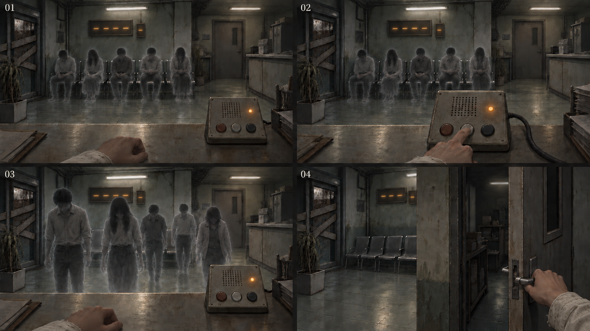
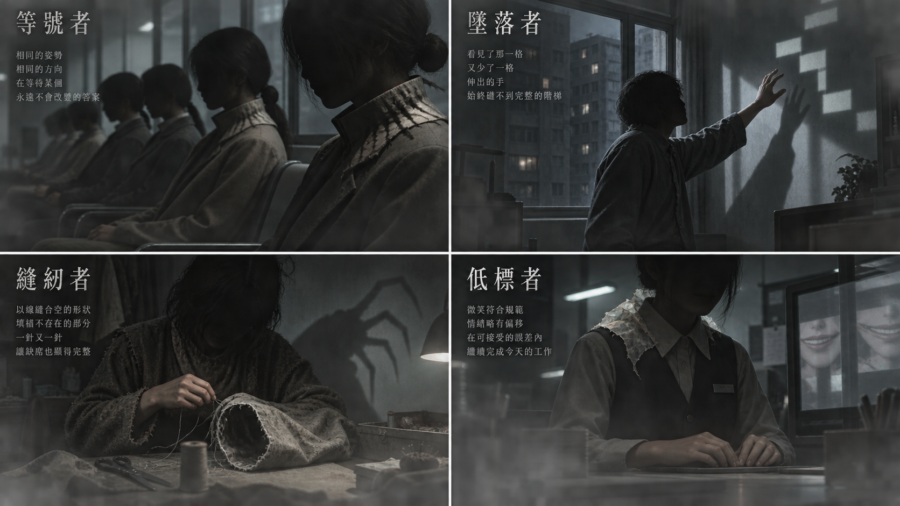
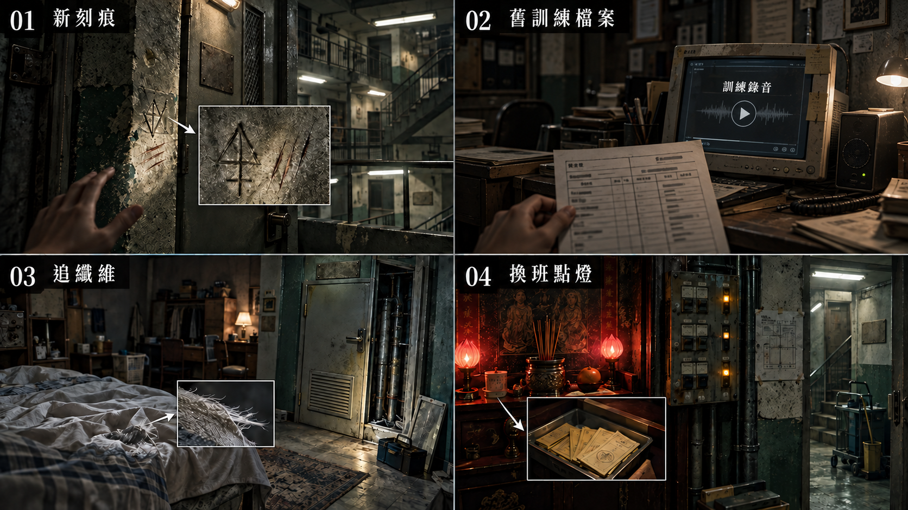
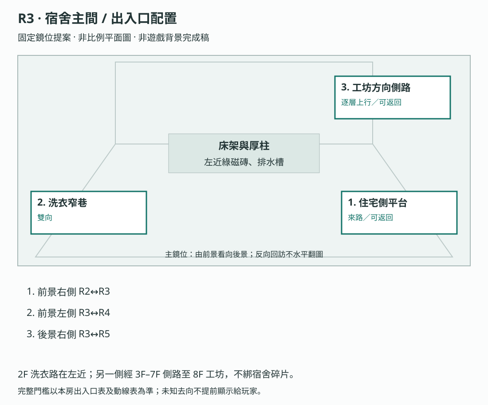
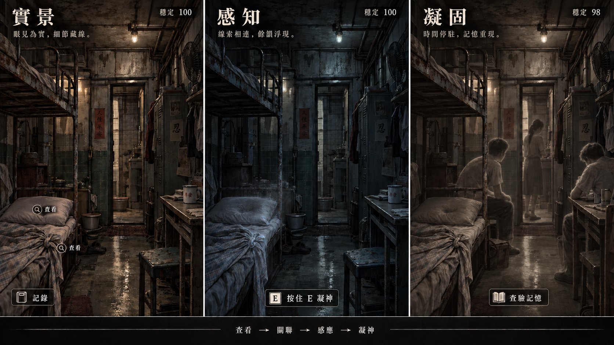
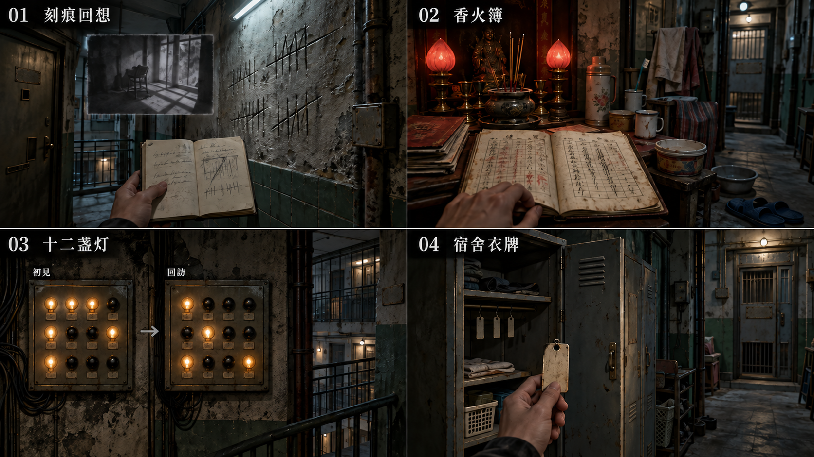
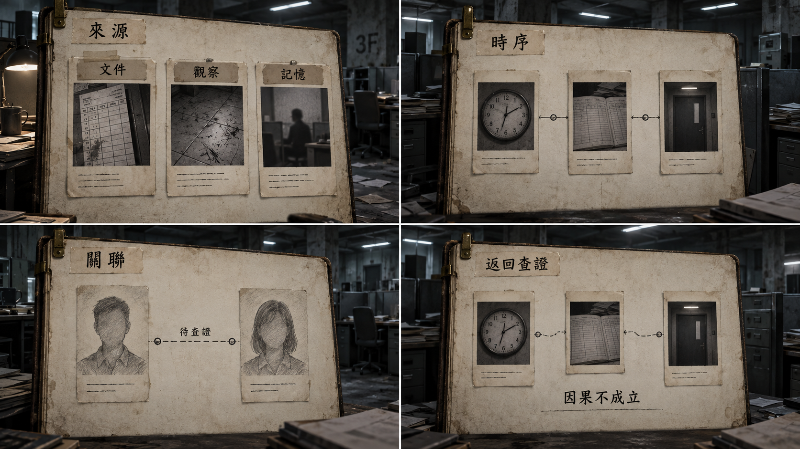
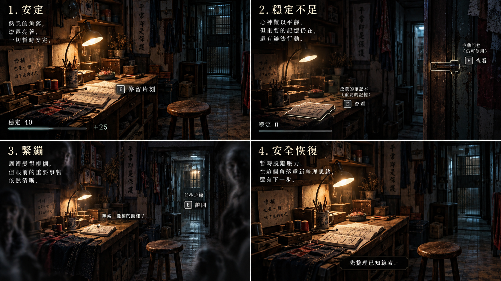

# 製作規格：第一幕

[總目錄](../09_劇本/09-14_全劇本與關卡整合稿.md#book-specs) · [本幕劇本](../09_劇本/09-04_正式劇本_第一幕.md#act-1) · [上一幕規格：序幕](10-01_製作規格_序幕.md#spec-act-0) · [下一幕規格：第二幕](10-03_製作規格_第二幕.md#spec-act-2) · [共用附錄](../09_劇本/09-15_正式劇本_共用附錄.md#book-appendices)

[R1](#node-r1-spec)、[R2](#node-r2-spec)、[R3](#node-r3-spec)、[R4](#node-r4-spec)、[R4b](#node-r4b-spec)、[R5](#node-r5-spec)

<a id="spec-act-1"></a>

## 第一幕 · 門面與棚：製作規格


玩家畫面與查證閱讀採[用語分層](../09_劇本/09-15_正式劇本_共用附錄.md#player-language)及[閱讀節奏](../09_劇本/09-15_正式劇本_共用附錄.md#reading-load)。下列技術識別碼、原始欄名與判定條件供製作使用，不整段顯示給玩家；白話呈現不改原來源、費用、門檻或存檔行為。

<!-- production:ordered:v1 -->

[本幕概覽](#spec-act-1-overview) · [場景流程](#spec-act-1-rooms) · [跨場景共用規則](#spec-act-1-shared) · [跨場景圖解](#spec-act-1-references) · [幕尾狀態與交付](#spec-act-1-delivery)

<a id="spec-act-1-overview"></a>

### 本幕概覽與前置

<a id="s-0602-0"></a>
<a id="doc-0602"></a>
<a id="s-0602-1"></a>

<!-- import:s-0602-1:begin -->
<a id="h-0602-1"></a>

#### 第一幕 · 垂直切片規格 ACT I VERTICAL SLICE

> 「乾淨的謊言，與牆上刻滿的名字。」
> 「這裡曾經住滿了人。」

**逐畫面 · 逐點擊 · 逐對白 · 逐回饋 — 可實作規格**

> 📌 **本文件是全作的規格範本。** 其他幕的規格文件應比照此格式撰寫。
<!-- import:s-0602-1:end -->

<a id="s-0904-0"></a>
<a id="s-0904-1"></a>

<!-- import:s-0904-1:begin -->
<a id="h-0904-1"></a>

#### 遊戲劇本 · 第一幕 ACT I · 門面與棚

> **場景、操作與證據以 [06-02](#doc-0602) 為準**。本稿展開台詞、字幕、停頓與演出銜接；段落編號沿用來源，新增銜接段加後綴。
> **R1 修訂口徑：**接收管制門面實為新人接收／待分配區。叫號重播被迫服從的程序，只結束等待循環；不宣告安息、獲救或心願完成。相關來源規格已同步修訂。

| 項目 | 內容 |
| --- | --- |
| 區域 | R1 入口大廳 → R2 接待後室 → R3 宿舍；R4 刻痕牆與 R4b 無主神壇為可回走分支；R5 工坊收束 |
| 揭露 | 第一層：這是一座詐騙園區 |
| 預估 | 40–55 分鐘；非最低停留時間，不用等待或強制回訪補足，各房停留亦不作逐項相加的時長保證 |
| 遭遇 | E-01 等號者教學；E-03 縫紉者為被動殘留，不計對戰 |
| 主線 | 五個人物碎片、R2 管理紀錄、第一層人物鏈與三格鎖定、F1 刻痕記錄、現場門端核對 |
| 選填 | E1-09／10／11／12／13、E4-00-A、R4 一次性聲證、生活附頁與回訪差分 |
| 感官主軸 | 日常氣味的缺席；紙、潮濕布料與本應有人使用的器物 |
| 有聲文本 | 21 個逐字台詞落點：19 個【鎖定】、2 個【新增】；其中現時主角 OS 14 個 |

（鏡位切換）本幕不出片頭旁白。由玩家在 P2 推開大廳門，直接承接暖白光。
〔環境〕全幕無新增背景配樂。R1 管制宣導影片的原始設備聲、現場喇叭與主觀殘留分開標記；凝固層抽走環境音，只留指定點擊的殘響。
〔玩家〕閱讀、必要台詞及敘事餘波受保護；HA 不插入其中。錯過選填段不補播、不自動補證據。

---
<!-- import:s-0904-1:end -->

<a id="s-0602-3"></a>

<!-- import:s-0602-3:begin -->
<a id="h-0602-23"></a>

#### 00 — 第一幕概覽

<a id="h-0602-25"></a>

##### 定位

> 第一幕是全遊戲的「**完整教學**」——第一次把三圖層、凝固瞬間、訊號博弈、調查板組合起來，教會玩家核心循環。
>
> 玩家在序幕學過基礎感知；第一幕要讓玩家**獨立運用**感知、凝固瞬間探索、蒐集碎片、調查板推理與訊號博弈，並在情感上被**刻痕牆**與**第一個怨靈**擊中。R1 的聲音回應讓出通路，不等於安息或救贖。
>
> 結束時，玩家確認「這裡是詐騙園區」（**第一層揭露**）。

<a id="h-0602-33"></a>

##### 空間與流程

- **區域**：2 個（底層假面大廳、低層牲口棚）
- **房間**：5 個定點房間（R1–R5）＋ 1 個共用基底的子節點（R4b 無主神壇，；**不另計實景基底**）
- **結構**：半線性——主線路徑清楚，但玩家可自由回訪
- **預估時長**：40–55 分鐘

```
序幕（地底管線層）
    │
    ▼
[R1] 入口大廳 ──── 教學① 異常感應與對峙辨識 · 教學② 訊號博弈（等號者 E-01）
    │
    ▼
[R2] 接待櫃檯後室 ── 碎片 #01 · 教學 調查板/碎片庫
    │
    ▼（紅鐵梯上行）
[R3] 宿舍主間 ───── 教學③ 凝固瞬間 · 碎片 #02
    │
    ├──▶ [R4] 刻痕牆廁所 ── 情感重擊 · 碎片 #03 #04 · 小花伏筆
    │        └──▶ [R4b] 樓梯轉角無主神壇（子節點）── E1-10 · E1-11 · E-09 首見
    │
    ▼
[R5] 工坊角 ────── 縫紉者 E-03（被動）· 碎片 #05 · 教學④⑤ 時序軌+三格鎖定
    │
    ▼ 第一層揭露 → 訊號鑰匙
第二幕（中層產線）
```

<a id="h-0602-62"></a>

##### 教學節點清單

本幕依序引入或獨立運用以下五項核心系統；P2 已教過的凝固操作不重播教學：

| # | 教學 | 房間 |
| --- | --- | --- |
| ① | 異常感應與對峙辨識 | R1 |
| ② | 訊號博弈（辨識→選擇→施放） | R1 |
| ③ | 凝固調查的獨立運用（進入→探索→退出） | R3 |
| ④ | 碎片庫與調查板 | R2（開啟）/ R5（運用） |
| ⑤ | 時序軌與三格鎖定 | R5 |

---
<!-- import:s-0602-3:end -->

<a id="s-0602-2"></a>

<!-- import:s-0602-2:begin -->
<a id="h-0602-11"></a>

#### 本幕逃生計畫

| 階段 | 玩家處境與行動 |
| --- | --- |
| 當下打算 | 找到可用的對外出口或替代路線。 |
| 看得見的阻礙 | R1 舊出口方向的內側門被既有封鎖與坍塌截斷；普通通路不能穿過。 |
| 解謎／躲避／擊退 | 在 R2 名冊／通道資料辨認產線服務路徑，到 R5 解開既有中層入口。 |
| 可驗證的進展 | 第一層必要推理完成後，R5 原低壓門端解除中層通道阻攔；玩家點出口前進。 |
| 已查明後的短提示 | 「大門走不了。先走產線服務通道，找還能用的出口。」 |

共用規則見[對應條款](10-01_製作規格_序幕.md#s-0601-2)。
本幕玩法重點是回應差異、人物鏈與制度因果；R1 測試可略，R5 推理不省略現場插銷。逐節點操作見[全程玩法對照](../09_劇本/09-15_正式劇本_共用附錄.md#core-gameplay-nodes)。

<!-- import:s-0602-2:end -->

<a id="s-0602-17"></a>

<!-- import:s-0602-17:begin -->
<a id="h-0602-1054"></a>

#### 節點導覽

<a id="h-0602-1058"></a>

##### 動畫播放與互動契約

本章動畫分為過場、玩家驅動演出與現時局部循環。分鏡估算不是已完成素材或遊玩時長保證；實作先驗鏡位、前兆與操作，再精修材質。

共用規則見[對應條款](10-01_製作規格_序幕.md#s-0601-17)。
<!-- import:s-0602-17:end -->

<!-- scene-image-routes-1:begin -->
<a id="image-routes-act-1"></a>

### 本幕連線與接景圖

每條既有動線均指定畫面。兩端接景使用已列主圖與門框遮擋，不另造中間房；出口接景必須交指定鏡位，動畫及低動態版共用定位。後果演出不開放探索。進入條件與回訪仍依原動線表，圖號不是通行權限。

| 原動線 | 接景方式 | 畫面節點／圖號 | 操作與條件來源 |
| --- | --- | --- | --- |
| R1→R2 | 兩端接景 | [R1-V01](#node-r1-images) → [R2-V01](#node-r2-images) | [門檻、方向與回訪](#node-r1-nav) |
| R2→R3 | 逐鏡過渡 | [T-R2-R3-01](#subscene-t-r2-r3-01-spec) → [T-R2-R3-02](#subscene-t-r2-r3-02-spec) | [門檻、方向與回訪](#node-r2-nav) |
| R3→R4 | 逐鏡過渡 | [T-R3-R4-01](#subscene-t-r3-r4-01-spec) | [門檻、方向與回訪](#node-r3-nav) |
| R3→R5 | 逐層探索 | [T-R3-R5-01](#subscene-t-r3-r5-01-spec) → [T-R3-R5-02](#subscene-t-r3-r5-02-spec) → [T-R3-R5-03](#subscene-t-r3-r5-03-spec) → [T-R3-R5-04](#subscene-t-r3-r5-04-spec) → [T-R3-R5-05](#subscene-t-r3-r5-05-spec) | [門檻、方向與回訪](#node-r3-nav) |
| R4→R4b | 兩端接景 | [R4-V01](#node-r4-images) → [R4b-V01](#node-r4b-images) | [門檻、方向與回訪](#node-r4-nav) |
| R5→R6 | 逐層探索 | [T-R5-R6-01](#subscene-t-r5-r6-01-spec) → [T-R5-R6-02](#subscene-t-r5-r6-02-spec) | [門檻、方向與回訪](#node-r5-nav) |
<!-- scene-image-routes-1:end -->

<a id="spec-act-1-rooms"></a>

### 依流程逐場景製作

<a id="node-r1-spec"></a>

### R1 · 入口大廳

[正式場次](../09_劇本/09-04_正式劇本_第一幕.md#node-r1-script)

[進場與動線](#node-r1-nav) · [出入口位置](#node-r1-access) · [操作與解謎](#node-r1-level) · [狀態與驗收](#node-r1-pack) · [圖像製作單](#node-r1-images) · [離場與次場景](#node-r1-exit)

<a id="node-r1-nav"></a>

**進出、動線與回訪**

<a id="s-0609-11"></a>

<!-- import:s-0609-11:begin -->
<a id="h-0609-70"></a>

#### R1 入口大廳

進行目的：確認大門是否能走，處理等號者阻攔；教學①② · 等號者 E-01 · 震損殘痕 E1-12

支線／收集：依原房選填調查；無新增支線掛點。

| 方向 | 類型 | 可移動條件 | 移動演出提案 | 回訪規則 |
| --- | --- | --- | --- | --- |
| P2 → R1 | 跨幕 | 已查看編號牌取得 E0-02，再核對上行口編號保存 K0-01 路線索引；自行爬梯推開未鎖門 | 從地下爬上，推開未鎖大廳門；冷水聲過渡為日光燈電流聲。 | 單向流程；不代表可沿此線倒退 |
| R1 ↔ R2 | 主線 | 完成 R1 叫號教學，等號者的等待循環結束、讓出通路後前往；震損殘痕與回訪附頁不擋通行 | 繞過接待櫃檯，穿過原店面庫房門；暖白燈仍從身後漏入，封閉交貨窗標示內巷方向。 | 章內回訪；遇鎖場、追逐或封路停用 |
<!-- import:s-0609-11:end -->
<!-- navigation:r1:end -->

<a id="node-r1-access"></a>
#### 主場景出入口

<!-- scene-access:R1:begin -->
| 動線 | 顯示名稱 | 畫面位置與辨識物 | 通行狀態 |
| --- | --- | --- | --- |
| P2→R1 | 來路：地下梯段門 | 進場側邊緣的原門框，門外接序幕上行梯；門內是安全站位。 | 可退到同房入口查閱，但不提供回 P2 的移動。 |
| R1↔R2 | 出口：櫃檯後門 | 接待櫃檯後方的舊庫房門，與等候椅及叫號機同框可辨。 | 叫號使等待循環結束、通路讓出後，繞過櫃檯手動進 R2；可原路回訪，門鎖不因殘留消散自行改變。 |
| 封閉 | 封閉樓外出口 | 出口標示下的內側門，焊痕與堵住門縫的坍塌可見。 | 可近看，不能走到樓外；入口右側布幕後的震損痕跡亦不構成另一條出口。 |
<!-- scene-access:R1:end -->

**演出限制與製作註記**

<a id="s-0904-2"></a>

<!-- import:s-0904-2:begin -->
<a id="h-0904-25"></a>

#### 演出限制

> 前一節點：P2（單向上行）　後一節點：R2　章內可由 R2 回訪
> 當下打算：確認大門能否出去，再查看接待櫃檯後方。
<!-- import:s-0904-2:end -->

<a id="node-r1-level"></a>

**關卡、解謎與失敗回饋**

<a id="s-0602-4"></a>

<!-- import:s-0602-4:begin -->
<a id="h-0602-76"></a>

#### R1 — 假面大廳：入口

<a id="h-0602-78"></a>

##### 圖解：入口大廳：叫號與讓路

[查看圖像：入口大廳：叫號與讓路](#fig-l02)

由左上到右下閱讀：辨認叫號對象、操作現場設備，再查看讓出的通道。上圖為舊版概念分鏡，只參考設備與通路關係；接收號牌、管制告示、逐號起身並走向內門的方向，以本次修訂的下表與 R1-03 為準，不沿用圖中朝玩家聚攏的動作。

| 分鏡 | 玩家操作與畫面回應 |
| --- | --- |
| 01 | 查看管理者指派的接收號牌、當前待叫序列與不得自行離座的告示，再主動辨識端坐的等號者；不演出自助取號。 |
| 02 | 在原有通電叫號機選擇既存叫號功能，由機上喇叭發聲；操作與聲源都留在現場設備。 |
| 03 | 叫號序列依次顯示五個接收編號；五人分別立即起身、先看出口、握牌遲疑或起身後停半步，完整次序見 R1 動畫演出。它們沿櫃檯走向內門，逐一消散、讓出通路，不演出如釋重負。 |
| 04 | 回應成功仍不代替移動；玩家繞過櫃檯，手動推開原庫房門進入接待後室。 |

叫號聲來自已供電的本地設備；筆記只負責記錄，出口仍由玩家點選。

<a id="h-0602-94"></a>

##### R1 空間與畫面製作定位

| 項目 | 畫面與製作要求 |
| --- | --- |
| 樓層定位 | 1F |
| 樓棟定位 | A 棟 |
| 樓層與環境 | 1F 舊室內街／大廳，接待後室同層。既有空間材質、光源與生活物件沿本房原文。 |
| 入口方向 | 由 P2 承接；以來路門框／扶手作背向定位，前進方向依下列出口地標。左右方位沿既有構圖，不將反向回訪鏡頭誤當另一扇門。 |
| 可見出口 | 接待櫃檯後的庫房門；樓外方向保持封閉。首次全景就交代入口輪廓或可查看的遮擋，不靠無標示的畫外點擊換房。 |
| 阻擋與開放條件 | 往 R2：完成 R1 叫號教學，等號者的等待循環結束、讓出通路後前往；震損殘痕與回訪附頁不擋通行 |
| 畫面中的解謎要素 | 門禁、等號者與必要調查物件，按教學操作取得通行。關鍵標記可近看，與裝飾物有可辨的材質或輪廓差異，不只靠顏色或聲音。 |
| 完成後變化 | 完成叫號教學、等號者讓出通路後，玩家手動開接待櫃檯後的庫房門前往 R2；成功回應永久保存，不新增另一道門禁題。 |

<a id="h-0602-107"></a>

##### R1 製作流程

**空間第一印象：**廉價暖白接收管制門面壓在褪色店招上。接待區邊緣露出不同字體的舊租戶招牌；亮處只照得到前台，側巷深暗。

**歷史用途與現時通行：**這裡是被押送者的接收／待分配區，不是徵才場所；燈箱寫「接收登記」，不掛招收或報名資訊。櫃檯內側保留整疊待發號牌與門鎖控制鈕，候坐側沒有取號口或開門鈕；告示寫「依編號等候；未經帶領不得離座。」原庫房門過去由管理者放行，現時鎖舌已損壞，叫號只解除殘留阻攔，不修復或啟動門鎖。玩家仍手動推門，不新增門禁謎題。

**探索呈現：**先讓玩家看見入口、可走的方向和空間異常，再自選近看生活物件；新增租戶遺跡不發 E 證據、不設派系任務、不改出口旗標。恐怖沿原事件與遭遇時序，安定／閱讀保護段不插嚇點。

**逃生因果與可見回饋：**原大廳入場後，接待視野邊緣保留舊出口標示及被封住的內側門。免費查看只見門內焊痕和坍塌，不見外界；OS「這邊出不去。後面還有路嗎？」等號者原教學結束後，威脅反應停止，接待後室方向保持可見可查；不新增第二場攻擊或新鎖。

| 階段 | 製作規格 |
| --- | --- |
| 進入／目標 | 確認大門是否能走，處理等號者阻攔；教學①② · 等號者 E-01 · 震損殘痕 E1-12；入場先還原原房間已保存的熱點與事件狀態。 |
| 觀察／空間 | 舊室內服務街被廉價暖白飾板包成接收管制大廳；櫃檯後露出封閉店面鐵閘，排水管穿過公司招牌上緣。 |
| 操作順序 | 辨認叫號牌與等候輪廓 → 主動辨識等號者 → 依原訊號回應 → 查看震損殘痕 → 進接待後室。順序中的選填內容不作離房門檻；原主線旗標、遭遇數值及分支提交條件依本場景細則。 |
| 回饋 | 必要操作寫入原證據／門禁／遭遇狀態；新增生活附頁僅更新來源已讀與有依據的筆記，不重發原證據。 |

<a id="h-0602-124"></a>

###### R1 生活與管制觀察

原接收登記表與櫃檯下封存袋保留「私人通訊設備／證件代管」欄，退還欄空白；袋口的「接收編號」與號牌、R2 名冊使用同一欄位，不新增可用手機。配給宣傳與實際扣留形成對照。號牌及管制告示納入原叫號機觀察，封存袋細讀仍選填，不要求讀袋才能看懂此處有人身管制。

<a id="h-0602-128"></a>

###### R1 附頁熱點

**頁鍵對照：**`custody`＝封存袋收存／退還欄。

| 欄位 | 規格 |
| --- | --- |
| 識別／位置 | `R1_DETAIL_01`；接收登記表所在櫃檯近看下緣的封存袋。沿原近看開頁，不增加遠景發光提示。 |
| 前置 | 已開啟該原熱點；原證據、供電及回訪前置照舊，不因新增附頁放寬。 |
| 玩家操作 | 翻看袋口標籤與退還欄。各來源各自閱讀，不要求一次讀完。 |
| 回饋／筆記 | 私人設備與證件被收存；退還空白不等於物主死亡。 |
| 成本與中止 | 免費查看；普通探索閱讀停表；鎖場／強制演出依原規則暫不開啟。退出即回原近看，不寫未讀頁。 |
| 保存 | 每頁保存 `scene_detail.r1.read_pages` 集合；只有指定附頁顯示且玩家確認收起時加入對應頁鍵。來源顯示後中途暫停不算完成。 |
| 回訪 | 已讀頁可重看，原物件位置不重置；尚缺對照來源時保留觀察，不生成推論。 |
| 素材 | 在原近看增一組物件／紙張疊圖、各頁文字轉錄、翻頁／收起聲；近看與原基底光向一致，均待製作。 |

<a id="h-0602-143"></a>

<a id="belongings-r1-spec"></a>
###### 私物收存角落：房內選填探索

[正文](../09_劇本/09-04_正式劇本_第一幕.md#belongings-r1-script)。A 棟 1F，`R1-V01 ↔ R1-V02`，入口在櫃檯外側，不穿過等號者擋住的 R2 內門。首次主圖可見矮牆凹位、固定網櫃與待發用品；V02 保留花磚返回方向，唯一來路回 V01。鏡位是既有大廳一角，不新增櫃後通路、樓層或門鎖。

R1-C07 分交旅行袋修補、封條、配發袋與杯貼四個局部；固定網後物件只可看，網前物件也不取走。生活觀察只支持私物扣存與統一配發，不能靠殘缺姓名指定主角或其他角色，不補發 R1-C05 編號來源，也不把行李數量當受困人數。杯貼只露筆畫，不增加國籍、現時生死或新的 E 碎片。

普通探索即可進入；叫號教學的強制回饋、輪廓演出及電視反射進行中，沿原保護暫不切鏡，演出結束恢復。回 V01 保留原等候狀態，未完成教學不清除五人或解鎖 R2；本角落不代播電視事件。沿[生活痕跡共用規格](../09_劇本/09-15_正式劇本_共用附錄.md#everyday-world-spec)保存 `scene_detail.r1.life.views_seen` 的 V02，以及 C07 各焦點；全部焦點實看並主動記錄才存正文觀察，半讀只存物件摘記。零查看、先袋後角落／反序、等待循環前後返回、半讀存檔與舊檔皆須保留原主線。

###### R1 出口與回訪

| 目的節點 | 條件 | 移動與辨向 | 回訪邊界 |
| --- | --- | --- | --- |
| R2 | 完成 R1 叫號教學，等號者的等待循環結束、讓出通路後前往；震損殘痕與回訪附頁不擋通行 | 繞過接待櫃檯，穿過原店面庫房門；暖白燈仍從身後漏入，封閉交貨窗標示內巷方向。 | 章內回訪；遇鎖場、追逐或封路停用 |

共用規則見[對應條款](10-01_製作規格_序幕.md#s-0601-6)。

<a id="h-0602-152"></a>

##### R1 動畫演出

<a id="h-0602-154"></a>

###### 叫號與等待循環結束

| 項目 | 場景演出規格 |
| --- | --- |
| 形式與節奏 | 現時怨靈局部動態，由本機既存批次叫號序列推進；保留原遭遇完成與通路旗標，不判定為自願安息。 |
| 鏡頭與動作 | 各號響起時，第一、二人立即起身；第三人先看出口再轉向內門；第四人握緊號牌，停半拍才起身；第五人起身後遲疑半步才跟上。依原路沿櫃檯走到內門前逐一淡去，衣領仍有原微顫。不握手、不致謝、不演出解脫。 |
| 操作與資訊邊界 | 玩家先完成回應才播放結果；不加群體撲擊或以動畫自動答題。 |

**反應差異：**五人仍是同一場教學，不增分支或個別操作。動作只呈現各自面對同一指令的反應，不據此判定誰被騙、誰被綁、誰較順從或誰受害較深；亦不把 R4 匿名刻字逐一配給他們。

**區域**：底層假面大廳　**教學**：異常感應與對峙辨識　**怨靈**：等號者（E-01）

<a id="h-0602-167"></a>

##### 畫面構圖（定點）

第一人稱正視。玩家站在大廳入口，面朝內。

| 層次 | 內容 |
| --- | --- |
| 前景 | 散落的接收登記表 |
| 中景 | 一排等候區塑膠椅（空） |
| 背景 | 接待櫃檯與老舊電視（循環播園區管制宣導影片）；廉價飾板遮住舊店面鐵閘，排水管穿過假公司 Logo 上緣，側邊露出內巷的錯層住宅門框。 |
| 光源 | 天花板一盞**閃爍的日光燈**及原消防指示漏光；筆記本借用環境光閱讀，不配置隨身發光棒 |
| 色調 | 刻意的、廉價的**暖白**——它的「乾淨」比破敗更不安 |

<a id="h-0602-179"></a>

##### R1-01 進入 · 建立氛圍

| 項目 | 內容 |
| --- | --- |
| 觸發 | 玩家從序幕的地底管線爬上，推開未鎖的大廳門（過場）。畫面亮起，日光燈頻閃。 |
| 旁白 | **主角（OS）**「這裡……我記得這裡。我來的第一天，就是在這裡。」 |
| 環境音 | 日光燈的電流嗡鳴、電視傳來的管制宣導影片背景樂（輕快，詭異）、玩家腳步。**無配樂。** |
| **情話底噪** | 極低音量的人聲層**從這裡就開始播放**，並持續整棟樓。<br>內容是教戰手冊第 3 頁的標準開場白與第 14 頁的三句情緒勒索回應，中／越／緬／泰／柬／英六語，各聲源延遲 0.2–0.9 秒、**永不對齊**。<br>玩家在第一幕尚不易辨認那是人聲；第二幕讀完教戰手冊、再對照產線底噪，才聽懂一路經過的設備噪音中藏著什麼。<br>**不得在第二幕才加入。** |
| 恐慌 | 進入時恐慌值輕微上升（日光燈頻閃是觸發源）。畫面邊緣輕微暗角。教玩家「這裡讓她不安」。 |

<a id="h-0602-189"></a>

##### R1-02 教學① · 異常感應與對峙辨識

| 項目 | 內容 |
| --- | --- |
| 引導 | 玩家點擊電視，近看管制宣導影片：制式笑容配上編號床位、餐券及封住的出入口，設備原句改為「食宿由管理處分配。依編號等候，不得自行離開。」不提供應徵、福利選擇或辭職入口。依本房對峙教學長按凝神辨識等號者，不以短按感應代做辨識。 |
| 教學 | 玩家先直接查看叫號牌與端坐輪廓；怨靈辨識走對峙操作，長按 1.5 秒／3 點，不要求收集探索線索。Q 不切換整房圖層，不自動公布回應答案。 |
| 系統 | `[系統] 偵測到殘留訊號 ×5。類型：迴聲者。狀態：循環（等待）。` |
| 旁白 | **主角（OS）**「椅子上……有人。他們還在等。」 |
| 設計 | 既有空房全景在指定觀察完成後呈現五個端坐輪廓，手壓在接收號牌上；一個稍偏向出口又轉回喇叭。以局部殘留形成「空房間其實滿是人」的落差，短按感應不開啟整房掃描模式。 |

<a id="h-0602-199"></a>

##### R1-03 教學② · 第一次訊號博弈（等號者）

叫號機由大廳既有低壓回路供電；玩家先查看實體接收號牌、當前待叫序列、管制告示與機上「叫號／鈴聲測試／重置測試」三個既存功能，確認來源及喇叭。查看後筆記保存已見號牌與待叫序列，不解釋分配去向、不另發 E 證據。一次「叫號」啟動本機保存的五人批次序列，逐號顯示並播放同一組三聲提示音（#3），不新增數字配音、輸入號碼或排序謎題。選擇與輸出都在叫號機上完成，筆記只列已知索引，不隔空播音。首次教學先留安全觀察時間；0 穩定時仍能以機上按鍵完成叫號，不能因連續試錯卡在此房。

遭遇開始後可收手退回同房入口安全站位，重新查看叫號牌；P2→R1 是單向，不提供返回地下的假出口。完成教學回應後才可到接待後室；震損殘痕、回訪差分與封存袋附頁均不擋通行。

| 項目 | 內容 |
| --- | --- |
| 觸發 | 玩家點擊等候區的叫號機或任一椅子，等號者**同時轉頭**。大廳監控鏡頭依既有巡迴轉向入口；螢幕只在主角視角短暫疊出似人的主觀輪廓，並非攝影機拍到離體肉身，實際錄影仍是空場。 |
| 系統 | `[系統] 迴聲者已注意到你。循環中斷。可操作現場設備回應，或先退回入口安全位置。` |
| 教學 | ① 凝神辨識等號者在「等叫號」→ ② 到現場通電叫號機選已有的叫號音 → ③ 由叫號機喇叭播出。筆記只記來源，不能播放或施放音檔。 |
| **有效回應** | 播放本批次叫號序列 → 依本房動畫表呈現立即起身、先看出口、握牌遲疑與停半步的個別反應，五人沿櫃檯走向內門，逐一消散、讓出通路，沒有放鬆或致謝。<br>`[系統] 等待循環已結束。` |
| **局部有效、尚未完成** | #1 鈴聲測試使注意轉向機上喇叭，可查椅側號牌；#2 重置測試使輪廓回到候坐循環。兩者都不讓出通路、不安息、不激怒。沒有可用來源的操作不送出、不扣款。 |
| 情感 | **主角 OS：無。** 最後一個輪廓消失後留 3 秒靜默，不新增音效；之後恢復操作，直到玩家主動查看或離開前不接新事件。通路已空，管制告示仍在。 |

**結果與保存：**名冊只記「播放接收叫號；等待循環結束」。沿用既有一次性完成與通路旗標，讀檔／回訪不再生成 E-01，不另設安息獎勵或道德判分。若既有共用狀態內部命名為 `rested`，本場只沿用其完成判定，不把字面安息輸出到 UI 或敘事。

<a id="signal-tests"></a>

###### R1 三種回應的操作差別

| 操作 | 前提與回饋 | 成本、退出與保存 |
| --- | --- | --- |
| #1 模擬鈴聲 | 已查看本機來源且 E-01 未完成；以原喇叭測試音轉移注意。玩家親自打開號牌近看才保存該來源，不由播放代讀 | 選填播放 5 點，少於 5 點停用且不扣；原入口免費查看相同號牌。近看不計時，關閉後回到完整的注意前兆，不突然命中 |
| #2 重置脈衝 | 同一設備，當前注意朝向玩家或喇叭時可用；輪廓回座，但仍占著路 | 選填播放 5 點，少於 5 點停用；已候坐時不重送、不扣款。保留所有來源、筆記與索引，不清主線進度、不補穩定度 |
| #3 叫號音 | 只要查得本機功能即可啟動原五人批次；不需要先做 #1 或 #2 | 原必要播放 5 點及不足額備援；0 點仍可完成。批次中停用另外兩項；暫停／續存接同一進度，不重付費、不重算五人 |

測試不觸發「錯誤訊號 +1 恐慌」、話術安撫或安息獎勵。兩個測試互斥，換指令先結束原測試；同一次待處理操作不可連按重扣。存檔保留已提交測試及費用，讀檔回入口安全位、輪廓候坐，測試效果不跨房持續，必要叫號完成旗標不回退。完成後只允許回查設備資訊，不再提供有目標的測試。有效不等於通關；本房是學習回應差異，沒有額外必犯錯誤或按鍵排列題。

照片只在入口安全站位或原本安全查證時使用，不能在動畫中新增停攻。安定成功才降恐慌，不改 E-01 的等待與通路；規則見[照片流程](../09_劇本/09-15_正式劇本_共用附錄.md#photo-flow)。

> **★ 這一步的設計意圖**
>
> 第一次對戰讓玩家學到：**理解眼前怨靈的行為，可以換到通行機會，但有效回應不等於完成遺願。** E-01 重播的是受控者被迫依令移動的一段歷史，不把服從概括為所有受害者的心理。
>
> 教學保持低威脅與安全餘波，情緒是對受困者的同情與尚未解開的不安，不是救贖的釋然。玩家沒有新造一場歷史傷害，也沒有證據證明已救出他們；系統不因必要操作譴責玩家。

> ### ★ 它們排的是什麼號
>
> **是管理者指派的新人接收編號。** 等號者被要求留在候坐區，依號向內移動，等待分配；不是自願抽號，也不是每日換班。
>
> **第一幕呈現管制，第二幕補足工作內容。** R1 告示、號牌與門控位置已交代無法自由離開，R2 名冊可見分配去向；不必等第二幕才承認他們受困。
>
> 第二幕 R7 教戰手冊首頁內側的接收分配聯，將同批接收編號對到產線工位。玩家讀過該頁後可與已保存的 R1 叫號觀察比對，理解接收程序如何把人送進產線；不開放跨幕返回 R1。
>
> **她剛才啟動的，是把受困者送入產線的那段接收程序。**
>
> 這只能解釋輪廓為什麼起身，不能證明他們希望上工、得到安息或已被救出。
>
> 沿原叫號操作與文件查看回收，不新增對戰、旁白、謎題或主線證據 ID；刪去替受害者解釋心願的 OS，改用動作和來源讓玩家理解。

<a id="h-0602-236"></a>

##### R1-04 · 循環結束後的回訪異變

| 項目 | 內容 |
| --- | --- |
| 觸發 | 玩家離開 R1 前往 R2，再次回到入口大廳。不要跳出系統提示，也不要播放新的目標音效。 |
| 異常 | 五張空椅中有一張轉向入口，椅背掛著原本不存在的號碼牌。感知後只顯示「訊號已消散」，沒有解釋。 |
| 空間回應 | 老舊電視在歡迎詞與一段極短的內控叫號紀錄之間跳切；畫面中的接待員嘴型沒有變，聲音卻變成主角的聲音。 |
| 玩家理解 | 空椅與舊叫號檔補強接收區的管理痕跡，不代表五人重新被叫回或復活。此時不能確認那個流程與主角有關。 |
| 恐怖控制 | 異常只出現一次，玩家若立刻離開不會受到追逐；恐怖來自房間對玩家的記憶，而不是新增敵人。 |

> **設計目的**：等待循環已結束，房間仍留有管理痕跡；回訪只呈現一次差分，不重新開戰或撤回已開通路。這是後續「怨靈認得主角」的低強度預演。

<a id="h-0602-248"></a>

##### R1-04b 鏡像者 · 第二次

> 九次中的第二次。與序幕 P0 積水那次同一個文法：**慢半拍。**

| 項目 | 內容 |
| --- | --- |
| 觸發 | 玩家完成 R1-03（等待循環結束）後、準備離開大廳前往 R2 時。 |
| 反射面 | 接待櫃檯那台老舊電視。等待循環結束後它**熄滅了**——螢幕變成一面黑鏡。 |
| 表現 | 熄滅的螢幕裡有一個站姿。玩家轉身走向 R2 時，它跟著轉，**晚 0.3 秒**。 |
| 玩家的解釋 | 映像管殘影、關機後的餘輝。 |
| ⚠️ 抑制 | 玩家若**主動點擊電視**查看，保留與現時同步的手及櫃檯反射，僅抑制慢半拍事件；不把正常反射一併抹掉。 |
| 聲音 | 無。 |
| OS | **無。** |
| 系統 | 不提示、不入證據、感知層不顯示、介面不標記為敵人。 |
| 與 H-08 的區隔 | 小花的輪廓**第四幕才開始**，且靜止、遙遠。鏡像者**和你一樣近、和你一起動**。兩者在第一幕不會混淆。 |
| 公平性 | 完全可以錯過。 |

📄 九次配置與五條鐵律見 [01-02 鏡像者的逐幕配置](../09_劇本/09-15_正式劇本_共用附錄.md#doc-0102)

<a id="h-0602-267"></a>

##### R1-05 · 震損殘痕（`E1-12`）

| 項目 | 內容 |
| --- | --- |
| 觸發 | 玩家完成 R1-03 後，點擊入口右側被布幕遮住的門框。門框上的焦灰被雨水沖開，露出向內彎折的金屬、斷裂螺栓與較早的封焊。 |
| 互動 | 玩家可放大向內彎折、斷裂螺栓與較早封焊三個細節。字幕為「向內彎折／封焊與裂口分屬兩次受力」；裂口外的紅霧、蠶絲另屬現時感知層，不能當作客觀震損證據。 |
| 主角反應 | 「門框整片往裡折……」「那時候，裡面還有人嗎？」 |
| 證據 | 取得 `E1-12`：向內彎折的門框、斷裂螺栓與較早封焊。只記位置與受力差異；實際日期在 R17 核對，不能據此判定施力者或宣告有人進入。 |
| 恐怖拍點 | 玩家關閉放大畫面後，裂口深處響起一次短促金屬拖擦，白絲保持繃緊；回到實景層只剩雨水滴在碎磚上。 |
| 設計目的 | 第一幕只建立先後兩次的封門與震損痕跡，讓玩家追問出口何時被截斷。R17 補日期與設備斷線，R30 才重建尚可走的路；不新增調查外部行動的任務。 |

---
<!-- import:s-0602-4:end -->

<a id="node-r1-pack"></a>

**狀態、素材與驗收**

<a id="s-uppertech-29"></a>

<!-- import:s-uppertech-29:begin -->
<a id="h-uppertech-446"></a>

#### 第一幕與首輪圖音｜開局製作｜R1

| 製作項 | 操作與交付條件 |
| --- | --- |
| 熱點／原操作編號 | R1-01、R1-02、R1-03、R1-04、R1-04b、R1-05；場景附頁及沒有編號的操作仍依原文，不另發 E 證據 |
| 前置與操作順序 | 觀察接收號牌、管制告示與端坐輪廓 → 對峙辨識 → 可選鈴聲引導注意／重置候坐，或直接啟動既存批次叫號 → 等待循環結束、讓路；隨時沿原規則退入口安全位查證 |
| 保存與取消 | 對峙辨識與探索記憶門檻分離。保存測試提交、已讀來源、批次進度與等待循環完成，不把回座寫成完成，也不把完成寫成安息；回訪不復活。鏡像與空椅異變按原事件旗標一次性處理。 |
| 例外與驗收 | 三種回應各自測試、#1／#2 任意順序或全跳過、1–4 點停用選填、0 點叫號、同房安全位查證、全文閱讀／失焦恢復及測試後續存；完成後不再生成 E-01。收束只顯示「等待循環已結束。」、無 OS，名冊不標安息；保留原通路完成旗標，不加門鎖題或道德計分。監控巡迴依既有時序；主角輪廓僅主觀疊影，實際錄影仍空場，不能把離體主角存成攝影機影像。 |
| 素材拆單範圍 | 1 個大廳基底、5 個端坐輪廓的原配置、等號者回應與空椅差分、叫號／管制宣導影片／低音量底噪；低動態版保留提示。 |
<!-- import:s-uppertech-29:end -->

<a id="node-r1-images"></a>

#### 場景節點與靜態圖製作單

以下每列均為待製作圖像項目；文件多頁、正反面、局部與狀態差分須依拆圖欄各自交付，不能以一張示意圖代替。可探索場景的主圖提供移動與探索，演出節點不另開探索，近看關閉回到開啟前的畫面；原演出與操作條件仍依右欄來源。圖號、解析度、文字分層、存檔及驗收依[靜態圖共用契約](../09_劇本/09-15_正式劇本_共用附錄.md#scene-image-contract)。

<!-- scene-images:R1:begin -->
| 畫面節點／圖號 | 用途 | 必畫內容 | 狀態與拆圖 | 來源 |
| --- | --- | --- | --- | --- |
| R1-V01 | 主場景 | 「接收登記」燈箱、空等候椅、櫃檯、待發號牌、叫號機、內門與封住的樓外出口。 櫃檯外側矮牆凹位露出固定網櫃與待發灰布袋，接 R1-V02。 | 空椅／五人等待／等待循環結束、電視亮／熄、內門被擋／讓出分層；等待層交付肩線固定、頸影多折一節與轉頭接回差分，五人的號牌和個別反應各自保留。實體門鎖不因消散自行改變。 補同層選填入口熱區，叫號狀態不因進出角落重置。 | [本場景](../09_劇本/09-04_正式劇本_第一幕.md#node-r1-script) |
| R1-C01 | 近看 | 舊出口內側門 | 焊住與坍塌局部；與震損門框分開，不合成同一事件。 | [R1-01a](../09_劇本/09-04_正式劇本_第一幕.md#s-0904-4) |
| R1-C02 | 操作近看 | 電視、號牌及待叫序列 | 電視底框、號牌近景、序列顯示各一焦點；管制宣導影片另製，畫編號床位、餐券及封住的出入口，無自助取號或報名入口。 | [R1-02](../09_劇本/09-04_正式劇本_第一幕.md#s-0904-5) |
| R1-C03 | 操作近看 | 叫號機三鍵與椅側號牌 | 叫號／鈴聲測試／重置測試同樣式；等待序列各態、五個編號可讀。 | [R1-03](../09_劇本/09-04_正式劇本_第一幕.md#s-0904-6) |
| R1-C04 | 近看 | 布幕後震損門框 | 向內彎折、斷裂螺栓、較早焊珠三局部；紅霧、繃緊白絲為獨立感知遮罩，保留斷裂邊緣與受力方向。 | [R1-05](../09_劇本/09-04_正式劇本_第一幕.md#s-0904-7) |
| R1-C05 | 近看 | 封存袋口標籤 | 接收編號、代管欄、空白退還欄；證件不露可識別國家版式。 | [R1-03a](../09_劇本/09-04_正式劇本_第一幕.md#s-0904-8) |
| R1-V02 | 操作鏡位 | 房內次場景：1F 私物收存角落、固定網櫃與待發用品 | A 棟 1F；只接 R1-V01，矮牆、花磚及返回熱區可辨；網後行李與網前配發袋分開，主圖補入口。 | [私物角落](../09_劇本/09-04_正式劇本_第一幕.md#belongings-r1-v02-script) |
| R1-C07 | 近看 | 旅行袋修補、封條、配發袋與覆貼杯名 | 四焦點分圖；續管／配發可讀，姓名僅露筆畫，袋數不等於人數；關閉回 V02，不取走物件。 | [收存物件](../09_劇本/09-04_正式劇本_第一幕.md#belongings-r1-c07-script) |
| R1-C06 | 近看 | 熄滅的電視表面 | 主動查看為同步的手與櫃檯反射；慢半拍另作一次事件，不在近看重播，也不藉缺失反射提前暗示離體。 | [R1-04b](../09_劇本/09-04_正式劇本_第一幕.md#s-0904-9) |
| R1-F01 | 回憶畫面 | 回訪空椅殘留 | 沿本房同構圖局部差分，不召回已離開的五人。 | [R1-04](../09_劇本/09-04_正式劇本_第一幕.md#s-0904-10) |
<!-- scene-images:R1:end -->

<!-- scene-image-access-art-r1:begin -->
**出入口交圖：**R1-V01 須依場次與狀態畫出[本場景出入口表](#node-r1-access)的來路、去路及封閉位置；既有操作鏡位與接景圖沿同一地標對位。門端差分、移動熱區與遮擋另分層，依[出入口共用契約](../09_劇本/09-15_正式劇本_共用附錄.md#scene-access-contract)驗收。
<!-- scene-image-access-art-r1:end -->

<a id="node-r1-visual"></a>

#### 本場景圖像與示意

以下圖像為製作參照；跨房圖僅使用標明的面板，其他場景仍按各自前置演出。

[L02 入口大廳：叫號與讓路](#fig-l02) · [V32 怨靈的昆蟲身體恐怖：生活殘留](#fig-v32)

- **L02：**舊版概念圖，待依 R1-01～03 修圖。燈箱改「接收登記」，影片依管制分配內容重製；舊招收、福利宣傳或取號畫面不得沿用。只保留設備與通道關係，不沿用第三格朝玩家聚攏的動作。五人受管制逐號起身走向內門，不自助取號、不自願報到、不演出如釋重負。
- **V32：**跨房怨靈造型參照：等號者、墜落者、縫紉者與低標者分開。R1 只取等號者的受控等待輪廓；身分與來歷依證據揭露。

[返回本房正式劇本](../09_劇本/09-04_正式劇本_第一幕.md#node-r1-script) · [本房關卡與解謎](#node-r1-level)

<a id="fig-l02"></a>

##### L02｜入口大廳：叫號與讓路

**適用與限制：**舊版概念圖，待依 R1-01～03 修圖。燈箱改「接收登記」，影片依管制分配內容重製；舊招收、福利宣傳或取號畫面不得沿用。只保留設備與通道關係，不沿用第三格朝玩家聚攏的動作。五人受管制逐號起身走向內門，不自助取號、不自願報到、不演出如釋重負。



[完整圖說與操作對照](#h-0602-78) · [圖像目錄](../09_劇本/09-14_全劇本與關卡整合稿.md#book-illustrations)

<a id="fig-v32"></a>

##### V32｜怨靈的昆蟲身體恐怖：生活殘留

**適用與限制：**跨房怨靈造型參照：等號者、墜落者、縫紉者與低標者分開。R1 只取等號者的受控等待輪廓；身分與來歷依證據揭露。

**造型版本：**V32 為舊版概念參考，新版待重製。等號者的折頸與縫紉者的空袖依[暗黑造型與出場分級](../09_劇本/09-15_正式劇本_共用附錄.md#insect-dark-design)製作；墜落者、低標者的完整造型留作研究，現行凝固人體保持靜止。



[完整圖說與操作對照](../09_劇本/09-15_正式劇本_共用附錄.md#h-0102-519) · [圖像目錄](../09_劇本/09-14_全劇本與關卡整合稿.md#book-illustrations)

<a id="node-r1-exit"></a>

#### 離場通路與次場景

<!-- production-subscenes:r1 -->

沿[本場景動線](#node-r1-nav)的原出口與分支交接；不新增中間探索場景。

<a id="node-r2-spec"></a>

### R2 · 接待櫃檯後室

[正式場次](../09_劇本/09-04_正式劇本_第一幕.md#node-r2-script)

[進場與動線](#node-r2-nav) · [出入口位置](#node-r2-access) · [操作與解謎](#node-r2-level) · [狀態與驗收](#node-r2-pack) · [圖像製作單](#node-r2-images) · [離場與次場景](#node-r2-exit)

<a id="node-r2-nav"></a>

**進出、動線與回訪**

<a id="s-0609-12"></a>

<!-- import:s-0609-12:begin -->
<a id="h-0609-82"></a>

#### R2 接待櫃檯後室

進行目的：找出通往服務通道的路；碎片 #01、E1-06／E1-07 摘要、碎片庫教學

支線／收集：依原房選填調查；無新增支線掛點。

房內順序：查看後室既有紀錄 → 從出餐窗辨認紅鐵梯 → 解煞扣並推開送餐車 → 上行至 R3

| 方向 | 類型 | 可移動條件 | 移動演出提案 | 回訪規則 |
| --- | --- | --- | --- | --- |
| R1 ↔ R2 | 主線 | 完成 R1 叫號教學，等號者的等待循環結束、讓出通路後前往；震損殘痕與回訪附頁不擋通行 | 繞過接待櫃檯，穿過原店面庫房門；暖白燈仍從身後漏入，封閉交貨窗標示內巷方向。 | 章內回訪；遇鎖場、追逐或封路停用 |
| R2 ↔ R3 | 主線 | 完成本房必要操作，依 R2-03 推開送餐車露出梯口；無額外證據或鑰匙 | T-R2-R3：餐車停入凹位後，經後廚服務巷與住宅側平台兩鏡位，沿共用紅鐵梯上行；碗架、封住的後門與連續扶手交代來路。 | 章內回訪；遇鎖場、追逐或封路停用 |
<!-- import:s-0609-12:end -->
<!-- navigation:r2:end -->

<a id="node-r2-access"></a>
#### 主場景出入口

<!-- scene-access:R2:begin -->
| 動線 | 顯示名稱 | 畫面位置與辨識物 | 通行狀態 |
| --- | --- | --- | --- |
| R1↔R2 | 來路／返回：庫房門 | 暖白光照入庫房地面的原門口，門外是 R1 櫃檯後側。 | 可沿已開通路返回大廳。 |
| R2↔R3 | 出口：餐車後梯口 | 沿櫃側通道到送餐車後方，以紅鐵梯扶手定位。 | 完成本房必要操作並把餐車推入凹位後，經後廚服務巷、住宅側平台到 R3；可循相同路段返回。 |
| 封閉 | 封住的窗口與後門 | 交貨窗、下半封住的出餐小窗，以及後廚原後門。 | 窗縫能看見扶手，不能鑽過；通行走櫃側梯口，不走封窗或後門。 |
<!-- scene-access:R2:end -->

**演出限制與製作註記**

<a id="s-0904-11"></a>

<!-- import:s-0904-11:begin -->
<a id="h-0904-163"></a>

#### 演出限制

> 前一節點：R1　後一節點：R3　可沿原路回 R1
> 當下打算：從工作動線找出通往住宅側的路。
<!-- import:s-0904-11:end -->

<a id="node-r2-level"></a>

**關卡、解謎與失敗回饋**

<a id="s-0602-5"></a>

<!-- import:s-0602-5:begin -->
<a id="h-0602-280"></a>

#### R2 — 假面大廳：接待後室

<a id="h-0602-282"></a>

##### R2 空間與畫面製作定位

| 項目 | 畫面與製作要求 |
| --- | --- |
| 樓層定位 | 1F |
| 樓棟定位 | A 棟 |
| 樓層與環境 | 1F 接待後室；後廚服務巷同層，紅鐵梯上行才到 2F 住宅側平台及 R3。既有空間材質、光源與生活物件沿本房原文。 |
| 入口方向 | 由 R1 承接；以來路門框／扶手作背向定位，前進方向依下列出口地標。左右方位沿既有構圖，不將反向回訪鏡頭誤當另一扇門。 |
| 可見出口 | 送餐車後的紅鐵梯；推車停入後廚凹位才露出梯口。首次全景就交代入口輪廓或可查看的遮擋，不靠無標示的畫外點擊換房。 |
| 阻擋與開放條件 | 往 R3：完成本房必要操作，依 R2-03 推開送餐車露出梯口；無額外證據或鑰匙 |
| 畫面中的解謎要素 | 送餐車與可推入的凹位；玩家親手移車，不新增鑰匙。關鍵標記可近看，與裝飾物有可辨的材質或輪廓差異，不只靠顏色或聲音。 |
| 完成後變化 | 送餐車停入後廚凹位，原被遮住的紅鐵梯露出；由玩家點擊上行 R3，不另索取鑰匙。 |

<a id="h-0602-295"></a>

##### R2 製作流程

**空間第一印象：**醬褐油垢與乳白磁磚的舊麵店後廚。庫房保留出餐小窗、湯鍋圓印與被收走爐具的接管；原紅鐵梯從後廚邊上行。查看小窗辨路，解開送餐車煞扣並推至凹位，露出紅鐵梯；食譜與帳本只作選填。

**探索呈現：**先讓玩家看見入口、可走的方向和空間異常，再自選近看生活物件；新增租戶遺跡不發 E 證據、不設派系任務、不改出口旗標。恐怖沿原事件與遭遇時序，安定／閱讀保護段不插嚇點。

**逃生因果與可見回饋：**在既有名冊／通道近看加同頁的工作動線示意：宿舍與工坊接產線服務路徑。資料只證明下一段可能可走，沒有保證那裡就是出口。既有值班與人員資料的調查同時讓玩家辨認門端使用的編號，不另加路線收藏卡。

| 階段 | 製作規格 |
| --- | --- |
| 進入／目標 | 找出通往服務通道的路；碎片 #01、E1-06／E1-07 摘要、碎片庫教學；入場先還原原房間已保存的熱點與事件狀態。 |
| 觀察／空間 | 接待後室佔用舊商店庫房，封住的交貨小窗朝內巷；深景可見通往住宅側的紅鐵梯。 |
| 操作順序 | 查看宣傳冊與名冊 → 調查績效板和凍結話術摘要 → 值班登記本依原收集條件 → 解開既有推車煞車、推開推車讓出紅鐵梯 → 上樓進宿舍。選填內容不作離房門檻。 |
| 回饋 | 必要操作寫入原證據／門禁／遭遇狀態；新增生活附頁僅更新來源已讀與有依據的筆記，不重發原證據。 |

<a id="h-0602-310"></a>

###### R2 生活與管制觀察

原接收登記表與櫃檯下封存袋增加「私人通訊設備／證件代管」欄，退還欄空白；不新增可用手機。配給宣傳與實際扣留形成對照。

<a id="h-0602-314"></a>

###### R2 附頁熱點

**頁鍵對照：**`welfare`＝配給宣傳頁；`custody`＝收存登記附頁。

| 欄位 | 規格 |
| --- | --- |
| 識別／位置 | `R2_DETAIL_01`；宣傳冊與原名冊同一桌面。沿原近看開頁，不增加遠景發光提示。 |
| 前置 | 已開啟該原熱點；原證據、供電及回訪前置照舊，不因新增附頁放寬。 |
| 玩家操作 | 切換配給宣傳頁與收存登記附頁。各來源各自閱讀，不要求一次讀完。 |
| 回饋／筆記 | 宣傳與限制形成對照；未核身分不寫主角真名。 |
| 成本與中止 | 免費查看；普通探索閱讀停表；鎖場／強制演出依原規則暫不開啟。退出即回原近看，不寫未讀頁。 |
| 保存 | 每頁保存 `scene_detail.r2.read_pages` 集合；只有指定附頁顯示且玩家確認收起時加入對應頁鍵。來源顯示後中途暫停不算完成。 |
| 回訪 | 已讀頁可重看，原物件位置不重置；尚缺對照來源時保留觀察，不生成推論。 |
| 素材 | 在原近看增一組物件／紙張疊圖、各頁文字轉錄、翻頁／收起聲；近看與原基底光向一致，均待製作。 |

<a id="h-0602-329"></a>

###### R2 出口與回訪

| 目的節點 | 條件 | 移動與辨向 | 回訪邊界 |
| --- | --- | --- | --- |
| R1 | 沿已開連線回訪；未鎖場且未沉降封路 | 同一地標反向通行 | 章內回訪；遇鎖場、追逐或封路停用 |
| R3 | 完成本房必要操作，依 R2-03 推開送餐車露出梯口；無額外證據或鑰匙 | T-R2-R3：餐車停入凹位後，經後廚服務巷與住宅側平台兩鏡位，沿共用紅鐵梯上行；碗架、封住的後門與連續扶手交代來路。 | 章內回訪；遇鎖場、追逐或封路停用 |

共用規則見[對應條款](10-01_製作規格_序幕.md#s-0601-6)。

**區域**：底層　**功能**：第一組碎片 + 通往低層的路

<a id="h-0602-341"></a>

##### R2-01 搜證 · 宣傳冊與名冊

| 項目 | 內容 |
| --- | --- |
| 畫面 | 櫃檯後的小辦公室。抽屜、文件櫃、一疊「成功案例」宣傳冊、一本接收名冊。 |
| 互動 | 點擊**宣傳冊**：制式笑臉與「安心生活」標題，照片裁去門邊，背面留管理覆核章；不新增認人旁白，不把宣傳感言當真實自願陳述。<br>點擊**接收名冊**：接收編號、名字、「分配去向」（產線／視訊組／**內控培訓**）與「接收類別：押入／受控轉介」。同頁頁腳列「轉介者離園：不予放行」「對外聯絡：監看」，通道核定欄蓋康的職務章；表示被迫話務使用康控制的業務通道，不是私人外聯許可，不設離職欄。接收編號沿 R1，不因此確認五個輪廓各自的姓名、來歷或死因；與 E1-01 同次閱讀保存，不新增收集或門禁。 |
| 碎片 | `[系統] 已收集碎片：接收名冊（碎片 #01）。已存入碎片庫。` |
| 教學 | 開啟**調查板 → 碎片庫**。這是你整理線索的地方。名冊會在後續房間與其他碎片產生連結。 |
| **伏筆** | 名冊上有一個名字**被畫掉又重寫**，分配去向從「產線」改成「內控培訓」——玩家此刻不會注意，**那是主角自己**。 |
| **那一行的實際內容** | `梁樂瑤 · 產線` 被劃掉，同一行改寫為 `內控培訓`；旁邊多了一個**手寫的英文名**：`Michelle`。<br>**那是她被分成兩個名字的那一刻。** 受困者被園區改名，管理者保留自己的名字——她沒有被改名，因為她有用。<br>⚠️ 這一行在名冊上與其他幾十行**完全同一字級、同一排版**，不放大、不醒目標示。玩家在第一幕看到它，只是不知道那是誰。 |

<a id="h-0602-352"></a>

##### R2-02 破損績效板與凍結話術 · `E1-06`／`E1-07`

| 項目 | 內容 |
| --- | --- |
| 畫面 | 文件櫃背面壓著一張只剩下半頁的績效板；舊接待電腦保留一段訓練錄音。這是底層接待用的摘要版，不取代第二幕產線的完整資料。 |
| `E1-06` | 績效板列「**留存率、服從度、去向**」，低分姓名有紅線；同頁覆核聯以相同工位編號連回其中一列，欄值為「對外身分：虛構」「承諾服務：未設置」「客戶款項：已入內部帳」。玩家在原近看核對同一工位後才算讀完摘要；舊三欄單獨不足以證明詐騙。不增卡片、謎題或配音，不列可操作的收款細節。 |
| `E1-07` | 播放訓練錄音時，畫面停在一段**教人怎麼讓對方相信自己被愛**的訓練：講師示範「先講一個你自己的傷心事，讓他覺得他是唯一知道的人」。一名新進員工問「這樣不會很過分嗎」，主管回覆只有「照腳本」。玩家可感知保存凍結對話。 |
| **邊界** | 第一幕已能證明假身分、未設置的承諾服務與實際收款，支持「詐騙園區」；舊客服錄音仍缺完整產線上下文。第二幕 R7 才展開情感操控的流程，第三幕 R16 再證明管理同時指向螢幕兩側的人。不由單列推算總人數或所有人的入園方式。 |
| 恐怖回應 | 玩家關閉錄音後，電腦自動用主角的聲音補上一句「照腳本」，但波形來源顯示是舊檔案，不是即時錄音。 |
| 設計目的 | 讓第一幕的「這是詐騙園區」有必要證據；第二幕 R7 再提供完整排行榜、教戰手冊與對話上下文，將理解深化為「產品是感情」，以及生活、信仰與校正都被接進產線。 |

<a id="h-0602-363"></a>

##### R2-02b值班登記本 · 逃跑夜碎片 `E4-00-A`

> 這是「逃跑夜長線」四片中的第一片。它在第一幕**完全無法定位**，也不應該被玩家理解。它唯一的功能是讓玩家記住一個奇怪的殘缺時戳。

| 項目 | 內容 |
| --- | --- |
| 觸發 | 玩家取得碎片 #01 後，名冊下方壓著一本磨損的門禁值班登記本；點擊翻到最後一頁。 |
| 玩家看見 | 整本都是手寫；只有最後一頁末尾多出**一行機器列印**的稽核例外，時戳被水漬吃掉一位：`02:1_ AUTH_EXC`。沒有日期、沒有樓層、沒有操作者。 |
| 感知層 | 不提供額外資訊。直接查看只確認墨色與其餘手寫欄不同，不推定確切年份。 |
| 證據 | 取得 `E4-00-A`。碎片描述只寫「一行無法定位的稽核例外」。**不寫「逃跑」「那一夜」或任何暗示。** |
| 時序軌 | 自動進入時序軌的**未定位列**，標題顯示 `未定位 · 1`；玩家嘗試拖到任何日期都會彈回，不扣資源、不播放錯誤音。 |
| OS | **無。** 主角不記得那一夜，因此不能替玩家提問。這一片必須是玩家自己覺得奇怪。 |
| 公平性 | 選填。未取得不影響第一幕鎖定、第五幕 R25 或任何結局。 |

---

<a id="h-0602-379"></a>

##### R2-03 通道 · 後廚紅鐵梯

| 項目 | 內容 |
| --- | --- |
| 觀察 | 從出餐小窗上緣窄縫看見紅鐵梯扶手，再沿櫃側原通道查看送餐車；車斜卡梯口，車輪煞扣與地上拖痕清楚可見。小窗下半封住、不能穿越。 |
| 操作 | 近看車輪 → 解開煞扣 → 推把手，將車移到牆邊凹位 → 自行點擊紅鐵梯上行至 R3。無密碼、鑰匙或限時判定。 |
| 回饋 | 輪子碾過碎磁磚，露出原樓梯踏面；遮擋解除後，遠處住宅門框進入視野。沒有物件自行移動。 |
| 劇情 | 原送餐小窗下半被接待櫃背板封住、上緣留窄縫，一面留下湯鍋圓印，一面貼著現行管理標籤；玩家親手把舊生活通路重新清出，第一次由營業門面進入被改成床位的住宅。OS：「樓梯……通到他們住的地方。」 |
| 保存 | `scene_prop.r2.cart_cleared` 只記錄車的位置；未推完退出近看則復位，推完回訪不再重做。已到 R3 的舊存檔視為已清開。不新增調查板證據。 |
| 氛圍 | 上行離開暖白後廚，轉入潮濕暗靛住宅；扶手與燈聲連續，仍只能看見樓內。 |
<!-- import:s-0602-5:end -->

<a id="node-r2-pack"></a>

**狀態、素材與驗收**

<a id="s-uppertech-30"></a>

<!-- import:s-uppertech-30:begin -->
<a id="h-uppertech-458"></a>

#### 第一幕與首輪圖音｜開局製作｜R2

| 製作項 | 操作與交付條件 |
| --- | --- |
| 熱點／原操作編號 | R2-01、R2-02、R2-02b、R2-03；場景附頁及沒有編號的操作仍依原文，不另發 E 證據 |
| 前置與操作順序 | 查看名冊取得 #01／E1-01 → 查績效板、同工位覆核聯與訓練檔取得 E1-06／E1-07 → 選填未定位列 → 解餐車煞扣並推至凹位 → 自行點紅鐵梯至 R3 |
| 保存與取消 | `scene_prop.r2.cart_cleared` 只記到位；未推完取消復位，到位保存且回訪不重做。E4-00-A 為選填未定位來源，不能自動配日期。附件已讀與必要證據分開。 |
| 例外與驗收 | 推車前後退出／重載、已到 R3 舊檔復原；未讀選填仍通；未定位列錯放退回不扣費，現場播放須符合設備條件。 |
| 素材拆單範圍 | 1 個後室基底、名冊／績效板／訓練檔與登記本近看、餐車移位／樓梯踏面差分、輪聲及舊錄音字幕。 |
| 通路追加 | [T-R2-R3](#transition-r2-r3) 的 2 個過渡構圖另估；通路進度與回訪依共用規則，不增加原熱點完成條件。 |
<!-- import:s-uppertech-30:end -->

<a id="node-r2-images"></a>

#### 場景節點與靜態圖製作單

以下每列均為待製作圖像項目；文件多頁、正反面、局部與狀態差分須依拆圖欄各自交付，不能以一張示意圖代替。可探索場景的主圖提供移動與探索，演出節點不另開探索，近看關閉回到開啟前的畫面；原演出與操作條件仍依右欄來源。圖號、解析度、文字分層、存檔及驗收依[靜態圖共用契約](../09_劇本/09-15_正式劇本_共用附錄.md#scene-image-contract)。

<!-- scene-floor-locations:R2:begin -->
| 次場景／主圖 | 樓層定位 | 樓棟定位 | 移動方式 |
| --- | --- | --- | --- |
| T-R2-R3-01 | 1F | A 棟 | 步道 |
| T-R2-R3-02 | 2F | A 棟 | 步道 |
<!-- scene-floor-locations:R2:end -->

<!-- scene-images:R2:begin -->
| 畫面節點／圖號 | 用途 | 必畫內容 | 狀態與拆圖 | 來源 |
| --- | --- | --- | --- | --- |
| R2-V01 | 主場景 | 名冊桌、文件櫃、通電接待電腦、封閉交貨窗、出餐小窗及卡在梯口的餐車。 | 餐車阻路／凹位停妥；文件位置不因閱讀改變。 | [本場景](../09_劇本/09-04_正式劇本_第一幕.md#node-r2-script) |
| R2-D01 | 文件 | 接收名冊與工作動線頁 | 逐頁交可讀原件；工號、接收欄、押入／受控轉介、轉介者不予放行、對外聯絡監看、康的通道核定職務章及流程圖不能畫成假字；不另增原件或圖號。 | [R2-01](../09_劇本/09-04_正式劇本_第一幕.md#s-0904-12) |
| R2-D02 | 文件 | 半頁績效板與覆核聯 | 破損邊、工位欄與覆核欄可並排；不提前補上 R7 完整榜單。 | [R2-02](../09_劇本/09-04_正式劇本_第一幕.md#s-0904-13) |
| R2-D03 | 介面 | 接待電腦訓練錄音頁 | 播放／停止及來源標籤；既存音訊另製，筆記不播放。 | [R2-02](../09_劇本/09-04_正式劇本_第一幕.md#s-0904-13) |
| R2-D04 | 文件 | 值班本最後一頁 | E4-00-A 原欄及日期保持字表，不自動解出後幕時間線。 | [R2-02b](../09_劇本/09-04_正式劇本_第一幕.md#s-0904-14) |
| R2-D05 | 文件 | 配給宣傳與收存登記 | 兩份分頁，可反序閱讀；空白退還欄不自行填值。 | [R2-01a](../09_劇本/09-04_正式劇本_第一幕.md#s-0904-15) |
| R2-C01 | 操作近看 | 送餐車、輪卡與梯口 | 阻塞／解除／停入凹位差分，紅扶手在前後鏡位連續。 | [R2-03](../09_劇本/09-04_正式劇本_第一幕.md#s-0904-16) |
| T-R2-R3-01 | 過渡場景 | 後廚服務巷：R2 出餐小窗、碗架、磨刀石、封住的後門與紅扶手；HP-01 門底亮縫由遠及近被遮住。 | 來路 R2-V01；去路 T-R2-R3-02。依原門檻可原路折返；完成本房必要操作，依 R2-03 推開送餐車露出梯口；無額外證據或鑰匙。亮縫普通／分段遮蔽／終態與低動態兩態另層，首次正向可操作全景呈現，直接走或開近看不補播，門扣及紅梯不動。背景獨立構圖，材質可共用；不水平翻圖當反向。 | [通路規格](#transition-r2-r3) |
| T-R2-R3-01-C01 | 過渡近看 | 碗架與磨刀石；收碗留後門紙牌 | 生活磨耗與文字各清晰局部；紙牌沒有新密碼。每個列名物件均交清晰局部；關閉回 T-R2-R3-01，不把下一鏡當返回位置。 | [通路規格](#transition-r2-r3) |
| T-R2-R3-02 | 過渡場景 | 住宅側平台：延續紅扶手、舊門牌拆痕、過梁與 R3 門框。 | 來路 T-R2-R3-01；去路 R3-V01。依原門檻可原路折返；完成本房必要操作，依 R2-03 推開送餐車露出梯口；無額外證據或鑰匙。背景獨立構圖，材質可共用；不水平翻圖當反向。 | [通路規格](#transition-r2-r3) |
| T-R2-R3-02-C01 | 過渡近看 | 門牌拆痕與扶手接頭 | 不復原被拆門牌上的姓名，不增加住戶房間。每個列名物件均交清晰局部；關閉回 T-R2-R3-02，不把下一鏡當返回位置。 | [通路規格](#transition-r2-r3) |
<!-- scene-images:R2:end -->

<!-- scene-image-access-art-r2:begin -->
**出入口交圖：**R2-V01 須依場次與狀態畫出[本場景出入口表](#node-r2-access)的來路、去路及封閉位置；既有操作鏡位與接景圖沿同一地標對位。門端差分、移動熱區與遮擋另分層，依[出入口共用契約](../09_劇本/09-15_正式劇本_共用附錄.md#scene-access-contract)驗收。
<!-- scene-image-access-art-r2:end -->

<a id="node-r2-visual"></a>

#### 本場景圖像與示意

以下圖像為製作參照；跨房圖僅使用標明的面板，其他場景仍按各自前置演出。

[V18 第一幕：回訪與生活線索](#fig-v18)

- **V18：**第 1 格 R4 回訪刻痕、第 2 格 R2 績效板與固定錄音、第 3 格 R3 布纖維、第 4 格 R4b 餐券與燈；回訪條件各自保存。

[返回本房正式劇本](../09_劇本/09-04_正式劇本_第一幕.md#node-r2-script) · [本房關卡與解謎](#node-r2-level)

<a id="fig-v18"></a>

##### V18｜第一幕：回訪與生活線索

**適用與限制：**第 1 格 R4 回訪刻痕、第 2 格 R2 績效板與固定錄音、第 3 格 R3 布纖維、第 4 格 R4b 餐券與燈；回訪條件各自保存。



[完整圖說與操作對照](#h-0602-1099) · [圖像目錄](../09_劇本/09-14_全劇本與關卡整合稿.md#book-illustrations)

<a id="node-r2-exit"></a>

#### 離場通路與次場景

<a id="s-0602-22"></a>

<!-- import:s-0602-22:begin -->
<a id="transition-r2-r3"></a>
##### T-R2-R3 · 後廚服務巷與共用紅鐵梯

沿用 R2 ↔ R3 連線，不新增房間。演出見[通路正文](../09_劇本/09-04_正式劇本_第一幕.md#transition-r2-r3-script)，存讀檔與回訪依[通路共用規則](../09_劇本/09-15_正式劇本_共用附錄.md#transition-rules)。

| 鏡位 | 空間與可操作出口 | 生活痕跡與聲音 |
| --- | --- | --- |
| A：後廚服務巷 | 後方出餐窗與已停妥餐車定位 R2；前方紅扶手及可見踏步指向 B。巷寬只供原餐車與人通行，不擴成新廳。 | 舊碗架、磨刀石與「收碗留後門」紙牌；封門與可走梯段同框，讓玩家自行核對舊動線與現況。近看可略過，不因角色職業增加判斷題或門檻；後廚電流聲由後方傳來。 |
| B：住宅側平台 | 下行梯段回 A，繞過封住的住戶後門才是 R3。扶手、立管與過梁交代連續上行；若灰盒定案為非相鄰樓層，以過梁遮擋省略中段，不能一步跨完高差。 | 門牌拆痕、修補磁磚與後加線槽並存；水管聲漸近，後廚聲衰減。 |

**操作邊界：**原必要操作與 `scene_prop.r2.cart_cleared` 成立才開通；未推開餐車不能從新熱點繞入。通路內可隨時原路折返，不復位已停好的車、不重播 R2-03 的 OS。紙牌與碗架只有無聲近看，不授予證據或保存新的主線旗標。

**節奏與交付：**首次不含近看的目標通行長度約 8–12 秒，非強制停留；回訪依共用規則縮短。新增 2 個過渡構圖，列入[通路資產追加表](../09_劇本/09-15_正式劇本_共用附錄.md#transition-assets)，不冒充既有後廚底圖已涵蓋。

**主線氣氛 HP-01／封門下的遮光：**首次正向進入 T-R2-R3-01、可操作全景交還後，在原移動鏡位呈現約 3 秒的亮縫遮蔽與門後粗布拖聲；不依賴近看紙牌或停留計時。先交完整亮縫，暗段由遠及近停在梯腳旁；沒有新增人影、可開門、腳印或證據。紅梯熱點全程有效，可直接走；反向首次到訪只交普通基底，留待首次正向機會。依[主線氣氛共用契約](../09_劇本/09-15_正式劇本_共用附錄.md#horror-mainline-contract)保存 HP-01 的呈現狀態，離鏡後不追播。

**差分與驗收：**T-R2-R3-01 追加亮縫基底、遠／中／近遮蔽與終態層；低動態用同鏡位亮／暗兩態，靜音保留明暗變化。門扣、樓梯與餐車不動；來去路和一般近看不被遮住。測直接上梯、立即回 R2、開近看、無聲、低動態及中途存讀，不以看完整段判定通行。

**驗收：**推車未完成／已完成、A 或 B 折返、往返讀檔各測一次；餐車位置不變、門牌不生成密碼、靜音與減少動態模式仍能辨向。

---
<!-- import:s-0602-22:end -->

<!-- production-subscenes:r2 -->

<!-- scene-image-subscenes-r2:begin -->
<a id="subscenes-r2"></a>
#### 次場景節點

以下次場景歸 R2 管理，節點編號沿用主圖圖號。來去方向為原動線的正向排列；反向通行與單向限制依原門檻，不因列出來路就新增返回出口。

<a id="subscene-t-r2-r3-01-spec"></a>
##### T-R2-R3-01 · 後廚服務巷

**樓層：**1F · A 棟

**類型：**可查看過渡。**正向連接：**R2-V01 → **T-R2-R3-01** → T-R2-R3-02。

**近看：**T-R2-R3-01-C01；關閉回 T-R2-R3-01。

[正文](../09_劇本/09-04_正式劇本_第一幕.md#subscene-t-r2-r3-01-script) · [圖像製作單](#node-r2-images) · [原門檻與回訪](#node-r2-nav) · [通路規格](#transition-r2-r3)

<a id="subscene-t-r2-r3-02-spec"></a>
##### T-R2-R3-02 · 住宅側平台

**樓層：**2F · A 棟

**類型：**可查看過渡。**正向連接：**T-R2-R3-01 → **T-R2-R3-02** → R3-V01。

**近看：**T-R2-R3-02-C01；關閉回 T-R2-R3-02。

[正文](../09_劇本/09-04_正式劇本_第一幕.md#subscene-t-r2-r3-02-script) · [圖像製作單](#node-r2-images) · [原門檻與回訪](#node-r2-nav) · [通路規格](#transition-r2-r3)
<!-- scene-image-subscenes-r2:end -->

<a id="node-r3-spec"></a>

### R3 · 宿舍主間

[正式場次](../09_劇本/09-04_正式劇本_第一幕.md#node-r3-script)

[進場與動線](#node-r3-nav) · [出入口位置](#node-r3-access) · [操作與解謎](#node-r3-level) · [狀態與驗收](#node-r3-pack) · [圖像製作單](#node-r3-images) · [離場與次場景](#node-r3-exit)

<a id="node-r3-nav"></a>

**進出、動線與回訪**

<a id="s-0609-13"></a>

<!-- import:s-0609-13:begin -->
<a id="h-0609-96"></a>

#### R3 宿舍主間

進行目的：穿過宿舍區，辨認工坊方向；教學③ · 碎片 #02

支線／收集：依原房選填調查；無新增支線掛點。

| 方向 | 類型 | 可移動條件 | 移動演出提案 | 回訪規則 |
| --- | --- | --- | --- | --- |
| R2 ↔ R3 | 主線 | 完成本房必要操作，依 R2-03 推開送餐車露出梯口；無額外證據或鑰匙 | T-R2-R3：餐車停入凹位後，經後廚服務巷與住宅側平台兩鏡位，沿共用紅鐵梯上行；碗架、封住的後門與連續扶手交代來路。 | 章內回訪；遇鎖場、追逐或封路停用 |
| R3 ↔ R4 | 主線 | 可自由前往刻痕牆，無額外門鎖；R3 人物碎片可章內回查，統一在 R5 離幕前核對 | T-R3-R4：經共用洗衣窄巷一鏡位，住宅門、洗衣槽、連續排水槽與綠磁磚轉角同框辨向；滴水聲隨方向移動。 | 章內回訪；遇鎖場、追逐或封路停用 |
| R3 ↔ R5 | 主線 | 可自由前往工坊，無額外門鎖；尚缺人物碎片或第一層證據時，只限制 R5→R6 離幕 | T-R3-R5：由 2F 宿舍逐層尋找 3F、4F、5F、6F、7F 的住戶側路，抵達 8F 工坊；局部障礙開通後保留，離幕前可循原路回查。 | 章內回訪；遇鎖場、追逐或封路停用 |
<!-- import:s-0609-13:end -->
<!-- navigation:r3:end -->

<a id="node-r3-access"></a>
#### 主場景出入口

<!-- scene-access:R3:begin -->
| 動線 | 顯示名稱 | 畫面位置與辨識物 | 通行狀態 |
| --- | --- | --- | --- |
| R2↔R3 | 來路／返回：住宅側平台 | 進場住宅門框外，紅扶手接回共用鐵梯。 | 經住宅側平台與後廚服務巷回 R2，不直接切回大廳。 |
| R3↔R4 | 出口：洗衣窄巷 | 畫面左近的綠磁磚折角，排水槽通向共用洗衣路。 | 經洗衣窄巷到 R4，可往返；不要求先收完宿舍碎片。 |
| R3↔R5 | 出口：工坊方向側路 | 另一側舊住宅門框，粗管與厚柱旁的維修缺口接往 3F 晒衣排水台。 | 經 3F–7F 逐層辨路到 8F 的 R5，可沿已開路回訪；缺少原必要線索只限制工坊離幕，不封住宿舍兩個出口。 |
<!-- scene-access:R3:end -->

<!-- access-layout:R3:begin -->
<a id="node-r3-access-layout"></a>
##### 出入口配置草圖



**構圖提案：**2F 洗衣路在左近；另一側經 3F–7F 側路至 8F 工坊，不綁宿舍碎片。 各門端位置對應上表；數字只供製作辨識，不是玩家介面或解謎提示。

門框、視線及熱區仍須灰盒驗收，依[共用契約](../09_劇本/09-15_正式劇本_共用附錄.md#scene-access-contract)，不計入遊戲圖像交付數。
<!-- access-layout:R3:end -->

**演出限制與製作註記**

<a id="s-0904-17"></a>

<!-- import:s-0904-17:begin -->
<a id="h-0904-246"></a>

#### 演出限制

> 前一節點：R2　相鄰節點：R4、R5；兩路皆可先走，缺件只限制 R5 離幕
> 當下打算：穿過住宅側，查明床位與工坊方向。
<!-- import:s-0904-17:end -->

<a id="node-r3-level"></a>

**關卡、解謎與失敗回饋**

<a id="s-0602-6"></a>

<!-- import:s-0602-6:begin -->
<a id="h-0602-392"></a>

#### R3 — 牲口棚：宿舍主間

<a id="h-0602-394"></a>

##### R3 空間與畫面製作定位

| 項目 | 畫面與製作要求 |
| --- | --- |
| 樓層定位 | 2F |
| 樓棟定位 | A 棟 |
| 樓層與環境 | 2F 住宅；R3、R4、R4b 同層，R5 位於 8F，須經 3F–7F 可探索側路。3F、5F 公共梯及部分房間封毀，不代表整層不可進。既有空間材質、光源與生活物件沿本房原文。 |
| 入口方向 | 由 R2 承接；以來路門框／扶手作背向定位，前進方向依下列出口地標。左右方位沿既有構圖，不將反向回訪鏡頭誤當另一扇門。 |
| 可見出口 | 綠磁磚洗衣巷通 R4，另一側舊住宅門框通 R5。首次全景就交代入口輪廓或可查看的遮擋，不靠無標示的畫外點擊換房。 |
| 阻擋與開放條件 | 往 R4：可自由前往刻痕牆，無額外門鎖；R3 人物碎片可章內回查，統一在 R5 離幕前核對；往 R5：可自由前往工坊，無額外門鎖；尚缺人物碎片或第一層證據時，只限制 R5→R6 離幕 |
| 畫面中的解謎要素 | 床位、個人物件與取衣牌架；必要線索和選填生活物件分開。關鍵標記可近看，與裝飾物有可辨的材質或輪廓差異，不只靠顏色或聲音。 |
| 完成後變化 | 調查與記憶來源保存到筆記；洗衣巷 R4 與工場 R5 的入口依既有熱點條件使用，不把選填生活調查做成新門鎖。 |

<a id="h-0602-407"></a>

##### R3 製作流程

**空間第一印象：**暗靛住宅與不同花色壁紙。原門框內再隔床位，私人身高刻痕被新床架擋住；保留部分搬空痕跡，勿替每戶安排死亡。

**探索呈現：**先讓玩家看見入口、可走的方向和空間異常，再自選近看生活物件；新增租戶遺跡不發 E 證據、不設派系任務、不改出口旗標。恐怖沿原事件與遭遇時序，安定／閱讀保護段不插嚇點。

| 階段 | 製作規格 |
| --- | --- |
| 進入／目標 | 穿過宿舍區，辨認工坊方向；教學③ · 碎片 #02；入場先還原原房間已保存的熱點與事件狀態。 |
| 觀察／空間 | 多戶住宅被打通成宿舍，牆上保留原門框和不同高度窗台；綠磁磚折角通向共用洗衣巷。 |
| 操作順序 | 先完成原必要觀察 → 關聯後凝神 → 核對床位與生活物件 → 可看取衣牌及床單纖維 → 選擇 R4 或 R5。順序中的選填內容不作離房門檻；原主線旗標、遭遇數值及分支提交條件依本場景細則。 |
| 回饋 | 必要操作寫入原證據／門禁／遭遇狀態；新增生活附頁僅更新來源已讀與有依據的筆記，不重發原證據。 |

<a id="h-0602-420"></a>

###### R3 生活與管制觀察

床號牌、點名格與工位號對應；沿既有取衣牌近看呈現 E-10 同編號的補過拖鞋與未寄出的家書，收件資訊遮蔽。家書只讀生活願望，不新增失蹤者姓名或死因。

<a id="h-0602-424"></a>

###### R3 附頁熱點

**頁鍵對照：**`belongings`＝拖鞋與家書；`identity`＝床號／工位對照。

| 欄位 | 規格 |
| --- | --- |
| 識別／位置 | `R3_DETAIL_01`；原取衣牌近看中的床邊拖鞋與未寄家書。沿原近看開頁，不增加遠景發光提示。 |
| 前置 | 已開啟該原熱點；原證據、供電及回訪前置照舊，不因新增附頁放寬。 |
| 玩家操作 | 先看生活物件，再點同一編號牌；順序可逆。各來源各自閱讀，不要求一次讀完。 |
| 回饋／筆記 | 筆記保留生活願望與床／工位對照；不宣告死亡。 |
| 成本與中止 | 免費查看；普通探索閱讀停表；鎖場／強制演出依原規則暫不開啟。退出即回原近看，不寫未讀頁。 |
| 保存 | 每頁保存 `scene_detail.r3.read_pages` 集合；只有指定附頁顯示且玩家確認收起時加入對應頁鍵。來源顯示後中途暫停不算完成。 |
| 回訪 | 已讀頁可重看，原物件位置不重置；尚缺對照來源時保留觀察，不生成推論。 |
| 素材 | 在原近看增一組物件／紙張疊圖、各頁文字轉錄、翻頁／收起聲；近看與原基底光向一致，均待製作。 |

<a id="h-0602-439"></a>

###### R3 出口與回訪

| 目的節點 | 條件 | 移動與辨向 | 回訪邊界 |
| --- | --- | --- | --- |
| R2 | 沿已開連線回訪；未鎖場且未沉降封路 | 同一地標反向通行 | 章內回訪；遇鎖場、追逐或封路停用 |
| R4 | 可自由前往刻痕牆，無額外門鎖；R3 人物碎片可章內回查，統一在 R5 離幕前核對 | T-R3-R4：經共用洗衣窄巷一鏡位，住宅門、洗衣槽、連續排水槽與綠磁磚轉角同框辨向；滴水聲隨方向移動。 | 章內回訪；遇鎖場、追逐或封路停用 |
| R5 | 可自由前往工坊，無額外門鎖；尚缺人物碎片或第一層證據時，只限制 R5→R6 離幕 | T-R3-R5：由 2F 宿舍逐層尋找 3F、4F、5F、6F、7F 的住戶側路，抵達 8F 工坊；局部障礙開通後保留，離幕前可循原路回查。 | 章內回訪；遇鎖場、追逐或封路停用 |

共用規則見[對應條款](10-01_製作規格_序幕.md#s-0601-6)。

<a id="h-0602-450"></a>

##### R3 靜態畫面與差分

<a id="h-0602-452"></a>

###### 宿舍凝固調查

| 項目 | 場景演出規格 |
| --- | --- |
| 形式與節奏 | 固定構圖與靜態差分。 |
| 鏡頭與動作 | 允許玩家切入過去圖層，查看床位與生活物件；氣氛由現時聲場及構圖承擔。 |
| 操作與資訊邊界 | 不把歷史人物做呼吸循環、轉頭或走動；回訪差分也不播放物件自行移位。 |

**區域**：低層牲口棚　**教學**：凝固瞬間　**怨靈**：縫紉者（被動，位於 R5）

<a id="h-0602-463"></a>

##### 畫面構圖

上下鋪塞滿狹窄空間，薄板隔開。實景以黑暗為主；既有消防微光仍保留必要熱點與出口輪廓，發光棒標記只協助閱讀，零發光棒不阻斷主線。空氣中（音效）有滴水、遠處管道嗡鳴。

<a id="h-0602-467"></a>

##### R3-01 教學③ · 獨立完成凝固調查

| 項目 | 內容 |
| --- | --- |
| 引導 | 先查看床位牌姓名與床邊信件，於筆記建立關聯後，枕頭附近才浮現局部殘留。 |
| 系統 | `凝神查看／按住 0.8 秒`（顯示目前綁定的操作） |
| 教學 | 凝神查看 → **訊號對焦過渡**（雜訊聚攏、冷青滲入、環境音抽走）→ 進入凝固瞬間：同一構圖疊上過去。 |
| 畫面 | 同一個宿舍，冷青單色。下鋪坐著一個**蜷縮的人形剪影**（抱頭）。周圍幾個鋪位也有模糊輪廓。**全部靜止。** |
| 探索 | 玩家可放大剪影、點擊物件。<br>點擊蜷縮的人 → 殘留訊號：一段極輕的啜泣。<br>點擊枕頭下 → 一張藏起的**全家福**（碎片 #02）。 |
| 退出 | 已查看照片才顯示 `[系統] 碎片已存入碎片庫。`；未查者只退出，不自動給碎片，可免費重看已開放的凝固。 |

> **凝固瞬間的教學重點**
>
> 要讓玩家理解三件事：
> 1. 過去是**靜止的、可探索的**
> 2. 人物是**無臉剪影**，細節藏在物件與姿態
> 3. **你什麼都改變不了**
>
> 宿舍的凝固調查刻意以「**悲傷**」承接地下的不安——一個蜷縮哭泣的人、一張藏起的全家福。
> 讓玩家先學會「**凝視即承受**」，把恐怖留給後面的樓層。

<a id="h-0602-488"></a>

##### R3-02 整齊的床位

| 項目 | 內容 |
| --- | --- |
| 互動 | 一張床整齊得像沒睡過人。感知 → 偵測到**拖行聲**。 |
| 伏筆 | 暗示有人沒撐到能留下痕跡就被帶走，**呼應校正區**。 |

<a id="h-0602-495"></a>

##### R3-03（選填）逃生梯的床單纖維 · `E1-13`

| 項目 | 內容 |
| --- | --- |
| 互動 | 玩家在整齊床位旁留置發光棒，或利用牆面消防燈的斜光，看到床架下卡著幾縷被撕裂的床單纖維；直接比較床架纖維與窗邊斷布後，筆記記下纖維延伸方向，不顯示感知答案箭頭。 |
| 凝固片段 | 窗邊只留下無臉剪影的一隻手，停在伸向下一段維修梯的位置；不顯示墜落或遺體。 |
| 證據 | 取得 `E1-13` 的第一部分：斷床單與逃生方向。玩家此時只能推測「有人嘗試逃跑」，不能確認她是跳下、被逼出或梯子先斷。 |
| 回訪 | 第三幕 R17 外部中繼查看既有 8F–14F 舊檢修副本後，與筆記保留的纖維觀察核對，才可完成 E-02 的逃跑路線；8F–14F 外牆逃生梯仍封毀；新樓內側路不代替舊報修來源；不影響第一幕三格鎖定。 |
| 恐怖拍點 | 玩家退出感知層時，窗外雨聲短暫變成金屬梯被踩下一格的聲音；沒有跳嚇、沒有追逐。 |

<a id="h-0602-505"></a>

##### R3-04（選填）門邊的取衣牌架 · `E1-09`／E-10 首見

> `E1-09`（洗衣取衣牌）與 E-10（空名訊號）的首見位置在 R3 宿舍門邊，不另設洗衣間節點。

| 項目 | 內容 |
| --- | --- |
| 互動 | 宿舍門邊釘著一塊木板，掛滿編號取衣牌——洗好的衣服要憑牌領回。 |
| 第一層 | 大部分掛勾是空的（衣服被領走了）。**有幾個編號的牌子還掛著。** |
| 直接觀察 | 其中一個編號的牌子上有一層明顯更厚的灰。它掛在那裡的時間比其他都久，不需感應才能看見。 |
| 證據 | 取得 `E1-09`：洗衣取衣牌與缺席編號。這同時是 **E-10「空名訊號」的第一個接觸點**。 |
| OS | 「衣服洗好了。」停頓。「人沒有回來拿。」 |
| 回訪 | 第三幕在貨梯物流表、第七幕在帳號撤銷紀錄上會再遇到同一個編號。 |
| **邊界** | **第一幕到終幕，這個編號都不得被判定為死亡。** E-10 在最終名冊獨立列為「帳號撤銷／下落待確認」。這個「不知道」本身就是設計（見 [01-02 E-10](../09_劇本/09-15_正式劇本_共用附錄.md#doc-0102)）。 |
| 公平性 | 選填。不影響第一幕三格鎖定。 |

---
<!-- import:s-0602-6:end -->

<a id="s-0602-16"></a>

<!-- import:s-0602-16:begin -->
<a id="h-0602-1050"></a>

#### R3 凝固入口的必要觀察

床位牌背面的姓名與床邊信件收件人可直接查看，分別保存 `r03.bed_label_seen`、`r03.letter_seen`。玩家在筆記關聯兩項後設定 `r03.bed_owner_link`，枕頭附近才浮現可凝神殘留。兩項皆免費且不限取得順序；照片仍在凝固內查看，不用照片解鎖自己的入口。姓名使用核定房間資料，概念圖姓名不新增角色。
<!-- import:s-0602-16:end -->

<a id="node-r3-pack"></a>

**狀態、素材與驗收**

<a id="s-uppertech-31"></a>

<!-- import:s-uppertech-31:begin -->
<a id="h-uppertech-470"></a>

#### 第一幕與首輪圖音｜開局製作｜R3

生活局部另依[生活文化局部](../09_劇本/09-15_正式劇本_共用附錄.md#culture-details)製作食譜近看與文字轉錄；不併入必要信件已讀，也不隨缺物差分刪去。

| 製作項 | 操作與交付條件 |
| --- | --- |
| 熱點／原操作編號 | R3-01、R3-02、R3-03、R3-04；場景附頁及沒有編號的操作仍依原文，不另發 E 證據 |
| 前置與操作順序 | 床牌姓名＋床邊信件 → 關聯後枕頭殘留 → 凝固物件查看取得全家福 #02 → 自行退出；纖維與取衣牌維持選填 |
| 保存與取消 | 必要觀察以原熱點已讀保存；關聯不引用未取得全家福。E1-09／E1-13 與附頁保存獨立；HA-R3-01 停排且舊檔不補播，床簾初訪即為靜態留縫；HA-R3-02 保留缺物回訪，不刪來源。 |
| 例外與驗收 | 缺床牌／缺信件、反序取得、凝神取消／免費重看／零穩定必要入口；HA 不遮線索，取衣編號不被判死。 |
| 素材拆單範圍 | 1 個宿舍基底、同構圖凝固層與全家福近看、床簾／缺物差分、取衣牌／纖維選填近看；人物靜止無臉。 |
<!-- import:s-uppertech-31:end -->

<a id="node-r3-images"></a>

#### 場景節點與靜態圖製作單

以下每列均為待製作圖像項目；文件多頁、正反面、局部與狀態差分須依拆圖欄各自交付，不能以一張示意圖代替。可探索場景的主圖提供移動與探索，演出節點不另開探索，近看關閉回到開啟前的畫面；原演出與操作條件仍依右欄來源。圖號、解析度、文字分層、存檔及驗收依[靜態圖共用契約](../09_劇本/09-15_正式劇本_共用附錄.md#scene-image-contract)。

<!-- scene-floor-locations:R3:begin -->
| 次場景／主圖 | 樓層定位 | 樓棟定位 | 移動方式 |
| --- | --- | --- | --- |
| T-R3-R5-01 | 3F | A 棟 | 步道 |
| T-R3-R5-02 | 4F | A 棟 | 步道 |
| T-R3-R5-03 | 5F | A 棟 | 步道 |
| T-R3-R5-04 | 6F | A 棟 | 步道 |
| T-R3-R5-05 | 7F | A 棟 | 步道 |
| T-R3-R4-01 | 2F | A 棟 | 步道 |
<!-- scene-floor-locations:R3:end -->

<!-- scene-images:R3:begin -->
| 畫面節點／圖號 | 用途 | 必畫內容 | 狀態與拆圖 | 來源 |
| --- | --- | --- | --- | --- |
| R3-V01 | 主場景 | 住宅隔間、上下鋪、整理過度的空床、窗邊斷布、門邊取衣牌與外側洗衣路。 | 原床位／選填回訪空床差分；綠磁磚折角的「盥洗」與粗管旁的「工場」字牌沿兩個既有出口分層可讀。文化物件不因主線解鎖才出現。 | [本場景](../09_劇本/09-04_正式劇本_第一幕.md#node-r3-script) |
| R3-C01 | 近看 | 床位牌背面與信件收件人 | 兩來源分頁，姓名依字表；可並排關聯，不靠感知讀實體字。 | [R3-01](../09_劇本/09-04_正式劇本_第一幕.md#s-0904-19) |
| R3-C02 | 近看 | 枕頭下全家福 | 獨立清晰原件及枕邊取看構圖；家庭成員身分不補推論。 | [R3-01](../09_劇本/09-04_正式劇本_第一幕.md#s-0904-19) |
| R3-F01 | 回憶畫面 | 蜷縮人物與床位殘留 | 同一床位的靜止疊層；不移動歷史身體。 | [R3-01](../09_劇本/09-04_正式劇本_第一幕.md#s-0904-19) |
| R3-C03 | 近看 | 整齊床鋪與床邊食譜 | 床面與食譜兩焦點；「起鍋再放鹽」「知道了，這次少放」分筆跡，紙邊避水可見。 | [R3-02](../09_劇本/09-04_正式劇本_第一幕.md#s-0904-20) |
| R3-C04 | 近看 | 床架纖維與窗邊斷布 | 兩個同尺度局部，床單粗纖維／斷口可比；遠窗白絲另層，與證物纖維清楚區分。近處窗框、管線可辨，遠處為暗紅霧；依[紅霧與白絲共用規格](../09_劇本/09-15_正式劇本_共用附錄.md#red-mist-silk-contract)交付，不提前證明墜落原因。 | [R3-03](../09_劇本/09-04_正式劇本_第一幕.md#s-0904-21) |
| R3-D01 | 文件 | 取衣牌、未寄家書與床號工位對照 | 各件分頁，未領／撤名資訊分開。 | [R3-04](../09_劇本/09-04_正式劇本_第一幕.md#s-0904-22) |
| R3-C05 | 近看 | 補過的拖鞋 | 修補線與磨耗可辨，留在床邊不作背包道具。 | [R3-04](../09_劇本/09-04_正式劇本_第一幕.md#s-0904-22) |
| T-R3-R4-01 | 過渡場景 | 洗衣窄巷：住宅門、水磨石槽、連續排水槽、靜止晾衣與綠磁磚轉角。 | 來路 R3-V01；去路 R4-V01。依原門檻可原路折返；可自由前往刻痕牆，無額外門鎖；R3 人物碎片可章內回查，統一在 R5 離幕前核對。背景獨立構圖，材質可共用；不水平翻圖當反向。 | [通路規格](#transition-r3-r4) |
| T-R3-R4-01-C01 | 過渡近看 | 水磨石槽、塑膠盆、洗衣板；用後關水紙牌 | 器具各獨立焦點，可共用高解析母圖；靜止晾衣不變成人形嚇點。每個列名物件均交清晰局部；關閉回 T-R3-R4-01，不把下一鏡當返回位置。 | [通路規格](#transition-r3-r4) |
| T-R3-R5-01 | 過渡場景 | 晒衣排水台：斷掉的公共梯橫在頭頂；住戶把洗衣槽接在另一側的維修踏板，滴水沿外露落水管往下跑。 | 來路 R3-V01；去路 T-R3-R5-02。逐層探路；來路、斷路、可行側路與局部機關各分層。交未處理／已開通差分及低動態版；非動畫略過。 | [探路正文](../09_劇本/09-04_正式劇本_第一幕.md#ascent-t-r3-r5-01-script) |
| T-R3-R5-01-C01 | 過渡近看 | 落水管套箍與踩踏磨痕 | 每個列名焦點各交清晰局部；管壁很薄，真正承重的是套箍旁有防滑紋的維修踏板；晾衣繩不是扶手。 在全景辨認防滑踏板，點擊沿牆通路走到 A 棟內側的半段鋼梯；支架近看可自行查看。 關閉回 T-R3-R5-01，不自動切到下一層；踏板與支架在全景可辨，近看是選填，不交虛構的機關操作差分。 | [探路正文](../09_劇本/09-04_正式劇本_第一幕.md#ascent-t-r3-r5-01-script) |
| T-R3-R5-02 | 過渡場景 | 封門早餐攤：一張摺桌卡在兩戶門框間，蒸籠已乾；前方紅漆箭頭被新焊鐵片截斷，桌下舊排水溝穿過牆腳。 | 來路 T-R3-R5-01；去路 T-R3-R5-03。逐層探路；來路、斷路、可行側路與局部機關各分層。交未處理／已開通差分及低動態版；非動畫略過。 | [探路正文](../09_劇本/09-04_正式劇本_第一幕.md#ascent-t-r3-r5-02-script) |
| T-R3-R5-02-C01 | 過渡近看 | 焊縫、桌腳插銷與乾燥拖痕 | 每個列名焦點各交清晰局部；紅箭頭指的是封死的舊樓梯；桌下拖痕接到透風的服務缺口。 移開桌腳插銷，沿原滑槽收起摺桌，露出通往下一層的維修梯入口。 關閉回 T-R3-R5-02，不自動切到下一層。機關初始／操作中／到位差分均須交付。 | [探路正文](../09_劇本/09-04_正式劇本_第一幕.md#ascent-t-r3-r5-02-script) |
| T-R3-R5-03 | 過渡場景 | 斷橋水錶龕：水錶排被切斷的過橋分成兩半，一邊接空管，一邊的梯架仍固定在混凝土樑上。供水輪值牌壓著住戶手寫的修補紀錄。 | 來路 T-R3-R5-02；去路 T-R3-R5-04。逐層探路；來路、斷路、可行側路與局部機關各分層。交未處理／已開通差分及低動態版；非動畫略過。 | [探路正文](../09_劇本/09-04_正式劇本_第一幕.md#ascent-t-r3-r5-03-script) |
| T-R3-R5-03-C01 | 過渡近看 | 實心樑座、空管斷面與錶座 | 每個列名焦點各交清晰局部；可走路線同時具有連續踏板和入樑的螺栓，不能只跟著有水聲的一側。 對照兩側支架，選固定在樑上的窄梯；水錶不必拆取。 關閉回 T-R3-R5-03，不自動切到下一層。機關初始／操作中／到位差分均須交付。 | [探路正文](../09_劇本/09-04_正式劇本_第一幕.md#ascent-t-r3-r5-03-script) |
| T-R3-R5-04 | 過渡場景 | 舊招牌背巷：鐵窗格與撤下的理髮、修鞋招牌重疊；補鞋工作燈的外殼仍掛著，吊帶把修補過的風管固定在小門上方；門下的舊地磚接向上行踏階。 | 來路 T-R3-R5-03；去路 T-R3-R5-05。逐層探路；來路、斷路、可行側路與局部機關各分層。交未處理／已開通差分及低動態版；非動畫略過。 | [探路正文](../09_劇本/09-04_正式劇本_第一幕.md#ascent-t-r3-r5-04-script) |
| T-R3-R5-04-C01 | 過渡近看 | 風管吊帶與修補扣環 | 每個列名焦點各交清晰局部；風管由雙層吊帶固定，扣環補片留有不同年代的鏽色；小門下的通路一直空著。 沿舊地磚穿過半扇小門上樓；可停下近看修補扣環與招牌背面的舊字。 關閉回 T-R3-R5-04，不自動切到下一層；小門初始即通，交雙層吊帶、修補扣環與招牌舊字，不交重新掛扣的機關差分。 | [探路正文](../09_劇本/09-04_正式劇本_第一幕.md#ascent-t-r3-r5-04-script) |
| T-R3-R5-05 | 過渡場景 | 曬布工場外檐：大片晾布遮住內井，對面窗格看似有站立的人影；移開垂布才看出是疊放的人台，腳邊有送衣推車的雙輪磨痕。 | 來路 T-R3-R5-04；去路 R5-V01。逐層探路；來路、斷路、可行側路與局部機關各分層。交未處理／已開通差分及低動態版；非動畫略過。 | [探路正文](../09_劇本/09-04_正式劇本_第一幕.md#ascent-t-r3-r5-05-script) |
| T-R3-R5-05-C01 | 過渡近看 | 布邊夾扣與推車磨痕 | 每個列名焦點各交清晰局部；雙輪痕延伸到標著 8F 的工場後梯，另一側窗洞只剩斷裂水泥沿，細白絲垂入暗紅霧，沒有落腳處；霧絲另層，雙輪痕與夾扣維持清楚。 解開門邊夾扣，把布束在原掛鉤，沿雙輪痕走最後一段梯進入 8F 工坊。 關閉回 T-R3-R5-05，不自動切到下一層。機關初始／操作中／到位差分均須交付。 | [探路正文](../09_劇本/09-04_正式劇本_第一幕.md#ascent-t-r3-r5-05-script) |
<!-- scene-images:R3:end -->

<!-- scene-image-access-art-r3:begin -->
**出入口交圖：**R3-V01 須依場次與狀態畫出[本場景出入口表](#node-r3-access)的來路、去路及封閉位置；既有操作鏡位與接景圖沿同一地標對位。門端差分、移動熱區與遮擋另分層，依[出入口共用契約](../09_劇本/09-15_正式劇本_共用附錄.md#scene-access-contract)驗收。
<!-- scene-image-access-art-r3:end -->

<a id="node-r3-visual"></a>

#### 本場景圖像與示意

以下圖像為製作參照；跨房圖僅使用標明的面板，其他場景仍按各自前置演出。

[V01 直接查看、關聯與三圖層](#fig-v01) · [V17 第一幕：門面、供桌與宿舍](#fig-v17) · [V18 第一幕：回訪與生活線索](#fig-v18)

- **V01：**宿舍同鏡位的直接查看、紙本關聯、感知與過去靜格；只作三圖層示例，不新增本房熱點或玩家已知。
- **V17：**第 1 格刻痕牆對照 R4，第 2、3 格供桌與燈對照 R4b，第 4 格未領衣牌對照 R3；不要合成同一房間。
- **V18：**第 1 格 R4 回訪刻痕、第 2 格 R2 績效板與固定錄音、第 3 格 R3 布纖維、第 4 格 R4b 餐券與燈；回訪條件各自保存。

[返回本房正式劇本](../09_劇本/09-04_正式劇本_第一幕.md#node-r3-script) · [本房關卡與解謎](#node-r3-level)

<a id="fig-v01"></a>

##### V01｜直接查看、關聯與三圖層

**適用與限制：**宿舍同鏡位的直接查看、紙本關聯、感知與過去靜格；只作三圖層示例，不新增本房熱點或玩家已知。



[完整圖說與操作對照](../09_劇本/09-15_正式劇本_共用附錄.md#h-0401-128) · [圖像目錄](../09_劇本/09-14_全劇本與關卡整合稿.md#book-illustrations)

<a id="node-r3-exit"></a>

#### 離場通路與次場景

<a id="s-0602-23"></a>

<!-- import:s-0602-23:begin -->
<a id="transition-r3-r4"></a>
##### T-R3-R4 · 共用洗衣窄巷

沿用 R3 ↔ R4 連線，不延伸至 R4b 神壇轉角。演出見[通路正文](../09_劇本/09-04_正式劇本_第一幕.md#transition-r3-r4-script)，狀態依[通路共用規則](../09_劇本/09-15_正式劇本_共用附錄.md#transition-rules)。

| 鏡位 | 空間與可操作出口 | 生活痕跡與聲音 |
| --- | --- | --- |
| A：洗衣槽斜側 | 同一構圖保留 R3 住宅門、連續排水槽與 R4 綠磁磚轉角；晾架不遮住兩端出口。 | 水磨石槽、塑膠盆、磨亮的洗衣板與「用後關水」紙牌；滴水隨行進方向改變方位。 |

**操作邊界：**沿用原自由通行條件。洗衣槽近看可略過，無取物、排序或數字解謎；不重複 R3 遺留衣物的人物碎片。普通衣物保持靜止，不新增遭遇，也不提早播放 R4 主觀聲證或回訪刻痕事件。

**節奏與交付：**首次不含近看的目標通行長度約 5–8 秒，非強制停留；只增加 1 個過渡構圖及洗衣槽局部，另列[通路資產追加表](../09_劇本/09-15_正式劇本_共用附錄.md#transition-assets)。從 R4b 回 R4 不插入本鏡位，不再走一次洗衣巷。

**驗收：**雙向進出、鏡位中途折返及讀檔不觸發刻痕變化；R4 回訪異常仍只服從 R4-03 的原條件。略過全部生活近看、關閉聲音後仍可正常完成第一幕。

---
<!-- import:s-0602-23:end -->

<a id="transition-r3-r5"></a>
##### T-R3-R5 · 斷梯住戶夾道

**起行與到達：**沿 R3 原自由分岔起行，無新增照片、E1-13 或繡布前置。 點目的房入口才寫入到訪並啟動原房；起行條件不等於沿途機關已處理。

**起行辨向：**R3-V01 沿原兩個出口補「盥洗」與「工場」舊字，分別貼綠磁磚折角與粗管旁門框，不另增圖號。查看出口才留下路線筆記；未到 R4 只記「2F 盥洗所」岔口，不預告血字內容、不補 E1-03 或 F1。可先上 R5，人物鏈與必要三格仍只限制 R5→R6 離幕。

**已走通路線的省略通行：**R3 與 R5 皆已到訪、五個次場景皆實際通過且 route_local 各 open 成立後，兩端才顯示可自行選擇的「沿原路返回」。依原有 3F–7F 構圖順序短接，反向則倒序，保留樓層牌及上下梯口；不新增 R3→R5 直連邊。首次仍逐層探索。遇鎖場、追逐、封路或路上待處理事件停用；途中條件改變時停在上一個安全節點。近看未讀不擋此功能，亦不自動算已讀；到目的房照常執行入房與原回訪事件。

**取消與保存：**省略通行可隨時取消在已通行的安全梯台，保存原路線 ID、方向及最後抵達的次場景；讀檔停在該處，由玩家決定再走，不自動續播。舊檔只承接明確到訪與 open 紀錄，缺任何一項就保留逐圖行走，不能從到過 R5 推定五層全通。一般回訪始終可用，不為省略通行另鎖門。驗收包括先上 R5 再返 R4、半途取消、反向讀檔與事件中止。

**空間：**每個下列樓層都有獨立可操作主圖、近看圖與上下段梯口；公共梯、房門封毀，不代表整層不可進。角色走承重維修步道與短梯，不踩薄水管、不坐貨籃、不用一段動畫跳完。路線及圖號見[正文](../09_劇本/09-04_正式劇本_第一幕.md#transition-r3-r5-script)。

**局部操作：**依下表找到側路或完成機關才開啟下一次場景。生活文字選填；必需辨路資訊留在可重看的場景，不靠收藏、聲音單一提示或消耗道具。拆下的零件留在當層固定掛架，不進背包；已開通路不重解。保存與錯誤恢復依[逐層探路契約](../09_劇本/09-15_正式劇本_共用附錄.md#ascent-route-contract)。

<!-- route-exploration:R3:begin -->
| 次場景／主圖 | 玩家目標 | 辨路依據 | 操作與通行條件 | 錯路與復原 | 通過狀態 |
| --- | --- | --- | --- | --- | --- |
| T-R3-R5-01 | 找出 3F 的下一段安全通路 | 管壁很薄，真正承重的是套箍旁有防滑紋的維修踏板；晾衣繩不是扶手。 | 在全景辨認防滑踏板，點擊沿牆通路走到 A 棟內側的半段鋼梯；支架近看可自行查看。 | 錯點晾衣繩只拉近鬆脫掛鉤；回全景仍站在排水台，不能踏空。 | route_local.t-r3-r5-01.open |
| T-R3-R5-02 | 找出 4F 的下一段安全通路 | 紅箭頭指的是封死的舊樓梯；桌下拖痕接到透風的服務缺口。 | 移開桌腳插銷，沿原滑槽收起摺桌，露出通往下一層的維修梯入口。 | 封門近看可見連續焊縫；插銷未鬆時桌子只晃動，操作可取消，不損壞道具。 | route_local.t-r3-r5-02.open |
| T-R3-R5-03 | 找出 5F 的下一段安全通路 | 可走路線同時具有連續踏板和入樑的螺栓，不能只跟著有水聲的一側。 | 對照兩側支架，選固定在樑上的窄梯；水錶不必拆取。 | 空管側只到有護欄的斷頭平台；看見斷面後可原路退回，不隨機坍塌。 | route_local.t-r3-r5-03.open |
| T-R3-R5-04 | 找出 6F 的下一段安全通路 | 風管由雙層吊帶固定，扣環補片留有不同年代的鏽色；小門下的通路一直空著。 | 沿舊地磚穿過半扇小門上樓；可停下近看修補扣環與招牌背面的舊字。 | 查看吊帶只開近看，關閉仍回背巷；行走不以查完生活細節為前置。 | route_local.t-r3-r5-04.open |
| T-R3-R5-05 | 找出 7F 的下一段安全通路 | 雙輪痕延伸到標著 8F 的工場後梯，另一側窗洞只剩斷裂水泥沿，細白絲垂入暗紅霧，沒有落腳處；霧絲另層，雙輪痕與夾扣維持清楚。 | 解開門邊夾扣，把布束在原掛鉤，沿雙輪痕走最後一段梯進入 8F 工坊。 | 窗洞只供查看；回身仍見同一曬布夾，已束起的布不會在回訪時重新擋路。 | route_local.t-r3-r5-05.open |
<!-- route-exploration:R3:end -->

**節奏與驗收：**首次探索暫估 4–7 分鐘，待實測，不設強制停留。3F 為全景辨路、4F 收桌、5F 選支架、6F 安靜穿行、7F 束布；3F／5F 的判路依據在全景可辨，近看均不另作閱讀門鎖。逐節測錯路、取消、重試、原地存讀檔、零穩定度、靜音及低動態；尚未完成的本層出口不能使用，返回已開通層不重置機關。尚未抵達目的房不得取得該房道具、改變供電或啟動其遭遇。

<!-- production-subscenes:r3 -->

<!-- scene-image-subscenes-r3:begin -->
<a id="subscenes-r3"></a>
#### 次場景節點

以下次場景歸 R3 管理，節點編號沿用主圖圖號。來去方向為原動線的正向排列；反向通行與單向限制依原門檻，不因列出來路就新增返回出口。

<a id="subscene-t-r3-r4-01-spec"></a>
##### T-R3-R4-01 · 洗衣窄巷

**樓層：**2F · A 棟

**類型：**可查看過渡。**正向連接：**R3-V01 → **T-R3-R4-01** → R4-V01。

**近看：**T-R3-R4-01-C01；關閉回 T-R3-R4-01。

[正文](../09_劇本/09-04_正式劇本_第一幕.md#subscene-t-r3-r4-01-script) · [圖像製作單](#node-r3-images) · [原門檻與回訪](#node-r3-nav) · [通路規格](#transition-r3-r4)

<a id="subscene-t-r3-r5-01-spec"></a>
##### T-R3-R5-01 · 晒衣排水台

**樓層：**3F · A 棟

**類型：**探路次場景。**正向連接：**R3-V01 → **T-R3-R5-01** → T-R3-R5-02。

**探路操作：**在全景辨認防滑踏板，點擊沿牆通路走到 A 棟內側的半段鋼梯；支架近看可自行查看。

**錯路與復原：**錯點晾衣繩只拉近鬆脫掛鉤；回全景仍站在排水台，不能踏空。

**保存：**`route_local.t-r3-r5-01.open`；依[逐層探路契約](../09_劇本/09-15_正式劇本_共用附錄.md#ascent-route-contract)驗證。

**近看：**T-R3-R5-01-C01；關閉回 T-R3-R5-01。

[正文](../09_劇本/09-04_正式劇本_第一幕.md#subscene-t-r3-r5-01-script) · [圖像製作單](#node-r3-images) · [原門檻與回訪](#node-r3-nav) · [探路正文](../09_劇本/09-04_正式劇本_第一幕.md#ascent-t-r3-r5-01-script)

<a id="subscene-t-r3-r5-02-spec"></a>
##### T-R3-R5-02 · 封門早餐攤

**樓層：**4F · A 棟

**類型：**探路次場景。**正向連接：**T-R3-R5-01 → **T-R3-R5-02** → T-R3-R5-03。

**探路操作：**移開桌腳插銷，沿原滑槽收起摺桌，露出通往下一層的維修梯入口。

**錯路與復原：**封門近看可見連續焊縫；插銷未鬆時桌子只晃動，操作可取消，不損壞道具。

**保存：**`route_local.t-r3-r5-02.open`；依[逐層探路契約](../09_劇本/09-15_正式劇本_共用附錄.md#ascent-route-contract)驗證。

**近看：**T-R3-R5-02-C01；關閉回 T-R3-R5-02。

[正文](../09_劇本/09-04_正式劇本_第一幕.md#subscene-t-r3-r5-02-script) · [圖像製作單](#node-r3-images) · [原門檻與回訪](#node-r3-nav) · [探路正文](../09_劇本/09-04_正式劇本_第一幕.md#ascent-t-r3-r5-02-script)

<a id="subscene-t-r3-r5-03-spec"></a>
##### T-R3-R5-03 · 斷橋水錶龕

**樓層：**5F · A 棟

**類型：**探路次場景。**正向連接：**T-R3-R5-02 → **T-R3-R5-03** → T-R3-R5-04。

**探路操作：**對照兩側支架，選固定在樑上的窄梯；水錶不必拆取。

**錯路與復原：**空管側只到有護欄的斷頭平台；看見斷面後可原路退回，不隨機坍塌。

**保存：**`route_local.t-r3-r5-03.open`；依[逐層探路契約](../09_劇本/09-15_正式劇本_共用附錄.md#ascent-route-contract)驗證。

**近看：**T-R3-R5-03-C01；關閉回 T-R3-R5-03。

[正文](../09_劇本/09-04_正式劇本_第一幕.md#subscene-t-r3-r5-03-script) · [圖像製作單](#node-r3-images) · [原門檻與回訪](#node-r3-nav) · [探路正文](../09_劇本/09-04_正式劇本_第一幕.md#ascent-t-r3-r5-03-script)

<a id="subscene-t-r3-r5-04-spec"></a>
##### T-R3-R5-04 · 舊招牌背巷

**樓層：**6F · A 棟

**類型：**探路次場景。**正向連接：**T-R3-R5-03 → **T-R3-R5-04** → T-R3-R5-05。

**探路操作：**沿舊地磚穿過半扇小門上樓；可停下近看修補扣環與招牌背面的舊字。

**錯路與復原：**查看吊帶只開近看，關閉仍回背巷；行走不以查完生活細節為前置。

**保存：**`route_local.t-r3-r5-04.open`；依[逐層探路契約](../09_劇本/09-15_正式劇本_共用附錄.md#ascent-route-contract)驗證。

**近看：**T-R3-R5-04-C01；關閉回 T-R3-R5-04。

[正文](../09_劇本/09-04_正式劇本_第一幕.md#subscene-t-r3-r5-04-script) · [圖像製作單](#node-r3-images) · [原門檻與回訪](#node-r3-nav) · [探路正文](../09_劇本/09-04_正式劇本_第一幕.md#ascent-t-r3-r5-04-script)

<a id="subscene-t-r3-r5-05-spec"></a>
##### T-R3-R5-05 · 曬布工場外檐

**樓層：**7F · A 棟

**類型：**探路次場景。**正向連接：**T-R3-R5-04 → **T-R3-R5-05** → R5-V01。

**探路操作：**解開門邊夾扣，把布束在原掛鉤，沿雙輪痕走最後一段梯進入 8F 工坊。

**錯路與復原：**窗洞只供查看；回身仍見同一曬布夾，已束起的布不會在回訪時重新擋路。

**保存：**`route_local.t-r3-r5-05.open`；依[逐層探路契約](../09_劇本/09-15_正式劇本_共用附錄.md#ascent-route-contract)驗證。

**近看：**T-R3-R5-05-C01；關閉回 T-R3-R5-05。

[正文](../09_劇本/09-04_正式劇本_第一幕.md#subscene-t-r3-r5-05-script) · [圖像製作單](#node-r3-images) · [原門檻與回訪](#node-r3-nav) · [探路正文](../09_劇本/09-04_正式劇本_第一幕.md#ascent-t-r3-r5-05-script)
<!-- scene-image-subscenes-r3:end -->

<a id="node-r4-spec"></a>

### R4 · 刻痕牆廁所

[正式場次](../09_劇本/09-04_正式劇本_第一幕.md#node-r4-script)

[進場與動線](#node-r4-nav) · [出入口位置](#node-r4-access) · [操作與解謎](#node-r4-level) · [狀態與驗收](#node-r4-pack) · [圖像製作單](#node-r4-images) · [離場與次場景](#node-r4-exit)

<a id="node-r4-nav"></a>

**進出、動線與回訪**

<a id="s-0609-14"></a>

<!-- import:s-0609-14:begin -->
<a id="h-0609-109"></a>

#### R4 刻痕牆廁所

進行目的：查明低層線索與可回走的通路；情感重擊 · 碎片 #03 #04 · 小花伏筆 · F1

支線／收集：依原房選填調查；無新增支線掛點。

| 方向 | 類型 | 可移動條件 | 移動演出提案 | 回訪規則 |
| --- | --- | --- | --- | --- |
| R3 ↔ R4 | 主線 | 可自由前往刻痕牆，無額外門鎖；R3 人物碎片可章內回查，統一在 R5 離幕前核對 | T-R3-R4：經共用洗衣窄巷一鏡位，住宅門、洗衣槽、連續排水槽與綠磁磚轉角同框辨向；滴水聲隨方向移動。 | 章內回訪；遇鎖場、追逐或封路停用 |
| R4 ↔ R4b | 子節點 | 可選調查；不要求支線完成 | 走到樓梯轉角，再點一次神壇近景；共享 R4 基底，返回不換新房。 | 章內回訪；遇鎖場、追逐或封路停用 |
<!-- import:s-0609-14:end -->
<!-- navigation:r4:end -->

<a id="node-r4-access"></a>
#### 主場景出入口

<!-- scene-access:R4:begin -->
| 動線 | 顯示名稱 | 畫面位置與辨識物 | 通行狀態 |
| --- | --- | --- | --- |
| R3↔R4 | 來路／返回：洗衣巷門口 | 濕綠磁磚入口與接到門邊的排水槽。 | 沿洗衣窄巷回 R3，再由宿舍前往工坊；沒有直通 R5 的新門。 |
| R4↔R4b | 支路：樓梯轉角 | 刻痕牆外側的轉角，可見讓開走道的供桌邊緣。 | 點轉角再進神壇近景；可直接返回 R4，神壇調查不擋主線。 |
<!-- scene-access:R4:end -->

**演出限制與製作註記**

<a id="s-0904-24"></a>

<!-- import:s-0904-24:begin -->
<a id="h-0904-322"></a>

#### 演出限制

> 來路：R3 洗衣巷　返回：R3　子節點：R4b
> 當下打算：查看牆上留下的字，記下仍無法讀懂的符號。
<!-- import:s-0904-24:end -->

<a id="node-r4-level"></a>

**關卡、解謎與失敗回饋**

<a id="s-0602-7"></a>

<!-- import:s-0602-7:begin -->
<a id="h-0602-522"></a>

#### R4 — 牲口棚：刻痕牆廁所

<a id="h-0602-524"></a>

##### R4 空間與畫面製作定位

| 項目 | 畫面與製作要求 |
| --- | --- |
| 樓層定位 | 2F |
| 樓棟定位 | A 棟 |
| 樓層與環境 | 2F 住宅；R3、R4、R4b 同層，R5 位於 8F，須經 3F–7F 可探索側路。3F、5F 公共梯及部分房間封毀，不代表整層不可進。既有空間材質、光源與生活物件沿本房原文。 |
| 入口方向 | 由 R3 承接；以來路門框／扶手作背向定位，前進方向依下列出口地標。左右方位沿既有構圖，不將反向回訪鏡頭誤當另一扇門。 |
| 可見出口 | 沿洗衣巷回 R3；樓梯轉角通 R4b。首次全景就交代入口輪廓或可查看的遮擋，不靠無標示的畫外點擊換房。 |
| 阻擋與開放條件 | 往 R4b：可選調查；不要求支線完成 |
| 畫面中的解謎要素 | 牆上刻痕、廁所物件與原記憶來源；神壇為可選調查。關鍵標記可近看，與裝飾物有可辨的材質或輪廓差異，不只靠顏色或聲音。 |
| 完成後變化 | 近看與筆記保存原調查結果；返回既有通路，不以選填完成與否新增門鎖。 |

<a id="h-0602-537"></a>

##### R4 製作流程

**空間第一印象：**濕綠磁磚、浴簾、洗衣槽與封頂內井。畫面前方浴簾遮住另一戶門框；低晾架讓視線變窄，既有刻痕牆仍是主焦點。恐怖用原滴水及 HA，不追加浴簾撲人。

**探索呈現：**先讓玩家看見入口、可走的方向和空間異常，再自選近看生活物件；新增租戶遺跡不發 E 證據、不設派系任務、不改出口旗標。恐怖沿原事件與遭遇時序，安定／閱讀保護段不插嚇點。

| 階段 | 製作規格 |
| --- | --- |
| 進入／目標 | 查明低層線索與可回走的通路；情感重擊 · 碎片 #03 #04 · 小花伏筆 · F1；入場先還原原房間已保存的熱點與事件狀態。 |
| 觀察／空間 | 共用洗衣巷沿內井邊緣轉折，上有低晾架、下有排水槽；對面是包入樓內的住戶窗，井頂不可透天。 |
| 操作順序 | 查看刻痕牆 → 依原線索辨識異常刻痕 → 可查洗衣走道與時段牌 → 可轉 R4b 或原路返回。順序中的選填內容不作離房門檻；原主線旗標、遭遇數值及分支提交條件依本場景細則。 |
| 回饋 | 必要操作寫入原證據／門禁／遭遇狀態；新增生活附頁僅更新來源已讀與有依據的筆記，不重發原證據。 |

<a id="h-0602-550"></a>

###### R4 生活與管制觀察

洗衣走道原近看補清潔時段牌、限時熱水與排隊容器；取餐口是接收 11F 配膳後分送的封閉小窗，2F 不另設廚房。R4-V01 的「盥洗」側門可進 R4-V02 共用盥洗間，和刻痕廁所共同構成集體衛浴區。

<a id="h-0602-554"></a>

###### R4 附頁熱點

**頁鍵對照：**`wash`＝清潔時段；`meal`＝取餐領取欄。

| 欄位 | 規格 |
| --- | --- |
| 識別／位置 | `R4_DETAIL_01`；刻痕牆房間外側洗衣走道的原近看邊緣。沿原近看開頁，不增加遠景發光提示。 |
| 前置 | 已開啟該原熱點；原證據、供電及回訪前置照舊，不因新增附頁放寬。 |
| 玩家操作 | 查看時段牌，再翻取餐窗口旁的領取欄。各來源各自閱讀，不要求一次讀完。 |
| 回饋／筆記 | 記下熱水與取餐受時段管制；不要求玩家等時鐘。 |
| 成本與中止 | 免費查看；普通探索閱讀停表；鎖場／強制演出依原規則暫不開啟。退出即回原近看，不寫未讀頁。 |
| 保存 | 每頁保存 `scene_detail.r4.read_pages` 集合；只有指定附頁顯示且玩家確認收起時加入對應頁鍵。來源顯示後中途暫停不算完成。 |
| 回訪 | 已讀頁可重看，原物件位置不重置；尚缺對照來源時保留觀察，不生成推論。 |
| 素材 | 在原近看增一組物件／紙張疊圖、各頁文字轉錄、翻頁／收起聲；近看與原基底光向一致，均待製作。 |

<a id="communal-wash-spec"></a>
###### 共用盥洗間：房內選填探索

[正文](../09_劇本/09-04_正式劇本_第一幕.md#communal-wash-script)。A 棟 2F，`R4-V01 ↔ R4-V02`；門框、綠磁磚與排水槽連續，舊住戶門砌死，不接 R4b、R5 或其他樓層。首次全景可見側門；普通探索即可進入，不要求先收 F1、作聲證選擇或讀完刻字。原細語、選擇介面與 HA 演出期間依原保護結束後才可切鏡。

| 鏡位／焦點 | 製作與互動 |
| --- | --- |
| R4-V02 共用盥洗間 | 一排水槽、六格淋浴、門邊更衣長凳、編號掛鉤、鐵網後控制箱；淋浴格至少 0.9×1.0 公尺，主要動線淨寬至少 1.2 公尺，來路始終可辨。空間沿舊住宅拼接，不畫裸露身體或受辱演出。 |
| R4-C06 物件近看 | 號碼、補縫、插銷空孔與短簾各交局部；觀察私密空間被管理介入，不能由物件推定特定人的性侵、性別、國籍或死因。物件不取走。 |
| R4-D02 洗浴排班／供水副聯 | 同日期與班次分頁可讀；「已到」與「水未開」相對照，管理覆核章沿紙面。雙頁實讀後可手動並排核對，只得「到場不等於用到水」，不推定整日斷水或全員受同一處置。 |

**來源與保存：**`act1.r4.commons.views_seen` 記到訪；`act1.r4.commons.read_pages` 分存 `fixtures`、`wash_roll`、`water_log`。各頁完成近看並確認收起才已讀；`wash_roll`＋`water_log` 日期及班次吻合、玩家主動確認後才設 `act1.r4.commons.compared`。缺頁保留摘記，不自動補結論；錯配或取消免費，不計主線三格錯配。沿原閱讀／暫停／失焦停表及安全鏡位存檔。

**時態與節奏：**排班及供水日期早於崩毀，現時斷水斷電；水槽局部殘留滴水不代表可用淋浴。沒有等待洗澡、飢餓、清潔值、療傷、修復供水或搬動身體的玩法。一次選填約 1–2 分鐘，零查看仍可離房；不新增 E、訊號、主線 A／B／C 或結局前置。R4-C05 摩擦聲仍只在原刻痕查看後返回 R4-V01 觸發，不在浴間重播，不增加浴簾嚇點。章內可回訪，跨章沿既有封路；不要求下部重返。

**驗收：**未讀／半讀／雙頁／錯班次各測；先去盥洗間或先讀刻痕皆保留原 F1 與 #4／#4′ 選擇。舊 `scene_detail.r4.read_pages.wash`／`meal` 不代發新的 D02 來源。R29-C08 的主管優先供水若已讀，可在筆記並列實讀觀察；不同日期僅支持待遇差異，不假作同日扣水因果。

<a id="h-0602-569"></a>

###### R4 出口與回訪

| 目的節點 | 條件 | 移動與辨向 | 回訪邊界 |
| --- | --- | --- | --- |
| R3 | 沿已開連線回訪；未鎖場且未沉降封路 | 同一地標反向通行 | 章內回訪；遇鎖場、追逐或封路停用 |
| R4b | 可選調查；不要求支線完成 | 走到樓梯轉角，再點一次神壇近景；共享 R4 基底，返回不換新房。 | 章內回訪；遇鎖場、追逐或封路停用 |

共用規則見[對應條款](10-01_製作規格_序幕.md#s-0601-6)。

**區域**：低層　**情感重擊**　**第一層揭露的核心**

<a id="h-0602-581"></a>

##### R4-01 刻痕牆 · 情感重擊

| 項目 | 內容 |
| --- | --- |
| 畫面 | 狹窄的廁所隔間。牆上刻滿密密麻麻的文字：名字、日期、正字記號、遺言。**不同筆跡、不同語言**（中／越／緬／泰／柬）。鏡頭可**橫向捲動**掃過。 |
| 互動 | 玩家橫移查看。感知每一段刻字會觸發**極輕的、多語言重疊的細語**。其中一道血字，感知後還原內容。 |
| 兩種來歷（新增刻字，待審） | 原橫移近看內，兩段分開位置、不同筆跡的普通刻字可直接閱讀：①「朋友說是來修設備的。到了，他才說是被逼打那通電話。我說不做，他們不讓我走。」②「我是在回家的路上被抓來的。」兩段作者姓名皆不可辨，不與原血字、R1 五人或其他具名角色合併；不增加綁架過場、傷勢特寫或樓外鏡頭。 |
| 血字 | **殘留訊號**「如果有人看到這裡——請告訴我媽媽，我不是自願來的。」 |
| 旁白 | **主角（OS）**「他們每一個人，都在牆上留了字。想讓外面的人知道。」<br>（停頓）<br>「而外面沒有人來。」 |
| 碎片 | `[系統] 已收集碎片：血字遺言（碎片 #03）。多語言名單（碎片 #04）。` 同一必要近看內完整露出相鄰牆角符號；實際讀完這幅畫面時，筆記一併描摹其形狀並保存 `inventory.override_code.f1`，只記未解標記，不解碼或揭露作者。中途未看完則不補發。 |
| **訊號採集** | 玩家可對牆面殘留訊號做**一次**記憶選擇——見 R4-01a。 |

**來歷刻字的閱讀與聲音邊界：**兩段普通刻字在原橫移路徑分別可見，不醒目標示、不自動停鏡。僅在玩家近看並確認收起該段後，於原 `E1-04` 文字觀察附記保存相應原文與位置；取得 #04 不自動補齊未讀段，也不因多讀兩段增加證據 ID、門檻或回訪要求。文字是兩名匿名受困者的自述，不據此推定全員遭遇、國籍或下落。這兩段只有文字、沒有可辨的個別聲證；感知仍沿用原重疊細語，不新增逐句配音、OS、系統分類或 #4′ 候選。原可選聲證範圍不減，讀字不消耗一次性聲證選擇，未選／已選 #4 或 #4′ 都能重讀。

<a id="h-0602-595"></a>

##### ★ R4-01a 只能記住一種聲證（全作第一次「你不能全部都留」）

刻痕牆只允許一次不可逆的主觀聲證取捨：記住整面牆的重疊細語，或專注一道刻痕的人名與一句話。確認前可查看、取消及重選；確認後保存所選記憶與名冊資料，原局部細語淡去，但文字和既有觀察仍可重讀。筆記不錄音、不生成設備檔案。

| 選項 | 得到 | 失去 |
| --- | --- | --- |
| **記住整面牆** | #4 多語言細語（重疊的主觀聲證；見 R4-01b） | 沒有任何一個人的聲音能單獨進名冊 |
| **記住一道刻痕** | #4′ 一個人的聲音：那個人的名字與一句話進最終名冊。**沒有戰鬥用途** | 不保存整牆的重疊聲證；其餘刻痕無法補成個別語音 |

- UI **不說哪個比較好**。兩個選項並列，描述只寫「記住整面牆」／「記住這一道」。
- 這是全作第一次「只能留一個」，在玩家熟悉查看與記憶操作後出現；R5 的調查板鎖定教學尚在後方。
- **主線不受影響**：`E1-03` 血字與 `E1-04` 名單是文字證據，不依賴錄音。
- 選擇不可逆。回訪時牆上有一道很細的灰線，標記訊號已被取走的位置。

> 這次不能同時保留兩種記憶。**失去的是別人的名字。**

<a id="h-0602-611"></a>

##### R4-01b 主觀聲證 · 多語言細語

只有在 R4-01a 選「記住整面牆」才保存。筆記描述為「一段重疊的低語。無法分辨語言與人數。來源：2F 廁所刻痕殘留；主觀聲證。」

此索引沒有客觀音檔，不能列入現場播放器的可播放清單，也不能驚動怨靈或扣除資源。玩家可回看已保存的文字摘要，仍無法把其中某一人補成完整名字。選單只說明來源與可用操作，不用善惡或危險標籤評價選擇。普通設備播放錯誤的代價仍依訊號博弈規格。

<a id="h-0602-617"></a>

##### R4-02 伏筆 · 與眾不同的刻痕

| 項目 | 內容 |
| --- | --- |
| 互動 | 血字必要近看已露出的相鄰牆角有一道不同刻痕，是一組**看似隨機的符號／數字**。此處可選擇再次感知，仍無法解讀，不是另一個必找熱點。 |
| 系統 | `[系統] 無法解讀。缺少對應線索。標記已記下。` 重看已隨血字保存的原刻痕形狀與 `inventory.override_code.f1`，不重複授予；只取得 F1 來源，不提前解出完整覆寫碼。 |
| **伏筆** | 這是**小花留下的第一個碎片**（覆寫碼的一部分）。第一幕無法解，種下「這棟樓有人刻意留了訊息給後來者」的懸念，**呼應第四幕校正區**。 |

<a id="h-0602-625"></a>

##### R4-03 · 離開後才出現的第二道刻痕

| 項目 | 內容 |
| --- | --- |
| 觸發 | 玩家完成 R4 的血字與多語言名單調查，離開前往 R5，再回訪 R4。 |
| 異常 | 原本無法解讀的符號旁，多出一個極細的新刻痕。它不是完整訊息，只像有人在玩家離開後補上「→」。 |
| 感知 | 感知只回覆「訊號方向：上」，但不產生新碎片、不提供標記，也不消耗凝神穩定度。 |
| 聲音 | 多語細語全部停止，只留下三下很輕的敲牆聲；第三下來自玩家身後，而畫面內沒有任何人。 |
| 公平性 | 玩家可以把它與後續樓層、覆寫碼碎片聯想，但第一幕不可能解出完整意義；若未回訪，主線仍可正常完成。 |

> **設計目的**：把「真相一直都在」落實成可回訪的空間變化，同時讓玩家懷疑：刻痕是小花留下的，還是有人正在模仿她的訊息？


##### 操作與呈現補充

- [s-0904-26](../09_劇本/09-04_正式劇本_第一幕.md#s-0904-26)：F1 字形沿 [09-13 原件與線索字表](../09_劇本/09-15_正式劇本_共用附錄.md#doc-0913)：獨立五格描框第一格「47」。它不是血字作者的署名，也不把匿名刻字歸給小花；未知的是用途，不用模糊字隱藏可見數字。
<!-- import:s-0602-7:end -->

<a id="node-r4-pack"></a>

**狀態、素材與驗收**

<a id="s-uppertech-32"></a>

<!-- import:s-uppertech-32:begin -->
<a id="h-uppertech-482"></a>

#### 第一幕與首輪圖音｜開局製作｜R4

| 製作項 | 操作與交付條件 |
| --- | --- |
| 熱點／原操作編號 | R4-01、R4-01b、R4-02、R4-03；場景附頁及沒有編號的操作仍依原文，不另發 E 證據 |
| 前置與操作順序 | 橫移查看血字與名單，必要畫面同框露出異樣刻痕，實讀保存 #03／#04 與 F1 未解形狀 → 可選整牆或單一道主觀聲證 → 可選重看刻痕 → 可回訪靜態差分 |
| 保存與取消 | 一次性主觀記憶選項原子保存；取消未完成不提交。兩種結果互斥，文字 E1-03／E1-04 不被清除；HA、原細語與此次記憶選擇互斥，不建立錄音設備或音檔。 |
| 例外與驗收 | 兩種採集分別測、取消／存讀不得複製雙獎賞；零採集可通主線；兩份主觀聲證皆不可播放、不扣訊號施放費；F1 與文字證據不受聲證選擇影響。 |
| 素材拆單範圍 | 1 個刻痕牆基底與橫移範圍、血字／異樣符號近看、兩種採集介面和字幕、回訪細刻痕；主觀聲證只可回看，不生成音檔或播放陷阱。 |
| 通路追加 | [T-R3-R4](#transition-r3-r4) 的 1 個洗衣窄巷構圖另估；不重複衣物線索，不影響神壇轉角進出與 R4-03 原觸發。 |
<!-- import:s-uppertech-32:end -->

<a id="node-r4-images"></a>

#### 場景節點與靜態圖製作單

以下每列均為待製作圖像項目；文件多頁、正反面、局部與狀態差分須依拆圖欄各自交付，不能以一張示意圖代替。可探索場景的主圖提供移動與探索，演出節點不另開探索，近看關閉回到開啟前的畫面；原演出與操作條件仍依右欄來源。圖號、解析度、文字分層、存檔及驗收依[靜態圖共用契約](../09_劇本/09-15_正式劇本_共用附錄.md#scene-image-contract)。

<!-- scene-images:R4:begin -->
| 畫面節點／圖號 | 用途 | 必畫內容 | 狀態與拆圖 | 來源 |
| --- | --- | --- | --- | --- |
| R4-V01 | 主場景 | 濕綠磁磚、可橫移的刻字牆、牆角符號、清潔時段牌、盥洗側門與轉角出口。 | 血字原態／選擇後訊號／回訪多一筆分層；不可提前顯示 F1 或新刻痕；側門接同層 R4-V02，與往神壇轉角分開。 | [本場景](../09_劇本/09-04_正式劇本_第一幕.md#node-r4-script) |
| R4-C01 | 近看 | 名字、日期、正字記號與遺言牆 | 分段高解析母圖供橫移；各段閱讀不重排位置，完整轉錄另排。 | [R4-01](../09_劇本/09-04_正式劇本_第一幕.md#s-0904-26) |
| R4-C02 | 近看 | 兩段普通刻字 | 各有獨立焦點與局部，不用亮色提示必讀，不加證據獎勵。 | [R4-01](../09_劇本/09-04_正式劇本_第一幕.md#s-0904-26) |
| R4-C03 | 操作近看 | 血字兩種訊號選擇 | 原痕／選取預覽／確認後三態；#4 與 #4′互斥，不能兩態同時顯示。 | [R4-01a](../09_劇本/09-04_正式劇本_第一幕.md#s-0904-27) |
| R4-C04 | 近看 | 牆角符號與數字 F1 | 47 清楚可描摹；回訪多一筆版獨立差分，不改已得代碼。 | [R4-02](../09_劇本/09-04_正式劇本_第一幕.md#s-0904-28) |
| R4-D01 | 文件 | 清潔時段、限時熱水與領餐欄 | 三頁／焦點各可讀；領餐欄含「11F 配膳，2F 分送」，不把封窗畫成可跨樓通路；不是額外通關文件。 | [R4-00a](../09_劇本/09-04_正式劇本_第一幕.md#s-0904-29) |
| R4-V02 | 操作鏡位 | 房內次場景：2F 共用盥洗間、編號掛鉤與更衣長凳 | A 棟 2F；只接 R4-V01，六格淋浴、水槽、乾蓮蓬頭、封門與原來路全景，交返回熱區。 | [共用盥洗間](../09_劇本/09-04_正式劇本_第一幕.md#wash-r4-v02-script) |
| R4-C06 | 近看 | 編號掛鉤、補過的毛巾袋、插銷空孔與截短簾布 | 各焦點分圖，含肥皂盒墊凳腳；關閉回 V02，不含人物裸露。 | [盥洗物件](../09_劇本/09-04_正式劇本_第一幕.md#wash-r4-v02-script) |
| R4-D02 | 文件 | 洗浴排班頁與供水檢點副聯 | 同日期／班次、已到／水未開／覆核章分頁可讀；雙頁並排依選填核對，不製新三格；關閉回 V02。 | [洗浴記錄](../09_劇本/09-04_正式劇本_第一幕.md#wash-r4-v02-script) |
| R4-C05 | 近看 | 門外下緣與摩擦痕 | 同門框局部；恐怖聲音與差分依原事件，不新增門外人物。 | [R4-01c](../09_劇本/09-04_正式劇本_第一幕.md#s-0904-30) |
<!-- scene-images:R4:end -->

<!-- scene-image-access-art-r4:begin -->
**出入口交圖：**R4-V01 須依場次與狀態畫出[本場景出入口表](#node-r4-access)的來路、去路及封閉位置；既有操作鏡位與接景圖沿同一地標對位。門端差分、移動熱區與遮擋另分層，依[出入口共用契約](../09_劇本/09-15_正式劇本_共用附錄.md#scene-access-contract)驗收。
<!-- scene-image-access-art-r4:end -->

<a id="node-r4-visual"></a>

#### 本場景圖像與示意

本房沿用跨房圖的指定面板，尚無獨立專圖；請依下列適用範圍對照，不把整張圖當成本房演出。

[V17 第一幕：門面、供桌與宿舍](#fig-v17) · [V18 第一幕：回訪與生活線索](#fig-v18)

- **V17：**第 1 格刻痕牆對照 R4，第 2、3 格供桌與燈對照 R4b，第 4 格未領衣牌對照 R3；不要合成同一房間。
- **V18：**第 1 格 R4 回訪刻痕、第 2 格 R2 績效板與固定錄音、第 3 格 R3 布纖維、第 4 格 R4b 餐券與燈；回訪條件各自保存。

[返回本房正式劇本](../09_劇本/09-04_正式劇本_第一幕.md#node-r4-script) · [本房關卡與解謎](#node-r4-level)

<a id="node-r4-exit"></a>

#### 離場通路與次場景

<!-- production-subscenes:r4 -->

沿[本場景動線](#node-r4-nav)的原出口與分支交接；不新增中間探索場景。

<a id="node-r4b-spec"></a>

### R4b · 樓梯轉角無主神壇

[正式場次](../09_劇本/09-04_正式劇本_第一幕.md#node-r4b-script)

[進場與動線](#node-r4b-nav) · [出入口位置](#node-r4b-access) · [操作與解謎](#node-r4b-level) · [狀態與驗收](#node-r4b-pack) · [圖像製作單](#node-r4b-images) · [離場與次場景](#node-r4b-exit)

<a id="node-r4b-nav"></a>

**進出、動線與回訪**

<a id="s-0609-15"></a>

<!-- import:s-0609-15:begin -->
<a id="h-0609-121"></a>

#### R4b 樓梯轉角無主神壇

進行目的：在原走道旁查閱選填線索；E1-10 香火簿 · E1-11 點燈同步 · E-09 首見 · 信仰鐵則的落地處

支線／收集：依原房選填調查；無新增支線掛點。

| 方向 | 類型 | 可移動條件 | 移動演出提案 | 回訪規則 |
| --- | --- | --- | --- | --- |
| R4 ↔ R4b | 子節點 | 可選調查；不要求支線完成 | 走到樓梯轉角，再點一次神壇近景；共享 R4 基底，返回不換新房。 | 章內回訪；遇鎖場、追逐或封路停用 |
<!-- import:s-0609-15:end -->
<!-- navigation:r4b:end -->

<a id="node-r4b-access"></a>
#### 主場景出入口

<!-- scene-access:R4b:begin -->
| 動線 | 顯示名稱 | 畫面位置與辨識物 | 通行狀態 |
| --- | --- | --- | --- |
| R4↔R4b | 來路／返回：供桌旁轉角 | 供桌外側留出的走道，綠磁磚與 R4 同一樓梯轉角相接。 | 這是共用場景的近景節點；退出神壇視角即回 R4，不穿過供桌或另開房間。 |
| 封閉 | 封閉上層梯段 | 供桌上方樓梯的鐵皮封板。 | 封板保持可辨，不可藉此繞過 R5 上行。 |
<!-- scene-access:R4b:end -->

**演出限制與製作註記**

<a id="s-0904-32"></a>

<!-- import:s-0904-32:begin -->
<a id="h-0904-424"></a>

#### 演出限制

> R4 共用基底的選填子節點；只沿原轉角進出，無敵人、對戰、跳嚇與解謎鎖
> 段落重點：先看見照護，再看見同一本簿子被接手。
<!-- import:s-0904-32:end -->

<a id="node-r4b-level"></a>

**關卡、解謎與失敗回饋**

<a id="s-0602-8"></a>

<!-- import:s-0602-8:begin -->
<a id="h-0602-639"></a>

#### R4b — 樓梯轉角：無主神壇

<a id="h-0602-641"></a>

##### R4b 空間與畫面製作定位

| 項目 | 畫面與製作要求 |
| --- | --- |
| 樓層定位 | 2F |
| 樓棟定位 | A 棟 |
| 樓層與環境 | 2F 住宅；R3、R4、R4b 同層，R5 位於 8F，須經 3F–7F 可探索側路。3F、5F 公共梯及部分房間封毀，不代表整層不可進。既有空間材質、光源與生活物件沿本房原文。 |
| 入口方向 | 由 R4 承接；以來路門框／扶手作背向定位，前進方向依下列出口地標。左右方位沿既有構圖，不將反向回訪鏡頭誤當另一扇門。 |
| 可見出口 | 原樓梯轉角返回 R4，不另畫一條跨層出口。首次全景就交代入口輪廓或可查看的遮擋，不靠無標示的畫外點擊換房。 |
| 阻擋與開放條件 | 原路返回依已開通與未鎖場條件；不新增鑰匙或收集門檻。 |
| 畫面中的解謎要素 | 香火簿與點燈物件；可觀察信仰痕跡，無攻擊或強制支線門檻。關鍵標記可近看，與裝飾物有可辨的材質或輪廓差異，不只靠顏色或聲音。 |
| 完成後變化 | 近看與筆記保存原調查結果；返回既有通路，不以選填完成與否新增門鎖。 |

<a id="h-0602-654"></a>

##### R4b 製作流程

**空間第一印象：**暖色供桌與舊樓梯磨亮扶手。此處讓人短暫喘息；神壇保留住戶互助，不強行變為集團設備。

**探索呈現：**先讓玩家看見入口、可走的方向和空間異常，再自選近看生活物件；新增租戶遺跡不發 E 證據、不設派系任務、不改出口旗標。恐怖沿原事件與遭遇時序，安定／閱讀保護段不插嚇點。

| 階段 | 製作規格 |
| --- | --- |
| 進入／目標 | 在原走道旁查閱選填線索；E1-10 香火簿 · E1-11 點燈同步 · E-09 首見 · 信仰鐵則的落地處；入場先還原原房間已保存的熱點與事件狀態。 |
| 觀察／空間 | 沿 R4 同一折角見梯下神壇；香灰、修補供桌與避讓通路保持生活尺度，共用原背景。 |
| 操作順序 | 從 R4 轉角近看 → 查看香火簿、祈禱卡與點燈同步 → 依原條件收錄 E1-10／E1-11 → 回到 R4。順序中的選填內容不作離房門檻；原主線旗標、遭遇數值及分支提交條件依本場景細則。 |
| 回饋 | 必要操作寫入原證據／門禁／遭遇狀態；新增生活附頁僅更新來源已讀與有依據的筆記，不重發原證據。 |

<a id="h-0602-667"></a>

###### R4b 出口與回訪

| 目的節點 | 條件 | 移動與辨向 | 回訪邊界 |
| --- | --- | --- | --- |
| R4 | 沿已開連線回訪；未鎖場且未沉降封路 | 同一地標反向通行 | 章內回訪；遇鎖場、追逐或封路停用 |

共用規則見[對應條款](10-01_製作規格_序幕.md#s-0601-6)。

> **這是共用場景子節點。** R4b 是 R4 的子節點：從刻痕牆廁所外的走道再點一次即到，共用 R4 的實景基底與光源，只新增一組前景疊圖。R4b 不另計實景基底。
>

**功能**：讓玩家在看完刻痕牆的絕望之後，先看見這些人**如何替彼此保留溫度**；再讓管理系統慢慢接管它。

<a id="h-0602-681"></a>

##### 畫面構圖（定點）

| 層次 | 內容 |
| --- | --- |
| 前景 | 樓梯轉角的水泥台，鋪一塊褪色紅布。香爐、幾個不同來歷的小神像與祖先照片、平安符、念珠 |
| 中景 | 牆上釘的木架：多語祈禱卡一疊、一本手寫香火簿、一排電子點燈（現在全暗） |
| 背景 | 往上的樓梯被鐵皮封死；封死的方向與大廳向內折斷的門框不一致 |
| 光源 | 樓梯間漏進來的一道冷光與既有電子點燈；必要簿頁保持可讀，**不使用戲劇性頂光**，不追加隨身發光棒 |
| 聲音 | 樓梯間氣流、遠處滴水。**不使用誦念、鈴聲、倒放人聲或任何「靈異音效」** |

<a id="h-0602-691"></a>

##### R4b-01 先是照護，不是恐怖

| 項目 | 內容 |
| --- | --- |
| 觸發 | 玩家從 R4 走道點擊樓梯轉角。**無門檻、無鑰匙、無敵人。** |
| 第一個互動 | 供桌上的水杯——沒有香灰、杯壁有反覆換水留下的水垢。有人天天換。 |
| OS | 「有人每天在這裡換水。」停頓。「這不是拜給神的。這是拜給還沒回來的人。」 |
| 祈禱卡 | 多種語言，內容幾乎都不是求財或求脫困，而是**求別人平安**：「請讓他平安回家」「讓我媽不要知道」「讓他今天不要被叫到」。 |
| 邊界 | 不指涉任何單一真實宗教；不出現神祇顯靈、符咒攻擊或褻瀆橋段。**恐怖不來自信仰，來自這些願望後來被拿去做什麼。** |

<a id="h-0602-701"></a>

##### R4b-02 香火簿 · `E1-10`

| 項目 | 內容 |
| --- | --- |
| 互動 | 翻開手寫香火簿。前半本是名字與日期——誰上了香、替誰上的。 |
| 異常 | **後半本換了筆跡**，欄位也變了：房號、出勤、工作評級。同一本簿子，前半是人替彼此記名字，後半是管理者記產能。 |
| 證據 | 取得 `E1-10`：香火簿與多語祈禱卡。 |
| OS | 「他們沒有拆掉這裡。」停頓。「他們只是接手了記錄的人。」 |

<a id="h-0602-710"></a>

##### R4b-03 電子點燈 · `E1-11`（選填）

| 項目 | 內容 |
| --- | --- |
| 觸發 | 玩家已在 R1 看過叫號機後，回訪 R4b。 |
| 異常 | 一排電子點燈自行依序亮起。節奏與 R1 接收叫號的三聲提示**完全相同**，沿既有低壓排程重複該節拍；不代表 R1 按鍵遠端點燈或五人重新受召。 |
| 證據 | 取得 `E1-11`：神壇電子點燈與接收叫號同步紀錄。觀察只確認節拍相同，不把它解讀為換班上機。 |
| 物理讀法 | 兩者接在同一條低壓迴路上，撤離時沒被拆掉。 |
| 訊號讀法 | 連「求平安的時間」都被排進班表了。 |
| 邊界 | 燈只亮，不熄滅任何一盞、不排出字、不指向玩家。**這一拍不做跳嚇。** |

<a id="h-0602-721"></a>

##### R4b-04 空餐券與未領物 · E-09 首見

| 項目 | 內容 |
| --- | --- |
| 互動 | 供桌邊緣壓著一疊沒有被領走的餐券，與幾件小東西——別人替某個人留在這裡的。 |
| 證據 | E-09「封鎖後者」的第一個接觸點；此處**只建立「有一個人沒有回來領」**，不提供死因、不提供姓名。 |
| 回訪 | 第三幕取得 `E3-08` 後，在筆記比對此處已保存的餐券房號與 L-48 失聯房號；未觀察餐券者不自動補記，不要求跨單向入口返回神壇。 |
| 邊界 | 第一幕不得讓玩家判定此人已死。 |

<a id="h-0602-730"></a>

##### R4b-05 熄掉的那一盞（時態錯位 · 選填）

| 項目 | 內容 |
| --- | --- |
| 第一次 | 電子點燈排共 12 盞，全暗。 |
| 回訪 | **同一排、同樣 12 盞**，其中一盞的燈罩內側有燒灼痕——它曾經亮過很久，久到把塑膠烤黃了。其餘 11 盞乾淨。 |
| 物理讀法 | 那一盞的迴路短路過。 |
| 訊號讀法 | 有一個人被記得的時間，比其他人都長。 |
| 系統 | 不新增證據、不提示、無音效。 |

<a id="h-0602-740"></a>

##### R4b-06 製作邊界（必讀）

- 神壇**不設敵人、不設對戰、不設跳嚇、不設解謎鎖**。它唯一的功能是先給溫度，再讓玩家自己發現溫度被接管了。
- 香爐**不冒煙**。（01-01 列的「斷電後仍冒最後一縷煙」屬於第三幕以後的高階橋段，第一幕不使用。）
- 多語祈禱卡的實際文字須經文化顧問確認後定稿；在那之前用佔位符，不得由美術自行填寫外語。
- 玩家可以完全略過 R4b 完成第一幕。它不擋任何鑰匙。

---
<!-- import:s-0602-8:end -->

<a id="node-r4b-pack"></a>

**狀態、素材與驗收**

<a id="s-uppertech-33"></a>

<!-- import:s-uppertech-33:begin -->
<a id="h-uppertech-494"></a>

#### 第一幕與首輪圖音｜開局製作｜R4b

| 製作項 | 操作與交付條件 |
| --- | --- |
| 熱點／原操作編號 | R4b-01、R4b-02、R4b-03、R4b-04、R4b-05、R4b-06；場景附頁及沒有編號的操作仍依原文，不另發 E 證據 |
| 前置與操作順序 | 由 R4 走道進入 → 查看水杯／祈禱卡／香火簿 → 原回訪條件才見電子點燈及燒痕 → 自行返回 |
| 保存與取消 | E1-10、E1-11 與選填來源分開保存；點燈／燒痕保留原回訪階段，取物不生成敵人或出口鑰匙。 |
| 例外與驗收 | 完全略過仍可完成第一幕；未看 R1 叫號機不得提前觸發同步回訪；12 盞數量保持，無攻擊／跳嚇／解謎鎖。 |
| 素材拆單範圍 | 復用 R4 基底與光源，1 組前景疊圖及香火簿前後頁、12 盞點燈差分；不新增完整房間背景。 |
<!-- import:s-uppertech-33:end -->

<a id="node-r4b-images"></a>

#### 場景節點與靜態圖製作單

以下每列均為待製作圖像項目；文件多頁、正反面、局部與狀態差分須依拆圖欄各自交付，不能以一張示意圖代替。可探索場景的主圖提供移動與探索，演出節點不另開探索，近看關閉回到開啟前的畫面；原演出與操作條件仍依右欄來源。圖號、解析度、文字分層、存檔及驗收依[靜態圖共用契約](../09_劇本/09-15_正式劇本_共用附錄.md#scene-image-contract)。

<!-- scene-images:R4b:begin -->
| 畫面節點／圖號 | 用途 | 必畫內容 | 狀態與拆圖 | 來源 |
| --- | --- | --- | --- | --- |
| R4b-V01 | 主場景 | R4 樓梯轉角的供桌、水杯、餐盒、祈禱卡、香火簿與十二盞燈。 | 沿用 R4 基底的定位與光源，另製神壇前景及操作構圖，不當零成本；回訪燈材質依原條件。 | [本場景](../09_劇本/09-04_正式劇本_第一幕.md#node-r4b-script) |
| R4b-C01 | 近看 | 水杯與祈禱卡 | 杯垢局部、卡片原件各一頁；杯中無香灰。 | [R4b-01](../09_劇本/09-04_正式劇本_第一幕.md#s-0904-33) |
| R4b-D01 | 文件 | 香火簿 | 原姓名、日期、欄位分頁；與後幕資料相同來源不換姓名。 | [R4b-02](../09_劇本/09-04_正式劇本_第一幕.md#s-0904-34) |
| R4b-C02 | 近看 | 未領餐券與代留物 | 票面／小物／餐盒局部，留置用途可見，無新增收藏要求。 | [R4b-04](../09_劇本/09-04_正式劇本_第一幕.md#s-0904-35) |
| R4b-C03 | 近看 | 十二盞燈的材質 | 清晰群像及原可查看局部；十二盞不直接代表十二個新角色。 | [R4b-05](../09_劇本/09-04_正式劇本_第一幕.md#s-0904-36) |
| R4b-C04 | 近看 | 既有節拍聲源與供桌邊緣 | 沿原回訪構圖，可辨聲源位置，不為聲音另造可拿設備。 | [R4b-03](../09_劇本/09-04_正式劇本_第一幕.md#s-0904-37) |
<!-- scene-images:R4b:end -->

<!-- scene-image-access-art-r4b:begin -->
**出入口交圖：**R4b-V01 須依場次與狀態畫出[本場景出入口表](#node-r4b-access)的來路、去路及封閉位置；既有操作鏡位與接景圖沿同一地標對位。門端差分、移動熱區與遮擋另分層，依[出入口共用契約](../09_劇本/09-15_正式劇本_共用附錄.md#scene-access-contract)驗收。
<!-- scene-image-access-art-r4b:end -->

<a id="node-r4b-visual"></a>

#### 本場景圖像與示意

以下圖像為製作參照；跨房圖僅使用標明的面板，其他場景仍按各自前置演出。

[V17 第一幕：門面、供桌與宿舍](#fig-v17) · [V18 第一幕：回訪與生活線索](#fig-v18)

- **V17：**第 1 格刻痕牆對照 R4，第 2、3 格供桌與燈對照 R4b，第 4 格未領衣牌對照 R3；不要合成同一房間。
- **V18：**第 1 格 R4 回訪刻痕、第 2 格 R2 績效板與固定錄音、第 3 格 R3 布纖維、第 4 格 R4b 餐券與燈；回訪條件各自保存。

[返回本房正式劇本](../09_劇本/09-04_正式劇本_第一幕.md#node-r4b-script) · [本房關卡與解謎](#node-r4b-level)

<a id="fig-v17"></a>

##### V17｜第一幕：門面、供桌與宿舍

**適用與限制：**第 1 格刻痕牆對照 R4，第 2、3 格供桌與燈對照 R4b，第 4 格未領衣牌對照 R3；不要合成同一房間。



[完整圖說與操作對照](#h-0602-1086) · [圖像目錄](../09_劇本/09-14_全劇本與關卡整合稿.md#book-illustrations)

<a id="node-r4b-exit"></a>

#### 離場通路與次場景

<!-- production-subscenes:r4b -->

沿[本場景動線](#node-r4b-nav)的原出口與分支交接；不新增中間探索場景。

<a id="node-r5-spec"></a>

### R5 · 工坊角

[正式場次](../09_劇本/09-04_正式劇本_第一幕.md#node-r5-script)

[進場與動線](#node-r5-nav) · [出入口位置](#node-r5-access) · [操作與解謎](#node-r5-level) · [狀態與驗收](#node-r5-pack) · [圖像製作單](#node-r5-images) · [離場與次場景](#node-r5-exit)

<a id="node-r5-nav"></a>

**進出、動線與回訪**

<a id="s-0609-16"></a>

<!-- import:s-0609-16:begin -->
<a id="h-0609-132"></a>

#### R5 工坊角

進行目的：核對中層入口，打開前往產線的路；縫紉者 E-03 · 碎片 #05 · 教學④⑤ · 固定安定感知

支線／收集：依原房選填調查；無新增支線掛點。

房內順序：移開衣架，近看原繡布 #05 → 完成原人物鏈與三格鎖定 → 依原條件開啟產線入口

| 方向 | 類型 | 可移動條件 | 移動演出提案 | 回訪規則 |
| --- | --- | --- | --- | --- |
| R3 ↔ R5 | 主線 | 可自由前往工坊，無額外門鎖；尚缺人物碎片或第一層證據時，只限制 R5→R6 離幕 | T-R3-R5：由 2F 宿舍逐層尋找 3F、4F、5F、6F、7F 的住戶側路，抵達 8F 工坊；局部障礙開通後保留，離幕前可循原路回查。 | 章內回訪；遇鎖場、追逐或封路停用 |
| R5 → R6 | 跨幕 | 第一層人物鏈與必要三格鎖定，再於現場門端核對訊號鑰匙；F1 隨必要血字近看記錄，不另作門禁 | T-R5-R6：8F 離幕確認後，依序處理 9F 水槽旁通與 10F 吊籃對重，再沿固定梯抵達 11F 生活網咖；不能乘吊籃或自動略過。 | 單向流程；不代表可沿此線倒退 |
<!-- import:s-0609-16:end -->
<!-- navigation:r5:end -->

<a id="node-r5-access"></a>
#### 主場景出入口

<!-- scene-access:R5:begin -->
| 動線 | 顯示名稱 | 畫面位置與辨識物 | 通行狀態 |
| --- | --- | --- | --- |
| R3↔R5 | 來路／返回：舊住宅門 | 8F 工坊進場側鋼板門檻接 7F 曬布外檐，再循已開側路逐層下返 2F 宿舍。 | 離幕前可回 R3，再查 R2、R4 或神壇。 |
| R5→R6 | 出口：上行低壓門 | 安定角旁可見的原上行門，低壓門端與實體插銷同框。 | 必要人物鏈與三格鎖定完成，再現場核對、退開插銷才通行；再逐層處理 9F、10F 局部障礙至 11F 的 R6，離幕後不倒退。 |
<!-- scene-access:R5:end -->

**演出限制與製作註記**

<a id="s-0904-38"></a>

<!-- import:s-0904-38:begin -->
<a id="h-0904-483"></a>

#### 演出限制

> 來路與章內回查：R3　下一節點：R6（單向離幕）
> 當下打算：把已見的人物與管理紀錄對上，在現場門端打開服務通路。
<!-- import:s-0904-38:end -->

<a id="node-r5-level"></a>

**關卡、解謎與失敗回饋**

<a id="s-0602-9"></a>

<!-- import:s-0602-9:begin -->
<a id="h-0602-749"></a>

#### R5 — 牲口棚：工坊角

<a id="h-0602-751"></a>

##### R5 空間與畫面製作定位

| 項目 | 畫面與製作要求 |
| --- | --- |
| 樓層定位 | 8F |
| 樓棟定位 | A 棟 |
| 樓層與環境 | 8F 舊住戶改衣工坊；由 2F 宿舍循 3F、4F、5F、6F、7F 側路抵達。住宅與小店的公共梯多處斷裂，R5 不再與 R3、R4 同層。 既有房內光源與生活物件沿原文。 |
| 入口方向 | 由 R3 承接；以來路門框／扶手作背向定位，前進方向依下列出口地標。左右方位沿既有構圖，不將反向回訪鏡頭誤當另一扇門。 |
| 可見出口 | 厚柱旁的附加工場鋼梯，接上通往產線的維修脊柱。首次全景就交代入口輪廓或可查看的遮擋，不靠無標示的畫外點擊換房。 |
| 阻擋與開放條件 | 往 R6：第一層人物鏈與必要三格鎖定，再在現場門端核對訊號鑰匙；F1 隨必要血字近看記錄，不另作門禁 |
| 畫面中的解謎要素 | 工坊物件、縫紉者與第一層三格關聯；通路開放須有原必要結果。關鍵標記可近看，與裝飾物有可辨的材質或輪廓差異，不只靠顏色或聲音。 |
| 完成後變化 | 完成繡布調查、第一層三格鎖定及訊號鑰匙後，工場鋼梯的上行入口可用；玩家確認後沿維修脊柱進 R6。縫紉者不另設戰鬥清除門檻。 |

<a id="h-0602-764"></a>

##### R5 製作流程

<a id="h-0602-766"></a>

###### R5 衣架與繡布

玩家先看見滑軌上的止擋鉤，再解鉤、沿軌推開前排成衣架；衣架停在側邊限位，露出原改衣桌與 R5-01 的繡布。一般觀察即可操作，毋須感知。碎片 #05 仍需玩家近看取得，不因推衣架自動發放。先見普通改衣價牌，再見覆貼的批量加工單，最後看見縫紉者不停重複同一動作，讓她被工作吞沒的處境透過空間呈現；不把她寫成仿冒工場的經營者。

繡布仍接回原「名冊 → 全家福 → 血字」人物鏈，不新增第二組代碼。衣架只遮繡布觀察角，不堵入口、離房方向或安定點；E-03 維持被動安全，不加撲人音效。`scene_prop.r5.rack_open` 保存到位差分；未到位取消則復位。已有 #05 的舊存檔直接還原開架。此操作不成為額外的幕尾推理條件。

**空間第一印象：**赭紅布料、裁縫桌與仿冒加工架。正常改衣桌旁被後來加工者塞入成排無品牌成衣；衣架形成視線分層，縫紉者原安全角及出口不被遮死。

**探索呈現：**先讓玩家看見入口、可走的方向和空間異常，再自選近看生活物件；新增租戶遺跡不發 E 證據、不設派系任務、不改出口旗標。恐怖沿原事件與遭遇時序，安定／閱讀保護段不插嚇點。

**逃生因果與可見回饋：**原低壓設備線旁的中層門端同時呈現待核對編號和封閉插銷。時序軌與必要三格依原集合完成後，筆記只整理出既有訊號鑰匙；鑰匙在該現場門端使用，才解除原通道鎖定。完成推理不直接令遠門超自然打開。用插銷退開聲、原門框差分及可點出口回饋，不新增密碼題、道具或第三道必需條件。

| 階段 | 製作規格 |
| --- | --- |
| 進入／目標 | 核對中層入口，打開前往產線的路；縫紉者 E-03 · 碎片 #05 · 教學④⑤ · 固定安定感知；入場先還原原房間已保存的熱點與事件狀態。 |
| 觀察／空間 | 工場吞併住宅底層，厚柱旁附加鋼梯；牆上舊水槽與工件架交疊，上行路徑進入維修脊柱。 |
| 操作順序 | 查看工坊與縫紉者線索 → 整理第一層三格推理 → 可使用原一次性安定點 → 原章完成條件成立才往 R6。順序中的選填內容不作離房門檻；原主線旗標、遭遇數值及分支提交條件依本場景細則。 |
| 回饋 | 必要操作寫入原證據／門禁／遭遇狀態；新增生活附頁僅更新來源已讀與有依據的筆記，不重發原證據。 |

<a id="h-0602-786"></a>

###### R5 生活與管制觀察

工場既有工作桌近看旁放餐券與換班板，以送餐容器與換班欄交代工作期間分送供餐；8F 工場不以直接聽見 2F 窗口聲定位。缺席者的冷飯只作靜物，不增加電鍋自動跳起的 HA。

<a id="h-0602-790"></a>

###### R5 附頁熱點

**頁鍵對照：**`meal`＝餐券；`shift`＝換班板。

| 欄位 | 規格 |
| --- | --- |
| 識別／位置 | `R5_DETAIL_01`；原工作桌近看的餐券與換班板。沿原近看開頁，不增加遠景發光提示。 |
| 前置 | 已開啟該原熱點；原證據、供電及回訪前置照舊，不因新增附頁放寬。 |
| 玩家操作 | 翻餐券、對照班次；有 R3 編號時可在筆記比對。各來源各自閱讀，不要求一次讀完。 |
| 回饋／筆記 | 有對照才記「同一人員編號」；缺資料只記餐券，不補造帶離日期。 |
| 成本與中止 | 免費查看；普通探索閱讀停表；鎖場／強制演出依原規則暫不開啟。退出即回原近看，不寫未讀頁。 |
| 保存 | 每頁保存 `scene_detail.r5.read_pages` 集合；只有指定附頁顯示且玩家確認收起時加入對應頁鍵。來源顯示後中途暫停不算完成。 |
| 回訪 | 已讀頁可重看，原物件位置不重置；尚缺對照來源時保留觀察，不生成推論。 |
| 素材 | 在原近看增一組物件／紙張疊圖、各頁文字轉錄、翻頁／收起聲；近看與原基底光向一致，均待製作。 |

<a id="h-0602-805"></a>

<a id="clothing-r5-spec"></a>
###### 衣物領用角落：房內選填探索

[正文](../09_劇本/09-04_正式劇本_第一幕.md#clothing-r5-script)。A 棟 8F，`R5-V01 ↔ R5-V02`；凹位在滑軌衣架的玩家側，無需先移衣架，也不繞過衣架到繡布或上行門。主圖交可見入口，V02 同時保留厚柱、粗管返回地標；量身鏡只映地面，無錯位人影或身分揭露。

R5-C06 分交袖口針孔與補線、8F／9F／10F 用途掛牌兩焦點，衣籃輪班格以批次呈現，不能代讀 R3 床號、餐券或 #05 繡布。8F 返修、9F 洗衣、10F 吊籃是歷史作業站；現時仍須完成 9F 排水與 10F 空籃棘輪／止擋，沒有配送捷徑或乘籃出口。袖口碎布不是載物，空籃狀態不變；領衣、洗衣、搬衣均非新增任務。

沿[生活痕跡共用規格](../09_劇本/09-15_正式劇本_共用附錄.md#everyday-world-spec)保存 `scene_detail.r5.life.views_seen` 的 V02 與 C06 實看焦點。未看領衣牌仍可靠各層地標操作；兩地皆實看才可在筆記並列，不產生額外三格、訊號或獎勵。9F／10F 主圖與原 C01 加用途牌、空布籃及衣夾局部，操作與近看熱區分開，返回仍在同一平台。測未移衣架進出、安定前後回訪、未看衣籃直接上樓，主線繡布與 K1-01 條件保持原樣。

###### R5 出口與回訪

| 目的節點 | 條件 | 移動與辨向 | 回訪邊界 |
| --- | --- | --- | --- |
| R3 | 沿已開連線回訪；未鎖場且未沉降封路 | 同一地標反向通行 | 章內回訪；遇鎖場、追逐或封路停用 |
| R6 | 第一層人物鏈與必要三格鎖定，再在現場門端核對訊號鑰匙；F1 隨必要血字近看記錄，不另作門禁 | T-R5-R6：8F 離幕確認後，依序處理 9F 水槽旁通與 10F 吊籃對重，再沿固定梯抵達 11F 生活網咖；不能乘吊籃或自動略過。 | 單向流程；不代表可沿此線倒退 |

共用規則見[對應條款](10-01_製作規格_序幕.md#s-0601-6)。

<a id="h-0602-815"></a>

##### R5 動畫演出

<a id="h-0602-817"></a>

###### 縫紉者的手與線

| 項目 | 場景演出規格 |
| --- | --- |
| 形式與節奏 | 現時怨靈的短循環局部動畫。 |
| 鏡頭與動作 | 手指如細足般停、縫、收線；衣袖空腔被線輕牽。鏡頭維持安全距離，玩家仍可看繡布。 |
| 操作與資訊邊界 | 不攻擊、不因查看而撲鏡；繡布數字須可讀，循環不改動答案。歷史凝固層仍靜止。 |

**區域**：低層　**教學**：調查板時序軌 + 三格鎖定　**第一層揭露**

<a id="h-0602-828"></a>

##### R5-01 縫紉者 · 線索載體

| 項目 | 內容 |
| --- | --- |
| 畫面 | 角落一台鏽死的縫紉機，一疊沒縫完的布。感知：**縫紉者（E-03）**伏在檯面，雙手仍機械地縫。訊號微弱、安靜。 |
| 互動 | 玩家依本房衣架流程打開觀察角，再靠近查看她縫的布——布上繡著一組**數字／字母**（碎片 #05）。**她不攻擊，不需訊號博弈**（被動怨靈）。 |
| 設計 | 教玩家「**不是所有怨靈都要對戰**」——有些只是線索的載體。降低玩家對怨靈的一律恐懼，讓後面真正的威脅更有分量。 |

<a id="h-0602-836"></a>

##### R5-02 教學④⑤ · 調查板推理：第一層揭露

| 項目 | 內容 |
| --- | --- |
| 引導 | 玩家此時已有 5 個人物／情感碎片，以及 R2 保存的 `E1-06`、`E1-07` 管理紀錄。系統提示：碎片能辨識「誰在這裡」，證據才能鎖定「這裡如何運作」。 |
| 教學 | 開啟**時序軌**，先以繡布數字、名冊、全家福與血字還原一名受困者的路徑；再進入第一次必要三格鎖定。 |
| 謎題 | 人物鏈：繡布數字（#05）對應名冊（#01）→ 指向全家福（#02）的主人 → 血字（#03）證明她非自願。必要結論格則放入 `E1-01` 接收名冊＋`E1-03` 血字遺言＋`E1-06` 留存排行榜。 |
| 三格鎖定 | `[系統] 線索已連結。`<br>修訂無聲結論：**這是一座詐騙園區。受困者被囚禁、逼迫去騙別人。**；E1-06 已讀內容須含同工位覆核聯，僅舊績效三欄不成立。R4 來歷刻字只附實讀來源，兩段俱讀才並列受騙與被擄，不補未讀證詞、不增門檻。 |
| 揭露 | **第一層揭露完成。** 玩家確認自己受困於人口販運與詐騙體系，必須沿服務路徑另找出口。人物板建立第一批「?」頭像。 |
| 鑰匙 | 完成人物鏈與必要三格後，在既有低壓門端核對名冊／繡布編號，玩家確認才退開插銷；不檢查 F1 獨立旗標，不要求為無法解讀的符號折返。K0-01 已屬序幕，本處不再稱「第一道」。無需完成一次性聲證選擇、R4b 或任何選填支線。 |

<a id="h-0602-847"></a>

##### R5-03 安定點 · 工坊安全角落

前往產線為本章單向出口。確認離開前提供「繼續／留在工坊」及自動存檔；只列已發現而未讀完的觀察，不列未知收集或完成率。先走 R5 而缺名冊、全家福、血字、繡布、必要管理證據時，調查頁標示已知來源尚未齊備，仍能循 R3 回查；不能靠點出口自動補證據。

| 項目 | 內容 |
| --- | --- |
| 觸發 | 完成第一層鎖定後，安全角落的水滴與既有機械節拍恢復規律；鎖定理解不會替現場設備供電。 |
| 互動 | 在安全角落定神 2.5 秒，玩家仍可轉動視角；凝神穩定度 **+25 點、上限 100**。 |
| 限制 | 每輪一次，存檔記錄 `act1.r05.grounding_used`；不顯示長進度條、不能重複刷取。 |
| 回饋 | 縫紉機沒有重新運轉，只有線軸旁的指示燈亮起；縫紉者停手一拍，再繼續縫。安定感知不觸發敵襲。 |
| 教學 | 只顯示一次：`安定點：穩定度 +25。同一處只能使用一次。` 讓玩家知道之後的安定感知是少量、一次性的節奏標點。 |

---
<!-- import:s-0602-9:end -->

<a id="node-r5-pack"></a>

**狀態、素材與驗收**

<a id="s-uppertech-34"></a>

<!-- import:s-uppertech-34:begin -->
<a id="h-uppertech-506"></a>

#### 第一幕與首輪圖音｜開局製作｜R5

生活局部另依[生活文化局部](../09_劇本/09-15_正式劇本_共用附錄.md#culture-details)製作修補註記；沿原衣架遮擋判定，不新增碎片或必讀步驟。

| 製作項 | 操作與交付條件 |
| --- | --- |
| 熱點／原操作編號 | R5-01、R5-02、R5-03；場景附頁及沒有編號的操作仍依原文，不另發 E 證據 |
| 前置與操作順序 | 解止擋鉤／推衣架至限位 → 近看繡布 #05 → 人物鏈／時序軌 → E1-01＋E1-03＋E1-06 三格鎖定 → 現場門端解除通路 → 自行前往 R6；E1-06 須讀同工位覆核聯的虛構身分、未設置服務與已入帳欄，不以舊三欄代替。R4 來歷只附實讀證詞 |
| 保存與取消 | `scene_prop.r5.rack_open` 到位才保存，已有 #05 舊檔還原開架；`act1.r05.grounding_used` 每輪一次，滿值不消耗機會。推架、取得碎片、推理、門端開路分開提交。 |
| 例外與驗收 | 推架未到位取消、取得前後重載、錯配不鎖定、漏選填仍通；安定 2.5 秒＋25／上限100 不可刷；E-03 永不因查看攻擊。 |
| 素材拆單範圍 | 1 個工坊基底、衣架前後／繡布近看、被動縫紉者局部循環、三格調查板及插銷退開差分；安定區不插嚇點。 |
<!-- import:s-uppertech-34:end -->

<a id="node-r5-images"></a>

#### 場景節點與靜態圖製作單

以下每列均為待製作圖像項目；文件多頁、正反面、局部與狀態差分須依拆圖欄各自交付，不能以一張示意圖代替。可探索場景的主圖提供移動與探索，演出節點不另開探索，近看關閉回到開啟前的畫面；原演出與操作條件仍依右欄來源。圖號、解析度、文字分層、存檔及驗收依[靜態圖共用契約](../09_劇本/09-15_正式劇本_共用附錄.md#scene-image-contract)。

<!-- scene-floor-locations:R5:begin -->
| 次場景／主圖 | 樓層定位 | 樓棟定位 | 移動方式 |
| --- | --- | --- | --- |
| T-R5-R6-01 | 9F | A 棟 | 步道 |
| T-R5-R6-02 | 10F | A 棟 | 步道 |
<!-- scene-floor-locations:R5:end -->

<!-- scene-images:R5:begin -->
| 畫面節點／圖號 | 用途 | 必畫內容 | 狀態與拆圖 | 來源 |
| --- | --- | --- | --- | --- |
| R5-V01 | 主場景 | 改衣桌、繡布、滑軌衣架、袖口餘料、冷飯與上行低壓門。 厚柱玩家側的領衣凹位露出待領／返修木格，接 R5-V02。 | 衣架阻路／推到限位、插銷未退／已退；另交現時縫紉者細足指節、空袖牽起／塌平／停手差分，沿原縫補循環。安定角落保持同一地標。 選填入口在滑軌衣架外側，保留粗管返回方向。 | [本場景](../09_劇本/09-04_正式劇本_第一幕.md#node-r5-script) |
| R5-C03 | 近看 | 袖口修補註記、窄布與覆貼價牌 | 「袖口先別剪，還能補」、拆縫痕與新單覆舊價牌可辨；至少字條與價牌兩焦點。 | [R5-00](../09_劇本/09-04_正式劇本_第一幕.md#s-0904-39) |
| R5-C01 | 操作近看 | 滑軌止擋鉤與前排衣架 | 掛鉤扣住／解鉤／推至限位，手的位置與衣架遮擋分層。 | [R5-01](../09_劇本/09-04_正式劇本_第一幕.md#s-0904-40) |
| R5-C02 | 近看 | 繡布與縫紉位置 | #05 數字與布紋可讀，近看時針線停在字外；現時細足指節與空袖差分和凝固記憶分層，歷史層保持靜止。不把文化袖口字條當繡布線索。 | [R5-01](../09_劇本/09-04_正式劇本_第一幕.md#s-0904-40) |
| R5-D01 | 文件 | 餐券與換班板 | 兩原件同框比對，冷飯另有桌面局部。 | [R5-01a](../09_劇本/09-04_正式劇本_第一幕.md#s-0904-41) |
| R5-V02 | 操作鏡位 | 房內次場景：8F 衣物領用角落、待領與返修木格 | A 棟 8F；只接 R5-V01，厚柱／粗管與返回熱區可見，入口在滑軌衣架玩家側；不通低壓門後。 | [領衣角落](../09_劇本/09-04_正式劇本_第一幕.md#clothing-r5-v02-script) |
| R5-C06 | 近看 | 袖口號牌針孔與包邊、8F 返修／9F 洗衣／10F 吊籃掛牌 | 補線與用途牌兩焦點分圖；輪班格用批次，無床號／#05 答案；關閉回 V02。 | [衣物近看](../09_劇本/09-04_正式劇本_第一幕.md#clothing-r5-c06-script) |
| R5-D02 | 介面 | 姓名關聯與第一層三格調查板 | 各來源縮圖沿既有原件，未得／已得／放置／鎖定分態；不新增第四格。 | [R5-02](../09_劇本/09-04_正式劇本_第一幕.md#s-0904-42) |
| R5-C05 | 近看 | 安定角落 | 沿用照片原件 P1-C02，角落局部另取本房，不重畫新照片。 | [R5-03](../09_劇本/09-04_正式劇本_第一幕.md#s-0904-43) |
| R5-C04 | 操作近看 | 低壓門端與插銷 | 編號核對、確認前／後可讀；不能因開筆記自動推門。 | [R5-02a](../09_劇本/09-04_正式劇本_第一幕.md#s-0904-44) |
| T-R5-R6-01 | 過渡場景 | 共用熱水槽：工坊的厚柱留在下方；上層共用洗衣台積水越過紅磚邊，原主梯整段塌進井內。小槽另一端的止滑踏板被水遮住。 槽沿「9F 洗衣」牌、補過的空布籃與被管線擠窄的盆位。 | 來路 R5-V01；去路 T-R5-R6-02。逐層探路；來路、斷路、可行側路與局部機關各分層。交未處理／已開通差分及低動態版；非動畫略過。 生活焦點沿原鏡位，不替代濾籃與旁通操作。 | [探路正文](../09_劇本/09-04_正式劇本_第一幕.md#ascent-t-r5-r6-01-script) |
| T-R5-R6-01-C01 | 過渡近看 | 槽底濾籃、溢流刻線與旁通柄；9F洗衣牌、布籃補布與盆位 | 每個列名焦點各交清晰局部；旁通管仍有出口，濾籃可提起；手柄刻線對應排水方向，不是密碼。 把濾籃掛回槽壁掛架，再沿刻線開啟旁通，露出止滑踏板通往吊籃後道。 關閉回 T-R5-R6-01，不自動切到下一層。機關初始／操作中／到位差分均須交付。 生活焦點選填，不拿走布籃、不更動水位；與機關熱區分開。 | [探路正文](../09_劇本/09-04_正式劇本_第一幕.md#ascent-t-r5-r6-01-script) |
| T-R5-R6-02 | 過渡場景 | 送衣吊籃背側：搬衣籃停在窗洞外，對重鐵架擋住貼牆小梯；鐵牌寫著「不載人」，衣籃縫裡夾著同尺寸的工服袖口。 牆側「10F 吊籃」字牌與載重牌旁舊衣夾。 | 來路 T-R5-R6-01；去路 R6-V01。逐層探路；來路、斷路、可行側路與局部機關各分層。交未處理／已開通差分及低動態版；非動畫略過。 籃內空，夾縫袖口為碎布；不另加載物。 | [探路正文](../09_劇本/09-04_正式劇本_第一幕.md#ascent-t-r5-r6-02-script) |
| T-R5-R6-02-C01 | 過渡近看 | 手動棘輪、止擋銷與載重牌；10F用途牌、舊衣夾與夾縫袖口 | 每個列名焦點各交清晰局部；衣籃不能乘坐；空籃升到限位後，對重才會離開貼牆步道。 轉動原位棘輪將空籃提到限位，插上繫在鏈上的止擋銷，再走旁側維修梯抵達 11F。 關閉回 T-R5-R6-02，不自動切到下一層。機關初始／操作中／到位差分均須交付。 與8F掛牌並列需兩處實看，未看仍可操作空籃。 | [探路正文](../09_劇本/09-04_正式劇本_第一幕.md#ascent-t-r5-r6-02-script) |
<!-- scene-images:R5:end -->

<!-- scene-image-access-art-r5:begin -->
**出入口交圖：**R5-V01 須依場次與狀態畫出[本場景出入口表](#node-r5-access)的來路、去路及封閉位置；既有操作鏡位與接景圖沿同一地標對位。門端差分、移動熱區與遮擋另分層，依[出入口共用契約](../09_劇本/09-15_正式劇本_共用附錄.md#scene-access-contract)驗收。
<!-- scene-image-access-art-r5:end -->

<a id="node-r5-visual"></a>

#### 本場景圖像與示意

以下圖像為製作參照；跨房圖僅使用標明的面板，其他場景仍按各自前置演出。

[V03 紙本關聯與推理回饋](#fig-v03) · [V05 穩定與恐慌](#fig-v05) · [V32 怨靈的昆蟲身體恐怖：生活殘留](#fig-v32)

- **V03：**來源、時序、關聯與返回查證的共用示例；本房必要集合與門端操作仍依 R5 正文。
- **V05：**安定、恐慌、已使用狀態與零穩定保底的共用示例；R5 安定角落仍是選用，不變成離幕門票。
- **V32：**跨房怨靈造型參照：等號者、墜落者、縫紉者與低標者分開。R1 只取等號者的受控等待輪廓；身分與來歷依證據揭露。

[返回本房正式劇本](../09_劇本/09-04_正式劇本_第一幕.md#node-r5-script) · [本房關卡與解謎](#node-r5-level)

<a id="fig-v03"></a>

##### V03｜紙本關聯與推理回饋

**適用與限制：**來源、時序、關聯與返回查證的共用示例；本房必要集合與門端操作仍依 R5 正文。



[完整圖說與操作對照](../09_劇本/09-15_正式劇本_共用附錄.md#h-0405-497) · [圖像目錄](../09_劇本/09-14_全劇本與關卡整合稿.md#book-illustrations)

<a id="fig-v05"></a>

##### V05｜穩定與恐慌

**適用與限制：**安定、恐慌、已使用狀態與零穩定保底的共用示例；R5 安定角落仍是選用，不變成離幕門票。



[完整圖說與操作對照](../09_劇本/09-15_正式劇本_共用附錄.md#h-0406-296) · [圖像目錄](../09_劇本/09-14_全劇本與關卡整合稿.md#book-illustrations)

<a id="node-r5-exit"></a>

#### 離場通路與次場景

<a id="transition-r5-r6"></a>
##### T-R5-R6 · 送衣水槽與吊籃後道

**起行與到達：**第一層人物鏈、必要三格與原現場訊號鑰匙驗證完成，原離幕確認選「繼續」後起行；不能返回 R5。 點目的房入口才寫入到訪並啟動原房；起行條件不等於沿途機關已處理。

**空間：**每個下列樓層都有獨立可操作主圖、近看圖與上下段梯口；公共梯、房門封毀，不代表整層不可進。角色走承重維修步道與短梯，不踩薄水管、不坐貨籃、不用一段動畫跳完。路線及圖號見[正文](../09_劇本/09-04_正式劇本_第一幕.md#transition-r5-r6-script)。

**局部操作：**依下表找到側路或完成機關才開啟下一次場景。生活文字選填；必需辨路資訊留在可重看的場景，不靠收藏、聲音單一提示或消耗道具。拆下的零件留在當層固定掛架，不進背包；已開通路不重解。保存與錯誤恢復依[逐層探路契約](../09_劇本/09-15_正式劇本_共用附錄.md#ascent-route-contract)。

<!-- route-exploration:R5:begin -->
| 次場景／主圖 | 玩家目標 | 辨路依據 | 操作與通行條件 | 錯路與復原 | 通過狀態 |
| --- | --- | --- | --- | --- | --- |
| T-R5-R6-01 | 找出 9F 的下一段安全通路 | 旁通管仍有出口，濾籃可提起；手柄刻線對應排水方向，不是密碼。 | 把濾籃掛回槽壁掛架，再沿刻線開啟旁通，露出止滑踏板通往吊籃後道。 | 關錯方向只維持原水位；可立即轉回，不耗工具、不灌進已走通道。 | route_local.t-r5-r6-01.open |
| T-R5-R6-02 | 找出 10F 的下一段安全通路 | 衣籃不能乘坐；空籃升到限位後，對重才會離開貼牆步道。 | 轉動原位棘輪將空籃提到限位，插上繫在鏈上的止擋銷，再走旁側維修梯抵達 11F。 | 未插銷時出口顯示對重仍懸著；鬆手由棘輪接住，不要求反應速度，不把衣籃當電梯。 | route_local.t-r5-r6-02.open |
<!-- route-exploration:R5:end -->

**節奏與驗收：**首次探索暫估 4–6 分鐘，待實測，不設強制停留。逐節測錯路、取消、重試、原地存讀檔、零穩定度、靜音及低動態；尚未完成的本層出口不能使用，返回已開通層不重置機關。尚未抵達目的房不得取得該房道具、改變供電或啟動其遭遇。

<!-- production-subscenes:r5 -->

<!-- scene-image-subscenes-r5:begin -->
<a id="subscenes-r5"></a>
#### 次場景節點

以下次場景歸 R5 管理，節點編號沿用主圖圖號。來去方向為原動線的正向排列；反向通行與單向限制依原門檻，不因列出來路就新增返回出口。

<a id="subscene-t-r5-r6-01-spec"></a>
##### T-R5-R6-01 · 共用熱水槽

**樓層：**9F · A 棟

**類型：**探路次場景。**正向連接：**R5-V01 → **T-R5-R6-01** → T-R5-R6-02。

**探路操作：**把濾籃掛回槽壁掛架，再沿刻線開啟旁通，露出止滑踏板通往吊籃後道。

**錯路與復原：**關錯方向只維持原水位；可立即轉回，不耗工具、不灌進已走通道。

**保存：**`route_local.t-r5-r6-01.open`；依[逐層探路契約](../09_劇本/09-15_正式劇本_共用附錄.md#ascent-route-contract)驗證。

**近看：**T-R5-R6-01-C01；關閉回 T-R5-R6-01。

[正文](../09_劇本/09-04_正式劇本_第一幕.md#subscene-t-r5-r6-01-script) · [圖像製作單](#node-r5-images) · [原門檻與回訪](#node-r5-nav) · [探路正文](../09_劇本/09-04_正式劇本_第一幕.md#ascent-t-r5-r6-01-script)

<a id="subscene-t-r5-r6-02-spec"></a>
##### T-R5-R6-02 · 送衣吊籃背側

**樓層：**10F · A 棟

**類型：**探路次場景。**正向連接：**T-R5-R6-01 → **T-R5-R6-02** → R6-V01。

**探路操作：**轉動原位棘輪將空籃提到限位，插上繫在鏈上的止擋銷，再走旁側維修梯抵達 11F。

**錯路與復原：**未插銷時出口顯示對重仍懸著；鬆手由棘輪接住，不要求反應速度，不把衣籃當電梯。

**保存：**`route_local.t-r5-r6-02.open`；依[逐層探路契約](../09_劇本/09-15_正式劇本_共用附錄.md#ascent-route-contract)驗證。

**近看：**T-R5-R6-02-C01；關閉回 T-R5-R6-02。

[正文](../09_劇本/09-04_正式劇本_第一幕.md#subscene-t-r5-r6-02-script) · [圖像製作單](#node-r5-images) · [原門檻與回訪](#node-r5-nav) · [探路正文](../09_劇本/09-04_正式劇本_第一幕.md#ascent-t-r5-r6-02-script)
<!-- scene-image-subscenes-r5:end -->

<a id="spec-act-1-shared"></a>

### 跨場景共用規則

<a id="s-0602-11"></a>

<!-- import:s-0602-11:begin -->
<a id="h-0602-894"></a>

#### 宿舍與走廊的靈異事件

共用規則見[對應條款](10-01_製作規格_序幕.md#s-0601-10)。

| 事件／類型 | 觸發與來源 | 畫面、聲音與時長 | 玩家行動／後果 |
| --- | --- | --- | --- |
| HA-R3-01／停用，保留索引 | 不再排程，舊存檔也不補播 | 非線索床簾從初次進房即留縫、內側空；無近看後變化、無床架聲 | 作靜態空間資訊，不藏物或遮必要熱點，不替換成另一事件 |
| HA-R3-02／帶線索異常 A | H-02 的既有回訪差分成立時；只播本次缺物事件 | 從缺少個人物品的既定位置傳來兩下輕敲，持續 3 秒；不再移除第二件物件 | 可將眼前差異記為觀察；已收證據與 E1-09 取衣牌不刪除，不宣告 E-10 死亡 |
| HA-R4-01／聲源錯位 A | 已查看刻痕，返回全景且未啟動既有細語事件 | 門外拖鞋摩擦聲走到門邊便停止；門底陰影停留 3 秒後退去，不轉動機械門把 | 可退出或再次查看刻痕；不提供新名字、不觸發整牆低語扣罰。與細語／記憶選擇橋段互斥 |

R1 既有延遲倒影及 R4 第二道刻痕沿用原事件，不額外複製。R4b 神壇與 R5 安定角落保留安全；縫紉者不因氣氛升級而攻擊。
<!-- import:s-0602-11:end -->

<a id="s-0602-12"></a>

<!-- import:s-0602-12:begin -->
<a id="h-0602-907"></a>

#### 第一幕的完整配置邊界

R1 保留等號者、循環結束後的回訪與延遲倒影，不疊新事件；R2 為閱讀與整理空間，不放自發嚇點；R3／R4 使用本章 HA 表；R4b 為無攻擊神壇；R5 保留被動縫紉者與安全安定角落。這些安全或既有事件房間是刻意留白，不是漏配。
<!-- import:s-0602-12:end -->

<a id="s-0602-13"></a>

<!-- import:s-0602-13:begin -->
<a id="h-0602-911"></a>

#### 第一幕：亮著的地方

- **R1**：「接收登記」燈箱的亮矩形與遠處窄窗共用構圖，窗後仍有欄網；讀取歡迎資訊時保留原證物文字，不加蛾徽標。
- **R2**：完整保留文件閱讀留白。虛假工作邀約、匯款及留置欄由原件說明，不用旁白把所有受害者稱作飛蛾。
- **R3／R4**：原床簾與門外聲音繼續依 HA 狀態播放；布料黑折線只在美術材質上呼應，不讓影子長出翅膀。刻痕姓名與無主神壇保持各自人物意義。
- **R5**：照原安定點休息，不添加撲翼或爬窗驚嚇。此幕只建立「看似能離開的亮處，仍受人為制度控制」。
<!-- import:s-0602-13:end -->

<a id="s-0602-18"></a>

<!-- import:s-0602-18:begin -->
<a id="h-0602-1068"></a>

#### 城寨空間與構圖
<!-- import:s-0602-18:end -->

<a id="s-0602-19"></a>

<!-- import:s-0602-19:begin -->
<a id="h-0602-1072"></a>

#### 園區生活、聯絡與處置

E-10 床位上的物件、取衣牌與後續物流編號可跨房核對；單憑空床、冷飯與撤名不能確認死亡。各物件免費查看、收起即返回，沒有必須用餐、洗澡或繳交物品的新門檻。
<!-- import:s-0602-19:end -->

<a id="s-0602-20"></a>

<!-- import:s-0602-20:begin -->
<a id="h-0602-1078"></a>

#### 怨靈的互動回報

等號者的同步停止與縫紉者的安全停留，各自沿原教學／非敵對規則；不共用戰鬥勝利表演。完整聲畫收束見 [怨靈互動辨識與收束](../09_劇本/09-15_正式劇本_共用附錄.md#h-0412-185)。
<!-- import:s-0602-20:end -->

<a id="spec-act-1-references"></a>

### 跨場景圖解對照

<a id="s-0602-14"></a>

<!-- import:s-0602-14:begin -->
<a id="h-0602-918"></a>

#### 畫面與操作示意

> 圖稿供構圖參考，操作依本頁熱點規格：筆記關聯、凝神穩定度、有限實體干預與現場設備。正式圖稿須通過文字與畫面一致性驗收。

<a id="h-0602-922"></a>

##### 刻痕牆：一次性聲證取捨

[查看圖解：第一幕：門面、供桌與宿舍](#h-0602-1086)

畫面停在玩家選取一道刻痕、尚未確認聲證選擇的時刻。牆面維持可橫移探索，觀察介面並列「記住整面牆」與「記住這一道」，同等權重、不標示優劣。「只能記住一種聲證」是操作範圍提示；按鈕仍只使用既定兩段文案。

| 選擇 | 保存內容 | 持續後果 |
|---|---|---|
| 記住整面牆 | #4 多語言細語，重疊低語 | 沒有任何一人的聲音能單獨進入名冊 |
| 記住這一道 | #4′ 一人的名字與一句話 | 該人的聲音進最終名冊，沒有戰鬥用途；無法再取得整牆訊號 |

- 確認後局部細語淡去，字與已保存的觀察仍在。回訪以極細灰線標記已取走訊號的位置。
- 選擇不可逆。文字證據 E1-03、E1-04 不依賴聲證選擇，主線不受影響。
- 兩種選擇都不加獎勵色、道德分數或成就。查看、比較、確認免費；兩份主觀聲證不是音檔，不能由筆記播放，也不設播放陷阱或額外遭遇。
- 若取得整牆訊號，訊號庫使用普通外觀，描述保持「一段重疊的低語。無法分辨語言與人數。來源：2F 廁所刻痕殘留；主觀聲證。」不得加入危險、陷阱或警告標記。

**使用邊界：**整牆與單一道都是主觀聲證，沒有設備音檔與播放功能，不觸發廣播、怨靈攻擊或資源扣款。選擇保存不同記憶與名冊內容；必要文字證據與 F1 另行保存。

**表現提案：**青色細角框只標示當前刻痕，線條標示當前記憶範圍；收錄後波形停止，牆面文字與鏡位保持原狀。不要讓牆體剝落、文字消失或出現人物跳嚇。

<a id="h-0602-942"></a>

##### 無主神壇：同一本香火簿

[查看圖解：第一幕：門面、供桌與宿舍](#h-0602-1086)

R4b 是 R4 樓梯轉角子節點，共用既有實景與光源，不新增一個房間。同一本簿子的前段是人替彼此記名字，後段換成房號、出勤、工作評級。不同筆跡與欄位格式讓接管過程可見。

- 紙本標題依敘事字串；必須保留前半名字日期、後半房號出勤評級的變化。
- 換水留下水垢的杯子先建立日常照護。杯內沒有香灰；香爐不冒煙。
- 多語祈禱卡須經文化顧問確認文字；此處不自行填入外語或虛構祈禱全文。
- 可取得 E1-10 香火簿與多語祈禱卡。神壇無敵人、對戰、跳嚇或解謎鎖，可完全略過而完成第一幕。
- 聲音只使用氣流與遠處滴水，不加誦念、鈴聲、倒放人聲。光源為既有電子點燈與樓梯冷光，不使用戲劇性頂光或顯靈效果。

**表現提案：**翻頁或並頁閱讀時保留書脊、裝訂、污漬的一致性，以筆跡與格線改變傳達管理接管；不用突然染黑、滴血或神像轉頭。

<a id="h-0602-956"></a>

##### 十二盞電子點燈：回訪痕跡

[查看圖解：第一幕：門面、供桌與宿舍](#h-0602-1086)

初見與材質回訪沿用同一鏡位及十二盞燈，均為全暗。回訪只有一盞燈罩內側留有長時間受熱的黃褐痕，其餘十一盞保持乾淨。「初見／回訪」只供圖稿對照，不是遊戲提示。

- 對應 R4b-05 的材質差分：不新增證據、系統提示或音效。
- 保留兩種讀法：曾有迴路短路，或某個人被記得比其他人久；不替玩家宣布答案。
- 燈具總數十二，同一排架在初見與回訪的物件位置保持一致。
- 與 R4b-03 的排程亮燈事件分開製作：已看過 R1 叫號機後回訪，燈依序亮起，節奏與接收叫號提示相同，可取得 E1-11。該事件燈只亮、不熄滅、不排字、不指向玩家；此用例全暗材質對照不代替那段亮燈演出。

**表現提案：**燒灼痕固定在燈罩內側，不隨視線游移；透過側光可辨認塑膠泛黃，不能用光暈或焦點閃爍提示玩家。物件數量、位置、杯子與香爐保持一致。

<a id="h-0602-969"></a>

##### 宿舍門邊：未領取衣牌

[查看圖解：第一幕：門面、供桌與宿舍](#h-0602-1086)

R3 門邊既有木板掛滿取衣掛勾，多數空著，少數牌子未領；其中一枚積灰更厚。未領衣牌的畫面密度不作為固定收集數量。編號須與後續物流及撤銷帳號資料使用同一來源。

- 直接查看積灰差異，取得 E1-09 洗衣取衣牌與缺席編號，亦為 E-10 空名訊號首見。
- 「衣服洗好了。」停頓。「人沒有回來拿。」是主角 OS，以主角字幕呈現，正式沿用既有字幕層，不改寫為系統鑑定。
- 第一幕不補姓名、不宣告死亡。「下落待確認」維持資訊邊界，正式人物卡狀態依既有資料表顯示。
- 第三幕貨梯物流表、第七幕帳號撤銷紀錄回收同一編號。最終 E-10 狀態為「帳號撤銷／下落待確認」。
- 這是選填線索，不影響第一幕三格鎖定；不新增洗衣間或獨立房間。

**表現提案：**感知只加薄框與局部灰塵對比。消防指示漏光照亮環境，筆記本以環境光閱讀；無飄動衣物或亡者現身，不將已留置的光標記畫成隨身照明。

<a id="h-0602-983"></a>

##### 符號旁的新刻痕

[查看圖解：第一幕：回訪與生活線索](#h-0602-1099)

- **來源：**`06_關卡規格/06-02_第一幕_門面與棚.md`，R4-02／R4-03。
- **前後狀態：**完成 R4 血字及多語名單調查、前往 R5 後再回 R4，原先無法解讀的符號旁多出極細新刻痕，像有人補上「→」。
- **操作：**感知只回覆「訊號方向：上」，不產生新碎片、不提供標記、不消耗凝神穩定度。實體右箭痕與訊號「上」各依原規格保留，不把刻痕改成完整導航箭頭。
- **聲音：**多語細語停止，只剩三下很輕的敲牆聲，第三下來自身後；畫面沒有任何人。這是原規格音訊事件，不適用其他三張的靜默設計。
- **邊界：**符號須依來源資產呈現；未解讀時不能當作完整覆寫碼。第一幕仍不能解出完整意義，不解釋誰補刻、不新增確定作者。
- **實作提案：**新痕在近看時由材質粗糙度辨識，不發光、不跳出任務提示。未回訪不影響主線。

<a id="h-0602-994"></a>

##### 無法定位的稽核例外

[查看圖解：第一幕：回訪與生活線索](#h-0602-1099)

- **觸發：**取得接收名冊碎片 #01 後，翻閱名冊下的值班登記本最後一頁。
- **固定內容：**整本手寫，末頁只有一行機器列印 `02:1_ AUTH_EXC`，水漬吃掉一位。沒有日期、樓層或操作者；不可補成完整時間。
- **介面：**取得選填 `E4-00-A`，描述只寫「一行無法定位的稽核例外」。自動進入時序軌未定位列，顯示「未定位 · 1」。原件來源與入庫狀態均須可回查。
- **操作回饋：**拖到任何日期都彈回，不扣資源、不播放錯誤音。直接查看只確認墨色與其餘手寫不同，不推定年份，不新增時序資訊。無 OS，不在畫面寫「逃跑」或「那一夜」。
- **效果提案：**拖曳釋放後以短距離緩移返回未定位列，不閃紅、不抖動懲罰。略過不影響第一幕鎖定、R25 或結局。

<a id="h-0602-1004"></a>

##### 半頁績效板與舊錄音

[查看圖解：第一幕：回訪與生活線索](#h-0602-1099)

- **來源：**文件櫃背面半頁績效板 `E1-06`、舊接待電腦訓練錄音 `E1-07`。
- **可讀內容：**績效板保留「留存率、服從度、去向」，低分姓名被紅線劃掉；數值與姓名使用核定資料。玩家先知道人被當成產能排序，尚不知完整校正、交易含義。
- **聲音與狀態：**原錄音包含講師示範建立信任、新進員工質疑及主管「照腳本」回覆。關閉後，電腦再以主角聲音補一句「照腳本」，來源仍是舊檔案，不是即時錄音。
- **構圖：**此用例聚焦關閉後的舊檔案來源與字幕，不把完整訓練上下文寫進畫面。第一幕以同工位覆核聯證明行騙，客服錄音仍缺完整流程；第二幕再深化情感產線。
- **效果提案：**音訊結束時波形停住、來源標籤維持可讀；追加句對應檔案播放狀態，不亮麥克風錄音燈、不顯示即時輸入。圖為該狀態的靜態截面。

<a id="h-0602-1014"></a>

##### 床單纖維的逃生方向

[查看圖解：第一幕：回訪與生活線索](#h-0602-1099)

- **操作：**R3 整齊床位旁留置發光棒，或利用消防燈斜光，看見床架下的撕裂纖維；直接比較床架纖維與窗邊斷布後，筆記記下纖維延伸方向，不顯示感知答案箭頭。可採消防燈斜光呈現。
- **構圖：**低角度連結床架、纖維及封閉內井窗側；以纖維與斷布的實際方向讓玩家比較，不提供感知答案箭頭或外部景色。
- **後續凝固：**原規格窗邊只留無臉剪影的一隻手，停在伸向下一段維修梯的位置。此用例聚焦感知階段，不包含該凝固片段。
- **證據：**取得 `E1-13` 第一部分「斷床單與逃生方向」，只支持有人嘗試逃跑，不能確認跳下、被逼出或梯子先斷。
- **回訪：**第三幕 R17 外部中繼查看既有 8F–14F 舊檢修副本後，在筆記對照已保存觀察才能完成 E-02 路線；不要求回到封閉外牆；不影響第一幕三格鎖定。
- **效果：**退出感知時，雨聲短暫替換成金屬梯被踩下一格的聲音。無墜落、遺體、跳嚇或追逐。

<a id="h-0602-1025"></a>

##### 供桌邊的未領餐券

[查看圖解：第一幕：回訪與生活線索](#h-0602-1099)

- **場景：**R4b 供桌邊緣壓著未領餐券與別人代留的小東西。鑰匙圈及手帕等非識別性道具，不新增人物身分或支線。
- **第一幕邊界：**這是 E-09「封鎖後者」初次接觸點，只建立有一個人未回來領取。不給姓名、死因，也不能宣告已死。E-09 為遭遇代號，不是新增證據編號。
- **回訪操作：**第三幕取得 `E3-08` 後，在筆記比對已保存的餐券房號與 L-48 失聯房號；這是資料回看，不是跨幕回到神壇。圖中房號占位，正式票券及紀錄須取自同組資料。
- **效果提案：**查看餐券時保持桌邊物件位置，僅放大紙面可讀區；沒有祭祀異變、死亡暗示或自動跳出的結論。
- **敘事用途：**由日常代留物呈現照護與缺席，保留人在何處、是否仍活著的未知。

<a id="h-0602-1035"></a>

##### 點燈與接收叫號同步

[查看圖解：第一幕：回訪與生活線索](#h-0602-1099)

- **觸發：**沿 R4b-03：已查看 R1 叫號機後，再次回到神壇。供桌停留五秒／第三張卡的觸發屬 R10，不在此重複。
- **回饋：**同一排十二盞電子燈依序亮起，節奏與 R1 叫號機相同；來源是既有低壓排程。不出現口袋設備、手機或新訊息。
- **分鏡：**停留、同步、恢復三欄是審稿順序，不在遊戲顯示階段標題或秒數。燈數與擺設需由正式場景統一；概念圖不規定新增燈的數量。
- **聲音：**維持 R4b 原氣流與滴水，不補 R10 的台詞、換班鐘或額外低鳴；無顯靈或攻擊。
- **實作提案：**固定鏡位只切換各燈亮度，讓生活安慰與管理節拍的同步被注意；不以全畫面閃光替代逐燈亮起。
<!-- import:s-0602-14:end -->

<a id="s-0602-21"></a>

<!-- import:s-0602-21:begin -->
<a id="h-0602-1082"></a>

#### 圖解與操作對照

圖解按操作階段排列，個別用例的來源、數值與完成條件仍依本文件正文。概念分鏡不取代正式分層素材、動畫與遊戲實作驗收。

<a id="h-0602-1086"></a>

##### 圖解：第一幕：門面、供桌與宿舍

[查看圖像：第一幕：門面、供桌與宿舍](#fig-v17)

| 面板 | 畫面與操作 |
| --- | --- |
| 1 | 刻痕回想：牆上痕跡與局部歷史感受相互對照；筆記只記主觀聲證摘句，不產生客觀音檔。 |
| 2 | 香火簿：對照前後筆跡與供桌周圍的生活用品。 |
| 3 | 十二盞燈：以相同配置比較初見與回訪差異，保留既定次序與觸發條件。 |
| 4 | 宿舍衣牌：未領取的衣牌與房內生活痕跡同框，下一個室內門口仍可辨。 |

**操作邊界：**窗近處可見內井、相鄰樓牆與管線，遠處以暗紅霧及細白絲遮蔽，依[紅霧與白絲共用規格](../09_劇本/09-15_正式劇本_共用附錄.md#red-mist-silk-contract)分層；刻痕聲證不能新增錄音機或手機；主觀回想不變成可輸出聲音的檔案。

<a id="h-0602-1099"></a>

##### 圖解：第一幕：回訪與生活線索

[查看圖像：第一幕：回訪與生活線索](#fig-v18)

| 面板 | 畫面與操作 |
| --- | --- |
| 1 | 新刻痕：回訪 R4 看見符號旁新增細痕，仍不解出完整意義；R2 的稽核例外另保留在未定位列。 |
| 2 | 舊訓練檔案：R2 半頁績效板與舊接待電腦、現場喇叭分別提供 E1-06／E1-07；這是既存錄音，與 R4 的主觀聲證回想不同。 |
| 3 | 床單纖維：追查室內逃生方向，辨識維修縫或門口及阻礙，不看見樓外。 |
| 4 | 供桌與管制節拍：未領餐券及點燈的回訪變化依各自來源比對，不自動推定缺席者的下落。 |

**操作邊界：**不能把床單指向可見室外；展示出口與阻礙；不讓回訪新增線索自動猜出身分。
<!-- import:s-0602-21:end -->

<a id="s-0602-15"></a>

<!-- import:s-0602-15:begin -->
<a id="h-0602-1045"></a>

#### 相關圖文

- [R3 宿舍三圖層](../09_劇本/09-15_正式劇本_共用附錄.md#doc-0401)
- [R3 凝神查看與物證查看](../09_劇本/09-15_正式劇本_共用附錄.md#doc-0402)
<!-- import:s-0602-15:end -->

<a id="spec-act-1-delivery"></a>

### 幕尾狀態與交付

<a id="s-0602-10"></a>

<!-- import:s-0602-10:begin -->
<a id="h-0602-861"></a>

#### 結束 — 第一幕收束

<a id="h-0602-863"></a>

##### 玩家在這一幕學會了什麼

- 指定觀察後出現局部殘留，理解「**空房間其實滿是人**」，不把感應做成整房切層
- 訊號博弈三步（辨識→選擇→施放），並理解**正確回應與擊退、安息是不同結果**
- 凝固瞬間的進入→探索→退出，理解「**凝視即承受、你改變不了過去**」
- 碎片庫、時序軌、三格鎖定的完整推理流程
- 第一層揭露：這裡有詐騙集團的運作區。**主角確實在尋找出口；她仍不清楚自己曾在這裡做過什麼。**

<a id="h-0602-871"></a>

##### 這一幕埋下的伏筆（供後續回收）

| 伏筆 | 回收處 |
| --- | --- |
| 名冊上被改成「內控培訓」的名字 | **第四層揭露**（那是主角自己） |
| 牆角無法解讀的刻痕 | 小花的覆寫碼碎片，**第四／五幕** |
| 等號者依號向內移動、循環結束 | 第二幕 R7 接收分配聯對到產線工位；回應能讓路，不等於救出受困者。低壓教學與後續噤聲者潛行仍有強度落差 |
| 整齊得像沒睡過人的床位 | 呼應**校正區** |

<a id="h-0602-880"></a>

##### 資源狀態（進入第二幕時）

| 項目 | 狀態 |
| --- | --- |
| 凝神穩定度 | 延續玩家實際消耗與選擇；R5 固定安定感知依原規則回復 25 點，上限 100。不上調到預設區間，也不以剩餘點數阻擋必要通關。 |
| 碎片庫 | **5 個人物碎片**已組成一條個人路徑；`E1-01`、`E1-03`、`E1-06` 已鎖定第一層結論 |
| 人物板 | 數個「?」頭像待填 |
| 恐慌值 | **低**（僅日光燈區短暫上升） |

---

> 你讓第一段等待停止，拼出了第一個真相；通路打開，不代表那些人已經自由。
> 你以為你在調查別人。往上走，你會開始調查自己。
<!-- import:s-0602-10:end -->

<a id="s-0904-46"></a>

<!-- import:s-0904-46:begin -->
<a id="h-0904-572"></a>

#### 進入第二幕時的狀態

| 項目 | 承接 |
| --- | --- |
| 已知事實 | 第一層揭露與原結論；主角真名及內控身分尚未正式核驗 |
| 主線資料 | 五個人物碎片、已讀 R2 管理紀錄、人物鏈、三格鎖定、F1 與本幕通路核對 |
| 資源 | 延續實際穩定度與選擇；不把數值重置到建議區間，0 點不封鎖主線 |
| R4 聲證 | 未選、#4 或 #4′ 三種狀態原樣保存；兩個已選結果互斥 |
| 長線與支線 | E4-00-A、E1-09／10／11／12／13 僅按玩家實際取得保存；沒讀的不補記 |
| 回訪 | R1–R5 的章內回訪結束；後續靠筆記與新來源比對，不安排穿回單向入口 |
| R1 叫號 | 等待循環已結束，保留已查的接收號牌與待叫序列；R7 讀過接收分配聯後才可並列工位對照，不預載第二幕資料 |
| 主角的語氣 | 仍在找出口。只有實際查聽 R1 回訪或 R2 舊檔的分支，才保留相似聲線的觀察；略過不補播、不替玩家確定是誰 |

---
<!-- import:s-0904-46:end -->

<a id="s-0904-47"></a>

<!-- import:s-0904-47:begin -->
<a id="h-0904-587"></a>

#### 本幕台詞清單（配音用）

> 以一個逐字發聲落點計一行；停頓前後分行，重播落點另計。以下是 **21 行文本**，不是遊玩時必然全聽到的總量，也不是最終獨立音檔數。
> 環境多語底噪、啜泣、機台音與依刻痕來源綁定的 #4／#4′ 聲證另列素材，不冒充已核定的完整錄音包。玩家字幕說話者與製作演員欄必須分開。

| # | 角色／來源 | 逐字台詞 | 位置 | 層級 |
| ---: | --- | --- | --- | --- |
| 1 | 主角 OS | 這裡……我記得這裡。我來的第一天，就是在這裡。 | R1-01 | 【鎖定】06-02 R1-01 |
| 2 | 主角 OS | 這邊出不去。後面還有路嗎？ | R1-01a | 【鎖定】06-02 R1 製作流程 |
| 3 | 接待員／設備 | 食宿由管理處分配。依編號等候，不得自行離開。 | R1-02 | 【修訂】同一管制宣導影片，不新增配音落點 |
| 4 | 主角 OS | 椅子上……有人。他們還在等。 | R1-02 | 【鎖定】06-02 R1-02 |
| 5 | 主角 OS | 這不是園區的人做的…… | R1-05 | 【鎖定】06-02 R1-05 |
| 6 | 主角 OS | 不，也可能只是他們在拆自己的門。 | R1-05 | 【鎖定】06-02 R1-05 |
| 7 | 匿名人聲／主角演員／設備舊檔 | 下一位。 | R1-04 | 【新增】沿原內控叫號回訪 |
| 8 | 講師／設備 | 先講一個你自己的傷心事，讓他覺得他是唯一知道的人 | R2-02 | 【鎖定】06-02 R2-02 |
| 9 | 新進員工／設備 | 這樣不會很過分嗎 | R2-02 | 【鎖定】06-02 R2-02 |
| 10 | 主管／設備 | 照腳本 | R2-02 | 【鎖定】06-02 R2-02 |
| 11 | 匿名人聲／主角演員／設備舊檔 | 照腳本 | R2-02 關閉後 | 【鎖定】06-02 R2-02 |
| 12 | 主角 OS | 樓梯……通到他們住的地方。 | R2-03 | 【鎖定】06-02 R2-03 |
| 13 | 主角 OS | 衣服洗好了。 | R3-04 | 【鎖定】06-02 R3-04 |
| 14 | 主角 OS | 人沒有回來拿。 | R3-04 | 【鎖定】06-02 R3-04 |
| 15 | 牆面殘留／感知 | 如果有人看到這裡——請告訴我媽媽，我不是自願來的。 | R4-01 | 【鎖定】06-02 R4-01 |
| 16 | 主角 OS | 他們每一個人，都在牆上留了字。想讓外面的人知道。 | R4-01 | 【鎖定】06-02 R4-01 |
| 17 | 主角 OS | 而外面沒有人來。 | R4-01 | 【鎖定】06-02 R4-01 |
| 18 | 主角 OS | 有人每天在這裡換水。 | R4b-01 | 【鎖定】06-02 R4b-01 |
| 19 | 主角 OS | 這不是拜給神的。這是拜給還沒回來的人。 | R4b-01 | 【鎖定】06-02 R4b-01 |
| 20 | 主角 OS | 他們沒有拆掉這裡。 | R4b-02 | 【鎖定】06-02 R4b-02 |
| 21 | 主角 OS | 他們只是接手了記錄的人。 | R4b-02 | 【鎖定】06-02 R4b-02 |

| 統計 | 數量 |
| --- | ---: |
| 逐字有聲落點 | 21 |
| 現時主角 OS | 14 |
| 設備人聲落點 | 6 |
| 已核字的牆面人聲 | 1 |
| 有聲【新增】 | 2 |
| 無聲【新增】確認文字 | 1；R4 聲證不可改選提示 |
| 無聲【新增】來歷刻字 | 2；R4 分別呈現朋友受脅迫邀約與回家途中被抓來，不新增個別聲證 |
| 本輪無聲修訂 | E1-06 同工位覆核聯三欄、R5 主結論及實讀來歷附記；不計入有聲落點 |
<!-- import:s-0904-47:end -->

<a id="s-0904-48"></a>

<!-- import:s-0904-48:begin -->
<a id="h-0904-627"></a>

#### 本稿核對與待核字項目

| 檢查 | 結果與界線 |
| --- | --- |
| 06-02 逐房台詞 | 已收錄 R1 熟悉感完整句、出口 OS、震損疑問、R2 舊錄音與上樓、R3 取衣牌、R4 血字與 OS、R4b 兩組 OS |
| R1 接收管制修訂 | 與 01-01／04-08／06-02 同步；接收序列取代換班解釋，收束無 OS、只報等待循環結束，3 秒靜默後交還操作。R7 分配聯回收沿 06-03 |
| 被騙與被綁的呈現 | R4 兩段不同筆跡的普通刻字呈現不同來歷，讀過才存文字附記；R1 五人保留不同反應，不按姿態分類，也不把刻字與輪廓對號 |
| 靜默與匿名 | 鏡像者、E4-00-A、主角名冊行、E-02、E-03 不新增解說；兩處主角聲線舊檔不顯示真名 |
| 既定門檻 | E1-06 摘要含同工位覆核聯，只有舊三欄未讀覆核聯時仍須回 R2 查原件；照片必須親查；人物鏈與三格分開；F1 隨必要血字近看記錄、不另鎖門，聲證與神壇選填；安定點在鎖定後；門端由玩家在現場操作 |
| 回訪 | R3 床簾為靜態，HA-R3-01 停排，保留 HA-R3-02 缺物回訪；R4 細語與拖鞋事件互斥；R4b 材質與排程分開；沒有跨幕倒退 |
| 未知狀態 | E-09 初見只留未領物；E-10 不宣告死亡；E-02 不定最後一步；縫紉者不補動機 |
| 新增台詞 | 接待員一句、內控叫號一句、聲證確認一句，均已標【新增】，沿原事件功能，沒有新證據或新角色身分 |
| 刻痕配音資料 | 06-02 已提供血字有聲句與兩段文字限定的來歷刻字，仍未列 #4′ 全部可選姓名／原句；新增刻字不補成聲證。原可選刻痕保留來源綁定，錄音前須補齊核定字表，不捏造姓名或改減可選範圍 |
| 外語文字與底噪 | 沿原語種與來源，不指定角色國籍；祈禱卡外語版仍須文化顧問核字 |
| 表演語氣 | 主角暫按有配音寫；錄音不是現時對話，系統文字一律無聲；句末標點沿鎖定來源 |

> 下一幕：[09-05 正式劇本 · 第二幕](../09_劇本/09-05_正式劇本_第二幕.md#doc-0905)，承接 R6–R11 的產線、老周雙解、小花關係互動與阿尋必要校驗。
<!-- import:s-0904-48:end -->

[總目錄](../09_劇本/09-14_全劇本與關卡整合稿.md#book-specs) · [本幕劇本](../09_劇本/09-04_正式劇本_第一幕.md#act-1) · [上一幕規格：序幕](10-01_製作規格_序幕.md#spec-act-0) · [下一幕規格：第二幕](10-03_製作規格_第二幕.md#spec-act-2) · [共用附錄](../09_劇本/09-15_正式劇本_共用附錄.md#book-appendices)
