# 製作規格：第二幕

[總目錄](../09_劇本/09-14_全劇本與關卡整合稿.md#book-specs) · [本幕劇本](../09_劇本/09-05_正式劇本_第二幕.md#act-2) · [上一幕規格：第一幕](10-02_製作規格_第一幕.md#spec-act-1) · [下一幕規格：第三幕](10-04_製作規格_第三幕.md#spec-act-3) · [共用附錄](../09_劇本/09-15_正式劇本_共用附錄.md#book-appendices)

[R6](#node-r6-spec)、[R7](#node-r7-spec)、[R8](#node-r8-spec)、[R9](#node-r9-spec)、[R10](#node-r10-spec)、[R11](#node-r11-spec)

<a id="spec-act-2"></a>

## 第二幕 · 產線：製作規格


玩家畫面與查證閱讀採[用語分層](../09_劇本/09-15_正式劇本_共用附錄.md#player-language)及[閱讀節奏](../09_劇本/09-15_正式劇本_共用附錄.md#reading-load)。下列技術識別碼、原始欄名與判定條件供製作使用，不整段顯示給玩家；白話呈現不改原來源、費用、門檻或存檔行為。

<!-- production:ordered:v1 -->

[本幕概覽](#spec-act-2-overview) · [場景流程](#spec-act-2-rooms) · [跨場景共用規則](#spec-act-2-shared) · [跨場景圖解](#spec-act-2-references) · [幕尾狀態與交付](#spec-act-2-delivery)

<a id="spec-act-2-overview"></a>

### 本幕概覽與前置

<a id="s-0603-0"></a>
<a id="doc-0603"></a>
<a id="s-0603-1"></a>

<!-- import:s-0603-1:begin -->
<a id="h-0603-1"></a>

#### 第二幕 · 產線 ACT II

> 「幾十個螢幕還亮著。每一個上面都是一段沒說完的告白。」
> 「其中一個，是你的座位。」

本幕承接 [06-01 序幕](10-01_製作規格_序幕.md#doc-0601)＋[06-02 第一幕](10-02_製作規格_第一幕.md#doc-0602)，把第一幕已成立的「這裡是詐騙園區」推進到「整棟樓的日常、信仰與娛樂都在替產線服務」。

> **規格狀態說明**：房間功能、證據流、主要互動、恐怖橋段、阿尋對峙與幕尾條件已可供製作；R6–R11 的 Godot 場景欄位、互動 ID、狀態寫入、資產與驗收條件另見 [調查與代表場景代表場景](../09_劇本/09-15_正式劇本_共用附錄.md#h-uppertech-173) · [第二幕整合場景](../09_劇本/09-15_正式劇本_共用附錄.md#h-uppertech-616)。
<!-- import:s-0603-1:end -->

<a id="s-0905-0"></a>
<a id="s-0905-52"></a>
<a id="h-0905-650"></a>
<a id="s-0905-1"></a>

<!-- import:s-0905-1:begin -->
<a id="h-0905-1"></a>

#### 遊戲劇本 · 第二幕 ACT II · 產線

> **房間、證據與操作以 [06-03](#doc-0603) 為準**；發聲與呈現遵守 [00-02](../09_劇本/09-15_正式劇本_共用附錄.md#doc-0002)。本次修訂不新增敵人、證據編號或攻擊數值；查證入口、原件欄位與解除不合理門檻的調整已同步上游規格。
> **既有逐字文本標【鎖定】，本次補寫標【新增】。** 女兒留言、#10／#12 的逐字錄音稿為待審補寫，不能冒充已存在的音檔；末節列來源衝突及製作前須核定事項。

| 項目 | 內容 |
| --- | --- |
| 區域 | 15F–20F；R6 ↔ R7 ↔ R8，分往 R9 或 R10，再接 R11 |
| 當下目標 | 查清產線服務門的管理方式，進入技術區尋找通路與求援設備 |
| 本幕進展 | 從「這是詐騙園區」進到看懂感情如何被當成產能；第二層完整系統揭露仍在 R16 |
| 預估 | 主線 50–70 分鐘，含必要回訪；選填另計，未作可玩時長實測 |
| 遭遇 | 老周為可略過的低壓雙解；阿尋為必要主動遭遇 |
| 主線 | R8 整理紙墊與實際讀卡、R11 名冊範圍比對及校驗、產線三格、現場使用 K1-01；放蛾不獨立鎖門 |
| 選填 | 人物記憶、生活附頁、老周、E2-15、E4-00-B、SQ-C1 與 SQ-S；不以收齊名單開門 |
| 感官主軸 | 排不出去的熱氣、一直有電的空工位；休息與工作使用同一套節拍 |

（鏡位切換）R5 梯段連續接到 R6，不插旁白。主角仍在找出口，沒有突然決定清算整座園區。
〔環境〕沒有背景配樂。風扇、喇叭、舊錄音與原創歌曲均有現場來源；歌曲不跟隨玩家離房。
〔玩家〕承接實際穩定度，最多 100，不重置到建議值。R6 只同步；R11 校驗後才有本幕一次 +25 安定。0 點保留必要主線備援，不使所有選填免費。
〔排程〕沿用既定 HA，低強度事件每輪遊玩一次、至少相隔 90 秒；R11 主動招式另依原控制器循環。閱讀、必要台詞、凝固及安定期間不插入，回全景至少留 3 秒；不靠連播堆疊恐怖。

---
<!-- import:s-0905-1:end -->

<a id="s-0603-3"></a>

<!-- import:s-0603-3:begin -->
<a id="h-0603-23"></a>

#### 00 — 第二幕概覽

<a id="h-0603-25"></a>

##### 定位

玩家第一次看見「人還活著時的日常」如何被犯罪系統接管：網咖、卡拉 OK、短租房、修理攤與祈禱室不是安全區，而是讓產線長期運作的基礎設施。

**本幕同時完成第一層揭露的最後一塊**：玩家在第一幕只知道「這是詐騙園區」；在這裡他會知道**騙的是什麼**——不是錢，是先讓人相信自己被愛，錢是後來的事。

本幕的恐怖不靠更大的怪物，而靠產線逐步**辨認主角的工作習慣**。R8 的本地舊工作示範與點擊聲錯拍，先讓操作顯得熟悉；R11 再把它連回主角舊工作階段。R6、R7 使用聲音缺席與舊時間戳；沒有設備讀取筆記或預知玩家下一步。

<a id="h-0603-33"></a>

##### 本幕基線

| 項目 | 規格 |
| --- | --- |
| 區域 | 中層產線（**聊天組**）／**視訊組**／員工生活中繼層（15F–20F） |
| 房間 | 6 個定點房間（R6–R11） |
| 預估時長 | 主線 50–70 分鐘，已含必要回訪；選填回訪另計 |
| 玩法比重（灰盒目標，尚未實測） | 探索 55%／推理 30%／對戰 15% |
| 主要對戰 | 老周 1 場可選低壓訊號安息；阿尋 1 場必要呼喚者對峙 |
| 恐慌曲線 | 階段 1–2 為主；「你的」座位與小花證據使愧疚短暫上升 |
| 凝神穩定度 | 上限固定 100 點；R6 同步座不安定感知，R11 對峙後設一次 +25 點 固定安定感知 |
| 主要證據 | `E1-06`、`E1-07` 的完整版本、**`E1-15` 教戰手冊**、`E1-16`（選填手寫便條）、`E1-14`（選填）、`E2-01`、`E2-02`、`E2-03`、`E2-09`、`E2-11`（選填）、`E2-15`（選填素材缺口） |
| 出口 | 完成產線三格鎖定，取得 `K1-01` 中高層訊號鑰匙 |

<a id="h-0603-47"></a>

##### 懸念控制

| 當下懸念 | 暫時答案 | 必須留下的新問題 | 恐怖鉤子 |
| --- | --- | --- | --- |
| 小花去了哪裡？ | 她被分配到另一個部門，可能還活著 | 為什麼她的影像被剪掉，而不是刪除？為什麼有 17 筆素材被刪除，刪除人卻沒有留下名字？ | 玩家離開視訊組後，剪輯時間軸停在早於目前兩週的舊時間戳，卻標示剛才才開啟的工作階段 |
| 為什麼這些生活設施還能運作？ | 園區撤離前留下自動系統 | 誰把生活資料接到工作評級？ | 祈禱室電子燈、換班鐘與玩家近處設備的低鳴同一節拍 |
| **這些人一整天在做什麼？** | **在打字。可能是客服、可能是電銷** | **為什麼每個隔間都有一本一模一樣的手冊？為什麼白板上寫著「養」？** | **某個隔間的螢幕自己跳出「對方正在輸入…」，然後停住** |
| 「你的」座位是不是主角以前用過的？ | 只是相似的隔間與刻痕 | 為什麼凝固瞬間裡的手勢像主角的？ | 感知時座位上的人不是主角，靜止姿勢卻與玩家剛做的動作相似 |

<a id="h-0603-56"></a>

##### 流程圖

```
[R6] 員工網咖／生活中繼
    │ 取得生活網資料、找到中層節點圖
    ▼
[R7] 產線主廊／聊天組隔間
    │ E1-15 教戰手冊＋E1-06 留存排行榜＋E1-07 凍結告白
    ▼
[R8] 視訊組
    │ E2-01 小花話術腳本＋E2-02 被撕照片／記憶卡
    ├──────────────┐
    ▼                              ▼
[R9] 卡拉 OK／短租房       [R10] 產線旁臨時祈禱室
    │ 回訪素材、隔音牆       │ E2-09「已轉運」管理章
    └──────────────┬───────┘
                   ▼
          [R11]「你的」座位
          │ E2-03 雙層閃格＋呼喚者
          ▼
       三格鎖定 → K1-01 → 第三幕
```

---
<!-- import:s-0603-3:end -->

<a id="s-0603-2"></a>

<!-- import:s-0603-2:begin -->
<a id="h-0603-11"></a>

#### 本幕逃生計畫

| 階段 | 玩家處境與行動 |
| --- | --- |
| 當下打算 | 到技術核心恢復通路並查找求援設備。 |
| 看得見的阻礙 | 產線服務門需要既有 K1-01，R11 的威脅妨礙終端操作。 |
| 解謎／躲避／擊退 | 從原班次、分流和工作資料理解通道管理；躲開阿尋攻擊，在安全窗口完成原校驗與幕尾推理。 |
| 可驗證的進展 | 原 K1-01 成立且阿尋必要結果完成後，R11 的服務門／檢修入口可以通往 R12。 |
| 已查明後的短提示 | 「這裡的門都接到技術區。先讓服務通道開起來。」 |

共用規則見[對應條款](10-01_製作規格_序幕.md#s-0601-2)。
本幕玩法重點是本地來源、分岔回訪與防禦後查證；老周選填、阿尋校驗必要，兩者不以同一安撫規則處理。逐節點操作見[全程玩法對照](../09_劇本/09-15_正式劇本_共用附錄.md#core-gameplay-nodes)。

<!-- import:s-0603-2:end -->

<a id="s-0603-11"></a>

<!-- import:s-0603-11:begin -->
<a id="h-0603-888"></a>

#### 02 — 資源與對戰配置

| 項目 | 進入本幕 | 離開本幕 |
| --- | --- | --- |
| 凝神穩定度 | 上限 100 點，延續實際消耗，不預設進幕剩餘區間 | R11 安定使用後 +25 點、最多 100 點；零點必要流程仍可完成 |
| 恐慌值 | 階段 0–1 | 階段 1–2；錯誤呼喚者訊號可到階段 3 邊緣 |
| 發光棒 | 最多三個主觀留光標記，延續既有位置與槽位 | 真實三支留在 P1；R6／R10 不新增實物或補充支數，零標記仍可通主線 |
| 訊號庫 | 重置脈衝、模擬鈴聲、叫號音 | 新增阿尋封包校驗片段；不把「完成音」當成答案 |
| 對戰 | 老周低壓訊號安息 1 次（可選） | 阿尋呼喚者安息 1 次（必要）；尚未解鎖權限反擊 |

<a id="h-0603-898"></a>

##### 權限反擊在本幕的處理

權限反擊在 R16 才解鎖，R11→R12 又是單向離幕，本幕不提供阿尋抹除分支。必經結果為範圍核對後完成校驗；老周仍可選擇暫離。測試檔提前持有權限也不能跳過此處必要操作，正式流程不把不可達分支算作另一解。
<!-- import:s-0603-11:end -->

<a id="s-0603-15"></a>

<!-- import:s-0603-15:begin -->
<a id="h-0603-938"></a>

#### 對峙操作規則

阿尋的查證、終端暴露與防禦，以及老周的中斷恢復與雙解結算，依 [訊號博弈](../09_劇本/09-15_正式劇本_共用附錄.md#doc-0408) 的「特定遭遇操作規則」執行。
<!-- import:s-0603-15:end -->

<a id="s-0603-23"></a>

<!-- import:s-0603-23:begin -->
<a id="h-0603-1132"></a>

#### 節點導覽
<!-- import:s-0603-23:end -->

<!-- scene-image-routes-2:begin -->
<a id="image-routes-act-2"></a>

### 本幕連線與接景圖

每條既有動線均指定畫面。兩端接景使用已列主圖與門框遮擋，不另造中間房；出口接景必須交指定鏡位，動畫及低動態版共用定位。後果演出不開放探索。進入條件與回訪仍依原動線表，圖號不是通行權限。

| 原動線 | 接景方式 | 畫面節點／圖號 | 操作與條件來源 |
| --- | --- | --- | --- |
| R6→R7 | 出口接景 | [R6-V02](#subscene-r6-v02-spec) | [門檻、方向與回訪](#node-r6-nav) |
| R7→R8 | 逐鏡過渡 | [T-R7-R8-01](#subscene-t-r7-r8-01-spec) → [T-R7-R8-02](#subscene-t-r7-r8-02-spec) | [門檻、方向與回訪](#node-r7-nav) |
| R8→R9 | 出口接景 | [R8-V02](#subscene-r8-v02-spec) | [門檻、方向與回訪](#node-r8-nav) |
| R8→R10 | 出口接景 | [R8-V03](#subscene-r8-v03-spec) | [門檻、方向與回訪](#node-r8-nav) |
| R9→R11 | 出口接景 | [R9-V02](#subscene-r9-v02-spec) | [門檻、方向與回訪](#node-r9-nav) |
| R10→R11 | 出口接景 | [R10-V02](#subscene-r10-v02-spec) | [門檻、方向與回訪](#node-r10-nav) |
| R11→R12 | 逐鏡過渡 | [T-R11-R12-01](#subscene-t-r11-r12-01-spec) → [T-R11-R12-02](#subscene-t-r11-r12-02-spec) → [T-R11-R12-03](#subscene-t-r11-r12-03-spec) | [門檻、方向與回訪](#node-r11-nav) |
<!-- scene-image-routes-2:end -->

<a id="spec-act-2-rooms"></a>

### 依流程逐場景製作

<a id="node-r6-spec"></a>

### R6 · 員工網咖／生活中繼

[正式場次](../09_劇本/09-05_正式劇本_第二幕.md#node-r6-script)

[進場與動線](#node-r6-nav) · [出入口位置](#node-r6-access) · [操作與解謎](#node-r6-level) · [狀態與驗收](#node-r6-pack) · [圖像製作單](#node-r6-images) · [離場與次場景](#node-r6-exit)

<a id="node-r6-nav"></a>

**進出、動線與回訪**

<a id="s-0609-18"></a>

<!-- import:s-0609-18:begin -->
<a id="h-0609-149"></a>

#### R6 員工網咖／生活中繼

進行目的：找到產線末端服務門；生活網、鎖定帳號、現場歷史通聯與人設帳號夾，設備無法聯絡家人

支線／收集：依原房選填調查；無新增支線掛點。

| 方向 | 類型 | 可移動條件 | 移動演出提案 | 回訪規則 |
| --- | --- | --- | --- | --- |
| R5 → R6 | 跨幕 | 第一層人物鏈與必要三格鎖定，再於現場門端核對訊號鑰匙；F1 隨必要血字近看記錄，不另作門禁 | 由 2F–7F 工場高度帶上行至 15F–20F 產線，8F–14F 門端封閉；用連續梯段、封閉樓層標牌與聲音漸變交代距離。 | 單向流程；不代表可沿此線倒退 |
| R6 ↔ R7 | 主線 | 查看產線玻璃門，記下已見的中層路線後自行前往；設備同步、來電與帳號清單不擋通行 | 沿原住宅長巷走到隊尾，封閉捲閘與橫過柱列的水管反向仍可辨；桌沿遮擋換鏡。 | 章內回訪；遇鎖場、追逐或封路停用 |
<!-- import:s-0609-18:end -->
<!-- navigation:r6:end -->

<a id="node-r6-access"></a>
#### 主場景出入口

<!-- scene-access:R6:begin -->
| 動線 | 顯示名稱 | 畫面位置與辨識物 | 通行狀態 |
| --- | --- | --- | --- |
| R5→R6 | 來路：產線樓梯門 | 網咖進場側的梯段門框，扶手承接上一幕上行路。 | 單向承接 R5，不提供回工坊的熱點。 |
| R6↔R7 | 出口：產線玻璃門 | 共用內巷入口的玻璃門，門外可辨柱列與橫管。 | 查看門口、記下已見中層路線後，沿住宅長巷接景到 R7；可返回，帳號與同步座調查不鎖門。 |
<!-- scene-access:R6:end -->

**演出限制與製作註記**

<a id="s-0905-2"></a>

<!-- import:s-0905-2:begin -->
<a id="h-0905-26"></a>

#### 演出限制

> 前一節點：R5（不能倒退）　後一節點：R7　章內可回訪
> 當下打算：先確認這排電腦是否能向外聯絡。
<!-- import:s-0905-2:end -->

<a id="node-r6-level"></a>

**關卡、解謎與失敗回饋**

<a id="s-0603-4"></a>

<!-- import:s-0603-4:begin -->
<a id="h-0603-81"></a>

#### R6 — 員工網咖：生活中繼

<a id="h-0603-83"></a>

##### R6 空間與畫面製作定位

| 項目 | 畫面與製作要求 |
| --- | --- |
| 樓層與環境 | 15F–20F 產線高度帶；量體間可有門檻與半層錯位。既有空間材質、光源與生活物件沿本房原文。 |
| 入口方向 | 由 R5 承接；以來路門框／扶手作背向定位，前進方向依下列出口地標。左右方位沿既有構圖，不將反向回訪鏡頭誤當另一扇門。 |
| 可見出口 | 住宅長巷深處接聊天組，捲閘與橫管作沿途標記。首次全景就交代入口輪廓或可查看的遮擋，不靠無標示的畫外點擊換房。 |
| 阻擋與開放條件 | 往 R7：查看產線玻璃門，記下已見的中層路線後自行前往；設備同步、來電與帳號清單不擋通行 |
| 畫面中的解謎要素 | 帳號名單、匯款單與設備同步座；設備的供電狀態須可見。關鍵標記可近看，與裝飾物有可辨的材質或輪廓差異，不只靠顏色或聲音。 |
| 完成後變化 | 查看產線玻璃門後將已見的中層路線記入筆記，玩家沿住宅長巷進 R7；不要求同步或帳號清單，不把閱讀演成門扇自動打開。 |

<a id="h-0603-96"></a>

##### R6 製作流程

<a id="h-0603-98"></a>

###### R6 相鄰公司的封門

從共用內巷可近看「匯程商務」獨立號牌與門鎖，主角手上的集團權限不適用；門框的舊搬運標記指向共用貨梯，而非暗示此門有待破解。短 OS：「不只我們一間。但每扇門，都不讓我過。」確認封門後，路線仍指向原 R11 服務入口，不發新帳號或派系任務。此處只建立不同租戶共用瓶頸的空間記憶，至 R14 回收。

**空間第一印象：**藍灰網咖與相鄰公司封門。內巷可看見「匯程商務」獨立號牌，與主角集團門端材質不同；只有共用通道可走，該公司門不新增可開房間。

**探索呈現：**先讓玩家看見入口、可走的方向和空間異常，再自選近看生活物件；新增租戶遺跡不發 E 證據、不設派系任務、不改出口旗標。恐怖沿原事件與遭遇時序，安定／閱讀保護段不插嚇點。

**逃生因果與可見回饋：**原生活中繼入口的服務指示接向技術核心，但眼前不能直接通行；從玻璃前查看受阻通路即可記「到產線末端查看服務門」。帳號夾與交接資料可補受控通路背景，不是離房條件。

| 階段 | 製作規格 |
| --- | --- |
| 進入／目標 | 找到產線末端的服務門方向；生活網、帳號鎖定、設備同步座／自己的來電、人設帳號夾（D-033：這裡是交友軟體帳號農場）；入場先還原原房間已保存的熱點與事件狀態。 |
| 觀察／空間 | 產線工位擠進原住宅長巷，住戶信箱被管理表蓋住；隊尾方向以封閉店舖捲閘與管線辨認。 |
| 操作順序 | 從玻璃前確認服務門方向 → 可查匯款單、撤銷帳號與交接附頁，依原規則使用同步座或查閱舊來電快取 → 往產線主廊。選填內容不作離房門檻。 |
| 回饋 | 必要操作寫入原證據／門禁／遭遇狀態；新增生活附頁僅更新來源已讀與有依據的筆記，不重發原證據。 |

<a id="h-0603-116"></a>

###### R6 生活與管制觀察

沿帳號夾與匯款單顯示不同班次交接同一虛構人物；工作登入與私人聯絡分開。款項轉內部帳不等於家屬與本人通話。終端的家人鈴聲為收存設備匯入的舊快取，僅播放既有音檔，不撥號。

<a id="h-0603-120"></a>

###### R6 附頁熱點

**頁鍵對照：**`handover`＝班次交接；`restriction`＝私人登入限制。

| 欄位 | 規格 |
| --- | --- |
| 識別／位置 | `R6_DETAIL_01`；帳號夾／匯款單原熱點附頁。沿原近看開頁，不增加遠景發光提示。 |
| 前置 | 已開啟該原熱點；原證據、供電及回訪前置照舊，不因新增附頁放寬。 |
| 玩家操作 | 翻班次交接欄與私人登入限制。各來源各自閱讀，不要求一次讀完。 |
| 回饋／筆記 | 同一人設由不同班次接手；家屬匯款不證明本人收款或自由通話。 |
| 成本與中止 | 免費查看；普通探索閱讀停表；鎖場／強制演出依原規則暫不開啟。退出即回原近看，不寫未讀頁。 |
| 保存 | 每頁保存 `scene_detail.r6.read_pages` 集合；只有指定附頁顯示且玩家確認收起時加入對應頁鍵。來源顯示後中途暫停不算完成。 |
| 回訪 | 已讀頁可重看，原物件位置不重置；尚缺對照來源時保留觀察，不生成推論。 |
| 素材 | 在原近看增一組物件／紙張疊圖、各頁文字轉錄、翻頁／收起聲；近看與原基底光向一致，均待製作。 |

<a id="h-0603-135"></a>

###### R6 出口與回訪

| 目的節點 | 條件 | 移動與辨向 | 回訪邊界 |
| --- | --- | --- | --- |
| R7 | 查看產線玻璃門，記下已見的中層路線後自行前往；設備同步、來電與帳號清單不擋通行 | 沿原住宅長巷走到隊尾，封閉捲閘與橫過柱列的水管反向仍可辨；桌沿遮擋換鏡。 | 章內回訪；遇鎖場、追逐或封路停用 |

共用規則見[對應條款](10-01_製作規格_序幕.md#s-0601-6)。

**區域**：15F–20F 生活網　**功能**：建立中層日常、取得節點圖擴充資料。

<a id="h-0603-146"></a>

##### 畫面構圖

| 層次 | 內容 |
| --- | --- |
| 前景 | 六台老舊電腦、泡麵杯、未寄出的家屬匯款單；其中一台鍵盤上有乾掉的膠帶殘痕 |
| 中景 | 小型櫃檯、硬幣洗衣機、貼滿 Wi-Fi 密碼與換班時間的公告板 |
| 背景 | 連往產線的玻璃門；門後螢幕亮度整齊地一格一格降低 |
| 光源 | 螢幕冷光、販賣機暖光、走廊紅色緊急燈 |
| 聲音 | 風扇、訊息提示音、遠處同一句情話的不同語言版本——**同一段錄音被不同人用不同語言唸過** |

<a id="h-0603-156"></a>

##### R6-01 進入 · 生活不是安全區

| 項目 | 內容 |
| --- | --- |
| 觸發 | 玩家由第一幕出口進入 R6；節點圖新增「生活中繼層」標記，但不顯示未解訊號種類。 |
| OS | 「他們下班後沒有地方去。所以這裡也算下班。」 |
|  補充 | 玩家此時**不會知道**這裡是帳號農場。網咖看起來就是網咖：泡麵杯、匯款單、貼滿 Wi-Fi 密碼的公告板。人設帳號夾要到第二次點擊櫃檯才會被注意到。 |
| 互動 | 點擊空椅、匯款單、冰箱與公告板，各得到一句不完整生活資訊；不產生新戰鬥。 |
| 恐怖拍點 | 玩家第二次點擊公告板時，所有電腦同時登入；畫面顯示「今日出勤：0／48」，但每台機器的游標仍在閃。 |

<a id="h-0603-166"></a>

##### R6-02 匯款單與帳號鎖定

| 物件 | 內容 |
| --- | --- |
| 家屬匯款單 | 收款人姓名被黑筆劃掉，旁邊蓋著「轉內部帳」；不直接揭露人口交易。 |
| 網咖帳號 | 登入畫面列出 48 個帳號，只有 3 個還保留頭像；點擊其中一個會顯示「聯絡權限已撤銷」。 |
| **人設帳號夾** | 櫃檯後的資料夾標籤寫「**素材·勿混用**」。裡面是一疊列印的人設頭像與對應編號，每張背面手寫著檔名與「本週已用」的正字記號。**照片裡的人全都笑得很自然，因為那些照片是從真人的社群帳號盜來的。** |
| 邊界 | 頭像**不做清晰臉部特寫**，只呈現一疊被翻爛的紙、編號與正字記號。玩家理解「這些臉不屬於這裡的任何人」即可（[鐵則二十五](../09_劇本/09-15_正式劇本_共用附錄.md#doc-0002)）。 |
| 證據 | 匯款單作為 `E1-08` 選填證據；帳號鎖定名單是呼喚者對戰的前置線索，不單獨編號。 |
| 公平性 | 玩家未查看帳號也能完成主線，但呼喚者辨識描述會保持較模糊。 |

<a id="h-0603-177"></a>

##### R6-03 設備同步座 · 不安定感知

| 觸發 | 玩家在櫃檯後找到舊型工業工作座；外形與固定維修座相似，但標示為「帳號／裝置同步」。 |
| 規格 | 在本地終端查驗 2.5 秒，只讀取該終端識別碼與既存工作階段，**不增加凝神穩定度**；操作前明示「本機紀錄／不提供安定回復」。 |
| 回饋 | 查驗後，玻璃門後已通電的產線螢幕顯示舊工作階段的空白席位圖；不顯示主角即時影像、不觸發戰鬥。 |
| 設計 | 先建立本地資料終端與安定點的差別；異常來自既存工作階段重現，不要求接入隨身裝置。 |

<a id="h-0603-184"></a>

##### R6-04自己的來電

| 項目 | 內容 |
| --- | --- |
| 觸發 | 玩家完成一次設備同步，或查看第三個被撤銷的帳號後，現場終端顯示工作階段來電；來源顯示為該終端的舊工作階段編號，完整帳號身分仍待 R31 核驗。 |
| 初見解釋 | 本機舊呼叫紀錄殘留或設備故障；查聽只聽見網咖風扇與鍵盤聲。 |
| 玩家操作 | 可在終端查聽既存音檔或略過。音檔含風扇、販賣機與雨聲，時間與眼前設備節拍略有差異；它不是即時收音，不能以缺少主角聲音證明離體。筆記僅記錄查聽觀察。 |
| 回訪 | 第六幕備份內室取得舊權限紀錄後，錄音背景可辨識為主角以前的內控桌面；來電不是求救，而是她曾經留下的工作階段回聲。 |
| 恐怖拍點 | 玩家掛斷後，玻璃門後所有游標同時停住 2 秒，再恢復閃爍；不生成追逐。 |
| 公平性 | 略過不影響主線、資源或結局；來源檔保存在終端，筆記不生成新錄音，不增加隱藏道德分數。 |

---
<!-- import:s-0603-4:end -->

<a id="node-r6-pack"></a>

**狀態、素材與驗收**

<a id="s-uppertech-43"></a>

<!-- import:s-uppertech-43:begin -->
<a id="h-uppertech-618"></a>

#### 第二幕整合｜第二幕｜R06 — 員工網咖／生活中繼

<a id="h-uppertech-620"></a>

##### 第二幕整合｜R06-房間資料

| 欄位 | 值 |
| --- | --- |
| `room_id` | `R06` |
| `scene` | `room_r06.tscn` |
| `entry_from` | `R05` |
| `exit_to` | `R07` |
| `backgrounds` | `r06_real.webp`、`r06_scan.webp`；不製作完整凝固層 |
| `light_profile` | 螢幕冷光 60%、販賣機暖光 25%、走廊紅燈 15% |
| `start_stability` | 進房沿用上一房；全作上限固定 100 點 |
| `main_goal` | 找到中層節點圖，確認員工的生活帳號被管理系統鎖定 |
| `must_exit_when` | 取得 `act2.r06.network_map` 後點擊產線玻璃門 |

<a id="h-uppertech-634"></a>

##### 第二幕整合｜R06-互動表

| ID | 物件／觸發 | 玩家操作 | 文字／聲音回饋 | 寫入狀態／證據 | 成本 |
| --- | --- | --- | --- | --- | --- |
| `R06_H01` | 空椅 | `LOOK` | 「椅墊還有凹痕，像有人剛離開。」椅腳輕響一次 | `r06.empty_chair_seen` | 0 |
| `R06_H02` | 家屬匯款單 | `LOOK` | 收款人被劃掉，蓋章「轉內部帳」；印表機吐出半張紙 | `E1-08`、`r06.remit_seen` | 0 點 |
| `R06_H07` | 人設帳號夾 | `LOOK` | 標籤「素材·勿混用」；一疊列印的人設頭像，背面手寫檔名與「本組已用」正字記號。**不做清晰臉部特寫**，只呈現翻爛的紙、編號與記號 | `r06.persona_folder_seen` | 0 |
| `R06_H03` | 帳號鎖定名單 | `LOOK`→滑動 | 48 個帳號、3 個保留頭像；系統顯示「聯絡權限已撤銷」 | `r06.locked_accounts_seen` | 0 |
| `R06_H04` | 公告板 | `LOOK` | 換班時間、洗衣機代碼、設備維修座位置；第二次點擊觸發所有電腦登入 | `r06.notice_seen`、`panic +1/2` | 0 |
| `R06_H05` | 產線玻璃門 | `LOOK` | 玻璃門後螢幕亮度一格一格降低；解鎖「中層生活中繼」節點 | `act2.r06.network_map` | 0 點 |
| `R06_H06` | 櫃檯後設備同步座 | `LOOK`→`DOCK_SYNC` | 預覽 `本機資料／不提供安定回復`；2.5 秒查閱舊工作階段，螢幕中的主角似人輪廓僅為主觀疊影，不是新拍攝或上傳 | `act2.r06.device_sync_seen = true` | 0 |
| `R06_H08` | 異常來電 | `ANSWER`／`INDEX_SIGNAL`／`DECLINE` | 本地工作階段重播房間既存風扇、販賣機與雨聲，與眼前節奏略有時差；不以缺少主角聲音證明離體，筆記只記觀察來源 | `act2.r06.call_handling` | 0 |

<a id="h-uppertech-647"></a>

##### 第二幕整合｜R06-狀態分支

| 條件 | 表現 |
| --- | --- |
| 未看帳號名單 | R11 的阿尋辨識只顯示「呼喚者／傳輸 99%」 |
| 已看帳號名單 | R11 額外顯示「帳號：阿尋／聯絡權限已撤銷」 |
| 接聽來電 | R06 離開後玻璃門後游標停住 2 秒 |
| 記下舊來電來源 | 保存既存快取的來源索引，供後續比對；不新錄音、不因查閱直接增加愧疚或結局數值 |
| 拒接來電 | 不產生懲罰，不影響任何主線條件 |

<a id="h-uppertech-657"></a>

##### 第二幕整合｜R06-驗收

- [ ] 玩家 3 分鐘內能找到節點圖，但不會被系統直接告知下一個答案。
- [ ] R06 本地資料終端明示「不提供安定回復」；查閱 2.5 秒後只寫入同步狀態，不回填穩定度。
- [ ] 第二次點擊公告板才觸發電腦同步登入；初見不跳嚇。
- [ ] 退出再進入後，已看物件只改變指定聲音，不重複發證據。
<!-- import:s-uppertech-43:end -->

<a id="node-r6-images"></a>

#### 場景節點與靜態圖製作單

以下每列均為待製作圖像項目；文件多頁、正反面、局部與狀態差分須依拆圖欄各自交付，不能以一張示意圖代替。可探索場景的主圖提供移動與探索，演出節點不另開探索，近看關閉回到開啟前的畫面；原演出與操作條件仍依右欄來源。圖號、解析度、文字分層、存檔及驗收依[靜態圖共用契約](../09_劇本/09-15_正式劇本_共用附錄.md#scene-image-contract)。

<!-- scene-images:R6:begin -->
| 畫面節點／圖號 | 用途 | 必畫內容 | 狀態與拆圖 | 來源 |
| --- | --- | --- | --- | --- |
| R6-V01 | 主場景 | 生活網咖、帳號告示、匯款資料、素材夾、本機同步座與共用內巷門。 | 出勤板原樣／零人差分；撤權帳號與本機紀錄依存檔保留，不把同步座畫成資源補滿站。 | [本場景](../09_劇本/09-05_正式劇本_第二幕.md#node-r6-script) |
| R6-D01 | 文件 | 留存帳號名單與匯款單 | 兩份分頁；48 帳號與不同人共用頭像可查，不替所有帳號指定真人。 | [R6-02](../09_劇本/09-05_正式劇本_第二幕.md#s-0905-4) |
| R6-C01 | 近看 | 櫃檯告示、換班公告與後方素材夾 | 告示、換班時間、洗衣機代碼、維修座位置及素材夾各可讀；人設紙背的檔名與已用記號也須交圖，頭像不作清晰臉部特寫。 | [R6-02](../09_劇本/09-05_正式劇本_第二幕.md#s-0905-4) |
| R6-C02 | 近看 | 出勤板 | 原版／零人版同版面差分，只在正文時機替換。 | [R6-03](../09_劇本/09-05_正式劇本_第二幕.md#s-0905-5) |
| R6-D02 | 介面 | 同步座本機紀錄與來電 | 待機／記錄／通話／掛斷可辨，聲源留本機。 | [R6-04](../09_劇本/09-05_正式劇本_第二幕.md#s-0905-6) |
| R6-C03 | 近看 | 共用內巷門與服務告示 | 路線提示只在已查來源後顯示。 | [R6-05](../09_劇本/09-05_正式劇本_第二幕.md#s-0905-7) |
| R6-D03 | 介面 | 撤權帳號與留存鈴聲 | 頭像、權限及 #13 原來源頁分開可讀，選填回訪不擋離幕。 | [R6-06](../09_劇本/09-05_正式劇本_第二幕.md#s-0905-8) |
| R6-C04 | 近看 | 空椅坐墊與椅腳 | 凹痕、磨損及椅腳原位各可辨；只沿原一次椅腳聲，不畫成剛有人離開的事實。 | [原場景規格](#s-uppertech-43) |
| R6-V02 | 出口接景 | R6→R7：沿原住宅長巷走到隊尾，封閉捲閘與橫過柱列的水管反向仍可辨；桌沿遮擋換鏡。 | 沿原轉場取固定構圖；來路與去路各有可見定位。允許沿兩端場景重組材質，但須交此視角靜態圖及低動態替代；不增加房間、線索或強制等待。原單向／回訪、操作窗口及完成提交依動線表。 | [動線條件](#node-r6-nav) |
<!-- scene-images:R6:end -->

<!-- scene-image-access-art-r6:begin -->
**出入口交圖：**R6-V01 須依場次與狀態畫出[本場景出入口表](#node-r6-access)的來路、去路及封閉位置；既有操作鏡位與接景圖沿同一地標對位。門端差分、移動熱區與遮擋另分層，依[出入口共用契約](../09_劇本/09-15_正式劇本_共用附錄.md#scene-access-contract)驗收。
<!-- scene-image-access-art-r6:end -->


##### 原熱點對應圖號

同一圖可支援多個狀態，但每個列名焦點及原差分仍須交付；底圖不取代動畫、聲音或互動。此表只對圖，不新增取得條件。
<!-- hotspot-images:R6:begin -->
| 原熱點／操作 | 圖號 | 對應內容／邊界 |
| --- | --- | --- |
| R06_H01 | R6-C04 | 空椅 |
| R06_H02 | R6-D01 | 家屬匯款單 |
| R06_H03 | R6-D01、R6-D03 | 帳號鎖定名單 |
| R06_H04 | R6-C01、R6-V01 | 公告板 |
| R06_H05 | R6-C03 | 產線玻璃門 |
| R06_H06 | R6-D02 | 櫃檯後設備同步座 |
| R06_H07 | R6-C01 | 人設帳號夾 |
| R06_H08 | R6-D02 | 異常來電 |
<!-- hotspot-images:R6:end -->

<a id="node-r6-visual"></a>

#### 本場景圖像與示意

以下圖像為製作參照；跨房圖僅使用標明的面板，其他場景仍按各自前置演出。

[V19 第二幕：工作區的異常](#fig-v19) · [V20 第二幕：生活與犯罪痕跡](#fig-v20)

- **V19：**R6 的螢幕／現場聲音與 R7 的白板、排行榜並列；既存話機聲不證明主角離體，圖面不增加遠端聯絡。
- **V20：**第 1 格 R6 帳號與匯款，第 2 格 R8 紙花／小帳，第 3 格 R9 素材索引，第 4 格 R10 未寄草稿；來源不互相代替。

[返回本房正式劇本](../09_劇本/09-05_正式劇本_第二幕.md#node-r6-script) · [本房關卡與解謎](#node-r6-level)

<a id="fig-v19"></a>

##### V19｜第二幕：工作區的異常

**適用與限制：**R6 的螢幕／現場聲音與 R7 的白板、排行榜並列；既存話機聲不證明主角離體，圖面不增加遠端聯絡。

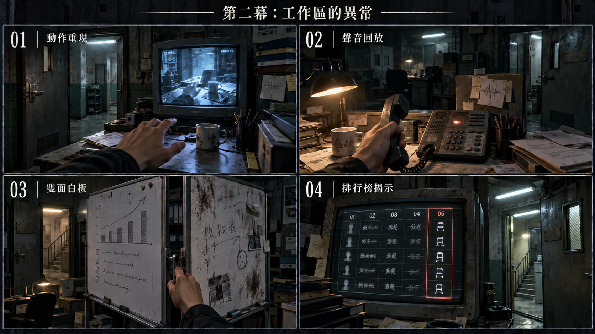

[完整圖說與操作對照](#h-0603-1200) · [圖像目錄](../09_劇本/09-14_全劇本與關卡整合稿.md#book-illustrations)

<a id="node-r6-exit"></a>

#### 離場通路與次場景

<!-- production-subscenes:r6 -->

<!-- scene-image-subscenes-r6:begin -->
<a id="subscenes-r6"></a>
#### 次場景節點

以下次場景歸 R6 管理，節點編號沿用主圖圖號。來去方向為原動線的正向排列；反向通行與單向限制依原門檻，不因列出來路就新增返回出口。

<a id="subscene-r6-v02-spec"></a>
##### R6-V02 · R6→R7

**類型：**轉場接景。**正向連接：**R6-V01 → **R6-V02** → R7-V01。

**近看：**不新增近看；沿原轉場操作，不新增等待或讀取門檻。

[正文](../09_劇本/09-05_正式劇本_第二幕.md#subscene-r6-v02-script) · [圖像製作單](#node-r6-images) · [原門檻與回訪](#node-r6-nav) · [動線條件](#node-r6-nav)
<!-- scene-image-subscenes-r6:end -->

<a id="node-r7-spec"></a>

### R7 · 產線主廊／聊天組隔間

[正式場次](../09_劇本/09-05_正式劇本_第二幕.md#node-r7-script)

[進場與動線](#node-r7-nav) · [出入口位置](#node-r7-access) · [操作與解謎](#node-r7-level) · [狀態與驗收](#node-r7-pack) · [圖像製作單](#node-r7-images) · [離場與次場景](#node-r7-exit)

<a id="node-r7-nav"></a>

**進出、動線與回訪**

<a id="s-0609-19"></a>

<!-- import:s-0609-19:begin -->
<a id="h-0609-161"></a>

#### R7 產線主廊／聊天組隔間

進行目的：辨認服務端分類，處理原遭遇；老周 17 秒留言、E1-15 教戰手冊、E1-06 留存排行榜、E1-07 凍結告白、E1-16 白板背面

支線／收集：SQ-C1 配給 CARE-01/02；SQ-S 歌曲 SG-01；SQ-C1 本房比對並歸檔完成

| 方向 | 類型 | 可移動條件 | 移動演出提案 | 回訪規則 |
| --- | --- | --- | --- | --- |
| R6 ↔ R7 | 主線 | 查看產線玻璃門，記下已見的中層路線後自行前往；設備同步、來電與帳號清單不擋通行 | 沿原住宅長巷走到隊尾，封閉捲閘與橫過柱列的水管反向仍可辨；桌沿遮擋換鏡。 | 章內回訪；遇鎖場、追逐或封路停用 |
| R7 ↔ R8 | 主線 | 可沿窄橋自由前往；教戰手冊與留存排行榜在 R11 離幕前核對，老周安息及配給支線不擋通行 | T-R7-R8：經跨棟窄橋兩端鏡位，鋁門、異批地磚與略高門檻交代量體接縫；舊窗及風管朝向被包覆的內井，無天空。 | 章內回訪；遇鎖場、追逐或封路停用；R8 放蛾不鎖通路，必要讀卡在 R11 校驗前核對 |
<!-- import:s-0609-19:end -->
<!-- navigation:r7:end -->

<a id="node-r7-access"></a>
#### 主場景出入口

<!-- scene-access:R7:begin -->
| 動線 | 顯示名稱 | 畫面位置與辨識物 | 通行狀態 |
| --- | --- | --- | --- |
| R6↔R7 | 來路／返回：工位隊尾 | 隔板與桌沿外的原長巷口，柱列水管延續到 R6。 | 可沿長巷回網咖，不穿過聊天工位當捷徑。 |
| R7↔R8 | 出口：跨棟橋鋁門 | 工位外側鋁門，門檻接窄橋的異批地磚。 | 經兩端橋頭到 R8，可往返；老周安息、手冊與排行榜不作此門即時門檻。 |
<!-- scene-access:R7:end -->

**演出限制與製作註記**

<a id="s-0905-9"></a>

<!-- import:s-0905-9:begin -->
<a id="h-0905-100"></a>

#### 演出限制

> 前一節點：R6　後一節點：R8　兩端均可回走
> 當下打算：辨認服務端分類，從工位後方的窄橋繼續走。
<!-- import:s-0905-9:end -->

<a id="node-r7-level"></a>

**關卡、解謎與失敗回饋**

<a id="s-0603-5"></a>

<!-- import:s-0603-5:begin -->
<a id="h-0603-197"></a>

#### R7 — 產線主廊：所有人都在工作

<a id="h-0603-199"></a>

##### R7 空間與畫面製作定位

| 項目 | 畫面與製作要求 |
| --- | --- |
| 樓層與環境 | 15F–20F 產線高度帶；量體間可有門檻與半層錯位。既有空間材質、光源與生活物件沿本房原文。 |
| 入口方向 | 由 R6 承接；以來路門框／扶手作背向定位，前進方向依下列出口地標。左右方位沿既有構圖，不將反向回訪鏡頭誤當另一扇門。 |
| 可見出口 | 量體間窄接駁橋通 R8，兩端門檻與橋下管線均在樓內。首次全景就交代入口輪廓或可查看的遮擋，不靠無標示的畫外點擊換房。 |
| 阻擋與開放條件 | 往 R8：可沿窄橋自由前往；教戰手冊與留存排行榜在 R11 離幕前核對，老周安息及配給支線不擋通行 |
| 畫面中的解謎要素 | 留言、排行榜、班表與白板；讀取與記憶來源可在近看分辨。關鍵標記可近看，與裝飾物有可辨的材質或輪廓差異，不只靠顏色或聲音。 |
| 完成後變化 | 已讀班表、留言與來源保留於筆記；玩家可跨窄橋進 R8。教戰手冊與留存排行榜在 R11 離幕時才檢查，老周與配給支線不鎖此門。 |

<a id="h-0603-212"></a>

##### R7 製作流程

**空間第一印象：**泛黃產線燈與舊住宅門洞。相同工位的重複被原柱列切斷；工位嗡鳴透到生活空間，不新增一套公司檔案。

**探索呈現：**先讓玩家看見入口、可走的方向和空間異常，再自選近看生活物件；新增租戶遺跡不發 E 證據、不設派系任務、不改出口旗標。恐怖沿原事件與遭遇時序，安定／閱讀保護段不插嚇點。

**逃生因果與可見回饋：**原教戰手冊／排行榜的部門標頭與服務端使用相同分類，讓必要三格有辨識路線的用途。辨識制度和人物責任仍同時發生，不額外發一張萬用通行證；老周原結果與安靜餘波保留。

| 階段 | 製作規格 |
| --- | --- |
| 進入／目標 | 辨認服務端分類，處理原遭遇；老周 17 秒留言、E1-15 教戰手冊、E1-06 留存排行榜、E1-07 凍結告白、E1-16 白板背面；入場先還原原房間已保存的熱點與事件狀態。 |
| 觀察／空間 | 長桌卡在兩個樓體柱列交接處，老周刻痕牆保留原粉刷與門框；轉角窄橋通往視訊區。 |
| 操作順序 | 查看教戰手冊與排行榜 → 核對凍結對話 → 處理老周原遭遇 → 可查看 E1-14 及傷病附頁 → 進 R8。順序中的選填內容不作離房門檻；原主線旗標、遭遇數值及分支提交條件依本場景細則。 |
| 回饋 | 必要操作寫入原證據／門禁／遭遇狀態；新增生活附頁僅更新來源已讀與有依據的筆記，不重發原證據。 |

<a id="h-0603-227"></a>

###### R7 生活與管制觀察

沿業績板 E1-14 附頁對上 E-04 的工位與「缺水、延後校正」紀錄，另見傷病申報未獲休養；保留原低標者身分與結局，不新增施虐動畫。

<a id="h-0603-231"></a>

###### R7 附頁熱點

**頁鍵對照：**`health`＝傷病申報；`reply`＝休養覆核。

| 欄位 | 規格 |
| --- | --- |
| 識別／位置 | `R7_DETAIL_01`；原 E1-14 附頁。沿原近看開頁，不增加遠景發光提示。 |
| 前置 | 已開啟該原熱點；原證據、供電及回訪前置照舊，不因新增附頁放寬。 |
| 玩家操作 | 查看傷病申報及覆核欄，與原工位編號對照。各來源各自閱讀，不要求一次讀完。 |
| 回饋／筆記 | 記錄未獲休養；死亡結論仍待原診所證據。 |
| 成本與中止 | 免費查看；普通探索閱讀停表；鎖場／強制演出依原規則暫不開啟。退出即回原近看，不寫未讀頁。 |
| 保存 | 每頁保存 `scene_detail.r7.read_pages` 集合；只有指定附頁顯示且玩家確認收起時加入對應頁鍵。來源顯示後中途暫停不算完成。 |
| 回訪 | 已讀頁可重看，原物件位置不重置；尚缺對照來源時保留觀察，不生成推論。 |
| 素材 | 在原近看增一組物件／紙張疊圖、各頁文字轉錄、翻頁／收起聲；近看與原基底光向一致，均待製作。 |

<a id="h-0603-246"></a>

###### R7 出口與回訪

| 目的節點 | 條件 | 移動與辨向 | 回訪邊界 |
| --- | --- | --- | --- |
| R6 | 沿已開連線回訪；未鎖場且未沉降封路 | 同一地標反向通行 | 章內回訪；遇鎖場、追逐或封路停用 |
| R8 | 可沿窄橋自由前往；教戰手冊與留存排行榜在 R11 離幕前核對，老周安息及配給支線不擋通行 | T-R7-R8：經跨棟窄橋兩端鏡位，鋁門、異批地磚與略高門檻交代量體接縫；舊窗及風管朝向被包覆的內井，無天空。 | 章內回訪；遇鎖場、追逐或封路停用；R8 放蛾不鎖通路，必要讀卡在 R11 校驗前核對 |

共用規則見[對應條款](10-01_製作規格_序幕.md#s-0601-6)。

<a id="h-0603-256"></a>

##### R7 動畫演出

<a id="h-0603-258"></a>

###### 老周的聲音與放鬆

| 項目 | 場景演出規格 |
| --- | --- |
| 形式與節奏 | 局部人物動畫；女兒留言沿既定 17 秒，另一有效稱呼路依原音檔。 |
| 鏡頭與動作 | 撥號前清喉嚨、頸殼細顫、工作聲音切換；有效回應完成後，握電話的手鬆開，依原劇情將紙條推向阿尋座位再消散。 |
| 操作與資訊邊界 | 兩條有效回應都維持原結算，不把女兒路當唯一正解；必要音檔必須完整播放才可寫成功。中斷與恢復沿原訊號規則，紙條近景由玩家另行查看。 |

**區域**：中層產線　**功能**：重建詐騙流程，取得 `E1-06`、`E1-07`。

<a id="h-0603-269"></a>

##### 畫面構圖

| 層次 | 內容 |
| --- | --- |
| 前景 | 隔間門牌、耳機、寫滿數字的白板；每個座位都有一杯已乾涸的水 |
| 中景 | 三排客服隔間與一條透明走道；走道盡頭的攝影機朝向玩家 |
| 背景 | 巨幅留存排行榜與換班倒數；最上方的名字被整齊挖空。旁邊是一面四欄手寫看板：`建號` `養` `切` `殺` |
| 光源 | 螢幕藍光與頂燈頻閃；比第一幕更冷、更不生活化 |
| 聲音 | 多語話術殘響、鍵盤循環、紙張被快速翻頁的聲音 |

<a id="h-0603-279"></a>

##### R7-01 老周 · 17 秒留言

> ** 兩種解法：**以下詳寫女兒留言路；依 04-08，#10「一句稱呼」同樣有效，名冊擇一記錄「以女兒的聲音安息」或「以舅舅的聲音安息」，不判優劣。老周維持低壓、可暫離，不套用 R11 主動攻擊循環。[完整遭遇分鏡](../09_劇本/09-15_正式劇本_共用附錄.md#doc-0408)。

| 項目 | 內容 |
| --- | --- |
| 觸發 | 玩家點擊靠近刻痕隔板的舊手機；感知層出現老周的迴聲，循環撥打一個不再連線的號碼。 |
| 辨識 | 隔板背面的 347 道記號、舊手機家庭照與 R6 帳號名單可把他辨識為老周；主角錯把他遞給阿尋的紙條記成遞給自己。 |
| 正確回應 | 手機內有一段從未播放完的 17 秒女兒留言。玩家需關閉自動重撥，讓留言完整播完；不是假裝女兒現在接聽。 |
| 安息 | 老周停止撥號，把紙條推向阿尋座位的方向後消散。若玩家暫不處理，他不阻擋探索，可在進 R11 前回來完成。 |
| 設計 | 讓第二幕先以溫柔安息回收老周，再用阿尋的行動型安息收束；兩人也修正主角記憶中的「隔壁同伴」錯置。 |

<a id="laozhou-resonance"></a>

##### 老周的迴聲包圍：聲音還在上工

沿[角色視聽規則](../09_劇本/09-15_正式劇本_共用附錄.md#haunted-av-language)呈現低壓的局部包圍，不封門、不追擊，也不升格 Boss。點舊手機後才啟用，現時頸殼內折與原清喉嚨同步；乾擦聲只來自原座位，不複製到其他隔間。黃灰側光切過手機裂角、皺褶手與刻痕，輪廓仍為 F0／F1，不給完整臉、女兒現時影像或新增人聲。未觸發時維持原房，不讓側光先指認身分。

| 原階段 | 呈現與停止條件 |
| --- | --- |
| 等待回覆／重撥 | 原清喉嚨與換聲線不改字音；頸殼細動、局部乾擦及側光沿原循環，不另設隨機嚇點或縮短循環。HA-R7-01 已依原規則停止，不能用同一清喉嚨再環繞房間 |
| 播放 #6 或 #10 | 兩路一律停新增擬音、側光游移與頸殼動態；只保留原件及固定輪廓。#6 的 17 秒原底噪、空隙與台詞不改，#10 四聲線不混成鬼聲，沒有背景耳語接話 |
| 必要／選填完整近看、真正暫停 | 退去額外效果，原資料可讀；新增效果不取得控制權。原留言暫停續播、停止／離房取消與成本規則不變 |
| 原無效回應 | 只用既有焦灼撥號、邊緣雜訊及 2 秒恢復，不另加頸殼爆裂、撲擊或費用 |
| 安息或離開 | 安息後撤掉所有包圍動態，347 道刻痕、手機、照片與紙條仍在；暫離只停本地效果，不能當成安息，回來依原遭遇狀態，不重播進場 |

低動態版用折入／原位兩張頸殼差分，不閃爍；無聲仍可從原字幕、手機來源與動作辨識，不把乾擦節奏設成答案。查驗兩路均可獨立安息、選填可略過，且新效果不能使未播放完的訊號算作完成。

<a id="h-0603-292"></a>

##### R7-01b 教戰手冊 · `E1-15`（本幕核心）

> **這是玩家第一次真正看懂這棟樓在做什麼。** 它不是一段話術範例，是一本**流程手冊**——乾淨、專業、有頁碼、有修訂版次，像任何一家公司的訓練教材。

| 項目 | 內容 |
| --- | --- |
| 觸發 | 每個隔間都有一本一模一樣的手冊。玩家點開任何一本即可。 |
| 第一頁 | 印刷流程只列五格 **01 → 02 → 03 → 04 → 05** 與 S-03 部門標頭；「建號 → 養 → 上鏡 → 切 → 殺」全為格旁手寫批註，不印入正式欄。此時仍不解說後三段含義。 |
| 接收分配聯 | 首頁內側夾有本批接收分配聯，欄位為「接收編號／分配工位／指定培訓」；五個接收編號與 R1 待叫序列一致，對應本房工位和手冊。這是本批人員的夾頁，不把它印成每本手冊都相同的通用教材；不補五人的姓名、死因或主角身分。 |
| 人設章 | 編號化的身分設定：`M-04 矽谷資深工程師（喪偶）`、`F-11 上海進出口公司二代`……每一組都附虛構的財產、興趣與家庭背景，並註明「**須熟記至可被隨口抽問**」。 |
| 素材章 | 豪宅、名車、高爾夫、潛水的照片輪替表，附一條規定：「**同一組照片不得在同一週用於兩個客戶。**」 |
| 目標章 | 「優先鎖定：單身、剛結束戀情、剛喪親、剛換城市。」下一行：「**情緒穩定者標記為難養，轉低優先。**」 |
| 應對章 | 對方猶豫時的標準回應。三句被印在同一頁上：「你格局太小了。」「連我都不信任嗎。」「**這都是為了我們未來的家。**」 |
| 證據 | 取得 `E1-15`。 |
| OS | 玩家讀完應對章後，主角唯一一句：「……這不是話術。這是**教材**。」 |
| **邊界** | 不演出任何一段成功的誘騙對話讓玩家「欣賞技巧」（[鐵則二十五](../09_劇本/09-15_正式劇本_共用附錄.md#doc-0002)）。玩家讀的是**規則**，不是表演。 |

**R1 叫號的回收：**接收分配聯沿本熱點既有翻頁查看，記在 `E1-15` 的已讀來源頁，不新增證據 ID、比對謎題或離幕條件。只有讀過該頁，筆記才可並列 R1 已保存的待叫序列與本頁工位對照；未讀不自動生成關聯。玩家由接收編號、工位與強制培訓規定理解：第一幕啟動的是把受困者送進產線的程序，不是滿足他們想上工的願望。不補解說 OS、贖罪或譴責提示，不要求 R1 封存袋、聲線回訪或跨幕返程；R2 名冊可補充分配欄位，但不拿未知姓名替五個輪廓定身分。

<a id="h-0603-311"></a>

##### R7-01c 白板的兩面 · `E1-16`（選填 · 時態錯位）

| 項目 | 內容 |
| --- | --- |
| 正面（第一次） | 一面乾淨的看板，四欄標題全為手寫：`建號` `養` `切` `殺`。每欄下面貼著磁扣與編號。**看起來像任何一間辦公室的專案看板。** |
| 翻面（回訪或感知後） | 白板背面是隨手寫的工作紀錄，字跡潦草：「**3 號那隻還沒肥，再放兩週**」「7 號的老公回來了，切」「**11 號沒錢，丟掉**」。 |
| 證據 | 取得 `E1-16`（選填）。 |
| **主題重擊** | 玩家在第一幕住過「**牲口棚**」。在這裡他發現，螢幕另一端的人在手寫便條上叫「**那隻**」。 |
| OS | 無。**不得由旁白說破。** 玩家自己會把兩個詞接起來；接不起來的玩家，第三幕的客戶分級表會再給一次機會。 |
| 物件數量 | 不變（同一塊白板，翻面）。符合 [時態錯位](../09_劇本/09-15_正式劇本_共用附錄.md#doc-0301) 的物件守恆規則。 |

<a id="h-0603-322"></a>

##### R7-02 留存排行榜 · `E1-06`

| 項目 | 內容 |
| --- | --- |
| 觸發 | 玩家直接查看排行榜的刮除痕跡，再比對附近班表的相同欄位；可讀編號直接記錄，不靠感知恢復文字。 |
| 可讀資訊（ 新欄位） | **關係建立天數、情感依賴指數、首次匯款金額、複投次數**；「人」只以可比較數字出現。玩家此時會以為這五欄量的都是螢幕另一端的客戶。 |
| 異常 | **最後一欄不是關於客戶的，是「安靜度」。** 數值越高的人越快被送離產線；最低一列旁貼著「缺水、延後校正」的手寫便條。 |
| ★ 第二層伏筆 | 前四欄量的是**螢幕另一端**的人，最後一欄量的是**坐在這裡**的人。**同一張表。** 玩家在第二幕只覺得突兀；第三幕 R16 才會知道那不是排版失誤——那是同一套系統。 |
| 證據 | 取得 `E1-06`。若玩家感知最低一列的便條，可追加選填證據 `E1-14`，把留存紅線與非法診所的「自然衰竭」欄預先連起來。 |
| OS | 「他們不是在比誰賺得多。」停頓。「是在比誰還能撐多久。」 |

<a id="h-0603-333"></a>

##### R7-03 凍結對話 · `E1-07`

| 觸發 | 點擊靠牆隔間的耳機，再對話框選擇「保留殘留訊號」。 |
| 凝固內容 | 一個無臉剪影坐在螢幕前，手停在鍵盤上方。螢幕上是一個聊天視窗，對方（`K-114`）剛傳來一句話。輸入框裡有他打到一半的**一個字：「我」**。游標停在同一格。**他沒有打完。** |
| 螢幕上那句話 | 「今天有點累。但想到你在，就還好。」 |
| 可點擊物件 | 話術腳本、快捷鍵表、被撕掉的班表；每次近看一項，退回同一凝固全景即可查看下一項，已讀狀態保存，不強迫退出房間再付費進入。 |
| 證據 | 取得 `E1-07`。對話沒有完整結尾，最後只剩系統提示音。 |
| ** 設計** | 這是玩家第一次看見「螢幕另一端的人」。那個人不知道自己在跟誰說話，也永遠不會知道對方在他傳出這句話的當晚被拖去了校正區。<br>⚠️ **不得讓玩家「完成」這則對話**，也不得把它寫成道德教訓。它就停在那裡。<br>這個隔間是阿尋的；玩家要到 R11 才會知道。 |
| 恐怖拍點 | 玩家退出凝固層後，現實層一台螢幕顯示 `工作階段恢復：14 日前／錄製狀態：尚未結束`。它不是剛才操作的錄影，而是一個兩週前就等待她重新登入的舊工作階段。 |

---

##### 操作與呈現補充

- [s-0905-17](../09_劇本/09-05_正式劇本_第二幕.md#s-0905-17)：上述逐字稿須以讀演配合原錄音頭尾空白實測至 17 秒，不擠字或改變核心時長；目前僅為文字初稿。
<!-- import:s-0603-5:end -->

<a id="s-0603-17"></a>

<!-- import:s-0603-17:begin -->
<a id="h-0603-958"></a>

#### R7 選填：代班單與少掉的一份配給

在既有排班資料熱點增加兩張可直接查看的紙本殘留，無新房間。老周留言或對峙進行時不可開啟；先退出到安全查閱狀態，亦可安息後閱讀，不插入新的靈異事件。

| 觀察 ID | 內容與來源 | 可確認／不可推論 |
| --- | --- | --- |
| CARE-01 | 夜班替班單：甲承接乙的一個班次，兩個工號與雙方確認欄完整 | 確認代班行動；不自動解釋為友情、交易或救命 |
| CARE-02 | 同日配給扣除與缺勤更正聯單：甲少一份配給，理由為未依排班；乙的本次缺勤處置撤回 | 確認甲的代價與乙的這次受益；不宣稱乙後來安全 |

普通查看各自記錄，兩張均讀後可在筆記連結「同日／相同工號」。初步關聯只寫「替班之後，甲被扣了一份配給，乙的缺勤被撤回」。不進凝固、不扣穩定度、不送道具、不開門；可隨時離開，錯誤配對只返回。

此處先讓付出成立，不提後續背叛、不加「他一定是好人」台詞。相關後續在 R23；即使玩家從未讀到後續，這次幫助也不被否定。紙本觀察只留在主觀筆記，不因建立關聯就生成可外送原件。
<!-- import:s-0603-17:end -->

<a id="s-0603-33"></a>

<!-- import:s-0603-33:begin -->
<a id="h-0603-1192"></a>

#### R7 上部配給支線收尾

CARE-01／02 核對同日工號與代班、扣配給、撤回缺勤處置後，玩家可主動「記下這次承擔」，完成 SQ-C1 並取得完整事件頁。上部故事在此成立，不顯示尚缺 CARE-03／04。R11 離章提示只針對已發現未完成者；下部的供述是另一段調查。狀態與解法依 [分部支線規格](../09_劇本/09-15_正式劇本_共用附錄.md#doc-0305)。
<!-- import:s-0603-33:end -->

<a id="s-0603-21"></a>

<!-- import:s-0603-21:begin -->
<a id="h-0603-1124"></a>

#### R7｜SQ-C1 特殊收集

在既有代班與配給熱點加入翻背面、對齊同日欄操作，完整讀取才收集 CARE-01／02。普通正面查看仍可理解局部故事；不完成安息也可在安全閱讀狀態調查。 完整收集、解法及狀態見 [03-05](../09_劇本/09-15_正式劇本_共用附錄.md#doc-0305)。
<!-- import:s-0603-21:end -->

<a id="node-r7-pack"></a>

**狀態、素材與驗收**

<a id="s-uppertech-44"></a>

<!-- import:s-uppertech-44:begin -->
<a id="h-uppertech-664"></a>

#### 第二幕整合｜第二幕｜R07 — 產線主廊／聊天組隔間

<a id="h-uppertech-666"></a>

##### 第二幕整合｜R07-房間資料

| 欄位 | 值 |
| --- | --- |
| `room_id` | `R07` |
| `scene` | `room_r07.tscn` |
| `entry_from` | `R06` |
| `exit_to` | 前進 `R08`；回訪 `R06`。R10 須經 R8 |
| `backgrounds` | `r07_real.webp`、`r07_scan.webp`、`r07_freeze.webp`（僅耳機隔間局部） |
| `main_goal` | 查閱教戰手冊與留存排行榜；凍結對話、白板及老周安息為可選調查，不能混成離房門檻 |
| `must_exit_when` | 玩家可自由前往 R8；E1-06／E1-15 在 R11 離幕前核對，E1-07、老周與支線不鎖此出口 |

<a id="h-uppertech-678"></a>

##### 第二幕整合｜R07-互動表

| ID | 物件／觸發 | 玩家操作 | 文字／聲音回饋 | 寫入狀態／證據 | 成本 |
| --- | --- | --- | --- | --- | --- |
| `R07_H01` | 靠牆舊電話 | `LOOK`→`RELATE`→`FOCUS_MEMORY` | 記憶停於撥號前的固定手勢，辨認等待回覆；返回現時才由老周怨靈循環撥號，不讓歷史人物動起來 | `r07.laozhou_detected` | 首次 2 點／重看 0 點 |
| `R07_H02` | 女兒語音信箱 | 關閉自動重撥，再由通電舊電話 `PLAY` 既存留言 | 需依序實際播完 17 秒，可暫停續播；停止／離房依核心契約恢復。完成後現時老周把紙條推向阿尋座位，不是假裝女兒接聽 | `act2.r07.laozhou_rested` | 原播放費 5 點；同房暫停續播不重扣 |
| `R07_H03` | 留存排行榜 | `LOOK` | 前四欄：**關係建立天數／情感依賴指數／首次匯款金額／複投次數**（量的是螢幕另一端）；第五欄：**安靜度**（量的是坐在這裡的人）。最低列註記「缺水／延後校正」 | `E1-06`、`act2.r07.e106_seen` | 0 點 |
| `R07_H04` | 靠牆耳機 | `LOOK`→`RELATE`→`FOCUS_MEMORY` | 凝固人物手停鍵盤上方；K-114：「今天有點累。但想到你在，就還好。」輸入框只留「我」，游標與人物皆靜止 | `E1-07`、`act2.r07.e107_seen` | 首次 2 點／重看 0 點 |
| `R07_H07` | 教戰手冊 | `LOOK`→翻頁 | 印刷五格 01–05 與 S-03 標頭，格旁手寫 `建號→養→上鏡→切→殺`，貶稱不進正式印刷或 UI；人設編號章、素材輪替表、脆弱族群鎖定準則、情緒勒索三句標準回應。**乾淨、專業、有頁碼與修訂版次** | `E1-15`、`act2.r07.e115_seen` | 0 |
| `R07_H08` | 白板正面 | `LOOK` | 四欄手寫看板 `建號` `養` `切` `殺`＋磁扣與編號；看起來像一般專案看板 | `r07.board_front_seen` | 0 |
| `R07_H09` | 白板翻面（時態錯位） | `FLIP`（回訪或感知後可用） | 潦草手寫：「3 號那隻還沒肥，再放兩週」「7 號的老公回來了，切」「11 號沒錢，丟掉」 | `E1-16`（選填）、`r07.board_back_seen` | 0 |
| `R07_H05` | 隔間腳本／班表 | `LOOK` | 取得話術片段與快捷鍵；退出凝固層後現實螢幕顯示 `工作階段恢復：14 日前／錄製狀態：尚未結束` | `r07.script_seen` | 0 |
| `R07_H06` | 最低列便條 | `LOOK` | 只有在看過排行榜後可讀；連到 R13「自然衰竭」欄 | `E1-14`（選填） | 0 點 |

<a id="h-uppertech-692"></a>

##### 第二幕整合｜R07-老周的上工儀式

老周在聊天組演「**舅舅**」——愛情詐騙推進到投資階段時登場的可信長輩。他做過小工廠老闆，演生意人不用演。

`R07_H01` 的主觀記憶聲先有清喉嚨、再換成「舅舅」聲線；凝固只給固定撥號姿勢。回到現時的怨靈可重播上工動作；這段主觀聲證只供回看，不能生成可播放音檔。有效回應使用舊電話中既存素材。

而玩家會發現，**他打給女兒時也用了那個聲音。**

| 玩家階段 | 表現 | 寫入 |
| --- | --- | --- |
| 第一次感知 | 只聽到清喉嚨，可能是生病 | `r07.laozhou_detected` |
| 讀過 `E1-15` 或他的檔案後回訪 | 同一段音訊，玩家認出那是上工儀式 | `r07.laozhou_voice_recognized` |
| 播完 17 秒留言後 | 不新增音訊。玩家自己意識到他已經分不出來了 | — |

⚠️ 三個階段使用**同一個音檔**，不做任何變化。改變的只有玩家。不得由旁白說破。

<a id="h-uppertech-708"></a>

##### 第二幕整合｜R07-老周對峙規則

1. 老周只在玩家點擊舊手機後進入「等待回覆」狀態，不主動追逐。
2. 兩條獨立正確回應為女兒完整 17 秒留言，或已核對身分後的舅舅聲音；依 04-08 判定。其他人聲觸發原無效回應，不將正確第二路誤判。
3. 玩家可以先離開去 R8–R10，再回來完成；離開不重置已取得的證據。
4. 安息後不顯示「擊敗」，只顯示：`[系統] 迴聲停止重撥。`。

<a id="h-uppertech-715"></a>

##### 第二幕整合｜R07-驗收

- [ ] 女兒路需依序播完 17 秒，可暫停但拖到結尾不算完成；舅舅聲線路依已核對來源與原音檔完成，不要求另播女兒留言。兩條有效回應皆可安息。
- [ ] `E1-06` 的「安靜度」欄可被看見，但不直接解釋它代表死亡／轉運；**也不得提示玩家「這一欄與前四欄的對象不同」**——那是第三幕 R16 的工作。
- [ ] `E1-15` 教戰手冊不得演出任何一段成功的誘騙對話讓玩家「欣賞技巧」；玩家讀的是規則，不是表演。
- [ ] 白板翻面前後**物件數量不變**；符合時態錯位的物件守恆規則。
- [ ] `R07_H09` 不播放旁白。至少一名測試者要能自己把「那隻」與第一幕的「牲口棚」接起來。
- [ ] `E1-07` 凝固層最多 4 個可點物件，退出後留下 10 秒無任務餘波。
- [ ] 老周未安息時仍可進入 R8、R9、R10；不可軟鎖。
<!-- import:s-uppertech-44:end -->

<a id="node-r7-images"></a>

#### 場景節點與靜態圖製作單

以下每列均為待製作圖像項目；文件多頁、正反面、局部與狀態差分須依拆圖欄各自交付，不能以一張示意圖代替。可探索場景的主圖提供移動與探索，演出節點不另開探索，近看關閉回到開啟前的畫面；原演出與操作條件仍依右欄來源。圖號、解析度、文字分層、存檔及驗收依[靜態圖共用契約](../09_劇本/09-15_正式劇本_共用附錄.md#scene-image-contract)。

<!-- scene-images:R7:begin -->
| 畫面節點／圖號 | 用途 | 必畫內容 | 狀態與拆圖 | 來源 |
| --- | --- | --- | --- | --- |
| R7-V01 | 主場景 | 聊天工位、共用教戰手冊、白板、排行榜、刻痕隔板與跨棟橋鋁門。 | 白板正反、榜單補全、手機自動重撥開／關、老周原處置狀態；選填遭遇不占通橋條件。 | [本場景](../09_劇本/09-05_正式劇本_第二幕.md#node-r7-script) |
| R7-D01 | 文件 | 教戰手冊人設、素材與應對章 | 按原頁籤分頁；第 3 頁來源及 #12 不改寫。 | [R7-01b](../09_劇本/09-05_正式劇本_第二幕.md#s-0905-11) |
| R7-D02 | 文件 | 本批次接收分配聯 | 只有指定那本有此聯，其他副本不複製同一張。 | [R7-01d](../09_劇本/09-05_正式劇本_第二幕.md#s-0905-12) |
| R7-C01 | 近看 | 白板正反面 | 兩張可讀圖；反面僅原回訪／感知條件開放。 | [R7-01c](../09_劇本/09-05_正式劇本_第二幕.md#s-0905-13) |
| R7-D03 | 文件 | 完整排行榜、同欄班表與最低列便條 | 三份分頁；E1-06、E1-14 各依原條件取得。 | [R7-02](../09_劇本/09-05_正式劇本_第二幕.md#s-0905-14) |
| R7-C02 | 近看 | 耳機、隔間腳本、快捷鍵與班表關聯 | 設備局部與原件分頁；K-114 凝固疊圖獨立交付，人物、手及只留「我」的輸入框皆靜止。返回現時才可顯示工作階段恢復。 | [R7-03](../09_劇本/09-05_正式劇本_第二幕.md#s-0905-15) |
| R7-C03 | 操作近看 | 舊手機、347 刻痕、家人照片與撥號前靜格 | 手機播放／自動重撥開關、刻痕、照片各焦點；另交歷史撥號前的凝固手勢疊圖。家庭留言不是現時通話，現時怨靈循環不畫進歷史層。 | [R7-01](../09_劇本/09-05_正式劇本_第二幕.md#s-0905-17) |
| R7-D04 | 介面 | 工位音檔與標準問候頁 | #10／#12 來源、播放狀態清楚；共用音檔不另發一份。 | [R7-04](../09_劇本/09-05_正式劇本_第二幕.md#s-0905-18) |
| R7-D05 | 文件 | 代班簽認紙背面與配給扣除通知 | CARE-01／02 工號、日期、撤回欄可對讀。 | [R7-05](../09_劇本/09-05_正式劇本_第二幕.md#s-0905-19) |
| R7-D06 | 文件 | 點歌單折住的背面 | SG-01 正面／展開背面；重疊裁切資訊依原件。 | [R7-06](../09_劇本/09-05_正式劇本_第二幕.md#s-0905-20) |
| T-R7-R8-01 | 過渡場景 | 鋁門側橋頭：鋁門、橋板接縫、舊窗高度與包覆內井的棚板。 | 來路 R7-V01；去路 T-R7-R8-02。依原門檻可原路折返；可沿窄橋自由前往；教戰手冊與留存排行榜在 R11 離幕前核對，老周安息及配給支線不擋通行。背景獨立構圖，材質可共用；不水平翻圖當反向。 | [通路規格](#transition-r7-r8) |
| T-R7-R8-01-C01 | 過渡近看 | 橋板與量體接縫 | 透視與承重方向清楚，橋外沒有天空或可攀逃路。每個列名物件均交清晰局部；關閉回 T-R7-R8-01，不把下一鏡當返回位置。 | [通路規格](#transition-r7-r8) |
| T-R7-R8-02 | 過渡場景 | 視訊門側橋頭：異批地磚、略高門檻、隔音布、晾衣桿與 R8 門框。 | 來路 T-R7-R8-01；去路 R8-V01。依原門檻可原路折返；可沿窄橋自由前往；教戰手冊與留存排行榜在 R11 離幕前核對，老周安息及配給支線不擋通行。背景獨立構圖，材質可共用；不水平翻圖當反向。 | [通路規格](#transition-r7-r8) |
| T-R7-R8-02-C01 | 過渡近看 | 封窗與舊晾衣桿固定處 | 同一住商遺跡與後加隔音層分清；不新增錄音。每個列名物件均交清晰局部；關閉回 T-R7-R8-02，不把下一鏡當返回位置。 | [通路規格](#transition-r7-r8) |
<!-- scene-images:R7:end -->

<!-- scene-image-access-art-r7:begin -->
**出入口交圖：**R7-V01 須依場次與狀態畫出[本場景出入口表](#node-r7-access)的來路、去路及封閉位置；既有操作鏡位與接景圖沿同一地標對位。門端差分、移動熱區與遮擋另分層，依[出入口共用契約](../09_劇本/09-15_正式劇本_共用附錄.md#scene-access-contract)驗收。
<!-- scene-image-access-art-r7:end -->


##### 原熱點對應圖號

同一圖可支援多個狀態，但每個列名焦點及原差分仍須交付；底圖不取代動畫、聲音或互動。此表只對圖，不新增取得條件。
<!-- hotspot-images:R7:begin -->
| 原熱點／操作 | 圖號 | 對應內容／邊界 |
| --- | --- | --- |
| R07_H01 | R7-C03 | 靠牆舊電話 |
| R07_H02 | R7-C03 | 女兒語音信箱 |
| R07_H03 | R7-D03 | 留存排行榜 |
| R07_H04 | R7-C02 | 靠牆耳機 |
| R07_H05 | R7-C02 | 隔間腳本／班表 |
| R07_H06 | R7-D03 | 最低列便條 |
| R07_H07 | R7-D01 | 教戰手冊 |
| R07_H08 | R7-C01 | 白板正面 |
| R07_H09 | R7-C01 | 白板翻面（時態錯位） |
<!-- hotspot-images:R7:end -->

<a id="node-r7-visual"></a>

#### 本場景圖像與示意

以下圖像為製作參照；跨房圖僅使用標明的面板，其他場景仍按各自前置演出。

[V11 老周的兩種回應](#fig-v11) · [V21 第二幕：關係與回訪後果](#fig-v21) · [V19 第二幕：工作區的異常](#fig-v19)

- **V11：**老周家庭聲音與角色稱呼兩種回應，保留不同事實記錄；十七秒留言是既存錄音，不是女兒現在接聽。
- **V21：**R7 的未送出對話與回訪空位、R8 修改腳本、R10 祈禱卡／驗證記錄；分別依正式場次，不代填對話。
- **V19：**R6 的螢幕／現場聲音與 R7 的白板、排行榜並列；既存話機聲不證明主角離體，圖面不增加遠端聯絡。

[返回本房正式劇本](../09_劇本/09-05_正式劇本_第二幕.md#node-r7-script) · [本房關卡與解謎](#node-r7-level)

<a id="fig-v11"></a>

##### V11｜老周的兩種回應

**適用與限制：**老周家庭聲音與角色稱呼兩種回應，保留不同事實記錄；十七秒留言是既存錄音，不是女兒現在接聽。

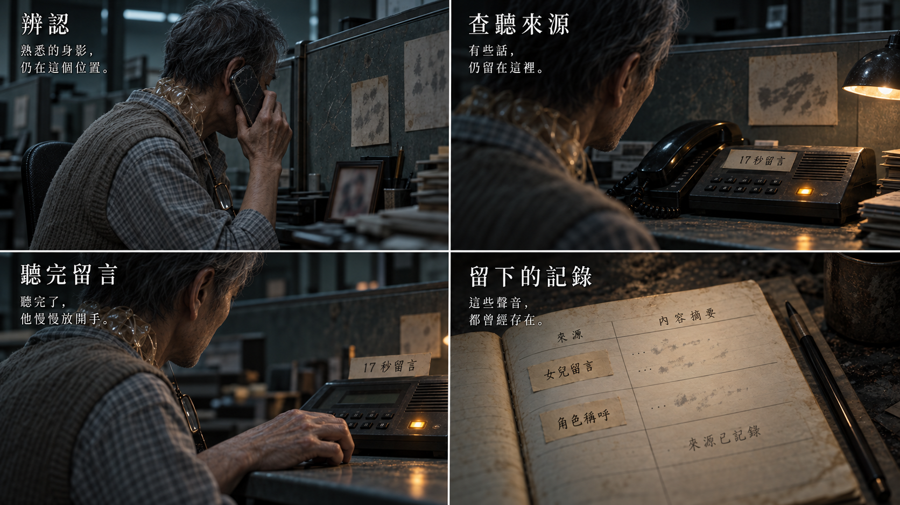

[完整圖說與操作對照](../09_劇本/09-15_正式劇本_共用附錄.md#h-0408-398) · [圖像目錄](../09_劇本/09-14_全劇本與關卡整合稿.md#book-illustrations)

<a id="fig-v21"></a>

##### V21｜第二幕：關係與回訪後果

**適用與限制：**R7 的未送出對話與回訪空位、R8 修改腳本、R10 祈禱卡／驗證記錄；分別依正式場次，不代填對話。

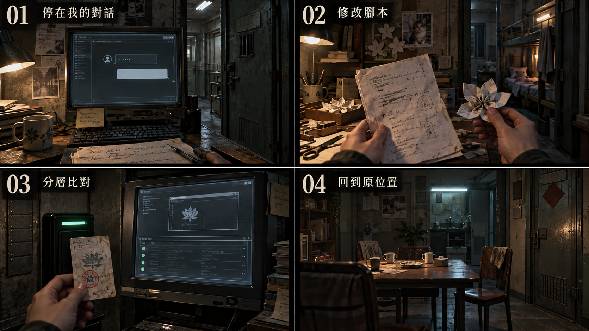

[完整圖說與操作對照](#h-0603-1226) · [圖像目錄](../09_劇本/09-14_全劇本與關卡整合稿.md#book-illustrations)

<a id="node-r7-exit"></a>

#### 離場通路與次場景

<a id="s-0603-35"></a>

<!-- import:s-0603-35:begin -->
<a id="transition-r7-r8"></a>
##### T-R7-R8 · 跨棟窄橋與封閉內井

沿用 R7 ↔ R8 連線，橋不是新增節點。演出見[通路正文](../09_劇本/09-05_正式劇本_第二幕.md#transition-r7-r8-script)，回訪與保存依[通路共用規則](../09_劇本/09-15_正式劇本_共用附錄.md#transition-rules)。

| 鏡位 | 空間與可操作出口 | 生活痕跡與聲音 |
| --- | --- | --- |
| A：R7 橋頭 | 舊鋁門定位來路；護欄、橋底接頭與對岸略高的門檻交代跨棟高差。可回 R7 或走向 B。 | 花磚與對岸不同批次的地磚並列；R7 設備聲仍從身後傳來。 |
| B：R8 門側 | 保留對岸鋁門及整段橋面方向；側看被包覆的內井，不俯視無底深淵。可回 A 或跨門檻進 R8。 | 不同窗高、晾衣桿、封窗板及後加風管；由風管聲轉為隔音布邊的悶聲。 |

**操作邊界：**原自由通行、章內回訪與 R11 離幕核對條件不變；老周安息、配給支線與放蛾都不是橋的通行門檻。只可無聲近看接縫與舊窗，不加平衡 QTE、墜落、修橋任務、隔窗人影或密碼。地磚差異用來辨認量體，不與證據符號同形。

**節奏與交付：**首次不含近看的目標通行長度約 8–12 秒，非強制停留；新增 2 個過渡構圖，另列[通路資產追加表](../09_劇本/09-15_正式劇本_共用附錄.md#transition-assets)。R9／R10 進入 R8 直接用原房內入場，不繞橋。

**驗收：**正反向的鋁門、橋面與門檻位置一致，靜音可辨向；無天空、陽光或街外出口。取消近看、途中讀檔及回訪不重播 R8 笑聲、照片變化或操作預演。

---
<!-- import:s-0603-35:end -->

<!-- production-subscenes:r7 -->

<!-- scene-image-subscenes-r7:begin -->
<a id="subscenes-r7"></a>
#### 次場景節點

以下次場景歸 R7 管理，節點編號沿用主圖圖號。來去方向為原動線的正向排列；反向通行與單向限制依原門檻，不因列出來路就新增返回出口。

<a id="subscene-t-r7-r8-01-spec"></a>
##### T-R7-R8-01 · 鋁門側橋頭

**類型：**可查看過渡。**正向連接：**R7-V01 → **T-R7-R8-01** → T-R7-R8-02。

**近看：**T-R7-R8-01-C01；關閉回 T-R7-R8-01。

[正文](../09_劇本/09-05_正式劇本_第二幕.md#subscene-t-r7-r8-01-script) · [圖像製作單](#node-r7-images) · [原門檻與回訪](#node-r7-nav) · [通路規格](#transition-r7-r8)

<a id="subscene-t-r7-r8-02-spec"></a>
##### T-R7-R8-02 · 視訊門側橋頭

**類型：**可查看過渡。**正向連接：**T-R7-R8-01 → **T-R7-R8-02** → R8-V01。

**近看：**T-R7-R8-02-C01；關閉回 T-R7-R8-02。

[正文](../09_劇本/09-05_正式劇本_第二幕.md#subscene-t-r7-r8-02-script) · [圖像製作單](#node-r7-images) · [原門檻與回訪](#node-r7-nav) · [通路規格](#transition-r7-r8)
<!-- scene-image-subscenes-r7:end -->

<a id="node-r8-spec"></a>

### R8 · 視訊組

[正式場次](../09_劇本/09-05_正式劇本_第二幕.md#node-r8-script)

[進場與動線](#node-r8-nav) · [出入口位置](#node-r8-access) · [操作與解謎](#node-r8-level) · [狀態與驗收](#node-r8-pack) · [圖像製作單](#node-r8-images) · [離場與次場景](#node-r8-exit)

<a id="node-r8-nav"></a>

**進出、動線與回訪**

<a id="s-0609-20"></a>

<!-- import:s-0609-20:begin -->
<a id="h-0609-173"></a>

#### R8 視訊組

進行目的：查明下一段通道；讀卡前整理紙墊並留縫放蛾，核對原卡尾段；腳本與管理章擇一，照片及歌曲來源選填，放蛾不鎖門

支線／收集：SQ-S 歌曲 SG-02

| 方向 | 類型 | 可移動條件 | 移動演出提案 | 回訪規則 |
| --- | --- | --- | --- | --- |
| R7 ↔ R8 | 主線 | 可沿窄橋自由前往；教戰手冊與留存排行榜在 R11 離幕前核對，老周安息及配給支線不擋通行 | T-R7-R8：經跨棟窄橋兩端鏡位，鋁門、異批地磚與略高門檻交代量體接縫；舊窗及風管朝向被包覆的內井，無天空。 | 章內回訪；遇鎖場、追逐或封路停用；R8 放蛾不鎖通路，必要讀卡在 R11 校驗前核對 |
| R8 ↔ R9 | 分岔 | 可自由通行；讀卡前整理紙墊的放蛾操作不作出口門檻，小帳、照片與歌曲均選填 | 從視訊隔間旁舊住宅門下兩級台階，進隔音板包覆的短租房；地磚拼縫延續。 | 章內回訪；遇鎖場、追逐或封路停用 |
| R8 ↔ R10 | 分岔 | 可自由通行；讀卡前整理紙墊的放蛾操作不作出口門檻，小帳、照片與歌曲均選填 | 沿窗邊內井側道轉向共用平台祈禱角；遮棚封住上方視線，供桌位於交通線旁。 | 章內回訪；遇鎖場、追逐或封路停用 |
<!-- import:s-0609-20:end -->
<!-- navigation:r8:end -->

<a id="node-r8-access"></a>
#### 主場景出入口

<!-- scene-access:R8:begin -->
| 動線 | 顯示名稱 | 畫面位置與辨識物 | 通行狀態 |
| --- | --- | --- | --- |
| R7↔R8 | 來路／返回：窄橋門 | 隔音布旁略高的門檻，門外延續橋板與異批地磚。 | 經兩端橋頭回 R7；放蛾及讀卡不封住回程。 |
| R8↔R9 | 出口：短租房門 | 視訊隔間旁的舊住宅門，門後下兩級台階。 | 沿短轉場進 R9，可往返；紙墊、小帳、照片及歌曲不鎖此門。 |
| R8↔R10 | 出口：內井側道 | 窗邊通向有遮棚的共用平台，地面通道與封窗分開。 | 沿平台接景到 R10，可往返；不是翻窗，也不能從內井逃到樓外。 |
<!-- scene-access:R8:end -->

<!-- access-layout:R8:begin -->
<a id="node-r8-access-layout"></a>
##### 出入口配置草圖

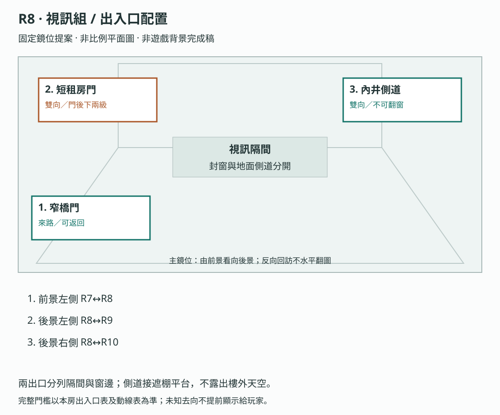

**構圖提案：**兩出口分列隔間與窗邊；側道接遮棚平台，不露出樓外天空。 各門端位置對應上表；數字只供製作辨識，不是玩家介面或解謎提示。

門框、視線及熱區仍須灰盒驗收，依[共用契約](../09_劇本/09-15_正式劇本_共用附錄.md#scene-access-contract)，不計入遊戲圖像交付數。
<!-- access-layout:R8:end -->

**演出限制與製作註記**

<a id="s-0905-21"></a>

<!-- import:s-0905-21:begin -->
<a id="h-0905-263"></a>

#### 演出限制

> 前一節點：R7　後一節點：R9／R10　沒有直通 R11 的門
> 當下打算：查讀卡片與通道；先讓玩家認出小花這個人。
<!-- import:s-0905-21:end -->

<a id="node-r8-level"></a>

**關卡、解謎與失敗回饋**

<a id="s-0603-6"></a>

<!-- import:s-0603-6:begin -->
<a id="h-0603-345"></a>

#### R8 — 視訊組：小花被剪掉的笑容

<a id="h-0603-347"></a>

##### R8 空間與畫面製作定位

| 項目 | 畫面與製作要求 |
| --- | --- |
| 樓層與環境 | 15F–20F 產線高度帶；量體間可有門檻與半層錯位。既有空間材質、光源與生活物件沿本房原文。 |
| 入口方向 | 由 R7 承接；以來路門框／扶手作背向定位，前進方向依下列出口地標。左右方位沿既有構圖，不將反向回訪鏡頭誤當另一扇門。 |
| 可見出口 | 舊住宅門下兩級到 R9，窗邊內井側道到 R10。首次全景就交代入口輪廓或可查看的遮擋，不靠無標示的畫外點擊換房。 |
| 阻擋與開放條件 | 往 R9：可自由通行；讀卡前整理紙墊的放蛾操作不作出口門檻，小帳、照片與歌曲均選填；往 R10：可自由通行；讀卡前整理紙墊的放蛾操作不作出口門檻，小帳、照片與歌曲均選填 |
| 畫面中的解謎要素 | 腳本、鞋盒、照片、讀卡機、紙花與現時飛蛾；可先辨認物件再操作。關鍵標記可近看，與裝飾物有可辨的材質或輪廓差異，不只靠顏色或聲音。 |
| 完成後變化 | 完成扶紙、移手、放開後，現時蛾自行離開紙端、托盤露出；保存物件與演出狀態，再由玩家自行讀卡。R9／R10 不受此互動阻擋。 |

<a id="h-0603-360"></a>

##### R8 製作流程

**空間第一印象：**鏡頭前暖米臥室，鏡頭後冷灰設備。用原補光燈近看切換看見背板與門鎖，讓溫暖在一步內破裂；保留小花個人物件與放蛾清楚近景。

**探索呈現：**先讓玩家看見入口、可走的方向和空間異常，再自選近看生活物件；新增租戶遺跡不發 E 證據、不設派系任務、不改出口旗標。恐怖沿原事件與遭遇時序，安定／閱讀保護段不插嚇點。

**逃生因果與可見回饋：**原腳本或 R10 原管理章提供必要分類來源，兩條證據路線仍可擇一；照片、小帳和拒絕出鏡附頁維持選填。現時放蛾併入讀卡前整理紙墊，不作房門條件；必要尾段在 R11 校驗前核對，平時與避險均可離房。

| 階段 | 製作規格 |
| --- | --- |
| 進入／目標 | 查明下一段通道，完成原放蛾操作；E2-01 小花腳本（「我會回來→我會等你」）、E2-02 照片／記憶卡。全作尺度最敏感的房間（D-033；鐵則二十五～二十七）。D-042：只留小花這個人；入場先還原原房間已保存的熱點與事件狀態。 |
| 觀察／空間 | 視訊隔間在舊住宅窗邊搭建，窗外只見被包覆的內井和遮棚；修理夢想物件及放蛾操作保留清楚近景。 |
| 操作順序 | 可查看話術腳本 → 取卡並坐到讀卡桌前 → 以扶紙、移手、鬆手整理蓋住托盤的紙墊，蛾自行離開 → 玩家主動讀取必要封包尾段 → 可翻私人小帳或選 R9／R10；途中均可離房。卡片尾段供 R11 必要校驗使用；人物照片不作出口條件。 |
| 回饋 | 必要操作寫入原證據／門禁／遭遇狀態；新增生活附頁僅更新來源已讀與有依據的筆記，不重發原證據。 |

<a id="h-0603-375"></a>

###### R8 生活與管制觀察

補光燈內是溫暖臥室布景，鏡頭背面可見工作計時與門鎖。小花的小帳夾頁留「不想再被安排那種出鏡」及自己的修理店打算；不放集團管理文件、不展示身體或私密素材，不在此確定她曾遭性侵。

<a id="h-0603-379"></a>

###### R8 附頁熱點

**頁鍵對照：**`request`＝拒絕出鏡字句；`wish`＝修理店願望；`set`＝補光燈背面與門鎖。

| 欄位 | 規格 |
| --- | --- |
| 識別／位置 | `R8_DETAIL_01`；原雙欄小帳夾頁；補光燈近看背面。沿原近看開頁，不增加遠景發光提示。 |
| 前置 | 已開啟該原熱點；原證據、供電及回訪前置照舊，不因新增附頁放寬。 |
| 玩家操作 | 翻小帳讀拒絕出鏡字句；退出後可看燈背門鎖。各來源各自閱讀，不要求一次讀完。 |
| 回饋／筆記 | 保留她的修理店願望與工作壓力；不揭露主角簽核或私密素材。 |
| 成本與中止 | 免費查看；普通探索閱讀停表；鎖場／強制演出依原規則暫不開啟。退出即回原近看，不寫未讀頁。 |
| 保存 | 每頁保存 `scene_detail.r8.read_pages` 集合；只有指定附頁顯示且玩家確認收起時加入對應頁鍵。來源顯示後中途暫停不算完成。 |
| 回訪 | 已讀頁可重看，原物件位置不重置；尚缺對照來源時保留觀察，不生成推論。 |
| 素材 | 在原近看增一組物件／紙張疊圖、各頁文字轉錄、翻頁／收起聲；近看與原基底光向一致，均待製作。 |

<a id="h-0603-394"></a>

###### R8 出口與回訪

| 目的節點 | 條件 | 移動與辨向 | 回訪邊界 |
| --- | --- | --- | --- |
| R7 | 沿已開連線回訪；未鎖場且未沉降封路 | 同一地標反向通行 | 章內回訪；遇鎖場、追逐或封路停用；R8 放蛾不鎖通路，必要讀卡在 R11 校驗前核對 |
| R9 | 可自由通行；讀卡前整理紙墊的放蛾操作不作出口門檻，小帳、照片與歌曲均選填 | 從視訊隔間旁舊住宅門下兩級台階，進隔音板包覆的短租房；地磚拼縫延續。 | 章內回訪；遇鎖場、追逐或封路停用 |
| R10 | 可自由通行；讀卡前整理紙墊的放蛾操作不作出口門檻，小帳、照片與歌曲均選填 | 沿窗邊內井側道轉向共用平台祈禱角；遮棚封住上方視線，供桌位於交通線旁。 | 章內回訪；遇鎖場、追逐或封路停用 |

共用規則見[對應條款](10-01_製作規格_序幕.md#s-0601-6)。

<a id="h-0603-405"></a>

##### R8 動畫演出

<a id="h-0603-407"></a>

###### 現時放蛾與友情靜格

| 項目 | 場景演出規格 |
| --- | --- |
| 形式與節奏 | 三段互動動畫；由玩家控制節奏，不設完成倒數。 |
| 鏡頭與動作 | PLACE_PAPER 搭紙 → MOVE_HAND 移開遮光的手 → RELEASE 鬆手，自然蛾沿紙端離開。主觀近景與 C 結局使用相同手勢構圖。 |
| 操作與資訊邊界 | 各段等玩家輸入才前進；過去兩人放蛾的記憶保持靜格。小帳翻頁只是物件動畫，不擅自播放生前修理店回憶。 |

**區域**：產線旁視訊組　**功能**：把小花從名字變成具體的人，取得 `E2-01`、`E2-02`。

> **全作尺度最敏感的房間。** 構圖與內容受 [鐵則二十五～二十七](../09_劇本/09-15_正式劇本_共用附錄.md#doc-0002) 與 [07-01 呈現尺度](../09_劇本/09-15_正式劇本_共用附錄.md#doc-0701) 強制規範。
>
> **這個房間呈現的是「製造愛的裝置」，不是「被製造出來的愛」。** 玩家永遠不會看見任何被拍攝的內容。

<a id="h-0603-422"></a>

##### 構圖的第一原則：先荒涼，不要先曖昧

玩家進門看到的第一件事必須是**一張空掉的椅子**，而不是任何與身體有關的東西。

<a id="h-0603-426"></a>

##### 畫面構圖

| 層次 | 內容 |
| --- | --- |
| 前景 | **一張空的工作椅，正對鏡頭**。旁邊是還通著電的補光燈、一支沒收起來的三腳架、一副掛在架上的耳返 |
| 中景 | 剪輯桌、記憶卡、兩個被拔掉的螢幕、一台變聲器、一個提詞架（上面停著一頁腳本）；桌角有收據折成的四瓣紙花與中／越雙欄小帳，桌下藏著一雙不成對的鞋 |
| 背景 | 白布背景上有一道折痕與一個**手印高度的髒污**——有人扶著它站起來過。玻璃隔間與一條通往 R9 的隔音牆；牆內偶爾傳出卡拉 OK 前奏 |
| 光源 | **補光燈是這個房間唯一的暖光，而它對著沒有人。** 走廊冷青光作為對比；感知層中補光燈會在沒有電源時亮起 |
| 聲音 | 剪輯軟體播放到一半的**笑聲**（無影像）、滑鼠點擊、普通流行歌的前奏；不使用倒放祈禱或神祇聲效 |

> **設計核心**：這是全作最好的一次「**溫暖比黑暗更可怕**」。整棟樓都是冷的、暗的；只有這裡有一盞暖燈還亮著，對準一張沒有人的椅子。
>
> 個人物件（紙花、小帳、水杯）在構圖上必須比任何一件工作器材**更搶眼**。玩家要先看見一個人，再看見她的工作。

<a id="h-0603-440"></a>

##### R8-01 小花話術腳本 · `E2-01`（★ 終幕核心伏筆）

| 項目 | 內容 |
| --- | --- |
| 觸發 | 玩家點擊提詞架上停著的那頁腳本，先看到分類詞：「**親切／可信／像家人**」。 |
| 腳本內容 | 不是情話範本，是**情境對應表**。左欄是客戶可能說的話，右欄是建議回應。其中一列的左欄寫著「**你什麼時候來見我**」。 |
| ★ 手寫修改 | 那一列的右欄，標準台詞是「**我會回來。**」它被鉛筆劃掉，旁邊手寫：「**我會等你。**」<br>腳本上沒有解釋為什麼。這是她一個人的、沒有人會注意到的修改。 |
| 證據 | 取得 `E2-01`；暫時只證明小花在視訊組工作，不證明她已死亡。 |
| OS | 「她不是在說服別人。」停頓。「她在練習讓自己聽起來像沒事。」 |
| **★ 三段線的第一段** | 玩家此刻只覺得有點難過，不知道為什麼。<br>**第二段**在 R20：他會聽見主角的三秒承諾——「門開時不要等我。先走。**我會回來**。」用的正是她劃掉的那一句。<br>**第三段**在 R32：祈願卡上寫著那句承諾。<br>玩家終於明白：**她一天講二十次「我會回來」，她比誰都清楚那是拿來騙人的。有一次有人對她說，她選擇當真。** |
| ⚠️ 強制 | **不得由任何角色、旁白或 UI 說破這條線。** 三個位置各自呈現。若測試者沒接起來，代表本房的腳本特寫不夠久，**不是文本要加解釋**。 |
| 製作要求 | 手寫修改處必須有一次不需玩家操作的**自動微推鏡或醒目標示 1.5 秒**，確保玩家看見；但不加音效、不加提示文字。 |

<a id="h-0603-453"></a>

##### R8-02 被撕毀的照片與記憶卡 · `E2-02`

| 項目 | 內容 |
| --- | --- |
| 觸發 | 玩家翻開剪輯桌下的鞋盒；照片被撕成三片，記憶卡插在其中一片背面。玩家可取出真實卡片，插入剪輯桌通電讀卡機查閱，再取回攜帶；移動不會生成或修改檔案。 |
| 凝固瞬間 | 小花坐在補光燈前，畫面停在她笑完、還沒放下嘴角的那一格；她身後有一面沒有出現在實景的出口指示。 |
| 證據 | 讀卡機另存必要封包尾段的本地查閱結果供 R11 校驗；查看人物照片與對應記憶才取得選填 `E2-02`，其原檔保留 4 秒環境聲：小花說「不要把這段傳出去」。必要校驗不要求取得這份人物記憶。 |
| 恐怖拍點 | 玩家離開凝固層、關閉鞋盒介面後，照片碎片的排列已變成一個箭頭，指向 R10，而不是出口。變化不在玩家直視中發生；鞋盒下方有傾斜金屬托盤與仍通電的退片馬達，既能提供物理解釋，也保留主角在解離中重新排過的可能。此箭頭只作提示，不是主線唯一證據。 |

<a id="h-0603-462"></a>

##### R8-02b 收據紙花與雙欄小帳 · 人物錨點

| 項目 | 內容 |
| --- | --- |
| 互動 | 玩家拆開一朵未完成的紙花，背面是二手手機型號、進貨價與家用匯款的小帳；旁邊中文欄有小花替別人修正過的介面詞。 |
| 意義 | 證明她入園前有普通工作與回去後的打算，也解釋她為何擅長觀察介面；不把她寫成能破解系統的天才。 |
| 狀態 | 選填人物備註 `xiaohua.receipt_flower_seen`；不新增主線 E 編號，不阻擋通關。 |

<a id="h-0603-470"></a>

##### R8-03 第一次「操作被預演」

| 觸發 | 玩家主動點選有電剪輯終端的「本機操作示範」；不依賴筆記本開關。 |
| 回饋 | 有電剪輯桌播放一次固定的舊操作示範；游標點擊與聲音錯開 0.3 秒，時間軸標示來源「本機操作示範」。不讀取筆記內容或同步其停留長度。 |
| 公平性 | 只發生一次，不改變道具或證據狀態；未觸發或設備無電就略過，不在離房時補播。 |


##### 操作與呈現補充

- [s-0905-28](../09_劇本/09-05_正式劇本_第二幕.md#s-0905-28)：事件落在坐下前的全景，不插入讀卡文件、扶紙回聲或放蛾後的留白。
- [s-0905-28](../09_劇本/09-05_正式劇本_第二幕.md#s-0905-28)：不與關係記憶回聲或本機示範連播；沒有新增 HA 編號。
##### R8 分岔與回訪辨路

R8-00 在 R9／R10 分岔的高半級門檻提供選填留光，兩個方向回來投影同一已存位置；R7 跨棟窄橋不搬位。實作沿[四處留光路線](../09_劇本/09-15_正式劇本_共用附錄.md#light-marker-route)。走支路、查看照片、是否留光，均不代替卡片的現場讀取，也不新增卡片出口檢查。驗收兩路各往返、零槽、取消預覽及讀檔，門檻材質和高差須能在無光標記時辨路。
<!-- import:s-0603-6:end -->

<a id="s-0603-18"></a>

<!-- import:s-0603-18:begin -->
<a id="h-0603-971"></a>

#### R8：把同伴關係落在生活物件

既有雙欄小帳的夾頁補入共同安置的乾布記帳、雙結小圖與「出去以後，不要假裝不認識我」個人字句；家人聯絡資料遮蔽。這些仍是小花私人物件，不把集團文件搬進 R8。主角只短暫覺得雙結熟悉，不提前確認主管身分。

已讀小帳後可在安全全景聽到兩下輕敲作同伴回聲，沿原角色線呈現一次、不新增 HA，不與本房 HA-R8 疊播；忽略仍可在 R32 查看摘要。筆記記「熟悉的習慣」，不宣布鬼王或封鎖來源。
<!-- import:s-0603-18:end -->

<a id="s-0603-24"></a>

<!-- import:s-0603-24:begin -->
<a id="h-0603-1136"></a>

#### R8：現時放蛾

讀卡托盤被一張延伸到燈罩下的舊紙墊覆住。玩家坐下後，先扶起紙邊搭到燈側、移開擋縫的手、確認鬆手；普通蛾沿紙端自行離開，托盤露出，再由玩家插卡查讀。三步是整理現場物件，不是讀卡機檢查善行；不需精細追蹤、不耗穩定度、不給證據或善行值，鍵盤操作等效。完成才記 moth.released，僅供演出回顧，不檢查任何出口或離幕。取消保留有效物件步驟，可隨時離房；紙墊已移妥不必重演，未讀卡不補來源。舊存檔若已讀卡，不補演、不補寫放蛾旗標也不鎖門。歷史人物與蛾仍靜止。R32 有動作回顧，C 的三拍不考記憶答案。
<!-- import:s-0603-24:end -->

<a id="s-0603-29"></a>

<!-- import:s-0603-29:begin -->
<a id="h-0603-1173"></a>

#### R8 布結的前置

小花修補袋上可見一種短尾雙結，與主角筆記夾頁的舊布條同樣打結方式。此為進入原個人物件鏡位時可見的必要構圖，不要求玩家收集小帳或取得額外證據。原有照顧彼此的片段內，一句「這樣就認得路了」建立兩人以布結辨認走過通道的習慣；不變成兩人共同逃亡成功的歷史。上部門檻只重現其形狀，不提前指出小花已死或主角離體。跳過片段仍可在原近看文字讀到此意義。
<!-- import:s-0603-29:end -->

<a id="s-0603-30"></a>

<!-- import:s-0603-30:begin -->
<a id="h-0603-1178"></a>

#### R8 鏡像者第三次

取卡後走向讀卡桌，在坐下前的原全景觸發一次：真實手仍扶椅背，拔電螢幕反射的手卻已放在桌邊。手、椅背與倒影同框，玩家可停下或繼續；離開鏡位不補播、不追逐、不為任意輸入預演下一動作。無專屬音效或 OS，不新增 HA。這拍放在扶紙之前，讀卡文件、記憶回聲與放蛾後的自主留白都受保護；兩下敲擊及操作示範依原互斥排程。
<!-- import:s-0603-30:end -->

<a id="s-0603-31"></a>

<!-- import:s-0603-31:begin -->
<a id="h-0603-1182"></a>

#### R8 主線關係互動

讀卡前的原紙墊操作承擔主線情感建立：玩家先把覆住托盤、延伸到燈罩下的紙邊扶起搭到燈側，再移手留出窄縫，蛾自己離開；不是用放蛾解鎖房門。這是當下物件操作，不是改寫歷史。原修補袋旁清楚可見小花手畫的小修理桌；近看紙邊時一句主角記憶短句「她說，出去後想有張自己的修理桌」可略過配音但留於必要近看字幕，不要求翻選填小帳。

布結與紙邊修補痕呈現兩人曾互相幫忙；完成原操作才寫 moth.released，不另造友情分數或結局條件。動作後留一個自主停留畫面，不立刻用新檔案蓋過；正常通行與緊急避險均可離開。原小帳、匯款與拒絕出鏡附件維持選填，主線已讓玩家知道她有自己的生活願望。
<!-- import:s-0603-31:end -->

<a id="node-r8-pack"></a>

**狀態、素材與驗收**

<a id="s-uppertech-13"></a>

<!-- import:s-uppertech-13:begin -->
<a id="h-uppertech-175"></a>

#### 調查與代表場景｜第二幕｜R08 — 視訊組

<a id="h-uppertech-177"></a>

##### 調查與代表場景｜R08-房間資料

| 欄位 | 值 |
| --- | --- |
| `room_id` | `R08` |
| `scene` | `room_r08.tscn` |
| `entry_from` | `R07` |
| `exit_to` | `R09`、`R10`；回訪 `R07`。均不檢查 `moth.released`，無 K1-00 |
| `backgrounds` | `r08_real.webp`、`r08_scan.webp`、`r08_freeze.webp` |
| 通路追加 | [T-R7-R8](#transition-r7-r8) 的 2 個跨棟橋構圖另估；不併入房內底圖，R9／R10 回訪不走此段。 |
| `main_goal` | 取得小花話術腳本、必要卡片校驗內容並完成現時放蛾；照片、4 秒人物記憶、紙花與小帳依選填來源保存 |
| `must_exit_when` | R8 各出口自由通行，不檢查 E2-01 或放蛾；必要讀卡在 R11 校驗前核對，E2-02 人物補充選填；三格保留 E2-01／已解讀 E2-09 替代路徑 |

<a id="h-uppertech-189"></a>

##### 調查與代表場景｜R08-互動表

| ID | 物件／觸發 | 玩家操作 | 文字／聲音回饋 | 寫入狀態／證據 | 成本 |
| --- | --- | --- | --- | --- | --- |
| `R08_H01` | 提詞架上的腳本 | `LOOK` | 情境對應表。左欄「你什麼時候來見我」；右欄標準台詞「我會回來。」被鉛筆劃掉，手寫「**我會等你。**」<br>**必須有一次 1.5 秒自動微推鏡或醒目標示，確保玩家看見；不加音效、不加提示文字** | `E2-01`、`act2.r08.e201_seen`、`xiaohua.script_edit_seen` | 0 點 |
| `R08_H02` | 鞋盒 | `LOOK` | 找到不成對的鞋與三片照片；不播死亡畫面 | `r08.shoes_seen` | 0 |
| `R08_H03` | 撕毀照片 | `LOOK`→`RELATE`→`FOCUS_MEMORY`（依下列前置表） | 小花笑完尚未放下嘴角；背景出口指示只存在凝固層 | `E2-02`、`act2.r08.e202_seen` | 首次 2 點／重看 0 點 |
| `R08_H04` | 記憶卡 | `TAKE_ITEM`→`INSERT_ITEM`→`INDEX_SIGNAL` | 取卡後走到讀卡桌，R08_H07 三步整理覆住托盤的紙墊，再自行插卡查 AX-17／v02／100／6C2A 尾段。原局部工作網保存已讀來源，卡可留 R9；4 秒聲音與照片記憶獨立選填，不自動播放。筆記不產生檔案 | `items.r08_memory_card.location`、`inventory.signal.packet_checksum`（已讀尾段來源；仍須 R11 比對重建，不等於已可提交） | 0 |
| `R08_H05` | 剪輯時間軸 | `DEVICE_READ`→選「回看工作示範」 | 通電終端播放本地固定 2 秒舊片，動作先行、點擊聲延後 0.3 秒；不讀 Q 或筆記操作、不錄取本次輸入 | `r08.preplay_seen`；與 HA-R8-01 共用一次旗標，不扣恐慌 | 0 |
| `R08_H06` | 收據紙花／雙欄小帳 | `LOOK` | 紙花背面是二手手機型號、進貨價與家用匯款；中文欄有替他人修正過的介面詞 | `xiaohua.receipt_flower_seen` | 0 |

<a id="h-uppertech-200"></a>

##### 調查與代表場景｜R08-驗收

- [ ] `E2-01` 不直接說小花遭遇，只建立「她在這裡工作」的事實。
- [ ] 記憶卡可從 R8 直接匯入校驗片段，R11 使用時不要求玩家重新尋找。
- [ ] 凝固層的出口指示不在實景層出現，避免提前解答 R10 方向。
- [ ] 未選終端示範不播放、不在離房追播；Q、筆記開關及本次點擊資料均不能觸發或生成示範。
- [ ] 紙花與小帳只證明小花有普通生活、工作技能與回去後的打算，不把她寫成駭客或預知真相的人。
- [ ] **尺度自檢（強制，[鐵則二十五～二十七](../09_劇本/09-15_正式劇本_共用附錄.md#doc-0002)）**：R8 任一張構圖拿掉敘事脈絡後，不得具有情色觀看價值。
- [ ] R8 進門的第一視覺焦點必須是**空掉的工作椅**，不是任何與身體有關的物件。
- [ ] 個人物件（紙花、小帳、水杯）在構圖權重上高於任何工作器材。
- [ ] 補光燈是本房唯一暖光且對著沒有人；測試者的第一印象應為「荒涼」而非「曖昧」。
- [ ] `xiaohua.script_edit_seen` 需存檔並傳遞到 R20（三秒承諾）與 R32（祈願卡），供 QA 驗證三段線。
<!-- import:s-uppertech-13:end -->

<a id="s-uppertech-17"></a>

<!-- import:s-uppertech-17:begin -->
<a id="h-uppertech-272"></a>

#### 調查與代表場景｜第二幕｜R08_H07：現時放蛾

讀卡托盤上的舊紙墊延伸到燈罩下；以 `PLACE_PAPER → MOVE_HAND → RELEASE` 扶紙搭到燈側、移手留縫、鬆手。蛾自行離開、托盤露出，再由玩家插卡。各步可取消並保存有效物件狀態，最後才存 moth.released；旗標只記演出，不作出口／離幕門檻，不新增證據、資源或善惡值。可隨時離房，不依賴選填照片；紙墊已移妥不重演。舊存檔已有讀卡來源者不補旗標也不鎖門。自然蛾不是小花分身或 HA；歷史人物仍靜止。鍵盤與低動態模式提供相同三步。
<!-- import:s-uppertech-17:end -->

<a id="node-r8-images"></a>

#### 場景節點與靜態圖製作單

以下每列均為待製作圖像項目；文件多頁、正反面、局部與狀態差分須依拆圖欄各自交付，不能以一張示意圖代替。可探索場景的主圖提供移動與探索，演出節點不另開探索，近看關閉回到開啟前的畫面；原演出與操作條件仍依右欄來源。圖號、解析度、文字分層、存檔及驗收依[靜態圖共用契約](../09_劇本/09-15_正式劇本_共用附錄.md#scene-image-contract)。

<!-- scene-images:R8:begin -->
| 畫面節點／圖號 | 用途 | 必畫內容 | 狀態與拆圖 | 來源 |
| --- | --- | --- | --- | --- |
| R8-V01 | 主場景 | 空視訊椅、燈架、腳架、變聲器、腳本架、桌下鞋盒與讀卡桌。 | 紙墊遮托盤／移妥、卡未取／已取／已插、螢幕反射事件前後分層；卡片仍有唯一實體來源。 | [本場景](../09_劇本/09-05_正式劇本_第二幕.md#node-r8-script) |
| R8-C04 | 近看 | 補光燈背面的計時器、門鎖與冷灰背板 | 每個焦點各有可辨局部，和暖色佈景保持同一房間位置；不新增可破解門鎖。 | [正文來源](../09_劇本/09-05_正式劇本_第二幕.md#s-0905-22) |
| R8-D01 | 文件 | 小花話術腳本 | 刪改筆跡及原承諾保留，不代替兩種候選來源的選擇。 | [R8-01](../09_劇本/09-05_正式劇本_第二幕.md#s-0905-23) |
| R8-C01 | 近看 | 鞋盒、不成對的鞋、三張撕過照片及背面記憶卡 | 鞋、三片照片正反面、卡片貼附／取出與回訪缺角差分各交清晰局部；不補可辨人臉。照片記憶另見 F02。 | [R8-02](../09_劇本/09-05_正式劇本_第二幕.md#s-0905-24) |
| R8-C03 | 近看 | 原螢幕反射面 | 主動查看的正常表面；倒影姿勢差異只按一次事件，不新增追認鏡頭。 | [R8-05](../09_劇本/09-05_正式劇本_第二幕.md#s-0905-28) |
| R8-C02 | 操作近看 | 紙墊、手與讀卡托盤 | 紙邊放下／扶起／手移開／紙墊移妥；手與紙獨立疊圖。 | [R8-04](../09_劇本/09-05_正式劇本_第二幕.md#s-0905-26) |
| R8-D02 | 介面 | 名單備份末頁與原始欄位 | AX-17／版本 02／段號 100／100／尾段校驗值 6C2A 依原件；讀卡／無卡／來源不可用各態。段號不是時刻。 | [插卡後：讀取名單](../09_劇本/09-05_正式劇本_第二幕.md#s-0905-59) |
| R8-D03 | 文件 | 收據紙花、小帳、修理單與私人雙結夾頁 | 每份獨立可讀頁；窗／紙註記不擅自補成結局提示。 | [R8-02b](../09_劇本/09-05_正式劇本_第二幕.md#s-0905-25) |
| R8-F01 | 回憶畫面 | 窗與紙的關係記憶 | 靜止原構圖及紙緣局部；現在回憶的台詞不畫成過去字幕。 | [R8-04a](../09_劇本/09-05_正式劇本_第二幕.md#s-0905-27) |
| R8-D04 | 介面 | 本機操作示範與音軌庫 | 示範頁、#11／#12 索引分頁，沒有筆記播放介面。 | [R8-03](../09_劇本/09-05_正式劇本_第二幕.md#s-0905-29) |
| R8-D05 | 文件 | 歌曲剪接單 | SG-02 同曲號與重疊裁切線可讀。 | [R8-06](../09_劇本/09-05_正式劇本_第二幕.md#s-0905-30) |
| R8-F02 | 回憶畫面 | 照片關聯的小花上鏡靜格 | 獨立於窗／紙關係記憶；笑後嘴角、剪影臉與背景出口燈全部凝固。出口燈只在歷史層，不能指引現在通行。 | [原場景規格](#s-uppertech-13) |
| R8-V02 | 出口接景 | R8→R9：從視訊隔間旁舊住宅門下兩級台階，進隔音板包覆的短租房；地磚拼縫延續。 | 沿原轉場取固定構圖；來路與去路各有可見定位。允許沿兩端場景重組材質，但須交此視角靜態圖及低動態替代；不增加房間、線索或強制等待。原單向／回訪、操作窗口及完成提交依動線表。 | [動線條件](#node-r8-nav) |
| R8-V03 | 出口接景 | R8→R10：沿窗邊內井側道轉向共用平台祈禱角；遮棚封住上方視線，供桌位於交通線旁。 | 沿原轉場取固定構圖；來路與去路各有可見定位。允許沿兩端場景重組材質，但須交此視角靜態圖及低動態替代；不增加房間、線索或強制等待。原單向／回訪、操作窗口及完成提交依動線表。 | [動線條件](#node-r8-nav) |
<!-- scene-images:R8:end -->

<!-- scene-image-access-art-r8:begin -->
**出入口交圖：**R8-V01 須依場次與狀態畫出[本場景出入口表](#node-r8-access)的來路、去路及封閉位置；既有操作鏡位與接景圖沿同一地標對位。門端差分、移動熱區與遮擋另分層，依[出入口共用契約](../09_劇本/09-15_正式劇本_共用附錄.md#scene-access-contract)驗收。
<!-- scene-image-access-art-r8:end -->


##### 原熱點對應圖號

同一圖可支援多個狀態，但每個列名焦點及原差分仍須交付；底圖不取代動畫、聲音或互動。此表只對圖，不新增取得條件。
<!-- hotspot-images:R8:begin -->
| 原熱點／操作 | 圖號 | 對應內容／邊界 |
| --- | --- | --- |
| R08_H01 | R8-D01 | 提詞架上的腳本 |
| R08_H02 | R8-C01 | 鞋盒 |
| R08_H03 | R8-C01、R8-F02 | 撕毀照片 |
| R08_H04 | R8-C01、R8-C02、R8-D02 | 記憶卡 |
| R08_H05 | R8-D04 | 剪輯時間軸 |
| R08_H06 | R8-D03 | 收據紙花／雙欄小帳 |
| R08_H07 | R8-C02 | 紙墊、扶紙、移手與鬆手 |
<!-- hotspot-images:R8:end -->

<a id="node-r8-visual"></a>

#### 本場景圖像與示意

以下圖像為製作參照；跨房圖僅使用標明的面板，其他場景仍按各自前置演出。

[V20 第二幕：生活與犯罪痕跡](#fig-v20) · [V41 現時放蛾與關係手勢](#fig-v41) · [ART01 放走：兩人於窗邊引蛾離開](#fig-art01) · [V21 第二幕：關係與回訪後果](#fig-v21)

- **V20：**第 1 格 R6 帳號與匯款，第 2 格 R8 紙花／小帳，第 3 格 R9 素材索引，第 4 格 R10 未寄草稿；來源不互相代替。
- **V41：**R8 現時搭紙、移手、鬆手與兩下敲擊的關係動作；普通蛾不充當出口導航，歷史記憶不變成連續錄影。
- **ART01：**過去共同安置的美術參照。R8 玩家只見靜止手部記憶與局部文字，不直接播放這張全景、露出未核定臉部或新增必要線索。
- **V21：**R7 的未送出對話與回訪空位、R8 修改腳本、R10 祈禱卡／驗證記錄；分別依正式場次，不代填對話。

[返回本房正式劇本](../09_劇本/09-05_正式劇本_第二幕.md#node-r8-script) · [本房關卡與解謎](#node-r8-level)

<a id="fig-v20"></a>

##### V20｜第二幕：生活與犯罪痕跡

**適用與限制：**第 1 格 R6 帳號與匯款，第 2 格 R8 紙花／小帳，第 3 格 R9 素材索引，第 4 格 R10 未寄草稿；來源不互相代替。

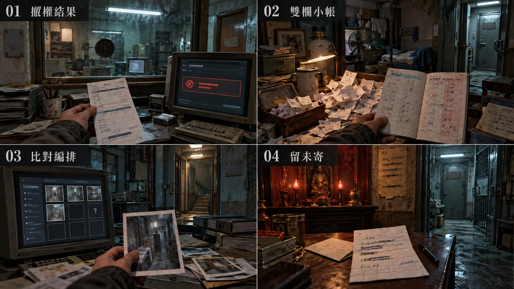

[完整圖說與操作對照](#h-0603-1213) · [圖像目錄](../09_劇本/09-14_全劇本與關卡整合稿.md#book-illustrations)

<a id="fig-v41"></a>

##### V41｜現時放蛾與關係手勢

**適用與限制：**R8 現時搭紙、移手、鬆手與兩下敲擊的關係動作；普通蛾不充當出口導航，歷史記憶不變成連續錄影。

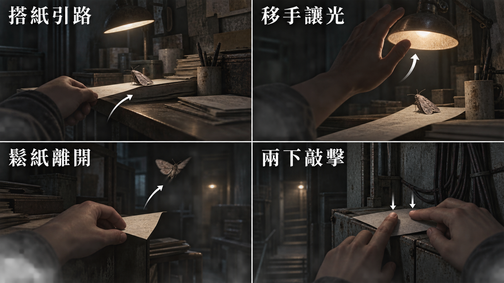

[完整圖說與操作對照](#h-0603-1239) · [圖像目錄](../09_劇本/09-14_全劇本與關卡整合稿.md#book-illustrations)

<a id="fig-art01"></a>

##### ART01｜放走：兩人於窗邊引蛾離開

**適用與限制：**過去共同安置的美術參照。R8 玩家只見靜止手部記憶與局部文字，不直接播放這張全景、露出未核定臉部或新增必要線索。

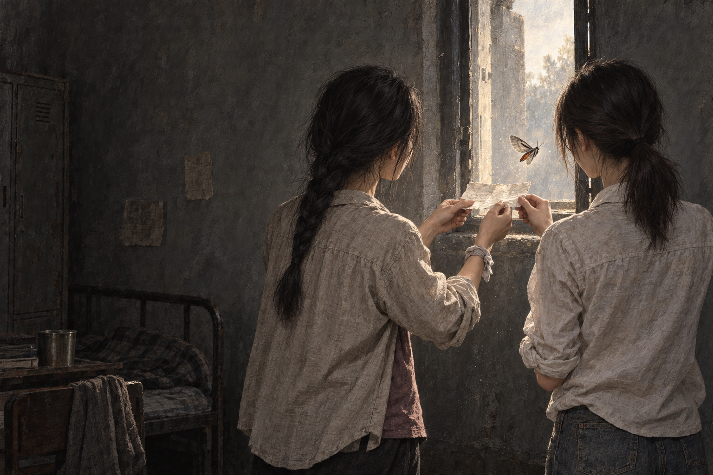

[完整圖說與操作對照](../09_劇本/09-15_正式劇本_共用附錄.md#h-0206-151) · [圖像目錄](../09_劇本/09-14_全劇本與關卡整合稿.md#book-illustrations)

<a id="node-r8-exit"></a>

#### 離場通路與次場景

<!-- production-subscenes:r8 -->

<!-- scene-image-subscenes-r8:begin -->
<a id="subscenes-r8"></a>
#### 次場景節點

以下次場景歸 R8 管理，節點編號沿用主圖圖號。來去方向為原動線的正向排列；反向通行與單向限制依原門檻，不因列出來路就新增返回出口。

<a id="subscene-r8-v02-spec"></a>
##### R8-V02 · R8→R9

**類型：**轉場接景。**正向連接：**R8-V01 → **R8-V02** → R9-V01。

**近看：**不新增近看；沿原轉場操作，不新增等待或讀取門檻。

[正文](../09_劇本/09-05_正式劇本_第二幕.md#subscene-r8-v02-script) · [圖像製作單](#node-r8-images) · [原門檻與回訪](#node-r8-nav) · [動線條件](#node-r8-nav)

<a id="subscene-r8-v03-spec"></a>
##### R8-V03 · R8→R10

**類型：**轉場接景。**正向連接：**R8-V01 → **R8-V03** → R10-V01。

**近看：**不新增近看；沿原轉場操作，不新增等待或讀取門檻。

[正文](../09_劇本/09-05_正式劇本_第二幕.md#subscene-r8-v03-script) · [圖像製作單](#node-r8-images) · [原門檻與回訪](#node-r8-nav) · [動線條件](#node-r8-nav)
<!-- scene-image-subscenes-r8:end -->

<a id="node-r9-spec"></a>

### R9 · 卡拉 OK／短租房

[正式場次](../09_劇本/09-05_正式劇本_第二幕.md#node-r9-script)

[進場與動線](#node-r9-nav) · [出入口位置](#node-r9-access) · [操作與解謎](#node-r9-level) · [狀態與驗收](#node-r9-pack) · [圖像製作單](#node-r9-images) · [離場與次場景](#node-r9-exit)

<a id="node-r9-nav"></a>

**進出、動線與回訪**

<a id="s-0609-21"></a>

<!-- import:s-0609-21:begin -->
<a id="h-0609-186"></a>

#### R9 卡拉 OK／短租房

進行目的：可選調查搭景棚並接回產線通路；隔音設備、道具床、素材缺口與處置表單呈現生活空間遭挪用的痕跡

支線／收集：SQ-S 重建與收藏

| 方向 | 類型 | 可移動條件 | 移動演出提案 | 回訪規則 |
| --- | --- | --- | --- | --- |
| R8 ↔ R9 | 分岔 | 可自由通行；讀卡前整理紙墊的放蛾操作不作出口門檻，小帳、照片與歌曲均選填 | 從視訊隔間旁舊住宅門下兩級台階，進隔音板包覆的短租房；地磚拼縫延續。 | 章內回訪；遇鎖場、追逐或封路停用 |
| R9 ↔ R11 | 主線 | 可自由前往第三排工位；搭景、素材缺口及歌曲支線不擋通行，阿尋校驗在 R11 內完成 | 跨回原長巷的半層門檻，從工位隔板後側進第三排；不跨越遭遇安全邊界。 | 章內回訪；遇鎖場、追逐或封路停用 |
<!-- import:s-0609-21:end -->
<!-- navigation:r9:end -->

<a id="node-r9-access"></a>
#### 主場景出入口

<!-- scene-access:R9:begin -->
| 動線 | 顯示名稱 | 畫面位置與辨識物 | 通行狀態 |
| --- | --- | --- | --- |
| R8↔R9 | 來路／返回：兩級台階 | 隔音板包覆的原住宅門口，地磚拼縫延伸到上方兩級台階。 | 由此回 R8，布簾與假家庭佈景不是另一條通道。 |
| R9↔R11 | 出口：長巷半層門檻 | 短租房接回長巷的門口，前方可辨第三排工位隔板背面。 | 跨門檻經接景到 R11 的安全進場側，可往返；歌曲與素材調查不擋通行。 |
| 封閉 | 封窗 | 家庭佈景後的原窗框及封板。 | 只能查看，不提供翻窗或繞過產線的路。 |
<!-- scene-access:R9:end -->

**演出限制與製作註記**

<a id="s-0905-31"></a>

<!-- import:s-0905-31:begin -->
<a id="h-0905-393"></a>

#### 演出限制

> 連接：R8 ↔ R9 ↔ R11　R8 與 R11 之間的其中一條路
> 當下打算：確認布景後的通道；可在此追查卡片與歌曲。
<!-- import:s-0905-31:end -->

<a id="node-r9-level"></a>

**關卡、解謎與失敗回饋**

<a id="s-0603-7"></a>

<!-- import:s-0603-7:begin -->
<a id="h-0603-478"></a>

#### R9 — 卡拉 OK 與短租房：隔音牆後的生活

<a id="h-0603-480"></a>

##### R9 空間與畫面製作定位

| 項目 | 畫面與製作要求 |
| --- | --- |
| 樓層與環境 | 15F–20F 產線高度帶；量體間可有門檻與半層錯位。既有空間材質、光源與生活物件沿本房原文。 |
| 入口方向 | 由 R8 承接；以來路門框／扶手作背向定位，前進方向依下列出口地標。左右方位沿既有構圖，不將反向回訪鏡頭誤當另一扇門。 |
| 可見出口 | 隔音棚後沿長巷半層門檻通 R11。首次全景就交代入口輪廓或可查看的遮擋，不靠無標示的畫外點擊換房。 |
| 阻擋與開放條件 | 往 R11：可自由前往第三排工位；搭景、素材缺口及歌曲支線不擋通行，阿尋校驗在 R11 內完成 |
| 畫面中的解謎要素 | 搭景床、素材缺口與聲音來源；必要調查與選填附件分開。關鍵標記可近看，與裝飾物有可辨的材質或輪廓差異，不只靠顏色或聲音。 |
| 完成後變化 | 已讀素材與聲音觀察保存，玩家可直接經隔音棚後方通 R11；不要求看完素材缺口或完成歌聲收集。 |

<a id="h-0603-493"></a>

##### R9 製作流程

<a id="h-0603-495"></a>

###### R9 賭桌與搭景的前後

可翻看活動隔板側緣，發現它由舊綠絨賭桌桌面改成背板，底下仍有籌碼抽屜與拆卸痕；視線轉回前方，才看出床頭暖光只照得到鏡頭內那一小片。看過 R8 的玩家會認出相同的「鏡頭前溫暖、鏡頭後受控」構圖，接回原搭景棚與強迫出鏡劇情。這是空間使用方式的呼應，不宣稱兩間由同一賭場經營，更不以賭具證明任何人的犯罪。

此觀察免費、選填，無賭博小遊戲。E2-15 仍只由原索引／卡片／拒絕與強迫紀錄取得；抽屜不放私密照片、錄音或額外受害者姓名。

**空間第一印象：**褪紫包廂、綠絨賭桌與假臥室。活動隔板背面露出被遮住的地下賭桌與籌碼抽屜；同一空間歷經娛樂、賭博與搭景，不增賭博小遊戲或影像獎賞。

**探索呈現：**先讓玩家看見入口、可走的方向和空間異常，再自選近看生活物件；新增租戶遺跡不發 E 證據、不設派系任務、不改出口旗標。恐怖沿原事件與遭遇時序，安定／閱讀保護段不插嚇點。

| 階段 | 製作規格 |
| --- | --- |
| 進入／目標 | 可選調查搭景棚，接回產線通路；娛樂與黑市共用隔音設備；後半其實是視訊組搭景棚——那張摺得像沒人睡過的床是道具（D-033）。E2-15 素材缺口與處置表單在此（D-042：集團做了什麼）；入場先還原原房間已保存的熱點與事件狀態。 |
| 觀察／空間 | 短租房被包廂隔音板重切，原窗後還有補砌牆；高差以兩級台階銜接，不遮假窗事件。 |
| 操作順序 | 查看房間與假背景 → 依原條件以 R8 卡片讀取回訪增益 → 回訪後可核對 E2-15 三份材料及匿名求助頁 → 依原連線回訪或前往 R11。順序中的選填內容不作離房門檻；原主線旗標、遭遇數值及分支提交條件依本場景細則。 |
| 回饋 | 必要操作寫入原證據／門禁／遭遇狀態；新增生活附頁僅更新來源已讀與有依據的筆記，不重發原證據。 |

<a id="h-0603-513"></a>

###### R9 生活與管制觀察

E2-15 保留 214 筆索引／197 張儲存卡，補明 17 筆刪除狀態，以及同案原始拒絕意願聯與事後補簽聯；在同一歸檔櫃加入成年人匿名求助文字「他們說要讓家人看到。我不敢告訴任何人。」只證明受威脅陳述，不證明內容、實際散布或後續命運。沒有新增影片、聲音、露骨文本或誘騙範本。

<a id="h-0603-517"></a>

###### R9 附頁熱點

**頁鍵對照：**`index`＝素材索引；`cards`＝儲存卡標籤；`consent`＝同意書；`testimony`＝匿名求助。

| 欄位 | 規格 |
| --- | --- |
| 識別／位置 | `R9_DETAIL_01`；原 E2-15 歸檔櫃。沿原近看開頁，不增加遠景發光提示。 |
| 前置 | 已開啟該原熱點；原證據、供電及回訪前置照舊，不因新增附頁放寬。 |
| 玩家操作 | 原前置成立後依次翻索引、卡標與同意書；可再翻匿名求助頁。各來源各自閱讀，不要求一次讀完。 |
| 回饋／筆記 | 原證據結論不變；只新增受威脅陳述，未知影像內容及當事人身分。 |
| 成本與中止 | 免費查看；普通探索閱讀停表；鎖場／強制演出依原規則暫不開啟。退出即回原近看，不寫未讀頁。 |
| 保存 | 每頁保存 `scene_detail.r9.read_pages` 集合；只有指定附頁顯示且玩家確認收起時加入對應頁鍵。來源顯示後中途暫停不算完成。 |
| 回訪 | 已讀頁可重看，原物件位置不重置；尚缺對照來源時保留觀察，不生成推論。 |
| 素材 | 在原近看增一組物件／紙張疊圖、各頁文字轉錄、翻頁／收起聲；近看與原基底光向一致，均待製作。 |

<a id="h-0603-532"></a>

###### R9 出口與回訪

| 目的節點 | 條件 | 移動與辨向 | 回訪邊界 |
| --- | --- | --- | --- |
| R8 | 沿已開連線回訪；未鎖場且未沉降封路 | 同一地標反向通行 | 章內回訪；遇鎖場、追逐或封路停用 |
| R11 | 可自由前往第三排工位；搭景、素材缺口及歌曲支線不擋通行，阿尋校驗在 R11 內完成 | 跨回原長巷的半層門檻，從工位隔板後側進第三排；不跨越遭遇安全邊界。 | 章內回訪；遇鎖場、追逐或封路停用 |

共用規則見[對應條款](10-01_製作規格_序幕.md#s-0601-6)。

**區域**：娛樂與交易網　**功能**：展示生活與黑市共用同一套隔音、身分與付款設備；主要為選填證據與回訪房。

<a id="h-0603-544"></a>

##### R9-01 房間分割

| 項目 | 內容 |
| --- | --- |
| 實景 | 前半是廉價卡拉 OK 包廂，後半被活動隔板切成短租房；**床單摺得像沒人睡過。** |
| **★ 它本來就沒人睡** | 那不是短租房，是**視訊組的搭景棚**。床是道具、窗簾後面是牆、床頭櫃上的相框裡是陌生人。角落堆著三組可替換的背景：一間「臥室」、一間「辦公室」、一片「海景陽台」（一塊噴繪帆布）。<br>玩家在 R8 看過補光燈之後回到這裡，才會發現這整個房間是**一個假的家**。 |
| 感知 | 牆後出現兩組不同時間的剪影：一組在唱歌，一組在對著鏡頭**演一個下班回家的人**。兩組人沒有互相看見。 |
| 互動 | 點擊點歌機、房卡、隔音牆、噴繪帆布與床下塑膠袋；不設敵人。 |
| 相框 | 相框裡的全家福，與 R6 人設帳號夾裡的其中一張是同一組人。**盜來的照片被印出來，擺在假的家裡。** |
| 聲音 | 普通流行歌停在副歌前；隔壁房傳來一句一句在唸「今天工作好累喔」的聲音——語氣自然到聽不出是在演。兩者共用同一個節拍。 |

<a id="h-0603-555"></a>

##### R9-02 記憶卡的另一面

| 觸發 | 玩家將 R8 的實體記憶卡插入點歌機側面的通電讀卡槽，匹配既存檔案；讀完可取回。卡片位置與筆記中的校驗內容分開保存，主線不因卡片留在 R9 而卡住。 |
| 回饋 | 顯示一個被刪除的檔名：`room_07 / customer_test`；無法播放影像，只能聽見 2 秒空房回音。 |
| 證據 | 作為 `E2-02` 的回訪增益；不新增 E 編號。 |
| 恐怖 | 回到 R8 時，被撕照片少了一小角；少掉的部分正好是小花肩膀旁的另一個人。桌下排水縫能提供物理去向，玩家也可能懷疑自己先前收取時遺漏；缺角不作人物死亡或身分判定證據。 |

---

<a id="h-0603-564"></a>

##### R9-03 素材索引 · `E2-15`（選填 · 脅迫素材只以缺口存在）

> ** 自 R8 移入。** 素材在這裡被製造（搭景棚），不在剪輯室。R8 只留小花這個人；R9 負責集團做了什麼。

> 這一節是集團「強拍私密影像作為要脅」的**唯一**呈現處。它必須完全以文件矛盾成立（[鐵則二十七](../09_劇本/09-15_正式劇本_共用附錄.md#doc-0002)）。

| 項目 | 內容 |
| --- | --- |
| 觸發 | 玩家看過 R8 之後回訪 R9，點擊噴繪帆布後方的歸檔櫃。 |
| 玩家看到 | ① 素材索引共 214 筆，每筆有作業編號、日期、時長與狀態；其中 17 筆狀態明記「已刪除」，保留刪除日期，操作者欄空白。② 實體儲存卡 197 張，卡標只作媒介盤點，與索引不是一筆一卡。③ 同意書附原始意願聯，兩聯同一作業／當事人代碼；原始本人填寫欄明記「不同意錄製及使用」，登記日期早於對應製作日期，後一張同意欄才被不同筆跡補簽。姓名遮蔽，不提供可回推身分資訊。 |
| 玩家推得出 | 17 筆的刪除狀態直接可核；刪除者未知。原始意願聯、製作日期與補簽聯可確認這份同案素材違反當事人明示意願；不由 214−197 推算刪除數，不把一人的拒絕推及全櫃。 |
| **玩家永遠得不到** | 那 17 筆是什麼。**沒有任何解謎的解法是「找到那段影片」。** |
| 第四份（可選） | 一張空白的「不配合處置流程」表單。處置欄只有兩個勾選項：`轉視訊組` ／ `送校正`。**沒有第三個選項。** |
| 證據 | 各原件可分次查閱；實際對齊同案代碼、日期與拒絕欄後，才取得 `E2-15`（選填）與合併結論；取消只存已讀來源，不補未讀。調查板結論固定為：`可確認素材被製作、部分被刪除、當事人未同意；無法確認內容。` |
| OS | 無。 |
| **禁止** | 不出現任何縮圖、不出現馬賽克（**馬賽克本身就是在展示**）、不出現衣物或身體暗示、不播放任何音訊片段。 |
| 公平性 | 完全選填，不影響三格鎖定或任何結局。 |
<!-- import:s-0603-7:end -->

<a id="node-r9-pack"></a>

**狀態、素材與驗收**

<a id="s-uppertech-45"></a>

<!-- import:s-uppertech-45:begin -->
<a id="h-uppertech-725"></a>

#### 第二幕整合｜第二幕｜R09 — 卡拉 OK／短租房

<a id="h-uppertech-727"></a>

##### 第二幕整合｜R09-房間資料

| 欄位 | 值 |
| --- | --- |
| `room_id` | `R09` |
| `scene` | `room_r09.tscn` |
| `entry_from` | `R08` |
| `exit_to` | 前進 `R11`、回訪 `R08`；R10 須循 R8 分岔，不新增 R9→R10 直連 |
| `backgrounds` | `r09_real.webp`；感知只使用共用 Shader 與聲源標記，不製作房間專屬感知圖／凝固層 |
| `main_goal` | 讓玩家看見娛樂與人口接洽共用隔音、房卡與付款設備；並發現後半的「短租房」其實是**視訊組搭景棚** |
| `must_exit_when` | 讀取點歌機的刪除檔名，或玩家選擇直接離開 |

<a id="h-uppertech-739"></a>

##### 第二幕整合｜R09-互動表

| ID | 物件／觸發 | 玩家操作 | 文字／聲音回饋 | 寫入狀態／證據 | 成本 |
| --- | --- | --- | --- | --- | --- |
| `R09_H01` | 點歌機 | `LOOK` | 普通流行歌停在副歌前；隔壁同節拍傳來報名字聲音 | `r09.karaoke_seen` | 0 |
| `R09_H02` | 房卡 | `LOOK` | 房號與付款末四碼可讀，房卡背面有視訊組縮寫 | `r09.roomcard_seen` | 0 點 |
| `R09_H03` | 隔音牆 | `LOOK` | 依原局部關聯查看唱歌／假裝下班回家兩個凝固時態，人物全靜止；隔壁報名字只屬現場聲景，不增第三段人物記憶；無敵人 | `r09.sound_split_seen`、`panic +1` | 0 點 |
| `R09_H04` | 點歌機讀卡槽 | `INSERT_ITEM`／`TAKE_ITEM` | 插入 R8 記憶卡後匹配既存檔案 `room_07/customer_test`，播放 2 秒空房回音；無電可插卡但不能讀檔，卡片可取回 | `items.r08_memory_card.location`、`act2.r09.memory_card_revisited` | 0 |
| `R09_H05` | 床下塑膠袋 | `LOOK` | 袋內是一次性床單與未使用的拍攝道具；不要做成血腥物件 | `r09.bag_seen` | 0 |
| `R09_H06` | 可替換背景 | `LOOK` | 角落堆著三組噴繪帆布：「臥室」「辦公室」「海景陽台」。窗簾後面是牆 | `r09.backdrop_seen` | 0 |
| `R09_H07` | 床頭櫃相框 | `LOOK` | 相框裡的全家福，與 `R06_H07` 人設帳號夾的其中一張是同一組人。**盜來的照片被印出來，擺在假的家裡** | `r09.fake_family_seen` | 0 點 |
| `R09_H08` | 歸檔櫃 · 素材索引（選填） | `LOOK`→`RELATE` | 索引 **214** 筆，**17** 筆有明示刪除狀態及日期、操作者空白；**197** 張卡為獨立盤點。原始意願聯拒絕錄製／使用、日期早於製作，後續同意欄補簽；實際對齊作業／當事人代碼及日期才生成同案結論，不以數量相減或字形代替證明<br>**不出現縮圖、不出現馬賽克、不播放任何音訊** | `E2-15`（選填，同案比對成立才寫）、`r09.material_gap_seen`；未完成只存各頁已讀 | 0 |
| `R09_H09` | 「不配合處置流程」空白表單（選填） | `LOOK` | 處置欄只有兩個勾選項：`轉視訊組` ／ `送校正`。沒有第三個選項 | `r09.noncompliance_form_seen` | 0 |

<a id="h-uppertech-753"></a>

##### 第二幕整合｜R09-回訪變化

若玩家經 R10→R8 回訪 R9，原照片局部變得不可見；只在離鏡時切換差分，不增證據或新連線。R10 不直接連 R9。

<a id="h-uppertech-757"></a>

##### 第二幕整合｜R09-驗收

- [ ] 實景層足以理解「卡拉 OK＋短租」的生活混雜，不依賴感知才能看懂。
- [ ] 感知層只能補足兩組聲音的來源，不出現可攻擊敵人。
- [ ] R9 無實體卡時不能讀卡；可返回 R8 取得。R11 仍以已知 `packet_checksum` 完成校驗，不要求再搬卡；必要卡不能銷毀或丟到不可達處。
- [ ] 「床單摺得像沒人睡過」的第一印象必須先成立；搭景棚身分要到玩家點開帆布或相框後才成立（先合理、後裂開）。
- [ ] `R09_H08` 不得出現任何縮圖、馬賽克或音訊。
- [ ] 玩家若已看過 `R06_H07`，`R09_H07` 需可辨識為同一組人；未看過則只是一張普通全家福，不強制提示。
<!-- import:s-uppertech-45:end -->

<a id="node-r9-images"></a>

#### 場景節點與靜態圖製作單

以下每列均為待製作圖像項目；文件多頁、正反面、局部與狀態差分須依拆圖欄各自交付，不能以一張示意圖代替。可探索場景的主圖提供移動與探索，演出節點不另開探索，近看關閉回到開啟前的畫面；原演出與操作條件仍依右欄來源。圖號、解析度、文字分層、存檔及驗收依[靜態圖共用契約](../09_劇本/09-15_正式劇本_共用附錄.md#scene-image-contract)。

<!-- scene-images:R9:begin -->
| 畫面節點／圖號 | 用途 | 必畫內容 | 狀態與拆圖 | 來源 |
| --- | --- | --- | --- | --- |
| R9-V01 | 主場景 | 卡拉 OK、短租房假家庭佈景、被封窗、相框、布簾及本地點歌機。 | 兩個時態都靜止；桌面與原設備保持位置，不呈現剝削影像。 | [本場景](../09_劇本/09-05_正式劇本_第二幕.md#node-r9-script) |
| R9-C01 | 近看 | 拉不開的窗、布簾與假家庭相框 | 窗封閉結構、布簾背面及相框分焦點，不能看見外界。 | [R9-01](../09_劇本/09-05_正式劇本_第二幕.md#s-0905-32) |
| R9-F01 | 回憶畫面 | 唱歌與假裝回家的兩個時態 | 兩張靜止構圖，人物與布景分層，不演工作示範。 | [R9-01](../09_劇本/09-05_正式劇本_第二幕.md#s-0905-32) |
| R9-C06 | 近看 | 翻面桌板與抽屜籌碼 | 舊綠絨、桌板翻面及原籌碼分別可看；不是新賭局或金錢道具。 | [正文來源](../09_劇本/09-05_正式劇本_第二幕.md#s-0905-32) |
| R9-C02 | 操作近看 | 點歌機、播放狀態與讀卡槽 | 一般播放停在副歌前、無電／有電、未插／已插／取回及 room_07/customer_test 已刪除頁各態；沒有私密影像縮圖，聲源依原設備。 | [R9-02](../09_劇本/09-05_正式劇本_第二幕.md#s-0905-33) |
| R9-D01 | 文件 | 素材索引、卡片盤點與原始意願聯 | 214／已刪 17／實存 197 各在原欄；同意書與意願聯分頁，姓名維持遮蔽。 | [R9-03](../09_劇本/09-05_正式劇本_第二幕.md#s-0905-34) |
| R9-D02 | 文件 | 空白處置表與匿名求助附頁 | 未填欄不得製成已核准；附頁獨立已讀狀態。 | [R9-03](../09_劇本/09-05_正式劇本_第二幕.md#s-0905-34) |
| R9-D03 | 介面 | 歌曲原始專案 A／B／C | 來源名、時間刻度、重疊區可辨；排列 B→A→C 與保存前後差分。 | [R9-04](../09_劇本/09-05_正式劇本_第二幕.md#s-0905-35) |
| R9-C03 | 近看 | 房卡正反面 | 房號、付款末四碼與背面視訊組縮寫各清晰；不補完整付款資料或新通行權。 | [原場景規格](#s-uppertech-45) |
| R9-C04 | 近看 | 床下塑膠袋與未用拍攝用品 | 袋口、一次性床單與原拍攝道具分層局部；不新增身體、傷勢或血跡。選填，不發新證據。 | [原場景規格](#s-uppertech-45) |
| R9-C05 | 近看 | 臥室、辦公室與海景陽台三組背景布 | 三組各一局部，支架、噴繪邊框與後方實牆可辨；海景不是窗外實景。 | [原場景規格](#s-uppertech-45) |
| R9-V02 | 出口接景 | R9→R11：跨回原長巷的半層門檻，從工位隔板後側進第三排；不跨越遭遇安全邊界。 | 沿原轉場取固定構圖；來路與去路各有可見定位。允許沿兩端場景重組材質，但須交此視角靜態圖及低動態替代；不增加房間、線索或強制等待。原單向／回訪、操作窗口及完成提交依動線表。 | [動線條件](#node-r9-nav) |
<!-- scene-images:R9:end -->

<!-- scene-image-access-art-r9:begin -->
**出入口交圖：**R9-V01 須依場次與狀態畫出[本場景出入口表](#node-r9-access)的來路、去路及封閉位置；既有操作鏡位與接景圖沿同一地標對位。門端差分、移動熱區與遮擋另分層，依[出入口共用契約](../09_劇本/09-15_正式劇本_共用附錄.md#scene-access-contract)驗收。
<!-- scene-image-access-art-r9:end -->


##### 原熱點對應圖號

同一圖可支援多個狀態，但每個列名焦點及原差分仍須交付；底圖不取代動畫、聲音或互動。此表只對圖，不新增取得條件。
<!-- hotspot-images:R9:begin -->
| 原熱點／操作 | 圖號 | 對應內容／邊界 |
| --- | --- | --- |
| R09_H01 | R9-C02 | 點歌機 |
| R09_H02 | R9-C03 | 房卡 |
| R09_H03 | R9-F01 | 隔音牆 |
| R09_H04 | R9-C02 | 點歌機讀卡槽 |
| R09_H05 | R9-C04 | 床下塑膠袋 |
| R09_H06 | R9-C05 | 可替換背景 |
| R09_H07 | R9-C01 | 床頭櫃相框 |
| R09_H08 | R9-D01 | 歸檔櫃 · 素材索引（選填） |
| R09_H09 | R9-D02 | 「不配合處置流程」空白表單（選填） |
<!-- hotspot-images:R9:end -->

<a id="node-r9-visual"></a>

#### 本場景圖像與示意

以下圖像為製作參照；跨房圖僅使用標明的面板，其他場景仍按各自前置演出。

[V37 解謎獎賞：捷徑、歌曲與回憶](#fig-v37) · [V20 第二幕：生活與犯罪痕跡](#fig-v20)

- **V37：**SQ-T 維修捷徑、SQ-S 歌曲及下部 SQ-R 回憶是不同選填線；R9 只對照 B-A-C 原始專案重排，不新增主線門票。
- **V20：**第 1 格 R6 帳號與匯款，第 2 格 R8 紙花／小帳，第 3 格 R9 素材索引，第 4 格 R10 未寄草稿；來源不互相代替。

[返回本房正式劇本](../09_劇本/09-05_正式劇本_第二幕.md#node-r9-script) · [本房關卡與解謎](#node-r9-level)

<a id="fig-v37"></a>

##### V37｜解謎獎賞：捷徑、歌曲與回憶

**適用與限制：**SQ-T 維修捷徑、SQ-S 歌曲及下部 SQ-R 回憶是不同選填線；R9 只對照 B-A-C 原始專案重排，不新增主線門票。

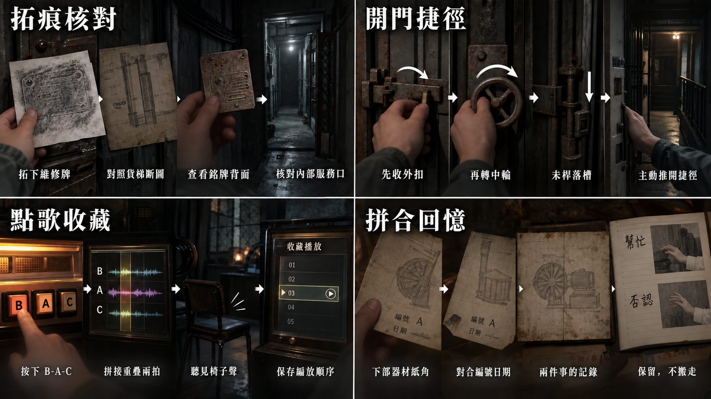

[完整圖說與操作對照](../09_劇本/09-15_正式劇本_共用附錄.md#h-0306-137) · [圖像目錄](../09_劇本/09-14_全劇本與關卡整合稿.md#book-illustrations)

<a id="node-r9-exit"></a>

#### 離場通路與次場景

<!-- production-subscenes:r9 -->

<!-- scene-image-subscenes-r9:begin -->
<a id="subscenes-r9"></a>
#### 次場景節點

以下次場景歸 R9 管理，節點編號沿用主圖圖號。來去方向為原動線的正向排列；反向通行與單向限制依原門檻，不因列出來路就新增返回出口。

<a id="subscene-r9-v02-spec"></a>
##### R9-V02 · R9→R11

**類型：**轉場接景。**正向連接：**R9-V01 → **R9-V02** → R11-V01。

**近看：**不新增近看；沿原轉場操作，不新增等待或讀取門檻。

[正文](../09_劇本/09-05_正式劇本_第二幕.md#subscene-r9-v02-script) · [圖像製作單](#node-r9-images) · [原門檻與回訪](#node-r9-nav) · [動線條件](#node-r9-nav)
<!-- scene-image-subscenes-r9:end -->

<a id="node-r10-spec"></a>

### R10 · 產線旁臨時祈禱室

[正式場次](../09_劇本/09-05_正式劇本_第二幕.md#node-r10-script)

[進場與動線](#node-r10-nav) · [出入口位置](#node-r10-access) · [操作與解謎](#node-r10-level) · [狀態與驗收](#node-r10-pack) · [圖像製作單](#node-r10-images) · [離場與次場景](#node-r10-exit)

<a id="node-r10-nav"></a>

**進出、動線與回訪**

<a id="s-0609-22"></a>

<!-- import:s-0609-22:begin -->
<a id="h-0609-198"></a>

#### R10 產線旁臨時祈禱室

進行目的：辨認管理章，沿側門接回產線；E2-09「已轉運」管理章

支線／收集：依原房選填調查；無新增支線掛點。

| 方向 | 類型 | 可移動條件 | 移動演出提案 | 回訪規則 |
| --- | --- | --- | --- | --- |
| R8 ↔ R10 | 分岔 | 可自由通行；讀卡前整理紙墊的放蛾操作不作出口門檻，小帳、照片與歌曲均選填 | 沿窗邊內井側道轉向共用平台祈禱角；遮棚封住上方視線，供桌位於交通線旁。 | 章內回訪；遇鎖場、追逐或封路停用 |
| R10 ↔ R11 | 主線 | 可由平台側門自由前往；已轉運章是幕尾候選證據之一，通報草稿及點燈觀察不擋通行 | 由祈禱平台側門接回第三排工位，既有柱角保持方位；人聲底噪漸近，不經 R9。 | 章內回訪；遇鎖場、追逐或封路停用 |
<!-- import:s-0609-22:end -->
<!-- navigation:r10:end -->

<a id="node-r10-access"></a>
#### 主場景出入口

<!-- scene-access:R10:begin -->
| 動線 | 顯示名稱 | 畫面位置與辨識物 | 通行狀態 |
| --- | --- | --- | --- |
| R8↔R10 | 來路／返回：平台側道 | 供桌外側的交通線，遮棚下接回 R8 窗邊內井側道。 | 可循原路回視訊組，不穿過祭台。 |
| R10↔R11 | 出口：平台側門 | 供桌旁的側門，以門邊既有柱角辨向。 | 接到 R11 第三排工位，可往返且不經 R9；祈願、通報草稿與點燈不鎖門。 |
<!-- scene-access:R10:end -->

**演出限制與製作註記**

<a id="s-0905-36"></a>

<!-- import:s-0905-36:begin -->
<a id="h-0905-473"></a>

#### 演出限制

> 連接：R8 ↔ R10 ↔ R11　另一條接近產線末端的路
> 當下打算：從管理章理解通道分類；查看仍有人維護過的角落。
<!-- import:s-0905-36:end -->

<a id="node-r10-level"></a>

**關卡、解謎與失敗回饋**

<a id="s-0603-8"></a>

<!-- import:s-0603-8:begin -->
<a id="h-0603-583"></a>

#### R10 — 產線旁臨時祈禱室：已轉運

<a id="h-0603-585"></a>

##### R10 空間與畫面製作定位

| 項目 | 畫面與製作要求 |
| --- | --- |
| 樓層與環境 | 15F–20F 產線高度帶；量體間可有門檻與半層錯位。既有空間材質、光源與生活物件沿本房原文。 |
| 入口方向 | 由 R8 承接；以來路門框／扶手作背向定位，前進方向依下列出口地標。左右方位沿既有構圖，不將反向回訪鏡頭誤當另一扇門。 |
| 可見出口 | 供桌平台側門接回第三排工位 R11。首次全景就交代入口輪廓或可查看的遮擋，不靠無標示的畫外點擊換房。 |
| 阻擋與開放條件 | 往 R11：可由平台側門自由前往；已轉運章是幕尾候選證據之一，通報草稿及點燈觀察不擋通行 |
| 畫面中的解謎要素 | 供桌、祈禱卡與管理章；出口線索的圖層差異須維持。關鍵標記可近看，與裝飾物有可辨的材質或輪廓差異，不只靠顏色或聲音。 |
| 完成後變化 | 已讀供桌與祈禱卡觀察保存；玩家可直接由平台側門進 R11，不必繞行 R9，也不強制取得 E2-09 或 E2-11。 |

<a id="h-0603-598"></a>

##### R10 製作流程

<a id="h-0603-600"></a>

###### R10 舊教室與現時祈禱

矮椅旁的成人跪痕朝向現有祈禱台；一件成人外套被摺作膝墊，擦不淨的舊板書與原信件並置。玩家能讀出房間從教室變成受困成人的短暫容身處，接回「想聯絡家人卻不能自由聯絡」的原未寄信故事。外套與矮椅只作環境觀察，不指定為小花或任何已知人物所有。原管理章與信件仍由各自熱點取得，不藏在椅腳作額外密碼；不新增兒童受害敘事或童鬼。

**空間第一印象：**粉白舊補習角與暖色祈禱燈。成人祈禱角借用停辦教室的平台，矮椅、擦不淨的字與身旁工業門形成尺度差；不新增受害兒童、童鬼或童聲跳嚇。

**探索呈現：**先讓玩家看見入口、可走的方向和空間異常，再自選近看生活物件；新增租戶遺跡不發 E 證據、不設派系任務、不改出口旗標。恐怖沿原事件與遭遇時序，安定／閱讀保護段不插嚇點。

| 階段 | 製作規格 |
| --- | --- |
| 進入／目標 | 辨認管理章，沿側門接回產線；E2-09「已轉運」管理章；入場先還原原房間已保存的熱點與事件狀態。 |
| 觀察／空間 | 祈禱角留在兩戶共用的小平台，供桌避開交通線；側門接回產線，不設新敵人。 |
| 操作順序 | 查看祈禱角 → 比對換班符號與管理章 → 可查外聯草稿 → 往 R11；未寄資料不能用來撥號。順序中的選填內容不作離房門檻；原主線旗標、遭遇數值及分支提交條件依本場景細則。 |
| 回饋 | 必要操作寫入原證據／門禁／遭遇狀態；新增生活附頁僅更新來源已讀與有依據的筆記，不重發原證據。 |

<a id="h-0603-616"></a>

###### R10 生活與管制觀察

家人電話紙改為遮蔽的手抄聯絡資料和未寄信封；是為出去以後保留的聯繫方式，不可撥號。祈禱仍是人的照護，不變成管理者全知監視。

<a id="h-0603-620"></a>

###### R10 附頁熱點

**頁鍵對照：**`contact`＝手抄聯絡資料；`letter`＝未寄信封。

| 欄位 | 規格 |
| --- | --- |
| 識別／位置 | `R10_DETAIL_01`；原供桌生活物件近看。沿原近看開頁，不增加遠景發光提示。 |
| 前置 | 已開啟該原熱點；原證據、供電及回訪前置照舊，不因新增附頁放寬。 |
| 玩家操作 | 翻手抄聯絡資料與未寄信封。各來源各自閱讀，不要求一次讀完。 |
| 回饋／筆記 | 只記出去以後的聯繫願望，沒有可撥號介面。 |
| 成本與中止 | 免費查看；普通探索閱讀停表；鎖場／強制演出依原規則暫不開啟。退出即回原近看，不寫未讀頁。 |
| 保存 | 每頁保存 `scene_detail.r10.read_pages` 集合；只有指定附頁顯示且玩家確認收起時加入對應頁鍵。來源顯示後中途暫停不算完成。 |
| 回訪 | 已讀頁可重看，原物件位置不重置；尚缺對照來源時保留觀察，不生成推論。 |
| 素材 | 在原近看增一組物件／紙張疊圖、各頁文字轉錄、翻頁／收起聲；近看與原基底光向一致，均待製作。 |

<a id="h-0603-635"></a>

###### R10 出口與回訪

| 目的節點 | 條件 | 移動與辨向 | 回訪邊界 |
| --- | --- | --- | --- |
| R8 | 沿已開連線回訪；未鎖場且未沉降封路 | 同一地標反向通行 | 章內回訪；遇鎖場、追逐或封路停用 |
| R11 | 可由平台側門自由前往；已轉運章是幕尾候選證據之一，通報草稿及點燈觀察不擋通行 | 由祈禱平台側門接回第三排工位，既有柱角保持方位；人聲底噪漸近，不經 R9。 | 章內回訪；遇鎖場、追逐或封路停用 |

共用規則見[對應條款](10-01_製作規格_序幕.md#s-0601-6)。

**區域**：照護網／祈禱角　**功能**：讓信仰先作為照護，再顯示管理系統如何接管它；取得 `E2-09`。

<a id="h-0603-647"></a>

##### R10-01 日常表面

| 層次 | 內容 |
| --- | --- |
| 供桌 | 供桌、祖先照片、平安符、念珠、紙摺祈願與多語卡片；不指向單一宗教。 |
| 生活物件 | 小電扇、保溫杯、幾張寫著家人電話的紙；供桌角落有一只沒有香灰、反覆換水留下水垢的杯子，旁邊壓著同樣的四瓣紙花。玩家可閱讀但不收進主線證據。 |
| 光源 | 小型電子點燈與一盞暖黃燈；暖光先讓玩家停下來，再慢慢與換班系統同步。 |
| 聲音 | 紙張摩擦、香灰落下、產線換班鐘；不使用倒放誦念或神祇降臨音效。 |

<a id="h-0603-656"></a>

##### R10-02 點燈同步 · 空間回應

| 項目 | 內容 |
| --- | --- |
| 觸發 | 玩家在供桌前停留 5 秒，或查看第三張祈禱卡。 |
| 回饋 | 電子點燈依序亮起，節奏與 R6 的換班公告相同；附近設備低鳴一次，沒有新增資訊。 |
| OS | 「他們把求平安的時間，也排進去了。」 |
| 邊界 | 神壇沒有攻擊、沒有顯靈；恐怖來自人留下的安慰被轉成管理節拍。 |

<a id="h-0603-665"></a>

##### R10-03 管理章 · `E2-09`

| 觸發 | 玩家翻到祈禱卡背面，需先在 R7 看過「轉接校正」的快捷鍵表，才會注意到相同的方框符號。 |
| 證據 | 卡片背面蓋著灰色管理章：**「已轉運」**，旁邊有日期、房號與一個被塗黑的姓名。取得 `E2-09`。 |
| 回饋 | 玩家合上卡片後，電子點燈全部熄滅 2 秒，再恢復暖黃；不觸發戰鬥。 |
| 公平性 | 未取得 R7 快捷鍵表也能拿到卡片，但只能把它當成一般標記；後續調查板會保留未解狀態。 |

<a id="h-0603-672"></a>

##### R10-04 通報者的外聯草稿 · `E2-11`（選填）

| 項目 | 內容 |
| --- | --- |
| 觸發 | 玩家已取得 `E2-09`，再把發光棒留置於供桌側面，或利用電子供燈的斜光查看底部卡槽；不需要移動或翻動神壇主體。 |
| 凝固內容 | 一張祈禱卡夾著幾行不同語言的求救草稿，最後一行被撕掉；剪影的手停在「送出」前。 |
| 證據 | 取得 `E2-11` 的第一部分：外聯草稿與疑似轉運日期。此時只表示有人嘗試通報，不揭露她最後去了哪裡。 |
| 恐怖拍點 | 玩家收起卡片後，電子點燈按照「換班—轉接—校正」三拍亮起；第三拍永遠缺一盞燈。 |
| 器官傳聞邊界 | 不出現手術影像或器官物件；若玩家在第六幕找到疑似同意書，調查板才會顯示「未證實醫療剝削」而非確定死因。 |
| 失敗處理 | 未看過 `E2-09` 時，玩家只能看見普通祈願紙；回訪不鎖死主線，確保支線不成為必要解謎。 |

---
<!-- import:s-0603-8:end -->

<a id="node-r10-pack"></a>

**狀態、素材與驗收**

<a id="s-uppertech-46"></a>

<!-- import:s-uppertech-46:begin -->
<a id="h-uppertech-766"></a>

#### 第二幕整合｜第二幕｜R10 — 產線旁臨時祈禱室

<a id="h-uppertech-768"></a>

##### 第二幕整合｜R10-房間資料

| 欄位 | 值 |
| --- | --- |
| `room_id` | `R10` |
| `scene` | `room_r10.tscn` |
| `entry_from` | `R08`；已開通後可從 `R11` 回訪 |
| `exit_to` | `R11` |
| `backgrounds` | `r10_real.webp`、`r10_scan.webp`、`r10_freeze.webp`（僅祈禱卡局部） |
| `main_goal` | 讀取「已轉運」管理章，讓信仰從照護轉成排程證據 |
| `must_exit_when` | 玩家可自由由平台側門到 R11；E2-09 是三格候選之一，E2-11 選填，皆不鎖此門 |

<a id="h-uppertech-780"></a>

##### 第二幕整合｜R10-互動表

| ID | 物件／觸發 | 玩家操作 | 文字／聲音回饋 | 寫入狀態／證據 | 成本 |
| --- | --- | --- | --- | --- | --- |
| `R10_H01` | 供桌／祖先照片 | `LOOK` | 多語祈願卡、平安符、念珠、家人電話；角落無灰水杯與四瓣紙花可和 R8 對上，不指向單一宗教 | `r10.altar_seen`、可選 `xiaohua.water_cup_seen` | 0 |
| `R10_H02` | 電子點燈 | 停留 5 秒 | 點燈節奏與 R6 換班公告同步；近處設備的低鳴一次 | `r10.lamp_sync_seen`、`panic +1` | 0 |
| `R10_H03` | 祈禱卡背面 | `LOOK` | 灰色章「已轉運」，日期、房號、被塗黑姓名 | `E2-09`、`act2.r10.e209_seen` | 0 點 |
| `R10_H04` | 供桌底卡槽 | `LOOK`→`RELATE`→`FOCUS_MEMORY`（依下列前置表） | 凝固層停在「送出」前的求救草稿；最後一行被撕掉 | `E2-11`、`act2.r10.e211_seen` | 首次 2 點／重看 0 點 |
| `R10_H05` | 缺燈位置 | `LOOK` | 「換班—轉接—校正」三拍，第三拍永遠缺一盞燈 | `r10.missing_lamp_seen` | 0 |

<a id="h-uppertech-790"></a>

##### 第二幕整合｜R10-文化與尺度驗收

- 神壇物件採跨亞洲家庭常見的供桌、平安符、祖先照片與多語祈願卡，但不把任何單一信仰標記成邪教。
- 恐怖來自求平安被排入換班節奏；不得播放倒放誦念、神祇現身或用宗教符號當跳嚇圖示。
- `E2-11` 只證明有人嘗試通報與被轉運，不確認器官摘除；第六幕才可把矛盾文件放上調查板。
<!-- import:s-uppertech-46:end -->

<a id="node-r10-images"></a>

#### 場景節點與靜態圖製作單

以下每列均為待製作圖像項目；文件多頁、正反面、局部與狀態差分須依拆圖欄各自交付，不能以一張示意圖代替。可探索場景的主圖提供移動與探索，演出節點不另開探索，近看關閉回到開啟前的畫面；原演出與操作條件仍依右欄來源。圖號、解析度、文字分層、存檔及驗收依[靜態圖共用契約](../09_劇本/09-15_正式劇本_共用附錄.md#scene-image-contract)。

<!-- scene-images:R10:begin -->
| 畫面節點／圖號 | 用途 | 必畫內容 | 狀態與拆圖 | 來源 |
| --- | --- | --- | --- | --- |
| R10-V01 | 主場景 | 產線平台旁供桌、水杯、祈願卡、管理章與祭台側縫。 | 排列異常依原條件；閱讀與安定不插驚嚇，祭台不可搬動。 | [本場景](../09_劇本/09-05_正式劇本_第二幕.md#node-r10-script) |
| R10-C01 | 近看 | 杯底水痕、供桌與家人留下的物件 | 水杯、四瓣紙花、祖先照片、平安符、念珠與遮蔽家人電話各清晰局部；不用單一信仰作邪惡標記，不補聯絡資料或紙花作者。 | [R10-01](../09_劇本/09-05_正式劇本_第二幕.md#s-0905-37) |
| R10-C02 | 近看 | 三張祈願卡 | 每卡一焦點，原順序與回看差分保持一致。 | [R10-02](../09_劇本/09-05_正式劇本_第二幕.md#s-0905-38) |
| R10-D01 | 文件 | 祈願卡背面管理章 | 章、日期、房號及塗去姓名；與 R7 排班對照才能解讀。 | [R10-03](../09_劇本/09-05_正式劇本_第二幕.md#s-0905-39) |
| R10-C03 | 近看 | 祭台側縫、底部卡槽與未寄外聯草稿 | 現實層紙本撕缺末行、遮蔽家書及聯絡附頁分頁可讀；不搬動祭台。過去停在送出前的手另交 R10-F01，不把歷史手勢放到現實層。 | [R10-04](../09_劇本/09-05_正式劇本_第二幕.md#s-0905-40) |
| R10-C04 | 近看 | 電子點燈、控制器與缺燈位置 | 正常、熄兩秒、復亮及第三拍缺一盞的原差分；節奏另交原動畫／聲音，不能用全滅靜圖改掉三拍。 | [原場景規格](#s-uppertech-46) |
| R10-F01 | 回憶畫面 | 供桌底卡槽的未送出求救靜格 | 已讀供桌與卡背並建立關聯才可見；手停在送出前，沒有按下、傳送成功或現時求救。與側縫紙本分圖，不把過去手勢畫進現實層。 | [原場景規格](#s-uppertech-46) |
| R10-V02 | 出口接景 | R10→R11：由祈禱平台側門接回第三排工位，既有柱角保持方位；人聲底噪漸近，不經 R9。 | 沿原轉場取固定構圖；來路與去路各有可見定位。允許沿兩端場景重組材質，但須交此視角靜態圖及低動態替代；不增加房間、線索或強制等待。原單向／回訪、操作窗口及完成提交依動線表。 | [動線條件](#node-r10-nav) |
<!-- scene-images:R10:end -->

<!-- scene-image-access-art-r10:begin -->
**出入口交圖：**R10-V01 須依場次與狀態畫出[本場景出入口表](#node-r10-access)的來路、去路及封閉位置；既有操作鏡位與接景圖沿同一地標對位。門端差分、移動熱區與遮擋另分層，依[出入口共用契約](../09_劇本/09-15_正式劇本_共用附錄.md#scene-access-contract)驗收。
<!-- scene-image-access-art-r10:end -->


##### 原熱點對應圖號

同一圖可支援多個狀態，但每個列名焦點及原差分仍須交付；底圖不取代動畫、聲音或互動。此表只對圖，不新增取得條件。
<!-- hotspot-images:R10:begin -->
| 原熱點／操作 | 圖號 | 對應內容／邊界 |
| --- | --- | --- |
| R10_H01 | R10-C01、R10-C02 | 供桌／祖先照片 |
| R10_H02 | R10-C04 | 電子點燈 |
| R10_H03 | R10-D01 | 祈禱卡背面 |
| R10_H04 | R10-C03、R10-F01 | 供桌底卡槽 |
| R10_H05 | R10-C04 | 缺燈位置 |
<!-- hotspot-images:R10:end -->

<a id="node-r10-visual"></a>

#### 本場景圖像與示意

本房沿用跨房圖的指定面板，尚無獨立專圖；請依下列適用範圍對照，不把整張圖當成本房演出。

[V20 第二幕：生活與犯罪痕跡](#fig-v20) · [V21 第二幕：關係與回訪後果](#fig-v21) · [V33 怨靈的昆蟲身體恐怖：後勤威脅](10-04_製作規格_第三幕.md#fig-v33)

- **V20：**第 1 格 R6 帳號與匯款，第 2 格 R8 紙花／小帳，第 3 格 R9 素材索引，第 4 格 R10 未寄草稿；來源不互相代替。
- **V21：**R7 的未送出對話與回訪空位、R8 修改腳本、R10 祈禱卡／驗證記錄；分別依正式場次，不代填對話。
- **V33：**本房只取第 1 格「通報者」作跨房造型／來源參考；依 R10-04 不新增 E-05 現時現身或人聲，不把造型圖當成本房新增遭遇。

[返回本房正式劇本](../09_劇本/09-05_正式劇本_第二幕.md#node-r10-script) · [本房關卡與解謎](#node-r10-level)

<a id="node-r10-exit"></a>

#### 離場通路與次場景

<!-- production-subscenes:r10 -->

<!-- scene-image-subscenes-r10:begin -->
<a id="subscenes-r10"></a>
#### 次場景節點

以下次場景歸 R10 管理，節點編號沿用主圖圖號。來去方向為原動線的正向排列；反向通行與單向限制依原門檻，不因列出來路就新增返回出口。

<a id="subscene-r10-v02-spec"></a>
##### R10-V02 · R10→R11

**類型：**轉場接景。**正向連接：**R10-V01 → **R10-V02** → R11-V01。

**近看：**不新增近看；沿原轉場操作，不新增等待或讀取門檻。

[正文](../09_劇本/09-05_正式劇本_第二幕.md#subscene-r10-v02-script) · [圖像製作單](#node-r10-images) · [原門檻與回訪](#node-r10-nav) · [動線條件](#node-r10-nav)
<!-- scene-image-subscenes-r10:end -->

<a id="node-r11-spec"></a>

### R11 · 「你的」座位（第三排靠牆）

[正式場次](../09_劇本/09-05_正式劇本_第二幕.md#node-r11-script)

[進場與動線](#node-r11-nav) · [出入口位置](#node-r11-access) · [操作與解謎](#node-r11-level) · [狀態與驗收](#node-r11-pack) · [圖像製作單](#node-r11-images) · [離場與次場景](#node-r11-exit)

<a id="node-r11-nav"></a>

**進出、動線與回訪**

<a id="s-0609-23"></a>

<!-- import:s-0609-23:begin -->
<a id="h-0609-210"></a>

#### R11 「你的」座位（第三排靠牆）

進行目的：避開阿尋攻擊，開啟技術區服務入口；E2-03 雙層閃格、呼喚者確認為阿尋、固定安定感知 名冊兩版範圍核對後補校驗；辨認阿尋實際作出的決定；凝視須停操作，敲擊須辨桌側

支線／收集：依原房選填調查；無新增支線掛點。

| 方向 | 類型 | 可移動條件 | 移動演出提案 | 回訪規則 |
| --- | --- | --- | --- | --- |
| R9 ↔ R11 | 主線 | 可自由前往第三排工位；搭景、素材缺口及歌曲支線不擋通行，阿尋校驗在 R11 內完成 | 跨回原長巷的半層門檻，從工位隔板後側進第三排；不跨越遭遇安全邊界。 | 章內回訪；遇鎖場、追逐或封路停用 |
| R10 ↔ R11 | 主線 | 可由平台側門自由前往；已轉運章是幕尾候選證據之一，通報草稿及點燈觀察不擋通行 | 由祈禱平台側門接回第三排工位，既有柱角保持方位；人聲底噪漸近，不經 R9。 | 章內回訪；遇鎖場、追逐或封路停用 |
| R11 → R12 | 跨幕 | 阿尋必要校驗、arc.ahsun.scope_confirmed 與幕尾 K1-01 成立，再完成現場第一鑰匙門端驗證；SQ-C1／SQ-S 不擋主線 | T-R11-R12：由 15F–20F 產線服務梯，經 21F–27F 焊封側門的中繼平台，上行至 28F–31F 後勤平台；三鏡位以管線、扶手與過梁遮擋串接。 | 單向流程；不代表可沿此線倒退 |
<!-- import:s-0609-23:end -->
<!-- navigation:r11:end -->

<a id="node-r11-access"></a>
#### 主場景出入口

<!-- scene-access:R11:begin -->
| 動線 | 顯示名稱 | 畫面位置與辨識物 | 通行狀態 |
| --- | --- | --- | --- |
| R9↔R11 | 來路／返回：隔板後長巷 | 第三排工位後側、半層門檻接回短租房的通道口。 | 非鎖場時可回 R9；遭遇中只能使用同房安全凹位，不能跨房躲避。 |
| R10↔R11 | 另一來路／返回：平台側門 | 工位另一側的柱角與平台門框，接回祈禱角。 | 非鎖場時可回 R10；兩個入口都落在原安全邊界外，不從敵後進場。 |
| R11→R12 | 出口：S-03 服務梯門 | 靠牆工位旁的門端，門框外接上行扶手。 | 完成阿尋必要校驗、幕尾推理與第一鑰匙現場驗證，再確認離幕；經三段服務梯到 R12，確認前仍可整理回訪。 |
<!-- scene-access:R11:end -->

<!-- access-layout:R11:begin -->
<a id="node-r11-access-layout"></a>
##### 出入口配置草圖

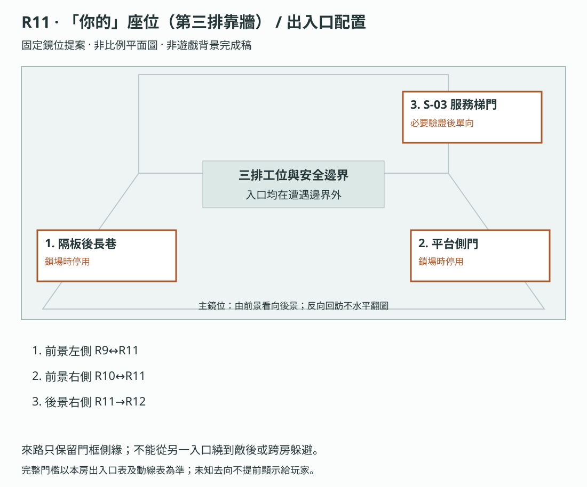

**構圖提案：**來路只保留門框側緣；不能從另一入口繞到敵後或跨房躲避。 各門端位置對應上表；數字只供製作辨識，不是玩家介面或解謎提示。

門框、視線及熱區仍須灰盒驗收，依[共用契約](../09_劇本/09-15_正式劇本_共用附錄.md#scene-access-contract)，不計入遊戲圖像交付數。
<!-- access-layout:R11:end -->

**演出限制與製作註記**

<a id="s-0905-41"></a>

<!-- import:s-0905-41:begin -->
<a id="h-0905-514"></a>

#### 演出限制

> 前一節點：R9／R10　後一節點：R12（單向）
> 當下打算：處理仍在重試的終端，開啟第三排工位後的服務門。
<!-- import:s-0905-41:end -->

<a id="node-r11-level"></a>

**關卡、解謎與失敗回饋**

<a id="s-0603-9"></a>

<!-- import:s-0603-9:begin -->
<a id="h-0603-685"></a>

#### R11 — 「你的」座位：阿尋／呼喚者

<a id="h-0603-687"></a>

##### 圖解：阿尋：凝視與敲擊的防禦

[查看圖像：阿尋：凝視與敲擊的防禦](#fig-l03)

左右兩欄各成一組：左欄 01→02 是凝視與關閉介面，右欄 03→04 是敲擊與側移遮蔽。

| 分鏡 | 玩家操作與畫面回應 |
| --- | --- |
| 01 | 凝視前兆：表情薄膜與螢幕眼形朝操作位置聚焦；這一欄呈現視線沿終端連通。 |
| 02 | 凝視防禦：關閉本地操作介面並收手停止操作。螢幕仍通電，並非關閉整台設備；只停止拖曳而介面仍開啟不算成功。 |
| 03 | 敲擊前兆：本輪左桌沿的三道抓痕與節指標明來向；此圖以左側為例，正式輪次沿保存的來向判定。 |
| 04 | 敲擊防禦：點選對側右隔板凹位並自動收手，節指落在已讓空的左桌側。只關介面仍站原位無效，躲進凹位也不能遙控終端提交。 |

防禦後的空檔用於精簡辨識、選片段及提交；完整查證與重建須先退出攻防，從安全入口進入 SOURCE_READ。必要校驗被現場終端接受後才永久停攻，單一防禦動作不代替校驗。

<a id="h-0603-703"></a>

##### R11 空間與畫面製作定位

| 項目 | 畫面與製作要求 |
| --- | --- |
| 樓層與環境 | 15F–20F 產線高度帶；量體間可有門檻與半層錯位。既有空間材質、光源與生活物件沿本房原文。 |
| 入口方向 | 由 R9、R10 承接；以來路門框／扶手作背向定位，前進方向依下列出口地標。左右方位沿既有構圖，不將反向回訪鏡頭誤當另一扇門。 |
| 可見出口 | 第三排工位後的產線服務門，接往技術區維修脊柱。首次全景就交代入口輪廓或可查看的遮擋，不靠無標示的畫外點擊換房。 |
| 阻擋與開放條件 | 往 R12：阿尋必要校驗與幕尾 K1-01 成立；離幕前可返回查 SQ-S；原校驗前須完成 arc.ahsun.scope_confirmed |
| 畫面中的解謎要素 | 座位終端、草稿與擴大名冊、校驗槽；兩招防禦位置須與終端同景可辨。關鍵標記可近看，與裝飾物有可辨的材質或輪廓差異，不只靠顏色或聲音。 |
| 完成後變化 | 名冊範圍比對與必要校驗完成後保留阿尋遭遇成果；第二幕推理成立並在終端使用 K1-01，服務門端才顯示可走，玩家自行前往 R12。 |

<a id="h-0603-716"></a>

##### R11 製作流程

**逃生因果與可見回饋：**進入安全定點時可先看原服務門端顯示未覆寫；阿尋攻擊時只提示停止操作／掩蔽。防禦成功提供原校驗窗口；原校驗與幕尾推理都完成後，在現場終端使用 K1-01，既有檢修入口才可走。門端顯示只用原出口條件，不新增可繞過範圍核對的操作。

| 階段 | 製作規格 |
| --- | --- |
| 進入／目標 | 避開阿尋攻擊，開啟技術區服務入口；E2-03 雙層閃格、呼喚者確認為阿尋、固定安定感知 名冊兩版範圍核對後補校驗；辨認阿尋實際作出的決定。；入場先還原原房間已保存的熱點與事件狀態。 |
| 觀察／空間 | 第三排工位貼近住宅承重柱，玻璃上緣仍有舊窗楣；座位、隔板掩蔽與攻擊前兆不被雜物擠掉。 |
| 操作順序 | 查看座位與通電終端 → 在 PACKING_COMPARE 對齊個人草稿及擴大名冊、標出改動並保存 arc.ahsun.scope_confirmed → 依遭遇前兆防禦，取得 packet_checksum 後完成校驗 → 整理第二幕揭露並在終端使用 K1-01 → 由服務門前往 R12。完整閱讀暫停攻擊，回全景後給完整前兆；缺範圍核對或校驗碼皆不能完成校驗。順序中的選填內容不作離房門檻；原主線旗標、遭遇數值及分支提交條件依本場景細則。 |
| 回饋 | 必要操作寫入原證據／門禁／遭遇狀態；新增生活附頁僅更新來源已讀與有依據的筆記，不重發原證據。 |

<a id="h-0603-727"></a>

###### R11 生活與管制觀察

交接班、登入與工位編號連起來；既有十一個視窗保留原範圍，不把 K-114／207／089 全部改成私密影像案件。

<a id="h-0603-731"></a>

###### R11 出口與回訪

| 目的節點 | 條件 | 移動與辨向 | 回訪邊界 |
| --- | --- | --- | --- |
| R9 | 沿已開連線回訪；未鎖場且未沉降封路 | 同一地標反向通行 | 章內回訪；遇鎖場、追逐或封路停用 |
| R10 | 沿已開連線回訪；未鎖場且未沉降封路 | 同一地標反向通行 | 章內回訪；遇鎖場、追逐或封路停用 |
| R12 | 阿尋必要校驗與幕尾 K1-01 成立；離幕前可返回查 SQ-S；原校驗前須完成 arc.ahsun.scope_confirmed | T-R11-R12：由 15F–20F 產線服務梯，經 21F–27F 焊封側門的中繼平台，上行至 28F–31F 後勤平台；三鏡位以管線、扶手與過梁遮擋串接。 | 單向流程；不代表可沿此線倒退 |

共用規則見[對應條款](10-01_製作規格_序幕.md#s-0601-6)。


<a id="h-0603-742"></a>

##### R11 動畫演出

<a id="h-0603-744"></a>

###### 阿尋複眼與節指

| 項目 | 場景演出規格 |
| --- | --- |
| 形式與節奏 | 遊戲內招式動畫；沿 AX-01／AX-02 的 3 秒前兆、0.6 秒命中表現及 6 秒安全窗。 |
| 鏡頭與動作 | 表情薄膜錯位、眼形反光朝向玩家；節指影沿鍵盤伸出。分別交付前兆、出手、遮蔽成功、受擊與恢復差分。 |
| 操作與資訊邊界 | 玩家依招式關閉終端或切至對側凹位；不能播不可中斷影片取代防禦。名冊兩版比對完整閱讀時停攻，校驗成功取消待發動畫與判定。 |

**區域**：第三排靠牆隔間　**功能**：完成第二幕的情感轉折、雙層閃格與阿尋的 99% 傳輸。

<a id="h-0603-755"></a>

##### 畫面構圖

| 層次 | 內容 |
| --- | --- |
| 前景 | 靠牆座位、貼歪的家庭照片、耳機線與一個被磨平的刻痕 |
| 中景 | 三排隔間；只有這個座位的螢幕仍顯示登入畫面 |
| 背景 | 走道盡頭的監視器朝向座位，而不是朝向門 |
| 光源 | 螢幕冷光固定照著椅子，其他隔間逐格熄滅 |
| 聲音 | 房間終端顯示連續異常呼叫；每次掛斷後，走道另一端都重複一次相同的鈴聲 |

<a id="h-0603-765"></a>

##### R11-01 第一次雙層閃格 · `E2-03`

| 項目 | 內容 |
| --- | --- |
| 觸發 | 玩家直接查看座位編號與螢幕登入框，完成局部關聯後才顯現該座位的殘留。 |
| 凝固畫面 | 過去的座位有人坐著，但不是主角；剪影停在「手離開介面、另一手懸於鍵盤」的未完成姿勢，與玩家剛才的姿勢相似；人物、過去游標及衣物全程靜止，不演收起或打字。 |
| 可點擊物件 | 家庭照片（臉被燈光遮住）、刻痕、鍵盤磨損處、螢幕登入名。 |
| 證據 | 取得 `E2-03`；描述只寫「座位上的人不是主角」，不給出那個人的姓名。 |
| 恐怖拍點 | 玩家退出凝固層後，現實層椅子朝向改變 5 度，像有人剛坐起來。 |

<a id="h-0603-775"></a>

##### R11-02 呼喚者出現

| 觸發 | 玩家取得 `E2-03` 或在現場終端查看三次未接來電。 |
| 表現 | 所有螢幕跳出來電視窗，來電者名稱是不同語言的「家」；阿尋模糊輪廓不直接靠近，但透過來電與螢幕主動發動訊號衝擊。前兆、防禦、空檔與去重扣罰依本文件的主動攻擊規則。 |
| 辨識感知 | 初次輸出：`[系統] 呼喚者。狀態：傳輸 99%／重試。` 若玩家已看過 R6 帳號鎖定名單，追加：`帳號：阿尋。聯絡權限已撤銷。` |
| 對戰規則 | 玩家用 R8 記憶卡已讀封包尾段、R11 本地撤銷欄與 99% 傳輸快取，辨識最後一段校驗碼；並在安全狀態完成個人草稿／擴大名冊比對。R6 帳號資料只補背景，不作必要門檻。 |
| **另外那些視窗** | 99% 傳輸不是螢幕上唯一的東西。它後面疊著**十一個沒關掉的聊天視窗**——阿尋一人多開的十一個身分，每一個停在不同的對話階段。<br>**`K-114` 的視窗不在其中**——那一個在他被帶走時已經關了，所以只留在 R7 的凝固層裡。這十一個是**別的人**：十一段他同時維持著的關係，全部還開著，全部沒有人回。<br>這一房負責的是**規模**，不是重播 K-114。 |
| ⚠️ 邊界 | 玩家可以逐一點開閱讀，**不能**在任何一個裡輸入或傳送。<br>與他 99% 的傳輸形成對照：**那一筆玩家可以替他完成；這十一段不行。** W01–W11 的完整無聲逐字稿見 [09-13](../09_劇本/09-15_正式劇本_共用附錄.md#doc-0913)，均為新增待審文字；無新通知或現時已讀回條，全部略過不擋出口。 |
| 正確回應 | 從 R8 記憶卡重建校驗碼，拖入 R11 的本地訊號槽，讓 99% 變成「外部可讀」。這只完成阿尋未完成的傳輸，不改寫他當時未能求救成功的過去。 |
| 錯誤回應 | 播放其他人聲使來電同響，恐慌 +1、凝神穩定度追加 -10 點；與同輪主動攻擊只結算一次錯誤回應代價，隨後給完整操作空檔。可退出再回來，不致死。 |
| 安息結果 | `[系統] 名單已補齊。已保存可供外部讀取的副本。` 阿尋停止重試並消散；第三幕 R17 才確認這份殘缺封包曾足以引來警方。 |

<a id="h-0603-787"></a>

##### R11-02b畫面下緣的一行字 · 逃跑夜碎片 `E4-00-B`

> 逃跑夜長線第二片。若玩家已取得 `E4-00-A`（第一幕的殘缺時戳），且實際核對 A、B 的殘缺格式，未定位列才提出「同一夜？」這個**問題**；持有不等於完成比對。

| 項目 | 內容 |
| --- | --- |
| 觸發 | 呼喚者對峙結束後（完成必要校驗安息後），阿尋終端可查看保留的歷史 99% 稽核截圖；玩家對畫面**下緣**做一次凝神查看。 |
| 玩家看見 | 狀態列最末一行小字：`AUTH_LOOP: CUT`。時間欄同樣缺一位。 |
| 證據 | 取得 `E4-00-B`。描述只寫「有人在那個時候切斷了某一條驗證迴路」。**不寫是阿尋做的**——玩家可以推測，但系統不確認。 |
| 時序軌 | 同持 A、B 並核對殘缺格式後才顯示 `未定位 · 同一夜？`；單持 B 只顯示 `未定位 · 1`，不替玩家補 A 或預告未收碎片。 |
| OS | **無。** |
| 為何不揭穿 | 玩家在本幕剛替阿尋補完傳輸；把 `AUTH_LOOP: CUT` 立刻歸給他，會讓第五幕 R25 的重建失去意義。此處只提供事實，不提供歸屬。 |
| 公平性 | 選填。本幕尚未解鎖權限反擊；已校驗的主介面與舊 99% 稽核截圖分開顯示，`AUTH_LOOP: CUT` 來自歷史頁，不把當前傳輸倒退為未完成。 |

---

<a id="h-0603-803"></a>

##### R11-03 暫時答案與新問題

| 項目 | 內容 |
| --- | --- |
| 玩家暫時相信 | 小花可能在另一個部門；這個座位只是另一名受困者的。 |
| 必須留下 | 為什麼主角知道這台舊主機的快捷鍵？為什麼她對「收起介面」的動作有身體記憶？ |
| 回訪 | 完成呼喚者安息後再回 R11，登入畫面會自動填入一個未送出的名字；名字只顯示首字母，不提前揭露主角。 |

<a id="h-0603-811"></a>

##### R11-04少一張椅子

| 項目 | 內容 |
| --- | --- |
| 觸發 | 玩家完成呼喚者對戰後離開 R11，再從相鄰 R9 或 R10 回來；若曾往 R8，須經 R9 接回，沒有 R8→R11 直連。 |
| 異常 | 原本三排座位中，靠牆座位旁多出一個空位；沒有拖動動畫，地上只留下半截耳機線。 |
| 初見解釋 | 撤離人員把設備搬走，或玩家記錯了座位數。 |
| 回訪證據 | 若玩家已保存 `E2-03`，空位會與凝固畫面中「未被拍進照片的人」對齊；調查板新增一個未命名頭像，不可直接宣告死亡。 |
| 恐怖拍點 | 玩家收起介面後，空位的螢幕亮起 1 秒，顯示「請輸入主管指令」，接著自動熄滅。 |
| 設計目的 | 把「小花去了哪裡」從單一人物謎團擴大為「每個被剪掉的人都可能還有未完成訊號」，加深未知而不增加敵人。 |

<a id="h-0603-822"></a>

##### R11-05 固定安定感知 · 舊終端 UPS 維修座

| 項目 | 內容 |
| --- | --- |
| 解鎖 | 完成阿尋必要校驗後，攻擊及重撥停止，終端側安全角落開放安定；設備電力與穩定度各自保存。 |
| 互動 | 定神 2.5 秒，凝神穩定度 **+25 點、上限 100**；一次性狀態 `act2.r11.grounding_used`。 |
| 低凝神穩定度容錯 | 即使凝神穩定度顯示 0，R11 主線校驗槽由舊終端供電，可先完成對峙再安定感知。 |
| 回饋 | 安定感知期間所有未接來電停止；定神結束後只剩一通沒有號碼的舊未接紀錄。玩家可看見房間，但不需等待敵人靠近。 |

---

<a id="h-0603-833"></a>

##### R11 校驗來源與可返回查證

R8 讀卡機查讀原卡時，將同一檔案的校驗尾段留在既有產線內網快取，筆記只保存來源及比對結果。R11 終端先查本機／同網段已有快取；卡片留在 R9 也不影響已查讀的校驗。若未查卡，介面只顯示「來源未核對」，可在完整防禦空檔退回 R9／R10，再經原路回 R8，不強迫受擊換進度。任何快取都須來自實際讀卡操作，不因抵達 R11 自動生成。

通電終端的「查閱來源」從原安全入口直接可選，不檢查已讀旗標。若已觸發阿尋，先收起操作退至原入口，再選同一終端的唯讀來源頁；進入 SOURCE_READ 時暫停攻擊、播放與提交，玩家逐頁實讀才保存快取。比對可在此完成，也可離房用筆記整理已讀內容。返回安全全景不自動開校驗槽；主動選「恢復終端操作」才回 SIGNAL_GAMBIT，從保存招式的完整 3 秒前兆開始。取消、失焦與存讀不補讀、不結算安息、不免除既有代價；精簡抽屜仍不停表。 玩家在安全查證頁核對來源尾段與本機校驗欄、完成名冊兩版比較；回到終端攻防後才於空檔提交。錯片只保留尚未提交狀態、不清除已比對內容；欄位錯配可免費重排，只有實際播放錯誤人聲才結算既有代價；0 穩定時必要校驗與主線錨點仍免費可用。主動離幕另提示已發現未完成的 SQ-C1／SQ-S，未做不擋 K1-01。

<a id="h-0603-839"></a>

##### R11 可實作的封包與服務門線索

以下為原件欄值，不新增 E 編號、音檔或遠端設備：

| 原件 | 玩家可讀欄位 | 比對用途 |
| --- | --- | --- |
| R8 原卡／產線暫存備份 | 作業 AX-17；版本 02；段號 100／100；尾段校驗值 6C2A | 讀卡後保存本地來源；只是一份混存備份，不證明小花製作或傳送了封包 |
| R11 本機傳輸快取 | 作業 AX-17；版本 02；已收 001–099；缺 100；99%／待校驗 | 以作業、版本、段號對齊 R8 尾段；不猜密碼、不要求心算雜湊 |
| R11 兩版打包清單 | 同一 AX-17 的 v01 個人草稿、v02 擴大名冊；正式傳輸標記指向 v02 | 實際比對被加入的姓名與取消排除欄，再確認補的是最後擴大範圍的版本 |
| R7 手冊／班表標頭 | 產線服務端 S-03 | 必要 E1-15 原頁即可查得；R8 腳本頁首、R10 管理章邊碼也用 S-03，不要求兩條分路全走 |
| R11 原服務門及終端 | 門側 S-03；「本機服務測試：待資料寫入工作結束」；占用作業 AX-17 | 門端維修測試原已存在且不需主管登入；不是破解管理權限 |

玩家把已讀欄位組成 `AX-17 / v02 / 100 / 6C2A` 的 `packet_checksum`，並完成名冊範圍核對，才可在攻防空檔提交。v01、錯作業或缺尾段只提示欄位不匹配，不把閱讀／重排當作錯誤人聲施放。未讀原卡仍顯示「來源未核對」。

校驗成功結束 AX-17 寫入工作，釋放原 S-03 本機服務測試的工作鎖。三格成立後的 `K1-01` 是已核對的本地操作索引，不是憑推理生成的帳號或萬用權限；玩家在原終端比對 S-03、選取既有服務測試，再手動開門。沒有離線供電、遠端開全樓或新密碼。完整逃跑夜時間與主角職位不在這些欄位揭露。

<a id="h-0603-855"></a>

##### R11 怨靈操作辨識

阿尋先用無代價示範讓玩家看見凝視連到終端、敲擊沿桌側侵入。AX-01 關閉介面中止凝視；AX-02 看桌沿抓痕與方向字幕，切到對側隔板凹位，側移自動收手。兩招原 3 秒前兆、0.6 秒表現及 6 秒空檔保留；未完成校驗則依保存順序輪替，不強迫每招一定看完才算通關。

正確校驗後，視窗不再同步盯住玩家，節指抓刮停止；玩家仍需在既有服務門端使用第一把訊號鑰匙、完成本地驗證，再手動前往 R12。最後的管理權限螢幕沿原劇情，不把成功改成玩家接替客服。本幕未解鎖權限反擊，阿尋不提供抹除捷徑；防禦成功不代做必要校驗。

判定、保存、輔助操作見 [招式判斷與保存契約](../09_劇本/09-15_正式劇本_共用附錄.md#h-0412-171)。

<a id="ahsun-domain"></a>

##### 阿尋的局部領域：永遠差最後一點的產線

沿[角色視聽規則](../09_劇本/09-15_正式劇本_共用附錄.md#haunted-av-language)加強原訊號遭遇，不新增第三場 Boss。三層表情膜、原斜耳機、坐姿及節指結構不增生新個體；十一視窗是原十一個工作身分的視覺壓迫，不是十一位客戶的亡魂。原聊天字形、時間戳及 99%／寫入完成狀態不變，隔板反光不能偽造成可讀的新訊息。

| 原階段 | 視聽表現與操作回饋 |
| --- | --- |
| 入場／未觸發 | 維持原房景、左右凹位及來路基準；不提前出現同步眼形。只沿 E2-03 或第三通未接來電啟動原遭遇 |
| 原遭遇觸發／示範 | 冷白反光把既有隔板內側分成窄框，三層薄膜各保留不同嘴角；鈴聲使用原錯開起點，不增新聲線、變身等待或操作門檻 |
| AX-01 | 沿原 3 秒前兆，既有鈴聲聚成同一拍點，表情膜乾擦只在原輪廓處。眼形對準操作終端而非追蹤游標；關閉介面並停止操作後眼形散開，房間與介面字形不扭曲 |
| AX-02 | 既有鈴聲降低音量，原單側三下抓刮及方向字幕優先；節指多折一節仍沿原桌側和落點，不延長判定範圍。退對側後只敲空桌，不在安全側補一聲 |
| `SOURCE_READ`／歷史凝固 | 停新增薄膜動態、眼形連線、窄框壓迫與擬音，原來源原樣可讀；此時停攻、不可播放或提交。關閉唯讀頁不自動進攻，主動恢復操作才從完整前兆恢復 |
| 有效提交／回訪 | 有效提交優先取消本輪攻擊；窄框退回普通反光、同步鈴聲與乾擦停止，後方 W01–W11 原文仍在。封包完成不替客戶回覆、不重寫歷史收件日；S-03 仍待原本地操作 |

原 0.6 秒表現、6 秒空檔、錯誤人聲成本、零穩定必要校驗與讀檔契約不變。額外聲光只讀原遭遇、招式與播放狀態，不設 `domain_cleared`、第二組計時或獎勵。低動態用靜態膜層與眼形差分；無聲／單聲道均保留方向字幕與桌沿形狀，不要求數鈴聲辨碼。必測提早觸發後查未讀來源、操作與唯讀來回切換、未完成校驗離房及完成後回訪，不能讓包圍效果擋住退路或安全查證。

##### 操作與呈現補充

- [s-0905-43](../09_劇本/09-05_正式劇本_第二幕.md#s-0905-43)：唯讀頁仍是同一現場終端的查閱鏡位，不新增房外遠端播放器。提早觸發、只讀一版、取消及讀檔均走同一入口；未查看不記已讀。
- [s-0905-45](../09_劇本/09-05_正式劇本_第二幕.md#s-0905-45)：以下為既有 `HA-R11-01` 遭遇控制器，僅一組判定，不額外疊另一層嚇點。
- [s-0905-51](../09_劇本/09-05_正式劇本_第二幕.md#s-0905-51)：不在安息餘波或安定角落補播。R8 回來仍須經 R9／R10，不新增 R8→R11 直連。
<!-- import:s-0603-9:end -->

<a id="s-0603-14"></a>

<!-- import:s-0603-14:begin -->
<a id="h-0603-922"></a>

#### R11 主動攻擊與固定場景防禦

R11 阿尋以來電與螢幕訊號衝擊玩家，輪廓仍不直接靠近；攻擊不依賴錯誤回應才啟動。其他遭遇需逐案設計，E-03 等被動怨靈維持不攻擊，E-11 未定收件人的雙解與無評判規則不變。

- 循環：前兆 → 一次攻擊判定 → 短表現 → 完整操作空檔 → 未完成則重新前兆。
- 首輪調校：前兆 3 秒、命中表現 0.6 秒、操作空檔 6 秒；尚未遊玩測試，須參數化。
- **分招判定：**AX-01 關閉本地介面並停止終端操作；AX-02 依固定來向切至對側隔板凹位，選位自動收手。只關介面不能擋住敲擊；遮蔽內不能操作主終端。
- 主動命中：恐慌 +1，中斷未提交操作，保留證據及重建片段；不額外扣除穩定度、不新增 HP、不致死。一輪只結算一次。
- 原錯誤人聲仍為恐慌 +1、凝神穩定度追加 -10 點；同輪若重疊主動攻擊，只結算錯誤回應一次，然後給完整空檔，避免疊罰。
- 空檔用於精簡辨識、選片段及提交；完整查證與重建在退出對峙後完成，成果跨循環保留。有效校驗提交先於同一影格內的攻擊判定，接受後立即取消攻擊排程。
- 完整來源透過安全入口的 SOURCE_READ 查閱，該狀態停攻且不能播放或提交；SIGNAL_GAMBIT 的精簡抽屜不停表，暫停／失焦才凍結當前倒數。首次防禦教學在計時開始前顯示實際綁定操作。
- 離房取消計時，資源代價保留；回訪或讀取進行中遭遇從完整前兆恢復，不立即受擊。0 點主線仍由舊終端供電。
- 必要校驗成功結束遭遇時，停止全部待發攻擊及攻擊聲。十一個聊天視窗仍唯讀，不含 K-114。

完整判定順序、可及性與攻防分鏡見 [阿尋訊號對峙](../09_劇本/09-15_正式劇本_共用附錄.md#doc-0408) 及 [分招防禦與保存](../09_劇本/09-15_正式劇本_共用附錄.md#doc-0412)。功能與演出依製作驗收清單確認。
<!-- import:s-0603-14:end -->

<a id="s-0603-25"></a>

<!-- import:s-0603-25:begin -->
<a id="h-0603-1140"></a>

#### R11 昆蟲化攻擊

阿尋在同一訊號遭遇輪替 AX-01 複眼凝視、AX-02 節指敲擊，沿 3 秒前兆、6 秒安全窗與分招防禦（凝視關介面，敲擊避開受擊桌側）。多層表情與節指影不新增帳號或證據。

招式、反應窗、受擊、輔助模式與驗收以 [昆蟲身體恐怖與攻擊規格](../09_劇本/09-15_正式劇本_共用附錄.md#h-0412-102) 為唯一依據。
<!-- import:s-0603-25:end -->

<a id="s-0603-10"></a>

<!-- import:s-0603-10:begin -->
<a id="h-0603-864"></a>

#### 01 — 第二幕三格鎖定

<a id="h-0603-866"></a>

##### 必要證據集合

| 格位 | 證據 | 玩家應能說出的結論 |
| --- | --- | --- |
| 1 | `E1-15` **教戰手冊** | 這裡的產品不是話術，是**流程化的感情**；每個受困者一天要扮演十幾個不存在的人 |
| 2 | `E1-06` 留存排行榜 | 園區用數字比較關係產能，最後還有不尋常的「安靜度」；此處只記疑點，操作者指標的完整解釋留 R16 |
| 3 | `E2-01` 小花話術腳本 **或** `E2-09` 已轉運管理章 | 依所用來源確認生活／影像或祈願被接進管理分類；只採已讀內容，不由腳本單獨推出信仰管制或小花去向 |

> 三格判斷與離幕必要操作分開：`E2-02` 的實體記憶卡／校驗片段雖不佔三格，仍是 R11 必要校驗來源；R8 現時放蛾融入讀卡前的紙墊整理，不另檢查 moth.released；R11 名冊範圍核對及校驗仍為離幕前置。E2-02 人物補充、E1-07／16、E2-03、E2-15 和 R6 完整帳號清單不作三格門檻；略過 R6 清單時，R11 本機撤權提示與 99% 狀態仍足夠判斷，不能要求回去收齊全部帳號。

<a id="h-0603-876"></a>

##### 鎖定回饋

| 項目 | 內容 |
| --- | --- |
| 調查板 | 三格成立；人物板將小花從「同伴」改為「視訊組員／待確認去向」。 |
| OS（擇一） | 已讀 E1-10 或已解讀 E2-09：「他們把人分成工作、生活、信仰。最後每一欄都能換成一個號碼。」否則：「他們把工作和生活分成一欄一欄。最後每一欄都能換成一個號碼。」兩路停頓後均接「**最後那一欄，是拿來做什麼的？**」（指 R7 必經績效表的「安靜度」，只提出疑問；模型與執行後果留到 R16）；只取得未解讀的章不算信仰來源，不強迫走 R4b／R10。 |
| 訊號鑰匙 | 取得 `K1-01`：已核對 S-03 的本地服務操作索引；依上列來源鏈在原終端使用，不生成權限。 |
| 空間回應 | R6–R10 的部分生活設備同時停止 1 秒，接著只剩 R11 的登入音；像整層樓在等下一個班。 |
| 幕尾鉤子 | 服務門開啟前，門旁現場終端的訊息欄短暫顯示「建立欄位存在」，隨即恢復不可讀。它只證明訊息不是單純即時簡訊，仍不揭露本機、排程或主管權限。 |

---
<!-- import:s-0603-10:end -->

<a id="node-r11-pack"></a>

**狀態、素材與驗收**

<a id="s-uppertech-14"></a>

<!-- import:s-uppertech-14:begin -->
<a id="h-uppertech-213"></a>

#### 調查與代表場景｜第二幕｜R11 — 「你的」座位／阿尋呼喚者

<a id="h-uppertech-215"></a>

##### 調查與代表場景｜R11-房間資料

| 欄位 | 值 |
| --- | --- |
| `room_id` | `R11` |
| `scene` | `room_r11.tscn` |
| `entry_from` | `R09`、`R10`；R7／R8 須經原分岔通路抵達 |
| `exit_to` | `R12`（需 `inventory.key.k1_01`） |
| `backgrounds` | `r11_real.webp`、`r11_scan.webp`、`r11_freeze.webp` |
| 通路追加 | [T-R11-R12](#transition-r11-r12) 的 3 個跨層維修梯構圖另估；只在原門端驗證與單向離幕確認完成後起行，不提前寫入 R12 房內狀態。 |
| `main_goal` | 完成阿尋 99% 傳輸的最後校驗碼；並讓玩家看見他沒有回完的那一則訊息 |
| `must_exit_when` | 往 R12 須阿尋安息、必要範圍核對及 K1-01 門端驗證完成；往 R9／R10 暫離避險不要求安息，保留已查成果 |

<a id="h-uppertech-227"></a>

##### 調查與代表場景｜R11-互動表

| ID | 物件／觸發 | 玩家操作 | 文字／聲音回饋 | 寫入狀態／證據 | 成本 |
| --- | --- | --- | --- | --- | --- |
| `R11_H01` | 座位螢幕 | `LOOK`→`RELATE`→`FOCUS_MEMORY`（依下列前置表） | 凝固人物靜止在剛收手、另一手停於鍵盤上方的姿勢；與主角先前姿態相似，不播放歷史動作 | `E2-03`、`act2.r11.e203_seen` | 首次 2 點／重看 0 點 |
| `R11_H02` | 家庭照片 | `LOOK` | 臉被燈光遮住；照片背面只有日期與一個未完成的電話號碼 | `r11.photo_seen` | 0 |
| `R11_H03` | 鍵盤磨損處 | `LOOK` | 快捷鍵提示與主角身體記憶重合；不顯示姓名 | `r11.shortcut_seen` | 0 點 |
| `R11_H04` | 連續來電 | `LOOK` | 所有螢幕跳出不同語言的「家」；阿尋輪廓出現在中央 | `r11.ahsun_triggered` | 0 |
| `R11_H05` | 呼喚者辨識 | `IDENTIFY_SIGNAL` | 凝神 1.5 秒，輸出「呼喚者／傳輸 99%／重試」；看過 R6 名單則補阿尋帳號 | `r11.signal_identified` | 3 點；0 點由必要記憶錨點備援 |
| `R11_H06` | 校驗碼槽 | `BOARD`→拖入 `packet_checksum` | 從原安全入口選 SOURCE_READ，未讀過也可查 R11 兩版原件，唯讀停攻、不開提交槽。AX-17 的 v02／缺 100 對齊 R8 尾段 6C2A，並核對範圍才備妥；本列只保存準備成果，恢復攻防後 H08 才提交。未讀卡不可憑空重建 | `r11.checksum_ready`、`arc.ahsun.scope_confirmed` | 0 |
| `R11_H07` | 錯誤訊號 | 現場終端 `PLAY_SIGNAL` | 其他既存人聲引發來電齊響，恐慌 +1；播放費 5 點加原錯誤追加 10 點，同輪不疊攻擊，連錯三次後不再追加扣費 | `r11.failed_signal_count += 1` | 總 15 點，最低 0 |
| `R11_H08` | 阿尋安息 | 通電本地終端提交已備妥校驗 | `[系統] 名單已補齊。已保存可供外部讀取的副本。` 停止重試與攻擊；0 點仍可由必要保全備援完成，不提前發 R16 的 E2-04 | `inventory.signal.ahsun_copy`、`act2.r11.ahsun_restored` | 5 點；保全備援時 0 點 |
| `R11_H09` | 回訪空位 | 離房後回訪 `LOOK` | 三排座位多一個空位；螢幕一秒顯示「請輸入主管指令」 | `r11.revisit_gap_seen` | 0 |
| `R11_H10` | 舊終端 UPS 維修座 | `GROUND` | 阿尋流程結束後解鎖；定神 2.5 秒，所有來電停止，凝神穩定度 +25 點、上限 100 點，每輪一次 | `act2.r11.grounding_used = true` | 0 |
| `R11_H11` | 阿尋畫面下緣狀態列 | `DEVICE_READ`（對峙結束、座位終端通電） | 校驗結束後讀取歷史 99% 截圖，最末行 `AUTH_LOOP: CUT`，時間欄缺一位；現時傳輸保持完成。R11 未解鎖權限反擊，不存在抹除分支 | `E4-00-B`、`timeline.unplaced_group`（同持 A、B 且實際核對殘缺格式才標 `未定位 · 同一夜？`；兩片未比對標 `未定位`，僅 B 顯示 `未定位 · 1`；已有 C／D 時按來源條件表保留各自資訊） | 0 點 |
| `R11_H12` | 十一個沒關掉的聊天視窗 | `LOOK` | 99% 傳輸後面疊著阿尋一人多開的十一個身分，各停在不同對話階段。**`K-114` 不在其中**（已於 R7 凝固層呈現；他被帶走時那個視窗已關）。這十一個是別的人——負責規模，不重播 K-114。玩家可逐一閱讀，不能輸入或傳送 | `r11.open_windows_seen` | 0 |

<a id="h-uppertech-244"></a>

##### 調查與代表場景｜R11-阿尋對峙驗收

1. 玩家必須先取得 `packet_checksum` 並完成 `PACKING_COMPARE`、保存 `arc.ahsun.scope_confirmed`；缺任一前置時，校驗碼槽不可完成。
2. 正確答案不是「播放某個人的聲音」，而是把封包最後校驗片段補齊；這是阿尋的求救傳輸，不是改寫死亡。
3. 錯誤訊號最多允許連續 3 次；每次可退出房間，狀態不重置。第四次以後只顯示「訊號不足」，不再扣除額外凝神穩定度。
4. 阿尋安息後，R17 才能以 `E3-07` 確認這份殘缺封包曾足以引發警方攻堅；R11 不提前說出警方結果。
5. 以 0 點 進入 R11 仍可完成校驗與正確安息，再使用 `R11_H10` 安定感知；不得要求退回 R5。
6. `R11_H12` 的十一個視窗**必須無法輸入或傳送**。與 `R11_H06`——玩家**可以**替阿尋完成的那一筆——形成對照：一筆做得到，十一段做不到。（未寄出的「我」位於 R07_H04 凝固層。）
7. `R11_H12` 為選填，不阻擋阿尋對峙或第二幕三格鎖定。
<!-- import:s-uppertech-14:end -->

<a id="s-uppertech-18"></a>

<!-- import:s-uppertech-18:begin -->
<a id="h-uppertech-276"></a>

#### 調查與代表場景｜第二幕｜R11 招式資源

AX-01／AX-02 共用原 R11 encounter_id，只輪替 attack_id，不新增第二輪傷害。防禦、錯誤訊號去重、完整前兆恢復與同一影格提交優先依核心契約。

招式、反應窗、受擊、輔助模式與驗收以 [昆蟲身體恐怖與攻擊規格](../09_劇本/09-15_正式劇本_共用附錄.md#h-0412-102) 為唯一依據。
<!-- import:s-uppertech-18:end -->

<a id="s-uppertech-20"></a>

<!-- import:s-uppertech-20:begin -->
<a id="h-uppertech-290"></a>

#### 調查與代表場景｜第二幕｜R11 招式實作與驗收

以 [遭遇招式表與保存契約](../09_劇本/09-15_正式劇本_共用附錄.md#h-0412-171) 與 R11 場景原文為準。不要共用單一 is_in_cover 判定所有招式；依 attack_id 分別檢查 terminal_closed、safe_side、hands_released、low_position、outside_membrane 或 verified_landmark。這些是本地暫態條件，不是新增證據或結局旗標。

驗收每招成功、錯用前招解法、受擊中斷、零穩定、方向保存、同一影格提交、暫停／失焦／讀取、完整閱讀保護與輔助模式。場景退場與通行結果需在全景可見，不能只更新文字。現有示意圖僅供構圖，精確熱點與判定以本規格為準；遊戲實作與實際恐怖效果尚待驗證。
<!-- import:s-uppertech-20:end -->

<a id="node-r11-images"></a>

#### 場景節點與靜態圖製作單

以下每列均為待製作圖像項目；文件多頁、正反面、局部與狀態差分須依拆圖欄各自交付，不能以一張示意圖代替。可探索場景的主圖提供移動與探索，演出節點不另開探索，近看關閉回到開啟前的畫面；原演出與操作條件仍依右欄來源。圖號、解析度、文字分層、存檔及驗收依[靜態圖共用契約](../09_劇本/09-15_正式劇本_共用附錄.md#scene-image-contract)。

<!-- scene-images:R11:begin -->
| 畫面節點／圖號 | 用途 | 必畫內容 | 狀態與拆圖 | 來源 |
| --- | --- | --- | --- | --- |
| R11-V01 | 主場景 | 第三排靠牆座位、S-03 門端、終端、隔板凹位、椅子與 UPS 維修座。 | 原椅／回訪少一椅、傳輸 99%／完成校驗、遭遇前後分層；安全來源頁與攻防速查頁明確分開。 | [本場景](../09_劇本/09-05_正式劇本_第二幕.md#node-r11-script) |
| R11-C01 | 操作近看 | S-03 門端與本機服務測試 | 未驗證／已驗證／鎖舌退開；牌號不被領域特效扭曲。 | [R11-00](../09_劇本/09-05_正式劇本_第二幕.md#s-0905-42) |
| R11-D01 | 介面 | 個人草稿 v01 與擴大名冊 v02 | 同頁並列來源、版本、範圍，保留完整可讀原件。 | [R11-00a](../09_劇本/09-05_正式劇本_第二幕.md#s-0905-43) |
| R11-C02 | 近看 | 座位編號、登入框與手的姿勢 | 編號與掌位兩焦點；凝固手勢疊圖與現在操作分開。 | [R11-01](../09_劇本/09-05_正式劇本_第二幕.md#s-0905-44) |
| R11-V02 | 操作鏡位 | 來向對側隔板凹位 | 由原工位切入／退回；保持攻擊來向與凹位空間，不能躲出本房。 | [R11-02](../09_劇本/09-05_正式劇本_第二幕.md#s-0905-45) |
| R11-D02 | 介面 | 未送完名單與本地缺段校驗 | 99% 截圖、R8 已實讀末段、核對及提交各態；資料不得從空卡生成。 | [R11-02a](../09_劇本/09-05_正式劇本_第二幕.md#s-0905-46) |
| R11-D03 | 介面 | 十一個未關閉聊天視窗 | W01–W11 各一可讀頁／視窗底圖；不以一張糊縮圖代替全文。 | [R11-02c](../09_劇本/09-05_正式劇本_第二幕.md#s-0905-47) |
| R11-C03 | 操作近看 | UPS 維修座與未接紀錄 | 本地供電、操作位與一次性安定狀態可辨。 | [R11-05](../09_劇本/09-05_正式劇本_第二幕.md#s-0905-48) |
| R11-C04 | 近看 | 歷史截圖下緣 | E4-00-B 局部高解析；來源與時間欄不被裁掉。 | [R11-02b](../09_劇本/09-05_正式劇本_第二幕.md#s-0905-49) |
| R11-D04 | 介面 | 回訪未送出的名字 | 沿原讀取資格，已讀與未讀分開，不自動公開全部姓名。 | [R11-03](../09_劇本/09-05_正式劇本_第二幕.md#s-0905-50) |
| R11-D06 | 介面 | 幕尾三位置調查板 | 已有來源可並排，第三格保留原候選來源兩路；提交不代做 S-03 本地服務測試。 | [ACT2-01](../09_劇本/09-05_正式劇本_第二幕.md#s-0905-53) |
| R11-C05 | 近看 | 家庭照片正反面 | 正面臉被燈光遮住；背面只留原日期與未完成電話號碼，不補姓名或可撥完整號碼。 | [原場景規格](#s-uppertech-14) |
| R11-C06 | 近看 | 鍵盤磨損與快捷鍵 | 鍵面磨損、操作位置與原快捷鍵各可讀；熟悉感不等於指紋或身分驗證。 | [原場景規格](#s-uppertech-14) |
| T-R11-R12-01 | 過渡場景 | 產線服務梯下段：產線門框、扶手、立管與向上的過梁遮擋。 | 來路 R11-V01；去路 T-R11-R12-02。單向提交後無返回前幕熱點；阿尋必要校驗、arc.ahsun.scope_confirmed 與幕尾 K1-01 成立，再完成現場第一鑰匙門端驗證；SQ-C1／SQ-S 不擋主線。背景獨立構圖，材質可共用；不水平翻圖當反向。 | [通路規格](#transition-r11-r12) |
| T-R11-R12-01-C01 | 過渡近看 | 下段樓層標牌與管線標示 | 只辨向，不是密碼；尚未到 R12 不播放其敲擊。每個列名物件均交清晰局部；關閉回 T-R11-R12-01，不把下一鏡當返回位置。 | [通路規格](#transition-r11-r12) |
| T-R11-R12-02 | 過渡場景 | 21F–27F 中繼平台：焊封側門、封閉告示與連續上行梯段。 | 來路 T-R11-R12-01；去路 T-R11-R12-03。單向提交後無返回前幕熱點；阿尋必要校驗、arc.ahsun.scope_confirmed 與幕尾 K1-01 成立，再完成現場第一鑰匙門端驗證；SQ-C1／SQ-S 不擋主線。背景獨立構圖，材質可共用；不水平翻圖當反向。 | [通路規格](#transition-r11-r12) |
| T-R11-R12-02-C01 | 過渡近看 | 焊封側門與封閉告示 | 焊縫清楚，不提供找鑰匙進封閉樓層的假選項。每個列名物件均交清晰局部；關閉回 T-R11-R12-02，不把下一鏡當返回位置。 | [通路規格](#transition-r11-r12) |
| T-R11-R12-03 | 過渡場景 | 後勤上端平台：28F–31F 樓段標牌、後勤入口與同一立管接頭。 | 來路 T-R11-R12-02；去路 R12-V01。單向提交後無返回前幕熱點；阿尋必要校驗、arc.ahsun.scope_confirmed 與幕尾 K1-01 成立，再完成現場第一鑰匙門端驗證；SQ-C1／SQ-S 不擋主線。背景獨立構圖，材質可共用；不水平翻圖當反向。 | [通路規格](#transition-r11-r12) |
| T-R11-R12-03-C01 | 過渡近看 | 上端標牌與門框接續 | 尚未入房不顯示已恢復配電；不同構圖不能只改樓層數字。每個列名物件均交清晰局部；關閉回 T-R11-R12-03，不把下一鏡當返回位置。 | [通路規格](#transition-r11-r12) |
<!-- scene-images:R11:end -->

<!-- scene-image-access-art-r11:begin -->
**出入口交圖：**R11-V01 須依場次與狀態畫出[本場景出入口表](#node-r11-access)的來路、去路及封閉位置；既有操作鏡位與接景圖沿同一地標對位。門端差分、移動熱區與遮擋另分層，依[出入口共用契約](../09_劇本/09-15_正式劇本_共用附錄.md#scene-access-contract)驗收。
<!-- scene-image-access-art-r11:end -->


##### 原熱點對應圖號

同一圖可支援多個狀態，但每個列名焦點及原差分仍須交付；底圖不取代動畫、聲音或互動。此表只對圖，不新增取得條件。
<!-- hotspot-images:R11:begin -->
| 原熱點／操作 | 圖號 | 對應內容／邊界 |
| --- | --- | --- |
| R11_H01 | R11-C02 | 座位螢幕 |
| R11_H02 | R11-C05 | 家庭照片 |
| R11_H03 | R11-C06 | 鍵盤磨損處 |
| R11_H04 | R11-V01、R11-D03 | 連續來電 |
| R11_H05 | R11-V01、R11-D02 | 呼喚者辨識 |
| R11_H06 | R11-D01、R11-D02 | 校驗碼槽 |
| R11_H07 | R11-V01、R11-D02 | 錯誤訊號 |
| R11_H08 | R11-D02、R11-V01 | 阿尋安息 |
| R11_H09 | R11-V01、R11-D04 | 回訪空位 |
| R11_H10 | R11-C03 | 舊終端 UPS 維修座 |
| R11_H11 | R11-C04 | 阿尋畫面下緣狀態列 |
| R11_H12 | R11-D03 | 十一個沒關掉的聊天視窗 |
<!-- hotspot-images:R11:end -->

<a id="node-r11-visual"></a>

#### 本場景圖像與示意

以下圖像為製作參照；跨房圖僅使用標明的面板，其他場景仍按各自前置演出。

[L03 阿尋：凝視與敲擊的防禦](#fig-l03) · [V09 阿尋查證與完成傳輸](#fig-v09) · [V10 阿尋兩招與防禦](#fig-v10)

- **L03：**左欄是凝視與關閉本地介面；右欄是敲擊與側移遮蔽。查證、提交時機及防禦窗口依 R11 正文。
- **V09：**阿尋的十一視窗、99% 狀態、返回查證與完成傳輸；三來源核對後仍要在安全空檔主動提交。
- **V10：**凝視與桌沿敲擊的兩招防禦；成功才有完整六秒空檔，命中不保留未提交操作。

[返回本房正式劇本](../09_劇本/09-05_正式劇本_第二幕.md#node-r11-script) · [本房關卡與解謎](#node-r11-level)

<a id="fig-l03"></a>

##### L03｜阿尋：凝視與敲擊的防禦

**適用與限制：**左欄是凝視與關閉本地介面；右欄是敲擊與側移遮蔽。查證、提交時機及防禦窗口依 R11 正文。

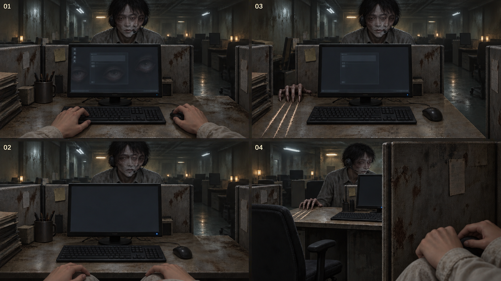

[完整圖說與操作對照](#h-0603-687) · [圖像目錄](../09_劇本/09-14_全劇本與關卡整合稿.md#book-illustrations)

<a id="fig-v09"></a>

##### V09｜阿尋查證與完成傳輸

**適用與限制：**阿尋的十一視窗、99% 狀態、返回查證與完成傳輸；三來源核對後仍要在安全空檔主動提交。

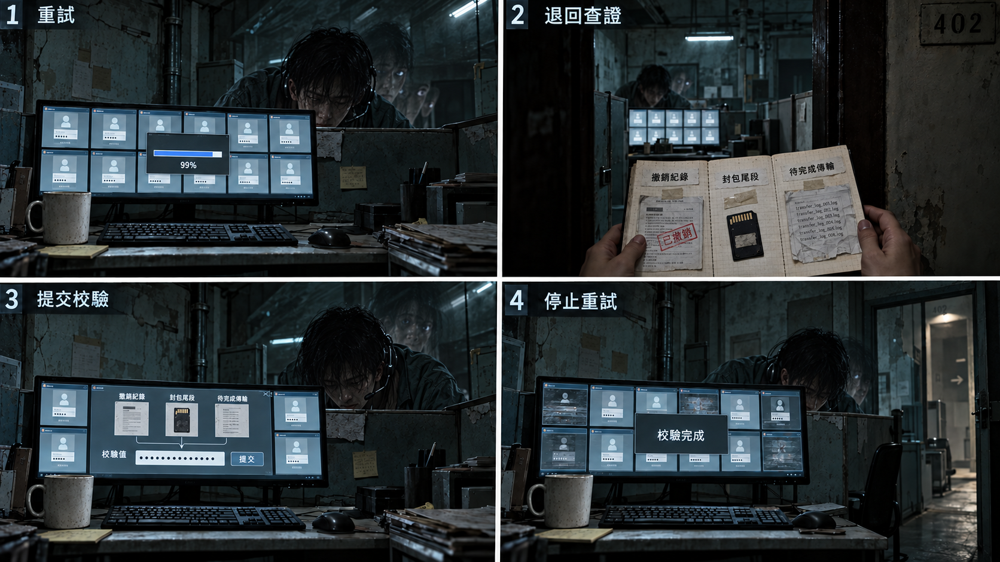

[完整圖說與操作對照](../09_劇本/09-15_正式劇本_共用附錄.md#h-0408-385) · [圖像目錄](../09_劇本/09-14_全劇本與關卡整合稿.md#book-illustrations)

<a id="fig-v10"></a>

##### V10｜阿尋兩招與防禦

**適用與限制：**凝視與桌沿敲擊的兩招防禦；成功才有完整六秒空檔，命中不保留未提交操作。

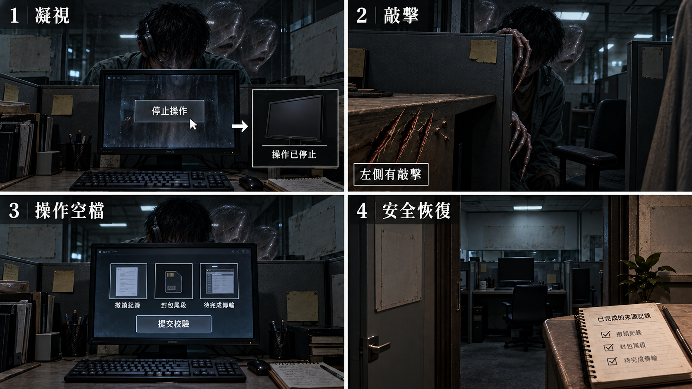

[完整圖說與操作對照](../09_劇本/09-15_正式劇本_共用附錄.md#h-0412-211) · [圖像目錄](../09_劇本/09-14_全劇本與關卡整合稿.md#book-illustrations)

<a id="node-r11-exit"></a>

#### 離場通路與次場景

<a id="s-0603-36"></a>

<!-- import:s-0603-36:begin -->
<a id="transition-r11-r12"></a>
##### T-R11-R12 · 跨層維修梯

沿用 R11 → R12 單向跨幕連線，位於第二幕離幕提交後、第三幕房內入場前。演出見[通路正文](../09_劇本/09-05_正式劇本_第二幕.md#transition-r11-r12-script)，保存依[通路共用規則](../09_劇本/09-15_正式劇本_共用附錄.md#transition-rules)。

| 鏡位 | 空間與可操作出口 | 生活痕跡與聲音 |
| --- | --- | --- |
| A：產線服務梯下段 | 15F–20F 產線服務門後開始上行；保留已驗證門端與關門方向，出口只往上。 | 舊扶手、水管與修補牆面；關門後鍵盤聲衰減。 |
| B：封閉樓段中繼平台 | 21F–27F 取一處代表平台；焊住的側門不是可修復出口，上行梯段始終可辨。省略段以過梁遮擋串接，不逐層強制停靠。 | 舊樓層標牌與後加封閉告示；管線從封閉側門旁繼續向上。 |
| C：技術區後勤平台 | 到達 28F–31F 的 R12 門側；扶手延續至來路，前方唯一可進入口是回收修理舖。 | 維修用途的線槽、管道和設備接點聲；不提前亮起 R12 工作燈。 |

**開通與不可逆點：**必須先完成阿尋必要校驗、`arc.ahsun.scope_confirmed`、幕尾 K1-01 與現場第一鑰匙門端驗證，再顯示原 ACT2-03 離幕確認。選「留在產線」仍在 R11；選「繼續」才原子保存原離幕狀態及通路進度並進入 A。後續不以近看、走滿三鏡位或重驗鑰匙增加門檻，也不因讀檔撤銷已確認的單向離幕。

**空間與未開放樓層：**上述數字標示樓段範圍，灰盒再確定入口與平台所在的單一樓層；需依實際高差安排被省略的上行段，不把 15F–20F 當成同一層。不開放 21F–27F 搜索，近看僅說明「側門已焊封；維修梯仍向上延伸」。此段不觸發鬼打牆，不用重複平台或瞬間改號暗示超自然事件。

**節奏與交付：**首次不含近看的目標通行長度約 15–22 秒，非強制停留；新增 3 個過渡構圖，列入[通路資產追加表](../09_劇本/09-15_正式劇本_共用附錄.md#transition-assets)。明確入口、扶手和剪接方向代替長時間爬梯操作；第三幕不再完整重播本段。

**驗收：**缺任一原條件都不能進 A；取消離幕仍可依原規則回查第二幕。A／B／C 各自讀檔不可返回產線、重發 K1-01、重播門端驗證，亦不可預先提交 `act3.r12.breaker_repaired`、櫃權限或本幕證據；只在正式到達 R12 後觸發其入場演出。
<!-- import:s-0603-36:end -->

<!-- production-subscenes:r11 -->

<!-- scene-image-subscenes-r11:begin -->
<a id="subscenes-r11"></a>
#### 次場景節點

以下次場景歸 R11 管理，節點編號沿用主圖圖號。來去方向為原動線的正向排列；反向通行與單向限制依原門檻，不因列出來路就新增返回出口。

<a id="subscene-t-r11-r12-01-spec"></a>
##### T-R11-R12-01 · 產線服務梯下段

**類型：**可查看過渡。**正向連接：**R11-V01 → **T-R11-R12-01** → T-R11-R12-02。

**近看：**T-R11-R12-01-C01；關閉回 T-R11-R12-01。

[正文](../09_劇本/09-05_正式劇本_第二幕.md#subscene-t-r11-r12-01-script) · [圖像製作單](#node-r11-images) · [原門檻與回訪](#node-r11-nav) · [通路規格](#transition-r11-r12)

<a id="subscene-t-r11-r12-02-spec"></a>
##### T-R11-R12-02 · 21F–27F 中繼平台

**類型：**可查看過渡。**正向連接：**T-R11-R12-01 → **T-R11-R12-02** → T-R11-R12-03。

**近看：**T-R11-R12-02-C01；關閉回 T-R11-R12-02。

[正文](../09_劇本/09-05_正式劇本_第二幕.md#subscene-t-r11-r12-02-script) · [圖像製作單](#node-r11-images) · [原門檻與回訪](#node-r11-nav) · [通路規格](#transition-r11-r12)

<a id="subscene-t-r11-r12-03-spec"></a>
##### T-R11-R12-03 · 後勤上端平台

**類型：**可查看過渡。**正向連接：**T-R11-R12-02 → **T-R11-R12-03** → R12-V01。

**近看：**T-R11-R12-03-C01；關閉回 T-R11-R12-03。

[正文](../09_劇本/09-05_正式劇本_第二幕.md#subscene-t-r11-r12-03-script) · [圖像製作單](#node-r11-images) · [原門檻與回訪](#node-r11-nav) · [通路規格](#transition-r11-r12)
<!-- scene-image-subscenes-r11:end -->

<a id="spec-act-2-shared"></a>

### 跨場景共用規則

<a id="s-0603-13"></a>

<!-- import:s-0603-13:begin -->
<a id="h-0603-914"></a>

#### 第二幕：一起放走的那一隻

1. **R8 小帳近看**：在原乾布雙結夾頁保留一角「窗／紙」的日常註記。查看後可連到同頁已解鎖的關係記憶，不新增必收卡、專用技能或資源成本。
2. **記憶靜格**：維持原記憶入口，近景只見小花托紙、樂瑤扶住紙緣、蛾停在通往開窗的紙端；人物面孔不入鏡，蛾與手全程靜止。不把外部概念圖當同鏡位遊戲背景，也不新增歷史解凍。
3. **回到現在的記憶回聲**：小花：「這邊有縫。」樂瑤：「慢一點，我扶著。」標示為主角記得的對話，非現時指示；沒有生前錄音就不顯示錄音播放器。小帳只支持日常相處，不作逐字對話證據。
4. **R9 假窗**：沿用 HA-R9-01 帆布暗縫與簾聲，讓玩家在同樣的窗構圖前摸索到實牆；不另加蛾影、聲音或敵人。
5. **收束**：此段與 R8 兩下敲擊、操作示範互斥排程；先讓玩家讀完再離開，不三段連播。老周、阿尋、代班支線與安定點保持原有空間。
<!-- import:s-0603-13:end -->

<a id="s-0603-16"></a>

<!-- import:s-0603-16:begin -->
<a id="h-0603-942"></a>

#### 產線與生活區的靈異事件

沿用 [自發靈異規則](../09_劇本/09-15_正式劇本_共用附錄.md#doc-0401) 與 [節奏限制](../09_劇本/09-15_正式劇本_共用附錄.md#doc-0304)。A 為無代價氣氛，C 為既有遭遇前兆；每輪一次、低強度全域冷卻至少 90 秒，閱讀中不啟動，回到全景至少等 3 秒。既有事件的細化共用原旗標，不再播一次。秒數待原型驗證。

| 事件／類型 | 觸發與來源 | 畫面、聲音與時長 | 玩家行動／後果 |
| --- | --- | --- | --- |
| HA-R6-01／集體停工 A | H-03 本地工作階段查聽結束並掛斷；既有通電終端與當地殘響 | 掛斷瞬間沿用全排游標停住 2 秒，同時只抽掉隔間鍵盤殘響；風扇、雨聲與玩家操作聲繼續，隨後游標與鍵盤聲一起恢復。沒有錯拍或人影 | 可略過或離房；只是一段局部「所有人同時停工」的空缺，不做噤聲者全域靜默，不加結局權重 |
| HA-R7-01／工作節奏傳遞 A | 已讀手冊後首次從網咖方向進入產線主廊定點，停留 4 秒；老周遭遇尚未啟動 | 一次清喉嚨從近隔間傳到中、遠隔間，各次間隔約 2 秒，8 秒內退回底噪；全程空桌，不加袖口與人影 | 可沿既有路線前進或退回；聲音不跟隨游標、不透露正解。進入老周遭遇立即停止，不在留言或安息後重播 |
| HA-R8-01／動作錯位 A | 玩家主動點選有電剪輯終端的「本機操作示範」；不讀筆記開關或停留時間 | 舊示範游標完成一段固定點擊，長 2 秒，聲音晚 0.3 秒；這是新增 HA 中唯一以聲畫時間差為核心的事件 | 可查看來源或略過；不預知下一步、不讀筆記。未通電不提供播放，取消後不在離房補播 |
| HA-R9-01／空間不符 A | 已查看噴繪帆布並返回全景，未播放證據音檔 | 明明是牆的假窗後傳來一次拉窗簾聲；布面顯出窄縫般的主觀暗影，維持 3 秒後淡去 | 可重新查看，帆布後仍是牆；不新增通路或敵人，不展示被刪除的私密影像 |
| HA-R10-01／日常失序 A | 原 H-04 點燈同步條件成立；電子燈控制器通電 | 沿用原缺燈與換班節拍，只加控制器繼電器慢半拍的輕響；不新增熄燈數、不顯示神祇輪廓 | 可查看祈禱卡與管理章；異常指向管理系統，不使神壇成攻擊點，不給「已死亡」答案 |
| HA-R11-01／主動攻擊 C | 既有阿尋遭遇進入前兆 | 沿用 3 秒前兆、0.6 秒命中表現與 6 秒操作空檔；螢幕訊號與隔間邊緣提供可見危險提示，輪廓不撲近 | 停止終端操作並收起介面，或到遮蔽點。僅既有控制器判定一次；查證、存讀檔及失敗規則見對戰章。安定角落不啟動 |

R11 的椅子回訪差分只沿用原事件，不在安息餘波或安全角落重播。R8 人物物件與 R9 素材缺口仍先讓玩家看清楚，新增氣氛不得截斷閱讀或替受害者填補未證實影像。
<!-- import:s-0603-16:end -->

<a id="s-0603-22"></a>

<!-- import:s-0603-22:begin -->
<a id="h-0603-1128"></a>

#### SQ-S｜被剪掉的歌

R7 點歌單背面 SG-01、R8 剪接單 SG-02、R9 本地原始專案 SG-03，特殊收集與接點解謎後保存 B-A-C 播放清單，獎勵安全閱讀狀態的完整演唱與選單收藏。R9 原低功耗回路提供電力；不改小花卡片、老周安息或阿尋封包。R11 離幕出口只對已發現未完成者提示一次可回查，不攔主線。解法、故事與驗收見 [03-06 解謎獎賞支線](../09_劇本/09-15_正式劇本_共用附錄.md#doc-0306)。
<!-- import:s-0603-22:end -->

<a id="s-0603-26"></a>

<!-- import:s-0603-26:begin -->
<a id="h-0603-1146"></a>

#### 產線角色曲線

- R7：留言完成後，原遞紙條位置可免費翻看「水在下面。先喝。」與杯痕；選填 `arc.laozhou.note_seen`，不含逃生密碼或主角稱呼，收件方向在 R23 才確認。
- R8：R08_H06 小帳的工作桌草圖為主線放蛾旁可直接翻開的免費個人頁；`arc.xiaohua.workbench_seen` 只管回看台詞，不影響放蛾或結局門票。
- R11：在 R11_H06 送入校驗碼之前，同一終端提供 `PACKING_COMPARE`；左右對齊個人草稿與擴大名冊，標出真正改動後寫 `arc.ahsun.scope_confirmed`。此為必要校驗準備，通電後即有兩版快取，不依賴支線或未知身分揭露。通電終端的「查閱來源」從原安全入口直接可選，不檢查已讀旗標。若已觸發阿尋，先收起操作退至原入口，再選同一終端的唯讀來源頁；進入 SOURCE_READ 時暫停攻擊、播放與提交，玩家逐頁實讀才保存快取。比對可在此完成，也可離房用筆記整理已讀內容。返回安全全景不自動開校驗槽；主動選「恢復終端操作」才回 SIGNAL_GAMBIT，從保存招式的完整 3 秒前兆開始。取消、失焦與存讀不補讀、不結算安息、不免除既有代價；精簡抽屜仍不停表。

<a id="h-0603-1152"></a>

##### 動畫播放與互動契約

本章動畫分為過場、玩家驅動演出與現時局部循環。分鏡估算不是已完成素材或遊玩時長保證；實作先驗鏡位、前兆與操作，再精修材質。

共用規則見[對應條款](10-01_製作規格_序幕.md#s-0601-17)。
<!-- import:s-0603-26:end -->

<a id="s-0603-27"></a>

<!-- import:s-0603-27:begin -->
<a id="h-0603-1162"></a>

#### 城寨空間與構圖
<!-- import:s-0603-27:end -->

<a id="s-0603-28"></a>

<!-- import:s-0603-28:begin -->
<a id="h-0603-1166"></a>

#### 園區生活、聯絡與處置

R8 的凝固人物維持靜止，以鏡頭前後的物件和姿勢對照表現被迫演出，不新增「收笑、轉頭」歷史動畫。R9 求助頁屬 E2-15 的選填補充，免費閱讀，無新 E 編號、主線門檻、結局條件或新增支線；查得後才在後續摘要中出現。
<!-- import:s-0603-28:end -->

<a id="s-0603-32"></a>

<!-- import:s-0603-32:begin -->
<a id="h-0603-1188"></a>

#### 怨靈的互動回報

老周重在聽懂留言，阿尋重在中斷工作與桌側辨向；兩者完成後分別收束撥號與視窗同步，不重複同一消散鏡頭。完整聲畫收束見 [怨靈互動辨識與收束](../09_劇本/09-15_正式劇本_共用附錄.md#h-0412-185)。
<!-- import:s-0603-32:end -->

<a id="spec-act-2-references"></a>

### 跨場景圖解對照

<a id="s-0603-19"></a>

<!-- import:s-0603-19:begin -->
<a id="h-0603-977"></a>

#### 畫面與操作示意

> 圖稿供構圖參考，操作依本頁熱點規格：筆記關聯、凝神穩定度、有限實體干預與現場設備。正式圖稿須通過文字與畫面一致性驗收。

<a id="h-0603-981"></a>

##### R8：操作被預演

[查看圖解：第二幕：工作區的異常](#h-0603-1200)

同鏡位前後對照，焦點是玩家手動查閱剪輯終端既存的舊工作示範，畫面動作與聲音錯開。恐怖來自熟悉的操作，不依靠新怪物或設備讀取主觀筆記。

- 既定觸發：在通電剪輯終端選「回看工作示範」，播放本地既存的固定 2 秒片段。
- 本事件只發生一次，不改道具狀態，不扣穩定度；筆記開關不是觸發器。
- 若玩家未選示範，不在離房後補播點擊，也不強迫完成此選填事件。
- 不新增訊息、日期或身分揭露；正式回放使用固定舊檔，不錄取、模仿或預測本次玩家輸入。
- 場景物件依 R8：剪輯桌、記憶卡、提詞架、收據四瓣紙花；不把紙花做成詛咒或權限圖示。

動效依原本地示範：動作先行、點擊聲延後 0.3 秒，鏡位不推近。減少動態可用靜格與必要聲音字幕呈現同一差分，不追加人影。

<a id="h-0603-995"></a>

##### R6：自己的來電

[查看圖解：第二幕：工作區的異常](#h-0603-1200)

同一網咖視角展示舊來電快取的提示與查閱兩態。現場通電終端顯示既有工作階段編號及舊時間戳；編號不是目前離體主角的新工作階段，也不是來電者姓名。查閱、略過與停止使用現場終端，不新增錄音功能或即時通話。

- 觸發：完成一次裝置同步，或查看第三個撤銷帳號後，原本地快取入口可查。
- 播放舊快取時：風扇、販賣機、雨聲與鍵盤聲和現場相似，卻沒有主角呼吸、衣物與手指摩擦的近身聲；這是固定舊檔的差異，不是收錄當下。
- 停止查閱後：玻璃門後既有螢幕游標停住 2 秒，再恢復閃動；不接續追逐。
- 本幕保留快取、舊工作階段與遠端排程等讀法，不新增 SIM 或隨身手機。第六幕舊權限紀錄才將聲音連回過去內控席位。
- 略過或錯過不阻擋主線；字幕提供環境聲資訊，不替玩家指認來源。

<a id="h-0603-1007"></a>

##### 匯款單與帳號撤權

[查看圖解：第二幕：生活與犯罪痕跡](#h-0603-1213)

- **場景與操作：**R6 櫃台；查看收款人被劃掉、蓋「轉內部帳」章的家用匯款單。切到帳號清單，點選帳號顯示「聯絡權限已撤銷」。
- **資訊層級：**紙本與螢幕並列方便比對。48 個帳號中只有 3 個保留頭像；概念圖只顯示清單局部，頭像不可辨識，正式畫面不以清楚人臉強化衝擊。「素材·勿混用」文件夾留在背景。
- **畫面效果提案：**文件放大以約 0.25 秒緩移；撤權訊息淡入，保留原列位置，無警報閃紅、無交易成功效果。
- **證據邊界：**匯款單為選填 E1-08；不能直接推出人口買賣。帳號清單是呼喚者戰鬥的前置線索，不新增 E 編號；略過不擋主線，但敵人辨識描述保留模糊。

<a id="h-0603-1016"></a>

##### 收據紙花與雙欄小帳

[查看圖解：第二幕：生活與犯罪痕跡](#h-0603-1213)

- **場景與操作：**R8 工作桌；攤開未完成的收據紙花，看見背面的二手手機型號、進貨價、家用匯款小帳，以及旁邊修正過的中文介面欄位。
- **資訊層級：**先辨認紙花，再讀到帳目與詞彙。金額、型號與文字只取核定資料，不新增角色履歷事實。
- **畫面效果提案：**紙張約 0.6 秒展開，保留摺痕與部分花瓣；暖桌燈照到筆跡，遠處維持冷色工業照明。只有紙聲與環境底噪，不用神祕光效。
- **角色意義：**呈現小花來此之前的日常工作及返家打算，讓她觀察介面的能力有生活來源，不塑造成天才駭客。
- **實作條件：**選填角色旗標 `xiaohua.receipt_flower_seen`；不新增主線證據編號，不阻擋推進。

<a id="h-0603-1026"></a>

##### 素材索引的數量缺口

[查看圖解：第二幕：生活與犯罪痕跡](#h-0603-1213)

- **場景與操作：**到過 R8 後回訪 R9，查看布景帆布後的櫃子。將索引、實體卡標籤及同意書並列。
- **固定事實：**① 素材索引共 214 筆，每筆有作業編號、日期、時長與狀態；其中 17 筆狀態明記「已刪除」，保留刪除日期，操作者欄空白。② 實體儲存卡 197 張，卡標只作媒介盤點，與索引不是一筆一卡。③ 同意書附原始意願聯，兩聯同一作業／當事人代碼；原始本人填寫欄明記「不同意錄製及使用」，登記日期早於對應製作日期，後一張同意欄才被不同筆跡補簽。姓名遮蔽，不提供可回推身分資訊。
- **畫面效果提案：**每份文件約 0.2 秒滑入固定欄位；各盤點總數與明示刪除狀態用同樣字重呈現，不生成 214−197 的差額算式。筆跡局部可放大，但不使用真實姓名或可辨識簽名。
- **調查板固定結論：**「可確認素材被製作、部分被刪除、當事人未同意；無法確認內容。」不加角色 OS。
- **內容邊界：**這是強迫私密拍攝的文件表現；不顯示縮圖、馬賽克、身體或衣物暗示、音檔，也沒有找回 17 筆內容的解法。此用例不納入選填的空白處置流程表。
- **實作條件：**選填 E2-15，不占結局三格、不改變結局。摘要排版屬介面設計提案，並非新的原始文件內容。

<a id="h-0603-1037"></a>

##### 通報者外聯草稿

[查看圖解：第二幕：生活與犯罪痕跡](#h-0603-1213)

- **場景與操作：**R10；取得 E2-09 後，在祈願桌側放置發光棒，或用電子燈斜照，顯出桌側下方既有卡槽。抽出末行被撕去的草稿卡，桌體保持原位完整。
- **構圖範圍：**此用例聚焦卡槽與紙面；來源規格中的凝固手影停在「送出」之前，未完整納入這個特寫。背景的未按下按鈕只是狀態提示，不代表已成功送信。
- **畫面效果提案：**約 0.4 秒斜光過渡凸顯槽邊，抽卡時以紙聲回饋。多語草稿待正式文字核定，不生成可讀的假外語。收起卡片後依原規格呈現「換班—轉接—校正」燈序，第三拍缺一盞。
- **證據邊界：**E2-11 第一部分只支持曾試圖通報及疑似轉運日期，不揭露目的地或死亡原因。未取得 E2-09 時只呈現一般祈願紙，選填互動不阻擋主線。
- **後續限制：**不出現手術、器官或醫療圖像；第六幕疑似同意書也只能導向「未證實醫療剝削」，不能補成確定死因。

<a id="h-0603-1047"></a>

##### 白板的兩面

[查看圖解：第二幕：工作區的異常](#h-0603-1200)

- **初見：**普通辦公室看板，四欄手寫「建號／養／切／殺」，下方磁扣與編號。編號使用核定資料，不補寫新人物。
- **操作：**回訪或感知後翻面，同一塊白板背面顯示工作筆記：「3 號那隻還沒肥，再放兩週」「7 號的老公回來了，切」「11 號沒錢，丟掉」。取得選填 `E1-16`。
- **構圖：**遊戲一次只見看板其中一面，翻轉時物件數量保持不變，不加入正背面比較標題。
- **效果提案：**手動轉動白板、紙面與磁扣不增減；背面字跡平實可讀，不用威脅音效或紅色警告。
- **邊界：**無 OS，不解釋「牲口棚」與「那隻」的關聯；讓玩家自行連結，不演出成功誘騙過程。

<a id="h-0603-1057"></a>

##### 留存排行榜的第五欄

[查看圖解：第二幕：工作區的異常](#h-0603-1200)

- **操作：**直接查看排行榜殘留的編號與數值，再對照旁側班表同欄位；感知不能補回已被挖掉的名字。
- **固定五欄：**關係建立天數、情感依賴指數、首次匯款金額、複投次數、安靜度。最後一欄量的是坐在產線的人，前四欄量的是螢幕另一端的人。
- **回饋：**取得完整 `E1-06`；最低一列旁「缺水、延後校正」便條可感知追加選填 `E1-14`，與後續診所紀錄相接。此處為完整來源，與接待摘要分開。
- **聲音：**依原規格 OS：「他們不是在比誰賺得多。」停頓。「是在比誰還能撐多久。」不額外解釋混用兩類人的完整系統；第三幕再揭露。
- **效果提案：**保留原件破損與可讀 ID，不以感知恢復被刪資料；不加警示紅、遊戲積分或結局分數。

<a id="h-0603-1067"></a>

##### 停在「我」的對話

[查看圖解：第二幕：關係與回訪後果](#h-0603-1226)

- **觸發：**直接查看靠牆耳機，與已讀排行榜及隔間腳本／班表關聯後，長按凝神進入靜止記憶；不以點擊耳機直接略過線索門檻。
- **固定內容：**K-114 傳來「今天有點累。但想到你在，就還好。」輸入框只有「我」，游標停在同一位置，沒有回覆結尾。
- **操作邊界：**玩家不得完成或送出該對話。不提供送出功能，輸入框只讀；這不是可打字的聊天模擬器。
- **構圖範圍：**此用例聚焦螢幕、耳機及鍵盤；原場景無臉剪影坐在螢幕前、手停在鍵盤上方，未納入此特寫，不代表刪除此凝固角色。
- **蒐證：**話術腳本、快捷鍵表、撕掉的班表每次近看一項，回到同一凝固全景即可續查，不強迫退房。取得 `E1-07`；阿尋身分留至 R11 確認。
- **效果：**凝固內的人物、游標與所有設備畫面皆靜止。退出凝固後，現時另一台螢幕顯示「工作階段恢復：14 日前／錄製狀態：尚未結束」，不是錄下玩家剛才的操作。此張不呈現後續畫面。

<a id="h-0603-1078"></a>

##### 小花改過的腳本

[查看圖解：第二幕：關係與回訪後果](#h-0603-1226)

- **場景：**R8 提詞架，空工作椅前仍有暖補光燈，走廊冷青光形成對比；個人物件比工作器材更容易被注意。
- **固定文字：**分類「親切／可信／像家人」。情境列左欄「你什麼時候來見我」，右欄印刷「我會回來。」被鉛筆劃去，旁邊手寫「我會等你。」其餘內容不補寫可讀誘騙對話。
- **證據：**取得 `E2-01`，暫時只證明小花在視訊組工作，不證明死亡。
- **必需演出：**手寫修改處自動微推鏡或醒目標示 1.5 秒，不需操作、不加音效或提示文字。1.5 秒來自原規格，不是此處自行估計。
- **OS：**「她不是在說服別人。」停頓。「她在練習讓自己聽起來像沒事。」不解釋與 R20、R32 承諾的連線。
- **邊界：**只呈現製作裝置與紙本，不顯示被拍攝內容，也不讓任何角色或 UI 說破三段伏筆。

<a id="h-0603-1089"></a>

##### 祈禱卡背面的管理章

[查看圖解：第二幕：關係與回訪後果](#h-0603-1226)

- **操作：**翻卡查看灰色「已轉運」管理章，旁有日期、房號與被塗黑姓名。日期與房號只取核定資料。
- **前置理解：**先看過 R7「轉接校正」快捷鍵表，才注意相同方框符號；正式卡片符號須與快捷鍵表使用同一資產，方框不能另造新形狀或解答。
- **證據：**取得 `E2-09`。沒看快捷鍵表仍能拿卡，調查板保留一般標記的未解狀態，不阻擋取得。
- **效果：**合卡後點燈全熄 2 秒再恢復暖黃，不觸發戰鬥。此用例只呈現卡背讀取，熄燈不可誤接為翻卡前的強制狀態。
- **邊界：**管理章只表示轉運，不宣告死亡或具體目的地；與外聯草稿區分，此張是其前置管理章。

<a id="h-0603-1099"></a>

##### 畫面下緣的驗證紀錄

[查看圖解：第二幕：關係與回訪後果](#h-0603-1226)

- **觸發：**呼喚者對峙結束後，阿尋終端提供歷史 99% 稽核截圖；現時傳輸保持完成。對下緣做一次凝神查看，讀到 `AUTH_LOOP: CUT`，時間欄缺一位。
- **狀態區分：**99% 是殘留靜止畫面，不代表玩家已完成的校驗被撤銷或需要重做。這是選填歷史片段，不重做封包校驗。
- **證據：**取得 `E4-00-B`，描述「有人在那個時候切斷了某一條驗證迴路」。同持 A、B 且實際核對殘缺格式後，才可標「未定位 · 同一夜？」；兩片未比對維持「未定位」，僅此片時顯示「未定位 · 1」，不確認操作者是阿尋。已有 C／D 時依來源條件表保留各自資訊，不因補讀 B 覆蓋已知內容。
- **公平性：**完成阿尋必要校驗後可查看；本幕沒有抹除分支。未取得此選填片段不影響主線，不自行補上缺失時戳。
- **效果提案：**讀取以低亮感知紋理集中在狀態列；正式遊戲保留下緣小字位置，近看可放大閱讀，不把它變成全畫面警報。

<a id="h-0603-1109"></a>

##### 回訪時少一張椅子

[查看圖解：第二幕：關係與回訪後果](#h-0603-1226)

- **觸發：**完成 R11 呼喚者對戰後離房，再從相鄰 R9 或 R10 回來；R8 返程須經 R9。
- **前後差分：**三排座位中，靠牆座位旁多出空位；以鄰座椅子移除、桌與螢幕保留呈現。地上只留半截耳機線，不播放搬動動畫。
- **回訪證據：**已保存 `E2-03` 時，空位可與凝固畫面中未被拍進照片的人對齊；調查板新增未命名頭像，不宣告死亡。介面中不直接展示新增頭像。
- **恐怖拍點：**收起介面後，空位螢幕亮 1 秒，顯示「請輸入主管指令」後自動熄滅；下半部回訪畫面截取這一秒，並非常亮提示。
- **邊界：**不確認誰搬走設備，不增加敵人；主角真名仍不揭露。初訪／回訪標籤及分欄只供審稿。
- **實作提案：**以場景狀態差分載入空位，鏡位不變；保留玩家記錯座位或撤離搬運的可能，不安排人物起身或影子移動。
<!-- import:s-0603-19:end -->

<a id="s-0603-34"></a>

<!-- import:s-0603-34:begin -->
<a id="h-0603-1196"></a>

#### 圖解與操作對照

圖解按操作階段排列，個別用例的來源、數值與完成條件仍依本文件正文。概念分鏡不取代正式分層素材、動畫與遊戲實作驗收。

<a id="h-0603-1200"></a>

##### 圖解：第二幕：工作區的異常

[查看圖像：第二幕：工作區的異常](#fig-v19)

| 面板 | 畫面與操作 |
| --- | --- |
| 1 | 舊工作示範：玩家在本地終端選固定片段，畫面與點擊聲錯開 0.3 秒；不預演玩家下一個輸入。 |
| 2 | 自己的聲音：現場終端播放舊工作階段的既存快取，不是主角隨身來電或新錄音。 |
| 3 | 雙面白板：翻轉查看績效圖與手寫工作紀錄，旁側通路保持可辨。 |
| 4 | 第五欄：留存排行榜呈現管理與控制痕跡，不轉換成玩家分數。 |

**操作邊界：**鬼怪與環境主要、詐騙背景不蓋過遊玩；窗外只內井牆；無手機主角。

<a id="h-0603-1213"></a>

##### 圖解：第二幕：生活與犯罪痕跡

[查看圖像：第二幕：生活與犯罪痕跡](#fig-v20)

| 面板 | 畫面與操作 |
| --- | --- |
| 1 | 撤權結果：現場匯款單與帳號拒絕狀態相互核對，不能直接聯絡家人。 |
| 2 | 雙欄小帳：收據紙花、生活照顧與控制紀錄並置，保留人物的矛盾。 |
| 3 | 索引缺口：用已取得素材比對索引編排，缺口仍保留未知。 |
| 4 | 未寄草稿：供桌旁的外聯草稿保持未寄狀態，不因查看而自動上傳。 |

**操作邊界：**不暗示可任意聯絡家人；來源只現場查得；不把旁支變主線門票；不憑原件自動上傳。

<a id="h-0603-1226"></a>

##### 圖解：第二幕：關係與回訪後果

[查看圖像：第二幕：關係與回訪後果](#fig-v21)

| 面板 | 畫面與操作 |
| --- | --- |
| 1 | 未完對話：凝固畫面中的終端停在未送出的半句，人與游標都靜止，保留對話中斷的情感。 |
| 2 | 改過的腳本：紙上修改痕跡與紙花並置，讓小花的照顧與妥協都有具體依據。 |
| 3 | 分來源比對：祈禱卡的管理章與螢幕下緣驗證紀錄各自保留原件，不合成新的證明。 |
| 4 | 少一張椅子：回到同一位置察覺空缺，不將消失直接判為死亡。 |

**操作邊界：**不得提前魔化小花或揭封鎖；現場終端非手機；不把消失自動判死亡。

<a id="h-0603-1239"></a>

##### 圖解：現時放蛾與關係手勢

[查看圖像：現時放蛾與關係手勢](#fig-v41)

| 面板 | 畫面與操作 |
| --- | --- |
| 1 | 讀卡桌邊，紙墊覆住托盤並延伸到燈罩下；普通灰蛾停在紙緣，主角把紙扶到燈側形成短橋，露出托盤 |
| 2 | 主角移開擋住燈光的手，蛾仍自然停留 |
| 3 | 玩家鬆開紙緣，普通蛾離開紙，不飛向出口或引路 |
| 4 | 維修區兩下敲擊的紙緣與手部近景，呼應結尾沒有第二組回聲 |

**操作邊界：**前三格是R8現時操作不是歷史解凍；自然蛾不是小花分身；不見窗外天空；小花完整蛾形只R32揭露；不新增收集或獎賞。
<!-- import:s-0603-34:end -->

<a id="s-0603-20"></a>

<!-- import:s-0603-20:begin -->
<a id="h-0603-1120"></a>

#### 相關圖文

- [R7 老周雙解、R11 阿尋攻防與封包校驗](../09_劇本/09-15_正式劇本_共用附錄.md#doc-0408)
<!-- import:s-0603-20:end -->

<a id="spec-act-2-delivery"></a>

### 幕尾狀態與交付

<a id="s-0905-56"></a>

<!-- import:s-0905-56:begin -->
<a id="h-0905-708"></a>

#### 進入第三幕時的狀態

| 項目 | 承接 |
| --- | --- |
| 主線已知 | 工作、影像與生活被同一流程管理；尚未看懂意識數據完整用途，也未核驗主角職位 |
| 產線三格 | E1-15、完整 E1-06、E2-01／已解讀 E2-09 的實際使用結果 |
| 通路 | R8 實際讀卡、arc.ahsun.scope_confirmed、必要校驗、K1-01／S-03 本地使用均完成；moth.released 僅按實際動作保存 |
| 阿尋 | 外部可讀副本已保存；十一段聊天沒有被主角代答；是否取得姓名依已讀來源 |
| 老周 | 未處理、女兒路、舅舅路照實保存；不做不阻擋主線，不補另一路 |
| 小花 | 必要構圖已建立布結、修理桌願望與現時放蛾；照片、小帳、拒絕出鏡與關係記憶按實際查看保存 |
| 訊號 | #5／6／7／10／11／12／13 按來源核對與原取得條件保存；不自動補滿，#7 為資料校驗 |
| 選填人物與長線 | E1-07／08／14／16、E2-02／03／09／11／15、E4-00-B 按實際來源保存；E2-11 僅第一部分 |
| 支線 | SQ-C1、SQ-S 的來源、未完成狀態與完成成果分開；歌曲只有原本機／選單收藏可播放 |
| 資源與回訪 | 保留實際穩定度及 R11 安定使用狀態；R11→R12 單向，不能倒回 R6–R8 補訊號 |
<!-- import:s-0905-56:end -->

<a id="s-0905-57"></a>

<!-- import:s-0905-57:begin -->
<a id="h-0905-723"></a>

#### 本幕台詞清單（配音用）

> 以下按正文逐字發聲落點計 **30 行**：19 行既有來源文本、11 行新增待審；現時主角 OS 有 **11 行候選，單次最多 10 行**，幕尾兩句互斥。
> 歌詞四行依 03-06 暫定演唱文本列出，接點字句不能私改；不代表歌曲已正式錄製。#10 一行有四聲線版本，不以「一行」冒充一個音檔。新外語句須審校。
> 所有系統與文件字句均無聲；K-114、手寫承諾及匿名求助不算配音。笑聲、鈴聲、清喉嚨、多語底噪與未核字聊天另列素材，不據此估作零工時。

| # | 角色／來源 | 逐字台詞 | 位置 | 層級／來源 |
| ---: | --- | --- | --- | --- |
| 1 | 主角 OS | 他們下班後沒有地方去。所以這裡也算下班。 | R6-01 | 【鎖定】06-03 |
| 2 | 主角 OS | 不只我們一間。但每扇門，都不讓我過。 | R6-05 | 【鎖定】06-03 |
| 3 | 主角 OS | ……這不是話術。這是教材。 | R7-01b | 【鎖定】06-03 |
| 4 | 主角 OS | 他們不是在比誰賺得多。 | R7-02 | 【鎖定】06-03 |
| 5 | 主角 OS | 是在比誰還能撐多久。 | R7-02 | 【鎖定】06-03 |
| 6 | 女兒／歷史留言 | 爸，是我。 | R7-01 | 【新增】#6 逐字稿 |
| 7 | 女兒／歷史留言 | 剛才下班，想起你上次說的那個湯。 | R7-01 | 【新增】#6 逐字稿 |
| 8 | 女兒／歷史留言 | 我又煮鹹了。 | R7-01 | 【新增】#6 逐字稿 |
| 9 | 女兒／歷史留言 | 你回來再教我吧。 | R7-01 | 【新增】#6 逐字稿 |
| 10 | 女兒／歷史留言 | 聽到了，回我一下。 | R7-01 | 【新增】#6 逐字稿 |
| 11 | 四聲線素材 | 叫我舅舅就好。 | R7-01 | 【新增】#10 逐字稿 |
| 12 | 素材／中文版 | 今天過得好嗎？ | R7-04 | 【新增】#12 逐字稿 |
| 13 | 素材／越語版 | Hôm nay bạn thế nào? | R7-04 | 【新增】#12 逐字稿 |
| 14 | 素材／英語版 | How was your day? | R7-04 | 【新增】#12 逐字稿 |
| 15 | 主角 OS | 她不是在說服別人。 | R8-01 | 【鎖定】06-03 |
| 16 | 主角 OS | 她在練習讓自己聽起來像沒事。 | R8-01 | 【鎖定】06-03 |
| 17 | 小花／原錄音 | 不要把這段傳出去 | R8-02 | 【鎖定】06-03 |
| 18 | 小花／記憶回聲 | 這樣就認得路了 | R8-04 | 【鎖定字句】06-03；聲源歸屬待審 |
| 19 | 主角／記憶短句 | 她說，出去後想有張自己的修理桌 | R8-04 | 【鎖定】06-03；非現時 OS |
| 20 | 小花／記憶回聲 | 這邊有縫。 | R8-04a | 【鎖定】06-03 |
| 21 | 樂瑤／記憶回聲 | 慢一點，我扶著。 | R8-04a | 【鎖定】06-03；非現時 OS |
| 22 | 演出者／原錄音 | 今天工作好累喔 | R9-01 | 【鎖定】06-03 |
| 23 | 未具名成年演唱者 | 窗沿還留一格光 | R9-04 | 【鎖定接點文本】03-06 |
| 24 | 未具名成年演唱者 | 替我留到天微亮 | R9-04 | 【鎖定接點文本】03-06 |
| 25 | 未具名成年演唱者 | 名字寫在衣角上 | R9-04 | 【鎖定接點文本】03-06 |
| 26 | 未具名成年演唱者 | 明天還要自己唱 | R9-04 | 【鎖定接點文本】03-06 |
| 27 | 主角 OS | 他們把求平安的時間，也排進去了。 | R10-02 | 【鎖定】06-03 |
| 28 | 主角 OS | 他們把人分成工作、生活、信仰。最後每一欄都能換成一個號碼。 | ACT2-01 | 【鎖定】06-03 |
| 29 | 主角 OS | 他們把工作和生活分成一欄一欄。最後每一欄都能換成一個號碼。 | ACT2-01，與第 28 行互斥 | 【新增】未讀信仰管制來源分支，已同步 06-03 |
| 30 | 主角 OS | 最後那一欄，是拿來做什麼的？ | ACT2-01 | 【新增】與 06-03 同步；保留第三幕揭露 |
<!-- import:s-0905-57:end -->

<a id="s-0603-12"></a>

<!-- import:s-0603-12:begin -->
<a id="h-0603-902"></a>

#### 製作驗收

- [ ] R6–R11 各完成一張實景基底；R6、R7、R8、R10、R11 交付房間專屬感知資產，R9 只使用共用 Shader 與聲源標記，不製作整張感知圖。
- [ ] 阿尋必要校驗可由 R8 卡片尾段與 R11 本地兩版快取／99% 狀態推斷；未讀 R6 完整帳號名單仍能解，姓名辨識資訊維持較少。
- [ ] R10 神壇先呈現照護與生活，再出現「已轉運」管理章；不把信仰本身設計成敵人。
- [ ] R11 的雙層閃格能讓玩家確認「座位上的人不是主角」，但不能在第二幕直接揭露主角職位。
- [ ] 玩家完成三格鎖定後，能用一句話說出「這裡在賣感情，而生活服務也被接進產線」，但仍不知道意識數據的完整用途。
- [ ] 測試者離開第二幕時應能說出「他們騙的是**感情**，錢是後來的事」。若測試者只記得「這裡在詐騙」，代表 R7 的教戰手冊份量不足。
- [ ] R8 通過尺度自檢：任一張構圖拿掉敘事脈絡後，**不得**具有情色觀看價值；素材缺口不得出現縮圖、馬賽克或音訊。
- [ ] 至少一名測試者在看過 R7 白板背面後，能自己把「那隻」與第一幕的「牲口棚」接起來。若三名測試者都接不起來，加長白板翻面的停留，**不加旁白**。
- [ ] 從 R6 進入 R11 的主線時間以 50–70 分鐘為待測預算，已含必要回訪；選填回訪另記，不再加一次固定十五分鐘。
<!-- import:s-0603-12:end -->

<a id="s-0905-58"></a>

<!-- import:s-0905-58:begin -->
<a id="h-0905-762"></a>

#### 核對與待審

| 項目 | 本稿處理／仍需確認 |
| --- | --- |
| 第一幕承接 | 只有讀過 R7 分配聯才對到 R1 五個接收編號；不把受困者叫號當自願上工，也不按服從反應判定被騙或被綁 |
| 發聲 | 保留 9 個既有現時 OS；1 個幕尾互斥版本及 1 個接續疑問為新增待審，不增加單次台詞數；其餘新增填既定 #6／#10／#12 錄音位置。新離幕選項／提示為無聲文字 |
| 可略過內容 | 老周、R6 完整名單、照片人物補充、E1-07、E2-03、素材缺口與兩條支線不作離幕門檻；卡片尾段與照片取得分開 |
| 恐怖邊界 | 六個原 HA 各回原位置；R11 招式用原控制器輪替。R8 鏡像無聲無 OS，歷史人物全靜止，安定／閱讀不插嚇點 |
| E1-15 文件版式 | 已同步 06-03 與熱點表：印刷只列 01–05／S-03，貶稱僅在手寫批註與白板，不進正式印刷或 UI；未增加工作技巧內容 |
| E2-15 原件依據 | 已補逐筆刪除狀態、同案原始拒絕意願聯與日期鏈；214／197 只作各自盤點。未比對不先給合併結論，當事人結論不外推；文件資產仍須依欄值製作 |
| R11 校驗可玩性 | 已定 AX-17／v02／100／6C2A 對照，以及早觸發可進的 SOURCE_READ。S-03 服務測試與工作鎖構成開門因果；正式實作仍需測取消、讀檔、零穩定及先觸發後查證 |
| 版次與揭露 | 已同步取消 R8 的 E2-01／放蛾出口檢查；第三格仍為 E2-01／已解讀 E2-09 二選一。幕尾依信仰來源分流；第五欄的完整解釋留 R16 |
| 配音與素材 | 女兒五句須讀演成原定 17 秒；#10 四聲線、#12 外語及布結句說話者待審。十一頁聊天文字已補在 09-13，仍待審校與 UI 製作；歌曲、其他文件欄值與實際音檔不因本稿完成而視為交付 |
| 驗證範圍 | 本輪為劇本文字、來源、連結與資料同步檢查；尚未執行關卡原型、錄音、鏡位或遊玩時長測試 |

> 接續 [09-06 正式劇本 · 第三幕](../09_劇本/09-06_正式劇本_第三幕.md#doc-0906)，涵蓋 R12–R17，依 [06-04 第三幕 · 技術核心](10-04_製作規格_第三幕.md#doc-0604) 展開；本幕預留問題仍須由後續實際來源揭露，不預先當成已知答案。
<!-- import:s-0905-58:end -->

[總目錄](../09_劇本/09-14_全劇本與關卡整合稿.md#book-specs) · [本幕劇本](../09_劇本/09-05_正式劇本_第二幕.md#act-2) · [上一幕規格：第一幕](10-02_製作規格_第一幕.md#spec-act-1) · [下一幕規格：第三幕](10-04_製作規格_第三幕.md#spec-act-3) · [共用附錄](../09_劇本/09-15_正式劇本_共用附錄.md#book-appendices)
