# 製作規格：第三幕

[總目錄](../09_劇本/09-14_全劇本與關卡整合稿.md#book-specs) · [本幕劇本](../09_劇本/09-06_正式劇本_第三幕.md#act-3) · [上一幕規格：第二幕](10-03_製作規格_第二幕.md#spec-act-2) · [下一幕規格：第四幕](10-05_製作規格_第四幕.md#spec-act-4) · [共用附錄](../09_劇本/09-15_正式劇本_共用附錄.md#book-appendices)

[R12](#node-r12-spec)、[R13](#node-r13-spec)、[R14](#node-r14-spec)、[R15](#node-r15-spec)、[R16](#node-r16-spec)、[R17](#node-r17-spec)

<a id="spec-act-3"></a>

## 第三幕 · 技術核心：製作規格


玩家畫面與查證閱讀採[用語分層](../09_劇本/09-15_正式劇本_共用附錄.md#player-language)及[閱讀節奏](../09_劇本/09-15_正式劇本_共用附錄.md#reading-load)。下列技術識別碼、原始欄名與判定條件供製作使用，不整段顯示給玩家；白話呈現不改原來源、費用、門檻或存檔行為。

<!-- production:ordered:v1 -->

[本幕概覽](#spec-act-3-overview) · [場景流程](#spec-act-3-rooms) · [跨場景共用規則](#spec-act-3-shared) · [跨場景圖解](#spec-act-3-references) · [幕尾狀態與交付](#spec-act-3-delivery)

<a id="spec-act-3-overview"></a>

### 本幕概覽與前置

<a id="s-0604-0"></a>
<a id="doc-0604"></a>
<a id="s-0604-1"></a>

<!-- import:s-0604-1:begin -->
<a id="h-0604-1"></a>

#### 第三幕 · 技術核心 ACT III

> 「有人在後台，把每一個人的痛苦，變成一行數據。」

> Godot 4.x 的互動 ID、狀態鍵、三路供電差分、資產與驗收條件，詳見 [後勤與校正模組場景](../09_劇本/09-15_正式劇本_共用附錄.md#h-uppertech-947) · [管理層與釋放接點收尾場景](../09_劇本/09-15_正式劇本_共用附錄.md#h-uppertech-1585)。

本幕把「詐騙產線」推進成一套完整的控制系統。玩家會看見照護、物流、電力與資料不是互相獨立的部門，而是用同一組權限共同決定誰還能工作、誰要被送去校正、誰會從名單上消失。

<a id="act3-route-pacing"></a>

##### 探路與回訪節奏

| 階段 | 玩家所見與操作 | 保留的條件 |
| --- | --- | --- |
| R12 初訪分流 | 原門牌辨認同層診所、上行貨梯側路及仍扣住的巡檢服務口；筆記分列當前通路與玩家已發現的待查物件 | R13／R14 先後可選，R15 首次仍同時檢查診所安息與物流繼電器；不顯示未到房名、未知收藏或正解箭頭 |
| 部分供電回 R12 | R16 門端指出辦公室繼電器；沿本人已走通的 R16↔R15 及 R13／R14 支路回到原工作檯，親手切換繼電器，再回 R16 | 只做這次新增的切電；R12 接頭、R14 接線、R15 選擇與 L1 踏板完成態保留，不恢復捨棄暫存 |
| L-04 首次誤路 | R17→R14 四個下行次場景照常走完，依實際樓層與標籤認出物流間 | 不是瞬移、封鎖或快速旅行；R14→R15→R16→R17 仍沿原連線返回，日期鏈由玩家重新核對 |
| 已開路重走 | 通過驗證的每一段可選「沿已開路返回」或「逐景查看」，沿相同地標短切鏡接回原房 | 僅省略重走；SQ-T 未完成不列服務捷徑，L-04 不列成雙向返回路 |

**省略通行的逐段驗證：**起訖均已到訪、實際走通該支路、`transition_seen` 及該段必要 `route_local.*.open`／機關到位狀態皆成立；當前門禁、方向、供電及安全條件有效。待處理一次性事件、鎖場或封路使該段改用正常通行或保持封閉。不是新增 R16↔R12、R14↔R17 直連邊；出發及抵達前都重驗，抵達照常執行原入場與回訪差分。取消或讀檔回最後有效安全落腳點，不重解已完成機關，也不授予尚未抵達房間的成果。

**驗收：**三種供電各測零選填、一般探索、完整收集；部分供電再測經 R13、經 R14、已完成／未完成 SQ-T 的回接。兩端到訪但未走中間支路、尚缺局部 open、回訪事件待播、封路及存讀中斷均不得快速通行。L-04 首次走完整段，回程可縮短已驗證路段，缺日期來源仍不能開 C-02；同一誤配不再觸發第二趟強制迴路。首次探路時間與重走時間分開記錄。

<a id="act3-reading-beats"></a>

##### 核心與檔案的閱讀節拍

| 場段 | 當下查的問題 | 自主換氣與成果 |
| --- | --- | --- |
| R16-D01 | 圖表算的是誰？ | 玩家核對識別碼與指標；讀完可回機櫃通道，不自動彈出分流頁 |
| R16-D02 | 數字最後變成什麼處置？ | 原門檻、核可與已執行回執並置；保留 R13 影本回查，關閉後接回同一控制台 |
| R16-D03／D04 | 螢幕另一側是否也被同樣分類？誰能核可？ | 玩家自行走近第三機櫃並開頁；完成原核對後再自行開調查板，不串成連續文件過場 |
| R17 三個區域 | 服務門接到哪個接收端？撤離時改接哪組？震損後哪條仍可用？ | 入園殘頁、辦公室備忘、中繼自檢各解一段；安全全景仍看得見三處位置，來源不互相代填 |

以上是原件的閱讀焦點，不新增三次提交、必讀題目或正解提示。R16 的 E2-04／E2-05／E2-14 三格仍由玩家放置並確認；E2-05 的原回執核對、管理權限摘要及原出口要求均保留。完成只顯一則「兩份評級，用的是同一套規則。」及原鎖定結論，不再連播三則系統確認；後續「你想起了一個操作」仍留在玩家開舊操作索引時。技術上的第二層鎖定及本地憑據取得不變。

閱讀器沿既有保存機制記原頁、已核欄位與調查板草稿；關閉或讀檔不代發來源、不自動開下一頁。R17 的待查問題只在實際看到 32-S／N-2 後出現，讀到改接來源後更新既有筆記，不重置已讀或先顯 RT-3／C-02；自由查看順序保留。所有回全景均可立即繼續，沒有最低停留時間；鏡像及風扇仍按原觸發、一次性與閱讀安全規則。
<!-- import:s-0604-1:end -->

<a id="s-0906-0"></a>
<a id="s-0906-57"></a>
<a id="h-0906-624"></a>
<a id="s-0906-1"></a>

<!-- import:s-0906-1:begin -->
<a id="h-0906-1"></a>

#### 遊戲劇本 · 第三幕 ACT III · 技術核心

> **房間、證據與操作以 [06-04](#doc-0604) 為準**；現場設備、選填訊號及權限反擊分別依 [04-04](../09_劇本/09-15_正式劇本_共用附錄.md#doc-0404)、[04-08](../09_劇本/09-15_正式劇本_共用附錄.md#doc-0408)、[04-11](../09_劇本/09-15_正式劇本_共用附錄.md#doc-0411)。本稿不新增房間、敵人、證據編號或主線門檻。
> 既有逐字文本標【鎖定】；本次補寫標【新增】。第二幕尚待審的 #12 三語稿標【沿用待審】，不是已交付音檔。E-04 統一為原件核對後另存註記；#14 保留索引編號，僅收錄鍵盤文字，不合成人聲或另加播放門檻。

| 項目 | 內容 |
| --- | --- |
| 區域 | R12–R13 位於 23F 修理與照護區；R14–R15 位於 27F 搬運與供電區；R16 在 31F，R17 在 32F |
| 當下目標 | 恢復設備，辨認能通行的維修路線，查看外聯設備是否還能求援 |
| 本幕進展 | 確認同一組管理欄位評估螢幕兩側的人及停藥已執行；允許猜到主角與管理層有關，追問她經手與知情的程度，不在此核驗真名 |
| 預估 | 重分層前主線基準 55–75 分鐘，含必要回訪；現版待灰盒重測。首次探路、已開路重走及選填分項記錄，不以額外等待補足最低時數 |
| 必要操作 | R12 局部配電、R13 叫號與照護註記、R14 物流繼電器、R15 三選一供電、R16 第二層三格、R17 檔案與日期對齊 |
| 選填 | E-11 回應、E-04 案件、E-06、人物附頁、七分鐘歷史頁、SQ-T、SQ-M1、KX-01 與 E-02 路線核對 |
| 感官主軸 | 金屬與樓體振動；同一種繼電器聲可以來自機器，也可以來自藥櫃 |
| 明確邊界 | 不新增追逐；歷史人物保持靜止；不提前交代完整逃跑夜、救援結果或小花封鎖 |

〔製作〕身分猜測與正式證實分開：不把「系統還沒顯示姓名」當作必然的懸念。到本幕可以猜到主角接近管理層；後續壓力落在她究竟核可過什麼、知道多少，以及小花為何信任她。原件不足之處保持未知，不新增否認台詞拖延，也不提前合併人物卡。

（鏡位切換）沿第二幕服務梯接入 R12，扶手與管線連續。門在身後退回原位置；玩家不能倒回 R11 補訊號。
〔玩家〕承接實際穩定度、恐慌及已讀來源，不補 #12／#13，不重置成建議值。穩定度上限 100；本幕 R15 的一次 +25 安定獨立使用。
〔環境〕無配樂。電機、貨梯、叫號與錄音都有當地來源；無電設備不因戲劇需要自行運轉。
〔排程〕沿原 HA 密度與互斥規則。完整閱讀、凝固近看、必要台詞、供電操作及安定期間不插嚇點；回全景至少留 3 秒。兩次鏡像無專屬音效與 OS，不與其他異常連播。
〔製作〕以下依房間分節，不表示強迫線性收集。R13／R14 可交換先後；R15 首次入口仍同時檢查診所安息與物流繼電器。

---
<!-- import:s-0906-1:end -->

<a id="s-0604-3"></a>

<!-- import:s-0604-3:begin -->
<a id="h-0604-22"></a>

#### 00 — 本幕概覽

| 項目 | 規格 |
| --- | --- |
| 區域 | 23F 設備修理與診所；27F 貨梯與發電機；31F 伺服器；32F 管理辦公室 |
| 房間 | R12–R17，共 6 房 |
| 預估時長 | 主線 55–75 分鐘；選填死因線另計 |
| 玩法比重（灰盒目標，尚未實測） | 探索 45%／推理 40%／訊號對峙 15% |
| 本幕揭露 | 第二層：同一組欄位同時評估螢幕兩側的人；內控主管是**兩種**篩選器——決定樓裡誰被送去校正，也決定螢幕另一端誰因為沒錢而被結案 |
| 必要證據 | `E2-04`、`E2-05`、`E2-06`、**`E2-14` 客戶分級表**、`E3-03`、`E3-06`、`E3-07` |
| 選填證據 | `E2-07`、`E2-08`、`E2-12`、`E2-13`、`E3-04`、`E3-05`、`E3-08` |
| 對峙 | **E-11 必經遭遇（回應可選、可離房）與 E-07 必要訊號安息**；E-06 一次選填對峙；全面供電可追加一個低壓迴聲 |
| 出口 | 完成第二層三格鎖定與檔案對齊，取得 `K2-01` 校正區鑰匙 |

<a id="h-0604-36"></a>

##### 玩家在本幕必須完成的理解

1. 園區不是在「記錄」受困者，而是在以數據預測誰值得繼續利用——**而「誰」同時包含螢幕兩側的人**。
2. 診療、供電、貨運與校正共用同一套管理權限。
3. 主角對系統過度熟悉，舊操作記憶先給出可重看的順序，再由玩家親手完成定向供電。
4. 核對殘缺求援標頭的歷史收件日期與較晚震損自檢；收件、設備受損與人是否獲救是不同事實。

<a id="h-0604-43"></a>

##### 流程

```text
[R12] 設備修理與藥品櫃
   │ 找到共用權限與電房維修單
   ▼
[R13] 非法診所 ─────── [R14] 貨梯轉接間
   │ E2-07／E2-13          │ E2-08／E2-12／H-05
   └──────────┬───────────┘
              ▼
        [R15] 發電機房
        │ 部分／全面／定向供電
              ▼
        [R16] 技術核心
        │ E2-04＋E2-05＋E2-14 → 第二層鎖定
              ▼
 [R17] 檔案區＋康辦公室＋外部中繼
        │ 檔案對齊、震損自檢、K2-01
              ▼
           第四幕
```

---
<!-- import:s-0604-3:end -->

<a id="s-0604-2"></a>

<!-- import:s-0604-2:begin -->
<a id="h-0604-10"></a>

#### 本幕逃生計畫

| 階段 | 玩家處境與行動 |
| --- | --- |
| 當下打算 | 恢復設備，找到仍可通行的維修路線。 |
| 看得見的阻礙 | 供電中斷、路徑資料錯置；R17 的外聯設備尚不能帶來即時救援。 |
| 解謎／躲避／擊退 | 完成原線路、E-07 必要回應與供電選擇；核對原管理欄位和震損日期來辨認有效路徑。 |
| 可驗證的進展 | R15 復電使既定設備可用；R17 正確日期與 K2-01 指向 R18，錯配仍只繞回 R14。 |
| 已查明後的短提示 | 「設備恢復了，路還不一定通。先把通道紀錄對清楚。」 |

共用規則見[對應條款](10-01_製作規格_序幕.md#s-0601-2)。
本幕玩法重點是本地供電、路線取捨與日期驗證；高恐慌殘影只提供可查證的不安，不改正路來源。逐節點操作見[全程玩法對照](../09_劇本/09-15_正式劇本_共用附錄.md#core-gameplay-nodes)。

<!-- import:s-0604-2:end -->

<a id="s-0604-21"></a>

<!-- import:s-0604-21:begin -->
<a id="h-0604-899"></a>

#### 節點導覽
<!-- import:s-0604-21:end -->

<!-- scene-image-routes-3:begin -->
<a id="image-routes-act-3"></a>

### 本幕連線與接景圖

每條既有動線均指定畫面。兩端接景使用已列主圖與門框遮擋，不另造中間房；出口接景必須交指定鏡位，動畫及低動態版共用定位。後果演出不開放探索。進入條件與回訪仍依原動線表，圖號不是通行權限。

| 原動線 | 接景方式 | 畫面節點／圖號 | 操作與條件來源 |
| --- | --- | --- | --- |
| R12→R13 | 兩端接景 | [R12-V01](#node-r12-images) → [R13-V01](#node-r13-images) | [門檻、方向與回訪](#node-r12-nav) |
| R12→R14 | 逐層探索 | [T-R12-R14-01](#subscene-t-r12-r14-01-spec) → [T-R12-R14-02](#subscene-t-r12-r14-02-spec) → [T-R12-R14-03](#subscene-t-r12-r14-03-spec) | [門檻、方向與回訪](#node-r12-nav) |
| R13→R14 | 逐鏡過渡 | [T-R13-R14-01](#subscene-t-r13-r14-01-spec) → [T-R13-R14-02](#subscene-t-r13-r14-02-spec) → [T-R13-R14-03](#subscene-t-r13-r14-03-spec) | [門檻、方向與回訪](#node-r13-nav) |
| R13→R15 | 逐鏡過渡 | [T-R13-R15-01](#subscene-t-r13-r15-01-spec) → [T-R13-R15-02](#subscene-t-r13-r15-02-spec) → [T-R13-R15-03](#subscene-t-r13-r15-03-spec) | [門檻、方向與回訪](#node-r13-nav) |
| R14→R15 | 出口接景 | [R14-V02](#subscene-r14-v02-spec) | [門檻、方向與回訪](#node-r14-nav) |
| R15→R16 | 逐層探索 | [T-R15-R16-01](#subscene-t-r15-r16-01-spec) → [T-R15-R16-02](#subscene-t-r15-r16-02-spec) → [T-R15-R16-03](#subscene-t-r15-r16-03-spec) → [T-R15-R16-04](#subscene-t-r15-r16-04-spec) → [T-R15-R16-05](#subscene-t-r15-r16-05-spec) → [T-R15-R16-06](#subscene-t-r15-r16-06-spec) | [門檻、方向與回訪](#node-r15-nav) |
| R16→R17 | 出口接景 | [R16-V02](#subscene-r16-v02-spec) | [門檻、方向與回訪](#node-r16-nav) |
| R12→R15 | 逐鏡過渡 | [T-R12-R15-01](#subscene-t-r12-r15-01-spec) → [T-R12-R15-02](#subscene-t-r12-r15-02-spec) → [T-R12-R15-03](#subscene-t-r12-r15-03-spec) | [門檻、方向與回訪](#node-r12-nav) |
| R17→R14 | 逐鏡過渡 | [T-R17-R14-01](#subscene-t-r17-r14-01-spec) → [T-R17-R14-02](#subscene-t-r17-r14-02-spec) → [T-R17-R14-03](#subscene-t-r17-r14-03-spec) → [T-R17-R14-04](#subscene-t-r17-r14-04-spec) | [門檻、方向與回訪](#node-r17-nav) |
| R17→R18 | 逐層探索 | [T-R17-R18-01](#subscene-t-r17-r18-01-spec) → [T-R17-R18-02](#subscene-t-r17-r18-02-spec) → [T-R17-R18-03](#subscene-t-r17-r18-03-spec) → [T-R17-R18-04](#subscene-t-r17-r18-04-spec) | [門檻、方向與回訪](#node-r17-nav) |
<!-- scene-image-routes-3:end -->

<a id="spec-act-3-rooms"></a>

### 依流程逐場景製作

<a id="node-r12-spec"></a>

### R12 · 設備修理與藥品櫃

[正式場次](../09_劇本/09-06_正式劇本_第三幕.md#node-r12-script)

[進場與動線](#node-r12-nav) · [出入口位置](#node-r12-access) · [操作與解謎](#node-r12-level) · [狀態與驗收](#node-r12-pack) · [圖像製作單](#node-r12-images) · [離場與次場景](#node-r12-exit)

<a id="node-r12-nav"></a>

**進出、動線與回訪**

<a id="s-0609-25"></a>

<!-- import:s-0609-25:begin -->
<a id="h-0609-226"></a>

#### R12 設備修理與藥品櫃

進行目的：辨認後勤分岔與設備線路；共用權限、電房與斷藥線索

支線／收集：SQ-T 巡檢 PT-01

房內順序：比對回收接頭並接妥局部配電 → 完成原本地權限；E-11 雙回應為選填，可離開後章內回訪 → 前往已開放的 R13／R14

| 方向 | 類型 | 可移動條件 | 移動演出提案 | 回訪規則 |
| --- | --- | --- | --- | --- |
| R11 → R12 | 跨幕 | 阿尋必要校驗、arc.ahsun.scope_confirmed 與幕尾 K1-01 成立，再完成現場第一鑰匙門端驗證；SQ-C1／SQ-S 不擋主線 | T-R11-R12：從 B 棟 15F 上半層逐層經 16F、17F、18F、19F、20F、21F，在 22F 停妥打包機後跨回 A 棟 22F，再上 A 棟 23F R12；原逐層操作與單向幕界保留。 | 單向流程；不代表可沿此線倒退 |
| R12 ↔ R13 | 分岔 | R12 配電接妥並通過本地權限，才可進診所；E-07 安息是診所後門／往 R15 的條件，不是進房條件 | 穿過貼有舊門牌的診所入口，跨入原住宅廚房地磚區；修理桌聲退到門後。 | 章內回訪；遇鎖場、追逐或封路停用 |
| R12 ↔ R14 | 分岔 | R12 配電接妥並通過本地權限；可先到貨梯轉接間，往 R15 前仍須完成 E-07 安息 | T-R12-R14：由 A 棟 23F R12 經 A 棟 24F、25F，於 26F 依本路門檻穿過分道接駁廊到 B 棟 26F，再沿短梯進 B 棟 27F R14；各分道以實體隔網分開，不能橫切跳過門禁。 | 章內回訪；遇鎖場、追逐或封路停用 |
| R12 ↔ R15 | 捷徑 | SQ-T 完成、R12–R15 均已到訪、E2-06 已成立；不恢復犧牲紀錄 | T-R12-R15：由 A 棟 23F R12 經 A 棟 24F、25F，於 26F 依本路門檻穿過分道接駁廊到 B 棟 26F，再沿短梯進 B 棟 27F R15；各分道以實體隔網分開，不能橫切跳過門禁。 | 章內回訪；遇鎖場、追逐或封路停用 |
<!-- import:s-0609-25:end -->
<!-- navigation:r12:end -->

<a id="node-r12-access"></a>
#### 主場景出入口

<!-- scene-access:R12:begin -->
| 動線 | 顯示名稱 | 畫面位置與辨識物 | 通行狀態 |
| --- | --- | --- | --- |
| R11→R12 | 來路：後勤平台門 | 23F 門端，來路可辨22F 打包機後側跨棟橋的連續扶手及固定梯口；起點房在 15F 上半層平台，不把兩端畫成同層相鄰門。 | 單向承接 R11，不提供倒退回產線的操作。 |
| R12↔R13 | 出口：診所舊門 | 修理桌外側貼著舊門牌的診所入口，門後延續住宅廚房地磚。 | 本房配電接妥並通過本地權限後可進 R13 及返回；不用先在未進入的診所完成安息。 |
| R12↔R14 | 出口：鋼平台門 | 23F 門端，去路可辨24F 焊封中繼平台的連續扶手及固定梯口；目的房在 27F，不把兩端畫成同層相鄰門。 | 同樣須完成本房配電及本地權限；沿鋼平台到 R14，可往返。 |
| R12↔R15 | 後開捷徑：低負荷門扣 | 23F 門端，去路可辨24F 回程閥箱外廊的連續扶手及固定梯口；目的房在 27F，不把兩端畫成同層相鄰門。 | 兩端都已到訪、取得供電證據並完成維修支線後才開放；俯身經窄服務道到 R15，不是初訪第三條捷徑。 |
<!-- scene-access:R12:end -->

<!-- access-layout:R12:begin -->
<a id="node-r12-access-layout"></a>
##### 出入口配置草圖

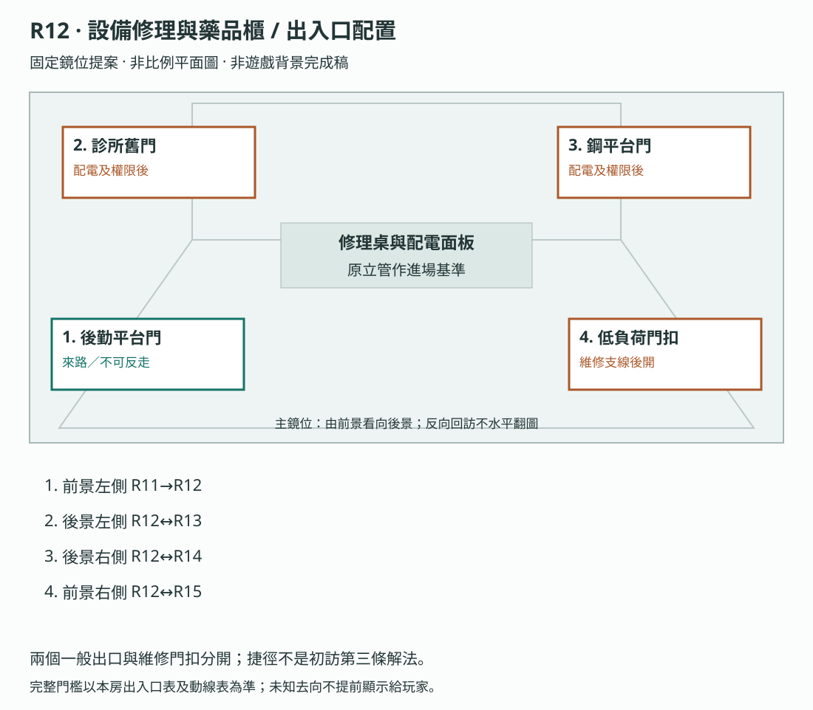

**構圖提案：**兩個一般出口與維修門扣分開；捷徑不是初訪第三條解法。 各門端位置對應上表；數字只供製作辨識，不是玩家介面或解謎提示。

門框、視線及熱區仍須灰盒驗收，依[共用契約](../09_劇本/09-15_正式劇本_共用附錄.md#scene-access-contract)，不計入遊戲圖像交付數。
<!-- access-layout:R12:end -->

**演出限制與製作註記**

<a id="s-0906-2"></a>

<!-- import:s-0906-2:begin -->
<a id="h-0906-28"></a>

#### 演出限制

> 前一節點：R11（不能倒退）　後一節點：R13／R14
> 當下打算：先讓這一層的門與終端能用。
<!-- import:s-0906-2:end -->

<a id="node-r12-level"></a>

**關卡、解謎與失敗回饋**

<a id="s-0604-4"></a>

<!-- import:s-0604-4:begin -->
<a id="h-0604-67"></a>

#### R12 — 設備修理與藥品櫃

<a id="h-0604-69"></a>

##### R12 空間與畫面製作定位

| 項目 | 畫面與製作要求 |
| --- | --- |
| 樓層定位 | 23F |
| 樓棟定位 | A 棟 |
| 樓層與環境 | 23F 修理與照護區，與 R13 同層；一般鋼平台經 24F、25F、26F 到 27F 貨梯，後開服務路亦逐層對位。 原光源、材質與證據焦點依本房規格。 |
| 入口方向 | 由 R11 承接；以來路門框／扶手作背向定位，前進方向依下列出口地標。左右方位沿既有構圖，不將反向回訪鏡頭誤當另一扇門。 |
| 可見出口 | 診所舊門牌通 R13，鋼平台通 R14；服務捷徑另標 R15。首次全景就交代入口輪廓或可查看的遮擋，不靠無標示的畫外點擊換房。 |
| 阻擋與開放條件 | 往 R13／R14：R12 局部回路修復且本地權限核驗完成後開放，可任選調查順序；E-07 安息與物流繼電器共同約束前往 R15，不倒設為進入 R13 的前置；往 R15：SQ-T 完成、R12–R15 均已到訪、E2-06 已成立；不恢復犧牲紀錄 |
| 畫面中的解謎要素 | 配電與權限物件；巡檢捷徑的門扣可見但未完成前不可通行。關鍵標記可近看，與裝飾物有可辨的材質或輪廓差異，不只靠顏色或聲音。 |
| 完成後變化 | 配電接妥與本地權限通過後顯示設備供電及門端狀態，開放既定診所／貨梯路線；R15 巡檢捷徑另依支線與到訪條件，不代做診所安息。 |

<a id="h-0604-82"></a>

##### R12 製作流程

<a id="h-0604-84"></a>

###### R12 回收零件與局部配電

原配電盤缺少一個可插拔的低壓接頭，旁邊拆機盒保留一個圓口與兩個方口候選件，其中一個方口卡榫破裂。玩家在斷電近看中對照端型、卡榫方向與「低壓」標記，選取匹配接頭、壓入原插接處，再完成原門禁回路／低壓回路連接。端型與文字雙重可辨，不只靠顏色；破損件顯示裂口，錯件無法入座並可重選，不電擊、不耗資源。

候選件與插口在 R12-C01 同一近看並置；點選候選件即可在插口旁查看，拖曳只是替代操作。這是以現場特徵排除不合零件，不以營運助理背景授予電路知識或自動配對。查看不記完成，沿原接妥確認才提交；原「接上回路」具體呈現為兩路配接，不另疊通關考題、計時或素材 ID。

零件只在本熱點托盤內操作，不加入可丟棄背包。離開近看前未提交，零件回托盤；提交時與 `act3.r12.breaker_repaired` 一起保存，已修復的存檔直接顯示配電完成。其後的本地權限核驗另記 `act3.r12.local_access_verified`；這是原核驗步驟的完成狀態，不另加一道考題。E-11 喚醒與 R15 供電選擇依原順序，修好接頭不等於取得帳號權限或全樓供電。

<a id="r12-circuit-puzzle"></a>

**局部小遊戲：辨件、追線、試接。**沿[場景解謎共用規則](../09_劇本/09-15_正式劇本_共用附錄.md#scene-puzzle-contract)製作。本盤是有護蓋互鎖的低壓控制接座；插接操作時保持斷電。「合閘測試」沿同一操作演出收手、扣妥透明護蓋，再由測試機構檢查接續，通過才恢復原局部供電；護蓋不另設謎題。失敗回到斷電操作態，成功後保留只讀完成近看。這是遊戲機構，不要求玩家理解真實配電工程。R12-C01 內可追見完整線槽、套環、接座及原門端／櫃側設備示意，不穿牆顯示未知路線。

<a id="r12-connector-options"></a>

| 托盤件 | 端型 | 卡榫 | 標記 | 入座結果 |
| --- | --- | --- | --- | --- |
| 圓口件 | 圓形 | 完整 | 低壓 | 輪廓抵住方形座，不能入座 |
| 裂口件 | 方形 | 裂開 | 低壓 | 扣不住，退回托盤 |
| 完整件 | 方形 | 完整 | 低壓 | 與原插口卡榫吻合，可壓入 |

<a id="r12-circuit-terminals"></a>

| 固定線端 | 可見追線終點 | 線端刻記 | 正確接座 | 接座刻記 |
| --- | --- | --- | --- | --- |
| 門禁線 | 門端控制盒 | 雙短線 | 右座 | 雙短線 |
| 設備線 | 櫃側低壓設備 | 長線 | 左座 | 長線 |

**操作與判定：**兩座接腳規格相同，功能由線槽終點、套環及接座刻記核對，不以畫面左右猜線長。任選線端後點接座，或等效拖曳；占用中的接座先拆回該線，不能一座塞兩線。配線次序不限，觀察或提示不自動接線。「合閘測試」就是原接妥確認：完整件已入座且兩線均接到表列接座才提交 `breaker_repaired`。只接一線、只看兩處或只有接頭都不完成。

**試錯回饋：**圓口抵邊、裂榫扣不住各有靜態差分與短聲；缺線顯示該座空框，錯接只令對應測試片落回並保留兩端刻記供查。未成功的測試不送出門控、E-11 喚醒或恐慌事件。玩家自行拆回錯線，留在同一次近看時保留完整件與其他正確配線；不自動接到正解，不因試錯多一場嚇點。

**完成／保存：**成功同一筆提交修復旗標、兩片立住與門端供電差分，介面為「供電正常／待權限核驗」，不代做後續核驗或 R15 選擇。未提交就離開近看、讀檔或取消本次接線，沿原規則退回斷電盤，零件回托盤、線端回固定掛位；這不撤銷已成功修復。已完成舊檔直接還原通電態，不以缺少配線草稿要求重做；部分供電回訪僅做原辦公室繼電器。原型頁的「接上回路」仍是抽象步驟，不代表正式兩路操作已實作。

**提示與驗收：**主動提示先指向套環及線槽，再說明同一路兩端刻記可核對；第三級可指出當前未配妥的一路及下一操作，不自動代接。測三件候選、兩路反序、漏接、互換、占座、錯接後修正、未提交取消／讀檔與完成後回訪；靜音、灰階、零穩定度及鍵盤逐項點選可完成。短操作試玩目標 30～90 秒，屬本房既有時長內的目標，不設倒數或最低停留。

<a id="r12-local-access"></a>

**本地權限核驗：**R12-D01 的櫃外終端通電後即可讀取本房存取紀錄，來源不藏在尚未開啟的櫃內。原維修工作階段保有本地憑據；玩家依紀錄核對完整帳號 `MAINT-A3` 與角色 `SUPERVISOR`，再親手確認啟用本房門禁。前三碼指帳號前三字元，只表現熟悉，不是額外未知密碼，也不自動完成其餘欄位。查看權限列只記已見；核驗提交須同時滿足已修復供電、兩欄一致及原本地憑據有效，才寫 `act3.r12.local_access_verified`，同步開放 R13／R14。取消、錯欄或只讀紀錄均留在待核驗態，可隨時重開來源修正；不增加猜錯懲罰、E-11 觸發或全樓權限。

| `breaker_repaired` | `local_access_verified` | 門端狀態 | R13／R14 通行 |
| --- | --- | --- | --- |
| false | false | 無供電 | 關閉 |
| false | true | 資料不一致，維持無供電 | 關閉 |
| true | false | 供電正常／待權限核驗 | 關閉 |
| true | true | 本地核驗完成 | 開放 |

**保存與舊檔：**兩項成功各自提交；核驗成功後回訪不要求重答。舊檔缺核驗欄位時，僅有修復或 `shared_access_seen` 不算通過；仍在 R12 的未核驗存檔接續本房終端。若舊檔已有經驗證的 R12 門端通過紀錄，或位於只能經該門抵達的後續合法主線進度，遷移時一併還原配電與核驗完成；單獨的房間預覽／到訪標記不足以補設。缺欄補設只相容既有合法通行，不補發 E-11、選填證據或回憶。驗收四種旗標組合、只看紀錄、錯欄修正、取消／讀檔、任選出口及舊檔已通行。

抽屜分隔上的不同修理者價牌，與旁邊被改成「員工操作失誤」的原維修單形成反差：樓內的人曾靠拆機互相維持生活，制度卻把設備危險推給使用者。查看原維修單才取得原 E-08 線索；選對零件不自動解鎖 E-08，也不推定每位技工是受害者或共犯。

**空間第一印象：**氧化銅綠零件回收舖。不同修理者手寫價牌、拆機盒與藥櫃擠在平台；旁戶修理門與集團鎖分明，不把所有技工定為共犯。

**探索呈現：**先讓玩家看見入口、可走的方向和空間異常，再自選近看生活物件；新增租戶遺跡不發 E 證據、不設派系任務、不改出口旗標。恐怖沿原事件與遭遇時序，安定／閱讀保護段不插嚇點。

| 階段 | 製作規格 |
| --- | --- |
| 進入／目標 | 辨認後勤分岔與設備線路；共用權限、電房與斷藥線索；入場先還原原房間已保存的熱點與事件狀態。 |
| 觀察／空間 | 修理與藥品櫃共用 A 棟 23F 後勤平台；來路下接 22F 跨棟橋，去路經棟內梯段上接 26F 接駁層。原外牆小磁磚被包入室內，破舊服務門標示不同方向。 |
| 操作順序 | 修復局部回路 → 查看設備與藥品存取並完成本地權限核驗 → 依原遭遇選填處理未定收件人 → 可讀控制制度附頁 → 沿原分岔到診所、貨梯或已開捷徑。順序中的選填內容不作離房門檻；原主線旗標、遭遇數值及分支提交條件依本場景細則。 |
| 回饋 | 必要操作寫入原證據／門禁／遭遇狀態；新增生活附頁僅更新來源已讀與有依據的筆記，不重發原證據。 |

<a id="h-0604-104"></a>

###### R12 生活與管制觀察

本房缺藥清單與維修資料呈現申請被退回的制度；E-04 傷病檔案及 E2-07／E1-14 的比對在 R13 診所進行，不在辦公室重發同一案件。

<a id="h-0604-108"></a>

###### R12 出口與回訪

| 目的節點 | 條件 | 移動與辨向 | 回訪邊界 |
| --- | --- | --- | --- |
| R13 | R12 局部回路已修復且本地權限核驗完成；E-07 安息不作進入本房的前置 | 穿過貼有舊門牌的診所入口，跨入原住宅廚房地磚區；修理桌聲退到門後。 | 章內回訪；遇鎖場、追逐或封路停用 |
| R14 | R12 局部回路已修復且本地權限核驗完成；E-07 安息不作進入本房的前置 | T-R12-R14：由 A 棟 23F R12 經 A 棟 24F、25F，於 26F 依本路門檻穿過分道接駁廊到 B 棟 26F，再沿短梯進 B 棟 27F R14；各分道以實體隔網分開，不能橫切跳過門禁。 | 章內回訪；遇鎖場、追逐或封路停用 |
| R15 | SQ-T 完成、R12–R15 均已到訪、E2-06 已成立；不恢復犧牲紀錄 | T-R12-R15：由 A 棟 23F R12 經 A 棟 24F、25F，於 26F 依本路門檻穿過分道接駁廊到 B 棟 26F，再沿短梯進 B 棟 27F R15；各分道以實體隔網分開，不能橫切跳過門禁。 | 章內回訪；遇鎖場、追逐或封路停用 |

共用規則見[對應條款](10-01_製作規格_序幕.md#s-0601-6)。

**表面功能**：修理終端、領用備品。  
**真正功能**：以同一組權限控制機器與人的「可用狀態」。

| 節點 | 劇情與玩家操作 | 結果 |
| --- | --- | --- |
| 進入 | 玩家手動接上斷裂配電盤，學會本幕的「實體線路＋內控帳號權限」雙層解謎。 | 恢復 R13、R14 兩處門端供電，後續本地權限依原流程；E-11 在通電介面確認供電路由後才喚醒，試接不觸發。 |
| 共用權限 | 感知設備櫃與藥品櫃，兩者都要求同一個主管碼；主角的手在 OS 提示前已輸入前三碼。 | 埋下主角熟悉權限的身體記憶。 |
| 電房殘響 | 原「線皮破損」被改成「員工操作失誤」；支路欄「維修支路／保持隔離」與 R15 銘牌同名，配對跳脫紀錄取得 E-08 線索。 | R15 全面供電時只指故障位置，現時隔離由玩家操作。 |
| 選填缺藥 | 在藥櫃空格找到 `E2-13` 缺藥清單；藥品不是缺貨，而是被依業績停發。 | R13 可完成 E-07 的個人辨識。 |

**恐怖六拍**：風扇仍轉 → 藥櫃內有呼吸般的塑膠袋聲 → 玩家輸入權限 → 隔牆有人同步敲三下 → 暫時以水管解釋 → R13 回訪時才知道那是等藥的節拍。

<a id="h-0604-131"></a>

##### 通電後可見、安撫選填：`E-11` 未定收件人

> **玩家無法確定對象的怨靈。** [鐵則二十八](../09_劇本/09-15_正式劇本_共用附錄.md#doc-0002) 的專屬案例。

| 節拍 | 內容 |
| --- | --- |
| 出現 | 玩家按端點形狀接妥配電盤線路，再在通電介面選定供電路由後，維修檯上一支沒人領走的舊手機自行亮起，反覆嘗試送出同一則訊息 |
| 訊息 | **「對不起。這幾天沒回你。」** 收件人欄位是空的 |
| 辨識 | `呼喚者。目標：單一對象。關係欄位：無法解析。`<br>**無論玩家認知多完整，這一行永遠不再細化**——「難度隨認知下降」的刻意例外 |
| 為什麼空白 | 她的帳號是 R6 那 48 個之中的一個，「聯絡權限已撤銷」。**不是她忘了，是有人刪掉了對應表** |
| 有效回應 ① | **家庭類**：此前已在 R6 查得的家人來電鈴聲；沿現場設備可用來源規則查驗，不要求跨幕回訪 R6 |
| 有效回應 ② | **話術素材類**：R7／R8 的標準問候 |
| 系統判定 | 兩者都讓她消散，不判收件人正誤、不改結局。成本及話術安撫的恐慌先降 2 階、30 秒後回升 1 階依資源規格；不另加選擇懲罰 |
| 名冊 | 只記玩家播放了哪一種，不加評語 |
| 未持有任一訊號 | 可直接略過，不阻擋主線。只使用離開第二幕前已查得的來源；R11→R12 單向，不能返回 R6–R8 補收。 |
| OS | 無 |

> 玩家在這裡第一次真正體驗鐵則二十八：**你不知道那份感情是不是真的，而你還是得決定要怎麼回應它。**
>
> 而他即將在 R16 看到客戶分級表——回訪時他會知道，那個收件人可能是一個被她騙了一年的人。

⚠️ 遊戲**永遠不揭曉**答案。

---

##### 操作與呈現補充

- [s-0906-6](../09_劇本/09-06_正式劇本_第三幕.md#s-0906-6)：上列三句是同一位置的互斥版本，沿第二幕原錄音提案；語種不提供收件人關係或錄音者國籍的答案。
##### R12 工具櫃回訪

R12-00 工具櫃腳邊提供選填留光，確認才占全輪一槽。部分供電回來接辦公室繼電器時保留同一地標；全面／定向供電不為看標記多走一圈。辨路不代接頭配對或供電選擇；零槽照原管線、門牌與掛位完成。保存、取消與數量依[留光路線](../09_劇本/09-15_正式劇本_共用附錄.md#light-marker-route)。

<!-- import:s-0604-4:end -->

<a id="node-r12-pack"></a>

**狀態、素材與驗收**

<a id="s-uppertech-60"></a>

<!-- import:s-uppertech-60:begin -->
<a id="h-uppertech-949"></a>

#### 後勤與校正模組｜第三幕｜R12 — 設備修理與藥品櫃

借鉗與修柄字條依[生活文化局部](../09_劇本/09-15_正式劇本_共用附錄.md#culture-details)列局部素材及文字工時，不新增接線、權限或配電完成條件。

<a id="h-uppertech-951"></a>

##### 後勤與校正模組｜R12-房間資料

| 欄位 | 值 |
| --- | --- |
| `room_id` | `R12` |
| `scene` | `room_r12.tscn` |
| `entry_from` | `R11`＋`inventory.key.k1_01` |
| `exit_to` | `R13`、`R14`；部分供電後期需回訪 |
| `backgrounds` | `r12_real.webp`、`r12_scan.webp`；電房殘響使用局部剪影 |
| `light_profile` | 留置發光棒／消防漏光 55%、故障工作燈 25%、藥櫃冷光 20%；筆記本不發光 |
| `main_goal` | 接回局部斷路器，發現設備與藥品使用同一組主管權限 |
| `must_exit_when` | `act3.r12.breaker_repaired = true` 且 `act3.r12.local_access_verified = true`，R13／R14 任一門可用 |

<a id="h-uppertech-964"></a>

##### 後勤與校正模組｜R12-互動表

| ID | 物件／觸發 | 玩家操作 | 文字／聲音回饋 | 寫入狀態／證據 | 成本 |
| --- | --- | --- | --- | --- | --- |
| `R12_H01` | 進房門禁 | `LOOK` | 「鑰匙只開了門。這一層仍沒有電。」遠處每隔 8 秒敲三下 | `r12.entered` | 0 |
| `R12_H02` | 裸露配電盤 | `CONNECT` | 依 R12「回收零件與局部配電」先以端型／卡榫／低壓標記配對托盤接頭，再接門禁與低壓回路；錯件不入座，錯接只跳脫；完成才提交原修復旗標 | `act3.r12.breaker_repaired = true` | 0 |
| `R12_H03` | 設備工具櫃 | `LOOK` | 權限列顯示 `MAINT-A3 / SUPERVISOR` | `r12.equipment_access_seen` | 0 點 |
| `R12_H04` | 藥品櫃外的權限終端 | `LOOK` → `VERIFY` | 與工具櫃相同的權限列；主角先輸帳號前三碼，玩家依櫃外存取紀錄核對完整帳號與角色，再確認啟用原本地憑據。取消或錯欄不開門 | 查看記 `act3.r12.shared_access_seen`；核驗成功另記 `act3.r12.local_access_verified`。原恐慌 +1 階只隨首次核驗演出一次，重試不疊加 | 0 |
| `R12_H05` | 兩張存取紀錄 | `ALIGN` | 「機器停用」與「停止供藥」由同一帳號簽核 | `r12.shared_access_aligned` | 0 |
| `R12_H06` | 空藥格與缺藥清單 | `LOOK` | 缺貨欄其實按業績停發；床號 D-17 被刪除 | `E2-13`、`act3.r12.e213_seen` | 0 點 |
| `R12_H07` | 漏電維修單 | `LOOK` | 「線皮破損」被改寫為「員工操作失誤」；同頁標「維修支路／保持隔離」，與 R15 銘牌同名；背後有燒焦工具輪廓 | `act3.r12.e08_trace_seen` | 0 |
| `R12_H08` | 燒焦開關 | `LOOK`→`RELATE`→`FOCUS_MEMORY` | 凝固手影停在指向開關的姿勢，不演按下、不顯示電擊；只記來源，不能用主觀影像直接控制 R15 | `signal.e08_breaker_hint` | 首次 2 點／重看 0 點 |
| `R12_H09` | 辦公室繼電器 | `CONNECT` | 僅部分供電且 R16 完成後可用：「把核心備用電力轉給 32F。」 | `act3.r12.office_relay_ready` | 0 |

<a id="h-uppertech-978"></a>

##### 後勤與校正模組｜R12-狀態分支

| 條件 | 表現 |
| --- | --- |
| 未看 `E2-13` 進 R13 | 仍可安息 E-07，但人物卡只顯示床號；回訪 R12 後可補上缺藥因果 |
| 已取得 `E2-13` | R13 的藥袋縮寫自動變為可讀，少一次錯誤候選 |
| 已看 E-08 維修單 | 全面供電時 R15 工具影子指出故障支路，不指操作方向；無工單也能查現場隔離銘牌 |
| 部分供電回訪 | `R12_H09` 亮起，其他櫃體保持黑暗 |

<a id="h-uppertech-987"></a>

##### 後勤與校正模組｜R12-驗收

- [ ] 玩家不看教學文字也能以線色與端點形狀完成手動插接，再於控制器確認路由。
- [ ] 工具櫃與藥品櫃的權限字串必須完全一致。
- [ ] 主角提前輸碼的演出不奪走控制超過 1.5 秒。
- [ ] E-08 只以工具、工單與開關殘響呈現，不出現身體傷勢。
<!-- import:s-uppertech-60:end -->

<a id="node-r12-images"></a>

#### 場景節點與靜態圖製作單

以下每列均為待製作圖像項目；文件多頁、正反面、局部與狀態差分須依拆圖欄各自交付，不能以一張示意圖代替。可探索場景的主圖提供移動與探索，演出節點不另開探索，近看關閉回到開啟前的畫面；原演出與操作條件仍依右欄來源。圖號、解析度、文字分層、存檔及驗收依[靜態圖共用契約](../09_劇本/09-15_正式劇本_共用附錄.md#scene-image-contract)。

<!-- scene-floor-locations:R12:begin -->
| 次場景／主圖 | 樓層定位 | 樓棟定位 | 移動方式 |
| --- | --- | --- | --- |
| T-R12-R14-01 | 24F | A 棟 | 步道 |
| T-R12-R14-02 | 25F | A 棟 | 步道 |
| T-R12-R14-03 | 26F | A 棟 → B 棟 | 跨棟橋 |
| T-R12-R15-01 | 24F | A 棟 | 步道 |
| T-R12-R15-02 | 25F | A 棟 | 步道 |
| T-R12-R15-03 | 26F | A 棟 → B 棟 | 跨棟橋 |
<!-- scene-floor-locations:R12:end -->

<!-- scene-images:R12:begin -->
| 畫面節點／圖號 | 用途 | 必畫內容 | 狀態與拆圖 | 來源 |
| --- | --- | --- | --- | --- |
| R12-V01 | 主場景 | 設備修理桌、工具櫃、藥品櫃、配電盤、巡檢牌、來路平台門、診所與貨梯兩個一般出口，以及後開的服務捷徑門扣。 | 斷電／接頭接妥／恢復供電待核驗／核驗完成門端開放、辦公區繼電器未接／接通；原門牌分辨同層診所與上行貨梯側路，捷徑門扣依維修支線關／開，與兩個一般出口分開。回訪沿同一完成態，留光僅感知可見。 | [本場景](../09_劇本/09-06_正式劇本_第三幕.md#node-r12-script) |
| R12-C03 | 近看 | 設備工具櫃、權限列與維修註記 | 櫃體、MAINT-A3／SUPERVISOR 原權限列及工單各局部可辨；與藥品櫃 C05 同帳號對照，不以人體姿態替代憑據。 | [R12-00](../09_劇本/09-06_正式劇本_第三幕.md#s-0906-3) |
| R12-C01 | 操作近看 | 三個接頭與低壓插接處 | 圓口／裂方口／完整方口、卡榫及低壓字可讀；兩條線槽與門端／櫃側終點、雙短線右座／長線左座同鏡對位。交未選／抵邊／扣不住／入座、兩路空接／錯接／正接、透明護蓋開／扣妥、測試片落回／立住、取消復位及完成差分；點選與拖曳預覽等價，不畫自動正解線。 | [R12-01](../09_劇本/09-06_正式劇本_第三幕.md#s-0906-4) |
| R12-C04 | 操作近看 | 辦公區繼電器接線 | 部分供電回訪的原面板與接點；初訪無權限時不提前完成。 | [R12-01](../09_劇本/09-06_正式劇本_第三幕.md#s-0906-4) |
| R12-D01 | 介面 | 工具櫃與藥品櫃存取紀錄 | 櫃外終端通電即能讀取，MAINT-A3／SUPERVISOR、日期及存取欄分頁可並排；完整核驗來源與輸入欄同頁可查，不藏在未開櫃內。 | [R12-02](../09_劇本/09-06_正式劇本_第三幕.md#s-0906-5) |
| R12-D04 | 介面 | 本地來電與語言來源頁 | 原鈴聲及已核對版本，聲音仍來自現場設備。 | [R12-03](../09_劇本/09-06_正式劇本_第三幕.md#s-0906-6) |
| R12-D02 | 文件 | 缺藥清單與空藥格 | 藥格局部和清單原件；不製作可服用藥品道具。 | [R12-04](../09_劇本/09-06_正式劇本_第三幕.md#s-0906-7) |
| R12-D03 | 文件 | 漏電工單與跳脫紀錄 | 維修支路、隔離要求及原時戳可對讀。 | [R12-05](../09_劇本/09-06_正式劇本_第三幕.md#s-0906-8) |
| R12-F01 | 回憶畫面 | 燒焦開關凝固近看 | 燒痕、接點及工具位置靜止；不演過去觸電動作。 | [R12-05](../09_劇本/09-06_正式劇本_第三幕.md#s-0906-8) |
| R12-C02 | 近看 | 巡檢牌正反面 | PT-01 背面壓痕可拓讀，不把拓片當新實體物品。 | [R12-06](../09_劇本/09-06_正式劇本_第三幕.md#s-0906-9) |
| R12-C05 | 近看 | 藥品櫃、空藥格與權限列 | 櫃體局部及 MAINT-A3／SUPERVISOR 欄；輸入前三碼、待核驗、錯欄／取消、完整核驗與門端開放分態，配電完成仍先顯示待核驗。不因熟悉感自動補碼，不生成可拿藥品。 | [原場景規格](#s-uppertech-60) |
| T-R12-R14-01 | 過渡場景 | 焊封中繼平台：24F 標牌仍被封閉告示壓住；正前住戶門整圈焊死，維修管卻繞過門楣進入側面低洞。 | 來路 R12-V01；去路 T-R12-R14-02。逐層探路；封的是房門和公共梯，側洞另有固定爬架與護套，不需要開焊門。 拉開掛在鉤上的防塵片，沿側洞爬架移到 A 棟內側的短梯。 主圖交上下段踏點、封閉口與通行差分；不新增未編號可走房間。 | [通路正文](../09_劇本/09-06_正式劇本_第三幕.md#ascent-t-r12-r14-01-script) |
| T-R12-R14-01-C01 | 過渡近看 | 焊縫與側洞的保護套邊 | 封的是房門和公共梯，側洞另有固定爬架與護套，不需要開焊門。 焊門不是材料任務；近看就能看清全圈封死，回訪不重新蓋住防塵片。 每個列名焦點交清晰局部；關閉回 T-R12-R14-01，不自動移至下一房。機關初始／操作中／到位差分均須交付。 | [通路正文](../09_劇本/09-06_正式劇本_第三幕.md#ascent-t-r12-r14-01-script) |
| T-R12-R14-02 | 過渡場景 | 配重車停靠臺：送貨車空車停在傾斜短軌上，壓住上行轉角。腳邊坡度指向內井，牆側保留一個固定停車槽。 | 來路 T-R12-R14-01；去路 T-R12-R14-03。逐層探路；只能用牆上的手輪把空車拉向停車槽，直接推車會讓重量朝井口移動。 轉動手輪拉回空車，讓原止退齒卡住，露出 26F 入口。 主圖交上下段踏點、封閉口與通行差分；不新增未編號可走房間。 | [通路正文](../09_劇本/09-06_正式劇本_第三幕.md#ascent-t-r12-r14-02-script) |
| T-R12-R14-02-C01 | 過渡近看 | 牽引手輪、止退齒與停車槽 | 只能用牆上的手輪把空車拉向停車槽，直接推車會讓重量朝井口移動。 直接推車被未鬆的牽引纜留住；可收手改用手輪，不追逐滑車。 每個列名焦點交清晰局部；關閉回 T-R12-R14-02，不自動移至下一房。機關初始／操作中／到位差分均須交付。 | [通路正文](../09_劇本/09-06_正式劇本_第三幕.md#ascent-t-r12-r14-02-script) |
| T-R12-R14-03 | 過渡場景 | 冷卻水旁通跨棟廊：A 棟 26F 的住戶蓄水桶排在粗管下；漏水遮住跨棟廊入口。兩端 A／B 棟 26F 牌與固定橋座可對位，B 棟側短梯上接 27F 貨梯轉接間。橋側斷板露出紅霧，蠶絲黏在外側管架上；水沿絲線落下，直到霧裡才失去聲音。 | 來路 T-R12-R14-02；去路 R14-V01。逐層探路；暗紅霧與外管白絲另層，避開橋座、棟別牌、旁通錶針及漏水支管；管壓由刻痕與錶針雙重顯示；接到集水溝的是旁通，不是斷頭支管。 開啟旁通讓錶針落入刻線區，再關閉漏水支管，沿止滑跨棟廊到 B 棟 26F，循短梯上 27F 貨梯轉接間。 主圖交上下段踏點、封閉口與通行差分；不新增未編號可走房間。 | [通路正文](../09_劇本/09-06_正式劇本_第三幕.md#ascent-t-r12-r14-03-script) |
| T-R12-R14-03-C01 | 過渡近看 | 旁通錶針、漏水支管、兩端橋座與棟別牌 | 暗紅霧與外管白絲另層，避開橋座、棟別牌、旁通錶針及漏水支管；管壓由刻痕與錶針雙重顯示；接到集水溝的是旁通，不是斷頭支管。 順序反了只維持洩壓狀態；鬆手可重做，不爆管、不新增倒數。 每個列名焦點交清晰局部；關閉回 T-R12-R14-03，不自動移至下一房。機關初始／操作中／到位差分均須交付。 | [通路正文](../09_劇本/09-06_正式劇本_第三幕.md#ascent-t-r12-r14-03-script) |
| T-R12-R15-01 | 過渡場景 | 回程閥箱外廊：回程閥箱外廊，來路扶手與下一段梯口同框；門楣保留 24F 標記，封板遮住舊公共梯。 | 來路 R12-V01；去路 T-R12-R15-02。既有門檻；兩端已到訪及 SQ-T 完成後才可用，閥箱標示接往低負荷側路。 循已開門扣進 24F，沿原閥箱護欄往上。 主圖交上下段踏點、封閉口與通行差分；不新增未編號可走房間。 | [通路正文](../09_劇本/09-06_正式劇本_第三幕.md#ascent-t-r12-r15-01-script) |
| T-R12-R15-01-C01 | 過渡近看 | 回程門扣與閥箱編號 | 兩端已到訪及 SQ-T 完成後才可用，閥箱標示接往低負荷側路。 條件未滿留在 R12；不以進過此圖代替 SQ-T。 每個列名焦點交清晰局部；關閉回 T-R12-R15-01，不自動移至下一房。 | [通路正文](../09_劇本/09-06_正式劇本_第三幕.md#ascent-t-r12-r15-01-script) |
| T-R12-R15-02 | 過渡場景 | 回程配重隔牆：回程配重隔牆，來路扶手與下一段梯口同框；門楣保留 25F 標記，封板遮住舊公共梯。 | 來路 T-R12-R15-01；去路 T-R12-R15-03。既有門檻；玩家站在牽引纜外側的固定踏板，不搭配重車。 沿隔牆短梯到 26F；可循已開通路下返。 主圖交上下段踏點、封閉口與通行差分；不新增未編號可走房間。 | [通路正文](../09_劇本/09-06_正式劇本_第三幕.md#ascent-t-r12-r15-02-script) |
| T-R12-R15-02-C01 | 過渡近看 | 牽引纜與固定踏板 | 玩家站在牽引纜外側的固定踏板，不搭配重車。 近看纜索後回原站位，不重置搬運機關。 每個列名焦點交清晰局部；關閉回 T-R12-R15-02，不自動移至下一房。 | [通路正文](../09_劇本/09-06_正式劇本_第三幕.md#ascent-t-r12-r15-02-script) |
| T-R12-R15-03 | 過渡場景 | 低負荷回程跨棟廊：26F 同一組接駁梁外緣另留低負荷服務道；A、B 棟兩端門扣均可辨，與送物及冷卻水廊用實體隔網分道。B 棟短梯接 27F 機房。 | 來路 T-R12-R15-02；去路 R15-V01。既有門檻；上方標示 27F 機房；本段只縮短繞行，不省略樓層。 SQ-T 已完成且原回訪條件成立，才沿 A 棟 26F → B 棟 26F 的服務道到 27F 機房；回程按同一組棟別牌反向。 主圖交上下段踏點、封閉口與通行差分；不新增未編號可走房間。 | [通路正文](../09_劇本/09-06_正式劇本_第三幕.md#ascent-t-r12-r15-03-script) |
| T-R12-R15-03-C01 | 過渡近看 | 回程跨棟廊雙端門扣、棟別牌與低負荷標示 | 上方標示 27F 機房；本段只縮短繞行，不省略樓層。 不改供電選擇與犧牲紀錄。 每個列名焦點交清晰局部；關閉回 T-R12-R15-03，不自動移至下一房。 | [通路正文](../09_劇本/09-06_正式劇本_第三幕.md#ascent-t-r12-r15-03-script) |
<!-- scene-images:R12:end -->

<!-- scene-image-access-art-r12:begin -->
**出入口交圖：**R12-V01 須依場次與狀態畫出[本場景出入口表](#node-r12-access)的來路、去路及封閉位置；既有操作鏡位與接景圖沿同一地標對位。門端差分、移動熱區與遮擋另分層，依[出入口共用契約](../09_劇本/09-15_正式劇本_共用附錄.md#scene-access-contract)驗收。
<!-- scene-image-access-art-r12:end -->


##### 原熱點對應圖號

同一圖可支援多個狀態，但每個列名焦點及原差分仍須交付；底圖不取代動畫、聲音或互動。此表只對圖，不新增取得條件。
<!-- hotspot-images:R12:begin -->
| 原熱點／操作 | 圖號 | 對應內容／邊界 |
| --- | --- | --- |
| R12_H01 | R12-V01 | 進房門禁 |
| R12_H02 | R12-C01、R12-C02 | 裸露配電盤 |
| R12_H03 | R12-C03 | 設備工具櫃 |
| R12_H04 | R12-C05 | 藥品櫃 |
| R12_H05 | R12-D01 | 兩張存取紀錄 |
| R12_H06 | R12-C05、R12-D02 | 空藥格與缺藥清單 |
| R12_H07 | R12-D03 | 漏電維修單 |
| R12_H08 | R12-F01 | 燒焦開關 |
| R12_H09 | R12-C04 | 辦公室繼電器 |
<!-- hotspot-images:R12:end -->

<a id="node-r12-visual"></a>

#### 本場景圖像與示意

以下圖像為製作參照；跨房圖僅使用標明的面板，其他場景仍按各自前置演出。

[V08 現場訊號回應](#fig-v08) · [V22 第三幕：路由與後勤通路](#fig-v22) · [V37 解謎獎賞：捷徑、歌曲與回憶](10-03_製作規格_第二幕.md#fig-v37)

- **V08：**現場播放器與來源核對；本房只對照未定收件人的已知來源，不替空白身分補名。
- **V22：**供電方案、R17→R14 誤導回路、缺藥資料與貨梯門端是跨房對照；圖示不增加乘梯跳層或新捷徑。
- **V37：**SQ-T 維修捷徑、SQ-S 歌曲及下部 SQ-R 回憶是不同選填線；R9 只對照 B-A-C 原始專案重排，不新增主線門票。

[返回本房正式劇本](../09_劇本/09-06_正式劇本_第三幕.md#node-r12-script) · [本房關卡與解謎](#node-r12-level)

<a id="fig-v08"></a>

##### V08｜現場訊號回應

**適用與限制：**現場播放器與來源核對；本房只對照未定收件人的已知來源，不替空白身分補名。

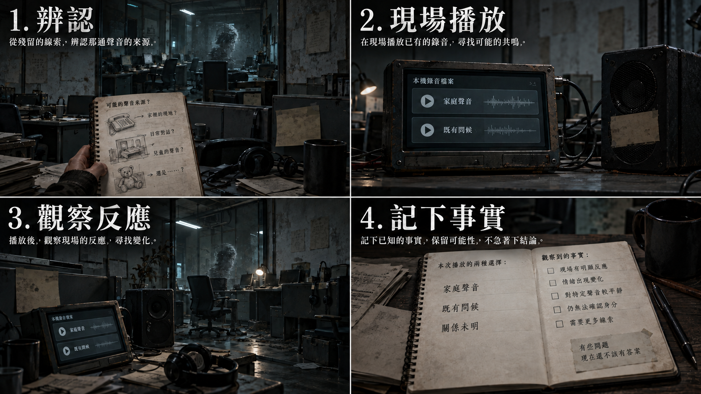

[完整圖說與操作對照](../09_劇本/09-15_正式劇本_共用附錄.md#h-0408-372) · [圖像目錄](../09_劇本/09-14_全劇本與關卡整合稿.md#book-illustrations)

<a id="node-r12-exit"></a>

#### 離場通路與次場景

<a id="transition-r12-r14"></a>
##### T-R12-R14 · 鋼平台與搬運外圈

**起行與到達：**R12 配電接妥並通過本地權限；可先到貨梯轉接間，往 R15 前仍須完成 E-07 安息。原條件允許時可原路回訪。 到目的門口由玩家親自進房，才啟動房內事件。

**空間與保存：**每個次場景標明來路、去路、樓層與可見承重踏板；反向不水平翻圖。完成各列局部操作才開下一段。 狀態依[通路共用規則](../09_劇本/09-15_正式劇本_共用附錄.md#transition-rules)與[逐層探路契約](../09_劇本/09-15_正式劇本_共用附錄.md#ascent-route-contract)。

<!-- route-exploration:R12:begin -->
| 次場景／主圖 | 玩家目標 | 辨路依據 | 操作與通行條件 | 錯路與復原 | 通過狀態 |
| --- | --- | --- | --- | --- | --- |
| T-R12-R14-01 | 找出 24F 的下一段安全通路 | 封的是房門和公共梯，側洞另有固定爬架與護套，不需要開焊門。 | 拉開掛在鉤上的防塵片，沿側洞爬架移到 A 棟內側的短梯。 | 焊門不是材料任務；近看就能看清全圈封死，回訪不重新蓋住防塵片。 | route_local.t-r12-r14-01.open |
| T-R12-R14-02 | 找出 25F 的下一段安全通路 | 只能用牆上的手輪把空車拉向停車槽，直接推車會讓重量朝井口移動。 | 轉動手輪拉回空車，讓原止退齒卡住，露出 26F 入口。 | 直接推車被未鬆的牽引纜留住；可收手改用手輪，不追逐滑車。 | route_local.t-r12-r14-02.open |
| T-R12-R14-03 | 找出 26F 的下一段安全通路 | 暗紅霧與外管白絲另層，避開橋座、棟別牌、旁通錶針及漏水支管；管壓由刻痕與錶針雙重顯示；接到集水溝的是旁通，不是斷頭支管。 | 開啟旁通讓錶針落入刻線區，再關閉漏水支管，沿止滑跨棟廊到 B 棟 26F，循短梯上 27F 貨梯轉接間。 | 順序反了只維持洩壓狀態；鬆手可重做，不爆管、不新增倒數。 | route_local.t-r12-r14-03.open |
<!-- route-exploration:R12:end -->

**驗收：**尚未抵達目的房不得取得該房道具；每層測原門檻、錯路、取消、近看返回、正反向與存讀檔；圖號只定位，不授予目的房證據。正式畫面、音場與實機節奏仍待製作及驗證。

<a id="transition-r12-r15"></a>
##### T-R12-R15 · 低負荷回程服務道

**起行與到達：**SQ-T 完成、R12–R15 均已到訪、E2-06 已成立；不恢復犧牲紀錄。原條件允許時可原路回訪。 到目的門口由玩家親自進房，才啟動房內事件。

**空間與保存：**每個次場景標明來路、去路、樓層與可見承重踏板；反向不水平翻圖。依原門檻通行，近看選填，不增加解鎖題或收集。 狀態依[通路共用規則](../09_劇本/09-15_正式劇本_共用附錄.md#transition-rules)與[逐層探路契約](../09_劇本/09-15_正式劇本_共用附錄.md#ascent-route-contract)。

**驗收：**尚未抵達目的房不得取得該房道具；每層測原門檻、錯路、取消、近看返回、正反向與存讀檔；圖號只定位，不授予目的房證據。正式畫面、音場與實機節奏仍待製作及驗證。

<!-- production-subscenes:r12 -->

<!-- scene-image-subscenes-r12:begin -->
<a id="subscenes-r12"></a>
#### 次場景節點

以下次場景歸 R12 管理，節點編號沿用主圖圖號。來去方向為原動線的正向排列；反向通行與單向限制依原門檻，不因列出來路就新增返回出口。

<a id="subscene-t-r12-r14-01-spec"></a>
##### T-R12-R14-01 · 焊封中繼平台

**樓層：**24F · A 棟

**類型：**探路次場景。**正向連接：**R12-V01 → **T-R12-R14-01** → T-R12-R14-02。

**探路操作：**拉開掛在鉤上的防塵片，沿側洞爬架移到 A 棟內側的短梯。

**錯路與復原：**焊門不是材料任務；近看就能看清全圈封死，回訪不重新蓋住防塵片。

**保存：**`route_local.t-r12-r14-01.open`；依[逐層探路契約](../09_劇本/09-15_正式劇本_共用附錄.md#ascent-route-contract)驗證。

**近看：**T-R12-R14-01-C01；關閉回 T-R12-R14-01。

[正文](../09_劇本/09-06_正式劇本_第三幕.md#subscene-t-r12-r14-01-script) · [圖像製作單](#node-r12-images) · [原門檻與回訪](#node-r12-nav) · [通路正文](../09_劇本/09-06_正式劇本_第三幕.md#ascent-t-r12-r14-01-script)

<a id="subscene-t-r12-r14-02-spec"></a>
##### T-R12-R14-02 · 配重車停靠臺

**樓層：**25F · A 棟

**類型：**探路次場景。**正向連接：**T-R12-R14-01 → **T-R12-R14-02** → T-R12-R14-03。

**探路操作：**轉動手輪拉回空車，讓原止退齒卡住，露出 26F 入口。

**錯路與復原：**直接推車被未鬆的牽引纜留住；可收手改用手輪，不追逐滑車。

**保存：**`route_local.t-r12-r14-02.open`；依[逐層探路契約](../09_劇本/09-15_正式劇本_共用附錄.md#ascent-route-contract)驗證。

**近看：**T-R12-R14-02-C01；關閉回 T-R12-R14-02。

[正文](../09_劇本/09-06_正式劇本_第三幕.md#subscene-t-r12-r14-02-script) · [圖像製作單](#node-r12-images) · [原門檻與回訪](#node-r12-nav) · [通路正文](../09_劇本/09-06_正式劇本_第三幕.md#ascent-t-r12-r14-02-script)

<a id="subscene-t-r12-r14-03-spec"></a>
##### T-R12-R14-03 · 冷卻水旁通跨棟廊

**樓層：**26F · A 棟 → B 棟

**類型：**探路次場景。**正向連接：**T-R12-R14-02 → **T-R12-R14-03** → R14-V01。

**探路操作：**開啟旁通讓錶針落入刻線區，再關閉漏水支管，沿止滑跨棟廊到 B 棟 26F，循短梯上 27F 貨梯轉接間。

**錯路與復原：**順序反了只維持洩壓狀態；鬆手可重做，不爆管、不新增倒數。

**保存：**`route_local.t-r12-r14-03.open`；依[逐層探路契約](../09_劇本/09-15_正式劇本_共用附錄.md#ascent-route-contract)驗證。

**近看：**T-R12-R14-03-C01；關閉回 T-R12-R14-03。

[正文](../09_劇本/09-06_正式劇本_第三幕.md#subscene-t-r12-r14-03-script) · [圖像製作單](#node-r12-images) · [原門檻與回訪](#node-r12-nav) · [通路正文](../09_劇本/09-06_正式劇本_第三幕.md#ascent-t-r12-r14-03-script)

<a id="subscene-t-r12-r15-01-spec"></a>
##### T-R12-R15-01 · 回程閥箱外廊

**樓層：**24F · A 棟

**類型：**可查看過渡。**正向連接：**R12-V01 → **T-R12-R15-01** → T-R12-R15-02。

**近看：**T-R12-R15-01-C01；關閉回 T-R12-R15-01。

[正文](../09_劇本/09-06_正式劇本_第三幕.md#subscene-t-r12-r15-01-script) · [圖像製作單](#node-r12-images) · [原門檻與回訪](#node-r12-nav) · [通路正文](../09_劇本/09-06_正式劇本_第三幕.md#ascent-t-r12-r15-01-script)

<a id="subscene-t-r12-r15-02-spec"></a>
##### T-R12-R15-02 · 回程配重隔牆

**樓層：**25F · A 棟

**類型：**可查看過渡。**正向連接：**T-R12-R15-01 → **T-R12-R15-02** → T-R12-R15-03。

**近看：**T-R12-R15-02-C01；關閉回 T-R12-R15-02。

[正文](../09_劇本/09-06_正式劇本_第三幕.md#subscene-t-r12-r15-02-script) · [圖像製作單](#node-r12-images) · [原門檻與回訪](#node-r12-nav) · [通路正文](../09_劇本/09-06_正式劇本_第三幕.md#ascent-t-r12-r15-02-script)

<a id="subscene-t-r12-r15-03-spec"></a>
##### T-R12-R15-03 · 低負荷回程跨棟廊

**樓層：**26F · A 棟 → B 棟

**類型：**可查看過渡。**正向連接：**T-R12-R15-02 → **T-R12-R15-03** → R15-V01。

**近看：**T-R12-R15-03-C01；關閉回 T-R12-R15-03。

[正文](../09_劇本/09-06_正式劇本_第三幕.md#subscene-t-r12-r15-03-script) · [圖像製作單](#node-r12-images) · [原門檻與回訪](#node-r12-nav) · [通路正文](../09_劇本/09-06_正式劇本_第三幕.md#ascent-t-r12-r15-03-script)
<!-- scene-image-subscenes-r12:end -->

<a id="node-r13-spec"></a>

### R13 · 非法診所

[正式場次](../09_劇本/09-06_正式劇本_第三幕.md#node-r13-script)

[進場與動線](#node-r13-nav) · [出入口位置](#node-r13-access) · [操作與解謎](#node-r13-level) · [狀態與驗收](#node-r13-pack) · [圖像製作單](#node-r13-images) · [離場與次場景](#node-r13-exit)

<a id="node-r13-nav"></a>

**進出、動線與回訪**

<a id="s-0609-26"></a>

<!-- import:s-0609-26:begin -->
<a id="h-0609-242"></a>

#### R13 非法診所

進行目的：處理阻攔、核對照護與復工紀錄；健康評級、E-07 必要安息

支線／收集：依原房選填調查；無新增支線掛點。

| 方向 | 類型 | 可移動條件 | 移動演出提案 | 回訪規則 |
| --- | --- | --- | --- | --- |
| R12 ↔ R13 | 分岔 | R12 配電接妥並通過本地權限，才可進診所；E-07 安息是診所後門／往 R15 的條件，不是進房條件 | 穿過貼有舊門牌的診所入口，跨入原住宅廚房地磚區；修理桌聲退到門後。 | 章內回訪；遇鎖場、追逐或封路停用 |
| R13 ↔ R14 | 分岔 | E-07 已依本房叫號序列與照護註記安息，診所後門開啟；可退回 R12 不受本條阻擋 | T-R13-R14：由 A 棟 23F R13 經 A 棟 24F、25F，於 26F 依本路門檻穿過分道接駁廊到 B 棟 26F，再沿短梯進 B 棟 27F R14；各分道以實體隔網分開，不能橫切跳過門禁。 | 章內回訪；遇鎖場、追逐或封路停用 |
| R13 ↔ R15 | 分岔 | E-07 已安息，且 R14 物流繼電器已接回；R15 的供電分配與後續推理不作進房前置 | T-R13-R15：由 A 棟 23F R13 經 A 棟 24F、25F，於 26F 依本路門檻穿過分道接駁廊到 B 棟 26F，再沿短梯進 B 棟 27F R15；各分道以實體隔網分開，不能橫切跳過門禁。 | 章內回訪；遇鎖場、追逐或封路停用 |
<!-- import:s-0609-26:end -->
<!-- navigation:r13:end -->

<a id="node-r13-access"></a>
#### 主場景出入口

<!-- scene-access:R13:begin -->
| 動線 | 顯示名稱 | 畫面位置與辨識物 | 通行狀態 |
| --- | --- | --- | --- |
| R12↔R13 | 來路／返回：候診入口 | 候診椅外側的舊門牌入口，地磚接回修理舖。 | 尚未完成病患安息仍可退回 R12；後簾門檻不封住這條退路。 |
| R13↔R14 | 出口：後簾送物廊 | 23F 門端，去路可辨24F 診所後簾送物平台的連續扶手及固定梯口；目的房在 27F，不把兩端畫成同層相鄰門。 | 依叫號序列及照護註記完成安息後，經後簾短廊、平台到 R14；反向通行也受同一門檻約束。 |
| R13↔R15 | 出口：後勤設備道 | 23F 門端，去路可辨24F 診所後勤管廊的連續扶手及固定梯口；目的房在 27F，不把兩端畫成同層相鄰門。 | 病患已安息且 R14 物流繼電器接回後，才可往返 R15；機房內的供電選擇不是進房條件。 |
<!-- scene-access:R13:end -->

<!-- access-layout:R13:begin -->
<a id="node-r13-access-layout"></a>
##### 出入口配置草圖

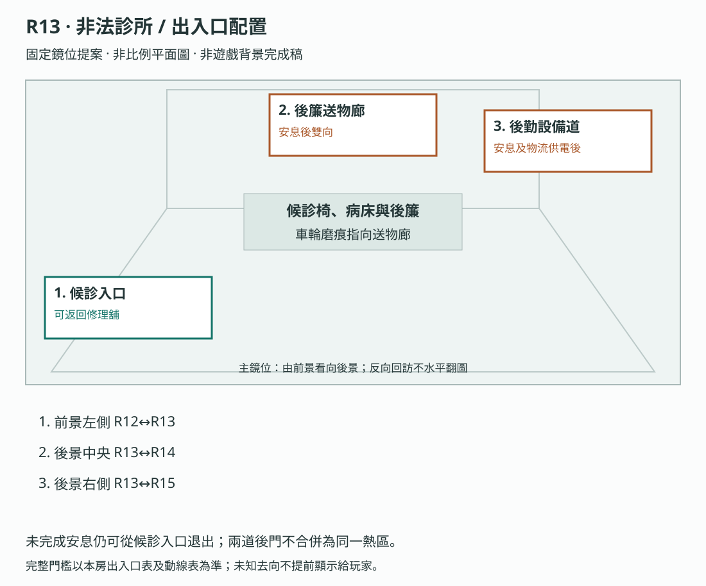

**構圖提案：**未完成安息仍可從候診入口退出；兩道後門不合併為同一熱區。 各門端位置對應上表；數字只供製作辨識，不是玩家介面或解謎提示。

門框、視線及熱區仍須灰盒驗收，依[共用契約](../09_劇本/09-15_正式劇本_共用附錄.md#scene-access-contract)，不計入遊戲圖像交付數。
<!-- access-layout:R13:end -->

**演出限制與製作註記**

<a id="s-0906-10"></a>

<!-- import:s-0906-10:begin -->
<a id="h-0906-126"></a>

#### 演出限制

> 連接：R12；安息後開放後簾往 R14，往 R15 另需物流繼電器
> 當下打算：查清候診阻攔，讓出通往設備區的後門。
<!-- import:s-0906-10:end -->

<a id="node-r13-level"></a>

**關卡、解謎與失敗回饋**

<a id="s-0604-5"></a>

<!-- import:s-0604-5:begin -->
<a id="h-0604-156"></a>

#### R13 — 非法診所

<a id="h-0604-158"></a>

##### R13 空間與畫面製作定位

| 項目 | 畫面與製作要求 |
| --- | --- |
| 樓層定位 | 23F |
| 樓棟定位 | A 棟 |
| 樓層與環境 | 23F 舊住宅廚房改設診所，與 R12 相鄰；送物廊及條件式設備道各經 24F、25F、26F 至 27F。 原光源、材質與證據焦點依本房規格。 |
| 入口方向 | 由 R12 承接；以來路門框／扶手作背向定位，前進方向依下列出口地標。左右方位沿既有構圖，不將反向回訪鏡頭誤當另一扇門。 |
| 可見出口 | 後簾送物廊通 R14，後勤設備道通 R15。首次全景就交代入口輪廓或可查看的遮擋，不靠無標示的畫外點擊換房。 |
| 阻擋與開放條件 | 往 R14：E-07 已安息，診所後簾路開放；往 R15：E-07 已安息且 R14 物流繼電器已修復。不先要求尚在 R15 的供電決策 |
| 畫面中的解謎要素 | 藥品、照護紀錄與斷藥者；必要安息不被旁路跳過。關鍵標記可近看，與裝飾物有可辨的材質或輪廓差異，不只靠顏色或聲音。 |
| 完成後變化 | 斷藥者必要安息與照護調查分別保存；依既定線路條件使用後簾／後勤出口，不以選填照護附頁替代安息。 |

<a id="h-0604-171"></a>

##### R13 製作流程

**空間第一印象：**米黃住宅診所與消毒簾。廚房水槽與臨時診療台共存，乾淨處僅一小塊；恐怖用原聲源及空床差分。

**探索呈現：**先讓玩家看見入口、可走的方向和空間異常，再自選近看生活物件；新增租戶遺跡不發 E 證據、不設派系任務、不改出口旗標。恐怖沿原事件與遭遇時序，安定／閱讀保護段不插嚇點。

**逃生因果與可見回饋：**原 E-07 回應成功後，床簾前傾與威脅聲停止，恢復原正常調查和通行狀態。失敗只按原規則處理，可退 R12 查證；E-04 健康支線不能因此升格為通行門檻。

| 階段 | 製作規格 |
| --- | --- |
| 進入／目標 | 處理阻攔、核對照護與復工紀錄；健康評級、E-07 必要安息；入場先還原原房間已保存的熱點與事件狀態。 |
| 觀察／空間 | 診所借用住宅廚房與客廳，舊洗槽旁加消毒台；隔簾後留出轉接間與發電機方向的原通路。 |
| 操作順序 | 查看健康評估 → 有 E1-14 時核對原低標者鏈 → 可翻傷病／復工欄 → 依原離房與照護選擇進行，不強制補收支線。順序中的選填內容不作離房門檻；原主線旗標、遭遇數值及分支提交條件依本場景細則。 |
| 回饋 | 必要操作寫入原證據／門禁／遭遇狀態；新增生活附頁僅更新來源已讀與有依據的筆記，不重發原證據。 |

<a id="h-0604-186"></a>

###### R13 生活與管制觀察

原 E2-07 與 E1-14 比對近看補上 E-04 的傷病申報、建議休息及被退回復工的覆核欄；使用原收容編號，傷勢不作特寫，既定死亡證據與 R19 對應不變。

<a id="h-0604-190"></a>

###### R13 附頁熱點

**頁鍵對照：**`health`＝傷病申報；`rest`＝休息建議；`reply`＝復工覆核。

| 欄位 | 規格 |
| --- | --- |
| 識別／位置 | `R13_DETAIL_01`；原 E2-07 健康評估近看。沿原近看開頁，不增加遠景發光提示。 |
| 前置 | 已開啟該原熱點；原證據、供電及回訪前置照舊，不因新增附頁放寬。 |
| 玩家操作 | 翻傷病、建議休息與復工覆核；有 E1-14 才比對同號。各來源各自閱讀，不要求一次讀完。 |
| 回饋／筆記 | 符合原條件才更新低標者鏈；單頁不越級確認死亡。 |
| 成本與中止 | 免費查看；普通探索閱讀停表；鎖場／強制演出依原規則暫不開啟。退出即回原近看，不寫未讀頁。 |
| 保存 | 每頁保存 `scene_detail.r13.read_pages` 集合；只有指定附頁顯示且玩家確認收起時加入對應頁鍵。來源顯示後中途暫停不算完成。 |
| 回訪 | 已讀頁可重看，原物件位置不重置；尚缺對照來源時保留觀察，不生成推論。 |
| 素材 | 在原近看增一組物件／紙張疊圖、各頁文字轉錄、翻頁／收起聲；近看與原基底光向一致，均待製作。 |

<a id="h-0604-205"></a>

###### R13 出口與回訪

| 目的節點 | 條件 | 移動與辨向 | 回訪邊界 |
| --- | --- | --- | --- |
| R12 | 沿已開連線回訪；未鎖場且未沉降封路 | 同一地標反向通行 | 章內回訪；遇鎖場、追逐或封路停用 |
| R14 | E-07 已安息，診所後簾路開放 | T-R13-R14：由 A 棟 23F R13 經 A 棟 24F、25F，於 26F 依本路門檻穿過分道接駁廊到 B 棟 26F，再沿短梯進 B 棟 27F R14；各分道以實體隔網分開，不能橫切跳過門禁。 | 章內回訪；遇鎖場、追逐或封路停用 |
| R15 | E-07 已安息且 R14 物流繼電器已修復；不要求尚未抵達的 R15 供電決策 | T-R13-R15：由 A 棟 23F R13 經 A 棟 24F、25F，於 26F 依本路門檻穿過分道接駁廊到 B 棟 26F，再沿短梯進 B 棟 27F R15；各分道以實體隔網分開，不能橫切跳過門禁。 | 章內回訪；遇鎖場、追逐或封路停用 |

共用規則見[對應條款](10-01_製作規格_序幕.md#s-0601-6)。

**核心句**：「這裡不是判斷你有沒有病，而是判斷你還能不能工作。」

<a id="h-0604-218"></a>

##### 場景與證據

- 診療床乾淨得像展示品，真正使用痕跡集中在牆邊塑膠椅。
- `E2-07` 健康評估表同時具有「可工作／待校正／待轉運」三欄。
- 將低標者紅線與診所「自然衰竭」欄對齊，確認 `E1-14`；依已取得姓名與真實因果在本地檔案另存一則現時註記，完成 E-04 選填安息。保留原死亡原因與覆核欄，不以 E-07 的「需要照護」代替此案。她的收容編號與 R19 紀錄 ID 相同，由玩家自行比對。
- 若帶入 `E2-13`，可辨識一直坐在候診椅上的 E-07「斷藥者」。
- E-04 以 E1-14＋E2-07 的同一收容編號、姓名與真實因果核對，再另存現時註記為唯一安息條件。#14 只在實讀鍵盤文字後保存來源索引，不能播放，不收播放費、不產生話術反噬；取得索引不等於安息。
- E-07 完整停藥回執僅在正確叫號後展開，於原照護註記近看並列 RX-17、D-17、原件日期及「可工作」，供 R16 的 E2-05 核對；叫號前是未選個案列表，不預先露出答案。以既有 `r13.correct_number_called` 控制顯示，不依賴 `rested`；錯號與取消不解鎖，正確叫號後回訪／讀檔可免費重看、不重播。無核可依據、不要求選填 E2-07／13。

<a id="h-0604-227"></a>

##### 必要訊號對峙：E-07

1. **辨識**：候診椅、藥袋與三張叫號紙是本房可直接查看的必要來源；怨靈仍在等自己的號碼。一般安撫無效，但不要求玩家先故意選錯。
2. **解題**：依紙上日期排列 D-15 → D-16 → D-18，對照椅牌空缺判斷 D-17。床號與日期用文字與排列共同呈現。R12 的 E2-13 可先提供床號與停藥身分線索；已讀者仍須核對本批日期的跳號，未取得者同樣可由本房資料解出。
3. **操作**：在 R12 已恢復的診所低壓終端選 D-17，由原叫號器播出；終端隨選定個案展開完整停藥回執，於原近看讀完後再選「需要照護」，保存一則獨立、可追溯的現時註記。原「可工作」歷史欄位保留並列，不覆寫病歷。
4. **回饋**：正確叫號但未保存照護註記時，敲擊暫停、後門仍未放行；兩步完成才設 `act3.r13.e07_state = rested`，讓出後門。有 E2-13 才補姓名與缺藥原因，否則保留已知床號。

提交前沿 HA-R13-02 給至少 3.2 秒可見前兆，可收手或退 R12。錯號使燈滅 5 秒並按原規則增加恐慌，不能連疊第二次 HA 傷害；返回時從完整前兆開始，已讀紙條不清空。連錯三次停止追加穩定度代價；0 穩定仍可用本地叫號和註記完成主線。本房不提供尚未解鎖的權限抹除。


<a id="h-0604-237"></a>

##### 時態錯位 T-3a · 診療床的紙墊

| 項目 | 內容 |
| --- | --- |
| 第一次 | 診療床鋪著乾淨、完全展開的紙墊，像從沒被使用過——這正是本房「診療床乾淨得像展示品」的來源。 |
| 回訪（完成 E-07 後） | **同一張紙墊、同一個構圖、同一個角度**：入鏡前載入紙面壓痕及轉印日期戳，不播放人體浮現。製作端採 L-48 封鎖當日的核定日曆日期；玩家未取得封鎖日來源前只記實見日期。 |
| 物件數量 | 不變。沒有新增任何東西。 |
| 物理讀法 | 房間濕度上升，使舊壓痕與轉印墨水重新顯影。 |
| 訊號讀法 | 日期戳可能留下未被完整登錄的使用痕跡；只有讀過相應紀錄才可比較缺漏。壓痕與日期重疊不能證實使用者、使用次數、死亡或撤離當日曾有門診。 |
| 音效 | 首次差分依 HA-R13-01 配一聲紙墊受壓聲；後續近看與比對保持安靜，不重播。 |
| 證據 | 不新增 E 編號；E-07 條目先保存「紙墊轉印日期」及實見值。取得封鎖日來源並由玩家比對後，才補「轉印日期與封鎖日重疊」；反序取得亦須完成比對，不能僅持有資料就自動下結論。 |

---

---

##### 操作與呈現補充

- [s-0906-13](../09_劇本/09-06_正式劇本_第三幕.md#s-0906-13)：完整回執以既有 `r13.correct_number_called` 為顯示條件，不以尚未成立的 `rested` 為條件。錯號、取消不展開；正確叫號後暫離或讀檔可直接重看，不重播叫號、不另收費。
<!-- import:s-0604-5:end -->

<a id="s-0604-15"></a>

<!-- import:s-0604-15:begin -->
<a id="h-0604-756"></a>

#### R13：幫助之後仍有距離

E-07 原必要回應與通路結果不變。玩家正確完成照護註記後，敲擊停止、後門讓出；若主角的感知手勢伸向候診椅，輪廓把手收回並側過身，停留約 2 秒。這是拒絕接觸的可見行動，不宣告它內心永遠仇恨或已原諒。

沒有撲擊、扣罰、新選項或阻擋通路；不得讓玩家反覆點擊求取擁抱，也不追加「謝謝」與主角辯解。未播放伸手表現時直接保留側身靜格，低動態模式資訊相同。它拒絕靠近，不影響照護註記本身成立。此段併入既有安息收束，不另增一場對戰或 HA。

註記經本地通電終端存為來源可追溯的附註，不覆寫原來「可工作」的歷史欄位；原件與附註並列。筆記只呈現查證結果，不能隔空改病歷。
<!-- import:s-0604-15:end -->

<a id="node-r13-pack"></a>

**狀態、素材與驗收**

<a id="s-uppertech-61"></a>

<!-- import:s-uppertech-61:begin -->
<a id="h-uppertech-994"></a>

#### 後勤與校正模組｜第三幕｜R13 — 非法診所／E-07 斷藥者

R13 ↔ R14 出入承接[診所送物廊](#transition-r13-r14)與共用保存規則；其他出口沿原轉場。紙墊回訪先記實見日期，封鎖日來源及玩家比對都成立後才附重疊觀察，不由壓痕判定死因。

<a id="h-uppertech-996"></a>

##### 後勤與校正模組｜R13-房間資料

| 欄位 | 值 |
| --- | --- |
| `room_id` | `R13` |
| `scene` | `room_r13.tscn` |
| `entry_from` | `R12` |
| `exit_to` | `R12`、`R14`、`R15`（需 R14 繼電器） |
| `backgrounds` | `r13_real.webp`、`r13_scan.webp`、`r13_freeze_chair.webp` |
| `light_profile` | 塑膠簾冷白光；E-07 出現後只剩叫號燈 |
| `main_goal` | 從本房候診序列辨識 E-07，正確叫號後另存有來源的現時照護註記，保留歷史原件 |
| `must_exit_when` | 往 R14 須 `act3.r13.e07_state = rested`，往 R15 另須 R14 繼電器；返回 R12 不受安息條件阻擋。後門條件雙向有效，不因從 R14 回訪而繞過 |

<a id="h-uppertech-1009"></a>

##### 後勤與校正模組｜R13-互動表

| ID | 物件／觸發 | 玩家操作 | 文字／聲音回饋 | 寫入狀態／證據 | 成本 |
| --- | --- | --- | --- | --- | --- |
| `R13_H01` | 乾淨診療床 | `LOOK` | 「床單沒有使用痕跡。磨損都在牆邊的椅子。」 | `r13.bed_seen` | 0 |
| `R13_H02` | 塑膠候診椅 | `LOOK` | 顯示連續七天相同坐姿；最後一天沒有叫號 | `r13.chair_sequence_seen` | 0 點 |
| `R13_H03` | 健康判定終端 | `LOOK`→`ALIGN` | 讀完整健康評估與覆核資料，再將「可工作／待校正／待轉運」與床號對齊，才取得 E2-07；只看 D-17 的必要照護回執不自動取得整份評估，也不自動完成 E-04 安息 | `E2-07`、`act3.r13.e207_seen` | 0 |
| `R13_H04` | 低標者紀錄 | `ALIGN`→另存現時註記（選填） | 持 E1-14＋E2-07，核對同收容編號的紅線、缺水與自然衰竭，再另記姓名及真實因果才安息；實讀鍵盤文字另存 #14 索引，不播放、不合成、不代安息，不冒用 E-07 照護條件 | `act3.r13.e114_confirmed`、原 E-04 安息狀態 | 0 |
| `R13_H05` | 三張叫號紙 | `ALIGN` | 依日期排出 D-15 → D-16 → D-18；缺少的 D-17 就在椅上 | `act3.r13.queue_matched`、`signal.r13_queue_call` | 0 |
| `R13_H06` | E-07 輪廓 | `LOOK` | 「它沒有靠近。它在等自己的號碼。」 | `act3.r13.e07_state = active` | 0 點 |
| `R13_H07` | 本地叫號器 | `PLAY_SIGNAL` | 依已排紙條選 D-17，由現場喇叭播出；錯號熄燈 5 秒；零穩定必要備援可完成 | `r13.correct_number_called` | 5 點；0 點備援不扣負值 |
| `R13_H08` | 健康欄位 | 本地終端另存註記 | 正確叫號才選定個案並展開 RX-17／D-17／原件日期；原近看讀完再存「需要照護」才安息，原「可工作」並列保留。完整回執顯示依 `r13.correct_number_called`，不是 `rested`；錯號、取消不露，成功後重看不重播不收費 | `act3.r13.e07_state = rested` | 0 |
| `R13_H09` | 空藥袋 | `LOOK` | 持有 `E2-13` 時顯示被刪除日期；否則只顯示床號 | 人物板補入 E-07 識別層級 | 0 |

健康註記另存為玩家有來源的照護附註，不刪改歷史「可工作」原件。0 穩定以本房叫號器與必要錨點完成；本房資料足以解出 D-17；已讀 E2-13 可先懷疑此號，但仍核對本批日期的缺號，不以選填作門票。

<a id="h-uppertech-1025"></a>

##### 後勤與校正模組｜R13-E-07 對峙狀態機

~~~text
IDLE
  └─ 感知候診椅 → ACTIVE
       ├─ 錯誤叫號 → AGITATED → 5 秒後 ACTIVE
       ├─ 正確叫號 + 錯誤判定 → ACTIVE
       └─ 正確叫號 +「需要照護」→ RESTED
~~~

- 玩家可在 `ACTIVE` 或 `AGITATED` 離房；重新進入時從 `ACTIVE` 繼續。
- 連續錯誤 3 次後，系統不再扣除穩定度，只顯示「這不是它的號碼」。
- 安息後恐慌 -2 階，後門開啟；不播放消散特寫，只讓椅墊緩慢回彈。
- 本場發生在權限反擊解鎖前，不提供抹除選項。

<a id="h-uppertech-1040"></a>

##### 後勤與校正模組｜R13-驗收

- [ ] 不取得 `E2-13` 仍可由三張叫號紙完成主線。
- [ ] 取得 `E2-13` 能補強個人因果，但不把姓名或來歷憑空補完。
- [ ] 錯誤選項不即死、不清空已完成的叫號排列。
- [ ] 玩家應能說出：「診所判斷的不是病，而是還能不能工作。」
##### R13 · 呼吸中斷與現時人影

依[聽覺判讀契約](../09_劇本/09-15_正式劇本_共用附錄.md#hearing-threat-contract)，只在原 HA-R13-02 操作段顯示現場帶。呼吸停半句可使波形歸平，但床簾前傾人影及出口提示仍在，至少 3.2 秒原前兆不縮短。依既有收手／退 R12 行動結算；安全病歷閱讀、歷史凝固及安息後撤下。不能因歸平自動判安全或生成額外攻擊。
<!-- import:s-uppertech-61:end -->

<a id="node-r13-images"></a>

#### 場景節點與靜態圖製作單

以下每列均為待製作圖像項目；文件多頁、正反面、局部與狀態差分須依拆圖欄各自交付，不能以一張示意圖代替。可探索場景的主圖提供移動與探索，演出節點不另開探索，近看關閉回到開啟前的畫面；原演出與操作條件仍依右欄來源。圖號、解析度、文字分層、存檔及驗收依[靜態圖共用契約](../09_劇本/09-15_正式劇本_共用附錄.md#scene-image-contract)。

<!-- scene-floor-locations:R13:begin -->
| 次場景／主圖 | 樓層定位 | 樓棟定位 | 移動方式 |
| --- | --- | --- | --- |
| T-R13-R14-01 | 24F | A 棟 | 步道 |
| T-R13-R14-02 | 25F | A 棟 | 步道 |
| T-R13-R14-03 | 26F | A 棟 → B 棟 | 跨棟橋 |
| T-R13-R15-01 | 24F | A 棟 | 步道 |
| T-R13-R15-02 | 25F | A 棟 | 步道 |
| T-R13-R15-03 | 26F | A 棟 → B 棟 | 跨棟橋 |
<!-- scene-floor-locations:R13:end -->

<!-- scene-images:R13:begin -->
| 畫面節點／圖號 | 用途 | 必畫內容 | 狀態與拆圖 | 來源 |
| --- | --- | --- | --- | --- |
| R13-V01 | 主場景 | 候診椅、藥袋、三張叫號紙、叫號器、健康終端、病床與後簾。 候診椅旁的接柄拐杖、敷料盒、工位耳機及候診／返回工位箭頭。 | 叫號前／D-17 已叫／照護註記已存分開；斷藥者另交節段指尖繞空掌心內折、濕袖及原逼近／退回差分，取代老周式頸殼意象；數藥節拍不是密碼。後簾通行依兩件必要操作，不因看圖就開門。另交 HA-R13-02 現場波形中斷、簾邊人影及方向字幕並存預覽，無聲仍可退 R12。 物件沿原安全近看，不改叫號或安息前置。 | [本場景](../09_劇本/09-06_正式劇本_第三幕.md#node-r13-script) |
| R13-C01 | 近看 | 候診椅與藥袋；拐杖修補、敷料扣耳、工位耳機與返回箭頭 | 椅高、磨痕與袋面局部，原收容編號不補姓名；E2-13 已讀才顯刪除日期，否則只顯床號。 新焦點只支持照護與復工要求相鄰，不推定特定傷患或代讀停藥回執；依原安全閱讀保護，關閉回 V01。 | [R13-00](../09_劇本/09-06_正式劇本_第三幕.md#s-0906-11) |
| R13-D01 | 文件 | 三張帶日期的叫號紙 | D-15／D-16／D-18 各一頁，可排序；缺 D-17 由比對取得，不印答案提示。 | [R13-01](../09_劇本/09-06_正式劇本_第三幕.md#s-0906-12) |
| R13-C02 | 操作近看 | 叫號器 | 號碼選擇／提交／結果，免費備援與原播放來源同頁。 | [R13-02](../09_劇本/09-06_正式劇本_第三幕.md#s-0906-13) |
| R13-D02 | 文件 | RX-17 停藥回執與照護註記 | 完整回執與現時需求分頁；必經原件不得被支線完成條件擋住。 | [R13-02](../09_劇本/09-06_正式劇本_第三幕.md#s-0906-13) |
| R13-D03 | 介面 | 健康終端現時需求 | 需要照護／確認／已存狀態，不改寫歷史回執。 | [R13-02](../09_劇本/09-06_正式劇本_第三幕.md#s-0906-13) |
| R13-D04 | 文件 | 健康評估與覆核資料 | 原件分頁，姓名與因果依原資料，不由未見內容補齊。 | [R13-04](../09_劇本/09-06_正式劇本_第三幕.md#s-0906-15) |
| R13-C03 | 近看 | 病床床紙與日期 | 原態／選填安息後回訪差分，僅既有狀態改變。 | [R13-05](../09_劇本/09-06_正式劇本_第三幕.md#s-0906-16) |
| R13-F01 | 回憶畫面 | 連續七日的候診椅靜格 | 七日各有日期、同一坐姿及最後一天未叫號的原序列；人物靜止，不把歷史候診與現時 E-07 輪廓混為一張。 | [候診序列](#s-uppertech-61) |
| T-R13-R14-01 | 過渡場景 | 診所後簾送物平台：診所後簾送物平台，來路扶手與下一段梯口同框；門楣保留 24F 標記，封板遮住舊公共梯。 | 來路 R13-V01；去路 T-R13-R14-02。既有門檻；後簾來路在下方，舊搬運字牌與新管制貼紙分層可讀。 病患安息後循送物平台上行，不乘貨梯。 主圖交上下段踏點、封閉口與通行差分；不新增未編號可走房間。 | [通路正文](../09_劇本/09-06_正式劇本_第三幕.md#ascent-t-r13-r14-01-script) |
| T-R13-R14-01-C01 | 過渡近看 | 舊字牌與輪痕 | 後簾來路在下方，舊搬運字牌與新管制貼紙分層可讀。 可下返診所；不用讀完生活文字。 每個列名焦點交清晰局部；關閉回 T-R13-R14-01，不自動移至下一房。 | [通路正文](../09_劇本/09-06_正式劇本_第三幕.md#ascent-t-r13-r14-01-script) |
| T-R13-R14-02 | 過渡場景 | 廚房背側轉梯：廚房背側轉梯，來路扶手與下一段梯口同框；門楣保留 25F 標記，封板遮住舊公共梯。 | 來路 T-R13-R14-01；去路 T-R13-R14-03。既有門檻；封門在料理檯旁，轉梯踏紋接向上層送物口。 沿固定轉梯前往 26F。 主圖交上下段踏點、封閉口與通行差分；不新增未編號可走房間。 | [通路正文](../09_劇本/09-06_正式劇本_第三幕.md#ascent-t-r13-r14-02-script) |
| T-R13-R14-02-C01 | 過渡近看 | 折梯踏紋與料理檯舊槽 | 封門在料理檯旁，轉梯踏紋接向上層送物口。 封門只可近看；不新增鑰匙或藥品需求。 每個列名焦點交清晰局部；關閉回 T-R13-R14-02，不自動移至下一房。 | [通路正文](../09_劇本/09-06_正式劇本_第三幕.md#ascent-t-r13-r14-02-script) |
| T-R13-R14-03 | 過渡場景 | 送物跨棟廊：A 棟 26F 送物廊保留舊住戶搬運字牌，橋上後加的鐵網將人行道與冷卻水廊隔開；同層跨入 B 棟後，短梯接到 27F 貨梯框。 | 來路 T-R13-R14-02；去路 R14-V01。既有門檻；同組搬運標記接到 27F 貨梯框，繼電器仍在目的房。 沿送物廊由 A 棟 26F 跨到 B 棟 26F，再循最後一段短梯進 R14。 主圖交上下段踏點、封閉口與通行差分；不新增未編號可走房間。 | [通路正文](../09_劇本/09-06_正式劇本_第三幕.md#ascent-t-r13-r14-03-script) |
| T-R13-R14-03-C01 | 過渡近看 | A／B 棟 26F 字牌、送物廊隔網與貨梯側短梯 | 同組搬運標記接到 27F 貨梯框，繼電器仍在目的房。 進房不代做 R14 繼電器；可沿原路返回。 每個列名焦點交清晰局部；關閉回 T-R13-R14-03，不自動移至下一房。 | [通路正文](../09_劇本/09-06_正式劇本_第三幕.md#ascent-t-r13-r14-03-script) |
| T-R13-R15-01 | 過渡場景 | 診所後勤管廊：診所後勤管廊，來路扶手與下一段梯口同框；門楣保留 24F 標記，封板遮住舊公共梯。 | 來路 R13-V01；去路 T-R13-R15-02。既有門檻；病患安息且 R14 繼電器接回後，原條件分岔才開。 由後勤口循 24F 的固定管廊上行。 主圖交上下段踏點、封閉口與通行差分；不新增未編號可走房間。 | [通路正文](../09_劇本/09-06_正式劇本_第三幕.md#ascent-t-r13-r15-01-script) |
| T-R13-R15-01-C01 | 過渡近看 | 繼電器回路牌與門插銷 | 病患安息且 R14 繼電器接回後，原條件分岔才開。 條件未滿仍可回 R12，不用 R15 供電作進房前置。 每個列名焦點交清晰局部；關閉回 T-R13-R15-01，不自動移至下一房。 | [通路正文](../09_劇本/09-06_正式劇本_第三幕.md#ascent-t-r13-r15-01-script) |
| T-R13-R15-02 | 過渡場景 | 排氣背側折梯：排氣背側折梯，來路扶手與下一段梯口同框；門楣保留 25F 標記，封板遮住舊公共梯。 | 來路 T-R13-R15-01；去路 T-R13-R15-03。既有門檻；能踩的是入柱梯座，不是風管外殼。 沿梯座到 26F 的防火門下平台。 主圖交上下段踏點、封閉口與通行差分；不新增未編號可走房間。 | [通路正文](../09_劇本/09-06_正式劇本_第三幕.md#ascent-t-r13-r15-02-script) |
| T-R13-R15-02-C01 | 過渡近看 | 厚柱梯座與薄風管 | 能踩的是入柱梯座，不是風管外殼。 錯點風管只近看，回原踏點。 每個列名焦點交清晰局部；關閉回 T-R13-R15-02，不自動移至下一房。 | [通路正文](../09_劇本/09-06_正式劇本_第三幕.md#ascent-t-r13-r15-02-script) |
| T-R13-R15-03 | 過渡場景 | 照護後勤跨棟廊：A 棟 26F 的防火門外，後勤管廊在固定梁座上跨到 B 棟；隔網另一側看得到送物廊，沒有可穿越缺口。B 棟末端短梯上接 27F 機房。 | 來路 T-R13-R15-02；去路 R15-V01。既有門檻；同一回路護套穿過上方門框，不會接去技術核心。 依已開後勤門端沿 A 棟 26F → B 棟 26F 管廊通行，再上 27F 機房；仍須 E-07 安息及 R14 繼電器條件。 主圖交上下段踏點、封閉口與通行差分；不新增未編號可走房間。 | [通路正文](../09_劇本/09-06_正式劇本_第三幕.md#ascent-t-r13-r15-03-script) |
| T-R13-R15-03-C01 | 過渡近看 | 兩端棟別牌、分道隔網與機房門下短梯 | 同一回路護套穿過上方門框，不會接去技術核心。 通行不替玩家選供電方案，也不開 R16。 每個列名焦點交清晰局部；關閉回 T-R13-R15-03，不自動移至下一房。 | [通路正文](../09_劇本/09-06_正式劇本_第三幕.md#ascent-t-r13-r15-03-script) |
<!-- scene-images:R13:end -->

<!-- scene-image-access-art-r13:begin -->
**出入口交圖：**R13-V01 須依場次與狀態畫出[本場景出入口表](#node-r13-access)的來路、去路及封閉位置；既有操作鏡位與接景圖沿同一地標對位。門端差分、移動熱區與遮擋另分層，依[出入口共用契約](../09_劇本/09-15_正式劇本_共用附錄.md#scene-access-contract)驗收。
<!-- scene-image-access-art-r13:end -->


##### 原熱點對應圖號

同一圖可支援多個狀態，但每個列名焦點及原差分仍須交付；底圖不取代動畫、聲音或互動。此表只對圖，不新增取得條件。
<!-- hotspot-images:R13:begin -->
| 原熱點／操作 | 圖號 | 對應內容／邊界 |
| --- | --- | --- |
| R13_H01 | R13-C03 | 乾淨診療床 |
| R13_H02 | R13-C01、R13-F01 | 塑膠候診椅與七日序列 |
| R13_H03 | R13-D04 | 健康判定終端 |
| R13_H04 | R13-D04 | 低標者紀錄 |
| R13_H05 | R13-D01 | 三張叫號紙 |
| R13_H06 | R13-C01、R13-V01 | E-07 輪廓 |
| R13_H07 | R13-C02 | 本地叫號器 |
| R13_H08 | R13-D02、R13-D03 | 健康欄位 |
| R13_H09 | R13-C01 | 空藥袋 |
<!-- hotspot-images:R13:end -->

<a id="node-r13-visual"></a>

#### 本場景圖像與示意

以下圖像為製作參照；跨房圖僅使用標明的面板，其他場景仍按各自前置演出。

[V33 怨靈的昆蟲身體恐怖：後勤威脅](#fig-v33) · [V23 第三幕：證據與微異常](#fig-v23)

- **V33：**本房只取第 3 格「斷藥者」，沿 R13 原場次；其餘三格是跨房造型參照，不混成同一遭遇。
- **V23：**同車殘頁、R13 床紙、R17 咖啡杯與 R16 系統資料分屬不同來源；不把紙墊壓痕推成新增屍體。

[返回本房正式劇本](../09_劇本/09-06_正式劇本_第三幕.md#node-r13-script) · [本房關卡與解謎](#node-r13-level)

<a id="fig-v33"></a>

##### V33｜怨靈的昆蟲身體恐怖：後勤威脅

**適用與限制：**第 1 格通報者、第 2 格貨梯裡的人、第 3 格斷藥者、第 4 格電房殘響，分別依 R10／R14／R13／R15 的逐房限制；本房 R13 只取第 3 格「斷藥者」，不把四格混成同一遭遇。

**造型版本：**V33 為舊版概念參考，新版待重製。斷藥者改以空掌節指辨識；貨梯窄繭沿原呼吸循環，電房僅現時靜止局部，通報者完整造型留作研究，並無新增 R10 現身。依[暗黑造型與出場分級](../09_劇本/09-15_正式劇本_共用附錄.md#insect-dark-design)分層。

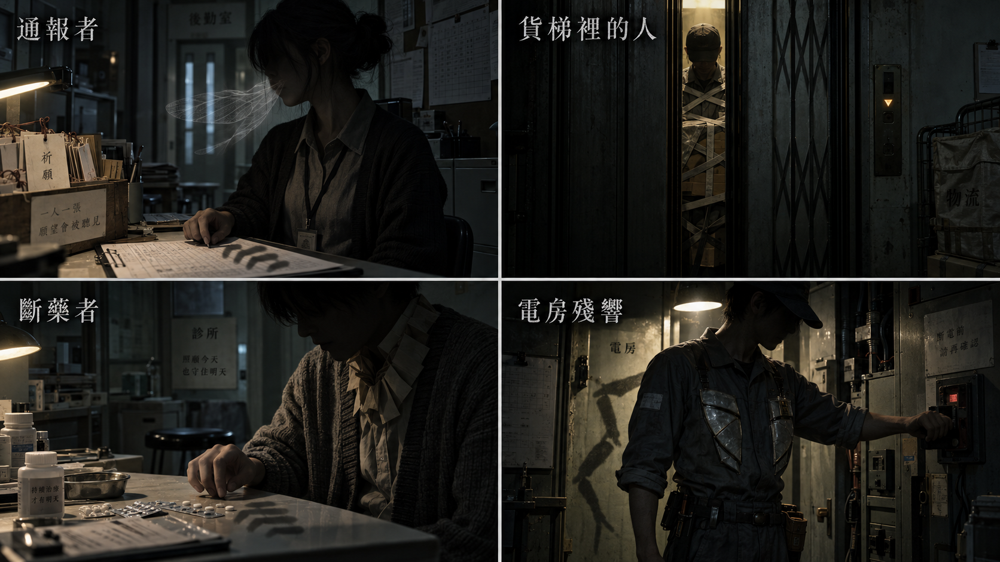

[完整圖說與操作對照](../09_劇本/09-15_正式劇本_共用附錄.md#h-0102-532) · [圖像目錄](../09_劇本/09-14_全劇本與關卡整合稿.md#book-illustrations)

<a id="node-r13-exit"></a>

#### 離場通路與次場景

<a id="s-0604-28"></a>

<!-- import:s-0604-28:begin -->
<a id="transition-r13-r14"></a>
##### T-R13-R14 · 診所送物梯廊

**起行與到達：**E-07 已依本房叫號序列與照護註記安息，診所後門開啟；可退回 R12 不受本條阻擋。原條件允許時可原路回訪。 到目的門口由玩家親自進房，才啟動房內事件。

**空間與保存：**每個次場景標明來路、去路、樓層與可見承重踏板；反向不水平翻圖。依原門檻通行，近看選填，不增加解鎖題或收集。 狀態依[通路共用規則](../09_劇本/09-15_正式劇本_共用附錄.md#transition-rules)與[逐層探路契約](../09_劇本/09-15_正式劇本_共用附錄.md#ascent-route-contract)。

**驗收：**尚未抵達目的房不得取得該房道具；每層測原門檻、錯路、取消、近看返回、正反向與存讀檔；圖號只定位，不授予目的房證據。正式畫面、音場與實機節奏仍待製作及驗證。

<!-- import:s-0604-28:end -->

<a id="transition-r13-r15"></a>
##### T-R13-R15 · 照護後勤設備道

**起行與到達：**E-07 已安息，且 R14 物流繼電器已接回；R15 的供電分配與後續推理不作進房前置。原條件允許時可原路回訪。 到目的門口由玩家親自進房，才啟動房內事件。

**空間與保存：**每個次場景標明來路、去路、樓層與可見承重踏板；反向不水平翻圖。依原門檻通行，近看選填，不增加解鎖題或收集。 狀態依[通路共用規則](../09_劇本/09-15_正式劇本_共用附錄.md#transition-rules)與[逐層探路契約](../09_劇本/09-15_正式劇本_共用附錄.md#ascent-route-contract)。

**驗收：**尚未抵達目的房不得取得該房道具；每層測原門檻、錯路、取消、近看返回、正反向與存讀檔；圖號只定位，不授予目的房證據。正式畫面、音場與實機節奏仍待製作及驗證。

<!-- production-subscenes:r13 -->

<!-- scene-image-subscenes-r13:begin -->
<a id="subscenes-r13"></a>
#### 次場景節點

以下次場景歸 R13 管理，節點編號沿用主圖圖號。來去方向為原動線的正向排列；反向通行與單向限制依原門檻，不因列出來路就新增返回出口。

<a id="subscene-t-r13-r14-01-spec"></a>
##### T-R13-R14-01 · 診所後簾送物平台

**樓層：**24F · A 棟

**類型：**可查看過渡。**正向連接：**R13-V01 → **T-R13-R14-01** → T-R13-R14-02。

**近看：**T-R13-R14-01-C01；關閉回 T-R13-R14-01。

[正文](../09_劇本/09-06_正式劇本_第三幕.md#subscene-t-r13-r14-01-script) · [圖像製作單](#node-r13-images) · [原門檻與回訪](#node-r13-nav) · [通路正文](../09_劇本/09-06_正式劇本_第三幕.md#ascent-t-r13-r14-01-script)

<a id="subscene-t-r13-r14-02-spec"></a>
##### T-R13-R14-02 · 廚房背側轉梯

**樓層：**25F · A 棟

**類型：**可查看過渡。**正向連接：**T-R13-R14-01 → **T-R13-R14-02** → T-R13-R14-03。

**近看：**T-R13-R14-02-C01；關閉回 T-R13-R14-02。

[正文](../09_劇本/09-06_正式劇本_第三幕.md#subscene-t-r13-r14-02-script) · [圖像製作單](#node-r13-images) · [原門檻與回訪](#node-r13-nav) · [通路正文](../09_劇本/09-06_正式劇本_第三幕.md#ascent-t-r13-r14-02-script)

<a id="subscene-t-r13-r14-03-spec"></a>
##### T-R13-R14-03 · 送物跨棟廊

**樓層：**26F · A 棟 → B 棟

**類型：**可查看過渡。**正向連接：**T-R13-R14-02 → **T-R13-R14-03** → R14-V01。

**近看：**T-R13-R14-03-C01；關閉回 T-R13-R14-03。

[正文](../09_劇本/09-06_正式劇本_第三幕.md#subscene-t-r13-r14-03-script) · [圖像製作單](#node-r13-images) · [原門檻與回訪](#node-r13-nav) · [通路正文](../09_劇本/09-06_正式劇本_第三幕.md#ascent-t-r13-r14-03-script)

<a id="subscene-t-r13-r15-01-spec"></a>
##### T-R13-R15-01 · 診所後勤管廊

**樓層：**24F · A 棟

**類型：**可查看過渡。**正向連接：**R13-V01 → **T-R13-R15-01** → T-R13-R15-02。

**近看：**T-R13-R15-01-C01；關閉回 T-R13-R15-01。

[正文](../09_劇本/09-06_正式劇本_第三幕.md#subscene-t-r13-r15-01-script) · [圖像製作單](#node-r13-images) · [原門檻與回訪](#node-r13-nav) · [通路正文](../09_劇本/09-06_正式劇本_第三幕.md#ascent-t-r13-r15-01-script)

<a id="subscene-t-r13-r15-02-spec"></a>
##### T-R13-R15-02 · 排氣背側折梯

**樓層：**25F · A 棟

**類型：**可查看過渡。**正向連接：**T-R13-R15-01 → **T-R13-R15-02** → T-R13-R15-03。

**近看：**T-R13-R15-02-C01；關閉回 T-R13-R15-02。

[正文](../09_劇本/09-06_正式劇本_第三幕.md#subscene-t-r13-r15-02-script) · [圖像製作單](#node-r13-images) · [原門檻與回訪](#node-r13-nav) · [通路正文](../09_劇本/09-06_正式劇本_第三幕.md#ascent-t-r13-r15-02-script)

<a id="subscene-t-r13-r15-03-spec"></a>
##### T-R13-R15-03 · 照護後勤跨棟廊

**樓層：**26F · A 棟 → B 棟

**類型：**可查看過渡。**正向連接：**T-R13-R15-02 → **T-R13-R15-03** → R15-V01。

**近看：**T-R13-R15-03-C01；關閉回 T-R13-R15-03。

[正文](../09_劇本/09-06_正式劇本_第三幕.md#subscene-t-r13-r15-03-script) · [圖像製作單](#node-r13-images) · [原門檻與回訪](#node-r13-nav) · [通路正文](../09_劇本/09-06_正式劇本_第三幕.md#ascent-t-r13-r15-03-script)
<!-- scene-image-subscenes-r13:end -->

<a id="node-r14-spec"></a>

### R14 · 貨梯轉接間

[正式場次](../09_劇本/09-06_正式劇本_第三幕.md#node-r14-script)

[進場與動線](#node-r14-nav) · [出入口位置](#node-r14-access) · [操作與解謎](#node-r14-level) · [狀態與驗收](#node-r14-pack) · [圖像製作單](#node-r14-images) · [離場與次場景](#node-r14-exit)

<a id="node-r14-nav"></a>

**進出、動線與回訪**

<a id="s-0609-27"></a>

<!-- import:s-0609-27:begin -->
<a id="h-0609-255"></a>

#### R14 貨梯轉接間

進行目的：辨認貨梯停靠與發電機方向；人員／物資共用物流、H-05

支線／收集：SQ-T 巡檢 PT-02

| 方向 | 類型 | 可移動條件 | 移動演出提案 | 回訪規則 |
| --- | --- | --- | --- | --- |
| R12 ↔ R14 | 分岔 | R12 配電接妥並通過本地權限；可先到貨梯轉接間，往 R15 前仍須完成 E-07 安息 | T-R12-R14：由 A 棟 23F R12 經 A 棟 24F、25F，於 26F 依本路門檻穿過分道接駁廊到 B 棟 26F，再沿短梯進 B 棟 27F R14；各分道以實體隔網分開，不能橫切跳過門禁。 | 章內回訪；遇鎖場、追逐或封路停用 |
| R13 ↔ R14 | 分岔 | E-07 已依本房叫號序列與照護註記安息，診所後門開啟；可退回 R12 不受本條阻擋 | T-R13-R14：由 A 棟 23F R13 經 A 棟 24F、25F，於 26F 依本路門檻穿過分道接駁廊到 B 棟 26F，再沿短梯進 B 棟 27F R14；各分道以實體隔網分開，不能橫切跳過門禁。 | 章內回訪；遇鎖場、追逐或封路停用 |
| R14 ↔ R15 | 分岔 | R14 物流繼電器已接回且 E-07 已安息；E-06 為選填，不擋主線 | 沿貨梯核心內側短梯到發電機門，欄杆與地坪接縫交代局部高差；不乘貨梯跳層。 | 章內回訪；遇鎖場、追逐或封路停用 |
| R17 → R14 | 誤導 | 假鑰匙組合成立時只觸發一次；不加 guess_count | T-R17-R14：由 32F 的 R17 原門端起行，經 31F、30F、29F、28F 的L-04 下行物流迴路，最後親自進入 27F 的 R14。保留原門檻與方向；可逐圖移動，近看選填，不增解鎖題。 | 單向流程；不代表可沿此線倒退 |
<!-- import:s-0609-27:end -->
<!-- navigation:r14:end -->

<a id="node-r14-access"></a>
#### 主場景出入口

<!-- scene-access:R14:begin -->
| 動線 | 顯示名稱 | 畫面位置與辨識物 | 通行狀態 |
| --- | --- | --- | --- |
| R12↔R14 | 來路／返回：接縫鋼平台 | 27F 門端，來路可辨26F 冷卻水旁通跨棟廊的連續扶手及固定梯口；起點房在 23F，不把兩端畫成同層相鄰門。 | 可回 R12，沿已開的配電權限通路。 |
| R13↔R14 | 另一來路／出口：診所送物廊 | 27F 門端，來路可辨26F 送物跨棟廊的連續扶手及固定梯口；起點房在 23F，不把兩端畫成同層相鄰門。 | 診所安息完成後才可往返 R13；不能先到貨梯就反穿未開的後門。 |
| R14↔R15 | 出口：井道內側短梯 | 貨梯核心內側的固定短梯，欄杆接向發電機房門。 | 物流繼電器接回且病患已安息後可往返 R15；不必完成搬運工支線。 |
| R17→R14 | 假路抵達點：物流維修口 | 27F 門端，來路可辨28F 搬運標籤梯口的連續扶手及固定梯口；起點房在 32F，不把兩端畫成同層相鄰門。 | 只承接假路的一次到達，不提供由此直返 R17 的新捷徑；回辦公區走 R15、R16。 |
| 封閉 | 貨梯井門 | 控制器旁的貨梯框及井道。 | 可操作原繼電器，不提供乘梯、選樓層或跳過診所的出口。 |
<!-- scene-access:R14:end -->

<!-- access-layout:R14:begin -->
<a id="node-r14-access-layout"></a>
##### 出入口配置草圖

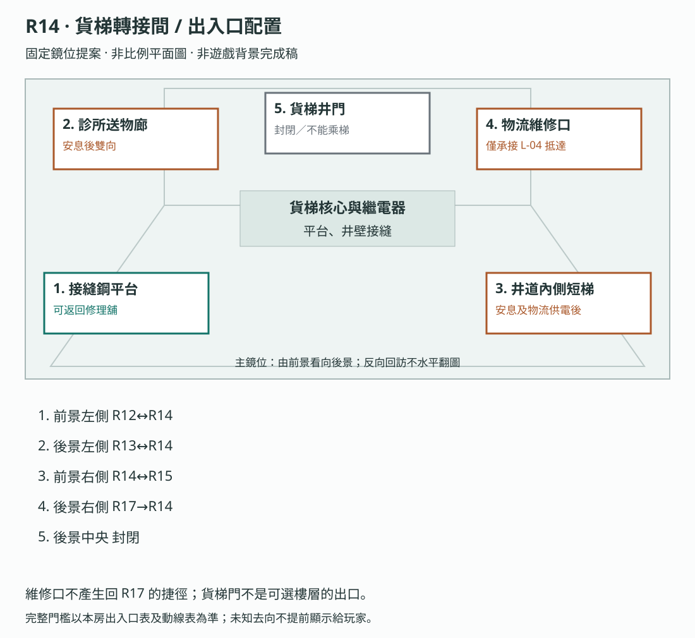

**構圖提案：**維修口不產生回 R17 的捷徑；貨梯門不是可選樓層的出口。 各門端位置對應上表；數字只供製作辨識，不是玩家介面或解謎提示。

門框、視線及熱區仍須灰盒驗收，依[共用契約](../09_劇本/09-15_正式劇本_共用附錄.md#scene-access-contract)，不計入遊戲圖像交付數。
<!-- access-layout:R14:end -->

**演出限制與製作註記**

<a id="s-0906-17"></a>

<!-- import:s-0906-17:begin -->
<a id="h-0906-204"></a>

#### 演出限制

> 連接：R12／已開 R13 後簾；往 R15 需兩側必要條件
> 當下打算：辨認設備平台，接回物流控制回路。
<!-- import:s-0906-17:end -->

<a id="node-r14-level"></a>

**關卡、解謎與失敗回饋**

<a id="s-0604-6"></a>

<!-- import:s-0604-6:begin -->
<a id="h-0604-253"></a>

#### R14 — 貨梯轉接間

<a id="h-0604-255"></a>

##### R14 空間與畫面製作定位

| 項目 | 畫面與製作要求 |
| --- | --- |
| 樓層定位 | 27F |
| 樓棟定位 | B 棟 |
| 樓層與環境 | 27F 搬運與供電區；與 R15 同層短梯相接。來自 23F 的兩條側路及 32F 誤導回路有各自門端，不乘貨梯跳層。 原光源、材質與證據焦點依本房規格。 |
| 入口方向 | 由 R12、R13、R17 承接；以來路門框／扶手作背向定位，前進方向依下列出口地標。左右方位沿既有構圖，不將反向回訪鏡頭誤當另一扇門。 |
| 可見出口 | 井道內側短梯通 R15；貨梯不作任意跳層工具。首次全景就交代入口輪廓或可查看的遮擋，不靠無標示的畫外點擊換房。 |
| 阻擋與開放條件 | 往 R15：E-07 已安息且 R14 物流繼電器已修復；E-06 為選填 |
| 畫面中的解謎要素 | 停靠紀錄、井道與貨梯控制；對照真實停靠及異常提示。關鍵標記可近看，與裝飾物有可辨的材質或輪廓差異，不只靠顏色或聲音。 |
| 完成後變化 | 停靠紀錄與井道線索進入筆記，玩家依既定條件沿井道內側短梯去 R15；貨梯不新增任意選層功能。 |

<a id="h-0604-268"></a>

##### R14 製作流程

<a id="h-0604-270"></a>

###### R14 共用貨梯的回收

停靠標籤旁保留與 R6 匯程門框相同的搬運記號，以及其他租戶的修理、餐飲標記；近看即能辨認貨梯是多戶共用，管理門禁卻控制唯一可用的轉接平台。曾查看 R6 封門者可多一句 OS：「不同的門，最後都擠到這裡。」未看過 R6 仍可由標籤理解路線，不鎖謎題。原物流比對、E-10 接收缺口與前往 R15 條件分別處理，不用旁戶標記冒充主線證據。

**空間第一印象：**暗鐵紅跨棟平台與深井。貨梯門旁有各租戶搬運標記，橋下只見內壁深暗；金屬回聲與診所布簾吸音形成反差。

**探索呈現：**先讓玩家看見入口、可走的方向和空間異常，再自選近看生活物件；新增租戶遺跡不發 E 證據、不設派系任務、不改出口旗標。恐怖沿原事件與遭遇時序，安定／閱讀保護段不插嚇點。

**逃生因果與可見回饋：**原停靠標籤讓玩家看出送貨路線不等於對外出口；比對的直接用途是辨認可抵達的設備平台。完成後點擊既定發電機方向，不替玩家自動移動，也不把 E-10 接收缺口設成開門密碼。

| 階段 | 製作規格 |
| --- | --- |
| 進入／目標 | 辨認貨梯停靠與發電機方向；人員／物資共用物流、H-05；入場先還原原房間已保存的熱點與事件狀態。 |
| 觀察／空間 | 貨梯核心旁的鋼平台接合不同標高，橋板與混凝土有明確接縫；井道只有內壁，不露外部世界。 |
| 操作順序 | 觀察貨梯與停靠痕 → 依餐食／藥品／設備端點修復必要本地物流繼電器 → 可再排列三張標籤取得 E2-08、比對 E-10 缺口 → 往發電機或已開通路。選填資料不作出口條件。 |
| 回饋 | 必要操作寫入原證據／門禁／遭遇狀態；新增生活附頁僅更新來源已讀與有依據的筆記，不重發原證據。 |

<a id="h-0604-288"></a>

###### R14 生活與管制觀察

原物流終端近看可切換同一貨梯的餐食、設備、人員交接分類；不同時段與交接簽名可辨，不能把餐車重量當作有人被運走的唯一證據。E-10 有帶離紀錄，接收簽名缺失，去向仍待確認。

<a id="h-0604-292"></a>

###### R14 附頁熱點

**頁鍵對照：**`food`＝餐食；`equipment`＝設備；`transfer`＝人員交接；`receipt`＝接收缺口。

| 欄位 | 規格 |
| --- | --- |
| 識別／位置 | `R14_DETAIL_01`；原物流終端完成原標籤操作後的分類頁。沿原近看開頁，不增加遠景發光提示。 |
| 前置 | 已開啟該原熱點；原證據、供電及回訪前置照舊，不因新增附頁放寬。 |
| 玩家操作 | 切換餐食／設備／人員，再看接收欄。各來源各自閱讀，不要求一次讀完。 |
| 回饋／筆記 | 分別保存物資與帶離事實；E-10 接收空白仍為未查得。 |
| 成本與中止 | 免費查看；普通探索閱讀停表；鎖場／強制演出依原規則暫不開啟。退出即回原近看，不寫未讀頁。 |
| 保存 | 每頁保存 `scene_detail.r14.read_pages` 集合；只有指定附頁顯示且玩家確認收起時加入對應頁鍵。來源顯示後中途暫停不算完成。 |
| 回訪 | 已讀頁可重看，原物件位置不重置；尚缺對照來源時保留觀察，不生成推論。 |
| 素材 | 在原近看增一組物件／紙張疊圖、各頁文字轉錄、翻頁／收起聲；近看與原基底光向一致，均待製作。 |

<a id="h-0604-307"></a>

###### R14 出口與回訪

| 目的節點 | 條件 | 移動與辨向 | 回訪邊界 |
| --- | --- | --- | --- |
| R12 | 沿已開連線回訪；未鎖場且未沉降封路 | 同一地標反向通行 | 章內回訪；遇鎖場、追逐或封路停用 |
| R13 | 沿已開連線回訪；未鎖場且未沉降封路 | 同一地標反向通行 | 章內回訪；遇鎖場、追逐或封路停用 |
| R15 | E-07 已安息且 R14 物流繼電器已修復；不要求尚未抵達的 R15 供電決策 | 沿貨梯核心內側短梯到發電機門，欄杆與地坪接縫交代局部高差；不乘貨梯跳層。 | 章內回訪；遇鎖場、追逐或封路停用 |

共用規則見[對應條款](10-01_製作規格_序幕.md#s-0601-6)。

<a id="h-0604-318"></a>

##### R14 動畫演出

<a id="h-0604-320"></a>

###### 貨梯與繭形呼吸

| 項目 | 場景演出規格 |
| --- | --- |
| 形式與節奏 | 門體機械動態加局部現時怨靈差分。 |
| 鏡頭與動作 | 玩家呼梯或控制電源後，門縫變化與衣物繭形的舒展相接，呼吸節奏沿原遭遇。 |
| 操作與資訊邊界 | 不新增追逐或倒數傷害；門體運動須符合當地電力與控制狀態，不能以怨靈效果代替復電解謎。 |

**表面功能**：搬運餐食、藥品、垃圾與設備。  
**揭露功能**：人員編號與物資編號共用同一張物流表。

| 互動 | 玩法 | 證據／懸念 |
| --- | --- | --- |
| 物流終端 | 先依餐食／藥品／設備端點修復本地物流繼電器，再對照停靠表、標籤編號與交接備註排列三張破損標籤；錯位不入座並可重排，不扣資源。其中一張雖列設備，但另有識別碼與人員交接資料；重量不能單獨證明載人。 | `E2-08`、E-10 空名訊號伏筆。 |
| 貨梯內壁 | 感知刮痕與識別牌碎片；選填進入 E-06 凝固瞬間。玩家只能確認它曾被關在貨梯，不能觀看死亡。 | `E2-12`。 |
| 通報者貨件 | 對上 R10 的外聯草稿與「已轉運」章；箱號後綴通往頂層，但內容已被塗黑。 | `E2-11` 延伸；器官傳聞仍不定論。 |
| H-05 | 玩家三次呼叫貨梯，樓層顯示每次錯一格；記錄順序可拼出一段不存在的毀損樓層。 | 第八幕才回收震損坍塌圖。 |

E-06 是選填對峙：在本地通電控制器核對來源後，可用 #9 貨梯到站音（按識別牌的原定停靠碼）或 #12 既存標準問候安息，兩條有效回應沿訊號規格分開保存。也可只關閉貨梯局部電源繞過，此時為 bypassed 而非 rested，不關閉主線繼電器。三者及未處置皆不影響必要通行。

---
<!-- import:s-0604-6:end -->

<a id="node-r14-pack"></a>

**狀態、素材與驗收**

<a id="s-uppertech-62"></a>

<!-- import:s-uppertech-62:begin -->
<a id="h-uppertech-1047"></a>

#### 後勤與校正模組｜第三幕｜R14 — 貨梯轉接間／E-06 貨梯裡的人

<a id="h-uppertech-1049"></a>

##### 後勤與校正模組｜R14-房間資料

| 欄位 | 值 |
| --- | --- |
| `room_id` | `R14` |
| `scene` | `room_r14.tscn` |
| `entry_from` | `R12`、`R13` |
| `exit_to` | `R12`、`R13`、`R15` |
| `backgrounds` | `r14_real.webp`、`r14_scan.webp`、`r14_freeze_lift.webp` |
| `main_goal` | 接回物流繼電器，確認物資與人員使用同一套編號 |
| `must_exit_when` | `act3.r14.logistics_relay_restored = true`；E-06 可略過 |

<a id="h-uppertech-1061"></a>

##### 後勤與校正模組｜R14-互動表

| ID | 物件／觸發 | 玩家操作 | 文字／聲音回饋 | 寫入狀態／證據 | 成本 |
| --- | --- | --- | --- | --- | --- |
| `R14_H01` | 物流繼電器 | `CONNECT` | 依「餐食／藥品／設備」三個圖示接回端點 | `act3.r14.logistics_relay_restored` | 0 |
| `R14_H02` | 三張破損標籤 | `ALIGN` | 一張標成設備，重量、飲水備註與識別碼卻對應一個人；同頁保存「維修索引組 RT-3／物流支路 L-04」，無日期及目前有效章、不直接列 32-S | `E2-08`、`act3.r14.e208_seen` | 0 |
| `R14_H03` | 缺頁轉運單 | `LOOK` | 可與 R10 的通報草稿及「已轉運」章對上；內容欄仍被撕除 | `act3.r14.e211_extended` | 0 |
| `R14_H04` | 貨梯內壁 | `LOOK` | 刮痕高度固定，門邊卡有半枚識別牌 | `r14.lift_scratches_seen` | 0 點 |
| `R14_H05` | 識別牌碎片 | `LOOK`→`RELATE`→`FOCUS_MEMORY`（依下列前置表） | 局部凝固定格於最後一條門縫光尚未熄滅的瞬間，不播放逐次熄燈、不顯示死亡 | `E2-12`、`act3.r14.e212_seen` | 首次 2 點／重看 0 點 |
| `R14_H06` | E-06 循環 | 現場通電控制器 PLAY_SIGNAL | 已核對來源的 #9 貨梯到站音（原停靠碼）或 #12 既存標準問候皆為有效安息；只關局部電源另走 H07 繞過，不當安息 | act3.r14.e06_state = rested，沿原回應種類保存 | 原訊號成本；話術延遲回升依資源規格 |
| `R14_H07` | 貨梯局部電源 | 長按關閉 | 玩家可終止循環離開；E-06 未安息，回訪仍留空白敲擊 | `act3.r14.e06_state = bypassed` | 0 |
| `R14_H08` | 三次呼梯 | 依序呼叫 | 顯示 `28 → 30M → 31`；`30M` 不在公開樓層圖上 | `act3.r14.h05_sequence_recorded` | 0 |

<a id="h-uppertech-1074"></a>

##### 後勤與校正模組｜R14-H-05 規格

- `30M` 是震損前存在的維修夾層代碼，震損後該樓段坍塌；不是超自然樓層。
- 第一次呼梯只看見顯示錯位，第二次出現 `30M`，第三次才允許保存序列。
- 保存後筆記只記「路由包含未列出的停靠點」，第八幕對上坍塌圖才確認原因。
- E-06 不替玩家解釋 `30M`，避免怨靈直接說出未取得的真相。

<a id="h-uppertech-1081"></a>

##### 後勤與校正模組｜R14-驗收

- [ ] 不進入 E-06 凝固瞬間也能接回物流繼電器並前往 R15。
- [ ] 關閉貨梯局部電源不會關閉 R15 或破壞主線供電。
- [ ] E-06 安息、略過與未觸發三種狀態都能正確保存。
- [ ] `E2-11` 延伸文件不可確認器官摘除。
<!-- import:s-uppertech-62:end -->

<a id="node-r14-images"></a>

#### 場景節點與靜態圖製作單

以下每列均為待製作圖像項目；文件多頁、正反面、局部與狀態差分須依拆圖欄各自交付，不能以一張示意圖代替。可探索場景的主圖提供移動與探索，演出節點不另開探索，近看關閉回到開啟前的畫面；原演出與操作條件仍依右欄來源。圖號、解析度、文字分層、存檔及驗收依[靜態圖共用契約](../09_劇本/09-15_正式劇本_共用附錄.md#scene-image-contract)。

<!-- scene-floor-locations:R14:begin -->
| 次場景／主圖 | 樓層定位 | 樓棟定位 | 移動方式 |
| --- | --- | --- | --- |
| R14-V02 | 27F | B 棟 | 步道 |
<!-- scene-floor-locations:R14:end -->

<!-- scene-images:R14:begin -->
| 畫面節點／圖號 | 用途 | 必畫內容 | 狀態與拆圖 | 來源 |
| --- | --- | --- | --- | --- |
| R14-V01 | 主場景 | 貨梯井、物流繼電器、控制器、平台護欄、三線端點與交接標牌。 平台側有空日用品／修理料周轉箱與寬窄車輪止擋。 | 三路未接／已接，貨梯顯示 28→30M→31 原序列；門縫現時窄繭另交整體靜止、束帶局部呼吸與原處置後差分。不能製成可乘貨梯跳層的選單。 C05 近看不在井內，也不啟動貨梯。 | [本場景](../09_劇本/09-06_正式劇本_第三幕.md#node-r14-script) |
| R14-C05 | 近看 | 日用品／修理料周轉箱、補握孔、止擋與寬窄車痕 | 箱身標記與車痕分圖；只在原平台查看，關閉回 V01；不指定配送終點、不增加乘梯選項。實看依生活痕跡共用規格記入場景觀察。 | [搬運生活痕跡](../09_劇本/09-06_正式劇本_第三幕.md#logistics-r14-script) |
| R14-C01 | 操作近看 | 餐食、藥品與設備三條繼電線 | 端點形狀及圖示可辨，線路可選／已接差分不只靠顏色。 | [R14-01](../09_劇本/09-06_正式劇本_第三幕.md#s-0906-19) |
| R14-D01 | 文件 | 停靠表、三張破損標籤與交接備註 | 三標籤各可移動對齊；保留裂口、標籤號與日期。 | [R14-02](../09_劇本/09-06_正式劇本_第三幕.md#s-0906-20) |
| R14-D02 | 介面 | 餐食、設備、人員與接收欄 | 各欄可展開，不以「設備」標籤直接證明物件本質。 | [R14-02](../09_劇本/09-06_正式劇本_第三幕.md#s-0906-20) |
| R14-C02 | 近看 | 內壁刮痕與識別牌碎片 | 兩個可比焦點；凝固層單獨輸出，人物靜止。 | [R14-03](../09_劇本/09-06_正式劇本_第三幕.md#s-0906-21) |
| R14-C03 | 操作近看 | 貨梯控制器與局部電源 | #9／#12 核對頁、到站選擇及關電差分；本機有電才可播放。 | [R14-03](../09_劇本/09-06_正式劇本_第三幕.md#s-0906-21) |
| R14-C04 | 近看 | 樓層顯示與門縫 | 28／30M／31 顯示差分及原門縫亮度；衣物、束帶與標籤結成的窄繭保留原呼吸／開關門同步節奏，不新增第二組節拍。低動態以原呼吸相位差分呈現，不增加可進樓層。 | [R14-04](../09_劇本/09-06_正式劇本_第三幕.md#s-0906-22) |
| R14-D03 | 文件 | 缺頁轉運單與貨梯裂圖 | 缺頁保持缺失；PT-02 裂口可疊合，與 E2-11 延伸分開。 | [R14-05](../09_劇本/09-06_正式劇本_第三幕.md#s-0906-23) |
| R14-V02 | 出口接景 | R14→R15：沿貨梯核心內側短梯到發電機門，欄杆與地坪接縫交代局部高差；不乘貨梯跳層。 | 沿原轉場取固定構圖；來路與去路各有可見定位。允許沿兩端場景重組材質，但須交此視角靜態圖及低動態替代；不增加房間、線索或強制等待。原單向／回訪、操作窗口及完成提交依動線表。 | [動線條件](#node-r14-nav) |
<!-- scene-images:R14:end -->

<!-- scene-image-access-art-r14:begin -->
**出入口交圖：**R14-V01 須依場次與狀態畫出[本場景出入口表](#node-r14-access)的來路、去路及封閉位置；既有操作鏡位與接景圖沿同一地標對位。門端差分、移動熱區與遮擋另分層，依[出入口共用契約](../09_劇本/09-15_正式劇本_共用附錄.md#scene-access-contract)驗收。
<!-- scene-image-access-art-r14:end -->


##### 原熱點對應圖號

同一圖可支援多個狀態，但每個列名焦點及原差分仍須交付；底圖不取代動畫、聲音或互動。此表只對圖，不新增取得條件。
<!-- hotspot-images:R14:begin -->
| 原熱點／操作 | 圖號 | 對應內容／邊界 |
| --- | --- | --- |
| R14_H01 | R14-C01 | 物流繼電器 |
| R14_H02 | R14-D01 | 三張破損標籤 |
| R14_H03 | R14-D02 | 缺頁轉運單 |
| R14_H04 | R14-C02 | 貨梯內壁 |
| R14_H05 | R14-C02 | 識別牌碎片 |
| R14_H06 | R14-C03 | E-06 循環 |
| R14_H07 | R14-C03 | 貨梯局部電源 |
| R14_H08 | R14-C04 | 三次呼梯 |
<!-- hotspot-images:R14:end -->

<a id="node-r14-visual"></a>

#### 本場景圖像與示意

本房沿用跨房圖的指定面板，尚無獨立專圖；請依下列適用範圍對照，不把整張圖當成本房演出。

[V22 第三幕：路由與後勤通路](#fig-v22) · [V33 怨靈的昆蟲身體恐怖：後勤威脅](#fig-v33)

- **V22：**供電方案、R17→R14 誤導回路、缺藥資料與貨梯門端是跨房對照；圖示不增加乘梯跳層或新捷徑。
- **V33：**本房只取第 2 格「貨梯裡的人」，依 E-06 既有處置與觸發條件；不加入診所的斷藥者，也不新增遭遇。

[返回本房正式劇本](../09_劇本/09-06_正式劇本_第三幕.md#node-r14-script) · [本房關卡與解謎](#node-r14-level)

<a id="node-r14-exit"></a>

#### 離場通路與次場景

<!-- production-subscenes:r14 -->

<!-- scene-image-subscenes-r14:begin -->
<a id="subscenes-r14"></a>
#### 次場景節點

以下次場景歸 R14 管理，節點編號沿用主圖圖號。來去方向為原動線的正向排列；反向通行與單向限制依原門檻，不因列出來路就新增返回出口。

<a id="subscene-r14-v02-spec"></a>
##### R14-V02 · R14→R15

**樓層：**27F · B 棟

**類型：**轉場接景。**正向連接：**R14-V01 → **R14-V02** → R15-V01。

**近看：**不新增近看；沿原轉場操作，不新增等待或讀取門檻。

[正文](../09_劇本/09-06_正式劇本_第三幕.md#subscene-r14-v02-script) · [圖像製作單](#node-r14-images) · [原門檻與回訪](#node-r14-nav) · [動線條件](#node-r14-nav)
<!-- scene-image-subscenes-r14:end -->

<a id="node-r15-spec"></a>

### R15 · 發電機房

[正式場次](../09_劇本/09-06_正式劇本_第三幕.md#node-r15-script)

[進場與動線](#node-r15-nav) · [出入口位置](#node-r15-access) · [操作與解謎](#node-r15-level) · [狀態與驗收](#node-r15-pack) · [圖像製作單](#node-r15-images) · [離場與次場景](#node-r15-exit)

<a id="node-r15-nav"></a>

**進出、動線與回訪**

<a id="s-0609-28"></a>

<!-- import:s-0609-28:begin -->
<a id="h-0609-269"></a>

#### R15 發電機房

進行目的：恢復通行設備供電；部分／全面／定向供電抉擇、固定安定感知

支線／收集：SQ-T 開通捷徑

| 方向 | 類型 | 可移動條件 | 移動演出提案 | 回訪規則 |
| --- | --- | --- | --- | --- |
| R13 ↔ R15 | 分岔 | E-07 已安息，且 R14 物流繼電器已接回；R15 的供電分配與後續推理不作進房前置 | T-R13-R15：由 A 棟 23F R13 經 A 棟 24F、25F，於 26F 依本路門檻穿過分道接駁廊到 B 棟 26F，再沿短梯進 B 棟 27F R15；各分道以實體隔網分開，不能橫切跳過門禁。 | 章內回訪；遇鎖場、追逐或封路停用 |
| R14 ↔ R15 | 分岔 | R14 物流繼電器已接回且 E-07 已安息；E-06 為選填，不擋主線 | 沿貨梯核心內側短梯到發電機門，欄杆與地坪接縫交代局部高差；不乘貨梯跳層。 | 章內回訪；遇鎖場、追逐或封路停用 |
| R15 ↔ R16 | 主線 | 三路供電任一路操作完成並確認，E2-06 已取得；第二層推理在 R16 內完成，不先鎖門 | T-R15-R16：B 棟 27F 出發，經 28F 側路、29F 候梯口，搭 L1 到 30F 必停平台；親自完成踏板與啟用柄後再搭至 31F，走出停靠平台進 R16。不能直達或繞過 30F。 | 章內回訪；遇鎖場、追逐或封路停用 |
| R12 ↔ R15 | 捷徑 | SQ-T 完成、R12–R15 均已到訪、E2-06 已成立；不恢復犧牲紀錄 | T-R12-R15：由 A 棟 23F R12 經 A 棟 24F、25F，於 26F 依本路門檻穿過分道接駁廊到 B 棟 26F，再沿短梯進 B 棟 27F R15；各分道以實體隔網分開，不能橫切跳過門禁。 | 章內回訪；遇鎖場、追逐或封路停用 |
<!-- import:s-0609-28:end -->
<!-- navigation:r15:end -->

<a id="node-r15-access"></a>
#### 主場景出入口

<!-- scene-access:R15:begin -->
| 動線 | 顯示名稱 | 畫面位置與辨識物 | 通行狀態 |
| --- | --- | --- | --- |
| R13↔R15 | 來路／返回：診所設備道 | 27F 門端，來路可辨26F 照護後勤跨棟廊的連續扶手及固定梯口；起點房在 23F，不把兩端畫成同層相鄰門。 | 原安息與物流供電門檻成立後可回 R13。 |
| R14↔R15 | 另一來路／返回：貨梯短梯 | 另一側接固定欄杆與局部高差的機房入口。 | 原門檻成立後可回 R14，與診所入口分開辨認。 |
| R12↔R15 | 後開捷徑：維修門扣 | 27F 門端，來路可辨26F 低負荷回程跨棟廊的連續扶手及固定梯口；起點房在 23F，不把兩端畫成同層相鄰門。 | 維修支線、兩端到訪與供電證據條件成立後可直返 R12；未開時保留實體門扣，不暗示可穿越。 |
| R15↔R16 | 出口：後加防火門 | 27F 門端，去路可辨28F 舊維修排隊外間的連續扶手及固定梯口；目的房在 31F，不把兩端畫成同層相鄰門。 | 任一供電方案完成確認、取得 E2-06 後可進 R16 及返回；不用先解完伺服器室內的推理。 |
<!-- scene-access:R15:end -->

<!-- access-layout:R15:begin -->
<a id="node-r15-access-layout"></a>
##### 出入口配置草圖

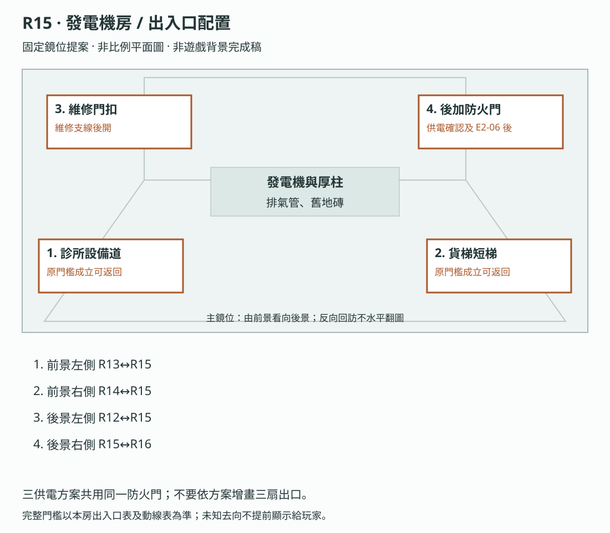

**構圖提案：**三供電方案共用同一防火門；不要依方案增畫三扇出口。 各門端位置對應上表；數字只供製作辨識，不是玩家介面或解謎提示。

門框、視線及熱區仍須灰盒驗收，依[共用契約](../09_劇本/09-15_正式劇本_共用附錄.md#scene-access-contract)，不計入遊戲圖像交付數。
<!-- access-layout:R15:end -->

**演出限制與製作註記**

<a id="s-0906-24"></a>

<!-- import:s-0906-24:begin -->
<a id="h-0906-290"></a>

#### 演出限制

> 入口：R13 或 R14；必須 E-07 已安息、物流繼電器已修復
> 當下打算：讓核心與上方管理區的設備恢復，找出下一段通路。
<!-- import:s-0906-24:end -->

<a id="node-r15-level"></a>

**關卡、解謎與失敗回饋**

<a id="s-0604-7"></a>

<!-- import:s-0604-7:begin -->
<a id="h-0604-343"></a>

#### R15 — 發電機房：第一次重大抉擇

<a id="h-0604-345"></a>

##### 圖解：供電取捨與路線回饋

[查看圖像：供電取捨與路線回饋](#fig-l04)

01 是選擇前的總覽；02、03、04 是互斥的供電方案，不是依序完成的四步。

| 分鏡 | 玩家操作與畫面回應 |
| --- | --- |
| 01 | 在發電機房查看三路與各自的暫存紀錄代價；以下 02–04 是三選一的方案，並非依序全部執行。完成所選機構並確認後，才保存供電與保留紀錄。 |
| 02 | 部分供電：在發電機房先接妥醫療與核心兩組斷路器；完成技術核心調查後，循原路回設備修理區切換辦公室繼電器。圖示為這次回訪操作，之後仍須以已取得的本地憑據驗證辦公室門。 |
| 03 | 全面供電：啟動備援後依表針與刻度完成三次穩壓，首輪調校為 30 秒、錯誤只重做當次；圖示第二次完成、第三次未完成。操作中不插遭遇；完成後貨梯、廣播與安全照明恢復，仍需後續調查及門端驗證。 |
| 04 | 定向供電：依可重看的舊操作記憶，親手依序輸入冷卻→核心→索引→中繼。圖示最後的中繼輸入與本地路由回饋；熟悉權限不是抹除，也不代替後續必要推理。 |

三路保留全部必要主線證據，各保留一份不同選填紀錄；供電不代替後續調查與門端驗證。

<a id="h-0604-361"></a>

##### R15 空間與畫面製作定位

| 項目 | 畫面與製作要求 |
| --- | --- |
| 樓層定位 | 27F |
| 樓棟定位 | B 棟 |
| 樓層與環境 | 27F 厚柱旁發電機房；R14 的短梯只處理局部高差。完成供電後經 28F、29F、30F 後勤外圈到 31F 伺服器室。 原光源、材質與證據焦點依本房規格。 |
| 入口方向 | 由 R13、R14、R12 承接；以來路門框／扶手作背向定位，前進方向依下列出口地標。左右方位沿既有構圖，不將反向回訪鏡頭誤當另一扇門。 |
| 可見出口 | 後加防火門通 R16，原已開通路可回訪。首次全景就交代入口輪廓或可查看的遮擋，不靠無標示的畫外點擊換房。 |
| 阻擋與開放條件 | 往 R16：R15 供電路線操作完成並確認、E2-06 已保存；不要求尚在 R16 的第二層推理 |
| 畫面中的解謎要素 | 三路控制、電路標示與對應狀態；選擇前後門和設備變化可對照。關鍵標記可近看，與裝飾物有可辨的材質或輪廓差異，不只靠顏色或聲音。 |
| 完成後變化 | 提交供電選擇後，對應電路、設備及資料保留狀態一同更新；必要前置齊備才可經防火門進 R16，回訪不恢復已犧牲紀錄。 |

<a id="h-0604-374"></a>

##### R15 製作流程

R13、R14 可先後互換調查，但兩側通往機房的門端共用同一前提：E-07 已安息與物流繼電器已修復。缺任一項時只顯示對應已知阻礙，仍能沿 R12 分岔補做；不要求未來才取得的供電決策、第二層鎖定或 E-06 選填安息。

**逃生因果與可見回饋：**確認供電方案前，原線路盤明示各方案皆能支撐必要後續通路；選擇差別仍是原噪音與選填暫存。提交後對應設備指示和原門端回應恢復，讓玩家先感到路能繼續走，再閱讀資料代價。

| 階段 | 製作規格 |
| --- | --- |
| 進入／目標 | 恢復通行設備供電；部分／全面／定向供電抉擇、固定安定感知；入場先還原原房間已保存的熱點與事件狀態。 |
| 觀察／空間 | 發電機安在厚柱與核心牆之間，後加排氣繞過舊住戶窗；三條供電路徑保持原可讀性。 |
| 操作順序 | 查看三種供電路徑 → 預覽既定資料後果 → 玩家確認後提交原不可逆選擇 → 依原條件開啟後續路線。順序中的選填內容不作離房門檻；原主線旗標、遭遇數值及分支提交條件依本場景細則。 |
| 回饋 | 必要操作寫入原證據／門禁／遭遇狀態；新增生活附頁僅更新來源已讀與有依據的筆記，不重發原證據。 |

<a id="h-0604-387"></a>

###### R15 出口與回訪

| 目的節點 | 條件 | 移動與辨向 | 回訪邊界 |
| --- | --- | --- | --- |
| R13 | 沿已開連線回訪；未鎖場且未沉降封路 | 同一地標反向通行 | 章內回訪；遇鎖場、追逐或封路停用 |
| R14 | 沿已開連線回訪；未鎖場且未沉降封路 | 同一地標反向通行 | 章內回訪；遇鎖場、追逐或封路停用 |
| R16 | R15 供電操作確認、E2-06 已保存 | T-R15-R16：B 棟 27F 出發，經 28F 側路、29F 候梯口，搭 L1 到 30F 必停平台；親自完成踏板與啟用柄後再搭至 31F，走出停靠平台進 R16。不能直達或繞過 30F。 | 章內回訪；遇鎖場、追逐或封路停用 |
| R12 | 沿已開連線回訪；未鎖場且未沉降封路 | 同一地標反向通行 | 章內回訪；遇鎖場、追逐或封路停用 |

共用規則見[對應條款](10-01_製作規格_序幕.md#s-0601-6)。

玩家必須恢復 R16、R17 的電力。場景提供三條清楚可讀的線路：生活／醫療、核心伺服器、全棟備援。選擇一經確認，本輪不能重選，但三條路都能取得所有主線證據。

| 選擇 | 玩家操作 | 當下影響 | 後續影響 |
| --- | --- | --- | --- |
| **部分供電** | 手動重接兩組斷路器，只供應診所與核心的最低設備電力 | 最安靜、恐慌最低；R16 後須回 R12 操作原辦公室繼電器 | 所有必要證據可得；只保留本路一份選填紀錄，R17 用 R16 本地憑據手動驗證 |
| **全面供電** | 啟動全棟備援並完成 30 秒三次穩壓 | 喚醒一個低壓迴聲，貨梯與廣播同時運轉 | 所有必要證據可得；只保留本路一份選填紀錄，另有安全照明；R17 用 R16 本地憑據手動驗證 |
| **定向供電** | 依可重看的舊操作記憶，親手輸入核心線路順序 | 路徑最短；系統回覆「主管專用線路已接通」 | 記錄 `authority_familiarity`；R17 門由已通電本地路由開啟，只保留本路一份選填紀錄 |

> `authority_familiarity` 只記錄主角使用舊職務知識，不等於「權限反擊」次數，也不直接封鎖結局。它影響場景如何認出她，不把探索便利當成道德罪名。

<a id="h-0604-409"></a>

##### 每條路只保留一份選填紀錄

**終幕必要通道：**三路均恢復上層讀取端及內部維修網段，診斷列只顯「維修網段已恢復／影像索引未掛載」；部分供電後切辦公室繼電器不取消此低負載通道。P1 鏡頭沿當地泵房低壓迴路本地錄影，R15 不負責追補歷史影格。影像索引仍在 R31 取得、R32 核驗，不提前顯肉身。

**可查證的設備限制：**低壓維修介面只能讀目錄，三個來源區的正文要等復電掛載。故障單與實體接點顯示只剩一個可用隔離封存槽；原路線選擇器連動接入一份暫存，首次啟動會重建另外兩個未隔離資料區。診斷控制器無法還原啟動前索引，重新斷電也不回復。全面供電增加供電範圍，不修復兩個故障封存接點，因此仍只能留一份。

預覽顯示「目錄可讀／正文待復電」「隔離封存：1／3」「啟動後重建未隔離暫存」；匯出來源顯示「來源區未掛載」，不可先備份全文再選。確認前可自由切換與取消。確認後三列名稱保留，一列「已封存」、另兩列「暫存已重建」；不立即關閉畫面，不加人聲或死亡暗示。主線原件位於持久儲存區，不在重建範圍。

三條供電路線原本的差異是「安靜／快速／被認出」。 每路**各自只能保留一份選填受害者紀錄**，另外兩份在電力切換的瞬間被覆寫：

| 路線 | 救回 | 失去 |
| --- | --- | --- |
| 部分供電 | E-07 斷藥者的完整診所紀錄（含他嗓子壞掉前的聲音樣本） | 另外兩份 |
| 全面供電 | E-06 貨梯裡的人的素材索引對應（她的識別牌 → 她的編號） | 另外兩份 |
| 定向供電 | E-08 電房殘響的送醫呼叫紀錄（被刪掉的那一通） | 另外兩份 |

- 選擇前，控制台**列出三份紀錄的名稱**，並標示「電力切換將覆寫未鎖定的暫存區」。玩家知道自己在放棄什麼。
- **主線不受影響**：三條路都能取得全部必要證據。
- 沒有救回的紀錄，該受害者在名冊上仍列，但少一行。

> 這不是懲罰路線選擇。三條路都對。它只是讓「開燈」這個動作，第一次有了**是誰的燈**的問題。

完成所選供電操作並長按確認後，取得 `E2-06` 發電機與權限操作紀錄；保存路線及玩家實際操作，不以未呈現給玩家的答案或提示前操作作門檻。

E-08 低壓迴聲只沿全面供電原事件出現。已讀 R12 維修單時，工具影子指向故障支路位置，不指示扳動方向；R12 工單與 R15 銘牌同寫「維修支路／保持隔離」，未讀工單仍可查現場銘牌。玩家親手把該支路由「接入」扳回「隔離」，才記 `act3.r15.e08_warning_followed`，免除這次過載增量；不抵銷全面供電原恐慌代價。忽略則停電 6 秒、恐慌 +1，備援恢復，不死亡、不重選暫存。影子不代操作，#8 僅索引既有斷電聲，不自動修復或新增安息。

<a id="h-0604-435"></a>

##### 三路操作與恢復

部分供電先把醫療、核心兩組端點接妥。R16 完成第二層鎖定後，門端顯示 32F 中繼尚未通電；玩家沿已開原路或已解鎖 SQ-T 捷徑回 R12，操作辦公室繼電器 `act3.r12.office_relay_ready`，再返回 R16→R17。切換只延續已選方案，不重選保留紀錄，也不封住返程。

全面供電在 30 秒內完成三次穩壓；表針、刻度與指示文字共同提供時機。失誤只重做當次，輔助模式可取消倒數；遭遇與安定點不插在操作中。定向供電的「冷卻→核心→索引→中繼」由既有舊操作記憶提供可重看的順序提示，玩家親手點選；不要求玩家猜主角已知而畫面未交代的答案。三路完成各自操作後才長按確認，供電結果、保留紀錄與 E2-06 同時保存；取消不覆寫暫存，存讀不回復已捨棄的兩份。

<a id="h-0604-441"></a>

##### 供電紀錄裡的七分鐘 · 逃跑夜碎片 `E4-00-C`

> 逃跑夜長線第三片。C 本身就提供一個**具體長度**，不以取得 A／B 或先顯示「同一夜？」為前提；玩家從這裡開始會主動想知道那七分鐘裡發生什麼。

| 項目 | 內容 |
| --- | --- |
| 觸發 | 任一供電路線確認後，控制台可調閱歷史電壓紀錄；玩家捲到兩週前那一頁。 |
| 玩家看見 | 一段**七分鐘**的異常區間：驗證匯流排掉線，但前後電壓完全正常——不是停電，是有人把某樣東西繞過去了。區間兩端的時戳同樣缺一位。 |
| 證據 | 取得 `E4-00-C`。描述只寫「一段七分鐘的驗證異常；不是斷電」。 |
| 時序軌 | 只依此片已見電壓區間顯示「未定位 · 約七分鐘」；其他已收碎片仍需玩家比對才歸入同組，不自動補 A／B 或人物歸屬。 |
| OS | **無。** |
| 與 `E2-06` 的關係 | 兩者共用同一個終端但分開取得。`E2-06` 是主線（發電機與權限操作紀錄），`E4-00-C` 是選填的歷史頁；不取得不影響第二層鎖定。 |
| 公平性 | 三條供電路線都可取得，內容完全相同；不把長線綁在某一條抉擇上。 |

---

<a id="h-0604-457"></a>

##### 固定安定感知 · 分區控制台服務座

- 任一供電路線確認後，控制台側面的服務座亮起；它取用玩家剛恢復的區域電力，不改變三路抉擇結果。
- 在安全角落定神 2.5 秒，凝神穩定度 **+25 點、上限 100**，每輪一次，保存 `act3.r15.grounding_used`。
- 穩定度為 0 也能先完成供電謎題：斷路器是實體操作；確認後由控制台顯示本地必要驗證頁。
- 安定感知時不生成新迴聲。全面供電路線原有的低壓迴聲仍照既定時點出現，不把選擇安定感知變成額外懲罰。

---

##### 操作與呈現補充

- [s-0906-30](../09_劇本/09-06_正式劇本_第三幕.md#s-0906-30)：部分供電也包含必要讀取端與內部維修網段，切辦公室繼電器不取消這條低負載通道。P1 鏡頭一直沿當地低壓迴路錄影；此處不新建攝影機，不讓全面供電成為終幕門票。
- [s-0906-30](../09_劇本/09-06_正式劇本_第三幕.md#s-0906-30)：保留紀錄中的嗓音樣本與送醫呼叫沿原資產，不為本稿虛構可辨人聲；逐字音檔尚待核字，不視為零錄音工時。
<!-- import:s-0604-7:end -->

<a id="node-r15-pack"></a>

**狀態、素材與驗收**

<a id="s-uppertech-63"></a>

<!-- import:s-uppertech-63:begin -->
<a id="h-uppertech-1088"></a>

#### 後勤與校正模組｜第三幕｜R15 — 發電機房／三路供電

<a id="h-uppertech-1090"></a>

##### 後勤與校正模組｜R15-房間資料

| 欄位 | 值 |
| --- | --- |
| `room_id` | `R15` |
| `scene` | `room_r15.tscn` |
| `entry_from` | `R13`／`R14`；需候診序列完成與物流繼電器接回 |
| `exit_to` | 原路回 `R13`／`R14`；供電完成才開 `R16`；`R12` 僅 SQ-T 已完成捷徑可直達 |
| `backgrounds` | `r15_real.webp`、`r15_scan.webp`、`r15_freeze_breaker.webp` |
| `main_goal` | 在理解三條路後做出不可重選的供電選擇 |
| `must_exit_when` | `act3.r15.route_confirmed = true`，R16 門禁亮起 |

<a id="h-uppertech-1102"></a>

##### 後勤與校正模組｜R15-共用互動表

| ID | 物件／觸發 | 玩家操作 | 文字／聲音回饋 | 寫入狀態／證據 | 成本 |
| --- | --- | --- | --- | --- | --- |
| `R15_H01` | 三路電纜 | `LOOK` | 標示「生活／醫療」「核心」「全棟備援」；每路有清楚色形差異 | `r15.routes_seen` | 0 |
| `R15_H02` | 舊操作紀錄 | `LOOK` | 顯示主管帳號可跳過人工穩壓；帳號名稱被遮蔽 | `r15.supervisor_route_seen` | 0 點 |
| `R15_H03` | 維修支路開關 | `LOOK`→手動隔離 | 全面供電時，已讀工單才出工具影子指故障位置；銘牌「維修支路／保持隔離」始終可查，由接入扳回隔離才免除過載增量，#8 不代做 | 原提示旗標；實際隔離才寫 `act3.r15.e08_warning_followed` | 0 |
| `R15_H04` | 路線確認面板 | `ROUTE_POWER` | 顯示三路差異與「本輪不可重新分配」；**並列出三份選填受害者紀錄名稱，標示「電力切換將覆寫未鎖定的暫存區」**；需長按 2 秒確認 | `act3.r15.power_route`、`act3.r15.route_confirmed`、`act3.r15.saved_record`（E-07／E-06／E-08 三選一） | 0 |
| `R15_H05` | 操作完成紀錄 | 自動 | 記錄選擇、輸入順序與是否依提示操作 | `E2-06`、`act3.r15.e206_seen` | 0 |
| `R15_H06` | 分區控制台服務座 | `GROUND` | 任一路線確認後解鎖；定神 2.5 秒，凝神穩定度 +25 點、上限 100 點；不觸發額外迴聲 | `act3.r15.grounding_used = true` | 0 |
| `R15_H07` | 歷史電壓紀錄 · 兩週前那一頁 | `LOOK` | 一段七分鐘的驗證匯流排異常，前後電壓正常（不是斷電）；兩端時戳各缺一位。三條供電路線內容完全相同 | `E4-00-C`、`timeline.unplaced_group`（標題改為 `未定位 · 約七分鐘`） | 0 |

<a id="h-uppertech-1114"></a>

##### 後勤與校正模組｜R15-三路實作

`R15_H04` 同面板先顯示「目錄可讀／正文待復電」「隔離封存：1／3」「啟動後重建未隔離暫存」。原故障單與接點表明一個可用封存槽，由路線選擇器連動接入相應資料區；低壓目錄可預覽，正文未掛載，匯出顯示「來源區未掛載」。全面供電不修復封存硬體，不能多存兩份。長按確認原子保存路線／E2-06／唯一暫存；一列改「已封存」、兩列「暫存已重建」，名稱保留、不立即跳走。取消不覆寫；故障控制器不可回復首次啟動前索引，重啟、切繼電器及讀檔均不重選。主線持久原件不在重建範圍。

| 路線 | 實際操作 | 當下效果 | R16／R17 差異 |
| --- | --- | --- | --- |
| `partial` 部分供電 | 接上醫療最低供電與核心最低供電，共 2 組端點 | 最安靜；恐慌不增加；R13 成為安全點 | R16 完成後需回 R12 操作 `R12_H09`，再進 R17 |
| `full` 全面供電 | 30 秒完成 3 次穩壓，失誤只重做當次，暫停／失焦凍結計時，輔助可逐步確認 | 貨梯、廣播與風扇啟動，原恐慌 +1 | 選填索引較早可讀；R17 仍用 R16 本地憑據驗證，E-08 依原條件出現；只保留本路一份暫存紀錄 |
| `directed` 定向供電 | 畫面提供可重看的熟悉序位「冷卻→核心→索引→中繼」，由玩家依序點選；不要求猜未知記憶 | 最短；系統顯示「主管專用線路已接通」 | `player.authority_familiarity += 1`；R17 玻璃門提前自動開啟 |

<a id="h-uppertech-1125"></a>

##### 後勤與校正模組｜R15-E-08 低壓迴聲

- 僅全面供電有既定低壓迴聲；R12 工單已讀時工具影子指向故障的「維修支路」，不指示扳動方向。工單與銘牌同寫「保持隔離」，由玩家將接入扳回隔離，文字與接點共同確認；未讀工單仍可查現場，#8 不代操作。
- 實際隔離才寫 `act3.r15.e08_warning_followed = true`，免除本事件過載增量；全面供電原恐慌 +1 仍成立，不能由此抵銷。看見影子不直接寫成功旗標。
- 若忽略：全房停電 6 秒、恐慌另 +1 階，隨後備援恢復，不死亡、不重選暫存；本事件與 HA 共用旗標，不重複結算。
- 事件結束後 E-08 不現形、不安息；它是跨房殘響，不新增一場正式對戰。

<a id="h-uppertech-1132"></a>

##### 後勤與校正模組｜R15-驗收

- [ ] 選擇前必須同畫面列出三路的遊玩差異，但不可標示道德好壞。
- [ ] 確認後立即自動存檔，本輪不可重選；讀取舊存檔仍保留原路線。
- [ ] 三路都能取得 `E2-04`、`E2-05`、`E2-06` 並通關。
- [ ] 全面供電的 30 秒操作在輔助模式可取消倒數，不影響成就或證據。
- [ ] 三路確認前均只能讀目錄；取消可改選，確認後一存二失且讀檔不恢復，主線原件不受影響。
- [ ] E-08 有／無工單均可查銘牌；手動隔離有效、只播放 #8 無效；失誤及正確修復都不重結算供電代價或新增安息。
- [ ] 定向供電只增加 `authority_familiarity`，不可增加權限反擊次數。
- [ ] `R15_H06` 三條路皆可用、每輪只成功一次；讀檔後不可重刷，凝神穩定度上限不得超過 100 點。
- [ ] 以 0 點 進房仍能用本地備援供電控制器切換電動斷路器；必要驗證頁在路線確認後由控制台外部供電。
<!-- import:s-uppertech-63:end -->

<a id="node-r15-images"></a>

#### 場景節點與靜態圖製作單

以下每列均為待製作圖像項目；文件多頁、正反面、局部與狀態差分須依拆圖欄各自交付，不能以一張示意圖代替。可探索場景的主圖提供移動與探索，演出節點不另開探索，近看關閉回到開啟前的畫面；原演出與操作條件仍依右欄來源。圖號、解析度、文字分層、存檔及驗收依[靜態圖共用契約](../09_劇本/09-15_正式劇本_共用附錄.md#scene-image-contract)。

<!-- scene-floor-locations:R15:begin -->
| 次場景／主圖 | 樓層定位 | 樓棟定位 | 移動方式 |
| --- | --- | --- | --- |
| T-R15-R16-01 | 28F | B 棟 | 步道 |
| T-R15-R16-02 | 29F | B 棟 | 電梯候梯 |
| T-R15-R16-03 | 29F → 30F | B 棟 | 電梯車廂 |
| T-R15-R16-04 | 30F | B 棟 | 電梯停靠 |
| T-R15-R16-05 | 30F → 31F | B 棟 | 電梯車廂 |
| T-R15-R16-06 | 31F | B 棟 | 電梯停靠 |
<!-- scene-floor-locations:R15:end -->

<!-- scene-images:R15:begin -->
| 畫面節點／圖號 | 用途 | 必畫內容 | 狀態與拆圖 | 來源 |
| --- | --- | --- | --- | --- |
| R15-V01 | 主場景 | 發電機、三路配電、斷路器、穩壓表、隔離封存槽、側面維修箱與服務座。 | 供電三方案各自完成態、封存一份／另外兩份不可回復、維修支路接入／隔離與捷徑門扣差分。 | [本場景](../09_劇本/09-06_正式劇本_第三幕.md#node-r15-script) |
| R15-D01 | 介面 | 三路電力、原操作紀錄與確認頁 | 原操作紀錄、三路差異、三份可能失去的暫存來源名稱、長按前／中／取消／鎖定與操作完成紀錄各頁；不得只畫成功選項。 | [R15-01](../09_劇本/09-06_正式劇本_第三幕.md#s-0906-26) |
| R15-C01 | 操作近看 | 醫療與核心斷路器 | 原開／關與接妥位置可辨，總電力狀態由實際操作更新。 | [R15-02A](../09_劇本/09-06_正式劇本_第三幕.md#s-0906-27) |
| R15-C02 | 操作近看 | 備援穩壓表 | 表針、刻度及三次調校狀態可見，配合原 30 秒窗口。 | [R15-02B](../09_劇本/09-06_正式劇本_第三幕.md#s-0906-28) |
| R15-C03 | 操作近看 | 四序位開關與舊紀錄 | 開關機構圖、紀錄原件與輸入差分分開，不能直接亮出正確次序。 | [R15-02C](../09_劇本/09-06_正式劇本_第三幕.md#s-0906-29) |
| R15-C04 | 操作近看 | 維修支路隔離開關 | 銘牌「維修支路／保持隔離」、接點接入／斷開兩態；不只顏色變化。原 E-08 條件成立才疊靜止工具手、跨管線錯接肘影及胸側殼緣；標字與斷電指向不遮，歷史手勢另層。 | [R15-04](../09_劇本/09-06_正式劇本_第三幕.md#s-0906-31) |
| R15-D02 | 文件 | 歷史電壓紀錄 | 兩週前頁、日期與 E4-00-C 欄可讀。 | [R15-05](../09_劇本/09-06_正式劇本_第三幕.md#s-0906-32) |
| R15-C05 | 近看 | 維修箱小銘牌正反 | PT-03 剖面與背面刻線清晰，與其他兩片來源按原條件比對。 | [R15-06](../09_劇本/09-06_正式劇本_第三幕.md#s-0906-33) |
| R15-C06 | 操作近看 | 捷徑外扣、中輪與末桿 | 三機構依序未解／到位／門可推；不能看圖自動解開。 | [R15-06](../09_劇本/09-06_正式劇本_第三幕.md#s-0906-33) |
| R15-C07 | 操作近看 | 安全服務座 | 與入口及機房的位置一致，安定使用前／後一輪保存。 | [R15-07](../09_劇本/09-06_正式劇本_第三幕.md#s-0906-34) |
| T-R15-R16-01 | 過渡場景 | 舊維修排隊外間：牆上空維修號牌留在等候凳上；焊死的公共梯旁露出輕型內簾手動鏈，側洞通向 B 棟 29F 候梯口。 | 來路 R15-V01；去路 T-R15-R16-02。逐層探路；輕型內簾可以提起，焊住的防火門不能開。 拉起內簾到止擋，撐上原防夾桿，從固定側梯到 29F。 主圖交來去路、門扣、停靠及異常差分；依拉閘門電梯契約驗收。 | [通路正文](../09_劇本/09-06_正式劇本_第三幕.md#ascent-t-r15-r16-01-script) |
| T-R15-R16-01-C01 | 過渡近看 | 鏈輪方向、原防夾撐桿與側洞踏點 | 輕型內簾可以提起，焊住的防火門不能開。 撐桿繫在旁邊；取消可重做，不需回修理區借工具。 每個列名焦點均交清晰局部；關閉回 T-R15-R16-01，不自動移至下一房。門扣、按鍵與到位差分均須交付。 | [通路正文](../09_劇本/09-06_正式劇本_第三幕.md#ascent-t-r15-r16-01-script) |
| T-R15-R16-02 | 過渡場景 | 29F 拉閘門候梯口：B 棟 29F 的鐵製拉閘門後是停妥的單人維修電梯。外門框保留實體樓層牌與平層刻線，舊送餐單被檢修牌覆住；井道上方標著 30F 必停。 | 來路 T-R15-R16-01；去路 T-R15-R16-03。逐層探路；車廂地板和平台齊平，外門機械扣到位才可進；31F 按鍵尚未啟用。 查看到站刻線與實體牌，拉開外閘進入車廂，再親手關妥外閘及內閘。 主圖交來去路、門扣、停靠及異常差分；依拉閘門電梯契約驗收。 | [通路正文](../09_劇本/09-06_正式劇本_第三幕.md#ascent-t-r15-r16-02-script) |
| T-R15-R16-02-C01 | 過渡近看 | 外門鎖舌、平層刻線、B 棟 29F 牌與三站示意 | 車廂地板和平台齊平，外門機械扣到位才可進；31F 按鍵尚未啟用。 門未扣妥會保留可見缺口，按上行不動；補關即可。未上行可重新開門退回。 每個列名焦點均交清晰局部；關閉回 T-R15-R16-02，不自動移至下一房。門扣、按鍵與到位差分均須交付。 | [通路正文](../09_劇本/09-06_正式劇本_第三幕.md#ascent-t-r15-r16-02-script) |
| T-R15-R16-03 | 過渡場景 | L1 車廂首次上行：內閘交叉鐵條把井壁切成細格；初始 29F 字牌與車廂平齊，30F 停靠牌在上方。擦亮的金屬板映著同一扇內閘；按鍵後另交井壁移動與倒影異常差分。 | 來路 T-R15-R16-02；去路 T-R15-R16-04。逐層探路；首段只能選 30F；門扣和實體平層刻線是開門依據，不以樓層顯示燈或聲音單獨判斷。 按 30F 上行；到站後核對實體牌與平層刻線，親手開閘，走出 30F 平台。 主圖交來去路、門扣、停靠及異常差分；依拉閘門電梯契約驗收。 | [通路正文](../09_劇本/09-06_正式劇本_第三幕.md#ascent-t-r15-r16-03-script) |
| T-R15-R16-03-C01 | 過渡近看 | 30F 按鍵、內閘扣件、井壁實體牌與金屬倒影 | 首段只能選 30F；門扣和實體平層刻線是開門依據，不以樓層顯示燈或聲音單獨判斷。 中途不能開閘；取消移動演出只略過動畫，仍停在經驗證的 30F 門內，不寫目的房到訪。 每個列名焦點均交清晰局部；關閉回 T-R15-R16-03，不自動移至下一房。門扣、按鍵與到位差分均須交付。 | [通路正文](../09_劇本/09-06_正式劇本_第三幕.md#ascent-t-r15-r16-03-script) |
| T-R15-R16-04 | 過渡場景 | 30F 停靠與檢修平台：車廂停在身後，平台側邊缺一塊檢修踏板，原掛架就在牆上。對面是覆著老租戶磁磚的檢修箱，上行啟用接點留在箱內。 | 來路 T-R15-R16-03；去路 T-R15-R16-05。逐層探路；掛架踏板與凹槽同形；裝妥後才能走到原地檢修箱，不向 31F 借工具。 取下踏板嵌入凹槽並扣緊兩端，走過踏板，扳妥檢修箱啟用柄，再返回原車廂。 主圖交來去路、門扣、停靠及異常差分；依拉閘門電梯契約驗收。 | [通路正文](../09_劇本/09-06_正式劇本_第三幕.md#ascent-t-r15-r16-04-script) |
| T-R15-R16-04-C01 | 過渡近看 | 同層踏板掛架、兩端固定扣、檢修箱與上行啟用柄 | 掛架踏板與凹槽同形；裝妥後才能走到原地檢修箱，不向 31F 借工具。 缺一扣便保留歪斜差分且不能上踏板；可重放。未啟用仍能回 29F，不開 31F。 每個列名焦點均交清晰局部；關閉回 T-R15-R16-04，不自動移至下一房。門扣、按鍵與到位差分均須交付。 | [通路正文](../09_劇本/09-06_正式劇本_第三幕.md#ascent-t-r15-r16-04-script) |
| T-R15-R16-05 | 過渡場景 | L1 車廂第二段上行：同一車廂初始停在 30F，31F 按鍵亮起；先前拉閘聲不再出現，金屬板只照出眼前的閘門。關妥並按鍵後才播 30F→31F 井壁移動。 | 來路 T-R15-R16-04；去路 T-R15-R16-06。逐層探路；30F 踏板到位及啟用柄均成立才允許上行；這不是取得 R16 權限。 親手關妥兩道閘門，按 31F；到站核對 B 棟 31F 牌與平層刻線，再開閘。 主圖交來去路、門扣、停靠及異常差分；依拉閘門電梯契約驗收。 | [通路正文](../09_劇本/09-06_正式劇本_第三幕.md#ascent-t-r15-r16-05-script) |
| T-R15-R16-05-C01 | 過渡近看 | 31F 按鍵、同一門扣與停靠刻線 | 30F 踏板到位及啟用柄均成立才允許上行；這不是取得 R16 權限。 操作取消不清空 30F 成果；未啟用按鍵保持不可用。可回已通過樓層，不重解踏板。 每個列名焦點均交清晰局部；關閉回 T-R15-R16-05，不自動移至下一房。門扣、按鍵與到位差分均須交付。 | [通路正文](../09_劇本/09-06_正式劇本_第三幕.md#ascent-t-r15-r16-05-script) |
| T-R15-R16-06 | 過渡場景 | 31F 核心門前平台：拉開外閘，前方短平台接到 R16 防火門；回頭看得見 B 棟 31F 樓層牌與停在門內的原車廂，沒有新增可探索支門。 | 來路 T-R15-R16-05；去路 R16-V01。逐層探路；停靠只代表抵達平台，原必要調查仍在 R16 房內。 離開車廂，沿固定平台點門進 R16；到訪只在真正跨入房門後提交。 主圖交來去路、門扣、停靠及異常差分；依拉閘門電梯契約驗收。 | [通路正文](../09_劇本/09-06_正式劇本_第三幕.md#ascent-t-r15-r16-06-script) |
| T-R15-R16-06-C01 | 過渡近看 | B 棟 31F 字牌、外閘門框與 R16 門端 | 停靠只代表抵達平台，原必要調查仍在 R16 房內。 可依章內回訪規則搭原梯返回 30F／29F；原鎖場與門禁優先，不能跳往其他樓層。 每個列名焦點均交清晰局部；關閉回 T-R15-R16-06，不自動移至下一房。門扣、按鍵與到位差分均須交付。 | [通路正文](../09_劇本/09-06_正式劇本_第三幕.md#ascent-t-r15-r16-06-script) |
<!-- scene-images:R15:end -->

<!-- scene-image-access-art-r15:begin -->
**出入口交圖：**R15-V01 須依場次與狀態畫出[本場景出入口表](#node-r15-access)的來路、去路及封閉位置；既有操作鏡位與接景圖沿同一地標對位。門端差分、移動熱區與遮擋另分層，依[出入口共用契約](../09_劇本/09-15_正式劇本_共用附錄.md#scene-access-contract)驗收。
<!-- scene-image-access-art-r15:end -->

##### 原熱點對應圖號

同一圖可支援多個狀態，但每個列名焦點及原差分仍須交付；底圖不取代動畫、聲音或互動。此表只對圖，不新增取得條件。
<!-- hotspot-images:R15:begin -->
| 原熱點／操作 | 圖號 | 對應內容／邊界 |
| --- | --- | --- |
| R15_H01 | R15-C01 | 三路電纜 |
| R15_H02 | R15-C03 | 舊操作紀錄 |
| R15_H03 | R15-C04 | 維修支路開關 |
| R15_H04 | R15-D01 | 路線確認面板 |
| R15_H05 | R15-D01 | 操作完成紀錄 |
| R15_H06 | R15-C07 | 分區控制台服務座 |
| R15_H07 | R15-D02 | 歷史電壓紀錄 · 兩週前那一頁 |
<!-- hotspot-images:R15:end -->

<a id="node-r15-visual"></a>

#### 本場景圖像與示意

以下圖像為製作參照；跨房圖僅使用標明的面板，其他場景仍按各自前置演出。

[L04 供電取捨與路線回饋](#fig-l04) · [V22 第三幕：路由與後勤通路](#fig-v22) · [V33 怨靈的昆蟲身體恐怖：後勤威脅](#fig-v33)

- **L04：**第 1 格是選擇前總覽；第 2、3、4 格是互斥供電方案，不是依序完成四步。
- **V22：**供電方案、R17→R14 誤導回路、缺藥資料與貨梯門端是跨房對照；圖示不增加乘梯跳層或新捷徑。
- **V33：**本房只取第 4 格「電房殘響」，限全面供電的既有 E-08 低壓迴聲條件；沿 R15-04 與原事件旗標，不在其餘供電路線播放，不加入斷藥者。

[返回本房正式劇本](../09_劇本/09-06_正式劇本_第三幕.md#node-r15-script) · [本房關卡與解謎](#node-r15-level)

<a id="fig-l04"></a>

##### L04｜供電取捨與路線回饋

**適用與限制：**第 1 格是選擇前總覽；第 2、3、4 格是互斥供電方案，不是依序完成四步。

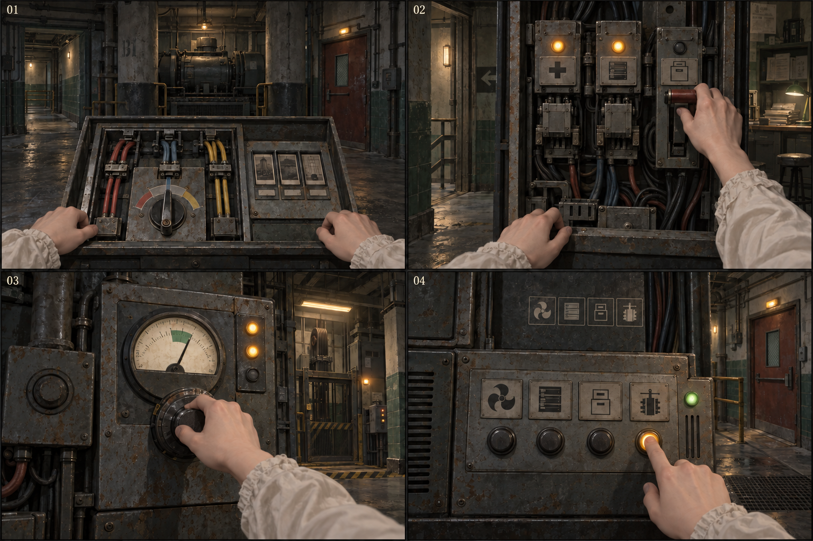

[完整圖說與操作對照](#h-0604-345) · [圖像目錄](../09_劇本/09-14_全劇本與關卡整合稿.md#book-illustrations)

<a id="fig-v22"></a>

##### V22｜第三幕：路由與後勤通路

**適用與限制：**供電方案、R17→R14 誤導回路、缺藥資料與貨梯門端是跨房對照；圖示不增加乘梯跳層或新捷徑。

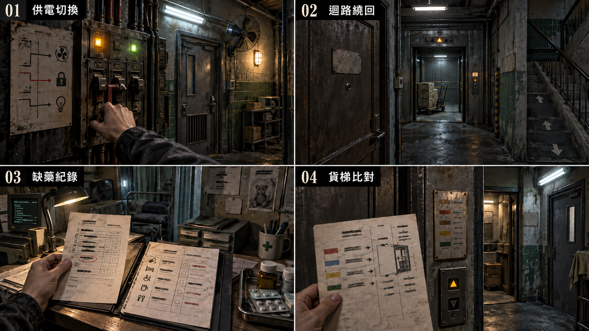

[完整圖說與操作對照](#h-0604-939) · [圖像目錄](../09_劇本/09-14_全劇本與關卡整合稿.md#book-illustrations)

<a id="node-r15-exit"></a>

#### 離場通路與次場景

<a id="transition-r15-r16"></a>
##### T-R15-R16 · 後勤側路與拉閘門電梯

**起行與到達：**三路供電任一路操作完成並確認，E2-06 已取得；第二層推理在 R16 內完成，不先鎖門。原條件允許時可原路回訪。 到目的門口由玩家親自進房，才啟動房內事件。

**空間與保存：**每個次場景標明來路、去路、樓層與可見承重踏板；反向不水平翻圖。完成各列局部操作才開下一段。 狀態依[通路共用規則](../09_劇本/09-15_正式劇本_共用附錄.md#transition-rules)與[逐層探路契約](../09_劇本/09-15_正式劇本_共用附錄.md#ascent-route-contract)。

<!-- route-exploration:R15:begin -->
| 次場景／主圖 | 玩家目標 | 辨路依據 | 操作與通行條件 | 錯路與復原 | 通過狀態 |
| --- | --- | --- | --- | --- | --- |
| T-R15-R16-01 | 通過 28F 舊維修排隊外間 | 輕型內簾可以提起，焊住的防火門不能開。 | 拉起內簾到止擋，撐上原防夾桿，從固定側梯到 29F。 | 撐桿繫在旁邊；取消可重做，不需回修理區借工具。 | route_local.t-r15-r16-01.open |
| T-R15-R16-02 | 通過 29F 29F 拉閘門候梯口 | 車廂地板和平台齊平，外門機械扣到位才可進；31F 按鍵尚未啟用。 | 查看到站刻線與實體牌，拉開外閘進入車廂，再親手關妥外閘及內閘。 | 門未扣妥會保留可見缺口，按上行不動；補關即可。未上行可重新開門退回。 | route_local.t-r15-r16-02.open |
| T-R15-R16-03 | 通過 29F → 30F L1 車廂首次上行 | 首段只能選 30F；門扣和實體平層刻線是開門依據，不以樓層顯示燈或聲音單獨判斷。 | 按 30F 上行；到站後核對實體牌與平層刻線，親手開閘，走出 30F 平台。 | 中途不能開閘；取消移動演出只略過動畫，仍停在經驗證的 30F 門內，不寫目的房到訪。 | route_local.t-r15-r16-03.open |
| T-R15-R16-04 | 通過 30F 30F 停靠與檢修平台 | 掛架踏板與凹槽同形；裝妥後才能走到原地檢修箱，不向 31F 借工具。 | 取下踏板嵌入凹槽並扣緊兩端，走過踏板，扳妥檢修箱啟用柄，再返回原車廂。 | 缺一扣便保留歪斜差分且不能上踏板；可重放。未啟用仍能回 29F，不開 31F。 | route_local.t-r15-r16-04.open |
| T-R15-R16-05 | 通過 30F → 31F L1 車廂第二段上行 | 30F 踏板到位及啟用柄均成立才允許上行；這不是取得 R16 權限。 | 親手關妥兩道閘門，按 31F；到站核對 B 棟 31F 牌與平層刻線，再開閘。 | 操作取消不清空 30F 成果；未啟用按鍵保持不可用。可回已通過樓層，不重解踏板。 | route_local.t-r15-r16-05.open |
| T-R15-R16-06 | 通過 31F 31F 核心門前平台 | 停靠只代表抵達平台，原必要調查仍在 R16 房內。 | 離開車廂，沿固定平台點門進 R16；到訪只在真正跨入房門後提交。 | 可依章內回訪規則搭原梯返回 30F／29F；原鎖場與門禁優先，不能跳往其他樓層。 | route_local.t-r15-r16-06.open |
<!-- route-exploration:R15:end -->

**驗收：**尚未抵達目的房不得取得該房道具；每層測原門檻、錯路、取消、近看返回、正反向與存讀檔；圖號只定位，不授予目的房證據。正式畫面、音場與實機節奏仍待製作及驗證。

<!-- production-subscenes:r15 -->

<!-- scene-image-subscenes-r15:begin -->
<a id="subscenes-r15"></a>
#### 次場景節點

以下次場景歸 R15 管理，節點編號沿用主圖圖號。來去方向為原動線的正向排列；反向通行與單向限制依原門檻，不因列出來路就新增返回出口。

<a id="subscene-t-r15-r16-01-spec"></a>
##### T-R15-R16-01 · 舊維修排隊外間

**樓層：**28F · B 棟

**類型：**探路次場景。**正向連接：**R15-V01 → **T-R15-R16-01** → T-R15-R16-02。

**探路操作：**拉起內簾到止擋，撐上原防夾桿，從固定側梯到 29F。

**錯路與復原：**撐桿繫在旁邊；取消可重做，不需回修理區借工具。

**保存：**`route_local.t-r15-r16-01.open`；依[逐層探路契約](../09_劇本/09-15_正式劇本_共用附錄.md#ascent-route-contract)驗證。

**近看：**T-R15-R16-01-C01；關閉回 T-R15-R16-01。

[正文](../09_劇本/09-06_正式劇本_第三幕.md#subscene-t-r15-r16-01-script) · [圖像製作單](#node-r15-images) · [原門檻與回訪](#node-r15-nav) · [通路正文](../09_劇本/09-06_正式劇本_第三幕.md#ascent-t-r15-r16-01-script)

<a id="subscene-t-r15-r16-02-spec"></a>
##### T-R15-R16-02 · 29F 拉閘門候梯口

**樓層：**29F · B 棟

**類型：**探路次場景。**正向連接：**T-R15-R16-01 → **T-R15-R16-02** → T-R15-R16-03。

**探路操作：**查看到站刻線與實體牌，拉開外閘進入車廂，再親手關妥外閘及內閘。

**錯路與復原：**門未扣妥會保留可見缺口，按上行不動；補關即可。未上行可重新開門退回。

**保存：**`route_local.t-r15-r16-02.open`；依[逐層探路契約](../09_劇本/09-15_正式劇本_共用附錄.md#ascent-route-contract)驗證。

**近看：**T-R15-R16-02-C01；關閉回 T-R15-R16-02。

[正文](../09_劇本/09-06_正式劇本_第三幕.md#subscene-t-r15-r16-02-script) · [圖像製作單](#node-r15-images) · [原門檻與回訪](#node-r15-nav) · [通路正文](../09_劇本/09-06_正式劇本_第三幕.md#ascent-t-r15-r16-02-script)

<a id="subscene-t-r15-r16-03-spec"></a>
##### T-R15-R16-03 · L1 車廂首次上行

**樓層：**29F → 30F · B 棟

**類型：**探路次場景。**正向連接：**T-R15-R16-02 → **T-R15-R16-03** → T-R15-R16-04。

**探路操作：**按 30F 上行；到站後核對實體牌與平層刻線，親手開閘，走出 30F 平台。

**錯路與復原：**中途不能開閘；取消移動演出只略過動畫，仍停在經驗證的 30F 門內，不寫目的房到訪。

**保存：**`route_local.t-r15-r16-03.open`；依[逐層探路契約](../09_劇本/09-15_正式劇本_共用附錄.md#ascent-route-contract)驗證。

**近看：**T-R15-R16-03-C01；關閉回 T-R15-R16-03。

[正文](../09_劇本/09-06_正式劇本_第三幕.md#subscene-t-r15-r16-03-script) · [圖像製作單](#node-r15-images) · [原門檻與回訪](#node-r15-nav) · [通路正文](../09_劇本/09-06_正式劇本_第三幕.md#ascent-t-r15-r16-03-script)

<a id="subscene-t-r15-r16-04-spec"></a>
##### T-R15-R16-04 · 30F 停靠與檢修平台

**樓層：**30F · B 棟

**類型：**探路次場景。**正向連接：**T-R15-R16-03 → **T-R15-R16-04** → T-R15-R16-05。

**探路操作：**取下踏板嵌入凹槽並扣緊兩端，走過踏板，扳妥檢修箱啟用柄，再返回原車廂。

**錯路與復原：**缺一扣便保留歪斜差分且不能上踏板；可重放。未啟用仍能回 29F，不開 31F。

**保存：**`route_local.t-r15-r16-04.open`；依[逐層探路契約](../09_劇本/09-15_正式劇本_共用附錄.md#ascent-route-contract)驗證。

**近看：**T-R15-R16-04-C01；關閉回 T-R15-R16-04。

[正文](../09_劇本/09-06_正式劇本_第三幕.md#subscene-t-r15-r16-04-script) · [圖像製作單](#node-r15-images) · [原門檻與回訪](#node-r15-nav) · [通路正文](../09_劇本/09-06_正式劇本_第三幕.md#ascent-t-r15-r16-04-script)

<a id="subscene-t-r15-r16-05-spec"></a>
##### T-R15-R16-05 · L1 車廂第二段上行

**樓層：**30F → 31F · B 棟

**類型：**探路次場景。**正向連接：**T-R15-R16-04 → **T-R15-R16-05** → T-R15-R16-06。

**探路操作：**親手關妥兩道閘門，按 31F；到站核對 B 棟 31F 牌與平層刻線，再開閘。

**錯路與復原：**操作取消不清空 30F 成果；未啟用按鍵保持不可用。可回已通過樓層，不重解踏板。

**保存：**`route_local.t-r15-r16-05.open`；依[逐層探路契約](../09_劇本/09-15_正式劇本_共用附錄.md#ascent-route-contract)驗證。

**近看：**T-R15-R16-05-C01；關閉回 T-R15-R16-05。

[正文](../09_劇本/09-06_正式劇本_第三幕.md#subscene-t-r15-r16-05-script) · [圖像製作單](#node-r15-images) · [原門檻與回訪](#node-r15-nav) · [通路正文](../09_劇本/09-06_正式劇本_第三幕.md#ascent-t-r15-r16-05-script)

<a id="subscene-t-r15-r16-06-spec"></a>
##### T-R15-R16-06 · 31F 核心門前平台

**樓層：**31F · B 棟

**類型：**探路次場景。**正向連接：**T-R15-R16-05 → **T-R15-R16-06** → R16-V01。

**探路操作：**離開車廂，沿固定平台點門進 R16；到訪只在真正跨入房門後提交。

**錯路與復原：**可依章內回訪規則搭原梯返回 30F／29F；原鎖場與門禁優先，不能跳往其他樓層。

**保存：**`route_local.t-r15-r16-06.open`；依[逐層探路契約](../09_劇本/09-15_正式劇本_共用附錄.md#ascent-route-contract)驗證。

**近看：**T-R15-R16-06-C01；關閉回 T-R15-R16-06。

[正文](../09_劇本/09-06_正式劇本_第三幕.md#subscene-t-r15-r16-06-script) · [圖像製作單](#node-r15-images) · [原門檻與回訪](#node-r15-nav) · [通路正文](../09_劇本/09-06_正式劇本_第三幕.md#ascent-t-r15-r16-06-script)
<!-- scene-image-subscenes-r15:end -->

沿[本場景動線](#node-r15-nav)的原出口與分支交接；不新增中間探索場景。

<a id="node-r16-spec"></a>

### R16 · 技術核心／伺服器室

[正式場次](../09_劇本/09-06_正式劇本_第三幕.md#node-r16-script)

[進場與動線](#node-r16-nav) · [出入口位置](#node-r16-access) · [操作與解謎](#node-r16-level) · [狀態與驗收](#node-r16-pack) · [圖像製作單](#node-r16-images) · [離場與次場景](#node-r16-exit)

<a id="node-r16-nav"></a>

**進出、動線與回訪**

<a id="s-0609-29"></a>

<!-- import:s-0609-29:begin -->
<a id="h-0609-283"></a>

#### R16 技術核心／伺服器室

進行目的：辨認通路使用的管理欄位；第二層三格鎖定（同一組欄位評估螢幕兩側）、E2-14 客戶分級表、權限反擊解鎖

支線／收集：依原房選填調查；無新增支線掛點。

| 方向 | 類型 | 可移動條件 | 移動演出提案 | 回訪規則 |
| --- | --- | --- | --- | --- |
| R15 ↔ R16 | 主線 | 三路供電任一路操作完成並確認，E2-06 已取得；第二層推理在 R16 內完成，不先鎖門 | T-R15-R16：B 棟 27F 出發，經 28F 側路、29F 候梯口，搭 L1 到 30F 必停平台；親自完成踏板與啟用柄後再搭至 31F，走出停靠平台進 R16。不能直達或繞過 30F。 | 章內回訪；遇鎖場、追逐或封路停用 |
| R16 ↔ R17 | 主線 | 第二層推理與必要憑證已取得；部分供電另須返回 R12 接妥辦公室繼電器，全面／定向依原門禁 | 沿冷卻管下的夾層接駁上行到管理辦公區；由機房裸牆轉為覆蓋舊住宅的飾板。 | 章內回訪；遇鎖場、追逐或封路停用 |
<!-- import:s-0609-29:end -->
<!-- navigation:r16:end -->

<a id="node-r16-access"></a>
#### 主場景出入口

<!-- scene-access:R16:begin -->
| 動線 | 顯示名稱 | 畫面位置與辨識物 | 通行狀態 |
| --- | --- | --- | --- |
| R15↔R16 | 來路／返回：防火門 | 31F 門端，來路可辨B 棟 L1 的 31F 抵達平台、外閘與平層牌；起點房在 27F，不把兩端畫成同層相鄰門。 | 可回 R15；部分供電需要回修理舖時，沿已開通路前往。 |
| R16↔R17 | 出口：辦公區門端 | 機櫃末端的辦公區門控，冷卻管下可見夾層上行接駁。 | 完成第二層推理與必要憑證，並滿足所選供電方案的辦公區權限後，才可往返 R17。 |
<!-- scene-access:R16:end -->

**演出限制與製作註記**

<a id="s-0906-35"></a>

<!-- import:s-0906-35:begin -->
<a id="h-0906-399"></a>

#### 演出限制

> 前一節點：R15　後一節點：R17；部分供電另有一次 R12 回訪
> 當下打算：辨認管理欄位與可用憑據，進入上方檔案區。
<!-- import:s-0906-35:end -->

<a id="node-r16-level"></a>

**關卡、解謎與失敗回饋**

<a id="s-0604-8"></a>

<!-- import:s-0604-8:begin -->
<a id="h-0604-466"></a>

#### R16 — 技術核心／伺服器室

<a id="h-0604-468"></a>

##### R16 空間與畫面製作定位

| 項目 | 畫面與製作要求 |
| --- | --- |
| 樓層定位 | 31F |
| 樓棟定位 | B 棟 |
| 樓層與環境 | 31F 技術核心／伺服器室；來路自 27F 機房經 28F、29F、30F，冷卻接駁另上行至 32F 管理辦公室。 原光源、材質與證據焦點依本房規格。 |
| 入口方向 | 由 R15 承接；以來路門框／扶手作背向定位，前進方向依下列出口地標。左右方位沿既有構圖，不將反向回訪鏡頭誤當另一扇門。 |
| 可見出口 | 冷卻管下的夾層接駁上行至 R17。首次全景就交代入口輪廓或可查看的遮擋，不靠無標示的畫外點擊換房。 |
| 阻擋與開放條件 | 往 R17：R16 第二層鎖定完成；部分供電另需回 R12 切換辦公室繼電器，全面／定向直接通行 |
| 畫面中的解謎要素 | 機櫃、權限頁與調查板；必要來源與鎖定結果分開顯示。關鍵標記可近看，與裝飾物有可辨的材質或輪廓差異，不只靠顏色或聲音。 |
| 完成後變化 | 權限頁及必要來源完成後保存推理結果；玩家沿冷卻管下夾層去 R17，不以機櫃亮燈代替尚未完成的來源鎖定。 |

<a id="h-0604-481"></a>

##### R16 製作流程

**逃生因果與可見回饋：**從原伺服器分類辨認「客戶分級」不能直接當「人員通行」；第二層必要三格仍依原 E2-04／05／14。核對完成讓後續檔案可被正確解讀，仍需 R17 的原日期與 K2-01，不因哲學結論憑空開門。

| 階段 | 製作規格 |
| --- | --- |
| 進入／目標 | 辨認通路使用的管理欄位；第二層三格鎖定（同一組欄位評估螢幕兩側）、E2-14 客戶分級表、權限反擊解鎖；入場先還原原房間已保存的熱點與事件狀態。 |
| 觀察／空間 | 住宅隔間被拆成伺服器室，機櫃後仍見舊地磚拼縫；冷卻管沿夾層穿入管理辦公區。 |
| 操作順序 | 查看原伺服器分流資料 → 比對螢幕兩側的管理欄位 → 可查私人外聯限制 → 往 R17。順序中的選填內容不作離房門檻；原主線旗標、遭遇數值及分支提交條件依本場景細則。 |
| 回饋 | 必要操作寫入原證據／門禁／遭遇狀態；新增生活附頁僅更新來源已讀與有依據的筆記，不重發原證據。 |

<a id="h-0604-492"></a>

###### R16 生活與管制觀察

原分流條件與管理檔案呈現內控帳號可以核可別人的復工／校正，但園區出口與私人通聯仍封鎖；對外職務端僅康持有。附頁只證明制度，第三幕仍不直接揭露主角真名。

<a id="h-0604-496"></a>

###### R16 出口與回訪

| 目的節點 | 條件 | 移動與辨向 | 回訪邊界 |
| --- | --- | --- | --- |
| R15 | 沿已開連線回訪；未鎖場且未沉降封路 | 同一地標反向通行 | 章內回訪；遇鎖場、追逐或封路停用 |
| R17 | 第二層鎖定完成；部分供電另需 R12 辦公室繼電器已切換 | 沿冷卻管下的夾層接駁上行到管理辦公區；由機房裸牆轉為覆蓋舊住宅的飾板。 | 章內回訪；遇鎖場、追逐或封路停用 |

共用規則見[對應條款](10-01_製作規格_序幕.md#s-0601-6)。

<a id="h-0604-506"></a>

##### 核心推理：第二層三格鎖定

>
> 在愛情詐騙產線中，「他們在量化信任」已經是顯然的——玩家在第二幕看過教戰手冊就知道了。所以第二層的重擊必須往前推一步：**它不是「客戶」或「受困者」二選一，而是兩者用同一張表。**

玩家要在伺服器的四類欄位中排除「一般客戶分析」的表面解釋，將三份必要證據放入調查板：

1. `E2-04`：信任建立／崩塌曲線與識別碼。
2. `E2-05`：內控主管的校正建議與分流條件。
   同頁附已執行回執：RX-17／D-17／原件日期，與 R13 必經局部病歷三欄相符。歷史列顯示「產能未達 → 主管核可 → 藥品櫃停止供藥／已執行」，存取路由為 MAINT-A3／SUPERVISOR。模型提出條件、人員核可、設備執行三者分開，不歸因成無人負責的自動決定。同頁保留回執影本供重看，不以 E2-13 個人資料作門檻；不新增證據卡或三格槽位。
3. `E2-14`：**客戶分級表**（見下）。

**鎖定句**：`同一組欄位同時評估螢幕兩側的人。讓陌生人愛上你，和讓被囚禁的人保持聽話，讀的是同一套參數。`

**三頁各做一件事：**D01 點原資料列展開識別碼及人員對應，四個指標仍各自可核對，選列不等於自動完成 E2-04。D02 側欄只引用已核指標，每個處置局部保留門檻、核可者、執行狀態；RX-17／D-17／日期及 R13 影本仍同頁可查，沿原條件取得 E2-05。D03 把已見人員表與客戶表的欄名並排，K-114／K-207／K-089 及全部評級、處置、核可欄均可讀；不只截一個相同數字就判同範本。實際核對後才記 E2-14，最後仍由三格鎖定成立結論。釘選只是閱讀位置，未釘也能完成，三種供電有同等必要資訊。回全景與原風扇事件保持既有時序，沒有新增鬼聲、影片或重複提交；交付依[原件局部與回查](../09_劇本/09-15_正式劇本_共用附錄.md#fragment-reading-contract)。

<a id="h-0604-520"></a>

##### `E2-14` 客戶分級表（第二層的關鍵一格）

玩家開啟第三個機櫃時，找到的不是受困者名冊，而是一份**螢幕另一端的人**的評級表。它的欄位與人員評級表**一模一樣**——因為它們是同一個範本。

| 編號 | 系統評級 | 處置 |
| --- | --- | --- |
| `K-114` | 信任建立 41 天／依賴指數高 | `留存中` |
| `K-207` | 已完成首投／複投 2 次 | `已轉化·結案` |
| **`K-089`** | 信任建立 14 天／**可支配資產：無** | **`無資產·結案`** |

- 三個編號都在第二幕有對應來源：`K-114` 是阿尋沒有回的那則、`K-207` 的匯款截圖在 R7、`K-089` 的對話戛然而止。只對玩家實際讀過的來源建立回查；未讀者仍可用本頁的完整欄位完成主線，不倒灌聊天與截圖。
- 正式處置欄依 00-02 使用「留存中」；貶稱不進正式文件或 UI，不改分類與證據功能。
- **核可欄的簽名是同一個人。** 玩家尚不知道那是誰；R21 才會以相同簽勢補完理解。

<a id="h-0604-534"></a>

###### ★ K-089

> 他沒有被騙走任何錢。系統在第十四天判定他不夠有錢，把他放了。
>
> **他這輩子最幸運的一件事，是他窮。**

| 玩家的兩個階段 | |
| --- | --- |
| 第三幕（此處） | 只覺得冷血。一個人因為沒錢而被放過，這件事本身就夠不舒服了。 |
| 第七幕 R29 | 把客戶分級表與人口交易簽核疊在一起——**同一套「值不值得繼續投入」的邏輯、同一組欄位、同一個人的簽名。** 她替一個被騙來的人簽「建議留用」的同一天，也替一個陌生人簽「無資產·結案」。 |

⚠️ K-089 不得被寫成溫情或救贖。他只是**沒被選上**，而系統從頭到尾沒有把他當人看過。這個諷刺不需要任何一句台詞，OS 全程不評論。

<a id="h-0604-547"></a>

##### 玩家行動

- 以 R15 的供電路徑開啟對應機櫃；不同路徑改變噪音、燈光與可讀的選填檔案，不改主線結論。
- 將四個指標「信任、服從、崩潰、離開風險」連到管理決策，讓畫面從圖表變成一串具體名字。
- 回執及結論安全讀完、收起後回全景至少 3 秒，再排原風扇事件：所有伺服器風扇同時停一秒；其中一個螢幕改顯示「舊工作階段已恢復／權限層級：遮蔽」。玩家可以懷疑主角身分，但系統此時不替她命名。

玩家取得進入 R17 的資料憑證，但仍不知道主管真名。**工作名 `Michelle` 已出現在客戶分級表的核可欄上**——玩家現在知道那個決定誰繼續騙、誰結案的人叫什麼，只是不知道她是誰。

---

##### 操作與呈現補充

- [s-0906-37](../09_劇本/09-06_正式劇本_第三幕.md#s-0906-37)：此處視線重點是核可與「已執行」的後果，不用工作名特寫或揭名音效取代閱讀；存取路由相同不等於已證明每一筆由調查者親手操作。
- [s-0906-38](../09_劇本/09-06_正式劇本_第三幕.md#s-0906-38)：依 00-02，K-114 正式欄統一為「留存中」，已同步 06-04；舊「續養」不進正式文件或 UI。分類與原證據功能不變。
<!-- import:s-0604-8:end -->

<a id="node-r16-pack"></a>

**狀態、素材與驗收**

<a id="s-uppertech-90"></a>

<!-- import:s-uppertech-90:begin -->
<a id="h-uppertech-1597"></a>

#### 管理層與釋放接點｜第三幕｜R16 — 技術核心／第二層揭露

<a id="h-uppertech-1599"></a>

##### 管理層與釋放接點｜R16-房間資料

| 欄位 | 值 |
| --- | --- |
| `room_id` | `R16` |
| `scene` | `room_r16.tscn` |
| `entry_from` | `R15`，需 `act3.r15.route_confirmed` |
| `exit_to` | `R15`、`R17`；部分供電需先回 R12 |
| `backgrounds` | `r16_real.webp`、`r16_scan.webp`；不做整房凝固層 |
| `main_goal` | 取得採集紀錄與篩選輸出，完成第二層三格鎖定 |
| `board_id` | `BOARD_REVEAL_02` |
| `must_exit_when` | `act3.r16.board_locked = true` |

<a id="h-uppertech-1612"></a>

##### 管理層與釋放接點｜R16-互動表

| ID | 物件／觸發 | 玩家操作 | 文字／聲音回饋 | 寫入狀態／證據 | 成本 |
| --- | --- | --- | --- | --- | --- |
| `R16_H01` | 第一列機櫃 | `LOOK` | 圖表標成「客戶信任」，底層識別碼卻對應園區人員 | `r16.subject_ids_seen` | 0 點 |
| `R16_H02` | 指標映射台／第三機櫃既有分級頁 | `ALIGN`→`LOOK`→`ALIGN` | 查信任、服從、崩潰與風險映射取得 E2-04；再讀客戶分級表 K-114／K-207／K-089，核對同一欄位也評估螢幕外客戶，另取得 E2-14。兩份來源分開完成，不因進房自動給卡 | `E2-04`、`act3.r16.e204_seen`；`E2-14`、證據庫對應已讀狀態 | 0 |
| `R16_H03` | 分流輸出終端 | `LOOK`→`ALIGN` | 「保留／轉組／校正／轉運」由內控主管核定；同頁 RX-17／D-17／日期對 R13 回執，確認「產能未達 → 主管核可 → 藥品櫃停止供藥／已執行」，路由 MAINT-A3／SUPERVISOR，影本可重看、不需選填 E2-13 | `E2-05`、`act3.r16.e205_seen` | 0 |
| `R16_H04` | 香火簿資料列 | `LOOK` | 若持有 R10 `E2-09`，可見祈願卡、房號與供藥紀錄被併為一列 | `E2-10`、`act3.r16.e210_seen` | 0 |
| `R16_H05` | L-48 低權限索引 | `LOOK` | 全面供電立即可讀；其他路線於 R17 完成後回訪可讀 | `E3-08`、`act3.r16.e308_seen` | 0 點 |
| `R16_H06` | 調查板入口 | `BOARD` | 接受 `E2-04 → E2-05 → E2-14`；E2-06 是前段供電必要紀錄，不替代客戶分級一格 | `act3.r16.board_locked`、`story.reveal_02_locked` | 0 |
| `R16_H07` | 鎖定後機櫃 | 讀完收起、回安全全景至少 3 秒後自動 | 原所有風扇停 1 秒；單一螢幕顯示「舊工作階段已恢復／權限層級：遮蔽」 | 恐慌 +1 階 | 0 |
| `R16_H08` | 舊操作索引 | 長按確認 | 「你想起了一個操作。」UI 不解釋來源與道德 | `ability.admin_override_unlocked = true` | 0 |

<a id="h-uppertech-1625"></a>

##### 管理層與釋放接點｜R16-第二層三格鎖定

| 格位 | 證據 | 作用 |
| --- | --- | --- |
| 起因 | `E2-04` | 系統持續採集受困者的信任、服從與崩潰資料 |
| 過程 | `E2-05` | 內控主管把數據轉成保留、校正與轉運建議 |
| 對照 | `E2-14` | 客戶分級表的欄位與受困者評級相同，同一組參數服務螢幕兩側的控制 |

鎖定句：

> **同一組欄位同時評估螢幕兩側的人。讓陌生人愛上你，和讓被囚禁的人保持聽話，讀的是同一套參數。**

系統訊息（第二層確認與索引解鎖分開觸發）：

~~~text
[系統] 兩份評級，用的是同一套規則。
[感受] 你想起了一個操作。
~~~

<a id="h-uppertech-1646"></a>

##### 管理層與釋放接點｜R16-供電差分

| 路線 | 畫面／音景 | 選填資料 |
| --- | --- | --- |
| 部分 | 每次只亮一列機櫃；玩家需切換兩次 | `E3-08` 延後至 R17 後回訪 |
| 全面 | 全房風扇與告警燈運作，閱讀壓力最高 | `E2-10`、`E3-08` 立即可讀 |
| 定向 | 只有核心機櫃依主角走近順序亮起 | 終端先顯示主管歡迎詞，再顯示一般介面 |

<a id="h-uppertech-1654"></a>

##### 管理層與釋放接點｜R16-驗收

- [ ] 第二層三格只接受 E2-04、E2-05、E2-14；E2-14 有第三機櫃本地可達來源，零選填亦取得。E2-06 仍為供電前置，不佔該板第三格。
- [ ] 權限反擊解鎖發生在鎖定之後，玩家不能用它跳過 E-07。
- [ ] E2-10／E3-08 等非犧牲的選填頁可延後取得；R15 已明示捨棄的兩份暫存受害者紀錄不能由回訪恢復。
- [ ] 恐慌階段 3 的假訊號不可被誤存為必要證據。
<!-- import:s-uppertech-90:end -->

<a id="node-r16-images"></a>

#### 場景節點與靜態圖製作單

以下每列均為待製作圖像項目；文件多頁、正反面、局部與狀態差分須依拆圖欄各自交付，不能以一張示意圖代替。可探索場景的主圖提供移動與探索，演出節點不另開探索，近看關閉回到開啟前的畫面；原演出與操作條件仍依右欄來源。圖號、解析度、文字分層、存檔及驗收依[靜態圖共用契約](../09_劇本/09-15_正式劇本_共用附錄.md#scene-image-contract)。

<!-- scene-floor-locations:R16:begin -->
| 次場景／主圖 | 樓層定位 | 樓棟定位 | 移動方式 |
| --- | --- | --- | --- |
| R16-V02 | 31F → 32F | B 棟 | 步道 |
<!-- scene-floor-locations:R16:end -->

<!-- scene-images:R16:begin -->
| 畫面節點／圖號 | 用途 | 必畫內容 | 狀態與拆圖 | 來源 |
| --- | --- | --- | --- | --- |
| R16-V01 | 主場景 | 伺服器通道、原控制台、第三機櫃、本地管理頁與辦公區門端。 | 電力方案、憑證未得／已得、辦公區未供電／已供電分層；核心讀取不回復失去暫存。 | [本場景](../09_劇本/09-06_正式劇本_第三幕.md#node-r16-script) |
| R16-D01 | 介面 | 指標圖表與底層映射 | 原資料列選取與識別碼／人員列並排態；信任／服從／崩潰／離開風險各可核對，來源標頭、原頁與核對焦點保留，關閉回機櫃通道。 | [R16-01](../09_劇本/09-06_正式劇本_第三幕.md#s-0906-37) |
| R16-D02 | 文件 | 分流處置與執行回執 | 已核指標側欄與門檻／核可者／執行狀態同列局部；RX-17／D-17／日期及 R13 回執影本各可讀，不要求完成缺藥支線。原頁、局部與草稿接續態另交，不自動開第三機櫃。 | [R16-01](../09_劇本/09-06_正式劇本_第三幕.md#s-0906-37) |
| R16-D03 | 介面 | 第三機櫃客戶分級頁 | 人員表與客戶表欄名並排態；三個 K 編號、原評級／處置及核可欄完整可查，交全文與局部切換，未核對不預顯同範本結論。 | [R16-02](../09_劇本/09-06_正式劇本_第三幕.md#s-0906-38) |
| R16-D04 | 介面 | 管理權限摘要與本地憑證 | 已讀／取得狀態；不能藉預覽產生權限。 | [R16-03](../09_劇本/09-06_正式劇本_第三幕.md#s-0906-39) |
| R16-D06 | 介面 | 技術核心第二層調查板 | 原三格、來源縮頁與確認前後差分；保留草稿，確認後只顯一則完成回饋及原結論。必要資料依本房原件，不增加收集門檻。 | [R16-04](../09_劇本/09-06_正式劇本_第三幕.md#s-0906-40) |
| R16-C01 | 操作近看 | 機櫃索引、指標標籤與鎖定後螢幕 | 櫃門與原「客戶信任」標籤、底層人員編號、舊工作階段恢復／權限遮蔽各局部和差分；依原三秒安全回景後時機，不在閱讀中插事件。 | [R16-05](../09_劇本/09-06_正式劇本_第三幕.md#s-0906-41) |
| R16-D05 | 介面 | 香火簿資料列與 L-48 索引 | 依來源資格顯示，低權限內容不變成全份執行結果。 | [R16-06](../09_劇本/09-06_正式劇本_第三幕.md#s-0906-42) |
| R16-C02 | 近看 | 32F 門端與辦公區供電標示 | 未接／已接可辨，不替玩家遠端接 R12 線。 | [R16-07](../09_劇本/09-06_正式劇本_第三幕.md#s-0906-43) |
| R16-D07 | 介面 | 舊操作索引與權限反擊確認 | 未讀／已讀、長按取消／確認分態；依原權限解鎖，不新增可抹除對象或減免來源、電力、代價。 | [原場景規格](#s-uppertech-90) |
| R16-V02 | 出口接景 | R16→R17：沿冷卻管下的夾層接駁上行到管理辦公區；由機房裸牆轉為覆蓋舊住宅的飾板。 | 沿原轉場取固定構圖；來路與去路各有可見定位。允許沿兩端場景重組材質，但須交此視角靜態圖及低動態替代；不增加房間、線索或強制等待。原單向／回訪、操作窗口及完成提交依動線表。 | [動線條件](#node-r16-nav) |
<!-- scene-images:R16:end -->

<!-- scene-image-access-art-r16:begin -->
**出入口交圖：**R16-V01 須依場次與狀態畫出[本場景出入口表](#node-r16-access)的來路、去路及封閉位置；既有操作鏡位與接景圖沿同一地標對位。門端差分、移動熱區與遮擋另分層，依[出入口共用契約](../09_劇本/09-15_正式劇本_共用附錄.md#scene-access-contract)驗收。
<!-- scene-image-access-art-r16:end -->


##### 原熱點對應圖號

同一圖可支援多個狀態，但每個列名焦點及原差分仍須交付；底圖不取代動畫、聲音或互動。此表只對圖，不新增取得條件。
<!-- hotspot-images:R16:begin -->
| 原熱點／操作 | 圖號 | 對應內容／邊界 |
| --- | --- | --- |
| R16_H01 | R16-C01 | 第一列機櫃 |
| R16_H02 | R16-D01、R16-D03 | 指標映射台／第三機櫃既有分級頁 |
| R16_H03 | R16-D02、R16-D04 | 分流輸出終端 |
| R16_H04 | R16-D05 | 香火簿資料列 |
| R16_H05 | R16-D05 | L-48 低權限索引 |
| R16_H06 | R16-D06 | 調查板入口 |
| R16_H07 | R16-C01、R16-V01 | 鎖定後機櫃 |
| R16_H08 | R16-D07 | 舊操作索引 |
<!-- hotspot-images:R16:end -->

<a id="node-r16-visual"></a>

#### 本場景圖像與示意

以下圖像為製作參照；跨房圖僅使用標明的面板，其他場景仍按各自前置演出。

[V34 怨靈的昆蟲身體恐怖：巡行與未知](#fig-v34) · [V23 第三幕：證據與微異常](#fig-v23)

- **V34：**封鎖後者、空名訊號、未定收件人與鏡像者分開；缺席不能畫成完整新個體，未知身分仍保持未知。
- **V23：**同車殘頁、R13 床紙、R17 咖啡杯與 R16 系統資料分屬不同來源；不把紙墊壓痕推成新增屍體。

[返回本房正式劇本](../09_劇本/09-06_正式劇本_第三幕.md#node-r16-script) · [本房關卡與解謎](#node-r16-level)

<a id="fig-v34"></a>

##### V34｜怨靈的昆蟲身體恐怖：巡行與未知

**適用與限制：**封鎖後者、空名訊號、未定收件人與鏡像者分開；缺席不能畫成完整新個體，未知身分仍保持未知。

**造型版本：**V34 為舊版概念參考，新版待重製。封鎖後者群殼未採用，M1 遺體仍靜止；校正區巡行另作原遭遇差分。鏡像者沿主角當前衣著，不套制服；其餘缺席與半層輪廓依[暗黑造型與出場分級](../09_劇本/09-15_正式劇本_共用附錄.md#insect-dark-design)保留。

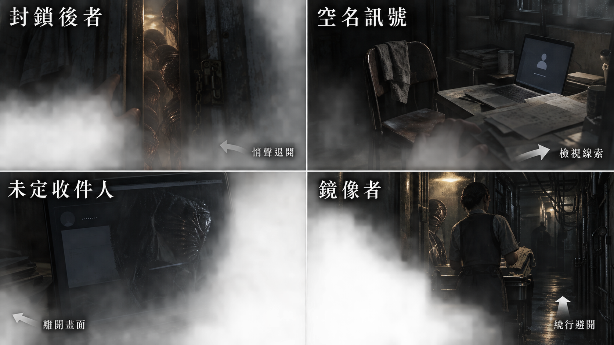

[完整圖說與操作對照](../09_劇本/09-15_正式劇本_共用附錄.md#h-0102-545) · [圖像目錄](../09_劇本/09-14_全劇本與關卡整合稿.md#book-illustrations)

<a id="node-r16-exit"></a>

#### 離場通路與次場景

<!-- production-subscenes:r16 -->

<!-- scene-image-subscenes-r16:begin -->
<a id="subscenes-r16"></a>
#### 次場景節點

以下次場景歸 R16 管理，節點編號沿用主圖圖號。來去方向為原動線的正向排列；反向通行與單向限制依原門檻，不因列出來路就新增返回出口。

<a id="subscene-r16-v02-spec"></a>
##### R16-V02 · R16→R17

**樓層：**31F → 32F · B 棟

**類型：**轉場接景。**正向連接：**R16-V01 → **R16-V02** → R17-V01。

**近看：**不新增近看；沿原轉場操作，不新增等待或讀取門檻。

[正文](../09_劇本/09-06_正式劇本_第三幕.md#subscene-r16-v02-script) · [圖像製作單](#node-r16-images) · [原門檻與回訪](#node-r16-nav) · [動線條件](#node-r16-nav)
<!-- scene-image-subscenes-r16:end -->

<a id="node-r17-spec"></a>

### R17 · 檔案區／康辦公室／外部中繼

[正式場次](../09_劇本/09-06_正式劇本_第三幕.md#node-r17-script)

[進場與動線](#node-r17-nav) · [出入口位置](#node-r17-access) · [操作與解謎](#node-r17-level) · [狀態與驗收](#node-r17-pack) · [圖像製作單](#node-r17-images) · [離場與次場景](#node-r17-exit)

<a id="node-r17-nav"></a>

**進出、動線與回訪**

<a id="s-0609-30"></a>

<!-- import:s-0609-30:begin -->
<a id="h-0609-295"></a>

#### R17 檔案區／康辦公室／外部中繼

進行目的：核對有效維修路線，取得校正區通行條件；同車檔案、康備忘、收件與震損紀錄、K2-01

支線／收集：SQ-M1 MC-01／MU-02 核對並結案；KX-01 撤離計畫伏筆（不開任務）

| 方向 | 類型 | 可移動條件 | 移動演出提案 | 回訪規則 |
| --- | --- | --- | --- | --- |
| R16 ↔ R17 | 主線 | 第二層推理與必要憑證已取得；部分供電另須返回 R12 接妥辦公室繼電器，全面／定向依原門禁 | 沿冷卻管下的夾層接駁上行到管理辦公區；由機房裸牆轉為覆蓋舊住宅的飾板。 | 章內回訪；遇鎖場、追逐或封路停用 |
| R17 → R14 | 誤導 | 假鑰匙組合成立時只觸發一次；不加 guess_count | T-R17-R14：由 32F 的 R17 原門端起行，經 31F、30F、29F、28F 的L-04 下行物流迴路，最後親自進入 27F 的 R14。保留原門檻與方向；可逐圖移動，近看選填，不增解鎖題。 | 單向流程；不代表可沿此線倒退 |
| R17 → R18 | 跨幕 | 正確日期證據與 K2-01 成立；假路返回後可重排；離幕前可回查已發現未完成的 SQ-M1／SQ-T，支線不擋主線 | T-R17-R18：由 32F 的 R17 原門端起行，經 33F、34F、35F、36F 的倉儲殘層至校正入口，最後親自進入 37F 的 R18。每層完成局部辨路與操作，不以跨層剪接略過。 | 單向流程；不代表可沿此線倒退 |
<!-- import:s-0609-30:end -->
<!-- navigation:r17:end -->

<a id="node-r17-access"></a>
#### 主場景出入口

<!-- scene-access:R17:begin -->
| 動線 | 顯示名稱 | 畫面位置與辨識物 | 通行狀態 |
| --- | --- | --- | --- |
| R16↔R17 | 來路／返回：冷卻管接駁口 | 檔案區進場側，飾板與機房裸牆交界處的原門口。 | 離幕確認前可返回 R16，再沿已開路線整理本幕證據。 |
| R17→R14 | 誤導支路：L-04 | 32F 門端，去路可辨31F 伺服器外側回程臺的連續扶手及固定梯口；目的房在 27F，不把兩端畫成同層相鄰門。 | 錯誤路由組合只觸發一次，沿維修迴路回 R14；不是回第四幕，也不移動或替換門牌。 |
| R17→R18 | 正路：C-02 | 32F 門端，去路可辨33F C-02 支路外臺的連續扶手及固定梯口；目的房在 37F，不把兩端畫成同層相鄰門。 | 正確日期鏈與第二鑰匙成立，完成現場驗證及單向確認後，經 33F–36F 每層探路至 37F 的 R18；確認前仍可回查。 |
| 封閉 | 受損公開出口 | 檔案區原公開出口的損壞門口，與 32-S 服務門分開。 | 不能通往樓外；服務門的遠端去向須查路由資料，首次觀看不提前揭露正解。 |
<!-- scene-access:R17:end -->

<!-- access-layout:R17:begin -->
<a id="node-r17-access-layout"></a>
##### 出入口配置草圖

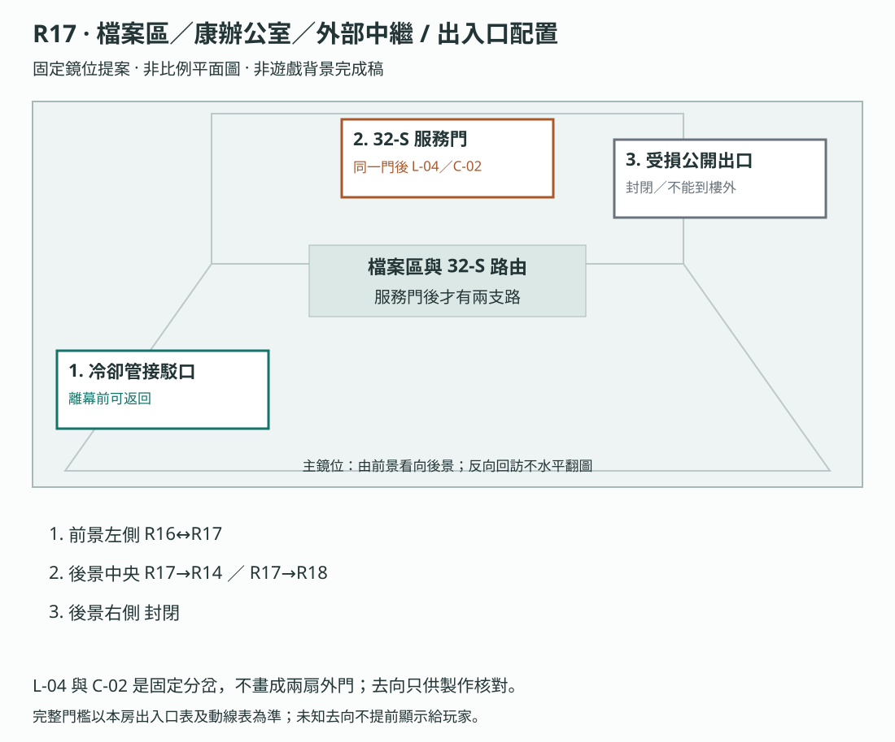

**構圖提案：**L-04 與 C-02 是固定分岔，不畫成兩扇外門；去向只供製作核對。 各門端位置對應上表；數字只供製作辨識，不是玩家介面或解謎提示。

門框、視線及熱區仍須灰盒驗收，依[共用契約](../09_劇本/09-15_正式劇本_共用附錄.md#scene-access-contract)，不計入遊戲圖像交付數。
<!-- access-layout:R17:end -->

**演出限制與製作註記**

<a id="s-0906-44"></a>

<!-- import:s-0906-44:begin -->
<a id="h-0906-503"></a>

#### 演出限制

> 前一節點：R16　後一節點：R18（單向）；原誤導路線回 R14
> 當下打算：對清事件日期與可用服務通道，確認外聯留下了什麼。
<!-- import:s-0906-44:end -->

<a id="node-r17-level"></a>

**關卡、解謎與失敗回饋**

<a id="s-0604-9"></a>

<!-- import:s-0604-9:begin -->
<a id="h-0604-557"></a>

#### R17 — 檔案區／康的 32F 辦公室／外部中繼

<a id="h-0604-559"></a>

##### R17 空間與畫面製作定位

| 項目 | 畫面與製作要求 |
| --- | --- |
| 樓層定位 | 32F |
| 樓棟定位 | B 棟 |
| 樓層與環境 | 32F 管理辦公區；L-04 沿 31F、30F、29F、28F 下返 27F 的 R14，C-02 則經 33F、34F、35F、36F 至 37F 校正區。 原光源、材質與證據焦點依本房規格。 |
| 入口方向 | 由 R16 承接；以來路門框／扶手作背向定位，前進方向依下列出口地標。左右方位沿既有構圖，不將反向回訪鏡頭誤當另一扇門。 |
| 可見出口 | 正確服務口通校正區脊柱；假路沿物流標籤回 R14。首次全景就交代入口輪廓或可查看的遮擋，不靠無標示的畫外點擊換房。 |
| 阻擋與開放條件 | 往 R14：假鑰匙組合成立時只觸發一次；不加 guess_count；往 R18：正確日期證據與 K2-01 成立；假路返回後可重排；SQ-T 可先補查 |
| 畫面中的解謎要素 | 日期證據與鑰匙組合；錯路返回用熟悉地標顯示繞圈。關鍵標記可近看，與裝飾物有可辨的材質或輪廓差異，不只靠顏色或聲音。 |
| 完成後變化 | 正確日期與 K2-01 成立才開放校正區上行；假組合只觸發一次返回 R14 的熟悉路徑，回來仍能重排，不增加猜錯計數。 |

<a id="h-0604-572"></a>

##### R17 製作流程

**空間第一印象：**平整管理飾板與舊住戶窗框。租戶門鎖各自不同，集團只改通過瓶頸的服務口；原假路回 R14 仍用已見地標讓玩家辨認。

**探索呈現：**先讓玩家看見入口、可走的方向和空間異常，再自選近看生活物件；新增租戶遺跡不發 E 證據、不設派系任務、不改出口旗標。恐怖沿原事件與遭遇時序，安定／閱讀保護段不插嚇點。

**逃生因果與可見回饋：**原維修索引／門端近看明示：可恢復的通道接向校正區服務側，公開出口已受損；向上是查找核心通路的替代計畫。外聯設備的既存資料沒有即時救援承諾。保留假鑰匙與逐層下返 27F R14 的原特例，辨向地標是玩家發現繞圈的來源，不額外判錯或先提示正解。

| 階段 | 製作規格 |
| --- | --- |
| 進入／目標 | 核對有效維修路線，取得校正區通行條件；同車檔案、康備忘、收件與震損紀錄、K2-01；入場先還原原房間已保存的熱點與事件狀態。 |
| 觀察／空間 | 管理飾板覆住原住宅立面，櫃後露出被封維修口；窗網只對內井，文件視線不被新增造景遮住。 |
| 操作順序 | 調查康的檔案與既有時間線 → 取得原校正區通行條件 → 可查看內控離園覆核欄與原支線 → 選已開維修回路或往校正區。順序中的選填內容不作離房門檻；原主線旗標、遭遇數值及分支提交條件依本場景細則。 |
| 回饋 | 必要操作寫入原證據／門禁／遭遇狀態；新增生活附頁僅更新來源已讀與有依據的筆記，不重發原證據。 |

<a id="h-0604-587"></a>

###### R17 生活與管制觀察

原分流條件與管理檔案呈現內控帳號可以核可別人的復工／校正，但園區出口與私人通聯仍封鎖；對外職務端僅康持有。附頁只證明制度，第三幕仍不直接揭露主角真名。

<a id="h-0604-591"></a>

###### R17 附頁熱點

**頁鍵對照：**`authority`＝他人處置權限；`exit`＝本人出口與私人通聯封鎖紀錄。後者是管制狀態，不提供送審或解鎖操作。

| 欄位 | 規格 |
| --- | --- |
| 識別／位置 | `R17_DETAIL_01`；原管理檔案的權限附頁。沿原近看開頁，不增加遠景發光提示。 |
| 前置 | 已開啟該原熱點；原證據、供電及回訪前置照舊，不因新增附頁放寬。 |
| 玩家操作 | 對照可核可他人處置與本人出口、私人通聯封鎖欄。各來源各自閱讀，不要求一次讀完。 |
| 回饋／筆記 | 內控有特權但無自由離園；不提前指認主角。 |
| 成本與中止 | 免費查看；普通探索閱讀停表；鎖場／強制演出依原規則暫不開啟。退出即回原近看，不寫未讀頁。 |
| 保存 | 每頁保存 `scene_detail.r17.read_pages` 集合；只有指定附頁顯示且玩家確認收起時加入對應頁鍵。來源顯示後中途暫停不算完成。 |
| 回訪 | 已讀頁可重看，原物件位置不重置；尚缺對照來源時保留觀察，不生成推論。 |
| 素材 | 在原近看增一組物件／紙張疊圖、各頁文字轉錄、翻頁／收起聲；近看與原基底光向一致，均待製作。 |

<a id="h-0604-606"></a>

###### R17 出口與回訪

| 目的節點 | 條件 | 移動與辨向 | 回訪邊界 |
| --- | --- | --- | --- |
| R16 | 沿已開連線回訪；未鎖場且未沉降封路 | 同一地標反向通行 | 章內回訪；遇鎖場、追逐或封路停用 |
| R14 | 假鑰匙組合成立時只觸發一次；不加 guess_count | T-R17-R14：由 32F 的 R17 原門端起行，經 31F、30F、29F、28F 的L-04 下行物流迴路，最後親自進入 27F 的 R14。保留原門檻與方向；可逐圖移動，近看選填，不增解鎖題。 | 單向流程；不代表可沿此線倒退 |
| R18 | 正確日期證據與 K2-01 成立；假路返回後可重排；SQ-T 可先補查 | T-R17-R18：由 32F 的 R17 原門端起行，經 33F、34F、35F、36F 的倉儲殘層至校正入口，最後親自進入 37F 的 R18。每層完成局部辨路與操作，不以跨層剪接略過。 | 單向流程；不代表可沿此線倒退 |

共用規則見[對應條款](10-01_製作規格_序幕.md#s-0601-6)。

<a id="h-0604-617"></a>

##### R17 動畫演出

<a id="h-0604-619"></a>

###### 門邊的提醒

| 項目 | 場景演出規格 |
| --- | --- |
| 形式與節奏 | 原 R17 維修迴路的局部回聲；不佔 R19 才開始的 H-08 人形次數。 |
| 鏡頭與動作 | 安全門側保留局部袖口靜格與兩下輕敲的主觀回聲；「先看清楚」之後由玩家決定移動，原回返轉場才執行。不補完整人形、招手或歷史人物動畫。 |
| 操作與資訊邊界 | 不顯示翼根、黑鬚或肉身；不能靠動作標出正確路線。康文件以翻頁和手寫文字呈現，不新增錄音。 |

為維持本房複合功能，三個功能位於同一固定場景：前景是受潮檔案櫃，中景是康的玻璃辦公室，背景是遭水浸與震損的外部中繼端。

<a id="h-0604-630"></a>

##### 三段解謎

<a id="h-0604-632"></a>

###### A. 同一輛車

玩家修復兩份被不同方式撕毀的入園檔案：

- `E3-03-A`：小花，同日入園，分到視訊組。**「宿舍分配」欄旁的表格邊緣，有一個手寫的中文詞：宿舍。筆跡不是小花的——她那時還寫不出這個字**。
- `E3-03-B`：姓名被遮蔽的女性，同車入園，分到內控培訓。
- 車號與時間完全相同；玩家必須親手把兩份透明殘頁疊合。
- 兩頁共用入園批次 IN-06，個別流水 IN-06-A／IN-06-B；交接欄列「服務門 32-S／接收端 N-2」，是唯一將現場門牌接到接收端的來源，沒有維修索引組或支路。流水不是人事號，路由欄不是人物代號；本房無 B 對工作名的正式對照。

> **那個手寫的字**：玩家在本幕看到它，只覺得是某個填表的人隨手註記。R21 取得簽勢、R29 完成筆跡比對之後，玩家可以回看已保存觀察核對——**那是梁樂瑤的字。** 車上，小花看不懂那一欄，她用淺白的話說「住的地方」，然後在邊緣寫下「宿舍」二字，對應剛解釋的欄名。三秒鐘是車上初識片段；之後仍有分組前共同安置及後續有限交接，不能寫成兩人唯一接觸。<br>本房**不提示、不醒目標示、不入證據**。它只是在那裡。

選填可取得阿尋留下的 `E3-04` 與老周的 `E3-05`，證明兩人曾分別碰觸外聯與內部帳目。

<a id="h-0604-645"></a>

###### B. 康的日常空間

- `E3-06` 語音備忘：「**Michelle 失聯**」「敏感索引流失」「照撤離協定做」。康用的是她的工作名——他從來沒叫過她別的。
- 同源文字附件以撤離當日日期列「接收端 N-2 → 維修索引組 RT-3」，支路狀態「待現場覆核」。不直接列 32-S 或支路，須接 E3-03 才知道本門的索引組；沒有 IN-06-B 對人事號的橋接。
- 鏡像第五次在接近必讀終端的門口全景自然同框：它已站在辦公室桌前，不靠選填點擊才出現。只排一次，玩家可忽略；不插文件閱讀、不配音或 OS。
- 咖啡杯、保健品與整齊襯衫讓空間顯得正常；唯一不正常的是桌面已替主角登入。
- 定向供電以已恢復的本地路由開玻璃門；其他兩路在門端使用 R16 已取得的本地憑據驗證，再手動開門，不新增破解題。

<a id="h-0604-653"></a>

###### 靜態細節 T-3b · 兩圈環痕

| 項目 | 內容 |
| --- | --- |
| 遠景 | 杯內外圈已乾；較小的濕內圈從初訪就存在，只因距離不易辨認。 |
| 近看（初訪即可） | 同一杯內兩圈同時可辨，內圈更小、邊緣仍濕。無 E3-06、離房或回訪條件，辦公室仍空。 |
| 物件數量 | 不變。 |
| 物理讀法 | 天花板管線在同一位置滴水。玩家可以在畫面上找到那個滴點。 |
| 主觀讀法 | 可讓玩家懷疑桌面是否仍有人使用，但濕痕與滴點本身不證明人或系統正在操作。 |
| 邊界 | **不得**由此推論康仍在樓內。保留 T-3b 舊素材索引，但退出時態錯位與 HA 排程；不換圖製造先後、不加音效、不要求回訪。 |

<a id="h-0604-664"></a>

###### C. 外部中繼

- `E3-07` 是阿尋 99% 封包的外部標頭、歷史收件回執及較晚本機震損自檢；三頁各有原件日期與來源。
- 標頭沿 R11 同一 `AX-17` 作業識別，並列歷史收件日期。這是當年的殘缺求援包；標頭送達與樓體受創只確認先後，不建立因果；R11 本輪完成狀態與歷史 99% 標頭分頁保存，不將主介面倒回未完成。
- 玩家可確認疊樓位置與異常人數曾送達，之後中繼在震動峰值與進水告警後斷線。回執沒有完整名冊，也沒有救援人員抵達的紀錄。
- 同終端的本機震損後自檢附件以原件日期列出公開通路封閉與多組維修索引：RT-1 的可用支路為 L-04，RT-3 為 C-02。兩列同等呈現，不列 32-S 或 N-2；單讀此表不能判斷本門該查哪一組。日期晚於撤離改接，沿正式事件表，不用製作相對時標作密碼。它是設備本機自檢；本輪仍須供電與既有憑據驗門，不由斷線與回執推定救援結果。
- `E3-08` L-48 封鎖紀錄為選填，只顯示震損後仍有一個內部區段回報人數，不先宣告生死。

<a id="h-0604-672"></a>

###### 選填附件：逃生梯舊檢修副本

維修端封存的舊報修附件保留 8F–14F 外牆梯段的高度刻度、缺梯照片與原名冊編號；拍攝日期早於本次震損，來源為園區既有檢修作業。玩家只在 R17 終端查看這份客觀副本，不進入外牆、不打開封閉外牆門，也不看到戶外全景。

已有 R3 `E1-13` 時，在筆記並列床單纖維方向與副本的高度／梯格標記，逐一對齊同一逃生路線；錯配指出不相符的標記，免費重試。完成後只更新 E-02 原人物條目的路線核對與來源紀錄，不另發 E 證據、不改主線 K2-01。不曾查看 R3 纖維則保留未知，不能由附件倒灌第一幕觀察。原名冊未能核對姓名時保持未確認，不擅填姓名或判定她最後一步。已對齊的路線可隨筆記回看，不要求跨幕返回 R3。

這份附件不含核心區受困者的完整下落、主角肉身、小花封鎖或康的下落；那些真相仍由原定較後場景揭露。附件是既有 E-02 路線資料的可達入口，不增加房間、支線獎勵或新的主線門檻。

<a id="h-0604-680"></a>

##### 幕尾檔案對齊

玩家在原時間線提交中並讀 `E3-03`、`E3-06`、`E3-07` 的欄位與日期：同車入園 → 失聯及撤離改接 → 歷史收件及較晚震損自檢，同時接成 `32-S → N-2 → RT-3 → C-02`，生成 `K2-01` 路由索引。不另加密碼題；N-2／RT-3 只是原卡路由欄值，不是新房間、人物、證據或權限。人物板分開保存「同車女性／IN-06-B／內控培訓／姓名未確認」與「內控主管／工作名 Michelle」；沒有共享人事識別，不能合併。早期名冊保留原觀察與候選關聯，不由時間先後推出同一人；R21 的 E3-01 才提供入園流水對人事號／工作名的正式橋接，調查者身分仍不在此核驗。

**缺件的實際意義：**缺 E3-03 不知 32-S 的接收端；缺 E3-06 不知撤離後改接哪組；缺 E3-07 不知震損後的可用支路。不能用「讀過故事」替代欄位核對，也不能單靠自檢表或 R16 憑據填出整條路由。`timeline_locked` 只記錄來源和時序已核對，實體控制器驗憑據及路由，不驗玩家的人物認定。

<a id="h-0604-686"></a>

##### ★ 假的鑰匙

有一組**看起來自洽的錯誤組合**也會通過：`E3-03` ＋ `E3-06` ＋ **`E2-08` 貨梯物流表**（而不是 `E3-07`）。

**固定通路與資料作用：**原服務門為 32-S 共用外門，後接固定的 L-04／C-02 支路柵門，屬原轉場，不增房間。K2-01 只提供查得的路由，門禁仍用 R16 既有憑據。E2-08 只列「維修索引組 RT-3／物流支路 L-04」，可接撤離附件，卻無震損後有效日期，也不直接列 32-S；它支持舊物流路，不支持當前上行出口。控制器依提交索引開相應支路，建築、門牌與通路不隨推理答案變形。

| 節拍 | 內容 |
| --- | --- |
| 鎖定 | 共用 `線索已連結。`、K2-01 名稱、字色與驗證聲，32-S 外門同樣開；內容如實保留 L-04／C-02 路由，不用成功特效代判真偽，也不隱藏線索差別。 |
| 走進去 | L-04 柵門開啟，C-02 不開；原物流維修路經 31F、30F、29F、28F 平台下返 27F R14。玩家沿熟悉平台與貨梯地標認出位置，不以黑場傳送。 |
| 回饋 | 無 UI、無 OS、無音效。節點圖上只多了一條回到 R14 的灰線。 |
| 玩家意識到 | 自洽不等於真。他用「第三份文件長得像」配對，而不是用時間推理。 |
| 回 R17 | 重新排列。這次不計 `guess_count`——它不是「不自洽」，它是「自洽但不對」。 |
| 再試與通行 | L-04 特例只演一次、免費；再提交不重播、不自動換成正解。唯有 E3-07 日期鏈與 C-02 門端使用完成才通 R18；地圖保留已走 L-04 灰線。 |
| 公平性 | E3-03 解出本門的 N-2，E3-06 接到撤離後 RT-3，再查 E3-07 較晚的多列自檢表才得到 C-02。E2-08 也能接 RT-3，但只有無日期的 L-04 物流對應；比較欄位、時序與受損狀態，不靠猜卡名。 |

> 這是 Outer Wilds 式的「你以為你懂了」。只在第三幕做這一次，**不重複**——那是關於資料看起來對的那一幕。
>
> 而且那扇假門帶你回到的，正是你拿錯證據的地方。

最後，辦公室電話提示一段既存快取，日期是主角躲在下水道期間的第七天；查閱只聽見樓內維修通話：「外廊斷了，核心通道還是鎖著。」可略過，不是現時外界求援。前往第四幕仍由玩家在原門端驗證正確訊號鑰匙並手動開門，不以接聽電話代替。


##### 操作與呈現補充

- [s-0906-46](../09_劇本/09-06_正式劇本_第三幕.md#s-0906-46)：車號、日期、入園流水沿同一原件資料表引用，不能在兩張紙各自亂填；不新增實際曆日或車牌。IN-06-B 與人事號／工作名的正式對照留在 R21 的 E3-01；本房沒有這一欄。R21／R29 的簽勢核對不提前。
- [s-0906-52](../09_劇本/09-06_正式劇本_第三幕.md#s-0906-52)：震損日期沿原事件表的「T−2 週＋6 日」對應值；玩家看到可核對的原件日期，不把製作相對時標當成輸入密碼。
- [s-0906-58](../09_劇本/09-06_正式劇本_第三幕.md#s-0906-58)：N-2／RT-3 是原文件的路由欄值，不是新房間、人物、證據編號或權限。`timeline_locked` 記錄路由來源及時序已核對；實體門只接收既有憑據與路由索引，不檢查玩家是否認出同車女性或接受人物結論。
- [s-0906-58](../09_劇本/09-06_正式劇本_第三幕.md#s-0906-58)：首次選服務門先接 ACT3-03 的共用袖口段，再依鑰匙實際指向接 ACT3-02 或 ACT3-05；章節列次不是強制播放順序。
##### R17 高恐慌的查證練習

R17-00 在檔案櫃外側空牆套用 [`MR-R17`](../09_劇本/09-15_正式劇本_共用附錄.md#misplaced-residue-cases)：只有親見 R3-01 凝固全景才可重用其床架局部。R17 補查文件或文字摘要不能冒充曾看過該畫面。切回實景與回查已見來源免費；不要求找出殘影才能交路由答案。車流表、日期、出口牌及調查板永不受遮罩更字。

驗收恐慌 2／3／崩潰回復、未見來源、視覺低動態、閱讀中存讀檔與正常離房；差分只能依當前條件顯示，不新增 HA 或扣款。玩家仍以同日車流、備忘、表頭完成原日期鏈，不以主觀殘影推論受害者去向。
<!-- import:s-0604-9:end -->

<a id="s-0604-16"></a>

<!-- import:s-0604-16:begin -->
<a id="h-0604-764"></a>

#### R17：真實親近與第一次不確定的回返

E3-03-A 的「宿舍」字跡保留，旁附共同安置時期的既有入園健康備註，支持主角手腕擦傷與小花小帳同日記錄。它不是逃亡夜膝傷。無新姓名揭露或新主線鎖。

原維修迴路仍回 R14；在出發前的安全節點，小花局部回聲用兩下輕敲示意「一起」。玩家先理解為同伴指路；回來時只有同一門框，無鬼王字幕。供電、設備和實體迴路說明照常，R32 才核對仍有超出物理迴路的門檻回返。此為原路線敘事整合，不新增追逐或 HA。
<!-- import:s-0604-16:end -->

<a id="s-0604-26"></a>

<!-- import:s-0604-26:begin -->
<a id="h-0604-931"></a>

#### R17 上部支線收尾與伏筆

MC-01 同夾保留 MU-02 內控人員管制紀錄，兩張同人事編號、同日：衣物領用獲准，園區出口與私人通聯持續封鎖；核對後主動保存「有權限，沒有通行權」完成 SQ-M1，不提前命名主角。R16 既有權限摘要提供解題背景。KX-01 仍可翻讀，僅記為康撤離計畫的伏筆，不在上部開 SQ-K 或顯示缺少下部物品。離章提示與保存依 [分部支線規格](../09_劇本/09-15_正式劇本_共用附錄.md#doc-0305)。
<!-- import:s-0604-26:end -->

<a id="s-0604-22"></a>

<!-- import:s-0604-22:begin -->
<a id="h-0604-903"></a>

#### 留在門邊的同伴

R17 原回返節點以安全門側的局部袖口靜格與回聲「先看清楚」呈現熟悉感；H-08 完整輪廓仍從 R19 開始。此聲音不提供正確路線、不停止敵人，也不能單獨證明封鎖核心。共用原出現旗標，不重播。康核准夾的 KX-01 只是既有伏筆；SQ-K 真相與三份資料條件留在下部。

<a id="h-0604-907"></a>

##### 動畫播放與互動契約

本章動畫分為過場、玩家驅動演出與現時局部循環。分鏡估算不是已完成素材或遊玩時長保證；實作先驗鏡位、前兆與操作，再精修材質。

共用規則見[對應條款](10-01_製作規格_序幕.md#s-0601-17)。
<!-- import:s-0604-22:end -->

<a id="node-r17-pack"></a>

**狀態、素材與驗收**

<a id="s-uppertech-91"></a>

<!-- import:s-uppertech-91:begin -->
<a id="h-uppertech-1661"></a>

#### 管理層與釋放接點｜第三幕｜R17 — 檔案區／康辦公室／外部中繼

正確 C-02 路由在門端驗證及單向確認後，才接[倉儲側平台](#transition-r17-r18)；L-04 仍沿原假路返回 R14，不共用這段過渡或離幕提交。

<a id="h-uppertech-1663"></a>

##### 管理層與釋放接點｜R17-房間資料

| 欄位 | 值 |
| --- | --- |
| `room_id` | `R17` |
| `scene` | `room_r17.tscn` |
| `entry_from` | `R16`；部分供電另需 `act3.r12.office_relay_ready` |
| `exit_to` | `R16`、`R18`（需 `inventory.key.k2_01`） |
| `backgrounds` | `r17_real.webp`、`r17_scan.webp`；文件異常使用 metadata 與局部疊圖，不製作凝固層 |
| `zones` | 前景檔案櫃／中景玻璃辦公室／背景外部中繼 |
| `board_id` | `BOARD_ACT3_TIMELINE` |
| `main_goal` | 疊合入園檔案、讀取康備忘、核對收件回執與震損自檢 |
| `must_exit_when` | 往 R18 須正確日期鏈 `act3.r17.timeline_locked = true`，且 `inventory.key.k2_01_target = R18`，在門端使用 `K2-01`；特例只開一次回 R14 的路，不以持有鑰匙代替正確指向 |

<a id="h-uppertech-1677"></a>

##### 管理層與釋放接點｜R17-互動表

| ID | 區域／物件 | 玩家操作 | 文字／聲音回饋 | 寫入狀態／證據 | 成本 |
| --- | --- | --- | --- | --- | --- |
| `R17_H01` | 檔案區／兩份殘頁 | `ALIGN` | 小花與被遮蔽女性同日、同車入園；IN-06-A／B 流水及視訊組／內控培訓分派，無人事橋接。交接欄另列服務門 32-S→接收端 N-2，無索引組或支路 | `E3-03`、`act3.r17.e303_aligned` | 0 |
| `R17_H01b` | `E3-03-A` 邊緣手寫字 | `LOOK`（疊合後可放大） | 小花檔案「宿舍分配」欄旁，表格邊緣有手寫的「宿舍」二字。**不提示、不醒目標示、不入證據。** 筆跡資產與 R21／R29 主角簽勢共用同一組手寫字型參數，供玩家日後在筆記回看已保存觀察比對，不要求跨幕或跨部返回 | `act3.r17.margin_word_seen` | 0 |
| `R17_H02` | 阿尋檔案 | `LOOK` | 主角備註：「外聯傾向高，需隔離傳輸權限。」 | `E3-04`、`act3.r17.e304_seen` | 0 |
| `R17_H03` | 老周檔案 | `LOOK` | 「低風險，高產能，建議留用。」語氣與主角早期 OS 相似 | `E3-05`、`act3.r17.e305_seen` | 0 |
| `R17_H04` | 玻璃辦公室門 | 靠近／本地驗證後手動開門 | 定向供電由已恢復路由提前打開；其他兩路以 R16 既有憑據驗證，不新增破解題 | `r17.office_opened` | 0 |
| `R17_H05` | 康的日常桌面 | `LOOK` | 咖啡杯、保健品、摺好的襯衫；終端已替主角登入 | `r17.normality_seen`、恐慌 +1 階 | 0 |
| `R17_H06` | 康的語音備忘 | 現場終端播既存音檔 | 沿原三句；文字附件列撤離日期、接收端 N-2→維修索引組 RT-3，支路待現場覆核；不直接列門牌或支路，無 B 的人事對照，不公布真名或康下落 | `E3-06`、`act3.r17.e306_seen` | 0 |
| `R17_H07` | 外部中繼端 | `CONNECT`→`ALIGN` | 將阿尋 99% 歷史標頭與收件回執對齊；較晚的本機震損自檢有 RT-1→L-04、RT-3→C-02 多列，不列 32-S／N-2，不單獨指明本門用哪組。僅證明歷史設備狀態，仍須門端供電及憑據 | `E3-07`、`act3.r17.e307_seen` | 0 |
| `R17_H08` | 受潮通風紀錄 | `LOOK` | 若已取得 `E3-08`，補出震損後仍有核心區回報人數 | `r17.e308_extended` | 0 |
| `R17_H09` | 幕尾時間線 | `BOARD` | 排列 `E3-03 → E3-06 → E3-07` | `act3.r17.timeline_locked`、`inventory.key.k2_01`、`inventory.key.k2_01_target = R18` | 0 |
| `R17_H09b` | 假鑰匙（不重複） | `BOARD` | `E3-03 → E3-06 → E2-08` 接成 32-S→N-2→RT-3→L-04，但末件缺現況日期；共用鎖定及 32-S 外門驗證，L-04 索引只開固定物流支路，逐層下返 27F R14。無判錯 UI／OS／guess_count；同組不重演，須改 E3-07 日期鏈才換 C-02 | 板上保存 `inventory.key.k2_01_target = R14`；實走回 R14 才保存 `act3.r17.false_key_taken` | 0 |
| `R17_H10` | 辦公室電話 | 查閱／略過 | 播放標有下水道第七天的本地既存維修通話快取：「外廊斷了，核心通道還是鎖著」；不是即時通話 | `r17.police_call_handling` | 0 |

**必要來源完成點：**R17_H06 的三句備忘可完整聽取或讀等效逐字文字；同源附件的撤離日期及 N-2→RT-3 改接欄亦須實讀並確認，才保存 E3-06／`act3.r17.e306_seen`。R17_H07 須完成原接線與標頭、歷史回執、較晚自檢的核對，才保存 E3-07／`act3.r17.e307_seen`；只對齊 99% 標頭不算完整來源。開頁、播放起點、只讀其中一份及取消只保留原閱讀進度，不提前寫完成。舊未完成檔缺附件核對時，在原終端續查；有效已完成成果按原存檔契約保留。資料收錄不代替 R17_H09 的路由選列及正式提交。

R17_H07 的選填附件提供既有 E-02 舊檢修副本，來源為 8F–14F 封閉外牆的高度／梯格標記及原名冊編號。已有 E1-13 才開筆記比對；錯配免費重試，成功保存 E-02 原條目的路線與來源，未收 R3 觀察不倒灌證據。沒有姓名來源時保持未知，不判定最後一步。副本不含更晚主線真相，不新增熱點 ID、E 證據、場景或門檻。素材只需同終端的一份文件近看與對齊狀態；原周次 R17 文件／查證工作一併製作。

<a id="h-uppertech-1696"></a>

##### 管理層與釋放接點｜R17-三段完成條件

| 區段 | 必須完成 | 選填 |
| --- | --- | --- |
| 檔案區 | `E3-03` 疊合 | `E3-04`、`E3-05` |
| 康辦公室 | `E3-06` | 日常物件、登入桌面 |
| 外部中繼 | `E3-07` | `E3-08` 延伸 |

通往 R18 的正確幕尾時間線在原提交中核對下列欄位與日期鏈，不另設密碼題；`R17_H09b` 的特例不寫入此完成旗標，只保留回 R14 的一次迴路：

~~~text
同車入園：服務門 32-S → 接收端 N-2（E3-03）
→ 撤離改接：接收端 N-2 → 維修索引組 RT-3（E3-06）
→ 震損後本機自檢：查多列中的 RT-3 → C-02，核對較晚日期（E3-07）
~~~

三份來源不可互代：缺 E3-03 不知本門接收端，缺 E3-06 不知改接索引組，缺 E3-07 不知震損後支路。N-2／RT-3 是原文件路由欄值，不是新場景、證據或權限；自檢表不得額外印 32-S 的直接路線，也不得把任一 C-02 列自動選為本門答案。`timeline_locked` 記錄來源核對，實體門驗憑據及索引，不驗人物身分或推論。

正確日期鏈後人物板分開保存「同車女性／IN-06-B／內控培訓／姓名未確認」與「內控主管／工作名 Michelle」；R17 沒有人事橋接，不能合併兩人，更不能命名調查者。正確與特例組合共用下列鎖定回饋，不以專屬訊息、字色或音效提前標出路線差異：

~~~text
[系統] 線索已連結。
[系統] 校正區訊號鑰匙 K2-01 已寫入本地。
~~~

<a id="h-uppertech-1721"></a>

##### 管理層與釋放接點｜R17-供電差分

`R17_H04` 的門口全景安排鏡像第五次：倒影在玩家即將操作的桌前，隨必讀終端的進路自然同框，不需選填點擊、不強制停步、不追加台詞。只排一次，與閱讀、電話及共用袖口事件互斥；三路皆可呈現。

服務出口沿原轉場配置 32-S 外門與固定 L-04／C-02 支路。K2-01 只選路，權限仍取 R16 本地憑據；兩組外門回饋相同，索引欄值仍如實顯示。首次選外門在安全側排共用袖口，之後按 target 開一支路。R18 同時檢查 timeline_locked、target=R18 及門端使用，不能只看持有鑰匙；錯組不寫正確時間線。L-04 灰線按實走保存，讀檔續接未完成轉場，不因只在板上選過便吞掉第一次迴路。


| 路線 | 進房演出 | 不改變的內容 |
| --- | --- | --- |
| 部分 | 外部中繼每次只能讀一份資料；燈光最安靜 | 三份必要證據與 `K2-01` |
| 全面 | 樓內維修通話、貨梯與辦公室電話同時短暫運作 | 不增加額外真相，只提前看選填索引 |
| 定向 | 玻璃門在玩家靠近前開啟，終端稱呼「Michelle」 | 不顯示真名或完整職責；工作名可出現 |

<a id="h-uppertech-1734"></a>

##### 管理層與釋放接點｜R17-驗收

- [ ] R17 三個區域在同一 `RoomRoot` 內切換，不載入成三個房間。
- [ ] `E3-03` 必須由玩家親手疊合，不能以過場自動完成。
- [ ] 電話不接也能取得 `K2-01`；回訪時仍可接聽。
- [ ] 玩家離開第三幕時能分清歷史收件、較晚震損與本輪維修路由，仍不知道受困者的完整去向。
- [ ] IN-06-B 同車女性與 Michelle 職務卡分開，既有名冊只留候選關聯；不可在 R17 自動合併或替調查者填真名。
- [ ] 逐一缺 E3-03／06／07，路由分別缺本門接收端、改接索引、震損後支路；自檢表不直接給本門答案，人物卡是否合併不影響機械門禁。
- [ ] 正解與錯組共用外門表現但保留 C-02／L-04 欄值；L-04 只演一次、免費，錯組不自動補正。
- [ ] T-3b 初訪即可近看兩圈，讀件、退出、回訪與讀檔均不改杯痕狀態，不要求走回頭路。
- [ ] 最短主線（部分供電、全略選填、首次排對）仍有回執後果、風扇停轉、必經玻璃倒影、平靜備忘與幕尾餘波，閱讀無攻擊；待原型實測，不作已通過聲明。
<!-- import:s-uppertech-91:end -->

<a id="node-r17-images"></a>

#### 場景節點與靜態圖製作單

以下每列均為待製作圖像項目；文件多頁、正反面、局部與狀態差分須依拆圖欄各自交付，不能以一張示意圖代替。可探索場景的主圖提供移動與探索，演出節點不另開探索，近看關閉回到開啟前的畫面；原演出與操作條件仍依右欄來源。圖號、解析度、文字分層、存檔及驗收依[靜態圖共用契約](../09_劇本/09-15_正式劇本_共用附錄.md#scene-image-contract)。

<!-- scene-floor-locations:R17:begin -->
| 次場景／主圖 | 樓層定位 | 樓棟定位 | 移動方式 |
| --- | --- | --- | --- |
| T-R17-R14-01 | 31F | B 棟 | 步道 |
| T-R17-R14-02 | 30F | B 棟 | 步道 |
| T-R17-R14-03 | 29F | B 棟 | 步道 |
| T-R17-R14-04 | 28F | B 棟 | 步道 |
| T-R17-R18-01 | 33F | B 棟 | 步道 |
| T-R17-R18-02 | 34F | B 棟 | 步道 |
| T-R17-R18-03 | 35F | B 棟 | 步道 |
| T-R17-R18-04 | 36F | B 棟 | 步道 |
<!-- scene-floor-locations:R17:end -->

<!-- scene-images:R17:begin -->
| 畫面節點／圖號 | 用途 | 必畫內容 | 狀態與拆圖 | 來源 |
| --- | --- | --- | --- | --- |
| R17-V01 | 主場景 | 檔案架、玻璃辦公隔間、康桌面、中繼終端與 32-S 服務門。 | 玻璃反射、宿舍接縫主觀錯置與回訪差分分層；外窗遠處暗紅霧、繃緊白絲與桌邊微動紙角另層，C-02／L-04 及桌面線索清晰。紙上編號日期不變，C-02 與 L-04 分開。 | [本場景](../09_劇本/09-06_正式劇本_第三幕.md#node-r17-script) |
| R17-C01 | 操作近看 | 維修索引與 32-S 門端 | N-2／RT-3／C-02 和另一路 L-04 原來源分列，開門／未驗證可辨。 | [R17-00](../09_劇本/09-06_正式劇本_第三幕.md#s-0906-45) |
| R17-D01 | 文件 | 兩份同車殘頁與宿舍欄邊緣筆跡 | 兩頁流水、日期與派任可並排；「宿舍」兩字提供高解析局部，沿同組筆跡參數，不主動標亮、不發證據、不提前判為主角。 | [R17-01](../09_劇本/09-06_正式劇本_第三幕.md#s-0906-46) |
| R17-D02 | 文件 | 健康備註與共同安置資料 | 有 R8 來源才可比對，原頁與外來縮圖分開。 | [R17-02](../09_劇本/09-06_正式劇本_第三幕.md#s-0906-47) |
| R17-D03 | 文件 | 阿尋與老周留用檔案 | E3-04／05 分頁，既有履歷欄不合併成一人。 | [R17-03](../09_劇本/09-06_正式劇本_第三幕.md#s-0906-48) |
| R17-D04 | 介面 | 康語音備忘頁 | 日期、原檔及播放狀態可讀；聲音素材另製。 | [R17-05](../09_劇本/09-06_正式劇本_第三幕.md#s-0906-50) |
| R17-C02 | 近看 | 咖啡杯、補充品與摺好衣物 | 杯內第二圈、桌面物品各焦點，不把普通習慣改成暗碼。 | [R17-06](../09_劇本/09-06_正式劇本_第三幕.md#s-0906-51) |
| R17-D05 | 介面 | 中繼接線、封包標頭、歷史收件回執與震損自檢 | 接線近景及三份來源分頁；RT-1／L-04、RT-3／C-02 同樣清楚，不標正解。 | [R17-07](../09_劇本/09-06_正式劇本_第三幕.md#s-0906-52) |
| R17-D06 | 文件 | 核心回報與受潮通風紀錄 | 按供電／已讀資格顯示，原缺欄不補寫。 | [R17-08](../09_劇本/09-06_正式劇本_第三幕.md#s-0906-53) |
| R17-D07 | 文件 | 8F–14F 舊報修附件 | 受創前日期、高度標記、缺梯照片、名冊編號三頁，照片本身另交清晰圖；照片保持客觀舊影像，沒有現在所見的紅霧與白絲；不新增外牆場景。 | [R17-09](../09_劇本/09-06_正式劇本_第三幕.md#s-0906-54) |
| R17-D08 | 文件 | 衣物領用回條內摺與內控人員管制紀錄 | MC-01／MU-02 分頁；同人事編號、日期與持續封鎖欄可讀，配給核准不等於解除管制。 | [R17-10](../09_劇本/09-06_正式劇本_第三幕.md#s-0906-55) |
| R17-D09 | 文件 | 留車核准折頁 | KX-01 管理卡尾碼與日期可讀。 | [R17-11](../09_劇本/09-06_正式劇本_第三幕.md#s-0906-56) |
| R17-D10 | 介面 | 32-S 正路日期比對桌 | E3-03、E3-06 與第三來源並排；正路 C-02 與無日期 L-04 分開回饋，原日期不重寫。 | [ACT3-01](../09_劇本/09-06_正式劇本_第三幕.md#s-0906-58) |
| R17-C03 | 操作近看 | 辦公室電話舊來電快取 | 只有原留存記錄，略過不擋通行。 | [ACT3-04](../09_劇本/09-06_正式劇本_第三幕.md#s-0906-61) |
| T-R17-R14-01 | 過渡場景 | 伺服器外側回程臺：伺服器外側回程臺，來路扶手與下一段梯口同框；門楣保留 31F 標記，封板遮住舊公共梯。 | 來路 R17-V01；去路 T-R17-R14-02。既有門檻；L-04 固定往下，與 C-02 的上行口分開；支路內不進伺服器室。 沿下行踏板到 30F，逐層確認舊物流標籤。 主圖交上下段踏點、封閉口與通行差分；不新增未編號可走房間。 | [通路正文](../09_劇本/09-06_正式劇本_第三幕.md#ascent-t-r17-r14-01-script) |
| T-R17-R14-01-C01 | 過渡近看 | L-04 支路牌、下行扶手與樓層牌 | L-04 固定往下，與 C-02 的上行口分開；支路內不進伺服器室。 原假路只觸發一次；沿途不取物、不寫 C-02 或新增猜測次數。 每個列名焦點交清晰局部；關閉回 T-R17-R14-01，不自動移至下一房。 | [通路正文](../09_劇本/09-06_正式劇本_第三幕.md#ascent-t-r17-r14-01-script) |
| T-R17-R14-02 | 過渡場景 | 物流背牆平台：物流背牆平台，來路扶手與下一段梯口同框；門楣保留 30F 標記，封板遮住舊公共梯。 | 來路 T-R17-R14-01；去路 T-R17-R14-03。既有門檻；L-04 固定往下，與 C-02 的上行口分開；支路內不進伺服器室。 沿下行踏板到 29F，逐層確認舊物流標籤。 主圖交上下段踏點、封閉口與通行差分；不新增未編號可走房間。 | [通路正文](../09_劇本/09-06_正式劇本_第三幕.md#ascent-t-r17-r14-02-script) |
| T-R17-R14-02-C01 | 過渡近看 | L-04 支路牌、下行扶手與樓層牌 | L-04 固定往下，與 C-02 的上行口分開；支路內不進伺服器室。 原假路只觸發一次；沿途不取物、不寫 C-02 或新增猜測次數。 每個列名焦點交清晰局部；關閉回 T-R17-R14-02，不自動移至下一房。 | [通路正文](../09_劇本/09-06_正式劇本_第三幕.md#ascent-t-r17-r14-02-script) |
| T-R17-R14-03 | 過渡場景 | 換側橋下返面：換側橋下返面，來路扶手與下一段梯口同框；門楣保留 29F 標記，封板遮住舊公共梯。 | 來路 T-R17-R14-02；去路 T-R17-R14-04。既有門檻；L-04 固定往下，與 C-02 的上行口分開；支路內不進伺服器室。 沿下行踏板到 28F，逐層確認舊物流標籤。 主圖交上下段踏點、封閉口與通行差分；不新增未編號可走房間。 | [通路正文](../09_劇本/09-06_正式劇本_第三幕.md#ascent-t-r17-r14-03-script) |
| T-R17-R14-03-C01 | 過渡近看 | L-04 支路牌、下行扶手與樓層牌 | L-04 固定往下，與 C-02 的上行口分開；支路內不進伺服器室。 原假路只觸發一次；沿途不取物、不寫 C-02 或新增猜測次數。 每個列名焦點交清晰局部；關閉回 T-R17-R14-03，不自動移至下一房。 | [通路正文](../09_劇本/09-06_正式劇本_第三幕.md#ascent-t-r17-r14-03-script) |
| T-R17-R14-04 | 過渡場景 | 搬運標籤梯口：搬運標籤梯口，來路扶手與下一段梯口同框；門楣保留 28F 標記，封板遮住舊公共梯。 | 來路 T-R17-R14-03；去路 R14-V01。既有門檻；L-04 固定往下，與 C-02 的上行口分開；支路內不進伺服器室。 沿下行踏板到 27F 的 R14 門口。 主圖交上下段踏點、封閉口與通行差分；不新增未編號可走房間。 | [通路正文](../09_劇本/09-06_正式劇本_第三幕.md#ascent-t-r17-r14-04-script) |
| T-R17-R14-04-C01 | 過渡近看 | L-04 支路牌、下行扶手與樓層牌 | L-04 固定往下，與 C-02 的上行口分開；支路內不進伺服器室。 原假路只觸發一次；沿途不取物、不寫 C-02 或新增猜測次數。 每個列名焦點交清晰局部；關閉回 T-R17-R14-04，不自動移至下一房。 | [通路正文](../09_劇本/09-06_正式劇本_第三幕.md#ascent-t-r17-r14-04-script) |
| T-R17-R18-01 | 過渡場景 | C-02 支路外臺：32F 的 C-02 門端留在下方，33F 主梯被貨架壓斷；C-02 金屬路由牌仍指向牆後的卸貨窄道。 貨架端的周轉箱角套、覆住舊店號的新庫位格與底部推車輪痕。 | 來路 R17-V01；去路 T-R17-R18-02。逐層探路；路由只證明支路方向，公共梯損壞後仍要沿承重踏板繞行；L-04 不在這一側。 查看側梯踏板接點，從貨架外側穿過，再登 34F。 主圖交上下段踏點、封閉口與通行差分；不新增未編號可走房間。 可行踏板仍在輪痕外緣。 | [通路正文](../09_劇本/09-06_正式劇本_第三幕.md#ascent-t-r17-r18-01-script) |
| T-R17-R18-01-C01 | 過渡近看 | 路由牌、固定貨架與側梯踏板；箱角套、店號覆貼與架腳輪痕 | 路由只證明支路方向，公共梯損壞後仍要沿承重踏板繞行；L-04 不在這一側。 壓斷主梯不可攀爬；可退回本層，但原單向門已關，不能回到 R17 或改走 L-04。 每個列名焦點交清晰局部；關閉回 T-R17-R18-01，不自動移至下一房。機關初始／操作中／到位差分均須交付。 不由同類包材推定與 R14 同一批貨；不可跳過本路段。 | [通路正文](../09_劇本/09-06_正式劇本_第三幕.md#ascent-t-r17-r18-01-script) |
| T-R17-R18-02 | 過渡場景 | 貨箱標線隔間：牆上搬運高度的刮痕被白飾板攔腰遮掉，兩條貼地拖痕一條進入箱牆，一條轉入背板後。 固定箱牆的皂盒／毛巾與修理料字樣、被飾板截斷的搬運箭頭。 | 來路 T-R17-R18-01；去路 T-R17-R18-03。逐層探路；箱牆固定，檢修蓋的四角扣仍完整；蓋後可看見固定側梯。 依扣環位置打開檢修蓋，沿背板後短梯上行。 主圖交上下段踏點、封閉口與通行差分；不新增未編號可走房間。 舊停車線壓在箱底，當前通行仍走檢修蓋。 | [通路正文](../09_劇本/09-06_正式劇本_第三幕.md#ascent-t-r17-r18-02-script) |
| T-R17-R18-02-C01 | 過渡近看 | 箱牆釘頭與可拆檢修蓋扣；物資字樣、搬運箭頭與箱底停車線 | 箱牆固定，檢修蓋的四角扣仍完整；蓋後可看見固定側梯。 箱牆不可拆；檢修蓋卸下後掛在原掛鉤，不占背包，也不在回訪突然復位。 每個列名焦點交清晰局部；關閉回 T-R17-R18-02，不自動移至下一房。機關初始／操作中／到位差分均須交付。 字樣表示歷史分類，不補配送終點；原檢修蓋扣仍唯一可操作通路。 | [通路正文](../09_劇本/09-06_正式劇本_第三幕.md#ascent-t-r17-r18-02-script) |
| T-R17-R18-03 | 過渡場景 | 轉運臺隔柵：鐵柵背後有滑動貨臺，舊住宅門楣仍嵌在頂上。柵條影子隨空轉的吊鉤擺動，像有人在低頭排隊。 停靠孔旁寬窄擋塊、餐盒架輪腳壓痕與住宅門框鉸鏈孔。 | 來路 T-R17-R18-02；去路 T-R17-R18-04。逐層探路；貨臺在固定短軌上橫移，只能補齊同層兩段步道，不能載人跨樓層。 在原位轉手輪，將空貨臺對準兩側停靠孔，壓下繫繩鎖銷後通過。 主圖交上下段踏點、封閉口與通行差分；不新增未編號可走房間。 舊搬運用途不改空臺橫移條件。 | [通路正文](../09_劇本/09-06_正式劇本_第三幕.md#ascent-t-r17-r18-03-script) |
| T-R17-R18-03-C01 | 過渡近看 | 貨臺手輪與停靠孔；擋塊、方形輪腳壓痕與門框花磚 | 貨臺在固定短軌上橫移，只能補齊同層兩段步道，不能載人跨樓層。 未對孔不開柵；轉過頭可倒轉手輪，不需要站上移動貨臺操作。 每個列名焦點交清晰局部；關閉回 T-R17-R18-03，不自動移至下一房。機關初始／操作中／到位差分均須交付。 生活焦點選填，不指認餐盒目的地，不更改停靠孔或鎖銷。 | [通路正文](../09_劇本/09-06_正式劇本_第三幕.md#ascent-t-r17-r18-03-script) |
| T-R17-R18-04 | 過渡場景 | 包覆中的門楣：36F 舊倉儲平台仍有卸貨護角，居民門楣被新的平整飾板蓋住半截；普通樓梯被封板截斷，板背露出管線。 | 來路 T-R17-R18-03；去路 R18-V01。逐層探路；正面的住宅門已封死，護角旁另有留鉸鏈的檢修片，不能把兩扇門混為一扇。 從鉸鏈側拉開檢修片，沿管線背後的維修步道上到 37F，親自進入 R18 的安全觀察點。 主圖交上下段踏點、封閉口與通行差分；不新增未編號可走房間。 | [通路正文](../09_劇本/09-06_正式劇本_第三幕.md#ascent-t-r17-r18-04-script) |
| T-R17-R18-04-C01 | 過渡近看 | 飾板接縫、卸貨護角與檢修鉸鏈 | 正面的住宅門已封死，護角旁另有留鉸鏈的檢修片，不能把兩扇門混為一扇。 封死門沒有可搜的鑰匙；拉開片後固定在止擋，返回仍是同一卸貨護角。 每個列名焦點交清晰局部；關閉回 T-R17-R18-04，不自動移至下一房。機關初始／操作中／到位差分均須交付。 | [通路正文](../09_劇本/09-06_正式劇本_第三幕.md#ascent-t-r17-r18-04-script) |
<!-- scene-images:R17:end -->

<!-- scene-image-access-art-r17:begin -->
**出入口交圖：**R17-V01 須依場次與狀態畫出[本場景出入口表](#node-r17-access)的來路、去路及封閉位置；既有操作鏡位與接景圖沿同一地標對位。門端差分、移動熱區與遮擋另分層，依[出入口共用契約](../09_劇本/09-15_正式劇本_共用附錄.md#scene-access-contract)驗收。
<!-- scene-image-access-art-r17:end -->


##### 原熱點對應圖號

同一圖可支援多個狀態，但每個列名焦點及原差分仍須交付；底圖不取代動畫、聲音或互動。此表只對圖，不新增取得條件。
<!-- hotspot-images:R17:begin -->
| 原熱點／操作 | 圖號 | 對應內容／邊界 |
| --- | --- | --- |
| R17_H01 | R17-D01 | 檔案區／兩份殘頁 |
| R17_H01b | R17-D01 | `E3-03-A` 邊緣手寫字 |
| R17_H02 | R17-D03 | 阿尋檔案 |
| R17_H03 | R17-D03 | 老周檔案 |
| R17_H04 | R17-C01 | 玻璃辦公室門 |
| R17_H05 | R17-C02 | 康的日常桌面 |
| R17_H06 | R17-D04 | 康的語音備忘 |
| R17_H07 | R17-D05 | 外部中繼端 |
| R17_H08 | R17-D06 | 受潮通風紀錄 |
| R17_H09 | R17-D10 | 幕尾時間線 |
| R17_H09b | R17-D10、T-R17-R14-01、T-R17-R14-02、T-R17-R14-03、T-R17-R14-04 | 假鑰匙（不重複）；逐層下返，不開 C-02 |
| R17_H10 | R17-C03 | 辦公室電話 |
<!-- hotspot-images:R17:end -->

<a id="node-r17-visual"></a>

#### 本場景圖像與示意

以下圖像為製作參照；跨房圖僅使用標明的面板，其他場景仍按各自前置演出。

[V04 人物與特殊推理頁](#fig-v04) · [V23 第三幕：證據與微異常](#fig-v23) · [V22 第三幕：路由與後勤通路](#fig-v22)

- **V04：**人物頁的已知、未知、錯置改寫與特殊軌位；後期欄位依進度顯示，不能因圖已畫出就提前揭露。
- **V23：**同車殘頁、R13 床紙、R17 咖啡杯與 R16 系統資料分屬不同來源；不把紙墊壓痕推成新增屍體。
- **V22：**供電方案、R17→R14 誤導回路、缺藥資料與貨梯門端是跨房對照；圖示不增加乘梯跳層或新捷徑。

[返回本房正式劇本](../09_劇本/09-06_正式劇本_第三幕.md#node-r17-script) · [本房關卡與解謎](#node-r17-level)

<a id="fig-v04"></a>

##### V04｜人物與特殊推理頁

**適用與限制：**人物頁的已知、未知、錯置改寫與特殊軌位；後期欄位依進度顯示，不能因圖已畫出就提前揭露。

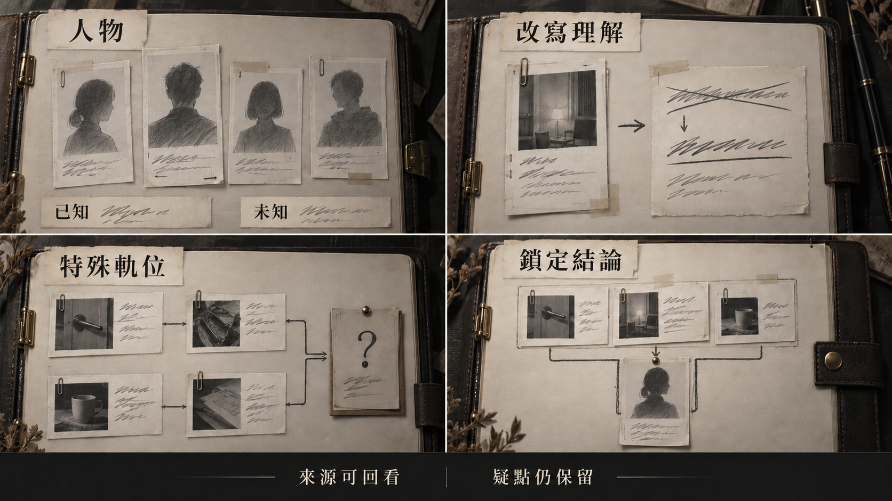

[完整圖說與操作對照](../09_劇本/09-15_正式劇本_共用附錄.md#h-0405-510) · [圖像目錄](../09_劇本/09-14_全劇本與關卡整合稿.md#book-illustrations)

<a id="fig-v23"></a>

##### V23｜第三幕：證據與微異常

**適用與限制：**同車殘頁、R13 床紙、R17 咖啡杯與 R16 系統資料分屬不同來源；不把紙墊壓痕推成新增屍體。

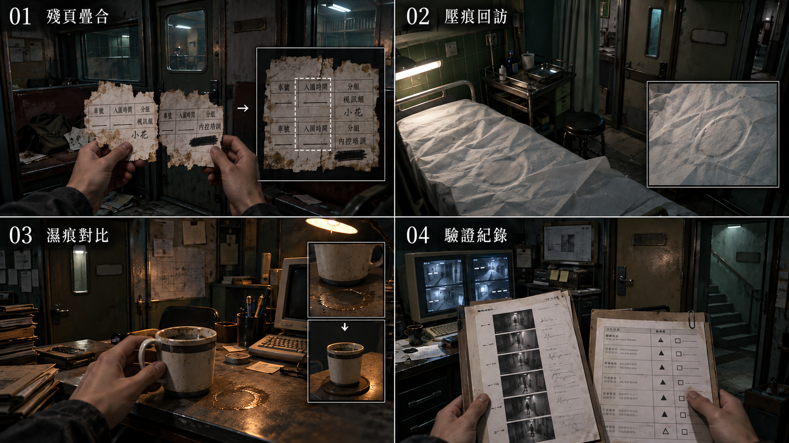

[完整圖說與操作對照](#h-0604-952) · [圖像目錄](../09_劇本/09-14_全劇本與關卡整合稿.md#book-illustrations)

<a id="node-r17-exit"></a>

#### 離場通路與次場景

<a id="s-0604-29"></a>

<!-- import:s-0604-29:begin -->
<a id="transition-r17-r18"></a>
##### T-R17-R18 · 倉儲殘層至校正入口

**起行與到達：**正確日期證據與 K2-01 成立；假路返回後可重排；離幕前可回查已發現未完成的 SQ-M1／SQ-T，支線不擋主線。沿原提交單向起行；不恢復前幕或 C-02。 到目的門口由玩家親自進房，才啟動房內事件。

**空間與保存：**每個次場景標明來路、去路、樓層與可見承重踏板；反向不水平翻圖。完成各列局部操作才開下一段。 狀態依[通路共用規則](../09_劇本/09-15_正式劇本_共用附錄.md#transition-rules)與[逐層探路契約](../09_劇本/09-15_正式劇本_共用附錄.md#ascent-route-contract)。

<!-- route-exploration:R17:begin -->
| 次場景／主圖 | 玩家目標 | 辨路依據 | 操作與通行條件 | 錯路與復原 | 通過狀態 |
| --- | --- | --- | --- | --- | --- |
| T-R17-R18-01 | 找出 33F 的下一段安全通路 | 路由只證明支路方向，公共梯損壞後仍要沿承重踏板繞行；L-04 不在這一側。 | 查看側梯踏板接點，從貨架外側穿過，再登 34F。 | 壓斷主梯不可攀爬；可退回本層，但原單向門已關，不能回到 R17 或改走 L-04。 | route_local.t-r17-r18-01.open |
| T-R17-R18-02 | 找出 34F 的下一段安全通路 | 箱牆固定，檢修蓋的四角扣仍完整；蓋後可看見固定側梯。 | 依扣環位置打開檢修蓋，沿背板後短梯上行。 | 箱牆不可拆；檢修蓋卸下後掛在原掛鉤，不占背包，也不在回訪突然復位。 | route_local.t-r17-r18-02.open |
| T-R17-R18-03 | 找出 35F 的下一段安全通路 | 貨臺在固定短軌上橫移，只能補齊同層兩段步道，不能載人跨樓層。 | 在原位轉手輪，將空貨臺對準兩側停靠孔，壓下繫繩鎖銷後通過。 | 未對孔不開柵；轉過頭可倒轉手輪，不需要站上移動貨臺操作。 | route_local.t-r17-r18-03.open |
| T-R17-R18-04 | 找出 36F 的下一段安全通路 | 正面的住宅門已封死，護角旁另有留鉸鏈的檢修片，不能把兩扇門混為一扇。 | 從鉸鏈側拉開檢修片，沿管線背後的維修步道上到 37F，親自進入 R18 的安全觀察點。 | 封死門沒有可搜的鑰匙；拉開片後固定在止擋，返回仍是同一卸貨護角。 | route_local.t-r17-r18-04.open |
<!-- route-exploration:R17:end -->

**驗收：**尚未抵達目的房不得取得該房道具；每層測原門檻、錯路、取消、近看返回、正反向與存讀檔；圖號只定位，不授予目的房證據。正式畫面、音場與實機節奏仍待製作及驗證。

<!-- import:s-0604-29:end -->

<a id="transition-r17-r14"></a>
##### T-R17-R14 · L-04 下行物流迴路

**起行與到達：**假鑰匙組合成立時只觸發一次；不加 guess_count。沿原提交單向起行；不恢復前幕或 C-02。 到目的門口由玩家親自進房，才啟動房內事件。

**空間與保存：**每個次場景標明來路、去路、樓層與可見承重踏板；反向不水平翻圖。依原門檻通行，近看選填，不增加解鎖題或收集。 狀態依[通路共用規則](../09_劇本/09-15_正式劇本_共用附錄.md#transition-rules)與[逐層探路契約](../09_劇本/09-15_正式劇本_共用附錄.md#ascent-route-contract)。

**驗收：**尚未抵達目的房不得取得該房道具；每層測原門檻、錯路、取消、近看返回、正反向與存讀檔；圖號只定位，不授予目的房證據。正式畫面、音場與實機節奏仍待製作及驗證。

<!-- production-subscenes:r17 -->

<!-- scene-image-subscenes-r17:begin -->
<a id="subscenes-r17"></a>
#### 次場景節點

以下次場景歸 R17 管理，節點編號沿用主圖圖號。來去方向為原動線的正向排列；反向通行與單向限制依原門檻，不因列出來路就新增返回出口。

<a id="subscene-t-r17-r14-01-spec"></a>
##### T-R17-R14-01 · 伺服器外側回程臺

**樓層：**31F · B 棟

**類型：**可查看過渡。**正向連接：**R17-V01 → **T-R17-R14-01** → T-R17-R14-02。

**近看：**T-R17-R14-01-C01；關閉回 T-R17-R14-01。

[正文](../09_劇本/09-06_正式劇本_第三幕.md#subscene-t-r17-r14-01-script) · [圖像製作單](#node-r17-images) · [原門檻與回訪](#node-r17-nav) · [通路正文](../09_劇本/09-06_正式劇本_第三幕.md#ascent-t-r17-r14-01-script)

<a id="subscene-t-r17-r14-02-spec"></a>
##### T-R17-R14-02 · 物流背牆平台

**樓層：**30F · B 棟

**類型：**可查看過渡。**正向連接：**T-R17-R14-01 → **T-R17-R14-02** → T-R17-R14-03。

**近看：**T-R17-R14-02-C01；關閉回 T-R17-R14-02。

[正文](../09_劇本/09-06_正式劇本_第三幕.md#subscene-t-r17-r14-02-script) · [圖像製作單](#node-r17-images) · [原門檻與回訪](#node-r17-nav) · [通路正文](../09_劇本/09-06_正式劇本_第三幕.md#ascent-t-r17-r14-02-script)

<a id="subscene-t-r17-r14-03-spec"></a>
##### T-R17-R14-03 · 換側橋下返面

**樓層：**29F · B 棟

**類型：**可查看過渡。**正向連接：**T-R17-R14-02 → **T-R17-R14-03** → T-R17-R14-04。

**近看：**T-R17-R14-03-C01；關閉回 T-R17-R14-03。

[正文](../09_劇本/09-06_正式劇本_第三幕.md#subscene-t-r17-r14-03-script) · [圖像製作單](#node-r17-images) · [原門檻與回訪](#node-r17-nav) · [通路正文](../09_劇本/09-06_正式劇本_第三幕.md#ascent-t-r17-r14-03-script)

<a id="subscene-t-r17-r14-04-spec"></a>
##### T-R17-R14-04 · 搬運標籤梯口

**樓層：**28F · B 棟

**類型：**可查看過渡。**正向連接：**T-R17-R14-03 → **T-R17-R14-04** → R14-V01。

**近看：**T-R17-R14-04-C01；關閉回 T-R17-R14-04。

[正文](../09_劇本/09-06_正式劇本_第三幕.md#subscene-t-r17-r14-04-script) · [圖像製作單](#node-r17-images) · [原門檻與回訪](#node-r17-nav) · [通路正文](../09_劇本/09-06_正式劇本_第三幕.md#ascent-t-r17-r14-04-script)

<a id="subscene-t-r17-r18-01-spec"></a>
##### T-R17-R18-01 · C-02 支路外臺

**樓層：**33F · B 棟

**類型：**探路次場景。**正向連接：**R17-V01 → **T-R17-R18-01** → T-R17-R18-02。

**探路操作：**查看側梯踏板接點，從貨架外側穿過，再登 34F。

**錯路與復原：**壓斷主梯不可攀爬；可退回本層，但原單向門已關，不能回到 R17 或改走 L-04。

**保存：**`route_local.t-r17-r18-01.open`；依[逐層探路契約](../09_劇本/09-15_正式劇本_共用附錄.md#ascent-route-contract)驗證。

**近看：**T-R17-R18-01-C01；關閉回 T-R17-R18-01。

[正文](../09_劇本/09-06_正式劇本_第三幕.md#subscene-t-r17-r18-01-script) · [圖像製作單](#node-r17-images) · [原門檻與回訪](#node-r17-nav) · [通路正文](../09_劇本/09-06_正式劇本_第三幕.md#ascent-t-r17-r18-01-script)

<a id="subscene-t-r17-r18-02-spec"></a>
##### T-R17-R18-02 · 貨箱標線隔間

**樓層：**34F · B 棟

**類型：**探路次場景。**正向連接：**T-R17-R18-01 → **T-R17-R18-02** → T-R17-R18-03。

**探路操作：**依扣環位置打開檢修蓋，沿背板後短梯上行。

**錯路與復原：**箱牆不可拆；檢修蓋卸下後掛在原掛鉤，不占背包，也不在回訪突然復位。

**保存：**`route_local.t-r17-r18-02.open`；依[逐層探路契約](../09_劇本/09-15_正式劇本_共用附錄.md#ascent-route-contract)驗證。

**近看：**T-R17-R18-02-C01；關閉回 T-R17-R18-02。

[正文](../09_劇本/09-06_正式劇本_第三幕.md#subscene-t-r17-r18-02-script) · [圖像製作單](#node-r17-images) · [原門檻與回訪](#node-r17-nav) · [通路正文](../09_劇本/09-06_正式劇本_第三幕.md#ascent-t-r17-r18-02-script)

<a id="subscene-t-r17-r18-03-spec"></a>
##### T-R17-R18-03 · 轉運臺隔柵

**樓層：**35F · B 棟

**類型：**探路次場景。**正向連接：**T-R17-R18-02 → **T-R17-R18-03** → T-R17-R18-04。

**探路操作：**在原位轉手輪，將空貨臺對準兩側停靠孔，壓下繫繩鎖銷後通過。

**錯路與復原：**未對孔不開柵；轉過頭可倒轉手輪，不需要站上移動貨臺操作。

**保存：**`route_local.t-r17-r18-03.open`；依[逐層探路契約](../09_劇本/09-15_正式劇本_共用附錄.md#ascent-route-contract)驗證。

**近看：**T-R17-R18-03-C01；關閉回 T-R17-R18-03。

[正文](../09_劇本/09-06_正式劇本_第三幕.md#subscene-t-r17-r18-03-script) · [圖像製作單](#node-r17-images) · [原門檻與回訪](#node-r17-nav) · [通路正文](../09_劇本/09-06_正式劇本_第三幕.md#ascent-t-r17-r18-03-script)

<a id="subscene-t-r17-r18-04-spec"></a>
##### T-R17-R18-04 · 包覆中的門楣

**樓層：**36F · B 棟

**類型：**探路次場景。**正向連接：**T-R17-R18-03 → **T-R17-R18-04** → R18-V01。

**探路操作：**從鉸鏈側拉開檢修片，沿管線背後的維修步道上到 37F，親自進入 R18 的安全觀察點。

**錯路與復原：**封死門沒有可搜的鑰匙；拉開片後固定在止擋，返回仍是同一卸貨護角。

**保存：**`route_local.t-r17-r18-04.open`；依[逐層探路契約](../09_劇本/09-15_正式劇本_共用附錄.md#ascent-route-contract)驗證。

**近看：**T-R17-R18-04-C01；關閉回 T-R17-R18-04。

[正文](../09_劇本/09-06_正式劇本_第三幕.md#subscene-t-r17-r18-04-script) · [圖像製作單](#node-r17-images) · [原門檻與回訪](#node-r17-nav) · [通路正文](../09_劇本/09-06_正式劇本_第三幕.md#ascent-t-r17-r18-04-script)
<!-- scene-image-subscenes-r17:end -->

<a id="spec-act-3-shared"></a>

### 跨場景共用規則

<a id="s-0604-13"></a>

<!-- import:s-0604-13:begin -->
<a id="h-0604-737"></a>

#### 醫療與後勤區的靈異事件

共用規則見[對應條款](10-01_製作規格_序幕.md#s-0601-10)。

| 事件／類型 | 觸發與來源 | 畫面、聲音與時長 | 玩家行動／後果 |
| --- | --- | --- | --- |
| HA-R12-01／遲遲等不到的藥 A | 已讀缺藥清單後，下次進入藥櫃定點停留 5 秒；E-11 未開始或已結束且過餘波 | 空櫃內先有藥片落杯的細聲，再有一次把杯放回桌面的聲音；接著 6 秒只有房間底噪，總長約 10 秒。櫃內始終空，不出影子 | 可查看空格或離開；屬場所殘響，不生成藥品、不改 E-11 雙解，不暗示治療成功。必需資料不依賴回訪 |
| HA-R13-01／場景差分 A | 原 T-3a 診療床紙墊回訪條件成立 | 沿用原本壓痕／日期戳差分，在重回全景時配一聲紙墊受壓聲；不得再加呼吸中的病人，差分維持原事件狀態 | 可比對既有日期；屬同一事件的視聽細化，不再解鎖或重發一筆證據 |
| HA-R13-02／怨靈逼近 C | 原 E-07 必要對峙已啟動，且玩家準備提交回應 | 前兆至少 3.2 秒：床簾邊人影前傾，呼吸停在半句；保留出口輪廓。無新增自動攻擊循環 | 可取消回應、退回 R12 查證；正確回應沿用安息，錯誤回應沿用原恐慌與短暫熄燈，不疊扣第二次 |
| HA-R14-01／看不見的載重 A | H-05 第二次呼叫完成、貨梯門已打開；供電與原停靠條件成立 | 空籠保持可見，卻傳來人群讓位般的衣物摩擦與一聲載重彈簧低鳴，持續 6 秒；不出站立人影、不增加顯示器數字。聲音為場所殘響，並非真實重量感測讀值 | 可記錄原停靠次序或離開，不必走進籠內；不改馬達、載重、門或通行狀態 |
| HA-R15-01／未完成的維修動作 A | 原維修單已讀＋全面供電的 E-08 條件成立 | 沿用工具影子先指向故障支路位置（不是操作方向），與一聲金屬輕碰同步；停住後依原事件收束，不新增錯拍或工具飛行 | 原過載提示、玩家回應與代價不變；只使用原事件旗標，不在安定點另播一段 |

本區不新增敵人數量。無電時 HA-R12／R13 的聲音標記為感知殘響；R14 貨梯動作仍須供電。R15 電路抉擇本身的代價與 HA-R15 的無代價表現分開結算。
<!-- import:s-0604-13:end -->

<a id="s-0604-14"></a>

<!-- import:s-0604-14:begin -->
<a id="h-0604-752"></a>

#### 技術核心的完整配置邊界

R12–R15 使用本章 HA 表。R16 三格鎖定與客戶分級閱讀期間不插自發異常，權限反擊沿既定教學；R17 保留靜態 T-3b 咖啡杯近看、外部中繼及維修迴路，不再加新鬼影或杯痕突變。這兩房讓玩家有時間理解制度與路線，既有紙本差分不修改原件資料。
<!-- import:s-0604-14:end -->

<a id="s-0604-17"></a>

<!-- import:s-0604-17:begin -->
<a id="h-0604-770"></a>

#### 第三幕：看得見通路，仍走不出去

- **R17**：沿原安置資料核對兩人曾同時住在臨時安置處；與 R8 小帳日期對齊時，筆記只寫「我們真的一起待過」，不把蛾記憶當完整錄影。
- **既有門端回返伏筆**：原有外側斷路、鎖狀態與重回節點保留；近看破損窗網或管線時可見灰塵黑紋，仍按原物件解釋，不自動命名蛾粉或怨氣。
- **照護段**：R12 的缺藥、R13 受助者的拒絕與紙墊壓痕保留人物本身的痛苦，不把醫療痕跡改成蛾卵或蟲害。
- **節奏**：供電三路與穩定度代價不變。R15 安定點、R16 核心推理不出新增異常；本幕靠查證使友情可信，仍不確認小花封樓。
<!-- import:s-0604-17:end -->

<a id="s-0604-19"></a>

<!-- import:s-0604-19:begin -->
<a id="h-0604-891"></a>

#### R16／R17｜管制摘要與支線起點

R16 原管理權限頁必讀「可核可工作處置；本人離園與私人通聯封鎖」。R17 桌面核准夾附 KX-01，內部領用附件附 MC-01，依 03-05 翻折頁收集；在 E3 主線對話結束後由玩家選擇查看，不自動播放或提前揭露主角真名。完整收集、解法及狀態見 [03-05](../09_劇本/09-15_正式劇本_共用附錄.md#doc-0305)。
<!-- import:s-0604-19:end -->

<a id="s-0604-20"></a>

<!-- import:s-0604-20:begin -->
<a id="h-0604-895"></a>

#### SQ-T｜維修員最後的巡檢

R12 巡檢牌 PT-01、R14 裂圖 PT-02、R15 銘牌 PT-03；先比對再於 R15 收外扣、轉中輪、壓末桿。四房已到訪且 E2-06 已成立後，主動推開才新增 R12–R15 可選服務捷徑。三路供電結果、選填紀錄犧牲與 R17 假鑰匙迴路不變。原本重走仍要實際切換電路；新捷徑只縮短路程。R17 離幕前可返回補做，不強制。完整見 [03-06 解謎獎賞支線](../09_劇本/09-15_正式劇本_共用附錄.md#doc-0306)。
<!-- import:s-0604-20:end -->

<a id="s-0604-23"></a>

<!-- import:s-0604-23:begin -->
<a id="h-0604-917"></a>

#### 城寨空間與構圖
<!-- import:s-0604-23:end -->

<a id="s-0604-24"></a>

<!-- import:s-0604-24:begin -->
<a id="h-0604-921"></a>

#### 園區生活、聯絡與處置

診所與物流資料分別負責健康處置、移動與缺失，不以「已處理」一欄推定死亡。所有補頁沿原熱點顯示、免費且閱讀停表，不新增發電機選擇後必失的主線資料。
<!-- import:s-0604-24:end -->

<a id="s-0604-25"></a>

<!-- import:s-0604-25:begin -->
<a id="h-0604-927"></a>

#### 怨靈的互動回報

貨梯用呼吸與門縫束帶提供同等時機提示；斷藥者保留拒絕接觸的距離；電房殘響的手勢與真實設備狀態相連。沿原解法與代價，不新增機關門票。完整聲畫收束見 [怨靈互動辨識與收束](../09_劇本/09-15_正式劇本_共用附錄.md#h-0412-185)。
<!-- import:s-0604-25:end -->

<a id="spec-act-3-references"></a>

### 跨場景圖解對照

<a id="s-0604-18"></a>

<!-- import:s-0604-18:begin -->
<a id="h-0604-777"></a>

#### 畫面與操作示意

> 圖稿供構圖參考，操作依本頁熱點規格：筆記關聯、凝神穩定度、有限實體干預與現場設備。正式圖稿須通過文字與畫面一致性驗收。

<a id="h-0604-781"></a>

##### R15：供電與暫存紀錄

[查看圖解：第三幕：路由與後勤通路](#h-0604-939)

操作實體斷路器前，同時提供路由與紀錄預覽，讓玩家看見未鎖定暫存區將被覆寫。三條路都能取得必要主線證據，不標推薦路線。

| 路線 | 既定操作 | 保留的選填紀錄 |
| --- | --- | --- |
| 部分供電 | 重接兩組斷路器，診所與核心維持最低供電；需跨房切換 | E-07 完整診所紀錄，含聲音樣本 |
| 全面供電 | 啟動全棟備援並守住過載表 30 秒 | E-06 素材索引對應 |
| 定向供電 | 依主角肌肉記憶輸入核心線路順序 | E-08 送醫呼叫紀錄 |

- 控制台在操作前列出三份紀錄，明示「電力切換將覆寫未鎖定的暫存區」及本輪確認後不可重選。
- 三路供電各保留一份紀錄；其他兩份選填紀錄被覆寫，不能把它畫成有一條全保留解。
- 未保留者名冊仍列，只少相應資料；不能把紀錄損失寫成當下殺死某人。
- 部分供電較安靜；全面供電喚醒既定低壓迴聲並運轉貨梯／廣播；定向供電完成才顯示「主管專用線路已接通」。不在預覽提前播放完成回饋。
- 熟悉權限只記錄工作知識，不是權限抹除，也不直接鎖結局。
- 0 穩定度仍可透過實體斷路器完成主線供電；固定安定點是後續獨立操作，不把選路與安定感知合成一個按鈕。

效果提案：焦點路由用線型及文字加強，預覽燈低亮，實體確認後才亮起通電燈。全面供電的三十秒狀態需另做過載表近景；此用例不代表按一次清單便跳過操作。限時輔助沿用設定，不另設手速要求。

<a id="h-0604-802"></a>

##### R17：維修迴路

[查看圖解：第三幕：路由與後勤通路](#h-0604-939)

依序呈現關聯鎖定、門後通道及返回 R14；玩家從相同門牌與環境辨認回返，不預先標示錯誤路線。

- 特例組合為 E3-03、E3-06、E2-08「貨梯物流表」。介面仍輸出「線索已連結。」與 K2-01，K2-01 是產出的鑰匙，不是第四張證據。
- 通道逐層下返 27F R14，玩家才從空間辨認出推論的問題。無額外錯誤提示、OS 或判錯音效；環境底音延續。
- 節點圖僅新增返回 R14 的細灰線，目前位置用既有青色標記。簡化迴路不新增房間，也不自動揭露完整地圖。
- 正解以 E3-07 取代無日期 E2-08：在同車入園、撤離改接、震損自檢的時序下，依 32-S→N-2→RT-3 查到 C-02。較晚日期與多列自檢提供可核對差異；返回後可重排，不計入 guess_count。
- 此誤導只用一次。實際遊戲不以「假鑰匙」「錯誤路線」提前標示。

<a id="h-0604-814"></a>

##### 缺藥紀錄與照護註記

[查看圖解：第三幕：路由與後勤通路](#h-0604-939)

- **來源：**R12 選填 `E2-13` 缺藥清單與 R13 `E2-07` 健康評估表。診療床像展示品，使用痕跡集中在候診塑膠椅。
- **操作：**本房三張叫號紙依日期排列 D-15、D-16、D-18，對照椅牌找出 D-17，再在本地叫號器呼叫並保存照護註記。缺藥清單是選填身分補充，不能成為必要解的門票。
- **保存方式：**在原「可工作」健康評估旁，另存「需要照護」的現時註記並保留來源；不刪改過去病歷。
- **回饋：**E-07 停止敲擊並讓出後門；人物反應在全景呈現。有 E2-13 才補姓名與缺藥原因，否則調查板保留已知床號與照護註記，不顯示死亡畫面。
- **效果提案：**核對項約 0.2 秒淡入細線；提交註記後保持原件可讀，不用綠色療癒光或康復宣告。一般安撫無效；錯誤回應提高恐慌並熄燈數秒，不致死，可退回 R12 查線索。

<a id="h-0604-824"></a>

##### 貨梯物流標籤

[查看圖解：第三幕：路由與後勤通路](#h-0604-939)

- **操作：**R14 將三張破損標籤排到正確停靠層；設備標籤的識別碼與人員交接備註共同指向一個人，不能只靠重量斷定載人。
- **版面：**左側待比對標籤，右側停靠槽，展開區供閱讀編號、重量與備註。底部摘要將共用物流表的意義整理給玩家，不冒充原件印刷內容。
- **效果提案：**拖曳時保留標籤破邊，約 0.15 秒吸附到候選槽；閱讀細節才形成判斷，不以綠色槽位洩漏答案。
- **證據：**物流終端對應 `E2-08`，並埋 E-10 空名訊號伏筆。「已轉運」文件屬同房另一個比對熱點：對上 R10 外聯草稿後延伸 `E2-11`，箱號後綴通往頂層，內容仍被塗黑。
- **幕尾路由來源：**E2-08 同頁印「維修索引組 RT-3／物流支路 L-04」，無日期、無目前有效標記、不直接列 32-S；R14 首次閱讀即保存欄值，R17 不憑空補資料。
- **邊界：**不以物流文件確認器官傳聞。貨梯內壁識別牌／E-06 凝固是另一個選填互動，不在此用例中合併成必解步驟；只能確認曾被關在貨梯，不能觀看死亡。

<a id="h-0604-835"></a>

##### 同車入園的殘頁疊合

[查看圖解：第三幕：證據與微異常](#h-0604-952)

- **操作：**R17 前景受潮檔案櫃，修復 `E3-03-A` 與 `E3-03-B`，親手疊合透明殘頁，對齊相同車號與入園時間。
- **可知資訊：**A 是小花、分到視訊組；B 是姓名被遮蔽的女性、分到內控培訓。這一步確認同車同日入園，不提前揭露主角真名。
- **構圖：**兩張紙保留不同破損方向，以重疊區承載比對。僅車號、時間提供細對齊線；兩份相符值須使用同一組正式資料。
- **藏在日常裡的線索：**A 的「宿舍分配」欄旁有手寫「宿舍」，不是小花的字。此刻不提示、不醒目標示、不新增證據。到 R21／R29 後才可能在筆記回看已保存觀察認出筆跡，不要求跨部返回。
- **效果提案：**拖曳紙張時維持透明度，接近對位時約 0.2 秒穩定；不自動吸附整份解答，不彈出筆跡作者提示，也不播評論 OS。
- **操作提示：**拖動、微調、重置、縮放與返回的快捷鍵配置，須在實作時配合專案鍵位、重新綁定及手把操作校對；不是新增已核定操作規則。
- **後續：**此用例為 R17-A，與假鑰匙維修迴路分開；幕尾時間線仍按原規格結合 `E3-03`、`E3-06`、`E3-07`。

<a id="h-0604-847"></a>

##### 診療床紙墊的壓痕

[查看圖解：第三幕：證據與微異常](#h-0604-952)

- **來源：**`06_關卡規格/06-04_第三幕_技術核心.md`，R13、T-3a。
- **前後狀態：**初見紙墊乾淨且完全展開。完成 E-07 後回訪，同一張紙墊浮出人形壓痕及下面轉印的日期戳；日期為 L-48 封鎖當日。日期應使用核定時間資料，不以「L-48」冒充日期。
- **畫面：**沿用同一鏡位、床架、紙張範圍與物件數量，只更換紙張材質差分。壓痕是紙面受壓的形狀，不是人體影像或墨線輪廓。
- **兩種讀法：**濕度使舊壓痕與墨水顯影；或日期戳留下未完整登錄的使用痕跡。未讀相應紀錄不能判定缺漏，不能由壓痕推定使用者、次數、死因或撤離日期。
- **回饋：**首次回全景沿 HA-R13-01 配一聲紙墊受壓聲，之後安靜；不新增 E 編號。E-07 條目先記實見的轉印日期，取得封鎖日來源並由玩家比對後才補「轉印日期與封鎖日重疊」；反序取得與存讀均不自動完成比對。
- **實作提案：**玩家再次進入固定鏡位前載入差分，不在眼前播放人形逐漸浮出的動畫。這是視覺轉場提案，非新增觸發條件。

<a id="h-0604-858"></a>

##### 咖啡杯的第二圈環痕

[查看圖解：第三幕：證據與微異常](#h-0604-952)

- **來源：**`06_關卡規格/06-04_第三幕_技術核心.md`，R17、T-3b。
- **觀看距離：**遠景先辨出乾外圈，近看可辨出較小、邊緣仍濕的內圈；兩圈從初訪已共存，不是前後狀態圖，不依 E3-06 或回訪。辦公室保持空無一人。
- **畫面：**兩欄改呈同一時刻的遠景與斜俯角近看，保持同杯、同桌、同一照明；濕內圈用反光區別，桌上不新增杯子或杯底圈。
- **物理線索：**構圖保留天花板管線滴點；玩家能找到水滴來源。可讓玩家懷疑仍有人使用，但不替此猜測背書。
- **證據邊界：**杯痕不是系統運作或康仍在樓內的證據。沒有「有人剛離開」提示、熱氣或人物倒影。
- **實作提案：**濕邊用固定粗糙度材質，遠近景共用狀態；不隨讀件或回訪切換，不改全房光色、不加驚嚇音效。

<a id="h-0604-869"></a>

##### 七分鐘驗證異常

[查看圖解：第三幕：證據與微異常](#h-0604-952)

- **來源：**`06_關卡規格/06-04_第三幕_技術核心.md`，R15 歷史電壓頁。
- **條件：**任一供電路線確認後，捲至兩週前的紀錄。三條路均可取得相同選填 `E4-00-C`。
- **畫面：**上下對照電壓與驗證匯流排；七分鐘內驗證掉線，前後電壓正常。電壓線依既有正常狀態示意，不新增量測值。兩端時戳缺位，不填完整時間。
- **結論：**描述「一段七分鐘的驗證異常；不是斷電」，未定位列改為「未定位 · 約七分鐘」。無 OS，不能替玩家指定誰繞過驗證。
- **整合：**與同終端的主線 `E2-06` 分開取得，未讀歷史頁不影響第二層鎖定。此用例是歷史頁，不重做供電路由或R25 時間帶。
- **效果提案：**游標沿兩軌同步移動，僅標示區間；不閃警報、不做現場倒數或斷電效果。

<a id="h-0604-880"></a>

##### 客戶分級表

[查看圖解：第三幕：證據與微異常](#h-0604-952)

- **來源：**`06_關卡規格/06-04_第三幕_技術核心.md`，R16 `E2-14`。
- **固定三列：**K-114「信任建立 41 天／依賴指數高」→「留存中」；K-207「已完成首投／複投 2 次」→「已轉化·結案」；K-089「信任建立 14 天／可支配資產：無」→「無資產·結案」。
- **操作：**開啟第三機櫃閱讀螢幕另一端的客戶評級，僅回查第二幕實際看過的代碼來源；此處先建立與人員評級相同的表格結構，R29 才進行跨文件簽核比對。未讀選填來源不阻擋本頁推理。
- **版面：**三列同字級、字重與色彩，K-089 不特別醒目標示。核可工作名 Michelle 可見，真名與本人身分不提前揭露；生成簽名只為形狀占位，正式簽勢須沿用既有美術資產。
- **敘事邊界：**K-089 沒有資產而被系統結案，不寫成救贖或溫情，不加評論 OS。
- **效果提案：**維持一般表格捲動與讀取，讓玩家從欄位內容理解制度，不加獎勵標記。此張不包含第二層鎖定後風扇停一秒的整房演出。
<!-- import:s-0604-18:end -->

<a id="s-0604-27"></a>

<!-- import:s-0604-27:begin -->
<a id="h-0604-935"></a>

#### 圖解與操作對照

圖解按操作階段排列，個別用例的來源、數值與完成條件仍依本文件正文。概念分鏡不取代正式分層素材、動畫與遊戲實作驗收。

<a id="h-0604-939"></a>

##### 圖解：第三幕：路由與後勤通路

[查看圖像：第三幕：路由與後勤通路](#fig-v22)

| 面板 | 畫面與操作 |
| --- | --- |
| 1 | 供電切換：實體開關讓門鎖、風扇與照明在現場回應。 |
| 2 | 迴路返回：通道繞回同一貨梯，玩家由既定識別物察覺推論不符；不是新捷徑。 |
| 3 | 照護紀錄：把缺藥與照護註記放在同一閱讀範圍，保留不同文件的判讀依據。 |
| 4 | 物流比對：標籤、貨梯與門端相互對照；路徑及解鎖條件依本章節點。 |

**操作邊界：**無手機接線；迴路不是新捷徑或正確通路，不提前標假鑰匙；聲音控制器在場且有電；手動機構與移動方向清楚。

<a id="h-0604-952"></a>

##### 圖解：第三幕：證據與微異常

[查看圖像：第三幕：證據與微異常](#fig-v23)

| 面板 | 畫面與操作 |
| --- | --- |
| 1 | 同車入園：疊合兩張入園人事殘頁，對齊車號與時間；一份屬小花，另一份女性姓名仍遮蔽。 |
| 2 | 床紙壓痕：回訪時比對同一張診療床紙墊，不新增屍體或死亡結論。 |
| 3 | 第二圈濕痕：杯子與桌面位置固定，近看才辨出初訪已存在的較小濕內圈。 |
| 4 | 來源分開：七分鐘驗證異常與客戶分級表各自核對，不提前補出下部的完整答案。 |

**操作邊界：**不得由生活微異常推論主角已死；不能單靠顏色辨識；不提前揭露下部完整七分鐘答案。
<!-- import:s-0604-27:end -->

<a id="spec-act-3-delivery"></a>

### 幕尾狀態與交付

<a id="s-0604-10"></a>

<!-- import:s-0604-10:begin -->
<a id="h-0604-710"></a>

#### 本幕結束狀態

**最短主線節奏：**即使略過所有選填、部分供電、首次排對日期，仍有 R13 停藥回執 → R15 一存二失 → R16 對到已執行處置／安全閱讀後風扇停轉 → R17 入口倒影／平靜備忘／受損通路 → 原 12 秒幕尾餘波。回訪杯痕、E-04、E-06 與錯路只加深，不承擔主線唯一恐怖高潮。這是原型待驗收路徑，不是已試玩效果。

| 類別 | 必須成立 |
| --- | --- |
| 劇情 | 玩家知道內控主管決定校正分流；主角與該職位有異常熟悉感 |
| 世界觀 | 生活、醫療、物流、電力與犯罪資料是同一套控制基礎設施 |
| 懸念 | 小花與被遮蔽女性同車進入；殘缺求援曾送達，後續回覆卻在震損後中斷 |
| 玩法 | 玩家完成一次跨房間線路謎題、一次必要訊號安息、一次三格推理與一個不可重選供電抉擇 |
| 資源 | 取得 `K2-01`；供電選擇、`authority_familiarity`、E-06／E-08 選填狀態已保存 |
<!-- import:s-0604-10:end -->

<a id="s-0906-63"></a>

<!-- import:s-0906-63:begin -->
<a id="h-0906-698"></a>

#### 進入第四幕時的狀態

| 項目 | 承接 |
| --- | --- |
| 必要通路 | R12 配電、E-07 叫號與照護註記、R14 物流繼電器、R15 已確認路線、R16 鎖定、R17 正確日期與門端使用 |
| 兩個調查板 | E2-04／05／14 的第二層與 E3-03／06／07 的事件時間線分開保存 |
| 供電取捨 | 三路擇一、保留一份暫存；另兩份不由回訪恢復，部分路線保留辦公室繼電器已切換 |
| E-07 | 必要安息成立；照護附註與歷史「可工作」並列，個人識別依實際來源 |
| 其他人物 | E-11 實際回應或未處理、E-04 原件核對／註記、E-06 rested／bypassed／未處理依本輪保存；E-08 不新增正式安息 |
| 主角與 Michelle | IN-06-B 的同車女性與 Michelle 職務條目分開；尚缺入園流水對人事號的橋接，調查者身分亦未核驗 |
| 小花 | 同車分派與可核對的共同安置資料；宿舍邊字作者未揭露，局部袖口不計 H-08 |
| 收件與斷線 | 歷史求援標頭曾送達；較晚設備震損，受困者去向未知；R11 現時校驗不改寫歷史 |
| 選填長線 | E4-00-C、E3-08、E2-10、E-02 路線按實讀保存，沒有自動補齊 |
| 支線 | SQ-T 通路、SQ-M1 對照頁照實保存；KX-01 只記已讀，不開下部 SQ-K |
| 資源與能力 | 實際穩定度／恐慌、R15 安定使用狀態、authority_familiarity 與權限解鎖分開，不以解鎖冒充抹除 |
| 回訪 | 假路最多一次且不計猜測；R17→R18 單向，不能回後勤補收 |
<!-- import:s-0906-63:end -->

<a id="s-0906-64"></a>

<!-- import:s-0906-64:begin -->
<a id="h-0906-715"></a>

#### 本幕台詞清單（配音用）

> 正文逐字有聲落點共 **13 行**：6 行既有來源、6 行沿用第二幕待審 #12（同三句在兩個選填場合重用）、1 行新增合成叫號。**現時主角 OS 為 1 行，且有已讀條件。**
> 兩處 #12 各自三版擇一，單次遊玩不會全部播出；不是 13 份新音檔。E-11 訊息、E-04 鍵盤文字、文件與系統均無聲。
> #8／#9／#13、藥片／敲擊、供電保留紀錄中的未核字音檔另列資產，不以未列逐字稿當作零工時。康三句是原備忘可辨段落，不新增整段演說。

| # | 角色／來源 | 逐字台詞 | 位置 | 層級／來源 |
| ---: | --- | --- | --- | --- |
| 1 | 素材／中文版 | 今天過得好嗎？ | R12-03 | 【沿用待審】09-05 的 #12 |
| 2 | 素材／越語版 | Hôm nay bạn thế nào? | R12-03 | 【沿用待審】09-05 的 #12 |
| 3 | 素材／英語版 | How was your day? | R12-03 | 【沿用待審】09-05 的 #12 |
| 4 | 叫號器／合成音 | D-17。 | R13-02 | 【新增】原必要叫號的逐字讀法 |
| 5 | 主角 OS | 不同的門，最後都擠到這裡。 | R14-00 | 【鎖定】06-04，已讀 R6 封門 |
| 6 | 素材／中文版 | 今天過得好嗎？ | R14-03 | 【沿用待審】同 #12，不另錄 |
| 7 | 素材／越語版 | Hôm nay bạn thế nào? | R14-03 | 【沿用待審】同 #12，不另錄 |
| 8 | 素材／英語版 | How was your day? | R14-03 | 【沿用待審】同 #12，不另錄 |
| 9 | 康／歷史備忘 | Michelle 失聯 | R17-05 | 【鎖定】06-04 原備忘 |
| 10 | 康／歷史備忘 | 敏感索引流失 | R17-05 | 【鎖定】06-04 原備忘 |
| 11 | 康／歷史備忘 | 照撤離協定做 | R17-05 | 【鎖定】06-04 原備忘 |
| 12 | 小花／局部回聲 | 先看清楚 | ACT3-03 | 【鎖定】06-04；非 H-08 |
| 13 | 樓內維修通話／歷史快取 | 外廊斷了，核心通道還是鎖著。 | ACT3-04 | 【鎖定】06-04 原電話快取 |
<!-- import:s-0906-64:end -->

<a id="s-0604-11"></a>

<!-- import:s-0604-11:begin -->
<a id="h-0604-723"></a>

#### 最低資產與製作驗收

- 6 張實景背景、6 組感知資產；R12、R13、R14、R15 各 1 個 F1 凝固／訊號局部，不要求整房第三套精繪。R17 只用檔案 metadata 與訊號疊圖，不製作凝固層。
- 可重用資產：金屬櫃、醫療簾、貨運標籤、線路盤、伺服器機櫃、玻璃辦公室。
- 至少 1 名測試者能在不看設計文件下說出「內控資料決定誰被送去校正」，以及「**同一張表也在決定要繼續騙誰**」。
- 測試者看到 K-089 時應感到不舒服，而不是感到欣慰；若普遍讀成「還好他沒事」，需加強分級表的行政冷感（不加旁白）。
- 三種供電路線都必須能在不重開存檔的情況下完成主線；任何選填證據不得被誤認為主線卡關。
<!-- import:s-0604-11:end -->

<a id="s-0604-12"></a>

<!-- import:s-0604-12:begin -->
<a id="h-0604-731"></a>

#### 製作期再細化

- 每個終端的最終 UI 文案與滑鼠／手把焦點順序。
- E-07 的稱呼與生活物件，需與正式角色命名表一起鎖定。
- 全面供電追加迴聲的位置，待 R15 實際鏡頭測試後決定。
<!-- import:s-0604-12:end -->

<a id="s-0906-65"></a>

<!-- import:s-0906-65:begin -->
<a id="h-0906-737"></a>

#### 核對與待審

| 項目 | 本稿處理／仍需確認 |
| --- | --- |
| 舊細綱校正 | E-07 改為叫號加照護註記才安息；E2-06 在供電確認後取得、E4-00-C 另讀；第二層第三格是 E2-14；電房只按既有供電分支恢復設備，外聯查證留在 R17 |
| 選填與主線 | E2-13、E-11、E-04、E-06、E2-08／12／10、支線均不升格為必要門票；R13／R14 先後可互換，機房共用兩側前置 |
| E-04／#14 | 統一原件核對與另存註記安息；#14 為文字來源索引，不合成人聲、不播放、不收費，不以取得索引代替安息 |
| E-08 提示方向 | 手影指故障位置；工單／銘牌同寫「維修支路／保持隔離」，玩家由接入扳回隔離；正確操作免除過載增量，不抵銷全面供電原代價 |
| 原件字表 | 同車車號、入境日與主時間軸沿 [09-13](../09_劇本/09-15_正式劇本_共用附錄.md#doc-0913) 新增待審字表；叫號紙等未列原件仍須另核。R17 不提前顯示 HR 對照；不以製作相對時標或 L-48 協定名冒充日期 |
| K-114 正式用字 | 依鐵則改為「留存中」，同步 06-04；欄位、對象、推理結果不變 |
| R17 共用回饋 | 正解與特例都只用原「線索已連結。」及 K2-01 表現；維修迴路一次、免費、不算猜測，不提前用正解專屬訊息洩底 |
| 路由依據 | E3-03 的 32-S→N-2、E3-06 的 N-2→RT-3、E3-07 的較晚自檢 RT-3→C-02 各補一段；E2-08 只支持無日期 RT-3→L-04。固定門與支路不移動，不加權限或人物辨識門檻 |
| 供電代價 | 正文復電前未掛載、僅一個可用封存槽；啟動重建另兩區，全面供電不修復封存硬體，重啟不回溯資料 |
| 主線揭露 | R13／R16 用 RX-17、D-17 與同一原件日期核對停藥回執，證實模型輸出經人核可後已執行；不以選填個人資料作門檻 |
| 時態與身分 | 康語音與維修通話快取均為既存歷史來源；核可工作名可見但不核驗主角真名。新校驗不改變過去震損，未讀選填來源不自動補全 |
| 配音 | 合成 D-17 讀法新增待審；#12 三語沿上幕待審，不視為已錄；聲音樣本、送醫呼叫與環境素材另行核字與估量 |
| 量產與測試 | 本輪只完成劇本、來源對照、台詞與文件同步；未執行 Godot 原型、錄音讀演、鏡位、時長或驚悚效果試玩 |

<a id="h-0906-755"></a>

###### 待原型驗收的最短路徑

- 不做任何選填、選部分供電、首次排對日期：仍應經過診所回執、暫存取捨、R16 已執行處置、風扇停轉、R17 入口倒影與康的平靜備忘；不靠錯路或回訪才有第三幕後段的壓力。
- 三種供電都能取得主線原件；只保留各自一份暫存，取消不覆寫，確認後存讀不復原另兩份。
- E-04 缺任一原件或只有 #14 均不完成安息；不做此案仍能通關，本地核對與註記不播放、不另收費；前置來源取得沿原規格。
- E-08 有／無工單均有現場文字可判斷隔離；只播放 #8 不算修復，忽略只結算既有過載，不二次扣全面供電成本。
- 逐一移除 E3-03／06／07：分別缺接收端、改接索引、震損後支路，不得僅靠 E3-07 或持有憑據自動填好路由；資料齊全仍須在原提交中核對欄位與日期。
- L-04 首次免費回 R14，重試不再播迴路，也不發 C-02；正確日期鏈加門端使用才通 R18。
- 叫號前、錯號、取消均不展開完整 RX-17 回執；正確叫號後、註記前就可讀，讀檔不要求再次播放；有／無 E2-13 均能核對本批缺號。
- E3-03、E3-06、E3-07 齊全仍不能合併 IN-06-B 與 Michelle；該橋接留到 R21 原件。
- 已猜到主角與管理層有關的玩家，仍能說出尚待查證的核可行為、知情程度與信任問題；不得以 UI 未顯姓名判定玩家沒猜到。
- 初訪就能近看兩圈杯痕，讀備忘與回訪不改材質；安全閱讀及安靜窗口保留，不用等待湊時長。

> 下一幕：[09-07 正式劇本 · 第四幕](../09_劇本/09-07_正式劇本_第四幕.md#doc-0907)，承接 R18–R22 的三段潛行、R19 可選破例與文字摘要、R20 單向歷史通話、R21 三單核對及 R22 上部終場。
<!-- import:s-0906-65:end -->

[總目錄](../09_劇本/09-14_全劇本與關卡整合稿.md#book-specs) · [本幕劇本](../09_劇本/09-06_正式劇本_第三幕.md#act-3) · [上一幕規格：第二幕](10-03_製作規格_第二幕.md#spec-act-2) · [下一幕規格：第四幕](10-05_製作規格_第四幕.md#spec-act-4) · [共用附錄](../09_劇本/09-15_正式劇本_共用附錄.md#book-appendices)
