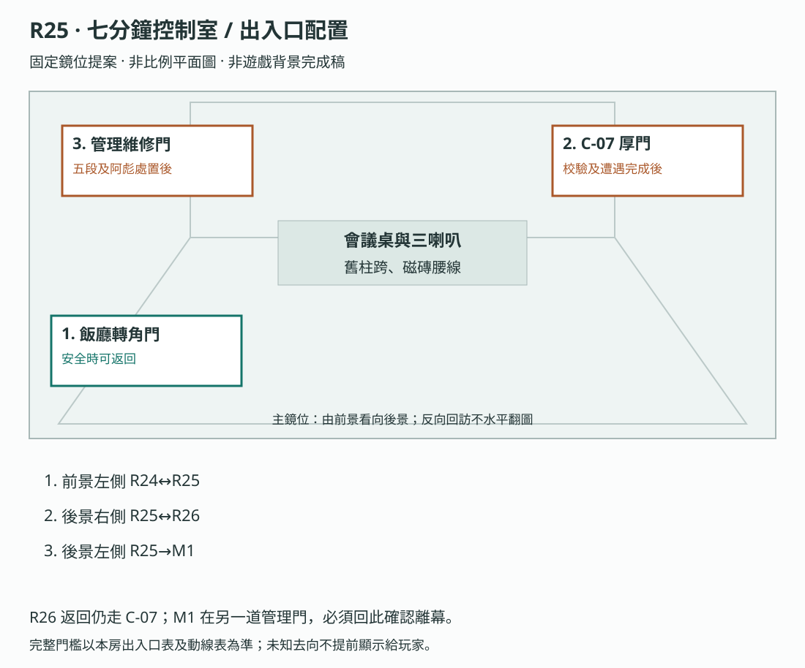
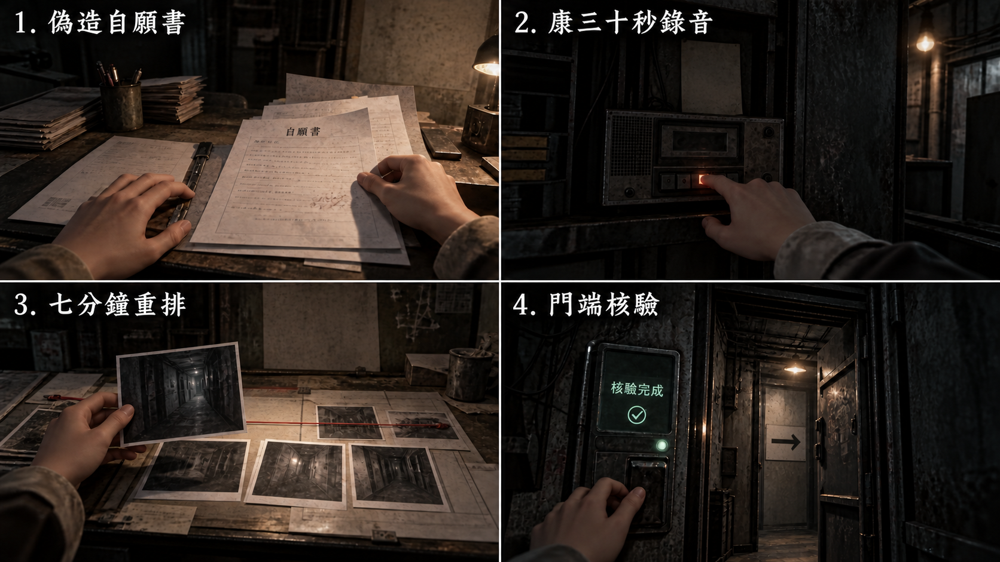
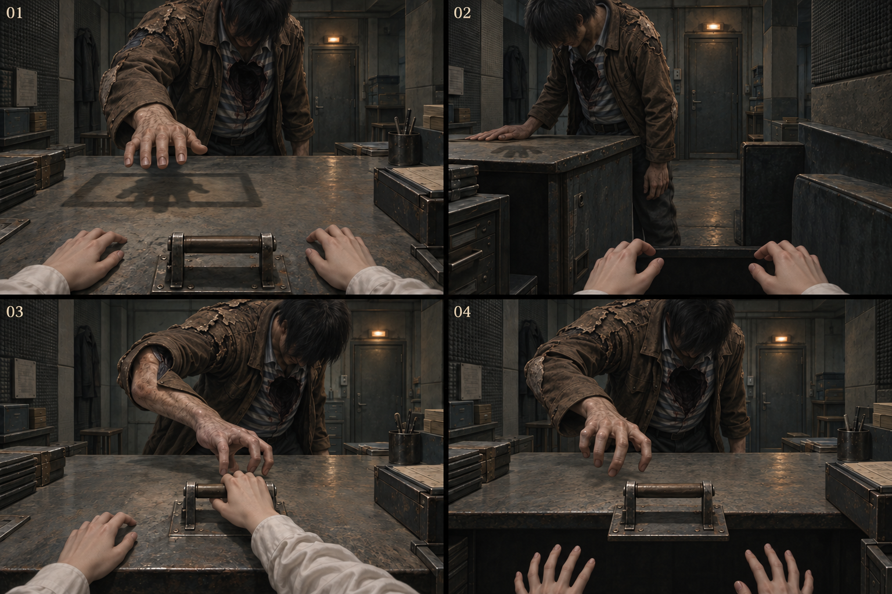
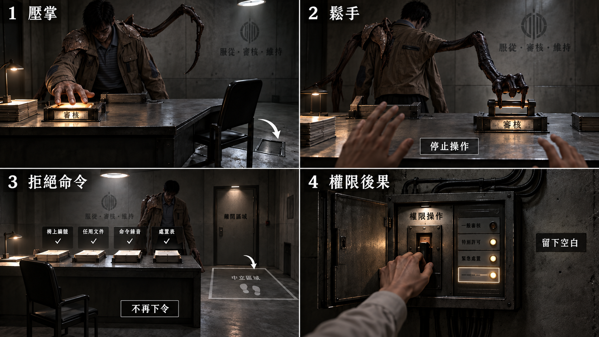

# 製作規格：第五幕

[總目錄](../09_劇本/09-14_全劇本與關卡整合稿.md#book-specs) · [本幕劇本](../09_劇本/09-08_正式劇本_第五幕.md#act-5) · [上一幕規格：第四幕](10-05_製作規格_第四幕.md#spec-act-4) · [下一幕規格：第六幕](10-07_製作規格_第六幕.md#spec-act-6) · [共用附錄](../09_劇本/09-15_正式劇本_共用附錄.md#book-appendices)

[R23](#node-r23-spec)、[R24](#node-r24-spec)、[R25](#node-r25-spec)、[R26](#node-r26-spec)

<a id="spec-act-5"></a>

## 第五幕 · 我也是被逼的：製作規格


玩家畫面與查證閱讀採[用語分層](../09_劇本/09-15_正式劇本_共用附錄.md#player-language)及[閱讀節奏](../09_劇本/09-15_正式劇本_共用附錄.md#reading-load)。下列技術識別碼、原始欄名與判定條件供製作使用，不整段顯示給玩家；白話呈現不改原來源、費用、門檻或存檔行為。

<!-- production:ordered:v1 -->

[本幕概覽](#spec-act-5-overview) · [場景流程](#spec-act-5-rooms) · [跨場景共用規則](#spec-act-5-shared) · [跨場景圖解](#spec-act-5-references) · [幕尾狀態與交付](#spec-act-5-delivery)

<a id="spec-act-5-overview"></a>

### 本幕概覽與前置

<a id="s-0606-0"></a>
<a id="doc-0606"></a>
<a id="s-0606-1"></a>

<!-- import:s-0606-1:begin -->
<a id="h-0606-1"></a>

#### 第五幕 · 我也是被逼的 ACT V

**篇章定位：下部開場與第一個高潮。** 從 R23 安全入口承接上部，在本幕親自取得 F5、重建七分鐘並對峙阿彪；戰後安靜退場，再進七窗脊柱與 R27。

逐場演出、配音文本與 C-07 等效文字摘要見 [09-08 正式劇本 · 第五幕](../09_劇本/09-08_正式劇本_第五幕.md#doc-0908)（初稿待審）。熱點、時序與數值仍以本頁及製作包為準。

> 「你終於理解他了。而理解他，等於定自己的罪。」

本幕先證明主角同樣是受害者，再立刻逼玩家面對受害身分不能抵銷加害結果。阿彪不是用來被「原諒」的 Boss；玩家只能停止命令、離開，或再次動用主管權力把他抹除。

> Godot 場景、互動 ID、狀態鍵、Boss 狀態機與驗收條件見 [08-07 Godot 逐房製作包 · R23–R26](../09_劇本/09-15_正式劇本_共用附錄.md#doc-0807)。
<!-- import:s-0606-1:end -->

<a id="s-0908-0"></a>
<a id="s-0908-3"></a>
<a id="h-0908-23"></a>
<a id="s-0908-57"></a>
<a id="h-0908-572"></a>
<a id="s-0908-1"></a>

<!-- import:s-0908-1:begin -->
<a id="h-0908-1"></a>

#### 遊戲劇本 · 第五幕 ACT V · 我也是被逼的

> 前接 [第四幕](../09_劇本/09-07_正式劇本_第四幕.md#doc-0907)。本幕以 [06-06 逐房規格](#doc-0606)、[08-07 製作包](../09_劇本/09-15_正式劇本_共用附錄.md#doc-0807)、[設計鐵則](../09_劇本/09-15_正式劇本_共用附錄.md#doc-0002) 及 [跨部承接](../09_劇本/09-15_正式劇本_共用附錄.md#doc-0307) 為依據；攻擊判定依 [04-12](../09_劇本/09-15_正式劇本_共用附錄.md#doc-0412)。格式與配音標記見 [09-00](../09_劇本/09-15_正式劇本_共用附錄.md#doc-0900)。
<!-- import:s-0908-1:end -->

<a id="s-0908-2"></a>

<!-- import:s-0908-2:begin -->
<a id="h-0908-5"></a>

#### 本幕演出邊界

| 項目 | 本稿處理 |
| --- | --- |
| 範圍 | 43F：R23–R24；44F：R25–R26；阿彪後由 R25 管理門交接 M1，不從 R26 直接上頂層 |
| 當下目標 | 找到仍可上行的路，先查控制紀錄，再解除 C-07 工作階段對主管憑據的占用 |
| 揭露 | 自願書不可信並非她沒有受困；她受困也不代表後來的核可不存在。R23 真名與照片同頁，R31 才正式合併調查者 |
| 時長 | 主線 55–75 分鐘為待實測預算，含入口與退場；不靠文件停留、重複失敗或等待湊時間 |
| 必要來源 | E4-01～05、F5、第四層三格、七分鐘、三喇叭及阿彪四來源／三卡／任一處置 |
| 選填 | E4-06／07、LM-01／02、CARE／MC／KX、C-07 申請、抄本、生活附頁及三次 H-08；均不作主線門票 |
| 資源 | 無新增安定點；必要資料支援 0 穩定度，R26 對峙暫停一般穩定度消耗，下一安定點留 R27 |
| 配音 | 身體 OS 用原三句；文件反應與時間線條件句沿原製作包，記憶聲與現時 OS 分列，不加揭露評論 |
| 破例 | C-07 六秒靜止近景或等效摘要，真暫停、保存與中途切摘要可用；不播放傷害動作，不補姓名 |


---
<!-- import:s-0908-2:end -->

<a id="s-0606-3"></a>

<!-- import:s-0606-3:begin -->
<a id="h-0606-26"></a>

#### 00 — 本幕概覽

| 項目 | 規格 |
| --- | --- |
| 區域 | 校正區深層：43F 的深層檔案、鏡像檔案；44F 的逃跑控制室與 C-07 校正室 |
| 房間 | R23–R26，共 4 房 |
| 預估時長 | 55–75 分鐘 |
| 玩法比重 | 搜證 35%／時間線推理 30%／凝固對峙 35% |
| 本幕揭露 | 第四層：主角的自願檔案是偽造的；她是被逼的，也確實簽核過傷害他人的命令 |
| 必要證據 | `E4-01`～`E4-05` |
| 選填證據 | `E4-06` 小花祈禱影像、C-07 個人物件 |
| 對峙 | 阿彪凝固對峙 1 場；R25 一段短固定場景脫離 |
| 小花伏筆 | H-08 本幕出現 3 次，距離逐次縮短；Boss 戰期間完全不出現 |
| 逃跑夜長線 | R25 回收前四幕的 `E4-00-A`～`D`；四片全為選填，未持有者依原規格完整完成 |
| **身體 OS** | R23「視野又黑了。」／R24「先坐到不暈。」／R25「這裡太暗了。」／R26 安靜退場無 OS，管理維修門檻不重播上部布結與呼喚——**只關於身體，不評論任何東西**；恐怖與揭露時刻維持零 OS。膝痛只以起步、蹲起與攀越時短暫收腿呈現，不另加台詞，也不演成持續跛行 |
| 凝神資源 | R23–R26 刻意不設安定感知點；所有主線文件、調查板與門禁均可在 0 點 保全備援下完成，R26 對峙開始後暫停消耗穩定度；下一個安定感知點在 R27 |
| 出口 | F1–F5 與阿彪提交完成，經安靜退場回 R25 開管理維修入口，穿過脊柱至 R27；同屬下部，45F–49F 不可探索 |

<a id="h-0606-44"></a>

##### 覆寫碼固定配置

| 碎片 | 位置 | 意義 |
| --- | --- | --- |
| F1／5 | R4 刻痕牆廁所 | 小花先留下「有一扇門不屬於他們」 |
| F2／5 | R19 隔音收容室 | 門會認得主管 |
| F3／5 | 刻在 **R19 收容側**壓條內透光定位片上；**取得 R20 的序位對照才可解碼** | 小花曾在視訊組見過同型維護表，依兩側可見的缺口計格刻入，不是掌紋驗身 |
| F4／5 | 校正排程**紙本的折痕**裡；該紙本後來被歸檔進 R21 抽屜 | 校正排程裡藏著覆寫序列 |
| F5／5 | R25 七分鐘控制室 | 小花在 C-12 發出只驗證、不開門的請求後，由門端稽核回傳校驗尾碼；她本人仍在校正區 |

F1–F4 是小花從觀察、偷記與受罰中留下的人為記號；F5 是真實門禁系統回傳的校驗尾碼。覆寫碼不是超自然密碼。

<a id="h-0606-56"></a>

###### F3／F4 的可及性

小花是**被關押者**，她進不了 R20 觀察室，也進不了上鎖的 R21。兩段碼因此不是「她跑進去刻的」：

| 碼 | 她怎麼留下 | 玩家怎麼取得 |
| --- | --- | --- |
| **F3** | 壓條內同一透光定位片的缺口與空白刻格兩側可見。小花曾在視訊組看過同型維護對照，知道這段覆寫序位應落在哪些格位，便從收容側依缺口刻入；不必看穿單向玻璃或進 R20。 | R19 可記缺口及痕跡格位，但沒有序位表。R20 控制台的「視訊組共用型／由缺口起算」維護表補足格位對操作序位的映射，才解成 F3；不按鏡位左右倒序、不隔金屬讀反面。**刻痕沒變，另一側多了讀法。** |
| **F4** | 受處置者要在校正排程單上按捺簽收。她拿到那張紙的幾秒裡，把序列折進紙的折痕。 | 排程單事後照流程歸檔進 R21 抽屜。**她從未進過那個房間；是制度自己把她的訊息帶了進去。** 玩家展開折痕才讀得到。 |

> F3 與 [T-4b 玻璃上的油印](10-05_製作規格_第四幕.md#doc-0605) 共用同一片玻璃、同一個轉換：**你換到另一側，同一個東西就變成另一個意思。**
>
> F4 則讓「文書流程」第一次替受害者做事——園區的歸檔程序把一個人的求救送進了她自己進不去的房間。

<a id="h-0606-69"></a>

##### 流程

```text
[R23] 深層檔案：主角的「自願應聘」
   ▼
[R24] 鏡像檔案：所有管理者都有同格式偽造自願書
   ▼
[R25] 七分鐘控制室：重建逃跑夜／取得 F5
   ▼
[R26] C-07 校正室：阿彪凝固對峙
   │ 拒絕再命令，或用權限抹除
   ▼
阿彪處置完成 → 返回 R25 管理門核對 F1–F5 → M1 七窗 → R27
```

---
<!-- import:s-0606-3:end -->

<a id="s-0606-2"></a>

<!-- import:s-0606-2:begin -->
<a id="h-0606-14"></a>

#### 本幕逃生計畫

| 階段 | 玩家處境與行動 |
| --- | --- |
| 當下打算 | 越過控制室與校正室，取得向核心上行的機會。 |
| 看得見的阻礙 | 七分鐘紀錄關係尚未釐清，阿彪阻止通行。 |
| 解謎／躲避／擊退 | 拼出原 F1–F5，避開阿彪攻擊並完成證物核對，在停止攻擊後進行拒絕／抹除操作。 |
| 可驗證的進展 | 阿彪原遭遇完成才開放通往 R27 的管理維修脊柱；全段屬下部；不以抹除作唯一逃生方法。 |
| 已查明後的短提示 | 「先讓他停下來，才能走過這道門。」 |

共用規則見[對應條款](10-01_製作規格_序幕.md#s-0601-2)。
本幕玩法重點是三種不同的文件推理、喇叭靜默窗與 Boss 查證後處置；照片揭露是結果，不是額外門票。逐節點操作見[全程玩法對照](../09_劇本/09-15_正式劇本_共用附錄.md#core-gameplay-nodes)。

<!-- import:s-0606-2:end -->

<a id="s-0606-23"></a>

<!-- import:s-0606-23:begin -->
<a id="h-0606-701"></a>

#### 下部開場承接

玩家從 R22 釋放後門檻進入 R23 入口安全定點；前情回顧可略過，只摘要上部已知的受困、主管身分疑點與門檻呼喚。匯入保留 R22 路線、原證據與資源，不授予任何第五幕成果。先讓玩家自由查看入口、開筆記與練習近看，再主動進入原 R23 調查；複習不給新證據、不觸發攻擊，不以立刻追逐懲罰隔段回來的玩家。

原 R23–R25 主線、特殊收集與 F5 在此實際解開，原 R25 廣播脫離及 R26 攻防保持；兩種阿彪結果由玩家選擇。R26 結束後保留約 3–5 分鐘安全回訪與退場，原 F1–F5 完整才可在 R25 點擊管理維修門端。保存檢查點後進入七窗段，不重播上部片尾或伏筆。
<!-- import:s-0606-23:end -->

<a id="s-0606-24"></a>

<!-- import:s-0606-24:begin -->
<a id="h-0606-707"></a>

#### 下部新玩家與支線起案

R23 入口以可略過的分項複習教查看、關聯、感知與防禦，練習不發證據或完成旗標；前情只交代受困、找出口與小花的熟人關係。正式調查與 LM-01 在玩家自行進房後才開始。

R23 問詢夾附 CARE-01／02 副聯，與 CARE-03／04 共同構成完整配給後續。R24 MC-02 旁提供 MC-01 事前人事歸檔副聯，先看懂主管也受管制，再去 R29 查權力使用。R25 完成七分鐘主線後，KX-02 登車異常旁附 KX-01 撤離核准副聯，正式啟動康線；不修改七分鐘軌道。副聯皆標原件位置、日期與編號，摘要不算自動收集。

已匯入來源可重讀而不重收；無存檔玩家可在首次起案現場取得相同必要資訊。R29 是補查，不是等待取得基本背景的唯一入口。收束、狀態與獎賞依 [分部支線規格](../09_劇本/09-15_正式劇本_共用附錄.md#doc-0305)，入口與教學依 [分篇與承接](../09_劇本/09-15_正式劇本_共用附錄.md#h-0307-54)。
<!-- import:s-0606-24:end -->

<a id="s-0606-18"></a>

<!-- import:s-0606-18:begin -->
<a id="h-0606-667"></a>

#### 節點導覽
<!-- import:s-0606-18:end -->

<!-- scene-image-routes-5:begin -->
<a id="image-routes-act-5"></a>

### 本幕連線與接景圖

每條既有動線均指定畫面。兩端接景使用已列主圖與門框遮擋，不另造中間房；出口接景必須交指定鏡位，動畫及低動態版共用定位。後果演出不開放探索。進入條件與回訪仍依原動線表，圖號不是通行權限。

| 原動線 | 接景方式 | 畫面節點／圖號 | 操作與條件來源 |
| --- | --- | --- | --- |
| R23→R24 | 兩端接景 | [R23-V01](#node-r23-images) → [R24-V01](#node-r24-images) | [門檻、方向與回訪](#node-r23-nav) |
| R24→R25 | 逐鏡過渡 | [T-R24-R25-01](#subscene-t-r24-r25-01-spec) | [門檻、方向與回訪](#node-r24-nav) |
| R25→R26 | 出口接景 | [R25-V03](#subscene-r25-v03-spec) | [門檻、方向與回訪](#node-r25-nav) |
| R25→M1 | 兩端接景 | [R25-V01](#node-r25-images) → [M1-V01](10-07_製作規格_第六幕.md#node-m1-images) | [門檻、方向與回訪](#node-r25-nav) |
<!-- scene-image-routes-5:end -->

<a id="spec-act-5-rooms"></a>

### 依流程逐場景製作

<a id="node-r23-spec"></a>

### R23 · 深層檔案

[正式場次](../09_劇本/09-08_正式劇本_第五幕.md#node-r23-script)

[進場與動線](#node-r23-nav) · [出入口位置](#node-r23-access) · [操作與解謎](#node-r23-level) · [狀態與驗收](#node-r23-pack) · [圖像製作單](#node-r23-images) · [離場與次場景](#node-r23-exit)

<a id="node-r23-nav"></a>

**進出、動線與回訪**

<a id="s-0609-38"></a>

<!-- import:s-0609-38:begin -->
<a id="h-0609-376"></a>

#### R23 深層檔案

進行目的：沿深層檔案路線查明處置來源；主角偽造自願書、H-08 第三次；LM-01 入園管制回憶選填；新玩家分項複習可略過

支線／收集：SQ-C CARE-01／02 歸檔副聯＋CARE-03／04，本房可完成

房內順序：下部安全承接，可略過前情與操作複習 → 自行查看原深層檔案，取得本房證據 → 可選原件與收存聯關聯以查看 LM-01；必要服務箭頭及現時通路另行核對 → 依原條件前往 R24

| 方向 | 類型 | 可移動條件 | 移動演出提案 | 回訪規則 |
| --- | --- | --- | --- | --- |
| R22 → R23 | 分部承接 | 第三層鎖定成立，快速手勢或拒絕手動 A/B 路任一完成；零穩定度可走；R22 門檻完成存檔，下部匯入或有效預設前情 | 從 42F 釋放接點局部下折避梁，再沿連續扶手上行至 43F 深層門檻；上部跨門保存，下部在另一側安全入口開始。 | 上下部發行邊界；下部不可沿此線回上部，上部回看另用副本 |
| R23 ↔ R24 | 主線 | 三版本比對並取得 E4-01；act5.r23.e401_seen = true；選填問詢不鎖門 | 沿低夾層檔案架外側繞過斜撐，穿過有傾斜舊門楣的入口；鏡面接縫保持位置。 | 章內回訪；遇鎖場、追逐或封路停用 |
<!-- import:s-0609-38:end -->
<!-- navigation:r23:end -->

<a id="node-r23-access"></a>
#### 主場景出入口

<!-- scene-access:R23:begin -->
| 動線 | 顯示名稱 | 畫面位置與辨識物 | 通行狀態 |
| --- | --- | --- | --- |
| R22→R23 | 來路：深層門檻 | 43F 安全入口的原門框，扶手承接上部最後梯段。 | 匯入或有效預設前情由此開始，不開放倒退回上部；上部回看使用獨立副本。 |
| R23↔R24 | 出口：傾斜門楣 | 檔案架外側繞過斜撐後的門口，鏡面接縫在門旁延續。 | 三版本比對並取得 E4-01 後可進 R24 及返回；選填問詢不鎖門。 |
<!-- scene-access:R23:end -->

**演出限制與製作註記**

<a id="s-0908-6"></a>

<!-- import:s-0908-6:begin -->
<a id="h-0908-46"></a>

#### 演出限制
> 前一節點：R22／下部入口　後一節點：R24　主線：三版本比對、E4-01
<!-- import:s-0908-6:end -->

<a id="node-r23-level"></a>

**關卡、解謎與失敗回饋**

<a id="s-0606-4"></a>

<!-- import:s-0606-4:begin -->
<a id="h-0606-86"></a>

#### R23 — 深層檔案：她是自願的？

<a id="h-0606-88"></a>

##### R23 空間與畫面製作定位

| 項目 | 畫面與製作要求 |
| --- | --- |
| 樓層定位 | 43F |
| 樓層與環境 | 43F 深層檔案室；原 42F 梯段在此銜接，同層架道接 R24。既有空間材質、光源與生活物件沿本房原文。 |
| 入口方向 | 由 R22 承接；以來路門框／扶手作背向定位，前進方向依下列出口地標。左右方位沿既有構圖，不將反向回訪鏡頭誤當另一扇門。 |
| 可見出口 | 斜撐旁檔案架外側通 R24，入口保留同款扶手。首次全景就交代入口輪廓或可查看的遮擋，不靠無標示的畫外點擊換房。 |
| 阻擋與開放條件 | 往 R24：完成三版本比對並取得 E4-01（act5.r23.e401_seen）；問詢卷、回憶與輪廓不列離房條件 |
| 畫面中的解謎要素 | 自願書與問詢卷；下部前情副聯可展開，必要短讀與選填分開。關鍵標記可近看，與裝飾物有可辨的材質或輪廓差異，不只靠顏色或聲音。 |
| 完成後變化 | 三版本比對及 E4-01 保存後，玩家沿檔案架外側去 R24；問詢卷屬 SQ-C 選填，入口複習、LM-01 與 H-08 均不鎖主線。 |

<a id="h-0606-101"></a>

##### R23 製作流程

| 階段 | 製作規格 |
| --- | --- |
| 進入／目標 | 沿深層檔案路線查明處置來源；主角偽造自願書、H-08 第三次；入場先還原原房間已保存的熱點與事件狀態。 |
| 觀察／空間 | 原倉儲夾層改深層檔案室，斜撐穿過檔案架邊緣；檔案可讀面與老周來源核對保留。 |
| 操作順序 | 在同一查證桌展開 A／B／C，逐項核對三版本後一次確認 E4-01 → 可查看問詢卷與回憶 → 往 R24。選填不鎖門；原主線旗標、遭遇數值及分支提交條件依本場景細則。 |
| 回饋 | 必要操作寫入原證據／門禁／遭遇狀態；新增生活附頁僅更新來源已讀與有依據的筆記，不重發原證據。 |

<a id="h-0606-110"></a>

###### R23 生活與管制觀察

在既有檔案近看保留床位／工位撤名及待交接欄；E-10 的接收記錄缺失顯示為「未查得」，不以鏡像或怨靈補出死因。

<a id="h-0606-114"></a>

###### R23 出口與回訪

| 目的節點 | 條件 | 移動與辨向 | 回訪邊界 |
| --- | --- | --- | --- |
| R24 | 三版本比對並取得 E4-01；act5.r23.e401_seen = true | 沿低夾層檔案架外側繞過斜撐，穿過有傾斜舊門楣的入口；鏡面接縫保持位置。 | 章內回訪；遇鎖場、追逐或封路停用 |

共用規則見[對應條款](10-01_製作規格_序幕.md#s-0601-6)。

玩家利用 `K2-01` 打開未被警方碰觸的紙本庫。第一份完整出現主角照片的文件是 `E4-01`：**梁樂瑤**，自願應聘內控職務，面試日期比入境早三個月。

> **這是玩家第一次在同一份文件上看到她的臉和她的真名。** R2 名冊那一行（梁樂瑤 → 內控培訓 → 手寫 Michelle）、第三／四幕所有 `Michelle` 的簽核，到這裡可以接起來了。人物板的「內控主管」卡於此自動填入真名欄；**R31 才把它與「調查者」合併。**

<a id="h-0606-127"></a>

##### 玩家操作

- 從三個版本的入園檔中辨識哪一份有實體紙張、哪一份是後補電子檔、哪一份遭二次列印。
- 筆記本人物頁暫時把「調查者」旁新增標籤：`可能自願加入`，不立刻下結論。
- 玩家可選擇保存、標疑或關閉；三者都能推進，主角 OS 語氣不同。

操作呈現依 [R23-01](../09_劇本/09-08_正式劇本_第五幕.md#s-0908-8)：實物與電子原件分位並置，點選可替代拖曳；釘欄與草稿不算新證據或新門檻。只在既有條件成立且玩家確認後取得 E4-01；退出、回訪與存讀檔保留已讀／草稿及完成態，沒有三次相同的鎖定演出。

**提交前的判斷：**沿原欄位釘選保存玩家選擇的職稱／日期／印章局部及並置草稿；未釘選、換順序與收起都不增減取得條件。初見不把 B／C 判成偽造，也不預畫版本箭頭。印章灰塵只支持列印來源；原職稱、入境與建檔／面試日期讓玩家檢驗正常職稱變更能否解釋矛盾。原一次確認成功後才顯示 E4-01 結論；沒有額外假設題或確認鈕。

<a id="h-0606-133"></a>

##### H-08 第三次

離開檔案櫃時，小花輪廓出現在走廊最遠端，比第四幕的反射更清楚。玩家前進一步，它仍不動；關閉檔案畫面後，鏡頭回到不同取景時它已不在。不得播放輪廓淡出、閃滅或移動動畫，符合「不在玩家直視中消失」。

---

<a id="h-0606-139"></a>

##### LM-01｜以為做好就能離開

本段位於正式檔案調查內，入口自由練習與前情回顧仍可略過。玩家確認 E4-01 原件後，沿同一附件翻看已移存的舊寄物櫃門牌與本人收存聯；不在高層憑空重建入園櫃檯。櫃牌缺口與收存聯壓痕吻合，聯上並列「證件集中保管」「私人聯絡須申請」，顯示內控職位也無離開自由。

配對兩個已觀察特徵後開放 RELATE → FOCUS_MEMORY，20–35 秒：凝固的室內收存窗口，手留在未送出的家屬聯絡申請旁；一個管理者的記憶聲音說「先把工作做好」，她記得自己曾相信這句話。來源只證明收存與申請受限，不將 E4-01 偽造自願書當真，也不預先解完 R24。

退回現時，玩家循門牌背面的服務箭頭，核對眼前斜撐與檔案架外側缺口，找到原 R24 通路。箭頭提供辨向，不新增鑰匙或繞過原房條件。感知不能替代現場核對；可略過配音，以短字幕保留「我以為，做好就能走」。原 H-08 第三次仍在原離櫃時序，本段不插攻擊或第二次輪廓。完成寫 `memory.lm01.reviewed`，不發 E／F 或友情分數。

##### 操作與呈現補充

- [s-0908-4](../09_劇本/09-08_正式劇本_第五幕.md#s-0908-4)：預設由有效通關快照產生：部分供電、未用選填抹除、R22 手動路、上部必要來源完成而選填未完成；資源不額外回滿。不得預載 F5、七分鐘、第五幕已讀、阿彪處置或 LM 完成。
- [s-0908-8](../09_劇本/09-08_正式劇本_第五幕.md#s-0908-8)：三版逐字原件使用 [09-13](../09_劇本/09-15_正式劇本_共用附錄.md#doc-0913)：2024-09-18 的接收聯、2025-08-18 建立但聲稱 2024-06-18 面試的電子檔，以及 2025-08-19 二次列印。招工確認折頁、共同錯字「記綠」與來源標籤均須可讀；初見不醒目標示正解。
<!-- import:s-0606-4:end -->

<a id="s-0606-12"></a>

<!-- import:s-0606-12:begin -->
<a id="h-0606-554"></a>

#### R23 選填：第一次沒有說，第二次說了

既有問詢檔案熱點提供兩份同輪回執，以相同甲乙工號及連續稽核時間對照 [R7 代班支線](10-03_製作規格_第二幕.md#doc-0603)。資料為當地檔案殘留，普通查看免費；不藏於 H-08 或凝固解鎖條件內。

| 觀察 ID | 檔案內容 | 玩家能確認的事 |
| --- | --- | --- |
| CARE-03 | 第一次問詢回答「未見」；其後主管處置欄記「不交代位置，停止配給」 | 回答與威脅的先後可確認；第一次是真的不知道或刻意隱瞞仍無法單靠此頁判定 |
| CARE-04 | 第二次由甲確認的回執填出乙所在的維修夾層；同輪搜查回執記在該位置找到乙 | 甲交代了位置，管理者據此搜查；不添加刑求畫面、死亡結論或阿尋暴露因果 |

兩張讀完可建立問詢時序；讀過 CARE-01／02 時，同一人物頁並列「替班與配給」「威脅與供述」，不以後一頁取代前一頁。未看過 R7 也能完整理解本房問詢，先後閱讀不造成卡關。

不要求玩家按「原諒／譴責」、不替甲宣判無責，也不替管理者推卸命令責任。主角不說「所以我也是不得已」。整理後讓玩家自行離開；既有 H-08 仍依原前兆與冷卻規則，不能拿閱讀結束作追加嚇點。跳過支線不改 F5、Boss、結局或穩定度。
<!-- import:s-0606-12:end -->

<a id="node-r23-pack"></a>

**狀態、素材與驗收**

<a id="s-0807-10"></a>

<!-- import:s-0807-10:begin -->
<a id="h-0807-198"></a>

#### R23 — 深層檔案／她是自願的？

<a id="h-0807-200"></a>

##### R23-房間資料

| 欄位 | 值 |
| --- | --- |
| `room_id` | `R23` |
| `scene` | `room_r23.tscn` |
| `entry_from` | `R22`＋`inventory.key.k2_01` |
| `exit_to` | `R24` |
| `backgrounds` | `r23_real.webp`、`r23_scan.webp`；不製作完整凝固層 |
| `main_goal` | 比較三個入園檔版本，取得主角「自願應聘」文件並保留疑問 |
| `must_exit_when` | `act5.r23.e401_seen = true` |

<a id="h-0807-212"></a>

##### R23-三版本檔案

| 版本 | 物理／數位特徵 | 玩家初見理解 |
| --- | --- | --- |
| A 紙本底稿 | 紙張較舊；原始招工職稱不是管理工作；入境日期清楚 | 她原本不是來應聘內控 |
| B 後補電子檔 | metadata 晚於入境；職稱改為內控；面試日期提前三個月 | 可能是後來補登，也可能是偽造 |
| C 二次列印 | 使用 B 的內容，印章與簽名位置略有偏移 | 有人需要一份看起來像原件的紙 |

<a id="h-0807-220"></a>

##### R23-互動表

| ID | 物件／觸發 | 玩家操作 | 回饋 | 寫入狀態／證據 | 成本 |
| --- | --- | --- | --- | --- | --- |
| `R23_H01` | 未被警方碰觸的紙本庫 | `LOOK` | 警用封條停在外門；內櫃沒有採證編號 | `r23.untouched_archive_seen` | 0 |
| `R23_H02` | A 紙本底稿 | `LOOK` | 原始職稱欄被折入裝訂線，仍可看出不是管理職 | `r23.version_a_seen` | 0 |
| `R23_H03` | B 後補電子檔 | `LOOK` | 建檔時間晚於入境；面試日期卻早三個月 | `r23.version_b_seen` | 0 點 |
| `R23_H04` | C 二次列印 | `LOOK` | 印章邊緣與電子檔列印完全相同，連灰塵點都被印出 | `r23.version_c_seen` | 0 |
| `R23_H05` | 三版比對 | `COMPARE_VERSIONS` | 暫時只能確認「自願文件的生成時間不可信」 | `E4-01`、`act5.r23.versions_compared`、`act5.r23.e401_seen` | 0 |
| `R23_H06` | 文件處理 | 選擇保存／標疑／關閉 | 三者都保留證據；只改人物板註記與主角 OS | `act5.r23.file_handling` | 0 |
| `R23_H07` | 人物板更新 | 自動 | 「調查者」旁新增 `可能自願加入`；不移除既有受害／加害紀錄 | `r23.temporary_label_added` | 0 |
| `R23_H08` | 關閉檔案櫃後回看 | `LOOK_BACK` | 小花輪廓在走廊最遠端；玩家前進一格，它仍不動 | `act5.r23.h08_seen` | 0 |

<a id="h-0807-233"></a>

##### R23-反應差分

| 選擇 | OS | 後續差異 |
| --- | --- | --- |
| 保存 | 「先留下。日期對不上。」 | R24 自動把 E4-01 放入待比對列 |
| 標疑 | 「這不是原件。至少，不全是。」 | 先以醒目方式標示 R24 的共同錯字，但不直接給答案 |
| 關閉 | 無 OS；主角手停在文件上 1 秒 | R24 仍可使用 E4-01，人物板註記顯示「未處理」 |

<a id="h-0807-241"></a>

##### R23-驗收

- [ ] 玩家在 R23 結束時只能提出「文件可能有問題」，不能直接確認主角被騙。
- [ ] 三個反應選項都能進 R24，且都保存 `E4-01`。
- [ ] 關鍵差異同時使用紙張、日期、metadata 與印刷痕跡，不只靠色彩。
- [ ] H-08 位於可見構圖內，但不以音效或 UI 箭頭強迫玩家注意。
- [ ] 首次玩家在既有確認前能從原職稱及日期指出「只是職稱變更」尚未解釋的矛盾；單靠印章灰塵不算完整理由。未釘選仍能完成，取消／存讀保留已讀與草稿、不提前發 E4-01。
<!-- import:s-0807-10:end -->

<a id="node-r23-images"></a>

#### 場景節點與靜態圖製作單

以下每列均為待製作圖像項目；文件多頁、正反面、局部與狀態差分須依拆圖欄各自交付，不能以一張示意圖代替。可探索場景的主圖提供移動與探索，演出節點不另開探索，近看關閉回到開啟前的畫面；原演出與操作條件仍依右欄來源。圖號、解析度、文字分層、存檔及驗收依[靜態圖共用契約](../09_劇本/09-15_正式劇本_共用附錄.md#scene-image-contract)。

<!-- scene-images:R23:begin -->
| 畫面節點／圖號 | 用途 | 必畫內容 | 狀態與拆圖 | 來源 |
| --- | --- | --- | --- | --- |
| R23-V01 | 主場景 | 深層門檻、檔案架、斜撐、三來源查證桌、紙本庫與傾斜門楣。 | 紙本庫關／開、折頁原樣／展開；遠格輪廓只在原選填條件顯示。 | [本場景](../09_劇本/09-08_正式劇本_第五幕.md#node-r23-script) |
| R23-C03 | 操作近看 | 紙本庫櫃端與本地驗證 | 索引、既有憑據與櫃門未開／開啟差分；讀索引不憑空生成權限。 | [R23-00](../09_劇本/09-08_正式劇本_第五幕.md#s-0908-7) |
| R23-D01 | 文件 | 同一人 A／B／C 三份檔案 | 各完整頁與原職稱折頁、印章邊、灰塵點局部；日期與面試欄可釘在桌側。 | [R23-01](../09_劇本/09-08_正式劇本_第五幕.md#s-0908-8) |
| R23-D02 | 介面 | 三來源比對桌 | 已看欄／未看欄、比對草稿／確認差分，不靠重翻背記。 | [R23-01](../09_劇本/09-08_正式劇本_第五幕.md#s-0908-8) |
| R23-D03 | 文件 | 私人備註 | T−6 週正式曆日依字表，不提前展開 R29 完整索引。 | [R23-03](../09_劇本/09-08_正式劇本_第五幕.md#s-0908-10) |
| R23-D04 | 文件 | 監控對照附件 | 紙條去向、老周與阿尋工位來源分開，無新監控實拍。 | [R23-04](../09_劇本/09-08_正式劇本_第五幕.md#s-0908-11) |
| R23-D05 | 文件 | C-07 換組申請 | 姓名不可復原，不因高解析製圖補出姓名。 | [R23-05](../09_劇本/09-08_正式劇本_第五幕.md#s-0908-12) |
| R23-D06 | 文件 | 床位工位撤名、帶離與待交接欄 | E-10 接收顯示「未查得」；未查得不畫成死亡證明。 | [R23-06](../09_劇本/09-08_正式劇本_第五幕.md#s-0908-13) |
| R23-D07 | 文件 | 問詢卷與事前歸檔副聯 | CARE-01～04 各原件可讀，副聯標 R7 來源；排列不新增分數。 | [R23-07](../09_劇本/09-08_正式劇本_第五幕.md#s-0908-14) |
| R23-C01 | 近看 | 門牌缺口與收存聯壓痕 | 兩處可同尺度對照；LM-01 靜止回憶另交局部疊圖。 | [R23-08](../09_劇本/09-08_正式劇本_第五幕.md#s-0908-15) |
| R23-C02 | 近看 | 最遠檔案格與架後縫 | 原有／無輪廓差分，不讓近看揭出新人物身分。 | [R23-09](../09_劇本/09-08_正式劇本_第五幕.md#s-0908-16) |
| R23-D08 | 介面 | 三版本處理與人物板暫定註記 | 保存／標疑／關閉皆保留原件；暫定可能自願加入不是定案，不抹去既有受困與加害紀錄。 | [原場景規格](#s-0807-10) |
<!-- scene-images:R23:end -->

<!-- scene-image-access-art-r23:begin -->
**出入口交圖：**R23-V01 須依場次與狀態畫出[本場景出入口表](#node-r23-access)的來路、去路及封閉位置；既有操作鏡位與接景圖沿同一地標對位。門端差分、移動熱區與遮擋另分層，依[出入口共用契約](../09_劇本/09-15_正式劇本_共用附錄.md#scene-access-contract)驗收。
<!-- scene-image-access-art-r23:end -->

##### 原熱點對應圖號

同一圖可支援多個狀態，但每個列名焦點及原差分仍須交付；底圖不取代動畫、聲音或互動。此表只對圖，不新增取得條件。
<!-- hotspot-images:R23:begin -->
| 原熱點／操作 | 圖號 | 對應內容／邊界 |
| --- | --- | --- |
| R23_H01 | R23-C03 | 未被警方碰觸的紙本庫 |
| R23_H02 | R23-D01 | A 紙本底稿 |
| R23_H03 | R23-D01 | B 後補電子檔 |
| R23_H04 | R23-D01 | C 二次列印 |
| R23_H05 | R23-D01 | 三版比對 |
| R23_H06 | R23-D08 | 文件處理 |
| R23_H07 | R23-D08 | 人物板更新 |
| R23_H08 | R23-C02 | 關閉檔案櫃後回看 |
<!-- hotspot-images:R23:end -->

<a id="node-r23-visual"></a>

#### 本場景圖像與示意

本房沿用跨房圖的指定面板，尚無獨立專圖；請依下列適用範圍對照，不把整張圖當成本房演出。

[V25 下部開段：七分鐘與阿彪前置](#fig-v25)

- **V25：**第 1 格 R23 偽造自願書，第 2 格 R24 康既存錄音，第 3、4 格 R25 七分鐘與 F5 門端核驗；圖中文件字樣不能代替原件字表。

[返回本房正式劇本](../09_劇本/09-08_正式劇本_第五幕.md#node-r23-script) · [本房關卡與解謎](#node-r23-level)

<a id="node-r23-exit"></a>

#### 離場通路與次場景

<!-- production-subscenes:r23 -->

沿[本場景動線](#node-r23-nav)的原出口與分支交接；不新增中間探索場景。

<a id="node-r24-spec"></a>

### R24 · 鏡像檔案

[正式場次](../09_劇本/09-08_正式劇本_第五幕.md#node-r24-script)

[進場與動線](#node-r24-nav) · [出入口位置](#node-r24-access) · [操作與解謎](#node-r24-level) · [狀態與驗收](#node-r24-pack) · [圖像製作單](#node-r24-images) · [離場與次場景](#node-r24-exit)

<a id="node-r24-nav"></a>

**進出、動線與回訪**

<a id="s-0609-39"></a>

<!-- import:s-0609-39:begin -->
<a id="h-0609-390"></a>

#### R24 鏡像檔案

進行目的：核對偽造資料，前往控制室；管理者偽造檔案比對、H-08 第四次

支線／收集：SQ-M MC-01 副聯＋MC-02，下部獨立起案

| 方向 | 類型 | 可移動條件 | 移動演出提案 | 回訪規則 |
| --- | --- | --- | --- | --- |
| R23 ↔ R24 | 主線 | 三版本比對並取得 E4-01；act5.r23.e401_seen = true；選填問詢不鎖門 | 沿低夾層檔案架外側繞過斜撐，穿過有傾斜舊門楣的入口；鏡面接縫保持位置。 | 章內回訪；遇鎖場、追逐或封路停用 |
| R24 ↔ R25 | 主線 | E4-01／E4-02／E3-02 第四層鎖定成立；act5.r24.board_locked = true | T-R24-R25：經飯廳服務轉角一鏡位，由 43F 沿連續扶手上行到 44F；下端保留鏡面隔間、封死傳菜窗及收碗槽，上端門框接 R25 會議室。 | 章內回訪；遇鎖場、追逐或封路停用 |
<!-- import:s-0609-39:end -->
<!-- navigation:r24:end -->

<a id="node-r24-access"></a>
#### 主場景出入口

<!-- scene-access:R24:begin -->
| 動線 | 顯示名稱 | 畫面位置與辨識物 | 通行狀態 |
| --- | --- | --- | --- |
| R23↔R24 | 來路／返回：檔案架門口 | 比對桌來向的傾斜門楣，鏡面接縫對回 R23 斜撐。 | 可沿已開通路回 R23 查證。 |
| R24↔R25 | 出口：飯廳服務口 | 封死傳菜窗旁的可走門口，磁磚腰線指向收碗槽轉角。 | 第四層三項證據鎖定後，經飯廳服務轉角由 43F 上行至 44F 的 R25，可循原梯返回；走門口，不鑽封窗。 |
<!-- scene-access:R24:end -->

**演出限制與製作註記**

<a id="s-0908-19"></a>

<!-- import:s-0908-19:begin -->
<a id="h-0908-172"></a>

#### 演出限制
> 前一節點：R23　後一節點：R25　主線：E4-02、第四層三格
<!-- import:s-0908-19:end -->

<a id="node-r24-level"></a>

**關卡、解謎與失敗回饋**

<a id="s-0606-5"></a>

<!-- import:s-0606-5:begin -->
<a id="h-0606-148"></a>

#### R24 — 鏡像檔案：受害者身分被抹除

<a id="h-0606-150"></a>

##### R24 空間與畫面製作定位

| 項目 | 畫面與製作要求 |
| --- | --- |
| 樓層定位 | 43F |
| 樓層與環境 | 43F 鏡像檔案間；飯廳服務轉角接原梯井，由 43F 上行到 44F 的 R25。既有空間材質、光源與生活物件沿本房原文。 |
| 入口方向 | 由 R23 承接；以來路門框／扶手作背向定位，前進方向依下列出口地標。左右方位沿既有構圖，不將反向回訪鏡頭誤當另一扇門。 |
| 可見出口 | 舊飯廳服務口通 R25，封死傳菜窗作定位。首次全景就交代入口輪廓或可查看的遮擋，不靠無標示的畫外點擊換房。 |
| 阻擋與開放條件 | 往 R25：取得 E4-02，並以 E4-01／E4-02／E3-02 完成第四層三格鎖定（act5.r24.board_locked） |
| 畫面中的解謎要素 | 人事檔案及鏡像比對；原件差異可逐項查看。關鍵標記可近看，與裝飾物有可辨的材質或輪廓差異，不只靠顏色或聲音。 |
| 完成後變化 | 人事原件與鏡像比對保存到筆記，完成本房必要操作後由舊飯廳服務口前往 R25；無新增機關或遠端開門動畫。 |

<a id="h-0606-163"></a>

##### R24 製作流程

| 階段 | 製作規格 |
| --- | --- |
| 進入／目標 | 核對偽造資料，前往控制室；管理者偽造檔案比對、H-08 第四次；入場先還原原房間已保存的熱點與事件狀態。 |
| 觀察／空間 | 鏡面材料覆在不同年代牆面上，接縫與傾斜門楣提示改建；鏡像線索不加入多餘假反射。 |
| 操作順序 | 以 E4-01 與另外三人的原件完成四人比對，取得 E4-02 → 將 E4-01／E4-02／既有 E3-02 主動關聯，完成第四層三格鎖定 → 往 R25 控制室。康的三十秒與其他附頁可另行查看，不作離房門檻；未有來源的身分欄維持未知。 |
| 回饋 | 必要操作寫入原證據／門禁／遭遇狀態；新增生活附頁僅更新來源已讀與有依據的筆記，不重發原證據。 |

<a id="h-0606-172"></a>

###### R24 生活與管制觀察

在既有檔案近看保留床位／工位撤名及待交接欄；E-10 的接收記錄缺失顯示為「未查得」，不以鏡像或怨靈補出死因。

<a id="h-0606-176"></a>

###### R24 出口與回訪

| 目的節點 | 條件 | 移動與辨向 | 回訪邊界 |
| --- | --- | --- | --- |
| R23 | 沿已開連線回訪；未鎖場且未沉降封路 | 同一地標反向通行 | 章內回訪；遇鎖場、追逐或封路停用 |
| R25 | E4-01／E4-02／E3-02 第四層鎖定成立；act5.r24.board_locked = true | T-R24-R25：經飯廳服務轉角一鏡位，由 43F 沿連續扶手上行到 44F；下端保留鏡面隔間、封死傳菜窗及收碗槽，上端門框接 R25 會議室。 | 章內回訪；遇鎖場、追逐或封路停用 |

共用規則見[對應條款](10-01_製作規格_序幕.md#s-0601-6)。

本房的核心不是找到「替主角脫罪」的文件，而是證明系統如何讓成為管理者的人再也無法證明自己曾被騙來。


<a id="h-0606-188"></a>

##### 比對謎題

玩家將 `E4-01` 與三份其他管理人員原件放在四人對照表中，完成後才取得 `E4-02`；版面疊合是可查看的局部，不是四次重做 R23：

- 自願書版面、錯字、日期間隔與簽名位置完全相同。
- 原始入境早於後補檔的建檔／補發時間；文件所寫面試日期卻倒填到入境前，且原始招工職稱不是管理工作。
- 所有人被吸收進管理層後，原受困者編號都被撤銷。

依 [R24-01](../09_劇本/09-08_正式劇本_第五幕.md#s-0908-21)按欄橫比，保留四人的原件與未讀狀態；R23 已核實一列不強制重做，另外三人不能自動通過。日期按各人入境倒推三個曆月，不用相同日期或九十日代替。比對草稿可取消並保存，取得 E4-02 後仍須完成既有第四層三格；操作便利不減少證據要求。

**鎖定句**：`自願檔案是後補的；一旦成為管理者，系統就把他曾是受害者的證據刪掉。`

<a id="h-0606-198"></a>

##### ★ 康的三十秒 · `E4-07`

> 「你可以待在那邊，也可以到這邊來。到這邊來的人，不會被送去校正區。」
>
> 這句話是全作因果的起點——**在本房錄音播放之前，玩家從來沒有親耳聽過它。**

| 項目 | 內容 |
| --- | --- |
| 位置 | 與三份同格式偽造自願書歸在同一個檔案盒。玩家完成比對後才可點擊 |
| 形式 | 一支老舊隨身碟，標籤只寫 `新進說明·標準版 v4`。接上比對桌可播放 |
| 長度 | **30 秒。** 只有聲音，沒有影像 |
| 內容 | 康的聲音。語氣平穩、專業、不帶威脅。他先說明兩個部門的工時與待遇差異，然後才是那一句 |
| 玩家可讀的檔案屬性 | 建立日期比主角入園**早八個月**；**歷史播放次數：147**，為封存計數，本次試聽不增加 |

<a id="h-0606-212"></a>

##### 那個數字是重點

147。

> 她記得那是一次談話。她記得康看著她，給了她一個選擇。
>
> **那是一段在她入園前就存在、已被重複播放的標準錄音。** 封存計數不能單獨證明她是第幾位聽眾，也不能把播放次數當作不同聽眾人數。

| 這一筆做到的事 | |
| --- | --- |
| **不是專為她準備的選擇** | 她人生轉折裡的招募承諾，早已被製成可反覆使用的標準內容；不由總播放次數替她編排順位 |
| **康從不說謊**（[02-05](../09_劇本/09-15_正式劇本_共用附錄.md#doc-0205)）成立 | 錄音裡每一句都是真的。「到這邊來的人，不會被送去校正區」——**這是事實**。他只是把恐懼、債務與封閉環境從「選項」裡刪掉了 |
| **與第四種錯置對位** | 她記得有人對她說過溫柔的話（其實抄自監控日誌）；她記得有人專門給她一個選擇（其實已有標準錄音）。<br>兩者都動搖「專門對我說」的記憶，但錄音仍可能曾播放給她，不能推成她從未聽過。 |

<a id="h-0606-226"></a>

##### 呈現規範

- 播放時畫面**不切鏡頭、不加閃回、不出現康的形象**。只有比對桌、隨身碟、和聲音。
- 主角**全程無 OS**，播完也沒有。
- 播放次數的欄位**不放大、不醒目標示**，與其他檔案屬性同一行、同一字級。
- 玩家可以選擇不播。`E4-07` 是**選填證據**，不影響第四層三格鎖定。

> 不得由任何角色說出「原來那只是錄音」。玩家自己會看到那個數字。

<a id="h-0606-235"></a>

##### 不提供的安慰

鎖定後，調查板把 `可能自願加入` 改為 `曾被騙入園`，但同頁仍保留 `內控主管／已核可校正`。UI 不以綠色或成功音效慶祝。

選填 `E4-06` 顯示小花在臨時祈禱室的影像被標成「情緒操控素材」，證明她的信仰與求助也被主角部門拿來分類。

<a id="h-0606-241"></a>

##### H-08 第四次

玩家關閉比對桌時，小花站在隔一個門框的位置。她的臉仍不可見，頭部方向朝著 `已核可校正`，不是朝玩家鏡頭。

---

##### 操作與呈現補充

- [s-0908-24](../09_劇本/09-08_正式劇本_第五幕.md#s-0908-24)：兩句新增補足原定工時／待遇功能，不新增工時數字、薪資額或自由離園承諾。整段目標 30 秒須配音讀演，不以長空白湊秒或改動鎖定句。
<!-- import:s-0606-5:end -->

<a id="node-r24-pack"></a>

**狀態、素材與驗收**

<a id="s-0807-11"></a>

<!-- import:s-0807-11:begin -->
<a id="h-0807-248"></a>

#### R24 — 鏡像檔案／第四層揭露

第四層完成後，往返 R25 使用[飯廳服務轉角](#transition-r24-r25)；沿原解鎖、回訪及鎖場條件，不重播文件結論或先啟動阿彪。

<a id="h-0807-250"></a>

##### R24-房間資料

| 欄位 | 值 |
| --- | --- |
| `room_id` | `R24` |
| `scene` | `room_r24.tscn` |
| `entry_from` | `R23` |
| `exit_to` | `R25` |
| `backgrounds` | `r24_real.webp`、`r24_scan.webp`、`r24_freeze_prayer.webp` |
| `board_id` | `BOARD_REVEAL_04` |
| `main_goal` | 證明管理層自願書是系統性偽造，同時保留主角的校正責任 |
| `must_exit_when` | `act5.r24.board_locked = true` |

<a id="h-0807-263"></a>

##### R24-互動表

| ID | 物件／觸發 | 玩家操作 | 回饋 | 寫入狀態／證據 | 成本 |
| --- | --- | --- | --- | --- | --- |
| `R24_H01` | 三份其他管理者檔案 | `LOOK` | 原始招工職稱各不相同；管理職文件卻使用同一模板 | `r24.manager_files_seen` | 0 |
| `R24_H02` | 四來源文件比對 | `ALIGN_FILES`→確認完整比對 | 版面與錯字只支持共用範本；另核對各自原職稱、未安排管理職面試、倒填三個曆月、補發批次及 H03 的同人轉任／撤號欄。缺項留草稿，反序查閱也須返回確認 | 全部核對並確認才發 `E4-02`、`act5.r24.e402_seen`；只疊版面不發 | 0 |
| `R24_H03` | 原受困者編號欄 | `LOOK`→核對同人日期 | 各人的原編號在自己的轉任日撤銷；不同人不必同一天。只保存實讀欄位，不自動完成 H02 | `r24.victim_ids_removed` | 0 點 |
| `R24_H04` | 小花祈願監控快取 | `LOOK`→`RELATE`→`FOCUS_MEMORY`（依下列前置表） | 原始祈願影像被標為「情緒操控素材」；不播放校正結果 | `E4-06`、`act5.r24.e406_seen` | 首次 2 點／重看 0 點 |
| `R24_H05` | 第四層調查板 | `BOARD` | 排列 `E4-01 → E4-02 → E3-02` | `act5.r24.board_locked`、`story.reveal_04_locked` | 0 |
| `R24_H06` | 人物板雙標籤 | 自動 | 將「可能自願加入」改為「曾被騙入園」；同頁保留「內控主管／已核可校正」 | `r24.dual_truth_visible` | 0 |
| `R24_H07` | 關閉比對桌 | `LOOK_BACK` | 小花站在隔一個門框處，頭朝「已核可校正」而非玩家 | `act5.r24.h08_seen` | 0 |

<a id="h-0807-275"></a>

##### R24-第四層三格鎖定

| 格位 | 證據 | 關係 |
| --- | --- | --- |
| 表面 | `E4-01` | 主角有一份聲稱她自願應聘內控的檔案 |
| 系統 | `E4-02` | 所有被吸收的管理者都有同模板、同倒填方式的文件 |
| 後果 | `E3-02` | 文件是偽造的，但內控權限確實被用來核可小花校正 |

鎖定句：

> **自願檔案是後補的；一旦成為管理者，系統就把他曾是受害者的證據刪掉。**

系統只顯示：

~~~text
[系統] 線索已連結。
~~~

不播放成功音效；兩個人物板標籤使用相同字重與顏色，不暗示其中一個能抵銷另一個。

<a id="h-0807-295"></a>

##### R24-驗收

- [ ] 第四層結論同時保留受害與加害，不能把主角標成「其實無辜」。
- [ ] 缺原職稱、原面試否認、日期、批次或同人撤號核對時，只疊版面不能發 E4-02；H02／H03 反序亦須親自確認，存讀不自動補齊。
- [ ] `E4-06` 為選填，漏看不阻擋 R25。
- [ ] 祈願影像聚焦於分類介面與主角核可，不重播小花受苦畫面。
- [ ] H-08 頭部方向朝文件，不突然轉頭看鏡頭。
- [ ] 提交前保留玩家選欄與反查空間；同錯字／VF-0818 不自動填結論或選中反證。首次玩家能區分共用範本、各自倒填及轉任後仍受管制的證明範圍；未釘選不多一道門檻，正式錯配免費修正且不降低辨識文字。
<!-- import:s-0807-11:end -->

<a id="node-r24-images"></a>

#### 場景節點與靜態圖製作單

以下每列均為待製作圖像項目；文件多頁、正反面、局部與狀態差分須依拆圖欄各自交付，不能以一張示意圖代替。可探索場景的主圖提供移動與探索，演出節點不另開探索，近看關閉回到開啟前的畫面；原演出與操作條件仍依右欄來源。圖號、解析度、文字分層、存檔及驗收依[靜態圖共用契約](../09_劇本/09-15_正式劇本_共用附錄.md#scene-image-contract)。

<!-- scene-floor-locations:R24:begin -->
| 次場景／主圖 | 樓層定位 |
| --- | --- |
| T-R24-R25-01 | 43F → 44F |
<!-- scene-floor-locations:R24:end -->

<!-- scene-images:R24:begin -->
| 畫面節點／圖號 | 用途 | 必畫內容 | 狀態與拆圖 | 來源 |
| --- | --- | --- | --- | --- |
| R24-V01 | 主場景 | 鏡像檔案比對桌、原文件盒、反射面、封死傳菜窗與飯廳服務口。 | 四紙保持位置、桌邊空矩形前後及原輪廓差分；必讀欄不受特效遮蔽。 | [本場景](../09_劇本/09-08_正式劇本_第五幕.md#node-r24-script) |
| R24-D01 | 文件 | 四位管理者檔案 | 各人完整原件一組，另有職缺／面試、建檔／倒填、轉任／撤號局部；錯字「記綠」與 VF-0818 不能校正。 | [R24-01](../09_劇本/09-08_正式劇本_第五幕.md#s-0908-21) |
| R24-D02 | 介面 | 四人欄位並排桌 | 一人一列，來源頁籤與已讀標記可見；每人日期獨立，不套共用日期。 | [R24-01](../09_劇本/09-08_正式劇本_第五幕.md#s-0908-21) |
| R24-D06 | 介面 | 第四層三格調查板 | 受困與責任兩個標籤並存；未提交／已鎖定，不用比對畫面自動完成。 | [R24-02](../09_劇本/09-08_正式劇本_第五幕.md#s-0908-22) |
| R24-D03 | 文件 | 證件領回聯與代購歸檔副聯 | MC-02 與 MC-01 分頁，裁切印章及原件位置 R17 可讀。 | [R24-03](../09_劇本/09-08_正式劇本_第五幕.md#s-0908-23) |
| R24-C01 | 近看 | 隨身碟與屬性列 | 標準版 v4、147 次播放及原屬性；不誤寫 147 人，不切康臉。 | [R24-04](../09_劇本/09-08_正式劇本_第五幕.md#s-0908-24) |
| R24-D04 | 文件 | 小花祈願監控快取與凝固疊圖 | 原始祈願頁、情緒操控素材標註、來源與前置核對各頁；凝固人物獨立疊圖、不動，不播放校正結果。 | [R24-05](../09_劇本/09-08_正式劇本_第五幕.md#s-0908-25) |
| R24-C02 | 近看 | 灰塵中的空矩形 | 原桌面前／後局部，物件消失與可讀原件區分。 | [R24-07](../09_劇本/09-08_正式劇本_第五幕.md#s-0908-27) |
| T-R24-R25-01 | 過渡場景 | 飯廳服務轉角：43F 服務口、封死傳菜窗、舊收碗槽，以及上行至 44F 的連續梯段、扶手和 R25 門框。 | 來路 R24-V01；去路 R25-V01。依原門檻可原路折返；E4-01／E4-02／E3-02 第四層鎖定成立；act5.r24.board_locked = true。背景獨立構圖，材質可共用；不水平翻圖當反向。 | [通路規格](#transition-r24-r25) |
| T-R24-R25-01-C01 | 過渡近看 | 收碗槽與磁磚腰線接縫 | 生活局部可略過，不補用餐聲、人物或新線索。每個列名物件均交清晰局部；關閉回 T-R24-R25-01，不把下一鏡當返回位置。 | [通路規格](#transition-r24-r25) |
<!-- scene-images:R24:end -->

<!-- scene-image-access-art-r24:begin -->
**出入口交圖：**R24-V01 須依場次與狀態畫出[本場景出入口表](#node-r24-access)的來路、去路及封閉位置；既有操作鏡位與接景圖沿同一地標對位。門端差分、移動熱區與遮擋另分層，依[出入口共用契約](../09_劇本/09-15_正式劇本_共用附錄.md#scene-access-contract)驗收。
<!-- scene-image-access-art-r24:end -->


##### 原熱點對應圖號

同一圖可支援多個狀態，但每個列名焦點及原差分仍須交付；底圖不取代動畫、聲音或互動。此表只對圖，不新增取得條件。
<!-- hotspot-images:R24:begin -->
| 原熱點／操作 | 圖號 | 對應內容／邊界 |
| --- | --- | --- |
| R24_H01 | R24-D01 | 三份其他管理者檔案 |
| R24_H02 | R24-D02 | 四來源文件比對 |
| R24_H03 | R24-D01、R24-D03 | 原受困者編號欄 |
| R24_H04 | R24-D04 | 小花祈願監控快取 |
| R24_H05 | R24-D06 | 第四層調查板 |
| R24_H06 | R24-D06 | 人物板雙標籤 |
| R24_H07 | R24-V01 | 關閉比對桌 |
<!-- hotspot-images:R24:end -->

<a id="node-r24-visual"></a>

#### 本場景圖像與示意

本房沿用跨房圖的指定面板，尚無獨立專圖；請依下列適用範圍對照，不把整張圖當成本房演出。

[V25 下部開段：七分鐘與阿彪前置](#fig-v25)

- **V25：**第 1 格 R23 偽造自願書，第 2 格 R24 康既存錄音，第 3、4 格 R25 七分鐘與 F5 門端核驗；圖中文件字樣不能代替原件字表。

[返回本房正式劇本](../09_劇本/09-08_正式劇本_第五幕.md#node-r24-script) · [本房關卡與解謎](#node-r24-level)

<a id="node-r24-exit"></a>

#### 離場通路與次場景

<a id="s-0606-26"></a>

<!-- import:s-0606-26:begin -->
<a id="transition-r24-r25"></a>
##### T-R24-R25 · 飯廳服務轉角

沿用 R24 ↔ R25，正文見[通路演出](../09_劇本/09-08_正式劇本_第五幕.md#transition-r24-r25-script)，保存與回訪依[通路共用規則](../09_劇本/09-15_正式劇本_共用附錄.md#transition-rules)。

| 鏡位 | 空間與出口 | 生活痕跡與聲音 |
| --- | --- | --- |
| A：傳菜窗旁 | 斜側構圖保留 43F 的 R24 門框、收碗槽及通往 44F 的梯段；沿同一扶手上行才看見 R25 桌角，回程循原梯下到 43F。封死小窗不能穿越。 | 舊收碗槽、餐具架固定孔與被新飾板截斷的磁磚腰線；只有原設備底噪。 |

**門檻與節奏：**沿用第四層三格鎖定 `act5.r24.board_locked`，選填錄音、祈願和生活近看均不鎖門。首次約 8–12 秒，以既有轉角鏡位和過梁遮擋交代一層上行；不含近看、無強制停留；回訪可短切鏡，不變成每次往返都要重看的文化說明。

**交付與驗收：**1 個構圖與收碗槽局部另列[追加表](../09_劇本/09-15_正式劇本_共用附錄.md#transition-assets)。測鎖定前後、兩向回訪、取消近看和讀檔；不提前啟動時間線、三喇叭或阿彪事件，也不把舊飯廳用途當成 E4-04 的歷史證據。
<!-- import:s-0606-26:end -->

<!-- production-subscenes:r24 -->

<!-- scene-image-subscenes-r24:begin -->
<a id="subscenes-r24"></a>
#### 次場景節點

以下次場景歸 R24 管理，節點編號沿用主圖圖號。來去方向為原動線的正向排列；反向通行與單向限制依原門檻，不因列出來路就新增返回出口。

<a id="subscene-t-r24-r25-01-spec"></a>
##### T-R24-R25-01 · 飯廳服務轉角

**樓層：**43F → 44F

**類型：**可查看過渡。**正向連接：**R24-V01 → **T-R24-R25-01** → R25-V01。

**近看：**T-R24-R25-01-C01；關閉回 T-R24-R25-01。

[正文](../09_劇本/09-08_正式劇本_第五幕.md#subscene-t-r24-r25-01-script) · [圖像製作單](#node-r24-images) · [原門檻與回訪](#node-r24-nav) · [通路規格](#transition-r24-r25)
<!-- scene-image-subscenes-r24:end -->

<a id="node-r25-spec"></a>

### R25 · 七分鐘控制室

[正式場次](../09_劇本/09-08_正式劇本_第五幕.md#node-r25-script)

[進場與動線](#node-r25-nav) · [出入口位置](#node-r25-access) · [操作與解謎](#node-r25-level) · [狀態與驗收](#node-r25-pack) · [圖像製作單](#node-r25-images) · [離場與次場景](#node-r25-exit)

<a id="node-r25-nav"></a>

**進出、動線與回訪**

<a id="s-0609-40"></a>

<!-- import:s-0609-40:begin -->
<a id="h-0609-402"></a>

#### R25 七分鐘控制室

進行目的：重建 02:15～02:22 三軌時間線與 48 小時對帳，展開門端回傳取得 F5；完成三喇叭後前往阿彪；H-08 訊號疊影，LM-02 任職初期回憶選填

支線／收集：SQ-K KX-01 副聯＋KX-02 登車異常，下部起案

房內順序：重建原七分鐘三軌時間線，取得 E4-04 → 完成 48 小時對帳取得 E4-05；展開本房門端回傳取得 F5，合併 F1–F5 → 完成原三喇叭事件，回到安全桌面 → 可選 LM-02 比對任職初期分類覆寫；與逃亡夜分開 → 具備原條件後自行前往 R26

| 方向 | 類型 | 可移動條件 | 移動演出提案 | 回訪規則 |
| --- | --- | --- | --- | --- |
| R24 ↔ R25 | 主線 | E4-01／E4-02／E3-02 第四層鎖定成立；act5.r24.board_locked = true | T-R24-R25：經飯廳服務轉角一鏡位，由 43F 沿連續扶手上行到 44F；下端保留鏡面隔間、封死傳菜窗及收碗槽，上端門框接 R25 會議室。 | 章內回訪；遇鎖場、追逐或封路停用 |
| R25 ↔ R26 | 主線 | timeline_locked、e405_seen、inventory.override_code.complete 與 speaker_sequence_cleared 均成立 | 從會議室側廊抵達嵌在舊柱跨內的厚門；沿原熱點條件進入 C-07，不新增攻擊或門鎖。 | 遭遇中不換房；處置完成後由厚門安全返回 R25，可沿已開通路回訪 R24／R23，不重播攻擊。 |
| R25 → M1 | 跨幕 | F1–F5 完整與阿彪處置完成；安全整理／回訪後，由玩家在 R25 管理門確認進入 | 阿彪處置後由 R26 厚門回 R25，可安全回訪 R24／R23；回到 R25 稽核門端自行確認，從管理門框切入肩側窄脊柱，再逐段上行。 | 單向通行；安全回訪 R23／R24 是選擇，不是強制重跑門檻。 |
<!-- import:s-0609-40:end -->
<!-- navigation:r25:end -->

<a id="node-r25-access"></a>
#### 主場景出入口

<!-- scene-access:R25:begin -->
| 動線 | 顯示名稱 | 畫面位置與辨識物 | 通行狀態 |
| --- | --- | --- | --- |
| R24↔R25 | 來路／返回：飯廳轉角門 | 會議桌來向的服務門，外側接收碗槽與磁磚腰線。 | 安全時可經飯廳轉角回 R24、R23，不在三喇叭遭遇中跨門避開操作。 |
| R25↔R26 | 出口：C-07 厚門 | 會議室側廊、嵌在舊柱跨內的校正室厚門。 | 時序鎖定、E4-05、完整覆核碼及三喇叭處置完成後才開放；R26 處置完成後由此返回。 |
| R25→M1 | 離幕出口：管理維修門 | 另一道帶稽核門端的管理門，與 C-07 厚門分開可辨。 | 五段校驗及阿彪處置都完成後，由玩家回到此門確認上行；不是取得 F5 就開門，確認前可安全回訪。 |
<!-- scene-access:R25:end -->

<!-- access-layout:R25:begin -->
<a id="node-r25-access-layout"></a>
##### 出入口配置草圖



**構圖提案：**R26 返回仍走 C-07；M1 在另一道管理門，必須回此確認離幕。 各門端位置對應上表；數字只供製作辨識，不是玩家介面或解謎提示。

門框、視線及熱區仍須灰盒驗收，依[共用契約](../09_劇本/09-15_正式劇本_共用附錄.md#scene-access-contract)，不計入遊戲圖像交付數。
<!-- access-layout:R25:end -->

**演出限制與製作註記**

<a id="s-0908-29"></a>

<!-- import:s-0908-29:begin -->
<a id="h-0908-267"></a>

#### 演出限制
> 前一節點：R24　下一節點：R26；戰後本房管理門才通 M1
<!-- import:s-0908-29:end -->

<a id="node-r25-level"></a>

**關卡、解謎與失敗回饋**

<a id="s-0606-6"></a>

<!-- import:s-0606-6:begin -->
<a id="h-0606-247"></a>

#### R25 — 七分鐘控制室

<a id="h-0606-249"></a>

##### R25 空間與畫面製作定位

| 項目 | 畫面與製作要求 |
| --- | --- |
| 樓層定位 | 44F |
| 樓層與環境 | 44F 逃跑控制室；飯廳服務梯下接 43F 的 R24，同層側廊厚門接 R26；管理門為 M1 脊柱入口。既有空間材質、光源與生活物件沿本房原文。 |
| 入口方向 | 由 R24 承接；以來路門框／扶手作背向定位，前進方向依下列出口地標。左右方位沿既有構圖，不將反向回訪鏡頭誤當另一扇門。 |
| 可見出口 | 會議側廊厚門通 R26；稽核終端旁管理維修門另通 M1。首次全景就交代入口輪廓或可查看的遮擋，不靠無標示的畫外點擊換房。 |
| 阻擋與開放條件 | 往 R26：七分鐘重建、48 小時對帳、F1–F5 合併與三喇叭脫離全部完成；往 M1：原 F1–F5 與阿彪處置完成；經 R23–R25 安靜退場，在 R25 確認進入 |
| 畫面中的解謎要素 | 七分鐘三軌時間線與門端；脊柱門可先看到，阿彪處置前不能啟用。關鍵標記可近看，與裝飾物有可辨的材質或輪廓差異，不只靠顏色或聲音。 |
| 完成後變化 | 七分鐘時間線完成後可依條件進 R26；阿彪處置後回到本房，核對 F1–F5 與處置結果並確認管理門，才前往 M1。兩個門口分別顯示狀態。 |

<a id="h-0606-262"></a>

##### R25 製作流程

| 階段 | 製作規格 |
| --- | --- |
| 進入／目標 | 查清控制時間線，準備通過校正室；02:15～02:22 時間線、門端校驗 F5、H-08 訊號疊影；入場先還原原房間已保存的熱點與事件狀態。 |
| 觀察／空間 | 會議室吞併原共用飯廳，封死傳菜窗留在時間線側邊；三喇叭方位與證據桌不動。 |
| 操作順序 | 三軌時間線取得 E4-04 → 48 小時對帳取得 E4-05 → 展開門端回傳取得 F5 並合併 F1–F5 → 關閉三喇叭 → 進 R26。順序中的選填內容不作離房門檻；原主線旗標、遭遇數值及分支提交條件依本場景細則。 |
| 回饋 | 必要操作寫入原證據／門禁／遭遇狀態；新增生活附頁僅更新來源已讀與有依據的筆記，不重發原證據。 |

<a id="h-0606-271"></a>

###### R25 生活與管制觀察

主角逃亡動機仍是自己求生。管理權限能通內部門，不等於私人聯絡與離園自由；不改 F1–F5 的時間線。

<a id="h-0606-275"></a>

###### R25 出口與回訪

| 目的節點 | 條件 | 移動與辨向 | 回訪邊界 |
| --- | --- | --- | --- |
| R24 | 沿已開連線回訪；未鎖場且未沉降封路 | 同一地標反向通行 | 章內回訪；遇鎖場、追逐或封路停用 |
| R26 | timeline_locked、e405_seen、inventory.override_code.complete 與 speaker_sequence_cleared 均成立 | 從會議室側廊抵達嵌在舊柱跨內的厚門；沿原熱點條件進入 C-07，不新增攻擊或門鎖。 | 章內回訪；遇鎖場、追逐或封路停用 |
| M1 | F1–F5 與阿彪處置完成，安全退場後在 R25 管理門端自行確認 | 從稽核終端旁管理門進肩側窄脊柱；不是從 R26 直接換場 | 進入後單向通行，不強制完成選填或等待固定時間 |

共用規則見[對應條款](10-01_製作規格_序幕.md#s-0601-6)。

<a id="h-0606-286"></a>

##### R25 介面呈現與靜態差分

<a id="h-0606-288"></a>

###### 時序對照與別走

| 項目 | 場景演出規格 |
| --- | --- |
| 形式與節奏 | 資料疊合加原 H-08 的局部差分。 |
| 鏡頭與動作 | 門端、電力與足跡由玩家對齊；「別走」只接原門端疊影，小花輪廓保持早期尺度。 |
| 操作與資訊邊界 | 十一秒為紀錄中的歷史時間，不要求玩家再看十一秒逃跑動畫，不提前露魔化全形。 |

本房重建兩週前主角逃跑那一晚。不是限時關卡；「七分鐘」精確指 02:15 旁路生效至 02:22 驗證恢復，避免 02:13～02:22 的九分鐘表面時差造成誤讀。

<a id="h-0606-299"></a>

##### 這是回收，不是說明

玩家從第一幕開始就可能撿到四片排不起來的碎片（`E4-00-A`～`D`，見 [03-02 逃跑夜長線](../09_劇本/09-15_正式劇本_共用附錄.md#doc-0302)）。R25 是它們唯一的落點。

| 玩家狀態 | R25 的開場 |
| --- | --- |
| **集滿四片** | 進房時，時序軌的未定位列自動展開；`E4-00-A` 的殘缺時戳補上前綴、`E4-00-C` 的七分鐘區間直接對齊電力帶、`E4-00-D` 的向下足跡落在 02:20:22 之後。三條時間帶有 **三段預先對齊**。主角 OS：「我看過這個。」 |
| **部分持有** | 每一片各自對齊自己那一格，其餘照常手動。 |
| **完全沒有** | **依原規格完整進行，不缺任何證據、不卡關、不減少結局選項。** 主角 OS 改為：「……這是什麼時候的紀錄？」 |

> 碎片提供的是**辨識的速度與情緒**，不是資訊量。R25 的結論在任何持有狀態下都完全相同。
>
> 集滿的玩家會在這裡得到全作最好的一次獎勵：**他從第一幕就在追的那個問題，答案是她自己。**

<a id="h-0606-313"></a>

##### 時間線碎片

| 時刻 | 證據 | 事件 |
| --- | --- | --- |
| 02:13 | `E4-04-A` | 阿尋開始切斷內部驗證迴路；系統尚未進入旁路 |
| 02:15 | `E4-04-B` | 旁路正式生效；校正終端 C-12 發出 `VERIFY_ONLY`，門未開啟，頂層門回傳校驗尾碼 F5 |
| 02:18 | `E4-04-C` | 主角在現場控制器驗證內控帳號後通過外門 |
| 02:20:11 | `E4-04-D` | 備份內門要求重新驗證與外部設備 |
| 02:20:22 | `E4-04-E` | 主角停留 11 秒後轉身，沒有取出硬碟 |
| 02:20:22–02:22 | `E4-04-F` | 主角轉向 B3 下行逃生線；補給架庫存由一包變成缺一，通道碰撞感測出現短峰。她帶走寮國軍用背包與已裝袋補給，並在短促攔阻／跌撞中受傷；施力者身分與完整動作不由系統補完 |
| 02:22 | 門禁／電力軌 | 敏感索引作業留在 R29 本地副本；旁路恢復，主角已進入下行線 |
| 48 小時後 | `E4-05`／撤離協定摘要 | 快取失聯觸發封鎖條件，集團選擇啟動撤離程序 |

玩家需把門禁、電力與足跡三條時間帶疊在一起，才會看見真正的七分鐘空窗。依 [R25-02](../09_劇本/09-08_正式劇本_第五幕.md#s-0908-32)保留同日、共用時基、全尺與十一秒局部的對位；錯誤排列只顯示未對齊的缺格，不播放歷史人物動作、不扣資源。未提交排列草稿、來源已讀與放大位置可保存；E4-04 只依原確認條件取得。48 小時另頁對帳，不能當作三帶第四軌。

<a id="h-0606-328"></a>

##### 補給包與傷勢的驗證邊界

- R25 能驗證的是：`B3-SUPPLY-04` 在 02:20:31 從「一包」變為「缺一」、包型與 P0 的寮國軍用背包一致，且同一秒段出現一次通道碰撞感測峰值。
- 若序幕已查看 P1 空飲水袋、凝膠包裝與醫療布外包，可用已存筆記比對集團庫存批號，支持她靠帶走的物資撐過兩週。未查看者只保留 R25 庫存與通道紀錄能支持的推論，不自動補收 P1 觀察，也不要求下部返回已封閉的序幕路線。
- T0 身上的頸部手指壓痕、表淺擦傷與膝部乾血布條可與這段時序互相支持，但遊戲不播放掐頸、跌倒或包紮過程，也不替玩家辨認攔阻者。
- 這組證據回答物件與傷勢「從哪裡來」，不把偷取求生物資列入道德定罪，也不以受傷抵銷她放棄硬碟及任內簽核的責任。

<a id="h-0606-335"></a>

##### H-08 第五次

完成時間線後，備份內門畫面把 C-12 的小花訊號輪廓疊在 `VERIFY_ONLY` 稽核列旁，距離玩家最近。畫面必須帶「訊號疊影／來源：校正終端」標記；它不是小花生前站在頂層的歷史影像。這是終幕前最後一次 H-08；R26 不再出現她。

玩家從門端稽核列展開回傳欄，取得 F5／5。覆寫碼完成，但頂層門仍被 C-07 的「等待主管確認」工作階段佔住；這不是阿彪有意識地堵門，而是未完成處置表持續占用同一組主管憑證。

<a id="h-0606-341"></a>

##### 短固定場景脫離

時間線與 48 小時對帳完成、F5 已保存後，走廊的舊校正廣播把主角辨識成主管。玩家先在安全控制點看清三個本地斷音開關、回到證據桌的方向與 C-07 厚門，再主動開始；沒有新追逐敵人。

| 步驟 | 畫面線索與操作 | 結果 |
| --- | --- | --- |
| 核對順序 | 三喇叭 A／B／C 分別標示 02:20「內門重新驗證」、02:21「敏感索引仍在線」、02:22「下行門禁恢復」；可回看已完成時間線 | 玩家按時序判斷 A → B → C，不靠聲音位置猜答案 |
| 斷音／移動 | 每輪播放 5 秒、安靜 3.8 秒；玩家在安靜窗點擊下一控制點，再關閉對應本地開關。振膜與文字同時顯示播放／安靜 | 已關的喇叭保持靜音，路線輪廓持續可見；設定、失焦及暫停停表 |
| 錯序或中斷 | 錯序時三開關彈回，恐慌 +1；取消或錯過安靜窗則留在當前安全點等下一輪，不額外扣罰 | 只重做喇叭段；時間線、E4-05、F5 與覆寫碼不退回，無死亡或耗材 |
| 完成 | 三開關依序斷音，保存 act5.r25.speaker_sequence_cleared | 廣播停止，C-07 厚門成為可點擊出口；玩家自行過門，回訪不重啟本段 |

48 小時對帳使用本地康備忘日期、失聯對帳與 L-48 啟動紀錄，對齊後取得 E4-05；它與七分鐘是兩組不同時間尺度，不能把 48 小時放進 02:15–02:22 的軌道。讀檔若喇叭段尚未完成，先回安全控制點並從一個完整播放／安靜週期恢復；不載入移動中或正在判罰的一個影格。

---

<a id="h-0606-356"></a>

##### LM-02｜只是改幾個字

三軌七分鐘時間線與原三喇叭事件完成後、進 R26 前，在安全證據桌查看獨立的舊分類範例頁。頁首明示「任職初期，逃亡夜之前」，不插入 02:15–02:22 的時間軌，不改 F5 或十一秒停留的含義。

玩家比對同一工號、原筆跡及覆寫壓痕，將紙頁透明對照排成「原報失聯 → 改列調離 → 主角覆核」。錯序只退預覽並提示可見壓痕，無懲罰；操作是重建既成事實，不能選擇讓過去沒有發生。資料只證明她明知未確認去向仍改分類，不宣稱該人已死。

關聯成立後，20–40 秒凝固桌面與記憶聲音：「只是改幾個字。」「我那時就是這樣說的。」紙上的手與人影不動。筆記將這種行政掩飾與已讀現時紀錄並列，主線結論仍由原來源成立，不用新回憶取代 E4 證據。略過演出保留上述事實短句並寫 `memory.lm02.reviewed`；不洗白既有長期加害，也不重演 R21 對小花的簽名。

##### 操作與呈現補充

- [s-0908-39](../09_劇本/09-08_正式劇本_第五幕.md#s-0908-39)：移動與開關須在原 3.8 秒窗口內可完成，灰盒驗收操作餘裕；未實測前不宣稱時長與點擊範圍已可用，不增加額外快按。
<!-- import:s-0606-6:end -->

<a id="s-0606-13"></a>

<!-- import:s-0606-13:begin -->
<a id="h-0606-567"></a>

#### R25：一句別走的雙重讀法

既有 H-08 第五次顯現仍標示校正來源；F5 成功取得且未進脫離危險段時，門邊的現時局部小花回聲說一次「別走」。玩家主動點選原感知出口鏡位，短轉場回到同一門框；返回主線方向仍可行，不奪走避險通道。初見可以理解為危險警告，R32 才確認它與怨念回返相連。

該句標示「現時感知」，不偽裝小花生前在頂層的錄音，不聲稱她知道逃亡後全部事情。場景沒有安全窗口就略過演出，R32 有必要摘要；不新增 HA、不在 R26 插入小花。
<!-- import:s-0606-13:end -->

<a id="node-r25-pack"></a>

**狀態、素材與驗收**

<a id="s-0807-12"></a>

<!-- import:s-0807-12:begin -->
<a id="h-0807-302"></a>

#### R25 — 七分鐘控制室／F5

<a id="h-0807-304"></a>

##### R25-房間資料

| 欄位 | 值 |
| --- | --- |
| `room_id` | `R25` |
| `scene` | `room_r25.tscn` |
| `entry_from` | `R24` |
| `exit_to` | `R26` |
| `backgrounds` | `r25_real.webp`、`r25_scan.webp`、`r25_freeze_inner_door.webp` |
| `board_id` | `BOARD_ESCAPE_TIMELINE` |
| `main_goal` | 疊合三條時間帶，確認 02:15～02:22 空窗、主角內門前 11 秒選擇，並從門端回傳取得 F5 |
| `must_exit_when` | act5.r25.timeline_locked、act5.r25.e405_seen、inventory.override_code.complete、act5.r25.speaker_sequence_cleared 均成立 |

<a id="h-0807-317"></a>

##### R25-時間線事件

| 時刻 | 事件 ID | 來源 |
| --- | --- | --- |
| 02:13 | `CUT_AUTH_LOOP` | 阿尋開始切斷內部驗證迴路；旁路尚未生效 |
| 02:15 | `AUTH_BYPASS_ACTIVE` | 驗證旁路生效，七分鐘可用空窗開始 |
| 02:15 | `XIAOHUA_VERIFY_ONLY` | 校正終端 C-12 發出只驗證、不開門的請求；門端回傳 F5，小花仍在校正區 |
| 02:18 | `PLAYER_OUTER_GATE` | 主角在本地控制器驗證內控帳號後通過外門 |
| 02:20:11 | `INNER_REAUTH_REQUIRED` | 內門要求重新驗證與外部設備 |
| 02:20:22 | `PLAYER_TURNS_AWAY` | 主角停留 11 秒後轉身，未進入備份內室、未取出硬碟 |
| 02:20:22–02:22 | `PLAYER_DESCENT` | 主角轉向下行逃生線；敏感索引留在本地索引副本；02:22 旁路恢復 |
| 48 小時後 | `L48_TRIGGERED` | 快取失聯經對帳後觸發封鎖撤離協定 |

<a id="h-0807-330"></a>

##### R25-互動表

| ID | 物件／觸發 | 玩家操作 | 回饋 | 寫入狀態／證據 | 成本 |
| --- | --- | --- | --- | --- | --- |
| `R25_H01` | 門禁時間帶 | `LOOK` | 顯示外門 02:18 通過、內門 02:20 重驗 | `r25.access_track_seen` | 0 |
| `R25_H02` | 電力時間帶 | `LOOK` | 02:13 切斷開始、02:15 旁路生效、02:22 驗證恢復 | `r25.power_track_seen` | 0 |
| `R25_H03` | 足跡／門端時間帶 | `LOOK` | 腳步於 02:20:11 抵達，02:20:22 轉身向下；本地索引副本未被清除 | `r25.trace_track_seen` | 0 點 |
| `R25_H04` | 三軌時間線 | `ALIGN_TIMELINE` | 正確順序顯示完整七分鐘；錯誤只播放缺格 | `E4-04`、`act5.r25.e404_seen`、`act5.r25.timeline_locked` | 0 |
| `R25_H05` | 48 小時對帳 | `ALIGN_FILES` | 康備忘日期＋快取失聯＋L-48 啟動形成因果 | `E4-05`、`act5.r25.e405_seen` | 0 |
| `R25_H06` | 門端稽核訊號疊影 | `LOOK`→`RELATE`→`FOCUS_MEMORY`（依下列前置表） | C-12 的小花輪廓與只驗證稽核列疊合；固定顯示「來源：校正終端」。F5 已存且未進危險段才呈現；`VERIFY_ONLY` 有回傳但未開門，不能把 `DENIED` 寫成無資料 | `act5.r25.h08_seen`；不代發 F5 | 首次 2 點；重查來源 0 點、不重演人形 |
| `R25_H07` | 門端稽核回傳欄 | `LOOK` | 取得 `F5/5`；五段資料拼成可輸入序列 | `inventory.override_code.f5`、`act5.r25.f5_collected` | 0 |
| `R25_H08` | 覆寫碼結算 | 自動 | 若 F1–F5 齊全，寫入 `inventory.override_code.complete = true` | `act5.r25.override_code_complete` | 0 |
| `R25_H09` | 三個校正廣播 | `MUTE_SEQUENCE` | 依 02:20→02:21→02:22 順序關閉；錯誤重置開關 | `act5.r25.speaker_sequence_cleared` | 0 |
| `R25_H10` | 未定位列展開 | 進房自動 | 依持有的 `E4-00-A`～`D` 預先對齊對應時間帶（最多三段）；四片全齊時 OS「我看過這個。」，零片時 OS「……這是什麼時候的紀錄？」 | `act5.r25.unplaced_group_resolved` | 0 |

<a id="h-0807-345"></a>

##### R25-三喇叭固定場景脫離

| 喇叭 | 顯示／字幕 | 正確順序 |
| --- | --- | ---: |
| A | 02:20「內門重新驗證」 | 1 |
| B | 02:21「敏感索引仍在線」 | 2 |
| C | 02:22「下行門禁恢復」 | 3 |

- 每個喇叭播放 5 秒、安靜 3.8 秒；先安全辨認三個開關與 C-07 門，再自行開始，在安靜窗點擊下一控制點。錯過窗口留在安全點等下一輪，不以停留扣罰。
- 這一段沒有新敵人。錯誤順序使三個開關彈回、恐慌 +1 階，但不重置時間線與 F5。
- 完全靜音時，以喇叭編號、時間字幕與振膜動畫完成。暫停、失焦停表；未完成段讀檔回安全控制點，恢復完整播放／安靜週期，不在移動影格重罰。完成後回訪不重啟廣播。
- 權限反擊不作用於設備，不能跳過此段。

<a id="h-0807-358"></a>

##### R25-驗收

- [ ] 「七分鐘」不出現倒數計時器，也不要求快速操作。
- [ ] `E4-04` 必須由三條時間帶對齊產生，不可直接撿到完成版。
- [ ] `E4-05` 明確表示主角失聯與敏感索引缺口符合 L-48 條件；集團才是選擇撤離、封鎖並造成死亡的直接行動者。
- [ ] H-08 第五次距離最近，仍不移動、攻擊或說話。
- [ ] R25 不得出現小花腳印、實體門禁通過紀錄或任何暗示她生前到過頂層的畫面。
- [ ] 下部入口必須有 F1–F4、K2-01、E3-02 及 #15 等上部主線前置；缺失的匯入檔在入口驗證時拒絕並提供預設前情，不開放跨部回訪。下部只可在 R25 補查尚未取得的 F5。
- [ ] 試播前可並列耳機待回放格與 #15 的原來源節點／收容線標籤；靜音及文字版同樣可核對，不靠遍試訊號猜解。
- [ ] **`R26_B03` 耳機命令只由現時門側終端的既存 #15 回放開啟**；凝固近看只定位，必要播放與台詞停攻，完成後才寫入 order_seen。其他可播來源無反應；#4／#4′ 均不列入播放器，不觸發十秒擾亂。獨立下部開局也能使用本房既存來源。
- [ ] R25 補給架庫存可與已取得的 P1 包裝筆記對照；未讀 P1 選填觀察時不補發、不要求跨部回訪，也不阻擋時間線。
- [ ] 逃跑夜四片 `E4-00-A`～`D` **全部為選填**：以零持有存檔測試，R25 必須能完整完成時間線、取得 F5、進入 R26，結論文字與有持有時完全相同。
- [ ] 未定位列在 R25 進房時展開並自動對齊；展開後該列從時序軌消失，不留空殼。
- [ ] 前四幕任一片的碎片描述、時序軌標題與 OS **都不得**出現「主角」「逃跑」「那一夜」等歸屬字眼（各房逐字檢查）。
- [ ] 三喇叭段可在靜音下完成，錯誤不重播七分鐘推理。
- [ ] 三帶對齊前不預畫逃亡箭頭或標操作者姓名；沿既有放大區可並置準備／旁路生效與外門／內門／硬碟狀態。首次玩家能解釋為何區間始於 02:15，以及通外門不等於取得硬碟；結論仍只確認帳號行跡，操作者身分留待 R31。放大、釘選與取消不增提交組數。
<!-- import:s-0807-12:end -->

<a id="node-r25-images"></a>

#### 場景節點與靜態圖製作單

以下每列均為待製作圖像項目；文件多頁、正反面、局部與狀態差分須依拆圖欄各自交付，不能以一張示意圖代替。可探索場景的主圖提供移動與探索，演出節點不另開探索，近看關閉回到開啟前的畫面；原演出與操作條件仍依右欄來源。圖號、解析度、文字分層、存檔及驗收依[靜態圖共用契約](../09_劇本/09-15_正式劇本_共用附錄.md#scene-image-contract)。

<!-- scene-floor-locations:R25:begin -->
| 次場景／主圖 | 樓層定位 |
| --- | --- |
| R25-V03 | 44F |
<!-- scene-floor-locations:R25:end -->

<!-- scene-images:R25:begin -->
| 畫面節點／圖號 | 用途 | 必畫內容 | 狀態與拆圖 | 來源 |
| --- | --- | --- | --- | --- |
| R25-V01 | 主場景 | 七分鐘控制室、三時間帶證據桌、三喇叭、C-07 厚門及另一道管理維修門。 | 兩門状態分開、三喇叭逐一斷音、五段校驗取得與權限釋出分開；不以取得 F5 直接開管理門。 | [本場景](../09_劇本/09-08_正式劇本_第五幕.md#node-r25-script) |
| R25-D01 | 文件 | 門禁、電力、足跡與門端時間帶 | A／B／C 原件分層，可沿同日同時基平移；02:13、02:15、02:18、02:20:11、02:20:22、02:22 依字表。 | [R25-02](../09_劇本/09-08_正式劇本_第五幕.md#s-0908-32) |
| R25-D02 | 介面 | 七分鐘全尺與十一秒放大尺 | 兩尺度共用對齊位置，退出放大不重排；拖曳與逐格移位同資料。 | [R25-02](../09_劇本/09-08_正式劇本_第五幕.md#s-0908-32) |
| R25-D03 | 文件 | 補給包庫存與通道附欄 | B3-SUPPLY-04、02:20:31「一包→缺一」與碰撞峰值各可讀。 | [R25-04](../09_劇本/09-08_正式劇本_第五幕.md#s-0908-34) |
| R25-D04 | 文件 | 四十八小時獨立對帳頁 | 康備忘、失聯快取、L-48 三來源分頁，不放進七分鐘時間尺。 | [R25-05](../09_劇本/09-08_正式劇本_第五幕.md#s-0908-35) |
| R25-C03 | 近看 | 門端稽核列與 C-12 凝固輪廓 | 固定來源校正終端、VERIFY_ONLY 回傳及小花輪廓分層；F5 保存後、危險段前才可讀，無歷史動作，不把有回傳畫成無資料。 | [R25-06](../09_劇本/09-08_正式劇本_第五幕.md#s-0908-36) |
| R25-C01 | 操作近看 | 門端回傳與 F5 欄 | C-12 原請求、校驗尾碼 09、47-26-81-35-09 各保留前導零。 | [R25-07](../09_劇本/09-08_正式劇本_第五幕.md#s-0908-37) |
| R25-V02 | 操作鏡位 | A／B／C 三喇叭控制點 | 每處固定圖顯示編號、振膜、本地開關及下一段安全方向，不能遙控三處。 | [R25-09](../09_劇本/09-08_正式劇本_第五幕.md#s-0908-39) |
| R25-D05 | 文件 | LM-02 原報失聯與改列調離 | 工號、筆跡及覆寫壓痕清晰；靜止回憶局部另製。 | [R25-10](../09_劇本/09-08_正式劇本_第五幕.md#s-0908-40) |
| R25-D06 | 文件 | 留車正反聯與核准副聯 | KX-02 正反、KX-01 副聯分頁；登車欄空白，不畫康已離樓。 | [R25-11](../09_劇本/09-08_正式劇本_第五幕.md#s-0908-41) |
| R25-C02 | 操作近看 | 管理維修門五個指示燈 | 五段齊全／主管權限未釋出／可確認分態，取消仍留 R25。 | [ACT5-03](../09_劇本/09-08_正式劇本_第五幕.md#s-0908-59) |
| R25-V03 | 出口接景 | R25→R26：從會議室側廊抵達嵌在舊柱跨內的厚門；沿原熱點條件進入 C-07，不新增攻擊或門鎖。 | 沿原轉場取固定構圖；來路與去路各有可見定位。允許沿兩端場景重組材質，但須交此視角靜態圖及低動態替代；不增加房間、線索或強制等待。原單向／回訪、操作窗口及完成提交依動線表。 | [動線條件](#node-r25-nav) |
<!-- scene-images:R25:end -->

<!-- scene-image-access-art-r25:begin -->
**出入口交圖：**R25-V01 須依場次與狀態畫出[本場景出入口表](#node-r25-access)的來路、去路及封閉位置；既有操作鏡位與接景圖沿同一地標對位。門端差分、移動熱區與遮擋另分層，依[出入口共用契約](../09_劇本/09-15_正式劇本_共用附錄.md#scene-access-contract)驗收。
<!-- scene-image-access-art-r25:end -->


##### 原熱點對應圖號

同一圖可支援多個狀態，但每個列名焦點及原差分仍須交付；底圖不取代動畫、聲音或互動。此表只對圖，不新增取得條件。
<!-- hotspot-images:R25:begin -->
| 原熱點／操作 | 圖號 | 對應內容／邊界 |
| --- | --- | --- |
| R25_H01 | R25-D01 | 門禁時間帶 |
| R25_H02 | R25-D01 | 電力時間帶 |
| R25_H03 | R25-D01 | 足跡／門端時間帶 |
| R25_H04 | R25-D01、R25-D02 | 三軌時間線 |
| R25_H05 | R25-D04 | 48 小時對帳 |
| R25_H06 | R25-C03 | 門端稽核訊號疊影 |
| R25_H07 | R25-C01 | 門端稽核回傳欄 |
| R25_H08 | R25-C01、R25-C02 | 覆寫碼結算 |
| R25_H09 | R25-V02 | 三個校正廣播 |
| R25_H10 | R25-D01 | 未定位列展開 |
<!-- hotspot-images:R25:end -->

<a id="node-r25-visual"></a>

#### 本場景圖像與示意

以下圖像為製作參照；跨房圖僅使用標明的面板，其他場景仍按各自前置演出。

[V25 下部開段：七分鐘與阿彪前置](#fig-v25) · [V03 紙本關聯與推理回饋](10-02_製作規格_第一幕.md#fig-v03)

- **V25：**第 1 格 R23 偽造自願書，第 2 格 R24 康既存錄音，第 3、4 格 R25 七分鐘與 F5 門端核驗；圖中文件字樣不能代替原件字表。
- **V03：**來源、時序、關聯與返回查證的共用示例；本房必要集合與門端操作仍依 R5 正文。

[返回本房正式劇本](../09_劇本/09-08_正式劇本_第五幕.md#node-r25-script) · [本房關卡與解謎](#node-r25-level)

<a id="fig-v25"></a>

##### V25｜下部開段：七分鐘與阿彪前置

**適用與限制：**第 1 格 R23 偽造自願書，第 2 格 R24 康既存錄音，第 3、4 格 R25 七分鐘與 F5 門端核驗；圖中文件字樣不能代替原件字表。



[完整圖說與操作對照](#h-0606-719) · [圖像目錄](../09_劇本/09-14_全劇本與關卡整合稿.md#book-illustrations)

<a id="node-r25-exit"></a>

#### 離場通路與次場景

<!-- production-subscenes:r25 -->

<!-- scene-image-subscenes-r25:begin -->
<a id="subscenes-r25"></a>
#### 次場景節點

以下次場景歸 R25 管理，節點編號沿用主圖圖號。來去方向為原動線的正向排列；反向通行與單向限制依原門檻，不因列出來路就新增返回出口。

<a id="subscene-r25-v03-spec"></a>
##### R25-V03 · R25→R26

**樓層：**44F

**類型：**轉場接景。**正向連接：**R25-V01 → **R25-V03** → R26-V01。

**近看：**不新增近看；沿原轉場操作，不新增等待或讀取門檻。

[正文](../09_劇本/09-08_正式劇本_第五幕.md#subscene-r25-v03-script) · [圖像製作單](#node-r25-images) · [原門檻與回訪](#node-r25-nav) · [動線條件](#node-r25-nav)
<!-- scene-image-subscenes-r25:end -->

<a id="node-r26-spec"></a>

### R26 · C-07 校正室

[正式場次](../09_劇本/09-08_正式劇本_第五幕.md#node-r26-script)

[進場與動線](#node-r26-nav) · [出入口位置](#node-r26-access) · [操作與解謎](#node-r26-level) · [狀態與驗收](#node-r26-pack) · [圖像製作單](#node-r26-images) · [離場與次場景](#node-r26-exit)

<a id="node-r26-nav"></a>

**進出、動線與回訪**

<a id="s-0609-41"></a>

<!-- import:s-0609-41:begin -->
<a id="h-0609-417"></a>

#### R26 C-07 校正室

進行目的：在必要查證間分辨壓框／鬆柄前兆並防禦；四來源全核對後永久停攻，安全鎖定三格因果，再拒絕或抹除；阿彪不可安息

支線／收集：依原房選填調查；無新增支線掛點。

房內順序：必要查證間在現時全景按兩招前兆防禦，文件、凝固近看與必要聲證播放停攻 → 四來源全部核對，confrontation_ready 成立並永久停止本輪攻擊 → 在安全狀態完成三格因果鎖定 → 明確選擇拒絕才開始 5 秒逾時，或依既定操作於現場權限終止 → 處置完成後安全回 R25 核驗 F1–F5，自主確認進入 M1

| 方向 | 類型 | 可移動條件 | 移動演出提案 | 回訪規則 |
| --- | --- | --- | --- | --- |
| R25 ↔ R26 | 主線 | timeline_locked、e405_seen、inventory.override_code.complete 與 speaker_sequence_cleared 均成立 | 從會議室側廊抵達嵌在舊柱跨內的厚門；沿原熱點條件進入 C-07，不新增攻擊或門鎖。 | 遭遇中不換房；處置完成後由厚門安全返回 R25，可沿已開通路回訪 R24／R23，不重播攻擊。 |
<!-- import:s-0609-41:end -->
<!-- navigation:r26:end -->

<a id="node-r26-access"></a>
#### 主場景出入口

<!-- scene-access:R26:begin -->
| 動線 | 顯示名稱 | 畫面位置與辨識物 | 通行狀態 |
| --- | --- | --- | --- |
| R25↔R26 | 唯一出入口：C-07 厚門 | 原厚門位於門側終端與安全角旁，從主圖到操作鏡位都保留同一門框定位。 | 遭遇中不跨房，處置完成才可安全回 R25；繼續上行須到 R25 的管理門，這裡沒有直通 M1 的另一個出口。 |
<!-- scene-access:R26:end -->

**演出限制與製作註記**

<a id="s-0908-43"></a>

<!-- import:s-0908-43:begin -->
<a id="h-0908-414"></a>

#### 演出限制
> 前一／回返節點：R25　主線：四來源 → 永久停攻 → 三張因果卡 → 拒絕／抹除
<!-- import:s-0908-43:end -->

<a id="node-r26-level"></a>

**關卡、解謎與失敗回饋**

<a id="s-0606-7"></a>

<!-- import:s-0606-7:begin -->
<a id="h-0606-365"></a>

#### R26 — C-07 校正室：阿彪凝固對峙

<a id="h-0606-367"></a>

##### 圖解：阿彪：壓掌與鉤臂的防禦

[查看圖像：阿彪：壓掌與鉤臂的防禦](#fig-l06)

兩組攻防呈現硬殼壓迫與抓握的差異，讓招式的形狀對應玩家的動作。

| 分鏡 | 玩家操作與畫面回應 |
| --- | --- |
| 01 | 核可壓掌前兆：肩殼抬起，掌影與核可框標出本次受擊台側；圖示左側。玩家須判斷受力範圍，僅停止操作而留在框內仍會受擊。 |
| 02 | 退到對側椅邊凹位並收手，掌壓落在已空出的台面；圖示右側安全位。成功後有原 6 秒空檔；這是一次防禦，沒有完成查證、解鎖出口或使阿彪安息。 |
| 03 | 反折鉤臂前兆：反折關節沿台面牽住核可拉柄，焦點是仍在持續執行的操作；這次不能沿用左右換位的答案。 |
| 04 | 主動鬆開拉柄、停止本地操作，雙手退出台沿，拉柄回中位，鉤臂牽不到手。這不等於最終拒絕；仍須完成原四來源查證與三卡推理。 |

兩招的防禦不是最終處置；四來源查證、永久停攻、三張因果卡與原抹除／拒絕選擇仍依正文。

<a id="h-0606-383"></a>

##### R26 空間與畫面製作定位

| 項目 | 畫面與製作要求 |
| --- | --- |
| 樓層定位 | 44F |
| 樓層與環境 | 44F C-07 校正室；同層側廊厚門接 R25，處置後循原門返回，不直接進入 M1。既有空間材質、光源與生活物件沿本房原文。 |
| 入口方向 | 由 R25 承接；以來路門框／扶手作背向定位，前進方向依下列出口地標。左右方位沿既有構圖，不將反向回訪鏡頭誤當另一扇門。 |
| 可見出口 | 厚門原路返回 R25；不設直接通 M1 的出口。首次全景就交代入口輪廓或可查看的遮擋，不靠無標示的畫外點擊換房。 |
| 阻擋與開放條件 | 前置已由 R25 核對；阿彪處置完成（act5.r26.resolution 為 refused_order 或 overridden）後，才解除本輪鎖場並安全返回 R25。 |
| 畫面中的解謎要素 | 阿彪前兆、四來源與處置位置；戰後停止攻擊並恢復安全返回。關鍵標記可近看，與裝飾物有可辨的材質或輪廓差異，不只靠顏色或聲音。 |
| 完成後變化 | 四來源核對完成後永久停止本輪攻擊；玩家在安全狀態完成三格因果推理，再選擇拒絕或抹除。處置成立後由原厚門返回 R25，不在本房直接上行 M1。 |

<a id="h-0606-396"></a>

##### R26 製作流程

**逃生因果與可見回饋：**查證間的現時全景提供防禦窗口；四來源全核對使 confrontation_ready 成立並永久停攻。玩家接著完成三格因果推理，才開放拒絕／抹除提交。處置成立時，阻攔姿勢解除、返回 R25 的厚門可點；阿彪拒絕線不安息，也不需要殺死他才能走。

| 階段 | 製作規格 |
| --- | --- |
| 進入／目標 | 阻止阿彪攻擊與阻攔，取得上行機會；阿彪凝固對峙（不可安息） 核對任用及自行追加限制的附件，再完成阿彪處置。；入場先還原原房間已保存的熱點與事件狀態。 |
| 觀察／空間 | 校正室厚門嵌入住宅柱跨，舊窗洞被隔音層封住；保留固定掩蔽、四證物及 C-07 的情感焦點。 |
| 操作順序 | 安全查證四來源，查證間按全景前兆防禦 → 四來源全核對、confrontation_ready 成立並永久停攻 → 將 ABIAO_ORIGIN／ABIAO_ORDER／ABIAO_UNFINISHED 排入既有三格調查板 → 完成拒絕或抹除 → 由厚門返回 R25 → 在管理門核對 F1–F5 與處置結果、自行進入 M1。選填物件不作門檻。 |
| 回饋 | 必要操作寫入原證據／門禁／遭遇狀態；新增生活附頁僅更新來源已讀與有依據的筆記，不重發原證據。 |

<a id="h-0606-407"></a>

###### R26 生活與管制觀察

阿彪延後釋放與免受普通評級的既定責任保留；他的受控處境不能抵銷主動延長他人拘禁的選擇。C-07 不新增情色或失蹤情節。

<a id="h-0606-411"></a>

###### R26 出口與回訪

| 目的節點 | 條件 | 移動與辨向 | 回訪邊界 |
| --- | --- | --- | --- |
| R25 | 阿彪拒絕或抹除處置完成；act5.r26.resolution != none | 同一厚門反向回訪 | 戰後可回 R24／R23；不再觸發本輪攻擊 |

共用規則見[對應條款](10-01_製作規格_序幕.md#s-0601-6)。

<a id="h-0606-421"></a>

##### R26 動畫演出

<a id="h-0606-423"></a>

###### 阿彪硬殼對峙

| 項目 | 場景演出規格 |
| --- | --- |
| 形式與節奏 | 遊戲內 AB-01／AB-02 招式動畫，3.2 秒前兆、6 秒安全窗。 |
| 鏡頭與動作 | 肩殼上抬、胸腔折入、壓掌或反折鉤臂；查證完成後肢體收回，硬殼折成等待命令姿勢。 |
| 操作與資訊邊界 | 入場椅子近景、六秒敘事與耳機必要配音停攻；四熱點查證後不再排招。追加處置欄由玩家比對，不演成替他辯解的長回憶。最終拒絕或抹除各自播放結果，阿彪不可安息。 |

> 「我也是被逼的。」

阿彪不是單純的施暴者，也不是等待玩家赦免的受害者。他被騙入園、被逼執行命令，後來為了活下去變得熟練；他的第一個對象 C-07 讓他再也無法接受「安息」。

<a id="h-0606-436"></a>

##### Phase 1 — 接觸失敗

- 一般訊號安撫、重置與呼叫全部失敗。
- 阿彪初入安全段只重播「等主管說完成」；玩家完成入場閱讀回到全景後，才啟動本房兩招，查證完成即停攻。
- 現場終端開啟對峙操作，顯示 `缺少的不是訊號，是命令。`
- 本輪封住的是房間出口；玩家仍可退出歷史凝固，回到同鏡位的現時全景操作終端。凝固人物不動；AB-01／AB-02 只在現時全景排程，凝固近看、完整文件與必要配音期間停攻，回到現時全景從完整前兆恢復。

<a id="h-0606-443"></a>

##### ★ 破例二 · C-07 有臉

> **全作唯一一次，凝固瞬間裡的受害者有一張完整的、可辨識的臉。** 規則見 [00-02 破例制度](../09_劇本/09-15_正式劇本_共用附錄.md#doc-0002)。

前面三十幾個房間、幾十個凝固瞬間，所有人都是無臉剪影。玩家已經把「看不見臉」當成這個世界的物理法則。

在 R26，那條法則斷了。

| 項目 | 規格 |
| --- | --- |
| 誰 | 束縛椅上的 `C-07`。一名沒有姓名、只有編號的員工。 |
| 呈現 | 完整的臉。不模糊、不遮擋、不背光、不打馬賽克。約二十出頭。 |
| 狀態 | **眼睛是睜開的。** |
| 視線 | **她在看鏡頭的方向。** 而鏡頭的位置，就是主角當年站的位置。 |
| 進入 | 玩家第一次點擊束縛椅時自動放大。**不可退出、不可縮小，持續 6 秒。** |
| 聲音 | 絕對靜默。 |
| 動態 | 靜止。她不眨眼、不動、不說話。 |
| 不呈現 | 傷勢特寫、血、扭曲、任何形式的性暴力（[鐵則二十五](../09_劇本/09-15_正式劇本_共用附錄.md#doc-0002) 在破例中依然完全有效）。<br>**她的臉是完好的。** 這比任何傷口都難承受——因為玩家無法用「她受了多少傷」來替代「她是誰」。 |
| 之後 | 沒有 UI、沒有音效、沒有 OS。畫面自行縮回，玩家可以繼續調查其他三個節點。 |

> ### ★ 為什麼是 R26，為什麼是 C-07
>
> 阿彪的對峙呈現「理解不等於原諒」。玩家查明他的受迫背景與主動加害，不被要求同情；防禦後可拒絕命令或按既定條件抹除。無法安息不代表玩家沒有行動與回應。
>
> 而在他開始被理解之前，遊戲先讓玩家看清楚**他做過什麼**——不是用血，是用一張臉。
>
> C-07 沒有可還原的姓名，沒有保留姓名的個人檔案，沒有安息路徑，不會在任何一場對戰裡出現。她是這棟樓裡最徹底被抹掉的人。
>
> **所以遊戲把她的臉給玩家。** 這是全作唯一一次，一個受害者拿回她的臉——而她是用這種方式拿回來的。

⚠️ **終幕名冊中，C-07 永遠只顯示 `C-07／姓名未確認`。** 玩家看過她的臉，但仍然不知道她叫什麼。這個落差不得被任何後續證據填平。

---

<a id="h-0606-477"></a>

##### Phase 2 — 搜查固定瞬間

玩家在同一固定鏡位往返現時全景、歷史凝固近看與門側終端，查證四個必要來源。凝固中的人和物保持靜止，設備播放發生在現在；四點全讀後自動合成三張因果卡，維持全作既有的三格調查板語法：

1. **C-07 椅上編號**：姓名已被系統刪除；在凝固近看中第一次點擊束縛椅，觸發破例二。
2. **倉務招工證與任用文件**：原職稱是倉務，不是校正人員；核對現存文件及既有的追加限制附件，完成阿彪受迫入園與主動加害的比對。
3. **耳機命令錄音**：先在凝固中查看耳機位置與等待命令的殘留，再退出至同鏡位的現時。玩家由既有門側終端重播本地既存的 #15「三秒承諾」，本房耳機緩衝才回放主角留下的「按流程完成，等我確認。」必要播放與台詞全程停攻，聽取完成才記錄本來源已核對。筆記只定位來源，不輸出聲音；歷史中的人不會聽見此次播放或產生動作。其他可播訊號無反應；#4／#4′ 是 R4 主觀聲證，不列入播放器，也沒有打亂熱點的懲罰。<br>**（若玩家已在 R19 看過破例三，此處追加一行時間戳——那句話與 R19 紀錄的 11 分 40 秒是同一天。「按流程完成」的「流程」有多長，玩家現在知道了。）**
4. **未送出處置表**：查看現場留存的處置表；主管「完成」欄仍空白，與凝固中停在確認前一格的姿態對照。

選填個人物件是一張寄不出去的家用電器維修收據，證明他來此原想賺錢回家。

> **解題依據先於試播：**耳機待回放來源格保留原來源節點與收容線標籤；本地 #15 索引具相同兩欄，其他鈴聲／叫號來源不同。並排文字核對即可選來源，不要求遍試十五個訊號，不推成生物辨識或通用聲控門。播放喚起的是既存緩衝與殘留，沒有生成新命令。

> **為什麼是耳機**：這是既有訊號知識的回收。R20 的 #15 是可由現場設備回放的歷史錄音；R26 使用本地既存來源，不把筆記變成攜帶式播放器。玩家用她的聲音，聽見她曾下過的命令。下部開始即核對 #15 的主線來源狀態；獨立開局提供既定前情與本房可用來源，無須返回上部或另收新音檔。

<a id="h-0606-492"></a>

##### Phase 3 — 推理成立

玩家把三張合成卡排成因果：`ABIAO_ORIGIN` → `ABIAO_ORDER` → `ABIAO_UNFINISHED`。系統明確顯示 `調查完成` 與 `無可用安息回應`，避免玩家以為少找一個能讓他安息的證據。

<a id="h-0606-496"></a>

##### Phase 4 — 沒有安息選項

| 行動 | 操作與結果 | 系統紀錄 |
| --- | --- | --- |
| **不再下命令** | 玩家停止操作終端，選擇「我不會替你說完成」。確認選擇後才開始五秒無主管輸入的逾時；查證、排卡或閒置時不倒數。逾時後 C-07 工作階段結束並釋放頂層憑證，出口由門禁失效保護自行開啟；阿彪沒有回應玩家，只在釋放前重播錄音緩衝裡原本就存在的下一句：「那我就等。」他仍留在房內。 | 不增加權限反擊；承認理解不能解決一切；`release_reason = supervisor_timeout` |
| **權限反擊** | 玩家以主管憑證強制終止 C-07 訊號。阿彪與房間聲音被一起抹成空白，出口開啟。 | 將阿彪 ID 寫入抹除名單；終幕五種行動仍可用，但名冊永久留下他的空框 |

不得提供「原諒他」「他已安息」或假裝療癒的第三選項。

> 「那我就等」必須能在錄音波形旁的既存緩衝轉錄中提前看見，證明它不是阿彪聽懂玩家後即時生成的回答。兩條分支都是門禁狀態改變：拒絕命令讓工作階段自然逾時，權限反擊則強制終止；噤聲者本身沒有開始與玩家溝通。

---

<a id="h-0606-509"></a>

##### R26 怨靈操作辨識

AB-01 核可框先覆住左／右台面，玩家切對側椅邊凹位；只停止操作仍可能站在壓框裡。AB-02 鉤臂牽的是拉柄與仍在服從的手，玩家用明示的「鬆開拉柄」停止動作；不需背左右答案。兩招讓玩家分辨「離開控制範圍」與「停止繼續執行」。首次接觸提供安全示範；3.2 秒完整前兆，受擊回退與 6 秒空檔保留。

原四來源全部核對後永久停本輪攻擊；安全完成三格因果推理後，再開放最終拒絕或抹除。避開 AB-02 不等於已作最終拒絕。拒絕成立後，門側原通路清楚露出，催促聲停止而阿彪仍留椅旁；抹除則按原規則保留來源空白。玩家必須自行離開，不能用字幕代替通路成果。

判定、保存、輔助操作見 [招式判斷與保存契約](../09_劇本/09-15_正式劇本_共用附錄.md#h-0412-171)。

<a id="abiao-domain"></a>

##### 執念領域：永遠等不到核准的校正室

**遊玩命題：房間把玩家推回主管的位置，玩家必須分辨避開控制範圍、停止執行與最終拒絕。**採[共用領域界線](../09_劇本/09-15_正式劇本_共用附錄.md#boss-domains)，不新增異世界、熱點、因果卡或離房條件。入口、固定椅、耳機、主管台與門側終端維持原位置；原厚門由 C-07 工作階段占用，不是阿彪新增空間回返能力。

**身體與聲場：**依[角色視聽規則](../09_劇本/09-15_正式劇本_共用附錄.md#haunted-av-language)，保留整齊制服領口與不可能反折的關節並置；主管台矩形亮面只投在現時胸殼，不把表單文字印成新身分或證據。AB-01 原前兆裡肩殼壓緊，厚紙悶擦沿受力側；AB-02 背縫折臂，乾硬拉緊聲與原「繼續」同位，必要命令優先清楚。兩招不混成共同爆音，不新增時間差攻擊或落點。拒絕後撤去矩形聚焦，反折姿勢仍在；抹除後只沿原輪廓切除，不演身體復原。

新增擬音是現時身體材質，不來自 C-07 或耳機原錄音。C-07 六秒絕對靜默、摘要、全部必要來源與安全閱讀都停新增動態及聲音；不從紙縫傳出受害者求救。低動態用同招肩殼／背縫靜態差分，無聲保留受力框與拉柄形狀；四來源完成後永久撤掉招式擬音，僅保留未處置的靜態主管台構圖。

| 原階段 | 領域演出與玩家回饋 | 原規則與辨識邊界 |
| --- | --- | --- |
| `CONTACT`／初入安全段 | 先給原房構圖，再讓走廊遠聲退去、近身低頻集中到主管台；柱跨與封窗退入低對比暗部 | 只調主觀聲場與感知遮罩，不改實體光源供電；門框、安全角輪廓始終可辨，不先說主管真名或 C-07 來歷 |
| `EXPLORE`／現時全景 | 主管台保持視覺中心；AB-01 壓在已示警的一側，側移後只打空台面；AB-02 牽住拉柄，鬆手後只剩空柄 | 原無代價示範、3.2 秒完整前兆及 6 秒恢復窗不變。光影不移動已判定的來向，不把整片亮處當安全位 |
| `EXPLORE`／來源查看 | B04 的紙上空欄與現時主管台同構對照；其他三源仍按原文查證 | 關聯只是視覺呼應，不代填 B04；四來源均須實際完成。凝固、文件、必要播放及 C-07 六秒／摘要保護段停攻，近身逼迫效果退下，原件及字幕清楚；六秒仍絕對靜默 |
| `CONFRONTATION_READY` 至 `RESPOND` | 壓向台沿的動態與逼近聲停止，主管台與未開的厚門仍留在同框 | 四來源全核對即永久停攻；三卡推理完成才進 RESPOND。單純待在安全角、避開一次招式或收起筆記，都不是完成調查或拒絕 |
| `WITHDRAW_COMMAND` → `REFUSED_ORDER` | 明確確認後才等原五秒逾時；鎖舌釋放時主管台聚焦退下，柱跨與窗洞恢復深度，阿彪仍在 | 「那我就等」只用原緩衝；無新對話、安息或崩塌。沒有輸入的五秒不從 EXPLORE 偷跑 |
| `ADMIN_OVERRIDE` → `OVERRIDDEN` | 核可框、阿彪切除、等寬空框與房間留物呈現強制終止；門釋放後只剩原建築低頻 | 0.3 秒切除、1.5 秒聲音恢復與原兩秒提交沿用；不銷毀紙件、不重算抹除，也不播放拒絕路的收束回聲 |
| `RESOLVED`／回訪 | 保留原處置後的房間及來源，可安全回讀，不再把視線壓回主管台 | 沿厚門回 R25；不重播入場收攏、不重啟 Boss、不改另一條處置 |

**保存與恢復：**領域外觀由上述既有階段、`act5.r26.confrontation_ready`、`act5.r26.resolution`、目前觀看模式及原招式保存資料導出，不另存領域通關旗標。讀檔／退出近看均沿原安全恢復契約；領域不得覆蓋同一影格四來源完成的停攻結果。暫停與失焦凍結原計時，已拒絕的逾時只接續已儲存的進度，不重算五秒或重新開放抹除。

**待灰盒驗收：**以零穩定度、零選填、低動態、無聲及鍵盤模式驗證兩招不同解；在四來源齊、三卡未鎖、拒絕確認前／後、抹除提交後各測存讀。測試者應能指出「台面最清楚但不安全」「鬆柄不等於拒絕」「門禁釋放不等於阿彪安息」。若只能記住畫面變暗，須調整操作回饋，不加新攻擊或延長讀取壓力。

##### 操作與呈現補充

- [s-0908-44](../09_劇本/09-08_正式劇本_第五幕.md#s-0908-44)：對峙開始暫停一般穩定度消耗，四來源、錯誤推理及兩種提交皆不造成負值；必要閱讀與錄音停攻。初入安全段只用上述回聲，不讓阿彪先說未查明的來歷。
- [s-0908-46](../09_劇本/09-08_正式劇本_第五幕.md#s-0908-46)：摘要與六秒演出共用同一完成結果。事前過濾顯示全段；中途切換只接尚未呈現部分，已讀部分可回查，不以重讀或六秒倒數懲罰使用者。
- [s-0908-47](../09_劇本/09-08_正式劇本_第五幕.md#s-0908-47)：保存招式、來向及循環序位；讀檔保留同招同側、不在受擊影格恢復。在四來源全核對的同一影格優先取消未發攻擊，永久停本輪排招；防禦成功本身不等於解謎完成。
<!-- import:s-0606-7:end -->

<a id="s-0606-19"></a>

<!-- import:s-0606-19:begin -->
<a id="h-0606-671"></a>

#### R26 硬殼對峙

阿彪於必要查證間的全景交替 AB-01 核可壓掌、AB-02 反折鉤臂；初次椅子近景、文件及必要錄音安全。四來源全部核對後永久停止本輪攻擊，安全完成三格因果推理後，才進拒絕命令或權限處理。攻擊不增加恐慌，不使阿彪獲得安息。

招式、反應窗、受擊、輔助模式與驗收以 [昆蟲身體恐怖與攻擊規格](../09_劇本/09-15_正式劇本_共用附錄.md#h-0412-102) 為唯一依據。
<!-- import:s-0606-19:end -->

<a id="node-r26-pack"></a>

**狀態、素材與驗收**

<a id="s-0807-13"></a>

<!-- import:s-0807-13:begin -->
<a id="h-0807-374"></a>

#### R26 — C-07 校正室／阿彪凝固對峙

<a id="h-0807-376"></a>

##### R26-房間資料

| 欄位 | 值 |
| --- | --- |
| `room_id` | `R26` |
| `scene` | `room_r26.tscn` |
| `entry_from` | `R25`；需時間線與三喇叭完成 |
| `exit_to` | `R25`；阿彪處置完成後原厚門返回，再在 R25 核對 F1–F5 並確認進 M1 |
| `backgrounds` | `r26_real.webp`、`r26_scan.webp`、`r26_freeze_c07.webp` |
| `boss_id` | `BOSS_ABIAO` |
| `board_id` | `BOARD_BOSS_ABIAO` |
| `main_goal` | 理解阿彪的受害與加害因果，接受不存在安息解，做出處理選擇 |
| `must_exit_when` | `act5.r26.resolution != none` 且 `inventory.override_code.complete` |

<a id="h-0807-390"></a>

##### R26-Boss 狀態機

~~~text
CONTACT
  → 普通訊號全部失效
  → FREEZE_ENTER
  → EXPLORE（同鏡位切換凝固近看、現時查看與終端回放，核對四來源）
  → CONFRONTATION_READY（四來源全核對，永久清空攻擊佇列）
  → SYNTHESIZE（合成三張因果卡）
  → REASON（BOARD_BOSS_ABIAO）
  → INVESTIGATION_COMPLETE
  → RESPOND
       ├─ WITHDRAW_COMMAND → REFUSED_ORDER
       └─ ADMIN_OVERRIDE → OVERRIDDEN
  → RESOLVED → EXIT
~~~

- 對峙開始後暫停一般凝神穩定度消耗；必要熱點探索與錯誤推理皆為 0 點。
- 玩家可暫停、退出遊戲與讀檔，但在最終拒絕或抹除處置成立前不能離開房間；這不禁止退出凝固，回到同鏡位的現時操作終端。凝固人物保持靜止，歷史中不播放或接收此次聲音。
- AB-01／AB-02 僅在現時全景排程；凝固近看、完整文件與必要播放／台詞停攻，回到現時全景給完整前兆。四來源核對完成即永久停本輪攻擊。
- 普通訊號失效是開場演出，不扣 5 點嘗試成本。
- 權限反擊只在 `RESPOND` 階段出現，避免玩家在理解前直接抹除。

<a id="h-0807-413"></a>

##### R26-四個必要熱點

| ID | 熱點 | 玩家看到的內容 | 寫入狀態／證據 |
| --- | --- | --- | --- |
| `R26_B01` | C-07 椅上編號 | 只有 `C-07`；姓名欄被完整刪除，椅面不出現人體傷勢 | `act5.r26.hotspot_c07_seen` |
| `R26_B02` | 倉務招工證與任用文件 | 原招工職稱為倉務；後來被任用為現場執行，核准者是內控主管。核對原單與較晚附件，讀到他自行追加延後釋放才完成本來源 | `E4-03`、`act5.r26.e403_seen`、`act5.r26.hotspot_recruitment_seen` |
| `R26_B03` | 耳機命令錄音 | 在凝固中查看耳機位置與殘留，退出至現時後由既有門側終端重播本地既存 #15「三秒承諾」，本房耳機緩衝才回放「按流程完成，等我確認。」必要播放與台詞停攻，完成後才核對本來源；不由筆記輸出，不改寫過去。其他可播來源無反應，#4／#4′ 不可播放。阿彪只重播「等主管說完成。」 | `act5.r26.hotspot_order_seen`、`act5.r26.earpiece_unlocked_by = signal_15` |
| `R26_B04` | 未送出處置表 | 現場留存表中唯獨主管「完成」欄空白；對照凝固中停在確認前的姿態 | `act5.r26.hotspot_form_seen` |

選填 `R26_B05`：家用電器維修收據。寄件地址被磨掉，備註是「修好再寄回家」；只證明他原本想賺錢回家，不提供赦免或新結局。

<a id="h-0807-424"></a>

##### R26-三張合成因果卡

四點全讀後自動合成，內部卡片 ID 與原判定不變。提交前卡面用「招工與任用來源」「主管命令來源」「C-07 與完成欄來源」及已查摘錄，不直接顯示下表「意義」欄；意義只在原成功提交回饋後呈現。三卡初次留在原碎片庫、不預排進因果槽，已有草稿則原樣恢復；成功提交的存檔保留原結論，不重新排列或播放完成回饋。來源近看沿原圖號與文字層，無新圖號、證據或合成確認。

| 卡片 | 組成 | 意義 |
| --- | --- | --- |
| `ABIAO_ORIGIN` | 招工證＋任用文件 | 他被騙入園，後來被主角部門吸收為執行者 |
| `ABIAO_ORDER` | 耳機錄音 | 主角留下標準命令，把執行責任隔在遠端 |
| `ABIAO_UNFINISHED` | C-07 編號＋未送出表 | 他停在等待主管確認的最後一步，無法把自己變回被害者 |

Boss 板正確順序：

~~~text
ABIAO_ORIGIN
→ ABIAO_ORDER
→ ABIAO_UNFINISHED
~~~

鎖定句：

> **他也是被逼的；他照著我的命令成為執行者，並永遠停在等我確認完成的那一格。**

鎖定後 UI 明確顯示：

~~~text
[系統] 線索已連結。
[系統] 調查完成。
[系統] 無可用安息回應。
~~~

最後一句不可隱藏，避免玩家誤以為漏找線索。

**判斷與餘波：**招工／受迫與較晚自行追加限制可在原來源頁並排，使玩家能檢驗「所有行動都只因命令」；空白完成欄只證明仍等待主管確認，不能當成未執行或已拒絕的證據。釘選、展開與錯配不重啟攻擊；原三卡成功後照原 RESPOND 流程。查清、處置及退場全景沿 R26-D06／V01 保留完成欄、椅位與厚門的同鏡關係；拒絕留等待，抹除留空白，不增追擊、轉頭嚇點或停留秒數。R25 三喇叭完成後保持靜默；照片仍由玩家自選查看。

<a id="h-0807-456"></a>

##### R26-Phase 4 兩種回應

| 回應 | 操作 | 畫面與聲音 | 狀態 |
| --- | --- | --- | --- |
| 不再下命令 | 長按 `WITHDRAW_COMMAND` 2 秒 | 確認拒絕後主角收起感知中的筆記本介面；此時才開始五秒無主管輸入的逾時，查證、排卡或閒置不自動提交。逾時後，C-07 工作階段逾時、頂層憑證釋放，門禁自行開啟。阿彪不移動也不回應；錄音緩衝重播原有下一句：「那我就等。」 | `act5.r26.resolution = refused_order`；`act5.r26.release_reason = supervisor_timeout`；加入 `ending.unresolved_signals` |
| 權限反擊 | 長按 `ADMIN_OVERRIDE` 2 秒 | 核可框覆蓋空白主管欄；阿彪與房間聲音同時被切除 | `act5.r26.resolution = overridden`；`metrics.admin_override_count += 1`；加入 `ending.blank_signals` |

兩個按鈕使用相同尺寸與字重；不可把「不再下命令」標成善、「權限反擊」標成惡。玩家選擇後立即存檔，本輪不可重選。

- 在玩家選擇前，耳機波形旁的既存轉錄必須已能看見「那我就等」所在的下一段緩衝，證明它不是依玩家台詞即時生成。
- 拒絕分支由 `supervisor_timeout` 釋放憑證；權限分支由 `admin_forced_termination` 釋放。阿彪本身不執行「讓路」AI，也不進入可溝通狀態。

<a id="h-0807-468"></a>

##### R26-空白訊號表現

若權限反擊：

1. 阿彪輪廓在 0.3 秒內消失，但椅子、耳機與地面影子保持原位。
2. 所有環境聲同時停止，1.5 秒後只恢復建築低頻，不恢復人聲。
3. 感知層原本的訊號標籤變成等寬空框 `[　　　　　]`，不顯示「刪除成功」。
4. 回訪時房間仍可進入，四個證物仍存在，但訊號庫只留下無名稱、無波形的一列。
5. 結算將此列顯示為空白訊號，不列數字、不列安息。

若拒絕命令：

- 阿彪維持在房間側邊，不攻擊、不安息；訊號庫標記「未解／仍在等待」。
- 回訪可重看證物，但不再重新進入 Boss，也不能改用權限反擊。

<a id="h-0807-483"></a>

##### R26-驗收

- [ ] 普通訊號失敗不扣除穩定度、不讓玩家反覆試訊號庫。
- [ ] 四個必要熱點讀完後才合成三張卡，維持全作三格推理語法。
- [ ] 選填收據不影響「調查完成」判定。
- [ ] 調查完成後明示「無可用安息回應」，不提供隱藏第三解。
- [ ] 停止操作終端與權限反擊都解除本輪鎖場，開放原厚門返回 R25；經 R25 管理門確認才進 M1，再到 R27。選擇後立即存檔且不可重選。
- [ ] 阿彪在最終名冊只能是「未解／仍在等待」或空白，不得列成已安息。
- [ ] R26 不生成小花 H-08、不播放她的聲音、不插入終幕伏筆。
- [ ] C-07 六秒演出、事前文字摘要及中途切摘要都提交同一 B01／破例完成結果；真正暫停及保存可用，不先閃原畫、不重播已完成段。
- [ ] 三卡提交前只顯來源名稱／已讀摘錄、初次不預排，草稿存讀原樣恢復；玩家能用較晚追加欄反駁「全程只因命令」，不把空白完成欄當成沒有執行。意義與原結論在成功提交後才呈現，成功檔保留結論、不重做；未釘選不多一道門檻。
- [ ] 查清後不再排招；拒絕等待／抹除空白與完成欄仍可同鏡辨認。閱讀、釘選、取消及退場不重啟威脅，不多等秒數；回 R25 三喇叭保持關閉，照片仍可不看。

逐字演出與摘要正文見 [09-08 正式劇本 · 第五幕](../09_劇本/09-08_正式劇本_第五幕.md#doc-0908)。C-07 的三段摘要為待審交付文本，不以空白遮罩或只顯示「已略過」代替；康錄音新增前文須讀演至原三十秒，不能由播放次數推定聽眾順位。
<!-- import:s-0807-13:end -->

<a id="s-0807-24"></a>

<!-- import:s-0807-24:begin -->
<a id="h-0807-642"></a>

#### R26 攻擊階段

act5.r26.confrontation_ready=false 且處於現時全景時排程 AB-01／AB-02；四個必要熱點已核對後設 true 並永久清空本輪攻擊佇列。歷史凝固、完整閱讀與必要播放／台詞停止計時，返回現時全景給完整前兆。四來源全核對後仍須完成 BOARD_BOSS_ABIAO 才能進 RESPOND；最終拒絕的五秒只由明確選擇啟動，不屬攻擊時間。

領域聲場與主管台遮罩依[本房階段對照](#abiao-domain)還原，只讀取原狀態，不另排第二組攻擊、門鎖或完成計時。

招式、反應窗、受擊、輔助模式與驗收以 [昆蟲身體恐怖與攻擊規格](../09_劇本/09-15_正式劇本_共用附錄.md#h-0412-102) 為唯一依據。
<!-- import:s-0807-24:end -->

<a id="s-0807-29"></a>

<!-- import:s-0807-29:begin -->
<a id="h-0807-674"></a>

#### R26 招式實作與驗收

以 [遭遇招式表與保存契約](../09_劇本/09-15_正式劇本_共用附錄.md#h-0412-171) 與 R26 場景原文為準。不要共用單一 is_in_cover 判定所有招式；依 attack_id 分別檢查 terminal_closed、safe_side、hands_released、low_position、outside_membrane 或 verified_landmark。這些是本地暫態條件，不是新增證據或結局旗標。

共用規則見[對應條款](10-03_製作規格_第二幕.md#s-uppertech-20)。
<!-- import:s-0807-29:end -->

<a id="node-r26-images"></a>

#### 場景節點與靜態圖製作單

以下每列均為待製作圖像項目；文件多頁、正反面、局部與狀態差分須依拆圖欄各自交付，不能以一張示意圖代替。可探索場景的主圖提供移動與探索，演出節點不另開探索，近看關閉回到開啟前的畫面；原演出與操作條件仍依右欄來源。圖號、解析度、文字分層、存檔及驗收依[靜態圖共用契約](../09_劇本/09-15_正式劇本_共用附錄.md#scene-image-contract)。

<!-- scene-images:R26:begin -->
| 畫面節點／圖號 | 用途 | 必畫內容 | 狀態與拆圖 | 來源 |
| --- | --- | --- | --- | --- |
| R26-V01 | 主場景 | C-07 椅、阿彪、主管站位、門側終端、椅邊凹位、門側安全角與原厚門。 | 接觸／查證／停止命令／抹除／處置後分層；無直接往 M1 的出口。 | [本場景](../09_劇本/09-08_正式劇本_第五幕.md#node-r26-script) |
| R26-F01 | 回憶畫面 | C-07 凝固房間與臉 | 完整靜止構圖，臉的高解析局部另交；普通臉無傷害展示，不新增身分資料。 | [R26-01](../09_劇本/09-08_正式劇本_第五幕.md#s-0908-45) |
| R26-D01 | 介面 | 六秒演出替代摘要 | 等量原資訊、警示與跳過入口，摘要不失去 B01。 | [R26-02](../09_劇本/09-08_正式劇本_第五幕.md#s-0908-46) |
| R26-V02 | 操作鏡位 | 左右台面、核可拉柄、椅邊凹位與門側安全角 | 各原作業／安全位置交固定圖，拉柄有握住／鬆開且手退台沿兩態。壓掌退對側，鉤臂必須鬆柄，不能以換位置代替；靜態底圖不取代攻擊動畫。 | [R26-03](../09_劇本/09-08_正式劇本_第五幕.md#s-0908-47) |
| R26-D02 | 文件 | 招工證、任用文件、例行隔離與追加欄 | 每件原件分頁，共同工號與不同日期可比；B02 追加處置須可見。 | [R26-04](../09_劇本/09-08_正式劇本_第五幕.md#s-0908-48) |
| R26-C01 | 近看 | 凝固耳機與等待命令姿態 | 原位置局部，過去不動；B03 本地歷史通話頁另交介面。 | [R26-05](../09_劇本/09-08_正式劇本_第五幕.md#s-0908-49) |
| R26-D03 | 介面 | 門側終端原通話與緩衝來源 | 三秒歷史通話、索引及播放狀態可讀，不從筆記生成音訊。 | [R26-05](../09_劇本/09-08_正式劇本_第五幕.md#s-0908-49) |
| R26-D04 | 文件 | 未送出處置表 | 空白完成欄及 C-07 等待主管確認資料分頁；B04 不改過去命運。 | [R26-06](../09_劇本/09-08_正式劇本_第五幕.md#s-0908-50) |
| R26-C02 | 近看 | 家電維修收據 | 磨掉地址保持不可辨，選填不影響四必要來源。 | [R26-07](../09_劇本/09-08_正式劇本_第五幕.md#s-0908-51) |
| R26-D06 | 介面 | 四來源合成三張因果卡 | B01～B04 原來源縮頁、三卡可排序／確認；原件可回查，不新增第四張因果卡。 | [R26-08](../09_劇本/09-08_正式劇本_第五幕.md#s-0908-52) |
| R26-C03 | 操作近看 | 停止命令與主管接管位置 | 兩種預覽、取消、提交後差分；抹除名冊空框獨立，不給安息選項。 | [R26-09](../09_劇本/09-08_正式劇本_第五幕.md#s-0908-53) |
| R26-C04 | 近看 | C-07 椅上編號與刪除的姓名欄 | 只呈現 C-07、完整刪除的姓名欄與椅面，無人體傷勢；與耳機 C01、任用文件 D02、未送出處置表 D04 分開，不補姓名或死因。 | [四個必要來源](#s-0807-13) |
<!-- scene-images:R26:end -->

<!-- scene-image-access-art-r26:begin -->
**出入口交圖：**R26-V01 須依場次與狀態畫出[本場景出入口表](#node-r26-access)的來路、去路及封閉位置；既有操作鏡位與接景圖沿同一地標對位。門端差分、移動熱區與遮擋另分層，依[出入口共用契約](../09_劇本/09-15_正式劇本_共用附錄.md#scene-access-contract)驗收。
<!-- scene-image-access-art-r26:end -->

##### 原熱點對應圖號

同一圖可支援多個狀態，但每個列名焦點及原差分仍須交付；底圖不取代動畫、聲音或互動。此表只對圖，不新增取得條件。
<!-- hotspot-images:R26:begin -->
| 原熱點／操作 | 圖號 | 對應內容／邊界 |
| --- | --- | --- |
| R26_B01 | R26-C04 | C-07 椅上編號 |
| R26_B02 | R26-D02 | 招工、任用與延後釋放附件 |
| R26_B03 | R26-D03 | 耳機命令的現場設備來源 |
| R26_B04 | R26-D04 | 未送出處置表 |
| R26_B05 | R26-C02 | 家用電器維修收據 |
<!-- hotspot-images:R26:end -->

<a id="node-r26-visual"></a>

#### 本場景圖像與示意

以下圖像為製作參照；跨房圖僅使用標明的面板，其他場景仍按各自前置演出。

[L06 阿彪：壓掌與鉤臂的防禦](#fig-l06) · [V12 阿彪對峙與權限](#fig-v12)

- **L06：**壓掌與鉤臂是兩組攻防；停戰、等待與撤權另依正式劇本，不由圖面替玩家提交。
- **V12：**阿彪的前兆、防禦、四來源查證、五秒等待與本地撤權；不新增安息或免責分支。

[返回本房正式劇本](../09_劇本/09-08_正式劇本_第五幕.md#node-r26-script) · [本房關卡與解謎](#node-r26-level)

<a id="fig-l06"></a>

##### L06｜阿彪：壓掌與鉤臂的防禦

**適用與限制：**壓掌與鉤臂是兩組攻防；停戰、等待與撤權另依正式劇本，不由圖面替玩家提交。



[完整圖說與操作對照](#h-0606-367) · [圖像目錄](../09_劇本/09-14_全劇本與關卡整合稿.md#book-illustrations)

<a id="fig-v12"></a>

##### V12｜阿彪對峙與權限

**適用與限制：**阿彪的前兆、防禦、四來源查證、五秒等待與本地撤權；不新增安息或免責分支。



[完整圖說與操作對照](../09_劇本/09-15_正式劇本_共用附錄.md#h-0410-163) · [圖像目錄](../09_劇本/09-14_全劇本與關卡整合稿.md#book-illustrations)

<a id="node-r26-exit"></a>

#### 離場通路與次場景

<!-- production-subscenes:r26 -->

沿[本場景動線](#node-r26-nav)的原出口與分支交接；不新增中間探索場景。

<a id="spec-act-5-shared"></a>

### 跨場景共用規則

<a id="s-0606-11"></a>

<!-- import:s-0606-11:begin -->
<a id="h-0606-542"></a>

#### 深層檔案的靈異事件

共用規則見[對應條款](10-03_製作規格_第二幕.md#s-0603-16)。

| 事件／類型 | 觸發與來源 | 畫面、聲音與時長 | 玩家行動／後果 |
| --- | --- | --- | --- |
| HA-R23-01／沒有人的簽核席 A | 已查看既有印章後，首次移至檔案架定點停留 4 秒；H-08 尚未開始 | 架後響起一次壓章，再一聲抽紙，約 6 秒後安靜；紙頁與投影始終不變，來源看不見 | 可回到原件核對或離開；無新章、無偽造答案。H-08 先成立就略過，不兩段連播 |
| HA-R24-01／被清空的位置 A | 完成表格比對後，下一次由門口定點回看檔案桌；康錄音、推理與 H-08 均未進行 | 既有文件周圍的灰塵邊界呈現一個過分整齊的空矩形，留到離房；維持原環境聲，不配翻頁或顯形音效。屬感知差分，不是新增失竊證據 | 可查看並記為不確定觀察或離開；不移動原件、不刪欄位、不推定缺件身分。錯過不補播 |

R25 使用既有時間線、H-08 第五次與短脫離；不額外放另一個影子。H-08 永遠依原次序與來源出現，不受低強度抽選控制。R26 只保留阿彪的四階段與既定破例，小花不在 Boss 戰中出現；戰後安靜退場與管理維修門檻不新增異常；上部布結與呼喚已在 R22 結束，不在此重播。
<!-- import:s-0606-11:end -->

<a id="s-0606-14"></a>

<!-- import:s-0606-14:begin -->
<a id="h-0606-573"></a>

#### 第五幕：留下不等於保護

- **R23**：代班後供述的同人支線照原文件呈現；善意與求生出賣並存，不把提供消息者改成受小花附身。
- **R24**：沿用灰塵空矩形，不把空位改成蛾形圖騰。康錄音與 H-08 依既有優先權排程。
- **R25**：七分鐘時間線、F5 與門端回返伏筆仍用原來源核對；黑色電纜只是既有建築素材，無會動的巨鬚。小花此時仍可被理解為等待同伴的殘留。
- **R26**：阿彪與 C-07 的戲完整保留，無小花插話、蛾群或翼膜紅光。停止命令後能離開，卻不能換得阿彪安息，為終幕「停止留置仍不等於原諒」作情感準備。
- **目的**：讓玩家理解各角色都會以保護或求生說明自己的控制行為，但每人的責任必須各自核對。
<!-- import:s-0606-14:end -->

<a id="s-0606-17"></a>

<!-- import:s-0606-17:begin -->
<a id="h-0606-663"></a>

#### R23–R25｜首批支線進展

R23 CARE-03／04 問詢卷附 CARE-01／02 事前歸檔副聯；可在本房查看四份並完成 SQ-C 時間線及主動歸檔，無上部存檔也可解。R24 原招工／管理比對必讀「職務轉任不等於解除人身管制」，選填附 MC-02 證件駁回聯。R25 七分鐘主線讀完後，可翻撤離附件 KX-02，不修改逃跑夜的七分鐘時序。 完整收集、解法及狀態見 [03-05](../09_劇本/09-15_正式劇本_共用附錄.md#doc-0305)。
<!-- import:s-0606-17:end -->

<a id="s-0606-20"></a>

<!-- import:s-0606-20:begin -->
<a id="h-0606-677"></a>

#### 自己追加的那一欄

- R23：既有監控對照來源確認紙條由老周遞給阿尋；若 R7 已讀紙條，僅回顧杯痕近景，不重演留言。未讀則保留原記憶錯置揭露，不自動給紙條已讀旗標。
- R25：原「別走」與既有門端疊影維持同一 H-08，不新增小花全形或前期確證。
- R26：R26_B02 任用文件增加一份較晚執行附件。免費疊合「例行隔離」原單與阿彪自行追加的「延後釋放」欄，寫 `arc.abiao.extra_restriction_seen`；B02 核對完成包含此比對。依原四熱點全數完成才 confrontation_ready，閱讀與必要錄音停攻。附件不是 C-07 首次執行、不填受害者姓名或死因。

<a id="h-0606-683"></a>

##### 動畫播放與互動契約

本章動畫分為過場、玩家驅動演出與現時局部循環。分鏡估算不是已完成素材或遊玩時長保證；實作先驗鏡位、前兆與操作，再精修材質。

共用規則見[對應條款](10-01_製作規格_序幕.md#s-0601-17)。
<!-- import:s-0606-20:end -->

<a id="s-0606-21"></a>

<!-- import:s-0606-21:begin -->
<a id="h-0606-693"></a>

#### 城寨空間與構圖
<!-- import:s-0606-21:end -->

<a id="s-0606-22"></a>

<!-- import:s-0606-22:begin -->
<a id="h-0606-697"></a>

#### 園區生活、聯絡與處置
<!-- import:s-0606-22:end -->

<a id="spec-act-5-references"></a>

### 跨場景圖解對照

<a id="s-0606-15"></a>

<!-- import:s-0606-15:begin -->
<a id="h-0606-581"></a>

#### 畫面與操作示意

> 圖稿供構圖參考，操作依本頁熱點規格：筆記關聯、凝神穩定度、有限實體干預與現場設備。正式圖稿須通過文字與畫面一致性驗收。

<a id="h-0606-585"></a>

##### R24：偽造自願書比對

[查看圖解：下部開段：七分鐘與阿彪前置](#h-0606-719)

將 E4-01 與 E4-02 的三份其他管理人員檔案疊合，從版面、錯字、日期間隔及簽名位置辨認同一套後補格式。三份檔案共用既定 E4-02 來源，不新增三個正式證據編號。

- 自願書上的主張與原始入境紀錄須分來源保存，不能把文件所述面試日期直接當成歷史事實。
- 比對成立後確認：原始招工職稱並非管理工作，成為管理者後原受困者編號被撤銷。
- 人物板將「可能自願加入」改為「曾被騙入園」，同頁仍保留「內控主管／已核可校正」，不以綠色、獎勵音或道德分數慶祝。
- 主角真名與照片在 R23 已出現，R31 才將人物卡與調查者合併。此用例聚焦文件結構，不以新生成肖像代替核定角色圖。
- 原件正文、日期、人事編號與錯配回饋統一見 [09-13](../09_劇本/09-15_正式劇本_共用附錄.md#doc-0913) 新增待審字表。共同錯字為「記綠」；原接收聯的非管理職缺與未安排管理職面試、後補建檔日、各自倒填三個曆月及撤號記錄須共同核對，不以單一錯字、概念筆跡或空欄充當答案。

**表現提案：**半透明紙頁以共同框線對齊，保留四份來源頁籤、原文切換與疊合透明度。錯字用局部框選，避免整頁閃爍或自動替玩家宣布「無罪」。

<a id="h-0606-599"></a>

##### R24：康的三十秒

[查看圖解：下部開段：七分鐘與阿彪前置](#h-0606-719)

老舊隨身碟標籤「新進說明·標準版 v4」，接上比對桌才可播放。畫面只有桌面、裝置與檔案屬性，沒有康的影像、閃回或接聽頭像。

| 屬性 | 固定內容 |
|---|---|
| 長度 | 30 秒 |
| 建立日期 | 比主角入園早八個月；圖以相對日期示意，正式接入核定日期 |
| 播放次數 | 147，與其他屬性同列、同字級、同色，不放大或醒目標示 |
| 取得 | E4-07，完成自願書比對後才可點擊，選填 |

聲音平穩、專業，先交代兩部門工時與待遇差異，再說：「你可以待在那邊，也可以到這邊來。到這邊來的人，不會被送去校正區。」完整三十秒配音依正式劇本，不由圖稿補寫。

- 播放期間與結束後主角均無 OS；不由角色解說「原來那只是錄音」。
- 玩家可選擇不播，不影響第四層三格鎖定。
- 播放頭依當前進度顯示，不新增計時壓力。147 是封存的歷史播放計數，不能因本次試聽或 UI 測試反覆播放而改寫；不推定主角順位或不同聽眾人數。

**表現提案：**播放時保持同鏡位，只讓細波形與播放頭前進；檔案屬性持續可讀，無音樂強調或突然推近數字。

<a id="h-0606-620"></a>

##### R25：三條時間帶

[查看圖解：下部開段：七分鐘與阿彪前置](#h-0606-719)

門禁、電力、足跡使用同一時間基準。七分鐘精確指 **02:15 旁路生效至 02:22 驗證恢復**；02:13 是切斷驗證的準備，不能計入旁路有效區間。本關是歷史重建，不是限時逃脫。

| 時刻 | 證據與事件 |
|---|---|
| 02:13 | E4-04-A：阿尋開始切斷驗證迴路，尚未進入旁路 |
| 02:15 | E4-04-B：旁路生效，C-12 發出 VERIFY_ONLY；門未開啟，回傳 F5 |
| 02:18 | E4-04-C：主角的內控帳號通過門端驗證 |
| 02:20:11 | E4-04-D：備份內門要求重新驗證與外部設備 |
| 02:20:22 | E4-04-E：停留 11 秒後離開，未取硬碟 |
| 02:20:22–02:22 | E4-04-F：轉向 B3 下行線，補給缺一與碰撞感測出現 |
| 02:22 | 驗證恢復，敏感索引副本留在 R29，主角已進下行線 |

- B3-SUPPLY-04 在 02:20:31 由一包變缺一；物件與碰撞紀錄不補完攔阻者身分或動作，也不把求生補給列為道德定罪。
- 48 小時後的封鎖與撤離摘要另列，不塞入這條七分鐘等距時間軸。
- E4-00-A～D 長線碎片全持有時提供三段預先對齊；部分持有就對齊相應格。沒有碎片仍可取得相同證據與結論，不鎖結局。
- 錯誤排列只呈現不完整重建，不扣資源。

**表現提案：**主時間尺保持等距；02:20:11–02:20:22 的十一秒用局部放大區呈現，避免短時段標籤擠在一起。概念圖以可讀配置為主，正式時間軸位置由時間資料計算，不照描生成圖座標。

<a id="h-0606-643"></a>

##### R25：F5 門端回傳

[查看圖解：下部開段：七分鐘與阿彪前置](#h-0606-719)

稽核列顯示 02:15、校正終端 C-12、VERIFY_ONLY 與「未開啟」。展開回傳欄取得 F5/5；F5/5 是碎片位置標記，不是實際校驗尾碼字串。

實際字串沿 09-13：F5 為 `09`，完整序列為 `47-26-81-35-09`。曆日為 2025-11-04；玩家仍須實際取得五段並完成原工作階段，猜中碼不跳過阿彪。這是既有五段的文字補稿，不新增謎題步數。

- F1–F4 是人為留下的記號，F5 是真實門禁系統回傳，不能畫成超自然密碼或小花預先寫下的第五段。
- 小花仍在校正區，並未生前走到頂層。
- 覆寫碼完成後，C-07 的「等待主管確認」工作階段仍佔用主管憑證；門不因此立即開啟，也不是阿彪有意識地堵門。
- 此用例僅呈現稽核介面，背景門保持關閉，不顯示解鎖成功、開門按鈕或勝利光。
- 若另加入 H-08 小花輪廓，必須標「訊號疊影／來源：校正終端」，不當成頂層歷史影像；此用例不新增人物。

**表現提案：**展開回傳欄時讓原請求與門狀態維持在同一畫面，讓資料返回和實體門動作可分辨。尾碼正文與 C-07 狀態讀取正式資料，不新增任意數值。
<!-- import:s-0606-15:end -->

<a id="s-0606-25"></a>

<!-- import:s-0606-25:begin -->
<a id="h-0606-715"></a>

#### 圖解與操作對照

圖解按操作階段排列，個別用例的來源、數值與完成條件仍依本文件正文。概念分鏡不取代正式分層素材、動畫與遊戲實作驗收。

<a id="h-0606-719"></a>

##### 圖解：下部開段：七分鐘與阿彪前置

[查看圖像：下部開段：七分鐘與阿彪前置](#fig-v25)

| 面板 | 畫面與操作 |
| --- | --- |
| 1 | 偽造自願書紙張疊合 |
| 2 | 康三十秒既存錄音可在現場播放 |
| 3 | 七分鐘時間帶依已知現場證據重排 |
| 4 | 門端F5核驗結果與通往阿彪的門 |

**操作邊界：**康死因保留片尾支線彩蛋；下部新玩家必要材料在當部可得；時間帶非改寫過去。
<!-- import:s-0606-25:end -->

<a id="s-0606-16"></a>

<!-- import:s-0606-16:begin -->
<a id="h-0606-659"></a>

#### 相關圖文

- [阿彪凝固對峙畫面](../09_劇本/09-15_正式劇本_共用附錄.md#doc-0410)
<!-- import:s-0606-16:end -->

<a id="spec-act-5-delivery"></a>

### 幕尾狀態與交付

<a id="s-0606-8"></a>

<!-- import:s-0606-8:begin -->
<a id="h-0606-518"></a>

#### 本幕結束狀態

| 類別 | 必須成立 |
| --- | --- |
| 劇情 | 主角被逼入園的證據成立；她簽過校正命令、逃跑時放棄等待也成立 |
| 主題 | 受害與加害可以同時為真；理解不等於免責或原諒 |
| 小花 | F1–F5 全部集齊；三次本幕輪廓依已觀看狀態保存，漏看不鎖門；R26 不消費她的存在感 |
| Boss | 阿彪只有「停止命令後離開」或「權限抹除」；沒有安息 |
| 照片 | 由任一已保存的阿彪處置推導完整清晰；R25 安靜退場由玩家選擇翻頁，不插入 OS、音效或新事件，不要求查看才開管理門。使用零次、冷卻中、穩定度零或舊存檔皆同；不以看清照片替代原人物查證 |
| 出口 | 頂層覆寫門開啟；阿彪狀態、權限反擊次數與完整時間線已保存 |
<!-- import:s-0606-8:end -->

<a id="s-0908-60"></a>

<!-- import:s-0908-60:begin -->
<a id="h-0908-593"></a>

#### 進入第六幕時的狀態

| 類別 | 已成立 | 仍不得補寫 |
| --- | --- | --- |
| 檔案 | E4-01／02、第四層雙標籤及已讀原件 | 調查者正式合併、受害身分抵銷校正責任 |
| 時間線 | E4-04／05、七分鐘與四十八小時分開，F1–F5 完整 | 肉身位置、小花曾到頂層、逃生導致集團必然封鎖 |
| 阿彪 | E4-03、四來源與三卡、一次拒絕或抹除，憑據釋放 | 安息、原諒、可回訪改選 |
| C-07 | 椅編號、演出或摘要等效完成 | 姓名、未呈現的死因或與 E-04 合一 |
| 小花 | 原 H-08 實看次數、F5 來源及已讀祈願 | 死亡、現時全形、封鎖核心 |
| 選填 | 實際已讀 E4-06／07、LM、CARE／MC／KX 等原狀態 | 未看摘要當收集、提前完成 R29 支線或康彩蛋 |
| 通路 | R26 返回 R25，再由管理門進 M1 | 直接抵達 R27、已看七窗、任何結局進度 |

---
<!-- import:s-0908-60:end -->

<a id="s-0908-61"></a>

<!-- import:s-0908-61:begin -->
<a id="h-0908-607"></a>

#### 本幕台詞清單（配音用）

> 以下按逐字有聲落點計，互斥句、選填及重播位置分列，不等同一輪必聽或獨立音檔數。無聲文件、系統字、摘要及拒絕選項不算配音。康兩句新增為待審，其餘沿既有來源；歷史承諾重用原素材。

| # | 聲音／來源 | 逐字台詞 | 落點 | 狀態 |
| --- | --- | --- | --- | --- |
| 1 | 主角／身體 OS | 視野又黑了。 | R23-00 | 鎖定 |
| 2 | 主角／保存 OS | 先留下。日期對不上。 | R23-02 | 鎖定；互斥 |
| 3 | 主角／標疑 OS | 這不是原件。至少，不全是。 | R23-02 | 鎖定；互斥 |
| 4 | 管理者／記憶聲 | 先把工作做好 | R23-08 | 鎖定；選填 |
| 5 | 主角／身體 OS | 先坐到不暈。 | R24-00 | 鎖定 |
| 6 | 康／錄音 | 產線照班表輪值，輪到哪個時段，就留在哪個工位。內控跟處置排程走，工作時間不和產線一起算。 | R24-04 | 新增；待審 |
| 7 | 康／錄音 | 住宿和配給按部門安排。調到內控以後，用的是另一份標準，原來那一份就不再適用。 | R24-04 | 新增；待審 |
| 8 | 康／錄音 | 你可以待在那邊，也可以到這邊來。到這邊來的人，不會被送去校正區。 | R24-04 | 鎖定；選填 |
| 9 | 主角／身體 OS | 這裡太暗了。 | R25-00 | 鎖定 |
| 10 | 主角／四片 OS | 我看過這個。 | R25-01 | 鎖定；條件 |
| 11 | 主角／零片 OS | ……這是什麼時候的紀錄？ | R25-01 | 鎖定；互斥 |
| 12 | 小花聲線／現時感知回聲 | 別走 | R25-08 | 鎖定；選填 |
| 13 | 主角聲線／記憶聲 | 只是改幾個字。 | R25-10 | 鎖定；選填 |
| 14 | 主角聲線／記憶聲 | 我那時就是這樣說的。 | R25-10 | 鎖定；選填 |
| 15 | 阿彪／殘留回聲 | 等主管說完成。 | R26-00 | 鎖定 |
| 16 | 命令殘聲／AB-02 | 繼續 | R26-03 | 鎖定；循環素材 |
| 17 | 阿彪／殘留回聲 | 我也是被逼的。 | R26-04 | 鎖定 |
| 18 | 主角聲線／歷史通話 | 門開時不要等我。先走。我會回來。 | R26-05 | 鎖定；#15 重用 |
| 19 | 主角聲線／耳機命令 | 按流程完成，等我確認。 | R26-05 | 鎖定 |
| 20 | 阿彪／殘留回聲 | 等主管說完成。 | R26-05 | 鎖定；重用 |
| 21 | 阿彪／既存緩衝 | 那我就等。 | R26-10 | 鎖定；拒絕分支 |

---
<!-- import:s-0908-61:end -->

<a id="s-0606-9"></a>

<!-- import:s-0606-9:begin -->
<a id="h-0606-528"></a>

#### 最低資產與製作驗收

- 4 張實景背景、4 張感知層；R26 另需 1 張可分區探索的凝固構圖。
- 檔案比對 UI 與 R25 時間線共用同一拖放元件，減少 Godot 實作成本。
- 測試者在進 R26 前必須同時說得出「她是被逼的」與「她確實做了那些事」。若只記住其中一邊，R23–R25 節奏需調整。
- R26 四個必要節點全讀後，UI 必須明示調查已完成；玩家不能因找不到安息鍵而以為卡關。
- 以 0 點 凝神穩定度進入 R23 的測試檔，仍須能完成 R23–R26、選擇兩種 Boss 回應、完成安靜退場並抵達 R27；過程不得出現負凝神穩定度或要求回頭恢復資源。
<!-- import:s-0606-9:end -->

<a id="s-0606-10"></a>

<!-- import:s-0606-10:begin -->
<a id="h-0606-536"></a>

#### 製作期再細化

- 阿彪及 C-07 的演員、臉部參考與既定台詞表；C-07 的姓名維持未確認，不新增正式姓名。
- 權限反擊的視覺不得做成爽快擊殺，需要以聲音與資料被刪除呈現。
- R25 三軌時間線在手把操作下的吸附範圍。
<!-- import:s-0606-10:end -->

<a id="s-0908-62"></a>

<!-- import:s-0908-62:begin -->
<a id="h-0908-637"></a>

#### 核對與待製作項目

| 項目 | 本稿處理／仍待確認 |
| --- | --- |
| 有聲量 | 21 個落點，19 個沿用、2 個新增；現時 OS 7 個候選、單輪最多 5 個，其中身體 OS 3 個；歷史／記憶聲另計 |
| 舊細綱 | 不採新增揭露 OS、R24 重播承諾、阿彪兩招對調、被動閒置自動拒絕或 R26 直接進 M1 |
| 訊號與推理 | #15 由 R26 既存設備播放；B03 台詞完成才核對；四源先停攻、三卡後處置，兩種結果不可互改 |
| C-07 | 六秒與三段文字摘要共用結果，真暫停及保存有效；不替摘要讀者補姓名或少發通關來源 |
| 原件字表 | R23 三版本、R24 三份對照、曆日、人事橋接及 F1–F5 已補 [09-13](../09_劇本/09-15_正式劇本_共用附錄.md#doc-0913) 新增待審稿；上線前逐字核對，其他未列附件不視為已交付 |
| 147 | 只作歷史播放計數；不從總數推定主角播放順位或不同聽眾人數 |
| 退場 OS | 三輪檢修已同步 02-01：撤除 R26 與 M1 舊句，第五、六幕共八句身體 OS；本幕仍三句，退場保持無聲 |
| 主線邊界 | 入園方式以原件分別核對；不把所有受困者都寫成招工受騙，也不把被迫改成自願加入 |
| 製作狀態 | 已展開文本，未執行 Godot 原型、六秒內容設定、三十秒錄音、鏡位、操作窗口或恐怖效果測試 |
<!-- import:s-0908-62:end -->

<a id="s-0908-63"></a>

<!-- import:s-0908-63:begin -->
<a id="h-0908-651"></a>

#### 待原型驗收

- 匯入／預設、零上部選填、零穩定度皆可完成 R23–R26；入口不預載 F5、七分鐘、阿彪或 LM 成果。
- 三版未讀完不發 E4-01；保存／標疑／關閉都能推進，既有姓名照片不觸發調查者正式合併。
- R24 不只靠同版面判偽造；第四層保留校正核可，三格訊息逐字共用，E4-06／07 漏收不鎖門。
- 未定位零片／部分／四片提供相同結論；02:13 不算旁路開始，十一秒不演成即時倒數，48 小時不入七分鐘尺。
- F5 由稽核回傳取得，H-08 可錯過；DENIED 若沿舊介面顯示，須明確區分未開門與已回傳校驗，不把只驗證誤寫成無資料。
- 三喇叭錯序只重做本段；靜音、取消、暫停、失焦及讀檔都有完整窗口，不重播時間線或退回 F5。
- C-07 事前摘要、中途切換、暫停保存／續接及正常演出同樣核對 B01；不先閃原畫，不重播已完成近景。
- AB-01 原地鬆手無效、對側凹位有效；AB-02 換位仍碰柄無效、鬆柄有效。四來源全核對時，在同一影格優先停攻，不靠挨打取得資料。
- B02 包含較晚自行追加限制；B03 由現時設備播放 #15，#4／#4′ 不可播，閱讀與必要台詞不受擊；R19 未看者不補同日時長註記。
- 拒絕五秒只在明確選擇後啟動，暫停／讀檔不自動改結果；原轉錄提前有「那我就等」，不能演成新對話。
- 阿彪兩路都解除返回門與主管憑據占用，保持未解或空白；四物證仍在，無安息、無小花插播。
- 戰後只依原路返回 R25，再經管理門到 M1；可不做支線、不用安定、不等滿三分鐘，仍完成檢查點。
- 首次玩家能說出受迫與主動加害各自的來源、七分鐘與 48 小時的差別、為何 F5 到手仍須處理 C-07；成效以試玩判斷，不以本稿自評。
<!-- import:s-0908-63:end -->

[總目錄](../09_劇本/09-14_全劇本與關卡整合稿.md#book-specs) · [本幕劇本](../09_劇本/09-08_正式劇本_第五幕.md#act-5) · [上一幕規格：第四幕](10-05_製作規格_第四幕.md#spec-act-4) · [下一幕規格：第六幕](10-07_製作規格_第六幕.md#spec-act-6) · [共用附錄](../09_劇本/09-15_正式劇本_共用附錄.md#book-appendices)
