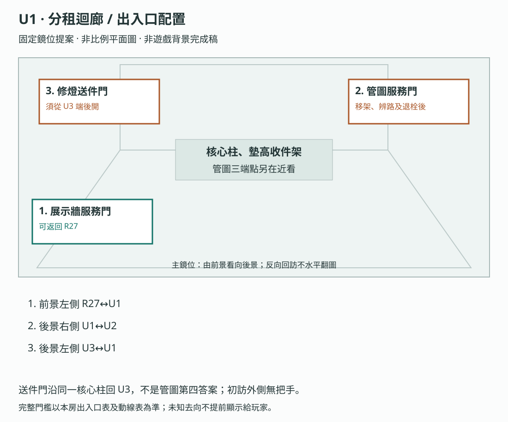
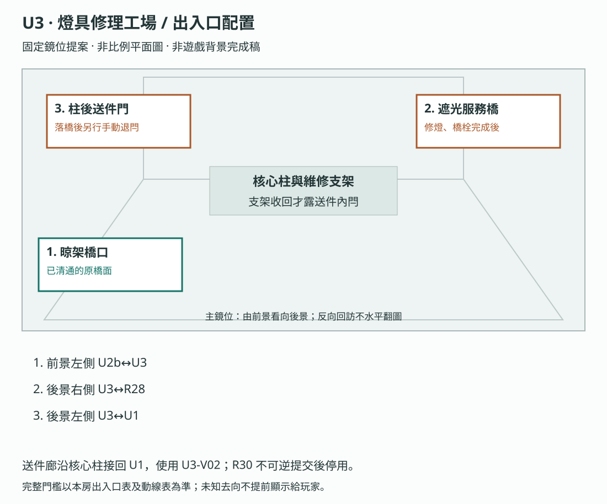

# 製作規格：第六幕

[總目錄](../09_劇本/09-14_全劇本與關卡整合稿.md#book-specs) · [本幕劇本](../09_劇本/09-09_正式劇本_第六幕.md#act-6) · [上一幕規格：第五幕](10-06_製作規格_第五幕.md#spec-act-5) · [下一幕規格：第七幕](10-09_製作規格_第七幕.md#spec-act-7) · [共用附錄](../09_劇本/09-15_正式劇本_共用附錄.md#book-appendices)

[M1](#node-m1-spec)、[R27](#node-r27-spec)、[U1](#node-u1-spec)、[U2](#node-u2-spec)、[U2b](#node-u2b-spec)、[U3](#node-u3-spec)

<a id="spec-act-6"></a>

## 第六幕 · 展示與暗巷：製作規格

<!-- production:ordered:v1 -->

[本幕概覽](#spec-act-6-overview) · [場景流程](#spec-act-6-rooms) · [跨幕共用規則](#spec-act-6-shared) · [圖解對照](#spec-act-6-references) · [幕尾交接](#spec-act-6-delivery)

<a id="spec-act-6-overview"></a>

### 本幕概覽與前置

承接第五幕阿彪退場，保留 R23–R25 安全整理後，由玩家確認進入 M1；經七窗、展示廊與生活夾層，於 U3 完成既有落橋及通行條件後銜接 R28。

| 本幕 | 範圍與完成條件 |
| --- | --- |
| 主流程 | M1 → R27 → U1 → U2 → U2b → U3；44F→45F 七窗、45F 展示及 46F 生活工場 |
| 玩法 | 逐窗查看、生活物件與編號對照、管路辨識、晾架躲避與落橋 |
| 情緒落點 | 七窗與展示廊反差，經不安的生活夾層後，在 U3 回收修理桌承諾 |
| 幕尾 | 完成 U3 原通行條件，沿服務橋前往 R28；已開捷徑、來源與資源持續保存 |

以下來源總覽涵蓋第六至八幕；本文件的逐房規格只到 U3。R28 起見第七幕，U6 起見第八幕。拆幕不重置存檔、供電、恐慌、倒數或選擇；既有 `act6.*` 為相容存檔鍵，不是現在的幕別。

介面文字依[玩家用語](../09_劇本/09-15_正式劇本_共用附錄.md#player-language)與[閱讀負荷](../09_劇本/09-15_正式劇本_共用附錄.md#reading-load)共用規格。

<a id="s-0607-0"></a>
<a id="doc-0607"></a>
<a id="s-0607-1"></a>

<!-- import:s-0607-1:begin -->
<a id="h-0607-1"></a>

#### 第六至八幕 · 上層探索總覽

**篇章定位：下部中後段。** 房內證據規格與穿插探索共同構成流程；[U1–U6 場景原文](../09_劇本/09-15_正式劇本_共用附錄.md#doc-0610)包含每個機關、攻擊窗口與出口條件。

> 「詐騙只是表層。真正的商品，是人。而簽字的人，是你。」

R27–R31 原核心房維持無戰鬥；穿插的 U1–U6 探索區在 U2b／U5 各有一段躲避與環境擊退。壓力來自證據密度、資料正在被遠端刪除，以及整套系統在此刻重新回應主角的內控帳號。玩家早已能懷疑她就是內控主管；全段要確認的是她長期做過什麼，而不是把身分當成唯一反轉。

> Godot 4.x 的互動 ID、資料鍵、三組調查板、倒數保護、唯一解凍與存讀驗收，見 [08-08 Godot 逐房製作包 · R27–R31](../09_劇本/09-15_正式劇本_共用附錄.md#doc-0808)。
<!-- import:s-0607-1:end -->

<a id="s-0909-0"></a>
<a id="s-0909-1"></a>

<!-- import:s-0909-1:begin -->
<a id="h-0909-1"></a>

#### 第六至八幕的來源與承接

> 前接 [第五幕](../09_劇本/09-08_正式劇本_第五幕.md#doc-0908)。依 [06-07](#doc-0607)、[下部探索](../09_劇本/09-15_正式劇本_共用附錄.md#doc-0610)、[08-08](../09_劇本/09-15_正式劇本_共用附錄.md#doc-0808)、[主支線](../09_劇本/09-15_正式劇本_共用附錄.md#doc-0305)、[回憶支線](../09_劇本/09-15_正式劇本_共用附錄.md#doc-0306) 與 [09-00](../09_劇本/09-15_正式劇本_共用附錄.md#doc-0900) 展開。原件欄位沿正式資料，不另造姓名、密碼或死因。
<!-- import:s-0909-1:end -->

<a id="s-0909-2"></a>

<!-- import:s-0909-2:begin -->
<a id="h-0909-5"></a>

#### 全段邊界

| 項目 | 演出契約 |
| --- | --- |
| 路線 | M1 → R27 → U1 → U2 → U2b → U3 → R28 → R29 → U4 → U4b → U5 → U6 → U6b → R30 → R31 |
| 後開回程 | U3 落橋完成後，從工場側手動開啟 U3↔U1 柱後送件廊；只連已探索區，不改首次必經順序 |
| 目標 | 通過夾層找核心，查明封門、震損與現時回返如何讓出口持續受阻 |
| 時長 | 第六至八幕合計沿用原 90–133 分鐘待測基準；重分層與跨棟後須重新量測。M1 與各房不另重複加算，不把此數字當成單幕時長 |
| 節奏 | 七窗／展示反差 → 找路與避襲 → 安全記憶 → 刪除選擇 → 簽名停頓 → 回返與封阻 → 短機關喘息 → 沉降 → 鑑識與解凍 |
| 揭露上限 | 人口交易、長期核可、本人身分、封門與震損路線、冷備份重新可讀；P1 肉身與怨念封鎖核心留終幕 |
| 資源 | 必要來源與機械操作支援 0 穩定度；R27 最後一般安定點一次 +25，上限 100；R31 起零玩法消耗，不等於設備免供電 |
| 破例 | M1 與 R31 各附等效摘要；真正暫停、保存與中途替換未呈現部分可用 |
| 歷史 | 除 R31 十二秒外，全幕記憶皆靜止；UD 是現時黑影，不能寫成小花歷史動作 |


---
<!-- import:s-0909-2:end -->

<a id="s-0607-4"></a>

<!-- import:s-0607-4:begin -->
<a id="h-0607-32"></a>

#### 00 — 全段概覽

| 項目 | 規格 |
| --- | --- |
| 區域 | 45F 展示；46F 生活工場；47F 交易與簽核；48F 門牌與冷藏；49F 水箱與運送；50F 備份內室。七窗只在 44F→45F 的封閉夾道 |
| 節點 | 第六幕 6 個、第七幕 5 個、第八幕 4 個，共 15 個主節點，包含 M1、U2b／U4b／U6b；過渡次場景另依圖像製作單 |
| 預估時長 | 三幕原合計 90–133 分鐘為重分層前待測基準；終幕另計，各新幕實際時長待灰盒量測 |
| 玩法比重 | 目標：探索與實體解謎 45%／躲避與擊退 15%／證據推理 25%／敘事演出 15%；待測 |
| 全段揭露 | 第五層：園區販售人口；主角長期簽核交易、主動提價並設定逃生選擇；她不是旁觀者 |
| 必要證據 | `E5-01`～`E5-06`＋`E5-08` 冷備份滅證失敗／重新掛載 |
| 選填證據 | `E5-07` 器官傳聞鏈、E-05／E-06／E-09／E-10 回收 |
| 對抗 | 核心房無戰鬥，U2b／U5 兩段環境應對；讀取心跳、遠端刪除、舊簽核佇列、路線封閉與外部握手構成現在式壓力，主線證據永不永久遺失 |
| **身體 OS** | R27「太亮了。」／R28「手指不聽話。」／R29 描完簽名後「眼睛很酸。」／R30 固定制動桿後「站穩了。」／R31 接上鑑識座等待時「……可以坐一下。」——**只關於身體，不評論任何東西**；破例、鎖定與解凍維持零 OS |
| **玩家可執行的加害** | **R29「最後一筆」是全作唯一一次玩家能以主角職務執行舊流程的機會；永遠可略過，略過不受懲罰也不被表揚** |
| 出口 | 完成「我不是旁觀者」第五層鎖定與唯一一次解凍，轉入終幕 |

<a id="h-0607-48"></a>

##### 流程

```text
[R27] 展示廊：名字、編號與價格
   ▼
[U1–U3] 分租廊 → 洗衣內井 → 燈具工場：找路、避襲、開橋
   ▼
[R28] 交易接洽室：通報者／器官傳聞／遠端刪除
   ▼
[R29] 簽核檔案室：主角連續簽名與提價備註
   ▼
[U4–U6] 門牌迴廊 → 冷藏後場 → 水箱夾層：驗證回返、擊退、改道
   ▼
[R30] 運送通道：封門、震損與滯留本地的求救
   ▼
[R31] 備份內室：帳號與逃生紀錄鑑識＋第五層鎖定＋解凍
   ▼
轉身看見小花 → 終幕
```

<a id="h-0607-68"></a>

##### 全段揭露預算

- R27 只確認人被編號與定價；不在同房揭露主角簽名。
- R28 的遠端刪除只威脅選填個人證詞；玩家保住哪一份，會在最終「訊號與紀錄」留下對應內容，其餘顯示可驗證的刪除缺口。
- R29 先確認跨月簽核與提價；鎖定後**至少 20 秒不跳新 UI**，讓證據沉澱。
- 20 秒餘波結束後，R29 的「最後一筆」佇列才恢復。它是全段唯一一個**要求玩家做決定而不是做推理**的節點，因此必須與簽名鎖定分開呼吸，不可同框出現。
- R30 處理封門、震損、雙路線與滯留求救，不增加外部行動的指揮或動機支線。
- R31 最後才把帳號、逃生時序、身分與唯一解凍合在一起。

---
<!-- import:s-0607-4:end -->

<a id="s-0607-2"></a>

<!-- import:s-0607-2:begin -->
<a id="h-0607-12"></a>

#### 全段的恐怖解謎主線

玩家帶著「為什麼突破管制後仍逃不出去」進入全段。安全的展示、交易與檔案房負責核對真相；其間的分租迴廊、洗衣內井、燈具工場、門牌迴廊、冷藏後場與水箱夾層，承擔連續的找路、機關與怨影應對。兩類場景共同構成全段，不能只交付五間閱讀房就算完成。

找出管路 → 避開晾架下的拉扯並收架 → 以燈具照出橋栓、落橋 → 回到核心房查證 → 親自驗證回返 → 看霜線來向轉隔板、封住孔口 → 平衡水位並扣止回栓 → 核對剖面、制動通路 → 進備份內室取得維修索引。每步只使用原場景的線索、操作與完成條件，詳見[下部探索節點](../09_劇本/09-15_正式劇本_共用附錄.md#doc-0610)。

安全房不插入新敵襲；必要推理、沉降前兆、回憶與責任停頓仍完整保留。封鎖核心的最終答案由終幕核對，全段只建立可以驗證的路線與懸念。
<!-- import:s-0607-2:end -->

<a id="s-0607-3"></a>

<!-- import:s-0607-3:begin -->
<a id="h-0607-20"></a>

#### 全段逃生計畫

| 階段 | 玩家處境與行動 |
| --- | --- |
| 當下打算 | 找到控制封鎖的核心與可用維修通道。 |
| 看得見的阻礙 | 公共逃生路線已斷，必須核對權限與單人維修路徑；R30 有沉降危險。 |
| 解謎／躲避／擊退 | 穿過 U1–U6，完成兩段環境應對與一次回返驗證；沿原檔案查明權限，完成五點剖面與制動，在 R31 取得主線必得維修索引。 |
| 可驗證的進展 | R30 制動提供通行窗口，R31 索引讓 R32 的既定來源可查；不要求交出全部選填資料。 |
| 已查明後的短提示 | 「普通樓梯走不通。沿維修路線到核心，查清楚門為什麼打不開。」 |

共用規則見[對應條款](10-01_製作規格_序幕.md#s-0601-2)。
全段玩法重點是組合既學過的辨路、受力、遮擋與來源核對；已備妥的機關不重做，卻仍需親手完成下一個操作位置。逐節點操作見[全程玩法對照](../09_劇本/09-15_正式劇本_共用附錄.md#core-gameplay-nodes)。

<!-- import:s-0607-3:end -->

<a id="s-0607-21"></a>

<!-- import:s-0607-21:begin -->
<a id="h-0607-1041"></a>

#### 節點導覽
<!-- import:s-0607-21:end -->

<!-- scene-image-routes-6:begin -->
<a id="image-routes-act-6"></a>

### 本幕連線與接景圖

每條既有動線均指定畫面。兩端接景使用已列主圖與門框遮擋，不另造中間房；出口接景必須交指定鏡位，動畫及低動態版共用定位。後果演出不開放探索。進入條件與回訪仍依原動線表，圖號不是通行權限。

| 原動線 | 接景方式 | 畫面節點／圖號 | 操作與條件來源 |
| --- | --- | --- | --- |
| R27→U1 | 逐鏡過渡 | [T-R27-U1-01](#subscene-t-r27-u1-01-spec) | [門檻、方向與回訪](#node-r27-nav) |
| U1→U2 | 兩端接景 | [U1-V01](#node-u1-images) → [U2-V01](#node-u2-images) | [門檻、方向與回訪](#node-u1-nav) |
| U3→R28 | 逐鏡過渡 | [T-U3-R28-01](#subscene-t-u3-r28-01-spec) | [門檻、方向與回訪](#node-u3-nav) |
| M1→R27 | 兩端接景 | [M1-V01](#node-m1-images) → [R27-V01](#node-r27-images) | [門檻、方向與回訪](#node-m1-nav) |
| U2→U2b | 兩端接景 | [U2-V01](#node-u2-images) → [U2b-V01](#node-u2b-images) | [門檻、方向與回訪](#node-u2-nav) |
| U2b→U3 | 兩端接景 | [U2b-V01](#node-u2b-images) → [U3-V01](#node-u3-images) | [門檻、方向與回訪](#node-u2b-nav) |
| U3→U1 | 出口接景 | [U3-V02](#subscene-u3-v02-spec) | [門檻、方向與回訪](#node-u3-nav) |
<!-- scene-image-routes-6:end -->

<a id="spec-act-6-rooms"></a>

### 依流程逐場景製作

<a id="node-m1-spec"></a>

### M1 · 管理維修脊柱

[正式場次](../09_劇本/09-09_正式劇本_第六幕.md#node-m1-script)

[進場與動線](#node-m1-nav) · [出入口位置](#node-m1-access) · [操作與解謎](#node-m1-level) · [狀態與驗收](#node-m1-pack) · [圖像製作單](#node-m1-images) · [離場與次場景](#node-m1-exit)

<a id="node-m1-nav"></a>

**進出、動線與回訪**

<a id="s-0609-43"></a>

<!-- import:s-0609-43:begin -->
<a id="h-0609-433"></a>

#### M1 管理維修脊柱

進行目的：七窗側身通行與選擇觀察；完成後抵達展示廊

支線／收集：依原房選填調查；無新增支線掛點。

房內順序：原 F1–F5 與阿彪處置完成，安全退回 R25 確認進入；R23／R24 回訪為選填 → 七窗側身通行與選擇觀察；完成後抵達展示廊 → lower.m1.complete = true

| 方向 | 類型 | 可移動條件 | 移動演出提案 | 回訪規則 |
| --- | --- | --- | --- | --- |
| R25 → M1 | 跨幕 | F1–F5 完整與阿彪處置完成；安全整理／回訪後，由玩家在 R25 管理門確認進入 | 阿彪處置後由 R26 厚門回 R25，可安全回訪 R24／R23；回到 R25 稽核門端自行確認，從管理門框切入肩側窄脊柱，再逐段上行。 | 單向通行；安全回訪 R23／R24 是選擇，不是強制重跑門檻。 |
| M1 → R27 | 主線 | lower.m1.complete = true | M1 七窗折返夾道由 44F 上行至 45F，經原門禁核驗進入同層 R27 展示廊；不直接去 50F。 | 單向通行；不新增返回脊柱的路線 |
<!-- import:s-0609-43:end -->
<!-- navigation:m1:end -->

<a id="node-m1-access"></a>
#### 主場景出入口

<!-- scene-access:M1:begin -->
| 動線 | 顯示名稱 | 畫面位置與辨識物 | 通行狀態 |
| --- | --- | --- | --- |
| R25→M1 | 來路：管理門框 | 肩側窄脊柱下端的管理門，連續扶手接回剛離開的控制室。 | 單向承接離幕確認，不提供回 R25 的操作。 |
| M1→R27 | 出口：第七窗後門框 | 七個觀察窗之後，前方扶手接到上端出口。 | 完成本段原通行流程後自行前往 R27；觀察窗不是可進房間，文字過濾不阻礙出口。 |
<!-- scene-access:M1:end -->

<a id="node-m1-level"></a>

**關卡、解謎與失敗回饋**

<a id="s-0607-5"></a>

<!-- import:s-0607-5:begin -->
<a id="h-0607-79"></a>

#### M1 — 管理維修脊柱

<a id="h-0607-81"></a>

##### M1 空間與畫面製作定位

| 項目 | 畫面與製作要求 |
| --- | --- |
| 樓層定位 | 44F → 45F |
| 樓棟定位 | B 棟 |
| 樓層與環境 | 由 44F 管理門到 45F 展示廊。七窗排列於兩層之間的折返夾道，不代表七層；窗後隔間仍封閉，與可探索的 45F–49F 各區分隔。 原光源、材質與證據焦點依本房規格。 |
| 入口方向 | 由 R25 承接；以來路門框／扶手作背向定位，前進方向依下列出口地標。左右方位沿既有構圖，不將反向回訪鏡頭誤當另一扇門。 |
| 可見出口 | R25 門框接肩側窄道，逐段上行後由展示廊門框進 R27。首次全景就交代入口輪廓或可查看的遮擋，不靠無標示的畫外點擊換房。 |
| 阻擋與開放條件 | 往 R27：lower.m1.complete = true |
| 畫面中的解謎要素 | 七扇觀察窗與可走踏點；窗內觀察為選擇，不新增門鎖。關鍵標記可近看，與裝飾物有可辨的材質或輪廓差異，不只靠顏色或聲音。 |
| 完成後變化 | 玩家沿踏點逐段上行至 R27 展示廊門框；觀察窗只保存已看內容，不要求看齊七窗、不另加解鎖提交。 |

<a id="h-0607-94"></a>

##### M1 製作流程

| 項目 | 規格 |
| --- | --- |
| 入口／目標 | 原 F1–F5 與阿彪處置完成；經 R23–R25 安靜退場，在 R25 確認進入；七窗側身通行與選擇觀察；完成後抵達展示廊。 |
| 鏡位與操作 | 從 R25 門框切到貼近肩側的窄脊柱鏡位，沿既有七扇窗逐段前進；首次通行保持原約 2 分 20 秒、不能加速與偏轉角度限制。玩家可在路經時選擇觀察窗內；不新增門鎖、證據或第二次屍體演出。 |
| 保存／回訪 | 完成既有七窗段後寫 lower.m1.complete，入口核驗完成的門開向 R27。原窗位觀察紀錄仍決定 R27 編號回饋，通過不等於全部看過。進入脊柱後單向，不回 R26。 |
| 出口 | lower.m1.complete = true；玩家自行點擊前往 R27。 |
| 時長歸屬 | 與原區共用時間配額，不增加主線分鐘、不追加遭遇或演出次數。 |
| 素材 | 獨立鏡位構圖、前後方向地標與本地操作差分；可共用原區材質，但不能只複製節點名稱充數。新增構圖與鏡位銜接仍待製作。 |

<a id="h-0607-105"></a>

##### M1 七窗演出規格

> **全作唯一一段呈現可辨識屍體的內容。** 規則見 [00-02 破例制度](../09_劇本/09-15_正式劇本_共用附錄.md#doc-0002)。
>
> 位置：下部第五幕阿彪結束後、進入 R27 之前的過場路徑。玩家在 R25 集齊 F1–F5 後，必須穿過 44F→45F 的七窗封閉夾道才能抵達 45F 展示廊。

<a id="h-0607-111"></a>

##### 阿彪與七窗之間的間隔

R26 的臉部破例後，保留約 3–5 分鐘 R23–R25 安全退場／回訪的節奏估計；不自動觸發新目標、證據、攻擊、小花聲音或 OS，也不以強制等待湊時長。既有選填來源仍由玩家自行決定是否回看。原 F1–F5 與阿彪提交完成後，玩家在 R25 稽核門端自行確認，寫安全檢查點後進脊柱。七窗段仍約 2 分 20 秒，完成後直接抵達 R27；整段屬下部，不是下部開機即播的序場，也不重播 R22 的布結伏筆。

<a id="h-0607-115"></a>

##### 這段路是什麼

那條只容單人側身通過的管理維修脊柱，在 44F 與 45F 之間折返，沿七個封死隔間的牆走。七扇窗是隔間窗位，不是一窗一層，也不通往後續生活工場。

而那些牆上有**觀察窗**——L-48 協定要求封死的房間必須保留一個可視檢查口，這樣封鎖執行者可以確認房間裡沒有東西需要處理。

窗還在。

<a id="h-0607-123"></a>

##### 呈現規範

| 項目 | 規格 |
| --- | --- |
| 數量 | 沿途 **7 扇觀察窗**。玩家不必全部看——**但路徑必須經過每一扇，而且窗在視線高度。** |
| 移動 | 側身通過。**移動速度固定，玩家無法加速、無法跑、無法把鏡頭轉開超過 40 度**（脊柱太窄了，轉不過去）。 |
| 光源 | 窗內客觀上全黑；沿既有窗位觸發固定感知顯影一到兩秒，不是可移動燈具。與留光槽完全分離，已用完三槽或從未留光也呈現相同內容，不搬動舊標記、不新增第四槽。 |
| 玩家看到 | 第 1、2、4、6 扇：空房間、翻倒的床、抓痕、堆在門後的東西。<br>第 3、5、7 扇：**有人。** |
| 那三扇的內容 | L-48 封鎖至今約十二日，不從姿勢判死亡時刻。不迴避狀態。**不做特寫、不做動態、不做音效、不做主角反應鏡頭。** 經過固定窗位，感知顯影一秒半，過去。 |
| 姿勢 | 全部在**門邊**。七扇窗，三個人，都在門邊。 |
| 聲音 | 玩家自己的呼吸、衣料摩擦鋼板、遠處滴水。**沒有配樂或額外驚嚇音效。** |
| 主角 OS | **全程無。** 她一句話都沒說。 |
| 長度 | 約 **2 分 20 秒**。無法跳過。 |
| 不呈現 | 蛆、腐爛的動態演出、臉部特寫、任何獵奇構圖。**這不是恐怖片的屍體，這是被鎖在房間裡、沒能走到門外的人。** |

<a id="h-0607-138"></a>

##### 為什麼是「在門邊」

玩家走過七扇窗，會發現三個人都在同一個位置。

> 沒有旁白解釋。沒有調查板欄位。沒有證據。
>
> 玩家可以感到：**他們曾試圖靠近門。** 抓痕、物件與姿勢支持逃生嘗試，不足證明每人一直敲門、何時死亡或具體死因。
>
> 而現在，玩家正在門的另一側走過去。用一條她們沒有的路。

<a id="h-0607-148"></a>

##### 出口那一刻

脊柱的盡頭是 45F 的門。既有門禁核驗後自動開門，通往 R27 展示廊——**明亮、乾淨、像廉價投資展間**。

> 這個落差是刻意的。玩家剛剛走過三個死在門後的人，下一秒站在一面貼滿照片與價目的牆前面。
>
> **那面牆上有些照片，玩家剛剛才看過本人。**

<a id="h-0607-156"></a>

##### 後續差異（強制）

- 完成 R27 別名鏈後，第 3／5／7 窗各自依實看或等效摘要確認更新對應編號：`已確認位置`。**不要求三窗全看，不因單純路過補記；不寫姓名。**
- 終幕只將已確認的對應者由 `下落待確認` 改為 `位置已確認／狀態未經司法認定`。遠景或摘要呈現死亡狀態，不提供法醫死因、死亡時間或司法身分認定。
- E-09「封鎖後者」的對講機回聲，在此之後不再錯位——它固定在其中一扇窗的位置。

⚠️ 這一段**沒有任何獎勵、成就、額外證據或結局優勢**。它唯一的功能是讓玩家在看見頂層展示板之前，先知道那些編號是什麼。

---

<a id="h-0607-166"></a>

##### M1 鏡位切換與光源動態

<a id="h-0607-168"></a>

###### 穿越維修脊柱

| 項目 | 場景演出規格 |
| --- | --- |
| 形式與節奏 | 低動態定點切換與聲音接續。 |
| 鏡頭與動作 | 沿原無事件退場路徑留出呼吸，再以既有窗框遮擋切換視點；見到原規定殘跡時允許停留。 |
| 操作與資訊邊界 | 不把 R26 後 3–5 分鐘無事件路徑變成新增驚嚇蒙太奇；不在鏡頭移動時塞入新屍體或快速獵奇特寫。 |

<a id="h-0607-177"></a>

###### M1 出口與回訪

| 目的節點 | 條件 | 移動與辨向 | 回訪邊界 |
| --- | --- | --- | --- |
| R27 | lower.m1.complete = true | M1 七窗折返夾道由 44F 上行至 45F，經原門禁核驗進入同層 R27 展示廊；不直接去 50F。 | 單向通行；不新增返回脊柱的路線 |

##### 操作與呈現補充

- [s-0909-5](../09_劇本/09-09_正式劇本_第六幕.md#s-0909-5)：破例只發生在原窗口遠景。三人與展示編號的對照沿同一資料表；畫面不顯新增姓名或「三人全部看過」獎勵。
<!-- import:s-0607-5:end -->

<a id="node-m1-pack"></a>

**狀態、素材與驗收**

本節未另立房間製作包；本房上述規格的保存與素材要求，以及[共用技術與交付](../09_劇本/09-15_正式劇本_共用附錄.md#appendix-production)同時適用，不因此省略存讀檔或驗收。

<a id="node-m1-images"></a>

#### 場景節點與靜態圖製作單

以下每列均為待製作圖像項目；文件多頁、正反面、局部與狀態差分須依拆圖欄各自交付，不能以一張示意圖代替。可探索場景的主圖提供移動與探索，演出節點不另開探索，近看關閉回到開啟前的畫面；原演出與操作條件仍依右欄來源。圖號、解析度、文字分層、存檔及驗收依[靜態圖共用契約](../09_劇本/09-15_正式劇本_共用附錄.md#scene-image-contract)。

<!-- scene-images:M1:begin -->
| 畫面節點／圖號 | 用途 | 必畫內容 | 狀態與拆圖 | 來源 |
| --- | --- | --- | --- | --- |
| M1-V01 | 主場景 | 肩側窄脊柱、連續扶手、七個觀察窗與上行出口。 | 七窗不是七間可進房；四空、三具遺體維持原來源限制，不加搜索物品或可拿遺物。 | [本場景](../09_劇本/09-09_正式劇本_第六幕.md#node-m1-script) |
| M1-V02 | 演出底圖 | 七窗通行各段 | 窗 1～7 各有靜態構圖與共同扶手，沿原約 2 分 20 秒通行；低動態版沿原節奏規則。 | [M1-01](../09_劇本/09-09_正式劇本_第六幕.md#s-0909-5) |
| M1-C01 | 近看 | 第 3、5、7 窗遠看 | 三張獨立遠景，不製作可放大身體傷口的細節圖；其他四窗只沿通行畫面。 | [M1-01](../09_劇本/09-09_正式劇本_第六幕.md#s-0909-5) |
| M1-D01 | 介面 | 七窗文字摘要 | 與原演出資訊一致，摘要不生成額外證據。 | [M1-02](../09_劇本/09-09_正式劇本_第六幕.md#s-0909-6) |
| M1-C02 | 近看 | 管道對講聲源 | 固定設備與管線局部，E-09 原反應沿原聲音，不增加可拿對講機。 | [M1-03](../09_劇本/09-09_正式劇本_第六幕.md#s-0909-7) |
<!-- scene-images:M1:end -->

<!-- scene-image-access-art-m1:begin -->
**出入口交圖：**M1-V01 須依場次與狀態畫出[本場景出入口表](#node-m1-access)的來路、去路及封閉位置；既有操作鏡位與接景圖沿同一地標對位。門端差分、移動熱區與遮擋另分層，依[出入口共用契約](../09_劇本/09-15_正式劇本_共用附錄.md#scene-access-contract)驗收。
<!-- scene-image-access-art-m1:end -->

<a id="node-m1-visual"></a>

#### 本場景圖像與示意

以下圖像為製作參照；跨房圖僅使用標明的面板，其他場景仍按各自前置演出。

[V39 維修脊柱的七扇窗](#fig-v39)

- **V39：**維修脊柱的七窗仍在樓體包覆內；沒有樓外自由探索，走完通道不代表七窗全部看過。

[返回本房正式劇本](../09_劇本/09-09_正式劇本_第六幕.md#node-m1-script) · [本房關卡與解謎](#node-m1-level)

<a id="fig-v39"></a>

##### V39｜維修脊柱的七扇窗

**適用與限制：**維修脊柱的七窗仍在樓體包覆內；沒有樓外自由探索，走完通道不代表七窗全部看過。


[完整圖說與操作對照](10-10_製作規格_第八幕.md#h-0607-1122) · [圖像目錄](../09_劇本/09-14_全劇本與關卡整合稿.md#book-illustrations)

<a id="node-m1-exit"></a>

#### 離場通路與次場景

<!-- production-subscenes:m1 -->

沿[本場景動線](#node-m1-nav)的原出口與分支交接；不新增中間探索場景。

<a id="node-r27-spec"></a>

### R27 · 展示廊

[正式場次](../09_劇本/09-09_正式劇本_第六幕.md#node-r27-script)

[進場與動線](#node-r27-nav) · [出入口位置](#node-r27-access) · [操作與解謎](#node-r27-level) · [狀態與驗收](#node-r27-pack) · [圖像製作單](#node-r27-images) · [離場與次場景](#node-r27-exit)

<a id="node-r27-nav"></a>

**進出、動線與回訪**

<a id="s-0609-44"></a>

<!-- import:s-0609-44:begin -->
<a id="h-0609-447"></a>

#### R27 展示廊

進行目的：沿展示廊尋找核心通路；人名／編號／價格、人口交易揭露、最後一般安定感知

支線／收集：依原房選填調查；無新增支線掛點。

| 方向 | 類型 | 可移動條件 | 移動演出提案 | 回訪規則 |
| --- | --- | --- | --- | --- |
| R27 ↔ U1 | 主線 | 三條別名鏈合併並取得 E5-01；act6.r27.e501_seen = true | T-R27-U1：由 45F 的 R27 原門端起行，經 45F → 46F 的展示牆後服務梯，最後親自進入 46F 的 U1。保留原門檻與方向；可逐圖移動，近看選填，不增解鎖題。 | R30 沉降前可循已開通路回訪；遇正式遭遇鎖場停用 |
| M1 → R27 | 主線 | lower.m1.complete = true | M1 七窗折返夾道由 44F 上行至 45F，經原門禁核驗進入同層 R27 展示廊；不直接去 50F。 | 單向通行；不新增返回脊柱的路線 |
<!-- import:s-0609-44:end -->
<!-- navigation:r27:end -->

<a id="node-r27-access"></a>
#### 主場景出入口

<!-- scene-access:R27:begin -->
| 動線 | 顯示名稱 | 畫面位置與辨識物 | 通行狀態 |
| --- | --- | --- | --- |
| M1→R27 | 來路：脊柱窄門 | 展示廊進場側的窄門，核心梁與原扶手交代剛才的高度。 | 單向進場，不開放退回七窗通道。 |
| R27↔U1 | 出口：展示牆服務口 | 45F 門端，去路可辨45F → 46F 展示牆後服務梯的連續扶手及固定梯口；目的房在 46F，不把兩端畫成同層相鄰門。 | 三條別名鏈合併、取得 E5-01 後可到 U1；沉降前可依已開路線返回。 |
<!-- scene-access:R27:end -->

<a id="node-r27-level"></a>

**關卡、解謎與失敗回饋**

<a id="s-0607-6"></a>

<!-- import:s-0607-6:begin -->
<a id="h-0607-184"></a>

#### R27 — 展示廊：商品是人

場景像廉價投資展間：牆面照片、能力標籤、語言、健康狀態、價格區間。畫面避免裸露與傷口；恐怖來自行政語言的冷靜。

<a id="h-0607-188"></a>

##### R27 空間與畫面製作定位

| 項目 | 畫面與製作要求 |
| --- | --- |
| 樓層定位 | 45F |
| 樓棟定位 | B 棟 |
| 樓層與環境 | 45F 展示區；M1 上端入場，展示牆旁的服務梯連至 46F 分租迴廊。 原光源、材質與證據焦點依本房規格。 |
| 入口方向 | 由 M1 承接；以來路門框／扶手作背向定位，前進方向依下列出口地標。左右方位沿既有構圖，不將反向回訪鏡頭誤當另一扇門。 |
| 可見出口 | 展示牆邊服務口通 U1。首次全景就交代入口輪廓或可查看的遮擋，不靠無標示的畫外點擊換房。 |
| 阻擋與開放條件 | 往 U1：三條別名鏈完成並合併為 E5-01（act6.r27.e501_seen）；姓名收集與安定點不列門檻 |
| 畫面中的解謎要素 | 人名、編號、價格與對照來源；先辨認內容再進行關聯。關鍵標記可近看，與裝飾物有可辨的材質或輪廓差異，不只靠顏色或聲音。 |
| 完成後變化 | 人名、編號與價格核對保存結果，玩家由展示牆邊服務口進 U1；選填稱呼核對不增加逃生門票。 |

<a id="h-0607-201"></a>

##### R27 製作流程

**空間第一印象：**整潔冷白展示面與巨大暗梁。突然空曠，留下原安靜時間，背景不塞滿租戶彩蛋，讓玩家感到尺度失衡。

**探索呈現：**先讓玩家看見入口、可走的方向和空間異常，再自選近看生活物件；新增租戶遺跡不發 E 證據、不設派系任務、不改出口旗標。恐怖沿原事件與遭遇時序，安定／閱讀保護段不插嚇點。

| 階段 | 製作規格 |
| --- | --- |
| 進入／目標 | 沿展示廊尋找核心通路；人名／編號／價格、人口交易揭露、最後一般安定感知；入場先還原原房間已保存的熱點與事件狀態。 |
| 觀察／空間 | 高層展示面以整潔飾板遮住巨大核心梁，角落只露一條舊管；保持本房安靜與空曠的反差。 |
| 操作順序 | 查看展示鏈與物流 → 可將已收集 E-10 編號比對，缺接收仍未知 → 保留原安靜段 → 經 U1–U3 前往 R28。順序中的選填內容不作離房門檻；原主線旗標、遭遇數值及分支提交條件依本場景細則。 |
| 回饋 | 必要操作寫入原證據／門禁／遭遇狀態；新增生活附頁僅更新來源已讀與有依據的筆記，不重發原證據。 |

<a id="h-0607-214"></a>

###### R27 生活與管制觀察

沿既有 E-10 交易物流回收，對上早期床號、工位及帶離編號；最終接收缺口仍在。材料證明轉運風險，不證明已死或器官摘除。

<a id="h-0607-218"></a>

###### R27 出口與回訪

| 目的節點 | 條件 | 移動與辨向 | 回訪邊界 |
| --- | --- | --- | --- |
| U1 | 三條別名鏈合併並取得 E5-01；act6.r27.e501_seen = true | T-R27-U1：由 45F 的 R27 原門端起行，經 45F → 46F 的展示牆後服務梯，最後親自進入 46F 的 U1。保留原門檻與方向；可逐圖移動，近看選填，不增解鎖題。 | R30 沉降前可循已開通路回訪；遇正式遭遇鎖場停用 |

共用規則見[對應條款](10-01_製作規格_序幕.md#s-0601-6)。

<a id="h-0607-228"></a>

##### 名字對號謎題

玩家以展示終端的本地對照附件，以及前五幕已保存的觀察，把三條「生活端 → 工作／帳號端 → 物流／展示端」別名鏈拉回人物欄。下部獨立開局也可在本房讀取必要編號；姓名仍只從已核實的個人來源恢復：

- 牲口棚未領走的床位牌。
- 產線紅線名單中的低標者。
- 貨梯識別牌與一個已撤銷帳號。

三條鏈各以共享校驗尾碼、入園日期與轉運章為判斷依據。展示索引附原床位／工作名單／貨梯編號對照摘錄，逐頁標示來源與日期，玩家須親自查看並連線；不是自動補收上部物件、支線或真名。錯配只指出目前兩張資料不能支持同一人，保留已完成鏈，不扣資源。三條鏈均核對後，玩家主動合併到人物欄，才寫入主線成果。

完成後取得 `E5-01` 人口展示／估價表。UI 將「樣本」一詞劃掉；已確認者改顯示人的名字，未完成選填支線者顯示 `姓名未知／下落待確認`，不播放成功音。

第一條別名鏈完成後，展示索引右下角增加一次沒有來源名稱的讀取心跳，隨後歸零。系統只保存時間與節點雜湊，不能判定是舊排程還是仍在線的外部讀取者。

未完成選填支線時，系統以「姓名未知」保留證據，絕不要求玩家把所有受害者收集齊才可推主線。

<a id="h-0607-244"></a>

##### 時態錯位 T-6a · 被改過的價格

| 項目 | 內容 |
| --- | --- |
| 第一次 | 展示牆上某一張照片旁是紅叉（已售出）與一個價格。 |
| 回訪（完成任一條別名鏈後） | **同一張照片、同一個紅叉、同一個欄位**：價格欄浮出一道被劃掉的舊價與一個新價。新價旁邊是一組識別碼縮寫——玩家在 R29 才會知道那是誰的。 |
| 物件數量 | 不變。 |
| 物理讀法 | 紙張受潮，使原本被覆蓋的壓痕浮現。 |
| 訊號讀法 | 這個人被重新定價過一次。 |
| 邊界 | 本房**不得**點名主角（見揭露預算：R27 只確認「人被定價」）。縮寫要到 R29 簽名比對完成後才可讀。 |

---

<a id="h-0607-257"></a>

##### 最後一般安定感知 · 展示層低壓維修座

- 完成第一條別名鏈後，展示牆側面的維修座解除保護；在安全角落定神 2.5 秒，穩定度 **+25 點、上限 100**。
- 每輪一次，保存 `act6.r27.grounding_used`。這是全作最後一個一般安定感知節點；R28–R30 不再放插座，避免證據高潮被資源巡查切碎。
- 0 點 進入 R27 仍可完成別名鏈：展示終端替必要比對頁供電；終端本地帳號只負責驗證，不消耗玩家凝神穩定度。
- 讀取心跳只隨第一條別名鏈完成出現一次；安定感知不重播、不新增讀取事件，也不把合理資源行為懲罰成敵襲。

---

##### 操作與呈現補充

- [s-0909-10](../09_劇本/09-09_正式劇本_第六幕.md#s-0909-10)：本房只回答「這些編號指向誰」；保留可回查原件，不再彈出人口交易總結。主角跨月簽核留 R29，當晚選擇留 R31，不將三次揭露擠成同一頁。
- [s-0909-11](../09_劇本/09-09_正式劇本_第六幕.md#s-0909-11)：展示玻璃只保留正常幾何反射，不增加第十次鏡像者或提前在「內控核准」欄疊上主角。
- [s-0909-13](../09_劇本/09-09_正式劇本_第六幕.md#s-0909-13)：人物鍵與真名依既有資料表，不用占位姓名出貨；未做不列缺額、不加結局分。
<!-- import:s-0607-6:end -->

<a id="s-0607-15"></a>

<!-- import:s-0607-15:begin -->
<a id="h-0607-822"></a>

#### R27 選填：把稱呼核對到一個人

使用本房既有人物索引及別名鏈，不新增陌生死者或另造姓名。選取一位既有資料中同時具有園區稱呼與可讀入園姓名的受困者；對應人物鍵由正式資料表指定，排除 E-10、C-07、主角與 R29「最後一筆」才能取得的姓名。可讀姓名欄不可使用占位文字出貨。

玩家在安全查閱狀態查看既有入園登記及同一人物的班表數位副本，比對工號、姓名與稱呼，選擇「新增核對附註」。兩來源一致才提交；不一致可取消或保留未確認。約 30–60 秒為預估閱讀時間，不是倒數或強制等待。查閱不與安定點互斥，不消耗穩定度。

附註只建立可追溯的別名關聯，顯示兩份來源與核對狀態，不改寫姓名原件、不補死因、不補已抹除的訊號。這是同一名冊人物的資料修正，不是新增收集卡。若本房主線別名操作已完成同一對應，即視為完成，不要求玩家重做。

沒有道具、成就、路線、技能或結局加分；可見結果只有那一行從「稱呼／姓名未核對」變成來源支持的姓名關聯。忽略仍可離開、通關及求援。這件事的代價是停下來查證的時間，不能宣稱它等同於冒生命危險。

附註由有電的展示終端以既有本地註記功能寫入並保留來源，後續只按 A–E 分支資料規則外送或留存，不自動上傳。若設備不可用，仍可在筆記建立暫定關聯；只有完成本地寫入才有正式附註。
<!-- import:s-0607-15:end -->

<a id="node-r27-pack"></a>

**狀態、素材與驗收**

<a id="s-0808-9"></a>

<!-- import:s-0808-9:begin -->
<a id="h-0808-249"></a>

#### R27 — 展示廊／商品是人

<a id="h-0808-251"></a>

##### R27-房間資料

| 欄位 | 值 |
| --- | --- |
| `room_id` | `R27` |
| `scene` | `room_r27.tscn` |
| `entry_from` | `M1`＋`lower.m1.complete`；M1 由 R25 管理門進入 |
| `exit_to` | `U1`；沿 U1→U2→U2b→U3 才抵達 R28 |
| `backgrounds` | `r27_real.webp`、`r27_scan.webp`；不製作完整凝固層 |
| `board_id` | `BOARD_TRADE_IDENTITY` |
| `main_goal` | 證明展示欄裡的樣本編號對應前面遇過的具體生活者 |
| `must_exit_when` | `act6.r27.e501_seen = true` |

<a id="h-0808-264"></a>

##### R27-三條別名鏈

每條鏈固定三個制度欄位；玩家要證明欄位指向同一人，不必先知道姓名。

| 鏈 | 生活端 | 工作／帳號端 | 物流／展示端 | 可恢復姓名條件 |
| --- | --- | --- | --- | --- |
| A | 牲口棚未領床位牌 | 低標名單編號 | 展示卡「可訓練／低服從」 | 已取得對應生活物件或刻痕姓名 |
| B | 產線座位與撤銷帳號 | 視訊組工作評級 | 展示卡「多語／高信任轉化」 | 已取得人物卡或記憶卡署名 |
| C | 貨梯識別牌碎片 | 共用物流編號 | 展示卡「可移交／健康待評」 | 已取得 `E2-12`；否則只顯示編號 |

鏈的正確性由共享的校驗尾碼、入園日期與轉運章共同支持，不能只靠照片長相配對。R27_H03 本地展示附件提供三鏈必要的原床位／工作名單／貨梯編號對照摘錄，標明來源與日期，須親自查看並連線；不自動補收上部支線或真名。有效預設前情與最少主線匯入均可核對三鏈。

<a id="h-0808-276"></a>

##### R27-互動表

| ID | 物件／觸發 | 玩家操作 | 回饋 | 寫入狀態／證據 | 成本 |
| --- | --- | --- | --- | --- | --- |
| `R27_H01` | R25 五燈入口的舊編號參照 | 不再建立 R27 熱點 | 五燈熄滅與門端覆寫只在 R25 的 ACT5-03；其後經 M1 才到展示廊。不在 R27 複製五燈門、重驗通行碼或重播開門 | `r27.override_entry_seen` 僅舊檔相容，不再觸發；通行仍依 R25／M1 原狀態 | 0 |
| `R27_H02` | 展示廊低壓維修座 | `GROUND` | 第一條別名鏈後解鎖；定神 2.5 秒，凝神穩定度 +25 點、上限 100 點，價目螢幕仍輪播；每輪一次 | `act6.r27.grounding_used = true` | 0 |
| `R27_H03` | 展示卡索引 | `LOOK` | 照片、語言、健康、服從、價格與移交欄並列 | `r27.catalog_seen` | 0 |
| `R27_H04` | 別名鏈 A | `LINK_ALIAS` | 校驗尾碼與日期對上；若有姓名則恢復，否則寫 `姓名未知` | `act6.r27.alias_chain_a_locked` | 0 |
| `R27_H05` | 別名鏈 B | `LINK_ALIAS` | 撤銷帳號與展示卡共用登入雜湊 | `act6.r27.alias_chain_b_locked` | 0 |
| `R27_H06` | 別名鏈 C | `LINK_ALIAS` | 貨梯牌、物流表與展示欄共用移交編號 | `act6.r27.alias_chain_c_locked` | 0 |
| `R27_H07` | 三鏈合併 | `BOARD` | 「樣本」逐列被劃掉；已知者顯示姓名，未知者顯示 `姓名未知／下落待確認` | `E5-01`、`act6.r27.e501_seen`、`act6.r27.board_locked` | 0 |
| `R27_H08` | 展示照玻璃反射 | 關閉人物板 | 僅普通幾何反射，撤除核准欄疊影；不列鏡像者事件、不提前提示簽名責任 | `r27.reflection_seen` 僅舊檔相容，不再觸發 | 0 |
| `R27_H09` | 第一條別名鏈鎖定後的讀取心跳 | 自動記錄／`LOOK` 回看 | 展示終端右下角出現一次未知節點讀取；只留下時間、節點雜湊與 `READ`，無法判定是活人、殘留程序或外部監看者 | `act6.r27.external_read_heartbeat_state = saved` | 0 |

<a id="h-0808-290"></a>

##### R27-姓名顯示規則

~~~text
if personal_name_confirmed:
    顯示：姓名／園區別名／所有制度編號
else:
    顯示：姓名未知／已確認為同一人／下落待確認
~~~

- 不顯示 `1/3 姓名完成` 或收集率。
- 缺少選填證據時不開回訪強制門；人物板只標出可回訪來源。
- 再玩時仍只按本輪已核實來源顯示姓名，不以帳號收藏補發未讀線索；`E5-01` 的主線結論不改變。

<a id="h-0808-303"></a>

##### R27-驗收

- [ ] 從最少主線存檔進入時，三條別名鏈仍有足夠日期、尾碼與章記完成。
- [ ] 未取得 `E2-12` 時，鏈 C 以未知姓名完成，不生成假名或死亡狀態。
- [ ] 玩家完成後能說出「展示卡上的價格屬於前面生活過、工作過的人」。
- [ ] 「樣本」劃除沒有勝利音、成就跳窗或收集率。
- [ ] R27 不以人體傷勢、裸露或器官圖示製造刺激。
- [ ] 讀取心跳能被注意與保存，但不揭露對端身分，也不鎖門或傷害玩家。
<!-- import:s-0808-9:end -->

<a id="node-r27-images"></a>

#### 場景節點與靜態圖製作單

以下每列均為待製作圖像項目；文件多頁、正反面、局部與狀態差分須依拆圖欄各自交付，不能以一張示意圖代替。可探索場景的主圖提供移動與探索，演出節點不另開探索，近看關閉回到開啟前的畫面；原演出與操作條件仍依右欄來源。圖號、解析度、文字分層、存檔及驗收依[靜態圖共用契約](../09_劇本/09-15_正式劇本_共用附錄.md#scene-image-contract)。

<!-- scene-floor-locations:R27:begin -->
| 次場景／主圖 | 樓層定位 | 樓棟定位 | 移動方式 |
| --- | --- | --- | --- |
| T-R27-U1-01 | 45F → 46F | B 棟 | 步道 |
<!-- scene-floor-locations:R27:end -->

<!-- scene-images:R27:begin -->
| 畫面節點／圖號 | 用途 | 必畫內容 | 狀態與拆圖 | 來源 |
| --- | --- | --- | --- | --- |
| R27-V01 | 主場景 | 展示人像、價格覆層、展示名冊、低壓維修座及分租廊服務口。 | 人名／價格覆層與未知已讀回執依原來源；三條鏈完成才開原出口。 | [本場景](../09_劇本/09-09_正式劇本_第六幕.md#node-r27-script) |
| R27-C01 | 近看 | 展示人像及價格覆層 | 各原人像清晰、價格與姓名分層，不能把三編號當三個人。 | [R27-01](../09_劇本/09-09_正式劇本_第六幕.md#s-0909-10) |
| R27-D01 | 文件 | 三組別名對應名冊 | 各組入園、轉運、日期與校驗尾碼分頁可比，不靠背記。 | [R27-01](../09_劇本/09-09_正式劇本_第六幕.md#s-0909-10) |
| R27-D02 | 介面 | 未知讀取回執 | 原可知欄保留，不能揭露讀取者身分。 固定在展示索引右下角，與原 R27_H09 同位置。 | [R27-02](../09_劇本/09-09_正式劇本_第六幕.md#s-0909-11) |
| R27-C02 | 近看 | 同一張價目 | 選填回看版與首訪版同來源，不新增一份收藏。 | [R27-03](../09_劇本/09-09_正式劇本_第六幕.md#s-0909-12) |
| R27-C03 | 操作近看 | 低壓維修座 | 一輪可用／已用差分，三鏈完成狀態與安定互不代替。 | [R27-04](../09_劇本/09-09_正式劇本_第六幕.md#s-0909-13) |
| T-R27-U1-01 | 過渡場景 | 展示牆後服務梯：展示牆後服務梯，來路扶手與下一段梯口同框；門楣保留 45F → 46F 標記，封板遮住舊公共梯。 | 來路 R27-V01；去路 U1-V01。既有門檻；兩端樓層牌、門框與連續扶手可對位；管線用於辨向，不踩管壁。 取得 E5-01 後，沿展牆旁固定梯上到 46F 分租廊。 主圖交上下段踏點、封閉口與通行差分；不新增未編號可走房間。 | [通路正文](../09_劇本/09-09_正式劇本_第六幕.md#ascent-t-r27-u1-01-script) |
| T-R27-U1-01-C01 | 過渡近看 | 45F 展板背框、46F 收件架與同一立管 | 兩端樓層牌、門框與連續扶手可對位；管線用於辨向，不踩管壁。 未完成原房條件不能出發；近看可直接關閉，沒有新密碼、收集或消耗。 每個列名焦點交清晰局部；關閉回 T-R27-U1-01，不自動移至下一房。 | [通路正文](../09_劇本/09-09_正式劇本_第六幕.md#ascent-t-r27-u1-01-script) |
<!-- scene-images:R27:end -->

<!-- scene-image-access-art-r27:begin -->
**出入口交圖：**R27-V01 須依場次與狀態畫出[本場景出入口表](#node-r27-access)的來路、去路及封閉位置；既有操作鏡位與接景圖沿同一地標對位。門端差分、移動熱區與遮擋另分層，依[出入口共用契約](../09_劇本/09-15_正式劇本_共用附錄.md#scene-access-contract)驗收。
<!-- scene-image-access-art-r27:end -->

##### 原熱點對應圖號

同一圖可支援多個狀態，但每個列名焦點及原差分仍須交付；底圖不取代動畫、聲音或互動。此表只對圖，不新增取得條件。
<!-- hotspot-images:R27:begin -->
| 原熱點／操作 | 圖號 | 對應內容／邊界 |
| --- | --- | --- |
| R27_H01 | R25-C02 | 已撤除的 R27 舊入口；僅參照 R25 原五燈圖，不在此房建立熱點或重播。 |
| R27_H02 | R27-C03 | 展示廊低壓維修座 |
| R27_H03 | R27-C01、R27-D01 | 展示卡索引 |
| R27_H04 | R27-D01 | 別名鏈 A |
| R27_H05 | R27-D01 | 別名鏈 B |
| R27_H06 | R27-D01 | 別名鏈 C |
| R27_H07 | R27-D01 | 三鏈合併 |
| R27_H08 | R27-V01 | 普通反射底圖；撤除的核准疊影不製作，不恢復舊事件。 |
| R27_H09 | R27-D02 | 第一條別名鏈鎖定後的讀取心跳 |
<!-- hotspot-images:R27:end -->

<a id="node-r27-visual"></a>

#### 本場景圖像與示意

以下圖像為製作參照；跨房圖僅使用標明的面板，其他場景仍按各自前置演出。

[V26 下部：別名、價格與證據邊界](#fig-v26)

- **V26：**R27 別名與價目、R31 停留痕、R28 傳聞及證據邊界；空欄保留未知，不補寫去向或死因。

[返回本房正式劇本](../09_劇本/09-09_正式劇本_第六幕.md#node-r27-script) · [本房關卡與解謎](#node-r27-level)

<a id="fig-v26"></a>

##### V26｜下部：別名、價格與證據邊界

**適用與限制：**R27 別名與價目、R31 停留痕、R28 傳聞及證據邊界；空欄保留未知，不補寫去向或死因。


[完整圖說與操作對照](10-10_製作規格_第八幕.md#h-0607-1083) · [圖像目錄](../09_劇本/09-14_全劇本與關卡整合稿.md#book-illustrations)

<a id="node-r27-exit"></a>

#### 離場通路與次場景

<a id="transition-r27-u1"></a>
##### T-R27-U1 · 展示牆後服務梯

**起行與到達：**三條別名鏈合併並取得 E5-01；act6.r27.e501_seen = true。原條件允許時可原路回訪。 到目的門口由玩家親自進房，才啟動房內事件。

**空間與保存：**每個次場景標明來路、去路、樓層與可見承重踏板；反向不水平翻圖。依原門檻通行，近看選填，不增加解鎖題或收集。 狀態依[通路共用規則](../09_劇本/09-15_正式劇本_共用附錄.md#transition-rules)與[逐層探路契約](../09_劇本/09-15_正式劇本_共用附錄.md#ascent-route-contract)。

**驗收：**每層測原門檻、錯路、取消、近看返回、正反向與存讀檔；圖號只定位，不授予目的房證據。正式畫面、音場與實機節奏仍待製作及驗證。

<!-- production-subscenes:r27 -->

<!-- scene-image-subscenes-r27:begin -->
<a id="subscenes-r27"></a>
#### 次場景節點

以下次場景歸 R27 管理，節點編號沿用主圖圖號。來去方向為原動線的正向排列；反向通行與單向限制依原門檻，不因列出來路就新增返回出口。

<a id="subscene-t-r27-u1-01-spec"></a>
##### T-R27-U1-01 · 展示牆後服務梯

**樓層：**45F → 46F · B 棟

**類型：**可查看過渡。**正向連接：**R27-V01 → **T-R27-U1-01** → U1-V01。

**近看：**T-R27-U1-01-C01；關閉回 T-R27-U1-01。

[正文](../09_劇本/09-09_正式劇本_第六幕.md#subscene-t-r27-u1-01-script) · [圖像製作單](#node-r27-images) · [原門檻與回訪](#node-r27-nav) · [通路正文](../09_劇本/09-09_正式劇本_第六幕.md#ascent-t-r27-u1-01-script)
<!-- scene-image-subscenes-r27:end -->

沿[本場景動線](#node-r27-nav)的原出口與分支交接；不新增中間探索場景。

<a id="node-u1-spec"></a>

### U1 · 分租迴廊

[正式場次](../09_劇本/09-09_正式劇本_第六幕.md#node-u1-script)

[進場與動線](#node-u1-nav) · [出入口位置](#node-u1-access) · [操作與解謎](#node-u1-level) · [狀態與驗收](#node-u1-pack) · [圖像製作單](#node-u1-images) · [離場與次場景](#node-u1-exit)

<a id="node-u1-nav"></a>

**進出、動線與回訪**

<a id="s-0609-45"></a>

<!-- import:s-0609-45:begin -->
<a id="h-0609-459"></a>

#### U1 分租迴廊

進行目的：移收件架露出舊管圖 → 核對接頭與現場封帽 → 排除兩條死路 → 手動打開洗衣服務門

支線／收集：依原房選填調查；無新增支線掛點。

房內順序：移收件架露出舊管圖 → 核對接頭與現場封帽 → 排除兩條死路 → 手動打開洗衣服務門

| 方向 | 類型 | 可移動條件 | 移動演出提案 | 回訪規則 |
| --- | --- | --- | --- | --- |
| R27 ↔ U1 | 主線 | 三條別名鏈合併並取得 E5-01；act6.r27.e501_seen = true | T-R27-U1：由 45F 的 R27 原門端起行，經 45F → 46F 的展示牆後服務梯，最後親自進入 46F 的 U1。保留原門檻與方向；可逐圖移動，近看選填，不增解鎖題。 | R30 沉降前可循已開通路回訪；遇正式遭遇鎖場停用 |
| U1 ↔ U2 | 主線 | lower.u1.route_known = true；只檢查當前離房完成態，不要求先解完目的房 | 沿 分租迴廊 已解開的出口通往 U2；保留門框、管線與高差地標。 | R30 沉降前可循已開通路回訪；遇正式遭遇鎖場停用 |
| U3 ↔ U1 | 捷徑 | U1、U3 均已到訪；lower.u1.route_known、lower.u2.bridge_clear、lower.u3.bridge_open、lower.u3.return_latch_open 均成立；無遭遇鎖場且未提交 R30 不可逆前進 | U3-V02 柱後送件廊：沿同一核心柱、低梁與送件護條走回 U1 收件架旁窄門；反向仍沿相同地標，不水平翻圖。 | 開閂只可在 U3 完成落橋後手動進行；開通後雙向，原路保留。R30 提交或 return_route_state = sealed 均停用，不重設機關或重播遭遇 |
<!-- import:s-0609-45:end -->
<!-- navigation:u1:end -->

<a id="node-u1-access"></a>
#### 主場景出入口

<!-- scene-access:U1:begin -->
| 動線 | 顯示名稱 | 畫面位置與辨識物 | 通行狀態 |
| --- | --- | --- | --- |
| R27↔U1 | 來路／返回：展示牆服務門 | 46F 門端，來路可辨45F → 46F 展示牆後服務梯的連續扶手及固定梯口；起點房在 45F，不把兩端畫成同層相鄰門。 | 沿已開通路回 R27，不返回 M1。 |
| U1↔U2 | 出口：管圖服務門 | 收件架後可查的管圖所指服務口，以門旁下彎接頭及插栓定位。 | 移架、完成管圖辨路並退開原插栓後到 U2；重複住宅門號不是任選出口。 |
| U3↔U1 | 後開捷徑：修燈送件門 | 核心柱另一側、收件架旁的窄門，外側只有護板；與管圖三端點分開。 | 初訪不能從此側開啟。走完內井、收架及工場落橋後，從 U3 手動退閂才可往返；R30 不可逆前進後停用。 |
<!-- scene-access:U1:end -->

<!-- access-layout:U1:begin -->
<a id="node-u1-access-layout"></a>
##### 出入口配置草圖



**構圖提案：**送件門沿同一核心柱回 U3，不是管圖第四答案；初訪外側無把手。 各門端位置對應上表；數字只供製作辨識，不是玩家介面或解謎提示。

門框、視線及熱區仍須灰盒驗收，依[共用契約](../09_劇本/09-15_正式劇本_共用附錄.md#scene-access-contract)，不計入遊戲圖像交付數。
<!-- access-layout:U1:end -->

<a id="node-u1-level"></a>

**關卡、解謎與失敗回饋**

<a id="s-0610-5"></a>

<!-- import:s-0610-5:begin -->
<a id="h-0610-43"></a>

#### U1 — 分租迴廊

<a id="h-0610-45"></a>

##### U1 空間與畫面製作定位

| 項目 | 畫面與製作要求 |
| --- | --- |
| 樓層定位 | 46F |
| 樓棟定位 | B 棟 |
| 樓層與環境 | 46F 生活工場區；來路為 45F 展示廊的上行服務梯，與 U2、U3 及柱後送件廊同層。 原光源、材質與證據焦點依本房規格。 |
| 入口方向 | 由 R27 承接；以來路門框／扶手作背向定位，前進方向依下列出口地標。左右方位沿既有構圖，不將反向回訪鏡頭誤當另一扇門。 |
| 可見出口 | 下彎接頭旁洗衣服務門通 U2，管圖另外兩支仍是可辨死路。核心柱另一側另有外面無把手的送件門，只能後續由 U3 開通；不是管圖第四個答案。首次全景交代各門輪廓，不靠畫外點擊換房。 |
| 阻擋與開放條件 | 往 U2：lower.u1.route_known = true |
| 畫面中的解謎要素 | 收件架、三片管圖、封帽與接頭；對照後親手退開插栓。關鍵標記可近看，與裝飾物有可辨的材質或輪廓差異，不只靠顏色或聲音。 |
| 完成後變化 | 手動退開洗衣服務門插栓後保存 route_known，玩家前往 U2；排除死路的筆記不代替開門動作。 |

<a id="h-0610-58"></a>

##### U1 製作流程

| 階段 | 製作規格 |
| --- | --- |
| 進入／目標 | 從 R27 抵達；找到通向 U2 的可用路線。 |
| 觀察／空間 | 粉灰住宅門框、被公司玻璃隔間切碎的窄廊。兩端保留相同管線或扶手，交代相鄰量體與半層高差。 |
| 操作順序 | 移收件架露出舊管圖 → 核對接頭與現場封帽 → 排除兩條死路 → 手動打開洗衣服務門；詳細依下方解謎流程。 |
| 劇情回收 | 原住宅路線仍可辨，卻被不同租戶的鎖分割。先找路，不替每扇門增加犯罪文件。 |
| 完成／出口 | 原子寫入 `lower.u1.route_known = true`，開放 U2；返向 R27 沿已開路線，原房條件仍需滿足。 |
| 失敗／保存 | 錯配留在安全近看重試；已確認的機械設定與解題步驟保存，純拖曳預覽取消則復位。U2b／U5 額外保存分段機關，依 UD 規格恢復。 |
| 最低素材 | 實景基底、局部提示、機關前後差分、可讀字樣、操作音；U2b／U5 另需預警、攻擊、退去差分。 |

<a id="h-0610-70"></a>

###### U1 解謎流程

| 階段 | 內容 |
| --- | --- |
| 觀察依據 | 舊門號重複不能當方向；移開收件架，圖上有三段管線。現場可見焊封的上支管、回到住戶水槽的橫支管、繼續通往內井的下彎接頭。 |
| 推理／操作 | 玩家旋轉三片圖段對齊接頭，對照現場決定服務路；點錯門只顯示封帽或住戶端點，不扣資源、不開新房。確認下彎服務路後，親手退開同門的普通插栓，才寫 route_known。筆記不遙控門。 |
| 回饋／修正 | 拼圖只標「這個接頭接不上」，現場仍可查看；正確路的同款下彎接頭在 U2 入口再次出現，玩家驗證剛才判斷。 |
| 串接用途 | 已看過的接頭輪廓自動記於路線頁，供 U2 找到真正牽引架的鏈路；U2 現場亦有完整接續，不強迫回跑或收集紙條。 |

<a id="h-0610-79"></a>

###### U1 出口與回訪

| 目的節點 | 條件 | 移動與辨向 | 回訪邊界 |
| --- | --- | --- | --- |
| R27 | 沿已開連線回訪；未鎖場且未沉降封路 | 同一地標反向通行 | R30 沉降前可循已開通路回訪；遇正式遭遇鎖場停用 |
| U2 | lower.u1.route_known = true | 沿 分租迴廊 已解開的出口通往 U2；保留門框、管線與高差地標。 | R30 沉降前可循已開通路回訪；遇正式遭遇鎖場停用 |
| U3 | 依[送件廊共用門檻](#shortcut-u3-u1-spec)，只接受 U3 手動開閂後的完成態 | 經核心柱後送件廊；兩端接同一柱角與護條 | 不能由 U1 提早開啟；R30 不可逆提交後停用 |

##### 操作與呈現補充

- [s-0909-15](../09_劇本/09-09_正式劇本_第六幕.md#s-0909-15)：收件架生活近看沿[生活文化局部](../09_劇本/09-15_正式劇本_共用附錄.md#culture-details)另列文字與疊圖工時；移架前後保持同一物件，不用新增短箋代替管圖辨路。
<!-- import:s-0610-5:end -->

<a id="node-u1-pack"></a>

**狀態、素材與驗收**

本節未另立房間製作包；本房上述規格的保存與素材要求，以及[共用技術與交付](../09_劇本/09-15_正式劇本_共用附錄.md#appendix-production)同時適用，不因此省略存讀檔或驗收。

<a id="node-u1-images"></a>

#### 場景節點與靜態圖製作單

以下每列均為待製作圖像項目；文件多頁、正反面、局部與狀態差分須依拆圖欄各自交付，不能以一張示意圖代替。可探索場景的主圖提供移動與探索，演出節點不另開探索，近看關閉回到開啟前的畫面；原演出與操作條件仍依右欄來源。圖號、解析度、文字分層、存檔及驗收依[靜態圖共用契約](../09_劇本/09-15_正式劇本_共用附錄.md#scene-image-contract)。

<!-- scene-images:U1:begin -->
| 畫面節點／圖號 | 用途 | 必畫內容 | 狀態與拆圖 | 來源 |
| --- | --- | --- | --- | --- |
| U1-V01 | 主場景 | 分租門、核心柱、墊高收件架、防水擋片、三片管圖與服務插栓；柱另一側另有窄送件門。 | 架未移／移開、管圖片旋轉、插栓退開；送件門初訪關閉／U3 開閂後可通行，兩門狀態獨立。不更換門號製造假路。 | [本場景](../09_劇本/09-09_正式劇本_第六幕.md#node-u1-script) |
| U1-C01 | 近看 | 收件架、架腳、水痕與短箋 | 「下層會濕，信先放上格」及避水位置可辨；不是管圖答案。 | [U1-00](../09_劇本/09-09_正式劇本_第六幕.md#s-0909-15) |
| U1-C02 | 操作近看 | 三片管圖 | 各片獨立可旋轉圖與接合口，不能把正解烘焙在底圖。 | [U1-00](../09_劇本/09-09_正式劇本_第六幕.md#s-0909-15) |
| U1-C03 | 近看 | 上支封焊、橫支水槽、下彎接頭 | 三端點清晰局部，與全景實際管路連續。 | [U1-00](../09_劇本/09-09_正式劇本_第六幕.md#s-0909-15) |
| U1-C04 | 操作近看 | 普通插栓 | 扣住／退開與下行口差分；不另加鑰匙。 | [U1-00](../09_劇本/09-09_正式劇本_第六幕.md#s-0909-15) |
| U1-C05 | 近看 | 送件門外側護板與舊漆字 | 「修燈送件」、無把手護板與門框各有清晰局部；不能隔板點到內閂。關閉回 U1-V01，不提前顯示 U3。 | [U1-00](../09_劇本/09-09_正式劇本_第六幕.md#s-0909-15) |
<!-- scene-images:U1:end -->

<!-- scene-image-access-art-u1:begin -->
**出入口交圖：**U1-V01 須依場次與狀態畫出[本場景出入口表](#node-u1-access)的來路、去路及封閉位置；既有操作鏡位與接景圖沿同一地標對位。門端差分、移動熱區與遮擋另分層，依[出入口共用契約](../09_劇本/09-15_正式劇本_共用附錄.md#scene-access-contract)驗收。
<!-- scene-image-access-art-u1:end -->

<a id="node-u1-visual"></a>

#### 本場景圖像與示意

以下圖像為製作參照；跨房圖僅使用標明的面板，其他場景仍按各自前置演出。

[L10 生活夾層的解謎操作](#fig-l10) · [V30 下部生活區、移動與主角回憶](#fig-v30)

- **L10：**四格分別對照 U1、U3、U4、U6／U6b；不是四房直接相通。水箱關閥後仍須下梯檢查水平與扣栓。
- **V30：**第 1 格 U1 管圖、第 2 格 U2 洗衣內井、第 3 格 U3 修燈與主觀記憶、第 4 格 U4 地標回返；保留各自操作與後續入口。

[返回本房正式劇本](../09_劇本/09-09_正式劇本_第六幕.md#node-u1-script) · [本房關卡與解謎](#node-u1-level)

<a id="fig-l10"></a>

##### L10｜生活夾層的解謎操作

**適用與限制：**四格分別對照 U1、U3、U4、U6／U6b；不是四房直接相通。水箱關閥後仍須下梯檢查水平與扣栓。


[完整圖說與操作對照](../09_劇本/09-15_正式劇本_共用附錄.md#h-0610-28) · [圖像目錄](../09_劇本/09-14_全劇本與關卡整合稿.md#book-illustrations)

<a id="fig-v30"></a>

##### V30｜下部生活區、移動與主角回憶

**適用與限制：**第 1 格 U1 管圖、第 2 格 U2 洗衣內井、第 3 格 U3 修燈與主觀記憶、第 4 格 U4 地標回返；保留各自操作與後續入口。


[完整圖說與操作對照](../09_劇本/09-15_正式劇本_共用附錄.md#h-0610-467) · [圖像目錄](../09_劇本/09-14_全劇本與關卡整合稿.md#book-illustrations)

<a id="node-u1-exit"></a>

#### 離場通路與次場景

<!-- production-subscenes:u1 -->

沿[本場景動線](#node-u1-nav)的原出口與分支交接；不新增中間探索場景。

<a id="node-u2-spec"></a>

### U2 · 洗衣內井

[正式場次](../09_劇本/09-09_正式劇本_第六幕.md#node-u2-script)

[進場與動線](#node-u2-nav) · [出入口位置](#node-u2-access) · [操作與解謎](#node-u2-level) · [狀態與驗收](#node-u2-pack) · [圖像製作單](#node-u2-images) · [離場與次場景](#node-u2-exit)

<a id="node-u2-nav"></a>

**進出、動線與回訪**

<a id="s-0609-46"></a>

<!-- import:s-0609-46:begin -->
<a id="h-0609-473"></a>

#### U2 洗衣內井

進行目的：安全辨認牽引鏈與空鏈 → 試行、解煞扣，辨認下方凹位 → 保存 setup_ready，自行下到 U2b

支線／收集：依原房選填調查；無新增支線掛點。

房內順序：安全辨認牽引鏈與空鏈 → 試行、解煞扣，辨認下方凹位 → 保存 setup_ready，自行下到 U2b

| 方向 | 類型 | 可移動條件 | 移動演出提案 | 回訪規則 |
| --- | --- | --- | --- | --- |
| U1 ↔ U2 | 主線 | lower.u1.route_known = true；只檢查當前離房完成態，不要求先解完目的房 | 沿 分租迴廊 已解開的出口通往 U2；保留門框、管線與高差地標。 | R30 沉降前可循已開通路回訪；遇正式遭遇鎖場停用 |
| U2 ↔ U2b | 主線 | lower.u2.setup_ready = true；安全辨認鏈路、煞扣與凹位完成 | 從 U2 沿相同扶手／管線與高差地標抵達 晾架橋下操作台 的獨立鏡位。 | R30 沉降前可循已開通路回訪；遇正式遭遇鎖場停用 |
<!-- import:s-0609-46:end -->
<!-- navigation:u2:end -->

<a id="node-u2-access"></a>
#### 主場景出入口

<!-- scene-access:U2:begin -->
| 動線 | 顯示名稱 | 畫面位置與辨識物 | 通行狀態 |
| --- | --- | --- | --- |
| U1↔U2 | 來路／返回：內井入口 | 濕綠磁磚邊接回分租廊的服務門，門外管線方向保持連續。 | 沉降前可循已開路線回 U1。 |
| U2↔U2b | 出口：橋下固定短階 | 扶手旁向下的固定短階，底部乾燥凹位在入口即可指認。 | 安全辨認真鏈、煞扣與凹位後下到 U2b；不要求先跨過尚未抬起的橋。 |
<!-- scene-access:U2:end -->

<a id="node-u2-level"></a>

**關卡、解謎與失敗回饋**

<a id="s-0610-6"></a>

<!-- import:s-0610-6:begin -->
<a id="h-0610-87"></a>

#### U2 — 洗衣內井

<a id="h-0610-89"></a>

##### U2 空間與畫面製作定位

| 項目 | 畫面與製作要求 |
| --- | --- |
| 樓層定位 | 46F |
| 樓棟定位 | B 棟 |
| 樓層與環境 | 46F 洗衣內井；固定短階下到同層橋下低位 U2b，晾架及 U3 刻線仍是同一構件。 原光源、材質與證據焦點依本房規格。 |
| 入口方向 | 由 U1 承接；以來路門框／扶手作背向定位，前進方向依下列出口地標。左右方位沿既有構圖，不將反向回訪鏡頭誤當另一扇門。 |
| 可見出口 | 沿雙鏈與綠磁磚旁短階下到 U2b。首次全景就交代入口輪廓或可查看的遮擋，不靠無標示的畫外點擊換房。 |
| 阻擋與開放條件 | 往 U2b：lower.u2.setup_ready = true；安全辨認鏈路、煞扣與凹位完成 |
| 畫面中的解謎要素 | 牽引鏈、空鏈、煞扣與下方乾燥凹位；入口只做安全準備。關鍵標記可近看，與裝飾物有可辨的材質或輪廓差異，不只靠顏色或聲音。 |
| 完成後變化 | 辨認鏈條、試行與解煞扣完成後保存 setup_ready，玩家沿短階下到 U2b；此處不啟動 UD-01、不直接提交收架完成。 |

<a id="h-0610-102"></a>

##### U2 製作流程

| 階段 | 製作規格 |
| --- | --- |
| 進入／目標 | 從 U1 抵達；先準備入口機關，再到 U2b 收架以打通 U3。 |
| 觀察／空間 | 濕綠磁磚、遮頂井、懸空晾衣架與側邊乾燥凹位。兩端保留相同管線或扶手，交代相鄰量體與半層高差。 |
| 操作順序 | 在入口辨認牽引鏈與空鏈、安全試行並解煞扣；找出下方凹位後寫 lower.u2.setup_ready，自行下到 U2b。UD-01 與正式收架只在 U2b。 |
| 劇情回收 | 熟悉布料變成遮住退路的壓迫；敲擊方向與影子方向不一致，但不宣告是小花。 |
| 完成／出口 | 完成上列準備，前往 U2b；原最終通路旗標由 U2b 提交。 |
| 失敗／保存 | 錯配留在安全近看重試；已確認的機械設定與解題步驟保存，純拖曳預覽取消則復位。U2b／U5 額外保存分段機關，依 UD 規格恢復。 |
| 最低素材 | 實景基底、局部提示、機關前後差分、可讀字樣、操作音；U2b／U5 另需預警、攻擊、退去差分。 |

<a id="h-0610-114"></a>

###### U2 解謎流程

下表為 U2／U2b 同一機關的完整因果；鏡位與操作歸屬依各節點製作流程，後半操作不可在入口鏡位提交。

| 階段 | 內容 |
| --- | --- |
| 觀察依據 | 同一搖輪旁兩條鏈，一條牽晾架、一條只帶空曬衣桿；玩家沿 U1 相同彎接頭辨認走向，也可直接追蹤可見鏈路。搖輪旁兩個止點與凹位全程可見。 |
| 推理／操作 | 遭遇啟動前，可安全試選鏈路與解除煞扣；空鏈只讓空桿移動，不推進也不罰。牽引鏈正確且準備妥當後，首次正式轉搖輪才啟動 UD-01。至少兩個成功恢復窗各完成一段，沿原 1.5 秒操作；不新增第三個必要成功段，失敗後可重試尚未到位的一段。 |
| 回饋／修正 | 第一段晾架離地、第二段橋面清出；止點與陰影位置讓玩家看見進度。中斷保留已到位段數，錯鏈在戰前即可修正，戰中不重新配線。 |
| 串接用途 | 架收起後露出 U3 背側橋栓的雙刻線，路線頁保存近看；U3 亦有實體刻線可觀察，不因略過近看卡住。 |

<a id="h-0610-125"></a>

###### U2 出口與回訪

| 目的節點 | 條件 | 移動與辨向 | 回訪邊界 |
| --- | --- | --- | --- |
| U1 | 已開通且未遭遇鎖場、未沉降封路 | 同一路線反向回訪 | R30 沉降前可循已開通路回訪；遇正式遭遇鎖場停用 |
| U2b | lower.u2.setup_ready = true；安全辨認鏈路、煞扣與凹位完成 | 從 U2 沿相同扶手／管線與高差地標抵達 晾架橋下操作台 的獨立鏡位。 | R30 沉降前可循已開通路回訪；遇正式遭遇鎖場停用 |
<!-- import:s-0610-6:end -->

<a id="node-u2-pack"></a>

**狀態、素材與驗收**

本節未另立房間製作包；本房上述規格的保存與素材要求，以及[共用技術與交付](../09_劇本/09-15_正式劇本_共用附錄.md#appendix-production)同時適用，不因此省略存讀檔或驗收。

<a id="node-u2-images"></a>

#### 場景節點與靜態圖製作單

以下每列均為待製作圖像項目；文件多頁、正反面、局部與狀態差分須依拆圖欄各自交付，不能以一張示意圖代替。可探索場景的主圖提供移動與探索，演出節點不另開探索，近看關閉回到開啟前的畫面；原演出與操作條件仍依右欄來源。圖號、解析度、文字分層、存檔及驗收依[靜態圖共用契約](../09_劇本/09-15_正式劇本_共用附錄.md#scene-image-contract)。

<!-- scene-images:U2:begin -->
| 畫面節點／圖號 | 用途 | 必畫內容 | 狀態與拆圖 | 來源 |
| --- | --- | --- | --- | --- |
| U2-V01 | 主場景 | 洗衣內井、真牽引鏈、空曬衣桿鏈、煞扣、扶手與往橋下通道。 | 試真鏈／試空鏈、煞扣未解／已解；不因試錯爆電或失去主線道具。 | [本場景](../09_劇本/09-09_正式劇本_第六幕.md#node-u2-script) |
| U2-C01 | 近看 | 兩條鏈與連接端 | 各自從手邊到負載的可讀局部，空鏈只接空桿。 | [U2-00](../09_劇本/09-09_正式劇本_第六幕.md#s-0909-16) |
| U2-C02 | 操作近看 | 安全試行與煞扣 | 鬆緊和扣位前後差分，解扣不直接完成橋下轉輪。 | [U2-00](../09_劇本/09-09_正式劇本_第六幕.md#s-0909-16) |
| U2-C03 | 近看 | 內井扶手與乾燥落腳點 | 保持 U2b 高差連續，不把深井背景當可走出口。 | [U2-00](../09_劇本/09-09_正式劇本_第六幕.md#s-0909-16) |
<!-- scene-images:U2:end -->

<!-- scene-image-access-art-u2:begin -->
**出入口交圖：**U2-V01 須依場次與狀態畫出[本場景出入口表](#node-u2-access)的來路、去路及封閉位置；既有操作鏡位與接景圖沿同一地標對位。門端差分、移動熱區與遮擋另分層，依[出入口共用契約](../09_劇本/09-15_正式劇本_共用附錄.md#scene-access-contract)驗收。
<!-- scene-image-access-art-u2:end -->

<a id="node-u2-visual"></a>

#### 本場景圖像與示意

本房沿用跨房圖的指定面板，尚無獨立專圖；請依下列適用範圍對照，不把整張圖當成本房演出。

[V30 下部生活區、移動與主角回憶](#fig-v30) · [L11 三種場景串接：同層穿行、高差換鏡與分部承接](../09_劇本/09-15_正式劇本_共用附錄.md#fig-l11)

- **V30：**第 1 格 U1 管圖、第 2 格 U2 洗衣內井、第 3 格 U3 修燈與主觀記憶、第 4 格 U4 地標回返；保留各自操作與後續入口。
- **L11：**暗渠穿行、U2→U2b 高差換鏡與上下部承接的共用示意；不是比例地圖，也不新增可走連線。

[返回本房正式劇本](../09_劇本/09-09_正式劇本_第六幕.md#node-u2-script) · [本房關卡與解謎](#node-u2-level)

<a id="node-u2-exit"></a>

#### 離場通路與次場景

<!-- production-subscenes:u2 -->

沿[本場景動線](#node-u2-nav)的原出口與分支交接；不新增中間探索場景。

<a id="node-u2b-spec"></a>

### U2b · 晾架橋下操作台

[正式場次](../09_劇本/09-09_正式劇本_第六幕.md#node-u2b-script)

[進場與動線](#node-u2b-nav) · [出入口位置](#node-u2b-access) · [操作與解謎](#node-u2b-level) · [狀態與驗收](#node-u2b-pack) · [圖像製作單](#node-u2b-images) · [離場與次場景](#node-u2b-exit)

<a id="node-u2b-nav"></a>

**進出、動線與回訪**

<a id="s-0609-47"></a>

<!-- import:s-0609-47:begin -->
<a id="h-0609-487"></a>

#### U2b 晾架橋下操作台

進行目的：在橋下避襲、分兩段收架，再跨橋離開

支線／收集：依原房選填調查；無新增支線掛點。

房內順序：lower.u2.setup_ready = true；安全辨認鏈路、煞扣與凹位完成 → 在橋下避襲、分兩段收架，再跨橋離開 → lower.u2.bridge_clear = true

| 方向 | 類型 | 可移動條件 | 移動演出提案 | 回訪規則 |
| --- | --- | --- | --- | --- |
| U2 ↔ U2b | 主線 | lower.u2.setup_ready = true；安全辨認鏈路、煞扣與凹位完成 | 從 U2 沿相同扶手／管線與高差地標抵達 晾架橋下操作台 的獨立鏡位。 | R30 沉降前可循已開通路回訪；遇正式遭遇鎖場停用 |
| U2b ↔ U3 | 主線 | lower.u2.bridge_clear = true | 完成 晾架橋下操作台 的既有操作後，自行沿可見通路前往 U3。 | R30 沉降前可循已開通路回訪；遇正式遭遇鎖場停用 |
<!-- import:s-0609-47:end -->
<!-- navigation:u2b:end -->

<a id="node-u2b-access"></a>
#### 主場景出入口

<!-- scene-access:U2b:begin -->
| 動線 | 顯示名稱 | 畫面位置與辨識物 | 通行狀態 |
| --- | --- | --- | --- |
| U2↔U2b | 來路／返回：固定短階 | 乾燥凹位旁的階腳與同一扶手，向上接 U2。 | 非鎖場時可回洗衣內井；退入凹位仍在本房，不等於離場。 |
| U2b↔U3 | 出口：側階與原橋面 | 手輪作業位旁的側階通向上方原橋面，兩段下壓晾架遮住通行空間。 | 完成原離合器與兩段收架操作後，沿側階上橋進 U3；不是抬起橋面，襲擊中不能以跨房代替躲避。 |
<!-- scene-access:U2b:end -->

<a id="node-u2b-level"></a>

**關卡、解謎與失敗回饋**

<a id="s-0610-7"></a>

<!-- import:s-0610-7:begin -->
<a id="h-0610-134"></a>

#### U2b — 晾架橋下操作台

<a id="h-0610-136"></a>

##### U2b 空間與畫面製作定位

| 項目 | 畫面與製作要求 |
| --- | --- |
| 樓層定位 | 46F 橋下夾層 |
| 樓棟定位 | B 棟 |
| 樓層與環境 | 46F 橋下夾層；與 U2 同組晾架，不另算 45F，收架後沿側階上橋往同層 U3。 原光源、材質與證據焦點依本房規格。 |
| 入口方向 | 由 U2 承接；以來路門框／扶手作背向定位，前進方向依下列出口地標。左右方位沿既有構圖，不將反向回訪鏡頭誤當另一扇門。 |
| 可見出口 | 收架後露出的通行面接 U3，上方短階可回 U2。首次全景就交代入口輪廓或可查看的遮擋，不靠無標示的畫外點擊換房。 |
| 阻擋與開放條件 | 往 U3：lower.u2.bridge_clear = true |
| 畫面中的解謎要素 | 搖輪、離合柄、止點與安全凹位；兩個恢復窗完成兩段。關鍵標記可近看，與裝飾物有可辨的材質或輪廓差異，不只靠顏色或聲音。 |
| 完成後變化 | 兩個恢復窗口完成兩段收架，保存 bridge_clear 後露出通往 U3 的通行面；回 U2 使用原短階，已完成段數不重做。 |

<a id="h-0610-149"></a>

##### U2b 製作流程

| 項目 | 規格 |
| --- | --- |
| 入口／目標 | lower.u2.setup_ready = true；安全辨認鏈路、煞扣與凹位完成；在橋下避襲、分兩段收架，再跨橋離開。 |
| 鏡位與操作 | 由 U2 入口高位沿固定短階下到橋底側台；井壁綠磁磚與雙鏈連續可辨。鏡位同時看見手搖輪、止點與乾燥凹位。正式轉搖輪才啟動原 UD-01，兩個成功恢復窗各收一段；失敗只重試未完成段，不新增第三個必要成功段或第二套機關。 |
| 保存／回訪 | 沿用 lower.u2.mechanism_steps、penalty_count 與 bridge_clear。攻擊或中斷在 U2b 固定凹位恢復；完成後玩家自行沿側階上到已清空橋面，再跨橋到 U3。安全時可退 U2，遭遇啟動後直到通過或原失敗恢復皆留 U2b。 |
| 出口 | lower.u2.bridge_clear = true；玩家自行點擊前往 U3。 |
| 時長歸屬 | 與原區共用時間配額，不增加主線分鐘、不追加遭遇或演出次數。 |
| 素材 | 獨立鏡位構圖、前後方向地標與本地操作差分；可共用原區材質，但不能只複製節點名稱充數。新增構圖與鏡位銜接仍待製作。 |

<a id="h-0610-161"></a>

###### U2b 出口與回訪

| 目的節點 | 條件 | 移動與辨向 | 回訪邊界 |
| --- | --- | --- | --- |
| U2 | 已開通且未遭遇鎖場、未沉降封路 | 同一路線反向回訪 | R30 沉降前可循已開通路回訪；遇正式遭遇鎖場停用 |
| U3 | lower.u2.bridge_clear = true | 完成 晾架橋下操作台 的既有操作後，自行沿可見通路前往 U3。 | R30 沉降前可循已開通路回訪；遇正式遭遇鎖場停用 |
<!-- import:s-0610-7:end -->

<a id="node-u2b-pack"></a>

**狀態、素材與驗收**

本節未另立房間製作包；本房上述規格的保存與素材要求，以及[共用技術與交付](../09_劇本/09-15_正式劇本_共用附錄.md#appendix-production)同時適用，不因此省略存讀檔或驗收。

<a id="node-u2b-images"></a>

#### 場景節點與靜態圖製作單

以下每列均為待製作圖像項目；文件多頁、正反面、局部與狀態差分須依拆圖欄各自交付，不能以一張示意圖代替。可探索場景的主圖提供移動與探索，演出節點不另開探索，近看關閉回到開啟前的畫面；原演出與操作條件仍依右欄來源。圖號、解析度、文字分層、存檔及驗收依[靜態圖共用契約](../09_劇本/09-15_正式劇本_共用附錄.md#scene-image-contract)。

<!-- scene-images:U2b:begin -->
| 畫面節點／圖號 | 用途 | 必畫內容 | 狀態與拆圖 | 來源 |
| --- | --- | --- | --- | --- |
| U2b-V01 | 主場景 | 晾架橋下手輪、離合器、兩段待收晾架、受阻的原橋面、上橋側階與乾燥凹位；獨立視角。 | 晾架第一段／第二段收起、原橋面受阻／清通、離合器咬合／停手差分；橋外管網白絲垂入暗紅霧，特效另層，手輪、鏈條、踏階和橋座保持清楚。不能沿用 U2 圖裁切充數。 | [本場景](../09_劇本/09-09_正式劇本_第六幕.md#node-u2b-script) |
| U2b-C01 | 操作近看 | 手輪與離合器 | 握位、受力與離合狀態可見，操作1.5秒沿原安全窗。 | [U2b-00](../09_劇本/09-09_正式劇本_第六幕.md#s-0909-17) |
| U2b-V02 | 操作鏡位 | 乾燥凹位與手輪作業位 | 兩固定鏡位，互相看得懂退路；原襲擊動畫另製。 | [U2b-01](../09_劇本/09-09_正式劇本_第六幕.md#s-0909-18) |
| U2b-C02 | 近看 | 兩段晾架收起與橋路清通狀態 | 晾架未收／收起一段／兩段全收，原橋面由受阻變清通；同一透視與連續管線，不畫成升降橋。 | [U2b-01](../09_劇本/09-09_正式劇本_第六幕.md#s-0909-18) |
<!-- scene-images:U2b:end -->

<!-- scene-image-access-art-u2b:begin -->
**出入口交圖：**U2b-V01 須依場次與狀態畫出[本場景出入口表](#node-u2b-access)的來路、去路及封閉位置；既有操作鏡位與接景圖沿同一地標對位。門端差分、移動熱區與遮擋另分層，依[出入口共用契約](../09_劇本/09-15_正式劇本_共用附錄.md#scene-access-contract)驗收。
<!-- scene-image-access-art-u2b:end -->

<a id="node-u2b-visual"></a>

#### 本場景圖像與示意

以下圖像為製作參照；跨房圖僅使用標明的面板，其他場景仍按各自前置演出。

[V35 下部未明怨影與操作窗](#fig-v35) · [L11 三種場景串接：同層穿行、高差換鏡與分部承接](../09_劇本/09-15_正式劇本_共用附錄.md#fig-l11)

- **V35：**洗衣橋下與冷藏後場兩組操作窗；前組對照 U2b，後組對照 U5，不合併前兆或成功狀態。
- **L11：**暗渠穿行、U2→U2b 高差換鏡與上下部承接的共用示意；不是比例地圖，也不新增可走連線。

[返回本房正式劇本](../09_劇本/09-09_正式劇本_第六幕.md#node-u2b-script) · [本房關卡與解謎](#node-u2b-level)

<a id="fig-v35"></a>

##### V35｜下部未明怨影與操作窗

**適用與限制：**洗衣橋下與冷藏後場兩組操作窗；前組對照 U2b，後組對照 U5，不合併前兆或成功狀態。


[完整圖說與操作對照](../09_劇本/09-15_正式劇本_共用附錄.md#h-0610-480) · [圖像目錄](../09_劇本/09-14_全劇本與關卡整合稿.md#book-illustrations)

<a id="node-u2b-exit"></a>

#### 離場通路與次場景

<!-- production-subscenes:u2b -->

沿[本場景動線](#node-u2b-nav)的原出口與分支交接；不新增中間探索場景。

<a id="node-u3-spec"></a>

### U3 · 燈具修理工場

[正式場次](../09_劇本/09-09_正式劇本_第六幕.md#node-u3-script)

[進場與動線](#node-u3-nav) · [出入口位置](#node-u3-access) · [操作與解謎](#node-u3-level) · [狀態與驗收](#node-u3-pack) · [圖像製作單](#node-u3-images) · [離場與次場景](#node-u3-exit)

<a id="node-u3-nav"></a>

**進出、動線與回訪**

<a id="s-0609-48"></a>

<!-- import:s-0609-48:begin -->
<a id="h-0609-501"></a>

#### U3 燈具修理工場

進行目的：依本地雙刻線配罩、隔離眩光並調整檢修燈 → 手動對齊橋栓與落橋；一行修理桌承諾後可直接過橋，完整 LM-03 回憶選填

支線／收集：依原房選填調查；無新增支線掛點。

房內順序：依本地雙刻線判斷（可對照 U2 同一構件） → 配罩並隔離眩光 → 調整檢修燈照出橋栓 → 手動對齊與落橋；一行可略過的修理桌承諾，不提交回憶已讀 → 選填回程：從工場側退開送件門內閂並推至門擋，經 U3-V02 雙向回訪 U1；不綁 LM-03 → 安全時可選比對補線與餘料、進入完整 LM-03 回憶；未看也能自行過橋

| 方向 | 類型 | 可移動條件 | 移動演出提案 | 回訪規則 |
| --- | --- | --- | --- | --- |
| U3 ↔ R28 | 主線 | lower.u3.bridge_open = true；只檢查當前離房完成態，不要求先解完目的房 | T-U3-R28：由 46F 的 U3 原門端起行，經 46F → 47F 的服務橋後交易梯，最後親自進入 47F 的 R28。保留原門檻與方向；可逐圖移動，近看選填，不增解鎖題。 | R30 沉降前可循已開通路回訪；遇正式遭遇鎖場停用 |
| U2b ↔ U3 | 主線 | lower.u2.bridge_clear = true | 完成 晾架橋下操作台 的既有操作後，自行沿可見通路前往 U3。 | R30 沉降前可循已開通路回訪；遇正式遭遇鎖場停用 |
| U3 ↔ U1 | 捷徑 | U1、U3 均已到訪；lower.u1.route_known、lower.u2.bridge_clear、lower.u3.bridge_open、lower.u3.return_latch_open 均成立；無遭遇鎖場且未提交 R30 不可逆前進 | U3-V02 柱後送件廊：沿同一核心柱、低梁與送件護條走回 U1 收件架旁窄門；反向仍沿相同地標，不水平翻圖。 | 開閂只可在 U3 完成落橋後手動進行；開通後雙向，原路保留。R30 提交或 return_route_state = sealed 均停用，不重設機關或重播遭遇 |
<!-- import:s-0609-48:end -->
<!-- navigation:u3:end -->

<a id="node-u3-access"></a>
#### 主場景出入口

<!-- scene-access:U3:begin -->
| 動線 | 顯示名稱 | 畫面位置與辨識物 | 通行狀態 |
| --- | --- | --- | --- |
| U2b↔U3 | 來路／返回：晾架橋口 | 工場進場門檻外接已清通的原橋面，側階與扶手指回手輪作業位。 | 沉降前可沿已清通橋路回 U2b，不重做收架。 |
| U3↔R28 | 出口：遮光服務橋 | 46F 門端，去路可辨46F → 47F 服務橋後交易梯的連續扶手及固定梯口；目的房在 47F，不把兩端畫成同層相鄰門。 | 斷電、裝妥窄燈罩並完成原橋栓操作後可通行；回程仍以同一遮光結構辨向。 |
| U3↔U1 | 後開捷徑：柱後送件門 | 核心柱旁的窄門，內閂原被維修支架擋住；落橋後支架收回，露出把手。 | 先完成管圖、收架與工場落橋，再親手退閂才開通。可經送件廊回 U1，不必使用，也不綁回憶收集。 |
<!-- scene-access:U3:end -->

<!-- access-layout:U3:begin -->
<a id="node-u3-access-layout"></a>
##### 出入口配置草圖



**構圖提案：**送件廊沿核心柱接回 U1，使用 U3-V02；R30 不可逆提交後停用。 各門端位置對應上表；數字只供製作辨識，不是玩家介面或解謎提示。

門框、視線及熱區仍須灰盒驗收，依[共用契約](../09_劇本/09-15_正式劇本_共用附錄.md#scene-access-contract)，不計入遊戲圖像交付數。
<!-- access-layout:U3:end -->

<a id="node-u3-level"></a>

**關卡、解謎與失敗回饋**

<a id="s-0610-8"></a>

<!-- import:s-0610-8:begin -->
<a id="h-0610-169"></a>

#### U3 — 燈具修理工場

<a id="h-0610-171"></a>

##### U3 空間與畫面製作定位

| 項目 | 畫面與製作要求 |
| --- | --- |
| 樓層定位 | 46F |
| 樓棟定位 | B 棟 |
| 樓層與環境 | 46F 燈具工場；回 U1 的送件廊繞同一核心柱。服務橋落位後經獨立上行接景到 47F 交易區。 原光源、材質與證據焦點依本房規格。 |
| 入口方向 | 由 U2b 承接；以來路門框／扶手作背向定位，前進方向依下列出口地標。左右方位沿既有構圖，不將反向回訪鏡頭誤當另一扇門。 |
| 可見出口 | 光路機關放下的連橋通 R28；柱旁送件門在初訪即可見，但內閂須落橋後才露出。首次全景交代兩門與原橋來路，送件門不取代 R28 出口。 |
| 阻擋與開放條件 | 往 R28：lower.u3.bridge_open = true |
| 畫面中的解謎要素 | 燈罩、遮光葉、燈角與橋栓刻度；眩光和錯配各有局部回饋。關鍵標記可近看，與裝飾物有可辨的材質或輪廓差異，不只靠顏色或聲音。 |
| 完成後變化 | 配罩、遮光與燈角正確後仍須手動對齊橋栓並落橋，bridge_open 成立才可往 R28；回訪可走 U2b、U2 原路，或手動開閂後由送件廊回 U1。 |

<a id="h-0610-184"></a>

##### U3 製作流程

| 階段 | 製作規格 |
| --- | --- |
| 進入／目標 | 從 U2b 抵達；找到通向 R28 的可用路線。 |
| 觀察／空間 | 琥珀燈罩、停轉桌扇、不同年代的燈架與店主修補痕。兩端保留相同管線或扶手，交代相鄰量體與半層高差。 |
| 操作順序 | 比對 U2 雙刻線 → 配罩並隔離眩光 → 調整檢修燈照出橋栓 → 手動對齊與落橋；詳細依下方解謎流程。 |
| 劇情回收 | 蛾繞亮點，燈後才有可走踏面；呼應開場趨光，也讓人感到亮處不一定是出口。 |
| 完成／出口 | 原子寫入 `lower.u3.bridge_open = true`，開放 R28；返向 U2b、U2 原路仍可走。送件門另需從本房手動退閂，不能由 bridge_open 自動視為開通。 |
| 失敗／保存 | 錯配留在安全近看重試；已確認的機械設定與解題步驟保存，純拖曳預覽取消則復位。U2b／U5 額外保存分段機關，依 UD 規格恢復。 |
| 最低素材 | 實景基底、局部提示、機關前後差分、可讀字樣、操作音；U2b／U5 另需預警、攻擊、退去差分。 |

<a id="h-0610-196"></a>

###### U3 解謎流程

| 階段 | 內容 |
| --- | --- |
| 觀察依據 | 三個反射罩中，只有窄口罩的凹槽吻合燈座；寬罩卡榫不合、裂罩無法固定。前方亮招牌遮掉橋栓刻線，側面遮光葉可手動轉動。 |
| 推理／操作 | 斷電裝罩 → 關閉直射招牌的遮光葉 → 啟用原局部檢修燈並轉向側槽 → 看清雙刻線 → 用本地機械刻度對齊橋栓、拉桿落橋。雙刻線與 U2 所見是同一構件兩側，不是兩次密碼。 |
| 回饋／修正 | 未遮光只看見刺白反射，不報錯或損傷；角度偏掉則一道刻線落入陰影；刻度未對齊時拉桿有可見止擋。玩家據現象修正，正確後橋真正落位。光不觸發魔法門鎖。 |
| 串接用途 | 經橋進入 R28，先由背側看見接洽室的漂亮玻璃與維修支架，呼應表面體面由他人勞動支撐；不增加犯罪證物。 |

<a id="h-0610-205"></a>

###### U3 出口與回訪

| 目的節點 | 條件 | 移動與辨向 | 回訪邊界 |
| --- | --- | --- | --- |
| R28 | lower.u3.bridge_open = true | T-U3-R28：由 46F 的 U3 原門端起行，經 46F → 47F 的服務橋後交易梯，最後親自進入 47F 的 R28。保留原門檻與方向；可逐圖移動，近看選填，不增解鎖題。 | R30 沉降前可循已開通路回訪；遇正式遭遇鎖場停用 |
| U2b | 已開通且未遭遇鎖場、未沉降封路 | 同一路線反向回訪 | R30 沉降前可循已開通路回訪；遇正式遭遇鎖場停用 |
| U1 | 依[送件廊共用門檻](#shortcut-u3-u1-spec)；落橋及現場退閂分開提交 | 經 U3-V02 柱後送件廊回收件架旁窄門 | 可略過；不跳過初次收架或修燈，也不強制回訪 |

<a id="shortcut-u3-u1-spec"></a>
###### U3↔U1 柱後送件廊

**空間：**兩端同在 46F 相鄰量體高度帶，以同一核心柱不同側面、連續低梁及貼牆送件護條交代短折角。這是修燈舖原送件通路，不是室外陽台、跨層梯或園區逃生密道。U1 側外護板無操作把手，初訪只能查看；U3 側內閂位於維修支架後，主線落橋使支架收回限位後才可伸手操作，不另設鑰匙、謎題或代價。

**開啟：**已到訪 U1 與 U3，且 `lower.u1.route_known`、`lower.u2.bridge_clear`、`lower.u3.bridge_open` 均為 true、沒有遭遇鎖場、尚未提交 R30 不可逆前進時，才接受 U3 本地的退閂動作。完整退到限位並將門推到原門擋後，原子保存 `lower.u3.return_latch_open = true`；未完成就取消，回復關閉態，不留下半開通行態。開通後門扇保持敞開，載入同樣還原敞開差分，U1 端不需把手；不另設關門操作或自動回扣。完成開門不自動走入、不發物品、不恢復穩定度，也不提交 LM-03 回憶已讀。

**通行：**每次雙向起行都核對兩端已到訪、上述三個機關完成鍵、`return_latch_open`、當前無鎖場及 R30 邊界。U1 不能從未開的門反向抵達 U3；開啟後才可省略已完成的 U2／U2b 回程。R30 的不可逆提交一旦成立即停用回訪，`act6.r30.return_route_state = sealed` 同樣拒絕；不能只檢查制動後的 sealed 而漏掉已提交、尚在演出的窗口。沿用 R30 原提交狀態，不新增第二套離幕旗標，也不把遠方送件門演成自動坍塌。

**接景與保存：**U3-V02 是 U3 所屬的轉場接景型次場景，反向也用同一構圖與兩端定位；通行沿原接景存檔契約，不併入七條 T 通路的 `transition_progress`。載入還原出發端、移動方向及門閂狀態；已提交抵達才保存目的節點。中斷未抵達者在出發端恢復，不標記新到訪，不重播 U2b 襲擊、主線機關或 LM-03。舊檔缺 `return_latch_open` 視為 false；符合原條件時可回 U3 開門，不倒補為自動開通。旗標 true 但缺前置的損壞進度停用捷徑，不自動補前置。

**驗收：**初訪 U1 封門、U3 未落橋、未退閂、開閂中取消、零穩定度、不讀 LM-03、兩方向回訪、接景中存讀、已開門但遭遇鎖場、R30 提交前／已提交未制動／sealed，各自測一次。全程略過送件門仍可通主線；只重複開關近看不能開門或取得成果。這是規格與測試案例，尚未完成引擎驗收。

<a id="h-0610-212"></a>

##### LM-03｜留一盞燈給你

光路、橋栓與落橋完成後，檢修燈照到既有舊針線包，主角只說一句：「小花想要一張修理桌。我答應過，出去後陪她找。」這是當前自我回想，不新增證據、不證明肉身來過工場，也不設定 memory.lm03.reviewed。台詞可略過，橋已開通，玩家可直接離開。

願意停留者可翻出包內當年補口袋用的窄布餘料，再比對自身衣物感知中的斜補線，才開放下方完整選填回憶。衣物是當前自我形象，不是證明肉身曾到此的物證。她們曾在受控工作間替內控衣物做雜務，並非有自由漫遊上層的權限。

兩個特徵看過後開放關聯，25–45 秒：停電的室內、兩人靠著一盞小燈坐著，小花停在補口袋的凝固姿勢。記憶聲音：「出去以後，找個能放修理桌的地方。」「好，我陪妳找。」只在眼前工場取景，沒有外界畫面。

本段承接 R8 已知的修理桌願望，重點是樂瑤親口答應，不再重講小花背景。灰蛾停在燈罩外沿，暖光留出空隙；不飛出人物口鼻、不露四觸鬚、不接突然襲擊。玩家關閉近看後自行踏上已落好的橋；配音可略過，保留承諾字幕並寫 `memory.lm03.reviewed`。回憶不控制燈具或橋栓，不改 `lower.u3.bridge_open`。
<!-- import:s-0610-8:end -->

<a id="node-u3-pack"></a>

**狀態、素材與驗收**

本節未另立房間製作包；本房上述規格的保存與素材要求，以及[共用技術與交付](../09_劇本/09-15_正式劇本_共用附錄.md#appendix-production)同時適用，不因此省略存讀檔或驗收。

<a id="node-u3-images"></a>

#### 場景節點與靜態圖製作單

以下每列均為待製作圖像項目；文件多頁、正反面、局部與狀態差分須依拆圖欄各自交付，不能以一張示意圖代替。可探索場景的主圖提供移動與探索，演出節點不另開探索，近看關閉回到開啟前的畫面；原演出與操作條件仍依右欄來源。圖號、解析度、文字分層、存檔及驗收依[靜態圖共用契約](../09_劇本/09-15_正式劇本_共用附錄.md#scene-image-contract)。

<!-- scene-floor-locations:U3:begin -->
| 次場景／主圖 | 樓層定位 | 樓棟定位 | 移動方式 |
| --- | --- | --- | --- |
| U3-V02 | 46F | B 棟 | 步道 |
| T-U3-R28-01 | 46F → 47F | B 棟 | 步道 |
<!-- scene-floor-locations:U3:end -->

<!-- scene-images:U3:begin -->
| 畫面節點／圖號 | 用途 | 必畫內容 | 狀態與拆圖 | 來源 |
| --- | --- | --- | --- | --- |
| U3-V01 | 主場景 | 燈具修理桌、三燈罩、斷電開關、檢修燈、橋栓、維修支架及核心柱旁送件門。 | 未斷電／斷電、錯罩未固定／窄罩裝妥、橋未對齊／落位；支架擋閂／收回露閂、橫閂扣住／手動退開分層。 | [本場景](../09_劇本/09-09_正式劇本_第六幕.md#node-u3-script) |
| U3-C01 | 操作近看 | 三燈罩凹槽與卡榫 | 寬／裂／窄各原件及接座局部，裂口可辨，不靠顏色猜。 | [U3-00](../09_劇本/09-09_正式劇本_第六幕.md#s-0909-19) |
| U3-C02 | 操作近看 | 局部燈開關、遮光葉與檢修燈 | 開關前後、遮擋角度及燈向各態；原機構分層。 | [U3-00](../09_劇本/09-09_正式劇本_第六幕.md#s-0909-19) |
| U3-C03 | 近看 | 側槽兩條刻線與橋栓刻度 | 高解析局部，檢修燈照明前／後可讀，未對齊止擋仍可見。 | [U3-00](../09_劇本/09-09_正式劇本_第六幕.md#s-0909-19) |
| U3-C04 | 操作近看 | 橋面拉桿與限位 | 未解／拉下／落位，橋面承接 R28 維修側。 | [U3-00](../09_劇本/09-09_正式劇本_第六幕.md#s-0909-19) |
| U3-C06 | 操作近看 | 送件門內閂、護板及修燈漆字 | 支架遮住／露出內閂、退閂前／到限位並推至原門擋後差分；「修燈送件」與 U1-C05 同字。未落橋不可隔支架操作，關閉回 U3-V01，不自動進廊。 | [回程送件門](../09_劇本/09-09_正式劇本_第六幕.md#shortcut-u3-u1-script) |
| U3-C05 | 近看 | 針線盒與布料 | LM-03 原關聯物件，各局部及靜止記憶疊圖，非新背包工具。 | [U3-01](../09_劇本/09-09_正式劇本_第六幕.md#s-0909-20) |
| U3-V02 | 出口接景 | U3→U1：柱後送件廊；同一核心柱、低梁、貼牆護條與兩端門框，U1 端可辨墊高收件架背面。 | 獨立斜側接景，無露天縫隙；U3 端開閂後才可起行，反向保留原地標不翻圖。靜態底圖及低動態接景共用定位，不新增近看、等待或收集；方向、存讀與 R30 邊界依共用門檻。 | [送件廊規格](#shortcut-u3-u1-spec) |
| T-U3-R28-01 | 過渡場景 | 服務橋後交易梯：服務橋後交易梯，來路扶手與下一段梯口同框；門楣保留 46F → 47F 標記，封板遮住舊公共梯。 | 來路 U3-V01；去路 R28-V01。既有門檻；兩端樓層牌、門框與連續扶手可對位；管線用於辨向，不踩管壁。 橋已落位即可由橋後固定梯上行，不要求播放 LM-03。 主圖交上下段踏點、封閉口與通行差分；不新增未編號可走房間。 | [通路正文](../09_劇本/09-09_正式劇本_第六幕.md#ascent-t-u3-r28-01-script) |
| T-U3-R28-01-C01 | 過渡近看 | 落位橋端、固定梯架與47F交易門 | 兩端樓層牌、門框與連續扶手可對位；管線用於辨向，不踩管壁。 未完成原房條件不能出發；近看可直接關閉，沒有新密碼、收集或消耗。 每個列名焦點交清晰局部；關閉回 T-U3-R28-01，不自動移至下一房。 | [通路正文](../09_劇本/09-09_正式劇本_第六幕.md#ascent-t-u3-r28-01-script) |
<!-- scene-images:U3:end -->

<!-- scene-image-access-art-u3:begin -->
**出入口交圖：**U3-V01 須依場次與狀態畫出[本場景出入口表](#node-u3-access)的來路、去路及封閉位置；既有操作鏡位與接景圖沿同一地標對位。門端差分、移動熱區與遮擋另分層，依[出入口共用契約](../09_劇本/09-15_正式劇本_共用附錄.md#scene-access-contract)驗收。
<!-- scene-image-access-art-u3:end -->

<a id="node-u3-visual"></a>

#### 本場景圖像與示意

本房沿用跨房圖的指定面板，尚無獨立專圖；請依下列適用範圍對照，不把整張圖當成本房演出。

[V30 下部生活區、移動與主角回憶](#fig-v30) · [L10 生活夾層的解謎操作](#fig-l10) · [V37 解謎獎賞：捷徑、歌曲與回憶](10-03_製作規格_第二幕.md#fig-v37)

- **V30：**第 1 格 U1 管圖、第 2 格 U2 洗衣內井、第 3 格 U3 修燈與主觀記憶、第 4 格 U4 地標回返；保留各自操作與後續入口。
- **L10：**四格分別對照 U1、U3、U4、U6／U6b；不是四房直接相通。水箱關閥後仍須下梯檢查水平與扣栓。
- **V37：**SQ-T 維修捷徑、SQ-S 歌曲及下部 SQ-R 回憶是不同選填線；R9 只對照 B-A-C 原始專案重排，不新增主線門票。

[返回本房正式劇本](../09_劇本/09-09_正式劇本_第六幕.md#node-u3-script) · [本房關卡與解謎](#node-u3-level)

<a id="node-u3-exit"></a>

#### 離場通路與次場景

<a id="transition-u3-r28"></a>
##### T-U3-R28 · 服務橋後交易梯

**起行與到達：**lower.u3.bridge_open = true；只檢查當前離房完成態，不要求先解完目的房。原條件允許時可原路回訪。 到目的門口由玩家親自進房，才啟動房內事件。

**空間與保存：**每個次場景標明來路、去路、樓層與可見承重踏板；反向不水平翻圖。依原門檻通行，近看選填，不增加解鎖題或收集。 狀態依[通路共用規則](../09_劇本/09-15_正式劇本_共用附錄.md#transition-rules)與[逐層探路契約](../09_劇本/09-15_正式劇本_共用附錄.md#ascent-route-contract)。

**驗收：**每層測原門檻、錯路、取消、近看返回、正反向與存讀檔；圖號只定位，不授予目的房證據。正式畫面、音場與實機節奏仍待製作及驗證。

<!-- production-subscenes:u3 -->

<!-- scene-image-subscenes-u3:begin -->
<a id="subscenes-u3"></a>
#### 次場景節點

以下次場景歸 U3 管理，節點編號沿用主圖圖號。來去方向為原動線的正向排列；反向通行與單向限制依原門檻，不因列出來路就新增返回出口。

<a id="subscene-t-u3-r28-01-spec"></a>
##### T-U3-R28-01 · 服務橋後交易梯

**樓層：**46F → 47F · B 棟

**類型：**可查看過渡。**正向連接：**U3-V01 → **T-U3-R28-01** → R28-V01。

**近看：**T-U3-R28-01-C01；關閉回 T-U3-R28-01。

[正文](../09_劇本/09-09_正式劇本_第六幕.md#subscene-t-u3-r28-01-script) · [圖像製作單](#node-u3-images) · [原門檻與回訪](#node-u3-nav) · [通路正文](../09_劇本/09-09_正式劇本_第六幕.md#ascent-t-u3-r28-01-script)

<a id="subscene-u3-v02-spec"></a>
##### U3-V02 · U3→U1

**樓層：**46F · B 棟

**類型：**轉場接景。**正向連接：**U3-V01 → **U3-V02** → U1-V01。

**近看：**不新增近看；沿原轉場操作，不新增等待或讀取門檻。

[正文](../09_劇本/09-09_正式劇本_第六幕.md#subscene-u3-v02-script) · [圖像製作單](#node-u3-images) · [原門檻與回訪](#node-u3-nav) · [送件廊規格](#shortcut-u3-u1-spec)
<!-- scene-image-subscenes-u3:end -->

沿[本場景動線](#node-u3-nav)的原出口與分支交接；不新增中間探索場景。

<a id="spec-act-6-shared"></a>

### 跨幕共用規則

[第六至八幕共用規則](10-10_製作規格_第八幕.md#spec-act-8-shared)

<a id="spec-act-6-references"></a>

### 圖解對照

[第六至八幕圖解與原素材對照](10-10_製作規格_第八幕.md#spec-act-8-references)

<a id="spec-act-6-delivery"></a>

### 幕尾交接

U3 落橋及原出口條件完成後，沿既有服務橋進入第七幕 R28；已開 U3↔U1 捷徑與其他回訪條件不變。

分幕只調整文件與導覽分類，不重置資源、不補發來源、不新增門鎖、黑場或強制確認；讀檔沿原房間與狀態鍵恢復。

[總目錄](../09_劇本/09-14_全劇本與關卡整合稿.md#book-specs) · [本幕劇本](../09_劇本/09-09_正式劇本_第六幕.md#act-6) · [上一幕規格：第五幕](10-06_製作規格_第五幕.md#spec-act-5) · [下一幕規格：第七幕](10-09_製作規格_第七幕.md#spec-act-7) · [共用附錄](../09_劇本/09-15_正式劇本_共用附錄.md#book-appendices)
