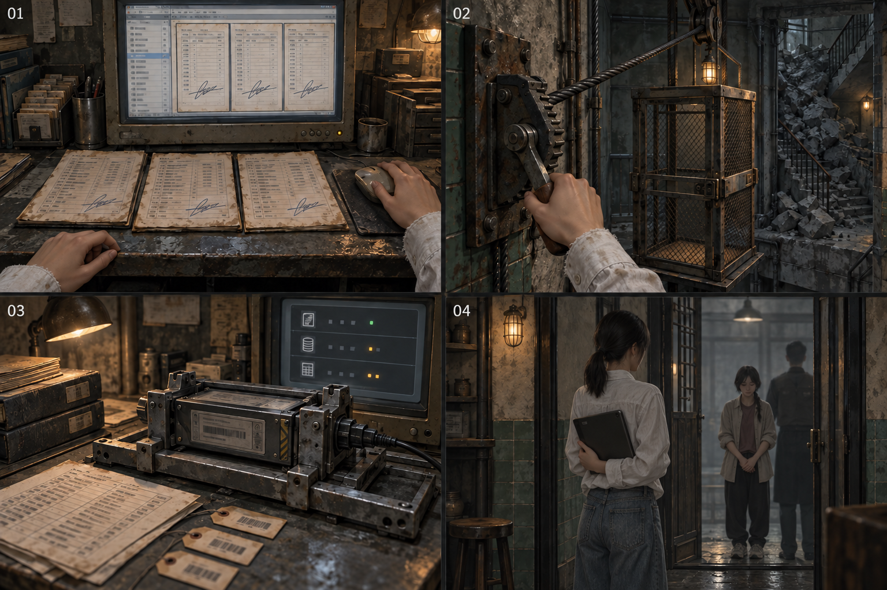
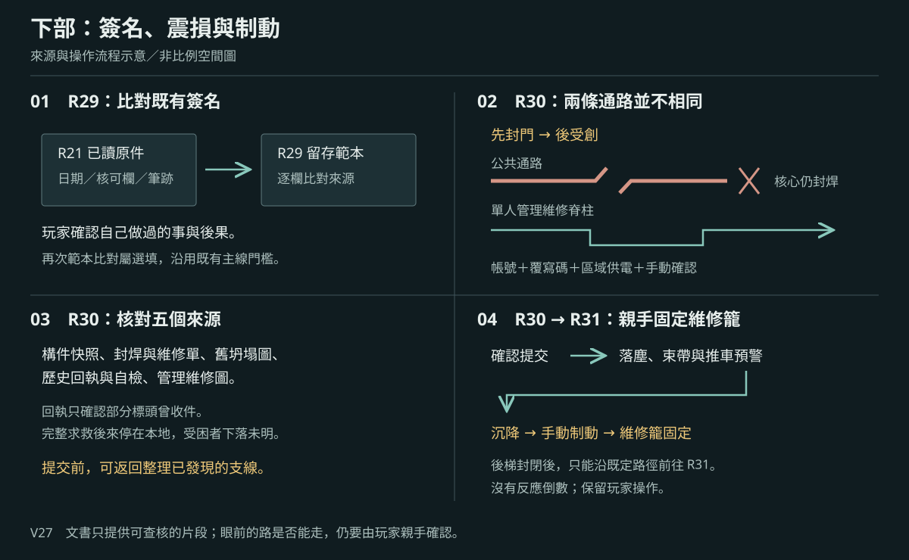

# 製作規格：第七幕

[總目錄](../09_劇本/09-14_全劇本與關卡整合稿.md#book-specs) · [本幕劇本](../09_劇本/09-16_正式劇本_第七幕.md#act-7) · [上一幕規格：第六幕](10-07_製作規格_第六幕.md#spec-act-6) · [下一幕規格：第八幕](10-10_製作規格_第八幕.md#spec-act-8) · [共用附錄](../09_劇本/09-15_正式劇本_共用附錄.md#book-appendices)

[R28](#node-r28-spec)、[R29](#node-r29-spec)、[U4](#node-u4-spec)、[U4b](#node-u4b-spec)、[U5](#node-u5-spec)

## 第七幕 · 簽名與回返：製作規格

<!-- production:ordered:v1 -->

[本幕概覽](#spec-act-7-overview) · [場景流程](#spec-act-7-rooms) · [跨幕共用規則](#spec-act-7-shared) · [圖解對照](#spec-act-7-references) · [幕尾交接](#spec-act-7-delivery)

### 本幕概覽與前置

從 U3 已開的服務橋進入 R28。供電、來源已讀、資源、回訪及抹除狀態全部承接；依序經交易、簽核、門牌回返與冷藏後場。R29 的原二十秒責任整理保留，再由玩家出發。

| 本幕 | 範圍與完成條件 |
| --- | --- |
| 主流程 | R28 → R29 → U4 → U4b → U5；47F 交易簽核，短程拉閘門電梯銜接 48F 門牌與冷藏 |
| 玩法 | 選填資料搶救、跨月筆勢與提價比對、選填佇列選擇、布標驗證回返、按來向封阻 |
| 揭露 | 主角持續簽核並主動提價；R31 才合上帳號、當晚時序與身分，不提前播放解凍 |
| 幕尾 | U5 依原條件封阻兩側孔口，再沿既有維修梯前往 U6；核可與未核可均可前進 |
| 保存 | 繼承第六幕的來源與資源；離幕不重置資料搶救狀態、回返驗證或 `act6.r29.queue_approved` 相容鍵 |

本幕時長待灰盒量測；第六至八幕的原合計基準與共用規則見前後連結，不另加一次總預算。

逐節點操作見[全程玩法對照](../09_劇本/09-15_正式劇本_共用附錄.md#core-gameplay-nodes)。

介面文字依[玩家用語](../09_劇本/09-15_正式劇本_共用附錄.md#player-language)與[閱讀負荷](../09_劇本/09-15_正式劇本_共用附錄.md#reading-load)共用規格。

<!-- scene-image-routes-7:begin -->

### 本幕連線與接景圖

每條既有動線均指定畫面。兩端接景使用已列主圖與門框遮擋，不另造中間房；出口接景必須交指定鏡位，動畫及低動態版共用定位。後果演出不開放探索。進入條件與回訪仍依原動線表，圖號不是通行權限。

| 原動線 | 接景方式 | 畫面節點／圖號 | 操作與條件來源 |
| --- | --- | --- | --- |
| R28→R29 | 出口接景 | [R28-V02](#subscene-r28-v02-spec) | [門檻、方向與回訪](#node-r28-nav) |
| R29→U4 | 逐層探索 | [T-R29-U4-01](#subscene-t-r29-u4-01-spec) → [T-R29-U4-02](#subscene-t-r29-u4-02-spec) → [T-R29-U4-03](#subscene-t-r29-u4-03-spec) | [門檻、方向與回訪](#node-r29-nav) |
| U5→U6 | 逐鏡過渡 | [T-U5-U6-01](#subscene-t-u5-u6-01-spec) | [門檻、方向與回訪](#node-u5-nav) |
| U4→U4 | 原鏡回返 | [U4-V01](#node-u4-images) | [門檻、方向與回訪](#node-u4-nav) |
| U4→U4b | 兩端接景 | [U4-V01](#node-u4-images) → [U4b-V01](#node-u4b-images) | [門檻、方向與回訪](#node-u4-nav) |
| U4b→U5 | 兩端接景 | [U4b-V01](#node-u4b-images) → [U5-V01](#node-u5-images) | [門檻、方向與回訪](#node-u4b-nav) |
<!-- scene-image-routes-7:end -->

### 依流程逐場景製作

### R28 · 交易接洽室

[正式場次](../09_劇本/09-16_正式劇本_第七幕.md#node-r28-script)

[進場與動線](#node-r28-nav) · [出入口位置](#node-r28-access) · [操作與解謎](#node-r28-level) · [狀態與驗收](#node-r28-pack) · [圖像製作單](#node-r28-images) · [離場與次場景](#node-r28-exit)

**進出、動線與回訪**

<!-- import:s-0609-49:begin -->

#### R28 交易接洽室

進行目的：通過交易區並核對可得資料；器官傳聞邊界、遠端刪除

支線／收集：依原房選填調查；無新增支線掛點。

| 方向 | 類型 | 可移動條件 | 移動演出提案 | 回訪規則 |
| --- | --- | --- | --- | --- |
| R28 ↔ R29 | 主線 | 未開遠端終端，或快取／逾時結算完成；不要求 E5-07、姓名或特定快取頁 | 沿內部運送道旁門進簽核檔案室，厚牆轉角與封閉舊門洞保持方位；留出責任閱讀停頓。 | 章內回訪；遇鎖場、追逐或封路停用 |
| U3 ↔ R28 | 主線 | lower.u3.bridge_open = true；只檢查當前離房完成態，不要求先解完目的房 | T-U3-R28：由 46F 的 U3 原門端起行，經 46F → 47F 的服務橋後交易梯，最後親自進入 47F 的 R28。保留原門檻與方向；可逐圖移動，近看選填，不增解鎖題。 | R30 沉降前可循已開通路回訪；遇正式遭遇鎖場停用 |
<!-- import:s-0609-49:end -->
<!-- navigation:r28:end -->

#### 主場景出入口

<!-- scene-access:R28:begin -->
| 動線 | 顯示名稱 | 畫面位置與辨識物 | 通行狀態 |
| --- | --- | --- | --- |
| U3↔R28 | 來路／返回：服務橋門框 | 47F 門端，來路可辨46F → 47F 服務橋後交易梯的連續扶手及固定梯口；起點房在 46F，不把兩端畫成同層相鄰門。 | 非鎖場時可循已開路線回 U3；不另設玻璃背面的探索入口。 |
| R28↔R29 | 出口：簽核室旁門 | 交易桌旁、接內部運送道的側門，以厚牆轉角定位。 | 未開遠端終端可直接走；已開則待快取或逾時結算後前往 R29，不要求取得某頁、姓名或 E5-07。 |
<!-- scene-access:R28:end -->

**關卡、解謎與失敗回饋**

<!-- import:s-0607-7:begin -->

#### R28 — 交易接洽室：可以證明的，與不能宣稱的

##### R28 空間與畫面製作定位

| 項目 | 畫面與製作要求 |
| --- | --- |
| 樓層定位 | 47F |
| 樓棟定位 | B 棟 |
| 樓層與環境 | 47F 交易接洽區，與 R29 簽核檔案室同層；來路自 46F 服務橋後短梯上行。 原光源、材質與證據焦點依本房規格。 |
| 入口方向 | 由 U3 承接；以來路門框／扶手作背向定位，前進方向依下列出口地標。左右方位沿既有構圖，不將反向回訪鏡頭誤當另一扇門。 |
| 可見出口 | 內部運送道旁門通 R29。首次全景就交代入口輪廓或可查看的遮擋，不靠無標示的畫外點擊換房。 |
| 阻擋與開放條件 | 往 R29：未開選填遠端終端可直接通行；已啟動則完成一頁快取或逾時結算（deletion_stage >= 2）；E5-07 不鎖門 |
| 畫面中的解謎要素 | 交易資料、快取與刪除事件；選填資料損失不封鎖主線門。關鍵標記可近看，與裝飾物有可辨的材質或輪廓差異，不只靠顏色或聲音。 |
| 完成後變化 | 交易資料與快取依已完成操作保存；選填資料損失維持原後果但不封鎖去 R29 的旁門。 |

##### R28 製作流程

###### R28 舊商號與現有責任

玩家可從「恒岳貿易」舊玻璃字樣近看到覆貼層，再將視線落回桌面現行交易文件：招牌仍在，使用者與文件責任卻已改變。這個觀察為 R29 核對主角的實際權限與簽核、R31 面對已知選擇鋪路——不能只靠公司名字認定誰負責。

選填近看只保存已讀；不新增租約謎題、不推定舊租戶參與人口交易，也不替現有簽核者免責。玩家沒有看舊隔間時，原文件仍完整提供 R29／R31 所需資訊。

**空間第一印象：**舊空殼貿易行改成交易接洽室。「恒岳貿易」舊玻璃隔間與租約殘角仍在，桌面才是主角集團現有文件；舊商號不自動等於交易簽核者。

**探索呈現：**先讓玩家看見入口、可走的方向和空間異常，再自選近看生活物件；新增租戶遺跡不發 E 證據、不設派系任務、不改出口旗標。恐怖沿原事件與遭遇時序，安定／閱讀保護段不插嚇點。

| 階段 | 製作規格 |
| --- | --- |
| 進入／目標 | 通過交易區並核對可得資料；器官傳聞邊界、遠端刪除；入場先還原原房間已保存的熱點與事件狀態。 |
| 觀察／空間 | 交易室借用設備平台，天花高低不一，貨運小窗只通內部運送道；合同閱讀區完整。 |
| 操作順序 | 可選比對合同三來源與 E5-07，或主動開啟選填快取 → 依原刪除與供電狀態呈現材料 → 往 R29。未開終端可直接離開；已啟動者待快取／逾時結算，不以任何選填頁、姓名或傳聞作門檻。 |
| 回饋 | 必要操作寫入原證據／門禁／遭遇狀態；新增生活附頁僅更新來源已讀與有依據的筆記，不重發原證據。 |

###### R28 生活與管制觀察

沿既有 E-10 交易物流回收，對上早期床號、工位及帶離編號；最終接收缺口仍在。材料證明轉運風險，不證明已死或器官摘除。

###### R28 出口與回訪

| 目的節點 | 條件 | 移動與辨向 | 回訪邊界 |
| --- | --- | --- | --- |
| R29 | 未開遠端終端，或快取／逾時結算完成；不要求 E5-07、姓名或特定快取頁 | 沿內部運送道旁門進簽核檔案室，厚牆轉角與封閉舊門洞保持方位；留出責任閱讀停頓。 | 章內回訪；遇鎖場、追逐或封路停用 |
| U3 | 沿已開連線回訪；未鎖場且未沉降封路 | 同一地標反向通行 | R30 沉降前可循已開通路回訪；遇正式遭遇鎖場停用 |

共用規則見[對應條款](10-01_製作規格_序幕.md#s-0601-6)。

房間擺著合約桌、翻譯耳機與貨運型錄。玩家會接上 E-05 通報者的外聯草稿與貨梯箱號。

##### `E5-07` 器官傳聞鏈

可取得三種互相衝突的資料：

1. 醫療評估中有「轉特殊買方」欄位。
2. 貨運表只寫人員移交，目的地被刪除。
3. 受困者語音聲稱有人被取走器官，但沒有可驗證的後續紀錄。

調查板結論固定為：`有器官買賣風險與傳聞，但現有證據不足以確認每一名失蹤者的死因。` 不把傳聞做成獵奇展示或全知真相。

##### 遠端刪除壓力

玩家主動開啟遠端終端的三頁索引、看見標題與摘要後，才出現遠端刪除倒數；普通紙本近看不啟動。未開終端可直接離開；已啟動則按下方快取規格保存一頁或等待逾時結算，不把倒數帶去 R29 或重置頁面重選。

- 玩家能快取 **一張選填頁面**：買方代碼、通報者註記或空名訊號清單。預覽只有標題與摘要；本次遠端工作階段僅允許一次完整頁封存，提交後原排程撤回其餘頁讀取權限。提交前明示此限制；不靠讀速、不讓讀過摘要就算全文已保存。
- 沒選到的頁面在畫面上消失，但 R27、R29 的紙本主證據仍足以完成結論。
- 結算後，未保存的數位索引頁不可再讀；現場終端保留已快取內容及刪除雜湊。桌上紙本不因遠端刪除消失。

---

##### 操作與呈現補充

- [s-0909-24](../09_劇本/09-16_正式劇本_第七幕.md#s-0909-24)：限制屬當前遠端工作階段的一次封存交易；提交後原排程撤回其他頁權限，並非手速夠快就能存三頁。摘要與刪除雜湊可留，不能當全文原件；不新增第二個插槽道具。
<!-- import:s-0607-7:end -->

**狀態、素材與驗收**

<!-- import:s-0808-10:begin -->

#### R28 — 交易接洽室／可以證明的與不能宣稱的

##### R28-房間資料

| 欄位 | 值 |
| --- | --- |
| `room_id` | `R28` |
| `scene` | `room_r28.tscn` |
| `entry_from` | `U3`＋`lower.u3.bridge_open` |
| `exit_to` | `R29` |
| `backgrounds` | `r28_real.webp`、`r28_scan.webp`；無凝固層 |
| `main_goal` | 確認交易網的醫療剝削風險與不確定邊界，經歷一次不鎖主線的遠端刪除 |
| `must_exit_when` | `act6.r28.deletion_stage >= 2` 或玩家尚未開啟遠端終端便主動離開 |

##### R28-E5-07 三份互相衝突的材料

| 材料 | 可證明 | 不可證明 |
| --- | --- | --- |
| 醫療評估紙本 | 有「轉特殊買方」欄；健康狀態進入交易評級 | 特殊買方一定進行器官摘除 |
| 缺頁運送單 | 人員被移交、目的地遭刪除、沒有有效同意欄 | 每一個移交者的最終下場 |
| 受困者語音／外聯草稿 | 園區內有器官傳聞；通報者明確拒絕並試圖外聯 | 傳聞內容已經發生在特定人身上 |

若玩家曾取得 `E2-11`，讀完紙本與運送單後生成 `E5-07 supported`；否則只生成 `partial`，仍保留「證據不足」結論。

##### R28-遠端刪除流程

1. 玩家開啟遠端終端的頁面索引，先看見三頁標題、摘要與單頁封存限制；全文未載入。本工作階段僅允許一次完整頁封存，提交後原排程撤回其餘頁讀權，不得藉暫停逐頁保留全文。
2. 系統顯示 `遠端連線已恢復／距刪除 01:30`，倒數才開始。
3. 閱讀放大模式、設定選單、遊戲失焦時倒數暫停；標準遊玩中的房間檢視不暫停。
4. 玩家可長按 1.5 秒快取一頁；選定後另外兩頁立即變成不可讀雜湊。
5. 若倒數歸零仍未選擇，三頁全文消失，刪除雜湊與 `none_timeout` 同次保存，設 `act6.r28.deletion_stage = 3`，結算出口。
6. 無論結果，出口開啟，R27／R29／R31 的必要證據不受影響；只改數位索引頁，桌上紙本不消失。

##### R28-三個快取選項

| 選項 | 保存內容 | 後續餘波 |
| --- | --- | --- |
| `buyer_code` | 多個匿名買方代碼與競價時間，不揭露真名 | R31 備份索引顯示「外部節點仍在線」，終幕中繼底噪多一層 |
| `reporter_note` | 通報者被標為「拒絕／已外聯／轉特殊評估」 | E-05 人物板固定為 `被轉運／未同意` |
| `unnamed_list` | 一列撤銷帳號、空白目的地與無姓名訊號 | E-10 固定為 `帳號撤銷／下落待確認` |
| `none_timeout` | 只保存刪除時間與雜湊 | 不補個人狀態；不鎖任何主線或結局 |

##### R28-互動表

| ID | 物件／觸發 | 玩家操作 | 回饋 | 寫入狀態／證據 | 成本 |
| --- | --- | --- | --- | --- | --- |
| `R28_H01` | 合約桌 | `LOOK` | 同一張桌有翻譯耳機、貨運型錄、醫療評估與付款欄 | `r28.contract_table_seen` | 0 |
| `R28_H02` | 醫療評估紙本 | `LOOK` | 「轉特殊買方」存在，但無處置名稱 | `act6.r28.medical_form_seen` | 0 點 |
| `R28_H03` | 缺頁運送單 | `LOOK` | 目的地撕除；同意欄為後補影印，不具原始簽勢 | `act6.r28.transfer_stub_seen` | 0 |
| `R28_H04` | E-05 比對 | `BOARD` | 有 `E2-11` 時形成 `E5-07`；系統固定寫「未證實醫療剝削」 | `E5-07` 或 `act6.r28.e507_state = partial` | 0 |
| `R28_H05` | 遠端終端索引 | `LOOK` | 顯示三頁摘要並啟動刪除流程 | `act6.r28.deletion_stage = 1` | 0 |
| `R28_H06A-C` | 三份遠端頁 | `CACHE_PAGE` | 只保住一頁；其餘變成不可讀雜湊，原子結算出口 | `act6.r28.remote_cache_choice`、`ending.remote_cache_choice`、`act6.r28.deletion_stage = 2` | 0 |
| `R28_H07` | 刪除雜湊 | 自動 | `[系統] 已保存刪除發生證明。內容不可復原。` | `act6.r28.deletion_hash_saved` | 0 |

##### R28-系統結論文字

~~~text
[系統] 可確認：人員曾被評估並轉運；有效同意不存在。
[系統] 可確認：資料正在被遠端刪除。
[系統] 不可確認：特定失蹤者的最終處置。
~~~

第三句必須與前兩句同字級、同停留時間；不能藏在備註裡。

##### R28-驗收

- [ ] 玩家完全不開遠端終端也能離開並完成第七幕。
- [ ] 倒數歸零只損失三份選填全文，仍保存刪除雜湊。
- [ ] 90 秒、180 秒、停用動畫三種輔助設定產生相同的「只能快取一頁」規則。
- [ ] 快取選擇立即存檔，讀檔不能改選另一頁。
- [ ] `E5-07` 永遠不把器官摘除寫成確認事實。
- [ ] 通報者與空名訊號不因玩家沒選對頁而自動死亡或消失。
<!-- import:s-0808-10:end -->

#### 場景節點與靜態圖製作單

以下每列均為待製作圖像項目；文件多頁、正反面、局部與狀態差分須依拆圖欄各自交付，不能以一張示意圖代替。可探索場景的主圖提供移動與探索，演出節點不另開探索，近看關閉回到開啟前的畫面；原演出與操作條件仍依右欄來源。圖號、解析度、文字分層、存檔及驗收依[靜態圖共用契約](../09_劇本/09-15_正式劇本_共用附錄.md#scene-image-contract)。

<!-- scene-floor-locations:R28:begin -->
| 次場景／主圖 | 樓層定位 | 樓棟定位 | 移動方式 |
| --- | --- | --- | --- |
| R28-V02 | 47F | B 棟 | 步道 |
<!-- scene-floor-locations:R28:end -->

<!-- scene-images:R28:begin -->
| 畫面節點／圖號 | 用途 | 必畫內容 | 狀態與拆圖 | 來源 |
| --- | --- | --- | --- | --- |
| R28-V01 | 主場景 | 交易桌、同意與拒絕文件、遠端索引終端、玻璃背面維修架與簽核室側門。 | 遠端三頁未載入／保留一頁／其他刪除／逾時全刪各態；不開索引也能離房。 | [本場景](../09_劇本/09-16_正式劇本_第七幕.md#node-r28-script) |
| R28-D01 | 文件 | 醫療評估、目的地缺失移交單與外聯來源 | 各頁原件、同意欄與拒絕註記分開；不補死因或目的地。 | [R28-01](../09_劇本/09-16_正式劇本_第七幕.md#s-0909-23) |
| R28-D02 | 介面 | 遠端三頁標題與摘要預覽 | 只顯示原摘要，不在預覽底圖偷露全文。 | [R28-02](../09_劇本/09-16_正式劇本_第七幕.md#s-0909-24) |
| R28-D03 | 文件 | 三個可選的遠端原頁 | 各有獨立正文圖；只有實際選中的一頁可讀，其他以指紋／刪除態替代。 | [R28-02](../09_劇本/09-16_正式劇本_第七幕.md#s-0909-24) |
| R28-C01 | 操作近看 | 終端刪除橫幅與選頁控制 | 最後 1.5 秒、選定／未選差分，文字與狀態由介面繪製，不把結果烘焙進桌面。 | [R28-02](../09_劇本/09-16_正式劇本_第七幕.md#s-0909-24) |
| R28-C02 | 近看 | 合約桌的翻譯耳機、貨運型錄與付款欄 | 耳機局部、型錄各頁及付款欄原件分圖，與醫療評估並列；不以耳機提供新錄音，不用款項推定未證實處置。 | [原場景規格](#s-0808-10) |
| R28-C03 | 近看 | 恒岳貿易舊玻璃字樣與覆貼層 | 舊字、覆貼邊緣及現行文件的桌面方向保持一致；只支持空間沿用，不推定舊商號參與現有交易。 | [原場景規格](#node-r28-level) |
| R28-V02 | 出口接景 | R28→R29：沿內部運送道旁門進簽核檔案室，厚牆轉角與封閉舊門洞保持方位；留出責任閱讀停頓。 | 沿原轉場取固定構圖；來路與去路各有可見定位。允許沿兩端場景重組材質，但須交此視角靜態圖及低動態替代；不增加房間、線索或強制等待。原單向／回訪、操作窗口及完成提交依動線表。 | [動線條件](#node-r28-nav) |
<!-- scene-images:R28:end -->

<!-- scene-image-access-art-r28:begin -->
**出入口交圖：**R28-V01 須依場次與狀態畫出[本場景出入口表](#node-r28-access)的來路、去路及封閉位置；既有操作鏡位與接景圖沿同一地標對位。門端差分、移動熱區與遮擋另分層，依[出入口共用契約](../09_劇本/09-15_正式劇本_共用附錄.md#scene-access-contract)驗收。
<!-- scene-image-access-art-r28:end -->

##### 原熱點對應圖號

同一圖可支援多個狀態，但每個列名焦點及原差分仍須交付；底圖不取代動畫、聲音或互動。此表只對圖，不新增取得條件。
<!-- hotspot-images:R28:begin -->
| 原熱點／操作 | 圖號 | 對應內容／邊界 |
| --- | --- | --- |
| R28_H01 | R28-C02、R28-D01 | 合約桌 |
| R28_H02 | R28-D01 | 醫療評估紙本 |
| R28_H03 | R28-D01 | 缺頁運送單 |
| R28_H04 | R28-D01 | E-05 比對 |
| R28_H05 | R28-D02、R28-C01 | 遠端終端索引 |
| R28_H06A-C | R28-D03、R28-C01 | 三份遠端頁 |
| R28_H07 | R28-D03、R28-C01 | 刪除雜湊 |
<!-- hotspot-images:R28:end -->

#### 本場景圖像與示意

本房沿用跨房圖的指定面板，尚無獨立專圖；請依下列適用範圍對照，不把整張圖當成本房演出。

[V26 下部：別名、價格與證據邊界](10-07_製作規格_第六幕.md#fig-v26)

- **V26：**R27 別名與價目、R31 停留痕、R28 傳聞及證據邊界；空欄保留未知，不補寫去向或死因。

[返回本房正式劇本](../09_劇本/09-16_正式劇本_第七幕.md#node-r28-script) · [本房關卡與解謎](#node-r28-level)

#### 離場通路與次場景

<!-- production-subscenes:r28 -->

<!-- scene-image-subscenes-r28:begin -->

#### 次場景節點

以下次場景歸 R28 管理，節點編號沿用主圖圖號。來去方向為原動線的正向排列；反向通行與單向限制依原門檻，不因列出來路就新增返回出口。

##### R28-V02 · R28→R29

**樓層：**47F · B 棟

**類型：**轉場接景。**正向連接：**R28-V01 → **R28-V02** → R29-V01。

**近看：**不新增近看；沿原轉場操作，不新增等待或讀取門檻。

[正文](../09_劇本/09-16_正式劇本_第七幕.md#subscene-r28-v02-script) · [圖像製作單](#node-r28-images) · [原門檻與回訪](#node-r28-nav) · [動線條件](#node-r28-nav)
<!-- scene-image-subscenes-r28:end -->

### R29 · 簽核檔案室

[正式場次](../09_劇本/09-16_正式劇本_第七幕.md#node-r29-script)

[進場與動線](#node-r29-nav) · [出入口位置](#node-r29-access) · [操作與解謎](#node-r29-level) · [狀態與驗收](#node-r29-pack) · [圖像製作單](#node-r29-images) · [離場與次場景](#node-r29-exit)

**進出、動線與回訪**

<!-- import:s-0609-50:begin -->

#### R29 簽核檔案室

進行目的：確認自身權限與責任，前往維修路線；主角長期簽名與提價備註

支線／收集：SQ-K / SQ-M 收束；KX／MC／CARE 補收

| 方向 | 類型 | 可移動條件 | 移動演出提案 | 回訪規則 |
| --- | --- | --- | --- | --- |
| R28 ↔ R29 | 主線 | 未開遠端終端，或快取／逾時結算完成；不要求 E5-07、姓名或特定快取頁 | 沿內部運送道旁門進簽核檔案室，厚牆轉角與封閉舊門洞保持方位；留出責任閱讀停頓。 | 章內回訪；遇鎖場、追逐或封路停用 |
| R29 ↔ U4 | 主線 | act6.r29.e502_seen、local_index_available 成立且責任停頓完成；核可與選填比對不鎖門 | T-R29-U4：B 棟 47F 候梯口 → L2 拉閘門車廂 → B 棟 48F 停靠平台 → U4；保留原必要查證、索引與責任收束，選填核可不鎖梯。 | R30 沉降前可循已開通路回訪；遇正式遭遇鎖場停用 |
<!-- import:s-0609-50:end -->
<!-- navigation:r29:end -->

#### 主場景出入口

<!-- scene-access:R29:begin -->
| 動線 | 顯示名稱 | 畫面位置與辨識物 | 通行狀態 |
| --- | --- | --- | --- |
| R28↔R29 | 來路／返回：厚牆側門 | 比對桌來向的原旁門，厚牆轉角接回交易接洽室。 | 非保護閱讀與鎖場狀態可回 R28，不以換房跳過必要餘波。 |
| R29↔U4 | 出口：簽核架背後 | 47F 門端，去路可辨L2 候梯口、拉閘門與 47F／48F 平層標記；目的房在 48F，不把兩端畫成同層相鄰門。 | 必要證據、本地索引與責任餘波完成後可走；選填核可和額外比對不鎖出口。 |
<!-- scene-access:R29:end -->

**關卡、解謎與失敗回饋**

<!-- import:s-0607-8:begin -->

#### R29 — 簽核檔案室：自己的筆跡

##### 圖解：簽核、制動與真相停頓

[查看圖像：簽核、制動與真相停頓](#fig-l07)

這四格摘錄本幕的責任、機構與歷史橋段；房間之間仍沿既有生活夾層路線移動。

| 分鏡 | 玩家操作與畫面回應 |
| --- | --- |
| 01 | R29：先核對三個月份的簽核與提價來源，保存原頁及本地索引；責任停頓後才自選展開最後一筆。圖中手尚未提交核可，玩家可關閉佇列離開，主線與必要索引不受影響。 |
| 02 | R30：剖面確認與沉降後，親手將制動桿卡入棘爪，固定前往 R31 的維修籠；後方回程樓梯隨後封閉。制動不負責阻止推車，亦不是反應測試。 |
| 03 | R31：冷備份仍鎖在抗震鑑識座，分別核對門端尾碼、本地索引及現場電源，再重新掛載；不在本房拔除、帶走或外送。 |
| 04 | R31：唯一歷史解凍前的靜止構圖，管理者持平板，小花在門側等待。此格只定出等待與停頓；後續十二秒仍沿原八張定格演出，平板畫面始終不可見。 |

選填的「最後一筆」可拒絕；必要跨月簽名比對與本地索引仍須完成。歷史解凍由玩家依原流程啟動，圖中等待靜格不提前播放。

##### R29 空間與畫面製作定位

| 項目 | 畫面與製作要求 |
| --- | --- |
| 樓層定位 | 47F |
| 樓棟定位 | B 棟 |
| 樓層與環境 | 47F 簽核檔案室；原旁門接 R28，簽核架背面服務梯上行到 48F 門牌迴廊。 原光源、材質與證據焦點依本房規格。 |
| 入口方向 | 由 R28 承接；以來路門框／扶手作背向定位，前進方向依下列出口地標。左右方位沿既有構圖，不將反向回訪鏡頭誤當另一扇門。 |
| 可見出口 | 簽核架背面的服務口通 U4。首次全景就交代入口輪廓或可查看的遮擋，不靠無標示的畫外點擊換房。 |
| 阻擋與開放條件 | 往 U4：取得 E5-02 與本地索引，完成原二十秒責任停頓；最後一筆核可與範本比對均可略過 |
| 畫面中的解謎要素 | 簽名、待核准資料與必要索引；閱讀停頓不以出口音效催促。關鍵標記可近看，與裝飾物有可辨的材質或輪廓差異，不只靠顏色或聲音。 |
| 完成後變化 | 簽核核對與必要索引完成後保留閱讀停頓，原二十秒餘波結束後才從簽核架背面去 U4；支線補查不代替主線核對。 |

##### R29 製作流程

| 階段 | 製作規格 |
| --- | --- |
| 進入／目標 | 確認自身權限與責任，前往維修路線；主角長期簽名與提價備註；入場先還原原房間已保存的熱點與事件狀態。 |
| 觀察／空間 | 檔案室沿核心厚牆展開，原半層門洞封入簽核架背後；責任頁前保留視覺空白。 |
| 操作順序 | 完成跨月簽名比對與必要索引核對 → 保留至少 20 秒責任停頓 → 玩家可另開「最後一筆」、人物回顧或支線附件，也可依出口條件經 U4–U6 往 R30。選填內容不取代必要比對，也不作離房門檻。 |
| 回饋 | 必要操作寫入原證據／門禁／遭遇狀態；新增生活附頁僅更新來源已讀與有依據的筆記，不重發原證據。 |

###### R29 生活與管制觀察

核對既有簽名後，按實際已讀來源回查 R21 小花的性侵後求助及駁回覆核。兩頁皆已讀才將「請把我的話留下」與「附件已閱」並列，讓玩家看見求助送達後仍核可處置的責任。R9 求助正面、背面分別列匿名受威脅與公開羞辱陳述；兩個案例不合併成同一個受害者，不補造小花的私密影像，也不以簽名認定她遭性侵的直接施暴者。

###### R29 附頁熱點

**頁鍵對照：**摘要不建立新的來源已讀頁；直接查 R21 的 `request_v2`／`reply_v2` 與 R9 的 `testimony`／`testimony_back`。各頁只顯示相應鍵已讀的內容；R21 合併責任摘要須兩個 v2 鍵皆成立。舊 `request`／`reply` 不能解鎖新版求助或覆核，在此看摘要也不回填來源。

| 欄位 | 規格 |
| --- | --- |
| 識別／位置 | `R29_DETAIL_01`；原責任來源摘要。沿原近看開頁，不增加遠景發光提示。 |
| 前置 | 已開啟該原熱點；原證據、供電及回訪前置照舊，不因新增附頁放寬。 |
| 玩家操作 | 只展示已有已讀來源，點選返回對應摘要。各來源各自閱讀，不要求一次讀完。 |
| 回饋／筆記 | 缺少的附頁不列空收集槽、不補字；不新增結局門檻。 |
| 成本與中止 | 免費查看；普通探索閱讀停表；鎖場／強制演出依原規則暫不開啟。退出即回原近看，不寫未讀頁。 |
| 保存 | 只讀來源節點的 `read_pages`，不建立 R29 的副本或回填來源。摘要開關為暫態 UI，讀檔後預設關閉。 |
| 回訪 | 已讀頁可重看，原物件位置不重置；尚缺對照來源時保留觀察，不生成推論。 |
| 素材 | 在原近看增一組物件／紙張疊圖、各頁文字轉錄、翻頁／收起聲；近看與原基底光向一致，均待製作。 |

###### R29 出口與回訪

| 目的節點 | 條件 | 移動與辨向 | 回訪邊界 |
| --- | --- | --- | --- |
| R28 | 沿已開連線回訪；未鎖場且未沉降封路 | 同一地標反向通行 | 章內回訪；遇鎖場、追逐或封路停用 |
| U4 | act6.r29.e502_seen、local_index_available 成立且責任停頓完成；核可與選填比對不鎖門 | T-R29-U4：B 棟 47F 候梯口 → L2 拉閘門車廂 → B 棟 48F 停靠平台 → U4；保留原必要查證、索引與責任收束，選填核可不鎖梯。 | R30 沉降前可循已開通路回訪；遇正式遭遇鎖場停用 |

共用規則見[對應條款](10-01_製作規格_序幕.md#s-0601-6)。

##### R29 動畫演出

###### 簽名與他人的日常

| 項目 | 場景演出規格 |
| --- | --- |
| 形式與節奏 | 文件互動、主觀手部及短停頓。 |
| 鏡頭與動作 | 玩家核對跨月簽名後保留原至少 20 秒餘波；之後才另開 K-114／K-207／K-089 已讀回看，手動翻回原頁。 |
| 操作與資訊邊界 | 不替玩家翻完全部人物，不新增受害者現在生活的客觀影像；最後一筆仍由玩家主動選擇。 |

##### 簽名比對

玩家先以 R21 小花排程上的簽名作為基準，再比對 `E5-02` 三個月份的物流簽核：

- 每批人員轉運都需要內控主管確認「可移交」。
- 簽名不是單次脅迫下的孤例，而是數月重複。
- 其中一張備註由同一筆跡寫下：「此批次品質優於上批，建議提價。」

玩家需用滑鼠／搖桿描出三個共有筆畫，調查頁將它們與 R21 小花排程上已保存的原簽名疊合；不使用主角此刻新寫的字作鑑識基準。系統只顯示 `高度一致`，先不播放主角自白；帳號、時間與調查者身分仍待 R31 核驗。

三頁同欄對齊沿用上述疊合介面，表現營運助理核對交接的習慣與眼前人員移交紀錄的反差；不是新增排序謎題。操作仍由玩家完成，不自動描字、核可或合併身分；同頁原件保持可回查。

手把、鍵盤及輔助輸入可依序點選三個可見筆畫錨點，不以描線精度或速度作門檻。三個月份與提價備註核對完成後，先保存 E5-02 的原頁及比對結果，再播放紙本暈開差分。必要三個月份查閱同時開放該終端例行保留的 `act6.r29.local_index_available`；R31 經已恢復內網讀取，無須核可「最後一筆」、保存 R28 買方頁或用主觀筆記充當外送原件。二十秒責任停頓後才恢復選填近看及 U4 出口。

##### ★ 範本比對：同一張表

> `E2-14` 客戶分級表已在第三幕 R16 用於第二層鎖定；這裡再與人口交易原件比較，回收同一範本的跨層意義。

玩家把 `E2-14`（客戶分級表）與 `E5-02`（人口交易簽核）並排疊合。

| 比對項 | 結果 |
| --- | --- |
| 欄位框位置 | **完全相同** |
| 字型與行距 | **完全相同** |
| 判斷欄的標題 | 兩份都是「**不值得繼續投入**」 |
| 頁尾範本編號 | 兩份都是 `FORM-IC-03` |

**鎖定句**：`「不值得繼續投入」的判斷，用於客戶與貨物是同一張表。`

##### `K-089` 的那一列

比對完成後，玩家可以把 `E2-14` 翻到 `K-089` 那一列——**`無資產·結案`**。

核可欄的簽勢，與小花校正排程（R21）、三個月份的交易簽核（`E5-02`）**完全一致**。

> 她替被騙來的人簽下「建議留用」，替一批人簽下「建議提價」，也替一個素未謀面的陌生人簽下「不夠有錢」。比對支持同一核可者與範本，不推定三份原件同日簽成。
>
> **三個決定，同一支筆，同一份範本。**
>
> `K-089` 因無可支配資產而被停止追騙。這份結案紀錄不證明其當下生死，也不足把其他兩位客戶都判為死亡；驚悚來自分類標準，不靠補造死亡結論。

##### 呈現規範

- 這是一次**純比對**，不新增文字說明、不加旁白、不加音效。
- 主角**無 OS**。
- 完成後不解鎖任何東西，也不是三格鎖定的組成。它只把 `E2-14` 的狀態從「已取得」改為「已回收」。
- **有效前情必含 `E2-14`**：上部通關及下部預設均已完成 R16 必要取得；選填的是本房再次比對，不是先前證據。缺來源的舊測試檔不視為有效完成檔，依分篇承接規格處理，不自動補卡；本房比對仍不新增出口門檻。

---

##### 不可逆感，而非不可逆卡關

玩家離開簽名桌後，紙本會在漏水中逐漸暈開；筆記已保存觀察摘要與原始頁碼，所以主線證據不丟失。這讓玩家感到證據脆弱，但不以資訊陷阱懲罰探索速度。

---

##### ★ 最後一筆— 全作唯一一次「玩家親手執行過去的流程」

完成簽勢疊合與至少 20 秒責任停頓後，玩家可自行展開牆邊的舊簽核佇列；佇列短暫恢復，自行送出下一筆申請。核可欄已預填 `Michelle`，狀態是 `等待內控主管確認`。

**玩家可以核可它。**

這是全作唯一一次玩家能以主角的職務**做**她當年做的事，而不是讀她做過的事。它與 [04-11 權限反擊](../09_劇本/09-15_正式劇本_共用附錄.md#doc-0411) 共用同一份契約：**有用、但令人不安；始終可以不做，不做也不被表揚。**

###### 佇列的內容

| 項目 | 規格 |
| --- | --- |
| 批次 | 一筆物流移交申請，批次日期落在 L-48 封鎖**之後**。 |
| **它為什麼存在** | 佇列是週期性批次產生器，按在冊名單生成移交申請，撤離後仍運作了兩週。製作端設定該批次已死於 L-48 封鎖之後，但系統未收到回報；玩家端只呈現已有來源支持的封鎖、位置與死亡觀察，不由批次畫面自動宣告整批死亡。 |
| 玩家能查到的 | 同一個佇列往前翻，可以看到過去兩週被自動生成、無人核可、逐一逾時作廢的批次。**它們的名單一模一樣。** |
| 名單 | 該批次的人員列以編號顯示；只在玩家已取得可核驗姓名來源並完成對應關聯時顯示姓名。R27 別名鏈只能合併編號，不能憑空還原真名。 |
| 玩家可先讀 | 核可前可展開完整批次列及本輪已取得的對應來源；已知姓名、封鎖、位置或死亡觀察不得藏在按鈕後。沒有來源的姓名與下落維持未知，不把製作端真相寫成玩家已知。 |
| 系統態度 | 介面完全正常。沒有紅字、沒有警示、沒有倒數。它只是在等一個確認。 |

###### 核可的操作與回饋

| 節拍 | 內容 |
| --- | --- |
| 操作 | **兩下點擊。** 展開批次 → 點「可移交」。不使用長按、不使用「你確定嗎」對話框。 |
| 速度 | 從點擊到完成 **1.2 秒以內**，回饋乾淨俐落：欄位收合、狀態轉綠、佇列往前推一格。 |
| 音效 | 一次短促的系統確認音——與 R21 小花排程核可紀錄裡的**同一個音檔**。 |
| 立即後果 | 佇列回寫該批次的**完整名冊列**（含系統原本遮蔽的姓名與家屬關聯）到現場終端本地檔案。**玩家實際獲得證據。** |
| 沒有的東西 | 不扣資源、不增恐慌、不觸發怨靈、不出現譴責旁白、不改變主線解鎖、不計入權限反擊次數。 |
| 收尾 | 佇列自動送出下一筆空白申請，仍停在等待確認，隨後佇列顯示／輸出支路因電力不足熄滅。已保存的名冊與主線索引仍可讀取，不能切斷 R31 重新掛載必需的來源；產生器沒有主動停止。 |

> **設計核心**：這一擊的力量不在懲罰，在**流暢**。玩家必須感覺到「這很好按」。
>
> 主題句是「受制與加害可以同時存在；必須看清她受到的威脅，也看清她如何行使手中的權力」——在此之前，玩家只讀過這句話；在這裡，玩家**自己示範了一次**。
>
> 不得在任何時點由 UI、旁白或音樂評價這個行為。後果只以資料呈現（見下）。

###### 不核可的路徑

玩家可直接關閉佇列離開，主線完全不受影響。

- 關閉時同樣不播放正面音效、不給予「你抵抗了誘惑」類的回饋。
- 未核可便不取得該筆新解密的姓名與家屬關聯；本輪已從其他來源核實的姓名、位置及狀態全部保留，只有尚無來源的欄位顯示「姓名未知／下落待確認」。
- 主角 OS 只有一句：「……它還在等。」

###### 可讀的後果

| 狀態鍵 | 寫入 |
| --- | --- |
| `act6.r29.queue_approved` | `true` / `false`（單次，不可重複核可） |
| `act6.r29.batch_names_recovered` | 核可後取得的姓名列；併入最終名冊 |
| `act6.r29.approved_timestamp` | **本輪的現在時間**，附掛在該批次每一個名字旁 |

> 在終幕「訊號與紀錄」中，這批人若因玩家核可而恢復姓名，**他們的名字旁會同時掛著一個屬於此刻的核可時戳**。
>
> 系統不說明這代表什麼。它只是照實顯示：**這些名字之所以被還原，是因為她又核可了一次。**
>
> 這不是評分，是資料層面的直接因果——與權限反擊的「關掉誰，最後就少了誰」同一條原則的鏡像面：**補回誰，是用什麼補回來的。**

---

##### 操作與呈現補充

- [s-0909-26](../09_劇本/09-16_正式劇本_第七幕.md#s-0909-26)：不重播 R27 的三條別名鏈，不插入 R31 的「同一人」結論；這一房讓玩家看見核可持續發生，並看見她另寫的提價建議。全部必要欄位仍可回查，減的是重複解說，不是推理依據。
- [s-0909-27](../09_劇本/09-16_正式劇本_第七幕.md#s-0909-27)：這是已定敘事停頓，不另加最低房間分鐘。結束才開原選填與 U4 出口。
<!-- import:s-0607-8:end -->

<!-- import:s-0607-26:begin -->

#### R29 支線補查與新玩家

交接索引保留 KX／MC／CARE 副聯的來源核對與補收功能；R23／R24／R25 已提供起案必需的上部副聯，不將理解背景延到本房。只有親自展開核對才取得來源，匯入去重；下部完成不追授 SQ-C1／M1。R30 警示只列已發現的下部未完調查，R31 仍只在原核驗後補上主管身分。
<!-- import:s-0607-26:end -->

**狀態、素材與驗收**

<!-- import:s-0808-11:begin -->

#### R29 — 簽核檔案室／自己的筆跡

##### R29-房間資料

| 欄位 | 值 |
| --- | --- |
| `room_id` | `R29` |
| `scene` | `room_r29.tscn` |
| `entry_from` | `R28` |
| `exit_to` | `U4`；沿 U4→U4b→U5→U6→U6b 才抵達 R30 |
| `backgrounds` | `r29_real.webp`、`r29_scan.webp`；不製作凝固層 |
| `main_goal` | 比對三個月份交易簽核，證明主角持續核准移交並曾建議提價 |
| `must_exit_when` | `act6.r29.e502_seen && act6.r29.local_index_available` 且二十秒責任停頓完成；最後一筆與範本比對不列門檻 |

##### R29-三個月份

| 月份 | 文件差異 | 共同責任 |
| --- | --- | --- |
| M-3 | 首批「可移交」核准，附康的覆核章 | 內控主管確認人員可進交易流程 |
| M-2 | 同樣簽名，批次人數增加，沒有康的逐頁覆核 | 流程已成例行工作，不是單次緊急命令 |
| M-1 | 同樣簽名，手寫「此批次品質優於上批，建議提價」 | 主角不只被動簽收，也使用商品化語言建議價格 |

三份文件不寫露骨身體描述；「品質」由服從預測、語言能力、健康可工作日與逃跑風險欄組成。

##### R29-簽名比對流程

1. 玩家先疊合三個月份簽名，選出三個共同筆畫：右上短折、下壓回勾、末端停筆。
2. 錯選只讓疊層分開，不指出哪一筆錯。
3. 三筆鎖定後，調查頁並列 R21 小花排程上已保存的原簽名；不要求主角現場寫新簽名，也不把描線操作當成本輪核可。
4. 描線採寬容走廊；不評分美觀、速度或手抖。替代操作為逐點選三個錨點。
5. 系統疊合後顯示 `高度一致`，再讓玩家親自打開提價備註。
6. 只有提價備註讀完後才生成完整 `E5-02`。

##### R29-互動表

| ID | 物件／觸發 | 玩家操作 | 回饋 | 寫入狀態／證據 | 成本 |
| --- | --- | --- | --- | --- | --- |
| `R29_H01` | 月份 M-3 | `LOOK` | 首次可移交簽核，康仍有覆核章 | `act6.r29.signature_month_1_seen` | 0 |
| `R29_H02` | 月份 M-2 | `LOOK` | 同一簽名變成例行欄位 | `act6.r29.signature_month_2_seen` | 0 |
| `R29_H03` | 月份 M-1 | `LOOK` | 簽名旁有一張折起的手寫備註 | `act6.r29.signature_month_3_seen` | 0 |
| `R29_H04` | 三份簽名疊合 | `COMPARE_SIGNATURE` | 鎖定三個共同筆畫 | `act6.r29.signature_anchors_locked` | 0 |
| `R29_H05` | R21 排程原簽名與跨月筆勢 | `TRACE_SIGNATURE` | 在原件上描出或點選共同筆畫，與三個月份文件疊合後輸出 `高度一致`；不生成新簽名，不提交核可。帳號、時間與調查者身分仍待 R31 核驗 | `r29.player_signature_matched` 沿用舊狀態名，僅代表原件筆勢比對完成 | 0 |
| `R29_H06` | 提價備註 | `LOOK` | 主角手寫「此批次品質優於上批，建議提價」 | `act6.r29.price_note_seen` | 0 |
| `R29_H07` | 文件保存 | 自動 | 先保存影像、頁碼與疊合結果；三個月份已讀時同時保留終端例行索引，再啟動紙本暈開 | `E5-02`、`act6.r29.e502_seen`、`act6.r29.local_index_available` | 0 |
| `R29_H12` | 範本比對 | `COMPARE_FORM` | 疊合 `E2-14` 與 `E5-02`：欄位框、字型、判斷欄標題「不值得繼續投入」、頁尾範本編號 `FORM-IC-03` 四項全部相同。鎖定句：`「不值得繼續投入」的判斷，用於客戶與貨物是同一張表。` 有效前情已有 E2-14；玩家可略過本次比對，R29 主線不受影響，不以範本比對補發來源 | `act6.r29.form_match`、`E2-14` 狀態改為已回收 | 0 |
| `R29_H13` | `K-089` 那一列 | `LOOK` | `無資產·結案`；核可欄簽勢與 R21 小花排程、`E5-02` 三個月份簽核完全一致。**無 OS、無音效、無新文字** | `act6.r29.k089_seen` | 0 |
| `R29_H08` | 舊內控待核准佇列 · 恢復 | `act6.r29.e502_seen` 後滿 20 秒，玩家自行展開 | 佇列送來一筆物流移交申請，核可欄預填主角內控帳號，狀態為等待確認 | `act6.r29.approval_queue_state = open` | 0 |
| `R29_H09` | 批次明細 | `LOOK` | 展開完整編號列與本輪已取得的對應來源；姓名、封鎖、位置或死亡觀察按來源顯示，未知欄維持未知。批次日期在 L-48 之後，不由佇列自動宣告整批已死，也不藏起已知後果 | `act6.r29.batch_roster_seen` | 0 |
| `R29_H10` | 核可欄「可移交」 | 批次明細已展開後 `CLICK`（單擊，無長按、無確認框） | 1.2 秒內欄位收合、狀態轉綠、佇列前推；回寫完整姓名與家屬關聯至本地檔案並留本輪核可時戳。下一筆只作演出，隨後佇列顯示／輸出支路熄滅，主線索引仍可讀 | `act6.r29.queue_approved = true`、`act6.r29.batch_names_recovered`、`act6.r29.approved_timestamp`、`act6.r29.approval_queue_state = closed` | 0 |
| `R29_H11` | 關閉佇列 | `CLOSE` | 保存佇列雜湊；原已核實姓名與批次可讀內容保留，但不產生本輪核可回寫及家屬關聯。OS：「……它還在等。」 | `act6.r29.queue_approved = false`、`act6.r29.approval_queue_state = closed` | 0 |

##### R29-最後一筆

製作端設定該批次死於 L-48 封鎖之後，玩家端不因此自動取得死亡知識。完整人員列只按本輪可核實來源顯示狀態；R27 別名鏈不等於真名，拒絕不抹去既知姓名。核可後只有佇列顯示／輸出支路熄滅，R29 本地索引與已保存名冊仍供 R31 讀取。

本節點是全作唯一一次玩家能**以主角職務執行舊流程**，而非閱讀她的舊流程。實作契約與 [04-11 權限反擊](../09_劇本/09-15_正式劇本_共用附錄.md#doc-0411) 相同：有用、令人不安、永遠可以不做。

| 規則 | 實作要求 |
| --- | --- |
| **它必須好按** | 單擊、1.2 秒、乾淨的收合動畫。不得加入摩擦力（長按、確認框、警示色、抖動）。力量來自流暢，不是來自阻礙。 |
| **它必須有用** | 核可回寫該批次完整姓名列到本地檔案；所有結局的已核對人物記錄保留真名；是否對外送出依 A–E 分支資料條件。**這是玩家真的會想按的理由。** |
| **它必須被記住** | 恢復的姓名在最終名冊旁掛 `act6.r29.approved_timestamp`（本輪現在時間），與其他姓名的來源標籤並列。 |
| **系統不評價** | 名冊只顯示姓名與時戳。不出現「你在此刻核可了他們」之類的解說句；玩家自己讀得出來。 |
| **不可重複** | 單次。第二筆申請只作為演出（送出→熄滅），不可互動。 |

> 這與 「關掉誰，最後就少了誰」是同一條原則的鏡像面：**補回誰，是用什麼補回來的。**

##### R29-紙本暈開

- `E5-02` 寫入後 30 秒內分三階段暈開，只改近景貼圖與墨水音。
- 開啟筆記本、暫停或切出視窗時停表；玩家不會因閱讀設定或失焦錯過內容。
- 影像、頁碼、簽名疊合與提價文字已保存，任何階段離開都不丟證據。
- 回訪時紙本維持最終暈開狀態，現場終端仍可查看鑑識副本。

##### R29-驗收

- [ ] 必須看過三個月份與提價備註才生成完整 `E5-02`。
- [ ] 描線失敗不耗資源；手把、滑鼠與替代點選都能完成。
- [ ] 比對判定使用相對錨點，不受 16:9、16:10、超寬螢幕與 UI 縮放影響。
- [ ] 紙本暈開發生前已存證，不形成隱藏限時。
- [ ] 恐慌脈衝只觸發一次，崩潰後返回仍保留所有已完成步驟。
- [ ] 玩家能區分「被迫進入管理層」與「後來熟練、持續地使用這套語言」。
- [ ] `R29_H12` 的四個比對項必須**全部視覺可驗證**（欄位框、字型、標題、頁尾編號），不得只靠文字宣稱相同。
- [ ] 匯入／預設前情均保留必要 `E2-14`；刪去該來源的完成檔須依承接規格拒絕或明示改用有效預設，不靜默補卡。有效檔略過 `R29_H12`／`R29_H13` 仍能完成 R29 主線與第五層鎖定。
- [ ] 待核准佇列在 `E5-02` 鎖定後滿 20 秒才恢復；不得與簽名鎖定同框。
- [ ] `R29_H10` 必須是單擊、1.2 秒內完成、沒有確認框、沒有長按；任何「防呆」設計都會摧毀本節點的敘事功能。
- [ ] 核可與關閉**兩條路都不得**改變主線解鎖、凝神穩定度、恐慌、權限反擊次數或怨靈行為。
- [ ] 核可音使用與 R21 小花排程核可紀錄相同的音檔資產 ID。
- [ ] 核可後不出現任何評價性 UI、旁白、音樂或畫面變化；測試者若回報「遊戲在責備我」，視為實作缺陷。
- [ ] 關閉後不出現任何獎勵性 UI、正面音效或成就；「沒有做」不是一個被表揚的選項。
- [ ] `act6.r29.queue_approved` 必須傳遞到 R31 收尾分支與 R33 名冊；存讀檔後分支不得漂移。
- [ ] 核可為單次；重進 R29 時佇列維持熄滅，不提供第二次。
<!-- import:s-0808-11:end -->

<!-- import:s-0808-19:begin -->

#### R29 本地索引的取得

必要的三個月份簽核查閱完成，即取得 `act6.r29.local_index_available`，來源為該終端例行保留的索引副本；不需核可「最後一筆」，也不依賴 R28 可選頁面。R31 經已恢復的內網讀取它，與 F1–F5、鑑識座供電共同完成 E5-08。
<!-- import:s-0808-19:end -->

<!-- import:s-0808-24:begin -->

#### R29 補收範圍

R29 附件補收只對 KX／MC／CARE 生效，PT／SG 不在此遠端完成；不可在後段生成已開捷徑或歌曲。R30 原返回 R29 提示不宣稱能補完全部五線。
<!-- import:s-0808-24:end -->

#### 場景節點與靜態圖製作單

以下每列均為待製作圖像項目；文件多頁、正反面、局部與狀態差分須依拆圖欄各自交付，不能以一張示意圖代替。可探索場景的主圖提供移動與探索，演出節點不另開探索，近看關閉回到開啟前的畫面；原演出與操作條件仍依右欄來源。圖號、解析度、文字分層、存檔及驗收依[靜態圖共用契約](../09_劇本/09-15_正式劇本_共用附錄.md#scene-image-contract)。

<!-- scene-floor-locations:R29:begin -->
| 次場景／主圖 | 樓層定位 | 樓棟定位 | 移動方式 |
| --- | --- | --- | --- |
| T-R29-U4-01 | 47F | B 棟 | 電梯候梯 |
| T-R29-U4-02 | 47F → 48F | B 棟 | 電梯車廂 |
| T-R29-U4-03 | 48F | B 棟 | 電梯停靠 |
<!-- scene-floor-locations:R29:end -->

<!-- scene-images:R29:begin -->
| 畫面節點／圖號 | 用途 | 必畫內容 | 狀態與拆圖 | 來源 |
| --- | --- | --- | --- | --- |
| R29-V01 | 主場景 | 三個月份簽核架、原比對桌、價格覆寫頁、下一批佇列與背後出口。 | 必要鑑識前／後、紙張餘波與佇列展開／提交／收起分開；必要讀取不受刪除倒數。 | [本場景](../09_劇本/09-16_正式劇本_第七幕.md#node-r29-script) |
| R29-D01 | 文件 | M-3／M-2／M-1 三個月份簽核頁 | 2025 年 8、9、10 月各月原件與 R21 排程原簽名並排；三筆錨點、錯選退回與疊合完成各態。只描既有筆畫，不要求現場寫新簽名或提交核可。 | [R29-00](../09_劇本/09-16_正式劇本_第七幕.md#s-0909-26) |
| R29-C01 | 近看 | 價格手寫覆寫與筆勢 | 高解析墨線、壓痕及日期，與原責任欄同頁可回查。 | [R29-00](../09_劇本/09-16_正式劇本_第七幕.md#s-0909-26) |
| R29-D02 | 介面 | 本地資料目錄與鑑識結果 | 必要捕捉完成／尚未完成各態，資料目錄供 R31 沿原權限使用。 | [R29-00](../09_劇本/09-16_正式劇本_第七幕.md#s-0909-26) |
| R29-D07 | 文件 | FORM-IC-03 與 K-089 原表 | 框線、字型行距、「不值得繼續投入」及「無資產·結案」可與 E5-02 並排；選填不影響離房。 | [R29-02](../09_劇本/09-16_正式劇本_第七幕.md#s-0909-28) |
| R29-D08 | 文件 | 已讀客戶原頁與求助、覆核及匿名陳述 | K-114／K-207／K-089 只列實讀頁；R21 兩附頁與 R9 求助正反面復用原圖，按各頁新版已讀鍵顯示，未知來源不自動補發。 | [R29-03](../09_劇本/09-16_正式劇本_第七幕.md#s-0909-29) |
| R29-D03 | 文件 | 管理待遇與受困資料彙整 | MC-03 與 CARE／MC／KX 實讀副聯各分頁，未讀來源保持缺項；不包含 SQ-R／T／S。 | [R29-04](../09_劇本/09-16_正式劇本_第七幕.md#s-0909-30) |
| R29-D04 | 文件 | 康覆核碼與第八日簽收 | KX-03 原日期與出口無外側回執，不畫成康已出樓。 | [R29-04](../09_劇本/09-16_正式劇本_第七幕.md#s-0909-30) |
| R29-D05 | 介面 | 前兩週逾時批次與待核准名單 | 批次編號、已知姓名、位置與觀察先可讀，未知家屬欄保持未解。 | [R29-05](../09_劇本/09-16_正式劇本_第七幕.md#s-0909-31) |
| R29-D06 | 介面 | 可移交的單擊提交與關閉結果 | 先讀 D05 批次明細，再單擊「可移交」，1.2 秒內提交；無二次確認框、無長按、提交後不可取消。提交前可關閉佇列，兩路狀態不混用，主線索引均保留。 | [R29-06](../09_劇本/09-16_正式劇本_第七幕.md#s-0909-32) |
| T-R29-U4-01 | 過渡場景 | 47F 簽核架後候梯口：簽核架後方不是直通樓梯，而是 B 棟 47F 的短程拉閘門電梯。外閘旁掛著按房號分色的送物袋，門框釘著 47F 實體牌。 | 來路 R29-V01；去路 T-R29-U4-02。逐層探路；本梯只有 47F／48F，電源來自已恢復的維修保留支路；不由 R29 核可選項供電。 原必要查證與責任收束完成後，查看平層刻線，進入車廂並親手關妥兩道閘門。 主圖交來去路、門扣、停靠及異常差分；依拉閘門電梯契約驗收。 | [通路正文](../09_劇本/09-16_正式劇本_第七幕.md#ascent-t-r29-u4-01-script) |
| T-R29-U4-01-C01 | 過渡近看 | 外閘門扣、47F 刻線、48F 固定行程牌與送物袋 | 本梯只有 47F／48F，電源來自已恢復的維修保留支路；不由 R29 核可選項供電。 未完成原門檻不能離房；選填核可、SQ-M 和收集數量都不鎖梯。尚未上行可退回。 每個列名焦點均交清晰局部；關閉回 T-R29-U4-01，不自動移至下一房。門扣、按鍵與到位差分均須交付。 | [通路正文](../09_劇本/09-16_正式劇本_第七幕.md#ascent-t-r29-u4-01-script) |
| T-R29-U4-02 | 過渡場景 | L2 冷藏線車廂：初始停在 47F，井壁保留封住的送物口與上方實體 48F 牌；空送物袋掛在車廂內側。按鍵後交井壁移動、無落地平台封口亮假到站燈與袋內刮擦差分，最後才交真正 48F 停靠。 | 來路 T-R29-U4-01；去路 T-R29-U4-03。逐層探路；假停靠處看得到封板，沒有落地平台；真正 48F 有實體牌、平層刻線與完整踏面，靜音仍可辨認。 按 48F 上行；到站後核對三項實體線索，親手拉開閘門，走到 48F 平台。 主圖交來去路、門扣、停靠及異常差分；依拉閘門電梯契約驗收。 | [通路正文](../09_劇本/09-16_正式劇本_第七幕.md#ascent-t-r29-u4-02-script) |
| T-R29-U4-02-C01 | 過渡近看 | 假到站燈、封口背板、48F 實體牌與平層刻線 | 假停靠處看得到封板，沒有落地平台；真正 48F 有實體牌、平層刻線與完整踏面，靜音仍可辨認。 假停靠處拉閘只碰到鎖住的門扣，可收手繼續；不扣資源、不墜落、不新增房間。 每個列名焦點均交清晰局部；關閉回 T-R29-U4-02，不自動移至下一房。門扣、按鍵與到位差分均須交付。 | [通路正文](../09_劇本/09-16_正式劇本_第七幕.md#ascent-t-r29-u4-02-script) |
| T-R29-U4-03 | 過渡場景 | 48F 門牌廊前平台：車廂外是一段接向門牌迴廊的短平台。外閘邊有凹掉一角的 48F 字牌，前方走廊才出現重複門牌；電梯不替玩家放置布標。 | 來路 T-R29-U4-02；去路 U4-V01。逐層探路；抵達平台不代表已解 U4 迴廊；來路可返，目的房機關仍保持初始狀態。 自行點入 U4；R30 不可逆提交前，依原門檻可叫回 L2 返回 47F。 主圖交來去路、門扣、停靠及異常差分；依拉閘門電梯契約驗收。 | [通路正文](../09_劇本/09-16_正式劇本_第七幕.md#ascent-t-r29-u4-03-script) |
| T-R29-U4-03-C01 | 過渡近看 | 48F 字牌、外閘與 U4 入口門框 | 抵達平台不代表已解 U4 迴廊；來路可返，目的房機關仍保持初始狀態。 叫梯從最近有效停靠點移來，到站才開外閘。R30 不可逆提交即封回程，不等到制動後。 每個列名焦點均交清晰局部；關閉回 T-R29-U4-03，不自動移至下一房。門扣、按鍵與到位差分均須交付。 | [通路正文](../09_劇本/09-16_正式劇本_第七幕.md#ascent-t-r29-u4-03-script) |
<!-- scene-images:R29:end -->

<!-- scene-image-access-art-r29:begin -->
**出入口交圖：**R29-V01 須依場次與狀態畫出[本場景出入口表](#node-r29-access)的來路、去路及封閉位置；既有操作鏡位與接景圖沿同一地標對位。門端差分、移動熱區與遮擋另分層，依[出入口共用契約](../09_劇本/09-15_正式劇本_共用附錄.md#scene-access-contract)驗收。
<!-- scene-image-access-art-r29:end -->

##### 原熱點對應圖號

同一圖可支援多個狀態，但每個列名焦點及原差分仍須交付；底圖不取代動畫、聲音或互動。此表只對圖，不新增取得條件。
<!-- hotspot-images:R29:begin -->
| 原熱點／操作 | 圖號 | 對應內容／邊界 |
| --- | --- | --- |
| R29_H01 | R29-D01 | 月份 M-3 |
| R29_H02 | R29-D01 | 月份 M-2 |
| R29_H03 | R29-D01 | 月份 M-1 |
| R29_H04 | R29-D01 | 三份簽名疊合 |
| R29_H05 | R29-D01 | R21 原簽名比對；舊狀態名不代表現場新簽核。 |
| R29_H06 | R29-C01 | 提價備註 |
| R29_H07 | R29-D02 | 文件保存 |
| R29_H08 | R29-D05 | 舊內控待核准佇列 · 恢復 |
| R29_H09 | R29-D05 | 批次明細 |
| R29_H10 | R29-D06 | 核可欄「可移交」 |
| R29_H11 | R29-D06 | 關閉佇列 |
| R29_H12 | R29-D07 | 範本比對 |
| R29_H13 | R29-D07 | `K-089` 那一列 |
<!-- hotspot-images:R29:end -->

#### 本場景圖像與示意

以下圖像為製作參照；跨房圖僅使用標明的面板，其他場景仍按各自前置演出。

[L07 簽核、制動與真相停頓](#fig-l07) · [V27 下部：簽名、震損與制動](#fig-v27)

- **L07：**跨 R29～R31 的責任、制動與歷史段落摘要；中間仍經既有生活夾層，不是四格直連動線。
- **V27：**R29 簽勢與責任、後續震損剖面與制動的跨房參照；原公共通路與現時單人脊柱分開，簽核及封路時機依正文。

[返回本房正式劇本](../09_劇本/09-16_正式劇本_第七幕.md#node-r29-script) · [本房關卡與解謎](#node-r29-level)

##### L07｜簽核、制動與真相停頓

**適用與限制：**跨 R29～R31 的責任、制動與歷史段落摘要；中間仍經既有生活夾層，不是四格直連動線。

[完整圖說與操作對照](#h-0607-339) · [圖像目錄](../09_劇本/09-14_全劇本與關卡整合稿.md#book-illustrations)

##### V27｜下部：簽名、震損與制動

**適用與限制：**R29 簽勢與責任、後續震損剖面與制動的跨房參照；原公共通路與現時單人脊柱分開，簽核及封路時機依正文。

[完整圖說與操作對照](10-10_製作規格_第八幕.md#h-0607-1096) · [圖像目錄](../09_劇本/09-14_全劇本與關卡整合稿.md#book-illustrations)

#### 離場通路與次場景

##### T-R29-U4 · 冷藏線拉閘門電梯

**起行與到達：**act6.r29.e502_seen、local_index_available 成立且責任停頓完成；核可與選填比對不鎖門。原條件允許時可原路回訪。 到目的門口由玩家親自進房，才啟動房內事件。

**空間與保存：**每個次場景標明來路、去路、樓棟與停靠樓層；反向不水平翻圖。關閘與停靠辨識必作，送物袋的文化近看選填，不新增證物或收集門檻。狀態依[通路共用規則](../09_劇本/09-15_正式劇本_共用附錄.md#transition-rules)、[逐層探路契約](../09_劇本/09-15_正式劇本_共用附錄.md#ascent-route-contract)與[拉閘門電梯契約](../09_劇本/09-15_正式劇本_共用附錄.md#lattice-lift-contract)。

**驗收：**每層測原門檻、錯路、取消、近看返回、正反向與存讀檔；圖號只定位，不授予目的房證據。正式畫面、音場與實機節奏仍待製作及驗證。

<!-- route-exploration:R29:begin -->
| 次場景／主圖 | 玩家目標 | 辨路依據 | 操作與通行條件 | 錯路與復原 | 通過狀態 |
| --- | --- | --- | --- | --- | --- |
| T-R29-U4-01 | 通過 47F 47F 簽核架後候梯口 | 本梯只有 47F／48F，電源來自已恢復的維修保留支路；不由 R29 核可選項供電。 | 原必要查證與責任收束完成後，查看平層刻線，進入車廂並親手關妥兩道閘門。 | 未完成原門檻不能離房；選填核可、SQ-M 和收集數量都不鎖梯。尚未上行可退回。 | route_local.t-r29-u4-01.open |
| T-R29-U4-02 | 通過 47F → 48F L2 冷藏線車廂 | 假停靠處看得到封板，沒有落地平台；真正 48F 有實體牌、平層刻線與完整踏面，靜音仍可辨認。 | 按 48F 上行；到站後核對三項實體線索，親手拉開閘門，走到 48F 平台。 | 假停靠處拉閘只碰到鎖住的門扣，可收手繼續；不扣資源、不墜落、不新增房間。 | route_local.t-r29-u4-02.open |
| T-R29-U4-03 | 通過 48F 48F 門牌廊前平台 | 抵達平台不代表已解 U4 迴廊；來路可返，目的房機關仍保持初始狀態。 | 自行點入 U4；R30 不可逆提交前，依原門檻可叫回 L2 返回 47F。 | 叫梯從最近有效停靠點移來，到站才開外閘。R30 不可逆提交即封回程，不等到制動後。 | route_local.t-r29-u4-03.open |
<!-- route-exploration:R29:end -->

<!-- production-subscenes:r29 -->

<!-- scene-image-subscenes-r29:begin -->

#### 次場景節點

以下次場景歸 R29 管理，節點編號沿用主圖圖號。來去方向為原動線的正向排列；反向通行與單向限制依原門檻，不因列出來路就新增返回出口。

##### T-R29-U4-01 · 47F 簽核架後候梯口

**樓層：**47F · B 棟

**類型：**探路次場景。**正向連接：**R29-V01 → **T-R29-U4-01** → T-R29-U4-02。

**探路操作：**原必要查證與責任收束完成後，查看平層刻線，進入車廂並親手關妥兩道閘門。

**錯路與復原：**未完成原門檻不能離房；選填核可、SQ-M 和收集數量都不鎖梯。尚未上行可退回。

**保存：**`route_local.t-r29-u4-01.open`；依[逐層探路契約](../09_劇本/09-15_正式劇本_共用附錄.md#ascent-route-contract)驗證。

**近看：**T-R29-U4-01-C01；關閉回 T-R29-U4-01。

[正文](../09_劇本/09-16_正式劇本_第七幕.md#subscene-t-r29-u4-01-script) · [圖像製作單](#node-r29-images) · [原門檻與回訪](#node-r29-nav) · [通路正文](../09_劇本/09-16_正式劇本_第七幕.md#ascent-t-r29-u4-01-script)

##### T-R29-U4-02 · L2 冷藏線車廂

**樓層：**47F → 48F · B 棟

**類型：**探路次場景。**正向連接：**T-R29-U4-01 → **T-R29-U4-02** → T-R29-U4-03。

**探路操作：**按 48F 上行；到站後核對三項實體線索，親手拉開閘門，走到 48F 平台。

**錯路與復原：**假停靠處拉閘只碰到鎖住的門扣，可收手繼續；不扣資源、不墜落、不新增房間。

**保存：**`route_local.t-r29-u4-02.open`；依[逐層探路契約](../09_劇本/09-15_正式劇本_共用附錄.md#ascent-route-contract)驗證。

**近看：**T-R29-U4-02-C01；關閉回 T-R29-U4-02。

[正文](../09_劇本/09-16_正式劇本_第七幕.md#subscene-t-r29-u4-02-script) · [圖像製作單](#node-r29-images) · [原門檻與回訪](#node-r29-nav) · [通路正文](../09_劇本/09-16_正式劇本_第七幕.md#ascent-t-r29-u4-02-script)

##### T-R29-U4-03 · 48F 門牌廊前平台

**樓層：**48F · B 棟

**類型：**探路次場景。**正向連接：**T-R29-U4-02 → **T-R29-U4-03** → U4-V01。

**探路操作：**自行點入 U4；R30 不可逆提交前，依原門檻可叫回 L2 返回 47F。

**錯路與復原：**叫梯從最近有效停靠點移來，到站才開外閘。R30 不可逆提交即封回程，不等到制動後。

**保存：**`route_local.t-r29-u4-03.open`；依[逐層探路契約](../09_劇本/09-15_正式劇本_共用附錄.md#ascent-route-contract)驗證。

**近看：**T-R29-U4-03-C01；關閉回 T-R29-U4-03。

[正文](../09_劇本/09-16_正式劇本_第七幕.md#subscene-t-r29-u4-03-script) · [圖像製作單](#node-r29-images) · [原門檻與回訪](#node-r29-nav) · [通路正文](../09_劇本/09-16_正式劇本_第七幕.md#ascent-t-r29-u4-03-script)
<!-- scene-image-subscenes-r29:end -->

沿[本場景動線](#node-r29-nav)的原出口與分支交接；不新增中間探索場景。

### U4 · 門牌迴廊

[正式場次](../09_劇本/09-16_正式劇本_第七幕.md#node-u4-script)

[進場與動線](#node-u4-nav) · [出入口位置](#node-u4-access) · [操作與解謎](#node-u4-level) · [狀態與驗收](#node-u4-pack) · [圖像製作單](#node-u4-images) · [離場與次場景](#node-u4-exit)

**進出、動線與回訪**

<!-- import:s-0609-51:begin -->

#### U4 門牌迴廊

進行目的：建立現時布標與兩個固定地標 → 只走一次假路，核對回返 → 鬆外扣掀蓋，踏入 U4b 安全上踏台

支線／收集：SQ-R MR-01 維修說明

房內順序：建立現時布標與兩個固定地標 → 只走一次假路，核對回返 → 鬆外扣掀蓋，踏入 U4b 安全上踏台

| 方向 | 類型 | 可移動條件 | 移動演出提案 | 回訪規則 |
| --- | --- | --- | --- | --- |
| R29 ↔ U4 | 主線 | act6.r29.e502_seen、local_index_available 成立且責任停頓完成；核可與選填比對不鎖門 | T-R29-U4：B 棟 47F 候梯口 → L2 拉閘門車廂 → B 棟 48F 停靠平台 → U4；保留原必要查證、索引與責任收束，選填核可不鎖梯。 | R30 沉降前可循已開通路回訪；遇正式遭遇鎖場停用 |
| U4 → U4 | 回返 | lower.u4.marker_tied && !lower.u4.loop_seen；穿門即保存 loop_seen，回到同一構圖後近看比對地標，不再重播假路 | 穿過內門後回到同一布標鏡位，立即保存 loop_seen 並停用穿門熱點；其後近看比對布標與固定地標，確認 return_verified。 | 單向；不新增反向通路 |
| U4 ↔ U4b | 主線 | lower.u4.return_verified = true；U4 檢修蓋外扣已手動鬆開 | 從 U4 沿相同扶手／管線與高差地標抵達 檢修蓋下服務夾道 的獨立鏡位。 | R30 沉降前可循已開通路回訪；遇正式遭遇鎖場停用 |
<!-- import:s-0609-51:end -->
<!-- navigation:u4:end -->

#### 主場景出入口

<!-- scene-access:U4:begin -->
| 動線 | 顯示名稱 | 畫面位置與辨識物 | 通行狀態 |
| --- | --- | --- | --- |
| R29↔U4 | 來路／返回：檔案室門口 | 48F 門端，來路可辨L2 候梯口、拉閘門與 47F／48F 平層標記；起點房在 47F，不把兩端畫成同層相鄰門。 | 沉降前可循已開路線返回 R29。 |
| U4→U4 | 回返內門 | 同號門牌下、可用缺角及扶手焊疤定位的內門。 | 綁好布標後只穿越一次便回到同一構圖；比對後停用穿門，不把它當通往新房的出口。 |
| U4↔U4b | 正式出口：檢修蓋 | 冷凝管旁的檢修蓋，外扣與下降位置可見。 | 確認回返並親手鬆開外扣後，下到 U4b；不是穿過另一扇同號門。 |
<!-- scene-access:U4:end -->

**關卡、解謎與失敗回饋**

<!-- import:s-0610-9:begin -->

#### U4 — 門牌迴廊

##### U4 空間與畫面製作定位

| 項目 | 畫面與製作要求 |
| --- | --- |
| 樓層定位 | 48F |
| 樓棟定位 | B 棟 |
| 樓層與環境 | 48F 門牌迴廊；一次原鏡回返只在本層。U4b 在本層檢修蓋下，服務閘接同層 U5。 原光源、材質與證據焦點依本房規格。 |
| 入口方向 | 由 R29 承接；以來路門框／扶手作背向定位，前進方向依下列出口地標。左右方位沿既有構圖，不將反向回訪鏡頭誤當另一扇門。 |
| 可見出口 | 假內門回同一布標；驗證後由檢修蓋下到 U4b。首次全景就交代入口輪廓或可查看的遮擋，不靠無標示的畫外點擊換房。 |
| 阻擋與開放條件 | 往 U4b：lower.u4.return_verified = true；U4 檢修蓋外扣已手動鬆開 |
| 畫面中的解謎要素 | 門牌、布標、回返差異及外扣；可近看確認同一標記。關鍵標記可近看，與裝飾物有可辨的材質或輪廓差異，不只靠顏色或聲音。 |
| 完成後變化 | 驗證布標回返後，玩家鬆外扣、掀檢修蓋，再踏入 U4b；外扣開啟不代表蓋下內銷已解，假內門不重播回返。 |

##### U4 製作流程

| 階段 | 製作規格 |
| --- | --- |
| 進入／目標 | 從 R29 抵達；驗證回返並開外扣，經 U4b 解內銷後通向 U5。 |
| 觀察／空間 | 乾燥石灰牆、相同門號、半層梯與割裂的欄杆。兩端保留相同管線或扶手，交代相鄰量體與半層高差。 |
| 操作順序 | 核對缺角、焊疤與現時布標，完成一次回返驗證；手動鬆檢修蓋外扣寫 lower.u4.outer_clasp_released，掀蓋踏入 U4b 上踏台；內銷在 U4b 操作。 |
| 劇情回收 | 是玩家剛做的記號仍在，不是改寫歷史。只驗證一次，不重複繞圈；不能由此直接推理出小花身分。 |
| 完成／出口 | 完成上列準備，前往 U4b；原最終通路旗標由 U4b 提交。 |
| 失敗／保存 | 錯配留在安全近看重試；已確認的機械設定與解題步驟保存，純拖曳預覽取消則復位。U2b／U5 額外保存分段機關，依 UD 規格恢復。 |
| 最低素材 | 實景基底、局部提示、機關前後差分、可讀字樣、操作音；U2b／U5 另需預警、攻擊、退去差分。 |

U4_RETURN 為一次自返熱點：只在 marker_tied 且尚未 loop_seen 時可穿過；回到同一布標即寫 loop_seen 並停用穿門熱點。loop_seen 但未 return_verified 時，只能近看比對布標與兩個固定地標，不再繞一圈。完成確認後，U4 鬆外扣掀蓋，U4b 抽內銷開閘才通往 U5。布標、穿門與確認三步各自保存，讀檔不重播異常。

###### U4 解謎流程

下表為 U4／U4b 同一機關的完整因果；鏡位與操作歸屬依各節點製作流程，後半操作不可在入口鏡位提交。

| 階段 | 內容 |
| --- | --- |
| 觀察依據 | 相同門號可能只是分租重編；先查看門框缺角與扶手焊疤，再繫本地廢布單結。假門後回到兩個固定地標與同一斷邊布標，不能只憑「門號相同」判定異常。 |
| 推理／操作 | 玩家自行對照前後固定位置，確認回返才寫 return_verified；接著循牆底冷凝管找到已見檢修蓋，在 U4 按拉力方向鬆開外扣、掀蓋並下到安全上踏台。只有進入 U4b 後才可近看、抽內銷及推開通往 U5 的服務閘。布標辨向呼應上部，但這次是玩家自己的標記。 |
| 回饋／修正 | U4 外扣方向錯時顯示蓋板受力點；U4b 內銷方向錯時顯示服務閘拉力片，均免費重試。內銷在外扣未開時不可及，不提供隔著蓋板抽銷的熱點。開蓋後才看見另一高度的服務路，service_latch_open 只由 U4b 實際開閘寫入。 |
| 串接用途 | 打開的蓋內有左右孔口、轉向隔板與後方維修出口的簡圖；U5 真實方向配置同樣可見，無需收圖才能玩。假路仍只走一次。 |

###### U4 出口與回訪

| 目的節點 | 條件 | 移動與辨向 | 回訪邊界 |
| --- | --- | --- | --- |
| R29 | 已開通且未遭遇鎖場、未沉降封路 | 同一路線反向回訪 | R30 沉降前可循已開通路回訪；遇正式遭遇鎖場停用 |
| U4 | lower.u4.marker_tied = true 且 lower.u4.loop_seen = false | 穿過內門後回到同一布標鏡位，寫 loop_seen 並停用穿門；再由近看確認 return_verified。 | 單向；只演出一次，不新增反向通路 |
| U4b | lower.u4.return_verified = true；U4 檢修蓋外扣已手動鬆開 | 從 U4 沿相同扶手／管線與高差地標抵達 檢修蓋下服務夾道 的獨立鏡位。 | R30 沉降前可循已開通路回訪；遇正式遭遇鎖場停用 |

##### SQ-R 可選收集

驗證回返後，門邊住戶自留夾可展平 MR-01 維修說明；不使用現時布標作收藏品，不綁外扣或內銷。 兩件特殊查看後可在安全筆記關聯並主動收束；漏收不影響出口。完整線索、獎賞與保存見 [SQ-R 被否認的那次幫忙](../09_劇本/09-15_正式劇本_共用附錄.md#h-0306-112)。
##### U4 留光的交叉核對

在單結布標下提供一處選填留光預覽；仍有槽位才可確認，沿[四處留光規格](../09_劇本/09-15_正式劇本_共用附錄.md#light-marker-route)保存。`loop_seen`／`return_verified` 仍由本地布標、門框缺角與扶手焊疤完成，不能只看光就跳過任一步。驗收有光、無光、三槽用盡及存讀檔，原檢修蓋和 U4b 內插銷的開放條件完全相同。

<!-- import:s-0610-9:end -->

**狀態、素材與驗收**

本節未另立房間製作包；本房上述規格的保存與素材要求，以及[共用技術與交付](../09_劇本/09-15_正式劇本_共用附錄.md#appendix-production)同時適用，不因此省略存讀檔或驗收。

#### 場景節點與靜態圖製作單

以下每列均為待製作圖像項目；文件多頁、正反面、局部與狀態差分須依拆圖欄各自交付，不能以一張示意圖代替。可探索場景的主圖提供移動與探索，演出節點不另開探索，近看關閉回到開啟前的畫面；原演出與操作條件仍依右欄來源。圖號、解析度、文字分層、存檔及驗收依[靜態圖共用契約](../09_劇本/09-15_正式劇本_共用附錄.md#scene-image-contract)。

<!-- scene-images:U4:begin -->
| 畫面節點／圖號 | 用途 | 必畫內容 | 狀態與拆圖 | 來源 |
| --- | --- | --- | --- | --- |
| U4-V01 | 主場景 | 重複門牌廊、固定缺角、焊疤、冷凝管、廢布與檢修蓋。 | 單結未綁／已綁、一次回返／已核對、外蓋未開／已開；地標位置不跟鏡頭左右翻轉。 | [本場景](../09_劇本/09-16_正式劇本_第七幕.md#node-u4-script) |
| U4-C01 | 近看 | 缺角、焊疤、單結與斷邊 | 四局部可並排，原路／回返同尺度且同位置，不暗換物件。 | [U4-00](../09_劇本/09-16_正式劇本_第七幕.md#s-0909-35) |
| U4-C02 | 操作近看 | 廢布繫單結 | 未繫／繫好差分，無需從別處收集新道具。 | [U4-00](../09_劇本/09-16_正式劇本_第七幕.md#s-0909-35) |
| U4-C03 | 操作近看 | 冷凝管端、檢修蓋與外扣受力片 | 追管、鬆扣、掀蓋各態，內銷仍在 U4b。 | [U4-01](../09_劇本/09-16_正式劇本_第七幕.md#s-0909-36) |
| U4-D01 | 文件 | MR-01 維修委託來源 | 器材號、日期及紙角可讀，與 U6 回聯比對，不當必過門票。 | [U4-01](../09_劇本/09-16_正式劇本_第七幕.md#s-0909-36) |
<!-- scene-images:U4:end -->

<!-- scene-image-access-art-u4:begin -->
**出入口交圖：**U4-V01 須依場次與狀態畫出[本場景出入口表](#node-u4-access)的來路、去路及封閉位置；既有操作鏡位與接景圖沿同一地標對位。門端差分、移動熱區與遮擋另分層，依[出入口共用契約](../09_劇本/09-15_正式劇本_共用附錄.md#scene-access-contract)驗收。
<!-- scene-image-access-art-u4:end -->

#### 本場景圖像與示意

本房沿用跨房圖的指定面板，尚無獨立專圖；請依下列適用範圍對照，不把整張圖當成本房演出。

[V30 下部生活區、移動與主角回憶](10-07_製作規格_第六幕.md#fig-v30) · [L10 生活夾層的解謎操作](10-07_製作規格_第六幕.md#fig-l10)

- **V30：**第 1 格 U1 管圖、第 2 格 U2 洗衣內井、第 3 格 U3 修燈與主觀記憶、第 4 格 U4 地標回返；保留各自操作與後續入口。
- **L10：**四格分別對照 U1、U3、U4、U6／U6b；不是四房直接相通。水箱關閥後仍須下梯檢查水平與扣栓。

[返回本房正式劇本](../09_劇本/09-16_正式劇本_第七幕.md#node-u4-script) · [本房關卡與解謎](#node-u4-level)

#### 離場通路與次場景

<!-- production-subscenes:u4 -->

沿[本場景動線](#node-u4-nav)的原出口與分支交接；不新增中間探索場景。

### U4b · 檢修蓋下服務夾道

[正式場次](../09_劇本/09-16_正式劇本_第七幕.md#node-u4b-script)

[進場與動線](#node-u4b-nav) · [出入口位置](#node-u4b-access) · [操作與解謎](#node-u4b-level) · [狀態與驗收](#node-u4b-pack) · [圖像製作單](#node-u4b-images) · [離場與次場景](#node-u4b-exit)

**進出、動線與回訪**

<!-- import:s-0609-52:begin -->

#### U4b 檢修蓋下服務夾道

進行目的：跨入低位夾道，解除內銷並打開冷藏後場服務口

支線／收集：依原房選填調查；無新增支線掛點。

房內順序：lower.u4.return_verified = true；U4 檢修蓋外扣已手動鬆開 → 跨入低位夾道，解除內銷並打開冷藏後場服務口 → lower.u4.service_latch_open = true

| 方向 | 類型 | 可移動條件 | 移動演出提案 | 回訪規則 |
| --- | --- | --- | --- | --- |
| U4 ↔ U4b | 主線 | lower.u4.return_verified = true；U4 檢修蓋外扣已手動鬆開 | 從 U4 沿相同扶手／管線與高差地標抵達 檢修蓋下服務夾道 的獨立鏡位。 | R30 沉降前可循已開通路回訪；遇正式遭遇鎖場停用 |
| U4b ↔ U5 | 主線 | lower.u4.service_latch_open = true | 完成 檢修蓋下服務夾道 的既有操作後，自行沿可見通路前往 U5。 | R30 沉降前可循已開通路回訪；遇正式遭遇鎖場停用 |
<!-- import:s-0609-52:end -->
<!-- navigation:u4b:end -->

#### 主場景出入口

<!-- scene-access:U4b:begin -->
| 動線 | 顯示名稱 | 畫面位置與辨識物 | 通行狀態 |
| --- | --- | --- | --- |
| U4↔U4b | 來路／返回：檢修蓋口 | 低位鏡頭來向上方的原蓋口，同一冷凝管接回 U4。 | 可從原蓋口返回，不新增第二個上樓洞口。 |
| U4b↔U5 | 出口：服務閘 | 夾道後端的原服務閘，內銷與受力片在閘旁可查。 | 抽出內銷並推開服務閘後到 U5；不穿左右投送孔，簡圖也不是必收鑰匙。 |
<!-- scene-access:U4b:end -->

**關卡、解謎與失敗回饋**

<!-- import:s-0610-10:begin -->

#### U4b — 檢修蓋下服務夾道

##### U4b 空間與畫面製作定位

| 項目 | 畫面與製作要求 |
| --- | --- |
| 樓層定位 | 48F 檢修蓋下夾層 |
| 樓棟定位 | B 棟 |
| 樓層與環境 | 48F 檢修蓋下夾層；上方布標、外扣與下方內銷仍是一組構件，不當作 47F。 原光源、材質與證據焦點依本房規格。 |
| 入口方向 | 由 U4 承接；以來路門框／扶手作背向定位，前進方向依下列出口地標。左右方位沿既有構圖，不將反向回訪鏡頭誤當另一扇門。 |
| 可見出口 | 夾道內銷解開後通 U5。首次全景就交代入口輪廓或可查看的遮擋，不靠無標示的畫外點擊換房。 |
| 阻擋與開放條件 | 往 U5：lower.u4.service_latch_open = true |
| 畫面中的解謎要素 | 蓋下內銷、扶手與上方檢修蓋；入口外扣不代替內銷操作。關鍵標記可近看，與裝飾物有可辨的材質或輪廓差異，不只靠顏色或聲音。 |
| 完成後變化 | 玩家在蓋下解內銷後保存 service_latch_open，服務夾道可通 U5；返回 U4 沿原檢修蓋，不新增另一扇門。 |

##### U4b 製作流程

| 項目 | 規格 |
| --- | --- |
| 入口／目標 | lower.u4.return_verified = true；U4 檢修蓋外扣已手動鬆開；跨入低位夾道，解除內銷並打開冷藏後場服務口。 |
| 鏡位與操作 | U4 回返驗證後玩家先鬆外扣，蓋板掀出一個可安全踏入的上踏台；鏡位下降，仍看得見上方布標與門框缺角。U4b 看見真正阻住內側服務閘的內銷與拉力片，抽內銷、推閘才可往 U5。不是確認推理後自動開門。 |
| 保存／回訪 | 沿用 lower.u4.service_latch_open，新增 outer_clasp_released 記外扣；內銷在安全上踏台可及，不要求越過未開的閘。錯方向顯示受力點，取消不重繫布標、不重播回返；可沿階回 U4，只有 U4b 閘開才到 U5。 |
| 出口 | lower.u4.service_latch_open = true；玩家自行點擊前往 U5。 |
| 時長歸屬 | 與原區共用時間配額，不增加主線分鐘、不追加遭遇或演出次數。 |
| 素材 | 獨立鏡位構圖、前後方向地標與本地操作差分；可共用原區材質，但不能只複製節點名稱充數。新增構圖與鏡位銜接仍待製作。 |

###### U4b 出口與回訪

| 目的節點 | 條件 | 移動與辨向 | 回訪邊界 |
| --- | --- | --- | --- |
| U4 | 已開通且未遭遇鎖場、未沉降封路 | 同一路線反向回訪 | R30 沉降前可循已開通路回訪；遇正式遭遇鎖場停用 |
| U5 | lower.u4.service_latch_open = true | 完成 檢修蓋下服務夾道 的既有操作後，自行沿可見通路前往 U5。 | R30 沉降前可循已開通路回訪；遇正式遭遇鎖場停用 |
<!-- import:s-0610-10:end -->

**狀態、素材與驗收**

本節未另立房間製作包；本房上述規格的保存與素材要求，以及[共用技術與交付](../09_劇本/09-15_正式劇本_共用附錄.md#appendix-production)同時適用，不因此省略存讀檔或驗收。

#### 場景節點與靜態圖製作單

以下每列均為待製作圖像項目；文件多頁、正反面、局部與狀態差分須依拆圖欄各自交付，不能以一張示意圖代替。可探索場景的主圖提供移動與探索，演出節點不另開探索，近看關閉回到開啟前的畫面；原演出與操作條件仍依右欄來源。圖號、解析度、文字分層、存檔及驗收依[靜態圖共用契約](../09_劇本/09-15_正式劇本_共用附錄.md#scene-image-contract)。

<!-- scene-images:U4b:begin -->
| 畫面節點／圖號 | 用途 | 必畫內容 | 狀態與拆圖 | 來源 |
| --- | --- | --- | --- | --- |
| U4b-V01 | 主場景 | 檢修蓋下服務夾道、內銷、受力片、服務閘與同組管線；獨立低位構圖。 | 內銷未抽／已抽、服務閘關／推開；不能靠 U4 平面裁切代替另一高度。 | [本場景](../09_劇本/09-16_正式劇本_第七幕.md#node-u4b-script) |
| U4b-C01 | 操作近看 | 內銷、拉片與受力方向 | 拉片與銷分層，未抽／抽出可辨，不提示錯誤扭轉方向。 | [U4b-00](../09_劇本/09-16_正式劇本_第七幕.md#s-0909-37) |
| U4b-C02 | 近看 | 同組管線與閘後落腳點 | 與 U4 及 U5 入口對位，不能畫出繞開閘的路。 | [U4b-00](../09_劇本/09-16_正式劇本_第七幕.md#s-0909-37) |
<!-- scene-images:U4b:end -->

<!-- scene-image-access-art-u4b:begin -->
**出入口交圖：**U4b-V01 須依場次與狀態畫出[本場景出入口表](#node-u4b-access)的來路、去路及封閉位置；既有操作鏡位與接景圖沿同一地標對位。門端差分、移動熱區與遮擋另分層，依[出入口共用契約](../09_劇本/09-15_正式劇本_共用附錄.md#scene-access-contract)驗收。
<!-- scene-image-access-art-u4b:end -->

#### 本場景圖像與示意

本房沿用跨房圖的指定面板，尚無獨立專圖；請依下列適用範圍對照，不把整張圖當成本房演出。

[V36 下部服務夾道與配重水箱](10-10_製作規格_第八幕.md#fig-v36)

- **V36：**第 1 格 U4b 蓋下內銷，第 2 格 U6 三槽平衡與關閥，第 3、4 格 U6b 下梯檢查及扣栓；不跳過安全固定。

[返回本房正式劇本](../09_劇本/09-16_正式劇本_第七幕.md#node-u4b-script) · [本房關卡與解謎](#node-u4b-level)

#### 離場通路與次場景

<!-- production-subscenes:u4b -->

沿[本場景動線](#node-u4b-nav)的原出口與分支交接；不新增中間探索場景。

### U5 · 冷藏後場

[正式場次](../09_劇本/09-16_正式劇本_第七幕.md#node-u5-script)

[進場與動線](#node-u5-nav) · [出入口位置](#node-u5-access) · [操作與解謎](#node-u5-level) · [狀態與驗收](#node-u5-pack) · [圖像製作單](#node-u5-images) · [離場與次場景](#node-u5-exit)

**進出、動線與回訪**

<!-- import:s-0609-53:begin -->

#### U5 冷藏後場

進行目的：判斷霜線來向、轉隔板阻擋，保住維修退路並封住兩側

支線／收集：依原房選填調查；無新增支線掛點。

房內順序：安全觀察左右孔口、轉向隔板及固定退路 → 依霜線來向選隔板方向 → 成功阻擋後封住來向側，再處理另一側 → 兩側封閉才開維修出口；命中先安全復位

| 方向 | 類型 | 可移動條件 | 移動演出提案 | 回訪規則 |
| --- | --- | --- | --- | --- |
| U5 ↔ U6 | 主線 | lower.u5.shutters_closed = true；只檢查當前離房完成態，不要求先解完目的房 | T-U5-U6：由 48F 的 U5 原門端起行，經 48F → 49F 的冷藏維修上行道，最後親自進入 49F 的 U6。保留原門檻與方向；可逐圖移動，近看選填，不增解鎖題。 | R30 沉降前可循已開通路回訪；遇正式遭遇鎖場停用 |
| U4b ↔ U5 | 主線 | lower.u4.service_latch_open = true | 完成 檢修蓋下服務夾道 的既有操作後，自行沿可見通路前往 U5。 | R30 沉降前可循已開通路回訪；遇正式遭遇鎖場停用 |
<!-- import:s-0609-53:end -->
<!-- navigation:u5:end -->

#### 主場景出入口

<!-- scene-access:U5:begin -->
| 動線 | 顯示名稱 | 畫面位置與辨識物 | 通行狀態 |
| --- | --- | --- | --- |
| U4b↔U5 | 來路／返回：服務閘口 | 食品架外側接夾道的閘口，同組管線延續到 U4b。 | 非遭遇鎖場時可回夾道；退到冰櫃掩體不會跨房。 |
| U5↔U6 | 出口：後方維修通道 | 48F 門端，去路可辨48F → 49F 冷藏維修上行道的連續扶手及固定梯口；目的房在 49F，不把兩端畫成同層相鄰門。 | 完成兩側遮板封口後前往 U6；遮板只封襲擊孔口，不封這條通路。 |
| 封閉 | 左右投送口 | 冰櫃兩側霜線延伸的送貨孔口。 | 是辨認來襲與封板的操作位置，不是讓玩家鑽入的出口。 |
<!-- scene-access:U5:end -->

**關卡、解謎與失敗回饋**

<!-- import:s-0610-11:begin -->

#### U5 — 冷藏後場

##### U5 空間與畫面製作定位

| 項目 | 畫面與製作要求 |
| --- | --- |
| 樓層定位 | 48F |
| 樓棟定位 | B 棟 |
| 樓層與環境 | 48F 冷藏後場；來路為同層服務閘。原環境應對完成後，維修口經短梯上行 49F。 原光源、材質與證據焦點依本房規格。 |
| 入口方向 | 由 U4b 承接；以來路門框／扶手作背向定位，前進方向依下列出口地標。左右方位沿既有構圖，不將反向回訪鏡頭誤當另一扇門。 |
| 可見出口 | 轉向隔板形成的可通行方向通 U6。首次全景就交代入口輪廓或可查看的遮擋，不靠無標示的畫外點擊換房。 |
| 阻擋與開放條件 | 往 U6：lower.u5.shutters_closed = true |
| 畫面中的解謎要素 | 霜線、兩塊隔板與攻擊方向；錯誤後回中位再辨認。關鍵標記可近看，與裝飾物有可辨的材質或輪廓差異，不只靠顏色或聲音。 |
| 完成後變化 | 依兩側霜線防禦，擋對後由卡榫固定隔板，再自行落下同側遮板；兩側完成才保存 shutters_closed 並通 U6，躲冷櫃不代做封口，返回需經 U4b。 |

##### U5 製作流程

| 階段 | 製作規格 |
| --- | --- |
| 進入／目標 | 從 U4b 抵達；找到通向 U6 的可用路線。 |
| 觀察／空間 | 霜白停用冷櫃、紅褐肉鉤空架與狹窄送貨口。兩端保留相同管線或扶手，交代相鄰量體與半層高差。 |
| 操作順序 | 安全辨認送貨口與退路 → 看霜線方向 → 轉隔板阻擋 → 封住來向側 → 處理剩下一側。 |
| 劇情回收 | 這裡曾存放食材，空鉤不作人體屠宰證據。威脅抓向通路而不是屍體，將留置感推高。 |
| 完成／出口 | 原子寫入 `lower.u5.shutters_closed = true`，開放 U6；返向 U4b，再經檢修蓋返回 U4；沿已開路線，原房條件仍需滿足。 |
| 失敗／保存 | 錯配留在安全近看重試；已確認的機械設定與解題步驟保存，純拖曳預覽取消則復位。U2b／U5 額外保存分段機關，依 UD 規格恢復。 |
| 最低素材 | 實景基底、局部提示、機關前後差分、可讀字樣、操作音；U2b／U5 另需預警、攻擊、退去差分。 |

###### U5 解謎流程

| 階段 | 內容 |
| --- | --- |
| 觀察 | 左右送貨口各有獨立滑軌遮板，中間轉向隔板可擋左或右；固定冷櫃為無條件掩蔽，側邊維修出口另在後方。U4b 的示意也使用這組方向配置。 |
| 判斷 | 看霜線起點判斷正在接近的一側；試行先練隔板方向，正式啟動後霜線仍完整提示。不需背誦固定順序。 |
| 操作 | 把隔板轉向來向，擋住穿刺後卡榫固定；玩家在持續保護下單次拉下同側遮板，不設六秒窗口或 1.5 秒按住。封好後親手回中位，再確認開始另一側的完整前兆。躲冷櫃可避襲但不自動封口；已轉過的隔板須先回中位再試，未轉板則可直接重新確認。 |
| 回饋 | 擋對時霜線停在隔板上，卡榫到位可見；待封口期間刮擦停在板外，不另出新招。擋錯會從未遮側命中，取消未提交動作、返回安全位復位。封住一側後霜線不再從該側出現，進度清楚可見。 |
| 結果 | 兩側封閉而後方維修路仍開著，黑影退去。空鉤仍是食品冷藏遺跡，不變成人體屠宰證據。 |

###### U5 出口與回訪

| 目的節點 | 條件 | 移動與辨向 | 回訪邊界 |
| --- | --- | --- | --- |
| U6 | lower.u5.shutters_closed = true | T-U5-U6：由 48F 的 U5 原門端起行，經 48F → 49F 的冷藏維修上行道，最後親自進入 49F 的 U6。保留原門檻與方向；可逐圖移動，近看選填，不增解鎖題。 | R30 沉降前可循已開通路回訪；遇正式遭遇鎖場停用 |
| U4b | 已開通且未遭遇鎖場、未沉降封路 | 同一路線反向回訪 | R30 沉降前可循已開通路回訪；遇正式遭遇鎖場停用 |
##### U5 · 霜線來向與孔口摩擦

依[聽覺判讀契約](../09_劇本/09-15_正式劇本_共用附錄.md#hearing-threat-contract)，U4→U4b→U5→T-U5-U6→U6 只有 U5 自行確認後啟用 UD-02 現場帶。孔口新增金屬摩擦音軌，起點對齊原左／右霜線，重試不換側；3.5 秒前兆、0.6 秒穿刺及原隔板操作保留。把板轉到來側、支撐卡榫咬住才可安心查看同側滑軌並手動封板；聲音變小不直接完成防禦。U5-V02 交遮擋前後波形、方向字幕與卡榫到位的三鏡位預覽。兩側封妥即撤下，U4 回返與 U6 水箱仍是原探索／解謎；不新增上樓追擊。
<!-- import:s-0610-11:end -->

**狀態、素材與驗收**

本節未另立房間製作包；本房上述規格的保存與素材要求，以及[共用技術與交付](../09_劇本/09-15_正式劇本_共用附錄.md#appendix-production)同時適用，不因此省略存讀檔或驗收。

#### 場景節點與靜態圖製作單

以下每列均為待製作圖像項目；文件多頁、正反面、局部與狀態差分須依拆圖欄各自交付，不能以一張示意圖代替。可探索場景的主圖提供移動與探索，演出節點不另開探索，近看關閉回到開啟前的畫面；原演出與操作條件仍依右欄來源。圖號、解析度、文字分層、存檔及驗收依[靜態圖共用契約](../09_劇本/09-15_正式劇本_共用附錄.md#scene-image-contract)。

<!-- scene-floor-locations:U5:begin -->
| 次場景／主圖 | 樓層定位 | 樓棟定位 | 移動方式 |
| --- | --- | --- | --- |
| T-U5-U6-01 | 48F → 49F | B 棟 | 步道 |
<!-- scene-floor-locations:U5:end -->

<!-- scene-images:U5:begin -->
| 畫面節點／圖號 | 用途 | 必畫內容 | 狀態與拆圖 | 來源 |
| --- | --- | --- | --- | --- |
| U5-V01 | 主場景 | 冷藏後場、左右霜面、投送口、空食品架與固定冰櫃掩體。 | 左右來襲分層，左封／右封／兩側封完可辨；不能每輪隨機換真實出口。 | [本場景](../09_劇本/09-16_正式劇本_第七幕.md#node-u5-script) |
| U5-C01 | 近看 | 左右霜面與投送口 | 各側獨立圖，霜方向及來源可視辨，不只靠聲音。 | [U5-00](../09_劇本/09-16_正式劇本_第七幕.md#s-0909-38) |
| U5-V02 | 操作鏡位 | 冰櫃掩體與左右遮板作業位 | 固定掩體及兩側三圖，來向／退路一致；每側獨立操作。另交孔口摩擦現場波形、方向字幕、霜線與卡榫到位合成預覽；原 UD-02 擋同側後封板，兩側完成停止。 | [U5-01](../09_劇本/09-16_正式劇本_第七幕.md#s-0909-39) |
| U5-C02 | 操作近看 | 左右遮板與拉柄 | 各未封／拉動／封住，另交轉向隔板左擋／右擋、卡榫咬住／解除／回中位差分。卡榫近看與同側拉柄同框可及，已封側不再出同一攻擊；不畫六秒倒數條。 | [U5-01](../09_劇本/09-16_正式劇本_第七幕.md#s-0909-39) |
| T-U5-U6-01 | 過渡場景 | 冷藏維修上行道：冷藏維修上行道，來路扶手與下一段梯口同框；門楣保留 48F → 49F 標記，封板遮住舊公共梯。 | 來路 U5-V01；去路 U6-V01。既有門檻；兩端樓層牌、門框與連續扶手可對位；管線用於辨向，不踩管壁。 原環境應對完成後，從維修口沿固定梯上到 49F，不先完成水位機關。 主圖交上下段踏點、封閉口與通行差分；不新增未編號可走房間。 | [通路正文](../09_劇本/09-16_正式劇本_第七幕.md#ascent-t-u5-u6-01-script) |
| T-U5-U6-01-C01 | 過渡近看 | 已封兩側投送孔、固定梯與49F水箱管 | 兩端樓層牌、門框與連續扶手可對位；管線用於辨向，不踩管壁。 未完成原房條件不能出發；近看可直接關閉，沒有新密碼、收集或消耗。 每個列名焦點交清晰局部；關閉回 T-U5-U6-01，不自動移至下一房。 | [通路正文](../09_劇本/09-16_正式劇本_第七幕.md#ascent-t-u5-u6-01-script) |
<!-- scene-images:U5:end -->

<!-- scene-image-access-art-u5:begin -->
**出入口交圖：**U5-V01 須依場次與狀態畫出[本場景出入口表](#node-u5-access)的來路、去路及封閉位置；既有操作鏡位與接景圖沿同一地標對位。門端差分、移動熱區與遮擋另分層，依[出入口共用契約](../09_劇本/09-15_正式劇本_共用附錄.md#scene-access-contract)驗收。
<!-- scene-image-access-art-u5:end -->

#### 本場景圖像與示意

本房沿用跨房圖的指定面板，尚無獨立專圖；請依下列適用範圍對照，不把整張圖當成本房演出。

[V35 下部未明怨影與操作窗](10-07_製作規格_第六幕.md#fig-v35)

- **V35：**洗衣橋下與冷藏後場兩組操作窗；前組對照 U2b，後組對照 U5，不合併前兆或成功狀態。

[返回本房正式劇本](../09_劇本/09-16_正式劇本_第七幕.md#node-u5-script) · [本房關卡與解謎](#node-u5-level)

#### 離場通路與次場景

##### T-U5-U6 · 冷藏維修上行道

**起行與到達：**lower.u5.shutters_closed = true；只檢查當前離房完成態，不要求先解完目的房。原條件允許時可原路回訪。 到目的門口由玩家親自進房，才啟動房內事件。

**空間與保存：**每個次場景標明來路、去路、樓層與可見承重踏板；反向不水平翻圖。依原門檻通行，近看選填，不增加解鎖題或收集。 狀態依[通路共用規則](../09_劇本/09-15_正式劇本_共用附錄.md#transition-rules)與[逐層探路契約](../09_劇本/09-15_正式劇本_共用附錄.md#ascent-route-contract)。

**驗收：**每層測原門檻、錯路、取消、近看返回、正反向與存讀檔；圖號只定位，不授予目的房證據。正式畫面、音場與實機節奏仍待製作及驗證。

<!-- production-subscenes:u5 -->

<!-- scene-image-subscenes-u5:begin -->

#### 次場景節點

以下次場景歸 U5 管理，節點編號沿用主圖圖號。來去方向為原動線的正向排列；反向通行與單向限制依原門檻，不因列出來路就新增返回出口。

##### T-U5-U6-01 · 冷藏維修上行道

**樓層：**48F → 49F · B 棟

**類型：**可查看過渡。**正向連接：**U5-V01 → **T-U5-U6-01** → U6-V01。

**近看：**T-U5-U6-01-C01；關閉回 T-U5-U6-01。

[正文](../09_劇本/09-16_正式劇本_第七幕.md#subscene-t-u5-u6-01-script) · [圖像製作單](#node-u5-images) · [原門檻與回訪](#node-u5-nav) · [通路正文](../09_劇本/09-16_正式劇本_第七幕.md#ascent-t-u5-u6-01-script)
<!-- scene-image-subscenes-u5:end -->

沿[本場景動線](#node-u5-nav)的原出口與分支交接；不新增中間探索場景。

### 跨幕共用規則

[第六至八幕共用規則](10-10_製作規格_第八幕.md#spec-act-8-shared)

### 圖解對照

[第六至八幕圖解與原素材對照](10-10_製作規格_第八幕.md#spec-act-8-references)

### 幕尾交接

U5 兩側封阻及原出口條件完成後，沿既有路段進入第八幕 U6；保留原可回返範圍。

分幕只調整文件與導覽分類，不重置資源、不補發來源、不新增門鎖、黑場或強制確認；讀檔沿原房間與狀態鍵恢復。

[總目錄](../09_劇本/09-14_全劇本與關卡整合稿.md#book-specs) · [本幕劇本](../09_劇本/09-16_正式劇本_第七幕.md#act-7) · [上一幕規格：第六幕](10-07_製作規格_第六幕.md#spec-act-6) · [下一幕規格：第八幕](10-10_製作規格_第八幕.md#spec-act-8) · [共用附錄](../09_劇本/09-15_正式劇本_共用附錄.md#book-appendices)
