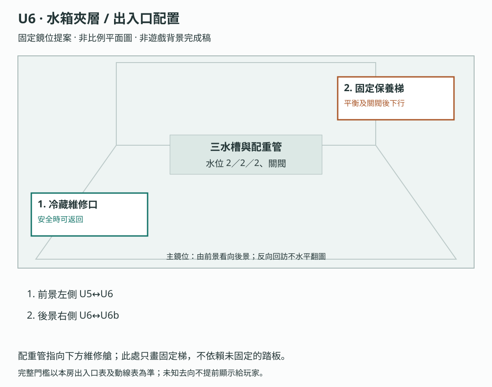
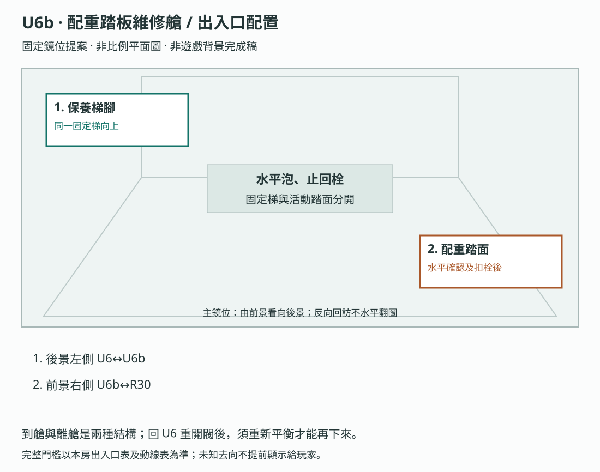
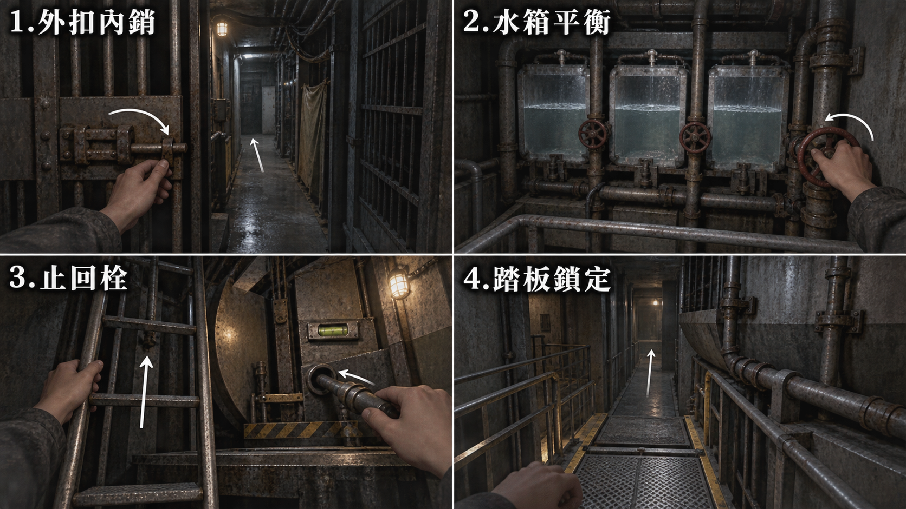
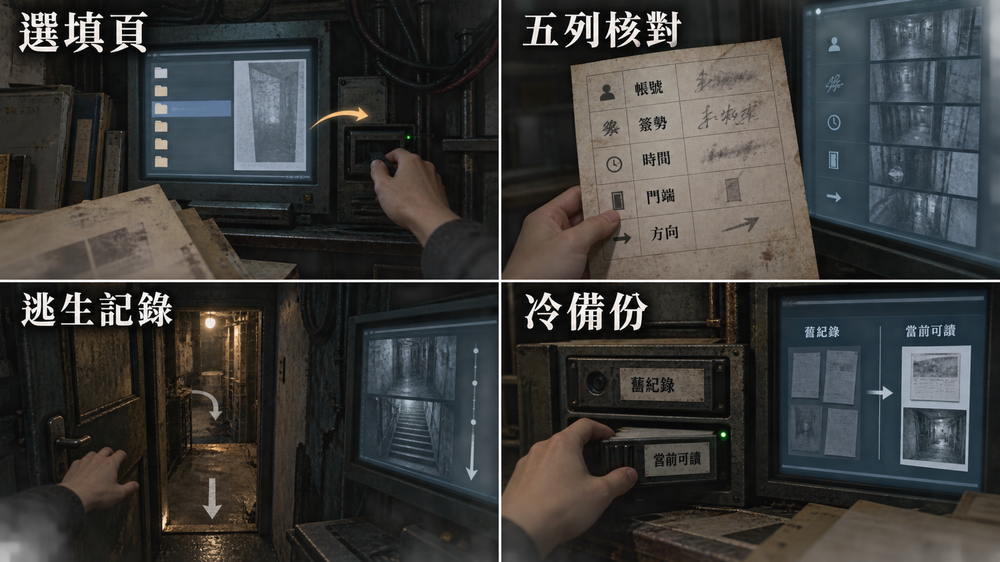

# 製作規格：第八幕

[總目錄](../09_劇本/09-14_全劇本與關卡整合稿.md#book-specs) · [本幕劇本](../09_劇本/09-17_正式劇本_第八幕.md#act-8) · [上一幕規格：第七幕](10-09_製作規格_第七幕.md#spec-act-7) · [下一幕規格：終幕](10-08_製作規格_終幕.md#spec-act-9) · [共用附錄](../09_劇本/09-15_正式劇本_共用附錄.md#book-appendices)

[U6](#node-u6-spec)、[U6b](#node-u6b-spec)、[R30](#node-r30-spec)、[R31](#node-r31-spec)

## 第八幕 · 最後一道門：製作規格

<!-- production:ordered:v1 -->

[本幕概覽](#spec-act-8-overview) · [場景流程](#spec-act-8-rooms) · [跨幕共用規則](#spec-act-8-shared) · [圖解對照](#spec-act-8-references) · [幕尾交接](#spec-act-8-delivery)

### 本幕概覽與前置

| 本幕 | 範圍與完成條件 |
| --- | --- |
| 主流程 | U6 → U6b → R30 → R31；49F 水箱與運送，固定維修籠及最後階梯銜接 50F 備份 |
| 玩法 | 調水位、扣止回栓、固定下方踏板、五源剖面、手動制動、供電與冷備份鑑識 |
| 揭露 | 完成帳號、長期簽核與當晚下行的責任鏈，再播放唯一十二秒解凍；肉身與封鎖核心留終幕 |
| 幕尾 | R31 原必要鑑識、責任鎖定與解凍完成後，經內門前往 R32；選填 H-07、姓名或支線不擋主線 |
| 保存 | 繼承前兩幕狀態，保留佇列選擇與原出口不可逆條件；R31 起零玩法消耗規則不變 |

本幕時長待灰盒量測；不把第六至八幕原合計基準複算成各幕時長。文末集中保留三幕共用圖解、聲音清單與驗收，逐房條件仍位於各所屬幕。

逐節點操作見[全程玩法對照](../09_劇本/09-15_正式劇本_共用附錄.md#core-gameplay-nodes)。

介面文字依[玩家用語](../09_劇本/09-15_正式劇本_共用附錄.md#player-language)與[閱讀負荷](../09_劇本/09-15_正式劇本_共用附錄.md#reading-load)共用規格。

承接 U5 原出口進入 U6。水箱與配重作短解謎喘息，之後沿 R30 沉降及不可逆確認抵達 R31，完成原來源核驗、身分鎖定與十二秒解凍，再走向終幕。

<!-- scene-image-routes-8:begin -->

### 本幕連線與接景圖

每條既有動線均指定畫面。兩端接景使用已列主圖與門框遮擋，不另造中間房；出口接景必須交指定鏡位，動畫及低動態版共用定位。後果演出不開放探索。進入條件與回訪仍依原動線表，圖號不是通行權限。

| 原動線 | 接景方式 | 畫面節點／圖號 | 操作與條件來源 |
| --- | --- | --- | --- |
| R30→R31 | 出口接景 | [R30-V02](#subscene-r30-v02-spec) | [門檻、方向與回訪](#node-r30-nav) |
| R31→R32 | 出口接景 | [R31-V02](#subscene-r31-v02-spec) | [門檻、方向與回訪](#node-r31-nav) |
| U6→U6b | 兩端接景 | [U6-V01](#node-u6-images) → [U6b-V01](#node-u6b-images) | [門檻、方向與回訪](#node-u6-nav) |
| U6b→R30 | 兩端接景 | [U6b-V01](#node-u6b-images) → [R30-V01](#node-r30-images) | [門檻、方向與回訪](#node-u6b-nav) |
<!-- scene-image-routes-8:end -->

### 依流程逐場景製作

### U6 · 水箱夾層

[正式場次](../09_劇本/09-17_正式劇本_第八幕.md#node-u6-script)

[進場與動線](#node-u6-nav) · [出入口位置](#node-u6-access) · [操作與解謎](#node-u6-level) · [狀態與驗收](#node-u6-pack) · [圖像製作單](#node-u6-images) · [離場與次場景](#node-u6-exit)

**進出、動線與回訪**

<!-- import:s-0609-54:begin -->

#### U6 水箱夾層

進行目的：依守恆規則調整水位到 2／2／2 → 關閉調節閥，保存 balance_held → 沿固定保養梯到 U6b

支線／收集：SQ-R MR-02 否認批註

房內順序：依守恆規則調整水位到 2／2／2 → 關閉調節閥，保存 balance_held → 沿固定保養梯到 U6b

| 方向 | 類型 | 可移動條件 | 移動演出提案 | 回訪規則 |
| --- | --- | --- | --- | --- |
| U5 ↔ U6 | 主線 | lower.u5.shutters_closed = true；只檢查當前離房完成態，不要求先解完目的房 | T-U5-U6：由 48F 的 U5 原門端起行，經 48F → 49F 的冷藏維修上行道，最後親自進入 49F 的 U6。保留原門檻與方向；可逐圖移動，近看選填，不增解鎖題。 | R30 沉降前可循已開通路回訪；遇正式遭遇鎖場停用 |
| U6 ↔ U6b | 主線 | 三槽為 2／2／2 且調節閥已關閉；lower.u6.balance_held = true | 水位平衡並關閥後，沿旁側固定保養梯下降至 U6b；這條梯不依賴尚未固定的活動踏板，同組配重管交代高差。 | 沉降前可沿固定梯回訪；未完成時在 U6 重開閥即清除 balance_held，須重新平衡並關閥才可再下行。walkway_locked 成立後鎖住調節，不鬆已通行踏板。 |
<!-- import:s-0609-54:end -->
<!-- navigation:u6:end -->

#### 主場景出入口

<!-- scene-access:U6:begin -->
| 動線 | 顯示名稱 | 畫面位置與辨識物 | 通行狀態 |
| --- | --- | --- | --- |
| U5↔U6 | 來路／返回：冷藏維修口 | 49F 門端，來路可辨48F → 49F 冷藏維修上行道的連續扶手及固定梯口；起點房在 48F，不把兩端畫成同層相鄰門。 | 非鎖場且沉降前可原路回 U5。 |
| U6↔U6b | 出口：固定保養梯 | 三水槽旁的固定梯，配重管向下連到維修艙。 | 水位調成 2／2／2 並關閥後才可下行；不踏尚未固定的活動踏板，可沿同梯返回。 |
<!-- scene-access:U6:end -->

<!-- access-layout:U6:begin -->

##### 出入口配置草圖

**構圖提案：**配重管指向下方維修艙；此處只畫固定梯，不依賴未固定的踏板。 各門端位置對應上表；數字只供製作辨識，不是玩家介面或解謎提示。

門框、視線及熱區仍須灰盒驗收，依[共用契約](../09_劇本/09-15_正式劇本_共用附錄.md#scene-access-contract)，不計入遊戲圖像交付數。
<!-- access-layout:U6:end -->

**關卡、解謎與失敗回饋**

<!-- import:s-0610-12:begin -->

#### U6 — 水箱夾層

##### U6 空間與畫面製作定位

| 項目 | 畫面與製作要求 |
| --- | --- |
| 樓層定位 | 49F |
| 樓棟定位 | B 棟 |
| 樓層與環境 | 49F 水箱與運送設備區；固定保養梯下到本層 U6b，水位與配重踏板屬同一套機械。 原光源、材質與證據焦點依本房規格。 |
| 入口方向 | 由 U5 承接；以來路門框／扶手作背向定位，前進方向依下列出口地標。左右方位沿既有構圖，不將反向回訪鏡頭誤當另一扇門。 |
| 可見出口 | 水槽側固定保養梯通 U6b；不是未固定的活動踏板。首次全景就交代入口輪廓或可查看的遮擋，不靠無標示的畫外點擊換房。 |
| 阻擋與開放條件 | 往 U6b：三槽為 2／2／2 且調節閥已關閉；lower.u6.balance_held = true |
| 畫面中的解謎要素 | 三槽水位、數字格線與調節閥；平水關閥後才下到操作艙。關鍵標記可近看，與裝飾物有可辨的材質或輪廓差異，不只靠顏色或聲音。 |
| 完成後變化 | 三槽達 2／2／2 並關閉調節閥後保存 balance_held，玩家沿固定保養梯下到 U6b；活動踏板仍未固定，不在此提交通往 R30。 |

##### U6 製作流程

| 階段 | 製作規格 |
| --- | --- |
| 進入／目標 | 從 U5 抵達；先平衡並關閥，再到 U6b 固定踏面以通向 R30。 |
| 觀察／空間 | 暗藍水箱、貼頂窄步道與厚牆內的維修艙。兩端保留相同管線或扶手，交代相鄰量體與半層高差。 |
| 操作順序 | 按原守恆解法使三槽 2／2／2，關閉調節閥寫 lower.u6.balance_held；沿固定保養梯到 U6b，水平檢查與止回栓在 U6b。 |
| 劇情回收 | 入口先安靜，玩家靠機械規則重新獲得可預期的通路；第一次有效導水後，槽外水紋的逆行與正確水位並存。固定梯仍可靠，接上 U6b 聲源錯位與 R30 的真實沉降。 |
| 完成／出口 | 完成上列準備，前往 U6b；原最終通路旗標由 U6b 提交。 |
| 失敗／保存 | 錯配留在安全近看重試；已確認的機械設定與解題步驟保存，純拖曳預覽取消則復位。U2b／U5 額外保存分段機關，依 UD 規格恢復。 |
| 最低素材 | 實景基底、局部提示、機關前後差分、可讀字樣、操作音；U2b／U5 另需預警、攻擊、退去差分。 |

###### U6 解謎流程

下表為 U6／U6b 同一機關的完整因果；鏡位與操作歸屬依各節點製作流程，後半操作不可在入口鏡位提交。

| 階段 | 內容 |
| --- | --- |
| 觀察依據 | 三槽初始水位按左／中／右為 3／0／3 格，總量六格；本地配重圖顯示三槽各二格時踏板水平。格線有數字與形狀，不靠顏色。 |
| 推理／操作 | 閥輪每次把相鄰一槽的一格導向另一槽；玩家選來源與去向，先左至中一格、再右至中一格可得 2／2／2，次序可交換。水量守恆，來源空或目的滿則無動作。三槽平衡後在 U6 關閉調節閥，寫 lower.u6.balance_held；沿固定保養梯進 U6b，檢查水平並扣止回栓後才寫 lower.u6.walkway_locked。 |
| 回饋／修正 | 每步看見兩槽水位同步變化與踏板傾角；錯配可反向導回或用本地復位閥回到 3／0／3。中槽單獨達刻線但左右不平，踏板仍歪，不能跳過平衡。 |
| 串接用途 | U5 出口同款配重管在此可確認，但全部解題資訊本地可讀。落腳段打開後接 R30；先交付可預期的機械成功，再面對原沉降，不把水箱操作當成造成沉降。 |

###### U6 出口與回訪

| 目的節點 | 條件 | 移動與辨向 | 回訪邊界 |
| --- | --- | --- | --- |
| U5 | 已開通且未遭遇鎖場、未沉降封路 | 同一路線反向回訪 | R30 沉降前可循已開通路回訪；遇正式遭遇鎖場停用 |
| U6b | 三槽為 2／2／2 且調節閥已關閉；lower.u6.balance_held = true | 從 U6 沿相同扶手／管線與高差地標抵達 配重踏板維修艙 的獨立鏡位。 | R30 沉降前可循已開通路回訪；遇正式遭遇鎖場停用 |

##### SQ-R 可選收集

安全入口的舊工具箱外袋可翻看 MR-02 退回聯背面；在平水前後都可讀，不進攻擊窗口、不依賴 U6b 踏板。 兩件特殊查看後可在安全筆記關聯並主動收束；漏收不影響出口。完整線索、獎賞與保存見 [SQ-R 被否認的那次幫忙](../09_劇本/09-15_正式劇本_共用附錄.md#h-0306-112)。

**主線氣氛 HP-04／槽外逆行水紋：**首次有效導水提交後，只在閥輪操作結束、手收回且回到 U6-V01 的安全實景呈現約 3 秒；左先、右先、合法非正解導水都相同，不以正解獎勵嚇點。水紋在水槽外的淺排水槽，與三槽透明液位層分離，逆著基底殘水朝固定梯腳走；乾燥梯級可辨，無人形、腳印或新支線來源。讀工具箱、開近看、立即再次調閥或跨鏡時優先接受輸入，當次略過不排到後面。空來源、滿目的、拖曳取消及純預覽不算有效導水。依[主線氣氛共用契約](../09_劇本/09-15_正式劇本_共用附錄.md#horror-mainline-contract)保存 HP-04，不寫 balance_held 或 walkway_locked。

**回景交接：**一次導水的正常回饋依「提交水位 → 手離閥輪 → U6-C01 收回到 U6-V01」完成，第一次交還實景時才提出 HP-04 請求；提交的當下仍在操作中，不先消耗機會。下一步閥輪熱點始終可用，連續輸入優先，不為氣氛另加確認或強制等待。若使用持續近看的操作方式而沒有這次回景，當次記 skipped，不等日後關窗補播。

**圖聲與驗收：**U6-V01 交槽外普通水流、逆向波紋、到梯腳的終態；低動態用同鏡位兩態，異常音效可靜音，來源方向可開環境聲字幕。三槽水量始終六格、各刻度按實際操作，總量、關閥與配重不受聲畫影響。測兩種正解順序、錯配重設、開工具箱、全略 SQ-R、0 穩定度及中途存讀；保留入口喘息與正常機械成功，不新增限時。
<!-- import:s-0610-12:end -->

**狀態、素材與驗收**

本節未另立房間製作包；本房上述規格的保存與素材要求，以及[共用技術與交付](../09_劇本/09-15_正式劇本_共用附錄.md#appendix-production)同時適用，不因此省略存讀檔或驗收。

#### 場景節點與靜態圖製作單

以下每列均為待製作圖像項目；文件多頁、正反面、局部與狀態差分須依拆圖欄各自交付，不能以一張示意圖代替。可探索場景的主圖提供移動與探索，演出節點不另開探索，近看關閉回到開啟前的畫面；原演出與操作條件仍依右欄來源。圖號、解析度、文字分層、存檔及驗收依[靜態圖共用契約](../09_劇本/09-15_正式劇本_共用附錄.md#scene-image-contract)。

<!-- scene-images:U6:begin -->
| 畫面節點／圖號 | 用途 | 必畫內容 | 狀態與拆圖 | 來源 |
| --- | --- | --- | --- | --- |
| U6-V01 | 主場景 | 三水槽、調節閥、液位標尺、工具箱與固定保養梯；活動踏板仍未固定；HP-04 槽外淺排水槽的逆行水紋。 | 初始3／0／3、各合法中間水位、平衡2／2／2及關閥差分；總量六格守恆。槽外普通流向／逆行波紋／到梯腳終態與低動態兩態另層；首次有效導水後安全實景呈現，三槽標尺、閥輪及配重不被異常改寫。 | [本場景](../09_劇本/09-17_正式劇本_第八幕.md#node-u6-script) |
| U6-C01 | 操作近看 | 三槽液位與調節閥 | 透明水位疊層與每格刻度獨立，左右導中兩順序都可；不使用只演正解的影片。 | [U6-00](../09_劇本/09-17_正式劇本_第八幕.md#s-0909-40) |
| U6-C02 | 近看 | 固定梯與配重管 | 向下梯的落點清楚，無需踏上未固定活動踏板。 | [U6-00](../09_劇本/09-17_正式劇本_第八幕.md#s-0909-40) |
| U6-D01 | 文件 | 工具箱外袋 MR-02 退回聯背面 | 正面位置與背面器材號、日期、紙角可比。 | [U6-01](../09_劇本/09-17_正式劇本_第八幕.md#s-0909-41) |
| U6-F01 | 回憶畫面 | SQ-R 主觀靜止回憶 | 原30–45秒記憶構圖及摘要，不演修理工受罰。 | [U6-01](../09_劇本/09-17_正式劇本_第八幕.md#s-0909-41) |
<!-- scene-images:U6:end -->

<!-- scene-image-access-art-u6:begin -->
**出入口交圖：**U6-V01 須依場次與狀態畫出[本場景出入口表](#node-u6-access)的來路、去路及封閉位置；既有操作鏡位與接景圖沿同一地標對位。門端差分、移動熱區與遮擋另分層，依[出入口共用契約](../09_劇本/09-15_正式劇本_共用附錄.md#scene-access-contract)驗收。
<!-- scene-image-access-art-u6:end -->

#### 本場景圖像與示意

本房沿用跨房圖的指定面板，尚無獨立專圖；請依下列適用範圍對照，不把整張圖當成本房演出。

[V36 下部服務夾道與配重水箱](#fig-v36) · [L10 生活夾層的解謎操作](10-07_製作規格_第六幕.md#fig-l10)

- **V36：**第 1 格 U4b 蓋下內銷，第 2 格 U6 三槽平衡與關閥，第 3、4 格 U6b 下梯檢查及扣栓；不跳過安全固定。
- **L10：**四格分別對照 U1、U3、U4、U6／U6b；不是四房直接相通。水箱關閥後仍須下梯檢查水平與扣栓。

[返回本房正式劇本](../09_劇本/09-17_正式劇本_第八幕.md#node-u6-script) · [本房關卡與解謎](#node-u6-level)

#### 離場通路與次場景

<!-- production-subscenes:u6 -->

沿[本場景動線](#node-u6-nav)的原出口與分支交接；不新增中間探索場景。

### U6b · 配重踏板維修艙

[正式場次](../09_劇本/09-17_正式劇本_第八幕.md#node-u6b-script)

[進場與動線](#node-u6b-nav) · [出入口位置](#node-u6b-access) · [操作與解謎](#node-u6b-level) · [狀態與驗收](#node-u6b-pack) · [圖像製作單](#node-u6b-images) · [離場與次場景](#node-u6b-exit)

**進出、動線與回訪**

<!-- import:s-0609-55:begin -->

#### U6b 配重踏板維修艙

進行目的：到踏板端檢查水平、扣止回栓並通過

支線／收集：依原房選填調查；無新增支線掛點。

房內順序：三槽為 2／2／2 且調節閥已關閉；lower.u6.balance_held = true → 到踏板端檢查水平、扣止回栓並通過 → lower.u6.walkway_locked = true

| 方向 | 類型 | 可移動條件 | 移動演出提案 | 回訪規則 |
| --- | --- | --- | --- | --- |
| U6 ↔ U6b | 主線 | 三槽為 2／2／2 且調節閥已關閉；lower.u6.balance_held = true | 水位平衡並關閥後，沿旁側固定保養梯下降至 U6b；這條梯不依賴尚未固定的活動踏板，同組配重管交代高差。 | 沉降前可沿固定梯回訪；未完成時在 U6 重開閥即清除 balance_held，須重新平衡並關閥才可再下行。walkway_locked 成立後鎖住調節，不鬆已通行踏板。 |
| U6b ↔ R30 | 主線 | lower.u6.walkway_locked = true | 完成 配重踏板維修艙 的既有操作後，自行沿可見通路前往 R30。 | R30 沉降前可循已開通路回訪；遇正式遭遇鎖場停用 |
<!-- import:s-0609-55:end -->
<!-- navigation:u6b:end -->

#### 主場景出入口

<!-- scene-access:U6b:begin -->
| 動線 | 顯示名稱 | 畫面位置與辨識物 | 通行狀態 |
| --- | --- | --- | --- |
| U6↔U6b | 來路／返回：保養梯腳 | 維修艙來向的固定梯與同一組配重管，向上接 U6。 | 可回水箱夾層；若未固定踏板就重開調節閥，須重新平衡關閥才能再下來。 |
| U6b↔R30 | 出口：配重踏面 | 水平泡與止回栓旁的活動踏面，另一端接運送通道。 | 完成水平確認並扣上止回栓後才可到 R30；沉降前可沿已固定踏面返回。 |
<!-- scene-access:U6b:end -->

<!-- access-layout:U6b:begin -->

##### 出入口配置草圖

**構圖提案：**到艙與離艙是兩種結構；回 U6 重開閥後，須重新平衡才能再下來。 各門端位置對應上表；數字只供製作辨識，不是玩家介面或解謎提示。

門框、視線及熱區仍須灰盒驗收，依[共用契約](../09_劇本/09-15_正式劇本_共用附錄.md#scene-access-contract)，不計入遊戲圖像交付數。
<!-- access-layout:U6b:end -->

**關卡、解謎與失敗回饋**

<!-- import:s-0610-13:begin -->

#### U6b — 配重踏板維修艙

##### U6b 空間與畫面製作定位

| 項目 | 畫面與製作要求 |
| --- | --- |
| 樓層定位 | 49F 水箱下夾層 |
| 樓棟定位 | B 棟 |
| 樓層與環境 | 49F 水箱下夾層；不另算 48F，固定梯可返回 U6；扣栓後活動踏面接同層 R30。 原光源、材質與證據焦點依本房規格。 |
| 入口方向 | 由 U6 承接；以來路門框／扶手作背向定位，前進方向依下列出口地標。左右方位沿既有構圖，不將反向回訪鏡頭誤當另一扇門。 |
| 可見出口 | 固定後的踏面通 R30，固定保養梯可回 U6。首次全景就交代入口輪廓或可查看的遮擋，不靠無標示的畫外點擊換房。 |
| 阻擋與開放條件 | 往 R30：lower.u6.walkway_locked = true |
| 畫面中的解謎要素 | 水平泡、栓孔與止回栓；扣妥才開通，不能在 U6 遠端提交。關鍵標記可近看，與裝飾物有可辨的材質或輪廓差異，不只靠顏色或聲音。 |
| 完成後變化 | 確認水平並扣妥止回栓後保存 walkway_locked，踏面固定才可去 R30；完成後鎖住上方調節，回訪不鬆栓。 |

##### U6b 製作流程

| 項目 | 規格 |
| --- | --- |
| 入口／目標 | 三槽為 2／2／2 且調節閥已關閉；lower.u6.balance_held = true；到踏板端檢查水平、扣止回栓並通過。 |
| 鏡位與操作 | U6 水位平衡並關閉調節閥後，沿旁側固定保養梯到 U6b，這條梯不依賴尚未固定的活動踏板。低位鏡頭看見水平泡、栓孔與 U6 同組配重管。玩家檢查踏板落位，親手扣止回栓，仍沿原解法，不加新密碼。 |
| 保存／回訪 | U6 閥關閉後保存 balance_held，三槽不自行漂移；返回 U6 可重新調節，但須先撤回 U6b 未提交操作；重開調節閥即清除 balance_held，重做 2／2／2 與關閥確認後才可再進。walkway_locked 成立後鎖住調節，回訪不鬆開已走過的踏板。完成後沿固定踏面接 R30；沉降仍只在 R30 原條件下發生。 |
| 出口 | lower.u6.walkway_locked = true；玩家自行點擊前往 R30。 |
| 時長歸屬 | 與原區共用機關配額，不追加遭遇。HP-05 在原扣栓後實景疊加一次氣氛，不加強制停留；實際操作與觀看時長待灰盒量測。 |
| 素材 | 獨立鏡位構圖、前後方向地標與本地操作差分；可共用原區材質，但不能只複製節點名稱充數。新增構圖與鏡位銜接仍待製作。 |

**主線氣氛 HP-05／從上方傳來的落管聲：**首次親手扣栓成功、walkway_locked 已保存後，於原 U6b-V01 安全實景呈現約 3 秒的護欄外斷管落下；管架本來就斷，與活躍配重管、支架、踏面清楚分開。下墜聲接頭頂封閉檢修層的空心撞響及板縫落灰，來源不作人的身分或位置證據，不新增第十次鏡像者。水平泡、承重、回梯與去 R30 熱點不變，錯覺不回滾正確操作，也不提前開始 R30 沉降。已有 walkway_locked 的舊檔只保留原安全踏面，不補落管。依[主線氣氛共用契約](../09_劇本/09-15_正式劇本_共用附錄.md#horror-mainline-contract)保存 HP-05。

**圖聲與驗收：**U6b-V01 追加斷管在架／落下／空架與頂縫落灰，各自分層；U6b-C02 保留終態位置連續。低動態採在架／空架與上方灰痕兩態，靜音保留視覺結果。立即往 R30、回 U6、離開視窗、存讀或略過效果皆不重播、不封路、不鬆栓；沒有要玩家接住的道具或新增反應題。

###### U6b 出口與回訪

| 目的節點 | 條件 | 移動與辨向 | 回訪邊界 |
| --- | --- | --- | --- |
| U6 | 已開通且未遭遇鎖場、未沉降封路 | 同一路線反向回訪 | R30 沉降前可循已開通路回訪；遇正式遭遇鎖場停用 |
| R30 | lower.u6.walkway_locked = true | 完成 配重踏板維修艙 的既有操作後，自行沿可見通路前往 R30。 | R30 沉降前可循已開通路回訪；遇正式遭遇鎖場停用 |
<!-- import:s-0610-13:end -->

**狀態、素材與驗收**

本節未另立房間製作包；本房上述規格的保存與素材要求，以及[共用技術與交付](../09_劇本/09-15_正式劇本_共用附錄.md#appendix-production)同時適用，不因此省略存讀檔或驗收。

#### 場景節點與靜態圖製作單

以下每列均為待製作圖像項目；文件多頁、正反面、局部與狀態差分須依拆圖欄各自交付，不能以一張示意圖代替。可探索場景的主圖提供移動與探索，演出節點不另開探索，近看關閉回到開啟前的畫面；原演出與操作條件仍依右欄來源。圖號、解析度、文字分層、存檔及驗收依[靜態圖共用契約](../09_劇本/09-15_正式劇本_共用附錄.md#scene-image-contract)。

<!-- scene-images:U6b:begin -->
| 畫面節點／圖號 | 用途 | 必畫內容 | 狀態與拆圖 | 來源 |
| --- | --- | --- | --- | --- |
| U6b-V01 | 主場景 | 配重踏板維修艙、水平泡、止回栓、踏面與配重管；HP-05 護欄外斷管與頭頂封閉檢修層，獨立維修視角。 | 水位未平衡／水平、止回栓未扣／扣上、踏面不可走／可走分開。斷管在架／落下／空架、頂縫落灰及低動態兩態另層；首次扣栓成功後呈現，水平泡及承重不變，不提前沉降。 | [本場景](../09_劇本/09-17_正式劇本_第八幕.md#node-u6b-script) |
| U6b-C01 | 操作近看 | 水平泡與止回栓 | 水平泡偏／正、栓開／扣合；平衡不能自動代扣栓。 | [U6b-00](../09_劇本/09-17_正式劇本_第八幕.md#s-0909-42) |
| U6b-C02 | 近看 | 踏面鎖點與往 R30 落腳處 | 鎖好後可辨承重，來源管線與 U6 一致；護欄外廢管是否仍在架依 HP-05 呈現狀態對位，不改活躍配重管。 | [U6b-00](../09_劇本/09-17_正式劇本_第八幕.md#s-0909-42) |
<!-- scene-images:U6b:end -->

<!-- scene-image-access-art-u6b:begin -->
**出入口交圖：**U6b-V01 須依場次與狀態畫出[本場景出入口表](#node-u6b-access)的來路、去路及封閉位置；既有操作鏡位與接景圖沿同一地標對位。門端差分、移動熱區與遮擋另分層，依[出入口共用契約](../09_劇本/09-15_正式劇本_共用附錄.md#scene-access-contract)驗收。
<!-- scene-image-access-art-u6b:end -->

#### 本場景圖像與示意

以下圖像為製作參照；跨房圖僅使用標明的面板，其他場景仍按各自前置演出。

[V36 下部服務夾道與配重水箱](#fig-v36) · [L10 生活夾層的解謎操作](10-07_製作規格_第六幕.md#fig-l10)

- **V36：**第 1 格 U4b 蓋下內銷，第 2 格 U6 三槽平衡與關閥，第 3、4 格 U6b 下梯檢查及扣栓；不跳過安全固定。
- **L10：**四格分別對照 U1、U3、U4、U6／U6b；不是四房直接相通。水箱關閥後仍須下梯檢查水平與扣栓。

[返回本房正式劇本](../09_劇本/09-17_正式劇本_第八幕.md#node-u6b-script) · [本房關卡與解謎](#node-u6b-level)

##### V36｜下部服務夾道與配重水箱

**適用與限制：**第 1 格 U4b 蓋下內銷，第 2 格 U6 三槽平衡與關閥，第 3、4 格 U6b 下梯檢查及扣栓；不跳過安全固定。

[完整圖說與操作對照](../09_劇本/09-15_正式劇本_共用附錄.md#h-0610-493) · [圖像目錄](../09_劇本/09-14_全劇本與關卡整合稿.md#book-illustrations)

#### 離場通路與次場景

<!-- production-subscenes:u6b -->

沿[本場景動線](#node-u6b-nav)的原出口與分支交接；不新增中間探索場景。

### R30 · 運送通道

[正式場次](../09_劇本/09-17_正式劇本_第八幕.md#node-r30-script)

[進場與動線](#node-r30-nav) · [出入口位置](#node-r30-access) · [操作與解謎](#node-r30-level) · [狀態與驗收](#node-r30-pack) · [圖像製作單](#node-r30-images) · [離場與次場景](#node-r30-exit)

**進出、動線與回訪**

<!-- import:s-0609-56:begin -->

#### R30 運送通道

進行目的：手動制動，穿過沉降通道；封門與震損重建、H-07；LM-04 逃亡未回頭回憶

支線／收集：依原房選填調查；無新增支線掛點。

房內順序：安全近看原剖面；可選 LM-04 地下逃亡回憶 → 可返回補收；自行確認剖面後進原沉降時序 → 辨認前兆並手動制動；原回程封閉 → 前往 R31

| 方向 | 類型 | 可移動條件 | 移動演出提案 | 回訪規則 |
| --- | --- | --- | --- | --- |
| R30 → R31 | 封路 | 剖面核對、不可逆前進確認與手動制動完成；沉降封路後不可返回 | 在 49F 的固定維修籠完成原手動制動後，循上行踏面及短梯抵達 50F R31；維修籠不升降、不載人，原回路沉降封閉仍有效。 | 剖面提交前可回 U6b；制動後原路封閉，不回訪舊房。 |
| U6b ↔ R30 | 主線 | lower.u6.walkway_locked = true | 完成 配重踏板維修艙 的既有操作後，自行沿可見通路前往 R30。 | R30 沉降前可循已開通路回訪；遇正式遭遇鎖場停用 |
<!-- import:s-0609-56:end -->
<!-- navigation:r30:end -->

#### 主場景出入口

<!-- scene-access:R30:begin -->
| 動線 | 顯示名稱 | 畫面位置與辨識物 | 通行狀態 |
| --- | --- | --- | --- |
| U6b↔R30 | 來路／返回：後方階梯 | 主通道後側的梯段，接回已固定的配重踏面。 | 不可逆前進提交前可回 U6b；提交後進入原制動流程，後續沉降才在畫面上封住這條路。 |
| R30→R31 | 出口：維修籠踏面 | 剖面台旁的維修籠、制動桿與通往備份內室的可見踏面。 | 剖面核對、不可逆確認及親手制動完成後前往 R31；不是從空車運送道穿過核心門。 |
| 封閉 | 核心運送門 | 另一條不相通運送道盡端的焊死門，空車撞向此處。 | 焊封保持可辨，不因制動完成而變成玩家出口。 |
<!-- scene-access:R30:end -->

**關卡、解謎與失敗回饋**

<!-- import:s-0607-9:begin -->

#### R30 — 運送通道：兩週裡發生的事

##### R30 空間與畫面製作定位

| 項目 | 畫面與製作要求 |
| --- | --- |
| 樓層定位 | 49F |
| 樓棟定位 | B 棟 |
| 樓層與環境 | 49F 運送通道；原切口與固定維修籠都在本層。制動後經既有上行踏面至 50F R31，籠不升降、不載人跳層。 原光源、材質與證據焦點依本房規格。 |
| 入口方向 | 由 U6b 承接；以來路門框／扶手作背向定位，前進方向依下列出口地標。左右方位沿既有構圖，不將反向回訪鏡頭誤當另一扇門。 |
| 可見出口 | 制動後固定的維修籠通 R31；沉降後回程封閉。首次全景就交代入口輪廓或可查看的遮擋，不靠無標示的畫外點擊換房。 |
| 阻擋與開放條件 | 往 R31：剖面核對、手動制動完成才前進；沉降後 R29 回路封閉 |
| 畫面中的解謎要素 | 剖面五點、粉塵／束帶前兆與拉桿；提交前可返回補查。關鍵標記可近看，與裝飾物有可辨的材質或輪廓差異，不只靠顏色或聲音。 |
| 完成後變化 | 剖面五點核對並由玩家手動制動後，維修籠固定才可去 R31；沉降後回程封閉，提交前保留補查機會。 |

##### R30 製作流程

**空間第一印象：**黑鋼核心與錯層平台。可見的遠端通道近在眼前卻需繞行；沉降與制動仍是唯一主動壓力來源。

**探索呈現：**先讓玩家看見入口、可走的方向和空間異常，再自選近看生活物件；新增租戶遺跡不發 E 證據、不設派系任務、不改出口旗標。恐怖沿原事件與遭遇時序，安定／閱讀保護段不插嚇點。

**逃生因果與可見回饋：**原制動的直接成果是檢修籠停穩、下一個落腳點可操作；沉降與不可回頭照舊。資料拼圖先辨認哪條路可用，制動才讓玩家實際通過，不用閱讀完成取代手動操作。

| 階段 | 製作規格 |
| --- | --- |
| 進入／目標 | 手動制動，穿過沉降通道；封門與震損重建、H-07；入場先還原原房間已保存的熱點與事件狀態。 |
| 觀察／空間 | 單人檢修籠貼核心牆穿過接駁鋼架；標出舊運貨平台與維修腳踏的區別，制動桿和沉降預警清楚。 |
| 操作順序 | 重建原五點剖面 → 辨識運貨與維修路線 → 玩家完成制動 → 經既定不可逆沉降進 R31。順序中的選填內容不作離房門檻；原主線旗標、遭遇數值及分支提交條件依本場景細則。 |
| 回饋 | 必要操作寫入原證據／門禁／遭遇狀態；新增生活附頁僅更新來源已讀與有依據的筆記，不重發原證據。 |

###### R30 出口與回訪

| 目的節點 | 條件 | 移動與辨向 | 回訪邊界 |
| --- | --- | --- | --- |
| R31 | 剖面核對、手動制動完成才前進；沉降後 R29 回路封閉 | 粉塵與束帶先預警，拉桿固定維修籠；跨進維修脊柱後不再返回。 | 單向流程；不代表可沿此線倒退 |
| U6b | 已開通且未遭遇鎖場、未沉降封路 | 同一路線反向回訪 | R30 沉降前可循已開通路回訪；遇正式遭遇鎖場停用 |

共用規則見[對應條款](10-01_製作規格_序幕.md#s-0601-6)。

##### R30 動畫演出

###### 沉降與制動

| 項目 | 場景演出規格 |
| --- | --- |
| 形式與節奏 | 四段可銜接的遊戲內動畫，非自動完成的災難影片。 |
| 鏡頭與動作 | 灰塵先落、束帶預警 → 樓面依原約三度沉降，三輛空車滑撞焊死核心門 → 玩家操作制動桿 → 維修籠固定並開放 R31，後方階梯依原時序封閉。 |
| 操作與資訊邊界 | 推車與維修籠是不同機構；拉桿不阻止推車。分段等待玩家輸入，0 穩定可完成，不以自由落體、肉身新傷或自動拉桿代替操作。 |

本房把主角不知道的兩週歷史交給玩家主動拼出。

##### 封門與震損重建

玩家對照：

- `E5-06-A` 是樓內固定檢修鏡頭留存的震前／震後快照及舊高度刻度，來源與拍攝區段為 8F–14F；顯示窗框及牆板受力朝內。照片只拍構件局部，不把低層破壞搬成 49F 現場，也不包含現時感知紅霧。
- `E5-06-B` 為本房核心門內側焊珠、支撐件及既有撤離維修單；封焊日期早於本次震損，證明集團先從內鎖死人員通道。
- `E5-06-C` 樓層坍塌圖與 R14 H-05 不存在樓層的停靠順序。
- `E3-07` 歷史收件回執與震損自檢：第 5 日只收到部分標頭；較晚的自檢記下外廊線路失聯，核心通路仍未確認。
- 管理維修圖：原公共疏散線已多處斷裂，主角則以本地帳號、覆寫碼與 R15 區域供電逐段確認單人管理維修脊柱；兩條路的寬度、負重、供電與門端各不相同。

玩家將五點放上剖面，確認集團先封門、樓體後受創，公共通路因此斷裂；後來的完整求救停在本地。主角現時通過的是逐段供電和手動操作的單人維修脊柱，不是已恢復的公共逃生梯。來源不足以確定所有失聯者生死，也不建立求援標頭導致外部衝擊的因果。

##### 沉降前的最後整理

五點剖面的必要材料均在本房既有證物近看及維修圖可讀；E3-07 使用已保存的歷史回執與自檢原件，無上部完成檔時由有效預設前情帶入，不能要求回到上部購買或補收。R14 停靠順序作舊觀察對照，本房坍塌圖亦標出同一順序；不把一次選填異象當唯一解題資料。

剖面排妥、尚未提交時，出口仍可返回 U6b。提交入口先清楚顯示「接下來的沉降與制動後，原路將封閉」；如有已發現未完支線，依來源列出：SQ-C／M／K 可回 R29 交接索引補查，SQ-R 的 MR-01 回 U4、MR-02 回 U6，已收齊則可在安全筆記直接關聯並歸檔。不顯示未發現支線名稱，不強迫全部完成。玩家可返回，或明確繼續主線。

繼續後才鎖定剖面並進沉降演出；離板後仍須玩家親手制動。提示確認不能代拉制動桿，也不能把本已完成的支線改回未完。

##### 實體恐怖：運送通道沉降

剖面鎖定前，粉塵已持續往同一側落、吊掛束帶小幅擺動，空推車間歇滑動幾公分。鎖定後房間緩慢傾斜約三度，三輛空推車沿導軌撞向焊死核心門。末車底板翻開，只露腕帶、水瓶與目的地空白的園區轉運標籤；與前述人口移交來源相接，不增加遺體畫面。

玩家必須離開調查板，親自點擊牆邊制動桿固定前往 R31 的維修籠。這不是反應考驗；預警充分、沒有受傷或死亡。它的功能是讓第八幕在大量資料閱讀之間，仍有一次不靠螢幕、直接由建築與物流設備構成的現在式威脅。

##### H-07 斷線前後

剖面鎖定且玩家手動制動完成、現場穩定後，可由既有安全中繼播放本地留存的樓內維修通話殘訊與門內未送出求救封包。玩家可保存兩軌、只留維修通話軌或關閉播放；選擇只影響終幕環境聲，不刪除已核對的事實與來源。聲音由現場設備輸出，筆記只索引與保存文字，不自行播放。

這裡回收 E-09 的封鎖後者，但 E-10 仍維持「帳號撤銷、下落不明」，不把未知者擅自列成死者。

玩家固定制動桿後，後方回程樓梯才因後續沉降封閉；前兆是粉塵、束帶、推車、金屬受力聲與節點圖黃黑警示，玩家不會受傷。已啟用的安全中繼仍可整理證據，但實體前進只剩通往 R31 的管理維修脊柱；文件不得再稱它為可供救援使用的「安全路徑」。

---

##### LM-04｜我沒有回頭

在五點剖面提交之前的安全近看中，原維修圖的下行支路與一截舊布擦痕讓玩家回想地下逃亡；畫面明示「逃亡期間的主觀片段，日期未確認」。這是以相同構件喚起 P1 附近更早的片段，不主張她肉身來過 R30，也不新增第二次逃亡夜十一秒事件。

玩家沿已見地下支路圖對照擦痕，區分「停步的位置」與「繼續往出口的方向」；不需重走地下或觀看外界。關聯後 20–40 秒凝固暗渠：她停住，一個像小花的聲音從身後傳來，最後的靜止取景只留下朝出口方向的腳印。主角短句：「我聽見了。但我還是想出去。」聲音來源、日期及小花當時生死維持未知，不能由這段判定她聽到的是真人或怨靈。

回憶是過去的自保選擇，不要求玩家現在選一次「救／不救」，不算罪行或結局分數，也不改為她打算回去救人。可略過配音，保留主觀性標示與短句，寫 `memory.lm04.reviewed`。玩家關閉回憶後回到尚未提交的剖面，自主提交才進原沉降／制動流程；H-07、樓內維修通話、推車及制動全沿原時序，不在危險中插入本段，R31 解凍與 R32 肉身揭露不提前。
<!-- import:s-0607-9:end -->

**狀態、素材與驗收**

<!-- import:s-0808-12:begin -->

#### R30 — 運送通道／兩週裡發生的事

##### R30-房間資料

| 欄位 | 值 |
| --- | --- |
| `room_id` | `R30` |
| `scene` | `room_r30.tscn` |
| `entry_from` | `U6b`＋`lower.u6.walkway_locked` |
| `exit_to` | `R31` |
| `backgrounds` | `r30_real.webp`、`r30_scan.webp`、`r30_freeze_sealed_corridor.webp` |
| `board_id` | `BOARD_ASSAULT_RECONSTRUCTION` |
| `main_goal` | 用五份物理及設備來源重建集團封門、較晚震損、未送出求救與現時單人維修脊柱 |
| `must_exit_when` | `act6.r30.e506_seen && act6.r30.brake_locked`；剖面確認前可返回，制動後保存沉降封路狀態 |

##### R30-樓層剖面五點

| 卡片 | 來源 | 放置位置 | 結論 |
| --- | --- | --- | --- |
| `BREACH_OUTSIDE_IN` | 固定檢修鏡頭震前／震後快照與舊刻度，各有日期、樓層及方向 | 外段 8F–14F | 外部衝擊造成向內變形，不推定有人由此進入 |
| `CORE_WELDED_INSIDE` | 核心門內側焊珠＋撤離維修單 | L-48 核心內門 | 集團撤離時先封門，封焊早於後來震損 |
| `COLLAPSE_ROUTE` | 斷層圖＋R14 的 `28 → 30M → 31` | 21F–27F／33F–40F 斷層 | 物流路由仍指向已坍塌樓段 |
| `DISPATCH_GAP` | `E3-07` 歷史收件與震損自檢＋震損巡檢清單及本地求救佇列 | 外段斷線／核心通行未確認 | 殘缺標頭先送達，較晚完整求救未送出；通行狀態缺口不等於人員死亡 |
| `MANAGEMENT_SPINE` | 內控帳號權限＋R15 分區復電＋單人維修孔磨痕 | 現時逐段確認的內部維修線 | 單人脊柱依有效權限、供電與原門端條件開通；30M 是斷裂舊代碼，不能拿來替代現時落腳點 |

五卡排妥後先顯示沉降後原路封閉的確認；已發現未完 SQ-C／M／K 可回 R29，SQ-R 的缺件指向 U4／U6，已收齊者在安全筆記收束。玩家可返回 U6b 或主動繼續。確認後才提交剖面、生成 `E5-06` 並進原沉降；之後仍需親手制動。結論固定為：

> **門先由集團從內封死，較晚衝擊又使公共通路斷裂。主角只能靠本地權限、覆寫碼、分區復電及手動制動，逐段走過單人管理維修脊柱；裂口與求救回執都不等於出口或救援已到。**

##### R30-互動表

| ID | 物件／觸發 | 玩家操作 | 回饋 | 寫入狀態／證據 | 成本 |
| --- | --- | --- | --- | --- | --- |
| `R30_H01` | 外段震損快照 | `LOOK` | 8F–14F 固定檢修鏡頭的震前／震後快照與舊刻度，標來源、日期及方向；不作 49F 現場近拍 | `act6.r30.breach_mark_seen` | 0 |
| `R30_H02` | 核心焊死門 | `LOOK` | 內側焊珠、支撐件與撤離維修單核對，區分先封門與較晚震損 | `act6.r30.core_weld_seen` | 0 |
| `R30_H03` | 樓層坍塌圖 | `LOOK` | 三段斷裂與 `30M` 維修夾層重合 | `act6.r30.collapse_map_seen` | 0 |
| `R30_H04` | 震損巡檢清單 | `LOOK` | 設備自檢列外段斷線、核心通行未確認，與本地未送出求救及 E3-07 分來源對照 | `act6.r30.dispatch_gap_seen` | 0 點 |
| `R30_H04B` | 管理維修脊柱圖層 | `LOOK` | 區分原公共疏散線與單人窄井；後者需內控帳號、R15 分區復電與 R25 F1–F5 門端覆寫 | `act6.r30.management_spine_seen` | 0 點 |
| `R30_H05` | 樓層剖面 | `PLACE_SECTION` | 五卡空間重建；不要求時間反應 | `E5-06`、`act6.r30.e506_seen`、`act6.r30.board_locked` | 0 |
| `R30_H06` | 貨梯拖板與識別牌刮痕 | `LOOK` | 可確認 E-06 曾由此移交；不補死亡畫面 | `act6.r30.e06_revisited` | 0 |
| `R30_H07` | L-48 通風／失聯表 | `LOOK` | E-09 封鎖後失聯時間與核心焊死相符；姓名逐筆保持既有狀態 | `act6.r30.e09_status` | 0 |
| `R30_H08` | 空名帳號對照 | `LOOK` | E-10 帳號撤銷、目的地空白，仍無死亡證明 | `act6.r30.e10_status = missing_unconfirmed` | 0 |
| `R30_H09` | H-07 雙聲軌 | brake_locked 後由既有安全中繼播放；選擇保存兩軌／維修通話軌／關閉 | 本地既存封包由現場設備輸出；只改終幕環境聲，文字摘要、事實與 E5-06 不變，筆記不自行發聲 | `act6.r30.radio_mix_choice`、`ending.radio_mix_choice` | 0 |
| `R30_H10` | 樓層剖面鎖定後的運送通道沉降 | 自動預警後發生；再 `PULL_BRAKE` | 粉塵、吊掛束帶與空推車先預警；房間緩慢傾斜約 3 度，三輛推車依序滑向焊死門。末車只露出腕帶、水瓶與目的地空白的園區轉運標籤。玩家拉下牆邊機械制動桿、由既有棘爪落鎖後固定通往 R31 的維修籠，返回 R29 的通道才封閉 | `act6.r30.physical_setpiece_seen`、`act6.r30.brake_locked`、`act6.r30.return_route_state = sealed` | 0 |

##### R30-H-07 雙聲軌

手動制動完成後才由本地安全中繼開放播放，避免在機械威脅中閱讀或聽取必要資訊；不建立新的播放器或新錄音。

- 左軌：樓內維修通話歷史殘訊，三句為「外廊斷了」「還在往下沉」「退回去」，說話者身分未確認。
- 右軌：核心門內未送出的求救封包，只保留呼吸、房號與 `還有人` 片段。
- 兩軌原件日期屬同一段震損時序，時間碼相差 11 秒；本地求救佇列標記未送出。不能單靠時間碼推定播放重疊、雙方聽見彼此或外部已收到。
- `both` 保存兩軌；既有 `police_only` 鍵在本版顯示為「只留維修通話」，僅保留左軌；`muted` 關閉播放。舊鍵僅為存檔相容，不進玩家介面；沒有新增聲音分支。
- 三種選擇都保存文字鑑識摘要，不抹除受困者證據。

##### R30-驗收

- [ ] 五點必須放到空間位置，不可只按「自動整理」取得結論。
- [ ] 玩家能辨認由外向內的構件變形與內側焊死的差異，且有文字／圖形提示。
- [ ] 玩家能區分原公共通路、現時單人脊柱與斷裂舊代碼 30M，沒有透過復電把整棟樓修好的誤解。
- [ ] `30M` 被解釋為已毀損維修夾層，不是超自然樓層。
- [ ] 震損只由室內痕跡與設備來源重建，注意力落在殘存踏面、結構聲及受困者求救。
- [ ] E-09 只更新可證明的封鎖／失聯狀態；E-10 固定保持下落不明。
- [ ] 關閉雙聲軌不影響 `E5-06`、R31 或任何結局。
- [ ] 沉降前有粉塵、束帶、推車、聲音與地圖預警；不扣血、不追逐、不設反應失敗。
- [ ] 玩家離開調查板後必須親手拉制動桿；第八幕此段不使用新終端或文件完成威脅。
- [ ] 推車內不出現屍體或獵奇特寫，只以腕帶、水瓶與目的地空白的園區轉運標籤承載人的缺席。
<!-- import:s-0808-12:end -->

#### 場景節點與靜態圖製作單

以下每列均為待製作圖像項目；文件多頁、正反面、局部與狀態差分須依拆圖欄各自交付，不能以一張示意圖代替。可探索場景的主圖提供移動與探索，演出節點不另開探索，近看關閉回到開啟前的畫面；原演出與操作條件仍依右欄來源。圖號、解析度、文字分層、存檔及驗收依[靜態圖共用契約](../09_劇本/09-15_正式劇本_共用附錄.md#scene-image-contract)。

<!-- scene-floor-locations:R30:begin -->
| 次場景／主圖 | 樓層定位 | 樓棟定位 | 移動方式 |
| --- | --- | --- | --- |
| R30-V02 | 49F → 50F | B 棟 | 步道 |
<!-- scene-floor-locations:R30:end -->

<!-- scene-images:R30:begin -->
| 畫面節點／圖號 | 用途 | 必畫內容 | 狀態與拆圖 | 來源 |
| --- | --- | --- | --- | --- |
| R30-V01 | 主場景 | 兩條不相通通路、五來源剖面台、維修籠、制動桿、粉塵及後方階梯。 | 確認前可返回／提交後原不可逆流程、籠未固定／固定、後梯後續沉降分開；焦黑遠牆裂口的紅霧、白絲與落塵各自分層，制動桿、維修籠及來源台維持清楚。 | [本場景](../09_劇本/09-17_正式劇本_第八幕.md#node-r30-script) |
| R30-D01 | 文件 | 五來源與空間剖面 | 五原來源及獨立剖面底圖；三個查看方向呈現局部，同向震前／震後快照並排保留基準刻度，日期、位置及原頁入口可見。內側焊珠可對回 C04 與原維修單。可拖放亦可選取安置，五位置不預填；三組不是三次提交。 | [R30-01](../09_劇本/09-17_正式劇本_第八幕.md#s-0909-45) |
| R30-C01 | 近看 | 停步位置與朝出口方向 | LM-04 原地面痕跡，與凝固暗渠分開。 | [R30-02](../09_劇本/09-17_正式劇本_第八幕.md#s-0909-46) |
| R30-F01 | 回憶畫面 | 凝固暗渠 | 沿 P0 空間素材重組20–40秒靜止構圖，不開新可探索暗渠。 | [R30-02](../09_劇本/09-17_正式劇本_第八幕.md#s-0909-46) |
| R30-D02 | 介面 | 不可逆確認與五點提交 | 取消／繼續圖，未確認仍可回頭，沒有死亡倒數。 | [R30-03](../09_劇本/09-17_正式劇本_第八幕.md#s-0909-47) |
| R30-C02 | 操作近看 | 制動桿、棘爪與維修籠 | 未固定／拉桿／卡住，籠與階梯状態不能互相代替。 | [R30-04](../09_劇本/09-17_正式劇本_第八幕.md#s-0909-48) |
| R30-V03 | 演出底圖 | 三輛空車與末車底板局部 | 空車撞向焊死核心門；底板只露腕帶、水瓶與目的地空白的園區轉運標籤，不加可取物或另一具遺體。沉降、滑車動畫另製。 | [R30-04](../09_劇本/09-17_正式劇本_第八幕.md#s-0909-48) |
| R30-C03 | 近看 | 粉塵站姿與安全踏點 | 輪廓有／無差分依原事件，近看不追加鏡像台詞。 | [R30-05](../09_劇本/09-17_正式劇本_第八幕.md#s-0909-49) |
| R30-D03 | 介面 | H-07 原播放來源 | 十一秒差值與來源時戳可讀，僅穩定後選填播放。 | [R30-06](../09_劇本/09-17_正式劇本_第八幕.md#s-0909-50) |
| R30-C04 | 近看 | 核心內門焊珠與支撐件 | 內側焊珠、支撐件、門扇各局部，與早於震損的撤離維修單並排。 | [原場景規格](#s-0808-12) |
| R30-C05 | 近看 | 貨梯拖板與識別牌刮痕 | 停靠痕、刮痕與既有識別來源核對；只支持曾經移交，不能補成死亡證明。 | [原場景規格](#s-0808-12) |
| R30-D04 | 文件 | L-48 通風與失聯表 | 封鎖、失聯與核心封焊時間分欄可讀；姓名按已讀來源，沒有來源不自動填名。 | [原場景規格](#s-0808-12) |
| R30-D05 | 文件 | 空名帳號撤銷與目的地空白列 | 原帳號、撤銷欄與空白目的地同頁；保持失蹤未確認，不畫死亡章。 | [原場景規格](#s-0808-12) |
| R30-V02 | 出口接景 | R30→R31：在 49F 的固定維修籠完成原手動制動後，循上行踏面及短梯抵達 50F R31；維修籠不升降、不載人，原回路沉降封閉仍有效。 | 沿原轉場取固定構圖；來路與去路各有可見定位。允許沿兩端場景重組材質，但須交此視角靜態圖及低動態替代；不增加房間、線索或強制等待。原單向／回訪、操作窗口及完成提交依動線表。 | [動線條件](#node-r30-nav) |
<!-- scene-images:R30:end -->

<!-- scene-image-access-art-r30:begin -->
**出入口交圖：**R30-V01 須依場次與狀態畫出[本場景出入口表](#node-r30-access)的來路、去路及封閉位置；既有操作鏡位與接景圖沿同一地標對位。門端差分、移動熱區與遮擋另分層，依[出入口共用契約](../09_劇本/09-15_正式劇本_共用附錄.md#scene-access-contract)驗收。
<!-- scene-image-access-art-r30:end -->

##### 原熱點對應圖號

同一圖可支援多個狀態，但每個列名焦點及原差分仍須交付；底圖不取代動畫、聲音或互動。此表只對圖，不新增取得條件。
<!-- hotspot-images:R30:begin -->
| 原熱點／操作 | 圖號 | 對應內容／邊界 |
| --- | --- | --- |
| R30_H01 | R30-D01 | 外圍舊檢修副本 |
| R30_H02 | R30-C04、R30-D01 | 核心焊死門 |
| R30_H03 | R30-D01 | 樓層坍塌圖 |
| R30_H04 | R30-D01 | 震損巡檢清單 |
| R30_H04B | R30-D01 | 管理維修脊柱圖層 |
| R30_H05 | R30-D02 | 樓層剖面 |
| R30_H06 | R30-C05 | 貨梯拖板與識別牌刮痕 |
| R30_H07 | R30-D04 | L-48 通風／失聯表 |
| R30_H08 | R30-D05 | 空名帳號對照 |
| R30_H09 | R30-D03 | H-07 雙聲軌 |
| R30_H10 | R30-C02、R30-V03 | 樓層剖面鎖定後的運送通道沉降 |
<!-- hotspot-images:R30:end -->

#### 本場景圖像與示意

本房沿用跨房圖的指定面板，尚無獨立專圖；請依下列適用範圍對照，不把整張圖當成本房演出。

[V27 下部：簽名、震損與制動](10-09_製作規格_第七幕.md#fig-v27) · [L07 簽核、制動與真相停頓](10-09_製作規格_第七幕.md#fig-l07)

- **V27：**R29 簽勢與責任、後續震損剖面與制動的跨房參照；原公共通路與現時單人脊柱分開，簽核及封路時機依正文。
- **L07：**跨 R29～R31 的責任、制動與歷史段落摘要；中間仍經既有生活夾層，不是四格直連動線。

[返回本房正式劇本](../09_劇本/09-17_正式劇本_第八幕.md#node-r30-script) · [本房關卡與解謎](#node-r30-level)

#### 離場通路與次場景

<!-- production-subscenes:r30 -->

<!-- scene-image-subscenes-r30:begin -->

#### 次場景節點

以下次場景歸 R30 管理，節點編號沿用主圖圖號。來去方向為原動線的正向排列；反向通行與單向限制依原門檻，不因列出來路就新增返回出口。

##### R30-V02 · R30→R31

**樓層：**49F → 50F · B 棟

**類型：**轉場接景。**正向連接：**R30-V01 → **R30-V02** → R31-V01。

**近看：**不新增近看；沿原轉場操作，不新增等待或讀取門檻。

[正文](../09_劇本/09-17_正式劇本_第八幕.md#subscene-r30-v02-script) · [圖像製作單](#node-r30-images) · [原門檻與回訪](#node-r30-nav) · [動線條件](#node-r30-nav)
<!-- scene-image-subscenes-r30:end -->

### R31 · 備份內室

[正式場次](../09_劇本/09-17_正式劇本_第八幕.md#node-r31-script)

[進場與動線](#node-r31-nav) · [出入口位置](#node-r31-access) · [操作與解謎](#node-r31-level) · [狀態與驗收](#node-r31-pack) · [圖像製作單](#node-r31-images) · [離場與次場景](#node-r31-exit)

**進出、動線與回訪**

<!-- import:s-0609-57:begin -->

#### R31 備份內室

進行目的：五列帳號／逃生核驗與冷備份重新掛載 → 第五層三格鎖定 → 唯一歷史解凍 → 查看必要維修索引，轉身前往封鎖核心

支線／收集：依原房選填調查；無新增支線掛點。

| 方向 | 類型 | 可移動條件 | 移動演出提案 | 回訪規則 |
| --- | --- | --- | --- | --- |
| R30 → R31 | 封路 | 剖面核對、不可逆前進確認與手動制動完成；沉降封路後不可返回 | 在 49F 的固定維修籠完成原手動制動後，循上行踏面及短梯抵達 50F R31；維修籠不升降、不載人，原回路沉降封閉仍有效。 | 剖面提交前可回 U6b；制動後原路封閉，不回訪舊房。 |
| R31 → R32 | 跨幕 | 帳號／逃生核驗、E5-08 重新掛載、第五層鎖定、唯一解凍及維修索引核對完成；承接已完成的手動制動，不跳過 maintenance_index_seen／brake_locked | 在 50F 的 R31 轉身，看見仍在等待的小花；沿她讓出的同層核心短廊進 R32，不提前展示全形。 | 單向流程；不代表可沿此線倒退 |
<!-- import:s-0609-57:end -->
<!-- navigation:r31:end -->

#### 主場景出入口

<!-- scene-access:R31:begin -->
| 動線 | 顯示名稱 | 畫面位置與辨識物 | 通行狀態 |
| --- | --- | --- | --- |
| R30→R31 | 來路：維修籠入口 | 備份內室進場門口，接已制動的踏面與籠側結構。 | 前段已沉降封路，不提供回 R30 或重開上層探索的熱點。 |
| R31→R32 | 出口：頂層短廊門框 | 本地鑑識端外側、轉身能看見的原門口，短廊接同一頂層地板。 | 完成本房核驗、第五層鎖定、唯一解凍及維修索引核對後轉向 R32；不是再升一層或上露天屋頂。 |
<!-- scene-access:R31:end -->

**關卡、解謎與失敗回饋**

<!-- import:s-0607-10:begin -->

#### R31 — 備份內室：我不是旁觀者

##### R31 空間與畫面製作定位

| 項目 | 畫面與製作要求 |
| --- | --- |
| 樓層定位 | 50F |
| 樓棟定位 | B 棟 |
| 樓層與環境 | 50F 備份內室；來路從 49F 固定維修籠沿短梯上行，完成查證後經同層短廊到 R32。 原光源、材質與證據焦點依本房規格。 |
| 入口方向 | 由 R30 承接；以來路門框／扶手作背向定位，前進方向依下列出口地標。左右方位沿既有構圖，不將反向回訪鏡頭誤當另一扇門。 |
| 可見出口 | 同一頂層內轉身接 R32，維修索引指示後續回返依據。首次全景就交代入口輪廓或可查看的遮擋，不靠無標示的畫外點擊換房。 |
| 阻擋與開放條件 | 往 R32：帳號／逃生核驗、E5-08 重新掛載、第五層鎖定、唯一解凍及維修索引核對完成 |
| 畫面中的解謎要素 | 帳號、簽勢、時序、門端回執與冷備份座；唯一解凍維持原同鏡頭。關鍵標記可近看，與裝飾物有可辨的材質或輪廓差異，不只靠顏色或聲音。 |
| 完成後變化 | 帳號／逃生核驗、E5-08 重新掛載、第五層鎖定、唯一解凍及維修索引核對完成後，沿同一頂層轉身銜接 R32；保留原 12 秒解凍，不另加開門或全形揭露。 |

##### R31 製作流程

| 階段 | 製作規格 |
| --- | --- |
| 進入／目標 | 核對維修索引，抵達封鎖核心；帳號與逃生紀錄鑑識、第五層鎖定、唯一解凍；入場先還原原房間已保存的熱點與事件狀態。 |
| 觀察／空間 | 備份內室由後加防火隔間切出，門外可見核心梁接合；不讓裝飾干擾唯一十二秒歷史解凍。 |
| 操作順序 | 完成帳號與逃生紀錄五列核驗，並以 E5-08 三來源重新掛載冷備份（兩項可自由先後）→ 完成第五層三格推理 → 播放唯一十二秒歷史解凍 → 取得主線維修索引 → 往 R32。選填回顧不取代必要核驗，不提前揭露肉身或封鎖核心。 |
| 回饋 | 必要操作寫入原證據／門禁／遭遇狀態；新增生活附頁僅更新來源已讀與有依據的筆記，不重發原證據。 |

###### R31 生活與管制觀察

主角的權限與逃生紀錄讓人明白她有管理特權卻仍不能自由離開；不新增秘密救人動機、歷史動作或第六種結局。

###### R31 出口與回訪

| 目的節點 | 條件 | 移動與辨向 | 回訪邊界 |
| --- | --- | --- | --- |
| R32 | 帳號／逃生核驗、E5-08 重新掛載、第五層鎖定、唯一解凍及維修索引核對完成 | 在 50F 的 R31 轉身，看見仍在等待的小花；沿她讓出的同層核心短廊進 R32，不提前展示全形。 | 單向流程；不代表可沿此線倒退 |

共用規則見[對應條款](10-01_製作規格_序幕.md#s-0601-6)。

##### R31 動畫演出

###### 唯一歷史解凍

| 項目 | 場景演出規格 |
| --- | --- |
| 形式與節奏 | 既定 12 秒同鏡位人物動畫；減少動態版使用原 8 張定格。 |
| 鏡頭與動作 | 嚴格沿原時間表：核可 → 小花被帶離 → 轉平板繼續看 → 往下滑 → 停頓 → 轉身與主角反射重合。拇指與視線為精修重點。 |
| 操作與資訊邊界 | 不顯示平板中的影像，包含反光、剪影或模糊內容。此段維持原不可重播規則；低動態與文字摘要保存相同證據，不刪除進度。補完「少做一點」的台詞放在核驗後的獨立停頓，不覆蓋解凍的靜默。 |

房間中央是主角兩週前走到門前、卻沒有取出的離線冷備份模組。它鎖在抗震鑑識座內，不是撤離人員遺漏在桌上的普通外接硬碟。終幕才讓玩家在完成重新掛載後決定怎麼處理；本房先完成帳號與逃生紀錄鑑識、滅證失敗、責任鏈鎖定與唯一解凍。

##### A. 帳號與逃生紀錄鑑識

玩家在本地鑑識終端核對五列資料：帳號、簽勢、時間、門端回執與下行方向。所有讀取都來自現場伺服器與控制器，沒有 P1 手機或遠端攜行憑證。

- E5-03：帳號的歷次登入、R29 簽核與筆跡一致，確認調查者就是長期內控主管。
- E5-04：對照 R25 已知的 02:20:11 抵達、停留 11 秒、02:20:22 下行，確認她放棄內門後前往逃生線。記錄只證明行動，不能讀心；主角承認「我那時只想出去」。
- E5-08：F1–F5、R29 本地索引副本、鑑識座供電共同重掛載冷備份。資料覆寫因斷電中止，不是她預先留下救人後手。

三項掛載前置在同一鑑識座分列檢查：門端尾碼、本地索引、現場電源。玩家核對後按下重新掛載，三項成立才取得 E5-08；資料缺口只指向本地已取得來源，不要求返回 R29。必要掛載與五列核驗可互換先後，但須全部完成，再完成第五層鎖定、唯一解凍及主線維修索引查看，才開放 R32。維修索引包含 P1 檢修通道與 S6-01 門端原始紀錄；不綁選填外部握手、R28 快取或 R29 核可。

**已知與新查分開：**R31-D01 側欄回查本輪已核對的 R25 七分鐘重建及 R29 筆勢，中央呈現本房帳號、內門回執與下行原件。省略重描簽名、重排整段七分鐘與重播結論，但五列跨來源關聯仍由玩家完成；已有單件不等於已完成本房核驗。R31-D02 回顧 R21 原三張單並保留原承認台詞；已有 `compromise_seen` 不另設重考，舊未完成檔缺旗標則由本地核可附件補查並確認。必要存檔失效沿原驗證處理，不憑縮頁補發未得來源。

**兩組查閱，同一核驗：**D01 以「帳號與簽勢」「門端與方向」整理五列，任一組可先查，也可展開五列全貌；組名只是閱讀導航。每列保留原來源及欄名，時間尺同時可見 02:20:11、第二道門未驗證完成與 02:20:22 下行，不用箭頭替玩家接線。「未驗證完成」不能改成「已開門」，登入不能單獨證明身分。換組、釘選與收起不寫核驗完成；五列仍逐項核對，E5-03／E5-04 沿原判定，E5-08 掛載另行成立。兩組不是兩次第五層提交，不回頭重做 R25 或 R29。缺資料指向原本地來源，焦點及草稿接續依[原件局部與回查](../09_劇本/09-15_正式劇本_共用附錄.md#fragment-reading-contract)。

**核驗回到設備：**五列草稿可隨時由玩家收回側欄，返回原 R31-V01，再點終端續查；不增加強制離桌步驟。原三項掛載檢查中的現場電力／本地接合，具體以 R31-C02 既有供電端與接合口近看，和 D03 當前狀態互相對照；門端尾碼及目錄仍回各自原來源，不用近看設備代替。此為原掛載操作的呈現，不新加修電題、拔插耗材或已看圖次數門檻。只關閉近看不會取得 E5-08，仍需有效三前置及玩家主動按接回；先做五列或先掛載皆可。重開、取消、失焦與讀檔保留原草稿及已完成狀態，不重扣、不自動提交、不中斷已承諾的唯一解凍。回景只在自由查證期開放，不插入鎖定後的五秒靜默或十二秒解凍。

未完成的核驗與索引近看保持可重開；已完成解凍只留文字摘要。存讀不重發 E 證據，不以播放略過跳過尚未完成的掛載或索引核對。

R31–R33 不扣玩法穩定度，獨立於設備是否通電。查看與鎖定仍要滿足本地資料可讀條件。

##### 校正終端的舊紀錄

鑑識可查 C-12 的既有門端請求與殘留片段來源，主角把 R19 所見與它對照。這不是小花附在裝置上的定位紀錄，也不證明她知道震損全貌與 P1 的事。

終端可收到一次外部握手要求「等待本地終端確認」。只允許保存節點雜湊或拒絕；來源身分未知。這個網路事件不提供返回園區的動機。

##### B. 第五層三格鎖定

| 格位 | 證據 | 意義 |
| --- | --- | --- |
| 商品 | `E5-01` 人口展示表 | 園區真正交易的是人 |
| 簽核 | `E5-02` 主管簽名 | 內控主管持續核准移交與提價 |
| 身分 | `E5-03` 內控登入紀錄／筆跡比對 | 調查者與內控主管是同一人 |

玩家必須把最後一格親手拖到人物板上。原本分開的「調查者」與「內控主管 · Michelle」正式合併，姓名欄顯示 **梁樂瑤**；這是玩家對既有懷疑的證據鎖定，不是假裝直到此刻才第一次想到答案。

調查板只鎖定：**「數月簽核者、內控帳號使用者與調查者是同一人。」** 系統不把主角逃離囚禁本身列為罪行；責任欄只列長期管理、核可、提價、在內門前放棄取出硬碟與此刻的選擇。

###### 鎖定後的一句

UI 完全退去並靜止五秒。接下來依 `act6.r29.queue_approved` 分成兩種收尾：

| 分支 | 收尾 |
| --- | --- |
| **未核可最後一筆** | 主角只說：**「我從來不是旁觀者。」**  |
| **已核可最後一筆** | **主角不說話。** 靜默維持到底，現場終端在黑畫面中自行亮起一行本輪剛產生的紀錄：`R29 佇列 · 已核可 · [本輪時間戳]`，兩秒後熄滅。 |

> 這是全作對鐵則二十三最後一次自我約束：**玩家親手做過的事，不需要角色再用台詞說明。**
>
> 已核可的玩家不會聽到任何評語；他會在現場終端上看見一行時間，然後轉身面對小花。

##### C. 全作唯一一次解凍

鎖定後才開放 `E5-05`。此前反覆出現的凝固畫面中，拿平板的無臉管理者第一次轉身，臉是主角。

##### 十二秒解凍時序

全段共 12 秒：核可、帶離、持續觀看、關閉畫面、停頓與轉身依下表接續，不新增另一段歷史動態。

| 時間 | 畫面 | 聲音 |
| ---: | --- | --- |
| 0.0–1.0 | 同一張凝固構圖；無臉管理者拿著平板，小花在門側等候 | 絕對靜默 |
| 1.0–2.2 | 只有管理者右手拇指動起來，按下 `核可移交` | 一次乾燥觸控聲 |
| 2.2–3.6 | 門側的工作人員將小花帶離畫框；不呈現拉扯、傷勢或臉 | 輪子／鞋底向遠處離開 |
| **3.6–5.0** | **管理者沒有離開。她把平板轉了一個角度，繼續看。** 螢幕上是校正區的即時畫面 | 無 |
| **5.0–8.4** | **她一直看著。** 3.4 秒，一個姿勢，一次都沒有低頭。畫面不切到平板內容——**玩家只看見她的側臉在螢幕的光裡** | 無 |
| **8.4–10.4** | 她抬手，在平板上做了一個很小的動作——**往下滑。** 那是把畫面關掉的手勢。她關掉了 | 一次極輕的觸控聲 |
| 10.4–11.2 | 管理者停頓，看向已空的位置，沒有按下撤回 | 建築低頻第一次進入凝固層 |
| 11.2–12.0 | 管理者轉向鏡頭；臉與主角在黑色平板上的反射重合 | 無撞擊音、無配樂 |

> ### ★ 那 3.4 秒
>
> 這一幕的重擊是：**她看了。**
>
> 她不是簽完就走的人。她把畫面調出來，看了三秒四，然後把它關掉。
>
> 玩家看不到螢幕內容；她關掉畫面，讓那一格退出這段可見記憶。這呈現她停止觀看的選擇，不能由一個滑動手勢推定她刪除了伺服器原件或既有證據。

⚠️ **不得**顯示平板螢幕的內容，包括模糊、剪影或反光的形狀。玩家只能看見她的側臉、螢幕的光，以及那個往下滑的手勢。

若玩家在第四幕看過破例三或等效摘要，此處**不新增提示**。玩家可能聯想到校正制度，但不能據此確認平板內容、同一受害者或同一事件；三點四秒能確認的是她仍在看、且沒有撤回。未看 R19 者也能理解同樣的責任動作。

玩家無法重播解凍，只能閱讀筆記保存的文字摘要；這是理解的不可逆代價，不刪除證據。

##### C-2. 時態錯位 T-6b · 地上的兩組停留痕

> **全作分量最重的一次時態錯位。** 它把「停留 11 秒」從一行門禁紀錄變成地上的一個形狀。

| 項目 | 內容 |
| --- | --- |
| 第一次 | 玩家進房時，同鏡位可見的備份內門外側地面覆著均勻灰塵；位置在兩週前停留的門外，不在她當晚未進入的備份內室中央。 |
| 解凍完成後 | 同一塊門外地面、同一角度出現兩組站定輪廓：舊痕顯露，另疊上當前自我站位的主觀重影。不是靈魂在灰塵中留下新的實體鞋印；十一秒由既有門禁紀錄支持，不能從痕跡深淺量出。 |
| 物件數量 | 不變。一張地面貼圖差分。 |
| 物理讀法 | 氣流與樓體沉降讓舊痕重新顯露。 |
| 訊號讀法 | 她曾在這扇內門外停留；當下感知把自己疊到舊站位，不證明肉身已來到頂層。 |
| 系統 | **不提示、不放大、不寫入證據、不播放音效、不出現 OS。** 玩家自己會低頭。 |
| 若玩家沒注意 | 完全不影響任何流程。這一拍屬於會看的人。 |

---

##### D. 轉身

畫面回到實景。玩家能再次查看備份硬碟，但不能在此選結局。當玩家轉身，小花已站在門口；她不是突然出現的敵人，位置正好對應一路 H-08 的最後延長線。

**跨幕交還控制：**解凍／等效摘要及必要維修索引都完成後，收起介面回 R31-V01；玩家可回查已讀來源，自行觸發原 `TURN_BACK`，再點 R31 出口進入 R32。完成索引只使原轉身／出口流程可用，不自動轉身、跨門、開 P1 畫面或開始封鎖查證；不加固定停留或新的「準備好了」彈窗。沿原熱點與存檔保存已完成狀態，重載不重播解凍；進入 R32 後仍遵守原單向邊界。

不播放轉場影片。玩家保有控制，只能沿她讓出的路走到 R32。

---

##### 操作與呈現補充

- [s-0909-56](../09_劇本/09-17_正式劇本_第八幕.md#s-0909-56)：本幕的未知讀取是「外部控制未必終止」的邊界，不在片尾另許諾揭露神秘人的真名。
- [s-0909-58](../09_劇本/09-17_正式劇本_第八幕.md#s-0909-58)：時間戳引用真實存檔值，不把括號占位印給玩家。兩路時長差不超過原三秒，不用靜默當罰站。
- [s-0909-60](../09_劇本/09-17_正式劇本_第八幕.md#s-0909-60)：八區塊對應原八拍；完整過濾不先顯原畫，中途切換只續未呈現拍。
<!-- import:s-0607-10:end -->

<!-- import:s-0607-16:begin -->

#### R31：等待者，不提前宣告封鎖核心

唯一歷史解凍後轉身的小花仍保留熟悉袖口與雙結，以等待同伴的姿態呈現；不亮終極 Boss 名稱、不展示蛾翼、四鬚或翼膜紅光。主線取得的維修索引同時包含 R32 所需 P1 通道及指定回返門端紀錄，不依賴 R29 核可或 R28 選填快取。R31 不顯示肉身、不解釋怨念；兩個反轉都留 R32 分段進行。
<!-- import:s-0607-16:end -->

**狀態、素材與驗收**

<!-- import:s-0808-13:begin -->

#### R31 — 備份內室／我不是旁觀者

##### R31-房間資料

| 欄位 | 值 |
| --- | --- |
| `room_id` | `R31` |
| `scene` | `room_r31.tscn` |
| `entry_from` | `R30` |
| `exit_to` | `R32` |
| `backgrounds` | `r31_real.webp`、`r31_scan.webp`、`r31_freeze_manager.webp`、`r31_thaw_sequence` |
| `board_id` | `BOARD_REVEAL_05` |
| `main_goal` | 鑑識帳號、核對當晚逃生選擇與長期責任範圍、親手完成正式鎖定並觀看唯一解凍 |
| `must_exit_when` | E5-03／E5-04 核驗、`cold_archive_remounted`／E5-08、`story.reveal_05_locked`、E5-05／`thaw_state=complete`、`maintenance_index_seen` 全成立；R30 剖面與制動保持完成 |

##### R31-A 帳號與逃生紀錄鑑識

在本地終端核對五列；終局區不扣玩法穩定度，但資料仍需供電與有效帳號。

| 列 | 資料 | 寫入 |
| --- | --- | --- |
| 帳號 | 本地登入紀錄，核對內控帳號 | E5-03 一部分 |
| 簽勢 | R29 長期簽核與提價筆跡一致 | E5-03 完成 |
| 時間 | 02:20:11 抵達備份內門 | E5-04 一部分 |
| 門端 | 第二段驗證未完成，沒有取出硬碟 | E5-04 一部分 |
| 方向 | 02:20:22 轉向 B3 下行逃生線 | E5-04 完成、story.escape_choice_confirmed |

E5-04 補證 R25 已有的時序，不讀心、不證明救援計畫。R29 本地索引副本隨必要簽核查閱取得，與可選「最後一筆」核可無關；以此與 F1–F5、鑑識座供電完成 E5-08。

##### R31-B 第五層最後拖曳

`BOARD_REVEAL_05` 開啟時：

~~~text
[E5-01 人口展示表] → [E5-02 交易簽核] → [　　　]
                                            ↑
                           E5-03 內控帳號權限／簽勢
~~~

- 玩家只能把 `E5-03` 拖入最後一格；其他碎片放入時只回彈，不顯示錯誤答案。
- 拖曳阻尼是一般卡片的 1.8 倍，但不增加實際輸入距離。
- 替代操作為選取 `E5-03` 後長按確認 2 秒；效果與拖曳相同。
- 放手後沒有音效與確認視窗。
- 「調查者」與「未知內控主管」兩張人物卡沿同一軸線疊合，狀態改為 `merged`；這是把玩家先前已能合理確認的身分正式存證，而不是憑空翻牌。
- 姓名欄讀取全域變數 `PROTAGONIST_DISPLAY_NAME = "梁樂瑤"`；工作名 `PROTAGONIST_WORK_NAME = "Michelle"` 用於所有簽核、佇列與架構表。兩個字串只在這兩個常數定義，不可在場景腳本散落。

系統只鎖定可由證據驗證的事實：

> **人口展示表、數月交易簽核與內控帳號使用者，指向同一名管理者。**

系統文字只顯示：

~~~text
[系統] 線索已連結。
~~~

系統不顯示「真相揭露」「任務完成」或道德評價。鎖定後停 5 秒，接著**依 `act6.r29.queue_approved` 分成兩種收尾**：

| `act6.r29.queue_approved` | 收尾 |
| --- | --- |
| `false` | 主角自行低聲說：**「我從來不是旁觀者。」** |
| `true` | **無台詞、無字幕。** 靜默延長至 8 秒；黑畫面中現場終端自行亮起一行本輪紀錄 `R29 佇列 · 已核可 · <approved_timestamp>`，維持 2 秒後熄滅。 |

實作要求：

- 兩條分支的總時長差在 3 秒以內，避免玩家感覺被額外「罰站」。
- `true` 分支不得補任何替代旁白、音樂或畫面特效。玩家親手做過的事，不需要角色再說明一次。
- 這句（或這段靜默）是角色承認，不是機器替玩家評分；若關閉語音，`false` 分支的字幕仍保留。
- 存讀檔後分支必須一致；`act6.r29.queue_approved` 屬於必存欄位。

##### R31-C 全作唯一解凍

五列核驗及 E5-08 重新掛載完成、第五層鎖定後，先立即寫入 `thaw_state = committed`，再播放 **12 秒**固定序列（完整分鏡見 [06-07 R31-C](10-07_製作規格_第六幕.md#doc-0607)）：

| 時間 | 畫面 | 聲音 |
| ---: | --- | --- |
| 0.0–1.0 | 同一張凝固構圖；無臉管理者拿著平板，小花在門側等候 | 絕對靜默 |
| 1.0–2.2 | 只有管理者右手拇指動起來，按下 `核可移交` | 一次乾燥觸控聲 |
| 2.2–3.6 | 門側的工作人員將小花帶離畫框；不呈現拉扯、傷勢或臉 | 輪子／鞋底向遠處離開 |
| 3.6–5.0 | 管理者仍站在原位，把平板轉一個角度繼續看；螢幕內容不可見 | 無 |
| 5.0–8.4 | 側臉停在螢幕光裡，持續看 3.4 秒；不切向平板 | 無 |
| 8.4–10.4 | 她以一個很小的往下滑手勢關掉畫面 | 極輕觸控聲 |
| 10.4–11.2 | 管理者停頓，看向已空的位置，沒有按下撤回 | 建築低頻第一次進入凝固層 |
| 11.2–12.0 | 管理者轉向鏡頭；臉與主角在黑色平板上的反射重合 | 無撞擊音、無配樂 |

完成後寫入 `E5-05` 與 `thaw_state = complete`，回到同一角度實景。

###### 解凍可及性與中斷規則

- 往下滑只關閉可見畫面，不能推定伺服器原件被刪除；不顯示平板內影像。
- `reduced_motion` 以**八張**同構圖定格交叉淡化取代肢體動畫，仍維持 12 秒與同一資訊（含「平板轉角度」「側臉在螢幕光裡」「往下滑」三張新增關鍵影格）。
- 視窗失焦、系統覆蓋或控制器斷線時暫停序列，避免非玩家因素漏看。
- 演出中 Esc 開暫停，右鍵不直接跳過；玩家可在暫停切成尚未呈現內容的文字摘要。摘要包含核可、被帶走、觀看 3.4 秒、往下滑關閉、未撤回與轉身；確認後才提交同一成果。
- 遊戲內不提供敘事重播；章節選擇可從 R31 鑑識前重開，但屬新章節狀態，不改本輪存檔。
- `committed` 後中斷，保存 sequence_id／step／elapsed_in_step／presentation_mode／result_committed；從安全演出切點恢復未完成部分，或由玩家確認剩餘摘要。完整演出／摘要確認後才寫 `complete` 與 E5-05，不以讀檔直接代做完成。

##### R31-T6b 門外停留痕

同鏡位可見的備份內門外側地面，入場覆均勻灰塵；解凍後顯露舊站定痕，疊上當前自我站位的主觀重影。兩週前主角只在內門外停留，不能把舊痕放到她未進入的鑑識座中央；靈魂當下不踩出新實體足跡。十一秒由既有門禁紀錄支持，不由痕跡深淺量出。沿同一鏡位做地面差分，不加新房間或行走鏡頭；不提示、不放大、不寫證據、不加音效或 OS，未注意不影響流程。

##### R31-D 硬碟與轉身

- 備份硬碟是鎖在抗震鑑識座內的離線冷備份模組，不是放在桌上的一般外接碟。玩家可 `LOOK` 查看序號、容量與兩週前 01:50 的自動備份掛載；欄位明示 `備份主機／排程作業／操作者空白`，不可把它誤讀成主角 02:20 進入內室。
- 鑑識列新增 `L48_INDEX_PURGE = COMPLETE`、`DATA_OVERWRITE = INTERRUPTED_AT_POWER_LOSS` 與 `LOCAL_ASSESSMENT = UNREADABLE`。完成 F1–F5、R29 本地索引副本與鑑識座供電三項後，狀態才改為 `COLD_ARCHIVE_REMOUNTED`，取得 `E5-08`。
- R31 只允許查看，不生成拔除、上傳、留下或收起介面等動作。
- 第五層鎖定後，硬碟互動文字改為：`你那晚沒有取出的東西。`，不標示結局。
- 解凍完成後，玩家在同一終端查看主線維修索引；其中 P1 檢修通道及 S6-01 門端原始紀錄均可讀，寫 `act6.r31.maintenance_index_seen`。此項不綁 R28 快取、R29 最後一筆或外部握手，未讀時保持熱點可重開。
- 回到實景後至少保留 8 秒無新任務提示；玩家主動 `TURN_BACK` 才看見小花。
- 小花站在 H-08 五次位置延長線上，不突然靠近、不發聲、不攻擊；她只是讓出通往 R32 的路。
- 小花出現時預載 `room_r32.tscn`。玩家沿短走廊前進，畫面不黑切、不顯示 Loading。

##### R31-互動表

| ID | 物件／觸發 | 玩家操作 | 回饋 | 寫入狀態／證據 | 成本 |
| --- | --- | --- | --- | --- | --- |
| `R31_H01` | 備份內門與鑑識座 | `LOOK` | 門曾被主角開到第一段；第二段重驗記錄停在兩週前 | `r31.previous_arrival_seen` | 0 |
| `R31_H02` | 本地鑑識終端 | `OPEN_LOCAL_FORENSICS` | 驗證現場帳號，開啟五列核驗；無手機接座 | `act6.r31.forensics_opened` | 0 |
| `R31_H0X_ATTACH` | C-12 歷史來源列 | `LOOK` | 顯示校正終端既有請求及殘留片段的來源，與 R19 已讀觀察對照。只證明來源一致，不宣稱小花持續附在設備、不提供她現時位置或知情範圍；無額外 OS 或音效 | `act6.r31.attach_seen`（沿用來源已讀鍵） | 0 |
| `R31_H03` | 帳號與簽勢 | 排列欄位 | 比對本地登入、長期簽核與提價筆跡 | `E5-03`、`act6.r31.e503_seen` | 0 |
| `R31_H04` | 時間、門端與方向 | 排列欄位 | 補證 02:20:11 抵達、11 秒停留、02:20:22 下行逃生 | `E5-04`、`act6.r31.e504_seen`、`story.escape_choice_confirmed` | 0 |
| `R31_H05` | 冷備份模組／鑑識座 | `LOOK`／完成三項重新掛載 | 查看索引銷毀與資料覆寫中斷；F1–F5＋索引快取＋座供電完成後改為可讀，但仍不可在 R31 退出或處理 | `E5-08`、`act6.r31.hard_drive_seen`、`act6.r31.cold_archive_remounted` | 0 |
| `R31_H06` | 第五層調查板 | `DRAG_FINAL_IDENTITY` | `E5-03` 進最後一格，兩張人物卡合併 | `story.reveal_05_locked`、`story.protagonist_identity_confirmed`、`act6.r31.board_locked` | 0 |
| `R31_H07` | 唯一解凍 | 自動／**不可跳過**（事前內容過濾者播文字摘要） | **12 秒**同鏡頭序列；不提供本輪重播。**破例一：`Esc` 在序列中開啟暫停，右鍵不跳過演出** | `E5-05`、`act6.r31.e505_seen`、`act6.r31.thaw_state` | 0 |
| `R31_H08` | 回到實景後轉身 | `TURN_BACK` | 掛載、核驗、鎖定、解凍與維修索引均完成才開通道；小花仍為熟悉人形，不展示巨翼或紅光 | `act6.r31.xiaohua_present`、`act6.r31.exit_unlocked` | 0 |
| `R31_H10` | 主線維修索引 | `LOOK`／確認來源頁 | 核對 P1 檢修通道及指定回返門端原始紀錄；供 R32 肉身及封鎖核驗使用 | `act6.r31.maintenance_index_seen` | 0 |
| `R31_H09` | 外部握手 | 保存雜湊或拒絕 | 五列核驗後出現；只證明外部節點在聯絡本地終端 | `act6.r31.external_handshake_state = saved/rejected` | 0 |

##### R31-驗收

- [ ] `E5-03`、`E5-04` 與 `E5-08` 重新掛載都完成後才開第五層調查板；維修索引核對完成才可離房。
- [ ] `E5-08` 必須由 F1–F5、R29 本地索引副本與鑑識座供電三項共同完成；不能只查看硬碟就取得。
- [ ] 最後一格必須由玩家拖曳或替代長按完成，無自動鎖定。
- [ ] 人物卡合併後仍保留「被騙入園」「紀律主管」「核可小花」「交易簽核」全部條目。
- [ ] 解凍鏡頭與凝固構圖完全相同，只允許表中列出的局部動作。
- [ ] 標準／減少動態／內容摘要三路傳達相同六項資訊。
- [ ] 讀檔不能重複觸發解凍，也不能因 `committed` 狀態卡死。
- [ ] R31 不出現任何硬碟結果操作或 A–E 字母選單。
- [ ] 重新掛載只改變冷備份的可讀狀態；硬碟仍鎖在鑑識座內，位置不變。
- [ ] 小花不以跳嚇出現；玩家保有控制並主動走入 R32。
- [ ] 玩家能區分：主角長期簽核與提價是她的責任；她逃離囚禁不是罪；封死 L-48 是集團的直接決定。
- [ ] 外部握手維持對端不明，不作為「外部已收到完整資料」或「買家正在追蹤」的確證。
- [ ] R31 從 0 點 進入也能完成五列鑑識、最後拖曳與解凍；鑑識期間不扣除穩定度，也不把凝神穩定度補滿。
- [ ] 已讀 R25／R29 縮頁可回全文但不重排整題；缺本房帳號、門端或下行核對不能取得 E5-03／04。`compromise_seen` 已有／缺失兩種舊檔都測，缺旗標必須由原附件補查。
- [ ] 完成維修索引、收起、閒置及存讀均停在 R31；只有玩家主動轉身並點出口才前往 R32，不重播解凍或提前取得 E6／S6。
<!-- import:s-0808-13:end -->

#### 場景節點與靜態圖製作單

以下每列均為待製作圖像項目；文件多頁、正反面、局部與狀態差分須依拆圖欄各自交付，不能以一張示意圖代替。可探索場景的主圖提供移動與探索，演出節點不另開探索，近看關閉回到開啟前的畫面；原演出與操作條件仍依右欄來源。圖號、解析度、文字分層、存檔及驗收依[靜態圖共用契約](../09_劇本/09-15_正式劇本_共用附錄.md#scene-image-contract)。

<!-- scene-floor-locations:R31:begin -->
| 次場景／主圖 | 樓層定位 | 樓棟定位 | 移動方式 |
| --- | --- | --- | --- |
| R31-V02 | 50F | B 棟 | 步道 |
<!-- scene-floor-locations:R31:end -->

<!-- scene-images:R31:begin -->
| 畫面節點／圖號 | 用途 | 必畫內容 | 狀態與拆圖 | 來源 |
| --- | --- | --- | --- | --- |
| R31-V01 | 主場景 | 備份內室、本地鑑識端、玻璃螢幕、門外停留痕與通向 R32 的短廊。 | 未鑑識／五列核對／責任提交／解凍後；唯一十二秒歷史解凍動畫另製，不靜態替代。 | [本場景](../09_劇本/09-17_正式劇本_第八幕.md#node-r31-script) |
| R31-D01 | 介面 | 五列身分鑑識資料 | 帳號與簽勢／門端與方向兩組切換及五列全貌；帳號、簽名、02:20:11、門未驗證、02:20:22 下行各原欄清晰可並排。側欄重用 R25 已確認時間尺、R29 筆勢局部與來源標頭，中央本房三來源仍待核對，已讀／待核／草稿差分分開。 | [R31-01](../09_劇本/09-17_正式劇本_第八幕.md#s-0909-53) |
| R31-D02 | 文件 | 三張原核可附件 | 沿用 R21 三份處置單原圖與筆勢局部，已讀為回顧、缺旗標為補查並確認，不重領證據或新增重考介面。 | [R31-02](../09_劇本/09-17_正式劇本_第八幕.md#s-0909-54) |
| R31-D03 | 介面 | 01:50 排程與接回備份頁 | 五段碼、本地目錄、現場電力分別核對，未掛載／接回／來源缺失各態。 | [R31-03](../09_劇本/09-17_正式劇本_第八幕.md#s-0909-55) |
| R31-C02 | 操作近看 | 備份內門與抗震鑑識座 | 門端兩段驗證、鎖定模組、供電端及本地接合口各局部；供電／接合近看與 D03 當前狀態對位，交回原來源焦點及未提交／已掛載態。不可取走模組，不畫外接手機，與歷史排程分開。 | [R31-03](../09_劇本/09-17_正式劇本_第八幕.md#s-0909-55) |
| R31-D04 | 文件 | 外部握手與 C-12 舊請求 | 原來源可讀，R19 摘要僅實讀才帶入，不揭小花現時肉身。 | [R31-04](../09_劇本/09-17_正式劇本_第八幕.md#s-0909-56) |
| R31-D05 | 介面 | 最後一格責任調查板 | 來源選取／拖曳／兩秒確認／提交完成，無新可蒐集實物卡。 | [R31-05](../09_劇本/09-17_正式劇本_第八幕.md#s-0909-57) |
| R31-F01 | 回憶畫面 | 解凍前後與倒影站位 | 依原八個時間區段交八張低動態定格、同十二秒；動畫與人物／反射分層。十二秒解凍仍為全劇唯一歷史動作特例。 | [R31-07](../09_劇本/09-17_正式劇本_第八幕.md#s-0909-59) |
| R31-D06 | 介面 | 解凍文字摘要 | 與原演出等量資訊，跳過動畫不缺必要資料。 | [R31-08](../09_劇本/09-17_正式劇本_第八幕.md#s-0909-60) |
| R31-C01 | 近看 | 門外兩組停留痕 | 兩來源位置與地面材質清楚，不補成新人的腳印。 | [R31-09](../09_劇本/09-17_正式劇本_第八幕.md#s-0909-61) |
| R31-D07 | 文件 | P1 檢修索引與回返門端原始紀錄 | 必得原件全文可讀，尚不顯示當下肉身影像。 | [R31-10](../09_劇本/09-17_正式劇本_第八幕.md#s-0909-62) |
| R31-V02 | 出口接景 | R31→R32：在 50F 的 R31 轉身，看見仍在等待的小花；沿她讓出的同層核心短廊進 R32，不提前展示全形。 | 沿原轉場取固定構圖；來路與去路各有可見定位。允許沿兩端場景重組材質，但須交此視角靜態圖及低動態替代；不增加房間、線索或強制等待。原單向／回訪、操作窗口及完成提交依動線表。 | [動線條件](#node-r31-nav) |
<!-- scene-images:R31:end -->

<!-- scene-image-access-art-r31:begin -->
**出入口交圖：**R31-V01 須依場次與狀態畫出[本場景出入口表](#node-r31-access)的來路、去路及封閉位置；既有操作鏡位與接景圖沿同一地標對位。門端差分、移動熱區與遮擋另分層，依[出入口共用契約](../09_劇本/09-15_正式劇本_共用附錄.md#scene-access-contract)驗收。
<!-- scene-image-access-art-r31:end -->

##### 原熱點對應圖號

同一圖可支援多個狀態，但每個列名焦點及原差分仍須交付；底圖不取代動畫、聲音或互動。此表只對圖，不新增取得條件。
<!-- hotspot-images:R31:begin -->
| 原熱點／操作 | 圖號 | 對應內容／邊界 |
| --- | --- | --- |
| R31_H01 | R31-C02 | 備份內門與鑑識座 |
| R31_H02 | R31-D01 | 本地鑑識終端 |
| R31_H0X_ATTACH | R31-D04 | C-12 歷史來源列 |
| R31_H03 | R31-D01 | 帳號與簽勢 |
| R31_H04 | R31-D01 | 時間、門端與方向 |
| R31_H05 | R31-C02、R31-D03 | 冷備份模組／鑑識座 |
| R31_H06 | R31-D05 | 第五層調查板 |
| R31_H07 | R31-F01、R31-D06 | 唯一解凍 |
| R31_H08 | R31-V01、R31-V02 | 回到實景後轉身 |
| R31_H09 | R31-D04 | 外部握手 |
| R31_H10 | R31-D07 | 主線維修索引 |
<!-- hotspot-images:R31:end -->

#### 本場景圖像與示意

以下圖像為製作參照；跨房圖僅使用標明的面板，其他場景仍按各自前置演出。

[V28 下部：鑑識、逃生記錄與冷備份](#fig-v28) · [V26 下部：別名、價格與證據邊界](10-07_製作規格_第六幕.md#fig-v26) · [L07 簽核、制動與真相停頓](10-09_製作規格_第七幕.md#fig-l07)

- **V28：**現場鑑識、五列核對、當晚逃生記錄與冷備份掛載；舊記錄與當前可讀狀態分開，不把讀到資料視為已外送。
- **V26：**R27 別名與價目、R31 停留痕、R28 傳聞及證據邊界；空欄保留未知，不補寫去向或死因。
- **L07：**跨 R29～R31 的責任、制動與歷史段落摘要；中間仍經既有生活夾層，不是四格直連動線。

[返回本房正式劇本](../09_劇本/09-17_正式劇本_第八幕.md#node-r31-script) · [本房關卡與解謎](#node-r31-level)

##### V28｜下部：鑑識、逃生記錄與冷備份

**適用與限制：**現場鑑識、五列核對、當晚逃生記錄與冷備份掛載；舊記錄與當前可讀狀態分開，不把讀到資料視為已外送。

[完整圖說與操作對照](#h-0607-1109) · [圖像目錄](../09_劇本/09-14_全劇本與關卡整合稿.md#book-illustrations)

#### 離場通路與次場景

<!-- production-subscenes:r31 -->

<!-- scene-image-subscenes-r31:begin -->

#### 次場景節點

以下次場景歸 R31 管理，節點編號沿用主圖圖號。來去方向為原動線的正向排列；反向通行與單向限制依原門檻，不因列出來路就新增返回出口。

##### R31-V02 · R31→R32

**樓層：**50F · B 棟

**類型：**轉場接景。**正向連接：**R31-V01 → **R31-V02** → R32-V01。

**近看：**不新增近看；沿原轉場操作，不新增等待或讀取門檻。

[正文](../09_劇本/09-17_正式劇本_第八幕.md#subscene-r31-v02-script) · [圖像製作單](#node-r31-images) · [原門檻與回訪](#node-r31-nav) · [動線條件](#node-r31-nav)
<!-- scene-image-subscenes-r31:end -->

### 跨場景共用規則

<!-- import:s-0607-14:begin -->

#### 頂層的靈異事件與現在式壓力

共用規則見[對應條款](10-03_製作規格_第二幕.md#s-0603-16)。

| 事件／類型 | 觸發與來源 | 畫面、聲音與時長 | 玩家行動／後果 |
| --- | --- | --- | --- |
| HA-R27-01／場景差分 A | 原 T-6a 價格欄回訪條件成立，玩家在展示牆而非安定角落 | 沿用被劃去舊價與新價壓痕，一聲乾紙摩擦後保持靜止；不添肖像轉頭、不改表上價格 | 可比對原有識別碼；不因回復穩定度觸發，不另外證明即時交易或新的死亡 |
| HA-R30-01／不再停下的運送聲 A | 首次抵達貨梯方向的既有定點並停留 5 秒；剖面尚未完成、沉降未開始 | 遠處輪聲沿固定聲像由貨梯滑向封閉方向，漸遠後停止，約 8 秒；地面與輪影完全不動。屬場所殘響，沒有聲畫錯拍 | 可查看停靠痕跡、對照 R14 或離開；不新增道路。沉降、制動或 H-07 啟動即停止，不覆蓋真實結構警示 |

R28 的遠端刪除是既定設備事件，限時期間不插靈異音效或遮擋選填頁。R29 的簽名比對、至少 20 秒停頓與「最後一筆」分開呈現，不用鬼影或驚嚇評價核可／不核可。R31 只保留鑑識、外部握手、唯一解凍、T-6b 與轉身見小花；不加入隨機事件、不提前展示 P1 肉身。M1 七窗夾道維持原破例與前置緩衝，不取得新增嚇點配額。
<!-- import:s-0607-14:end -->

<!-- import:s-0607-17:begin -->

#### 第六至八幕：封窗尚未透出紅光

- **R27／R28**：姓名核對、人口價格與遠端刪除由真實資料承載，背景維持濕灰色。不得把買家、系統或所有黑幕替換成蛾的意志。
- **R29**：簽名與提價語句清晰，20 秒餘波不出異象；最後一筆核可的真實後果保留。這一幕的重點是樂瑤的行為，不能用小花魔化轉移責任。
- **R30**：沿用既有運送聲與沉降差分，不加翼拍。管線纏繞在靜物層形成壓迫構圖，不成封鎖答案。
- **R31**：唯一歷史解凍按原流程完成；轉身仍見同伴大小的小花站在房內、低辮與袖口可辨，無蛾翼或鬼王名稱。玩家取得的維修索引支持下一幕的 P1 及門端核驗。
- **轉幕**：小花只看著她，不宣布肉身、生死或震損全貌；先進 R32 身體核驗，再由玩家選擇繼續。
<!-- import:s-0607-17:end -->

<!-- import:s-0607-20:begin -->

#### R29–R31｜支線收束與補收

R29 稽核附件加入 KX-03 及 MC-03；完整收集並正確比對後可歸檔 SQ-K／SQ-M。同一處交接附件索引可逐份查找漏收的 KX／MC／CARE 掃描件，來源及日期可追溯，不自動補齊，不依賴核可「最後一筆」。既有至少 20 秒主揭露停頓優先，附件只由玩家另開。R30 不可逆段前提供返回 R29 的選擇；R31 身分核驗後，完成的 SQ-M 記錄才補姓名。 完整收集、解法及狀態見 [03-05](../09_劇本/09-15_正式劇本_共用附錄.md#doc-0305)。
<!-- import:s-0607-20:end -->

<!-- import:s-0607-22:begin -->

#### 把數字還原成曾見過的人

- R29：名冊主線停頓之後提供 `KNOWN_CLIENT_RECAP`，只列本輪已讀 K-114／K-207／K-089 原頁。至少一頁已讀才顯示入口，全部未讀即略過。翻頁可退出，不加新證據、公開成功或死亡狀態；以 `arc.clients_reviewed_ids` 唯一集合記錄，不出收集空槽。
- R31：五列核驗完成、第五層三格鎖定之前，回顧 R21 三張單的筆勢，樂瑤說「我把少做一點，當成自己沒有做。」此前必經取得 compromise_seen；舊未完成存檔缺旗標時，在本地既有核可附件補讀並確認，不能直接設為已完成。不再播一場動態往事，不改唯一歷史解凍；這句不接在鎖定後的五秒靜默中，也不覆蓋已核可分支的無台詞收尾。

##### 動畫播放與互動契約

本章動畫分為過場、玩家驅動演出與現時局部循環。分鏡估算不是已完成素材或遊玩時長保證；實作先驗鏡位、前兆與操作，再精修材質。

共用規則見[對應條款](10-01_製作規格_序幕.md#s-0601-17)。
<!-- import:s-0607-22:end -->

<!-- import:s-0607-23:begin -->

#### 城寨空間與構圖
<!-- import:s-0607-23:end -->

<!-- import:s-0607-24:begin -->

#### 園區生活、聯絡與處置
<!-- import:s-0607-24:end -->

<!-- import:s-0607-25:begin -->

#### 核心房的閱讀與行動連接

R28 先看可通行的接洽室服務口，再自選處理快取；限時只作用於原選填頁，沒有閱讀全檔才開門的要求。R29 先核對既有必要簽核與索引，二十秒責任停頓後才恢復選填「最後一筆」；下一個可做的行動是進 U4 找維修路，核可不是開門條件。

R30 以剖面找出仍能接近核心的維修位置，再手動制動；主線資料提供空間判斷，長附件可略。R31 依原必要來源核對責任與逃生紀錄、取得維修索引，保持唯一歷史解凍的完整停頓；不把責任判斷偽裝成任意門鎖密碼。所有必要來源可近看短讀，原件全文仍可展開，不能自動替玩家完成推理。

**剖面閱讀與提交驗收：**R30-D01 的三個查看方向只整理五來源的閱讀位置，不預放五個答案、不依查看順序評分；原件局部保留判讀所需日期、位置及來源標頭。長附件可略，五點的必要來源核對與手動安置不可略。收起及存讀保留未提交草稿，未確認原不可逆警示就不發 E5-06、不沉降、不封路；確認後仍親手完成制動。分別測五點缺一、先看現時通路、返回全景後續排，以及五點排妥但取消提交。

**空間判讀的圖像交付：**R30-D01 的震前／震後快照沿原固定檢修鏡頭取相同方向、相同基準刻度，差異可以並排看出而不靠改視角製造；圖旁保留原拍攝日期與位置。R30-C04 焊珠近看對回 L-48 門扇內側，再與原撤離維修單比先後；不由焊珠形狀單獨推得封門日期。斷層圖、E3-07／巡檢清單及管理維修圖仍各有原頁和欄名，五位置空白待玩家安置。文字替代描述方向、刻度、裂口和原日期，不直接填入位置或宣稱已完成重建。依[原件局部與回查](../09_劇本/09-15_正式劇本_共用附錄.md#fragment-reading-contract)測局部／全文等效，沉降及制動不因切換讀法提前觸發。
<!-- import:s-0607-25:end -->

### 跨場景圖解對照

<!-- import:s-0607-18:begin -->

#### 畫面與操作示意

> 圖稿供構圖參考，操作依本頁熱點規格：筆記關聯、凝神穩定度、有限實體干預與現場設備。正式圖稿須通過文字與畫面一致性驗收。

##### R27：把別名鏈拉回人物

[查看圖解：下部：別名、價格與證據邊界](#h-0607-1083)

用「生活端 → 工作／帳號端 → 物流／展示端」三欄呈現制度如何讓一個人留下不同稱呼。三條鏈由既有床位牌、低標紀錄、貨梯識別牌與撤銷帳號等物件建立。

- 卡面保留來源及可證明程度，連線代表證據關係，不是三格起因／過程／結果。
- 圖為部分資料尚未核對的狀態；卡片配置只示意版面，不作為正式完整答案表，也不新增制度編號。
- 完成後取得 E5-01。以一條灰線劃去「樣本」；有可靠資料才填人的名字，否則保留「姓名未知／下落待確認」。
- 選填支線未完成仍可推主線，不要求收齊三人的真名。
- 第一條鏈完成後，索引右下角僅出現一次無來源名稱的讀取心跳；保存時間與節點雜湊，不判定是舊排程還是外部操作者。
- 若已查看或確認第 3／5／7 窗摘要，各窗對應欄位分別增加「已確認位置」；名冊保持「位置已確認／狀態未經司法認定」。此用例不把這個條件回饋預先套到所有人。
- 價格更改的回訪內容沿用原照片與欄位，不在此用例提前揭露 R29 才能解讀的縮寫。

效果提案：連線閉合 160 ms，「樣本」改寫沿用灰線語法，無勝利音。讀取心跳低亮顯示一次，禁止閃紅、具名帳號或把未知讀取者畫成敵人圖示。

##### R30：震損剖面重建

[查看圖解：下部：簽名、震損與制動](#h-0607-1096)

五份依據、非比例剖面與來源詳情分區呈現。原公共疏散線與現時單人管理維修脊柱分開，舊代碼 30M 明標斷裂；箭頭只連向現有踏面與原路由。

| 證據 | 可證明的範圍 |
| --- | --- |
| E5-06-A 震損快照 | 8F–14F 固定檢修鏡頭震前／震後快照與舊高度刻度 |
| E5-06-B 封門與維修單 | 核心門由內焊死，封焊日期早於樓體受創 |
| E5-06-C 坍塌圖 | 對照 R14 不存在樓層的停靠順序 |
| E3-07 歷史回執與震損自檢 | 第 5 日部分標頭收件；後來外廊線路失聯，核心通路未確認 |
| 管理維修圖 | 外圍承重路線與單人管理維修脊柱不相通 |

- 完成五點才鎖定封門、震損與斷線先後；主角以權限、覆寫碼及區域供電逐段確認另一條單人維修路徑，未確定者仍保留未知。
- 線型與文字區分路線，坍塌區用斷線與剖面紋理。圖的樓層數、長度與比例只為構圖，不替代正式樓層圖。
- 完成後須退出調查板，點擊實體制動桿固定維修籠；不能在板上按鎖定就自動取得安全出口。
- 既定沉降演出：粉塵、束帶與推車先預警，房間緩慢傾斜約三度，三車依序撞向焊死門；露出腕帶、水瓶與目的地空白的園區轉運標籤，不出現屍體。不做反應考驗或受傷死亡。
- 後續兩軌音訊可保存兩軌、只留維修通話軌或關閉；只影響終幕環境聲，不改事實。E-10 仍是帳號撤銷／下落不明。

效果提案：證據放置時只閉合對應錨點，右側立即保留原始證據／轉錄入口。減少動態時不用鏡頭傾斜，保留塵落方向、推車位置差分與字幕；實體制動操作仍須完成。

##### R29：簽勢與範本比對

[查看圖解：下部：簽名、震損與制動](#h-0607-1096)

簽勢與範本屬不同的比對工作，不得合併成一次通關判定。

##### R29：最後一筆

[查看圖解：下部：簽名、震損與制動](#h-0607-1096)

舊簽核佇列正常運作，預填 Michelle，等待內控主管確認。這是已展開批次的核可前狀態；不是主管權限抹除頁，也不是與外部對象對話。

- 製作端設定該批次死於 L-48 封鎖之後；玩家端只能讀取已有來源。週期產生器仍生成同一名單，往前可查過去兩週無人核可、逐筆逾時作廢的批次，不由正常佇列直接推出每人的死因。
- 核可前可讀完整編號列與本輪已取得的對應來源；有依據的姓名、位置或死亡觀察不藏在核可後。沒有來源的欄位仍未知，R27 別名合併不等於取得真名。
- 操作只需兩次點擊：展開批次 →「可移交」。不長按、不倒數、不新增「你確定嗎」對話框；可直接關閉佇列離開。
- 點擊後 1.2 秒內完成：欄位收合、狀態轉綠、佇列前移。此處綠色是既定行政狀態，不是系統宣告善行。
- 播放與 R21 排程核可相同音檔，回寫完整名冊列及家屬關聯到本地檔案；名字旁保留本輪核可時戳。
- 不扣資源、不加恐慌、不觸發怨靈、不改主線解鎖，也不計入權限反擊。
- 下一筆空白申請出現後，佇列顯示／輸出支路因電力不足熄滅；已保存的名冊及主線索引仍可讀。本輪不可重複核可，不代表產生器主動停止。
- 關閉佇列不獎勵、不稱讚；原規格可有 OS「……它還在等。」此用例不提前顯示。

動效提案：展開 150 ms，核可完成沿原 1.2 秒上限分配給收合與推列；螢幕以亮度逐漸下降的方式熄滅，不閃白。讀取來源時停留不限時，不把兩下點擊做成速度挑戰。

##### R30：沉降與制動

[查看圖解：下部：簽名、震損與制動](#h-0607-1096)

承接震損剖面。玩家離開調查板後，現在的建築產生實體變化；牆邊制動桿固定的是前往 R31 的維修籠，不是用來阻止三輛推車。

| 格 | 既定狀態 | 畫面與操作 |
| --- | --- | --- |
| 01 前兆 | 剖面鎖定前已開始 | 粉塵向一側落、束帶微擺、推車間歇滑動 |
| 02 推車滑動 | 鎖定後緩慢沉降約三度 | 三輛空車沿導軌撞向焊死核心門，三聲依序；末車底板露出腕帶、水瓶及目的地空白的園區轉運標籤 |
| 03 點擊制動桿 | 玩家已退出板面 | 實體點擊固定維修籠；不設倒數、受傷或死亡 |
| 04 維修籠固定 | 制動完成 | 前往 R31 的維修脊柱可通行；後方階梯才因後續沉降封閉 |

- 前兆充分，無反應精準度考驗；不是玩家晚點擊就會被壓死。
- 不出現屍體，不把腕帶／水瓶加成新獎勵或全新推理答案。
- 兩軌選擇只影響終幕環境聲，不改變封門、震損、收件與未送出求救的事實；E-10 下落仍未知。
- 維修脊柱是單人路徑，不標成可供搜救撤離的安全通道。已啟用安全中繼仍可整理證據。

動效提案：背景緩慢傾斜、塵粒方向與束帶偏移分層，三車碰撞間隔 350 ms，制動桿落鎖 250 ms；新數值待實機調校。減少動態關閉鏡頭傾斜，用物件位置差分與方向字幕保留資訊；制動操作仍須完成。

##### R27：價格欄回訪

[查看圖解：下部：別名、價格與證據邊界](#h-0607-1083)

保持同一張照片、紅叉售出標記、紙張與場景物件數量，以價格欄的局部變化形成回訪線索。完成任一別名鏈後再看，舊價格被劃去，出現新價與識別縮寫。

- 正式美術只使用核定價格、幣別與姓名；識別縮寫在 R27 仍不可辨識，不因概念示意提前解答。
- 以濕紙透出的壓痕、墨水濃淡與細微反光支持兩種解讀：覆蓋痕跡重現，或訊號重新定價。不要加跳臉、物件增生或明確超自然宣告。
- R29 的簽勢比對才讓識別來源可辨認。R27 不出現主角姓名，不跳出身分揭露通知。
- 初見／回訪的比較標題只用於製作說明，不加入遊戲場景。

##### R28：選填頁快取

[查看圖解：下部：鑑識、逃生記錄與冷備份](#h-0607-1109)

終端以三個同等權重的入口呈現買方代碼、通報者註記、空名訊號清單。示意圖焦點停在中間卡片，代表目前選取，不代表建議答案。正式列表應補上經核定的一句摘要，讓玩家在選擇前理解各頁範圍。

| 階段 | 行為與畫面 |
|---|---|
| 開啟索引 | 顯示三頁標題與摘要；橫幅「遠端連線已恢復／距刪除 01:30」出現時開始計時 |
| 檢視 | 放大閱讀、設定、失焦與正式暫停會暫停計時；一般房間視角不暫停 |
| 快取 | 按住 1.5 秒保存目前頁，僅能保留一頁；另兩頁立即成為不可讀雜湊 |
| 逾時 | 未保存則三頁文字刪除，只留下刪除時間與雜湊，記錄 none_timeout |
| 返回 | 所有結果都可離開，R27／R29／R31 主線不受阻；回到世界後 15 秒內不插入新揭露 |

標準窗口 90 秒；輔助選項可改為 180 秒或關閉倒數動畫，保存上限仍是一頁。CACHE_PAGE 成本為 0，終端使用房間供電。「對端身分未確認」維持來源未知，不顯示操作者肖像或名字。

| 保存頁 | 保留範圍與後續 |
|---|---|
| 買方代碼 | 匿名買方代碼與競價時間，不補法律姓名；可延伸至 R31 外部節點仍在線與結尾中繼雜訊 |
| 通報者註記 | 拒絕、已外聯、轉特殊評估等原始註記；E05 狀態限於「被轉運／未同意」 |
| 空名訊號清單 | 撤銷帳號與空白去向，保留無名狀態；E10 為「帳號撤銷／下落待確認」 |
| none_timeout | 只保留刪除時間與雜湊，不憑空補齊人物狀態 |

結算後未保存的數位索引頁不可再讀；本地終端保留已快取頁與刪除雜湊，實體紙本不變。倒數開始保存剩餘時間，快取或逾時立即存檔，讀檔不得改選另一頁。資料只能支持風險與傳聞，不足以確證個人死因。逾時不是主線失敗，也不鎖結局或要求讀檔重選；完全不開啟終端仍可繼續。

##### 五列帳號與逃生紀錄鑑識

[查看圖解：下部：鑑識、逃生記錄與冷備份](#h-0607-1109)

| 欄位 | 核驗內容 |
| --- | --- |
| 帳號 | 內控帳號的本地登入歷史 |
| 簽勢 | 與 R29 的長期簽核、提價筆跡比對 |
| 時間 | 02:20:11 抵達備份內門 |
| 門端 | 第二段驗證未完成，硬碟未取出 |
| 方向 | 02:20:22 轉往 B3 下行逃生線 |

前兩列生成 E5-03，後三列補證 E5-04。紀錄不宣稱知道她心裡在想什麼。

##### 當晚的選擇

[查看圖解：下部：鑑識、逃生記錄與冷備份](#h-0607-1109)

對照內門停留與下行記錄，主角只說「我那時只想出去」。畫面不出現手機、提醒、排程、救人誓言或十四天倒數。原來的兩週從逃跑與當下日期得出，是受困時間。

畫面以現場紀錄及當晚逃生方向為依據；主角的目的始終是離開，沒有召回或救人排程。

##### 冷備份重新掛載

[查看圖解：下部：鑑識、逃生記錄與冷備份](#h-0607-1109)

保留鎖在抗震鑑識座內的冷備份模組；設備將「舊紀錄」與「當前狀態」分區，避免把先前不可讀判定誤當成重新掛載失敗。

| 舊紀錄 | 意義 |
|---|---|
| L48_INDEX_PURGE = COMPLETE | 索引銷毀已完成 |
| DATA_OVERWRITE = INTERRUPTED_AT_POWER_LOSS | 資料覆寫因斷電中止 |
| LOCAL_ASSESSMENT = UNREADABLE | 當時判定不可讀，不等於資料全數消失 |

只有 **F1–F5 門端尾碼、R29 本地索引副本、鑑識座供電** 三項共同成立，才寫入 COLD_ARCHIVE_REMOUNTED 並取得 E5-08。示意圖呈現三條輸入已到齊的結果，不代表觀看模組就能完成掛載。

- 01:50 是兩週前備份主機的自動排程掛載，操作者空白；不可誤寫為主角 02:20 進入內室。
- 五列帳號與逃生紀錄鑑識不能取代這三項重新掛載。
- R31 僅可查看：沒有拔除、上傳、帶走、留下或收起介面等結局操作。模組保持固定，重新掛載只改變可讀狀態。
- 第五層鎖定後，硬碟互動文字改為「你那晚沒有取出的東西。」五種實體處置留到 R32。

**畫面效果提案：**三條細線依資料到齊顯示，最後更新可讀狀態；不使用百分比進度、駭入動畫、機械退出或綠色勝利回饋。

##### 備份內門的兩組停留痕

[查看圖解：下部：別名、價格與證據邊界](#h-0607-1083)

- **來源：**`06_關卡規格/06-07_第六幕_頂層.md`，R31、T-6b。
- **前後狀態：**同鏡位可見的備份內門外側地面先覆均勻灰塵；解凍後舊站定痕顯露，再疊上當前自我站位的主觀重影。不把兩週前的停留移入備份內室，也不表現靈魂踩出新的實體痕跡。
- **構圖：**每組是一雙站定痕跡，兩組輕微錯位，不做成走路足跡。只替換地面材質，不新增鞋、腳或道具；差分應讓細看的人發現。
- **兩種讀法：**氣流與樓體沉降讓門外舊痕顯露；主觀重影回應她曾在門外停留。十一秒來自既有門禁紀錄，不由鞋痕深淺推算。
- **固定禁則：**不提示、不放大、不寫入證據、不播放音效、不出現 OS。十一秒只在設計說明，不印到地面或 UI。玩家未注意不影響任何流程。
- **實作提案：**恢復玩家視角前準備差分；不自動低頭、不用鏡頭拉近或醒目標示引導。右欄標示「解凍後」，實作不可誤接為離房回訪旗標。

##### 器官傳聞的證據對照

[查看圖解：下部：別名、價格與證據邊界](#h-0607-1083)

- **來源：**`06_關卡規格/06-07_第六幕_頂層.md`，R28 `E5-07`。
- **三個來源：**醫療評估有「轉特殊買方」欄；貨運表只寫人員移交、目的地被刪除；受困者語音聲稱有人被取走器官，缺乏可驗證的後續紀錄。
- **操作：**將三份資料並列，保留各自來源與缺口，不把聲稱轉成既定事實。「器官傳聞／後續紀錄：無法驗證」為調查板摘要，不冒充語音逐字稿。
- **固定結論：**「有器官買賣風險與傳聞，但現有證據不足以確認每一名失蹤者的死因。」正式文字不可縮成確定死亡或確定器官買賣。
- **畫面邊界：**只呈現文件與來源，不展示器官、手術、身體、影片預覽或獵奇聲音。此用例不重做的遠端刪除快取選擇。
- **效果提案：**來源卡保持等權重，結論以普通文字呈現；不以紅色倒數或綠色驗證勾選暗示已查明。
<!-- import:s-0607-18:end -->

<!-- import:s-0607-27:begin -->

#### 圖解與操作對照

圖解按操作階段排列，個別用例的來源、數值與完成條件仍依本文件正文。概念分鏡不取代正式分層素材、動畫與遊戲實作驗收。

##### 圖解：下部：別名、價格與證據邊界

[查看圖像：下部：別名、價格與證據邊界](10-07_製作規格_第六幕.md#fig-v26)

| 面板 | 畫面與操作 |
| --- | --- |
| 1 | 別名鏈在紙本來源間核對人名 |
| 2 | 價格欄回訪對照未曝光的身分 |
| 3 | 備份內門外的舊痕與主觀重影，只作感知差分，不寫入證據 |
| 4 | 器官傳聞與實際證據並列，不把傳聞當確定 |

**操作邊界：**紙本主觀推理/設備原件要分清；未知姓名維持未知；避免劇情自動定罪。

##### 圖解：下部：簽名、震損與制動

[查看圖像：下部：簽名、震損與制動](10-09_製作規格_第七幕.md#fig-v27)

| 面板 | 畫面與操作 |
| --- | --- |
| 1 | 簽勢與範本比對，玩家看見自己責任 |
| 2 | 用室內設備來源重建斷裂公共通路，與現時單人脊柱分開 |
| 3 | 最後一筆簽核在現場桌面完成 |
| 4 | 沉降與制動有可看受力件與後續門路 |

**操作邊界：**圖解呈現室內剖面與來源，不展示外部攻擊行動；定點換鏡沿原玩法，單人脊柱不等於多人救援通路。

##### 圖解：下部：鑑識、逃生記錄與冷備份

[查看圖像：下部：鑑識、逃生記錄與冷備份](#fig-v28)

| 面板 | 畫面與操作 |
| --- | --- |
| 1 | 選填頁從現場資料設備讀取保留來源 |
| 2 | 五列現場核對帳號、簽勢、時間、門端、方向 |
| 3 | 當晚內門停留與下行記錄，主角只想逃出去 |
| 4 | 冷備份重新掛載區分舊紀錄與當前可讀狀態 |

**操作邊界：**不使用主角手機、提醒、排程、救人誓言與十四天倒數；兩週是受困時間；選填不擋主線。

##### 圖解：維修脊柱的七扇窗

[查看圖像：維修脊柱的七扇窗](10-07_製作規格_第六幕.md#fig-v39)

| 面板 | 畫面與操作 |
| --- | --- |
| 1 | 管理門框與肩側窄道相接，扶手引向上方 |
| 2 | 封閉樓層牆外緣但仍在樓體包覆內，七窗在視線高度 |
| 3 | 固定窗位的感知顯影呈現窗內門邊人影，全黑背景、無特寫或動態；不取用留光標記槽 |
| 4 | 沿可走踏點上行至展示廊門框，完成穿行不代表看過七窗 |

**操作邊界：**M1 為 44F→45F 的七窗折返夾道，非戶外；光不是帶出的實物；七窗不需看齊，不新增門鎖或攻擊；不加配樂嚇點、屍體特寫或主角反應鏡頭。
<!-- import:s-0607-27:end -->

<!-- import:s-0607-19:begin -->

#### 相關圖文

- [最後一格與人物卡合併](../09_劇本/09-15_正式劇本_共用附錄.md#doc-0405)
- [R27 最後一般安定感知節點](../09_劇本/09-15_正式劇本_共用附錄.md#doc-0406)
<!-- import:s-0607-19:end -->

### 幕尾狀態與交付

<!-- import:s-0607-11:begin -->

#### 本幕結束狀態

| 類別 | 必須成立 |
| --- | --- |
| 劇情 | 人口交易、主角長期簽核、當晚逃生選擇、封門與震損先後，以及冷備份索引銷毀／覆寫中斷／重新掛載因果全部成立 |
| 身分／責任 | 玩家親手完成「調查者＝內控主管」的正式證據鎖定，並能區分主角的長期加害責任、逃跑的求生權利與集團鎖死所有人的直接責任 |
| 死因倫理 | 可證明者列證據；器官傳聞與空名訊號維持不確定，不替失蹤者編造死亡 |
| 資源 | 冷備份已重新掛載為可讀，但仍鎖在鑑識座內；完整／選擇性證據狀態、權限反擊次數與遠端快取頁已保存 |
| **玩家的加害選擇** | `act6.r29.queue_approved` 已寫入；核可者取得該批次姓名並在名冊留下本輪時戳，未核可者不解密新姓名，但保留其他來源已核實的姓名與狀態。兩者都不改變主線與資源 |
| 終幕入口 | 小花實體訊號出現；無 Loading 過場，直接步行進入 R32 |
<!-- import:s-0607-11:end -->

<!-- import:s-0909-63:begin -->

#### 第六至八幕聲音與交付

三幕具逐字台詞的落點見下表：第六幕第 1–5 項、第七幕第 6–8 項、第八幕第 9–19 項；選填、分支與重用不等同一輪全聽。維修通話三句依「斷路／持續沉降／退回」功能補稿，尚未錄製；非語言呼聲與未核字房號另列製作工時。

| # | 聲音／方式 | 逐字台詞 | 場次 | 來源狀態 |
| --- | --- | --- | --- | --- |
| 1 | 封鎖後者／原對講機回聲 | 還有人在裡面。 | M1-03 | 鎖定 |
| 2 | 主角／身體 OS | 太亮了。 | R27-00 | 鎖定 |
| 3 | 主角／現時回想 | 小花想要一張修理桌。我答應過，出去後陪她找。 | U3-01 | 鎖定 |
| 4 | 小花／記憶聲音 | 出去以後，找個能放修理桌的地方。 | U3-01 | 鎖定 |
| 5 | 主角／記憶聲音 | 好，我陪妳找。 | U3-01 | 鎖定 |
| 6 | 主角／身體 OS | 手指不聽話。 | R28-00 | 鎖定 |
| 7 | 主角／身體 OS | 眼睛很酸。 | R29-01 | 鎖定 |
| 8 | 主角／OS | ……它還在等。 | R29-07 | 鎖定；只在主動關閉時 |
| 9 | 主角／記憶聲音 | 那張紙，是我寫的 | U6-01 | 鎖定 |
| 10 | 主角／記憶聲音 | 我聽見了。但我還是想出去。 | R30-02 | 鎖定 |
| 11 | 主角／身體 OS | 站穩了。 | R30-05 | 鎖定 |
| 12 | 樓內維修通話／設備歷史快取 | 外廊斷了。 | R30-06 | 修訂；待錄製 |
| 13 | 樓內維修通話／設備歷史快取 | 還在往下沉。 | R30-06 | 修訂；待錄製 |
| 14 | 樓內維修通話／設備歷史快取 | 退回去。 | R30-06 | 修訂；待錄製 |
| 15 | 門內求救封包／既存殘句 | 還有人 | R30-06 | 鎖定 |
| 16 | 主角／身體 OS | ……可以坐一下。 | R31-00 | 鎖定 |
| 17 | 主角／核驗後承認 | 我那時只想出去。 | R31-01 | 鎖定 |
| 18 | 主角／核驗後承認 | 我把少做一點，當成自己沒有做。 | R31-02 | 鎖定 |
| 19 | 主角／鎖定後承認 | 我從來不是旁觀者。 | R31-06 | 鎖定；未核可分支 |
<!-- import:s-0909-63:end -->

<!-- import:s-0607-12:begin -->

#### 三幕核心房最低資產與製作驗收

- 5 張實景、5 張感知疊層；R30 需要可互動樓層剖面，R31 需要 1 段 **12 秒**解凍序列（8 張定格，含破例一的三張新增關鍵影格）。
- R27–R31 五個核心房不插入一般敵人或追逐，不以戰鬥打斷第五層揭露；其間 U2b／U5 的正式遭遇依下部探索節點規格。
- 主線證據不得因 R28 倒數或 R29 水損永久遺失。
- R29「最後一筆」核可與不核可**兩條路都不得改變主線解鎖、資源或恐慌**；差異只出現在最終名冊的姓名與時戳，以及 R31 鎖定後的收尾分支。
- 測試者核可後，不得從任何 UI、旁白或音效感覺到遊戲在責備他；若有測試者回報「遊戲在罵我」，該回饋屬於實作缺陷。
- 測試者離開 R31 時應能回答：數月簽核者是誰、她在內門外作了什麼選擇、封門與震損如何截斷通路，以及冷備份為何留下、為何此刻又能讀取。
<!-- import:s-0607-12:end -->

<!-- import:s-0607-13:begin -->

#### 製作期再細化

- 展示表的虛構語言、姓名與價格格式需通過敘事敏感度檢視。
- R30 聲景以結構拉扯、沉降與斷續求救維持恐懼；爆裂是既成痕跡，無外部行動演出。
-  R29 佇列與簽核用 `Michelle`；R31 合併卡顯示 `梁樂瑤`。
- R29「最後一筆」的批次人數、名單內容與 R27 別名鏈的對應關係，需與最終名冊資料表一起鎖定。
- 核可確認音必須與 R21 小花排程核可紀錄使用同一個音檔；此為敘事需求，不可在混音期各自處理。
<!-- import:s-0607-13:end -->

<!-- import:s-0909-64:begin -->

#### 待製作驗收

- 七窗逐窗查看／摘要／略過同一旗標語義，不因路過補滿；全部不看仍可過 M1，資料不宣告司法死因。
- U1–U6 本地都有足夠觀察，不需選填記憶；U2／U4／U6 不能在高位提交低位操作，沒有進房先要求目的房解完的循環。
- UD 兩段各驗靜音、失焦、受擊與提交發生於同一影格、復位及存讀；已成功段不退回、完成不重生。
- R28 零頁／任一頁都可主線；R29 原頁與索引先保存再暈開，最後一筆永遠選填。
- R30 五點、不可逆確認、沉降、手動制動順序不顛倒；救援路線與主角脊柱區分。
- R31 零選填可重掛載、核驗、解凍及取得索引；摘要、中斷續接與低動態同成果。
- 本幕恐怖節奏、90–133 分鐘及台詞呼吸尚待試玩／讀演，不以文件檢查代替實機。

> 續接 [終幕 · 頂層的地板](../09_劇本/09-10_正式劇本_終幕.md#doc-0910)。先核對 P1，再核對小花，最後才由場景行動選擇如何離開或留下。
<!-- import:s-0909-64:end -->
[總目錄](../09_劇本/09-14_全劇本與關卡整合稿.md#book-specs) · [本幕劇本](../09_劇本/09-17_正式劇本_第八幕.md#act-8) · [上一幕規格：第七幕](10-09_製作規格_第七幕.md#spec-act-7) · [下一幕規格：終幕](10-08_製作規格_終幕.md#spec-act-9) · [共用附錄](../09_劇本/09-15_正式劇本_共用附錄.md#book-appendices)
